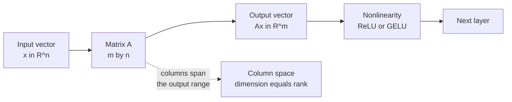
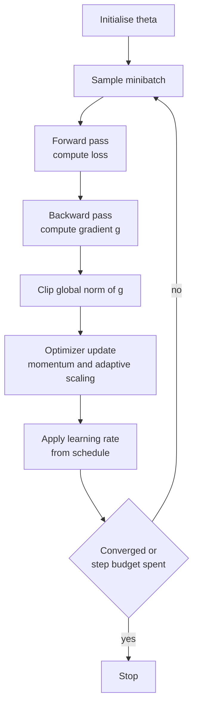
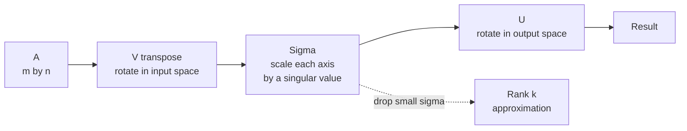
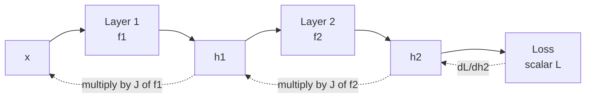
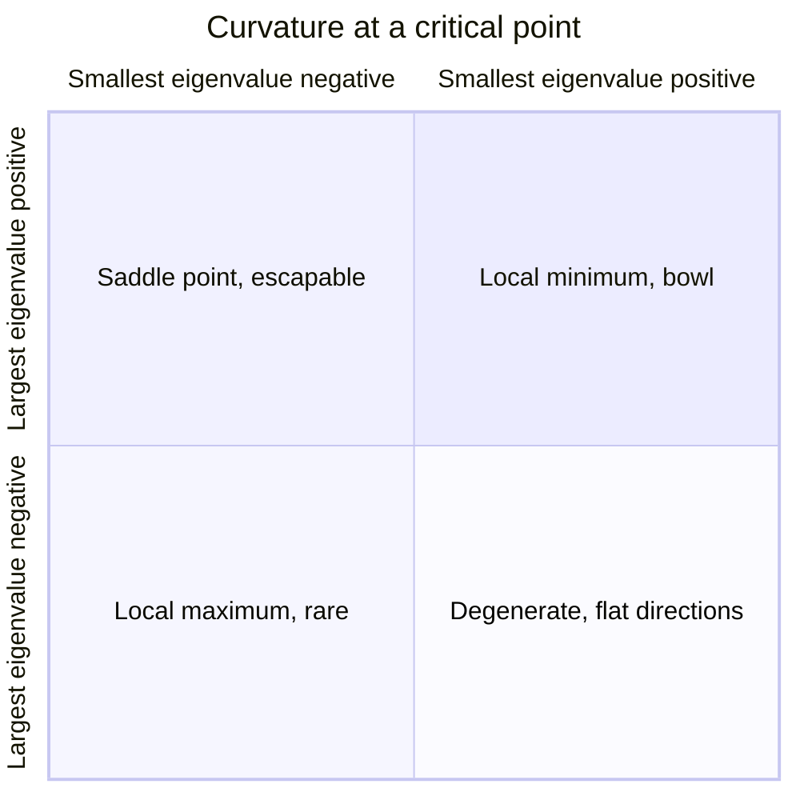
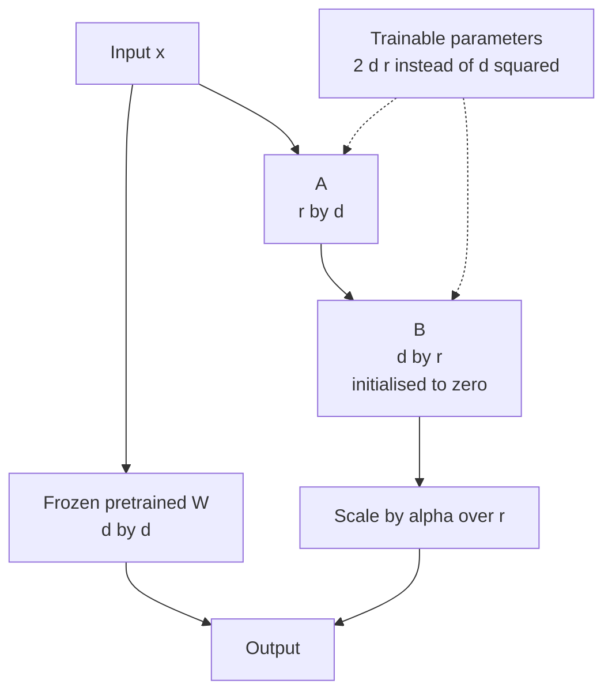

# Chapter 1: Mathematics for Machine Learning

> **What this chapter covers** The linear algebra, calculus, optimization, numerical computing, and information theory that a machine learning engineer uses in practice, from the definition of a vector to the geometry of high dimensional loss surfaces.
> **Prerequisites** None. High school algebra is assumed. Every symbol is defined at first use.
> **Where it is used** Debugging a training run that produces NaN, choosing an optimizer, deciding whether a model can be compressed, reading a paper, sizing a matrix multiplication for a GPU, and explaining why a loss function has the form it has.

Mathematics in machine learning engineering is not decoration. It is the tool you reach for when the loss goes to infinity at step 400, when a matrix multiplication is slower than you expected, when a model that fits perfectly in training collapses in production, or when someone asks why the cross entropy loss is the right thing to minimise. This chapter takes each area from its first definition to the point where it changes an engineering decision.

---

## 1.1 Level 1: Foundations

### 1.1.1 Why linear algebra is the language

Start with something concrete. A grayscale image of 28 by 28 pixels is 784 numbers. Write them in a fixed order and you have a list of 784 numbers. That list is a **vector**. A batch of 64 such images is 64 lists of 784 numbers, which you can arrange as a grid with 64 rows and 784 columns. That grid is a **matrix**.

Almost everything in machine learning is a grid of numbers being multiplied by another grid of numbers. Linear algebra is the set of rules for those grids, and the vocabulary for saying what the multiplication does.

A **vector** is an ordered list of real numbers. Write a vector with $n$ entries as $\mathbf{x} \in \mathbb{R}^n$, where $\mathbb{R}$ means the real numbers and $\mathbb{R}^n$ means the set of all lists of $n$ real numbers. The entries are $x_1, x_2, \ldots, x_n$.

A vector has two useful readings.

| Reading | What it means | Example |
| --- | --- | --- |
| A point | A location in an $n$ dimensional space | The pixel values of one image |
| An arrow | A direction with a length, starting at the origin | The gradient, which points uphill on the loss |

Both readings are used constantly, often in the same sentence. "Move the weights in the direction of the negative gradient" uses the arrow reading for the gradient and the point reading for the weights.

### 1.1.2 Vector spaces, spans, and bases

A **vector space** is a set of vectors closed under two operations: adding two vectors, and scaling a vector by a real number. Closed means the result stays inside the set. $\mathbb{R}^n$ is the vector space you will use in practice; abstract vector spaces matter mainly because they justify treating functions and polynomials with the same machinery.

Given a set of vectors $\{\mathbf{v}_1, \ldots, \mathbf{v}_k\}$, a **linear combination** is any vector of the form

$$c_1 \mathbf{v}_1 + c_2 \mathbf{v}_2 + \cdots + c_k \mathbf{v}_k$$

where each $c_i$ is a real number. The **span** of the set is the collection of all such combinations. The span is the region of space you can reach using only those vectors.

The vectors are **linearly independent** if the only combination equal to the zero vector is the one with all $c_i = 0$. In plain terms, no vector in the set is redundant.

A **basis** for a space is a linearly independent set whose span is the whole space. The number of vectors in a basis is the **dimension** of the space. $\mathbb{R}^3$ has dimension 3 and one basis is $(1,0,0)$, $(0,1,0)$, $(0,0,1)$.

This matters directly. An embedding layer maps tokens into $\mathbb{R}^{768}$. Whether the embeddings actually use all 768 directions or collapse into a 40 dimensional subspace is a question about span, and it is measurable. Collapsed embeddings are a real failure mode in contrastive training.

### 1.1.3 Matrices as functions

A **matrix** $A \in \mathbb{R}^{m \times n}$ is a grid with $m$ rows and $n$ columns. Its entry in row $i$ and column $j$ is $A_{ij}$.

The single most important fact about matrices is this. A matrix is a function. Specifically, $A \in \mathbb{R}^{m \times n}$ is a function that takes a vector in $\mathbb{R}^n$ and returns a vector in $\mathbb{R}^m$, defined by

$$(A\mathbf{x})_i = \sum_{j=1}^{n} A_{ij} x_j$$

The function is **linear**, meaning $A(\mathbf{x} + \mathbf{y}) = A\mathbf{x} + A\mathbf{y}$ and $A(c\mathbf{x}) = cA\mathbf{x}$. Every linear function from $\mathbb{R}^n$ to $\mathbb{R}^m$ is a matrix, and every matrix is such a function. The two are the same object seen from different sides.

A worked example. Let

$$A = \begin{bmatrix} 2 & 0 \\ 0 & 3 \\ 1 & 1 \end{bmatrix}, \qquad \mathbf{x} = \begin{bmatrix} 4 \\ 5 \end{bmatrix}$$

Then $A\mathbf{x}$ has three entries. The first is $2 \cdot 4 + 0 \cdot 5 = 8$. The second is $0 \cdot 4 + 3 \cdot 5 = 15$. The third is $1 \cdot 4 + 1 \cdot 5 = 9$. So $A\mathbf{x} = (8, 15, 9)$. A two dimensional input became a three dimensional output. That is exactly what a neural network layer does.

There is a second reading of $A\mathbf{x}$ that is worth internalising. The result is a linear combination of the columns of $A$, weighted by the entries of $\mathbf{x}$:

$$A\mathbf{x} = 4 \begin{bmatrix} 2 \\ 0 \\ 1 \end{bmatrix} + 5 \begin{bmatrix} 0 \\ 3 \\ 1 \end{bmatrix}$$

The column reading explains rank, which comes next.



*Figure 1.1: A matrix is a linear function from one space to another, and a neural network layer is that function followed by a nonlinearity.*

### 1.1.4 Matrix multiplication as composition

If $A \in \mathbb{R}^{m \times n}$ and $B \in \mathbb{R}^{n \times p}$, the product $AB \in \mathbb{R}^{m \times p}$ is defined by

$$(AB)_{ik} = \sum_{j=1}^{n} A_{ij} B_{jk}$$

The definition looks arbitrary until you see why it is forced. $AB$ is defined so that applying $AB$ to a vector is the same as applying $B$ first and then $A$. Matrix multiplication is **function composition**. Everything else follows.

Three consequences you use daily.

1. **It is associative but not commutative.** $(AB)C = A(BC)$, because composing functions in the same order gives the same function. But $AB \neq BA$ in general, because doing a rotation then a stretch is not the same as a stretch then a rotation.
2. **Inner dimensions must match.** The output of $B$ lives in $\mathbb{R}^n$ and the input of $A$ must be $\mathbb{R}^n$. Shape errors in deep learning code are almost always this.
3. **A stack of linear layers with no nonlinearity collapses.** If layer 1 is $W_1$ and layer 2 is $W_2$, the composition is $W_2 W_1$, a single matrix. This is the reason nonlinear activation functions exist.

Associativity has a cost consequence. Computing $A(BC)$ where $A$ is $1000 \times 10$, $B$ is $10 \times 1000$, $C$ is $1000 \times 1$ takes about $10 \times 1000 \times 1 = 10{,}000$ multiply-add operations for $BC$, then $1000 \times 10 \times 1 = 10{,}000$ for the outer product, so 20,000 total. Computing $(AB)C$ forms a $1000 \times 1000$ intermediate at a cost of $1000 \times 10 \times 1000 = 10{,}000{,}000$ operations. Same answer, 500 times the work. This is precisely the trick behind low rank adaptation, where the low rank factors are applied in the cheap order.

### 1.1.5 Rank, and what it means for a model

The **rank** of a matrix is the dimension of the span of its columns. Equivalently it is the dimension of its rows. The two are always equal, which is not obvious and is one of the genuinely surprising theorems of the subject.

Rank is at most $\min(m, n)$. A matrix at that maximum is **full rank**. A matrix below it is **rank deficient** or **low rank**.

Rank answers the question: how much independent information does this transformation carry? A $768 \times 768$ weight matrix of rank 8 does the work of an 8 dimensional transformation dressed up in 768 dimensions. That observation is the entire basis of parameter efficient fine tuning: represent the update to a weight matrix as $BA$ where $B$ is $768 \times 8$ and $A$ is $8 \times 768$, training $2 \times 768 \times 8 = 12{,}288$ parameters instead of $768^2 = 589{,}824$.

### 1.1.6 Norms and distance

A **norm** measures the length of a vector. The general family is the $p$ norm:

$$\|\mathbf{x}\|_p = \left( \sum_{i=1}^{n} |x_i|^p \right)^{1/p}$$

Three cases matter.

| Norm | Formula | Geometry | Where it appears |
| --- | --- | --- | --- |
| $L_1$ | $\sum_i \lvert x_i \rvert$ | Diamond shaped unit ball | Lasso regularisation, produces sparsity |
| $L_2$ | $\sqrt{\sum_i x_i^2}$ | Sphere | Weight decay, gradient clipping, Euclidean distance |
| $L_\infty$ | $\max_i \lvert x_i \rvert$ | Cube | Adversarial robustness bounds |

Worked example. For $\mathbf{x} = (3, -4, 0)$: $\|\mathbf{x}\|_1 = 3 + 4 + 0 = 7$. $\|\mathbf{x}\|_2 = \sqrt{9 + 16 + 0} = 5$. $\|\mathbf{x}\|_\infty = 4$.

The reason $L_1$ produces sparsity and $L_2$ does not is geometric. The $L_1$ unit ball has corners on the axes. When you shrink a solution toward the origin subject to an $L_1$ budget, the solution tends to land on a corner, and a corner has zeros in most coordinates. The $L_2$ ball is smooth, so there is no preferred direction and coefficients shrink toward zero without reaching it.

For matrices, the **Frobenius norm** treats the matrix as a long vector: $\|A\|_F = \sqrt{\sum_{ij} A_{ij}^2}$. The **spectral norm** $\|A\|_2$ is the largest factor by which $A$ can stretch any unit vector, and it equals the largest singular value, defined in level 3.

### 1.1.7 Inner products, angles, and projection

The **inner product** or dot product of two vectors in $\mathbb{R}^n$ is

$$\langle \mathbf{x}, \mathbf{y} \rangle = \mathbf{x}^\top \mathbf{y} = \sum_{i=1}^n x_i y_i$$

Its geometric meaning is

$$\mathbf{x}^\top \mathbf{y} = \|\mathbf{x}\| \, \|\mathbf{y}\| \cos \theta$$

where $\theta$ is the angle between the two vectors. When the inner product is zero the vectors are **orthogonal**, at right angles, carrying no shared direction.

**Cosine similarity** is the inner product with the lengths divided out:

$$\cos \theta = \frac{\mathbf{x}^\top \mathbf{y}}{\|\mathbf{x}\| \, \|\mathbf{y}\|}$$

This is the standard similarity measure for embeddings, because it compares direction and ignores magnitude. Two documents about the same subject should point the same way whether one is three times longer than the other.

Worked example. $\mathbf{x} = (1, 2, 2)$, $\mathbf{y} = (2, 0, 0)$. Inner product is $1 \cdot 2 + 2 \cdot 0 + 2 \cdot 0 = 2$. Lengths are $\|\mathbf{x}\| = \sqrt{1+4+4} = 3$ and $\|\mathbf{y}\| = 2$. So $\cos\theta = 2 / 6 = 0.333$, giving $\theta \approx 70.5$ degrees.

**Projection** of $\mathbf{x}$ onto the direction of $\mathbf{y}$ is the part of $\mathbf{x}$ that lies along $\mathbf{y}$:

$$\text{proj}_{\mathbf{y}}(\mathbf{x}) = \frac{\mathbf{x}^\top \mathbf{y}}{\mathbf{y}^\top \mathbf{y}} \, \mathbf{y}$$

Continuing the example, the scalar coefficient is $2/4 = 0.5$, so the projection is $(1, 0, 0)$. The remaining part, $(0, 2, 2)$, is orthogonal to $\mathbf{y}$. Every vector splits uniquely into a part inside a subspace and a part orthogonal to it. Least squares regression is exactly this split: the fitted values are the projection of the targets onto the span of the features, and the residuals are the orthogonal part.

### 1.1.8 Derivatives, in one sentence each

The **derivative** of a function $f: \mathbb{R} \to \mathbb{R}$ at a point $x$ is the slope of the line that best approximates $f$ near $x$:

$$f'(x) = \lim_{h \to 0} \frac{f(x+h) - f(x)}{h}$$

The **gradient** of a function $f: \mathbb{R}^n \to \mathbb{R}$ is the vector of partial derivatives, one per input coordinate:

$$\nabla f(\mathbf{x}) = \left( \frac{\partial f}{\partial x_1}, \ldots, \frac{\partial f}{\partial x_n} \right)$$

Two facts about the gradient carry the whole of gradient based learning. First, the gradient points in the direction of steepest increase of $f$. Second, its length is the rate of that increase. So to decrease $f$, step in the direction $-\nabla f$. That single sentence is gradient descent.

Worked example. $f(x_1, x_2) = x_1^2 + 3x_1 x_2$. The partials are $\partial f / \partial x_1 = 2x_1 + 3x_2$ and $\partial f / \partial x_2 = 3x_1$. At $(1, 2)$ the gradient is $(2 + 6, 3) = (8, 3)$. Its length is $\sqrt{64+9} \approx 8.54$. Stepping from $(1,2)$ with learning rate $0.1$ in direction $-(8,3)$ gives $(0.2, 1.7)$, and $f$ falls from $1 + 6 = 7$ to $0.04 + 1.02 = 1.06$.

### 1.1.9 What optimization is

A machine learning model has parameters $\boldsymbol{\theta}$ and a loss function $L(\boldsymbol{\theta})$ that measures how badly it does on the data. Training means finding $\boldsymbol{\theta}$ that makes $L$ small. That is optimization.

The loss is a function from a very high dimensional space (millions to billions of parameters) to a single number. You cannot see it, plot it, or search it exhaustively. All you can do is evaluate it at a point and compute its gradient there. Gradient descent is the algorithm that does exactly that, repeatedly:

$$\boldsymbol{\theta}_{t+1} = \boldsymbol{\theta}_t - \eta \nabla L(\boldsymbol{\theta}_t)$$

where $\eta > 0$ is the **learning rate**, the step size.

### 1.1.10 Why computers get arithmetic wrong

Computers store real numbers in finite space. A 32 bit float holds roughly 7 decimal digits of precision. Most real numbers, including $0.1$, are not exactly representable. Therefore arithmetic has rounding error, and the error can grow.

The practical consequence for a machine learning engineer: a loss of `nan` is almost never a modelling failure. It is a numerical one. Level 3 covers where it comes from.

### 1.1.11 Information, in one paragraph

Information theory gives a measure of how uncertain a probability distribution is, and how badly one distribution approximates another. Those two ideas turn into the entropy and cross entropy loss functions. A classifier that outputs probabilities is trained by penalising it for assigning low probability to the truth, and the exact penalty, $-\log p$, comes from information theory rather than being chosen by taste.

---

## 1.2 Level 2: Working knowledge

### 1.2.1 Shapes, and the discipline of tracking them

Most linear algebra bugs in production code are shape bugs. Adopt a discipline: write the shape of every tensor in a comment, and assert it in tests.

**Listing 1.1: shape assertions as executable documentation.**

```python
import numpy as np

def attention_scores(q, k):
    """q: (B, H, T, D)  k: (B, H, S, D)  ->  (B, H, T, S)"""
    B, H, T, D = q.shape
    assert k.shape[:2] == (B, H) and k.shape[3] == D, f"bad k shape {k.shape}"
    scores = np.einsum("bhtd,bhsd->bhts", q, k) / np.sqrt(D)
    assert scores.shape == (B, H, T, k.shape[2])
    return scores

q = np.random.randn(2, 4, 16, 64)
k = np.random.randn(2, 4, 16, 64)
print(attention_scores(q, k).shape)   # (2, 4, 16, 16)
```

The `einsum` call names each axis, so the contraction is explicit rather than implied by transpose order. `bhtd,bhsd->bhts` says: keep batch and head, contract over `d`, leave `t` and `s` as the output grid. The division by $\sqrt{D}$ is the scaling that keeps the variance of the scores near 1 when `q` and `k` have unit variance entries; without it the softmax saturates as $D$ grows.

### 1.2.2 Choosing a norm, and gradient clipping

Gradient clipping is the most common place a norm choice becomes an engineering decision. The standard recipe rescales the whole gradient vector when its $L_2$ norm exceeds a threshold $c$:

$$\mathbf{g} \leftarrow \mathbf{g} \cdot \min\left(1, \frac{c}{\|\mathbf{g}\|_2}\right)$$

Worked example. Threshold $c = 1.0$, gradient norm $\|\mathbf{g}\|_2 = 4.0$. The scale factor is $0.25$, so every component shrinks to a quarter. Direction is preserved, magnitude is capped. Contrast with clipping each component to $[-c, c]$ independently, which changes the direction and is the wrong default for transformer training.

| Decision | Default | Reason |
| --- | --- | --- |
| Clip by global norm or per parameter | Global norm | Preserves the update direction |
| Threshold | 1.0 for transformers, tune by watching the observed norm distribution | Clip should be rare, not constant |
| Compute before or after gradient accumulation | After the full accumulated gradient | Otherwise the effective threshold shrinks with the number of microbatches |

If clipping fires on most steps, the threshold is too low and you are effectively running sign descent with a strange learning rate. Log the fraction of clipped steps.

### 1.2.3 Gradient descent variants

| Variant | Update uses | Cost per step | Noise | When to use |
| --- | --- | --- | --- | --- |
| Batch (full) gradient descent | All $N$ examples | $O(N)$ | None | $N$ small, convex problems |
| Stochastic gradient descent | One example | $O(1)$ | High | Rarely, historically important |
| Minibatch SGD | $B$ examples | $O(B)$ | Moderate | The universal default |

Minibatch is not a compromise. The noise from sampling has a regularising effect, and the batch size controls it. The gradient estimate from a batch of size $B$ has standard error proportional to $1/\sqrt{B}$. Doubling the batch reduces gradient noise by a factor of $\sqrt{2}$, not 2, which is why doubling the batch does not let you double the learning rate exactly. The square root scaling rule and the linear scaling rule are both used in practice, and which fits better is regime dependent. Linear scaling with a warmup is the common default for large batch image training, following Goyal et al. (2017), "Accurate, Large Minibatch SGD".

### 1.2.4 Momentum

Plain gradient descent zigzags in a valley: a long narrow ravine causes the gradient to point mostly across the ravine rather than along it. **Momentum** accumulates a running average of past gradients, which cancels the oscillating across component and reinforces the consistent along component.

$$\mathbf{v}_{t} = \beta \mathbf{v}_{t-1} + \nabla L(\boldsymbol{\theta}_t), \qquad \boldsymbol{\theta}_{t+1} = \boldsymbol{\theta}_t - \eta \mathbf{v}_t$$

with $\beta$ typically $0.9$. The effective step is roughly $1/(1-\beta) = 10$ times larger than a single gradient in a direction where gradients agree.

Worked example. Suppose the gradient is a constant $g = 1$ in some direction. With $\beta = 0.9$ the velocity converges to $v_\infty = 1/(1 - 0.9) = 10$. So the steady state step is 10 times the naive step. This is why turning momentum on without lowering the learning rate often diverges.

**Nesterov momentum** evaluates the gradient at the look ahead point $\boldsymbol{\theta}_t - \eta\beta\mathbf{v}_{t-1}$ instead of at $\boldsymbol{\theta}_t$. It corrects the step slightly earlier and gives a modest improvement in practice.

### 1.2.5 Adaptive methods

Adaptive methods give each parameter its own effective learning rate based on the history of its gradients.

**Adam** (Kingma and Ba, 2015, "Adam: A Method for Stochastic Optimization") keeps two running averages:

$$m_t = \beta_1 m_{t-1} + (1-\beta_1) g_t, \qquad v_t = \beta_2 v_{t-1} + (1-\beta_2) g_t^2$$

then bias corrects them, since both start at zero and are therefore biased toward zero early:

$$\hat{m}_t = \frac{m_t}{1 - \beta_1^t}, \qquad \hat{v}_t = \frac{v_t}{1 - \beta_2^t}$$

and steps:

$$\boldsymbol{\theta}_{t+1} = \boldsymbol{\theta}_t - \eta \frac{\hat{m}_t}{\sqrt{\hat{v}_t} + \epsilon}$$

Worked example of bias correction. With $\beta_1 = 0.9$ and a constant gradient $g = 1$, at step 1 we get $m_1 = 0.1$. Uncorrected, the first step is a tenth of what it should be. The correction divides by $1 - 0.9^1 = 0.1$, restoring $\hat{m}_1 = 1$. By step 50, $1 - 0.9^{50} \approx 0.9948$, so the correction is nearly inert.

**AdamW** (Loshchilov and Hutter, 2019, "Decoupled Weight Decay Regularization") separates weight decay from the adaptive scaling. In Adam, adding $\lambda \boldsymbol{\theta}$ to the gradient means the decay also gets divided by $\sqrt{\hat{v}}$, so parameters with large gradient history are decayed less. AdamW subtracts $\eta \lambda \boldsymbol{\theta}$ directly. For transformers AdamW is the default and the difference is not subtle.

| Optimizer | State per parameter | Typical use |
| --- | --- | --- |
| SGD with momentum | 1 value | Convolutional vision models, where it often generalises better |
| Adam or AdamW | 2 values | Transformers, anything with sparse or badly scaled gradients |
| Adafactor | Factored second moment, sublinear | Large models where optimizer memory is the constraint |
| 8 bit Adam | 2 quantised values | Fitting a larger model on one accelerator |

Optimizer state is a real memory cost. AdamW in 32 bit float costs 8 bytes per parameter beyond the weights themselves. For a 1 billion parameter model that is 8 GB of optimizer state alone.

### 1.2.6 Learning rate schedules

The learning rate is the single most important hyperparameter. A schedule changes it over training.

| Schedule | Shape | Why |
| --- | --- | --- |
| Constant | Flat | Baseline, rarely best |
| Step decay | Drops by a factor at fixed epochs | Simple, historically standard for vision |
| Cosine | Smooth decay from $\eta_{max}$ to near zero | Current default for language models |
| Linear warmup then decay | Rises over the first few percent of steps, then decays | Prevents early divergence from bad initial adaptive statistics |
| One cycle | Up then down, with momentum moving inversely | Fast convergence on smaller problems |

Cosine decay over $T$ total steps:

$$\eta_t = \eta_{\min} + \tfrac{1}{2}(\eta_{\max} - \eta_{\min})\left(1 + \cos\left(\frac{\pi t}{T}\right)\right)$$

Worked example. $\eta_{\max} = 3 \times 10^{-4}$, $\eta_{\min} = 0$, $T = 10{,}000$. At $t = 2500$, $\cos(\pi/4) \approx 0.7071$, so $\eta = 0.5 \cdot 3\times10^{-4} \cdot 1.7071 \approx 2.56 \times 10^{-4}$. At $t = 5000$, $\cos(\pi/2) = 0$, so $\eta = 1.5\times10^{-4}$, exactly half. The schedule spends most of its budget at a high rate and decays sharply at the end.

Warmup exists because Adam's $\hat{v}$ estimate is unreliable in the first few hundred steps, and a large step taken on a bad variance estimate can push the model into a region it never recovers from. A warmup of 1 to 5 percent of total steps is a reasonable default.



*Figure 1.2: The training loop as an optimization loop, with the norm, optimizer state, and schedule as three separate levers.*

### 1.2.7 Numerical hygiene you apply by default

Four habits prevent most numerical bugs.

1. **Never compute a softmax naively.** Subtract the maximum first. Section 1.3.9 shows why.
2. **Work in log space for probabilities.** Multiplying 1000 probabilities underflows to zero in float32. Adding 1000 log probabilities does not.
3. **Prefer a fused loss.** `cross_entropy(logits, targets)` is numerically better than `log(softmax(logits))` followed by a gather, because the library fuses the log and the softmax and cancels the exponential.
4. **Check your dtype at every boundary.** A float16 accumulation of a long sum loses precision quickly. Accumulate in float32 even when the operands are float16 or bfloat16.

### 1.2.8 Cross entropy in practice

For a classification problem with $K$ classes, one true class $y$, and model probabilities $p_1, \ldots, p_K$, the loss is

$$L = -\log p_y$$

That is it. All the sums over classes in textbook formulas collapse because the true distribution puts all its mass on one class.

Worked example. Three classes, logits $\mathbf{z} = (2.0, 1.0, 0.1)$, true class is the first. Softmax: $e^{2.0} = 7.389$, $e^{1.0} = 2.718$, $e^{0.1} = 1.105$. Sum is $11.212$. So $p_1 = 0.659$, $p_2 = 0.242$, $p_3 = 0.099$. The loss is $-\log(0.659) = 0.417$ nats. If the true class were the third, the loss would be $-\log(0.099) = 2.313$ nats, over five times larger.

Convert nats to bits by dividing by $\ln 2 \approx 0.6931$. A loss of $0.417$ nats is $0.602$ bits. **Perplexity** is $e^L$; here $e^{0.417} = 1.52$, meaning the model is about as uncertain as if it were choosing uniformly among 1.52 options.

---

## 1.3 Level 3: Depth

### 1.3.1 Eigenvalues and eigenvectors

For a square matrix $A \in \mathbb{R}^{n \times n}$, a nonzero vector $\mathbf{v}$ is an **eigenvector** with **eigenvalue** $\lambda$ if

$$A\mathbf{v} = \lambda \mathbf{v}$$

In words: $A$ acts on $\mathbf{v}$ by pure scaling, without rotating it. Eigenvectors are the directions the matrix leaves alone, and eigenvalues say by how much each is stretched.

If $A$ has $n$ linearly independent eigenvectors, collect them as columns of $V$ and the eigenvalues on the diagonal of $\Lambda$, and

$$A = V \Lambda V^{-1}$$

This is the **eigendecomposition**. It says: change to the eigenvector coordinates, scale each axis independently, change back.

For a **symmetric** matrix ($A = A^\top$) more is true. All eigenvalues are real, and the eigenvectors can be chosen orthonormal, so $V^{-1} = V^\top$ and $A = V\Lambda V^\top$. This is the spectral theorem, and it is why symmetric matrices, which include covariance matrices and Hessians, are so much better behaved.

Worked example. $A = \begin{bmatrix} 3 & 1 \\ 1 & 3 \end{bmatrix}$. Solve $\det(A - \lambda I) = 0$: $(3-\lambda)^2 - 1 = 0$, giving $\lambda = 4$ or $\lambda = 2$. For $\lambda = 4$, $(A - 4I)\mathbf{v} = 0$ gives $-v_1 + v_2 = 0$, so $\mathbf{v} = (1,1)/\sqrt{2}$. For $\lambda = 2$, $\mathbf{v} = (1,-1)/\sqrt{2}$. The matrix stretches by 4 along the diagonal and by 2 along the antidiagonal.

**Why eigenvalues predict stability.** Repeatedly applying $A$ gives $A^k = V\Lambda^k V^{-1}$. The eigenvalues are raised to the $k$th power. If the largest eigenvalue in absolute value, the **spectral radius** $\rho(A)$, exceeds 1, then $A^k$ blows up. If it is below 1, $A^k$ collapses to zero. This is exactly the vanishing and exploding gradient problem in recurrent networks: backpropagating through $T$ timesteps multiplies by the recurrent Jacobian $T$ times, and the spectral radius decides whether the signal survives. With $\rho = 0.9$ and $T = 100$, the factor is $0.9^{100} \approx 2.7\times10^{-5}$. With $\rho = 1.1$, it is $1.1^{100} \approx 13{,}781$.

**Principal component analysis.** Given data matrix $X \in \mathbb{R}^{N \times d}$ with columns centred to zero mean, the covariance is $C = \frac{1}{N-1} X^\top X$, a symmetric positive semidefinite $d \times d$ matrix. Its eigenvectors are the **principal components**, the orthogonal directions of maximum variance. The eigenvalue $\lambda_i$ is the variance captured along component $i$. The **explained variance ratio** of component $i$ is $\lambda_i / \sum_j \lambda_j$.

Worked example. A three dimensional dataset with covariance eigenvalues $(8.0, 1.5, 0.5)$ has total variance 10. The first component explains 80 percent, the first two explain 95 percent. Projecting onto the first two components loses 5 percent of the variance and one third of the dimensions.

### 1.3.2 Singular value decomposition

Eigendecomposition needs a square matrix. **Singular value decomposition** works for any matrix. For $A \in \mathbb{R}^{m \times n}$,

$$A = U \Sigma V^\top$$

where $U \in \mathbb{R}^{m \times m}$ and $V \in \mathbb{R}^{n \times n}$ are orthogonal ($U^\top U = I$), and $\Sigma \in \mathbb{R}^{m\times n}$ is diagonal with nonnegative entries $\sigma_1 \geq \sigma_2 \geq \cdots \geq 0$, the **singular values**.

The geometric reading: every linear map is a rotation, then an axis aligned scaling, then another rotation. That is all a matrix can do.

Relationships worth memorising:

| Quantity | In terms of SVD |
| --- | --- |
| Rank of $A$ | Number of nonzero singular values |
| $\|A\|_2$ (spectral norm) | $\sigma_1$ |
| $\|A\|_F$ (Frobenius norm) | $\sqrt{\sum_i \sigma_i^2}$ |
| Condition number | $\sigma_1 / \sigma_r$ for rank $r$ |
| Eigenvalues of $A^\top A$ | $\sigma_i^2$ |

**Low rank approximation.** Keep only the top $k$ singular values and the corresponding columns of $U$ and $V$:

$$A_k = U_k \Sigma_k V_k^\top$$

The Eckart-Young theorem says $A_k$ is the best rank $k$ approximation to $A$ in both the Frobenius and spectral norms. No other rank $k$ matrix is closer. This is a strong statement and it is why SVD underlies compression, denoising, latent semantic analysis, and the analysis of learned weight matrices.

Worked example. Singular values $(10, 6, 2, 1, 0.5)$. Total squared Frobenius mass is $100 + 36 + 4 + 1 + 0.25 = 141.25$. Truncating at $k=2$ keeps $136$, which is $96.3$ percent. The relative Frobenius error is $\sqrt{5.25/141.25} = 0.193$, about 19 percent. Note the gap: keeping 96 percent of the squared mass still leaves a 19 percent error in norm, because the error is the square root. This is a common misreading of explained variance plots.

Storage. A $1000 \times 500$ matrix holds 500,000 numbers. Rank 50 truncation holds $1000 \cdot 50 + 50 + 50 \cdot 500 = 75{,}050$, a 6.7 times reduction.



*Figure 1.3: Singular value decomposition factors any linear map into rotate, scale, rotate, and truncating the scaling gives the optimal low rank approximation.*

### 1.3.3 Positive definiteness

A symmetric matrix $A$ is **positive definite** if $\mathbf{x}^\top A \mathbf{x} > 0$ for every nonzero $\mathbf{x}$, and **positive semidefinite** if the inequality is $\geq 0$. Equivalent conditions: all eigenvalues are positive (or nonnegative); $A = B^\top B$ for some $B$; the Cholesky factorisation $A = LL^\top$ exists with positive diagonal.

Where it matters.

| Object | Property | Consequence |
| --- | --- | --- |
| Covariance matrix | Always positive semidefinite | A negative eigenvalue means a numerical bug or a non positive semidefinite estimator |
| Hessian at a minimum | Positive semidefinite | Positive definite means a strict local minimum |
| Kernel matrix | Must be positive semidefinite | A kernel that is not gives a support vector machine solver no convex problem to solve |

The quadratic form $\mathbf{x}^\top A \mathbf{x}$ with $A$ positive definite is a bowl. With one negative eigenvalue it is a saddle. Under gradient descent, a bowl has one destination and a saddle has escape directions in which the loss decreases.

### 1.3.4 Matrix calculus

You need a small table of derivative identities and one convention. Use the **denominator layout**, where $\partial y / \partial \mathbf{x}$ for scalar $y$ has the shape of $\mathbf{x}$. The gradient of a scalar with respect to a matrix has the shape of the matrix. This convention makes every update rule shape correct by construction.

| Expression | Derivative with respect to $\mathbf{x}$ or $W$ |
| --- | --- |
| $\mathbf{a}^\top \mathbf{x}$ | $\mathbf{a}$ |
| $\mathbf{x}^\top A \mathbf{x}$ | $(A + A^\top)\mathbf{x}$, which is $2A\mathbf{x}$ if $A$ symmetric |
| $\|\mathbf{x}\|_2^2$ | $2\mathbf{x}$ |
| $\|W\|_F^2$ | $2W$ |
| $\mathbf{y} = W\mathbf{x}$, loss $L$ | $\partial L/\partial W = (\partial L/\partial \mathbf{y}) \mathbf{x}^\top$ |
| $\mathbf{y} = W\mathbf{x}$, loss $L$ | $\partial L/\partial \mathbf{x} = W^\top (\partial L/\partial \mathbf{y})$ |

The last two lines are the entire backward pass of a linear layer. Learn them and you can derive backpropagation for any architecture built from linear layers and elementwise functions.

Worked example. $W \in \mathbb{R}^{2\times 3}$, $\mathbf{x} = (1,2,3)$, and upstream gradient $\partial L/\partial \mathbf{y} = (0.5, -1.0)$. Then $\partial L / \partial W$ is the outer product, a $2 \times 3$ matrix:

$$\begin{bmatrix} 0.5 \\ -1.0 \end{bmatrix} \begin{bmatrix} 1 & 2 & 3 \end{bmatrix} = \begin{bmatrix} 0.5 & 1.0 & 1.5 \\ -1.0 & -2.0 & -3.0 \end{bmatrix}$$

Note the structure. Every column of the weight gradient is proportional to the upstream gradient, scaled by one input feature. An input feature that is always zero produces a zero column, so that weight never learns. This is exactly why unnormalised features with wildly different scales train badly.

### 1.3.5 Jacobians and the chain rule

For a vector valued function $\mathbf{f}: \mathbb{R}^n \to \mathbb{R}^m$, the **Jacobian** $J \in \mathbb{R}^{m \times n}$ collects all partial derivatives, $J_{ij} = \partial f_i / \partial x_j$.

The chain rule for composed functions is matrix multiplication of Jacobians. If $\mathbf{z} = \mathbf{g}(\mathbf{y})$ and $\mathbf{y} = \mathbf{f}(\mathbf{x})$, then

$$J_{\mathbf{z},\mathbf{x}} = J_{\mathbf{z},\mathbf{y}} \, J_{\mathbf{y},\mathbf{x}}$$

A neural network with $L$ layers is a composition of $L$ functions, so the gradient of the loss with respect to the first layer's input is a product of $L$ Jacobians. Backpropagation is the observation that you should multiply this product from the left, because the loss is scalar, so the leftmost factor is a row vector and every intermediate result stays a vector rather than becoming a matrix.

This is the difference between **reverse mode** and **forward mode** automatic differentiation.

| Mode | Multiplies from | Cost for $f: \mathbb{R}^n \to \mathbb{R}^m$ | Best when |
| --- | --- | --- | --- |
| Reverse (backpropagation) | Left, outputs to inputs | One pass per output | $m \ll n$, the usual case, $m = 1$ |
| Forward | Right, inputs to outputs | One pass per input | $n \ll m$, for example Jacobian vector products |

Reverse mode must store the intermediate activations of the forward pass to compute the backward pass, which is why activation memory dominates training memory. **Gradient checkpointing** trades compute for memory by storing only a subset of activations and recomputing the rest, typically costing about 30 percent more compute for a large memory reduction. Handbook chapter 4 derives the memory arithmetic.



*Figure 1.4: The backward pass multiplies Jacobians from the scalar loss backward, which keeps every intermediate a vector rather than a matrix.*

### 1.3.6 Hessians, Taylor expansion, and second order information

The **Hessian** of a scalar function $f: \mathbb{R}^n \to \mathbb{R}$ is the $n \times n$ matrix of second partial derivatives, $H_{ij} = \partial^2 f / \partial x_i \partial x_j$. It is symmetric when the second derivatives are continuous.

The second order **Taylor expansion** around $\boldsymbol{\theta}_0$ is

$$f(\boldsymbol{\theta}_0 + \boldsymbol{\delta}) \approx f(\boldsymbol{\theta}_0) + \nabla f(\boldsymbol{\theta}_0)^\top \boldsymbol{\delta} + \tfrac{1}{2}\boldsymbol{\delta}^\top H \boldsymbol{\delta}$$

This single formula explains a great deal.

**Why the learning rate has a ceiling.** For a quadratic with Hessian $H$, gradient descent converges only if $\eta < 2/\lambda_{\max}$, where $\lambda_{\max}$ is the largest eigenvalue. Above that, steps overshoot and grow. Worked example: if $\lambda_{\max} = 50$, then $\eta$ must be below $0.04$, and the optimal rate for the worst direction is $1/\lambda_{\max} = 0.02$.

**Why conditioning controls convergence speed.** The **condition number** $\kappa = \lambda_{\max}/\lambda_{\min}$ controls how many iterations you need. For gradient descent on a quadratic, the error contracts by roughly $(\kappa - 1)/(\kappa + 1)$ per step. With $\kappa = 100$ that is $0.980$, so reducing error by a factor of $e$ takes about 50 steps. With $\kappa = 10$ the factor is $0.818$, needing about 5 steps. Ten times better conditioning is ten times fewer iterations. This is the mathematical reason feature normalisation and batch or layer normalisation help.

**Newton's method** uses the Hessian directly:

$$\boldsymbol{\theta}_{t+1} = \boldsymbol{\theta}_t - H^{-1}\nabla f(\boldsymbol{\theta}_t)$$

It converges in one step on a quadratic and quadratically near a minimum. It is unusable at scale: $H$ for a 1 billion parameter model has $10^{18}$ entries. Practical second order methods approximate $H$: L-BFGS keeps a low rank history, K-FAC approximates the Fisher information with a Kronecker factorisation, and Adam can be read as a crude diagonal approximation using the second moment of gradients rather than true curvature.

### 1.3.7 Convexity, and why deep learning is not convex

A set is **convex** if the straight line between any two of its points stays inside it. A function is **convex** if the line between any two points on its graph lies above the graph:

$$f(\alpha\mathbf{x} + (1-\alpha)\mathbf{y}) \leq \alpha f(\mathbf{x}) + (1-\alpha)f(\mathbf{y}) \quad \text{for } \alpha \in [0,1]$$

Equivalently, for twice differentiable $f$, the Hessian is positive semidefinite everywhere.

For a convex function, every local minimum is a global minimum, and the gradient being zero certifies optimality. Linear regression, logistic regression, support vector machines with a valid kernel, and lasso are all convex. You can trust their solutions.

Neural networks are not convex, for a structural reason: permuting the hidden units of a layer, with matching permutation of the next layer's weights, gives a different parameter vector computing exactly the same function. A network with $h$ hidden units in a layer therefore has at least $h!$ equivalent minima. With $h = 100$ that is more than $10^{157}$. A function with that many distinct global minima cannot be convex.

The practical consequence is milder than it sounds. Empirically, in high dimensions most critical points with a small loss are not bad local minima but **saddle points**, points where the gradient is zero but the Hessian has both positive and negative eigenvalues. Dauphin et al. (2014), "Identifying and attacking the saddle point problem in high dimensional non convex optimization", argues this directly: for a random symmetric matrix in $n$ dimensions, all $n$ eigenvalues being positive is exponentially unlikely, so isolated local minima are rare relative to saddles. Saddles are escapable because noise eventually finds a descent direction, which is another reason minibatch noise is useful rather than merely tolerated.



*Figure 1.5: The signs of the Hessian eigenvalues classify a critical point, and in high dimensions the saddle quadrant dominates.*

### 1.3.8 Constrained optimization and Lagrange multipliers

To minimise $f(\mathbf{x})$ subject to $g(\mathbf{x}) = 0$, form the **Lagrangian**

$$\mathcal{L}(\mathbf{x}, \lambda) = f(\mathbf{x}) + \lambda g(\mathbf{x})$$

and set all partial derivatives, including with respect to $\lambda$, to zero. The condition $\nabla f = -\lambda \nabla g$ says the gradients are parallel at the optimum: you cannot decrease $f$ without leaving the constraint surface.

The multiplier $\lambda$ has a meaning. It is the rate at which the optimal value changes as the constraint is relaxed, the shadow price of the constraint.

Worked example. Minimise $f(x,y) = x^2 + y^2$ subject to $x + y = 4$. The Lagrangian is $x^2 + y^2 + \lambda(x+y-4)$. Partials: $2x + \lambda = 0$, $2y + \lambda = 0$, $x + y = 4$. So $x = y = 2$ and $\lambda = -4$. Minimum value is 8. Relaxing the constraint to $x + y = 5$ gives $x=y=2.5$ and value $12.5$. The change is $4.5$ for a unit relaxation, close to $|\lambda| = 4$, with the difference due to curvature over a finite step.

Where this appears in practice.

| Problem | Constraint | Multiplier interpretation |
| --- | --- | --- |
| Ridge regression | Budget on $\|\mathbf{w}\|_2^2$ | The regularisation strength $\lambda$ |
| Maximum entropy distributions | Fixed moments | The natural parameters of the exponential family |
| Support vector machine dual | Margin constraints | The support vector coefficients |
| Constrained reinforcement learning from human feedback | KL budget against the reference policy | The KL penalty coefficient |

For inequality constraints $g(\mathbf{x}) \leq 0$ the Karush-Kuhn-Tucker conditions add $\lambda \geq 0$ and **complementary slackness**: $\lambda g(\mathbf{x}) = 0$, meaning either the constraint is tight or its multiplier is zero. A constraint that is not binding has no price.

### 1.3.9 Floating point, and where NaN comes from

An IEEE 754 float stores a sign bit, an exponent, and a mantissa. The value is $(-1)^s \times 1.m \times 2^{e - \text{bias}}$.

| Format | Sign | Exponent | Mantissa | Approx decimal digits | Max finite | Smallest normal |
| --- | --- | --- | --- | --- | --- | --- |
| float32 | 1 | 8 | 23 | 7 | about $3.4\times10^{38}$ | about $1.2\times10^{-38}$ |
| float16 | 1 | 5 | 10 | 3 | 65504 | about $6.1\times10^{-5}$ |
| bfloat16 | 1 | 8 | 7 | 2 | about $3.4\times10^{38}$ | about $1.2\times10^{-38}$ |

bfloat16 keeps float32's exponent range and sacrifices mantissa bits. That trade is why bfloat16 training usually needs no loss scaling while float16 training does: float16 overflows at 65504, which activations and especially gradients of large models routinely exceed.

**Machine epsilon** is the gap between 1.0 and the next representable number: about $1.19\times10^{-7}$ for float32, $9.77\times10^{-4}$ for float16, $7.8\times10^{-3}$ for bfloat16. In float16, $1.0 + 0.0001$ rounds to exactly $1.0$. A running average with a small increment silently stops updating.

**Catastrophic cancellation.** Subtracting two nearly equal numbers destroys precision, because the leading digits cancel and what remains is dominated by the rounding error in the originals. Worked example in float32 style arithmetic with 7 significant digits: $1.0000001 - 1.0000000$. Each operand is accurate to 7 digits. The difference is $1\times10^{-7}$ but essentially all of its digits are rounding noise.

The classic case is the naive variance formula $E[X^2] - (E[X])^2$. With data around $10^6$ and variance around 1, $E[X^2] \approx 10^{12}$ and $(E[X])^2 \approx 10^{12}$. In float32 the two are equal to available precision and the computed variance is 0 or negative. Use Welford's online algorithm or the two pass formula $\frac{1}{n}\sum (x_i - \bar{x})^2$ instead.

**Conditioning.** The condition number of a problem measures how much the output moves when the input moves. For solving $A\mathbf{x} = \mathbf{b}$, the relative error in $\mathbf{x}$ can be up to $\kappa(A)$ times the relative error in $\mathbf{b}$. With $\kappa(A) = 10^6$ and float32 input error of $10^{-7}$, the output can be wrong in the first decimal place. Never form $X^\top X$ and invert it for least squares; $\kappa(X^\top X) = \kappa(X)^2$, squaring the damage. Use a QR decomposition or SVD based solver.

**The log-sum-exp trick.** To compute $\log \sum_i e^{z_i}$ safely, factor out the maximum:

$$\log \sum_i e^{z_i} = z_{\max} + \log \sum_i e^{z_i - z_{\max}}$$

Every exponent in the shifted sum is at most zero, so every term is in $(0, 1]$ and cannot overflow. At least one term equals exactly 1, so the sum is at least 1 and the logarithm cannot underflow to negative infinity.

Worked example. $\mathbf{z} = (1000, 1001, 1002)$. Naively, $e^{1000}$ overflows float32 (max exponent about 88 for $e^x$ in float32) and the result is `inf`, so the softmax is `inf/inf = nan`. With the shift, $z_{\max}=1002$ and the shifted values are $(-2,-1,0)$, giving $e^{-2}+e^{-1}+e^{0} = 0.1353+0.3679+1 = 1.5032$. So $\log\sum e^{z_i} = 1002 + \log(1.5032) = 1002.4076$. The softmax probabilities are $0.0900, 0.2447, 0.6652$.

**Listing 1.2: naive softmax versus the stable form.**

```python
import numpy as np

def softmax_naive(z):
    e = np.exp(z)
    return e / e.sum()

def softmax_stable(z):
    z = z - z.max()
    e = np.exp(z)
    return e / e.sum()

z = np.array([1000.0, 1001.0, 1002.0], dtype=np.float32)
print(softmax_naive(z))    # [nan nan nan]
print(softmax_stable(z))   # [0.09003057 0.24472848 0.66524094]
```

Subtracting the maximum leaves the softmax mathematically unchanged, because the constant factor $e^{-z_{\max}}$ appears in both numerator and denominator and cancels. It changes the computation entirely: the largest exponent becomes $e^0 = 1$ instead of an overflow. Every production softmax does this, so a `nan` from a softmax usually means the logits themselves are already `inf` or `nan` from an earlier step.

Three causes of NaN, in rough order of frequency, with how to distinguish them:

| Cause | Signature | Test |
| --- | --- | --- |
| Learning rate too high, weights diverged | Loss rises for several steps first, then NaN | Log loss and weight norm per step; look for the rise |
| A log or division by zero in the loss | NaN appears instantly from a finite loss | Add an epsilon or clamp inputs to `log` and check for zero probabilities |
| float16 overflow in activations or gradients | Only in mixed precision, disappears in float32 or bfloat16 | Rerun the failing step in float32 |

### 1.3.10 Entropy, cross entropy, and KL divergence

**Entropy** measures the average surprise of a distribution $P$ over outcomes:

$$H(P) = -\sum_x P(x) \log P(x)$$

With base $e$ the unit is nats; with base 2 it is bits. Entropy is maximised by the uniform distribution and is zero for a point mass.

Worked example. A fair coin: $H = -2 \times 0.5\log_2 0.5 = 1$ bit. A coin with $P(\text{heads}) = 0.9$: $H = -(0.9\log_2 0.9 + 0.1\log_2 0.1) = -(0.9 \times -0.152 + 0.1 \times -3.322) = 0.137 + 0.332 = 0.469$ bits. Less uncertainty, less entropy.

**Cross entropy** measures the average surprise when the truth is $P$ but your model is $Q$:

$$H(P, Q) = -\sum_x P(x)\log Q(x)$$

**Kullback-Leibler divergence** is the excess:

$$D_{KL}(P \| Q) = H(P,Q) - H(P) = \sum_x P(x)\log\frac{P(x)}{Q(x)}$$

It is the number of extra nats per sample you pay for using $Q$ when the truth is $P$. It is nonnegative, zero only when $P = Q$, and it is not symmetric: $D_{KL}(P\|Q) \neq D_{KL}(Q\|P)$.

The asymmetry matters in practice.

| Direction | Name | Behaviour | Where it appears |
| --- | --- | --- | --- |
| $D_{KL}(P_{\text{data}} \| Q_{\theta})$ | Forward, moment matching | $Q$ must cover every mode of $P$ or the term is infinite. Produces blurry averages. | Maximum likelihood training |
| $D_{KL}(Q_{\theta} \| P)$ | Reverse, mode seeking | $Q$ can ignore modes safely. Produces sharp but narrow fits. | Variational inference, some policy optimization |

Minimising cross entropy over model parameters is identical to minimising forward KL, because $H(P)$ does not depend on the parameters. This is why the classification loss is what it is: it is maximum likelihood, and it is also the KL from the data distribution to the model.

Worked example of the asymmetry. Let $P = (0.5, 0.5)$ and $Q = (0.9, 0.1)$. Forward: $0.5\log(0.5/0.9) + 0.5\log(0.5/0.1) = 0.5(-0.5878) + 0.5(1.6094) = 0.511$ nats. Reverse: $0.9\log(0.9/0.5) + 0.1\log(0.1/0.5) = 0.9(0.5878) + 0.1(-1.6094) = 0.368$ nats. Different numbers for the same pair.

**Mutual information** between random variables $X$ and $Y$ is the KL divergence between the joint distribution and the product of marginals:

$$I(X;Y) = D_{KL}(P(X,Y) \| P(X)P(Y)) = H(X) - H(X \mid Y)$$

It is the reduction in uncertainty about $X$ from observing $Y$. It is zero exactly when they are independent, it is symmetric, and unlike correlation it detects nonlinear dependence. A variable with zero correlation to the target can still have high mutual information, for example $Y = X^2$ with $X$ symmetric about zero.

Mutual information is hard to estimate from samples in high dimensions, and estimates are biased upward with small samples. Treat reported mutual information values on continuous high dimensional data with suspicion unless the estimator and its bias are stated.

---

## 1.4 Level 4: Mastery

### 1.4.1 The geometry of high dimensional loss surfaces

Intuition from three dimensions misleads in a million. Three facts change how you think about training.

**Volume concentrates near the surface.** In $n$ dimensions, the fraction of a ball's volume within the outer shell of relative thickness $\epsilon$ is $1 - (1-\epsilon)^n$. For $n = 1000$ and $\epsilon = 0.01$, that is $1 - 0.99^{1000} \approx 0.99996$. Essentially all the volume is in the outer one percent. A random initialisation is on a thin shell, not spread through the interior.

**Random vectors are nearly orthogonal.** Two independent random unit vectors in $\mathbb{R}^n$ have expected squared inner product $1/n$, so the expected angle approaches 90 degrees as $n$ grows. With $n=10{,}000$ the typical cosine similarity is about $0.01$. This is why a high dimensional embedding space can hold far more nearly distinguishable concepts than its dimension suggests, and it underlies the Johnson-Lindenstrauss lemma: any $N$ points can be embedded into $O(\log N / \epsilon^2)$ dimensions with pairwise distances preserved to within a factor $1 \pm \epsilon$. Note the dimension depends on the number of points and the tolerance, not on the original dimension.

**Minima are connected.** Garipov et al. (2018), "Loss Surfaces, Mode Connectivity, and Fast Ensembling of DNNs", and Draxler et al. (2018), "Essentially No Barriers in Neural Network Energy Landscape", show that independently trained solutions can be joined by curved paths along which the loss stays low. The picture of isolated basins separated by high walls is wrong. This supports weight averaging methods: stochastic weight averaging (Izmailov et al., 2018) and model soups (Wortsman et al., 2022, "Model soups") average weights of separately fine tuned models and often beat any individual member.

### 1.4.2 The edge of stability

Classical theory says gradient descent with rate $\eta$ is stable only while the largest Hessian eigenvalue $\lambda_{\max}$ stays below $2/\eta$. Cohen et al. (2021), "Gradient Descent on Neural Networks Typically Occurs at the Edge of Stability", measured $\lambda_{\max}$ during real training and found something the theory does not predict. The sharpness rises until it reaches $2/\eta$, then hovers there, oscillating, while the loss continues to decrease non monotonically.

Two implications for practice. First, a loss curve that oscillates at a fine grained level is not necessarily broken; it may be the normal regime. Second, the learning rate is not just a speed knob. It selects the curvature of the region the optimizer settles in, because the optimizer cannot remain anywhere sharper than $2/\eta$. A larger learning rate implicitly regularises toward flatter solutions.

This connects to the flat minima hypothesis: Keskar et al. (2017), "On Large-Batch Training for Deep Learning: Generalization Gap and Sharp Minima", associated large batch training with sharper minima and worse generalisation. The connection is contested. Dinh et al. (2017), "Sharp Minima Can Generalize For Deep Nets", showed that with ReLU networks you can rescale weights to make a minimum arbitrarily sharp by common measures without changing the function at all. So sharpness measured naively is not reparameterisation invariant and cannot by itself be the explanation. The practical technique that came out of this line anyway, sharpness aware minimisation (Foret et al., 2021, "Sharpness-Aware Minimization for Efficiently Improving Generalization"), works by minimising the worst loss in a neighbourhood, and reliably helps on vision benchmarks at roughly double the compute per step.

### 1.4.3 Where the standard optimizer advice is wrong

**"Adam is always better than SGD."** Not for convolutional vision models, where well tuned SGD with momentum frequently generalises better. Wilson et al. (2017), "The Marginal Value of Adaptive Gradient Methods in Machine Learning", argued adaptive methods can converge to worse solutions. For transformers the situation reverses, and the usual explanation is the heavy tailed and badly scaled gradient distribution across parameter groups, particularly in layer normalisation and embedding parameters.

**"Tune everything."** Choi et al. (2019), "On Empirical Comparisons of Optimizers for Deep Learning", showed that optimizer rankings flip depending on how carefully each is tuned, and that many published comparisons are comparisons of tuning budgets. If you report that optimizer A beats optimizer B, report the search space and budget for each or the claim means little.

**"$\epsilon$ in Adam is a numerical safety constant."** It is also a hyperparameter with real effect. In regimes where $\hat{v}$ is small, $\epsilon$ dominates the denominator and the update becomes closer to plain SGD. Values from $10^{-8}$ to $10^{-6}$ behave measurably differently in large model training.

**"Weight decay is $L_2$ regularisation."** True for SGD, false for Adam. That is the entire content of AdamW. It remains a common error in reimplementations.

### 1.4.4 Low rank structure in trained networks

The empirical observation that weight updates during fine tuning have low **intrinsic rank** is the basis of LoRA (Hu et al., 2021, "LoRA: Low-Rank Adaptation of Large Language Models"), which builds on the intrinsic dimensionality argument of Aghajanyan et al. (2020), "Intrinsic Dimensionality Explains the Effectiveness of Language Model Fine-Tuning". The mathematics is exactly section 1.3.2: represent $\Delta W$ as $BA$ with inner dimension $r \ll d$.

Two subtleties that matter.

**Initialisation must make the product zero.** $A$ is initialised from a random distribution and $B$ to zeros, so $BA = 0$ at the start and the model begins exactly at the pretrained function. Initialising both randomly injects a random perturbation into a converged model.

**The scaling factor is not cosmetic.** The update is applied as $\frac{\alpha}{r} BA$. Without dividing by $r$, changing the rank changes the effective learning rate, and a rank sweep becomes a confounded learning rate sweep.

Full matrix analyses have gone further. Sharma et al. (2023), "The Truth is in There: Improving Reasoning in Language Models with Layer-Selective Rank Reduction", report that selectively removing higher order singular components from certain weight matrices can improve accuracy on some reasoning tasks, which suggests that part of what those components carry is noise fitted during training. Treat the size of the effect as task dependent.

Handbook chapter 7 derives the LoRA update and its memory cost in detail.



*Figure 1.6: Low rank adaptation replaces a full weight update with a product of two thin matrices, which is a rank constraint chosen for memory rather than discovered from data.*

### 1.4.5 Numerical precision at the frontier

The precision landscape below 16 bits is where current serving and training engineering happens.

| Format | Bits | Where it is used | Main hazard |
| --- | --- | --- | --- |
| bfloat16 | 16 | Default training dtype on modern accelerators | Low mantissa precision in long accumulations |
| float16 | 16 | Older accelerators, inference | Overflow at 65504, needs loss scaling for training |
| FP8 | 8 | Training and inference on recent hardware, two variants trading exponent against mantissa | Requires per tensor or finer scaling factors |
| INT8 | 8 | Post training quantisation for inference | Outlier activation channels destroy the scale |
| INT4 | 4 | Weight only quantisation | Needs group wise scales and calibration data |

The central problem below 8 bits is **outliers**. Dettmers et al. (2022), "LLM.int8(): 8-bit Matrix Multiplication for Transformers at Scale", documented that a small number of activation feature dimensions in large transformers take values far larger than the rest, and that quantising them with a shared scale destroys accuracy. Their fix keeps those dimensions in 16 bit and quantises the rest. Later work, including SmoothQuant (Xiao et al., 2022) and AWQ (Lin et al., 2023, "AWQ: Activation-aware Weight Quantization"), moves the difficulty between weights and activations or weights the quantisation by activation importance instead.

Stochastic rounding is the other tool worth knowing. Round to nearest is biased when the same small increment is added repeatedly to a large accumulator: each addition rounds away entirely and the accumulator never moves. Stochastic rounding rounds up or down with probability proportional to the distance, making the expected result correct. It is the reason some low precision optimizers keep working where round to nearest stalls.

Handbook chapter 12 covers quantisation methods and their calibration in full.

### 1.4.6 Information theory beyond cross entropy

**The information bottleneck** (Tishby, Pereira and Bialek, 1999; Tishby and Zaslavsky, 2015) frames representation learning as finding a representation $T$ of input $X$ that maximises $I(T;Y)$ while minimising $I(X;T)$: keep what predicts the label, discard the rest. The framing is influential. The specific empirical claim that deep networks show a distinct compression phase during training was challenged by Saxe et al. (2018), "On the Information Bottleneck Theory of Deep Learning", who showed the observed effect depends on the activation function and on how mutual information is estimated for deterministic networks. The disagreement is partly about estimation, since mutual information between a continuous input and a deterministic function of it is infinite without added noise or discretisation.

**The evidence lower bound.** In variational inference, maximising the evidence lower bound

$$\mathcal{L} = \mathbb{E}_{q(z|x)}[\log p(x|z)] - D_{KL}(q(z|x) \| p(z))$$

is equivalent to minimising the KL divergence from the approximate posterior $q$ to the true posterior. The first term is reconstruction, the second is a compression penalty on the code. The $\beta$ weighted version, $\beta$-VAE (Higgins et al., 2017), turns $\beta$ into a knob on the rate distortion tradeoff.

**Estimating mutual information from samples is genuinely hard.** McAllester and Stratos (2020), "Formal Limitations on the Measurement of Mutual Information", prove that any distribution free lower bound estimated from $N$ samples cannot exceed $\log N$ with high confidence. So a reported mutual information of 20 nats from 1000 samples ($\log 1000 = 6.9$) is not supported by the data. Apply this test before trusting any mutual information based feature selection or representation quality claim.

### 1.4.7 Judgment: which mathematics actually changes a decision

Not all of this is equally load bearing. A ranking from experience.

| Concept | How often it changes a decision | Typical trigger |
| --- | --- | --- |
| Shape and composition rules | Daily | Any model code |
| Numerical stability, log-sum-exp, dtype | Weekly | NaN, silent accuracy loss, mixed precision rollout |
| Gradient norms and clipping | Weekly | Unstable training |
| Cross entropy and KL | Weekly | Choosing or debugging a loss, distillation, preference tuning |
| Eigenvalues and conditioning | Monthly | Slow convergence, normalisation choices, recurrent instability |
| SVD and low rank | Monthly | Compression, adapter design, embedding analysis |
| Hessian and second order | Rarely directly | Reading papers, reasoning about learning rate limits |
| Lagrange multipliers | Rarely directly | Constrained objectives, KL budgets, understanding regularisation |

The point of the rarely used items is not their direct use. It is that they let you read the literature without treating results as magic, and they give you the vocabulary to say precisely what is wrong when something breaks.

---

## 1.5 Subtopic checklist

| Subtopic | You should be able to |
| --- | --- |
| Vectors and vector spaces | State what span, linear independence, basis and dimension mean and give an example of each |
| Matrix as linear map | Explain matrix multiplication as function composition and predict output shapes |
| Rank | Compute rank of a small matrix and explain what low rank means for a weight matrix |
| Norms | Choose between $L_1$, $L_2$ and $L_\infty$ and explain why $L_1$ gives sparsity |
| Inner product and projection | Compute cosine similarity and decompose a vector into parallel and orthogonal parts |
| Eigendecomposition | Compute eigenvalues of a 2 by 2 matrix and explain the link to stability and to PCA |
| Singular value decomposition | State the Eckart-Young result and compute the error of a rank $k$ truncation |
| Positive definiteness | List three equivalent tests and say where each object in ML must satisfy it |
| Matrix calculus | Derive the weight and input gradients of a linear layer |
| Jacobian and chain rule | Explain why reverse mode is used and what it costs in memory |
| Hessian and Taylor | Derive the learning rate stability limit and explain conditioning |
| Convexity | Prove neural networks are not convex and say why that matters less than expected |
| Gradient descent variants | Choose a batch size and explain the noise scaling |
| Momentum and adaptive methods | Write the Adam update, explain bias correction and the AdamW difference |
| Learning rate schedules | Compute a cosine schedule value and justify warmup |
| Lagrange multipliers | Solve a small equality constrained problem and interpret the multiplier |
| Floating point | Compare float32, float16 and bfloat16 and predict which fails where |
| Catastrophic cancellation | Identify an unstable formula and give the stable alternative |
| Log-sum-exp | Derive it and apply it to a softmax with large logits |
| Entropy and cross entropy | Compute both and explain why cross entropy is the classification loss |
| KL divergence | Compute both directions and explain mode seeking versus moment matching |
| Mutual information | Explain what it detects that correlation does not, and its estimation limits |

---

## 1.6 Common misconceptions

| Misconception | Why it is believed | What is actually true |
| --- | --- | --- |
| "Matrix multiplication is a rule to memorise" | It is taught as an algorithm | It is forced by requiring composition of linear functions to correspond to a product |
| "Eigenvalues only matter for PCA" | PCA is where most people meet them | They control stability of any repeated linear map, convergence rate of gradient descent, and the classification of critical points |
| "Neural networks get stuck in bad local minima" | Two dimensional pictures of loss surfaces | In high dimensions saddle points dominate and minima are often connected by low loss paths |
| "Adam is strictly better than SGD" | It converges faster early on many problems | It often generalises worse on vision models, and optimizer rankings depend heavily on tuning budget |
| "Weight decay and $L_2$ penalty are the same" | They are identical for plain SGD | With adaptive methods the $L_2$ gradient gets divided by the adaptive scale, which is why AdamW exists |
| "NaN means the model is wrong" | The loss becoming NaN feels like a modelling failure | It is almost always numerical: divergence from a large learning rate, a log of zero, or float16 overflow |
| "float16 and bfloat16 are interchangeable" | Both are 16 bit | bfloat16 has float32's exponent range and much less mantissa; float16 overflows at 65504 and usually needs loss scaling |
| "Explained variance of 96 percent means 4 percent error" | Variance ratios are read as error ratios | Variance is squared error, so 96 percent explained variance is about 19 percent relative error in norm |
| "KL divergence is a distance" | It measures how far apart distributions are | It is not symmetric and does not satisfy the triangle inequality, and the two directions produce different fits |
| "Higher mutual information means a better feature" | It measures dependence with the target | Estimates from $N$ samples cannot reliably exceed $\log N$, and high dimensional estimates are badly biased |
| "Normalising features is cosmetic" | The model could learn any scaling | It changes the condition number of the problem, and condition number sets the number of iterations needed |

---

## 1.7 Practice

**Exercise 1.1 (level 2). Implement and verify a linear layer's gradients.**
Write forward and backward passes for $\mathbf{y} = W\mathbf{x} + \mathbf{b}$ and a mean squared error loss, using only NumPy. Verify against a finite difference check: perturb each parameter by $h = 10^{-5}$ and compare.
*Acceptance criterion*: maximum relative error between analytic and numerical gradients below $10^{-6}$ in float64, on a layer with at least 5 inputs and 3 outputs. Report what happens in float32 and explain the difference.

**Exercise 1.2 (level 2). Build a numerical stability test suite.**
Implement naive and stable versions of softmax, log-sum-exp, and variance. Construct an input for each that makes the naive version fail: overflow, underflow, and catastrophic cancellation respectively.
*Acceptance criterion*: three failing cases, each with the naive output, the stable output, and a one sentence explanation of the mechanism.

**Exercise 1.3 (level 3). Low rank approximation of real weights.**
Download any small open pretrained model. Compute the SVD of each linear weight matrix. Plot the cumulative explained Frobenius mass against rank. Replace each matrix with its rank $k$ truncation for several $k$ and measure task accuracy on a public benchmark subset.
*Acceptance criterion*: a table of $k$, parameter count, relative Frobenius error, and accuracy, with a stated recommendation for the smallest acceptable $k$ and the accuracy loss you accepted. Report a bootstrap confidence interval on each accuracy number.

**Exercise 1.4 (level 3). Measure the loss surface curvature.**
Train a small model on a public dataset. Using Hessian vector products via double backpropagation, estimate the largest Hessian eigenvalue by power iteration at several points in training. Plot it against $2/\eta$.
*Acceptance criterion*: a plot showing the measured sharpness and the theoretical stability threshold, plus a paragraph stating whether your run entered the edge of stability regime and how you can tell.

**Exercise 1.5 (level 4). Reproduce the conditioning effect.**
Construct two versions of a linear regression problem with the same solution but condition numbers differing by a factor of 100, by rescaling one feature. Run gradient descent on both with the same learning rate.
*Acceptance criterion*: a plot of loss against iteration for both, and a check that the ratio of iterations to reach a fixed loss matches the ratio predicted by $(\kappa-1)/(\kappa+1)$ within a factor of 2. Explain any discrepancy.

---

## 1.8 How this is tested

**Q1. Why is matrix multiplication defined the way it is, rather than entrywise?**

<details>
<summary>Answer</summary>
Because the definition is forced by composition. We want the matrix representing "apply B then apply A" to be a single matrix AB. Writing out $(A(B\mathbf{x}))_i = \sum_j A_{ij}(B\mathbf{x})_j = \sum_j A_{ij}\sum_k B_{jk}x_k = \sum_k \left(\sum_j A_{ij}B_{jk}\right) x_k$ gives exactly the definition of $(AB)_{ik}$. Every property follows: associativity comes from composition being associative, non commutativity from function composition not commuting, and the inner dimension rule from the codomain of B having to match the domain of A.
</details>

**Q2. A 768 by 768 weight matrix in a trained model has rank 8. What does that mean and what would you do about it?**

<details>
<summary>Answer</summary>
The rank is the dimension of the space spanned by the columns, so at most 8. Rank deficiency means the layer cannot produce outputs outside an 8 dimensional subspace of $\mathbb{R}^{768}$, regardless of input. If you see this after training, the layer is doing much less work than its parameter count suggests, and it is a candidate for compression. If you see it at initialisation, the initialisation scheme is broken. In fine tuning, a weight update that is intentionally constrained to rank 8 is LoRA, and the constraint is a memory decision rather than a discovery about the data.
</details>

**Q3. Training runs fine for 400 steps then the loss becomes NaN. Walk through your diagnosis.**

<details>
<summary>Answer</summary>
Loss to infinity or NaN. Three leading causes. First, the learning rate is too high for the curvature, so steps overshoot and weights grow geometrically; the signature is the loss rising over several steps before failing, and the test is to log the loss and weight norm per step and look for the ramp. Second, a log of zero or a division by zero in the loss, for example a probability that underflowed; the signature is an instantaneous jump from a finite loss to NaN, and the test is to clamp or add an epsilon and see if it survives. Third, float16 overflow in activations or gradients, since float16 saturates at 65504; the signature is that it only occurs in mixed precision, and the test is to rerun the failing step in float32 or bfloat16. Distinguish before fixing: lowering the learning rate hides cause two rather than fixing it.
</details>

**Q4. What exactly is the difference between Adam and AdamW, and why does it matter?**

<details>
<summary>Answer</summary>
Weight decay in AdamW is applied directly to the parameters as $\theta \leftarrow \theta - \eta\lambda\theta$, separate from the gradient. In Adam an $L_2$ penalty is added to the gradient, so it passes through the adaptive rescaling and is divided by $\sqrt{\hat{v}}$. The effect is that parameters with a large gradient history get decayed less, which inverts the intent: those are often the parameters you most want regularised. The practical consequence is that the optimal weight decay value differs between the two, and results copied from an AdamW paper into an Adam implementation will not reproduce.
</details>

**Q5. Derive the numerically stable softmax and explain why the shift is valid.**

<details>
<summary>Answer</summary>
Subtract the maximum logit before exponentiating. Mathematically this is a no op because the factor $e^{-z_{\max}}$ cancels between numerator and denominator. Numerically it caps the largest exponent at $e^0 = 1$, so nothing overflows, and guarantees the denominator is at least 1, so nothing underflows to zero. For $\mathbf{z} = (1000, 1001, 1002)$ the naive form gives inf over inf, which is NaN. The stable form shifts to $(-2,-1,0)$ and returns $(0.090, 0.245, 0.665)$. In production the same idea appears as log-sum-exp and inside fused cross entropy kernels.
</details>

**Q6. What do the eigenvalues of the Hessian tell you during training?**

<details>
<summary>Answer</summary>
The largest eigenvalue $\lambda_{\max}$ of the Hessian sets a hard stability ceiling on the learning rate: gradient descent on a quadratic diverges if $\eta \geq 2/\lambda_{\max}$. The ratio $\lambda_{\max}/\lambda_{\min}$, the condition number $\kappa$, sets convergence speed: the error contracts by about $(\kappa-1)/(\kappa+1)$ per step, so a badly conditioned problem needs proportionally more steps. This is the mathematical case for feature normalisation and for normalisation layers. A negative eigenvalue at a critical point means it is a saddle, not a minimum, and in high dimensions saddles are far more common than minima.
</details>

**Q7. Explain the relationship between cross entropy, KL divergence, and maximum likelihood, and why the direction of KL matters.**

<details>
<summary>Answer</summary>
Cross entropy and forward KL differ only by the entropy of the data distribution, which does not depend on the parameters, so minimising one minimises the other. Forward KL, $D_{KL}(P_{\text{data}}\|Q_\theta)$, is infinite wherever the data has mass and the model has none, so it forces the model to cover every mode, producing hedged or blurry fits. Reverse KL, $D_{KL}(Q_\theta\|P)$, is infinite only where the model puts mass and the target does not, so the model can safely ignore modes and becomes sharp and narrow. Maximum likelihood uses forward. Variational inference and several policy optimization objectives use reverse. Which you want depends on whether covering or sharpness is the failure you fear.
</details>

**Q8. Explain SVD geometrically and name three places you would use it.**

<details>
<summary>Answer</summary>
SVD factors any matrix as $U\Sigma V^\top$, a rotation, a nonnegative axis aligned scaling, and another rotation. Truncating to the top $k$ singular values gives the best rank $k$ approximation in both Frobenius and spectral norms, by the Eckart-Young theorem, so no other rank $k$ matrix is closer. Practical uses include model compression, principal component analysis (PCA on centred data is the SVD of the data matrix), computing pseudoinverses, measuring the effective rank of learned weights, and analysing whether embeddings have collapsed. Beware reading explained variance as error: keeping 96 percent of the squared mass still leaves about a 19 percent relative error in norm.
</details>

**Q9. Prove that a neural network loss surface is not convex, and say why that matters less than it sounds.**

<details>
<summary>Answer</summary>
Because permuting hidden units, with the matching permutation applied to the next layer's weights, leaves the computed function identical while changing the parameter vector. A layer with $h$ hidden units therefore gives at least $h!$ distinct parameter settings with the same loss, and a convex function cannot have multiple isolated global minima. In practice this matters less than it sounds. Empirically most low loss critical points in high dimensions are saddle points rather than bad local minima, because all eigenvalues of a large symmetric matrix being positive is exponentially unlikely; saddles are escapable, and stochastic gradient noise helps escape them.
</details>

**Q10. When would you choose bfloat16 over float16, and what breaks if you choose wrong?**

<details>
<summary>Answer</summary>
bfloat16 has 8 exponent bits, the same as float32, so its dynamic range matches float32 and it does not overflow where float32 does not. It pays with 7 mantissa bits against float16's 10, so it is less precise. float16 has 5 exponent bits and saturates at 65504, which activations and gradients in large models exceed, so float16 training usually needs loss scaling to keep gradients inside range. Choose bfloat16 for training on hardware that supports it. Choose float16 when the hardware lacks bfloat16 support or for inference where the range is controlled. In either case accumulate reductions in float32.
</details>

**Q11. You double the batch size. What should you do to the learning rate, and why is the answer not simply "double it"?**

<details>
<summary>Answer</summary>
Doubling the batch halves the variance of the gradient estimate, so the standard error falls by $\sqrt{2}$, not 2. The linear scaling rule (double the learning rate with the batch, with warmup) is a common default for large batch vision training and works up to a problem dependent limit. The square root rule is the more conservative alternative. Beyond some critical batch size, additional examples per step buy almost no reduction in steps to a target loss, so throughput rises while sample efficiency falls. Measure this rather than assuming it: run a small sweep of batch size against steps to a fixed validation loss.
</details>

**Q12. How would you debug a model that trains but converges much more slowly than an equivalent published result?**

<details>
<summary>Answer</summary>
First check whether the gradients are correct with a finite difference test on a tiny version of the model in float64. Then plot the loss, the global gradient norm, and the parameter norm per step on the same axes. A rising gradient norm before divergence means the learning rate is too high or warmup is too short. A gradient norm that collapses to near zero while the loss plateaus means saturation, often a dead ReLU layer or a softmax that has saturated. Oscillation in the loss at a fine scale with slow overall progress can be the edge of stability regime, which is not necessarily a bug. Then check conditioning: unnormalised input features with very different scales give a large condition number and slow convergence, fixable with normalisation rather than optimizer changes.
</details>

---

## Summary

1. A matrix is a linear function, and matrix multiplication is composition of those functions. Every rule about shapes and associativity follows from that one fact.
2. Rank is the amount of independent information a transformation carries, and low rank structure is the basis of both compression and parameter efficient fine tuning.
3. The $L_1$ norm produces sparsity because its unit ball has corners on the axes; the $L_2$ norm shrinks without zeroing.
4. Eigenvalues of a repeated linear map decide whether signal explodes or vanishes, which is exactly the vanishing gradient problem.
5. SVD factors any matrix into rotate, scale, rotate, and its truncation is provably the best low rank approximation in Frobenius and spectral norms.
6. The gradient of a linear layer's weights is the outer product of the upstream gradient with the input, which is the whole backward pass in one line.
7. Reverse mode differentiation is used because the loss is scalar, and it costs activation memory, which is why gradient checkpointing exists.
8. The largest Hessian eigenvalue caps the learning rate at $2/\lambda_{\max}$, and the condition number sets how many iterations you need.
9. Neural loss surfaces are not convex, but saddle points rather than bad local minima dominate in high dimensions, and minima are often connected by low loss paths.
10. Momentum with $\beta = 0.9$ makes steady state steps roughly ten times larger, so it is not free to turn on.
11. AdamW decouples weight decay from adaptive scaling, and confusing it with Adam plus $L_2$ silently changes the regularisation.
12. NaN is a numerical failure, not a modelling one: diverged weights, a log of zero, or float16 overflow.
13. Subtracting the maximum before exponentiating is mathematically neutral and numerically decisive, and it is the reason log-sum-exp exists.
14. Cross entropy is maximum likelihood is forward KL, and the reverse direction produces mode seeking rather than mode covering fits.
15. Mutual information estimated from $N$ samples cannot be trusted above $\log N$, which invalidates many reported values.

---

## Further reading

- Strang, Gilbert. *Introduction to Linear Algebra*. The standard first text, strongest on the four fundamental subspaces and on rank.
- Trefethen, Lloyd N. and Bau, David. *Numerical Linear Algebra*, 1997. The right book for conditioning, stability, and why you should not invert matrices.
- Boyd, Stephen and Vandenberghe, Lieven. *Convex Optimization*, 2004. Free from the authors. Definitive on convexity, duality, and Lagrange multipliers.
- Nocedal, Jorge and Wright, Stephen. *Numerical Optimization*, second edition, 2006. The reference for line search, trust region, and quasi Newton methods.
- Goodfellow, Ian, Bengio, Yoshua and Courville, Aaron. *Deep Learning*, 2016. Chapters 2 to 4 cover the linear algebra, probability and numerical computation background in the form used in deep learning.
- Cover, Thomas M. and Thomas, Joy A. *Elements of Information Theory*, second edition, 2006. Entropy, KL divergence and mutual information from first principles.
- Petersen, Kaare Brandt and Pedersen, Michael Syskind. *The Matrix Cookbook*. A reference table of matrix derivatives and identities.
- Kingma, Diederik P. and Ba, Jimmy. "Adam: A Method for Stochastic Optimization", 2015.
- Loshchilov, Ilya and Hutter, Frank. "Decoupled Weight Decay Regularization", 2019.
- Goyal, Priya et al. "Accurate, Large Minibatch SGD: Training ImageNet in 1 Hour", 2017.
- Dauphin, Yann et al. "Identifying and attacking the saddle point problem in high dimensional non convex optimization", 2014.
- Cohen, Jeremy M. et al. "Gradient Descent on Neural Networks Typically Occurs at the Edge of Stability", 2021.
- Dinh, Laurent et al. "Sharp Minima Can Generalize For Deep Nets", 2017.
- Foret, Pierre et al. "Sharpness-Aware Minimization for Efficiently Improving Generalization", 2021.
- Hu, Edward J. et al. "LoRA: Low-Rank Adaptation of Large Language Models", 2021.
- Dettmers, Tim et al. "LLM.int8(): 8-bit Matrix Multiplication for Transformers at Scale", 2022.
- McAllester, David and Stratos, Karl. "Formal Limitations on the Measurement of Mutual Information", 2020.
- Goldberg, David. "What Every Computer Scientist Should Know About Floating-Point Arithmetic", 1991.
- IEEE 754 standard for floating point arithmetic, primary documentation.
