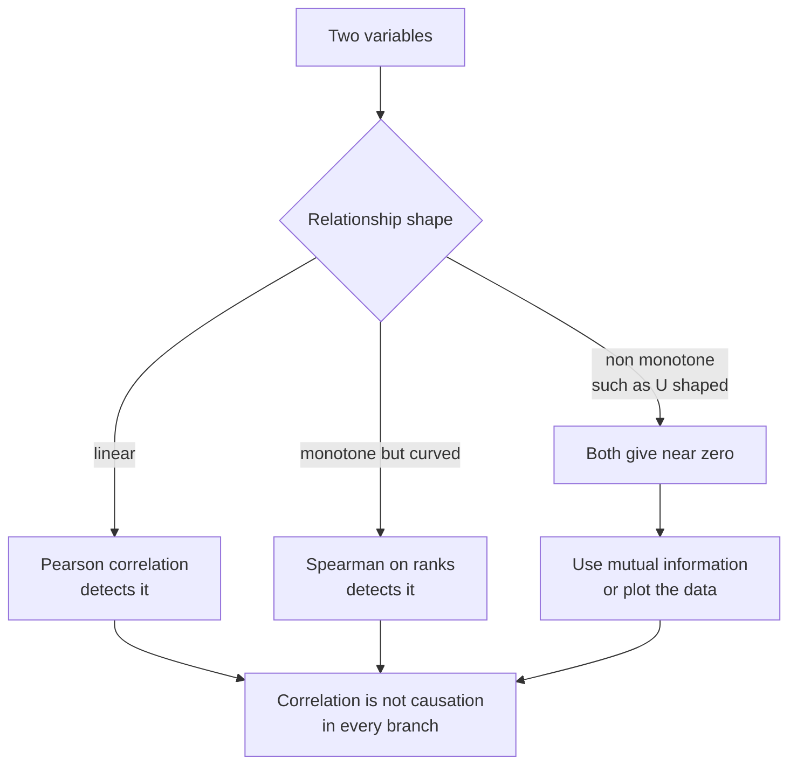
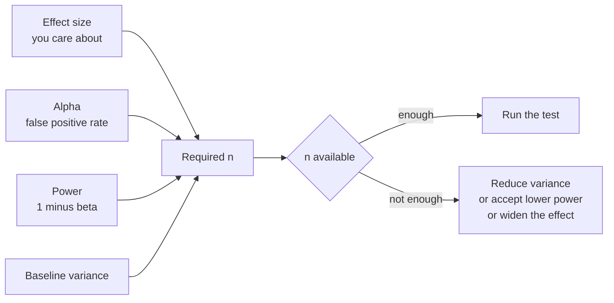
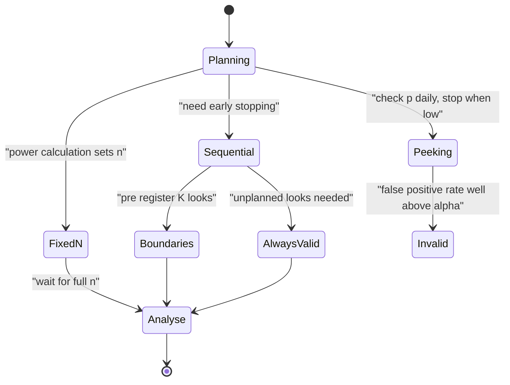
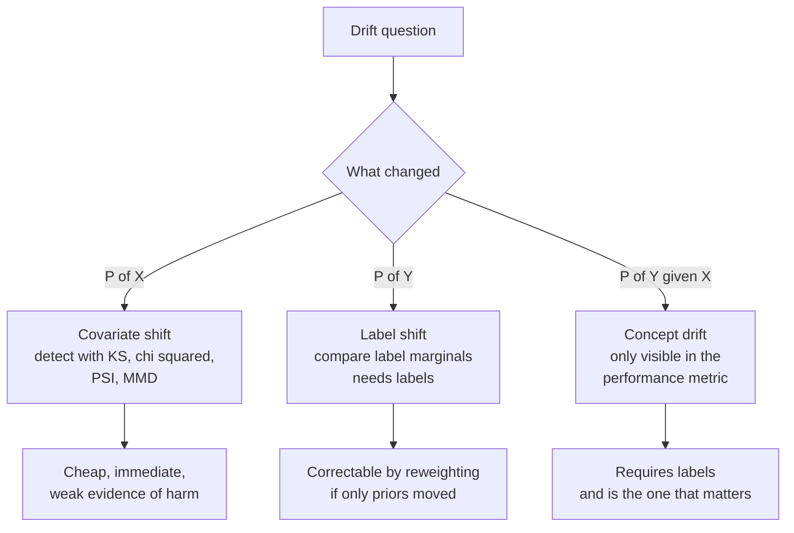

# Chapter 2: Probability and Statistics

> **What this chapter covers** Probability from random variables to the central limit theorem, estimation by maximum likelihood and the bootstrap, hypothesis testing and confidence intervals done correctly, Bayesian inference, and the distribution comparison tests used to detect drift.
> **Prerequisites** Chapter 1, particularly expectation as a weighted sum, logarithms, and the notion of a gradient.
> **Where it is used** Deciding whether a model improvement is real, sizing an A/B test, building a drift monitor, choosing a loss function, quantifying uncertainty in a reported metric, and pushing back on a result that is a false positive.

Most machine learning failures that survive code review are statistical. A model looks better because the test set was reused. A drift alarm fires weekly because the test was run on 50 samples. A launch decision is made from an experiment stopped the moment it crossed significance. This chapter builds the probability needed to reason about models, then the statistics needed to avoid those failures.

---

## 2.1 Level 1: Foundations

### 2.1.1 Random variables

A **random variable** is a number whose value depends on the outcome of an uncertain process. Write random variables as capital letters, $X$, and the values they take as lowercase, $x$.

Two kinds.

A **discrete** random variable takes values from a countable set. Its **probability mass function** gives $P(X = x)$ for each value, and these sum to 1. The number of clicks on an advertisement is discrete.

A **continuous** random variable takes values in a continuous range. The probability of any single exact value is zero, so instead a **probability density function** $f(x)$ is defined such that the probability of landing in an interval is the integral of the density over it. Latency in milliseconds is continuous.

A density can exceed 1. A uniform distribution on $[0, 0.1]$ has density 10 everywhere in that interval. Density is probability per unit of $x$, not probability. This trips people who report "probability 3.2" from a density estimate.

The **cumulative distribution function** is $F(x) = P(X \leq x)$. It goes from 0 to 1, never decreases, and is defined for both kinds. Most distribution comparison tests operate on the cumulative distribution function because it exists in both cases.

### 2.1.2 The distributions an engineer must know

Do not memorise a catalogue. Memorise which generating process produces which distribution, because that tells you when to expect one in your data.

| Distribution | Generating process | Parameters | Mean | Variance | Where it appears |
| --- | --- | --- | --- | --- | --- |
| Bernoulli | One trial with two outcomes | $p$ | $p$ | $p(1-p)$ | Any binary label or click |
| Binomial | $n$ independent Bernoulli trials, count successes | $n, p$ | $np$ | $np(1-p)$ | Number of correct predictions in $n$ test items |
| Categorical | One trial, $K$ outcomes | $p_1..p_K$ | n/a | n/a | The target of a softmax classifier |
| Poisson | Count of rare events in a fixed interval | $\lambda$ | $\lambda$ | $\lambda$ | Requests per second, defects per unit |
| Geometric | Trials until the first success | $p$ | $1/p$ | $(1-p)/p^2$ | Retries until success |
| Exponential | Waiting time between Poisson events | $\lambda$ | $1/\lambda$ | $1/\lambda^2$ | Time between arrivals, memoryless |
| Normal (Gaussian) | Sum of many small independent effects | $\mu, \sigma^2$ | $\mu$ | $\sigma^2$ | Measurement noise, sample means |
| Log-normal | Product of many small independent effects | $\mu, \sigma$ of the log | $e^{\mu+\sigma^2/2}$ | see note | Latency, income, file sizes |
| Beta | Distribution over a probability in $[0,1]$ | $\alpha, \beta$ | $\alpha/(\alpha+\beta)$ | see note | Prior and posterior for a rate |
| Gamma | Sum of exponentials, positive continuous | $k, \theta$ | $k\theta$ | $k\theta^2$ | Duration, prior on precision |
| Dirichlet | Distribution over a probability vector | $\boldsymbol{\alpha}$ | $\alpha_i/\alpha_0$ | see note | Prior for topic proportions |
| Student's t | Normal with unknown variance estimated from data | $\nu$ degrees of freedom | 0 for $\nu>1$ | $\nu/(\nu-2)$ for $\nu>2$ | Small sample tests, heavy tailed noise models |

The one to internalise for engineering work is the log-normal. If a quantity is the product of many independent factors, its logarithm is a sum, and by the central limit theorem that sum is approximately normal, so the quantity is log-normal. Latency is built from many multiplicative stages, so it is usually right skewed with a heavy tail. Reporting a mean latency for a log-normal is close to useless; report the median and high percentiles.

Worked example. Suppose latency in milliseconds is log-normal with $\mu = 4.0$ and $\sigma = 0.8$ on the log scale. The median is $e^{4.0} = 54.6$ ms. The mean is $e^{4.0 + 0.32} = e^{4.32} = 75.2$ ms. The 95th percentile is $e^{4.0 + 1.645 \times 0.8} = e^{5.316} = 203.6$ ms. The mean sits at the 61st percentile roughly, and the tail is nearly four times the median. A service level objective written against the mean would pass while most of the slow requests fail.

### 2.1.3 Expectation and variance, and their algebra

The **expectation** of $X$ is its long run average:

$$\mathbb{E}[X] = \sum_x x \, P(X=x) \quad \text{or} \quad \int x f(x)\,dx$$

The **variance** is the average squared distance from the mean:

$$\text{Var}(X) = \mathbb{E}[(X - \mathbb{E}[X])^2] = \mathbb{E}[X^2] - (\mathbb{E}[X])^2$$

The **standard deviation** is the square root of the variance, in the same units as $X$.

The algebra is small and you use all of it.

| Rule | Statement | Condition |
| --- | --- | --- |
| Linearity of expectation | $\mathbb{E}[aX + bY] = a\mathbb{E}[X] + b\mathbb{E}[Y]$ | Always, even if dependent |
| Scaling of variance | $\text{Var}(aX) = a^2\text{Var}(X)$ | Always |
| Variance of a sum | $\text{Var}(X+Y) = \text{Var}(X)+\text{Var}(Y)+2\text{Cov}(X,Y)$ | Always |
| Variance of an independent sum | $\text{Var}(X+Y) = \text{Var}(X)+\text{Var}(Y)$ | Independence, or just zero covariance |
| Expectation of a product | $\mathbb{E}[XY] = \mathbb{E}[X]\mathbb{E}[Y]$ | Independence required |

Linearity of expectation holding without independence is the workhorse. Variance of a sum needing independence is the trap.

Worked example of why that trap matters. Take the sample mean of $n$ independent observations each with variance $\sigma^2$. Then $\text{Var}(\bar{X}) = \frac{1}{n^2}\sum \text{Var}(X_i) = \sigma^2/n$, so the standard error is $\sigma/\sqrt{n}$. Now suppose the observations are correlated with common correlation $\rho$. Then

$$\text{Var}(\bar{X}) = \frac{\sigma^2}{n}\left(1 + (n-1)\rho\right)$$

With $n = 1000$, $\sigma = 1$, and $\rho = 0.05$, the variance is $\frac{1}{1000}(1 + 999 \times 0.05) = 0.0509$, so the standard error is $0.226$ instead of $0.0316$. A mild correlation inflated the standard error by a factor of 7. This is exactly what happens when you evaluate on 1000 sentences drawn from 50 documents and treat them as 1000 independent samples.

### 2.1.4 Covariance and correlation, which are not the same

**Covariance** measures whether two variables move together:

$$\text{Cov}(X,Y) = \mathbb{E}[(X - \mathbb{E}X)(Y - \mathbb{E}Y)]$$

It has units of $X$ times $Y$, so its magnitude is not interpretable on its own.

**Pearson correlation** is covariance normalised by both standard deviations:

$$\rho = \frac{\text{Cov}(X,Y)}{\sigma_X \sigma_Y} \in [-1, 1]$$

Two things correlation does not do. It does not measure nonlinear dependence: if $X$ is symmetric about zero and $Y = X^2$, then $\text{Cov}(X,Y) = 0$ while $Y$ is a deterministic function of $X$. And zero correlation does not imply independence, except for jointly normal variables.

**Spearman correlation** is Pearson correlation applied to the ranks. It detects any monotone relationship, not just linear, and is robust to outliers. Use it when a scatter plot is monotone but curved.

Worked example. $X = (-2,-1,0,1,2)$ and $Y = X^2 = (4,1,0,1,4)$. Mean of $X$ is 0, mean of $Y$ is 2. Covariance is $\frac{1}{5}[(-2)(2)+(-1)(-1)+0(-2)+1(-1)+2(2)] = \frac{1}{5}[-4+1+0-1+4] = 0$. Pearson correlation is exactly 0. Mutual information, from chapter 1, is large. This is the standard argument against screening features by correlation alone.



*Figure 2.1: Choosing a dependence measure by the shape of the relationship, with the reminder that none of them establish causation.*

### 2.1.5 Conditional probability, Bayes, and independence

**Conditional probability** is the probability of $A$ given that $B$ happened:

$$P(A \mid B) = \frac{P(A \cap B)}{P(B)}, \qquad P(B) > 0$$

Rearranging gives the **chain rule** $P(A \cap B) = P(A\mid B)P(B)$, and applying it both ways gives **Bayes' theorem**:

$$P(A \mid B) = \frac{P(B \mid A)\,P(A)}{P(B)}$$

In words: the probability of a hypothesis after seeing evidence equals the probability of the evidence under the hypothesis, times the prior probability of the hypothesis, divided by the overall probability of the evidence.

Worked example, the base rate problem, which is the single most common statistical error in deployed classifiers. A screening model detects a condition present in 1 in 1000 people. Its sensitivity (true positive rate) is 0.99 and its specificity is 0.99, so the false positive rate is 0.01. Someone tests positive. What is the probability they have the condition?

Take 100,000 people. About 100 have the condition, and 99 of those test positive. About 99,900 do not, and 1 percent of those, 999, test positive falsely. Total positives: $99 + 999 = 1098$. The probability of truly having the condition given a positive test is $99/1098 = 0.090$.

Nine percent. A 99 percent accurate test on a rare condition produces mostly false positives. The precision of a classifier depends on the base rate, not just on the model. This is why a fraud model with excellent recall and a false positive rate of 1 percent can be unusable when fraud is 1 in 10,000.

**Independence** means $P(A \cap B) = P(A)P(B)$, equivalently $P(A\mid B) = P(A)$. **Conditional independence** means $P(A \cap B \mid C) = P(A\mid C)P(B\mid C)$: once you know $C$, $A$ tells you nothing more about $B$.

Neither implies the other. Two variables can be independent unconditionally and dependent given a third (explaining away), or dependent unconditionally and independent given a third (a common cause). Naive Bayes is the assumption that features are conditionally independent given the class; the assumption is usually false and the classifier is often useful anyway, because the decision boundary can be right even when the probability estimates are badly calibrated.

### 2.1.6 The law of large numbers and the central limit theorem

The **law of large numbers** says the sample mean converges to the true mean as $n$ grows, provided the mean exists. It says nothing about speed.

The **central limit theorem** supplies the speed and shape. If $X_1, \ldots, X_n$ are independent and identically distributed with mean $\mu$ and finite variance $\sigma^2$, then

$$\frac{\bar{X} - \mu}{\sigma/\sqrt{n}} \xrightarrow{d} \mathcal{N}(0, 1)$$

The sample mean becomes approximately normal regardless of the original distribution's shape. This is why normal based confidence intervals work for averages of anything.

Three conditions people forget.

1. **Finite variance is required.** For heavy tailed distributions where the variance is infinite, the theorem does not apply and the sample mean does not stabilise.
2. **Independence is required.** Correlated samples converge more slowly, as section 2.1.3 showed.
3. **Convergence speed depends on skewness.** For a strongly skewed distribution, $n = 30$ is nowhere near enough. The Berry-Esseen theorem bounds the error by a term proportional to $\mathbb{E}|X-\mu|^3 / (\sigma^3\sqrt{n})$, so the more skewed the distribution, the larger the $n$ needed.

Worked example of the third point. For a Bernoulli with $p = 0.01$, the distribution is extremely skewed. With $n = 100$ the expected number of successes is 1, and the sample proportion is not remotely normal. A normal approximation to a confidence interval here produces intervals that include negative values, which is section 2.3.4's reason for using Wilson or Clopper-Pearson.

The often repeated "$n = 30$ is enough" is a rule of thumb for mildly skewed distributions. For rates near zero or one, or for latency, it is wrong.

---

## 2.2 Level 2: Working knowledge

### 2.2.1 Maximum likelihood estimation

Given data $x_1, \ldots, x_n$ and a model family with parameter $\theta$, the **likelihood** is the probability of the data under the model, viewed as a function of $\theta$:

$$L(\theta) = \prod_{i=1}^n p(x_i \mid \theta)$$

**Maximum likelihood estimation** picks the $\theta$ that makes the observed data most probable. Work with the log, which turns the product into a sum and avoids underflow:

$$\hat{\theta}_{MLE} = \arg\max_\theta \sum_{i=1}^n \log p(x_i \mid \theta)$$

Every standard supervised loss is a negative log likelihood.

| Loss | Assumed noise model | Resulting estimator |
| --- | --- | --- |
| Mean squared error | Gaussian with constant variance | Maximum likelihood for the mean |
| Mean absolute error | Laplace | Maximum likelihood for the median |
| Cross entropy | Categorical | Maximum likelihood for class probabilities |
| Poisson loss | Poisson counts | Maximum likelihood for the rate |

Seeing this makes loss selection a modelling decision rather than a taste one. If your residuals have heavy tails, mean squared error is assuming a noise distribution your data does not have, and a Laplace or Student's t likelihood may fit better.

Worked example. For $n$ Bernoulli trials with $k$ successes, the log likelihood is $k\log p + (n-k)\log(1-p)$. Differentiate and set to zero: $k/p - (n-k)/(1-p) = 0$, giving $p = k/n$. The maximum likelihood estimate of a rate is the observed rate, which is reassuring and also the source of a problem: with $k = 0$ the estimate is exactly 0, asserting that the event is impossible.

### 2.2.2 Maximum a posteriori and the link to regularisation

**Maximum a posteriori** estimation adds a prior:

$$\hat{\theta}_{MAP} = \arg\max_\theta \left[ \log p(\text{data}\mid\theta) + \log p(\theta) \right]$$

The extra term is exactly a regulariser.

| Prior on weights | Log prior term | Equivalent regulariser |
| --- | --- | --- |
| Gaussian, mean 0, variance $\tau^2$ | $-\frac{1}{2\tau^2}\|\mathbf{w}\|_2^2$ | Ridge, with $\lambda = 1/(2\tau^2)$ |
| Laplace, scale $b$ | $-\frac{1}{b}\|\mathbf{w}\|_1$ | Lasso |
| Uniform | Constant | No regularisation, back to maximum likelihood |

So L2 regularisation is a statement that weights are probably small, and its strength is the inverse of how large you think they might be. This gives a way to reason about $\lambda$ rather than only grid searching it.

Worked example of the zero count problem. Three Bernoulli trials, zero successes. Maximum likelihood gives $\hat{p}=0$. With a Beta$(1,1)$ prior, the maximum a posteriori estimate is $(k + \alpha - 1)/(n + \alpha + \beta - 2) = 0/3 = 0$ still. With Beta$(2,2)$ it is $(0+1)/(3+2) = 0.2$. The posterior mean under Beta$(1,1)$ is $(k+1)/(n+2) = 1/5 = 0.2$, which is the Laplace add one rule. That is why add one smoothing works: it is a uniform prior.

### 2.2.3 Bias, variance, and their decomposition

For an estimator $\hat{\theta}$ of a true value $\theta$:

- **Bias** is $\mathbb{E}[\hat{\theta}] - \theta$, the systematic error.
- **Variance** is $\text{Var}(\hat{\theta})$, the sensitivity to which sample you drew.
- **Mean squared error** decomposes as $\text{MSE} = \text{Bias}^2 + \text{Variance}$.

For prediction at a point $x$ with true function $f$ and irreducible noise variance $\sigma^2$:

$$\mathbb{E}[(y - \hat{f}(x))^2] = \underbrace{\sigma^2}_{\text{irreducible}} + \underbrace{(\mathbb{E}[\hat{f}(x)] - f(x))^2}_{\text{bias squared}} + \underbrace{\text{Var}(\hat{f}(x))}_{\text{variance}}$$

Worked example. Suppose $\sigma^2 = 0.25$, and two models. Model A is a linear fit with bias 0.4 and variance 0.02, giving $0.25 + 0.16 + 0.02 = 0.43$. Model B is a deep tree with bias 0.05 and variance 0.30, giving $0.25 + 0.0025 + 0.30 = 0.55$. A wins despite being more biased. Averaging 20 independent trees would cut B's variance toward $0.015$, giving $0.267$, which is the argument for bagging.

Two notes. First, the classical picture of a U shaped test error against model capacity is incomplete. Belkin et al. (2019), "Reconciling modern machine learning practice and the classical bias-variance trade-off", documented **double descent**: past the interpolation threshold where the model exactly fits the training data, test error can fall again. Nakkiran et al. (2020) showed the same in deep networks as a function of model size, data size, and training time. Second, the decomposition applies to squared error. For zero one loss the decomposition is not as clean.

### 2.2.4 Sufficient statistics

A statistic $T(X)$ is **sufficient** for $\theta$ if the conditional distribution of the data given $T$ does not depend on $\theta$. In plain terms, $T$ contains all the information about $\theta$ the data carries.

The **factorisation theorem** says $T$ is sufficient exactly when the likelihood factors as $p(x\mid\theta) = g(T(x), \theta) h(x)$.

Examples: for a Bernoulli, the count of successes is sufficient, so the order of the trials carries no information about $p$. For a normal with unknown mean and variance, the pair (sum, sum of squares) is sufficient.

The engineering value is direct. Sufficient statistics are what you can aggregate. If a metric's sufficient statistics are a count and a sum, you can compute it in a streaming system by keeping two numbers per partition and merging. If a metric needs the full sample, such as a median or a Kolmogorov-Smirnov statistic, you need sketching algorithms instead. This distinction decides how a monitoring pipeline is built.

### 2.2.5 The bootstrap

The **bootstrap** (Efron, 1979) estimates the sampling distribution of any statistic by resampling the observed data with replacement.

Procedure for a statistic $s$ on data of size $n$:

1. Draw $n$ items from the data with replacement. This is one bootstrap sample.
2. Compute $s$ on it.
3. Repeat $B$ times, with $B$ commonly 1000 to 10,000.
4. The spread of the $B$ values estimates the sampling distribution of $s$.

The **percentile interval** takes the 2.5th and 97.5th percentiles of the bootstrap values as a 95 percent interval.

**Listing 2.1: paired bootstrap for the difference between two systems.**

```python
import numpy as np

def paired_bootstrap(scores_a, scores_b, n_boot=10000, seed=0):
    """scores_a, scores_b: per-item scores for two systems on the SAME items."""
    rng = np.random.default_rng(seed)
    a, b = np.asarray(scores_a), np.asarray(scores_b)
    assert a.shape == b.shape, "paired test requires the same items"
    n = len(a)
    idx = rng.integers(0, n, size=(n_boot, n))       # resample item indices once
    diffs = a[idx].mean(axis=1) - b[idx].mean(axis=1)
    lo, hi = np.percentile(diffs, [2.5, 97.5])
    p_two_sided = 2 * min((diffs <= 0).mean(), (diffs >= 0).mean())
    return float(a.mean() - b.mean()), float(lo), float(hi), float(min(p_two_sided, 1.0))
```

The critical line is `idx`, which is drawn once and used for both systems. Resampling the same item indices for A and B preserves the pairing, so item difficulty cancels and the interval on the difference is much tighter than an interval built from two independent bootstraps. Any comparison of two models on the same evaluation set should be paired. The p value here is a bootstrap approximation, not an exact test, and it is unreliable when the number of items is small.

When the bootstrap fails: statistics at the boundary of the data, such as the maximum; very small $n$, roughly under 20; heavy tails where the variance does not exist; and dependent data, where you need a block bootstrap that resamples contiguous blocks instead of individual points.

### 2.2.6 Hypothesis testing, and what a p value is

The structure of a test.

1. State a **null hypothesis** $H_0$, usually "no effect".
2. Choose a **test statistic** that measures the effect.
3. Work out the distribution of that statistic assuming $H_0$ is true.
4. Compute the statistic on your data.
5. The **p value** is the probability, under $H_0$, of seeing a statistic at least as extreme as the one observed.
6. Reject $H_0$ if $p < \alpha$, where $\alpha$ is the significance level chosen in advance.

A p value is the probability of the data given the null. It is not the probability of the null given the data. Those are related by Bayes' theorem and they can differ enormously.

| What p is not | Why |
| --- | --- |
| The probability the null hypothesis is true | That would require a prior over hypotheses |
| The probability the result was due to chance | Same confusion, restated |
| A measure of effect size | A tiny effect gives a small p with enough data |
| A measure of importance | Statistical significance and practical significance are different questions |
| Reproducible | A p value of 0.05 in one study implies wide uncertainty about the next study's p value |

The American Statistical Association's 2016 statement on p values (Wasserstein and Lazar) says this plainly and is worth reading in full; it is two pages.

Worked example of how misleading a p value alone is. With $n = 1{,}000{,}000$ per arm, a conversion lift from 10.00 percent to 10.05 percent gives a standard error of about $\sqrt{2 \times 0.1 \times 0.9/10^6} = 0.000424$, so a z statistic of $0.0005/0.000424 = 1.18$. Not significant. Push $n$ to $10^7$ and the same effect gives $z = 3.73$, $p = 0.0002$. Highly significant, same effect, and the effect may still be worthless commercially. Always report the effect size with its interval.

### 2.2.7 Type one and type two errors, power, and sample size

| | $H_0$ true | $H_0$ false |
| --- | --- | --- |
| Reject $H_0$ | Type one error, rate $\alpha$ | Correct, probability $1-\beta$ (power) |
| Do not reject | Correct | Type two error, rate $\beta$ |

**Power** is the probability of detecting an effect that is really there. Conventionally you aim for 0.80, sometimes 0.90.

For comparing two proportions $p_1$ and $p_2$, the required sample size per group is approximately

$$n = \frac{(z_{1-\alpha/2} + z_{1-\beta})^2 \left[p_1(1-p_1) + p_2(1-p_2)\right]}{(p_1 - p_2)^2}$$

Worked example. Baseline conversion $p_1 = 0.10$, you want to detect a lift to $p_2 = 0.11$, with $\alpha = 0.05$ two sided and power 0.80. Then $z_{0.975} = 1.96$ and $z_{0.80} = 0.84$, so $(1.96+0.84)^2 = 7.84$. The variance term is $0.10\times0.90 + 0.11\times0.89 = 0.09 + 0.0979 = 0.1879$. The squared effect is $0.01^2 = 0.0001$. So

$$n = \frac{7.84 \times 0.1879}{0.0001} = 14{,}731 \text{ per group}$$

About 15,000 per arm, 30,000 total. Now halve the effect to a lift of 0.005. The denominator drops by a factor of 4, so $n$ rises to about 59,000 per group. Halving the detectable effect quadruples the sample. This is the single most useful fact in experiment planning, and it is why "we will just detect whatever effect there is" is not a plan.

**Listing 2.2: sample size and power, computed rather than looked up.**

```python
from math import sqrt
from scipy.stats import norm

def n_per_group(p1, p2, alpha=0.05, power=0.80):
    z_a = norm.ppf(1 - alpha / 2)
    z_b = norm.ppf(power)
    var = p1 * (1 - p1) + p2 * (1 - p2)
    return (z_a + z_b) ** 2 * var / (p1 - p2) ** 2

def power_at(n, p1, p2, alpha=0.05):
    se = sqrt((p1 * (1 - p1) + p2 * (1 - p2)) / n)
    z_a = norm.ppf(1 - alpha / 2)
    return 1 - norm.cdf(z_a - abs(p1 - p2) / se) + norm.cdf(-z_a - abs(p1 - p2) / se)

print(n_per_group(0.10, 0.11))        # about 14731
print(power_at(5000, 0.10, 0.11))     # about 0.35
```

The second function answers the question people actually ask, which is "we only have 5000 users per arm, is that enough". The answer here is 35 percent power, meaning that if the effect is real you will miss it about two times in three. Running that test and reporting "no significant difference" would be misleading.



*Figure 2.2: The four quantities of a power calculation are linked, so fixing three determines the fourth and there is no way to get all four for free.*

---

## 2.3 Level 3: Depth

### 2.3.1 Confidence intervals, and what the confidence means

A 95 percent **confidence interval** is a procedure with this property: if you repeated the whole experiment many times, 95 percent of the intervals produced would contain the true value. The guarantee is about the procedure across repetitions, not about any single interval. A specific computed interval either contains the parameter or it does not.

For a binomial proportion there are three standard constructions and they disagree in exactly the cases that matter.

### 2.3.2 The Wald interval, and when it fails

$$\hat{p} \pm z_{1-\alpha/2}\sqrt{\frac{\hat{p}(1-\hat{p})}{n}}$$

Worked example. $k = 45$ successes in $n = 100$. Then $\hat{p} = 0.45$, standard error $= \sqrt{0.45 \times 0.55/100} = 0.0497$, interval $0.45 \pm 0.0975 = [0.352, 0.548]$. Reasonable.

Now $k = 0$, $n = 30$. Then $\hat{p} = 0$, the standard error is $\sqrt{0} = 0$, and the interval is $[0, 0]$. The method asserts with 95 percent confidence that the true rate is exactly zero after 30 observations. That is plainly wrong, and it is not an edge case: it is the everyday situation of measuring a rare failure mode.

The Wald interval also has poor coverage away from the boundary. Brown, Cai and DasGupta (2001), "Interval Estimation for a Binomial Proportion", showed the actual coverage of the nominal 95 percent Wald interval oscillates and is frequently well below 95 percent even for moderately large $n$. Their recommendation is to not use it as a default.

### 2.3.3 The Wilson interval

Wilson's interval inverts the test rather than assuming normality of $\hat{p}$. With $z = z_{1-\alpha/2}$:

$$\frac{\hat{p} + \frac{z^2}{2n} \pm z\sqrt{\frac{\hat{p}(1-\hat{p})}{n} + \frac{z^2}{4n^2}}}{1 + \frac{z^2}{n}}$$

Worked example, $k=0$, $n=30$, $z=1.96$, so $z^2 = 3.8416$. Numerator centre: $0 + 3.8416/60 = 0.06403$. The square root term: $\sqrt{0 + 3.8416/3600} = \sqrt{0.0010671} = 0.03267$, times $z$ gives $0.06403$. Denominator: $1 + 3.8416/30 = 1.12805$. Lower bound $(0.06403 - 0.06403)/1.12805 = 0$. Upper bound $(0.06403+0.06403)/1.12805 = 0.1135$.

So $[0, 0.114]$. Zero failures in 30 trials is consistent with a true failure rate up to about 11 percent. That is the honest answer and it usually changes a decision.

Note the structure: Wilson shifts the centre toward 0.5 by adding $z^2/2$ pseudo observations, which is why it behaves at the boundary. It is the recommended default for proportions.

### 2.3.4 The Clopper-Pearson interval

Clopper-Pearson inverts the exact binomial test rather than any normal approximation. Its bounds come from Beta quantiles:

$$p_{\text{lower}} = \text{Beta}^{-1}(\alpha/2;\ k,\ n-k+1), \qquad p_{\text{upper}} = \text{Beta}^{-1}(1-\alpha/2;\ k+1,\ n-k)$$

with $p_{\text{lower}} = 0$ when $k=0$ and $p_{\text{upper}} = 1$ when $k=n$.

For $k=0$, $n=30$: the upper bound is $1 - (\alpha/2)^{1/n} = 1 - 0.025^{1/30}$. Compute: $\ln 0.025 = -3.689$, divided by 30 is $-0.12297$, exponentiating gives $0.8843$. So the upper bound is $0.1157$, and the interval is $[0, 0.116]$.

Close to Wilson, slightly wider. That is the general pattern: Clopper-Pearson guarantees coverage of at least 95 percent for every true $p$, at the cost of being conservative, meaning the real coverage is often higher than nominal and the interval is wider than necessary.

| Interval | Coverage | Width | Boundary behaviour | Use when |
| --- | --- | --- | --- | --- |
| Wald | Often below nominal, erratic | Narrowest | Degenerate at 0 and 1 | Large $n$, $\hat{p}$ near 0.5, and you need speed |
| Wilson | Close to nominal on average | Moderate | Correct | The general default |
| Clopper-Pearson | At least nominal, guaranteed | Widest | Correct | Regulatory or safety claims where undercoverage is unacceptable |

There is a useful mental shortcut, the rule of three: if you observe zero events in $n$ trials, the upper bound of a 95 percent interval is about $3/n$. For $n=30$ that is $0.1$, close to the exact $0.116$. For $n=1000$, $0.003$.

### 2.3.5 Multiple comparisons

Run $m$ independent tests at $\alpha = 0.05$ with all nulls true. The probability of at least one false positive is $1 - 0.95^m$. For $m=10$ that is $0.40$. For $m=20$, $0.64$. For $m=100$, $0.994$. Testing twenty metrics on a launch and celebrating the one that moved is a ritual for producing false positives.

Two families of correction.

**Bonferroni** controls the **family wise error rate**, the probability of any false positive, by testing each hypothesis at $\alpha/m$. Simple, always valid even under dependence, and conservative. With $m=20$ and $\alpha=0.05$, each test needs $p < 0.0025$. The cost is power: the sample size needed to keep power at 0.80 rises substantially.

**Benjamini-Hochberg** controls the **false discovery rate**, the expected proportion of rejections that are false. Procedure: sort the $m$ p values ascending as $p_{(1)} \leq \cdots \leq p_{(m)}$. Find the largest $i$ with $p_{(i)} \leq \frac{i}{m}q$. Reject hypotheses 1 through $i$.

Worked example. $m = 10$, $q = 0.05$, sorted p values $0.001, 0.008, 0.019, 0.032, 0.05, 0.14, 0.21, 0.4, 0.62, 0.9$. Thresholds $\frac{i}{10}\times 0.05$ are $0.005, 0.010, 0.015, 0.020, 0.025, 0.030, 0.035, 0.040, 0.045, 0.050$. Compare: $0.001 \leq 0.005$ yes; $0.008\leq0.010$ yes; $0.019 \leq 0.015$ no; $0.032\leq0.020$ no; $0.05\leq0.025$ no; rest no. Largest $i$ satisfying the condition is 2, so reject the first two. Bonferroni at $0.05/10 = 0.005$ would reject only the first. Benjamini-Hochberg found one more discovery at the cost of accepting that on average 5 percent of the rejections are false.

| Method | Controls | When to use |
| --- | --- | --- |
| Bonferroni | Family wise error rate | Few tests, and any false positive is expensive, such as a safety claim |
| Holm-Bonferroni | Family wise error rate, uniformly more powerful than Bonferroni | Whenever you would use Bonferroni |
| Benjamini-Hochberg | False discovery rate | Many tests, exploratory, some false positives tolerable, such as feature screening |

A related trap is the garden of forking paths: you did not run 20 tests formally, but you tried 20 segmentations, 20 metric definitions, or 20 model variants and reported the best. The multiplicity is real even when it is informal. Preregister the primary metric.

### 2.3.6 Sequential testing and why peeking inflates false positives

Classical tests assume the sample size is fixed in advance. If you check significance repeatedly as data arrives and stop when $p < 0.05$, the false positive rate is not 0.05.

The reason: the p value over time is a random walk. With a fixed $n$ you look once and there is a 5 percent chance of crossing. With continuous monitoring you have many chances, and the maximum of a random walk crosses a fixed threshold far more often than a single draw does. Under continuous monitoring with an unbounded horizon, the probability of eventually crossing any fixed threshold approaches 1.

Practical inflation figures from simulation, with all nulls true and $\alpha = 0.05$: checking at 2 interim points plus the end gives roughly 0.10 to 0.12; checking 5 times, roughly 0.14 to 0.19; checking every day for a month, often above 0.25. Exact values depend on the spacing and the metric, so simulate for your own setup rather than quoting a number.

Three correct solutions.

| Method | Idea | Cost |
| --- | --- | --- |
| Fixed horizon | Choose $n$ from a power calculation, look once | Cannot stop early even when the effect is obvious |
| Group sequential | Pre plan $K$ looks with spending boundaries, for example O'Brien-Fleming or Pocock | Needs the look schedule fixed in advance |
| Always valid inference | Use anytime valid confidence sequences based on martingales | Wider intervals for the same data |

Group sequential boundaries spend the total $\alpha$ across looks. O'Brien-Fleming boundaries are very strict early and nearly nominal at the end, so early stopping requires a large effect and the final analysis loses little power. Pocock boundaries are constant across looks, easier to explain, and cost more at the end.

Always valid inference, developed for experimentation platforms by Johari, Pekelis and Walsh in work published as "Always Valid Inference: Continuous Monitoring of A/B Tests" (Operations Research, 2022, with earlier preprints), gives confidence sequences that are valid at every time point simultaneously. The price is width: an anytime valid interval is wider than a fixed horizon interval at the same nominal level, which is the correct price for the freedom to look whenever you like.



*Figure 2.3: Three valid analysis paths and the one common invalid path, which is unplanned repeated checking against a fixed threshold.*

### 2.3.7 Bayesian inference in practice

Bayesian inference treats the parameter as a random variable with a distribution:

$$p(\theta \mid \text{data}) = \frac{p(\text{data}\mid\theta)\,p(\theta)}{p(\text{data})}$$

The **posterior** is what you know after the data. The denominator is a normalising constant and is usually the hard part.

**Conjugacy** is the special case where the posterior is in the same family as the prior, so the update is arithmetic rather than integration.

| Likelihood | Conjugate prior | Posterior update |
| --- | --- | --- |
| Bernoulli or binomial | Beta$(\alpha,\beta)$ | Beta$(\alpha+k,\ \beta+n-k)$ |
| Poisson | Gamma$(\alpha,\beta)$ | Gamma$(\alpha+\sum x_i,\ \beta+n)$ |
| Normal, known variance | Normal | Precision weighted average of prior and data means |
| Categorical | Dirichlet$(\boldsymbol{\alpha})$ | Dirichlet$(\boldsymbol{\alpha}+\text{counts})$ |

Worked example. Prior Beta$(2,2)$, meaning a weak belief centred at 0.5. Observe 7 successes in 10 trials. Posterior is Beta$(9,5)$. Posterior mean $9/14 = 0.643$, between the prior mean 0.5 and the data 0.7, closer to the data because 10 observations outweigh the 2 pseudo observations in the prior. A 95 percent **credible interval** from the Beta$(9,5)$ quantiles is approximately $[0.39, 0.86]$.

The interpretation of a credible interval differs from a confidence interval, and the difference is not pedantry.

| | Confidence interval | Credible interval |
| --- | --- | --- |
| Statement | 95 percent of intervals from repeated experiments contain the true value | Given this data and prior, 95 percent probability the parameter is in this range |
| Parameter treated as | Fixed unknown constant | Random variable |
| Requires | A sampling procedure | A prior |
| Answers "what is the probability the true rate is above 0.5" | Not directly | Directly, by integrating the posterior |

The Bayesian statement is the one people want. The cost is that it depends on the prior, so it is only as defensible as the prior is.

When conjugacy does not apply, use Markov chain Monte Carlo (the No U Turn Sampler in Stan or PyMC is the standard choice) or variational inference, which optimises a simpler approximating distribution as chapter 1, level 4 described. Markov chain Monte Carlo is asymptotically exact and slow. Variational inference is fast and typically underestimates posterior variance, so its credible intervals are too narrow.

Where Bayesian methods earn their keep in machine learning engineering: Thompson sampling for bandits, which is a principled solution to exploration and needs a posterior; hierarchical models for many small groups, where partial pooling shrinks noisy per group estimates toward the population; and any setting where a decision needs the probability that A beats B rather than a rejection of a null.

### 2.3.8 Distribution comparison and drift detection

Given a reference sample and a current sample, has the distribution changed? Four standard tools, with different blind spots.

**Kolmogorov-Smirnov test.** The statistic is the largest vertical gap between the two empirical cumulative distribution functions:

$$D = \sup_x |F_1(x) - F_2(x)|$$

Sensitive near the centre of the distribution, weak in the tails, univariate and continuous only. With large $n$ it flags differences far too small to matter: at $n = 10^6$ per sample the critical value at $\alpha=0.05$ is about $1.36\sqrt{2/10^6} = 0.0019$, so a 0.2 percent maximum gap is "significant". This is why production drift monitors built on Kolmogorov-Smirnov with large windows alert constantly.

**Chi-squared test.** For categorical data, compare observed and expected counts:

$$\chi^2 = \sum_i \frac{(O_i - E_i)^2}{E_i}$$

Worked example. Reference proportions across three categories $(0.5, 0.3, 0.2)$, current sample of 1000 gives observed $(480, 350, 170)$. Expected are $(500, 300, 200)$. Terms: $400/500 = 0.8$, $2500/300 = 8.33$, $900/200 = 4.5$. Total $\chi^2 = 13.63$ on 2 degrees of freedom, giving $p \approx 0.0011$. Significant. Requires expected counts of at least about 5 per cell; with rarer categories, merge them or use an exact test.

**Population stability index.** An industry standard in credit risk, computed on binned data:

$$\text{PSI} = \sum_i (a_i - b_i)\ln\frac{a_i}{b_i}$$

where $a_i$ and $b_i$ are the proportions in bin $i$ for the two samples. It is a symmetrised KL divergence, which is why it is finite and stable. The conventional thresholds are: below 0.1 no meaningful shift, 0.1 to 0.25 moderate, above 0.25 significant. These thresholds are convention rather than derivation, and they are widely used in financial services. State them as convention when you use them.

Worked example. Ten bins, reference each 0.10. Current: one bin moves to 0.15, another to 0.05, the rest unchanged. PSI $= (0.15-0.10)\ln(1.5) + (0.05-0.10)\ln(0.5) = 0.05 \times 0.4055 + (-0.05)\times(-0.6931) = 0.0203 + 0.0347 = 0.0550$. Below 0.1, so no action under the convention. The critical dependency is the binning: use the reference quantiles to define bins, fix them once, and handle empty bins with a small floor such as 0.0001 or the logarithm is infinite.

**Maximum mean discrepancy.** A kernel method that works in any dimension:

$$\text{MMD}^2 = \mathbb{E}[k(x,x')] - 2\mathbb{E}[k(x,y)] + \mathbb{E}[k(y,y')]$$

with $x, x'$ from one distribution and $y, y'$ from the other, and $k$ a kernel such as the radial basis function. With a characteristic kernel, maximum mean discrepancy is zero only if the distributions are identical, so in principle it detects any difference. It is the right tool for embeddings and images, where univariate tests are useless. Significance comes from a permutation test. The cost is quadratic in sample size unless you use a linear time estimator, and the result depends on the kernel bandwidth, commonly set by the median heuristic (the median pairwise distance).

| Test | Data type | Detects | Blind to | Main hazard |
| --- | --- | --- | --- | --- |
| Kolmogorov-Smirnov | Univariate continuous | Shift in the body of the distribution | Tail changes, multivariate structure | Over sensitive at large $n$ |
| Chi-squared | Categorical | Any change in cell proportions | Ordering of categories | Needs expected counts above about 5 |
| Population stability index | Binned, either type | Overall redistribution across bins | Changes within a bin | Binning choice and empty bins |
| Maximum mean discrepancy | Any, including high dimensional | Any distributional difference with a characteristic kernel | Nothing in principle, much in practice at small $n$ | Kernel bandwidth choice, quadratic cost |

The deeper issue: none of these detects the drift that matters most, which is a change in $P(Y\mid X)$, the relationship between features and label. All four compare $P(X)$. Feature distributions can be perfectly stable while the label relationship inverts. Monitoring input drift is a cheap proxy that you use because labels are delayed, and it is not a substitute for monitoring the metric you care about once labels arrive.



*Figure 2.4: Three kinds of drift, and the fact that the cheap detectable kind is not the harmful kind.*

---

## 2.4 Level 4: Mastery

### 2.4.1 Variance reduction in experiments

A power calculation has four inputs and three are usually fixed: the effect you care about, $\alpha$, and power. The fourth, the variance, is the one you can attack, and reducing it is equivalent to getting more users for free.

**CUPED**, controlled experiments using pre-experiment data (Deng, Xu, Kohavi and Walker, 2013, "Improving the Sensitivity of Online Controlled Experiments by Utilizing Pre-Experiment Data"), adjusts the metric using a pre period covariate $X$:

$$Y_{\text{adj}} = Y - \theta(X - \bar{X}), \qquad \theta = \frac{\text{Cov}(Y,X)}{\text{Var}(X)}$$

The adjusted metric has the same expectation, because $\mathbb{E}[X - \bar{X}] = 0$, but variance reduced by a factor of $1-\rho^2$ where $\rho$ is the correlation between $Y$ and $X$.

Worked example. Pre period spend correlates with in period spend at $\rho = 0.7$. Variance falls by $1 - 0.49 = 0.51$, roughly a halving. Since required $n$ is proportional to variance, the test needs about half the users, or detects an effect $\sqrt{0.51} = 0.71$ times as large with the same users. That is a large practical gain from an arithmetic adjustment.

**Stratification** and **variance weighted estimators** achieve similar reductions by conditioning on known segments. **Winsorisation** of a heavy tailed metric, capping at a high percentile, reduces variance at the cost of a small bias, and is standard for revenue metrics where a handful of users dominate the sum. State the cap and apply it identically to both arms, chosen before seeing results.

### 2.4.2 Where the standard testing advice is wrong

**"Non significant means no effect."** It means you failed to detect one. With the 5000 user example in listing 2.2, power was 0.35. Absence of evidence is evidence of absence only when power was high. Report the interval, and say what effect sizes you could have ruled out.

**"Use a t-test if the data is normal, otherwise a non parametric test."** The t-test on a mean is robust because the central limit theorem applies to the mean, not because the data is normal. For a large enough sample from a mildly skewed distribution it is fine. The Mann-Whitney U test is not a test of medians in general; it tests stochastic dominance, $P(X > Y) > 0.5$, and it can reject when the medians are equal.

**"Check normality with a test before choosing."** Normality tests have power proportional to sample size, so with large $n$ they reject on trivial deviations and with small $n$ they cannot detect real ones. In both regimes they answer the wrong question. Look at a quantile-quantile plot and think about the generating process instead.

**"Randomisation guarantees balance."** It guarantees balance in expectation. Any single randomisation can be unlucky, particularly with small $n$ or heavy tailed covariates. Check balance on pre period covariates, and if it is bad, either re randomise under a pre specified rule or adjust in the analysis.

**"Bayesian A/B testing removes the peeking problem."** Only partly. Posterior probabilities are valid at any stopping time in the sense that they correctly summarise the posterior, but a decision rule of "ship when the posterior probability of improvement exceeds 0.95, checking daily" still has a frequentist false positive rate above 5 percent, and it depends on the prior. If the prior is weak and the rule is a threshold, the behaviour approaches the frequentist peeking problem. State the operating characteristics of your decision rule by simulation.

### 2.4.3 Calibration, which is the metric nobody monitors

A classifier is **calibrated** if among the cases it assigns probability 0.7, about 70 percent are positive. Accuracy, area under the receiver operating characteristic curve, and F1 are all insensitive to calibration because they depend only on the ranking.

Calibration matters whenever the probability is used as a number rather than a rank: expected value calculations, thresholding against a cost, abstention policies, and any downstream model consuming the score.

**Expected calibration error** bins predictions by confidence and averages the absolute gap between confidence and accuracy, weighted by bin size:

$$\text{ECE} = \sum_{b=1}^{B} \frac{n_b}{n}\left|\text{acc}(b) - \text{conf}(b)\right|$$

Worked example with 3 bins and 1000 samples. Bin $[0.5,0.7)$: 400 samples, mean confidence 0.60, accuracy 0.55. Bin $[0.7,0.9)$: 400 samples, confidence 0.80, accuracy 0.72. Bin $[0.9,1.0]$: 200 samples, confidence 0.95, accuracy 0.83. Then $\text{ECE} = 0.4(0.05)+0.4(0.08)+0.2(0.12) = 0.02+0.032+0.024 = 0.076$. The model is overconfident everywhere, worst in the top bin, which is the bin that drives decisions.

Expected calibration error is sensitive to the number of bins and to the binning scheme, and it is biased. Report the bin count, and prefer adaptive binning with equal counts per bin over equal width bins when the confidence distribution is skewed.

Guo et al. (2017), "On Calibration of Modern Neural Networks", showed modern deep networks are systematically overconfident, unlike the smaller networks of the 1990s, and that **temperature scaling**, dividing the logits by a single scalar $T$ fitted on a validation set, removes most of the miscalibration without changing accuracy at all, since dividing all logits by the same positive number preserves their order. It is one parameter and it should be the default final step of any classifier whose probabilities are consumed.

For guaranteed coverage rather than average calibration, **conformal prediction** (Vovk, Gammerman and Shafer, 2005; Angelopoulos and Bates, 2021, "A Gentle Introduction to Conformal Prediction and Distribution-Free Uncertainty Quantification") produces prediction sets with a finite sample coverage guarantee under exchangeability alone, with no assumption about the model. Split conformal is simple: compute a nonconformity score on a held out calibration set, take its $\lceil (n+1)(1-\alpha)\rceil / n$ quantile, and include in the prediction set every label whose score falls below it. The guarantee is marginal, meaning averaged over the population, not conditional on any subgroup, which is the limitation to state when you use it.

### 2.4.4 Simpson's paradox and the limits of aggregation

A treatment can improve every subgroup and yet look worse overall, when group sizes and baseline rates differ.

Worked example. Treatment A: 81 of 87 successes in group 1 (93 percent) and 192 of 263 in group 2 (73 percent), total 273 of 350 (78 percent). Treatment B: 234 of 270 in group 1 (87 percent) and 55 of 80 in group 2 (69 percent), total 289 of 350 (83 percent). A beats B in both groups and loses overall. The cause is that B was applied mostly in the easy group.

This is not a curiosity. It appears whenever traffic mix shifts between arms or over time. The defences are randomisation at the right unit, checking results by segment before aggregating, and, when the assignment is not randomised, an explicit causal model that says which variables to condition on. Pearl's back door criterion gives the rule, and the key point is that conditioning on more variables is not always safer: conditioning on a collider, a variable caused by both treatment and outcome, introduces bias that was not there.

### 2.4.5 The replication problem inside machine learning

Two effects compound in machine learning benchmarks.

**Test set reuse.** Every decision made by looking at the test set spends some of its validity. With enough reuse, the test set measures your search process rather than generalisation. Recht et al. (2019), "Do ImageNet Classifiers Generalize to ImageNet?", built new test sets from the original collection pipeline and found accuracy dropped for every model, though rankings were largely preserved, suggesting the drop was distribution shift in the collection process rather than pure overfitting. Dwork et al. (2015), "The reusable holdout: Preserving validity in adaptive data analysis", gives a mechanism, adding calibrated noise to reported answers, that preserves validity for a bounded number of adaptive queries.

**Seed variance.** The difference between two model variants is often smaller than the difference between two seeds of the same variant. Reporting a single run is reporting an unmeasured random draw. The minimum defensible protocol is at least three seeds with the mean and the spread, and a paired comparison on the same evaluation items, with a bootstrap interval on the difference as in listing 2.1. Dodge et al. (2019), "Show Your Work: Improved Reporting of Experimental Results", argues for reporting the expected best result as a function of the tuning budget rather than a single number, which makes tuning effort visible.

A third, quieter effect: with $m$ candidate models each compared against a baseline, the best observed improvement is biased upward by selection even if all improvements are real, because you selected on the noisy observation. Correct with a held out confirmation set that was not used for selection.

### 2.4.6 What senior engineers argue about

| Question | One position | The other | Practical default |
| --- | --- | --- | --- |
| Frequentist or Bayesian A/B testing | Frequentist keeps guarantees without a prior and is easier to audit | Bayesian answers the decision question directly and handles small samples gracefully | Either, provided the decision rule's false positive rate is measured by simulation |
| Correct for multiple comparisons on secondary metrics | Yes, or you will ship noise | No, secondary metrics are guardrails not decisions | Pre register one primary metric, treat the rest as guardrails with fixed thresholds |
| Report p values at all | They are routinely misread | They are a compact summary with a well defined meaning | Report effect size with an interval first, p value second if at all |
| Use accuracy or a proper scoring rule | Accuracy is what stakeholders understand | Only proper scoring rules such as log loss and Brier score reward honest probabilities | Report both, and always report calibration alongside |
| How many seeds | Three is the practical minimum | Five to ten for a publishable claim | Three for internal iteration, more for anything external, and always state the count |

---

## 2.5 Subtopic checklist

| Subtopic | You should be able to |
| --- | --- |
| Random variables | Distinguish mass from density and explain why a density can exceed 1 |
| Distribution families | Name the generating process for each of ten distributions and predict which fits a given measurement |
| Expectation and variance | Apply the algebra correctly and state which rules need independence |
| Correlated samples | Compute the inflation of a standard error under within group correlation |
| Covariance and correlation | Construct a case with zero correlation and strong dependence |
| Bayes' theorem | Solve a base rate problem and explain why precision depends on prevalence |
| Conditional independence | Give an example of each direction of the dependence and independence reversals |
| Central limit theorem | State its three requirements and give a case where $n=30$ is far too small |
| Maximum likelihood | Derive the estimator for a Bernoulli and map four losses to their noise models |
| Maximum a posteriori | Show that Gaussian and Laplace priors give ridge and lasso |
| Bias-variance | Decompose a numerical example and explain double descent |
| Sufficient statistics | Decide whether a metric can be computed in a streaming aggregation |
| Bootstrap | Implement a paired bootstrap and state three cases where it fails |
| Hypothesis testing | State precisely what a p value is and list four things it is not |
| Power and sample size | Compute required $n$ for a proportion test by hand and explain the quadratic dependence on effect size |
| Confidence intervals | Compute Wald, Wilson and Clopper-Pearson for zero successes and pick one with a reason |
| Multiple comparisons | Apply Bonferroni and Benjamini-Hochberg to a list of p values and say what each controls |
| Sequential testing | Explain the peeking inflation mechanism and name three valid alternatives |
| Bayesian inference | Perform a Beta-Binomial update and state the difference from a confidence interval |
| Drift detection | Choose among KS, chi squared, PSI and MMD and state what each misses |
| Variance reduction | Apply CUPED and compute the resulting sample size saving |
| Calibration | Compute expected calibration error and explain temperature scaling |
| Simpson's paradox | Construct an example and say what defends against it |

---

## 2.6 Common misconceptions

| Misconception | Why it is believed | What is actually true |
| --- | --- | --- |
| "A p value of 0.03 means a 3 percent chance the null is true" | The number looks like a probability about the hypothesis | It is the probability of data this extreme given the null; the probability of the null needs a prior |
| "Non significant means there is no effect" | Failing to reject feels like accepting | It means insufficient evidence; with low power you would miss a real effect most of the time |
| "$n=30$ makes the central limit theorem apply" | A textbook rule of thumb repeated without its conditions | The required $n$ grows with skewness and the theorem needs finite variance and independence |
| "Correlation of zero means independence" | True for jointly normal variables | False in general; $Y=X^2$ with symmetric $X$ has zero correlation and total dependence |
| "A 99 percent accurate test means a positive result is 99 percent reliable" | Accuracy is read as a property of the prediction | Precision depends on the base rate; at 1 in 1000 prevalence a positive is right about 9 percent of the time |
| "You can stop an A/B test as soon as it hits significance" | The threshold looks like a fixed decision rule | Repeated looks inflate the false positive rate, often to 0.15 or higher; use group sequential or always valid methods |
| "Confidence intervals and credible intervals mean the same thing" | Both are ranges with 95 percent attached | One is a statement about the procedure across repetitions, the other about the parameter given a prior |
| "Wald intervals are fine for proportions" | They are the formula everyone learns | Coverage is erratic and they collapse to a point at zero or one successes; Wilson is the better default |
| "The bootstrap works for anything" | It is distribution free | It fails for extreme order statistics, tiny samples, infinite variance, and dependent data without blocking |
| "A drift alarm means the model degraded" | Drift monitoring is sold as model monitoring | Standard drift tests compare $P(X)$; performance depends on $P(Y\mid X)$, which they cannot see |
| "A model with high AUC is a good probability estimator" | AUC is the headline classification metric | AUC depends only on ranking and is completely insensitive to calibration |
| "More metrics means more chances to prove the launch worked" | Each metric looks like an independent opportunity | Each test adds false positive risk; 20 tests at 0.05 give a 64 percent chance of at least one false positive |

---

## 2.7 Practice

**Exercise 2.1 (level 2). Simulate the peeking problem.**
Simulate an A/B test where both arms have identical true conversion rate. Run 10,000 simulated experiments under three regimes: analyse once at fixed $n$; check at 5 equally spaced points and stop at the first $p < 0.05$; check after every 100 observations.
*Acceptance criterion*: a table of the empirical false positive rate for each regime with a bootstrap interval, plus one paragraph explaining the mechanism.

**Exercise 2.2 (level 2). Compare the three binomial intervals.**
For $n$ from 10 to 1000 and true $p$ from 0.001 to 0.5, compute empirical coverage of the nominal 95 percent Wald, Wilson and Clopper-Pearson intervals by simulation.
*Acceptance criterion*: a heatmap or table of coverage per method, showing where Wald falls below 0.95, plus a one line recommendation with the case that motivates it.

**Exercise 2.3 (level 3). Build a drift monitor and measure its false alarm rate.**
Take any public tabular dataset. Split it into a reference window and a stream of current windows drawn from the same distribution. Implement Kolmogorov-Smirnov, chi-squared, and population stability index monitors. Measure how often each fires when nothing changed, for window sizes 100, 1000 and 10,000. Then inject a known shift and measure detection.
*Acceptance criterion*: a table of false alarm rate and detection rate per test per window size, and a written threshold recommendation that keeps false alarms under one per week at your stated check frequency.

**Exercise 2.4 (level 3). Calibrate a classifier.**
Train any classifier on a public dataset. Compute expected calibration error with both 10 equal width and 10 equal count bins. Fit temperature scaling on a validation split and recompute.
*Acceptance criterion*: a reliability diagram before and after, both calibration error numbers, and a demonstration that accuracy is unchanged to within floating point error.

**Exercise 2.5 (level 4). Reproduce a CUPED style variance reduction.**
Using any dataset with a per unit pre period and in period measurement, simulate an A/B test with a known injected effect. Compare the power of the naive difference in means against the CUPED adjusted estimator.
*Acceptance criterion*: measured power for both at several sample sizes, the observed correlation $\rho$, and a check that the variance reduction is close to the predicted $1-\rho^2$.

---

## 2.8 How this is tested

**Q1. What exactly is a p value, and name three things it is not.**

<details>
<summary>Answer</summary>
A p value is the probability, assuming the null hypothesis is true, of observing a test statistic at least as extreme as the one observed. It is not the probability that the null hypothesis is true, which would require a prior over hypotheses. It is not the probability the result occurred by chance, which is the same confusion restated. It is not a measure of effect size or importance, since any nonzero effect gives an arbitrarily small p value with enough data. Report the effect size with a confidence interval first.
</details>

**Q2. A model has 99 percent sensitivity and 99 percent specificity for a condition with prevalence 1 in 1000. Someone tests positive. What is the probability they have it?**

<details>
<summary>Answer</summary>
About 9 percent. In 100,000 people, 100 have the condition and 99 test positive. Of the 99,900 without it, 1 percent, or 999, test positive falsely. So 99 of 1098 positives are true, giving 0.090. The lesson is that precision depends on prevalence, not just on the model. A classifier with an excellent false positive rate can be unusable when the positive class is rare, which is why rare event detection is evaluated with precision at a fixed recall rather than accuracy.
</details>

**Q3. Your experiment reports no significant difference after two weeks. What do you need to know before concluding the feature does not work?**

<details>
<summary>Answer</summary>
The power. Compute the minimum detectable effect at the sample size you actually reached, for your $\alpha$ and a target power of 0.80. If the minimum detectable effect is larger than the effect you care about, the test could not have found it and the result is uninformative rather than negative. Report the confidence interval on the difference: if it spans from clearly harmful to clearly beneficial, you have learned nothing. Also check for variance inflation from correlated units, and whether a variance reduction method such as CUPED would have made the test feasible.
</details>

**Q4. Why does checking an A/B test daily and stopping at significance inflate the false positive rate, and what are the valid alternatives?**

<details>
<summary>Answer</summary>
The test statistic over time is a random walk. A fixed horizon test gives it one chance to cross the threshold, and that chance is $\alpha$. Repeated looks give it many chances, and the probability that the maximum of a random walk crosses a fixed level is much larger than the probability at any single point. With daily checks over a month the false positive rate is often above 0.25. Valid alternatives: a fixed horizon from a power calculation with a single analysis; group sequential designs with pre planned looks and alpha spending boundaries such as O'Brien-Fleming; or always valid confidence sequences that hold at every time simultaneously, at the cost of wider intervals.
</details>

**Q5. You measure zero failures in 30 trials. What is your 95 percent confidence interval and how did you construct it?**

<details>
<summary>Answer</summary>
Not the Wald interval, which gives the degenerate $[0,0]$ because the estimated standard error is zero. Use Wilson, which gives approximately $[0, 0.114]$, or Clopper-Pearson, which gives $[0, 0.116]$ from $1 - 0.025^{1/30}$. The rule of three approximation, $3/n = 0.10$, is close. The practical statement is that zero failures in 30 trials is consistent with a true failure rate of up to about 11 percent, so 30 trials is not evidence of a safe system. Clopper-Pearson is preferred when undercoverage would be unacceptable, Wilson as a general default.
</details>

**Q6. Explain the difference between Bonferroni and Benjamini-Hochberg, and when you would choose each.**

<details>
<summary>Answer</summary>
Bonferroni controls the family wise error rate, the probability of even one false positive, by testing each of $m$ hypotheses at $\alpha/m$. It is valid under any dependence structure and is conservative, so it loses power as $m$ grows. Benjamini-Hochberg controls the false discovery rate, the expected fraction of rejections that are false, by sorting the p values and rejecting the first $i$ where $p_{(i)} \leq iq/m$ for the largest such $i$. Use Bonferroni when few tests are run and any false positive is expensive, such as a safety claim. Use Benjamini-Hochberg for exploratory screening of many hypotheses where a known fraction of false discoveries is acceptable. Holm-Bonferroni is uniformly more powerful than Bonferroni for the same guarantee and should generally replace it.
</details>

**Q7. When does the central limit theorem fail you in practice?**

<details>
<summary>Answer</summary>
Three cases. Heavy tails without finite variance, where the theorem does not apply at all and the sample mean never stabilises. Dependence between observations, where the effective sample size is much smaller than the nominal one: with within group correlation $\rho$ the variance of the mean is $\frac{\sigma^2}{n}(1+(n-1)\rho)$, so $\rho = 0.05$ with $n = 1000$ inflates the standard error sevenfold. And strong skewness, where convergence is slow: the Berry-Esseen bound scales with the third absolute moment, so for a rare binary event or a long tailed latency metric the normal approximation is poor at sample sizes where people assume it holds. In the latency case report percentiles rather than a mean.
</details>

**Q8. A drift monitor on input features fires. Does that mean the model has degraded?**

<details>
<summary>Answer</summary>
No. Standard drift tests compare $P(X)$, the input distribution. Model performance depends on $P(Y\mid X)$, the relationship between inputs and labels. Input drift with a stable relationship may cost nothing, and a stable input distribution with an inverted relationship is catastrophic and invisible to these tests. Input drift monitoring is a cheap early proxy used because labels are delayed. Before acting, check whether the drifted features are ones the model weights heavily, check performance on whatever labels have arrived, and check the test itself: Kolmogorov-Smirnov on a million rows flags differences of a fraction of a percent, so a constantly firing alarm usually means the window is too large or the threshold was never calibrated against a no change baseline.
</details>

**Q9. What is the relationship between maximum likelihood, maximum a posteriori, and regularisation?**

<details>
<summary>Answer</summary>
Maximum likelihood maximises $\log p(\text{data}\mid\theta)$. Maximum a posteriori maximises $\log p(\text{data}\mid\theta) + \log p(\theta)$, and the added log prior term is exactly a regulariser. A zero mean Gaussian prior with variance $\tau^2$ gives $-\|\mathbf{w}\|_2^2/(2\tau^2)$, which is ridge regression with $\lambda = 1/(2\tau^2)$. A Laplace prior gives the $L_1$ penalty, which is lasso. So regularisation strength is the inverse of how large you believe the weights could be, which gives a principled way to reason about $\lambda$. Add one smoothing is the same idea: the posterior mean under a uniform Beta prior is $(k+1)/(n+2)$.
</details>

**Q10. Your model has an area under the ROC curve of 0.92 and the product team wants to use the scores as probabilities for expected value calculations. What do you check?**

<details>
<summary>Answer</summary>
Calibration, which AUC does not measure at all because it depends only on ranking. Plot a reliability diagram and compute expected calibration error, reporting the bin count and scheme since the number is sensitive to both. Modern deep networks are typically overconfident. Fix with temperature scaling: divide the logits by a single scalar fitted on a held out validation set by minimising negative log likelihood. It cannot change accuracy or AUC because dividing all logits by the same positive constant preserves their order. If you need a coverage guarantee rather than average calibration, use split conformal prediction, and state that its guarantee is marginal rather than conditional on subgroups.
</details>

**Q11. What is the difference between a confidence interval and a credible interval, and why does anyone care?**

<details>
<summary>Answer</summary>
A 95 percent confidence interval is a procedure such that across hypothetical repetitions of the experiment, 95 percent of the intervals produced contain the true parameter. It makes no probability statement about the specific interval you computed. A 95 percent credible interval says that, given the data and the prior, there is a 95 percent posterior probability the parameter lies in that range. People care because the credible interpretation is the one everyone wants and the one they wrongly attach to confidence intervals. The cost of the Bayesian statement is that it depends on the prior, so it is only as defensible as the prior. Bayesian methods earn their place where the decision needs a probability, for example Thompson sampling or a direct probability that A beats B.
</details>

**Q12. You compare two models on the same 2000 item evaluation set and A scores 1.2 points higher. How do you decide if it is real?**

<details>
<summary>Answer</summary>
Use a paired bootstrap, resampling item indices once and applying the same indices to both systems, because pairing cancels item difficulty and gives a much tighter interval than two independent bootstraps. Report the mean difference with its 95 percent interval. Separately, run at least three training seeds per variant, since seed to seed variation often exceeds the difference between variants, and report the spread. Check whether the 2000 items are independent: if they come from 50 documents, the effective sample size is closer to 50 and the interval must account for it, for example with a clustered or block bootstrap. Finally, if this comparison is one of many you have run against the same evaluation set, apply a multiplicity correction or confirm on a held out set that was not used for selection.
</details>

**Q13. Explain Simpson's paradox and what defends against it.**

<details>
<summary>Answer</summary>
An effect present in every subgroup can reverse when the subgroups are pooled, if group sizes and baseline rates differ between arms. A worked case: treatment A beats B within group 1 (93 versus 87 percent) and within group 2 (73 versus 69 percent) but loses overall (78 versus 83 percent), because B was applied mostly in the easier group. Defences are randomising at the correct unit so the arms have matched mix, checking results by segment before pooling, and, where assignment is observational, an explicit causal model that says which variables to condition on. Note that conditioning on more variables is not automatically safer: conditioning on a collider, a variable caused by both treatment and outcome, creates bias that was absent.
</details>

**Q14. How many random seeds should you run, and what do you report?**

<details>
<summary>Answer</summary>
At least three for internal iteration and more for anything published or used in a launch decision, because the difference between seeds of the same configuration is frequently larger than the difference between configurations. Report the number of seeds, the mean, and the spread, not a single best run. Prefer a paired comparison across seeds and evaluation items with a bootstrap interval on the difference. Be aware of selection bias: if you picked the best of $m$ variants by their observed score, the winner's improvement is biased upward even if all improvements are real, so confirm on a fresh set. Reporting the expected best result as a function of tuning budget, as Dodge et al. (2019) propose, makes tuning effort visible and comparisons fairer.
</details>

---

## Summary

1. Density is not probability, and a density value above 1 is normal.
2. Latency and other multiplicative quantities are log-normal, so report percentiles rather than means.
3. Linearity of expectation holds without independence; variance of a sum does not, and correlated evaluation items inflate standard errors sharply.
4. Zero correlation does not mean independence except for jointly normal variables.
5. Precision depends on the base rate, so a 99 percent accurate test on a 1 in 1000 condition gives a positive predictive value of about 9 percent.
6. The central limit theorem needs finite variance, independence, and enough samples for the skewness in play; $n=30$ is not a universal threshold.
7. Every standard loss is a negative log likelihood, and every standard regulariser is a log prior.
8. Required sample size scales with the inverse square of the effect size, so halving the detectable effect quadruples the cost.
9. A p value is the probability of the data given the null, never the probability of the null given the data.
10. The Wald interval fails at zero and one successes and has erratic coverage; Wilson is the default and Clopper-Pearson is the conservative guarantee.
11. Twenty tests at $\alpha = 0.05$ give a 64 percent chance of at least one false positive; Bonferroni controls any false positive, Benjamini-Hochberg controls the false discovery proportion.
12. Peeking at a test and stopping at significance inflates the false positive rate well beyond $\alpha$; use fixed horizon, group sequential, or always valid methods.
13. A credible interval makes a probability statement about the parameter; a confidence interval makes one about the procedure.
14. Drift tests compare $P(X)$ while degradation comes from $P(Y\mid X)$, so a drift alarm is a hint and not a verdict.
15. AUC is blind to calibration, and temperature scaling fixes most neural network overconfidence with one parameter and no accuracy cost.

---

## Further reading

- Wasserman, Larry. *All of Statistics: A Concise Course in Statistical Inference*, 2004. Fast and complete coverage of everything in levels 1 to 3.
- Casella, George and Berger, Roger L. *Statistical Inference*, second edition, 2002. The standard graduate reference for estimation and testing.
- Gelman, Andrew et al. *Bayesian Data Analysis*, third edition, 2013. The reference for applied Bayesian work including model checking.
- Efron, Bradley and Tibshirani, Robert. *An Introduction to the Bootstrap*, 1993.
- Kohavi, Ron, Tang, Diane and Xu, Ya. *Trustworthy Online Controlled Experiments: A Practical Guide to A/B Testing*, 2020. The practical reference for experiment design, variance reduction, and the failure modes.
- Brown, Lawrence D., Cai, T. Tony and DasGupta, Anirban. "Interval Estimation for a Binomial Proportion", *Statistical Science*, 2001.
- Benjamini, Yoav and Hochberg, Yosef. "Controlling the False Discovery Rate", *Journal of the Royal Statistical Society Series B*, 1995.
- Wasserstein, Ronald L. and Lazar, Nicole A. "The ASA Statement on p-Values: Context, Process, and Purpose", *The American Statistician*, 2016.
- Deng, Alex, Xu, Ya, Kohavi, Ron and Walker, Toby. "Improving the Sensitivity of Online Controlled Experiments by Utilizing Pre-Experiment Data", 2013.
- Johari, Ramesh, Pekelis, Leo and Walsh, David J. "Always Valid Inference: Continuous Monitoring of A/B Tests", *Operations Research*, 2022.
- Guo, Chuan et al. "On Calibration of Modern Neural Networks", 2017.
- Angelopoulos, Anastasios N. and Bates, Stephen. "A Gentle Introduction to Conformal Prediction and Distribution-Free Uncertainty Quantification", 2021.
- Belkin, Mikhail et al. "Reconciling modern machine learning practice and the classical bias-variance trade-off", *PNAS*, 2019.
- Recht, Benjamin et al. "Do ImageNet Classifiers Generalize to ImageNet?", 2019.
- Dwork, Cynthia et al. "The reusable holdout: Preserving validity in adaptive data analysis", *Science*, 2015.
- Dodge, Jesse et al. "Show Your Work: Improved Reporting of Experimental Results", 2019.
- Pearl, Judea. *Causality: Models, Reasoning, and Inference*, second edition, 2009. For confounding, colliders, and the back door criterion.
- SciPy `scipy.stats` documentation, primary documentation for the test implementations referenced here.
