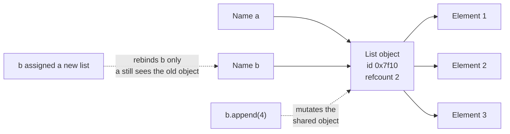
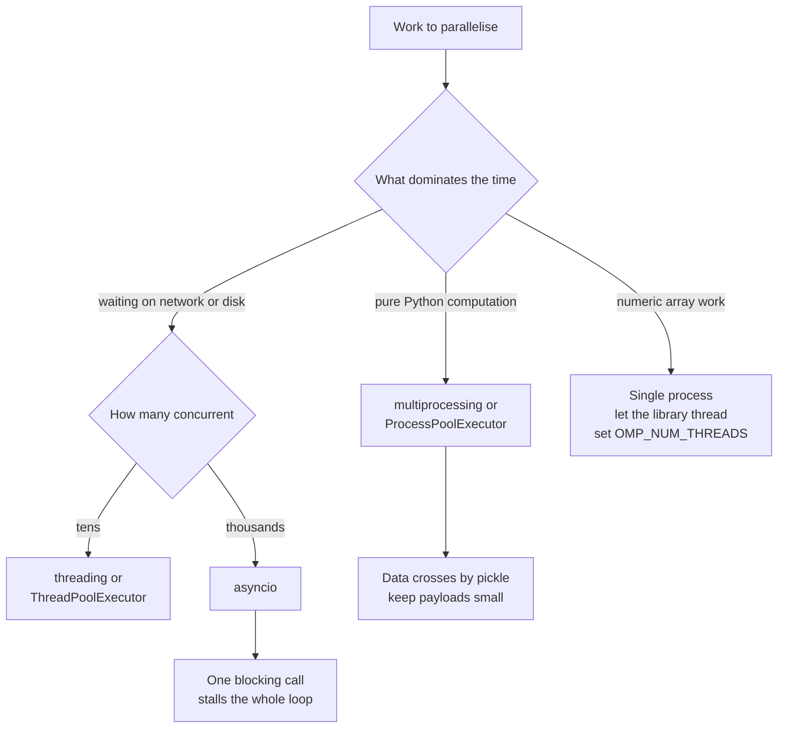
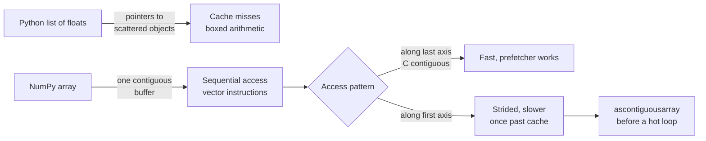
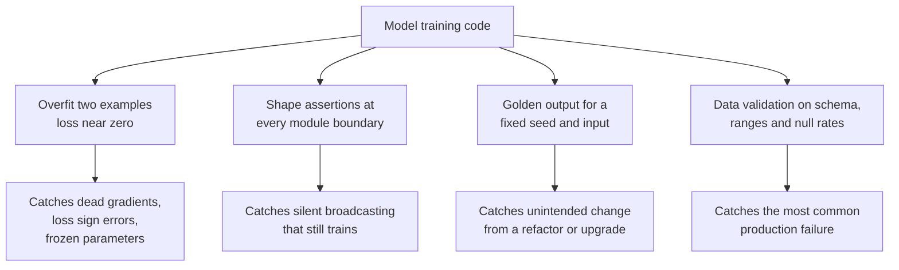
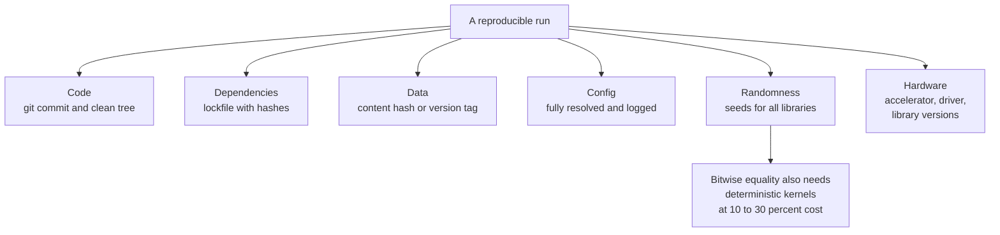

# Chapter 3: Python for Machine Learning Engineering

> **What this chapter covers** The Python data model, typing, performance and the global interpreter lock, vectorisation with NumPy, memory behaviour, concurrency, the data libraries, engineering practice from project layout to testing, and reproducibility.
> **Prerequisites** Chapter 1 for array shapes and numerical precision. You can already write Python that works; this chapter is about Python that keeps working.
> **Where it is used** Every training script, data pipeline, inference service, and evaluation harness. The difference between a notebook that produced a number once and a system that produces it again next month is almost entirely in this chapter.

Python is slow, dynamically typed, and has a concurrency model that surprises people. It is also the language every machine learning system is written in, because the slow parts are delegated to compiled libraries and the fast parts are the ones humans have to read. Knowing exactly where the boundary is between the two is the core skill.

---

## 3.1 Level 1: Foundations

### 3.1.1 The data model: everything is an object with a reference

In Python, a variable is a name bound to an object. Assignment binds a name; it does not copy an object.

```python
a = [1, 2, 3]
b = a
b.append(4)
print(a)          # [1, 2, 3, 4]
```

`a` and `b` are two names for one list. This is the single most common source of confusing bugs for people arriving from languages with value semantics.

Every object has three things: an **identity** (its address, returned by `id()`), a **type**, and a **value**. Identity and type never change. Value changes only if the type is mutable.

| Mutable | Immutable |
| --- | --- |
| `list`, `dict`, `set`, `bytearray` | `int`, `float`, `str`, `tuple`, `frozenset`, `bytes` |
| Most user classes | Anything with `__slots__` and no setters, `NamedTuple`, frozen `dataclass` |

The distinction has three practical consequences.

**Default arguments are evaluated once.** A mutable default is shared across every call:

```python
def add_item(item, bucket=[]):     # wrong
    bucket.append(item)
    return bucket

print(add_item(1))   # [1]
print(add_item(2))   # [1, 2]  the same list
```

The fix is `bucket=None` and `if bucket is None: bucket = []` inside. This bug appears in configuration objects and in caching decorators, where it silently accumulates state across calls.

**Only immutable objects can be dictionary keys.** Hashability requires that the hash never changes, so a list cannot be a key and a tuple can.

**Copying needs a decision.** `copy.copy` makes a shallow copy, where the container is new but the contained objects are shared. `copy.deepcopy` recurses. For a configuration dictionary containing nested dictionaries, a shallow copy means edits to a nested value leak back to the original.



*Figure 3.1: Assignment binds a name to an object, so mutation through one name is visible through every name, while rebinding affects only the name it touches.*

### 3.1.2 Scope and closures

Python resolves names by the LEGB rule: **L**ocal, then **E**nclosing function, then **G**lobal (module level), then **B**uiltins.

Assigning to a name anywhere in a function makes it local for the whole function, which produces this:

```python
count = 0
def bump():
    count = count + 1     # UnboundLocalError
```

The assignment marks `count` local, so the read on the right side finds an unassigned local. Fix with `global count` for module scope or `nonlocal count` for an enclosing function scope, though needing either usually means the state belongs in an object.

A **closure** is a function that captures variables from its enclosing scope. Closures capture the variable, not its value at definition time:

```python
fns = [lambda: i for i in range(3)]
print([f() for f in fns])            # [2, 2, 2]

fns = [lambda i=i: i for i in range(3)]
print([f() for f in fns])            # [0, 1, 2]
```

The first version has all three lambdas referring to the same `i`, which ends at 2. The default argument in the second binds the value at definition time. This bites when building a list of callbacks, partial functions, or per layer hooks in a loop.

### 3.1.3 Iterators and generators

An **iterable** is anything you can loop over. An **iterator** is an object with a `__next__` method that yields items one at a time and raises `StopIteration` when done. `for x in xs` calls `iter(xs)` then `next()` repeatedly.

A **generator** is the easy way to write an iterator. Any function containing `yield` returns a generator when called; execution pauses at each `yield` and resumes on the next request.

```python
def read_batches(path, batch_size):
    batch = []
    with open(path) as f:
        for line in f:                 # the file object is itself an iterator
            batch.append(line.rstrip("\n"))
            if len(batch) == batch_size:
                yield batch
                batch = []
    if batch:
        yield batch                    # do not silently drop the last partial batch
```

The memory difference is the point. Reading a 40 GB file with `f.readlines()` needs 40 GB of RAM. The generator holds one batch. The final `if batch` is easy to forget and silently drops up to `batch_size - 1` examples, which is a real evaluation bug when the dataset is small.

Generators are single use. Once exhausted they yield nothing. Passing a generator to a function that iterates twice gives an empty second pass with no error.

### 3.1.4 Comprehensions, and when they hurt

A comprehension builds a container from an iterable in one expression:

```python
squares = [x * x for x in range(10)]
lookup  = {k: v for k, v in pairs}
unique  = {x.lower() for x in words}
lazy    = (x * x for x in range(10))    # generator expression, evaluates on demand
```

They are faster than an explicit loop with `.append`, because the append is done by the interpreter loop rather than by an attribute lookup and method call per item.

Readability breaks down at two conditions or two levels of nesting. This is legal and should not survive review:

```python
out = [transform(x) for sub in data if sub for x in sub if x.valid and x.score > t]
```

The order in a nested comprehension is the same as nested `for` loops read left to right, which is the opposite of what most people guess when the value expression comes first. When in doubt, write the loop.

### 3.1.5 Context managers

A **context manager** guarantees cleanup. The `with` statement calls `__enter__` on entry and `__exit__` on exit, including when an exception propagates.

```python
with open("data.jsonl") as f:     # closed even if the body raises
    process(f)
```

Without it, an exception leaves the file handle open until garbage collection, which on CPython is usually immediate but is not guaranteed and is not immediate on other implementations. Leaked handles exhaust the file descriptor limit in long running services.

Writing one is short:

```python
from contextlib import contextmanager
import time, logging

@contextmanager
def timed(label):
    start = time.perf_counter()
    try:
        yield
    finally:
        logging.info("%s took %.3fs", label, time.perf_counter() - start)
```

The `try/finally` matters: without it, an exception in the body skips the logging. Use `time.perf_counter` rather than `time.time` for durations, because `time.time` can jump backward when the system clock is adjusted.

### 3.1.6 Decorators

A **decorator** is a function that takes a function and returns a replacement. `@deco` above `def f` is exactly `f = deco(f)`.

```python
import functools, logging

def retry(times=3, delay=1.0):
    def decorator(fn):
        @functools.wraps(fn)
        def wrapper(*args, **kwargs):
            for attempt in range(times):
                try:
                    return fn(*args, **kwargs)
                except (TimeoutError, ConnectionError) as exc:
                    if attempt == times - 1:
                        raise
                    logging.warning("retry %d for %s: %s", attempt + 1, fn.__name__, exc)
                    time.sleep(delay * 2 ** attempt)
        return wrapper
    return decorator
```

Three things to notice. The three levels of nesting exist because the decorator takes arguments: the outer call returns the real decorator. `functools.wraps` copies the name, docstring, and signature metadata onto the wrapper, without which stack traces and documentation tools show `wrapper` everywhere. And the exception list is specific: a bare `except Exception` would retry a `ValueError` from bad input three times before failing, wasting time and hiding the real cause.

### 3.1.7 Why Python is slow

Compare adding a million numbers in pure Python against NumPy. The pure Python version is typically one to two orders of magnitude slower. The reasons are structural.

| Cause | What happens |
| --- | --- |
| Boxing | Every integer is a heap object with a reference count and type pointer, not a machine word |
| Dynamic dispatch | `a + b` looks up `__add__` on the type at runtime, every time |
| Interpreter overhead | Each bytecode instruction is a dispatch in the evaluation loop |
| No contiguity | A Python list holds pointers to objects scattered in memory, defeating the CPU cache |
| No vector instructions | The interpreter cannot use single instruction multiple data hardware |

NumPy fixes all five for array operations: values are unboxed machine numbers in one contiguous block, the loop is compiled C, and the compiler emits vector instructions. The engineering rule that follows: **push loops into the array library**. A Python loop over rows is the single most common performance defect in machine learning code.

### 3.1.8 The global interpreter lock in one paragraph

CPython has a **global interpreter lock**: only one thread executes Python bytecode at a time. Threads therefore do not give parallel speedup for pure Python computation. They do help when threads spend their time waiting on input and output, because the lock is released during a blocking call, and they help for NumPy and PyTorch operations, because those release the lock while running compiled code. For parallel pure Python computation, use processes. Free threaded builds of CPython without the lock exist from version 3.13 as an option; check your version and build before assuming either behaviour.

---

## 3.2 Level 2: Working knowledge

### 3.2.1 NumPy: shapes, broadcasting, views

A NumPy array has a `dtype`, a `shape`, and `strides`, which say how many bytes to step to move one element along each axis. The data is one flat buffer; shape and strides are the interpretation.

**Broadcasting** lets arrays of different shapes combine. Align shapes from the right. Two dimensions are compatible if they are equal or one of them is 1. A size 1 dimension is stretched without copying.

| A shape | B shape | Result | Valid |
| --- | --- | --- | --- |
| `(3, 4)` | `(4,)` | `(3, 4)` | Yes, B applies to each row |
| `(3, 4)` | `(3, 1)` | `(3, 4)` | Yes, B applies to each column |
| `(3, 4)` | `(3,)` | error | No, 4 against 3 |
| `(5, 1, 3)` | `(4, 3)` | `(5, 4, 3)` | Yes |

The third row is the common bug. The fix is `B[:, None]` to make it `(3, 1)`, which is explicit about intent.

**Listing 3.1: pairwise distances with and without broadcasting.**

```python
import numpy as np

X = np.random.randn(1000, 64)

# Explicit, memory hungry: builds a (1000, 1000, 64) intermediate, 512 MB in float64
D_broadcast = np.sqrt(((X[:, None, :] - X[None, :, :]) ** 2).sum(-1))

# Expanded square, no large intermediate: (1000, 1000) only, 8 MB
sq = (X ** 2).sum(1)
D_gram = np.sqrt(np.maximum(sq[:, None] + sq[None, :] - 2 * X @ X.T, 0.0))

print(np.allclose(D_broadcast, D_gram, atol=1e-6))   # True
```

The second form uses $\|a-b\|^2 = \|a\|^2 + \|b\|^2 - 2a^\top b$ to replace a rank 3 intermediate with a matrix product, cutting memory by a factor of 64 and running faster because the matrix product hits an optimised library. The `np.maximum(..., 0.0)` is not cosmetic: catastrophic cancellation from chapter 1 can make the expression slightly negative for near identical points, and the square root of a negative gives NaN. Every production implementation of this has that clamp.

**Views versus copies.** Basic slicing returns a **view** sharing the buffer. Fancy indexing (with a list, array, or boolean mask) returns a **copy**.

```python
a = np.arange(10)
v = a[2:5]          # view
v[0] = 99
print(a[2])         # 99, the original changed

c = a[[2, 3, 4]]    # copy, fancy indexing
c[0] = -1
print(a[2])         # 99, unchanged
```

Check with `arr.base`: it is `None` for an owning array and points at the parent for a view. This decides whether an in place normalisation modifies your dataset.

`reshape` returns a view when it can and a copy when the strides cannot express the new shape, which happens after a transpose. `ravel` returns a view when possible; `flatten` always copies. The `.T` of a 2D array is always a view with swapped strides, which is why a transpose is free but iterating a transposed array is slow: you are walking against memory order.

### 3.2.2 Profiling before optimising

Never optimise from intuition. Four tools, each answering a different question.

| Tool | Question | Overhead |
| --- | --- | --- |
| `time.perf_counter` around a block | How long did this take | None |
| `cProfile` | Which function calls dominate | 2 to 4 times slowdown, distorts short calls |
| `line_profiler` (`kernprof`) | Which line inside a function dominates | Large, use on one function |
| `py-spy` | What is a running process doing right now | Near zero, works on production processes |
| `memory_profiler` or `tracemalloc` | Where did the memory go | Moderate |

`py-spy` deserves emphasis. It samples the call stack of a process by process identifier without modifying or restarting it, so you can point it at a training job that is mysteriously slow. `py-spy dump --pid N` gives an immediate stack, which answers "is it stuck in data loading or in the backward pass" in seconds.

Read `cProfile` output by **cumulative time** first to find the region, then by **total time** (time in the function excluding calls it makes) to find the actual work. A function with high cumulative and low total time is a router, not a bottleneck.

### 3.2.3 Typing, and what it actually buys

Annotations are not enforced at runtime by CPython. They buy static checking, editor support, and documentation that cannot go stale silently.

```python
from collections.abc import Sequence, Iterator
from typing import Protocol, TypeVar

T = TypeVar("T")

def batched(items: Sequence[T], size: int) -> Iterator[list[T]]:
    for i in range(0, len(items), size):
        yield list(items[i:i + size])

class Encoder(Protocol):
    def encode(self, text: str) -> list[int]: ...

def count_tokens(enc: Encoder, texts: Sequence[str]) -> int:
    return sum(len(enc.encode(t)) for t in texts)
```

`TypeVar` makes `batched` generic: the checker knows that batching a `Sequence[str]` gives `Iterator[list[str]]`. A `Protocol` is structural typing: anything with a matching `encode` method satisfies `Encoder` with no inheritance and no import, so you can type against a third party tokenizer without depending on its class. Built in generics like `list[int]` need Python 3.9 or later; check your version.

What a type checker catches in practice: `None` flowing into code that does not handle it, which is the largest category by a wide margin; wrong argument order when types differ; forgetting to handle a union branch; and stale call sites after a signature change.

What it does not catch: shape mismatches in tensors, since `np.ndarray` says nothing about shape, though `jaxtyping` style annotations and runtime assertions cover some of this; unit errors, unless you make units into types; and anything about values rather than types.

Adopt gradually. Start with the public interfaces of modules, add `strict` mode only for new code, and do not annotate research notebooks.

### 3.2.4 Memory: reference counting and the collector

CPython frees an object when its reference count hits zero, which is immediate and predictable. A separate **generational garbage collector** exists only to break reference **cycles**, which counting cannot free. Objects are promoted through three generations; younger generations are collected more often.

Practical implications.

`sys.getrefcount(obj)` returns one more than you expect, because passing the object to the function creates a reference.

Cycles cost latency. If you hold many objects in cycles, collection pauses grow. `gc.freeze()` after loading a large static structure moves it to a permanent generation so the collector stops rescanning it, which measurably reduces pause time in a service that loads a large model or lookup table at startup.

The patterns that leak, in order of how often they appear:

| Pattern | Mechanism | Fix |
| --- | --- | --- |
| Unbounded cache or list as module global | Nothing ever drops the reference | `functools.lru_cache(maxsize=N)` or an explicit eviction policy |
| Holding a tensor that still has a gradient graph | Keeping `loss` rather than `loss.item()` retains the whole graph | Detach or call `.item()` before storing |
| Exception objects kept in a container | The traceback references every frame, which references every local | Store `str(exc)` not the exception |
| Closure capturing a large object | The closure keeps the enclosing scope alive | Pass what is needed explicitly |
| Registered callbacks or hooks never removed | The registry holds a strong reference | Remove the hook, or use `weakref` |

The second is the classic training loop leak. `total_loss += loss` accumulates the computation graph of every step and runs out of memory around step 100. `total_loss += loss.item()` does not.

### 3.2.5 Concurrency: choosing the model

| Model | Parallel for CPU bound Python | Good for | Cost |
| --- | --- | --- | --- |
| `threading` | No, blocked by the lock | Blocking input and output, and calls into libraries that release the lock | Shared state needs locking |
| `multiprocessing` | Yes | CPU bound pure Python | Process startup, and everything crossing the boundary must be picklable |
| `asyncio` | No | Many concurrent network calls | Whole call stack must be async, one blocking call stalls the loop |
| `concurrent.futures` | Either, via the executor you choose | Simple fan out with a uniform interface | Thin wrapper, same underlying constraints |

Decision rule. Waiting on the network or disk with a few dozen concurrent operations: threads. Waiting on the network with thousands: asyncio. Pure Python computation over many items: processes. Numeric computation: one process and let NumPy or the framework use its own threads, and set `OMP_NUM_THREADS` so the library does not oversubscribe the cores.



*Figure 3.2: Choosing a concurrency model from what the work is waiting on, not from how parallel it feels.*

The most common mistake is a `ProcessPoolExecutor` whose tasks send large arrays as arguments. Every argument is pickled, sent through a pipe, and unpickled. For a 500 MB array that cost exceeds the computation. Use shared memory (`multiprocessing.shared_memory`), memory map the file in each worker, or send a file path and let the worker load it.

The second most common: forgetting that on Windows and on macOS with the default spawn start method, the module is re imported in each child, so module level code runs again. Guard entry points with `if __name__ == "__main__":`.

### 3.2.6 pandas, and the traps

pandas is the default for tabular data under roughly a few million rows on one machine. Three things cost more time than everything else combined.

**The copy versus view trap.** Chained indexing may return a view or a copy depending on the dtypes and the memory layout, so an assignment through it may or may not take effect:

```python
df[df.score > 0.5]["label"] = 1     # may silently do nothing
df.loc[df.score > 0.5, "label"] = 1 # correct
```

Always assign through a single `.loc` or `.iloc` call. Copy on write behaviour changed substantially across pandas 2.x and became the default in pandas 3.0, so check your version and prefer the explicit form, which is correct under every version.

**dtypes.** The default `object` dtype for strings stores a Python object pointer per cell, which costs memory and defeats vectorisation. Two fixes.

Worked example. One million rows, a country column with 200 distinct values averaging 12 characters. As `object`, each cell is a pointer (8 bytes) plus the interned string, so roughly 60 to 70 bytes per unique plus 8 per cell, and the dominant cost is the per object overhead of around 50 bytes for each of the 1,000,000 string objects if they are not shared. As `category`, the column is 1,000,000 int8 codes (1 MB, since 200 values fit in int16 but pandas will use int8 only under 128 categories, so int16 gives 2 MB) plus a 200 entry dictionary. The reduction is typically 20 to 50 times. Group by and equality comparison on a categorical also operate on integer codes and are much faster. Measure with `df.memory_usage(deep=True)`, because without `deep=True` the object column reports only the pointers.

**`apply` and `iterrows`.** `df.apply(fn, axis=1)` runs a Python function per row. `iterrows` is worse, because it constructs a Series per row. For a million rows either takes minutes where a vectorised expression takes milliseconds. Reach for `np.where`, `np.select`, `.map` on a dict, or merges before considering `apply`.

**Listing 3.2: the same transformation three ways.**

```python
import numpy as np, pandas as pd

df = pd.DataFrame({"a": np.random.rand(1_000_000), "b": np.random.rand(1_000_000)})

def slow(df):
    return df.apply(lambda r: r.a * 2 if r.b > 0.5 else r.a, axis=1)

def medium(df):
    return [a * 2 if b > 0.5 else a for a, b in zip(df.a, df.b)]

def fast(df):
    return np.where(df.b.values > 0.5, df.a.values * 2, df.a.values)
```

`slow` builds a Series object per row and dispatches a Python call per row. `medium` avoids the Series construction but still runs a Python loop, and is usually an order of magnitude faster than `slow`. `fast` runs entirely in compiled code on contiguous buffers, and `.values` avoids index alignment overhead. Typical relative timings on this shape are roughly 100 to 1 to 0.01 seconds, but measure on your own data and hardware rather than quoting these.

### 3.2.7 Arrow, Polars, and why columnar matters

**Apache Arrow** is an in memory columnar format. Values of one column are contiguous, with a separate validity bitmap for nulls. Two properties follow.

Scanning one column touches only that column's memory. A query reading 3 of 200 columns reads 1.5 percent of the bytes, and every cache line fetched is useful. A row oriented layout fetches whole rows and discards most of each.

Arrow is a **specification**, so different tools share buffers with no serialisation. Reading a Parquet file into Arrow and handing it to Polars, DuckDB, or pandas with an Arrow backend can be a pointer pass rather than a conversion. This removes a real cost in pipelines that cross tools.

**Polars** is a dataframe library on Arrow with two differences from pandas that matter. Its expression API is lazy: `pl.scan_parquet(...)` builds a plan, and `.collect()` runs it after an optimiser has pushed filters and column selections down to the file reader, so unneeded columns and row groups are never read. And its operations are multithreaded by default, so it uses all cores without the lock being an issue, because the work happens in Rust.

When to use which.

| Situation | Choice |
| --- | --- |
| Under about a million rows, and the ecosystem of libraries matters more than speed | pandas |
| Tens of millions of rows on one machine, or a pipeline that must be fast | Polars |
| Ad hoc SQL over files | DuckDB |
| Does not fit on one machine | Spark, see chapter 18 |
| Interchange between any of the above | Arrow, and Parquet on disk |

---

## 3.3 Level 3: Depth

### 3.3.1 How the interpreter actually runs your code

Python compiles source to **bytecode** and the evaluation loop executes it. `dis.dis(fn)` shows it.

```python
import dis
def f(xs):
    total = 0
    for x in xs:
        total += x
    return total
dis.dis(f)
```

You will see `LOAD_FAST`, `FOR_ITER`, `BINARY_OP`, `STORE_FAST`, `JUMP_BACKWARD`. Each iteration executes several dispatches, and `BINARY_OP` performs a runtime type lookup to find the addition. In a compiled language this loop is a few machine instructions. Exact opcode names change between versions, so read the output rather than memorising it.

Two implementation details that change how you write code.

**Attribute lookup is a dictionary lookup.** `self.weight` searches the instance dictionary, then the class, then base classes. In a hot loop, hoist it: `w = self.weight` before the loop. `__slots__` on a class replaces the instance dictionary with a fixed array of descriptors, saving memory (often 40 to 50 percent for small objects) and speeding access, at the cost of forbidding new attributes.

**Function calls are expensive.** A Python call builds a frame object. Inlining a tiny helper into a hot loop is one of the few micro optimisations that reliably pays, and it is also the reason that the answer to a slow Python loop is usually to remove the loop rather than to speed up its body.

Recent CPython versions include a specialising adaptive interpreter that rewrites bytecode based on observed types, improving some workloads substantially. The magnitude is version and workload dependent; measure rather than assume.

### 3.3.2 Strides, memory layout, and why the same operation has two speeds

An array's `strides` give the byte step per axis. For a C contiguous `(1000, 64)` float64 array, strides are `(512, 8)`: moving one row skips 512 bytes, moving one column skips 8.

```python
import numpy as np
a = np.zeros((1000, 64))
print(a.strides)          # (512, 8)
print(a.T.strides)        # (8, 512)   transpose is free, it swaps strides
print(a.T.flags["C_CONTIGUOUS"])   # False
```

Summing along the last axis of a C contiguous array walks memory sequentially and the hardware prefetcher keeps up. Summing along the first axis strides through memory and can be several times slower on a large array, with the gap widening once the array exceeds the last level cache.

This is why frameworks care about **memory format**. A convolution on a `(N, C, H, W)` tensor and the same convolution on `(N, H, W, C)` run different kernels with different cache behaviour, and which is faster depends on the hardware and the library. It is also why `np.ascontiguousarray` exists: a single copy before a hot loop often pays for itself many times over.

A subtle correctness point. `np.float32` accumulation of a long sum loses precision, because once the accumulator is large the small addend rounds away entirely, as chapter 1 described. NumPy's `sum` uses pairwise summation, which reduces error from $O(n)$ to $O(\log n)$ in the worst case, but it does not eliminate it. For a float32 array of a million elements, `a.sum()` and `a.sum(dtype=np.float64)` can differ in the third significant digit. Specify the accumulator dtype for any reduction you will report.



*Figure 3.3: The performance gap between Python containers and arrays is memory layout, and the gap within arrays is access order.*

### 3.3.3 Escaping Python: Numba, Cython, and Rust

When the algorithm genuinely cannot be vectorised, for example a sequential dependency, an irregular tree traversal, or a custom loop with early exit, you need compiled code.

| Tool | How it works | Best for | Cost |
| --- | --- | --- | --- |
| Numba | Just in time compiles a subset of Python and NumPy via LLVM, triggered by a decorator | Numeric loops with array arguments | Subset restrictions, opaque failures, compile time on first call |
| Cython | Compiles annotated Python to C ahead of time | Gradual optimisation of existing modules, wrapping C libraries | A build step, a separate language variant |
| C extension via `ctypes` or `cffi` | Call an existing shared library | Reusing a library that already exists | Manual memory and type management |
| Rust via PyO3 and maturin | Compiled extension module in Rust | New performance critical components, parsers, tokenizers | Learning Rust, a build toolchain |

**Listing 3.3: a sequential loop that vectorisation cannot express.**

```python
from numba import njit
import numpy as np

@njit(cache=True)
def ewma(x, alpha):
    """Exponentially weighted moving average: each output depends on the previous."""
    out = np.empty_like(x)
    out[0] = x[0]
    for i in range(1, x.shape[0]):
        out[i] = alpha * x[i] + (1.0 - alpha) * out[i - 1]
    return out

x = np.random.randn(10_000_000)
print(ewma(x, 0.1)[:3])
```

This is the right case for Numba: the recurrence means step `i` needs step `i-1`, so there is no array expression for it. `njit` means no Python objects are allowed in the compiled function, which is what makes it fast; if Numba cannot compile something it will raise rather than silently falling back. `cache=True` writes the compiled code to disk so the compile cost is paid once rather than on every process start, which matters in a worker pool.

Before reaching for any of these, check three things. Is there an array expression you missed. Is there a library function that already does it, such as `scipy.ndimage` or `scipy.signal`. And have you profiled to confirm this function is actually the bottleneck. Most attempts to escape Python are applied to code that accounts for 3 percent of runtime.

For string heavy work, the compiled path is usually a library rather than your own code: `re` is already C, and tokenizer libraries built in Rust exist for exactly this reason.

### 3.3.4 Testing beyond the happy path

pytest's value is in three features people underuse.

**Fixtures** provide setup with explicit scope and teardown:

```python
import pytest

@pytest.fixture(scope="session")
def model():
    m = load_model("checkpoints/small")   # expensive, once per test session
    yield m
    m.close()

@pytest.fixture
def tmp_dataset(tmp_path):                # tmp_path is built in, new per test
    p = tmp_path / "data.jsonl"
    p.write_text('{"text": "a"}\n{"text": "b"}\n')
    return p
```

Scope controls cost. A session scoped fixture loads a model once; the default function scope rebuilds per test. Everything after `yield` is teardown and runs even if the test fails.

**Parametrisation** turns one test into many with clear names:

```python
@pytest.mark.parametrize("n,batch,expected", [(10, 3, 4), (9, 3, 3), (0, 3, 0), (1, 5, 1)])
def test_batch_count(n, batch, expected):
    assert len(list(batched(list(range(n)), batch))) == expected
```

The four cases cover the partial final batch, the exact division, the empty input, and the batch larger than the data. Those are the boundaries where the `if batch:` from section 3.1.3 either works or silently drops data.

**Property based testing** with Hypothesis generates inputs and shrinks failures to a minimal case:

```python
from hypothesis import given, strategies as st

@given(st.lists(st.integers()), st.integers(min_value=1, max_value=100))
def test_batching_preserves_items(items, size):
    out = [x for b in batched(items, size) for x in b]
    assert out == items
```

This asserts an invariant, not an output: batching then flattening returns the original list. It found the dropped final batch bug in real codebases. Hypothesis shrinks a failure to the smallest case, so you get `items=[0], size=2` rather than a random 400 element list.

For machine learning code specifically, the tests that pay:

| Test | What it catches |
| --- | --- |
| Shape assertions at every module boundary | Silent broadcasting that produces a wrong shaped but valid result |
| Overfit a batch of 2 to near zero loss | A disconnected gradient, a wrong loss sign, a frozen parameter |
| Gradient check against finite differences in float64 | A wrong custom backward pass |
| Invariance tests, such as permuting a batch not changing per item outputs | Information leaking across the batch dimension |
| A golden file of expected outputs for a fixed seed and input | Unintended behaviour changes from a refactor or a dependency upgrade |
| Data validation on schema, ranges, and null rates | Upstream data changes, which is the most common production failure |

The overfit test is the highest value test in machine learning code and takes ten lines. If a model cannot drive the loss on two examples to near zero, no amount of data will help and the bug is in the code.



*Figure 3.4: The four tests that pay for themselves in machine learning code, and the failure each one catches.*

### 3.3.5 Packaging, dependencies, and lockfiles

Three concerns that people conflate.

**Environment isolation.** A virtual environment gives one Python and one set of installed packages per project. `venv` is built in. Conda additionally manages non Python dependencies, which matters for compiled numeric and geospatial stacks.

**Dependency specification versus resolution.** `pyproject.toml` declares what you need, with loose constraints such as `numpy>=1.24`. A **lockfile** records exactly what was installed, with pinned versions and content hashes for every transitive dependency. You need both: the specification expresses intent, the lockfile gives reproducibility. Commit the lockfile. A repository with only `numpy` in a requirements file cannot be rebuilt identically in six months.

`pyproject.toml` is the standard configuration file, defined by PEP 518 and PEP 621. Tooling varies: `pip` with `pip-tools`, Poetry, PDM, and `uv` all resolve and lock, with different speed and workflow. Whichever you pick, the requirements are the same: a committed lockfile, hashes, and a reproducible install command in the Makefile.

**Project layout.** The `src` layout is the one that avoids a specific class of bug:

```
project/
  pyproject.toml
  uv.lock
  Makefile
  src/mypkg/__init__.py
  src/mypkg/data.py
  tests/test_data.py
  configs/base.yaml
```

With `src`, the package is not importable from the repository root, so tests import the installed package rather than the source tree. That means your tests exercise what users get, including whether data files were actually included in the distribution. Without `src`, a missing `package_data` entry passes every test locally and fails on install.

Pin the Python version too, in `pyproject.toml` and in a `.python-version` file. A dependency resolution that is valid on 3.11 can differ on 3.12.

### 3.3.6 Configuration, logging, and errors

**Configuration.** Three sources with a clear precedence: file defaults, environment variables, then command line overrides. Validate it at startup with a schema, using `pydantic` or `dataclasses` plus explicit checks, and fail immediately with a message naming the offending key. A run that starts with a learning rate of `"3e-4"` as a string and fails 40 minutes later is a configuration validation failure.

Never put secrets in configuration files. Read them from the environment, keep a committed `.env.example` listing the names with no values, and put `.env` in `.gitignore`.

**Logging.** Use the `logging` module, not `print`. `print` writes to stdout with no level, no timestamp, no module name, and no way to turn it off in production.

```python
import logging, json, sys

class JsonFormatter(logging.Formatter):
    def format(self, record):
        payload = {
            "ts": self.formatTime(record, "%Y-%m-%dT%H:%M:%S"),
            "level": record.levelname,
            "logger": record.name,
            "msg": record.getMessage(),
        }
        if record.exc_info:
            payload["exc"] = self.formatException(record.exc_info)
        return json.dumps(payload)

handler = logging.StreamHandler(sys.stdout)
handler.setFormatter(JsonFormatter())
logging.basicConfig(level=logging.INFO, handlers=[handler])
```

Structured JSON logs are queryable; free text is not. Configure logging once in the entry point, never in a library module, and get loggers with `logging.getLogger(__name__)` so the hierarchy matches the package and levels can be set per module. Use lazy formatting, `log.info("loaded %d rows", n)` rather than an f-string, so the formatting cost is skipped when the level is disabled.

**Errors.** Catch the narrowest exception that you can actually handle. A bare `except:` also catches `KeyboardInterrupt` and `SystemExit`, making a process unkillable. `except Exception` is acceptable only at a top level boundary where you log and re raise or exit.

Preserve context. `raise ValueError("bad config") from exc` keeps the original traceback chained. Define a small exception hierarchy for your package so callers can catch your errors specifically. Put the values in the message: `f"expected 2 columns, got {n} in {path}"` rather than "invalid input".

### 3.3.7 Reproducibility, and why it is harder than seeding

Seeding is necessary and not sufficient.

**Listing 3.4: seeding every source of randomness.**

```python
import os, random
import numpy as np

def seed_everything(seed: int, deterministic: bool = False):
    os.environ["PYTHONHASHSEED"] = str(seed)   # must be set before interpreter start to fully apply
    random.seed(seed)
    np.random.seed(seed)
    try:
        import torch
        torch.manual_seed(seed)
        torch.cuda.manual_seed_all(seed)
        if deterministic:
            torch.use_deterministic_algorithms(True, warn_only=True)
            torch.backends.cudnn.benchmark = False
            os.environ.setdefault("CUBLAS_WORKSPACE_CONFIG", ":4096:8")
    except ImportError:
        pass
```

Four notes. `PYTHONHASHSEED` affects the iteration order of sets and of string keyed dictionaries in older versions; setting it inside the process is too late for full effect, so also set it in the launcher. `torch.use_deterministic_algorithms` makes the library raise on operations with no deterministic implementation rather than silently using a nondeterministic one, which is the behaviour you want. `cudnn.benchmark = False` stops the autotuner picking different algorithms on different runs based on timing. `CUBLAS_WORKSPACE_CONFIG` is required for deterministic cuBLAS behaviour on some versions; check your version's documentation.

**Why GPUs are not deterministic by default.** Floating point addition is not associative: $(a+b)+c \neq a+(b+c)$ in general, because each operation rounds. A GPU reduction sums thousands of values across threads in an order decided by the scheduler, and that order varies between runs. So the same sum gives slightly different results, and over thousands of training steps the difference compounds until two runs diverge visibly.

Worked example of non associativity in float32: let $a = 10^8$, $b = 1$, $c = -10^8$. Then $(a+b)+c$: $10^8 + 1$ rounds to $10^8$ in float32 because the gap between representable numbers at $10^8$ exceeds 1, so the result is 0. But $a + (b+c) = 10^8 + (1 - 10^8) = 1$. Same three numbers, answers 0 and 1.

Additional nondeterminism sources: atomic accumulation in scatter and index operations; autotuned algorithm selection; multithreaded data loading changing example order; and hardware or library version differences. Determinism typically costs 10 to 30 percent throughput, so the usual policy is to run deterministically for debugging and for the tests that must be exact, and to accept nondeterminism in production training while reporting results across multiple seeds as chapter 2, level 4 requires.

**Environment capture.** A seed is useless without the environment. Record, per run: the lockfile hash or the full resolved dependency list, the Python version, the git commit and whether the tree was dirty, the accelerator model and driver version, the container image digest, the full configuration after merging all sources, and a hash of the dataset. A container image with a pinned digest captures most of it; the dataset hash is the piece people forget, and it is the one that most often explains a number that will not reproduce.



*Figure 3.5: Seeding is one of six inputs to reproducibility, and it is the only one that costs nothing to get right.*

---

## 3.4 Level 4: Mastery

### 3.4.1 The global interpreter lock in detail, and what is changing

The lock protects CPython's internal state, most importantly reference counts. Without it, two threads incrementing a refcount concurrently would corrupt it and either leak or free a live object.

A thread holds the lock while executing bytecode and releases it in three situations: after a configurable interval (`sys.setswitchinterval`, default 5 milliseconds), during a blocking system call, and inside any C extension that explicitly releases it. NumPy, PyTorch, and most compiled libraries release it around their computation, which is why a thread pool calling into NumPy does get parallelism.

Two developments to know.

**Subinterpreters with per interpreter locks** (PEP 684, available from 3.12, with a standard library interface in 3.13) give each interpreter its own lock inside one process, allowing parallelism with cheaper isolation than processes.

**Free threaded CPython** (PEP 703) removes the lock entirely, available as an experimental build option from 3.13. It requires C extensions to be rebuilt and thread safe, and single threaded performance carries an overhead that has been decreasing across releases. Check the status for your version rather than relying on any summary, including this one.

For now, the practical guidance is unchanged: processes for parallel Python computation, threads for input and output and for calls into compiled libraries.

### 3.4.2 Memory that the operating system does not return

Two effects explain "my service uses 8 GB but the Python objects total 2 GB".

**Fragmentation.** CPython allocates small objects from arenas of 256 KB (subject to version specific tuning). An arena is returned to the operating system only when every object in it is free. One long lived object per arena pins the whole thing. A process that allocates a million temporary objects and keeps a scattered few can hold far more resident memory than its live set.

**Free lists.** CPython keeps free lists for common small types so allocation is fast, and those do not return memory either.

The diagnosis path: `tracemalloc` for Python level allocations with a snapshot difference between two points; `psutil` resident set size for what the operating system sees; the gap between the two is the allocator and the compiled libraries. For an array heavy workload the gap is usually NumPy and framework allocations, which do not go through Python's allocator at all.

For a service, the practical mitigations are bounded caches, restarting workers after a set number of requests (which is what production web servers do by default for exactly this reason), and `gc.freeze()` after loading static data.

Framework caching allocators are a separate story. PyTorch's CUDA allocator caches freed blocks rather than returning them to the driver, so `nvidia-smi` shows the peak, not the current live usage. `torch.cuda.memory_allocated()` and `memory_reserved()` give the two numbers. Out of memory errors with plenty of reserved memory usually mean fragmentation in the caching allocator, addressable with `PYTORCH_CUDA_ALLOC_CONF` expandable segments; check your version for the exact option names.

### 3.4.3 Data loading as the real bottleneck

A common diagnosis: accelerator utilisation sits at 40 percent, and the model is blamed. The cause is usually the input pipeline.

| Symptom | Cause | Fix |
| --- | --- | --- |
| Utilisation sawtooths between 0 and 100 | Workers cannot keep up between steps | More workers, prefetch depth, faster decode |
| A long stall at each epoch boundary | Workers are torn down and recreated | Persistent workers |
| High system CPU time | Too many workers competing, or oversubscribed library threads | Fewer workers, set `OMP_NUM_THREADS=1` in workers |
| Memory growth over an epoch | Each worker copies a Python object dataset because of refcount touching | Store as arrays or memory mapped files, not lists of Python objects |
| Slow first step after each epoch | Shuffle buffer refill | Larger prefetch, or a shuffled index rather than a shuffled buffer |

The fourth deserves explanation. With the fork start method, worker processes share the parent's memory copy on write. But touching a Python object writes its reference count, which is stored in the object header, so the page is copied. Iterating a large Python list in every worker therefore copies it in every worker. Storing the same data as a NumPy array or a memory mapped file avoids this entirely, because the refcount touched is one array object's rather than a million elements'.

Measure the pipeline separately from the model: loop over the data loader alone, timing it, and compare with the time per training step. If loading alone is slower than a training step, no model optimisation will help.

### 3.4.4 Where the standard Python advice is wrong

**"Always use `asyncio` for input and output."** Only when concurrency is high and the whole stack is async. A single synchronous call inside an async function blocks the event loop and serialises everything. Thirty concurrent requests with a thread pool is simpler, easier to debug, and fast enough.

**"Type hints slow Python down."** Annotations on function signatures are evaluated at definition time by default, which is a one time cost, and `from __future__ import annotations` (PEP 563) makes them strings, deferring evaluation. Runtime validation libraries do cost something; static annotations do not affect the hot path.

**"Use `__slots__` everywhere."** It saves memory and speeds attribute access for classes instantiated in large numbers. For a handful of configuration objects it is noise, and it breaks multiple inheritance patterns and dynamic attribute assignment.

**"Comprehensions are always faster."** Faster than an equivalent loop with `.append`, yes. But a comprehension that builds a million element list where a generator would stream is a memory regression, and `sum(x*x for x in big)` beats `sum([x*x for x in big])` on memory with no speed loss.

**"Just use `multiprocessing` to go faster."** Only if the work is CPU bound in pure Python and the data crossing the boundary is small. For numeric work, the library is already parallel and adding processes oversubscribes the cores, making it slower. Check `OMP_NUM_THREADS`, `MKL_NUM_THREADS`, and `torch.set_num_threads` before adding processes.

**"pandas is fine, it is just a bit slow."** Beyond a few million rows on one machine, the difference between pandas and a lazy columnar engine is not a constant factor; it is the difference between reading all 200 columns and reading the 3 you asked for. That is a change in complexity, not in constant.

### 3.4.5 Dependency management at the limit

Two problems get hard in machine learning specifically.

**The resolver and compiled wheels.** Numeric packages ship binary wheels compiled against specific versions of CUDA, BLAS, and the C++ standard library. The resolver sees version constraints and not application binary interface compatibility, so a resolvable set of versions can still fail at import with an undefined symbol. Mitigations: install accelerator packages from the vendor's index with the index pinned; keep the accelerator stack in the container base image rather than in the application lockfile; and test the actual import in continuous integration, not only the install.

**Transitive pinning and supply chain.** A lockfile with hashes for every transitive dependency is the minimum. Beyond that, generate a software bill of materials, scan for known vulnerabilities, and prefer a private index that mirrors approved packages, which also defends against dependency confusion where a public package shadows an internal name.

For a deployable artefact, the container image digest is the real lock. The lockfile makes the build reproducible; the digest makes the deployment reproducible. Record both.

### 3.4.6 Debugging in production

Techniques that work on a running system.

| Technique | Use |
| --- | --- |
| `py-spy dump --pid N` | Immediate stack of every thread, no restart, negligible overhead |
| `py-spy record` | Flame graph of a live process over a window |
| `faulthandler.register(signal.SIGUSR1)` | Send a signal to dump tracebacks of all threads to stderr |
| `signal` handler that toggles the log level | Turn on debug logging for 60 seconds without a redeploy |
| A `/debug` endpoint returning thread and memory statistics | Structured introspection in a service |
| `tracemalloc` snapshot difference on a schedule | Locate a slow leak by allocation site |

Enable `faulthandler` in every long running entry point. It costs nothing and turns a silent hang into a stack trace. For a distributed training job that hangs, a stack from every rank shows immediately whether one rank is stuck in a collective operation while the others wait, which is the usual cause.

### 3.4.7 What senior engineers argue about

| Question | One position | The other | Practical default |
| --- | --- | --- | --- |
| Strict typing on research code | It catches real bugs and documents interfaces | It slows iteration when the interface changes hourly | Strict on libraries and services, off in experiment scripts |
| Notebooks in the repository | They are how the work is actually done | They are not reviewable, not testable, and hide execution order | Notebooks for exploration, with the logic imported from `src` and the notebook holding no definitions |
| pandas or Polars as the default | The pandas ecosystem is far larger | Polars is faster and its API prevents the copy versus view class of bug | pandas where the ecosystem matters, Polars for pipelines, Arrow and Parquet at every boundary |
| One repository or many | One makes cross cutting changes atomic | Many keeps ownership and build times small | Follow the team boundary, and make the decision explicit rather than by drift |
| Determinism in training | Without it results are not reproducible | It costs throughput and hides genuine seed variance | Deterministic in tests and debugging, multiple seeds reported in results |
| `uv`, Poetry, PDM or pip-tools | Speed and a single tool matter | Stability and ubiquity matter | Any of them, provided the lockfile is committed and the install is one Makefile verb |

---

## 3.5 Subtopic checklist

| Subtopic | You should be able to |
| --- | --- |
| The data model | Explain names versus objects and predict the mutable default argument bug |
| Mutability | List which builtins are mutable and say why only immutables can be dict keys |
| Scope and closures | Explain the late binding of loop variables in closures and fix it |
| Decorators | Write a parameterised decorator and say why `functools.wraps` is required |
| Context managers | Write one with `contextmanager` and explain why `try/finally` is needed |
| Generators | Write a batching generator, handle the final partial batch, and explain single use |
| Comprehensions | Convert between loop and comprehension and state when the loop is clearer |
| Type annotations | Use generics and Protocols and name what a checker does and does not catch |
| Why Python is slow | Give five structural reasons and say which NumPy removes |
| The global interpreter lock | Explain when it does and does not block parallelism |
| Broadcasting | Predict the result shape of any pair and fix a failing pair |
| Views and copies | Predict whether an operation returns a view and check with `.base` |
| Strides | Explain why summing along one axis is faster than another |
| Numba, Cython, Rust | Choose one for a stated problem and say what vectorisation could not express |
| Profiling | Pick the right tool for four different questions including a live process |
| Reference counting and the collector | Explain what the collector adds and name five leak patterns |
| Concurrency | Choose threads, processes or async for a stated workload and justify it |
| pandas traps | Avoid chained assignment, use categoricals, replace `apply` with vectorised code |
| Arrow and Polars | Explain why columnar helps and when lazy evaluation changes complexity |
| Project layout | Justify the `src` layout and list what belongs in `pyproject.toml` |
| Lockfiles | Explain the difference between specification and lock and what goes in each |
| pytest | Use fixture scope, parametrisation and a property based test |
| Logging and configuration | Set up structured logging and validated configuration correctly |
| Reproducibility | Seed every source and list the six inputs beyond the seed |
| GPU nondeterminism | Explain float non associativity with a numeric example and state the cost of determinism |

---

## 3.6 Common misconceptions

| Misconception | Why it is believed | What is actually true |
| --- | --- | --- |
| "Assignment copies" | It does in many other languages | It binds a name to the same object; `b = a` then `b.append` changes what `a` sees |
| "Default arguments are fresh each call" | They look like initialisation inside the function | They are evaluated once at definition, so a mutable default persists across calls |
| "Threads make Python faster" | Threads mean parallelism elsewhere | The global interpreter lock serialises bytecode; threads help only for input, output, and compiled library calls |
| "The garbage collector frees your objects" | It is called the garbage collector | Reference counting frees almost everything immediately; the collector exists only to break cycles |
| "Slicing a NumPy array copies it" | Slicing a list copies | Basic slicing returns a view sharing the buffer; only fancy indexing copies |
| "Transposing a large array is expensive" | It looks like moving data | It swaps strides and is free, but subsequent iteration is slower because it walks against memory order |
| "`df[mask]['col'] = x` assigns" | It reads like it should | It may operate on a temporary copy and silently do nothing; use a single `.loc` |
| "Type hints are checked at runtime" | They look like declarations | CPython ignores them at runtime; a separate checker or a validation library is required |
| "Setting the seed makes a run reproducible" | Seeding controls the randomness people think about | Kernel nondeterminism, library versions, data order, and hardware all vary independently of the seed |
| "GPU results should be identical across runs" | The arithmetic is deterministic in principle | Floating point addition is not associative and reduction order varies, so results differ unless deterministic kernels are forced |
| "`multiprocessing` always speeds things up" | More processes means more cores used | Pickling large arguments and oversubscribing library threads frequently make it slower |
| "`print` is fine for logging" | It works during development | No levels, no timestamps, no module names, no structure, and no way to turn it off in production |
| "Notebook results are reproducible if the notebook runs" | The cells are all there | Out of order execution means the saved state may not match any top to bottom run |

---

## 3.7 Practice

**Exercise 3.1 (level 2). Profile and fix a slow transformation.**
Write a data transformation over at least a million rows using `df.apply(axis=1)`. Profile it with `cProfile` and `line_profiler`. Rewrite it vectorised.
*Acceptance criterion*: a table of wall time for the original and rewritten versions on the same machine and data, a statement of the speedup, and a test asserting the outputs are identical.

**Exercise 3.2 (level 2). Build a streaming batch reader with tests.**
Write a generator that reads a JSON lines file in batches. Test it with pytest parametrisation covering the empty file, a file shorter than one batch, an exact multiple, and a partial final batch. Add a Hypothesis property test that batching then flattening is the identity.
*Acceptance criterion*: all tests pass, the property test runs at least 100 generated cases, and peak memory measured with `tracemalloc` is independent of file size across three file sizes spanning a factor of 100.

**Exercise 3.3 (level 3). Reproduce and fix a memory leak.**
Write a training loop that accumulates `total_loss += loss` on a tensor with a gradient graph. Measure resident memory growth per step. Fix it and measure again. Separately, build a leak from an unbounded module level cache and locate it with `tracemalloc` snapshot differences.
*Acceptance criterion*: a plot of memory against step before and after each fix, and the `tracemalloc` output identifying the allocation site by file and line.

**Exercise 3.4 (level 3). Measure the cost of determinism.**
Train a small model on a public dataset three times with the same seed, nondeterministically, and record the final metric. Repeat with full determinism enabled.
*Acceptance criterion*: the spread of the metric across runs in both modes, the wall clock cost of determinism as a percentage, and a statement of which operations forced the nondeterministic path, obtained from the warnings.

**Exercise 3.5 (level 4). Compare four dataframe engines on the same query.**
Take a public dataset of at least 50 million rows in Parquet. Run the same aggregation with a filter and a group by in pandas, Polars eager, Polars lazy, and DuckDB.
*Acceptance criterion*: a table of wall time, peak resident memory, and bytes read from disk for each, plus an explanation of why the lazy engine reads fewer bytes referencing predicate and projection pushdown.

**Exercise 3.6 (level 4). Vectorise, then escape Python.**
Implement an exponentially weighted moving average three ways: a pure Python loop, a NumPy formulation using cumulative products, and a Numba compiled loop. Verify all three agree in float64.
*Acceptance criterion*: timings for all three across array sizes from $10^4$ to $10^7$, maximum absolute disagreement reported, and a paragraph explaining why the NumPy version loses accuracy for small alpha and large arrays.

---

## 3.8 How this is tested

**Q1. What does `b = a` do when `a` is a list, and what are the consequences?**

<details>
<summary>Answer</summary>
It binds a second name to the same object; nothing is copied. Mutating through either name is visible through both, because there is one list. Consequences: passing a list into a function lets the function mutate the caller's data; a mutable default argument is created once at definition and persists across calls; and copying needs an explicit decision between `copy.copy`, which shares the contained objects, and `copy.deepcopy`, which recurses. Only immutable objects are hashable and can be dictionary keys, which is why a tuple works as a key and a list does not.
</details>

**Q2. Explain the global interpreter lock and when threads still help.**

<details>
<summary>Answer</summary>
Only one thread executes CPython bytecode at a time, because the lock protects interpreter state including reference counts. Threads therefore give no speedup for CPU bound pure Python code. They do help in two cases: the lock is released during blocking system calls, so input and output bound work overlaps; and compiled extensions such as NumPy and PyTorch release it around their computation, so a thread pool calling into them gets real parallelism. For CPU bound pure Python, use processes. Per interpreter locks (PEP 684) and free threaded builds (PEP 703) change this from 3.12 and 3.13 respectively; check your version and build rather than assuming.
</details>

**Q3. Your accelerator sits at 40 percent utilisation during training. How do you find out why?**

<details>
<summary>Answer</summary>
First separate the input pipeline from the model: iterate the data loader alone with timing and compare against the time per training step. If loading alone is slower, the model is not the problem. Then look at the shape of the utilisation trace: sawtooths between 0 and 100 mean workers cannot keep up between steps, and stalls at epoch boundaries mean workers are being recreated, fixed with persistent workers. Check for oversubscription, since each worker inheriting a default thread count competes for cores; set `OMP_NUM_THREADS=1` in workers. Check for memory copies: with the fork start method, touching Python objects in a worker writes their reference counts and copies the page, so a dataset held as a list of Python objects is duplicated per worker, which arrays or memory mapped files avoid. Use `py-spy dump` on a worker to see where it actually is.
</details>

**Q4. When does a NumPy operation return a view rather than a copy, and why does it matter?**

<details>
<summary>Answer</summary>
Basic slicing with `start:stop:step`, transposition, and reshape when the strides allow it return views sharing the underlying buffer. Fancy indexing with a list, an integer array, or a boolean mask returns a copy, as does `flatten` and any reshape that cannot be expressed with strides, such as after a transpose. Check with `arr.base`, which is `None` for an owning array. It matters for correctness, since an in place modification of a view changes the parent and can silently corrupt a dataset, and for performance, since an unintended copy of a large array is both time and memory. A related performance point: the transpose is free because it only swaps strides, but iterating the transposed array walks against memory order and is slower once the array exceeds cache.
</details>

**Q5. How would you reduce the memory of a pandas dataframe with a million rows?**

<details>
<summary>Answer</summary>
Measure first with `df.memory_usage(deep=True)`, since without `deep=True` object columns report only their pointers. Then: convert low cardinality string columns to `category`, which replaces per row Python string objects with small integer codes plus a dictionary, typically a 20 to 50 times reduction on such columns; downcast numeric columns to the smallest dtype that holds the range, for example int64 to int32 or int8; drop columns you do not use, ideally at read time with the `columns` argument to `read_parquet` so they are never materialised; and use nullable or Arrow backed dtypes where appropriate. If the result is still too large, the answer is a columnar engine that reads only the columns and row groups the query needs, or chunked processing.
</details>

**Q6. Name five patterns that leak memory in Python and how you would find them.**

<details>
<summary>Answer</summary>
An unbounded module level cache or list, fixed with `lru_cache(maxsize=N)` or explicit eviction. Accumulating a tensor that still carries its gradient graph, for example `total_loss += loss` instead of `loss.item()`, which retains every step's graph. Storing exception objects, whose tracebacks reference every frame and therefore every local, fixed by storing the string. A closure capturing a large object, which keeps the whole enclosing scope alive. Registered hooks or callbacks never removed, fixed by removal or by `weakref`. Find them with `tracemalloc` snapshot differences between two points, which reports allocation sites by file and line, plus `psutil` resident set size to see what the operating system sees. The gap between the two is allocator fragmentation and compiled library allocations, which do not go through Python's allocator at all.
</details>

**Q7. You need to parallelise work over 10,000 items. Walk through the decision.**

<details>
<summary>Answer</summary>
Ask what the work is waiting on. If it is network or disk with tens of concurrent operations, use a thread pool, since the lock is released during blocking calls. If it is network with thousands of concurrent operations, use asyncio, provided the entire call path is async, because one blocking call stalls the event loop. If it is pure Python computation, use processes, and keep the data crossing the boundary small since every argument is pickled; send a path or use shared memory rather than a large array. If it is numeric array work, do not add processes at all: the library is already threaded, and adding processes oversubscribes the cores. Set `OMP_NUM_THREADS` explicitly in either case. Guard the entry point with `if __name__ == "__main__":` because the spawn start method re imports the module in each child.
</details>

**Q8. Why are GPU results not bitwise reproducible, and what does it cost to make them so?**

<details>
<summary>Answer</summary>
Floating point addition is not associative, because each operation rounds. In float32, $(10^8 + 1) + (-10^8)$ gives 0 because $10^8 + 1$ rounds back to $10^8$, while $10^8 + (1 - 10^8)$ gives 1. A GPU reduction sums across thousands of threads in an order chosen by the scheduler, and that order varies between runs, so the same sum gives different last bits. Over thousands of steps the difference compounds until two runs diverge visibly. Other sources are atomic accumulation in scatter operations, autotuned algorithm selection, and multithreaded data loading changing example order. Forcing determinism, by selecting deterministic kernels, disabling autotuning, and fixing the data order, typically costs 10 to 30 percent throughput, so the usual policy is determinism in tests and debugging, and multiple seeds with reported spread in results.
</details>

**Q9. What does a type checker buy you, and what does it not catch?**

<details>
<summary>Answer</summary>
It catches `None` flowing into code that does not handle it, which is by far the largest category; argument order mistakes when the types differ; unhandled branches of a union; and stale call sites after a signature change. It also gives editor completion and documentation that cannot drift silently. It does not catch tensor shape mismatches, since `np.ndarray` carries no shape information in the type, so keep runtime shape assertions. It does not catch unit errors unless you encode units as types, and it says nothing about values. CPython does not enforce annotations at runtime, so a separate checker or a validation library is required. Adopt it on module interfaces and new code rather than retrofitting everything.
</details>

**Q10. What is the difference between `pyproject.toml` and a lockfile, and why do you need both?**

<details>
<summary>Answer</summary>
`pyproject.toml` declares intent: the direct dependencies with loose constraints, the Python version, and the build and tool configuration. A lockfile records the resolved result: every transitive dependency pinned to an exact version with a content hash. You need both because the specification is what a human maintains and what allows upgrades, while the lock is what makes an install reproducible six months later on a different machine. Commit the lockfile. For machine learning specifically, the lockfile is still not enough, because compiled wheels depend on CUDA and BLAS versions that the resolver does not model, so also pin the container image by digest and test the actual imports in continuous integration rather than only the install.
</details>

**Q11. Write the three tests you would add to any model training code.**

<details>
<summary>Answer</summary>
First, overfit a batch of two examples to near zero loss. It takes ten lines and catches a disconnected gradient, a sign error in the loss, a frozen parameter, or a label mismatch; if a model cannot fit two examples, no amount of data will help. Second, shape assertions at every module boundary, because broadcasting can produce a wrong shaped result that is still valid and trains to a plausible looking but wrong number. Third, a determinism or golden file test: fixed seed, fixed input, and an assertion on stored expected outputs, which catches unintended behaviour changes from a refactor or a dependency upgrade. Beyond those three, add a gradient check against finite differences in float64 for any custom backward pass, an invariance test that permuting a batch does not change per item outputs (which catches information leaking across the batch dimension), and data validation on schema, ranges and null rates, since upstream data change is the most common production failure.
</details>

**Q12. When would you reach for Numba or Rust instead of vectorising?**

<details>
<summary>Answer</summary>
When the algorithm has a sequential dependency that no array expression can capture, such as a recurrence where each output depends on the previous; when the control flow is irregular, such as a tree traversal or a loop with an early exit; or when vectorising would require an intermediate array far larger than memory. Before reaching for either, check three things: whether an array formulation exists that you missed, such as using the expanded square form for pairwise distances instead of a rank 3 broadcast; whether a library already implements it, in `scipy.signal` or `scipy.ndimage`; and whether profiling confirms the function is actually the bottleneck, since most optimisation effort is spent on code that accounts for a small fraction of runtime. Numba fits a numeric loop over arrays with a decorator and `cache=True` to avoid recompiling per process. Rust with PyO3 fits a new performance critical component such as a parser or tokenizer, where the extra build toolchain is justified by long term ownership.
</details>

---

## Summary

1. A variable is a name bound to an object, so assignment shares rather than copies, and mutable default arguments persist across calls.
2. Closures capture variables rather than values, which is why a list of lambdas built in a loop all see the final value.
3. Generators give constant memory over arbitrarily large inputs, and the forgotten final partial batch is a real data loss bug.
4. Python is slow because of boxing, dynamic dispatch, interpreter overhead, pointer chasing, and no vector instructions, and NumPy removes all five for array work.
5. The global interpreter lock serialises bytecode but is released during blocking calls and inside compiled libraries, so threads help for input, output, and NumPy.
6. Broadcasting aligns shapes from the right, and the common failure is a `(n,)` array where a `(n, 1)` was needed.
7. Basic slicing gives a view and fancy indexing gives a copy; check with `.base`.
8. A transpose is free because it swaps strides, and iterating a transposed array is slow for the same reason.
9. Reference counting frees almost everything immediately, and the garbage collector exists only to break cycles.
10. Accumulating a tensor that still has a gradient graph is the most common training loop memory leak.
11. Chained pandas assignment may silently do nothing; always assign through one `.loc`, and use categoricals for low cardinality strings.
12. Columnar formats read only the columns a query needs, which changes complexity rather than a constant factor.
13. The `src` layout makes tests import the installed package, catching packaging errors that a flat layout hides.
14. A lockfile with hashes is the minimum for reproducible installs, and a container digest is the real lock for deployment.
15. Floating point addition is not associative, so GPU reduction order makes runs differ; determinism costs 10 to 30 percent throughput and seeding alone is not reproducibility.

---

## Further reading

- Ramalho, Luciano. *Fluent Python*, second edition, 2022. The reference for the data model, descriptors, protocols, and iteration.
- Beazley, David and Jones, Brian K. *Python Cookbook*, third edition, 2013. Practical recipes for concurrency, generators, and metaprogramming.
- Gorelick, Micha and Ozsvald, Ian. *High Performance Python*, second edition, 2020. Profiling, vectorisation, Numba, Cython, and multiprocessing with measurements.
- Harris, Charles R. et al. "Array programming with NumPy", *Nature*, 2020. The reference paper for the array model and broadcasting.
- McKinney, Wes. *Python for Data Analysis*, third edition, 2022. pandas from its author, including the indexing semantics.
- NumPy documentation, sections on broadcasting, indexing, and the internals of `ndarray`. Primary documentation.
- pandas documentation, "Copy-on-Write" and "Categorical data" sections. Primary documentation, and version dependent.
- Polars user guide and Apache Arrow columnar format specification. Primary documentation.
- pytest documentation, sections on fixtures, parametrisation, and scope. Primary documentation.
- Hypothesis documentation, "What you can generate and how". Primary documentation for property based testing.
- Python Enhancement Proposal 8, style; 484, type hints; 518 and 621, project metadata; 563, postponed annotation evaluation; 684, per interpreter locks; 703, free threaded CPython. Primary documentation.
- CPython developer documentation, "Garbage collector design" and "Memory management". Primary documentation.
- `py-spy` documentation, for sampling profiles of running processes. Primary documentation.
- Goldberg, David. "What Every Computer Scientist Should Know About Floating-Point Arithmetic", 1991. For the non associativity that causes GPU nondeterminism.
