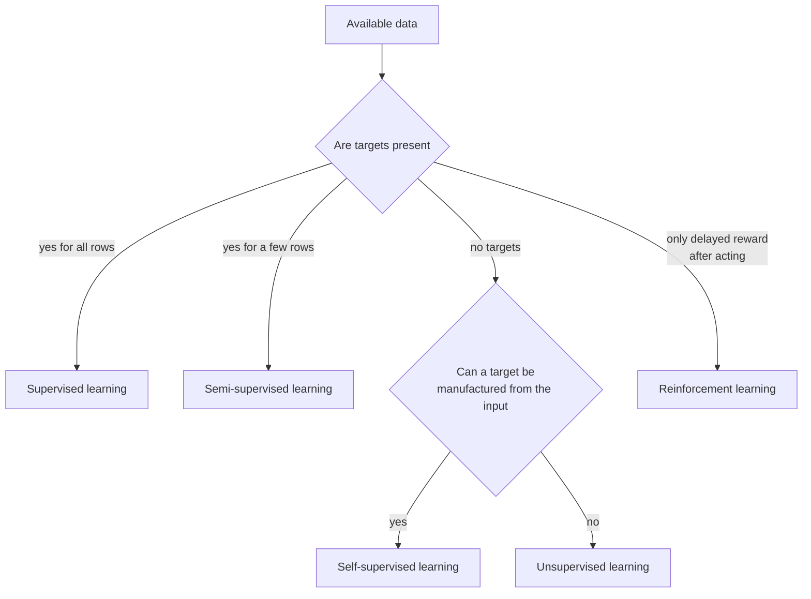
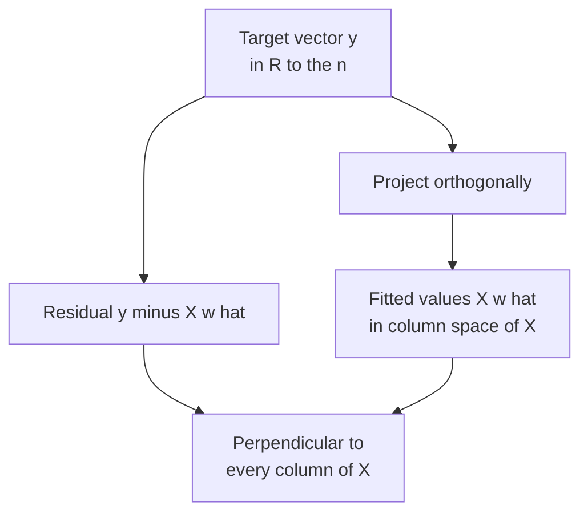
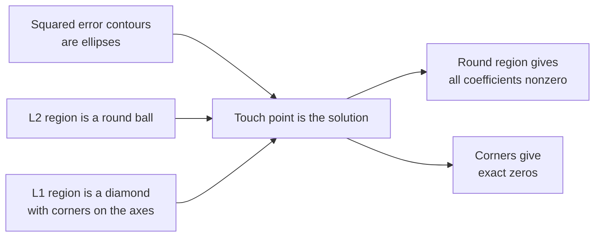
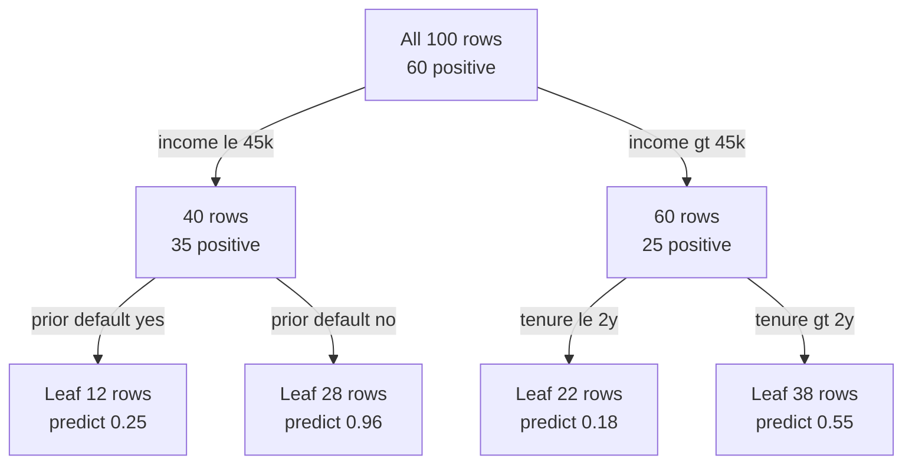
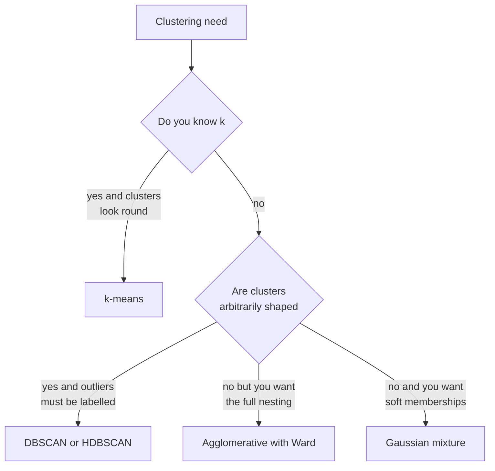
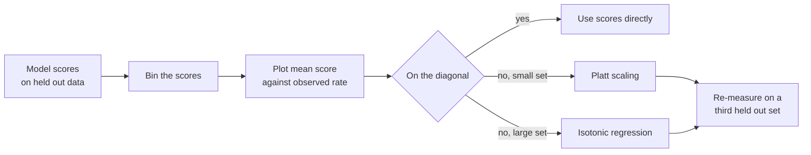
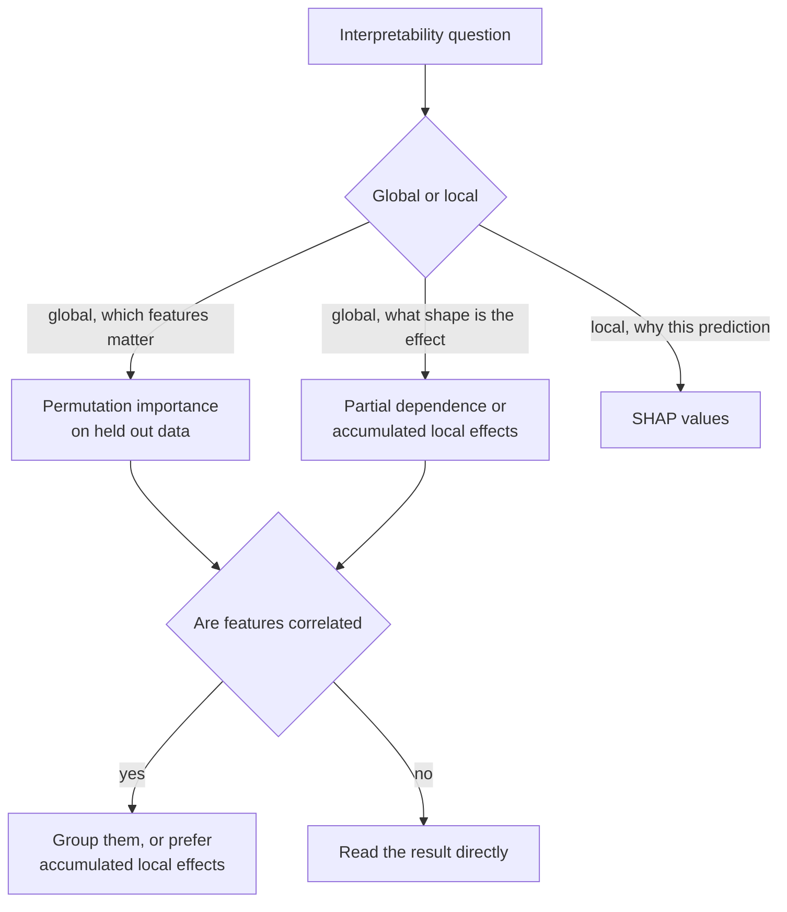

# Chapter 4: Classical Machine Learning

> **What this chapter covers** The learning problem and empirical risk minimisation, linear and generalised linear models, support vector machines and kernels, nearest neighbours, naive Bayes, decision trees, the ensemble family in depth, unsupervised learning and dimensionality reduction, anomaly detection, probability calibration, imbalanced learning, and interpretability.
>
> **Prerequisites** Chapter 1 (Mathematics for Machine Learning), Chapter 2 (Probability and Statistics), Chapter 3 (Python for Machine Learning Engineering).
>
> **Where it is used** Tabular prediction of every kind: credit risk, fraud, churn, demand forecasting, clinical risk scores, ad click prediction, lead scoring, quality control, and the feature-side of nearly every recommender. Also as the baseline that every deep learning proposal must beat, and as the calibration and interpretability layer around larger systems.

Classical machine learning is not the part you skip on the way to neural networks. It is where most production value still sits. Gradient boosted trees run credit decisions, ad auctions, and fraud queues. Logistic regression runs clinical scores because it can be audited. k-means runs customer segmentation because it is cheap and explainable. An engineer who cannot get a strong gradient boosting baseline working in an afternoon is not ready to argue for a transformer.

This chapter takes the topic from the definition of supervised learning to the second-order boosting objective and the cost of SHAP on a large model.

---

## 4.1 Level 1: Foundations

### 4.1.1 What learning means

Start with a concrete case. You have 50,000 rows. Each row is a loan application: income, requested amount, employment length, prior defaults. Each row also has an outcome recorded twelve months later: repaid, or defaulted. You want a function that takes a new application and returns a probability of default.

That function is not written by hand. It is chosen from a family of candidate functions by searching for the one that fits the recorded outcomes best. That search is learning.

Three objects define the setup.

| Object | Symbol | Meaning |
|---|---|---|
| Input | $x \in \mathcal{X}$ | The feature vector for one example, here a vector of loan attributes |
| Output | $y \in \mathcal{Y}$ | The target, here 0 for repaid and 1 for defaulted |
| Hypothesis | $f \in \mathcal{F}$ | A candidate function from inputs to outputs, drawn from a family $\mathcal{F}$ you choose |

The family $\mathcal{F}$ is a modelling decision. Choosing linear functions means you have decided the log-odds of default move linearly with income. Choosing a depth-6 tree ensemble means you have decided interactions up to six features deep are allowed. You always make this decision, whether or not you notice it.

### 4.1.2 The five learning settings

| Setting | What the data gives you | Canonical task | Typical algorithm |
|---|---|---|---|
| Supervised | Pairs $(x, y)$, every example labelled | Predict default from application | Gradient boosting, logistic regression |
| Unsupervised | Only $x$ | Find customer segments | k-means, Gaussian mixture |
| Semi-supervised | A small labelled set, a large unlabelled set | Classify documents when annotation is expensive | Self-training, label propagation |
| Self-supervised | Only $x$, but a label is manufactured from $x$ itself | Learn a representation by predicting masked parts of the input | Masked prediction, contrastive learning |
| Reinforcement | States, actions, and a delayed scalar reward | Choose which offer to show, learn from conversions | Bandits, policy gradient |

Two of these are easy to confuse. Unsupervised learning has no target at all and is evaluated by whether the structure it finds is useful. Self-supervised learning has a target, invented from the input, and the target is a means to an end: you throw away the prediction head and keep the internal representation. Self-supervision is the engine of modern language and vision models and is covered in Chapter 9.

Semi-supervised learning matters in practice more than its textbook profile suggests. Labelling is usually the binding constraint. If you have 2,000 labelled records and 400,000 unlabelled ones, methods that exploit the unlabelled distribution are worth an afternoon.



*Figure 4.1: The learning settings separated by what signal the data carries, not by what algorithm you like.*

### 4.1.3 Risk, empirical risk, and why overfitting is inevitable

Define a loss $\ell(y, \hat{y})$ that scores one prediction against one truth. Squared error $\ell(y,\hat y) = (y - \hat y)^2$ for regression. Log loss for probabilistic classification.

The thing you actually want to minimise is the **true risk**, the expected loss over the real data distribution $P$:

$$R(f) = \mathbb{E}_{(x,y) \sim P}\left[\ell\big(y, f(x)\big)\right]$$

You cannot compute this. $P$ is unknown; all you have is a sample. So you minimise the **empirical risk**, the average loss on the $n$ examples you hold:

$$\hat{R}_n(f) = \frac{1}{n}\sum_{i=1}^{n} \ell\big(y_i, f(x_i)\big)$$

Choosing $f$ to minimise $\hat{R}_n$ is **empirical risk minimisation**, abbreviated ERM. Almost every algorithm in this chapter is ERM with a particular loss and a particular family.

The gap between the two is the whole problem. $\hat{R}_n$ is an unbiased estimate of $R$ for a *fixed* $f$. It is not unbiased for the $f$ you selected *by minimising it*. The selection uses up the data. This is why training error is optimistic and why you need held-out evaluation, which Chapter 5 treats in full.

A worked feel for the size of this gap. Suppose you fit a model with $d$ free parameters to $n$ points and the true noise variance is $\sigma^2$. For linear regression with squared loss the expected training error and expected test error differ by roughly $2\sigma^2 d / n$. With $\sigma^2 = 1$, $d = 50$, $n = 500$, that is $2 \times 1 \times 50 / 500 = 0.2$. If your training mean squared error is 1.0, expect roughly 1.2 out of sample. With $n = 5{,}000$ the penalty falls to 0.02. Parameters are cheap when data is plentiful and expensive when it is not.

### 4.1.4 The bias variance decomposition

For squared loss, the expected error at a point $x$ decomposes exactly:

$$\mathbb{E}\left[(y - \hat{f}(x))^2\right] = \underbrace{\big(\mathbb{E}[\hat{f}(x)] - f^*(x)\big)^2}_{\text{bias}^2} + \underbrace{\mathrm{Var}\big(\hat{f}(x)\big)}_{\text{variance}} + \underbrace{\sigma^2}_{\text{irreducible}}$$

Here $f^*$ is the best possible function, $\hat f$ is the one your procedure produces from a random training set, the expectation is over training sets, and $\sigma^2$ is the noise in $y$ that no model can remove.

Bias is error from the family being too small to contain the truth. Variance is error from the fit moving when the training data moves. A depth-1 tree has high bias and low variance. A fully grown tree on 200 points has low bias and enormous variance.

This decomposition is the argument for nearly every ensemble method later in the chapter. Bagging attacks variance. Boosting attacks bias. Knowing which one your model suffers from tells you which to reach for.

A quick diagnostic. Fit your model. If training error is high and validation error is close to it, you have bias: enlarge the family, add features, reduce regularisation. If training error is low and validation error is far above it, you have variance: add data, add regularisation, reduce capacity, or bag.

### 4.1.5 What a model pipeline actually is

A trained model is never just the estimator. It is a pipeline: imputation, encoding, scaling, then the estimator. Every step has parameters fitted from data, and every one of those steps can leak information from the evaluation set if fitted on the full dataset. Fit the whole pipeline inside the training fold. Chapter 5 returns to this as the single most common source of inflated results.

---

## 4.2 Level 2: Working knowledge

### 4.2.1 Linear regression

Model the target as a linear function of the features plus noise:

$$\hat{y} = w^\top x + b$$

where $w \in \mathbb{R}^d$ is the weight vector, $b$ the intercept. Fold $b$ into $w$ by appending a constant 1 feature and write the design matrix $X \in \mathbb{R}^{n \times d}$, one row per example.

Minimise the sum of squared residuals:

$$J(w) = \|y - Xw\|_2^2$$

Set the gradient to zero. $\nabla_w J = -2X^\top(y - Xw) = 0$ gives the **normal equations**:

$$X^\top X w = X^\top y \qquad\Longrightarrow\qquad \hat{w} = (X^\top X)^{-1} X^\top y$$

**Worked example.** Three points: $(x, y) = (1, 2), (2, 3), (3, 5)$. With an intercept, $X = \begin{pmatrix}1&1\\1&2\\1&3\end{pmatrix}$, $y = (2,3,5)^\top$.

$X^\top X = \begin{pmatrix}3 & 6\\ 6 & 14\end{pmatrix}$, $X^\top y = (10, 23)^\top$.

The determinant is $3(14) - 36 = 6$, so $(X^\top X)^{-1} = \frac{1}{6}\begin{pmatrix}14 & -6\\ -6 & 3\end{pmatrix}$.

$\hat w = \frac{1}{6}\begin{pmatrix}14(10) - 6(23)\\ -6(10) + 3(23)\end{pmatrix} = \frac{1}{6}\begin{pmatrix}2\\ 9\end{pmatrix} = (0.333,\ 1.5)^\top$.

So $\hat y = 0.333 + 1.5x$. Predictions are 1.833, 3.333, 4.833; residuals 0.167, -0.333, 0.167; sum of squared residuals 0.167. No other line does better on these three points.

**The geometry.** $Xw$ ranges over the column space of $X$, a $d$-dimensional subspace of $\mathbb{R}^n$. Least squares finds the point in that subspace closest to $y$ in Euclidean distance. That is an orthogonal projection. The residual $y - X\hat w$ is perpendicular to every column of $X$, which is exactly what $X^\top (y - X\hat w) = 0$ says. This single picture explains several facts: residuals are uncorrelated with the features by construction, adding a feature can never increase training error, and if two columns are nearly parallel the projection coefficients become unstable even though the projection itself is fine.



*Figure 4.2: Least squares as orthogonal projection of the target onto the column space of the design matrix.*

Never invert $X^\top X$ in code. Solve the system with a QR or singular value decomposition. Forming $X^\top X$ squares the condition number and destroys precision when features are correlated.

**Listing 4.1: least squares three ways, comparing numerical behaviour.**

```python
import numpy as np

rng = np.random.default_rng(0)
n, d = 200, 5
X = rng.normal(size=(n, d))
X[:, 4] = X[:, 3] + 1e-8 * rng.normal(size=n)   # near-duplicate column
w_true = rng.normal(size=d)
y = X @ w_true + 0.1 * rng.normal(size=n)

w_normal = np.linalg.inv(X.T @ X) @ X.T @ y     # do not do this
w_lstsq = np.linalg.lstsq(X, y, rcond=None)[0]  # SVD based, do this
Q, R = np.linalg.qr(X)
w_qr = np.linalg.solve(R, Q.T @ y)              # QR, also fine

for name, w in [("normal", w_normal), ("lstsq", w_lstsq), ("qr", w_qr)]:
    print(name, "train mse", float(np.mean((y - X @ w) ** 2)))
print("condition number of X", float(np.linalg.cond(X)))
```

Column 4 is a copy of column 3 plus tiny noise, so $X$ is badly conditioned. All three fits give similar training error because the projection is well defined; the coefficient vectors differ wildly because the split between the two near-identical columns is arbitrary. That is the practical signature of collinearity: stable predictions, meaningless coefficients. If someone reads the coefficients as effects, they are reading noise.

### 4.2.2 Logistic regression and the log-odds

For binary classification, model the log-odds as linear:

$$\log \frac{p(y=1\mid x)}{p(y=0 \mid x)} = w^\top x + b$$

Solve for $p$ and you get the logistic sigmoid:

$$p(y=1 \mid x) = \sigma(w^\top x + b), \qquad \sigma(z) = \frac{1}{1 + e^{-z}}$$

The interpretation is the reason this model survives. A one-unit increase in feature $j$ multiplies the odds by $e^{w_j}$, holding the others fixed. If $w_j = 0.7$ then $e^{0.7} \approx 2.01$: that feature roughly doubles the odds per unit. Regulators and clinicians can read that sentence. They cannot read a boosted ensemble.

**Why cross-entropy and not squared error.** Write the likelihood of the data under the model. Each label is Bernoulli with parameter $p_i = \sigma(w^\top x_i)$:

$$\mathcal{L}(w) = \prod_{i=1}^n p_i^{y_i}(1-p_i)^{1-y_i}$$

Take the negative logarithm and divide by $n$:

$$J(w) = -\frac{1}{n}\sum_{i=1}^{n}\Big[y_i \log p_i + (1-y_i)\log(1-p_i)\Big]$$

That is cross-entropy, also called log loss. It is the maximum likelihood objective, not an arbitrary choice. Two consequences follow.

First, it is convex in $w$, so gradient descent reaches the global optimum. Squared error applied to $\sigma(w^\top x)$ is not convex in $w$ and has flat regions where the sigmoid saturates.

Second, the gradient is clean:

$$\nabla_w J = \frac{1}{n}\sum_{i=1}^n (p_i - y_i)\, x_i$$

The gradient is the prediction error times the feature. A confidently wrong example with $p_i = 0.99$ and $y_i = 0$ contributes a large push. Under squared error, the same example contributes a gradient multiplied by $\sigma'(z) = p(1-p) \approx 0.0099$, which nearly vanishes. Squared error makes confident mistakes invisible to the optimiser.

**Worked example.** One feature, $w = 0.8$, $b = -1.2$, and $x = 2$. Then $z = 0.8(2) - 1.2 = 0.4$, $p = 1/(1+e^{-0.4}) = 1/(1+0.6703) = 0.599$. If the true label is 1, the loss is $-\log 0.599 = 0.512$ nats. The gradient contribution is $(0.599 - 1)\times 2 = -0.802$, pushing $w$ up. If the true label is 0, loss is $-\log 0.401 = 0.914$ and the gradient is $+1.198$, pushing $w$ down harder because the error was larger.

Multiclass extends by softmax: $p(y=k \mid x) = e^{w_k^\top x} / \sum_j e^{w_j^\top x}$, with the same cross-entropy objective.

### 4.2.3 Regularisation and the geometry of the two penalties

Add a penalty on coefficient size to the objective.

**Ridge**, or $L_2$ regularisation:

$$J(w) = \|y - Xw\|_2^2 + \lambda \|w\|_2^2 \qquad\Longrightarrow\qquad \hat{w} = (X^\top X + \lambda I)^{-1}X^\top y$$

Adding $\lambda I$ makes the matrix invertible even when $X^\top X$ is singular. That is the practical reason ridge exists: it makes collinear problems solvable and stabilises coefficients.

**Lasso**, or $L_1$ regularisation:

$$J(w) = \|y - Xw\|_2^2 + \lambda \|w\|_1$$

No closed form. Solved by coordinate descent or a proximal method. It sets coefficients exactly to zero, giving feature selection.

**Why one zeroes and the other does not.** Both can be written as constrained problems: minimise squared error subject to $\|w\|_2 \le t$ or $\|w\|_1 \le t$. The $L_2$ constraint region is a ball with a smooth surface. The $L_1$ region is a diamond with corners on the axes. The solution is where the elliptical contours of squared error first touch the region. A smooth ball is touched almost surely at a point with all coordinates nonzero. A diamond is very often touched at a corner, and a corner has zeros in every coordinate but one.

The subgradient view says the same thing in one line. At $w_j = 0$ the $L_1$ penalty has subgradient $[-\lambda, \lambda]$. If the unpenalised gradient magnitude is below $\lambda$, zero is optimal and the coefficient stays exactly zero. The $L_2$ penalty has gradient $2\lambda w_j = 0$ at zero, which exerts no force to hold it there.

For orthonormal features the solutions are explicit. With ordinary least squares coefficient $\hat w_j^{\text{ols}}$:

| Penalty | Solution | Effect |
|---|---|---|
| Ridge | $\hat w_j^{\text{ols}} / (1 + \lambda)$ | Proportional shrinkage, never exactly zero |
| Lasso | $\mathrm{sign}(\hat w_j^{\text{ols}})\max(|\hat w_j^{\text{ols}}| - \lambda/2,\ 0)$ | Soft threshold, exactly zero below the cut |

**Worked example.** Orthonormal case, $\hat w^{\text{ols}} = (3.0, 0.4, -1.2)$, $\lambda = 1$. Ridge gives $(1.5, 0.2, -0.6)$: everything halved. Lasso with threshold $\lambda/2 = 0.5$ gives $(2.5, 0, -0.7)$: the small coefficient is deleted, the others are pulled toward zero by a constant amount.



*Figure 4.3: The shape of the constraint region decides whether coefficients hit exactly zero.*

**Elastic net** combines both:

$$J(w) = \|y - Xw\|_2^2 + \lambda\left(\alpha\|w\|_1 + \tfrac{1-\alpha}{2}\|w\|_2^2\right)$$

The reason to bother is the grouping effect. Lasso, given ten nearly identical correlated features, picks one essentially at random and zeroes the rest, and which one it picks changes when you resample. The $L_2$ term makes correlated features shrink together, so the selected group is stable. If your features come from one-hot encodings or from a sensor bank with correlated channels, prefer elastic net with $\alpha$ around 0.5 over pure lasso. Zou and Hastie introduced it in 2005 for exactly this.

**Standardise before penalising.** The penalty treats all coefficients on the same scale, so a feature measured in dollars and one measured in millions of dollars receive incomparable pressure. Standardise inside the training fold.

### 4.2.4 Generalised linear models

Linear and logistic regression are two members of one family. A generalised linear model, abbreviated GLM, has three parts.

1. A **random component**: the response distribution, from the exponential family.
2. A **linear predictor**: $\eta = w^\top x$.
3. A **link function** $g$ connecting them: $g(\mathbb{E}[y \mid x]) = \eta$.

| Response type | Distribution | Canonical link | Model name |
|---|---|---|---|
| Continuous, symmetric | Normal | Identity | Linear regression |
| Binary | Bernoulli | Logit | Logistic regression |
| Count | Poisson | Log | Poisson regression |
| Count, overdispersed | Negative binomial | Log | Negative binomial regression |
| Positive continuous, skewed | Gamma | Log or inverse | Gamma regression |
| Count with exposure | Poisson | Log with offset | Rate model |

Two practical points. First, if your target is a count, Poisson regression with a log link respects positivity and models the variance as equal to the mean, which is usually closer to reality than assuming constant variance. Second, if the observed variance exceeds the mean, which is common, Poisson is misspecified and the standard errors are too small; switch to negative binomial. A quick check is to compare the residual deviance to the residual degrees of freedom. A ratio well above 1 signals overdispersion.

**Worked example of an offset.** You model claims per policy. Policy A was exposed for 6 months, policy B for 24. Modelling raw counts confuses exposure with risk. Fit $\log \mathbb{E}[\text{count}] = \log(\text{months}) + w^\top x$. The $\log(\text{months})$ term has coefficient fixed at 1 and is called an offset. Now $w$ describes the rate per month. Without it, a long-tenured low-risk policy looks high-risk.

### 4.2.5 Nearest neighbours

The k-nearest neighbours rule, abbreviated kNN, stores the training set. To predict, find the $k$ closest training points under a distance metric and take their majority class or mean target.

There is no training. All the cost is at prediction time: $O(nd)$ per query with brute force, reduced by a k-d tree in low dimensions or by approximate nearest neighbour indexes in high dimensions.

Choices that matter: the value of $k$, which trades bias against variance directly ($k=1$ has zero training error and huge variance; large $k$ smooths toward the global mean); the distance metric; and whether to weight neighbours by inverse distance. Scaling is mandatory. A feature in dollars with range 0 to 100,000 will dominate Euclidean distance over a feature in years with range 0 to 40.

**The curse of dimensionality.** In high dimensions, nearest is not near. Take $n$ points uniform in the unit cube $[0,1]^d$. To capture a fraction $r$ of the data in a hypercube neighbourhood, the side length must be $r^{1/d}$. For $r = 0.01$ and $d = 10$, the side is $0.01^{0.1} = 0.63$. To get 1 percent of the data you must span 63 percent of the range of every feature. That is not a local neighbourhood.

Worse, distances concentrate. For independent features, the ratio of the maximum to the minimum distance from a query point tends to 1 as $d$ grows, so "nearest" becomes meaningless. This is why kNN works well on 5 features and poorly on 500, and why it is nearly always paired with a learned embedding or a dimensionality reduction step in practice.

The curse is not a statement about the number of columns but about the intrinsic dimension of the data. 500 pixel features lying on a 6-dimensional manifold behave like 6 dimensions, not 500. That is the entire premise of representation learning in Chapter 9.

### 4.2.6 Naive Bayes

Apply Bayes rule to classification:

$$p(y = c \mid x) \propto p(y=c)\, p(x \mid y=c)$$

Estimating the joint $p(x \mid y=c)$ over $d$ features is hopeless. Naive Bayes assumes conditional independence given the class:

$$p(x \mid y=c) = \prod_{j=1}^{d} p(x_j \mid y = c)$$

Now each factor is a one-dimensional density, estimated from counts or a fitted Gaussian. Training is a single pass of counting, so it handles millions of documents in seconds.

**Why a false assumption still works.** Features are never conditionally independent. In spam classification, "free" and "offer" co-occur. The independence assumption therefore double-counts evidence and produces wildly overconfident probabilities, often 0.9999 or 0.0001.

But classification depends only on which class has the highest posterior, not on the value of the posterior. Overcounting evidence inflates the log-odds toward the correct side more often than it flips it. Domingos and Pazzani analysed this in 1997 and showed the zero-one loss can be optimal over a much wider region than the conditions for the probability estimate to be correct.

The operational rule: use naive Bayes when you need a decision and a fast, memory-light baseline, especially on high-dimensional sparse text. Do not use its probabilities for anything, and never for thresholding against a cost matrix, unless you calibrate them afterward using section 4.3.10.

Practical details: use Laplace smoothing, adding a pseudo-count $\alpha$ (commonly 1) so an unseen word does not zero the entire product; work in log space to avoid underflow; use the multinomial variant for counts and the Bernoulli variant for presence or absence.

### 4.2.7 Decision trees

A decision tree splits the feature space by axis-aligned thresholds. Each internal node asks one question, "is $x_j \le t$", and each leaf holds a prediction.

**Splitting criteria.** At a node with class proportions $p_1, \dots, p_K$:

Gini impurity:
$$G = 1 - \sum_{k=1}^{K} p_k^2$$

Entropy:
$$H = -\sum_{k=1}^{K} p_k \log_2 p_k$$

For regression, the criterion is the variance or the mean squared error within the node.

A split is scored by the weighted impurity decrease:

$$\Delta = I(\text{parent}) - \frac{n_L}{n}I(\text{left}) - \frac{n_R}{n}I(\text{right})$$

**Worked example.** A node has 100 examples, 60 positive and 40 negative. Gini is $1 - (0.6^2 + 0.4^2) = 1 - (0.36 + 0.16) = 0.48$. Entropy is $-(0.6\log_2 0.6 + 0.4 \log_2 0.4) = -(0.6 \times -0.737 + 0.4 \times -1.322) = 0.971$ bits.

A candidate split sends 40 examples left (35 positive, 5 negative) and 60 right (25 positive, 35 negative).

Left Gini: $1 - (0.875^2 + 0.125^2) = 1 - (0.766 + 0.016) = 0.219$.
Right Gini: $1 - (0.4167^2 + 0.5833^2) = 1 - (0.174 + 0.340) = 0.486$.
Weighted: $0.4(0.219) + 0.6(0.486) = 0.0875 + 0.292 = 0.379$.
Gain: $0.48 - 0.379 = 0.101$.

The split is worth taking. Gini and entropy disagree on which split is best only rarely, and the difference almost never shows up in held-out accuracy. Gini is marginally cheaper because it avoids a logarithm. Use the default your library ships.

**Greedy construction.** At each node, evaluate every feature and every candidate threshold, take the best split, recurse. This is greedy and not globally optimal; finding the optimal tree is NP-hard. Greedy construction is why a tree can miss an exclusive-or pattern where no single-feature split improves purity but a pair of splits separates perfectly.

**Why a single tree overfits.** Growing until leaves are pure gives zero training error and memorises noise. With $n$ points, a tree can always reach $n$ leaves. Each split is chosen by looking at the data, so the reported purity gain is optimistically biased, and the bias compounds with depth. Variance is also enormous: change a few training points near a threshold and the split moves, which changes every subtree below it.

**Pruning.** Grow the tree fully, then cut back. Cost-complexity pruning minimises

$$R_\alpha(T) = R(T) + \alpha |T|$$

where $R(T)$ is the training error, $|T|$ the number of leaves, and $\alpha \ge 0$ a penalty per leaf. Sweeping $\alpha$ from 0 upward produces a nested sequence of subtrees; pick the $\alpha$ with the best cross-validated error. This is the classification and regression tree procedure of Breiman, Friedman, Olshen, and Stone, 1984. Pre-pruning by maximum depth or minimum samples per leaf is cruder but cheaper and is what tree ensembles use.



*Figure 4.4: A depth-2 tree. Each leaf prediction is the class proportion of the rows that reach it.*

### 4.2.8 Support vector machines

A linear classifier separates classes by a hyperplane $w^\top x + b = 0$. Many hyperplanes separate a separable dataset. The support vector machine, abbreviated SVM, chooses the one with the largest **margin**, the distance to the nearest point of either class.

The distance from a point $x_i$ to the hyperplane is $|w^\top x_i + b| / \|w\|$. Fix the scale so that the closest points satisfy $|w^\top x_i + b| = 1$. Then the margin is $2/\|w\|$, and maximising the margin means minimising $\|w\|^2$:

$$\min_{w,b} \tfrac{1}{2}\|w\|^2 \quad \text{subject to} \quad y_i(w^\top x_i + b) \ge 1 \ \ \forall i$$

with labels coded as $\pm 1$. Real data is not separable, so introduce slack variables $\xi_i \ge 0$:

$$\min_{w,b,\xi} \tfrac{1}{2}\|w\|^2 + C\sum_{i=1}^{n}\xi_i \quad \text{subject to} \quad y_i(w^\top x_i + b) \ge 1 - \xi_i,\ \ \xi_i \ge 0$$

$C$ controls the trade: large $C$ punishes violations and gives a narrow margin that tracks the data closely; small $C$ tolerates violations for a wider, smoother boundary. Eliminating $\xi$ gives the hinge loss form, $\sum_i \max(0, 1 - y_i(w^\top x_i + b)) + \frac{1}{2C}\|w\|^2$, which shows the SVM is ERM with hinge loss and $L_2$ regularisation.

**Worked example of the margin.** Two dimensions, $w = (1, 1)$, $b = -3$. The boundary is $x_1 + x_2 = 3$. The point $(4, 2)$ gives $4 + 2 - 3 = 3$, at distance $3 / \sqrt{2} = 2.12$. The point $(1, 1)$ gives $-1$, at distance $1/\sqrt{2} = 0.71$ on the other side. If the closest points on each side have functional value $\pm 1$, the margin width is $2/\|w\| = 2/\sqrt{2} = 1.41$.

### 4.2.9 The dual and the kernel trick

Form the Lagrangian and eliminate $w$ and $b$. The dual problem is

$$\max_{\alpha} \ \sum_{i=1}^n \alpha_i - \tfrac{1}{2}\sum_{i=1}^n\sum_{j=1}^n \alpha_i \alpha_j y_i y_j \,\langle x_i, x_j\rangle$$
$$\text{subject to} \quad 0 \le \alpha_i \le C, \qquad \sum_i \alpha_i y_i = 0$$

Two facts make this important. First, $w = \sum_i \alpha_i y_i x_i$, and by the Karush Kuhn Tucker conditions $\alpha_i = 0$ for every point strictly outside the margin. Only points on or inside the margin have $\alpha_i > 0$. Those are the **support vectors**, and the solution depends on nothing else. Delete every other training point and refit; you get the same boundary.

Second, the data appears only through inner products $\langle x_i, x_j \rangle$. Replace that inner product with a **kernel** $K(x_i, x_j)$ that equals an inner product in some higher-dimensional feature space $\phi$, and you fit a linear model in that space without ever computing $\phi(x)$. That substitution is the **kernel trick**.

| Kernel | Formula | Feature space |
|---|---|---|
| Linear | $x^\top z$ | The input space |
| Polynomial degree $p$ | $(\gamma x^\top z + r)^p$ | All monomials up to degree $p$ |
| Radial basis function | $\exp(-\gamma\|x - z\|^2)$ | Infinite dimensional |
| Sigmoid | $\tanh(\gamma x^\top z + r)$ | Not always a valid kernel |

**Worked example of the trick.** Two dimensions, $\phi(x) = (x_1^2, \sqrt{2}x_1x_2, x_2^2)$. For $x=(1,2)$, $z=(3,1)$: $\phi(x) = (1, 2.828, 4)$, $\phi(z) = (9, 4.243, 1)$, inner product $= 9 + 12 + 4 = 25$. The kernel $(x^\top z)^2 = (3 + 2)^2 = 25$. Same answer, three multiplications instead of building two 3-vectors. In the radial basis case the explicit feature map is infinite dimensional and the kernel evaluation is still one exponential.

A function is a valid kernel if its Gram matrix $K_{ij} = K(x_i, x_j)$ is positive semidefinite for every finite sample. This is Mercer's condition.

**Why SVMs lost ground.** They dominated from the late 1990s to roughly 2010 and are now a niche choice. The reasons are concrete.

| Reason | Detail |
|---|---|
| Scaling | Kernel training is between $O(n^2)$ and $O(n^3)$ and the kernel matrix is $O(n^2)$ memory. At 1 million rows the matrix alone is about 8 terabytes in float64. |
| Prediction cost | Cost grows with the number of support vectors, which grows with $n$ on noisy data. A tree ensemble has fixed prediction cost. |
| No native probabilities | The decision function is a signed distance, not a probability. Getting probabilities requires Platt scaling on a held-out set, an extra fit. |
| Hyperparameter sensitivity | Performance depends sharply on $C$ and the kernel width $\gamma$, needing a two-dimensional search on a log grid. |
| Categorical and missing data | Both need explicit handling. Modern boosting libraries handle both natively. |
| Multiclass | Requires one-vs-rest or one-vs-one wrappers. |
| Competition | Boosted trees beat them on tabular data, and neural networks beat them on images, text, and audio. |

Where they still earn their place: small to medium datasets, roughly under 50,000 rows, with many features relative to rows, where a maximum-margin boundary with a well-chosen kernel is genuinely strong. Linear SVMs on sparse high-dimensional text remain competitive and train in linear time.

### 4.2.10 A default workflow for tabular problems

| Step | Action | Why |
|---|---|---|
| 1 | Build a trivial baseline: predict the majority class or the mean | Establishes the floor. Many projects die here when the baseline is close to the model. |
| 2 | Fit a regularised linear or logistic model in a pipeline | Fast, interpretable, and surfaces leakage as an implausibly good score |
| 3 | Fit gradient boosted trees with modest settings | Usually the strongest tabular model, and the score to beat |
| 4 | Evaluate with an appropriate split and a confidence interval | Chapter 5 |
| 5 | Calibrate if probabilities are consumed downstream | Section 4.3.10 |
| 6 | Choose a threshold from the cost matrix, not from 0.5 | Section 4.3.11 and Chapter 5 |
| 7 | Explain with permutation importance and partial dependence | Section 4.4.5 |

If step 3 does not beat step 2 by a margin larger than your confidence interval, ship step 2.

---

## 4.3 Level 3: Depth

### 4.3.1 Bagging and the variance argument

Bootstrap aggregating, abbreviated bagging, was introduced by Breiman in 1996. Draw $B$ bootstrap samples, each of size $n$ sampled with replacement from the training set. Fit a model on each. Average the predictions for regression, or vote for classification.

The argument is a variance calculation. Let $B$ models each have variance $\sigma^2$ and pairwise correlation $\rho$. The variance of their average is

$$\mathrm{Var}\left(\frac{1}{B}\sum_{b=1}^B \hat f_b\right) = \rho\sigma^2 + \frac{1-\rho}{B}\sigma^2$$

As $B$ grows the second term vanishes and the variance floor is $\rho\sigma^2$. Two readings follow.

First, averaging removes only the uncorrelated part of the error. Adding more trees past a few hundred buys almost nothing once the second term is small.

Second, the floor is set by the correlation between the models. Bagged trees trained on bootstrap samples of the same data are highly correlated, because each sees roughly 63 percent of the unique rows and they all pick the same dominant feature at the root. Reducing $\rho$ is therefore worth more than increasing $B$. That is the single idea behind random forests.

**Worked example.** $\sigma^2 = 1$, $\rho = 0.6$, $B = 100$. Variance is $0.6 + 0.4/100 = 0.604$. Going to $B = 1000$ gives 0.6004, a 0.07 percent improvement. Dropping $\rho$ to 0.3 at $B = 100$ gives $0.3 + 0.7/100 = 0.307$, a 49 percent improvement. Decorrelation dominates.

**Why 63 percent.** The probability a specific row is never drawn in $n$ draws with replacement is $(1 - 1/n)^n$, which tends to $e^{-1} = 0.368$. So about 36.8 percent of rows are out of the bag for each tree and 63.2 percent are in. The out-of-bag rows give a free validation estimate: predict each row using only the trees that did not see it. On large datasets this out-of-bag error tracks cross-validated error closely and costs nothing extra.

Bagging helps unstable, low-bias, high-variance learners. Bagging a linear regression does almost nothing, because linear regression is stable: the bootstrap fits barely differ, $\rho$ is near 1, and the floor is the original variance.

### 4.3.2 Random forests

A random forest is bagging plus feature subsampling at each split. At every node, sample $m$ of the $d$ features at random and choose the best split among those $m$ only.

This is the decorrelation mechanism. If one feature is strongly predictive, every bagged tree splits on it at the root and the trees look alike. Forcing most nodes to consider a subset means other features get used, the trees differ, $\rho$ drops, and the variance floor falls.

Defaults: $m = \sqrt{d}$ for classification, $m = d/3$ for regression. These are starting points, not laws. If most features are noise, a small $m$ means most nodes see only noise and the forest underfits, so raise $m$. If features are highly correlated, lower $m$.

| Hyperparameter | Effect of increasing | Default posture |
|---|---|---|
| Number of trees | Variance falls toward the floor, cost rises linearly | Set as high as latency allows, 300 to 1000 |
| Max features $m$ | Trees become more correlated and individually stronger | Tune, it is the main lever |
| Max depth | Bias falls, variance rises, but bagging absorbs much of it | Often unlimited is fine |
| Min samples per leaf | Smooths the fit, reduces variance | Raise on noisy targets |

Random forests are unusually forgiving. They rarely overfit badly as trees are added, they need no scaling, they handle mixed feature types, and they give an out-of-bag error estimate. They are the right first answer when you want something robust with almost no tuning. They are usually a point or two behind well-tuned gradient boosting on accuracy.

Extremely randomised trees, from Geurts, Ernst, and Wehenkel in 2006, push further: thresholds are drawn at random rather than optimised. Bias rises, variance falls further, and training is faster because no threshold search happens.

### 4.3.3 Boosting, from AdaBoost to the functional gradient

Bagging builds independent models in parallel and averages. Boosting builds models sequentially, each correcting the previous ensemble's errors. The target is bias, not variance.

**AdaBoost** (Freund and Schapire, 1997). Maintain a weight per training example, initially $1/n$. At each round $t$:

1. Fit a weak learner $h_t$ on the weighted data.
2. Compute its weighted error $\epsilon_t = \sum_i w_i \mathbb{1}[h_t(x_i) \ne y_i]$.
3. Set its vote $\alpha_t = \frac{1}{2}\ln\frac{1-\epsilon_t}{\epsilon_t}$.
4. Update weights $w_i \leftarrow w_i \exp(-\alpha_t y_i h_t(x_i))$ and renormalise.

The final prediction is the sign of $\sum_t \alpha_t h_t(x)$.

**Worked example.** $\epsilon_t = 0.3$. Then $\alpha_t = 0.5\ln(0.7/0.3) = 0.5 \ln 2.333 = 0.424$. A correctly classified example has its weight multiplied by $e^{-0.424} = 0.654$, a misclassified one by $e^{0.424} = 1.528$. The ratio is 2.33, so misclassified points become 2.33 times more important relative to correct ones. A weak learner with $\epsilon_t = 0.5$ gets $\alpha_t = 0$ and is ignored, correctly, because it is a coin flip.

**The functional gradient view** (Friedman, 2001, "Greedy Function Approximation: A Gradient Boosting Machine"). Reframe boosting as gradient descent in function space. You want to minimise $\sum_i \ell(y_i, F(x_i))$ over functions $F$. Ordinary gradient descent would update $F \leftarrow F - \eta \nabla_F$, but the gradient is only defined at the training points. So fit a regression tree to those gradient values and use the tree as a usable approximation of the negative gradient direction everywhere.

The algorithm:

1. Initialise $F_0(x)$ to the constant that minimises the loss overall.
2. For $t = 1 \dots T$:
   - Compute pseudo-residuals $r_i = -\left[\frac{\partial \ell(y_i, F(x_i))}{\partial F(x_i)}\right]_{F=F_{t-1}}$.
   - Fit a regression tree $h_t$ to the pairs $(x_i, r_i)$.
   - Choose a step size, optionally by a line search within each leaf.
   - Update $F_t = F_{t-1} + \eta\, h_t$, where $\eta$ is the learning rate.

With squared loss, $\ell = \frac12(y - F)^2$ and the pseudo-residual is exactly $y_i - F_{t-1}(x_i)$, the ordinary residual. That is the case people memorise. With log loss and $p = \sigma(F)$, the pseudo-residual is $y_i - p_i$. With absolute loss it is the sign of $y_i - F_{t-1}(x_i)$, which is why absolute loss boosting resists outliers: a point wrong by 1000 contributes the same unit push as one wrong by 0.1.

AdaBoost falls out of this framework as gradient boosting with exponential loss $\ell(y,F) = e^{-yF}$, a connection made by Friedman, Hastie, and Tibshirani in 2000.


*Figure 4.5: Gradient boosting as repeated gradient descent in function space, one small tree per step.*

### 4.3.4 The second-order formulation used by modern libraries

Modern libraries do not fit a tree to the first-order gradient alone. They use a second-order Taylor expansion of the loss, following Chen and Guestrin's 2016 paper "XGBoost: A Scalable Tree Boosting System". The regularised objective at step $t$ is

$$\mathcal{L}^{(t)} = \sum_{i=1}^{n} \ell\big(y_i, F_{t-1}(x_i) + h_t(x_i)\big) + \Omega(h_t)$$

Expand to second order with $g_i = \partial_F \ell$ and $q_i = \partial^2_F \ell$ evaluated at $F_{t-1}$:

$$\mathcal{L}^{(t)} \approx \sum_{i=1}^{n}\left[g_i h_t(x_i) + \tfrac{1}{2}q_i\, h_t(x_i)^2\right] + \gamma T + \tfrac{1}{2}\lambda\sum_{j=1}^{T} v_j^2$$

Here the tree has $T$ leaves with output values $v_j$, $\gamma$ penalises each leaf, and $\lambda$ is an $L_2$ penalty on the leaf values.

For a fixed tree structure the optimal leaf value is available in closed form. Let $I_j$ be the examples falling in leaf $j$, $G_j = \sum_{i \in I_j} g_i$ and $H_j = \sum_{i \in I_j} q_i$. Differentiating the quadratic and setting it to zero gives

$$v_j^* = -\frac{G_j}{H_j + \lambda}, \qquad \mathcal{L}^* = -\frac{1}{2}\sum_{j=1}^{T}\frac{G_j^2}{H_j + \lambda} + \gamma T$$

The gain from splitting one leaf into left and right parts is

$$\text{Gain} = \frac{1}{2}\left[\frac{G_L^2}{H_L+\lambda} + \frac{G_R^2}{H_R+\lambda} - \frac{(G_L+G_R)^2}{H_L+H_R+\lambda}\right] - \gamma$$

This formula is the engine. It is not an impurity heuristic. It is the exact reduction in the regularised second-order objective. The subtracted $\gamma$ means a split whose gain does not exceed $\gamma$ is rejected, giving pruning for free.

**Worked example with log loss.** For log loss, $g_i = p_i - y_i$ and $q_i = p_i(1-p_i)$. Suppose the current ensemble predicts $p = 0.5$ for all 100 rows in a leaf, of which 60 are positive.

Then $g_i = -0.5$ for positives and $+0.5$ for negatives, so $G = 60(-0.5) + 40(0.5) = -10$. Each $q_i = 0.25$, so $H = 25$.

With $\lambda = 1$, the optimal leaf value is $v^* = 10/(25+1) = 0.385$ in log-odds space. Adding 0.385 to a logit of 0 gives $\sigma(0.385) = 0.595$, moving toward the observed 0.6. With a learning rate of 0.1 the actual update is 0.0385, giving $\sigma(0.0385) = 0.510$. The model creeps toward the truth, which is why boosting needs many rounds at a small learning rate.

Now split that leaf. Left gets 40 rows (35 positive, 5 negative), right 60 rows (25 positive, 35 negative).

$G_L = 35(-0.5) + 5(0.5) = -15$, $H_L = 10$.
$G_R = 25(-0.5) + 35(0.5) = +5$, $H_R = 15$.
Gain $= \tfrac12\left[\frac{225}{11} + \frac{25}{16} - \frac{100}{26}\right] - \gamma = \tfrac12[20.45 + 1.56 - 3.85] - \gamma = 9.08 - \gamma$.

With $\gamma = 1$ the gain is 8.08 and the split is accepted.

Notice that $H_j$ acts as an effective sample count weighted by prediction uncertainty. Rows the model is already confident about have $p(1-p)$ near zero and contribute almost nothing to $H$, so a leaf full of confident rows would get a large and poorly supported update unless $\lambda$ restrains it. That is what $\lambda$ is for, and it is also why the minimum child weight hyperparameter is defined as a minimum sum of $q_i$ rather than a minimum row count.

### 4.3.5 Boosting hyperparameters and what each trades

| Hyperparameter | Direction | What it trades |
|---|---|---|
| Learning rate $\eta$ | Lower | Better generalisation, more rounds needed. Rate and tree count trade off almost exactly. Halve the rate, double the trees. |
| Number of trees | Higher | Lower bias, eventually overfits. Set high and use early stopping. |
| Max depth | Higher | Allows deeper interactions. Depth $k$ permits interactions among $k$ features. Depth 3 to 8 covers most tabular problems. |
| Min child weight | Higher | Refuses leaves with little effective evidence, cutting variance |
| Subsample, rows per tree | Lower | Adds randomness, decorrelates trees, regularises, speeds training. 0.5 to 0.9 typical. |
| Colsample, features per tree or split | Lower | Same effect on the feature axis. Helps most with many correlated features. |
| $\lambda$, $L_2$ on leaf values | Higher | Shrinks leaf outputs, the main smoothing knob |
| $\alpha$, $L_1$ on leaf values | Higher | Drives some leaf values to zero, rarely the main lever |
| $\gamma$, minimum split gain | Higher | Direct pruning, fewer splits |
| Histogram bin count | Lower | Faster, coarser thresholds, mild regularisation |

The order to tune when time is limited: fix $\eta$ at 0.05 with early stopping, tune max depth and min child weight together, then subsample and colsample, then $\lambda$. Only then consider lowering $\eta$ to 0.01 for a final run.

Early stopping deserves emphasis. Use a held-out set, monitor validation loss, and stop when it fails to improve for a patience window such as 50 rounds. This removes the tree-count hyperparameter from the search entirely. Be aware that the set you early-stop on has been used for model selection and is no longer clean for reporting. Chapter 5, level 3, covers nested cross-validation for exactly this reason.

**Listing 4.2: gradient boosting with early stopping and a clean reporting split.**

```python
from sklearn.datasets import fetch_covtype
from sklearn.model_selection import train_test_split
from sklearn.ensemble import HistGradientBoostingClassifier
from sklearn.metrics import log_loss, accuracy_score

X, y = fetch_covtype(return_X_y=True)
X, y = X[:60000], (y[:60000] == 2).astype(int)   # binary subproblem, keeps runtime small

X_fit, X_report, y_fit, y_report = train_test_split(
    X, y, test_size=0.2, random_state=0, stratify=y)

clf = HistGradientBoostingClassifier(
    learning_rate=0.05, max_leaf_nodes=31,
    l2_regularization=1.0, max_iter=2000,
    early_stopping=True, validation_fraction=0.15,
    n_iter_no_change=50, random_state=0)
clf.fit(X_fit, y_fit)

p = clf.predict_proba(X_report)[:, 1]
print("rounds used", clf.n_iter_)
print("report log loss", log_loss(y_report, p))
print("report accuracy", accuracy_score(y_report, (p > 0.5).astype(int)))
```

Two non-obvious lines. `validation_fraction` carves the early-stopping set out of `X_fit`, never out of `X_report`, so the reported numbers are not contaminated by the stopping decision. `max_leaf_nodes` rather than `max_depth` is the natural capacity control for histogram-based leaf-wise growth, where trees are not grown level by level. Argument names differ across boosting libraries and across versions, so check your version.

### 4.3.6 Categorical features, missing values, and why trees win on tabular data

**Categorical handling.** The naive approach is one-hot encoding, which is fine for low cardinality. It is bad for high cardinality. A 10,000-level identifier becomes 10,000 sparse binary columns, each of which supports only a weak split, and a depth-limited tree will almost never use them.

| Strategy | How it works | Risk |
|---|---|---|
| One-hot | One binary column per level | Explodes at high cardinality, dilutes splits |
| Ordinal | Map levels to integers | Imposes a false order, though a tree can partly undo it with several splits |
| Target or mean encoding | Replace a level with the mean target for that level | Severe leakage unless computed out of fold |
| Native partitioning | Sort levels by gradient statistics and split the sorted order | Can overfit rare levels without smoothing |
| Ordered target statistics | Compute the target statistic using only rows earlier in a random permutation | The approach CatBoost uses to remove target leakage |

Target encoding is where teams lose weeks. If you compute the mean target per level using all rows including the row being encoded, that row's own label leaks into its own feature. Validation scores look excellent and production performance collapses. The fix is out-of-fold encoding: for each fold, compute the mapping from the other folds only, and smooth toward the global mean with a prior count $k$:

$$\text{enc}(c) = \frac{n_c \bar{y}_c + k \bar{y}}{n_c + k}$$

**Worked example.** Global positive rate $\bar y = 0.20$. A level with $n_c = 5$ rows and $\bar y_c = 0.80$, smoothing $k = 20$. The encoded value is $(5 \times 0.8 + 20 \times 0.2)/(5+20) = 8/25 = 0.32$. Without smoothing the model would be handed 0.80 on five rows and treat a fluke as signal. With $n_c = 500$ at the same rate, the encoding is $(400 + 4)/520 = 0.777$, close to the raw mean, because the evidence is now real.

**Missing values.** Trees handle them naturally. Three approaches exist.

1. **Default direction.** Learn, per split, which branch missing rows take, by trying both and keeping the one with higher gain. This is the sparsity-aware approach in XGBoost and it treats missingness as information.
2. **Surrogate splits.** Find another feature whose split best mimics the primary split, and use it when the primary value is missing. This is the classification and regression tree approach.
3. **Imputation plus an indicator.** Fill with the median and add a binary column marking that the value was missing. Works with any model, including linear ones.

Approach 1 is strictly better when missingness is informative, which it usually is. A blank income field on a loan application is not a random omission.

**Why trees still beat neural networks on tabular data.** Grinsztajn, Oyallon, and Varoquaux presented systematic evidence in 2022, "Why do tree-based models still outperform deep learning on typical tabular data?". The mechanisms they identify:

| Property of tabular data | Why trees suit it |
|---|---|
| Target functions are often irregular and piecewise constant along a feature | Axis-aligned splits represent that exactly. Neural networks have a bias toward smooth functions and must fight it. |
| Many uninformative features | Split selection ignores them at essentially no cost. A multilayer perceptron spreads weight across all inputs and is hurt. |
| Features are not rotation invariant. Column 7 means income, and a rotation of the feature space is meaningless. | Trees are invariant to monotone per-feature transformations and not to rotations, which matches the data. Neural networks are rotation invariant at initialisation, which is the wrong prior here. |
| No spatial, sequential, or lexical structure to exploit | The architectural advantage of convolution and attention does not apply |
| Datasets are often small, thousands to millions of rows | Boosting is sample efficient and needs little tuning. Deep models need more data and far more tuning. |

The honest caveat. With very large tabular datasets, heavy tuning, and careful embedding treatment of high-cardinality categoricals, neural approaches close the gap and sometimes win, especially when tabular data must be fused with text or images. For a pure tabular problem the default is still gradient boosting, and the burden of proof sits with the alternative.

### 4.3.7 Unsupervised learning

**k-means.** Partition $n$ points into $k$ clusters minimising the within-cluster sum of squares:

$$J = \sum_{j=1}^{k}\sum_{x \in C_j} \|x - \mu_j\|^2$$

Lloyd's algorithm alternates two steps. Assign each point to its nearest centroid, then set each centroid to the mean of its assigned points. Neither step can increase $J$, so it converges, to a local minimum that depends on initialisation. k-means++ (Arthur and Vassilvitskii, 2007) chooses initial centres with probability proportional to the squared distance from the nearest existing centre, which both improves results in practice and gives an approximation guarantee.

The assumptions, usually violated and usually unstated:

| Assumption | What breaks when it fails |
|---|---|
| Clusters are roughly spherical | Elongated clusters get cut across their length |
| Clusters have similar variance | A tight cluster is absorbed into a broad neighbour |
| Clusters have similar size | Large clusters steal points from small ones, because the objective sums over points |
| Euclidean distance is meaningful | Unscaled features let one column dominate, and high dimensions make all distances similar |
| $k$ is known | It is not, and $J$ decreases monotonically with $k$, so the objective cannot choose $k$ |

Choosing $k$. The elbow of $J$ against $k$ is a visual heuristic with no principle behind it and often no visible elbow. The silhouette score is better. For point $i$, let $a(i)$ be the mean distance to its own cluster and $b(i)$ the mean distance to the nearest other cluster. Then

$$s(i) = \frac{b(i) - a(i)}{\max(a(i), b(i))}$$

ranging from $-1$ to $1$. Average over points and pick the $k$ maximising it.

**Worked example.** A point sits 1.2 from its own cluster's members on average and 3.0 from the nearest other cluster. Then $s = (3.0-1.2)/3.0 = 0.60$, a well-placed point. Another has $a = 2.8$ and $b = 3.0$, giving $s = 0.067$, a point on a boundary the clustering has not really separated.

**Hierarchical clustering.** Agglomerative clustering starts with every point as its own cluster and repeatedly merges the closest pair. The linkage rule defines closest.

| Linkage | Distance between clusters | Behaviour |
|---|---|---|
| Single | Minimum pairwise distance | Chains, follows elongated shapes, sensitive to noise bridges |
| Complete | Maximum pairwise distance | Compact clusters of roughly equal diameter |
| Average | Mean pairwise distance | Between the two |
| Ward | Increase in within-cluster sum of squares from merging | Minimises variance, behaves like k-means, the usual default |

The output is a dendrogram, and you choose the number of clusters by cutting it at a height. The advantage over k-means is that you see the whole nesting rather than committing to one $k$. The cost is $O(n^2)$ memory, which caps it around tens of thousands of points.

**Density-based clustering.** DBSCAN (Ester, Kriegel, Sander, and Xu, 1996) takes two parameters, a radius and a minimum count. A point is a core point if at least `minPts` points lie within radius `eps`. Core points within `eps` of each other form a cluster, non-core points within reach of a core point join as border points, and everything else is labelled noise.

This is qualitatively different from k-means. It finds arbitrarily shaped clusters, does not need $k$, and explicitly labels outliers rather than forcing them into a cluster. Its weakness is that one global radius cannot handle clusters of different densities, and choosing the radius in high dimensions is hard. HDBSCAN (Campello, Moulavi, and Sander, 2013) builds a hierarchy over varying density and extracts the most stable clusters, removing the radius choice.



*Figure 4.6: Choosing a clustering method from what you know and what you need out of it.*

**Gaussian mixtures and expectation maximisation.** Model the density as a weighted sum of $K$ Gaussians:

$$p(x) = \sum_{k=1}^{K}\pi_k\, \mathcal{N}(x \mid \mu_k, \Sigma_k), \qquad \sum_k \pi_k = 1$$

The parameters are the mixing weights $\pi_k$, means $\mu_k$, and covariances $\Sigma_k$. The log likelihood contains a logarithm of a sum and has no closed-form maximiser. Expectation maximisation, abbreviated EM, solves it by treating the unknown cluster assignment as a latent variable.

**E step.** Compute the responsibility of component $k$ for point $i$:

$$\gamma_{ik} = \frac{\pi_k \mathcal{N}(x_i \mid \mu_k, \Sigma_k)}{\sum_{j=1}^K \pi_j \mathcal{N}(x_i \mid \mu_j, \Sigma_j)}$$

**M step.** Re-estimate with $N_k = \sum_i \gamma_{ik}$:

$$\pi_k = \frac{N_k}{n}, \qquad \mu_k = \frac{1}{N_k}\sum_i \gamma_{ik}x_i, \qquad \Sigma_k = \frac{1}{N_k}\sum_i \gamma_{ik}(x_i-\mu_k)(x_i-\mu_k)^\top$$

Each full iteration cannot decrease the log likelihood. The proof builds a lower bound that touches the likelihood at the current parameters and maximises the bound, which is the general variational argument behind EM.

k-means is the limiting case of a Gaussian mixture with spherical equal covariances as the variance goes to zero: responsibilities collapse to hard 0 or 1 assignments. A Gaussian mixture is therefore strictly the more flexible model. It gives soft memberships, allows elliptical clusters through full covariances, and admits model selection through the Bayesian information criterion, since it has a likelihood and k-means does not.

**Worked E step.** Two components with $\pi = (0.5, 0.5)$. For point $x$ the component densities are 0.30 and 0.10. Then $\gamma_1 = 0.5(0.30)/(0.5(0.30)+0.5(0.10)) = 0.15/0.20 = 0.75$ and $\gamma_2 = 0.25$. The point counts as three quarters of a member of component 1. Under k-means it would count as a whole member and the quarter of evidence for component 2 would be discarded.

Degenerate solutions are real. A component can collapse onto a single point, driving its covariance to zero and the likelihood to infinity. Guard with a small ridge added to the diagonal of each covariance, which every library exposes as a regularisation parameter.

### 4.3.8 Principal components and the singular value decomposition

Principal component analysis, abbreviated PCA, finds the orthogonal directions of maximum variance. Centre the data so each column has mean zero. The first principal direction is

$$u_1 = \arg\max_{\|u\|=1} \mathrm{Var}(Xu) = \arg\max_{\|u\|=1} u^\top \Sigma u$$

where $\Sigma = \frac{1}{n-1}X^\top X$ is the sample covariance matrix. By the Rayleigh quotient, the maximiser is the eigenvector of $\Sigma$ with the largest eigenvalue, and that eigenvalue is the variance along it. Subsequent directions are the remaining eigenvectors, mutually orthogonal because $\Sigma$ is symmetric.

**The relationship to the singular value decomposition.** Write the centred matrix as $X = U S V^\top$ with $U$ and $V$ orthogonal and $S$ diagonal holding singular values $s_1 \ge s_2 \ge \dots \ge 0$. Then

$$X^\top X = V S^\top U^\top U S V^\top = V S^2 V^\top$$

So the right singular vectors in $V$ are exactly the principal directions, and the eigenvalues of $X^\top X$ are the squared singular values. The variance explained by component $j$ is $s_j^2/(n-1)$, and the proportion explained is $s_j^2 / \sum_l s_l^2$. The scores, meaning the coordinates of the data in the new basis, are $XV = US$.

Compute PCA through the singular value decomposition of the centred matrix, never by forming $X^\top X$. Same reason as least squares: forming the product squares the condition number. For large or tall matrices, randomised singular value decomposition (Halko, Martinsson, and Tropp, 2011) returns the top $k$ components at a fraction of the cost.

**Worked example.** Suppose the singular values of a centred 100 by 4 matrix are $s = (12, 5, 2, 1)$. The squares are 144, 25, 4, 1, summing to 174. Explained variance proportions are 0.828, 0.144, 0.023, 0.006. Two components retain 97.1 percent. If the intent is compression before a downstream model, two components is defensible. If the intent is noise removal, note that the discarded 2.9 percent may contain your signal. Variance is not relevance. PCA is unsupervised and knows nothing about your target, so a low-variance direction can be the one that separates your classes.

Scaling matters absolutely. PCA on unscaled data returns the direction of whichever feature has the largest units. Standardise unless all features share a unit and you intend variance to reflect importance.

**Manifold methods and what the plots mean.** t-distributed stochastic neighbour embedding, or t-SNE (van der Maaten and Hinton, 2008), and uniform manifold approximation and projection, or UMAP (McInnes, Healy, and Melville, 2018), embed high-dimensional data in two dimensions for visualisation. Both optimise a notion of preserving local neighbourhoods.

What these plots do mean: points close in the plot were usually close in the original space under the chosen neighbourhood size, and well-separated blobs usually reflect genuinely separated groups.

What they do not mean, which is where dashboards and papers go wrong:

| Reading | Status |
|---|---|
| "Cluster A is twice as far from B as from C, so it is twice as different" | Wrong. Between-cluster distances are not preserved. t-SNE in particular distorts global geometry. |
| "This cluster is bigger, so it is more variable" | Wrong. Apparent cluster size reflects the perplexity or neighbour count, not density. Dense regions expand and sparse ones contract. |
| "There are five clusters" | Unreliable. Both methods can produce apparent clusters from data with no cluster structure at all, at some hyperparameter settings. |
| "The structure is stable" | Only if you fixed the seed and checked several perplexity or neighbour settings. Run at least three before believing anything. |
| "I will feed these two coordinates into my classifier" | Bad practice. t-SNE has no out-of-sample transform at all. UMAP has one, but the embedding is optimised for visual separation, not predictive sufficiency. Use PCA or a learned embedding instead. |

UMAP preserves more global structure than t-SNE and is much faster, so it is the better default. Both are exploration tools. Treat such a plot as a hypothesis generator, never as evidence.

### 4.3.9 Anomaly detection

Anomaly detection means finding points unlike the rest. Labels are usually absent or extremely rare, so it is treated as unsupervised or semi-supervised.

| Family | Method | Mechanism | When it fits |
|---|---|---|---|
| Statistical | z-score, modified z-score, Grubbs test | Flag points beyond a multiple of spread | One dimension, roughly known distribution |
| Statistical multivariate | Mahalanobis distance | Accounts for correlations between features | Roughly elliptical data |
| Distance based | k-th nearest neighbour distance, local outlier factor | Far from neighbours, or in a locally sparser region than its neighbours are | Moderate dimensions, clusters of differing density |
| Isolation | Isolation forest | Random splits isolate anomalies in fewer cuts | Moderate to high dimensions, large $n$ |
| Density | Kernel density estimate, Gaussian mixture likelihood | Low likelihood under a fitted density | When you want a probability |
| Reconstruction | PCA reconstruction error, autoencoder error | Normal data reconstructs well from a compressed code, anomalies do not | High dimensional data, images, signals |
| Boundary | One-class support vector machine | Learn a boundary enclosing most training data | Small, clean training set of normal data |

The Mahalanobis distance is

$$d_M(x) = \sqrt{(x-\mu)^\top\Sigma^{-1}(x-\mu)}$$

which reduces to the z-score in one dimension and correctly discounts directions in which the data already varies a lot.

**The modified z-score.** The ordinary z-score uses the mean and standard deviation, both of which an outlier corrupts. Use the median and the median absolute deviation instead:

$$M_i = \frac{0.6745\,(x_i - \tilde{x})}{\mathrm{MAD}}, \qquad \mathrm{MAD} = \mathrm{median}\big(|x_i - \tilde{x}|\big)$$

The constant 0.6745 makes the median absolute deviation comparable to a standard deviation for normal data. A common flag threshold is an absolute modified z-score above 3.5.

**Worked example.** Values 2, 3, 3, 4, 4, 5, 100. The mean is 17.3 and the standard deviation 36.3, so the z-score of 100 is $(100-17.3)/36.3 = 2.28$, below a threshold of 3. The outlier hid itself by inflating the standard deviation. The median is 4, the absolute deviations are 2, 1, 1, 0, 0, 1, 96, and their median is 1. The modified z-score of 100 is $0.6745 \times 96 / 1 = 64.8$. Enormously flagged. This is why robust statistics exist.

**Isolation forest** (Liu, Ting, and Zhou, 2008). Build trees by picking a random feature and a random split value between its observed minimum and maximum, recursing until points are isolated. An anomaly, being far from the mass of the data, gets cut off in few splits. The score uses the average path length across trees:

$$s(x) = 2^{-\frac{\mathbb{E}[h(x)]}{c(n)}}, \qquad c(n) = 2H_{n-1} - \frac{2(n-1)}{n}$$

where $h(x)$ is the path length, $H_m$ is the $m$-th harmonic number, and $c(n)$ is the expected path length in an unsuccessful binary search tree lookup, used as a normaliser. Scores near 1 are anomalies, scores near 0.5 are ordinary.

**Worked example.** With $n = 256$, $H_{255} \approx \ln 255 + 0.5772 = 6.118$, so $c(256) \approx 2(6.118) - 2(255)/256 = 12.236 - 1.992 = 10.24$. A point with mean path length 4.0 scores $2^{-4/10.24} = 2^{-0.391} = 0.763$. A point with mean path length 11 scores $2^{-1.074} = 0.475$. The first is a strong anomaly candidate, the second is typical.

Isolation forest is the pragmatic default for tabular anomaly detection. It is linear time, small in memory, needs no distance metric, and handles hundreds of features. Its weakness is axis-aligned cuts, so an anomaly that is unusual only in a diagonal combination of features can be missed.

**Reconstruction based.** Fit PCA with $k$ components, project and reconstruct, and score by the squared reconstruction error. This says a point is anomalous if it does not lie in the low-dimensional subspace that normal data occupies. Autoencoders generalise this to nonlinear manifolds. The failure mode is that a high-capacity autoencoder reconstructs everything including the anomalies, so the bottleneck must be genuinely narrow.

Whatever the method, the threshold is a business decision. A detector produces a score, and the cut point comes from how many alerts an operations team can process per day. If a team can triage 50 alerts a day out of a million events, your operating point is the 99.995th percentile, and no amount of model quality changes that constraint.

### 4.3.10 Calibration

A model is **calibrated** if, among all cases where it says 0.30, about 30 percent are positive. Calibration is a property of the probabilities, separate from ranking quality. A model can rank perfectly, giving a receiver operating characteristic area of 1.0, and still be badly calibrated, because ranking depends only on the order of the scores.

Calibration matters whenever a probability is consumed rather than just compared. Expected value calculations, cost-based thresholds, probability-weighted queueing, and any downstream model that ingests the score all need calibrated numbers.

**Reliability diagram.** Bin the predicted probabilities, commonly into 10 equal-width bins. For each bin, plot mean predicted probability against observed positive rate. Perfect calibration lies on the diagonal. A curve below the diagonal means overconfidence, above means underconfidence.

**Expected calibration error.** With $B$ bins, $n_b$ points in bin $b$, mean confidence $\bar{p}_b$ and observed accuracy $\bar{y}_b$:

$$\mathrm{ECE} = \sum_{b=1}^{B}\frac{n_b}{n}\left|\bar{y}_b - \bar{p}_b\right|$$

**Worked example.** Three bins with counts 500, 300, 200 out of 1000.

| Bin | $n_b$ | Mean predicted $\bar p_b$ | Observed rate $\bar y_b$ | Gap | Weighted |
|---|---|---|---|---|---|
| 1 | 500 | 0.10 | 0.08 | 0.02 | 0.010 |
| 2 | 300 | 0.50 | 0.42 | 0.08 | 0.024 |
| 3 | 200 | 0.90 | 0.70 | 0.20 | 0.040 |

Expected calibration error is $0.010 + 0.024 + 0.040 = 0.074$. The model is 7.4 percentage points off on average, and the damage is concentrated in the high-confidence bin. That is the common pattern and the one that hurts, because high-confidence predictions are the ones acted on.

Expected calibration error has a known weakness: it depends on the binning scheme, and equal-width bins leave the top bin sparse. Report the number of bins, and prefer equal-frequency bins when the score distribution is skewed.

**Platt scaling** (Platt, 1999). Fit a one-dimensional logistic regression from the model score $z$ to the label on a held-out set:

$$p = \sigma(a z + b)$$

Two parameters only, so it needs little data, perhaps a few hundred points. It assumes the miscalibration is a sigmoid-shaped distortion, which is a strong assumption, but it is the right tool for support vector machine decision values and for small calibration sets.

**Isotonic regression.** Fit a non-decreasing step function from score to probability, minimising squared error subject to monotonicity, solved by the pool adjacent violators algorithm. It can fix any monotone distortion, so it is more flexible than Platt scaling. The cost is that it needs more data, typically a thousand points or more, and it overfits on small sets, producing flat steps that lump distinct scores together.

**Pool adjacent violators, worked.** Scores in increasing order with labels 0, 1, 0, 1, 1. The running fitted values start as the labels themselves. The pair $(1, 0)$ at positions 2 and 3 violates monotonicity, so pool them into their mean 0.5, giving 0, 0.5, 0.5, 1, 1. That is now non-decreasing, so we stop. Any new score falling between the second and third training scores is assigned 0.5.

| Method | Parameters | Data needed | Fixes | Risk |
|---|---|---|---|---|
| Platt scaling | 2 | Hundreds | Sigmoid-shaped distortion | Cannot fix non-sigmoid shapes |
| Isotonic regression | Non-parametric | Thousands | Any monotone distortion | Overfits small sets, gives step-shaped outputs |
| Temperature scaling | 1 | Hundreds | Uniform over- or under-confidence in a softmax model | Cannot fix class-specific miscalibration |

Calibrate on data the model has not seen, and report calibration on a third set if you also tuned anything. Well-known biases: boosted trees with log loss are usually reasonably calibrated but drift with heavy regularisation; random forests are typically underconfident near 0 and 1 because averaging pulls votes toward the middle; naive Bayes is severely overconfident; support vector machines output no probability at all.



*Figure 4.7: The calibration loop. Measure, correct, then measure again on data untouched by the correction.*

### 4.3.11 Imbalanced learning

A fraud dataset with 0.3 percent positives breaks naive practice. Accuracy is useless, since predicting "not fraud" always scores 99.7 percent. The remedies fall into four groups.

| Remedy | Mechanism | Honest assessment |
|---|---|---|
| Random undersampling of the majority | Discard majority rows | Fast, and throws away information. Reasonable at very large $n$ where the majority is redundant. |
| Random oversampling of the minority | Duplicate minority rows | Equivalent to raising the weight of those exact rows. Increases overfitting to the specific minority examples held. |
| SMOTE and variants | Create synthetic minority points by interpolating between a minority point and one of its minority neighbours | Can help with very small minority counts. Can also create points in regions where the minority does not actually live, especially with noisy or high-dimensional data. |
| Class weights | Multiply the loss of minority examples by a factor | Cleanest. No data is invented or discarded. Supported by nearly every library. |
| Threshold moving | Train normally, then choose the decision threshold from a cost matrix | The correct default, and often sufficient on its own |

**The honest statement.** For any model trained with a proper loss, meaning one whose minimiser is the true conditional probability, resampling and class weighting do not change the ranking of examples in any fundamental way. They change the implied prior and therefore shift the decision boundary, which is a threshold change expressed indirectly.

Here is the arithmetic. If you oversample the minority class by a factor $r$, the model learns odds inflated by $r$. To recover the original probability from the resampled one:

$$p_{\text{orig}} = \frac{p_{\text{res}}}{p_{\text{res}} + (1 - p_{\text{res}})\,r}$$

**Worked example.** True positive rate 1 percent. You oversample positives by $r = 10$ to reach roughly 10 percent. The model outputs $p_{\text{res}} = 0.5$ on some case. The corrected probability is $0.5/(0.5 + 0.5 \times 10) = 0.5/5.5 = 0.0909$. So the resampled model's 0.5 threshold is exactly the original model's 0.0909 threshold. You could have trained on the original data and moved the threshold to 0.0909 and obtained the same decisions with a model whose probabilities were still meaningful.

Two real exceptions where resampling does more than shift a threshold.

1. **Optimisation effects.** With very few minority examples, mini-batches may contain none, gradients are dominated by the majority, and the optimiser can converge to a degenerate solution. Rebalancing batches changes the optimisation path, not just the prior. This matters for neural networks more than for boosting.
2. **Capacity allocation.** A depth-limited or heavily regularised model spends its limited capacity where the data mass is. Reweighting redirects capacity toward the minority region. This is a genuine effect, though usually smaller than people expect.

The practical recipe: train on the natural distribution with class weights if the optimiser struggles, keep probabilities calibrated, and set the threshold from costs. If you do resample, either correct the probabilities with the formula above or recalibrate on an unresampled held-out set. Never evaluate on resampled data. That is the most common fatal error in this area: the reported precision comes from a test set with an invented class balance and bears no relation to production.

---

## 4.4 Level 4: Mastery

### 4.4.1 Where the standard advice about the bias variance curve is wrong

The U-shaped total error curve of section 4.1.4 is taught as universal. It is not. Belkin, Hsu, Ma, and Mandal, in "Reconciling modern machine-learning practice and the classical bias-variance trade-off" (2019), documented **double descent**: as capacity grows past the point where the model exactly interpolates the training data, test error peaks at the interpolation threshold and then falls again, sometimes below the classical minimum.

The peak sits where the number of parameters roughly equals the number of training points. There the model is forced into a single, badly conditioned interpolating solution. Past that point many interpolating solutions exist, and the optimiser's implicit bias, gradient descent finding the minimum-norm solution, selects a smooth one.

Practical consequences for classical machine learning. Random forests and boosted ensembles with very many trees interpolate the training data and still generalise, which the classical curve says should not happen. Do not conclude a model is overfitting from training error alone, and do not stop adding trees to a random forest because training error hit zero. Measure held-out error and let it decide.

The related idea is Breiman's observation, later formalised by Wyner, Olson, Bleich, and Mease (2017), that AdaBoost and random forests are "self-averaging interpolating classifiers": they fit the training data exactly, including noise, but localise the effect of each noisy point so that it does not contaminate predictions elsewhere.

### 4.4.2 Arguments that actually recur among senior engineers

| Argument | Position A | Position B | Practical resolution |
|---|---|---|---|
| Feature engineering versus model capacity on tabular data | Spend the time on features, the model is commoditised | Spend the time on tuning and on a strong ensemble | Features win when domain knowledge is real and data is small; tuning wins on large homogeneous data. Do features first, they transfer across models. |
| Whether to use SMOTE | It fixes imbalance | It invents data in regions with no support | Prefer class weights plus threshold selection. Use SMOTE only when the minority count is in the tens and you have validated the gain on untouched data. |
| Accuracy versus interpretability | You must trade one for the other | A well-tuned interpretable model is often within noise of the black box | Fit both. Report the gap with a confidence interval. If the gap is smaller than the interval, ship the interpretable one. |
| Whether stacking is worth it | It reliably adds a point | The operational complexity is not worth a point | Worth it when the metric is the product and the cost of an extra point is high. Rarely worth it when latency, auditability, or on-call burden matter. |
| Hyperparameter search budget | Search hard, the gains are real | Gains past a modest search are mostly noise fitted to the validation set | The gain and the validation noise are both measurable. Compute the validation standard error first, then stop searching when improvements fall below it. |
| p-values and feature significance from a fitted model | They quantify importance | They are invalid after any model selection step | Post-selection inference is a real problem. Use them descriptively, or use selective inference methods, and never report them after a search. |

### 4.4.3 Monotonic constraints, and why they are underused

Boosting libraries let you constrain a feature's effect to be non-decreasing or non-increasing. Set a monotone constraint on income for a credit model and the model cannot learn that higher income raises default risk, even when a noisy data region suggests it.

The split gain formula is modified so that any split producing leaf values violating the constraint is rejected or clipped. Implementation differs by library, so check your version.

Three reasons this matters more than its usage suggests. It encodes domain knowledge that is genuinely known and stops the model learning artefacts of the sample. It makes the model defensible to a reviewer, which can be the difference between shipping and not. And it acts as regularisation, often improving held-out performance on small datasets rather than costing anything.

The related tool is the interaction constraint, which restricts which feature groups may appear together in a tree. Constraining to no interactions produces a generalised additive model with boosted shape functions, which plots one curve per feature and is fully readable. Explainable boosting machines, from Nori, Jenkins, Koch, and Caruana (2019), build on this idea and are worth knowing as the strongest genuinely interpretable tabular model available.

### 4.4.4 Quantile and distributional prediction

A point prediction hides the uncertainty that the decision actually needs. Three routes to a distribution.

**Quantile regression.** Minimise the pinball loss for quantile $\tau$:

$$\ell_\tau(y, \hat y) = \begin{cases} \tau (y - \hat y) & \text{if } y \ge \hat y \\ (1-\tau)(\hat y - y) & \text{if } y < \hat y\end{cases}$$

The minimiser is the $\tau$-th conditional quantile. Fit three models at $\tau = 0.1, 0.5, 0.9$ for an interval plus a median.

**Worked example.** $\tau = 0.9$, true $y = 100$, prediction 90. Since $y \ge \hat y$, the loss is $0.9 \times 10 = 9$. Now predict 110. Since $y < \hat y$, the loss is $0.1 \times 10 = 1$. Overprediction is penalised nine times less than underprediction, so the fitted value is pushed up until only 10 percent of observations exceed it. That is the definition of the 90th percentile.

**Conformal prediction.** A distribution-free wrapper giving finite-sample coverage under exchangeability. Split conformal: fit on a training set, compute absolute residuals on a calibration set of size $m$, take the $\lceil (m+1)(1-\alpha)\rceil$-th smallest residual as $q$, and emit $[\hat y - q,\ \hat y + q]$. The guarantee is that the interval covers the truth with probability at least $1-\alpha$, marginally, whatever the model.

**Worked example.** $m = 1000$, $\alpha = 0.1$. The index is $\lceil 1001 \times 0.9 \rceil = \lceil 900.9\rceil = 901$. Take the 901st smallest absolute residual. If that is 4.2, every prediction gets an interval of plus or minus 4.2. Marginal coverage is at least 90 percent. The weakness is visible immediately: the width is constant, so it is too wide in easy regions and too narrow in hard ones. Conformalised quantile regression (Romano, Patterson, and Candès, 2019) fixes this by conformalising quantile regression outputs, giving adaptive widths with the same guarantee.

**Natural gradient boosting.** NGBoost (Duan and colleagues, 2020) boosts the parameters of a chosen output distribution using the natural gradient, giving a full predictive distribution rather than an interval.

The judgment to carry: marginal coverage is not conditional coverage. A conformal interval that covers 90 percent overall can cover 99 percent of one subgroup and 60 percent of another. If subgroups matter, check coverage per subgroup, and use a method with group-conditional guarantees such as Mondrian conformal prediction.

### 4.4.5 Interpretability, and the traps

**Coefficients.** In a linear or generalised linear model, a coefficient is the effect of a one-unit change holding all other features fixed. Three traps. Coefficients are not comparable across features unless the features are standardised. Under collinearity the split between correlated features is arbitrary, so magnitudes and even signs are unstable. And "holding all else fixed" may describe a state that never occurs, for example holding height fixed while changing weight.

**Impurity-based feature importance.** Tree libraries report the total impurity decrease attributable to each feature. It is cheap because it falls out of training. It has two documented biases.

First, **cardinality bias**. High-cardinality features offer more candidate split points, so by chance they achieve higher apparent gains. A random unique identifier column will often rank near the top of an impurity importance list. Strobl, Boulesteix, Zeileis, and Hothorn documented this in 2007.

Second, **correlation dilution**. Two perfectly correlated features split the credit between them arbitrarily, so both look half as important as either really is, and dropping one changes nothing.

Third, and most important operationally, it is computed on training data, so it describes what the model used to fit, including what it used to fit noise.

**Listing 4.3: demonstrating cardinality bias with a pure noise column.**

```python
import numpy as np
from sklearn.ensemble import RandomForestClassifier
from sklearn.inspection import permutation_importance

rng = np.random.default_rng(0)
n = 2000
signal = rng.normal(size=n)
binary_noise = rng.integers(0, 2, size=n)          # 2 distinct values
unique_noise = rng.normal(size=n)                  # ~n distinct values
X = np.column_stack([signal, binary_noise, unique_noise])
y = (signal + 0.3 * rng.normal(size=n) > 0).astype(int)

rf = RandomForestClassifier(n_estimators=300, random_state=0).fit(X, y)
print("impurity importance", rf.feature_importances_.round(3))

pi = permutation_importance(rf, X, y, n_repeats=20, random_state=0)
print("permutation importance", pi.importances_mean.round(3))
```

Columns 1 and 2 are both pure noise and both should score zero. The impurity importance gives the continuous noise column a visibly non-zero score because it offers thousands of candidate thresholds, while the binary noise column offers one. Permutation importance, measured on data with the same distribution the model was fit on, still flatters both slightly; measured on a held-out set, both drop to approximately zero. Run it both ways and note the difference.

**Permutation importance.** Shuffle one feature column, re-score the model, and record the drop in performance. Repeat and average.

The essential detail: compute it on **held-out** data. On training data it measures what the model memorised. On held-out data it measures what the feature actually contributes to generalisation.

The essential caveat: permuting one of two correlated features leaves the information available through the other, so both appear unimportant. Worse, permutation creates impossible feature combinations, for example an age of 8 with 30 years of employment, and the model is evaluated in a region of feature space that has no data. Grouped permutation, permuting correlated features together, addresses the first problem.

**Worked example.** Baseline held-out area under the receiver operating characteristic curve is 0.840. Permuting feature A ten times gives a mean of 0.792, so the importance is 0.048. Permuting feature B gives 0.838, an importance of 0.002. If the standard deviation across the ten repeats is 0.004, the standard error of the mean is $0.004/\sqrt{10} = 0.0013$. A is clearly important, B is within about 1.5 standard errors of zero and should not be called important.

**Partial dependence.** The partial dependence of the prediction on feature $S$ marginalises over the others:

$$\mathrm{PD}_S(x_S) = \frac{1}{n}\sum_{i=1}^{n} \hat f\big(x_S,\ x_{C}^{(i)}\big)$$

You set feature $S$ to a value for every row, keep the other features $C$ at their observed values, predict, and average. Sweep $x_S$ across its range to get a curve.

The trap is the same extrapolation problem. If $S$ is correlated with something in $C$, you are averaging predictions at combinations that do not exist. Accumulated local effects (Apley and Zhu, 2020) fix this by averaging local differences within small windows of $S$, using only rows whose other features are compatible. Prefer accumulated local effects when features are correlated.

Individual conditional expectation plots show one line per row instead of the average. They reveal heterogeneity that the average hides: a flat partial dependence curve can be the average of half the rows rising and half falling.

**SHAP.** SHapley Additive exPlanations (Lundberg and Lee, 2017) assign each feature a contribution to a single prediction, based on the Shapley value from cooperative game theory. For a prediction $f(x)$ and feature set $N$ with $|N| = d$:

$$\phi_j = \sum_{S \subseteq N \setminus \{j\}} \frac{|S|!\,(d - |S| - 1)!}{d!}\Big[f(S \cup \{j\}) - f(S)\Big]$$

The weighted average of the marginal contribution of feature $j$ over every possible ordering of the features. It is the unique attribution satisfying four axioms: efficiency, meaning contributions sum to the prediction minus a baseline; symmetry; the dummy property; and additivity.

**Worked example with two features.** Baseline prediction with no features, 0.20. With feature 1 only, 0.50. With feature 2 only, 0.30. With both, 0.70.

Ordering (1 then 2): feature 1 contributes $0.50 - 0.20 = 0.30$, feature 2 contributes $0.70 - 0.50 = 0.20$.
Ordering (2 then 1): feature 2 contributes $0.30 - 0.20 = 0.10$, feature 1 contributes $0.70 - 0.30 = 0.40$.

Averaging over the two orderings: $\phi_1 = (0.30 + 0.40)/2 = 0.35$ and $\phi_2 = (0.20 + 0.10)/2 = 0.15$. Check efficiency: $0.20 + 0.35 + 0.15 = 0.70$, the actual prediction. The two features interact, so no single ordering gives a fair answer, and the average over orderings is the fair one.

**The cost.** The sum runs over $2^{d-1}$ subsets. For $d = 30$ that is over 500 million evaluations per prediction. Practical use depends on approximations.

| Variant | Applies to | Cost | Note |
|---|---|---|---|
| Exact enumeration | Any model | $O(2^d)$ per row | Only for tiny $d$ |
| KernelSHAP | Any model | Sampled coalitions, hundreds to thousands of model calls per row | Slow. Budget it. |
| TreeSHAP | Tree ensembles | Polynomial in tree size, roughly the number of trees times leaves times depth squared | The reason SHAP is usable at all on boosted models |
| Linear SHAP | Linear models | Closed form | The contribution is the coefficient times the centred feature value |
| Deep approximations | Neural networks | One or a few backward passes per row | Approximate, and sensitive to the baseline chosen |

**A cost estimate.** Suppose 500,000 rows to explain and KernelSHAP at 2,000 model evaluations per row. That is $10^9$ model evaluations. At 20 microseconds per evaluation on one core, about 5.6 hours of core time, before parallelism. TreeSHAP on the same ensemble might take minutes. If someone asks for SHAP values on every scored record in a daily batch, this arithmetic is the conversation to have.

Three further cautions. The choice of background distribution changes the values, since "absent" must be defined by something, usually marginal sampling or a reference dataset. Marginal sampling creates the same impossible combinations discussed above, and interventional versus conditional treatments give different and both-defensible answers. And SHAP explains the model, not the world: a large SHAP value for a feature means the model relies on it, which is not the same as the feature causing the outcome. Causal questions need the tools of Chapter 14.



*Figure 4.8: Route the interpretability question to the tool that answers it, then check the correlation caveat.*

### 4.4.6 Selected frontier topics worth knowing by name and mechanism

**Gradient boosting for ranking.** LambdaMART (Burges, 2010) adapts boosting to ranking by defining gradients directly from the change in a ranking metric when two documents swap. Chapter 5 defines those metrics and Chapter 14 covers ranking systems.

**Distribution shift and covariate shift correction.** If the input distribution changes but the conditional stays the same, reweight training examples by the density ratio between test and training inputs. Estimate the ratio by training a classifier to distinguish training from test inputs and converting its odds. This is an easy, effective, and underused trick. It also gives a drift detector: if that classifier separates the two sets well, you have shift.

**Optimal decision trees.** Solving for the globally optimal tree via mixed integer programming or dynamic programming, rather than greedily, is now tractable for small depths. Bertsimas and Dunn (2017) and later work show modest accuracy gains and much smaller trees. Small trees matter when a human must read the whole model.

**Concept drift in ensembles.** Boosted models trained on stationary data degrade when the relationship shifts. Options are periodic retraining, incremental boosting rounds on new data, and windowed ensembles that retire old members. Chapter 27 covers detection and retraining policy.

**Fairness constraints.** Constrained optimisation can enforce approximate parity of a chosen statistic across groups. The known impossibility result (Kleinberg, Mullainathan, and Raghavan, 2016; Chouldechova, 2017) is that calibration within groups, equal false positive rates, and equal false negative rates cannot all hold simultaneously unless base rates are equal or prediction is perfect. You must choose which to satisfy, and that choice is a policy decision, not a technical one.

---

## 4.5 Subtopic checklist

| Subtopic | You should be able to |
|---|---|
| The learning settings | Place a new problem into supervised, unsupervised, semi-supervised, self-supervised, or reinforcement learning and say why |
| Empirical risk minimisation | Write the objective and explain why training error is a biased estimate of true risk |
| Bias variance decomposition | Diagnose from a train and validation gap which term dominates and choose the remedy |
| Linear regression | Derive the normal equations, explain the projection geometry, and say why not to invert the matrix |
| Logistic regression | State the log-odds interpretation and explain why cross-entropy and not squared error |
| Ridge and lasso | Explain from the geometry and the subgradient why only lasso gives exact zeros |
| Elastic net | Say when the grouping effect makes it preferable to lasso |
| Generalised linear models | Pick a distribution and link for a count, a rate, or a skewed positive target, and use an offset |
| Support vector machines | Derive the margin, state the dual, and explain the kernel trick with a worked kernel |
| Why SVMs lost ground | Give at least four concrete reasons including complexity in $n$ |
| Nearest neighbours | Compute the neighbourhood side length in $d$ dimensions and explain distance concentration |
| Naive Bayes | Explain why a false independence assumption still classifies well but calibrates badly |
| Decision trees | Compute Gini and entropy gains by hand and explain cost-complexity pruning |
| Bagging | State the correlated-average variance formula and explain why decorrelation beats more trees |
| Random forests | Explain feature subsampling as the decorrelation mechanism and tune max features first |
| Boosting | Derive the pseudo-residual for squared, absolute, and log loss |
| Second-order boosting | Write the optimal leaf value and the split gain and evaluate both on a small example |
| Boosting hyperparameters | Name what each trades and give a tuning order |
| Categorical encoding | Implement out-of-fold smoothed target encoding and explain the leakage it prevents |
| Missing values in trees | Contrast default direction, surrogate splits, and imputation with an indicator |
| Trees versus deep learning on tabular data | Give the rotation-invariance and irregular-function arguments |
| k-means | List its five assumptions and compute a silhouette score |
| Hierarchical clustering | Choose a linkage and justify it, and state the complexity limit |
| Density-based clustering | Explain core, border, and noise points and the single-radius weakness |
| Gaussian mixtures and EM | Write the E and M steps and explain why k-means is a limiting case |
| PCA and the singular value decomposition | Relate right singular vectors to principal directions and compute explained variance |
| t-SNE and UMAP | State three things a plot does not tell you |
| Anomaly detection | Choose a family from the data shape and compute a modified z-score and an isolation score |
| Calibration | Draw a reliability diagram, compute expected calibration error, and choose between Platt and isotonic |
| Imbalanced learning | Convert an oversampled probability back and explain why resampling is mostly a threshold change |
| Interpretability | Run permutation importance correctly, read a partial dependence plot, and estimate SHAP cost |

---

## 4.6 Common misconceptions

| Misconception | Why it is believed | What is actually true |
|---|---|---|
| Lasso gives zeros because the penalty is stronger | Both penalties shrink, so people attribute the difference to magnitude | The difference is geometric. The $L_1$ region has corners on the axes and its subgradient at zero is an interval, which holds coefficients at exactly zero. At any $\lambda$ ridge shrinks some coefficients more than lasso does. |
| Feature importance from a tree tells you which features matter | The library prints it with no warning attached | Impurity importance is biased toward high-cardinality features, splits credit arbitrarily among correlated features, and is computed on training data. Use permutation importance on held-out data. |
| Balancing the classes is required before training | Tutorials open with SMOTE, and accuracy on imbalanced data is obviously broken | For a proper loss, resampling mostly shifts the implied prior, which is a threshold change in disguise. Train on the natural distribution, calibrate, and set the threshold from costs. |
| A high area under the receiver operating characteristic curve means good probabilities | Both are called model quality | That area depends only on the ranking. A model can rank perfectly and be badly calibrated. Calibration must be measured separately. |
| PCA selects the most useful features | Explained variance sounds like explained signal | PCA is unsupervised and maximises variance, not relevance. A low-variance direction can carry the class separation, and a high-variance one can be sensor noise. |
| Naive Bayes probabilities can be thresholded against a cost matrix | It outputs numbers between 0 and 1 | The independence assumption double counts evidence, pushing outputs to near 0 or 1. Its ranking may be fine; its probabilities are not usable without calibration. |
| More trees can make a random forest overfit | Ensembles sound like they add capacity | Adding trees reduces the variance term toward a floor and does not add bias. It costs time and memory. Depth and leaf size control overfitting, not tree count. |
| The training and test split protects you from leakage | Splitting is the standard ritual | Leakage enters through preprocessing fitted on all data, features computed with future information, duplicate records across splits, and grouped data split at random. Chapter 5 details each. |
| t-SNE cluster separation proves the classes are separable | Well-separated blobs look like evidence | The embedding is optimised to separate neighbourhoods and can produce apparent clusters from structureless data. Distances and sizes between clusters are not meaningful. |
| Deep learning has superseded gradient boosting for tabular data | Deep learning superseded everything elsewhere | On typical tabular data, boosted trees remain at least competitive and usually ahead, for reasons tied to irregular target functions, uninformative features, and the absence of rotation invariance. |
| SHAP values tell you what causes the outcome | The values look like effects, and the axioms sound authoritative | SHAP explains the model's reliance on a feature. A model can rely heavily on a proxy for a cause. Causal claims need causal methods. |
| Cross-validation gives an unbiased estimate after you tuned on it | It is called validation | Any hyperparameter chosen by that cross-validation makes its score optimistic. Nested cross-validation or a genuinely untouched test set is required. |

---

## 4.7 Practice

**Exercise 1, level 2. A tabular baseline that you trust.**
Take a public tabular classification dataset, for example the adult income dataset or the covertype dataset from the UCI repository. Build a scikit-learn pipeline with imputation, encoding, and a regularised logistic regression, then a gradient boosting model. Use stratified five-fold cross-validation.
*Acceptance criterion:* you report the area under the receiver operating characteristic curve for both models with a bootstrap 95 percent confidence interval, all preprocessing is fitted inside each fold, and you state in one sentence whether the difference exceeds the interval.

**Exercise 2, level 2 to 3. The regularisation path.**
On a dataset with at least 30 features, fit lasso across a logarithmic grid of at least 40 values of $\lambda$. Plot every coefficient against $\log \lambda$. Then repeat with ridge and with elastic net at $\alpha = 0.5$.
*Acceptance criterion:* the plot shows coefficients hitting exactly zero under lasso and not under ridge, and you identify a correlated pair of features whose lasso selection flips between two bootstrap resamples but whose elastic net coefficients stay together.

**Exercise 3, level 3. Implement second-order boosting.**
Write gradient boosting for binary classification from scratch using depth-2 regression trees. Use the exact leaf value $-G/(H+\lambda)$ and the exact split gain from section 4.3.4. Support a learning rate and $\lambda$.
*Acceptance criterion:* on a public dataset your implementation's held-out log loss is within 0.01 of a library implementation configured with the same depth, learning rate, rounds, and $\lambda$, and you can print the gain of the root split and verify it by hand on a small subset.

**Exercise 4, level 3. Calibration in full.**
Train a random forest and a gradient boosting model on an imbalanced public dataset. Produce reliability diagrams with 10 equal-frequency bins and compute expected calibration error for both. Apply Platt scaling and isotonic regression on a separate calibration split, then re-measure on a third split.
*Acceptance criterion:* you report expected calibration error before and after for both methods on data untouched by fitting or calibration, you state which model was underconfident and why, and you show that the area under the receiver operating characteristic curve is essentially unchanged by calibration.

**Exercise 5, level 4. Interpretability under correlation.**
Construct a synthetic dataset with two highly correlated informative features, one independent informative feature, one high-cardinality noise feature, and one binary noise feature. Fit a random forest. Compute impurity importance, permutation importance on training data, permutation importance on held-out data, grouped permutation importance, partial dependence, and TreeSHAP.
*Acceptance criterion:* you produce a table of all six rankings, explain each discrepancy by a named mechanism, and state which method you would report to a reviewer and why.

---

## 4.8 How this is tested

<details>
<summary>Question 1. Derive the normal equations and explain why you would not use them in code.</summary>

Minimise $\|y - Xw\|^2$. The gradient is $-2X^\top(y - Xw)$. Setting it to zero gives $X^\top X w = X^\top y$, so $\hat w = (X^\top X)^{-1}X^\top y$ when the inverse exists.

In code, forming $X^\top X$ squares the condition number of $X$, so a problem with condition number $10^7$ becomes $10^{14}$, which is at the edge of double precision. Use a QR decomposition or a singular value decomposition solver, which work with $X$ directly. Both are what `numpy.linalg.lstsq` and library implementations use internally. The geometric reading is that least squares projects $y$ orthogonally onto the column space of $X$, and the residual is perpendicular to every column.
</details>

<details>
<summary>Question 2. Why is logistic regression trained with cross-entropy rather than squared error?</summary>

Two reasons. First, cross-entropy is the negative log likelihood of the Bernoulli model, so minimising it is maximum likelihood estimation, which brings consistency and asymptotic efficiency. It is also convex in the weights, so gradient descent reaches the global optimum. Squared error applied to a sigmoid output is not convex in the weights.

Second, the gradients differ in a way that matters. Under cross-entropy the gradient is $(p - y)x$, proportional to the error. Under squared error it picks up an extra factor of $\sigma'(z) = p(1-p)$, which is about 0.0099 when $p = 0.99$. A confidently wrong prediction therefore produces a near-zero gradient and the optimiser never fixes it.
</details>

<details>
<summary>Question 3. Explain geometrically why lasso produces exact zeros and ridge does not.</summary>

Write both as constrained problems: minimise squared error subject to a norm ball constraint. The squared error contours are ellipses centred on the unconstrained solution. The solution is where the expanding ellipse first touches the constraint region.

The $L_2$ region is a round ball. A smooth surface is almost surely touched at a point where no coordinate is zero. The $L_1$ region is a diamond with vertices on the coordinate axes, and an expanding ellipse very often touches a vertex, where all but one coordinate are zero.

Equivalently, at $w_j = 0$ the $L_1$ penalty has a subgradient interval $[-\lambda, \lambda]$. If the data gradient is smaller in magnitude than $\lambda$, zero is optimal and stays optimal. The $L_2$ penalty's gradient at zero is zero, so nothing holds the coefficient there.
</details>

<details>
<summary>Question 4. A leaf contains 100 rows, 60 positive, and the current model predicts 0.5 for all of them. With log loss and $\lambda = 2$, what is the optimal leaf value?</summary>

For log loss, $g_i = p_i - y_i$ and $q_i = p_i(1-p_i)$.

Positives have $g = 0.5 - 1 = -0.5$, negatives $g = 0.5$. So $G = 60(-0.5) + 40(0.5) = -10$.
Each $q_i = 0.5 \times 0.5 = 0.25$, so $H = 100 \times 0.25 = 25$.

The optimal leaf value is $v^* = -G/(H+\lambda) = 10/27 = 0.370$ in log-odds space.

With a learning rate the applied update is $\eta \times 0.370$. Note that a larger $\lambda$ shrinks this. Note also that $H$ is not a row count; it is a sum of prediction variances, so rows the model is already confident about barely contribute and the leaf value is dominated by rows the model is unsure about.
</details>

<details>
<summary>Question 5. A colleague adds 500 more trees to a random forest and reports no improvement. Explain.</summary>

The variance of an average of $B$ correlated models is $\rho\sigma^2 + \frac{1-\rho}{B}\sigma^2$. The second term already vanishes once $B$ is a few hundred. All that remains is the floor $\rho\sigma^2$, set by how correlated the trees are, and adding trees does not change $\rho$.

To improve, reduce $\rho$: lower max features so nodes consider fewer candidates, subsample rows more aggressively, or switch to extremely randomised trees. Alternatively accept that the forest is at its floor and move to boosting, which attacks bias rather than variance.
</details>

<details>
<summary>Question 6. Explain the kernel trick and give a worked example.</summary>

The support vector machine dual depends on the data only through inner products $\langle x_i, x_j\rangle$. If a function $K(x, z)$ equals $\langle \phi(x), \phi(z)\rangle$ for some feature map $\phi$, substituting $K$ for the inner product fits a linear model in the space $\phi$ maps into, without ever computing $\phi$.

Example. Let $\phi(x) = (x_1^2, \sqrt{2}x_1x_2, x_2^2)$. For $x = (1,2)$ and $z = (3,1)$: $\phi(x) = (1, 2.828, 4)$, $\phi(z) = (9, 4.243, 1)$, and their inner product is $9 + 12 + 4 = 25$. The kernel $(x^\top z)^2 = (3+2)^2 = 25$. Same value, far less work. For the radial basis kernel the implicit feature space is infinite dimensional and the kernel is still one exponential.

A function is a valid kernel when its Gram matrix is positive semidefinite for every finite sample, which is Mercer's condition.
</details>

<details>
<summary>Question 7. Your model has an area under the receiver operating characteristic curve of 0.92 and an expected calibration error of 0.12. What does that mean and what do you do?</summary>

The model ranks well: given a random positive and a random negative, it scores the positive higher 92 percent of the time. But the probability values are off by 12 percentage points on average, weighted by bin population.

This is fine if the model is only used to rank, for example to order a review queue. It is not fine if the probability feeds an expected value calculation, a cost-based threshold, or a downstream model.

Fix it by fitting a calibration map on a held-out set the model has not seen. Platt scaling if that set is small, isotonic regression if it has a thousand points or more. Then re-measure calibration on a third set. Calibration is monotone, so the area under the curve is unchanged, which is a useful consistency check that you have not broken anything.
</details>

<details>
<summary>Question 8. Is SMOTE necessary for a dataset with 0.3 percent positives?</summary>

Usually not. For a model trained with a proper loss, resampling primarily changes the implied class prior, which is equivalent to moving the decision threshold. If you oversample positives by a factor $r$, recover the original probability with $p_{\text{orig}} = p_{\text{res}} / (p_{\text{res}} + (1-p_{\text{res}})r)$.

The first thing to do is train on the natural distribution, verify calibration, and choose the threshold from a cost matrix. Real exceptions exist: with very few positives the optimiser may see batches with none, and a heavily capacity-constrained model may allocate no capacity to the minority region. In both cases class weights are a cleaner fix than synthesising data.

Whatever you do, never evaluate on resampled data. The precision you measure there reflects an invented base rate and will not survive production.
</details>

<details>
<summary>Question 9. Why do gradient boosted trees still beat neural networks on tabular data?</summary>

Four mechanisms. Tabular target functions are often irregular and close to piecewise constant along individual features, which axis-aligned splits represent exactly and smooth networks must approximate against their own bias. Tabular datasets contain many uninformative columns, which split selection ignores at no cost while a fully connected network must learn to suppress. Tabular features are not rotation invariant, since each column has a distinct meaning, whereas a network is rotation invariant at initialisation, which is the wrong prior. And tabular datasets are usually small enough that boosting's sample efficiency and low tuning burden matter.

Grinsztajn, Oyallon, and Varoquaux (2022) give systematic evidence. The caveat is that with very large data, careful embeddings for high-cardinality categoricals, and heavy tuning, neural models close the gap, and they are the right choice when tabular data must be fused with text or images.
</details>

<details>
<summary>Question 10. What is the expected calibration error of this model, and what does the pattern tell you? Bins: 500 rows at predicted 0.10 with observed 0.08; 300 at 0.50 with observed 0.42; 200 at 0.90 with observed 0.70.</summary>

Weighted absolute gaps: $\frac{500}{1000}(0.02) = 0.010$, $\frac{300}{1000}(0.08) = 0.024$, $\frac{200}{1000}(0.20) = 0.040$. Total 0.074.

The pattern is overconfidence that grows with the score. The high-confidence bin is off by 20 percentage points. That is the worst place for it, because high-confidence predictions are the ones acted on, and an expected value calculation using 0.90 where the truth is 0.70 overstates the value of the action by nearly 30 percent.

Caveat to state: expected calibration error depends on the binning. Always report the number of bins and prefer equal-frequency bins when the score distribution is skewed, because equal-width bins leave the extremes sparse and noisy.
</details>

<details>
<summary>Question 11. Permutation importance on training data ranks feature A first. On held-out data it is near zero. What happened?</summary>

The model memorised feature A rather than learning a generalising relationship. Permuting it on training data destroys the memorised mapping and training performance collapses, so the importance looks large. On held-out data the feature was never contributing generalising signal, so removing it changes nothing.

Classic causes are a high-cardinality identifier acting as a row key, a feature that leaks the target, or a feature with many unique values that a deep tree used to isolate individual rows. Check cardinality, check for leakage, and always compute permutation importance on held-out data.

Second possibility worth checking: feature A is correlated with feature B. On held-out data, permuting A leaves the information available through B, so A looks unimportant. Grouped permutation, permuting A and B together, distinguishes the two explanations.
</details>

<details>
<summary>Question 12. Estimate the cost of producing SHAP values for 500,000 rows with KernelSHAP, and say what you would propose instead.</summary>

KernelSHAP samples coalitions and calls the model for each. At a typical 2,000 evaluations per row, 500,000 rows is $10^9$ model calls. At 20 microseconds per call on one core that is roughly 5.6 hours of core time, before any parallelism and before the regression solved per row.

If the model is a tree ensemble, use TreeSHAP instead. Its cost is polynomial in tree structure rather than exponential in features, roughly trees times leaves times depth squared, and the same job typically drops to minutes.

If the model is not a tree ensemble, propose alternatives: explain a stratified sample rather than every row, explain only rows where a decision was adverse, or use a global method such as permutation importance plus accumulated local effects, which answers most questions people actually have at a fraction of the cost.
</details>

<details>
<summary>Question 13. Write the E step and M step for a Gaussian mixture and explain the relationship to k-means.</summary>

E step. Compute responsibilities $\gamma_{ik} = \pi_k \mathcal{N}(x_i \mid \mu_k, \Sigma_k) / \sum_j \pi_j \mathcal{N}(x_i \mid \mu_j, \Sigma_j)$.

M step. With $N_k = \sum_i \gamma_{ik}$: set $\pi_k = N_k/n$, $\mu_k = \frac{1}{N_k}\sum_i \gamma_{ik}x_i$, and $\Sigma_k = \frac{1}{N_k}\sum_i \gamma_{ik}(x_i - \mu_k)(x_i - \mu_k)^\top$.

Each iteration cannot decrease the log likelihood, by the standard lower-bound argument.

k-means is the limit of this procedure with spherical covariances $\sigma^2 I$ shared across components as $\sigma^2$ goes to zero. The responsibilities become hard 0 or 1, and the M step becomes the mean of assigned points. So the Gaussian mixture is strictly more general: it gives soft assignments, allows elliptical and differently shaped clusters, and has a likelihood you can use for model selection with the Bayesian information criterion.
</details>

<details>
<summary>Question 14. A t-SNE plot shows three clean clusters and a stakeholder wants to act on it. What do you say?</summary>

Three points, in order.

First, apparent clusters in these embeddings are not evidence of cluster structure. Both t-SNE and UMAP can produce visually separated groups from data with no clusters at all, depending on perplexity or neighbour count. Rerun at several settings and several seeds and see whether the structure survives.

Second, even if the groups are real, the plot's geometry is not interpretable. Distances between clusters and the apparent size of a cluster are artefacts of the algorithm, not properties of the data.

Third, propose a test. If the clusters are real and meaningful, they should predict something. Assign labels from a clustering run in the original space, not from the two-dimensional plot, and check whether those labels separate an outcome you care about with a confidence interval. If they do, that is evidence. The plot is a hypothesis, not a result.
</details>

---

## Summary

1. Empirical risk minimisation replaces the true risk, which you cannot compute, with the average loss on your sample. Every method in this chapter is that idea with a different loss and a different hypothesis family.
2. Training error is optimistic because you chose the model by minimising it. The rough penalty for a linear model is $2\sigma^2 d/n$.
3. Least squares is orthogonal projection onto the column space of the design matrix. Collinearity leaves predictions stable and coefficients meaningless.
4. Logistic regression is linear in the log-odds, so a coefficient of $w_j$ multiplies the odds by $e^{w_j}$ per unit. It is trained with cross-entropy because that is maximum likelihood, it is convex, and its gradient does not vanish on confident mistakes.
5. Ridge shrinks proportionally and lasso soft-thresholds to exact zeros. The difference is the corner geometry of the $L_1$ ball, not the strength of the penalty. Elastic net exists to keep correlated features together.
6. Support vector machines maximise the margin and depend only on the support vectors. The kernel trick works because the dual touches the data only through inner products. They lost ground mainly to quadratic complexity in $n$, absent probabilities, and gradient boosting.
7. The variance of an average of $B$ models with correlation $\rho$ floors at $\rho\sigma^2$, which is why random forests decorrelate by feature subsampling rather than just adding trees.
8. Gradient boosting is gradient descent in function space. The pseudo-residual is the ordinary residual under squared loss, $y - p$ under log loss, and a sign under absolute loss.
9. Modern boosting uses the second-order objective with optimal leaf value $-G/(H+\lambda)$ and an exact split gain. The minimum child weight is a minimum sum of second derivatives, not a row count.
10. Out-of-fold smoothed target encoding is the safe way to handle high-cardinality categoricals. Computing the encoding in-fold is one of the most common causes of a model that validates well and fails in production.
11. Trees still beat neural networks on typical tabular data because target functions are irregular, many features are uninformative, and the feature space is not rotation invariant.
12. PCA maximises variance, not relevance, and should be computed through a singular value decomposition. t-SNE and UMAP plots carry no reliable information about between-cluster distance, cluster size, or the number of clusters.
13. Calibration is separate from ranking. Measure it with a reliability diagram and expected calibration error, fix it with Platt scaling on small sets or isotonic regression on large ones, and re-measure on untouched data.
14. Resampling for class imbalance mostly shifts the implied prior, which is a threshold change in disguise. Train naturally, calibrate, and set the threshold from costs. Never evaluate on resampled data.
15. Impurity feature importance is biased toward high-cardinality features and computed on training data. Permutation importance on held-out data is the honest replacement, and SHAP explains the model rather than the world.

---

## Further reading

- Hastie, Tibshirani, and Friedman, *The Elements of Statistical Learning*, 2nd edition, 2009. The reference for everything in levels 2 and 3 of this chapter.
- Breiman, "Bagging Predictors", 1996, and "Random Forests", 2001.
- Breiman, Friedman, Olshen, and Stone, *Classification and Regression Trees*, 1984. The source for cost-complexity pruning and surrogate splits.
- Freund and Schapire, "A Decision-Theoretic Generalization of On-Line Learning and an Application to Boosting", 1997.
- Friedman, "Greedy Function Approximation: A Gradient Boosting Machine", 2001.
- Friedman, Hastie, and Tibshirani, "Additive Logistic Regression: A Statistical View of Boosting", 2000.
- Chen and Guestrin, "XGBoost: A Scalable Tree Boosting System", 2016.
- Zou and Hastie, "Regularization and Variable Selection via the Elastic Net", 2005.
- Cortes and Vapnik, "Support-Vector Networks", 1995.
- Domingos and Pazzani, "On the Optimality of the Simple Bayesian Classifier under Zero-One Loss", 1997.
- Arthur and Vassilvitskii, "k-means++: The Advantages of Careful Seeding", 2007.
- Ester, Kriegel, Sander, and Xu, "A Density-Based Algorithm for Discovering Clusters in Large Spatial Databases with Noise", 1996.
- Campello, Moulavi, and Sander, "Density-Based Clustering Based on Hierarchical Density Estimates", 2013.
- Halko, Martinsson, and Tropp, "Finding Structure with Randomness", 2011.
- van der Maaten and Hinton, "Visualizing Data using t-SNE", 2008.
- McInnes, Healy, and Melville, "UMAP: Uniform Manifold Approximation and Projection for Dimension Reduction", 2018.
- Liu, Ting, and Zhou, "Isolation Forest", 2008.
- Platt, "Probabilistic Outputs for Support Vector Machines and Comparisons to Regularized Likelihood Methods", 1999.
- Niculescu-Mizil and Caruana, "Predicting Good Probabilities with Supervised Learning", 2005.
- Strobl, Boulesteix, Zeileis, and Hothorn, "Bias in Random Forest Variable Importance Measures", 2007.
- Lundberg and Lee, "A Unified Approach to Interpreting Model Predictions", 2017.
- Lundberg, Erion, and Lee, "Consistent Individualized Feature Attribution for Tree Ensembles", 2018. The TreeSHAP algorithm.
- Apley and Zhu, "Visualizing the Effects of Predictor Variables in Black Box Supervised Learning Models", 2020. Accumulated local effects.
- Belkin, Hsu, Ma, and Mandal, "Reconciling Modern Machine-Learning Practice and the Classical Bias-Variance Trade-Off", 2019.
- Grinsztajn, Oyallon, and Varoquaux, "Why do tree-based models still outperform deep learning on typical tabular data?", 2022.
- Nori, Jenkins, Koch, and Caruana, "InterpretML: A Unified Framework for Machine Learning Interpretability", 2019.
- Romano, Patterson, and Candès, "Conformalized Quantile Regression", 2019.
- Angelopoulos and Bates, "A Gentle Introduction to Conformal Prediction and Distribution-Free Uncertainty Quantification", 2021.
- The scikit-learn user guide, sections on linear models, ensembles, clustering, calibration, and inspection.
