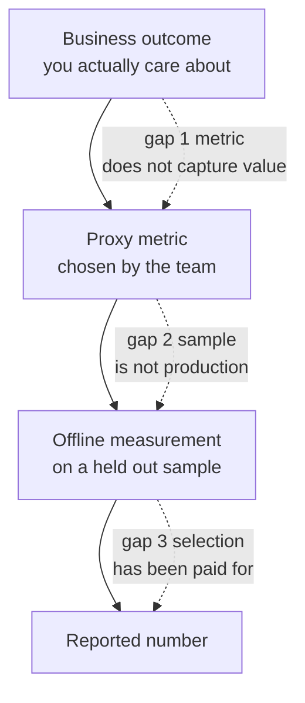
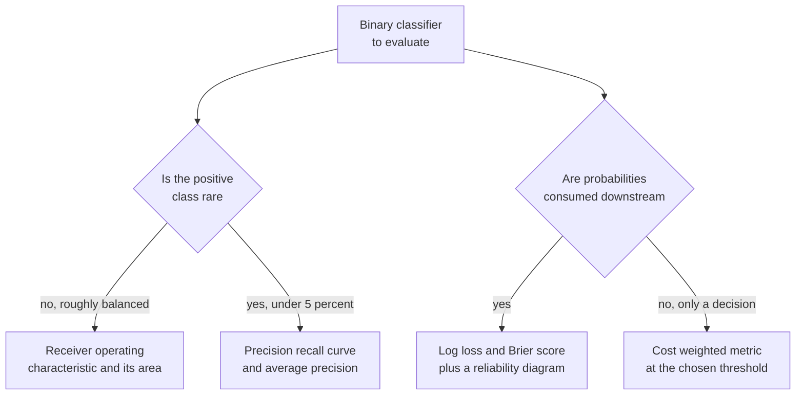
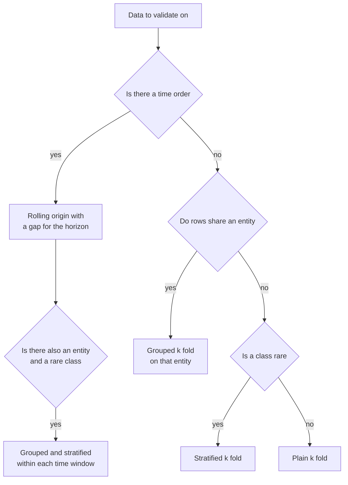
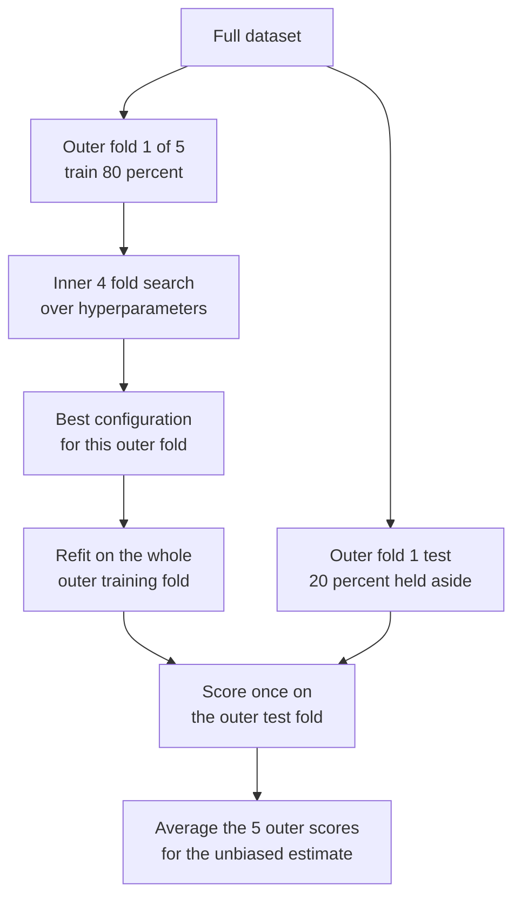
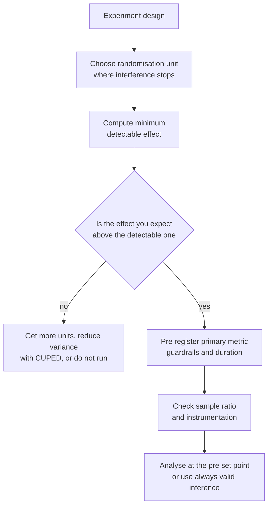
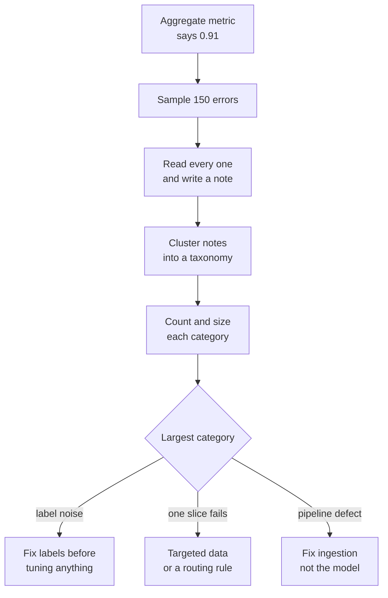

# Chapter 5: Evaluation, Validation, and Experimental Design

> **What this chapter covers** Why evaluation is the hardest part of applied machine learning, regression and classification metrics and what each penalises, ranking and retrieval metrics, threshold selection from a cost matrix, every form of cross-validation and every route by which leakage enters, statistical comparison of models including the bootstrap and McNemar's test, sample size calculations, hyperparameter optimisation from grid search to multi-fidelity methods, online experimental design including A/B tests and switchback designs, and error analysis as a discipline.
>
> **Prerequisites** Chapter 2 (Probability and Statistics), Chapter 4 (Classical Machine Learning).
>
> **Where it is used** Every project. The evaluation harness outlives the model. It is also the artefact most often built badly, and the one whose defects are hardest to detect, because a broken evaluation reports success.

Modelling is the part that looks hard and is mostly solved. Evaluation is the part that looks easy and is mostly not. A team can spend a quarter improving a model against a validation set that leaks, and ship a system that is worse than the one it replaced, and not find out for six months.

This chapter is about building an evaluation you can bet on.

---

## 5.1 Level 1: Foundations

### 5.1.1 Why evaluation is hard

Training has a tight feedback loop. The loss goes down or it does not. Evaluation has no such loop. A wrong evaluation produces a number that looks exactly like a right one.

Five structural reasons.

**The quantity you care about is not the quantity you can measure.** You care about revenue, patient outcomes, or time saved. You measure the area under a curve on 20,000 held-out rows. Everything between those two is assumption.

**Every look at held-out data spends some of it.** Selecting a model, a threshold, a feature set, or a stopping round using a held-out score makes that score optimistic. A test set consulted fifty times is a training set with extra steps.

**The data you evaluate on is not the data you will see.** The evaluation set is a sample from the past. Production is a sample from the future, from a population that has shifted, filtered by the deployed system's own behaviour.

**Aggregates hide the failures that matter.** A model at 94 percent accuracy overall can be at 61 percent on the 4 percent of cases that carry the legal risk. The aggregate will never show you this.

**Nobody checks an evaluation that reports good news.** This is a social problem, not a technical one, and it is the largest of the five. Build the check into the process: every improvement gets a sanity audit before it is believed.



*Figure 5.1: Three gaps between what you care about and what you report. Each needs a separate argument.*

### 5.1.2 The three splits and what each is for

| Split | Purpose | How often you may look |
|---|---|---|
| Training | Fit model parameters | Continuously |
| Validation | Choose hyperparameters, features, thresholds, stopping points | As often as needed, accepting that its score becomes optimistic |
| Test | Produce the number you report | Once, at the end, ideally by someone who did not do the modelling |

The rule people break is the last one. Once you have looked at the test set and changed anything in response, it is a validation set, and you need a new test set.

A fourth set is useful in production systems: a **golden set**, a small, carefully curated, manually verified collection of cases that changes rarely, covering known hard cases and every failure mode you have previously shipped. It is not for estimating performance. It is a regression suite. If a change breaks a golden case, the change does not ship regardless of what the aggregate says.

### 5.1.3 Metrics are statements about costs

A metric is not a neutral description. Choosing one asserts a relative cost of the errors it weighs.

Accuracy asserts that a false positive and a false negative cost the same. In fraud detection, a missed fraud costs the amount of the transaction and a false alarm costs a few minutes of someone's time. Those are not the same, and accuracy is therefore the wrong metric there, whatever the class balance.

The honest way to select a metric is to start from a cost matrix, even a rough one, and derive the metric from it. Section 5.2.6 shows the derivation.

### 5.1.4 The confusion matrix

For binary classification at a fixed threshold, four counts describe everything.

|  | Predicted positive | Predicted negative |
|---|---|---|
| **Actual positive** | True positive, TP | False negative, FN |
| **Actual negative** | False positive, FP | True negative, TN |

Every classification metric is a function of these four numbers. Learn to read them directly. A metric that surprises you is usually explained by looking at the counts.

**Worked example used throughout this chapter.** Ten thousand transactions, 200 of them fraudulent, a model flagging 300. Of the 300 flagged, 120 are genuinely fraudulent.

$\text{TP} = 120$, $\text{FP} = 180$, $\text{FN} = 80$, $\text{TN} = 9620$.

Accuracy is $(120 + 9620)/10000 = 0.974$. Always predicting "not fraud" gives $9800/10000 = 0.980$. The model is worse than a constant on accuracy and is obviously useful. This is the single clearest demonstration that a metric can be actively misleading.

---

## 5.2 Level 2: Working knowledge

### 5.2.1 Regression metrics

| Metric | Formula | Penalises | Units |
|---|---|---|---|
| Mean squared error | $\frac{1}{n}\sum (y_i - \hat y_i)^2$ | Large errors quadratically | Squared target units |
| Root mean squared error | $\sqrt{\text{MSE}}$ | Same, readable | Target units |
| Mean absolute error | $\frac{1}{n}\sum \lvert y_i - \hat y_i \rvert$ | All errors linearly | Target units |
| Median absolute error | $\mathrm{median}\lvert y_i - \hat y_i\rvert$ | Robust to outliers entirely | Target units |
| Mean absolute percentage error | $\frac{100}{n}\sum \frac{\lvert y_i - \hat y_i\rvert}{\lvert y_i\rvert}$ | Relative error, asymmetric | Percent |
| Symmetric mean absolute percentage error | $\frac{100}{n}\sum \frac{\lvert y_i - \hat y_i\rvert}{(\lvert y_i\rvert + \lvert\hat y_i\rvert)/2}$ | Relative error, bounded | Percent |
| Coefficient of determination $R^2$ | $1 - \frac{\sum(y_i-\hat y_i)^2}{\sum(y_i - \bar y)^2}$ | Compares to predicting the mean | Unitless |
| Pinball loss at $\tau$ | Asymmetric absolute loss | Quantile accuracy | Target units |

**What each choice means.** Minimising squared error targets the conditional mean. Minimising absolute error targets the conditional median. These are different predictions on skewed data, and the choice is not cosmetic. If your target is revenue per customer with a long right tail, the mean is far above the median, and the two models will disagree on almost every row.

**Worked example.** True values 10, 12, 11, 90. Model A predicts 11 for all four. Model B predicts 30 for all four.

Model A: errors $-1, 1, 0, -79$. Mean absolute error $= (1+1+0+79)/4 = 20.25$. Mean squared error $= (1+1+0+6241)/4 = 1560.75$, so root mean squared error $= 39.5$.
Model B: errors $20, 18, 19, -60$. Mean absolute error $= (20+18+19+60)/4 = 29.25$. Mean squared error $= (400+324+361+3600)/4 = 1171.25$, root mean squared error $= 34.2$.

Model A wins on absolute error, model B wins on squared error. Squared error rewards hedging toward the outlier. If the value 90 is a genuine high-value case you must predict well, model B is right. If it is a data error, model A is right and you should also fix your data. The metric encodes that judgment and you must make it consciously.

**The percentage error trap.** Mean absolute percentage error is undefined at $y = 0$ and explodes near it. It is also asymmetric: predicting 150 when the truth is 100 gives 50 percent, while predicting 50 gives 50 percent, but predicting 0 gives 100 percent while there is no bound on the over-prediction side. A model minimising it is systematically biased low. Use the symmetric variant, or a log-transformed target, or absolute error on a relevant scale.

**$R^2$ caveats.** It is not the square of a correlation except in simple linear regression. It can be negative, meaning your model is worse than predicting the mean, which is useful information. It is computed against the variance of the evaluation set, so the same model scores differently on a homogeneous and a heterogeneous set. Never compare $R^2$ across different datasets.

### 5.2.2 Classification metrics in full

From the confusion matrix:

$$\text{Precision} = \frac{TP}{TP + FP}, \qquad \text{Recall} = \frac{TP}{TP + FN}, \qquad \text{Specificity} = \frac{TN}{TN + FP}$$

Precision answers: of the cases I flagged, how many were right. Recall, also called sensitivity or the true positive rate, answers: of the cases that were positive, how many did I find. False positive rate is $1 - \text{specificity} = FP/(FP+TN)$.

**On the running example.** Precision $= 120/300 = 0.40$. Recall $= 120/200 = 0.60$. Specificity $= 9620/9800 = 0.982$. False positive rate $= 0.018$.

Read that as: 40 percent of alerts are real, we catch 60 percent of fraud, and we bother 1.8 percent of honest customers. Those three sentences are what a stakeholder needs and what "97.4 percent accurate" concealed.

**The harmonic mean.** The F1 score is the harmonic mean of precision and recall:

$$F_1 = 2\cdot\frac{P \cdot R}{P + R}$$

The harmonic mean, not the arithmetic mean, because it is dominated by the smaller of the two. Precision 1.0 and recall 0.02 gives an arithmetic mean of 0.51, which flatters a useless model, and an $F_1$ of $2(1)(0.02)/1.02 = 0.039$, which does not.

On the running example, $F_1 = 2(0.40)(0.60)/(1.00) = 0.48$.

The general form weights recall $\beta$ times as important as precision:

$$F_\beta = (1+\beta^2)\cdot\frac{P\cdot R}{\beta^2 P + R}$$

$F_2$ weights recall higher, appropriate for screening where a miss is expensive. $F_{0.5}$ weights precision higher, appropriate when acting on a false positive is expensive. Choosing $\beta$ is a cost statement, and if you can state the costs you should skip $F_\beta$ and use the cost matrix directly.

$F_1$ has a real defect: it ignores true negatives entirely. Two problems with identical $F_1$ can have wildly different false positive rates when the negative class is large.

**The receiver operating characteristic curve.** Sweep the threshold from high to low. At each threshold plot the true positive rate against the false positive rate. The curve starts at $(0,0)$, ends at $(1,1)$, and a random model traces the diagonal.

The area under this curve, abbreviated AUROC or often just AUC, has a probabilistic meaning that is worth memorising: it is the probability that a randomly chosen positive is scored above a randomly chosen negative. It is equivalent to the Mann-Whitney U statistic divided by the product of the class counts.

**Worked AUROC by hand.** Three positives with scores 0.9, 0.6, 0.4 and three negatives with scores 0.7, 0.5, 0.2. Count pairs where the positive scores higher, 9 pairs total.

| Positive | vs 0.7 | vs 0.5 | vs 0.2 |
|---|---|---|---|
| 0.9 | win | win | win |
| 0.6 | lose | win | win |
| 0.4 | lose | lose | win |

Six wins out of nine, so AUROC $= 6/9 = 0.667$. Ties count as half a win.

Because AUROC depends only on ranking, it is invariant to the class balance. That is presented as a virtue and it is also the problem.

**The precision-recall curve and why it is right under imbalance.** Sweep the threshold and plot precision against recall. The baseline is the positive rate, not 0.5.

The reason to prefer it under imbalance is arithmetic. The false positive rate has $TN$ in its denominator, and $TN$ is enormous when negatives dominate. So a large absolute number of false positives moves the false positive rate almost not at all, and the receiver operating characteristic curve barely notices.

**Worked comparison.** One million transactions, 1,000 fraudulent. A model at some threshold catches 500 frauds and raises 5,000 false alarms.

False positive rate $= 5000/999000 = 0.005$. Negligible on the curve.
Precision $= 500/5500 = 0.091$. Ninety-one percent of alerts are wrong.

Now a second model catches the same 500 frauds with 50,000 false alarms. False positive rate rises to 0.050, still visually small. Precision collapses to $500/50500 = 0.0099$. The precision-recall curve shows a tenfold degradation that the receiver operating characteristic curve renders as a small wiggle. When the positive class is rare and you act on positives, use the precision-recall curve.

Summarise it with **average precision**, the precision averaged over recall levels, computed as $\sum_k (R_k - R_{k-1})P_k$. Be aware that libraries also offer a trapezoidal interpolation of the curve; the two differ slightly and are not interchangeable across reports, so state which you used.



*Figure 5.2: The metric follows from the class balance and from whether a probability or a decision is consumed.*

**Log loss.** The negative log likelihood of the labels under the predicted probabilities:

$$\text{Log loss} = -\frac{1}{n}\sum_{i=1}^{n}\Big[y_i\log p_i + (1-y_i)\log(1-p_i)\Big]$$

It is a **proper scoring rule**: its expected value is minimised by reporting the true probability. That is why it is the right training objective and a good evaluation metric when probabilities matter. It is unbounded above, so a single confident mistake dominates. Libraries clip probabilities away from 0 and 1 to avoid an infinite value; the clipping constant affects the number, so state it.

**Worked example.** Four predictions and labels: $(0.9, 1), (0.8, 1), (0.3, 0), (0.6, 0)$.
Losses: $-\log 0.9 = 0.105$, $-\log 0.8 = 0.223$, $-\log 0.7 = 0.357$, $-\log 0.4 = 0.916$. Mean $= 0.400$ nats.

**Brier score.** Mean squared error on probabilities:

$$\text{Brier} = \frac{1}{n}\sum_{i=1}^n (p_i - y_i)^2$$

Also proper, bounded in $[0,1]$, and far less punishing of confident mistakes than log loss. On the same four predictions: $0.01 + 0.04 + 0.09 + 0.36 = 0.50$, divided by 4 gives 0.125.

Brier decomposes, following Murphy (1973), into reliability minus resolution plus uncertainty, which separates calibration error from discrimination. Use log loss when confident mistakes are catastrophic and Brier when they are merely bad.

**Matthews correlation coefficient.** The correlation between predicted and actual labels, treating both as binary variables:

$$\text{MCC} = \frac{TP \cdot TN - FP \cdot FN}{\sqrt{(TP+FP)(TP+FN)(TN+FP)(TN+FN)}}$$

It ranges from $-1$ to $+1$, with 0 meaning no better than chance. Unlike $F_1$ it uses all four cells, so it cannot be gamed by ignoring the negative class, and it is symmetric under swapping which class is called positive.

**Worked example on the running case.** Numerator $= 120(9620) - 180(80) = 1{,}154{,}400 - 14{,}400 = 1{,}140{,}000$. Denominator $= \sqrt{300 \times 200 \times 9800 \times 9700} = \sqrt{5.7036\times 10^{12}} = 2{,}388{,}200$. MCC $= 0.477$. A modest positive correlation, which is a fairer summary of this model than either 0.974 accuracy or 0.48 $F_1$.

**Multiclass averaging.** With $K$ classes, per-class metrics must be aggregated, and the choice changes the answer.

| Averaging | How | Emphasises |
|---|---|---|
| Macro | Unweighted mean of per-class scores | Every class equally, including tiny ones |
| Weighted | Mean weighted by class support | Large classes |
| Micro | Pool all TP, FP, FN then compute once | Every example equally. For single-label multiclass, micro F1 equals accuracy. |

Report macro when rare classes matter and micro when every prediction matters equally. Report both if you are unsure, and always name which you used.

### 5.2.3 Ranking and retrieval metrics

When the output is an ordered list, the position of a correct item matters. Item 1 and item 40 are not equivalent.

**Precision at k.** The fraction of the top $k$ that are relevant. If 3 of the top 10 are relevant, precision at 10 is 0.30. Simple, and what a user of a ten-result page experiences.

**Recall at k.** The fraction of all relevant items appearing in the top $k$. With 8 relevant items in the corpus and 3 in the top 10, recall at 10 is 0.375. This is the metric for the retrieval stage of a two-stage system, where the job is to not lose anything before reranking.

**Mean reciprocal rank.** For each query, take the reciprocal of the rank of the first relevant result, and average across queries.

$$\text{MRR} = \frac{1}{|Q|}\sum_{q=1}^{|Q|} \frac{1}{\mathrm{rank}_q}$$

**Worked example.** Four queries with first relevant result at ranks 1, 3, 2, and never found. Reciprocals 1, 0.333, 0.5, 0. Mean $= 1.833/4 = 0.458$. Use this when there is one right answer and the user stops at it, which is the case for navigational search and for question answering.

**Normalised discounted cumulative gain.** The metric for graded relevance with position discounting. Let $rel_i$ be the relevance grade of the item at position $i$.

$$\text{DCG@}k = \sum_{i=1}^{k}\frac{2^{rel_i} - 1}{\log_2(i + 1)}$$

$$\text{NDCG@}k = \frac{\text{DCG@}k}{\text{IDCG@}k}$$

where the ideal discounted cumulative gain, IDCG, is the same quantity computed on the perfect ordering. The result lies in $[0,1]$ and is comparable across queries with different numbers of relevant items, which the raw DCG is not.

The numerator $2^{rel}-1$ makes relevance gains exponential, so one highly relevant result outweighs several marginal ones. The denominator $\log_2(i+1)$ discounts by position. An alternative linear-gain form uses $rel_i$ directly; state which you used.

**Worked NDCG@5 in full.** Relevance grades of the returned list, in order: 3, 2, 3, 0, 1, on a 0 to 3 scale.

| Position $i$ | $rel_i$ | $2^{rel_i}-1$ | $\log_2(i+1)$ | Contribution |
|---|---|---|---|---|
| 1 | 3 | 7 | 1.000 | 7.000 |
| 2 | 2 | 3 | 1.585 | 1.893 |
| 3 | 3 | 7 | 2.000 | 3.500 |
| 4 | 0 | 0 | 2.322 | 0.000 |
| 5 | 1 | 1 | 2.585 | 0.387 |

DCG@5 $= 7.000 + 1.893 + 3.500 + 0.000 + 0.387 = 12.780$.

The ideal ordering sorts the same grades descending: 3, 3, 2, 1, 0.

| Position | $rel$ | $2^{rel}-1$ | $\log_2(i+1)$ | Contribution |
|---|---|---|---|---|
| 1 | 3 | 7 | 1.000 | 7.000 |
| 2 | 3 | 7 | 1.585 | 4.417 |
| 3 | 2 | 3 | 2.000 | 1.500 |
| 4 | 1 | 1 | 2.322 | 0.431 |
| 5 | 0 | 0 | 2.585 | 0.000 |

IDCG@5 $= 13.348$. So NDCG@5 $= 12.780/13.348 = 0.957$.

Interpretation: the ranking is close to ideal. The single error that costs anything is the second-most-relevant item sitting at position 3 instead of position 2, and the position discount makes that cheap. Had the grade-3 item at position 3 been at position 5 instead, its contribution would fall from 3.500 to $7/2.585 = 2.708$, and NDCG would drop to $11.988/13.348 = 0.898$. That sensitivity is the point of the metric.

**Mean average precision.** Average precision for one query is the mean of the precision values computed at each position where a relevant item appears:

$$\text{AP} = \frac{1}{R}\sum_{i=1}^{n} P(i)\cdot \mathbb{1}[\text{item } i \text{ relevant}]$$

where $R$ is the total number of relevant items. Mean average precision, abbreviated MAP, averages AP over queries.

**Worked example.** Ten results, relevant at positions 1, 3, and 6. Total relevant in the corpus is 4.
Precision at position 1 is $1/1 = 1.000$.
Precision at position 3 is $2/3 = 0.667$.
Precision at position 6 is $3/6 = 0.500$.
AP $= (1.000 + 0.667 + 0.500)/4 = 0.542$. Dividing by 4, not 3, correctly penalises the relevant item never retrieved.

| Metric | Use when |
|---|---|
| Precision at k | The user sees exactly $k$ results and relevance is binary |
| Recall at k | You are the candidate generation stage feeding a reranker |
| Mean reciprocal rank | There is one right answer and the user stops at it |
| NDCG | Relevance is graded and position matters |
| Mean average precision | Relevance is binary, several items are relevant, and full ordering matters |

### 5.2.4 Threshold selection from a cost matrix

A classifier outputs a score. The threshold is a separate decision and belongs to the business, not the model.

Assign a cost to each cell of the confusion matrix: $C_{FP}$, $C_{FN}$, and usually $C_{TP}$ and $C_{TN}$ set to zero or to a benefit. Expected cost at threshold $t$ is

$$\mathbb{E}[\text{cost}](t) = FP(t)\cdot C_{FP} + FN(t)\cdot C_{FN}$$

Sweep $t$ over the observed scores, compute the cost, and take the minimum.

For a calibrated model there is a closed form. Acting on a case is worth it when the expected cost of acting is below that of not acting, which for a case with true probability $p$ means $(1-p)C_{FP} < p\,C_{FN}$, giving

$$t^* = \frac{C_{FP}}{C_{FP} + C_{FN}}$$

**Worked example.** A missed fraud costs 500 on average. A false alarm costs 20 in review time and customer annoyance. Then $t^* = 20/(20+500) = 0.0385$. Flag anything with a fraud probability above 3.85 percent. The default 0.5 would be wrong by more than an order of magnitude, and the number of frauds caught at 0.5 would be a small fraction of what the costs justify.

This formula assumes calibration. An uncalibrated model's 0.0385 does not mean 3.85 percent, and the derived threshold is meaningless. Calibrate first, following Chapter 4, level 3, then threshold.

Add a capacity constraint when one exists. If the review team can handle 400 cases a day and the cost-optimal threshold yields 900, the operating point is the 400-case threshold and the gap is a resourcing argument to have explicitly, with the foregone value quantified.

**Listing 5.1: sweeping the threshold against a cost matrix.**

```python
import numpy as np

def best_threshold(y_true, p, cost_fp, cost_fn):
    order = np.argsort(-p)
    y = np.asarray(y_true)[order]
    p_sorted = np.asarray(p)[order]
    tp = np.cumsum(y)
    fp = np.cumsum(1 - y)
    fn = y.sum() - tp
    cost = fp * cost_fp + fn * cost_fn
    k = int(np.argmin(cost))
    return float(p_sorted[k]), float(cost[k] / len(y))

rng = np.random.default_rng(0)
y = rng.binomial(1, 0.02, size=20000)
p = np.clip(rng.beta(1 + 4 * y, 20), 0, 1)
t, c = best_threshold(y, p, cost_fp=20, cost_fn=500)
print("threshold", round(t, 4), "cost per case", round(c, 3))
```

Sorting by descending score and taking cumulative sums evaluates every possible threshold in one pass rather than looping, which matters at millions of rows. The returned threshold is the score of the last case included, so the decision rule is "flag when score is greater than or equal to this value".

### 5.2.5 Cross-validation

A single train and test split gives one estimate with high variance on small data. Cross-validation reuses the data.

**k-fold.** Split into $k$ equal parts. Train on $k-1$ and evaluate on the held-out one, $k$ times. Average the $k$ scores.

The choice of $k$ trades bias against variance and cost. Small $k$, such as 3, trains on less data so each model is worse and the estimate is pessimistically biased. Large $k$ trains on almost everything, so bias is low, but the $k$ training sets overlap heavily, the fold scores are correlated, and the variance of the average does not fall as fast as the count suggests. Five or ten is the standard compromise.

**Stratified k-fold.** Preserve the class proportions in every fold. Mandatory for classification, and especially when a class is rare. With 30 positives in 10,000 rows and 10 plain folds, a fold can end up with one positive and a meaningless score.

**Leave-one-out.** $k = n$. Nearly unbiased, expensive, and the estimate has high variance because the $n$ models are almost identical so their errors are highly correlated. It is also unstable for discontinuous metrics. Reach for it only when $n$ is small enough that nothing else is possible.

**Grouped k-fold.** When rows are not independent because they share an entity, keep every row of a group in the same fold. Groups are patients, users, devices, sessions, documents, or machines. Splitting a patient's twenty visits across folds means the model memorises that patient in training and is tested on them, and the reported score is fiction.

This is the most common silent evaluation failure in applied work. The test for it is simple: ask what unit the model will be applied to in production. If a new patient will arrive, evaluate on new patients.

**Time-series split and rolling origin.** Time-ordered data must never be split at random, because that trains on the future and tests on the past.

Rolling origin, also called walk-forward validation, repeatedly trains on everything up to time $T$ and evaluates on the window after it, then advances $T$.

| Variant | Training window | Property |
|---|---|---|
| Expanding window | All data up to $T$ | More training data each fold; assumes old data stays relevant |
| Sliding window | Fixed length ending at $T$ | Constant training size; adapts to drift; discards history |

Insert a **gap** between the training end and the evaluation start whenever the target has a horizon. If you predict 7 days ahead, the last 7 days before the evaluation window contain information that would not have been available; hold them out. This is sometimes called purging, and with overlapping label windows you also need embargoing, excluding a window after the evaluation set from later training folds.



*Figure 5.3: Splitting strategy follows from the dependence structure in the data, not from convention.*

### 5.2.6 Leakage, in every form it takes

Leakage is any information about the evaluation target reaching the model that would not be available at prediction time. It is the reason for most of the gap between offline and online performance.

| Route | Concrete example | Fix |
|---|---|---|
| Preprocessing fitted on all data | `StandardScaler` fitted before the split, so the scaler saw test-set means | Fit every transformer inside the training fold using a pipeline |
| Target encoding computed in-fold | Category means include the row being encoded | Out-of-fold encoding with smoothing, Chapter 4, level 3 |
| Feature uses future information | "Total spend in the last 90 days" computed from a table snapshot taken after the label date | Build features as of the prediction timestamp, never from a current snapshot |
| Duplicate or near-duplicate rows | The same event logged twice, landing in train and test | Deduplicate before splitting, including near duplicates |
| Grouped data split at random | Multiple sessions of one user in both splits | Grouped splitting on the entity |
| A proxy for the label | A field populated only after the outcome, such as a case closure code | Audit any feature with suspiciously high importance |
| Selection on the full dataset | Feature selection or dimensionality reduction run before the split | Move inside the fold |
| Tuning on the test set | Repeated evaluation and adjustment | Nested cross-validation, or a genuinely untouched holdout |
| Label from the same source as a feature | A derived column computed from the target | Trace lineage of every feature |

**The leakage smell test.** If a model scores far better than domain experts expect, assume leakage until proven otherwise. Take the top features by permutation importance and ask, for each one, whether its value would be known at the moment of prediction, and where it comes from. This audit finds most leakage in under an hour and is worth running before every launch.

**Listing 5.2: a pipeline that cannot leak, contrasted with one that does.**

```python
from sklearn.pipeline import Pipeline
from sklearn.preprocessing import StandardScaler
from sklearn.feature_selection import SelectKBest, f_classif
from sklearn.linear_model import LogisticRegression
from sklearn.model_selection import cross_val_score, StratifiedKFold
import numpy as np

rng = np.random.default_rng(0)
X = rng.normal(size=(300, 2000))     # pure noise, 2000 features
y = rng.integers(0, 2, size=300)     # labels independent of X

cv = StratifiedKFold(5, shuffle=True, random_state=0)

# WRONG: selection sees all labels before the split
sel = SelectKBest(f_classif, k=20).fit(X, y)
leaky = cross_val_score(LogisticRegression(max_iter=1000), sel.transform(X), y, cv=cv)

# RIGHT: selection happens inside each fold
pipe = Pipeline([("scale", StandardScaler()),
                 ("select", SelectKBest(f_classif, k=20)),
                 ("clf", LogisticRegression(max_iter=1000))])
clean = cross_val_score(pipe, X, y, cv=cv)

print("leaky mean accuracy", round(leaky.mean(), 3))
print("clean mean accuracy", round(clean.mean(), 3))
```

The data is pure noise, so the honest accuracy is 0.5. The leaky version selects the 20 features that happen to correlate with the labels across the whole dataset, then cross-validates on those, and reports an accuracy well above chance. The clean version reports approximately 0.5. This is not a subtle effect. Selection on 2,000 noise features before splitting manufactures signal from nothing, and this exact mistake appears in published work.

---

## 5.3 Level 3: Depth

### 5.3.1 Nested cross-validation

Ordinary cross-validation gives an unbiased estimate of a **fixed** procedure. The moment you choose hyperparameters by comparing cross-validation scores, the winning score is the maximum of many noisy estimates and is therefore biased upward.

The size of the bias is easy to feel. Search 200 configurations with a fold-to-fold standard error of 0.01 on an equally good set of candidates. The expected maximum of 200 draws from a normal distribution is about 2.75 standard deviations above the mean, so the winner's reported score is optimistic by roughly 0.027 for no real reason. Report that number and your model will underperform by about 2.7 points.

**Nested cross-validation** fixes this. An outer loop estimates generalisation. Inside each outer training fold, an inner loop performs the full hyperparameter search. The model selected by the inner loop is evaluated once on the outer test fold, which the inner loop never touched.



*Figure 5.4: Nested cross-validation. The inner loop chooses, the outer loop measures, and the two never share data.*

Two points people get wrong.

First, the outer folds may select **different** hyperparameters. That is correct and expected. Nested cross-validation estimates the performance of the whole procedure, meaning "search over this space and then fit", not the performance of one specific configuration. If you want to ship a single model, run the search once on all the data afterwards; the nested estimate is the honest expectation of what that model will do.

Second, the cost is multiplicative. Five outer folds, four inner folds, and 100 configurations is 2,000 fits plus 5 refits. Use a cheaper inner search, such as random search with a fixed budget or successive halving, rather than abandoning the nesting.

The cheap alternative when data is plentiful is a three-way split: train, validation for the search, and a test set touched exactly once. This is what large projects usually do, and it is fine as long as the test set really is touched once.

### 5.3.2 Confidence intervals and the bootstrap

A metric computed on $n$ items is an estimate with uncertainty. Reporting it without an interval invites over-reading.

For a proportion such as accuracy, the normal approximation gives a standard error of $\sqrt{\hat p(1-\hat p)/n}$.

**Worked example.** Accuracy 0.85 on 1,000 items. Standard error $= \sqrt{0.85 \times 0.15/1000} = \sqrt{0.0001275} = 0.0113$. A 95 percent interval is $0.85 \pm 1.96(0.0113) = [0.828, 0.872]$. So a model at 0.86 is not distinguishably better. The normal approximation is poor when $\hat p$ is near 0 or 1 or when $n\hat p < 10$; use the Wilson interval there.

For metrics that are not simple means, such as area under a curve, $F_1$, or NDCG, use the **bootstrap**. Resample the evaluation items with replacement $B$ times, recompute the metric on each resample, and take percentiles of the resulting distribution.

**Listing 5.3: bootstrap confidence interval for any metric.**

```python
import numpy as np
from sklearn.metrics import roc_auc_score

def bootstrap_ci(y, p, metric=roc_auc_score, B=2000, alpha=0.05, seed=0):
    rng = np.random.default_rng(seed)
    y, p = np.asarray(y), np.asarray(p)
    n = len(y)
    stats = np.empty(B)
    for b in range(B):
        idx = rng.integers(0, n, n)
        if len(np.unique(y[idx])) < 2:      # degenerate resample
            stats[b] = np.nan
            continue
        stats[b] = metric(y[idx], p[idx])
    stats = stats[~np.isnan(stats)]
    lo, hi = np.percentile(stats, [100 * alpha / 2, 100 * (1 - alpha / 2)])
    return float(metric(y, p)), float(lo), float(hi)
```

Two details. Resampling can produce a bootstrap sample with only one class present, for which the area under the curve is undefined; drop those rather than letting them propagate as errors. And resample at the level of the independent unit. If your evaluation set has ten rows per user, resample users, not rows, or the interval will be far too narrow.

Use $B$ of at least 1,000 for a 95 percent interval and at least 10,000 for a 99 percent one, since the percentile estimate itself has noise.

### 5.3.3 Comparing two models on the same data

If you evaluate two models on the same items, their errors are correlated because hard items are hard for both. An unpaired comparison throws that information away and needs far more data to detect the same difference. Always pair.

**The paired bootstrap.** On each resample, compute the metric for both models on the same resampled items and record the difference. The interval on the difference is what you report. If it excludes zero, the difference is significant at that level.

**Worked example.** Model A has AUROC 0.842, model B 0.851. Separate bootstrap intervals are $[0.820, 0.864]$ and $[0.829, 0.873]$, which overlap heavily, and a reader would conclude nothing. But the paired bootstrap on the difference gives $[0.003, 0.015]$, excluding zero. B is genuinely better. Overlapping individual intervals do not imply an insignificant difference, and this mistake is extremely common in model comparison tables.

**McNemar's test for paired classifications.** When comparing two classifiers' binary decisions on the same items, build the discordance table.

|  | B correct | B wrong |
|---|---|---|
| **A correct** | $a$ | $b$ |
| **A wrong** | $c$ | $d$ |

Cells $a$ and $d$ carry no information about which model is better; both agree. The test looks only at $b$ and $c$. Under the null that the models are equally accurate, each discordant item is a coin flip, so $b \sim \text{Binomial}(b+c, 0.5)$.

The chi-squared form with continuity correction:

$$\chi^2 = \frac{(|b - c| - 1)^2}{b + c}$$

compared against a chi-squared distribution with one degree of freedom. Use the exact binomial test when $b + c < 25$.

**Worked example.** Out of 2,000 test items: $a = 1{,}680$ both correct, $d = 120$ both wrong, $b = 140$ where A is right and B is wrong, $c = 60$ where B is right and A is wrong.

$\chi^2 = (|140-60| - 1)^2/200 = 79^2/200 = 6241/200 = 31.2$.

The critical value for one degree of freedom at the 0.05 level is 3.84, so $31.2$ is far beyond it and the difference is significant. Note the accuracies: A is at $(1680+140)/2000 = 0.910$, B at $(1680+60)/2000 = 0.870$. The test used only the 200 discordant items and still found overwhelming evidence, because the 1,800 concordant items contain no information about the comparison.

**Which test for which comparison.**

| Situation | Test |
|---|---|
| Two classifiers, same test set, binary correctness | McNemar's test |
| Two models, same test set, any metric | Paired bootstrap on the difference |
| Two models, same test set, per-item numeric loss | Paired t-test if losses are roughly normal, Wilcoxon signed-rank otherwise |
| Several models over several datasets | Friedman test, then Nemenyi post hoc, following Demsar (2006) |
| Two models compared via repeated cross-validation | Corrected resampled t-test; the naive t-test is badly anti-conservative because folds overlap |

That last row is important. Fold scores are not independent, because training sets overlap. Applying an ordinary t-test to $k$ fold differences ignores this and produces false positives at several times the nominal rate. Nadeau and Bengio (2003) give a variance correction that inflates the estimate by the train-to-test size ratio.

### 5.3.4 How many evaluation items do you need

Decide the sample size before collecting, not after.

For detecting a difference in a proportion between two paired systems, the relevant quantity is the discordant rate. For an unpaired comparison of two proportions $p_1$ and $p_2$ with significance $\alpha$ and power $1-\beta$:

$$n \approx \frac{\left(z_{1-\alpha/2}\sqrt{2\bar p(1-\bar p)} + z_{1-\beta}\sqrt{p_1(1-p_1) + p_2(1-p_2)}\right)^2}{(p_1-p_2)^2}$$

per group, with $\bar p = (p_1+p_2)/2$.

**Worked calculation, fully.** You want to detect an improvement in accuracy from 0.80 to 0.83, a 3 percentage point gain, at $\alpha = 0.05$ two-sided and 80 percent power. Then $z_{0.975} = 1.96$ and $z_{0.80} = 0.84$.

$\bar p = 0.815$, so $\bar p(1-\bar p) = 0.815 \times 0.185 = 0.1508$ and $\sqrt{2(0.1508)} = \sqrt{0.3016} = 0.5492$.
$p_1(1-p_1) = 0.16$, $p_2(1-p_2) = 0.2511$, sum $= 0.4111$, square root $= 0.6412$.
Numerator $= (1.96 \times 0.5492 + 0.84 \times 0.6412)^2 = (1.0764 + 0.5386)^2 = 1.6150^2 = 2.608$.
Denominator $= 0.03^2 = 0.0009$.
$n = 2.608/0.0009 = 2{,}898$ per group.

So roughly 2,900 items per system, 5,800 in total, for an unpaired comparison. If your test set has 500 items, a 3 point difference is not detectable and any 3 point difference you observe is noise.

**The paired version needs far fewer.** Using McNemar's test, the sample size depends on the discordant proportion $\psi = (b+c)/n$ and the odds ratio of discordance. Approximately:

$$n \approx \frac{\left(z_{1-\alpha/2}\sqrt{\psi} + z_{1-\beta}\sqrt{\psi - \delta^2}\right)^2}{\delta^2}$$

where $\delta = (b-c)/n$ is the accuracy difference. With $\delta = 0.03$ and a discordant rate $\psi = 0.10$, which is realistic when two models agree 90 percent of the time:

$\sqrt{0.10} = 0.3162$, and $\sqrt{0.10 - 0.0009} = \sqrt{0.0991} = 0.3148$.
Numerator $= (1.96 \times 0.3162 + 0.84 \times 0.3148)^2 = (0.6198 + 0.2644)^2 = 0.8842^2 = 0.7818$.
$n = 0.7818/0.0009 = 869$ items.

Pairing cut the requirement from 2,898 per group to 869 total, a factor of about 6.7. That is the practical payoff of evaluating both models on the same items, and it is the reason a fixed evaluation set is worth building carefully.

The general lesson: required sample size scales as the inverse square of the effect you want to detect. Halving the detectable difference quadruples the data. Before promising to detect a 1 point improvement, compute what that costs.

### 5.3.5 Hyperparameter optimisation

**Grid search.** Enumerate a Cartesian product. Cost is exponential in the number of hyperparameters. With 5 values each across 4 hyperparameters that is 625 fits.

**Random search.** Sample configurations from distributions over the ranges. Bergstra and Bengio showed in 2012 ("Random Search for Hyper-Parameter Optimization") that it beats grid search for a fixed budget, and the argument is worth understanding because it is counterintuitive.

Performance usually depends strongly on a few hyperparameters and weakly on the rest. This is the **low effective dimensionality** of the response surface. A grid with 5 values per dimension tests only 5 distinct values of the important hyperparameter, no matter how many total points it evaluates, because the grid repeats the same values while varying the unimportant ones. Random search with 625 samples tests 625 distinct values of the important one.

The probability argument is also simple. If the top 5 percent of the range of an important hyperparameter is what you need, one random draw hits it with probability 0.05, and $m$ draws hit it with probability $1 - 0.95^m$. With $m = 60$ that is $1 - 0.95^{60} = 1 - 0.046 = 0.954$. Sixty random draws give a 95 percent chance of landing in the top 5 percent of any single dimension, independent of how many dimensions there are.

**Bayesian optimisation.** Build a probabilistic surrogate of the objective, usually a Gaussian process or a tree-structured Parzen estimator, then choose the next configuration by maximising an acquisition function that trades exploration against exploitation. Expected improvement is the standard choice:

$$\text{EI}(x) = \mathbb{E}\left[\max\big(f(x) - f^*, 0\big)\right]$$

where $f^*$ is the best value seen so far. For a Gaussian posterior with mean $\mu(x)$ and standard deviation $\sigma(x)$, letting $z = (\mu(x) - f^*)/\sigma(x)$:

$$\text{EI}(x) = (\mu(x) - f^*)\Phi(z) + \sigma(x)\phi(z)$$

with $\Phi$ and $\phi$ the standard normal distribution and density functions.

**Worked example.** Best so far $f^* = 0.860$. Candidate A has $\mu = 0.865$, $\sigma = 0.002$. Then $z = 0.005/0.002 = 2.5$, $\Phi(2.5) = 0.9938$, $\phi(2.5) = 0.0175$. EI $= 0.005(0.9938) + 0.002(0.0175) = 0.00497 + 0.000035 = 0.00500$.

Candidate B has $\mu = 0.855$, $\sigma = 0.020$. Then $z = -0.005/0.020 = -0.25$, $\Phi(-0.25) = 0.4013$, $\phi(-0.25) = 0.3867$. EI $= -0.005(0.4013) + 0.020(0.3867) = -0.00201 + 0.00773 = 0.00573$.

Candidate B wins despite a worse predicted mean, because its uncertainty is large enough that the upside is worth exploring. That trade-off is the whole mechanism.

Bayesian optimisation is sequential, so it parallelises awkwardly, and its advantage over random search shrinks when evaluations are cheap and parallel workers are plentiful.

**Successive halving.** Allocate a small budget to $m$ configurations, keep the best fraction $1/\eta$, multiply the budget by $\eta$, repeat. Budget can be epochs, boosting rounds, dataset fraction, or resolution.

**Worked example.** Start with 81 configurations at 1 unit of budget each, $\eta = 3$.

| Round | Configurations | Budget each | Total |
|---|---|---|---|
| 1 | 81 | 1 | 81 |
| 2 | 27 | 3 | 81 |
| 3 | 9 | 9 | 81 |
| 4 | 3 | 27 | 81 |
| 5 | 1 | 81 | 81 |

Total 405 units to evaluate 81 configurations, one of them fully. Running all 81 to full budget would cost 6,561 units. A 16-fold saving.

The risk is obvious from the table. A configuration that is slow to start, such as one with a small learning rate, is eliminated in round 1 on evidence that does not predict its final performance.

**Hyperband** (Li, Jamieson, DeSalvo, Rostamizadeh, and Talwalkar, 2017) runs several successive halving brackets with different starting trade-offs, some with many configurations and small initial budgets, some with few configurations and large ones. This hedges the risk of aggressive early stopping without knowing in advance which regime suits the problem. BOHB (Falkner, Klein, and Hutter, 2018) replaces Hyperband's random sampling with a Bayesian model, combining both advantages.

| Method | Budget efficiency | Parallelism | Handles slow starters | When to choose |
|---|---|---|---|---|
| Grid | Poor | Perfect | Yes | Two or three discrete hyperparameters only |
| Random | Good | Perfect | Yes | The default, especially with many workers |
| Bayesian | Best per evaluation | Poor | Yes | Evaluations are expensive and sequential |
| Successive halving | Very good | Good | No | Cheap partial evaluations are meaningful |
| Hyperband | Very good | Good | Partly | Same, without knowing the right aggressiveness |
| BOHB | Best overall | Good | Partly | Large budgets and expensive evaluations |

**The meta-overfitting warning.** Every configuration you evaluate on the validation set spends some of that set. After 500 trials, the best validation score is optimistic by roughly the validation standard error times the expected maximum of 500 standard normal draws, about 3.04. With a standard error of 0.008 that is 0.024 of pure selection noise. Compute your validation standard error first, and stop searching when improvements drop below it. The improvements past that point are being fitted to the validation set, not to the problem.

### 5.3.6 Search space design

The space matters more than the search algorithm, and it is the part people neglect.

Sample learning rates, regularisation strengths, and any scale parameter **logarithmically**. A uniform sample from $[0.0001, 0.1]$ puts 90 percent of its mass above 0.01 and almost never tries $0.0003$. Sample $\log_{10}$ uniformly from $[-4, -1]$ instead.

Couple hyperparameters that trade off. Learning rate and number of boosting rounds trade almost exactly, so searching both independently wastes most of the budget on configurations that are equivalent. Fix one, use early stopping for the other.

Bound the space by what you can afford to serve. There is no point discovering that 5,000 trees at depth 12 is optimal if the latency budget is 10 milliseconds. Put the constraint into the space.

Include the do-nothing option. Always evaluate the default configuration and a simple baseline within the same harness, so the search's gain is measured against something.

---

## 5.4 Level 4: Mastery

### 5.4.1 Online experimentation

Offline metrics are a proxy. Online experiments measure the real thing, and they have their own failure modes.

**Randomisation.** Assign units to treatment or control by a deterministic hash of a stable identifier plus a salt unique to the experiment. Hashing, rather than a random draw per request, guarantees that a returning unit gets the same arm. A per-experiment salt prevents correlated assignment across simultaneous experiments, which would otherwise make one experiment's treatment group systematically overlap another's.

Randomise at the level at which interference occurs. If two users in a shared workspace see each other's results, randomise the workspace.

**Sample size and minimum detectable effect.** The minimum detectable effect for a continuous metric with standard deviation $\sigma$, per-arm size $n$, significance $\alpha$ and power $1-\beta$ is

$$\text{MDE} = (z_{1-\alpha/2} + z_{1-\beta})\sqrt{\frac{2\sigma^2}{n}}$$

**Worked example.** Revenue per user with $\sigma = 40$ and $n = 10{,}000$ per arm, $\alpha = 0.05$, power 0.80. Then $(1.96 + 0.84)\sqrt{2(1600)/10000} = 2.80\sqrt{0.32} = 2.80(0.5657) = 1.584$. If the mean is 25, the minimum detectable effect is 6.3 percent relative. Detecting a 1 percent change would need $n$ larger by a factor of $6.3^2 = 40$, about 400,000 per arm. Have this conversation before launching, not after two weeks of inconclusive data.

**Variance reduction.** CUPED, from Deng, Xu, Kohavi, and Walker (2013), uses a pre-experiment covariate $X$ correlated with the metric $Y$:

$$Y_{\text{adj}} = Y - \theta(X - \bar X), \qquad \theta = \frac{\mathrm{Cov}(Y,X)}{\mathrm{Var}(X)}$$

The adjusted metric has variance $\sigma_Y^2(1-\rho^2)$ where $\rho$ is the correlation. With $\rho = 0.7$, variance falls by 51 percent, and the required sample size falls by the same factor. Since $X$ is measured before assignment it cannot be affected by the treatment, so the estimate stays unbiased. This is one of the highest-value techniques in online experimentation and costs nothing but a join.

**Sequential testing.** Peeking at a fixed-horizon test and stopping when it looks significant inflates the false positive rate badly. With daily peeking over four weeks the true error rate can reach 20 to 30 percent instead of 5. Two correct solutions exist.

*Group sequential designs* pre-specify a small number of analysis points with adjusted boundaries, such as O'Brien-Fleming, which spend very little alpha early and most of it at the end.

*Always-valid inference* uses sequential probability ratio tests or confidence sequences that remain valid under continuous monitoring. Johari, Koomen, Pekelis, and Walsh (2017) describe the always-valid p-value approach behind several commercial platforms. The cost is reduced power at any fixed horizon; you pay for the right to look whenever you want.

**Guardrail metrics.** The primary metric measures the intended effect. Guardrails detect harm the experiment was not designed to find: latency, error rate, crash rate, unsubscribe rate, support ticket volume, and revenue when it is not primary. Define them before launch with stopping thresholds. A win on the primary metric alongside a 30 millisecond latency regression is not obviously a win, and that argument is far easier before the data arrives than after.

Track a **sample ratio mismatch** check on every experiment. If you assigned 50/50 and observe 50.4/49.6 on 200,000 units, a chi-squared test rejects strongly, and the deviation almost always indicates a bug in assignment, logging, or filtering. The convention is to treat any sample ratio mismatch as invalidating the experiment until explained, because the mechanism that broke the balance has usually also broken the comparison.



*Figure 5.5: The order of an online experiment. Everything before the launch is where the quality is decided.*

### 5.4.2 Switchback, within-subject, and interference

**Interference** breaks the fundamental assumption that one unit's outcome depends only on its own assignment. Three common forms.

*Marketplace interference.* In a two-sided market, a treatment that makes one group of buyers more efficient consumes supply that the control group would otherwise have had. The control group is harmed by the treatment, so the measured difference overstates the effect, sometimes by a factor of two or more.

*Social interference.* Users who interact see each other's treated content.

*Model interference.* A shared recommender or shared cache is updated by treatment traffic and serves control traffic.

**Switchback designs** handle interference by randomising time rather than units. Divide time into intervals, for example 30 minutes, and assign the whole system, or a whole geographic region, to treatment or control in each interval. Everyone experiences the same condition at once, so within-market interference is inside the treatment, not across the comparison.

The costs are real. The effective sample size is the number of switch intervals, not the number of users, so the analysis is far less powerful than the raw event count suggests. Carryover across the boundary requires discarding a burn-in window after each switch. And time-of-day and day-of-week effects must be blocked by balancing assignment within each period.

**Worked sizing.** Two weeks of 30-minute intervals gives $14 \times 48 = 672$ intervals, 336 per arm. The analysis unit is the interval-level aggregate. If interval means have a standard deviation of 5 percent of the mean, the minimum detectable effect is $2.80\sqrt{2(0.05)^2/336} = 2.80 \times 0.00386 = 1.08$ percent. Useful, but a switchback with 672 intervals has roughly the power of a user-randomised test with a few hundred units, not a few hundred thousand.

**Within-subject designs** expose the same unit to both conditions, sequentially or in an interleaved fashion. Interleaving is the standard for ranking: merge the results from two rankers into one list using a balanced merge such as team-draft, then attribute clicks to the ranker that contributed the clicked item. Because the same user judges both rankers on the same query, between-user variance is eliminated. Chapelle, Joachims, Radlinski, and Yue (2012) showed interleaving detects ranking differences with far less traffic than an A/B test. The limitation is that it measures relative preference between rankers, not the absolute effect of shipping one.

### 5.4.3 Why offline and online metrics disagree

A model that wins offline loses online often enough that the causes should be memorised.

| Cause | Mechanism | What to do |
|---|---|---|
| Feedback loops | The deployed model chose the data you trained on, so you only see outcomes for what it showed | Log propensities and reweight, or reserve a small randomised traffic slice as an unbiased sample |
| Position and presentation bias | Users click the top result because it is on top | Model position explicitly, or use randomised position swaps to estimate the bias |
| Delayed outcomes | Offline labels use a 30-day window, the online test ran 7 days | Align windows, or model the conversion delay explicitly |
| Metric mismatch | Offline NDCG rose, online the affected queries are 0.5 percent of traffic | Weight the offline metric by traffic, and slice by segment |
| Novelty and primacy effects | Users react to change itself, in both directions | Run long enough for the effect to decay, and analyse by exposure count |
| Distribution shift between snapshot and live | Offline data is from last quarter | Evaluate on the most recent window and check for drift |
| Serving and training skew | A feature is computed differently in the two paths | Compare a sample of feature vectors computed online and offline, row by row |
| Latency introduced by the model | A better but slower model loses more users than it gains | Include latency in the offline comparison as a constraint |

The last of these is worth emphasising because it is invisible offline by construction. A model that raises relevance by 2 percent and adds 200 milliseconds can be a net negative, and no offline harness will ever say so.

The discipline that helps most is building an **offline to online correlation record**. Log the offline predicted gain and the measured online gain for every experiment you run. After a dozen experiments you know whether your offline metric predicts anything, and by how much it is inflated. Teams that do this stop arguing about offline numbers and start arguing about the regression line, which is a better argument.

### 5.4.4 Error analysis as a discipline

Aggregate metrics tell you the size of the problem. Error analysis tells you what it is. It is manual, it is unglamorous, and it produces more improvement per hour than hyperparameter tuning.

**The procedure.**

1. Sample 100 to 200 errors from the evaluation set. Stratify the sample if some segments are rare and important.
2. Look at every one. Actually look, including the raw input, not a summary.
3. Write a short free-text note about what went wrong for each.
4. Cluster the notes into categories. Do not define categories in advance; let them come from the data.
5. Count each category, and estimate the metric gain from fixing it completely.
6. Order the categories by that estimated gain divided by the estimated cost of the fix.

**A worked taxonomy.** From 150 sampled errors of a document classifier:

| Category | Count | Share | Estimated recoverable | Fix | Cost |
|---|---|---|---|---|---|
| Label is wrong, the model was right | 38 | 25 percent | 0 points, but the metric is understated by about 2.5 points | Relabel, add an adjudication step | Medium |
| Genuinely ambiguous, two labels defensible | 27 | 18 percent | 0, irreducible without a taxonomy change | Merge the two classes, or allow multi-label | High |
| Document longer than the truncation limit, the decisive text is at the end | 22 | 15 percent | About 1.5 points | Chunk and aggregate | Low |
| One rare class with 40 training examples | 19 | 13 percent | About 1.2 points | Targeted labelling of 400 more | Medium |
| Non-English document | 16 | 11 percent | About 1.0 point | Route to a separate model, or filter | Low |
| Formatting and extraction noise from scanned inputs | 15 | 10 percent | About 0.9 points | Fix the ingestion pipeline | Medium |
| No pattern identified | 13 | 9 percent | Unknown | None yet | |

Two conclusions leap out of this table and neither would appear in any aggregate.

First, 25 percent of the errors are not errors. The reported accuracy understates the model by roughly 2.5 points, and any further tuning is fitting to label noise. Fix the labels before tuning anything.

Second, the highest-value engineering work is truncation and language routing, which are pipeline problems, not model problems. Both are cheap. Neither would have been found by trying another set of hyperparameters.

**Slicing.** Compute the metric separately on predefined subsets, and continuously, not once. Slices should include every segment with a business or legal meaning, every input-characteristic bucket such as length, language, and device, every time period, and every data source.

Apply the confidence interval to slice metrics too. A slice with 80 items has a standard error around 0.05 on accuracy, so a 6 point gap on that slice is noise. Reporting slice results without intervals generates a great deal of wasted investigation.

Automated slice discovery searches for underperforming subgroups rather than requiring you to name them. The idea appears as SliceFinder (Chung, Kraska, Polyzotis, Whang, and Tae, circa 2019) and in the multicalibration literature, where the goal is calibration on every computationally identifiable subgroup (Hébert-Johnson, Kim, Reingold, and Rothblum, 2018). Guard against multiple comparisons: search enough subgroups and you will find underperforming ones by chance, so validate any discovered slice on fresh data before acting.

**Confusion analysis for multiclass.** Normalise the confusion matrix by row to get, for each true class, where its examples went. Look for asymmetry. If class A is frequently predicted as B but B is rarely predicted as A, the model has a prior toward B, or the boundary is genuinely offset, and either is a specific fixable thing. Symmetric confusion between two classes usually means the class definitions overlap and should be merged or clarified in the annotation guidelines.



*Figure 5.6: Error analysis converts one number into an ordered list of specific, sized, and costed fixes.*

### 5.4.5 The evaluation harness as an engineering artefact

The harness outlives the model. Treat it as production code.

| Property | Why |
|---|---|
| Version the evaluation dataset | A metric change is otherwise ambiguous between a model change and a data change |
| Make it deterministic | Fix seeds, fix sort order for ties, and pin the metric implementation |
| Report intervals by default | A harness that prints a bare number trains people to over-read it |
| Slice by default | Print the aggregate and the slice table together, never the aggregate alone |
| Store predictions, not just metrics | Every retrospective question needs the per-item predictions of the old model |
| Include a golden regression set | A change that breaks a known case fails, whatever the aggregate says |
| Make it runnable by one command | An evaluation people must assemble by hand is an evaluation people skip |
| Record the environment | Library version, data version, code commit, date |

The recurring failure is an evaluation that quietly changes. Someone adds rows to the test set, fixes labels, or upgrades a metric library whose tie-breaking differs. The metric moves and everyone attributes it to the model. Version and pin everything, and treat a change to the evaluation data as a release requiring both models to be rescored.

### 5.4.6 Where the standard advice is contested

| Question | Position A | Position B | Practical default |
|---|---|---|---|
| Should you use a fixed test set or repeated cross-validation | A fixed set is simple and directly comparable over time | Cross-validation uses the data better and gives a variance estimate | Cross-validate when data is scarce, fix a large test set when data is plentiful and comparisons span months |
| Statistical significance in model comparison | Required, otherwise you ship noise | Significance testing was designed for scientific inference and misapplies to engineering decisions | Report the effect size with an interval always, and the p-value when a decision hinges on it |
| Is the area under the receiver operating characteristic curve a bad metric | It is misleading under imbalance and weights regions nobody operates in | It is threshold-free, interpretable, and comparable | Report it plus average precision plus the metric at the actual operating point |
| Whether to trust offline evaluation at all | It is the only thing you can iterate on quickly | Only online results count | Measure the correlation between them on your own history, then decide how much offline improvement to require before running an online test |
| Holdout hygiene | One look at the test set, ever | Unrealistic, everyone reuses it | Use a reusable holdout with a noise mechanism such as the Thresholdout approach of Dwork and colleagues (2015), or refresh the test set on a schedule and accept the cost |
| Human evaluation | The gold standard | Expensive, slow, and inconsistent between raters | Measure inter-rater agreement first. If agreement is low, the task definition is the problem and no metric will fix it. |

That last row generalises. Before investing in any evaluation, check that two competent humans given the same input agree on the answer. If they agree 70 percent of the time, 70 percent is roughly your ceiling, and a model reported at 85 percent is measuring agreement with one particular annotator's idiosyncrasies. Measure agreement with Cohen's kappa for two raters or Krippendorff's alpha for more, both of which correct for agreement expected by chance.

**Worked kappa.** Two raters label 100 items. They agree on 80. Rater A says positive 50 times, rater B 60 times. Expected agreement by chance is $\frac{50}{100}\cdot\frac{60}{100} + \frac{50}{100}\cdot\frac{40}{100} = 0.30 + 0.20 = 0.50$. Then $\kappa = (0.80 - 0.50)/(1 - 0.50) = 0.60$. Eighty percent raw agreement sounds strong and corresponds to only moderate agreement once chance is removed. Report kappa, not raw agreement.

---

## 5.5 Subtopic checklist

| Subtopic | You should be able to |
|---|---|
| Why evaluation is hard | Name the three gaps between the business outcome and the reported number |
| The three splits | Say what each is for and what spending the test set means |
| Confusion matrix | Compute precision, recall, specificity, and $F_1$ from four counts without a library |
| Regression metrics | Say which conditional statistic each targets and pick one from the target's skew |
| Percentage errors | Explain the asymmetry and instability of mean absolute percentage error |
| Receiver operating characteristic | State its probabilistic interpretation and compute a small case by hand |
| Precision-recall curve | Explain arithmetically why it is right under imbalance |
| Log loss and Brier score | Define a proper scoring rule and say when each is preferred |
| Matthews correlation | Compute it and say why it is fairer than $F_1$ on imbalanced data |
| Multiclass averaging | Choose between macro, micro, and weighted and say what each emphasises |
| Ranking metrics | Compute NDCG and average precision by hand with the discount and gain formulas |
| Threshold selection | Derive $t^* = C_{FP}/(C_{FP}+C_{FN})$ and apply it with a capacity constraint |
| Cross-validation variants | Choose among stratified, grouped, time-series, and plain from the data's dependence |
| Leakage | Name eight routes and the fix for each, and run a leakage audit |
| Nested cross-validation | Explain why it is required and why outer folds may select different hyperparameters |
| Bootstrap | Produce a confidence interval for any metric, resampling the right unit |
| Paired comparison | Run a paired bootstrap and McNemar's test, and explain why unpaired wastes data |
| Sample size | Compute the items needed for a stated effect, paired and unpaired |
| Random versus grid search | Give the effective dimensionality argument and the $1-0.95^m$ calculation |
| Bayesian optimisation | Compute expected improvement for two candidates and explain the exploration trade |
| Successive halving and Hyperband | Compute the budget saving and name the slow-starter failure mode |
| Meta-overfitting | Estimate the optimism from a search of $m$ trials and set a stopping rule |
| Online experiment design | Compute a minimum detectable effect and apply CUPED variance reduction |
| Sequential testing | Explain why peeking inflates error and name two valid alternatives |
| Interference and switchbacks | Recognise marketplace interference and size a switchback experiment |
| Offline online divergence | Name six causes and the diagnostic for each |
| Error analysis | Build a failure taxonomy from a sample and order fixes by value over cost |
| Slicing | Report slice metrics with intervals and guard against multiple comparisons |
| Inter-rater agreement | Compute Cohen's kappa and interpret it as a ceiling on achievable performance |

---

## 5.6 Common misconceptions

| Misconception | Why it is believed | What is actually true |
|---|---|---|
| A higher accuracy means a better model | Accuracy is the first metric anyone learns | Accuracy asserts that false positives and false negatives cost the same, which is rarely true. On the fraud example in this chapter, a constant "no fraud" predictor beats a useful model on accuracy. |
| Overlapping confidence intervals mean no significant difference | It looks like a reasonable visual test | The comparison is paired, so the interval on the difference is much narrower than either individual interval. Two heavily overlapping intervals routinely accompany a significant paired difference. |
| Cross-validation gives an unbiased estimate | It is the standard tool, so it is assumed safe | It is unbiased for a fixed procedure. Once hyperparameters are chosen by comparing fold scores, the winner is the maximum of noisy estimates and is optimistic. Nesting is required. |
| Random train test splits are fine for time series | Random splitting is the default in every library | It trains on the future. Any feature with temporal autocorrelation leaks, and the score can be dramatically inflated. Use rolling origin with a gap for the label horizon. |
| A separate test set protects against leakage | Splitting is the standard ritual | Leakage travels through preprocessing fitted on all data, features built from post-outcome snapshots, duplicate rows, and entity-grouped data split at random. The split itself stops none of these. |
| Grid search is more thorough than random search | It covers the space systematically | With low effective dimensionality, a grid tests only as many distinct values of the important hyperparameter as it has levels, regardless of total points. Random search tests as many as it has samples. |
| Peeking at an A/B test is fine if you only stop on significance | Stopping when it is significant feels conservative | Repeated looks at a fixed-horizon test can push the false positive rate from 5 percent to 20 or 30 percent. Use group sequential boundaries or always-valid inference. |
| An offline metric gain will transfer online | The model is better, so the product is better | Feedback loops, position bias, delayed outcomes, traffic weighting, novelty effects, and added latency all break the transfer. Measure the correlation on your own experiment history. |
| More test data is always better than better test data | Larger samples reduce variance | A large test set with 25 percent label noise gives a precise estimate of the wrong quantity. Label quality bounds what any metric can mean. |
| A model that beats human accuracy is superhuman | The comparison sounds direct | If two humans agree only 70 percent of the time, the label is one annotator's opinion and the model is being scored on agreement with that opinion. Measure inter-rater agreement first. |
| Sample ratio mismatch is a minor logging issue | The imbalance looks tiny | A statistically significant imbalance means the assignment or logging mechanism is broken, and the same mechanism usually biases the comparison. Treat the experiment as invalid until explained. |
| The area under the receiver operating characteristic curve is threshold-free so it is unbiased | It does not require choosing a threshold | It averages over thresholds including ones nobody would ever operate at, and its insensitivity to the false positive count under imbalance hides large precision changes. |

---

## 5.7 Practice

**Exercise 1, level 2. Metrics from first principles.**
Implement precision, recall, $F_\beta$, specificity, Matthews correlation, log loss, Brier score, AUROC, and average precision from the confusion counts and raw arrays, with no metric library. Validate each against a library on at least five random datasets including one with severe imbalance and one with ties in the scores.
*Acceptance criterion:* every implementation matches the library to within $10^{-9}$, and you document how you handled ties in AUROC and clipping in log loss.

**Exercise 2, level 2 to 3. Build the leakage demonstration.**
Reproduce Listing 5.2 and extend it with three more leakage routes: a scaler fitted before the split, in-fold target encoding of a high-cardinality categorical, and a grouped dataset split at random.
*Acceptance criterion:* a table showing the inflated and honest scores for all four routes, on data where the true signal is zero or known, with a one-sentence mechanism for each.

**Exercise 3, level 3. Paired comparison and sample size.**
Train two models on a public dataset that differ by a small amount. Compute each model's bootstrap interval, the paired bootstrap interval on the difference, and McNemar's test. Then compute how many test items would be needed to detect the observed difference at 80 percent power, both paired and unpaired.
*Acceptance criterion:* you show the individual intervals overlapping while the paired interval excludes or includes zero, and the two sample size numbers differ by the factor your discordant rate implies.

**Exercise 4, level 3 to 4. Search strategy comparison under a fixed budget.**
On one dataset and one model family with at least five hyperparameters, run grid search, random search, and successive halving, all capped at the same total compute measured in training seconds. Repeat each with five seeds.
*Acceptance criterion:* a plot of best validation score against cumulative compute with error bands over seeds, plus the held-out test score of each winner, and a statement of whether the differences exceed the validation standard error you computed beforehand.

**Exercise 5, level 4. Error analysis end to end.**
Take any model you have trained. Sample 150 errors, read every one, build a failure taxonomy from the notes, size each category, and estimate the recoverable metric for each. Implement the cheapest fix and re-measure.
*Acceptance criterion:* a taxonomy table in the format of section 5.4.4 with counts and estimated recoverable points, and a before-and-after measurement with a paired confidence interval showing whether the fix delivered what you estimated.

---

## 5.8 How this is tested

<details>
<summary>Question 1. A fraud model is 97.4 percent accurate. Is it good?</summary>

Unanswerable as stated, and probably the wrong question. With a 2 percent fraud rate, always predicting "not fraud" is 98 percent accurate, so the model may be worse than a constant on this metric while being highly valuable.

Ask for the confusion matrix. On the chapter's running example, TP 120, FP 180, FN 80, TN 9620. That gives precision 0.40, recall 0.60, specificity 0.982. Read as: 40 percent of alerts are real, we catch 60 percent of fraud, and we bother 1.8 percent of honest customers.

Then ask for the costs. With a missed fraud at 500 and a false alarm at 20, the cost-optimal threshold for a calibrated model is $20/520 = 0.0385$, nowhere near 0.5. The right report is precision at the chosen operating point, recall at that point, average precision across thresholds, and the expected cost per case.
</details>

<details>
<summary>Question 2. When is the precision-recall curve preferable to the receiver operating characteristic curve?</summary>

When the positive class is rare and you act on positives.

The false positive rate has true negatives in its denominator. With 999,000 negatives, 5,000 false positives give a false positive rate of 0.005, which is visually nothing on the curve. But precision at 500 true positives is $500/5500 = 0.091$. Ten times more false alarms raises the false positive rate to 0.05, still small, while precision collapses to 0.0099.

So the receiver operating characteristic curve is insensitive to exactly the quantity you care about. The precision-recall curve has a baseline equal to the positive rate rather than 0.5 and reflects the alert workload directly. Report both plus the metric at your actual operating point.
</details>

<details>
<summary>Question 3. Compute NDCG@5 for grades 3, 2, 3, 0, 1 on a 0 to 3 scale.</summary>

Using gain $2^{rel}-1$ and discount $\log_2(i+1)$.

DCG: $7/1.000 = 7.000$, $3/1.585 = 1.893$, $7/2.000 = 3.500$, $0/2.322 = 0$, $1/2.585 = 0.387$. Sum 12.780.

Ideal ordering is 3, 3, 2, 1, 0: $7.000 + 7/1.585 = 4.417$, $3/2.000 = 1.500$, $1/2.322 = 0.431$, $0$. Sum 13.348.

NDCG@5 $= 12.780/13.348 = 0.957$.

The normalisation matters because raw DCG is not comparable across queries with different numbers of relevant documents. The exponential gain means one highly relevant result outweighs several marginal ones, and the logarithmic discount means a mistake at position 4 costs far less than one at position 1.
</details>

<details>
<summary>Question 4. Why is nested cross-validation required, and why do the outer folds pick different hyperparameters?</summary>

Cross-validation is unbiased for a fixed procedure. If you choose hyperparameters by taking the best cross-validation score, the winner is the maximum of many noisy estimates and is biased upward. Searching 200 equally good configurations with a fold standard error of 0.01 inflates the reported score by roughly 0.027 for no real reason.

Nested cross-validation puts the entire search inside each outer training fold and evaluates the resulting model once on the outer test fold, which the search never saw.

The outer folds select different hyperparameters because each search sees different data. That is correct. The nested estimate is of the whole procedure, "search this space then fit", not of any one configuration. To ship, run the search once on all data; the nested number is the honest expectation for that shipped model.
</details>

<details>
<summary>Question 5. Model A scores 0.842 and model B 0.851, with individual bootstrap intervals that overlap heavily. What do you conclude?</summary>

Nothing yet, and specifically not that the difference is insignificant. Overlapping individual intervals are not a valid test for a paired comparison.

Both models were scored on the same items, so their errors are correlated: hard items are hard for both. Run a paired bootstrap. On each resample, compute both metrics on the same resampled items and record the difference, then take percentiles of the differences. The interval on the difference is typically far narrower than either individual interval, and it can easily exclude zero when the individual intervals overlap almost completely.

If the comparison is of binary correctness, McNemar's test is the direct answer. It uses only the discordant items, since the items both models got right or both got wrong carry no information about which is better.
</details>

<details>
<summary>Question 6. Run McNemar's test. Out of 2,000 items: 1,680 both correct, 120 both wrong, 140 only A correct, 60 only B correct.</summary>

Only the discordant cells matter: $b = 140$, $c = 60$, total 200.

Under the null that the models are equally accurate, each discordant item is a coin flip, so $b \sim \text{Binomial}(200, 0.5)$, with mean 100.

With continuity correction, $\chi^2 = (|140-60|-1)^2/(140+60) = 79^2/200 = 31.2$, on one degree of freedom. The 0.05 critical value is 3.84, so the result is highly significant.

Accuracies are $1820/2000 = 0.910$ for A and $1740/2000 = 0.870$ for B. Note that the test reached a strong conclusion from 200 items, because the 1,800 concordant items contain no information about the comparison. Use the exact binomial test instead when $b + c$ is below about 25.
</details>

<details>
<summary>Question 7. How many test items do you need to detect an accuracy improvement from 0.80 to 0.83 at 80 percent power?</summary>

Unpaired, per group:

$\bar p = 0.815$, $\sqrt{2\bar p(1-\bar p)} = \sqrt{0.3016} = 0.549$.
$\sqrt{p_1(1-p_1)+p_2(1-p_2)} = \sqrt{0.16 + 0.2511} = 0.641$.
$n = (1.96 \times 0.549 + 0.84 \times 0.641)^2/0.03^2 = (1.076+0.539)^2/0.0009 = 2.608/0.0009 \approx 2{,}898$ per group.

Paired, using McNemar with a discordant rate of 0.10 and $\delta = 0.03$:
$n = (1.96\sqrt{0.10} + 0.84\sqrt{0.10 - 0.0009})^2 / 0.0009 = (0.620 + 0.264)^2/0.0009 = 0.782/0.0009 \approx 869$ items total.

Pairing cuts the requirement by roughly a factor of 6.7 here. The headline point is that sample size scales as the inverse square of the effect: detecting 1.5 points instead of 3 costs four times the data.
</details>

<details>
<summary>Question 8. Why does random search beat grid search for a fixed budget?</summary>

Because performance usually depends strongly on a few hyperparameters and weakly on the rest. A grid with 5 levels per dimension evaluates only 5 distinct values of the important hyperparameter no matter how many points it has, because it repeats those 5 values while varying the unimportant ones. Random search with 625 samples evaluates 625 distinct values of it.

The probability view: if the top 5 percent of one dimension's range is what you need, $m$ random draws find it with probability $1-0.95^m$. Sixty draws give 95 percent, independent of the number of dimensions.

This is Bergstra and Bengio (2012). Two practical corollaries: sample scale parameters logarithmically, and evaluate the defaults inside the same harness so the search's gain is measured against something.
</details>

<details>
<summary>Question 9. Compute expected improvement for two candidates and say which Bayesian optimisation picks. Best so far 0.860. Candidate A has mean 0.865 and standard deviation 0.002; candidate B has mean 0.855 and standard deviation 0.020.</summary>

$\text{EI} = (\mu - f^*)\Phi(z) + \sigma\phi(z)$ with $z = (\mu - f^*)/\sigma$.

A: $z = 2.5$, $\Phi = 0.9938$, $\phi = 0.0175$. EI $= 0.005(0.9938) + 0.002(0.0175) = 0.00500$.
B: $z = -0.25$, $\Phi = 0.4013$, $\phi = 0.3867$. EI $= -0.005(0.4013) + 0.020(0.3867) = 0.00573$.

B is chosen, despite a worse predicted mean, because its uncertainty makes the upside worth exploring. That exploration and exploitation trade is the entire mechanism.

Worth adding: Bayesian optimisation is sequential and parallelises poorly, so its advantage over random search shrinks when evaluations are cheap and workers are many.
</details>

<details>
<summary>Question 10. Explain successive halving, compute its saving, and name its failure mode.</summary>

Allocate a small budget to many configurations, keep the best fraction $1/\eta$, multiply the budget by $\eta$, repeat.

With 81 configurations and $\eta = 3$: 81 at budget 1, then 27 at 3, 9 at 9, 3 at 27, 1 at 81. Each round costs 81 units, so 405 total. Training all 81 to full budget costs 6,561. A 16-fold saving.

The failure mode is slow starters. A configuration with a small learning rate or heavy regularisation can be behind at budget 1 and best at budget 81, and it is eliminated in round 1.

Hyperband runs several brackets with different aggressiveness, hedging that risk without needing to know the right setting in advance. BOHB replaces the random sampling inside Hyperband with a Bayesian model.
</details>

<details>
<summary>Question 11. A team peeks at their A/B test daily and stops when p is below 0.05. What is wrong and what should they do?</summary>

Repeated testing on accumulating data inflates the false positive rate well above the nominal 5 percent. Daily looks over several weeks can push the true rate to 20 to 30 percent. Worse, stopping the moment significance appears selects the random high point of the trajectory, so the effect size is also overstated.

Two correct approaches. Group sequential designs pre-specify a small number of analysis points with adjusted boundaries such as O'Brien-Fleming, which spend little alpha early. Always-valid inference uses confidence sequences or sequential probability ratio tests that remain valid under continuous monitoring, at the cost of some power at any fixed horizon.

Separately: compute the minimum detectable effect before launching, pre-register the primary metric and duration, define guardrails with stopping thresholds, and check for sample ratio mismatch before reading any result.
</details>

<details>
<summary>Question 12. What is a switchback experiment and when do you need one?</summary>

You need one when interference breaks the assumption that a unit's outcome depends only on its own assignment. The canonical case is a marketplace: treating some buyers consumes supply that control buyers would have had, so control is harmed by treatment and the measured effect is inflated.

A switchback randomises time rather than units. Divide time into intervals, say 30 minutes, and assign the whole region to treatment or control in each interval. Everyone experiences the same condition at once, so within-region interference is inside the treatment.

The costs. The effective sample size is the number of intervals, not users. Two weeks of 30-minute intervals gives 672 intervals, 336 per arm, with the power of a few hundred units rather than a few hundred thousand. Carryover requires a discarded burn-in window after each switch, and time-of-day effects must be blocked by balanced assignment within each period.

The alternative for ranking comparisons is interleaving, a within-subject design that merges two rankers' results into one list and attributes clicks. It detects differences with much less traffic, but measures relative preference rather than the absolute effect of shipping.
</details>

<details>
<summary>Question 13. A model wins offline and loses online. Give the likely causes and how you would distinguish them.</summary>

Eight candidates, each with a diagnostic.

Feedback loops: offline labels only exist for what the previous model showed. Check whether a randomised traffic slice exists; if not, that is the first thing to build.

Position and presentation bias: compare click-through rate by position for identical items; a strong position effect confirms it.

Delayed outcomes: compare the offline label window to the online test duration. A 30-day offline window and a 7-day test are not measuring the same thing.

Metric or traffic mismatch: reweight the offline metric by live traffic per query or segment. A large offline gain on 0.5 percent of traffic is a small online gain.

Novelty or primacy: plot the effect against days since first exposure; a decaying effect indicates novelty.

Distribution shift: train a classifier to separate the offline evaluation data from live traffic. If it separates well, the offline set is stale.

Training and serving skew: sample requests and compute the feature vector in both paths, then compare row by row. This finds more problems than any other single check.

Latency: measure the new model's added latency and check the guardrail. A relevance gain can be a net loss if it costs 200 milliseconds, and no offline harness will ever say so.

The durable fix is to record predicted offline gain against measured online gain for every experiment, and build the regression line.
</details>

<details>
<summary>Question 14. Twenty-five percent of your sampled errors turn out to be wrong labels. What do you do?</summary>

Stop tuning. The model is being optimised against noise, and the reported metric understates it by roughly the share of errors that are actually label mistakes, about 2.5 points if 25 percent of a 10 percent error rate is mislabelled.

Then, in order. Quantify the noise rate on a random sample, not just on errors, since errors are an enriched sample and the overall rate will be lower. Re-label a clean evaluation set with adjudication by two or three annotators, and measure inter-rater agreement with Cohen's kappa; if agreement is poor, the task definition is the problem and no metric will fix it. Decide whether to clean the training set as well, noting that training noise is often tolerable while evaluation noise is not. Finally, re-run the comparison of your candidate models on the clean evaluation set, because their ranking can change.

Report the label noise rate alongside the metric from then on. It bounds what any model can score.
</details>

---

## Summary

1. Evaluation is harder than modelling because a wrong evaluation produces a number indistinguishable from a right one, and nobody audits good news.
2. Three gaps separate what you care about from what you report: the metric is a proxy, the sample is not production, and selection has already spent some of the held-out data.
3. Accuracy asserts that false positives and false negatives cost the same. On imbalanced problems a constant predictor can beat a useful model on accuracy.
4. Squared error targets the conditional mean and absolute error the conditional median. On skewed targets these are different models, and the choice is a judgment you must make explicitly.
5. The area under the receiver operating characteristic curve is the probability a random positive outranks a random negative. It is insensitive to false positive volume under imbalance, so pair it with average precision and with the metric at the actual operating point.
6. Log loss and the Brier score are proper scoring rules, so they are minimised by reporting the true probability. Log loss punishes confident mistakes far harder.
7. NDCG uses exponential gain and logarithmic position discount, normalised by the ideal ordering so queries are comparable. Compute it by hand once and it stops being mysterious.
8. The cost-optimal threshold for a calibrated model is $C_{FP}/(C_{FP}+C_{FN})$, which is usually nowhere near 0.5. Calibrate before thresholding, and reconcile with any capacity constraint explicitly.
9. Choose the splitting scheme from the dependence structure: grouped when rows share an entity, time-ordered with a gap when there is a horizon, stratified when a class is rare.
10. Leakage enters through preprocessing fitted on all data, in-fold target encoding, future-information features, duplicates, entity-grouped random splits, label proxies, pre-split selection, and repeated test-set use. The split itself prevents none of them.
11. Nested cross-validation is required for an unbiased estimate after any hyperparameter search. Its outer folds selecting different configurations is correct, because it estimates the procedure.
12. Always compare models paired, on the same items. Pairing cut a worked sample size requirement from 2,898 per group to 869 total. Overlapping individual intervals say nothing about a paired difference.
13. Random search beats grid search because response surfaces have low effective dimensionality, and 60 random draws find the top 5 percent of any single dimension with 95 percent probability.
14. Successive halving cut a worked 81-configuration search from 6,561 to 405 budget units, at the cost of eliminating slow starters. Hyperband hedges that risk across brackets.
15. Peeking at a fixed-horizon A/B test inflates the false positive rate to 20 to 30 percent. Use group sequential boundaries or always-valid inference, check sample ratio mismatch on every experiment, and define guardrails before launch.
16. Error analysis on 150 read errors produces an ordered, sized, costed list of fixes. It routinely reveals that a quarter of the errors are label mistakes and that the best fixes are pipeline changes rather than model changes.

---

## Further reading

- Kohavi, Tang, and Xu, *Trustworthy Online Controlled Experiments: A Practical Guide to A/B Testing*, 2020. The definitive treatment of online experimentation.
- Kohavi, Deng, Frasca, Walker, Xu, and Pohlmann, "Online Controlled Experiments at Large Scale", 2013.
- Deng, Xu, Kohavi, and Walker, "Improving the Sensitivity of Online Controlled Experiments by Utilizing Pre-Experiment Data", 2013. The CUPED method.
- Johari, Koomen, Pekelis, and Walsh, "Peeking at A/B Tests: Why it matters, and what to do about it", 2017.
- Hastie, Tibshirani, and Friedman, *The Elements of Statistical Learning*, 2nd edition, 2009, chapter 7 on model assessment and selection.
- Kohavi, "A Study of Cross-Validation and Bootstrap for Accuracy Estimation and Model Selection", 1995.
- Dietterich, "Approximate Statistical Tests for Comparing Supervised Classification Learning Algorithms", 1998.
- Nadeau and Bengio, "Inference for the Generalization Error", 2003. The corrected resampled t-test.
- Demsar, "Statistical Comparisons of Classifiers over Multiple Data Sets", 2006.
- Efron and Tibshirani, *An Introduction to the Bootstrap*, 1993.
- Bergstra and Bengio, "Random Search for Hyper-Parameter Optimization", 2012.
- Snoek, Larochelle, and Adams, "Practical Bayesian Optimization of Machine Learning Algorithms", 2012.
- Li, Jamieson, DeSalvo, Rostamizadeh, and Talwalkar, "Hyperband: A Novel Bandit-Based Approach to Hyperparameter Optimization", 2017.
- Falkner, Klein, and Hutter, "BOHB: Robust and Efficient Hyperparameter Optimization at Scale", 2018.
- Jamieson and Talwalkar, "Non-stochastic Best Arm Identification and Hyperparameter Optimization", 2016. Successive halving.
- Järvelin and Kekäläinen, "Cumulated Gain-Based Evaluation of IR Techniques", 2002. The source of discounted cumulative gain.
- Manning, Raghavan, and Schütze, *Introduction to Information Retrieval*, 2008, chapter 8 on evaluation.
- Chapelle, Joachims, Radlinski, and Yue, "Large-Scale Validation and Analysis of Interleaved Search Evaluation", 2012.
- Saito and Rehmsmeier, "The Precision-Recall Plot Is More Informative than the ROC Plot When Evaluating Binary Classifiers on Imbalanced Datasets", 2015.
- Murphy, "A New Vector Partition of the Probability Score", 1973. The Brier decomposition.
- Dwork, Feldman, Hardt, Pitassi, Reingold, and Roth, "The reusable holdout: Preserving validity in adaptive data analysis", 2015.
- Hébert-Johnson, Kim, Reingold, and Rothblum, "Multicalibration: Calibration for the (Computationally-Identifiable) Masses", 2018.
- Ng, *Machine Learning Yearning*, 2018. The clearest practical treatment of error analysis and of choosing a single-number evaluation metric.
- The scikit-learn user guide, sections on model evaluation, cross-validation, and hyperparameter tuning.
