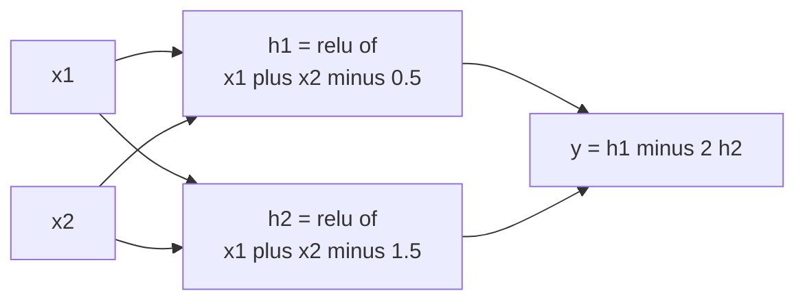
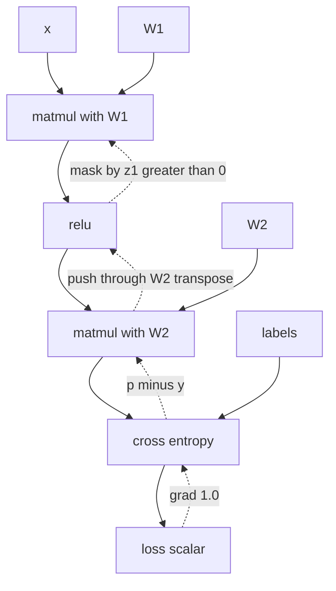
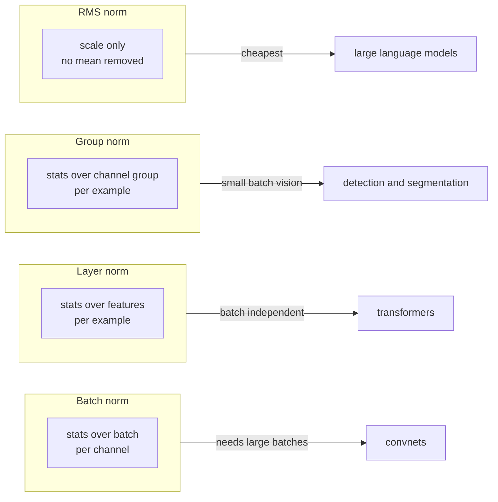
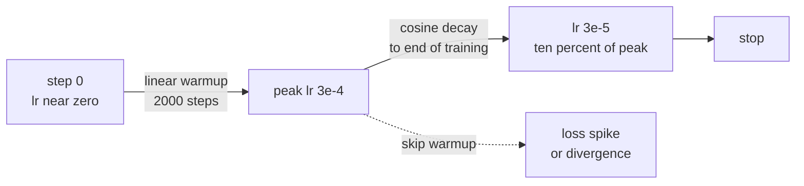
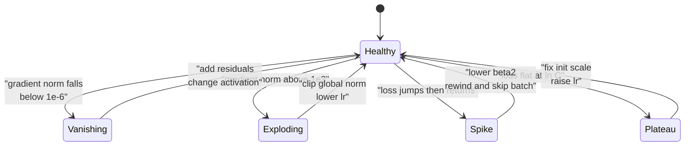
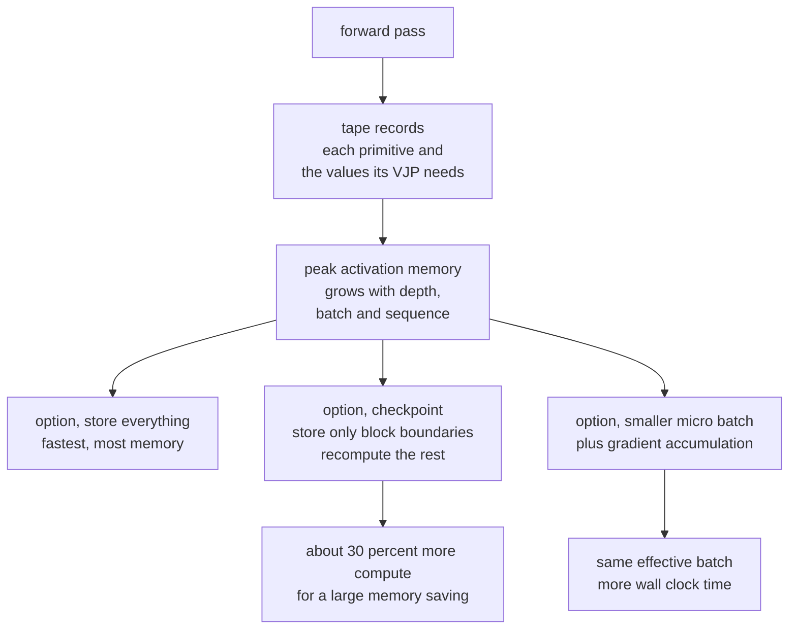

# Chapter 6: Neural Networks and How They Train

> **What this chapter covers** How a neural network computes, how it learns by gradient descent, and every engineering decision that stands between a correct architecture and a training run that converges: activations, initialisation, normalisation, optimisers, schedules, regularisation, numerical precision, and systematic debugging.
>
> **Prerequisites** Chapter 1 (linear algebra, calculus, and the chain rule), Chapter 2 (expectation, variance, and maximum likelihood), Chapter 4 (logistic regression and the idea of a loss surface), Chapter 5 (train, validation, and test splits).
>
> **Where it is used** Every deep learning system. The material here is what separates an engineer who can copy a training script from one who can explain why the loss went to NaN at step 4000, and fix it.

---

## 6.1 Level 1: Foundations

### 6.1.1 The problem a neural network solves

Linear models are honest and limited. A logistic regression on pixels asks a single question of each input: which side of a hyperplane does it fall on. If the answer you want is not a linear function of the inputs you have, no amount of data fixes the model. You have two options. Build features by hand until the problem becomes linear, which is Chapter 10. Or let the model build the features, which is this chapter.

A neural network is a function built by composing simple layers. Each layer applies a linear map, then a fixed nonlinear function applied element by element. Composition of linear maps is still a linear map, so the nonlinearity is not decoration. It is the entire reason depth does anything.

### 6.1.2 The perceptron

The perceptron, introduced by Frank Rosenblatt in 1958, is the smallest unit. It takes an input vector $\mathbf{x} \in \mathbb{R}^d$, a weight vector $\mathbf{w} \in \mathbb{R}^d$, and a bias $b \in \mathbb{R}$, and produces

$$y = \phi(\mathbf{w}^\top \mathbf{x} + b)$$

where $\phi$ is an activation function. In Rosenblatt's original, $\phi$ was a step function: output 1 if the argument is positive, 0 otherwise. The quantity $z = \mathbf{w}^\top \mathbf{x} + b$ is called the pre-activation or the logit.

The perceptron can represent AND, OR, and NOT. It cannot represent XOR. Minsky and Papert made this point sharply in *Perceptrons* (1969), and it is the cleanest possible motivation for depth. XOR on two binary inputs is not linearly separable: no straight line in the plane puts $(0,0)$ and $(1,1)$ on one side and $(0,1)$ and $(1,0)$ on the other.

Two layers fix it. Let $h_1 = \max(0, x_1 + x_2 - 0.5)$ and $h_2 = \max(0, x_1 + x_2 - 1.5)$. Then $y = h_1 - 2h_2$ gives 0, 1, 1, 0 for the four inputs. The first layer bent the space. The second layer cut it with a line.



*Figure 6.1: A two-layer network solving XOR, which no single linear unit can represent.*

### 6.1.3 The multilayer perceptron

Stack the idea. A multilayer perceptron, abbreviated MLP, with $L$ layers computes

$$\mathbf{a}^{(0)} = \mathbf{x}, \qquad \mathbf{z}^{(\ell)} = W^{(\ell)} \mathbf{a}^{(\ell-1)} + \mathbf{b}^{(\ell)}, \qquad \mathbf{a}^{(\ell)} = \phi^{(\ell)}(\mathbf{z}^{(\ell)})$$

for $\ell = 1 \dots L$. Here $W^{(\ell)}$ is a matrix of shape $n_\ell \times n_{\ell-1}$, $\mathbf{b}^{(\ell)}$ is a vector of length $n_\ell$, and $n_\ell$ is the width of layer $\ell$. The vector $\mathbf{a}^{(\ell)}$ is the activation, or the hidden representation, at layer $\ell$. The final layer usually has no activation, or a softmax, depending on the task.

The parameters are all the $W$ and $\mathbf{b}$ together. Training means choosing them to minimise a loss on data.

### 6.1.4 What universal approximation promises

Cybenko (1989) and Hornik (1991) proved that a feedforward network with a single hidden layer and a non-polynomial activation can approximate any continuous function on a compact set to any accuracy, given enough hidden units. This is the universal approximation theorem.

Read what it says carefully.

| The theorem says | The theorem does not say |
| --- | --- |
| A wide enough one-hidden-layer network exists that is close to your target function | That you can find it by gradient descent |
| Approximation error can be made arbitrarily small | How many units you need, which can be exponential in the input dimension |
| The result holds on a compact set for continuous functions | Anything about behaviour outside that set, which is extrapolation |
| Existence | Sample complexity, so it says nothing about how much data you need |

The practical consequence: universal approximation is not an argument for shallow networks. It is a statement that the function class is rich. Depth matters because for many functions, a deep network needs exponentially fewer units than a shallow one. Telgarsky (2016) constructed explicit functions representable by a network of depth $k$ with a polynomial number of units that require exponentially many units at depth $O(\sqrt{k})$. Depth buys parameter efficiency, not representational possibility.

### 6.1.5 Learning as gradient descent

Given a loss $\mathcal{L}(\theta)$ where $\theta$ collects all parameters, gradient descent repeats

$$\theta \leftarrow \theta - \eta \nabla_\theta \mathcal{L}(\theta)$$

with $\eta$ the learning rate, a small positive number. The gradient points in the direction of steepest increase, so the negative gradient decreases the loss locally.

Computing $\nabla_\theta \mathcal{L}$ over the whole dataset every step is wasteful. Stochastic gradient descent estimates the gradient on a minibatch, a random subset of size $B$. The estimate is noisy but unbiased, and you get many more steps per unit of compute.

The mental model to carry: **the network is a big composed function, the loss is a scalar at the end, and backpropagation is the chain rule applied once per edge of the computation graph, from the loss backwards.**

---

## 6.2 Level 2: Working knowledge

### 6.2.1 Forward propagation in code

**Listing 6.1: a two-layer MLP forward pass with explicit shapes.**

```python
import numpy as np

def forward(x, W1, b1, W2, b2):
    # x: (B, d_in). W1: (d_hidden, d_in). W2: (d_out, d_hidden).
    z1 = x @ W1.T + b1          # (B, d_hidden)
    a1 = np.maximum(z1, 0.0)    # ReLU
    z2 = a1 @ W2.T + b2         # (B, d_out)
    return z1, a1, z2

def softmax_cross_entropy(z, y):
    # z: (B, C) logits. y: (B,) integer class labels.
    z = z - z.max(axis=1, keepdims=True)      # stabilise
    logsumexp = np.log(np.exp(z).sum(axis=1))
    loss = (logsumexp - z[np.arange(len(y)), y]).mean()
    p = np.exp(z - logsumexp[:, None])
    return loss, p
```

The subtraction of the row maximum before exponentiating is not optional. Logits of magnitude 800 overflow `float32` in `exp`. Subtracting the max leaves the softmax unchanged mathematically and bounds the largest exponent at $e^0 = 1$. Every production framework does this inside its fused cross-entropy op, which is why you should call `torch.nn.functional.cross_entropy` on logits rather than applying softmax yourself and then taking a log.

### 6.2.2 Backpropagation, derived

Backpropagation is reverse-mode automatic differentiation applied to a network. Derive it once and it stops being mysterious.

Define $\boldsymbol{\delta}^{(\ell)} = \partial \mathcal{L} / \partial \mathbf{z}^{(\ell)}$, the gradient of the loss with respect to the pre-activation at layer $\ell$. This is the only quantity you need to propagate.

At the output layer, for softmax with cross-entropy and one-hot target $\mathbf{y}$,

$$\boldsymbol{\delta}^{(L)} = \mathbf{p} - \mathbf{y}$$

where $\mathbf{p}$ is the softmax output. This clean form is the reason the two are always paired.

For any earlier layer, the chain rule gives

$$\boldsymbol{\delta}^{(\ell)} = \left( W^{(\ell+1)\top} \boldsymbol{\delta}^{(\ell+1)} \right) \odot \phi'(\mathbf{z}^{(\ell)})$$

where $\odot$ is elementwise multiplication and $\phi'$ is the derivative of the activation evaluated at the pre-activation. Read it in words: take the gradient arriving from the layer above, push it back through the transpose of that layer's weight matrix, then multiply elementwise by the local slope of the activation.

The parameter gradients follow immediately:

$$\frac{\partial \mathcal{L}}{\partial W^{(\ell)}} = \boldsymbol{\delta}^{(\ell)} \mathbf{a}^{(\ell-1)\top}, \qquad \frac{\partial \mathcal{L}}{\partial \mathbf{b}^{(\ell)}} = \boldsymbol{\delta}^{(\ell)}$$

For a minibatch, sum the outer products over the batch, which is a matrix multiply.

### 6.2.3 The computational graph and reverse-mode AD

Forget layers for a moment. Any computation is a directed acyclic graph whose nodes are primitive operations and whose edges carry values. Each primitive knows two things: how to compute its output from its inputs, and how to compute the gradient of its inputs given the gradient of its output. That second function is called the vector-Jacobian product, or VJP.

Reverse mode works like this. Run forward, recording every intermediate value needed by the VJPs, which is the tape. Seed the output node with gradient 1. Walk the graph in reverse topological order. At each node, take the accumulated gradient of its output, call its VJP, and add the result into the gradient accumulators of its inputs. A node with several consumers sums the gradients arriving from all of them, which is the multivariable chain rule.



*Figure 6.2: Forward edges solid, reverse-mode gradient flow dotted. Every backward edge is one vector-Jacobian product.*

Why reverse and not forward. Forward mode computes the derivative of every output with respect to one input in one pass, costing one pass per input. Reverse mode computes the derivative of one output with respect to every input in one pass. Training has millions of inputs, meaning parameters, and one output, the scalar loss. Reverse mode is the right choice by a factor of the parameter count. The price is memory: you must keep the forward activations alive until the backward pass consumes them.

Cost model. A backward pass costs roughly twice a forward pass, because each matmul in the forward becomes two matmuls in the backward, one for the input gradient and one for the weight gradient. So a training step costs about three forward passes of compute, the origin of the $6ND$ rule for transformer training FLOPs in Chapter 8.

### 6.2.4 Activation functions

The activation's job is to be nonlinear and to have a derivative that does not destroy gradients.

| Activation | Formula | Derivative | Range | Notes |
| --- | --- | --- | --- | --- |
| Sigmoid | $1/(1+e^{-z})$ | $\sigma(1-\sigma)$, max 0.25 | $(0,1)$ | Saturates both ends. Gradient shrinks by at least 4x per layer. Use only for binary output. |
| Tanh | $\tanh z$ | $1-\tanh^2 z$, max 1 | $(-1,1)$ | Zero-centred, better than sigmoid for hidden layers. Still saturates. |
| ReLU | $\max(0,z)$ | 1 if $z>0$ else 0 | $[0,\infty)$ | Default since Krizhevsky et al. (2012). No saturation for positive inputs. Can die. |
| Leaky ReLU | $\max(\alpha z, z)$, $\alpha \approx 0.01$ | 1 or $\alpha$ | $\mathbb{R}$ | Fixes dead units at trivial cost. |
| GELU | $z \Phi(z)$, $\Phi$ the normal CDF | smooth | $\approx [-0.17, \infty)$ | Hendrycks and Gimpel (2016). Standard in transformers. |
| SiLU or Swish | $z \sigma(z)$ | smooth | $\approx [-0.28, \infty)$ | Ramachandran et al. (2017). Very close to GELU in practice. |
| Softplus | $\log(1+e^z)$ | $\sigma(z)$ | $(0,\infty)$ | Smooth ReLU. Rarely worth the cost. |

What each does to gradients is the thing to internalise. Saturating activations multiply the backward signal by a number well below 1 at most inputs, and the product over $L$ layers decays geometrically. ReLU multiplies by exactly 1 or exactly 0. The 1 is why deep ReLU networks train. The 0 is why some units stop learning forever.

GELU and SiLU are smooth near zero, which means small pre-activations still pass a fraction of the gradient rather than being hard-gated. Empirically this helps in transformers. The difference between GELU and SiLU is small enough that you should not spend a day choosing.

### 6.2.5 Loss functions and their gradients

| Task | Loss | Formula | Gradient wrt logit or prediction |
| --- | --- | --- | --- |
| Regression | Mean squared error | $\frac{1}{2}(\hat{y}-y)^2$ | $\hat{y}-y$ |
| Regression, robust | Huber with threshold $\delta$ | quadratic inside $\delta$, linear outside | clipped to $\pm\delta$ |
| Binary classification | Binary cross-entropy | $-y\log p - (1-y)\log(1-p)$ | $p - y$ on the logit |
| Multiclass | Softmax cross-entropy | $-\log p_{y}$ | $\mathbf{p}-\mathbf{y}$ on the logits |
| Multilabel | Sum of binary cross-entropies | per class | per class $p_c - y_c$ |
| Ranking | Pairwise logistic or hinge | see Chapter 14 | see Chapter 14 |

The recurring pattern is worth naming. For any loss that is the negative log likelihood of a distribution in the exponential family, with the natural parameter produced by the network, the gradient with respect to the logit is prediction minus target. Mean squared error under a Gaussian, cross-entropy under a categorical, Poisson loss under a Poisson count model: all give the same clean form. This is not a coincidence. It falls out of the exponential family's log-partition derivative being the mean.

Practical consequence: the gradient magnitude at the output is bounded by 1 per example for classification, but unbounded for mean squared error. Regression targets should be standardised or the first steps will be enormous.

### 6.2.6 A minimal training loop

**Listing 6.2: the canonical PyTorch loop, with the ordering that matters.**

```python
import torch

model.train()
for epoch in range(num_epochs):
    for x, y in train_loader:
        x, y = x.to(device, non_blocking=True), y.to(device, non_blocking=True)
        optimizer.zero_grad(set_to_none=True)
        logits = model(x)
        loss = torch.nn.functional.cross_entropy(logits, y)
        loss.backward()
        torch.nn.utils.clip_grad_norm_(model.parameters(), max_norm=1.0)
        optimizer.step()
        scheduler.step()          # per step, not per epoch, for warmup schedules
```

`set_to_none=True` frees the gradient tensors rather than filling them with zeros, which saves memory and is slightly faster. Clipping happens after `backward` and before `step`, because it operates on the gradients that `step` will consume. The scheduler is stepped per optimiser step when the schedule is defined in steps, which is the normal case for warmup and cosine decay. Stepping a per-step schedule once per epoch is a common bug that makes warmup take hundreds of epochs.

### 6.2.7 The softmax cross-entropy gradient, derived

This derivation is asked in interviews often enough to be worth doing in full, and it explains why the two functions are always paired.

Let $z_k$ be the logits, $p_k = e^{z_k}/\sum_j e^{z_j}$ the softmax, and the loss $\mathcal{L} = -\log p_y$ for true class $y$.

First the softmax Jacobian. For $k = i$:

$$\frac{\partial p_i}{\partial z_i} = \frac{e^{z_i}\sum_j e^{z_j} - e^{z_i}e^{z_i}}{\left(\sum_j e^{z_j}\right)^2} = p_i(1 - p_i)$$

and for $k \ne i$:

$$\frac{\partial p_i}{\partial z_k} = \frac{-e^{z_i}e^{z_k}}{\left(\sum_j e^{z_j}\right)^2} = -p_i p_k$$

Compactly, $\partial \mathbf{p}/\partial \mathbf{z} = \mathrm{diag}(\mathbf{p}) - \mathbf{p}\mathbf{p}^\top$.

Now the loss. $\mathcal{L} = -\log p_y$, so $\partial\mathcal{L}/\partial p_y = -1/p_y$ and zero for other components. Chain through:

$$\frac{\partial \mathcal{L}}{\partial z_k} = -\frac{1}{p_y}\frac{\partial p_y}{\partial z_k} = \begin{cases} -\frac{1}{p_y} \cdot p_y(1-p_y) = p_y - 1 & k = y \\ -\frac{1}{p_y}\cdot(-p_y p_k) = p_k & k \ne y \end{cases}$$

Both cases are $p_k - y_k$ with $\mathbf{y}$ one-hot. The $1/p_y$ from the log cancels the $p_y$ from the softmax exactly. That cancellation is the reason for pairing them: computed separately, a small $p_y$ would produce a huge intermediate gradient and catastrophic cancellation in float32. Fused implementations exploit the cancellation and are numerically stable for any logit value.

Two consequences. The gradient magnitude at the output is bounded in $[-1, 1]$ per class per example, so classification gradients are naturally well scaled. And a confidently wrong prediction, $p_y \approx 0$, gives a gradient of magnitude near 1, not near infinity, so cross-entropy does not explode on hard examples the way a naive implementation of $-\log$ would suggest.

### 6.2.8 Manual backpropagation, end to end

**Listing 6.3: the backward pass for the network in Listing 6.1, matching the derivation above.**

```python
def backward(x, y, z1, a1, p, W2):
    B = x.shape[0]
    dz2 = p.copy()
    dz2[np.arange(B), y] -= 1.0
    dz2 /= B                        # mean over batch
    dW2 = dz2.T @ a1                # (d_out, d_hidden)
    db2 = dz2.sum(axis=0)
    da1 = dz2 @ W2                  # push back through W2
    dz1 = da1 * (z1 > 0)            # ReLU derivative is the mask
    dW1 = dz1.T @ x
    db1 = dz1.sum(axis=0)
    return dW1, db1, dW2, db2
```

Three lines carry all the content. `dz2 = p - onehot(y)` is the derivation above. `da1 = dz2 @ W2` is the transpose push, written without an explicit transpose because the batch dimension is first. `dz1 = da1 * (z1 > 0)` is the elementwise multiply by the activation derivative, and note it uses the *pre-activation* `z1`, not the activation `a1`. Using `a1 > 0` happens to work for ReLU because ReLU is non-negative, but it is wrong for Leaky ReLU and for every other activation, which is why keeping the pre-activation on the tape is the general rule. The division by `B` must happen exactly once; doing it in both the loss and the gradient silently scales the learning rate by $1/B$.

### 6.2.9 Initialisation

If all weights start at zero, every unit in a layer computes the same thing and receives the same gradient. They stay identical forever. This is the symmetry problem, and it is why initialisation must be random.

The scale of that randomness is the interesting part. Consider a linear layer with $n_{\text{in}}$ inputs, weights drawn independently with mean 0 and variance $\sigma_w^2$, and inputs with variance $\sigma_x^2$. Then

$$\mathrm{Var}(z_j) = \sum_{i=1}^{n_{\text{in}}} \mathrm{Var}(w_{ji} x_i) = n_{\text{in}} \sigma_w^2 \sigma_x^2$$

To keep the activation variance constant from layer to layer you need $n_{\text{in}} \sigma_w^2 = 1$, so $\sigma_w^2 = 1/n_{\text{in}}$. That is the forward-pass argument.

Run the same argument on the backward pass. The gradient passes through $W^\top$, so preserving gradient variance needs $\sigma_w^2 = 1/n_{\text{out}}$. You cannot satisfy both unless the layer is square. Glorot and Bengio (2010) proposed the compromise

$$\sigma_w^2 = \frac{2}{n_{\text{in}} + n_{\text{out}}}$$

known as Xavier or Glorot initialisation. It assumes a roughly linear activation near zero, which fits tanh.

ReLU zeroes half the inputs, halving the output variance. He et al. (2015) corrected for this with

$$\sigma_w^2 = \frac{2}{n_{\text{in}}}$$

known as He or Kaiming initialisation. The factor 2 compensates exactly for the halving. Use He for ReLU-family activations, Glorot for tanh, and for transformers see the residual-scaled variants in Chapter 8.

**Worked example.** A layer with $n_{\text{in}} = 1024$, ReLU. He initialisation gives $\sigma_w = \sqrt{2/1024} = 0.0442$. If instead you used the naive $\mathcal{N}(0, 1)$, the pre-activation variance would be $1024 \times 1 \times \sigma_x^2$, a standard deviation 32 times the input's. Over ten layers that is a factor of $32^{10} \approx 1.1 \times 10^{15}$. The forward pass overflows before you ever see a gradient.

Get it wrong in the other direction, say $\sigma_w = 0.001$, and activations shrink by about 0.032 per layer. After ten layers the signal is $10^{-15}$ of its input, numerically zero, and every gradient is zero. The loss sits flat at $\log C$ for a $C$-class problem and nothing moves. Both failure modes are diagnosable in thirty seconds by printing the standard deviation of each layer's activations on one batch.

Biases initialise to zero, with two exceptions: the forget gate bias of an LSTM is often set to 1 (Jozefowicz et al., 2015), and output biases for imbalanced classification are usefully set to the log odds of the base rate so the first step does not have to travel there.

### 6.2.10 Normalisation

Normalisation layers rescale activations to a controlled distribution, which stabilises the loss surface and permits larger learning rates.

| Layer | Normalises over | Statistics at test time | Batch size dependence | Typical use |
| --- | --- | --- | --- | --- |
| Batch norm | Batch and spatial dims, per channel | Running averages from training | Strong, breaks below about 8 | Convolutional vision networks |
| Layer norm | All features of one example | Same as training | None | Transformers, recurrent nets |
| Group norm | Groups of channels within one example | Same as training | None | Small-batch vision, detection |
| Instance norm | Spatial dims per channel per example | Same as training | None | Style transfer |
| RMS norm | All features, no mean subtraction | Same as training | None | Large language models |

Batch normalisation, from Ioffe and Szegedy (2015), computes per-channel mean and variance over the batch:

$$\hat{x}_i = \frac{x_i - \mu_{\mathcal{B}}}{\sqrt{\sigma^2_{\mathcal{B}} + \epsilon}}, \qquad y_i = \gamma \hat{x}_i + \beta$$

with $\gamma$ and $\beta$ learned. The train-test discrepancy is the defining property. During training the statistics come from the current batch, so the output for one example depends on the other examples in its batch. At inference there is no batch, so the layer uses running averages accumulated during training. If your training distribution and inference distribution differ, or your batches were small and noisy, or you forgot to call `model.eval()`, the two paths disagree and accuracy drops. The failure is silent and extremely common.

Layer normalisation, from Ba, Kiros and Hinton (2016), normalises across the feature dimension of a single example:

$$\text{LN}(\mathbf{x}) = \gamma \odot \frac{\mathbf{x} - \mu}{\sqrt{\sigma^2 + \epsilon}} + \beta, \qquad \mu = \frac{1}{d}\sum_i x_i, \quad \sigma^2 = \frac{1}{d}\sum_i (x_i - \mu)^2$$

It won for sequences for three concrete reasons. Sequence batches are ragged, so batch statistics over padded positions are wrong. Autoregressive decoding processes one token at a time with a batch of one at the limit. And there is no train-test discrepancy at all, which removes a whole class of bugs.

RMS normalisation, from Zhang and Sennrich (2019), drops the mean subtraction:

$$\text{RMSNorm}(\mathbf{x}) = \gamma \odot \frac{\mathbf{x}}{\sqrt{\frac{1}{d}\sum_i x_i^2 + \epsilon}}$$

It is cheaper, it needs one reduction instead of two, and it performs comparably. Most large language models released since about 2021 use it.



*Figure 6.3: What each normalisation layer averages over, and where each is the default.*

---

## 6.3 Level 3: Depth

### 6.3.1 Optimisers, with update equations

Write $g_t = \nabla_\theta \mathcal{L}(\theta_t)$ for the minibatch gradient at step $t$.

**Stochastic gradient descent.**

$$\theta_{t+1} = \theta_t - \eta g_t$$

Simple, memory-free, and still the best choice for convolutional vision networks when you can tune it.

**Momentum** (Polyak, 1964). Accumulate an exponentially weighted gradient:

$$v_t = \mu v_{t-1} + g_t, \qquad \theta_{t+1} = \theta_t - \eta v_t$$

with $\mu$ around 0.9. In a ravine, where the loss is steep across and shallow along, the across-components alternate sign and cancel while the along-components accumulate. The effective step along a consistent direction is amplified by $1/(1-\mu)$, which is 10 at $\mu = 0.9$. That factor is why changing momentum requires retuning the learning rate.

**Nesterov accelerated gradient** (Nesterov, 1983; Sutskever et al., 2013). Evaluate the gradient after the momentum step rather than before:

$$v_t = \mu v_{t-1} + \nabla_\theta \mathcal{L}(\theta_t - \eta \mu v_{t-1}), \qquad \theta_{t+1} = \theta_t - \eta v_t$$

The look-ahead lets the update correct an overshoot in the same step instead of the next one. In practice it buys a small, real improvement in convergence for convex-ish problems and is nearly free.

**Adagrad** (Duchi et al., 2011). Scale each coordinate by the inverse square root of its accumulated squared gradient:

$$G_t = G_{t-1} + g_t^2, \qquad \theta_{t+1} = \theta_t - \frac{\eta}{\sqrt{G_t} + \epsilon} \odot g_t$$

Rare features get large steps. The accumulator never decays, so the learning rate goes to zero monotonically, which kills long runs.

**RMSProp** (Tieleman and Hinton, 2012). Replace the sum with an exponential moving average:

$$G_t = \rho G_{t-1} + (1-\rho) g_t^2$$

with $\rho$ around 0.9 to 0.99. The learning rate no longer decays to zero on its own.

**Adam** (Kingma and Ba, 2014). Momentum on both the first and second moment, with bias correction:

$$m_t = \beta_1 m_{t-1} + (1-\beta_1) g_t$$
$$v_t = \beta_2 v_{t-1} + (1-\beta_2) g_t^2$$
$$\hat{m}_t = \frac{m_t}{1-\beta_1^t}, \qquad \hat{v}_t = \frac{v_t}{1-\beta_2^t}$$
$$\theta_{t+1} = \theta_t - \eta \frac{\hat{m}_t}{\sqrt{\hat{v}_t} + \epsilon}$$

The bias correction matters. Both $m$ and $v$ start at zero, so early estimates are biased towards zero by a factor of $1-\beta^t$. Without correction, the first steps would be far too small for $v$ and the ratio would be badly scaled. Dividing by $1-\beta^t$ removes the bias exactly under a stationarity assumption.

Defaults: $\beta_1 = 0.9$, $\beta_2 = 0.999$, $\epsilon = 10^{-8}$. For large language model training $\beta_2 = 0.95$ is common because it reacts faster to the loss spikes described below. The memory cost is two extra tensors the size of the parameters, so an Adam state for a model with $P$ parameters in `float32` is $8P$ bytes on top of the $4P$ of weights and $4P$ of gradients.

**AdamW** (Loshchilov and Hutter, 2019). This is the weight decay correction, and it matters more than most engineers realise.

L2 regularisation adds $\frac{\lambda}{2}\|\theta\|^2$ to the loss, contributing $\lambda\theta$ to the gradient. In plain SGD that is exactly equivalent to multiplicatively shrinking the weights each step, which is what "weight decay" means. In Adam it is not equivalent, because the $\lambda\theta$ term goes into $g_t$ and is therefore divided by $\sqrt{\hat{v}_t}$. Parameters with large historical gradients get their decay scaled down. The regularisation strength becomes a function of gradient history, which was never the intent.

AdamW decouples them:

$$\theta_{t+1} = \theta_t - \eta\left( \frac{\hat{m}_t}{\sqrt{\hat{v}_t} + \epsilon} + \lambda \theta_t \right)$$

The decay term is applied directly, not through the adaptive scaling. Use AdamW. Typical $\lambda$ is 0.1 for large language models and 0.01 to 0.05 elsewhere. Exclude biases and normalisation gains from decay: they have few parameters, decaying them measurably hurts, and every good implementation supports parameter groups for this.

| Optimiser | State per parameter | Good default learning rate | When to prefer |
| --- | --- | --- | --- |
| SGD with momentum | 1 tensor | 0.1 with cosine decay, batch 256 | Convnets, when you can tune, best final accuracy |
| Adam | 2 tensors | 1e-3 | Fast prototyping, sparse gradients |
| AdamW | 2 tensors | 1e-4 to 3e-4 for transformers | Default for anything with attention |
| Adafactor | Less than 2 via factored second moment | 1e-3 | Memory-constrained large models |
| Lion | 1 tensor | about 3x to 10x smaller than AdamW | Chen et al. (2023), memory saving, less battle-tested |

### 6.3.2 Learning rate schedules and warmup

The learning rate is the single most important hyperparameter. A schedule changes it over training.

| Schedule | Shape | Notes |
| --- | --- | --- |
| Constant | Flat | Baseline only. Almost always beaten by decay. |
| Step decay | Multiply by 0.1 at fixed epochs | The classic vision recipe. |
| Cosine | $\eta_t = \eta_{\min} + \frac{1}{2}(\eta_{\max}-\eta_{\min})(1+\cos(\pi t/T))$ | Loshchilov and Hutter (2017). The current default. |
| Linear decay to zero | Straight line | Common for fine-tuning. Competitive with cosine. |
| Inverse square root | $\eta \propto 1/\sqrt{t}$ | Original transformer schedule, Vaswani et al. (2017). |
| One-cycle | Up then down, with momentum inverted | Smith (2018). Strong for fast convergence on small datasets. |

Warmup means starting at a near-zero learning rate and rising linearly to the peak over the first few hundred to few thousand steps. Two mechanisms explain why it helps. First, Adam's second moment estimate $\hat{v}_t$ is unreliable in the first steps because it is built from very few samples, so the adaptive scaling is noisy and large steps land badly. Liu et al. (2020), the RAdam paper, made this argument precisely. Second, with a randomly initialised network the early gradients are large and poorly conditioned, and a big step can push the network into a region it never recovers from.

A useful rule: warm up for about 1 to 5 percent of total steps, or 2000 steps, whichever you can afford.



*Figure 6.4: The standard warmup plus cosine schedule, and the failure mode that skipping warmup produces.*

Learning rate and batch size interact. The linear scaling rule, stated by Goyal et al. (2017), says that multiplying the batch size by $k$ should be paired with multiplying the learning rate by $k$, with warmup to survive the early steps. The square-root rule, $\eta \propto \sqrt{k}$, follows from keeping the gradient noise scale constant and is often better for adaptive optimisers. Neither holds beyond some critical batch size, past which extra examples per step stop reducing gradient noise and only waste compute. McCandlish et al. (2018) formalised this as the gradient noise scale.

### 6.3.3 Regularisation

**Dropout** (Srivastava et al., 2014). At training time, zero each activation independently with probability $p$, and scale the survivors by $1/(1-p)$ so the expected value is unchanged. This is inverted dropout, and it means inference needs no adjustment.

What it approximates: training a network with dropout is approximately training an exponentially large ensemble of subnetworks that share weights, and using the full network at test time approximates averaging the ensemble's predictions. The approximation is exact for a single linear layer with a softmax and approximate otherwise. A second, equally valid reading is that dropout prevents co-adaptation, meaning no unit can rely on a specific other unit being present.

Typical $p$: 0.5 for wide fully connected layers, 0.1 for transformer residual and attention paths, and 0 for large language model pretraining where the data is effectively never repeated and there is nothing to overfit.

**Early stopping.** Track validation loss and stop when it has not improved for `patience` evaluations, then restore the best checkpoint. It is regularisation because limiting the number of steps limits how far the weights travel from initialisation, which for a quadratic loss is provably similar to an L2 penalty with a strength that decreases as training proceeds.

**Data augmentation.** Apply label-preserving transformations to inputs. It is the highest-value regularisation in vision because it injects real prior knowledge, namely which transformations should not change the label. Chapter 13 covers vision-specific augmentation.

**Label smoothing** (Szegedy et al., 2016). Replace the one-hot target with $(1-\alpha)$ on the true class and $\alpha/(C-1)$ elsewhere, $\alpha$ around 0.1. The effect on the gradient is that the model is no longer pushed towards infinite logit gaps, which improves calibration and, per Müller et al. (2019), tightens the clustering of penultimate-layer representations. The cost is that it degrades the model as a feature extractor for distillation, which the same paper showed.

**Mixup** (Zhang et al., 2018). Sample $\lambda \sim \text{Beta}(\alpha,\alpha)$ and train on convex combinations:

$$\tilde{x} = \lambda x_i + (1-\lambda) x_j, \qquad \tilde{y} = \lambda y_i + (1-\lambda) y_j$$

It enforces linear behaviour between training examples, which reduces confident wrong predictions off the data manifold. CutMix (Yun et al., 2019) pastes a rectangular patch instead of blending, and generally works better for images because blended images are unnatural.

### 6.3.4 The problems

**Vanishing gradients.** The backward recursion multiplies by $W^{(\ell+1)\top}$ and by $\phi'$ at every layer. If the typical product of singular value and activation slope is $r < 1$, the gradient at layer $\ell$ scales as $r^{L-\ell}$. With sigmoid, $\phi' \le 0.25$, so even with perfectly scaled weights the gradient shrinks by 4x per layer. Twenty layers gives $4^{-20} \approx 10^{-12}$. The early layers never move. Fixes, in order of impact: residual connections, non-saturating activations, normalisation layers, and careful initialisation.

**Exploding gradients.** The same product with $r > 1$. The symptom is a loss that jumps to a huge value or NaN in one step. The standard fix is global gradient norm clipping:

$$g \leftarrow g \cdot \min\left(1, \frac{c}{\|g\|_2}\right)$$

with $c$ around 1.0. Clip the global norm across all parameters, not per-tensor, so the update direction is preserved. Per-value clipping distorts the direction and should be avoided.

**Dead ReLU units.** If a unit's pre-activation is negative for every input in the data, its gradient is exactly zero forever and it can never recover. This typically follows a large step that drove the bias strongly negative. Detect it by measuring the fraction of zero activations per layer on a validation batch; above about 50 percent sustained is a warning, above 90 percent is a dead layer. Fixes: lower the learning rate, use Leaky ReLU or GELU, and check initialisation.

**Internal covariate shift, a contested explanation.** Ioffe and Szegedy (2015) explained batch normalisation by saying it reduces the change in the distribution of each layer's inputs caused by updates to earlier layers, which they named internal covariate shift. Santurkar et al. (2018) tested this directly. They injected noise after batch norm to deliberately increase distribution shift and found training still improved, and they showed batch norm makes the loss landscape smoother in the sense of reducing the Lipschitz constant of the loss and its gradients. The current consensus is that the smoothing explanation is better supported and the covariate shift story is at best incomplete. Say so if asked. The practical advice is unchanged: normalisation helps.

**Loss spikes.** In large-scale training the loss occasionally jumps by a large amount and then recovers, or does not. Contributing causes include a rare batch with extreme values, an attention logit growing large enough to saturate the softmax, and numerical overflow in low precision. Mitigations used in practice: lower $\beta_2$ to 0.95 so the second moment adapts faster, clip gradients, normalise the query and key before the attention dot product, and keep frequent checkpoints so you can rewind past a spike and skip the offending data.



*Figure 6.5: Training pathologies as states, with the intervention that returns each to a healthy run.*

### 6.3.5 Mixed precision training

| Format | Bits total | Exponent | Mantissa | Approximate range | Relative precision |
| --- | --- | --- | --- | --- | --- |
| float32 | 32 | 8 | 23 | 1e-38 to 3e38 | about 7 decimal digits |
| float16 | 16 | 5 | 10 | 6e-5 to 65504 | about 3 decimal digits |
| bfloat16 | 16 | 8 | 7 | same as float32 | about 2 decimal digits |
| float8 e4m3 | 8 | 4 | 3 | to about 448 | about 1 digit |
| float8 e5m2 | 8 | 5 | 2 | to about 57344 | under 1 digit |

The key distinction: `bfloat16` trades mantissa bits for exponent bits so its range matches `float32`. `float16` has more precision but a narrow range, and gradients in deep networks routinely fall below its minimum normal value of about $6 \times 10^{-5}$, where they flush to zero.

**Loss scaling** exists to solve exactly that. Multiply the loss by a large constant $S$ before `backward`. Every gradient is scaled by $S$ through linearity, moving small values back into the representable range. Divide the gradients by $S$ before the optimiser step. Dynamic loss scaling, which is what framework AMP implementations do, starts $S$ high, halves it whenever a gradient contains an infinity or NaN and skips that step, and doubles it after a few hundred clean steps.

`bfloat16` does not need loss scaling because its range already covers the gradients. On hardware that supports it, prefer `bfloat16` for this reason alone.

**Master weights.** Keep a `float32` copy of the parameters. The forward and backward passes run in 16-bit, but the optimiser updates the `float32` master copy and casts down. The reason is granularity: in `bfloat16` near 1.0 the spacing between representable numbers is about $2^{-8} \approx 0.004$. An update of $10^{-6}$ rounds to zero and is lost entirely. Accumulating in `float32` preserves it.

Memory arithmetic, worked. A model with $P = 1.5 \times 10^9$ parameters trained with AdamW in mixed precision:

| Item | Bytes per parameter | Total for 1.5B |
| --- | --- | --- |
| bf16 weights for compute | 2 | 3.0 GB |
| fp32 master weights | 4 | 6.0 GB |
| bf16 gradients | 2 | 3.0 GB |
| Adam first moment fp32 | 4 | 6.0 GB |
| Adam second moment fp32 | 4 | 6.0 GB |
| Total states | 16 | 24.0 GB |

Activations are extra and depend on batch size and sequence length. The conclusion an engineer should draw: 16 bytes per parameter is the AdamW mixed-precision rule of thumb, so a 24 GB card holds a model of roughly 1.3 billion parameters before any activation memory, which is why parameter-efficient fine-tuning and sharded optimisers exist. Chapter 23 covers the sharding.

### 6.3.6 Gradient accumulation and effective batch size

If the batch you want does not fit in memory, run several micro-batches and sum their gradients before stepping.

**Listing 6.4: gradient accumulation with correct loss normalisation.**

```python
accum_steps = 8
optimizer.zero_grad(set_to_none=True)
for i, (x, y) in enumerate(train_loader):
    logits = model(x)
    loss = torch.nn.functional.cross_entropy(logits, y)
    (loss / accum_steps).backward()      # divide so the sum is a mean
    if (i + 1) % accum_steps == 0:
        torch.nn.utils.clip_grad_norm_(model.parameters(), 1.0)
        optimizer.step()
        scheduler.step()
        optimizer.zero_grad(set_to_none=True)
```

The division by `accum_steps` is required. `backward` accumulates into `.grad` by addition, so without it you get a sum of per-micro-batch mean losses, which is `accum_steps` times too large, and your effective learning rate is silently multiplied by 8.

Effective batch size is `micro_batch * accum_steps * data_parallel_world_size`. It is the number that determines gradient noise, so it is the number to keep fixed when you change hardware. Two caveats. Accumulation does not reproduce a true large batch when batch normalisation is present, because the batch statistics are computed per micro-batch. And it costs wall-clock time proportional to `accum_steps` while saving no compute.

---

### 6.3.7 Hyperparameters, in the order you should tune them

Most hyperparameter search is wasted on parameters that do not matter. The ordering below reflects measured sensitivity.

| Rank | Hyperparameter | Typical starting value | Sensitivity | Notes |
| --- | --- | --- | --- | --- |
| 1 | Peak learning rate | 3e-4 for AdamW on transformers, 0.1 for SGD momentum on convnets at batch 256 | Very high, an order of magnitude matters | Find it with a range test before tuning anything else |
| 2 | Effective batch size | As large as fits, up to the critical batch size | High, interacts with learning rate | Change it and you must retune the learning rate |
| 3 | Schedule shape and warmup | Cosine to 10 percent of peak, warmup 1 to 5 percent of steps | Moderate | Linear decay is competitive; the shape matters less than the peak |
| 4 | Weight decay | 0.1 for language models, 0.01 to 0.05 elsewhere | Moderate | Exclude biases and normalisation gains |
| 5 | Total training steps | Set by budget | Moderate | Undertraining is more common than overtraining at scale |
| 6 | Adam $\beta_2$ | 0.999, or 0.95 for large-scale pretraining | Low to moderate | Lower it if you see loss spikes |
| 7 | Dropout | 0.1 for transformers, 0 for single-epoch pretraining | Low to moderate | Zero it before concluding a model underfits |
| 8 | Adam $\beta_1$ | 0.9 | Low | Rarely worth a sweep |
| 9 | Adam $\epsilon$ | 1e-8 | Low | Raise to 1e-6 in low precision if updates look unstable |
| 10 | Initialisation scheme | He for ReLU, Glorot for tanh | Low once normalisation is present | It matters enormously when it is wrong and not at all when it is right |

Two practical rules. Change one thing at a time, because the interactions between learning rate, batch size and schedule are strong enough that a joint change tells you nothing. And treat any result without a seed-to-seed variance estimate as unmeasured: for small models the spread across three seeds routinely exceeds the difference you are trying to detect. Chapter 5 gives the protocol.



*Figure 6.6: The automatic differentiation tape is what costs memory, and the three standard ways to trade it against time.*

## 6.4 Level 4: Mastery

### 6.4.1 Debugging a training run as a procedure

Run this in order. Do not skip steps because one looks obvious.

| Step | Check | Passing looks like | If it fails |
| --- | --- | --- | --- |
| 1 | Initial loss | $\ln C$ for $C$-class classification, so 2.30 for 10 classes | Output layer bias or initialisation is wrong |
| 2 | Overfit 8 examples | Loss under 1e-4 within a few hundred steps | Bug in the model, loss, or data pipeline. Not a hyperparameter problem |
| 3 | Gradient check on a tiny model | Analytic and numerical gradients agree to about 1e-5 relative | A custom layer's backward is wrong |
| 4 | Turn off all regularisation, train | Training loss decreases monotonically in trend | Learning rate or optimiser problem |
| 5 | Per-layer activation statistics on one batch | Standard deviation within about 10x across layers | Initialisation or normalisation placement |
| 6 | Per-layer gradient norms | Within about 100x across layers | Vanishing or exploding, see 6.3.4 |
| 7 | Learning rate range test | A clear minimum in the loss-versus-lr curve | Data or model is broken upstream |
| 8 | Add regularisation back one piece at a time | Validation gap narrows, training loss rises slightly | The piece you just added is misconfigured |

Step 2 is the single highest-value diagnostic in deep learning. A correct model can memorise eight examples. If it cannot, the problem is a bug, and no amount of learning rate tuning will find it. The most common causes are labels misaligned with inputs by one index, a shuffle applied to inputs but not labels, an activation applied twice, or a loss applied to probabilities that were already softmaxed.

The learning rate range test, from Smith (2017), sweeps the learning rate exponentially from $10^{-8}$ to 1 over a few hundred steps and plots loss against learning rate. Choose a peak roughly an order of magnitude below the value where the loss starts climbing.

### 6.4.2 What the loss landscape actually looks like

The old story was that training fails because of local minima. The evidence says otherwise.

Dauphin et al. (2014) argued from random matrix theory that in high dimensions, critical points are overwhelmingly saddle points rather than local minima, because a local minimum requires all $d$ eigenvalues of the Hessian to be positive, which is exponentially unlikely at random. Saddles slow progress but do not trap, and gradient noise escapes them.

Goodfellow, Vinyals and Saxe (2015) showed that the straight line in parameter space from initialisation to the final solution has a loss that decreases essentially monotonically for common networks, which is not what a landscape full of barriers would produce.

Li et al. (2018), "Visualizing the Loss Landscape of Neural Nets", showed with filter-normalised random projections that residual connections visibly smooth the landscape, converting a chaotic surface into a near-convex basin. That is a strong mechanistic argument for why residuals help beyond the gradient-path story.

Frankle and Carbin (2019), the lottery ticket hypothesis, found that dense randomly initialised networks contain sparse subnetworks that, trained from the same initialisation, match the full network's accuracy. The debate about whether the winning ticket is about the initialisation values or only the mask is still live, and Frankle et al. (2020) showed that at scale the ticket must be drawn from an early training checkpoint rather than from step zero.

### 6.4.3 Generalisation without capacity control

Zhang et al. (2017), "Understanding Deep Learning Requires Rethinking Generalization", trained standard convolutional networks to zero training error on CIFAR-10 with completely random labels. Classical capacity bounds, which say that a model able to fit random labels cannot generalise, therefore do not explain what these models do. The same networks trained on true labels generalise well.

Candidate explanations, none complete:

- **Implicit regularisation of SGD.** Stochastic gradient descent, especially with large learning rates and small batches, is biased towards flat minima. Keskar et al. (2017) reported that large-batch training finds sharper minima that generalise worse, though Dinh et al. (2017) pointed out that sharpness as usually measured is not invariant to reparameterisation, so the claim needs care.
- **Double descent.** Belkin et al. (2019) and Nakkiran et al. (2020) documented that test error rises to a peak at the interpolation threshold, where parameters roughly equal examples, and then falls again as the model grows past it. The classical U-shaped bias-variance curve is the left half of a longer curve.
- **The neural tangent kernel.** Jacot et al. (2018) showed that in an infinite-width limit, training dynamics become those of a fixed kernel method. It gives exact analysis but does not capture feature learning, which is precisely what makes finite networks useful.

What to do with this as an engineer: stop reasoning about capacity by parameter count, and rely on measured validation performance under a proper protocol. Chapter 5 gives the protocol.

### 6.4.4 Second-order and preconditioned methods

Newton's method uses the Hessian $H$:

$$\theta_{t+1} = \theta_t - \eta H^{-1} g_t$$

Storing $H$ costs $O(P^2)$, so it is impossible for real models. Practical approximations:

- **K-FAC** (Martens and Grosse, 2015) approximates the Fisher information matrix as a Kronecker product of two smaller matrices per layer, which makes inversion tractable. It converges in fewer steps but each step costs more, and the periodic inverse is awkward to distribute.
- **Shampoo** (Gupta et al., 2018) maintains preconditioners for each tensor dimension separately. A distributed implementation (Anil et al., 2020) has shown real wall-clock wins on large models.
- **Sophia** (Liu et al., 2023) uses a cheap diagonal Hessian estimate with clipping, targeting language model pretraining.

The honest summary as of the mid 2020s: AdamW remains the default because it is robust, cheap in state, and easy to distribute. Second-order methods win in specific well-tuned settings and lose engineering time everywhere else. Muon and related orthogonalising optimisers have shown promising results on language model pretraining, but the literature is young and results should be reproduced before adoption.

### 6.4.5 Where standard advice is wrong

| Standard advice | When it is wrong |
| --- | --- |
| Always use batch normalisation | Batch sizes below about 8 per device, sequence models, and any setting where train and test batch composition differ. Use group or layer norm. |
| Adam always beats SGD | With a tuned schedule, SGD with momentum still reaches better final accuracy on convolutional image classifiers, and generalises better in several careful comparisons. |
| Weight decay is L2 | Only true for plain SGD. With adaptive optimisers they differ, and the decoupled form is what you want. |
| Larger batches are strictly faster | Only until the critical batch size. Past it you burn compute for no reduction in gradient noise. |
| More regularisation fixes overfitting | Overfitting with a large validation gap and a training loss near zero often means the dataset is too small or leaky. Fix the data first. |
| Normalisation is always beneficial | Normaliser-free residual networks (Brock et al., 2021) match normalised ones using scaled weight standardisation and adaptive gradient clipping, so the layer is a convenience, not a necessity. |

---

## 6.5 Subtopic checklist

| Subtopic | You should be able to |
| --- | --- |
| Perceptron and depth | Show why XOR needs two layers, and write the two-layer solution |
| Universal approximation | State what the theorem gives and the three things it does not |
| Forward pass | Write an MLP forward with correct shapes from memory |
| Backpropagation | Derive $\boldsymbol{\delta}^{(\ell)}$ from $\boldsymbol{\delta}^{(\ell+1)}$ and get the weight gradient |
| Reverse-mode AD | Explain the tape, VJPs, and why reverse beats forward for training |
| Activations | Name the derivative range of each and its effect on gradient flow |
| Losses | Write the gradient of softmax cross-entropy with respect to logits |
| Initialisation | Derive the He variance and predict the failure at 10x and 0.1x scale |
| Normalisation | State what each variant averages over and the batch norm train-test gap |
| Optimisers | Write the Adam update including bias correction |
| Decoupled weight decay | Explain why L2 and weight decay differ under Adam |
| Schedules and warmup | Give two reasons warmup helps and pick a warmup length |
| Regularisation | Explain what dropout approximates and when it is unnecessary |
| Gradient pathologies | Diagnose vanishing, exploding, and dead units from measurements |
| Mixed precision | Explain loss scaling, why bf16 avoids it, and why master weights exist |
| Gradient accumulation | Compute effective batch size and normalise the loss correctly |
| Debugging | Run the eight-step procedure and say what each step rules out |

---

## 6.6 Common misconceptions

| Misconception | Why it is believed | What is actually true |
| --- | --- | --- |
| Universal approximation means one hidden layer is enough | The theorem is stated for one hidden layer | It is an existence result. Required width can be exponential, and it says nothing about optimisation or sample complexity. Depth gives exponential parameter savings for many functions. |
| Training fails because of local minima | Intuition from low-dimensional pictures | In high dimensions critical points are almost all saddles (Dauphin et al., 2014). Plateaus and poor conditioning are the real obstacles. |
| Batch norm works by reducing internal covariate shift | The original paper said so | Santurkar et al. (2018) showed training still improves when shift is deliberately increased, and attributed the benefit to landscape smoothing. |
| Weight decay and L2 regularisation are the same thing | They are identical for plain SGD | Under Adam, L2 is divided by the adaptive denominator, so the effective decay varies per parameter. AdamW's decoupled form fixes it. |
| A model that can fit random labels will not generalise | Classical capacity bounds | Zhang et al. (2017) showed standard networks fit random labels and still generalise on real labels. Parameter count is not the operative capacity measure. |
| Dropout should be used everywhere | It was essential in 2014 architectures | With large datasets, heavy augmentation, and normalisation layers, dropout often hurts. It is usually set to zero in large language model pretraining. |
| bfloat16 is just a less precise float16 | Both are 16 bits | bfloat16 has the exponent range of float32 and fewer mantissa bits. It avoids the underflow that forces loss scaling, at the cost of precision. |
| A lower training loss is a better model | Loss is what you optimise | Training loss says nothing about generalisation, and the best validation checkpoint is frequently not the final one. |
| Gradient accumulation exactly reproduces a large batch | The gradients sum correctly | It does for most layers, but batch normalisation statistics are per micro-batch, so results differ. |

---

## 6.7 Practice

**Exercise 6.1 (level 2).** Implement a two-layer MLP for MNIST in NumPy only, including the backward pass, using He initialisation and SGD with momentum. *Acceptance: test accuracy above 97 percent, and your analytic gradients match centred finite differences to relative error below 1e-5 on a 3-3-2 network.*

**Exercise 6.2 (level 2).** Take a small convolutional network on CIFAR-10 and run the learning rate range test. Plot loss against learning rate on a log axis. Then train three models at one tenth, one times, and ten times your chosen peak. *Acceptance: a plot with a clear minimum, and a table of final validation accuracy for the three runs with a one-paragraph explanation of the two failures.*

**Exercise 6.3 (level 3).** Instrument a 20-layer fully connected network to log the standard deviation of activations and the norm of gradients per layer. Train it four ways: sigmoid without normalisation, ReLU without normalisation, ReLU with He initialisation, and ReLU with He plus layer normalisation. *Acceptance: four figures showing the per-layer gradient norm at step 100, and a written diagnosis matching each to the pathology in section 6.3.4.*

**Exercise 6.4 (level 3).** Train the same model with Adam plus L2 applied through the loss, and with AdamW plus decoupled decay, at matched nominal $\lambda$. Then sweep $\lambda$ for both. *Acceptance: a table of best validation accuracy for each, and an empirical demonstration that the optimal $\lambda$ differs between the two by more than a factor of 3.*

**Exercise 6.5 (level 4).** Reproduce a small version of the double descent curve. Train a ResNet-18 family on CIFAR-10 with 15 percent label noise, sweeping the width multiplier across at least eight values that straddle the interpolation threshold. *Acceptance: a test error curve showing a peak near the threshold followed by a decline, with 95 percent confidence intervals from at least three seeds per width.*

---

## 6.8 How this is tested

**Q1. Why does composing two linear layers without an activation give you nothing?**

<details><summary>Answer</summary>

Because the composition $W_2(W_1 x + b_1) + b_2 = (W_2 W_1) x + (W_2 b_1 + b_2)$ is itself an affine map. The product $W_2 W_1$ is a single matrix, so the two-layer network represents exactly the same function class as one layer, with rank at most $\min(\text{rank } W_1, \text{rank } W_2)$. The nonlinearity is what makes depth expand the function class.
</details>

**Q2. Derive the backward recursion for a fully connected layer and state the cost of the backward pass relative to the forward.**

<details><summary>Answer</summary>

With $\mathbf{z}^{(\ell)} = W^{(\ell)}\mathbf{a}^{(\ell-1)} + \mathbf{b}^{(\ell)}$ and $\mathbf{a}^{(\ell)} = \phi(\mathbf{z}^{(\ell)})$, define $\boldsymbol{\delta}^{(\ell)} = \partial\mathcal{L}/\partial\mathbf{z}^{(\ell)}$. The chain rule through $\mathbf{a}^{(\ell)}$ and then $\mathbf{z}^{(\ell+1)}$ gives $\boldsymbol{\delta}^{(\ell)} = (W^{(\ell+1)\top}\boldsymbol{\delta}^{(\ell+1)}) \odot \phi'(\mathbf{z}^{(\ell)})$. Then $\partial\mathcal{L}/\partial W^{(\ell)} = \boldsymbol{\delta}^{(\ell)}\mathbf{a}^{(\ell-1)\top}$ and $\partial\mathcal{L}/\partial\mathbf{b}^{(\ell)} = \boldsymbol{\delta}^{(\ell)}$. Cost: the forward does one matmul per layer, the backward does two, one for the input gradient and one for the weight gradient, so backward is about twice forward and a full step about three times forward.
</details>

**Q3. Why does reverse-mode automatic differentiation dominate forward mode in deep learning, and what does it cost?**

<details><summary>Answer</summary>

Forward mode propagates derivatives with respect to one input per pass, so it costs one pass per input variable. Reverse mode propagates derivatives of one output with respect to all inputs in a single pass. Training has one scalar output, the loss, and millions of inputs, the parameters, so reverse mode is cheaper by roughly the parameter count. The cost is memory: the forward activations required by the vector-Jacobian products must be retained until the backward pass consumes them, which is why activation memory dominates training footprint and why gradient checkpointing, which recomputes activations instead of storing them, exists.
</details>

**Q4. Derive He initialisation and say what you observe if the scale is 10x too large.**

<details><summary>Answer</summary>

For a layer with $n_{\text{in}}$ inputs, independent zero-mean weights of variance $\sigma_w^2$, and inputs of variance $\sigma_x^2$, the pre-activation variance is $n_{\text{in}}\sigma_w^2\sigma_x^2$. ReLU zeroes half the distribution, so the output variance is half the pre-activation variance for a symmetric input. Setting $\frac{1}{2} n_{\text{in}} \sigma_w^2 = 1$ gives $\sigma_w^2 = 2/n_{\text{in}}$. At 10x the standard deviation, activation variance grows by 100 per layer, so after five layers the scale is $10^{10}$ and the forward pass overflows or the softmax saturates. Observationally: NaN loss within a handful of steps, or a loss that is immediately astronomically large. Diagnose by printing per-layer activation standard deviations on a single batch before any training step.
</details>

**Q5. Write the AdamW update and explain what the decoupling fixes.**

<details><summary>Answer</summary>

$m_t = \beta_1 m_{t-1} + (1-\beta_1)g_t$; $v_t = \beta_2 v_{t-1} + (1-\beta_2)g_t^2$; $\hat m_t = m_t/(1-\beta_1^t)$; $\hat v_t = v_t/(1-\beta_2^t)$; $\theta_{t+1} = \theta_t - \eta(\hat m_t/(\sqrt{\hat v_t}+\epsilon) + \lambda\theta_t)$. With L2 through the loss, the $\lambda\theta$ term is added to $g_t$ and therefore divided by $\sqrt{\hat v_t}$. Parameters with large historical gradient magnitude get proportionally less decay, so the regularisation strength becomes an accident of gradient history and it couples to the learning rate in a way that makes the two impossible to tune independently. Decoupling applies the shrinkage directly, restoring the intended uniform pull towards zero.
</details>

**Q6. Why does batch normalisation behave differently at training and inference, and what breaks?**

<details><summary>Answer</summary>

At training it normalises using the mean and variance of the current batch, so an example's output depends on its batch-mates. At inference there is no batch, so it uses running averages of those statistics collected during training. Three things break. Forgetting `model.eval()` means inference uses batch statistics, which with batch size 1 makes every normalised activation zero. Small training batches make the running estimates noisy and biased. And a shift between training and serving input distributions makes the stored statistics wrong, which lowers accuracy silently with no error raised. Layer normalisation avoids all three because it computes statistics within a single example and uses the same computation in both phases.
</details>

**Q7. Give two independent reasons learning rate warmup helps.**

<details><summary>Answer</summary>

First, Adam's second moment estimate is built from very few samples in the opening steps, so $\sqrt{\hat v_t}$ is a high-variance estimate and the adaptive step size is unreliable. Warmup keeps the step small until the estimate stabilises, which is the argument in Liu et al. (2020). Second, a freshly initialised network has large, badly conditioned gradients, and a full-size step can drive parameters into a region such as saturated softmax attention or dead ReLU units from which gradient descent does not recover. Warmup is also what makes the linear batch scaling rule work at large batch sizes (Goyal et al., 2017).
</details>

**Q8. Your loss is exactly 2.303 and flat for 2000 steps on a 10-class problem. Walk through the diagnosis.**

<details><summary>Answer</summary>

2.303 is $\ln 10$, so the model outputs a uniform distribution and has learned nothing. Ranked causes. One, the learning rate is effectively zero: check the scheduler is stepping at the right frequency, that warmup is not longer than your run, and that `optimizer.step()` is actually called. Two, gradients are not reaching the parameters: check `loss.requires_grad`, that no `torch.no_grad()` wraps the forward, that the parameters are in the optimiser's parameter groups, and print the gradient norm per layer. Three, initialisation collapsed the signal, so activations are numerically zero by the last layer: print per-layer activation standard deviations. Four, the labels carry no information, for example they were shuffled independently of inputs. Distinguish these by the eight-example overfit test: if the model cannot drive loss to near zero on eight examples, it is a bug in categories two, three, or four, not a learning rate problem.
</details>

**Q9. What is loss scaling, why does float16 need it, and why does bfloat16 not?**

<details><summary>Answer</summary>

Gradients in deep networks commonly have magnitudes around $10^{-7}$ to $10^{-8}$. float16's smallest normal positive value is about $6\times10^{-5}$, so those gradients flush to zero and the corresponding parameters never update. Loss scaling multiplies the loss by a constant $S$, typically starting around $2^{16}$, before the backward pass. By linearity every gradient is scaled by $S$, moving it into range. The optimiser divides by $S$ before stepping. Dynamic scaling halves $S$ and skips the step whenever an infinity or NaN appears, and doubles it after a run of clean steps. bfloat16 has the same 8-bit exponent as float32, so its range covers those gradients and no scaling is needed. The trade is 7 mantissa bits against float16's 10, so bfloat16 is less precise but far more robust, which is why it is preferred wherever the hardware supports it.
</details>

**Q10. Contrast dropout and mixup as regularisers.**

<details><summary>Answer</summary>

Dropout perturbs the model: it zeroes activations at random, which approximately trains an ensemble of weight-sharing subnetworks and prevents units from co-adapting to specific partners. It requires no assumption about the data. Mixup perturbs the data and labels together, training on convex combinations of pairs, which imposes a prior that the model should behave roughly linearly between training points. Mixup therefore encodes a belief about the input space, which is why it works well on images and audio and poorly on tabular data with categorical features where interpolated inputs are meaningless. Dropout is usually disabled in large language model pretraining because single-epoch training over huge corpora has nothing to overfit; mixup is not used there either because interpolated token embeddings are off-manifold.
</details>

**Q11. What is the effective batch size, and why does it matter more than the micro-batch size?**

<details><summary>Answer</summary>

Effective batch size equals micro-batch size times gradient accumulation steps times data-parallel world size. It is the number of examples whose gradients are averaged before one parameter update, so it sets the variance of the gradient estimate and therefore the appropriate learning rate and the number of optimiser steps for a fixed number of examples. The micro-batch size is a memory decision only. When you move a job from 8 devices to 32, halve the accumulation steps twice to keep the effective batch and the entire tuned recipe valid. The exception is batch normalisation, whose statistics are computed per micro-batch, so changing the split changes the model even at fixed effective batch.
</details>

**Q12. A senior engineer says internal covariate shift explains batch normalisation. How do you respond?**

<details><summary>Answer</summary>

That was the explanation in Ioffe and Szegedy (2015), and it is now considered at best incomplete. Santurkar et al. (2018) added noise after the normalisation layer to deliberately reintroduce distribution shift between layers, and training still improved over the unnormalised baseline. They instead showed that normalisation reduces the Lipschitz constant of the loss and of its gradients, meaning the landscape is smoother and the gradient is more predictive over a longer distance, which permits larger stable learning rates. The practical advice does not change. But the mechanism matters when you choose a substitute: normaliser-free networks (Brock et al., 2021) reach the same accuracy using scaled weight standardisation and adaptive gradient clipping, which makes sense under the smoothing story and not under the covariate shift story.
</details>

---

## Summary

1. A neural network is a composition of affine maps and elementwise nonlinearities. Without the nonlinearity, depth collapses to a single linear layer.
2. Universal approximation is an existence result. It promises nothing about width, optimisation, or sample complexity. Depth buys exponential parameter efficiency for many function families.
3. Backpropagation is reverse-mode automatic differentiation. The propagated quantity is $\boldsymbol{\delta}^{(\ell)} = (W^{(\ell+1)\top}\boldsymbol{\delta}^{(\ell+1)}) \odot \phi'(\mathbf{z}^{(\ell)})$.
4. Reverse mode is chosen because there are many parameters and one scalar loss. It costs activation memory, which is why gradient checkpointing exists.
5. For any exponential-family negative log likelihood, the gradient at the output is prediction minus target.
6. He initialisation uses $\sigma_w^2 = 2/n_{\text{in}}$ for ReLU; Glorot uses $2/(n_{\text{in}}+n_{\text{out}})$ for tanh. Wrong scale produces overflow or a dead flat loss, both diagnosable from per-layer activation statistics.
7. Batch norm uses batch statistics at train time and running averages at test time, which is the source of a whole family of silent bugs. Layer norm and RMS norm have no such gap, which is why sequence models use them.
8. AdamW decouples weight decay from the adaptive scaling. Use it, and exclude biases and normalisation gains from decay.
9. Warmup exists because adaptive second-moment estimates are unreliable early and because fresh networks have badly conditioned gradients. Warm up for 1 to 5 percent of steps.
10. Global gradient norm clipping at about 1.0 preserves the update direction; per-value clipping does not.
11. bfloat16 matches float32 in exponent range and so avoids loss scaling. float16 needs dynamic loss scaling. Both need float32 master weights because 16-bit spacing swallows small updates.
12. AdamW mixed precision costs about 16 bytes per parameter in optimiser and weight state, before activations.
13. Gradient accumulation requires dividing the loss by the accumulation count, and it does not reproduce a true large batch under batch normalisation.
14. Overfitting eight examples to near-zero loss is the highest-value single diagnostic. Failure means a bug, not a hyperparameter.
15. High-dimensional loss surfaces are dominated by saddle points, not local minima, and networks that can memorise random labels still generalise, so parameter count is not a useful capacity measure.

---

## Further reading

- Goodfellow, Bengio and Courville, *Deep Learning*, MIT Press, 2016. Chapters 6 to 8 remain the best single treatment of this material.
- Rumelhart, Hinton and Williams, "Learning representations by back-propagating errors", *Nature*, 1986.
- Glorot and Bengio, "Understanding the difficulty of training deep feedforward neural networks", AISTATS 2010.
- He, Zhang, Ren and Sun, "Delving Deep into Rectifiers", ICCV 2015.
- Ioffe and Szegedy, "Batch Normalization", ICML 2015.
- Ba, Kiros and Hinton, "Layer Normalization", 2016.
- Zhang and Sennrich, "Root Mean Square Layer Normalization", NeurIPS 2019.
- Kingma and Ba, "Adam: A Method for Stochastic Optimization", ICLR 2015.
- Loshchilov and Hutter, "Decoupled Weight Decay Regularization", ICLR 2019.
- Loshchilov and Hutter, "SGDR: Stochastic Gradient Descent with Warm Restarts", ICLR 2017.
- Smith, "Cyclical Learning Rates for Training Neural Networks", WACV 2017.
- Goyal et al., "Accurate, Large Minibatch SGD", 2017.
- McCandlish, Kaplan, Amodei et al., "An Empirical Model of Large-Batch Training", 2018.
- Srivastava et al., "Dropout: A Simple Way to Prevent Neural Networks from Overfitting", JMLR 2014.
- Zhang, Cisse, Dauphin and Lopez-Paz, "mixup: Beyond Empirical Risk Minimization", ICLR 2018.
- Müller, Kornblith and Hinton, "When Does Label Smoothing Help?", NeurIPS 2019.
- Micikevicius et al., "Mixed Precision Training", ICLR 2018.
- Santurkar, Tsipras, Ilyas and Madry, "How Does Batch Normalization Help Optimization?", NeurIPS 2018.
- Zhang, Bengio, Hardt, Recht and Vinyals, "Understanding Deep Learning Requires Rethinking Generalization", ICLR 2017.
- Dauphin et al., "Identifying and attacking the saddle point problem in high-dimensional non-convex optimization", NeurIPS 2014.
- Li, Xu, Taylor, Studer and Goldstein, "Visualizing the Loss Landscape of Neural Nets", NeurIPS 2018.
- Nakkiran et al., "Deep Double Descent", ICLR 2020.
- Frankle and Carbin, "The Lottery Ticket Hypothesis", ICLR 2019.
- Brock, De, Smith and Simonyan, "High-Performance Large-Scale Image Recognition Without Normalization", ICML 2021.
- Karpathy, "A Recipe for Training Neural Networks", 2019, for the debugging procedure in section 6.4.1.
- The companion handbook at `D:\Project\handbook\`, chapter 3, derives training dynamics in more detail.
