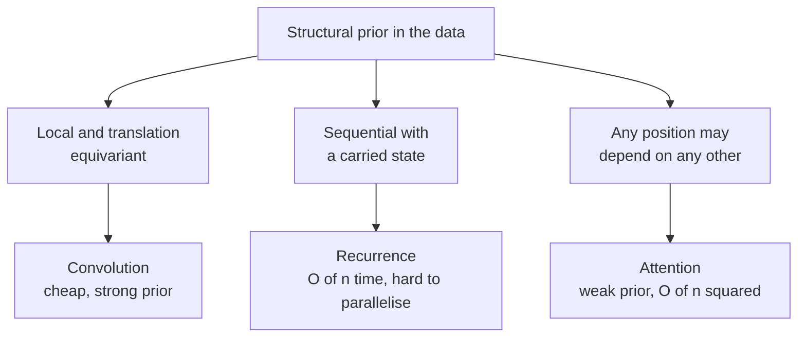
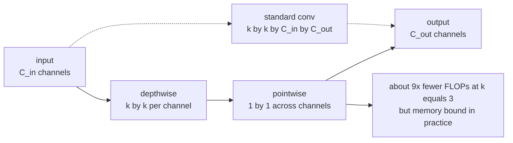
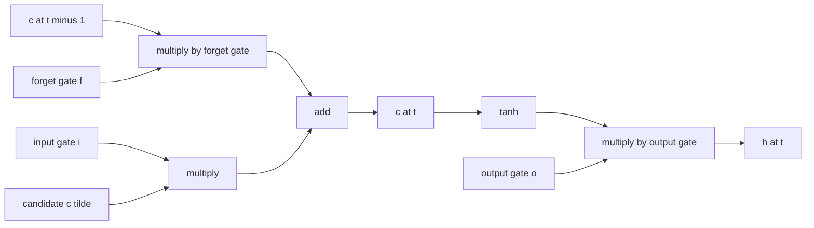
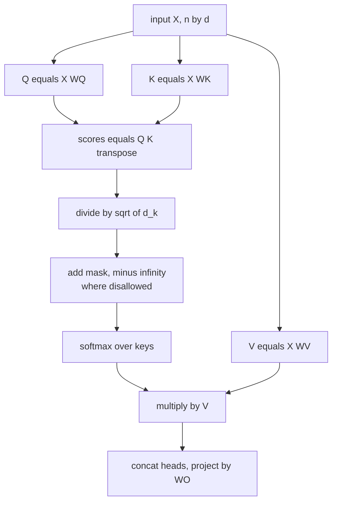
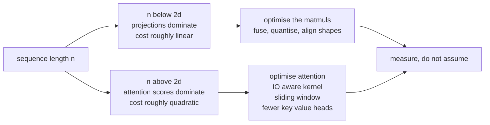
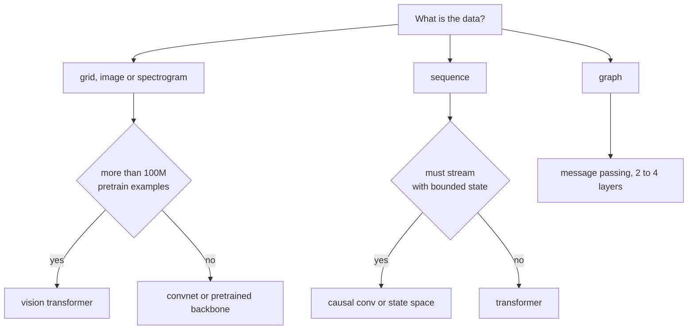

# Chapter 7: Architectures: Convolutional, Recurrent, and Attention

> **What this chapter covers** The three structural priors that dominate deep learning. Convolution, which assumes locality and translation equivariance. Recurrence, which assumes a sequential state. Attention, which assumes nothing and pays for it in compute. Each is derived, costed, and placed in the decision that an engineer actually faces.
>
> **Prerequisites** Chapter 6 (backpropagation, initialisation, normalisation, optimisers), Chapter 1 (matrix multiplication and the dot product as a similarity), Chapter 2 (softmax as a normalised exponential).
>
> **Where it is used** Vision systems, speech and audio, sensor and time-series pipelines, retrieval and ranking, and every language model. Architecture choice sets the latency and memory budget of a production system before a single hyperparameter is tuned.

---

## 7.1 Level 1: Foundations

### 7.1.1 Why a fully connected layer is the wrong tool for an image

Take a 224 by 224 colour image. Flattened, it is 150,528 numbers. A fully connected layer with 1000 hidden units needs 150 million weights for that one layer. Worse, the layer has no idea that pixel 1 and pixel 2 are adjacent and pixel 1 and pixel 50,000 are not. Shuffle the pixels consistently across the whole dataset and the fully connected network learns exactly as well. That is proof it is not using the structure.

Images have two structural properties worth exploiting. **Locality**: a useful feature such as an edge depends on a small neighbourhood of pixels. **Translation equivariance**: an edge is an edge wherever it appears, so the detector for it should be the same everywhere.

A convolutional layer builds both in. It applies one small set of weights, called a kernel or filter, at every spatial position. That is weight sharing, and it is the central idea.

### 7.1.2 Why a fully connected layer is the wrong tool for a sentence

Sequences have a different problem: they vary in length. A fixed-width layer cannot consume a 5-word sentence and a 500-word document. They also have order, and order carries meaning.

A recurrent layer solves the length problem by processing one element at a time while carrying a state vector forward. The same weights are applied at every timestep, which is again weight sharing, now across time rather than space.

Attention solves it differently. Instead of a state passed step by step, every position looks directly at every other position and pulls in what it needs, weighted by relevance. It gives up the sequential inductive bias entirely and buys direct access.



*Figure 7.1: Each architecture family encodes a different assumption about where information lives.*

### 7.1.3 The vocabulary

| Term | Meaning |
| --- | --- |
| Channel | One feature map. A colour image has 3 input channels; a hidden convolutional layer may have 256. |
| Kernel or filter | The small weight tensor slid over the input, typically 3 by 3 or 5 by 5 spatially. |
| Feature map | The output of one filter over all positions. |
| Stride | How far the kernel moves between applications. |
| Padding | Extra values added at the border so the output keeps a chosen size. |
| Receptive field | The region of the original input that influences one output value. |
| Hidden state | The vector a recurrent network carries from one timestep to the next. |
| Query, key, value | The three projections in attention. A query asks, keys advertise, values carry content. |

---

## 7.2 Level 2: Working knowledge

### 7.2.1 The convolution operation

For a two-dimensional input $X$ and kernel $K$ of size $k \times k$, with $C_{\text{in}}$ input channels and $C_{\text{out}}$ output channels, the output at position $(i,j)$ and output channel $o$ is

$$Y[o,i,j] = b_o + \sum_{c=1}^{C_{\text{in}}} \sum_{u=0}^{k-1} \sum_{v=0}^{k-1} K[o,c,u,v] \cdot X[c, i+u, j+v]$$

Framework "convolution" is technically cross-correlation, because the kernel is not flipped. Since the kernel is learned, the flip is irrelevant, and nobody in practice distinguishes them.

Parameter count for one layer: $C_{\text{out}} \times C_{\text{in}} \times k \times k$ weights plus $C_{\text{out}}$ biases. Note the absence of any spatial size. A convolutional layer has the same parameter count for a 32 by 32 image and a 4000 by 4000 one. That is what weight sharing buys.

FLOP count: roughly $2 \times C_{\text{out}} \times C_{\text{in}} \times k^2 \times H_{\text{out}} \times W_{\text{out}}$, counting a multiply and an add as two operations.

**Worked example.** A 3 by 3 convolution with 256 input and 256 output channels on a 56 by 56 feature map. Parameters: $256 \times 256 \times 9 = 589{,}824$, plus 256 biases. FLOPs: $2 \times 256 \times 256 \times 9 \times 56 \times 56 \approx 3.70 \times 10^9$, so 3.7 GFLOP for one layer on one image. A fully connected layer with the same input and output tensor sizes would need $(256 \times 56 \times 56)^2 \approx 6.4 \times 10^{11}$ parameters, a factor of about a million more.

### 7.2.2 Output size, stride, padding, dilation

The output spatial size along one dimension is

$$H_{\text{out}} = \left\lfloor \frac{H_{\text{in}} + 2p - d(k-1) - 1}{s} \right\rfloor + 1$$

where $p$ is padding, $s$ is stride, $k$ is kernel size, and $d$ is dilation.

| Setting | Effect | Common use |
| --- | --- | --- |
| $s=1$, $p=(k-1)/2$, $d=1$, odd $k$ | Output size equals input size, called "same" padding | The default inside a stage |
| $s=2$ | Halves spatial size | Downsampling between stages, replacing pooling |
| $p=0$, called "valid" | Output shrinks by $k-1$ | Rare in modern designs |
| $d>1$ | Kernel taps are spaced out, enlarging receptive field without extra parameters | Segmentation, audio (WaveNet), where resolution must be kept |

**Worked example.** Input 224, $k=7$, $s=2$, $p=3$, $d=1$. $\lfloor (224 + 6 - 6 - 1)/2 \rfloor + 1 = \lfloor 111.5 \rfloor + 1 = 112$. This is the stem of most ResNets.

### 7.2.3 Receptive field arithmetic

Stacking small kernels grows the receptive field. Track it with two recursions. Let $r_\ell$ be the receptive field after layer $\ell$ and $j_\ell$ the jump, meaning the input-space distance between adjacent output positions.

$$j_\ell = j_{\ell-1} \cdot s_\ell, \qquad r_\ell = r_{\ell-1} + (k_\ell - 1)\cdot j_{\ell-1}$$

starting from $j_0 = 1$, $r_0 = 1$.

**Worked example.** Three stacked 3 by 3 convolutions, all stride 1. $r_1 = 1 + 2 = 3$; $r_2 = 3 + 2 = 5$; $r_3 = 5 + 2 = 7$. So three 3 by 3 layers see a 7 by 7 window, the same as one 7 by 7 layer, but with $3 \times 9 C^2 = 27C^2$ parameters instead of $49C^2$, and with two extra nonlinearities. That comparison is the entire argument of the VGG paper (Simonyan and Zisserman, 2015).

Now add stride. Stem: $k=7$, $s=2$ gives $r=7$, $j=2$. Max pool $k=3$, $s=2$: $r = 7 + 2\cdot2 = 11$, $j = 4$. A following 3 by 3 stride 1: $r = 11 + 2 \cdot 4 = 19$, $j=4$. Strided layers make the receptive field grow much faster, which is why downsampling is not only about saving compute.

A caution from Luo et al. (2016): the *effective* receptive field is Gaussian-shaped and considerably smaller than the theoretical one, because central pixels contribute through exponentially more paths. Do not assume a layer uses its whole nominal window.

### 7.2.4 Pooling

Pooling reduces spatial resolution with no parameters. Max pooling takes the maximum in each window, average pooling the mean. Max pooling gives a small amount of translation invariance: shift the input by one pixel and the max over a 2 by 2 window often does not change.

Modern designs use less pooling. Strided convolutions downsample while learning how to do it, which usually works better. Global average pooling, which reduces each channel to a single number over all spatial positions, replaced the large fully connected head in Network in Network (Lin et al., 2014) and every subsequent architecture, removing the majority of the parameters.

### 7.2.5 The convolutional architecture families

| Family | Year | Contribution that lasted |
| --- | --- | --- |
| LeNet-5 (LeCun et al.) | 1998 | The convolution, pooling, fully connected template itself |
| AlexNet (Krizhevsky et al.) | 2012 | ReLU at scale, dropout, GPU training, the result that started the field |
| VGG (Simonyan and Zisserman) | 2015 | Uniform 3 by 3 stacks; small kernels compose better than large ones |
| GoogLeNet / Inception (Szegedy et al.) | 2015 | Multiple kernel sizes in parallel; 1 by 1 convolutions for cheap channel mixing |
| ResNet (He et al.) | 2016 | Residual connections; trained 152 layers where 34 plain layers already degraded |
| DenseNet (Huang et al.) | 2017 | Concatenative rather than additive skips, strong feature reuse |
| MobileNet (Howard et al.) | 2017 | Depthwise separable convolutions for mobile latency budgets |
| EfficientNet (Tan and Le) | 2019 | Compound scaling of depth, width and resolution together |
| ConvNeXt (Liu et al.) | 2022 | A convnet modernised with transformer design choices matches vision transformers |

The 1 by 1 convolution deserves a note because it looks trivial and is not. It has no spatial extent, so it is a learned linear map across channels applied independently at every position. Use it to change channel count cheaply, which is the bottleneck pattern in ResNet: 1 by 1 down to $C/4$ channels, 3 by 3 at that reduced width, 1 by 1 back up. The expensive 3 by 3 then runs on a quarter of the channels, cutting its cost by 16.

### 7.2.6 Residual connections

A residual block computes

$$\mathbf{y} = \mathbf{x} + \mathcal{F}(\mathbf{x}, \theta)$$

where $\mathcal{F}$ is a small stack of convolutions. He et al. (2016) introduced this after observing that a 56-layer plain network had *higher training* error than a 20-layer one, which is not overfitting but an optimisation failure.

Why it works, three mechanisms, all real:

1. **Gradient highway.** Differentiating $\mathbf{y} = \mathbf{x} + \mathcal{F}(\mathbf{x})$ gives $\partial \mathbf{y}/\partial \mathbf{x} = I + \partial\mathcal{F}/\partial\mathbf{x}$. The identity term means the backward signal reaches earlier layers undiminished regardless of what $\mathcal{F}$ does. Across $L$ blocks the gradient contains a term with no attenuating factor at all.
2. **Easier target.** The block must learn a residual, not a full mapping. If the optimal transform is close to identity, the block only needs to output near zero, which is what a zero-initialised final normalisation gain gives you for free.
3. **Landscape smoothing.** Li et al. (2018) visualised the loss surface with and without skips and showed residuals convert a chaotic surface into a near-convex basin.

Veit et al. (2016) added a fourth framing: a residual network behaves like an ensemble of many paths of differing depth, and the effective paths are much shallower than the nominal depth.

### 7.2.7 Depthwise separable convolutions

Factor a standard convolution into two steps. **Depthwise**: one $k \times k$ kernel per input channel, applied only to that channel, mixing space but not channels. **Pointwise**: a 1 by 1 convolution mixing channels but not space.

Cost comparison per output position:

$$\text{standard} = C_{\text{in}} C_{\text{out}} k^2, \qquad \text{separable} = C_{\text{in}} k^2 + C_{\text{in}} C_{\text{out}}$$

Ratio:

$$\frac{C_{\text{in}} k^2 + C_{\text{in}} C_{\text{out}}}{C_{\text{in}} C_{\text{out}} k^2} = \frac{1}{C_{\text{out}}} + \frac{1}{k^2}$$

**Worked example.** $k=3$, $C_{\text{out}}=512$. The ratio is $1/512 + 1/9 = 0.0020 + 0.1111 = 0.113$, so about 8.9 times cheaper in both parameters and FLOPs.

The caution that matters in production: FLOPs are not latency. Depthwise convolutions have low arithmetic intensity, meaning few operations per byte moved, so they are memory-bandwidth bound and often achieve a small fraction of peak throughput on a GPU. A model with 9 times fewer FLOPs can easily be only 2 times faster. Measure latency on the target device.



*Figure 7.2: A standard convolution factored into depthwise and pointwise stages.*

### 7.2.8 How a convolution is actually computed

The mathematical definition is a sliding window. No production implementation does that, and knowing why explains the performance behaviour you will measure.

**Implicit GEMM, or im2col.** Unfold every $k \times k \times C_{\text{in}}$ patch into a column of a matrix, giving a matrix of shape $(C_{\text{in}} k^2) \times (H_{\text{out}} W_{\text{out}})$. Reshape the kernel to $C_{\text{out}} \times (C_{\text{in}} k^2)$. The convolution is then one matrix multiply. This maps directly onto hardware built for dense linear algebra. The cost is that the unfolded matrix duplicates each input value up to $k^2$ times, so materialising it uses a large amount of memory. Modern libraries perform the unfold implicitly, reading directly from the input while feeding the matrix multiply, which removes the memory cost.

**Winograd** (Lavin and Gray, 2016). For small kernels, use a transform that trades multiplications for additions, reducing the multiply count for 3 by 3 kernels by a factor of 2.25. It is numerically less accurate and is typically restricted to specific tile and kernel sizes.

**FFT-based.** Convolution in the spatial domain is multiplication in the frequency domain. Worthwhile only for large kernels, which modern architectures mostly avoid.

The engineering consequence is that measured throughput depends on which algorithm the library picks, which depends on channel counts, spatial size, and batch. Channel counts that are multiples of 8 or 32 allow tensor-core paths that non-multiples do not, and the difference can be a factor of two. When a layer is unexpectedly slow, check whether its shapes are aligned before rewriting anything.

### 7.2.9 One-dimensional convolutions

The same operator with one spatial axis. It applies to audio waveforms, sensor streams, and text as a sequence of embeddings.

Two variants matter. **Causal** convolution pads only on the left so output $t$ depends on inputs at or before $t$, preserving the autoregressive property. **Dilated causal** stacks, as in WaveNet (van den Oord et al., 2016), double the dilation per layer, giving a receptive field of $2^L$ with $L$ layers. Ten layers reach 1024 samples with ten kernels of size 2.

Temporal convolutional networks, surveyed by Bai, Kolter and Koltun (2018), showed that dilated causal convolutions with residuals match or beat LSTMs on many sequence benchmarks while training fully in parallel. If you have a sequence problem and are reaching for an LSTM by reflex, benchmark a temporal convolutional network first.

---

### 7.2.10 Assembling a convolutional network

Modern convolutional networks are built from stages. A stage is a group of blocks at one spatial resolution and one channel count. Between stages, resolution halves and channels double, keeping the compute per stage roughly constant.

**Listing 7.1: a residual bottleneck block, the unit that stages are built from.**

```python
import torch.nn as nn

class Bottleneck(nn.Module):
    def __init__(self, c_in, c_mid, c_out, stride=1):
        super().__init__()
        self.conv = nn.Sequential(
            nn.Conv2d(c_in, c_mid, 1, bias=False), nn.BatchNorm2d(c_mid), nn.ReLU(inplace=True),
            nn.Conv2d(c_mid, c_mid, 3, stride=stride, padding=1, bias=False),
            nn.BatchNorm2d(c_mid), nn.ReLU(inplace=True),
            nn.Conv2d(c_mid, c_out, 1, bias=False), nn.BatchNorm2d(c_out),
        )
        self.skip = None
        if stride != 1 or c_in != c_out:
            self.skip = nn.Sequential(
                nn.Conv2d(c_in, c_out, 1, stride=stride, bias=False), nn.BatchNorm2d(c_out))
        self.act = nn.ReLU(inplace=True)

    def forward(self, x):
        identity = x if self.skip is None else self.skip(x)
        return self.act(self.conv(x) + identity)
```

Four details carry the design. `bias=False` on every convolution followed by batch normalisation, because the normalisation's shift parameter makes the convolution's bias redundant and it would be immediately cancelled. The skip path needs its own 1 by 1 convolution only when shape changes, either by stride or channel count, and is otherwise a free identity. The addition happens before the final activation, so the residual can be negative. And the last normalisation's gain is often initialised to zero, which makes the whole block start as an exact identity, a trick from Goyal et al. (2017) that stabilises the first steps of a deep network.

| Stage | Resolution for a 224 input | Channels in a ResNet-50 | Blocks |
| --- | --- | --- | --- |
| Stem | 112, then 56 after pooling | 64 | 1 conv plus pool |
| 1 | 56 | 256 | 3 |
| 2 | 28 | 512 | 4 |
| 3 | 14 | 1024 | 6 |
| 4 | 7 | 2048 | 3 |
| Head | 1 | 2048 to classes | global average pool plus linear |

Note the head. Global average pooling collapses the 7 by 7 by 2048 tensor to 2048 numbers, and a single linear layer maps to classes. The alternative, flattening to 100,352 and using a fully connected layer, would add roughly 400 million parameters. That is why the pooled head is universal.

## 7.3 Level 3: Depth

### 7.3.1 The recurrence and backpropagation through time

A vanilla recurrent neural network maintains a hidden state:

$$\mathbf{h}_t = \tanh(W_{hh}\mathbf{h}_{t-1} + W_{xh}\mathbf{x}_t + \mathbf{b}), \qquad \mathbf{y}_t = W_{hy}\mathbf{h}_t$$

The same $W_{hh}$, $W_{xh}$, $\mathbf{b}$ are used at every step. Unroll the computation over $T$ steps and it is a $T$-layer feedforward network with tied weights. Backpropagation on that unrolled graph is backpropagation through time.

The weight gradient sums contributions from every timestep:

$$\frac{\partial \mathcal{L}}{\partial W_{hh}} = \sum_{t=1}^{T} \frac{\partial \mathcal{L}_t}{\partial W_{hh}}$$

and each term requires propagating back through all earlier steps.

### 7.3.2 Why gradients vanish across time

The Jacobian of the state at step $t$ with respect to step $\tau$ is a product:

$$\frac{\partial \mathbf{h}_t}{\partial \mathbf{h}_\tau} = \prod_{i=\tau+1}^{t} \frac{\partial \mathbf{h}_i}{\partial \mathbf{h}_{i-1}} = \prod_{i=\tau+1}^{t} \mathrm{diag}(1 - \mathbf{h}_i^2)\, W_{hh}^\top$$

using $\tanh'(z) = 1 - \tanh^2(z)$. Take norms. If the largest singular value of $W_{hh}$ is $\sigma_{\max}$ and $|\tanh'| \le 1$,

$$\left\| \frac{\partial \mathbf{h}_t}{\partial \mathbf{h}_\tau} \right\| \le (\sigma_{\max})^{t-\tau}$$

If $\sigma_{\max} < 1$ the bound decays geometrically and long-range gradient vanishes. If $\sigma_{\max} > 1$ it can explode. Bengio, Simard and Frasconi (1994) proved that with $\sigma_{\max} < 1$ a sufficient condition for stable state storage forces vanishing gradients, so the two goals are in direct conflict for this architecture.

**Worked example.** $\sigma_{\max} = 0.9$, and $\tanh'$ averaging 0.5. The per-step factor is 0.45. Over 50 steps: $0.45^{50} \approx 6 \times 10^{-18}$. The gradient from step 50 to step 0 is numerically zero in float32. A vanilla recurrent network cannot learn a dependency that long.

Exploding gradients are the easy half of the problem. Clip the global norm, as Pascanu, Mikolov and Bengio (2013) recommended, and they go away. Vanishing gradients need an architectural fix.

### 7.3.3 Gated units

The fix is an additive path for the state, so the default behaviour is to carry information unchanged.

**Long short-term memory** (Hochreiter and Schmidhuber, 1997), with the forget gate added by Gers et al. (2000):

$$\mathbf{f}_t = \sigma(W_f [\mathbf{h}_{t-1}, \mathbf{x}_t] + \mathbf{b}_f) \quad \text{forget gate}$$
$$\mathbf{i}_t = \sigma(W_i [\mathbf{h}_{t-1}, \mathbf{x}_t] + \mathbf{b}_i) \quad \text{input gate}$$
$$\tilde{\mathbf{c}}_t = \tanh(W_c [\mathbf{h}_{t-1}, \mathbf{x}_t] + \mathbf{b}_c) \quad \text{candidate}$$
$$\mathbf{c}_t = \mathbf{f}_t \odot \mathbf{c}_{t-1} + \mathbf{i}_t \odot \tilde{\mathbf{c}}_t \quad \text{cell state}$$
$$\mathbf{o}_t = \sigma(W_o [\mathbf{h}_{t-1}, \mathbf{x}_t] + \mathbf{b}_o) \quad \text{output gate}$$
$$\mathbf{h}_t = \mathbf{o}_t \odot \tanh(\mathbf{c}_t) \quad \text{hidden state}$$

The cell state update is the important line. $\partial \mathbf{c}_t / \partial \mathbf{c}_{t-1}$ contains $\mathrm{diag}(\mathbf{f}_t)$, not a weight matrix product. If the forget gate is near 1, the gradient passes through essentially unchanged over many steps. This is the same identity-path trick as a residual connection, arrived at nineteen years earlier. It is why the forget gate bias is often initialised to 1: it starts the network in remembering mode.

**Gated recurrent unit** (Cho et al., 2014):

$$\mathbf{z}_t = \sigma(W_z [\mathbf{h}_{t-1}, \mathbf{x}_t]) \quad \text{update gate}$$
$$\mathbf{r}_t = \sigma(W_r [\mathbf{h}_{t-1}, \mathbf{x}_t]) \quad \text{reset gate}$$
$$\tilde{\mathbf{h}}_t = \tanh(W_h [\mathbf{r}_t \odot \mathbf{h}_{t-1}, \mathbf{x}_t])$$
$$\mathbf{h}_t = (1-\mathbf{z}_t) \odot \mathbf{h}_{t-1} + \mathbf{z}_t \odot \tilde{\mathbf{h}}_t$$

Two gates instead of three, one state instead of two, about 25 percent fewer parameters for the same hidden size. Chung et al. (2014) compared them and found no consistent winner. Jozefowicz et al. (2015) searched thousands of variants and concluded the same. Pick the gated recurrent unit when you want fewer parameters, the long short-term memory when you are reproducing published results.



*Figure 7.3: The long short-term memory cell. The additive path from c at t minus 1 to c at t is the gradient highway.*

### 7.3.4 Truncated backpropagation through time

Unrolling a recurrent network over a long sequence stores an activation per timestep, so memory grows linearly with sequence length and a 100,000-step sequence is impossible. Truncated backpropagation through time splits the sequence into chunks of length $k$. The forward pass carries the hidden state across chunk boundaries, so the *state* sees the full history. The backward pass stops at the chunk boundary, so the *gradient* sees only $k$ steps.

The consequence is that the model cannot learn a dependency longer than $k$, even though it can in principle represent one. Choose $k$ to exceed the longest dependency you care about, and detach the state at each boundary so the graph is actually freed. Forgetting to detach is a classic bug: memory grows every chunk until the process is killed, and the error message points at the allocator rather than at the cause.

### 7.3.5 Bidirectionality and the encoder-decoder pattern

A bidirectional recurrent network runs one pass left to right and one right to left, concatenating the two hidden states. Every position then sees full context. It is strictly better for tagging, classification, and encoding. It is impossible for autoregressive generation, because the backward pass requires the future.

Sequence to sequence (Sutskever, Vinyals and Le, 2014; Cho et al., 2014) encodes the whole input into a fixed vector, then decodes from it. The failure is structural: a single vector of, say, 512 numbers must hold an entire 50-word sentence. Translation quality degrades sharply with source length. Measured, that degradation is the motivation for attention.

### 7.3.6 Attention, derived

Bahdanau, Cho and Bengio (2015) replaced the fixed context vector with one computed fresh at each decoder step. Given decoder state $\mathbf{s}_{t-1}$ and encoder states $\mathbf{h}_1 \dots \mathbf{h}_n$:

$$e_{ti} = a(\mathbf{s}_{t-1}, \mathbf{h}_i), \qquad \alpha_{ti} = \frac{\exp(e_{ti})}{\sum_{j} \exp(e_{tj})}, \qquad \mathbf{c}_t = \sum_i \alpha_{ti} \mathbf{h}_i$$

The context is a weighted average of encoder states, with weights that sum to 1. The scoring function $a$ has two standard forms.

**Additive (Bahdanau):** $a(\mathbf{s},\mathbf{h}) = \mathbf{v}^\top \tanh(W_1\mathbf{s} + W_2\mathbf{h})$. A small network. More parameters, works when query and key dimensions differ.

**Dot product (Luong et al., 2015):** $a(\mathbf{s},\mathbf{h}) = \mathbf{s}^\top \mathbf{h}$. No parameters, and the whole set of scores is one matrix multiply, which is why it won.

**Self-attention** is the same operation with the sequence attending to itself. Project the input $X \in \mathbb{R}^{n \times d}$ three ways:

$$Q = XW^Q, \quad K = XW^K, \quad V = XW^V$$

then

$$\mathrm{Attention}(Q,K,V) = \mathrm{softmax}\!\left(\frac{QK^\top}{\sqrt{d_k}}\right) V$$

The $\sqrt{d_k}$ scaling is derived, not chosen. If the components of $\mathbf{q}$ and $\mathbf{k}$ are independent with mean 0 and variance 1, then $\mathbf{q}^\top\mathbf{k} = \sum_{i=1}^{d_k} q_i k_i$ has mean 0 and variance $d_k$, so standard deviation $\sqrt{d_k}$. At $d_k = 64$ that is 8. Scores spread over roughly $\pm 24$ push the softmax into saturation, where one weight is essentially 1 and the gradient through the softmax is essentially zero. Dividing by $\sqrt{d_k}$ restores unit variance and keeps the softmax in its responsive region.

Why three separate projections. The query is what a position is looking for. The key is what a position offers as an index. The value is what gets retrieved. Separating the matching role from the content role lets a position advertise itself by one property and contribute a different one. Tying $K = V$ measurably reduces capacity.

### 7.3.7 Multi-head attention

Split the model dimension $d$ into $H$ heads of size $d_k = d/H$, run attention independently in each, concatenate, and project:

$$\mathrm{MHA}(X) = \mathrm{Concat}(\mathrm{head}_1, \dots, \mathrm{head}_H) W^O, \qquad \mathrm{head}_h = \mathrm{Attention}(XW_h^Q, XW_h^K, XW_h^V)$$

One softmax produces one convex combination, so a single head can only average one set of positions. Different relations, such as syntactic dependency and coreference, need different weightings from the same position. Heads give you several in parallel. The total parameter count is unchanged because each head is narrower, so multi-head attention is free relative to single-head at the same $d$.

A caveat from Michel, Levy and Neubig (2019): many heads can be pruned after training with negligible loss, so the number of heads is not tightly coupled to quality. Typical choice is $d_k$ between 64 and 128, then $H = d/d_k$.



*Figure 7.4: Scaled dot-product attention with masking, the core of every transformer.*

### 7.3.8 Positional encoding

Attention is permutation equivariant. Shuffle the input rows and the output rows shuffle identically. Position must be injected.

**Sinusoidal** (Vaswani et al., 2017). For position $pos$ and dimension index $i$:

$$PE(pos, 2i) = \sin\!\left(\frac{pos}{10000^{2i/d}}\right), \qquad PE(pos, 2i+1) = \cos\!\left(\frac{pos}{10000^{2i/d}}\right)$$

added to the embeddings. Wavelengths form a geometric progression from $2\pi$ to about $10000 \cdot 2\pi$. The useful property is that $PE(pos + k)$ is a fixed linear function of $PE(pos)$ for any fixed offset $k$, namely a rotation in each two-dimensional frequency subspace, which in principle lets the model represent relative offsets.

**Learned absolute.** A trainable embedding per position. Simple, works, and cannot extrapolate beyond the trained maximum length at all.

**Relative** (Shaw et al., 2018; Raffel et al., 2020 in T5). Bias the attention score by a learned function of $i - j$. Naturally translation invariant.

**Rotary, or RoPE** (Su et al., 2021). Do not add anything. Rotate the query and key vectors by an angle proportional to position. Treat consecutive pairs of dimensions as a complex number and multiply by $e^{i m \theta_j}$ for position $m$ and per-pair frequency $\theta_j = 10000^{-2j/d}$. Then

$$\langle R_m \mathbf{q}, R_n \mathbf{k} \rangle = \langle \mathbf{q}, R_{n-m} \mathbf{k} \rangle$$

The dot product depends only on the relative offset $n-m$. That identity is the whole point: absolute positions are applied, relative positions are what the score sees. It costs no parameters, applies inside every layer, and is compatible with key-value caching because each key is rotated once by its own position and then stored. It is the dominant choice in modern language models. Chapter 8 covers extending it beyond the trained context.

**ALiBi** (Press, Smith and Lewis, 2022) is simpler still: subtract $m \cdot |i-j|$ from the score with a fixed per-head slope $m$. A linear recency bias, with strong length extrapolation.

### 7.3.9 Masking

Two masks, with different purposes.

**Causal mask.** Set scores to negative infinity where $j > i$, so position $i$ cannot see the future. Applied before the softmax, so those weights become exactly zero. This is what makes a decoder autoregressive and what lets a single forward pass compute the loss for every position in parallel during training.

**Padding mask.** Batched sequences are padded to equal length. Mask the pad positions as keys so no real position attends to them. Forgetting this is one of the most common transformer bugs, and its signature is a model that performs well at one sequence length and badly at another.

Use negative infinity, or a large negative number like -1e9 in float32, not zero. A score of zero is a perfectly ordinary score and gives a non-zero softmax weight. In float16, -1e9 overflows, so use `torch.finfo(dtype).min` or add the mask before casting. Check your framework version for the exact helper.

### 7.3.10 Efficient attention

The cost. For sequence length $n$ and model dimension $d$, the score matrix is $n \times n$. Compute is $O(n^2 d)$ and memory for the materialised scores is $O(n^2)$ per head.

**Worked example.** $n = 8192$, $H = 32$ heads, batch 1, float16. The score tensor is $32 \times 8192 \times 8192 \times 2$ bytes $= 4.3$ GB, for one layer, and both the pre-softmax and post-softmax tensors are needed for the backward pass. This single number is why efficient attention exists.

Three families of response.

**Sparse patterns.** Do not compute all pairs. Longformer (Beltagy et al., 2020) uses a sliding window plus a few global tokens. BigBird (Zaheer et al., 2020) adds random connections and proves the result is a universal approximator of sequence functions. Cost drops to $O(n)$ or $O(n \sqrt{n})$. The price is that some dependencies need several layers to be expressed.

**Linear approximations.** Exploit associativity. $\mathrm{softmax}(QK^\top)V$ cannot be reassociated because of the softmax, but if you replace the exponential kernel with a feature map $\phi$ so that similarity is $\phi(\mathbf{q})^\top\phi(\mathbf{k})$, then $\phi(Q)(\phi(K)^\top V)$ computes the same thing in $O(nd^2)$. Katharopoulos et al. (2020) with a simple positive feature map, Performer (Choromanski et al., 2021) with random features that approximate the softmax kernel in expectation. In practice these lose quality on tasks requiring precise retrieval, and they have not displaced exact attention in frontier language models.

**IO-aware exact methods.** FlashAttention (Dao et al., 2022) changes no mathematics. It observes that attention is bound by memory bandwidth, not arithmetic, and that the $n \times n$ matrix never needs to exist in high-bandwidth memory. Tile $Q$, $K$, $V$ into blocks that fit in on-chip SRAM, compute the softmax with the online streaming formulation that maintains a running maximum and running sum, and recompute the scores during the backward pass instead of storing them. Memory becomes $O(n)$ and wall-clock drops by a large factor. FlashAttention-2 (Dao, 2023) improved the work partitioning further.

The engineering lesson generalises beyond attention: when an operation is memory bound, reducing data movement beats reducing FLOPs.

| Approach | Compute | Memory | Exact | Adopted in production |
| --- | --- | --- | --- | --- |
| Naive attention | $O(n^2 d)$ | $O(n^2)$ | Yes | Only for short sequences |
| Sliding window plus global | $O(nwd)$ | $O(nw)$ | No | Yes, in long-document models |
| Linear or kernel attention | $O(nd^2)$ | $O(nd)$ | No | Rarely at the frontier |
| FlashAttention | $O(n^2 d)$ | $O(n)$ | Yes | Yes, the default |

### 7.3.11 Attention in code, and the mistakes it hides

**Listing 7.2: scaled dot-product attention with both masks, written out.**

```python
import torch, math

def attention(q, k, v, causal=True, pad_mask=None):
    # q, k, v: (B, H, n, d_head). pad_mask: (B, 1, 1, n), True where valid.
    d_head = q.shape[-1]
    scores = (q @ k.transpose(-2, -1)) / math.sqrt(d_head)   # (B, H, n, n)
    neg = torch.finfo(scores.dtype).min
    if causal:
        n = scores.shape[-1]
        future = torch.triu(torch.ones(n, n, dtype=torch.bool, device=q.device), 1)
        scores = scores.masked_fill(future, neg)
    if pad_mask is not None:
        scores = scores.masked_fill(~pad_mask, neg)
    weights = torch.softmax(scores, dim=-1)
    return weights @ v
```

Four lines hide common bugs. `math.sqrt(d_head)` uses the *head* dimension, not the model dimension; using $d$ instead of $d/H$ under-scales by $\sqrt{H}$ and quietly hurts. `torch.finfo(dtype).min` rather than a literal such as -1e9, which overflows float16 to negative infinity and then produces NaN when a row is entirely masked. The causal mask uses `triu` with diagonal 1, so a position may attend to itself; diagonal 0 forbids self-attention and breaks the model in a way that still trains, slowly. And the padding mask is applied to keys, shaped to broadcast across query positions; applying it to queries instead leaves padded queries computing garbage that is then averaged into a pooled representation.

A row that is fully masked, which happens for a padded query position under a causal mask, produces a softmax over all negative-infinity scores and therefore NaN. Either mask queries out of the loss, or clamp the fully masked rows. Check your framework version for whether its fused attention helper handles this for you; behaviour has changed between releases.

### 7.3.12 Transformers for sequences other than text

The same block applies wherever you can produce a sequence of vectors.

| Modality | How it becomes a sequence | Practical note |
| --- | --- | --- |
| Images | Split into non-overlapping patches, typically 16 by 16, and linearly project each | Number of tokens is $(H/16)(W/16)$, so 224 by 224 gives 196. Cost is quadratic in that. |
| Audio | Frames of a mel spectrogram, or a learned convolutional front end over the waveform | Convolutional downsampling first is near-universal, because raw frame rates are too high |
| Time series and sensors | Fixed-length windows, one token per timestep or per patch | Patching to reduce token count is the standard trick |
| Video | Space-time patches, sometimes called tubelets | Token count explodes; factorised space-then-time attention is usual |
| Point clouds and sets | Each element is a token, no positional encoding | Attention is permutation equivariant, which is exactly right for a set |

The last row is worth pausing on. For unordered data, the absence of a positional prior is a feature, not a limitation. This is the basis of Set Transformer (Lee et al., 2019) and of the object-query design in DETR (Carion et al., 2020).

### 7.3.13 Graph neural networks in brief

When the data is a graph, neither a grid nor a sequence fits. A graph neural network generalises the convolution's local aggregation to arbitrary neighbourhoods, in the message passing framework of Gilmer et al. (2017):

$$\mathbf{m}_v^{(\ell)} = \bigoplus_{u \in \mathcal{N}(v)} M^{(\ell)}\!\left(\mathbf{h}_v^{(\ell)}, \mathbf{h}_u^{(\ell)}, \mathbf{e}_{uv}\right), \qquad \mathbf{h}_v^{(\ell+1)} = U^{(\ell)}\!\left(\mathbf{h}_v^{(\ell)}, \mathbf{m}_v^{(\ell)}\right)$$

Here $\mathcal{N}(v)$ is the neighbourhood of node $v$, $\bigoplus$ is a permutation-invariant aggregator such as sum, mean, or max, $M$ builds a message, and $U$ updates the node state. After $L$ rounds each node has aggregated information from $L$ hops away, which is exactly a receptive field.

Variants: graph convolutional networks (Kipf and Welling, 2017) use a normalised mean; GraphSAGE (Hamilton et al., 2017) samples neighbours for scalability; graph attention networks (Veličković et al., 2018) learn the aggregation weights, which is attention restricted to the graph's edges.

Two known limits. Expressive power is bounded by the Weisfeiler-Lehman graph isomorphism test for the standard message passing form (Xu et al., 2019), so some non-isomorphic graphs are indistinguishable. And over-smoothing: with many rounds all node representations converge to the same vector, so deep graph networks are unusual and 2 to 4 layers is typical.

Note the unification. A convolution is message passing on a grid with fixed weights. Self-attention is message passing on a complete graph with learned, input-dependent weights. Saying it out loud makes the architecture space smaller.

---

### 7.3.14 The cost comparison that drives every choice

Put the three families on the same axes. Let $n$ be sequence length, $d$ model width, $k$ kernel size, and $L$ depth.

| Property | Convolution | Recurrence | Self-attention |
| --- | --- | --- | --- |
| Compute per layer | $O(n k d^2)$ | $O(n d^2)$ | $O(n^2 d + n d^2)$ |
| Sequential operations | $O(1)$ | $O(n)$ | $O(1)$ |
| Maximum path length between two positions | $O(n/k)$, or $O(\log_k n)$ with dilation | $O(n)$ | $O(1)$ |
| Memory at inference for a stream | $O(k)$ per layer | $O(d)$ per layer, fixed | $O(nd)$ per layer, growing |
| Parallel over positions during training | Yes | No | Yes |

The third row is the one that decides architecture for long-range tasks. A gradient travelling between two positions in a recurrent network passes through $O(n)$ multiplicative steps, which is why it vanishes. In attention it passes through one. That single fact, presented as the "maximum path length" table in Vaswani et al. (2017), is the clearest statement of why attention replaced recurrence.

The fourth row is the one that decides architecture for deployment. Attention's state grows without bound as a stream continues, which is a real problem for always-on systems; a recurrent or state-space model has a fixed-size state and can run forever. This is the asymmetry that keeps recurrent-style models alive.

**Worked example, the crossover.** Attention's per-layer compute is $4nd^2$ for the projections plus $2n^2 d$ for the scores and the value aggregation. The quadratic term exceeds the linear term when $2n^2 d > 4nd^2$, that is when $n > 2d$. At $d = 4096$ that is $n > 8192$. Below 8192 tokens, a transformer layer's cost is dominated by the position-wise projections and is effectively linear in length; above it, attention dominates and the cost curve bends upward. Engineers often assume the quadratic term dominates everywhere, and it does not at the sequence lengths most systems actually run.



*Figure 7.6: Where the quadratic term starts to matter, and which optimisation pays on each side of the crossover.*

## 7.4 Level 4: Mastery

### 7.4.1 Architecture selection as an engineering decision

Start from constraints, not from what is fashionable.

| Constraint | What it rules in |
| --- | --- |
| Small labelled dataset, under about 10k images | Convolution with a strong prior, or a pretrained backbone. Vision transformers need far more data or heavy augmentation and distillation. |
| Hard latency budget on edge hardware | Depthwise separable convolutions, quantised, with measured on-device latency rather than FLOPs |
| Streaming input, must emit before the sequence ends | Causal convolution or a recurrent or state-space model. Attention with a growing cache also works but memory grows with time. |
| Long-range dependence beyond a few hundred steps | Attention or a state-space model. Not a vanilla recurrent network. |
| Very long inputs, tens of thousands of tokens | FlashAttention plus sliding window, or a state-space model |
| Irregular structure such as molecules or social graphs | Message passing |
| Text or multimodal at scale | Transformer, because the ecosystem of pretrained weights is decisive |

Dosovitskiy et al. (2021) showed vision transformers beat convolutional networks given roughly 100 million or more pretraining images, and lose below that, because the convolutional prior substitutes for data. Liu et al. (2022) then showed a modernised convolutional network matches the transformer at equal training budget, which means the 2021 result was substantially about training recipe, not architecture. Both facts should be in your head when someone proposes replacing a working convolutional model.



*Figure 7.5: Architecture selection driven by data shape and deployment constraint.*

### 7.4.2 What senior engineers argue about

**Is attention special, or is it the training recipe.** ConvNeXt (Liu et al., 2022) took a ResNet and applied transformer-era choices one at a time: larger kernels, fewer activations, layer normalisation, AdamW, heavy augmentation, long schedules. The result matched Swin Transformers. MLP-Mixer (Tolstikhin et al., 2021) replaced attention with plain multilayer perceptrons over tokens and stayed competitive. The honest position is that scale, data, and optimisation account for much of the gap that architecture papers claim.

**Do state-space models replace attention.** S4 (Gu, Goel and Ré, 2022) and Mamba (Gu and Dao, 2023) achieve $O(n)$ sequence processing with a recurrent form at inference and a parallel scan at training, and they are strong on long-range benchmarks. The known weakness is exact recall from a long context, because the fixed-size state cannot store arbitrary detail. Hybrid designs that interleave a few attention layers among many state-space layers are the current practical compromise. Treat pure state-space replacement as unproven for retrieval-heavy workloads.

**How many heads.** Michel et al. (2019) pruned most heads with little loss. Voita et al. (2019) found a small number of interpretable, important heads and many redundant ones. This argues that head count is over-parameterised and partly explains why grouped-query attention, in Chapter 8, can share key and value projections across heads with little quality cost.

**Do attention weights explain the model.** Jain and Wallace (2019) constructed alternative attention distributions that produce identical predictions, arguing attention is not explanation. Wiegreffe and Pinter (2019) responded that the claim depends on what you mean by explanation and that adversarial distributions are hard to find under constraints. The practical rule: attention maps are a hypothesis-generating tool, not evidence. Verify with ablation.

**Are convolutions really translation equivariant.** Not exactly. Zhang (2019) showed that strided downsampling violates the sampling theorem and makes outputs change under one-pixel shifts, and that a low-pass filter before subsampling restores shift invariance. Islam et al. (2020) showed that zero padding leaks absolute position information into the network. Both facts contradict the textbook story and both are exploitable.

### 7.4.3 Evaluating an architecture change honestly

Most published architecture gains do not replicate, and the reasons are systematic rather than dishonest.

**Confounded training budget.** A new architecture is usually compared against a baseline trained with the older recipe. ConvNeXt made this point by holding the recipe fixed and recovering most of the claimed transformer advantage. Before accepting an architecture result, ask whether the baseline received the same augmentation, schedule length, optimiser, and regularisation sweep.

**Unequal tuning effort.** The proposed method gets a hyperparameter search; the baseline gets defaults. Bello et al. (2021) retrained ResNets with modern recipes and closed most of the gap to several later architectures.

**Parameter count is not the right control.** Two models with equal parameters can differ by several times in FLOPs, and two with equal FLOPs can differ by several times in latency, because of arithmetic intensity. State which axis you are controlling and report all three: parameters, FLOPs, and measured latency on the target hardware.

**Seed variance.** For models trained on datasets of tens of thousands of examples, the spread across random seeds frequently exceeds the reported improvement. Report at least three seeds with a confidence interval, and prefer paired comparisons on the same evaluation items.

A minimal honest comparison table for an architecture change has six columns: parameters, FLOPs per example, measured latency at the target batch size, peak memory, the quality metric with a 95 percent confidence interval across seeds, and the training recipe identifier. Anything missing a column is not yet a result.

### 7.4.4 Where standard advice is wrong

| Standard advice | When it is wrong |
| --- | --- |
| Fewer FLOPs means faster | Depthwise and grouped convolutions are memory bound. Measure latency on the target device. |
| Bidirectional is always better for encoding | True for quality, but it forbids streaming. A causal model with a small lookahead window is often the right production trade. |
| Attention has quadratic memory | Only for the naive implementation. FlashAttention is exact with linear memory. Quadratic *compute* remains. |
| Linear attention solves long context | It degrades on tasks needing precise retrieval. Sparse patterns plus an IO-aware kernel are the safer production choice. |
| A recurrent network can be replaced by a transformer everywhere | Transformers won on benchmarks | A transformer's inference state grows with the number of tokens seen, so an unbounded stream eventually exhausts memory. Bounded-state models remain the right choice for always-on streaming. |
| Truncated backpropagation through time still learns long dependencies | The forward state crosses chunk boundaries | The gradient does not. The model cannot learn a dependency longer than the truncation length, only represent one. |
| Deeper graph networks capture more structure | Over-smoothing collapses representations. Two to four rounds is usually the maximum useful depth. |
| Transformers replaced convolutional networks | At small data scale or tight latency, convolutional networks still win. The honest comparison controls the training recipe. |

---

### 7.4.5 Open problems

**Long-range modelling with bounded state.** Attention has unbounded state and perfect recall; recurrence has bounded state and lossy recall. No architecture yet gives bounded state with reliable exact retrieval, and hybrids are an engineering compromise rather than a solution.

**Architecture search that transfers.** Neural architecture search produces architectures tuned to a specific dataset, hardware target and training budget, and the results transfer poorly. The cost of a search often exceeds the benefit over a well-tuned standard architecture.

**Structured priors that survive scale.** Every strong inductive bias, including translation equivariance and permutation equivariance, is eventually matched by a weaker-prior model given enough data. Whether there are priors that keep paying at any scale, and what they look like, is unresolved. The Bitter Lesson argument, stated by Sutton (2019), says no; practitioners working under data constraints observe otherwise every day.

**Interpretability of learned aggregation.** What a head or a filter computes is only partially recoverable. Circuit-level analyses have made real progress on small models, but a full account of a production-scale network does not exist.

## 7.5 Subtopic checklist

| Subtopic | You should be able to |
| --- | --- |
| Convolution | Write the operation, count parameters and FLOPs for a given layer |
| Weight sharing | Explain why parameter count is independent of input resolution |
| Output size formula | Compute output size from kernel, stride, padding, dilation |
| Receptive field | Run the jump and receptive field recursions through a real stem |
| Pooling | Say why strided convolutions largely replaced pooling |
| Architecture families | Name what each of eight families contributed |
| Residual connections | Give three mechanisms by which they help, with the derivative |
| Depthwise separable | Derive the cost ratio and state the latency caveat |
| One-dimensional and dilated convolution | Compute the receptive field of a dilated causal stack |
| Recurrence and BPTT | Write the unrolled gradient and the Jacobian product |
| Vanishing gradient in time | Derive the geometric bound and compute it numerically |
| LSTM and GRU | Write both gate sets and identify the additive gradient path |
| Encoder-decoder | Explain the bottleneck and why it degrades with length |
| Attention | Derive scaled dot-product attention and justify the scale factor |
| Multi-head | Explain what several heads buy over one |
| Positional encoding | Contrast sinusoidal, learned, relative and rotary, with the RoPE identity |
| Masking | Implement causal and padding masks with the right fill value |
| Efficient attention | Compute the attention memory for a given length and explain FlashAttention |
| Graph networks | Write the message passing update and name two limits |
| Selection | Choose an architecture from stated constraints and defend it |

---

## 7.6 Common misconceptions

| Misconception | Why it is believed | What is actually true |
| --- | --- | --- |
| Convolutional networks are fully translation invariant | It is what the weight sharing argument suggests | Strided downsampling aliases, so outputs shift under one-pixel translation (Zhang, 2019), and zero padding encodes absolute position (Islam et al., 2020). |
| A larger kernel is better than stacked small ones | More context per layer sounds better | Three 3 by 3 layers match one 7 by 7 receptive field with 45 percent fewer parameters and two extra nonlinearities. Very large kernels returned in ConvNeXt, but with depthwise factorisation. |
| LSTMs solve the vanishing gradient problem | They were designed for it | They mitigate it via the additive cell path. Gradients still decay when forget gates are below 1, and dependencies beyond a few hundred steps remain hard. |
| Attention is $O(n^2)$ in memory | The score matrix is $n$ by $n$ | FlashAttention computes the identical result in $O(n)$ memory by tiling and recomputation. Compute stays quadratic. |
| Attention weights show what the model used | The maps look interpretable | Jain and Wallace (2019) produced different weights with identical predictions. Attention is a hypothesis, not an explanation. |
| Positional encodings must be added to the input | The original transformer did that | RoPE applies a rotation to queries and keys inside every attention layer and adds nothing to the embedding. ALiBi adds a bias to the scores. |
| More heads means more capacity | Parallel heads sound like more model | Head dimension shrinks so total parameters are fixed, and many heads can be pruned post hoc with little loss. |
| Linear attention is a drop-in replacement | The complexity is better | Quality drops on retrieval-style tasks. Frontier models use exact attention with IO-aware kernels. |

---

## 7.7 Practice

**Exercise 7.1 (level 2).** Write a function that takes a list of layer specifications, each with kernel size, stride, dilation and padding, and returns the receptive field and the jump after each layer. Validate it against a ResNet-18 definition by checking that the theoretical receptive field at the last stage exceeds the input size. *Acceptance: matching output for at least three published stems, and a printed table of receptive field per stage.*

**Exercise 7.2 (level 2).** Train a small convolutional network on CIFAR-10 with and without residual connections at depths 8, 20 and 44 layers. *Acceptance: a plot of final training error against depth for both, reproducing the qualitative degradation of the plain network at 44 layers.*

**Exercise 7.3 (level 3).** Implement scaled dot-product attention from scratch in NumPy, including causal and padding masks. Verify against your framework's implementation to within 1e-5. Then remove the $\sqrt{d_k}$ scaling and plot the entropy of the attention distribution at $d_k$ of 8, 64 and 512. *Acceptance: numerical agreement with the reference, plus a figure showing entropy collapse without scaling.*

**Exercise 7.4 (level 3).** On a copy task, where the model must reproduce a sequence after a delay of $T$ steps, compare a vanilla recurrent network, a gated recurrent unit, and a single-layer transformer at $T$ in 10, 50, 200 and 1000. *Acceptance: an accuracy table with 95 percent confidence intervals over 5 seeds, and the delay at which each architecture fails.*

**Exercise 7.5 (level 3).** Take a pretrained convolutional classifier and measure its shift invariance. Evaluate top-1 accuracy under integer pixel shifts from 0 to 8 in each direction, then repeat with an anti-aliased downsampling variant. *Acceptance: a curve of accuracy against shift for both models, showing the oscillation in the baseline and its reduction after anti-aliasing, with the prediction-change rate reported.*

**Exercise 7.6 (level 4).** Measure the memory and wall-clock cost of attention with and without an IO-aware kernel at sequence lengths 512, 2048, 8192 and 32768. Plot peak memory against length on log axes and fit the exponent. *Acceptance: a fitted slope near 2 for the naive implementation and near 1 for the IO-aware one, with the measurement method stated.*

---

## 7.8 How this is tested

**Q1. Why is a convolutional layer's parameter count independent of input resolution, and what does that buy?**

<details><summary>Answer</summary>

The layer's parameters are $C_{\text{out}} \times C_{\text{in}} \times k \times k$ plus biases, with no spatial term, because the same kernel is applied at every position. That is weight sharing. It buys three things: the model can accept variable input sizes, the number of parameters stays tractable for large images, and each parameter receives gradient contributions from every spatial position, which is a large increase in effective sample size per parameter and a strong regulariser. The compute, unlike the parameter count, does scale with resolution.
</details>

**Q2. Compute the receptive field of the standard ResNet stem, being a 7 by 7 stride 2 convolution followed by a 3 by 3 stride 2 max pool.**

<details><summary>Answer</summary>

Start with $r_0 = 1$, $j_0 = 1$. The 7 by 7 stride 2: $r_1 = 1 + (7-1)\cdot1 = 7$, $j_1 = 1 \cdot 2 = 2$. The 3 by 3 stride 2 pool: $r_2 = 7 + (3-1)\cdot 2 = 11$, $j_2 = 2 \cdot 2 = 4$. So the stem's receptive field is 11 by 11 and adjacent outputs are 4 input pixels apart. Note that the effective receptive field is smaller than the theoretical one and roughly Gaussian in shape (Luo et al., 2016), so do not assume the full 11 by 11 is used equally.
</details>

**Q3. Why does the attention score get divided by the square root of the key dimension?**

<details><summary>Answer</summary>

If query and key components are independent with mean 0 and variance 1, the dot product $\sum_{i=1}^{d_k} q_i k_i$ has mean 0 and variance $d_k$, so its standard deviation is $\sqrt{d_k}$. At $d_k = 64$ the scores span roughly plus or minus 24. A softmax over scores that far apart is saturated: one weight is essentially 1, the rest essentially 0, and the Jacobian of the softmax, $\mathrm{diag}(p) - pp^\top$, is essentially zero, so no gradient flows to the queries and keys. Dividing by $\sqrt{d_k}$ restores unit variance and keeps the softmax in a region where it responds to changes and passes gradient.
</details>

**Q4. Derive why gradients vanish in a vanilla recurrent network and explain how the LSTM changes it.**

<details><summary>Answer</summary>

With $\mathbf{h}_t = \tanh(W_{hh}\mathbf{h}_{t-1} + \dots)$, the Jacobian across $t - \tau$ steps is $\prod \mathrm{diag}(1-\mathbf{h}_i^2)W_{hh}^\top$. Its norm is bounded by $(\sigma_{\max}(W_{hh}) \cdot \max|\tanh'|)^{t-\tau}$, a geometric term. With $\sigma_{\max} = 0.9$ and an average $\tanh'$ of 0.5, the per-step factor is 0.45 and 50 steps gives about $6 \times 10^{-18}$, which is zero in float32. The LSTM replaces the state recursion with $\mathbf{c}_t = \mathbf{f}_t \odot \mathbf{c}_{t-1} + \mathbf{i}_t \odot \tilde{\mathbf{c}}_t$, whose Jacobian with respect to $\mathbf{c}_{t-1}$ is $\mathrm{diag}(\mathbf{f}_t)$ with no weight matrix. When the forget gate is near 1, the product across steps is near 1 and gradient flows. It is the same identity-path idea as a residual connection.
</details>

**Q5. What breaks in sequence to sequence without attention, and how does attention fix it?**

<details><summary>Answer</summary>

The encoder compresses an arbitrarily long input into one fixed-size vector, so information capacity is constant while the input's information content grows with length. Empirically, translation quality falls sharply past roughly 30 source tokens. Attention removes the fixed bottleneck by computing a fresh context vector at each decoder step as a weighted average of all encoder states, with weights from a learned scoring function normalised by a softmax. The decoder gets direct access to any source position, the gradient path from a decoder step to any encoder step is one hop rather than many recurrent steps, and quality stops degrading with length.
</details>

**Q6. How much memory does a naive attention score tensor need for 16384 tokens, 32 heads, batch 1, in float16, and what is the standard fix?**

<details><summary>Answer</summary>

$32 \times 16384 \times 16384 \times 2$ bytes $= 1.72 \times 10^{10}$ bytes, about 17.2 GB, per layer, and both the pre-softmax and post-softmax tensors are typically needed for the backward pass, so roughly double that. The fix is FlashAttention (Dao et al., 2022): tile the queries, keys and values into blocks that fit in on-chip SRAM, accumulate the softmax with the online formulation that tracks a running maximum and running normaliser, never materialise the full matrix in high-bandwidth memory, and recompute the scores in the backward pass. Memory becomes linear in sequence length, the numerical result is exact, and wall-clock time improves because attention is memory-bandwidth bound rather than compute bound.
</details>

**Q7. Explain rotary position embedding and why it is compatible with a key-value cache.**

<details><summary>Answer</summary>

RoPE treats consecutive pairs of dimensions in the query and key as a complex number and multiplies by $e^{im\theta_j}$, a rotation by an angle proportional to the absolute position $m$ with a per-pair frequency $\theta_j = 10000^{-2j/d}$. Because rotations compose, $\langle R_m\mathbf{q}, R_n\mathbf{k}\rangle = \langle\mathbf{q}, R_{n-m}\mathbf{k}\rangle$, so the attention score depends only on the relative offset even though the transform is applied using absolute positions. That last property is what makes it cache-friendly: each key is rotated once by its own fixed position at the time it is produced and then stored, and no cached key needs to be rewritten when new tokens arrive. A relative scheme that adds a bias computed from every pair would need recomputation or a separate bias table; RoPE needs neither, adds no parameters, and applies inside each attention layer.
</details>

**Q8. When would you choose a convolutional network over a vision transformer today?**

<details><summary>Answer</summary>

Three cases. First, limited data: below roughly 100 million pretraining images the convolutional prior of locality and translation equivariance substitutes for data, which is what Dosovitskiy et al. (2021) measured. Second, a tight latency or memory budget on edge hardware, where depthwise separable convolutions and mature quantised kernels are hard to beat. Third, high-resolution dense prediction such as segmentation, where patch-based attention costs grow quadratically with the number of patches. The counterpoint is ConvNeXt (Liu et al., 2022), which showed a modernised convolutional network matches a transformer at equal training budget, so much of the reported gap was recipe rather than architecture. Decide by measuring both under the same recipe, and by whether a suitable pretrained checkpoint exists, which is often the deciding factor.
</details>

**Q9. What does a 1 by 1 convolution do and why is it used so heavily?**

<details><summary>Answer</summary>

It has no spatial extent, so it is a learned linear map across channels applied independently at every spatial position, equivalent to a fully connected layer shared over positions. It is used to change channel count cheaply. The ResNet bottleneck block uses 1 by 1 to reduce channels by 4, then a 3 by 3 at that reduced width, then a 1 by 1 to restore, which cuts the 3 by 3's cost by 16 while keeping the same input and output shape. It is also the pointwise half of a depthwise separable convolution, and it is how Inception mixes the outputs of parallel branches. It has excellent arithmetic intensity because it is a dense matrix multiply, so it runs near peak throughput.
</details>

**Q10. Why is a padding mask necessary and what is the symptom of omitting it?**

<details><summary>Answer</summary>

Batched sequences are padded to a common length. Without a mask, padded positions act as ordinary keys and receive non-zero softmax weight, so real positions mix in embeddings of a pad token. The symptom is subtle and characteristic: the model performs well when all sequences in a batch are similar in length, and degrades when batches are ragged, because the amount of padding, and therefore the contamination, varies. Evaluation with batch size 1 will look fine while batched evaluation looks worse, which is the diagnostic. Set masked scores to the minimum finite value of the dtype before the softmax, not to zero, because zero is a legitimate score.
</details>

**Q11. Relate convolution, attention, and message passing.**

<details><summary>Answer</summary>

All three aggregate information from a neighbourhood. A convolution aggregates from a fixed local grid neighbourhood with fixed learned weights that do not depend on the input values, only on relative offset. Self-attention aggregates from a complete graph over the sequence with weights computed from the input itself, so they are content-dependent and change per example. Message passing aggregates from the neighbours defined by a given graph, with a permutation-invariant aggregator. Convolution is message passing on a grid with position-indexed weights; self-attention is message passing on a complete graph with data-dependent weights; a graph attention network is the two combined. The differences that matter in practice are the strength of the prior, which trades against data requirements, and the cost, which is linear in sequence length for convolution and quadratic for full attention.
</details>

**Q12. A stakeholder asks why the model's prediction changed after shifting the image one pixel. Explain.**

<details><summary>Answer</summary>

Convolutional networks are not exactly shift invariant despite the textbook claim. Strided convolutions and pooling subsample the feature map without first removing high spatial frequencies, which violates the Nyquist condition and aliases. A one-pixel shift changes which positions survive the subsample, and the aliased content changes the features. Zhang (2019) demonstrated this and showed that inserting a low-pass blur before each subsampling operation restores approximate shift invariance and often improves accuracy. A second contributor is zero padding at the borders, which Islam et al. (2020) showed leaks absolute position information into the network, so features are not purely a function of local content. Practical mitigations: anti-aliased downsampling, shift augmentation during training, and test-time averaging over small shifts.
</details>

---

## Summary

1. Convolution encodes locality and translation equivariance by applying one kernel at every position. Parameter count is independent of input resolution.
2. Output size is $\lfloor (H + 2p - d(k-1) - 1)/s \rfloor + 1$. Receptive field grows by $(k-1)j$ per layer, where the jump $j$ multiplies by the stride.
3. Stacked 3 by 3 convolutions reach the same receptive field as one large kernel with far fewer parameters and more nonlinearity.
4. The effective receptive field is roughly Gaussian and much smaller than the theoretical one.
5. Residual connections give the gradient an identity path, make the target a residual rather than a full mapping, and smooth the loss landscape.
6. Depthwise separable convolution costs a fraction $1/C_{\text{out}} + 1/k^2$ of a standard one, about 9 times cheaper at $k=3$, but is memory bound so the latency gain is smaller.
7. Vanilla recurrent gradients decay geometrically across time because the Jacobian is a product of weight matrices and activation slopes.
8. The LSTM cell update is additive and gated, so $\partial\mathbf{c}_t/\partial\mathbf{c}_{t-1} = \mathrm{diag}(\mathbf{f}_t)$, which is the same identity-path idea as a residual connection.
9. The encoder-decoder bottleneck forces a fixed vector to hold an arbitrarily long input, and attention removes it by computing a fresh weighted context per decoding step.
10. Scaled dot-product attention divides by $\sqrt{d_k}$ because the unscaled dot product has standard deviation $\sqrt{d_k}$ and would saturate the softmax.
11. Multi-head attention runs several weighted averages in parallel at no extra parameter cost; many heads are prunable after training.
12. RoPE rotates queries and keys by an angle proportional to position, making the score depend only on relative offset while remaining cache-friendly.
13. Masks are applied before the softmax with the dtype minimum, not zero. Omitting a padding mask degrades ragged batches specifically.
14. Attention memory is quadratic only in the naive implementation. FlashAttention is exact with linear memory by tiling and recomputation.
15. Convolution, attention, and graph message passing are the same aggregation operator with different neighbourhoods and different weight sources.

---

## Further reading

- LeCun, Bottou, Bengio and Haffner, "Gradient-Based Learning Applied to Document Recognition", Proceedings of the IEEE, 1998.
- Krizhevsky, Sutskever and Hinton, "ImageNet Classification with Deep Convolutional Neural Networks", NeurIPS 2012.
- Simonyan and Zisserman, "Very Deep Convolutional Networks for Large-Scale Image Recognition", ICLR 2015.
- He, Zhang, Ren and Sun, "Deep Residual Learning for Image Recognition", CVPR 2016.
- Howard et al., "MobileNets: Efficient Convolutional Neural Networks for Mobile Vision Applications", 2017.
- Tan and Le, "EfficientNet: Rethinking Model Scaling for Convolutional Neural Networks", ICML 2019.
- Liu, Mao, Wu, Feichtenhofer, Darrell and Xie, "A ConvNet for the 2020s", CVPR 2022.
- Luo, Li, Urtasun and Zemel, "Understanding the Effective Receptive Field in Deep Convolutional Neural Networks", NeurIPS 2016.
- Zhang, "Making Convolutional Networks Shift-Invariant Again", ICML 2019.
- Hochreiter and Schmidhuber, "Long Short-Term Memory", Neural Computation, 1997.
- Cho et al., "Learning Phrase Representations using RNN Encoder-Decoder for Statistical Machine Translation", EMNLP 2014.
- Bengio, Simard and Frasconi, "Learning Long-Term Dependencies with Gradient Descent is Difficult", IEEE Transactions on Neural Networks, 1994.
- Pascanu, Mikolov and Bengio, "On the Difficulty of Training Recurrent Neural Networks", ICML 2013.
- Sutskever, Vinyals and Le, "Sequence to Sequence Learning with Neural Networks", NeurIPS 2014.
- Bahdanau, Cho and Bengio, "Neural Machine Translation by Jointly Learning to Align and Translate", ICLR 2015.
- Luong, Pham and Manning, "Effective Approaches to Attention-based Neural Machine Translation", EMNLP 2015.
- Vaswani et al., "Attention Is All You Need", NeurIPS 2017.
- Su et al., "RoFormer: Enhanced Transformer with Rotary Position Embedding", 2021.
- Press, Smith and Lewis, "Train Short, Test Long: Attention with Linear Biases Enables Input Length Extrapolation", ICLR 2022.
- Dao, Fu, Ermon, Rudra and Ré, "FlashAttention: Fast and Memory-Efficient Exact Attention with IO-Awareness", NeurIPS 2022.
- Beltagy, Peters and Cohan, "Longformer: The Long-Document Transformer", 2020.
- Zaheer et al., "Big Bird: Transformers for Longer Sequences", NeurIPS 2020.
- Katharopoulos, Vyas, Pappas and Fleuret, "Transformers are RNNs", ICML 2020.
- Gilmer, Schoenholz, Riley, Vinyals and Dahl, "Neural Message Passing for Quantum Chemistry", ICML 2017.
- Kipf and Welling, "Semi-Supervised Classification with Graph Convolutional Networks", ICLR 2017.
- Veličković et al., "Graph Attention Networks", ICLR 2018.
- Xu, Hu, Leskovec and Jegelka, "How Powerful are Graph Neural Networks?", ICLR 2019.
- Dosovitskiy et al., "An Image is Worth 16x16 Words", ICLR 2021.
- Gu and Dao, "Mamba: Linear-Time Sequence Modeling with Selective State Spaces", 2023.
- Bello et al., "Revisiting ResNets: Improved Training and Scaling Strategies", NeurIPS 2021.
- Lavin and Gray, "Fast Algorithms for Convolutional Neural Networks", CVPR 2016.
- Lee et al., "Set Transformer", ICML 2019.
- Carion et al., "End-to-End Object Detection with Transformers", ECCV 2020.
- Veit, Wilber and Belongie, "Residual Networks Behave Like Ensembles of Relatively Shallow Networks", NeurIPS 2016.
- Michel, Levy and Neubig, "Are Sixteen Heads Really Better than One?", NeurIPS 2019.
- Jain and Wallace, "Attention is not Explanation", NAACL 2019.
- Bai, Kolter and Koltun, "An Empirical Evaluation of Generic Convolutional and Recurrent Networks for Sequence Modeling", 2018.
- The companion handbook at `D:\Project\handbook\`, chapter 2, derives the transformer block in more detail.
