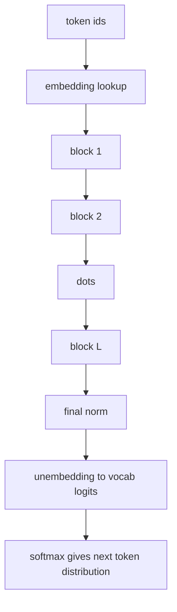
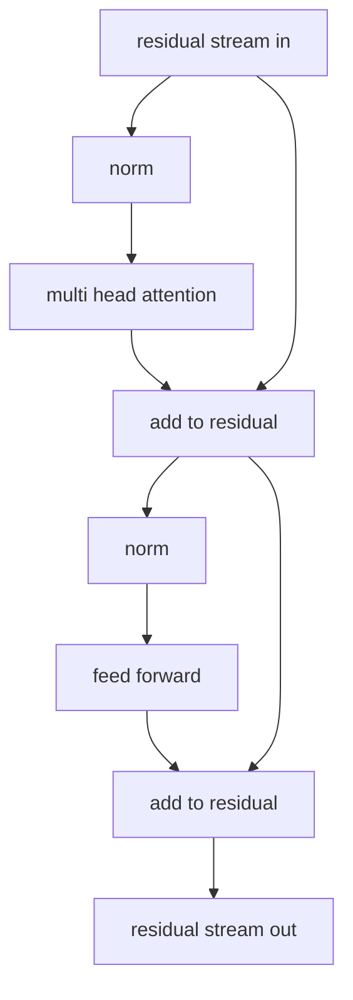
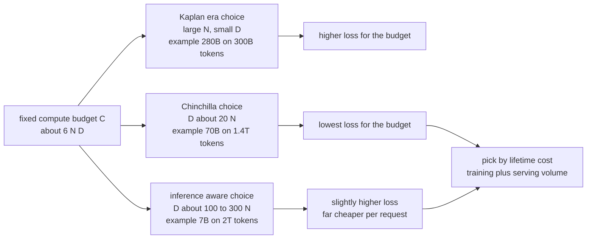
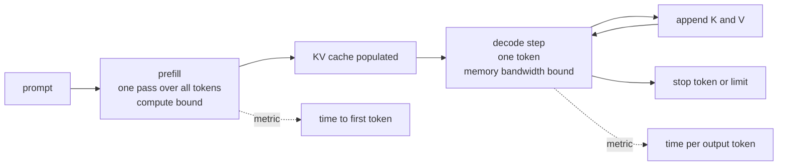
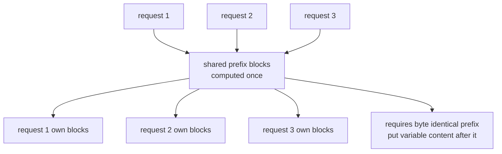
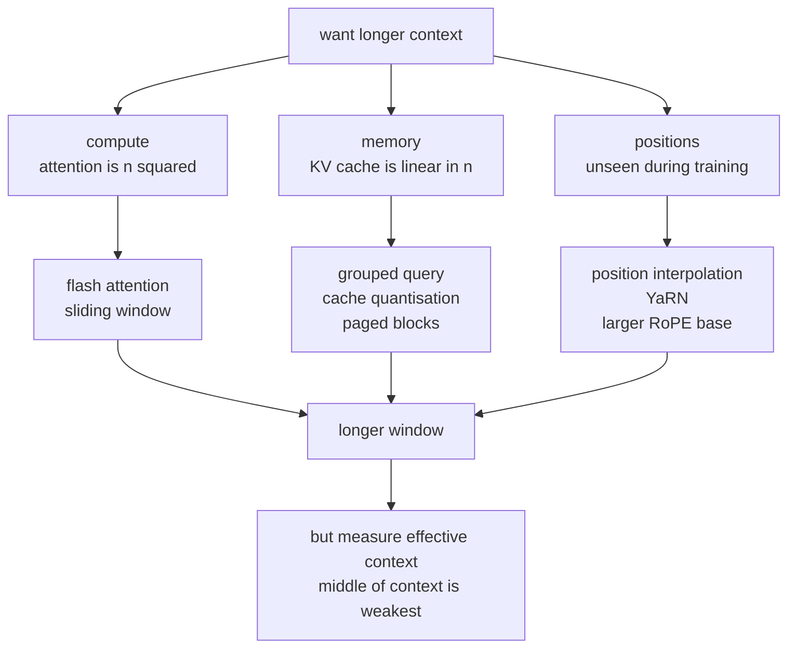

# Chapter 8: Transformers and Language Models

> **What this chapter covers** The transformer block assembled part by part, the three model families and what each is for, tokenisation and how it leaks into behaviour, pretraining objectives, the scaling relationships that decide how to spend a training budget, and the inference arithmetic that decides what a deployment costs.
>
> **Prerequisites** Chapter 6 (backpropagation, normalisation, AdamW, mixed precision), Chapter 7 (scaled dot-product attention, multi-head attention, positional encoding, masking).
>
> **Where it is used** Every language model product, retrieval and embedding systems, code assistants, and the multimodal models of Chapter 13. The memory and throughput arithmetic here determines serving cost, which is usually the dominant line item.

---

## 8.1 Level 1: Foundations

### 8.1.1 What a transformer is

A transformer is a stack of identical blocks. Each block does two things: let positions exchange information, then process each position independently. The first is attention. The second is a small feedforward network applied at every position with the same weights. Both are wrapped in residual connections and normalisation.

That is the whole architecture. The reason it displaced everything else is not conceptual elegance. It is that both operations are large dense matrix multiplications with no sequential dependency across positions during training, so a whole sequence trains in one parallel pass on hardware built for matrix multiplication. A recurrent network of the same quality needs $T$ sequential steps.

### 8.1.2 What a language model computes

A language model assigns a probability to a sequence of tokens. A causal, or autoregressive, language model factorises it by the chain rule of probability:

$$P(x_1, \dots, x_n) = \prod_{t=1}^{n} P(x_t \mid x_1, \dots, x_{t-1})$$

The model's job is the conditional $P(x_t \mid x_{<t})$, produced as a softmax over the vocabulary. Training maximises the log of this, which is minimising cross-entropy. Generation samples from it one token at a time, feeding each sample back in.

Two consequences follow immediately and explain a great deal of observed behaviour. The model is trained only to continue text, so everything else, including following instructions, is either an emergent consequence of the pretraining corpus or the result of a later alignment stage. And generation is inherently sequential, one token per forward pass, which is why inference is hard to make fast.

### 8.1.3 Tokens

A model does not see characters or words. It sees token identifiers, integers indexing a fixed vocabulary of typically 32,000 to 256,000 entries. A tokeniser maps text to those integers and back.

Tokens are usually subwords. Common words are a single token. Rare words split into pieces. This keeps the vocabulary finite while still representing any string. A useful rough figure for English text with a modern tokeniser is 1 token per 3.5 to 4 characters, so roughly 0.75 tokens per word. Treat that as an approximation to sanity-check budgets, and measure with the actual tokeniser when it matters.

### 8.1.4 The three families

| Family | Attention | Trained to | Good for |
| --- | --- | --- | --- |
| Encoder-only | Bidirectional, every token sees all | Fill in masked tokens | Classification, retrieval embeddings, token tagging |
| Decoder-only | Causal, each token sees the past | Predict the next token | Generation, and by now almost everything |
| Encoder-decoder | Bidirectional encoder, causal decoder with cross-attention | Map an input sequence to an output sequence | Translation, summarisation, structured transduction |



*Figure 8.1: The decoder-only language model as a whole, before opening any block.*

---

## 8.2 Level 2: Working knowledge

### 8.2.1 The block, assembled

A pre-norm decoder block computes:

$$\mathbf{x}' = \mathbf{x} + \mathrm{MHA}(\mathrm{Norm}(\mathbf{x}))$$
$$\mathbf{y} = \mathbf{x}' + \mathrm{FFN}(\mathrm{Norm}(\mathbf{x}'))$$

The original transformer used post-norm instead:

$$\mathbf{x}' = \mathrm{Norm}(\mathbf{x} + \mathrm{MHA}(\mathbf{x})), \qquad \mathbf{y} = \mathrm{Norm}(\mathbf{x}' + \mathrm{FFN}(\mathbf{x}'))$$

The difference is not cosmetic. In post-norm, the residual stream passes through a normalisation layer at every block, so the identity path is interrupted and the gradient is rescaled $L$ times. Deep post-norm transformers require careful warmup and often diverge without it. In pre-norm, the residual stream from input to output is an uninterrupted sum, so the gradient reaches every block without attenuation. Xiong et al. (2020) analysed this and showed pre-norm removes the need for warmup in theory, although warmup is still used in practice for the reasons in Chapter 6.

Pre-norm has a cost: the residual stream's magnitude grows across depth because each block adds to it without rescaling, which can push the final logits large. A final normalisation layer before the output projection fixes it, and every pre-norm implementation includes one. Some models use both, normalising before and after each sublayer, which is sometimes called sandwich norm and is used where stability at very large scale is the priority.



*Figure 8.2: The pre-norm block. The residual stream, left edge to right, is never interrupted by a normalisation layer.*

### 8.2.2 The feedforward block and gated variants

The classic feedforward network expands then contracts:

$$\mathrm{FFN}(\mathbf{x}) = W_2 \, \phi(W_1 \mathbf{x} + \mathbf{b}_1) + \mathbf{b}_2$$

with $W_1 \in \mathbb{R}^{d_{ff} \times d}$, $W_2 \in \mathbb{R}^{d \times d_{ff}}$, and $d_{ff} = 4d$ by convention. It holds two thirds of a standard transformer's parameters.

Gated linear unit variants (Shazeer, 2020) replace it with

$$\mathrm{SwiGLU}(\mathbf{x}) = \left( \mathrm{SiLU}(W_1 \mathbf{x}) \odot (W_3 \mathbf{x}) \right) W_2$$

Three matrices instead of two. One branch computes content, the other computes a multiplicative gate, and the elementwise product lets the layer suppress or pass features conditionally. To keep the parameter count equal, $d_{ff}$ is reduced from $4d$ to about $\frac{8}{3}d$, which is where the frequently seen 2.67 ratio comes from. SwiGLU is the default in most recent open-weight models. The empirical gain is real but modest, and Shazeer's paper is unusually honest in saying the reason is not understood.

### 8.2.3 Residual stream thinking

A productive way to read a transformer, due to Elhage et al. (2021): the residual stream is a communication channel of width $d$ running the full depth of the model. Every block *reads* from it via its normalisation and input projections, and *writes* to it by addition. Nothing is ever deleted, only added to.

This framing explains several observations. Attention heads in different layers can compose, one writing a feature the next reads. The model must budget the $d$ dimensions across all the information different blocks want to communicate, which is a real constraint and an argument for wider models. And because writes are additive, features are approximately superposed, which is why simple linear probes on hidden states often work.

### 8.2.4 Parameter counting, derived

For a decoder-only transformer with $L$ layers, model dimension $d$, feedforward dimension $d_{ff}$, and vocabulary $V$:

| Component | Parameters | Count |
| --- | --- | --- |
| Token embedding | $V \times d$ | $Vd$ |
| Attention per layer | $W^Q, W^K, W^V, W^O$, each $d \times d$ | $4d^2$ |
| Feedforward per layer, classic | $W_1$ is $d \times d_{ff}$, $W_2$ is $d_{ff} \times d$ | $2 d\, d_{ff}$ |
| Feedforward per layer, gated | three matrices | $3 d\, d_{ff}$ |
| Norms per layer | two gains of size $d$ | $2d$, negligible |
| Output projection | $d \times V$, often tied to the embedding | $Vd$ or 0 |

With $d_{ff} = 4d$ and classic feedforward, the per-layer cost is $4d^2 + 8d^2 = 12d^2$. Total:

$$P \approx 12 L d^2 + V d \, (1 \text{ or } 2)$$

**Worked example, a 7 billion parameter model.** Take $L = 32$, $d = 4096$, SwiGLU with $d_{ff} = 11008$, $V = 32000$, tied embeddings.

- Attention: $32 \times 4 \times 4096^2 = 2.147 \times 10^9$
- Feedforward: $32 \times 3 \times 4096 \times 11008 = 4.328 \times 10^9$
- Embedding: $32000 \times 4096 = 0.131 \times 10^9$
- Total: $6.61 \times 10^9$, so "7B" as commonly labelled.

Note the ratio. The feedforward blocks hold about 65 percent of the parameters and attention about 32 percent. Anyone claiming attention dominates a transformer's parameters is wrong; it dominates the *activation memory and the long-context compute*, which is a different claim.

**Training compute.** The widely used approximation, from Kaplan et al. (2020), is that training costs about $6ND$ floating point operations for $N$ parameters and $D$ tokens. The 6 decomposes as 2 for the forward multiply-accumulate, 2 for the input gradient, and 2 for the weight gradient. It ignores attention's quadratic term, which is a good approximation while $d \gg n$ and a bad one for long contexts.

**Worked example.** Training a 7B model on 2 trillion tokens: $6 \times 6.6\times10^9 \times 2\times10^{12} = 7.9 \times 10^{22}$ FLOPs. At an assumed sustained 400 teraFLOP per second per accelerator, that is $1.98\times10^8$ seconds of single-accelerator time, about 55,000 accelerator-hours, or about 2300 accelerator-days. Treat the 400 teraFLOP figure as an assumption to substitute with your measured throughput.

### 8.2.5 The three families in detail

**Encoder-only.** BERT (Devlin et al., 2019) stacks bidirectional blocks and trains with masked language modelling. Every token attends to every other token, so the representation of token $i$ is informed by the entire sequence. That makes it excellent for producing a single vector representing a document, which is why retrieval embedding models are almost all encoder-only. It cannot generate, because there is no ordering to sample along.

**Decoder-only.** GPT (Radford et al., 2018, 2019; Brown et al., 2020) stacks causal blocks. The causal mask means the loss at every position is a valid prediction task, so one forward pass over a sequence of length $n$ yields $n$ training signals. Masked language modelling, by contrast, only trains on the masked 15 percent. That efficiency argument is a large part of why decoder-only won.

**Encoder-decoder.** T5 (Raffel et al., 2020) and the original transformer. The encoder produces bidirectional representations of the input, the decoder generates while attending to its own past through self-attention and to the encoder output through cross-attention. It is the right shape when input and output are distinct objects, and it lets the input be processed bidirectionally, which is a genuine advantage for translation and summarisation. It costs more parameters for the same depth and complicates serving.

### 8.2.6 Embeddings, tying, and the output head

The input embedding is a lookup table of shape $V \times d$. Row $i$ is the vector for token $i$. The output head is a projection of shape $d \times V$ producing a logit per vocabulary entry, followed by a softmax.

**Weight tying** (Press and Wolf, 2017; Inan et al., 2017) uses the same matrix for both, transposed. It saves $Vd$ parameters, which for a small model is substantial: at $V = 32000$ and $d = 2048$ that is 66 million parameters, a meaningful fraction of a 1 billion parameter model. It also regularises, because a token's input and output representations are forced to agree. Large models increasingly untie them, since $Vd$ is a small fraction of the total and untying gives measurably better results. Check a model's configuration rather than assuming.

Three practical points about the output head.

The softmax over $V$ entries is one of the most expensive single operations at small model sizes. At $V = 128000$ and $d = 4096$ the output projection is $5.2 \times 10^8$ multiply-accumulates per token, comparable to several transformer layers. This is why very large vocabularies are not free even though the embedding lookup itself is.

Logit processing happens between the head and the sampler, and the order matters: apply logit biases and penalties, then temperature, then truncation by top-k or top-p, then the softmax and the draw. Applying temperature after truncation changes which tokens were eligible and is a common implementation bug.

Structured output is implemented here too. Constraining generation to a grammar or a JSON schema is done by masking the logits of tokens that cannot continue a valid string, which is exact and costs almost nothing, rather than by asking the model politely in the prompt. Chapter 16 covers the tooling.

### 8.2.7 Tokenisation

**Byte-pair encoding** (Sennrich, Haddow and Birch, 2016, adapting Gage 1994). Start with a vocabulary of individual characters or bytes. Count all adjacent pairs in the corpus. Merge the most frequent pair into a new symbol. Repeat until the vocabulary reaches the target size. The learned merge list is the tokeniser. Encoding applies the merges in learned order.

**Listing 8.1: byte-pair encoding training, the core loop.**

```python
from collections import Counter

def train_bpe(word_freqs, num_merges):
    # word_freqs: {("l","o","w","</w>"): 5, ...}
    vocab = {tuple(w): c for w, c in word_freqs.items()}
    merges = []
    for _ in range(num_merges):
        pairs = Counter()
        for symbols, freq in vocab.items():
            for i in range(len(symbols) - 1):
                pairs[(symbols[i], symbols[i + 1])] += freq
        if not pairs:
            break
        best = max(pairs, key=pairs.get)
        merges.append(best)
        merged = {}
        for symbols, freq in vocab.items():
            out, i = [], 0
            while i < len(symbols):
                if i < len(symbols) - 1 and (symbols[i], symbols[i + 1]) == best:
                    out.append(symbols[i] + symbols[i + 1]); i += 2
                else:
                    out.append(symbols[i]); i += 1
            merged[tuple(out)] = freq
        vocab = merged
    return merges
```

The merge order is the model. Applying merges in a different order gives different tokens for the same text. Production implementations operate on raw bytes rather than Unicode characters, which guarantees no input is ever unrepresentable and eliminates the unknown token entirely. Check your library version for whether a pre-tokenisation regex splits on whitespace and punctuation first; most do, and it changes the result.

**Alternatives.** WordPiece (Schuster and Nakajima, 2012; used in BERT) merges the pair that most increases corpus likelihood rather than the most frequent pair. Unigram language model (Kudo, 2018) starts from a large vocabulary and prunes, and it can produce several segmentations of the same string with probabilities, enabling subword regularisation. SentencePiece (Kudo and Richardson, 2018) is the implementation that treats the input as a raw stream including spaces, so detokenisation is exact and lossless, which matters for languages without whitespace.

**Vocabulary size trade-offs.**

| Larger vocabulary | Smaller vocabulary |
| --- | --- |
| Fewer tokens per document, so cheaper inference and longer effective context | More tokens per document |
| Larger embedding and output matrices, more parameters spent on rarely used rows | Fewer embedding parameters |
| Output softmax is more expensive | Cheaper softmax |
| Better coverage of non-English languages and code | Non-English text fragments into many tokens |

The trend has been upward, from 32,000 to 128,000 or more, driven mostly by multilingual coverage. Tao et al. (2024) and related scaling work argue that the compute-optimal vocabulary grows with model size and that smaller models are typically given vocabularies that are too large relative to their parameter count.

**How tokenisation shows up as behaviour.** This is the part engineers underestimate.

- Arithmetic is hard partly because numbers tokenise inconsistently. "1234" may be one token while "1235" is two. Several model families now force digit-by-digit splitting for this reason.
- Character-level tasks such as counting letters in a word are hard because the model never sees letters, only a token identifier.
- Rhyming and spelling manipulation are unreliable for the same reason.
- Prompts in languages that tokenise poorly cost more and effectively get a shorter context.
- Trailing whitespace changes tokenisation and can measurably change output, which is why many chat templates are strict about it.
- Rare tokens that appeared in the tokeniser corpus but almost never in training data have nearly untrained embeddings and can produce erratic output. The "SolidGoldMagikarp" class of behaviours documented by Rumbelow and Watkins (2023) is this effect.

---

## 8.3 Level 3: Depth

### 8.3.1 Pretraining objectives

| Objective | Mechanism | Signal per token | Produces |
| --- | --- | --- | --- |
| Causal language modelling | Predict token $t$ from tokens before $t$ | 100 percent of positions | A generator; representations that are good but backward-looking |
| Masked language modelling | Replace 15 percent of tokens with a mask, predict them from both sides | About 15 percent | Strong bidirectional representations; cannot generate |
| Span corruption | Replace contiguous spans with sentinel tokens, generate the spans | Moderate | A sequence-to-sequence model; forces multi-token planning |
| Prefix language modelling | Bidirectional over a prefix, causal after | Partial | A middle ground used in some unified models |
| Fill in the middle | Reorder a document into prefix, suffix, middle and predict the middle causally | 100 percent | Causal model that can also infill, used for code completion |

Masked language modelling has a train-inference mismatch worth naming: the mask token appears during training and never at inference. BERT mitigated this by replacing the chosen 15 percent as 80 percent mask, 10 percent random token, 10 percent unchanged. RoBERTa (Liu et al., 2019) later showed BERT was significantly undertrained and that removing the next-sentence-prediction objective and training longer with dynamic masking improved results substantially, which is a good reminder that objective comparisons are confounded by training budget.

Fill in the middle (Bavarian et al., 2022) is a clean trick: a purely causal model gains infilling ability with no architecture change, purely by a document-level reordering applied to some fraction of training data.

### 8.3.2 The pretraining data pipeline

The objective is only half of pretraining. The corpus is the other half, and it moves results more than most architecture choices do.

| Stage | What it does | Why it matters |
| --- | --- | --- |
| Extraction | Pull text from web archives, books, code, and reference corpora | Boilerplate, navigation text and markup dominate raw web crawl |
| Language identification | Keep the target languages | A multilingual mix must be chosen deliberately, not inherited |
| Quality filtering | Heuristic rules on length, symbol ratio, repetition, plus a classifier | Heuristics catch most of the damage; classifiers trained to recognise reference-quality text catch more |
| Deduplication | Exact hashing, then near-duplicate detection with MinHash and locality-sensitive hashing | The single highest-value step |
| Decontamination | Remove documents overlapping evaluation sets | Without it, benchmark numbers are meaningless |
| Mixing | Choose weights per source and per epoch | Code improves reasoning benchmarks; the mix is a tuned decision |

Deduplication deserves emphasis. Lee et al. (2022) showed that web corpora contain large volumes of near-duplicate text, that deduplicating reduces memorised verbatim output by roughly an order of magnitude, and that models trained on deduplicated data reach the same or better quality with fewer steps. Duplicated documents also inflate the effective epoch count for that content, which interacts badly with the data-repetition limits described below.

Documents are packed into fixed-length training sequences. Two choices matter. Concatenating documents with a separator token and slicing at the sequence boundary wastes nothing but lets attention run across unrelated documents, which is usually prevented by resetting the attention mask at document boundaries. Padding each document to the sequence length wastes compute in proportion to the length variance. Best-fit packing algorithms get most of the efficiency of concatenation with none of the cross-contamination.

### 8.3.3 Scaling relationships

Kaplan et al. (2020) fitted power laws relating cross-entropy loss $L$ to parameters $N$, data $D$, and compute $C$, each holding the others non-limiting:

$$L(N) \approx \left(\frac{N_c}{N}\right)^{\alpha_N}, \qquad L(D) \approx \left(\frac{D_c}{D}\right)^{\alpha_D}$$

with exponents around 0.076 and 0.095 respectively in their setting. The practical content is that loss improves smoothly and predictably over many orders of magnitude, with no sign of a wall, and that you can predict a large run's loss from small runs.

Hoffmann et al. (2022), the Chinchilla paper, asked the compute-optimal question: given a fixed budget $C \approx 6ND$, how should you split it between $N$ and $D$? Their answer, from three independent estimation methods, was that $N$ and $D$ should scale roughly equally, giving approximately 20 tokens per parameter. This contradicted Kaplan's earlier recommendation, which favoured larger models, and the discrepancy was later attributed largely to the learning rate schedule used in the earlier work.

They demonstrated it by training Chinchilla, 70 billion parameters on 1.4 trillion tokens, which outperformed Gopher at 280 billion parameters on 300 billion tokens, using the same compute.

$$N_{\text{opt}} \propto C^{0.5}, \qquad D_{\text{opt}} \propto C^{0.5}, \qquad D_{\text{opt}} \approx 20 N_{\text{opt}}$$

**Worked example.** Budget $C = 10^{23}$ FLOPs. From $C = 6ND$ and $D = 20N$: $10^{23} = 120N^2$, so $N = \sqrt{8.33\times10^{20}} = 2.9\times10^{10}$. A 29 billion parameter model on 580 billion tokens.

**Why practice now over-trains small models.** Chinchilla optimises training cost alone. It ignores inference entirely. If a model will serve billions of requests, total lifetime cost is training plus inference, and inference cost scales with $N$ but not with $D$. Training a smaller model on far more tokens than Chinchilla-optimal costs more to train and less to run, and past a modest deployment volume that trade is strongly favourable. Sardana et al. (2024) formalised this as inference-aware scaling laws. This is why open models are routinely trained at 100 to 300 tokens per parameter, 5 to 15 times past the Chinchilla point, with loss still decreasing, if slowly.

Two caveats to state clearly. The exponents are dataset-dependent, and repeated data has diminishing value; Muennighoff et al. (2023) found roughly 4 epochs of repetition is nearly as good as fresh data and beyond about 16 epochs the value approaches zero. And the loss being predicted is cross-entropy on held-out text, which is not the same as downstream task performance.



*Figure 8.3: Compute-optimal training sits on the diagonal; serving economics pushes deployed models down and to the right.*

### 8.3.4 Inference and the key-value cache

Generation is autoregressive. To produce token $t+1$ the model needs attention over all previous keys and values. Recomputing them each step is $O(n^2)$ work repeated $n$ times. Instead, cache them.

Memory for the cache:

$$M_{\text{KV}} = 2 \times L \times n \times d_{\text{kv}} \times b \times B$$

where the 2 is for keys and values, $L$ is layers, $n$ is sequence length, $d_{\text{kv}}$ is the total key or value dimension (heads times head dimension), $b$ is bytes per element, and $B$ is batch size.

**Worked example.** A 7B model: $L = 32$, 32 heads of dimension 128 so $d_{\text{kv}} = 4096$, float16 so $b = 2$, one sequence of 4096 tokens.

$$M_{\text{KV}} = 2 \times 32 \times 4096 \times 4096 \times 2 \times 1 = 2.15 \times 10^9 \text{ bytes} = 2.0 \text{ GiB}$$

The weights are 13 GB in float16. So at batch 1 and 4096 tokens the cache is already 15 percent of the weight memory. At batch 32 it is 64 GiB, five times the weights. **The cache, not the weights, is what limits serving batch size, and therefore throughput.** This single fact drives grouped-query attention, paged attention, and cache quantisation.

### 8.3.5 Prefill and decode

Inference has two phases with completely different performance characteristics.

**Prefill** processes the entire prompt in one pass. Every token is available, so the work is large matrix-matrix multiplications. It is compute bound and achieves high hardware utilisation.

**Decode** produces one token per step. The matrix multiplications become matrix-vector products, so for each parameter read from memory only about two floating point operations are performed. Arithmetic intensity is about 2 operations per 2 bytes, which is far below the ratio at which modern accelerators become compute bound, typically several hundred. Decode is memory-bandwidth bound.

**Worked example.** Decoding one token from a 7B model in float16 requires reading roughly 13 GB of weights. At an assumed 2 TB per second of memory bandwidth, that is 6.5 milliseconds, giving an upper bound of about 154 tokens per second for a single sequence, regardless of how much compute the accelerator has. The only way to improve throughput per unit of bandwidth is to amortise the weight read over more sequences, which is batching, or to read fewer bytes, which is quantisation.



*Figure 8.4: Prefill and decode have different bottlenecks and different user-visible metrics.*

### 8.3.6 Sampling strategies

The model outputs a distribution. How you draw from it is a separate decision with large behavioural consequences.

**Temperature.** Divide logits by $T$ before the softmax:

$$p_i = \frac{\exp(z_i / T)}{\sum_j \exp(z_j / T)}$$

$T < 1$ sharpens, $T > 1$ flattens, $T \to 0$ is greedy argmax. Note that temperature does not change the ranking of tokens, only the relative probabilities.

**Top-k** (Fan, Lewis and Dauphin, 2018). Keep the $k$ highest-probability tokens, renormalise, sample. The flaw is that $k$ is fixed while the shape of the distribution is not. When the model is confident, a fixed $k$ admits tokens with negligible probability. When it is uncertain, $k$ truncates reasonable options.

**Nucleus, or top-p** (Holtzman et al., 2020). Keep the smallest set of tokens whose cumulative probability reaches $p$, typically 0.9 to 0.95. The set size adapts to the distribution's entropy, which is exactly what top-k fails to do. This is the standard default.

**Min-p.** Keep tokens with probability at least $p_{\min}$ times the top token's probability. A simpler adaptive rule that behaves well at high temperature.

**Repetition and presence penalties.** Subtract a value from the logits of already-generated tokens. Useful for small models, and a blunt instrument: it penalises legitimately repeated words like names and articles too. Prefer no-repeat-ngram constraints or a better model.

Practical defaults: for factual or code generation use temperature 0, that is greedy, or very low temperature with top-p 1. For creative text use temperature 0.7 to 1.0 with top-p 0.9. Note that greedy decoding is not fully deterministic across batch sizes or hardware, because floating point reduction order changes and can flip near-ties.

**Beam search and why it is wrong here.** Beam search keeps the $B$ highest-scoring partial sequences and expands each, approximating the maximum-likelihood output sequence. It is right for translation and summarisation, where there is a correct answer and the model's likelihood correlates with it.

For open-ended generation it fails, and the reason is measurable. Holtzman et al. (2020) showed that human text does not occupy the high-probability region of the model's distribution. Human writing varies in per-token surprise; maximum-likelihood text does not. Beam search therefore produces text that is bland and repetitive, often degenerating into loops. The problem is not the search. The search works. The objective is wrong: the most likely sequence is not the most human-like one.

### 8.3.7 Speculative decoding

Since decode is memory bound, the accelerator is idle most of the time. Speculative decoding (Leviathan, Kalman and Matias, 2023; Chen et al., 2023) exploits that.

A small draft model proposes $\gamma$ tokens autoregressively, which is cheap. The large target model then scores all $\gamma$ proposed tokens in a single forward pass, which costs about the same as generating one token because it is memory bound. A rejection-sampling acceptance rule accepts a prefix of the proposals and resamples the first rejected position from an adjusted distribution.

The acceptance rule is what makes it exact. For a proposed token $x$ with draft probability $q(x)$ and target probability $p(x)$: accept with probability $\min(1, p(x)/q(x))$; on rejection, sample from the normalised positive part $\max(0, p(x) - q(x))$. The resulting output distribution is provably identical to sampling from the target model alone. This is not an approximation, and that is why it is safe to deploy.

Speedup depends on the acceptance rate $\alpha$. With $\gamma$ drafted tokens, the expected accepted count per target pass is $(1-\alpha^{\gamma+1})/(1-\alpha)$. At $\alpha = 0.8$ and $\gamma = 4$: $(1 - 0.8^5)/0.2 = (1-0.328)/0.2 = 3.36$ tokens per target forward pass, before subtracting draft cost. Realised speedups of 2 to 3 times are typical.

Variants avoid the separate draft model: Medusa (Cai et al., 2024) adds extra prediction heads to the target model; EAGLE (Li et al., 2024) drafts in feature space; n-gram or prompt-lookup decoding drafts by copying from the prompt, which works remarkably well for summarisation and code editing where output overlaps input.

### 8.3.8 Batching, and why it is the main throughput lever

Because decode reads the weights once per step regardless of how many sequences are in flight, adding sequences to a batch is close to free until you become compute bound. A batch of 32 decodes roughly 32 times the tokens per second of a batch of 1, at nearly the same per-step latency.

Naive static batching wastes most of that. A batch must wait for its slowest member, so if one sequence generates 1000 tokens and the rest generate 20, the accelerator runs at one thirty-second of its capacity for the remaining 980 steps.

**Continuous batching**, also called iteration-level scheduling, fixes it. After every decode step the scheduler evicts finished sequences and admits waiting ones, so the batch is refilled continuously. Yu et al. (2022) introduced it as Orca, and it is now standard in serving stacks. Reported throughput gains over static batching are large, often several times, and the exact figure depends entirely on the variance of output lengths in your traffic.

**Chunked prefill.** A long prompt's prefill occupies the accelerator for many milliseconds, during which every in-flight sequence's decoding stalls, which shows up as latency spikes for other users. Splitting the prefill into chunks and interleaving them with decode steps smooths it. The trade is a small loss of prefill efficiency for a large improvement in tail latency.

The metrics to hold separate:

| Metric | Driven by | Improve by |
| --- | --- | --- |
| Time to first token | Prefill compute, queueing, prompt length | Chunked prefill, prefix caching, shorter prompts |
| Time per output token | Memory bandwidth, batch size | Quantisation, grouped-query attention, speculative decoding |
| Throughput in tokens per second per accelerator | Achievable batch size | Cache reduction, continuous batching, paged allocation |
| Cost per million tokens | Throughput and hardware price | All of the above |

These trade against each other. Raising the batch improves throughput and worsens time per output token for each individual user. Any serving decision has to name which of these is the target.

### 8.3.9 Grouped-query and multi-query attention

The key-value cache scales with the number of key and value heads. Reduce them.

**Multi-head attention**: $H$ query heads, $H$ key-value heads. **Multi-query attention** (Shazeer, 2019): $H$ query heads, 1 key-value head shared by all. **Grouped-query attention** (Ainslie et al., 2023): $H$ query heads, $G$ key-value heads, each shared by $H/G$ query heads.

**Worked example.** The 7B configuration above with 32 query heads and 8 key-value groups. Cache memory falls by a factor of 4, from 2.0 GiB to 0.5 GiB at 4096 tokens. The same memory budget now serves 4 times the batch, and decode reads 4 times fewer cache bytes per step. Quality loss measured by Ainslie et al. was small, and much smaller than the loss from full multi-query. Grouped-query attention with $G = 8$ is now close to universal in models above about 7 billion parameters.

### 8.3.10 Quantisation, enough to choose a format

Quantisation stores weights, and sometimes activations and cache, in fewer bits. Since decode is bandwidth bound, halving the bytes read roughly halves decode time.

Affine quantisation maps a float range to integers:

$$q = \mathrm{round}\!\left(\frac{x}{s}\right) + z, \qquad \hat{x} = s(q - z)$$

with scale $s$ and zero point $z$. Granularity matters more than most people expect: per-tensor scales are cheap and lossy; per-channel or per-group scales, typically one scale per 64 or 128 weights, cost little and recover most of the quality.

| Format | Bits | Approach | Typical quality cost | Use when |
| --- | --- | --- | --- | --- |
| bf16 or fp16 | 16 | None | Reference | Training, and serving when memory is free |
| fp8 | 8 | Native hardware format on recent accelerators | Very small | Serving on hardware with fp8 tensor cores |
| INT8 weight and activation | 8 | Calibrated, with outlier handling as in LLM.int8() | Small | Broad hardware support |
| GPTQ, 4 bit | 4 | Post-training, second-order error compensation per layer | Small to moderate | Weight-only serving, needs a calibration set |
| AWQ, 4 bit | 4 | Protects salient channels identified by activation magnitude | Small | Similar, often better at low group size |
| GGUF k-quants | 2 to 8 | Mixed per-block bit allocation | Varies; below 4 bits degrades visibly | Local and CPU inference |
| NF4 | 4 | Information-theoretically motivated for normal weights | Small, used in QLoRA | Fine-tuning under memory pressure |

Two structural facts. Activation outliers are the hard part: Dettmers et al. (2022) found that in models above about 6.7 billion parameters, a small number of feature dimensions carry values 20 or more times larger than the rest, and quantising them naively destroys the model. LLM.int8() keeps those dimensions in 16 bit. SmoothQuant (Xiao et al., 2023) instead shifts difficulty from activations to weights by rescaling. And weight-only quantisation is the common choice for serving because it directly reduces the bytes read during decode without needing activation calibration.

Practical rule: 8 bit is nearly free. 4 bit with a good method and per-group scales costs little on most tasks and should be measured on yours. Below 4 bit, expect real degradation, concentrated on reasoning and long-context tasks rather than on fluency, which means casual inspection will not reveal it. Chapter 24 covers deployment; the companion handbook at `D:\Project\handbook\`, chapter 12, derives the quantisation methods.

### 8.3.11 The memory arithmetic of serving

Total memory equals weights plus cache plus activations plus framework overhead.

$$M_{\text{total}} = P \cdot b_w + 2 L n B d_{\text{kv}} b_{\text{kv}} + M_{\text{act}} + M_{\text{overhead}}$$

**Worked example, sizing a deployment.** Serve a 7B model with grouped-query attention, $G = 8$ so $d_{\text{kv}} = 1024$, on an accelerator with 80 GB, using 4-bit weights and float16 cache, at a context of 8192 tokens.

- Weights: $6.6\times10^9 \times 0.5$ bytes $= 3.3$ GB.
- Reserve 6 GB for activations, framework, and fragmentation. That is an assumption; measure it.
- Available for cache: $80 - 3.3 - 6 = 70.7$ GB.
- Cache per sequence: $2 \times 32 \times 8192 \times 1024 \times 2 = 1.07 \times 10^9$ bytes $= 1.0$ GiB.
- Maximum concurrent sequences: about 66.

Without grouped-query attention the cache per sequence would be 4.0 GiB and the answer would be about 17. With float16 weights instead of 4-bit, subtract another 10 GB from the cache budget. These three numbers, 17, 66, and the effect of weight precision, are the substance of most serving capacity conversations.

Fragmentation is the remaining problem. Allocating a contiguous block per sequence at the maximum length wastes most of it, since real sequences vary. PagedAttention (Kwon et al., 2023), the mechanism in vLLM, stores the cache in fixed-size blocks with an indirection table, exactly like virtual memory paging. It reports reducing waste to a few percent and allows sharing blocks between sequences with a common prefix, which makes system prompts nearly free across a batch.

---

### 8.3.12 Prefix caching and the cost of a system prompt

If many requests share a leading prefix, such as a system prompt, a few-shot block, or a document being asked several questions, the key-value entries for that prefix are identical across them. Computing them once and reusing them removes that prefill work entirely.

Two mechanisms. **Prefix caching** stores the cache blocks for a hashed prefix and reuses them on a hit. **Copy-on-write block sharing**, which paged allocation makes cheap, lets several concurrent sequences point at the same physical blocks until they diverge.

**Worked example.** A 2000-token system prompt, 100 requests per second, each with a 50-token user message. Without prefix caching, prefill processes $100 \times 2050 = 205{,}000$ tokens per second. With it, the shared 2000 tokens are computed once and the steady-state prefill load is $100 \times 50 = 5000$ tokens per second, a 41-fold reduction in prefill work. Time to first token falls correspondingly. This is usually the single largest available win in a chat deployment, and it costs nothing in quality because the computation is identical.

Two conditions. The prefix must be byte-identical, so any per-request content such as a timestamp or a user identifier must come *after* the shared block, not before it. And cached blocks consume the same memory that would otherwise hold in-flight sequences, so the cache needs an eviction policy and a size budget.



*Figure 8.6: Shared prefix blocks under paged allocation remove repeated prefill for a common system prompt.*

## 8.4 Level 4: Mastery

### 8.4.1 Context length, and what actually limits it

Three separate limits, often conflated.

**Compute.** Attention is $O(n^2)$ in sequence length. At $n = 4096$ and $d = 4096$, attention is a modest fraction of the forward pass; at $n = 128{,}000$ it dominates completely.

**Memory.** The key-value cache is linear in $n$ and, without grouped-query attention or quantisation, becomes the binding constraint well before compute does.

**Position generalisation.** The model was trained with positions up to some maximum. Beyond that, positional encodings take values never seen, and the model fails abruptly rather than gracefully.

**Extending positions.** With RoPE, the frequencies are $\theta_j = \text{base}^{-2j/d}$. Three approaches:

- **Position interpolation** (Chen et al., 2023). Scale positions down by $L_{\text{new}}/L_{\text{old}}$ so they fall inside the trained range. Requires brief fine-tuning. Loses resolution on fine positional distinctions.
- **NTK-aware scaling and YaRN** (Peng et al., 2023). Interpolate the low-frequency components, which encode long-range position, while leaving high-frequency components alone, which preserves local ordering. Works better, and with less fine-tuning, than uniform interpolation.
- **Base frequency increase.** Raise the RoPE base from 10,000 to a much larger value, then continue pretraining on long documents. Simple, and what several production long-context models did. Xiong et al. (2023) analysed the choice.

**Degradation before the window is full.** A context window of 128,000 tokens does not mean the model uses 128,000 tokens. Liu et al. (2024), "Lost in the Middle", showed a U-shaped accuracy curve: information at the beginning and end of the context is retrieved far more reliably than information in the middle, with the gap large enough to change system design. Needle-in-a-haystack retrieval is also a weak test, because finding one distinctive string is much easier than reasoning over dispersed facts. Benchmarks such as RULER (Hsieh et al., 2024) show effective context is frequently a fraction of advertised context.

Engineering consequences: put the most important material at the start or the end of the prompt; do not assume more context beats retrieval; and measure effective context on your own task rather than trusting the specification.



*Figure 8.5: The three independent limits on context length and the mitigation for each.*

### 8.4.2 Mixture of experts, briefly

A mixture-of-experts transformer replaces the feedforward block in some layers with $E$ parallel feedforward blocks and a router that sends each token to $k$ of them, usually $k = 1$ or 2. Total parameters grow with $E$ while the compute per token grows only with $k$. Shazeer et al. (2017) introduced the sparsely gated form, and Fedus, Zoph and Shazeer (2022) simplified it to top-1 routing in Switch Transformer.

The arithmetic is the appeal. A model with 8 experts and top-2 routing has roughly 8 times the feedforward parameters of a dense model at the same width but performs only 2 times the feedforward compute per token. Quality tracks total parameters more closely than active parameters, so the trade is favourable for training cost and for the compute-bound prefill phase.

Three things it does not fix, and this is where engineers are surprised. All experts must be resident in memory even though each token uses two, so memory footprint tracks total parameters and the serving memory bill is that of the large model. Load balancing is a real problem: without an auxiliary loss encouraging even expert usage, the router collapses onto a few experts. And routing introduces an all-to-all communication pattern across devices when experts are sharded, which is bandwidth-intensive and makes deployment considerably harder than a dense model of equal quality.

The honest summary: mixture of experts buys training efficiency and prefill throughput, and does not buy a smaller memory footprint.

### 8.4.3 In-context learning

A pretrained model performs a task from examples in the prompt, with no parameter update. Brown et al. (2020) demonstrated it at scale and named few-shot prompting.

The mechanism is genuinely open. Competing accounts:

- **Task location.** Min et al. (2022) found that replacing demonstration labels with random ones barely hurts performance on many classification tasks, while the input distribution, the label space, and the format all matter a great deal. This suggests the examples mostly tell the model which task to perform, rather than teaching the mapping.
- **Implicit gradient descent.** Von Oswald et al. (2023) showed that a linear attention layer can implement a step of gradient descent on an in-context regression problem, and that trained transformers on such tasks behave similarly. It is a real mechanism, demonstrated in a restricted setting, not a proof about large models.
- **Induction heads.** Olsson et al. (2022) identified a two-head circuit that finds a previous occurrence of the current token and copies what followed it. The formation of these heads coincides with a sharp drop in loss and with the onset of in-context learning ability, which is the strongest mechanistic evidence available.

All three are probably partially right for different task types. Say so rather than picking one.

### 8.4.4 Emergence, stated carefully

Wei et al. (2022) reported abilities that are near chance at small scale and rise sharply past a threshold, calling them emergent.

Schaeffer, Miranda and Koyejo (2023) argued these are substantially an artifact of the metric. An exact-match metric on a multi-step task is a step function of the underlying continuous improvement: getting 4 of 5 digits right scores zero. Replace exact match with per-token accuracy or log likelihood and the same runs show smooth improvement. Their paper shows emergence appearing and disappearing under metric changes on the same model outputs.

The careful statement: predicted cross-entropy loss improves smoothly and predictably with scale. Some downstream metrics improve discontinuously, and that discontinuity is often a property of the metric rather than of the model. Whether any genuine phase transition in capability exists is unresolved.

Why an engineer should care. If your evaluation uses exact match on a multi-step task, a real improvement will be invisible until it crosses the threshold, and you will wrongly conclude a change did nothing. Use graded metrics alongside binary ones. Chapter 5 covers the measurement protocol.

### 8.4.5 Where standard advice is wrong

| Standard advice | When it is wrong |
| --- | --- |
| Chinchilla says 20 tokens per parameter | That minimises training compute only. With meaningful serving volume, train smaller models far longer. |
| A bigger context window removes the need for retrieval | Effective context is shorter than advertised, middle-of-context recall is weak, and cost is linear or worse in prompt length. Retrieval is usually cheaper and more accurate. |
| Beam search improves quality | For open-ended generation it produces bland, repetitive text, because high-likelihood sequences are not human-like. |
| Temperature 0 is deterministic | Floating point reduction order varies with batch size and kernel choice, so near-ties can flip. Reproducibility requires fixing far more than the seed. |
| 4-bit quantisation is nearly lossless | It is close on perplexity and fluency, and degrades measurably on long-context and multi-step reasoning. Evaluate on your task, not on perplexity. |
| Parameter count tells you the serving cost | At realistic batch sizes the key-value cache dominates memory, and decode is bandwidth bound, so architecture details such as the number of key-value heads matter as much as $N$. |
| Emergent abilities show a phase transition | Much of the reported discontinuity comes from discontinuous metrics (Schaeffer et al., 2023). |
| More attention heads means better quality | Heads are prunable, and grouped-query attention shares key-value heads with little loss while cutting cache by a large factor. |

---

### 8.4.6 Open problems

**Why gated feedforward variants work.** SwiGLU's advantage is reproducible and unexplained. The original paper says so directly.

**Whether tokenisation can be removed.** Byte-level and patch-level models (Xue et al., 2022 for ByT5; Yu et al., 2023 for MegaByte) avoid tokenisation entirely and remove a whole class of failure modes, at a cost in sequence length that has so far kept them out of frontier systems. Whether a hierarchical byte model eventually wins is open.

**Predicting downstream capability from loss.** Scaling laws predict cross-entropy accurately and downstream task performance poorly. Deciding whether a training run is worth its budget therefore still rests on extrapolating a quantity that is not the one you care about.

**The data wall.** Compute-optimal training at current growth rates requires more high-quality text than is readily available, and repeated data saturates after roughly four epochs (Muennighoff et al., 2023). Whether synthetic data extends the curve or introduces a self-reinforcing distribution shift is actively contested; Shumailov et al. (2024) documented degradation from training repeatedly on model-generated output, though under assumptions that do not match careful curation practice.

**What in-context learning is.** Three partially supported mechanisms, described above, with no unified account.

## 8.5 Subtopic checklist

| Subtopic | You should be able to |
| --- | --- |
| Transformer block | Write pre-norm and post-norm and explain the gradient-path difference |
| Feedforward and gated variants | Write SwiGLU and explain the $\frac{8}{3}d$ ratio |
| Residual stream | Explain the read-write framing and what it predicts |
| Parameter counting | Derive $12Ld^2 + Vd$ and apply it to a real configuration |
| Training compute | Apply $6ND$ and state what it ignores |
| Model families | Choose encoder-only, decoder-only or encoder-decoder from a task description |
| Byte-pair encoding | Describe the merge algorithm and why merge order is the model |
| Tokeniser alternatives | Contrast BPE, WordPiece, Unigram and SentencePiece |
| Vocabulary size | State both sides of the trade-off |
| Tokenisation artifacts | Name four model behaviours caused by tokenisation |
| Pretraining objectives | Compare signal density and what each objective produces |
| Scaling laws | Compute the compute-optimal split for a given budget |
| Inference-aware scaling | Explain why deployed models are over-trained relative to Chinchilla |
| KV cache | Compute cache memory for a given configuration and batch |
| Prefill and decode | Explain which is compute bound, which is bandwidth bound, and the user metric for each |
| Sampling | Contrast temperature, top-k, top-p and min-p, and say when each fits |
| Beam search | Explain why maximum likelihood is the wrong objective for open-ended text |
| Speculative decoding | State the acceptance rule and compute the expected speedup |
| Grouped-query attention | Compute the cache reduction from a group count |
| Quantisation | Choose a format from a constraint and name the outlier problem |
| Serving arithmetic | Size a deployment for concurrency from a memory budget |
| Context length | Name the three limits and a mitigation for each |
| In-context learning | Give three candidate mechanisms with their evidence |
| Emergence | State the metric-artifact critique precisely |

---

## 8.6 Common misconceptions

| Misconception | Why it is believed | What is actually true |
| --- | --- | --- |
| Attention holds most of a transformer's parameters | It is the famous part | Attention is about $4d^2$ per layer, feedforward about $8d^2$ to $12d^2$. Feedforward holds roughly two thirds. Attention dominates long-context compute and activation memory, not parameters. |
| Model weights dominate serving memory | Weights are the headline number | At realistic batch sizes and contexts the key-value cache exceeds the weights. It is what limits batch size and therefore throughput. |
| A larger context window means the model uses it all | Vendors report a window | Recall is U-shaped across position (Liu et al., 2024) and effective context measured by RULER-style benchmarks is often a fraction of the advertised number. |
| Beam search gives better text | It maximises likelihood | Human text is not maximum likelihood. Beam search yields bland, repetitive output for open-ended generation (Holtzman et al., 2020). |
| Chinchilla-optimal is the right target | It is presented as optimal | It is compute-optimal for training only. Inference-aware analysis favours smaller, longer-trained models whenever serving volume is significant. |
| Temperature 0 gives reproducible output | It is deterministic in theory | Reduction order in floating point varies with batch size, kernel and hardware, flipping near-ties. |
| Emergent abilities prove a capability phase change | The plots look like step functions | Schaeffer et al. (2023) showed the discontinuity often comes from discontinuous metrics such as exact match. Loss improves smoothly. |
| Tokenisation is a preprocessing detail | It happens before the model | It determines arithmetic ability, character-level task failure, per-language cost, and the existence of glitch tokens. |
| Mixture of experts means a smaller model to serve | Only a fraction of parameters are active per token | All experts must be resident in memory, so the memory footprint is that of the full parameter count. It saves compute, not memory. |
| Weight tying is always the right default | It saves parameters and regularises | It matters for small models where the embedding is a large fraction of the total, and large models increasingly untie because the saving is marginal and untied performs better. |
| More key-value heads is always better | More parameters sounds better | Grouped-query attention with 8 groups typically costs little quality and cuts cache memory four-fold at 32 query heads. |
| 4-bit quantisation is free | Perplexity barely moves | Perplexity is insensitive. Degradation concentrates in multi-step reasoning and long context, which perplexity does not measure. |

---

## 8.7 Practice

**Exercise 8.1 (level 2).** Implement byte-pair encoding training and encoding from scratch on a public corpus such as WikiText-103. Train vocabularies of 1,000, 8,000 and 32,000 merges. *Acceptance: a table of average tokens per word for each vocabulary size on held-out text, plus a demonstration that your encoder round-trips arbitrary byte strings exactly.*

**Exercise 8.2 (level 2).** Write a parameter counter that takes $L$, $d$, $d_{ff}$, $V$, head count and key-value group count and returns total parameters, key-value cache bytes per token, and training FLOPs for a given token budget. Validate against three published open-model configuration files. *Acceptance: parameter counts within 1 percent of the published totals for all three.*

**Exercise 8.3 (level 3).** Measure the key-value cache's effect on throughput. Serve a small open model and sweep batch size and context length, recording peak memory and tokens per second. Compare a multi-head checkpoint with a grouped-query checkpoint of similar size. *Acceptance: a plot of peak memory against batch size with a fitted slope matching the cache formula to within 10 percent, and a throughput comparison.*

**Exercise 8.4 (level 3).** Compare decoding strategies on two tasks, one open-ended story continuation and one closed question answering. Sweep temperature and top-p, and include greedy and beam search with beam 4. *Acceptance: for the open-ended task, report distinct-n and repetition rate showing beam search degenerating; for the closed task, report accuracy showing greedy winning. Include 95 percent confidence intervals.*

**Exercise 8.5 (level 4).** Fit a scaling law. Train a family of small transformers at 5 sizes spanning at least 20 times in parameters, each on several token budgets, and fit $L(N, D)$. Then predict the loss of a held-out larger configuration and train it to check. *Acceptance: prediction within 5 percent of measured loss, with the fitting procedure and the compute budget stated.*

**Exercise 8.6 (level 3).** Measure the effect of prefix caching. Serve a small open model behind a stack that supports prefix reuse, send 200 requests sharing a 2000-token system prompt, and record time to first token and total prefill tokens with the feature on and off. Then break the sharing by inserting a timestamp before the shared block and repeat. *Acceptance: a table of the three conditions showing the reduction with caching on and its disappearance when the prefix is no longer byte-identical.*

**Exercise 8.7 (level 4).** Measure effective context. Build a task where the answer requires combining two facts placed at controlled positions in a long context, and sweep both context length and fact position. *Acceptance: a heatmap of accuracy against length and position reproducing the U-shaped positional effect, with the failure length identified.*

---

## 8.8 How this is tested

**Q1. Derive the parameter count of a decoder-only transformer and apply it.**

<details><summary>Answer</summary>

Per layer, attention has four $d \times d$ projections for query, key, value and output, so $4d^2$. A classic feedforward has $W_1$ of shape $d_{ff} \times d$ and $W_2$ of shape $d \times d_{ff}$, so $2 d\,d_{ff}$, which at $d_{ff}=4d$ is $8d^2$. Normalisation gains are $2d$ and negligible. Total per layer $12d^2$, times $L$ layers, plus $Vd$ for the token embedding and another $Vd$ for the output projection if untied. For $L=32$, $d=4096$, $V=32000$, tied, with SwiGLU at $d_{ff}=11008$ instead: attention $32\times4\times4096^2 = 2.15$B, feedforward $32\times3\times4096\times11008 = 4.33$B, embedding $0.13$B, total about $6.6$B. Feedforward is roughly two thirds of the model.
</details>

**Q2. Why did pre-norm replace post-norm?**

<details><summary>Answer</summary>

In post-norm, each sublayer output is added to the residual and then normalised, so the residual stream passes through $L$ normalisation layers between input and output. The gradient is rescaled at each, the identity path is broken, and deep stacks diverge without careful warmup and initialisation. In pre-norm, normalisation is applied to the sublayer's input and the sublayer's output is added directly to the stream, so the path from input to output is a pure sum and the gradient reaches every block unattenuated. Xiong et al. (2020) showed this removes the theoretical need for warmup. The cost is that the residual stream's magnitude grows with depth, which is handled by a final normalisation before the output projection. Some very large models use both pre- and post-sublayer normalisation for extra stability.
</details>

**Q3. Compute the key-value cache for a 70B-class model and explain why it matters.**

<details><summary>Answer</summary>

Assume $L=80$, 64 query heads of dimension 128 with 8 key-value groups, so $d_{\text{kv}} = 8\times128 = 1024$, float16, context 8192, batch 16. Cache $= 2 \times 80 \times 8192 \times 1024 \times 2 \times 16 = 4.29\times10^{10}$ bytes, about 40 GiB. The weights in 4-bit are about 35 GB. So the cache exceeds the weights at this modest batch size. It matters because serving throughput is governed by how many sequences you can batch, batch size is governed by free memory after weights, and therefore the cache, not the parameter count, sets throughput. Without grouped-query attention, that is with 64 key-value heads, the same figure would be 320 GiB and the deployment would be impossible on a single node.
</details>

**Q4. Why is decode memory-bandwidth bound and what follows from it?**

<details><summary>Answer</summary>

During decode the model processes one token, so every weight matrix multiplication is a matrix-vector product. Each parameter is read once from memory and used in about two floating point operations, giving an arithmetic intensity of roughly 1 operation per byte in float16. Modern accelerators need several hundred operations per byte to be compute bound, so decode sits far on the memory-bound side and the compute units idle. Consequences: decode latency for a single sequence is approximately model bytes divided by memory bandwidth, so a 13 GB float16 model at 2 TB per second gives about 6.5 ms per token regardless of available FLOPs; batching is nearly free in latency until you become compute bound, so throughput scales with batch; quantisation improves decode speed roughly in proportion to the byte reduction; and speculative decoding works precisely because verifying several tokens costs almost the same as generating one.
</details>

**Q5. Explain speculative decoding and why its output distribution is exact.**

<details><summary>Answer</summary>

A small draft model generates $\gamma$ candidate tokens autoregressively. The target model then evaluates all $\gamma$ positions in a single forward pass, which is nearly free because decode is bandwidth bound. Each candidate $x$ is accepted with probability $\min(1, p(x)/q(x))$ where $p$ is the target distribution and $q$ the draft distribution. If a token is rejected, the next token is drawn from the normalised residual $\max(0, p(x)-q(x))$ and the remaining candidates are discarded. This is the standard rejection sampling construction, and it makes the marginal distribution of each emitted token exactly $p$, so the output is distributed identically to sampling from the target model alone. Expected accepted tokens per target pass is $(1-\alpha^{\gamma+1})/(1-\alpha)$ for acceptance rate $\alpha$, giving 3.36 at $\alpha=0.8$, $\gamma=4$. Real speedups of 2 to 3 times are typical after draft cost.
</details>

**Q6. Why is beam search the wrong choice for open-ended generation?**

<details><summary>Answer</summary>

Beam search approximates the maximum-likelihood output sequence, and for open-ended text that is the wrong target. Holtzman et al. (2020) measured the per-token probability of human-written text and found it fluctuates widely, frequently dipping into low-probability regions, while maximum-likelihood decoding stays in the high-probability region throughout. The result is text that is fluent but bland, with characteristic repetition loops, because a repeated phrase is locally highly probable. The search is working correctly; the objective is misspecified. Beam search remains correct for translation and summarisation, where a reference answer exists and likelihood correlates with correctness. For open-ended generation, use nucleus sampling, which truncates the tail without collapsing to the mode.
</details>

**Q7. A budget of 1e22 FLOPs is available. How large a model, and why might you ignore the answer?**

<details><summary>Answer</summary>

Using $C = 6ND$ and the Chinchilla relation $D \approx 20N$: $10^{22} = 120N^2$, so $N = \sqrt{8.33\times10^{19}} = 9.1\times10^9$, about 9 billion parameters on 180 billion tokens. You would ignore this if the model is to be served at volume. Chinchilla minimises training compute and takes no account of inference. Inference cost scales with $N$ and not with $D$, so training a 3 billion parameter model on 600 billion tokens costs the same to train, has somewhat higher loss, and costs roughly a third as much per request forever. Sardana et al. (2024) formalised the trade. This is why open models are commonly trained at 100 to 300 tokens per parameter rather than 20.
</details>

**Q8. Name four user-visible behaviours caused by tokenisation.**

<details><summary>Answer</summary>

First, arithmetic errors: multi-digit numbers tokenise inconsistently, so "1234" may be one token and "1235" two, and the model cannot see digit positions uniformly; several model families now force digit-level splitting for this reason. Second, character-level failures such as counting the letters in a word or reversing a string, because the model never observes characters, only token identifiers. Third, per-language cost and effective context: text in languages poorly covered by the tokeniser's training corpus fragments into many more tokens, so the same content costs more and fills the window faster. Fourth, prompt sensitivity to trailing whitespace, because a trailing space changes the tokenisation of the following word and therefore the distribution. A fifth is glitch tokens: strings present in the tokeniser's corpus but almost absent from the training data have nearly untrained embeddings and can produce erratic output.
</details>

**Q9. Contrast top-k and nucleus sampling and give defaults.**

<details><summary>Answer</summary>

Top-k keeps the $k$ most probable tokens and renormalises. Its flaw is that $k$ is fixed while the distribution's entropy is not: when the model is confident, a large $k$ admits tokens with negligible probability and injects noise; when the model is genuinely uncertain among many continuations, a small $k$ truncates valid options. Nucleus, or top-p, keeps the smallest set whose cumulative probability reaches $p$, so the retained set expands and contracts with the model's uncertainty, which is exactly the adaptivity top-k lacks. Defaults: temperature 0 or near 0 with top-p 1 for factual answering, code, and extraction, where the mode is what you want; temperature 0.7 to 1.0 with top-p 0.9 to 0.95 for creative text. Min-p, which keeps tokens above a fraction of the top token's probability, is a simpler adaptive alternative that behaves better at high temperature.
</details>

**Q10. Explain grouped-query attention and quantify the benefit.**

<details><summary>Answer</summary>

Standard multi-head attention gives each of $H$ query heads its own key and value heads, so the cache stores $H$ key vectors and $H$ value vectors per token per layer. Multi-query attention shares a single key-value head across all query heads, cutting the cache by a factor of $H$ but costing measurable quality. Grouped-query attention (Ainslie et al., 2023) interpolates: $G$ key-value heads, each shared by $H/G$ query heads, cutting the cache by $H/G$. With $H=32$ and $G=8$ the cache is four times smaller, so at a fixed memory budget you serve four times the batch and read four times fewer cache bytes per decode step, which matters because decode is bandwidth bound. Quality loss was reported as small and much less than full multi-query, which is why $G=8$ is now close to standard above about 7 billion parameters.
</details>

**Q11. What limits context length, and what do you do about each limit?**

<details><summary>Answer</summary>

Three separate limits. Compute: attention is quadratic in length, negligible at 4k and dominant at 128k. Mitigate with IO-aware exact kernels and sliding-window or sparse patterns in some layers. Memory: the key-value cache is linear in length and usually binds first. Mitigate with grouped-query attention, cache quantisation to 8 bit, and paged block allocation to eliminate fragmentation. Position generalisation: the model has never seen positions past its training maximum, and with RoPE the rotation angles take unseen values. Mitigate with position interpolation (Chen et al., 2023), NTK-aware or YaRN frequency-selective scaling (Peng et al., 2023), or raising the RoPE base and continuing pretraining on long documents, each with some further training. A fourth, non-architectural limit is that even within the trained window, recall is U-shaped across position (Liu et al., 2024) and effective context is often well below the advertised number, so measure it on your task.
</details>

**Q12. Are emergent abilities real?**

<details><summary>Answer</summary>

The safe statement is that pretraining loss improves smoothly and predictably with scale, and that some downstream metrics improve sharply. Wei et al. (2022) reported the sharp transitions as emergence. Schaeffer, Miranda and Koyejo (2023) showed that many of those transitions are artifacts of discontinuous metrics: exact match on a multi-step task scores zero until every step is right, so smooth underlying improvement appears as a step. Substituting a graded metric such as per-token accuracy or log likelihood on the same model outputs makes the discontinuity disappear, and they demonstrated they could induce apparent emergence in domains where none was claimed by choosing a harsh metric. Whether any genuine capability phase transition exists is unresolved. The practical consequence for an engineer is that binary metrics hide real progress, so pair them with graded ones, otherwise a change that genuinely improved the model will look like no change at all.
</details>

**Q13. Someone proposes replacing retrieval with a long context window. Evaluate.**

<details><summary>Answer</summary>

Three objections and one concession. Cost: prefill compute is at least linear and at attention's level quadratic in prompt length, and the cache is linear, so a 100,000-token prompt on every request is expensive and slow in time to first token. Accuracy: recall is U-shaped across position, so facts in the middle of a long context are retrieved unreliably, and retrieval of one distinctive string is much easier than reasoning over several dispersed facts, which is what needle-in-a-haystack benchmarks fail to test. Staleness and access control: a long prompt is a snapshot, and retrieval lets you filter per user at query time, which a stuffed context does not. The concession: when the corpus is small enough to fit and the queries genuinely need global reasoning over all of it, long context is simpler and avoids retrieval failure modes. The usual answer is retrieval to narrow to a few thousand relevant tokens, then a long context window as headroom rather than as the primary mechanism.
</details>

---

## Summary

1. A transformer block is attention followed by a position-wise feedforward network, each wrapped in a residual connection with normalisation. Both are dense matrix multiplications with no sequential dependency across positions during training.
2. Pre-norm keeps the residual stream uninterrupted so gradients reach every block; post-norm inserts normalisation into that path and needs careful warmup.
3. Gated feedforward variants such as SwiGLU use three matrices with $d_{ff} \approx \frac{8}{3}d$ to keep parameters constant.
4. Parameters are approximately $12Ld^2 + Vd$. The feedforward blocks hold about two thirds; attention about one third.
5. Training compute is approximately $6ND$ FLOPs, ignoring the attention quadratic term.
6. Decoder-only won largely because causal language modelling gives a training signal at every position, against roughly 15 percent for masked language modelling.
7. Byte-pair encoding merges the most frequent adjacent pair repeatedly; the ordered merge list is the tokeniser. Byte-level variants make every input representable.
8. Tokenisation causes arithmetic errors, character-task failure, per-language cost differences, whitespace sensitivity, and glitch tokens.
9. Chinchilla-optimal training is about 20 tokens per parameter, but it optimises training compute only. Serving economics justifies training smaller models on far more tokens.
10. The key-value cache is $2 L n d_{\text{kv}} b B$ bytes and usually exceeds the weights at realistic batch sizes, making it the binding constraint on throughput.
11. Prefill is compute bound and sets time to first token; decode is memory-bandwidth bound and sets time per output token.
12. Nucleus sampling adapts the candidate set to the distribution's entropy, which fixed top-k cannot. Beam search is wrong for open-ended generation because human text is not maximum likelihood.
13. Speculative decoding is exact, not approximate, because of a rejection-sampling acceptance rule, and it works because verifying several tokens costs about the same as generating one.
14. Grouped-query attention with 8 key-value groups typically cuts cache memory four-fold at 32 query heads for a small quality cost.
15. Context length is limited independently by compute, cache memory, and position generalisation, and effective context is usually shorter than the advertised window with weakest recall in the middle.
16. Prefix caching removes repeated prefill for a shared system prompt and is usually the largest single win in a chat deployment, but only when the prefix is byte-identical.
17. Mixture of experts saves compute per token, not memory, because every expert must be resident.

---

## Further reading

- Inan, Khosravi and Socher, "Tying Word Vectors and Word Classifiers", ICLR 2017.
- Radford, Narasimhan, Salimans and Sutskever, "Improving Language Understanding by Generative Pre-Training", 2018.
- Schuster and Nakajima, "Japanese and Korean Voice Search", ICASSP 2012.
- Xiong et al., "Effective Long-Context Scaling of Foundation Models", 2023.
- Yu et al., "MegaByte: Predicting Million-byte Sequences with Multiscale Transformers", NeurIPS 2023.
- Li et al., "EAGLE: Speculative Sampling Requires Rethinking Feature Uncertainty", ICML 2024.
- Von Oswald et al., "Transformers Learn In-Context by Gradient Descent", ICML 2023.
- Press and Wolf, "Using the Output Embedding to Improve Language Models", EACL 2017.
- Lee et al., "Deduplicating Training Data Makes Language Models Better", ACL 2022.
- Shazeer et al., "Outrageously Large Neural Networks: The Sparsely-Gated Mixture-of-Experts Layer", ICLR 2017.
- Fedus, Zoph and Shazeer, "Switch Transformers", JMLR 2022.
- Yu et al., "Orca: A Distributed Serving System for Transformer-Based Generative Models", OSDI 2022.
- Bavarian et al., "Efficient Training of Language Models to Fill in the Middle", 2022.
- Xue et al., "ByT5: Towards a Token-Free Future with Pre-trained Byte-to-Byte Models", TACL 2022.
- Shumailov et al., "AI models collapse when trained on recursively generated data", Nature, 2024.
- Vaswani, Shazeer, Parmar, Uszkoreit, Jones, Gomez, Kaiser and Polosukhin, "Attention Is All You Need", NeurIPS 2017.
- Devlin, Chang, Lee and Toutanova, "BERT: Pre-training of Deep Bidirectional Transformers for Language Understanding", NAACL 2019.
- Radford, Wu, Child, Luan, Amodei and Sutskever, "Language Models are Unsupervised Multitask Learners", 2019.
- Brown et al., "Language Models are Few-Shot Learners", NeurIPS 2020.
- Raffel et al., "Exploring the Limits of Transfer Learning with a Unified Text-to-Text Transformer", JMLR 2020.
- Liu et al., "RoBERTa: A Robustly Optimized BERT Pretraining Approach", 2019.
- Xiong et al., "On Layer Normalization in the Transformer Architecture", ICML 2020.
- Shazeer, "GLU Variants Improve Transformer", 2020.
- Shazeer, "Fast Transformer Decoding: One Write-Head is All You Need", 2019.
- Ainslie et al., "GQA: Training Generalized Multi-Query Transformer Models from Multi-Head Checkpoints", EMNLP 2023.
- Sennrich, Haddow and Birch, "Neural Machine Translation of Rare Words with Subword Units", ACL 2016.
- Kudo, "Subword Regularization", ACL 2018.
- Kudo and Richardson, "SentencePiece: A simple and language independent subword tokenizer and detokenizer", EMNLP 2018.
- Kaplan et al., "Scaling Laws for Neural Language Models", 2020.
- Hoffmann et al., "Training Compute-Optimal Large Language Models", NeurIPS 2022.
- Muennighoff et al., "Scaling Data-Constrained Language Models", NeurIPS 2023.
- Sardana et al., "Beyond Chinchilla-Optimal: Accounting for Inference in Language Model Scaling Laws", ICML 2024.
- Holtzman, Buys, Du, Forbes and Choi, "The Curious Case of Neural Text Degeneration", ICLR 2020.
- Fan, Lewis and Dauphin, "Hierarchical Neural Story Generation", ACL 2018.
- Leviathan, Kalman and Matias, "Fast Inference from Transformers via Speculative Decoding", ICML 2023.
- Chen et al., "Accelerating Large Language Model Decoding with Speculative Sampling", 2023.
- Cai et al., "Medusa: Simple LLM Inference Acceleration Framework with Multiple Decoding Heads", 2024.
- Kwon et al., "Efficient Memory Management for Large Language Model Serving with PagedAttention", SOSP 2023.
- Dettmers, Lewis, Belkada and Zettlemoyer, "LLM.int8(): 8-bit Matrix Multiplication for Transformers at Scale", NeurIPS 2022.
- Frantar, Ashkboos, Hoefler and Alistarh, "GPTQ: Accurate Post-Training Quantization for Generative Pre-trained Transformers", ICLR 2023.
- Lin et al., "AWQ: Activation-aware Weight Quantization for LLM Compression and Acceleration", MLSys 2024.
- Xiao et al., "SmoothQuant", ICML 2023.
- Su et al., "RoFormer: Enhanced Transformer with Rotary Position Embedding", 2021.
- Chen, Wong, Chen and Tian, "Extending Context Window of Large Language Models via Positional Interpolation", 2023.
- Peng, Quesnelle, Fan and Shippole, "YaRN: Efficient Context Window Extension of Large Language Models", ICLR 2024.
- Liu et al., "Lost in the Middle: How Language Models Use Long Contexts", TACL 2024.
- Hsieh et al., "RULER: What's the Real Context Size of Your Long-Context Language Models?", 2024.
- Wei et al., "Emergent Abilities of Large Language Models", TMLR 2022.
- Schaeffer, Miranda and Koyejo, "Are Emergent Abilities of Large Language Models a Mirage?", NeurIPS 2023.
- Min et al., "Rethinking the Role of Demonstrations", EMNLP 2022.
- Olsson et al., "In-context Learning and Induction Heads", Transformer Circuits, 2022.
- Elhage et al., "A Mathematical Framework for Transformer Circuits", Transformer Circuits, 2021.
- The companion handbook at `D:\Project\handbook\`, chapters 1, 2, 4 and 12, derives tokenisation, the transformer block, memory and compute, and quantisation in more detail.
