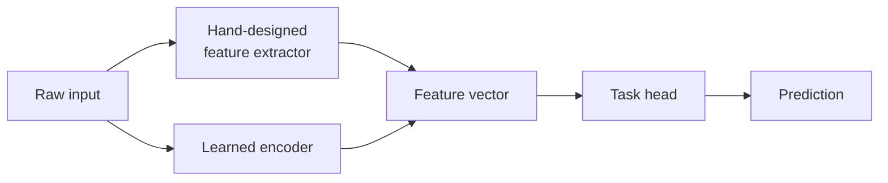
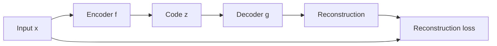
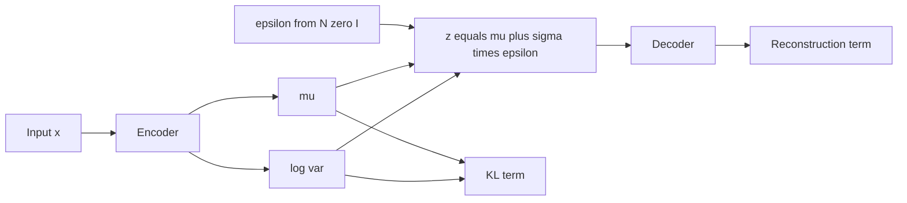
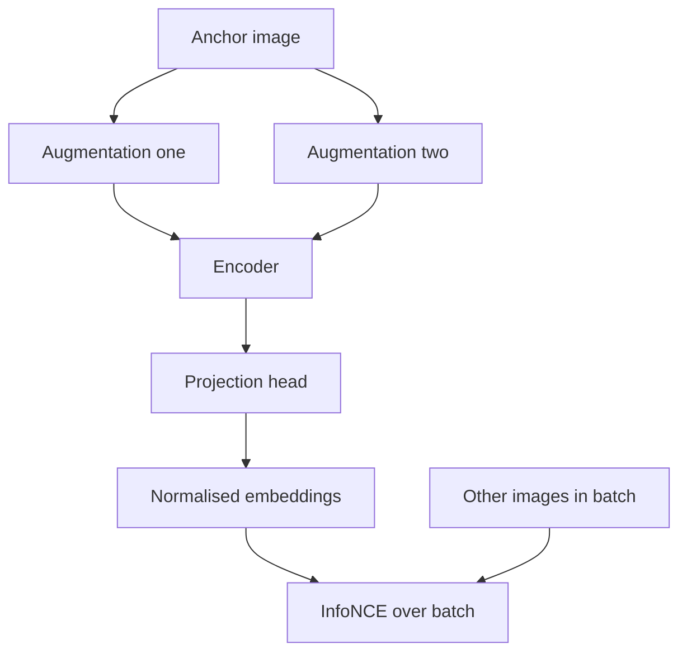
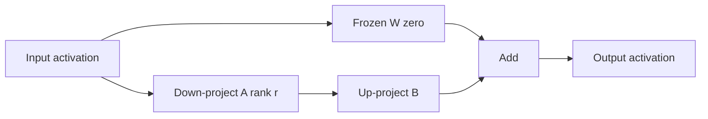
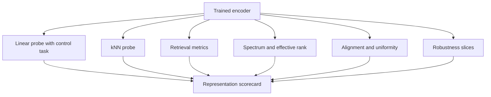

# Chapter 9: Representation Learning, Transfer, and Self-Supervision

> **What this chapter covers**: What a representation is, how embeddings encode meaning, autoencoders and variational autoencoders, contrastive and non-contrastive self-supervised learning, masked modelling, transfer learning and fine-tuning strategies, parameter-efficient adaptation, multi-task learning, few-shot and zero-shot framing, and how to evaluate a representation honestly.
> **Prerequisites**: Chapter 1 (linear algebra and optimisation), Chapter 2 (probability), Chapter 6 (neural network training), Chapter 7 (architectures), Chapter 8 (transformers).
> **Where it is used**: Search and retrieval systems, recommender systems, any domain with abundant unlabelled data and scarce labels, medical imaging, sensor and wearable pipelines, fraud detection, and every product built on a pretrained foundation model.

---

## 9.1 Level 1: Foundations

### What a representation is

A representation is the form your data takes when a model looks at it. It is the vector of numbers that stands in for the raw object.

Take a photograph of a dog. On disk it is three million bytes of pixel values. Those pixel values are a representation, but a bad one for most tasks. Shift the dog ten pixels to the right and every number changes, while the fact "this is a dog" does not. A good representation would barely move.

Now take a 512-number vector produced by a trained vision network for that same photograph. Shift the dog ten pixels and the vector moves slightly. Replace the dog with a cat and the vector moves a lot. That vector is a better representation because *distance in the representation tracks distance in the thing you care about*.

That is the whole idea. A representation is good for a task when the geometry of the representation space matches the structure of the task.

### Hand-designed versus learned

For most of the history of machine learning, humans designed representations. A speech engineer computed mel-frequency cepstral coefficients. A vision engineer computed scale-invariant feature transform descriptors, published by David Lowe in 1999. A credit-risk engineer computed debt-to-income ratio. These are *features*, and designing them was the job.

Learned representations replace the human designer with an optimiser. You give a network raw or lightly processed input and a training objective, and the intermediate activations become the representation.

Learned representations win when three conditions hold together.

| Condition | Why it matters |
|---|---|
| The raw input is high dimensional and highly structured | Pixels, waveforms, and token sequences have local structure a network can exploit and a human cannot enumerate |
| Lots of data is available, labelled or not | The optimiser needs signal to find the structure |
| The relevant structure is hard to articulate | Nobody can write down the rule that distinguishes a husky from a malamute |

Hand-designed features win when the opposite holds. On tabular data with a few hundred columns, a few thousand rows, and domain experts who know which ratios matter, hand-designed features plus gradient-boosted trees usually beats a neural network. Chapter 10 is entirely about that case and it is not a consolation prize. On sensor data, a physically motivated feature such as spectral entropy in a known frequency band often beats a learned feature because the physics really is the structure.

The honest summary: learned representations dominate perception and language, hand-designed features dominate small tabular problems, and both appear together on sensor and time-series data.



*Figure 9.1: Both routes produce a feature vector; only the learned route adapts that vector to the data.*

### Why self-supervision exists

Labels are expensive. A radiologist labelling scans costs money and time. Unlabelled data is nearly free. There are billions of images on the public web and trillions of words of text.

Self-supervised learning creates a supervised problem out of unlabelled data by hiding part of the input and asking the model to recover it, or by asking the model to recognise that two distorted views of the same thing are the same thing. No human labels are needed. The label comes from the data's own structure.

The payoff is that solving these artificial tasks well requires learning about the real structure of the data. To predict a masked word you must learn syntax and some semantics. To recognise that a cropped, colour-shifted photograph is the same photograph you must learn what objects are and ignore nuisance variation.

### Why transfer exists

Once someone has trained a large model on a large corpus, you can reuse it. Transfer learning is taking a model trained on one task or domain and adapting it to another.

The intuition is that the early layers of a trained network learn generic things. In vision, the first layer learns edges and colour blobs regardless of whether the final task is classifying dogs or detecting tumours. In language, the lower layers learn morphology and part of speech regardless of whether the final task is sentiment or entity extraction. Those generic parts are worth reusing.

This is the single largest practical lever available to a machine learning engineer with a small labelled dataset. A model fine-tuned from a pretrained checkpoint on 2,000 labelled examples routinely beats the same architecture trained from scratch on 50,000.

### The mental model to carry

Think of it as three separate questions that people constantly conflate.

1. **What does the encoder see?** The architecture and the input.
2. **What is the encoder trained to do?** The pretraining objective. Supervised classification, reconstruction, contrast, masking.
3. **How is the encoder reused?** Frozen features, partial fine-tuning, full fine-tuning, or a small adapter.

Most confusion in this area comes from mixing these up. "Contrastive learning" is an answer to question 2. "LoRA" is an answer to question 3. They are orthogonal.

---

## 9.2 Level 2: Working knowledge

### Embeddings: what they are and what they encode

An embedding is a learned map from a discrete or complex object to a dense real vector. Words, users, products, images, and sentences all get embedded.

What an embedding encodes is determined entirely by the objective that trained it. This is the most common misunderstanding in practice. A word embedding trained to predict nearby words encodes distributional similarity, which is why "good" and "bad" end up close together. They appear in the same contexts. If you need sentiment, that embedding is actively misleading.

Practical consequences you will meet:

| Training objective | What ends up close together |
|---|---|
| Predict nearby words (word2vec, Mikolov 2013) | Words used in similar contexts, including antonyms |
| Sentence pairs labelled as paraphrases | Sentences with the same meaning |
| Query and clicked document pairs | Queries and the documents that answer them |
| Image augmentation views | Images of the same object under different nuisance conditions |
| Co-purchase pairs | Products bought by the same people, not products that are similar |

Always ask what the training pairs were. That tells you what similarity means in the space.

### Geometry and similarity measures

Three measures dominate.

**Cosine similarity** measures the angle between vectors and ignores magnitude:

$$\text{cos}(u, v) = \frac{u \cdot v}{\lVert u \rVert \, \lVert v \rVert}$$

**Dot product** keeps magnitude, so vectors with large norm are retrieved more often. This is sometimes what you want. In recommenders, item norm can encode popularity.

**Euclidean distance** is $\lVert u - v \rVert_2$. On unit-normalised vectors it is a monotone function of cosine, so cosine and Euclidean rank identically:

$$\lVert u - v \rVert_2^2 = 2 - 2\,\text{cos}(u,v) \quad \text{when } \lVert u \rVert = \lVert v \rVert = 1$$

**Worked example.** Let $u = (3, 4)$ and $v = (4, 3)$.

Dot product: $3 \times 4 + 4 \times 3 = 24$. Norms: $\lVert u \rVert = \sqrt{9+16} = 5$, same for $v$. Cosine: $24 / 25 = 0.96$. Euclidean distance: $\sqrt{(3-4)^2 + (4-3)^2} = \sqrt{2} \approx 1.414$.

Now normalise: $\hat u = (0.6, 0.8)$, $\hat v = (0.8, 0.6)$. Euclidean distance between them: $\sqrt{(0.6-0.8)^2 + (0.8-0.6)^2} = \sqrt{0.08} \approx 0.283$. Check the identity: $2 - 2(0.96) = 0.08$, and $\sqrt{0.08} = 0.283$. It matches.

The practical rule: decide whether magnitude carries information. If it does not, normalise at write time in your vector store so that every query is a pure angle comparison and you cannot get it wrong later.

### Choosing a dimension

Dimension is a budget decision, not a correctness decision. Larger dimension gives more capacity to separate items, costs more memory and more time per similarity computation, and past a point adds nothing.

A rough starting table, offered as defaults rather than laws:

| Scenario | Typical dimension |
|---|---|
| Categorical feature embedding in a tabular model | 4 to 64, often via a heuristic like $\min(50, \lceil \sqrt[4]{C} \rceil \times 4)$ for cardinality $C$ |
| Word embeddings, classic | 100 to 300 |
| Sentence embeddings for retrieval | 384 to 1024 |
| Image embeddings from a vision backbone | 512 to 2048 |

**Worked example.** A categorical column with $C = 10{,}000$ unique values. The fourth root of 10,000 is 10. Times 4 is 40. Capped at 50, so use 40 dimensions. Memory cost: $10{,}000 \times 40 \times 4$ bytes for float32 is 1.6 megabytes. That is cheap. At $C = 50$ million user IDs and dimension 128 the table is $50 \times 10^6 \times 128 \times 4 = 25.6$ gigabytes, which is now an infrastructure decision, not a modelling one.

The way to choose empirically is to sweep dimension and plot the downstream metric. You will typically see a sharp rise, a knee, and a flat region. Pick the knee. Doubling past the knee buys noise and cost.

Matryoshka representation learning (Kusupati and colleagues, 2022) trains a single embedding so that its first $k$ dimensions are themselves a usable embedding for many values of $k$. This lets you pick the dimension at serving time instead of training time, which is genuinely useful when you want a cheap first-pass retrieval and an expensive rerank.

### Autoencoders

An autoencoder is an encoder $f$ and a decoder $g$ trained so that $g(f(x)) \approx x$. The loss is a reconstruction loss, typically mean squared error for continuous data:

$$\mathcal{L}(x) = \lVert x - g(f(x)) \rVert_2^2$$

The representation is $z = f(x)$, called the code or latent.

The constraint that makes this useful is that $z$ is smaller than $x$, so the network cannot copy and must compress. This is called an undercomplete autoencoder.

A critical fact: a linear autoencoder with squared loss learns the principal subspace. It recovers the same subspace as principal component analysis, though not necessarily the same axes. So an autoencoder is a nonlinear generalisation of principal component analysis. If your data is nearly linear, use principal component analysis; it is faster, deterministic, and has no hyperparameters to tune.

**Denoising autoencoders** (Vincent and colleagues, 2008) corrupt the input and ask the network to reconstruct the clean version. The loss is $\lVert x - g(f(\tilde x)) \rVert^2$ where $\tilde x$ is $x$ with noise added, or with some entries zeroed. This forces the code to capture structure rather than identity, and it works even when the code is not smaller than the input.

**Sparse autoencoders** add a penalty that pushes most code units toward zero for any given input. A common penalty is the $L_1$ norm of the code, $\lambda \lVert z \rVert_1$. The result is a code where each input activates a small subset of units. Sparse autoencoders have had a second life in interpretability work on large language models, where they are used to decompose dense activations into sparse, more human-readable directions (Bricken and colleagues, 2023; Cunningham and colleagues, 2023).



*Figure 9.2: The autoencoder loop. The code z is the representation you keep; the decoder is usually discarded.*

### When to reach for an autoencoder

Honest answer: less often than textbooks imply. For pure representation quality on images or text, contrastive and masked methods beat plain autoencoders. Autoencoders remain the right tool for:

- Anomaly detection where high reconstruction error flags an outlier.
- Dimensionality reduction where a nonlinear manifold is suspected and you need an explicit decoder.
- Denoising as an end in itself.
- Compression into a latent space that a second model will operate in, which is what the variational autoencoder in a latent diffusion model does (Rombach and colleagues, 2022).

### Transfer learning: the two basic modes

**Feature extraction.** Freeze the pretrained encoder. Run your data through it once, cache the vectors, and train a small classifier such as logistic regression on top. Cheap, fast, hard to overfit, and the cached vectors make iteration nearly instant.

**Fine-tuning.** Unfreeze some or all of the encoder and train it on your task with a small learning rate. More expensive, more data-hungry, and higher ceiling.

The choice hinges on two axes: how much labelled data you have, and how far your domain is from the pretraining domain.

| Labelled data | Domain similar to pretraining | Domain far from pretraining |
|---|---|---|
| Very small, under about 1,000 | Frozen features plus linear probe | Frozen features, but expect a weak ceiling; consider continued pretraining on unlabelled in-domain data |
| Moderate, 1,000 to 50,000 | Fine-tune the last block or two | Fine-tune most of the network with a low learning rate |
| Large, over about 100,000 | Full fine-tune | Full fine-tune, and consider training from scratch as a baseline |

These row boundaries are rough and task-dependent. Treat them as a starting hypothesis to test, not a rule.

### Layer freezing strategies

Three standard patterns.

1. **Freeze everything but the head.** The baseline. Always run it first because it is cheap and it tells you what the pretrained representation is worth without adaptation.
2. **Gradual unfreezing.** Train the head, then unfreeze the top block and train, then the next block, and so on. Described for language models by Howard and Ruder (2018) in the ULMFiT paper. It reduces the chance that a large early gradient destroys useful pretrained weights.
3. **Discriminative learning rates.** Give every layer a learning rate, smaller at the bottom. A common schedule is $\eta_{\ell} = \eta_{\text{top}} / \gamma^{L - \ell}$ with $\gamma$ around 2.6 and $L$ the number of layers.

**Worked example.** A 12-layer encoder, top learning rate $2 \times 10^{-5}$, $\gamma = 2.6$. Layer 12 gets $2 \times 10^{-5}$. Layer 11 gets $2 \times 10^{-5} / 2.6 = 7.7 \times 10^{-6}$. Layer 1 gets $2 \times 10^{-5} / 2.6^{11} = 2 \times 10^{-5} / 3.1 \times 10^{4} \approx 6.5 \times 10^{-10}$, which is effectively frozen. That is the point: the schedule interpolates smoothly between frozen and fully trained.

Always keep normalisation layers in mind. Batch normalisation layers in a frozen encoder still update their running statistics unless you put the module in evaluation mode. This is a classic silent bug: your "frozen" features drift across epochs. Check your framework's exact semantics for the version you are on.

### Catastrophic forgetting

When you fine-tune, the model can lose capability it had before. This is catastrophic forgetting, named by McCloskey and Cohen (1989).

You see it in two forms. The model gets worse on the pretraining distribution, which matters if you serve it on mixed traffic. And the model overfits your small dataset by discarding general structure, which shows up as a great training curve and a poor out-of-distribution result.

Mitigations, in rough order of how often they are worth it:

| Mitigation | Mechanism | Cost |
|---|---|---|
| Lower learning rate and fewer epochs | Stay near the pretrained weights | Free |
| Freeze lower layers | Protect generic features | Free |
| Parameter-efficient adaptation | Base weights literally unchanged | Small |
| Mix in pretraining or general data, often called replay | Keep gradient signal from the old distribution | Data pipeline work |
| Elastic weight consolidation (Kirkpatrick and colleagues, 2017) | Penalise movement in directions the old task was sensitive to, weighted by the Fisher information | Needs a Fisher estimate |

### A first pipeline you can run

**Listing 9.1: frozen-feature baseline with a linear probe.**

```python
import numpy as np
import torch
from sklearn.linear_model import LogisticRegression
from sklearn.metrics import accuracy_score

@torch.no_grad()
def extract(encoder, loader, device="cuda"):
    encoder.eval().to(device)
    feats, labels = [], []
    for x, y in loader:
        z = encoder(x.to(device))            # shape (batch, dim)
        z = torch.nn.functional.normalize(z, dim=1)
        feats.append(z.cpu().numpy())
        labels.append(y.numpy())
    return np.concatenate(feats), np.concatenate(labels)

Ztr, ytr = extract(encoder, train_loader)
Zte, yte = extract(encoder, test_loader)

probe = LogisticRegression(max_iter=2000, C=1.0, n_jobs=-1)
probe.fit(Ztr, ytr)
print("linear probe accuracy:", accuracy_score(yte, probe.predict(Zte)))
```

Three lines deserve comment. The `torch.no_grad` decorator and `encoder.eval()` together stop gradient tracking and put normalisation and dropout layers into inference behaviour, which is exactly the frozen-feature semantics you want. The `normalize` call makes the probe operate on angles, which usually improves conditioning and makes the regularisation strength `C` comparable across encoders. Sweeping `C` over a logarithmic grid matters more than people expect; a badly regularised probe understates a good encoder.

---

## 9.3 Level 3: Depth

### Variational autoencoders and the evidence lower bound

A variational autoencoder (Kingma and Welling, 2013; independently Rezende, Mohamed and Wierstra, 2014) turns the autoencoder into a probabilistic generative model. Instead of mapping $x$ to a point, the encoder maps $x$ to a distribution over codes.

Set up the generative story. There is a latent variable $z$ with a simple prior $p(z) = \mathcal{N}(0, I)$. A decoder defines $p_\theta(x \mid z)$. The marginal likelihood of a data point is

$$p_\theta(x) = \int p_\theta(x \mid z) \, p(z) \, dz$$

That integral is intractable. So introduce an approximate posterior $q_\phi(z \mid x)$, produced by the encoder, and derive a bound.

Start from the log marginal likelihood and insert $q_\phi$:

$$\log p_\theta(x) = \log \int p_\theta(x \mid z) p(z) \, dz = \log \int q_\phi(z \mid x) \frac{p_\theta(x \mid z) p(z)}{q_\phi(z \mid x)} \, dz$$

The right side is the log of an expectation under $q_\phi$. Apply Jensen's inequality, which says $\log \mathbb{E}[X] \ge \mathbb{E}[\log X]$ for the concave logarithm:

$$\log p_\theta(x) \ge \mathbb{E}_{q_\phi(z \mid x)} \left[ \log \frac{p_\theta(x \mid z) p(z)}{q_\phi(z \mid x)} \right]$$

Split the logarithm of the ratio:

$$\log p_\theta(x) \ge \mathbb{E}_{q_\phi(z \mid x)} [\log p_\theta(x \mid z)] - D_{\mathrm{KL}}\!\left( q_\phi(z \mid x) \,\Vert\, p(z) \right)$$

That right-hand side is the evidence lower bound, written ELBO. The first term is expected reconstruction quality. The second is a penalty for the posterior drifting from the prior. You maximise the ELBO, equivalently minimise its negative.

The gap between $\log p_\theta(x)$ and the ELBO is exactly $D_{\mathrm{KL}}(q_\phi(z \mid x) \Vert p_\theta(z \mid x))$, the divergence between your approximate posterior and the true one. So maximising the ELBO does two jobs at once: it improves the model and it tightens the approximation.

**The closed-form Kullback-Leibler term.** Take $q_\phi(z \mid x) = \mathcal{N}(\mu, \mathrm{diag}(\sigma^2))$ and $p(z) = \mathcal{N}(0, I)$ in $d$ dimensions. Then

$$D_{\mathrm{KL}} = \frac{1}{2} \sum_{j=1}^{d} \left( \mu_j^2 + \sigma_j^2 - \log \sigma_j^2 - 1 \right)$$

**Worked example.** Two latent dimensions. Suppose the encoder outputs $\mu = (0.5, -1.0)$ and $\sigma = (0.8, 1.2)$.

Dimension 1: $\mu^2 = 0.25$, $\sigma^2 = 0.64$, $\log \sigma^2 = \log 0.64 = -0.4463$. Sum: $0.25 + 0.64 + 0.4463 - 1 = 0.3363$.

Dimension 2: $\mu^2 = 1.0$, $\sigma^2 = 1.44$, $\log \sigma^2 = \log 1.44 = 0.3646$. Sum: $1.0 + 1.44 - 0.3646 - 1 = 1.0754$.

Total: $\tfrac{1}{2}(0.3363 + 1.0754) = 0.7059$ nats. If instead $\mu = 0$ and $\sigma = 1$ exactly, each term is $0 + 1 - 0 - 1 = 0$, so the divergence is zero, as it must be.

**The reparameterisation trick.** You need gradients of the ELBO with respect to $\phi$, but $z$ is sampled from $q_\phi$, and sampling is not differentiable. The trick is to move the randomness out of the parameterised part. Instead of $z \sim \mathcal{N}(\mu_\phi(x), \sigma_\phi(x)^2)$, write

$$z = \mu_\phi(x) + \sigma_\phi(x) \odot \epsilon, \qquad \epsilon \sim \mathcal{N}(0, I)$$

Now $\epsilon$ is a constant as far as the gradient is concerned, and $z$ is a differentiable function of $\mu_\phi$ and $\sigma_\phi$. Backpropagation flows straight through. Without this you would need a high-variance score-function estimator, and training would be far slower.

Practical detail: the network outputs $\log \sigma^2$ rather than $\sigma$. That keeps the value unconstrained, so no positivity constraint is needed, and it is numerically better behaved.



*Figure 9.3: The reparameterisation trick routes sampling noise in as an input so gradients reach the encoder.*

**Posterior collapse.** With a powerful decoder, especially an autoregressive one, the model can drive $D_{\mathrm{KL}}$ to zero by making $q_\phi(z \mid x)$ equal the prior for every $x$. The latent then carries no information and the decoder does all the work. Standard remedies: anneal a weight $\beta$ on the Kullback-Leibler term from 0 up to 1 over training, use free bits which floors the per-dimension divergence at some small value, or weaken the decoder. The $\beta$-VAE of Higgins and colleagues (2017) uses $\beta > 1$ deliberately, trading reconstruction for more disentangled latents.

### Contrastive learning

The objective. Given an anchor $x$, a positive $x^+$ that should be close, and a set of negatives $x^-_1 \dots x^-_K$ that should be far, with encoder $f$ and normalised embeddings $z = f(x) / \lVert f(x) \rVert$, the InfoNCE loss (van den Oord, Li and Vinyals, 2018) is

$$\mathcal{L} = -\log \frac{\exp(z \cdot z^+ / \tau)}{\exp(z \cdot z^+ / \tau) + \sum_{k=1}^{K} \exp(z \cdot z^-_k / \tau)}$$

This is exactly cross-entropy over $K+1$ classes where the correct class is the positive. The name InfoNCE comes from noise-contrastive estimation, and the loss is a lower bound on the mutual information between the two views.

**Temperature.** $\tau$ scales the logits. Small $\tau$ sharpens the softmax, which concentrates the gradient on the hardest negatives. Large $\tau$ flattens it, spreading the gradient across all negatives. Wang and Liu (2021) analysed this as a uniformity and tolerance trade-off: low temperature enforces uniform spread on the hypersphere but is intolerant of semantically similar negatives, which is bad when your negatives contain false negatives. Typical values are 0.05 to 0.2. It matters a lot; treat it as a first-class hyperparameter, not an afterthought.

**Worked example of temperature.** Anchor-positive cosine similarity 0.9. Two negatives with cosine similarity 0.8 and 0.2.

At $\tau = 0.1$ the logits are 9.0, 8.0, 2.0. Exponentials: $8103$, $2981$, $7.39$. Denominator $11091$. Loss $= -\log(8103/11091) = -\log(0.7306) = 0.3138$. The hard negative at 0.8 holds 26.9 percent of the mass; the easy one holds 0.07 percent.

At $\tau = 1.0$ the logits are 0.9, 0.8, 0.2. Exponentials: $2.460$, $2.226$, $1.221$. Denominator $5.907$. Loss $= -\log(2.460/5.907) = -\log(0.4165) = 0.8759$. Now the easy negative holds 20.7 percent of the mass and still receives substantial gradient.

So temperature is a hard-negative focusing knob. Lower it and you train almost exclusively against near misses.

**Batch size.** In the common in-batch-negatives formulation, every other example in the batch is a negative. Batch size $B$ gives $B-1$ negatives. More negatives make the contrastive task harder and the bound on mutual information tighter, which is why SimCLR (Chen and colleagues, 2020) needed batches in the thousands and why that result was read as "contrastive learning requires huge batches".

Two lines of work broke that dependence. MoCo (He and colleagues, 2019) keeps a queue of embeddings from recent batches as extra negatives, with a momentum-updated key encoder so those stale embeddings stay consistent. That decouples the negative count from the batch size. Later, non-contrastive methods removed negatives entirely.

**Hard negative mining and false negatives.** A hard negative is a negative close to the anchor. These carry the most gradient. Mining them explicitly, for instance by retrieving nearest neighbours with the current model, speeds up learning substantially. This is standard in dense retrieval, where ANCE (Xiong and colleagues, 2020) refreshes hard negatives from an index during training.

The danger is the false negative: an item that is actually a valid positive but is labelled negative because it was not the designated pair. In retrieval, another document that also answers the query. In images, another photograph of the same breed. Mining hard negatives maximises the rate at which you surface false negatives, because false negatives are by definition very similar. This is the central tension of contrastive learning.

Mitigations: threshold out candidates above a similarity cutoff, use a cross-encoder to filter mined negatives, sample from a ranked window such as ranks 30 to 100 rather than the top, or raise the temperature so the loss is more tolerant.



*Figure 9.4: The two-view contrastive setup with in-batch negatives.*

**The frameworks and what each solved.**

| Framework | Year and lead author | What it contributed |
|---|---|---|
| SimCLR | Chen and colleagues, 2020 | Showed that strong augmentation composition, a projection head discarded at transfer time, and large batches were what mattered |
| MoCo | He and colleagues, 2019 | Momentum encoder plus a negative queue, removing the large-batch requirement |
| BYOL | Grill and colleagues, 2020 | Removed negatives entirely using a predictor and a momentum target |
| SimSiam | Chen and He, 2020 | Showed the momentum encoder is not required; a stop-gradient on one branch suffices |
| Barlow Twins | Zbontar and colleagues, 2021 | Drives the cross-correlation matrix between views toward the identity |
| VICReg | Bardes, Ponce and LeCun, 2021 | Explicit variance, invariance, and covariance terms |
| CLIP | Radford and colleagues, 2021 | Contrast images against text captions, giving zero-shot classification via text prompts |
| SimCSE | Gao, Yao and Chen, 2021 | For sentences, dropout alone is a sufficient augmentation |

The projection head deserves a note because it is a practical trap. SimCLR trains a small multilayer perceptron on top of the encoder and applies the loss to its output, then throws it away and transfers the encoder output. The layer just before the loss is over-specialised to the pretext task. If you transfer from the projection output you will get worse results. Transfer from the backbone.

### Non-contrastive self-supervision and the collapse problem

If you only push positives together and never push anything apart, the trivial solution is to output a constant vector for every input. Loss zero, representation useless. This is *collapse*.

Negatives prevent collapse by making constancy expensive. Non-contrastive methods must prevent it another way. The three known mechanisms:

1. **Architectural asymmetry with stop-gradient.** BYOL and SimSiam have an online branch with an extra predictor network and a target branch with the gradient blocked. Chen and He (2020) showed empirically that the stop-gradient is the essential ingredient. The dynamics resemble an alternating optimisation, and the constant solution is not a stable point of that alternation.
2. **Redundancy reduction.** Barlow Twins computes the cross-correlation matrix between the normalised embeddings of the two views across the batch and pushes it toward the identity. Diagonal near one means the two views agree. Off-diagonal near zero means different dimensions carry different information. A collapsed representation has a degenerate correlation matrix, so it is penalised.
3. **Explicit variance regularisation.** VICReg adds a hinge on the per-dimension standard deviation across the batch, $\max(0, 1 - \sqrt{\mathrm{Var}(z_j) + \epsilon})$. A collapsed representation has zero variance and takes the full penalty.

Two collapse modes are worth distinguishing. *Complete collapse*, all outputs identical, is obvious because embedding variance goes to zero. *Dimensional collapse*, where embeddings occupy a low-dimensional subspace of the available space, is subtle and common. Jing and colleagues (2021) documented it. Detect it by taking the singular value spectrum of your embedding matrix and looking for a sharp cliff. A healthy representation has a gradually decaying spectrum. Log the effective rank during training; it is cheap insurance.

### Masked modelling

Mask part of the input, predict it from the rest. The idea generalises across modalities.

| Modality | Method | What is masked | Prediction target |
|---|---|---|---|
| Text | BERT (Devlin and colleagues, 2018) | About 15 percent of tokens | The token identity, cross-entropy over the vocabulary |
| Images | MAE (He and colleagues, 2021) | 75 percent of patches | Raw pixel values of masked patches |
| Images | BEiT (Bao, Dong and Wei, 2021) | Patches | Discrete visual token indices from a learned codebook |
| Speech | wav2vec 2.0 (Baevski and colleagues, 2020) | Spans of latent frames | Contrastive over quantised targets |
| Tabular and graphs | Various | Columns or nodes | The masked value |

The masking ratio differs enormously by modality and this is informative. Text is dense in information, so masking 15 percent already makes a hard task. Images are heavily redundant, so masking 15 percent leaves the task trivially solvable by interpolation. MAE masks 75 percent precisely to force semantic reasoning rather than texture copying. When you apply masked modelling to a new modality, the masking ratio is the first thing to tune, and the guiding question is how redundant the signal is.

A second practical point from MAE: the encoder sees only the visible patches. That makes pretraining several times cheaper, because attention cost is quadratic in sequence length and you have cut the sequence by three quarters. A lightweight decoder reconstructs from visible tokens plus mask tokens and is discarded afterwards.

Masked modelling versus contrastive learning, as a practical comparison:

| | Masked modelling | Contrastive |
|---|---|---|
| Needs augmentation design | No | Yes, and it is the dominant factor |
| Needs large batches | No | Sometimes, depending on the variant |
| Linear probe quality | Often weaker | Often stronger |
| Fine-tuned quality | Often stronger | Comparable |
| Learns fine detail | Yes | Tends to discard it as nuisance |

That linear-probe versus fine-tuning inversion is real and reported in the MAE paper. Contrastive methods produce embeddings that are already linearly separable, because the objective explicitly shapes the geometry. Masked models produce richer but less linearly organised features that reward fine-tuning. If your deployment plan is frozen embeddings plus a linear layer, prefer a contrastively trained encoder. If it is full fine-tuning, a masked model is a strong choice.

### Domain adaptation and domain shift

Domain shift is when the input distribution at deployment differs from training. Formally, with input $x$ and label $y$:

| Shift type | What changes | Typical example |
|---|---|---|
| Covariate shift | $p(x)$ changes, $p(y \mid x)$ stable | New camera sensor, new user demographic |
| Label shift, also prior shift | $p(y)$ changes, $p(x \mid y)$ stable | Disease prevalence rises |
| Concept drift | $p(y \mid x)$ changes | Fraud tactics evolve so the same features mean something new |

Chapter 27 covers detecting these in production. Here the concern is adapting the representation.

**Unsupervised domain adaptation** has labelled source data and unlabelled target data. Main families:

- *Discrepancy minimisation.* Add a loss that makes source and target feature distributions similar, for instance maximum mean discrepancy between the two feature sets.
- *Adversarial alignment.* Train a domain classifier to distinguish source from target features, and train the encoder to fool it via a gradient reversal layer (Ganin and Lempitsky, 2015).
- *Self-training with pseudo-labels.* Predict on target data, keep confident predictions, retrain. Simple and often the strongest baseline. Guard against confirmation bias with a confidence threshold and class balancing.
- *Continued pretraining.* Run the self-supervised objective on unlabelled target-domain data before fine-tuning. Gururangan and colleagues (2020) showed clear gains from domain-adaptive and task-adaptive pretraining. This is often the best return on effort because it needs no new machinery.

A caution. Aligning marginal feature distributions does not guarantee aligning conditionals. If the label distribution also shifted, forcing the feature distributions to match can actively hurt. Check whether your shift is covariate or label before reaching for adversarial alignment.

### Parameter-efficient adaptation

Full fine-tuning of a large model updates every weight, needs optimiser state for every weight, and produces a full-size checkpoint per task. For a 7 billion parameter model in bf16, weights alone are about 14 gigabytes, and Adam moments add roughly twice that in fp32.

**Adapters** (Houlsby and colleagues, 2019) insert a small bottleneck module inside each transformer block: down-project from $d$ to $r$, nonlinearity, up-project back to $d$, plus a residual connection. Only the adapters train. They add inference latency because they are extra sequential operations.

**Low-rank adaptation, LoRA** (Hu and colleagues, 2021) takes a frozen weight matrix $W_0 \in \mathbb{R}^{d \times k}$ and learns a low-rank update:

$$W = W_0 + \Delta W = W_0 + \frac{\alpha}{r} B A, \qquad B \in \mathbb{R}^{d \times r}, \; A \in \mathbb{R}^{r \times k}, \; r \ll \min(d,k)$$

$A$ is initialised from a small random distribution and $B$ is initialised to zero, so $\Delta W = 0$ at the start and training begins exactly at the pretrained model. $\alpha$ is a scaling constant; the ratio $\alpha / r$ keeps the effective update magnitude roughly stable when you change $r$.

**Worked example of the parameter saving.** A query projection with $d = k = 4096$. Full matrix: $4096 \times 4096 = 16{,}777{,}216$ parameters. LoRA at $r = 8$: $B$ is $4096 \times 8$ and $A$ is $8 \times 4096$, so $2 \times 4096 \times 8 = 65{,}536$ parameters. That is 0.39 percent of the original, a 256-fold reduction. Across a 32-layer model applying LoRA to query and value projections only, you train roughly 4.2 million parameters instead of billions.

The other advantage is that $BA$ can be folded into $W_0$ after training, so inference cost is identical to the base model. Adapters cannot do this. Multiple LoRA modules for different tasks can be kept separately and swapped or served simultaneously against one base model, which is a serving win covered in Chapter 24.

**When full fine-tuning is still right:**

- You are adapting to a genuinely new domain, for instance a new language or a new modality, where the required update is high rank.
- You have abundant labelled data, hundreds of thousands of examples or more, where the low-rank constraint becomes the binding limit.
- You are changing the vocabulary or the output space in a structural way.
- The model is small enough that full fine-tuning is cheap. For a model under about a billion parameters on a single modern accelerator, the savings often do not justify the extra moving parts.

Empirically LoRA matches full fine-tuning on many instruction-tuning and classification tasks and lags on tasks requiring substantial new knowledge. Biderman and colleagues (2024) reported that LoRA learns less and forgets less than full fine-tuning, which frames the trade-off well: the constraint is simultaneously a capacity limit and a regulariser against catastrophic forgetting.



*Figure 9.5: LoRA adds a trainable low-rank path beside the frozen weight matrix.*

**Listing 9.2: a minimal LoRA-wrapped linear layer.**

```python
import math, torch
import torch.nn as nn

class LoRALinear(nn.Module):
    def __init__(self, base: nn.Linear, r: int = 8, alpha: int = 16, dropout: float = 0.0):
        super().__init__()
        self.base = base
        for p in self.base.parameters():
            p.requires_grad = False                      # freeze the pretrained weight
        self.A = nn.Parameter(torch.empty(r, base.in_features))
        self.B = nn.Parameter(torch.zeros(base.out_features, r))
        nn.init.kaiming_uniform_(self.A, a=math.sqrt(5))  # B stays zero so delta W starts at zero
        self.scale = alpha / r
        self.drop = nn.Dropout(dropout)

    def forward(self, x):
        return self.base(x) + self.drop(x) @ self.A.t() @ self.B.t() * self.scale

    @torch.no_grad()
    def merge(self):
        self.base.weight += (self.B @ self.A) * self.scale
```

The zero initialisation of `B` is the load-bearing detail. It guarantees the wrapped layer is numerically identical to the base layer at step zero, so you never see a loss spike from a randomly perturbed pretrained model. The `merge` method folds the update in for deployment; call it once and the layer costs exactly what the original cost. Names and signatures in adapter libraries change between releases, so check your version.

### Multi-task learning

Train one model on several tasks at once. Two structural choices.

**Hard parameter sharing.** A shared encoder with a separate head per task. Simple, memory-efficient, and strongly regularising because the encoder must serve every task.

**Soft parameter sharing.** Separate per-task models with a penalty tying their parameters together, or a mechanism such as cross-stitch units (Misra and colleagues, 2016) that learns how much to mix per layer. More capacity, more parameters, more tuning.

**Task weighting.** The total loss is $\mathcal{L} = \sum_t w_t \mathcal{L}_t$. Choosing $w_t$ matters because losses have different natural scales. A regression loss in the hundreds and a cross-entropy loss near 0.7 will not balance at $w_t = 1$.

Approaches:

| Method | Idea |
|---|---|
| Manual, scale-matched | Set $w_t$ so each weighted loss starts at a similar magnitude |
| Uncertainty weighting (Kendall, Gal and Cipolla, 2018) | Learn a per-task noise parameter $\sigma_t$ and use $\frac{1}{2\sigma_t^2}\mathcal{L}_t + \log \sigma_t$ |
| GradNorm (Chen and colleagues, 2018) | Adjust weights so per-task gradient norms stay balanced |
| PCGrad (Yu and colleagues, 2020) | Project one task's gradient off another's when their inner product is negative |

**Worked example of uncertainty weighting.** Two tasks, a regression loss currently 120 and a classification loss currently 0.7. At equal weights the regression term dominates by a factor over 170 and the classification head barely trains. Uncertainty weighting learns a large $\sigma$ for the regression task, shrinking $1/(2\sigma^2)$. If it settles at $\sigma_{\text{reg}} = 11$ then the effective weight is $1/242 = 0.0041$, giving a contribution of $0.50$, now comparable with the classification term. The $\log \sigma_t$ term stops the model from driving all weights to zero.

**Negative transfer** is when adding a task makes another task worse. Causes: conflicting gradients where the tasks pull the shared encoder in opposing directions, a dominant task monopolising capacity, or tasks that genuinely require incompatible invariances. One task may need colour invariance while another needs colour sensitivity.

Detect it by always training single-task baselines. If a task's multi-task score is below its single-task score, you have negative transfer on that task. Remedies: reduce sharing depth so tasks diverge earlier, group compatible tasks into separate models, reweight, or apply gradient surgery such as PCGrad.

### Few-shot and zero-shot framing

*Zero-shot* means performing a task with no labelled examples for it. *Few-shot* means a handful, often 1 to 32.

Three distinct mechanisms get called by these names, and conflating them causes confusion.

1. **Embedding-space zero-shot.** CLIP embeds images and text into one space. Classify by embedding the class names as text, for instance "a photo of a golden retriever", and taking the nearest. No training. Works for any class whose name you can write.
2. **Metric learning few-shot.** Prototypical networks (Snell, Swersky and Zemel, 2017) compute a prototype as the mean embedding of the support examples for each class and classify by distance to prototypes. Matching networks (Vinyals and colleagues, 2016) use an attention-weighted comparison.
3. **In-context learning.** A large language model is given examples in its prompt and infers the pattern without any weight update (Brown and colleagues, 2020). Covered in Chapter 15.

Optimisation-based meta-learning is a fourth family. MAML (Finn, Abbeel and Levine, 2017) learns an initialisation such that a few gradient steps on a new task produce a good model. It is elegant and it is rarely the practical choice today, because a large pretrained model plus a linear probe is usually simpler and stronger.

A blunt practical note. For most teams in most situations, "few-shot learning" in production means "take a good pretrained encoder, embed your 20 examples, and fit a nearest-centroid or logistic-regression classifier". That baseline is embarrassingly strong and should be run before any meta-learning method.

---

## 9.4 Level 4: Mastery

### Evaluating a representation

This is where most projects go wrong, so it gets the most space.

**Linear probing.** Freeze the encoder, fit a linear classifier on the features, report accuracy. It tests whether task-relevant information is linearly accessible.

Its limits are real. A representation can hold information nonlinearly and score poorly on a probe. And Hewitt and Liang (2019) made the sharper point: a sufficiently expressive probe can learn the task itself, so a high probe score may reflect probe capacity rather than encoder quality. Their remedy is a *control task*, a version of the task with randomised labels. A good probe has high accuracy on the real task and low accuracy on the control. The gap, called selectivity, is the honest number.

Discipline for probing: fix the probe's capacity, sweep the regularisation strength properly, and report the sweep. A linear probe with a badly chosen regularisation constant can understate a good encoder by several points.

**$k$-nearest-neighbour probing.** Classify by nearest neighbours in embedding space. It has no trainable parameters at all, so it cannot launder capacity, and it measures local geometry directly. Report it alongside the linear probe; a large gap between them is informative, meaning the classes are globally linearly separable but locally tangled or the reverse.

**Retrieval metrics.** For retrieval systems, measure the thing itself.

| Metric | Definition | When it is right |
|---|---|---|
| Recall at $k$ | Fraction of queries whose relevant item appears in the top $k$ | First-stage retrieval feeding a reranker |
| Precision at $k$ | Fraction of top $k$ that is relevant | Fixed-size result page |
| Mean reciprocal rank | Mean of $1/\text{rank}$ of the first relevant item | Exactly one right answer |
| Normalised discounted cumulative gain | Graded relevance with logarithmic position discount | Multiple items with relevance grades |

**Worked example of NDCG at 5.** Relevance grades for the returned list: 3, 2, 0, 1, 2. Discounted cumulative gain with the $\frac{\text{rel}_i}{\log_2(i+1)}$ form:

Position 1: $3 / \log_2 2 = 3 / 1 = 3.000$.
Position 2: $2 / \log_2 3 = 2 / 1.585 = 1.262$.
Position 3: $0 / 2 = 0$.
Position 4: $1 / \log_2 5 = 1 / 2.322 = 0.431$.
Position 5: $2 / \log_2 6 = 2 / 2.585 = 0.774$.
DCG $= 5.467$.

The ideal ordering of the same grades is 3, 2, 2, 1, 0:
$3.000 + 1.262 + 2/2 = 1.000 + 0.431 + 0 = 5.693$.
NDCG at 5 $= 5.467 / 5.693 = 0.960$.

Report a bootstrap confidence interval on any such number. With 500 queries, differences under about two points of NDCG are frequently noise. Chapter 5 covers the statistics.

**The central danger: evaluating only on the task you care about.** If you select an encoder purely by its score on your one downstream benchmark, you are performing model selection on that benchmark, and your reported number is optimistically biased. Worse, you learn nothing about whether the representation is general, so the next task requires starting over.

A defensible evaluation suite has four parts:

1. Several downstream tasks, not one, including at least one you did not use for any selection decision.
2. A probing suite at both linear and $k$-nearest-neighbour levels with a control task.
3. Geometric health checks: singular value spectrum and effective rank, alignment and uniformity (Wang and Isola, 2020), and isotropy.
4. A robustness slice: performance on a shifted subset, a corrupted subset, and the worst-performing demographic or device group.

Alignment and uniformity deserve definition because they are cheap diagnostics for contrastive encoders. Alignment is $\mathbb{E}_{(x,x^+)} \lVert f(x) - f(x^+) \rVert^2$, how close positive pairs land, lower is better. Uniformity is $\log \mathbb{E}_{(x,y)} e^{-2\lVert f(x)-f(y)\rVert^2}$ over random pairs, how spread the embeddings are on the sphere, lower is better. Wang and Isola showed the contrastive loss asymptotically optimises both. Plotting them across training checkpoints diagnoses collapse and over-uniformity faster than downstream evaluation does.



*Figure 9.6: A representation scorecard combines probes, task metrics, geometry, and robustness rather than a single number.*

### What senior engineers argue about

**Do self-supervised representations actually beat supervised ones?** For a long time supervised ImageNet pretraining was the default and self-supervised methods were catching up. They now match or exceed it on many transfer benchmarks, and clearly exceed it when unlabelled in-domain data is plentiful. But the comparison is slippery because self-supervised methods usually consume far more data and compute. Per unit of compute the gap narrows. The defensible position: self-supervision wins when unlabelled data is abundant and labels are scarce or noisy, which is most real situations, and the argument is about whether that is a property of the method or of the data budget.

**Is the augmentation pipeline doing the real work?** For contrastive learning on images, the composition of augmentations is the single largest factor. Random resized crop plus colour jitter is essential in SimCLR; remove colour jitter and the model solves the task by matching colour histograms. This means you are encoding your invariance assumptions by hand, in the augmentation policy. Contrastive learning is therefore less "assumption free" than it appears. It moved the hand-designed part from the feature extractor to the augmentation policy. Masked modelling has a weaker version of the same problem in its masking policy.

**Scaling laws for representation quality.** Compute-optimal scaling is well studied for language model loss (Kaplan and colleagues, 2020; Hoffmann and colleagues, 2022). Whether the same relationships govern *representation transfer quality* is less settled. Pretraining loss and downstream transfer are correlated but not monotone, and there are documented cases where longer pretraining improves loss and flattens or degrades transfer. Treat pretraining loss as a proxy that needs checking, not as the objective.

**Do bigger foundation models make representation learning obsolete?** One view: just use an off-the-shelf embedding endpoint. Another: domain-specific pretraining still wins on specialised data, and the evidence supports this in biomedical text, code, chemistry, and physiological sensor data. The practical resolution is a decision procedure rather than a doctrine. Start with the off-the-shelf encoder, measure the gap to a reasonable ceiling, and only invest in domain pretraining when the gap is large and you have the unlabelled data to close it.

**Is a single embedding per item the right abstraction?** Dense single-vector retrieval compresses a document into one point. ColBERT (Khattab and Zaharia, 2020) keeps per-token vectors and scores with a late-interaction maximum-similarity operator, which is more accurate and more expensive. Sparse lexical methods such as SPLADE (Formal, Piwowarski and Clinchant, 2021) learn sparse term weights and retain exact term matching. The field has largely converged on hybrids: sparse and dense retrieval combined, then a cross-encoder rerank. Anyone claiming one representation form dominates is overselling.

**Are embeddings safe to store?** Embeddings are not anonymisation. Song and Raghunathan (2020) demonstrated inversion attacks recovering substantial input content from sentence embeddings, and membership inference against embedding models is a live area. If your raw data is sensitive, treat the embedding store with the same access controls as the raw store. Chapter 28 covers this.

### Advanced techniques worth knowing

**Knowledge distillation as representation transfer.** Train a small student to match a large teacher's outputs or intermediate features (Hinton, Vinyals and Dean, 2015). DINO (Caron and colleagues, 2021) uses a self-distillation setup with no labels and produces features whose attention maps segment objects without ever being trained to.

**Prompt and prefix tuning.** Instead of changing weights, learn continuous vectors prepended to the input. Prefix tuning (Li and Liang, 2021) and prompt tuning (Lester, Al-Rfou and Constant, 2021). Prompt tuning's parameter count is tiny and its effectiveness grows sharply with base model size, which is itself an interesting result: adaptation gets easier as models get larger.

**QLoRA** (Dettmers and colleagues, 2023) quantises the frozen base to 4-bit and trains LoRA adapters in higher precision on top, with paged optimisers to survive memory spikes. It is what makes fine-tuning a large model on a single consumer accelerator practical. Chapter 12 of the companion handbook derives the quantisation mathematics.

**Model merging.** Averaging the weights of several models fine-tuned from the same initialisation often produces a model better than any individual. Model soups (Wortsman and colleagues, 2022) average fine-tuned checkpoints. Task arithmetic (Ilharco and colleagues, 2022) treats $\theta_{\text{fine-tuned}} - \theta_{\text{pretrained}}$ as a task vector that can be added, negated to remove a behaviour, or combined. This only works when the models share an initialisation and stay in the same loss basin. It is cheap enough to be worth trying whenever you have several fine-tunes of one base.

**Representation alignment across models.** Independently trained models learn surprisingly similar representations, measurable with centred kernel alignment (Kornblith and colleagues, 2019). This underpins the practice of stitching a vision encoder to a language model with only a small trained projection, which is how many multimodal systems are built. Chapter 13 continues this.

### Where standard advice is wrong

| Standard advice | Where it fails |
|---|---|
| "Always fine-tune the whole model" | With under a few thousand labels this often underperforms a well-regularised linear probe, and it costs far more |
| "More embedding dimensions are better" | Past the knee you buy storage cost and, in some retrieval settings, worse approximate-nearest-neighbour recall at fixed latency |
| "Use cosine similarity" | If magnitude carries signal, such as confidence or popularity, normalising throws it away |
| "Self-supervised pretraining needs millions of images" | Continued pretraining on tens of thousands of in-domain examples from an existing checkpoint is frequently enough |
| "Freeze the encoder to avoid overfitting" | Frozen batch normalisation statistics still drift unless you set evaluation mode, and on a far domain the frozen ceiling may be below your requirement |
| "Contrastive learning needs huge batches" | True for the original SimCLR recipe, false for MoCo-style queues and false for non-contrastive methods |
| "The linear probe tells you if the representation is good" | Only with a control task and a proper regularisation sweep, and only for linearly accessible information |

---

## 9.5 Subtopic checklist

| Subtopic | You should be able to |
|---|---|
| Representations | Explain why distance in representation space is the thing that matters, and name a case where hand-designed beats learned |
| Embeddings | State what a given embedding encodes from its training pairs alone |
| Similarity measures | Choose among cosine, dot product, and Euclidean, and justify the choice from whether magnitude carries signal |
| Dimension choice | Run a dimension sweep, find the knee, and compute the memory cost |
| Autoencoders | Implement one, explain its relation to principal component analysis, and say when a denoising or sparse variant is preferable |
| Variational autoencoders | Derive the evidence lower bound from Jensen's inequality and explain why the reparameterisation trick is necessary |
| Posterior collapse | Recognise it from the Kullback-Leibler term and apply annealing or free bits |
| Contrastive objective | Write the InfoNCE loss and explain the effect of temperature with numbers |
| Batch size and negatives | Explain why more negatives help and how MoCo decouples negatives from batch size |
| Hard negatives | Mine them and describe the false-negative risk they create |
| Contrastive frameworks | Say what SimCLR, MoCo, BYOL, SimSiam, Barlow Twins, VICReg, CLIP, and SimCSE each contributed |
| Collapse | Distinguish complete from dimensional collapse and detect each |
| Masked modelling | Choose a masking ratio from the redundancy of the modality |
| Transfer modes | Decide between frozen features and fine-tuning from data volume and domain distance |
| Layer freezing | Apply gradual unfreezing and discriminative learning rates, and compute the per-layer rate |
| Catastrophic forgetting | Detect it and pick a mitigation appropriate to the cost budget |
| Domain adaptation | Distinguish covariate, label, and concept shift and pick a matching method |
| Adapters and LoRA | Write the low-rank update, compute the parameter saving, and explain the zero initialisation of B |
| Full fine-tuning | Name four situations where it is still the right call |
| Multi-task learning | Choose hard or soft sharing, balance losses, and detect negative transfer against single-task baselines |
| Few-shot and zero-shot | Distinguish embedding-space, metric-learning, and in-context mechanisms |
| Representation evaluation | Build a scorecard with probes, control tasks, retrieval metrics, geometry, and robustness slices |

---

## 9.6 Common misconceptions

| Misconception | Why it is believed | What is actually true |
|---|---|---|
| Embeddings capture semantic similarity in general | The word is used loosely and demonstrations are cherry-picked | They capture whatever similarity the training pairs defined. Context-prediction embeddings place antonyms close together |
| An autoencoder learns a good general representation | Reconstruction feels like understanding | Reconstruction rewards preserving everything including nuisance detail. Contrastive and masked objectives usually transfer better |
| The Kullback-Leibler term in a variational autoencoder is a regulariser bolted on | It looks like a penalty | It falls out of the evidence lower bound derivation. It is the exact price of using an approximate posterior |
| Contrastive learning needs enormous batches | SimCLR's headline result used batch 4096 | Negative count matters, not batch size per se. MoCo queues and negative-free methods remove the constraint |
| Non-contrastive methods avoid collapse by luck | The mechanism is not visible in the loss | Stop-gradient asymmetry, redundancy reduction, or explicit variance terms prevent it. Each is a deliberate design |
| Freezing the encoder means the features do not change | "Frozen" sounds absolute | Batch normalisation running statistics update in training mode even with frozen weights. Set evaluation mode explicitly |
| LoRA is a strictly worse approximation of fine-tuning | Low rank sounds like a limitation | On many tasks it matches full fine-tuning, and its constraint reduces catastrophic forgetting. It genuinely lags when large new knowledge must be added |
| A high linear probe score proves a good representation | It is the standard reported number | Without a control task you cannot tell probe capacity from encoder quality, and the probe's regularisation sweep changes the answer |
| More embedding dimensions always help | Capacity intuition from model size | Downstream metrics plateau. Extra dimensions add storage cost and can reduce approximate nearest neighbour recall at fixed latency |
| Multi-task learning gives free gains from shared structure | The motivating story is compelling | Negative transfer is common. Without single-task baselines you cannot tell you have it |
| Embeddings are a safe anonymised form of data | They look like meaningless numbers | Inversion attacks recover substantial content. Apply the same access controls as the raw data |

---

## 9.7 Practice

**Exercise 9.1 (level 2): the transfer decision curve.**
Using CIFAR-10 and a pretrained ResNet-18 from torchvision, plot test accuracy against labelled training set size at 100, 500, 2,000, 10,000, and 50,000 examples, for three strategies: linear probe on frozen features, fine-tune the last residual block, and full fine-tune.
*Acceptance criterion*: one figure with three curves, each point averaged over three seeds with error bars, plus a written statement of the crossover points and whether they match the table in level 2.

**Exercise 9.2 (level 2 to 3): temperature and negatives in contrastive learning.**
Implement SimCLR-style pretraining on STL-10 unlabelled split with a small ResNet. Sweep temperature over 0.05, 0.1, 0.2, 0.5 and batch size over 64, 256, 1024. Evaluate each with a linear probe on the labelled split.
*Acceptance criterion*: a heatmap of probe accuracy over the grid, the singular value spectrum of the embeddings for the best and worst cells, and a paragraph explaining the interaction using the gradient-concentration argument.

**Exercise 9.3 (level 3): variational autoencoder and posterior collapse.**
Train a variational autoencoder on Fashion-MNIST. Log the reconstruction and Kullback-Leibler terms separately and the per-dimension divergence. Then deliberately induce collapse by strengthening the decoder and raising $\beta$. Fix it with linear $\beta$ annealing and with free bits.
*Acceptance criterion*: plots showing the divergence falling to near zero in the collapsed run and recovering under each fix, plus a count of active latent dimensions, defined as those with per-dimension divergence above 0.01 nats, for every run.

**Exercise 9.4 (level 3 to 4): LoRA rank sweep with a forgetting measurement.**
Fine-tune a small open pretrained language model such as a 125 million to 1 billion parameter checkpoint on the AG News classification task using LoRA at ranks 1, 4, 16, 64, and compare to full fine-tuning. Measure task accuracy and, separately, perplexity on a held-out general corpus such as WikiText-103 before and after.
*Acceptance criterion*: a table of rank, trainable parameter count, task accuracy with a 95 percent bootstrap interval, and perplexity change, plus a statement of which rank you would ship and why.

**Exercise 9.5 (level 4): an honest representation scorecard.**
Take three public embedding models. Build the four-part scorecard from level 4: multiple downstream tasks, a linear probe with a Hewitt and Liang control task, retrieval metrics on a public retrieval set, and geometric diagnostics including effective rank and alignment and uniformity.
*Acceptance criterion*: a single table with bootstrap intervals, an explicit statement of which model you would pick for a frozen-embedding deployment versus a fine-tuning deployment, and at least one place where the rankings disagree across metrics.

---

## 9.8 How this is tested

**Q1. What is a representation, and what makes one good?**

<details><summary>Answer</summary>
A representation is the vector form of the data that a model consumes. It is good when geometric structure in that space matches task structure, meaning items the task treats as similar are close and items it treats as different are far. Raw pixels fail this because a small spatial shift changes every value while changing nothing about the content.
</details>

**Q2. Name a case where hand-designed features beat learned ones, and say why.**

<details><summary>Answer</summary>
Small tabular problems, for example a few thousand rows of credit data with a hundred columns. There is not enough data for an optimiser to discover structure, the columns are already semantically meaningful, and domain experts know which ratios matter. Gradient-boosted trees on engineered features routinely win. Physically motivated sensor features are a second case, because the physics of the sensor really is the generative structure and encoding it directly beats rediscovering it from limited data.
</details>

**Q3. Derive the evidence lower bound and explain what the gap between it and the log marginal likelihood represents.**

<details><summary>Answer</summary>
Write $\log p_\theta(x) = \log \int q_\phi(z|x) \frac{p_\theta(x|z)p(z)}{q_\phi(z|x)} dz$. That is the log of an expectation under $q_\phi$. Jensen's inequality for the concave logarithm gives $\log \mathbb{E}[X] \ge \mathbb{E}[\log X]$, so $\log p_\theta(x) \ge \mathbb{E}_{q_\phi}[\log p_\theta(x|z)] - D_{\mathrm{KL}}(q_\phi(z|x) \Vert p(z))$. The gap is exactly $D_{\mathrm{KL}}(q_\phi(z|x) \Vert p_\theta(z|x))$, the divergence between the approximate and true posterior. So maximising the bound both fits the model and tightens the approximation, and the bound is tight only when the approximate posterior equals the true one.
</details>

**Q4. Why is the reparameterisation trick necessary, and what breaks without it?**

<details><summary>Answer</summary>
The ELBO's reconstruction term is an expectation over $z \sim q_\phi(z|x)$. Sampling is not differentiable with respect to $\phi$, so gradients cannot reach the encoder through the sample. Writing $z = \mu_\phi(x) + \sigma_\phi(x) \odot \epsilon$ with $\epsilon \sim \mathcal{N}(0,I)$ moves the randomness to an input that carries no parameters, making $z$ a differentiable function of the encoder outputs. Without it you fall back on a score-function estimator whose variance is high enough that training is impractically slow.
</details>

**Q5. Explain the effect of the temperature in InfoNCE with a concrete number.**

<details><summary>Answer</summary>
Temperature divides the similarity logits before the softmax. Lower temperature sharpens the distribution and concentrates gradient on the hardest negatives. With anchor-positive similarity 0.9 and negatives at 0.8 and 0.2, at $\tau=0.1$ the hard negative takes about 27 percent of the softmax mass and the easy one under 0.1 percent. At $\tau=1.0$ the easy negative still takes about 21 percent. So low temperature is a hard-negative focusing knob. It helps when negatives are genuinely negative and hurts when the negative set contains false negatives, because it maximises gradient from exactly those.
</details>

**Q6. Why do non-contrastive methods not collapse, and what are the two kinds of collapse?**

<details><summary>Answer</summary>
Three known mechanisms. Architectural asymmetry plus stop-gradient, as in BYOL and SimSiam, where blocking the gradient on one branch makes the constant solution unstable under the resulting alternating dynamics. Redundancy reduction, as in Barlow Twins, which pushes the cross-correlation matrix between views toward the identity and penalises the degenerate matrix a collapsed representation would give. Explicit variance regularisation, as in VICReg, which hinges the per-dimension standard deviation above a floor. Complete collapse means all outputs identical and shows as zero embedding variance. Dimensional collapse means embeddings occupy a low-dimensional subspace and shows as a cliff in the singular value spectrum; it is the one people miss.
</details>

**Q7. Why does MAE mask 75 percent of patches while BERT masks 15 percent of tokens?**

<details><summary>Answer</summary>
Redundancy. Natural images are spatially redundant, so a lightly masked patch can be reconstructed by interpolating from neighbours without any semantic understanding. Raising the ratio to 75 percent removes that shortcut and forces the model to reason about the content. Text is much denser in information, so 15 percent already yields a hard task. The practical lesson is that masking ratio should be tuned to the redundancy of the modality, and it is the first thing to sweep on a new one. MAE gets a second benefit: the encoder processes only visible patches, cutting attention cost substantially.
</details>

**Q8. Write the LoRA update, compute the parameter saving for a 4096 by 4096 matrix at rank 8, and explain the initialisation.**

<details><summary>Answer</summary>
$W = W_0 + \frac{\alpha}{r} B A$ with $B \in \mathbb{R}^{d \times r}$, $A \in \mathbb{R}^{r \times k}$, $W_0$ frozen. Full matrix is 16,777,216 parameters. LoRA at rank 8 is $2 \times 4096 \times 8 = 65{,}536$, about 0.39 percent, a 256-fold reduction. $A$ is random and $B$ is zero, so $BA = 0$ at initialisation and the adapted model starts exactly at the pretrained model, avoiding a loss spike. $\alpha/r$ keeps the effective update scale roughly constant as you vary rank. After training $BA$ can be merged into $W_0$, so inference cost is unchanged.
</details>

**Q9. When is full fine-tuning still the right choice over LoRA?**

<details><summary>Answer</summary>
When the required update is genuinely high rank, such as adapting to a new language or modality. When labelled data is abundant, in the hundreds of thousands, so the low-rank constraint binds. When the vocabulary or output structure changes. And when the model is small enough that full fine-tuning is cheap, since below roughly a billion parameters the operational complexity of adapters often exceeds the saving. Evidence suggests LoRA learns less and forgets less, so the choice is partly about whether you want a regulariser or capacity.
</details>

**Q10. You add a second task to a multi-task model and the first task degrades. Diagnose it.**

<details><summary>Answer</summary>
That is negative transfer, and the first requirement is a single-task baseline for each task, because without one you cannot even detect it. Check loss scales first, since an unweighted sum lets a large-magnitude loss dominate. Then check gradient conflict by measuring the cosine between per-task gradients on the shared encoder; persistent negative values mean the tasks pull in opposite directions. Then ask whether the tasks need incompatible invariances. Remedies in escalating order: rebalance with uncertainty weighting or GradNorm, reduce sharing depth so tasks branch earlier, apply gradient projection such as PCGrad, or split into separate models.
</details>

**Q11. What is wrong with reporting a single linear probe accuracy as evidence a representation is good?**

<details><summary>Answer</summary>
Three problems. First, the probe can learn the task itself if it has enough capacity, so the number reflects probe expressiveness as much as encoder quality; Hewitt and Liang's control task with randomised labels separates these, and the selectivity gap is the honest metric. Second, a linear probe only measures linearly accessible information, so a representation holding the information nonlinearly is understated. Third, if you selected the encoder on that benchmark, the number is optimistically biased and says nothing about generality. A defensible suite adds a $k$-nearest-neighbour probe, multiple downstream tasks including a held-out one, geometric diagnostics, and robustness slices.
</details>

**Q12. Your contrastively trained encoder scores well on a linear probe but a masked-modelling encoder scores worse, yet the masked one wins after fine-tuning. Explain.**

<details><summary>Answer</summary>
The contrastive objective explicitly shapes the embedding geometry so that class-relevant structure is linearly separable, which is precisely what a linear probe measures. Masked modelling optimises reconstruction, producing features that retain more fine detail but organise it less linearly. Fine-tuning can reorganise those features, so the richer representation wins once the encoder is allowed to adapt. The practical implication is to choose the pretraining objective from the deployment plan: contrastive for frozen embeddings and retrieval, masked for full fine-tuning.
</details>

**Q13. A colleague proposes storing user embeddings instead of raw user data to satisfy a privacy requirement. Respond.**

<details><summary>Answer</summary>
Embeddings are not anonymisation. Inversion attacks have recovered substantial input content from sentence embeddings, and membership inference against embedding models is an active area. An embedding is a lossy but often highly informative encoding of the input, and the loss is not chosen to remove identifying information. Treat the embedding store under the same access controls, retention policy, and deletion guarantees as the raw store. If a privacy guarantee is required, it needs an actual mechanism such as differential privacy in training, not a representation change.
</details>

**Q14. How would you decide whether to do continued self-supervised pretraining on your own domain data?**

<details><summary>Answer</summary>
Measure the gap first. Run the off-the-shelf encoder with a linear probe and with full fine-tuning on your task. The probe-to-fine-tune gap tells you how much adaptation is worth. Then estimate the ceiling, for instance by training a small supervised model on all your labels or by checking published in-domain results. If the gap is large, you have substantial unlabelled in-domain data, and the domain is visibly distant from the pretraining corpus, continued pretraining is a high-return move; Gururangan and colleagues (2020) showed consistent gains. If unlabelled in-domain data is scarce or the domains are close, spend the effort on labelling and fine-tuning instead.
</details>

---

## Summary

1. A representation is good when distance in it tracks the structure of your task, not when it is large or modern.
2. Learned representations win on high-dimensional structured data with abundant examples; hand-designed features still win on small tabular problems and on sensor data with known physics.
3. An embedding encodes exactly the similarity its training pairs defined. Ask what the pairs were before trusting it.
4. On unit-normalised vectors cosine and Euclidean rank identically; normalise at write time unless magnitude carries signal.
5. Embedding dimension has a knee. Sweep it, pick the knee, and compute the memory cost before committing.
6. A linear autoencoder with squared loss recovers the principal component subspace, so an autoencoder is a nonlinear generalisation of principal component analysis.
7. The evidence lower bound follows from Jensen's inequality, and its gap to the log marginal likelihood is the divergence between the approximate and true posterior.
8. The reparameterisation trick moves sampling noise into an input so gradients reach the encoder.
9. InfoNCE is cross-entropy over one positive and many negatives; temperature controls how much the hardest negatives dominate the gradient.
10. Hard negative mining accelerates learning and simultaneously maximises exposure to false negatives. That tension is inherent.
11. Collapse is prevented by negatives, by stop-gradient asymmetry, by redundancy reduction, or by explicit variance terms. Watch for dimensional collapse, not only complete collapse.
12. Masking ratio should follow the redundancy of the modality: about 15 percent for text, about 75 percent for images.
13. LoRA adds a rank-$r$ update beside a frozen matrix, cuts trainable parameters by two orders of magnitude, merges away at inference, and forgets less than full fine-tuning.
14. Negative transfer in multi-task learning is common and invisible without single-task baselines.
15. A single linear probe number is not evidence of representation quality. Use control tasks, multiple probes, geometry, and robustness slices.

---

## Further reading

- Kingma, D. and Welling, M. (2013). *Auto-Encoding Variational Bayes*.
- Rezende, D., Mohamed, S. and Wierstra, D. (2014). *Stochastic Backpropagation and Approximate Inference in Deep Generative Models*.
- Higgins, I. and colleagues (2017). *beta-VAE: Learning Basic Visual Concepts with a Constrained Variational Framework*.
- Vincent, P. and colleagues (2008). *Extracting and Composing Robust Features with Denoising Autoencoders*.
- van den Oord, A., Li, Y. and Vinyals, O. (2018). *Representation Learning with Contrastive Predictive Coding*.
- Chen, T. and colleagues (2020). *A Simple Framework for Contrastive Learning of Visual Representations*.
- He, K. and colleagues (2019). *Momentum Contrast for Unsupervised Visual Representation Learning*.
- Grill, J.-B. and colleagues (2020). *Bootstrap Your Own Latent*.
- Chen, X. and He, K. (2020). *Exploring Simple Siamese Representation Learning*.
- Zbontar, J. and colleagues (2021). *Barlow Twins: Self-Supervised Learning via Redundancy Reduction*.
- Bardes, A., Ponce, J. and LeCun, Y. (2021). *VICReg: Variance-Invariance-Covariance Regularization for Self-Supervised Learning*.
- Jing, L. and colleagues (2021). *Understanding Dimensional Collapse in Contrastive Self-supervised Learning*.
- Wang, T. and Isola, P. (2020). *Understanding Contrastive Representation Learning through Alignment and Uniformity on the Hypersphere*.
- Wang, F. and Liu, H. (2021). *Understanding the Behaviour of Contrastive Loss*.
- Radford, A. and colleagues (2021). *Learning Transferable Visual Models From Natural Language Supervision*.
- Gao, T., Yao, X. and Chen, D. (2021). *SimCSE: Simple Contrastive Learning of Sentence Embeddings*.
- Devlin, J. and colleagues (2018). *BERT: Pre-training of Deep Bidirectional Transformers for Language Understanding*.
- He, K. and colleagues (2021). *Masked Autoencoders Are Scalable Vision Learners*.
- Bao, H., Dong, L. and Wei, F. (2021). *BEiT: BERT Pre-Training of Image Transformers*.
- Baevski, A. and colleagues (2020). *wav2vec 2.0: A Framework for Self-Supervised Learning of Speech Representations*.
- Caron, M. and colleagues (2021). *Emerging Properties in Self-Supervised Vision Transformers*.
- Howard, J. and Ruder, S. (2018). *Universal Language Model Fine-tuning for Text Classification*.
- Houlsby, N. and colleagues (2019). *Parameter-Efficient Transfer Learning for NLP*.
- Hu, E. and colleagues (2021). *LoRA: Low-Rank Adaptation of Large Language Models*.
- Dettmers, T. and colleagues (2023). *QLoRA: Efficient Finetuning of Quantized LLMs*.
- Li, X. L. and Liang, P. (2021). *Prefix-Tuning: Optimizing Continuous Prompts for Generation*.
- Lester, B., Al-Rfou, R. and Constant, N. (2021). *The Power of Scale for Parameter-Efficient Prompt Tuning*.
- Biderman, D. and colleagues (2024). *LoRA Learns Less and Forgets Less*.
- Gururangan, S. and colleagues (2020). *Don't Stop Pretraining: Adapt Language Models to Domains and Tasks*.
- Ganin, Y. and Lempitsky, V. (2015). *Unsupervised Domain Adaptation by Backpropagation*.
- Kirkpatrick, J. and colleagues (2017). *Overcoming Catastrophic Forgetting in Neural Networks*.
- McCloskey, M. and Cohen, N. (1989). *Catastrophic Interference in Connectionist Networks*.
- Kendall, A., Gal, Y. and Cipolla, R. (2018). *Multi-Task Learning Using Uncertainty to Weigh Losses*.
- Chen, Z. and colleagues (2018). *GradNorm: Gradient Normalization for Adaptive Loss Balancing*.
- Yu, T. and colleagues (2020). *Gradient Surgery for Multi-Task Learning*.
- Misra, I. and colleagues (2016). *Cross-stitch Networks for Multi-task Learning*.
- Snell, J., Swersky, K. and Zemel, R. (2017). *Prototypical Networks for Few-shot Learning*.
- Vinyals, O. and colleagues (2016). *Matching Networks for One Shot Learning*.
- Finn, C., Abbeel, P. and Levine, S. (2017). *Model-Agnostic Meta-Learning for Fast Adaptation of Deep Networks*.
- Brown, T. and colleagues (2020). *Language Models are Few-Shot Learners*.
- Hinton, G., Vinyals, O. and Dean, J. (2015). *Distilling the Knowledge in a Neural Network*.
- Hewitt, J. and Liang, P. (2019). *Designing and Interpreting Probes with Control Tasks*.
- Kornblith, S. and colleagues (2019). *Similarity of Neural Network Representations Revisited*.
- Wortsman, M. and colleagues (2022). *Model Soups: Averaging Weights of Multiple Fine-tuned Models*.
- Ilharco, G. and colleagues (2022). *Editing Models with Task Arithmetic*.
- Kusupati, A. and colleagues (2022). *Matryoshka Representation Learning*.
- Khattab, O. and Zaharia, M. (2020). *ColBERT: Efficient and Effective Passage Search via Contextualized Late Interaction over BERT*.
- Formal, T., Piwowarski, B. and Clinchant, S. (2021). *SPLADE: Sparse Lexical and Expansion Model for First Stage Ranking*.
- Xiong, L. and colleagues (2020). *Approximate Nearest Neighbor Negative Contrastive Learning for Dense Text Retrieval*.
- Song, C. and Raghunathan, A. (2020). *Information Leakage in Embedding Models*.
- Rombach, R. and colleagues (2022). *High-Resolution Image Synthesis with Latent Diffusion Models*.
- Mikolov, T. and colleagues (2013). *Efficient Estimation of Word Representations in Vector Space*.
- Lowe, D. (1999). *Object Recognition from Local Scale-Invariant Features*.
- Bricken, T. and colleagues (2023). *Towards Monosemanticity: Decomposing Language Models With Dictionary Learning*.
- Cunningham, H. and colleagues (2023). *Sparse Autoencoders Find Highly Interpretable Features in Language Models*.
- Hoffmann, J. and colleagues (2022). *Training Compute-Optimal Large Language Models*.
- Kaplan, J. and colleagues (2020). *Scaling Laws for Neural Language Models*.
