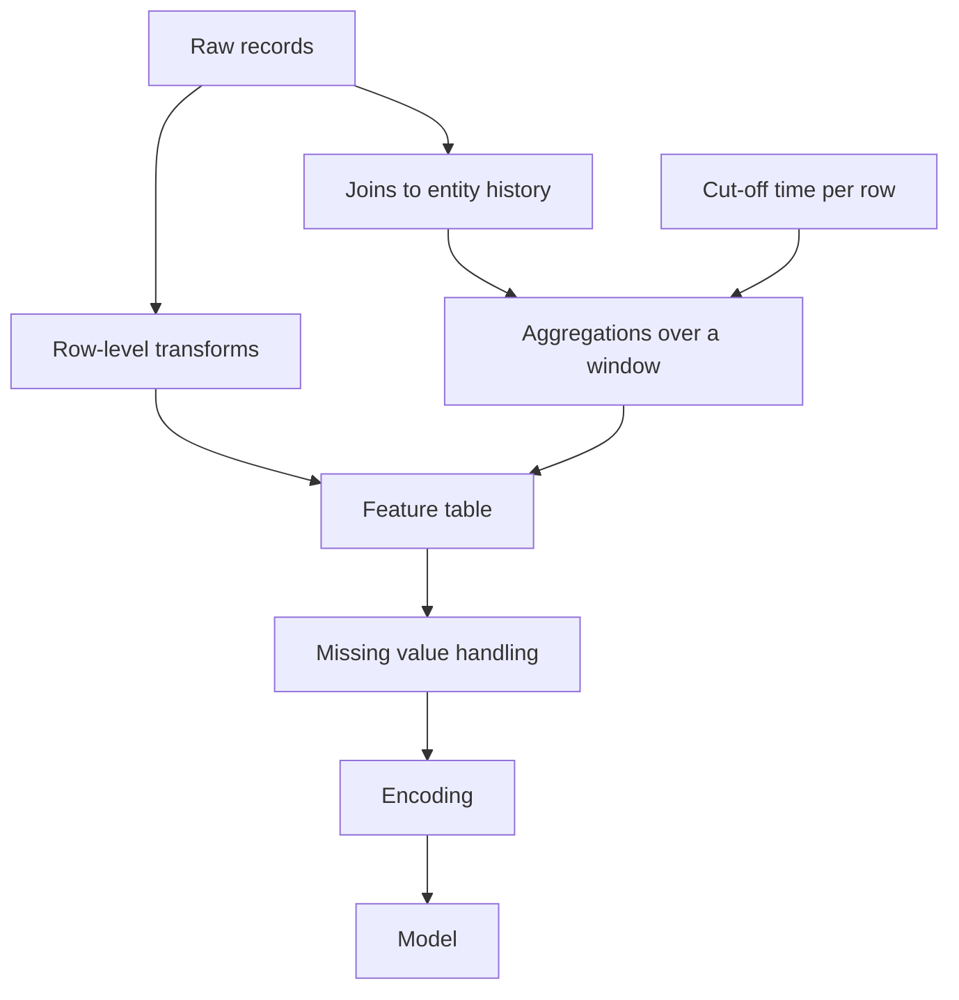
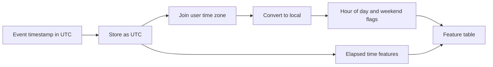
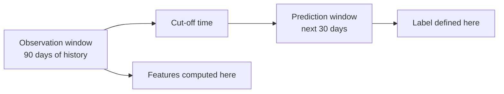
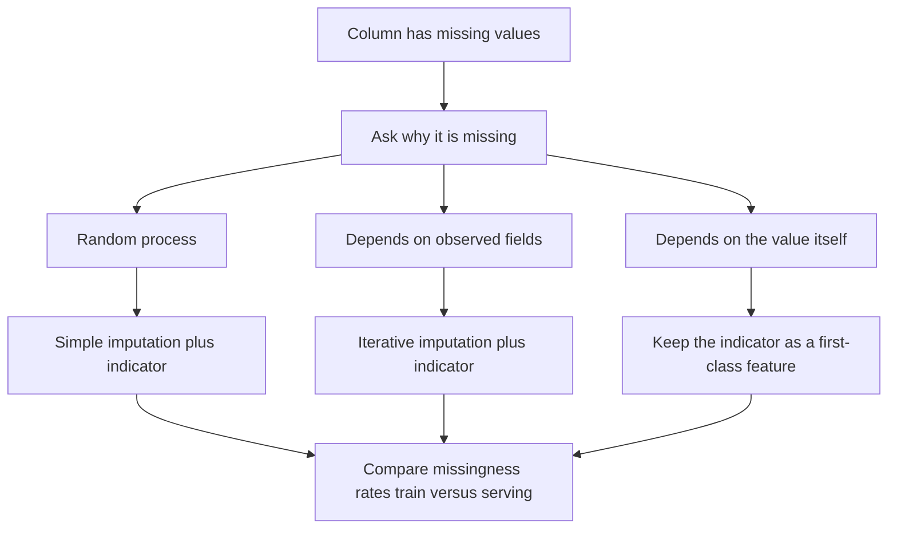
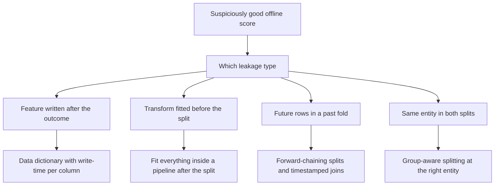
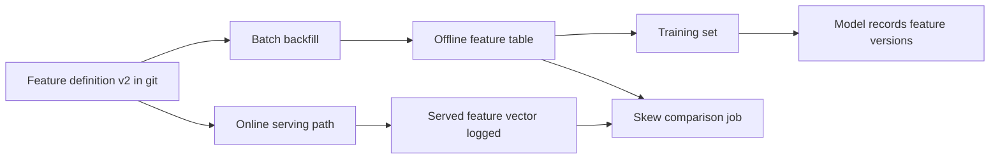

# Chapter 10: Feature Engineering

> **What this chapter covers**: Why features still decide outcomes on tabular and sensor data, numeric and categorical and datetime and text transformations, aggregation and window features, missing data mechanisms and imputation, leakage in all its forms and how to detect each, feature selection, a preview of feature stores, automated feature engineering and its limits, and how to document and version features.
> **Prerequisites**: Chapter 2 (probability and statistics), Chapter 4 (classical machine learning), Chapter 5 (evaluation and validation).
> **Where it is used**: Credit risk, fraud detection, churn and propensity modelling, demand forecasting, clinical risk scores, sensor and wearable pipelines, advertising, and every production system where the model is a gradient-boosted tree rather than a network.

---

## 10.1 Level 1: Foundations

### What a feature is

A feature is a single measured or derived quantity that a model reads as an input column. "Account age in days" is a feature. "Number of failed logins in the last hour" is a feature. "The raw log line" is not; it is data from which features are built.

Feature engineering is the work of turning records into columns. It covers deciding what to compute, how to encode it, what to do about missing values, and how to avoid accidentally computing something the model could not know at prediction time.

### Why this still matters

Deep learning replaced feature engineering in vision, audio, and language. It has not replaced it on tabular data, and the evidence is consistent. Grinsztajn, Oyallon and Varoquaux (2022) evaluated tree ensembles against neural networks across many tabular datasets and found tree ensembles ahead, attributing it to three properties of tabular data: irregular target functions, uninformative features that networks are less robust to, and the lack of rotational invariance in tabular columns that networks implicitly assume.

The practical situation for an engineer:

| Data type | Where the win comes from |
|---|---|
| Images, audio, raw text | The architecture and the pretrained weights. Feature engineering is mostly preprocessing |
| Tabular | The features. Two engineers with the same algorithm and different features get very different results |
| Sensor and time series | Both. Physically motivated features plus learned components |
| Graphs | Structural features plus message passing |

On tabular problems, the ordering of effort that consistently pays is: fix the label definition, fix the validation split, engineer features, then tune the model. Model tuning is last because it is the smallest lever. Moving from default gradient boosting hyperparameters to tuned ones typically buys a small improvement. Adding the right aggregation feature can buy a large one.

### The mental model

Every feature answers a question about a record. Good feature engineering is a disciplined process of writing down the questions a human expert would ask, then computing the answer.

For a fraud decision on a transaction, an analyst asks: Is this amount unusual for this customer? Has this card been used in two distant places within an hour? Is this merchant new to this customer? Each is a feature. None is in the raw transaction row. All require joining to history.

That is the second half of the mental model. Most valuable features are not transformations of the current row. They are aggregations over related rows, and the hard part is computing them over exactly the data that would have been available at prediction time.



*Figure 10.1: The feature pipeline. The cut-off time governs the aggregation step and is where leakage enters.*

### The vocabulary

| Term | Definition |
|---|---|
| Cardinality | The number of distinct values a categorical feature takes |
| Encoding | Turning a non-numeric value into numbers a model can consume |
| Scaling | Changing the numeric range of a feature without changing its ordering |
| Imputation | Filling in a missing value with an estimate |
| Leakage | A feature containing information that would not be available at prediction time, or that encodes the label |
| Cut-off time | The timestamp after which no data may be used to build a row's features |
| Observation window | The span of history a feature aggregates over, ending at the cut-off |

---

## 10.2 Level 2: Working knowledge

### Numeric features: scaling

Scaling changes the numeric range. Which method to use, and whether you need one at all, depends entirely on the model.

| Method | Formula | Result |
|---|---|---|
| Standardisation, z-score | $(x - \mu) / \sigma$ | Mean 0, standard deviation 1, unbounded |
| Min-max | $(x - \min) / (\max - \min)$ | Bounded to zero through one, sensitive to outliers |
| Robust | $(x - \text{median}) / \text{IQR}$ | Outlier resistant, where IQR is the interquartile range |
| Max-abs | $x / \max(\lvert x \rvert)$ | Bounded to minus one through one, preserves sparsity by keeping zeros at zero |
| Quantile / rank | Map to the empirical cumulative distribution | Uniform output, destroys spacing information |

When scaling is *required*, not optional:

| Model family | Scaling needed | Reason |
|---|---|---|
| Linear and logistic regression with regularisation | Yes | The penalty is applied per coefficient, so unscaled features get unequal effective penalties |
| Support vector machines, k-nearest neighbours, k-means | Yes | They compute distances, and a feature with a large range dominates the distance |
| Principal component analysis | Yes | Variance is the objective, so large-range features capture the components |
| Neural networks | Yes, in practice | Unscaled inputs make optimisation ill-conditioned and saturate activations |
| Decision trees, random forests, gradient boosting | No | Splits depend only on ordering, and any monotone transform leaves the tree unchanged |

That last row is worth internalising. Scaling a feature before a gradient-boosted tree does literally nothing to the model. People do it anyway out of habit.

**Worked example.** Feature values 10, 20, 30, 40, 1000.

Mean: $(10+20+30+40+1000)/5 = 220$. Sample standard deviation: deviations are $-210, -200, -190, -180, 780$; squares $44100, 40000, 36100, 32400, 608400$; sum $761000$; divide by $n-1 = 4$ gives $190250$; square root gives $436.2$. So the z-score of 10 is $(10-220)/436.2 = -0.481$ and of 1000 is $1.788$. The four small values are compressed into a narrow band.

Min-max: $(10-10)/(1000-10) = 0$, and 40 maps to $30/990 = 0.030$. The four small values are squeezed into the first three percent of the range. This is the failure mode of min-max under outliers.

Robust: median is 30. Quartiles by the linear interpolation convention on five sorted points give first quartile 20 and third quartile 40, so the interquartile range is 20. The value 10 maps to $(10-30)/20 = -1.0$, and 1000 maps to $48.5$. The bulk is now on a sensible scale and the outlier is visibly an outlier, which is usually what you want.

The rule that causes the most bugs: **fit the scaler on training data only**, then apply the fitted parameters to validation and test. Fitting on the full dataset leaks distributional information from the test set. Use a pipeline object so this is structurally impossible rather than a thing you remember.

### Numeric features: skew and transformation

Many real quantities are right-skewed: income, transaction amount, session duration, page views. Linear models and distance-based models suffer because a few large values dominate.

| Transform | Formula | Handles zeros | Notes |
|---|---|---|---|
| Log | $\log(x)$ | No | Requires strictly positive |
| Log1p | $\log(1+x)$ | Yes | The standard choice for counts |
| Square root | $\sqrt{x}$ | Yes | Milder than log, good for Poisson-like counts |
| Box-Cox | $(x^\lambda - 1)/\lambda$ for $\lambda \ne 0$, $\log x$ for $\lambda = 0$ | No | $\lambda$ fitted by maximum likelihood |
| Yeo-Johnson | Piecewise extension of Box-Cox | Yes, and negatives | The general-purpose choice |

**Worked example of skew reduction.** Values 1, 10, 100, 1000, 10000. The mean is 2222.2 and the median is 100, so the mean sits far above the median, which is the signature of right skew. After $\log_{10}$ the values become 0, 1, 2, 3, 4. Mean 2, median 2. Perfectly symmetric. Sample skewness went from strongly positive to zero.

Again, trees do not care. A monotone transform cannot change a tree's splits. Apply these for linear models, distance-based models, and networks.

### Numeric features: binning

Binning converts a continuous feature into categories. Equal-width bins use fixed intervals. Equal-frequency bins use quantiles. Supervised binning chooses cut points to maximise a criterion, and the monotone weight-of-evidence binning used in credit scoring is the best known example.

Binning has real costs and they are usually underweighted:

- It destroys within-bin ordering. Two values either side of a cut point become maximally different; two values at opposite ends of a bin become identical.
- It is a hard nonlinearity chosen without seeing the loss surface. A spline or a tree would place the nonlinearity where it helps.
- The cut points are fitted parameters and must be fitted on training data only.

Binning is defensible in three cases: when regulatory or business rules require bands, when you need a linear model to express a non-monotone relationship, and when the feature is extremely noisy so binning acts as a coarse smoother. Otherwise prefer letting the model handle the nonlinearity.

### Numeric features: outliers

First decide what the outlier *is*. Three cases with three different treatments:

| Case | Example | Treatment |
|---|---|---|
| Data error | Age of 200, negative price | Fix or set to missing, and fix the upstream source |
| Genuine rare event | A very large legitimate transaction | Keep it. It may be the signal, especially in fraud |
| Heavy tail of a normal distribution | Income | Transform rather than remove |

Detection methods: the interquartile rule flags values outside $[Q_1 - 1.5 \times \text{IQR}, Q_3 + 1.5 \times \text{IQR}]$; z-score flags $\lvert z \rvert > 3$ but is itself distorted by the outliers; the modified z-score using the median absolute deviation is more robust; isolation forest and local outlier factor handle the multivariate case where no single column is extreme but the combination is.

Winsorising, meaning clipping at a percentile such as the first and ninety-ninth, is the common default. Record the clip bounds as fitted parameters and apply them to serving traffic, or you will get a silent train-serve mismatch the first time production sees a larger value.

### Interactions

An interaction is a feature built from two or more others where the combination means more than the parts. Price divided by square footage. Clicks divided by impressions. The product of two indicators.

Linear models cannot represent interactions unless you build them explicitly. Trees can represent them but need depth and data to find them, so handing a tree a known ratio often helps substantially. Polynomial expansion to degree two is the mechanical approach, and it blows up: $d$ features become $d + d(d+1)/2$. With $d = 100$ that is $100 + 5050 = 5150$ columns. Prefer a short list of domain-motivated ratios and differences.

**Listing 10.1: a scikit-learn pipeline that prevents fit-on-test leakage structurally.**

```python
from sklearn.compose import ColumnTransformer
from sklearn.pipeline import Pipeline
from sklearn.impute import SimpleImputer
from sklearn.preprocessing import StandardScaler, OneHotEncoder
from sklearn.ensemble import HistGradientBoostingClassifier

numeric = ["amount", "account_age_days", "txn_count_7d"]
categorical = ["merchant_category", "device_type"]

num_pipe = Pipeline([
    ("impute", SimpleImputer(strategy="median", add_indicator=True)),
    ("scale", StandardScaler()),
])
cat_pipe = Pipeline([
    ("impute", SimpleImputer(strategy="constant", fill_value="__missing__")),
    ("encode", OneHotEncoder(handle_unknown="infrequent_if_exist", min_frequency=20)),
])

pre = ColumnTransformer([("num", num_pipe, numeric), ("cat", cat_pipe, categorical)])
model = Pipeline([("pre", pre), ("clf", HistGradientBoostingClassifier())])
model.fit(X_train, y_train)      # every fitted statistic comes from X_train only
```

Three details carry the weight. `add_indicator=True` creates a binary column recording that the value was missing, which preserves informative missingness rather than erasing it. `handle_unknown="infrequent_if_exist"` routes unseen categories at serving time into an infrequent bucket instead of raising, which is the behaviour you want in production. `min_frequency=20` folds rare categories together at fit time. Encoder option names have changed across scikit-learn releases, so check your version.

### Categorical features

**One-hot encoding** creates one binary column per category. Correct and interpretable. It explodes at high cardinality, and for tree models many binary columns are worse than one integer column because each split can only isolate one category at a time.

**Ordinal encoding** maps categories to integers. Correct when the categories genuinely have an order, such as small, medium, large. Wrong for unordered categories with a linear model, because it asserts that category 3 is between 2 and 4. Fine for tree models, which treat the integer as an arbitrary split point and can carve out any subset given enough depth. Modern gradient boosting libraries have native categorical support that handles unordered categories properly; prefer it when available.

**Count or frequency encoding** replaces a category with how often it appears. One column, no explosion, and often surprisingly effective because frequency itself is predictive. It collides: two categories with identical counts become indistinguishable.

**Target encoding**, also called mean encoding, replaces a category with the mean of the target for that category. It is the most powerful and most dangerous encoding in common use.

With smoothing toward the global mean:

$$\hat{y}_c = \frac{n_c \bar{y}_c + m \bar{y}}{n_c + m}$$

Here $n_c$ is the count of rows in category $c$, $\bar{y}_c$ is the target mean within the category, $\bar{y}$ is the global target mean, and $m$ is a smoothing constant controlling how much a small category is pulled toward the global mean.

**Worked example.** Global mean 0.10. A category with 4 rows and 2 positives has $\bar y_c = 0.50$. With $m = 20$:

$$\hat y_c = \frac{4 \times 0.50 + 20 \times 0.10}{4 + 20} = \frac{2.0 + 2.0}{24} = 0.167$$

Without smoothing the model would see 0.50 and treat this rare category as five times riskier than base, on the evidence of two events. With $m=20$ it sees 0.167. For a category with 1000 rows and $\bar y_c = 0.50$: $(500 + 2)/1020 = 0.492$, essentially unchanged, because the evidence is now strong. That is exactly the intended behaviour.

**The leakage danger.** If you compute the target mean for a row using that row's own target, the feature contains the label. For a category with a single row, the encoded value *is* the label. Training accuracy is excellent and test accuracy is terrible.

**The cross-fold remedy.** Compute the encoding for each fold using only the other folds, sometimes called out-of-fold target encoding. For the test set, compute from all of the training data.

**Listing 10.2: out-of-fold target encoding.**

```python
import numpy as np
from sklearn.model_selection import StratifiedKFold

def oof_target_encode(train_cat, y, test_cat, m=20.0, n_splits=5, seed=0):
    prior = y.mean()
    oof = np.full(len(train_cat), np.nan, dtype=float)
    skf = StratifiedKFold(n_splits=n_splits, shuffle=True, random_state=seed)
    for fit_idx, enc_idx in skf.split(train_cat, y):
        stats = (y[fit_idx].groupby(train_cat[fit_idx])
                 .agg(["sum", "count"]))                 # computed WITHOUT the encoded rows
        sm = (stats["sum"] + m * prior) / (stats["count"] + m)
        oof[enc_idx] = train_cat[enc_idx].map(sm).fillna(prior).values
    full = y.groupby(train_cat).agg(["sum", "count"])
    sm_full = (full["sum"] + m * prior) / (full["count"] + m)
    return oof, test_cat.map(sm_full).fillna(prior).values
```

The load-bearing line is that statistics come from `fit_idx` and are applied to `enc_idx`, which are disjoint. `fillna(prior)` handles a category that appears in the encoded fold but not the fitting folds, and the same fallback handles unseen categories at serving time. For time-ordered data replace `StratifiedKFold` with a forward-only split, because even out-of-fold encoding leaks the future if the folds are random.

**Hashing** applies a hash function to the category and takes the result modulo a fixed number of buckets. Fixed memory regardless of cardinality, no vocabulary to store, handles unseen categories automatically, and needs no fitting. The cost is collisions, which are unrecoverable. Use it when cardinality is huge and unbounded, such as raw URLs or user agents.

**Worked example of collisions.** With $n$ distinct categories into $b$ buckets, the expected number of categories sharing a bucket with at least one other is approximately $n(1 - (1-1/b)^{n-1})$. For $n = 10{,}000$ and $b = 1{,}000$: $(1 - 1/1000)^{9999} = e^{-9.999} = 4.5 \times 10^{-5}$, so essentially every category collides. For $b = 1{,}000{,}000$: $(1-10^{-6})^{9999} \approx e^{-0.01} = 0.990$, so about $10{,}000 \times 0.01 = 100$ categories collide, one percent. The rule of thumb is to set bucket count at least 10 to 100 times the number of distinct values you care about resolving.

**Embeddings for high cardinality.** Learn a dense vector per category jointly with the model. This is the right answer when cardinality is in the millions, when categories have latent structure worth sharing, and when you are already training a network. Chapter 9 covers dimension choice. Trees cannot consume a learned embedding naturally, though you can train embeddings in a separate network and feed the vectors to a tree as columns.

**Rare categories.** Group everything below a frequency threshold into an "other" bucket. Choose the threshold from the count needed for a stable estimate, not from a round number. A category needs roughly $10 / p$ rows for a stable rate estimate at base rate $p$; at $p = 0.02$ that is 500 rows. Always have an explicit path for a category never seen in training, because you will meet one on the first day in production.

### Datetime features

A timestamp is never a feature. It is a source of many.

| Derived feature | Why |
|---|---|
| Hour of day, day of week, day of month, month, quarter | Human activity cycles |
| Is weekend, is holiday | Behaviour differs sharply |
| Days since a reference event, such as signup | Lifecycle stage |
| Days until a future event, such as contract end | Anticipation effects |
| Business days elapsed, not calendar days | Operational processes run on business days |

**Cyclical encoding.** Hour 23 and hour 0 are adjacent in reality and maximally distant as integers. Encode with sine and cosine:

$$x_{\sin} = \sin\!\left(\frac{2\pi t}{T}\right), \qquad x_{\cos} = \cos\!\left(\frac{2\pi t}{T}\right)$$

where $t$ is the value and $T$ is the period.

**Worked example.** $T = 24$. Hour 23: $2\pi \times 23/24 = 6.021$ radians. $\sin = -0.2588$, $\cos = 0.9659$. Hour 0: $\sin = 0$, $\cos = 1$. Euclidean distance between them: $\sqrt{0.2588^2 + 0.0341^2} = \sqrt{0.0670 + 0.0012} = 0.261$. Hour 12: $\sin = 0$, $\cos = -1$; distance from hour 0 is $2.0$. So 23 and 0 are close and 0 and 12 are maximally far, which matches reality. The raw integer encoding gives distances 23 and 12, exactly backwards.

Note that trees gain little from cyclical encoding, because a tree can split the integer hour into any set of ranges. One-hot on hour of day is often better for trees than sine and cosine.

**Holiday and calendar effects.** Holidays shift demand hard and they move between years. Easter moves. Chinese New Year moves. Ramadan moves through the solar calendar. A "day of year" feature cannot capture a moving holiday. Use a holiday calendar library for your regions, and add features for days before and after a holiday, not only the day itself, because behaviour shifts around it.

**Time zones as a source of silent bugs.** This is worth its own paragraph because it produces the most expensive category of quiet error in this chapter.

Store timestamps in coordinated universal time, abbreviated UTC. Convert to local time only when computing a feature whose meaning is local, such as hour of day. If you extract hour of day from a UTC timestamp for users across many time zones, you have mixed local mornings with local evenings and destroyed the feature.

Daylight saving transitions create two more traps. On the spring-forward day the local clock skips an hour, so a 24-hour local day has 23 hours and an hourly aggregation produces a missing bucket. On the autumn day one local hour occurs twice, so aggregates double and a naive local-time join can duplicate rows. Any hourly or daily feature computed in local time must be tested across both transition days.

A checklist that prevents most of it: store UTC everywhere, keep the user's time zone as a column, convert explicitly and visibly when computing local features, never depend on the server's own time zone, and include a daylight saving transition day in your test fixtures.



*Figure 10.2: Elapsed-time features come from UTC; calendar features come from local time. Mixing them is the bug.*

### Text features

**Bag of words** counts each vocabulary term per document, discarding order.

**Term frequency inverse document frequency**, written TF-IDF, weights a term by how often it appears in the document and how rare it is across the corpus. A common form:

$$\text{tfidf}(t, d) = \text{tf}(t,d) \times \log\!\left(\frac{N}{\text{df}(t)}\right)$$

where $\text{tf}(t,d)$ is the count of term $t$ in document $d$, $N$ is the number of documents, and $\text{df}(t)$ is the number of documents containing $t$. Implementations differ in smoothing and normalisation; scikit-learn by default uses $\log\frac{1+N}{1+\text{df}}+1$ and then $L_2$-normalises each row. Check your library's exact definition before comparing numbers across tools.

**Worked example.** Corpus of $N = 1000$ documents. The term "the" appears in 990 of them; the term "arrhythmia" appears in 10. In one document, "the" appears 12 times and "arrhythmia" 3 times.

Plain IDF for "the": $\log(1000/990) = \log(1.0101) = 0.01005$. TF-IDF: $12 \times 0.01005 = 0.121$.
Plain IDF for "arrhythmia": $\log(1000/10) = \log(100) = 4.605$. TF-IDF: $3 \times 4.605 = 13.82$.

So the rare term outweighs the common one by a factor of 114 despite appearing a quarter as often. That is the entire point of the weighting.

**N-grams** are contiguous sequences of $n$ tokens. They recover some order. "Not good" and "good" are distinguished by bigrams and not by unigrams, which matters enormously for sentiment. The cost is vocabulary explosion; bigrams on a 50,000-word vocabulary have up to 2.5 billion possible entries, so you must cap by minimum document frequency or by top-$k$ selection. Character n-grams are robust to misspellings and useful for short, noisy text and for languages without whitespace segmentation.

**When to use embeddings instead.** Use TF-IDF when the vocabulary is domain-specific and stable, when you need interpretable coefficients, when the corpus is small, when latency and cost must be minimal, or when exact term matching matters such as product codes. Use embeddings when meaning matters more than surface form, when synonyms and paraphrases must match, when the corpus is multilingual, or when you need semantic retrieval. Hybrid retrieval, combining a sparse lexical score with a dense score, beats either alone in most published comparisons, so treat these as complements rather than as a choice.

### Aggregation features

Most of the predictive power in transactional and event data lives here.

**Group statistics.** For each entity, compute statistics over its history: count, sum, mean, standard deviation, minimum, maximum, median, specific quantiles, count distinct, and the ratio of a current value to the entity mean.

**Window functions.** Restrict the aggregation to a time window: last 1, 7, 30, and 90 days is a common ladder. Ratios between windows are often stronger than any single window, because they encode change. A feature like "transactions in the last 7 days divided by average weekly transactions over the last 90 days" is a normalised acceleration signal and is frequently among the top features in churn and fraud models.

**The discipline of the observation window.** Every aggregation needs three explicit decisions, written down:

1. The **cut-off time** for the row. No data after this instant may be used.
2. The **observation window**, ending at the cut-off, over which features are aggregated.
3. The **prediction window**, starting after the cut-off, over which the label is defined.

Getting this wrong is the leakage failure in the next section. A concrete correct specification: as of the first of each month, aggregate the previous 90 days of activity as features, and label the customer as churned if they make no purchase in the following 30 days.

Add a fourth consideration in production: **data availability lag**. If a data source lands 48 hours late, a feature computed at the cut-off will not actually exist at the cut-off in production. Your observation window must end at the cut-off minus the lag, or you have built a feature you cannot serve.



*Figure 10.3: Features come strictly from before the cut-off; the label comes strictly from after it.*

**Listing 10.3: leak-free rolling aggregations in SQL.**

```sql
SELECT
  t.customer_id,
  t.cutoff_ts,
  COUNT(h.txn_id)                                        AS txn_count_30d,
  COALESCE(SUM(h.amount), 0)                             AS txn_sum_30d,
  COALESCE(AVG(h.amount), 0)                             AS txn_avg_30d,
  COUNT(DISTINCT h.merchant_id)                          AS distinct_merchants_30d
FROM label_rows t
LEFT JOIN transactions h
  ON  h.customer_id = t.customer_id
  AND h.event_ts <  t.cutoff_ts - INTERVAL '2 days'   -- data availability lag
  AND h.event_ts >= t.cutoff_ts - INTERVAL '32 days'  -- window shifted by the same lag
GROUP BY t.customer_id, t.cutoff_ts
```

Two things make this correct. The join is strictly less than the cut-off minus the lag, so no row can contribute data that would not have landed in time. The window start is shifted by the same lag so the window stays 30 days long. The `LEFT JOIN` with `COALESCE` keeps customers with no history rather than dropping them, and gives them zero rather than null, which is the right choice here because zero transactions genuinely means zero.

---

## 10.3 Level 3: Depth

### Missing data: the mechanisms

Rubin (1976) classified missingness into three mechanisms, and the classification determines which methods are valid.

| Mechanism | Definition | Example | Consequence |
|---|---|---|---|
| Missing completely at random, MCAR | Missingness independent of all data, observed and unobserved | A sensor drops packets at random | Deletion is unbiased, only loses power |
| Missing at random, MAR | Missingness depends on observed data | Older patients skip a test more often, and age is recorded | Deletion is biased; model-based imputation conditioning on the observed variables is valid |
| Missing not at random, MNAR | Missingness depends on the unobserved value itself | People with high income decline to state income | No imputation fully fixes it; the missingness itself is informative and must be modelled |

You cannot test MCAR versus MAR versus MNAR from the data alone in general. You can test whether missingness correlates with observed variables, which rules out MCAR. Distinguishing MAR from MNAR requires domain reasoning about why the value is absent.

The practical translation: ask a domain expert why the field is empty. "The form field is optional" is different from "the test is only ordered when the doctor suspects disease". The second is MNAR and the missingness is one of your strongest features.

### Missing data: the methods

| Method | Description | When appropriate |
|---|---|---|
| Listwise deletion | Drop rows with any missing value | MCAR and few affected rows. Otherwise it biases |
| Column deletion | Drop features above a missingness threshold | Very high missingness with no informative pattern |
| Mean or median imputation | Fill with a central statistic | Quick baseline. Shrinks variance and distorts correlations |
| Mode imputation | For categoricals | Same caveats |
| Constant sentinel | Fill numerics with a value outside the range, categoricals with a "missing" level | Good with trees, which can split on the sentinel |
| k-nearest-neighbour imputation | Fill from similar rows | MAR, moderate size, continuous features |
| Iterative or MICE | Model each column from the others, cycle to convergence | MAR, the principled default for small to medium tabular data |
| Native handling | Let the algorithm learn a default direction per split | Modern gradient boosting. Often the best option and the least work |
| Indicator variable | Add a binary "was missing" column | Nearly always, alongside any of the above |

Van Buuren's multiple imputation by chained equations, known as MICE, is the statistically principled choice when you need valid uncertainty estimates: generate several imputed datasets, fit the model on each, and pool. Most machine learning pipelines use a single imputation and accept the understated uncertainty.

**Why informative missingness must be preserved.** If a laboratory test is only ordered when a clinician suspects a condition, the presence of a value is a strong predictor. Impute it away without an indicator and you delete a top feature. Add `test_was_ordered` as a binary column and the model recovers it.

This is why `add_indicator=True` appeared in Listing 10.1. The cost is one column per feature with missing values, which is cheap. The default position should be to add the indicator and let feature selection remove it if it is useless.

One warning specific to production. If missingness patterns differ between training and serving, the indicator becomes a leakage channel. A field that was absent in historical backfill but always present in live traffic gives the model a free signal in training that vanishes at serving. Compare missingness rates per column between your training snapshot and live traffic before shipping.

**Worked example of mean imputation distorting a relationship.** Feature $x$ with true values 1, 2, 3, 4, 5 and target $y = 2x$, so $y$ is 2, 4, 6, 8, 10. Now suppose $x$ is missing for the last two rows and you impute with the mean of the observed values, $(1+2+3)/3 = 2$. The dataset the model sees is $x = 1,2,3,2,2$ with $y = 2,4,6,8,10$. The perfect linear relationship is destroyed: two rows now have $x=2$ with $y=8$ and $y=10$ while another has $x=2$ with $y=4$. The fitted slope drops and the residual variance rises. With an indicator column the model can at least learn a separate offset for imputed rows.



*Figure 10.4: The missingness mechanism determines the method, and the production check applies to all three.*

### Leakage in depth

Leakage is the most expensive mistake in applied machine learning. It produces a model that looks excellent offline and fails in production, and it is often found only after launch. Kaufman and colleagues (2012) gave the canonical treatment.

There are four distinct kinds. They have different causes and different detection strategies, and treating them as one thing is why people miss three of them.

#### Target leakage

A feature contains information about the label that would not exist at prediction time.

Examples that occur repeatedly:

- Predicting hospital readmission with a `discharge_disposition` field that is only populated after the outcome.
- Predicting churn with `cancellation_reason`, which is null for everyone who did not churn.
- Predicting fraud with `chargeback_amount`, recorded weeks after the transaction.
- Predicting loan default with `days_past_due`, a direct restatement of the label.
- Predicting conversion with `total_order_value`, which is zero for non-converters.

The mechanism is almost always the same: a column that is written by a downstream process. The database does not distinguish "known at time T" from "known now".

**Detection.**

1. Look for suspiciously high performance. A model with 0.99 area under the receiver operating characteristic curve on a hard business problem is leaking until proven otherwise.
2. Rank features by importance and read the top ten. Ask of each, out loud, "would this value exist, with this value, at the moment I need the prediction?"
3. For every candidate feature, compute the mutual information or the univariate area under the curve against the label. Anything above about 0.9 alone is a suspect.
4. Build a data dictionary recording, per column, the process that writes it and when. This is the only structural fix. Detection catches what you already suspect; documentation catches what you do not.
5. Compare the feature's distribution conditioned on the label. A column that is null for exactly one class is almost certainly leaking.

#### Train-test contamination

Information flows from the evaluation set into the training process.

| Form | Mechanism |
|---|---|
| Preprocessing fitted on all data | Scaler, imputer, encoder, or feature selector fitted before splitting |
| Duplicate rows across splits | The same record appears in train and test, so the model memorises |
| Oversampling before splitting | SMOTE-generated copies of a test row land in train |
| Repeated use of the test set | Hundreds of evaluations turn the test set into a de facto validation set |

**Detection.** Compare exact and near-duplicate hashes across splits. For text, use a shingle or MinHash similarity check; near-duplicates are common in scraped corpora. Audit that every fitted transform lives inside a pipeline that is fitted after the split. Reserve one holdout touched exactly once. Track how many times you have looked at the validation set; after a few dozen evaluations, its optimism is measurable.

#### Temporal leakage

Using future information to predict the past. Distinct from target leakage because the feature itself is legitimate; the timing is wrong.

Causes:

- Random cross-validation on time-ordered data. Folds contain future rows relative to the validation rows.
- Aggregations computed over the whole history rather than only up to the cut-off.
- A slowly changing dimension read at its current value rather than as of the cut-off. Customer segment is the classic one: reading today's segment for a two-year-old row leaks the intervening evolution.
- Target encoding computed over the full training period, embedding future rates.
- Backfilled or restated data. A revised figure carries information that was not available originally.

**Detection.** Plot each feature's distribution over time next to the label's; a feature that tracks the label with no lag is suspicious. Explicitly verify that every join carries a timestamp predicate. Run a "future-blind" rebuild for a sample of rows, recomputing every feature from a snapshot as of the cut-off, and compare against your pipeline's output; any difference is leakage. Compare random cross-validation to a forward-chaining split; a large gap in favour of random splitting is diagnostic.

#### Group leakage

Correlated rows split across train and test, so the model memorises the group rather than learning the pattern.

Examples: several visits by the same patient split across train and test; multiple photographs of the same object; several sensor windows from one wearing session; multiple transactions from one account; augmented copies of one source image.

The model learns the identity of the group and scores well on the test rows that share a group with training rows. In deployment it meets entirely new groups and fails.

**Detection.** Identify the natural unit of independence, which is usually a person, device, session, or account. Verify that no identifier appears in more than one split. If no identifier exists, look for near-duplicate feature vectors across splits. Compare grouped and ungrouped cross-validation scores; a large gap quantifies exactly how much you were memorising.

The remedy is grouped splitting, and it must be applied at every level of nesting. If sessions belong to devices and devices belong to people, split by person.



*Figure 10.5: Four kinds of leakage with four distinct remedies.*

A closing rule of thumb. If a model's offline performance is much better than a domain expert believes is achievable, stop and audit before celebrating. The base rate for "surprisingly good result on tabular data" being leakage rather than insight is high.

### Feature selection

Three families.

**Filter methods** score features independently of the model. Variance threshold removes near-constant columns. Correlation with the target ranks by univariate association. Mutual information captures nonlinear dependence. The chi-squared test handles categorical pairs. Correlation between features identifies redundancy.

Filters are fast and model-agnostic. They miss features that are useless alone and valuable in combination, which is the exclusive-or problem: two features each with zero univariate association can together determine the label perfectly.

**Wrapper methods** search over feature subsets, evaluating a model on each. Forward selection adds the best feature repeatedly. Backward elimination removes the worst. Recursive feature elimination repeatedly fits and drops the lowest-importance feature.

Wrappers find interactions and are expensive. Worse, they select on validation performance, so the selection itself overfits. Wrap the whole selection procedure inside the outer cross-validation loop or your reported score is optimistic. This is one of the most common statistical errors in applied work.

**Embedded methods** select as part of fitting. $L_1$ regularisation, the lasso, drives coefficients to exactly zero. Tree ensembles produce importances. Elastic net combines $L_1$ and $L_2$ and handles correlated groups more gracefully than pure lasso, which arbitrarily picks one of a correlated set.

Embedded methods are usually the best value: one fit, interactions handled, and the selection is consistent with the model that will ship.

**Permutation importance and SHAP.** Permutation importance shuffles one column and measures the performance drop, using the model you actually trained. It is more trustworthy than tree impurity importance, which is biased toward high-cardinality and continuous features. Both are distorted by correlated features: shuffle one of two correlated columns and the model compensates using the other, so both look unimportant. Either group correlated features and permute the group, or use a conditional variant.

SHAP values (Lundberg and Lee, 2017) attribute a prediction to features using the Shapley value from cooperative game theory. They give per-prediction attributions with a consistency guarantee. They are expensive in general and fast for tree models via TreeSHAP. They still inherit the correlated-feature ambiguity, because with correlated inputs there is no unique correct attribution.

**Selection for performance versus selection for interpretability.** These are different objectives and conflating them causes arguments.

| | For performance | For interpretability |
|---|---|---|
| Goal | Maximise held-out metric | Produce a model a human can reason about and defend |
| Correlated features | Keep both if they help | Keep one, since two correlated features split the attributed credit and confuse the reader |
| Feature count | Whatever wins | Small enough to fit on a page, often under 20 |
| Marginal features | Keep a feature worth a tiny gain | Drop it; the maintenance and explanation cost exceeds the value |
| Stability | Secondary | Primary. A feature set that changes each retrain is indefensible to a reviewer |

Regulated settings usually demand the right-hand column even at a measurable cost in the metric. Say which objective you are optimising before the discussion starts.

A practical stability check: run selection on several bootstrap resamples and record how often each feature is chosen. Features selected in under half the resamples are noise. This is the core idea of stability selection (Meinshausen and Bühlmann, 2010).

---

## 10.4 Level 4: Mastery

### Training and serving skew

The single largest source of production failure in feature-heavy systems is that the feature computed at training time differs from the feature computed at serving time. Sources:

| Source | Example |
|---|---|
| Two implementations | Training in Spark SQL, serving in Python. The two round differently or handle nulls differently |
| Different window boundaries | Training uses calendar days in UTC, serving uses a rolling 24 hours |
| Data availability lag | Training used data that had landed by backfill time; serving does not have it yet |
| Different default values | Training imputes with the training median, serving imputes with a hardcoded zero |
| Schema drift | An upstream column changes units or meaning without notice |

The structural remedies are a single feature definition used by both paths, point-in-time correct backfill so training data is generated by the same logic as serving, and continuous comparison of logged serving feature values against recomputed training values. This is what a feature store exists to provide, and Chapter 20 covers it in full. The essential guarantees to look for are point-in-time correctness on backfill, a shared transformation definition, an online store meeting serving latency, and monitoring of the difference between online and offline values for the same entity and time.

Even without a feature store you can get most of the benefit by writing feature logic once as a library, calling it from both the batch job and the service, and logging the exact served feature vector with every prediction. Logging the served vector is the highest-value single practice in this chapter; without it you cannot debug a production discrepancy at all.

### Automated feature engineering and its limits

**Deep feature synthesis** (Kanter and Veeramachaneni, 2015), implemented in Featuretools, walks a relational schema and applies aggregation primitives across relationships and transform primitives within tables, composing to a chosen depth. It generates hundreds or thousands of candidates mechanically.

**AutoML feature generation** in tools such as autogluon and H2O applies standard encodings and interactions automatically. **Genetic approaches** search over compositions of operators. **Learned methods** attempt to predict which transformations will help.

What automation genuinely does well:

- Exhaustively covering combinatorial aggregations that a human would forget. Nobody manually writes count distinct over nine windows for six entity relationships.
- Enforcing a consistent naming and computation convention.
- Providing a strong baseline quickly on a new relational dataset.

Where it reliably fails:

| Limit | Explanation |
|---|---|
| No domain semantics | It will compute the mean of a categorical code and the sum of a ratio. The units are nonsense |
| No causal reasoning | It cannot know that a column is written after the outcome, so it happily generates leaking features |
| Multiple comparisons | Generating 5,000 features and selecting on validation performance finds features that are noise. With 5,000 random features and a 5 percent selection threshold you expect 250 false positives |
| Cost | Hundreds of features must be computed, stored, monitored, and served. Each is an operational liability |
| Fragility | Automatically generated features are harder to explain to a reviewer and harder to debug when they shift |

The defensible position: use automated generation as a *hypothesis generator*, then inspect the top results, understand why each works, reimplement the ones that survive scrutiny by hand with a clear name and a documented definition, and discard the rest. The output of an automated tool should be a shortlist for a human, not a shipped feature set.

The multiple comparisons problem deserves a number. If you test $k$ independent features at significance level $\alpha$, the expected count of spurious selections is $k\alpha$. At $k = 5000$ and $\alpha = 0.05$ that is 250. Control it with a false discovery rate procedure such as Benjamini-Hochberg, or with nested cross-validation where selection happens inside the inner loop.

### The argument about deep learning on tabular data

This is live and worth understanding rather than picking a side.

The case for trees: Grinsztajn and colleagues (2022) found tree ensembles ahead on a broad benchmark, and the explanations offered are structural. Tabular targets are often irregular and piecewise constant, which trees represent naturally and smooth networks do not. Tabular datasets contain uninformative columns that trees ignore cheaply. Networks are approximately rotation invariant in their first layer, which is wrong for tabular data where individual columns carry meaning.

The case for networks: TabNet (Arik and Pfister, 2019), FT-Transformer and related architectures (Gorishniy and colleagues, 2021), NODE, and SAINT all report competitive results on some benchmarks. Networks win clearly when you need to consume high-cardinality categoricals via learned embeddings, when you need to fuse tabular data with text or images, when you want to pretrain on unlabelled tabular data, or when you need a single model serving many related tasks.

The unresolved part is benchmark selection. Results depend heavily on which datasets are included and how much tuning budget each method receives. Tuning budget matters more than most papers report; networks need more of it.

A pragmatic default: start with gradient boosting on well-engineered features, because it is fast, robust, and gives a strong number in an afternoon. Consider a network when you have a specific reason from the list above. Run both and compare with proper intervals before deciding, and remember that the feature set usually matters more than the choice between them.

### Documenting and versioning features

A feature nobody can explain is a liability. A feature whose definition changed silently is worse, because every historical model evaluation is now invalid.

**The minimum record per feature:**

| Field | Why |
|---|---|
| Name and version | Versioned because definitions change |
| Plain-language description | The thing a reviewer reads |
| Exact computation, as code or query | The thing an engineer reproduces |
| Source tables and columns | For impact analysis when upstream changes |
| Data type, unit, and valid range | Catches unit changes |
| Cut-off semantics and observation window | The leakage-relevant detail |
| Expected availability lag | Whether it can be served at all |
| Missingness rate and its meaning | Whether missing is informative |
| Owner | Who to ask |
| Models consuming it | Blast radius of a change |

**Versioning rules that hold up:**

1. A change in computation creates a new version. Never mutate a definition in place. Models pinned to version 1 keep working while new models use version 2.
2. Feature definitions live in version control with the model code, not in a notebook and not in a scheduled query nobody owns.
3. Backfills are reproducible. Given a definition version and a cut-off time, recomputation yields identical values.
4. Every trained model records the exact feature versions it consumed. Without this you cannot reproduce a model six months later.
5. Breaking changes require an announced deprecation window, because consumers exist that you do not know about.

**Automated feature tests worth having:** schema checks on type and nullability, range checks, distribution drift against a reference window, null-rate change alerts, and a point-in-time correctness test that recomputes a sample of historical rows and asserts they match. Great Expectations, Deequ, and Pandera are common tools; Chapter 20 covers data quality properly.



*Figure 10.6: One definition feeds both paths, and a comparison job proves they agree.*

### Where standard advice is wrong

| Standard advice | Where it fails |
|---|---|
| "Always scale your features" | Pointless for tree ensembles. Wasted compute and one more thing to skew between training and serving |
| "Drop highly correlated features" | Correlated features can carry independent noise whose average is informative, and trees handle them fine. It matters for coefficient interpretation, not usually for performance |
| "Use one-hot for all categoricals" | At high cardinality it inflates dimension and weakens trees. Native categorical handling or target encoding is usually better |
| "Impute missing values before modelling" | Modern gradient boosting handles missing natively and often better. Imputation can destroy an informative pattern |
| "Feature importance tells you what matters" | Impurity importance is biased toward high-cardinality features. Correlated features split credit. Importance is not causal |
| "More features are better with regularisation" | Every feature is a pipeline dependency, a monitoring surface, and a chance for training and serving skew |
| "Automated feature engineering removes the manual work" | It generates candidates. Selecting from thousands on validation performance manufactures false discoveries |
| "Remove outliers" | In fraud, anomaly detection, and rare-event modelling the outliers are the signal |

---

## 10.5 Subtopic checklist

| Subtopic | You should be able to |
|---|---|
| Why features matter | Explain why tree ensembles plus features still lead on tabular data, citing the structural reasons |
| Scaling | Choose a method and state whether your model requires scaling at all |
| Skew transforms | Detect skew from the mean-median gap and pick log1p, square root, or Yeo-Johnson appropriately |
| Binning | State the three costs of binning and the three cases where it is justified |
| Outliers | Classify an outlier as error, rare event, or heavy tail and treat each differently |
| Interactions | Build domain-motivated ratios and explain why polynomial expansion scales badly |
| One-hot and ordinal | Choose between them by model family, not by habit |
| Target encoding | Write the smoothing formula, compute it, and implement the out-of-fold remedy |
| Count and hashing | Compute the expected collision rate and choose a bucket count |
| High-cardinality embeddings | Say when an embedding beats hashing and what it requires |
| Rare categories | Pick a frequency threshold from statistical stability and handle unseen categories at serving |
| Datetime features | Derive calendar, cyclical, and elapsed features and know which need local time |
| Time zones | Name the two daylight saving failure modes and the storage rule that avoids them |
| Text features | Compute TF-IDF by hand and state when embeddings are preferable |
| Aggregations | Specify cut-off, observation window, prediction window, and availability lag for any feature |
| Missingness mechanisms | Classify a column as MCAR, MAR, or MNAR by reasoning about why it is absent |
| Imputation | Choose a method matched to the mechanism and always add the indicator |
| Target leakage | Audit a feature list for columns written after the outcome |
| Contamination | Verify every transform is fitted after the split and check for duplicates |
| Temporal leakage | Run a future-blind rebuild and compare against your pipeline |
| Group leakage | Identify the unit of independence and split on it |
| Feature selection | Choose filter, wrapper, or embedded and wrap selection inside the outer validation loop |
| Selection objectives | Distinguish selection for performance from selection for interpretability |
| Training and serving skew | Name five sources and the structural remedy for each |
| Automated feature engineering | Use it as a hypothesis generator and quantify the false discovery risk |
| Documentation and versioning | Write a feature record and state the five versioning rules |

---

## 10.6 Common misconceptions

| Misconception | Why it is believed | What is actually true |
|---|---|---|
| Deep learning made feature engineering obsolete | It genuinely did for images, audio, and text | On tabular and sensor data, features remain the dominant lever and tree ensembles remain competitive or ahead |
| You should always scale features | It is in every tutorial | Tree-based models are invariant to monotone transforms. Scaling them changes nothing and adds a skew surface |
| Target encoding is just a compact encoding | It looks like a lookup table | It contains the label. Without out-of-fold computation it leaks directly, catastrophically for rare categories |
| Random cross-validation is the default | It is the library default | On time-ordered data it leaks the future. On grouped data it leaks the group. Both inflate the score |
| Missing values must be filled in before modelling | Many algorithms historically required it | Gradient boosting learns a default direction per split, often beating imputation. Imputing can erase informative missingness |
| A feature with high importance is an important cause | Importance sounds causal | Importance measures predictive contribution given the other features. Correlated features split credit and none of it is causal |
| Removing outliers improves the model | Outliers hurt linear models visibly | In fraud, failure prediction, and anomaly detection the outliers are the target. Decide what the outlier is before removing it |
| More features with regularisation cannot hurt | Regularisation handles irrelevance in theory | Every feature is an upstream dependency, a monitoring cost, and a skew risk. Operational cost is real even when statistical cost is small |
| Correlated features must be removed | Multicollinearity is drilled into statistics courses | It destabilises coefficients in linear models. It rarely hurts tree ensemble predictive performance |
| Encoding a category as an integer is always wrong | It asserts a false order | It does for linear and distance-based models. For trees it is often the best option, and native categorical support is better still |
| A single UTC timestamp is enough | Storing UTC is the correct advice | It is necessary and not sufficient. Local calendar features need the user time zone, and daylight saving days must be tested |

---

## 10.7 Practice

**Exercise 10.1 (level 2): categorical encoding comparison with a leakage demonstration.**
Use the UCI Adult Census Income dataset. Build one-hot, ordinal, count, hashing at 256 buckets, naive target encoding, and out-of-fold target encoding with smoothing $m$ in {1, 10, 100}. Fit a gradient-boosted tree on each.
*Acceptance criterion*: a table of training and test area under the curve for every encoding, showing a visible train-test gap for naive target encoding that disappears with the out-of-fold version, plus a sentence explaining why the gap is largest for high-cardinality columns.

**Exercise 10.2 (level 2 to 3): a leak-free temporal feature pipeline.**
Use the UCI Online Retail dataset. Define a monthly cut-off, a 90-day observation window, and a 30-day prediction window for repeat purchase. Build at least fifteen aggregation features honouring a 2-day availability lag. Evaluate with forward-chaining validation.
*Acceptance criterion*: a documented feature table including cut-off semantics per feature, a forward-chaining score, and a comparison against random cross-validation with an explanation of the gap.

**Exercise 10.3 (level 3): the missingness study.**
Take a complete public dataset such as UCI Wine Quality. Artificially create missingness under MCAR, MAR, and MNAR at 10, 30, and 50 percent. For each, apply listwise deletion, median imputation, iterative imputation, and native gradient-boosting handling, each with and without an indicator column.
*Acceptance criterion*: a grid of results with bootstrap intervals, plus a written statement of which method wins under which mechanism and whether the indicator helped, with a specific explanation for the MNAR case.

**Exercise 10.4 (level 3 to 4): build a leakage detector.**
Write a reusable audit that takes a feature table, a label, a timestamp column, and a group column, and reports: features with univariate area under the curve above a threshold, features whose null pattern is class-dependent, exact and near-duplicate rows across splits, group identifiers spanning splits, and the gap between random and grouped and forward-chaining validation.
*Acceptance criterion*: the tool run against a dataset into which you have deliberately injected one instance of each of the four leakage types, catching all four, with output naming the type and the offending column.

**Exercise 10.5 (level 4): automated generation versus curated features.**
On a relational public dataset, generate features with Featuretools deep feature synthesis at depth 2. Compare against a hand-curated set of about twenty features. Then take the top automated features, understand each, and reimplement the defensible ones by hand.
*Acceptance criterion*: a comparison of the three feature sets with bootstrap intervals, a count of generated features that were leaking or semantically meaningless, an estimate of the false discovery count from the multiple comparisons argument, and a recommendation with reasoning about operational cost.

---

## 10.8 How this is tested

**Q1. Why does feature engineering still matter when deep learning replaced it elsewhere?**

<details><summary>Answer</summary>
Deep learning learns features from raw data when the data has strong local structure the architecture can exploit and there is enough of it. Tabular data has neither property. Columns are heterogeneous and semantically meaningful, there is no spatial or sequential locality to exploit, targets are often irregular and piecewise constant, and uninformative columns are common. Grinsztajn and colleagues (2022) benchmarked this and found tree ensembles ahead, attributing it to irregular targets, robustness to uninformative features, and the rotation invariance networks assume but tabular data violates. So on tabular and sensor problems the features remain the dominant lever.
</details>

**Q2. When is feature scaling required and when is it pointless?**

<details><summary>Answer</summary>
Required for regularised linear models, because the penalty applies per coefficient and unscaled features receive unequal effective penalties. Required for distance-based methods such as k-nearest neighbours, support vector machines, and k-means, because one large-range column dominates the distance. Required for principal component analysis, whose objective is variance. Required in practice for neural networks for conditioning. Pointless for decision trees and all tree ensembles, because splits depend only on ordering and any monotone transform leaves the tree identical. Scaling before a gradient-boosted tree adds compute and one more place for training and serving to diverge.
</details>

**Q3. Explain target encoding, its leakage danger, and the remedy, with a number.**

<details><summary>Answer</summary>
Target encoding replaces a category with the target mean for that category, smoothed toward the global mean by $\hat y_c = (n_c \bar y_c + m \bar y)/(n_c + m)$. With global mean 0.10, a category of 4 rows with mean 0.50, and $m = 20$, the encoded value is $(2.0 + 2.0)/24 = 0.167$ instead of 0.50. The danger is that a row's own label contributes to its encoded value; for a singleton category the feature is the label. The remedy is out-of-fold computation: for each fold, compute statistics from the other folds only, and for test data compute from all training data. On time-ordered data the folds must be forward-only, because random out-of-fold encoding still leaks the future.
</details>

**Q4. Compute the TF-IDF for a common and a rare term and explain the result.**

<details><summary>Answer</summary>
With 1000 documents, "the" in 990 of them appearing 12 times in this document: IDF $= \log(1000/990) = 0.01005$, TF-IDF $= 12 \times 0.01005 = 0.121$. "Arrhythmia" in 10 documents appearing 3 times: IDF $= \log(100) = 4.605$, TF-IDF $= 13.82$. The rare term outweighs the common one by about 114 times despite a quarter the frequency, because the inverse document frequency factor punishes terms that appear everywhere and therefore discriminate between nothing. Note that implementations differ in smoothing and normalisation, so compare within one library.
</details>

**Q5. Name the four kinds of leakage and give a detection strategy for each.**

<details><summary>Answer</summary>
Target leakage: a feature written after the outcome, such as a cancellation reason. Detect by reading the top-importance features and asking whether each value would exist at prediction time, and by maintaining a data dictionary recording which process writes each column and when. Train-test contamination: a transform fitted before the split, or duplicate rows across splits. Detect with duplicate hashing and by auditing that every fitted object lives inside a pipeline fitted after the split. Temporal leakage: future information in a past row, from random cross-validation on time-ordered data or from reading a slowly changing attribute at its current value. Detect by rebuilding features from a snapshot as of the cut-off and comparing, and by comparing random against forward-chaining validation. Group leakage: correlated rows from one entity split across train and test. Detect by checking that no entity identifier appears in more than one split and by comparing grouped against ungrouped cross-validation.
</details>

**Q6. Your model gets 0.99 area under the curve on a churn problem. What do you do?**

<details><summary>Answer</summary>
Assume leakage and audit before reporting it. Rank features by importance and check the top ten for columns written by downstream processes, a cancellation reason or an exit survey being the usual culprits. Compute univariate area under the curve per feature; anything near 0.9 alone is a suspect. Check whether any column is null for exactly one class. Verify the validation split is forward-chaining and grouped by customer. Verify no transform was fitted before the split. Then ask a domain expert what performance they believe is achievable; if your number is far above it, the burden of proof is on the model. Only after all that should you consider it real.
</details>

**Q7. Distinguish MCAR, MAR, and MNAR and say why it changes what you do.**

<details><summary>Answer</summary>
MCAR means missingness is independent of everything, so deletion is unbiased and only costs power. MAR means missingness depends on observed variables, so deletion is biased but imputation conditioning on those observed variables is valid, which is what iterative or MICE imputation does. MNAR means missingness depends on the unobserved value itself, such as high earners declining to state income; no imputation recovers the value and the missingness pattern is itself informative, so the indicator variable becomes a primary feature. You cannot distinguish these from the data alone in general. You determine it by asking why the field is empty, which is a domain question, not a statistical one.
</details>

**Q8. Why add a missing-value indicator, and when does it become dangerous?**

<details><summary>Answer</summary>
Because missingness is frequently informative. If a laboratory test is only ordered when a clinician suspects a condition, the presence of a value predicts the outcome, and imputing it away deletes a top feature. The indicator preserves it at a cost of one binary column. It becomes dangerous when missingness patterns differ between training and serving. If a field was absent in historical backfill but always populated in live traffic, the indicator gives free signal in training that vanishes in production, and the model degrades silently. Compare per-column missingness rates between the training snapshot and live traffic before shipping.
</details>

**Q9. Distinguish feature selection for performance from selection for interpretability.**

<details><summary>Answer</summary>
For performance, keep whatever raises the held-out metric, including both members of a correlated pair, and accept any feature count. For interpretability, you want a small stable set a human can reason about and defend. Keep one of a correlated pair, because two correlated features split the attributed credit and confuse the reader. Cap the count at what fits on a page. Drop features worth only a marginal gain, since the explanation and maintenance cost exceeds the value. Prioritise stability: check with bootstrap resampling how often each feature is selected, and treat anything selected in under half the resamples as noise. Regulated settings usually require the interpretability objective even at a measurable metric cost, and you should state which objective you are optimising before the discussion begins.
</details>

**Q10. What is training and serving skew and how do you prevent it?**

<details><summary>Answer</summary>
It is the difference between a feature's value computed for training and the same feature's value computed at serving. Sources include two separate implementations behaving differently on nulls or rounding, different window boundaries such as calendar days versus rolling 24 hours, data availability lag meaning a source has not landed yet at serving, different default or imputation values, and silent upstream schema changes. Prevention is structural: one feature definition used by both paths, point-in-time correct backfill generated by the same logic as serving, logging the exact served feature vector with every prediction, and a job comparing logged serving values against recomputed offline values. Logging the served vector is the highest-value single practice, because without it a production discrepancy cannot be debugged at all.
</details>

**Q11. What do automated feature engineering tools actually give you, and what is the statistical trap?**

<details><summary>Answer</summary>
They exhaustively enumerate aggregations across a relational schema that a human would forget to write, enforce consistent conventions, and give a fast strong baseline. They have no domain semantics, so they will average categorical codes and sum ratios, and no causal reasoning, so they will happily generate a leaking feature from a column written after the outcome. The statistical trap is multiple comparisons: generating 5,000 candidates and selecting on validation performance at a 5 percent threshold yields roughly 250 spurious selections purely by chance. Control it with a false discovery rate procedure or nested cross-validation with selection inside the inner loop. The defensible use is as a hypothesis generator whose top outputs a human inspects, understands, and reimplements by hand.
</details>

**Q12. Why do time zones cause silent bugs, and what is the discipline?**

<details><summary>Answer</summary>
Three failure modes. Extracting hour of day from a UTC timestamp for users in many time zones mixes local mornings with local evenings and destroys the feature. On the spring daylight saving day a local day has 23 hours, so an hourly aggregation has a missing bucket. On the autumn day one local hour occurs twice, so aggregates double and a naive local-time join can duplicate rows. The discipline is to store every timestamp in UTC, keep the user's time zone as a column, convert explicitly and visibly only when computing a feature whose meaning is local, compute elapsed-time features from UTC, never depend on the server's own time zone, and include both daylight saving transition days in test fixtures.
</details>

**Q13. When would you bin a continuous feature, given the costs?**

<details><summary>Answer</summary>
The costs are that binning destroys within-bin ordering so values either side of a cut point become maximally different while values at opposite ends of a bin become identical, that it imposes a hard nonlinearity chosen without reference to the loss surface where a spline or tree would place it better, and that cut points are fitted parameters that must come from training data only. It is justified when regulation or business rules require banded outputs, as in credit scorecards where monotone weight-of-evidence binning is standard; when you need a linear model to express a non-monotone relationship; and when the feature is so noisy that binning acts as a deliberate coarse smoother. Otherwise let the model handle the nonlinearity.
</details>

**Q14. How do you version a feature, and why does it matter six months later?**

<details><summary>Answer</summary>
A change in computation creates a new version rather than mutating the definition in place, so models pinned to version 1 keep working. Definitions live in version control with the model code, not in an unowned scheduled query. Backfills are reproducible: a definition version plus a cut-off time yields identical values on recomputation. Every trained model records the exact feature versions it consumed. Breaking changes get an announced deprecation window because unknown consumers exist. It matters six months later because without the version record you cannot reproduce the model, cannot tell whether a performance change came from data drift or from a redefinition, and cannot validly compare a new model against a historical baseline. Every past evaluation becomes uninterpretable once a definition changes silently.
</details>

---

## Summary

1. On tabular and sensor data the features, not the algorithm, decide the outcome, and tree ensembles remain competitive or ahead of networks.
2. Scaling is required for regularised linear models, distance-based methods, principal component analysis, and networks, and is pointless for tree ensembles.
3. Fit every transform on training data only, inside a pipeline, so contamination is structurally impossible rather than remembered.
4. Target encoding is the most powerful and most dangerous encoding. Use out-of-fold computation with smoothing, and forward-only folds on time-ordered data.
5. Hashing trades collisions for fixed memory. Size buckets at 10 to 100 times the number of values you need to resolve.
6. Cyclical encoding makes hour 23 and hour 0 adjacent, which matters for linear models and networks and barely for trees.
7. Store timestamps in UTC, keep the user's time zone separately, and test both daylight saving transition days.
8. TF-IDF weights a term by frequency in the document and rarity in the corpus, so a rare term can outweigh a common one by two orders of magnitude.
9. Every aggregation needs a cut-off time, an observation window, a prediction window, and an availability lag, all written down.
10. The missingness mechanism, MCAR or MAR or MNAR, determines which methods are valid, and it is a domain question rather than a statistical test.
11. Add a missing-value indicator by default, and compare missingness rates between training and serving before shipping.
12. There are four kinds of leakage, target and contamination and temporal and group, with four different detection strategies.
13. Wrap feature selection inside the outer validation loop or the reported score is optimistic.
14. Training and serving skew is the main production failure mode, and logging the exact served feature vector is the highest-value defence.
15. Automated feature engineering generates hypotheses, not features. Selecting thousands of candidates on validation performance manufactures false discoveries.

---

## Further reading

- Kuhn, M. and Johnson, K. (2019). *Feature Engineering and Selection: A Practical Approach for Predictive Models*.
- Zheng, A. and Casari, A. (2018). *Feature Engineering for Machine Learning*.
- Kaufman, S. and colleagues (2012). *Leakage in Data Mining: Formulation, Detection, and Avoidance*.
- Rubin, D. (1976). *Inference and Missing Data*.
- van Buuren, S. (2018). *Flexible Imputation of Missing Data*, second edition.
- Little, R. and Rubin, D. (2019). *Statistical Analysis with Missing Data*, third edition.
- Grinsztajn, L., Oyallon, E. and Varoquaux, G. (2022). *Why do tree-based models still outperform deep learning on typical tabular data?*
- Gorishniy, Y. and colleagues (2021). *Revisiting Deep Learning Models for Tabular Data*.
- Arik, S. and Pfister, T. (2019). *TabNet: Attentive Interpretable Tabular Learning*.
- Kanter, J. and Veeramachaneni, K. (2015). *Deep Feature Synthesis: Towards Automating Data Science Endeavors*.
- Micci-Barreca, D. (2001). *A Preprocessing Scheme for High-Cardinality Categorical Attributes in Classification and Prediction Problems*.
- Weinberger, K. and colleagues (2009). *Feature Hashing for Large Scale Multitask Learning*.
- Lundberg, S. and Lee, S.-I. (2017). *A Unified Approach to Interpreting Model Predictions*.
- Strobl, C. and colleagues (2007). *Bias in Random Forest Variable Importance Measures*.
- Meinshausen, N. and Bühlmann, P. (2010). *Stability Selection*.
- Guyon, I. and Elisseeff, A. (2003). *An Introduction to Variable and Feature Selection*.
- Benjamini, Y. and Hochberg, Y. (1995). *Controlling the False Discovery Rate*.
- Sculley, D. and colleagues (2015). *Hidden Technical Debt in Machine Learning Systems*.
- Breck, E. and colleagues (2019). *Data Validation for Machine Learning*.
- Yeo, I.-K. and Johnson, R. (2000). *A New Family of Power Transformations to Improve Normality or Symmetry*.
- Box, G. and Cox, D. (1964). *An Analysis of Transformations*.
- scikit-learn documentation, *Preprocessing data* and *Imputation of missing values*.
- Featuretools documentation, *Deep Feature Synthesis*.
- Great Expectations documentation, *Expectations reference*.
