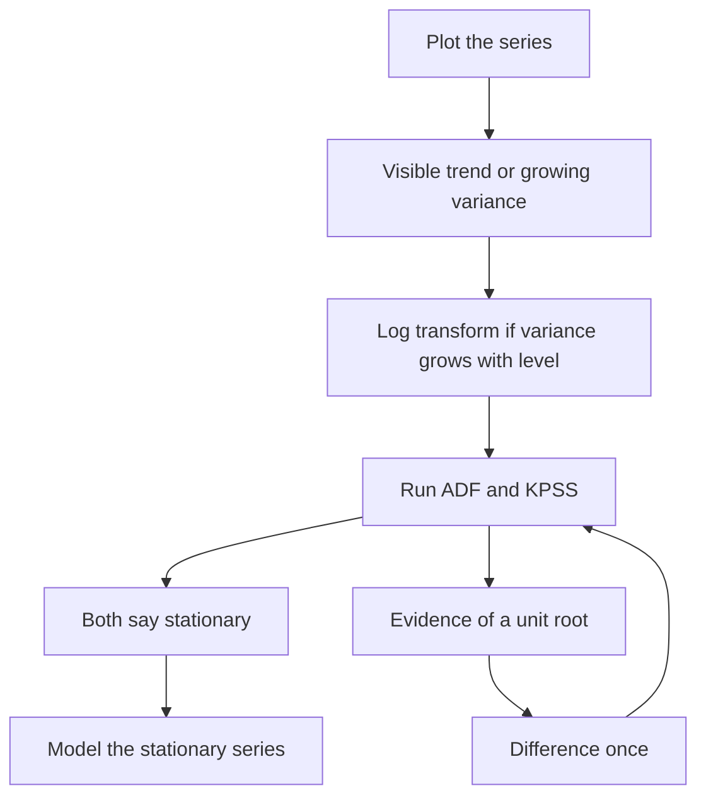
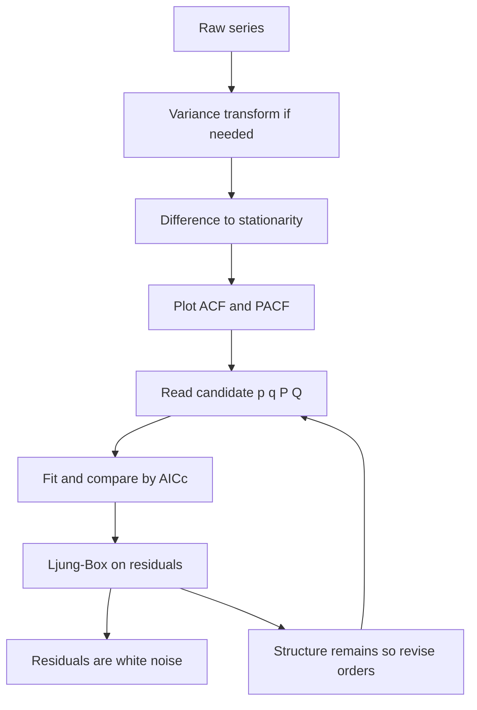
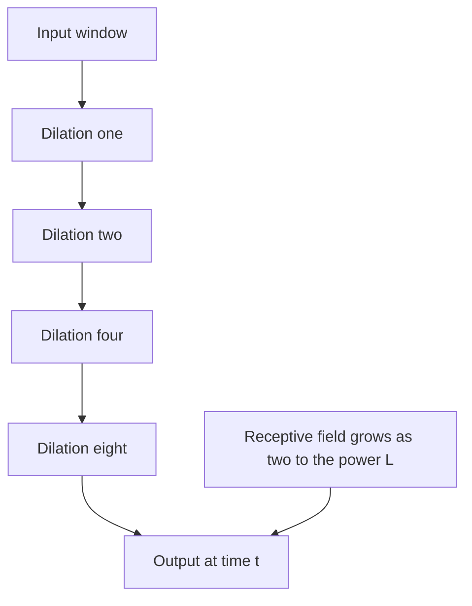
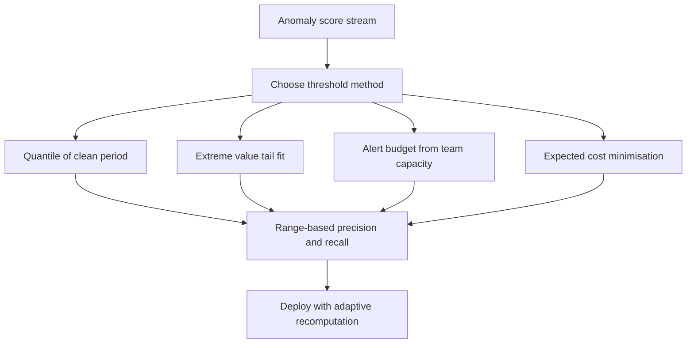
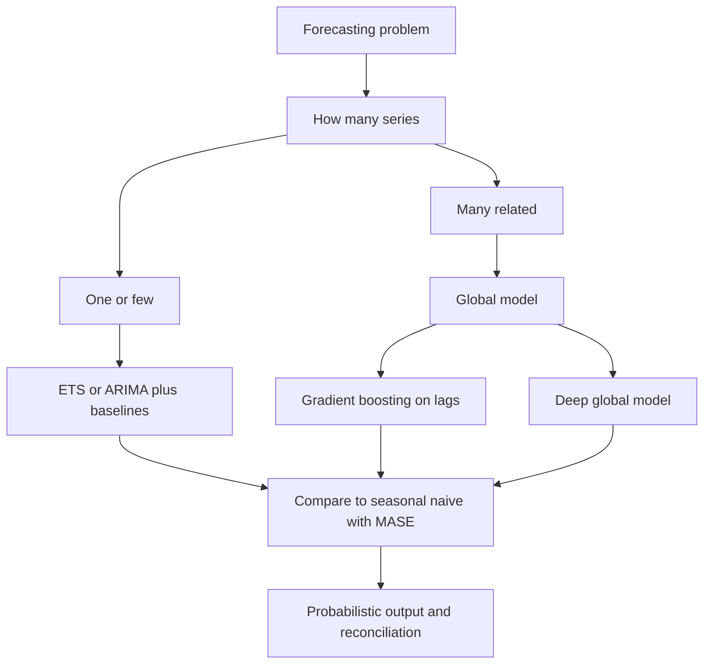

# Chapter 11: Time-Series and Sequential Modelling

> **What this chapter covers**: What makes temporal data different, decomposition, classical forecasting from naive baselines through exponential smoothing and ARIMA, feature-based forecasting with gradient-boosted trees, deep sequence models including temporal convolutions and patched transformers, probabilistic forecasting and proper scoring rules, hierarchical reconciliation, multivariate and cross-series learning, anomaly and change-point detection, irregular sampling, validation without leakage, and metric choice.
> **Prerequisites**: Chapter 2 (probability and statistics), Chapter 4 (classical machine learning), Chapter 5 (evaluation and validation), Chapter 10 (feature engineering). Chapter 7 for the recurrent and convolutional background and Chapter 8 for attention.
> **Where it is used**: Demand and supply planning, capacity and infrastructure forecasting, financial risk, energy load, clinical and wearable monitoring, industrial predictive maintenance, marketing measurement, and any system whose inputs arrive in time order.

---

## 11.1 Level 1: Foundations

### What makes temporal data different

Most supervised learning assumes rows are independent and identically distributed, abbreviated IID. Shuffle them, split them randomly, and nothing is lost. Time series violates this assumption completely, and every difference that follows stems from that.

**Order carries information.** The sequence 10, 20, 30 and the sequence 30, 10, 20 have identical summary statistics and completely different meanings. A model that ignores order throws away the main signal.

**Observations are correlated with their own past.** Today's temperature is informative about tomorrow's. This is autocorrelation, and it means the effective number of independent observations is far smaller than the row count. A series of 10,000 hourly points may carry the statistical information of a few hundred independent ones. Confidence intervals computed as if the rows were independent are far too narrow.

**The future must not inform the past.** You will deploy this model to predict forward. Any validation that lets the model see future data is measuring something you will never have.

**The distribution moves.** Trends, seasonal patterns, regime changes, and one-off events mean the process generating the data in January differs from the process in December.

### The vocabulary

| Term | Definition |
|---|---|
| Trend | A long-run systematic increase or decrease in the level |
| Seasonality | A pattern repeating at a fixed known period, such as 24 hours or 7 days or 12 months |
| Cycle | A pattern repeating at a variable, non-fixed period, such as an economic cycle |
| Level | The local mean around which the series varies |
| Autocorrelation | Correlation of the series with a lagged copy of itself |
| Stationarity | The statistical properties do not depend on time |
| Horizon | How far ahead you predict, written $h$ |
| Lag | How far back a feature reaches, written $x_{t-k}$ |
| Frequency | The sampling interval, such as hourly or daily |
| Intermittent | A series with many zero values, typical of slow-moving inventory |

### Autocorrelation

The autocorrelation function at lag $k$ measures the linear relationship between the series and itself $k$ steps earlier:

$$\rho_k = \frac{\sum_{t=k+1}^{n} (y_t - \bar y)(y_{t-k} - \bar y)}{\sum_{t=1}^{n} (y_t - \bar y)^2}$$

where $y_t$ is the value at time $t$, $\bar y$ is the series mean, and $n$ is the length.

**Worked example.** Series 2, 4, 6, 8, 10 with $n=5$. Mean is 6. Deviations: $-4, -2, 0, 2, 4$. Denominator: $16+4+0+4+16 = 40$.

Lag 1 numerator: $(-2)(-4) + (0)(-2) + (2)(0) + (4)(2) = 8 + 0 + 0 + 8 = 16$. So $\rho_1 = 16/40 = 0.40$.
Lag 2 numerator: $(0)(-4) + (2)(-2) + (4)(0) = 0 - 4 + 0 = -4$. So $\rho_2 = -0.10$.

The positive lag-1 value reflects the upward trend. This example is short enough that the estimates are unstable; in practice you want at least 50 points and read the autocorrelation at lags up to about $n/4$.

The **partial** autocorrelation at lag $k$ is the correlation between $y_t$ and $y_{t-k}$ after removing the effect of the intermediate lags. The distinction matters for model identification and is developed in level 2.

### Stationarity

A series is *strictly* stationary if the joint distribution of any set of observations is unchanged by shifting them in time. That is too strong to work with. *Weak* or covariance stationarity requires three things:

1. Constant mean: $\mathbb{E}[y_t] = \mu$ for all $t$.
2. Constant variance: $\mathrm{Var}(y_t) = \sigma^2$ for all $t$.
3. Autocovariance depending only on the lag: $\mathrm{Cov}(y_t, y_{t-k}) = \gamma_k$, independent of $t$.

A series with a trend fails the first condition. A series whose variability grows with its level fails the second. Both are common.

Stationarity matters because classical forecasting theory is built on it. Autoregressive models assume it, and fitted on a non-stationary series they produce spurious relationships and unstable forecasts.

The standard fix is differencing: model $\Delta y_t = y_t - y_{t-1}$ instead of $y_t$. A linear trend becomes a constant after one difference. A quadratic trend needs two. For a variance that grows with the level, take logs first; a multiplicative seasonal pattern becomes additive after a log transform.

**Tests for stationarity.**

| Test | Null hypothesis | Reading it |
|---|---|---|
| Augmented Dickey-Fuller, ADF | The series has a unit root, meaning non-stationary | A small p-value rejects the null, giving evidence of stationarity |
| Kwiatkowski-Phillips-Schmidt-Shin, KPSS | The series is stationary | A small p-value rejects the null, giving evidence of non-stationarity |
| Phillips-Perron | Unit root, with a different correction for serial correlation | Read like ADF |

The nulls are opposite, which is the point of running both.

| ADF result | KPSS result | Conclusion |
|---|---|---|
| Rejects unit root | Fails to reject stationarity | Stationary. Proceed |
| Fails to reject | Rejects stationarity | Non-stationary. Difference it |
| Both reject | | Contradictory. Often a trend-stationary series; try detrending rather than differencing |
| Neither rejects | | Not enough data to tell. Rely on plots and domain knowledge |

Be careful with these tests. They have low power on short series, they are sensitive to the lag order chosen, and a plot of the series plus its autocorrelation function usually tells you more than a p-value. Use the tests to confirm what the plot suggests, not to replace looking at the data.



*Figure 11.1: The stationarity loop. Differencing repeats until both tests agree, and rarely more than twice.*

### Decomposition

Splitting a series into trend, seasonal, and remainder components makes each visible and sometimes models each separately.

**Additive:** $y_t = T_t + S_t + R_t$. Appropriate when the seasonal swing is roughly constant in absolute size.
**Multiplicative:** $y_t = T_t \times S_t \times R_t$. Appropriate when the seasonal swing grows with the level. Taking logs converts multiplicative to additive, since $\log y_t = \log T_t + \log S_t + \log R_t$.

Methods, in increasing order of robustness:

| Method | How it works | Limitation |
|---|---|---|
| Classical decomposition | Moving-average trend, then average the detrended values by seasonal position | Loses observations at both ends, assumes a fixed seasonal shape, sensitive to outliers |
| STL, seasonal-trend decomposition using loess (Cleveland and colleagues, 1990) | Iterative local regression smoothing | Handles a slowly changing seasonal shape and is robust to outliers with the robust option. Single seasonality only in the classic form |
| MSTL | STL applied repeatedly for multiple seasonal periods | More parameters to set |
| X-13ARIMA-SEATS | The official statistical agency method, with calendar and outlier adjustment | Heavy, oriented to economic data |

**Worked example.** Quarterly sales 100, 120, 140, 160, 110, 130, 150, 170 over two years, with a clear upward level shift of 10 between years. A four-period centred moving average gives a trend near 130 and 135 for the middle points. Detrended values by quarter, averaged over the two years, give seasonal indices near $-30, -10, +10, +30$. The remainder is what is left. Note that the seasonal indices sum to zero, which is the constraint an additive decomposition imposes so the seasonal component does not absorb any of the level.

Uses of decomposition: seasonally adjusted series for reporting, an input feature for a downstream model, anomaly detection on the remainder, and simply understanding what the series does before you model it.

### Why baselines matter so much here

More than anywhere else in machine learning, time series has baselines that are hard to beat and that people skip.

**Naive forecast:** $\hat y_{t+h} = y_t$. Tomorrow equals today. For a random walk this is provably optimal.
**Seasonal naive:** $\hat y_{t+h} = y_{t+h-m}$ where $m$ is the seasonal period. Next Monday equals last Monday.
**Drift:** extend the straight line from the first to the last observation.
**Mean:** the average of all history. Only sensible for a stationary series with no trend.

Run all four before anything else. A substantial fraction of production forecasting systems fail to beat seasonal naive, and the teams running them do not know because they never computed it. Report every model's error as a ratio to the seasonal naive error, which is what the mean absolute scaled error in level 4 formalises.

---

## 11.2 Level 2: Working knowledge

### Exponential smoothing and the state space view

Simple exponential smoothing forecasts with a weighted average of past observations where weights decay geometrically:

$$\hat y_{t+1} = \alpha y_t + (1-\alpha) \hat y_t, \qquad 0 < \alpha < 1$$

Unrolling shows the weight on $y_{t-k}$ is $\alpha(1-\alpha)^k$, a geometric decay. Large $\alpha$ tracks recent changes quickly and is noisy. Small $\alpha$ is smooth and slow.

**Worked example.** $\alpha = 0.3$, initial forecast 100, observations 110, 90, 120.

Step 1: $\hat y = 0.3 \times 110 + 0.7 \times 100 = 33 + 70 = 103$.
Step 2: $\hat y = 0.3 \times 90 + 0.7 \times 103 = 27 + 72.1 = 99.1$.
Step 3: $\hat y = 0.3 \times 120 + 0.7 \times 99.1 = 36 + 69.37 = 105.37$.

With $\alpha = 0.8$ the same sequence gives $108$, then $93.6$, then $114.7$. The high-$\alpha$ forecast chases each observation; the low-$\alpha$ one smooths through the noise. Choose $\alpha$ by minimising one-step-ahead squared error on the training period, which is what any implementation does for you.

Simple exponential smoothing has no trend and no seasonality, so its forecast is a flat line. Holt's method adds a trend component. Holt-Winters adds seasonality, in additive or multiplicative form.

The **ETS family** organises all of these as a three-letter taxonomy: error type, trend type, seasonal type, each being None, Additive, Multiplicative, or damped Additive. So ETS(A,N,N) is simple exponential smoothing with additive error and ETS(M,Ad,M) has multiplicative error, damped additive trend, and multiplicative seasonality.

The important conceptual point is the **state space view**. Every ETS model can be written as a measurement equation relating the observation to unobserved states, plus transition equations describing how the states evolve. For ETS(A,N,N):

$$y_t = \ell_{t-1} + \varepsilon_t, \qquad \ell_t = \ell_{t-1} + \alpha \varepsilon_t$$

where $\ell_t$ is the unobserved level and $\varepsilon_t$ is the error. This matters practically for three reasons: it gives a likelihood so you can select models by the Akaike information criterion, it yields analytic prediction intervals rather than guessed ones, and it connects exponential smoothing to Kalman filtering and to structural time series models. Hyndman and colleagues (2008) is the reference treatment.

**Damped trend** is worth singling out. A plain linear trend extrapolated 24 periods ahead gives implausible numbers. A damped trend multiplies the trend by $\phi < 1$ at each step, so the forecast flattens out. Empirically, damping improves accuracy at long horizons often enough that it should be your default when a trend is present.

### ARIMA

Autoregressive integrated moving average models combine three ideas.

**AR($p$)**, autoregressive of order $p$: the value is a linear function of its own past values.

$$y_t = c + \phi_1 y_{t-1} + \dots + \phi_p y_{t-p} + \varepsilon_t$$

**MA($q$)**, moving average of order $q$: the value is a linear function of past forecast errors.

$$y_t = c + \varepsilon_t + \theta_1 \varepsilon_{t-1} + \dots + \theta_q \varepsilon_{t-q}$$

**I($d$)**, integrated of order $d$: the model is applied to the series after differencing $d$ times.

Combined, ARIMA($p,d,q$). Seasonal ARIMA adds a second set of terms at the seasonal lag, written ARIMA($p,d,q$)($P,D,Q$)$_m$ where $m$ is the seasonal period. ARIMAX and SARIMAX add exogenous regressors, external variables such as price, promotion, or temperature.

**Order selection.** The classical Box-Jenkins procedure:

1. Stabilise the variance with a log or Box-Cox transform if needed.
2. Difference until stationary, choosing $d$ and seasonal $D$. Confirm with ADF and KPSS. Rarely go past $d=2$ or $D=1$.
3. Plot the autocorrelation and partial autocorrelation functions of the differenced series.
4. Read the orders from the shapes.
5. Fit candidates, compare by corrected Akaike information criterion.
6. Check the residuals. They must look like white noise.

The reading rule in step 4:

| Pattern | Implication |
|---|---|
| Autocorrelation cuts off sharply after lag $q$, partial autocorrelation decays gradually | MA($q$) |
| Partial autocorrelation cuts off sharply after lag $p$, autocorrelation decays gradually | AR($p$) |
| Both decay gradually | Mixed ARMA, use information criteria to choose |
| A spike at the seasonal lag $m$ | Add a seasonal term |

The intuition for the cut-off rule: in an AR($p$) process the partial autocorrelation isolates the direct effect of each lag, and lags beyond $p$ have no direct effect, so it cuts off. In an MA($q$) process the value depends on only the last $q$ errors, so correlation with anything further back is zero and the autocorrelation cuts off.

**Worked example of reading the plots.** Monthly data, seasonal period 12. After one seasonal difference the autocorrelation shows a single large spike at lag 1 and nothing significant afterwards except a spike at lag 12, while the partial autocorrelation decays geometrically. The non-seasonal part reads as MA(1) from the cut-off at lag 1. The lag-12 spike with $D=1$ applied reads as a seasonal MA(1). So a candidate is ARIMA(0,0,1)(0,1,1)$_{12}$, which is the airline model made famous by Box and Jenkins.

**Residual diagnostics.** After fitting, the residuals must be uncorrelated with zero mean. The Ljung-Box test checks whether the first $h$ residual autocorrelations are jointly zero:

$$Q = n(n+2) \sum_{k=1}^{h} \frac{\hat\rho_k^2}{n-k}$$

compared to a chi-squared distribution with $h$ minus the number of fitted parameters degrees of freedom. A small p-value means structure remains and the model is inadequate.

**Worked example.** $n = 120$, $h = 10$, and residual autocorrelations all around 0.05 in absolute value. Each term is roughly $0.0025 / 110 \approx 2.3 \times 10^{-5}$; summed over ten lags, about $2.3 \times 10^{-4}$. Multiplied by $n(n+2) = 120 \times 122 = 14640$ gives $Q \approx 3.4$. Against a chi-squared with, say, 8 degrees of freedom, the critical value at the 5 percent level is 15.5. So $Q = 3.4$ does not reject, and the residuals pass. If instead one autocorrelation were 0.30, that single term contributes $0.09/119 = 7.6 \times 10^{-4}$, giving $Q \approx 11$ from that lag alone, and the test moves toward rejection.

**Automatic order selection.** `auto.arima` in R and `AutoARIMA` in the statsforecast and pmdarima Python packages search the order space using unit root tests for $d$ and a stepwise search over $p$ and $q$ minimising a corrected Akaike information criterion. Use it as a strong baseline and then look at the residual diagnostics yourself. Package names and interfaces move; check your version.



*Figure 11.2: The Box-Jenkins loop. The residual check is the part people skip and the part that catches an inadequate model.*

### Feature-based forecasting with gradient-boosted trees

Reframe forecasting as supervised regression. Each row is one time point. The target is the value at $t+h$. The features are things known at or before time $t$.

This approach has won or placed highly in most recent large forecasting competitions, including M5 (Makridakis, Spiliotis and Assimakopoulos, 2022), where gradient boosting dominated the accuracy track. It is worth understanding why.

**The feature set.**

| Family | Examples |
|---|---|
| Lags | $y_{t}, y_{t-1}, y_{t-6}, y_{t-7}, y_{t-13}, y_{t-27}$, and the seasonal lags $y_{t-m}, y_{t-2m}$ |
| Rolling aggregates | Mean, standard deviation, minimum, maximum, median over the last 7, 28, 91 periods |
| Expanding aggregates | Statistics over all history to date |
| Differences and ratios | $y_t - y_{t-1}$, $y_t / \text{mean}_{28}$ |
| Calendar | Day of week, month, holiday flags, days to and from a holiday, payday |
| Exogenous | Price, promotion, weather, inventory, all shifted to respect availability |
| Series identity | Store, item, category, region, encoded for cross-series learning |
| Horizon | $h$ itself, when one model serves all horizons |

**The cut-off discipline.** For a target at $t+h$, every feature must use only data up to $t$. The failure mode is a rolling window computed over the full series and then aligned, so the window centred at $t$ includes $t+1$. In pandas, always use `.shift(1)` before `.rolling()`, or equivalently compute the rolling statistic and then shift it, so no window includes the current value when the current value is not yet known.

**Direct versus recursive multi-step forecasting.**

| Strategy | Mechanism | Trade-off |
|---|---|---|
| Recursive | One model for one step ahead, fed its own predictions to go further | Simple, one model. Errors compound over the horizon, and the model sees predicted inputs it was never trained on |
| Direct | One model per horizon $h$, trained to predict $t+h$ from data up to $t$ | No compounding. $H$ models to train and serve, and each sees less signal |
| Direct with horizon feature | One model with $h$ as a feature | One model, no compounding, shares signal across horizons. Usually the practical default |
| Hybrid | Recursive for short horizons, direct for long | More machinery |

**Listing 11.1: leak-free lag and rolling features across many series.**

```python
import pandas as pd

def make_features(df: pd.DataFrame, horizon: int = 7) -> pd.DataFrame:
    df = df.sort_values(["series_id", "ds"]).copy()
    g = df.groupby("series_id", group_keys=False)["y"]

    for lag in (1, 7, 14, 28, 364):
        df[f"lag_{lag}"] = g.shift(lag)

    base = g.shift(1)                       # shift FIRST so no window sees the current value
    for w in (7, 28, 91):
        df[f"roll_mean_{w}"] = base.rolling(w, min_periods=max(2, w // 4)).mean()
        df[f"roll_std_{w}"]  = base.rolling(w, min_periods=max(2, w // 4)).std()

    df["dow"] = df["ds"].dt.dayofweek
    df["month"] = df["ds"].dt.month
    df["horizon"] = horizon
    df["target"] = g.shift(-horizon)        # the value h steps AHEAD
    return df
```

The `base = g.shift(1)` line is the whole safety argument. Rolling then operates on a series already shifted back by one, so the window ending at row $t$ covers $t-w$ through $t-1$ and cannot include $y_t$. `min_periods` allows partial windows early in a series rather than producing all-null columns, at the cost of noisier early estimates. `groupby(...).shift` respects series boundaries so one series never borrows another's history. The negative shift on the target is the only place the future legitimately appears, and it appears as the label.

**Why this wins competitions.** Four reasons, and they compound.

1. It pools across series. One model trained on 30,000 product series learns patterns each individual series has too little data to reveal. Classical methods fit each series independently.
2. It ingests exogenous variables and categorical metadata naturally, which classical univariate methods do not.
3. Gradient boosting handles missing values, outliers, and non-linear interactions with little tuning.
4. The tooling is mature and fast, so you can iterate on features, which is where the gains actually come from.

**Its real weakness.** A tree cannot extrapolate. Its prediction is an average of training targets in a leaf, so it can never output a value outside the training target range. On a series with a persistent trend it will systematically under-forecast the future. Fixes: model the differenced series and integrate the forecast back, detrend before modelling and add the trend back afterwards, model a ratio to a rolling baseline instead of the raw level, or combine a linear trend model with a tree on the residuals.

### Validation without leakage

This is the part that most often invalidates a forecasting result.

**Rolling origin evaluation**, also called time series cross-validation or walk-forward validation. Choose an origin, train on everything before it, forecast the next $h$ periods, record the error, move the origin forward, repeat. Averaging over many origins gives a far more stable estimate than one split.

Two variants: *expanding window* keeps all history in each training set, and *sliding window* keeps a fixed-length recent window. Use sliding when old data is no longer representative, expanding when more data helps.

**Blocked cross-validation** splits into contiguous blocks rather than random rows, so within-block autocorrelation does not carry across splits.

**Purging and embargo** (Lopez de Prado, 2018). When the label at time $t$ depends on data through $t+h$, a training row just before the test set overlaps the test labels. Purging removes training rows whose label window overlaps the test period. An embargo additionally removes training rows for a further gap after the test period, because serial correlation means rows immediately after a test block still carry information about it.

**Worked example of purge and embargo sizes.** Daily data, a label defined over the next 7 days, and an embargo of 1 percent of a 1000-day sample, so 10 days. A test block covering days 500 to 600 requires purging training rows from day 493 through 499, since their 7-day label windows reach into day 500 onward. The embargo additionally removes days 601 through 610 from training. Total removed beyond the test block itself: 17 days. Skip the purge and those 7 rows share label information with the test block, inflating the score.

**Combining temporal with grouped splitting.** When you have many series from a smaller number of entities, for instance many sensor windows per subject, you need both. Split by entity so no entity appears in both sides, *and* split by time so no future period informs a past one. The result is a two-dimensional split and it is more conservative than either alone.

Which split you need depends on how the model will be deployed:

| Deployment | Required split |
|---|---|
| Forecast further into the future for the same known series | Temporal only |
| Forecast for entirely new entities, such as a new store or new patient | Grouped by entity |
| Both, which is the common case | Temporal and grouped together |


*Figure 11.3: Rolling origin evaluation. Averaging over many origins is what makes the estimate stable.*

---

## 11.3 Level 3: Depth

### Deep sequence models for time series

**Temporal convolutional networks.** A stack of one-dimensional convolutions with two modifications. *Causal* padding ensures the output at time $t$ depends only on inputs at or before $t$. *Dilation* skips inputs by a growing factor per layer, so the receptive field grows exponentially with depth rather than linearly.

The receptive field of a stack with kernel size $k$, dilations $d_1 \dots d_L$, and one convolution per layer:

$$R = 1 + \sum_{i=1}^{L} (k-1) \, d_i$$

With dilations doubling, $d_i = 2^{i-1}$, this becomes

$$R = 1 + (k-1)(2^L - 1)$$

**Worked example.** $k = 3$, $L = 6$, dilations 1, 2, 4, 8, 16, 32. Then $R = 1 + 2 \times 63 = 127$. So six layers cover 127 time steps. Without dilation the same six layers cover $1 + 2 \times 6 = 13$ steps. To reach a 365-day receptive field with $k=3$: solve $1 + 2(2^L - 1) \ge 365$, giving $2^L \ge 183$, so $L = 8$ gives $R = 511$. Eight layers. If each residual block has two convolutions, the sum doubles and you need fewer blocks; count the convolutions, not the blocks.

Temporal convolutions train fast because all positions compute in parallel, have a fixed and calculable memory footprint, and avoid the vanishing gradient problems of recurrent networks. Bai, Kolter and Koltun (2018) argued they should be the default sequence baseline over recurrent networks.

**Recurrent approaches.** Long short-term memory and gated recurrent units process sequentially, carrying a hidden state. They handle variable-length input naturally and update cheaply with one new observation, which matters for streaming. They train slowly because of the sequential dependency and they struggle with very long contexts.

DeepAR (Salinas and colleagues, 2020) is the influential production design: an autoregressive recurrent network trained across many related series, outputting the parameters of a probability distribution per step rather than a point value, and sampling forward to get a predictive distribution. It established the pattern of global models trained across a panel of series, which is now standard.

**Transformers for time series.** Direct application of a standard transformer has problems: attention cost is quadratic in sequence length, and point-wise attention over individual timestamps struggles to capture local shape because a single timestamp carries very little information compared to a word token.

The main adaptations:

| Model | Idea |
|---|---|
| Informer (Zhou and colleagues, 2021) | Sparse attention selecting dominant queries to cut the quadratic cost |
| Autoformer (Wu and colleagues, 2021) | Decomposition built into the architecture with an autocorrelation-based attention |
| FEDformer (Zhou and colleagues, 2022) | Attention in the frequency domain |
| PatchTST (Nie and colleagues, 2023) | Split the series into patches of consecutive timestamps as tokens, and treat channels independently |
| iTransformer (Liu and colleagues, 2024) | Invert the axes so each variate is a token and attention runs across variates |

**Patching** deserves explanation because it is the most transferable idea. Instead of one token per timestamp, group $P$ consecutive timestamps into one patch and embed that. Three consequences. The sequence length falls by a factor of $P$, so attention cost falls by $P^2$. Each token now carries local shape information rather than a single scalar. And the effective history the model can attend over grows by $P$ at the same cost. This is the same idea as image patching in the vision transformer.

**The honest statement of when deep models beat trees.**

Zeng and colleagues (2023) showed that DLinear, essentially a linear layer applied to a decomposed series, matched or beat several published transformer results on standard long-horizon benchmarks. That result forced a recalibration. It did not show transformers are useless; it showed the benchmarks and baselines had been weak.

A defensible summary of current practice:

| Situation | Likely winner |
|---|---|
| A few hundred series, moderate history, tabular exogenous variables | Gradient-boosted trees on lag features |
| One or a few series, strong clean seasonality | ETS or ARIMA, possibly beaten by nothing |
| Tens of thousands of related series, long history, cross-series structure worth sharing | Global deep model such as DeepAR, N-BEATS, or a patched transformer |
| Very long input context matters, such as hundreds of steps | Deep models, where patching and dilation give genuine advantage |
| High-frequency raw sensor signals where the shape is the signal | Deep models, especially convolutional |
| Intermittent, sparse, zero-heavy demand | Specialised methods such as Croston, or trees with a zero-inflated treatment |
| Short series, under about 100 points | Classical. Deep models will overfit |

Rules that hold regardless: always report against seasonal naive, always compare to a tuned gradient boosting baseline before claiming a deep model wins, and use identical splits, preprocessing, and metrics for every method compared. A large share of published deep forecasting gains have evaporated under those conditions.

**N-BEATS and N-HiTS.** N-BEATS (Oreshkin and colleagues, 2020) is a deep stack of fully connected blocks with backward and forward residual links, where each block outputs a backcast subtracted from the input and a forecast added to the output. No recurrence, no attention, no time series specific components in its generic form, and it beat the M4 competition winner. N-HiTS (Challu and colleagues, 2023) adds multi-rate sampling and hierarchical interpolation for long horizons. Both are strong, fast baselines and are frequently overlooked in favour of transformers.



*Figure 11.4: Dilated causal convolutions. Each layer doubles the reach, so depth buys an exponentially larger receptive field.*

### Probabilistic forecasting

A point forecast is insufficient for most decisions. An inventory planner needs the 95th percentile of demand to set safety stock. A capacity planner needs the upper tail of load. Reporting a single number discards exactly the information the decision needs.

**Quantile regression.** Train the model to predict the $\tau$-th quantile by minimising the pinball loss, also called the quantile loss:

$$L_\tau(y, \hat y) = \begin{cases} \tau (y - \hat y) & \text{if } y \ge \hat y \\ (1-\tau)(\hat y - y) & \text{if } y < \hat y \end{cases}$$

The asymmetry does the work. For $\tau = 0.9$, under-predicting costs $0.9$ per unit and over-predicting costs $0.1$ per unit, so the minimiser sits high, at the 90th percentile.

**Worked example.** True value 100, predicted 90, $\tau = 0.9$. Since $y \ge \hat y$, loss $= 0.9 \times 10 = 9.0$. Now predicted 110: $y < \hat y$, loss $= 0.1 \times 10 = 1.0$. Over-prediction is nine times cheaper, which is precisely why the optimum lands in the upper tail. At $\tau = 0.5$ both give $0.5 \times 10 = 5.0$, the symmetric case, and the minimiser is the median.

Gradient boosting libraries support a quantile objective directly. Train one model per quantile, or use a multi-quantile objective where available.

**Quantile crossing** is the practical annoyance: independently fitted quantile models can produce a 90th percentile below the 80th. Fix by sorting the predicted quantiles per row, which is a valid rearrangement, or by using a model with a monotonicity constraint.

**Prediction intervals.** Three sources.

1. *Analytic*, from a model with a likelihood, such as ETS in state space form or ARIMA. Correct if the model assumptions hold, which is a real condition.
2. *Empirical*, from the distribution of past forecast errors at each horizon. Simple and robust. Crucially, compute errors at each horizon separately, because error grows with $h$.
3. *Conformal prediction*, which gives distribution-free finite-sample coverage under exchangeability. Time series violates exchangeability, so use an adapted variant such as EnbPI (Xu and Xie, 2021) or adaptive conformal inference (Gibbs and Candès, 2021), which updates the interval width in response to observed coverage.

A standard failure: intervals that do not widen with horizon. If your 95 percent interval at $h=1$ and $h=30$ are the same width, the model is not propagating uncertainty and the long-horizon interval is badly undercovered.

**Proper scoring rules.** A scoring rule is *proper* if the forecaster's expected score is optimised by reporting their true belief. This is what stops a metric from rewarding dishonest forecasts.

| Rule | Applies to | Form |
|---|---|---|
| Logarithmic score | Density forecasts | $-\log p(y)$ |
| Brier score | Binary probabilities | $(p - y)^2$ |
| Continuous ranked probability score, CRPS | Full predictive distributions | $\int (F(z) - \mathbb{1}\{z \ge y\})^2 dz$ |
| Pinball loss | A single quantile | As above, and averaging over a quantile grid approximates CRPS |

CRPS is the workhorse for probabilistic forecasting. It reduces to mean absolute error when the forecast is a point mass, so it is directly comparable to a point metric, and it is minimised by the true predictive distribution.

**Worked example of CRPS for a deterministic forecast.** If the forecast distribution is a point mass at 95 and the observed value is 100, $F(z)$ is a step at 95 and the indicator is a step at 100. Their squared difference is 1 on the interval from 95 to 100 and 0 elsewhere, so the integral is 5, equal to the absolute error. Now suppose the forecast is uniform on 90 to 110 and the observation is 100. On that interval $F(z) = (z-90)/20$. For $z$ below 100 the indicator is 0 and the squared difference is $((z-90)/20)^2$; integrating from 90 to 100 gives $20 \times \tfrac{1}{3} \times 0.5^3 = 0.833$. By symmetry the part above 100 contributes the same, so CRPS $= 1.67$. The spread-out forecast scores better than the confident wrong one, which is the behaviour you want.

Always report both a point metric and a probabilistic one. A model can win on mean absolute error and be badly calibrated, and for a decision driven by a tail quantile the calibration is what matters.

### Hierarchical forecasting and reconciliation

Series often form a hierarchy: total, then region, then store, then product. Forecasting each level independently gives forecasts that do not add up, which is unacceptable when the numbers go into a plan.

**Traditional approaches.** *Bottom-up* forecasts the lowest level and sums. It preserves detail and is noisy at the bottom. *Top-down* forecasts the total and splits by historical proportions. It is stable and loses individual series behaviour. *Middle-out* does both from a chosen level.

**Optimal reconciliation** (Hyndman and colleagues, 2011; Wickramasuriya, Athanasopoulos and Hyndman, 2019). Forecast every level independently to get base forecasts $\hat y$, then project them onto the space of coherent forecasts:

$$\tilde{y} = S (S' W^{-1} S)^{-1} S' W^{-1} \hat{y}$$

Here $S$ is the summing matrix encoding the hierarchy, mapping bottom-level values to all levels, and $W$ is the covariance matrix of the base forecast errors. The MinT method estimates $W$ to minimise the trace of the reconciled error covariance.

The result is not merely a consistency fix. Reconciliation usually *improves* accuracy at every level, because it pools information across the hierarchy. A noisy bottom-level forecast is corrected by the more stable aggregate, and vice versa. That is the reason to do it even when coherence is not required.

**Worked example of the consistency problem.** Two stores forecast at 100 and 150. The total, forecast independently, comes out at 270. The gap of 20 must go somewhere. Bottom-up forces the total to 250. Top-down scales the stores by $270/250 = 1.08$ to 108 and 162. Optimal reconciliation weights by the relative reliability of each forecast; if the total's forecast error variance is much lower than the stores', the reconciled values sit closer to the top-down answer, and if the stores are the more reliable forecasts, closer to bottom-up.

Grouped structures, where series cross-classify rather than nest, for instance product by region by channel, are handled by the same machinery with a different summing matrix.

### Multivariate series and cross-series learning

Two genuinely different things are called "multivariate", and mixing them causes confusion.

**Multivariate forecasting** predicts several interrelated variables jointly, where each may influence the others. Vector autoregression, written VAR, is the classical tool:

$$\mathbf{y}_t = \mathbf{c} + A_1 \mathbf{y}_{t-1} + \dots + A_p \mathbf{y}_{t-p} + \boldsymbol{\varepsilon}_t$$

with $\mathbf{y}_t$ a vector of $K$ variables and each $A_i$ a $K \times K$ matrix. The parameter count is $K^2 p$, which explodes: with $K=10$ and $p=4$ that is 400 coefficients before any intercepts. Use regularisation, or reduce dimension first. Granger causality tests within a VAR ask whether one variable's lags improve prediction of another; that is predictive precedence, not causation, and the name misleads people constantly.

**Cross-series learning** trains one *global* model on many related univariate series, each forecast separately but with shared parameters. This is what DeepAR, N-BEATS on M4, and the gradient boosting competition solutions all do. It is usually the bigger practical win, because the benefit comes from pooling data rather than from modelling cross-dependence.

Practical requirements for a global model:

- **Scale normalisation.** Series with very different magnitudes must be normalised, typically by dividing each series by its own mean or by a rolling baseline, and the predictions scaled back afterwards. Without this the loss is dominated by the largest series.
- **Series identity features.** Categorical metadata such as category, region, and size lets the model condition on which series it is looking at.
- **Handling new and short series.** A global model can forecast a series with almost no history by borrowing from similar ones, which is a capability no per-series model has.
- **Grouped validation.** If you want to know how the model performs on unseen series, hold out entire series, not just later time points.

The other cross-series idea worth knowing is **dynamic time warping**, an alignment-based distance that matches two series allowing for stretching in time. It is the basis of shape-based clustering of series and of the nearest-neighbour classifiers that remain strong baselines in time series classification.

### Anomaly detection in time series

Four distinct kinds of anomaly, needing different methods:

| Type | Description |
|---|---|
| Point anomaly | A single value far from expectation |
| Contextual anomaly | A value normal in general but abnormal in its context, such as high heating load in July |
| Collective anomaly | A subsequence that is abnormal as a whole while each point looks fine |
| Change point | A persistent shift in the process, not a transient excursion |

**Statistical process control.** Control charts from manufacturing quality control. A Shewhart chart flags any point beyond $\mu \pm 3\sigma$, with the limits estimated from an in-control period. CUSUM accumulates deviations from a target and flags when the cumulative sum exceeds a threshold, which detects small sustained shifts far faster than a Shewhart chart. EWMA charts use an exponentially weighted mean and sit between the two in sensitivity.

**Worked example of why CUSUM beats a 3-sigma rule.** A process with $\mu = 100$, $\sigma = 5$ shifts to $\mu = 103$. A single point at 103 is 0.6 standard deviations out, so a 3-sigma chart essentially never flags it; the probability of any one point exceeding 115 is still tiny. CUSUM with a slack of $0.5\sigma = 2.5$ accumulates $103 - 100 - 2.5 = 0.5$ per observation. With a decision threshold of $5\sigma = 25$, it alarms after about 50 observations. The shift is detected reliably; the 3-sigma rule would wait indefinitely.

**Forecasting residuals.** Fit a forecasting model, compute the residual $r_t = y_t - \hat y_t$, and flag large residuals. This handles contextual anomalies naturally, because the forecast already accounts for trend and seasonality. Standardise residuals by the forecast's own predicted standard deviation at that horizon, since residual scale grows with $h$.

**Matrix profile** (Yeh and colleagues, 2016). For every subsequence of a fixed length, compute the distance to its nearest neighbour elsewhere in the series, excluding a trivial-match exclusion zone around itself. The resulting profile has two readings. Low values are *motifs*, repeated patterns. High values are *discords*, subsequences with no close match anywhere, which are collective anomalies. It is parameter-light, needing only the subsequence length, and the STUMPY library computes it efficiently.

**The threshold problem.** Every detector produces a score, and turning a score into an alarm requires a threshold. This is the hard part and it is usually where deployments fail.

Why it is hard: anomalies are rare so labels are scarce and the class imbalance is extreme; the cost of a false positive and a false negative differ, often by orders of magnitude; the appropriate threshold drifts as the process changes; and a threshold tuned on a historical period rarely transfers.

Practical approaches:

| Approach | Description |
|---|---|
| Quantile of the score on a clean reference period | Set the threshold at, say, the 99.9th percentile of historical scores |
| Extreme value theory | Fit a generalised Pareto distribution to the tail of scores and set the threshold for a target exceedance rate |
| Alert budget | Choose the threshold so the alarm rate matches what the on-call team can actually investigate, for example ten per day |
| Cost-based | Choose the threshold minimising expected cost given estimated false positive and false negative costs |
| Adaptive | Recompute the threshold on a rolling window so it tracks the process |

The alert budget approach is unglamorous and frequently the correct one. A detector producing 500 alerts a day for a team that can review ten is worse than no detector, because it trains the team to ignore it.

Evaluation needs care too. Point-wise precision and recall punish a detector that flags an anomalous segment one step late. Range-based precision and recall (Tatbul and colleagues, 2018) score overlapping ranges instead. Be explicit about whether detecting an event anywhere within a window counts as success, and about the detection delay you can tolerate.



*Figure 11.5: Turning a score into an alarm is the hard part, and the alert budget is often the binding constraint.*

### Change-point detection

A change point is a time at which the generating process changes persistently. Distinguish it from an anomaly, which is a transient excursion, because the response differs. An anomaly is investigated; a change point means the model must be refit.

| Method | Setting | Idea |
|---|---|---|
| CUSUM | Online, mean shift | Cumulative deviation exceeds a threshold |
| Bayesian online change-point detection (Adams and MacKay, 2007) | Online, general | Maintain a distribution over run length since the last change |
| PELT (Killick, Fearnhead and Eckley, 2012) | Offline, multiple change points | Exact dynamic programming with pruning, linear time under conditions |
| Binary segmentation | Offline, approximate | Find the strongest split, recurse on each side |
| Kernel change-point detection | Offline, distributional change | Detect changes in a kernel-embedded distribution, not only the mean |

Offline methods see the whole series and can be exact; use them for retrospective analysis and for segmenting training data. Online methods must decide with data so far and trade detection delay against false alarm rate; use them for monitoring.

A production note: change-point detection on your model's own error series is one of the best retraining triggers available. A detected change in forecast error means the relationship shifted, which is exactly the condition retraining addresses. Chapter 27 develops this.

### Irregular sampling and missingness

Classical methods assume a regular grid. Real data frequently is not on one: clinical measurements taken when a clinician orders them, wearable data with gaps when the device is off, event logs with no fixed cadence.

Options:

| Option | Mechanism | Caution |
|---|---|---|
| Resample to a grid | Aggregate or interpolate onto fixed intervals | Interpolation invents data and leaks the future if done with forward-looking methods. Use only backward-looking fills for features |
| Forward fill | Carry the last value forward | The standard choice for features, because it uses only past information |
| Include time delta as a feature | Add "time since last observation" | Cheap, effective, and preserves the irregularity as signal |
| Neural ODE and ODE-RNN (Chen and colleagues, 2018; Rubanova, Chen and Duvenaud, 2019) | Model the latent state's continuous evolution between observations | Expensive and less mature tooling |
| Gaussian process | Model the series as a continuous function with a kernel | Principled uncertainty, cubic scaling in observation count without approximation |
| Point process models | Model the event times themselves as the object of interest | Correct when the timing is the signal |

The key conceptual question: **is the sampling itself informative?** In clinical data it almost always is. A patient measured every 15 minutes is in a different state from one measured daily. Resampling to a uniform grid destroys that information. Keep measurement frequency and time since last observation as explicit features.

Interpolation deserves a specific warning. Linear interpolation between two observations uses the later one, which is future information. If you interpolate the whole series and then split it, every interpolated point near the boundary leaks. Interpolate only within the training region for visualisation, and use strictly backward-looking fills for anything that becomes a feature.

---

## 11.4 Level 4: Mastery

### Metrics

Metric choice changes which model wins. Choose it from the decision the forecast supports, not from habit.

**Scale-dependent metrics** are in the units of the data and cannot be compared across series of different magnitude.

| Metric | Formula | Property |
|---|---|---|
| Mean absolute error, MAE | $\frac{1}{n}\sum \lvert y_t - \hat y_t \rvert$ | Optimised by the median. Robust to outliers |
| Root mean squared error, RMSE | $\sqrt{\frac{1}{n}\sum (y_t - \hat y_t)^2}$ | Optimised by the mean. Penalises large errors heavily |

If you train with squared error and evaluate with mean absolute error you are optimising for the mean and scoring the median. On a skewed series those differ substantially. Make them match, or know why they do not.

**Percentage metrics** are scale-free and asymmetric.

$$\text{MAPE} = \frac{100}{n}\sum_{t} \left\lvert \frac{y_t - \hat y_t}{y_t} \right\rvert$$

Its problems are serious. It is undefined when $y_t = 0$ and explodes when $y_t$ is near zero. And it is asymmetric in a way that systematically biases model selection toward under-forecasting.

**Worked example of the asymmetry.** Actual 100. Forecast 50: MAPE contribution $\lvert 50/100 \rvert = 50$ percent. Forecast 150: $\lvert -50/100 \rvert = 50$ percent. Symmetric so far. Now actual 100, forecast 0: 100 percent, and that is the maximum possible penalty for under-forecasting. Forecast 300: 200 percent. Forecast 1000: 900 percent. Over-forecasting is unbounded and under-forecasting is capped at 100 percent. A model that systematically forecasts low scores better on MAPE. This is not a subtlety; it changes which model you ship.

Symmetric MAPE was proposed as a fix, dividing by $(\lvert y \rvert + \lvert \hat y \rvert)/2$. It is bounded but still asymmetric and still misbehaves near zero. It is not a fix.

**Mean absolute scaled error, MASE** (Hyndman and Koehler, 2006) is the better scale-free choice:

$$\text{MASE} = \frac{\frac{1}{n}\sum_t \lvert y_t - \hat y_t \rvert}{\frac{1}{n-m}\sum_{t=m+1}^{n} \lvert y_t - y_{t-m} \rvert}$$

The denominator is the in-sample mean absolute error of the seasonal naive forecast with period $m$, or $m=1$ for non-seasonal. So MASE below 1 means you beat seasonal naive and above 1 means you did not. It is defined whenever the series is not constant, it is symmetric, and its interpretation is immediate.

**Worked example.** Your model's mean absolute error is 12 units. The seasonal naive in-sample mean absolute error is 20 units. MASE $= 0.60$, meaning 40 percent less error than seasonal naive. If instead your mean absolute error is 24, MASE $= 1.20$ and you should ship seasonal naive.

**Intermittent demand.** When many periods are zero, most metrics break. MAPE is undefined. Mean absolute error is minimised by forecasting zero always, which is useless for planning. The specialised options:

| Metric | Idea |
|---|---|
| MASE | Still works, since the denominator is a difference not a level |
| Root mean squared scaled error | Squared analogue, favours the conditional mean |
| Mean absolute ranked probability score | Evaluates the full distribution, which is what the decision needs |
| Cumulative forecast error over a window | Matches the inventory decision, which is about total demand over a lead time, not per-period accuracy |

Croston's method (1972) and its bias-corrected variant by Syntetos and Boylan (2005) handle intermittent series by separately modelling the non-zero demand size and the interval between demands, then combining. Reach for them before applying a general forecaster to a mostly-zero series.

**Choosing the metric from the decision.**

| Decision | Metric |
|---|---|
| Inventory with a service-level target | A high quantile, evaluated with pinball loss |
| Capacity planning with a hard limit | Upper-tail coverage and exceedance rate |
| Financial reporting of an expected value | Mean, so RMSE |
| Anomaly alerting | Range-based precision and recall at the operating threshold |
| Comparing across many heterogeneous series | MASE, and report the distribution across series rather than only the mean |

That last point matters. Averaging a metric over 30,000 series hides the shape. Report the median, the interquartile range, and the fraction of series where you beat seasonal naive. A model that wins on average while losing on 40 percent of series is a different proposition from one that wins on 90 percent.

### Statistical comparison of forecasts

Comparing two forecasts on the same series means comparing correlated errors, so an unpaired test is wrong. The Diebold-Mariano test (1995) compares the loss differential series $d_t = L(e_{1t}) - L(e_{2t})$ and tests whether its mean is zero, using a heteroskedasticity and autocorrelation consistent variance estimate because $d_t$ is itself serially correlated.

Two cautions. The test was designed for comparing forecasts, not for comparing nested models fitted on the same data, where it is invalid. And with many series and many models, multiple comparisons apply; use a procedure such as the model confidence set (Hansen, Lunde and Nason, 2011) which returns a set of models that cannot be distinguished, rather than declaring a single winner.

For the many-series case, a block bootstrap over series gives a confidence interval on the mean metric difference and is simpler to defend than an asymptotic test.

### Where standard advice is wrong

| Standard advice | Where it fails |
|---|---|
| "Make the series stationary first" | Necessary for ARIMA, unnecessary for tree and deep models given lag features, and differencing discards level information those models could use |
| "Use MAPE, it is interpretable" | Undefined at zero, explodes near zero, and its asymmetry systematically favours under-forecasting. Use MASE |
| "Transformers are state of the art for forecasting" | DLinear matched or beat several published transformer results on standard benchmarks. Always compare against a tuned linear and tree baseline |
| "More history is always better" | If the process changed, old data is actively misleading. Compare expanding against sliding windows empirically |
| "Deseasonalise, model, reseasonalise" | Fine, but the seasonal estimate is itself fitted and must come from training data only, and a changing seasonal shape breaks the assumption |
| "Just use cross-validation" | Random cross-validation on time series leaks the future. Rolling origin, with purging and embargo when labels span time |
| "The model with the lowest error wins" | Only if the error metric matches the decision. An inventory decision driven by a 95th percentile is not served by the best mean absolute error |
| "Trees handle trends fine" | A tree cannot predict outside its training target range. On a trending series it systematically under-forecasts. Difference or detrend first |
| "Fill gaps by interpolation" | Linear interpolation uses the future value. For features, only backward-looking fills are safe |

### Open problems and live arguments

**Do foundation models for time series work?** TimeGPT, Lag-Llama (Rasul and colleagues, 2023), Chronos (Ansari and colleagues, 2024), Moirai, and TimesFM all propose pretraining on large collections of series for zero-shot forecasting. Early results show genuine zero-shot capability, sometimes competitive with fitted classical models. Two open questions remain. Whether zero-shot performance beats a properly fitted local model when you do have history, where the evidence is mixed. And whether evaluation is contaminated, since the pretraining corpora are large and public benchmark series may appear in them. Treat published zero-shot numbers with the same scepticism you would apply to a language model benchmark.

**Is cross-learning always better than local models?** Global models won M4 and M5. But they assume the series are related enough to share structure. On a portfolio of genuinely heterogeneous series, a global model can be worse than per-series fits. The unresolved question is how to decide automatically, and clustering series before global training is the usual pragmatic answer.

**How much do long input contexts help?** Papers report gains from longer lookback windows. Others find performance saturates after a few seasonal cycles and longer contexts mostly add noise. The honest answer is that it depends on whether the series has genuine long-range structure, and you should sweep the lookback window as a hyperparameter rather than assume.

**Forecasting versus causal inference.** A forecast answers what will happen. A decision often needs to know what will happen *if we act*. A model trained on observational data where price and demand co-move will predict that raising prices raises demand, because historically prices rose during high-demand periods. Forecast accuracy does not certify a model for intervention. Chapter 14 covers causal inference, and this distinction is the single most consequential conceptual error made by forecasting teams asked to support pricing or promotion decisions.

**Hierarchical reconciliation with probabilistic forecasts.** Reconciling point forecasts is well developed. Reconciling full predictive distributions coherently is harder and actively researched, because the sum of the marginals is not the marginal of the sum unless you track the dependence. Practical systems currently reconcile the mean and handle uncertainty approximately, which is a known gap.



*Figure 11.6: A decision path through the method families, ending where every path must end, at the seasonal naive comparison.*

---

## 11.5 Subtopic checklist

| Subtopic | You should be able to |
|---|---|
| Why temporal data differs | Explain autocorrelation's effect on effective sample size and on interval width |
| Autocorrelation | Compute the autocorrelation function by hand and distinguish it from the partial autocorrelation |
| Stationarity | State the three conditions for weak stationarity and identify which a given series violates |
| Stationarity tests | Run ADF and KPSS together and read all four combinations of outcomes |
| Decomposition | Choose additive or multiplicative and explain what STL adds over classical decomposition |
| Baselines | Compute naive, seasonal naive, drift, and mean, and report every model relative to them |
| Exponential smoothing | Compute a smoothed forecast by hand and explain the ETS taxonomy and the damped trend |
| State space view | Say why it gives model selection criteria and analytic prediction intervals |
| ARIMA | Explain AR, I, and MA terms and identify orders from autocorrelation and partial autocorrelation shapes |
| Residual diagnostics | Run and interpret a Ljung-Box test |
| Tree-based forecasting | Build lag and rolling features that respect the cut-off, and explain the shift-before-rolling rule |
| Direct versus recursive | Choose a multi-step strategy and state its failure mode |
| Tree extrapolation | Explain why a tree cannot exceed its training range and name three remedies |
| Temporal convolutions | Compute the receptive field for a given kernel and dilation schedule |
| Recurrent and transformer models | Explain patching and why it reduces cost and improves local shape modelling |
| When deep beats trees | State the conditions honestly and cite the DLinear result |
| Quantile regression | Write the pinball loss, compute it, and explain why it targets a quantile |
| Prediction intervals | Produce analytic, empirical, and conformal intervals and check that they widen with horizon |
| Proper scoring rules | Define properness and compute CRPS for a simple case |
| Hierarchical reconciliation | Explain bottom-up, top-down, and optimal reconciliation and why reconciliation improves accuracy |
| Multivariate versus cross-series | Distinguish VAR from global models and say which is usually the bigger win |
| Global model requirements | Handle scale normalisation, series identity, and new series |
| Anomaly types | Distinguish point, contextual, collective, and change point |
| Statistical process control | Explain why CUSUM detects a small sustained shift that a 3-sigma chart misses |
| Matrix profile | Explain motifs and discords and what the exclusion zone is for |
| The threshold problem | Choose a threshold method, including the alert budget, and evaluate with range-based metrics |
| Change-point detection | Choose between online and offline methods and use change points as a retraining trigger |
| Irregular sampling | Handle gaps without leaking, and keep informative sampling as a feature |
| Validation | Build rolling origin, blocked, purged, and embargoed splits, and combine temporal with grouped |
| Metrics | Choose a metric from the decision, explain the MAPE asymmetry, and compute MASE |
| Intermittent demand | Recognise it and reach for Croston or a distributional metric |
| Forecast comparison | Apply Diebold-Mariano correctly and know when it is invalid |

---

## 11.6 Common misconceptions

| Misconception | Why it is believed | What is actually true |
|---|---|---|
| Random cross-validation is fine if you have enough data | It is the default everywhere else | It puts future observations in the training fold. The score is inflated and the amount of inflation is unbounded |
| A series must be stationary before any modelling | Every ARIMA tutorial says so | It is required for ARIMA. Tree and deep models with lag features handle non-stationarity, though trees still cannot extrapolate a trend |
| MAPE is the interpretable default | Percentages feel intuitive | It is undefined at zero, explodes near zero, and is capped at 100 percent for under-forecasting while unbounded for over-forecasting, biasing selection toward low forecasts |
| More history always improves the model | More data is usually better | If the process changed, old data misleads. Compare sliding against expanding windows rather than assuming |
| Deep models are state of the art for forecasting | Steady publication of transformer variants | DLinear matched or beat several of them on standard benchmarks. Tuned gradient boosting and even seasonal naive remain hard to beat |
| Anomaly detection is a modelling problem | The score function feels like the interesting part | The threshold is usually the binding constraint. A detector exceeding the team's investigation capacity is worse than none |
| Interpolating gaps is harmless preprocessing | It looks like cleaning | Linear interpolation uses the future value. Interpolating before splitting leaks across the boundary |
| A forecast can guide a pricing decision | It predicts the metric the decision targets | Predictive accuracy does not license intervention. Observational co-movement of price and demand will predict the wrong sign for the effect of a price change |
| Seasonal naive is a toy baseline | It is trivially simple | A substantial fraction of deployed systems fail to beat it, and MASE exists precisely to make that comparison unavoidable |
| One model per horizon is wasteful | It looks redundant | Recursive forecasting compounds errors and feeds the model predicted inputs it never saw in training. Direct forecasting with a horizon feature usually wins |
| Prediction intervals are a presentation detail | The point forecast is the deliverable | Most decisions are driven by a tail quantile. An interval that does not widen with horizon is badly undercovered and will cause stockouts or outages |
| Granger causality establishes causation | The name says causality | It tests whether one series' lags improve prediction of another. That is predictive precedence and is consistent with a common cause |

---

## 11.7 Practice

**Exercise 11.1 (level 2): the baseline gauntlet.**
Take the UCI Electricity Load Diagrams dataset or the Australian tourism dataset from a public forecasting package. Implement naive, seasonal naive, drift, mean, simple exponential smoothing, Holt-Winters, and AutoARIMA. Evaluate with rolling origin over at least twenty origins.
*Acceptance criterion*: a table of MAE, RMSE, and MASE per method with a block-bootstrap confidence interval on MASE, and an explicit statement of how many methods beat seasonal naive and by how much.

**Exercise 11.2 (level 2 to 3): tree-based forecasting with a leakage audit.**
On the M5 or the UCI Online Retail data, build a gradient-boosted tree forecaster with lag, rolling, and calendar features. Then deliberately introduce a leak by computing the rolling mean without the preceding shift, and measure the difference.
*Acceptance criterion*: the leaked and correct pipelines evaluated identically, a quantified gap, and a written explanation of exactly which values entered the feature that should not have. Additionally demonstrate the extrapolation failure on a trending series and show that differencing fixes it.

**Exercise 11.3 (level 3): probabilistic forecasting and calibration.**
Produce quantile forecasts at the 10th, 50th, and 90th percentiles using a pinball objective. Evaluate empirical coverage at each horizon from 1 to 28. Compare against analytic intervals from a fitted ETS model and against a conformal method adapted for time series.
*Acceptance criterion*: a coverage-versus-horizon plot for all three methods showing the nominal level, a CRPS comparison, and an explanation of any horizon where coverage degrades.

**Exercise 11.4 (level 3 to 4): anomaly detection with an honest threshold.**
On the NAB or the SMD public anomaly benchmark, implement three detectors: 3-sigma on forecasting residuals, CUSUM, and matrix profile discords. Set thresholds three ways: quantile of a clean period, extreme value tail fit, and an alert budget of ten alerts per day.
*Acceptance criterion*: range-based precision, recall, and detection delay for each detector and threshold combination, plus a recommendation naming the operating point you would deploy and the cost assumption behind it.

**Exercise 11.5 (level 4): hierarchical reconciliation.**
Use a public hierarchical dataset such as Australian tourism by state and region, or construct a hierarchy from retail data. Produce base forecasts at every level, then reconcile with bottom-up, top-down, and MinT.
*Acceptance criterion*: accuracy at every level before and after reconciliation with bootstrap intervals, a demonstration that base forecasts are incoherent and reconciled ones are not, and a statement of whether reconciliation improved accuracy at each level and a hypothesis for why or why not.

---

## 11.8 How this is tested

**Q1. Why can you not use random cross-validation on time series?**

<details><summary>Answer</summary>
Random splitting places observations from after the validation period into the training fold. The model then learns from the future to predict the past, which is a capability it will never have in deployment, so the score is optimistic by an unbounded amount. Autocorrelation makes it worse: an adjacent training point is highly correlated with a validation point, so the model can nearly memorise it. The correct approach is rolling origin evaluation, training only on data before each origin and forecasting forward, averaged over many origins. When labels span a window, add purging of overlapping training rows and an embargo after the test block.
</details>

**Q2. State the three conditions for weak stationarity and how you would test for it.**

<details><summary>Answer</summary>
Constant mean over time, constant variance over time, and autocovariance depending only on the lag rather than on absolute time. Test by plotting first, which usually settles it, then confirm with ADF whose null is a unit root and KPSS whose null is stationarity. Run both because their nulls are opposite. ADF rejecting plus KPSS not rejecting means stationary. ADF not rejecting plus KPSS rejecting means difference it. Both rejecting often indicates trend stationarity, so try detrending rather than differencing. Neither rejecting usually means too little data. Both tests have low power on short series and are sensitive to the chosen lag order, so treat them as confirmation of what the plot shows.
</details>

**Q3. What is the difference between the autocorrelation and partial autocorrelation functions, and how does it identify ARIMA orders?**

<details><summary>Answer</summary>
The autocorrelation at lag $k$ is the total correlation between $y_t$ and $y_{t-k}$, including effects transmitted through the intervening lags. The partial autocorrelation removes those intermediate effects and gives the direct relationship. For an AR($p$) process only the first $p$ lags have a direct effect, so the partial autocorrelation cuts off sharply after lag $p$ while the autocorrelation decays gradually. For an MA($q$) process the value depends on only the last $q$ errors, so correlation with anything further back is zero and the autocorrelation cuts off after lag $q$ while the partial autocorrelation decays. Both decaying gradually indicates a mixed model, where you select by information criteria instead.
</details>

**Q4. Why do gradient-boosted trees on lag features win forecasting competitions, and what is their structural weakness?**

<details><summary>Answer</summary>
Four compounding reasons. They pool across thousands of related series so each series borrows strength. They ingest exogenous variables and categorical metadata that univariate classical methods cannot use. They handle nonlinearity, interactions, missing values, and outliers with little tuning. And the tooling is fast enough to iterate on features, which is where the gains actually come from. The structural weakness is extrapolation: a tree's prediction is an average of training targets within a leaf, so it can never output a value outside the observed target range, and on a trending series it systematically under-forecasts. Remedies are modelling differences, detrending and adding the trend back, modelling a ratio to a rolling baseline, or fitting a linear trend and boosting the residuals.
</details>

**Q5. Explain the shift-before-rolling rule and what goes wrong without it.**

<details><summary>Answer</summary>
A rolling window ending at row $t$ includes $y_t$ itself. If the target is $y_{t+h}$ and the feature is the 7-day rolling mean at $t$, that feature contains $y_t$, which is known, so it is safe. But if you compute a centred window, or if the target is $y_t$ itself, the window contains the label. The safe construction is to shift the series back by one first and then roll, so the window covering row $t$ spans $t-w$ through $t-1$ and cannot contain the current value. Without the shift you get a feature containing information from the prediction time or later, offline performance improves substantially and falsely, and the model degrades sharply in production where that value is not yet available.
</details>

**Q6. Compute the receptive field of a dilated causal convolution stack and say why dilation matters.**

<details><summary>Answer</summary>
For kernel size $k$ and dilations $d_1$ through $d_L$, the receptive field is $R = 1 + \sum_i (k-1)d_i$. With doubling dilations this is $1 + (k-1)(2^L - 1)$. For $k=3$ and $L=6$ with dilations 1 through 32, $R = 1 + 2 \times 63 = 127$ time steps. Without dilation the same six layers reach only $1 + 2 \times 6 = 13$ steps. Dilation makes the receptive field grow exponentially in depth rather than linearly, so a long history becomes reachable with a shallow, fast, parallelisable network. Causal padding is the other requirement, ensuring the output at $t$ depends only on inputs at or before $t$.
</details>

**Q7. Why does pinball loss at $\tau = 0.9$ produce the 90th percentile?**

<details><summary>Answer</summary>
The loss is asymmetric. When the actual exceeds the forecast, the penalty is $\tau$ per unit; when the forecast exceeds the actual, it is $1-\tau$ per unit. At $\tau=0.9$ under-prediction costs 0.9 per unit and over-prediction costs 0.1, so under-predicting is nine times more expensive and the expected-loss minimiser sits high in the distribution. Formally the minimiser is the point where the probability of exceedance equals $1-\tau$, which is the definition of the $\tau$ quantile. With actual 100 and forecast 90 the loss is 9.0; with forecast 110 it is 1.0. At $\tau=0.5$ both are 5.0 and the minimiser is the median.
</details>

**Q8. What is a proper scoring rule and why does CRPS matter?**

<details><summary>Answer</summary>
A scoring rule is proper when the forecaster's expected score is optimised by reporting their honest predictive distribution, so there is no incentive to shade the forecast. Improper rules can reward dishonest forecasts, which makes model comparison meaningless. The continuous ranked probability score is $\int (F(z) - \mathbb{1}\{z \ge y\})^2 dz$ over the predictive cumulative distribution $F$. It is proper, it evaluates the whole distribution rather than one quantile, and it reduces to absolute error when the forecast is a point mass, so it is directly comparable to a point metric. Averaging pinball loss over a dense quantile grid approximates it, which is how most implementations compute it.
</details>

**Q9. Why is MAPE a bad metric, and what would you use instead?**

<details><summary>Answer</summary>
Three problems. It is undefined when the actual is zero and explodes when the actual is near zero, which rules it out for intermittent demand. It is asymmetric: under-forecasting is capped at 100 percent error while over-forecasting is unbounded, so a systematically low forecaster wins on MAPE. And it is not comparable across series with different typical magnitudes in the way people assume. Use mean absolute scaled error instead: the model's mean absolute error divided by the in-sample mean absolute error of the seasonal naive forecast. It is defined whenever the series is not constant, symmetric, scale-free, and immediately interpretable, with values below 1 meaning you beat seasonal naive.
</details>

**Q10. How does optimal reconciliation improve accuracy rather than only fix consistency?**

<details><summary>Answer</summary>
Base forecasts at each level are made independently and each carries its own error. Reconciliation projects them onto the coherent subspace using a weighting derived from the base forecast error covariance, so each level's forecast is corrected using information from every other level. A noisy bottom-level forecast is pulled toward what the more stable aggregate implies, and an aggregate that drifts is corrected by the detail below it. This is a form of shrinkage, and it reduces variance without adding much bias, which is why reconciled forecasts usually beat base forecasts at every level including the ones you did not think needed help. The MinT method chooses the weighting to minimise the trace of the reconciled error covariance.
</details>

**Q11. Distinguish an anomaly from a change point and explain why it matters operationally.**

<details><summary>Answer</summary>
An anomaly is a transient excursion; the process returns to its previous behaviour. A change point is a persistent shift in the generating process. They matter differently because the response differs. An anomaly is investigated as an incident and the model is left alone. A change point means the model's assumptions no longer hold, so it must be refit or the feature definitions revisited. Detecting a change point in the model's own forecast error series is one of the best available retraining triggers, because a shift in error distribution is exactly the condition retraining addresses. Treating a change point as a stream of anomalies produces a persistent alert flood and no corrective action.
</details>

**Q12. Why is the alert threshold usually harder than the anomaly score?**

<details><summary>Answer</summary>
The score function is a modelling problem with many reasonable solutions. The threshold is a decision problem constrained by things outside the model. Labels are scarce because anomalies are rare, so you cannot tune the threshold the way you tune a classifier. False positive and false negative costs differ by orders of magnitude and are rarely quantified. The appropriate threshold drifts as the process changes, so one tuned historically will not hold. And the binding constraint is often human: a detector producing 500 alerts a day for a team that can review ten is worse than no detector because it trains people to ignore it. The alert budget approach, setting the threshold so the alarm rate matches investigation capacity, is unglamorous and frequently correct.
</details>

**Q13. You have 30,000 related retail series. Argue for and against a global model.**

<details><summary>Answer</summary>
For: pooling means each series borrows strength from the others, so short and new series get usable forecasts that a per-series fit cannot produce. One model is far cheaper to train, deploy, and monitor than 30,000. Cross-series metadata such as category and region becomes usable. This is the design that won M4 and M5. Against: it assumes the series share structure, and on a genuinely heterogeneous portfolio a global model can be worse than local fits. It requires scale normalisation or the loss is dominated by the largest series. Debugging one series' bad forecast is harder. The practical resolution is to cluster series by characteristics and fit a global model per cluster, and to validate by holding out whole series when you care about new-series performance, not only later time periods.
</details>

**Q14. Your forecast model is accurate. The pricing team wants to use it to set prices. What do you say?**

<details><summary>Answer</summary>
That accuracy does not license the use. The model was fitted on observational history where price and demand moved together for reasons outside the model, typically because prices were raised during high-demand periods. The fitted relationship therefore reflects the pricing policy that generated the data, not the causal effect of price on demand, and the model may well predict that raising price raises demand. Using it to set prices is an intervention, and predicting under intervention requires either experimental variation such as a price test, or a causal identification strategy such as an instrument or a natural experiment. The forecasting model can remain useful for the demand baseline, with the price effect estimated separately and causally. Chapter 14 covers the methods.
</details>

---

## Summary

1. Time series violates the independent and identically distributed assumption, so autocorrelation shrinks the effective sample size and every validation choice must respect time order.
2. Weak stationarity requires constant mean, constant variance, and lag-only autocovariance. Test with ADF and KPSS together because their nulls are opposite.
3. Decomposition into trend, seasonal, and remainder is additive when the seasonal swing is constant and multiplicative when it grows with the level. STL handles changing seasonality and outliers.
4. Naive, seasonal naive, drift, and mean must be computed first, and every result reported relative to them. MASE exists to make that unavoidable.
5. Exponential smoothing weights the past geometrically. Its state space form gives model selection criteria and analytic prediction intervals, and damped trends usually improve long-horizon accuracy.
6. ARIMA orders are read from autocorrelation and partial autocorrelation cut-off patterns, and the fit is only acceptable if the residuals pass a Ljung-Box test.
7. Gradient-boosted trees on lag, rolling, and calendar features dominate many competitions because they pool across series and consume exogenous variables, but they cannot extrapolate a trend.
8. Always shift before rolling. A window containing the current or a future value is the most common leakage bug in forecasting code.
9. Direct multi-step forecasting with the horizon as a feature avoids the error compounding of recursive forecasting while keeping one model.
10. Dilated causal convolutions grow the receptive field exponentially with depth; patching reduces transformer cost quadratically and gives each token local shape.
11. DLinear matching published transformer results means every deep forecasting claim needs a tuned linear and tree baseline under identical splits and metrics.
12. Probabilistic forecasts need proper scoring rules. CRPS evaluates the whole distribution and reduces to absolute error for a point forecast.
13. Reconciliation makes hierarchical forecasts coherent and usually improves accuracy at every level, because it is a form of shrinkage across the hierarchy.
14. In anomaly detection the threshold, not the score, is usually the binding constraint, and the alert budget is often the right way to set it.
15. MAPE is asymmetric and undefined at zero, which biases model selection toward under-forecasting. Use MASE, and choose the metric from the decision the forecast supports.

---

## Further reading

- Hyndman, R. and Athanasopoulos, G. (2021). *Forecasting: Principles and Practice*, third edition.
- Hyndman, R. and colleagues (2008). *Forecasting with Exponential Smoothing: The State Space Approach*.
- Box, G., Jenkins, G., Reinsel, G. and Ljung, G. (2015). *Time Series Analysis: Forecasting and Control*, fifth edition.
- Hamilton, J. (1994). *Time Series Analysis*.
- Cleveland, R. and colleagues (1990). *STL: A Seasonal-Trend Decomposition Procedure Based on Loess*.
- Hyndman, R. and Koehler, A. (2006). *Another Look at Measures of Forecast Accuracy*.
- Diebold, F. and Mariano, R. (1995). *Comparing Predictive Accuracy*.
- Hansen, P., Lunde, A. and Nason, J. (2011). *The Model Confidence Set*.
- Makridakis, S., Spiliotis, E. and Assimakopoulos, V. (2020). *The M4 Competition: 100,000 Time Series and 61 Forecasting Methods*.
- Makridakis, S., Spiliotis, E. and Assimakopoulos, V. (2022). *M5 Accuracy Competition: Results, Findings and Conclusions*.
- Hyndman, R. and colleagues (2011). *Optimal Combination Forecasts for Hierarchical Time Series*.
- Wickramasuriya, S., Athanasopoulos, G. and Hyndman, R. (2019). *Optimal Forecast Reconciliation for Hierarchical and Grouped Time Series Through Trace Minimization*.
- Salinas, D. and colleagues (2020). *DeepAR: Probabilistic Forecasting with Autoregressive Recurrent Networks*.
- Oreshkin, B. and colleagues (2020). *N-BEATS: Neural Basis Expansion Analysis for Interpretable Time Series Forecasting*.
- Challu, C. and colleagues (2023). *N-HiTS: Neural Hierarchical Interpolation for Time Series Forecasting*.
- Bai, S., Kolter, J. Z. and Koltun, V. (2018). *An Empirical Evaluation of Generic Convolutional and Recurrent Networks for Sequence Modeling*.
- van den Oord, A. and colleagues (2016). *WaveNet: A Generative Model for Raw Audio*.
- Zhou, H. and colleagues (2021). *Informer: Beyond Efficient Transformer for Long Sequence Time-Series Forecasting*.
- Wu, H. and colleagues (2021). *Autoformer: Decomposition Transformers with Auto-Correlation for Long-Term Series Forecasting*.
- Zhou, T. and colleagues (2022). *FEDformer: Frequency Enhanced Decomposed Transformer for Long-term Series Forecasting*.
- Nie, Y. and colleagues (2023). *A Time Series is Worth 64 Words: Long-term Forecasting with Transformers*.
- Liu, Y. and colleagues (2024). *iTransformer: Inverted Transformers Are Effective for Time Series Forecasting*.
- Zeng, A. and colleagues (2023). *Are Transformers Effective for Time Series Forecasting?*
- Ansari, A. and colleagues (2024). *Chronos: Learning the Language of Time Series*.
- Rasul, K. and colleagues (2023). *Lag-Llama: Towards Foundation Models for Time Series Forecasting*.
- Lopez de Prado, M. (2018). *Advances in Financial Machine Learning*.
- Killick, R., Fearnhead, P. and Eckley, I. (2012). *Optimal Detection of Changepoints with a Linear Computational Cost*.
- Adams, R. and MacKay, D. (2007). *Bayesian Online Changepoint Detection*.
- Yeh, C.-C. M. and colleagues (2016). *Matrix Profile I: All Pairs Similarity Joins for Time Series*.
- Tatbul, N. and colleagues (2018). *Precision and Recall for Time Series*.
- Croston, J. D. (1972). *Forecasting and Stock Control for Intermittent Demands*.
- Syntetos, A. and Boylan, J. (2005). *The Accuracy of Intermittent Demand Estimates*.
- Gneiting, T. and Raftery, A. (2007). *Strictly Proper Scoring Rules, Prediction, and Estimation*.
- Xu, C. and Xie, Y. (2021). *Conformal Prediction Interval for Dynamic Time-Series*.
- Gibbs, I. and Candès, E. (2021). *Adaptive Conformal Inference Under Distribution Shift*.
- Chen, R. T. Q. and colleagues (2018). *Neural Ordinary Differential Equations*.
- Rubanova, Y., Chen, R. T. Q. and Duvenaud, D. (2019). *Latent ODEs for Irregularly-Sampled Time Series*.
- statsmodels documentation, *Time Series Analysis*.
- Nixtla statsforecast and mlforecast documentation.
- STUMPY documentation, *Matrix Profile*.
