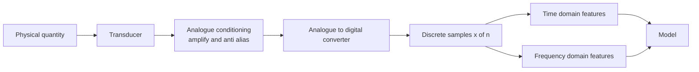
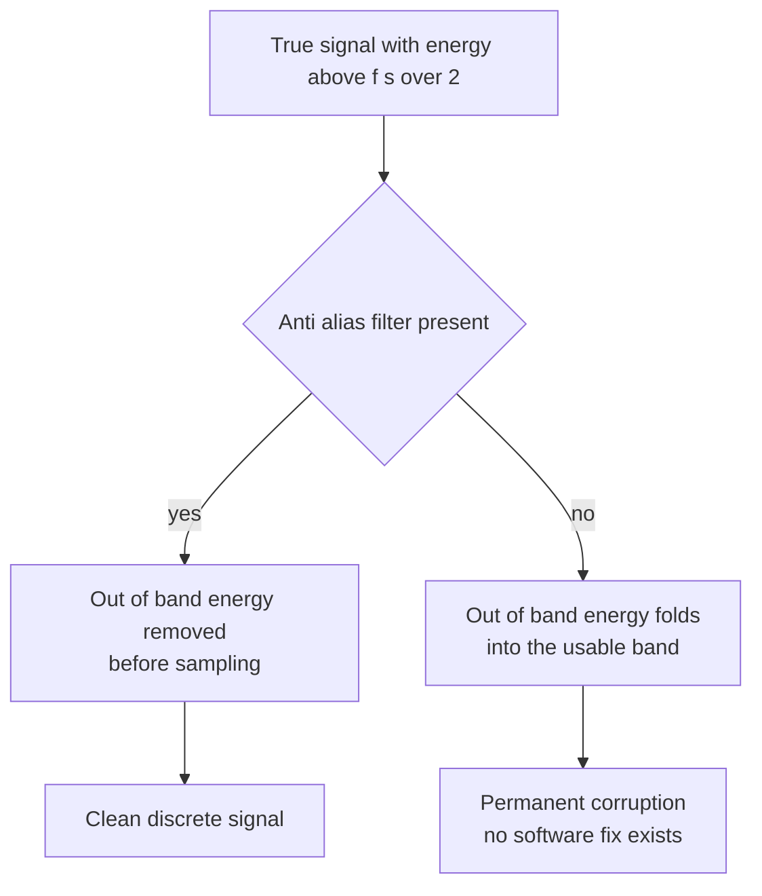
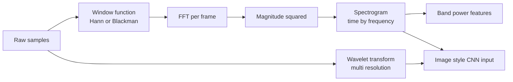
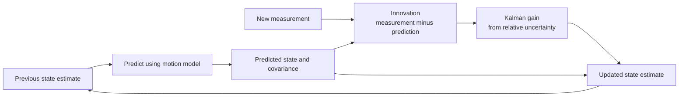
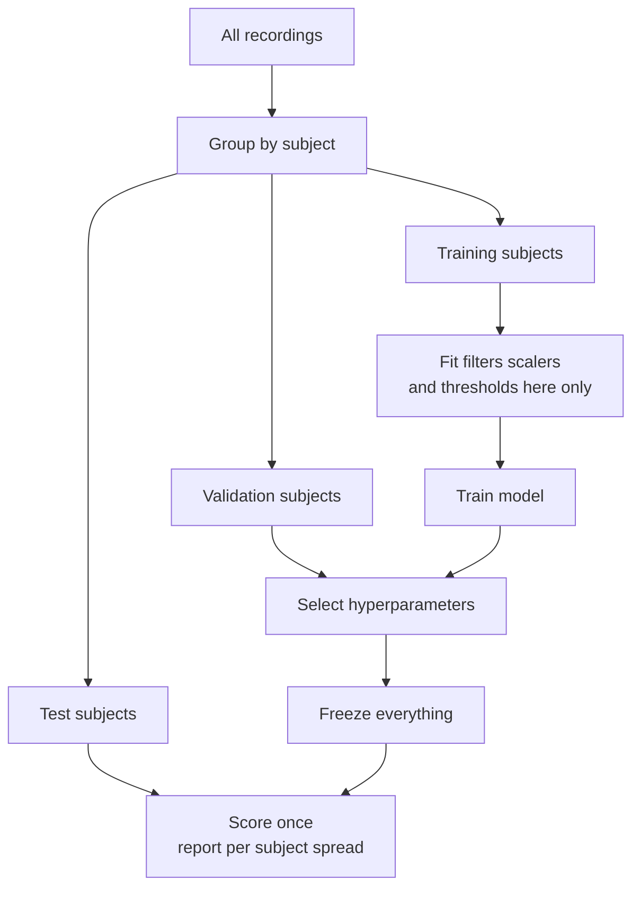
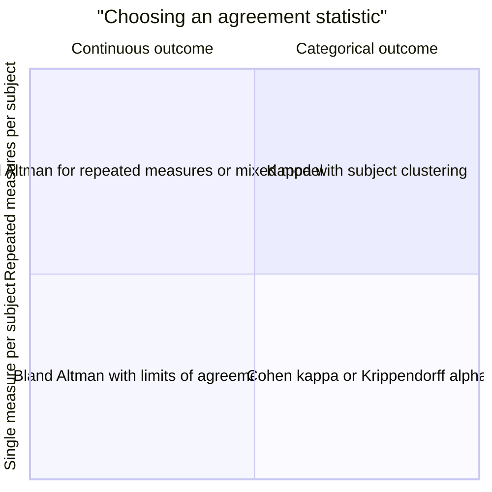

# Chapter 12: Signals and Sensor Data

> **What this chapter covers** Digital signal processing for machine learning engineers who never took a signals course: sampling and aliasing, the frequency domain, filtering, resampling, noise and artifacts, signal quality, windowing, feature families, sensor fusion, inertial sensors, calibration and synchronisation, and the validation protocols that stop sensor projects from reporting fraudulent accuracy.
> **Prerequisites** Chapter 2 (probability and statistics), Chapter 10 (feature engineering), Chapter 11 (time-series and sequential modelling). Linear algebra from Chapter 1 is assumed for the state space section.
> **Where it is used** Wearables and health sensing, industrial condition monitoring and predictive maintenance, audio front ends, automotive and robotics perception, structural and seismic monitoring, energy metering, and any team whose model input arrives from a physical transducer rather than a database.

A signal is a measurement of a physical quantity that varies over time. A database row is a fact. A signal is a trace. The difference matters because almost everything that goes wrong with sensor machine learning goes wrong before the model: at the sampling rate, in the filter chain, at the clock, or in the split.

This chapter takes a reader who has never seen a Fourier transform from zero to the point of arguing sensibly with a hardware team about sampling rates, and then to the point of designing a validation protocol that survives a reviewer.

---

## 12.1 Level 1: Foundations

### 12.1.1 What a signal is

Consider an accelerometer strapped to a wrist. Three times per hundredth of a second it reports the acceleration along three axes, in units of $g$ (one $g$ is 9.81 metres per second squared). After ten seconds you have three columns of 1000 numbers each. That is a signal: a function of time, sampled.

Formally, a continuous-time signal is a function $x(t)$ mapping time $t \in \mathbb{R}$ to a value. A discrete-time signal is a sequence $x[n]$ indexed by integer $n$. The bridge between them is sampling:

$$x[n] = x(n T_s)$$

where $T_s$ is the sampling interval in seconds and $f_s = 1 / T_s$ is the sampling rate in hertz (Hz, samples per second). A 100 Hz accelerometer has $T_s = 0.01$ s.

Three properties separate signals from generic tabular data.

| Property | What it means | Consequence for modelling |
|---|---|---|
| Ordered and uniform | Samples arrive at fixed intervals | Order is information. Shuffling destroys the signal |
| Oversampled relative to information | Adjacent samples are highly correlated | Raw samples are a poor feature vector. Summarise or transform |
| Physically generated | A transducer with drift, noise, and limits produced it | Artifacts are systematic, not random |

### 12.1.2 The two views of a signal

Any signal can be looked at in two equivalent ways.

The **time domain** view is the raw trace: value against time. It answers "what happened and when".

The **frequency domain** view decomposes the signal into sinusoids of different frequencies and reports how much of each is present. It answers "what is repeating and how fast".

A 50 Hz hum on a mains-powered electrocardiogram (ECG) is nearly invisible in a time plot of a noisy trace. In the frequency domain it is a spike at exactly 50 Hz. Human gait is a ragged trace in time. In frequency it is a clean peak near 2 Hz with a harmonic near 4 Hz. Choosing the right view is most of the skill.



*Figure 12.1: The acquisition chain from physical quantity to model input, with the two analysis views.*

### 12.1.3 The mental model to carry

Carry this: **a sensor pipeline is a chain of lossy transformations, and every one of them is a modelling decision you are responsible for**. The anti-aliasing filter, the sampling rate, the bit depth, the high-pass cutoff, the window length, and the feature set all decide what the model can possibly learn. By the time data reaches your notebook, most of the decisions have already been made, often by someone who was optimising battery life rather than classification accuracy.

The second half of the mental model: **sensor data has hierarchy**. Samples sit inside windows, windows sit inside sessions or recordings, sessions sit inside subjects or devices. Statistical independence lives at the top of that hierarchy, not the bottom. Every validation mistake in this field comes from forgetting it.

### 12.1.4 Vocabulary

| Term | Definition |
|---|---|
| Sampling rate $f_s$ | Samples per second, in hertz |
| Nyquist frequency | $f_s / 2$, the highest frequency representable |
| Bandwidth | The range of frequencies a signal actually contains |
| Quantisation | Rounding a continuous voltage to a finite set of integer codes |
| Bit depth | Number of bits per sample, deciding how many codes exist |
| Epoch or window | A contiguous slice of samples treated as one example |
| Artifact | A signal component caused by something other than the quantity of interest |
| Drift | A slow, systematic change in a sensor's baseline or scale |
| Channel | One stream from one axis or one electrode |

---

## 12.2 Level 2: Working knowledge

### 12.2.1 Sampling and the sampling theorem

The sampling theorem, due to Nyquist (1928) and Shannon (1949), says: a signal containing no frequency components at or above $B$ hertz is completely determined by samples taken at any rate $f_s > 2B$. "Completely determined" is literal. The continuous signal can be reconstructed exactly from the samples.

$$f_s > 2B$$

The threshold $f_s / 2$ is the Nyquist frequency. The condition is a condition on the signal, not on the sampler. If the signal contains energy above $f_s / 2$, sampling does not merely lose it. It corrupts what remains.

### 12.2.2 Aliasing, with a worked example

A sinusoid at frequency $f$ sampled at $f_s$ is indistinguishable from a sinusoid at frequency $f + k f_s$ for any integer $k$. Frequencies above Nyquist fold back into the representable band. The apparent frequency is

$$f_{\text{alias}} = \left| f - f_s \cdot \text{round}\!\left(\frac{f}{f_s}\right) \right|$$

**Worked example.** A vibration sensor samples at $f_s = 100$ Hz. The machine has a real tone at $f = 130$ Hz.

1. $f / f_s = 130 / 100 = 1.3$.
2. $\text{round}(1.3) = 1$.
3. $f_{\text{alias}} = |130 - 100 \times 1| = 30$ Hz.

The 130 Hz tone appears in your data at 30 Hz. There is no filter, no algorithm, and no model that can undo this after the fact. If you also have a genuine 30 Hz component, the two are added together and permanently mixed.

**Second worked example, the sinister one.** Same 100 Hz sampler, real tone at 99 Hz. $99/100 = 0.99$, rounds to 1, alias at $|99 - 100| = 1$ Hz. A 99 Hz tone masquerades as a 1 Hz oscillation. On a wearable, 1 Hz is the band where you look for respiration. A high-frequency electrical artifact has been converted into a plausible physiological signal.

The fix is an **anti-aliasing filter**: an analogue low-pass filter placed before the analogue-to-digital converter, with a cutoff below $f_s/2$. This must be in hardware. Filtering in software after sampling is too late, because the aliased energy is already added to the in-band energy.



*Figure 12.2: Aliasing is decided before the converter, which is why the anti-aliasing filter must be analogue.*

### 12.2.3 Quantisation

The converter maps a voltage range onto $2^b$ integer codes, where $b$ is the bit depth. The step size is

$$\Delta = \frac{V_{\text{range}}}{2^b}$$

Rounding error is modelled as uniform noise on $[-\Delta/2, \Delta/2]$, with variance $\Delta^2/12$. The resulting theoretical signal-to-noise ratio for a full-scale sinusoid is

$$\text{SNR}_{\text{dB}} = 6.02\,b + 1.76$$

**Worked example.** A 12-bit converter with a $\pm 2$ g range. $V_{\text{range}} = 4$ g, $\Delta = 4 / 4096 \approx 0.98$ milli-g. Theoretical SNR is $6.02 \times 12 + 1.76 \approx 74$ dB. Now suppose the actual signal of interest is a tremor of amplitude 5 milli-g. It occupies about 5 quantisation steps, roughly 2.3 bits of the 12. You have paid for 12 bits and are using 2. The fix is not more bits, it is a smaller range setting or more analogue gain.

This is the practical lesson of quantisation: **effective resolution depends on the ratio of your signal to the configured full-scale range, not on the bit depth on the datasheet**.

Two more effects worth knowing. **Clipping** happens when the true value exceeds the range. It is a hard nonlinearity that generates spurious harmonics across the whole spectrum, so a clipped segment poisons frequency features far from the clipping event. **Dither**, deliberately adding a small amount of noise before quantisation, decorrelates the quantisation error from the signal and can improve the recovery of sub-step detail after averaging.

### 12.2.4 Why sensor teams argue about rates

The argument is a four-way trade-off, and each party is optimising a different term.

| Party | Wants | Because |
|---|---|---|
| Firmware and power | Lower $f_s$ | Current draw, radio airtime, and battery life scale with data volume |
| Storage and cost | Lower $f_s$ | Bytes per device per day multiplied by fleet size |
| Machine learning | Higher $f_s$ | Cannot recover a band that was never sampled |
| Regulatory or clinical | A specific $f_s$ | Standards bodies specify minimum rates for a claim |

The productive way to run this argument is to convert it into a bandwidth question. Do not ask for "more Hz". State the highest frequency your target phenomenon occupies, add margin for the filter transition band, and ask for at least 2.5 times that. Typical bands, which you should verify for your own application rather than trusting a table:

| Phenomenon | Approximate useful band | Common sampling rate |
|---|---|---|
| Human activity from wrist accelerometry | 0 to 20 Hz | 50 to 100 Hz |
| Electrocardiogram morphology | 0.05 to 150 Hz | 250 to 500 Hz |
| Photoplethysmography for heart rate | 0.5 to 10 Hz | 25 to 125 Hz |
| Speech | 80 Hz to 8 kHz | 16 kHz |
| Rotating machinery bearing faults | up to several kHz | 20 kHz and above |

The other half of the argument is that **you cannot go up later but you can always go down**. Collecting a pilot dataset at the highest rate the hardware supports, then decimating offline to find the lowest rate that preserves accuracy, turns an argument into an experiment. That experiment is cheap and it ends the discussion.

### 12.2.5 The standard preprocessing pipeline

The default order, which you should deviate from only deliberately:

1. Convert raw counts to physical units using the calibration constants.
2. Detect and mark saturation, dropouts, and flat segments.
3. Resample to a common rate across channels and devices.
4. Filter: remove out-of-band noise, line interference, and baseline wander.
5. Assess signal quality and mark bad segments.
6. Segment into windows.
7. Compute features, or hand windows to a model that learns them.
8. Normalise, using statistics computed on training data only.

**Listing 12.1: a minimal, honest preprocessing chain with SciPy.**

```python
import numpy as np
from scipy import signal

FS = 100.0  # Hz, sampling rate of the raw accelerometer

def preprocess(x, fs=FS, band=(0.25, 15.0)):
    """x: (n_samples, n_channels) in g. Returns filtered array, same shape."""
    nyq = fs / 2.0
    low, high = band[0] / nyq, band[1] / nyq
    # 4th-order Butterworth band-pass as second-order sections for stability
    sos = signal.butter(4, [low, high], btype="bandpass", output="sos")
    # filtfilt applies the filter forward and backward: zero phase, order doubled
    return signal.sosfiltfilt(sos, x, axis=0)

def windows(x, fs=FS, win_s=5.0, overlap=0.5):
    n = int(win_s * fs)
    step = int(n * (1.0 - overlap))
    idx = np.arange(0, len(x) - n + 1, step)
    return np.stack([x[i:i + n] for i in idx]), idx
```

Two lines deserve comment. `output="sos"` returns second-order sections rather than transfer-function coefficients; for filters above about order 4 the direct form accumulates numerical error and can become unstable, and second-order sections do not. `sosfiltfilt` runs the filter forwards and then backwards, which cancels phase distortion exactly but doubles the effective filter order, so a 4th-order design behaves like 8th-order in its magnitude response. Both points are expanded in level 3.

### 12.2.6 Segmentation into windows and epochs

A model rarely consumes a whole recording. It consumes windows. Choosing the window length and overlap is a modelling decision with three competing constraints.

**Long enough to contain the phenomenon.** To resolve a 0.5 Hz respiration cycle you need at least 2 seconds for one cycle, and realistically 30 seconds for a stable estimate. A window shorter than the period of interest cannot represent it.

**Short enough for stationarity.** Frequency features assume the statistics do not change inside the window. A 60-second window spanning a transition from walking to sitting produces a spectrum belonging to neither.

**Aligned with the label.** If the label is "this 30-second epoch is sleep stage N2", your window must be 30 seconds. If the label is an event with a timestamp, you must decide what counts as a positive window, and that decision changes the class balance.

Frequency resolution follows directly from window length:

$$\Delta f = \frac{1}{T} = \frac{f_s}{N}$$

where $T$ is the window duration in seconds and $N$ the number of samples.

**Worked example.** At $f_s = 100$ Hz with a 256-sample window, $T = 2.56$ s and $\Delta f = 1/2.56 \approx 0.39$ Hz. If you need to distinguish a tremor at 4.0 Hz from one at 4.2 Hz, a 0.39 Hz bin cannot do it. You need $\Delta f \le 0.1$ Hz, so $T \ge 10$ s, so $N \ge 1000$ samples. That is the entire calculation, and it should be done before anyone trains anything.

**Overlap** is a subtler decision than it looks. Overlap of 50 percent is the common default because it makes the total energy across windows roughly uniform for standard window functions. Overlap increases the number of training examples, but those examples are not independent. Two windows overlapping by 90 percent share 90 percent of their samples. Inflating a dataset this way inflates apparent performance and narrows confidence intervals fraudulently. The safe rule: **use overlap freely in training, never across a train and test boundary, and never count overlapping windows as independent samples when computing a confidence interval**.

### 12.2.7 Resampling, interpolation and irregular sampling

Sensors disagree about time. A 104 Hz accelerometer and a 25 Hz photoplethysmogram must be brought onto a common grid before fusion.

**Downsampling** by an integer factor $M$ requires a low-pass anti-aliasing filter at the new Nyquist $f_s / (2M)$ first, then discarding samples. Doing it without the filter aliases, exactly as in section 12.2.2. `scipy.signal.decimate` applies the filter for you; naive array slicing does not.

**Upsampling** by factor $L$ inserts $L-1$ zeros between samples and then low-pass filters at the original Nyquist to interpolate. Upsampling adds no information. It only makes grids match.

**Rational resampling** by $L/M$ upsamples then downsamples, with a single combined filter. `scipy.signal.resample_poly` does this and is the right default. `scipy.signal.resample` uses the Fourier method, which assumes the signal is periodic in the window and produces edge artifacts on signals that are not.

**Irregular sampling** occurs when samples arrive at non-uniform times: event-driven sensors, packet loss over Bluetooth, or manual clinical measurements. Three options, in increasing order of correctness and cost.

| Approach | How it works | When it is right |
|---|---|---|
| Interpolate to a regular grid | Linear, cubic spline, or nearest-neighbour onto uniform times | Gaps are short relative to the phenomenon, and the underlying process is smooth |
| Model the irregularity | Gaussian process regression, or a neural controlled differential equation, taking timestamps as input | Gaps are long or informative, and you can afford the cost |
| Feature-level aggregation | Compute statistics over a time interval rather than a fixed count of samples | Irregularity is severe and you only need coarse features |

Interpolation is the pragmatic default but carries a warning: interpolated regions have artificially low high-frequency content. If you compute a high-frequency power feature over a window that was half interpolated, that feature encodes "there was a dropout here", not physiology. Track the interpolated fraction per window and either use it as a quality feature or exclude heavily interpolated windows.

The deepest trap is **informative missingness**. If the sensor drops out precisely when the subject moves vigorously, then missingness correlates with the label. A model that sees interpolated gaps learns to detect gaps, scores well offline, and fails in deployment where the gap pattern differs.

---

## 12.3 Level 3: Depth

### 12.3.1 The Fourier transform, intuitively

Start with the intuition. You want to know how much of a signal oscillates at frequency $f$. So you multiply the signal by a reference sinusoid at $f$ and sum the result. If the signal contains that frequency in phase with your reference, the products are mostly positive and the sum is large. If it does not, the products alternate in sign and the sum is near zero. Repeat for every frequency and you have a spectrum.

The only complication is phase. A signal at $f$ that is 90 degrees out of phase with a cosine reference gives zero against cosine. So you correlate against both a cosine and a sine and combine them into a complex number. That is all the $e^{-i 2\pi f t}$ in the formula means: cosine in the real part, sine in the imaginary part, both at once.

### 12.3.2 The Fourier transform, formally

The continuous Fourier transform of $x(t)$ is

$$X(f) = \int_{-\infty}^{\infty} x(t)\, e^{-i 2\pi f t}\, dt$$

with inverse

$$x(t) = \int_{-\infty}^{\infty} X(f)\, e^{i 2\pi f t}\, df$$

Here $X(f)$ is complex. Its magnitude $|X(f)|$ is the amplitude at frequency $f$ and its argument $\arg X(f)$ is the phase.

The **discrete Fourier transform** (DFT) of a finite sequence $x[0], \ldots, x[N-1]$ is

$$X[k] = \sum_{n=0}^{N-1} x[n]\, e^{-i 2\pi k n / N}, \qquad k = 0, 1, \ldots, N-1$$

Bin $k$ corresponds to physical frequency $f_k = k f_s / N$. For real-valued input the spectrum is conjugate-symmetric, so only bins $0$ to $N/2$ carry distinct information; that is why `numpy.fft.rfft` returns $N/2 + 1$ values.

**Worked example of the DFT.** Take $N = 8$, $f_s = 8$ Hz, and $x[n] = \cos(2\pi \cdot 2 \cdot n / 8)$, a pure 2 Hz tone. Bin spacing is $f_s / N = 1$ Hz, so bin 2 is exactly 2 Hz. Because the tone completes exactly 2 whole cycles in the 8-sample window, the correlation with the bin-2 reference is maximal and every other bin correlates to zero. The result is $X[2] = X[6] = 4$ and all other bins zero. Magnitude in physical amplitude units is $2|X[k]|/N = 2 \times 4 / 8 = 1$, which matches the amplitude of the cosine. The factor of 2 accounts for energy split between the positive and negative frequency bins.

The **fast Fourier transform** (FFT) is not a different transform. It is an algorithm, from Cooley and Tukey (1965), that computes the DFT in $O(N \log N)$ operations instead of $O(N^2)$ by recursively splitting even and odd indexed samples. For $N = 4096$ that is a speedup of roughly 350 times. Modern implementations handle any $N$, but powers of two remain fastest.

### 12.3.3 Spectral leakage and windowing

The DFT implicitly assumes the $N$ samples repeat periodically forever. If the signal does not complete a whole number of cycles in the window, the assumed periodic extension has a discontinuity at the wrap-around point. A discontinuity is broadband. Its energy smears across all bins. That smearing is **spectral leakage**.

**Worked example.** $f_s = 8$ Hz, $N = 8$, but now a 2.5 Hz tone. Bin spacing is 1 Hz, so 2.5 Hz falls exactly between bins 2 and 3. Instead of one clean peak, energy appears in bins 2 and 3 at comparable magnitude and in every other bin at lower magnitude, decaying slowly. A weak nearby component at, say, bin 5 can be entirely buried under the skirts of the strong leaked one.

The remedy is a **window function**: multiply the samples by a taper that goes smoothly to zero at both ends, removing the discontinuity.

$$x_w[n] = w[n]\, x[n]$$

Every window trades main-lobe width against side-lobe level. A wide main lobe means poorer frequency resolution. High side lobes mean more leakage from strong components into weak ones.

| Window | Main lobe width (bins) | Peak side lobe (dB) | Use when |
|---|---|---|---|
| Rectangular (no window) | 2 | -13 | The signal is transient and contained within the window, or you need maximum resolution and components have similar amplitude |
| Hann | 4 | -31 | General purpose default |
| Hamming | 4 | -43 | Slightly better nearest side lobe, worse far-field roll-off than Hann |
| Blackman-Harris | 8 | -92 | A strong component would otherwise mask a weak one |
| Flat top | 10 | -93 | You need accurate amplitude of a peak, not accurate frequency |

Windowing attenuates the signal, so amplitude estimates need correction. For a Hann window the coherent gain is 0.5, so multiply amplitudes by 2. For power estimates use the noise-equivalent power bandwidth instead, which for Hann is 1.5 bins.

### 12.3.4 The short-time Fourier transform and the spectrogram

A single DFT over a long recording assumes stationarity across that whole recording, which is almost never true. The **short-time Fourier transform** (STFT) slides a window along the signal and takes a DFT at each position:

$$X[m, k] = \sum_{n=0}^{N-1} w[n]\, x[n + mH]\, e^{-i 2\pi k n / N}$$

where $m$ indexes the frame, $H$ is the hop size in samples, and $w$ is the window. The **spectrogram** is $|X[m,k]|^2$, displayed as a time-by-frequency image.

### 12.3.5 The time-frequency resolution trade-off

This is the central constraint of time-frequency analysis, and it is not an engineering limitation. It is a mathematical identity related to the Heisenberg uncertainty principle. For a signal with time spread $\sigma_t$ and frequency spread $\sigma_f$,

$$\sigma_t \, \sigma_f \ge \frac{1}{4\pi}$$

Practically: window length $T$ gives frequency resolution $\Delta f = 1/T$ and time resolution $\Delta t = T$. Their product is fixed. You cannot improve both.

**Worked example.** At $f_s = 100$ Hz:

| Window | $T$ | $\Delta f$ | Consequence |
|---|---|---|---|
| 64 samples | 0.64 s | 1.56 Hz | Sharp localisation of a footstep, cannot separate 3 Hz from 4 Hz |
| 256 samples | 2.56 s | 0.39 Hz | Balanced default |
| 1024 samples | 10.24 s | 0.098 Hz | Separates 3.0 from 3.1 Hz, smears any event shorter than 10 s |

Increasing the hop overlap makes the spectrogram *look* smoother in time but does not improve time resolution. Resolution is set by the window length alone. Overlap only interpolates.

The **wavelet transform** escapes the fixed trade-off by using short windows at high frequencies and long windows at low ones, giving constant relative bandwidth. The continuous wavelet transform is

$$W(a, b) = \frac{1}{\sqrt{a}} \int x(t)\, \psi^{*}\!\left(\frac{t - b}{a}\right) dt$$

where $\psi$ is the mother wavelet, $a$ is scale (inversely related to frequency) and $b$ is translation. Morlet wavelets are the usual choice for analysis because they are a Gaussian-windowed sinusoid and have an interpretable centre frequency. Daubechies wavelets are the usual choice for the discrete wavelet transform used in denoising and compression, because they are orthogonal and support perfect reconstruction. The uncertainty product is not beaten; it is redistributed, which is usually what a physical signal wants.



*Figure 12.3: Two routes from samples to time-frequency representation, both feeding either handcrafted features or a learned model.*

### 12.3.6 Filtering

A filter passes some frequencies and attenuates others. Four basic shapes:

| Type | Passes | Typical use |
|---|---|---|
| Low-pass | Below cutoff $f_c$ | Anti-aliasing, smoothing, removing high-frequency sensor noise |
| High-pass | Above cutoff $f_c$ | Removing baseline wander, drift, and the gravity component of acceleration |
| Band-pass | Between $f_1$ and $f_2$ | Isolating a physiological or mechanical band |
| Notch or band-stop | Everything except a narrow band | Removing mains interference at 50 or 60 Hz and its harmonics |

**Finite impulse response** (FIR) filters compute the output as a weighted sum of a finite number of past inputs:

$$y[n] = \sum_{k=0}^{M} b_k\, x[n-k]$$

**Infinite impulse response** (IIR) filters also feed back past outputs:

$$y[n] = \sum_{k=0}^{M} b_k\, x[n-k] - \sum_{k=1}^{P} a_k\, y[n-k]$$

| Property | FIR | IIR |
|---|---|---|
| Stability | Always stable | Can be unstable if poles leave the unit circle |
| Phase | Can be exactly linear phase | Nonlinear phase |
| Order for a given sharpness | High, often hundreds of taps | Low, often 4 to 8 |
| Compute per sample | Proportional to taps | Very low |
| Numerical robustness | Good | Needs second-order sections at higher order |
| Typical choice | Offline analysis where phase matters, embedded when a linear phase guarantee is required | Real-time embedded where compute is scarce |

Common IIR families: **Butterworth** has a maximally flat passband and gentle roll-off; it is the safe default. **Chebyshev type I** rolls off faster at the cost of passband ripple. **Chebyshev type II** puts the ripple in the stopband. **Elliptic** is the sharpest for a given order and ripples in both. **Bessel** sacrifices sharpness for maximally flat group delay, which preserves waveform shape.

### 12.3.7 Phase distortion and zero-phase filtering

Every causal filter delays the signal, and it delays different frequencies by different amounts unless it has linear phase. The frequency-dependent delay is the **group delay**:

$$\tau_g(f) = -\frac{1}{2\pi}\frac{d\phi(f)}{df}$$

where $\phi(f)$ is the phase response. Nonlinear group delay changes the *shape* of a waveform, not just its timing. The components of a sharp peak arrive at slightly different times and the peak spreads out and becomes asymmetric.

This is not academic. On an ECG, a high-pass filter with nonlinear phase shifts the ST segment, which is the part cardiologists read for ischaemia. A filter chosen for noise removal can manufacture a clinical finding. The IEC and AHA guidance on ECG filtering exists for exactly this reason.

**Zero-phase filtering** removes the problem offline. Filter the signal forward, reverse it, filter again, reverse again. The phase applied in the second pass exactly cancels the first. `scipy.signal.filtfilt` and its stable cousin `sosfiltfilt` do this. Two consequences:

1. The effective magnitude response is the square of the single-pass response, so a 4th-order design gives 8th-order attenuation and the cutoff moves. If you want a specific attenuation, design for half of it.
2. It is non-causal. It uses future samples. It cannot be used in a real-time streaming system, and a model trained on `filtfilt` data and deployed against a causal filter will see a distribution shift. This mismatch is a frequent and hard-to-find production bug.

### 12.3.8 What a filter does to a feature you compute later

Engineers reason about filters as though they only remove noise. They also remove and reshape signal, and the effect propagates into features in ways that are not obvious.

| Filter action | Effect on later features |
|---|---|
| High-pass at 0.5 Hz | Removes gravity from accelerometry, so orientation information is destroyed. Any feature that encodes posture is now uninformative |
| Low-pass at 15 Hz | Removes impact transients. Peak-to-peak amplitude and jerk features shrink, and step detection thresholds tuned pre-filter no longer fire |
| Notch at 50 Hz | Creates a spectral hole. Any band-power feature overlapping 50 Hz is now partly an artifact of the notch width |
| Aggressive smoothing | Reduces sample-to-sample variance, so standard deviation and zero-crossing rate collapse toward zero and stop discriminating |
| Zero-phase band-pass | Preserves waveform timing, so peak-to-peak interval features remain valid. A causal version of the same filter biases those intervals |
| Any filter applied per-window | Introduces edge transients at window boundaries. Filter the continuous recording first, then window. Never the other way around |

That last row is worth stating as a rule: **filter before you window**. A filter needs settling time proportional to its impulse response length. Applied inside a short window it spends a large fraction of that window settling, producing edge artifacts that correlate with window position.

### 12.3.9 Noise and artifacts

"Noise" is a lazy word for several different things with different remedies.

| Source | Character | Detection | Remedy |
|---|---|---|---|
| Thermal or Johnson noise | Broadband, Gaussian, white | Flat noise floor in the spectrum | Low-pass or average. Irreducible below a point |
| Quantisation noise | Uniform, tied to step size | Staircase in the time trace | More gain or a narrower range |
| Mains interference | Narrowband at 50 or 60 Hz with harmonics | Sharp spectral lines at exact multiples | Notch filter, or better shielding and grounding |
| Motion artifact | Broadband bursts overlapping the signal band | Correlates with an accelerometer channel | Adaptive filtering with the accelerometer as reference, or reject the segment |
| Electrode or contact loss | Saturation, flat line, or huge steps | Amplitude outside physical range, or near-zero variance | Reject. Do not repair |
| Baseline wander | Very low frequency drift | Energy below 0.3 Hz | High-pass, or subtract a fitted polynomial or median filter |
| Powerline harmonics and switching supplies | Lines at odd multiples | Spectral lines | Comb filter |
| Packet loss over a radio link | Gaps and repeated samples | Timestamp gaps, or runs of identical values | Interpolate short gaps, mark long ones |
| Cross-talk between channels | One channel appearing in another | High inter-channel correlation at a lag | Better hardware, or independent component analysis |

**Rejection versus repair** is the decision that matters, and it is a decision about bias, not about data volume.

Repair (interpolation, imputation, denoising) keeps the sample count but fabricates values. If the fabrication method has a systematic character, the model learns the fabrication. Rejection keeps only real data but changes the population, because bad segments are not missing at random. A subject whose electrodes fail during exercise contributes only their resting data, and the resulting model is quietly restricted to rest.

The defensible policy:

1. Reject segments where the signal is physically impossible (saturated, flat, out of range). Nothing there is recoverable.
2. Repair short gaps where the surrounding signal is good and the gap is shorter than the shortest period of interest.
3. Record the rejection rate per subject, per device, and per class. Report it.
4. If rejection rate differs by class or by subject group, say so in the results. That difference is a fairness and validity issue, not a footnote.

### 12.3.10 Signal quality assessment

You must model quality rather than assume it. A signal quality index (SQI) is a per-window scalar in $[0,1]$ estimating how trustworthy that window is. Standard constructions:

| SQI family | How it is computed | Signal types |
|---|---|---|
| Amplitude and range checks | Fraction of samples within physiological bounds | Any |
| Flat-line and saturation detection | Run length of identical or clipped values | Any |
| Spectral distribution ratio | Power in the expected band divided by total power | Physiological, vibration |
| Template matching | Correlation of each beat or cycle against an average template | Quasi-periodic signals such as ECG and photoplethysmography |
| Algorithm agreement | Two independent detectors run on the same window and their outputs compared | Beat detection, event detection |
| Kurtosis and skewness | Deviation from expected higher-order statistics | Motion artifact detection |

Three ways to use an SQI, in increasing sophistication:

1. **Threshold and reject.** Simple, discards data, and creates the selection bias described above.
2. **Feed as a feature.** Let the model learn how much to trust each window. Works well with gradient boosting.
3. **Weight the loss.** Multiply each example's loss by its SQI so poor windows contribute less without being removed. This preserves the population while reducing label noise influence.

Whichever you choose, the SQI threshold must be selected on the training set and frozen, exactly like any other hyperparameter. Tuning a quality threshold on the test set is a common and undetected form of leakage.

### 12.3.11 Feature families

When you are not feeding raw windows to a deep model, you compute features. Four families.

**Time domain statistics.** Cheap, interpretable, and surprisingly strong baselines.

| Feature | Definition | What it captures |
|---|---|---|
| Mean | $\frac{1}{N}\sum x[n]$ | Baseline or DC level, or orientation for unfiltered accelerometry |
| Standard deviation | $\sqrt{\frac{1}{N}\sum (x[n]-\bar{x})^2}$ | Overall intensity of variation |
| Root mean square | $\sqrt{\frac{1}{N}\sum x[n]^2}$ | Energy including the DC term |
| Skewness | Third standardised moment | Asymmetry of the distribution |
| Kurtosis | Fourth standardised moment | Impulsiveness. High kurtosis flags spikes and bearing faults |
| Zero-crossing rate | Count of sign changes divided by $N$ | Crude dominant-frequency proxy, very cheap |
| Signal magnitude area | $\frac{1}{N}\sum (|x| + |y| + |z|)$ | Total tri-axial activity, orientation invariant |
| Peak-to-peak | $\max - \min$ | Dynamic range within the window |
| Crest factor | peak divided by RMS | Impulsiveness, standard in vibration monitoring |
| Autocorrelation peak and lag | Argmax of $r_{xx}[\ell]$ for $\ell > 0$ | Periodicity and its period |

**Frequency domain features.** These rest on the **power spectral density** (PSD), which is the distribution of power over frequency. Three estimation methods, and the choice matters.

| Method | Construction | Trade-off |
|---|---|---|
| Periodogram | $|X[k]|^2 / N$ from a single DFT | Unbiased in the mean but its variance does not decrease as $N$ grows. Noisy and rarely used alone |
| Bartlett | Split into $K$ non-overlapping segments, average the periodograms | Variance divided by $K$, frequency resolution divided by $K$ |
| Welch (1967) | Split into overlapping windowed segments, average the modified periodograms | The standard default. Overlap recovers some of the resolution loss. `scipy.signal.welch` |
| Multitaper (Thomson 1982) | Average periodograms computed with several orthogonal taper functions | Best variance-versus-resolution trade-off, higher compute, standard in neuroscience |
| Parametric, for example Burg autoregressive | Fit an autoregressive model and derive the spectrum from its coefficients | Smooth spectra from short windows, but the model order is a strong assumption and can invent peaks |

Derived features:

| Feature | Definition |
|---|---|
| Band power | $\int_{f_1}^{f_2} S(f)\, df$, the integral of the PSD over a band |
| Relative band power | Band power divided by total power. Robust to amplitude scaling |
| Spectral centroid | $\sum f_k S_k / \sum S_k$, the centre of mass of the spectrum |
| Spectral spread | Standard deviation about the centroid |
| Spectral entropy | $-\sum p_k \log p_k$ with $p_k = S_k / \sum S_j$, measuring how flat the spectrum is |
| Spectral edge frequency | The frequency below which a stated fraction, often 95 percent, of power lies |
| Dominant frequency and its power ratio | Argmax of the PSD and the fraction of power in that peak |
| Spectral roll-off and flux | Shape and frame-to-frame change, standard in audio |

**Worked example of band power.** Suppose a Welch PSD at $f_s = 100$ Hz with $N = 256$ per segment gives bin spacing $\Delta f = 100/256 = 0.39$ Hz. To get power in the 0.5 to 3 Hz band, sum bins from $k = \lceil 0.5/0.39 \rceil = 2$ to $k = \lfloor 3/0.39 \rfloor = 7$ and multiply by $\Delta f$. If those six bins hold PSD values summing to 12.0 g squared per Hz, band power is $12.0 \times 0.39 \approx 4.7$ g squared. Report relative band power by dividing by the total across all bins, which removes dependence on device gain.

**Time-frequency features.** Statistics of the spectrogram or wavelet coefficients: energy per wavelet scale, spectrogram texture descriptors, or the spectrogram itself as a two-dimensional input to a convolutional network. The last is now the standard strong approach for audio and increasingly for inertial sensing.

**Nonlinear and entropy measures.** Useful when linear statistics saturate.

| Measure | Idea | Note |
|---|---|---|
| Sample entropy (Richman and Moorman 2000) | Probability that two subsequences similar for $m$ points stay similar for $m+1$ | Less biased than approximate entropy. Sensitive to the tolerance parameter $r$, usually set to 0.2 times the standard deviation |
| Approximate entropy (Pincus 1991) | Predecessor of sample entropy | Biased by self-matches. Prefer sample entropy |
| Multiscale entropy (Costa et al. 2002) | Sample entropy computed on coarse-grained versions of the series | Distinguishes complexity from plain randomness |
| Permutation entropy (Bandt and Pompe 2002) | Entropy of the ordinal patterns of short subsequences | Very robust to noise, cheap, few parameters |
| Detrended fluctuation analysis (Peng et al. 1994) | Scaling exponent of fluctuations after removing local trends | Long-range correlation. Widely used in heart rate variability |
| Lyapunov exponent and correlation dimension | Chaos-theoretic descriptors | Require long, clean, stationary records. Treat claims from short windows with suspicion |

The honest summary on nonlinear features: they occasionally add real discriminative power, they are expensive, they are parameter-sensitive, and many published gains do not replicate. Add them only after a linear baseline is exhausted, and only with the parameters frozen before evaluation.

### 12.3.12 Sensor fusion at the signal level

Fusion combines several sensors measuring related quantities to get an estimate better than any one alone.

**Complementary filtering** is the simplest useful fusion. Two sensors have errors in different bands. An accelerometer estimates tilt accurately over the long term but is corrupted by linear acceleration in the short term. A gyroscope is accurate in the short term but its integrated angle drifts. Low-pass the accelerometer, high-pass the gyroscope, and add:

$$\hat{\theta}[n] = \alpha \left( \hat{\theta}[n-1] + \omega[n]\, \Delta t \right) + (1 - \alpha)\, \theta_{\text{acc}}[n]$$

where $\hat\theta$ is the fused angle estimate, $\omega$ the gyroscope rate, $\Delta t$ the sample interval, and $\alpha \in (0,1)$ the blending constant. The crossover time constant is

$$\tau = \frac{\alpha\, \Delta t}{1 - \alpha}$$

**Worked example.** At $f_s = 100$ Hz, so $\Delta t = 0.01$ s, choose $\alpha = 0.98$. Then $\tau = (0.98 \times 0.01)/0.02 = 0.49$ s. Gyroscope dominates for motion faster than about half a second; accelerometer corrects drift more slowly than that. To trust the accelerometer less, raise $\alpha$ to 0.995 and $\tau$ becomes 1.99 s.

**Kalman filtering** does the same thing optimally under stated assumptions, and generalises to many states and sensors. Formulate the system in state space:

$$\mathbf{x}_k = \mathbf{F}\mathbf{x}_{k-1} + \mathbf{B}\mathbf{u}_k + \mathbf{w}_k, \qquad \mathbf{w}_k \sim \mathcal{N}(\mathbf{0}, \mathbf{Q})$$

$$\mathbf{z}_k = \mathbf{H}\mathbf{x}_k + \mathbf{v}_k, \qquad \mathbf{v}_k \sim \mathcal{N}(\mathbf{0}, \mathbf{R})$$

Symbols: $\mathbf{x}_k$ is the hidden state at step $k$, $\mathbf{F}$ the state transition matrix, $\mathbf{B}$ and $\mathbf{u}_k$ an optional control input, $\mathbf{w}_k$ process noise with covariance $\mathbf{Q}$, $\mathbf{z}_k$ the measurement, $\mathbf{H}$ the observation matrix mapping state to measurement, and $\mathbf{v}_k$ measurement noise with covariance $\mathbf{R}$.

The recursion has two halves. Predict:

$$\hat{\mathbf{x}}_{k|k-1} = \mathbf{F}\hat{\mathbf{x}}_{k-1|k-1} + \mathbf{B}\mathbf{u}_k$$

$$\mathbf{P}_{k|k-1} = \mathbf{F}\mathbf{P}_{k-1|k-1}\mathbf{F}^{\top} + \mathbf{Q}$$

Update:

$$\mathbf{K}_k = \mathbf{P}_{k|k-1}\mathbf{H}^{\top}\left(\mathbf{H}\mathbf{P}_{k|k-1}\mathbf{H}^{\top} + \mathbf{R}\right)^{-1}$$

$$\hat{\mathbf{x}}_{k|k} = \hat{\mathbf{x}}_{k|k-1} + \mathbf{K}_k\left(\mathbf{z}_k - \mathbf{H}\hat{\mathbf{x}}_{k|k-1}\right)$$

$$\mathbf{P}_{k|k} = \left(\mathbf{I} - \mathbf{K}_k\mathbf{H}\right)\mathbf{P}_{k|k-1}$$

$\mathbf{P}$ is the state covariance, the filter's own uncertainty. $\mathbf{K}_k$ is the Kalman gain, which decides how much to trust the new measurement versus the prediction. The term $\mathbf{z}_k - \mathbf{H}\hat{\mathbf{x}}_{k|k-1}$ is the innovation, the surprise in the measurement.

**Worked example of the gain in one dimension.** Track a scalar with prediction variance $P^- = 4.0$ and measurement variance $R = 1.0$, with $H = 1$. Then $K = 4.0 / (4.0 + 1.0) = 0.8$. The filter moves 80 percent of the way to the measurement, because the measurement is four times more certain than the prediction. Updated variance is $(1 - 0.8) \times 4.0 = 0.8$, lower than either input, which is the point of fusion. Now flip it: $P^- = 0.1$, $R = 1.0$, so $K = 0.1/1.1 \approx 0.09$ and the filter barely moves. Tuning $\mathbf{Q}$ and $\mathbf{R}$ is exactly tuning this ratio.

Practical notes. $\mathbf{R}$ can often be measured directly from the sensor sitting still. $\mathbf{Q}$ is usually tuned, and it encodes how much you believe your motion model. The **extended Kalman filter** linearises nonlinear dynamics with a Jacobian at each step, which is standard for orientation but can diverge under strong nonlinearity. The **unscented Kalman filter** (Julier and Uhlmann 1997) propagates a deterministic set of sigma points through the true nonlinearity and is usually more robust for the same cost order. **Particle filters** handle arbitrary noise distributions and multimodal posteriors at much higher cost. A **complementary filter is a Kalman filter with a fixed rather than adaptive gain**, which is why it is cheaper and why it does not adapt when conditions change.

Monitor the innovation sequence. If the filter is well tuned, innovations are white and their magnitude is consistent with $\mathbf{H}\mathbf{P}^-\mathbf{H}^\top + \mathbf{R}$. Correlated innovations mean the model is wrong; oversized innovations mean $\mathbf{R}$ is too small.



*Figure 12.4: The predict and update cycle of a Kalman filter, with the gain arbitrating between model and measurement.*

### 12.3.13 Inertial sensors and orientation

An **inertial measurement unit** (IMU) bundles a three-axis accelerometer, a three-axis gyroscope, and often a three-axis magnetometer.

The accelerometer measures **specific force**, which is linear acceleration minus gravity in the sensor frame. At rest it reads the gravity vector, magnitude about 1 g, which gives absolute roll and pitch:

$$\phi = \text{atan2}(a_y, a_z), \qquad \theta = \text{atan2}(-a_x, \sqrt{a_y^2 + a_z^2})$$

It cannot give yaw, because rotation about the gravity vector does not change the gravity reading. That is what the magnetometer is for, and the magnetometer is the sensor most corrupted by nearby ferrous metal and currents.

The gyroscope measures angular rate. Integrating rate gives angle, and integrating a biased measurement gives an error growing linearly with time. A gyroscope with a bias of 0.01 degrees per second accumulates 36 degrees of yaw error in one hour. That is drift, and it is why gyroscopes are never used alone.

**Separating gravity from motion.** The standard trick is a low-pass filter on each accelerometer axis, cutoff around 0.3 to 0.5 Hz. The low-passed component approximates gravity and therefore orientation. Subtracting it gives linear acceleration. Note the consequence flagged in section 12.3.8: a high-pass filter applied to accelerometry deletes the orientation information entirely. If posture matters to your task, keep an unfiltered or low-passed copy.

**Orientation representations.**

| Representation | Parameters | Strength | Weakness |
|---|---|---|---|
| Euler angles | 3 | Human readable | Gimbal lock, a singularity where two axes align and one degree of freedom is lost |
| Rotation matrix | 9 with 6 constraints | Direct composition | Redundant, drifts away from orthonormality and needs re-orthogonalisation |
| Quaternion | 4 with 1 constraint | No singularities, cheap composition, stable to integrate | Not human readable, and $q$ and $-q$ are the same rotation |
| Axis-angle | 3 or 4 | Compact, intuitive | Singular at zero rotation |

Quaternions are the working default inside orientation filters. Convert to Euler only for display. Remember the double cover: if you regress on quaternions with a plain mean squared error loss, the network is penalised for producing $-q$ when the target is $q$, even though they are identical rotations. Use a loss on $1 - |\langle q, \hat q\rangle|$ or on the geodesic angle instead.

The published, widely reproduced orientation filters are Madgwick (2010), a gradient-descent formulation that is very cheap, and Mahony et al. (2008), a complementary filter on the rotation group with a proportional-integral correction. Both are standard on microcontrollers.

**Orientation invariance for features.** Wrist and pocket devices are worn at arbitrary orientations. Three defences: use orientation-invariant features such as vector magnitude $\sqrt{a_x^2 + a_y^2 + a_z^2}$ and signal magnitude area; rotate all data into a common frame using the estimated gravity direction; or augment training with random rotations so the model learns invariance. Vector magnitude is the cheapest and it discards the orientation information that section 12.3.8 warned about, so it is a trade rather than a free win.

### 12.3.14 Calibration, drift, device variation and synchronisation

**Calibration** maps raw counts to physical units. The standard model for a tri-axial sensor is

$$\mathbf{a}_{\text{true}} = \mathbf{M}\left(\mathbf{a}_{\text{raw}} - \mathbf{b}\right)$$

where $\mathbf{b}$ is the three-element bias vector and $\mathbf{M}$ a three-by-three matrix holding scale factors on the diagonal and axis misalignment off the diagonal. For accelerometers this is fit by the six-position static test: hold each axis up and down, where the true magnitude must be 1 g, and solve. For magnetometers the equivalent is fitting an ellipsoid to data collected while rotating the device through all orientations; hard-iron effects offset the ellipsoid centre and soft-iron effects distort its shape.

**Drift** has several forms and different remedies.

| Drift type | Cause | Remedy |
|---|---|---|
| Bias instability | Sensor electronics over time | Periodic re-zeroing during known-static periods |
| Temperature dependence | Scale and bias vary with temperature | Log temperature and fit a correction, or calibrate at operating temperature |
| Integration drift | Integrating any biased rate signal | Fuse with an absolute reference. Never integrate alone |
| Ageing and mechanical | Physical change in the transducer | Recalibrate on a schedule, and monitor for it |

**Device-to-device variation** is the quiet killer of sensor machine learning. Two units of the same part number differ in gain by a few percent, in noise floor, in actual sampling rate, and in filter configuration. A model trained on one device generation and deployed on another can lose a large fraction of its accuracy for reasons that have nothing to do with the phenomenon. Defences: per-device calibration; features that are invariant to gain such as relative band power and ratios; normalising per device using a baseline period; and including device identity as a grouping variable in validation so you can measure the effect. The last is the important one. If you never split by device, you will never know the size of the problem.

**Synchronisation across devices** is a first-class engineering problem. Independent devices have independent clocks, and clocks differ in offset (a constant time shift) and in skew (a difference in rate, often tens of parts per million). A 50 parts-per-million skew accumulates 180 milliseconds of error per hour. Techniques:

| Technique | How | Accuracy regime |
|---|---|---|
| Shared hardware trigger | One electrical pulse starts all devices | Sub-millisecond, requires wiring |
| Network Time Protocol or Precision Time Protocol | Clock discipline over the network | Milliseconds for NTP, sub-microsecond for PTP on suitable hardware |
| Synchronisation event | A deliberate tap, clap, or flash seen by all sensors | Milliseconds, corrects offset only |
| Cross-correlation alignment | Find the lag maximising correlation between a shared component | Post hoc, depends on a shared signal existing |
| Linear drift correction | Sync events at start and end, fit offset and skew, interpolate | Handles skew, the usual practical answer |

**Worked example of cross-correlation alignment.** Two devices at 100 Hz both record a sharp tap. Compute the cross-correlation of the two magnitude signals; the peak sits at lag $\ell = 37$ samples, so device B lags device A by $37 / 100 = 0.37$ s. Shift and re-check. If you repeat the tap an hour later and the lag has become 55 samples, the extra 18 samples over 3600 s is a skew of $0.18 / 3600 = 50$ parts per million, and you correct by resampling B by that factor rather than by a constant shift.

Always verify synchronisation after correcting, on held-out sync events. Alignment applied and not verified is alignment not done.

---

## 12.4 Level 4: Mastery

### 12.4.1 Validation: why a random split gives a fraudulent score

This is the single most consequential section in the chapter.

Sensor data has a hierarchy: samples inside windows, windows inside sessions, sessions inside subjects and devices. A random split over windows places windows from the same subject, often from the same minute, on both sides of the train and test boundary. The model then has two routes to a correct answer: learn the phenomenon, or recognise the subject. Recognising the subject is far easier. Individual gait, heart rate baseline, skin tone, electrode placement, and device gain are all strong, stable identifiers.

The result is a score that measures **memorisation of individuals** and is presented as generalisation. Reported accuracy can be 20 to 40 percentage points above the honest number, depending on how many subjects there are and how distinctive they are. The fewer subjects, the worse the inflation.

| Split strategy | What is held out | What it estimates | When to use |
|---|---|---|---|
| Random over windows | Nothing meaningful | Nothing useful. Do not use | Never for sensor data |
| Session-wise | Whole recording sessions, subjects may appear in both | Performance on a new session from a known person | Personalised models, or when the deployment really does see the same users |
| Subject-wise | All data from a subject | Performance on a new person. The default honest number | Almost always the primary reported metric |
| Device-wise | All data from a device or hardware revision | Robustness to hardware variation | Fleet deployments, multi-generation hardware |
| Site-wise | A whole clinic, factory, or collection site | Robustness to protocol and environment | Multi-site studies |
| Temporal | Everything after a date | Robustness to drift over time | Continuously collected data with evolving populations |

The strict combination is **grouped and temporally ordered**: hold out unseen subjects, on unseen devices, from a later period. That is the number a careful reviewer wants.

Implementation uses grouped splitters. `sklearn.model_selection.GroupKFold`, `StratifiedGroupKFold`, `LeaveOneGroupOut`, and `GroupShuffleSplit` all take a `groups` array. Pass subject identity. When you have few subjects, leave-one-subject-out cross-validation is standard, and you should report the per-subject spread, not just the mean, because a mean over 12 subjects with a standard deviation of 15 points is a different result from one with a standard deviation of 3.

Three further leakage routes specific to this domain:

1. **Normalisation statistics computed over the whole dataset before splitting.** The test set's mean and variance are then baked into the training pipeline. Fit scalers inside the training fold.
2. **Overlapping windows spanning the split boundary.** Two windows with 50 percent overlap on either side of the cut share half their samples. Cut at session boundaries, or drop a margin of one window length at each cut.
3. **Hyperparameters, filter cutoffs, and quality thresholds tuned on the test set.** These are model choices. They need a validation fold, grouped the same way.



*Figure 12.5: A subject-wise protocol in which every fitted quantity, including preprocessing, is estimated inside the training group.*

### 12.4.2 Agreement analysis, and why correlation is the wrong statistic

A very common claim in sensor work is "our device agrees with the reference". The very common evidence is a Pearson correlation coefficient and a scatter plot. That evidence does not support the claim.

Correlation measures the strength of a linear *relationship*. Agreement requires the values to be *the same*. A device that reports exactly twice the reference has $r = 1.0$ and zero agreement. A device with a constant offset of 15 beats per minute has $r = 1.0$ and is unusable. Worse, $r$ increases with the spread of the underlying measurements, so evaluating on a population with a wide range inflates it. This critique is from Bland and Altman (1986), and it remains the standard reference.

The correct analysis is the **Bland-Altman plot**. For each paired observation plot the mean of the two methods on the horizontal axis and their difference on the vertical axis.

$$d_i = x_{\text{device},i} - x_{\text{ref},i}, \qquad m_i = \frac{x_{\text{device},i} + x_{\text{ref},i}}{2}$$

Report the **bias** $\bar d$, the mean difference, and the **limits of agreement**:

$$\text{LoA} = \bar{d} \pm 1.96\, s_d$$

where $s_d$ is the standard deviation of the differences. Under approximate normality, 95 percent of differences fall inside those limits.

**Worked example.** A wrist device and an electrocardiogram reference produce 200 paired heart rate values. Differences have mean $\bar d = -1.8$ beats per minute and standard deviation $s_d = 4.6$. Then LoA are $-1.8 \pm 1.96 \times 4.6$, that is $-10.8$ to $+7.2$ beats per minute. The interpretation is concrete: the device typically reads 1.8 beats low, and for a given reading the truth could plausibly be 11 beats higher or 7 lower. Whether that is acceptable is a clinical or product question, and it must be decided *before* looking at the plot. Pearson $r$ on the same data might be 0.97, which sounds excellent and tells you none of this.

Two refinements that are frequently skipped and frequently matter:

1. **Repeated measures.** If each subject contributes many pairs, the standard deviation of differences computed over all pairs pooled is wrong, because observations within a subject are correlated. Use the Bland and Altman (2007) method for repeated measurements, or fit a mixed-effects model with subject as a random effect.
2. **Proportional bias.** If the difference grows with the magnitude, the LoA are not constant. Detect it by regressing $d_i$ on $m_i$; a significant slope means you should either log-transform before the analysis or report magnitude-dependent limits.

Related statistics worth knowing: the **concordance correlation coefficient** (Lin 1989) combines precision and accuracy into one number and is a legitimate single-number summary, unlike Pearson $r$. The **intraclass correlation coefficient** measures reliability, that is consistency across repeated measurements, and its several forms are not interchangeable; state which form you used. For categorical outputs, **Cohen's kappa** and **Krippendorff's alpha** correct agreement for chance.



*Figure 12.6: Picking the agreement analysis from the outcome type and the study design.*

### 12.4.3 What senior engineers argue about

**Handcrafted features against learned representations.** For a decade the literature reported that engineered features with gradient boosting matched or beat deep models on inertial sensing. That was largely a data-scale effect. With tens of subjects, feature engineering encodes useful priors and wins. With thousands of subjects, convolutional and transformer models on raw windows or spectrograms win. The honest position: run both, report both, and note the dataset size, because the ranking reverses with scale. Self-supervised pretraining changed this balance; the multi-task self-supervised approach of Haresamudram et al. (circa 2020) and the large-scale accelerometer pretraining of Yuan et al. (2024) showed that pretraining on large unlabelled wearable corpora then fine-tuning on a small labelled set beats both.

**Spectrograms as images.** Treating a spectrogram as an image and applying a convolutional network transfers a lot of computer vision machinery. The objection is that the two axes are not exchangeable the way spatial axes are: translation along frequency is a pitch shift, which changes meaning, while translation along time usually does not. Standard practice accepts the mismatch because it works. Frequency-aware variants, and augmentations like SpecAugment (Park et al. 2019), exist precisely because the naive analogy leaks.

**Filtering hard against filtering little.** Aggressive filtering makes plots look clean and can remove the very transients that carry the signal. A deep model on lightly filtered data will often outperform the same model on heavily filtered data, because it can learn which components matter. The counter-argument is that light filtering leaves device-specific artifacts that the model will exploit, hurting cross-device generalisation. The resolution is empirical and must be measured device-wise, not subject-wise.

**Whether to normalise per subject.** Per-subject normalisation, subtracting each person's own mean and dividing by their standard deviation, usually improves cross-subject accuracy by removing individual baselines. It also requires enough data per subject at inference to estimate those statistics, which a cold-start user does not have, and it destroys absolute level information that may be the label. State the deployment constraint before choosing.

**Reporting.** A large fraction of published sensor machine learning results are not comparable, because splits, preprocessing, and window definitions differ and are under-reported. The practical response is to publish the exact split indices alongside the metric, and to report subject-wise mean with the per-subject distribution and a bootstrap confidence interval over subjects rather than over windows. Bootstrapping over windows is another way of pretending you have more independent data than you do.

### 12.4.4 Frontier and open problems

| Problem | State of play |
|---|---|
| Self-supervised pretraining for sensors | Contrastive and masked-reconstruction objectives on large unlabelled wearable corpora work. Which augmentations define a valid positive pair is unsettled, because rotation and time warping are label-preserving for some tasks and destructive for others |
| Foundation models across sensor types | Attempts exist to train one encoder across accelerometry, photoplethysmography, and electrocardiography. Transfer across modalities with different physics remains weak |
| Domain adaptation across devices | Adversarial and statistical alignment methods reduce device gaps but are unstable. Careful calibration plus invariant features is still the stronger practical answer |
| Label noise from weak references | Many sensor labels come from a second imperfect device rather than ground truth. Learning under structured, non-random label noise is open |
| On-device inference budgets | Quantised and pruned models on microcontrollers. Fixed-point signal processing interacts with model quantisation in ways rarely analysed jointly |
| Differentiable signal processing | Making filters, STFT parameters, and window lengths learnable parameters inside the network. Promising, and sensitive to initialisation |
| Privacy | Raw inertial data is identifying. Re-identification from gait is demonstrated. Federated learning and on-device feature extraction are the usual mitigations, and their utility cost is under-measured |

### 12.4.5 Where standard advice is wrong

**"Filter everything to a clean band before modelling."** Often correct, occasionally destructive. Broadband transients, which sit outside the nominal band, can be the most discriminative part of the signal. Test with and without.

**"Use as many features as you can, then let the model select."** With 30 subjects and 400 features, feature selection overfits the subject set. Select features inside the training fold or not at all, and prefer a small physically motivated set.

**"A higher sampling rate is always safer."** Higher rates cost battery, bandwidth, and storage, and above the band of interest they add only noise and quantisation artifacts. Run the decimation experiment.

**"Normalise the whole dataset then split."** Leakage, and the most common one in this domain.

**"Correlation with the reference proves agreement."** Covered at length in section 12.4.2. It does not.

**"Accelerometer magnitude removes the orientation problem."** It removes orientation *dependence* and also removes orientation *information*. If posture is part of the label, magnitude alone will cap your accuracy.

---

## 12.5 Subtopic checklist

| Subtopic | You should be able to |
|---|---|
| Sampling theorem | State the Nyquist condition and compute the required rate from a target bandwidth |
| Aliasing | Compute the alias frequency for a given tone and rate, and explain why software cannot fix it |
| Quantisation | Compute step size and theoretical SNR, and diagnose an under-ranged signal |
| Rate selection | Run and defend a decimation experiment that sets the production sampling rate |
| Fourier transform | Explain the DFT as correlation with sinusoids and map bin index to physical frequency |
| FFT | Explain why it is $O(N \log N)$ and when it is the bottleneck |
| Leakage and windowing | Choose a window from the main-lobe and side-lobe trade-off and correct amplitudes |
| STFT and spectrogram | Choose window length and hop from the resolution requirement |
| Time-frequency trade-off | Compute $\Delta f$ and $\Delta t$ from a window length and justify the choice |
| Filter types | Select low-pass, high-pass, band-pass, or notch from a stated artifact |
| FIR versus IIR | Choose one from latency, compute, phase, and stability constraints |
| Phase and zero-phase filtering | Explain group delay distortion and why `filtfilt` cannot be used online |
| Filter effect on features | Predict how a chosen cutoff changes a specific downstream feature |
| Resampling | Resample between rates without aliasing and handle irregular timestamps |
| Noise and artifacts | Identify a source from its spectral and temporal signature |
| Rejection versus repair | State a policy and quantify the selection bias it introduces |
| Signal quality | Build an SQI and use it as a threshold, a feature, or a loss weight |
| Windowing decisions | Set window length and overlap from the phenomenon and the label |
| Time domain features | Compute and interpret the standard set, including crest factor |
| PSD estimation | Choose between periodogram, Welch, multitaper, and parametric, and say why |
| Frequency features | Compute band power and relative band power correctly |
| Nonlinear and entropy features | Compute sample and permutation entropy and state their parameter sensitivity |
| Complementary filtering | Derive the time constant from the blending coefficient |
| Kalman filtering | Write the state space model and the five equations, and interpret the gain |
| Inertial sensors | Separate gravity from linear acceleration and explain gyroscope drift |
| Orientation | Choose a representation and avoid gimbal lock and quaternion sign problems |
| Calibration and drift | Fit a bias and scale model and plan a recalibration schedule |
| Device variation | Design features and validation that expose hardware sensitivity |
| Synchronisation | Correct both clock offset and skew and verify the correction |
| Grouped validation | Build subject-wise, device-wise, and temporal splits without leakage |
| Agreement analysis | Produce a Bland-Altman analysis and explain why $r$ is inadequate |

---

## 12.6 Common misconceptions

| Misconception | Why it is believed | What is actually true |
|---|---|---|
| A low-pass filter after sampling removes aliasing | Filtering removes unwanted frequencies, so it seems to apply | Aliased energy is already inside the band and added to real content. Only an analogue filter before the converter helps |
| More bits means more precision | The datasheet advertises bit depth | Effective resolution depends on signal amplitude relative to the configured full-scale range. A 16-bit converter used over one percent of its range gives about 9 usable bits |
| The FFT is a different transform from the DFT | They are taught separately | The FFT is an algorithm that computes the DFT exactly, just faster |
| More overlap gives better time resolution in a spectrogram | The picture looks smoother | Time resolution is set by window length. Overlap only interpolates between frames |
| Correlation proves a device agrees with a reference | $r$ near 1 looks conclusive | Correlation measures linear association. A device reading double, or offset by a constant, has $r = 1$ and no agreement. Use Bland-Altman |
| Random train and test splits are fine with enough data | It is the default everywhere else | Windows from the same subject appear on both sides. The model recognises people, not phenomena. Split by subject |
| Zero-phase filtering is strictly better | It removes phase distortion | It is non-causal and impossible online. Training on it and deploying with a causal filter creates a silent distribution shift |
| Dropping samples is a valid way to downsample | Taking every $M$th sample seems harmless | Without an anti-aliasing filter first, every component above the new Nyquist folds back |
| Interpolated gaps are harmless | The trace looks continuous | Interpolated regions have artificially low high-frequency power, and missingness is often correlated with the label |
| Vector magnitude solves the orientation problem | It is invariant to device rotation | It discards orientation, which for posture and some activities is the discriminative information |
| Any smooth filter improves the signal | Plots look better | Filtering compresses variance-based features and can delete the transients carrying the label |
| Nonlinear entropy features generally beat linear ones | They sound more sophisticated | They are parameter sensitive and often fail to replicate. Exhaust a linear baseline first |

---

## 12.7 Practice

**Exercise 1 (level 2): the decimation experiment.** Take the UCI Human Activity Recognition Using Smartphones dataset or the PAMAP2 Physical Activity Monitoring dataset from the UCI Machine Learning Repository. Verify the licence at the source before use. Train a gradient boosting classifier on time and frequency features at the native rate, then repeat at half, quarter, and eighth rates using `scipy.signal.decimate`. *Acceptance criterion:* a table of macro F1 against sampling rate with bootstrap confidence intervals computed over subjects, plus a one-paragraph recommendation of the lowest rate that keeps F1 within the interval of the full-rate result.

**Exercise 2 (level 2 to 3): aliasing and windowing from first principles.** Synthesise a signal containing tones at 5, 30, and 130 Hz plus Gaussian noise, sampled at 100 Hz. Show the alias of the 130 Hz tone in the spectrum. Then repeat with an explicit low-pass applied to the 1000 Hz version before decimating. Separately, compute the spectrum of a 2.5 Hz tone at $f_s = 8$ Hz with rectangular, Hann, and Blackman-Harris windows. *Acceptance criterion:* four annotated spectra, the predicted alias frequency computed by formula matching the observed peak to within one bin, and a written comparison of the three windows in terms of main-lobe width and leakage floor.

**Exercise 3 (level 3): subject-wise versus random splitting.** Using WISDM or PAMAP2, train the same model twice: once with a random 80/20 split over windows, once with `LeaveOneGroupOut` grouped by subject. *Acceptance criterion:* both numbers reported side by side with per-subject spread for the grouped version, and a short analysis of why the gap is the size it is, including how many subjects the dataset has.

**Exercise 4 (level 3): a signal quality index and the rejection policy.** Using an ECG or photoplethysmography dataset from PhysioNet, for example the MIT-BIH Arrhythmia Database or the MIMIC waveform subsets, check the licence and data use agreement at PhysioNet before downloading. Implement an SQI combining amplitude checks, a spectral band ratio, and template correlation. Compare three deployments: threshold and reject, SQI as a feature, and SQI as a loss weight. *Acceptance criterion:* a results table with all three, plus the rejection rate broken down by subject and class, and a statement of whether rejection is differential across classes.

**Exercise 5 (level 4): sensor fusion and agreement.** Using a dataset with simultaneous inertial and reference measurements, implement a complementary filter and a Kalman filter for orientation or for heart rate, tune each, and produce a Bland-Altman analysis of each against the reference. *Acceptance criterion:* bias and limits of agreement for both filters, a test for proportional bias, correct handling of repeated measures within subjects, and an argument for which filter to ship that references the innovation statistics, not only the final error.

---

## 12.8 How this is tested

**Question 1. Your sensor samples at 200 Hz and the phenomenon has energy up to 40 Hz. A colleague proposes dropping to 60 Hz to save battery. What do you check first?**

<details><summary>Answer</summary>

Whether the analogue anti-aliasing filter can be reconfigured. Nyquist for 60 Hz is 30 Hz, which is below the 40 Hz of real signal content, so that content will fold back into the 20 to 30 Hz band and corrupt it irreversibly. If the filter is fixed at the 200 Hz design, 60 Hz sampling is not an option at any accuracy cost. If it can be reconfigured to cut off at, say, 25 Hz, then the question becomes empirical: run a decimation experiment to measure how much accuracy the 25 to 40 Hz band was contributing. Also check whether the hardware decimates properly or simply drops samples, which is the same failure.
</details>

**Question 2. Explain the Fourier transform to a product manager in two sentences, then write the DFT and say what bin 7 means.**

<details><summary>Answer</summary>

Any repeating pattern can be described as a sum of simple waves at different speeds, and the Fourier transform tells you how much of each speed is present. It converts "what the signal did over time" into "what is repeating and how fast". Formally $X[k] = \sum_{n=0}^{N-1} x[n] e^{-i 2\pi k n / N}$. Bin 7 holds the amount of energy at frequency $7 f_s / N$; at $f_s = 128$ Hz with $N = 256$, that is 3.5 Hz.
</details>

**Question 3. You need to distinguish a 3.0 Hz tremor from a 3.2 Hz one, sampling at 50 Hz. What window length do you need, and what does that cost you?**

<details><summary>Answer</summary>

Frequency resolution is $\Delta f = 1/T$. To resolve a 0.2 Hz separation you need $\Delta f \le 0.2$ Hz at absolute best, and in practice $\le 0.1$ Hz for a clean separation, so $T \ge 10$ s, which is 500 samples at 50 Hz. The cost is time resolution: you cannot localise anything shorter than 10 seconds, so transient events are smeared, and any window spanning a transition mixes two states. Window choice also matters here: a Hann window has a main lobe about 4 bins wide, so the effective resolution is worse than $\Delta f$ and you should size accordingly or use a rectangular window if the components have similar amplitude.
</details>

**Question 4. When can you not use `filtfilt`, and what breaks if you do it anyway?**

<details><summary>Answer</summary>

Never in a real-time or streaming system, because it filters the signal backwards and therefore needs future samples. The subtler failure is the training and serving mismatch: if you train on zero-phase filtered data and deploy with a causal filter, the deployed inputs have frequency-dependent group delay that the training data did not, waveform shapes are distorted, and features based on peak timing or morphology shift. Accuracy degrades in production for a reason that does not appear in any offline evaluation. Also note `filtfilt` squares the magnitude response, so a filter designed for a given attenuation delivers twice it in decibels.
</details>

**Question 5. A model reports 96 percent accuracy on activity recognition with 15 subjects and a random 80/20 split over windows. What is your estimate of the honest number and why?**

<details><summary>Answer</summary>

Substantially lower, plausibly 70 to 85 percent, though the point is that the reported figure does not estimate generalisation at all. With a random split, windows from every subject appear in both train and test, often from adjacent seconds. Subject identity is highly learnable from gait, amplitude, and device placement, so the model can route through identity. Re-run with `LeaveOneGroupOut` grouped by subject and report the mean with the per-subject distribution. Also check for the two secondary leaks: overlapping windows crossing the boundary, and scaler statistics fit on the full dataset.
</details>

**Question 6. Derive the Kalman gain's behaviour at the two extremes and say what that means for tuning.**

<details><summary>Answer</summary>

$K = P^- H^\top (H P^- H^\top + R)^{-1}$. If $R \to 0$, the measurement is perfect and $K \to H^{-1}$ in the invertible scalar case, so the estimate jumps to the measurement and the filter ignores the model. If $R \to \infty$, $K \to 0$ and the filter ignores the measurement and coasts on the model. Tuning $\mathbf{Q}$ and $\mathbf{R}$ is therefore setting the relative trust between motion model and sensor. Measure $\mathbf{R}$ directly from a static recording of the sensor. Tune $\mathbf{Q}$ against held-out data and check the innovation sequence: it should be white with magnitude consistent with $H P^- H^\top + R$. Correlated innovations mean the state transition model is wrong, and no amount of $\mathbf{Q}$ tuning fixes a wrong model.
</details>

**Question 7. Why is a Pearson correlation of 0.97 against a reference device not evidence of agreement, and what do you report instead?**

<details><summary>Answer</summary>

Correlation measures the strength of a linear relationship, not identity. A device reading exactly twice the reference, or offset by a constant 15 units, achieves $r = 1.0$ with no agreement at all. Correlation also inflates with the spread of the measured population, so testing on a wide-range cohort raises $r$ without improving the device. Report a Bland-Altman analysis: mean difference (bias) and limits of agreement at $\bar d \pm 1.96 s_d$, interpreted against a clinically or commercially pre-specified acceptable band. Check for proportional bias by regressing difference on mean, and if subjects contribute multiple pairs use the repeated-measures variant or a mixed-effects model, because pooling correlated observations understates $s_d$.
</details>

**Question 8. You apply a 0.5 Hz high-pass to accelerometry and your posture classifier collapses. Explain.**

<details><summary>Answer</summary>

The gravity vector appears in accelerometry as a near-DC component whose distribution across the three axes encodes device orientation and therefore posture. A 0.5 Hz high-pass removes everything near DC, so the gravity component and with it all absolute orientation information is deleted. The classifier had been using it. The fix is to keep two derived channels: a low-passed copy at around 0.3 Hz as the gravity or orientation estimate, and the high-passed residual as linear acceleration. Feed both. This is a specific instance of the general rule that a filter chosen to remove an artifact also removes signal, and you must check which features depend on the band you deleted.
</details>

**Question 9. Two wearables record the same session for two hours. You align them with a tap at the start and the alignment is wrong by the end. Diagnose and fix.**

<details><summary>Answer</summary>

The tap corrects clock offset but not clock skew. Crystal oscillators differ in rate by tens of parts per million, so the two nominal 100 Hz streams are actually at slightly different true rates and the error accumulates linearly. Fix by placing sync events at both the start and end, measuring the lag at each by cross-correlation, fitting a linear model of offset against time, and resampling one stream by the estimated rate ratio rather than shifting it by a constant. Verify on a third sync event in the middle that was not used for the fit. For future collections, prefer a shared hardware trigger or Precision Time Protocol, and always log device timestamps as well as sample indices.
</details>

**Question 10. Choose between Welch and multitaper for PSD estimation and justify it.**

<details><summary>Answer</summary>

Welch splits the record into overlapping windowed segments and averages the periodograms, reducing variance at the cost of frequency resolution, and it is the practical default because it is fast, well understood, and available everywhere. Multitaper averages periodograms computed with several orthogonal taper functions over the whole record, which achieves a better variance-versus-resolution trade-off for a given record length and controls leakage well, at higher computational cost. Choose multitaper when the record is short and you need both low variance and good resolution, which is why it is standard in neuroscience. Choose Welch when records are long, you are computing features across a large fleet, and compute matters. If a smooth spectrum from a very short window is required, a parametric autoregressive estimator is an option, but state that the model order is an assumption that can create peaks that are not in the data.
</details>

**Question 11. Your rejection policy drops 30 percent of windows. What must you check before reporting accuracy?**

<details><summary>Answer</summary>

Whether rejection is differential. Break the rejection rate down by class, by subject, by device, and by session. If windows from the "exercise" class are rejected at 55 percent and "rest" at 8 percent, the evaluated population is not the deployed population and the reported accuracy is for an easier problem. Report the rejection rates alongside the metric, and report coverage-adjusted performance: accuracy at the achieved coverage, plus a curve of accuracy against coverage as the SQI threshold varies. Also check the threshold was selected on training data. If rejection is severe and differential, prefer SQI as a feature or a loss weight so the population is preserved.
</details>

**Question 12. What is spectral leakage, what causes it, and how does the choice of window trade off against what you care about?**

<details><summary>Answer</summary>

The DFT treats the finite window as one period of an infinitely repeating signal. If the signal does not contain a whole number of cycles in the window, the periodic extension has a discontinuity at the wrap point, and that discontinuity is broadband, so energy from one true frequency smears across many bins. A window function tapers the ends to zero, removing the discontinuity. The trade-off is main-lobe width against side-lobe level: rectangular has the narrowest main lobe, 2 bins, and the worst side lobes at about -13 dB; Hann is 4 bins and -31 dB; Blackman-Harris is 8 bins and about -92 dB. Use a rectangular window when you need maximum frequency resolution and all components have similar amplitude. Use Blackman-Harris when a strong component would otherwise bury a weak neighbour. Hann is the general default. Remember to correct amplitudes for the window's coherent gain, 0.5 for Hann, and to use the noise-equivalent bandwidth for power.
</details>

**Question 13. When would you feed raw windows to a neural network rather than engineered features?**

<details><summary>Answer</summary>

When you have enough subjects for the network to learn the invariances that engineered features encode by hand, which empirically starts to pay off in the hundreds of subjects and clearly wins in the thousands. Also when the discriminative structure is not captured by the standard feature families, for example fine waveform morphology. Prefer spectrogram or raw-window convolutional models with self-supervised pretraining if a large unlabelled corpus exists, since that is the setting where deep models have the clearest advantage. Keep the engineered feature baseline regardless: it is cheap, interpretable, deployable on a microcontroller, and on small datasets it frequently wins. Report both with subject-wise splits and bootstrap intervals over subjects.
</details>

**Question 14. How do you make a model robust to a new hardware revision you have not seen?**

<details><summary>Answer</summary>

First, measure the problem by adding a device-wise split to your validation protocol, so you have a number rather than an opinion. Then attack it at three levels. In hardware and firmware, apply per-unit calibration for bias, scale, and axis misalignment, and pin the sampling rate and the on-chip filter configuration so they do not vary silently across revisions. In features, prefer quantities invariant to gain and offset: relative band power, ratios, correlations, and normalised shapes rather than absolute amplitudes. In modelling, augment training with simulated gain, offset, rotation, and rate perturbations spanning the tolerance range from the datasheet, and consider per-device baseline normalisation if the deployment gives you a baseline period. Finally, monitor input feature distributions per device revision in production, because this failure appears as input drift before it appears as an accuracy drop you can see.
</details>

---

## Summary

1. Sampling below twice the signal bandwidth folds high frequencies into the usable band permanently, and only an analogue filter before the converter prevents it.
2. Effective resolution depends on signal amplitude relative to the configured range, not on the advertised bit depth.
3. Sampling rate arguments are resolved by stating the required bandwidth and running a decimation experiment, not by negotiation.
4. The DFT is correlation of the signal against sinusoids at each bin frequency, and the FFT is an $O(N \log N)$ algorithm for computing it exactly.
5. Spectral leakage comes from the DFT's implicit periodic extension, and window functions trade main-lobe width against side-lobe level to control it.
6. Window length fixes both frequency resolution $1/T$ and time resolution $T$; overlap improves neither.
7. FIR filters can have exactly linear phase and are always stable; IIR filters are far cheaper for the same sharpness but distort phase and need second-order sections.
8. Zero-phase filtering is non-causal, so training with it and deploying with a causal filter is a silent distribution shift.
9. Every filter changes downstream features, and a high-pass on accelerometry deletes orientation along with drift.
10. Rejection and repair both bias the dataset, in different directions; measure and report the rejection rate by class and subject.
11. A signal quality index can be used as a threshold, a feature, or a loss weight, and the last two preserve the population.
12. Welch is the default power spectral density estimator; multitaper buys a better variance and resolution trade-off on short records at higher cost.
13. Complementary filtering is a fixed-gain special case of Kalman filtering, and the Kalman gain is the relative trust between motion model and measurement.
14. Gyroscopes drift when integrated and accelerometers are noisy in the short term, which is exactly why they are fused.
15. Clock offset and clock skew are different problems; a single sync event corrects only offset, and skew accumulates linearly.
16. A random split over windows measures subject memorisation; subject-wise, device-wise, and temporal splits measure generalisation.
17. Correlation is not agreement; report Bland-Altman bias and limits of agreement, with the repeated-measures correction when subjects contribute many pairs.

---

## Further reading

- Oppenheim, A. V. and Schafer, R. W., *Discrete-Time Signal Processing*, 3rd edition, 2009. The standard reference for everything in levels 2 and 3.
- Smith, S. W., *The Scientist and Engineer's Guide to Digital Signal Processing*, 1997. Free online, and the most accessible introduction to the frequency domain.
- Shannon, C. E., "Communication in the Presence of Noise", Proceedings of the IRE, 1949. The sampling theorem.
- Cooley, J. W. and Tukey, J. W., "An Algorithm for the Machine Calculation of Complex Fourier Series", Mathematics of Computation, 1965. The fast Fourier transform.
- Harris, F. J., "On the Use of Windows for Harmonic Analysis with the Discrete Fourier Transform", Proceedings of the IEEE, 1978. The definitive window function comparison.
- Welch, P. D., "The Use of Fast Fourier Transform for the Estimation of Power Spectra", IEEE Transactions on Audio and Electroacoustics, 1967.
- Thomson, D. J., "Spectrum Estimation and Harmonic Analysis", Proceedings of the IEEE, 1982. Multitaper.
- Kalman, R. E., "A New Approach to Linear Filtering and Prediction Problems", Journal of Basic Engineering, 1960.
- Julier, S. J. and Uhlmann, J. K., "A New Extension of the Kalman Filter to Nonlinear Systems", 1997. The unscented transform.
- Madgwick, S. O. H., "An Efficient Orientation Filter for Inertial and Inertial/Magnetic Sensor Arrays", technical report, 2010.
- Mahony, R., Hamel, T. and Pflimlin, J.-M., "Nonlinear Complementary Filters on the Special Orthogonal Group", IEEE Transactions on Automatic Control, 2008.
- Bland, J. M. and Altman, D. G., "Statistical Methods for Assessing Agreement Between Two Methods of Clinical Measurement", The Lancet, 1986. And the 2007 follow-up on repeated measures.
- Lin, L. I., "A Concordance Correlation Coefficient to Evaluate Reproducibility", Biometrics, 1989.
- Richman, J. S. and Moorman, J. R., "Physiological Time-Series Analysis Using Approximate Entropy and Sample Entropy", American Journal of Physiology, 2000.
- Bandt, C. and Pompe, B., "Permutation Entropy: A Natural Complexity Measure for Time Series", Physical Review Letters, 2002.
- Peng, C.-K. et al., "Mosaic Organization of DNA Nucleotides", Physical Review E, 1994. Detrended fluctuation analysis.
- Costa, M., Goldberger, A. L. and Peng, C.-K., "Multiscale Entropy Analysis of Complex Physiologic Time Series", Physical Review Letters, 2002.
- Bulling, A., Blanke, U. and Schiele, B., "A Tutorial on Human Activity Recognition Using Body-Worn Inertial Sensors", ACM Computing Surveys, 2014. The best single overview of the applied pipeline and its validation traps.
- Yuan, H. et al., "Self-Supervised Learning for Human Activity Recognition Using 700,000 Person-Days of Wearable Data", npj Digital Medicine, 2024.
- Clifford, G. D. et al., *Advanced Methods and Tools for ECG Data Analysis*, 2006. Signal quality indices in practice.
- SciPy documentation, `scipy.signal`, and the PhysioNet and UCI Machine Learning Repository dataset catalogues. Check licence and data use terms at the source.
