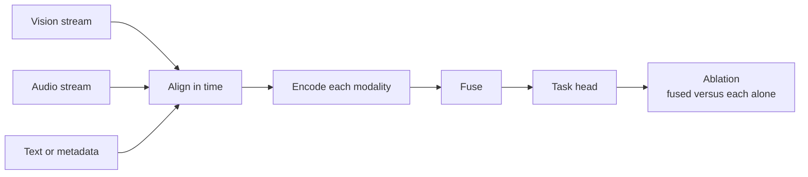
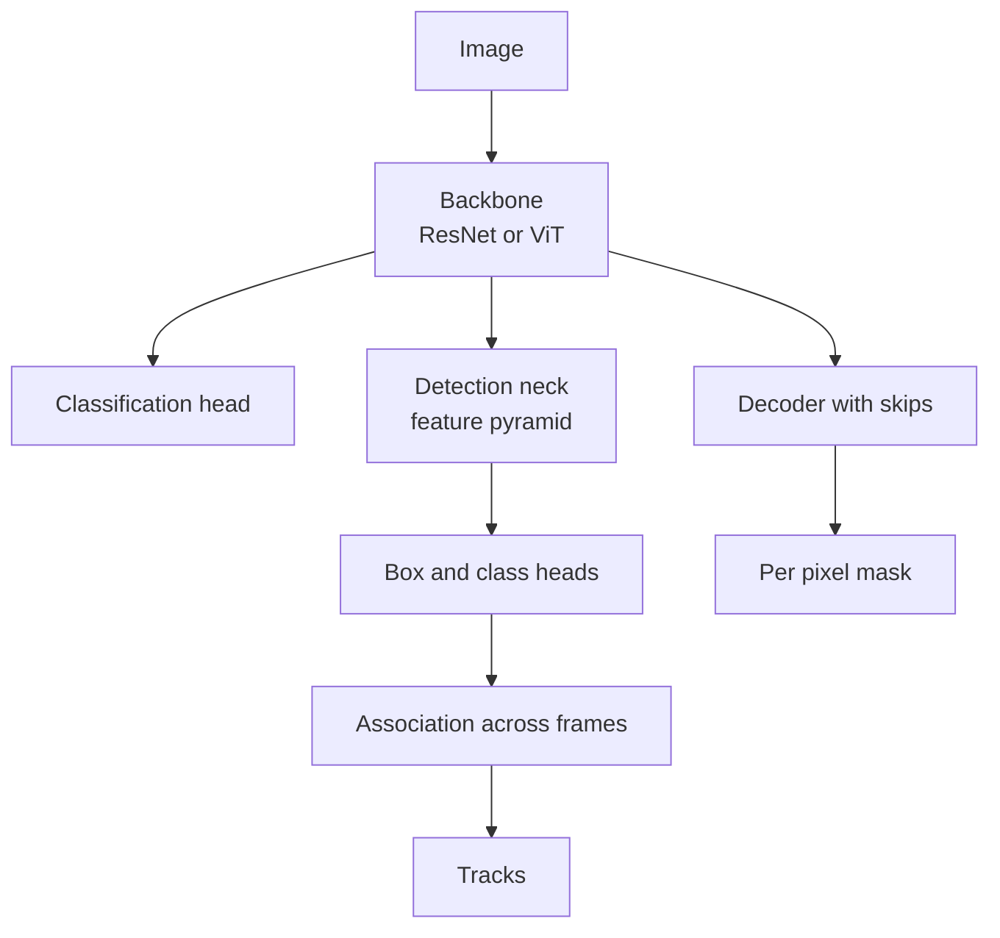
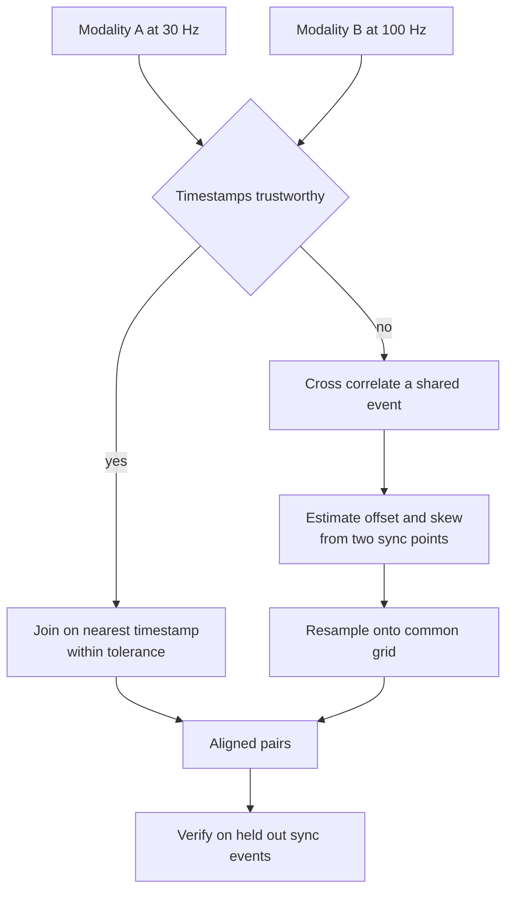
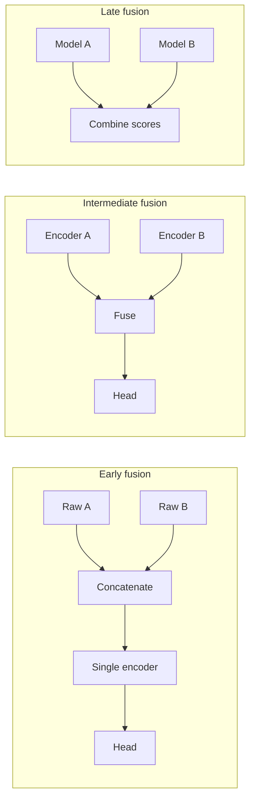
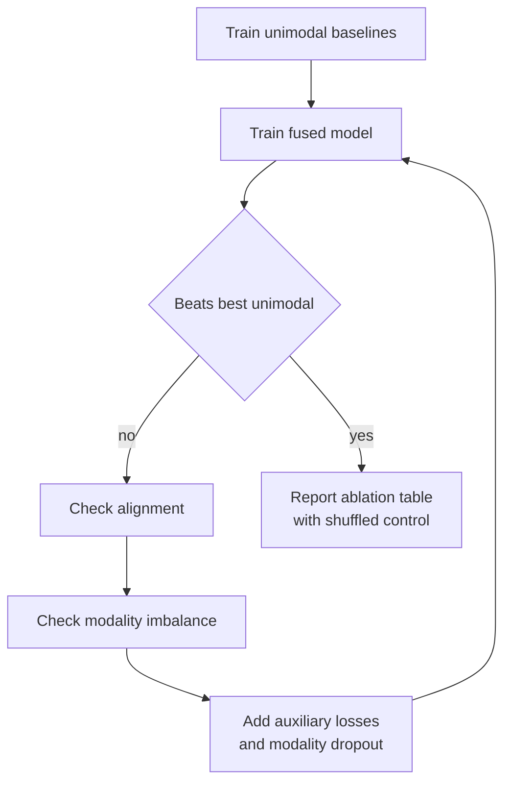
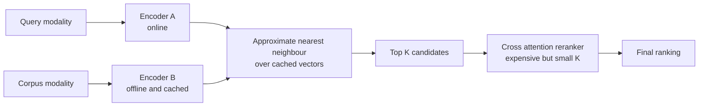

# Chapter 13: Vision, Audio, and Multimodal Fusion

> **What this chapter covers** Image and video understanding from representation to architecture, audio from waveform to mel spectrogram to recognition, and then the harder problem of combining modalities: alignment, the fusion taxonomy, joint representations, contrastive pretraining, missing modalities, modality imbalance, honest evaluation by ablation, and what a multi-encoder model costs to serve.
> **Prerequisites** Chapter 6 (neural networks), Chapter 7 (convolutional, recurrent, and attention architectures), Chapter 9 (representation learning and transfer). Chapter 12 (signals) is assumed for sampling, spectrograms, and synchronisation.
> **Where it is used** Perception in robotics and automotive, medical imaging and diagnostics, content moderation and search, speech interfaces, video understanding and retrieval, industrial inspection, and any product where a model must read pixels and audio at the same time.

Two things separate this chapter from generic deep learning. First, images and audio have structure that dictates architecture: locality and translation for images, time-frequency structure for audio. Second, the moment you have more than one modality, the dominant problem stops being architecture and becomes alignment, imbalance, and proving that fusion earned its cost.

---

## 13.1 Level 1: Foundations

### 13.1.1 What an image is

An image is a grid of numbers. A colour photograph of height $H$ and width $W$ is an array of shape $(H, W, 3)$, where the last axis holds red, green, and blue intensity. An 8-bit image stores each intensity as an integer from 0 to 255. A model almost always converts this to floating point in $[0, 1]$ or to a standardised range.

A **channel** is one of those planes. A grayscale image has one channel, a colour image three, a satellite image can have a dozen, and a medical volume has a depth axis as well.

**Colour spaces** are different coordinate systems for the same colour.

| Space | Axes | Property | When to use |
|---|---|---|---|
| RGB | Red, green, blue | What sensors capture and screens display | The default. All pretrained models expect it |
| Grayscale | Single luminance | Discards colour | When colour carries no information and compute matters |
| HSV | Hue, saturation, value | Separates colour identity from brightness | Colour-based thresholding, augmentation that changes lighting without changing hue |
| Lab | Lightness, two colour axes | Approximately perceptually uniform | Colour difference metrics, some augmentation |
| YCbCr | Luma plus two chroma | Chroma can be subsampled | Compression, and video decoding pipelines hand you this |

The practical point: convert to RGB and match the normalisation the pretrained backbone was trained with. Feeding a model trained on ImageNet-normalised inputs a raw $[0,255]$ tensor is the single most common silent bug in vision code.

### 13.1.2 What audio is

Audio is a one-dimensional signal: air pressure over time, sampled. A **waveform** at 16 kilohertz (kHz) holds 16,000 numbers per second per channel. Ten seconds of mono audio is 160,000 samples. That is why audio is almost never fed to a model as raw samples without a front end that reduces it.

Sample rate is decided by the bandwidth of interest, exactly as in Chapter 12. Speech intelligibility lives below 8 kHz, so 16 kHz sampling is the speech standard. Music needs the full audible range to about 20 kHz, so 44.1 kHz and 48 kHz are the music standards. Telephony historically used 8 kHz, which is why telephone speech sounds muffled: everything above 4 kHz was removed.

### 13.1.3 What multimodal means and why it is hard

A **modality** is a distinct kind of input: pixels, audio, text, inertial signals, tabular records. A **multimodal model** consumes more than one.

The naive expectation is that adding a modality adds information and therefore accuracy. The reality has three obstacles.

1. **Alignment.** The modalities arrive at different rates with different clocks. Pairing them correctly is a prerequisite, not a detail.
2. **Imbalance.** One modality is usually easier to learn from. The model latches onto it and stops learning from the others, so the fused model is no better than the strong modality alone.
3. **Proof.** Any fused model must be compared against the best single modality. A great many published multimodal results, when ablated, do not beat their strongest unimodal component.

Carry this as the mental model: **fusion is a claim, and the ablation table is the evidence**.



*Figure 13.1: The multimodal pipeline, ending in the ablation that decides whether fusion was worth it.*

---

## 13.2 Level 2: Working knowledge

### 13.2.1 The four vision tasks and their metrics

| Task | Output | Primary metric |
|---|---|---|
| Classification | One label per image, or several | Accuracy, macro F1, top-5 accuracy, area under the ROC curve |
| Detection | A set of boxes with class and score | Mean average precision at intersection over union thresholds |
| Segmentation | A label per pixel | Mean intersection over union, Dice coefficient, panoptic quality |
| Tracking | Identity-consistent boxes over time | Multiple object tracking accuracy, identity F1, higher order tracking accuracy |

**Intersection over union** (IoU), also called the Jaccard index, measures box or mask overlap:

$$\text{IoU} = \frac{|A \cap B|}{|A \cup B|}$$

**Worked example.** Predicted box spans x from 10 to 50 and y from 20 to 60, so it is 40 by 40, area 1600. Ground truth spans x from 30 to 80 and y from 40 to 90, so 50 by 50, area 2500. The intersection spans x from 30 to 50 and y from 40 to 60, that is 20 by 20, area 400. Union is $1600 + 2500 - 400 = 3700$. IoU is $400/3700 \approx 0.108$. At the common threshold of 0.5 this prediction is a false positive, and the ground truth box goes unmatched, so it is also a false negative.

**Mean average precision** (mAP) is the detection metric and it is worth understanding rather than importing.

1. Sort all predictions of a class by confidence, descending.
2. Walk down the list. Match each prediction to an unmatched ground truth box with IoU above the threshold. A match is a true positive, otherwise a false positive. Each ground truth can be matched once.
3. At each position compute running precision and recall.
4. Average precision (AP) is the area under the resulting precision-recall curve. The COCO protocol interpolates over 101 recall points.
5. mAP averages AP over classes. "mAP at 0.5" uses a single IoU threshold. "mAP at 0.5 to 0.95" averages over thresholds from 0.50 to 0.95 in steps of 0.05, which is the COCO headline number and is much stricter.

**Worked example of average precision.** One class, three ground truth objects, four predictions sorted by confidence with match outcomes true, false, true, true.

| Rank | Outcome | Cumulative TP | Cumulative FP | Precision | Recall |
|---|---|---|---|---|---|
| 1 | TP | 1 | 0 | 1.000 | 0.333 |
| 2 | FP | 1 | 1 | 0.500 | 0.333 |
| 3 | TP | 2 | 1 | 0.667 | 0.667 |
| 4 | TP | 3 | 1 | 0.750 | 1.000 |

Using the older 11-point interpolated scheme, precision at each recall level is the maximum precision at any recall at or above it: at recall 0 to 0.333 it is 1.000, at 0.4 to 0.667 it is 0.750, at 0.7 to 1.0 it is 0.750. Averaging the 11 points $0, 0.1, \ldots, 1.0$ gives $(1.0 \times 4 + 0.75 \times 7)/11 = (4 + 5.25)/11 \approx 0.84$. Different toolkits use different interpolation, so always state which protocol produced a number.

**Dice coefficient** for segmentation is

$$\text{Dice} = \frac{2|A \cap B|}{|A| + |B|}$$

It relates to IoU by $\text{Dice} = 2\,\text{IoU}/(1 + \text{IoU})$, so Dice is always the larger number. Medical imaging reports Dice; general vision reports IoU. Comparing across papers without checking which is being used is a frequent error.

### 13.2.2 Augmentation for images

Augmentation is regularisation by applying label-preserving transformations. The word "label-preserving" carries all the weight.

| Augmentation | What it does | Caution |
|---|---|---|
| Horizontal flip | Mirrors left to right | Wrong for text, for chirality in medical images, for road scenes in countries that drive on one side |
| Vertical flip | Mirrors top to bottom | Rarely valid for natural scenes, valid for satellite and microscopy |
| Random resized crop | Crops a random region and resizes | The strongest single augmentation for classification. Can crop out the object entirely |
| Rotation | Rotates by an angle | Valid for satellite and cell imagery, questionable for scenes with a gravity direction |
| Colour jitter | Perturbs brightness, contrast, saturation, hue | Destroys the label if colour is the label, such as in defect grading |
| Gaussian noise and blur | Simulates sensor and focus variation | Useful for robustness, can remove fine texture that is the signal |
| Cutout and random erasing | Masks a rectangle | Forces reliance on context rather than one discriminative patch |
| Mixup (Zhang et al. 2018) | Blends two images and their labels linearly | Changes the loss landscape. Interacts with label smoothing |
| CutMix (Yun et al. 2019) | Pastes a patch from one image into another, mixing labels by area | Often stronger than mixup for detection backbones |
| RandAugment (Cubuk et al. 2020) | Samples $N$ operations at magnitude $M$ from a fixed set | Two hyperparameters instead of dozens. The pragmatic default |

For detection and segmentation the geometry of the label must transform with the image. Use a library that handles this, such as Albumentations, rather than transforming images and labels separately.

### 13.2.3 Architecture families

**Convolutional networks** exploit two priors: locality, meaning nearby pixels are related, and translation equivariance, meaning a feature detector should work anywhere in the image. A convolution slides a small learned kernel over the input. Stacking convolutions grows the receptive field, the region of input that influences one output.

| Family | Key idea | Note |
|---|---|---|
| LeNet and AlexNet | Convolution plus pooling stacks, ReLU, dropout | AlexNet (Krizhevsky et al. 2012) started the modern era |
| VGG (Simonyan and Zisserman 2014) | Only 3 by 3 convolutions, deep and uniform | Very large parameter count, still used as a perceptual loss backbone |
| ResNet (He et al. 2016) | Residual connections let gradients skip layers, enabling depth beyond 100 layers | Still the most common baseline and a sensible default |
| Inception (Szegedy et al. 2015) | Parallel branches at several kernel sizes | Multi-scale features in one block |
| DenseNet (Huang et al. 2017) | Every layer sees all previous feature maps | Parameter efficient, memory hungry |
| MobileNet and EfficientNet (Howard et al. 2017; Tan and Le 2019) | Depthwise separable convolutions, compound scaling of depth, width, and resolution | The default for edge deployment |
| ConvNeXt (Liu et al. 2022) | A ResNet modernised with transformer-era design choices | Shows the gap to transformers was largely training recipe |

**Vision transformers** (Dosovitskiy et al. 2021) discard the convolutional prior. The mechanism is **patching**: split a 224 by 224 image into non-overlapping 16 by 16 patches, giving $14 \times 14 = 196$ patches. Flatten each patch to a vector of $16 \times 16 \times 3 = 768$ values, project it linearly to the model dimension, add a learned positional embedding, prepend a classification token, and run a standard transformer encoder. Attention is global from the first layer.

**Worked example of the sequence length.** At 224 by 224 with patch size 16 you get 196 tokens plus one class token, so 197. Self-attention cost is quadratic in sequence length, so $197^2 \approx 3.9 \times 10^4$ attention entries per head per layer. Double the resolution to 448 and the patch count quadruples to 784, and the attention cost rises sixteenfold to $6.2 \times 10^5$. This is why high-resolution vision transformers use windowed attention. Swin (Liu et al. 2021) computes attention within local windows and shifts the windows between layers to let information cross boundaries, restoring linear scaling in image area.

The practical trade-off: vision transformers need far more data or stronger augmentation and regularisation than convolutional networks, because they lack the locality prior. With ImageNet-scale data plus modern recipes they match or beat convolutional models; with 5,000 images and no pretraining, a ResNet usually wins.

**Detection architectures** split into two-stage and one-stage. Two-stage, exemplified by Faster R-CNN (Ren et al. 2015), proposes regions then classifies and refines them, giving higher accuracy at lower speed. One-stage, exemplified by the YOLO family (Redmon et al. 2016 onward) and RetinaNet (Lin et al. 2017), predicts boxes directly on a dense grid, which is faster. RetinaNet introduced **focal loss** to handle the extreme foreground-background imbalance of dense prediction:

$$\text{FL}(p_t) = -\alpha_t (1 - p_t)^{\gamma} \log(p_t)$$

where $p_t$ is the predicted probability of the true class and $\gamma$ is the focusing parameter, usually 2. **Worked example.** A well-classified background anchor with $p_t = 0.99$ contributes $(1-0.99)^2 = 10^{-4}$ times its cross-entropy weight, effectively nothing. A hard example with $p_t = 0.3$ contributes $(0.7)^2 = 0.49$. The ratio of their contributions changes by about 4900 times relative to plain cross-entropy, which is how the loss stops ten thousand easy negatives from drowning a hundred positives. DETR (Carion et al. 2020) reframed detection as set prediction with a transformer and bipartite matching, removing anchors and non-maximum suppression.

**Segmentation architectures.** U-Net (Ronneberger et al. 2015) is an encoder-decoder with skip connections carrying high-resolution detail across, and remains the default for medical and scientific segmentation. Mask R-CNN (He et al. 2017) adds a mask branch to Faster R-CNN for instance segmentation. The Segment Anything Model (Kirillov et al. 2023) provides promptable class-agnostic masks that are useful as a labelling accelerator.

**Tracking** is usually detection plus association. Track-by-detection runs a detector per frame and links boxes across frames using motion prediction, often a Kalman filter as in Chapter 12, plus an appearance embedding. SORT and DeepSORT (Bewley et al. 2016; Wojke et al. 2017) are the standard simple baselines, and DeepSORT is the one that adds appearance features to survive occlusion.



*Figure 13.2: One backbone feeding classification, detection, segmentation, and tracking heads.*

### 13.2.4 Transfer learning is the default

Training a vision model from random initialisation is unusual and almost always wrong outside research. The default workflow:

1. Take a backbone pretrained on a large corpus, ImageNet-1k or ImageNet-21k for supervised weights, or a self-supervised or language-supervised checkpoint such as DINOv2 or CLIP.
2. Replace the final classification layer with one sized to your classes.
3. Either freeze the backbone and train only the head (fast, works with a few hundred images), or fine-tune the whole network with a low learning rate (better, needs thousands).
4. Use a discriminative learning rate, lower for early layers, or a short frozen warm-up followed by unfreezing.
5. Match the pretraining normalisation, input resolution, and interpolation mode.

Rules of thumb for the freeze-or-fine-tune decision, which you should verify on your own data:

| Your data | Similarity to pretraining domain | Recommendation |
|---|---|---|
| Small, under about 1000 images | Similar | Freeze backbone, train head |
| Small | Dissimilar, for example radiology or infrared | Fine-tune the later blocks, keep early ones frozen |
| Large, tens of thousands | Similar | Fine-tune everything with a low learning rate |
| Large | Dissimilar | Fine-tune everything, consider domain-specific pretraining first |

### 13.2.5 Video: temporal modelling, sampling, and cost

Video is images plus time, and time is expensive. A 10-minute clip at 30 frames per second is 18,000 frames. Running a per-frame backbone over that is 18,000 forward passes for one example.

**Temporal modelling approaches.**

| Approach | Mechanism | Cost and note |
|---|---|---|
| Frame aggregation | Encode frames independently, then pool or average | Cheapest. Blind to temporal order, so it cannot distinguish opening a door from closing one |
| Two-stream (Simonyan and Zisserman 2014) | One stream on RGB frames, one on precomputed optical flow | Strong historically. Optical flow computation dominates cost |
| 3D convolution, C3D and I3D (Carreira and Zisserman 2017) | Convolve over height, width, and time | Parameter and compute heavy. I3D inflates 2D ImageNet kernels into 3D to get a good initialisation |
| Factorised 3D, R(2+1)D and S3D | Split a 3D kernel into a spatial then a temporal convolution | Similar accuracy, far fewer parameters, easier optimisation |
| Recurrent over frame features | CNN per frame into an LSTM or GRU | Simple, sequential, hard to parallelise |
| Video transformers, TimeSformer and ViViT (Bertasius et al. 2021; Arnab et al. 2021) | Tokenise space-time patches, factorise attention into spatial and temporal | Current strong approach. Attention cost is the constraint, which factorisation addresses |

**Frame sampling** is where most of the cost is decided.

| Strategy | How | When |
|---|---|---|
| Uniform sampling | Take $K$ evenly spaced frames from the clip | Standard for classification. $K$ of 8, 16, or 32 |
| Dense clips | Take a short contiguous clip at full rate, several per video, average predictions | Better for fine motion, more compute |
| Segment sampling (Wang et al. 2016) | Split into $K$ segments, take one random frame from each | Covers the whole video with $K$ frames and adds training noise. Very strong for the cost |
| Keyframe or shot boundary | Decode only I-frames or detect scene cuts | Cheap, and biased toward whatever the encoder chose to keep |
| Learned or adaptive sampling | A small model selects which frames to process | Saves compute at inference, adds a component to train and debug |

**The cost problem, quantified.** Assume a backbone costing 4 GFLOPs per frame, which is roughly a ResNet-50 at 224 by 224. Processing 16 sampled frames per clip is 64 GFLOPs. Processing all 18,000 frames of a 10-minute video is 72 TFLOPs, a thousand times more, for one video. At fleet scale this is the difference between a viable product and a research demo. The decisions that control it, in order of leverage: how many frames you sample, at what resolution, with what backbone, and whether you decode the whole file or seek. Video decoding itself is often the bottleneck before the model is, so measure the decoder before optimising the network.

### 13.2.6 Audio: from waveform to features

**The mel scale.** Human pitch perception is approximately logarithmic in frequency. The difference between 100 Hz and 200 Hz sounds large; between 10,000 Hz and 10,100 Hz it is inaudible. The mel scale is a warping that makes equal steps correspond to equal perceived pitch change. The common formula, sometimes called the HTK formula:

$$m = 2595 \log_{10}\!\left(1 + \frac{f}{700}\right)$$

with inverse

$$f = 700 \left(10^{m/2595} - 1\right)$$

**Worked example.** At $f = 1000$ Hz, $m = 2595 \log_{10}(1 + 1000/700) = 2595 \log_{10}(2.4286) = 2595 \times 0.38546 \approx 1000.3$ mel. The scale is calibrated so 1000 Hz is about 1000 mel. At $f = 4000$ Hz, $m = 2595 \log_{10}(6.7143) = 2595 \times 0.82710 \approx 2146$ mel. So quadrupling the frequency roughly doubles the mel value. That compression is the entire point: a mel filterbank spends many narrow filters below 1 kHz and a few wide ones above 4 kHz, matching where speech information sits.

**The mel spectrogram** pipeline, which is the standard audio front end:

1. Frame the waveform into overlapping windows, typically 25 milliseconds with a 10 millisecond hop. At 16 kHz that is 400 samples per frame with a 160 sample hop, giving 100 frames per second.
2. Apply a window function, usually Hann or Hamming, for the leakage reasons in Chapter 12.
3. FFT each frame, take the magnitude squared, giving a power spectrogram.
4. Multiply by a bank of triangular filters spaced evenly on the mel scale, typically 40, 64, or 80 filters. This reduces the frequency axis from 201 bins to 80.
5. Take the logarithm, because loudness perception is also approximately logarithmic and because it compresses the dynamic range for the network.

The output is an 80 by $T$ image, where $T$ is the number of frames. Ten seconds at 100 frames per second gives 80 by 1000. That is 80,000 values instead of 160,000 raw samples, with the information reorganised into a form a convolutional or transformer model handles well.

**Mel-frequency cepstral coefficients** (MFCCs) go one step further: apply a discrete cosine transform to the log mel energies and keep the first 12 to 13 coefficients. The DCT decorrelates the mel bands, which mattered enormously when the back end was a Gaussian mixture model with diagonal covariance. For neural networks the decorrelation is unnecessary and the truncation discards information, so **mel spectrograms are the modern default and MFCCs are largely legacy**. MFCCs remain useful when compute or memory is very tight, or when you are reproducing older work.

**Listing 13.1: a mel spectrogram front end with torchaudio.**

```python
import torch, torchaudio

SR = 16000
mel = torchaudio.transforms.MelSpectrogram(
    sample_rate=SR,
    n_fft=400,        # 25 ms window at 16 kHz
    hop_length=160,   # 10 ms hop, so 100 frames per second
    n_mels=80,
    f_min=20.0,
    f_max=SR // 2,    # never above Nyquist
    power=2.0,        # power spectrogram, not magnitude
)
to_db = torchaudio.transforms.AmplitudeToDB(stype="power", top_db=80.0)

def features(wav):          # wav: (channels, samples), float32 in [-1, 1]
    if wav.shape[0] > 1:
        wav = wav.mean(0, keepdim=True)     # downmix to mono
    return to_db(mel(wav))                  # (1, 80, frames)
```

`top_db=80.0` clamps the dynamic range so digital silence does not become minus infinity and destroy the batch statistics. `power=2.0` matters because log of power and log of magnitude differ by a factor of two, which is absorbed by the first layer but changes the scale you normalise against. Check your library version: default arguments for these transforms have changed between releases.

**Audio tasks.**

| Task | Output | Typical architecture |
|---|---|---|
| Audio classification | One label per clip | CNN or transformer on mel spectrogram. PANNs, AST (Gong et al. 2021) |
| Sound event detection | Labels with onset and offset times | Same encoder with a per-frame head, then thresholding and smoothing |
| Keyword spotting | Trigger or not, on device | Tiny CNN on a short mel window, heavily quantised |
| Speaker verification | Embedding, compared by cosine distance | x-vector or ECAPA-TDNN, trained with angular margin losses |
| Speech recognition | Text | See below |
| Source separation | Separated waveforms | Masking in the time-frequency domain, or time-domain models such as Conv-TasNet |

**Speech recognition architecturally.** Three generations, and you will meet all three in production systems.

1. **Hybrid HMM and neural.** A neural network predicts phone state posteriors, a hidden Markov model handles time alignment, and a weighted finite state transducer decodes with a pronunciation lexicon and an n-gram language model. Complex, but controllable and still used where domain vocabulary must be forced.
2. **Connectionist temporal classification** (Graves et al. 2006). The network emits a per-frame distribution over characters plus a blank symbol, and CTC marginalises over all alignments that collapse to the target string. No alignment supervision is needed. The key limitation is the conditional independence assumption across output frames, so an external language model is usually fused during decoding.
3. **Attention encoder-decoder and transducers.** Listen-Attend-Spell style sequence-to-sequence models, RNN-Transducer for streaming, and large weakly supervised models such as Whisper (Radford et al. 2022) trained on very large amounts of loosely labelled audio. These are the default for general-purpose transcription. Transducers are the default when you need low-latency streaming, because attention decoders want the whole utterance.

Self-supervised speech encoders, wav2vec 2.0 (Baevski et al. 2020) and HuBERT (Hsu et al. 2021), learn representations from unlabelled audio and are fine-tuned with small labelled sets. They are the standard starting point for a low-resource language or a specialised domain.

### 13.2.7 Augmentation for audio

| Augmentation | What it simulates | Applied to |
|---|---|---|
| Time shift | Different onset alignment | Waveform |
| Time stretch | Faster or slower speech, without pitch change | Waveform |
| Pitch shift | Different speaker pitch, without rate change | Waveform |
| Speed perturbation | Both together, typically 0.9, 1.0, 1.1 times | Waveform. Cheap and very effective for speech recognition |
| Additive noise | Background environments | Waveform, mixed at a controlled signal-to-noise ratio |
| Room impulse response convolution | Reverberation from a real room | Waveform. The strongest augmentation for far-field robustness |
| Gain and dynamic range | Recording level variation | Waveform |
| SpecAugment (Park et al. 2019) | Masking of time steps and frequency bands, plus time warping | Spectrogram. Standard for speech recognition, nearly free |
| Mixup on spectrograms | Blended clips and labels | Spectrogram. Strong for audio tagging |

SpecAugment deserves its reputation. It masks contiguous blocks of the mel spectrogram: a band of frequencies, and a span of time. It costs nothing, it needs no extra data, and it changed the state of the art in speech recognition on its own. Use noise and room impulse response augmentation when the deployment environment differs from the recording environment, which is nearly always.

---

## 13.3 Level 3: Depth

### 13.3.1 Alignment is the first problem

Before any fusion, the modalities must be put on a common time base. Nothing downstream survives a misalignment.

Sources of misalignment:

| Source | Character | Detection |
|---|---|---|
| Different sample rates | Video at 30 frames per second, audio at 16 kHz, inertial at 100 Hz | Known from metadata |
| Variable frame rate | Phone cameras drop frames under load or thermal throttling | Frame timestamps not evenly spaced |
| Clock offset | Devices started at different times | Constant lag in cross-correlation |
| Clock skew | Oscillators run at slightly different rates | Lag grows linearly with elapsed time |
| Buffering and pipeline latency | Encoder and transport delays differ per modality | Constant offset, usually per device model |
| Semantic lag | The visible event and the audible event are genuinely offset, as when a speaker's lips lead the sound | Real, and should not be corrected away |

Strategies, and which problem each solves:

1. **Resample to a common grid.** Pick a base rate, usually the slowest modality, and resample the others to it. Follow the anti-aliasing rules from Chapter 12. This solves rate mismatch only.
2. **Timestamp-based joining.** Keep each modality at its native rate and pair by nearest timestamp within a tolerance. Preserves native resolution, and requires trustworthy timestamps.
3. **Cross-correlation alignment.** Find the lag maximising correlation between a shared observable, for example audio energy against lip motion, or an accelerometer spike against a visible impact. Corrects offset.
4. **Two-point drift correction.** Align at the start and the end, fit offset and skew, and resample. Corrects skew, which a single sync point cannot.
5. **Learned alignment.** Let cross-attention discover correspondence rather than imposing it. Works when misalignment is small and variable, and it costs capacity that would otherwise model the task.

**Worked example of tolerance.** Video at 30 frames per second has 33.3 milliseconds between frames. If audio-visual synchronisation errors above roughly 45 milliseconds are perceptible, then a one-frame alignment error is near the limit and a two-frame error is clearly wrong. A skew of 100 parts per million between two devices accumulates $100 \times 10^{-6} \times 600 = 0.06$ s over a 10-minute recording, which is two frames. So a recording that was aligned at the start is visibly out of sync by the end, from skew alone.

**Ragged sequences.** After alignment the modalities still have different lengths per example. Options: pad to a fixed length with a mask, pool each modality to a fixed-size vector before fusion, or use attention with a key padding mask. Whatever you choose, be certain the mask actually reaches the attention computation. A silently ignored padding mask lets the model attend to zeros, which it will happily learn to exploit, and the bug shows up only as unexplained variance between batch sizes.



*Figure 13.3: Alignment decision path, ending in verification rather than assumption.*

### 13.3.2 The fusion taxonomy

Fusion is classified by where in the network the modalities meet.

| Type | Where | Assumes | Strengths | Weaknesses |
|---|---|---|---|---|
| Early, or feature-level | Concatenate raw or low-level features before the main encoder | The modalities are aligned sample by sample and interact at low level | Can model fine-grained cross-modal correlation | Dimensionality explodes, dominated by whichever modality has more dimensions, brittle to missing input |
| Late, or decision-level | Each modality has its own full model, outputs combined by averaging, weighted voting, or a small meta-model | The modalities are conditionally independent given the label | Modular, trains separately, trivially handles a missing modality by dropping its vote, easy to debug | Cannot model interactions. If the answer depends on a joint pattern it will be missed |
| Intermediate, or model-level | Each modality has an encoder, representations are fused in the middle, a shared head follows | There is a useful shared abstraction level | The usual best accuracy, models interaction while keeping modality-specific processing | Must choose the fusion depth, needs joint training, one modality can dominate |
| Hybrid | Fuse at several depths, and keep unimodal auxiliary heads | Interactions exist at multiple scales | Most flexible, and unimodal heads counter imbalance | Most parameters, most tuning, easiest to overfit |

The practical default is intermediate fusion with unimodal auxiliary losses, because it captures interaction and defends against modality imbalance at the same time. Late fusion is the right choice when modalities arrive at different times, when teams own them separately, or when robustness to a missing stream matters more than peak accuracy.



*Figure 13.4: The three canonical fusion depths, differing in how much modality-specific processing happens before the streams meet.*

### 13.3.3 Joint representations

Given modality embeddings $\mathbf{u} \in \mathbb{R}^{d_u}$ and $\mathbf{v} \in \mathbb{R}^{d_v}$, how do you combine them?

**Concatenation with projection.** The baseline.

$$\mathbf{z} = \sigma\!\left(\mathbf{W}\,[\mathbf{u}; \mathbf{v}] + \mathbf{b}\right)$$

Cheap, and it models only additive interaction in the first layer; multiplicative interaction must be built by depth. The practical failure is scale mismatch: if $\|\mathbf{u}\|$ is ten times $\|\mathbf{v}\|$ the projection effectively ignores $\mathbf{v}$ at initialisation. Apply layer normalisation to each modality before concatenating. This one line fixes a surprising number of "fusion did not help" results.

**Gating.** Let one modality modulate another:

$$\mathbf{g} = \sigma(\mathbf{W}_g [\mathbf{u}; \mathbf{v}] + \mathbf{b}_g), \qquad \mathbf{z} = \mathbf{g} \odot \mathbf{u} + (1 - \mathbf{g}) \odot \mathbf{v}$$

with $\sigma$ the logistic function and $\odot$ elementwise product. The gate is input-dependent, so the model can learn to trust vision in daylight and audio in the dark. It also gives an interpretable diagnostic: log the mean gate value per condition. A gate pinned at 0.98 is telling you fusion is not happening.

**Bilinear pooling.** Model every pairwise interaction with an outer product:

$$\mathbf{z} = \mathbf{u}\,\mathbf{v}^{\top} \in \mathbb{R}^{d_u \times d_v}, \quad \text{flattened, then } \mathbf{W}\text{vec}(\mathbf{z})$$

**Worked example of the cost.** With $d_u = d_v = 512$ and 10 output classes, the flattened outer product has 262,144 entries and the output weight matrix has $262{,}144 \times 10 = 2.6$ million parameters for the final layer alone. Push both dimensions to 2048 and the interaction vector is 4.2 million entries, with 42 million parameters into a 10-way head. This is why plain bilinear pooling is impractical.

**Low-rank bilinear pooling** fixes it. Factor $\mathbf{W}$ as a product of low-rank matrices, giving

$$\mathbf{z} = \mathbf{P}^{\top}\left( (\mathbf{U}^{\top}\mathbf{u}) \odot (\mathbf{V}^{\top}\mathbf{v}) \right)$$

where $\mathbf{U} \in \mathbb{R}^{d_u \times k}$, $\mathbf{V} \in \mathbb{R}^{d_v \times k}$ and $\mathbf{P} \in \mathbb{R}^{k \times d_z}$. With $d_u = d_v = 512$, $k = 1024$, $d_z = 512$, the parameter count is $512 \times 1024 \times 2 + 1024 \times 512 \approx 1.6$ million, versus 2.6 million for the final layer alone in the full version, and it scales linearly rather than quadratically. This is the MLB formulation (Kim et al. 2017). Multimodal Compact Bilinear pooling (Fukui et al. 2016) achieves a similar reduction by sketching the outer product with the count sketch algorithm and using the fact that the convolution of sketches approximates the sketch of the outer product, computed via FFT.

**Tensor fusion** (Zadeh et al. 2017) generalises the outer product to three or more modalities and explicitly includes unimodal and bimodal terms by appending a constant 1 to each embedding:

$$\mathbf{z} = \begin{bmatrix}\mathbf{u}\\1\end{bmatrix} \otimes \begin{bmatrix}\mathbf{v}\\1\end{bmatrix} \otimes \begin{bmatrix}\mathbf{w}\\1\end{bmatrix}$$

The appended 1 is the clever part: expanding the product yields every unimodal term, every pairwise term, and the trimodal term, all in one tensor. **Worked example of the combinatorial cost.** With three modalities each of dimension 128, the tensor has $129^3 \approx 2.1$ million entries. With dimension 256 it is $257^3 \approx 17$ million. Adding a fourth modality at dimension 128 gives $129^4 \approx 2.8 \times 10^8$ entries, which is not trainable. Low-rank tensor fusion (Liu et al. 2018) decomposes the weight tensor into modality-specific low-rank factors and reduces the cost to linear in the number of modalities, which is what makes the idea usable beyond two or three streams.

**Cross-modal attention.** The most flexible mechanism and the current default in large multimodal models. Use one modality to query the other. With $\mathbf{X}_a \in \mathbb{R}^{n \times d}$ the sequence of tokens from modality A and $\mathbf{X}_b \in \mathbb{R}^{m \times d}$ from modality B:

$$\mathbf{Q} = \mathbf{X}_a \mathbf{W}_Q, \quad \mathbf{K} = \mathbf{X}_b \mathbf{W}_K, \quad \mathbf{V} = \mathbf{X}_b \mathbf{W}_V$$

$$\text{CrossAttn}(\mathbf{X}_a, \mathbf{X}_b) = \text{softmax}\!\left(\frac{\mathbf{Q}\mathbf{K}^{\top}}{\sqrt{d_k}}\right)\mathbf{V}$$

Each of the $n$ tokens of A produces a query, compares it against all $m$ keys of B, and takes a weighted sum of B's values. The result has $n$ rows: A's sequence, enriched with information from B. Run it in both directions for symmetric fusion.

**Worked example.** Video with $n = 16$ frame tokens and audio with $m = 200$ mel frame tokens, $d = 512$, $d_k = 64$ per head with 8 heads. The attention matrix per head is 16 by 200, that is 3200 entries, trivially cheap. Reverse the direction and it is 200 by 16, the same size. Compare with self-attention over a concatenated sequence of 216 tokens, which is $216^2 = 46{,}656$ entries, about fifteen times more, and which spends most of its budget on audio-to-audio comparisons the audio encoder already made. This is the argument for cross-attention over naive concatenated self-attention: it computes only the cross terms.

The asymmetry is a design choice. If one modality is the anchor, for example the text query in a retrieval system, let it query the others. Perceiver (Jaegle et al. 2021) takes this further by cross-attending from a small fixed set of learned latent vectors into a very long input, decoupling compute from input size entirely.

### 13.3.4 Contrastive cross-modal alignment

Instead of fusing for a task, learn a shared embedding space where corresponding pairs from different modalities are close.

Given a batch of $N$ paired examples, encode each into $\mathbf{u}_i$ and $\mathbf{v}_i$, normalise both to unit length, and use the InfoNCE loss:

$$\mathcal{L} = -\frac{1}{2N}\sum_{i=1}^{N}\left[\log \frac{\exp(\mathbf{u}_i^{\top}\mathbf{v}_i / \tau)}{\sum_{j=1}^{N}\exp(\mathbf{u}_i^{\top}\mathbf{v}_j / \tau)} + \log \frac{\exp(\mathbf{u}_i^{\top}\mathbf{v}_i / \tau)}{\sum_{j=1}^{N}\exp(\mathbf{u}_j^{\top}\mathbf{v}_i / \tau)}\right]$$

where $\tau$ is a temperature, usually learned. The two terms are the two retrieval directions, A finding B and B finding A. Every other item in the batch is a negative, which is why batch size matters so much: with $N = 256$ each positive competes against 255 negatives, with $N = 32{,}768$ against far more, and the task is correspondingly harder and the representation better.

**Worked example of the temperature.** Suppose the correct pair has cosine similarity 0.8 and the best incorrect pair 0.6. With $\tau = 1.0$ the logits are 0.8 and 0.6, and the softmax over just these two gives $e^{0.8}/(e^{0.8}+e^{0.6}) = 0.550$, a weak preference. With $\tau = 0.07$, a common learned value, the logits become 11.43 and 8.57, and the softmax gives $e^{11.43}/(e^{11.43}+e^{8.57}) = 0.946$. Low temperature sharpens the distribution and makes the loss focus hard on the closest negatives. Too low and gradients concentrate on a few pairs and training becomes unstable, which is why the temperature is usually learned with a clamp.

CLIP (Radford et al. 2021) applied this to 400 million image-text pairs and produced an encoder useful for zero-shot classification by embedding class names as text. ALIGN (Jia et al. 2021) did the same at larger scale with noisier data. AudioCLIP and CLAP extend it to audio. ImageBind (Girdhar et al. 2023) aligned six modalities to images without needing all pairings, exploiting the fact that aligning everything to one hub modality induces emergent alignment between the others.

What contrastive alignment buys you: retrieval across modalities, zero-shot classification, and a strong initialisation for fusion. What it does not buy you: fine-grained localisation, because a single global embedding per modality discards where in the image or when in the audio the evidence was.

### 13.3.5 Missing modalities

In production a modality goes missing constantly. The camera is occluded, the microphone is muted, a service times out, a sensor is not fitted on the cheaper hardware variant. A model that requires all inputs is a model that fails.

| Strategy | Mechanism | Trade-off |
|---|---|---|
| Modality dropout during training | Randomly zero a whole modality with probability $p$, typically 0.1 to 0.3, and inform the model with a mask token or indicator | Cheapest, most effective, and it doubles as regularisation. The model must be told a modality is absent rather than seeing plausible zeros |
| Zero or mean imputation | Substitute zeros or the training mean | Zeros are in-distribution only if the model saw them in training. Otherwise it is an out-of-distribution input |
| Generative imputation | A model predicts the missing embedding from the present ones | Can work when modalities are redundant. Adds a component that can fail silently, and it hallucinates confidently |
| Modality-specific experts with a gate | Train separate paths and route based on availability | Clean, more parameters, effectively late fusion |
| Knowledge distillation from full to partial | Train a full-modality teacher, distil into students that see a subset | Strong results. Requires training one student per availability pattern, or a mask-conditioned student |
| Late fusion by construction | Combine available scores only, renormalising weights | Simplest robust answer. Gives up interaction modelling |

The design rule: **decide the availability patterns you must support before choosing the fusion type**. If audio can vanish at any time and the system must still answer, late or gated fusion with modality dropout is a stronger starting point than a tightly coupled tensor fusion that has never seen a missing stream.

**Graceful degradation** should be measured, not hoped for. Build an evaluation table with one row per availability pattern: all modalities, each single modality, and each realistic partial combination. Report accuracy for each. A model that scores 0.91 with everything and 0.42 with audio missing is a different product from one that scores 0.89 and 0.84, even though the first has the better headline number.

### 13.3.6 Modality imbalance

This is the failure mode that makes fusion disappoint most often, and it is not obvious from the loss curve.

**The mechanism.** During joint training, gradients flow through both encoders from a shared loss. If modality A reduces the loss faster, the shared head comes to rely on A's features. The gradient reaching B's encoder shrinks, B's representation stops improving, and the model converges to a solution that is essentially A-only with B's encoder undertrained. This is documented in Wang et al. (2020), "What Makes Training Multi-Modal Classification Networks Hard?", and the analysis in Peng et al. (2022) on balanced multimodal learning.

The consequence is counterintuitive: **the jointly trained multimodal model can be worse than a separately trained unimodal model on the strong modality**, because the fused model wastes capacity and overfits faster while the weak encoder contributes noise.

**Diagnosis.** Do not guess. Measure.

1. Train each modality alone to convergence. Record accuracy.
2. Train the fused model. Compare against the best unimodal number. If fusion does not beat it, you have a problem, not a result.
3. Freeze the fused model and evaluate with each modality zeroed. If zeroing B changes nothing, B is not contributing.
4. Log per-encoder gradient norms during training. A ratio that diverges by an order of magnitude is direct evidence of imbalance.
5. Attach linear probes to each encoder's output and measure how much task information each carries at each epoch. A probe that stops improving marks the epoch the encoder stopped learning.

**Mitigations.**

| Mitigation | Mechanism | Note |
|---|---|---|
| Unimodal auxiliary losses | Attach a task head to each encoder and add its loss with a weight | Simplest and usually effective. Guarantees every encoder gets direct gradient |
| Gradient blending (Wang et al. 2020) | Weight each modality's loss by its overfitting-to-generalisation ratio, recomputed periodically | Principled, and it needs a validation set and extra bookkeeping |
| On-the-fly gradient modulation (Peng et al. 2022) | Scale each encoder's gradient by a ratio measuring its current contribution | Adaptive, one hyperparameter |
| Modality dropout | Randomly drop a modality so the model cannot depend on one alone | Dual purpose with the missing-modality defence |
| Separate learning rates or schedules | Train the weak encoder faster, or pretrain it separately and freeze early | Practical, needs tuning |
| Pretrain each encoder separately | Initialise from strong unimodal checkpoints, then fine-tune fused | Almost always the right starting point |
| Late fusion | Each modality trains independently by construction | Removes the problem by removing the interaction |

The pragmatic recipe that works most often: pretrain or initialise both encoders separately, add unimodal auxiliary heads with weight around 0.3 each, apply modality dropout at 0.15, apply layer normalisation before fusion, and fuse at an intermediate depth with cross-attention.



*Figure 13.5: The loop a fusion project actually runs, where failing to beat the unimodal baseline sends you back to alignment and imbalance before architecture.*

---

## 13.4 Level 4: Mastery

### 13.4.1 Evaluating fusion honestly

The deliverable of a fusion project is not a number. It is an ablation table. Anything less is not evidence.

The minimum table:

| Configuration | Metric with 95 percent interval | Parameters | Latency at p95 | Notes |
|---|---|---|---|---|
| Modality A alone | | | | |
| Modality B alone | | | | |
| A plus B, late fusion | | | | |
| A plus B, intermediate fusion | | | | |
| A plus B, intermediate, with auxiliary losses | | | | |
| A plus B, with A shuffled across examples | | | | Destroys correspondence, keeps marginals |
| A plus B, with B zeroed at inference | | | | Measures actual dependence |

The **shuffled-modality control** is the one most often skipped and the most diagnostic. Break the correspondence between the two streams by randomly permuting one across the batch while keeping its marginal distribution. If the model still performs, it was never using cross-modal correspondence; it was using the extra capacity, or the marginal statistics of the second stream. This control separates real fusion from an elaborate ensemble.

Two more requirements. **Match the compute.** A fused model has roughly twice the parameters, so compare it against a unimodal model of matched capacity or a unimodal ensemble, not against a small baseline. **Use paired statistics.** The models are evaluated on the same items, so use a paired bootstrap or a paired permutation test over items rather than comparing two independent confidence intervals, which is less powerful and can miss a real difference.

Metrics for cross-modal retrieval specifically: Recall at $K$ in both directions, median rank, and mean reciprocal rank. Always report both directions, since image-to-text and text-to-image recall can differ substantially and reporting only the better one is a common distortion.

### 13.4.2 Serving a multi-encoder model

The architecture diagram hides the operational cost. A two-encoder fused model is close to two models in production.

| Consequence | Detail | Response |
|---|---|---|
| Memory | Both encoders resident. A ViT-L vision tower plus an audio transformer can exceed a single commodity accelerator's memory at useful batch sizes | Quantise the encoders, shard, or run them on separate replicas |
| Latency | If encoders run sequentially, latencies add. p95 is dominated by the slower one | Run encoders in parallel on separate streams or devices. The fusion head is usually negligible |
| Throughput and batching | Modalities have different natural batch shapes. Video batches are large tensors, text batches are ragged | Separate batching per encoder, join at the fusion point. Continuous batching helps text, not video |
| Straggler risk | The request finishes only when the slowest encoder does | Set per-encoder timeouts and fall back to the partial-modality path |
| Caching | Many requests repeat one modality, for example a fixed product image against many queries | Cache encoder outputs keyed by a content hash. This is often the single largest win |
| Preprocessing cost | Video decoding and mel spectrogram computation can exceed model time | Profile before optimising the network. Move decoding to accelerated hardware |
| Versioning | Two encoders and a head version independently, and cached embeddings from encoder v1 are invalid under v2 | Version the cache key by encoder version. Plan for a backfill |
| Monitoring | Drift can occur in one modality only | Monitor input distributions and embedding statistics per modality, not just the output |

The two-tower pattern deserves special mention. If you can compute one modality's embedding offline and cache it, fusion at inference reduces to encoding the other modality plus a cheap combination. This is why retrieval systems use contrastive dual encoders rather than a cross-attention model: cross-attention requires scoring every pair at query time, while dual encoders allow approximate nearest neighbour search over precomputed vectors. The accuracy is lower and the cost is thousands of times lower. The standard resolution is a cascade: dual-encoder retrieval for candidates, then a cross-attention model to rerank the top few dozen. Chapter 14 develops this pattern in the ranking context.



*Figure 13.6: The retrieve-then-rerank cascade that makes cross-modal scoring affordable by paying the expensive cost only on a short list.*

### 13.4.3 What senior engineers argue about

**Whether fusion is usually worth it.** The sceptical position, with a great deal of empirical support, is that most reported multimodal gains are small, are not reproduced against a properly tuned unimodal baseline of matched capacity, and do not survive the shuffled-modality control. The counter-position is that the gains are real but concentrated: fusion helps most when modalities are genuinely complementary and each is individually insufficient, for example audio-visual speech recognition in noise, or multimodal sentiment where tone contradicts words. The practical synthesis: assume fusion will not help until the ablation shows it does, and spend the first week on alignment and unimodal baselines rather than on fusion architecture.

**Whether to build one model or several.** Joint training can share representation and reduce total parameters. Separate models per modality are easier to own, version, debug, monitor, and roll back, and they degrade independently. Many production systems that describe themselves as multimodal are late fusion over separately owned models, and that is often the correct engineering decision even where joint training would score marginally higher.

**Whether to feed raw or preprocessed audio.** End-to-end models on raw waveforms, such as SincNet and the wav2vec family's convolutional front end, learn their own filterbank and can exceed mel features with enough data. Mel spectrograms encode a good prior cheaply and remain the default at moderate scale. The reasonable position is that the mel front end is a strong, nearly free inductive bias, and you should only replace it when you have the data to learn something better and a measurement showing you did.

**How much of a vision transformer's advantage is the architecture.** ConvNeXt showed that a ResNet updated with modern training recipes, larger kernels, and layer normalisation closes most of the gap. The remaining argument is that transformers scale better with data and unify more easily with language models, which matters more for multimodal systems than raw ImageNet accuracy.

**Whether contrastive pretraining is the right objective.** Contrastive objectives learn global correspondence and discard localisation. Captioning and masked-modelling objectives, as in CoCa and BLIP, retain more fine-grained information at higher training cost. Current practice is hybrid: a contrastive term for retrieval plus a generative term for grounding.

### 13.4.4 Frontier and open problems

| Problem | State of play |
|---|---|
| Unified any-to-any models | Single models handling arbitrary input and output modality combinations. Architecturally feasible, and training data for rare pairings is the constraint |
| Fine-grained grounding | Localising which pixel or which millisecond justifies a prediction. Weakly supervised grounding remains unreliable |
| Modality-specific hallucination | Vision-language models describe objects not present. Measurement benchmarks exist, mitigation is immature |
| Efficient long video | Hours of video at useful temporal resolution exceeds any current attention budget. Memory-augmented and hierarchical approaches are active |
| Robust missing-modality handling | Mask-conditioned models that degrade smoothly across all availability patterns, rather than one model per pattern |
| Theory of when fusion helps | Information-theoretic accounts of complementarity exist but do not yet predict empirical gains reliably |
| Evaluation contamination | Large web-scale pretraining corpora overlap with public benchmarks. Zero-shot claims are increasingly hard to verify |
| Cross-modal bias transfer | Bias in one modality's pretraining corpus propagates into the joint space and into decisions driven by the other modality |

### 13.4.5 Where standard advice is wrong

**"More modalities means better accuracy."** Only when each adds information the others lack, and only when training is balanced. Adding a weak modality frequently reduces accuracy.

**"Use MFCCs for audio."** Legacy advice from the Gaussian mixture era. Log mel spectrograms retain more information and are the modern default for neural models.

**"Vision transformers beat convolutional networks."** At scale, with heavy augmentation and long schedules. On ten thousand images without pretraining, a ResNet or an EfficientNet usually wins and trains far faster.

**"Fine-tune everything."** With small datasets full fine-tuning overfits. Freeze the backbone, or fine-tune only the last blocks, or use parameter-efficient adaptation.

**"Late fusion is naive."** It is modular, robust to missing inputs, easy to own, and frequently within a point of the best intermediate architecture. It is a legitimate engineering choice, not a fallback.

**"Higher resolution is better."** Cost grows quadratically in image side, and many tasks saturate well below the maximum. Measure the accuracy-versus-resolution curve before paying.

**"Zero out a missing modality."** Unless the model was trained with modality dropout, an all-zero input is an out-of-distribution input, and the model's behaviour on it is undefined rather than neutral.

---

## 13.5 Subtopic checklist

| Subtopic | You should be able to |
|---|---|
| Image representation | Explain channels, bit depth, and why normalisation must match the backbone |
| Colour spaces | Choose a space for a task and say what each axis means |
| Classification metrics | Choose between accuracy, macro F1, and area under the ROC curve for a given class balance |
| Intersection over union | Compute IoU by hand and convert between IoU and Dice |
| Mean average precision | Describe the matching procedure and the effect of the IoU threshold sweep |
| Segmentation | Distinguish semantic, instance, and panoptic segmentation and their metrics |
| Tracking | Explain track-by-detection and where the association step fails |
| Augmentation for images | Select augmentations that preserve the label for a given domain |
| Convolutional families | Explain residual connections, depthwise separable convolutions, and compound scaling |
| Vision transformers | Compute token count from image and patch size and explain windowed attention |
| Detection architectures | Contrast one-stage and two-stage, and explain focal loss numerically |
| Transfer learning | Choose between freezing and fine-tuning from data size and domain distance |
| Video temporal modelling | Contrast frame aggregation, 3D convolution, and factorised video transformers |
| Frame sampling | Pick a sampling strategy and compute the resulting compute budget |
| Audio waveforms | Choose a sample rate from the bandwidth of interest |
| The mel scale | Apply the formula and explain why the warping matters |
| Mel spectrograms | Build the front end and state every parameter and its effect |
| Cepstral coefficients | Explain why MFCCs exist and why they are usually unnecessary now |
| Speech recognition | Contrast hybrid, CTC, attention encoder-decoder, and transducer approaches |
| Audio augmentation | Apply SpecAugment, speed perturbation, and room impulse response convolution |
| Why fuse | State the complementarity condition and the ablation that tests it |
| Alignment | Diagnose offset, skew, and rate mismatch and correct each |
| Fusion taxonomy | Choose early, late, intermediate, or hybrid from stated requirements |
| Concatenation and gating | Implement both and explain the scale-mismatch failure |
| Bilinear pooling | Compute the parameter cost and apply the low-rank factorisation |
| Tensor fusion | Explain the appended-1 trick and the combinatorial blow-up |
| Cross-modal attention | Write the formulation and justify the direction of the query |
| Contrastive alignment | Write the InfoNCE loss and explain temperature and batch size |
| Missing modalities | Design modality dropout and a graceful-degradation evaluation table |
| Modality imbalance | Diagnose it with gradient norms and probes, and apply the mitigations |
| Fusion evaluation | Build an ablation table including the shuffled-modality control |
| Serving | Plan memory, parallel encoders, caching, and per-modality monitoring |

---

## 13.6 Common misconceptions

| Misconception | Why it is believed | What is actually true |
|---|---|---|
| Adding a modality always improves accuracy | More information should help | The strong modality suppresses learning in the weak one, and the fused model can score below the best unimodal model. Ablate before claiming a gain |
| A multimodal model that beats a random baseline proves fusion works | The number went up | The correct baseline is the best single modality at matched capacity, plus a shuffled-modality control |
| Mean average precision is one number | Papers report it as a single figure | mAP depends on the IoU threshold, the interpolation scheme, and the class set. Numbers from different protocols are not comparable |
| Dice and IoU are interchangeable | Both measure overlap | Dice is systematically higher, $\text{Dice} = 2\text{IoU}/(1+\text{IoU})$. Comparing one against the other overstates the Dice method |
| MFCCs are the standard audio feature | Every older tutorial uses them | The DCT step exists to decorrelate features for diagonal-covariance Gaussian mixture models. Neural networks do not need it, and truncation loses information |
| Zeroing a missing modality is neutral | Zero seems like "no signal" | Unless trained with modality dropout, an all-zero input is out of distribution and produces undefined behaviour, not a graceful fallback |
| Cross-attention is always better than concatenation | It is more expressive | It costs more, needs alignment to be roughly correct, and on small datasets a layer-normalised concatenation frequently matches it |
| Higher input resolution improves accuracy | More pixels means more detail | Cost grows quadratically and accuracy usually saturates. Many tasks peak well below the sensor maximum |
| Horizontal flip is a safe default augmentation | It is in every recipe | It destroys the label wherever chirality matters, including text, some medical images, and left-right asymmetric defects |
| A vision transformer is strictly better than a CNN | Recent benchmarks favour transformers | Without large-scale pretraining or heavy augmentation, convolutional models usually win on small datasets and train much faster |
| Contrastive pretraining gives you localisation | The model clearly understands the image | A single global embedding per modality discards where the evidence was. Grounding needs a different objective |
| Two encoders cost about the same as one | The fusion head is small | Memory, latency, batching, caching, versioning, and monitoring all roughly double. Plan for two models in production |

---

## 13.7 Practice

**Exercise 1 (level 2): detection metrics from scratch.** Implement IoU, the greedy matching procedure, and average precision without using a metrics library, then validate against `pycocotools` on a small subset of COCO. Verify the COCO licence and terms at the source before downloading. *Acceptance criterion:* your AP at IoU 0.5 matches the reference to within 0.001 on at least 200 images, and you can explain any residual difference in terms of the interpolation scheme.

**Exercise 2 (level 2): audio front end and augmentation.** Using ESC-50 or UrbanSound8K, check the licence at the source, build a log mel spectrogram front end and train a small convolutional classifier. Then add SpecAugment and measure the change. *Acceptance criterion:* a table of macro F1 for 40, 64, and 80 mel bands, with and without SpecAugment, using the dataset's official folds and bootstrap confidence intervals, plus a paragraph on why the band count mattered as much or as little as it did.

**Exercise 3 (level 3): the ablation table.** Using a paired audio-visual dataset such as AudioSet segments, VGGSound, or a subset of Kinetics, verifying licences and access terms at the source, train a vision-only model, an audio-only model, a late fusion, and an intermediate fusion with cross-attention. *Acceptance criterion:* the full ablation table from section 13.4.1 including the shuffled-modality control and a parameter-matched unimodal baseline, with paired bootstrap intervals, and an explicit statement of whether fusion is justified.

**Exercise 4 (level 3): missing modalities and degradation.** Extend the exercise 3 model with modality dropout at three rates, and evaluate every availability pattern. *Acceptance criterion:* a degradation table with one row per availability pattern for each dropout rate, and a recommendation of the operating point that references both the full-modality accuracy and the worst-case partial accuracy.

**Exercise 5 (level 4): diagnose and fix modality imbalance.** Instrument the exercise 3 intermediate-fusion model to log per-encoder gradient norms and linear probe accuracy per epoch. Deliberately create imbalance by using a much stronger vision backbone. Then apply unimodal auxiliary losses and gradient modulation. *Acceptance criterion:* plots showing the gradient norm divergence and the probe plateau before mitigation, the same plots after, and a quantified accuracy recovery with intervals. State which mitigation contributed most and how you attributed it.

---

## 13.8 How this is tested

**Question 1. Compute IoU for a predicted box at x from 0 to 10, y from 0 to 10, and a ground truth at x from 5 to 15, y from 5 to 15. Is it a true positive at threshold 0.5?**

<details><summary>Answer</summary>

Each box is 10 by 10, area 100. The intersection spans x from 5 to 10 and y from 5 to 10, which is 5 by 5, area 25. Union is $100 + 100 - 25 = 175$. IoU is $25/175 \approx 0.143$. That is below 0.5, so it is a false positive, and the ground truth box remains unmatched and counts as a false negative. Note that a 50 percent overlap along each axis gives an IoU far below 0.5, which is why IoU thresholds are stricter than intuition suggests.
</details>

**Question 2. Why do vision transformers need more data than convolutional networks, and what do you do if you do not have it?**

<details><summary>Answer</summary>

Convolutions build in two priors: locality, so a feature detector looks at a small neighbourhood, and translation equivariance, so the same detector applies everywhere. Those priors are correct for natural images and mean the network does not need to learn them from data. A vision transformer has global attention from layer one and only a learned positional embedding, so it must learn locality and translation behaviour from examples. That costs data. If you do not have it: use a pretrained vision transformer and fine-tune, which moves the data requirement to someone else's pretraining; use a hybrid such as Swin that reintroduces locality through windowed attention; use heavy augmentation and regularisation, which is what the DeiT recipe demonstrated; or use a convolutional network, which on a few thousand images will usually win and train faster.
</details>

**Question 3. Walk through the mel spectrogram pipeline and name every parameter you would set.**

<details><summary>Answer</summary>

Frame the waveform with a window length, typically 25 ms, and a hop, typically 10 ms; at 16 kHz that is n_fft 400 and hop_length 160, giving 100 frames per second. Apply a Hann window to limit spectral leakage. FFT each frame and take magnitude squared for a power spectrogram, giving n_fft/2 + 1 = 201 linear bins. Multiply by a triangular mel filterbank with n_mels filters, commonly 80 for speech and 64 or 128 for general audio, with f_min around 20 to 50 Hz to exclude rumble and f_max at or below Nyquist. Take the logarithm and clamp the dynamic range, for example top_db of 80, so digital silence does not produce minus infinity. Then normalise, using statistics from the training set only. The parameters that matter most are hop length, which sets time resolution and sequence length, n_mels, which sets the frequency detail the model can see, and f_min and f_max, which decide what is excluded entirely.
</details>

**Question 4. Your fused audio-visual model scores 0.87. The vision-only model scores 0.86 and the audio-only model 0.71. What do you conclude and what do you do next?**

<details><summary>Answer</summary>

Conclude nothing yet. A one-point gain over the strong modality, from a model with roughly twice the parameters, is not evidence of fusion. Run four checks. First, confidence intervals with a paired bootstrap over the same test items; a one-point gap is likely inside the interval. Second, a capacity-matched control: a vision-only model of the same parameter count, or an ensemble of two vision models. Third, the shuffled-modality control: permute the audio across examples so correspondence is destroyed but marginals are preserved; if the score holds, the model was not using cross-modal correspondence. Fourth, ablate audio at inference; if zeroing it barely changes the output, the audio encoder is decorative. If fusion genuinely is not helping, look at alignment and modality imbalance before changing the fusion architecture, since those are the more common causes.
</details>

**Question 5. Explain modality imbalance and give two mitigations with their mechanisms.**

<details><summary>Answer</summary>

With a single shared loss, gradients flow to both encoders. If one modality reduces the loss faster, the shared head learns to rely on it, the gradient reaching the other encoder shrinks, and that encoder stops improving. The fused model then converges to something close to a single-modality solution while carrying the cost and overfitting risk of two encoders, and it can score below the separately trained strong unimodal model. Mitigation one, unimodal auxiliary losses: attach a task head directly to each encoder and add its loss with a weight, so each encoder receives direct task gradient that does not pass through the shared head and cannot be starved. Mitigation two, gradient modulation as in Peng et al. (2022): measure each modality's current contribution, for example by comparing the loss achieved through each branch, and scale the gradient entering the dominant encoder down, which lets the weaker one catch up. Diagnose with per-encoder gradient norms and linear probes attached to each encoder over the course of training.
</details>

**Question 6. When would you choose late fusion over intermediate fusion?**

<details><summary>Answer</summary>

When robustness to a missing modality matters more than peak accuracy, because late fusion drops a vote and renormalises without seeing an out-of-distribution input. When modalities arrive at different times or with different latencies, so a joint forward pass would block on the slowest. When separate teams own the modalities and need independent release cycles, versioning, and rollback. When you have little joint paired data but plenty of unimodal data, since each model can train on all of its own data. When the modalities really are close to conditionally independent given the label, which is the assumption late fusion encodes. You give up the ability to model interactions, so if the answer depends on a joint pattern, for example sarcasm where the words and the tone contradict, late fusion cannot represent it and you need intermediate fusion.
</details>

**Question 7. Compute the parameter cost of full bilinear pooling versus low-rank bilinear pooling for two 1024-dimensional embeddings into a 512-dimensional joint space.**

<details><summary>Answer</summary>

Full bilinear: the outer product is $1024 \times 1024 = 1{,}048{,}576$ entries, and projecting that to 512 dimensions needs a weight matrix of $1{,}048{,}576 \times 512 \approx 5.4 \times 10^8$ parameters. That is half a billion parameters for one fusion layer, which is untrainable and does not fit comfortably in memory with activations. Low-rank with $k = 1024$: two projection matrices of $1024 \times 1024$, which is $2 \times 1.05 \times 10^6 \approx 2.1$ million, plus an output projection of $1024 \times 512 \approx 0.52$ million, for about 2.6 million parameters. That is roughly 200 times fewer. The mechanism is that the elementwise product of two projections, $(\mathbf{U}^\top \mathbf{u}) \odot (\mathbf{V}^\top \mathbf{v})$, captures multiplicative interaction in a $k$-dimensional space rather than materialising the full $d_u \times d_v$ outer product, and the rank $k$ becomes the capacity knob.
</details>

**Question 8. Two devices record a 30-minute session. Aligned at the start, they are out of sync at the end. Explain and fix.**

<details><summary>Answer</summary>

Aligning at the start corrects clock offset only. The devices have independent crystal oscillators whose rates differ by tens of parts per million, so one stream runs slightly fast relative to the other and the error accumulates linearly. At 100 parts per million over 1800 seconds the accumulated error is 0.18 s, which at 30 frames per second is more than five frames and clearly visible. Fix by placing synchronisation events at both the start and the end of the session, measuring the lag at each by cross-correlating a shared observable, fitting a linear model of lag against time to recover both offset and skew, and resampling one stream by the estimated rate ratio rather than shifting it by a constant. Verify on a third sync event in the middle that was not used for the fit. For future recordings prefer a shared hardware trigger or Precision Time Protocol, and always log per-frame timestamps rather than assuming a nominal rate.
</details>

**Question 9. What does the temperature do in the InfoNCE loss, and what happens if it is too low?**

<details><summary>Answer</summary>

Temperature $\tau$ divides the similarity logits before the softmax, controlling how sharply the loss distinguishes the positive pair from the negatives. With a large $\tau$ the distribution is nearly uniform and the gradient treats all negatives similarly, so the model learns slowly and the embedding space stays loose. With a small $\tau$ the softmax concentrates on the highest-similarity negatives, so the loss focuses on hard negatives and the embedding space becomes tightly clustered. Numerically, a positive at cosine similarity 0.8 against a negative at 0.6 gives a softmax probability of 0.55 at $\tau = 1$ and 0.95 at $\tau = 0.07$. Too low and gradients concentrate on a handful of pairs per batch, which makes training unstable and can collapse the representation, and it also amplifies the effect of label noise because a mislabelled negative that is actually a positive receives an enormous gradient. Standard practice is to learn $\tau$ as a parameter with a clamp on the minimum, which is what CLIP does.
</details>

**Question 10. You must serve a model with a ViT-L image encoder and an audio transformer at p95 latency under 200 ms. How do you approach it?**

<details><summary>Answer</summary>

Start by profiling, because preprocessing often dominates: image decoding and resizing, audio decoding and mel computation. Then attack in order. Run the two encoders in parallel rather than sequentially, on separate CUDA streams or separate replicas, so p95 is the slower encoder plus the fusion head rather than the sum. Cache whichever modality repeats: if the image is a fixed catalogue item, precompute and store its embedding keyed by content hash and encoder version, which removes the image tower from the request path entirely. Quantise the encoders to 8-bit and measure the accuracy cost on the ablation table, not just on the headline metric. Reduce input cost where the accuracy curve is flat, for example lower image resolution or fewer mel frames, measured rather than assumed. Set a per-encoder timeout with a fallback to the partial-modality path, which requires having trained with modality dropout so the fallback is in distribution. Finally, if the task permits, replace cross-attention fusion with a dual-encoder plus a cheap combination, keeping cross-attention only as a reranker over a short candidate list.
</details>

**Question 11. When is horizontal flip augmentation wrong?**

<details><summary>Answer</summary>

Whenever the label depends on chirality or on left-right semantics. Text recognition, since mirrored characters are not the same characters. Medical imaging where laterality matters, for example distinguishing left from right lung or detecting situs inversus, and where a mirrored scan could be interpreted as a different anatomy. Scene understanding for driving in a specific jurisdiction, where mirroring puts traffic on the wrong side and inverts sign meaning. Industrial inspection where a defect's orientation relative to a fixed fixture is the classification. Gesture and sign language, where handedness carries meaning. Anything with embedded text, logos, or asymmetric markings. The general test is to ask whether a human expert would assign the same label to the mirrored image; if not, the augmentation is injecting label noise, and it will show up as a persistent error floor that no amount of training reduces.
</details>

**Question 12. Compare CTC and attention encoder-decoder for speech recognition.**

<details><summary>Answer</summary>

CTC emits a per-frame distribution over output symbols plus a blank, and the loss marginalises over all alignments that collapse to the target string, so no frame-level alignment supervision is needed. It is monotonic and streaming-friendly by construction, and it is fast to decode. Its core limitation is the conditional independence assumption: each frame's output distribution is independent of the others given the encoder, so the model has no internal language model and typically needs an external one fused at decode time. Attention encoder-decoder models condition each output token on all previous tokens and on the whole encoded input, which gives an implicit language model and better accuracy on well-formed utterances. The costs are that attention is not monotonic, so it can skip or repeat segments on long or noisy audio, and it needs the full utterance before decoding, which blocks streaming. The production compromise is the transducer, which keeps CTC's monotonic streaming structure but adds a prediction network conditioning on previous outputs, recovering the language modelling. Joint CTC and attention training, where both losses are applied to a shared encoder, is a common recipe that stabilises attention alignment early in training.
</details>

**Question 13. You are asked to run a model over 10,000 hours of video. Where does the cost go and what do you change first?**

<details><summary>Answer</summary>

Measure before changing anything, because the intuitive answer is usually wrong: video decoding frequently costs more than the network. 10,000 hours at 30 frames per second is about 1.08 billion frames. At 4 GFLOPs per frame that is $4.3 \times 10^{18}$ FLOPs if you process every frame, which is not viable. The first change is frame sampling, and it is worth two to three orders of magnitude: segment sampling with 16 frames per clip reduces the count by a factor of hundreds and, per Wang et al. (2016), costs little accuracy on classification tasks. The second change is decoding strategy: seek to the frames you need rather than decoding sequentially, decode only I-frames where acceptable, and use hardware-accelerated decoding. The third is resolution, where cost is quadratic in the side length and accuracy usually saturates; measure the curve. The fourth is backbone choice, where an EfficientNet or a small video transformer can be several times cheaper than a ResNet-50 at equal accuracy. Only after those would I consider quantisation and batching improvements, which typically buy a factor of two to four rather than a factor of a hundred.
</details>

---

## Summary

1. Images are arrays of channel intensities, and matching the pretrained backbone's normalisation and resolution is a correctness requirement, not a detail.
2. Intersection over union is the basis of detection and segmentation metrics, and a 50 percent overlap per axis gives an IoU far below 0.5.
3. Mean average precision depends on the IoU threshold and the interpolation protocol, so numbers are only comparable within a protocol.
4. Dice is always higher than IoU for the same masks, related by $\text{Dice} = 2\text{IoU}/(1+\text{IoU})$.
5. Augmentation must be label preserving, and horizontal flip is wrong wherever chirality carries meaning.
6. Convolutional networks encode locality and translation priors; vision transformers learn them from data and therefore need far more of it.
7. Transfer learning is the default in vision, and the freeze-or-fine-tune decision follows from dataset size and domain distance.
8. Video cost is dominated by frame count and decoding, so sampling strategy has more leverage than architecture.
9. The mel scale warps frequency to match perception, and log mel spectrograms are the modern audio front end while MFCCs are largely legacy.
10. SpecAugment, speed perturbation, and room impulse response convolution are the highest-value audio augmentations.
11. Alignment comes before fusion, and clock offset and clock skew are different problems requiring different corrections.
12. Fusion is early, late, intermediate, or hybrid, and intermediate fusion with unimodal auxiliary losses is the usual best default.
13. Full bilinear pooling is quadratic in embedding dimension and impractical; low-rank factorisation makes the same interaction affordable.
14. Tensor fusion's appended 1 yields all unimodal, bimodal, and higher-order terms, at a cost exponential in the number of modalities.
15. Cross-modal attention computes only the cross terms and is cheaper than self-attention over a concatenated sequence.
16. Contrastive alignment with InfoNCE gives retrieval and zero-shot ability but discards localisation.
17. Missing modalities must be trained for with modality dropout, and graceful degradation must be measured per availability pattern.
18. Modality imbalance makes a fused model score below the best unimodal model, and it is diagnosed with gradient norms and probes.
19. The deliverable of a fusion project is an ablation table including a capacity-matched baseline and a shuffled-modality control.
20. A two-encoder model costs close to two models in production across memory, latency, caching, versioning, and monitoring.

---

## Further reading

- Krizhevsky, A., Sutskever, I. and Hinton, G. E., "ImageNet Classification with Deep Convolutional Neural Networks", NeurIPS, 2012.
- He, K., Zhang, X., Ren, S. and Sun, J., "Deep Residual Learning for Image Recognition", CVPR, 2016.
- Dosovitskiy, A. et al., "An Image is Worth 16x16 Words: Transformers for Image Recognition at Scale", ICLR, 2021.
- Liu, Z. et al., "Swin Transformer: Hierarchical Vision Transformer using Shifted Windows", ICCV, 2021.
- Liu, Z. et al., "A ConvNet for the 2020s", CVPR, 2022.
- Ren, S. et al., "Faster R-CNN: Towards Real-Time Object Detection with Region Proposal Networks", NeurIPS, 2015.
- Lin, T.-Y. et al., "Focal Loss for Dense Object Detection", ICCV, 2017.
- Carion, N. et al., "End-to-End Object Detection with Transformers", ECCV, 2020.
- Ronneberger, O., Fischer, P. and Brox, T., "U-Net: Convolutional Networks for Biomedical Image Segmentation", MICCAI, 2015.
- He, K. et al., "Mask R-CNN", ICCV, 2017.
- Kirillov, A. et al., "Segment Anything", ICCV, 2023.
- Wojke, N., Bewley, A. and Paulus, D., "Simple Online and Realtime Tracking with a Deep Association Metric", ICIP, 2017.
- Carreira, J. and Zisserman, A., "Quo Vadis, Action Recognition? A New Model and the Kinetics Dataset", CVPR, 2017.
- Wang, L. et al., "Temporal Segment Networks: Towards Good Practices for Deep Action Recognition", ECCV, 2016.
- Bertasius, G., Wang, H. and Torresani, L., "Is Space-Time Attention All You Need for Video Understanding?", ICML, 2021.
- Graves, A. et al., "Connectionist Temporal Classification", ICML, 2006.
- Baevski, A. et al., "wav2vec 2.0: A Framework for Self-Supervised Learning of Speech Representations", NeurIPS, 2020.
- Hsu, W.-N. et al., "HuBERT: Self-Supervised Speech Representation Learning by Masked Prediction of Hidden Units", IEEE/ACM TASLP, 2021.
- Radford, A. et al., "Robust Speech Recognition via Large-Scale Weak Supervision", 2022. The Whisper paper.
- Park, D. S. et al., "SpecAugment: A Simple Data Augmentation Method for Automatic Speech Recognition", Interspeech, 2019.
- Gong, Y., Chung, Y.-A. and Glass, J., "AST: Audio Spectrogram Transformer", Interspeech, 2021.
- Baltrusaitis, T., Ahuja, C. and Morency, L.-P., "Multimodal Machine Learning: A Survey and Taxonomy", IEEE TPAMI, 2019. The standard taxonomy reference.
- Zadeh, A. et al., "Tensor Fusion Network for Multimodal Sentiment Analysis", EMNLP, 2017.
- Liu, Z. et al., "Efficient Low-rank Multimodal Fusion with Modality-Specific Factors", ACL, 2018.
- Kim, J.-H. et al., "Hadamard Product for Low-rank Bilinear Pooling", ICLR, 2017.
- Fukui, A. et al., "Multimodal Compact Bilinear Pooling for Visual Question Answering and Visual Grounding", EMNLP, 2016.
- Radford, A. et al., "Learning Transferable Visual Models From Natural Language Supervision", ICML, 2021. CLIP.
- Jaegle, A. et al., "Perceiver: General Perception with Iterative Attention", ICML, 2021.
- Girdhar, R. et al., "ImageBind: One Embedding Space To Bind Them All", CVPR, 2023.
- Wang, W., Tran, D. and Feiszli, M., "What Makes Training Multi-Modal Classification Networks Hard?", CVPR, 2020.
- Peng, X. et al., "Balanced Multimodal Learning via On-the-fly Gradient Modulation", CVPR, 2022.
- torchaudio, torchvision, Albumentations, and `pycocotools` documentation. Check version-specific defaults.
