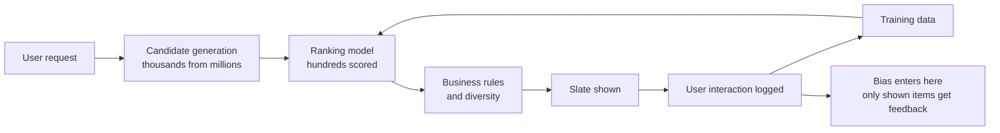
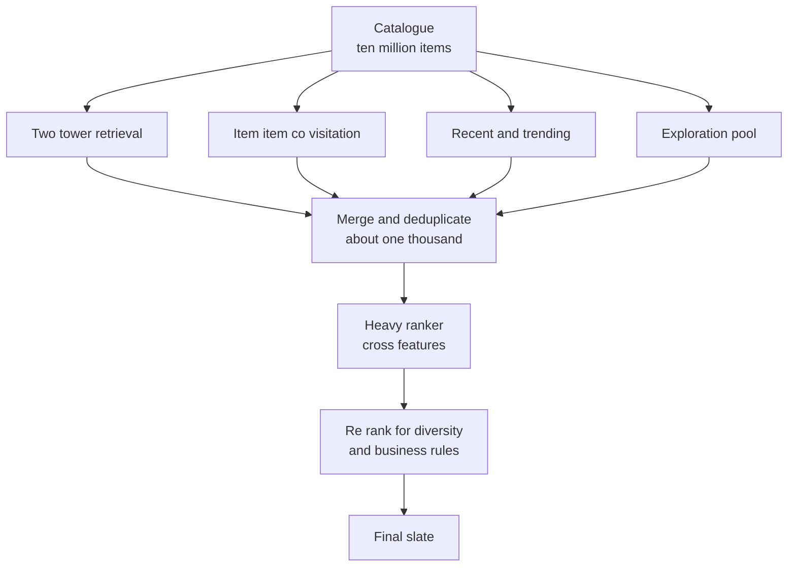
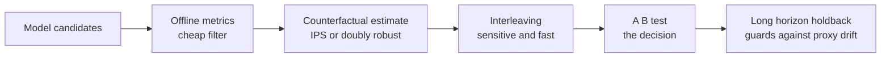
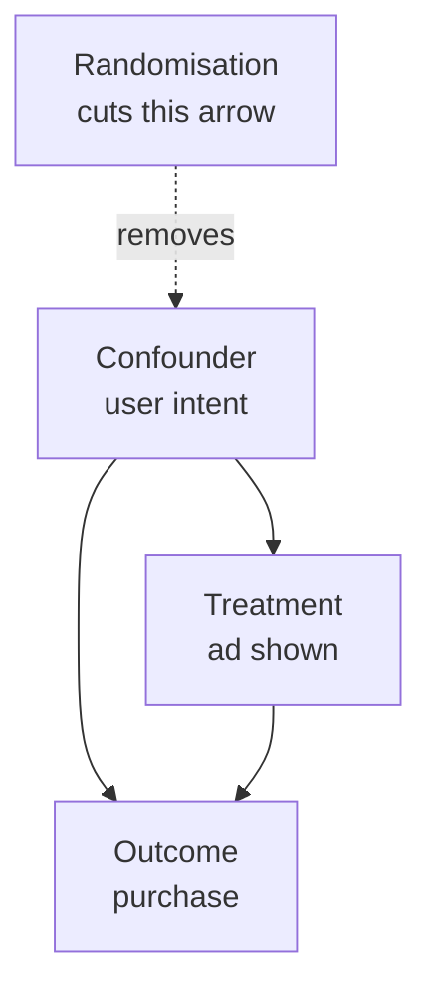
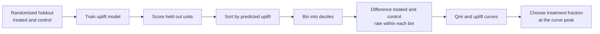

# Chapter 14: Recommenders, Ranking, and Causal Inference

> **What this chapter covers** The shapes of the recommendation problem, collaborative filtering from neighbourhoods to matrix factorisation, the modern retrieve-then-rank architecture, sequential recommendation, learning to rank objectives, offline and online evaluation and why they disagree, position and selection bias with the debiasing methods, bandits and exploration, causal inference from potential outcomes through the observational estimators, and uplift modelling.
> **Prerequisites** Chapter 2 (probability and statistics), Chapter 4 (classical machine learning), Chapter 5 (evaluation and experimental design), Chapter 9 (representation learning). Chapter 13's retrieve-then-rerank cascade is the same pattern in a different domain.
> **Where it is used** Commerce and marketplace ranking, media and content feeds, search relevance, advertising, notification and messaging targeting, pricing and promotion, churn and retention programmes, and any team that must decide not only what will happen but what to do about it.

Ranking systems and causal inference belong in one chapter because they are the same problem seen twice. A recommender chooses an action, the action changes what data you collect, and the data then teaches the next model. Treating that loop as ordinary supervised learning produces systems that look excellent offline and do nothing, or harm, online.

---

## 14.1 Level 1: Foundations

### 14.1.1 The problem

You have users, items, and a record of interactions. You must decide what to show each user next. That decision is made billions of times, must be made in milliseconds, and is evaluated by a business outcome that is measured weeks later.

The record of interactions is usually a sparse matrix. With one million users and one hundred thousand items there are $10^{11}$ possible pairs, and a typical system observes fewer than $10^{-3}$ of them. Sparsity is the defining property.

### 14.1.2 The shapes of the problem

"Recommendation" is four different tasks with different objectives and different metrics.

| Shape | Input | Output | Metric | Example |
|---|---|---|---|---|
| Rating prediction | User, item | A predicted score, often 1 to 5 | Root mean squared error, mean absolute error | Predicting a star rating |
| Top-n ranking | User, candidate set | An ordered list of $n$ items | Recall at $n$, normalised discounted cumulative gain, mean average precision | A "recommended for you" shelf |
| Next-item prediction | A user's ordered history | The next item | Hit rate at $n$, mean reciprocal rank | "Play next" in a media app |
| Slate optimisation | User, a set of positions | A whole ordered set, chosen jointly | Session-level value, diversity-aware metrics | A full page or feed |

The distinction between rating prediction and top-n ranking matters more than it looks. A model with excellent RMSE can produce a bad ranking, because RMSE is dominated by the many mediocre items while ranking is decided entirely by the top few. The Netflix Prize optimised RMSE, and the industry moved to ranking objectives afterwards for exactly this reason.

Slate optimisation is the hardest and the least often done properly. The value of a list is not the sum of the values of its items, because items interact: five near-identical items is a worse list than five varied ones even if each individually scores highest.

### 14.1.3 Explicit and implicit feedback

**Explicit feedback** is a deliberate rating. It is scarce, biased toward strong opinions, and usually absent.

**Implicit feedback** is behaviour: clicks, plays, purchases, dwell time. It is abundant and ambiguous. A click is weak evidence of interest. The absence of a click is not evidence of disinterest, because the user may never have seen the item. This asymmetry, that you observe positives but not true negatives, shapes every method in section 14.2.

### 14.1.4 Prediction versus intervention

A model that predicts "this user will buy this item" is not the same as a model that answers "showing this item will cause this user to buy". The first is prediction. The second is causal.

Concretely: a model trained on historical logs learns that users who saw a particular advertisement bought at a high rate. But the targeting system chose to show that advertisement to users who were already likely to buy. The model has learned the targeting policy, not the advertisement's effect. Acting on it wastes the entire budget on people who would have bought anyway.

Carry this as the mental model: **a recommender is a policy, not a predictor, and a policy must be evaluated on what it causes**.



*Figure 14.1: The recommendation loop, where the system's own choices determine the training data for its successor.*

---

## 14.2 Level 2: Working knowledge

### 14.2.1 Neighbourhood collaborative filtering

The oldest useful idea: recommend what similar users liked, or items similar to what this user liked.

**User-based.** Find users similar to $u$, then score item $i$ by their ratings:

$$\hat{r}_{ui} = \bar{r}_u + \frac{\sum_{v \in N(u)} s(u,v)\,(r_{vi} - \bar{r}_v)}{\sum_{v \in N(u)} |s(u,v)|}$$

where $\bar r_u$ is user $u$'s mean rating, $N(u)$ the $k$ most similar users who rated $i$, and $s(u,v)$ a similarity. Subtracting each user's mean corrects for the fact that some people rate everything highly.

**Item-based** (Sarwar et al. 2001) swaps the roles. It is the version that scaled, for a practical reason: item-item similarities are far more stable over time than user-user similarities, so the similarity matrix can be computed nightly and reused, while a user's neighbourhood changes with every interaction. Amazon's published system (Linden et al. 2003) was item-based for exactly this reason.

**Similarity measures.**

| Measure | Formula | Note |
|---|---|---|
| Cosine | $\frac{\mathbf{a}\cdot\mathbf{b}}{\|\mathbf{a}\|\|\mathbf{b}\|}$ | Ignores rating scale. Standard for implicit feedback |
| Pearson correlation | Cosine on mean-centred vectors | Corrects for per-user rating bias. Standard for explicit ratings |
| Adjusted cosine | Cosine after subtracting each user's mean from their ratings | The item-based analogue of Pearson |
| Jaccard | $\frac{|A \cap B|}{|A \cup B|}$ | For binary interactions only |

**Worked example.** Items A and B were both rated by users 1, 2, and 3. Ratings for A are 5, 3, 4 and for B are 4, 2, 5. User means across all their ratings are 4.0, 2.5, and 4.5. Adjusted cosine subtracts the user mean: A becomes $(1.0, 0.5, -0.5)$ and B becomes $(0.0, -0.5, 0.5)$. The dot product is $0 - 0.25 - 0.25 = -0.5$. Norms are $\sqrt{1.5} \approx 1.225$ and $\sqrt{0.5} \approx 0.707$. Similarity is $-0.5 / (1.225 \times 0.707) \approx -0.577$. Despite both items receiving high raw ratings, they are negatively similar once you account for how generously each user rates, which is precisely the correction raw cosine would miss.

**Shrinkage.** A similarity computed from two co-raters is noise. Shrink it toward zero by the number of co-raters $n_{ij}$:

$$s'_{ij} = \frac{n_{ij}}{n_{ij} + \lambda}\, s_{ij}$$

With $\lambda = 100$ and $n_{ij} = 5$, the similarity is multiplied by $5/105 \approx 0.048$, effectively discarded. With $n_{ij} = 500$ it is multiplied by $500/600 \approx 0.833$ and largely kept. This one line removes most of the spurious recommendations a naive neighbourhood model produces.

### 14.2.2 Matrix factorisation

Represent each user and each item by a $k$-dimensional latent vector, and predict the interaction as their inner product:

$$\hat{r}_{ui} = \mu + b_u + b_i + \mathbf{p}_u^{\top}\mathbf{q}_i$$

where $\mu$ is the global mean, $b_u$ and $b_i$ are user and item biases, and $\mathbf{p}_u, \mathbf{q}_i \in \mathbb{R}^k$ are the latent factors. The bias terms matter: they typically capture more of the variance than the factors do, because "this user rates high" and "this item is popular" explain a great deal on their own.

The regularised objective over observed ratings $\mathcal{K}$:

$$\min_{\mathbf{p}, \mathbf{q}, b} \sum_{(u,i) \in \mathcal{K}} \left(r_{ui} - \hat{r}_{ui}\right)^2 + \lambda\left(\|\mathbf{p}_u\|^2 + \|\mathbf{q}_i\|^2 + b_u^2 + b_i^2\right)$$

**Stochastic gradient descent** solves it by sampling an observed pair, computing the error $e_{ui} = r_{ui} - \hat r_{ui}$, and updating:

$$\mathbf{p}_u \leftarrow \mathbf{p}_u + \eta\left(e_{ui}\,\mathbf{q}_i - \lambda\,\mathbf{p}_u\right), \qquad \mathbf{q}_i \leftarrow \mathbf{q}_i + \eta\left(e_{ui}\,\mathbf{p}_u - \lambda\,\mathbf{q}_i\right)$$

**Worked example of one update.** Let $k=2$, $\mathbf{p}_u = (0.5, -0.2)$, $\mathbf{q}_i = (0.3, 0.8)$, $\mu = 3.5$, $b_u = 0.2$, $b_i = -0.1$. The prediction is $3.5 + 0.2 - 0.1 + (0.5 \times 0.3 + (-0.2) \times 0.8) = 3.6 + (0.15 - 0.16) = 3.59$. The true rating is 5, so $e_{ui} = 1.41$. With $\eta = 0.01$ and $\lambda = 0.05$, the update to $\mathbf{p}_u$ is $\mathbf{p}_u + 0.01(1.41 \times (0.3, 0.8) - 0.05 \times (0.5, -0.2)) = (0.5, -0.2) + 0.01 \times (0.398, 1.138) = (0.504, -0.189)$. The user vector moved toward the item vector, in proportion to the error. That is the entire mechanism.

**Alternating least squares** (ALS) exploits a structural fact: fixing $\mathbf{q}$ makes the objective a ridge regression in $\mathbf{p}$, which has a closed form, and vice versa. Alternate.

$$\mathbf{p}_u = \left(\mathbf{Q}_u^{\top}\mathbf{Q}_u + \lambda \mathbf{I}\right)^{-1}\mathbf{Q}_u^{\top}\mathbf{r}_u$$

where $\mathbf{Q}_u$ stacks the factors of items $u$ rated. Each user solve is independent of every other, so ALS parallelises trivially across a cluster. That is why ALS is the implementation in Spark MLlib and why it is the default for very large sparse matrices, while SGD is preferred when the data fits on one machine or when you want to add arbitrary terms to the objective.

| Property | SGD | ALS |
|---|---|---|
| Parallelism | Hard, updates conflict on shared factors | Trivial, users and items solve independently |
| Flexibility of objective | Any differentiable loss | Needs a least-squares form |
| Speed on very sparse data | Fast per step | Each step is a $k \times k$ solve per user |
| Handling implicit feedback | Needs negative sampling | Handles the dense confidence formulation directly |
| Typical use | Single machine, research, custom losses | Distributed, production batch training |

### 14.2.3 Implicit feedback and confidence weighting

With implicit feedback there are no ratings and no observed negatives. The Hu, Koren and Volinsky (2008) formulation handles this properly. Define a binary preference and a confidence:

$$p_{ui} = \begin{cases} 1 & \text{if } r_{ui} > 0 \\ 0 & \text{otherwise}\end{cases}, \qquad c_{ui} = 1 + \alpha\, r_{ui}$$

where $r_{ui}$ is the raw count, for example number of plays. The objective sums over **all** user-item pairs, not just observed ones:

$$\min \sum_{u,i} c_{ui}\left(p_{ui} - \mathbf{p}_u^{\top}\mathbf{q}_i\right)^2 + \lambda\left(\|\mathbf{p}_u\|^2 + \|\mathbf{q}_i\|^2\right)$$

The interpretation: every unobserved pair is treated as a weak negative with confidence 1, and every observed pair as a positive with confidence growing in the interaction count.

**Worked example.** With $\alpha = 40$, a user who played a track once has $c = 41$, a user who played it 20 times has $c = 801$, and an unobserved pair has $c = 1$. So a single play carries 41 times the weight of an unobserved pair, and heavy listening carries 800 times. This makes the difference between "never seen" and "seen once" explicit, which binary classification on observed data cannot express. A common alternative is logarithmic scaling, $c_{ui} = 1 + \alpha \log(1 + r_{ui}/\epsilon)$, which stops a single obsessive user from dominating.

Summing over all pairs looks like $O(|U||I|)$ work, which would be prohibitive. The trick is that the ALS normal equations can be rearranged as $\mathbf{Q}^\top \mathbf{Q} + \mathbf{Q}^\top(\mathbf{C}_u - \mathbf{I})\mathbf{Q}$, where $\mathbf{Q}^\top\mathbf{Q}$ is computed once for all users and the second term involves only the items that user actually interacted with. The cost drops to $O(k^2 |\mathcal{K}| + k^3 |U|)$, which is linear in the observed data.

**Bayesian Personalised Ranking** (Rendle et al. 2009) takes a different route: instead of predicting values, optimise the probability that an observed item ranks above an unobserved one.

$$\min \sum_{(u, i, j)} -\log \sigma\!\left(\hat{x}_{ui} - \hat{x}_{uj}\right) + \lambda \|\Theta\|^2$$

where $i$ is an item the user interacted with, $j$ is a sampled non-interacted item, and $\sigma$ is the logistic function. This is a pairwise ranking loss, and it is the right objective when the metric is top-n ranking rather than value prediction.

### 14.2.4 Cold start

| Case | Problem | Approaches |
|---|---|---|
| New user | No history, so no latent vector | Popularity baseline, onboarding questionnaire, demographic priors, contextual bandits to learn fast, session-based models that need only the current session |
| New item | No interactions, so no latent vector | Content features projected into the latent space, explicit exploration budget, editorial promotion |
| New system | No interactions at all | Content-based only, or import a pretrained embedding space |
| Sparse user or item | Few interactions, unreliable vector | Shrinkage toward population mean, hierarchical priors |

The structural fix is a **hybrid** model that can compute an embedding from content features when interaction history is absent, and blend toward the collaborative embedding as history accumulates. A two-tower model with content features in both towers does this naturally, which is one reason the architecture displaced pure matrix factorisation.

Cold start is not only a modelling problem. It is a feedback loop: an item with no interactions is never shown, so it never gets interactions. Without an explicit exploration budget the catalogue ossifies. Section 14.3.6 covers how to allocate that budget.

### 14.2.5 Content-based and hybrid approaches

Content-based recommendation scores items by the similarity of their attributes to what the user has liked. Items are represented by text embeddings, categorical attributes, images, or structured metadata, and the user is represented by an aggregate of the items they engaged with.

| Property | Collaborative | Content-based |
|---|---|---|
| Needs interaction data | Yes, a great deal | No, only item attributes |
| New item handling | Fails | Works immediately |
| Discovers unexpected items | Yes, this is its strength | No, it recommends more of the same |
| Explainability | Weak, latent factors are opaque | Strong, "because you liked X which is also a documentary" |
| Sensitivity to attribute quality | None | Total |

Hybrid strategies: **weighted** blending of two scores; **switching** based on how much history exists; **feature augmentation**, where a content model's output becomes an input to the collaborative model; and **unified models** such as factorisation machines (Rendle 2010), which handle arbitrary feature interactions including user and item identifiers in a single formulation:

$$\hat{y}(\mathbf{x}) = w_0 + \sum_{i=1}^{n} w_i x_i + \sum_{i=1}^{n}\sum_{j=i+1}^{n} \langle \mathbf{v}_i, \mathbf{v}_j\rangle\, x_i x_j$$

Factorisation machines subsume matrix factorisation as a special case: with $\mathbf{x}$ a one-hot user concatenated with a one-hot item, the interaction term reduces to $\mathbf{p}_u^\top \mathbf{q}_i$. The advantage is that you can add any other feature, context, device, hour of day, and interactions are still modelled through shared low-dimensional factors rather than requiring every pair to be observed.

### 14.2.6 The modern architecture: retrieve, rank, re-rank

No production system scores every item for every request. With a ten-million-item catalogue and a 50 millisecond budget, scoring everything is impossible. The standard architecture is a funnel.

**Stage 1, candidate generation, or retrieval.** Reduce millions to hundreds or low thousands. Must be very cheap per item. Optimised for recall: a good item missed here can never be recovered.

The dominant approach is the **two-tower model**. One tower encodes the user and context into a vector, the other encodes the item. Trained with a contrastive or sampled-softmax objective so that the inner product approximates relevance. Because the towers are independent, all item vectors are computed offline and indexed, and only the user tower runs at request time.

$$s(u, i) = \frac{\mathbf{f}(u)^{\top}\mathbf{g}(i)}{\|\mathbf{f}(u)\|\,\|\mathbf{g}(i)\|}$$

The critical constraint is that the towers must not interact before the final dot product. The moment you add a cross feature, you lose the ability to precompute item vectors, and the architecture collapses back to scoring everything.

**Approximate nearest neighbour** (ANN) search finds the top-$k$ by inner product without a linear scan.

| Method | Mechanism | Trade-off |
|---|---|---|
| Inverted file with quantisation, IVF-PQ | Cluster vectors, search a few clusters, compress with product quantisation | Very memory efficient. Accuracy depends on how many clusters you probe |
| Hierarchical navigable small world, HNSW (Malkov and Yashunin 2018) | A multi-layer proximity graph traversed greedily | Best recall-latency trade-off in most benchmarks. High memory, slow to build, awkward to update incrementally |
| Locality-sensitive hashing | Hash so that near vectors collide | Theoretically clean, generally outperformed in practice |
| ScaNN (Guo et al. 2020) | Anisotropic quantisation that weights errors by their effect on the inner product | Strong when the objective is maximum inner product rather than Euclidean distance |

**Worked example of the recall trade-off.** Suppose exact search over 10 million vectors takes 200 ms and HNSW takes 2 ms at 95 percent recall at 100. The 5 percent of true top-100 items that are missed are, by construction, near the boundary of the top 100, so their loss to final ranking quality is far smaller than 5 percent. This is why approximate search is nearly free in practice: the approximation error concentrates exactly where it matters least. The number to verify for your own index is recall at the candidate count you actually use, measured against exact search on a sample.

Most systems run several retrieval sources in parallel and merge: a two-tower model, a recent-items source, a popularity source, a co-visitation or item-item source, and an exploration source. Diversity of retrieval sources is a cheap and reliable robustness measure.

**Stage 2, ranking.** Score the few hundred candidates with a heavy model that can use cross features, full interaction history, and expensive signals. Gradient boosted trees remain extremely competitive here, and deep models such as Wide and Deep (Cheng et al. 2016), DeepFM, and DLRM (Naumov et al. 2019) are standard where the feature space is dominated by high-cardinality categoricals with learned embeddings. Ranking models usually predict several objectives at once, for example click probability, conversion probability, and expected dwell time, combined by a weighted formula.

**Stage 3, re-ranking, business rules, and diversity.** The top of the list is adjusted for things the ranking model does not represent: deduplication, supply constraints, freshness, fairness across providers, contractual obligations, and diversity.

**Maximal marginal relevance** is the standard diversity method:

$$\text{MMR} = \arg\max_{i \in R \setminus S}\left[\lambda\, s(u, i) - (1-\lambda)\max_{j \in S} \text{sim}(i, j)\right]$$

Select greedily. $\lambda$ trades relevance against novelty relative to the already-selected set $S$. **Worked example.** With $\lambda = 0.7$, an item scoring 0.9 relevance but 0.95 similar to something already chosen gets $0.7 \times 0.9 - 0.3 \times 0.95 = 0.63 - 0.285 = 0.345$. An item scoring 0.6 relevance with maximum similarity 0.1 gets $0.42 - 0.03 = 0.39$ and wins. Determinantal point processes (Chen et al. 2018) give a principled alternative that models the whole set's diversity jointly rather than greedily.



*Figure 14.2: The funnel, where each stage trades breadth for cost and the earliest stage sets the ceiling on everything after it.*

### 14.2.7 Sequential and session-based recommendation

Interaction order carries information that a user-item matrix discards. Someone who just bought a camera wants a lens, not another camera.

| Approach | Mechanism | Note |
|---|---|---|
| Markov chains and item-item transitions | Estimate $P(\text{next} \mid \text{current})$ | Cheap, strong baseline, no long-range memory |
| Factorised personalised Markov chains (Rendle et al. 2010) | Combine matrix factorisation with a transition tensor | Personalised transitions with shared factors |
| GRU4Rec (Hidasi et al. 2016) | Recurrent network over the session sequence | Brought deep learning to session-based recommendation |
| Convolutional, Caser | Treat the recent history as an image and convolve | Captures local patterns of several items |
| SASRec (Kang and McAuley 2018) | Unidirectional self-attention over history | Strong, fast, the common baseline now |
| BERT4Rec (Sun et al. 2019) | Bidirectional attention with a masked-item objective | Better offline, and the bidirectional objective is a mismatch for strictly causal next-item serving |
| Session-based with no user identifier | Model only the current session | Necessary for anonymous traffic, which is often most of it |

Two practical points. First, recency matters more than the models suggest; a simple "most recent item's co-visited items" baseline is embarrassingly strong and should always be measured. Second, sequential models are sensitive to how you define a session. A 30-minute inactivity gap is the usual heuristic, and changing it changes the results more than changing the architecture does.

### 14.2.8 Learning to rank

Ranking losses fall into three families by what they take as a training unit.

**Pointwise.** Treat each item independently, predicting a relevance score or a click probability with regression or classification. Simple, reuses all standard machinery, and it optimises the wrong thing: it cares equally about getting item 1 and item 500 right, while the metric cares only about the top.

**Pairwise.** Learn which of two items should rank higher. RankNet (Burges et al. 2005) models

$$P(i \succ j) = \sigma\!\left(s_i - s_j\right), \qquad \mathcal{L} = -\sum_{(i,j)} \left[ y_{ij}\log P(i \succ j) + (1 - y_{ij})\log(1 - P(i \succ j))\right]$$

where $s_i$ is the model score and $y_{ij}$ is 1 if $i$ should outrank $j$. LambdaRank's insight (Burges et al. 2006) is that you do not need the loss, only the gradient, so you can multiply each pair's gradient by the change in the target metric that swapping them would cause:

$$\lambda_{ij} = \frac{-\sigma}{1 + e^{\sigma(s_i - s_j)}}\left|\Delta \text{NDCG}_{ij}\right|$$

This directly optimises a non-differentiable metric by construction, and LambdaMART, the gradient boosted tree version, remains a very strong production ranker.

**Listwise.** Take the whole list as the training unit. ListNet minimises cross-entropy between the permutation probability distributions induced by the scores and by the labels. Softmax cross-entropy over a list, which is what most neural rankers now use, is the practical member of this family:

$$\mathcal{L} = -\sum_{i} y_i \log \frac{\exp(s_i)}{\sum_j \exp(s_j)}$$

| Family | Training unit | Strength | Weakness |
|---|---|---|---|
| Pointwise | One item | Simplest, scales, calibrated probabilities | Optimises absolute score, not order |
| Pairwise | Two items | Directly models order, well understood | Quadratic pairs, treats all positions equally unless weighted |
| Listwise | One list | Aligns with list metrics, models position | Harder to optimise, needs full lists per query |

Calibration is the argument for pointwise that is often forgotten. If downstream logic multiplies predicted click probability by a bid or a margin, you need a calibrated probability, and pairwise and listwise losses are invariant to monotone transformations of the score, so they do not give you one. The usual resolution is a multi-objective model: a calibrated pointwise head for the probability, a listwise head for the ordering, or a pointwise model followed by isotonic or Platt calibration.

---

## 14.3 Level 3: Depth

### 14.3.1 Offline ranking metrics

**Precision at $k$** and **recall at $k$** are the basic pair. Precision at $k$ is the fraction of the top $k$ that are relevant; recall at $k$ is the fraction of all relevant items captured in the top $k$.

**Mean reciprocal rank** averages $1/\text{rank of the first relevant item}$. Appropriate when there is one right answer.

**Discounted cumulative gain** weights relevance by position:

$$\text{DCG}@k = \sum_{i=1}^{k} \frac{2^{rel_i} - 1}{\log_2(i + 1)}$$

$$\text{NDCG}@k = \frac{\text{DCG}@k}{\text{IDCG}@k}$$

where $rel_i$ is the graded relevance of the item at position $i$ and IDCG is the DCG of the ideal ordering, which normalises the score to $[0,1]$ so it can be averaged across queries with different numbers of relevant items.

**Worked example.** Five results with graded relevances $3, 2, 3, 0, 1$.

| Position $i$ | $rel_i$ | $2^{rel_i}-1$ | $\log_2(i+1)$ | Contribution |
|---|---|---|---|---|
| 1 | 3 | 7 | 1.000 | 7.000 |
| 2 | 2 | 3 | 1.585 | 1.893 |
| 3 | 3 | 7 | 2.000 | 3.500 |
| 4 | 0 | 0 | 2.322 | 0.000 |
| 5 | 1 | 1 | 2.585 | 0.387 |

DCG at 5 is 12.780. The ideal ordering is $3, 3, 2, 1, 0$, giving $7.000 + 7/1.585 + 3/2 + 1/2.322 + 0 = 7.000 + 4.416 + 1.500 + 0.431 = 13.347$. NDCG at 5 is $12.780/13.347 \approx 0.958$. Notice that the exponential gain $2^{rel}-1$ makes a relevance-3 item worth more than seven relevance-1 items, which is a modelling choice, not a law. The linear-gain variant exists, and results computed under the two are not comparable.

**Mean average precision** is defined as in Chapter 13, section 13.2.1, applied per query and averaged.

**Coverage, novelty, and serendipity** measure things accuracy metrics cannot: what fraction of the catalogue is ever recommended, how unpopular the recommended items are, and whether recommendations are both unexpected and good. A system can be optimal on NDCG while recommending the same 200 items to everyone.

### 14.3.2 Why offline metrics correlate weakly with online outcomes

This is the central practical fact of the field, and the reason experienced engineers are sceptical of offline gains.

| Cause | Mechanism |
|---|---|
| Missing not at random | The logs only contain feedback on items the old system chose to show. Offline evaluation scores the new model on the old model's distribution |
| Position bias | A click depends on position as well as relevance, so the labels encode where the item was shown |
| Feedback loops | The current model's outputs become the next model's training data, so offline metrics reward agreement with the incumbent |
| Proxy mismatch | You optimise click probability and the business cares about long-run retention or margin. They can move in opposite directions |
| Novelty and fatigue | Offline data cannot represent a user's reaction to seeing the same thing repeatedly |
| Ecosystem effects | Changing what is shown changes supplier behaviour and content supply, which no offline replay captures |
| Delayed outcomes | Conversion or churn happens days later, so short-horizon offline labels are censored |
| Distribution shift | Offline test sets are historical. Seasonality, trends, and catalogue turnover move the target |

The empirically documented consequence, reported repeatedly in industry papers and in the reproducibility work of Dacrema, Cremonesi and Jannach (2019), is that the correlation between an offline improvement and an online improvement is weak and sometimes negative. Their finding that many published neural recommender gains do not survive comparison against properly tuned simple baselines is a standing caution.

The response is not to abandon offline evaluation. It is to use it as a **filter, not a decision**. Offline metrics cheaply eliminate bad candidates. Online experiments decide.



*Figure 14.3: The evaluation ladder, where each rung is more expensive, more trustworthy, and evaluates fewer candidates.*

### 14.3.3 Counterfactual evaluation with inverse propensity scoring

The question offline evaluation actually needs to answer is: what would the reward have been if the new policy had been serving, given logs generated by the old policy?

Let the logging policy be $\pi_0$ and the new policy $\pi$. The logs contain tuples $(x_t, a_t, r_t, p_t)$ where $x_t$ is the context, $a_t$ the action taken, $r_t$ the observed reward, and $p_t = \pi_0(a_t \mid x_t)$ the **propensity**, the probability the logging policy chose that action. The inverse propensity scoring estimator is

$$\hat{V}_{\text{IPS}}(\pi) = \frac{1}{T}\sum_{t=1}^{T} \frac{\pi(a_t \mid x_t)}{\pi_0(a_t \mid x_t)}\, r_t$$

It is unbiased when two conditions hold: the propensities are correct, and $\pi_0$ has non-zero probability on every action $\pi$ might take. That second condition, **overlap** or **common support**, is the one that fails in practice. A deterministic logging policy has propensity 1 on one action and 0 on all others, and IPS is undefined.

**Worked example.** Three logged events. Event 1: $\pi_0$ chose action A with $p = 0.5$, reward 1, and $\pi$ would choose A with probability 0.9. Weight $0.9/0.5 = 1.8$, contribution $1.8$. Event 2: $p = 0.1$, reward 1, $\pi(a) = 0.8$, weight 8.0, contribution 8.0. Event 3: $p = 0.5$, reward 0, weight 0.2, contribution 0. Estimate is $(1.8 + 8.0 + 0)/3 = 3.27$ against an on-policy average reward of $2/3 = 0.67$. The single low-propensity event with weight 8 dominates. This is the variance problem: IPS is unbiased but its variance explodes when propensities are small.

Three standard fixes.

**Clipping or capping.** Replace the weight $w_t$ with $\min(w_t, M)$ for some cap $M$, typically 10 to 100. This introduces bias and cuts variance sharply. Report results for a range of $M$, because a conclusion that flips with the cap is not a conclusion.

**Self-normalised IPS** (Swaminathan and Joachims 2015) divides by the sum of weights rather than the count:

$$\hat{V}_{\text{SNIPS}} = \frac{\sum_t w_t r_t}{\sum_t w_t}$$

In the worked example, $\sum w_t = 1.8 + 8.0 + 0.2 = 10.0$ and $\sum w_t r_t = 9.8$, giving 0.98, far closer to the on-policy 0.67 than 3.27 was. SNIPS is slightly biased and almost always lower variance. It is the sensible default.

**Doubly robust estimation** (Dudik et al. 2011) combines IPS with a learned reward model $\hat{r}(x, a)$:

$$\hat{V}_{\text{DR}} = \frac{1}{T}\sum_t \left[ \hat{r}(x_t, \pi(x_t)) + w_t\left(r_t - \hat{r}(x_t, a_t)\right)\right]$$

The name is precise: the estimator is consistent if **either** the propensity model **or** the reward model is correct. The reward model provides a baseline prediction, and IPS corrects only its residual, so the importance weights multiply a smaller quantity and the variance falls.

**Practical requirements.** You must log the propensity at serving time. Reconstructing it later is unreliable and usually impossible. If your policy is deterministic, add deliberate randomisation: epsilon-greedy with a small epsilon, or a softmax over scores with a temperature. That randomisation is the price of being able to evaluate anything offline, and it is nearly always worth paying. Also log the model version and the full candidate set, because without the candidate set you cannot compute $\pi(a \mid x)$ for the new policy.

### 14.3.4 Online experimentation

**A/B testing** splits traffic randomly and compares outcomes. It is the gold standard because randomisation guarantees the two arms differ only in the treatment. Chapter 5 covers the statistics; the recommendation-specific complications are these.

| Complication | Problem | Mitigation |
|---|---|---|
| Interference between units | Users share a marketplace. Promoting an item to arm A removes inventory from arm B, so arms are not independent | Cluster randomisation by market or region, or switchback designs over time |
| Novelty and primacy effects | Users react to change itself, which fades | Run long enough to see the effect stabilise, and discard the first days from the primary analysis |
| Delayed outcomes | Retention and lifetime value need weeks | Use short-horizon proxies validated against long-horizon holdbacks |
| Multiple metrics | Many comparisons inflate false positives | Pre-register one primary metric, treat the rest as guardrails, correct for multiplicity |
| Heterogeneous effects | A gain overall can hide a large loss for a segment | Pre-specify segments, and report the distribution not just the mean |
| Low power | Click rate changes are small and variance is large | Variance reduction with CUPED using pre-experiment covariates, which commonly cuts required sample size substantially |

**Interleaving** is the recommendation-specific alternative and it is dramatically more sensitive. Instead of showing user group A one ranking and group B another, show every user a single list built by alternating items from both rankings, then attribute clicks to the ranker that contributed the clicked item. Team draft interleaving and probabilistic interleaving are the standard schemes. Because each user compares both rankers directly, between-user variance is removed and sensitivity rises by roughly one to two orders of magnitude, so experiments that would need weeks finish in days (Chapelle et al. 2012; Radlinski and Craswell). The limitation is that interleaving measures a preference between rankings, not the effect on a business metric, so it is a fast filter rather than a replacement for an A/B test.

### 14.3.5 Position and selection bias, and how to correct them

**Position bias** is the dominant confounder in click data. Users examine higher positions more, so an item at position 1 gets more clicks than the same item at position 5 regardless of relevance.

The **examination hypothesis** formalises it: a click happens only if the user examined the position and found the item relevant, and examination depends only on position.

$$P(C = 1 \mid u, i, k) = P(E = 1 \mid k)\; P(R = 1 \mid u, i)$$

where $k$ is the position, $E$ examination, and $R$ relevance. If you can estimate the examination probability $\theta_k = P(E=1\mid k)$, you can recover relevance by dividing it out. That is inverse propensity weighting applied to position:

$$\mathcal{L}_{\text{IPW}} = \sum_{\text{clicked }(u,i,k)} \frac{\ell(u, i)}{\theta_k}$$

**Worked example.** Suppose $\theta_1 = 1.0$, $\theta_3 = 0.5$, $\theta_{10} = 0.12$. A click at position 10 contributes $1/0.12 \approx 8.3$ times the loss weight of a click at position 1. The intuition is that getting a click from position 10 is much stronger evidence of relevance, because far fewer people looked there. If item X was shown at position 1 and got 100 clicks from 1000 impressions, and item Y at position 10 got 30 clicks from 1000, the raw rates say X is better. Weighted, X's evidence is $100/1.0 = 100$ and Y's is $30/0.12 = 250$, reversing the conclusion.

**Estimating $\theta_k$.**

| Method | How | Cost |
|---|---|---|
| Result randomisation | Randomly shuffle results for a small traffic slice and measure click rate by position | Unbiased and simple. Degrades the experience for that slice |
| Swap experiment | Swap pairs of adjacent positions for a slice | Less disruptive than full randomisation |
| Intervention harvesting | Exploit natural position variation from ranking changes and A/B tests already running | Free, and it requires enough natural variation |
| Regression EM (Wang et al. 2018) | Jointly estimate relevance and examination from logs with an expectation-maximisation procedure | No traffic cost. Relies on the same item appearing at several positions |
| Dual learning algorithm (Ai et al. 2018) | Learn the propensity model and the ranker jointly | Elegant, more moving parts |

**Selection bias** is the broader problem: items never shown produce no data at all. Position weighting cannot fix this, because there is no observation to reweight. The only fixes are exploration, which section 14.3.6 covers, and models that use content features so an unshown item still has a representation.

**Trust bias and other click model refinements.** The simple examination hypothesis is incomplete. Users trust higher-ranked results and click them even when less relevant, which is a separate effect from examination. Cascade models assume the user scans top to bottom and stops at a satisfying click, which means a click at position 3 implies positions 1 and 2 were examined and rejected, giving you reliable negatives you otherwise would not have. Dynamic Bayesian network click models (Chapelle and Zhang 2009) separate attractiveness from satisfaction. Choose the click model that matches how your interface is actually consumed; a grid layout or an infinite feed violates the cascade assumption entirely.

### 14.3.6 Exploration: bandits

The exploration-exploitation problem: showing the currently best-estimated item maximises immediate reward but produces no information about the alternatives.

**The multi-armed bandit** formalises it. $K$ arms, each with an unknown reward distribution. At each step pick an arm and observe its reward. Minimise **regret**, the difference between the reward of the always-optimal arm and what you actually got:

$$R(T) = T\mu^{*} - \sum_{t=1}^{T}\mathbb{E}[\mu_{a_t}]$$

**Epsilon-greedy.** With probability $\epsilon$ pick uniformly at random, otherwise pick the best estimate. Simple and it never stops exploring uniformly, so regret grows linearly unless $\epsilon$ decays. Decaying $\epsilon_t = \min(1, cK/(d^2 t))$ achieves logarithmic regret.

**Upper confidence bound.** Pick the arm with the highest optimistic estimate:

$$a_t = \arg\max_a \left[\hat{\mu}_a + \sqrt{\frac{2\ln t}{n_a}}\right]$$

where $\hat\mu_a$ is the empirical mean and $n_a$ the number of pulls. The bonus term shrinks as an arm is pulled more, so rarely-tried arms get explored. This is "optimism in the face of uncertainty", and UCB1 achieves regret $O(\log T)$, which is optimal in order (Auer et al. 2002).

**Worked example.** At $t = 100$: arm A has $\hat\mu = 0.30$ from $n = 90$ pulls, arm B has $\hat\mu = 0.25$ from $n = 10$. Bonus for A is $\sqrt{2\ln 100 / 90} = \sqrt{9.21/90} = \sqrt{0.1023} = 0.320$, giving index 0.620. Bonus for B is $\sqrt{9.21/10} = \sqrt{0.921} = 0.960$, giving index 1.210. B is chosen despite a lower mean, because its estimate is far less certain. After 40 more pulls of B its bonus falls to $\sqrt{2\ln 140/50} \approx 0.445$ and the arms compete on closer terms.

**Thompson sampling.** Maintain a posterior over each arm's reward, sample one value per arm from its posterior, and play the argmax. For Bernoulli rewards with a Beta prior this is three lines of code.

**Listing 14.1: Thompson sampling for Bernoulli arms.**

```python
import numpy as np

class ThompsonBernoulli:
    def __init__(self, k, a0=1.0, b0=1.0):
        self.alpha = np.full(k, a0)   # successes plus prior
        self.beta_ = np.full(k, b0)   # failures plus prior

    def select(self, rng):
        # one posterior sample per arm; argmax is the chosen action
        return int(np.argmax(rng.beta(self.alpha, self.beta_)))

    def update(self, arm, reward):    # reward in {0, 1}
        self.alpha[arm] += reward
        self.beta_[arm] += 1.0 - reward

    def propensity(self, rng, arm, draws=512):
        # Monte Carlo estimate of P(arm chosen), needed for off-policy logging
        s = rng.beta(self.alpha, self.beta_, size=(draws, len(self.alpha)))
        return float((s.argmax(axis=1) == arm).mean())
```

The `propensity` method is the part most implementations omit and later regret. Thompson sampling is stochastic, so it produces the propensities that section 14.3.3 requires, but only if you compute and log them. There is no closed form for the selection probability, so Monte Carlo over posterior samples is the standard approach.

Thompson sampling usually matches or beats UCB empirically (Chapelle and Li 2011), handles delayed feedback gracefully because the posterior simply updates later, and naturally extends to batched settings where many decisions are made before any reward arrives.

**Contextual bandits** condition on a feature vector. LinUCB (Li et al. 2010) assumes the expected reward is linear in the context, $\mathbb{E}[r \mid x, a] = x^\top \theta_a$, maintains a ridge regression per arm, and adds a confidence bonus derived from the covariance matrix:

$$a_t = \arg\max_a \left[ x_t^{\top}\hat{\theta}_a + \alpha \sqrt{x_t^{\top} A_a^{-1} x_t}\right]$$

where $A_a = \mathbf{I} + \sum x x^\top$ over that arm's history. The bonus is large when $x_t$ points in a direction the arm has not seen much data in, which is exactly the right notion of uncertainty. Neural contextual bandits replace the linear model with a network and approximate uncertainty by dropout, an ensemble, or a learned last layer with the same closed-form bonus.

| Setting | Recommended method |
|---|---|
| Few arms, no context, fast feedback | Thompson sampling |
| Few arms, need a regret guarantee and interpretability | UCB1 |
| Many arms with features, contextual | LinUCB or neural bandit with an ensemble |
| Millions of arms | Bandits do not apply directly. Use a bandit over a small set of ranking policies, or an exploration bonus inside the ranker |
| Long-horizon effects, state matters | Reinforcement learning, not bandits. Much harder to get right |

The practical deployment pattern in a large recommender is not a bandit over items. It is a small exploration budget, a few percent of slots, allocated to items with high uncertainty, plus stochastic ranking so that propensities exist. That is enough to break the feedback loop and enable counterfactual evaluation without visibly degrading the product.

---

## 14.4 Level 4: Mastery

### 14.4.1 Causal inference for engineers

**The core distinction.** $P(Y \mid X)$ is observational: the distribution of outcome $Y$ among units where $X$ happened to take a value. $P(Y \mid do(X = x))$ is interventional: the distribution if you set $X$ to $x$ for everyone. They are equal only under conditions you must establish, not assume. The notation and the framework are due to Pearl (2009).

**Potential outcomes.** For each unit $i$ and binary treatment $T \in \{0, 1\}$, define $Y_i(1)$ and $Y_i(0)$, the outcomes under treatment and control. The individual treatment effect is $\tau_i = Y_i(1) - Y_i(0)$. The fundamental problem of causal inference is that you observe exactly one of them. The average treatment effect is

$$\text{ATE} = \mathbb{E}[Y(1) - Y(0)]$$

and the average treatment effect on the treated is $\text{ATT} = \mathbb{E}[Y(1) - Y(0) \mid T = 1]$. The conditional average treatment effect, which is what uplift modelling estimates, is

$$\tau(x) = \mathbb{E}[Y(1) - Y(0) \mid X = x]$$

**Confounding.** A confounder is a variable causing both treatment and outcome. It creates association without causation. The canonical recommender example: users who received a retargeting advertisement bought at 12 percent while others bought at 3 percent. The targeting system chose high-intent users, so intent causes both the treatment and the outcome, and the naive 9-point difference is almost entirely confounding.

**Identification assumptions.** To estimate a causal effect from observational data you need three, and each must be argued, not assumed.

| Assumption | Statement | What breaks it |
|---|---|---|
| Unconfoundedness, also called conditional ignorability | $(Y(1), Y(0)) \perp T \mid X$. Given the observed covariates, treatment is as good as random | Any unobserved variable affecting both treatment and outcome. Not testable from the data |
| Overlap, or positivity | $0 < P(T=1 \mid X = x) < 1$ for all $x$ with positive density | Deterministic targeting rules. Checkable by plotting the propensity distribution by arm |
| Stable unit treatment value, SUTVA | One unit's outcome does not depend on another's treatment, and there is one version of the treatment | Marketplaces, social networks, shared inventory. Very often violated in recommenders |

The honest position on unconfoundedness: it is untestable, so every observational estimate rests on a judgment about which confounders were measured. Say so when you report one.



*Figure 14.4: Confounding, and why randomisation identifies the effect by severing the path from the confounder into treatment assignment.*

### 14.4.2 Randomised experiments as the gold standard

Randomisation makes $T$ independent of everything, observed and unobserved, so unconfoundedness holds by construction and the difference in means is an unbiased estimate of the ATE. Nothing observational matches this.

Where randomisation is unavailable: it is unethical, illegal, too slow, too expensive, the treatment cannot be withheld, or the unit of randomisation interferes with itself. Then you use the observational methods below, and each buys identification by assuming something different.

### 14.4.3 The observational toolkit

**Propensity score methods.** The propensity score is $e(x) = P(T = 1 \mid X = x)$. Rosenbaum and Rubin (1983) proved that conditioning on the scalar $e(x)$ suffices to remove confounding by $X$, reducing a high-dimensional adjustment to a one-dimensional one. Estimate $e(x)$ with logistic regression or gradient boosting, then use it three ways: stratify into quintiles and average the within-stratum differences; match treated to control units with similar scores; or weight, using inverse probability of treatment weighting:

$$\hat{\tau}_{\text{IPTW}} = \frac{1}{n}\sum_i \left[\frac{T_i Y_i}{e(X_i)} - \frac{(1 - T_i) Y_i}{1 - e(X_i)}\right]$$

*Assumption:* unconfoundedness given $X$, plus overlap. **Worked example.** A treated unit with $e = 0.1$ receives weight 10, meaning it stands in for ten similar units who were mostly untreated. A treated unit with $e = 0.9$ receives weight 1.11. Units with $e$ near 0 or 1 produce enormous weights and dominate the estimate, which is why you trim, typically to $e \in [0.05, 0.95]$, and always plot the propensity distributions for the two arms to check they overlap at all. Non-overlapping distributions mean there is no comparable control group and no amount of modelling fixes it.

**Matching.** Pair each treated unit with one or more controls similar on covariates or on the propensity score. Nearest-neighbour, calliper, and coarsened exact matching are the common variants. *Assumption:* unconfoundedness, plus that a genuine match exists. The diagnostic is the standardised mean difference on every covariate before and after matching; a value below 0.1 after matching is the usual acceptance criterion. Matching is intuitive and communicates well to non-specialists, which is a real advantage when a business decision depends on the result.

**Difference-in-differences.** Compare the change over time in a treated group to the change in an untreated group:

$$\hat{\tau}_{\text{DiD}} = \left(\bar{Y}^{\text{post}}_{\text{treat}} - \bar{Y}^{\text{pre}}_{\text{treat}}\right) - \left(\bar{Y}^{\text{post}}_{\text{ctrl}} - \bar{Y}^{\text{pre}}_{\text{ctrl}}\right)$$

*Assumption, stated plainly:* **parallel trends**. Absent the treatment, the two groups' outcomes would have moved in parallel. Differencing removes any time-invariant difference between the groups, which is why this handles unobserved confounders that do not change over time.

**Worked example.** A feature launches in region A but not region B. Region A's conversion goes from 4.0 to 5.2 percent, region B's from 3.0 to 3.6. DiD is $(5.2 - 4.0) - (3.6 - 3.0) = 1.2 - 0.6 = 0.6$ percentage points. The naive post-period comparison would claim $5.2 - 3.6 = 1.6$ points, nearly three times too large, because region A was already higher and rising faster. Test the parallel trends assumption by plotting several pre-treatment periods; if the lines were diverging before treatment, the assumption fails and the estimate is not credible. Synthetic control (Abadie et al. 2010) extends this by building a weighted combination of control units that matches the treated unit's pre-period trajectory.

**Instrumental variables.** An instrument $Z$ affects the outcome only through the treatment. Two-stage least squares regresses $T$ on $Z$, then $Y$ on the fitted $\hat T$. In the simple binary case the Wald estimator is

$$\hat{\tau}_{\text{IV}} = \frac{\text{Cov}(Y, Z)}{\text{Cov}(T, Z)}$$

*Assumptions, plainly:* **relevance**, $Z$ actually shifts $T$, which is testable; **exclusion**, $Z$ affects $Y$ only through $T$, which is not testable and must be argued from domain knowledge; and **independence**, $Z$ is as good as randomly assigned.

**Worked example, and the most important one for engineers.** An encouragement design: you randomly assign a notification encouraging users to try a feature. Not everyone complies. 60 percent of the encouraged group adopts the feature versus 20 percent of the unencouraged. The encouraged group's conversion is 8.0 percent versus 6.0 percent. The intention-to-treat effect is 2.0 points. The IV estimate of the effect on compliers is $2.0 / (0.60 - 0.20) = 2.0/0.40 = 5.0$ percentage points. Note carefully what this estimates: the local average treatment effect among **compliers**, people who adopt when encouraged and not otherwise. It is not the ATE, and it does not describe always-adopters or never-adopters. A weak instrument, where the first stage is small, inflates the estimate and its variance dramatically, which is why a first-stage F statistic below about 10 is treated as a warning.

**Regression discontinuity.** When treatment is assigned by a threshold on a running variable, units just below and just above the cutoff are comparable, so compare them.

$$\hat{\tau}_{\text{RD}} = \lim_{x \downarrow c}\mathbb{E}[Y \mid X = x] - \lim_{x \uparrow c}\mathbb{E}[Y \mid X = x]$$

*Assumption, plainly:* units cannot precisely manipulate their position relative to the cutoff, and everything else is continuous at the cutoff. **Worked example.** A loyalty tier is granted at 500 points. Customers at 495 to 499 points and 500 to 504 points are effectively identical in every way except the tier. If the first group spends 40 units next month and the second 47, the estimated tier effect is 7. Diagnostics: a McCrary density test for bunching just above the threshold, which would indicate manipulation, and continuity checks on covariates across the cutoff. The estimate is local to the cutoff and says nothing about the effect for customers at 200 points.

**Summary of what each method buys.**

| Method | Assumption in one sentence | Fails when |
|---|---|---|
| Randomised experiment | Assignment is random | You cannot randomise, or units interfere |
| Propensity weighting or matching | You measured every confounder | An unmeasured variable drives both treatment and outcome |
| Difference-in-differences | The groups would have moved in parallel | Trends were already diverging, or the treatment anticipates |
| Instrumental variables | The instrument affects the outcome only through the treatment | The instrument has a side channel, or it is weak |
| Regression discontinuity | Units cannot manipulate their side of the cutoff | Agents game the threshold, or something else changes at it |

### 14.4.4 Uplift modelling

**Why it is a different problem.** A response model predicts $P(Y = 1 \mid X, T=1)$, the probability of converting if treated. An uplift model predicts $\tau(x) = P(Y=1\mid X, T=1) - P(Y=1 \mid X, T=0)$, the change caused by treating.

These rank people differently, and the difference is the whole point. The classic segmentation:

| Segment | Buys if treated | Buys if not treated | Uplift | Action |
|---|---|---|---|---|
| Sure thing | Yes | Yes | 0 | Do not treat. The discount is pure cost |
| Persuadable | Yes | No | Positive | Treat. This is the only profitable segment |
| Lost cause | No | No | 0 | Do not treat |
| Sleeping dog | No | Yes | Negative | Do not treat. Treating actively harms |

A response model ranks sure things at the top, because they have the highest conversion probability. Targeting them spends the entire budget on people who would have converted anyway. Sleeping dogs are real and are the reason retention campaigns sometimes increase churn: reminding a dormant subscriber that they are paying prompts cancellation.

**Meta-learners.** These convert the causal problem into standard supervised learning problems.

**S-learner** (single). Train one model $\mu(x, t)$ on all data with treatment as an input feature. Predict $\hat\tau(x) = \mu(x, 1) - \mu(x, 0)$. Simple and data-efficient, and its weakness is that a regularised model may shrink the treatment feature's coefficient toward zero, biasing the estimated uplift toward zero. Tree models can ignore the treatment feature entirely if other features are more predictive.

**T-learner** (two). Train $\mu_1(x)$ on the treated and $\mu_0(x)$ on the control separately. Predict the difference. No risk of ignoring treatment, and it splits the data, so with a small treated group $\mu_1$ is noisy. Also, two independently regularised models differ in their bias, and the difference of two biased estimates has no reason to be a good estimate of a difference.

**X-learner** (Kunzel et al. 2019). Designed for unbalanced treatment groups. Train $\mu_0$ and $\mu_1$ as in the T-learner. Then impute the individual effects: for treated units $\tilde{D}_i = Y_i - \mu_0(X_i)$, for control units $\tilde{D}_i = \mu_1(X_i) - Y_i$. Train models $\tau_1$ and $\tau_0$ on these imputed effects, and combine with a weight, usually the propensity score:

$$\hat{\tau}(x) = g(x)\,\hat{\tau}_0(x) + (1 - g(x))\,\hat{\tau}_1(x)$$

The X-learner is the usual recommendation when one arm is much smaller than the other, which is common because treatment is expensive.

**R-learner** (Nie and Wager 2021). Uses the Robinson decomposition to orthogonalise: estimate the outcome model $m(x) = \mathbb{E}[Y\mid X]$ and the propensity $e(x)$, then minimise

$$\sum_i \left[\left(Y_i - \hat{m}(X_i)\right) - \left(T_i - \hat{e}(X_i)\right)\tau(X_i)\right]^2$$

The orthogonalisation makes the estimate robust to first-order errors in the nuisance models, which is the same idea as double machine learning (Chernozhukov et al. 2018).

**Direct methods.** Causal forests (Wager and Athey 2018) modify the tree splitting criterion to maximise treatment effect heterogeneity rather than outcome purity, and provide valid confidence intervals through honest sampling, where one subsample chooses splits and another estimates effects. Uplift trees split on a distributional divergence between treated and control outcome distributions. The **transformed outcome** trick turns uplift into plain regression: with randomised treatment at probability $p$, define

$$Z_i = Y_i \cdot \frac{T_i - p}{p(1-p)}$$

and $\mathbb{E}[Z \mid X = x] = \tau(x)$, so any regressor trained on $Z$ estimates uplift. **Worked example** with $p = 0.5$: a treated converter gets $Z = 1 \times 0.5/0.25 = 2$, a treated non-converter $Z = 0$, a control converter $Z = 1 \times (-0.5)/0.25 = -2$, a control non-converter $Z = 0$. The target is extremely noisy per unit, taking only three values, but unbiased in expectation, so it needs a lot of data.

**Evaluating uplift.** You never observe $\tau_i$, so you cannot compute an error per unit. Evaluation is population-level.

Sort the test set by predicted uplift, descending. For the top $\pi$ fraction, compute the **uplift curve**:

$$U(\pi) = \left(\frac{Y^{T}_{\pi}}{N^{T}_{\pi}} - \frac{Y^{C}_{\pi}}{N^{C}_{\pi}}\right) \times \left(N^{T}_{\pi} + N^{C}_{\pi}\right)$$

where $Y^T_\pi$ and $N^T_\pi$ are conversions and counts among treated units in the top $\pi$, and similarly for control. The **qini curve** is the closely related variant

$$Q(\pi) = Y^{T}_{\pi} - Y^{C}_{\pi}\frac{N^{T}_{\pi}}{N^{C}_{\pi}}$$

which scales the control conversions to the treated group size before subtracting. Both start at zero, and both are compared against the diagonal representing random targeting. The **qini coefficient** is the area between the curve and that diagonal, normalised, and it is the analogue of the Gini coefficient for uplift.

**Worked example.** Test set of 20,000 units, half treated. Overall, treated convert at 10 percent and control at 8 percent, so the total incremental conversions are $10{,}000 \times 0.02 = 200$. Sort by predicted uplift and take the top 20 percent, 4000 units, 2000 in each arm. Among them treated convert at 15 percent, 300 conversions, and control at 7 percent, 140 conversions. Uplift in that decile is 8 points, and incremental conversions are $(0.15 - 0.07) \times 4000 = 320$. That is 320 of the total 200 incremental conversions captured in the top 20 percent, which is 160 percent of the total. That is not an error: it means the remaining 80 percent of the population has negative uplift in aggregate, so treating them destroys value. The curve rises above the eventual endpoint and then falls, and the peak identifies the optimal treatment fraction. Finding that peak is usually the actual business deliverable.

Two cautions on evaluation. First, the treatment in the evaluation data must be randomised, or the curves are confounded and meaningless. Second, uplift curves are noisy because they difference two rates in small bins; bootstrap them over units and report the interval, and be sceptical of a qini coefficient reported without one.



*Figure 14.5: Uplift evaluation, which requires randomised data and produces a targeting threshold rather than a single accuracy number.*

### 14.4.5 What senior engineers argue about

**Whether deep recommenders beat well-tuned classical ones.** The reproducibility analysis of Dacrema, Cremonesi and Jannach (2019) found that most published neural recommender results did not beat carefully tuned nearest-neighbour or matrix factorisation baselines when those baselines were tuned with equal effort. The counter-position is that at industrial scale, with rich features and enormous data, deep models with learned embeddings clearly win, and the academic benchmarks are too small to show it. Both are correct in their regime. The practical rule: always report a tuned item-item and a tuned matrix factorisation baseline, and be suspicious of any paper or internal result that does not.

**How much exploration to buy.** Exploration costs immediate revenue and buys information, catalogue coverage, and the ability to evaluate counterfactually. Under-exploration produces a system that slowly narrows onto a shrinking set of items and cannot be evaluated offline at all. The argument is about the number, and the resolvable version is to measure the value of exploration directly: run a holdout with no exploration and compare the long-run trajectory, not the short-run revenue.

**Whether offline metrics should gate launches.** One camp uses offline metrics only to filter and insists every decision comes from an online test. The other argues that online tests are too slow and too underpowered to evaluate everything, so counterfactual estimates must carry weight. The middle position, which most mature teams reach, is the ladder in Figure 14.3: offline filters, counterfactual estimates narrow, interleaving ranks, A/B tests decide, and long-horizon holdbacks guard against proxy drift.

**Optimising engagement.** Engagement metrics are easy to measure and easy to increase, and increasing them can degrade long-term satisfaction, promote low-quality content, and create feedback loops that narrow what users see. The counter-argument is that alternative objectives are unmeasurable and invite unaccountable editorial judgment. The practical instrument is the long-horizon holdback: a persistent population that never receives the optimised system, against which long-run outcomes are compared. It is expensive and it is the only reliable defence against a proxy metric drifting away from the thing you care about.

**Whether SUTVA ever holds in a marketplace.** In a two-sided marketplace, treating one user changes inventory, prices, and seller behaviour for others, so the units are not independent and a standard A/B test is biased. Cluster randomisation and switchback designs mitigate it at the cost of power. There is no fully satisfying answer, and the honest practice is to state the interference risk and estimate its direction.

### 14.4.6 Frontier and open problems

| Problem | State of play |
|---|---|
| Long-horizon optimisation | Reinforcement learning over user trajectories rather than one-step click prediction. Off-policy evaluation over long horizons is statistically very hard |
| Generative retrieval | Generating item identifiers directly with a sequence model instead of embedding lookup and nearest-neighbour search. Promising, and updating the catalogue is awkward |
| Large language models in recommendation | As feature extractors, as zero-shot rankers, and as conversational interfaces. Latency and cost are the obstacles, and hallucinated items are a real failure mode |
| Fairness across providers | Exposure allocation across sellers or creators, and the tension between individual relevance and aggregate fairness |
| Filter bubbles and feedback loops | Measuring and bounding the narrowing caused by a system training on its own outputs. Still mostly diagnosed after the fact |
| Causal representation learning | Learning representations that support interventional queries rather than only predictive ones |
| Privacy-preserving personalisation | On-device and federated recommendation, and the utility cost of differential privacy in sparse high-cardinality settings |
| Unified ranking and causal objectives | Training rankers directly on incremental value rather than predicted engagement, which requires randomised data at scale |

### 14.4.7 Where standard advice is wrong

**"Optimise for click-through rate."** Click rate is a proxy that rewards clickbait, punishes items that satisfy without a click, and ignores what happens after. Use multiple objectives and validate against a long-horizon holdback.

**"Lower RMSE means better recommendations."** RMSE is dominated by the many mediocre items. Ranking is decided by the top few. Use ranking metrics for ranking problems.

**"More personalisation is better."** Highly personalised systems narrow exposure, reduce catalogue coverage, and are more fragile to cold start. A popularity baseline is competitive more often than anyone likes to admit, and it should always be measured.

**"Target the customers most likely to convert."** That is a response model, and it spends the budget on sure things. Target the customers whose behaviour the treatment changes, which requires an uplift model and randomised data.

**"Propensity score matching handles confounding."** Only confounding by variables you measured. It does nothing about unmeasured confounders, and it can increase bias if you condition on a collider, a variable caused by both treatment and outcome.

**"A significant A/B result settles it."** Not with interference between units, not with novelty effects, not when the metric is a proxy for something measured months later, and not when it is one of forty metrics examined without correction.

**"Approximate nearest neighbour search loses accuracy."** It loses recall at the margin of the candidate set, where the items were marginal anyway. Measure end-to-end ranking quality, not index recall, before paying for exactness.

---

## 14.5 Subtopic checklist

| Subtopic | You should be able to |
|---|---|
| Problem shapes | Distinguish rating prediction, top-n, next-item, and slate optimisation and pick the right metric |
| Implicit feedback | Explain why absence of interaction is not a negative and what follows |
| Neighbourhood methods | Compute adjusted cosine similarity and apply shrinkage |
| Item-based versus user-based | Say why item-based scaled and user-based did not |
| Matrix factorisation | Write the objective and perform one SGD update by hand |
| Alternating least squares | Explain why it parallelises and when to prefer it over SGD |
| Confidence weighting | Apply the Hu-Koren-Volinsky formulation and explain the computational trick |
| Bayesian personalised ranking | Write the pairwise objective and say when it beats pointwise |
| Cold start | Name the four cases and a mitigation for each |
| Content-based and hybrid | Choose a hybridisation strategy and explain factorisation machines |
| Two-tower retrieval | Explain why the towers must not interact before the dot product |
| Approximate nearest neighbour | Compare IVF-PQ, HNSW, and ScaNN and measure recall correctly |
| Heavy ranking | Choose between gradient boosted trees and deep models from the feature profile |
| Diversity and business rules | Apply maximal marginal relevance and compute a selection by hand |
| Sequential recommendation | Contrast Markov, recurrent, and attention approaches and define a session |
| Learning to rank | Write pointwise, pairwise, and listwise losses and say what each optimises |
| Calibration | Explain why ranking losses do not give calibrated probabilities and what to do |
| NDCG | Compute it by hand including the ideal normaliser |
| Offline and online disagreement | Name six mechanisms and describe the evaluation ladder |
| Inverse propensity scoring | Write the estimator, compute an example, and explain the variance problem |
| Self-normalised and doubly robust | Explain what each fixes and why doubly robust is doubly so |
| Propensity logging | Specify what must be logged at serving time and why |
| A/B testing in recommenders | Identify interference, novelty effects, and delayed outcomes and mitigate each |
| Interleaving | Explain the sensitivity gain and its limitation |
| Position bias | State the examination hypothesis and apply inverse propensity weighting to a click log |
| Estimating examination probability | Compare randomisation, intervention harvesting, and regression EM |
| Bandits | Implement epsilon-greedy, UCB, and Thompson sampling and compute a UCB index |
| Contextual bandits | Write the LinUCB rule and explain the uncertainty bonus |
| Prediction versus intervention | Explain the distinction with a concrete targeting example |
| Potential outcomes | Define ATE, ATT, and CATE and state the fundamental problem |
| Identification assumptions | State unconfoundedness, overlap, and SUTVA and say what breaks each |
| Propensity methods | Apply weighting, matching, and stratification and check balance |
| Difference-in-differences | Compute the estimate and test parallel trends |
| Instrumental variables | Compute a Wald estimate and explain what a local average treatment effect is |
| Regression discontinuity | Set up the comparison and run the manipulation diagnostic |
| Uplift modelling | Explain the four segments and why response models target the wrong one |
| Meta-learners | Contrast S, T, X, and R learners and choose one for an unbalanced design |
| Qini and uplift curves | Construct them, read the optimal treatment fraction, and bootstrap the interval |

---

## 14.6 Common misconceptions

| Misconception | Why it is believed | What is actually true |
|---|---|---|
| A better offline metric means a better system | It is the metric you can compute | Offline and online outcomes correlate weakly. Offline metrics filter candidates; online experiments decide |
| Items a user did not interact with are negatives | It is the only way to get negatives | Absence usually means the item was never shown. Treating unshown items as negatives teaches the model the old policy's choices |
| Lower RMSE means better recommendations | It was the Netflix Prize objective | RMSE is dominated by mediocre items while ranking depends on the top few. A model can improve RMSE and worsen the list |
| A click means the item was relevant | Clicks are the reward signal | A click depends on position, presentation, and trust as well as relevance. Position bias must be modelled or randomised away |
| Correlation between treatment and outcome shows the treatment works | The numbers move together | Targeting creates confounding. Users who were shown the offer were selected because they were likely to convert |
| Propensity score matching handles confounding | It is called a causal method | It handles confounding by measured variables only. Unmeasured confounders remain, and conditioning on a collider adds bias |
| Target the users most likely to convert | It maximises predicted conversions among the targeted | It spends the budget on sure things who would convert anyway. Target by uplift, not by response |
| Uplift can be evaluated like a classifier | It is a model with predictions | The individual effect is never observed. Evaluation is population-level via qini and uplift curves on randomised data |
| A significant A/B test settles the question | Randomisation is the gold standard | Interference between units, novelty effects, proxy metrics, and multiple comparisons all survive randomisation |
| Inverse propensity scoring is unbiased so it is safe | Unbiasedness is proved | It is unbiased with correct propensities and full overlap, and its variance can be enormous. Use self-normalised or doubly robust estimators and report weight distributions |
| Approximate nearest neighbour search costs accuracy | It is called approximate | The misses are at the boundary of the candidate set, where items were marginal. Measure end-to-end ranking quality, not index recall |
| Deep recommenders have replaced matrix factorisation | Recent papers use deep models | Carefully tuned neighbourhood and factorisation baselines match many published neural results. At industrial scale with rich features deep models do win, and the baselines must still be reported |
| More personalisation is always better | It is the premise of the field | It narrows exposure, worsens cold start, and creates feedback loops. Popularity baselines are competitive more often than expected |

---

## 14.7 Practice

**Exercise 1 (level 2): baselines that are hard to beat.** Using MovieLens 25M or the Amazon Reviews dataset, checking licence and terms at the source, implement a popularity baseline, an item-based nearest-neighbour model with shrinkage, and implicit-feedback ALS. Evaluate with a temporal split, not a random one. *Acceptance criterion:* NDCG at 10 and recall at 100 for all three with bootstrap confidence intervals, a hyperparameter sweep of at least 20 configurations per model, and a statement of whether ALS actually beat the neighbourhood baseline.

**Exercise 2 (level 2 to 3): the retrieval funnel.** Build a two-tower model on the same dataset, index the item vectors with FAISS or hnswlib, and measure retrieval recall against exact search. Then attach a gradient boosted ranker over the top 200 candidates. *Acceptance criterion:* a table of index recall at 100 against query latency for at least four index configurations, plus end-to-end NDCG at 10 showing how much of the index recall loss survives into final ranking quality.

**Exercise 3 (level 3): position bias.** Using the Yahoo Learning to Rank or MSLR-WEB10K dataset, verifying access terms at the source, simulate a click log with a known position bias curve and a known relevance model. Train a naive ranker on the biased clicks and an inverse-propensity-weighted ranker. Then estimate the propensities with regression EM rather than using the true ones. *Acceptance criterion:* NDCG against the true relevance for the naive ranker, the oracle-propensity ranker, and the estimated-propensity ranker, with intervals, and an analysis of how propensity estimation error translates into ranking loss.

**Exercise 4 (level 3 to 4): counterfactual evaluation.** Using the Open Bandit Dataset or a simulated logged bandit setting, implement IPS, self-normalised IPS, and doubly robust estimators. Compare each estimate against the true on-policy value. *Acceptance criterion:* bias and variance for each estimator across at least three logging policies of differing stochasticity, a plot of estimate against clipping threshold, and a written recommendation of which estimator to use under what overlap conditions.

**Exercise 5 (level 4): uplift on randomised data.** Using the Criteo Uplift Prediction dataset or the Hillstrom email dataset, verifying licence at the source, implement S, T, and X learners plus a causal forest. *Acceptance criterion:* qini curves with bootstrap confidence bands for all four, the qini coefficient for each, the identified optimal treatment fraction, and a comparison against a response model that shows explicitly how much budget the response model wastes on sure things.

---

## 14.8 How this is tested

**Question 1. Why does a model with the best RMSE not necessarily give the best recommendations?**

<details><summary>Answer</summary>

RMSE averages squared error over all rated items, so it is dominated by the large mass of items the user feels neutral about. Ranking quality depends almost entirely on the ordering of the handful of items that reach the top of the list. A model can improve RMSE by predicting the middle of the distribution better while getting the top ordering worse. The metrics also differ in what an error costs: under RMSE, being wrong by one star on a mediocre item counts the same as being wrong by one star on the user's favourite, while under NDCG the second is far more costly because of the positional discount. If the product is a ranked list, train and evaluate on a ranking objective such as a pairwise or listwise loss with NDCG or recall at k.
</details>

**Question 2. Compute NDCG at 3 for a ranking with graded relevances 2, 0, 3 where the ideal is 3, 2, 0.**

<details><summary>Answer</summary>

Using $\text{DCG} = \sum (2^{rel}-1)/\log_2(i+1)$. Actual: position 1 gives $(2^2-1)/\log_2 2 = 3/1 = 3.000$; position 2 gives $(2^0-1)/\log_2 3 = 0/1.585 = 0$; position 3 gives $(2^3-1)/\log_2 4 = 7/2 = 3.500$. DCG is 6.500. Ideal: $(2^3-1)/1 = 7.000$, then $(2^2-1)/1.585 = 1.893$, then 0. IDCG is 8.893. NDCG at 3 is $6.500/8.893 \approx 0.731$. Note that the highly relevant item sitting at position 3 instead of position 1 is what costs most of the gap, which is the positional discount doing its job.
</details>

**Question 3. Your logged data comes from a deterministic ranker. Can you do counterfactual evaluation? What do you change?**

<details><summary>Answer</summary>

No. Inverse propensity scoring requires the logging policy to have had non-zero probability on every action the new policy might take, which is the overlap condition. A deterministic policy has propensity 1 on the chosen action and 0 on everything else, so the importance weights are undefined for any action the new policy would take differently, and the estimator cannot be computed. The fix is to add deliberate stochasticity at serving time: epsilon-greedy over the candidate list, a softmax over scores with a temperature, or randomised swaps within the top positions. Then log the propensity for the action actually taken, along with the full candidate set and the model version, because without the candidate set you cannot compute the new policy's probability either. The cost of this randomisation is small, usually a fraction of a percent of the primary metric, and it is the price of being able to evaluate anything without a full online test.
</details>

**Question 4. Explain position bias and how inverse propensity weighting corrects it.**

<details><summary>Answer</summary>

Users examine higher positions more, so an item's click rate reflects where it was shown as well as how relevant it is. Under the examination hypothesis, $P(\text{click} \mid u, i, k) = \theta_k \cdot P(\text{relevant} \mid u, i)$, where $\theta_k$ is the probability of examining position $k$. Training directly on clicks therefore learns the old ranker's position assignment, and the new ranker reproduces the incumbent's ordering. The correction weights each clicked example's loss by $1/\theta_k$, so a click from a rarely-examined low position contributes far more than a click from position 1. With $\theta_1 = 1.0$ and $\theta_{10} = 0.12$, a position-10 click carries about 8.3 times the weight. Estimate $\theta_k$ by randomising results for a small traffic slice, by swap experiments, by harvesting natural position variation from ranking changes already deployed, or by regression EM from the logs. Note that this corrects bias among items that were shown; it does nothing for items that were never shown, which needs exploration.
</details>

**Question 5. Compute the UCB1 index for two arms and say which is chosen.**

<details><summary>Answer</summary>

The index is $\hat\mu_a + \sqrt{2\ln t / n_a}$. At $t = 1000$, arm A with $\hat\mu = 0.40$ and $n = 900$ has bonus $\sqrt{2 \times 6.908 / 900} = \sqrt{0.01535} = 0.124$, index 0.524. Arm B with $\hat\mu = 0.35$ and $n = 100$ has bonus $\sqrt{13.816/100} = \sqrt{0.13816} = 0.372$, index 0.722. Arm B is chosen despite the lower empirical mean, because its estimate is far less certain and the optimistic bound is higher. The mechanism is optimism in the face of uncertainty: the bonus shrinks as $1/\sqrt{n_a}$ while growing only as $\sqrt{\ln t}$, so arms get explored enough to rule them out and then abandoned, giving $O(\log T)$ regret.
</details>

**Question 6. A retargeting campaign shows 12 percent conversion among those who saw the ad and 3 percent among those who did not. What is the effect of the ad?**

<details><summary>Answer</summary>

Unknown from this data, and the 9-point difference is almost certainly a large overestimate. The targeting system chose who saw the ad, and it chose users with high purchase intent, for example users who had just viewed the product. Intent causes both the treatment and the outcome, so it is a confounder, and the observed difference mixes the ad's effect with the selection. To estimate the effect you need randomisation: hold out a random fraction of eligible users from the campaign and compare. If that is not possible, the observational options each require an assumption you must defend. Propensity weighting on the features the targeting system used assumes you measured every confounder, which is plausible only if you have the targeting system's exact feature set. An encouragement design with instrumental variables works if you can randomise something that shifts exposure without otherwise affecting purchase. Difference-in-differences works if you can find a comparable untreated population with parallel pre-trends. In advertising specifically, the published evidence is that observational estimates overstate incremental effects by large factors, so randomisation is worth the cost.
</details>

**Question 7. State the three identification assumptions for estimating a causal effect from observational data and say what breaks each.**

<details><summary>Answer</summary>

Unconfoundedness, or conditional ignorability: given the observed covariates $X$, treatment assignment is independent of the potential outcomes. It breaks whenever an unobserved variable affects both treatment and outcome, and it is not testable from the data, so it must be argued from knowledge of how treatment was assigned. Overlap, or positivity: every unit has a probability strictly between 0 and 1 of receiving each treatment. It breaks under deterministic assignment rules, and it is checkable by plotting the estimated propensity distributions for the two arms and looking for regions with no comparison units. SUTVA: one unit's outcome does not depend on other units' treatments, and there is only one version of each treatment. It breaks in marketplaces where treated users consume shared inventory, in social networks where treatment spills over through connections, and whenever "the treatment" is actually several different implementations. In recommender systems SUTVA is the assumption most often violated and least often mentioned.
</details>

**Question 8. Explain difference-in-differences and its key assumption with a worked number.**

<details><summary>Answer</summary>

Compare the before-and-after change in a treated group to the before-and-after change in an untreated group, and take the difference. This removes any time-invariant difference between groups and any common time trend. Example: treated region goes from 4.0 to 5.2 percent conversion, control region from 3.0 to 3.6. The estimate is $(5.2-4.0) - (3.6-3.0) = 0.6$ percentage points, whereas the naive post-period comparison of $5.2 - 3.6 = 1.6$ would be nearly three times too large because the treated region started higher and was already rising. The key assumption is parallel trends: absent treatment, the two groups' outcomes would have moved in parallel. It is partially testable by plotting several pre-treatment periods and checking the lines are parallel there, though parallel pre-trends do not guarantee parallel counterfactual post-trends. It fails if the treatment was assigned because the treated group was already changing, which is common, or if something else happened to one group at the same time. Synthetic control extends the method by constructing a weighted combination of controls that matches the treated unit's pre-period path.
</details>

**Question 9. Why does an uplift model target different people than a response model, and how do you evaluate one?**

<details><summary>Answer</summary>

A response model predicts $P(\text{convert} \mid X, \text{treated})$ and ranks highest the people most likely to convert when treated. Those are disproportionately "sure things" who would have converted anyway, so treating them produces no incremental conversions and spends the whole budget. An uplift model predicts $\tau(x) = P(\text{convert}\mid X, T{=}1) - P(\text{convert}\mid X, T{=}0)$ and ranks highest the persuadables, whose behaviour the treatment actually changes. It also identifies sleeping dogs with negative uplift, where treating reduces conversion, which is why some retention campaigns increase churn. Evaluation cannot be per-unit because you never observe both potential outcomes for one person. Instead, on randomised held-out data, sort by predicted uplift, and for each top fraction compute the difference between the treated and control conversion rates, producing the uplift curve, or the qini curve which rescales control conversions to the treated group size. The area between that curve and the random-targeting diagonal is the qini coefficient. Bootstrap it, because the curve differences two rates in small bins and is noisy. The curve's peak gives the optimal fraction to treat, which is usually the actual deliverable.
</details>

**Question 10. Your two-tower retrieval model has 92 percent recall at 100 against exact search. Is that a problem?**

<details><summary>Answer</summary>

Probably not, and the way to find out is to measure end-to-end ranking quality rather than index recall. The 8 percent of true top-100 items that the index misses are, by the geometry of approximate search, the ones near the boundary of the top 100. Those items were unlikely to survive the heavy ranker and reach a visible position anyway, so the loss of final NDCG at 10 is typically far smaller than 8 percent. Measure it directly: run both exact and approximate retrieval through the full funnel and compare the final metric. If the end-to-end gap is negligible, spend the latency budget elsewhere. If it is material, the levers are increasing the number of probes or the search-time parameter, increasing the candidate count so the boundary moves further from what matters, or switching index type. Also check recall is not concentrated in a segment: if the misses are systematically long-tail items, the index is quietly amplifying popularity bias even though the aggregate number looks fine.
</details>

**Question 11. Why is interleaving more sensitive than an A/B test, and what can it not tell you?**

<details><summary>Answer</summary>

An A/B test assigns different users to different rankers, so the comparison is between groups and must overcome the very large between-user variance in engagement: some users click ten times a day, others once a month. Interleaving shows every user a single list built by merging both rankings, then attributes each click to the ranker that contributed the clicked item. Each user therefore acts as their own control, which removes between-user variance and typically raises sensitivity by one to two orders of magnitude, so a comparison that would need weeks resolves in days. What it cannot tell you is the effect on a business metric. It measures a relative preference between two rankings under a merged presentation that neither ranker would have produced alone. It cannot measure session length, revenue, retention, or any outcome that depends on seeing the real ranking. It also cannot evaluate changes that alter the set of items rather than their order, or changes whose effect is felt over days. So interleaving is the fast filter that decides which candidates deserve an A/B test, not a replacement for one.
</details>

**Question 12. Distinguish IPS, self-normalised IPS, and doubly robust estimation.**

<details><summary>Answer</summary>

IPS reweights each logged reward by the ratio of the new policy's probability to the logging policy's probability. It is unbiased given correct propensities and full overlap, and its variance explodes when some propensities are small, because a single low-propensity event can dominate the average. Self-normalised IPS divides by the sum of weights rather than the sample count, which makes it a weighted average rather than a sum. It introduces a small bias but bounds the estimate within the range of observed rewards and cuts variance sharply, and it is the sensible default. Doubly robust adds a learned reward model: it predicts the reward for the new policy's action directly and applies importance weighting only to the residual between observed and predicted reward. Because the weighted quantity is now a small residual rather than the full reward, variance falls further, and the estimator is consistent if either the propensity model or the reward model is correct, which is what "doubly robust" names. In practice report all three, plus the distribution of importance weights and the effective sample size $(\sum w)^2/\sum w^2$; if the effective sample size is a small fraction of the data, no estimator is trustworthy and you need better overlap.
</details>

**Question 13. You are asked to add exploration to a mature recommender. How do you do it without hurting the product?**

<details><summary>Answer</summary>

Do not put a bandit over millions of items, which does not work at that scale. Allocate a small budget, typically one to five percent of slots, and target it where uncertainty is highest: new items, items with few impressions, and items whose predicted score has high model variance under an ensemble or dropout estimate. Place exploration slots in positions where the cost is low but examination probability is still meaningful, not at the very bottom where nothing is learned. Separately, introduce stochasticity into the ranking itself, for example a softmax over the top scores with a tuned temperature, so that propensities exist and can be logged; this is what makes counterfactual evaluation possible at all and it is often worth more than the exploration itself. Log the propensity, the candidate set, and the model version for every impression. Measure the cost directly with a no-exploration holdout, and measure the benefit over a long horizon through catalogue coverage, cold-start item time-to-first-impression, and the eventual quality of models trained on the resulting data. The short-run cost is visible and the benefit is not, which is why the holdout comparison must run long enough to see it.
</details>

**Question 14. When would you use an instrumental variable in a product setting, and what makes an instrument valid?**

<details><summary>Answer</summary>

When treatment cannot be assigned directly but something correlated with it can be randomised. The standard product case is an encouragement design: you cannot force a user to adopt a feature, but you can randomly send a prompt encouraging adoption. The randomised prompt is the instrument. Validity requires three things. Relevance: the instrument must actually shift adoption, which is testable and is usually checked with a first-stage F statistic, with values below about 10 treated as a weak-instrument warning because weak instruments inflate both bias and variance badly. Exclusion: the instrument must affect the outcome only through the treatment, which is not testable and must be argued. This is where encouragement designs often fail, because the prompt itself can remind the user the product exists and drive engagement regardless of adoption. Independence: the instrument must be as good as randomly assigned, which randomisation guarantees. What you estimate is the local average treatment effect among compliers, the users who adopt when encouraged and not otherwise. It is not the average effect over everyone, and it does not describe users who would adopt regardless or never adopt. Report it as such, because presenting a complier effect as a population effect is a common and consequential overstatement.
</details>

---

## Summary

1. Recommendation has four distinct shapes, and rating prediction metrics do not measure ranking quality.
2. Implicit feedback gives positives without true negatives, which is why confidence weighting and pairwise ranking objectives exist.
3. Item-based neighbourhood methods scaled because item-item similarities are stable enough to precompute, and shrinkage is what makes them reliable.
4. Matrix factorisation's bias terms often explain more variance than the latent factors, and ALS parallelises where SGD does not.
5. The modern architecture is a funnel: cheap retrieval optimised for recall, a heavy ranker, then re-ranking for diversity and business rules.
6. A two-tower model's towers must not interact before the dot product, because that is what allows offline item indexing.
7. Approximate nearest neighbour error concentrates at the candidate boundary, so index recall loss rarely translates into equal end-to-end loss.
8. Learning to rank is pointwise, pairwise, or listwise, and only pointwise gives calibrated probabilities.
9. NDCG's exponential gain makes a highly relevant item worth many marginally relevant ones, and the linear-gain variant is not comparable.
10. Offline and online metrics correlate weakly because of missing-not-at-random logs, position bias, feedback loops, proxy mismatch, and delayed outcomes.
11. Inverse propensity scoring is unbiased but high variance; self-normalised and doubly robust estimators are the practical defaults.
12. Counterfactual evaluation requires stochastic serving and logged propensities, and neither can be reconstructed after the fact.
13. Interleaving is one to two orders of magnitude more sensitive than an A/B test but measures ranking preference, not business outcomes.
14. Position bias means clicks encode where an item was shown, and inverse propensity weighting on examination probability corrects it for shown items only.
15. UCB adds an uncertainty bonus that shrinks with pulls; Thompson sampling samples from a posterior and usually matches or beats it while producing loggable propensities.
16. Prediction and intervention are different questions, and a model trained on logs learns the targeting policy rather than the treatment effect.
17. Every observational causal estimate rests on unconfoundedness, overlap, and SUTVA, and unconfoundedness is not testable.
18. Difference-in-differences assumes parallel trends, instrumental variables assume exclusion, and regression discontinuity assumes no manipulation at the cutoff.
19. Instrumental variables estimate the effect on compliers, which is not the population average effect.
20. Uplift modelling targets persuadables rather than sure things, and it is evaluated with qini and uplift curves on randomised data because individual effects are never observed.

---

## Further reading

- Koren, Y., Bell, R. and Volinsky, C., "Matrix Factorization Techniques for Recommender Systems", IEEE Computer, 2009.
- Sarwar, B. et al., "Item-Based Collaborative Filtering Recommendation Algorithms", WWW, 2001.
- Linden, G., Smith, B. and York, J., "Amazon.com Recommendations: Item-to-Item Collaborative Filtering", IEEE Internet Computing, 2003.
- Hu, Y., Koren, Y. and Volinsky, C., "Collaborative Filtering for Implicit Feedback Datasets", ICDM, 2008.
- Rendle, S. et al., "BPR: Bayesian Personalized Ranking from Implicit Feedback", UAI, 2009.
- Rendle, S., "Factorization Machines", ICDM, 2010.
- Covington, P., Adams, J. and Sargin, E., "Deep Neural Networks for YouTube Recommendations", RecSys, 2016.
- Cheng, H.-T. et al., "Wide and Deep Learning for Recommender Systems", DLRS, 2016.
- Naumov, M. et al., "Deep Learning Recommendation Model for Personalization and Recommendation Systems", 2019.
- Yi, X. et al., "Sampling-Bias-Corrected Neural Modeling for Large Corpus Item Recommendations", RecSys, 2019.
- Malkov, Y. and Yashunin, D., "Efficient and Robust Approximate Nearest Neighbor Search Using Hierarchical Navigable Small World Graphs", IEEE TPAMI, 2018.
- Guo, R. et al., "Accelerating Large-Scale Inference with Anisotropic Vector Quantization", ICML, 2020. ScaNN.
- Hidasi, B. et al., "Session-Based Recommendations with Recurrent Neural Networks", ICLR, 2016.
- Kang, W.-C. and McAuley, J., "Self-Attentive Sequential Recommendation", ICDM, 2018.
- Burges, C. et al., "Learning to Rank Using Gradient Descent", ICML, 2005, and "Learning to Rank with Nonsmooth Cost Functions", NeurIPS, 2006.
- Joachims, T., Swaminathan, A. and Schnabel, T., "Unbiased Learning-to-Rank with Biased Feedback", WSDM, 2017.
- Wang, X. et al., "Position Bias Estimation for Unbiased Learning to Rank in Personal Search", WSDM, 2018.
- Ai, Q. et al., "Unbiased Learning to Rank with Unbiased Propensity Estimation", SIGIR, 2018.
- Chapelle, O. and Zhang, Y., "A Dynamic Bayesian Network Click Model for Web Search Ranking", WWW, 2009.
- Chapelle, O. et al., "Large-Scale Validation and Analysis of Interleaved Search Evaluation", ACM TOIS, 2012.
- Dudik, M., Langford, J. and Li, L., "Doubly Robust Policy Evaluation and Learning", ICML, 2011.
- Swaminathan, A. and Joachims, T., "The Self-Normalized Estimator for Counterfactual Learning", NeurIPS, 2015.
- Auer, P., Cesa-Bianchi, N. and Fischer, P., "Finite-time Analysis of the Multiarmed Bandit Problem", Machine Learning, 2002.
- Li, L. et al., "A Contextual-Bandit Approach to Personalized News Article Recommendation", WWW, 2010. LinUCB.
- Chapelle, O. and Li, L., "An Empirical Evaluation of Thompson Sampling", NeurIPS, 2011.
- Pearl, J., *Causality: Models, Reasoning, and Inference*, 2nd edition, 2009.
- Imbens, G. and Rubin, D., *Causal Inference for Statistics, Social, and Biomedical Sciences*, 2015.
- Angrist, J. and Pischke, J.-S., *Mostly Harmless Econometrics*, 2009.
- Rosenbaum, P. and Rubin, D., "The Central Role of the Propensity Score in Observational Studies for Causal Effects", Biometrika, 1983.
- Abadie, A., Diamond, A. and Hainmueller, J., "Synthetic Control Methods for Comparative Case Studies", JASA, 2010.
- Chernozhukov, V. et al., "Double/Debiased Machine Learning for Treatment and Structural Parameters", The Econometrics Journal, 2018.
- Wager, S. and Athey, S., "Estimation and Inference of Heterogeneous Treatment Effects Using Random Forests", JASA, 2018.
- Kunzel, S. et al., "Metalearners for Estimating Heterogeneous Treatment Effects Using Machine Learning", PNAS, 2019.
- Nie, X. and Wager, S., "Quasi-Oracle Estimation of Heterogeneous Treatment Effects", Biometrika, 2021.
- Radcliffe, N. and Surry, P., "Real-World Uplift Modelling with Significance-Based Uplift Trees", 2011.
- Dacrema, M. F., Cremonesi, P. and Jannach, D., "Are We Really Making Much Progress? A Worrying Analysis of Recent Neural Recommendation Approaches", RecSys, 2019.
- Kohavi, R., Tang, D. and Xu, Y., *Trustworthy Online Controlled Experiments*, 2020.
- Documentation for `implicit`, LightFM, FAISS, hnswlib, `scikit-uplift`, EconML, DoWhy, and the Open Bandit Pipeline. Check version-specific APIs.
