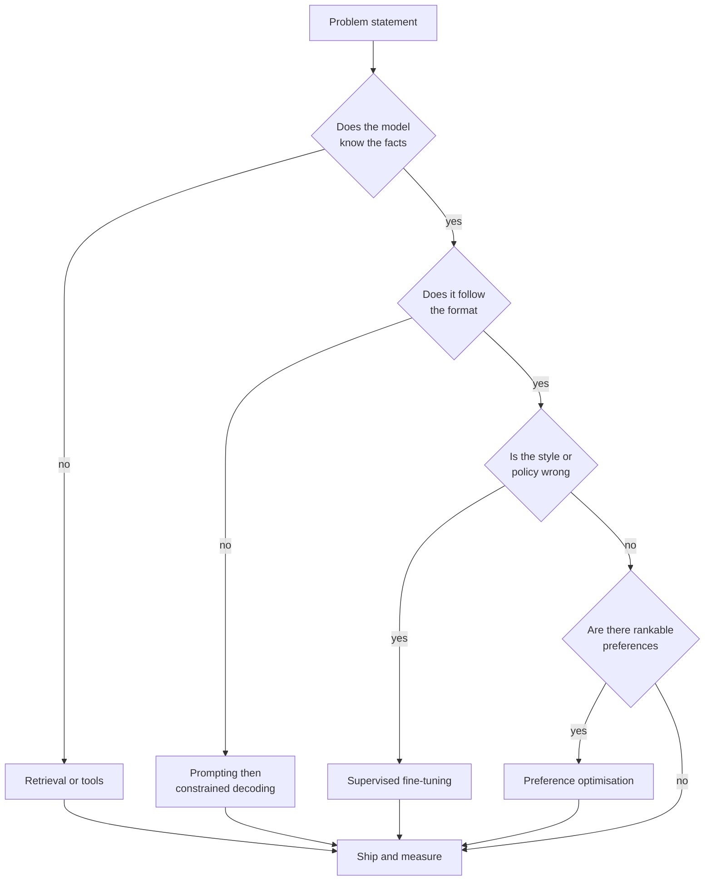
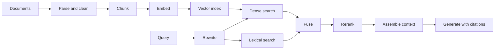
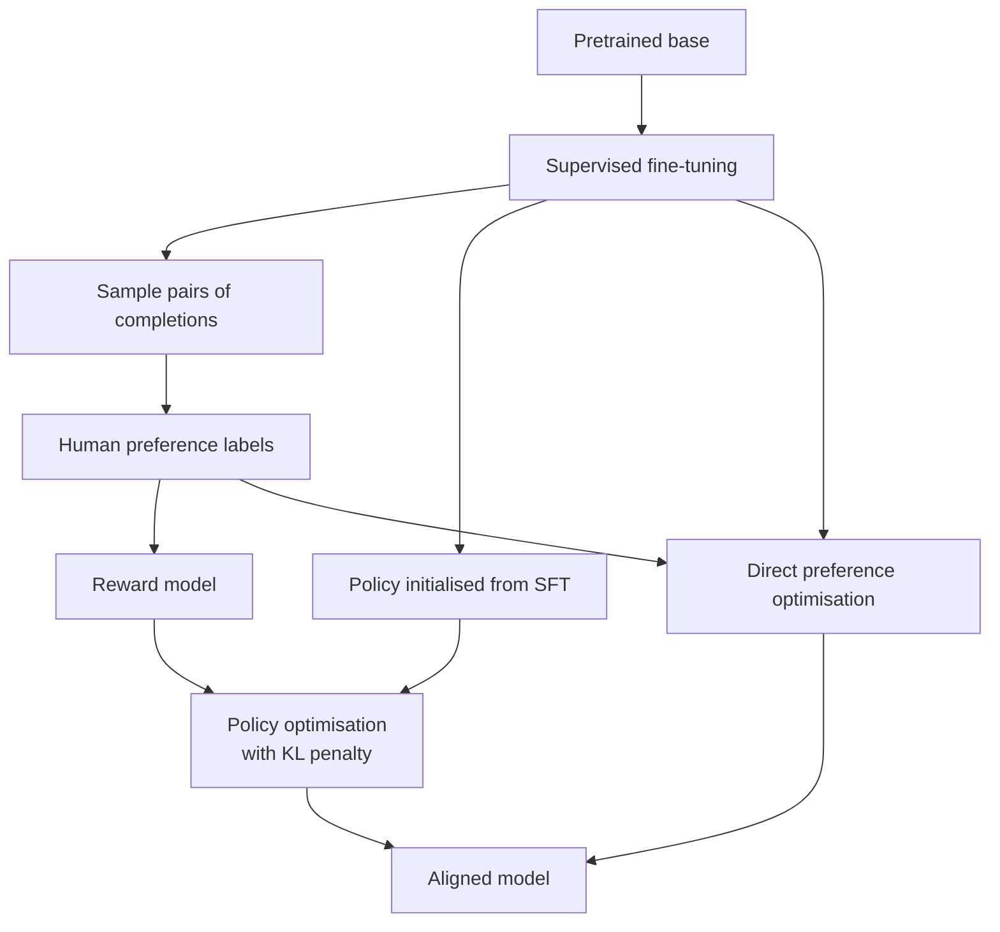
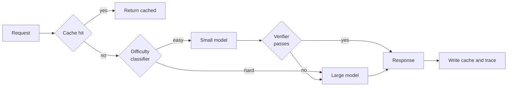
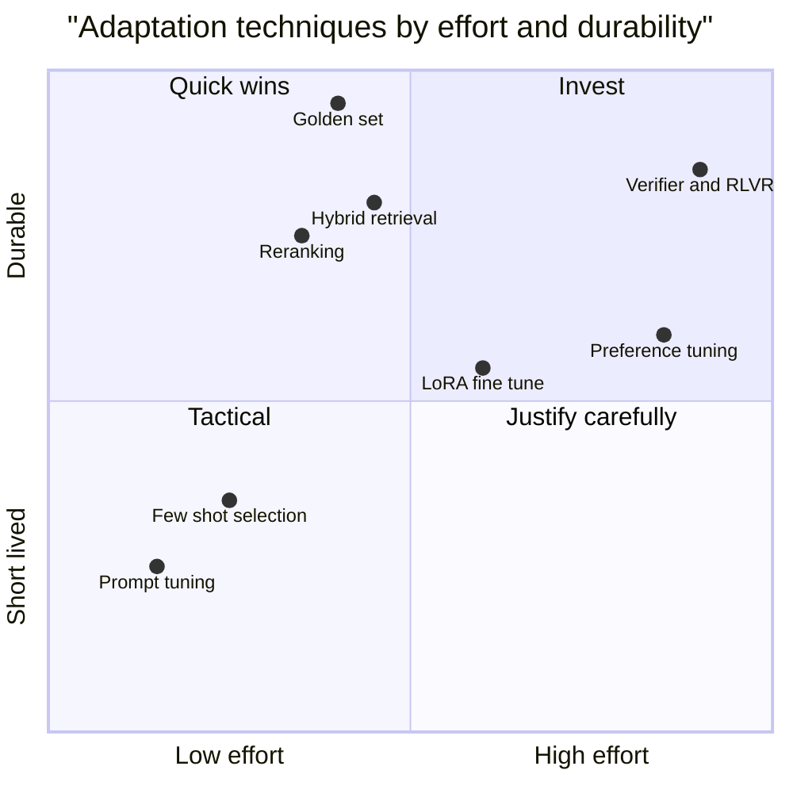

# Chapter 15: Large Language Models in Practice

> **What this chapter covers** The adaptation ladder for large language models, prompting as an engineering discipline, retrieval-augmented generation end to end, supervised and parameter-efficient fine-tuning, preference optimisation, evaluation of language model systems, and the economics of inference.
> **Prerequisites** Chapter 8 (Transformers and Language Models), Chapter 5 (Evaluation, Validation, and Experimental Design), Chapter 9 (Representation Learning, Transfer, and Self-Supervision).
> **Where it is used** Any system where a pretrained language model sits between a user and a body of knowledge or a set of actions. Support assistants, document question answering, code assistants, structured extraction pipelines, and internal search. The roles are applied scientist, machine learning engineer, and the increasingly common title of forward deployed or applied artificial intelligence engineer.

A large language model (LLM) is a neural network trained to predict the next token in a sequence, then adapted to follow instructions. Chapter 8 derives the architecture. This chapter is about what you do with one once you have it, and the sequence of decisions that separates a demonstration from a system that survives contact with users.

---

## 15.1 Level 1: Foundations

### 15.1.1 The one idea that organises everything

A pretrained language model already contains an enormous amount of latent capability. Almost every engineering decision in this chapter is about *eliciting* that capability rather than *installing* new capability. The ladder below is ordered by cost and by how much of the model you disturb.

| Rung | What you change | Typical cost | Latency effect | Reversible |
|---|---|---|---|---|
| Prompting | The text you send | Hours of engineering | Adds input tokens | Instantly |
| Retrieval | The text you send, sourced from a corpus | Days, plus an index to maintain | Adds retrieval latency and many input tokens | Instantly |
| Tool use and orchestration | The control flow around the model | Days to weeks | Adds a round trip per tool call | Instantly |
| Supervised fine-tuning | Some or all model weights | Days, plus a labelled set | Usually reduces prompt length | Requires redeploy |
| Preference optimisation | Model weights, using ranked pairs | Weeks, plus preference data | Neutral | Requires redeploy |
| Continued pretraining | Model weights, using raw corpora | Weeks to months, large compute | Neutral | Requires redeploy |

*The rule of thumb: climb one rung only when you have evidence the rung below has been exhausted, and you have an evaluation that will show the improvement.*

The most common failure in the field is climbing to fine-tuning because it feels like real engineering, when the actual defect was an ambiguous instruction or a retrieval step returning the wrong chunk.


*Figure 15.1: The adaptation ladder as a decision procedure, where each branch asks what kind of deficit you actually observed.*

### 15.1.2 The three deficits

Every failure of a language model system is one of three deficits, and each has a different remedy.

A **knowledge deficit** means the model does not have the fact. It was not in the pretraining corpus, or it changed after the cutoff, or it is private. Remedy: retrieval, or a tool that queries a system of record. Fine-tuning is a poor remedy because you cannot enumerate facts fast enough and the model will still hallucinate around the edges.

A **behaviour deficit** means the model has the fact but responds in the wrong shape. Wrong tone, wrong length, wrong schema, wrong refusal policy, wrong reasoning style. Remedy: prompting first, then supervised fine-tuning when the instruction is too long to maintain or the model ignores part of it.

A **capability deficit** means the model cannot do the underlying reasoning at all. A small model asked to do multi-step arithmetic over a long table. Remedy: a bigger model, a tool that does the step, or decomposition into smaller steps.

Naming the deficit before choosing the remedy is the single highest-leverage habit in this chapter.

### 15.1.3 Tokens, context, and the cost of everything

A token is a sub-word unit produced by the tokeniser (Chapter 8, level 1). Everything the model reads and writes is counted in tokens, and everything you pay is priced in tokens. For English prose a useful planning figure is roughly 0.75 words per token, so 1000 tokens is about 750 words. Code and non-Latin scripts are denser in tokens per character. Measure with the actual tokeniser rather than trusting the ratio.

The **context window** is the maximum number of tokens the model can attend to in one request, counting the prompt and the generated output together. A request that exceeds it is rejected or silently truncated depending on the client. Context windows have grown by orders of magnitude since 2023 and any specific figure dates quickly, so check your version.

Two costs behave differently. **Prefill** is the forward pass over the input tokens. It is compute-bound and parallel across the sequence, so it is fast per token. **Decode** is the generation of output tokens one at a time. It is memory-bandwidth-bound because each step reads the whole key-value cache, so it is slow per token. This asymmetry drives nearly every optimisation later in the chapter: long inputs are cheap relative to long outputs.

### 15.1.4 Retrieval in one paragraph

Retrieval-augmented generation (RAG) means: given a user question, find relevant passages from a corpus, put them into the prompt, and ask the model to answer using them. The model supplies language and reasoning; the corpus supplies facts. It is the default answer to a knowledge deficit because the corpus can be updated in seconds, the source of each claim can be shown to the user, and access control can be enforced at retrieval time rather than hoped for at generation time.

### 15.1.5 Fine-tuning in one paragraph

Fine-tuning means continuing gradient descent on a pretrained model using your own examples. For instruction-following models the examples are conversations: a system message, a user message, and the assistant reply you wish the model had produced. The loss is the same next-token cross-entropy used in pretraining, masked so that only the assistant tokens contribute. The result is a model that produces your shape of output without being told how in every request.

---

## 15.2 Level 2: Working knowledge

### 15.2.1 Prompting as engineering

Treat a prompt as source code. It has versions, tests, a review process, and a rollback path. The teams that fail treat it as a text box.

**Structure.** A robust instruction prompt has a stable skeleton:

1. Role and task in one or two sentences.
2. The rules, as a numbered list, each rule testable.
3. The input, clearly delimited.
4. The output contract, stated as a schema or an explicit template.
5. Few-shot examples, if used, placed after the rules and before the input.

Put the instructions before the long context when the model is autoregressive and you want the rules to condition the reading, and repeat the critical constraint after the context when the context is very long. The repetition is not elegant but it measurably reduces instruction drift on long inputs.

**Delimiting.** Wrap untrusted input in an unambiguous delimiter, typically an XML-style tag, and say in the instruction that everything inside the tag is data. This does not stop prompt injection (Chapter 16, level 3) but it removes accidental confusion.

**Specificity.** Replace every adjective with a measurement. "Be concise" becomes "at most three sentences". "Be professional" becomes a two-line description of the register plus one example. Models comply with measurable constraints far more reliably than with evaluative ones.

**Listing 15.1: a prompt skeleton with a machine-checkable contract.**

```python
SYSTEM = """You classify a customer message into exactly one category.

Rules:
1. Choose exactly one category from the list.
2. If the message fits none, choose "other".
3. Base the decision only on text inside <message> tags.
4. Output only JSON matching the schema. No prose, no code fences.

Categories: billing, technical, account, sales, other

Schema: {"category": string, "confidence": number, "evidence": string}
The evidence field must be a verbatim span copied from the message."""

USER = "<message>\n{text}\n</message>"

def build(text: str) -> list[dict]:
    return [
        {"role": "system", "content": SYSTEM},
        {"role": "user", "content": USER.format(text=text)},
    ]
```

The evidence field is the important line. Requiring a verbatim span gives you a cheap post-hoc check: if the span is not a substring of the input, the model invented it and you can reject the response without a human reading it. Build that kind of self-verifying field into every extraction prompt you write.

**Few-shot selection.** Few-shot prompting means including solved examples. Three practical rules. First, examples teach *format* far more reliably than they teach *knowledge*. Second, cover the decision boundary rather than the typical case: include the examples that are easy to get wrong, including at least one that should return the null or refusal answer. Third, if you have many candidate examples, select them per query by embedding similarity to the input rather than fixing them. Dynamic selection typically beats a fixed set when the task has many sub-domains, and costs an extra vector lookup.

Order matters more than it should. Models exhibit recency bias toward the last example and primacy bias toward the first. If accuracy changes when you shuffle examples, your prompt is fragile; add more examples or move the discriminating information into the rules.

**Chain of thought and its costs.** Asking the model to reason step by step before answering improves accuracy on multi-step problems (Wei et al., 2022, "Chain-of-Thought Prompting Elicits Reasoning in Large Language Models"). Self-consistency samples several reasoning paths and takes the majority answer (Wang et al., 2022, "Self-Consistency Improves Chain of Thought Reasoning in Language Models").

The costs are real and often ignored:

| Cost | Magnitude | Mitigation |
|---|---|---|
| Output tokens | Often 3 to 10 times the answer alone | Ask for reasoning only when the task needs it |
| Latency | Proportional to output tokens, the slow phase | Stream, or hide reasoning and show a progress state |
| Leakage | Reasoning may contain content you do not want shown | Separate the reasoning field from the answer field and render only the answer |
| False confidence | A fluent rationale can accompany a wrong answer | Never treat the rationale as evidence of correctness |

On simple classification chain of thought frequently *hurts*, because it gives the model room to talk itself out of the correct first instinct. Measure rather than assume. Models trained specifically to reason before answering change this calculus and the guidance moves quickly, so check your version.

**Structured output and constrained decoding.** Three mechanisms, in increasing strength:

- *Ask nicely.* State the schema in the prompt. Works most of the time. Fails under long context or unusual input.
- *Tool or function calling.* Give the model a schema through the provider's structured interface. The provider biases or validates generation toward it. Much more reliable.
- *Constrained decoding.* At each decoding step, mask the logits so only tokens permitted by a grammar can be sampled. A JSON schema compiles to a finite state machine over the token vocabulary; tokens that would make the string invalid get probability zero. This makes malformed output structurally impossible.

Constrained decoding guarantees the *shape*, never the *content*. A schema-valid answer can still be entirely wrong. It also slightly distorts the distribution, because forcing a token the model considered unlikely changes everything downstream. On tasks with a natural free-text answer, over-constraining can reduce quality. Use it where the consumer is a program, and validate semantics separately.

**Listing 15.2: validating structure and semantics as separate stages.**

```python
import json, re
from pydantic import BaseModel, ValidationError, field_validator

class Extraction(BaseModel):
    category: str
    confidence: float
    evidence: str

    @field_validator("category")
    @classmethod
    def known(cls, v):
        allowed = {"billing", "technical", "account", "sales", "other"}
        if v not in allowed:
            raise ValueError(f"unknown category {v}")
        return v

def parse(raw: str, source_text: str) -> Extraction:
    raw = re.sub(r"^```(?:json)?|```$", "", raw.strip(), flags=re.M).strip()
    obj = Extraction.model_validate_json(raw)      # structural
    if obj.evidence not in source_text:            # semantic, grounding
        raise ValueError("evidence not found in source")
    if not 0.0 <= obj.confidence <= 1.0:
        raise ValueError("confidence out of range")
    return obj
```

The code fence stripping is defensive rather than aspirational; models append fences even when told not to, and stripping them is cheaper than a retry. The grounding check on the last lines is the part that catches hallucination, and it is the part most implementations omit.

**Versioning and testing.** Store prompts in the repository, not in a database that no one diffs. Give every prompt a version identifier and log it with every request, so a regression can be attributed. Maintain a test set of at least 50 inputs with expected properties, and run it on every prompt change in continuous integration. Treat a prompt change like a model change: it needs the same evaluation gate.

### 15.2.2 Retrieval-augmented generation, stage by stage


*Figure 15.2: The retrieval pipeline, with the offline indexing path on the left and the online query path on the right.*

**Parsing.** The unglamorous stage that determines the ceiling. A PDF table flattened into a stream of numbers with no headers cannot be retrieved usefully no matter how good the embedding model is. Budget real effort here: layout-aware extraction, table preservation as Markdown or HTML, heading hierarchy retained as metadata, and boilerplate such as headers and footers removed.

**Chunking.** You split documents because embeddings summarise a passage into one vector, and a vector over 10000 words summarises nothing. Strategies:

| Strategy | How | Best for | Weakness |
|---|---|---|---|
| Fixed size with overlap | N tokens, stride N minus overlap | Homogeneous prose | Cuts mid-sentence, splits tables |
| Recursive by separator | Split on headings, then paragraphs, then sentences | Most documents | Uneven chunk sizes |
| Structural | One chunk per section, per row, per function | Structured docs, code, tables | Needs a parser per format |
| Semantic | Split where consecutive sentence embeddings diverge | Long unstructured narrative | Slow to index, hard to tune |
| Parent-child | Embed small chunks, return the enclosing parent | Precision with context | Two stores to maintain |

Defaults that work: recursive splitting at around 300 to 600 tokens with 10 to 20 percent overlap, plus the document title and section heading prepended to every chunk's embedded text. That last trick is cheap and consistently valuable, because a chunk reading "It must be filed within 30 days" is meaningless without "Section 4, Appeals".

The trade-off is direct. Smaller chunks raise precision and lower the chance that the answer is diluted by irrelevant text, but raise the chance that the answer is split across a boundary. Larger chunks do the reverse. Parent-child retrieval buys both at the cost of a second store.

**Embedding model selection.** An embedding model maps text to a vector such that semantically similar text is close under cosine similarity. Choose on five axes: retrieval quality on data resembling yours, dimensionality (which sets index memory), maximum input length, cost and latency, and whether it can run where your data is allowed to be. Public leaderboards such as the Massive Text Embedding Benchmark (Muennighoff et al., 2022) are a starting filter, not an answer; build a small labelled set of query and relevant-document pairs from your own corpus and measure recall at k. Two hundred labelled queries is usually enough to separate candidates.

Note the asymmetry: many models expect a different prefix for queries and for documents. Using the wrong one silently costs several points of recall. Check the model card.

**Vector indexes.** Exact nearest neighbour search compares the query to every vector. Cost is linear in corpus size and it is perfectly fine up to roughly a hundred thousand vectors on a single machine. Beyond that you use approximate nearest neighbour (ANN) search, which trades a small amount of recall for a large amount of speed.

| Family | Idea | Tuning knob | Strength | Weakness |
|---|---|---|---|---|
| Flat | Compare to everything | none | Exact, trivial | Linear cost |
| Inverted file (IVF) | Cluster vectors, search a few clusters | nlist, nprobe | Low memory, good on billions | Recall drops near cluster edges |
| Graph (HNSW) | Navigable small-world graph, greedy descent | M, efConstruction, efSearch | Best recall-latency on medium corpora | High memory, slow build, deletes are awkward |
| Product quantisation (PQ) | Compress vectors into codes | m subvectors, bits | Huge memory saving | Lossy, needs re-ranking on full vectors |
| Disk-resident graph | Graph with vectors on solid state disk | beam width | Very large corpora cheaply | Higher tail latency |

Hierarchical navigable small world (HNSW) comes from Malkov and Yashunin (2016). Product quantisation comes from Jegou, Douze and Schmid (2011). The disk-resident approach is described in Subramanya et al. (2019), "DiskANN".

Every ANN index exposes a recall-latency curve. Increasing `efSearch` in HNSW or `nprobe` in IVF raises recall and latency together, roughly logarithmically in recall and linearly in work. The correct procedure is: fix a recall target from your quality evaluation, then find the smallest parameter that reaches it, then check the latency at the 95th percentile rather than the mean.

**Worked example: index sizing.** Take 2 million chunks, 1024-dimensional float32 embeddings.

$$\text{raw bytes} = 2{,}000{,}000 \times 1024 \times 4 = 8.19 \times 10^{9} \approx 8.2\ \text{GB}$$

HNSW adds graph edges. With $M = 32$, each node stores about $2M$ neighbour identifiers at 4 bytes on the base layer:

$$\text{graph bytes} \approx 2{,}000{,}000 \times 64 \times 4 = 5.12 \times 10^{8} \approx 0.5\ \text{GB}$$

So roughly 8.7 GB resident, before payload and metadata. Now apply product quantisation with 128 subvectors at 8 bits:

$$\text{compressed bytes} = 2{,}000{,}000 \times 128 = 2.56 \times 10^{8} \approx 0.26\ \text{GB}$$

A 32-fold reduction, at the cost of approximate distances. The standard remedy is to retrieve 5 to 10 times more candidates using compressed distances, then rescore the shortlist against full vectors kept on disk. Halving the dimension to 512, where the embedding model supports it, halves memory with a typically small recall cost; check the model card for whether truncation is supported, as models trained with a nested representation objective tolerate it far better than those that are not.

**Hybrid retrieval.** Dense vectors capture meaning and miss exact tokens. Lexical scoring captures exact tokens and misses paraphrase. Error codes, part numbers, surnames, and acronyms are exactly the queries where dense retrieval fails and lexical retrieval is perfect. Run both.

The standard lexical score is Okapi BM25 (Robertson and Walker, circa 1994). For query term $t$ in document $d$:

$$\text{BM25}(q,d) = \sum_{t \in q} \text{IDF}(t) \cdot \frac{f(t,d)\,(k_1+1)}{f(t,d) + k_1\left(1 - b + b\,\frac{|d|}{\text{avgdl}}\right)}$$

Here $f(t,d)$ is the term frequency in the document, $|d|$ the document length in tokens, $\text{avgdl}$ the mean document length, $\text{IDF}(t)$ the inverse document frequency, and $k_1$ and $b$ are constants usually near 1.2 and 0.75. The denominator implements saturation, so the tenth occurrence of a word adds much less than the second, and length normalisation, so long documents do not win by being long.

To combine two ranked lists, do not add raw scores; they are on incomparable scales. Use reciprocal rank fusion (Cormack, Clarke and Buettcher, 2009):

$$\text{RRF}(d) = \sum_{i \in \text{systems}} \frac{1}{k + r_i(d)}$$

where $r_i(d)$ is the rank of document $d$ in system $i$ and $k$ is a constant, conventionally 60. Only ranks matter, so calibration between systems is unnecessary.

**Worked example: fusion.** A document ranked 1 by BM25 and 8 by dense search scores $1/61 + 1/68 = 0.0164 + 0.0147 = 0.0311$. A document ranked 3 by both scores $2/63 = 0.0317$. The consistently good document wins over the one system's favourite, which is the intended behaviour.

**Reranking.** A cross-encoder takes the query and one candidate together and outputs a relevance score. Because it attends across both, it is far more accurate than comparing two independently computed vectors. Because it must run once per candidate, it is far more expensive. Retrieve 50 to 100 candidates cheaply, rerank them, keep the top 5 to 10. On most corpora reranking is the single largest quality gain per unit of engineering in the whole pipeline.

**Context assembly.** Order the retrieved passages deliberately. Models attend unevenly across a long context, with degraded recall in the middle (Liu et al., 2023, "Lost in the Middle: How Language Models Use Long Contexts"). Put the highest-scoring passage first and the second-highest last. Deduplicate near-identical chunks. Label each passage with a stable identifier and its source so the model can cite it. Set a token budget for the context and enforce it by dropping the lowest-scoring passages, never by truncating mid-passage.

**Grounding and citation.** Instruct the model to answer only from the passages, to cite the identifier after each claim, and to say explicitly that the answer is not present when it is not. Then verify: check that every cited identifier exists in what you supplied, and optionally check with a second cheap model call whether each sentence is entailed by its cited passage. Citations you do not verify are decoration.

**Failure modes by stage.** This table is the most useful debugging artifact in the chapter.

| Stage | Failure | Symptom | Diagnostic | Fix |
|---|---|---|---|---|
| Parse | Tables flattened, headers lost | Numeric questions always wrong | Read 10 raw chunks | Layout-aware parser |
| Chunk | Answer split across boundary | Partial answers | Search corpus for the answer string, see which chunk holds it | Larger chunks or parent-child |
| Embed | Domain vocabulary unmapped | Low recall on jargon | Recall at k on labelled queries | Different model, or hybrid |
| Index | ANN misses the right neighbour | Recall below exact search | Compare against flat index on a sample | Raise efSearch or nprobe |
| Fuse | One system dominates | Exact-match queries fail | Inspect both lists separately | Reciprocal rank fusion, check lexical analyser |
| Rerank | Correct chunk retrieved but dropped | Gold chunk in top 50, not top 5 | Log rank before and after | Different reranker, keep more |
| Assemble | Relevant chunk buried mid-context | Answer ignores a supplied passage | Reorder and retest | Score-ordered placement |
| Generate | Ignores context, uses parametric memory | Confident answer contradicting sources | Ask for citations, verify them | Stronger grounding instruction, verification |

Instrument each stage separately. A single end-to-end accuracy number tells you the system is broken and nothing about where.

### 15.2.3 Supervised fine-tuning

Supervised fine-tuning (SFT) continues training on conversations you supply. The mechanics that matter in practice:

**Data requirements.** Quality dominates quantity. A few thousand carefully curated examples routinely beat a hundred thousand scraped ones; the LIMA work (Zhou et al., 2023, "LIMA: Less Is More for Alignment") made this case with 1000 examples. Practical targets: 500 to 2000 examples for a narrow format or style task, 5000 to 50000 for a broad behaviour change. Every example must be one you would be content to see the model reproduce verbatim, because to a first approximation it will.

Hold out a genuine test split before you look at anything. Deduplicate near-identical examples, which otherwise act as a hidden learning-rate multiplier on one pattern.

**Chat template discipline.** This is the most common silent bug in fine-tuning. Instruction models are trained with a specific template of special tokens marking roles and turn boundaries. If you train with one template and serve with another, quality collapses in ways that look like a data problem. Always render the template with the tokeniser's own function rather than by string concatenation, and print the decoded first training example and compare it byte for byte with what your serving stack sends. Do this before every run.

**Loss masking.** Compute loss only on assistant tokens. Training on the prompt tokens teaches the model to generate user messages, which wastes capacity and can make the model continue the conversation on its own behalf. Most libraries support this; verify it rather than assuming.

**Listing 15.3: rendering and masking, the two things to check first.**

```python
from transformers import AutoTokenizer

tok = AutoTokenizer.from_pretrained(MODEL_ID)   # names vary, check your version

def encode(example, max_len=2048):
    msgs = example["messages"]                   # [{role, content}, ...]
    prompt = tok.apply_chat_template(
        msgs[:-1], tokenize=False, add_generation_prompt=True)
    full = tok.apply_chat_template(msgs, tokenize=False)

    p_ids = tok(prompt, add_special_tokens=False)["input_ids"]
    f_ids = tok(full, add_special_tokens=False)["input_ids"][:max_len]

    labels = list(f_ids)
    for i in range(min(len(p_ids), len(labels))):
        labels[i] = -100                         # ignored by the loss
    return {"input_ids": f_ids, "labels": labels}

print(tok.apply_chat_template(SAMPLE["messages"], tokenize=False))
```

The final print is not debug scaffolding to delete. Keep it. The label value of -100 is the conventional ignore index in PyTorch cross-entropy; masking the prompt region this way is what "train on completions only" means mechanically.

**Hyperparameters that matter.** Learning rate is first by a wide margin. Full fine-tuning of an instruction model typically wants something in the region of $1 \times 10^{-5}$ to $2 \times 10^{-5}$; low-rank adaptation wants roughly ten to twenty times more because the adapter starts at zero. One to three epochs. More than three on a small set memorises. Use a cosine or linear schedule with a short warmup. Watch held-out loss and stop when it turns up, but note that held-out loss correlates imperfectly with the behaviour you care about, so also sample generations at each checkpoint and read them.

### 15.2.4 Parameter-efficient fine-tuning

Full fine-tuning updates every weight, and the optimiser state dominates memory. Low-rank adaptation (LoRA, Hu et al., 2021, "LoRA: Low-Rank Adaptation of Large Language Models") freezes the base weights and learns a low-rank update.

For a frozen weight matrix $W_0 \in \mathbb{R}^{d \times k}$, LoRA parameterises the update as

$$W = W_0 + \frac{\alpha}{r} B A, \qquad B \in \mathbb{R}^{d \times r},\ A \in \mathbb{R}^{r \times k},\ r \ll \min(d,k)$$

$A$ is initialised from a small random distribution and $B$ is initialised to zero, so at step zero the update is exactly zero and the model is unchanged. $r$ is the rank and $\alpha$ a scaling constant; the ratio $\alpha / r$ sets the effective magnitude, which is why people often set $\alpha = 2r$ and then vary $r$ alone.

The saving comes from the parameter count. A $4096 \times 4096$ matrix has $16.8$ million parameters. At rank 16 the adapter has $2 \times 4096 \times 16 = 131{,}072$, about 0.8 percent.

**Worked memory arithmetic.** Take a 7 billion parameter model in bfloat16.

Full fine-tuning with the Adam optimiser:

$$\begin{aligned}
\text{weights} &= 7 \times 10^{9} \times 2\ \text{B} = 14\ \text{GB}\\
\text{gradients} &= 7 \times 10^{9} \times 2\ \text{B} = 14\ \text{GB}\\
\text{Adam states (fp32 m and v)} &= 7 \times 10^{9} \times 8\ \text{B} = 56\ \text{GB}\\
\text{fp32 master copy} &= 7 \times 10^{9} \times 4\ \text{B} = 28\ \text{GB}\\
\text{total} &\approx 112\ \text{GB before activations}
\end{aligned}$$

LoRA at rank 16 on attention projections, roughly 20 million trainable parameters:

$$\begin{aligned}
\text{frozen weights} &= 14\ \text{GB}\\
\text{adapter weights} &= 20 \times 10^{6} \times 2\ \text{B} = 0.04\ \text{GB}\\
\text{adapter gradients} &= 0.04\ \text{GB}\\
\text{Adam states} &= 20 \times 10^{6} \times 8\ \text{B} = 0.16\ \text{GB}\\
\text{total} &\approx 14.3\ \text{GB before activations}
\end{aligned}$$

An eight-fold reduction, and the remaining term is the frozen weights. That is what quantised fine-tuning attacks next.

**Quantised fine-tuning.** QLoRA (Dettmers et al., 2023, "QLoRA: Efficient Finetuning of Quantized LLMs") stores the frozen base in 4-bit, dequantises each block to bfloat16 on the fly during the forward pass, and trains bfloat16 LoRA adapters. Three ingredients: a 4-bit normal-float data type matched to the roughly Gaussian distribution of weights, double quantisation which quantises the quantisation constants themselves, and paged optimiser states that spill to host memory on a spike.

Base weights become $7 \times 10^{9} \times 0.5\ \text{B} = 3.5\ \text{GB}$, so the same job fits in about 4 GB plus activations. Activations then dominate, and gradient checkpointing, which recomputes activations during the backward pass instead of storing them, trades roughly 30 percent extra compute for a large activation saving.

**Where to place adapters.** Applying LoRA to all linear layers including the feed-forward projections generally outperforms attention-only at the same total parameter budget. Rank 8 to 16 is enough for style and format; 32 to 64 for a substantial domain shift. Beyond 64 the gains flatten and you should ask whether full fine-tuning is now cheaper.

**What fine-tuning does and does not add.** It adds behaviour: format, tone, task decomposition, refusal policy, the ability to follow a long implicit convention without being told. It does not reliably add knowledge. Injecting facts by fine-tuning requires many restatements of each fact, degrades unrelated capabilities, becomes stale the moment the fact changes, and still produces confident fabrication on near neighbours of the trained facts. Gekhman et al. (2024) found that fine-tuning on facts unknown to the model increases hallucination. Use retrieval for knowledge. Use fine-tuning for behaviour. This sentence is the most commercially valuable one in the chapter.

---

## 15.3 Level 3: Depth

### 15.3.1 Preference optimisation

Supervised fine-tuning teaches the model to imitate one good answer. It has no way to express that answer A is better than answer B, and no way to penalise a bad answer. Preference optimisation does both.

**The reward modelling formulation.** Collect pairs: a prompt $x$, a preferred completion $y_w$, a rejected completion $y_l$. Assume the Bradley-Terry model (Bradley and Terry, 1952), in which a latent scalar reward $r(x,y)$ induces preference probabilities

$$P(y_w \succ y_l \mid x) = \sigma\!\big(r(x,y_w) - r(x,y_l)\big), \qquad \sigma(z) = \frac{1}{1+e^{-z}}$$

Fit $r_\phi$ by maximum likelihood, which is the negative log of that quantity:

$$\mathcal{L}_{\text{RM}}(\phi) = -\,\mathbb{E}_{(x,y_w,y_l)}\Big[\log \sigma\big(r_\phi(x,y_w) - r_\phi(x,y_l)\big)\Big]$$

Only differences are identified, so the reward has an arbitrary offset. In practice $r_\phi$ is the base model with the token head replaced by a scalar head reading the final position.

Then optimise the policy against this reward with a KL penalty that keeps it near the reference model:

$$\max_{\pi_\theta}\ \mathbb{E}_{x,\,y \sim \pi_\theta}\big[r_\phi(x,y)\big] \;-\; \beta\, \mathbb{D}_{\mathrm{KL}}\!\big[\pi_\theta(y\mid x)\,\|\,\pi_{\text{ref}}(y\mid x)\big]$$

$\pi_\theta$ is the policy being trained, $\pi_{\text{ref}}$ the frozen starting model, and $\beta$ controls how far the policy may drift. Without the penalty the policy finds adversarial inputs that score highly under $r_\phi$ and are nonsense to humans. This is reward hacking, and it is not a corner case; it is the default outcome. The procedure with proximal policy optimisation as the optimiser is reinforcement learning from human feedback (RLHF), described in Ouyang et al. (2022), "Training language models to follow instructions with human feedback", building on Christiano et al. (2017).


*Figure 15.3: Two routes from preferences to an aligned model, the reward-model route through explicit reinforcement learning and the direct route that skips the reward model.*

**Deriving direct preference optimisation.** Direct preference optimisation (DPO, Rafailov et al., 2023, "Direct Preference Optimization: Your Language Model is Secretly a Reward Model") removes the reward model and the reinforcement learning loop. The derivation is short and worth following because it explains what the resulting loss is doing.

The KL-regularised objective above has a known closed-form optimum:

$$\pi^{*}(y \mid x) = \frac{1}{Z(x)}\,\pi_{\text{ref}}(y \mid x)\,\exp\!\left(\frac{1}{\beta} r(x,y)\right)$$

with $Z(x) = \sum_y \pi_{\text{ref}}(y\mid x)\exp(r(x,y)/\beta)$ the partition function. Take logarithms and solve for the reward:

$$r(x,y) = \beta \log \frac{\pi^{*}(y \mid x)}{\pi_{\text{ref}}(y \mid x)} + \beta \log Z(x)$$

Now substitute into the Bradley-Terry likelihood. Because the preference depends only on the *difference* of rewards for two completions of the same prompt, the $\beta \log Z(x)$ term is identical in both and cancels. That cancellation is the whole trick: the intractable partition function disappears. Replacing $\pi^{*}$ with the trainable $\pi_\theta$ gives

$$\mathcal{L}_{\text{DPO}}(\theta) = -\,\mathbb{E}\left[\log \sigma\!\left(\beta \log \frac{\pi_\theta(y_w\mid x)}{\pi_{\text{ref}}(y_w\mid x)} - \beta \log \frac{\pi_\theta(y_l\mid x)}{\pi_{\text{ref}}(y_l\mid x)}\right)\right]$$

This is a supervised classification loss on pairs. It needs two forward passes, no sampling, no reward model, no reinforcement learning machinery. The implicit reward is the log-ratio of policy to reference, and monitoring the accuracy of that implicit reward on a held-out preference set is the standard diagnostic.

Practical notes. $\beta$ typically sits between 0.1 and 0.5; lower permits more drift. Learning rates are an order of magnitude below SFT, around $5 \times 10^{-7}$ to $5 \times 10^{-6}$. DPO reduces the likelihood of *both* completions in a pair while increasing their gap, so a model can drift toward degenerate short outputs; watch output length and held-out quality, not only the loss. Running DPO from a checkpoint that has not been supervised fine-tuned on the same distribution as the preference data works poorly. Variants address specific weaknesses: identity preference optimisation (Azar et al., 2023) addresses overfitting to deterministic preferences; Kahneman-Tversky optimisation (Ethayarajh et al., 2024) accepts unpaired binary feedback; odds-ratio preference optimisation (Hong et al., 2024) merges the SFT and preference stages.

**Reinforcement learning with verifiable rewards.** Where correctness is checkable by a program, skip the learned reward model and use the checker. Mathematics with a known answer, code with a test suite, SQL judged by comparing result sets, structured extraction judged against a schema and a key. The reward is 1 if the check passes and 0 otherwise, sometimes with shaping terms for format.

Group relative policy optimisation (GRPO, Shao et al., 2024, "DeepSeekMath") is the common algorithm. For each prompt, sample a group of $G$ completions, score them, and use the group statistics as the baseline instead of a learned value network:

$$A_i = \frac{r_i - \operatorname{mean}(r_1,\dots,r_G)}{\operatorname{std}(r_1,\dots,r_G) + \epsilon}$$

$A_i$ is the advantage for completion $i$. Dropping the value network halves memory and removes a component that is hard to train. The policy update is the clipped surrogate objective from proximal policy optimisation (Schulman et al., 2017) applied with these advantages, plus a KL term to the reference.

This route produces genuinely new capability rather than only new style, because the model explores and is rewarded for solutions it was not shown. The constraint is that you need a verifier. Getting a real one for your task is usually the hard part, and the effort is well spent: a verifier is also an evaluation set.

### 15.3.2 Evaluating language model systems

**Why it is harder.** Classification has one correct label and a confusion matrix. Generation has many acceptable outputs, quality is multi-dimensional, string overlap metrics such as BLEU and ROUGE correlate weakly with human judgement on open-ended tasks, and the system is nondeterministic even at temperature zero because of batching and floating-point non-associativity on parallel hardware. You cannot compute accuracy and move on.

**Benchmark contamination.** Public benchmarks leak into pretraining corpora. A model scoring well on a benchmark published before its training cutoff may have memorised the test set. Detection approaches include checking whether the model completes a test item verbatim from a prefix, comparing performance on items published before and after the cutoff, and measuring the gap between the canonical ordering of multiple-choice options and a shuffled ordering. A large drop under shuffling is strong evidence of memorisation. The practical response: never make a decision on a public benchmark alone, and build a private evaluation set from your own distribution that has never been published.

**Model as judge.** Use a strong language model to score outputs against a rubric. It is the only method that scales, and it has documented biases:

| Bias | Description | Mitigation |
|---|---|---|
| Position | Prefers the first or second option presented | Evaluate both orders, average, or discard disagreements |
| Verbosity | Prefers longer answers | Control length in the rubric, report length alongside score |
| Self-preference | Prefers text from its own family | Use a different family as judge, or several |
| Style over substance | Rewards fluency and confident tone | Require evidence quotes for each judgement |
| Score compression | Uses 7 and 8 on a 10-point scale | Use 3 to 5 anchored levels with described criteria |

Zheng et al. (2023), "Judging LLM-as-a-Judge with MT-Bench and Chatbot Arena" quantifies several of these.

**The calibration protocol.** A judge you have not calibrated is a random number generator with good grammar. The protocol:

1. Write the rubric with concrete anchors. Not "rate helpfulness 1 to 10" but three or five named levels, each with a one-sentence criterion and one example.
2. Have humans label 100 to 200 items with that rubric. Two annotators per item where budget allows.
3. Measure human-to-human agreement first. Cohen's kappa below about 0.6 means the rubric is ambiguous, not that the annotators are careless. Fix the rubric and relabel.
4. Run the judge on the same items. Measure judge-to-human agreement against the human-to-human ceiling. A judge at or near the human ceiling is usable.
5. Report agreement alongside every number the judge produces.
6. Re-run calibration whenever the judge model, its version, or the rubric changes.

Pairwise comparison ("which of these two is better") is usually more reliable than absolute scoring, because it removes the need for a shared scale. Convert wins to a rating if you need a scalar.

**Worked example: sample size.** To detect a change in a pass rate from 0.70 to 0.75 with 80 percent power at the 5 percent level on *independent* samples, the approximate requirement per arm is

$$n \approx \frac{(z_{\alpha/2} + z_{\beta})^2 \big(p_1(1-p_1) + p_2(1-p_2)\big)}{(p_1 - p_2)^2} = \frac{(1.96 + 0.84)^2 (0.21 + 0.1875)}{0.0025} \approx 1247$$

That is a lot of items. Now use a paired design, where both systems answer the same items, and analyse only the discordant pairs with McNemar's test. If the systems agree on 85 percent of items, the effective sample is the 15 percent where they differ, and the required total falls by roughly an order of magnitude. Always pair. Chapter 5 covers the statistics; the practical instruction is to report a bootstrap 95 percent confidence interval with every number and never compare two point estimates without one.

**Human evaluation.** Still the ground truth. Use it to calibrate judges and to audit, not as the routine gate. Rules: blind the annotators to which system produced which output, randomise order, measure inter-annotator agreement and report it, and write the rubric before seeing outputs.

**Building a golden set.** A golden set is a fixed collection of inputs with known-good expectations, curated and frozen. Build it from real traffic where possible, stratified by intent, difficulty, and length. Include hard negatives and unanswerable questions, because a system that never says "I do not know" fails exactly there. Target 100 to 500 items to start. Freeze it, version it, and put changes through review, because a golden set that drifts silently invalidates every historical comparison. Keep a separate rolling set from recent traffic to catch distribution shift, and promote items into the golden set deliberately.

For a retrieval system, evaluate retrieval separately from generation. Retrieval metrics: recall at k (did the gold passage appear), mean reciprocal rank, and normalised discounted cumulative gain. Generation metrics: faithfulness to the supplied passages, answer correctness, and citation precision. A drop in end-to-end quality is then attributable.

### 15.3.3 Inference economics

**The token cost model.** For a hosted model with input price $p_{\text{in}}$ and output price $p_{\text{out}}$ per million tokens, the cost of one request is

$$C = \frac{n_{\text{in}}}{10^{6}} p_{\text{in}} + \frac{n_{\text{out}}}{10^{6}} p_{\text{out}}$$

Output tokens are conventionally priced several times higher than input tokens because decode is the bandwidth-bound phase. Use your provider's current published figures; prices move and are not worth memorising.

**Worked example with assumed prices.** Assume $p_{\text{in}} = 3$ and $p_{\text{out}} = 15$ currency units per million tokens. These are assumptions for arithmetic, not a quotation. A retrieval question-answering request: system prompt 400 tokens, six retrieved passages at 500 tokens each giving 3000, question 30, answer 250.

$$n_{\text{in}} = 400 + 3000 + 30 = 3430, \qquad C = \frac{3430}{10^6}(3) + \frac{250}{10^6}(15) = 0.01029 + 0.00375 = 0.01404$$

About 0.014 per request. At 100000 requests per day that is 1404 per day and roughly 42000 per month. Now the levers, applied in order of effort:

| Lever | Change | New cost | Reduction |
|---|---|---|---|
| Baseline | 3430 in, 250 out | 0.01404 | 0 |
| Rerank to 3 passages of 500 | 1930 in, 250 out | 0.00954 | 32 percent |
| Prefix cache the 400-token system prompt at 10 percent of input price | saves 360 tokens of full-price input | 0.00846 | 40 percent |
| Route 60 percent of traffic to a model at one tenth the price | blended | 0.00389 | 72 percent |

The largest single lever is almost always sending fewer retrieved tokens, which is also the lever that improves quality. That coincidence is worth internalising.

**Prefix caching.** Attention keys and values for a prefix depend only on that prefix. If many requests share a leading segment, its key-value tensors can be computed once and reused, skipping prefill for those tokens. The requirement is an exact token-level prefix match, which has a direct design consequence: put everything static at the front and everything variable at the back. A timestamp or a user name at position ten destroys the cache for every request. Hosted providers expose this with their own rules and discounts; self-hosted engines such as vLLM implement it as automatic prefix caching over paged attention blocks (Kwon et al., 2023, "Efficient Memory Management for Large Language Model Serving with PagedAttention"). Details vary by version, so check your version.

There is also a plain response cache for exact repeated requests, and a semantic cache that returns a stored answer when a new query is close in embedding space. Semantic caching is risky: two questions can be near neighbours and have different correct answers. Use a high similarity threshold, scope the cache by user and permissions, and never cache anything personalised.

**Batching.** Static batching groups requests and waits for the slowest to finish, wasting the tail. Continuous batching admits a new request into the batch as soon as any sequence finishes, keeping the accelerator busy. It raises throughput substantially at a small cost in per-request latency and is the default in modern serving engines. Chapter 24 covers serving in depth.

**Model routing.** Not every request needs the strongest model. Route by predicted difficulty: a cheap classifier, a heuristic on input length and intent, or a cascade where a small model answers and a verifier escalates when confidence is low.

**Worked example: routing break-even.** Let $f$ be the fraction routed to the cheap model, $c_s$ the strong model cost per request, $c_c$ the cheap model cost, and $q$ the quality loss on routed traffic. Blended cost is

$$C(f) = (1-f)c_s + f c_c$$

With $c_s = 0.014$, $c_c = 0.0014$, and $f = 0.6$: $C = 0.4(0.014) + 0.6(0.0014) = 0.0056 + 0.00084 = 0.00644$, a 54 percent saving. The decision is whether the quality loss on that 60 percent is acceptable, which you answer by measuring the two models on the routed slice of the golden set, not on the whole set. A router is only as good as its classifier; measure the classifier's own error rate and account for the cost of a misroute, which includes the escalation call.

A cascade has a different arithmetic, because escalated requests pay twice:

$$C_{\text{cascade}} = c_c + (1 - a)\,c_s$$

where $a$ is the fraction the cheap model resolves acceptably. With $a = 0.6$: $C = 0.0014 + 0.4(0.014) = 0.0070$. Slightly worse than routing here, but a cascade needs no trained router and degrades more gracefully. Choose by whether you can build a reliable difficulty classifier.


*Figure 15.4: Cache, router, and cascade combined, with the verifier providing the escape hatch when the small model is out of its depth.*

---

## 15.4 Level 4: Mastery

### 15.4.1 Where the standard advice breaks

**"Retrieval-augmented generation is solved."** It is not. Multi-hop questions, where the answer requires combining two passages that are individually unremarkable, defeat single-shot retrieval because neither passage is similar to the question. Aggregation questions ("how many contracts expire this quarter") are not retrieval problems at all; they are database queries wearing a retrieval costume, and the correct architecture routes them to structured data. Negation is poorly represented in embedding space, so "documents that do not mention X" retrieves documents about X. Temporal questions need the index to carry validity intervals and the ranker to respect them.

**"Longer context removes the need for retrieval."** Three reasons it does not. Cost is linear in input tokens and you pay it on every request forever, whereas an index is paid once. Attention quality degrades unevenly across a long window (Liu et al., 2023). And you lose the access-control boundary: retrieval lets you filter by permission before generation, and a long context of everything does not.

**"Fine-tuning is cheaper than a big prompt."** Sometimes. The comparison must include data collection, training runs, evaluation, serving a second model, and the ongoing cost of retraining when the base model is deprecated. A rough break-even: if a fine-tune saves $\Delta n$ input tokens per request at price $p_{\text{in}}$, the number of requests to repay a one-off cost $K$ is $N = K \big/ (\Delta n \cdot p_{\text{in}} / 10^6)$. With $K = 5000$, $\Delta n = 2000$, $p_{\text{in}} = 3$: $N = 5000 / 0.006 \approx 833{,}000$ requests. High-volume systems clear that easily; most internal tools never do.

**"Temperature zero makes it deterministic."** It makes sampling greedy. It does not make the computation deterministic, because batching changes reduction order and floating-point addition is not associative. Expect small variation. Build evaluation that tolerates it, and never write a test asserting exact string equality on a generation unless you control the entire stack.

### 15.4.2 Advanced retrieval

**Query transformation.** Rewrite the query before retrieving. Decompose multi-hop questions into sub-questions and retrieve for each. Expand with synonyms and likely vocabulary. HyDE (Gao et al., 2022, "Precise Zero-Shot Dense Retrieval without Relevance Labels") generates a hypothetical answer and embeds that, on the theory that a hypothetical answer is closer in embedding space to a real answer than a question is. It helps most when queries and documents are stylistically dissimilar, and costs a generation before every retrieval.

**Late interaction.** Instead of one vector per passage, keep one vector per token and score with a sum of maximum similarities between query tokens and document tokens. ColBERT (Khattab and Zaharia, 2020) introduced this. It recovers much of a cross-encoder's accuracy at closer to bi-encoder cost, at the price of a much larger index. Worth considering when reranking latency is the bottleneck.

**Structured and graph retrieval.** When entities and relations are explicit, retrieve over a graph. Extract entities into a graph, retrieve a subgraph around the entities in the query, and serialise it into the context. This addresses multi-hop and aggregation questions that flat chunk retrieval cannot reach. The cost is an extraction pipeline that must be maintained and audited, and extraction errors compound.

**Agentic retrieval.** Let the model issue searches, read results, and search again until it is satisfied. Strictly more capable and strictly more expensive and less predictable. Chapter 16 covers the control problems: budgets, stop conditions, and loop detection.

### 15.4.3 Model merging and adapter composition

Weight averaging of models fine-tuned from a common base often produces a model better than either. Task arithmetic (Ilharco et al., 2022) treats the difference between a fine-tuned model and its base as a task vector that can be added, scaled, and subtracted. TIES-merging (Yadav et al., 2023) resolves sign conflicts between task vectors before merging. Model soups (Wortsman et al., 2022) average checkpoints from different hyperparameter runs.

Operationally, LoRA adapters are small and can be swapped per request at serving time, so one base model can serve many tenants or many tasks. This is a strong architecture where you have many narrow behaviours and one base. The failure mode is adapter drift: each adapter is evaluated in isolation and nobody evaluates the combination, then two adapters loaded together interact badly.

### 15.4.4 The open arguments

**How much does preference data need to be human?** Constitutional methods (Bai et al., 2022, "Constitutional AI: Harmlessness from AI Feedback") replace much human labelling with model critique against written principles. The saving is large and the risk is that model-generated preferences encode the labelling model's biases and blind spots, which then compound across generations. The current pragmatic position is human data for the dimensions you care about most and model data for volume, with regular human audits of the model-labelled set.

**Does reinforcement learning add capability or only elicit it?** One camp holds that reinforcement learning with verifiable rewards sharpens a distribution the base model already contains, raising pass at 1 while leaving pass at k unchanged. The other holds that sustained training with exploration finds genuinely new solution paths. The evidence depends heavily on how many samples you draw when measuring, which is precisely the disputed quantity. When reading a claim here, look first at the sampling budget used in the comparison.

**Is model-as-judge good enough to gate releases?** The honest answer is that it is good enough for relative comparison within a fixed rubric and a calibrated judge, and not good enough for absolute quality claims to a customer. Report judge agreement with humans every time you report a judge score.

**Should you own the model?** Owning weights gives control over deprecation, data residency, latency floors, and unit economics at high volume. It costs an engineering team, an accelerator budget, and permanent responsibility for safety behaviour that a provider otherwise handles. The break-even is usually a volume argument, and the deciding factor in practice is more often data residency or deprecation risk than cost.


*Figure 15.5: Where effort buys durable capability, with evaluation assets and retrieval infrastructure outlasting any particular prompt or checkpoint.*

### 15.4.5 The judgment that distinguishes a staff engineer

Build the evaluation before the system. The golden set outlives every model you will use.

Separate the layers so failures are attributable. One end-to-end number is a smoke alarm, not a diagnosis.

Prefer the reversible change. A prompt edit ships in minutes and rolls back in seconds; a fine-tune is a deployment with a queue behind it.

Assume the base model will be deprecated. Keep the prompt, the data, the evaluation, and the retrieval index portable, and re-run the evaluation on the new model rather than trusting a vendor's benchmark table.

Instrument the boring middle. Most production defects live in parsing, chunking, and template rendering, not in the parts that are interesting to discuss.

---

## 15.5 Subtopic checklist

| Subtopic | You should be able to |
|---|---|
| Adaptation ladder | Name the deficit behind a failure and pick the matching rung |
| Prompt structure | Write a prompt with a testable rule list and a machine-checkable output contract |
| Few-shot selection | Choose examples at the decision boundary and select them dynamically |
| Chain of thought | State when it helps, when it hurts, and what it costs in tokens and latency |
| Structured output | Choose between asking, tool schemas, and constrained decoding, and validate semantics separately |
| Prompt versioning | Version prompts in code and gate changes on an evaluation set |
| Chunking | Pick a strategy from document structure and justify the size and overlap |
| Embedding selection | Evaluate candidates on your own labelled query set, not a leaderboard |
| ANN indexes | Explain IVF, HNSW, and PQ and place a system on the recall-latency curve |
| Hybrid retrieval | Write the BM25 intuition and fuse two lists with reciprocal rank fusion |
| Reranking | Explain why a cross-encoder beats a bi-encoder and budget its cost |
| Context assembly | Order, deduplicate, and budget passages, and explain lost in the middle |
| Grounding | Require citations and verify them programmatically |
| RAG failure modes | Localise a failure to a specific stage with a stage-level diagnostic |
| Supervised fine-tuning | Prepare data, render the chat template correctly, and mask the loss |
| LoRA | Write the low-rank update and compute the memory saving |
| QLoRA | Explain 4-bit base plus bfloat16 adapters and size the job |
| Fine-tuning limits | Argue why fine-tuning adds behaviour and not knowledge |
| Reward modelling | Write the Bradley-Terry loss and explain the KL penalty |
| DPO | Derive the objective and explain why the partition function cancels |
| RLVR and GRPO | Describe group-relative advantage and when a verifier is available |
| Evaluation difficulty | Explain contamination and design a private golden set |
| Model as judge | List the biases and run the calibration protocol |
| Paired testing | Use paired designs and report bootstrap intervals |
| Token cost model | Compute per-request cost and rank the reduction levers |
| Prefix caching | Order a prompt so the cache can hit, and say why |
| Routing and cascades | Compute blended cost and the break-even for each |

---

## 15.6 Common misconceptions

| Misconception | Why it is believed | What is actually true |
|---|---|---|
| Fine-tuning teaches the model new facts | Training on text containing facts feels like teaching | It reliably changes behaviour and unreliably changes knowledge; fine-tuning on unfamiliar facts can increase hallucination (Gekhman et al., 2024) |
| A bigger context window makes retrieval obsolete | Everything fits, so why select | You pay per token every request, attention degrades in the middle, and you lose the permission filter that retrieval provides |
| Constrained decoding guarantees correct output | Valid JSON looks like a correct answer | It guarantees structure only; semantic validation is a separate step |
| Chain of thought always improves accuracy | It helps on hard reasoning benchmarks | On simple classification it often hurts, and it always costs output tokens and latency |
| Cosine similarity above some threshold means relevant | The number looks like a probability | Similarity scales are model-specific and uncalibrated; thresholds must be fitted per model and per corpus |
| More retrieved passages give a better answer | More evidence should help | Beyond a handful, irrelevant passages dilute attention and cost money; reranking to fewer usually improves quality |
| A model-as-judge score is an absolute quality measure | It produces a number | It is usable for relative comparison under a calibrated rubric, and agreement with humans must be reported with it |
| Temperature zero makes generation reproducible | Greedy decoding is deterministic in theory | Batching and floating-point non-associativity produce run-to-run variation |
| RLHF and DPO are different goals | One uses reinforcement learning, one does not | They optimise the same KL-regularised preference objective; DPO reaches it in closed form without a reward model |
| Public benchmark scores transfer to your task | The benchmark is standard | Contamination and distribution mismatch make them weak evidence; a private golden set is the decision-grade artifact |

---

## 15.7 Practice

**Exercise 1 (level 2): a retrieval baseline with honest numbers.** Take a public corpus such as a Wikipedia subset or the Natural Questions documents. Build a dense index, a BM25 index, and a fused hybrid. Hand-label 100 query and gold-passage pairs.
*Acceptance criterion:* a table of recall at 5 and at 20 for all three systems, each with a bootstrap 95 percent confidence interval, plus three named queries where hybrid beats dense and an explanation of why.

**Exercise 2 (level 2): the recall-latency curve.** Index at least 500000 vectors with HNSW. Sweep `efSearch` across at least six values. Compute recall against an exact flat index on a 1000-query sample, and record the 50th and 95th percentile latency at each setting.
*Acceptance criterion:* a plot of recall against 95th percentile latency, the chosen operating point, and one sentence justifying it against a stated recall target.

**Exercise 3 (level 3): LoRA with a verified template.** Fine-tune a small open instruction model on a public instruction dataset using LoRA. Before training, print the decoded first example and confirm it matches your serving template byte for byte.
*Acceptance criterion:* held-out loss curve, 20 sampled generations before and after, a measured peak memory figure, and the memory arithmetic predicting it within 20 percent.

**Exercise 4 (level 3): a calibrated judge.** Build a 3-level rubric for a task of your choice. Have two humans label 100 outputs. Measure human-to-human Cohen's kappa, then judge-to-human agreement.
*Acceptance criterion:* both agreement figures reported, plus a demonstration of position bias measured by swapping the order in a pairwise variant, and the rubric revision you made in response.

**Exercise 5 (level 4): DPO from scratch on a small model.** Implement the DPO loss yourself against a frozen reference model, on a public preference dataset, using a model under 1 billion parameters.
*Acceptance criterion:* implicit reward accuracy on a held-out preference split above 65 percent, a plot of mean output length over training, and a written analysis of whether the model degenerated toward short outputs.

---

## 15.8 How this is tested

**Q1. A support assistant gives correct-sounding but wrong answers about a product's return policy, which changed last month. Walk through your diagnosis.**

<details><summary>Answer</summary>

This is a knowledge deficit with a recency component, so fine-tuning is the wrong instinct. First check whether the new policy document is in the corpus at all. If it is, check whether retrieval returns it for the failing queries, using the stage table: search the corpus for the answer string to find which chunk holds it, then check whether that chunk appears in the top 50 candidates, then whether it survives reranking, then whether it reached the assembled context. If the chunk is retrieved but the model answers from parametric memory, the fix is a stronger grounding instruction plus citation verification. If the old policy is also in the corpus, the real fix is a validity interval on documents and a ranker that respects it, because retrieval cannot distinguish two contradictory passages by similarity alone.
</details>

**Q2. Derive the direct preference optimisation objective and explain why it does not need a reward model.**

<details><summary>Answer</summary>

Start from the KL-regularised reward objective. Its optimum is $\pi^*(y|x) \propto \pi_{\text{ref}}(y|x)\exp(r(x,y)/\beta)$, normalised by a partition function $Z(x)$. Invert to get $r(x,y) = \beta\log\frac{\pi^*(y|x)}{\pi_{\text{ref}}(y|x)} + \beta\log Z(x)$. Substitute into the Bradley-Terry likelihood $\sigma(r(x,y_w) - r(x,y_l))$. Because both completions share the prompt $x$, the $\beta\log Z(x)$ terms cancel in the difference. What remains is a logistic loss in the difference of log-ratios of policy to reference, which is directly differentiable in the policy parameters. The reward model was only ever a parameterisation of that log-ratio, so it is unnecessary. The practical consequence is two forward passes and no sampling loop; the practical cost is that you cannot generate fresh on-policy samples, so DPO is limited to the preference data you have.
</details>

**Q3. Size the memory for QLoRA fine-tuning of a 7 billion parameter model and identify what dominates.**

<details><summary>Answer</summary>

Base weights in 4-bit: $7\times10^9 \times 0.5 = 3.5$ GB. LoRA adapters at rank 16 over all linear layers, roughly 40 million parameters in bfloat16: 0.08 GB weights, 0.08 GB gradients, 0.32 GB for Adam moments in fp32. That is under 4 GB of parameter-related memory. Activations then dominate and scale with batch size times sequence length times hidden size times layer count. Gradient checkpointing reduces the activation term substantially at roughly 30 percent extra compute. The practical lever order on a constrained accelerator is: gradient checkpointing, shorter sequence length, batch size 1 with gradient accumulation, then a paged 8-bit optimiser. Only after all four would you argue for more hardware.
</details>

**Q4. Your hybrid retrieval underperforms dense alone. What are the three most likely causes and how do you distinguish them?**

<details><summary>Answer</summary>

First, the fusion is score-based rather than rank-based, so an uncalibrated BM25 scale is swamping or being swamped by cosine scores. Distinguish by switching to reciprocal rank fusion and re-measuring. Second, the lexical analyser is misconfigured: wrong tokeniser, missing stemming, or stopwords removed that matter in your domain. Distinguish by querying the lexical index alone with a term you know appears verbatim and checking whether the document returns. Third, the corpus genuinely has little exact-token signal, in which case the lexical list is noise and fusion dilutes a good dense list. Distinguish by measuring recall at 20 for each system separately and examining the overlap; if lexical recall is near zero across the query set, weight it down or drop it. Measure each retriever independently before touching the fusion.
</details>

**Q5. When is a cross-encoder reranker not worth it?**

<details><summary>Answer</summary>

When latency budget is tight and the first-stage retriever already places the gold passage at rank 1 or 2 for most queries, which you can check directly by logging the gold rank before reranking. When the candidate set is small enough that the generator can simply read all of it. When the corpus is highly heterogeneous and no public reranker has seen anything like it, in which case an untuned reranker can be worse than the retriever. And when cost per request dominates and the reranker call approaches the generation call in price. The honest test is an ablation on the golden set with the reranker removed; if end-to-end quality moves less than the confidence interval, it is not earning its latency.
</details>

**Q6. Explain benchmark contamination and how you would detect it.**

<details><summary>Answer</summary>

Contamination is the presence of benchmark test items in the model's training corpus, which turns a reasoning score into a memorisation score. Detection signals: prompt the model with a prefix of a test item and see whether it completes the rest verbatim; compare performance on items released before and after the training cutoff, where a sharp drop after the cutoff is suspicious; shuffle multiple-choice option order and measure the drop, since memorised answers are often tied to position; and compare against a freshly written private set drawn from the same distribution. None is conclusive alone. The operational response is to treat public benchmarks as a coarse filter for model selection and to make every release decision on a private, versioned golden set.
</details>

**Q7. A stakeholder wants to cut inference cost by half. Give the plan in priority order.**

<details><summary>Answer</summary>

Measure first: log input and output token counts per request and produce a distribution, because the mean hides the tail that usually drives spend. Then, in order of effort against saving: reduce retrieved context by reranking to fewer passages, which usually improves quality as well; reorder the prompt so static content leads and enable prefix caching; cap output tokens and remove chain of thought where evaluation shows it does not help; add an exact-match response cache for repeated queries; route easy traffic to a smaller model, validated on the routed slice of the golden set rather than the whole set; and only then consider self-hosting or a fine-tune that shortens the prompt, computing the break-even request volume explicitly. Attach a measured quality delta with a confidence interval to each step, because a cost reduction with an unmeasured quality cost is not a saving.
</details>

**Q8. Why does chunk size have an optimum rather than being monotonic?**

<details><summary>Answer</summary>

Two opposing errors. Small chunks give a precise embedding, since one vector summarises a narrow topic well, but raise the probability that the answer spans a boundary and that the retrieved chunk lacks the context needed to interpret it. Large chunks preserve context and reduce boundary splits, but their single vector averages several topics, so similarity to any specific query falls and irrelevant text enters the generation context. The optimum depends on document structure and question type: fact lookup favours smaller, synthesis favours larger. Parent-child retrieval sidesteps the trade by embedding small and returning large, at the cost of a second store and a mapping to maintain.
</details>

**Q9. What is reward hacking and what prevents it?**

<details><summary>Answer</summary>

Reward hacking is the policy finding inputs that score highly under the learned reward model while being poor by human judgement, which happens because the reward model is a finite-sample approximation and the policy actively searches for its errors. The standard preventions are the KL penalty toward the reference model, which bounds how far the policy can travel into territory where the reward model is unreliable; early stopping on held-out human or judge evaluation rather than on reward; periodically refreshing the reward model with new preference data collected from the current policy's outputs; and length penalties, since verbosity is the most common hack. With verifiable rewards the hack shifts to gaming the verifier, for example code that special-cases the visible tests, so verifier design becomes the security problem.
</details>

**Q10. How do you decide between retrieval and fine-tuning for a domain-specific assistant?**

<details><summary>Answer</summary>

Ask what the failures actually are. If the model does not know the domain facts, retrieval, because facts change and you need citations and access control. If the model knows enough but answers in the wrong register, structure, or level of detail, and the instruction needed to fix that is too long or gets ignored, fine-tuning. Most real systems need both, and the correct sequence is retrieval first because it is reversible and observable, then fine-tuning once retrieval is in place and the remaining error is behavioural. Fine-tuning on top of retrieval also teaches the model how to use retrieved passages, which is a genuine behavioural gain. Decide with an error taxonomy over at least 100 real failures, not with an architectural preference.
</details>

**Q11. Explain prefix caching and one design decision it forces.**

<details><summary>Answer</summary>

The attention keys and values for a token depend only on tokens before it, so for requests sharing a leading token sequence, the key-value tensors of that prefix can be computed once and reused, eliminating prefill for those positions. The match must be exact at the token level from position zero. The design decision it forces is prompt ordering: every static element, such as the system instruction, the tool schemas, and stable few-shot examples, goes first, and every variable element, such as timestamps, user identifiers, retrieved passages, and the question, goes last. A single variable token early in the prompt invalidates the cache for the entire request. A secondary consequence is that inserting a new tool into the middle of a schema list breaks the cache for all traffic, so append rather than insert.
</details>

**Q12. Your evaluation says the new prompt is 3 points better. What would you ask before shipping it?**

<details><summary>Answer</summary>

How many items, and is there a confidence interval. Was the comparison paired on the same items, and was the analysis paired. Which items changed, and did any regress, because a mean improvement hiding a regression on a critical slice is not shippable. Was the judge calibrated, and what is its agreement with humans on this rubric. Was the evaluation set used to develop the prompt, which would make the number optimistic and require a fresh held-out set. Did length change, since judges reward verbosity and a longer answer also costs money. And what happened to latency and cost per request, because quality gains bought with a doubled token count need a separate decision.
</details>

---

## Summary

1. Name the deficit before choosing the remedy: knowledge deficits want retrieval, behaviour deficits want prompting then fine-tuning, capability deficits want a stronger model or decomposition.
2. Climb the adaptation ladder one rung at a time, and only with an evaluation that will show the improvement.
3. Prompts are source code: versioned, reviewed, tested in continuous integration, and logged with every request.
4. Constrained decoding guarantees structure and never content; validate semantics separately, and prefer self-verifying fields such as verbatim evidence spans.
5. Chunking trades precision against context; prepend document and section titles to every chunk as a cheap default win.
6. Hybrid retrieval is the default because dense misses exact tokens and lexical misses paraphrase; fuse by rank, not by score.
7. Reranking with a cross-encoder is usually the largest quality gain per unit of engineering in a retrieval pipeline.
8. Order retrieved passages by score with the best first and second-best last, because attention degrades in the middle of long contexts.
9. Instrument every retrieval stage separately, or you will have an end-to-end number and no diagnosis.
10. LoRA writes the update as $W_0 + (\alpha/r)BA$ with $B$ initialised to zero, cutting optimiser memory by roughly an order of magnitude; QLoRA cuts the frozen base to 4-bit on top of that.
11. Fine-tuning adds behaviour, not knowledge; training on facts the model does not already know tends to increase hallucination.
12. DPO optimises the same KL-regularised preference objective as RLHF, reaching it in closed form because the partition function cancels between the two completions of a pair.
13. Reinforcement learning with verifiable rewards needs a program that checks correctness; building that verifier also gives you an evaluation set.
14. A model-as-judge is a relative instrument under a calibrated rubric; report its agreement with humans every time you report its score.
15. Output tokens cost several times input tokens and dominate latency; the cheapest and usually best quality lever is sending fewer retrieved tokens.

---

## Further reading

- Vaswani et al., 2017, "Attention Is All You Need".
- Lewis et al., 2020, "Retrieval-Augmented Generation for Knowledge-Intensive NLP Tasks".
- Karpukhin et al., 2020, "Dense Passage Retrieval for Open-Domain Question Answering".
- Khattab and Zaharia, 2020, "ColBERT: Efficient and Effective Passage Search via Contextualized Late Interaction over BERT".
- Malkov and Yashunin, 2016, "Efficient and robust approximate nearest neighbor search using Hierarchical Navigable Small World graphs".
- Jegou, Douze and Schmid, 2011, "Product Quantization for Nearest Neighbor Search".
- Subramanya et al., 2019, "DiskANN: Fast Accurate Billion-point Nearest Neighbor Search on a Single Node".
- Cormack, Clarke and Buettcher, 2009, "Reciprocal Rank Fusion outperforms Condorcet and individual Rank Learning Methods".
- Gao et al., 2022, "Precise Zero-Shot Dense Retrieval without Relevance Labels".
- Liu et al., 2023, "Lost in the Middle: How Language Models Use Long Contexts".
- Wei et al., 2022, "Chain-of-Thought Prompting Elicits Reasoning in Large Language Models".
- Wang et al., 2022, "Self-Consistency Improves Chain of Thought Reasoning in Language Models".
- Hu et al., 2021, "LoRA: Low-Rank Adaptation of Large Language Models".
- Dettmers et al., 2023, "QLoRA: Efficient Finetuning of Quantized LLMs".
- Zhou et al., 2023, "LIMA: Less Is More for Alignment".
- Gekhman et al., 2024, "Does Fine-Tuning LLMs on New Knowledge Encourage Hallucinations".
- Ouyang et al., 2022, "Training language models to follow instructions with human feedback".
- Christiano et al., 2017, "Deep Reinforcement Learning from Human Preferences".
- Rafailov et al., 2023, "Direct Preference Optimization: Your Language Model is Secretly a Reward Model".
- Schulman et al., 2017, "Proximal Policy Optimization Algorithms".
- Shao et al., 2024, "DeepSeekMath: Pushing the Limits of Mathematical Reasoning in Open Language Models".
- Bai et al., 2022, "Constitutional AI: Harmlessness from AI Feedback".
- Zheng et al., 2023, "Judging LLM-as-a-Judge with MT-Bench and Chatbot Arena".
- Muennighoff et al., 2022, "MTEB: Massive Text Embedding Benchmark".
- Kwon et al., 2023, "Efficient Memory Management for Large Language Model Serving with PagedAttention".
- Ilharco et al., 2022, "Editing Models with Task Arithmetic".
- Wortsman et al., 2022, "Model Soups".
- Primary documentation: Hugging Face Transformers and PEFT, the FAISS wiki, the vLLM documentation, and the OpenAPI and JSON Schema specifications.
