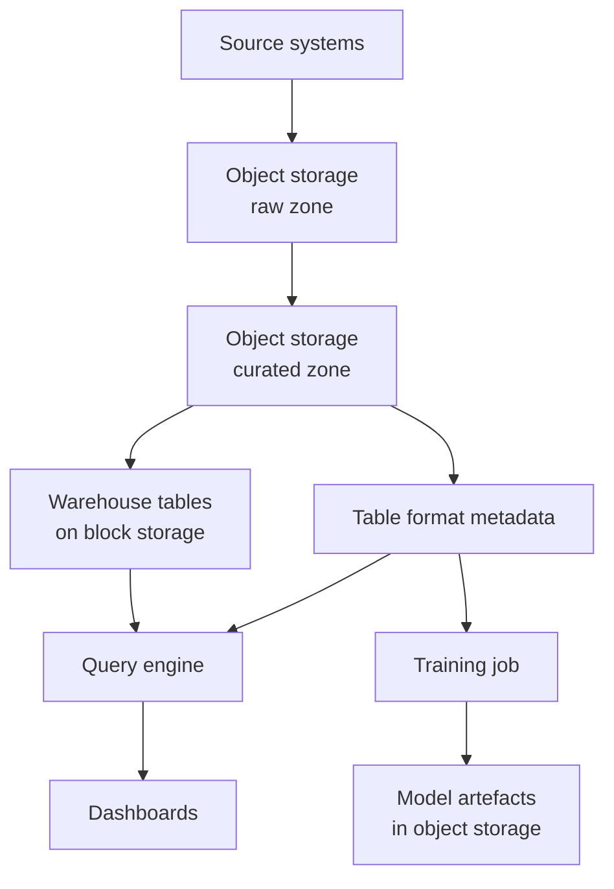
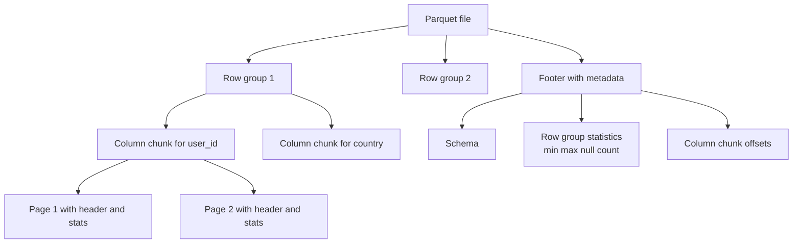
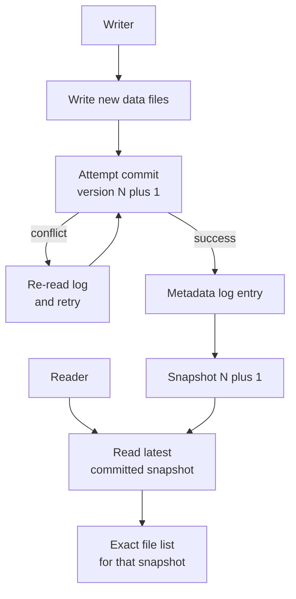
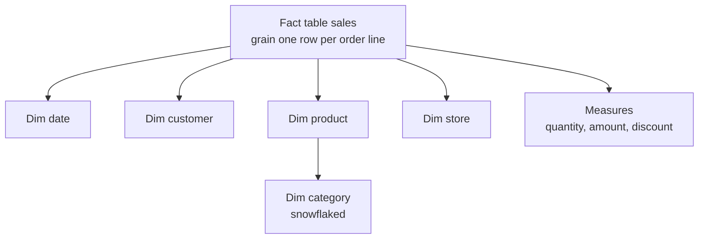
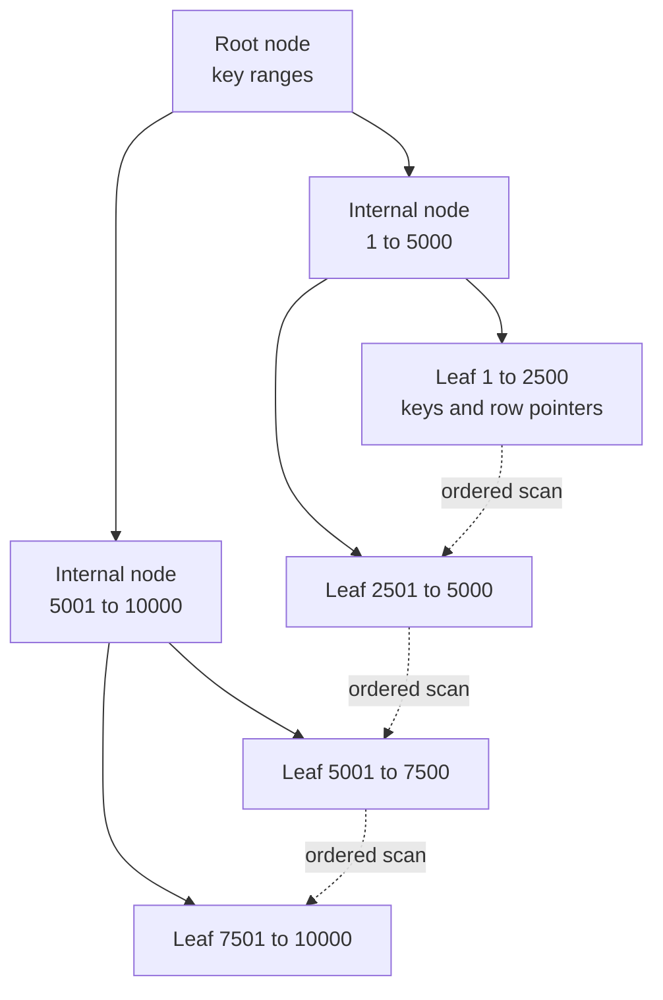
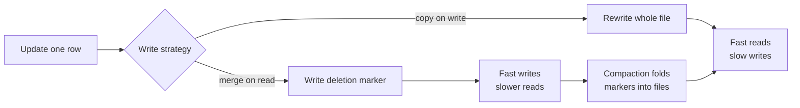

# Chapter 17: Data Storage, Formats, and Modelling

> **What this chapter covers** Where data physically lives, the file formats it lives in and why the choice matters, compression, table formats and the transaction log, partitioning and clustering, data modelling from normalisation through the layered pattern to modelling for machine learning, the database families and their index structures, the lake and warehouse and lakehouse patterns, query optimisation basics, and data contracts.
> **Prerequisites** Chapter 3 (Python for Machine Learning Engineering) and basic SQL. No prior data engineering experience assumed.
> **Where it is used** Every machine learning system that reads data from somewhere, which is all of them. The roles are data engineer, analytics engineer, machine learning engineer, and platform engineer. The topic bites hardest when a training job that took 20 minutes on a sample takes 14 hours on the full dataset.

Model code is a small fraction of a production machine learning system. The larger fraction reads, joins, reshapes, and validates data. An engineer who understands storage layout can make a pipeline ten times faster by changing a file format and a partition key, without touching a line of modelling code. This chapter is about that leverage.

---

## 17.1 Level 1: Foundations

### 17.1.1 Three storage layers

Storage comes in three shapes. The difference is the unit you address.

| Layer | Unit addressed | Interface | Latency | Scaling | Typical use |
|---|---|---|---|---|---|
| Block | Fixed-size block on a device | Attached disk, one machine at a time | Microseconds to low milliseconds | Vertically, per volume | Database data files, boot volumes |
| File | A file in a directory tree | Network file protocol, many machines | Low milliseconds | Moderately | Shared home directories, some training data |
| Object | A whole object under a key | HTTP with GET and PUT | Tens to hundreds of milliseconds | Effectively unbounded | Data lakes, backups, model artefacts |

**Block storage** is a raw device. It has no concept of a file; the filesystem on top provides that. It gives the lowest latency and supports in-place partial writes, which is why transactional databases sit on it. It attaches to one machine at a time and its capacity is fixed at provision time.

**File storage** adds a hierarchy and shared access across machines, with POSIX-style semantics including locking and partial writes. It is convenient and it is the most expensive per unit and the hardest to scale, because directory metadata becomes a bottleneck.

**Object storage** is a flat key-to-bytes map with metadata. Objects are immutable: you replace, you do not edit. There are no real directories, only key prefixes that tools display as folders. Listing is a paginated scan over a prefix and is slow relative to a filesystem. In exchange you get essentially unlimited capacity, high durability through replication, very low cost per unit, and access from any number of machines at once. Modern object stores offer read-after-write consistency for new objects, and the exact consistency guarantees have changed over time, so check your version.

The rule: object storage for anything big, cold, or shared. Block storage for anything a database owns. File storage when a legacy tool insists on POSIX semantics.


*Figure 17.1: Where each storage layer sits in a typical analytics and machine learning platform.*

### 17.1.2 Rows and columns

Every file format makes one fundamental choice: does it store a record's fields together, or a column's values together?

Take a table with columns `user_id`, `timestamp`, `country`, and 40 more, and a billion rows.

**Row layout** writes `user_id, timestamp, country, ...` for row 1, then all of row 2, and so on. To read one whole record, you read one contiguous region. To read one column, you touch every record.

**Columnar layout** writes all the `user_id` values, then all the `timestamp` values, then all the `country` values. To read three columns out of 43, you read three contiguous regions and skip the rest. To read one whole record, you touch 43 regions.

Analytics and machine learning read few columns over many rows. Transactional systems read whole records one at a time. That single observation explains most of this chapter.

Columnar layout has a second advantage that is easy to underestimate. A column holds values of one type with similar distribution, so it compresses far better than a mixed row. A country column with 200 distinct values across a billion rows compresses to a dictionary plus small integer codes. The same values scattered through rows compress poorly.

### 17.1.3 Why CSV and JSON cost you

CSV is a text file with delimiters. Its costs: no types, so every value is parsed from text on every read; no schema, so column meaning is positional convention; no compression unless you wrap the whole file, which then destroys the ability to read part of it; ambiguous quoting and escaping across dialects; and no way to skip columns or rows without reading them.

JSON adds nesting and self-description, and adds cost: field names are repeated in every record, parsing is slower than CSV, and there is still no efficient way to read one field. JSON Lines, one object per line, is the streamable variant and is the sane default when you must use JSON. Both are correct choices for configuration, for small interchange, and for logs written once and read rarely. Neither is a correct choice for a dataset you will read repeatedly.

### 17.1.4 What a table format adds

A directory of Parquet files is not a table. If a job writes ten files and crashes after six, a reader sees six files and thinks that is the data. There is no way to change a column type without rewriting everything. There is no way to see yesterday's state. Two writers overwrite each other.

A table format is a metadata layer over those files that provides atomic commits, a schema, snapshots you can read from, and a list of exactly which files belong to the table at each point in time. It converts a pile of files into something with database semantics. This is the single largest improvement in data infrastructure of the last decade.

### 17.1.5 Modelling in one paragraph

Data modelling is deciding what your tables represent and how they relate. Operational systems normalise, meaning each fact is stored once and tables reference each other by key, which keeps writes cheap and consistent. Analytical systems denormalise, meaning facts are pre-joined and repeated, which keeps reads cheap. Machine learning has a third requirement on top: every feature value must be as of a point in time, so that a model trained on history never sees a value that did not exist yet. That constraint shapes everything in level 3.

---

## 17.2 Level 2: Working knowledge

### 17.2.1 Parquet in depth

Apache Parquet is the default columnar file format. Understanding its internal layout is what lets you predict query performance.


*Figure 17.2: The Parquet physical layout, where the footer holds the statistics that make predicate pushdown possible.*

**Row group.** A horizontal slice of the table, typically 128 MB of data. Within a row group, data is stored column by column. The row group is the unit of parallelism: one task reads one row group.

**Column chunk.** All values of one column within one row group. Stored contiguously, so reading one column means reading one contiguous range per row group.

**Page.** A column chunk is divided into pages, typically around 1 MB uncompressed. The page is the unit of compression and encoding, and the smallest unit that can be read.

**Footer.** Written last, at the end of the file. It holds the schema, the offset of every column chunk, and per-row-group statistics for every column: minimum, maximum, null count, and distinct count where available. A reader opens a Parquet file by seeking to the end and reading the footer. This is why Parquet works well on object storage: one small ranged read gets you everything needed to plan, then a few more ranged reads get exactly the bytes you want.

**Encodings.** Applied before compression, and they do most of the work:

| Encoding | Mechanism | Best for |
|---|---|---|
| Dictionary | Replace values with indices into a dictionary of distinct values | Low-cardinality strings, which is most string columns |
| Run length | Store value and repeat count | Sorted or highly repetitive columns |
| Bit packing | Use only the bits needed for the value range | Small integers, dictionary indices |
| Delta | Store differences between consecutive values | Timestamps, monotonic identifiers |
| Byte stream split | Separate the bytes of floating-point values into streams | Floating-point columns, improves compressibility |

Dictionary encoding is applied automatically until the dictionary exceeds a size limit, at which point the writer falls back to plain encoding for the rest of that chunk. This creates a sharp performance cliff on high-cardinality string columns, and it is a common cause of a file being far larger than expected.

**Predicate pushdown.** Given `WHERE event_date = '2026-03-01'`, the reader consults the footer statistics. If a row group's minimum and maximum for `event_date` do not span that value, the entire row group is skipped without being read. With page-level statistics, the same happens at page granularity. This is why sorting data by the column you filter on is one of the highest-value things you can do: sorted data gives tight, non-overlapping min and max ranges per row group, so a selective filter reads almost nothing. Unsorted data gives every row group a min and max spanning the whole range, so nothing can be skipped and the statistics are useless.

**Worked example: what pushdown saves.** One billion rows, 50 columns, 1 TB uncompressed, 200 GB as compressed Parquet. Query reads 3 columns with a filter matching 1 percent of rows.

Column projection: 3 of 50 columns, so approximately $200 \times \frac{3}{50} = 12$ GB.

If sorted on the filter column, row group pruning eliminates about 99 percent: $12 \times 0.01 = 0.12$ GB. Add a small margin for row groups straddling the boundary, call it 0.15 GB.

If unsorted, pruning eliminates nothing and you read 12 GB. The sort is worth an 80-fold reduction in bytes read. Compared to reading a CSV of the same data, 1 TB against 0.15 GB is a factor of about 6700.

**Listing 17.1: writing Parquet with the settings that matter.**

```python
import pyarrow as pa, pyarrow.parquet as pq

table = pa.Table.from_pandas(df, preserve_index=False)
table = table.sort_by([("event_date", "ascending"), ("user_id", "ascending")])

pq.write_table(
    table, "events.parquet",
    compression="zstd", compression_level=3,
    row_group_size=1_000_000,        # rows, aim for ~128 MB on disk
    data_page_size=1024 * 1024,      # 1 MB pages
    use_dictionary=True,
    write_statistics=True,
    write_page_index=True,           # page-level stats, check your version
    store_schema=True,
)
```

The sort on the first line of the body is the highest-impact line in the listing, because it is what makes the statistics selective. `write_page_index` enables page-level pruning, which is finer-grained than row-group pruning and is not enabled by default in every version. `row_group_size` is specified in rows, so you must divide your target byte size by the average row width to set it, and getting it badly wrong in either direction costs you: too small and the footer bloats with metadata, too large and parallelism suffers and memory spikes on read.

### 17.2.2 ORC and Avro, briefly

**ORC** (Optimized Row Columnar) is columnar, similar in spirit to Parquet, with stripes instead of row groups and built-in lightweight indexes including optional bloom filters per column. It originated in the Hive ecosystem and remains strong there. Where both are supported, Parquet has broader tool support outside that ecosystem. Feature comparisons date quickly, so check your version.

**Avro** is row-oriented with a schema embedded in every file and strong, well-specified schema evolution rules. It is the standard format for event streams and for message payloads, and it is the right choice for write-heavy append workloads and for records read whole. It is the wrong choice for analytical scans.

**Choice criteria.**

| Need | Format |
|---|---|
| Analytical scans, few columns of many rows | Parquet |
| Streaming events, whole-record reads, schema evolution over a wire | Avro |
| Hive-centric platform with existing ORC tooling | ORC |
| Human inspection, configuration, small interchange | JSON or CSV |
| Nested semi-structured data queried analytically | Parquet, which supports nesting natively |

### 17.2.3 Compression

Compression is applied per page in Parquet, so the file remains splittable and individually readable regardless of codec. The trade is bytes against processor cycles.

| Codec | Ratio | Compress speed | Decompress speed | When |
|---|---|---|---|---|
| None | 1.0 | n/a | n/a | Already-compressed payloads |
| Snappy | Moderate | Very fast | Very fast | Hot data read repeatedly, processor-bound clusters |
| LZ4 | Moderate | Very fast | Fastest | Latency-sensitive reads |
| Zstandard | High, tunable by level | Fast at low levels | Fast | The modern default |
| Gzip | High | Slow | Moderate | Compatibility with old tooling |
| Brotli | Highest | Slowest | Moderate | Write-once, read-many archives |

Zstandard at level 3 is the sensible default: close to Gzip's ratio at close to Snappy's speed. Level 1 for hot data, levels 9 to 12 for cold archives where the write cost is paid once.

**Worked example: the compression trade.** 500 GB of raw Parquet-encoded data. Assume Snappy gives 3.3-fold and compresses at 400 MB/s per core, and Zstandard level 3 gives 4.5-fold and compresses at 250 MB/s per core. These ratios are illustrative and depend entirely on your data, so measure yours.

$$\text{Snappy size} = \frac{500}{3.3} = 151.5\ \text{GB}, \qquad \text{Zstd size} = \frac{500}{4.5} = 111.1\ \text{GB}$$

Saving 40.4 GB per write. If the data is read 50 times before being replaced, and network or object-store throughput is the bottleneck at say 200 MB/s per reader, the read saving is

$$50 \times \frac{40.4 \times 1024\ \text{MB}}{200\ \text{MB/s}} = 50 \times 207\ \text{s} = 10{,}350\ \text{s} \approx 2.9\ \text{core-hours}$$

The extra write cost, at a 150 MB/s throughput difference over 500 GB of input:

$$\frac{500 \times 1024}{250} - \frac{500 \times 1024}{400} = 2048 - 1280 = 768\ \text{s} \approx 0.21\ \text{core-hours}$$

Zstandard wins by more than an order of magnitude here because the data is read many times. Reverse the read count to 1 and Snappy wins. The general rule follows directly: choose the codec by the read-to-write ratio.

### 17.2.4 Partitioning

Partitioning physically separates data by a column value, conventionally in the directory path.

```
events/year=2026/month=03/day=01/part-0000.parquet
events/year=2026/month=03/day=02/part-0000.parquet
```

A query filtering on `day` reads only the matching directories. This is partition pruning, and it happens before any file is opened, which makes it more powerful than statistics-based pruning.

**Choosing a key.** Rules, in priority order:

1. Partition on the column that appears in the `WHERE` clause of most queries. Usually a date.
2. Aim for partitions of at least 100 MB, ideally around 1 GB.
3. Keep total partition count in the low thousands, not millions.
4. Never partition on a high-cardinality column such as a user identifier.
5. Prefer one or two levels. Three is usually a mistake.

**Worked example: the over-partitioning failure.** 100 GB of data per year, partitioned by date only: 365 partitions of about 274 MB each. Reasonable. Now add `country` with 200 values: $365 \times 200 = 73{,}000$ partitions averaging 1.4 MB. Now add `device_type` with 5 values: 365000 partitions averaging 280 KB.

Everything degrades. Listing the table requires enumerating 365000 prefixes, which on object storage is thousands of paginated list calls before a single byte of data is read. Each tiny file has a Parquet footer of a few kilobytes, so metadata becomes a meaningful fraction of the data. Compression is worse because dictionaries cannot amortise across a small file. Each file is a separate task with fixed scheduling overhead, so a job that should take one minute takes twenty. This is the small files problem and it is the most common self-inflicted data engineering wound.

The fix is fewer partition levels plus sorting within the partition. Partition by date, sort by country and device inside each partition, and let Parquet statistics prune within the file. You get most of the pruning benefit with none of the file count.

**Partitioning against clustering.** Partitioning is physical separation into directories, is coarse, and prunes at the directory level before opening files. Clustering, also called sorting, Z-ordering, or liquid clustering depending on the system, is ordering data within files so that statistics become selective, is fine-grained, prunes at the row group or page level, and can be effective on several columns at once. Use partitioning for the one dominant low-cardinality filter, usually time, and clustering for everything else.

Z-ordering is worth one sentence of mechanism: it interleaves the bits of several column values to produce a single sort key that preserves locality in multiple dimensions at once, so a filter on any one of those columns still prunes reasonably well. It is a compromise; a single-column sort beats Z-order on that column and loses on the others.

### 17.2.5 Reading data for training

Training jobs read differently from analytical queries, and a layout tuned only for SQL can be poor for training.

**Random access against sequential access.** Stochastic gradient descent wants shuffled samples. Object storage wants large sequential reads. Reconciling them is the core problem. The standard solution is a shuffle buffer: read large contiguous blocks sequentially, hold several thousand samples in memory, and sample randomly from that buffer. This gives approximate shuffling at sequential read cost. It is approximate, so also shuffle the file order every epoch and pre-shuffle the data once at write time, because a buffer of 10000 samples over a file sorted by label will still hand the model long runs of one class.

**File count for training.** The right number of files is driven by reader parallelism, not by query planning. With $W$ worker processes you want at least $W$ files, and ideally a few times $W$ so stragglers can be balanced, with each file large enough to amortise the open cost. For 64 workers, a few hundred files of 100 to 500 MB is a reasonable target. One enormous file serialises reading; a hundred thousand tiny ones spends all the time opening.

**Column pruning at training time.** A training job reading 30 features from a 400-column curated table benefits from exactly the same projection pushdown as a query. Materialise the training view as its own table rather than reading and discarding, if the job runs often.

**Formats built for this.** Some ecosystems prefer a sharded record format such as TFRecord or WebDataset tar shards for training, because sequential decode of an already-serialised example is faster than reconstructing rows from columns. The trade is that those formats are opaque to SQL, so you keep two representations. A defensible default is Parquet as the single source of truth plus a materialisation step to a shard format only when profiling shows the reader is the bottleneck.

**Worked example: is the reader the bottleneck?** A job trains at 1200 samples per second per accelerator with 8 accelerators, so 9600 samples per second. At 12 KB per sample decoded, that is $9600 \times 12\ \text{KB} = 115\ \text{MB/s}$ of decoded throughput, and roughly 30 MB/s from storage at a 4-fold compression ratio. That is comfortably within a single network link, so storage bandwidth is not the constraint. Now raise the sample to a 500 KB image: $9600 \times 500\ \text{KB} = 4.8\ \text{GB/s}$, which exceeds most single-node network budgets, and the answer is local caching, lower-resolution decoding, or more readers. Do this arithmetic before optimising, because the common assumption that the data pipeline is the bottleneck is wrong roughly as often as it is right.

---

## 17.3 Level 3: Depth

### 17.3.1 Table formats and the transaction log

An open table format sits above a directory of data files and provides atomicity, snapshots, and schema management. The dominant approach is a log of metadata commits.


*Figure 17.3: The optimistic commit protocol, where data files are written first and made visible only by an atomic metadata commit.*

**How it works.** Writers write new data files into the table's storage, which nobody can see yet because no metadata references them. Then the writer attempts an atomic commit of a new metadata version that lists the files added and removed. The atomicity primitive differs by system: a conditional put, a file create that fails if the name exists, or a row in a catalog database. If another writer committed first, the writer re-reads, checks whether the conflict is real, and retries. Readers resolve the current version and read exactly the files it lists.

Several properties fall out of this design at once.

**Atomicity.** A crashed job leaves orphan data files that no metadata references. Readers never see them. Cleanup is a maintenance job, not a correctness issue.

**Snapshot isolation.** A reader pins a version at the start and reads a consistent view even while writers commit. Long-running training jobs and long queries do not see data change under them. This is the property that eliminates an entire category of irreproducible results.

**Time travel.** Because old versions list old file sets, and old files are retained until vacuumed, you can query the table as of a version or a timestamp. This is how you reproduce a training set exactly, how you debug a pipeline regression, and how you recover from a bad write. Retention is bounded by a configured period, after which vacuum deletes unreferenced files, so record the version identifier with every training run rather than relying on a timestamp still being resolvable.

**Schema evolution and enforcement.** The schema lives in metadata. Adding a nullable column is a metadata-only operation. Renaming is safe when the format tracks columns by a stable identifier rather than by name or position, which the modern formats do. Widening a type, for example a 32-bit to 64-bit integer, is usually permitted; narrowing is not. Enforcement means a write with a mismatched schema is rejected at commit rather than silently corrupting the table, which is the behaviour a raw file directory cannot give you.

**Compaction.** Streaming and frequent small writes produce many small files. Compaction rewrites them into fewer, larger files and commits the swap atomically, so readers see either the old set or the new set and never a mixture. Run it on a schedule. The target file size is the same 128 MB to 1 GB range as row groups. Compaction interacts with time travel, because the pre-compaction files must be retained for the retention window, so storage temporarily grows.

**Clustering and data skipping.** The metadata layer keeps per-file statistics, so the engine can skip files without opening them. Combined with sorting or Z-ordering during compaction, this is what makes selective queries on a large table fast. Some systems now maintain clustering incrementally rather than requiring a full rewrite; behaviour and naming vary, so check your version.

**The named formats.** Delta Lake, Apache Iceberg, and Apache Hudi are the three open table formats in wide use. All three provide atomic commits, snapshot isolation, time travel, and schema evolution. They differ in metadata structure, in catalog integration, in how they handle row-level updates, and in which engines support them best. Feature parity moves quickly and vendor comparisons date within months, so evaluate against your engines and your catalog at the time you choose, and treat any published comparison as a snapshot. Iceberg's hidden partitioning, where the partition transform is recorded in metadata so queries need not filter on a derived partition column, is a genuine design difference worth knowing about.

**Listing 17.2: what a metadata commit conceptually contains.**

```json
{
  "version": 412,
  "timestamp": "2026-03-11T09:14:02Z",
  "operation": "MERGE",
  "schema_id": 3,
  "add": [
    {"path": "date=2026-03-11/part-0007.parquet", "size": 134217728,
     "records": 1048576,
     "stats": {"min": {"event_ts": "2026-03-11T00:00:01Z"},
               "max": {"event_ts": "2026-03-11T23:59:58Z"},
               "nulls": {"country": 12}}}
  ],
  "remove": [
    {"path": "date=2026-03-11/part-0003.parquet", "deletion_ts": 1773478442}
  ]
}
```

The `stats` block is what enables file skipping without opening the file. The `remove` entry does not delete anything; it marks the file as absent from this version onward, which is exactly what makes time travel possible and why a separate vacuum step is needed to reclaim space. This shape is illustrative; each format's actual metadata differs in structure and field names.

### 17.3.2 Data modelling

**Normalisation.** Third normal form means every non-key column depends on the key, the whole key, and nothing but the key. It removes redundancy, so a fact is updated in one place and cannot become inconsistent. It costs joins on read. Correct for systems where writes are frequent and correctness is critical.

**Denormalisation.** Pre-join and repeat data so reads need no joins. Costs storage and update complexity: a customer's country stored in a billion fact rows must be updated in a billion places, or accepted as a historical record of what it was at the time. Correct for analytical systems, where the second interpretation is usually the one you want.

**Star schema.** One central fact table holding measurements at a defined grain, surrounded by dimension tables holding descriptive attributes, joined by foreign keys. Kimball and Ross, "The Data Warehouse Toolkit", is the standard reference.

The *grain* is the single most important decision. It is the statement of what one row means: "one row per order line per order", "one row per user per day". Write it down before designing anything. Every measure in the fact table must be true at that grain, and mixing grains in one table is the root cause of most double-counted metrics in the industry.

**Snowflake schema** normalises the dimensions further, so a product dimension references a category table which references a department table. It saves storage and adds joins. With columnar storage and dictionary encoding the storage saving is small, so star is the default and snowflake is for genuinely deep hierarchies that change independently.


*Figure 17.4: A star schema with one snowflaked dimension, showing the grain stated explicitly on the fact table.*

**Slowly changing dimensions.** A customer moves country. What should a report of last year's sales by country show?

| Type | Behaviour | Result | Use |
|---|---|---|---|
| Type 0 | Never changes | Original value forever | Immutable attributes such as birth date |
| Type 1 | Overwrite | Only the current value exists, history rewritten | Corrections of genuine errors |
| Type 2 | New row with validity dates and a current flag | Full history, correct point-in-time joins | The default for anything analytically meaningful |
| Type 3 | Add a previous-value column | One step of history only | Rare, for a single planned change |
| Type 4 | Current table plus a separate history table | Fast current reads, full history available | Very large dimensions |
| Type 6 | Combination of 1, 2 and 3 | Current and historical value on every row | When both views are needed constantly |

Type 2 is the important one. Each row carries `valid_from`, `valid_to`, and `is_current`. A fact row joins to the dimension row whose validity interval contains the fact's timestamp. This is exactly the mechanism that prevents the machine learning failure mode described below, and it is why Type 2 and point-in-time correctness are the same idea in two vocabularies.

**The layered pattern.** Often called medallion, with bronze, silver, and gold layers.

| Layer | Content | Schema | Consumers |
|---|---|---|---|
| Bronze or raw | Exact copy of source, append-only, with ingestion metadata | Source schema, permissive | Reprocessing, audit |
| Silver or curated | Cleaned, typed, deduplicated, conformed keys, quality-checked | Enforced, documented | Analysts, feature pipelines |
| Gold or serving | Aggregated, joined, business-defined | Enforced, stable contract | Dashboards, applications, serving |

The discipline that makes it work: bronze is never edited, only appended, because it is your ability to reprocess when a bug is found in silver logic. Transformations are deterministic functions of the layer below, so the whole chain can be rebuilt. Quality checks run at the bronze-to-silver boundary and failures quarantine rather than propagate.

**Modelling for machine learning.** The grain is almost always entity by time: one row per entity per point in time, with features computed from data available strictly before that time and a label from data after it.

The failure mode is leakage, and the most common form is target leakage through time. If you join a customer dimension to compute "customer lifetime value" as a feature for a churn model, and the dimension holds the current value, then for a training row from January you have injected information from December. The model learns a relationship that does not exist at prediction time, validates beautifully, and fails in production. Type 2 dimensions with an as-of join prevent this. So do feature stores (Chapter 20), which exist largely to make point-in-time correctness the default rather than a thing you must remember.

**Listing 17.3: a point-in-time correct as-of join.**

```sql
-- One row per entity per prediction time, features as of strictly before it.
SELECT
    e.entity_id,
    e.prediction_ts,
    e.label,
    f.feature_a,
    f.feature_b,
    f.feature_ts
FROM entity_times AS e
LEFT JOIN LATERAL (
    SELECT feature_a, feature_b, feature_ts
    FROM features AS f
    WHERE f.entity_id = e.entity_id
      AND f.feature_ts < e.prediction_ts      -- strict, not <=
    ORDER BY f.feature_ts DESC
    LIMIT 1
) AS f ON TRUE;
```

Two details decide correctness. The comparison is strictly less than, because a feature computed at exactly the prediction timestamp may incorporate the event you are predicting. And the subquery takes the most recent qualifying row rather than joining on equality, because features arrive at irregular times and the correct value is the latest one known at that moment. `LATERAL` syntax and support vary by engine, so check your version; the equivalent in Spark is a window function partitioned by entity and ordered by time, and in some engines an `ASOF JOIN` is provided directly.

### 17.3.3 Database families

**Relational engines.** Rows, a fixed schema, transactions with ACID guarantees, and a query planner. The indexes that matter:

*B-tree* is the default. A balanced tree with high fanout, so a lookup in a billion-row table takes about four or five block reads. It supports equality, range scans, prefix matching on a composite key, and ordered retrieval, which lets it satisfy an `ORDER BY` without sorting. A composite index on `(a, b, c)` serves predicates on `a`, on `a` and `b`, and on all three, but not on `b` alone. That is the leftmost prefix rule and it decides how you order composite index columns.

*Hash index* maps a key to a bucket. Constant-time equality lookup, slightly faster than a B-tree for that case, and useless for ranges or ordering. Narrow applicability.

*Covering index* includes extra columns so the query is answered from the index alone without touching the table. Large win on read-heavy queries, at the cost of index size and slower writes.

*Partial index* covers only rows matching a predicate, for example only active records. Small, cheap to maintain, and effective when queries always carry the same filter.

Every index makes writes slower, since each insert updates every index, and consumes storage and cache. Indexes are not free and an unused index is pure cost. Most engines expose index usage statistics; check them and drop what is never used.


*Figure 17.5: A B-tree, where high fanout keeps depth small and the linked leaves are what make range scans and ordered retrieval cheap.*

The linked leaf level in the figure is the part people forget. It is why a B-tree serves `BETWEEN` and `ORDER BY` and a hash index does not: once the search descends to the first qualifying leaf, the range is read by following sibling pointers with no further descents.

**Worked example: index depth.** With 8 KB pages, a 16-byte key and an 8-byte pointer, an internal node holds roughly $8192 / 24 \approx 340$ entries. Three levels address $340^3 \approx 3.9 \times 10^7$ leaf entries and four levels $1.3 \times 10^{10}$. So a billion-row table is a four-level index, and a point lookup is four page reads, of which the top two or three are almost always in the buffer cache. That is why a properly indexed lookup is fast almost independently of table size, and why the interesting question is never index depth but whether the index is usable by the predicate at all.

**Analytical engines.** Columnar storage plus vectorised execution. Instead of processing one row at a time through a chain of function calls, the engine processes batches of a few thousand values from one column in tight loops that the processor can pipeline and vectorise. Combined with late materialisation, where only the columns actually needed are reconstructed into rows, and compression that is decoded lazily, this gives the order-of-magnitude advantage over row engines on scan-heavy queries. Abadi, Madden and Hachem (2008), "Column-Stores vs. Row-Stores", is the paper that established why the gain comes from the whole execution model and not from the layout alone.

**Key-value stores.** A map from key to opaque value, with get, put, and delete. Extremely fast and horizontally scalable, with no joins and no secondary queries unless you build them. Use for caches, sessions, feature serving, and any access pattern that is genuinely a lookup by key. The design discipline is that the key must encode everything you will query by.

**Document stores.** Key-value where the value is a structured document the engine can index and query inside. Flexible schema, which is genuinely useful for heterogeneous records and genuinely dangerous because the schema still exists, it is just now implicit in application code and unenforced. Good for content, catalogues, and configuration.

**Vector databases.** Store high-dimensional vectors and answer nearest-neighbour queries. The index types are those covered in Chapter 15, level 2: flat for exact search, inverted file for clustered search, HNSW graphs for the best recall-latency trade on medium corpora, and product quantisation for memory reduction. The operational considerations specific to a database rather than a library are metadata filtering, which is harder than it looks because filtering after the approximate search can return fewer than k results while filtering during the search degrades the graph traversal; incremental updates and deletes, which graph indexes handle poorly and typically implement as tombstones needing periodic rebuild; and consistency between the vector index and the source of truth for the underlying text. Many teams find that a relational or search engine with vector support is sufficient and avoids a second system.

### 17.3.4 Nested data and how columnar formats store it

Analytical data is often nested: a record has a list of items, each with its own fields. A naive columnar format cannot store that, because "all values of column X" is no longer a flat sequence when some records have three items and others none.

Parquet solves it with the record shredding and assembly algorithm from Melnik et al. (2010), "Dremel". Every leaf field becomes its own flat column, accompanied by two small integers per value:

- The *definition level* says how many of the optional or repeated ancestors of this value are actually present. It is how a null at any depth is encoded without storing a placeholder value.
- The *repetition level* says at which level in the path a new repeated element begins. It is how list boundaries are reconstructed.

With those two integers, a flat sequence of leaf values reconstructs the original nested records exactly, and each leaf column is still independently readable and compressible. Both integers have a small known range, so they bit-pack to a few bits each.

The practical consequences. Reading one leaf field deep inside a nested structure is cheap, because it is one column. Deeply nested and highly repeated structures inflate the level overhead, so very deep schemas cost more than flat ones. And an engine's support for pushing predicates down into nested fields is uneven, so a filter on a field inside a list may not prune at all; check your version and flatten the hot path into a top-level column if it does not.

The general guidance: keep nesting shallow for anything you filter or join on, promote frequently used nested fields to top-level columns during the bronze-to-silver transformation, and reserve deep nesting for payloads you read whole.

### 17.3.5 Lake, warehouse, lakehouse

| Property | Warehouse | Lake | Lakehouse |
|---|---|---|---|
| Storage | Proprietary, often on block storage | Open files on object storage | Open files on object storage |
| Schema | Enforced on write | On read, often absent in practice | Enforced on write by the table format |
| Transactions | Yes | No | Yes |
| Workloads | SQL analytics | Any, including training | Both |
| Cost per byte | Higher | Lowest | Low |
| Lock-in risk | Higher | Low | Low |
| Typical failure | Cannot hold raw or unstructured data economically | Becomes a swamp nobody trusts | Operational complexity, maintenance jobs to run |

The lakehouse is a lake plus a table format plus a query engine, giving warehouse semantics over open files. The reason it matters for machine learning specifically is that training jobs read files directly with their own readers while analysts query the same tables with SQL, and both see the same consistent, versioned data. Without it you maintain two copies and spend your time reconciling them.

The honest caveat: a lakehouse is not free. You now own compaction jobs, vacuum jobs, statistics maintenance, and a catalog. A team without the capacity to run those will get worse results than the same team on a managed warehouse.

### 17.3.6 Query optimisation basics

**Reading a plan.** `EXPLAIN` shows the planner's chosen plan; the analysed variant actually runs it and reports real numbers. Read from the innermost operator outward. The three things to look for, in order:

1. *Estimated against actual rows.* A large discrepancy means the statistics are wrong, and every decision above that node is built on a bad estimate. This is the single most common root cause of a bad plan.
2. *The access method.* A sequential scan on a large table with a selective filter means an index is missing or unusable, often because the filter wraps the column in a function.
3. *The join strategy and order.* Joining the two largest tables first, or a nested loop over a large input, is usually where the time went.

**Join strategies.**

| Strategy | Mechanism | Cost | Best when |
|---|---|---|---|
| Nested loop | For each row of the outer, scan or probe the inner | $O(n \cdot m)$, or $O(n \log m)$ with an index | Outer is tiny and inner is indexed |
| Hash join | Build a hash table on the smaller input, probe with the larger | $O(n + m)$, needs memory for the build side | Equality joins, one side fits in memory |
| Sort-merge join | Sort both inputs, then merge in one pass | $O(n \log n + m \log m)$, or linear if already sorted | Both large, or already sorted, or a non-equality join |

In distributed engines a fourth dimension appears: whether the join requires a shuffle. A broadcast join copies a small table to every node and avoids shuffling the large one, which is the single biggest distributed query optimisation. Chapter 18 covers this in depth.

**Worked example: join strategy.** Join 100 million fact rows to a 10000-row dimension. Nested loop with an index on the dimension: $10^8 \times \log_2(10^4) \approx 10^8 \times 13.3 = 1.33 \times 10^9$ probe operations. Hash join: build a 10000-entry table, then $10^8$ constant-time probes, so roughly $10^8$ operations plus a negligible build. The hash join does about 13 times less work and the build side fits comfortably in memory. This is why hash join is the default for equality joins on mismatched sizes, and why a planner choosing nested loop here means its row estimate for the dimension is wrong.

**Shuffle and data movement.** In a distributed engine, the dominant cost is rarely computation. It is moving rows across the network so that matching keys land on the same worker. A join or a grouping on a key that is not already co-located triggers a shuffle: every worker partitions its rows by a hash of the key, writes them, and every worker reads the partition assigned to it. Cost is roughly proportional to the bytes shuffled, and skew makes it worse, because one hot key sends a disproportionate share to one worker and the whole stage waits for it. The two remedies are broadcasting the small side, which eliminates the shuffle of the large side entirely, and pre-partitioning or bucketing both tables on the join key at write time, which eliminates the shuffle on every subsequent join. Chapter 18 develops this in detail.

**Statistics.** The planner chooses using estimated cardinalities from table statistics: row counts, distinct value counts, null fractions, and histograms of value distribution. Stale statistics produce bad plans, and the classic symptom is a query that was fast yesterday and is slow today with no code change, after a bulk load. The fixes are to refresh statistics after significant data changes, to increase histogram resolution on skewed columns, and to avoid wrapping indexed columns in functions, since `WHERE date(ts) = '2026-03-01'` cannot use an index on `ts` while `WHERE ts >= '2026-03-01' AND ts < '2026-03-02'` can.

Correlated predicates are the planner's persistent weakness. It typically assumes independence, so for `country = 'FR' AND city = 'Paris'` it multiplies two selectivities and estimates far too few rows, because the columns are strongly dependent. Multi-column statistics address this where supported; check your version.

---

## 17.4 Level 4: Mastery

### 17.4.1 Where the standard advice is wrong

**"Always partition by date."** Correct for append-mostly event data queried by time. Wrong for a dimension table read in full on every join, where partitioning adds listing overhead and prunes nothing. Wrong when the dominant filter is something else entirely, in which case you are optimising the query nobody runs. Look at the actual query log before choosing, and if you cannot get one, instrument to produce one before committing to a layout.

**"Columnar is always better."** Columnar loses on point lookups of whole records, on high-frequency small writes, and on workloads reading most columns of few rows. A serving path that fetches one user's 200 features by key wants a key-value store, not a Parquet scan. Hybrid layouts exist: PAX-style organisation stores column chunks within a row group so that a row group is a self-contained horizontal slice, which is exactly what Parquet does and is why it is less bad at record retrieval than a pure columnar layout would be.

**"Normalise for correctness."** In an analytical store, denormalisation is often *more* correct, because a fact joined to the current dimension value silently rewrites history. A Type 2 dimension or a denormalised snapshot of the attribute as it was preserves what actually happened. Correctness and normalisation are not synonyms once time is involved.

**"The lakehouse replaces the warehouse."** For many organisations it does. For those whose workload is high-concurrency, low-latency SQL over structured data with a small team, a managed warehouse is cheaper in total cost including the engineering time the lakehouse's maintenance jobs consume. Judge on team capacity, not on architectural fashion.

### 17.4.2 Advanced layout

**File size distribution, not average.** A table with an average file size of 200 MB and a long tail of 2 MB files behaves like a small-files table, because scheduling overhead is per task. Monitor the distribution and the count of files under a threshold, not the mean.

**Sort key selection.** When sorting on multiple columns, order them by descending selectivity in typical filters, with the caveat that only the leading column gets tight ranges. If you need pruning on several columns equally, Z-ordering is the compromise. If one column dominates queries, sort on it alone and accept the others.

**Bloom filters.** Some formats support per-column bloom filters, which answer "this file definitely does not contain value X" cheaply. They complement min and max statistics, which are useless for high-cardinality equality filters on unsorted data, since every file's range spans everything. A bloom filter on a user identifier column turns a full scan into a handful of file reads. The cost is filter storage and a false-positive rate you configure.

**Deletion vectors and merge-on-read.** Updating a row in an immutable file format requires rewriting the file, which is expensive for a one-row change. Merge-on-read writes a small marker recording which rows are deleted or changed, and readers apply it on the fly. This makes writes cheap and reads slightly more expensive, with the cost growing until compaction folds the markers in. Copy-on-write does the opposite: rewrite on change, so reads stay fast and writes are expensive. Choose by your read-to-write ratio and run compaction on a schedule either way. Naming and availability differ by format and version.


*Figure 17.6: The copy-on-write and merge-on-read trade, with compaction as the bridge between them.*

### 17.4.3 Data contracts and schema governance

A data contract is an explicit, versioned agreement between a data producer and its consumers. It specifies the schema with types and nullability, semantic definitions of each field including units and allowed values, the grain and the primary key, freshness and completeness guarantees, the deprecation policy, and an owner.

The problem it solves is real and expensive. An application team renames a column in an operational database. Twelve downstream pipelines break. Nobody knew they existed. The contract makes the dependency explicit and makes the breaking change a negotiated event rather than an incident.

Implementation is not a document. It is:

- A schema registry holding the versioned schema, with compatibility rules checked automatically. Backward compatible means new consumers can read old data; forward compatible means old consumers can read new data; full means both. For event streams, backward compatibility is usually the requirement, and adding an optional field satisfies it while removing a field or changing a type does not.
- Producer-side validation, so bad data is rejected at the boundary rather than discovered three layers downstream.
- Continuous integration checks that fail a producer's build when a change violates the contract.
- Consumer registration, so the producer knows who depends on the data.
- Data quality tests on the dataset itself: row counts within expected bounds, null rates, uniqueness of keys, referential integrity, freshness, and distribution checks. Chapter 20 covers these in depth.

**Listing 17.4: a contract as an enforceable artefact.**

```yaml
dataset: curated.user_events
owner: platform-data
version: 3
grain: "one row per event_id"
primary_key: [event_id]
freshness_sla_minutes: 30
schema:
  - name: event_id
    type: string
    nullable: false
    description: "Globally unique event identifier, UUID v4."
  - name: user_id
    type: string
    nullable: false
    description: "Stable pseudonymous user identifier. Not an email."
  - name: event_ts
    type: timestamp
    nullable: false
    description: "Event time in UTC, from the client, clamped to server time."
  - name: amount_minor
    type: int64
    nullable: true
    description: "Transaction amount in minor currency units. Null for non-transactions."
quality_checks:
  - type: not_null
    columns: [event_id, user_id, event_ts]
  - type: unique
    columns: [event_id]
  - type: accepted_range
    column: amount_minor
    min: 0
    max: 100000000
  - type: freshness
    column: event_ts
    max_lag_minutes: 30
compatibility: backward
```

Three fields do disproportionate work. `grain` prevents the double-counting that follows from ambiguity about what a row means. The `amount_minor` description states the units, which is the field comment that prevents an entire class of financial reporting error. And `compatibility: backward` is machine-checkable, so a producer cannot merge a breaking change without an explicit version bump and a migration.

### 17.4.4 The arguments senior engineers have

**How much modelling before you know the questions.** One camp models carefully up front and delivers slowly; the other lands raw data and models as demand emerges, and accumulates twelve inconsistent definitions of "active user". The workable position is to enforce the raw layer's integrity absolutely, model the silver layer conservatively around clearly understood grains, and let the gold layer proliferate and be rebuilt, since it is cheap to rebuild from silver.

**Open table formats and catalog gravity.** Open file and table formats reduce storage lock-in substantially. Lock-in then migrates to the catalog, to the transformation code, and to the compute engine's dialect. When evaluating, ask what it would cost to point a different engine at the same tables, and get an actual answer rather than an assurance.

**Streaming-first or batch-first.** Streaming gives freshness and costs operational complexity, exactly-once reasoning, and harder reprocessing. Most organisations discover that the number of use cases genuinely needing sub-minute freshness is smaller than the number claiming to. Start batch, measure the value of freshness per use case, and make streaming an exception justified by a number. Chapter 19 covers the mechanics.

**Does the semantic layer belong in the warehouse.** Defining metrics once in a semantic layer stops dashboards disagreeing. Critics note it adds a component, a language, and a deployment. The empirical argument for it is simple: if two dashboards in your organisation currently disagree about revenue, you already have the problem the semantic layer solves and are paying for it in meetings.

### 17.4.5 Judgment

Design for the read pattern you can measure, not the one you imagine. Get a query log before choosing a layout.

Make the expensive operation rare rather than fast. Sorting once at write time beats scanning a thousand times at read time.

Prefer formats and layouts that a different engine can read. The engine will change; the data will outlive it.

Instrument file counts, file size distribution, partition counts, and bytes scanned per query. These four numbers predict almost every data performance incident before it happens.

Write the grain down. Most metric disputes in an organisation are grain disputes that nobody has named.

---

## 17.5 Subtopic checklist

| Subtopic | You should be able to |
|---|---|
| Storage layers | Choose block, file, or object storage for a given workload and justify it |
| Object store semantics | Explain immutability, prefix listing, and why listing cost shapes layout |
| Row versus columnar | Explain the layout difference and predict which wins for a given query |
| CSV and JSON costs | List four concrete costs and say when each format is still correct |
| Parquet internals | Name row group, column chunk, page, and footer and say what each does |
| Encodings | Explain dictionary, run length, bit packing, and delta encoding |
| Predicate pushdown | Explain why sorting makes statistics selective and quantify the saving |
| ORC and Avro | State when each is preferable to Parquet |
| Compression codecs | Choose a codec from the read-to-write ratio and show the arithmetic |
| Partitioning | Choose a key, size partitions, and explain partition pruning |
| Over-partitioning | Describe the small files problem and its five distinct costs |
| Partitioning versus clustering | State the difference and when to use each |
| Table formats | Explain the optimistic commit protocol and what atomicity buys |
| Snapshot isolation | Explain why a long training job reads a consistent view |
| Time travel | Reproduce a training set by version and explain the retention limit |
| Schema evolution | Say which changes are safe and why column identifiers matter |
| Compaction | Explain the small files remedy and its interaction with retention |
| Normalisation | Define third normal form and argue when to denormalise |
| Star and snowflake | Design a star schema and state the grain explicitly |
| Slowly changing dimensions | Choose a type and implement Type 2 with validity intervals |
| Layered pattern | Describe bronze, silver, gold and the rules that make it work |
| Modelling for ML | Write a point-in-time correct as-of join and explain the strict inequality |
| B-tree and hash indexes | Explain the leftmost prefix rule and when hash beats B-tree |
| Columnar execution | Explain vectorised execution and late materialisation |
| Key-value, document, vector stores | Choose one for a given access pattern |
| Lake, warehouse, lakehouse | Compare on six properties and name each one's failure mode |
| Execution plans | Read a plan and identify a bad cardinality estimate |
| Join strategies | Choose between nested loop, hash, and sort-merge with arithmetic |
| Shuffle | Explain why a distributed join costs network and how broadcasting and bucketing avoid it |
| B-tree depth | Compute index depth from page size and key width |
| Statistics | Explain how stale statistics cause a sudden slowdown |
| Nested data | Explain definition and repetition levels and when to flatten |
| Training reads | Reconcile shuffling with sequential reads and size file counts to workers |
| Data contracts | Write an enforceable contract with compatibility rules |

---

## 17.6 Common misconceptions

| Misconception | Why it is believed | What is actually true |
|---|---|---|
| Parquet is fast because it is compressed | Smaller files read faster | The gains come from column projection, statistics-based pruning, and type-aware encoding; compression is the smallest of the three |
| More partitions means more parallelism and more speed | Partitioning helps pruning, so more should help more | Past a few thousand partitions, listing cost, metadata overhead, and per-task scheduling dominate and jobs get slower |
| A folder of Parquet files is a table | It can be queried like one | Without a table format there are no atomic commits, no consistent file list, and a crashed writer leaves a reader seeing partial data |
| Schema-on-read means you do not need a schema | The store accepts anything | The schema still exists, unwritten and unenforced, in every consumer; the cost is paid later and by someone else |
| Indexes make a database faster | They speed up reads | They speed up matching reads and slow every write, consume storage and cache, and an unused index is pure cost |
| Time travel means data is never lost | Old versions are queryable | Retention is bounded and vacuum permanently deletes unreferenced files; record version identifiers, and time travel is not a backup |
| Denormalisation is a performance hack that sacrifices correctness | Normalisation is taught as correctness | With a time dimension, joining to a current dimension value rewrites history; a denormalised or Type 2 snapshot is the more correct record |
| The query planner knows best | It usually picks a good plan | It picks the cheapest plan under its cardinality estimates, which are wrong when statistics are stale or predicates are correlated |
| Vector databases are a new kind of database | The workload is new | They are an index type plus a serving layer; the hard parts are metadata filtering, deletes, and consistency with the source of truth |
| Column order in a composite index does not matter | All the columns are in there | Only leading prefixes are usable, so an index on (a, b) serves a query on a and does not serve one on b alone |
| Nested data is expensive in columnar formats | Columns are flat, nesting is not | Record shredding stores each leaf as its own column with definition and repetition levels, so reading one deep field is cheap; the real limitation is uneven predicate pushdown into nested fields |
| The data pipeline is usually the training bottleneck | Storage feels slow | Compute the decoded bytes per second the accelerators demand and compare it against measured read throughput before optimising; for small tabular samples the reader is rarely the constraint |

---

## 17.7 Practice

**Exercise 1 (level 2): format and codec benchmark.** Take a public dataset of at least 5 GB, such as the New York City taxi trip records. Write it as CSV, as JSON Lines, and as Parquet with Snappy, Zstandard level 3, and Zstandard level 12. Run three queries: a full scan aggregate, a three-column projection, and a selective filter.
*Acceptance criterion:* a table of file size, write time, and query time for every combination, plus a written explanation of why the selective filter differs most between formats.

**Exercise 2 (level 2): the partition sweep.** Partition the same dataset by year alone, by year and month, by year and month and day, and by year, month, day and a high-cardinality column. Record file count, mean and p10 file size, listing time, and query time for a single-day query.
*Acceptance criterion:* the table plus an identified inflection point where additional partitioning starts hurting, with the dominant cost named.

**Exercise 3 (level 3): sorting and pruning.** Write the same data sorted and unsorted on the filter column. Measure bytes scanned, not just wall-clock time, using the engine's own metrics.
*Acceptance criterion:* bytes scanned for both, the ratio, and an explanation tied to row-group min and max statistics, plus a second experiment showing what Z-ordering on two columns does to a filter on each.

**Exercise 4 (level 3): table format semantics.** Using any open table format, build a table and demonstrate four properties: a concurrent write conflict resolved by retry, snapshot isolation where a reader is unaffected by a concurrent write, time travel to reproduce an earlier result exactly, and a rejected incompatible schema change.
*Acceptance criterion:* a runnable script producing evidence for all four, with the metadata log inspected and explained for the commit that resolved the conflict.

**Exercise 5 (level 3): index behaviour.** In any relational engine, load at least 10 million rows. Compare a point lookup, a range scan, and an ordered retrieval with no index, with a single-column B-tree, with a composite index, and with a covering index. Then repeat the queries with the indexed column wrapped in a function.
*Acceptance criterion:* a table of timings and plans for every combination, an explicit demonstration of the leftmost prefix rule failing, and a measured write-throughput penalty from adding the indexes.

**Exercise 6 (level 4): point-in-time correctness and leakage.** Build a training set two ways: once joining to the current dimension values, once with a Type 2 as-of join. Train the same model on both and evaluate on a genuinely held-out future period.
*Acceptance criterion:* the offline and future metrics for both, with confidence intervals, quantifying the leakage-induced optimism, plus the specific feature that leaked most and why.

---

## 17.8 How this is tested

**Q1. Why is Parquet faster than CSV for analytics, in order of importance?**

<details><summary>Answer</summary>

First, column projection: reading 3 of 50 columns touches roughly 6 percent of the bytes, because each column is stored contiguously. Second, predicate pushdown: footer statistics give minimum, maximum, and null count per row group and per page, so row groups that cannot satisfy the filter are skipped without being read, which on sorted data eliminates almost everything. Third, typed binary storage with type-aware encoding, so integers are bit-packed, timestamps are delta-encoded, and low-cardinality strings are dictionary-encoded, avoiding both the size and the per-value text parsing that CSV forces. Compression comes fourth and contributes least of the four. The multiplicative effect is the point: on a selective three-column query over a sorted table the reduction against CSV is commonly three to four orders of magnitude in bytes read.
</details>

**Q2. A daily job produces 50000 files a day and has become very slow. Diagnose and fix.**

<details><summary>Answer</summary>

This is the small files problem, and there are five distinct costs compounding. Listing 50000 objects on object storage is thousands of paginated calls before any data is read. Each file carries a Parquet footer, so metadata becomes a meaningful fraction of total bytes. Each file becomes a task with fixed scheduling overhead, so the job is dominated by coordination. Compression ratios fall because dictionaries cannot amortise over small files. And row-group-level parallelism is lost because each file has one small row group. The usual cause is either over-partitioning or one output file per input task. Fix by reducing partition levels to one, usually date; repartitioning or coalescing before write to target 128 MB to 1 GB files; sorting within the partition so statistics prune what partitioning no longer does; and scheduling regular compaction if the table is written incrementally. Verify with the file size distribution, not the mean.
</details>

**Q3. Explain how a table format achieves atomic commits over immutable object storage.**

<details><summary>Answer</summary>

Writers first write new data files into storage. These are invisible because no committed metadata references them. The writer then attempts to atomically commit a new metadata version listing files added and removed, using whatever atomic primitive the storage or catalog provides: a conditional put, a create that fails if the object already exists, or a transactional row in a catalog database. If another writer committed version N plus 1 first, this writer re-reads the log, checks whether the conflict is genuine given the operation types, and retries. Readers resolve the current version and read exactly the files it lists, so they never see a partial write. A crashed writer leaves orphan files that no version references, which a later vacuum reclaims. The consequences are snapshot isolation, time travel by reading an older version's file list, and schema enforcement at commit.
</details>

**Q4. When would you not use a columnar format?**

<details><summary>Answer</summary>

When the access pattern is a point lookup of a whole record by key, such as fetching one user's 200 features at serving time, where a key-value store returns one contiguous value and a columnar scan would touch 200 column chunks. When writes are frequent and small, since columnar formats are optimised for bulk writes and immutable files, and a one-row update means rewriting a file or accumulating deletion markers. When you read most columns of few rows, which removes the projection advantage while keeping the reconstruction cost. When the consumer is a human or a tool that needs text, where CSV or JSON is appropriate. And when the data is streamed as individual events with evolving schemas over a wire, where Avro's row layout and embedded schema fit better.
</details>

**Q5. What is a slowly changing dimension Type 2 and why does machine learning care?**

<details><summary>Answer</summary>

Type 2 records a change by inserting a new dimension row rather than updating in place, with `valid_from`, `valid_to`, and `is_current` columns, so the full history of every attribute is retained. A fact joins to the dimension row whose validity interval contains the fact's timestamp. Machine learning cares because the alternative, Type 1 overwrite, means a feature joined for a training row from January carries December's value, which is information from the future. The model learns a relationship unavailable at prediction time, scores well offline, and degrades in production. Type 2 plus an as-of join with a strict inequality on time is exactly point-in-time correctness. Feature stores exist largely to make this the default rather than something each pipeline author must remember.
</details>

**Q6. A query was fast yesterday and slow today with no code change. Give the three most likely causes and how to distinguish them.**

<details><summary>Answer</summary>

First, stale statistics after a bulk load, causing the planner to switch to a worse plan, most often from a hash join to a nested loop or from an index scan to a sequential scan. Distinguish by running the analysed explain and comparing estimated with actual row counts; a large discrepancy confirms it, and refreshing statistics fixes it. Second, data volume or skew growth, where a partition or a join key has grown disproportionately so one task now dominates. Distinguish by checking per-partition row counts and per-task runtimes for a long tail. Third, file layout degradation, where incremental writes have produced many small files or destroyed the sort order so pruning no longer works. Distinguish by comparing bytes scanned today against a week ago and by inspecting the file size distribution. Compare plans across the two dates if you retain them, which is why capturing plans for slow queries is worth the storage.
</details>

**Q7. Choose a compression codec and justify it with numbers.**

<details><summary>Answer</summary>

The decision is driven by the read-to-write ratio. Suppose 500 GB of encoded data, Snappy at 3.3-fold and 400 MB/s, Zstandard level 3 at 4.5-fold and 250 MB/s, with those ratios measured on a sample of your own data rather than assumed. Sizes are 151.5 GB and 111.1 GB, a 40.4 GB difference. Written once and read 50 times at a 200 MB/s read bottleneck, Zstandard saves about 2.9 core-hours of read time at a cost of about 0.21 core-hours of extra write time, so it wins by more than an order of magnitude. Written once and read once, Snappy wins. The general rule: Zstandard level 3 as the default because most analytical data is read many times, level 1 for very hot intermediate data, high levels for cold archives, Snappy or LZ4 when the cluster is processor-bound rather than bandwidth-bound.
</details>

**Q8. Explain the difference between partitioning and clustering and when you would use each.**

<details><summary>Answer</summary>

Partitioning physically separates data into directories by a column value. It is coarse, prunes at the directory level before any file is opened, and its cost is that each partition value creates a directory, so high cardinality produces the small files problem. Clustering means ordering data within files so that per-file and per-row-group minimum and maximum statistics become tight and selective, enabling fine-grained skipping without changing the directory structure. Use partitioning for the single dominant low-cardinality filter, almost always a date, keeping the total in the low thousands with partitions of at least 100 MB. Use clustering for every other column you filter on, sorting on the most selective one, or Z-ordering when several matter roughly equally. The failure mode of confusing them is partitioning by a high-cardinality column, which produces millions of tiny files and makes everything slower.
</details>

**Q9. Design the storage layout for a table of 2 billion clickstream events per month queried by date and occasionally by user.**

<details><summary>Answer</summary>

Parquet under an open table format, on object storage. Partition by date only, giving about 30 partitions a month; at 2 billion events and say 200 bytes encoded per event, a day is roughly 13 GB, so target 128 to 256 MB files, which is 50 to 100 files per day. Sort within each partition by `user_id` then `event_ts`, so the occasional user query prunes by row-group statistics, and add a bloom filter on `user_id` if the format supports it, since min and max are weak for high-cardinality equality. Zstandard level 3. Row group size around 1 million rows, tuned to hit the byte target. Schedule daily compaction and weekly vacuum with a retention window long enough to cover your reproducibility needs. If user lookups become a primary access pattern with latency requirements, do not solve it here: mirror the per-user view into a key-value store, because a scan-optimised layout and a lookup-optimised layout are different systems.
</details>

**Q10. What is a data contract and what makes one enforceable rather than decorative?**

<details><summary>Answer</summary>

A contract is a versioned agreement between a producer and its consumers stating the schema with types and nullability, the semantic meaning and units of every field, the grain and primary key, freshness and completeness guarantees, a compatibility policy, and an owner. It becomes enforceable when it exists as a machine-readable artefact in a schema registry with automated compatibility checks, when producers validate against it before writing so bad data is rejected at the boundary, when continuous integration fails a producer's build on a breaking change, when consumers are registered so the producer knows who depends on the data, and when quality checks run on the dataset itself for null rates, key uniqueness, referential integrity, ranges, and freshness. A document in a wiki is decorative because nothing fails when it is violated; the point of the contract is that a breaking change becomes a negotiated version bump instead of an outage discovered downstream.
</details>

**Q11. Why does the query planner sometimes choose a bad join order, and what do you do?**

<details><summary>Answer</summary>

The planner enumerates plans and picks the cheapest under its cost model, which depends on estimated cardinalities from statistics. Errors compound multiplicatively up the plan tree, so an underestimate at a leaf produces a wildly wrong estimate at the root and a bad strategy choice. The three common causes are stale statistics after a load, correlated predicates where the planner assumes independence and multiplies selectivities, and expressions or functions wrapping a column so no histogram applies. The remedies in order: refresh statistics; increase histogram resolution on skewed columns; create multi-column or extended statistics where the engine supports it, checking your version; rewrite predicates to be sargable, for example replacing a function on a timestamp with a range on the raw column; materialise a problematic subquery so its true cardinality is known; and only as a last resort use a join hint, because hints become wrong as data changes and nobody revisits them.
</details>

**Q12. Compare the lakehouse against a managed warehouse for a team of four engineers.**

<details><summary>Answer</summary>

The lakehouse gives open formats on cheap object storage, one copy of data readable by both SQL engines and training jobs, low storage cost, and low lock-in. It requires you to own compaction, vacuum, statistics maintenance, a catalog, and the operational burden of a query engine, which for a team of four is a meaningful fraction of capacity. A managed warehouse gives high-concurrency low-latency SQL, automatic maintenance, and mature governance, at higher cost per byte and higher lock-in, and it handles unstructured data and direct file access by training jobs poorly. For a small team whose workload is predominantly structured SQL analytics, the warehouse is usually the better total cost including engineering time. The lakehouse becomes right when training jobs need direct file access to the same data analysts query, when data volumes make warehouse storage costs dominant, or when open formats are a stated requirement. A common and defensible hybrid is a lake for raw and curated data with a warehouse serving the gold layer.
</details>

---

## Summary

1. Object storage for anything big or shared, block storage for what a database owns, file storage only when a tool insists on POSIX semantics.
2. Columnar layout wins for analytics because queries read few columns of many rows, and because a single-type column compresses far better than a mixed row.
3. Parquet's speed comes from column projection first, statistics-based pruning second, typed encoding third, and compression last.
4. Sorting data on the filter column is what makes row-group statistics selective, and it is often worth one to two orders of magnitude in bytes read.
5. Choose a compression codec by the read-to-write ratio; Zstandard level 3 is the modern default.
6. Partition on one low-cardinality column, usually date, targeting partitions of at least 100 MB and a total count in the low thousands.
7. Over-partitioning causes the small files problem, whose costs are listing, metadata, scheduling, compression loss, and lost parallelism together.
8. Partitioning prunes directories; clustering makes within-file statistics selective. Use both, for different columns.
9. A table format turns a directory of files into a table by adding an atomic metadata commit, which yields snapshot isolation, time travel, and schema enforcement.
10. Record the table version with every training run, because time travel retention is bounded and vacuum deletes unreferenced files permanently.
11. State the grain of every fact table in writing; most metric disputes are undeclared grain disputes.
12. Type 2 slowly changing dimensions plus an as-of join with a strict time inequality are how you avoid target leakage through time.
13. B-tree indexes serve equality, ranges, and ordering, and only through leftmost prefixes of a composite key; every index slows writes.
14. Analytical engines win through vectorised execution and late materialisation, not through columnar layout alone.
15. A data contract is enforceable only when a machine checks it and a build fails; a wiki page is decoration.

---

## Further reading

- Kimball and Ross, 2013, "The Data Warehouse Toolkit", third edition.
- Inmon, 2005, "Building the Data Warehouse", fourth edition, for the contrasting normalised approach.
- Kleppmann, 2017, "Designing Data-Intensive Applications".
- Abadi, Madden and Hachem, 2008, "Column-Stores vs. Row-Stores: How Different Are They Really".
- Boncz, Zukowski and Nes, 2005, "MonetDB/X100: Hyper-Pipelining Query Execution", on vectorised execution.
- Melnik et al., 2010, "Dremel: Interactive Analysis of Web-Scale Datasets", the source of Parquet's nested encoding scheme.
- Ailamaki et al., 2001, "Weaving Relations for Cache Performance", the PAX layout.
- Armbrust et al., 2020, "Delta Lake: High-Performance ACID Table Storage over Cloud Object Stores".
- Armbrust et al., 2021, "Lakehouse: A New Generation of Open Platforms that Unify Data Warehousing and Advanced Analytics".
- O'Neil et al., 1996, "The Log-Structured Merge-Tree".
- Graefe, 1993, "Query Evaluation Techniques for Large Databases".
- Leis et al., 2015, "How Good Are Query Optimizers, Really".
- Bloom, 1970, "Space/Time Trade-offs in Hash Coding with Allowable Errors".
- Bayer and McCreight, 1972, "Organization and Maintenance of Large Ordered Indices", the B-tree.
- Comer, 1979, "The Ubiquitous B-Tree", still the clearest survey.
- Stonebraker et al., 2005, "C-Store: A Column-oriented DBMS".
- Dageville et al., 2016, "The Snowflake Elastic Data Warehouse", for the separation of storage and compute.
- Apache Parquet, Apache Iceberg, Apache Avro, and Apache ORC specifications, primary documentation.
- Delta Lake and Apache Hudi documentation, primary documentation; feature parity between table formats moves quickly.
- Collibra, Great Expectations, and Soda documentation for data quality checks, primary documentation.
