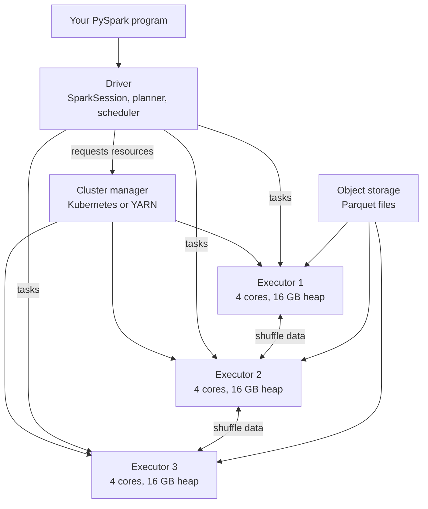
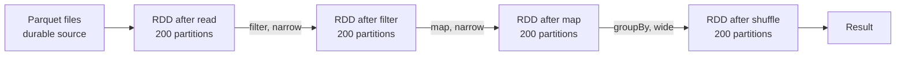
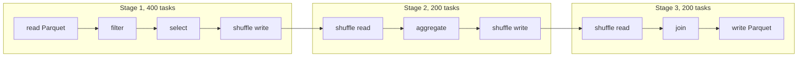
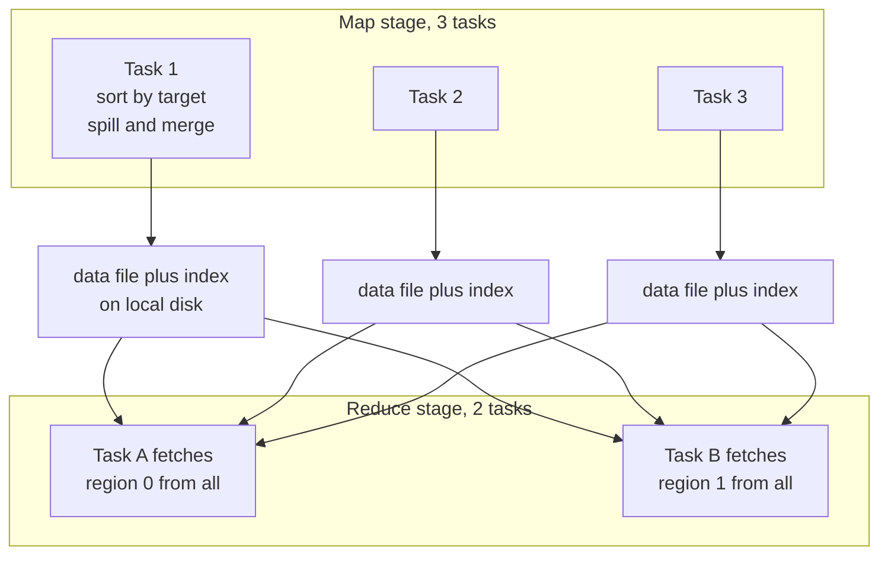
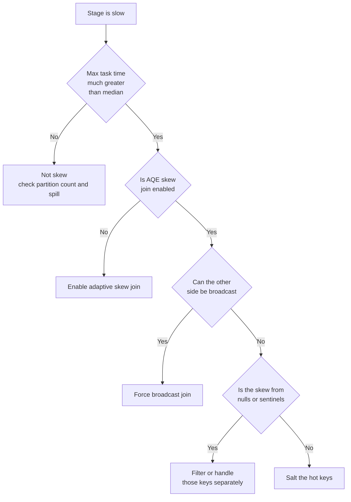
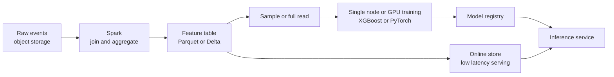

# Chapter 18: Distributed Computing with Spark

> **What this chapter covers** Why a single machine stops being enough, how Apache Spark splits work across a cluster, and every mechanism a machine learning engineer needs to make Spark jobs correct, fast, and affordable: the execution model, the Catalyst optimiser, the shuffle, partitioning, joins, skew, memory, caching, user-defined functions, window functions, Structured Streaming, and the place of Spark in a machine learning stack.
> **Prerequisites** Chapter 3 (Python for Machine Learning Engineering) and Chapter 17 (Data Storage, Formats, and Modelling). Nothing about clusters is assumed.
> **Where it is used** Feature pipelines over billions of rows, log and event processing, dataset construction for training, extract-transform-load work in data platform teams, and any machine learning role where the training data does not fit in memory.

---

## 18.1 Level 1: Foundations

### 18.1.1 The problem distributed computing exists to solve

A laptop with 32 gigabytes of memory can hold roughly 200 million rows of a narrow table in a pandas DataFrame, and far fewer if the columns are strings. A year of clickstream events for a mid-sized web property is 50 to 500 billion rows. There is no way to make that fit.

Three things run out, in this order.

| Resource | What running out looks like | Single machine ceiling, as of typical 2024 hardware |
|---|---|---|
| Memory | Out-of-memory kill, or thrashing to swap | 128 GB to 2 TB on a large server |
| Disk throughput | Job takes hours reading one file serially | 1 to 7 GB/s on NVMe |
| CPU | All cores pinned, still too slow | 64 to 192 cores |

Distributed computing is the answer to all three at once. Put the data on many machines, put a slice of the computation next to each slice of the data, and run the slices at the same time. The unit you buy is a machine. The unit you reason about is a partition.

The cost of this is that the machines have to talk to each other. Network bandwidth between two machines in the same data centre is typically 10 to 25 gigabits per second, which is 1.25 to 3.1 gigabytes per second. Local memory bandwidth is 50 to 200 gigabytes per second. The network is roughly fifty times slower than memory. Every performance problem in Spark is, underneath, a problem of having moved data across the network when you did not have to.

### 18.1.2 What Spark is

Apache Spark is an engine that takes a description of a computation over a distributed dataset, plans it, and executes it across a cluster. You write the description in Python, Scala, Java, R, or SQL. Spark decides how to run it.

Spark is not a storage system. It reads from object storage such as Amazon S3, Google Cloud Storage, or Azure Blob Storage, from the Hadoop Distributed File System, from databases over Java Database Connectivity, and from message logs such as Apache Kafka. It writes to the same places. Spark is not a database either. There is no persistent server holding your tables; a Spark application starts, does work, and exits.

### 18.1.3 The cluster model: driver and executors

A Spark application has exactly one driver and one or more executors.

The **driver** is the process running your program. It holds the `SparkSession`, builds the logical plan, asks the optimiser for a physical plan, breaks that plan into tasks, and sends tasks to executors. It also collects results when you ask for them. The driver is a single point of failure and a single point of bottleneck. If you call `collect()` on a billion rows, the driver tries to hold a billion rows in its heap and dies.

An **executor** is a Java Virtual Machine process on a worker machine. It has a fixed number of CPU cores and a fixed heap. It runs tasks, caches data when told to, and serves shuffle data to other executors. Executors are where all the real work happens.

The **cluster manager** allocates machines to applications. The common ones are Kubernetes, Hadoop YARN, Spark's own standalone manager, and vendor-managed services. It decides which physical machines your executors land on. It does not participate in scheduling individual tasks; the driver does that.



*Figure 18.1: The driver plans and schedules, executors do the work and exchange shuffle data directly with each other.*

A **task** is the unit of scheduling. One task processes one partition of data on one core. If you have 12 executor cores in total and 200 partitions, Spark runs 12 tasks at a time and works through the 200 in about 17 waves.

### 18.1.4 The resilient distributed dataset and lineage

The resilient distributed dataset, abbreviated RDD, is the abstraction everything in Spark still rests on, even though you should not write RDD code. An RDD is an immutable, partitioned collection of records, plus a record of how it was produced.

That last part is the important idea. An RDD does not remember its data; it remembers its **lineage**, which is the chain of operations that produced it from something durable. If a partition is lost because an executor died, Spark does not need a replica. It replays the lineage for that one partition.

Concretely: read a Parquet file, filter it, map over it. Partition 37 of the mapped RDD was computed from partition 37 of the filtered RDD, which came from partition 37 of the file read. Lose partition 37 and Spark re-reads that file range and re-applies the filter and the map. Nothing else is recomputed.



*Figure 18.2: Lineage is a directed acyclic graph from a durable source to the result, and recovery replays only the lost branch.*

Lineage has two flavours of dependency, and the distinction is the single most useful thing in this chapter.

A **narrow dependency** means each partition of the child depends on at most one partition of the parent. `filter`, `map`, `select`, and `union` are narrow. Narrow operations need no network traffic. They can be fused together and run in one pass.

A **wide dependency** means a partition of the child depends on many partitions of the parent. `groupBy`, `join` on a non-partitioned key, `distinct`, and `repartition` are wide. Wide operations require a **shuffle**, which means writing data to disk and sending it over the network.

Recovery from a wide dependency is expensive because a lost partition may depend on every parent partition. This is why long lineages with many shuffles are checkpointed in practice.

### 18.1.5 Why you should not write RDD code any more

RDDs give Spark no information about your data. An RDD of Python objects is opaque; Spark cannot see the columns, cannot see the types, and cannot reorder your operations because it does not know what they do.

A DataFrame is a distributed table with a known schema. Spark knows there is a column called `user_id` of type long. That single fact unlocks columnar storage, predicate pushdown into the file reader, whole-stage code generation, join reordering, and automatic broadcast decisions. A DataFrame job routinely runs five to twenty times faster than the equivalent RDD job for the same logic, and the gap is larger in Python because RDD operations in Python pay per-row serialisation to a Python worker process, while DataFrame operations run in the Java Virtual Machine.

The guidance is simple. Use the DataFrame API or Spark SQL. Drop to RDDs only for genuinely unstructured work, custom partitioners that the DataFrame API cannot express, or when you need `zipWithIndex` style operations. Those cases are rare.

The Dataset API, with compile-time typed rows, exists in Scala and Java. In Python there is no Dataset; `DataFrame` is the API you have, and it is `Dataset[Row]` underneath.

### 18.1.6 Lazy evaluation, transformations, and actions

Spark does nothing when you call `filter` or `select`. It records the operation and returns a new DataFrame. These are **transformations**.

Spark does work when you call something that needs a value: `count`, `collect`, `show`, `write`, `toPandas`, `first`. These are **actions**. An action triggers planning and execution of everything the action depends on.

**Listing 18.1: transformations build a plan, only the action runs it.**

```python
from pyspark.sql import SparkSession, functions as F

spark = SparkSession.builder.appName("events").getOrCreate()

events = spark.read.parquet("s3://bucket/events/")        # transformation
recent = events.filter(F.col("event_date") >= "2024-01-01")  # transformation
counts = (
    recent
    .groupBy("user_id")
    .agg(F.count("*").alias("n_events"))                   # transformation
)
counts.write.mode("overwrite").parquet("s3://bucket/out/") # ACTION: runs everything
```

Nothing touches the cluster until `write`. That is why an error in your filter expression can surface many lines later than the line that contains it, and why timing a transformation tells you nothing.

Laziness is not a quirk, it is what makes optimisation possible. Because Spark sees the whole chain before it runs anything, it can push the date filter down into the Parquet reader and never materialise the rows it is going to discard.

### 18.1.7 Jobs, stages, and tasks

The hierarchy is fixed and worth memorising.

| Level | Created by | Boundary | Count you control |
|---|---|---|---|
| Job | One action | One job per action | Number of actions in your code |
| Stage | A shuffle | Stage ends at every shuffle | Number of wide operations |
| Task | A partition | One task per partition per stage | Partition count |

One action gives one job. Spark cuts that job into stages at every shuffle boundary, because everything before the shuffle must finish writing before anything after it can start reading. Within a stage, every narrow operation is fused, and each partition becomes one task.

So a job with two shuffles has three stages. If the first stage has 400 partitions and the next two have 200 each, the job runs 800 tasks in total.



*Figure 18.3: A job with two shuffles becomes three stages, and each stage runs one task per partition.*

### 18.1.8 The mental model to carry

Hold these five sentences.

1. Data lives in partitions; a task is a partition on a core.
2. Narrow operations are free, wide operations cost a shuffle.
3. Nothing runs until an action.
4. The optimiser will rewrite your query, so write it clearly rather than cleverly.
5. Almost every slow job is slow because of a shuffle, skew, or a partition count that is wrong.

---

## 18.2 Level 2: Working knowledge

### 18.2.1 Setting up a session and reading data

**Listing 18.2: a session with the settings most jobs want.**

```python
from pyspark.sql import SparkSession

spark = (
    SparkSession.builder
    .appName("feature-build")
    .config("spark.sql.adaptive.enabled", "true")
    .config("spark.sql.adaptive.coalescePartitions.enabled", "true")
    .config("spark.sql.adaptive.skewJoin.enabled", "true")
    .config("spark.sql.shuffle.partitions", "400")
    .config("spark.sql.files.maxPartitionBytes", str(128 * 1024 * 1024))
    .config("spark.sql.execution.arrow.pyspark.enabled", "true")
    .getOrCreate()
)
```

Adaptive query execution, abbreviated AQE, lets Spark change the plan mid-flight using statistics from completed stages. It is on by default in Spark 3.2 and later; set it explicitly so the job behaves the same on older clusters. Check your version for which adaptive sub-features default on. `spark.sql.shuffle.partitions` is the post-shuffle partition count, discussed at length in 18.2.5. `maxPartitionBytes` controls how much data one read task takes. Arrow speeds up conversion between the Java Virtual Machine and Python.

Read with an explicit format and, for anything but Parquet and Object Relational Column format, an explicit schema.

**Listing 18.3: reading with partition pruning and an explicit schema.**

```python
from pyspark.sql import types as T

schema = T.StructType([
    T.StructField("user_id", T.LongType(), nullable=False),
    T.StructField("event_type", T.StringType(), nullable=True),
    T.StructField("ts", T.TimestampType(), nullable=False),
    T.StructField("value", T.DoubleType(), nullable=True),
])

events = (
    spark.read
    .schema(schema)                 # skips the inference pass over the data
    .parquet("s3://bucket/events/") # directory laid out as dt=2024-01-01/
    .where("dt >= '2024-01-01' AND dt < '2024-02-01'")  # partition pruning
)
```

Schema inference for JSON and comma-separated values reads a sample or the whole file before your job starts, which can take longer than the job. An explicit schema removes that pass and removes the risk of a column type changing between runs because a new file had a different value. The `where` clause on the directory partition column `dt` means Spark lists and reads only the matching directories.

### 18.2.2 The operations you will use every day

| Operation | What it does | Narrow or wide |
|---|---|---|
| `select`, `withColumn`, `drop` | Column projection and derivation | Narrow |
| `filter` / `where` | Row predicate | Narrow |
| `union` | Concatenate rows | Narrow |
| `groupBy(...).agg(...)` | Aggregate by key | Wide |
| `join` | Combine by key | Wide, unless broadcast |
| `distinct`, `dropDuplicates` | Deduplicate | Wide |
| `orderBy` / `sort` | Global ordering | Wide, with a range partition |
| `repartition` | Set partition count with a shuffle | Wide |
| `coalesce` | Reduce partition count without a shuffle | Narrow |
| `window` functions | Ranking, lag, rolling aggregates | Wide if partitioned by a new key |

Prefer the column expression API over string expressions when you want the analyser to catch typos early, and prefer SQL when the logic is naturally relational and will be read by analysts. They compile to the same plan; there is no performance difference.

### 18.2.3 Writing data

**Listing 18.4: a write that produces a usable table layout.**

```python
(
    features
    .repartition(200, "dt")               # control file count per partition dir
    .write
    .mode("overwrite")
    .partitionBy("dt")                    # directory layout dt=2024-01-01/
    .option("compression", "snappy")
    .parquet("s3://bucket/features/")
)
```

`partitionBy` creates one directory per distinct value, which makes later `where dt = ...` reads cheap. Do not partition by a high-cardinality column such as `user_id`; you get millions of tiny directories and the file listing alone will dominate the job. A good rule is that each directory partition should hold at least 128 megabytes.

The `repartition(200, "dt")` before the write controls how many files land in each directory. Without it, every task writes a file into every directory it has rows for, and a 2000-task stage writing 30 date directories creates 60000 files.

`mode("overwrite")` with `partitionBy` deletes the entire output path by default. Set `spark.sql.sources.partitionOverwriteMode` to `dynamic` to replace only the partitions present in the new data. This is one of the most common data-loss incidents in Spark work.

### 18.2.4 Reading an explain plan

`df.explain(True)` prints four plans: parsed logical, analysed logical, optimised logical, and physical. `df.explain("formatted")` prints the physical plan with numbered nodes and details underneath, which is easier to read.

Read it bottom to top. The bottom is the scan, the top is the result.

**Listing 18.5: a physical plan, abbreviated, with the parts that matter.**

```text
== Physical Plan ==
AdaptiveSparkPlan isFinalPlan=false
+- HashAggregate(keys=[user_id], functions=[count(1)])
   +- Exchange hashpartitioning(user_id, 400)            <-- SHUFFLE
      +- HashAggregate(keys=[user_id], functions=[partial_count(1)])
         +- Project [user_id]
            +- Filter (isnotnull(event_date) AND (event_date >= 2024-01-01))
               +- FileScan parquet [user_id,event_date]
                    PartitionFilters: [event_date >= 2024-01-01]
                    PushedFilters: [IsNotNull(user_id)]
                    ReadSchema: struct<user_id:bigint>
```

Four things to look for every time. `Exchange` is a shuffle; count them, because each one is a stage boundary and the dominant cost. `PartitionFilters` shows directory pruning worked. `PushedFilters` shows predicates reached the file reader. `ReadSchema` shows column pruning worked; if it lists forty columns when you selected two, something upstream defeated the projection. Also look for `BroadcastHashJoin` versus `SortMergeJoin`, and for `WholeStageCodegen` wrappers, whose absence signals an operator that fell back to slower interpreted execution.

### 18.2.5 Choosing a partition count, with arithmetic

This is the single most common tuning decision, and it has an answer.

Let $C$ be the total number of executor cores available, $B$ the total bytes of data flowing through the shuffle, and $t$ the target bytes per partition. The two constraints are:

$$P \approx \frac{B}{t} \qquad \text{and} \qquad P = k \cdot C \text{ for an integer } k \geq 1$$

The first keeps each task's working set inside memory. The second keeps every core busy for whole waves so you do not finish a stage with most of the cluster idle.

The practical target $t$ is 100 to 200 megabytes of **in-memory** data per partition. Take 128 megabytes as the default.

**Worked example.** A cluster of 10 executors, 4 cores each, so $C = 40$. The shuffle carries 500 gigabytes.

$$P = \frac{500 \times 1024 \text{ MB}}{128 \text{ MB}} = \frac{512000}{128} = 4000$$

Check the wave count: $4000 / 40 = 100$ waves. That is fine; it is a whole number so no core idles at the end. Set `spark.sql.shuffle.partitions` to 4000.

Now suppose the shuffle carries only 8 gigabytes. Then $P = 8192/128 = 64$. Round to a multiple of 40: 80 partitions, two waves. The default of 200 would have given 40 megabyte partitions and 5 waves, with per-task overhead of roughly 10 to 50 milliseconds each dominating. The default 200 is wrong in both directions for most real jobs; it is a placeholder, not a recommendation.

A second consideration: input data on disk is compressed. Parquet with Snappy typically expands 2 to 5 times in memory, and a Parquet file of highly repetitive strings can expand 10 times. If your source is 100 gigabytes on disk, budget 300 to 500 gigabytes in memory for the sizing above. Measure it once with the Spark user interface, which shows shuffle write size in bytes, and use the measured number.

Adaptive query execution reduces the pain here. With `coalescePartitions.enabled`, Spark starts with the configured partition count and merges small post-shuffle partitions up to `advisoryPartitionSizeInBytes`, default 64 megabytes. Set the configured count generously high and let AQE come down. Over-partitioning is now cheap; under-partitioning is still expensive because AQE will not split.

### 18.2.6 repartition versus coalesce

| | `repartition(n)` | `coalesce(n)` |
|---|---|---|
| Shuffle | Yes, full | No |
| Can increase partitions | Yes | No, silently ignored |
| Result balance | Even | Uneven, merges adjacent partitions |
| Effect upstream | None | Reduces parallelism of the whole preceding stage |
| Cost | High | Near zero, but see the trap |

The trap in `coalesce` is that it has no shuffle boundary, so it propagates backwards. `heavy_transform().coalesce(1).write(...)` does not run the heavy transform with full parallelism and then merge. It runs the heavy transform with **one task**. If you need one output file after expensive work, use `repartition(1)`, which inserts a shuffle and keeps the upstream stage parallel.

Use `coalesce` when you have just filtered aggressively and have many nearly empty partitions, and the downstream work is light. Use `repartition` when you need balance, need more partitions, or need to break the backward propagation.

`repartition(n, "col")` hash-partitions by the column, which is how you co-locate rows for a later join or window.

### 18.2.7 Caching, and when it hurts

`df.cache()` is shorthand for `df.persist(StorageLevel.MEMORY_AND_DISK)`. It marks the DataFrame so that the first action materialises it into executor memory and later actions read it back instead of recomputing.

Cache when all three hold: the DataFrame is used by more than one action, recomputing it is expensive, and it fits in memory without evicting anything more valuable.

Cache hurts in four ways.

1. **It competes for memory with execution.** A cached DataFrame occupies storage memory. Under the unified memory manager, cached blocks beyond a protected fraction are evicted when execution needs space, so you pay to build the cache and get nothing back.
2. **It breaks the optimiser's view.** A cached node is an optimisation barrier. Filters that would have been pushed down into the scan below it no longer are. Caching a wide table then filtering it hard is slower than not caching.
3. **Serialisation cost.** `MEMORY_ONLY` on DataFrames stores the compressed columnar form, which is cheap. `MEMORY_AND_DISK_SER` and RDD caching pay serialisation on write and deserialisation on every read.
4. **It is often unnecessary.** If the DataFrame comes from Parquet, a re-read is a fast columnar scan with pushdown. Re-reading is frequently cheaper than caching.

Always `unpersist()` when done. Cached blocks live for the life of the session, not the life of the variable.

Storage levels worth knowing: `MEMORY_AND_DISK` (default for DataFrames, spills to local disk when memory is short), `MEMORY_AND_DISK_SER` (smaller, slower), `DISK_ONLY` (for when recomputation is much more expensive than a local disk read), and any level with `_2` for replication across two executors, which buys faster recovery at double the space.

For a lineage that has grown very long, especially in an iterative loop, `checkpoint()` writes to a reliable filesystem and truncates the lineage entirely. `localCheckpoint()` writes to executor local disk, which is faster and not fault tolerant.

### 18.2.8 The mistakes everyone makes first

| Mistake | What happens | Fix |
|---|---|---|
| `collect()` on a large DataFrame | Driver out-of-memory | `write` to storage, or `limit(1000).collect()` |
| Leaving `shuffle.partitions` at 200 | Huge tasks or huge overhead | Compute it as in 18.2.5 |
| `coalesce(1)` before an expensive stage | Whole job serialises | `repartition(1)` |
| A Python user-defined function for something built-in | 10 to 100 times slower | Find the built-in |
| `count()` sprinkled through the code to "check" | Each one re-runs the whole lineage | Cache, or trust the plan |
| Overwriting a partitioned table | Deletes everything | Dynamic partition overwrite mode |
| Reading with inferred schema | Extra full pass, unstable types | Explicit schema |
| Chaining `withColumn` 200 times | Plan-building time explodes | One `select` with a list of expressions |

The last one surprises people. Each `withColumn` builds a new logical plan node, and analysis is not free. Two hundred chained calls can spend minutes in the driver before a single task starts. Build a list of `Column` expressions and pass them to one `select`.

---

## 18.3 Level 3: Depth

### 18.3.1 Catalyst: the five phases

Catalyst is Spark's query optimiser. It is a tree-rewriting system over relational plans, and every stage is a set of rules applied until the tree stops changing.

```mermaid
flowchart LR
  A["SQL or DataFrame code"] --> B["Unresolved logical plan"]
  B -->|"Analysis<br/>catalog lookup"| C["Analysed logical plan"]
  C -->|"Rule based optimisation"| D["Optimised logical plan"]
  D -->|"Strategies plus cost"| E["Physical plans"]
  E -->|"Select cheapest"| F["Selected physical plan"]
  F -->|"Whole stage codegen"| G["Java bytecode"]
  G --> H["Tasks on executors"]
```



*Figure 18.4: Catalyst turns a query into generated Java bytecode through analysis, logical optimisation, physical planning, and code generation.*

**Parsing** turns SQL text into an unresolved logical plan. DataFrame code skips this; the API builds the tree directly.

**Analysis** resolves names against the catalog. Column `user_id` becomes an `AttributeReference` with an identifier and a type. Functions are resolved, types are coerced, and star expansion happens. This is where `AnalysisException` comes from, and it happens on the driver at plan-build time, not at run time.

**Logical optimisation** applies rules such as:

- *Predicate pushdown.* Move filters as close to the scan as possible. A filter above a join moves below it when it references only one side.
- *Column pruning.* Read only referenced columns. This is most of the win from columnar formats.
- *Constant folding.* Evaluate `2 + 3` once at plan time.
- *Null propagation.* Replace expressions that are provably null.
- *Boolean simplification.* Rewrite `NOT (a > b)` as `a <= b`, which is pushable.
- *Filter and project collapsing.* Merge adjacent nodes.
- *Limit pushdown.* Push a `LIMIT` below a join where it is safe.
- *Subquery decorrelation.* Rewrite a correlated subquery as a join, because a correlated subquery executed per row is not expressible in Spark's model.

**Physical planning** converts each logical operator to one or more physical operators using strategies. A logical `Join` can become `BroadcastHashJoinExec`, `SortMergeJoinExec`, `ShuffledHashJoinExec`, `BroadcastNestedLoopJoinExec`, or `CartesianProductExec`. The cost-based optimiser, off by default and enabled with `spark.sql.cbo.enabled`, uses table statistics from `ANALYZE TABLE ... COMPUTE STATISTICS` to reorder joins. Without statistics, Spark uses only size estimates.

**Code generation**, called whole-stage code generation, fuses all operators in a stage into a single generated Java method containing one loop over rows. This removes virtual function dispatch per operator per row and keeps values in CPU registers. The effect is typically 2 to 10 times over the interpreted volcano model. Some operators cannot be generated and appear as islands in the plan; a plan with many non-generated operators is worth investigating.

### 18.3.2 Tungsten and the memory representation

Rows are stored in `UnsafeRow`, a compact binary layout in off-heap or on-heap byte arrays rather than as Java objects. A Java object for a row of five fields costs roughly 100 bytes of header and pointer overhead; an `UnsafeRow` costs the fields plus a null bitmap. This cuts memory and, more importantly, removes garbage collection pressure, because the Java Virtual Machine's collector never walks these bytes.

Aggregations and joins use an off-heap hash map keyed by `UnsafeRow`, with sort-based fallback when it does not fit.

### 18.3.3 The shuffle, in full

The shuffle is where most Spark problems live, so it is worth understanding at the level of files.

**What triggers a shuffle.** Any operation where the output partitioning differs from the input partitioning: `groupBy` on a key the data is not already partitioned by, a join on such a key, `distinct`, `repartition`, `orderBy`, and window functions with a new `partitionBy`. Spark tracks the current partitioning as a property of the plan, so a second `groupBy` on the same key as the first does not shuffle again.

**The write path.** Each map task, meaning each task of the stage before the shuffle, does this:

1. Compute its output rows.
2. For each row, compute the target reduce partition, usually `hash(key) mod numPartitions` using Murmur3.
3. Buffer rows in an in-memory sorter, partitioned by target.
4. When the buffer exceeds its share of execution memory, **spill** a sorted run to local disk.
5. At the end, merge all spilled runs plus the in-memory buffer into one **shuffle data file** per map task, sorted by target partition, plus a small **index file** giving the byte offset of each partition's region.

So after the map stage, local disk on each executor holds $M$ data files and $M$ index files, where $M$ is the number of map tasks on that executor. This is the sort-based shuffle. The older hash shuffle wrote $M \times R$ files and did not survive large $R$.

**The read path.** Each reduce task asks every executor that ran a map task for its region of that task's data file. With $M$ map tasks and $R$ reduce tasks, there are $M \times R$ fetch requests in the worst case, though they are batched per executor. Fetched blocks land in memory up to `spark.reducer.maxSizeInFlight`, default 48 megabytes per fetch, and spill to disk beyond it.



*Figure 18.5: Every map task writes one sorted file with an index, and every reduce task fetches its own byte region from every map task.*

**The cost model.** For $B$ bytes shuffled across $C$ cores with network bandwidth $w$ bytes per second per executor and disk write throughput $d$:

$$T_{\text{shuffle}} \approx \underbrace{\frac{B}{d \cdot n_{\text{exec}}}}_{\text{write}} + \underbrace{\frac{B \cdot (1 - 1/n_{\text{exec}})}{w \cdot n_{\text{exec}}}}_{\text{network}} + \underbrace{\frac{B}{d \cdot n_{\text{exec}}}}_{\text{read}} + T_{\text{sort}}$$

The $(1 - 1/n_{\text{exec}})$ factor is the fraction of data that must actually cross the network; with $n$ executors, on average $1/n$ of each partition's data is already local.

**Worked example.** Shuffle 2 terabytes across 20 executors, each with 500 megabytes per second of usable disk and 1.25 gigabytes per second of network.

Write: $2{,}097{,}152 \text{ MB} / (500 \times 20) = 210$ seconds.
Network: $2{,}097{,}152 \times 0.95 / (1280 \times 20) = 78$ seconds.
Read: another 210 seconds.
Total floor: roughly 500 seconds, or 8.3 minutes, of pure shuffle, before any computation.

That arithmetic is why "can I avoid this shuffle" beats every other tuning question. Halving the data before the shuffle halves the whole term. Pre-aggregating with `reduceByKey` semantics, which the DataFrame `groupBy().agg()` does automatically through partial aggregation, can cut $B$ by orders of magnitude.

**Spill.** Spill is not a failure; it is the designed overflow path. But spill means the same bytes are written and read one extra time. The Spark user interface reports "Spill (Memory)" and "Spill (Disk)" per stage. Non-zero disk spill with a long stage time is the signal to either increase partition count, so each task's working set is smaller, or increase executor memory.

**External shuffle service.** By default, an executor serves its own shuffle files, so killing an executor loses them and forces recomputation. The external shuffle service runs as a separate process per node and keeps serving after executors exit. This is what makes dynamic allocation safe: Spark can release idle executors without destroying shuffle output. On Kubernetes the equivalent is usually a shuffle-tracking configuration or a remote shuffle service; check your version and platform.

### 18.3.4 Joins in detail

Spark has five join implementations. Three matter.

**Broadcast hash join.** The small side is collected to the driver, broadcast to every executor, and built into a hash table in each executor's memory. The large side streams past it with no shuffle at all. This is the fastest join by a wide margin when it applies.

Chosen when one side's estimated size is below `spark.sql.autoBroadcastJoinThreshold`, default 10 megabytes. That default is very conservative for modern clusters; 100 to 500 megabytes is a common production setting when executors have 16 gigabytes or more. Remember the broadcast table is held once per executor, not once per task, but the driver must first hold the whole thing, so `spark.driver.maxResultSize` must accommodate it.

Broadcast is not available for full outer joins, and for a left outer join only the right side can be broadcast, because the streaming side must be the side whose rows are all preserved.

**Sort-merge join.** Both sides are shuffled by the join key, each partition is sorted by key, and the two sorted streams are merged. Cost is two shuffles plus two sorts. This is the default for large-to-large joins and it scales to any size. It is what you get when broadcast does not apply.

**Shuffle hash join.** Both sides are shuffled by key, then a hash table is built from the smaller side **per partition** rather than globally. No sort. Cheaper than sort-merge when one side is much smaller but still too large to broadcast, and when the per-partition build side fits in memory. Spark prefers sort-merge by default; set `spark.sql.join.preferSortMergeJoin` to false to let this be considered.

**Broadcast nested loop join** and **Cartesian product** appear when there is no equality predicate. Seeing either in a plan for a large table is an emergency; it means a join condition was lost and the job is quadratic.

| Join | Shuffles | Sorts | Memory | Use when |
|---|---|---|---|---|
| Broadcast hash | 0 | 0 | Small side per executor | One side under a few hundred MB |
| Shuffle hash | 2 | 0 | Build side per partition | Asymmetric sizes, no sort needed downstream |
| Sort-merge | 2 | 2 | Streaming, spills gracefully | Both sides large |
| Broadcast nested loop | 0 or 1 | 0 | Small side | Non-equi join, small side |
| Cartesian | 1 | 0 | Streaming | Never intentionally |

**How the planner chooses.** In order: if a hint forces a strategy, use it. Otherwise, if there is an equi-join condition and one side is estimated under the broadcast threshold, broadcast it. Otherwise, if shuffle hash is enabled and one side fits per partition, use it. Otherwise sort-merge. With no equi-join condition, fall to nested loop or Cartesian.

Size estimation comes from file sizes for a plain scan, and from statistics if `ANALYZE TABLE` has been run. After a filter, Spark estimates selectivity from column statistics if present, and otherwise applies a fixed factor. This is why a filter that removes 99.9 percent of a large table may still not trigger a broadcast: Spark does not know it is now small.

**Hints.** `df1.join(F.broadcast(df2), "key")` forces a broadcast. In SQL, `SELECT /*+ BROADCAST(t2) */ ...`. Other hints are `MERGE`, `SHUFFLE_HASH`, and `SHUFFLE_REPLICATE_NL`. Use `broadcast` when you know the side is small and Spark does not.

**Listing 18.6: forcing a broadcast after a filter the optimiser cannot size.**

```python
from pyspark.sql import functions as F

active = users.where(F.col("status") == "active")   # 0.1% of 500M rows
active = active.hint("broadcast")                   # or F.broadcast(active)

enriched = events.join(active, on="user_id", how="inner")
enriched.explain("formatted")   # confirm BroadcastHashJoin appears
```

Always confirm with `explain`. A broadcast hint that Spark declines, because the side turned out too large, silently reverts to sort-merge, and a broadcast hint that Spark obeys on a side that is actually 5 gigabytes will kill the driver. Both failure modes are visible in the plan or in the driver logs.

### 18.3.5 Skew, the diagnosis and every remedy

Skew is an uneven distribution of rows across partitions after a shuffle. One key, say a null `user_id` or a sentinel `user_id = 0`, carries 40 percent of the rows. One task gets all of them.

**How it shows in the user interface.** Open the Stages tab, click the slow stage, and look at the task summary metrics table. It gives min, 25th percentile, median, 75th percentile, and max for duration, shuffle read size, and records read. Skew is a max that is 10 to 1000 times the median. The stage duration equals the max task duration, so 4999 tasks finishing in 10 seconds and one taking 40 minutes gives a 40 minute stage while the cluster sits idle.

The event timeline for the stage shows this as a wall of finished bars and one long bar.



*Figure 18.6: A decision path from a slow stage to the right skew remedy.*

**Remedy 1: adaptive skew join.** With `spark.sql.adaptive.enabled` and `spark.sql.adaptive.skewJoin.enabled`, Spark detects a partition whose size exceeds both `skewedPartitionFactor` times the median, default 5, and `skewedPartitionThresholdInBytes`, default 256 megabytes. It splits that partition into sub-partitions and replicates the matching partition from the other side. This handles sort-merge joins automatically and is the first thing to turn on. It does not help a skewed `groupBy`.

**Remedy 2: broadcast the other side.** If the non-skewed side is small enough to broadcast, the shuffle disappears and so does the skew, because every task reads its own slice of the large side with no key-based redistribution.

**Remedy 3: isolate the degenerate keys.** Nulls and sentinels are the most common cause and the cheapest to fix. A null join key matches nothing in an inner join, so filter it out before the join and union it back after if you need a left outer.

**Listing 18.7: splitting out null keys before a join.**

```python
matched = events.where(F.col("user_id").isNotNull()).join(users, "user_id", "left")
unmatched = (
    events.where(F.col("user_id").isNull())
    .select(events.columns + [F.lit(None).cast(t).alias(c)
                              for c, t in users_extra_cols])
)
result = matched.unionByName(unmatched)
```

The null rows never enter the shuffle, so no single reducer receives them all. The `unionByName` with explicitly typed nulls reproduces the left-join semantics for those rows.

**Remedy 4: salting.** Add a random integer to the hot key on the large side, and replicate the small side across all salt values. This spreads one hot key over $n$ partitions at the cost of making the small side $n$ times larger.

**Listing 18.8: salted join for a known set of hot keys.**

```python
N = 32
hot = {"0", "-1", "unknown"}    # identified from a value_counts on the key

left = events.withColumn(
    "salt",
    F.when(F.col("user_id").isin(*hot), (F.rand() * N).cast("int")).otherwise(F.lit(0)),
)
right = (
    users.withColumn("salt", F.when(F.col("user_id").isin(*hot),
                                    F.explode(F.array([F.lit(i) for i in range(N)])))
                              .otherwise(F.lit(0)))
)
joined = left.join(right, on=["user_id", "salt"], how="inner").drop("salt")
```

Salt only the hot keys, not every key. Salting everything multiplies the small side by $N$ across the board and usually costs more than the skew. Choose $N$ so the hot key's share divided by $N$ is close to the median partition size: if one key is 200 times the median, $N = 32$ brings it to about 6 times, which adaptive skew join can then finish off.

**Remedy 5: bucketing.** Write both tables pre-partitioned and pre-sorted by the join key with `bucketBy`. A later join on that key with matching bucket counts skips the shuffle entirely. This moves the cost to write time and pays off only when the same join runs repeatedly. It requires the Hive metastore table path, both sides bucketed identically, and no intervening repartition. Bucketing does not fix skew inside a bucket, but it removes the shuffle, which is often the real cost.

**Remedy 6: two-phase aggregation for skewed `groupBy`.** Aggregate with a salt appended to the key, then aggregate again on the real key. This works for associative and commutative aggregations such as sum, count, min, and max. It does not work directly for median or exact distinct count.

### 18.3.6 Memory management and executor sizing

An executor's Java Virtual Machine heap is divided as follows. Let $H$ be `spark.executor.memory`.

- **Reserved memory**: 300 megabytes, fixed.
- **User memory**: $(H - 300\text{MB}) \times (1 - f)$ where $f$ is `spark.memory.fraction`, default 0.6. This holds your data structures, user-defined function state, and Spark internal metadata.
- **Unified memory**: $(H - 300\text{MB}) \times f$. Split between execution and storage.

Inside unified memory, `spark.memory.storageFraction`, default 0.5, is not a hard split. It is the fraction of unified memory that storage is **guaranteed** and may not be evicted below. Execution can borrow all unused storage memory and can evict cached blocks down to that floor. Storage can borrow unused execution memory but cannot evict execution; it waits or spills.

$$M_{\text{unified}} = (H - 300\text{MB}) \times 0.6, \qquad M_{\text{storage floor}} = M_{\text{unified}} \times 0.5$$

**Worked example.** `spark.executor.memory = 16g`.

Unified: $(16384 - 300) \times 0.6 = 9650$ MB.
Storage floor: 4825 MB.
User memory: $(16384 - 300) \times 0.4 = 6434$ MB.

With 4 cores per executor, each task gets on average $9650 / 4 = 2412$ MB of execution memory when nothing is cached. That is the number to compare against your per-partition working set. If partitions are 128 megabytes of compressed shuffle data expanding to 400 megabytes in memory, and a sort needs roughly twice the data size, 2412 megabytes is comfortable.

On top of the heap, the container requests `spark.executor.memoryOverhead`, defaulting to the larger of 384 megabytes and 10 percent of executor memory. This covers the Java Virtual Machine's own off-heap needs, network buffers, and, critically, **Python worker processes**. PySpark user-defined functions run in separate Python processes whose memory comes entirely from overhead. A job with heavy Python UDFs routinely needs overhead at 25 to 40 percent of heap. The symptom of getting this wrong is the container being killed by the cluster manager with an exit code rather than a Java `OutOfMemoryError`.

**Executor sizing rules.**

- Cores per executor: 4 or 5. Fewer wastes the shared broadcast and cached data per JVM. More causes heavy garbage collection pauses and contention on the HDFS or object store client, whose throughput plateaus above about 5 concurrent readers.
- Heap per executor: 8 to 32 gigabytes. Above roughly 32 gigabytes the JVM loses compressed ordinary object pointers, and every reference grows from 4 bytes to 8, which costs 10 to 20 percent of effective memory for no gain.
- Leave one core and about 1 gigabyte per node for the operating system and the node manager.

**Worked sizing example.** A node with 64 cores and 256 gigabytes of memory, 10 nodes.

Usable per node: 63 cores, 248 gigabytes. With 5 cores per executor, 12 executors per node fit into 60 cores. Memory per executor: $248 / 12 = 20.7$ gigabytes total, so set heap to 18 gigabytes and overhead to 2.7 gigabytes. Total: 120 executors, 600 cores, 2160 gigabytes of heap.

Then shuffle partitions for a 3 terabyte shuffle: $3 \times 1024 \times 1024 / 128 = 24576$, rounded to a multiple of 600 gives 24600.

**Off-heap memory.** Setting `spark.memory.offHeap.enabled` to true with `spark.memory.offHeap.size` moves Tungsten's execution memory outside the JVM heap. This removes that memory from garbage collection entirely, which helps jobs with large shuffles and long pauses. The off-heap size adds to unified memory rather than replacing it. Measure before and after; the benefit is real but not universal.

### 18.3.7 User-defined functions and the Python performance model

A built-in Spark function is a Catalyst expression. It is code-generated into the stage loop and operates on the columnar binary format inside the JVM. Cost is a few nanoseconds per row.

A Python user-defined function cannot be. For every batch of rows, Spark must serialise from `UnsafeRow` to a Python-readable form, pipe it to a Python worker process, deserialise it there, call your function, serialise the result, pipe it back, and deserialise into `UnsafeRow`. It is also an optimisation barrier: Catalyst cannot see inside, so predicates are not pushed through it and null handling is not simplified.

Three tiers, in increasing order of speed.

| Kind | Serialisation | Granularity | Relative cost |
|---|---|---|---|
| Built-in / SQL expression | None | Code-generated | 1 |
| Pandas UDF (vectorised, Arrow) | Arrow columnar batches | Batch of rows as a Series | 3 to 10 |
| Plain Python UDF | Pickle, row by row | One row | 30 to 100 |

Those multipliers are order-of-magnitude figures from common workloads, not a benchmark; measure yours.

**Pandas user-defined functions** use Apache Arrow to transfer a batch of rows as a columnar buffer with no per-row serialisation, and your function receives a pandas Series and returns a Series. The batch size is `spark.sql.execution.arrow.maxRecordsPerBatch`, default 10000.

**Listing 18.9: a scalar pandas UDF, the default choice when a UDF is unavoidable.**

```python
import pandas as pd
from pyspark.sql.functions import pandas_udf
from pyspark.sql import types as T

@pandas_udf(T.DoubleType())
def score(v: pd.Series, w: pd.Series) -> pd.Series:
    # vectorised: operates on ~10k rows per call, not one
    return (v.fillna(0.0) * w.clip(lower=0.0, upper=10.0)).astype("float64")

out = df.withColumn("score", score("value", "weight"))
```

The function signature is typed and Spark uses the annotations to pick the UDF variant, so the type hints are load-bearing rather than documentation. Check your version: the decorator's signature and the available variants changed at Spark 3.0.

Other variants: `mapInPandas` gives you an iterator of DataFrames for the whole partition, which is right when you need a stateful object such as a loaded model. `applyInPandas` after a `groupBy` gives one pandas DataFrame per group, which is the standard way to run per-group model fitting. `GROUPED_AGG` pandas UDFs define custom aggregations usable in `agg` and in window functions.

**Listing 18.10: batch scoring a model once per partition rather than once per row.**

```python
from typing import Iterator
import pandas as pd

def predict(batches: Iterator[pd.DataFrame]) -> Iterator[pd.DataFrame]:
    model = load_model_from_local_cache()     # loaded once per partition
    for pdf in batches:
        pdf["pred"] = model.predict(pdf[FEATURES].to_numpy())
        yield pdf[["id", "pred"]]

scored = df.mapInPandas(predict, schema="id long, pred double")
```

Loading the model inside the function body but outside the loop is the point. Loading it at module level makes the driver serialise it into the closure and ship it with every task, which for a large model is worse. A better pattern still is to broadcast the model bytes once and read the broadcast inside the function.

Before writing any UDF, check whether a built-in does it. Spark has hundreds of functions including `regexp_extract`, `from_json`, `aggregate`, `transform`, `filter` over arrays, `higher-order functions` on maps, and full date arithmetic. A surprising fraction of UDFs in real code bases replace something that exists.

### 18.3.8 Window functions

A window function computes a value for each row from a frame of related rows, without collapsing them as an aggregation would.

A window specification has three parts: `partitionBy` defines the groups, `orderBy` defines the order within a group, and the frame defines which rows around the current row are in scope.

**Listing 18.11: ranking and rolling aggregation in one pass.**

```python
from pyspark.sql import Window, functions as F

w_rank = Window.partitionBy("user_id").orderBy(F.col("ts").desc())
w_roll = (
    Window.partitionBy("user_id")
    .orderBy(F.col("ts").cast("long"))
    .rangeBetween(-7 * 86400, 0)          # trailing 7 days, inclusive
)

out = (
    df
    .withColumn("recency_rank", F.row_number().over(w_rank))
    .withColumn("spend_7d", F.sum("amount").over(w_roll))
    .withColumn("prev_amount", F.lag("amount", 1).over(w_rank))
)
```

`rowsBetween` counts rows; `rangeBetween` compares the value of the `orderBy` column, which is why the time column is cast to a long of seconds so that the offsets are seconds. `unboundedPreceding` and `unboundedFollowing` mark the ends of the partition. The default frame when `orderBy` is present is `rangeBetween(unboundedPreceding, currentRow)`, and without `orderBy` it is the whole partition; this default catches people out.

Three performance facts. First, a window partitions by its `partitionBy` key, so it costs a shuffle unless the data is already partitioned that way; reusing the same window specification across several columns costs one shuffle, not several. Second, a window with no `partitionBy` puts every row into one partition on one executor, which works only for small data and should be treated as a bug at scale. Third, `row_number` over a window is the standard deduplication idiom, and it is usually faster and always more controllable than `dropDuplicates`, because you choose which row survives.

---

## 18.4 Level 4: Mastery

### 18.4.1 Structured Streaming

Structured Streaming treats a stream as an unbounded table to which rows are appended. You write the same DataFrame operations you would write on a static table, and the engine incrementally maintains the result. This is the central design idea and it comes from Armbrust and colleagues, "Structured Streaming: A Declarative API for Real-Time Applications in Apache Spark", 2018.

**Micro-batch model.** The default execution mode collects available input into a micro-batch, plans it, runs it as a normal Spark job, and commits. Latency is therefore bounded below by the batch interval plus the job time, typically hundreds of milliseconds to seconds. A continuous processing mode with millisecond latency exists but has been experimental with limited operator support; check your version before relying on it.

**Triggers.** `processingTime="30 seconds"` runs a batch on a fixed schedule. `availableNow=True` processes all available data in as many batches as needed and stops, which is the right choice for scheduled incremental jobs. The default, with no trigger, runs batches back to back as fast as possible. Fixed intervals are easier to reason about for cost and for downstream file sizes.

**Event time and watermarks.** Event time is when the event happened, stamped in the record. Processing time is when Spark saw it. They differ because of buffering, retries, mobile clients being offline, and backfills. Aggregations over event-time windows must therefore keep state for windows that might still receive data.

A watermark is a promise: "I will not accept data more than $d$ late." Spark tracks the maximum event time seen, subtracts $d$, and drops rows older than that, and once a window's end is below the watermark it emits the result and frees the state.

$$\text{watermark}_t = \max_{s \leq t}(\text{event time seen}) - d$$

The trade is direct. Larger $d$ means fewer dropped late records and more state and more output latency. Smaller $d$ means the opposite. There is no correct value in general; measure the actual lateness distribution of your source and pick a percentile you can defend, for example the 99th percentile of observed lateness.

**Listing 18.12: a windowed aggregation with a watermark and a Kafka source.**

```python
from pyspark.sql import functions as F

raw = (
    spark.readStream.format("kafka")
    .option("kafka.bootstrap.servers", "broker:9092")
    .option("subscribe", "events")
    .option("startingOffsets", "latest")
    .load()
)

parsed = (
    raw.select(F.from_json(F.col("value").cast("string"), schema).alias("e"))
       .select("e.*")
       .withWatermark("event_ts", "10 minutes")
)

agg = (
    parsed.groupBy(F.window("event_ts", "5 minutes"), "region")
          .agg(F.approx_count_distinct("user_id").alias("dau"))
)

q = (
    agg.writeStream.outputMode("update")
       .format("delta").option("checkpointLocation", "s3://bucket/ckpt/dau")
       .trigger(processingTime="1 minute").start()
)
```

`withWatermark` must be applied on the same column used in the `window`, and before the aggregation, or it is ignored silently. The checkpoint location is not optional and must not be shared between queries; it holds offsets, state, and commit logs, and it defines the identity of the query across restarts.

**Output modes.**

| Mode | Emits | Allowed with | Typical use |
|---|---|---|---|
| Append | Only rows that are final | Aggregations only with a watermark | Writing to files or a log |
| Update | Rows changed this batch | Most aggregations | Upsert into a key-value store |
| Complete | The entire result table | Aggregations only | Small dashboards |

Complete mode keeps all state forever. It is safe only for bounded key spaces.

**Stateful operations.** Aggregations, deduplication with `dropDuplicates` over a watermarked column, stream-stream joins, and arbitrary stateful processing with `flatMapGroupsWithState` or, in newer versions, `transformWithState`; check your version for which is available. State lives in a state store, checkpointed each batch. The default state store is an in-memory map backed by files on the checkpoint filesystem; a RocksDB-backed state store is available and is the right choice above roughly a few million keys per executor because it moves state off the JVM heap and removes garbage collection pressure.

State size is what kills streaming jobs. A stream-stream join with a wide watermark holds both sides' rows for the whole watermark interval. An aggregation over user identifier holds one entry per active user. Compute it: 50 million users times 200 bytes of state equals 10 gigabytes, which must sit somewhere and be checkpointed every batch. Bound the key space, watermark tightly, and use time-to-live settings where the API exposes them.

**Exactly-once.** Structured Streaming provides end-to-end exactly-once **when the source is replayable and the sink is idempotent or transactional**. The mechanism is that the checkpoint records the exact offset range of each batch before processing, so a restart reprocesses the same batch, and the sink must either deduplicate by batch identifier, as the file sink does through its commit log, or write transactionally. With a sink that is neither, for example an arbitrary REST endpoint in `foreachBatch`, you get at-least-once and must make the write idempotent yourself. The honest phrasing, which Chapter 19 develops, is "effectively once with idempotent sinks".

**Stream-stream joins.** Both sides need watermarks, and the join condition needs a time constraint so Spark can bound state. Inner joins can emit as soon as a match appears. Outer joins must wait until the watermark proves no match will arrive, so outer join results are delayed by the watermark interval. That delay surprises people who expect null rows immediately.

### 18.4.2 Spark for machine learning

**Where MLlib fits.** MLlib, specifically the DataFrame-based `pyspark.ml` package, provides transformers, estimators, and pipelines for classical machine learning at scale: `StringIndexer`, `OneHotEncoder`, `VectorAssembler`, `StandardScaler`, logistic regression, linear regression, decision trees, gradient-boosted trees, random forests, alternating least squares for recommendations, k-means, latent Dirichlet allocation, and frequent pattern mining. Cross-validation and grid search are built in.

MLlib is the right tool in exactly one situation: the training data does not fit on one machine, and the model family is one MLlib implements. That situation is rarer than it looks. A hundred million rows of tabular features, sampled or aggregated, usually fits in memory on one large machine, where XGBoost or LightGBM will train faster and better than MLlib's gradient-boosted trees. Distributed training has coordination overhead and MLlib's tree implementations bin features and approximate splits in ways single-node libraries do not need to.

The `MLlib` RDD-based API in `pyspark.mllib` is in maintenance mode. Use `pyspark.ml`.

**Distributing training MLlib does not cover.** Three patterns.

1. *Embarrassingly parallel per-group models.* Fit one model per store, per region, or per device using `applyInPandas` after a `groupBy`. Each group's data must fit on one executor. This is the most common and most valuable use of Spark in machine learning after feature building.
2. *Distributed deep learning.* Use a framework's own distribution, launched from Spark as a barrier-mode job so that all tasks run simultaneously. The `TorchDistributor` in Spark 3.4 and later does this for PyTorch; check your version. Spark here is a scheduler, not a compute engine, and all the real logic is PyTorch's; Chapter 23 covers it.
3. *Distributed gradient boosting.* XGBoost and LightGBM both ship Spark integrations that run their own communication over Spark's executors. These work but are sensitive to version alignment and to executor failure.

**Listing 18.13: one model per group with applyInPandas.**

```python
out_schema = "store_id int, coef double, intercept double, n int"

def fit_one(pdf: pd.DataFrame) -> pd.DataFrame:
    from sklearn.linear_model import Ridge
    m = Ridge(alpha=1.0).fit(pdf[["x"]], pdf["y"])
    return pd.DataFrame([{
        "store_id": int(pdf["store_id"].iloc[0]),
        "coef": float(m.coef_[0]),
        "intercept": float(m.intercept_),
        "n": len(pdf),
    }])

models = df.groupBy("store_id").applyInPandas(fit_one, schema=out_schema)
```

The import inside the function avoids serialising scikit-learn from the driver and makes the dependency explicit at the point of use. Every executor needs the library installed; that is a cluster image concern, not a code concern. Guard against tiny groups, because a group with three rows will fit a meaningless model, and against huge groups, which will not fit on one executor.

**The common production pattern.** Spark builds features and writes them to a table. A separate stack, usually single-node Python with XGBoost or a GPU cluster with PyTorch, trains on a sample or an aggregate. This separation is not a compromise; it is the right architecture for most teams. Spark is excellent at joining and aggregating terabytes and poor at iterative numerical optimisation, because every iteration is a job with scheduling overhead and the data is re-read or re-shuffled. Chapter 20 covers the feature store layer that formalises the handoff, and Chapter 23 covers the training side.



*Figure 18.7: The common split where Spark owns feature computation and a separate stack owns training.*

### 18.4.3 Performance methodology

Do not guess. Follow this order, and stop when you find the answer.

**Step 1: find the slow stage.** Spark user interface, Stages tab, sort by duration. One or two stages usually dominate. If time is spread evenly across many stages, the job has too many shuffles and needs restructuring rather than tuning.

**Step 2: classify the slow stage.** In the stage's task summary table, compare max to median duration.

| Observation | Diagnosis | Action |
|---|---|---|
| Max much greater than median | Skew | Section 18.3.5 |
| All tasks slow, high disk spill | Partitions too large or memory too small | Increase partition count first |
| All tasks fast, thousands of tasks | Partitions too small, overhead dominates | Reduce partition count or enable AQE coalescing |
| High garbage collection time per task | Heap pressure or too many cores per executor | Fewer cores per executor, or off-heap |
| Long task time, low input and shuffle | Compute bound, likely a Python UDF | Vectorise or replace with built-ins |
| Long scheduler delay | Driver overloaded or too many tasks | Fewer, larger tasks |

**Step 3: read the plan.** `explain("formatted")`. Count `Exchange` nodes. Check `PushedFilters` and `ReadSchema`. Check the join strategies. Most wins are here, and they are structural: a join reordered, a filter moved earlier, a broadcast enabled.

**Step 4: check the input.** How many files did the scan read? Ten thousand files of 1 megabyte each is a file-listing and task-overhead problem, not a compute problem, and it is fixed at write time by compacting, not at read time by tuning.

**Step 5: only now change configuration.** Memory, cores, and partition counts. Change one thing, re-run, record the number. Configuration tuning without steps 1 to 4 is how teams spend weeks getting 15 percent when a broadcast hint would have given 10 times.

Instrument with the Spark listener interface or the metrics system into a time-series database if you run the same job daily. A regression in stage time is far easier to diagnose the day it appears than a month later.

### 18.4.4 What senior engineers argue about

**Is Spark still the right default?** Single-node engines have become extremely good. DuckDB and Polars on a 128-core machine with a terabyte of memory handle workloads that needed a cluster in 2018, with no shuffle, no serialisation, and no cluster to operate. The honest position is that the crossover is now somewhere in the low terabytes for aggregate-heavy work, and Spark's remaining advantages are scale beyond one machine, fault tolerance for jobs long enough that a machine will fail, and the surrounding ecosystem. Teams reaching for Spark for 50 gigabytes are paying a large complexity tax. The counter-argument is that the pipeline that is 50 gigabytes today is 5 terabytes in two years and rewriting is expensive.

**Photon and vectorised engines.** Several vendors ship a native vectorised execution engine that replaces the JVM operators while keeping the API. Open-source efforts in this direction exist, including Apache Gluten and Apache DataFusion Comet. The gains are real for scan-heavy and aggregation-heavy work and smaller for shuffle-bound work, since the shuffle is unchanged. Do not assume a quoted speedup transfers to your workload; the variance across query shapes is large.

**Does adaptive query execution remove the need for tuning?** Partly. It fixes post-shuffle partition counts, converts sort-merge to broadcast when the real size turns out small, and splits skewed partitions. It does not fix a bad table layout, does not fix a missing partition filter, does not fix Python UDFs, and cannot split an under-partitioned stage. Treat it as a floor on competence, not a ceiling.

**Delta Lake, Apache Iceberg, or Apache Hudi.** All three add atomic commits, time travel, schema evolution, and file compaction on top of Parquet in object storage. The differences that matter in practice are the maturity of the catalog integration you already have, the compaction and clustering story, and how well each handles small-file accumulation from streaming writes. There is no correct answer independent of your platform. What is not contested is that plain directories of Parquet with `partitionBy` are inadequate for anything with concurrent writers or schema change, and one of the three table formats should be the default. Chapter 17 covers this layer.

**Bucketing.** Strong theoretical appeal, weak practice. The constraints are strict: identical bucket counts, identical bucketing columns, a metastore table, and no intervening shuffle. It breaks quietly when any of those slips. Many teams have concluded that better file layout and reliable broadcast hints deliver most of the benefit with a fraction of the fragility. Newer table formats' clustering and z-ordering are the modern alternative.

**Where the standard advice is wrong.** Three examples. "Cache everything you reuse" is wrong more often than it is right, for the reasons in 18.2.7. "Increase executor memory when you see spill" is usually worse than increasing partition count, because more memory per executor means more garbage collection and fewer executors for the same budget. "Use `coalesce` instead of `repartition` because it avoids a shuffle" causes the backward-propagation failure in 18.2.6 and is the most damaging piece of common advice in this chapter.

**Cost, not time, is the objective.** A job that takes 20 minutes on 200 cores costs the same as one taking 200 minutes on 20 cores. Optimise for core-hours unless a deadline binds. Spot or preemptible instances change this arithmetic sharply: they are 60 to 90 percent cheaper but can be reclaimed, which makes checkpointing, the external shuffle service, and idempotent writes prerequisites rather than niceties. Mark the discount figure as an assumption and check current pricing.

---

## 18.5 Subtopic checklist

| Subtopic | You should be able to |
|---|---|
| Cluster model | Name what the driver, executor, and cluster manager each do, and what fails when each is undersized |
| RDD and lineage | Explain how a lost partition is recovered and why wide dependencies make that expensive |
| DataFrame versus RDD | State three specific optimisations that a schema enables |
| Lazy evaluation | Predict which line in a script triggers execution |
| Job, stage, task | Count stages from a description of a query |
| Catalyst | Name the five phases and one rule from the logical optimisation phase |
| Explain plans | Read a physical plan and identify shuffles, pushdown, pruning, and join strategy |
| Shuffle | Describe the write and read path at the level of files, and estimate its time |
| Partition count | Compute a partition count from data size and core count |
| repartition vs coalesce | Explain the backward-propagation trap in `coalesce` |
| Joins | Choose a strategy from table sizes and justify a broadcast hint |
| Skew | Diagnose skew from the user interface and apply the right one of five remedies |
| Memory | Compute unified, storage, and user memory from `executor.memory`, and size an executor |
| Caching | State the three conditions for caching and four ways it hurts |
| UDFs | Rank the three UDF tiers by cost and write a vectorised pandas UDF |
| Window functions | Write a rolling time-range window and explain the default frame |
| Structured Streaming | Explain watermarks, output modes, and what exactly-once requires |
| Spark for ML | Say when MLlib is right and describe the feature-plus-separate-training pattern |
| Methodology | Give the five-step order for diagnosing a slow job |

---

## 18.6 Common misconceptions

| Misconception | Why it is believed | What is actually true |
|---|---|---|
| Spark is fast because it keeps data in memory | Early marketing contrasted it with MapReduce's disk writes | Spark's advantage is avoiding a write between every operation and optimising whole queries. It spills to disk constantly and most jobs never cache anything |
| `cache()` makes things faster | It sometimes does, and the name implies it | Caching competes with execution memory, blocks predicate pushdown, and is often slower than re-reading columnar files |
| `coalesce` is a cheaper `repartition` | It has no shuffle, so it looks free | It reduces the parallelism of the entire preceding stage, which can serialise an expensive computation onto one task |
| More executor memory fixes spill | Spill looks like a memory shortage | Increasing partition count shrinks each task's working set and usually fixes it at lower cost and with less garbage collection |
| 200 shuffle partitions is a sensible default | It is the shipped default | It is a placeholder chosen years ago. Compute the count from data size and core count |
| Adaptive query execution means no tuning needed | It fixes several classic problems automatically | It cannot fix missing partition filters, bad file layout, Python UDFs, or an under-partitioned stage |
| A Python UDF is only a bit slower | The code looks identical | Row-by-row Python UDFs cost tens of times more and block optimisation. Vectorised pandas UDFs recover most of the gap |
| Exactly-once means each record is processed once | The name says so | It means the observable effect is once. Records are reprocessed after failure and the sink must deduplicate or write transactionally |
| `orderBy` on a large DataFrame is cheap because Spark sorts in parallel | Sorting is parallel | A global sort requires a range-partitioning shuffle plus a sampling pass, and is one of the most expensive operations available |
| Bucketing always removes the join shuffle | That is its purpose | It requires matching bucket counts, matching columns, a metastore table, and no intervening repartition, and fails silently otherwise |

---

## 18.7 Practice

**Exercise 1 (level 2): partition arithmetic on a real dataset.**
Take a public dataset of at least 10 gigabytes, for example the New York City taxi trip records published by the NYC Taxi and Limousine Commission. Run an aggregation by pickup zone at `spark.sql.shuffle.partitions` of 8, 200, and your computed value from section 18.2.5. Record wall time, maximum task duration, and shuffle spill for each.
*Acceptance criterion:* a table of the three runs and a written explanation of why the two wrong settings were wrong, naming the specific mechanism in each case.

**Exercise 2 (level 2 to 3): read and change a plan.**
Join the taxi trips to a small zone lookup table. Capture `explain("formatted")`. Then force the opposite join strategy with a hint and capture it again.
*Acceptance criterion:* both plans saved, the differing nodes identified by name, and measured times for each, with an explanation of the ratio that references the shuffle cost model.

**Exercise 3 (level 3): manufacture and cure skew.**
Add a column that sets 40 percent of rows to a single sentinel key. Join on it. Then apply, in turn, adaptive skew join, a broadcast, and salting.
*Acceptance criterion:* the max-to-median task duration ratio before and after each remedy, and a statement of which remedy you would ship and why.

**Exercise 4 (level 3): the UDF cost ladder.**
Implement the same non-trivial string transformation three ways: built-in functions, a scalar pandas UDF, and a plain Python UDF. Run all three on at least 100 million rows.
*Acceptance criterion:* measured throughput in rows per second for each, the measured ratios, and an explanation of where the time goes in the slowest version.

**Exercise 5 (level 4): a streaming aggregation with a watermark you can defend.**
Replay a timestamped public dataset into a local Kafka or a file source with deliberately shuffled arrival order. Compute a five-minute windowed count. Measure how many records are dropped at watermarks of 1, 10, and 60 minutes, and measure the state store size.
*Acceptance criterion:* a plot or table of dropped-record rate and state size against watermark, and a chosen value with a stated justification in terms of the observed lateness distribution.

---

## 18.8 How this is tested

<details><summary>Answer</summary>

**Q1. What is the difference between a narrow and a wide dependency, and why does it matter?**

A narrow dependency means each child partition depends on at most one parent partition, so the work can be fused into the parent's task with no data movement. A wide dependency means a child partition depends on many parent partitions, which requires a shuffle: every parent task writes partitioned output to local disk and every child task fetches its slice from every parent. It matters because a shuffle is a stage boundary, involves disk writes, network transfer, and disk reads, and is the dominant cost in most jobs. It also makes recovery expensive, since a lost partition after a wide dependency may require recomputing every parent partition.

</details>

<details><summary>Answer</summary>

**Q2. Your job has a stage where the median task takes 8 seconds and the maximum takes 26 minutes. What is happening and how do you fix it?**

That is skew: one or a few keys carry a disproportionate share of rows after the shuffle. Confirm in the Stages tab by comparing shuffle read size at median and maximum, then find the hot keys with a count grouped by the join or group key on a sample. Remedies in order of preference: enable adaptive skew join, which splits the oversized partition and replicates the matching side; broadcast the other side if it is small enough, which removes the shuffle entirely; filter out null or sentinel keys and handle them separately, since those are the usual culprits; salt the hot keys by appending a random integer and replicating the small side across salt values. Salt only the hot keys, not every key.

</details>

<details><summary>Answer</summary>

**Q3. Why should you not write RDD code any more?**

An RDD is opaque to the optimiser. Spark sees a chain of arbitrary closures with no schema, so it cannot prune columns, push predicates into the reader, reorder operations, choose join strategies, or generate fused code. DataFrames carry a schema, which enables all of those, plus the compact Tungsten binary row format. In Python the gap is wider still, because RDD operations serialise every row to a Python worker while DataFrame operations stay in the Java Virtual Machine. Drop to RDDs only for genuinely unstructured work or a custom partitioner the DataFrame API cannot express.

</details>

<details><summary>Answer</summary>

**Q4. Walk through what happens on disk and on the network during a shuffle.**

Each map task computes its rows, assigns each row a target reduce partition by hashing the key modulo the partition count, and buffers rows in a memory sorter ordered by target. When the buffer exceeds its share of execution memory it spills a sorted run to local disk. At the end of the task, all runs plus the remaining buffer are merged into one data file, sorted by target partition, with a small index file recording each partition's byte offset. Each reduce task then requests its byte range from every map task's file across every executor, streaming blocks into memory up to a configured in-flight limit and spilling beyond it. So the data is written once, transferred once, and read once, plus any extra passes from spill.

</details>

<details><summary>Answer</summary>

**Q5. How do you choose `spark.sql.shuffle.partitions`?**

Divide the in-memory size of the shuffled data by a target of roughly 128 megabytes per partition, then round up to a multiple of the total executor core count so that no core idles at the end of a wave. For a 500 gigabyte shuffle that gives about 4000 partitions; with 40 cores that is 100 clean waves. Remember input on disk is compressed and expands 2 to 5 times in memory, so use the shuffle write size from the Spark user interface rather than the file size. With adaptive query execution and coalescing enabled, set the value generously high and let Spark merge small partitions down, because over-partitioning is now cheap while under-partitioning is not fixable at run time.

</details>

<details><summary>Answer</summary>

**Q6. When does Spark choose a broadcast hash join, and when would you override it?**

Spark broadcasts when there is an equi-join condition and one side's estimated size is below `autoBroadcastJoinThreshold`, default 10 megabytes. Estimation comes from file sizes or table statistics, so it is frequently wrong after a filter: a table that is 50 gigabytes on disk but 20 megabytes after a selective predicate will still be planned as sort-merge because Spark has no statistics for the filtered result. That is the case to override with a broadcast hint. Verify in the plan that `BroadcastHashJoin` actually appears, since a hint on a side that turns out too large silently reverts, and confirm the driver's max result size can hold the broadcast. Note that broadcast is not available for full outer joins.

</details>

<details><summary>Answer</summary>

**Q7. An executor has 16 gigabytes of heap. How much is available for a sort, and what else is competing?**

Subtract 300 megabytes of reserved memory, leaving 16084. Unified memory is `spark.memory.fraction`, default 0.6, of that: 9650 megabytes, shared between execution and storage. User memory is the other 40 percent, 6434 megabytes, holding your objects and Spark metadata. Within unified memory, storage is guaranteed only `storageFraction`, default 0.5, or 4825 megabytes, and execution may evict cached blocks down to that floor. With four cores, a sort in one task can expect roughly 9650 divided by 4, about 2.4 gigabytes, when nothing is cached. Separately, `executor.memoryOverhead` sits outside the heap and is where Python worker processes live, which is why PySpark jobs with heavy user-defined functions get killed by the cluster manager rather than raising a Java out-of-memory error.

</details>

<details><summary>Answer</summary>

**Q8. Compare a plain Python UDF, a pandas UDF, and a built-in function.**

A built-in is a Catalyst expression, code-generated into the stage loop, operating on the binary row format inside the Java Virtual Machine, and fully visible to the optimiser. A pandas UDF ships batches of rows to a Python worker as Arrow columnar buffers, so serialisation is amortised across the batch and your function operates on a Series; it costs roughly 3 to 10 times a built-in. A plain Python UDF serialises row by row with pickle and calls your function once per row, costing tens of times more. Both UDF kinds are optimisation barriers, so predicates are not pushed through them. The order of preference is built-in, then vectorised pandas UDF, then plain Python UDF only when nothing else expresses the logic.

</details>

<details><summary>Answer</summary>

**Q9. What does a watermark do in Structured Streaming, and what does setting it wrong cost?**

A watermark declares how late data may arrive. Spark tracks the maximum event time observed, subtracts the watermark delay, and uses the result as a threshold: rows with event time below it are dropped, and aggregation windows entirely below it emit their final result and release their state. Setting it too small drops legitimate late records and understates aggregates. Setting it too large holds state for longer, which grows memory and checkpoint size, and delays finalisation in append output mode and in outer stream-stream joins. The correct approach is to measure the actual distribution of lateness for the source and pick a percentile you can defend.

</details>

<details><summary>Answer</summary>

**Q10. Does Structured Streaming give exactly-once processing?**

It gives exactly-once end-to-end semantics only when the source is replayable by offset and the sink is idempotent or transactional. The mechanism is that the checkpoint durably records each batch's offset range before processing, so a failure replays exactly that batch. The sink must then not duplicate the effect, which the built-in file sink achieves through a commit log keyed by batch identifier, and a database sink achieves through a transaction or an upsert keyed by a deterministic identifier. With an arbitrary side effect in `foreachBatch`, such as an HTTP call, you get at-least-once and must make the effect idempotent yourself. The accurate description is effectively once with idempotent sinks.

</details>

<details><summary>Answer</summary>

**Q11. A job writing a partitioned table produced 60000 tiny files. Why, and how do you fix it?**

Each task writes its own file into each output directory partition it has rows for. With 2000 tasks and 30 date directories, that is up to 60000 files. Fix it by repartitioning by the partition column before the write, for example `repartition(200, "dt")`, so that rows for each date are concentrated in a bounded number of tasks. The downstream cost of not fixing it is severe: object listing dominates read planning, each small file becomes its own task with fixed overhead, and Parquet's columnar compression and statistics work poorly on small row groups. Table formats with compaction can repair it after the fact, but preventing it at write time is cheaper.

</details>

<details><summary>Answer</summary>

**Q12. When would you use Spark MLlib to train a model, and when would you not?**

Use it when the training data genuinely does not fit on one machine and the model family is one MLlib implements well, such as alternating least squares for large-scale collaborative filtering or a linear model over billions of rows. Do not use it out of habit for tabular gradient boosting: XGBoost or LightGBM on a single large machine typically trains faster and produces a better model, because MLlib's distributed tree building bins features and approximates splits to bound communication, and because every iteration in Spark carries scheduling overhead. The common production architecture is Spark for feature computation writing to a table, and a separate single-node or GPU stack for training.

</details>

<details><summary>Answer</summary>

**Q13. Give the systematic method for diagnosing a slow Spark job.**

First find the dominant stage in the Stages tab rather than guessing. Second, classify it using the task summary metrics: a maximum far above the median means skew, uniformly slow tasks with disk spill means partitions too large, thousands of very fast tasks means partitions too small, high garbage collection time means heap pressure or too many cores per executor, and long tasks with little input means compute bound, usually a Python UDF. Third, read the physical plan and count shuffles, verify pushed filters and read schema, and check join strategies. Fourth, check the number of input files. Only fifth, change configuration, one variable at a time with recorded measurements. Most large wins are structural and are found in steps three and four.

</details>

<details><summary>Answer</summary>

**Q14. Is Spark still the right default for a new data pipeline?**

Not automatically. Single-node engines such as DuckDB and Polars now handle on one large machine what needed a cluster several years ago, with no shuffle, no serialisation, and no cluster to operate, and the crossover for aggregate-heavy work is somewhere in the low terabytes. Spark's durable advantages are data genuinely beyond one machine, fault tolerance for runs long enough that a machine will fail, mature streaming, and ecosystem integration. The decision should consider the expected growth of the data, since rewriting later is expensive, and the team's existing operational skills. Reaching for Spark for 50 gigabytes imposes a complexity cost with little return.

</details>

---

## Summary

1. Spark exists because memory, disk throughput, and CPU on one machine all run out, and the network between machines is roughly fifty times slower than memory, which is why data movement dominates cost.
2. A Spark application is one driver that plans and schedules, plus executors that run tasks and exchange shuffle data directly with each other.
3. Lineage, not replication, is how Spark recovers a lost partition, and the narrow-versus-wide dependency distinction determines whether recovery and execution are cheap or expensive.
4. Use DataFrames, not RDDs, because a schema is what lets Catalyst prune columns, push predicates, reorder joins, and generate fused code.
5. Transformations build a plan and actions execute it, so one action is one job, a shuffle is a stage boundary, and a partition is a task.
6. Catalyst runs parsing, analysis, rule-based logical optimisation, physical planning with strategies, and whole-stage code generation into Java bytecode.
7. The shuffle writes one sorted file plus an index per map task and has every reduce task fetch its byte range from all of them, so its floor cost is write plus transfer plus read of the whole dataset.
8. Choose partition count as data size divided by about 128 megabytes, rounded to a multiple of total cores, not the default 200.
9. `coalesce` avoids a shuffle by reducing the parallelism of the entire preceding stage, which is a trap; use `repartition` when upstream work is expensive.
10. Broadcast hash join beats sort-merge join by a wide margin when one side fits, and Spark's size estimates after a filter are usually wrong, which is when a hint earns its keep.
11. Skew shows as a maximum task duration many times the median, and the remedies in order are adaptive skew join, broadcast, isolating null and sentinel keys, salting, and bucketing.
12. Executor memory splits into reserved, user, and unified, with unified shared between execution and storage under a guaranteed storage floor, and Python workers live in overhead outside the heap.
13. Caching helps only when a DataFrame is reused, expensive to recompute, and fits, and it costs memory, blocks predicate pushdown, and is often beaten by re-reading Parquet.
14. Python UDFs cost tens of times a built-in and block optimisation; vectorised pandas UDFs using Arrow recover most of that gap.
15. Structured Streaming is micro-batch over an unbounded table, where watermarks trade completeness against latency and state size, and exactly-once means effectively once with a replayable source and an idempotent or transactional sink.
16. Spark's best role in machine learning is feature computation at scale and per-group model fitting, with training usually living in a separate single-node or GPU stack.

---

## Further reading

- Zaharia, Chowdhury, Das, Dave, Ma, McCauley, Franklin, Shenker, Stoica, "Resilient Distributed Datasets: A Fault-Tolerant Abstraction for In-Memory Cluster Computing", 2012. The original RDD and lineage paper.
- Armbrust, Xin, Lian, Huai, Liu, Bradley, Meng, Kaftan, Franklin, Ghodsi, Zaharia, "Spark SQL: Relational Data Processing in Spark", 2015. Catalyst and the DataFrame API.
- Armbrust, Das, Torres, Yavuz, Zhu, Xin, Ghodsi, Stoica, Zaharia, "Structured Streaming: A Declarative API for Real-Time Applications in Apache Spark", 2018.
- Meng and colleagues, "MLlib: Machine Learning in Apache Spark", 2016.
- Armbrust and colleagues, "Delta Lake: High-Performance ACID Table Storage over Cloud Object Stores", 2020.
- Chambers and Zaharia, *Spark: The Definitive Guide*, 2018. Dated on adaptive query execution but sound on the execution model.
- Damji, Wenig, Das, Lee, *Learning Spark, Second Edition*, 2020.
- Karau and Warren, *High Performance Spark*, second edition, 2023.
- Apache Spark documentation, in particular the SQL Performance Tuning page, the Structured Streaming Programming Guide, and the Configuration reference. Behaviour is version-dependent; read the docs for the version you run.
- Apache Arrow project documentation, for the columnar format underlying vectorised user-defined functions.
