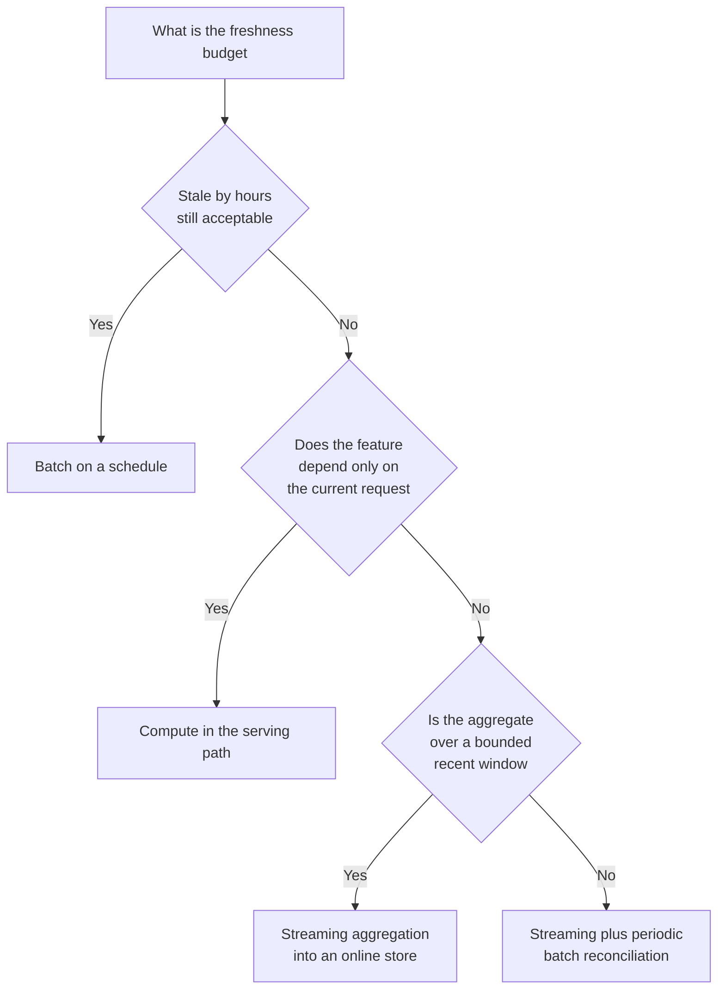
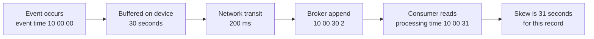
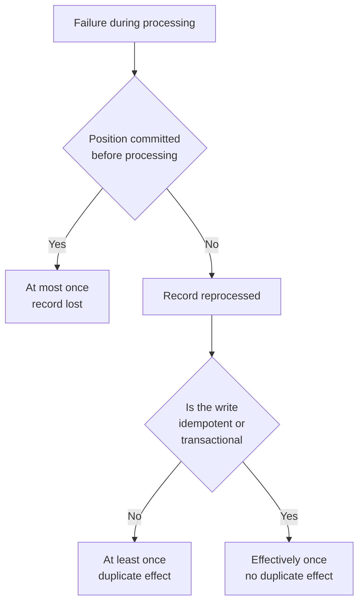
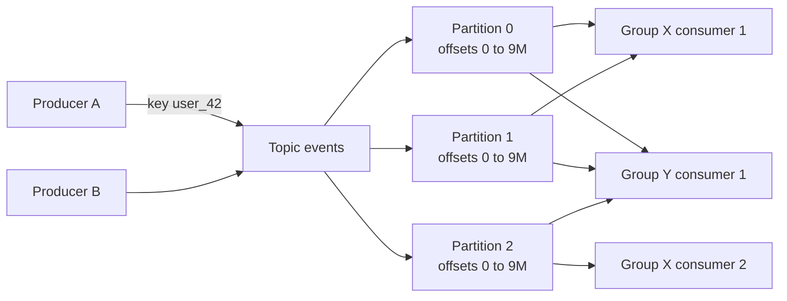
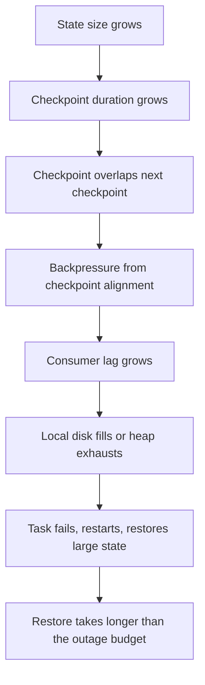
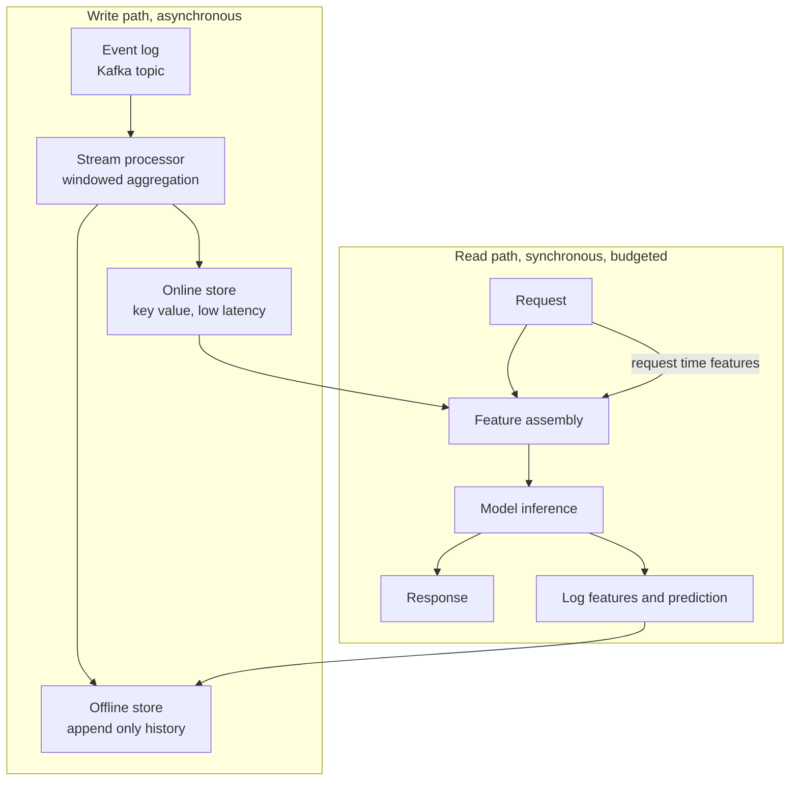
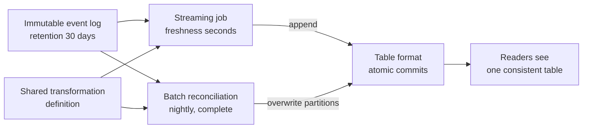

# Chapter 19: Streaming and Real-Time Pipelines

> **What this chapter covers** When streaming is the right design and when it is not, event time against processing time, windows and watermarks, delivery semantics and what exactly-once really means, the partitioned log as the backbone of modern streaming, the stream processing engines and how they honestly compare, stateful processing and the state size problem, backpressure, change data capture, streaming feature computation and the training-serving consistency problem it creates, real-time inference pipelines, the lambda and kappa debate, monitoring, and testing.
> **Prerequisites** Chapter 17 (Data Storage, Formats, and Modelling) and Chapter 18 (Distributed Computing with Spark) for the execution model and Structured Streaming. Chapter 20 follows directly from the feature sections here.
> **Where it is used** Fraud detection, personalisation and ranking, anomaly and alerting systems, operational analytics, real-time feature serving, change data capture into analytics stores, and any machine learning system whose features depend on what a user did in the last few minutes.

---

## 19.1 Level 1: Foundations

### 19.1.1 Batch and streaming are the same computation with different boundaries

A batch job reads a bounded dataset, computes, writes, and exits. A streaming job reads an unbounded dataset, computes continuously, and never exits. That is the only structural difference. Every other difference follows from it.

Because the input is unbounded, a streaming job can never see all the data. So it must decide, for every output, *when it is allowed to produce an answer that might still change*. That question does not exist in batch, and it is the source of almost every concept in this chapter: windows, watermarks, late data, incremental state, and delivery semantics.

A useful reframing: batch is streaming where the window is the whole dataset and the watermark is infinity. Modern engines implement both with one codebase for exactly this reason.

### 19.1.2 The decision: latency and freshness budgets

Streaming is not a technology choice. It is a decision driven by two numbers that come from the business or the product, not from engineering.

**Freshness budget.** How stale may the data behind a decision be before the decision becomes wrong? A daily marketing email can use data from last midnight. A card-fraud decision cannot use data from last midnight, because the fraudster's previous nine transactions all happened in the last four minutes.

**Latency budget.** How long may the system take to respond once the request arrives? This is a different number. A system can serve a response in 20 milliseconds from features computed 12 hours ago; that is low latency with poor freshness.

| Freshness need | Latency need | Right design |
|---|---|---|
| Hours to days | Any | Batch, scheduled |
| Minutes | Seconds | Micro-batch streaming, small interval |
| Seconds | Seconds | Streaming with a log-based source |
| Seconds | Milliseconds | Streaming to precompute plus an online store lookup |
| Milliseconds after the triggering event | Milliseconds | Compute at request time from the request payload |

The last row is important and often missed. If a feature depends only on the current request, such as the amount of the transaction being scored, no streaming system is needed; compute it in the serving path. Streaming is for features that aggregate over *history* that must be kept fresh.

The honest default is batch. Streaming costs roughly two to five times more in engineering effort and operational burden for the same logic: always-on infrastructure, state to manage, restart semantics to get right, and a whole new class of correctness bug. Adopt it when a stated freshness budget cannot be met otherwise, and write the budget down so the decision can be revisited.



*Figure 19.1: The freshness budget, not the available technology, decides whether a pipeline should stream.*

### 19.1.3 Event time and processing time

Every record has at least two timestamps that matter.

**Event time** is when the thing happened, in the world. It is stamped into the record at the source: the moment the user tapped the button, the moment the sensor sampled.

**Processing time** is when the stream processor saw the record. It is read from the processor's clock.

They are never equal, and the gap, called **skew**, is not constant. Causes of skew:

- Network transit and broker buffering, usually milliseconds to seconds.
- Client-side batching, where a mobile application buffers events and uploads every thirty seconds.
- Offline clients, where a phone in aeroplane mode uploads three hours of events at once.
- Retries and dead-letter replay, which can be hours or days.
- Backfills, where you replay a month of history through the same pipeline in twenty minutes.
- Clock skew at the source, where a client's clock is simply wrong, sometimes by years.



*Figure 19.2: Skew between event time and processing time accumulates at each hop and varies per record.*

The rule is simple and absolute: **aggregate on event time, not processing time**. Processing-time aggregation gives results that change when you replay history, when a consumer lags, or when you restart a job. Results that depend on when you ran the job are not reproducible, and a machine learning feature that is not reproducible causes training-serving skew, which section 19.3.7 develops.

The exception is monitoring your own pipeline. Processing-time metrics tell you about the pipeline's health. Event-time metrics tell you about the world.

### 19.1.4 Windows

You cannot aggregate an unbounded stream. You aggregate a window of it. Three kinds cover almost everything.

**Tumbling windows** are fixed-size and non-overlapping. Every record belongs to exactly one. A 5-minute tumbling window assigns a record with event time 10:07:23 to the window `[10:05:00, 10:10:00)`.

**Sliding windows** are fixed-size and overlap by a fixed step. A window of size 10 minutes sliding every 2 minutes means every record belongs to 5 windows. This multiplies both state and output volume by size divided by slide, which is a real cost: a 1-hour window sliding every minute puts each record in 60 windows.

**Session windows** have no fixed size. They group records separated by less than a gap duration, and close when the gap elapses with no activity. Sessions are the natural model for user behaviour, and they are the most expensive, because the engine cannot know a session's boundaries in advance and must merge windows when a late record arrives that bridges two of them.

**Worked example.** Events for one user, event times in minutes past the hour: 1, 3, 4, 12, 13, 41.

| Window type | Specification | Resulting groups |
|---|---|---|
| Tumbling | 10 minutes | `[0,10)`: {1,3,4}; `[10,20)`: {12,13}; `[40,50)`: {41} |
| Sliding | size 10, slide 5 | `[-5,5)`: {1,3,4}; `[0,10)`: {1,3,4}; `[5,15)`: {12,13}; `[10,20)`: {12,13}; `[35,45)`: {41}; `[40,50)`: {41} |
| Session | gap 5 minutes | `[1,4]`: {1,3,4}; `[12,13]`: {12,13}; `[41,41]`: {41} |

Notice the sliding case produces six windows from six records that formed three tumbling windows. That is the multiplier in action.

Two more window types appear in some engines. **Global windows** put everything in one window and require a custom trigger to ever emit. **Count windows** group by number of records rather than time; they are simple but produce results at unpredictable times, which makes them poor for features.

### 19.1.5 Watermarks and the completeness trade

A window over event time cannot emit a final result until the engine believes no more records for that window will arrive. Since the engine cannot know that, it estimates.

A **watermark** is a monotonically non-decreasing timestamp $W$ asserting that no record with event time less than $W$ will arrive from now on. The common heuristic:

$$W_t = \max_{s \le t}\left(\text{event time of records seen by } s\right) - d$$

where $d$ is the allowed lateness. When $W$ passes the end of a window, the window is complete and can emit and free its state.

The trade is fully determined by $d$.

| Choice of $d$ | Completeness | Latency of final result | State held |
|---|---|---|---|
| Small | Drops more late records | Low | Low |
| Large | Drops fewer | High | High |

There is no correct $d$ in general. Derive it. Measure the empirical distribution of `processing_time - event_time` over a representative period, and choose a percentile you can defend, for example the 99th. If the 99th percentile of lateness is 90 seconds, $d = 2$ minutes drops about 1 percent of records from windowed aggregates, and you should know and state that number rather than discover it later.

For a machine learning feature, there is a second consideration: the same $d$ must be used in the training pipeline that reconstructs the feature from history, or the feature computed offline differs systematically from the feature served online. This is the most subtle source of training-serving skew and is developed in 19.3.7.

Watermarks in a partitioned source are per-partition and then combined. The global watermark is the **minimum** across input partitions, because a single lagging partition means the overall assertion cannot be stronger than the weakest input. A consequence: one idle partition stalls the watermark for the entire job and windows never close. Engines provide an idle-source timeout to advance the watermark past a silent partition; you almost always need it, and forgetting it is a classic outage.

### 19.1.6 Late and out-of-order data

Records arrive out of order routinely. Out-of-order is not late; a record is **late** only if its event time is below the current watermark when it arrives.

Four possible policies when a late record arrives.

| Policy | Behaviour | Use when |
|---|---|---|
| Drop | Discard silently, increment a counter | Approximate metrics, and always measure the counter |
| Update | Re-emit the corrected window result | Sink supports upsert and downstream can handle restatement |
| Side output | Route to a separate stream or table | You must not lose records, for audit or reconciliation |
| Allowed lateness | Keep state past the watermark for a grace period, then drop | You want bounded correction without unbounded state |

Apache Beam and Apache Flink expose allowed lateness and side outputs explicitly. Spark Structured Streaming drops beyond the watermark and does not provide a built-in side output for dropped records; you can approximate it with a separate branch that filters on a lateness expression. Check your version.

The practical pattern in production machine learning systems is **drop online, correct in batch**: the streaming job drops late records and serves slightly incomplete aggregates, while a nightly batch job recomputes the same aggregates from the durable log with complete data and overwrites. That combination gives low-latency approximate features and eventually exact history for training. It also forces you to confront whether the training data should use the exact values or the approximate ones. It should use the approximate ones, because those are what serving will see.

---

## 19.2 Level 2: Working knowledge

### 19.2.1 Delivery semantics

Three levels, defined by the observable effect of a failure and retry.

**At most once.** Each record is delivered zero or one times. The producer does not retry; the consumer commits its position before processing. Records are lost on failure. Acceptable only for high-volume, low-value telemetry where loss is cheaper than duplication.

**At least once.** Each record is delivered one or more times. The producer retries; the consumer commits its position after processing. No loss, but a failure between processing and committing means the record is processed again. This is the default almost everywhere and the baseline you should assume.

**Exactly once.** Each record affects the result exactly once. This is achievable, with conditions, and is worth being precise about because the term is heavily abused.

What is genuinely impossible is exactly-once *delivery* over an unreliable network, which is a consequence of the two-generals problem. What is achievable is exactly-once *effect*, and there are exactly two ways to get it:

1. **Transactional commit.** The processing result and the consumed position are committed atomically. Either both land or neither does. This requires the sink and the offset store to participate in one transaction, which in practice means the sink is the same system as the log, or a database that can hold both.
2. **Idempotent sink plus deterministic keys.** The record is reprocessed, but the write has no additional effect. An upsert keyed by a deterministic identifier, an insert with a unique constraint, or a write to a specific file path that is atomically renamed on commit.

The accurate phrase for the second, which covers most real systems, is **effectively once**. Reprocessing happens; the effect is once.



*Figure 19.3: Exactly-once is a property of the sink and the commit protocol, not of the messaging system alone.*

Three things break exactly-once in practice, and they are almost always the cause when a system that claims it produces duplicates.

- **Non-deterministic processing.** If your function calls `random()` or `now()` or reads a mutable external service, reprocessing produces a different value, so an idempotent upsert writes a different row. Make processing deterministic, or derive the key from the input only.
- **Side effects outside the transaction.** Sending an email, calling a payment API, or publishing to an unmanaged endpoint inside a processing function is not covered by any commit protocol.
- **The sink does not actually support it.** A plain HTTP POST is not idempotent. A database insert without a unique constraint is not idempotent.

### 19.2.2 The partitioned append-only log

The dominant messaging model for streaming is the partitioned, append-only, durable log. Apache Kafka is the reference implementation; Apache Pulsar, AWS Kinesis, Azure Event Hubs, and Google Cloud Pub/Sub Lite share the core model, with differences noted where they matter.

The model, in six facts.

1. A **topic** is a named stream, divided into a fixed number of **partitions**.
2. A partition is an ordered, immutable sequence of records. Writes append to the end. Nothing is ever modified in place.
3. Each record in a partition has an **offset**, a monotonically increasing integer. The offset is the record's identity within the partition.
4. Records are retained for a configured time or size, independent of whether anyone read them. A consumer reading is not a destructive operation.
5. A **consumer group** is a set of consumers that jointly read a topic. Each partition is assigned to exactly one consumer in the group. Two different groups read the same records independently.
6. Consumers track their position by committing an offset. Restarting resumes from the committed offset.



*Figure 19.4: Partitions are the unit of parallelism and of ordering, and independent consumer groups read the same log without interfering.*

**Ordering guarantees and their limits.** Order is guaranteed **within a partition only**. There is no global ordering across a topic, and there cannot be without serialising all writes through one machine. So if you need events for one user processed in order, all of that user's events must go to the same partition. That is what key-based partitioning is for: the producer hashes the record key and takes the modulus of the partition count, so equal keys always land on the same partition.

**The key-based partitioning decision** is the most consequential schema decision in a streaming system, because it is very hard to change later.

- Choose a key whose per-key volume is roughly uniform. A key of `country` will put 40 percent of traffic on one partition.
- Choose a key that matches the grain of your downstream state. If you aggregate per user, key by user, and the stream processor gets locality for free.
- Accept that the partition count is effectively fixed. Increasing partitions changes the modulus, so existing keys move to different partitions, breaking the ordering guarantee for in-flight keys and scattering any state keyed by partition. Plan the count with headroom.
- Null key means round-robin or sticky assignment, which gives even distribution and no ordering. That is correct for records with no natural key.

**Partition count sizing.** Let $R$ be the target throughput in megabytes per second, $c$ the sustained throughput one consumer instance can handle, and $p$ the throughput one partition can sustain, which is limited by the broker's disk and replication. Then

$$N_{\text{partitions}} \ge \max\left(\frac{R}{p}, \frac{R}{c}\right)$$

with a headroom factor of 2 to 3 for growth and for consumer slowdowns.

**Worked example.** Target 600 megabytes per second at peak. Measured single-consumer throughput is 25 megabytes per second. Assume a per-partition ceiling of 30 megabytes per second, an assumption to be measured on your hardware rather than taken from anywhere.

$$N \ge \max\left(\frac{600}{30}, \frac{600}{25}\right) = \max(20, 24) = 24$$

With a headroom factor of 2.5, choose 60 partitions. Note this also fixes the maximum consumer parallelism in one group at 60; a 61st consumer sits idle.

**Rebalancing.** When a consumer joins, leaves, or fails to send a heartbeat, the group redistributes partitions. During a classic eager rebalance, all consumers stop consuming, which is a stop-the-world pause proportional to group size. Incremental cooperative rebalancing, available in recent Kafka versions, moves only the affected partitions; check your version and prefer it. Rebalance storms, where slow processing causes a missed heartbeat, causes a rebalance, which causes more lag, which causes another missed heartbeat, are a common production failure. The fix is to separate the heartbeat thread from the processing thread, which modern clients do, and to bound the time between polls with a smaller batch size.

**Retention and compaction.** Two retention policies.

*Time or size based deletion* drops whole segments older than, say, seven days. This is the default and is right for event streams.

*Log compaction* retains the most recent record per key indefinitely, deleting superseded versions in the background. A compacted topic is a changelog: replaying it from the beginning gives the current state of every key. A record with a null value is a **tombstone**, marking the key deleted. Compaction is what makes a log usable as a durable store of state, and it is the mechanism behind change data capture topics and stream processor changelogs.

Compaction does not guarantee that only one version of a key exists at any moment; it guarantees eventual convergence, with a configurable minimum dirty ratio and a period during which duplicates remain readable. Consumers of a compacted topic must therefore be idempotent with respect to repeated keys.

### 19.2.3 Stream processing engines compared honestly

| Dimension | Apache Flink | Spark Structured Streaming | Kafka Streams | Cloud-managed engines |
|---|---|---|---|---|
| Execution model | True record-at-a-time with pipelined operators | Micro-batch, continuous mode limited | Record-at-a-time library in your process | Varies, often record-at-a-time |
| Typical latency | Tens of milliseconds | Hundreds of milliseconds to seconds | Tens of milliseconds | Varies |
| State management | Mature keyed state, RocksDB backend, savepoints | State store with RocksDB option, checkpoints | RocksDB local plus changelog topic | Managed |
| Windowing | Tumbling, sliding, session, custom, allowed lateness, side outputs | Tumbling, sliding, session, watermark, no built-in side output | Tumbling, hopping, session, sliding | Varies |
| Delivery guarantee | Exactly-once with two-phase commit sinks | Effectively once with replayable source and idempotent sink | Exactly-once within Kafka using transactions | Usually at least once, exactly-once where documented |
| Operational burden | High, a cluster to run and tune | Moderate if you already run Spark | Low, no cluster, scales with your service | Low, at a price |
| Batch reuse | Same API, unified | Same API, unified | Not a batch engine | Varies |
| Right when | Latency below 100 ms, complex event-time logic, large state | You already run Spark and need minute-level freshness | Source and sink are both Kafka, logic is per-key | You lack platform engineers |

Three honest observations that vendor material tends to omit.

First, **most streaming requirements are not sub-second**. A freshness budget of one minute is extremely common and is comfortably met by micro-batch. Choosing Flink for a one-minute budget when the team already runs Spark buys latency you do not need in exchange for a second cluster to operate.

Second, **operational burden dominates total cost**. A streaming job runs forever, which means it will encounter every rare condition eventually: a schema change, a poison record, a broker failover, a cloud zone outage, a state store that grows past its disk. The engine that your team can debug at 3 a.m. is the right engine.

Third, **Kafka Streams is undervalued**. When the source and sink are both Kafka and the logic is per-key stateful processing, it is a library in your service with no cluster, no separate deployment, and exactly-once through Kafka transactions. The limits are real: it cannot join to arbitrary external systems efficiently, and scaling is tied to partition count. But for a large class of problems it is the least machinery.

Apache Beam deserves a note: it is a portable API with runners on Flink, Spark, and Google Cloud Dataflow, and the Beam model of windows, triggers, watermarks, and accumulation modes is the clearest formalisation of streaming semantics in existence. Reading the Beam model documentation is worthwhile even if you never write Beam, because every other engine is a partial implementation of it.

### 19.2.4 A first stateful job

**Listing 19.1: a keyed windowed aggregation in PySpark Structured Streaming.**

```python
from pyspark.sql import functions as F, types as T

schema = T.StructType([
    T.StructField("user_id", T.LongType()),
    T.StructField("amount", T.DoubleType()),
    T.StructField("event_ts", T.TimestampType()),
])

events = (
    spark.readStream.format("kafka")
    .option("kafka.bootstrap.servers", "broker:9092")
    .option("subscribe", "transactions")
    .option("maxOffsetsPerTrigger", 500_000)        # backpressure bound
    .load()
    .select(F.from_json(F.col("value").cast("string"), schema).alias("r"))
    .select("r.*")
)

agg = (
    events
    .withWatermark("event_ts", "5 minutes")
    .groupBy(F.window("event_ts", "10 minutes", "5 minutes"), "user_id")
    .agg(F.sum("amount").alias("spend"), F.count("*").alias("n"))
)
```

`maxOffsetsPerTrigger` caps how much one micro-batch ingests, which bounds batch duration and is the primary backpressure lever for a Kafka source. The watermark must be declared before the aggregation and on the same column used in the window, or it is ignored with no error. The window is sliding, size 10 minutes stepping 5, so each record contributes to two windows and state is roughly double the tumbling equivalent.

**Listing 19.2: writing with an idempotent upsert, giving effectively-once.**

```python
def upsert(batch_df, batch_id: int):
    (batch_df
        .withColumn("window_start", F.col("window.start"))
        .drop("window")
        .createOrReplaceTempView("updates"))
    batch_df.sparkSession.sql("""
        MERGE INTO feature_store.user_spend t
        USING updates u
          ON t.user_id = u.user_id AND t.window_start = u.window_start
        WHEN MATCHED THEN UPDATE SET t.spend = u.spend, t.n = u.n
        WHEN NOT MATCHED THEN INSERT *
    """)

q = (agg.writeStream
       .outputMode("update")
       .foreachBatch(upsert)
       .option("checkpointLocation", "s3://bucket/ckpt/user_spend")
       .trigger(processingTime="1 minute")
       .start())
```

The merge key is `(user_id, window_start)`, which is derived entirely from the data, so replaying a batch after a failure rewrites the same rows with the same values. That determinism is what makes the pipeline effectively once. Had the merge inserted a row keyed by a generated identifier or a wall-clock timestamp, a replay would insert duplicates.

### 19.2.5 The mistakes everyone makes first

| Mistake | Consequence | Fix |
|---|---|---|
| Aggregating on processing time | Results change on replay and lag | Use event time and a watermark |
| No watermark on a stateful query | State grows forever until the job dies | Set a watermark derived from measured lateness |
| Watermark applied after the aggregation | Silently ignored | Apply before, on the window column |
| Sharing a checkpoint between two queries | Corrupt state, confusing failures | One checkpoint directory per query, never reused after a logic change |
| Changing the query and reusing the checkpoint | Incompatible state, or silently wrong results | Understand which changes are compatible; when in doubt, new checkpoint and backfill |
| Keying by a low-cardinality field | One partition carries most traffic | Key by something with even distribution, or add a salt |
| No idle-partition timeout | One silent partition freezes the watermark and no window ever closes | Configure the source idle timeout |
| Unbounded key space in state | State grows linearly with distinct keys forever | Apply time-to-live, or bound the key space |
| Sliding windows without counting the multiplier | State and output volume multiplied by size over slide | Use tumbling plus downstream rollup where possible |
| No dead-letter path for unparseable records | One poison record crashes the job on every restart | Route parse failures to a side table and continue |

The poison-record case deserves emphasis. A streaming job restarts from its committed offset. If record 4,281,993 cannot be parsed and the parse throws, the job crashes, restarts, reads record 4,281,993, and crashes again. This is an infinite crash loop that pages someone at 3 a.m. Always parse defensively into a nullable struct and route nulls to a dead-letter sink.

---

## 19.3 Level 3: Depth

### 19.3.1 Stateful processing and state backends

State is any value the processor remembers between records. It is what separates real stream processing from a map over a stream.

**Keyed state** is state scoped to the key of the current record. The engine guarantees that all records for a key are processed by the same task, so the state can be local and needs no coordination. This is the entire basis of scalable stateful streaming: partition by key, keep state local, never share.

Types of keyed state that engines expose: a single value per key, a list per key, a map per key, an aggregating or reducing state that folds new records into an accumulator, and window state managed by the windowing machinery.

**State backends.**

| Backend | Where state lives | Size ceiling | Access cost | Checkpoint cost |
|---|---|---|---|---|
| In-memory / heap | JVM heap on the task | Bounded by heap, garbage collection pain above a few GB | Nanoseconds | Full serialisation |
| RocksDB (embedded key-value store on local disk) | Local disk with a memory cache | Hundreds of GB per task | Microseconds, serialisation per access | Incremental, only changed files |
| Changelog topic (Kafka Streams) | Local RocksDB plus a compacted Kafka topic | Local disk | Microseconds | Continuous, as a log |

RocksDB is the right default above a few gigabytes of state, for two reasons. It moves state off the JVM heap, removing garbage collection pauses that otherwise dominate tail latency. And it supports **incremental checkpointing**: only the changed files since the last checkpoint are uploaded, which turns a checkpoint from a full state dump into a delta. The cost is that every state access serialises and deserialises, which is roughly an order of magnitude slower than a heap object access.

**Checkpointing.** A checkpoint is a consistent snapshot of all operator state plus the input positions that produced it. Flink uses the Chandy-Lamport style asynchronous barrier snapshotting described in Carbone and colleagues, "Lightweight Asynchronous Snapshots for Distributed Dataflows", 2015: barriers are injected into the source streams and flow through the graph, and each operator snapshots its state when it has received barriers on all inputs. The key property is that the job does not stop. Spark's micro-batch model gets the same guarantee more simply, because a batch boundary is already a consistent point.

**Savepoints** are checkpoints you take deliberately, with a stable format, in order to stop a job and restart it later, possibly with changed code or changed parallelism. The distinction matters operationally: checkpoints are for failure recovery and are owned by the job, savepoints are for upgrades and are owned by you. Always take a savepoint before a deploy.

**State schema evolution.** Changing the type of a stateful value is where upgrades break. Engines support some evolution, typically adding optional fields to a serialised record, and reject others. Before changing a stateful operator, know whether the change is compatible. When it is not, the options are to run the new version in parallel from a fresh state and cut over, or to accept a rebuild from the log. Both should be planned, not discovered.

### 19.3.2 State size, the thing that kills streaming jobs

State grows with the number of distinct keys times the bytes per key times the retention. Batch jobs have no equivalent; every batch starts empty. This is the single most common cause of a streaming job that ran fine for three months and then died.

$$S = K_{\text{active}} \times b \times m$$

where $K_{\text{active}}$ is the number of keys with live state, $b$ is bytes per key including serialisation overhead and RocksDB amplification, and $m$ is the window multiplier, which is the number of open windows per key, equal to $\lceil \text{size} / \text{slide} \rceil$ for sliding windows and 1 for tumbling.

**Worked example.** A 1-hour sliding window stepping every 5 minutes, per user, holding a sum and a count, for 20 million active users.

$m = 60/5 = 12$ open windows per key. $b$: two 8-byte numbers plus a key plus window bounds plus serialisation framing, call it 120 bytes; RocksDB space amplification of roughly 1.5 gives 180 bytes. An assumption to measure, not a constant.

$$S = 20{,}000{,}000 \times 180 \times 12 = 43.2 \text{ GB}$$

Spread over 60 tasks that is 720 megabytes per task, which is comfortable on local disk and impossible on heap. Switch the window to tumbling hourly with a downstream rollup and $m = 1$, giving 3.6 gigabytes total. That single change is a twelve-fold reduction and is usually available.

**The unbounded key space problem.** If your key is a user identifier and users never stop existing, $K_{\text{active}}$ grows forever. Three controls:

1. **Watermark-bounded state.** Windowed aggregations free state when the window closes, so state is bounded by the watermark, not by all time. This is automatic and is the main reason to prefer windowed operators over hand-rolled state.
2. **Time to live.** Engines let you attach a time-to-live to keyed state so entries expire after a period of inactivity. Flink's `StateTtlConfig` and Kafka Streams' windowed stores both do this; check your version for Spark's support in arbitrary stateful operators.
3. **Bounding the key space at the source.** Hash the key into a fixed number of buckets when exact per-key state is not required, accepting collisions in exchange for a hard ceiling.

**Monitor state size as a first-class metric.** Checkpoint size and checkpoint duration are the proxies available in every engine. A checkpoint duration trending up over weeks is the leading indicator of the outage; act on the trend, not the failure.



*Figure 19.5: The state size failure cascade, where each stage takes weeks and the last stage takes minutes.*

### 19.3.3 Backpressure

Backpressure is the condition where a downstream operator cannot consume as fast as an upstream operator produces. It is not a failure; it is a signal, and a well-designed system propagates it all the way to the source and slows ingestion rather than buffering without bound.

**How it manifests.**

| Symptom | Where you see it |
|---|---|
| Consumer lag rising monotonically | Broker consumer group lag metric |
| Input buffer utilisation at 100 percent on an upstream task | Flink backpressure monitor, per-task |
| Batch duration exceeding the trigger interval | Spark streaming query progress |
| Records-in rate flat while offered rate rises | Throughput metrics |
| Checkpoint alignment time rising | Checkpoint metrics |

**Causes, in the order you should check them.**

1. **Skew.** One key or one partition carries far more traffic. Same diagnosis as Chapter 18, level 3: compare per-task throughput, not the aggregate.
2. **An external call in the hot path.** A synchronous lookup to a database or an HTTP service at 20 milliseconds per record caps one task at 50 records per second regardless of hardware. This is the most common cause in machine learning pipelines, because feature enrichment tempts you into a per-record lookup.
3. **State access cost.** A RocksDB access per record with a large value, or a scan over a list state that grows.
4. **Insufficient parallelism.** Straightforwardly not enough tasks, bounded above by partition count.
5. **Checkpointing cost.** Large synchronous state snapshots stalling processing.
6. **Garbage collection.** Heap state with long pauses.

**Remedies, matched to cause.**

- For external calls: batch them. Buffer records, issue one lookup for a hundred keys, distribute results. Or make them asynchronous, which Flink supports directly with async input and output operators, so one task can have hundreds of requests in flight. Or eliminate them by joining against a co-partitioned stream or a broadcast state instead.
- For skew: repartition with a salt, or pre-aggregate before the keyed operator.
- For state: shrink it as in 19.3.2, or switch to RocksDB with incremental checkpointing.
- For parallelism: increase task count, which requires increasing source partitions if you are already at the ceiling.
- As a bound of last resort: rate-limit the source. `maxOffsetsPerTrigger` in Spark, or a configured source rate limit elsewhere. This does not fix anything, it just makes the failure graceful and keeps batch durations predictable while you fix the real cause.

A note on dropping: some systems respond to overload by sampling or dropping records. For a metrics pipeline this is defensible. For a machine learning feature pipeline it is usually not, because the dropped records are not random with respect to the outcome; heavy users generate more events and are dropped more, which biases the feature.

### 19.3.4 Change data capture

Change data capture, abbreviated CDC, turns the changes in an operational database into a stream. It is how transactional data reaches analytics and machine learning systems without hammering the production database.

**Three implementation patterns.**

| Pattern | Mechanism | Catches deletes | Load on source | Latency |
|---|---|---|---|---|
| Query based | Poll `WHERE updated_at > last_seen` | No | Repeated scans, index required | Poll interval |
| Trigger based | Database triggers write to an audit table | Yes | Write amplification on every transaction | Near real time |
| Log based | Read the database's write-ahead or binary log | Yes | Minimal, reads the replication stream | Milliseconds to seconds |

Log-based is the correct answer when available. It reads the same replication log the database already writes for its own replicas, so it adds almost no load, it captures deletes, and it sees every intermediate state rather than only the latest value at poll time. Debezium is the common open-source implementation, with connectors for PostgreSQL logical decoding, MySQL binlog, MongoDB oplog, and others.

Query-based capture has two silent correctness failures that are worth naming because they are easy to ship and hard to notice. It misses deletes entirely, so your downstream table accumulates rows that no longer exist. And it misses intermediate states, so a row updated three times between polls appears to have changed once, which destroys any feature that counts state transitions.

**The CDC record shape.** A log-based CDC event carries the operation (insert, update, delete), the value before, the value after, the source transaction metadata, and a position in the log. Downstream you either apply it as an upsert into a mirror table, or keep the full history as a slowly changing dimension for point-in-time correctness, which Chapter 20 develops.

**Snapshot plus stream.** You cannot start a CDC stream in the middle and have a complete table. The standard protocol is: take a consistent snapshot of the table, record the log position at which the snapshot was taken, then stream changes from that position. Incremental snapshotting, as in the approach described by the Debezium project following Netflix's DBLog design, interleaves chunks of the snapshot with the live stream so the process can be paused, resumed, and run without locking the source table.

**Ordering and the key.** Emit CDC records keyed by the table's primary key so that all changes to a row land on the same partition and are applied in order. Without this, an update can be applied before the insert it depends on, or a delete before the update it supersedes.

**Schema change.** The source schema will change. Log-based CDC tools emit a schema change event, and the downstream consumer must handle it. Adding a nullable column is usually safe to propagate. Dropping a column, renaming one, or changing a type usually is not, and needs a coordinated change. Use a schema registry with a compatibility mode, typically backward compatibility, so that incompatible producer changes are rejected at write time rather than discovered at read time.

### 19.3.5 Real-time inference pipelines end to end

A real-time machine learning system has a read path and a write path, and confusing the two is the most common architectural error.



*Figure 19.6: The write path keeps features fresh asynchronously, and the read path only looks things up, so the latency budget is spent on a lookup and an inference rather than on computation.*

**Budgeting the read path.** Suppose the end-to-end budget is 100 milliseconds at the 99th percentile. Allocate it:

| Component | Budget at p99 | Notes |
|---|---|---|
| Network in and out | 10 ms | Depends on topology |
| Feature lookup | 15 ms | One batched multi-get, not N gets |
| Request-time feature computation | 5 ms | Pure functions of the payload |
| Model inference | 40 ms | See Chapter 24 |
| Post-processing and business rules | 10 ms | |
| Headroom | 20 ms | Never budget to 100 percent |

The single most important line is "one batched multi-get". Fetching 40 features with 40 round trips at 3 milliseconds each is 120 milliseconds and blows the budget on its own. Fetch them in one request. If features live in multiple stores, fetch from the stores in parallel, not in sequence.

**The logging requirement.** Log the exact feature vector used for each prediction, keyed by a prediction identifier, alongside the model version. This is not optional. Without it you cannot debug a bad prediction, you cannot measure training-serving skew, you cannot build a training set from production traffic, and you cannot attribute an outcome to a model version. Log it asynchronously to the event log so it does not sit in the latency budget.

**Fallbacks.** The online store will be unavailable sometimes. Decide, in advance and in writing, what happens: serve with a default feature value and a flag, serve a simpler model that needs fewer features, or fail the request. Each is defensible; silently serving zeros for missing features is not, because zero is a legitimate value and the model will treat the outage as real signal.

### 19.3.6 Streaming feature computation

A streaming feature is an aggregate over recent history, kept fresh. Examples: transactions in the last 5 minutes for this card, distinct merchants in the last hour, ratio of current amount to the trailing 30-day mean.

Three computation patterns, and the choice is about the shape of the aggregate.

**Incremental aggregation.** The aggregate is associative and has a small accumulator, so it updates in constant time and space per record. Sum, count, min, max, mean via sum and count, and variance via Welford's method all qualify. This is the cheap case and covers most useful features.

**Sliding window with expiry.** The aggregate needs to subtract records leaving the window as well as add records entering it. Sum supports this trivially since subtraction is available; min and max do not, because you cannot un-see a minimum, so they need either a list of the window contents or a monotonic deque. This is why a rolling max is much more expensive than a rolling sum, a fact that surprises people at design time.

**Sketches for the expensive aggregates.** Distinct count, quantiles, heavy hitters, and set membership are all expensive exactly and cheap approximately.

| Aggregate | Sketch | Typical space | Typical error |
|---|---|---|---|
| Distinct count | HyperLogLog | 1 to 16 KB | 1 to 2 percent relative |
| Quantiles | t-digest or KLL | 1 to 10 KB | Bounded rank error |
| Heavy hitters | Count-Min Sketch | Tunable | Overestimate bounded with probability |
| Membership | Bloom filter | Tunable | False positives only |

Sketches are mergeable, which is the property that matters: you can compute one per window per key and merge them across windows to get a longer window, so a 1-day distinct count can be assembled from 24 hourly sketches without keeping any raw data. Design features around mergeable sketches and the state problem largely dissolves.

**Listing 19.3: a tumbling-plus-rollup design that bounds state.**

```python
# Stage 1: tumbling 5-minute aggregates, state bounded by watermark
five_min = (
    events.withWatermark("event_ts", "2 minutes")
          .groupBy(F.window("event_ts", "5 minutes"), "card_id")
          .agg(F.sum("amount").alias("amt"),
               F.count("*").alias("n"),
               F.expr("approx_count_distinct(merchant_id)").alias("merch_hll"))
)

# Stage 2: roll up the small aggregates, not the raw events
one_hour = (
    five_min.withWatermark("window_end", "2 minutes")
            .groupBy(F.window("window_end", "1 hour"), "card_id")
            .agg(F.sum("amt").alias("amt_1h"), F.sum("n").alias("n_1h"))
)
```

The two-stage shape means the hourly aggregate holds 12 small rows per key rather than every raw event, and the 5-minute state closes and frees every 5 minutes. Note that `approx_count_distinct` as written computes a distinct count per window rather than returning a mergeable sketch; check your version for whether a mergeable sketch type is exposed, and if not, either accept per-window distinct counts or compute the sketch in a user-defined aggregate.

### 19.3.7 The training-serving consistency problem streaming creates

This is the section to reread. Streaming features are the largest source of training-serving skew in production machine learning, and the mechanism is not obvious.

At serving time, a feature such as "transactions in the last hour" is computed by the streaming job and read from the online store. Its value reflects whatever the streaming job had processed at that instant: some records were late and dropped, some were still in flight, the watermark was where it was.

At training time, the same feature is usually recomputed from the full event history in the warehouse, by a batch job, with all records present including the late ones. The batch value is **more complete** than the serving value.

The model therefore trains on a feature distribution that serving never produces. The model learns to rely on a signal that is systematically weaker in production. The gap is largest exactly where it hurts most: for the highest-volume entities, whose events are most likely to be delayed by batching and backpressure.

Four mechanisms of this skew, each with a fix.

| Mechanism | Example | Fix |
|---|---|---|
| Completeness gap | Batch sees late records, serving did not | Log served feature values and train on the logs |
| Different code | Batch feature in SQL, serving feature in Scala | One definition, one implementation, or a tested equivalence |
| Different time semantics | Batch uses calendar hour, serving uses trailing 60 minutes | Define the window precisely and use the same definition |
| Different watermark or lateness | Batch has no concept of lateness | Apply the same lateness policy in the batch recomputation |

The strongest fix, and the one worth defaulting to, is **train on logged serving features**. Log the exact feature vector that was served, with a prediction identifier and a timestamp. Join the label to it later by that identifier. The training data is then, by construction, drawn from the serving distribution, including all its imperfections. The cost is that you cannot train on a feature until you have served it, so a new feature requires a shadow-logging period before it can be used. That cost is worth paying.

The weaker but still useful fix is point-in-time correct offline reconstruction, which Chapter 20 covers in detail: reconstruct the feature as of the prediction timestamp using only records that had arrived by then, which requires the offline store to record both event time and arrival time. Storing the arrival time alongside the event time is a small decision at ingestion that makes this possible; not storing it makes it impossible.

---

## 19.4 Level 4: Mastery

### 19.4.1 Lambda, kappa, and the honest modern position

**Lambda architecture**, named by Nathan Marz around 2011, runs two paths over the same data. A batch path recomputes everything from the immutable master dataset periodically and produces exact results. A speed path computes approximate results over recent data with low latency. A serving layer merges them, preferring batch results where available.

The property it buys is real: the batch path is a full recomputation, so any bug in the streaming path is eventually corrected, and any change in logic is applied retroactively without a migration. The cost is equally real: two implementations of every piece of business logic, in two systems, with two sets of bugs, which must agree.

**Kappa architecture**, argued by Jay Kreps in 2014, removes the batch path. Everything is a stream. To recompute with new logic, you replay the log from the beginning through a new version of the job, write to a new output, and cut over. The retention of the log must therefore cover the period you might need to replay.

The honest modern position is that neither name describes what good teams build, and the debate has been overtaken by two developments.

First, **unified engines** made the two paths the same code. Spark and Flink run the same DataFrame or Table program over bounded and unbounded input. The primary objection to lambda, duplicate logic, largely dissolves when the logic is written once and executed in two modes.

Second, **table formats with atomic commits**, meaning Delta Lake, Apache Iceberg, and Apache Hudi, made the serving layer merge unnecessary. A streaming job appends to a table and a batch job overwrites partitions of the same table atomically. Readers see one consistent table. There is no merge layer, no two sets of results, no reconciliation logic.

What most mature systems actually run is a streaming job for freshness writing into a table format, plus a periodic batch job that recomputes and corrects the same table, plus one shared definition of the transformation. Call it what you like. The design properties that matter are: an immutable log as the source of truth, enough retention to replay, one definition of the logic, and atomic table writes so corrections are invisible to readers.



*Figure 19.7: The modern pattern, where one logic definition runs in two modes and writes to one atomically committed table.*

### 19.4.2 Advanced semantics: triggers and accumulation

The Beam model, set out in Akidau and colleagues, "The Dataflow Model: A Practical Approach to Balancing Correctness, Latency, and Cost in Massive-Scale, Unbounded, Out-of-Order Data Processing", 2015, decomposes streaming semantics into four questions. They are worth internalising because they are the complete set.

1. **What** results are computed? The aggregation.
2. **Where** in event time are they computed? The windowing.
3. **When** in processing time are they emitted? The triggering.
4. **How** do refinements relate? The accumulation mode.

Triggering is the part most engines expose weakly. Beam lets you emit early, speculative results before the watermark passes, then a final result at the watermark, then late refinements after it. That is exactly what a real-time dashboard wants: a number now that gets more accurate. Spark's `update` output mode is a limited form of this, emitting whatever changed in each micro-batch.

Accumulation mode decides whether each emission replaces the previous one (accumulating) or contains only the delta since it (discarding). Getting this wrong produces a downstream sum that is wrong by exactly the number of emissions, a bug that is nearly invisible until someone checks a total.

### 19.4.3 Exactly-once implementations, and their costs

**Kafka transactions.** A producer can write to multiple partitions and commit consumer offsets in one transaction, which gives read-process-write exactly-once inside Kafka. The consumer must be set to read committed. The cost is latency, because a transactional read cannot return records past the last stable offset, so consumers see data only after a commit; with a 100 millisecond commit interval, that adds up to 100 milliseconds of latency. Kafka Streams uses this mechanism.

**Two-phase commit sinks.** Flink's `TwoPhaseCommitSinkFunction` pattern pre-commits on checkpoint and commits on checkpoint completion. The sink must support a durable pre-commit that survives a restart, which files do via staging paths and databases do via prepared transactions. The cost is that output is visible only at checkpoint boundaries, so the checkpoint interval becomes the output latency.

**Idempotent writes.** No coordination, no latency cost, and works with sinks that support nothing. This is why it is the dominant approach in practice. The requirement it pushes onto you is determinism: the key and the value must be pure functions of the input records.

The trade to state plainly: strict exactly-once costs latency proportional to the commit interval. Effectively-once with idempotent sinks costs nothing but requires design discipline. For machine learning feature pipelines, effectively-once is almost always the right choice, because features are keyed by entity and time window, which is a naturally deterministic key.

### 19.4.4 Where the standard advice is wrong

**"Use streaming because real-time is better."** Freshness has a value curve, and it is usually flat above some threshold. A recommendation feature that updates every 10 minutes is frequently indistinguishable in offline and online metrics from one that updates every 10 seconds. Measure the lift from freshness before buying it. The right experiment is to serve a deliberately staled version of a feature to a holdout and measure the metric difference; teams that run it are often surprised.

**"Exactly-once means you do not have to think about duplicates."** It means the framework handles duplicates within its own boundary. Every side effect outside that boundary, every non-deterministic function, and every sink without a transaction is yours.

**"Increase parallelism to fix lag."** Parallelism is bounded by partition count, and beyond that it does nothing. Worse, if the cause is a per-record external call, adding tasks adds load to the external system and can cascade. Diagnose before scaling.

**"Kafka guarantees ordering."** Within a partition. Any statement about ordering that does not mention the partition is wrong.

**"Just replay the log to fix it."** Replay requires that retention covers the period, that the consumer can write to a fresh output without corrupting the live one, that downstream consumers tolerate the resulting burst, and that the job is deterministic. Each of those is a design decision that must be made before the incident, not during it. A team that has never tested a replay does not have a replay capability.

### 19.4.5 Monitoring a streaming system

Streaming systems fail slowly and silently. Batch jobs fail loudly, because a job either completed or did not. A streaming job that is 4 hours behind is running perfectly by every process-level check.

The four signals, in priority order.

**1. Consumer lag.** The difference between the latest offset in each partition and the committed offset. This is the single most important metric. Alert on the *derivative*, not only the level: lag that is high but flat means a burst that is being worked through, while lag that is rising steadily means the job cannot keep up and will never recover without intervention. Track it per partition; an aggregate hides the case where one partition is stuck.

**2. Watermark progress.** The current watermark, and its lag behind wall clock. A frozen watermark means windows never close and no output is produced, and it is invisible in throughput metrics because the job is happily consuming. The usual cause is an idle partition. Alert when watermark lag exceeds a few times the configured allowed lateness.

**3. Throughput, in and out.** Records and bytes per second at each stage. The ratio of input to output tells you about filtering and aggregation and should be stable; a sudden change means the data changed.

**4. State size and checkpoint duration.** Both as trends over weeks. Alert on checkpoint duration exceeding a fraction, say 30 percent, of the checkpoint interval, because beyond that checkpoints begin to overlap.

Supporting signals: restart count, which should be zero and whose non-zero value should be investigated even when the job recovers; dropped-late-record count, which quantifies the watermark decision; dead-letter volume; and end-to-end event-time latency measured by stamping ingestion time and comparing at the sink.

| Signal | Healthy | Investigate | Page |
|---|---|---|---|
| Consumer lag derivative | Near zero | Positive for 15 min | Positive for 1 hour |
| Watermark lag | Under 2 times allowed lateness | Over 5 times | Frozen for 10 min |
| Checkpoint duration | Under 10 percent of interval | Over 30 percent | Over 100 percent |
| Restart count per day | 0 | 1 or more | Crash loop |
| Late-drop rate | Below the designed percentile | Double it | 10 times it |

Those thresholds are starting points to be calibrated against your own budgets, not universal constants.

### 19.4.6 Testing streaming logic

Streaming is testable, and the reason it is often untested is that people try to test it by running it.

**Level 1: pure functions.** Extract every transformation into a pure function of input records to output records and unit test it with ordinary tests. This should cover most of your logic and requires no streaming infrastructure at all. If your business logic cannot be extracted this way, the job is structured badly.

**Level 2: deterministic event-time tests.** Feed a fixed list of records with controlled event times into the windowing and stateful operators, drive the watermark manually, and assert on emitted results. Flink provides test harnesses for operators and a `MiniCluster`. Kafka Streams provides `TopologyTestDriver`, which runs an entire topology in one thread with no broker and manual time control, and it is excellent. Spark supports a `MemoryStream` source where you append batches and advance processing manually.

The essential capability at this level is **controlling time**. A test that uses wall-clock time and sleeps is flaky and slow and tests nothing about correctness.

**Listing 19.4: an event-time test with a deliberately late record.**

```python
from pyspark.sql import functions as F

src = MemoryStream[dict](spark)          # illustrative, see your version's API
q = build_pipeline(src.toDF()).writeStream.format("memory") \
      .queryName("out").outputMode("update").start()

src.addData([{"k": "a", "ts": t(10, 0, 0), "v": 1},
             {"k": "a", "ts": t(10, 0, 30), "v": 2}])
q.processAllAvailable()
assert result("a", window=t(10, 0, 0)) == 3

src.addData([{"k": "a", "ts": t(10, 20, 0), "v": 9}])   # advances watermark
src.addData([{"k": "a", "ts": t(10, 0, 45), "v": 5}])   # LATE, beyond 5 min
q.processAllAvailable()
assert result("a", window=t(10, 0, 0)) == 3             # unchanged: dropped
```

The two assertions encode the watermark policy as a test. If someone later widens the watermark, this test fails and forces an explicit decision, which is exactly what you want, because the watermark is a correctness parameter and silent changes to it change the feature distribution.

**Level 3: integration tests.** Run a real broker and a real job in a container, produce known input, assert on output. Use these sparingly for the seams: serialisation format, schema registry compatibility, connector configuration, and checkpoint restore.

**Level 4: the tests nobody writes and everybody needs.**

- *Restart from checkpoint.* Kill the job mid-stream, restart it, and assert the output has no duplicates and no gaps. This tests the thing that will actually happen in production.
- *Replay.* Replay a fixed input twice into an idempotent sink and assert the result is identical. This is the direct test of effectively-once.
- *Poison record.* Insert an unparseable record and assert the job continues and routes it to the dead-letter path.
- *Schema evolution.* Produce records with an added field and assert the consumer still works.
- *State growth.* Run with a synthetic key space of realistic cardinality and measure state size against the predicted formula from 19.3.2.

A final note on the hardest case: **non-determinism from ordering**. A job whose output depends on the arrival order of records within a window will pass a test with one ordering and fail with another. Test with shuffled input as a matter of course. If the output legitimately depends on order, then the ordering must be guaranteed by the key-based partitioning, and the test should assert that too.

---

## 19.5 Subtopic checklist

| Subtopic | You should be able to |
|---|---|
| Batch versus streaming | Decide from a stated freshness and latency budget, and justify choosing batch |
| Event and processing time | Name four causes of skew and say why aggregation must use event time |
| Windows | Assign records to tumbling, sliding, and session windows, and compute the sliding multiplier |
| Watermarks | Derive a watermark from a measured lateness distribution and state what it costs |
| Late data | Choose among drop, update, side output, and allowed lateness, and justify it |
| Delivery semantics | Explain why exactly-once delivery is impossible and exactly-once effect is not |
| Partitioned log | Describe offsets, consumer groups, rebalancing, retention, and compaction |
| Key partitioning | Choose a key and a partition count with arithmetic, and say why changing it later is hard |
| Engine comparison | Compare engines on state, windowing, guarantees, and operational burden |
| Stateful processing | Choose a state backend and explain incremental checkpointing and savepoints |
| State size | Compute expected state from key count, bytes, and window multiplier, and shrink it |
| Backpressure | Diagnose the cause from metrics and apply the matched remedy |
| Change data capture | Compare query, trigger, and log based capture, and explain snapshot plus stream |
| Streaming features | Design a feature using mergeable sketches and a two-stage rollup |
| Training-serving consistency | Name four mechanisms of skew from streaming and give the strongest fix |
| Real-time inference | Budget a read path and explain why feature lookups must be batched |
| Lambda and kappa | State what each buys and why the debate has moved on |
| Monitoring | Name the four signals and give an alerting rule for each |
| Testing | Write an event-time test with a late record and a restart-from-checkpoint test |

---

## 19.6 Common misconceptions

| Misconception | Why it is believed | What is actually true |
|---|---|---|
| Streaming is just faster batch | Both process the same records | Unboundedness forces decisions batch never faces: when to emit, how long to wait, what state to keep. Those decisions are the whole subject |
| Exactly-once means no reprocessing | The phrase suggests it | Records are reprocessed after failure. The guarantee is that the observable effect is once, which requires a transactional or idempotent sink |
| Kafka guarantees message ordering | It is stated without qualification constantly | Ordering holds within a partition. Across partitions there is no ordering, and there cannot be without serialising all writes |
| A larger watermark is safer | It drops fewer records | It also grows state, delays final results, and can push checkpoint duration past the interval. It is a trade, not a safety margin |
| Rising consumer lag means add consumers | Lag looks like insufficient capacity | Consumers beyond the partition count do nothing, and if the cause is a per-record external call, more consumers make the external system worse |
| Streaming features and batch features are the same if the code is the same | The logic is identical | Serving sees incomplete data due to lateness and in-flight records. Recomputing offline with complete data produces a different distribution, which is training-serving skew |
| Log compaction means only one record per key exists | That is its purpose | Compaction converges eventually with a configurable dirty ratio. Consumers must be idempotent with respect to repeated keys |
| Query-based change data capture is good enough | It is the easiest to build | It misses deletes entirely and misses every intermediate state between polls, which silently corrupts any transition-counting feature |
| Sliding windows cost about the same as tumbling | They look similar to write | Each record lands in size divided by slide windows, multiplying both state and output volume, often by ten or more |
| A streaming job that is running is healthy | Process checks pass | A job four hours behind, or with a frozen watermark producing no output, passes every process-level check. Lag and watermark progress are the real signals |

---

## 19.7 Practice

**Exercise 1 (level 2): measure lateness and derive a watermark.**
Take a public dataset with genuine event timestamps, for example the NYC Taxi and Limousine Commission trip records, and replay it into a local Kafka or a file stream with a deliberately perturbed arrival order drawn from a heavy-tailed distribution. Measure the empirical distribution of arrival minus event time.
*Acceptance criterion:* a table of the 50th, 90th, 99th, and 99.9th percentiles of lateness, a chosen watermark with a written justification, and the measured drop rate at that watermark.

**Exercise 2 (level 2 to 3): window cost measurement.**
Compute the same hourly aggregate three ways: a 1-hour tumbling window, a 1-hour window sliding every 5 minutes, and a two-stage 5-minute tumbling plus hourly rollup. Run each over at least 10 million records with at least 1 million distinct keys.
*Acceptance criterion:* measured state size and checkpoint duration for each, compared against the prediction from the formula in 19.3.2, with the discrepancy explained.

**Exercise 3 (level 3): prove effectively-once, then break it.**
Build a pipeline with an idempotent upsert sink keyed deterministically. Kill it mid-batch and restart. Then introduce a non-deterministic element, for example including the processing timestamp in the key, and repeat.
*Acceptance criterion:* row counts and checksums showing no duplicates in the first case and quantified duplicates in the second, with a written explanation of the exact mechanism.

**Exercise 4 (level 3 to 4): demonstrate training-serving skew from streaming.**
Compute a windowed feature in a streaming job with a 1-minute watermark and log the served values. Separately recompute the same feature in batch from the complete history. Compare the two distributions for the same entities at the same timestamps.
*Acceptance criterion:* a distributional comparison, for example a quantile-quantile plot or a Kolmogorov-Smirnov statistic, the relationship between the size of the gap and the entity's event volume, and a written recommendation.

**Exercise 5 (level 4): induce and diagnose backpressure.**
Add a synthetic 20 millisecond blocking call per record to a working pipeline. Observe lag, buffer utilisation, and batch duration. Then fix it by batching the calls, and fix it again by making them asynchronous.
*Acceptance criterion:* before and after throughput numbers for both fixes, the theoretical throughput ceiling computed from per-call latency and parallelism, and the measured value against it.

---

## 19.8 How this is tested

<details><summary>Answer</summary>

**Q1. When should a pipeline be streaming rather than batch?**

When a stated freshness budget cannot be met by a scheduled batch job. Freshness is how stale the underlying data may be, which is separate from latency, which is how fast a request must be answered. A system can serve in 20 milliseconds from 12-hour-old features, which is low latency with poor freshness. Streaming is for features that aggregate over history that must stay fresh; a feature that depends only on the current request should be computed in the serving path with no streaming system at all. The honest default is batch, because streaming costs materially more in engineering and operational effort for the same logic, and the budget should be written down so the decision can be revisited.

</details>

<details><summary>Answer</summary>

**Q2. Explain event time versus processing time, and why it matters for a machine learning feature.**

Event time is when the thing happened, stamped at the source. Processing time is when the processor saw it. They differ because of client-side batching, offline devices, network transit, retries, backfills, and wrong client clocks, and the gap varies per record. Aggregations must use event time, because a processing-time aggregate changes if you replay the data, if a consumer lags, or if you restart the job, so the result is not reproducible. For a feature specifically, non-reproducibility means the value computed offline for training will not match the value computed online for serving, which is training-serving skew. Processing time is still the right basis for monitoring the pipeline's own health.

</details>

<details><summary>Answer</summary>

**Q3. What is a watermark and how do you choose one?**

A watermark is a monotonically non-decreasing event-time threshold asserting that no further records below it will arrive. The common heuristic is the maximum event time seen so far minus a fixed allowed lateness. When the watermark passes a window's end, the window emits its final result and releases its state. Choose the lateness by measuring the empirical distribution of arrival minus event time over a representative period and picking a percentile you can defend, for example the 99th, then stating the resulting drop rate explicitly. A larger value drops fewer records but grows state, delays finalisation, and can push checkpoint duration past the checkpoint interval. In a partitioned source the global watermark is the minimum across partitions, so an idle partition freezes it entirely unless an idle-source timeout is configured.

</details>

<details><summary>Answer</summary>

**Q4. Does exactly-once processing exist?**

Exactly-once delivery over an unreliable network does not exist; that is a consequence of the two-generals problem. Exactly-once effect does, and there are two ways to achieve it. One is a transactional commit in which the processing result and the consumed position are committed atomically, which requires the sink and the offset store to participate in one transaction. The other is an idempotent sink with a deterministic key, so reprocessing rewrites the same row with the same value and has no additional effect. The second is more common and is accurately called effectively once. It breaks in three ways: non-deterministic processing such as calling a random number generator or a clock, side effects outside the transaction such as sending an email, and a sink that is not actually idempotent, such as an insert with no unique constraint.

</details>

<details><summary>Answer</summary>

**Q5. How would you choose a partition key and a partition count for a new topic?**

The key must give even volume distribution, since a low-cardinality key such as country puts most traffic on one partition, and it should match the grain of downstream state so a keyed stateful operator gets locality for free. It also determines the ordering guarantee, since order holds only within a partition. For the count, take the target throughput divided by the per-partition ceiling and the target throughput divided by measured single-consumer throughput, take the larger, and apply a headroom factor of 2 to 3. For 600 megabytes per second with a 30 megabyte per second partition ceiling and 25 megabyte per second consumers, that is 24 before headroom and around 60 after. The count is effectively permanent, because increasing it changes the hash modulus and moves existing keys to different partitions, breaking ordering for in-flight keys and scattering partition-keyed state. It also caps consumer parallelism in a group.

</details>

<details><summary>Answer</summary>

**Q6. A streaming job ran fine for three months and then started failing. What do you check first?**

State size. Unlike a batch job, which starts empty every run, a streaming job accumulates state proportional to the number of distinct keys, which grows monotonically if the key space is unbounded and there is no time-to-live or watermark bounding it. The cascade is that state grows, checkpoint duration grows, checkpoints begin to overlap, checkpoint alignment causes backpressure, lag rises, local disk or heap is exhausted, and the task fails and then takes longer to restore than the outage budget allows. Check checkpoint size and duration as a trend over weeks, not as a point value. The fixes are a time-to-live on keyed state, replacing a sliding window with a tumbling window plus a downstream rollup, which divides state by the size-over-slide multiplier, and moving to an on-disk state backend with incremental checkpointing.

</details>

<details><summary>Answer</summary>

**Q7. Consumer lag is rising steadily. Walk through your diagnosis.**

First distinguish level from derivative: high but flat lag is a burst being worked through, while a positive derivative means the job cannot keep up and will not recover. Then check per-partition lag rather than the aggregate, since one stuck partition is a different problem from uniform slowness. Then work through the causes in order. Skew, meaning one key or partition carrying disproportionate traffic, which shows as uneven per-task throughput. A synchronous external call in the hot path, which is the most common cause in machine learning pipelines and caps a task at one over the call latency regardless of hardware. Expensive state access. Insufficient parallelism, which is bounded above by partition count. Checkpointing cost. Garbage collection. Adding consumers helps only for the parallelism case and only up to the partition count, and for the external-call case it makes things worse by adding load downstream.

</details>

<details><summary>Answer</summary>

**Q8. Compare the three change data capture patterns.**

Query-based capture polls with a predicate on an updated-at column. It is the easiest to build and has two silent correctness failures: it cannot see deletes, so downstream tables accumulate rows that no longer exist, and it misses every intermediate state between polls, so a row updated three times appears to change once, which corrupts any feature counting state transitions. Trigger-based capture writes to an audit table from database triggers, which catches deletes but adds write amplification to every production transaction. Log-based capture reads the database's own write-ahead or binary log, which the database already writes for replication, so it adds almost no load, catches deletes, and sees every intermediate state. Log-based is correct when available. It requires a snapshot plus stream protocol to get a complete starting state, and records should be keyed by the primary key so changes to a row stay ordered.

</details>

<details><summary>Answer</summary>

**Q9. How does a streaming feature pipeline create training-serving skew, and how do you fix it?**

At serving time the feature reflects whatever the streaming job had processed at that instant, which excludes late records, dropped records, and records still in flight. At training time the same feature is usually recomputed in batch from the complete warehouse history, which includes all of them. The offline value is systematically more complete, so the model learns to rely on a signal that is weaker in production, and the gap is worst for the highest-volume entities whose events are most delayed. There are four mechanisms: the completeness gap, different code in the two paths, different time semantics such as calendar hour versus trailing sixty minutes, and a different lateness policy. The strongest fix is to log the exact feature vector served with a prediction identifier and train on those logs, so the training distribution is the serving distribution by construction. The cost is a shadow-logging period before a new feature can be used. The weaker fix is point-in-time correct reconstruction, which requires storing arrival time alongside event time at ingestion.

</details>

<details><summary>Answer</summary>

**Q10. Budget a 100 millisecond real-time inference path.**

Separate the write path, which keeps features fresh asynchronously, from the read path, which only looks things up. A workable split at the 99th percentile is roughly 10 milliseconds for network in and out, 15 for a batched feature lookup, 5 for request-time features computed from the payload, 40 for model inference, 10 for post-processing, and 20 of headroom, because budgeting to 100 percent leaves no room for a slow dependency. The critical constraint is that the feature lookup must be a single batched multi-get: forty features at forty round trips of 3 milliseconds is 120 milliseconds and exceeds the whole budget by itself. Fetch from multiple stores in parallel, never in sequence. Log the exact feature vector and model version asynchronously for debugging, skew measurement, and training-set construction, and define in advance what happens when the online store is unavailable, since silently substituting zeros makes the model read an outage as real signal.

</details>

<details><summary>Answer</summary>

**Q11. Lambda or kappa, and why?**

Lambda runs a batch path for exact recomputation and a speed path for low-latency approximation, merged at serving. It buys retroactive correction of streaming bugs and logic changes, at the cost of two implementations of every rule. Kappa removes the batch path and recomputes by replaying the log through a new job version, which requires retention covering the replay period. The debate has been overtaken. Unified engines let the same program run over bounded and unbounded input, which removes the duplicate-logic objection to lambda, and table formats with atomic commits let a streaming append and a batch partition overwrite land in one table that readers see consistently, which removes the merge layer. What mature systems run is a streaming job for freshness plus a periodic batch reconciliation, sharing one transformation definition, writing to one atomically committed table. The properties that matter are an immutable log, enough retention to replay, one logic definition, and atomic writes.

</details>

<details><summary>Answer</summary>

**Q12. What do you monitor on a streaming system, and why are process checks insufficient?**

A streaming job that is four hours behind, or whose watermark is frozen so no window ever closes, passes every liveness and process check, because it is running and consuming. The four real signals are consumer lag, alerted on its derivative and tracked per partition; watermark progress and its lag behind wall clock, since a frozen watermark produces no output while throughput looks normal and is usually caused by an idle partition; throughput in and out, whose ratio should be stable; and state size and checkpoint duration as trends over weeks, alerting when checkpoint duration passes roughly 30 percent of the interval because beyond that checkpoints begin to overlap. Supporting signals are restart count, dropped-late-record rate, dead-letter volume, and end-to-end event-time latency.

</details>

<details><summary>Answer</summary>

**Q13. How do you test streaming logic?**

In four layers. Extract transformations as pure functions of records to records and unit test them normally, which should cover most of the logic and needs no infrastructure. Then write deterministic event-time tests that feed fixed records with controlled timestamps, drive the watermark manually, and assert on emitted results; the essential capability is controlling time, since a test that sleeps on wall clock is flaky and tests nothing about correctness. Tools include the Kafka Streams topology test driver, Flink's operator test harnesses, and Spark's in-memory stream source. Then a small number of integration tests against a real broker for serialisation, schema compatibility, and connector configuration. Finally the tests most teams skip and most need: restart from checkpoint asserting no duplicates or gaps, double replay into an idempotent sink asserting identical output, a poison record asserting the job survives and dead-letters it, schema evolution, and state growth measured against the predicted formula. Shuffle the input ordering as a matter of course.

</details>

<details><summary>Answer</summary>

**Q14. Why are sliding windows more expensive than they look, and what do you do about it?**

Each record belongs to size divided by slide windows, so a 1-hour window stepping every 5 minutes places each record in twelve windows. That multiplies state, output volume, and downstream write load by twelve. With 20 million active keys at roughly 180 bytes of state each, that is about 43 gigabytes instead of 3.6. The standard fix is a two-stage design: compute small tumbling aggregates, for example 5 minutes, whose state closes and frees on every window, then roll those small aggregates up to the longer window downstream. The hourly stage then holds twelve small rows per key rather than every raw event. The same idea applies to expensive aggregates: use mergeable sketches such as HyperLogLog for distinct counts and t-digest for quantiles, so a long window is assembled by merging short-window sketches without retaining raw records.

</details>

---

## Summary

1. Batch and streaming differ only in whether the input is bounded, and every streaming concept follows from having to decide when an answer may be emitted.
2. The decision to stream comes from a written freshness budget, not from available technology, and the honest default is batch because streaming costs more in engineering and operations.
3. Event time is when a thing happened and processing time is when you saw it; aggregate on event time or results will change on replay and lag.
4. Tumbling windows are cheapest, sliding windows multiply state and output by size over slide, and session windows are the most expensive because boundaries are data-dependent.
5. A watermark trades completeness for latency and state; derive it from a measured lateness distribution and state the resulting drop rate.
6. The global watermark is the minimum across partitions, so one idle partition freezes it and no window closes unless an idle-source timeout is set.
7. Exactly-once delivery is impossible, exactly-once effect is achievable by transactional commit or by an idempotent sink with a deterministic key, and the honest name for the latter is effectively once.
8. The partitioned append-only log gives ordering within a partition only, offsets as identity, consumer groups as independent readers, and compaction to turn a log into a keyed state store.
9. The partition key and count are close to permanent decisions, because changing the count moves keys between partitions and breaks ordering and partition-keyed state.
10. Engines differ most in operational burden, not in headline latency; most freshness budgets are minutes and are met comfortably by micro-batch.
11. State size is what kills streaming jobs, it grows as active keys times bytes times the window multiplier, and checkpoint duration is its leading indicator weeks before the failure.
12. Backpressure is a signal, not a failure; diagnose the cause before scaling, because a synchronous external call per record is not fixed by more consumers.
13. Log-based change data capture is the correct pattern, because query-based capture silently loses deletes and every intermediate state.
14. Streaming features create training-serving skew through the completeness gap, and the strongest fix is to train on logged serving feature values.
15. Lambda and kappa have been superseded by unified engines plus atomically committed table formats, and what matters is an immutable log, replay retention, one logic definition, and atomic writes.
16. Monitor consumer lag, watermark progress, throughput, and state size, because a job that is hours behind passes every process-level health check.
17. Streaming logic is testable by extracting pure functions and controlling time explicitly, and the tests most worth writing are restart from checkpoint, double replay, and poison record.

---

## Further reading

- Akidau, Bradshaw, Chambers, Chernyak, Fernández-Moctezuma, Lax, McVeety, Mills, Perry, Schmidt, Whittle, "The Dataflow Model: A Practical Approach to Balancing Correctness, Latency, and Cost in Massive-Scale, Unbounded, Out-of-Order Data Processing", 2015. The clearest formalisation of streaming semantics.
- Akidau, Chernyak, Lax, *Streaming Systems*, 2018. The book-length treatment of the same material.
- Kleppmann, *Designing Data-Intensive Applications*, 2017, chapters 11 and 12 on stream processing and the future of data systems.
- Carbone, Fóra, Ewen, Haridi, Tzoumas, "Lightweight Asynchronous Snapshots for Distributed Dataflows", 2015. How Flink checkpoints without stopping.
- Carbone, Katsifodimos, Ewen, Markl, Haridi, Tzoumas, "Apache Flink: Stream and Batch Processing in a Single Engine", 2015.
- Kreps, Narkhede, Rao, "Kafka: a Distributed Messaging System for Log Processing", 2011.
- Kreps, "Questioning the Lambda Architecture", 2014. The original argument for kappa.
- Armbrust and colleagues, "Structured Streaming: A Declarative API for Real-Time Applications in Apache Spark", 2018.
- Flajolet, Fusy, Gandouet, Meunier, "HyperLogLog: the analysis of a near-optimal cardinality estimation algorithm", 2007.
- Dunning and Ertl, "Computing Extremely Accurate Quantiles Using t-Digests", circa 2019.
- Cormode and Muthukrishnan, "An Improved Data Stream Summary: The Count-Min Sketch and its Applications", 2005.
- Apache Kafka documentation, in particular the design section on the log, transactions, and consumer group rebalancing.
- Apache Flink documentation, in particular the sections on event time, state and fault tolerance, and the testing guide.
- Debezium documentation, for log-based change data capture connectors and incremental snapshotting.
