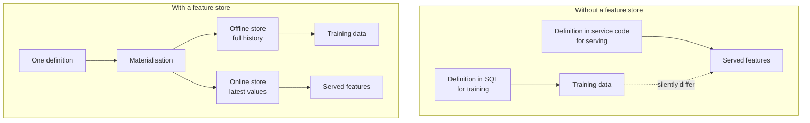
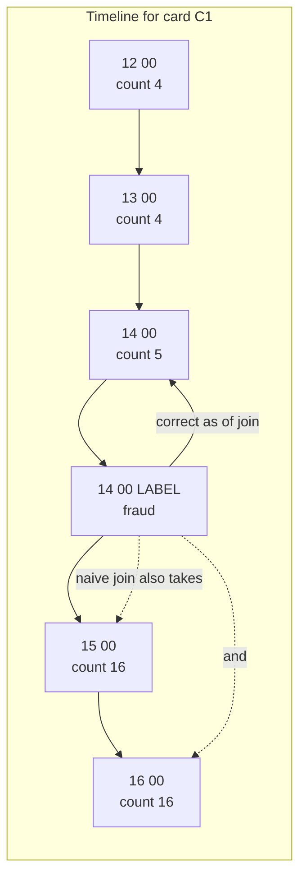
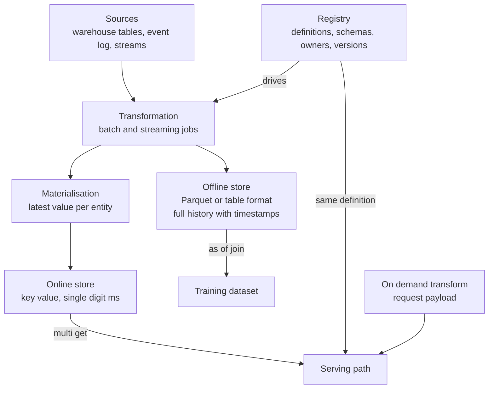
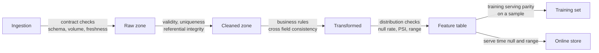
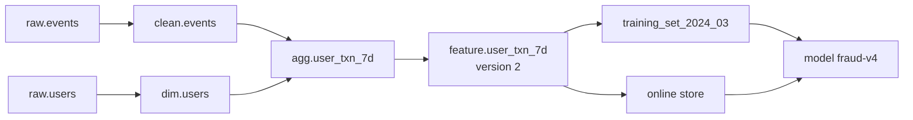

# Chapter 20: Feature Stores and Data Quality

> **What this chapter covers** What a feature store is actually for, which is consistency rather than storage; training-serving skew and the four mechanisms that cause it; point-in-time correctness explained mechanically with a worked leakage example; the architecture of offline store, online store, registry, materialisation and serving; entities, feature views and time-to-live; batch, streaming and on-demand features; backfills and definition changes; feature and model versioning; build versus buy; then data quality as a first-class subject covering validation as code, schema contracts, distribution checks, anomaly detection on data, where checks belong, what to do when one fails, observability, lineage, cataloguing, and privacy engineering.
> **Prerequisites** Chapter 17 (Data Storage, Formats, and Modelling), Chapter 18 (Distributed Computing with Spark), and Chapter 19 (Streaming and Real-Time Pipelines). Chapter 10 (Feature Engineering) covers what makes a good feature; this chapter covers how to compute, store, serve, and trust one.
> **Where it is used** Any organisation serving more than a handful of models, any system where a feature is computed both offline for training and online for serving, and every team that has ever shipped a model whose offline metrics did not reproduce in production.

---

## 20.1 Level 1: Foundations

### 20.1.1 The problem, told as a story

A team trains a fraud model. One feature is `txn_count_7d`, the number of transactions on this card in the last seven days. The training pipeline is a SQL query over the warehouse. Offline area under the receiver operating characteristic curve is 0.91.

The model ships. The serving code needs `txn_count_7d` at request time, so a backend engineer writes it in the service language against a different database. Online area under the curve is 0.78.

Six weeks of investigation finds four differences, all of them individually reasonable.

1. The warehouse query counted the last seven **calendar days**, ending at midnight. The service counted a **trailing 168 hours** from now.
2. The warehouse included transactions that were later reversed. The service excluded them, because the service reads the live table where reversals are removed.
3. The warehouse query ran over data that had fully settled. The service read a stream that was, at the moment of the request, about forty seconds behind.
4. The training query, written as a join on card identifier with no time constraint, included transactions that occurred **after** the transaction being scored.

The fourth one is leakage and is the largest. The other three are skew. All four exist because the feature was defined twice.

A feature store exists to make that impossible. Its central claim is not that it stores features. Anything stores features. Its claim is that a feature is **defined once** and that both the training path and the serving path are served from that one definition.



*Figure 20.1: The value of a feature store is one definition feeding both paths, not the storage itself.*

### 20.1.2 Training-serving skew, defined and enumerated

**Training-serving skew** is any systematic difference between the feature values a model sees during training and the values it sees in production. It is systematic, not random, which is why it degrades the model rather than just adding noise.

Four mechanisms. Each has a distinct cause and a distinct fix, and conflating them is why teams chase it for months.

**Mechanism 1: two implementations.** The feature is computed by different code in the two paths. SQL in the warehouse, Python or Java in the service. Any difference in null handling, rounding, type coercion, string normalisation, or time zone produces a difference in the value.

*Concrete example.* The offline query uses `AVG(amount)`, which in most SQL dialects skips nulls. The serving code uses `sum(amounts) / len(amounts)`, which treats a null as zero. For a card with three transactions where one amount is null, offline gives the mean of two values and online gives two-thirds of that.

*Fix.* One implementation. Either both paths execute the same definition, which is what a feature store provides, or a test asserts numerical equality between the two on a shared fixture, run in continuous integration.

**Mechanism 2: different data.** The two paths read different sources. The warehouse holds settled, corrected, deduplicated data. The serving path reads a live operational store or a stream.

*Concrete example.* The warehouse has a nightly job that removes duplicate events from a retrying client. Online, duplicates are present. Every count feature is inflated online, and by a variable amount.

*Fix.* Serve from a store materialised by the same pipeline that writes the offline history, so both see the same cleaned data.

**Mechanism 3: time semantics.** The two paths use different time boundaries or different notions of "now".

*Concrete example.* The story above: calendar days against trailing hours. At 6 p.m. the calendar-day feature covers 7.75 days of history and the trailing-hour feature covers exactly 7, so the values differ by roughly 10 percent, systematically, and only at certain times of day.

*Fix.* Define the window precisely in the feature definition, including its alignment and its inclusivity at each end, and derive both paths from it.

**Mechanism 4: freshness and completeness.** The two paths see the same logical data at different degrees of completeness. This is the streaming mechanism from Chapter 19, level 3, and it is the one that survives after the other three are fixed.

*Concrete example.* At serving, the streaming aggregate is 40 seconds behind and has dropped records that arrived past the watermark. Offline, the same aggregate is recomputed from complete history. The offline feature is larger, and it is disproportionately larger for high-volume entities, whose events are most likely to be delayed.

*Fix.* Either log the served values and train on them, or reconstruct offline using only data that had arrived by the prediction time, which requires storing arrival time as well as event time.

| Mechanism | Detect by | Fix |
|---|---|---|
| Two implementations | Compare both paths on the same fixture | One definition, or an equality test in continuous integration |
| Different data | Compare row counts and distributions of the sources | One materialisation pipeline feeding both stores |
| Time semantics | Read both definitions carefully; look for time-of-day patterns in the gap | Specify the window exactly, including alignment and inclusivity |
| Freshness and completeness | Compare logged served values to offline recomputation | Train on logged served values |

### 20.1.3 Point-in-time correctness, mechanically

This is the concept the whole subject rests on, and it is the most asked interview question on feature stores. It deserves a full mechanical treatment.

**The setup.** You are building a training set. Each row is a label event: a transaction at time $t$ with a known outcome, fraud or not. You want to attach features describing the state of the world **as it was at $t$**, because that is the only information the model will have when it must make this decision in production.

**The naive join and what it does.** A feature table holds `card_id`, `feature_ts`, `txn_count_7d`. A label table holds `card_id`, `label_ts`, `is_fraud`. The naive join:

```sql
SELECT l.card_id, l.label_ts, l.is_fraud, f.txn_count_7d
FROM labels l
JOIN features f ON l.card_id = f.card_id;
```

This joins every label to every feature row for that card, including rows computed **after** the label event. The model trains on the future.

**The worked example.** One card, `C1`. A fraud transaction occurs at 14:00 on 3 March. After it, the fraudster makes eleven more transactions in the next hour, all of which get recorded.

Feature table for `C1`:

| feature_ts | txn_count_7d |
|---|---|
| 2024-03-03 12:00 | 4 |
| 2024-03-03 13:00 | 4 |
| 2024-03-03 14:00 | 5 |
| 2024-03-03 15:00 | 16 |
| 2024-03-03 16:00 | 16 |

Label: `C1`, `label_ts = 2024-03-03 14:00`, `is_fraud = 1`.

The naive join produces five training rows for this one label, with `txn_count_7d` values of 4, 4, 5, 16, and 16. Two of them, the 16s, encode the consequence of the fraud, not its precursor. The model learns that a high seven-day transaction count predicts fraud, which is true only *after* the fraud has occurred. Offline the model looks excellent. In production, at 14:00, the feature value is 5, and the model has nothing to work with.

Even taking only one row per label, if the join picks an arbitrary row, it may pick a 16.

**The correct join.** For each label, take the feature row with the **largest `feature_ts` that is less than or equal to `label_ts`**. That is an as-of join, also called a point-in-time join or a temporal join.

**Listing 20.1: an as-of join in SQL, the portable window-function form.**

```sql
WITH joined AS (
  SELECT
    l.card_id, l.label_ts, l.is_fraud,
    f.txn_count_7d, f.feature_ts,
    ROW_NUMBER() OVER (
      PARTITION BY l.card_id, l.label_ts
      ORDER BY f.feature_ts DESC
    ) AS rn
  FROM labels l
  JOIN features f
    ON  f.card_id    = l.card_id
    AND f.feature_ts <= l.label_ts                       -- no future rows
    AND f.feature_ts >  l.label_ts - INTERVAL '2' DAY     -- staleness bound
)
SELECT card_id, label_ts, is_fraud, txn_count_7d
FROM joined WHERE rn = 1;
```

Three clauses carry the correctness. `feature_ts <= label_ts` is the point-in-time constraint and is the whole point. The lower bound is a time-to-live: a feature value from six months ago is not a reasonable description of the present, and without this bound a card with one ancient feature row gets that value attached to every label forever. `rn = 1` after ordering descending picks the most recent qualifying row. Result for the example: `txn_count_7d = 5`, which is what serving would have seen.



*Figure 20.2: The as-of join takes only the most recent feature row at or before the label, while a naive join pulls in values caused by the very event being predicted.*

**The second subtlety: arrival time.** `feature_ts <= label_ts` is necessary but not always sufficient. A feature row stamped 13:55 might not have been *computed and available* until 14:03, because of pipeline lag. At 14:00 the serving path could not have used it. Rigorous point-in-time correctness therefore uses the **arrival time** or **created time**, not only the event time:

```sql
AND f.feature_ts   <= l.label_ts        -- the event it describes had happened
AND f.created_ts   <= l.label_ts        -- and the row was actually available
```

This requires recording `created_ts` when the row is written. It is a one-line decision at ingestion that makes rigorous reconstruction possible, and omitting it makes it impossible after the fact. Store both timestamps on every feature row.

**Why this is hard at scale.** An as-of join over 100 million labels and 10 billion feature rows is expensive. The efficient physical plan is a sort-merge on the entity key with both sides sorted by timestamp, walking the two streams together. Feature store implementations do this for you. If you write it yourself, the window-function form above is correct but shuffles heavily; sorting both sides by `(entity, ts)` and using a merge is the scalable form. Chapter 18, level 3, covers the join mechanics.

### 20.1.4 The mental model

Three sentences.

1. A feature store is a contract that a feature has one definition, and two storage layers that serve that definition at two different latencies.
2. The offline store answers "what was the value of this feature for this entity at this past moment", for millions of moments at once, in minutes.
3. The online store answers "what is the value of this feature for this entity right now", for one entity, in single-digit milliseconds.

Everything else, the registry, materialisation, entities, time-to-live, is machinery to make those three true.

---

## 20.2 Level 2: Working knowledge

### 20.2.1 Architecture



*Figure 20.3: The five components of a feature store and the two read paths they serve.*

| Component | Holds | Latency budget | Freshness | Typical technology |
|---|---|---|---|---|
| Registry | Definitions, schemas, entities, owners, versions | Not on any hot path | Changes with deploys | A repository of declarative files plus a metadata database |
| Offline store | Full history, every value with its timestamps | Minutes for a training-set build | Hours behind for batch features | Parquet, Delta Lake, Iceberg, or a warehouse |
| Materialisation | The job moving offline to online | Minutes | Determines online freshness | Spark, a streaming job, or a scheduled task |
| Online store | Latest value per entity key only | 1 to 20 milliseconds at p99 | Seconds to hours, by feature | Redis, DynamoDB, Cassandra, Bigtable |
| Serving API | Assembly of a feature vector from keys | Within the online budget | Same as online store | A library or a service |

Two observations about this table. First, the online store holds only the **latest** value, not history, which is why it is small and fast: its size is the number of entities times the bytes per feature vector, independent of how long you have been running. Second, the offline store holds everything with timestamps, which is why it can answer point-in-time questions and the online store cannot.

**Sizing the online store.** Let $E$ be the number of entities, $b$ the bytes per feature vector including key and serialisation, and $r$ the replication factor.

$$S_{\text{online}} = E \times b \times r$$

**Worked example.** 80 million users, a feature vector of 150 float32 values plus a 24-byte key, replication factor 3.

$b = 150 \times 4 + 24 + \text{overhead}$. Assume 80 bytes of serialisation and index overhead, giving 704 bytes.

$$S = 80{,}000{,}000 \times 704 \times 3 = 169 \text{ GB}$$

That fits comfortably in a managed key-value store and would be expensive as an in-memory cache. If the vector grows to 1000 features, it is 1.1 terabytes replicated, and the decision changes. Compute this before choosing the technology, because the answer at 150 features and the answer at 1000 are different systems.

**Sizing the read path.** With $q$ queries per second, $f$ features per request, and the online store reached in one batched request per query:

$$\text{Store QPS} = q, \qquad \text{Store key lookups per second} = q \times n_{\text{entities per request}}$$

The number to watch is not the feature count but the number of distinct entity keys. A ranking request scoring 200 candidate items needs 200 item keys plus one user key. At 5000 requests per second, that is 1,005,000 key lookups per second, which is a serious load and is why ranking systems batch aggressively and often cache the user vector in the service.

### 20.2.2 Entities, feature views, and time-to-live

**Entity.** The thing a feature describes, identified by a join key. `user`, `item`, `merchant`, `device`, `session`. A feature belongs to exactly one entity, or to a composite of entities such as `(user, item)` for interaction features. Getting the entity right is the schema decision that everything else inherits; a feature defined on the wrong entity cannot be joined correctly later.

**Feature view** (the name varies: feature group, feature set, feature table). A named collection of features computed together from one source by one transformation, sharing one entity and one timestamp column. It is the unit of materialisation, of scheduling, of ownership, and of versioning. The grouping rule is: features that are computed by the same job at the same cadence from the same source go in one view.

**Listing 20.2: a declarative feature view definition.**

```python
# Illustrative of the declarative style common to feature store frameworks.
# Check your framework's current API for exact names.

user = Entity(name="user", join_keys=["user_id"], description="Registered user")

user_txn_7d = FeatureView(
    name="user_txn_7d",
    entities=[user],
    ttl=timedelta(days=2),                 # max staleness at join and at serve
    schema=[
        Field(name="txn_count_7d", dtype=Int64),
        Field(name="txn_amount_sum_7d", dtype=Float32),
        Field(name="distinct_merchants_7d", dtype=Int32),
    ],
    source=BatchSource(path="s3://lake/user_txn_agg/",
                       timestamp_field="feature_ts",
                       created_timestamp_field="created_ts"),
    online=True,
    tags={"owner": "risk-platform", "pii": "false"},
)
```

The `ttl` is doing more work than it appears. At training time it bounds the as-of join, so a label never picks up a feature row older than two days; without it, an entity that stopped generating events keeps its last value attached to every future label, which is a quiet and severe bug. At serving time it decides whether a stale online value should be returned or treated as missing. Set it from the feature's actual refresh cadence plus a margin, not to a round number.

The `created_timestamp_field` is what makes rigorous point-in-time reconstruction possible, as in 20.1.3.

### 20.2.3 Batch, streaming, and on-demand features

| Kind | Computed by | Freshness | Cost | Right for |
|---|---|---|---|---|
| Batch | Scheduled job over the warehouse | Hours to a day | Low, amortised | Aggregates over long windows, anything slowly changing |
| Streaming | Continuous job over an event log | Seconds to minutes | High, always on | Short-window aggregates where recency is the signal |
| On-demand | A function at request time | Zero, by construction | Per request, in the latency budget | Anything derivable from the request payload or from other features |

**How to choose.** Ask what the feature depends on.

- Depends only on the current request, such as `log(amount)` or the hour of day: **on-demand**. Never store it. Storing it means materialising a value that will be wrong by the time it is read.
- Depends on history that changes slowly, such as a 90-day average or a user's tenure: **batch**. Daily refresh is fine and a streaming job for it is waste.
- Depends on history in the last minutes or hours, such as transactions in the last 10 minutes: **streaming**. This is the only case that justifies the operational cost.

**On-demand features deserve emphasis** because they are underused. A feature combining a served value with the request payload, such as `amount / user_avg_amount_30d`, must be computed at request time, since the numerator is not known until the request arrives. The critical property is that the on-demand function must be **the same function** in training and serving. Feature store frameworks support this by making the on-demand transformation part of the definition, applied identically when building training data and when serving. If you compute it in the service by hand, you have reintroduced mechanism 1 from 20.1.2.

**Listing 20.3: an on-demand transformation applied identically in both paths.**

```python
@on_demand_feature_view(
    sources=[user_txn_7d, request_source],
    schema=[Field(name="amount_ratio", dtype=Float32),
            Field(name="is_night", dtype=Bool)],
)
def txn_context(inputs: pd.DataFrame) -> pd.DataFrame:
    out = pd.DataFrame()
    denom = inputs["txn_amount_sum_7d"] / inputs["txn_count_7d"].clip(lower=1)
    out["amount_ratio"] = (inputs["amount"] / denom.replace(0, np.nan)).fillna(1.0)
    out["is_night"] = inputs["event_hour"].between(0, 5)
    return out
```

The explicit handling of the zero denominator and the null result is the part that matters. Division by zero produces infinity, which most models handle badly and most feature validation does not catch. Deciding that the neutral value is 1.0 is a modelling decision and it must be written in the definition so that training and serving agree, rather than being an accident of how each path happens to handle a missing value.

### 20.2.4 Backfills and the reprocessing problem

A backfill computes historical values for a feature that did not exist, or that has changed. You need one whenever you add a feature, fix a bug in a definition, or change a window.

The mechanics are straightforward: run the transformation over historical source data, writing rows with the correct historical `feature_ts`. The difficulties are all about correctness and about what happens next.

**Difficulty 1: the source may not support it.** A streaming feature can be backfilled only if the event log retains enough history, or if an equivalent batch source exists. This is a design decision made at the time you set log retention, not at the time you want the backfill.

**Difficulty 2: the backfilled value may not equal what would have been served.** Backfilling with complete data produces values that the online path, with its lateness and lag, would never have produced. This is mechanism 4 again. A backfill is a reconstruction, and you should record that the rows are reconstructed rather than served, so that later analysis can tell them apart.

**Difficulty 3: a changed definition splits history.** If `txn_count_7d` changes from calendar days to trailing hours on 1 June, then rows before that date mean one thing and rows after mean another. A model trained across the boundary learns from an inconsistent feature.

Three options when a definition changes, and only one of them is usually right.

| Option | Consequence | Use when |
|---|---|---|
| Overwrite history with the new definition | Consistent history, but past model behaviour is no longer reproducible and the training data no longer matches what was served | Almost never, unless correcting a clear bug and reproducibility is not required |
| Write the new definition as a new version, keep the old | Both available, consumers migrate deliberately, history intact | Default |
| Apply the new definition going forward only | Split history, silent inconsistency | Never intentionally |

The default is a **new feature version**, which is the same reason software libraries version rather than mutate. The cost is storage and a migration, both of which are cheap relative to a model trained on an inconsistent feature.

**Backfill cost arithmetic.** Backfilling one feature over two years of history for 50 million entities at a daily grain produces $50{,}000{,}000 \times 730 = 36.5$ billion rows. At 40 bytes per row compressed, that is 1.46 terabytes for one feature. The lesson is not that backfills are impossible but that the grain matters enormously: at a weekly grain it is 208 gigabytes, and if you only need feature values at the timestamps where labels actually exist, and there are 200 million labels, it is 8 gigabytes. Backfill at the label timestamps when you can.

### 20.2.5 Feature versioning and its relationship to model versioning

Two kinds of change, and they must be treated differently.

**A compatible change** does not alter the meaning of existing values: adding a new feature to a view, widening a numeric type, adding a description. Existing consumers are unaffected.

**A breaking change** alters the meaning: changing the window, changing null handling, changing the source, changing the aggregation, changing the unit. Every existing consumer is affected, silently, because the column name did not change.

The discipline is that a breaking change creates a new named version, `txn_count_7d_v2`, and the old one remains until every consumer has migrated and then is deprecated with a date.

**The relationship to model versioning.** A model version must record the exact feature versions it was trained on. Without that link you cannot reproduce a training run, cannot explain a prediction from six months ago, cannot safely deprecate a feature, and cannot tell whether a performance regression came from the model or from a feature definition change.

$$\text{model version} \longrightarrow \{(\text{feature name}, \text{version})\} \longrightarrow \{(\text{source table}, \text{commit})\}$$

That chain is the reproducibility requirement, and Chapter 25 develops the registry side of it. The feature store's obligation is the middle link: to record which feature versions produced a given training dataset, and to refuse to serve a model a feature version it was not trained on.

**A practical rule that prevents most incidents.** Deprecation requires knowing the consumers. The registry should record, for each feature, which models read it. Without that, no feature can ever safely be deleted, and feature stores accumulate thousands of unused features that nobody dares remove. Instrument the read path to record feature access by model, and the question answers itself.

### 20.2.6 Build versus buy

The honest criteria, in the order they actually decide.

| Criterion | Favours buying or adopting a framework | Favours building |
|---|---|---|
| Number of models in production | More than about five | One or two |
| Number of teams sharing features | More than one | One |
| Need for point-in-time joins | Frequent, over large history | Rare or small |
| Online latency requirement | Single-digit milliseconds at high volume | Tens of milliseconds, low volume |
| Streaming features | Required | Not required |
| Platform team headcount | None to spare | Available and stable |
| Existing warehouse and key-value store | Already present and well operated | Either missing |

**The common in-house pattern**, and it is a legitimate one, is **a table plus a serving cache**.

- Features are computed by the existing batch pipeline into a partitioned table, one row per entity per day, with `feature_ts` and `created_ts` columns.
- Training sets are built with a hand-written as-of join, as in Listing 20.1, kept in one shared module so it is written once.
- A nightly job writes the latest row per entity into a key-value store, keyed by entity identifier, with the whole vector as one serialised value.
- The serving code reads one key and deserialises.

This covers batch features, point-in-time correctness, and low-latency serving, which is most of the value, in a few hundred lines. What it does not cover is streaming features, a registry with discovery and ownership, on-demand transformations shared across paths, automatic materialisation scheduling, and governance. Those are what you are buying when you adopt a framework.

The failure mode of building is not that the first version is inadequate. It is adequate. The failure mode is that it grows into a framework over three years without the design coherence of one, and without anyone owning it. Decide deliberately, write down which capabilities you are choosing not to have, and revisit when the model count crosses five.

The failure mode of buying is adopting a heavy platform for two models, where the operational cost of the feature store exceeds the cost of the models it serves.

---

## 20.3 Level 3: Depth

### 20.3.1 Data quality, and why it belongs in this chapter

A feature store guarantees that training and serving see the same values. It says nothing about whether those values are correct. A pipeline that consistently computes garbage is consistent.

Data quality is the larger and less glamorous half of the problem, and it causes more production incidents than modelling does. The characteristic failure is silent: a column becomes null for 8 percent of rows after an upstream deploy, no error is raised anywhere, the model's inputs shift, and the metric degrades over three weeks until someone investigates.

### 20.3.2 The dimensions of quality

Naming the dimensions matters because each is detected differently and each fails differently.

| Dimension | Question | Example failure | Detection |
|---|---|---|---|
| Completeness | Are values present where they should be? | Null rate jumps from 0.1 to 8 percent | Null-rate check with a bound |
| Validity | Do values conform to the rules? | An age of 400, a negative price, an invalid country code | Range and set-membership constraints |
| Accuracy | Do values match reality? | A price is present, valid, and wrong | Reconciliation against another source |
| Consistency | Do related values agree? | Order total not equal to the sum of line items | Cross-field business-rule check |
| Uniqueness | Are keys unique where required? | A duplicated primary key after a retry | Distinct count against row count |
| Timeliness | Did the data arrive when expected? | A partition missing at the scheduled hour | Freshness check on max timestamp |
| Referential integrity | Do foreign keys resolve? | An order referencing a deleted customer | Anti-join count |

Accuracy is the hard one, because it cannot be checked without an independent source of truth. Everything else can be checked from the data itself. The practical response is to check everything else rigorously and to reconcile against an independent source for the small number of fields where accuracy is critical, such as revenue.

### 20.3.3 Validation as code

The principle: expectations about data live in version-controlled code next to the pipeline, are executed automatically, and fail the way a unit test fails.

Two idioms dominate, and they are complementary.

**Expectations** are assertions about a dataset, expressed declaratively and evaluated to produce a pass or fail plus observed statistics. Great Expectations is the reference implementation of this idiom.

**Constraints** are the same idea with a stronger emphasis on computed metrics and on comparing against a previous run. Deequ, from the work described in Schelter and colleagues, "Automating Large-Scale Data Quality Verification", 2018, is the reference implementation, with a PyDeequ binding for Python.

**Listing 20.4: a validation suite expressed as code.**

```python
# Illustrative of the declarative expectation style. Check your library's API.
suite = [
    ExpectColumnToExist("user_id"),
    ExpectColumnValuesToNotBeNull("user_id"),
    ExpectColumnValuesToBeUnique("user_id"),
    ExpectColumnValuesToBeBetween("age", min_value=13, max_value=120,
                                  mostly=0.999),          # tolerate 0.1% outliers
    ExpectColumnValuesToBeInSet("country", ISO_3166_ALPHA2),
    ExpectColumnValuesToNotBeNull("txn_amount", mostly=0.98),
    ExpectColumnMeanToBeBetween("txn_amount", 20.0, 120.0),
    ExpectTableRowCountToBeBetween(min_value=1_000_000, max_value=4_000_000),
    ExpectColumnPairValuesAToBeGreaterThanB("settled_ts", "created_ts"),
]
```

The `mostly` parameter is the single most important design element in a practical suite. An absolute expectation such as "no nulls ever" fails on the one day in forty when a legitimate edge case appears, the team gets alert fatigue, and within two months the check is disabled. A tolerance of 0.999 catches the systematic failure, an 8 percent null rate, while surviving normal noise. Set tolerances from the observed historical distribution of the metric, not from intuition.

The row-count bound is a volume check and it catches an entire class of upstream failures: a partially written partition, a source that silently started filtering, a duplicated load. Set the bounds from the historical range with margin, or better, make them relative to the same weekday last week, since volume is usually strongly seasonal.

**Listing 20.5: a constraint suite over Spark with anomaly detection against history.**

```python
from pydeequ.checks import Check, CheckLevel
from pydeequ.verification import VerificationSuite

check = (
    Check(spark, CheckLevel.Error, "feature table daily check")
    .hasSize(lambda n: n > 1_000_000)
    .isComplete("user_id")
    .isUnique("user_id")
    .isNonNegative("txn_count_7d")
    .hasCompleteness("txn_amount_sum_7d", lambda c: c >= 0.98)
    .hasMean("txn_count_7d", lambda m: 1.0 <= m <= 12.0)
    .satisfies("txn_count_7d <= 10000", "no absurd counts", lambda f: f >= 0.9999)
)
result = VerificationSuite(spark).onData(df).addCheck(check).run()
```

`CheckLevel.Error` versus `CheckLevel.Warning` is the routing decision made at definition time: errors stop the pipeline, warnings are recorded and alerted. Deciding this per check, in the code, is far better than deciding it during an incident. The `satisfies` clause is a business rule expressed as a predicate with a required satisfaction fraction, which is how you encode domain knowledge that has rare legitimate exceptions.

### 20.3.4 Schema validation and data contracts

Schema is the cheapest and highest-value class of check because a schema violation is unambiguous.

**Enforcement at write time** is the strong form. A schema registry with a compatibility mode rejects a producer whose new schema breaks consumers. The modes:

| Mode | Allows | Meaning |
|---|---|---|
| Backward | Delete a field, add an optional field | New consumer reads old data |
| Forward | Add a field, delete an optional field | Old consumer reads new data |
| Full | Add or delete optional fields only | Both directions |
| None | Anything | No protection |

Backward compatibility is the common default, because it lets consumers upgrade before producers. Choose deliberately and know which direction your deploy order requires.

**A data contract** is the broader agreement, of which the schema is one part. A useful contract states: the schema, the semantic meaning of each field, the owner and an escalation path, the expected volume and its variance, the freshness guarantee, the allowed values and null policy per field, the versioning and deprecation policy, and what the consumer may rely on and may not.

The organisational value exceeds the technical value. Most data quality incidents are not technical failures; they are an upstream team making a reasonable change without knowing that eleven downstream models depend on a field they consider internal. A contract makes the dependency explicit and gives the change a review path.

**Listing 20.6: a data contract as a checked artifact.**

```yaml
dataset: transactions.v2
owner: payments-platform
slo:
  freshness: {max_lag: 15m, measured_on: event_ts}
  volume:    {min_rows_per_hour: 40000, max_rows_per_hour: 900000}
  availability: 0.999
schema:
  - {name: txn_id,     type: string,    nullable: false, unique: true}
  - {name: user_id,    type: long,      nullable: false}
  - {name: amount,     type: decimal,   nullable: false, min: 0, max: 1000000}
  - {name: currency,   type: string,    nullable: false, allowed: [USD, EUR, GBP]}
  - {name: event_ts,   type: timestamp, nullable: false}
  - {name: created_ts, type: timestamp, nullable: false}
compatibility: backward
deprecation_notice_days: 90
consumers: [fraud-model-v4, risk-dashboard, ltv-model-v2]
```

The file is only useful if something executes it. Generate the validation suite from it, check compatibility in the producer's continuous integration pipeline, and alert on the service level objectives. A contract nobody enforces is documentation, and documentation drifts.

### 20.3.5 Distribution checks and anomaly detection on data

Schema and constraint checks catch broken data. Distribution checks catch data that is structurally fine and semantically wrong.

**The two-sample question.** Compare today's distribution of a column against a reference, usually the same column over a recent stable period.

For a continuous column, the **population stability index** is the industry standard, mainly because it is interpretable. Bin the reference into $k$ bins, usually deciles, and let $e_i$ and $a_i$ be the expected and actual proportions in bin $i$:

$$\text{PSI} = \sum_{i=1}^{k} (a_i - e_i)\ln\frac{a_i}{e_i}$$

This is the symmetrised Kullback-Leibler divergence, also called the Jeffreys divergence, computed on binned proportions. The conventional reading is under 0.1 no significant shift, 0.1 to 0.25 moderate, above 0.25 significant. Those thresholds are convention from credit risk practice rather than a statistical result, and they are sensitive to bin count and to sample size; calibrate them on your own data by computing the PSI between two random halves of a stable period and seeing what "no shift" actually measures.

**Worked example.** Reference deciles, so $e_i = 0.1$ for all ten bins. Today, the bottom decile holds 0.18 and the top holds 0.02, others unchanged at 0.1 each.

$$\text{PSI} = (0.18 - 0.10)\ln\frac{0.18}{0.10} + (0.02 - 0.10)\ln\frac{0.02}{0.10} = 0.08 \times 0.5878 + (-0.08) \times (-1.6094)$$

$$= 0.0470 + 0.1288 = 0.1758$$

Moderate shift. The two bins contributing are identifiable, which is the practical advantage of PSI over a single-number test: it tells you *where* the mass moved. Here it moved from the top of the range to the bottom, which is the signature of a column being truncated or of a unit change.

Other tools, and when each is right:

| Test | Data | Strength | Weakness |
|---|---|---|---|
| Population stability index | Continuous or binned | Interpretable, localises the shift | Bin-count sensitive, arbitrary thresholds |
| Kolmogorov-Smirnov | Continuous | Non-parametric, principled p-value | Over-powered at large n, everything is significant |
| Chi-squared | Categorical | Standard, handles many categories | Same large-n problem, needs bin counts above about 5 |
| Wasserstein distance | Continuous | Scale-aware, sensitive to how far mass moved | Needs scaling to interpret |
| Jensen-Shannon divergence | Any binned | Bounded in [0,1], symmetric | Bin sensitive |

**The large-sample problem is the most important practical fact here.** With 50 million rows, a Kolmogorov-Smirnov test rejects the null hypothesis for a difference far too small to matter. A p-value is not a decision rule at that scale. Use an effect size with a threshold calibrated on your data, or subsample to a fixed size such as 100,000 so that the test's power is constant across days and comparable over time.

**Per-segment checks.** An aggregate distribution can be stable while a segment collapses. If the iOS client stops sending a field, and iOS is 30 percent of traffic, the overall null rate moves from 1 percent to 31 percent and is caught. If iOS is 2 percent, the overall rate moves to 3 percent and is not. Run the important checks per major segment: platform, region, client version, tenant. This multiplies the check count, which is why you apply it to the ten features that matter rather than to all six hundred.

**Anomaly detection on data rather than on models.** The distinction is worth being precise about. Model monitoring watches predictions and outcomes and tells you the model is degrading, which is Chapter 27. Data monitoring watches inputs and tells you *why*, and it tells you days earlier, because input corruption precedes metric degradation by however long the label delay is.

Practical techniques, in increasing sophistication:

1. **Static thresholds** on a metric. Simple, brittle, ignores seasonality. Fine for hard invariants such as a null rate on a primary key.
2. **Historical bounds**, for example the metric must lie within the range observed over the last 30 days, or within a robust interval such as the median plus or minus 4 times the median absolute deviation. Handles level but not seasonality.
3. **Seasonal decomposition or a same-period comparison.** Compare against the same hour of the same weekday, which handles most business seasonality with no model at all and is usually enough.
4. **A forecast with a prediction interval.** Fit a simple time-series model to the metric and alert on residuals outside the interval. Works well, but you are now maintaining a model to monitor a pipeline, and it has its own failure modes.

Start at 2 or 3. The move to 4 is justified only when the false-positive rate at level 3 is genuinely the binding problem.

### 20.3.6 Where to place checks in a pipeline



*Figure 20.4: Checks move from cheap and structural at ingestion to expensive and semantic downstream, and each zone has a characteristic class of check.*

The placement principle: **check as early as the check is meaningful**. A schema check belongs at ingestion because it is meaningful there and it stops the bad data from propagating into twelve downstream tables. A distribution check on a derived feature belongs at the feature table, because the feature does not exist earlier.

The second principle: **check at every boundary you do not control**. Every ingestion from another team is a boundary. Every external vendor feed is a boundary. Internal transformations between your own well-tested stages need fewer checks, because your tests cover them.

**Audit-write-publish**, sometimes called write-audit-publish, is the pattern that makes checks actionable rather than advisory. Write output to a staging location, run validations against it, and only then atomically publish it to the location consumers read. If validation fails, consumers keep reading yesterday's data, which is stale but correct, rather than today's, which is fresh and wrong.

**Listing 20.7: audit-write-publish with a table format.**

```python
staging = f"{table}__staging_{run_id}"
df.write.mode("overwrite").format("delta").save(staging)

report = run_validation_suite(spark.read.format("delta").load(staging))

if report.blocking_failures:
    emit_alert(report)
    raise DataQualityError(report.summary())      # consumers keep prior version
else:
    publish_atomic(staging, table, partition=dt)  # metadata-only swap
    emit_metrics(report)                          # record every metric, always
```

The final `emit_metrics` on the success path is easy to omit and important to keep. Recording the observed value of every check on every run, not only on failure, is what lets you set thresholds empirically, see a metric drifting toward a threshold before it crosses, and answer "when did this start" during an incident.

### 20.3.7 What to do when a check fails

This is the question most teams answer badly, usually by picking one response for everything: either every failure pages someone, which produces alert fatigue and then disabled checks, or every failure logs a warning that nobody reads.

The correct answer is that the response is a property of the check and is decided when the check is written.

| Severity | Response | Applies to |
|---|---|---|
| Blocking | Fail the pipeline, do not publish, page the owner | Primary key nulls or duplicates, schema violation, volume off by more than an order of magnitude, freshness past the contract |
| Quarantine | Publish the good rows, route the bad rows to a quarantine table, alert non-urgently | Row-level validity failures affecting a small fraction |
| Degrade | Publish, mark the partition as degraded, notify consumers who can decide | Distribution shift, elevated null rate within tolerance |
| Observe | Record the metric, no alert | Everything else, which is most checks |

Four design rules that follow.

**Rule 1: every check has an owner and a runbook.** An alert that fires to a channel with no named owner is not a control. The runbook needs three things: how to confirm the failure is real, how to identify the upstream cause, and what the remediation is including how to backfill.

**Rule 2: prefer quarantine to blocking for row-level problems.** Blocking an entire daily partition because 300 rows out of 4 million have an invalid country code is a bad trade. Route the 300 to a quarantine table with the failure reason, publish the rest, and track the quarantine volume as its own metric. The exception is when partial data is worse than no data, which is true for anything that will be aggregated into a total.

**Rule 3: a failure must be visible to consumers, not only to the owner.** Mark the partition's status in the table's metadata so a downstream training job can decide for itself whether to proceed. A training run that silently uses a degraded partition produces a model that nobody knows is compromised.

**Rule 4: measure the checks themselves.** Track per check: how often it fires, how often a firing was a genuine problem, and how long it took to resolve. A check with a 95 percent false-positive rate is worse than no check, because it trains everyone to ignore the channel it fires into. Delete it or fix its threshold.

### 20.3.8 Data observability

Observability differs from validation in the same way that monitoring differs from testing. Validation asserts known expectations. Observability watches for unknown problems by tracking properties of every dataset continuously, usually without you writing a check for each one.

The four pillars, which are the properties worth tracking automatically for every table:

**Freshness.** When did this table last receive data, and is that consistent with its schedule? The most valuable single signal, because a stale table is both common and completely silent: queries succeed and return yesterday's numbers.

**Volume.** How many rows arrived, compared to the same period historically? Catches partial writes, silent filters, and duplicate loads.

**Schema.** What changed in the column set and types, and when? A schema change log is the first thing you want during an incident, and it is almost never available unless someone set it up in advance.

**Lineage.** What does this table depend on and what depends on it? Turns "this number is wrong" into a bounded search, and turns "can we change this column" into an answerable question.

The economics: instrumenting these four for every table costs a fixed amount and scales, while writing bespoke expectations costs per table and does not. Do both, with observability as the broad automatic layer and expectations as the deep layer on the tables that matter.

### 20.3.9 Lineage and provenance

**Lineage** is the dependency graph of datasets and the jobs that produce them. **Provenance** is the stronger claim: for a specific record or a specific model, the complete chain of what produced it, including code versions and parameters.



*Figure 20.5: A lineage graph lets you answer both the downstream question, what breaks if this changes, and the upstream question, what could explain this being wrong.*

Three uses, all of which pay for the instrumentation.

**Debugging.** A feature looks wrong. Lineage bounds the search to its ancestors, and combined with freshness and volume history for each ancestor, usually identifies the culprit in minutes rather than hours.

**Impact analysis.** An upstream team wants to change a column. Lineage lists the affected models. Without it, the honest answer is "we do not know", and the change either does not happen or happens and breaks something.

**Audit.** A regulator or an internal reviewer asks which data went into a decision made in March. Provenance answers it: this model version, trained on this dataset, built from these feature versions, from these source tables at these commits, using this code.

**Granularity.** Table-level lineage is cheap and gets most of the debugging value. Column-level lineage, which requires parsing the transformation logic, is substantially more expensive and is what you need for accurate impact analysis and for privacy work, since it can tell you exactly where a personal data field propagated. Start at table level.

**Capture mechanisms.** Parsing SQL to extract table and column references, which works well and covers most warehouse transformations. Runtime instrumentation via a standard event specification such as OpenLineage, emitted by the orchestrator and the processing engine. Or declaration, where the transformation framework knows its own dependencies, as build-oriented transformation tools do. Prefer automatic capture; hand-maintained lineage is stale within a quarter.

### 20.3.10 Documentation and cataloguing

A catalogue is a searchable inventory of datasets with their metadata. Its purpose is that an engineer who needs "revenue by customer" can find the right table in two minutes instead of asking in a chat channel and being pointed at one of four tables with that name, three of which are deprecated.

The metadata that earns its keep, ordered by value:

1. **Owner**, a team not a person, with an escalation path.
2. **Status**, one of production, development, or deprecated, with a removal date for deprecated.
3. **A one-paragraph description** of what the dataset means and, importantly, what it should not be used for.
4. **Column descriptions**, especially for units, time zones, and the exact meaning of codes.
5. **Freshness and volume**, populated automatically from observability.
6. **Lineage links**, populated automatically.
7. **Usage statistics**, which tables and columns are actually queried and by whom. This is the most underrated, because it identifies both the important tables and the 60 percent of tables that nothing reads.

Documentation decays unless it is where the work is. The pattern that survives is documentation as code: descriptions live in the transformation project's configuration next to the model definition, are reviewed with the code change, and are published to the catalogue automatically. A wiki page maintained by hand is stale within a quarter, and a stale catalogue is worse than none, because it is trusted.

---

## 20.4 Level 4: Mastery

### 20.4.1 Privacy engineering basics

Four terms are routinely used interchangeably and mean different things. The differences are legally and technically consequential.

| Technique | What it does | Reversible | Still personal data |
|---|---|---|---|
| Minimisation | Do not collect or retain the field at all | Not applicable | No, it does not exist |
| Redaction | Remove or mask the value in a specific output | No, for that output | Depends on what remains |
| Pseudonymisation | Replace the identifier with a surrogate, keeping a mapping | Yes, with the mapping | Yes, under most regimes including the General Data Protection Regulation |
| Anonymisation | Transform so that re-identification is not reasonably possible | No | No, if genuinely achieved |

**Minimisation** is first because it is the only one with no residual risk. Data you never collected cannot leak, cannot be subpoenaed, and cannot be misused. The engineering question to ask of every field is what decision it enables; if the answer is vague, do not collect it. Retention limits are the time dimension of the same principle.

**Redaction** removes values from an output: masking a card number to the last four digits in a log, dropping a free-text field from a feature table. It is output-specific, so the same data may be redacted in one place and present in another, which is correct but must be tracked.

**Pseudonymisation** replaces a direct identifier with a surrogate: a random identifier, or a keyed hash. The critical point, and the one most often got wrong, is that **pseudonymised data is still personal data**, because the mapping exists and re-identification is possible for whoever holds it. It reduces risk; it does not remove the data from scope.

A specific trap: hashing an identifier is not anonymisation when the input space is small. An email address hashed with SHA-256 is trivially reversed by hashing a list of candidate emails and comparing. A phone number has at most about $10^{10}$ possibilities and is exhaustively searchable in minutes. If you use a hash as a pseudonym, use a keyed hash, a message authentication code, with a key held separately from the data and rotated.

**Anonymisation** must survive linkage attacks, which is a much higher bar than removing names. The foundational demonstrations are Sweeney's work circa 2000 showing that around 87 percent of the United States population is uniquely identified by the combination of five-digit postal code, date of birth, and sex, and Narayanan and Shmatikov, "Robust De-anonymization of Large Sparse Datasets", 2008, which re-identified users in an anonymised film-rating dataset using a small amount of external information.

The formal responses:

- **k-anonymity**, from Sweeney circa 2002: every record is indistinguishable from at least $k-1$ others on the quasi-identifiers. It is vulnerable to homogeneity attacks, where all $k$ records share the same sensitive value, and to background-knowledge attacks.
- **l-diversity** and **t-closeness** patch those specific holes and are themselves attackable.
- **Differential privacy**, from Dwork, McSherry, Nissim, Smith, "Calibrating Noise to Sensitivity in Private Data Analysis", 2006, takes a different approach. It bounds how much any single individual's presence can change the output distribution. A mechanism $M$ is $\varepsilon$-differentially private if for all datasets $D_1, D_2$ differing in one record and all output sets $S$:

$$\Pr[M(D_1) \in S] \le e^{\varepsilon} \Pr[M(D_2) \in S]$$

Smaller $\varepsilon$ means more privacy and more noise. The advantage over the anonymity family is that the guarantee composes and holds against arbitrary side information; the cost is real accuracy loss, and the choice of $\varepsilon$ is a policy decision with no technical answer. Values from 0.1 to 10 appear in deployments, and the practical guidance is that $\varepsilon$ per release must be budgeted across all releases because privacy loss accumulates.

**What this means for a feature pipeline.** Concretely:

- Tag columns with a sensitivity class in the registry, and let that tag drive access control and masking rather than relying on people to remember.
- Do not put raw personal data in features. A feature is an aggregate; aggregate at ingestion.
- Watch for the feature that is a personal identifier in disguise: a high-cardinality categorical that uniquely identifies a person, a precise geolocation, a free-text field embedded into a vector, or a timestamp at second precision, which is often near-unique per person.
- Support deletion. When a person exercises a deletion right, their data must be removed from the offline store, the online store, every training set, and, arguably, models trained on it. The last is genuinely unsolved in general; machine unlearning is an active research area and the practical answer today is periodic retraining on a cleaned dataset. Design so that retraining is routine and cheap, because that is what makes deletion tractable.
- Record which features are derived from which personal fields, which is column-level lineage, because otherwise you cannot answer the deletion or audit question at all.

### 20.4.2 Where the standard advice is wrong

**"Every organisation needs a feature store."** Below about five production models with one team, a table plus a serving cache delivers most of the value and costs a fraction. The framework earns its place when multiple teams share features, when streaming features are required, and when nobody can any longer answer "who uses this feature".

**"A feature store eliminates training-serving skew."** It eliminates mechanisms 1, 2, and 3 from 20.1.2 by construction. Mechanism 4, the freshness and completeness gap, survives, because the online store is by definition more stale than the offline store. It is reduced, not eliminated, and quantifying the residual by comparing logged served values to offline recomputation should be a standing measurement, not a one-off investigation.

**"Point-in-time joins solve leakage."** They solve *temporal* leakage from feature timestamps. They do nothing about a feature whose source table was itself built with a future-looking aggregate, about a label definition that leaks, about target encoding computed on the full dataset before splitting, or about a feature that is a proxy for the label. Those require thinking about the causal structure of the problem, which no join implements.

**"More checks are better."** Checks have a maintenance cost and an attention cost. Fifty checks with a 40 percent false-positive rate are worse than ten with a 2 percent rate, because the fifty train everyone to ignore the alert channel. Measure the precision of each check and delete the ones that do not earn their place.

**"The data quality problem is a tooling problem."** Most incidents are organisational. An upstream team changes a field they consider internal, without knowing that eleven models depend on it. Tools detect this after the fact. Contracts, ownership, and a review path prevent it. Buy the tool, but do not expect it to solve the coordination problem.

**"Anonymised data is safe to share."** Only if anonymisation was genuinely achieved against linkage attacks, which is much harder than removing names and is frequently claimed and rarely verified. Pseudonymised data is still personal data. Hashing a low-entropy identifier is not anonymisation.

### 20.4.3 Open problems and the frontier

**Point-in-time correctness at interactive speed.** As-of joins over billions of rows are slow, which makes iteration on features slow, which is the biggest practical drag on model development. Approaches include pre-computing feature values at the label timestamps only, specialised temporal join implementations, and incremental training-set materialisation. There is no settled answer and it is where the largest practical improvement is available.

**Feature discovery and reuse.** A large feature store accumulates thousands of features, many near-duplicates computed by different teams. Automated detection of semantic duplicates, and ranking features by their measured contribution across models, are partially solved at best. Usage instrumentation is the prerequisite and most organisations do not have it.

**Streaming and batch definition unification.** Writing a feature once and having it execute correctly in both a batch backfill and a streaming job remains harder than it should be, particularly for aggregations that are not simply associative. Unified engines help; semantic equivalence across the two modes is still something you must test rather than assume.

**Embeddings as features.** An embedding is a feature with unusual properties: it is high-dimensional, its individual components are uninterpretable, it changes wholesale when the producing model is retrained, and conventional distribution checks are nearly useless on it. Versioning an embedding feature is versioning a model. Monitoring it needs different tools, such as tracking the distribution of distances to a fixed reference set, or the stability of nearest-neighbour sets. This is an area where practice is ahead of consensus.

**Machine unlearning.** Removing one person's contribution from a trained model without full retraining is unsolved in general. Exact approaches such as the sharded training of Bourtoule and colleagues, "Machine Unlearning", 2021, trade accuracy and training cost for the ability to retrain only affected shards. Approximate approaches lack the guarantees that a compliance context requires.

**Automated root cause analysis.** Detecting that a metric moved is solved. Attributing it to the responsible upstream change automatically, using lineage plus change history plus correlation across metrics, is an active area with real products and no reliable general solution.

---

## 20.5 Subtopic checklist

| Subtopic | You should be able to |
|---|---|
| What a feature store is for | Argue that the value is consistency, not storage, with a concrete failure it prevents |
| Training-serving skew | Name the four mechanisms, give an example of each, and give the matched fix |
| Point-in-time correctness | Write an as-of join and explain the leakage it prevents with a worked timeline |
| Arrival time | Explain why event time alone is insufficient and what to record at ingestion |
| Architecture | Name the five components and the latency and freshness budget of each |
| Online store sizing | Compute storage and key-lookup rate from entity count and request shape |
| Entities and feature views | Choose an entity and group features into views with a stated rule |
| Time to live | Explain its distinct roles at join time and at serve time |
| Feature kinds | Choose batch, streaming, or on-demand from what the feature depends on |
| Backfills | Estimate cost, choose a grain, and handle a definition change correctly |
| Versioning | Distinguish compatible from breaking changes and link feature to model versions |
| Build versus buy | Apply the criteria and describe the table-plus-cache pattern and its limits |
| Quality dimensions | Name seven and say which cannot be checked from the data alone |
| Validation as code | Write an expectation suite with tolerances justified by history |
| Schema and contracts | Choose a compatibility mode and say what a contract must contain |
| Distribution checks | Compute a population stability index by hand and state the large-sample caveat |
| Check placement | Place a given check at the right pipeline stage and justify it |
| Failure response | Assign a severity and a response to a given check and defend it |
| Observability | Name the four pillars and why freshness is the highest value |
| Lineage | State three uses and the trade between table-level and column-level |
| Privacy | Distinguish minimisation, redaction, pseudonymisation, and anonymisation |

---

## 20.6 Common misconceptions

| Misconception | Why it is believed | What is actually true |
|---|---|---|
| A feature store is a database for features | The name says store | Its purpose is one definition served to both training and serving. Storage is the implementation detail; consistency is the product |
| Using a feature store removes training-serving skew | It removes the visible causes | It removes duplicate implementations, divergent sources, and mismatched time semantics. The freshness and completeness gap between online and offline remains and must be measured |
| Point-in-time joins prevent leakage | They prevent the temporal kind | They prevent feature values computed after the label. They do nothing about a leaky source table, a leaky label definition, target encoding fitted before splitting, or a feature that proxies the label |
| Filtering on feature timestamp is enough | It is the obvious constraint | A row stamped 13:55 may not have been computed until 14:03, so it was unavailable at a 14:00 prediction. Rigorous correctness needs the arrival timestamp too, which must be recorded at write time |
| The online store should hold history | Symmetry with the offline store | It holds only the latest value per key, which is why its size is independent of how long you have run and why it can answer in milliseconds |
| More validation checks means higher quality | Checks look like safety | Checks have false-positive and attention costs. Fifty checks at 40 percent false positives are worse than ten at 2 percent, because the team learns to ignore the channel |
| A failing check should stop the pipeline | Failing loudly seems safe | Severity is per check. Blocking a 4 million row partition for 300 invalid rows is a bad trade. Quarantine the bad rows, publish the rest, and track quarantine volume |
| Statistical drift tests give you a decision rule | They produce a p-value | At 50 million rows any test rejects for a difference too small to matter. Use an effect size with an empirically calibrated threshold, or subsample to a fixed size for comparability |
| Hashing an identifier anonymises it | The output looks random | A low-entropy input such as an email or a phone number is exhaustively searchable. It is pseudonymisation at best, and only with a separately held key |
| Pseudonymised data is out of scope for privacy rules | The names are gone | Under most regimes, including the General Data Protection Regulation, pseudonymised data is still personal data because the mapping exists and re-identification is possible |
| Data quality is a tooling problem | Tools are sold for it | Most incidents come from an upstream team changing a field they believed was internal. Contracts, ownership, and a review path prevent that; tools only detect it afterwards |

---

## 20.7 Practice

**Exercise 1 (level 2): build a point-in-time join and prove the leakage.**
Use a public transactional dataset with timestamps, for example a retail transaction dataset or the Online Retail dataset from the UCI Machine Learning Repository. Construct a label and a windowed feature. Build the training set twice, once with a naive key join and once with a correct as-of join, and train the same model on both.
*Acceptance criterion:* the offline metric for both, the online-equivalent metric measured on a strictly held-out later period for both, and an identification of the specific feature values that leaked, traced through a timeline for one entity.

**Exercise 2 (level 2 to 3): quantify the freshness gap.**
Take a streaming feature computed with a watermark, log the served values, and separately recompute the same feature offline from the complete history at the same timestamps.
*Acceptance criterion:* the distribution of the difference, the relationship between the size of the difference and the entity's event volume, and a written recommendation between training on logged values and reconstructing offline.

**Exercise 3 (level 3): a validation suite with empirically set thresholds.**
Take a dataset with at least 60 days of history. Compute the daily value of ten quality metrics: row count, null rate on three columns, mean and standard deviation of two numeric columns, and distinct count on two keys. Set thresholds from the observed distribution rather than intuition.
*Acceptance criterion:* thresholds with a stated expected false-positive rate, a backtest over the 60 days showing how often each would have fired, and a designed injection of three synthetic faults showing which are caught and which are not.

**Exercise 4 (level 3 to 4): population stability index and its limits.**
Implement PSI. Compute it between two random halves of a stable period to establish the null distribution. Then compute it under three injected shifts: a mean shift, a variance change, and a 5 percent null-rate increase. Vary the bin count from 5 to 50 and the sample size from 1000 to 10 million.
*Acceptance criterion:* a table of PSI against bin count and sample size for each shift, a statement of whether the conventional 0.1 and 0.25 thresholds hold on your data, and an alternative threshold with a stated false-positive rate.

**Exercise 5 (level 4): design a deletion-capable feature pipeline.**
Design and implement, on a small synthetic dataset, a pipeline supporting a deletion request. It must remove the person from the offline store, the online store, and any derived aggregate, and record what was done.
*Acceptance criterion:* a working implementation, a written analysis of what remains unaddressed specifically regarding models already trained on the data, and a proposed retraining policy with its cost.

---

## 20.8 How this is tested

<details><summary>Answer</summary>

**Q1. What problem does a feature store solve?**

Consistency, not storage. Without one, a feature is defined twice, once in the training pipeline and once in the serving path, and the two definitions diverge in null handling, time window semantics, source data, and rounding. The divergence is systematic, so it degrades the model rather than adding noise, and it is discovered weeks later as an unexplained gap between offline and online metrics. A feature store makes the definition singular and serves it through two storage layers at two latencies: an offline store holding full history with timestamps for building training sets, and an online store holding the latest value per entity for millisecond lookups. Everything else in it, the registry, materialisation, entities, and time-to-live, exists to support that.

</details>

<details><summary>Answer</summary>

**Q2. Explain point-in-time correctness with an example.**

When building a training set you attach to each label event the feature values as they were at that moment, because that is all the model will have in production. A naive join on entity key attaches every feature row for that entity, including rows computed after the label. Concretely: a card is used fraudulently at 14:00, and the fraudster makes eleven more transactions in the next hour. The seven-day transaction count is 5 at 14:00 and 16 at 15:00. A naive join produces training rows containing 16, so the model learns that a high count predicts fraud, which is only true after the fraud. Offline performance looks excellent and production performance collapses, because at 14:00 the real value is 5. The correct join takes, for each label, the feature row with the largest timestamp at or before the label timestamp, bounded below by a time-to-live so that a stale value is not attached indefinitely.

</details>

<details><summary>Answer</summary>

**Q3. Is filtering on feature timestamp less than or equal to label timestamp sufficient?**

Not in general. That constraint uses the event time the feature describes, but a row describing 13:55 might not have been computed and written until 14:03 because of pipeline lag, so it was not available to a prediction made at 14:00. Rigorous reconstruction requires a second constraint on the row's creation or arrival timestamp, which must therefore be recorded when the row is written. Storing both timestamps is a one-line decision at ingestion that makes correct reconstruction possible; omitting it makes it impossible to recover afterwards, because the information was never captured.

</details>

<details><summary>Answer</summary>

**Q4. Name the mechanisms of training-serving skew and the fix for each.**

Four. Two implementations, where the same feature is coded separately in SQL and in the service, differing in null handling or rounding, fixed by one definition or by an equality test on a shared fixture in continuous integration. Different data, where the warehouse holds settled deduplicated data and the service reads a live store, fixed by materialising the online store from the same pipeline that writes the offline history. Different time semantics, such as calendar days against trailing hours, fixed by specifying the window precisely including alignment and inclusivity. And the freshness and completeness gap, where the online value reflects an incomplete stream while the offline recomputation sees everything, fixed by logging the served feature vectors and training on them, or by reconstructing offline using arrival times.

</details>

<details><summary>Answer</summary>

**Q5. When would you use batch, streaming, and on-demand features?**

By what the feature depends on. If it depends only on the current request, such as the logarithm of the transaction amount or the hour of day, compute it on demand at request time; storing it would materialise a value that is wrong by the time it is read. If it depends on slowly changing history, such as a ninety-day average or account tenure, compute it in batch on a schedule, since a streaming job for it is pure operational cost. If it depends on the last minutes or hours, compute it in streaming, which is the only case that justifies an always-on job. The important constraint on on-demand features is that the same function must run in training and serving, which is why the transformation belongs in the feature definition rather than hand-written in the service.

</details>

<details><summary>Answer</summary>

**Q6. A feature definition needs to change. What do you do?**

Distinguish compatible from breaking. Adding a field or widening a type does not change the meaning of existing values and can be done in place. Changing the window, the null handling, the source, the aggregation, or the unit changes the meaning while the column name stays the same, which silently affects every consumer. The default for a breaking change is a new named version alongside the old, with consumers migrating deliberately and the old version deprecated with a date. Overwriting history with the new definition destroys reproducibility of past models and makes the training data stop matching what was served. Applying the change going forward only is worst, because it splits history invisibly and a model trained across the boundary learns from an inconsistent feature. Deprecation requires knowing the consumers, which means instrumenting the read path to record which models read which features.

</details>

<details><summary>Answer</summary>

**Q7. When is building a feature store in-house the right call?**

With one or two models, one team, and no streaming feature requirement. The pattern that works is a table plus a serving cache: compute features into a partitioned table with event and creation timestamps, build training sets with a shared as-of join module so the join is written once, materialise the latest row per entity into a key-value store nightly, and read one key at serve time. That is a few hundred lines and covers point-in-time correctness and low-latency serving, which is most of the value. What it does not cover is streaming features, a registry with ownership and discovery, on-demand transformations shared across paths, and governance. Adopt a framework when the model count crosses roughly five, when multiple teams share features, or when nobody can answer which models read a given feature. The failure mode of building is not the first version; it is the first version growing into an unowned framework over three years.

</details>

<details><summary>Answer</summary>

**Q8. How do you detect data quality problems?**

In layers. Schema checks at ingestion, enforced by a registry with a compatibility mode so an incompatible producer change is rejected at write time rather than discovered downstream. Volume and freshness checks, which catch partial writes, silent filters, and stale tables, and which should compare against the same weekday historically because volume is seasonal. Validity and uniqueness constraints on cleaned data, with a tolerance such as 99.9 percent rather than an absolute, so normal noise does not cause alert fatigue. Business-rule and cross-field consistency checks. Distribution checks on features, using an effect size with a threshold calibrated on your data rather than a p-value, because at tens of millions of rows every statistical test rejects. Run the important checks per major segment, since a segment can collapse while the aggregate looks fine. Underneath all of it, automatic observability on freshness, volume, schema and lineage for every table, because that scales at a fixed cost while bespoke expectations cost per table.

</details>

<details><summary>Answer</summary>

**Q9. A check fails at 2 a.m. What should happen?**

It depends on the check, and the response must be decided when the check is written rather than during the incident. Blocking failures, meaning primary key nulls or duplicates, schema violations, volume off by an order of magnitude, or freshness past the contract, should fail the pipeline so that nothing is published and consumers keep reading yesterday's correct data, and they should page the named owner. Row-level validity failures affecting a small fraction should quarantine the bad rows with their failure reason, publish the rest, and alert non-urgently, because blocking a four million row partition for three hundred bad rows is a bad trade. Distribution shifts should mark the partition degraded and notify, so a downstream training job can decide for itself. Everything else should record the metric with no alert. Every alerting check needs a named owner and a runbook covering confirmation, cause identification, and backfill, and the checks themselves should be measured for false-positive rate, because a check that cries wolf is worse than no check.

</details>

<details><summary>Answer</summary>

**Q10. Compute a population stability index and say what it means.**

Bin the reference distribution, conventionally into deciles, and let $e_i$ and $a_i$ be the expected and actual proportions in bin $i$. Then PSI is the sum over bins of $(a_i - e_i)\ln(a_i/e_i)$, which is the symmetrised Kullback-Leibler divergence on binned proportions. With deciles, so each $e_i$ is 0.1, if the bottom bin holds 0.18 and the top holds 0.02 and the rest are unchanged, the sum is $0.08 \times \ln 1.8$ plus $-0.08 \times \ln 0.2$, which is 0.047 plus 0.129, giving 0.176. The conventional reading is under 0.1 no shift, 0.1 to 0.25 moderate, above 0.25 significant, but those thresholds come from credit risk convention rather than from a statistical result and are sensitive to bin count and sample size. Calibrate them by computing PSI between two random halves of a stable period. The practical advantage over a single-number hypothesis test is that PSI localises the shift to specific bins, which here shows mass moving from the top of the range to the bottom, the signature of truncation or a unit change.

</details>

<details><summary>Answer</summary>

**Q11. Why is lineage worth the investment?**

Three reasons, each of which alone pays for it. Debugging: when a feature looks wrong, lineage bounds the search to its ancestors, and combined with freshness and volume history for each ancestor it usually finds the cause in minutes rather than hours. Impact analysis: when an upstream team proposes a column change, lineage lists the affected models, so the answer is not "we do not know", which is what blocks changes or lets them break things. Audit: when someone asks what data produced a decision made in March, provenance answers it as a chain from model version to training dataset to feature versions to source tables at specific commits. Table-level lineage is cheap and gets most of the debugging value; column-level lineage costs more and is what you need for accurate impact analysis and for privacy work, since it traces where a personal field propagated. Capture it automatically through SQL parsing, runtime events, or a framework that knows its own dependencies, because hand-maintained lineage is stale within a quarter.

</details>

<details><summary>Answer</summary>

**Q12. Distinguish pseudonymisation from anonymisation.**

Pseudonymisation replaces a direct identifier with a surrogate while a mapping back exists, so it reduces risk but the data remains personal data under most regimes including the General Data Protection Regulation, because re-identification is possible for whoever holds the mapping. Anonymisation transforms the data so that re-identification is not reasonably possible, which removes it from scope but is a much higher bar than removing names, because of linkage attacks: Sweeney showed around 87 percent of the United States population is uniquely identified by postal code, date of birth, and sex, and Narayanan and Shmatikov re-identified users in an anonymised film-rating dataset using limited external information. A specific trap is that hashing a low-entropy identifier is not anonymisation, since an email or a phone number can be exhaustively searched against the hash; use a keyed hash with the key held separately. The formal approaches are k-anonymity with its l-diversity and t-closeness refinements, each with known attacks, and differential privacy, which bounds how much one individual's presence can change the output distribution and composes across releases at the cost of real accuracy loss.

</details>

<details><summary>Answer</summary>

**Q13. Size an online feature store and its read path.**

Storage is entity count times bytes per feature vector times replication factor, and it does not grow with time because only the latest value per key is held. For 80 million users, 150 float32 features plus a 24-byte key plus roughly 80 bytes of serialisation and index overhead, that is about 704 bytes per entity, times 80 million, times replication 3, giving about 169 gigabytes, which suits a managed key-value store. At 1000 features it is about 1.1 terabytes replicated, which is a different system, so compute it before choosing the technology. For the read path, the number that matters is distinct entity keys per request, not feature count: a ranking request scoring 200 candidates needs 201 keys, so 5000 requests per second is over a million key lookups per second. Always fetch in one batched multi-get, because forty features at forty round trips of three milliseconds is 120 milliseconds and consumes an entire hundred-millisecond budget on lookups alone.

</details>

<details><summary>Answer</summary>

**Q14. What does a data contract contain and why does it matter more organisationally than technically?**

It states the schema, the semantic meaning of each field, the owning team and an escalation path, expected volume and its variance, a freshness guarantee, allowed values and null policy per field, the compatibility mode and deprecation policy, and the list of known consumers. Technically it lets you generate a validation suite, enforce compatibility in the producer's continuous integration, and alert on the stated service levels. Organisationally it matters more, because the majority of data quality incidents are not technical failures: an upstream team changes a field they reasonably consider internal, unaware that eleven downstream models depend on it. Tools detect that after the fact; the contract makes the dependency explicit and gives the change a review path before it ships. A contract that nothing executes is documentation, and documentation drifts, so generate the checks from the same artifact.

</details>

---

## Summary

1. A feature store's product is consistency, not storage: one definition serving both the training path and the serving path.
2. Training-serving skew has four distinct mechanisms, two implementations, different data, different time semantics, and the freshness gap, and each has a different fix.
3. Point-in-time correctness means attaching to each label the most recent feature row at or before the label timestamp, bounded below by a time-to-live.
4. A naive join attaches feature values caused by the event being predicted, which inflates offline metrics and collapses in production.
5. Rigorous reconstruction needs arrival time as well as event time, which must be recorded when the row is written or it is lost forever.
6. The offline store holds full history with timestamps and answers past questions in minutes; the online store holds only the latest value per key and answers present questions in milliseconds.
7. Online store size is entity count times vector bytes times replication, independent of elapsed time, and the read-path constraint is distinct entity keys per request, not feature count.
8. Choose batch, streaming, or on-demand by what the feature depends on, and never store a feature derivable from the request payload.
9. Time-to-live does two different jobs: bounding the as-of join at training time and deciding staleness at serve time.
10. A breaking feature change creates a new version; overwriting history destroys reproducibility and applying it forward only splits history silently.
11. A model version must record the exact feature versions it trained on, or reproducibility, explanation, and safe deprecation are all impossible.
12. A table plus a serving cache is a legitimate in-house pattern covering point-in-time joins and low-latency serving, and its limits are streaming, registry, and governance.
13. Quality has seven dimensions, and accuracy alone cannot be checked from the data itself; it needs an independent source.
14. Validation belongs in version-controlled code with tolerances set from observed history, and the tolerance parameter is what prevents the alert fatigue that gets checks disabled.
15. At large sample sizes a statistical drift test rejects for a difference too small to matter; use calibrated effect sizes or a fixed subsample.
16. Audit-write-publish makes a failed check leave consumers reading yesterday's correct data rather than today's wrong data.
17. The response to a failed check is a property of the check, chosen from blocking, quarantine, degrade, and observe, and decided when the check is written.
18. Observability on freshness, volume, schema, and lineage scales at a fixed cost, while bespoke expectations cost per table, so do both at different depths.
19. Minimisation, redaction, pseudonymisation, and anonymisation are four different things, and pseudonymised data remains personal data.
20. Hashing a low-entropy identifier such as an email or a phone number is not anonymisation, because the input space is exhaustively searchable.

---

## Further reading

- Sculley, Holt, Golovin, Davydov, Phillips, Ebner, Chaudhary, Young, Crespo, Dennison, "Hidden Technical Debt in Machine Learning Systems", 2015. The paper that named data dependencies as the dominant cost.
- Polyzotis, Roy, Whang, Zinkevich, "Data Management Challenges in Production Machine Learning", 2017, and "Data Validation for Machine Learning", 2019, from the TensorFlow Data Validation work.
- Schelter, Lange, Schmidt, Celikel, Biessmann, Grafberger, "Automating Large-Scale Data Quality Verification", 2018. The Deequ constraint system.
- Breck, Polyzotis, Roy, Whang, Zinkevich, "Data Infrastructure for Machine Learning", and the related "ML Test Score" work of Breck and colleagues, 2017, for a rubric on production readiness.
- Dwork, McSherry, Nissim, Smith, "Calibrating Noise to Sensitivity in Private Data Analysis", 2006, and Dwork and Roth, *The Algorithmic Foundations of Differential Privacy*, 2014.
- Sweeney, "k-Anonymity: A Model for Protecting Privacy", circa 2002, and the earlier re-identification demonstration circa 2000.
- Narayanan and Shmatikov, "Robust De-anonymization of Large Sparse Datasets", 2008.
- Bourtoule, Chandrasekaran, Choquette-Choo, Jia, Travers, Zhang, Lie, Papernot, "Machine Unlearning", 2021.
- Machado, Costa, Santos, circa 2022, on data mesh principles, for the organisational framing of data ownership and contracts; and Dehghani's original data mesh articles, circa 2019.
- Great Expectations documentation, Deequ and PyDeequ documentation, and OpenLineage specification, for the tooling idioms described here.
- Feast documentation, for a concrete open-source feature store implementing entities, feature views, materialisation, and point-in-time joins. Check your version, since the declarative API has changed across releases.
