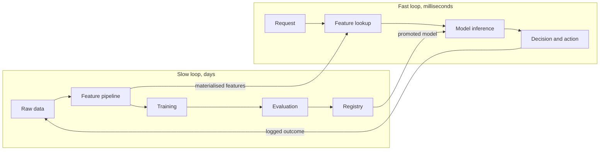
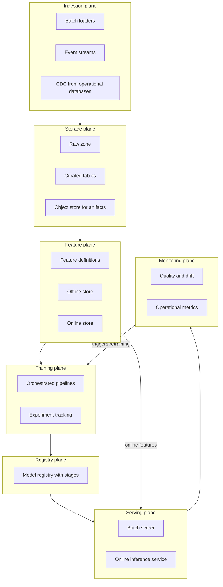
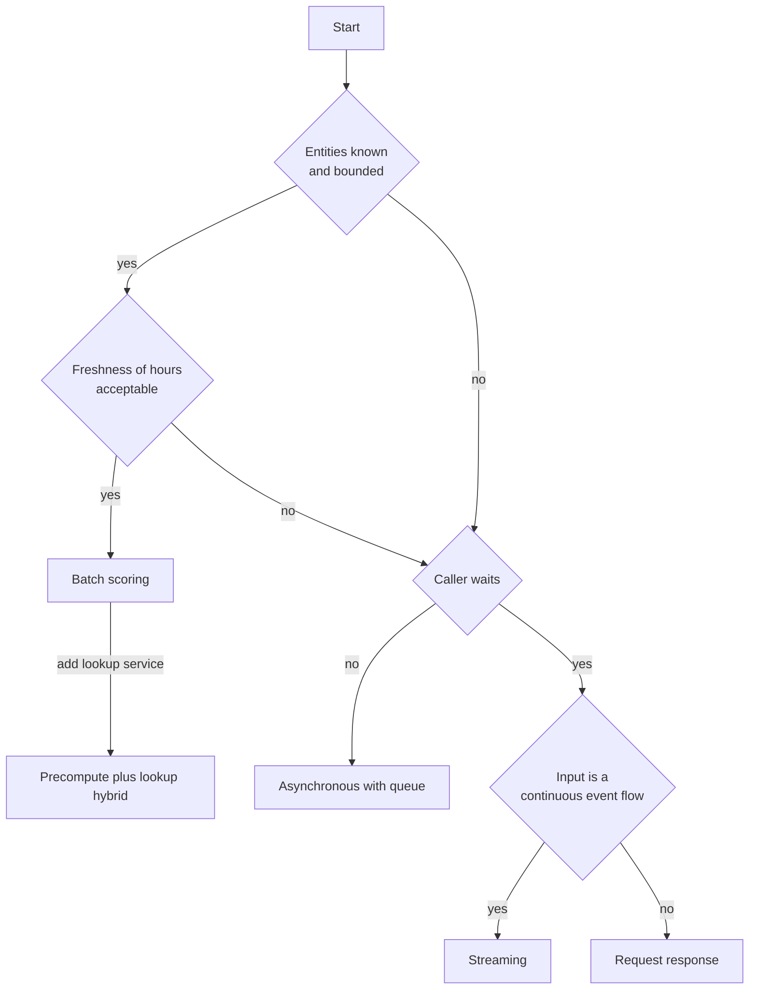
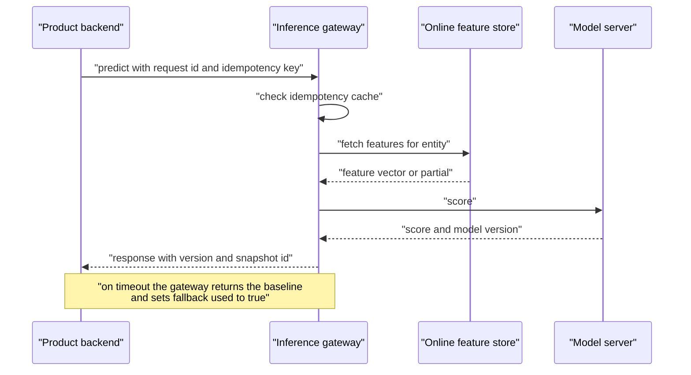
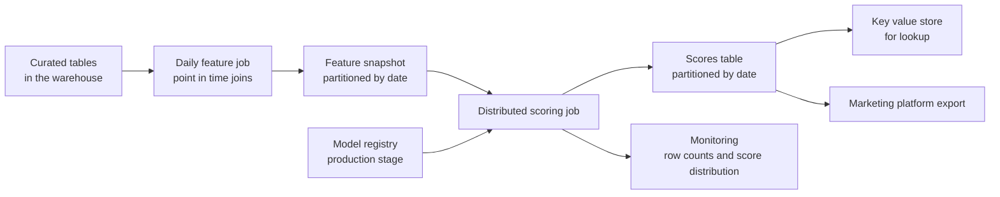
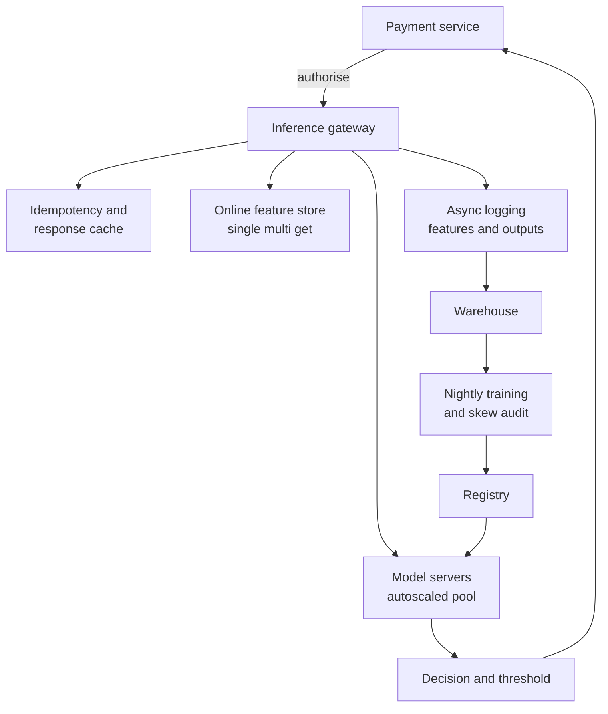
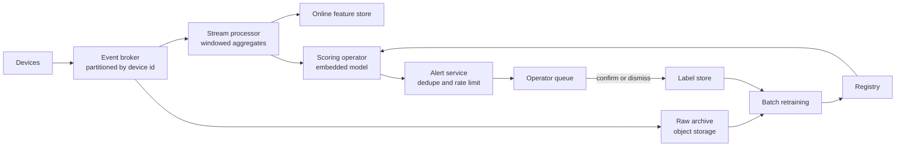
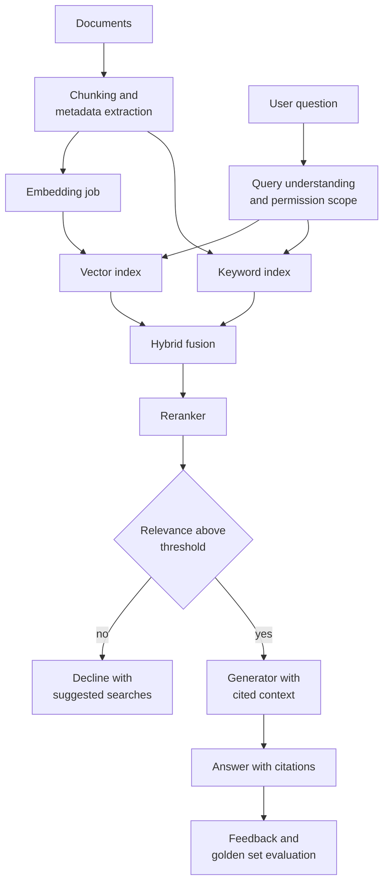

# Chapter 21: Machine Learning System Design

> **What this chapter covers** How to take a vague request such as "we want to predict churn" and turn it into a defensible system design: the clarifying questions, the requirements that machine learning adds on top of a normal backend design, capacity arithmetic you can do in your head, the reference architecture of a machine learning platform, the four serving modes and when each is right, the integration contract with product backends, caching, multi-tenancy, the standing trade-offs, and four worked designs.
> **Prerequisites** Chapter 5 for evaluation, Chapter 17 for storage and formats, Chapter 20 for feature stores. Chapters 22, 23, and 24 go deeper on the infrastructure this chapter assembles. None of them are strictly required; this chapter states what it needs.
> **Where it is used** Design reviews, architecture documents, the system design interview, and the first two weeks of any new machine learning product. It bites hardest when a model that worked in a notebook has to serve traffic, and when a product team asks for a latency or freshness guarantee nobody has costed.

---

## 21.1 Level 1: Foundations

### 21.1.1 What a machine learning system is

A machine learning system is a software system that contains a learned component. That single sentence carries the whole difficulty. Everything you know about designing software systems still applies: you still need availability, latency budgets, capacity planning, deployment, and rollback. On top of that you inherit three properties that ordinary software does not have.

1. **The behaviour is induced from data, not written down.** Nobody can read the code and say what the system will output for a given input. You can only measure it.
2. **The system decays while you do nothing.** The world moves, the input distribution shifts, and yesterday's model is worse today than it was yesterday. A sorting function does not do this.
3. **Correctness is statistical, not binary.** There is no test that passes or fails. There is a distribution of outcomes and a threshold you chose.

A design that ignores any of these produces a system that works on launch day and quietly rots.

### 21.1.2 The shape of a design problem

A design problem arrives underspecified. Somebody says "we should recommend products" or "flag fraudulent transactions" or "answer support questions from the documentation". Your job is to convert that into a system with numbers attached. The conversion has a fixed shape, and you should run it in the same order every time.

| Step | Question you are answering | Typical time in a one hour review |
| --- | --- | --- |
| Clarify | What is actually being asked, and for whom | 5 to 10 minutes |
| Requirements | What must be true for this to be a success | 5 to 10 minutes |
| Capacity | How big is this, in requests, bytes, and money | 5 minutes |
| High level design | What are the boxes and the arrows | 10 to 15 minutes |
| Deep dives | Where is the hard part, and how is it solved | 15 to 20 minutes |
| Trade-offs and scale | What did you give up, and what breaks at ten times the load | 5 to 10 minutes |

The order matters because each step constrains the next. Capacity arithmetic done after the design is a justification. Done before, it is a filter: it removes options.

### 21.1.3 The mental model to carry

Hold three pictures in your head.

**Picture one: two loops at different speeds.** There is a fast loop where a request comes in and a prediction goes out, measured in milliseconds. There is a slow loop where data accumulates, a model is trained, evaluated, and promoted, measured in days or weeks. Most design errors are a confusion between the two. Anything expensive belongs in the slow loop.

**Picture two: the model is a small box.** In a mature machine learning system the model code is a few percent of the system. The rest is data movement, feature computation, serving, monitoring, and the plumbing that connects them. Design the plumbing.

**Picture three: the prediction is not the product.** A prediction is only useful when some downstream action consumes it. "Probability of churn is 0.71" is not a product. "Send this customer a retention offer" is. Design backwards from the action, because the action determines the latency budget, the threshold, and the cost of a mistake.



*Figure 21.1: The two loops. The three arrows between them, model promotion, feature materialisation, and outcome logging, are the interfaces that most designs get wrong.*

### 21.1.4 Vocabulary

| Term | Definition |
| --- | --- |
| Online | Happening in the request path, with a user or caller waiting |
| Offline | Happening on a schedule with nobody waiting |
| Feature | A numeric or categorical input to the model, derived from raw data |
| Freshness | The age of the data that went into a prediction |
| Staleness | The same quantity, described as a defect |
| Training serving skew | A difference between how a feature is computed at training time and at serving time |
| Baseline | The simplest system that solves the problem, against which the model is compared |
| Golden set | A fixed, curated set of inputs with known correct outputs, used for regression testing |
| SLO | Service level objective, a target such as "99 percent of requests under 150 ms" |
| Shadow mode | Running a new model on live traffic without using its output |

---

## 21.2 Level 2: Working knowledge

### 21.2.1 Clarifying questions that are worth asking

Bad clarifying questions ask for detail. Good ones can change the architecture. Here are the ones that do.

| Question | Why it changes the design |
| --- | --- |
| Who or what consumes the prediction, a human or a service? | A human tolerates 2 seconds, a service in a request path may tolerate 50 ms |
| What happens today without a model? | Defines the baseline you must beat and often reveals a rules engine you can keep |
| Is the decision reversible? | Irreversible actions need higher precision and usually a human in the loop |
| How often does the input distribution change? | Sets retraining cadence and monitoring sensitivity |
| Do you need the prediction for every entity or only on demand? | Decides batch versus request-response |
| When is the label known, and how? | If labels arrive in 90 days you cannot retrain weekly on fresh labels |
| Is there a regulatory or explainability requirement? | May exclude every model except a linear one or a shallow tree |
| What is the per-prediction budget? | Converts directly into model size and serving mode |

Ask about labels early. Label availability, not model architecture, is the most common reason a machine learning project fails.

### 21.2.2 Requirements for machine learning systems

Split requirements into functional and non-functional, as you would for any system. The functional ones are usually easy: given input X, produce prediction Y, with this schema, at this endpoint. The non-functional ones are where machine learning differs, and a generic template omits most of them.

**The definition of correct, and who judges it.** Write down, in one sentence, what a correct output is. Then write down who decides. For a click prediction the judge is the logged click and the definition is mechanical. For a support answer the judge is a human rater or a model-based judge with a rubric, and the definition is contested. If you cannot name the judge, you cannot measure quality, and every later number is decoration. Three judge types appear in practice:

| Judge | Cost | Latency of feedback | Bias risk |
| --- | --- | --- | --- |
| Logged user behaviour | Near zero | Minutes to days | Feedback loops, position bias |
| Human annotation | High | Days | Annotator disagreement, drift in guidelines |
| Model as judge | Low | Seconds | Correlated with the system under test, prompt sensitivity |

**The quality target and the baseline.** A target without a baseline is meaningless. State both: "recall at 0.9 precision must exceed 0.62, where the current rules engine achieves 0.41, measured on the held-out quarter". Include the confidence interval. A model that beats the baseline by less than the width of the interval has not beaten it.

**The cost of a wrong prediction, split by direction.** False positives and false negatives almost never cost the same. Put currency on them if you can.

$$\text{Expected cost per decision} = p_{\text{FP}} \cdot C_{\text{FP}} + p_{\text{FN}} \cdot C_{\text{FN}}$$

Here $p_{\text{FP}}$ is the probability of a false positive per decision, $C_{\text{FP}}$ is the cost of one, and similarly for false negatives. This expression, not accuracy, determines the operating threshold. Worked example, with assumed figures: a fraud system where blocking a legitimate transaction costs 40 units of goodwill and letting a fraudulent one through costs 250 units. At a threshold giving $p_{\text{FP}} = 0.02$ and $p_{\text{FN}} = 0.15$ on a 1 percent fraud base rate, expected cost per transaction is $0.99 \times 0.02 \times 40 + 0.01 \times 0.15 \times 250 = 0.792 + 0.375 = 1.167$ units. Move the threshold until this is minimised, not until accuracy is maximised.

**Latency.** Specify a percentile, not a mean. "p99 under 200 ms end to end, of which the model gets 80 ms" is a requirement. "Fast" is not. Always decompose the budget across the hops, because the model is rarely the largest term.

**Freshness.** Two separate numbers: how old the features may be, and how old the model may be. They have different costs. Feature freshness is an infrastructure problem, model freshness is a pipeline cadence problem.

**Volume.** Requests per second at peak, not average. Number of entities to score in batch. Data arriving per day.

**Budget.** Both training and serving, per month. Without a budget every design defaults to the most expensive option.

**Autonomy.** How much can the system do without a human? This is a requirement, not a detail. Write it on a scale and pick a level explicitly.

| Level | Description | Typical guardrail |
| --- | --- | --- |
| 0 | Model produces a number, human reads it | None needed |
| 1 | Model ranks options, human chooses | Show the top k with evidence |
| 2 | Model acts, human can undo | Audit log, undo path, rate limit |
| 3 | Model acts irreversibly within limits | Hard caps, confidence gate, kill switch |
| 4 | Model acts without limits | Rarely justified; requires very high precision |

Pick the lowest level that delivers the value. Moving from level 2 to level 3 usually multiplies the required precision and the review burden.

### 21.2.3 The requirements table you should produce

Every design document should contain a table like this, filled with numbers.

| Requirement | Target | Measured how | Source |
| --- | --- | --- | --- |
| Quality | Recall at least 0.62 at precision 0.90 | Held-out quarter, bootstrap CI | Product |
| Baseline to beat | Rules engine, recall 0.41 | Same held-out quarter | Current system |
| Latency | p99 under 200 ms end to end | Server-side histogram | Product |
| Feature freshness | Under 5 minutes for behaviour features | Event timestamp minus serve time | Engineering |
| Model freshness | Retrain weekly, promote within 2 days | Registry timestamps | Engineering |
| Peak volume | 3000 requests per second | Load test plus 2x headroom | Traffic data |
| Serving budget | Under a stated monthly ceiling | Cloud bill tags | Finance |
| Autonomy | Level 2, reversible with audit log | Design review | Risk |
| Availability | 99.9 percent monthly | Uptime probe | Product |

### 21.2.4 Capacity estimation, with the arithmetic

Capacity estimation is four small calculations. Do them out loud.

**Requests to throughput.** Convert a daily volume to a peak per second. A useful rule of thumb is that daily traffic concentrates: peak second is often three to five times the naive daily average for consumer traffic. Use the multiplier explicitly and say it is an assumption.

$$\text{QPS}_{\text{avg}} = \frac{N_{\text{daily}}}{86400}, \qquad \text{QPS}_{\text{peak}} = k \cdot \text{QPS}_{\text{avg}}$$

$N_{\text{daily}}$ is requests per day, $k$ is the peak multiplier. Worked example: 50 million requests per day gives $50{,}000{,}000 / 86400 \approx 579$ QPS average. With $k = 4$, peak is approximately 2300 QPS.

**Throughput to instances.** Use Little's law. If each instance can hold $c$ requests in flight concurrently and each takes $L$ seconds of service time, the instance serves $c / L$ requests per second.

$$n = \left\lceil \frac{\text{QPS}_{\text{peak}}}{c / L} \cdot \frac{1}{u} \right\rceil$$

$n$ is the instance count, $u$ is the target utilisation, kept below 1 so queues do not blow up. Worked example: service time $L = 40$ ms, concurrency $c = 8$, so each instance does $8 / 0.04 = 200$ QPS. At 2300 peak QPS and target utilisation $u = 0.6$, $n = \lceil 2300 / 200 / 0.6 \rceil = \lceil 19.2 \rceil = 20$ instances. Then add a replica for failure tolerance per availability zone.

Utilisation matters more than people expect. For an M/M/1 queue the mean waiting time scales as $1/(1-u)$, so going from $u = 0.6$ to $u = 0.9$ multiplies queueing delay by four. Tail latency degrades faster still. Size for 0.5 to 0.7 in a latency-sensitive service.

**Storage growth.** Multiply row size by rate by retention, then multiply by a replication factor and a compression factor.

$$S = r \cdot b \cdot t \cdot \frac{f_{\text{repl}}}{f_{\text{comp}}}$$

$r$ is rows per second, $b$ is bytes per row, $t$ is retention in seconds, $f_{\text{repl}}$ is the replication factor, $f_{\text{comp}}$ is the compression ratio. Worked example: 2300 predictions per second, 400 bytes of logged features and output per prediction, retained 90 days, replication 3, columnar compression 4x.

$r \cdot b = 2300 \times 400 = 920{,}000$ bytes per second, about 0.92 MB/s. Over 90 days, $0.92 \times 10^6 \times 7{,}776{,}000 \approx 7.15 \times 10^{12}$ bytes, roughly 7.2 TB raw. Times 3 over 4 gives approximately 5.4 TB stored. That is cheap in object storage and expensive in a transactional database, which is the decision the arithmetic exists to make.

**Model memory and compute.** For a dense neural network, parameter memory is parameter count times bytes per parameter.

$$M_{\text{params}} = P \cdot B$$

$P$ is the parameter count, $B$ is bytes per parameter: 4 for float32, 2 for float16 or bfloat16, 1 for int8. Worked example: a 7 billion parameter model in bfloat16 needs $7 \times 10^9 \times 2 = 1.4 \times 10^{10}$ bytes, approximately 13 GiB, before any activation or key-value cache memory. A 300 million parameter encoder in float16 needs approximately 0.56 GiB.

Compute per forward pass for a dense model is approximately two floating point operations per parameter per token, because each weight participates in one multiply and one add.

$$F_{\text{fwd}} \approx 2 \cdot P \cdot T$$

$T$ is the number of tokens processed. Worked example: a 300 million parameter model over a 128 token input needs approximately $2 \times 3 \times 10^8 \times 128 \approx 7.7 \times 10^{10}$ floating point operations, 77 GFLOPs. On an accelerator delivering an effective 50 TFLOP/s for this shape, that is approximately 1.5 ms of pure compute, which tells you immediately that the latency will be dominated by data movement and network, not by arithmetic. Chapter 23 derives the training-side version of this arithmetic and Chapter 24 the serving side.

Always sanity-check the two ends. If the arithmetic says one instance suffices, your design is a single process and everything else is over-engineering. If it says four thousand instances, the model is too big for the budget and the design must change, not the instance count.

### 21.2.5 The reference architecture

Almost every machine learning platform decomposes into the same seven planes. Draw these, then mark which ones your design actually needs. Most designs need four.



*Figure 21.2: The seven planes. The two extra edges, monitoring back into training and the feature plane into serving, are what make it a machine learning platform rather than a data warehouse.*

| Plane | Responsibility | What goes wrong without it |
| --- | --- | --- |
| Ingestion | Get data in, once, with provenance | Duplicate and undated data, no lineage |
| Storage | Durable, queryable, cheap history | Cannot reproduce a training set |
| Feature | One definition of each feature for both training and serving | Training serving skew |
| Training | Reproducible runs with recorded inputs | Nobody can explain last month's model |
| Registry | Named, versioned, staged artifacts | Unknown model in production |
| Serving | Predictions under an SLO | Latency and availability incidents |
| Monitoring | Detect decay and incidents | Silent quality collapse |

### 21.2.6 The four serving modes

This is the single most consequential design choice. Get it right and the rest is detail.

| Mode | Trigger | Latency | Typical use | Main risk |
| --- | --- | --- | --- | --- |
| Batch scoring | Schedule | Hours | Score all customers nightly | Staleness; wasted compute on entities nobody queries |
| Asynchronous | Request enqueued, result later | Seconds to minutes | Document processing, video analysis | Result delivery and status tracking complexity |
| Request-response | Synchronous call | Milliseconds | Ranking, fraud, classification in a user flow | Capacity and tail latency |
| Streaming | Event arrival | Sub-second to seconds | Real-time anomaly detection, live features | Ordering, late data, exactly-once semantics |

Decision criteria, in the order to apply them:

1. **Is the set of entities to score known in advance and bounded?** If yes and freshness allows, batch. Batch is an order of magnitude cheaper and simpler.
2. **Does a caller wait for the answer?** If no, asynchronous. You gain the ability to queue, retry, and run bigger models.
3. **Does the input arrive as a continuous event flow where the decision is per event?** Streaming.
4. **Otherwise, request-response.**

A common and good hybrid is batch precompute plus request-response lookup: score everything nightly, store the scores, serve from a key-value store in 5 ms, and fall back to online inference only for entities missing from the table. This gives request-response latency at batch cost, and it is the right answer more often than people expect.



*Figure 21.3: Serving mode decision tree. The hybrid at the bottom right is the default worth trying first whenever batch is feasible at all.*

### 21.2.7 Backend integration design

A machine learning service is rarely the product. It is called by product backends, and the boundary between them is where most production incidents live. Design the boundary explicitly.

**The contract.** Publish a versioned schema for the request and the response. The response should carry more than the prediction:

| Field | Why |
| --- | --- |
| `prediction` | The output |
| `score` or `confidence` | Lets the caller apply its own threshold |
| `model_version` | Attribution, debugging, and analysis by version |
| `feature_snapshot_id` | Reproduce the exact inputs later |
| `request_id` | Join to logs and to the eventual label |
| `fallback_used` | True when a default was returned |
| `latency_ms` | Caller-side budget accounting |

**Listing 21.1: a response contract with the fields that make debugging possible.**

```python
from dataclasses import dataclass
from typing import Optional

@dataclass(frozen=True)
class PredictionResponse:
    request_id: str
    prediction: str            # the decision the caller acts on
    score: float               # calibrated probability in [0, 1]
    model_version: str         # e.g. "churn-v7"
    feature_snapshot_id: str   # points at the logged feature vector
    fallback_used: bool        # True when the model was not consulted
    latency_ms: float

    def is_actionable(self, threshold: float) -> bool:
        """Callers apply their own threshold, so it can change
        without redeploying the model service."""
        return (not self.fallback_used) and self.score >= threshold
```

The non-obvious part is `is_actionable`. Putting the threshold on the caller's side means the product can change its risk appetite without a model deployment, and different callers can use different thresholds against one model. The `fallback_used` flag prevents a default score of 0.5 from being mistaken for a real prediction, which is a failure mode that silently corrupts downstream analytics.

**Synchronous versus asynchronous delivery.** Synchronous is simpler and couples availability: if the model service is down, the caller is down unless it has a fallback. Asynchronous decouples availability at the cost of delivery machinery. Decide by asking whether the caller can produce a useful response without the prediction. If it can, synchronous with a short timeout and a fallback is correct. If it cannot, and the work is slow, go asynchronous.

**Idempotency.** Any call that may be retried must be idempotent. Give every request a caller-supplied idempotency key, store the result keyed by it for a retention window, and return the stored result on a repeat. Without this, a retry storm during an incident produces duplicate side effects such as double-charging or double-notifying.

**Schema evolution across the boundary.** Two rules cover most cases. Additive changes only within a major version: you may add optional response fields and optional request fields with defaults. Breaking changes get a new version served in parallel until callers migrate. Machine learning adds a third rule: a change in the meaning of a field, such as recalibrating a score so that 0.7 no longer means what it meant, is a breaking change even though the schema is identical. Version it.

**Failure semantics.** Decide, in advance and in writing, what the caller does when the model service fails or times out. The options are a static default, a cached previous prediction, the rules-based baseline, or propagating the error. Each is correct somewhere. What is never correct is leaving it undefined, because then it is defined by whichever exception handler happens to catch it.



*Figure 21.4: The request path with the fallback rule stated on the diagram, which is where it belongs so reviewers cannot ignore it.*

### 21.2.8 Caching, and what each layer risks

Caching is the cheapest latency win and the easiest way to serve wrong answers. Every cache layer has a distinct failure mode.

| Layer | What is cached | Typical hit rate driver | The specific risk |
| --- | --- | --- | --- |
| Response cache | Full prediction keyed by input | Repeated identical inputs | Serves a stale prediction after the model is promoted; fix by putting model version in the key |
| Feature cache | Feature values keyed by entity | Entity access skew | Serves stale features, causing silent quality loss with no error |
| Embedding cache | Vectors for items or documents | Stable item catalogue | Mixed embedding versions in one index, making distances meaningless |
| Model artifact cache | Weights on local disk or in memory | Process restarts | Disk full, or a stale artifact after a rollback |
| Retrieval cache | Search results for a query | Query head | Freshly indexed documents invisible to popular queries |
| Negative cache | The fact that an entity has no data | Cold entities | A new entity stays invisible for the cache lifetime |

Two rules keep caches safe. First, include the model version and the feature definition version in every cache key, so promotion invalidates automatically. Second, set a time to live shorter than the freshness requirement, not shorter than what feels fast. If features may be five minutes old, a ten minute cache has already broken the requirement.

### 21.2.9 Multi-tenancy and isolation

A multi-tenant machine learning system serves several customers, teams, or business units from shared infrastructure. Decide the isolation level per layer, not globally.

| Layer | Shared | Isolated | When to isolate |
| --- | --- | --- | --- |
| Data storage | One table with a tenant column | One table or database per tenant | Regulatory requirement, very uneven sizes, deletion requests |
| Features | Shared definitions, tenant-scoped values | Tenant-specific definitions | Tenants have genuinely different semantics |
| Model | One global model with a tenant feature | One model per tenant | Enough data per tenant, and cross-tenant leakage is prohibited |
| Serving | Shared pool | Dedicated pool | Noisy neighbour risk or a contractual latency SLO |
| Monitoring | Aggregate | Per-tenant dashboards | Always isolate this one; aggregate metrics hide per-tenant collapse |

The default that works: shared everything with a tenant identifier, per-tenant quotas and rate limits, per-tenant monitoring, and a documented escape hatch to a dedicated pool for the few tenants that need it. One model per tenant is tempting and usually wrong. A global model with a tenant embedding or tenant features borrows strength across tenants and collapses the operational burden from N pipelines to one. Move to per-tenant models only when a tenant has enough data to train alone and evaluation shows the global model underserving it.

The hard constraint is leakage. If tenant A's data must never influence tenant B's predictions, a global model trained on both violates that, no matter how the features are scoped. Establish this requirement before choosing, because it determines everything else.

---

## 21.3 Level 3: Depth

### 21.3.1 The standing trade-offs

Every design pays four bills. Name them explicitly in the document so a reviewer can disagree with the choice rather than with the outcome.

**Build versus buy, per layer.** Do not answer this globally. Answer it per plane.

| Plane | Buying usually wins when | Building usually wins when |
| --- | --- | --- |
| Ingestion | Standard connectors exist | Sources are proprietary or volumes are extreme |
| Storage | Almost always | Never, in practice; use managed object and table storage |
| Feature | You need point-in-time correctness and lack the team | Features are simple lookups, or latency requirements are extreme |
| Training | Team is small, workloads are standard | You need unusual hardware topologies or custom parallelism |
| Registry | Almost always; it is a solved problem | You already have an artifact store and need only metadata |
| Serving | Standard model types and moderate scale | Latency below roughly 10 ms, or unusual batching needs |
| Monitoring | Rarely; vendor definitions seldom match your metric | Your quality metric is domain-specific, which it usually is |

The question to ask is not "can we build it" but "is this layer a source of differentiation". Buy the layers that are not, and accept the vendor's opinions there.

**Latency versus cost.** These trade along a curve, not a line. Halving latency rarely doubles cost; it often multiplies it, because the last 20 ms comes from over-provisioning, keeping models resident in memory, replicating caches, and disabling batching. Get the curve empirically: measure p99 at several instance counts and batch sizes, and put the curve in the design document. Then let the product choose a point on it. Batching is the clearest instance: larger batches raise throughput per unit of hardware and raise latency, because a request waits for the batch to fill.

**Freshness versus complexity.** Each step up in freshness adds a system.

| Freshness | Mechanism | Added complexity |
| --- | --- | --- |
| Daily | Scheduled batch job | Orchestrator only |
| Hourly | Frequent batch, incremental | Incremental logic, late data handling |
| Minutes | Micro-batch or streaming into an online store | Stream processor, online store, backfill path |
| Seconds | Full streaming with windowed state | Watermarks, ordering, state stores, exactly-once semantics |
| At request time | Compute features in the request path | Latency budget, external call failures, caching |

Cross a boundary only when a requirement forces it. "Real time" as a preference, with no decision that changes in the interval, is the most expensive phrase in machine learning system design.

**Accuracy versus interpretability.** Interpretability is a requirement in regulated decisions and a convenience elsewhere. When it is a requirement, it constrains the model class, and you should quantify the cost: train the interpretable model and the unconstrained one, and report the gap with a confidence interval. Often the gap is small and the argument ends. When it is large, the options are a hybrid, where an interpretable model decides and a complex model is used only for triage, or post-hoc explanation methods with their known limitations. Post-hoc explanations describe the explainer's approximation, not the model, and should not be presented to a regulator as the model's reasoning.

### 21.3.2 Deep dive: point-in-time correctness

The most common silent bug in machine learning systems is training on information that did not exist at prediction time. It inflates offline metrics and produces a model that collapses in production.

The rule: for a training example with a prediction timestamp $t$, every feature value must be the value that would have been observed at $t$, not the current value. A join on entity identifier alone violates this. The join must be on entity and time, taking the latest feature value with an event time strictly less than or equal to $t$, allowing for arrival delay.

Let $t$ be the label or decision time, $t_e$ the event time of a feature update, and $t_a$ its arrival time in the store. The feature is legitimately usable at $t$ only when $t_a \le t$. Using values with $t_e \le t < t_a$ is leakage that is invisible in an event-time-only join, because the value existed conceptually but had not arrived. Store both timestamps, and join on arrival time for the honest evaluation.

**Listing 21.2: a point-in-time join expressed in SQL, with the arrival-time guard.**

```sql
-- labels: entity_id, decision_ts, label
-- features: entity_id, event_ts, arrival_ts, value
SELECT
  l.entity_id,
  l.decision_ts,
  l.label,
  f.value AS feature_value
FROM labels AS l
LEFT JOIN LATERAL (
  SELECT value
  FROM features AS f
  WHERE f.entity_id = l.entity_id
    AND f.event_ts   <= l.decision_ts
    AND f.arrival_ts <= l.decision_ts   -- the guard against late data leakage
  ORDER BY f.event_ts DESC
  LIMIT 1
) AS f ON TRUE;
```

The lateral subquery picks the single most recent feature row per label row. The second predicate is the one people omit. Without it, a value that was computed late and backfilled becomes visible to a historical training example that could never have seen it. Check your database version for lateral join syntax; the mechanism is standard but the spelling differs.

### 21.3.3 Deep dive: the latency budget

Decompose the end-to-end budget and attribute each term. A typical online prediction path, with figures marked as an example rather than a measurement:

| Hop | Example budget | Reduce by |
| --- | --- | --- |
| Client to edge | 20 ms | Nothing you control |
| Gateway routing and auth | 5 ms | Cache tokens |
| Feature fetch | 15 ms | Batch the lookups, colocate the store |
| Feature transformation | 5 ms | Precompute, vectorise |
| Model inference | 40 ms | Quantise, distil, smaller model, batch |
| Post-processing and business rules | 5 ms | Simplify |
| Response serialisation | 3 ms | Smaller payload |
| Network return | 20 ms | Nothing you control |

Two facts govern the tail. First, the p99 of a sequence of independent hops is worse than the sum of the individual p99s is reassuring, but the real killer is fan-out: if a request fans out to $m$ independent backends and each has a probability $q$ of exceeding a threshold, the probability that at least one does is

$$1 - (1-q)^m$$

Worked example: $q = 0.01$ and $m = 10$ gives $1 - 0.99^{10} = 1 - 0.904 = 0.096$. A 1 percent per-call tail becomes a 9.6 percent request-level tail. Fan-out is why hedged requests and per-call timeouts matter more than average speed.

Second, queueing dominates at high utilisation, as noted in 21.2.4. If p99 is bad and mean is fine, suspect utilisation and garbage collection pauses before suspecting the model.

### 21.3.4 Deep dive: consistency between training and serving

Training serving skew has four distinct sources, and each has a different fix.

| Source | Symptom | Fix |
| --- | --- | --- |
| Different code paths | Offline and online features differ for identical input | One definition, one implementation, shared library or a feature store |
| Different data sources | Online reads a cache, offline reads a warehouse | Materialise the online store from the same curated tables |
| Time travel error | Offline metrics far exceed online | Point-in-time joins with an arrival-time guard |
| Different distributions | Online inputs include cases absent from training | Log online inputs and sample them into training |

The detection method is a skew audit: log the exact online feature vector for a sample of requests, recompute those features offline for the same entity and timestamp, and compare. Report the fraction of features differing by more than a tolerance. Any non-trivial fraction is a defect, and this audit should run continuously, not once.

### 21.3.5 Deep dive: what monitoring must cover

Four categories, with distinct owners and alert routes.

| Category | Examples | Detectable without labels |
| --- | --- | --- |
| Operational | QPS, error rate, p50 and p99 latency, saturation | Yes |
| Data | Missing rate, range violations, schema drift, freshness lag | Yes |
| Model behaviour | Score distribution, prediction rate by class, feature drift | Yes |
| Outcome | Precision, recall, calibration, business metric | No, requires labels |

The gap between the third and fourth rows is the fundamental monitoring problem: the things you can measure immediately are proxies, and the thing you care about arrives late. Design for the delay. Track the proxies for alerting, and reconcile with outcomes on whatever cadence labels allow. Always monitor per segment as well as in aggregate, because aggregate metrics hide the collapse of any segment smaller than the noise floor.

### 21.3.6 Failure modes of the architecture itself

| Failure | Mechanism | Design mitigation |
| --- | --- | --- |
| Feedback loop | Model's own outputs change the data it later trains on | Log the serving policy, hold out a randomised slice, use inverse propensity weighting |
| Silent fallback | Model service fails, defaults served, metrics look fine | Alert on fallback rate, not only on error rate |
| Cache poisoning | A bad model version's outputs persist after rollback | Model version in every cache key |
| Pipeline succeeded, data empty | Upstream produced zero rows, job exits zero | Assert row counts and distribution bounds in the pipeline |
| Registry drift | Serving a model that no pipeline produced | Deploy only from the registry, verify artifact hash at load |
| Cold start | New entity has no features, gets a nonsense score | Explicit cold-start policy and a separate metric for it |
| Retraining on corrupted data | Bad batch enters training, model degrades, retrain amplifies | Data validation gate before training, and quality gate before promotion |

---

## 21.4 Level 4: Mastery

### 21.4.1 Four worked designs

Each design follows the same structure: brief, clarifying questions, requirements table, capacity arithmetic, component diagram, two deep dives, and what changes at ten times scale. All numbers are stated assumptions for the example, not measurements.

---

#### Design A: batch scoring over a large customer base

**Brief.** Produce a propensity score for every one of 40 million customers, refreshed daily, consumed by a marketing platform that selects campaign audiences each morning.

**Clarifying questions.** Who consumes the score and when? Answer: an automated campaign selector at 06:00 local time. Is a score needed for every customer or only those in eligible segments? Answer: every customer, because eligibility is decided downstream. How stale may the score be? Answer: up to 24 hours. What is the cost of a wrong score? Answer: a wasted contact, low cost, but over-contact has a churn cost, so precision at the top of the ranking matters more than global accuracy. When is the label known? Answer: 30 days after contact.

**Requirements.**

| Requirement | Target |
| --- | --- |
| Coverage | 100 percent of active customers, 40 million rows |
| Quality | Lift at top 5 percent at least 3.0 against random, baseline recency heuristic gives 1.8 |
| Completion | All scores written by 05:00, job start 01:00, so a 4 hour window |
| Freshness | Features up to 24 hours old acceptable |
| Retention | Scores retained 13 months for analysis |
| Budget | Stated monthly ceiling for compute |
| Autonomy | Level 1, the campaign selector proposes and a marketer approves |

**Capacity arithmetic.** Rows 40 million. Assume 200 features at 4 bytes, so 800 bytes per row, giving $40 \times 10^6 \times 800 = 3.2 \times 10^{10}$ bytes, approximately 32 GB per daily feature snapshot before compression, roughly 8 GB as compressed columnar files. Required throughput is $40 \times 10^6 / (4 \times 3600) \approx 2800$ rows per second sustained, which is undemanding; a gradient-boosted tree ensemble scores far faster than that per core, so the job is dominated by the feature join, not the model. Output storage: 40 million rows times approximately 60 bytes times 400 days, about $9.6 \times 10^{11}$ bytes, roughly 1 TB before compression.



*Figure 21.5: Batch scoring. The scores table is the source of truth and the key-value store is a derived read replica, not the other way around.*

**Deep dive one: partitioning and the join.** The dominant cost is joining 40 million customers to event aggregates. Partition both sides by a hash of the customer identifier so the join is local within a partition and no shuffle crosses the cluster more than once. Choose the partition count so each partition is roughly 128 to 256 MB after compression, which for an 8 GB snapshot means 32 to 64 partitions, then round up for parallelism. Skew is the risk: a small number of customers with enormous event histories create stragglers. Detect it by looking at per-partition task durations, and fix it by salting the skewed keys or by pre-aggregating events before the join.

**Deep dive two: idempotency and reruns.** The job must be safe to rerun, because it will be rerun. Write output to a date-partitioned location and publish atomically: write to a staging path, then swap the partition pointer. Never append. A rerun then overwrites one partition and no consumer sees a half-written state. Record the model version and feature snapshot identifier in the output table so that any score can be traced.

**At ten times scale, 400 million customers.** The four hour window becomes the binding constraint at 28000 rows per second. The feature join stops fitting comfortably in one job. The changes: incrementalise, scoring only customers whose features changed since the last run, which typically cuts volume by 60 to 90 percent; move the ranking from a global sort to a per-segment top-k, since a global sort of 400 million rows is expensive and the consumer only needs the head; and split the job into independently retryable stages so a failure does not restart four hours of work.

---

#### Design B: low-latency request-response prediction service

**Brief.** Score each transaction for fraud risk inside the payment authorisation flow. The caller must receive a decision before it responds to the payment network.

**Clarifying questions.** What is the caller's total budget and how much is ours? Answer: 300 ms total, 120 ms for us. What happens if we time out? Answer: the caller applies a rules-based decision, so a fallback exists and availability is not catastrophic, but fallback rate is a tracked metric. What is the cost asymmetry? Answer: a blocked legitimate transaction costs goodwill and a missed fraud costs the transaction value. Is the decision reversible? Answer: a block is reversible on appeal but expensive; autonomy level 3 with a hard cap on block rate.

**Requirements.**

| Requirement | Target |
| --- | --- |
| Latency | p99 under 120 ms at the service boundary |
| Availability | 99.95 percent monthly |
| Quality | Recall at least 0.62 at precision 0.90, baseline rules recall 0.41 |
| Feature freshness | Velocity features under 60 seconds old |
| Peak volume | 2300 requests per second, from the earlier worked example |
| Fallback rate | Under 0.5 percent of requests |
| Autonomy | Level 3, automatic block with a capped block rate and a kill switch |

**Capacity arithmetic.** From 21.2.4: 2300 peak QPS, service time 40 ms, concurrency 8 per instance gives 200 QPS per instance, at 60 percent utilisation that is 20 instances, plus one spare per zone across three zones gives 23. Online feature store: 2300 QPS times an assumed 12 key lookups per request is 27600 lookups per second, which is the number to size the store against, and it argues strongly for a single multi-get call per request instead of 12 round trips.



*Figure 21.6: The fraud path. Logging is asynchronous and off the critical path, which is the only way to log everything without paying for it in latency.*

**Deep dive one: the tail.** The model is 40 ms of a 120 ms budget, so the tail is not owned by the model. Three controls matter. Set a per-dependency timeout well inside the budget, for example 25 ms on the feature store, and treat an exceeded timeout as a partial feature vector rather than an error, with a missing-feature indicator the model was trained to handle. Second, hedge: if the feature store has not responded in 15 ms, issue a second request to another replica and take the first answer, which converts a rare slow replica into a common fast one at a small cost in load. Third, keep utilisation at or below 0.6 and pre-warm model weights at startup so the first request after a scale-up is not the slowest.

**Deep dive two: threshold and the cap.** The block decision is a threshold on a calibrated score. Calibration matters more than ranking here, because the threshold is chosen from expected cost as in 21.2.2, and that arithmetic is meaningless on uncalibrated scores. Fit an isotonic or Platt calibration on a held-out set, and monitor calibration in production with a reliability curve per segment. Enforce the block rate cap as a separate control loop: if the realised block rate over a rolling window exceeds the cap, raise the threshold automatically and alert. This protects against a model that drifts into blocking everything, which is the failure that destroys trust fastest.

**At ten times scale, 23000 QPS.** Instance count goes to roughly 200, which is fine, but the feature store at 276000 lookups per second is the new bottleneck and needs sharding by entity with a read-through cache. Logging at 23000 records per second, 400 bytes each, is 9.2 MB/s, so the logging pipeline becomes a real system rather than an afterthought. The decision that changes: at this volume, the marginal cost of the model becomes large enough that distillation into a smaller model, or a two-stage design where a cheap model handles the obvious 95 percent and an expensive model sees only the ambiguous remainder, pays for itself.

---

#### Design C: near-real-time pipeline with streaming features

**Brief.** Detect anomalous device behaviour from a fleet of connected devices emitting telemetry, and raise an alert within 30 seconds of the anomalous behaviour beginning.

**Clarifying questions.** What is the event rate? Answer: 500000 devices, one event every 10 seconds, so 50000 events per second. What is an anomaly, and who judges? Answer: an operations team confirms or dismisses alerts, giving delayed human labels. What is the cost asymmetry? Answer: a false alert wastes operator time, a missed one risks a device failure; the operations team sets a maximum alert volume per hour. How late can events arrive? Answer: devices buffer during connectivity loss, so events can arrive hours late.

**Requirements.**

| Requirement | Target |
| --- | --- |
| Detection latency | Alert within 30 seconds of the triggering window closing |
| Event throughput | 50000 events per second sustained, 3x burst |
| Alert volume | Under a stated ceiling per operator hour |
| Late data | Events up to 6 hours late must update state, not be silently dropped |
| Quality | Precision at least 0.8 on operator-confirmed alerts |
| Autonomy | Level 1, alerts go to a human queue |

**Capacity arithmetic.** 50000 events per second at an assumed 250 bytes per event is 12.5 MB/s ingress, approximately 1.08 TB per day raw. Windowed state: assume 30 features held per device over a 5 minute window, at 8 bytes each plus overhead, roughly 500 bytes of state per device, times 500000 devices is 250 MB of live state, which fits in memory across a modest number of workers and is the number that decides whether you need an external state store. Partition count: at 50000 events per second and an assumed 5000 events per second per partition consumer, you need at least 10 partitions, so provision 32 for headroom and rebalancing.



*Figure 21.7: Streaming detection. The archive branch exists so that training can replay history the stream processor no longer holds.*

**Deep dive one: watermarks and late data.** The processor must decide when a 5 minute window is complete. A watermark is an assertion that no event with a timestamp earlier than $w$ will still arrive. Set the watermark lag to cover ordinary jitter, for example 20 seconds, and emit the window result when the watermark passes the window end. That satisfies the 30 second requirement. The 6 hour late events cannot wait for a 6 hour watermark, so handle them on a second path: allow late updates to amend the stored aggregate and, if the amendment crosses the alert threshold, emit a corrected alert marked as late. This dual-path design, a fast approximate result and a slow correcting result, is the standard answer whenever detection latency and completeness conflict.

**Deep dive two: partitioning and state.** Partition by device identifier so that all events for a device land on one consumer and the window state is local. That gives cheap state and correct per-device aggregation, and it makes device-level skew the main risk: a device emitting a thousand times the normal rate overloads one partition. Guard with a per-device rate limit at ingest. State must be checkpointed, because a worker restart otherwise loses every partial window; checkpoint the state store to durable storage at an interval short enough that replay after failure fits inside the detection budget.

**At ten times scale, 500000 events per second.** State grows to approximately 2.5 GB, still tractable but no longer trivially so, and the partition count must rise to roughly 128 or more with the consumer group sized to match. The change that matters is not capacity, it is the alert volume: 10x the devices at the same precision produces 10x the alerts, which exceeds the operations team. The design must therefore add aggregation across devices, alerting on correlated groups rather than individuals, and a severity ranking so the operator queue is ordered. This is the general lesson of scaling a detection system: the human consumer, not the compute, is what saturates first.

---

#### Design D: retrieval-augmented question answering service

**Brief.** Answer employee questions from a corpus of internal documentation, with citations, in a chat interface.

**Clarifying questions.** Who judges a correct answer? Answer: initially a human-rated golden set of approximately 300 question and answer pairs, later supplemented by thumbs feedback. What is the corpus size and change rate? Answer: 200000 documents, approximately 2000 updated per day. What is the latency expectation? Answer: a human is waiting, so first token under 2 seconds and full answer under 10 seconds. What happens when the answer is not in the corpus? Answer: the system must say so rather than guess, which is a hard requirement and shapes the whole design. What are the access controls? Answer: document-level permissions must be respected.

**Requirements.**

| Requirement | Target |
| --- | --- |
| Quality | On the golden set, at least 0.85 answers judged correct and grounded, baseline keyword search plus manual reading |
| Abstention | When no supporting passage passes a relevance threshold, the system declines |
| Latency | p95 first token under 2 seconds, p95 complete under 10 seconds |
| Freshness | New or edited documents retrievable within 15 minutes |
| Permissions | Zero cross-permission leakage, tested adversarially |
| Volume | 5 queries per second peak, an assumption for an internal tool |
| Autonomy | Level 1, answers are advisory with citations the user can check |

**Capacity arithmetic.** Corpus 200000 documents, assume an average of 8 chunks each, so 1.6 million chunks. At an embedding dimension of 768 in float32, vector storage is $1.6 \times 10^6 \times 768 \times 4 = 4.9 \times 10^9$ bytes, approximately 4.9 GB, which fits in memory on a single large node and therefore does not require a distributed index. In float16 it is approximately 2.5 GB. Index build: 1.6 million embeddings at an assumed 500 chunks per second per worker is 3200 worker-seconds, under an hour on a single worker and minutes with parallelism. Incremental updates: 2000 documents per day is approximately 16000 chunks, trivial. Generation cost: at an assumed 2500 prompt tokens and 300 output tokens per answer and 5 queries per second, that is 12500 prompt tokens per second, which is the number to take to a capacity or cost estimate for whichever model you serve.



*Figure 21.8: Retrieval-augmented question answering. The threshold gate before generation is what turns a confident guesser into a system that can say it does not know.*

**Deep dive one: permissions in retrieval.** Filtering after retrieval is wrong: it silently reduces the candidate set and can leave nothing, and it means the ranking was computed over documents the user may not see. Filter before or during the search, by attaching an access control list to every chunk and passing the user's permission set as a filter to the index. Pre-filtering with a highly selective filter degrades approximate nearest neighbour recall, because the graph traversal wastes its budget on ineligible nodes, so measure recall under realistic filters rather than on the unfiltered index. Where a user's permitted set is small, an exact search over that subset is both faster and more accurate than the approximate index. Test the boundary adversarially with questions whose answers exist only in restricted documents, and assert the system declines.

**Deep dive two: the abstention threshold.** The system must decline when the corpus does not contain the answer. That requires a calibrated relevance signal, which the raw vector distance is not, since distances are not comparable across queries. Use the reranker score, which is a trained relevance estimate, and calibrate it on labelled query and passage pairs so a threshold has a meaning such as "at least 0.7 probability this passage answers the question". Choose the threshold from the cost asymmetry: an unhelpful decline is cheap, a confident wrong answer with a citation that does not support it is expensive, so set the threshold high. Measure two separate numbers, the false decline rate on answerable questions and the ungrounded answer rate on unanswerable ones, and publish both. A single accuracy number hides the trade entirely.

**At ten times scale, 2 million documents and 50 queries per second.** Vector storage at 16 million chunks in float16 is approximately 24 GB, which still fits on a single large node but is uncomfortable, so quantise the vectors, typically to 8 bit or with product quantisation, and accept the recall loss after measuring it. The reranker becomes the latency bottleneck, since it is a cross-encoder scoring tens of candidates per query; cut the candidate count, distil the reranker, or batch aggressively. Generation cost scales linearly and becomes the dominant line in the budget, which makes caching of frequent questions and shortening of the retrieved context the highest-value optimisations. Freshness at 20000 updated documents per day requires an incremental indexing pipeline with deletes handled properly, since stale vectors for deleted documents are a correctness bug, not a performance one.

---

### 21.4.2 Where the standard advice is wrong

**"Start with the simplest model."** Correct as advice about model complexity, misleading as advice about system complexity. The simplest model with no logging, no registry, and no evaluation harness produces a system you cannot improve. Start with a simple model and a complete skeleton of the platform, including the parts you do not need yet, because retrofitting logging after launch means you have no history to train on.

**"Use a feature store."** Feature stores solve point-in-time correctness and online serving of precomputed features. If your features are computed from the request payload itself, a feature store adds a network hop and a dependency for nothing. Decide by asking whether any feature depends on history the request does not carry.

**"Microservices for everything."** A model service that is called by exactly one caller, deployed by the same team, with no independent scaling requirement, is a library. The network boundary buys independent deployment and costs latency, failure modes, and serialisation. Buy it when you need it.

**"Real time is better."** Freshness has value only when a decision changes within the interval. Quantify it: estimate the quality difference between a feature at 5 minutes old and at 24 hours old by training both and comparing on the same held-out set. Often it is inside the confidence interval, and the streaming system was never justified.

**"Retrain more often."** More frequent retraining increases exposure to bad data and increases the variance of production behaviour. It helps only when drift is real and labels are fresh. Trigger retraining on measured degradation or measured drift, not on a calendar, unless the calendar is cheaper than the monitoring.

### 21.4.3 Open problems worth knowing

**Evaluating systems whose outputs have no single correct answer.** Generative systems broke the assumption that evaluation is comparison against a label. Model-based judges are the practical default and are known to be biased toward verbose and self-similar outputs. Zheng and colleagues, 2023, "Judging LLM-as-a-Judge with MT-Bench and Chatbot Arena", documents position bias and verbosity bias and proposes mitigations. Treat judge calibration against human ratings as a required, recurring step.

**Feedback loops and off-policy evaluation.** When a model's decisions determine what data is collected, later evaluation is biased. The literature on counterfactual and off-policy evaluation gives the tools: inverse propensity scoring and doubly robust estimators, developed in the contextual bandit line of work by Dudík, Langford, and Li, 2011, "Doubly Robust Policy Evaluation and Learning". The practical requirement is to log the propensity, the probability with which the serving policy chose the action. Almost nobody does, and without it the estimators are unavailable.

**Hidden technical debt.** Sculley and colleagues, 2015, "Hidden Technical Debt in Machine Learning Systems", named the specific debts: entanglement where changing anything changes everything, correction cascades, undeclared consumers, and pipeline jungles. It remains the best short description of why machine learning systems rot, and the design implication is to make consumers declared and contracts explicit.

**Distribution shift without labels.** Detecting that quality has dropped before labels arrive is unsolved in general. Drift detection on inputs gives a signal that is neither necessary nor sufficient for quality loss. The honest position is that input drift is a prompt to investigate, not an alarm about quality, and that the only reliable quality signal is a label.

**Continuous delivery for learned components.** The industry has converged on registries, staged promotion, and shadow deployment, but there is no agreed equivalent of a unit test for a model. Golden sets and behavioural tests, in the style of Ribeiro and colleagues, 2020, "Beyond Accuracy: Behavioral Testing of NLP Models with CheckList", are the closest practical answer.

### 21.4.4 The judgment that distinguishes a senior design

Three habits separate a design that survives contact with production.

**Naming the thing you are not building.** A design document that lists only what will exist reads as complete and is not. State the exclusions: no per-tenant models, no streaming features, no automatic rollback in version one. Exclusions are where a reviewer finds the real risks.

**Costing the requirement before agreeing to it.** When a product owner asks for real-time features or 99.99 percent availability, the senior response is an estimate of what that costs in systems and money, presented next to the cheaper alternative and its quality difference. Requirements negotiated against cost are requirements that hold.

**Designing the second version's migration in the first version.** Every element that will need to change should have a seam: the threshold on the caller's side, the model version in the response, the scores table as the source of truth with the serving store derived from it. These cost almost nothing to build first and are expensive to retrofit.

---

## 21.5 Subtopic checklist

| Subtopic | You should be able to |
| --- | --- |
| The design loop | Run clarify, requirements, capacity, design, deep dives, trade-offs in order under time pressure |
| Clarifying questions | Ask five questions that each could change the architecture |
| Definition of correct | Name the judge and the metric for any proposed system |
| Quality target and baseline | State a target with a baseline and a confidence interval |
| Cost of a wrong prediction | Convert a cost asymmetry into an operating threshold |
| Latency requirements | Decompose an end-to-end budget across hops and name the tail risk |
| Freshness | Separate feature freshness from model freshness and cost each |
| Autonomy | Place a system on the autonomy scale and state the matching guardrail |
| Capacity arithmetic | Compute peak QPS, instance count, storage growth, and model memory without a calculator |
| Reference architecture | Name the seven planes and what fails without each |
| Serving modes | Choose among batch, asynchronous, request-response, and streaming with stated criteria |
| Precompute plus lookup | Recognise when the hybrid beats both pure options |
| Backend contracts | Specify a response schema that makes debugging and threshold changes possible |
| Idempotency | Explain why retries require an idempotency key and how to implement one |
| Schema evolution | Classify a change as additive or breaking, including semantic changes |
| Failure semantics | State what the caller does on timeout, before the incident |
| Caching | Name the specific risk of each cache layer and the two rules that contain them |
| Multi-tenancy | Choose isolation per layer and justify global versus per-tenant models |
| Build versus buy | Argue the decision per plane rather than globally |
| Point-in-time correctness | Write a join with an arrival-time guard and explain the leakage it prevents |
| Training serving skew | Name four sources and the distinct fix for each |
| Monitoring categories | Distinguish signals available without labels from those that are not |
| Worked designs | Produce requirements, arithmetic, a diagram, two deep dives, and a 10x analysis for a new brief |

---

## 21.6 Common misconceptions

| Misconception | Why it is believed | What is actually true |
| --- | --- | --- |
| The model is the system | Model work is the visible, interesting part | The model is a small component; data movement, serving, and monitoring dominate the design and the maintenance |
| Higher accuracy means a better system | Accuracy is the number everyone reports | The operating point chosen from the cost asymmetry matters more, and a worse-accuracy model with better calibration often produces better decisions |
| Real-time features improve quality | Fresher sounds strictly better | Freshness helps only when a decision changes within the interval; measure the quality difference before paying for the streaming system |
| A cache is a pure latency optimisation | It is, in stateless systems | In machine learning systems a cache can serve predictions from a retired model or features from a stale snapshot, with no error raised |
| Per-tenant models serve tenants better | Specialisation intuitively helps | A global model with tenant features usually wins because it borrows strength across tenants, and it replaces N pipelines with one; per-tenant wins only with enough per-tenant data or a leakage prohibition |
| Offline metrics predict online performance | They are what you have before launch | They agree only when the offline evaluation is point-in-time correct, sampled from the serving distribution, and measured on the same decision the product makes |
| Availability of the model service equals availability of the product | The service is in the path | With a defined fallback the product can be more available than the model service; without one it is less, because it inherits every dependency |
| A design is done when the boxes are drawn | The diagram looks complete | A design without capacity arithmetic and stated failure semantics is a sketch; the numbers are what make it reviewable |

---

## 21.7 Practice

**Exercise 1, level 2: capacity estimation under pressure.** Given a brief of 12 million daily requests, an assumed peak multiplier of 4, a measured service time of 25 ms, a concurrency of 6 per instance, and a target utilisation of 0.6, compute peak QPS, per-instance throughput, instance count, and daily log storage at 350 bytes per request with a 60 day retention and a 3x replication factor.
*Acceptance criterion:* every intermediate number shown, units stated, and each assumption labelled as an assumption. Then state which single number, if wrong by 2x, would change the architecture rather than the instance count.

**Exercise 2, level 2 to 3: serving mode decision memo.** Take three briefs of your choosing, for example nightly credit limit review, live search ranking, and per-event equipment monitoring. For each, write a one page memo choosing a serving mode, applying the decision criteria in 21.2.6 in order, and stating the conditions under which you would revisit the choice.
*Acceptance criterion:* each memo names the criterion that decided it, and at least one of the three chooses the precompute plus lookup hybrid with a justification.

**Exercise 3, level 3: build a point-in-time join and prove the leakage.** Using a public dataset with timestamps, for example a public transaction or clickstream dataset, construct a training set twice: once joining features by entity only, and once with event-time and arrival-time guards. Train the same model on both and compare held-out metrics.
*Acceptance criterion:* you report both metrics with bootstrap confidence intervals, quantify the inflation from the naive join, and identify at least one feature responsible for most of it.

**Exercise 4, level 3 to 4: latency budget from measurement.** Stand up a small request-response prediction service locally with a model of your choice and a key-value store for features. Measure p50, p95, and p99 under load at several utilisation levels, and produce the latency versus cost curve described in 21.3.1.
*Acceptance criterion:* a plot of p99 against instance count, a stated knee of the curve, and an explanation of which hop dominates at each end, supported by per-hop timing rather than inference.

**Exercise 5, level 4: full design review.** Write a complete design document for one of the four briefs in 21.4.1 that you did not study closely, in the format used there. Then have someone else review it against a single question: what is not being built, and what breaks first at ten times scale.
*Acceptance criterion:* the document contains a requirements table with numbers, the capacity arithmetic shown, one diagram, two deep dives, an explicit exclusions section, and a 10x analysis that changes at least one architectural choice rather than only the instance counts.

---

## 21.8 How this is tested

**Question 1 (level 1): A product manager asks you to "add machine learning to the search page". What are the first three questions you ask, and why those three?**

<details>
<summary>Answer</summary>

First, what decision does the model make and who or what consumes it. This fixes whether the output is a ranking, a filter, or a suggestion, and it determines the latency budget, because a human tolerates far more than a service in a request path. Second, what happens today without a model. This gives the baseline that any model must beat and often reveals existing heuristics worth keeping as a fallback. Third, what does a correct output mean and who judges it. If the answer is a logged click, evaluation is mechanical. If it is human relevance judgement, an annotation process becomes part of the system and the timeline. These three questions are chosen because each can change the architecture, whereas questions about data volume or model family can be answered later without redesigning.
</details>

**Question 2 (level 2): Estimate the number of instances needed for a service handling 30 million requests per day with a 50 ms service time and concurrency of 4.**

<details>
<summary>Answer</summary>

Average QPS is 30,000,000 divided by 86,400, approximately 347. Assume a peak multiplier of 4, which I state as an assumption, giving approximately 1390 peak QPS. Per instance throughput is concurrency divided by service time, 4 divided by 0.05, which is 80 QPS. Sizing at a target utilisation of 0.6 to protect the tail, the instance count is 1390 divided by 80 divided by 0.6, approximately 29. Round to 30, then add redundancy so that losing one availability zone of three still leaves capacity, which means provisioning approximately 45 in total or accepting degraded headroom during a zone failure. The sensitive input is the peak multiplier; if traffic is spikier than 4x, everything changes, so I would measure it from traffic logs before committing.
</details>

**Question 3 (level 2): When would you choose batch scoring over a real-time prediction service, and what is the hybrid?**

<details>
<summary>Answer</summary>

Choose batch when the set of entities to score is known in advance and bounded, and when a freshness of hours is acceptable. Batch is far cheaper per prediction because it amortises startup, uses efficient columnar reads, and needs no capacity headroom for peaks. It also simplifies operations, since a failure means a late job rather than an outage. The hybrid is precompute plus lookup: score every entity on a schedule, write the scores to a key-value store, and serve them synchronously in a few milliseconds, falling back to online inference only for entities missing from the table, such as new users. This gives request-response latency at batch cost. It fails when the prediction depends on the content of the request itself, for example the query text or the current cart, because then the input is not known in advance and cannot be precomputed.
</details>

**Question 4 (level 2 to 3): Your model service times out. What should the calling service do?**

<details>
<summary>Answer</summary>

It should do whatever was decided in the design and written into the contract, and the point of the question is that this must be decided in advance. The options are a static default, the last cached prediction for that entity, the rules-based baseline, or propagating an error. Choose by asking whether the caller can produce a useful response without the prediction. If the prediction merely improves an ordering, fall back to a heuristic ordering and set a `fallback_used` flag. If the prediction gates an irreversible action, failing closed and refusing the action is usually safer than guessing. Whatever the choice, the fallback rate must be a monitored metric with its own alert, because a silent fallback path looks perfectly healthy on error-rate dashboards while quality collapses. I would also set the timeout well inside the caller's own budget so a slow model cannot cascade into the caller's tail.
</details>

**Question 5 (level 3): Offline evaluation shows AUC of 0.91 but the production model performs far worse. List the causes in order of likelihood and say how you would distinguish them.**

<details>
<summary>Answer</summary>

Most likely is a point-in-time violation, where training features contain information unavailable at prediction time. Distinguish it by rebuilding the training set with an arrival-time guard and re-measuring; a large drop confirms it. Second is training serving skew from different feature code paths. Distinguish it with a skew audit: log the exact online feature vector, recompute the same features offline for the same entity and timestamp, and report the fraction differing beyond a tolerance. Third is a distribution difference, where the offline evaluation set was not sampled from the serving distribution, for example excluding cold-start entities or filtering to records with complete data. Distinguish it by comparing the marginal distributions of key features between the evaluation set and logged production requests. Fourth is a metric mismatch, where AUC measures ranking across the whole population while production applies a fixed threshold in a narrow region; check precision and recall at the actual operating point instead. Fifth, and least likely but worth ruling out cheaply, is a deployment defect such as a mismatched preprocessing version, which a hash of the artifact and a fixed golden-input test will catch immediately.
</details>

**Question 6 (level 3): Design the caching for a prediction service and state what each layer risks.**

<details>
<summary>Answer</summary>

I would cache at three layers. A response cache keyed by the input hash plus the model version plus the feature definition version, with a time to live shorter than the freshness requirement. Including the versions in the key means a model promotion invalidates the cache automatically, which prevents the main risk, serving predictions from a retired model. A feature cache in front of the online store keyed by entity and feature version, again with a time to live inside the freshness budget; its risk is stale features, which produce quality loss with no error signal, so I would monitor the age distribution of served features rather than trusting the configuration. A model artifact cache on local disk, whose risk is a stale artifact surviving a rollback, addressed by verifying an artifact hash against the registry at load time. I would add a negative cache for entities with no data, with a short lifetime, because a long one makes new entities invisible. Across all layers the two rules are: versions in the key, and time to live derived from the freshness requirement rather than from what feels fast.
</details>

**Question 7 (level 3): How do you decide between one model for all tenants and one model per tenant?**

<details>
<summary>Answer</summary>

Start with the hard constraint. If tenant data must not influence other tenants' predictions, per-tenant models are the only option and the discussion ends. Absent that, default to a global model with tenant identity as a feature or an embedding. It borrows strength across tenants, which particularly helps small tenants, and it replaces N training pipelines, N evaluation reports, and N deployments with one. Move a tenant to a dedicated model only on evidence: enough labelled data to train alone, and an evaluation showing the global model materially underserving that tenant relative to a tenant-specific one, with confidence intervals. Even then, prefer fine-tuning the global model per tenant over training from scratch, because it keeps the shared pipeline. Regardless of the model choice, monitoring must be per tenant from day one, because aggregate metrics hide the collapse of any tenant smaller than the noise floor, and that is how multi-tenant quality failures are usually discovered, by the customer.
</details>

**Question 8 (level 3): Your service fans out to eight backends per request. Each has a p99 of 30 ms. What is your request-level p99 and what do you do about it?**

<details>
<summary>Answer</summary>

If the eight calls are parallel and roughly independent, the probability that at least one exceeds its 99th percentile is one minus 0.99 to the eighth power, approximately 0.077. So roughly 7.7 percent of requests contain at least one call above 30 ms, which means the request-level p99 is set by a much deeper tail of the individual backends than their own p99. The fixes are structural. Reduce the fan-out by batching the eight calls into one multi-get where the backend supports it, which is usually the largest single win. Set aggressive per-call timeouts inside the request budget and treat a timeout as a missing value the model was trained to handle rather than as an error. Hedge: after a short delay, issue a duplicate request to a second replica and take whichever returns first, which converts a rare slow replica into a common fast one for a small increase in load. Finally, lower utilisation on the backends, since queueing delay grows roughly as one over one minus utilisation and dominates the tail well before the mean moves.
</details>

**Question 9 (level 3 to 4): What does it mean for a score to be calibrated, and why does it matter for a thresholded decision?**

<details>
<summary>Answer</summary>

A score is calibrated when, among all cases receiving a score of approximately $p$, a fraction approximately $p$ are positive. Ranking quality, which AUC measures, is invariant to any monotone transform of the score, so a model can rank perfectly and be badly calibrated. This matters because the operating threshold should be derived from expected cost, weighting false positives and false negatives by their actual costs, and that arithmetic requires the score to be a probability. With an uncalibrated score, a threshold of 0.7 has no interpretable meaning and cannot be transferred across model versions, so every retrain silently changes the effective operating point. The practical approach is to fit a calibration map, isotonic regression or Platt scaling, on a held-out set that the model did not train on, then monitor calibration in production with a reliability curve computed per segment, because a model can be well calibrated overall and badly calibrated on an important minority segment. Calibration also decays under distribution shift faster than ranking does, which makes it a useful early warning signal.
</details>

**Question 10 (level 4): A stakeholder asks for streaming features because the current daily batch feels stale. How do you respond?**

<details>
<summary>Answer</summary>

I would treat it as a hypothesis to test rather than a requirement to implement. First, identify a decision that would change if a feature were minutes old rather than hours old; if none exists, the request is a preference and should be declined with the reasoning written down. Second, measure the quality difference directly: build the training set twice, once with features as of 24 hours before the decision and once as of 5 minutes before, train the same model on both, and compare on the same held-out set with confidence intervals. If the difference is inside the interval, the streaming system is unjustified and the measurement ends the argument cleanly. Third, if the difference is real, present the cost: a stream processor, an online store, watermark and late-data handling, a backfill path, and the ongoing operational burden, against the intermediate option of frequent micro-batching, which often captures most of the benefit for a fraction of the complexity. The general principle is that freshness is a continuum with a cost curve, and the job is to find the cheapest point that delivers the measured value, not to satisfy an adjective.
</details>

**Question 11 (level 4): How would you design evaluation for a system whose outputs have no single correct answer?**

<details>
<summary>Answer</summary>

I would build three layers. First, a golden set of a few hundred inputs with human-written reference answers and an explicit rubric, used as a regression test on every candidate version; it is small, stable, and expensive to build once. Second, a model-based judge calibrated against that human set, so I can evaluate at volume; the calibration is the essential step, and I would report the agreement rate between judge and human, re-measure it whenever the judge or the rubric changes, and treat the judge as an instrument that itself drifts. Known biases, including a preference for longer answers and for outputs from similar models, are documented in Zheng and colleagues, 2023, and I would control for them with position swapping and length-matched comparisons. Third, online signals: explicit feedback, task completion, and escalation rate, which are noisy per item but unbiased in aggregate and reflect what users actually needed. I would also decompose quality into separately measured components, for example retrieval recall, grounding, and abstention correctness, because a single score hides which part regressed and gives no direction for a fix.
</details>

**Question 12 (level 4): What is the hardest thing to retrofit into a machine learning system, and how do you avoid needing to?**

<details>
<summary>Answer</summary>

Logging of the exact inputs used for each prediction, together with the propensity of the action taken. It is hard to retrofit because the value of logs is historical: once six months have passed without them, no amount of engineering recovers that period, and every analysis, retraining set, and skew audit is limited by the date logging started. The propensity, the probability with which the serving policy selected the action it took, is the piece almost nobody records, and without it off-policy evaluation with inverse propensity scoring or doubly robust estimators is simply unavailable, so the system can never answer what would have happened under a different policy. Avoid needing to retrofit by writing the logging into version one, before the first model ships: log the feature vector or a snapshot identifier pointing at it, the model version, the score, the action, the propensity, and a request identifier that the eventual outcome can be joined to. Log asynchronously so it stays off the latency path. A second, related answer is a randomised holdout slice of traffic, which costs a small amount of quality and is the only clean way to measure the system's true effect later; both are cheap on day one and impossible to backdate.
</details>

---

## Summary

1. A machine learning system is ordinary software plus three properties: behaviour induced from data, decay over time, and statistical rather than binary correctness.
2. Run the design loop in a fixed order: clarify, requirements, capacity, high-level design, deep dives, trade-offs, scale. Capacity before design filters options; capacity after design only justifies them.
3. The requirements a generic template omits are the definition of correct and its judge, the quality target with a baseline and interval, the asymmetric cost of a wrong prediction, latency as a percentile, feature and model freshness separately, volume at peak, the budget, and the autonomy level.
4. Peak QPS is daily volume over 86400 times a stated peak multiplier. Instance count is peak QPS divided by concurrency over service time, divided by a target utilisation of 0.5 to 0.7.
5. Queueing delay grows roughly as one over one minus utilisation, so the difference between 60 and 90 percent utilisation is a fourfold change in waiting time and a worse change in the tail.
6. Model memory is parameters times bytes per parameter: 4 for float32, 2 for bfloat16, 1 for int8. Dense forward compute is approximately two floating point operations per parameter per token.
7. The reference platform has seven planes: ingestion, storage, feature, training, registry, serving, monitoring. The edges that make it a machine learning platform are monitoring back into training and the feature plane into serving.
8. The four serving modes are batch, asynchronous, request-response, and streaming. The precompute plus lookup hybrid gives request-response latency at batch cost and is underused.
9. The response contract should carry the model version, a feature snapshot identifier, a request identifier, and a fallback flag, and the decision threshold should live on the caller's side.
10. Every cache key must include the model version and the feature definition version, and every time to live must be shorter than the freshness requirement.
11. Multi-tenancy is decided per layer. A global model with tenant features usually beats per-tenant models, unless data isolation is a hard requirement or a tenant is large enough to stand alone.
12. Point-in-time correctness requires joining on both event time and arrival time. Omitting the arrival-time guard is the most common source of inflated offline metrics.
13. Training serving skew has four distinct sources, code paths, data sources, time travel, and distribution, each with a different fix, and a continuous skew audit is the only reliable detector.
14. Monitoring signals available without labels are proxies. Outcome metrics arrive late, so design for the delay and always monitor per segment.
15. The senior habits are naming what you are not building, costing a requirement before agreeing to it, and building the seams that the second version will need.

---

## Further reading

- Sculley, D. and colleagues, 2015. "Hidden Technical Debt in Machine Learning Systems." Advances in Neural Information Processing Systems.
- Huyen, Chip, 2022. *Designing Machine Learning Systems.* O'Reilly.
- Kleppmann, Martin, 2017. *Designing Data-Intensive Applications.* O'Reilly. The non-machine-learning half of this chapter in full depth.
- Dudík, Miroslav, Langford, John, and Li, Lihong, 2011. "Doubly Robust Policy Evaluation and Learning." International Conference on Machine Learning.
- Ribeiro, Marco Tulio and colleagues, 2020. "Beyond Accuracy: Behavioral Testing of NLP Models with CheckList." Association for Computational Linguistics.
- Zheng, Lianmin and colleagues, 2023. "Judging LLM-as-a-Judge with MT-Bench and Chatbot Arena." Advances in Neural Information Processing Systems.
- Dean, Jeffrey and Barroso, Luiz André, 2013. "The Tail at Scale." Communications of the ACM. The source for hedged requests and fan-out tail arithmetic.
- Breck, Eric and colleagues, 2017. "The ML Test Score: A Rubric for ML Production Readiness and Technical Debt Reduction." IEEE Big Data.
- Polyzotis, Neoklis and colleagues, 2018. "Data Lifecycle Challenges in Production Machine Learning: A Survey." ACM SIGMOD Record.
- The companion handbook at `D:\Project\handbook\` derives serving systems in chapter 13, evaluation statistics in chapter 11, and reliability in chapter 20.
