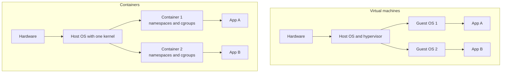
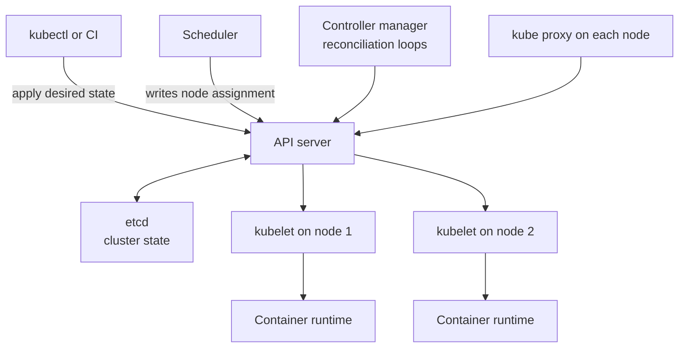
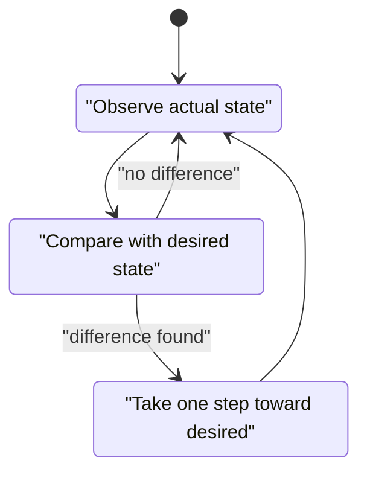
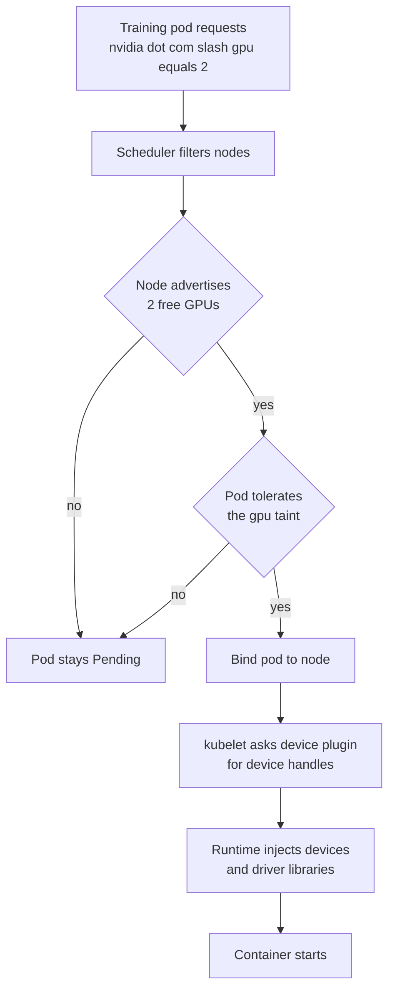
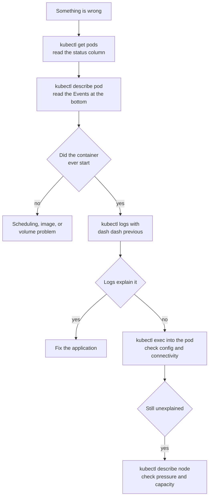

# Chapter 22: Containers, Kubernetes, and Cloud

> **What this chapter covers** Containers from first principles, how to write an image that is small and reproducible, Compose for local development, Kubernetes from zero including the control plane, the object model, and the reconciliation loop, the workload types that machine learning actually uses, scheduling and why a pod stays pending, GPU scheduling, probes tuned for a slow-loading model server, rolling updates and autoscaling, Helm, a debugging runbook, and the cloud service model with compute, storage, networking, identity, managed machine learning services, cost, and the multi-cloud question.
> **Prerequisites** None for this chapter. You should be comfortable on a Unix command line. Chapter 21 for where these pieces sit in a system, Chapter 23 for training on this infrastructure, and Chapter 24 for serving on it.
> **Where it is used** Every production machine learning deployment above a single virtual machine. It bites when a training job dies at 3 a.m. and the only evidence is a pod in `CrashLoopBackOff`, when a model server passes its health check before the weights have loaded, and when a graphics processing unit sits idle because the scheduler cannot place the pod.

---

## 22.1 Level 1: Foundations

### 22.1.1 The problem containers solve

A model that trains on your laptop fails on the server. The reason is almost never the model. It is a different Python version, a different CUDA runtime, a missing system library, a different locale, or a package that resolved to a newer version yesterday. This class of failure has a name, environment drift, and it consumed a large fraction of engineering time before containers.

A container packages an application together with its entire userspace: the interpreter, the libraries, the system packages, the files, and the environment variables. You ship that package, and it runs the same everywhere the same kernel interface exists.

### 22.1.2 Container versus virtual machine

Both give isolation. They do it at different layers, and the difference determines the cost.

| Property | Virtual machine | Container |
| --- | --- | --- |
| What is virtualised | Hardware | The operating system's view of itself |
| Kernel | Its own | Shared with the host |
| Start time | Tens of seconds | Well under a second, typically |
| Overhead per instance | Hundreds of megabytes to gigabytes | Megabytes |
| Isolation strength | Stronger, a hypervisor boundary | Weaker, a kernel boundary |
| Can run a different operating system kernel | Yes | No |

A container is not a lightweight virtual machine. It is a process, or a group of processes, on the host kernel, with three kernel features applied to it.

| Kernel feature | What it does |
| --- | --- |
| Namespaces | Give the process its own view of process identifiers, network interfaces, mount points, hostnames, and users |
| Control groups, cgroups | Limit and account for CPU, memory, and input-output usage |
| Union filesystem | Stack read-only image layers with a thin writable layer on top |

The consequences follow directly. A container starts fast because no kernel boots. It cannot run a Windows image on a Linux host because there is only one kernel. It is less isolated than a virtual machine because a kernel vulnerability crosses the boundary, which is why untrusted multi-tenant workloads often add a sandboxed runtime or run in separate virtual machines.



*Figure 22.1: The layer at which each technology isolates. The single shared kernel in the container column explains both the speed and the weaker boundary.*

### 22.1.3 Images, layers, and the build cache

An image is a stack of read-only layers plus metadata. Each instruction in a build file that changes the filesystem produces a layer. A container is an instance of an image with a writable layer on top; when the container is deleted that writable layer is discarded, which is why container filesystems are called ephemeral.

Layers are content-addressed, identified by a hash of their contents. Two images that share a base share those layers on disk and over the network, so pulling the second image transfers only what differs.

The build cache follows from this. The builder processes instructions in order. For each one it computes a cache key from the instruction text and, for file-copying instructions, the contents of the files being copied. If a layer with that key exists, it is reused. The moment one instruction misses the cache, every subsequent instruction rebuilds, because its input changed.

That single rule gives the central optimisation: **order instructions from least to most frequently changing.** Dependencies change rarely, application code changes constantly. Copy the dependency manifest and install dependencies first, then copy the code. A code change then rebuilds one small layer instead of reinstalling every package.

**Listing 22.1: the layer ordering that keeps the dependency install cached.**

```dockerfile
FROM python:3.11-slim AS base
WORKDIR /app

# 1. Dependency manifest only. Changes rarely.
COPY requirements.txt ./
RUN pip install --no-cache-dir -r requirements.txt

# 2. Application code. Changes on every commit.
COPY src/ ./src/

CMD ["python", "-m", "src.serve"]
```

The non-obvious line is the split between the two `COPY` instructions. If you wrote a single `COPY . .` before the install, every code change would invalidate the install layer and the build would reinstall every package. The `--no-cache-dir` flag stops pip storing its download cache inside the image layer, where it would add size and never be used again.

### 22.1.4 Registries

A registry stores and serves images. An image reference has the form `registry/namespace/name:tag`, and when the registry is omitted a default public registry is assumed. Tags are mutable pointers. The digest, written `name@sha256:...`, is immutable and identifies exact content.

The practical rule: **tags for humans, digests for machines.** A deployment that references `mymodel:latest` is not reproducible, because the tag can be repointed at any time and the same manifest can then produce two different running systems. Reference a digest, or at minimum an immutable tag that your build process never reuses, such as one containing the commit hash.

### 22.1.5 What Kubernetes is, in one paragraph

Once you have containers you need somewhere to run them, and once you have more than a handful you need something to decide which machine each one runs on, restart them when they die, replace them when you deploy a new version, give them stable network addresses, and move them when a machine fails. Kubernetes is that something. It is a cluster operating system: you declare the desired state of your workloads in data, and a set of controllers continuously works to make reality match that declaration.

The word to hold onto is **declarative**. You do not tell Kubernetes to start three copies of a container. You tell it that three copies should exist. The distinction matters because it is what makes the system self-healing: if a copy disappears, the gap between desired and actual reappears, and the controller closes it again without anyone issuing a command.

---

## 22.2 Level 2: Working knowledge

### 22.2.1 Writing a good image

Five properties matter: correctness, size, security, build speed, and reproducibility.

**Base selection.** Choose the smallest base that contains what you need, and no smaller.

| Base | Roughly | Use when |
| --- | --- | --- |
| Full distribution image | Hundreds of megabytes | You need many system packages and do not want surprises |
| Slim variant | Tens to low hundreds of megabytes | The common default for Python services |
| Alpine, musl based | Tens of megabytes | Pure-Python or statically linked workloads |
| Distroless, no shell or package manager | Small | Production runtime where you accept losing shell debugging |
| Vendor accelerator base image | Several gigabytes | GPU workloads needing a matched driver-runtime stack |

The Alpine trap is worth stating explicitly. Alpine uses musl rather than glibc, so many prebuilt Python wheels do not match and pip compiles from source instead. That can turn a 30 second install into a 20 minute one and can produce a numerically slower binary. For scientific Python stacks, a slim glibc base is usually smaller in total build time and safer. Check your package ecosystem before choosing Alpine.

**Multi-stage builds.** Compilers, headers, and build tools are needed to build and are a liability to ship. A multi-stage build uses one stage to build and copies only the artifacts into a clean final stage.

**Listing 22.2: a multi-stage build that keeps compilers out of the runtime image.**

```dockerfile
FROM python:3.11-slim AS builder
RUN apt-get update && apt-get install -y --no-install-recommends build-essential \
 && rm -rf /var/lib/apt/lists/*
WORKDIR /app
COPY requirements.txt ./
RUN python -m venv /opt/venv \
 && /opt/venv/bin/pip install --no-cache-dir -r requirements.txt

FROM python:3.11-slim AS runtime
RUN useradd --create-home --uid 10001 appuser
COPY --from=builder /opt/venv /opt/venv
ENV PATH="/opt/venv/bin:$PATH" PYTHONDONTWRITEBYTECODE=1 PYTHONUNBUFFERED=1
WORKDIR /app
COPY --chown=appuser:appuser src/ ./src/
USER appuser
EXPOSE 8080
CMD ["python", "-m", "src.serve"]
```

The virtual environment is the transport mechanism: everything installed lands in one directory that the second stage copies wholesale, so no compiler reaches the final image. `PYTHONUNBUFFERED=1` matters more than it looks, because without it Python buffers stdout and your logs vanish when the container is killed. The explicit numeric user identifier is deliberate, since Kubernetes can enforce `runAsNonRoot` and needs a non-zero identifier to verify.

**Non-root users.** A container running as root runs as root on the host kernel if it escapes its namespace, and root inside the container can write to any mounted volume. Create a user, own the application files, and switch to it. Also drop Linux capabilities and mount the root filesystem read-only where the application permits.

**Size.** Size costs pull time on every scale-up and every node that has not cached the layers. A 12 GB image on a cold node can add minutes to a scale-up, which defeats autoscaling entirely. Reduce by using multi-stage builds, combining package installs with their cleanup in one instruction so the cleanup actually removes bytes from the layer, using a `.dockerignore` to keep datasets and version-control directories out of the build context, and never baking model weights into the image when they change independently of the code.

That last point deserves a table, because it is a real design decision.

| Weights strategy | Pull time | Reproducibility | Best when |
| --- | --- | --- | --- |
| Baked into the image | Slow, paid on every node | Highest, one artifact | Small models, strict reproducibility requirements |
| Downloaded at startup from object storage | Fast pull, slow start | Good if referencing an immutable version | Large models, frequent model updates with stable code |
| Mounted from a shared volume | Fast | Depends on volume discipline | Many pods on one node sharing one large model |

**Reproducibility.** Pin everything. Pin the base image by digest, pin package versions with a lockfile, and avoid instructions whose result depends on the time of day, which includes any unpinned package index update. A build that produces a different image next week from the same source is not reproducible, and debugging a production incident against it is guesswork.

### 22.2.2 Compose for local development

Compose runs a set of containers on one machine from a single file. It is for local development and small single-node deployments. It is not a production cluster tool, and trying to make it one is a common detour.

**Listing 22.3: a local stack with a model service, a feature cache, and a database.**

```yaml
services:
  model:
    build: .
    ports: ["8080:8080"]
    environment:
      FEATURE_CACHE_URL: "redis://cache:6379"
      DATABASE_URL: "postgresql://dev:dev@db:5432/dev"
    depends_on:
      cache: {condition: service_started}
      db: {condition: service_healthy}
    volumes:
      - ./src:/app/src            # live reload during development only
  cache:
    image: redis:7-alpine
  db:
    image: postgres:16-alpine
    environment: {POSTGRES_USER: dev, POSTGRES_PASSWORD: dev, POSTGRES_DB: dev}
    healthcheck:
      test: ["CMD-SHELL", "pg_isready -U dev"]
      interval: 5s
      retries: 10
    volumes: [pgdata:/var/lib/postgresql/data]
volumes:
  pgdata: {}
```

Services reach each other by service name, because Compose puts them on one network with name resolution; `redis://cache:6379` works without any address configuration. The `condition: service_healthy` form is important: plain `depends_on` waits only for the container to start, not for the database to accept connections, which is the classic cause of a service that fails on the first run and works on the second. The source code bind mount is a development convenience and must not appear in a production configuration, since it overwrites the image's code with whatever is on the host. Compose file syntax has changed across versions, so check your version.

### 22.2.3 Kubernetes architecture

A cluster has a control plane and a set of nodes.

| Component | Where | Responsibility |
| --- | --- | --- |
| API server | Control plane | The only component anything talks to; validates and persists objects |
| etcd | Control plane | Consistent key-value store holding all cluster state |
| Scheduler | Control plane | Assigns pending pods to nodes |
| Controller manager | Control plane | Runs the reconciliation loops for built-in objects |
| Cloud controller manager | Control plane | Talks to the cloud provider for load balancers, volumes, nodes |
| kubelet | Every node | Starts and supervises containers, reports node and pod status |
| Container runtime | Every node | Actually runs containers |
| kube-proxy | Every node | Programs the node's networking rules for service addresses |

The important structural fact: **nothing bypasses the API server.** The scheduler does not tell a kubelet to run a pod. It writes the node assignment into the pod object. The kubelet on that node notices a pod assigned to it and starts it. Every component reads and writes the same store, which is why the system tolerates any component being restarted.



*Figure 22.2: Everything funnels through the API server, and etcd is the single source of truth. No component talks directly to another.*

### 22.2.4 The declarative model and the reconciliation loop

Every controller runs the same loop.



*Figure 22.3: The reconciliation loop. It never terminates, which is why the cluster repairs itself after a node failure with no human action.*

Two consequences follow. First, self-healing is free: kill a pod and the deployment controller observes two replicas where three are desired and creates one. Second, **imperative changes are temporary.** If you edit a running object by hand while a higher-level controller owns it, the controller will overwrite your change on the next pass. Change the declaration, not the running object.

### 22.2.5 The object model

Every object has the same top-level shape: `apiVersion`, `kind`, `metadata`, `spec` describing the desired state, and `status` written by the system.

| Object | What it is | The point |
| --- | --- | --- |
| Pod | One or more containers that share a network namespace and storage | The smallest schedulable unit; rarely created directly |
| ReplicaSet | Keeps N identical pods running | Created by a Deployment; you rarely touch it |
| Deployment | Manages ReplicaSets to roll out new versions | The standard object for a stateless service |
| StatefulSet | Pods with stable identities and per-pod storage | Databases, and rank-zero-aware distributed training |
| DaemonSet | One pod per node | Log collectors, device plugins, node monitoring |
| Service | Stable virtual address load-balancing to a set of pods | Pod addresses change; service addresses do not |
| Ingress | HTTP routing from outside into services | Host and path based routing, TLS termination |
| ConfigMap | Non-secret configuration | Injected as environment variables or files |
| Secret | Sensitive configuration | Base64 encoded, not encrypted by default; enable encryption at rest |
| PersistentVolumeClaim | A request for storage | Decouples the pod from the storage implementation |
| PersistentVolume | A piece of storage | Usually created automatically from a StorageClass |
| StorageClass | A named kind of storage | Selects disk type, and reclaim and binding behaviour |
| Namespace | A scope for names and quotas | Team and environment separation |
| ServiceAccount | An identity for pods | What the pod is, for authorisation purposes |
| Role and RoleBinding | Permissions within a namespace | What that identity may do |
| ClusterRole and ClusterRoleBinding | Cluster-wide permissions | Same, cluster scope |

**Pods.** Containers in one pod share an address and can reach each other on localhost, and they are always scheduled together on one node. That is the entire reason to put two containers in one pod: they must be co-located and share a network or a volume. A sidecar that tails a log file, or an init container that downloads model weights before the server starts, are the standard uses.

**Services and their types.** A service gives a stable name and virtual address in front of a changing set of pods. The set is chosen by a label selector, not by a list, which is what lets pods come and go.

| Type | Reachable from | Typical use |
| --- | --- | --- |
| ClusterIP | Inside the cluster only | Default, service to service calls |
| NodePort | Any node address on a high port | Development, or a layer beneath something else |
| LoadBalancer | The internet or a private network, via a provisioned cloud load balancer | Public entry point, one per service |
| ExternalName | Maps to a DNS name | Pointing at something outside the cluster |
| Headless, `clusterIP: None` | Returns pod addresses directly | StatefulSets, and clients that do their own load balancing |

Headless services matter for machine learning. gRPC clients hold long-lived connections, so a ClusterIP service load-balances only at connection time and then pins every subsequent request to one pod. A headless service plus client-side load balancing spreads the requests.

**Ingress** consolidates external HTTP entry: one load balancer, many services behind it, routed by host and path, with TLS terminated in one place. It requires an ingress controller to be installed; the Ingress object alone does nothing. Newer clusters may offer the Gateway API instead, which is the direction of travel; check your version.

**ConfigMaps and Secrets.** Both inject configuration. A Secret is not encrypted by default in etcd, only base64 encoded, so enable encryption at rest or use an external secret manager. Mounting configuration as files rather than environment variables allows updates without a restart, though the application must re-read the file, and the update is not instantaneous.

**Persistent volumes.** A pod's filesystem dies with the pod. A PersistentVolumeClaim is a request for durable storage; a StorageClass describes what kind. Access modes matter for machine learning: `ReadWriteOnce` allows mounting by one node, which most block storage supports, while `ReadWriteMany` allows many nodes and generally requires a network filesystem. A distributed training job whose workers all read the same dataset needs `ReadWriteMany` or, more commonly and more cheaply, object storage read directly by the application.

**Namespaces, service accounts, and role-based access control.** A namespace scopes names and carries resource quotas. Every pod runs as a ServiceAccount. Role-based access control binds a Role, which is a list of allowed verbs on resource kinds, to a subject, which is a user, group, or service account. The rule: one service account per workload, with the minimum verbs, and never bind the built-in cluster administrator role to an application.

### 22.2.6 Workloads for machine learning

Deployments are for services that run forever. Training and batch scoring are not that. They run to completion, and they need different objects.

| Object | Semantics | Machine learning use |
| --- | --- | --- |
| Job | Run pods until a specified number succeed | Training run, batch scoring, data preparation |
| Job with parallelism | Run several pods at once from a shared work queue | Embarrassingly parallel scoring |
| Indexed Job | Each pod gets a stable index from 0 to N-1 | Distributed training where rank matters, or sharded scoring |
| CronJob | Creates Jobs on a schedule | Nightly retraining, hourly scoring, periodic evaluation |

**Listing 22.4: an indexed Job for sharded batch scoring.**

```yaml
apiVersion: batch/v1
kind: Job
metadata: {name: score-shards}
spec:
  completions: 8                 # 8 shards must succeed
  parallelism: 4                 # at most 4 run concurrently
  completionMode: Indexed        # each pod gets JOB_COMPLETION_INDEX
  backoffLimit: 2                # retries before the Job is failed
  ttlSecondsAfterFinished: 86400 # clean up after a day
  template:
    spec:
      restartPolicy: Never
      containers:
        - name: scorer
          image: registry.example.com/scorer@sha256:REPLACE_WITH_DIGEST
          env:
            - name: SHARD_INDEX
              valueFrom:
                fieldRef: {fieldPath: "metadata.annotations['batch.kubernetes.io/job-completion-index']"}
            - name: SHARD_COUNT
              value: "8"
          resources:
            requests: {cpu: "2", memory: "8Gi"}
            limits:   {cpu: "4", memory: "8Gi"}
```

The index is what makes this work: each pod reads its shard number and processes only its slice, so the eight pods partition the input with no coordination. `parallelism` below `completions` throttles the cluster load. `backoffLimit` is a guard against an infinite retry loop on a deterministic bug. `ttlSecondsAfterFinished` prevents finished Jobs accumulating until the API server is cluttered. The memory request equals the limit deliberately, which as the next section explains puts the pod in the highest quality of service class. Indexed Job field paths have changed across versions, so check your version.

### 22.2.7 Scheduling

The scheduler places each pending pod on a node. It filters nodes that cannot run the pod, scores the survivors, and picks the best.

**Requests and limits.** A request is what the scheduler reserves. A limit is what the runtime enforces. They behave differently per resource.

| Resource | Over the limit | Under-provisioned request |
| --- | --- | --- |
| CPU | Throttled, the process slows | Pod starves under node contention |
| Memory | Killed, `OOMKilled`, exit code 137 | Pod scheduled onto a node without room, then killed |
| GPU | Not overcommittable; request must equal limit | Cannot schedule |

The scheduler only ever looks at requests. A node with 16 CPUs accepts pods whose requests sum to 16, regardless of what they actually use. This produces the two classic failures: a cluster that looks full while nodes are idle, because requests are inflated, and pods that are throttled or killed, because requests are too low.

**Quality of service classes.** Derived automatically from requests and limits, and they decide who is evicted first when a node runs out of memory.

| Class | Condition | Eviction order |
| --- | --- | --- |
| Guaranteed | Requests equal limits for every resource in every container | Last |
| Burstable | Requests set, limits higher or absent | Middle |
| BestEffort | No requests or limits | First |

Set memory requests equal to memory limits for training jobs and model servers. Both are memory-shaped workloads where being evicted mid-run is expensive, and Guaranteed class is the protection.

**Placement controls.**

| Mechanism | Direction | Meaning |
| --- | --- | --- |
| nodeSelector | Pod chooses node | Simple exact label match |
| Node affinity | Pod chooses node | Expressive rules, required or preferred |
| Pod affinity | Pod chooses node by neighbours | Place near pods matching a selector |
| Pod anti-affinity | Pod avoids neighbours | Spread replicas across nodes or zones |
| Taint | Node repels pods | Node says "only pods that tolerate me" |
| Toleration | Pod accepts a taint | Pod says "I can run there" |

Taints and tolerations are the inverse of affinity, and the pairing is the standard mechanism for GPU nodes: taint the expensive GPU nodes so ordinary pods never land on them, and give GPU workloads the matching toleration. Without the taint, a CPU-only web service can occupy a GPU node and block a training job while using no GPU at all.

**Why a pod stays Pending.** The cause is always visible in the pod's events. The common ones:

| Event message pattern | Cause | Fix |
| --- | --- | --- |
| Insufficient cpu or memory | No node has enough unreserved capacity | Lower requests, add nodes, or wait |
| Insufficient nvidia.com/gpu | No free GPU, or the device plugin is not running | Check the plugin DaemonSet and current GPU allocation |
| node(s) had untolerated taint | Pod lacks a toleration for the only suitable nodes | Add the toleration |
| didn't match Pod's node affinity | No node carries the required labels | Fix labels or relax the affinity rule |
| pod has unbound immediate PersistentVolumeClaims | Storage not provisioned, often a zone mismatch | Check the StorageClass and the zone of the volume |
| Too many pods | Node pod-count limit reached | Add nodes or raise the limit |
| exceeded quota | Namespace ResourceQuota exhausted | Raise the quota or free resources |

### 22.2.8 GPU scheduling

Kubernetes does not understand accelerators natively. A device plugin, deployed as a DaemonSet, advertises a resource such as `nvidia.com/gpu` on each node, and pods request whole units of it.

Four practical rules.

1. **GPUs are not overcommittable by default.** Request equals limit, and the value is an integer count. Sharing mechanisms exist, including time-slicing and hardware partitioning on supported devices, but they are opt-in and change the isolation properties; check your version and driver.
2. **The node needs a matching driver stack.** The container's CUDA runtime must be compatible with the host driver. Vendor operators exist to install and manage this, and getting this wrong is the single most common GPU failure.
3. **Use a separate node pool with a taint.** GPU nodes are expensive and should run only GPU work.
4. **Label nodes with the accelerator model.** Then a job that needs a specific memory capacity can select it with node affinity rather than failing at runtime.



*Figure 22.4: GPU scheduling. The two gates, free advertised devices and a matching toleration, account for most pods that never leave Pending on a GPU cluster.*

### 22.2.9 Probes

Three probes, three distinct jobs. Confusing them is the most common cause of a model server that never becomes healthy or restarts forever.

| Probe | Question | Failure action | For a model server |
| --- | --- | --- | --- |
| Startup | Has it finished starting? | Kill and restart after the allowed budget | Essential when weights take minutes to load |
| Readiness | Should it receive traffic now? | Remove from service endpoints; do not restart | Fails during weight reload or overload |
| Liveness | Is it wedged beyond recovery? | Kill and restart | Should almost never fire |

The rule that prevents most incidents: **liveness must be cheap and independent of dependencies.** A liveness probe that calls the feature store means an outage in the feature store restarts every model pod, turning a degradation into a total outage. Liveness checks that the process is responsive. Readiness checks that the process can do useful work.

**Listing 22.5: probes for a server that takes up to five minutes to load weights.**

```yaml
startupProbe:
  httpGet: {path: /healthz, port: 8080}
  periodSeconds: 10
  failureThreshold: 30        # 10s x 30 = 300s budget to finish loading
livenessProbe:
  httpGet: {path: /healthz, port: 8080}   # process responsive only, no dependencies
  periodSeconds: 20
  failureThreshold: 3
readinessProbe:
  httpGet: {path: /ready, port: 8080}     # weights loaded and queue not saturated
  periodSeconds: 5
  failureThreshold: 2
  successThreshold: 1
```

The startup probe is what makes the rest safe: liveness and readiness do not begin until it succeeds, so a five minute load does not trip a liveness probe whose threshold is 60 seconds. Without a startup probe you would have to set a long `initialDelaySeconds` on liveness, which then delays detection of a genuinely wedged process for the entire life of the pod. The two different paths matter: `/healthz` returns success as soon as the HTTP server is up, `/ready` returns success only when the model object exists and the request queue is below a threshold.

### 22.2.10 Rolling updates, disruption budgets, and autoscaling

**Rolling updates.** A Deployment replaces pods gradually, controlled by `maxUnavailable` and `maxSurge`. For a large model server, `maxSurge: 1` with `maxUnavailable: 0` is the safe default: it never reduces capacity, at the cost of one extra pod's worth of resources during the roll. For GPU pods, surging may be impossible because there is no spare GPU, so you must either keep spare capacity or accept reduced capacity during a roll. Decide which, and write it down.

**PodDisruptionBudget.** Voluntary disruptions, node drains for maintenance and cluster autoscaler scale-down, respect a budget. Declaring `minAvailable: 2` prevents a drain from taking the service below two pods. It does not protect against involuntary disruption such as a node crash; only replication across failure domains does that. A training job that cannot tolerate interruption should either have a budget of zero disruptions or, better, checkpoint frequently so that interruption is cheap.

**Horizontal Pod Autoscaler.** Scales replica count based on a metric, classically CPU utilisation.

$$n_{\text{desired}} = \left\lceil n_{\text{current}} \cdot \frac{m_{\text{current}}}{m_{\text{target}}} \right\rceil$$

$n$ is the replica count, $m$ is the metric value. Worked example: 10 replicas at 80 percent CPU with a 50 percent target gives $\lceil 10 \times 80/50 \rceil = \lceil 16 \rceil = 16$ replicas.

CPU is a poor signal for GPU inference, because a GPU-bound server may sit at low CPU while the accelerator saturates. Scale on a custom metric instead: queue depth, requests in flight, or GPU utilisation exported to the metrics pipeline. The general principle is to scale on the quantity that actually predicts latency for your workload.

Autoscaling interacts badly with slow startup. If a pod needs four minutes to load weights, scaling up in response to load arrives after the spike. The mitigations are to keep warm headroom, to scale on a leading indicator such as queue depth rather than a lagging one such as latency, and to set stabilisation windows so the autoscaler does not oscillate.

**Event-driven autoscaling.** For queue-driven work, scaling on queue length including to zero is the right model, and event-driven autoscaler projects provide this. Scale-to-zero is attractive for expensive GPU workloads with intermittent traffic, and the cost is a cold start on the first request after idle, which for a large model can be minutes. It is a good fit for asynchronous and batch workloads and a poor fit for a latency-sensitive synchronous path.

### 22.2.11 Helm and templating

Kubernetes manifests duplicate across environments. Helm is the common answer: a chart is a directory of templated manifests plus a `values.yaml` of defaults, and installing it renders the templates with your values and applies the result. Helm also tracks releases, which gives `helm rollback`.

**Listing 22.6: a templated deployment fragment with the values that differ per environment.**

```yaml
# templates/deployment.yaml
apiVersion: apps/v1
kind: Deployment
metadata:
  name: {{ include "modelserver.fullname" . }}
spec:
  replicas: {{ .Values.replicaCount }}
  template:
    spec:
      containers:
        - name: server
          image: "{{ .Values.image.repository }}@{{ .Values.image.digest }}"
          resources:
            {{- toYaml .Values.resources | nindent 12 }}
          env:
            - name: MODEL_URI
              value: {{ .Values.model.uri | quote }}
```

The pattern to copy is that only genuinely environment-varying things are templated: replica count, image digest, resources, and the model location. Templating everything produces a chart nobody can read. `toYaml` with `nindent` inserts a whole values block at the right indentation, which is the standard way to pass through a structured section. The image is referenced by digest, keeping the deployment reproducible.

Alternatives exist. Kustomize applies overlays to plain manifests without a template language, which many teams prefer because the base files remain valid Kubernetes objects. Both are in wide use; pick one per organisation and be consistent.

### 22.2.12 Debugging: symptom to cause

Work in a fixed order. Object state, then events, then logs, then inside the container, then the node.



*Figure 22.5: The debugging path. The single most skipped step is reading the Events section of describe, which names the cause outright in most cases.*

The runbook of failures engineers actually hit:

| Status or symptom | Most likely cause | First check |
| --- | --- | --- |
| `Pending` | Unsatisfiable scheduling constraint | Events on the pod, see 22.2.7 |
| `ImagePullBackOff` | Wrong name, wrong tag, or missing registry credentials | Events; verify the reference and the imagePullSecret |
| `ErrImagePull` with authentication failure | Pull secret absent or in the wrong namespace | Secrets are namespaced; confirm it exists where the pod runs |
| `CrashLoopBackOff` | Application exits immediately | `logs --previous`; the crash is in the last run, not the current one |
| Exit code 137 | `OOMKilled`, memory limit exceeded | `describe pod`, look at Last State; raise the limit or reduce usage |
| Exit code 1 with a Python traceback | Ordinary application bug | Logs |
| `Running` but not `Ready` | Readiness probe failing | Probe path, port, and what `/ready` actually checks |
| Restarting every few minutes | Liveness probe too aggressive or dependent on a dependency | Make liveness cheap and add a startup probe |
| Service returns connection refused | Selector matches no pods, or port mismatch | `kubectl get endpoints`; empty means the selector is wrong |
| Intermittent 5xx during deploys | No readiness gate or no graceful shutdown | Add readiness, handle SIGTERM, set `terminationGracePeriodSeconds` |
| DNS resolution failures | Cluster DNS pods unhealthy or overloaded | Check the DNS deployment; test resolution from a debug pod |
| Job pods never start after a node scale-up | Taint or missing device plugin | `describe node` and the device plugin DaemonSet |
| Everything slow on one node | Node pressure, disk or memory | `describe node` conditions and the eviction events |

Two habits that shorten every investigation. First, `kubectl get events --sort-by=.lastTimestamp` in the namespace shows the cluster's own narrative of what happened. Second, keep a debug pod image with network tools available, since production images correctly lack a shell and tooling, and ephemeral debug containers attach to a running pod without modifying it; check your version for availability.

---

## 22.3 Level 3: Depth

### 22.3.1 Kubernetes networking, in enough depth to debug it

The network model has three rules: every pod gets its own address, every pod can reach every other pod without network address translation, and agents on a node can reach all pods on that node. A Container Network Interface plugin implements this, and plugins differ in how, which is why network behaviour varies between clusters.

A Service's virtual address is not attached to any interface. It is a rule programmed by kube-proxy into the node's packet-filtering tables, or into an equivalent mechanism, that rewrites the destination to one of the endpoint pod addresses. Three consequences matter.

First, load balancing is per connection, not per request. A long-lived HTTP/2 or gRPC connection sends every request to the same pod. Fix with a headless service and client-side balancing, or with a service mesh or proxy that balances at the request layer.

Second, a Service with no matching pods is not an error. It resolves and then refuses connections. `kubectl get endpoints` showing none is the definitive diagnosis, and the cause is nearly always a label selector that does not match the pod labels.

Third, cluster DNS is a service like any other, and it is a shared dependency of everything. A DNS outage looks like every application being simultaneously broken. Under high pod churn or very high query rates, DNS is a common and surprising bottleneck; caching at the node level exists to address it.

### 22.3.2 Graceful shutdown, precisely

Terminating a pod is a race, and losing it causes dropped requests on every deploy. The sequence:

1. The pod is marked Terminating and removed from service endpoints.
2. `preStop` hook runs, if defined.
3. SIGTERM is sent to the container's main process.
4. After `terminationGracePeriodSeconds`, SIGKILL.

The race is between step 1 propagating to every node's proxy rules and step 3 stopping the server. Endpoint removal is eventually consistent, so traffic can arrive after SIGTERM. The standard fix is a `preStop` hook that sleeps for a few seconds, giving endpoint removal time to propagate before the process begins shutting down. The application must also handle SIGTERM by refusing new work while finishing in-flight requests, and the grace period must exceed the longest expected request. For a batch inference server with 30 second requests, a default 30 second grace period will kill in-flight work.

This is also where the container's process structure bites. If the container's entrypoint is a shell script, the shell is process 1 and may not forward SIGTERM to the application. Use the exec form of the entrypoint, or a minimal init process, so signals reach the real process.

### 22.3.3 Resource management under real load

**Why CPU limits are contested.** CPU limits are enforced by cgroup quota over a fixed period, typically 100 ms. A process that exhausts its quota is frozen until the next period. For a multi-threaded service, quota can be consumed by parallel threads within a few milliseconds, stalling the process for the rest of the period and adding tens of milliseconds to the tail even though average utilisation looks low. The practical positions: set CPU requests always, and consider omitting CPU limits for latency-sensitive services while relying on requests for fairness. This is genuinely contested; the conservative default is to set limits but keep them well above the request, and to look for throttling metrics before blaming the application for tail latency.

**Memory has no such subtlety.** Exceed the limit and the process is killed. For Python machine learning workloads the measured usage includes the allocator's arenas and the memory-mapped model weights, and the resident figure can exceed naive expectations substantially. Measure it under realistic load rather than estimating, then set request equal to limit with headroom.

**Requests as a capacity contract.** Cluster capacity is the sum of requests, so systematically inflated requests waste money invisibly: the cluster autoscaler adds nodes to satisfy reservations for resources nobody uses. Review the ratio of requested to actually used resources per namespace periodically; a ratio above roughly two is a strong signal of waste.

### 22.3.4 The cluster autoscaler and the pending-pod contract

The cluster autoscaler watches for pods that are Pending because of insufficient resources and adds nodes. It works only if the pending pod could actually fit on a node the autoscaler is allowed to create. A pod requesting more memory than any node type provides stays Pending forever with no new nodes, which looks like an autoscaler failure and is a specification error.

Scale-down removes nodes that are underutilised and whose pods can be moved. It is blocked by pods that cannot be evicted: pods without a controller, pods with restrictive disruption budgets, and pods using local storage. Long-running training jobs on local disk are a common reason a cluster never shrinks.

For GPU nodes the economics change the tuning. A GPU node is expensive enough that aggressive scale-down pays, but node startup plus driver initialisation plus a multi-gigabyte image pull can take many minutes, so aggressive scale-down costs job start latency. Separate node pools with different policies, aggressive for batch training and conservative for serving, is the usual resolution.

### 22.3.5 Security posture worth having

| Control | What it stops |
| --- | --- |
| Non-root with a read-only root filesystem | An attacker persisting changes in the container |
| Dropped capabilities, no privilege escalation | Escalation paths from a compromised process |
| Per-workload service accounts with minimal RBAC | A compromised pod reading every secret in the cluster |
| Automountable token disabled when unused | A pod holding API credentials it never needs |
| NetworkPolicy default deny, then explicit allows | Lateral movement between namespaces |
| Image scanning in the build pipeline | Known vulnerable dependencies reaching production |
| Signed images and admission verification | An unreviewed image running in the cluster |
| Secrets from an external manager | Long-lived credentials sitting in etcd |

The single highest-value control for most clusters is a default-deny NetworkPolicy per namespace, because the default is that every pod can reach every other pod, and that default is what turns one compromised service into a cluster-wide incident.

### 22.3.6 Cloud: the service model

Cloud services differ in where the boundary of responsibility sits.

| Model | You manage | Provider manages | Machine learning example |
| --- | --- | --- | --- |
| Infrastructure as a service | OS, runtime, application | Hardware, virtualisation | A GPU virtual machine you configure yourself |
| Container as a service | Container image, some config | Nodes, scheduling | Managed container runners |
| Platform as a service | Application code | Everything below | A managed model endpoint |
| Function as a service | A function | Everything, including scaling | Event-driven preprocessing |
| Software as a service | Configuration | Everything | A hosted labelling or experiment tracking tool |

The trade is always the same: less management, less control, higher unit cost, faster to start. The mistake is choosing one model for the whole system. Use managed platform services for the layers that are not differentiating, and drop to infrastructure only where you need the control, which for machine learning is usually training hardware topology and latency-critical serving.

### 22.3.7 Cloud compute options

| Option | Strength | Weakness | Fits |
| --- | --- | --- | --- |
| Virtual machines | Full control, every instance type including accelerators | You operate everything | Bespoke training, specialist hardware |
| Spot or preemptible instances | Substantially cheaper than on-demand | Can be reclaimed with short notice | Checkpointed training, batch scoring |
| Managed container services | No node management | Less control over scheduling and networking | Stateless services, batch jobs |
| Serverless functions | Scale to zero, per-invocation billing | Execution time, memory, and package size limits; cold starts | Event preprocessing, light postprocessing |
| Managed Kubernetes | Standard API, portable manifests | You still operate workloads, upgrades, and add-ons | Mixed serving and training estates |
| Managed training and inference services | Fastest path, integrated tooling | Opinionated, harder to exit | Standard model types, small teams |

Serverless for model inference is a persistent temptation with a specific failure: a large model exceeds the package or memory limit, and even when it fits, the cold start dominated by loading weights makes tail latency unacceptable. It works for small models and for asynchronous work.

### 22.3.8 Cloud storage tiers

| Tier | Latency | Cost shape | Machine learning use |
| --- | --- | --- | --- |
| Object storage | Tens of milliseconds first byte | Cheapest per byte; charges for requests and egress | Datasets, checkpoints, model artifacts, logs |
| Network block storage | Sub-millisecond to low milliseconds | Provisioned capacity and throughput | Node root disks, databases, single-writer volumes |
| Local instance storage | Lowest | Bundled with the instance, lost on stop | Scratch space, dataset cache during training |
| Network file storage | Low milliseconds | Highest per byte | Shared datasets requiring POSIX semantics across nodes |
| Archive tiers | Minutes to hours to restore | Very cheap storage, expensive retrieval | Compliance retention of old training data |

The default for machine learning is object storage for everything durable, local instance storage as a read cache during training, and network file storage only when a workload genuinely needs POSIX semantics from many nodes at once. Two cost traps recur: per-request charges make many small files far more expensive than a few large ones, which is a strong argument for sharded record formats over millions of individual images, and cross-region or internet egress is charged while ingress typically is not, so moving a training dataset between regions can cost more than the compute.

### 22.3.9 Cloud networking and identity

**Networking.** A virtual private cloud is an isolated network you define, divided into subnets, usually public ones with a route to the internet and private ones without. Put compute in private subnets and put load balancers in public ones. Security groups act as stateful per-instance firewalls. Private endpoints let you reach provider services such as object storage without traversing the internet, which is both a security and a cost measure since it avoids gateway charges.

Load balancers come in two useful varieties: a layer 4 balancer that forwards connections, which is fast and protocol-agnostic, and a layer 7 balancer that understands HTTP and can route by path, terminate TLS, and balance per request. For gRPC model serving, a layer 7 balancer that speaks HTTP/2 is what gives per-request balancing across pods.

**Identity and access management.** The model is: a principal, which is a user, group, or workload identity, is granted a policy, which allows or denies actions on resources, optionally under conditions. Least privilege means granting the specific actions on the specific resources, not a wildcard.

The rule that matters most in practice: **workloads should use workload identities, not long-lived keys.** A training job should assume a role scoped to the exact bucket prefixes it reads and writes. Static access keys in environment variables leak through logs, images, and notebooks, and they do not expire. Managed Kubernetes offerings provide a mechanism to map a Kubernetes service account to a cloud role; use it.

A useful default policy split for machine learning:

| Identity | Permissions |
| --- | --- |
| Training job | Read the dataset prefix, write the checkpoint prefix, write experiment metadata |
| Serving workload | Read the model artifact prefix only, no write anywhere |
| Data pipeline | Write the raw prefix, read and write the curated prefix |
| Human engineer | Read everything in non-production, request elevation for production |

### 22.3.10 Managed machine learning services and what they abstract

Provider machine learning platforms bundle several things under one name. Evaluate them separately, because the quality varies per component.

| Component | What it abstracts | What you lose |
| --- | --- | --- |
| Managed notebooks | Instance lifecycle, drivers | Reproducibility, unless you enforce discipline yourself |
| Managed training jobs | Cluster provisioning, distribution setup, spot handling | Control of the exact topology and of custom parallelism |
| Managed hyperparameter search | Scheduler and early stopping | Little; this is usually a good buy |
| Model registry | Versioning and stage metadata | Little; also usually a good buy |
| Managed endpoints | Autoscaling, rollout, monitoring hooks | Fine control of batching, and the ability to tune cost aggressively |
| Feature store | Point-in-time joins and an online store | Flexibility in feature definition; lock-in is high |
| Pipeline orchestration | Scheduling and dependency management | Portability, which varies widely by product |

The realistic pattern is to buy the registry, the tracking, and the orchestration, and to think hard about endpoints and feature stores, which are the two with the highest exit cost. The test to apply: if this product were discontinued, how long would replacing it take? Anything over a quarter deserves an explicit decision rather than a default.

### 22.3.11 Cost management

Four mechanisms, in order of typical impact.

1. **Right-sizing.** Most clusters run at low utilisation. Compare requested to used resources and shrink requests. This is usually the largest single win and costs nothing.
2. **Purchase model.** Spot or preemptible for interruptible work, reserved or committed-use discounts for steady baseline load, on-demand for the variable remainder. The arithmetic is in Chapter 23.
3. **Storage lifecycle.** Move old data to cheaper tiers automatically and delete what has no owner. Checkpoints from abandoned experiments are a large and invisible line item.
4. **Data transfer.** Keep compute in the same region and zone as the data. Cross-zone traffic is charged in many providers, and a chatty distributed training job across zones can cost more in transfer than in compute.

Attribution must come first. Without tags or labels on every resource mapping to a team and a project, no cost conversation can be resolved. Enforce a tagging policy at creation time, because retrofitting tags is unreliable.

A simple monthly model that is usually enough to make decisions:

$$C = n \cdot h \cdot p_{\text{instance}} + S \cdot p_{\text{storage}} + T \cdot p_{\text{transfer}} + C_{\text{managed}}$$

$n$ is instance count, $h$ is hours per month, $p_{\text{instance}}$ is the hourly rate for that instance type, $S$ is stored bytes, $T$ is transferred bytes, and $C_{\text{managed}}$ is the fixed cost of managed services. Take every rate from your provider's current price list rather than from memory, since rates change and vary by region.

### 22.3.12 The multi-cloud question, answered honestly

The honest answer has three parts.

**Genuine reasons.** Regulatory requirements in specific jurisdictions; an acquisition that arrives with a different provider; a specific capability available only in one place, which today most often means particular accelerator availability; and a procurement requirement from a large customer.

**Bad reasons.** Negotiating leverage, which rarely materialises and costs more in engineering than it saves; a vague fear of lock-in; and provider outage resilience, which almost always costs more than the outages it prevents, since a correctly designed multi-region deployment on one provider handles the overwhelming majority of real incidents at a fraction of the complexity.

**The actual cost.** Multi-cloud means the lowest common denominator of every service, two sets of identity and networking models, two operational runbooks, doubled on-call knowledge, and data transfer charges between providers on any workload that spans them. Teams that adopt it for abstract reasons typically end up with one primary provider and a neglected secondary that would not work in an emergency, which is the worst of both.

**The defensible position.** Pick one primary provider. Keep portability at the layers where it is nearly free: containers, Kubernetes manifests, open data formats, and open orchestration. Accept lock-in at the layers where portability is expensive and the value of the managed service is high. Reassess when a genuine reason appears. This is a strictly better use of effort than building an abstraction layer over two providers, which reliably becomes the most complex and least loved component in the system.

---

## 22.4 Level 4: Mastery

### 22.4.1 Where the standard advice is wrong

**"Always set CPU limits."** As 22.3.3 explains, cgroup quota enforcement can add tail latency to a service that is nowhere near its average limit. For latency-sensitive services, requests provide scheduling fairness and limits mainly provide a cap that hurts. Contested; the safe middle is limits well above requests plus monitoring of throttling.

**"Use Kubernetes for everything."** Kubernetes has a real operational cost: upgrades, add-on compatibility, networking plugins, and the expertise to debug them. A team running three services with predictable load will move faster on managed containers. The threshold where Kubernetes pays is roughly when you have heterogeneous workloads, in particular a mix of services and batch or GPU jobs, that need to share a resource pool, which is exactly the machine learning situation, which is why the field adopted it.

**"Containers are secure by default."** They are an isolation mechanism, not a security boundary of the strength of a virtual machine. A default pod runs as root with a mounted API token and unrestricted network access to every other pod. Every control in 22.3.5 is opt-in.

**"Scale to zero saves money."** It saves instance cost and spends latency. For a model requiring minutes to load, the first request after idle is unacceptably slow and, worse, a burst of requests during a cold start can queue behind a single loading replica. Measure the request arrival pattern before adopting it.

**"Immutable infrastructure means never touching a running system."** Correct as a deployment discipline and wrong as a debugging one. Attaching a debug container to a running pod to capture the state of an intermittent failure is legitimate and often the only way to catch it. The discipline is that fixes are made in the declaration and redeployed, not that investigation is forbidden.

### 22.4.2 What senior engineers argue about

**Service mesh, or not.** A mesh gives request-level load balancing, mutual TLS between services, retries, circuit breaking, and detailed telemetry without application changes. It costs a sidecar proxy per pod in memory and latency, an extra control plane to operate, and a substantially harder debugging story. The pro-mesh position is that you will need these properties eventually and building them per application is worse. The against position is that most of the value can be had from a library or a smaller proxy layer at far lower operational cost. Sidecarless data planes are an active area of change; check your version. The defensible rule: adopt a mesh when you have enough services that per-application implementation is genuinely worse, and not before.

**Custom operators for machine learning workloads.** A custom resource plus a controller lets you declare "a distributed training run" as a first-class object, with the controller handling rank assignment, restart semantics, and cleanup. Established operators exist for the common training frameworks. The argument against writing your own is that a controller is a distributed system with subtle failure modes, and a wrong one causes duplicated or orphaned expensive jobs. The argument for is that job orchestration in shell scripts and templated YAML reaches its limit quickly. Prefer an established operator; write your own only when the abstraction you need genuinely does not exist.

**Batch scheduling and fairness.** The default Kubernetes scheduler is designed for services and schedules one pod at a time. A distributed training job needs all of its pods or none, and partial scheduling produces deadlock: two jobs each hold half the GPUs and neither can proceed. Gang scheduling, which admits a job only when all of its pods can be placed, is the fix, provided by batch scheduler add-ons. Anyone running multi-node training on a shared cluster needs an opinion here, and the deadlock is the specific failure to point at.

**How much to invest in portability.** The strong position is that Kubernetes is the portability layer and nothing above it should be provider-specific. The weaker and more common position is that provider-managed services are worth the lock-in for anything not differentiating. The judgment: measure exit cost per component, and accept lock-in inversely to it.

### 22.4.3 Advanced topics worth knowing exist

| Topic | What it is | Why it matters for machine learning |
| --- | --- | --- |
| Topology-aware scheduling | Placing pods with awareness of NUMA nodes, accelerator interconnect topology, and network locality | Multi-GPU training performance depends heavily on which devices are connected by the fast interconnect |
| Accelerator sharing | Time-slicing and hardware partitioning of a single device across pods | Raises utilisation for small inference workloads; changes isolation properties, so check your version |
| Sandboxed runtimes | Container runtimes providing a stronger boundary, such as microVM based ones | Required for untrusted multi-tenant code execution, which agent systems increasingly need |
| Node-local dataset caching | Caching hot dataset shards on instance storage across jobs | Input pipeline starvation is a leading cause of low accelerator utilisation, see Chapter 23 |
| GitOps | A controller in the cluster reconciles against a Git repository | Makes the deployed state auditable and rollback a revert; strong fit for model promotion workflows |
| Admission control policies | Policy engines rejecting or mutating objects at admission | Enforcing resource requests, image provenance, and non-root across an organisation |
| Multi-cluster federation | Scheduling across clusters | Usually a sign the problem is organisational; approach with scepticism |

### 22.4.4 Judgment that distinguishes a staff engineer

**Sizing the abstraction to the team.** The correct amount of platform is a function of how many teams share it and how heterogeneous their workloads are. One team with three services does not need a platform. Twenty teams sharing GPUs do, and the cost of not having one is invisible until it is enormous.

**Treating the cluster as a product with users.** Node pool layout, quotas, default resource requests, and the debugging documentation are the interface. If every team invents its own manifests, the platform has failed regardless of its technical quality.

**Optimising for the incident, not the happy path.** Structured logs with correlation identifiers, events retained long enough to read after the fact, images that can be exec'd into or debugged with an ephemeral container, and resource requests that make failures loud rather than silent. The design question to keep asking is what the on-call engineer will see at 3 a.m. and whether it names the cause.

**Knowing what not to run.** Databases, message brokers, and object storage are usually better bought than operated on Kubernetes, even though all are possible. The operational cost of stateful systems on Kubernetes is the most consistently underestimated quantity in the field.

---

## 22.5 Subtopic checklist

| Subtopic | You should be able to |
| --- | --- |
| Container versus VM | State what is virtualised in each and the consequence for start time and isolation |
| Namespaces and cgroups | Name what each one isolates or limits |
| Images and layers | Explain content addressing and why layers are shared |
| Build cache | Order build instructions so a code change does not reinstall dependencies |
| Registries | Explain why a mutable tag is not reproducible and use digests |
| Base selection | Choose a base and justify it, including the musl trap |
| Multi-stage builds | Write a build that keeps compilers out of the runtime image |
| Non-root and hardening | Write a securityContext that satisfies a non-root policy |
| Image size | Name three causes of a large image and the fix for each |
| Compose | Write a multi-service local stack with a health-gated dependency |
| Control plane components | Name each and say what happens when it is down |
| Reconciliation loop | Explain why a hand edit to a managed object is reverted |
| Object model | Choose the right object for a given workload from the full list |
| Services | Pick a service type and explain the gRPC load-balancing problem |
| Ingress | Explain why an Ingress object alone does nothing |
| ConfigMaps and Secrets | State how a Secret differs from a ConfigMap and what it does not provide |
| Persistent volumes | Choose an access mode for a distributed training dataset |
| RBAC | Create a minimal service account and role for a workload |
| Jobs and CronJobs | Write an indexed Job that shards work with no coordination |
| Requests and limits | Predict the behaviour of a pod over its CPU limit and over its memory limit |
| QoS classes | State which class a pod is in and what it means for eviction |
| Affinity and taints | Reserve GPU nodes for GPU workloads |
| Pending pods | Map a Pending pod's event message to a cause and a fix |
| GPU scheduling | Explain the device plugin and the driver compatibility requirement |
| Probes | Configure startup, readiness, and liveness for a slow-loading model server |
| Rolling updates | Choose surge and unavailability settings when spare GPUs do not exist |
| Disruption budgets | State what they protect against and what they do not |
| Autoscaling | Compute the desired replica count and explain why CPU is a poor GPU signal |
| Helm | Template the parts that vary and explain why templating everything is worse |
| Debugging | Follow the path from symptom to cause and recall the runbook |
| Graceful shutdown | Explain the endpoint removal race and the preStop fix |
| Cloud service model | Place a workload in the right service model and justify it |
| Storage tiers | Choose a tier and name the cost trap for small files and egress |
| Networking and identity | Design a least-privilege identity for a training job |
| Cost management | Name the four levers in order of impact |
| Multi-cloud | Give the honest answer with genuine and bad reasons |

---

## 22.6 Common misconceptions

| Misconception | Why it is believed | What is actually true |
| --- | --- | --- |
| A container is a lightweight virtual machine | It behaves like an isolated machine | It is a process on the shared host kernel with namespaces and cgroups applied; there is no guest kernel, which is why it starts fast and isolates less |
| Kubernetes makes applications scalable | It scales replica counts | It scales copies of what you gave it; a single-threaded process with a shared database bottleneck scales no better with more replicas |
| Secrets are encrypted | They are a distinct object named Secret | By default they are base64 encoded in etcd, which is encoding not encryption; encryption at rest is a cluster configuration you must enable |
| A liveness probe should check dependencies | It sounds like a thorough health check | A liveness failure restarts the pod, so a dependency outage would restart every replica and convert degradation into an outage; readiness is the probe for dependency state |
| Higher replica count fixes latency | More capacity feels like more speed | It fixes queueing latency only; if the service time is the problem, replicas change nothing and cost more |
| Setting resource limits is always safer | Limits sound like protection | Memory limits are protection; CPU limits throttle in fixed periods and can add tail latency to a service far below its average limit |
| `kubectl apply` failing means the cluster rejected the workload | The command failed | The API server validated and stored the object; almost every real failure happens afterwards, in scheduling or in the container, and is visible only in events and logs |
| Scale to zero is free savings | Idle instances cost money | It trades instance cost for cold-start latency, which for a multi-gigabyte model is minutes, and concurrent requests queue behind one loading replica |
| Multi-cloud protects against outages | Two providers seem more reliable than one | Multi-region on one provider handles nearly all real incidents for far less complexity; multi-cloud usually yields a neglected secondary that would not work under pressure |

---

## 22.7 Practice

**Exercise 1, level 2: shrink and harden an image.** Take a working Python service image built from a full distribution base with a single `COPY . .`. Convert it to a multi-stage build on a slim base, with a non-root user, a `.dockerignore`, pinned dependencies, and the dependency install ordered before the code copy.
*Acceptance criterion:* the final image is at least 50 percent smaller, `docker run` with a changed source file rebuilds in under 10 seconds using the cache, the container runs as a non-zero user identifier, and the service still passes its tests.

**Exercise 2, level 2: local cluster from zero.** Create a local Kubernetes cluster with kind or minikube. Deploy a model service with a Deployment, a Service, a ConfigMap, and a Secret. Then deliberately break it four ways: a wrong image tag, a memory limit below actual usage, a service selector that matches nothing, and a liveness probe pointing at a nonexistent path.
*Acceptance criterion:* for each break you record the pod status, the exact event or log line that identified the cause, and the fix, without consulting the list in 22.2.12 first.

**Exercise 3, level 3: probes for a slow loader.** Write a service that sleeps for three minutes before it can serve, exposing `/healthz` immediately and `/ready` only after loading. Deploy it first without a startup probe and with a 30 second liveness threshold, observe the restart loop, then add a startup probe and fix it.
*Acceptance criterion:* you can state precisely why the first configuration loops, and your final configuration reaches Ready with zero restarts, with the probe budget arithmetic written out.

**Exercise 4, level 3: sharded indexed Job.** Write an indexed Job that scores a public dataset in eight shards, writing one output file per shard, with resource requests set from measured usage and a `backoffLimit`. Kill one pod mid-run.
*Acceptance criterion:* the Job completes with all eight shards present and no duplicated or missing rows after the killed pod is retried, demonstrating that the shard logic is idempotent.

**Exercise 5, level 4: autoscaling on the right signal.** Deploy an inference service, load-test it, and configure autoscaling first on CPU and then on a custom metric of queue depth or in-flight requests. Compare p99 latency during a step increase in load under each configuration.
*Acceptance criterion:* a plot of p99 against time for both configurations, a statement of which signal reacted sooner and why, and an explicit calculation of how much warm headroom is needed to cover your pod's startup time at your load ramp rate.

---

## 22.8 How this is tested

**Question 1 (level 1): What is the difference between a container and a virtual machine, and when does the difference matter?**

<details>
<summary>Answer</summary>

A virtual machine virtualises hardware and runs its own guest kernel on a hypervisor. A container is a process on the host's kernel, given its own view of the system through namespaces and constrained by control groups, with a layered filesystem. The practical consequences are that containers start in well under a second while virtual machines take tens of seconds, containers add megabytes of overhead rather than hundreds of megabytes, and containers cannot run a different kernel from the host. The difference matters most for isolation strength. A container escape is a kernel exploit away, whereas a virtual machine boundary is a hypervisor boundary, which is why untrusted code execution, for example running code an agent generated, is usually placed in a virtual machine or a sandboxed runtime rather than a plain container. It also matters for density: containers let you pack far more workloads per host, which is why the scheduling and resource-limit questions become important.
</details>

**Question 2 (level 2): Your image takes eleven minutes to build on every commit even though only the application code changed. Why, and what do you change?**

<details>
<summary>Answer</summary>

The build file almost certainly copies the whole source tree before installing dependencies. The cache key for a file-copying instruction includes the contents of the copied files, so any code change invalidates that layer and every layer after it, including the dependency install. The fix is to copy only the dependency manifest, install dependencies, then copy the application code, so a code change invalidates only the last small layer. I would also add a `.dockerignore` so that version control directories, datasets, and virtual environments never enter the build context, since a large context slows every build even when nothing changed. If the install itself is genuinely slow, a multi-stage build with a cached dependency layer, or a build-time package cache mount where the builder supports it, helps further. A quick verification is to touch one source file and rebuild; if anything before the code copy reruns, the ordering is still wrong.
</details>

**Question 3 (level 2): Explain the declarative model and why an edit you make by hand to a running Deployment's pod disappears.**

<details>
<summary>Answer</summary>

In Kubernetes you submit objects describing desired state to the API server, which stores them in etcd. Controllers continuously observe actual state, compare it with desired state, and take steps to close the gap. This loop never terminates, which is what gives self-healing: delete a pod and the ReplicaSet controller sees one fewer than desired and creates a replacement. If you edit a pod that is owned by a ReplicaSet, which is owned by a Deployment, your change is part of actual state but not of desired state. On the next reconciliation the controller sees a difference and corrects it back, or replaces the pod entirely. The correct action is to change the declaration, the Deployment's pod template, and let the change propagate. The same reasoning explains why imperative commands are useful for investigation and unsuitable for durable change, and why storing the declarations in version control with a controller reconciling against them is a natural fit.
</details>

**Question 4 (level 2 to 3): Your pod is stuck in Pending. Walk through the diagnosis.**

<details>
<summary>Answer</summary>

Pending means the scheduler has not bound the pod to a node, so the answer is always in the pod's events, which I would read with `kubectl describe pod`. The message names the filter that rejected every node. Insufficient cpu or memory means no node has enough unreserved capacity, which is about requests rather than actual usage, so I would check whether the request is realistic and whether any node type could ever satisfy it, since a request larger than any node keeps the pod Pending forever and the cluster autoscaler cannot help. An untolerated taint means the only suitable nodes are reserved, commonly GPU nodes, and the pod needs the matching toleration. A node affinity mismatch means no node carries the required labels. Unbound persistent volume claims usually indicate a storage class problem or a zone mismatch between the volume and the available nodes. Exceeded quota means a namespace ResourceQuota is exhausted, which is not visible on the nodes at all. For GPU pods specifically I would also check that the device plugin DaemonSet is running on the target nodes, because without it no node advertises the GPU resource and the pod can never be placed.
</details>

**Question 5 (level 3): Configure probes for a model server that takes four minutes to load its weights, and explain each choice.**

<details>
<summary>Answer</summary>

I would use all three probes with distinct endpoints. A startup probe on a cheap endpoint with a period of 10 seconds and a failure threshold of 30, giving a 300 second budget that comfortably covers four minutes. While the startup probe is running, liveness and readiness are suspended, which is exactly the property needed: a liveness probe with a 60 second threshold would otherwise kill the container repeatedly and the pod would never start. A liveness probe on the same cheap endpoint that checks only that the process is responsive, with no calls to the feature store, the database, or any other dependency, because a liveness failure restarts the pod and a dependency outage would then restart every replica simultaneously, turning degradation into a full outage. A readiness probe on a separate endpoint that returns success only when the model object is loaded and the request queue is below a threshold, with a short period of about 5 seconds so the pod is removed from the service endpoints quickly when it is overloaded or reloading weights. The key design point is the separation: readiness controls traffic, liveness controls restarts, and the startup probe buys the slow load enough time without weakening the liveness detection once the pod is running.
</details>

**Question 6 (level 3): A GPU node sits idle while a training pod is Pending. What are the possible causes?**

<details>
<summary>Answer</summary>

First, the device plugin is not running or not healthy on that node, so the node advertises zero of the GPU resource and the scheduler cannot satisfy the request. I would check the plugin DaemonSet and the node's allocatable resources. Second, the GPUs are allocated already: Kubernetes tracks allocation, not utilisation, so a pod holding a GPU and using none of it makes the node full from the scheduler's point of view while `nvidia-smi` shows idle hardware. That is a common and expensive situation, and it is usually a finished job that was never cleaned up or an interactive notebook pod. Third, the node is tainted and the pod lacks the toleration, which is the intended configuration for GPU pools, so the pod's own specification is at fault. Fourth, the pod requests another resource, CPU or memory, that the node cannot satisfy even though GPUs are free. Fifth, node affinity or a nodeSelector targets a label the node does not carry, for example an accelerator model label. The pod's events distinguish all five immediately, and the pattern to remember is that the GPU being physically idle tells you nothing, because the scheduler reasons about reservations.
</details>

**Question 7 (level 3): Why might a service with ten replicas send almost all gRPC traffic to one pod?**

<details>
<summary>Answer</summary>

Because a standard ClusterIP Service load-balances at connection establishment, not per request. The virtual address is implemented as packet-rewriting rules that pick an endpoint when a connection is created. gRPC runs over HTTP/2 and multiplexes many requests over one long-lived connection, so once a client connects it stays pinned to whichever pod it landed on, and every subsequent request goes there. With few clients this concentrates load badly, and it also means new pods added by autoscaling receive no traffic from existing clients. There are three fixes. Use a headless Service, which returns the individual pod addresses, and let the gRPC client do its own load balancing across them, which most gRPC libraries support and which also requires the client to watch for endpoint changes. Put a layer 7 proxy or a service mesh in the path, which balances per request. Or force periodic reconnection by configuring a maximum connection age on the server, which is the crudest option but works without client changes. The same reasoning applies to any long-lived connection protocol, including database connection pools.
</details>

**Question 8 (level 3): Requests are dropped during every deployment even though the rollout reports success. Why?**

<details>
<summary>Answer</summary>

Two races, usually both. The first is on the way out. When a pod is terminating it is removed from the service endpoints and sent SIGTERM at roughly the same time, but endpoint removal propagates to every node's proxy rules asynchronously, so traffic can still arrive after the process has begun shutting down. The fix is a `preStop` hook that sleeps a few seconds before SIGTERM reaches the application, plus a SIGTERM handler that stops accepting new connections while finishing in-flight requests, plus a `terminationGracePeriodSeconds` longer than the slowest request. If the container's entrypoint is a shell script, SIGTERM may never reach the application at all, so use the exec form or a minimal init process. The second race is on the way in. If there is no readiness probe, or the readiness probe succeeds before the model is loaded, new pods are added to the endpoints and receive traffic they cannot serve. The fix is a readiness probe that genuinely checks serving capability. Finally I would check `maxUnavailable`; if it is above zero, the rollout is permitted to reduce capacity, and if the remaining pods cannot absorb the load, the drops are a capacity problem rather than a race.
</details>

**Question 9 (level 3 to 4): When would you not use Kubernetes?**

<details>
<summary>Answer</summary>

When the operational cost exceeds the benefit, which is common. A small team running a handful of stateless services with predictable load gets most of what Kubernetes offers from a managed container service, with no cluster upgrades, no networking plugin to debug, and no add-on compatibility matrix. A single large training job on a single machine does not need an orchestrator at all. Stateful systems, databases, brokers, and object storage, are usually better bought as managed services than operated on Kubernetes, even though all are technically possible, because the operational cost of stateful workloads there is the most consistently underestimated quantity in the field. Serverless suits event-driven preprocessing far better. The condition under which Kubernetes clearly pays is heterogeneous workloads sharing a resource pool, in particular a mix of long-running services and batch or GPU jobs across several teams, because that is precisely the bin-packing and isolation problem it solves and there is no simpler tool that does. The honest framing is that Kubernetes is a platform for platform teams; if there is no platform team and no need for one, it is overhead.
</details>

**Question 10 (level 4): Your organisation asks you to build multi-cloud capability. How do you respond?**

<details>
<summary>Answer</summary>

I would first ask which of the genuine reasons applies: a regulatory requirement in a specific jurisdiction, an acquisition arriving with a different provider, a capability available only in one place, which today most often means accelerator availability, or a procurement requirement from a large customer. If one applies, the scope is usually narrow, a specific workload in a specific place, not a general abstraction layer. If the stated reason is negotiating leverage, fear of lock-in, or outage resilience, I would push back with numbers. Outage resilience is the most common and the weakest: a correctly designed multi-region deployment on one provider handles the overwhelming majority of real incidents at a fraction of the complexity, whereas a true multi-cloud active-active system means the lowest common denominator of every service, two identity and networking models, two runbooks, doubled on-call expertise, and cross-provider data transfer charges. The usual outcome is a neglected secondary that would not work under pressure, which is worse than either option alone. My recommendation would be to pick one primary provider, keep portability at the layers where it is nearly free, containers, Kubernetes manifests, open data formats, and open orchestration, accept lock-in where the managed service is valuable and the exit cost is measured in weeks rather than quarters, and document the exit cost per component so the decision can be revisited with evidence rather than anxiety.
</details>

**Question 11 (level 4): How do you keep a shared GPU cluster from being deadlocked by distributed training jobs?**

<details>
<summary>Answer</summary>

The default Kubernetes scheduler places one pod at a time and has no concept of a job that needs all of its pods simultaneously. If two four-worker jobs are submitted to a cluster with six free GPUs, each can acquire three, and neither can start, and neither will release, so both wait forever while the hardware is fully allocated and fully idle. The fix is gang scheduling, also called co-scheduling, where a job is admitted only when all of its pods can be placed, provided by batch scheduler add-ons that replace or supplement the default scheduler. Alongside that I would run queues with per-team quotas and priorities so that a single team cannot monopolise the pool, and preemption rules so that a low-priority batch job yields to a high-priority one, which is safe only if the batch job checkpoints. I would separate node pools so that serving workloads never compete with training for the same hardware, and taint the GPU pool so CPU-only pods cannot occupy it. Finally I would enforce time limits and automatic cleanup on interactive workloads, because in practice the largest source of idle-but-allocated GPUs is not deadlock, it is a notebook pod somebody forgot about.
</details>

**Question 12 (level 4): You are asked to cut cloud spend by 30 percent. Where do you look, in order?**

<details>
<summary>Answer</summary>

First, attribution: without labels or tags mapping every resource to a team and a project, no conversation can be resolved, so I would establish that immediately even though it saves nothing by itself. Then right-sizing, which is usually the largest single win and costs nothing: compare requested to actually used CPU and memory per namespace, and shrink requests, because cluster capacity is the sum of requests and inflated requests make the autoscaler buy nodes for reservations nobody uses. A ratio of requested to used above roughly two is a strong signal. Second, the purchase model: move interruptible work, which for machine learning means checkpointed training and batch scoring, to spot or preemptible capacity, and cover the steady baseline with committed-use or reserved pricing, leaving on-demand only for the variable remainder. Third, storage lifecycle: abandoned experiment checkpoints and old datasets are a large invisible line item, so add lifecycle rules to tier and expire them, and check for many-small-files patterns where per-request charges dominate. Fourth, data transfer: confirm compute sits in the same region and zone as the data, since cross-zone traffic is charged in many providers and a chatty distributed job can cost more in transfer than in compute, and use private endpoints for provider services to avoid gateway charges. Fifth, idle expensive resources: GPU nodes allocated to finished jobs, notebooks left running, and over-provisioned managed endpoints. I would take all rates from the current price list rather than memory, since they change and vary by region.
</details>

---

## Summary

1. A container is a process on the host kernel isolated by namespaces and limited by control groups, with a layered filesystem. There is no guest kernel, which explains both the speed and the weaker isolation.
2. Image layers are content-addressed and cached by instruction plus copied file contents, so ordering instructions from least to most frequently changing is the single largest build-speed lever.
3. Multi-stage builds keep compilers out of the runtime image; non-root users, dropped capabilities, and a read-only root filesystem are opt-in and all worth taking.
4. Tags are mutable and digests are immutable. Deployments should reference digests.
5. Kubernetes is declarative: you submit desired state and controllers reconcile actual state toward it forever, which is why it self-heals and why hand edits are reverted.
6. Every component talks only to the API server, and etcd holds all state.
7. Jobs, indexed Jobs, and CronJobs are the machine learning workload objects. Deployments are for things that run forever.
8. The scheduler reserves against requests, not usage. Memory over the limit is killed, CPU over the limit is throttled, and GPUs are not overcommittable by default.
9. Setting requests equal to limits gives Guaranteed quality of service, which is the right choice for training jobs and model servers.
10. Taints and tolerations reserve GPU nodes. Without them a CPU service can occupy expensive hardware it does not use.
11. Startup probes buy a slow-loading model server time; readiness controls traffic; liveness controls restarts and must never depend on an external dependency.
12. Graceful shutdown requires a preStop delay for endpoint propagation, a SIGTERM handler, a grace period longer than the slowest request, and a process structure that forwards signals.
13. Autoscale on the signal that predicts latency for your workload; CPU is a poor proxy for a GPU-bound server, and slow startup means scaling on a leading indicator plus warm headroom.
14. Debug in a fixed order: status, events, logs with `--previous`, inside the container, then the node. Events name the cause in most cases.
15. In the cloud, buy the layers that are not differentiating, use workload identities rather than long-lived keys, keep data and compute in the same region, and answer the multi-cloud question with a primary provider plus cheap portability rather than an abstraction layer.

---

## Further reading

- The Kubernetes documentation, in particular the Concepts section and the Tasks section on configuring probes and resources. It is the primary source and is kept current.
- Burns, Brendan, Beda, Joe, Hightower, Kelsey, and Evenson, Lachlan, 2022. *Kubernetes: Up and Running*, third edition. O'Reilly.
- Burns, Brendan and Oppenheimer, David, 2016. "Design Patterns for Container-based Distributed Systems." USENIX HotCloud. The origin of the sidecar, ambassador, and adapter patterns.
- Verma, Abhishek and colleagues, 2015. "Large-scale cluster management at Google with Borg." EuroSys. The system Kubernetes descends from, and the source of much of its resource model.
- Hightower, Kelsey. "Kubernetes The Hard Way." A repository that builds a cluster component by component; the fastest way to understand the control plane.
- The Open Container Initiative image and runtime specifications, for what an image and a container actually are.
- The Docker documentation on multi-stage builds and build cache.
- Your cloud provider's well-architected framework documentation, for the current service model, pricing structure, and identity guidance. Take all prices from the current price list.
- The companion handbook at `D:\Project\handbook\` covers Kubernetes in chapter 14 and infrastructure as code in chapter 15.
