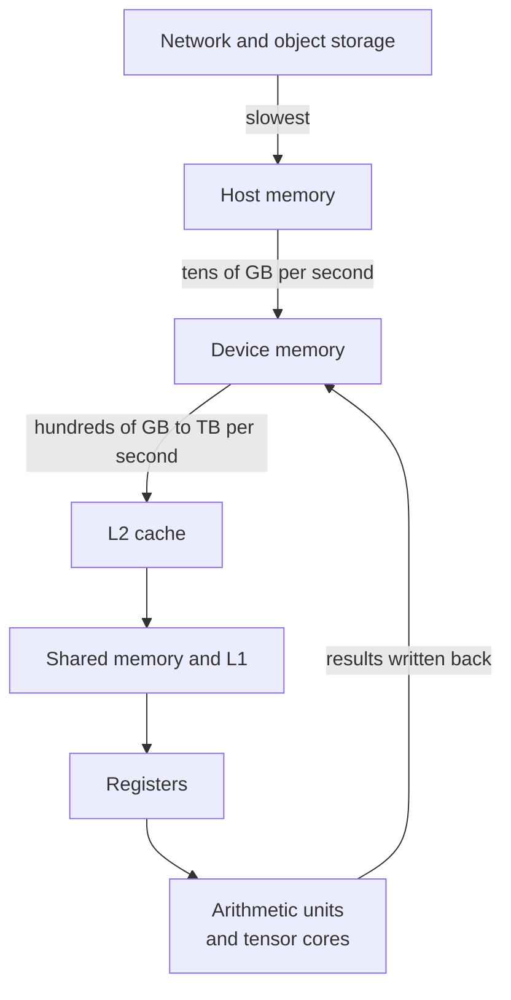
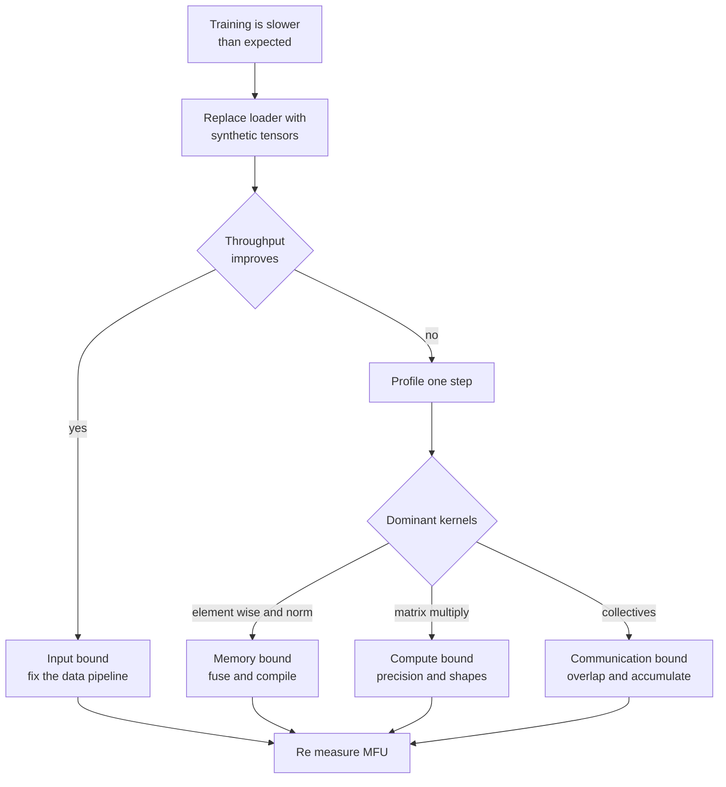
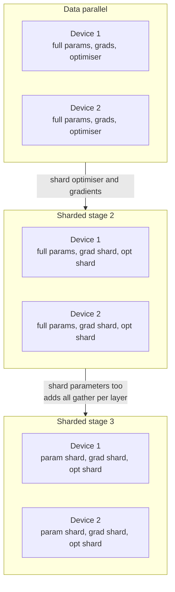
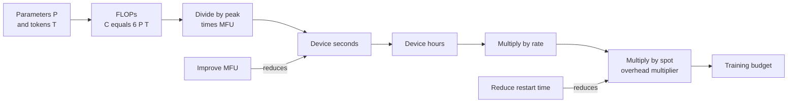

# Chapter 23: Training Infrastructure and Distributed Training

> **What this chapter covers** What a graphics processing unit actually does and how to read its specification sheet, the memory arithmetic of training derived from first principles with a bytes-per-parameter table and worked examples, activation checkpointing, throughput and model flops utilisation, diagnosing compute-bound against memory-bound against input-bound, the input pipeline, data parallelism and its communication volume, sharded data parallelism, tensor and pipeline parallelism with the bubble problem, mixture-of-expert routing, a strategy decision table, mixed precision and loss scaling, checkpointing for exact resume, fault tolerance and elastic training, hyperparameter search infrastructure, experiment management, and the arithmetic of a training budget.
> **Prerequisites** Chapter 6 for how neural networks train, Chapter 8 for transformers. Chapter 22 for the Kubernetes and cloud substrate. Chapter 24 covers the inference side of the same hardware.
> **Where it is used** Any training run that does not fit comfortably on one accelerator, which today includes most language, vision, and multimodal work. It bites when a run reports 12 percent utilisation and nobody knows why, when a job dies at hour 40 with no usable checkpoint, and when a budget is consumed by a configuration that was never profiled.

Throughout this chapter, every hardware figure is marked "approximately, verify on the specification sheet". Accelerator specifications, driver behaviour, and framework defaults change between versions and between parts. Take numbers from the part you actually have.

---

## 23.1 Level 1: Foundations

### 23.1.1 What a graphics processing unit actually does

A central processing unit is optimised for latency on a single stream of instructions. It spends most of its transistor budget on branch prediction, out-of-order execution, and large caches, so that one thread runs as fast as possible. It has a handful to a few dozen powerful cores.

A graphics processing unit is optimised for throughput on many identical operations. It spends its transistor budget on arithmetic units. It has thousands of simple cores grouped into units that execute the same instruction across many data elements at once, and it hides memory latency not with caches but with massive oversubscription: when one group of threads stalls waiting for memory, the hardware immediately switches to another group that is ready.

This has one dominant consequence for training. **The accelerator is almost never short of arithmetic. It is short of data.** A matrix multiplication where every loaded value is used many times runs near peak. An element-wise operation where every loaded value is used once runs at a small fraction of peak, because it is limited by how fast bytes arrive, not by how fast they can be multiplied.

| Property | Central processing unit | Graphics processing unit |
| --- | --- | --- |
| Design goal | Low latency per thread | High aggregate throughput |
| Cores | Few, complex | Thousands, simple |
| Latency hiding | Caches and speculation | Thread oversubscription |
| Best at | Branching, sequential logic | Dense regular arithmetic on large arrays |
| Worst at | Wide parallel arithmetic | Divergent branches, small scattered operations |

### 23.1.2 Memory hierarchy and bandwidth

Every level of the hierarchy is faster and smaller than the one below it.

| Level | Approximate size | Approximate speed | Notes |
| --- | --- | --- | --- |
| Registers | Kilobytes per core group | Fastest | Per-thread private |
| Shared memory or L1 | Tens to low hundreds of kilobytes per unit | Very fast | Programmer-managed on some devices |
| L2 cache | Single-digit to tens of megabytes | Fast | Shared across the device |
| Device memory, often high-bandwidth memory | Gigabytes to tens of gigabytes | Hundreds of gigabytes to terabytes per second | The number quoted as memory bandwidth |
| Host memory over the host interconnect | Hundreds of gigabytes | Tens of gigabytes per second | An order of magnitude slower than device memory |
| Network or remote storage | Effectively unbounded | Slower still | Where datasets live |

All figures are approximate and vary by part; verify on the specification sheet.

The gap between device memory bandwidth and arithmetic throughput is the fact to internalise. Devices can perform on the order of a hundred arithmetic operations in the time it takes to fetch one number from device memory. This ratio, sometimes called the machine balance, is why performance work is mostly about data movement.

**Arithmetic intensity** is the quantity that decides which limit you hit. It is the ratio of arithmetic operations performed to bytes moved.

$$I = \frac{\text{FLOPs}}{\text{bytes moved}}$$

If $I$ is above the machine balance, which is peak arithmetic throughput divided by peak memory bandwidth, the operation is compute-bound. If below, it is memory-bound. Worked example: adding two vectors of $n$ float32 elements performs $n$ additions and moves $12n$ bytes, two reads and one write, so $I = 1/12$, far below any machine balance, and vector addition is always memory-bound. Multiplying two $n \times n$ matrices performs approximately $2n^3$ operations and moves approximately $3n^2 \times 4$ bytes in float32, giving $I \approx n/6$, which grows with $n$, so large matrix multiplication is compute-bound. This is why frameworks work so hard to express computation as large matrix multiplications and to fuse element-wise operations together.

### 23.1.3 Tensor cores

Modern accelerators contain specialised units that perform a small matrix multiply-accumulate as a single instruction, typically multiplying in a reduced precision and accumulating in a higher one. They provide several times the throughput of the general-purpose units for the shapes they support.

Three practical points. They are used only when the operation maps to them, which in practice means matrix multiplications and convolutions in a supported precision, so a model built from element-wise operations gets no benefit. They often require dimensions to be multiples of a certain size, commonly 8 or 16 depending on part and precision, so padding a hidden dimension from 4090 to 4096 can produce a large speedup for free. And they accumulate in higher precision than they multiply, which is what makes reduced-precision training numerically viable. Verify the supported shapes and precisions on the specification sheet for your part.

### 23.1.4 Numeric formats

A floating point number is a sign, an exponent, and a mantissa. The exponent sets the dynamic range, the span between the largest and smallest representable magnitudes. The mantissa sets the precision, how finely values are resolved within that range. The formats differ in how they split a fixed bit budget between the two.

| Format | Bits | Exponent bits | Mantissa bits | What it is for |
| --- | --- | --- | --- | --- |
| float32 | 32 | 8 | 23 | The reference. Master weights, optimiser states, loss accumulation |
| tfloat32 | 19 stored in 32 | 8 | 10 | A drop-in faster matrix multiply on some parts, same range as float32 |
| float16 | 16 | 5 | 10 | Half the memory, good precision, narrow range, needs loss scaling |
| bfloat16 | 16 | 8 | 7 | Same range as float32, less precision, usually no loss scaling needed |
| float8 variants | 8 | 4 or 5 | 3 or 2 | Very high throughput on supporting parts, needs per-tensor scaling |
| int8 | 8 | n/a | n/a | Mostly inference quantisation, see Chapter 24 |

The single most useful fact here: **bfloat16 trades precision for range, and range is what training needs.** Gradients span many orders of magnitude, and float16's narrow exponent causes small gradients to underflow to zero, which is why float16 training requires loss scaling. bfloat16 has float32's exponent, so it usually does not. Where bfloat16 is supported, it is the default choice for training. Support is part-dependent; verify on the specification sheet.

### 23.1.5 Reading a specification sheet

Five numbers matter, and the marketing number is usually not one of them.

| Number | What it means | The trap |
| --- | --- | --- |
| Memory capacity | How big a model plus its states can be | This is the hard limit; exceed it and nothing runs |
| Memory bandwidth | Bytes per second from device memory | Determines memory-bound performance, which is most of a real workload |
| Dense arithmetic throughput per precision | Peak FLOP/s for matrix operations | Achievable in practice is a fraction of peak; treat peak as a ceiling |
| Interconnect bandwidth between devices | Bytes per second device to device | Determines whether multi-device parallelism is viable |
| Power and thermal limits | Sustained versus burst behaviour | Sustained clocks can be well below boost clocks under load |

Two specific traps. First, sparse throughput figures, sometimes quoted as double the dense figure, apply only to a specific structured sparsity pattern that ordinary training does not produce. Use the dense number. Second, throughput figures are quoted per precision, and quoting the float8 number next to a bfloat16 workload overstates what you will get by a large factor.

The number to compute for yourself is the machine balance: peak arithmetic throughput divided by memory bandwidth, in FLOPs per byte. Compare it with your workload's arithmetic intensity to predict which limit you will hit before you write any code.



*Figure 23.1: The memory hierarchy as a funnel. Each arrow is roughly an order of magnitude, which is why keeping data high in the funnel is the whole of performance engineering.*

---

## 23.2 Level 2: Working knowledge

### 23.2.1 The memory arithmetic of training, derived

Training memory has four components. Derive each rather than memorising a rule of thumb, because the rule of thumb changes with the optimiser and the precision.

Let $P$ be the number of parameters.

**Parameters.** Stored once, at $B_w$ bytes each.

$$M_{\text{params}} = P \cdot B_w$$

**Gradients.** One per parameter, at $B_g$ bytes each, usually the same precision as the parameters used in the backward pass.

$$M_{\text{grad}} = P \cdot B_g$$

**Optimiser states.** This is the term people forget. Plain stochastic gradient descent keeps nothing. Momentum keeps one buffer. Adam and its variants keep two, a first moment and a second moment, and mixed-precision implementations conventionally keep them plus a float32 master copy of the weights.

$$M_{\text{opt}} = P \cdot B_{\text{opt}}$$

For Adam in the standard mixed-precision recipe, $B_{\text{opt}} = 12$: 4 bytes for the master weights, 4 for the first moment, 4 for the second moment, all in float32.

**Activations.** Every intermediate tensor kept for the backward pass. Unlike the first three terms, this scales with batch size and sequence length, not just with parameter count. For a transformer, a usable approximation is

$$M_{\text{act}} \approx c \cdot L \cdot B \cdot S \cdot H \cdot B_a$$

where $L$ is the number of layers, $B$ is the micro-batch size, $S$ is the sequence length, $H$ is the hidden dimension, $B_a$ is bytes per activation element, and $c$ is a constant capturing how many tensors per layer are retained. The value of $c$ depends heavily on the implementation, on whether attention is computed with a memory-efficient kernel, and on which fusions are active; it is commonly in the range of roughly 10 to 30 for a standard implementation without checkpointing. Treat $c$ as something to measure for your stack rather than to look up.

The total, plus a fragmentation and workspace allowance:

$$M_{\text{total}} = P (B_w + B_g + B_{\text{opt}}) + M_{\text{act}} + M_{\text{overhead}}$$

### 23.2.2 The bytes-per-parameter table

Collecting the first three terms gives a single number per training mode, the bytes of fixed state per parameter. Activations are separate and added on top.

| Training mode | Weights | Gradients | Optimiser | Total bytes per parameter |
| --- | --- | --- | --- | --- |
| Full fine-tune, float32, SGD no momentum | 4 | 4 | 0 | 8 |
| Full fine-tune, float32, SGD with momentum | 4 | 4 | 4 | 12 |
| Full fine-tune, float32, Adam | 4 | 4 | 8 | 16 |
| Full fine-tune, mixed precision bf16, Adam | 2 | 2 | 12 | 16 |
| Full fine-tune, mixed precision bf16, Adam 8-bit states | 2 | 2 | 6 | 10 |
| Inference only, bf16 | 2 | 0 | 0 | 2 |
| LoRA on a bf16 base, Adam, adapters only trained | 2 base + small | small | small | approximately 2 plus adapter terms |
| QLoRA, 4-bit base, bf16 adapters, Adam | 0.5 base + small | small | small | approximately 0.5 plus adapter terms |

The mixed-precision row is the one that surprises people. Switching from float32 to bfloat16 does not halve memory in the standard Adam recipe, because the optimiser still keeps float32 master weights and float32 moments. Weights and gradients halve, the optimiser states do not, and the total stays at approximately 16 bytes per parameter. The memory saving from mixed precision is mostly in activations, and the main benefit is speed from tensor cores.

**Worked example one: a 1 billion parameter model, full fine-tune, mixed precision with Adam.**

Fixed state is $1 \times 10^9 \times 16 = 1.6 \times 10^{10}$ bytes, approximately 14.9 GiB. Now activations: assume 24 layers, hidden dimension 2048, sequence length 2048, micro-batch 1, bfloat16 at 2 bytes, and $c = 16$ as a stated assumption.

$M_{\text{act}} \approx 16 \times 24 \times 1 \times 2048 \times 2048 \times 2 = 3.22 \times 10^9$ bytes, approximately 3.0 GiB.

Total approximately 17.9 GiB plus overhead, so this does not fit on a 16 GB accelerator and fits with room on a 40 GB one. Reducing the micro-batch below 1 is impossible, so the lever is activation checkpointing or a different training mode.

**Worked example two: the same model with LoRA.**

The base model is frozen in bfloat16: $1 \times 10^9 \times 2 = 2 \times 10^9$ bytes, approximately 1.9 GiB. Assume adapters covering 0.5 percent of parameters, so $5 \times 10^6$ trainable parameters, at 16 bytes each of fixed state, which is $8 \times 10^7$ bytes, approximately 0.07 GiB, negligible. Activations are similar to before, approximately 3.0 GiB, and may be slightly lower since gradients are needed only through the adapter paths, though activations for the backward pass through the frozen layers are still required. Total is approximately 5 GiB, which fits comfortably on an 8 GB device. This is the entire reason parameter-efficient fine-tuning dominates practice on small hardware.

**Worked example three: a 70 billion parameter model, full fine-tune, mixed precision with Adam.**

Fixed state is $70 \times 10^9 \times 16 = 1.12 \times 10^{12}$ bytes, approximately 1043 GiB, before any activations. On accelerators with 80 GB each, you need at least 14 devices to hold the state alone, and in practice more once activations, workspace, and fragmentation are counted. This single calculation is why sharded data parallelism exists, and it should be the first thing you compute when someone proposes training a large model.

**Worked example four: inference of the same 70 billion parameter model in bfloat16.**

$70 \times 10^9 \times 2 = 1.4 \times 10^{11}$ bytes, approximately 130 GiB, plus the key-value cache. Two 80 GB devices hold it. The ratio between the training figure and the inference figure, roughly eight to one, is worth committing to memory.

### 23.2.3 Activation checkpointing

Activations are the only term that scales with batch size, so they are the term you attack when a model nearly fits. Activation checkpointing, also called gradient checkpointing, discards most intermediate activations during the forward pass and recomputes them during the backward pass from a small number of saved checkpoints.

The trade is memory for compute. If you checkpoint at every layer boundary, activation memory falls from proportional to the number of layers to proportional to the square root of the number of layers under the classic scheme, or simply to the per-layer peak under the common per-layer scheme. The compute cost is one extra forward pass over the recomputed regions.

A forward pass is roughly one third of the total cost of a training step, since the backward pass costs roughly twice the forward. Recomputing the whole forward therefore adds roughly one third to the step, giving about 30 to 40 percent slower training in exchange for a large memory reduction. Measure it; the fraction depends on what you checkpoint.

**Listing 23.1: selective checkpointing applied to transformer blocks.**

```python
import torch
from torch.utils.checkpoint import checkpoint

class Block(torch.nn.Module):
    def forward(self, x):  # standard transformer block body
        ...

class Stack(torch.nn.Module):
    def __init__(self, blocks, checkpoint_every: int = 1):
        super().__init__()
        self.blocks = torch.nn.ModuleList(blocks)
        self.checkpoint_every = checkpoint_every

    def forward(self, x):
        for i, block in enumerate(self.blocks):
            if self.training and i % self.checkpoint_every == 0:
                # use_reentrant=False is the maintained implementation; check your version
                x = checkpoint(block, x, use_reentrant=False)
            else:
                x = block(x)
        return x
```

The `checkpoint_every` parameter is the point of the listing: checkpointing every layer gives maximum memory saving and maximum recompute, while checkpointing every fourth layer recovers most of the speed and still cuts activation memory substantially. This selective policy is usually better than the all-or-nothing default. The `self.training` guard prevents recomputation during evaluation, where no backward pass follows and checkpointing would be pure overhead. The `use_reentrant` argument name and default have changed across framework versions, so check your version.

### 23.2.4 Throughput and model flops utilisation

The compute model for a dense transformer training step is a result worth knowing exactly. A forward pass costs approximately $2$ FLOPs per parameter per token, one multiply and one add for each weight. The backward pass costs approximately twice the forward, because it computes gradients with respect to both the inputs and the weights. So a full training step costs approximately

$$C \approx 6 \cdot P \cdot T$$

where $P$ is parameters and $T$ is tokens processed. This ignores attention's quadratic term, which is a correction that matters at long sequence lengths; a fuller expression adds a term proportional to $L \cdot S^2 \cdot H$.

**Model flops utilisation**, MFU, is the fraction of the hardware's peak arithmetic throughput that your training actually achieves, counting only the useful FLOPs from the formula above and not counting recomputation.

$$\text{MFU} = \frac{6 \cdot P \cdot T_{\text{per second}}}{N_{\text{devices}} \cdot F_{\text{peak}}}$$

Worked example: a 7 billion parameter model on 8 devices, each with a peak bfloat16 throughput of approximately 300 TFLOP/s, an assumed figure you must verify on the specification sheet, achieving 18000 tokens per second.

Useful FLOPs per second $= 6 \times 7 \times 10^9 \times 18000 = 7.56 \times 10^{14}$, which is 756 TFLOP/s.
Peak $= 8 \times 300 \times 10^{12} = 2.4 \times 10^{15}$, which is 2400 TFLOP/s.
MFU $= 756 / 2400 = 0.315$, approximately 31.5 percent.

Interpreting MFU: values in the range of roughly 35 to 55 percent are typical for well-tuned large-scale transformer training, and below roughly 20 percent something specific is wrong and is usually findable. Note that MFU counts only useful FLOPs, so enabling activation checkpointing lowers MFU while possibly raising tokens per second by allowing a larger batch. That is why the number to optimise for cost is tokens per second per dollar, with MFU used as a diagnostic.

### 23.2.5 Compute-bound, memory-bound, or input-bound

Three regimes, three distinct diagnoses, three different fixes. Determine which one you are in before changing anything.

| Regime | Symptom | Confirm by | Fix |
| --- | --- | --- | --- |
| Input-bound | Accelerator utilisation oscillates or sits low; host CPU busy | Replace the data loader with a synthetic tensor generator; if throughput jumps, it is the input pipeline | Prefetch, more loader workers, better format, cache locally |
| Memory-bound | Utilisation high but MFU low; profile dominated by element-wise and normalisation kernels | Compute arithmetic intensity of the dominant kernels; profile for memory throughput near peak | Fuse operations, use a compiler, use memory-efficient attention, increase batch size |
| Compute-bound | MFU respectable; profile dominated by matrix multiplication kernels | Matrix multiply kernels dominate the profile time | Reduced precision, better shapes for tensor cores, more devices |
| Communication-bound | Multi-device only; scaling efficiency falls as devices are added | Time a step with communication disabled or with one device | Overlap communication with compute, gradient accumulation, better topology |

The synthetic-input test is the highest-value diagnostic in this chapter and takes ten minutes. Feed the training loop randomly generated tensors of the correct shape instead of real data. If throughput rises substantially, every other optimisation is premature.



*Figure 23.2: The diagnostic order. The synthetic input test comes first because it is cheap and because the input pipeline is the most common culprit.*

### 23.2.6 The input pipeline

The input pipeline is the usual culprit. An accelerator capable of consuming several gigabytes of input per second is routinely fed by a Python loop doing per-sample decoding on a few worker processes.

The required throughput is easy to compute. If a step consumes $B \times S$ tokens and takes $t$ seconds, and each token costs $b$ bytes on disk, the pipeline must sustain $B \cdot S \cdot b / t$ bytes per second. Worked example: a global batch of 512 sequences of 2048 tokens, a step time of 0.4 seconds, and 2 bytes per token as int16 identifiers, gives $512 \times 2048 \times 2 / 0.4 = 5.24 \times 10^6$ bytes per second, about 5.2 MB/s, which is trivial for pre-tokenised data. Now the same arithmetic for images: a batch of 512 images at 500 KB each in JPEG, with a step time of 0.25 seconds, needs $512 \times 500 \times 10^3 / 0.25 \approx 1.02 \times 10^9$ bytes per second, about 1 GB/s, plus the CPU to decode 2048 JPEGs per second. That is a real engineering problem, and it is why vision pipelines starve and language pipelines on pre-tokenised data usually do not.

The controls:

| Control | What it fixes |
| --- | --- |
| Prefetch depth | Overlaps loading with compute so the accelerator never waits |
| Worker process count | Parallelises decoding and augmentation across host cores |
| Pinned host memory | Enables faster and asynchronous host-to-device transfer |
| Sharded sequential formats | Replaces millions of small random reads with large sequential ones |
| Pre-tokenisation or pre-decoding | Moves per-epoch work into a one-off preprocessing job |
| Local node cache | Avoids re-reading from network storage every epoch |
| Accelerator-side decoding and augmentation | Moves the bottleneck off the host CPU when the host is saturated |

**Format choice** deserves its own note. Millions of individual small files are the worst case for both object storage, where per-request charges and per-request latency dominate, and for local filesystems, where metadata operations dominate. Shard into large sequential files of roughly 100 MB to 1 GB containing many records, in a format your framework can stream and shuffle within a window. Shuffling then becomes a two-level operation: shuffle the shard order, and shuffle within a buffer of records held in memory. That approximates a global shuffle well enough for training while preserving sequential reads.

**Listing 23.2: a loader configured to overlap fetch with compute.**

```python
from torch.utils.data import DataLoader

loader = DataLoader(
    dataset,
    batch_size=32,
    num_workers=8,            # match to available host cores, not to a guess
    pin_memory=True,          # enables asynchronous host to device copy
    prefetch_factor=4,        # batches queued per worker, so 32 in flight here
    persistent_workers=True,  # avoid re-spawning workers every epoch
    drop_last=True,           # keeps every step the same shape, helps compilation
)

for batch in loader:
    batch = batch.to("cuda", non_blocking=True)  # requires pin_memory to overlap
    ...
```

Two lines do the real work. `pin_memory=True` combined with `non_blocking=True` on the transfer is what allows the copy to overlap with computation; without pinned memory the transfer is synchronous and the overlap does not happen regardless of the flag. `persistent_workers=True` matters when epochs are short, because re-spawning eight worker processes and re-importing the libraries at every epoch boundary can cost seconds. `drop_last=True` keeps the shapes static, which avoids recompilation in stacks that compile per shape. Argument names and defaults vary across versions; check your version.

### 23.2.7 Single-node multi-GPU: data parallelism

Data parallelism is the default and the one to understand completely. Every device holds a full copy of the model. The global batch is split across devices. Each device computes gradients on its shard. The gradients are averaged across all devices, so every device applies the same update and the replicas stay identical.

The averaging is an **all-reduce**: every device contributes a value and every device ends up with the sum. The standard implementation is ring all-reduce, which arranges devices in a ring and performs a reduce-scatter followed by an all-gather. Its communication volume per device is

$$V = 2 \cdot \frac{N-1}{N} \cdot M$$

where $N$ is the device count and $M$ is the total bytes of gradients. For large $N$ this approaches $2M$, and crucially it is independent of $N$, which is why ring all-reduce scales.

Worked example: a 1 billion parameter model with bfloat16 gradients has $M = 2 \times 10^9$ bytes. On 8 devices, per-device traffic is $2 \times (7/8) \times 2 \times 10^9 = 3.5 \times 10^9$ bytes per step. Over a high-speed device interconnect delivering an effective 200 GB/s, an assumed figure to verify on the specification sheet, that is approximately 17.5 ms per step of communication. If the step itself takes 400 ms of compute, communication is about 4 percent and can be almost entirely hidden by overlapping. Over a 25 Gb/s Ethernet link, roughly 3.1 GB/s, the same traffic takes approximately 1.1 seconds, which is nearly three times the compute time, and the job will scale terribly. The interconnect, not the accelerator, decides whether multi-node data parallelism works.

The overlap is what makes data parallelism efficient. Gradients for the last layers are ready first, so the framework begins all-reducing them while the backward pass continues through earlier layers, bucketing gradients into groups to amortise the launch cost. This is automatic in the standard distributed data parallel implementations, and the bucket size is a tunable worth checking when scaling is poor.

**Listing 23.3: the practical launcher for single-node multi-device data parallelism.**

```python
# train.py, launched with: torchrun --standalone --nproc_per_node=8 train.py
import os, torch, torch.distributed as dist
from torch.nn.parallel import DistributedDataParallel as DDP

dist.init_process_group(backend="nccl")             # nccl for GPU collectives
local_rank = int(os.environ["LOCAL_RANK"])          # set by the launcher
torch.cuda.set_device(local_rank)                   # one process, one device

model = build_model().to(local_rank)
model = DDP(model, device_ids=[local_rank], gradient_as_bucket_view=True)

sampler = torch.utils.data.distributed.DistributedSampler(dataset, shuffle=True)
loader = torch.utils.data.DataLoader(dataset, sampler=sampler, batch_size=32)

for epoch in range(epochs):
    sampler.set_epoch(epoch)                        # without this every epoch
    for batch in loader:                            # shuffles identically
        loss = model(batch).loss
        loss.backward()                             # all-reduce overlaps here
        optimizer.step(); optimizer.zero_grad(set_to_none=True)
dist.destroy_process_group()
```

The model is one process per device, not one process driving several devices; this avoids the Python interpreter becoming the bottleneck. `DistributedSampler` partitions the dataset so no two devices see the same example, and `set_epoch` is the line most often omitted: without it the sampler's shuffle seed never changes and every epoch sees the same order, which quietly degrades training. `set_to_none=True` frees the gradient buffers instead of zeroing them, which saves memory and a kernel launch. The environment variable and launcher names have changed across versions; check your version.

Note also the batch size semantics. `batch_size=32` here is per device, so with 8 devices the global batch is 256. The learning rate should be tuned for the global batch, not the per-device one, and this is a common source of confusing results when the device count changes.

---

## 23.3 Level 3: Depth

### 23.3.1 Sharded data parallelism

Plain data parallelism replicates everything, so its memory ceiling is one device. Sharded data parallelism, of which the ZeRO family described by Rajbhandari and colleagues, 2020, "ZeRO: Memory Optimizations Toward Training Trillion Parameter Models", is the canonical formulation, removes the redundancy in stages.

| Stage | What is sharded across the $N$ devices | Memory per device for fixed state | Extra communication over plain data parallelism |
| --- | --- | --- | --- |
| Baseline data parallelism | Nothing | $P(B_w + B_g + B_{\text{opt}})$ | None |
| Stage 1 | Optimiser states | $P(B_w + B_g + B_{\text{opt}}/N)$ | None materially; reduce-scatter replaces all-reduce plus an all-gather of updated weights |
| Stage 2 | Optimiser states and gradients | $P(B_w + B_g/N + B_{\text{opt}}/N)$ | Same total volume, reduce-scatter instead of all-reduce |
| Stage 3 | Optimiser states, gradients, and parameters | $P(B_w + B_g + B_{\text{opt}})/N$ | Approximately 1.5 times the volume, because parameters are all-gathered on demand in both forward and backward |

Worked example, the 70 billion parameter model from 23.2.2 on 64 devices with stage 3. Fixed state per device is $70 \times 10^9 \times 16 / 64 = 1.75 \times 10^{10}$ bytes, approximately 16.3 GiB. That fits on an 80 GB device with substantial room for activations, whereas the unsharded 1043 GiB does not fit anywhere. Compare with stage 2 on the same 64 devices: $70 \times 10^9 \times (2 + 2/64 + 12/64) = 70 \times 10^9 \times 2.22 = 1.55 \times 10^{11}$ bytes, approximately 145 GiB per device, which does not fit. Stage 3 is required here, and this arithmetic is exactly how you decide.

The mechanism of stage 3 is worth understanding because it explains the cost. Each device permanently owns only a shard of each layer's parameters. Before a layer executes in the forward pass, the devices all-gather that layer's full parameters, compute, then discard the gathered copy. The same happens in the backward pass, followed by a reduce-scatter of the gradients so each device receives only the gradient shard it owns. So parameters cross the network twice per step rather than never, and the ability to overlap the gather of layer $i+1$ with the compute of layer $i$ is what keeps it efficient. On a slow interconnect that overlap fails and stage 3 becomes very slow.

The practical guidance: use stage 2 when it fits, because it is nearly free, and stage 3 only when it does not, and offload optimiser states to host memory only as a last resort, since host bandwidth is an order of magnitude below device memory bandwidth.



*Figure 23.3: The sharding stages. Each step down reduces memory per device and the last one adds parameter communication in both passes.*

### 23.3.2 Tensor parallelism

Tensor parallelism splits an individual operation across devices. For a linear layer $Y = XW$, split $W$ by columns across $N$ devices so each device computes a slice of $Y$, then concatenate. Or split $W$ by rows and split $X$ correspondingly, so each device computes a partial sum, then all-reduce. In a transformer block the standard arrangement, from Shoeybi and colleagues, 2019, "Megatron-LM: Training Multi-Billion Parameter Language Models Using Model Parallelism", splits the first feed-forward matrix by columns and the second by rows, so only one all-reduce is needed per block rather than two, and similarly splits attention by heads.

The cost is that this all-reduce happens **inside the forward pass of every layer**, twice per block counting the backward pass, on activations rather than gradients. Activation volume per all-reduce is approximately $B \cdot S \cdot H \cdot B_a$ bytes. Worked example: micro-batch 4, sequence 2048, hidden 8192, bfloat16, gives $4 \times 2048 \times 8192 \times 2 = 1.34 \times 10^8$ bytes, about 134 MB, per collective, and with two collectives per block over 80 blocks that is about 21 GB of traffic per forward pass. This is why tensor parallelism is confined to devices connected by a fast intra-node interconnect and is rarely extended across nodes.

The rule: **tensor parallelism within a node, other forms of parallelism across nodes.** Set the tensor-parallel degree to at most the number of devices sharing the fast interconnect, commonly 8.

### 23.3.3 Pipeline parallelism and the bubble

Pipeline parallelism splits the model by layers across devices, so device 1 holds layers 1 to 10, device 2 holds 11 to 20, and so on. Activations flow forward along the pipeline and gradients flow backward. Communication is only the activations at the stage boundaries, which is small, so pipeline parallelism tolerates slow interconnects and is the natural choice across nodes.

The problem is the bubble. With a single batch, device 2 is idle while device 1 computes, and device 1 is idle while device 2 computes. The fix is to split the batch into $m$ micro-batches and feed them in sequence so stages overlap. The idle fraction with $p$ stages and $m$ micro-batches is

$$\text{bubble fraction} = \frac{p - 1}{m + p - 1}$$

Worked example: 4 stages and 4 micro-batches gives $3/7 \approx 0.43$, so 43 percent of device time is wasted. With 32 micro-batches, $3/35 \approx 0.086$, under 9 percent. With 64 micro-batches, $3/67 \approx 0.045$. The guidance follows directly: **make the number of micro-batches several times the number of stages**, commonly at least 4 times and preferably more.

Micro-batching interacts with memory. Naive scheduling, all forwards then all backwards, requires holding activations for all $m$ micro-batches simultaneously. The one-forward-one-backward schedule interleaves them so that at most $p$ micro-batches' activations are live, which is the schedule to use. Interleaved schedules assign multiple non-contiguous layer groups per device to shrink the bubble further at the cost of more communication.

```mermaid
gantt
  title Pipeline with four stages and four micro batches
  dateFormat X
  axisFormat %s
  section Stage 1
  F1 :0, 1
  F2 :1, 2
  F3 :2, 3
  F4 :3, 4
  section Stage 2
  idle :done, 0, 1
  F1 :1, 2
  F2 :2, 3
  F3 :3, 4
  section Stage 3
  idle :done, 0, 2
  F1 :2, 3
  F2 :3, 4
  section Stage 4
  idle :done, 0, 3
  F1 :3, 4
```



*Figure 23.4: The fill phase of a pipeline. The idle bars are the bubble, and they shrink relative to useful work as the micro-batch count rises.*

### 23.3.4 Combining the strategies

Large training runs combine all three into a grid, often called 3D parallelism. The device count factorises as

$$N = d_{\text{tp}} \cdot d_{\text{pp}} \cdot d_{\text{dp}}$$

where $d_{\text{tp}}$ is the tensor-parallel degree, $d_{\text{pp}}$ the pipeline depth, and $d_{\text{dp}}$ the data-parallel width. The assignment follows the interconnect hierarchy: tensor parallelism across the fastest links inside a node, pipeline parallelism across nodes since its traffic is small, and data parallelism across the remaining dimension.

Worked example: 512 devices in 64 nodes of 8. Set $d_{\text{tp}} = 8$ to use the intra-node interconnect, $d_{\text{pp}} = 8$ across nodes, leaving $d_{\text{dp}} = 512 / (8 \times 8) = 8$. The global batch is then 8 data-parallel replicas times the micro-batch times the micro-batch count, and the pipeline needs the micro-batch count to be several times 8 to keep the bubble small.

### 23.3.5 Mixture-of-expert routing, in brief

A mixture-of-expert layer replaces one large feed-forward network with many smaller expert networks plus a router that sends each token to a small number of them, typically one or two. Total parameters grow with the expert count while the compute per token stays roughly constant, which decouples capacity from cost. Shazeer and colleagues, 2017, "Outrageously Large Neural Networks: The Sparsely-Gated Mixture-of-Experts Layer", introduced the modern form, and Fedus, Zoph, and Shazeer, 2021, "Switch Transformers", simplified it to top-1 routing.

Three infrastructure consequences. First, experts are distributed across devices, so routing becomes an all-to-all collective: every device sends each token to whichever device holds its chosen expert and receives the results back. All-to-all is the most demanding collective pattern and dominates the communication profile. Second, load balancing is a training problem, since the router can collapse onto a few popular experts, leaving most idle; an auxiliary load-balancing loss term is standard, and capacity factors cap how many tokens an expert accepts, dropping the overflow. Third, memory is dominated by total parameters even though compute is not, so a sparse model with the FLOP cost of a small model still needs the memory footprint of a large one. That last point is what surprises teams who adopt these models expecting cheap training.

### 23.3.6 Choosing a strategy

| Situation | Strategy | Reason |
| --- | --- | --- |
| Model plus states fit on one device | Single device | No communication, simplest |
| Fits on one device, want faster epochs | Data parallelism | Near-linear scaling when the interconnect is adequate |
| Fixed state does not fit, activations are the issue | Activation checkpointing first | Cheapest fix, roughly 30 percent compute cost |
| Fixed state does not fit, moderately over | Sharded stage 2 | Nearly free memory reduction over data parallelism |
| Fixed state does not fit, substantially over | Sharded stage 3 | Shards parameters too; needs a fast interconnect |
| A single layer does not fit on one device | Tensor parallelism | The only option that splits within a layer |
| Many devices, slow inter-node links | Pipeline parallelism across nodes | Communicates only boundary activations |
| Very large scale | 3D parallelism | Tensor inside nodes, pipeline across, data on the remainder |
| Want capacity without proportional compute | Mixture of experts | Decouples parameters from FLOPs, costs all-to-all traffic and memory |
| Adapting an existing model on modest hardware | LoRA or QLoRA | Reduces trainable state to a small fraction |

The order to try things: fit on one device, then checkpoint activations, then shard, then split the model. Every step adds communication and failure modes, so stop at the first one that works.

### 23.3.7 Mixed precision and loss scaling

Mixed precision keeps a float32 master copy of the weights, casts to a reduced precision for the forward and backward passes to use tensor cores, and applies the optimiser update in float32.

With float16 the problem is range. The smallest normal float16 magnitude is approximately $6 \times 10^{-5}$, and gradients frequently fall below that, underflowing to zero and silently stopping learning in those tensors. Loss scaling fixes it: multiply the loss by a large constant $s$ before the backward pass, so by linearity every gradient is scaled by $s$ and lifted into representable range, then divide the gradients by $s$ before the optimiser step.

$$g_{\text{true}} = \frac{1}{s} \cdot \nabla (s \cdot \mathcal{L})$$

Dynamic loss scaling automates the choice of $s$: start high, and whenever a gradient overflows to infinity or not-a-number, skip that optimiser step and halve $s$; after a run of successful steps, double it. Skipped steps at the start of training are normal and expected. Persistent skipping is a bug signal.

With bfloat16 the exponent matches float32, so underflow is not the issue and loss scaling is generally unnecessary. The cost is precision: 7 mantissa bits means accumulating many values in bfloat16 loses accuracy, which is why reductions, normalisation statistics, softmax accumulation, and the optimiser update are kept in float32 even in a bfloat16 run. This selective precision is what the framework's automatic mixed precision implementation encodes, and it is why you should use the framework's implementation rather than casting the model yourself.

A practical failure to recognise: a run that produces not-a-number losses after thousands of healthy steps under float16 is usually an overflow in an attention or normalisation computation rather than a learning-rate problem. Switching to bfloat16 where supported resolves a large fraction of these. Check what your part supports on the specification sheet.

### 23.3.8 Checkpointing for long runs

A checkpoint must allow **exact resume**, meaning the run continues as though it had never stopped. That requires more than the weights.

| Must be saved | Why |
| --- | --- |
| Model parameters | Obvious |
| Optimiser state | Adam moments carry substantial history; losing them causes a visible loss spike |
| Learning-rate scheduler state | The schedule depends on the step count |
| Global step and epoch | Everything else is derived from it |
| Random number generator states, host and device | Dropout masks and augmentation must continue, not restart |
| Data loader position or sampler epoch and offset | Otherwise the resumed run re-reads data already seen |
| Loss scaler state, if using float16 | The dynamic scale is state |
| Configuration and code version | Otherwise the checkpoint cannot be interpreted later |

Omitting the random number generator state and the data position is the most common defect. The run resumes, the loss looks fine, and the model has now seen part of the dataset twice within an epoch while never seeing another part. It is invisible in the loss curve and it damages the result.

**Listing 23.4: a checkpoint that supports exact resume.**

```python
import torch

def save_checkpoint(path, model, optimizer, scheduler, step, sampler_epoch, scaler=None):
    payload = {
        "model": model.state_dict(),
        "optimizer": optimizer.state_dict(),
        "scheduler": scheduler.state_dict(),
        "step": step,
        "sampler_epoch": sampler_epoch,          # so DistributedSampler resumes its order
        "cpu_rng": torch.get_rng_state(),
        "cuda_rng": torch.cuda.get_rng_state_all(),
        "scaler": scaler.state_dict() if scaler is not None else None,
        "config_hash": CONFIG_HASH,              # refuse to resume a different config
    }
    tmp = path + ".tmp"
    torch.save(payload, tmp)                     # write to a temp path first
    os.replace(tmp, path)                        # atomic rename, never a partial file
```

The write-then-rename is the part that matters operationally. A job killed while writing a checkpoint directly to its final path leaves a truncated file that fails to load, and since jobs are most often killed during checkpointing, when input-output pressure is highest, this is a real and common loss. The `config_hash` guard prevents the silent disaster of resuming a run into a different model shape or a different learning-rate schedule.

**The sharded checkpoint problem.** Under sharded data parallelism each device holds only a slice of the state. Two options exist. Gather everything to rank zero and write one consolidated file, which is simple and works for downstream loading but requires one device to hold the full state, which by construction it cannot when stage 3 was necessary, and it serialises the write. Or have each rank write its own shard, which is fast and parallel but produces a checkpoint whose layout is tied to the device count and the parallelism configuration. The second is standard for large runs, and it creates a resharding requirement: resuming on a different device count, or loading for inference, needs a conversion step. Treat that converter as part of the training system and test it, because discovering that a 40 hour run's checkpoints cannot be loaded for inference is a painful way to learn. Distributed checkpoint utilities that handle resharding exist in the major frameworks; check your version.

The checkpoint interval is an optimisation. Let $c$ be the cost in seconds of writing one checkpoint, $\lambda$ the failure rate per second, and $\tau$ the interval. Expected lost work per failure is approximately $\tau/2$, so the total overhead per unit time is approximately

$$\text{overhead}(\tau) \approx \frac{c}{\tau} + \lambda \cdot \frac{\tau}{2}$$

Minimising over $\tau$ gives $\tau^{*} = \sqrt{2c/\lambda}$, a form of Young's and Daly's classic result for optimal checkpoint intervals. Worked example: a checkpoint takes 60 seconds and the job fails on average once per 20 hours, so $\lambda = 1/72000$ per second. Then $\tau^{*} = \sqrt{2 \times 60 \times 72000} = \sqrt{8.64 \times 10^6} \approx 2939$ seconds, approximately every 49 minutes. On spot instances with a mean time between reclamations of 2 hours, $\lambda = 1/7200$ and $\tau^{*} = \sqrt{2 \times 60 \times 7200} \approx 929$ seconds, approximately every 15 minutes. The arithmetic makes the spot-instance requirement concrete.

### 23.3.9 Fault tolerance and elastic training

At any scale a failure is certain. If a single device fails with probability $p$ over a run, the probability that a job using $N$ devices completes untouched is $(1-p)^N$. Worked example: $p = 0.005$ over the run's duration and $N = 256$ gives $0.995^{256} \approx 0.276$, so roughly three quarters of runs are interrupted. Design for interruption as the normal case.

Three levels of response:

| Level | Mechanism | Cost |
| --- | --- | --- |
| Restart from checkpoint | The job dies, the orchestrator restarts it, it resumes | Lost work since the last checkpoint, plus startup time |
| Elastic training | The job continues with a changed device count, re-forming the process group | Needs a global batch or gradient accumulation that adapts, and a rendezvous mechanism |
| In-job redundancy | Spare workers, or replicated state allowing a failed rank to be reconstructed without a full restart | Complexity, and wasted capacity on spares |

Most teams should use the first, done well, and reach for the second only when reclamation rates make restarts dominate. Elastic training has a subtlety that is easy to miss: if the device count changes and the per-device batch stays fixed, the global batch changes, which changes the effective learning rate and the training dynamics. Either hold the global batch constant by adjusting gradient accumulation steps, or accept and record the change. Silently varying the global batch through a run makes the result unreproducible.

**Why spot instances need checkpointing** is now arithmetic rather than assertion. Spot capacity is reclaimed with a short warning, often a couple of minutes. With a mean time between reclamations of 2 hours, the optimal checkpoint interval from 23.3.8 is roughly 15 minutes, and the expected lost work is roughly 7.5 minutes per reclamation. A run without checkpointing loses everything at each reclamation and, for any run longer than the mean time between reclamations, will essentially never finish. Also use the reclamation warning: a handler that writes a checkpoint on the termination signal converts the expected loss from 7.5 minutes to nearly zero, and it is a small amount of code.

### 23.3.10 Hyperparameter search infrastructure

Search is an infrastructure problem as much as an algorithmic one. The algorithms:

| Method | How it works | When to use |
| --- | --- | --- |
| Grid search | Every combination on a lattice | Two or three parameters with known ranges; wasteful beyond that |
| Random search | Sample from distributions | The sensible default; Bergstra and Bengio, 2012, showed it beats grid search because only a few dimensions usually matter |
| Bayesian optimisation | Model the objective, sample where expected improvement is high | Expensive trials, few parameters, sequential budget |
| Successive halving and Hyperband | Start many trials, kill the worst at checkpoints, promote survivors | Large budgets where partial results predict final results |
| Population-based training | Mutate and copy weights of good trials during training | Schedules that should vary over training |

The infrastructure requirements are the same regardless of algorithm: a scheduler that can run many trials concurrently, resource isolation so trials do not interfere, early stopping so bad trials are killed, a results store recording every configuration with its metrics, and reproducibility so a promising trial can be rerun exactly.

The economic point that decides most searches: early stopping is worth more than a clever search algorithm. Successive halving with random sampling gets most of the value of Bayesian optimisation at a fraction of the complexity, because it spends the budget on promising trials instead of finishing hopeless ones. The caveat is that it assumes early performance predicts final performance, which fails for configurations with long warmups or unusual schedules, so exempt those from early stopping or make the first rung generous.

One structural warning. Selecting the best of $k$ trials on a validation set overfits that set, and the reported best is biased upward by roughly the scale of the validation noise times a factor growing with $\log k$. Hold out a separate test set touched only once, at the end, after the configuration is fixed.

### 23.3.11 Experiment management at the infrastructure level

The requirement is simple to state and hard to satisfy: **any past run must be reproducible and explainable months later.** That means recording, automatically and without engineer discipline:

| Recorded | Why |
| --- | --- |
| Code version, including uncommitted differences | The run used what it used, not what is on the branch now |
| Full resolved configuration | Defaults change; record the values used, not the file that produced them |
| Environment: framework, driver, and library versions | Numerics change across versions |
| Hardware: device model and count, topology | Throughput and even results depend on it |
| Dataset version or content hash | The most common silent difference between runs |
| Random seeds | Necessary but not sufficient for bit-exact reproduction |
| Metrics over time, with step and wall-clock | For comparison and for diagnosing slowdowns |
| Resource utilisation over time | Otherwise a utilisation regression is invisible |
| Checkpoint locations and their hashes | Ties artifacts to the run that made them |
| Cost: device hours and estimated spend | Otherwise cost accountability is impossible |

Two structural pieces make this work. First, the training job should emit this itself rather than relying on a human to log it, which means a launcher that captures the environment and a tracking client initialised before anything else. Second, artifacts should be immutable and content-addressed, so a checkpoint reference cannot silently change meaning.

Bit-exact reproduction is harder than it sounds and often not worth pursuing. Reduction order in parallel collectives is nondeterministic, some optimised kernels are nondeterministic, and changing the device count changes the arithmetic. Deterministic modes exist in the major frameworks and cost performance; check your version. The practical standard is statistical reproducibility: rerunning with the same configuration and a different seed should produce a result within the run-to-run variation you have measured, and you should have measured it. A team that has never run the same configuration three times does not know its own noise floor and therefore cannot tell an improvement from a fluctuation.

---

## 23.4 Level 4: Mastery

### 23.4.1 Cost engineering for training

**The purchase models.**

| Model | Characteristics | Fits |
| --- | --- | --- |
| On-demand | Highest rate, available immediately, no commitment | Bursty and unpredictable work, short experiments |
| Spot or preemptible | Substantially cheaper, reclaimed with short notice | Checkpointed training, batch scoring, hyperparameter trials |
| Reserved or committed use | Discount for a one or three year commitment | Steady baseline load you are certain will persist |
| Dedicated capacity reservations | Guarantees availability of scarce accelerators | Scheduled large runs where a delay costs more than the premium |

Never quote a discount percentage from memory. Take current rates from your provider's price list, since they vary by region, by part, and over time.

**The break-even arithmetic for spot.** Let $p_{\text{od}}$ be the on-demand rate and $p_{\text{sp}}$ the spot rate. Spot adds overhead: lost work between the last checkpoint and reclamation, plus restart time. With reclamations arriving at rate $\lambda$, a checkpoint interval $\tau$, a checkpoint cost $c$, and a restart cost $r$, the effective cost multiplier over the useful work is approximately

$$\text{multiplier} \approx 1 + \frac{c}{\tau} + \lambda\left(\frac{\tau}{2} + r\right)$$

Spot is cheaper when $p_{\text{sp}} \cdot \text{multiplier} < p_{\text{od}}$.

Worked example with assumed figures. Take $\lambda = 1/7200$ per second, a two hour mean time between reclamations, $c = 60$ seconds, the optimal $\tau \approx 929$ seconds from 23.3.8, and a restart cost $r = 300$ seconds covering scheduling, image pull, and warm-up. Then $c/\tau = 0.065$ and $\lambda(\tau/2 + r) = (464 + 300)/7200 = 0.106$. The multiplier is approximately 1.17. So spot pays whenever the spot rate is below about 85 percent of on-demand, which it generally is by a wide margin. Note how sensitive this is to $r$: if restart takes 30 minutes because of a 20 GB image pull and a long dataset warm-up, the term becomes $(464 + 1800)/7200 = 0.314$ and the multiplier rises to about 1.38. **Reducing restart time is a cost optimisation**, which is not obvious until you write this expression down.

**Sizing a training budget.** The arithmetic runs from tokens to dollars in four steps.

1. Total useful FLOPs: $C = 6 \cdot P \cdot T$ from 23.2.4.
2. Device-seconds: $C / (F_{\text{peak}} \cdot \text{MFU})$.
3. Device-hours: divide by 3600.
4. Cost: multiply by the hourly rate and by the spot multiplier if applicable.

Worked example: a 7 billion parameter model on 100 billion tokens.
$C = 6 \times 7 \times 10^9 \times 1 \times 10^{11} = 4.2 \times 10^{21}$ FLOPs.
Assume $F_{\text{peak}} = 300 \times 10^{12}$ FLOP/s per device, verify on the specification sheet, and an achieved MFU of 0.40, so effective throughput is $1.2 \times 10^{14}$ FLOP/s per device.
Device-seconds $= 4.2 \times 10^{21} / 1.2 \times 10^{14} = 3.5 \times 10^{7}$.
Device-hours $= 3.5 \times 10^{7} / 3600 \approx 9722$.
On 64 devices that is approximately 152 hours of wall-clock, about 6.3 days, assuming perfect scaling; at 85 percent scaling efficiency, about 7.4 days. Multiply 9722 device-hours by your actual hourly rate for the cost, then by 1.17 if running on spot.

The value of this calculation is the sensitivity analysis it enables. Doubling MFU from 0.20 to 0.40 halves the bill. Halving the token count halves the bill and changes the result. Those two levers dominate everything else, and they are worth more attention than the choice of instance type.

**The compute-optimal question.** Given a fixed compute budget, how should it be split between model size and training tokens? Hoffmann and colleagues, 2022, "Training Compute-Optimal Large Language Models", found that models of the time were substantially undertrained, and that parameters and tokens should scale roughly in proportion. The practical caveat for engineers is that compute-optimal refers to training cost alone. If the model will serve many requests, a smaller model trained on more tokens is cheaper over its lifetime even though it costs more to train, because inference cost scales with parameters and is paid on every request. Optimise total cost of ownership, not training cost.



*Figure 23.5: From model size to dollars. The two feedback arrows are the levers that matter most and the ones teams most often neglect.*

### 23.4.2 Where the standard advice is wrong

**"Use the biggest batch that fits."** Larger batches improve hardware efficiency and, past a critical size, stop improving convergence per example. McCandlish and colleagues, 2018, "An Empirical Model of Large-Batch Training", characterises this with the gradient noise scale: below the critical batch size, doubling the batch roughly halves the steps needed; above it, doubling the batch buys almost nothing per step and simply costs compute. Measure the gradient noise scale rather than filling memory.

**"More devices means faster training."** Only while scaling efficiency holds. Measure it: run the same configuration at 1, 2, 4, and 8 times the device count and plot tokens per second against devices. The point where the curve bends is where adding devices starts buying less than it costs, and beyond it you are paying for communication. Also note that increasing data-parallel width increases the global batch, which past the critical batch size stops helping convergence, so the wall-clock gain can vanish even when throughput rises.

**"Mixed precision halves memory."** As the bytes-per-parameter table shows, in the standard Adam recipe it does not, because the optimiser retains float32 states. It halves activations and speeds up matrix multiplication. Both are valuable; the memory claim as usually stated is wrong.

**"MFU is the metric to optimise."** MFU counts only useful FLOPs. Activation checkpointing lowers MFU while often raising tokens per second and lowering cost. Optimise tokens per second per dollar, and use MFU to diagnose where the time goes.

**"Gradient accumulation is equivalent to a larger batch."** Almost, but not exactly. Any operation that depends on the batch as a whole, batch normalisation most obviously, computes statistics over the micro-batch rather than the accumulated batch, so the two are not equivalent for such models. Transformers with layer normalisation are unaffected, which is why the equivalence is usually stated without the caveat.

**"Checkpoint as often as possible."** Checkpointing is not free, and at large scale a full checkpoint write can take minutes and saturate storage bandwidth. The optimal interval is $\sqrt{2c/\lambda}$, and checkpointing far more often than that wastes more than it saves.

### 23.4.3 What senior engineers argue about

**Sharded data parallelism against 3D parallelism.** Sharded stage 3 is far simpler to configure, requires no model surgery, and scales well on fast interconnects. 3D parallelism achieves higher MFU at extreme scale and tolerates slower inter-node links through pipelining, at the cost of a configuration with three degrees to tune and a model implementation that must be partitioned. The pragmatic position: use sharded stage 3 until measurements show it failing to scale, then add pipeline parallelism across nodes before adding tensor parallelism.

**How much to spend on utilisation.** An engineer-week spent raising MFU from 30 to 45 percent saves a third of a long run's cost, which can be a large sum or trivial depending on the run. The failure is symmetric: teams that never profile waste money, and teams that profile everything waste time. The test is whether the run is long enough and repeated enough for the saving to exceed the engineering cost.

**Determinism.** One camp argues that bit-exact reproducibility is essential for debugging and for trust. The other argues that it costs performance, is impossible across device counts, and that statistical reproducibility with a measured noise floor is the honest standard. The middle position that works: deterministic mode available behind a flag for debugging, statistical reproducibility as the standard for results, and a measured run-to-run variance published alongside every comparison.

**Whether to own hardware.** Owning accelerators has a lower marginal cost at high sustained utilisation and a much higher fixed cost, plus depreciation against a fast-moving product cycle. Renting is right for variable demand and for staying current. The crossover depends on sustained utilisation; below roughly half of capacity used consistently, ownership rarely wins, though the exact figure depends on rates you must take from current prices rather than from a rule of thumb.

### 23.4.4 The frontier

| Area | The idea | Status |
| --- | --- | --- |
| Very low precision training | float8 and below for the forward and backward passes with per-tensor scaling | Production on supporting parts, with recipes still evolving; check your version |
| Communication compression | Quantising or sparsifying gradients before the all-reduce | Effective in bandwidth-starved settings, with convergence caveats |
| Optimiser state compression | 8-bit and lower optimiser states, as in Dettmers and colleagues, 2022, "8-bit Optimizers via Block-wise Quantization" | Widely used, close to free in practice |
| Memory-efficient attention | Kernels that avoid materialising the attention matrix, as in Dao and colleagues, 2022, "FlashAttention" | Standard practice; large memory and speed wins |
| Fully sharded training at extreme scale | Combining sharding with offload to host and storage tiers | Works, but bandwidth-limited; use as a last resort |
| Elastic and fault-tolerant scaling | Continuing through failures without a full restart | Maturing; valuable where reclamation rates are high |
| Compilers and kernel fusion | Graph capture and automatic fusion to reduce memory traffic | Large wins on memory-bound models, with compilation time and shape-stability costs |

### 23.4.5 The judgment that distinguishes a staff engineer

**Doing the arithmetic before the experiment.** The memory table and the FLOP formula answer most feasibility questions in five minutes. An engineer who computes 1043 GiB of fixed state before proposing a 70 billion parameter full fine-tune on eight devices saves a week.

**Profiling before optimising.** The synthetic-input test, a single-step profile, and an MFU calculation take under an hour and identify the regime. Optimising without them is guessing, and the guess is wrong more often than not because the input pipeline is a more common culprit than the model.

**Treating the checkpoint as a product.** A checkpoint that cannot be loaded for inference, cannot be resharded to a different device count, or lacks the random number generator and data-position state is a liability discovered at the worst moment. Test loading and resharding in continuous integration on a tiny model.

**Costing the run before starting it.** Device-hours times rate, computed in advance and compared against the expected value of the result, is the discipline that prevents the most expensive mistakes in the field. Present the number alongside the proposal, not in the postmortem.

**Knowing when the answer is a smaller model.** Parameter-efficient fine-tuning, distillation, or simply a smaller architecture trained longer frequently delivers the required quality at a fraction of the infrastructure. The infrastructure question is often answered by not needing the infrastructure.

---

## 23.5 Subtopic checklist

| Subtopic | You should be able to |
| --- | --- |
| Accelerator architecture | Explain why throughput hardware is data-starved rather than arithmetic-starved |
| Memory hierarchy | Name the levels and the order-of-magnitude gaps between them |
| Arithmetic intensity | Compute it for an operation and predict compute-bound or memory-bound |
| Tensor cores | State what they accelerate, the shape constraints, and why accumulation precision matters |
| Numeric formats | Explain the range and precision trade and why bfloat16 usually beats float16 for training |
| Specification sheets | Identify the five numbers that matter and the two traps |
| Memory arithmetic | Derive parameters, gradients, optimiser states, and activations from first principles |
| Bytes per parameter | Recall the table and explain why mixed precision does not halve total memory |
| Activation checkpointing | Quantify the memory saving and the roughly 30 percent compute cost, and apply it selectively |
| Compute model | Use $6PT$ and compute MFU from measured throughput |
| Regime diagnosis | Run the synthetic-input test and read a profile to classify the bottleneck |
| Input pipeline | Compute required pipeline bandwidth and name six controls |
| Data parallelism | State the ring all-reduce volume and decide viability from interconnect bandwidth |
| Practical launcher | Write a correct single-node multi-device training script, including the sampler epoch |
| Sharded data parallelism | Choose a stage from a memory calculation and explain the added communication |
| Tensor parallelism | Explain why it is confined within a node, with the activation volume arithmetic |
| Pipeline parallelism | Compute the bubble fraction and choose a micro-batch count |
| 3D parallelism | Factorise a device count across the three degrees by interconnect hierarchy |
| Mixture of experts | Explain all-to-all routing, load balancing, and the memory consequence |
| Strategy choice | Apply the decision table and justify stopping at the first workable option |
| Mixed precision | Explain loss scaling, why bfloat16 usually avoids it, and what stays in float32 |
| Checkpointing | List everything required for exact resume and explain write-then-rename |
| Sharded checkpoints | Explain the resharding requirement and why it must be tested |
| Checkpoint interval | Derive and apply the square-root-of-two-c-over-lambda result |
| Fault tolerance | Compute the probability an N-device run completes untouched and choose a response level |
| Spot instances | Compute the overhead multiplier and the break-even against on-demand |
| Hyperparameter search | Choose a method and explain why early stopping beats a clever search algorithm |
| Experiment management | List what must be recorded automatically and define statistical reproducibility |
| Training budget | Go from parameters and tokens to a dollar figure in four steps |

---

## 23.6 Common misconceptions

| Misconception | Why it is believed | What is actually true |
| --- | --- | --- |
| Mixed precision halves training memory | Weights are half the size | Weights and gradients halve, but Adam keeps float32 master weights and two float32 moments, so total fixed state stays at approximately 16 bytes per parameter; the saving is in activations and the benefit is speed |
| A model that fits in memory for inference can be trained on the same device | The weights fit | Training needs roughly eight times the memory of bfloat16 inference once gradients, optimiser states, and activations are counted |
| Low GPU utilisation means the model is too small | Utilisation is the headline metric | It usually means the input pipeline is starving the device; run the synthetic-input test before anything else, and note that the utilisation percentage reported by monitoring tools counts any kernel activity, not useful arithmetic |
| More devices always trains faster | Parallelism means speed | Only while scaling efficiency holds and while the growing global batch stays below the critical batch size; past either point you pay more for the same wall-clock |
| Pipeline parallelism wastes hardware | The bubble is idle time | The bubble fraction is $(p-1)/(m+p-1)$ and falls below 10 percent with enough micro-batches; it is the parallelism that tolerates slow inter-node links |
| Checkpoints only need the weights | The weights are the model | Exact resume needs optimiser state, scheduler state, step, random number generator state, and data position; omitting the last two silently re-reads and skips data |
| Spot instances are too risky for training | Reclamation loses work | With a checkpoint interval near the optimum and a handler on the termination signal, expected loss is small and the overhead multiplier is commonly under 1.2, so spot is usually much cheaper |
| Bit-exact reproducibility is achievable | Setting a seed feels sufficient | Collective reduction order, some optimised kernels, and any change in device count all break bit-exactness; the honest standard is statistical reproducibility against a measured run-to-run variance |
| Compute-optimal model size is the right target | It is a well-known result | It optimises training cost alone; if the model serves many requests, a smaller model trained longer is cheaper over its lifetime because inference cost scales with parameters |

---

## 23.7 Practice

**Exercise 1, level 2: memory calculator.** Write a script that takes a parameter count, a training mode from the bytes-per-parameter table, a layer count, hidden dimension, sequence length, and micro-batch, and prints the four memory components and the total. Then validate it: train a small model, measure peak memory with the framework's memory reporting, and compare.
*Acceptance criterion:* predictions within 25 percent of measurement for at least three configurations, with a written explanation of the residual, which should identify workspace, fragmentation, and your assumed activation constant.

**Exercise 2, level 2 to 3: find the bottleneck.** Take a training script on a public dataset. Measure baseline throughput. Run the synthetic-input test. Then vary worker count, prefetch depth, and pinned memory, recording throughput for each.
*Acceptance criterion:* you classify the run as input-bound, memory-bound, or compute-bound with evidence, report MFU before and after, and achieve at least a 30 percent throughput improvement or demonstrate with a profile why none is available.

**Exercise 3, level 3: scaling curve and its knee.** Run the same configuration on 1, 2, 4, and 8 devices with data parallelism, holding the global batch constant by adjusting gradient accumulation. Plot tokens per second and scaling efficiency against device count.
*Acceptance criterion:* a plot with the knee identified, an estimate of communication time per step from the all-reduce volume formula and your measured interconnect bandwidth, and agreement within a factor of two between the predicted and observed communication overhead.

**Exercise 4, level 3: exact resume under kill testing.** Implement checkpointing with everything from the exact-resume table. Run 1000 steps, recording the loss. Then run 500 steps, kill the process mid-checkpoint, resume, and continue to 1000.
*Acceptance criterion:* the resumed loss curve matches the uninterrupted one within your measured run-to-run noise, the kill during checkpointing leaves a loadable checkpoint, and you can demonstrate that removing the data-position state from the checkpoint causes a detectable difference.

**Exercise 5, level 4: budget a real run.** Choose a model size and token count. Compute the FLOPs, assume an MFU from your own measurement in exercise 2, compute device-hours, and price it at current rates from a provider's price list. Then compute the spot multiplier using a measured or assumed reclamation rate and your actual restart time, including image pull.
*Acceptance criterion:* a one page memo with every step of arithmetic shown, every assumption labelled, a sensitivity analysis over MFU and restart time, and a recommendation on purchase model justified by the break-even calculation.

---

## 23.8 How this is tested

**Question 1 (level 1): Why does a graphics processing unit accelerate matrix multiplication but not a loop with many branches?**

<details>
<summary>Answer</summary>

The hardware spends its transistor budget on arithmetic units rather than on branch prediction and large caches, and it executes the same instruction across many data elements at once within a group of threads. Matrix multiplication is exactly that pattern: many identical multiply-accumulate operations on regular data, with high arithmetic intensity because each loaded value is reused many times across the tile. A branchy loop breaks both properties. When threads in a group take different branches the hardware must execute both paths and mask off the inactive threads, which is called divergence and costs the full time of every path taken. It also has low arithmetic intensity, so it is limited by memory bandwidth rather than by arithmetic. The underlying point is that the device is rarely short of arithmetic and usually short of data, and the ratio of operations performed to bytes moved, the arithmetic intensity, predicts which limit a given operation will hit.
</details>

**Question 2 (level 2): How much memory does full fine-tuning a 7 billion parameter model with Adam in mixed precision require, before activations?**

<details>
<summary>Answer</summary>

Sixteen bytes per parameter. Two bytes for the bfloat16 weights used in the forward and backward passes, two for the bfloat16 gradients, and twelve for the optimiser: four for the float32 master copy of the weights, four for Adam's first moment, and four for the second moment. So 7 billion times 16 is 1.12 times ten to the eleventh bytes, approximately 104 GiB of fixed state. Activations are additional and scale with micro-batch and sequence length, and there is workspace and fragmentation on top. The consequence is that this does not fit on a single 80 GB accelerator and needs either sharding across devices, offload, or a parameter-efficient method. The number worth remembering alongside it is that bfloat16 inference for the same model is about 14 GB, so training costs roughly eight times inference in memory, and the reason mixed precision does not halve this figure is that the optimiser states stay in float32.
</details>

**Question 3 (level 2): Your training run shows 15 percent accelerator utilisation. What do you check first, and why that first?**

<details>
<summary>Answer</summary>

The input pipeline, by replacing the data loader with a generator of random tensors of the correct shape and re-measuring throughput. If throughput jumps, the run was input-bound and everything else is premature. I check this first because it is the most common cause by a wide margin, it takes ten minutes, and it definitively separates two regimes that otherwise look identical from the outside. If it is input-bound, the fixes in order are more loader workers, a deeper prefetch queue, pinned memory with non-blocking transfers, moving per-epoch work such as decoding or tokenising into a one-off preprocessing job, sharding many small files into large sequential ones, and caching shards on local instance storage rather than re-reading network storage every epoch. If synthetic input does not help, I would profile a single step and look at which kernels dominate: element-wise and normalisation kernels mean memory-bound, which calls for fusion or a compiler and memory-efficient attention; matrix multiplication kernels mean compute-bound, where the levers are precision and tensor-core-friendly shapes; collectives mean communication-bound, where overlap and gradient accumulation help. I would also compute MFU rather than trusting the utilisation percentage, since that percentage counts any kernel activity and a fully occupied device doing memory-bound work reports high utilisation at low MFU.
</details>

**Question 4 (level 3): Explain data parallelism's communication cost and when it stops scaling.**

<details>
<summary>Answer</summary>

Every device holds a full replica and computes gradients on its shard of the batch, then the gradients are averaged with an all-reduce. Ring all-reduce moves approximately two times (N minus one) over N times M bytes per device, where N is the device count and M is the total gradient bytes, which approaches 2M and is independent of N, which is why it scales at all. For a 1 billion parameter model with bfloat16 gradients, M is 2 GB and per-device traffic is about 3.5 GB per step on eight devices. Over a fast intra-node interconnect at an effective couple of hundred gigabytes per second that is tens of milliseconds and hides easily behind a few hundred milliseconds of compute, especially since frameworks overlap the all-reduce of later layers with the backward pass of earlier ones in buckets. Over commodity Ethernet at a few gigabytes per second it is over a second, which exceeds the compute time and the job scales badly. It stops scaling for two separate reasons. First, communication per step is fixed while compute per device falls as you add devices, so the ratio worsens until communication dominates. Second, adding data-parallel width increases the global batch, and past the critical batch size, which the gradient noise scale characterises, larger batches stop reducing the number of steps needed, so wall-clock stops improving even if throughput rises. Both need measuring, which is why a scaling curve at one, two, four, and eight times the devices is the standard diagnostic.
</details>

**Question 5 (level 3): What is the pipeline bubble and how do you make it small?**

<details>
<summary>Answer</summary>

Pipeline parallelism assigns contiguous groups of layers to different devices. With a single batch, only one stage can be active at a time, so with p stages, p minus one devices are idle at any moment. Splitting the batch into m micro-batches lets stages work on different micro-batches simultaneously, but there is still a fill phase at the start and a drain phase at the end where some stages have nothing to do. The idle fraction is (p minus 1) divided by (m plus p minus 1). With four stages and four micro-batches that is three sevenths, about 43 percent wasted. With thirty-two micro-batches it is three over thirty-five, under 9 percent. So the rule is to make the micro-batch count several times the stage count, at least four times and preferably more. The constraint is memory: a naive schedule that runs all forwards before all backwards must hold activations for every in-flight micro-batch, so the one-forward-one-backward schedule is used instead, which bounds live activations at roughly p micro-batches. Interleaved schedules assign several non-contiguous layer groups per device and shrink the bubble further at the cost of more boundary communication. The reason to accept the bubble at all is that pipeline parallelism communicates only the activations at stage boundaries, which is small, so it tolerates slow inter-node links where tensor parallelism cannot.
</details>

**Question 6 (level 3): You have 8 devices with 80 GB each and want to train a 70 billion parameter model. Walk through the decision.**

<details>
<summary>Answer</summary>

First the arithmetic. Full fine-tuning with Adam in mixed precision is 16 bytes per parameter, so 70 billion times 16 is about 1043 GiB of fixed state, against 640 GiB of aggregate device memory, and that is before any activations. So full fine-tuning across these eight devices is infeasible no matter how it is sharded, and I would say so before discussing strategies. The options are then genuinely different. If the goal is adaptation rather than full training, LoRA or QLoRA changes the calculation entirely: the base in bfloat16 is 130 GiB, which sharded across eight devices is about 17 GiB each, and trainable adapter state is negligible, so it fits with room for activations; with a 4-bit base it is around 35 GiB total and fits comfortably. If full fine-tuning is genuinely required, I need more devices: sharded stage 3 on 64 devices gives 1043 divided by 64, about 16.3 GiB of fixed state each, which leaves room for activations on 80 GB parts, and that is the configuration I would size for. I would combine it with activation checkpointing and bfloat16, and if the inter-node interconnect is slow I would add pipeline parallelism across nodes rather than relying on stage 3's parameter all-gathers crossing the slow links. The order of reasoning matters more than the answer: compute the memory, confirm feasibility, and only then choose a parallelism strategy.
</details>

**Question 7 (level 3): What must a checkpoint contain for an exact resume, and what goes wrong if you omit each piece?**

<details>
<summary>Answer</summary>

Model parameters, or the run restarts from nothing. Optimiser state, because Adam's moments carry substantial history and dropping them produces a visible loss spike and a period of degraded training that people often misattribute to a learning-rate problem. Learning-rate scheduler state and the global step, because the schedule is a function of the step and resuming at step zero can push a warmed-up model back into a high learning rate. Random number generator states for both host and device, because dropout masks and data augmentation otherwise restart from the beginning of their sequence, which is a subtle correlation rather than a visible failure. Data loader position, or in the distributed case the sampler epoch and offset, because without it the resumed run re-reads examples it has already seen this epoch and never sees others, which is invisible in the loss curve and genuinely damages the result. The loss scaler state if using float16, since the dynamic scale is state. And the configuration and code version, so the checkpoint can be interpreted later and so a resume into a different model shape or schedule is refused rather than silently accepted. Operationally I would also write to a temporary path and atomically rename, because jobs are most often killed during checkpointing when input-output pressure is highest, and a truncated file at the final path is a checkpoint you do not have.
</details>

**Question 8 (level 3 to 4): How often should you checkpoint, and how does the answer change on spot instances?**

<details>
<summary>Answer</summary>

There is an optimum. If a checkpoint costs c seconds to write and failures arrive at rate lambda per second, then with an interval tau the overhead per unit time is approximately c over tau for the writing, plus lambda times tau over two for the expected lost work, since on average a failure lands halfway through an interval. Minimising gives tau equal to the square root of two c over lambda. With a 60 second checkpoint and a failure every 20 hours, that is about 49 minutes. On spot instances with a mean time between reclamations of two hours, lambda is much larger and the interval drops to about 15 minutes. The second change on spot is that reclamation comes with a short warning, so a handler on the termination signal that writes a checkpoint immediately converts the expected loss from roughly half an interval to nearly zero, which is a small amount of code for a large saving. I would also note the asymmetry the formula exposes: checkpointing far more often than the optimum wastes more in write time than it saves in lost work, and at large scale a full sharded checkpoint can take minutes and saturate storage bandwidth, so more frequent is not automatically safer.
</details>

**Question 9 (level 4): Estimate the cost of training a 7 billion parameter model on 100 billion tokens, and say which assumptions dominate.**

<details>
<summary>Answer</summary>

Total useful compute is approximately six times parameters times tokens, which is six times seven times ten to the ninth times ten to the eleventh, or 4.2 times ten to the twenty-first FLOPs. Dividing by the achieved throughput per device, which is peak times MFU, gives device-seconds. Taking an assumed peak of 300 TFLOP/s in bfloat16, which must be verified on the specification sheet, and an achieved MFU of 0.40, effective throughput is 1.2 times ten to the fourteenth FLOP/s, so device-seconds is 3.5 times ten to the seventh, which is about 9722 device-hours. On 64 devices at perfect scaling that is roughly 152 hours of wall-clock, and at 85 percent scaling efficiency about 7.4 days. Multiply the device-hours by the current hourly rate from the provider's price list, and if running on spot, multiply by an overhead factor that I would compute from the reclamation rate, the checkpoint cost, and the restart time, typically somewhere around 1.2. The assumptions that dominate are MFU and the token count. Going from 20 to 40 percent MFU halves the bill, which is why profiling before launching a long run pays for itself. Halving the tokens halves the bill but changes the result, so it is a modelling decision rather than an engineering one. The instance type and even the purchase model matter less than these two, which is the opposite of where most cost conversations start.
</details>

**Question 10 (level 4): A colleague proposes using the largest batch size that fits in memory. Respond.**

<details>
<summary>Answer</summary>

Filling memory optimises hardware efficiency and ignores convergence. Beyond a critical batch size, the gradient is already an accurate enough estimate of the true gradient that adding more examples per step barely reduces the number of steps needed, so you spend proportionally more compute for progressively less benefit. McCandlish and colleagues, 2018, formalise this with the gradient noise scale: below the critical size, doubling the batch roughly halves the steps required, and above it, doubling buys very little. The critical size depends on the model, the data, and where you are in training, and it typically grows as training proceeds, which is why batch-size ramps are used. So the right procedure is to measure rather than to fill: estimate the gradient noise scale, or empirically compare steps-to-target-loss at several batch sizes, and choose the largest batch that is still below the critical size. There are also two second-order points. A larger batch changes the effective learning rate and usually requires rescaling and a longer warmup, so a batch change is never isolated. And gradient accumulation lets you choose the global batch independently of what fits in memory, so memory capacity should not be the thing deciding a training hyperparameter at all.
</details>

**Question 11 (level 4): When would you choose pipeline parallelism over sharded data parallelism?**

<details>
<summary>Answer</summary>

Primarily when the inter-node interconnect is slow relative to the model size. Sharded stage 3 all-gathers each layer's parameters before it executes, in both the forward and backward passes, so parameters cross the network roughly one and a half times the volume of a plain data-parallel all-reduce, and its efficiency depends on overlapping those gathers with compute. On a fast intra-node fabric that overlap works well; across commodity Ethernet it does not, and stage 3 becomes very slow. Pipeline parallelism communicates only the activations at stage boundaries, which for a transformer is micro-batch times sequence times hidden dimension times bytes per element, a much smaller quantity that is largely insensitive to parameter count. So pipelining is the parallelism that tolerates slow links, which is exactly why large training runs place pipeline stages across nodes and keep tensor parallelism inside them. The costs are real: the bubble, which needs a micro-batch count several times the stage count to suppress, a one-forward-one-backward schedule to bound activation memory, and a model implementation that must actually be partitionable into balanced stages, which is awkward for models with uneven layers. My default would be sharded stage 2 if it fits, stage 3 if not and the interconnect is fast, and pipeline across nodes when measurements show stage 3 failing to scale. I would make that a measurement rather than a guess by running the scaling curve.
</details>

**Question 12 (level 4): Your team cannot reproduce a result from three months ago. What went wrong and how do you prevent it?**

<details>
<summary>Answer</summary>

Most likely the dataset. A content hash of the exact data used is the single most valuable thing to record and the most commonly omitted, because data is regenerated, backfilled, or re-cleaned without anyone treating it as a version change. Next most likely is the environment: framework, driver, and kernel library versions change numerics, and a default that changed between versions can alter results without any code change. Then the configuration: recording the config file is not enough, because defaults not written in the file also changed, so the fully resolved configuration must be captured. Then the code, including uncommitted local changes at launch time, which is why the launcher should record a diff rather than a commit hash alone. Then hardware and device count, since the parallelism configuration changes reduction order and the effective global batch. To prevent it, the training job itself should emit all of this automatically at startup rather than depending on anyone's discipline, artifacts should be immutable and content-addressed so a checkpoint reference cannot silently change meaning, and the team should define reproducibility as statistical rather than bit-exact: rerunning with the same configuration and a different seed should land within a measured run-to-run variance. That last part requires having run the same configuration at least three times to establish the noise floor, which most teams have never done, and without it they cannot distinguish a failure to reproduce from ordinary variation in the first place.
</details>

---

## Summary

1. Accelerators are throughput machines that are usually starved of data, not of arithmetic. Arithmetic intensity, operations per byte moved, predicts whether an operation is compute-bound or memory-bound.
2. bfloat16 has float32's exponent range with fewer mantissa bits, which is why it usually trains without loss scaling while float16 requires it.
3. Training memory is parameters plus gradients plus optimiser states plus activations. Only activations scale with batch size and sequence length.
4. Full fine-tuning with Adam costs approximately 16 bytes per parameter in both float32 and standard mixed precision, because the optimiser retains float32 states. Mixed precision saves activations and buys speed, not fixed state.
5. bfloat16 inference is approximately 2 bytes per parameter, so training costs roughly eight times inference in memory.
6. Activation checkpointing trades roughly 30 percent more compute for a large reduction in activation memory, and applying it to every fourth layer rather than every layer often recovers most of the speed.
7. A dense training step costs approximately $6PT$ FLOPs. Model flops utilisation is the achieved fraction of peak, with 35 to 55 percent typical for well-tuned large transformer training.
8. Run the synthetic-input test first. The input pipeline is the most common cause of low utilisation, and the reported utilisation percentage does not distinguish useful arithmetic from memory-bound work.
9. Ring all-reduce moves approximately $2M$ bytes per device regardless of device count, so multi-node data parallelism succeeds or fails on interconnect bandwidth.
10. Sharded data parallelism removes redundancy in stages: optimiser states, then gradients, then parameters. Stage 3 divides fixed state by the device count and adds parameter all-gathers in both passes.
11. Tensor parallelism communicates activations inside every layer and belongs within a node. Pipeline parallelism communicates only boundary activations and belongs across nodes.
12. The pipeline bubble fraction is $(p-1)/(m+p-1)$, so use a micro-batch count several times the stage count and a one-forward-one-backward schedule to bound activation memory.
13. Exact resume requires optimiser state, scheduler state, step, random number generator states, and data position, written with a temporary file and an atomic rename. Sharded checkpoints need a tested resharding path.
14. The optimal checkpoint interval is $\sqrt{2c/\lambda}$, which on spot instances is roughly 15 minutes for a one minute checkpoint and a two hour mean time between reclamations; a handler on the termination signal nearly eliminates the loss.
15. Budget a run as $6PT$ divided by peak times MFU, converted to device-hours and multiplied by the current rate and the spot overhead multiplier. MFU and token count dominate the result; reducing restart time is a cost optimisation that is easy to miss.

---

## Further reading

- Rajbhandari, Samyam and colleagues, 2020. "ZeRO: Memory Optimizations Toward Training Trillion Parameter Models." Supercomputing.
- Shoeybi, Mohammad and colleagues, 2019. "Megatron-LM: Training Multi-Billion Parameter Language Models Using Model Parallelism."
- Narayanan, Deepak and colleagues, 2021. "Efficient Large-Scale Language Model Training on GPU Clusters Using Megatron-LM." Supercomputing. The source of the 3D parallelism configuration guidance.
- Huang, Yanping and colleagues, 2019. "GPipe: Efficient Training of Giant Neural Networks using Pipeline Parallelism." Advances in Neural Information Processing Systems.
- Micikevicius, Paulius and colleagues, 2018. "Mixed Precision Training." International Conference on Learning Representations. The origin of loss scaling.
- Chen, Tianqi and colleagues, 2016. "Training Deep Nets with Sublinear Memory Cost." The activation checkpointing result.
- Dao, Tri and colleagues, 2022. "FlashAttention: Fast and Memory-Efficient Exact Attention with IO-Awareness." Advances in Neural Information Processing Systems.
- Hoffmann, Jordan and colleagues, 2022. "Training Compute-Optimal Large Language Models." Advances in Neural Information Processing Systems.
- McCandlish, Sam and colleagues, 2018. "An Empirical Model of Large-Batch Training." The gradient noise scale.
- Shazeer, Noam and colleagues, 2017. "Outrageously Large Neural Networks: The Sparsely-Gated Mixture-of-Experts Layer." International Conference on Learning Representations.
- Fedus, William, Zoph, Barret, and Shazeer, Noam, 2021. "Switch Transformers: Scaling to Trillion Parameter Models with Simple and Efficient Sparsity."
- Bergstra, James and Bengio, Yoshua, 2012. "Random Search for Hyper-Parameter Optimization." Journal of Machine Learning Research.
- Li, Lisha and colleagues, 2017. "Hyperband: A Novel Bandit-Based Approach to Hyperparameter Optimization." Journal of Machine Learning Research.
- Dettmers, Tim and colleagues, 2022. "8-bit Optimizers via Block-wise Quantization." International Conference on Learning Representations.
- Williams, Samuel, Waterman, Andrew, and Patterson, David, 2009. "Roofline: An Insightful Visual Performance Model for Multicore Architectures." Communications of the ACM.
- The companion handbook at `D:\Project\handbook\` derives memory and compute in chapter 4, pretraining in chapter 6, and supervised fine-tuning with LoRA in chapter 7.
