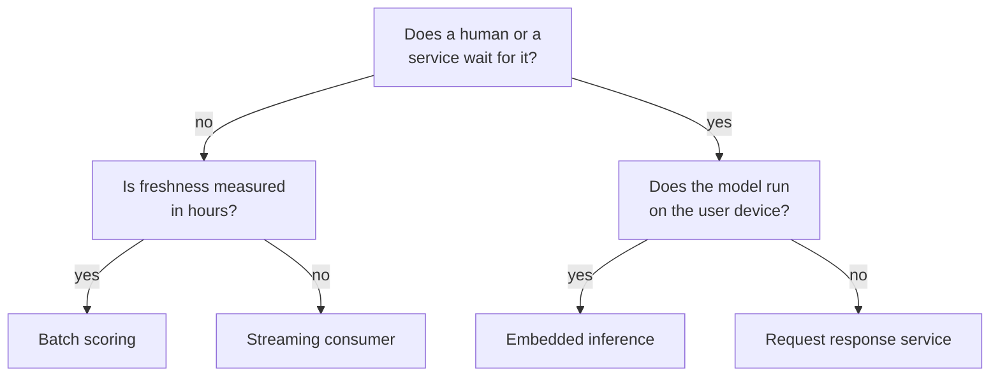
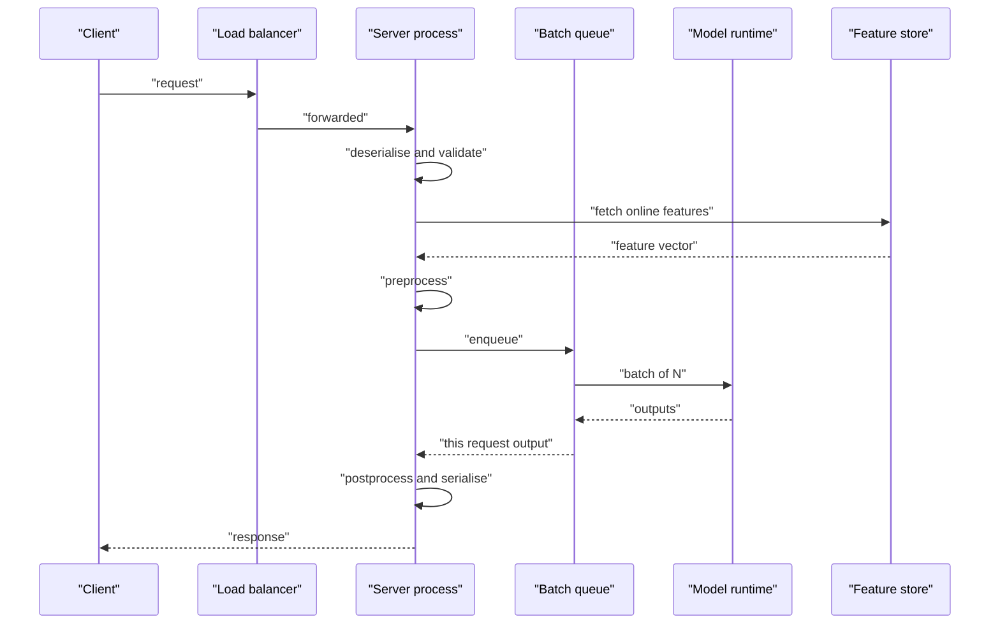
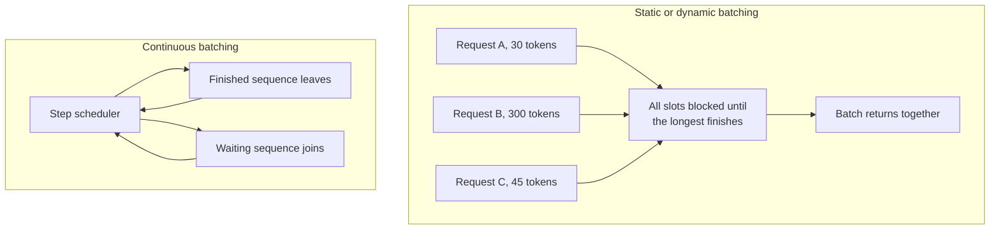
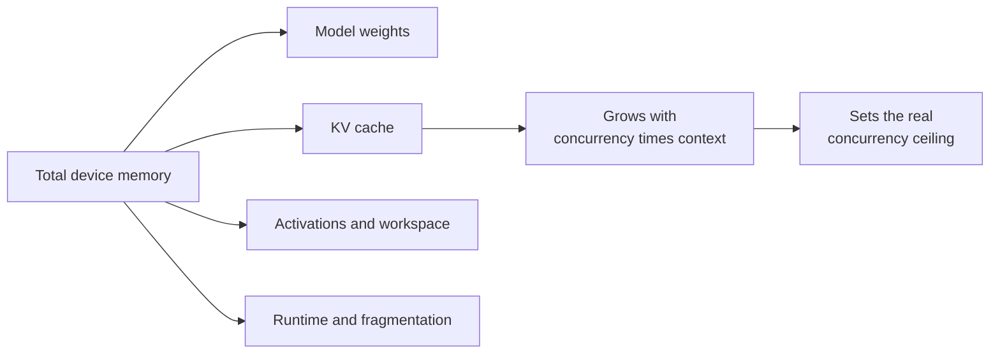
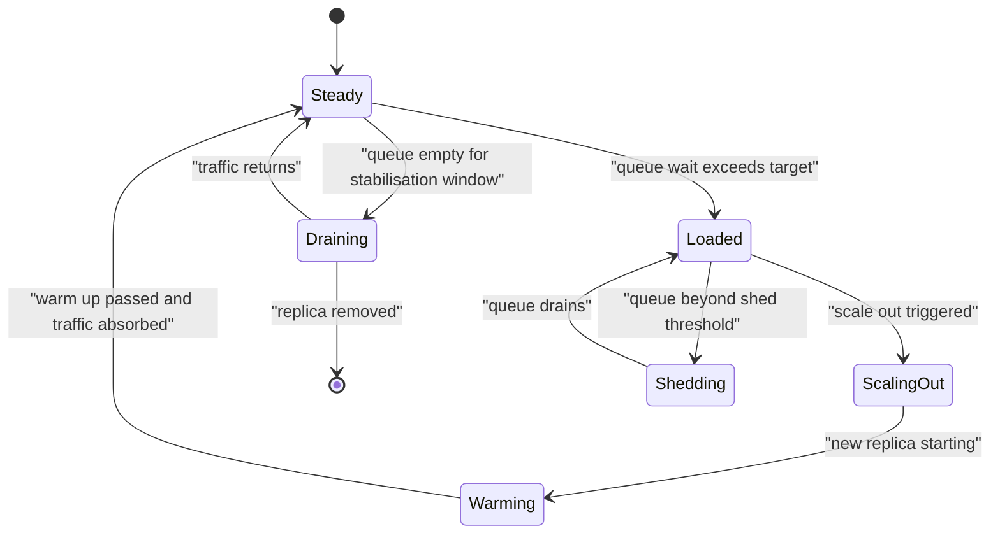
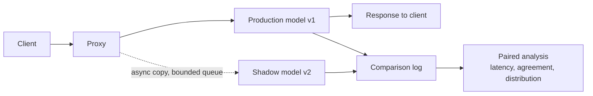

# Chapter 24: Model Serving and Inference

> **What this chapter covers** How a trained model becomes a running service, how requests flow through it, where the latency and the money go, and how to make it faster without making it wrong.
> **Prerequisites** Chapter 21 (Machine Learning System Design), Chapter 22 (Containers, Kubernetes, and Cloud). Chapter 8 (Transformers and Language Models) helps for the autoregressive sections but is not required.
> **Where it is used** Every system that makes a prediction for someone other than the person who trained the model. Real-time ranking, fraud scoring, speech transcription, chat assistants, on-device sensing, and nightly scoring jobs all live here.

---

## 24.1 Level 1: Foundations

### The serving problem stated plainly

Training produces a function. Serving makes that function callable by something that is not a notebook.

That sounds trivial and is not, because training and serving optimise for opposite things. Training is throughput-bound, offline, retryable, and tolerant of a machine dying. Serving is latency-bound, online, usually not retryable inside a user's patience, and intolerant of a machine dying. The same weights, pointed at two different objectives.

A serving system has four jobs:

1. Hold the model in memory, ready.
2. Accept an input in whatever form the caller has it.
3. Transform that input into exactly the shape the model saw during training.
4. Return a prediction within a budget, reliably, at some rate, for some cost.

Job 3 is where most production incidents come from. Jobs 1, 2, and 4 are where most of the engineering goes.

### The four serving modes

Nearly every deployment is one of four shapes. Choosing the wrong one is an expensive mistake that is hard to undo later, because the choice leaks into the data model, the monitoring, and the contract with the caller.

| Mode | Trigger | Latency budget | Typical use | Failure looks like |
|---|---|---|---|---|
| Batch | Schedule or upstream data landing | Minutes to hours | Nightly churn scores, embedding backfill, catalogue enrichment | Yesterday's scores are stale or missing |
| Streaming | An event arrives on a log | Hundreds of milliseconds to seconds | Fraud scoring on transactions, anomaly flags on telemetry | Consumer lag grows without bound |
| Request-response | A caller makes a synchronous call | 10 ms to a few seconds | Search ranking, recommendation, chat | Timeouts and errors visible to a user |
| Embedded | The application calls a local library | Microseconds to tens of milliseconds | On-device wake word, phone camera effects, browser models | The app is slow or the battery drains |

The mode is a business decision disguised as a technical one. If a prediction is only consumed once a day by a report, batch is cheaper by an order of magnitude and simpler by more than that. Engineers reach for request-response by default and pay for idle graphics processing units all night.



*Figure 24.1: Four serving modes fall out of two questions about who waits and where the code runs.*

### The mental model to carry

Think of a serving system as a pipeline with a single expensive stage in the middle and a lot of cheap stages around it that are, in aggregate, often more expensive than the middle.

The model forward pass is the stage everyone optimises. Network transit, deserialisation, feature lookup, tokenisation, post-processing, and serialisation are the stages that quietly consume more than half the budget in a well-tuned small-model service. Before optimising the model, measure the stages.

### Vocabulary

- **Inference**: one forward pass of a trained model. No gradients, no optimiser state.
- **Latency**: wall-clock time from request start to response end, measured at a named boundary. Always say which boundary.
- **Throughput**: completed requests, or tokens, per second.
- **Percentile latency**: the value below which that fraction of requests fall. Written p50, p95, p99. The mean is close to useless for serving because the distribution is right-skewed.
- **Time to first token (TTFT)**: for streamed generative output, the delay before the caller sees anything.
- **Time per output token (TPOT)**: the steady-state gap between subsequent streamed tokens.
- **Cold start**: the first request after a process or container starts, which pays for loading and warming.
- **Quantisation**: representing weights or activations in fewer bits.
- **Key-value cache (KV cache)**: stored attention keys and values from previous tokens so an autoregressive model does not recompute them.

### The first thing that goes wrong

Training and serving disagree about a feature. The training pipeline computed a seven-day rolling average with a window that ended yesterday; the serving path computes it with a window that ends now and includes the current event. The model sees a distribution it never trained on and quietly degrades. Nothing errors. This is training-serving skew, and it is the single most common cause of a model that scored well offline and disappoints online. Chapter 20 covers the feature-store answer. The serving-side answer is to share one transformation implementation between both paths and to test it in both.

---

## 24.2 Level 2: Working knowledge

### Packaging a model

A model artifact is weights plus everything needed to reproduce the computation. Shipping only the weights is a bug that surfaces in six months.

**What must be in the package**

| Component | Why | Common omission |
|---|---|---|
| Weights | Obvious | Rarely omitted |
| Architecture or graph | To reconstruct the computation | Assumed to be in the code repository, which then moves on |
| Preprocessing | Tokeniser, scaler, vocabulary, image normalisation constants | Very commonly omitted |
| Postprocessing | Threshold, label map, calibration | Commonly omitted |
| Environment spec | Library versions, accelerator runtime | Usually a loose requirements file, not a lock |
| Metadata | Training run identifier, data version, metrics, date | Almost always omitted |

**Serialisation formats and their trade-offs**

| Format | Portability | Security | Notes |
|---|---|---|---|
| Python pickle (and anything built on it, including the default PyTorch save) | Python only, fragile across library versions | Executes arbitrary code on load | Convenient and dangerous |
| Safetensors | Wide, tensor data only | Safe by construction, no code execution | Stores tensors and a small metadata header; needs the architecture separately |
| ONNX (Open Neural Network Exchange) | Cross-framework and cross-runtime | Graph only, no arbitrary code | Operator coverage is the limit; dynamic control flow is awkward |
| TorchScript | PyTorch runtimes, including C++ | Serialised program, treat source as trusted | Tracing misses data-dependent branches; scripting is stricter |
| SavedModel (TensorFlow) | TensorFlow runtimes | Graph plus assets | Signature definitions are the contract |
| GGUF | Llama-family inference runtimes | Data plus metadata | Designed for quantised local inference |
| Joblib or PMML or ONNX for classical models | Varies | PMML and ONNX are data, joblib is pickle | PMML is verbose but auditable |

**The pickle problem.** Pickle is not a data format. It is a small stack-based virtual machine whose opcodes can import modules and call functions. Loading an untrusted pickle is equivalent to running an untrusted script. This is not theoretical; malicious model files have been found on public model hubs. Three rules follow.

1. Never load a model file from a source you do not control, without scanning it.
2. Prefer safetensors or ONNX for anything crossing a trust boundary.
3. If you must accept pickle, load it inside a sandbox with no credentials and no network.

**Listing 24.1: refusing to load a model file whose hash is not the one you signed off.**

```python
import hashlib
import pathlib

def verify_artifact(path: str, expected_sha256: str) -> pathlib.Path:
    """Fail closed if the bytes are not exactly the reviewed bytes."""
    p = pathlib.Path(path)
    h = hashlib.sha256()
    with p.open("rb") as f:
        for chunk in iter(lambda: f.read(1024 * 1024), b""):
            h.update(chunk)
    actual = h.hexdigest()
    if actual != expected_sha256:
        raise RuntimeError(
            f"artifact hash mismatch for {p.name}: "
            f"expected {expected_sha256[:12]}, got {actual[:12]}"
        )
    return p
```

The non-obvious part is streaming the file in chunks rather than reading it whole, because model files routinely exceed available memory on a small serving pod. The expected hash comes from the registry record written at promotion time, not from a file next to the artifact, since an attacker who can replace one can replace the other.

**Reproducibility of the inference environment.** The artifact is half the story. The other half is the runtime: framework version, accelerator driver and runtime library version, kernel library version, and the numerical flags in effect. Two things follow. First, pin everything with a lock file and build the serving image from that lock. Second, accept that bitwise identical outputs across hardware generations are not achievable in general; floating-point reduction order differs, and fused kernels reassociate arithmetic. Test for agreement within a tolerance on a fixed golden set, not for equality.

### Serving frameworks and what each provides

You can serve a model with fifty lines of a web framework. The question is what you rebuild badly if you do.

| Framework | Gives you | Costs you |
|---|---|---|
| Plain web framework plus the model library | Total control, tiny dependency surface | You write batching, concurrency, metrics, health checks, model management |
| TorchServe | Handlers, multi-model, batching, metrics, management API | PyTorch-centric, JVM front end to operate |
| TensorFlow Serving | Versioned model directories, batching, gRPC and REST, very mature | TensorFlow-centric |
| NVIDIA Triton Inference Server | Multiple backends including ONNX Runtime, TensorRT, PyTorch and Python, dynamic batching, model ensembles, concurrent model instances | More configuration surface; accelerator-oriented |
| ONNX Runtime | A fast portable runtime with graph optimisation and hardware execution providers | Not a server by itself; you wrap it |
| vLLM | Continuous batching and paged KV cache for large language models, an OpenAI-compatible endpoint | Generative transformer models specifically |
| Text Generation Inference | Similar niche, token streaming, tensor parallel serving | Same scope limit |
| Ray Serve | Python-native composition of multiple models and business logic, autoscaling | You adopt a cluster runtime |
| BentoML, KServe, Seldon | Packaging, standard inference protocols, Kubernetes-native rollout | Platform buy-in |

Feature availability moves quickly in this space; check your version before relying on any specific capability.

The practical default: for classical models and small neural networks, ONNX Runtime behind a thin service. For general deep learning at scale on accelerators, Triton. For large language models, vLLM or an equivalent continuous-batching server. For anything where composition across several models dominates, Ray Serve.

### The inference request path



*Figure 24.2: The request path, with the model runtime as only one of nine stages.*

Where the time actually goes, for a small model serving a modest request rate, in rough order of how often it surprises people:

1. **Feature lookup.** A remote key-value read, sometimes several, sometimes sequential when they could be concurrent. Frequently the largest single term.
2. **Queue wait.** Time sitting in the batching queue before the batch forms. Invisible in model-level metrics.
3. **Preprocessing.** Tokenisation, image decoding, and string handling in an interpreted language.
4. **Serialisation.** JSON encoding of a large embedding is not free.
5. **Model forward pass.** The stage everyone measures.
6. **Host to accelerator transfer.** Real, and worse if tensors are not pinned or are copied repeatedly.
7. **Network transit and connection setup.** Fresh TLS handshakes per request are a classic own goal.

Instrument every one of these as a separate span. A single end-to-end timer tells you that you are slow and nothing else.

### Batching, the central lever

Accelerators are throughput machines fed by wide parallel arithmetic. A batch of one leaves most of the hardware idle. Batching trades a little latency for a lot of throughput.

**Static batching.** The batch size is fixed at build time. Fine for offline scoring, wrong for online serving, because you either wait for a batch that never fills or you run tiny batches.

**Dynamic batching.** The server collects requests arriving within a short window, up to a maximum batch size, then runs them together. Two knobs: maximum batch size and maximum queue delay. Every request pays up to the queue delay; every request gains from the shared forward pass.

**Continuous batching (also called in-flight batching).** For autoregressive generation, request lengths differ wildly. With dynamic batching the whole batch waits for the longest sequence, wasting most of the compute. Continuous batching runs the model one decoding step at a time over a mutable set of sequences: finished sequences leave the batch immediately and waiting ones join at the next step. This is the single largest throughput win in large language model serving, commonly several times over naive batching. The idea was popularised by Yu and colleagues in the Orca paper (2022) and implemented widely thereafter.



*Figure 24.3: Static batching wastes the slots of short sequences; continuous batching refills them every step.*

**Worked example of the throughput-latency trade.**

Assume, as illustrative numbers for a hypothetical model on one accelerator, that a forward pass costs $t(b) = 8 + 1.5b$ milliseconds for batch size $b$. The constant 8 ms is fixed overhead: kernel launches, weight reads, and synchronisation. The 1.5 ms per item is the marginal arithmetic. These are assumed values for the example, not a measurement of any real system.

Throughput at batch size $b$, ignoring queueing:

$$\text{throughput}(b) = \frac{b}{t(b)} = \frac{b}{8 + 1.5b} \text{ requests per millisecond}$$

| $b$ | $t(b)$ ms | Throughput req/s | Service latency ms |
|---|---|---|---|
| 1 | 9.5 | 105 | 9.5 |
| 4 | 14.0 | 286 | 14.0 |
| 8 | 20.0 | 400 | 20.0 |
| 16 | 32.0 | 500 | 32.0 |
| 32 | 56.0 | 571 | 56.0 |
| 64 | 104.0 | 615 | 104.0 |

Going from batch 1 to batch 16 buys 4.8 times the throughput for 3.4 times the service latency. Going from 16 to 64 buys 1.23 times the throughput for 3.25 times the latency. The useful region ends where the marginal term dominates the fixed term, which is where $1.5b \approx 8$, so around $b = 5$ the returns begin to flatten, and by $b=16$ to $32$ you are paying mostly in latency.

Now add the queue. With dynamic batching and a maximum queue delay $d$, the expected latency of a request is approximately

$$L \approx \frac{d}{2} + t(b)$$

when arrivals are dense enough to fill the batch before $d$ elapses, and closer to $d + t(b)$ when they are not. Setting $d$ larger than the arrival interval multiplied by the batch size is pure loss: you wait for requests that will not come.

Rule of thumb: set maximum batch size from the throughput curve knee, then set the maximum queue delay to the smaller of one tenth of your latency budget and the time needed to accumulate that batch at your p50 arrival rate.

### Choosing hardware: when a graphics processing unit wins

A graphics processing unit (GPU) is worth it when the model's arithmetic per byte of weight read is high enough that the device is compute-bound, and when you can keep it busy.

The arithmetic to decide starts with two quantities.

- $F$: floating-point operations per inference. For a dense layer of $m \times n$, it is about $2mn$ per item. For a transformer forward pass, roughly $2P$ where $P$ is parameter count, per token, for the dense parts.
- $B$: bytes that must move from memory for one inference, dominated by reading the weights when batch size is small.

The **arithmetic intensity** is $I = F / B$ operations per byte. Every device has a ridge point $I^\* = \text{peak FLOP/s} / \text{peak memory bandwidth}$. If $I < I^\*$ you are memory-bound and extra compute capacity buys you nothing. This is the roofline model of Williams, Waterman, and Patterson (2009), and it is the right first calculation.

**Worked example.** A 1.3 billion parameter transformer in 16-bit precision has weights of $1.3 \times 10^9 \times 2 = 2.6$ GB. Generating one token at batch size 1 reads essentially all of those weights once and performs about $2 \times 1.3 \times 10^9 = 2.6$ GFLOP. Arithmetic intensity is $2.6 \times 10^9 / 2.6 \times 10^9 = 1$ operation per byte. Every modern accelerator has a ridge point in the hundreds. Single-stream decoding is therefore overwhelmingly memory-bandwidth-bound, and the time per token is approximately

$$t_{\text{token}} \approx \frac{\text{bytes of weights}}{\text{memory bandwidth}}$$

On a device with 800 GB/s of usable bandwidth, that is $2.6 / 800 = 3.25$ ms per token, or about 300 tokens per second, before any overhead. Quantising to 8 bits halves the bytes and roughly doubles the rate. Adding a second concurrent sequence costs almost nothing extra in weight reads, which is exactly why batching helps so much here.

**When a central processing unit (CPU) wins**

| Situation | Why CPU wins |
|---|---|
| Gradient-boosted trees, linear models, small multilayer perceptrons | The model is tiny; kernel launch and transfer overhead exceed the compute |
| Very low and spiky request rate | The accelerator sits idle and you pay for it anyway |
| Latency budget under about 5 ms with small tensors | Round trip to the device is a meaningful fraction of the budget |
| Heavy string, regex, or business-logic work around a small model | That work does not vectorise onto the accelerator |
| Deployment simplicity or fleet colocation matters more than peak throughput | No driver, no runtime version matrix, schedule anywhere |

The decision arithmetic: compute cost per thousand predictions on each option and compare, including idle time.

$$\text{cost per 1000} = \frac{1000 \times \text{instance hourly cost}}{3600 \times \text{achieved requests per second} \times u}$$

where $u$ is the utilisation you will actually sustain, not the peak you measured. Utilisation is the term people leave at 1.0 and it is often 0.2.

---

## 24.3 Level 3: Depth

### Graph optimisation and operator fusion

A trained model's computation graph is written for clarity and for autograd, not for speed. Runtimes rewrite it.

| Optimisation | What it does | Typical effect |
|---|---|---|
| Constant folding | Evaluates subgraphs with no runtime inputs once, at load | Removes small per-request work |
| Dead code elimination | Drops outputs nobody reads, including training-only branches | Removes whole subgraphs |
| Operator fusion | Merges adjacent operators into one kernel | Large; avoids writing and re-reading intermediate tensors |
| Layout transformation | Reorders tensor dimensions to match what kernels prefer | Moderate, hardware-specific |
| Precision lowering | Runs eligible operators in lower precision | Large on hardware with low-precision units |
| Memory planning | Reuses buffers across the graph | Cuts peak memory, enabling larger batches |

Fusion is the one worth understanding. Consider a convolution followed by a bias add, followed by batch normalisation, followed by a rectified linear unit. Unfused, each writes a full activation tensor to memory and the next reads it back. For a tensor of 8 million elements at 4 bytes, that is 32 MB written and 32 MB read per boundary, three boundaries, so about 192 MB of traffic that produces no arithmetic. Fused into one kernel, the intermediate values stay in registers and shared memory, and the traffic collapses to one read and one write. Since these layers are memory-bound, the speedup is close to the traffic ratio.

Batch normalisation folding deserves a special mention. At inference the normalisation statistics are fixed, so the affine transform can be folded directly into the preceding convolution's weights and bias. The layer disappears entirely. This is free and every serious runtime does it.

### Compilation

Compilers such as TensorRT, ONNX Runtime with its execution providers, XLA, Apache TVM, and the PyTorch compile path take the graph further: they select or generate kernels for the specific shapes and the specific hardware, then cache the result.

The costs are real and often understated.

- **Build time.** Minutes to tens of minutes for a large model. This belongs in the build pipeline, not at container start.
- **Shape specialisation.** Compiled plans are fast for the shapes they were built for. Dynamic shapes either force recompilation, which is catastrophic at request time, or require declaring shape ranges up front and accepting a less specialised plan.
- **Numerical drift.** Fusion and reassociation change results in the last bits. Usually irrelevant, occasionally decisive at a threshold.
- **Portability loss.** A plan built for one accelerator generation may not load on another. Build in the same environment you serve in.

The discipline: compile in continuous integration, store the compiled artifact alongside the model in the registry keyed by hardware target, and validate the compiled model against the eager model on a golden set with a stated tolerance.

### Quantisation

Quantisation maps high-precision values onto a smaller set. For an affine (asymmetric) scheme with scale $s$ and zero point $z$:

$$q = \text{clamp}\left(\text{round}\left(\frac{x}{s}\right) + z,\ q_{\min},\ q_{\max}\right), \qquad \hat{x} = s\,(q - z)$$

Here $x$ is the original value, $q$ the stored integer, and $\hat{x}$ the reconstruction. For symmetric quantisation $z = 0$. For 8-bit signed integers, $q_{\min} = -128$ and $q_{\max} = 127$.

The scale is chosen from an observed range. With per-tensor quantisation one scale covers an entire tensor; with per-channel quantisation each output channel gets its own, which matters a great deal for weights whose channels have very different magnitudes.

**Worked example.** A weight channel with values in $[-0.42, 0.38]$, symmetric 8-bit. Set $s = \max(|{-0.42}|, |0.38|) / 127 = 0.42/127 = 0.003307$. A weight of $0.113$ becomes $\text{round}(0.113 / 0.003307) = \text{round}(34.17) = 34$, reconstructed as $34 \times 0.003307 = 0.11244$. Absolute error $0.00056$, about 0.5 percent of the value. Now suppose the same tensor contains one outlier channel reaching $3.9$. Per-tensor scaling forces $s = 3.9/127 = 0.0307$, and $0.113$ becomes $\text{round}(3.68) = 4$, reconstructed as $0.1228$. The error has grown roughly seventeen times. One outlier channel degraded every other channel. That is the whole argument for per-channel quantisation in one calculation.

**The formats**

| Format | Where used | Notes |
|---|---|---|
| FP32 | Baseline | Reference for accuracy comparison |
| FP16 | Widely supported | Narrow exponent range; overflow risk in accumulation |
| BF16 | Training and inference on recent hardware | Same exponent range as FP32, fewer mantissa bits; robust |
| INT8 | Mature, well supported | Needs calibration; per-channel weights standard |
| FP8 | Recent accelerators | Two common variants trading exponent against mantissa; check your hardware |
| INT4 and lower | Large language model weights | Weight-only, group-wise scales; methods such as GPTQ (Frantar and colleagues, 2022) and AWQ (Lin and colleagues, 2023) |

**Post-training quantisation** calibrates scales on a few hundred representative samples and requires no retraining. It is the default. **Quantisation-aware training** simulates the rounding during fine-tuning so the weights adapt, recovering accuracy when post-training quantisation loses too much; it costs a training run.

**The accuracy trade, honestly stated.** For most convolutional and encoder models, INT8 post-training quantisation with per-channel weights loses a fraction of a point on standard metrics. For large language models, weight-only 4-bit with group size 128 is commonly close to the 16-bit baseline on perplexity while being noticeably worse on some reasoning-heavy evaluations. Activation quantisation is harder than weight quantisation because transformer activations contain large outlier features, an observation made precise by Dettmers and colleagues in LLM.int8 (2022). Never accept a quantisation without running your own task evaluation; aggregate benchmark deltas hide per-slice damage.

### Pruning

Pruning removes parameters. The question is whether removal produces a speedup on real hardware.

**Unstructured pruning** zeroes individual weights by magnitude or by a saliency criterion. It reaches high sparsity with small accuracy loss. It usually produces no speedup, because dense kernels still multiply the zeros. You need either hardware support for a constrained sparsity pattern, such as the two-of-four structured sparsity on recent accelerators, or a sparse kernel library that beats the dense one, which at moderate sparsity it does not.

**Structured pruning** removes whole channels, attention heads, or layers. The resulting model is smaller and dense, so every runtime is faster on it immediately. Accuracy loss is larger at the same parameter reduction, and it usually needs fine-tuning afterwards to recover.

The practical sequence: structured prune, fine-tune, then quantise. Unstructured pruning is worth it mainly for storage and transfer, or when you have the hardware pattern support.

### Knowledge distillation

Train a small student to imitate a large teacher. The classical formulation from Hinton, Vinyals, and Dean (2015) trains the student on a mixture of the true labels and the teacher's softened probabilities:

$$\mathcal{L} = (1-\alpha)\,\mathcal{L}_{\text{CE}}(y, \sigma(z_s)) + \alpha\,T^2\,\mathrm{KL}\!\left(\sigma(z_t/T)\ \|\ \sigma(z_s/T)\right)$$

where $z_s$ and $z_t$ are student and teacher logits, $\sigma$ is the softmax, $T$ is the temperature that softens both distributions, $\alpha$ balances the two terms, and $\mathrm{KL}$ is the Kullback-Leibler divergence. The $T^2$ factor restores the gradient magnitude, which otherwise scales as $1/T^2$.

Why soft targets help: the teacher's relative probabilities over wrong classes carry information about class similarity that a one-hot label destroys. A digit image labelled 7 for which the teacher assigns 0.02 to 1 and 0.0001 to 8 tells the student something about shape.

Distillation is the only one of these four techniques that can produce a genuinely different, smaller architecture rather than a compressed version of the same one. It is also the most expensive, because it needs a training run and teacher inference over the training set. Use it when a 5 to 20 times size reduction is required and quantisation plus pruning has run out.

| Technique | Size reduction | Speedup on commodity hardware | Accuracy risk | Engineering cost |
|---|---|---|---|---|
| Graph optimisation and fusion | None | Moderate to large | None | Low |
| Compilation | None | Moderate to large | Tiny numerical drift | Medium, build pipeline |
| Quantisation to INT8 | About 4x | Large where integer units exist | Small, needs evaluation | Low to medium |
| Weight-only 4-bit | About 8x | Large for memory-bound decode | Moderate, task-dependent | Medium |
| Structured pruning | Chosen | Proportional | Moderate, needs fine-tune | Medium to high |
| Unstructured pruning | Storage only | Usually none | Small | Medium |
| Distillation | Large, chosen | Proportional | Task-dependent | High |

### Memory and the key-value cache

For an autoregressive transformer, attention at step $t$ needs the keys and values of all previous positions. Recomputing them is quadratic waste. Caching them is the standard, and the cache becomes the dominant memory consumer at long context.

The sizing formula. Let $L$ be the number of layers, $H$ the number of key-value heads, $d_h$ the head dimension, $s$ the sequence length, $b$ the batch size, and $p$ the bytes per element. Keys and values are two tensors:

$$M_{\text{KV}} = 2 \cdot L \cdot H \cdot d_h \cdot s \cdot b \cdot p \ \text{bytes}$$

**Worked example.** A model with $L = 32$ layers, 32 attention heads of dimension $d_h = 128$ using standard multi-head attention so $H = 32$, in FP16 so $p = 2$, at sequence length $s = 4096$, batch size $b = 1$:

$$M_{\text{KV}} = 2 \times 32 \times 32 \times 128 \times 4096 \times 1 \times 2 = 2.147 \times 10^9 \ \text{bytes} \approx 2.0\ \text{GiB}$$

Per sequence. At batch size 16, 32 GiB, which exceeds the memory of most single accelerators before the weights are even loaded.

Two structural fixes reduce $H$:

- **Multi-query attention** (Shazeer, 2019) shares one key-value head across all query heads. Here $H = 1$, dividing the cache by 32 in the example, to 64 MiB.
- **Grouped-query attention** (Ainslie and colleagues, 2023) uses an intermediate number of key-value head groups, for example 8, giving a quarter of the multi-head cost with better quality than multi-query.

Two systems fixes reduce waste:

- **Paged attention** (Kwon and colleagues, 2023, the vLLM paper) stores the cache in fixed-size blocks with an indirection table rather than one contiguous reservation per sequence. Naive allocation reserves the maximum possible length for every sequence and wastes most of it; paging pushes utilisation far higher and lets sequences share blocks for a common prompt prefix.
- **KV cache quantisation** stores keys and values in 8 bits, halving the cache with a modest quality cost.

The capacity question that follows: total accelerator memory must hold weights, plus the KV cache for all concurrent sequences, plus activation workspace, plus runtime overhead. The maximum concurrency is

$$b_{\max} = \left\lfloor \frac{M_{\text{total}} - M_{\text{weights}} - M_{\text{overhead}}}{M_{\text{KV per sequence}}} \right\rfloor$$

**Worked example.** An 80 GiB device, a 13 billion parameter model in FP16 taking 26 GiB, 6 GiB of overhead and workspace, grouped-query attention with 8 key-value heads giving a per-sequence cache at 4096 tokens of $2 \times 40 \times 8 \times 128 \times 4096 \times 2 = 0.67$ GiB for a 40-layer model. Then $b_{\max} = \lfloor (80 - 26 - 6) / 0.67 \rfloor = \lfloor 71.6 \rfloor = 71$ concurrent sequences. That number, not the request rate, is your concurrency ceiling, and it shrinks linearly as context length grows.



*Figure 24.4: Device memory is a fixed budget; the key-value cache is the only term that grows with load.*

### Multi-model serving and the many-small-models problem

One model per service is clean and, past a few dozen models, ruinous. A recommender with a model per market, or a forecasting system with a model per store, produces hundreds or thousands of small artifacts.

| Pattern | How it works | Good when | Breaks when |
|---|---|---|---|
| One process per model | Isolation, simple | Few models, high traffic each | Memory and cost scale linearly with model count |
| Multi-model server | One process loads many models, routes by name | Many models, moderate traffic | One model's bad behaviour affects neighbours |
| Model multiplexing with a cache | Load on demand, evict least recently used | Long tail with skewed traffic | Cold misses at the tail; thrashing if the working set exceeds memory |
| Merge into one model | Add the segment as a feature | Segments share structure | Segments genuinely differ; per-segment retraining needed |
| Shared base with adapters | One base model plus small per-tenant adapters swapped per request | Fine-tuned variants of a common base | Adapter switching overhead at very high rates |

The adapter pattern deserves emphasis for large language models. A low-rank adapter is a few tens of megabytes against a base of tens of gigabytes. Serving hundreds of tenants from one loaded base with per-request adapter selection is the difference between feasible and impossible; the S-LoRA work (Sheng and colleagues, 2023) describes the systems side.

For the cache pattern, the arithmetic that matters is the hit rate. If model loading takes $T_{\text{load}}$ and hit rate is $h$, the mean added latency is $(1-h)\,T_{\text{load}}$. With a 2-second load and a 95 percent hit rate, that is 100 ms of average added latency and a p99 that is entirely load time. Size the cache from the traffic distribution, not from the model count.

### Loading, warm-up, and cold starts

A freshly started replica is not ready when the process starts. It is ready when:

1. Weights are read from storage into host memory, then into device memory.
2. The runtime has allocated its memory pools.
3. Lazy kernels have been compiled or selected, which happens on first execution of each shape.
4. Caches for tokenisers, vocabularies, and feature clients are populated.
5. Just-in-time compiled code paths in the host language have been exercised.

Skipping warm-up means the first requests after every scale-out event see multi-second latency, which shows up as periodic p99 spikes correlated with traffic growth. The fix is a warm-up routine that runs representative shapes before the readiness probe passes.

**Listing 24.2: a warm-up that fails the readiness check until the tail is stable.**

```python
import time
import numpy as np

def warm_up(runtime, shapes, target_p95_ms, rounds=30):
    """Run representative shapes; report readiness only once latency settles."""
    for shape in shapes:
        dummy = np.zeros(shape, dtype=np.float32)
        timings = []
        for _ in range(rounds):
            t0 = time.perf_counter()
            runtime.infer(dummy)
            timings.append((time.perf_counter() - t0) * 1000.0)
        warm = timings[rounds // 3:]          # discard the compiling phase
        p95 = float(np.percentile(warm, 95))
        if p95 > target_p95_ms:
            raise RuntimeError(f"shape {shape} still slow at p95 {p95:.1f} ms")
    return True
```

The non-obvious lines are the per-shape loop and the discarding of the first third of the timings. Per shape, because kernel selection is shape-specific and warming only one shape leaves the others cold. Discarding, because including the compilation rounds in the percentile hides whether the steady state is actually acceptable.

For serverless deployments, cold start is the dominant design constraint. Mitigations: keep a minimum number of warm instances, store weights on a fast local volume rather than object storage, reduce image size so the pull is short, and load weights with memory mapping so the first touch is lazy rather than one large blocking read.

### Autoscaling for inference

Autoscaling a stateless web service on processor utilisation works. Autoscaling inference on processor utilisation does not, for four reasons.

1. **Accelerator utilisation is not processor utilisation.** The host may be idle while the device is saturated, or the reverse.
2. **The device utilisation metric is misleading.** It typically reports the fraction of time at least one kernel was resident, not how much of the device was used. A tiny kernel occupying one streaming multiprocessor reads as busy.
3. **Startup is slow.** Pulling a large image and loading weights takes tens of seconds to minutes. By the time capacity arrives, the spike is over or the queue has collapsed the service.
4. **Batching couples throughput to concurrency.** Adding a replica splits traffic, which shrinks batches, which reduces per-replica efficiency. Scaling out can lower total throughput.

What to scale on instead, in order of preference: queue depth or queue wait time, which directly expresses unmet demand; concurrent in-flight requests per replica, which is the quantity the batcher actually cares about; for token-generating services, the number of running plus waiting sequences relative to the KV cache capacity computed earlier. Requests per second is acceptable only when request cost is uniform, which for generative models it emphatically is not, since one request may produce 10 tokens and another 2000.

Practical settings: scale out aggressively and scale in slowly, with a stabilisation window of several minutes on scale-in. Keep a warm pool sized to absorb the slope of your fastest realistic ramp. Set a floor above zero for any service with a latency objective.



*Figure 24.5: Inference autoscaling needs a warming state and a shedding state that stateless autoscaling does not.*

Load shedding belongs in this picture. When the queue exceeds what can be served within the deadline, rejecting immediately is better than accepting work that will time out anyway, because the timed-out work consumed capacity for nothing. Reject with a clear status code and a retry hint, and drop requests whose deadline has already passed while they sat in the queue.

### Load testing done properly

Most load tests are wrong in the same four ways.

**Wrong one: uniform inputs.** Sending the same payload repeatedly warms every cache and selects one kernel path. Real traffic has a length distribution, a cache-hit distribution, and a feature-cardinality distribution. Sample inputs from a recorded production trace, or from a synthetic distribution fitted to one.

**Wrong two: open versus closed loop confusion.** A closed-loop test with $N$ virtual users cannot generate more load than the system can serve, because each user waits for a response before sending again. As the system slows, offered load falls, and the test never shows the overload cliff. This is coordinated omission, named by Gil Tene. Use an open-loop generator that sends at a fixed arrival rate regardless of responses, and measure latency from intended send time, not from actual send time.

**Wrong three: averaging percentiles.** You cannot average p99 across workers or across time buckets. Aggregate the raw latency samples, or use a mergeable sketch such as t-digest or HDR histogram.

**Wrong four: ignoring warm-up and ignoring the tail duration.** A three-minute test misses garbage collection pauses, cache eviction cycles, and log rotation. Run long enough to see at least several of whatever your slowest periodic process is.

**The metrics that matter**

| Metric | Applies to | Why |
|---|---|---|
| p50, p95, p99, p99.9 latency | All | The shape of the tail is the user experience |
| Time to first token | Streamed generation | Perceived responsiveness; a user tolerates slow tokens more than a slow start |
| Time per output token | Streamed generation | Must beat reading speed, commonly taken as a few tens of milliseconds per token |
| Throughput in requests per second | Non-generative | Capacity |
| Throughput in output tokens per second | Generative | Capacity, because requests are not comparable |
| Goodput | All | Requests served within the deadline, which is the only throughput that counts |
| Error and timeout rate under load | All | The cliff |
| Queue wait time | All batched services | The hidden latency term |
| Accelerator memory high-water mark | Accelerator services | Predicts the out-of-memory failure before it happens |

**Finding the knee.** Sweep arrival rate upward in steps, holding each step long enough for the queue to reach steady state. Plot p99 latency against achieved throughput. The curve is flat, then bends, then becomes vertical. The knee is where the derivative of latency with respect to throughput starts climbing sharply. Operate below it. A common and defensible target is 60 to 70 percent of the knee throughput, which leaves room for traffic variance, degraded replicas, and the loss of one availability zone.

### Capacity planning, worked

Given: peak 1200 requests per second, p99 latency budget 250 ms, measured knee at 180 requests per second per replica with p99 of 210 ms at that point, replica startup 90 seconds, and a requirement to survive the loss of one of three availability zones.

Step 1. Operate at 65 percent of knee: $180 \times 0.65 = 117$ requests per second per replica.

Step 2. Replicas for peak: $1200 / 117 = 10.3$, so 11.

Step 3. Zone redundancy. Losing one of three zones removes a third of capacity, so the surviving two thirds must carry peak: required total $= 11 \times 3/2 = 16.5$, so 17.

Step 4. Headroom for the ramp. If traffic can rise 20 percent faster than autoscaling can add replicas over a 90-second window, add that as standing headroom: $17 \times 1.2 = 20.4$, so 21 replicas.

Step 5. Sanity check the memory. If each replica needs 18 GiB of device memory and your node type offers 40 GiB per accelerator with two accelerators per node, that is two replicas per node, so 11 nodes.

State every assumption in the plan document. The numbers above are assumptions for the example, not measurements.

### Cost per prediction and build versus buy

$$\text{cost per prediction} = \frac{\text{instance hourly rate} \times \text{replicas}}{3600 \times \text{requests per second served} \times u}$$

with $u$ the sustained utilisation. Add the costs people forget: the idle replicas at the floor, the standby capacity for zone loss, the load balancer, the egress, the feature store reads, the logging and metrics volume which for high-rate services is frequently comparable to the compute, and the engineering time to operate it.

**The break-even against a hosted interface.** Let $C_h$ be the hosted per-prediction price, $C_f$ the fixed hourly cost of your own deployment including the floor replicas and the platform share, $C_v$ your marginal cost per prediction once running, and $r$ the request rate per hour. Self-hosting is cheaper when

$$C_f + C_v r < C_h r \quad \Longrightarrow \quad r > \frac{C_f}{C_h - C_v}$$

The break-even rate rises sharply as the hosted price falls toward your marginal cost. Do not fill in vendor prices from memory; take them from the current price page on the day you do the analysis, and redo it when either side changes.

Three non-price factors usually decide this in practice. Data residency and privacy may forbid the hosted option outright. Latency floors may too, if the hosted round trip exceeds your budget. Conversely, the operational burden of running accelerator fleets is substantial and frequently underestimated by the team proposing it.

### Edge and on-device inference

The constraints change completely.

| Constraint | Server | Edge and device |
|---|---|---|
| Memory | Tens of gigabytes | Tens to hundreds of megabytes for the app's share |
| Power | Effectively unbounded | Battery; sustained inference is a thermal and battery complaint |
| Compute | Dedicated accelerator | Shared mobile processor, possibly a neural accelerator with a restricted operator set |
| Connectivity | Assumed | Intermittent or absent |
| Update | Instant, you control it | Ships through an app store; old versions live for years |
| Observability | Full | Sampled telemetry with consent, or none |

What changes in practice:

- **Formats.** TensorFlow Lite or LiteRT, Core ML, ONNX Runtime Mobile, ExecuTorch, and the GGUF family for local language models. Each has an operator subset; conversion failures are normal and the fix is usually to change the model, not the converter.
- **Quantisation is mandatory, not optional.** INT8 is the floor; 4-bit is common for language models on device.
- **Thermal throttling is a real performance mode.** A benchmark on a cold device is not the sustained rate. Measure after ten minutes of load.
- **Version skew is permanent.** Several model versions run in the field at once. Every response must carry the model version, and the server side must tolerate all of them.
- **Hybrid split.** A common architecture runs a small always-on model on device, which gates a larger server call. The on-device model's job is precision on the negative class: do not wake the network unnecessarily.

### Shadow deployment and traffic mirroring

Shadow deployment sends a copy of live traffic to a new model whose responses are discarded. It is the highest-value pre-promotion test because it uses the real input distribution, which no offline set reproduces.

Five things it catches that offline evaluation does not: input shapes and encodings that never appeared in the evaluation set, latency under the real request-size distribution, memory growth under real concurrency, dependency failures such as a feature that exists offline but is missing online, and prediction distribution shift against the current model.

Five rules for doing it safely.

1. **Mirror asynchronously.** The shadow path must never be able to add latency to or fail the live path. Fire and forget, on a bounded queue that drops when full.
2. **Never let the shadow write.** No database writes, no outbound calls, no cache pollution, no metric emission into the production model's series.
3. **Beware non-idempotent side effects.** Mirroring a request that increments a counter or charges an account twice is a genuine incident. Mirror only reads, or stub the write path.
4. **Budget the cost.** Shadowing at 100 percent doubles inference spend. Mirror a sampled fraction if that matters, chosen by a stable hash of a request identifier so the sample is consistent.
5. **Compare properly.** Log both predictions keyed by request identifier and compare paired, since both models saw the same input. Paired comparison has far more statistical power than comparing two independent samples.



*Figure 24.6: The shadow path is asynchronous, write-free, and terminates in a paired comparison log.*

Traffic mirroring is available in service meshes and in most ingress proxies; check your version for whether mirrored responses are awaited, because an implementation that waits reintroduces the latency coupling rule 1 exists to prevent.

---

## 24.4 Level 4: Mastery

### The disaggregation argument

Generative inference has two phases with opposite hardware profiles. **Prefill** processes the whole prompt in parallel; it is compute-bound with high arithmetic intensity. **Decode** produces one token at a time; it is memory-bandwidth-bound with arithmetic intensity near 1, as computed earlier.

Running both on the same replica means neither runs at its best, and a long prefill blocks decoding for every other sequence in the batch, which shows up as a bimodal time-per-output-token distribution. Two responses are argued about.

**Chunked prefill** splits a long prompt into pieces and interleaves them with decode steps, smoothing the interference at the cost of some prefill efficiency. It is simple and lives inside one server.

**Prefill-decode disaggregation** runs prefill on one pool of devices and decode on another, transferring the KV cache between them. It lets each pool be sized and even hardware-matched independently. The cost is the transfer, which is large, and the operational complexity of two pools with a fast interconnect. Work such as DistServe (Zhong and colleagues, 2024) and Splitwise (Patel and colleagues, 2024) argues the case quantitatively. The practical default today is chunked prefill for most deployments and disaggregation only at a scale where the pools are individually large.

### Speculative decoding

Decode is bandwidth-bound, which means the device is mostly idle arithmetic-wise while it streams weights. Speculative decoding (Leviathan, Kalman, and Matias, 2023; Chen and colleagues, 2023) exploits the slack: a small draft model proposes $k$ tokens cheaply, the large model verifies all $k$ in a single parallel forward pass, and a rejection-sampling rule accepts a prefix while preserving the target model's exact output distribution.

The speedup is bounded by the acceptance rate $\alpha$, the expected fraction of drafted tokens accepted. Expected accepted tokens per verification step, for a geometric acceptance model, is

$$E[\text{accepted}] = \frac{1 - \alpha^{k+1}}{1 - \alpha}$$

and the speedup is that divided by the relative cost of one verification step plus $k$ draft steps. With $\alpha = 0.8$ and $k = 4$, $E = (1 - 0.8^5)/(1-0.8) = (1 - 0.328)/0.2 = 3.36$ tokens per step. If the draft model costs a twentieth of the target and the verification pass costs about the same as one normal step, the cost per step is roughly $1 + 4/20 = 1.2$, so the speedup is $3.36/1.2 = 2.8$ times. These are illustrative assumptions; acceptance rate is workload-dependent and must be measured.

Variants remove the separate draft model: Medusa (Cai and colleagues, 2024) adds extra prediction heads, and prompt lookup decoding drafts from n-grams already in the context, which works remarkably well for summarisation and code editing where output repeats input.

The argument among senior engineers is about whether it helps under load. At batch size 1 the slack is enormous and speculation is a clear win. At high concurrency the device is already saturated by batching, the slack is gone, and speculation can reduce total throughput while improving single-stream latency. The judgment is therefore about which metric you are paid for.

### Where the standard advice is wrong

**"Optimise the model first."** In most non-generative services the model is a minority of the latency. Profile end to end before touching the model. The author of a 30 percent kernel improvement on a stage that is 12 percent of the budget has bought 3.6 percent.

**"Higher accelerator utilisation is better."** Utilisation as commonly reported measures kernel residency, not occupancy. A service at 95 percent reported utilisation may be running one small kernel at a time. Use achieved memory bandwidth or achieved floating-point rate against the device peak, from the profiler, to know how hard the device is really working.

**"Bigger batches are better."** Beyond the knee they buy throughput at a rate that costs more latency than the throughput is worth, and they increase the blast radius of a single failed batch. They also inflate memory, which reduces the concurrency ceiling in KV-cache-bound services.

**"Autoscaling will handle it."** Autoscaling handles slow trends. It does not handle a spike shorter than the startup time, and inference startup is long. Capacity for spikes is bought in advance or shed.

**"Quantisation is free below INT8 loss thresholds."** Aggregate metric deltas hide slice damage. A quantised model that loses 0.3 points overall may lose 6 points on the rarest and most valuable class. Always evaluate per slice.

**"The p99 is the tail."** For a page that makes 20 backend calls, roughly $1 - 0.99^{20} = 18$ percent of pages touch a p99 call. Fan-out converts your p99 into the user's common case. Measure p99.9 and design for tail tolerance with hedged requests, where a duplicate request is sent if the first has not returned by a chosen quantile, as described by Dean and Barroso in "The Tail at Scale" (2013).

### Open problems and live arguments

- **Scheduling under mixed service objectives.** A single fleet serving interactive chat and bulk batch jobs must schedule for two different objectives. Priority and preemption in token-level schedulers is an active area with no settled answer.
- **Long-context memory.** KV cache growth is linear in context and quadratic in cost when combined with concurrency. Compression, eviction policies such as retaining heavy-hitter tokens, and state-space alternatives are all under investigation, and none is a general answer yet.
- **Fair multi-tenant sharing.** Token-level fairness across tenants on shared hardware lacks a standard mechanism. Most deployments approximate it with per-tenant rate limits, which is coarse.
- **Correctness of optimised models.** There is no accepted standard for how much numerical divergence between an eager and a compiled or quantised model is acceptable. Teams pick a tolerance on a golden set, and the tolerance is usually a guess.
- **Energy as a first-class metric.** Cost is a proxy for energy. Reporting joules per prediction alongside currency per prediction is rare and arguably should not be.

### Judgment that distinguishes a staff engineer

A staff engineer serving models does five things differently.

1. **Writes the latency budget down before building.** A table with a line per stage and a millisecond allowance, agreed with the caller. Then measures against it.
2. **Chooses the serving mode from the consumption pattern**, and pushes back when someone asks for real-time predictions that will be read tomorrow.
3. **Treats the concurrency ceiling as a memory calculation**, not as a load-test discovery, and knows what happens to it when context length doubles.
4. **Refuses to promote on an aggregate metric.** Per-slice, paired, with a confidence interval, plus a shadow run.
5. **Plans the exit.** Every model deployed will one day be retired. Knowing who calls it and how to turn it off is part of deploying it. Chapter 25 covers the mechanics.

---

## 24.5 Subtopic checklist

| Subtopic | You should be able to |
|---|---|
| Serving modes | Choose batch, streaming, request-response, or embedded from the consumption pattern and justify it |
| Artifact packaging | List everything that must ship with weights and explain why metadata matters |
| Serialisation formats | Compare pickle, safetensors, ONNX, TorchScript and SavedModel on portability and security |
| The pickle problem | Explain the execution risk and state the three mitigations |
| Environment reproducibility | Pin a serving environment and define an acceptable numerical tolerance |
| Serving frameworks | Match a framework to a workload and say what you would rebuild without it |
| Request path | Name the nine stages and instrument each separately |
| Static, dynamic, continuous batching | Explain each and compute the throughput-latency trade for a given cost model |
| Hardware choice | Compute arithmetic intensity, compare to the ridge point, and decide CPU or GPU |
| Graph optimisation and fusion | Explain why fusing memory-bound layers gives near-traffic-ratio speedup |
| Compilation | State the four costs and place compilation in the build pipeline |
| Quantisation | Write the affine mapping, compute a scale, and explain why per-channel beats per-tensor |
| Pruning | Distinguish structured from unstructured and predict which yields real speedup |
| Distillation | Write the loss, explain the temperature factor, and say when distillation beats quantisation |
| KV cache | Apply the sizing formula and compute the concurrency ceiling |
| Multi-model serving | Choose among process-per-model, multi-model server, cache, merge, and adapters |
| Warm-up and cold start | Design a readiness gate that only passes once the tail is stable |
| Autoscaling | Explain why processor utilisation is the wrong signal and name three better ones |
| Load testing | Avoid coordinated omission, aggregate percentiles correctly, and find the knee |
| Capacity planning | Produce a replica count from knee throughput, redundancy, and ramp headroom |
| Cost per prediction | Compute it with utilisation and derive the self-host break-even rate |
| Edge inference | List the constraints that change and what each forces in the design |
| Shadow deployment | Mirror traffic safely and compare paired |
| Speculative decoding | Compute expected speedup from acceptance rate and say when it hurts |

---

## 24.6 Common misconceptions

| Misconception | Why it is believed | What is actually true |
|---|---|---|
| Serving is just wrapping the model in an endpoint | The first version genuinely is | The endpoint is the easy part; batching, warm-up, autoscaling, versioning, and skew prevention are the work |
| The model forward pass dominates latency | It is the part that is named after the model | In small-model services, feature lookup, queueing, and serialisation frequently exceed it |
| A graphics processing unit is always faster | It is faster on training, which is what people measured | For tiny models, low rates, or high overhead ratios, a central processing unit is faster and cheaper |
| Larger batches always improve things | Throughput does improve with batch size | Past the knee, latency grows faster than throughput and memory pressure cuts concurrency |
| Reported accelerator utilisation shows how busy the device is | The metric is named utilisation | It reports kernel residency, not occupancy; use achieved bandwidth or floating-point rate |
| Quantisation to INT8 is free | Aggregate metrics usually barely move | Per-slice damage is common and invisible in aggregates; activations with outliers are the hard case |
| Unstructured pruning makes inference faster | Fewer non-zero weights sounds faster | Dense kernels still multiply zeros; without hardware sparsity support there is no speedup |
| Autoscaling solves capacity | It does for stateless web services | Inference startup is tens of seconds to minutes, so spikes must be absorbed by standing headroom or shed |
| Load tests with fixed virtual users measure overload | The tool reports latency under load | Closed-loop tests self-throttle and hide the cliff; this is coordinated omission |
| The p99 is the worst a user sees | It is the highest number on the dashboard | With fan-out of $n$ calls, the fraction of user actions touching a p99 call is $1 - 0.99^n$ |
| Shadow traffic is risk-free | It does not serve users | Non-idempotent side effects, cost doubling, and latency coupling are all real if mirroring is done carelessly |
| A model file is inert data | Other data files are | Pickle-based files execute code on load; treat untrusted model files as untrusted programs |

---

## 24.7 Practice

**Exercise 1 (level 2): build the latency budget.** Take any small public model, for example a sentiment classifier from a public model hub, and serve it behind a web framework. Instrument seven spans: deserialise, validate, preprocess, queue wait, forward pass, postprocess, serialise. Drive it with an open-loop generator.
*Acceptance criterion*: a table of p50 and p99 per span at 3 load levels, summing to within 10 percent of the measured end-to-end p99, plus one sentence naming the dominant stage at each level.

**Exercise 2 (level 2 to 3): find the knee.** Using the same service with dynamic batching enabled, sweep arrival rate in at least 8 steps, holding each for 5 minutes. Plot p99 latency against achieved throughput and against maximum batch size.
*Acceptance criterion*: a plot showing the knee, a stated operating point as a percentage of knee throughput with a justification, and a demonstration that your percentiles were computed from merged raw samples rather than averaged.

**Exercise 3 (level 3): quantise and measure the damage per slice.** Take a public image or text classifier with a public evaluation set that has natural slices, for example by class or by input length. Apply post-training INT8 quantisation with per-tensor and then per-channel weight scales.
*Acceptance criterion*: a table of accuracy with bootstrap 95 percent confidence intervals for FP32, per-tensor INT8, and per-channel INT8, broken out by at least four slices, and an explicit statement of whether you would promote each variant and why.

**Exercise 4 (level 3): size a key-value cache and verify it.** Choose a small open-weights language model you can run locally. Compute its per-sequence KV cache at context lengths 512, 2048 and 8192 from the formula, then measure actual device memory at each.
*Acceptance criterion*: predicted and measured memory within 15 percent, a stated explanation for the gap, and a computed concurrency ceiling that matches the batch size at which the runtime starts refusing or queueing sequences.

**Exercise 5 (level 4): speculative decoding acceptance study.** Pair a small draft model with a larger target model from the same family. Measure the acceptance rate on three workload types, for example open-ended chat, summarisation of a supplied document, and code completion.
*Acceptance criterion*: measured acceptance rates with intervals, predicted speedups from the formula, measured speedups at batch size 1 and at the highest batch size you can run, and a written conclusion about whether you would enable it under load.

---

## 24.8 How this is tested

**Q1. A team asks for a real-time endpoint for scores that a daily report reads. What do you ask and what do you recommend?**

<details>
<summary>Answer</summary>
Ask who consumes the prediction, how soon after the input arrives it is read, and what happens if it is an hour old. Batch when nothing waits on the result and freshness in hours is acceptable, because it is far cheaper and simpler. Streaming when an event should be scored soon after it occurs but no caller blocks. Request-response when a caller synchronously waits. Embedded when the prediction must work offline, must be very low latency, or the data must not leave the device. Here, recommend a scheduled batch job writing to a table the report reads. The common error is choosing request-response for predictions consumed on a schedule, which pays for idle accelerators all night.
</details>

**Q2. Why is loading a pickle-based model file from a public hub a security decision rather than an engineering convenience?**

<details>
<summary>Answer</summary>
Pickle is a stack-based virtual machine whose opcodes can import modules and call callables, so deserialising executes arbitrary code with the privileges of the serving process. That process usually holds credentials to a feature store, a registry, and an internal network. Mitigations are to prefer safetensors or ONNX across trust boundaries, verify a hash recorded at promotion time, and if pickle is unavoidable, load in a sandbox with no credentials and no network egress.
</details>

**Q3. Derive why single-stream decoding of a large language model is memory-bound, and what follows for optimisation.**

<details>
<summary>Answer</summary>
Generating one token reads essentially every weight once and performs about two floating-point operations per parameter, so arithmetic intensity is about 1 operation per byte in 16-bit. Accelerator ridge points are in the hundreds of operations per byte, so the device is bandwidth-starved. What follows: time per token is approximately weight bytes divided by memory bandwidth; quantising weights gives a nearly proportional speedup; adding concurrent sequences is almost free in weight traffic, which is why batching is the dominant throughput lever; and extra compute capacity alone buys nothing.
</details>

**Q4. Explain continuous batching and why it beats dynamic batching for generation.**

<details>
<summary>Answer</summary>
Dynamic batching forms a batch, runs it to completion, and returns together, so every sequence occupies its slot until the longest one finishes. With output lengths varying by an order of magnitude, most slots are idle most of the time. Continuous batching schedules one decoding step at a time across a mutable set of sequences: a finished sequence releases its slot immediately and a queued sequence takes it at the next step. Utilisation rises substantially. It requires per-sequence KV cache management, which is why paged allocation and continuous batching arrived together.
</details>

**Q5. A service shows p99 latency spikes every time it scales out. Give three candidate causes and how to distinguish them.**

<details>
<summary>Answer</summary>
One, cold start: new replicas serve traffic before weights are loaded and kernels selected. Distinguish by correlating spike timing with replica readiness transitions and by checking whether the first N requests per replica are slow. Two, batch fragmentation: new replicas split traffic into smaller batches, so per-request fixed overhead rises. Distinguish by plotting mean batch size against replica count; if batch size drops and latency rises together, this is it. Three, a shared downstream saturating: more replicas mean more concurrent feature-store connections. Distinguish by looking at the feature lookup span, not the total. The fix for the first is a warm-up gated readiness probe; for the second, fewer larger replicas; for the third, connection pooling and downstream capacity.
</details>

**Q6. Compute the key-value cache for a 32-layer model, 32 key-value heads of dimension 128, FP16, 8192 context, batch 4. Then say what you would change.**

<details>
<summary>Answer</summary>
$2 \times 32 \times 32 \times 128 \times 8192 \times 4 \times 2 = 1.717 \times 10^{10}$ bytes, about 16 GiB. That is likely more than the weights of a mid-sized model. Changes, in order of value: grouped-query attention to cut the key-value head count, which is a model architecture change and so applies to the next training run; paged allocation so unused reserved capacity is not wasted; 8-bit KV cache quantisation for roughly half; and reducing maximum context, which is a product decision. Note the linear growth in both context and batch, so the concurrency ceiling halves when context doubles.
</details>

**Q7. Why is processor utilisation the wrong autoscaling signal for an inference service, and what would you use?**

<details>
<summary>Answer</summary>
The host processor can be idle while the accelerator is saturated, or busy on preprocessing while the accelerator starves, so the signal is uncorrelated with the bottleneck. Reported accelerator utilisation is also misleading because it measures kernel residency rather than device occupancy. Better signals are queue wait time, which directly expresses unmet demand and maps onto the latency objective; in-flight concurrent requests per replica, which is what the batcher responds to; and for generative services, running plus waiting sequences against the computed key-value cache capacity. Requests per second is acceptable only when per-request cost is uniform.
</details>

**Q8. What is coordinated omission and how do you avoid it?**

<details>
<summary>Answer</summary>
In a closed-loop load test, each virtual user waits for a response before sending the next request. When the system slows, the offered rate falls automatically, so the test never applies the load that would reveal the overload cliff, and latency samples are missing exactly for the periods when the system was slowest. Avoid it with an open-loop generator that sends at a fixed arrival rate independently of responses, and measure latency from the intended send time rather than the actual send time so that queueing at the generator is attributed to the system.
</details>

**Q9. A quantised model shows a 0.2 point drop in overall accuracy. Would you promote it?**

<details>
<summary>Answer</summary>
Not on that evidence. Three things are missing. First, a confidence interval: 0.2 points on a small evaluation set may be noise, and the comparison should be paired since both models scored the same items. Second, per-slice results: aggregate stability routinely hides several points of loss on rare classes, short inputs, or a minority language, and those slices are often the valuable ones. Third, a production-distribution check, ideally a shadow run, since the evaluation set is not the traffic. If paired per-slice results hold within a pre-agreed tolerance and the shadow run agrees, promote.
</details>

**Q10. Give the arithmetic you would use to decide between serving a gradient-boosted tree model on accelerators or on general processors.**

<details>
<summary>Answer</summary>
Tree ensembles are branch-heavy and tiny relative to accelerator capability, so start by assuming general processors and require the accelerator to justify itself. Compute floating-point operations per inference, which for a 500-tree ensemble of depth 8 is a few thousand comparisons, then note that kernel launch and host-to-device transfer overhead is measured in tens of microseconds and will dominate. Then compute cost per thousand predictions on each option using instance rate, achieved rate, and realistic sustained utilisation. In almost all such cases the general processor wins on both latency and cost; the exception is very large batch offline scoring where transfer overhead amortises.
</details>

**Q11. Explain the difference between chunked prefill and prefill-decode disaggregation, and when you would choose each.**

<details>
<summary>Answer</summary>
Both address the fact that prefill is compute-bound and decode is bandwidth-bound, and that a long prefill stalls decoding for co-resident sequences. Chunked prefill splits a long prompt into pieces interleaved with decode steps inside one server, smoothing the interference with modest prefill efficiency loss and no architectural change. Disaggregation runs the two phases on separate device pools and transfers the key-value cache between them, allowing independent sizing and hardware matching, at the cost of a large transfer and two fleets to operate. Choose chunked prefill by default; consider disaggregation only when each pool would independently be large and the time-per-output-token objective is tight.
</details>

**Q12. How would you test whether a newly compiled model is equivalent to the eager model?**

<details>
<summary>Answer</summary>
Not by bitwise equality, which fusion and reassociation break legitimately. Build a golden set covering the shape range and the input distribution including edge shapes. Compare outputs with a stated tolerance on the quantity that matters: for regression, absolute and relative error; for classification, agreement of the predicted label and the distance of the probability from any decision threshold, since a case near threshold can flip on a last-bit difference. Then compare task metrics per slice on a held-out set. Record the tolerance in the registry so a later reviewer knows what was accepted.
</details>

**Q13. Design the promotion path for a new version of a latency-critical ranking model.**

<details>
<summary>Answer</summary>
Offline evaluation with paired statistics per slice against the current production model. Then a shadow deployment at a sampled fraction of live traffic, asynchronous and write-free, comparing paired predictions, latency, memory, and prediction-distribution divergence. Then a canary at a small traffic share with automatic rollback triggers on error rate, p99 latency, and a business guardrail metric. Then a ramp with a stated bake time at each step so slow-moving effects surface. Keep the previous version loaded and routable so rollback is a routing change, not a redeploy. Chapter 25 covers the registry mechanics that make that pointer move possible.
</details>

**Q14. A 30-millisecond p99 budget and a fan-out of 15 backend calls. What does that imply?**

<details>
<summary>Answer</summary>
If each call has an independent p99 of 30 ms, the probability that a user request touches at least one p99 call is $1 - 0.99^{15} = 14$ percent, so the user-visible p99 is far worse than any single service's p99. Implications: the per-service tail target must be much tighter than the user target, tails must be measured at p99.9, and tail-tolerance techniques are needed. Options are hedged requests sent after a chosen quantile elapses, reducing fan-out by denormalising or co-locating, and returning a degraded but complete answer when a component misses its deadline rather than waiting.
</details>

---

## Summary

1. Serving has four modes, batch, streaming, request-response, and embedded, and choosing the wrong one is expensive and hard to reverse.
2. A model artifact is weights plus preprocessing, postprocessing, architecture, environment, and metadata; shipping less than that breaks reproducibility later.
3. Pickle-based model files execute code on load, so they are a trust decision, not a format preference.
4. The model forward pass is often a minority of serving latency; instrument all nine stages of the request path before optimising anything.
5. Batching is the central throughput lever; continuous batching is the large win for autoregressive generation because it refills slots every decoding step.
6. Arithmetic intensity against the device ridge point decides whether an accelerator helps; single-stream decoding at intensity about 1 is memory-bound.
7. Operator fusion pays because it removes memory traffic between memory-bound layers, not because it removes arithmetic.
8. Per-channel quantisation beats per-tensor because one outlier channel otherwise sets a scale that degrades every other channel.
9. Unstructured pruning rarely speeds anything up without hardware sparsity support; structured pruning does, at a higher accuracy cost.
10. The key-value cache grows linearly with layers, key-value heads, context, and concurrency, and it sets the real concurrency ceiling.
11. Grouped-query attention, paged allocation, and cache quantisation are the three levers on that cache.
12. Autoscaling inference on processor utilisation fails; scale on queue wait, in-flight concurrency, or sequence slots, and keep standing headroom for spikes.
13. Closed-loop load tests hide the overload cliff through coordinated omission; use an open-loop generator and merge raw latency samples rather than averaging percentiles.
14. Cost per prediction must include utilisation, standby capacity, logging, and operations; the self-host break-even rate is fixed cost divided by the per-prediction price gap.
15. Shadow deployment on real traffic catches failures no offline evaluation reproduces, provided it is asynchronous, write-free, and compared paired.

---

## Further reading

- Williams, Waterman, and Patterson, "Roofline: An Insightful Visual Performance Model for Multicore Architectures", 2009.
- Dean and Barroso, "The Tail at Scale", Communications of the ACM, 2013.
- Hinton, Vinyals, and Dean, "Distilling the Knowledge in a Neural Network", 2015.
- Shazeer, "Fast Transformer Decoding: One Write-Head is All You Need", 2019.
- Dettmers, Lewis, Belkada, and Zettlemoyer, "LLM.int8(): 8-bit Matrix Multiplication for Transformers at Scale", 2022.
- Frantar, Ashkboos, Hoefler, and Alistarh, "GPTQ: Accurate Post-Training Quantization for Generative Pre-trained Transformers", 2022.
- Yu, Jeong, Kim, Kim, and Chun, "Orca: A Distributed Serving System for Transformer-Based Generative Models", OSDI 2022.
- Leviathan, Kalman, and Matias, "Fast Inference from Transformers via Speculative Decoding", 2023.
- Chen, Borgeaud, Irving, Lespiau, Sifre, and Jumper, "Accelerating Large Language Model Decoding with Speculative Sampling", 2023.
- Kwon, Li, Zhuang, Sheng, Zheng, Yu, Gonzalez, Zhang, and Stoica, "Efficient Memory Management for Large Language Model Serving with PagedAttention", SOSP 2023.
- Ainslie, Lee-Thorp, de Jong, Zemlyanskiy, Lebron, and Sanghai, "GQA: Training Generalized Multi-Query Transformer Models from Multi-Head Checkpoints", 2023.
- Lin, Tang, Tang, Yang, Dang, and Han, "AWQ: Activation-aware Weight Quantization for LLM Compression and Acceleration", 2023.
- Sheng, Cao, Li, Zhu, Wang, Zhang, Gonzalez, and Stoica, "S-LoRA: Serving Thousands of Concurrent LoRA Adapters", 2023.
- Zhong, Liu, Chen, Hu, Zhu, Liu, Jin, and Zhang, "DistServe: Disaggregating Prefill and Decoding for Goodput-optimized Large Language Model Serving", OSDI 2024.
- Patel, Choukse, Zhang, Shah, Goiri, Maleki, and Bianchini, "Splitwise: Efficient Generative LLM Inference Using Phase Splitting", ISCA 2024.
- Cai, Li, Geng, Peng, Lee, Chen, and Dao, "Medusa: Simple LLM Inference Acceleration Framework with Multiple Decoding Heads", 2024.
- Primary documentation: NVIDIA Triton Inference Server, ONNX Runtime, vLLM, TensorFlow Serving, TorchServe, KServe, ExecuTorch, LiteRT.
