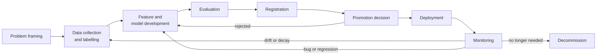
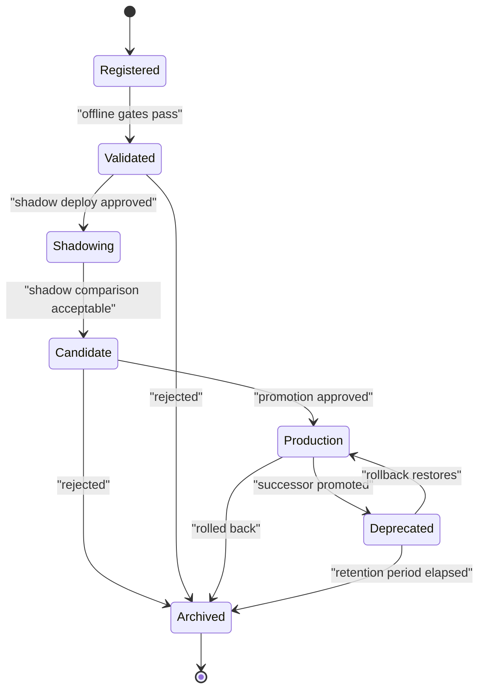
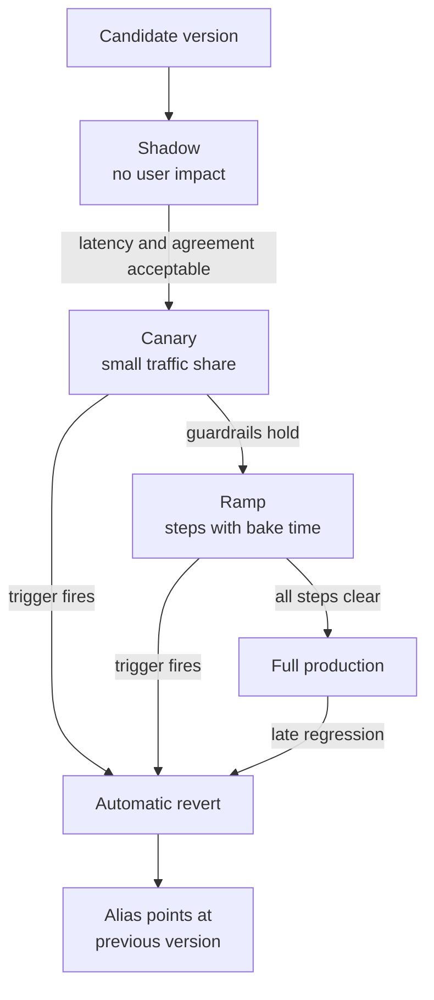
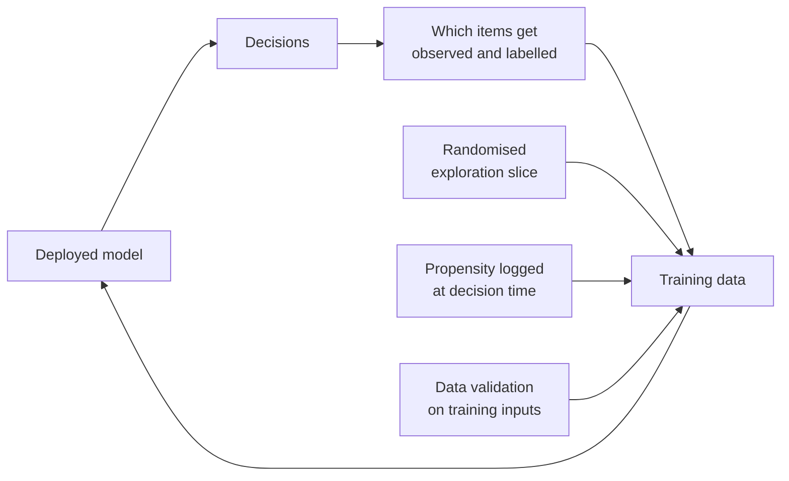
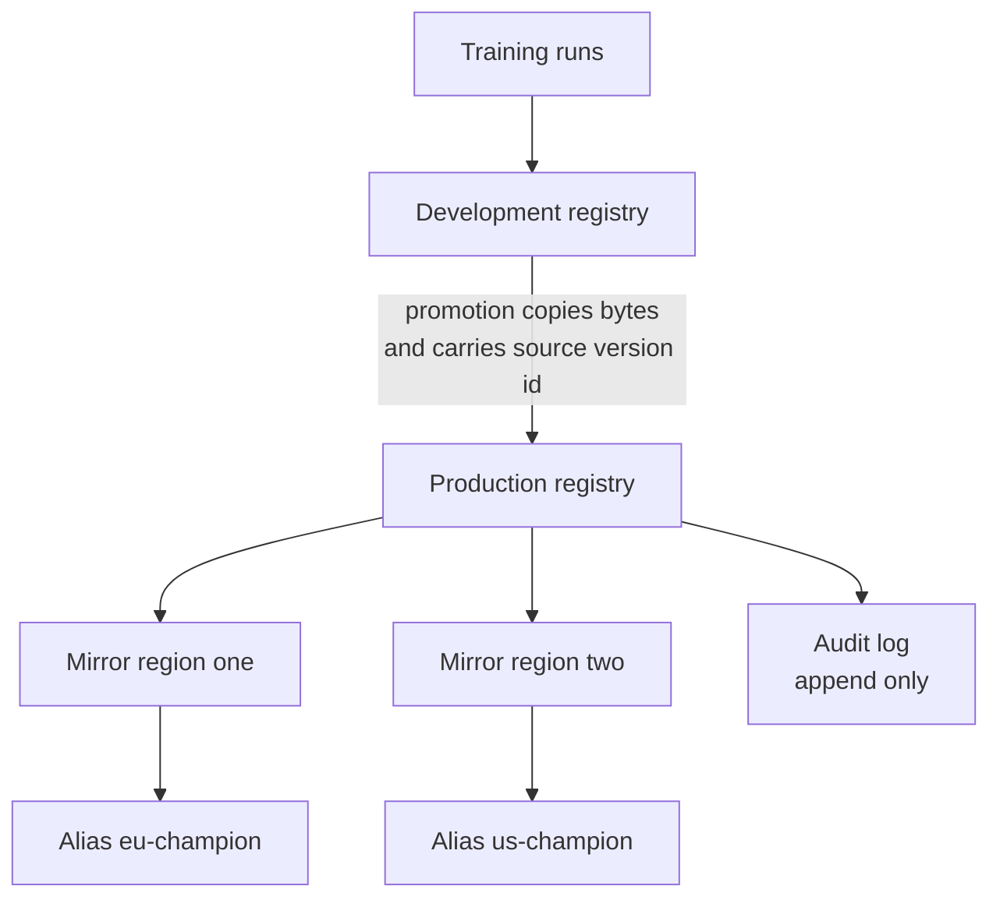
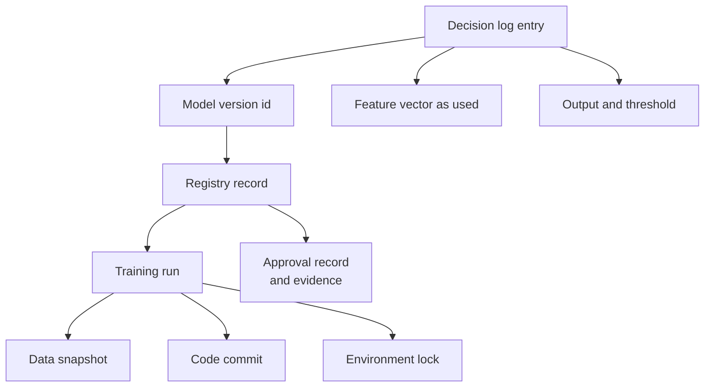

# Chapter 25: Model Lifecycle, Versioning, and Registries

> **What this chapter covers** The loop a model travels from idea to retirement, everything that must be versioned for a result to mean anything, how registries turn promotion and rollback into cheap operations, how deployment patterns differ in what they detect, and how retraining and decommissioning are governed.
> **Prerequisites** Chapter 5 (Evaluation, Validation, and Experimental Design), Chapter 21 (Machine Learning System Design), Chapter 24 (Model Serving and Inference).
> **Where it is used** Any organisation with more than one model or more than one person. It bites hardest in regulated settings, in teams where the original author has left, and on the day a model must be rolled back at short notice.

---

## 25.1 Level 1: Foundations

### The lifecycle is a loop, not a line

The tidy diagram shows: collect data, train, evaluate, deploy, done. No production model works that way. The world changes, the data changes, the model degrades, and you go round again. A better mental model is a loop with a monitoring stage that feeds back into data and training, and a decommissioning exit that most teams never draw.



*Figure 25.1: The lifecycle as a loop with three feedback edges and one exit that teams routinely forget to build.*

Two consequences follow immediately, and both are what this chapter is about.

First, if you will go round the loop many times, each lap must be cheap and safe. That means automation and a mechanism for reverting a lap that went badly.

Second, because laps overlap, several versions exist at once: one in production, one in shadow, one under evaluation, three archived, and one that a regulator may ask about in two years. Identifying them precisely is not bureaucracy. It is the only way any statement about model behaviour can be checked.

### A model version without its inputs is meaningless

This is the single most important idea in the chapter, so it comes first.

Suppose someone says "model v7 achieves 0.84 area under the curve". That statement is unverifiable unless you also know: which code produced it, which data it trained on, which features and with what definitions, which hyperparameters and random seeds, which library versions, and which evaluation set. Change any one of those and 0.84 becomes some other number.

So "versioning a model" is shorthand for versioning six things together and binding them with one identifier.

| Artifact | What changes it | What breaks if unversioned |
|---|---|---|
| Code | Every commit | You cannot reproduce or diff behaviour between runs |
| Data | New rows, corrections, relabelling, upstream schema changes | A rerun silently trains on different data and you blame the code |
| Features | Transformation logic and its parameters, such as a fitted scaler or vocabulary | Training-serving skew, the most common silent failure |
| Configuration | Hyperparameters, seeds, thresholds, sampling rules | Results are not reproducible and threshold changes look like model changes |
| Environment | Library, driver, and runtime versions | A rerun produces different numbers and nobody knows why |
| Model artifact | Training | You cannot say which bytes were serving on a given date |

Bind them: the model version record points at a code commit, a data snapshot identifier, a feature definition version, a config hash, an environment lock hash, and a content hash of the artifact. That record is the atom of everything below.

### A concrete example before the abstraction

A team ships a delivery-time estimator. In March it reports a mean absolute error of 4.1 minutes and the model goes live. In September a customer complains that estimates in one city are badly wrong. The team wants to know three things.

First, what is serving now. If the answer comes from someone's memory or from reading a deployment manifest and guessing, the investigation has already failed. It should come from a query: this alias points at version 31, registered on 12 August by this run.

Second, what changed between March and now. Diffing version 31 against version 14 must show more than a different file. It must show that the training window moved, that a feature definition changed from a 7-day to a 14-day window, that the library version moved a minor release, and that a threshold was adjusted in June by a different person entirely.

Third, is the March number still true. Re-running the March evaluation requires the March data snapshot, the March code, the March environment, and the March evaluation set. If any of those is gone or has silently changed, the 4.1 figure is now an unverifiable claim in a slide deck.

Notice that only the first question is about the model file. The other two are about everything around it. That is the shape of the whole chapter.

### Vocabulary

- **Run**: one execution of a training or evaluation job, with its parameters, metrics, and outputs.
- **Model version**: an immutable registered artifact with a number, produced by a run.
- **Registered model**: the named container holding all versions of one logical model, for example `fraud-scorer`.
- **Stage** or **alias**: a label attached to a version saying what role it currently plays, for example `production` or `challenger`.
- **Lineage**: the graph linking a version back to its inputs and forward to its deployments.
- **Promotion**: moving a version into a role that serves real traffic.
- **Rollback**: returning a role to a previously known-good version.
- **Champion**: the version currently serving. **Challenger**: a candidate competing to replace it.
- **Decommissioning**: the controlled removal of a model from service and eventually from storage.

### The smallest useful discipline

If a team adopts nothing else from this chapter, adopt this:

1. Every training run writes a record with its inputs, its outputs, and its metrics.
2. Every artifact that ever serves traffic is registered and immutable.
3. Which version is serving is a piece of data you can query, not a fact in someone's memory.
4. Rolling back is a single operation that takes less than a minute and needs no rebuild.

Point 4 is the test. If rollback requires a redeploy and a container build, the organisation will hesitate to roll back, and hesitation during an incident is where the damage comes from.

---

## 25.2 Level 2: Working knowledge

### Versioning data

Data is the hard one, because it is large, it is mutable, and it often lives in systems designed for the current state rather than a history.

| Approach | Mechanism | Strengths | Weaknesses |
|---|---|---|---|
| Immutable snapshot by path | Write each extract to a dated, never-modified prefix | Trivial to understand and to audit | Storage grows; no deduplication; no diff |
| Content-addressed pointers | Hash file contents, store the hash in the repository, keep bytes in object storage | Small repository, exact identity, deduplicated | Needs a tool and a cache; large-file workflow to teach |
| Table format time travel | Use a format with snapshot isolation and version history | Query as of a version or timestamp, no copying | Retention policies expire history; only for data already in the lake |
| Query plus watermark | Record the exact query and a cutoff timestamp | Zero extra storage | Only reproducible if the source is append-only and never corrected |
| Full copy per experiment | Duplicate the dataset | Absolutely reproducible | Expensive and does not scale past small data |

The failure mode of the last approach in the table is worth naming. Late-arriving and corrected records mean that rerunning the same query with the same cutoff tomorrow can return different rows. If the source is mutable, a query plus watermark is not a version. Either snapshot it or use a table format that preserves history.

The practical default for a team on a data lake: a table format with time travel for training inputs, plus a recorded snapshot identifier in every run record, plus a retention policy long enough to cover your audit horizon. For image, audio, and text corpora sitting in object storage, content-addressed pointers stored in the repository.

A note on labels. Labels change more often than features and in ways that matter more. A relabelling pass that corrects 3 percent of a validation set can move a metric by more than a model change. Version labels separately from features, and record which label version an evaluation used.

### Experiment tracking

An experiment tracker is a database of runs. It exists so that three months from now you can answer "what did we try, what happened, and can I get that back".

**What to log, every run**

| Category | Items |
|---|---|
| Identity | Run identifier, parent experiment, author, start and end time, git commit, whether the working tree was dirty |
| Inputs | Dataset snapshot identifier, label version, feature definition version, split definition or seed |
| Configuration | Every hyperparameter, every random seed, the full resolved config not the template |
| Environment | Dependency lock hash, accelerator model and count, framework and driver versions, container image digest |
| Metrics | Training and validation curves by step, final metrics with confidence intervals, per-slice metrics |
| Artifacts | Model file, preprocessing objects, evaluation predictions, plots, the resolved config file |
| Cost | Wall-clock time, accelerator hours, estimated spend |

Two entries there are frequently missing and both are painful. The dirty working tree flag tells a future reader that the commit hash is a lie. The per-slice metrics are what you will want when someone asks whether a six-month-old model was fair on a subgroup, and recomputing them requires the predictions, which is why predictions are in the artifacts list.

**Run organisation.** Use a three-level hierarchy: project, experiment, run. An experiment answers one question, for example "does adding the session features help". Tag runs with the question they belong to and with the change under test. Untagged runs become unsearchable within weeks.

**Comparison.** The comparison you want is not "run A scored higher than run B". It is "run A scored higher than run B, on the same evaluation items, by an amount larger than the noise". That requires the per-item predictions of both runs and a paired test. Chapter 5 covers the statistics. The tracker's job is to keep the predictions so the test is possible.

**The discipline that makes a six-month-old run reproducible.** Write the run record before the run starts, not after. Store the resolved configuration, not the template plus overrides. Log the environment lock hash. Log a hash of the training data as read, even if it is a hash of the snapshot identifier plus row count. Keep artifacts for at least your longest plausible audit horizon and have an explicit expiry after that. Then, quarterly, pick one old run at random and actually try to reproduce it. The exercise reliably finds a broken link, and finding it in a drill is much cheaper than finding it during an audit.

### Naming and identifiers

Identifier conventions look like bikeshedding and are not, because every query you will ever want to run depends on them.

Four identifiers are needed and they should be distinct things, not one string doing four jobs.

| Identifier | Form | Property required |
|---|---|---|
| Registered model name | Human-readable, stable, for example `fraud-scorer` | Never changes, because it appears in every dashboard and alert |
| Version number | Monotonic integer assigned by the registry | Immutable, and meaningful only within one registered model |
| Artifact content hash | A cryptographic digest of the bytes | Proves identity across copies and environments |
| Run identifier | Opaque, assigned by the tracker | Links the version back to how it was produced |

Three conventions that save pain later. Do not encode semantics into the version number, such as using a semantic versioning scheme where a major bump means an architecture change; the meaning erodes and the registry does not enforce it. Put semantics in tags instead, where they are queryable and where adding a new dimension does not require renegotiating the scheme. Do not reuse a registered model name for a materially different problem, because historical queries then silently mix two populations. And never let a version number be reassigned; if a version must be withdrawn, mark it withdrawn and move on, since a reassigned number makes every past reference ambiguous.

The one thing to avoid above all is a serving configuration that names a model by a mutable path such as `models/latest/model.bin`. It works, it is convenient, and it makes the question "what was serving on Tuesday" permanently unanswerable.

### Versioning features, configuration, and environment

These three are less discussed than data and code and break just as often.

**Features.** A feature is a name plus a transformation plus the data it reads. Versioning the name alone is useless. What must be versioned is the definition: the source columns, the aggregation window, the fill policy for missing values, the encoding, and any fitted state such as a vocabulary, a set of bucket boundaries, or a scaler's mean and variance. Fitted state is the part teams forget, and it is the part that causes skew, because a model trained with one vocabulary and served with another is silently wrong on every out-of-vocabulary token.

Two rules make this tractable. First, fitted state ships inside the model artifact, not alongside it, so it cannot be mismatched. Second, the feature definition version is recorded in the run record and asserted at serving time; if the loaded model declares feature definition version 12 and the serving feature pipeline is at version 13, the service should refuse to start rather than serve.

**Configuration.** Store the resolved configuration, meaning the fully merged result of defaults, environment overrides, and command line arguments, as an artifact of the run. Storing the template plus the overrides means a future reader must reimplement your merge logic, and merge logic changes. Hash the resolved config and put the hash in the version record so two runs can be compared for configuration identity in one string comparison.

Three items inside configuration deserve their own version because they change independently of the model and are frequently mistaken for model changes on a dashboard: the decision threshold, the routing or fallback rules, and any post-processing such as score clipping or business overrides. A threshold change is a production change. Give it a version, a review, and an audit record.

**Environment.** Record the container image digest, the dependency lock hash, the accelerator model, the driver and runtime versions, and the framework version. The image digest alone is not sufficient, because the same image on a different accelerator generation can produce different numbers through different kernel selection. Record what you ran on.

| Item | Where it belongs | What happens if it is loose |
|---|---|---|
| Fitted vocabulary or scaler | Inside the model artifact | Skew that produces no error and degrades silently |
| Feature definition version | Run record plus a serving-time assertion | Model and pipeline drift apart across releases |
| Resolved configuration | Run artifact, hashed into the version record | Runs cannot be compared or reproduced |
| Decision threshold | Its own versioned record with review | Quality changes that look like model changes and cannot be attributed |
| Image digest | Version record | A tag moves and the rerun is a different environment |
| Accelerator and driver | Run record | Numerical differences nobody can explain |

### Storage and retention arithmetic

Retention policy arguments go in circles until somebody computes the number, so compute it.

Assume a team with 12 registered models, each retrained weekly, each artifact 400 MB, plus 50 MB of evaluation predictions and plots per run, and 9 rejected candidates per promoted one because experimentation is cheap. That is $12 \times 52 = 624$ promoted versions a year and $624 \times 10 = 6240$ runs a year.

Registry storage for promoted versions: $624 \times 0.45 \text{ GB} = 281$ GB per year.
Tracker storage for all runs: $6240 \times 0.45 \text{ GB} = 2808$ GB per year.

Over a five-year audit horizon that is about 1.4 TB in the registry and 14 TB in the tracker. Object storage at that scale is a small line item, which is the point: the usual argument that retention is too expensive is not supported by the arithmetic for artifacts. What is expensive is retaining per-decision inference logs, which for a service at 500 requests per second with a 2 KB feature vector is $500 \times 2048 \times 86400 = 88$ GB per day, or 32 TB per year. That is the number that forces a real decision, and the usual answer is tiered storage with recent data hot, older data in cold storage, and a sampling policy for anything beyond the mandatory retention window. All figures here are assumptions for the example.

The conclusion that follows: keep model artifacts and run records generously, since they are cheap and they are what you need during an incident; apply real policy to inference logs, since they are where the cost and the privacy exposure live.

### The model registry

A registry is the system of record for artifacts that may serve traffic. It is distinct from the tracker: the tracker holds everything you tried, the registry holds what you stand behind.



*Figure 25.2: The registry as a state machine, where every transition has an owner and leaves an audit record.*

Treating it as a state machine is the useful framing. Each transition has a guard condition, an actor, and a record. Transitions that can happen by accident are a design defect.

**Stages versus aliases.** Older registry designs used fixed stages such as staging, production, and archived, with a version in at most one stage at a time. Newer designs prefer named aliases that point at a version, like a symbolic link. Aliases are better for three reasons: you can have as many as you need, for example `champion`, `challenger`, `canary`, and `eu-production`; the names are yours rather than the tool's; and promotion and rollback are both just repointing an alias. Several registry products have migrated from stages to aliases, so check your version for which model is in force.

**Why alias-based promotion makes rollback a pointer move.** If the serving layer resolves `fraud-scorer@champion` at load time or on a refresh signal, then rolling back is one write: point `champion` at the previous version. No image build, no deployment manifest edit, no code review. The previous version's artifact is still in object storage and, in a well-built system, still loaded in memory on the serving replicas. Rollback in seconds rather than the twenty minutes a rebuild takes is the difference between a small incident and a large one.

The cost of that convenience is that a pointer move is a production change with no code review attached. Compensate with permissions on the alias, a required approval on the transition, and an audit record.

**Lineage.** The registry should be able to answer, for any version: which run produced it, which data and features and code that run used, which evaluation results supported it, who approved it, which environments it has been deployed to, and over what dates. And in reverse: given a dataset that turned out to be corrupted, which model versions were trained on it. That reverse query is the one that matters during an incident, and it is only possible if lineage was recorded as a graph rather than as free text in a description field.

**Approval gates.** A gate is an automated check plus, where required, a human decision. Automated gates should be code and should run identically for every candidate. Human gates should record who, when, and on what evidence. A gate that is routinely bypassed is worse than no gate, because it creates a false impression of control.

### Model cards and documentation

A model card is a short structured document describing what a model is for and where it fails. The idea comes from Mitchell and colleagues, "Model Cards for Model Reporting" (2019).

What a reviewer actually needs, in descending order of value:

| Section | The question it answers |
|---|---|
| Intended use and out-of-scope use | May I use this for my case, and where is it explicitly not validated |
| Inputs and outputs | What exactly do I send and what exactly comes back, including units, ranges, and the meaning of the score |
| Performance by slice | Does it work for my population, not just on average |
| Training data summary | What was it built from, over what period, with what known gaps |
| Known failure modes | What breaks it, stated by the authors rather than discovered by me |
| Thresholds and calibration | Is the score a probability, and what threshold was chosen and why |
| Evaluation method | Which set, which metric, what interval, which date |
| Ethical and legal considerations | Protected attributes, consent basis, restrictions |
| Maintenance | Who owns it, retraining cadence, how to report a problem |

The two sections teams write worst are out-of-scope use and known failure modes, because both require admitting limits. They are the two a reviewer reads first.

Generate what can be generated. Metrics, slices, data summary, and lineage come from the run record automatically. Reserve human writing for intent, limits, and judgment. A card that is hand-typed goes stale; a card that is 70 percent generated at registration time stays current.

**Listing 25.1: registering a version with the metadata a reviewer will need.**

```python
def register(client, name: str, run_id: str, artifact_uri: str, meta: dict) -> str:
    """Register an artifact and attach the lineage a future reviewer requires."""
    required = {
        "git_commit", "git_dirty", "data_snapshot_id", "label_version",
        "feature_def_version", "config_hash", "env_lock_hash",
        "artifact_sha256", "eval_set_id", "owner_team",
    }
    missing = required - meta.keys()
    if missing:
        raise ValueError(f"refusing to register without: {sorted(missing)}")
    if meta["git_dirty"]:
        raise ValueError("working tree was dirty; the commit hash is not the code")

    version = client.create_model_version(name=name, source=artifact_uri, run_id=run_id)
    for key, value in meta.items():
        client.set_model_version_tag(name, version.version, key, str(value))
    return version.version
```

The non-obvious line is the refusal on a dirty working tree. A commit hash recorded alongside uncommitted changes is worse than no hash, because it invites a future reader to trust it. Failing at registration time is cheap; discovering it during an audit is not. The client interface here is illustrative; the exact method names vary by registry, so check your version.

### Promotion: criteria, gates, and who decides

Promotion criteria must be written before the candidate is trained. Written afterwards, they are chosen to fit the result.

A workable criteria set:

1. **Primary metric**, paired against the current production model on the same items, with a 95 percent confidence interval, and a required minimum improvement or a non-inferiority margin.
2. **Per-slice floor**: no slice above a stated size may degrade by more than a stated amount.
3. **Guardrail metrics**: latency at p99, memory, calibration error, and a business metric that must not move adversely.
4. **Fairness checks** where applicable, on the metrics the organisation has committed to.
5. **Operational checks**: artifact loads in the serving image, meets the latency budget under load, passes the golden-set agreement test.
6. **Documentation**: card complete, lineage resolvable, owner named.

Who decides depends on the blast radius, and saying so explicitly prevents both bottlenecks and accidents.

| Risk level | Example | Approver |
|---|---|---|
| Low | Internal ranking with a bounded effect | Automated gates only |
| Medium | Customer-facing recommendation | Automated gates plus the owning team lead |
| High | Credit, clinical, safety, or pricing decisions | Gates plus a named accountable person plus a documented review, often with an independent validator |

The independent validation function is a regulatory requirement in some sectors. Where it exists, it is separate from the building team by design, and its questions are in level 3.

---

## 25.3 Level 3: Depth

### Deployment patterns compared

All five patterns below answer "how do we replace a running model", and they differ in what they can detect and what they cost.

| Pattern | Mechanism | Detects | Does not detect | Cost | Rollback |
|---|---|---|---|---|---|
| Shadow | Mirror traffic to the new model, discard its output | Crashes, latency, memory, input incompatibility, prediction distribution shift | Anything requiring the output to reach a user, so no outcome metrics | Duplicate inference cost | Stop mirroring, zero user impact |
| Canary | Route a small share of live traffic to the new model | All of the above plus real outcome metrics on the canary slice | Slow effects that need more traffic or time than the canary gets | Small extra capacity | Route share to zero |
| Blue-green | Two full environments, switch all traffic at once | Deployment mechanics and smoke-level faults | Gradual quality regressions, since exposure is 0 then 100 | Double the full environment during the switch | Switch back, fast and complete |
| Percentage ramp | Increase the share in steps with a bake time at each | Effects that need volume, at controlled exposure | Effects slower than the total ramp duration | Modest | Reduce share |
| Ring | Successive audience cohorts, for example internal, then a friendly segment, then everyone | Population-specific failures, because rings differ by population not just by volume | Failures that only appear in the last ring | Routing complexity | Halt the ring advance |



*Figure 25.3: The patterns compose; shadow catches mechanics, canary and ramp catch quality, and one revert path serves all of them.*

A note on ring deployment that gets missed. Rings are not just smaller percentages. Their value is that each ring is a different population. An internal ring catches nothing about a customer segment's behaviour; a friendly-customer ring catches quite a lot. Ordering rings by increasing population diversity is the point.

**Rollback triggers and automatic reversion.** Manual rollback during an incident is slow because the person who can do it must first be convinced. Encode the decision in advance.

A trigger is a condition, a window, and an action. Good triggers are:

- Error rate above a threshold over a 5-minute window.
- p99 latency above the budget over a 10-minute window.
- Prediction distribution divergence beyond a threshold, measured as population stability index or a Kolmogorov-Smirnov statistic against the champion over the same requests.
- A business guardrail metric moving adversely beyond its noise band.
- Any hard failure: model load error, feature lookup error rate spike, out-of-memory.

The hard part is not writing triggers. It is setting thresholds that fire on real regressions and not on Tuesday. Two techniques help. First, set thresholds from historical variation of the same metric over the same window length, not from intuition; a threshold at roughly four standard deviations of the historical window distribution is a common starting point. Second, require two consecutive windows before acting, which removes most single-window noise at the cost of one window of delay.

Automatic reversion should be the default for everything except the case where reverting is itself risky, for example where the new model has already written state the old one cannot read. In that case the revert path must be designed, and if it cannot be, that is a reason to reconsider the deployment.

**Worked example of canary sizing.** Suppose the guardrail is a conversion rate with a baseline of 4 percent, and you want to detect a relative drop of 10 percent, so to 3.6 percent, with 80 percent power at the 5 percent significance level. For a two-proportion test the required sample per arm is approximately

$$n \approx \frac{\left(z_{\alpha/2}\sqrt{2\bar{p}(1-\bar{p})} + z_{\beta}\sqrt{p_1(1-p_1)+p_2(1-p_2)}\right)^2}{(p_1-p_2)^2}$$

with $z_{\alpha/2} = 1.96$, $z_\beta = 0.84$, $p_1 = 0.04$, $p_2 = 0.036$, and $\bar{p} = 0.038$. The numerator is $\left(1.96\sqrt{2 \times 0.038 \times 0.962} + 0.84\sqrt{0.04 \times 0.96 + 0.036 \times 0.964}\right)^2 = (1.96 \times 0.2704 + 0.84 \times 0.2704)^2 = (0.5300 + 0.2271)^2 = 0.5732$. The denominator is $(0.004)^2 = 1.6\times10^{-5}$. So $n \approx 35{,}800$ per arm.

At 500 requests per second and a 5 percent canary, the canary arm sees 25 requests per second, so 35,800 requests take about 24 minutes of qualifying traffic. If only one request in ten is a conversion opportunity, it takes four hours. That calculation tells you whether your planned bake time is honest or decorative. Many canaries are declared successful after ten minutes on a metric that could not possibly have reached significance, which is theatre.

### Retraining strategy

Four triggers, and each is right somewhere.

| Trigger | How it works | Strengths | Weaknesses | Best for |
|---|---|---|---|---|
| Scheduled | Retrain every N days regardless | Predictable, simple, easy to staff and audit | Retrains when nothing changed, wasting money; too slow when something does | Stable domains, regulated settings that want predictability |
| Volume-triggered | Retrain after M new labelled examples | Tracks data growth naturally | Volume is not the same as change; a flood of identical examples triggers pointlessly | Cold-start and growth phases |
| Drift-triggered | Retrain when input or prediction distribution shifts beyond a threshold | Responds to the world changing, before outcomes degrade | Drift does not always harm performance, so it causes false alarms; needs a threshold nobody can justify precisely | Domains with genuine seasonal or regime change |
| Performance-triggered | Retrain when a measured outcome metric degrades | Directly tied to what you care about | Requires labels, which arrive late or never; by the time it fires, harm has occurred | Domains with fast, reliable label feedback |

In practice most mature systems use a combination: a scheduled floor so the model never goes stale unnoticed, plus a performance trigger where labels allow, plus drift as an alerting signal to a human rather than an automatic retrain. Chapter 27 covers drift detection itself.

**The trade-off nobody states.** Retraining more often reduces staleness and increases variance. Each retrain is a new model with its own noise, its own chance of a bad slice, and its own deployment risk. A weekly retrain on a domain that changes annually is fifty-two opportunities to break something in exchange for no staleness benefit. Match the cadence to the rate of change of the world, measured, not assumed.

**The danger of retraining on degraded data.** This is the failure mode that turns a small problem into an outage over weeks.

Consider a fraud model whose decisions determine which transactions get reviewed. Labels only exist for reviewed transactions. Retraining on those labels trains on a sample the model itself selected. The model becomes confident about the region it already patrols and blind outside it. This is the feedback loop problem, and it is structural, not a bug.

The general form: when a model's output influences the data it is next trained on, naive retraining amplifies whatever the model already believed. Recommenders are the canonical case, where a model that shows an item generates the clicks that prove the item was good.

Defences:

1. **Hold out a randomised exploration slice.** Route a small fraction of traffic through a random or diversified policy and treat only that slice as unbiased. Costs a little value, buys unbiased data.
2. **Propensity weighting.** Weight training examples by the inverse probability that the deployed policy would have selected them, which requires logging that probability at decision time. Log it; you cannot reconstruct it later.
3. **Guard against upstream corruption.** A schema change or an ingestion bug produces data that looks fine to a training job. Run the same data validation suite over training inputs that you run over serving inputs, and fail the training job on violation.
4. **Never auto-promote a retrain.** An automatic retrain that automatically promotes turns a data bug into a production incident without a human in the path. Automatic retraining plus automatic evaluation gates plus a human or a strict statistical gate on promotion is the safe arrangement.



*Figure 25.4: The feedback loop that biases retraining, and the three interventions that break it.*

**Bake time is not only about statistics.** Some failure modes are slow for reasons unrelated to sample size. A memory leak takes hours to show. A cache fills over a day. A weekly batch job interacts with the model only on Sundays. A seasonal pattern only appears at month end. The bake time must therefore be the maximum of the statistically required duration and the longest relevant cycle in the system, and the second term is often the binding one. A team that computes only the statistical duration and ramps to full traffic in two hours will keep discovering Monday-morning failures on Monday morning.

### Champion-challenger operation

Champion-challenger is the steady-state arrangement where one version serves, one or more compete, and promotion is continuous rather than an event.

The mechanics:

- The **champion** serves production traffic and is the baseline for every comparison.
- One or more **challengers** run in shadow, or on a small traffic share, over the same requests.
- A standing evaluation job compares them paired on the same items, per slice, with intervals.
- A challenger becomes champion when it clears the pre-registered criteria over a pre-registered window.
- The former champion is retained as the immediate rollback target for a defined period.

Three subtleties.

**Multiple comparisons.** Running eight challengers against one champion and promoting whichever wins produces a winner that is often winning by chance. With eight independent comparisons at the 5 percent level, the probability of at least one false positive is $1 - 0.95^8 = 34$ percent. Correct for it, by Bonferroni for a small number or by controlling the false discovery rate, and pre-register the comparison window so that stopping when the numbers look good is not an option.

**Shadow challengers cannot measure outcomes.** A shadow model's recommendations are never shown, so no clicks result. For outcome metrics you need a traffic share, which means a real experiment with real exposure. Shadow is necessary and not sufficient.

**Challenger cost.** Every shadow challenger is a full inference cost. Cap the number, and require a challenger to justify its slot.

### Registry topology across environments and regions

A single registry serving development, staging, and production is the simplest arrangement and the one that eventually causes an incident, because a developer with write access to the registry has write access to what production resolves. Three topologies are in common use.

| Topology | Arrangement | Strengths | Weaknesses |
|---|---|---|---|
| Single registry, alias-scoped permissions | One registry; only a small group may move production aliases | Simple, one lineage graph, no copying | A registry outage affects everything; permission model must be exactly right |
| Registry per environment with promotion copy | Artifacts are copied from the development registry to the production registry on promotion | Strong isolation; production registry has a small, reviewed population | Copying breaks naive lineage unless the source version identifier travels with the copy |
| Single registry, replicated read-only mirrors | One writable registry; regional read-only mirrors serve artifact pulls | Fast regional pulls, isolation of read traffic | Replication lag means a freshly promoted version may not be pullable everywhere yet |

Two rules apply whichever you choose. The artifact's content hash must be identical across environments, so that a copy can be proven to be the same bytes rather than a rebuild. And the promotion record must carry the source version identifier forward, so that lineage in production resolves back through the copy to the original run.

Multi-region adds a fourth question that catches teams out: which region's model is authoritative when a region is serving a different version because replication lagged or because a regional rollback happened. The answer must be a deliberate design decision recorded in the alias scheme, for example by having `eu-champion` and `us-champion` as separate aliases rather than pretending one global `champion` exists. A single global alias with regional divergence in practice is the arrangement that makes incident timelines impossible to reconstruct.



*Figure 25.6: A promotion-copy topology with regional aliases, so a regional rollback does not make the global state ambiguous.*

### Ownership and the bus factor

A model without a named owner is a liability with a countdown on it. Ownership is not a name in a spreadsheet; it is a set of obligations, and writing them down is what makes handover possible.

| Obligation | What it means in practice |
|---|---|
| Responds to alerts | On the rota, with a runbook that a person who did not build the model can follow |
| Approves promotions | Or delegates explicitly to a named alternative |
| Reviews the monitoring | On a stated cadence, and records that the review happened |
| Maintains the card | Updates intended use and known failure modes when they change |
| Owns the decommissioning decision | Including the annual question of whether the model still earns its keep |

Two practices make ownership survive staff changes. First, an ownership record in the registry, pointing at a team rather than only an individual, with a review that fails when the named team no longer exists. Second, a periodic inventory: list every registered model with a production alias, its owner, its last promotion date, and its last monitoring review. Models that appear on that list with no recent review and no recent promotion are candidates for decommissioning, and running the inventory quarterly is how an organisation avoids accumulating models nobody understands.

The inventory reliably surprises people. Teams that believe they run six models usually find eleven.

### Model decommissioning

Nobody plans for this, and it produces the most embarrassing incidents, because the failure is usually "we turned it off and something we did not know about broke".

A decommissioning procedure that works:

1. **Find the consumers.** Not the ones documented. The ones in the access logs, by client identity, over a window long enough to catch monthly jobs, so at least 35 days and preferably 400 to catch annual ones.
2. **Announce with a date.** Give consumers a deadline and a migration target. Track acknowledgement per consumer.
3. **Deprecate in the registry.** Mark the alias deprecated so nothing new adopts it, and make new adoption fail loudly rather than silently succeed.
4. **Add a deprecation signal to responses.** A response header or field saying this endpoint retires on a date. Consumers ignore emails and notice headers in their logs.
5. **Dark period.** Return errors for a scheduled window, for example one hour, twice, well before the final date. This surfaces the consumers who did not read anything. Announce the dark periods in advance.
6. **Turn off serving.** Keep the artifact and its lineage.
7. **Retain artifacts and records** for the full audit horizon, which is a legal question, not an engineering one. Only then delete, and record the deletion.
8. **Remove the data pipeline** that existed only to feed this model, which is the step everyone forgets, and which is often the largest ongoing cost.

Step 8 deserves emphasis. A retired model frequently leaves behind a nightly job, a feature-store entity, a set of streaming consumers, and a monitoring dashboard, all still running and all still billing. Decommissioning is not complete until the dependency graph upstream of the model has been pruned.

### Governance, audit trails, and reproducibility for regulated contexts

In regulated settings the requirement is not that the model be good. It is that you can demonstrate, with evidence, how it was built, validated, approved, and monitored, and that the people responsible are named.

**What an audit trail must contain**

| Element | Detail |
|---|---|
| Who | Authenticated identity of the person or service for each action |
| What | The transition, with before and after state |
| When | Timestamp from a trusted source |
| Why | The linked evidence, meaning the evaluation run, ticket, or approval record |
| Immutability | Append-only, tamper-evident, retained for the required period |

The trail must cover at least: registration, every state or alias transition, every approval and rejection, every deployment and rollback, every threshold change, and every access to sensitive training data.

**The questions an auditor asks.** These are worth rehearsing, because a system that can answer them was designed differently from one that cannot.

1. Which model version was serving decisions on this date, in this jurisdiction?
2. Show me the data that version was trained on, and demonstrate that you can still produce it.
3. Who approved its deployment, on what evidence, and were they independent of the people who built it?
4. What was its measured performance on each protected group at approval time, and what is it now?
5. How do you detect that it has degraded, and what happened the last three times it did?
6. What are its documented limitations, and how do you prevent use outside them?
7. Show me the change history of the decision threshold.
8. For this specific individual decision, what were the inputs, the model version, and the output?
9. What is your rollback procedure, when did you last test it, and what happened?
10. Who owns this model today, and what happens when they leave?

Question 8 is the one that surprises teams. Per-decision reproducibility requires logging the input feature vector as used, not just the request, along with the model version and the output. That log is often the largest data volume in the system, and it has to be designed in, because it cannot be reconstructed afterwards.

Question 3 reflects the model risk management practice codified for banking supervision, where independent validation of models is expected as a matter of course. Similar expectations appear in the risk-management frameworks published for artificial intelligence more generally; the specific obligations depend on your jurisdiction and sector, so take them from counsel rather than from a textbook.

**Reproducibility in practice.** Exact bitwise reproduction is often unachievable across hardware and library versions. State what you can guarantee: same code, same data, same config, same environment lock, producing metrics within a stated tolerance. Then test it. The credible claim is "we reran this and got 0.841 against an original 0.842, within our 0.005 tolerance", supported by a record of the rerun. The incredible claim is "it is reproducible" with no evidence.



*Figure 25.5: Per-decision auditability requires the chain from one logged decision back to the data and the approver.*

---

## 25.4 Level 4: Mastery

### What senior engineers argue about

**Is the registry a source of truth or a cache of one?** One camp says the registry is authoritative: promotion is a registry write, and deployment systems follow. The other says the git repository is authoritative: a manifest declaring `champion = version 42` is reviewed and merged, and the registry reflects it. The first gives you fast rollback; the second gives you code review on every production change and a full history in one place.

The synthesis most mature teams reach: the registry holds artifacts, lineage, and immutable state, and a declarative manifest under version control holds the binding from role to version. Rollback is then a revert of a small manifest change, which is still fast because it needs no rebuild, and it is still reviewed. This is the GitOps position, covered in Chapter 26.

**Should retraining be fully automatic?** The argument for is that manual retraining does not happen, so models rot. The argument against is that an automatic pipeline is an automatic path from a data bug to production. The settled practical position is: automate training, automate evaluation, automate the gate, and require either a human approval or an extremely strict statistical gate for the promotion transition, with the strictness proportional to blast radius. Fully automatic promotion is defensible only where the guardrails are strong, the rollback is instant and tested, and the harm from a bad model for one detection window is small.

**How long do you keep old models?** Storage is cheap; the liability of a model nobody understands is not. Two competing pressures: audit horizons and reproduction requirements argue for keeping everything; supply-chain and privacy risk argue for deleting what you do not need, especially where training data contained personal information that a subject has since asked you to erase.

**Does a model memorise its training data, and what does that mean for deletion?** This is the sharpest open problem in the chapter. If a subject exercises a right to erasure, deleting their rows from the dataset does not remove their influence from a trained model, and language and vision models have been shown to memorise and emit training examples. Carlini and colleagues have documented extraction of training data from large models (2021 onward). Retraining from scratch is the only certain remedy and is often impractical. Machine unlearning aims to remove a training example's influence more cheaply; approximate methods exist and none is yet a general guarantee. Teams should know that their deletion story may be weaker than they claim.

**Non-inferiority versus superiority.** Requiring every new version to beat the champion sounds rigorous and blocks valuable changes that are neutral on the primary metric but better on cost, latency, or maintainability. The better frame: state a non-inferiority margin on the primary metric and require superiority on the axis the change was made for. Pre-register which axis that is.

**Metric selection and Goodhart's law.** A promotion gate is an optimisation target, and targets get gamed, sometimes unintentionally. A team that promotes on offline area under the curve will drift toward models that are good at that and not at the decision. Rotate in guardrails that are hard to game, most usefully business outcomes measured in a live experiment, and treat a candidate that improves the gate metric while moving nothing downstream as a warning rather than a success.

### Model dependency graphs and cascading versions

A mature system has models consuming other models. An embedding model feeds a retrieval index which feeds a ranker. A segmentation model produces a feature consumed by three downstream classifiers. A language model's output is scored by a separate safety classifier.

This creates a version dependency graph, and it has three consequences that a single-model view misses.

**Consequence one: an upstream promotion is a downstream data change.** Promoting a new embedding model changes the feature distribution every downstream consumer sees, without any downstream commit. From the downstream team's perspective this is indistinguishable from drift. The fix is that a version record must list its upstream model versions, and an upstream promotion must notify and ideally gate on downstream evaluation.

**Consequence two: entangled artifacts must be promoted together.** An embedding model and the index built from it are one unit. Promoting the model without rebuilding the index produces queries embedded in one space searched against vectors in another, which returns plausible-looking nonsense and no error. Model these as a single promotable bundle with one version, not as two independently versioned things.

**Consequence three: rollback must respect the graph.** Rolling back the upstream model while the downstream stays on a version tuned for the new upstream can be worse than the regression you are rolling back from. Record which downstream versions are compatible with which upstream versions, and make the rollback operation act on the compatible set.

This is the CACE property named in Sculley and colleagues (2015): changing anything changes everything. The engineering response is not to eliminate coupling, which is often impossible, but to make it explicit in the version graph so that the blast radius of a promotion is computable before it happens rather than discovered afterwards.

### Emergency changes and the break-glass path

Every governed system needs a documented path to bypass the governance, because at some point the correct action will be faster than the process. Pretending otherwise means the bypass happens anyway, undocumented.

A workable break-glass design has four properties. It requires a second person, so it is not unilateral. It is loud, producing a page or a channel notification rather than a log line. It is time-boxed, expiring automatically after a stated window so the emergency state does not become permanent. And it creates a mandatory follow-up, a review within a stated number of days that either ratifies the change through the normal path or reverts it.

The metric that matters is how often break-glass is used. Zero uses over a long period usually means it is too hard to use and people are working around it some other way. Frequent use means the normal path is too slow and should be fixed rather than routed around.

### Where the standard advice is wrong

**"Version everything."** Correct in spirit, unaffordable in literal form. Versioning a petabyte of raw event data per experiment is not sensible. Version identity rather than bytes wherever the underlying store already preserves history, and be explicit about what you can and cannot reproduce. A documented honest limit is better than an undocumented false claim.

**"Blue-green is the safe deployment."** It is the safe deployment for infrastructure changes, where the failure mode is binary. For models, whose failure mode is gradual quality loss, blue-green is among the riskiest, because exposure goes from zero to one hundred with no intermediate signal. Use it for the mechanics and a canary or ramp for the quality.

**"The model registry gives you governance."** A registry gives you records. Governance is the set of decisions, owners, and enforced gates around those records. A team with a registry and no promotion criteria has documentation of an ungoverned process.

**"Shadow it first" as a complete answer.** Shadow catches mechanics and distribution shift and cannot catch anything downstream of the output reaching a user. A model that is worse in ways that only appear when people act on it will pass shadow perfectly.

**"Retrain on the newest data."** Newest is not best. Recent data may be contaminated by an incident, may reflect a promotion period that will not repeat, or may be the output of the feedback loop above. Time-based validation, a fixed clean holdout that is not refreshed automatically, and explicit exclusion windows around known anomalies are the discipline.

### Judgment that distinguishes a staff engineer

1. **Writes the promotion criteria before the experiment**, including the non-inferiority margin, the slices, and the comparison window, and does not move them afterwards.
2. **Tests the rollback path on a schedule**, in production, the same way a disaster recovery drill is run. An untested rollback is a hypothesis.
3. **Owns the decommissioning plan at deployment time.** The question "how will we turn this off" is answered before it is turned on.
4. **Builds the reverse lineage query**, from a suspect dataset to every model trained on it, because incidents run backwards.
5. **Distinguishes the three kinds of change** that look identical on a dashboard: a new model version, a threshold change, and a data pipeline change. Each needs its own version record, and conflating them makes incidents unsolvable.
6. **Refuses to let the bake time be shorter than the statistics allow**, and computes the required sample rather than guessing.

---

## 25.5 Subtopic checklist

| Subtopic | You should be able to |
|---|---|
| Lifecycle as a loop | Draw the loop with its feedback edges and the decommissioning exit |
| Identifiers | Keep model name, version number, content hash, and run identifier as four distinct things |
| Fitted state | Explain why vocabularies and scalers must ship inside the artifact |
| Threshold versioning | Treat a threshold change as a reviewed, audited production change |
| Retention arithmetic | Compute artifact and inference-log storage and say which one forces a policy |
| Registry topology | Compare single registry, per-environment copy, and replicated mirrors |
| Model dependency graphs | Compute the blast radius of an upstream promotion and bundle entangled artifacts |
| Break-glass | Design an emergency path that is two-person, loud, time-boxed, and reviewed |
| The six versioned artifacts | Name them and explain what breaks when each is unversioned |
| Data versioning | Compare snapshot, content-addressed, table time travel, and query plus watermark, and pick one with reasons |
| Label versioning | Explain why labels need separate versioning from features |
| Experiment tracking | List what to log and explain the dirty-tree flag and stored predictions |
| Run organisation | Structure project, experiment, and run, and tag so runs remain findable |
| Reproducing an old run | Name the five things that most often break and the drill that finds them |
| Registry as state machine | Draw the states and say what guards each transition |
| Stages versus aliases | Explain why aliases make rollback a pointer move and what that costs |
| Lineage | Answer both forward and reverse lineage queries |
| Model cards | Write one and say which two sections reviewers value most |
| Promotion criteria | Write pre-registered criteria including non-inferiority margin and slice floors |
| Approval authority | Map risk level to approver and justify the mapping |
| Deployment patterns | Compare five patterns on what each detects, costs, and how it reverts |
| Rollback triggers | Define condition, window, and action, and set a threshold from historical variation |
| Canary sizing | Compute the sample needed for the guardrail and convert it to a bake time |
| Retraining triggers | Compare scheduled, volume, drift, and performance triggers and combine them |
| Feedback loop bias | Explain the mechanism and the three defences |
| Champion-challenger | Run it, including multiple-comparison correction |
| Decommissioning | Execute the eight-step procedure including pipeline removal |
| Audit trail | State the five elements and the transitions that must be covered |
| Auditor questions | Answer all ten, especially per-decision reproduction |
| Reproducibility claims | State a tolerance-based claim and back it with a rerun record |

---

## 25.6 Common misconceptions

| Misconception | Why it is believed | What is actually true |
|---|---|---|
| Semantic version numbers on models communicate the change | It works for libraries | Registries assign monotonic integers and enforce no semantics; put meaning in queryable tags instead |
| Pointing serving at a latest path is a reasonable shortcut | It is convenient and it works | It makes the question of what was serving on a given date permanently unanswerable |
| Two models can be promoted independently if they are separate artifacts | They are separate files | Entangled artifacts such as an embedding model and its index must be promoted as one versioned bundle or queries search the wrong space |
| Versioning the model file is versioning the model | The file is the deliverable | A version is meaningless without its data, features, config, code, and environment bound to it |
| Git handles data versioning | It handles code versioning very well | Large binary and tabular data need content addressing, snapshots, or a table format with history |
| A recorded query reproduces a dataset | It does when the source is append-only | Corrections and late arrivals make the same query return different rows tomorrow |
| The experiment tracker and the registry are the same thing | Products often bundle them | The tracker holds everything tried; the registry holds only what you stand behind, with different retention and permissions |
| Blue-green is the safest deployment for models | It is safest for infrastructure | Exposure jumps from zero to one hundred, so gradual quality regressions are invisible until everyone has them |
| Shadow deployment validates a model | It validates a lot | It cannot measure any outcome that requires the prediction to reach a user |
| A canary that looked fine for ten minutes is fine | The dashboard was green | Compute the sample needed to detect your guardrail effect; ten minutes is often far below it |
| More frequent retraining is better | Freshness sounds good | Each retrain adds variance and deployment risk; match cadence to the measured rate of change |
| Automatic retraining plus automatic promotion is maturity | It is highly automated | It is an automatic path from a data bug to production; keep a gate proportional to blast radius |
| Retraining on the latest production data is unbiased | It is the most recent reality | Where the model influenced which data got labelled, it is a biased sample of the model's own beliefs |
| Deleting a person's rows removes them from the model | Deletion feels complete | Trained weights retain influence, and models can memorise examples; only retraining removes it with certainty |
| A registry gives you governance | It produces records that look official | Governance is criteria, owners, and enforced gates; records without them document an ungoverned process |
| Old models can be deleted once replaced | They serve nothing | Audit horizons, incident investigation, and rollback all need them; deletion is a policy decision with a record |

---

## 25.7 Practice

**Exercise 1 (level 2): make one run reproducible.** Take a small public dataset and train any model. Build a run record capturing code commit, dirty flag, data snapshot identifier, resolved config, environment lock hash, and per-item predictions. Then, on a different machine or a fresh container, reproduce it.
*Acceptance criterion*: the rerun's primary metric is within a tolerance you stated in advance, the tolerance is justified in one paragraph, and you list every link that broke on the first attempt.

**Exercise 2 (level 2 to 3): alias-based promotion and rollback.** Stand up any open-source registry locally. Register three versions of a model. Implement a serving process that resolves an alias at load and on a refresh signal. Promote and then roll back.
*Acceptance criterion*: a measured rollback time under 60 seconds with no image rebuild, plus the audit records showing who moved the alias and when.

**Exercise 3 (level 3): compute an honest bake time.** Choose a guardrail metric and a baseline rate from any public dataset or a simulation. Compute the sample size needed to detect a 10 percent relative degradation at 80 percent power. Convert it to a bake time at an assumed traffic rate and canary share.
*Acceptance criterion*: the calculation shown, a bake time in hours, and a written recommendation for the canary share given a stated maximum acceptable exposure.

**Exercise 4 (level 3): simulate the feedback loop.** Build a simulation where a binary classifier's decisions determine which examples get labelled. Retrain naively for ten generations and measure performance on a fixed unbiased holdout. Then repeat with a 5 percent random exploration slice.
*Acceptance criterion*: a plot of holdout performance across generations for both arms, with confidence intervals, and a stated explanation of the mechanism producing the gap.

**Exercise 5 (level 4): answer the auditor.** Take a model you built in an earlier exercise and write answers to all ten auditor questions from level 3, with evidence links rather than assertions.
*Acceptance criterion*: at least three questions you cannot currently answer are identified explicitly, each with the specific change to the system that would make it answerable and an estimate of the logging volume that change implies.

---

## 25.8 How this is tested

**Q1. Why is a model version without its inputs meaningless?**

<details>
<summary>Answer</summary>
Any claim about a model is a claim about a function of six things: code, data, features, configuration, environment, and the artifact. Change any one and the metric changes. Without the bindings, you cannot reproduce the number, cannot diff two versions to explain a behaviour change, cannot tell whether a regression came from the model or the data, and cannot answer an auditor. Practically, the version record stores a code commit, a data snapshot identifier, a feature definition version, a config hash, an environment lock hash, and an artifact content hash.
</details>

**Q2. Compare data versioning approaches and pick one for a team on a data lake with a two-year audit horizon.**

<details>
<summary>Answer</summary>
Immutable dated snapshots are simple and auditable but costly and undeduplicated. Content-addressed pointers give exact identity with a small repository and suit files. A table format with time travel gives version or timestamp queries with no copying, which is ideal for tabular lake data. A recorded query plus watermark is free but is not a version when the source can be corrected or receives late arrivals. For this team: table format time travel for tabular training inputs, with the snapshot identifier recorded in every run, retention configured to exceed two years, and content-addressed pointers for any file corpora. The trap is default retention shorter than the audit horizon, which silently invalidates reproducibility.
</details>

**Q3. Explain stage-based versus alias-based promotion and why the difference matters during an incident.**

<details>
<summary>Answer</summary>
Stages are a fixed vocabulary where a version occupies at most one stage. Aliases are named pointers you define, so a version can be `champion` and `eu-production` at once and you can add roles without the tool's permission. During an incident, if serving resolves an alias, rollback is one write repointing the alias at the previous version, taking seconds and needing no build or deploy. With stages hardcoded into deployment manifests, rollback becomes a rebuild and a redeploy, taking tens of minutes, and the delay is when the damage accrues. The cost of aliases is that a pointer move is a production change without code review, so it needs permissions, an approval, and an audit record.
</details>

**Q4. A team runs a ten-minute canary on a conversion metric and declares success. What is wrong?**

<details>
<summary>Answer</summary>
Almost certainly the canary could not have detected the regression it claims to rule out. Compute the required sample: for a 4 percent baseline detecting a 10 percent relative drop at 80 percent power and 5 percent significance, roughly 36,000 observations per arm. At a 5 percent canary share of 500 requests per second, that is about 24 minutes of requests, and far longer if only a fraction of requests are conversion opportunities. A green dashboard at ten minutes is consistent with both no regression and a large one. Also wrong: peeking repeatedly and stopping when it looks good, which inflates false positives unless a sequential test is used.
</details>

**Q5. Give the five deployment patterns and say what each fails to detect.**

<details>
<summary>Answer</summary>
Shadow detects crashes, latency, memory, and prediction distribution shift, and fails to detect anything requiring the output to reach a user. Canary adds real outcome metrics on a small slice, and fails on effects needing more volume or time than the canary window gives. Blue-green detects deployment mechanics and fails on gradual quality regression because exposure is all or nothing. Percentage ramp detects volume-dependent effects at controlled exposure and fails on effects slower than the ramp. Ring detects population-specific failures and fails on anything only present in the final ring. They compose: shadow for mechanics, canary and ramp for quality, one shared automatic revert path.
</details>

**Q6. Design rollback triggers for a recommendation model and justify the thresholds.**

<details>
<summary>Answer</summary>
Hard triggers first: model load failure, error rate above baseline plus a margin over five minutes, p99 latency above budget over ten minutes, out-of-memory. Then quality triggers: prediction distribution divergence against the champion on the same requests, and a business guardrail such as click-through or conversion outside its noise band. Thresholds come from the historical distribution of the same metric over the same window length, not from intuition, with a common starting point around four standard deviations, and require two consecutive breaching windows to reduce false trips at the cost of one window of delay. The action is automatic alias revert plus a page, and reverting must be safe, which it is not if the new version has written state the old one cannot read.
</details>

**Q7. When would you choose drift-triggered retraining over scheduled, and what goes wrong?**

<details>
<summary>Answer</summary>
Choose drift triggering where the input distribution genuinely changes at irregular times, for example after a product change or a market regime shift, and where a scheduled cadence would either be wastefully frequent or dangerously slow. What goes wrong: drift is not degradation, so many alerts are false and the team learns to ignore them; the threshold has no principled value and is usually tuned until alerts are tolerable, which is circular; and high-dimensional drift detection is noisy. The common resolution is to use drift as a signal to a human and to run a scheduled floor plus a performance trigger where labels arrive, reserving automatic drift-triggered retraining for domains with demonstrated correlation between the drift statistic and measured performance loss.
</details>

**Q8. Explain how retraining on production data can degrade a model, and how to prevent it.**

<details>
<summary>Answer</summary>
When the model's decisions determine which examples are observed or labelled, the next training set is a sample the model selected. The model becomes confident where it already acted and blind elsewhere, and the bias compounds each generation. Fraud review queues and recommender impression logs are the canonical cases. Preventions: reserve a small randomised exploration slice and treat only it as unbiased; log the selection propensity at decision time and weight training examples by its inverse, which cannot be reconstructed later; run the serving data validation suite over training inputs so upstream corruption fails the job; and never auto-promote a retrained model without an evaluation gate on a clean holdout that is not refreshed from production decisions.
</details>

**Q9. Write a decommissioning plan for a model with unknown consumers.**

<details>
<summary>Answer</summary>
Identify consumers from access logs by client identity over at least 35 days, preferably longer to catch annual jobs; documentation will be incomplete. Announce a retirement date with a migration target and track acknowledgement per consumer. Mark the version deprecated in the registry so new adoption fails loudly. Add a deprecation header or field to every response, since teams notice logs more than emails. Run two announced dark periods where the endpoint returns errors, to surface the consumers who read nothing. Then stop serving, retaining the artifact, lineage, and audit records for the full legal retention horizon before deleting with a record. Finally, remove the upstream pipelines, feature-store entities, streaming consumers, and dashboards that existed only for this model, which is usually the largest remaining cost.
</details>

**Q10. An auditor asks what model made a specific decision six months ago and on what inputs. What must have been built?**

<details>
<summary>Answer</summary>
A per-decision log containing the decision identifier, timestamp, model version identifier, the feature vector as actually used rather than the raw request, the output, and the threshold applied, retained for the audit horizon. From the model version, the registry must resolve to the training run, and from there to the data snapshot, code commit, environment lock, and the approval record with its evidence. None of this can be reconstructed afterwards, so it has to be designed in, and the feature-vector log is typically the largest data volume in the system, which is a cost and a privacy decision that must be made deliberately.
</details>

**Q11. Is a registry the source of truth for what is deployed, or is the repository?**

<details>
<summary>Answer</summary>
Both positions are defensible. Registry-as-truth gives the fastest rollback, since promotion is one write. Repository-as-truth gives code review on every production change and a single reviewable history, but couples rollback to a merge. The common synthesis: the registry owns artifacts, lineage, and immutable version state, while a declarative manifest under version control owns the binding from role to version, so promotion and rollback are small reviewed changes that still require no rebuild. Whichever you choose, the invariant is that the currently serving version must be queryable as data rather than remembered, and drift between the two systems must be detected and alerted.
</details>

**Q12. How do you handle multiple challengers competing against one champion?**

<details>
<summary>Answer</summary>
Correct for multiple comparisons. With eight independent comparisons at the 5 percent level, the chance of at least one spurious winner is about 34 percent. Use Bonferroni for a small number of challengers or false discovery rate control for many, and pre-register the comparison window so stopping when results look favourable is not possible. Compare paired on identical requests and per slice, not on aggregate. Remember that shadow challengers cannot produce outcome metrics because their predictions are never acted on, so any outcome claim needs real exposure. Cap the number of concurrent challengers, since each costs a full inference stream, and require each to justify its slot with a hypothesis.
</details>

**Q13. What does a right-to-erasure request imply for a trained model?**

<details>
<summary>Answer</summary>
Deleting the subject's rows from the dataset removes them from future training runs but does not remove their influence from existing weights, and models have been shown to memorise and reproduce training examples, so the influence can in principle be recovered. Certain removal requires retraining without those examples, which may be impractical for a large model. Machine unlearning offers cheaper approximations with no general guarantee at present. The practical response is to know what your policy actually promises, to schedule retraining cadence so erasure requests are honoured within a stated window, to record which training snapshot each model used so you can tell which models are affected, and to avoid claiming a stronger deletion guarantee than the system provides.
</details>

**Q14. A dashboard shows model quality dropped last Tuesday. Name the three candidate causes and how to distinguish them.**

<details>
<summary>Answer</summary>
One, a new model version was promoted. Distinguish by querying the alias transition history for a change at that time; this is why promotions must be timestamped events. Two, a threshold or routing configuration changed without a model change. Distinguish by the configuration change log, which must be versioned separately from the model, since the two are invisible to each other on a quality dashboard. Three, upstream data changed, for example a schema change, a pipeline delay causing stale features, or a source outage. Distinguish by input distribution monitoring and feature freshness metrics at the same timestamp. If none of the three explains it, consider a change in the population itself or in the label collection process, which looks like model degradation but is measurement degradation.
</details>

---

## Summary

1. The lifecycle is a loop with feedback edges and a decommissioning exit, and each lap must be cheap and reversible.
2. A model version is meaningless without bindings to code, data, features, configuration, environment, and artifact hash.
3. A recorded query is not a data version when the source can be corrected or receives late-arriving rows.
4. Labels change more often and matter more than features, so they need their own version.
5. Log the dirty-working-tree flag and the per-item predictions, because both are needed later and neither can be recovered.
6. The experiment tracker holds everything tried; the registry holds only what you stand behind, with stricter permissions and longer retention.
7. Treating the registry as a state machine makes every transition an owned, guarded, audited event.
8. Alias-based promotion makes rollback a pointer move, which is the difference between a small and a large incident.
9. Reverse lineage, from a suspect dataset to every model trained on it, is the query incidents actually need.
10. Shadow catches mechanics and distribution shift; only real exposure can measure outcomes.
11. Blue-green is the wrong pattern for gradual model quality regressions because exposure jumps from zero to one hundred.
12. A canary bake time must be computed from the guardrail effect size, not chosen for convenience.
13. Retraining more often adds variance and deployment risk; match the cadence to the measured rate of change.
14. When a model's decisions determine which data gets labelled, naive retraining amplifies the model's existing beliefs; exploration slices and propensity logging are the defences.
15. Fitted state such as a vocabulary or a scaler ships inside the artifact, because a mismatch between it and the serving pipeline produces no error and degrades silently.
16. Model artifacts and run records are cheap to retain and are what you need during an incident; per-decision inference logs are where the real storage cost and privacy exposure sit.
17. In a graph of models consuming other models, an upstream promotion is a downstream data change, and entangled artifacts must be promoted as one bundle.
18. Decommissioning is not done until the upstream pipelines, feature entities, and dashboards are removed, and per-decision auditability must be designed in because it cannot be reconstructed.

---

## Further reading

- Sculley, Holt, Golovin, Davydov, Phillips, Ebner, Chaudhary, Young, Crespo, and Dennison, "Hidden Technical Debt in Machine Learning Systems", NeurIPS 2015.
- Mitchell, Wu, Zaldivar, Barnes, Vasserman, Hutchinson, Spitzer, Raji, and Gebru, "Model Cards for Model Reporting", FAT* 2019.
- Gebru, Morgenstern, Vecchione, Vaughan, Wallach, Daumé, and Crawford, "Datasheets for Datasets", 2018.
- Breck, Cai, Nielsen, Salib, and Sculley, "The ML Test Score: A Rubric for ML Production Readiness and Technical Debt Reduction", IEEE Big Data 2017.
- Bottou, Peters, Quiñonero-Candela, Charles, Chickering, Portugaly, Ray, Simard, and Snelson, "Counterfactual Reasoning and Learning Systems", JMLR 2013.
- Carlini, Tramèr, Wallace, Jagielski, Herbert-Voss, Lee, Roberts, Brown, Song, Erlingsson, Oprea, and Raffel, "Extracting Training Data from Large Language Models", USENIX Security 2021.
- Bourtoule, Chandrasekaran, Choquette-Choo, Jia, Travers, Zhang, Lie, and Papernot, "Machine Unlearning", IEEE S&P 2021.
- Huyen, "Designing Machine Learning Systems", 2022.
- Board of Governors of the Federal Reserve System and Office of the Comptroller of the Currency, "Supervisory Guidance on Model Risk Management", SR 11-7, 2011.
- National Institute of Standards and Technology, "Artificial Intelligence Risk Management Framework", AI RMF 1.0, 2023.
- Primary documentation: MLflow Model Registry, Weights and Biases Artifacts, DVC, LakeFS, Apache Iceberg and Delta Lake table formats, Kubeflow Pipelines, KServe.
