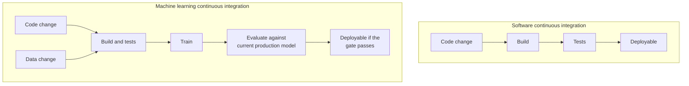
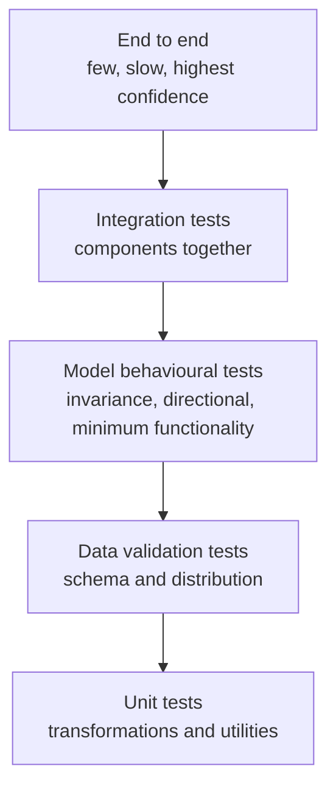
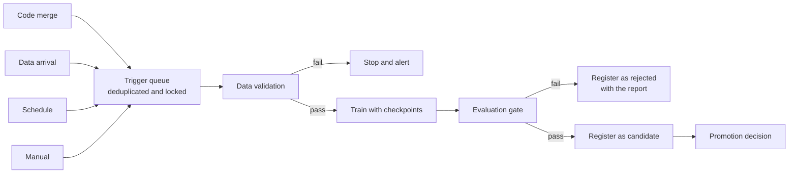
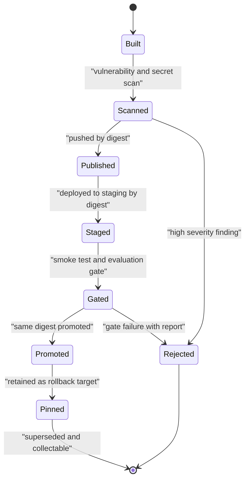
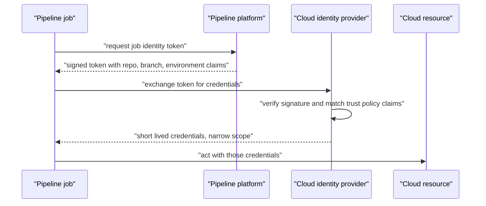
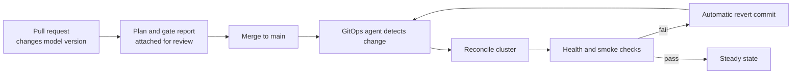

# Chapter 26: Continuous Integration and Delivery for Machine Learning

> **What this chapter covers** Why a green test suite tells you nothing about whether a model is good, what a testing pyramid for machine learning contains, the pipeline stages and what each protects against, the evaluation gate in detail, continuous training, artifact immutability, environment parity, credentials, infrastructure as code, GitOps, rollback mechanics, and how pipelines themselves fail.
> **Prerequisites** Chapter 22 (Containers, Kubernetes, and Cloud), Chapter 24 (Model Serving and Inference), Chapter 25 (Model Lifecycle, Versioning, and Registries).
> **Where it is used** Any team shipping models repeatedly. It is the difference between a team that deploys weekly with confidence and a team that deploys quarterly with dread.

---

## 26.1 Level 1: Foundations

### What continuous integration and continuous delivery mean

**Continuous integration (CI)** is the practice of merging every change into a shared main branch frequently, with an automated build and test run on every change. The purpose is to discover conflicts and defects within minutes rather than at the end of a release cycle.

**Continuous delivery (CD)** is the practice of keeping the main branch always in a deployable state, with an automated path from a merged commit to a release artifact and to an environment. **Continuous deployment** goes one step further and releases automatically with no human action. The distinction matters for machine learning, where the last step usually should not be automatic.

### Why machine learning is different

In conventional software, the specification is in the code. If the code is correct and the tests pass, the behaviour is correct. The tests are a proxy for correctness and a good one.

In a machine learning system, the behaviour is determined by the code and the data together, and the specification is a statistical property rather than a logical one. That produces three differences with large consequences.

**The first: a passing test suite says nothing about model quality.** Every unit test can pass, every integration test can pass, the service can respond correctly to every request, and the model can be substantially worse than the one it replaces. Correctness of the plumbing is necessary and nowhere near sufficient. This is why the pipeline for machine learning has an extra stage that software pipelines do not have, the evaluation gate, and why the rest of this chapter treats it as the centre.

**The second: the input that determines behaviour is not in the repository.** Code review covers the code. Nothing reviews the data unless you build something that does. A change to an upstream table can alter model behaviour with no commit anywhere.

**The third: the outputs are non-deterministic and expensive.** Test suites for software run in minutes and give identical answers. Training runs take hours and give slightly different answers each time. Any gate built on a model metric must therefore be a statistical test, not an equality assertion.



*Figure 26.1: The machine learning pipeline adds a second input that no one reviews and a gate that no software pipeline needs.*

### The mental model to carry

A continuous integration pipeline is a sequence of filters, each cheap relative to what it protects against. Order them by cost so the cheapest filter catches the most common failure first. Linting takes seconds and catches typos. Training takes hours and catches quality regressions. Running training before linting wastes hours to find a typo.

The second half of the model: every stage produces an immutable artifact consumed by the next. Nothing is rebuilt downstream. If the container built at stage 3 is the one deployed at stage 8, then what you tested is what you shipped. If stage 8 rebuilds, it is not.

### Vocabulary

- **Pipeline**: an ordered set of automated stages triggered by an event.
- **Stage** or **job**: one unit of work, which can pass or fail.
- **Gate**: a stage whose failure blocks progression.
- **Artifact**: a file or image produced by a stage and consumed later, addressed by content or by an immutable tag.
- **Runner** or **agent**: the machine executing a job.
- **Environment parity**: the degree to which development, staging, and production behave identically.
- **Infrastructure as code (IaC)**: declaring infrastructure in files that are versioned and applied by a tool.
- **GitOps**: using a git repository as the declared desired state of a running system, with an agent reconciling reality toward it.
- **Federated identity**: obtaining short-lived credentials by proving workload identity, rather than storing long-lived keys.

---

## 26.2 Level 2: Working knowledge

### The testing pyramid for machine learning systems

The classic pyramid is many fast unit tests, fewer integration tests, and a very few end-to-end tests. For machine learning it gains two layers that have no software equivalent.



*Figure 26.2: The machine learning testing pyramid, with data validation and behavioural testing inserted between unit and integration levels.*

**Unit tests for transformations.** Every feature transformation is a pure function and should be tested like one. Test the normal case, the empty input, the single-row input, the null, the out-of-range value, the duplicate, and the boundary. Test that the transformation is deterministic given a seed. Most importantly, test the fitted-state behaviour: a scaler fitted on training data and applied to serving data must use the training statistics, and a test that catches that mistake has prevented a whole class of skew.

**Listing 26.1: a transformation test that catches the most common leakage bug.**

```python
import numpy as np
import pytest

def test_scaler_uses_training_statistics_at_serving_time(fitted_scaler):
    """Serving must reuse training statistics, never recompute from the batch."""
    train_stats_mean = fitted_scaler.mean_.copy()

    # A serving batch with a wildly different distribution.
    serving_batch = np.full((16, fitted_scaler.mean_.shape[0]), 1000.0)
    _ = fitted_scaler.transform(serving_batch)

    assert np.allclose(fitted_scaler.mean_, train_stats_mean), (
        "transform mutated fitted state; serving would recompute statistics "
        "from the request batch and produce training-serving skew"
    )

def test_transformation_is_deterministic(transform_fn, sample_frame):
    a = transform_fn(sample_frame.copy(), seed=7)
    b = transform_fn(sample_frame.copy(), seed=7)
    assert a.equals(b)
```

The non-obvious part is the choice of an extreme serving batch. If the implementation accidentally calls a fit-and-transform method, the fitted mean moves visibly and the assertion fails. With a serving batch drawn from the same distribution as training, the mean barely moves and the bug survives the test.

**Data validation tests.** These assert properties of the data rather than the code, and they run on every batch entering training and, in a reduced form, on every request entering serving. Level 3 covers what to assert.

**Model behavioural tests.** Borrowed from the CheckList methodology of Ribeiro, Wu, Guestrin, and Singh (2020), these test the model as a black box against expectations that hold regardless of its internals.

| Type | Assertion | Example |
|---|---|---|
| Minimum functionality | The model gets the trivially easy cases right | A sentiment model classifies "this is excellent" as positive |
| Invariance | A change that should not alter the label does not alter the prediction much | Substituting a person's name, changing an irrelevant identifier, adding neutral whitespace |
| Directional expectation | A change that should push the prediction one way does | Increasing income should not decrease a creditworthiness score if the relationship is monotone by design |

These tests are deterministic assertions about a specific model artifact, so they belong in the pipeline as hard gates. Unlike aggregate metrics they do not move with noise, and unlike a metric threshold they express intent that a reviewer can read.

**Integration tests.** The feature pipeline feeds the training job, the trained artifact loads in the serving image, the serving image answers a request with the right schema. These catch the interface mismatches that unit tests cannot see.

**Integration tests worth writing first.** Three of them earn their cost immediately: the trained artifact loads inside the serving image and answers one request, the serving feature transformation produces the same vector as the training transformation for the same entity, and the schema the service returns matches the one its consumers declare. The second of those is the training-serving skew test, and it is the highest-value single test in a machine learning repository. Implement it by taking a handful of entities, computing features through the offline path and through the online path, and asserting element-wise agreement within a tolerance.

**End-to-end tests.** A small number, running the whole path on a tiny dataset, asserting that it completes and produces an artifact with the expected shape. Their value is as a smoke test of the wiring, not as a quality measure. Keep them few and fast, because they are the slowest and most brittle tests you own.

### Testing data

Data tests catch the failures that actually happen in production, which are rarely the exotic ones.

**Schema tests.** Column present, type correct, nullability as declared, categorical values within the declared set, primary key unique, foreign key resolvable, units and ranges as declared. These are cheap and catch most upstream breakage.

**Distribution tests.** Row count within an expected band, null fraction per column within a band, mean and standard deviation of numeric columns within a band, cardinality of categoricals within a band, class balance within a band, and the fraction of new unseen categorical values below a threshold.

**The tests that catch the failures that actually happen**, ranked by how often they earn their keep:

1. **Row count collapse or explosion.** A partial upstream load produces 4 percent of the expected rows. Nothing errors. The model trains on a biased sample.
2. **Null rate change in one column.** A field that was 0.1 percent null becomes 60 percent null after an upstream deployment. Imputation quietly replaces it with a constant.
3. **A new categorical value.** A new country code or product type appears. Encoders either error or silently map it to an unknown bucket, and the model has no idea.
4. **Unit change.** A field switches from cents to dollars, or milliseconds to seconds. Everything is exactly 100 or 1000 times wrong, and no schema test catches it. Range assertions do.
5. **Timestamp and timezone shift.** A field starts arriving in a different timezone or a different epoch unit. Time-based features become nonsense.
6. **Duplicate rows.** A reprocessing job double-writes. Training sees duplicated examples, which quietly reweights the data and can leak duplicates across the train and test split.
7. **Freshness failure.** The table exists and is valid but the latest partition is three days old. Features are stale and the model is scoring on the past.
8. **Label leakage appearing.** A newly added upstream column correlates with the label because it is computed after the outcome. Offline metrics improve dramatically, which is the tell.

Point 8 deserves the rule: a sudden large improvement in an offline metric is a leakage alarm, not a cause for celebration, until proven otherwise.

Set expectation bands from historical statistics with a tolerance, not from hand-written constants, and review them when the business genuinely changes. Distinguish two severities: hard failures that stop the pipeline, such as a missing column, and soft warnings that notify, such as a mean shift within a plausible range.

### Testing models

**Performance thresholds.** An absolute floor, for example area under the curve above 0.75, protects against catastrophe. It does not protect against a small regression, and it becomes obsolete as the model improves. Use it as a sanity check, not as the gate.

**Regression tests on known failures.** Every production incident that was traced to a model should leave behind a test case. Keep a growing file of inputs that once produced a wrong or harmful output, with the expected behaviour, and assert it on every candidate. This is the cheapest form of institutional memory a machine learning team can build, and it is the one that prevents the same embarrassing output reappearing two versions later. Keep the file under review, because a case that no longer reflects intent should be removed deliberately rather than deleted when it starts failing.

**Slice-based testing.** Aggregate metrics hide slice damage. Define slices in advance: by segment, geography, device, language, input length, rarity of class, time of day, and any dimension where performance differing would be a problem. Assert per slice with a minimum sample size, and report slices too small to test rather than silently skipping them. The slice discovery literature, for example Chung and colleagues on SliceFinder (2019), offers automated candidate discovery, but a curated list from domain knowledge is the practical starting point.

**Robustness and perturbation.** Apply realistic corruptions and assert bounded degradation: typos and casing for text, compression artifacts, blur and brightness shifts for images, noise and dropped samples for sensor data, missing optional fields for tabular data. The assertion is not that performance is unchanged; it is that it degrades by less than a stated amount.

**Fairness checks where applicable.** Where the organisation has committed to a fairness definition, assert it. The important technical fact is that the common group-fairness definitions are mutually incompatible except in degenerate cases: you cannot generally have equal false positive rates, equal false negative rates, and calibration within groups simultaneously when base rates differ, a result made precise by Kleinberg, Mullainathan, and Raghavan (2016) and by Chouldechova (2017). So the pipeline must test the definition the organisation chose and documented, and the choice is a policy decision rather than an engineering one.

### The pipeline stages

| Stage | What it does | What it protects against | Typical duration |
|---|---|---|---|
| Lint and format | Static analysis, style, type checking | Typos, unused imports, type errors, style churn in reviews | Seconds |
| Unit and data tests | Fast tests on small fixtures | Logic errors in transformations, schema drift in fixtures | Under 5 minutes |
| Build | Produce the container image from a lock file | Environment drift between developer and production | Minutes |
| Scan | Vulnerability scan of image and dependencies, secret scan, licence check | Known vulnerabilities, leaked credentials, licence violations | Minutes |
| Publish | Push the image by digest and register the candidate artifact | Ambiguity about what was tested versus deployed | Seconds |
| Deploy to staging | Roll out to an environment that mirrors production | Manifest errors, configuration errors, permission errors | Minutes |
| Smoke test | A handful of real requests against the deployed service | Broken wiring, missing model file, wrong signature | Under a minute |
| Evaluation gate | Compare the candidate against the current production model | Model quality regressions, slice damage, calibration loss | Minutes to hours |
| Promote | Move the alias or merge the manifest change | Undocumented production changes | Seconds |

Two ordering rules. Cheap filters first, so lint precedes training. And scan before publish, so a vulnerable image never enters the registry where someone might deploy it by hand.

**Listing 26.2: a pipeline skeleton with the ordering and the gate as a separate job.**

```yaml
# Illustrative; exact keys are platform-specific, check your version.
stages: [lint, test, build, scan, publish, staging, evaluate, promote]

lint:
  stage: lint
  script: ["ruff check .", "mypy src/"]

test:
  stage: test
  script: ["pytest tests/unit tests/data -q --maxfail=1"]

build:
  stage: build
  script: ["docker build --file Dockerfile --tag $IMAGE:$SHA ."]

scan:
  stage: scan
  script: ["trivy image --exit-code 1 --severity HIGH,CRITICAL $IMAGE:$SHA"]

evaluate:
  stage: evaluate
  script: ["python -m pipeline.gate --candidate $SHA --baseline production"]
  artifacts: { paths: ["reports/gate.json", "reports/slices.csv"] }

promote:
  stage: promote
  when: manual          # a human confirms; the gate has already decided
  script: ["python -m pipeline.promote --candidate $SHA"]
```

The non-obvious choices: the scan stage exits non-zero on high severity so it is a gate rather than a report; the evaluate stage publishes its report as an artifact so the decision is reviewable afterwards; and promote is manual even though the gate is automated, because the gate decides whether promotion is permitted while a person decides whether it happens now.

---

## 26.3 Level 3: Depth

### The evaluation gate in depth

This is the stage that makes a machine learning pipeline different, so it gets the most space.

The gate answers one question: is this candidate acceptable to replace the current production model? Four properties make an answer trustworthy.

**One: compare against the current production model, not against a fixed historical number.** A threshold written eight months ago describes a model two generations old. The baseline must be the artifact currently serving, re-evaluated on the same data in the same run. Re-evaluated, because the recorded historical number was measured on a different evaluation set, possibly with a different preprocessing version, and comparing across those conditions is invalid.

**Two: use paired statistics.** Both models score the same items, so the comparison is paired and you should exploit it. Paired tests have far more power because the item-to-item variance cancels.

For a metric that decomposes per item, such as accuracy or squared error, compute the per-item difference $d_i = m_i^{\text{cand}} - m_i^{\text{base}}$ and test whether the mean difference exceeds the margin. For metrics that do not decompose per item, such as area under the receiver operating characteristic curve, use a paired bootstrap: resample the evaluation items with replacement $B$ times, recompute both metrics on each resample, and take the distribution of the difference.

$$\hat{\Delta}_b = M(\text{cand}, S_b) - M(\text{base}, S_b), \quad b = 1 \ldots B$$

The 95 percent interval is the 2.5th and 97.5th percentiles of $\{\hat{\Delta}_b\}$. Resampling the same items for both models is what makes it paired; resampling independently throws away the power.

**Worked example.** Evaluation set of 5000 items. Candidate accuracy 0.8410, baseline 0.8360, so the raw difference is 0.0050. Are they different? The unpaired standard error of each accuracy is $\sqrt{0.84 \times 0.16 / 5000} = 0.00518$, so the unpaired difference has a standard error of $\sqrt{2} \times 0.00518 = 0.00733$ and the difference is well within noise. But the models agree on most items. Suppose they disagree on 260 items, of which the candidate is right on 150 and the baseline on 110. McNemar's test uses only the discordant pairs. Under the null the count of candidate wins is Binomial(260, 0.5), with mean 130 and standard deviation $\sqrt{260 \times 0.25} = 8.06$. The observed 150 is $(150 - 130)/8.06 = 2.48$ standard deviations above, giving a two-sided p-value of about 0.013. The paired test detects what the unpaired one could not. This example uses assumed counts to illustrate the method.

Note also that 0.0050 might still be below the margin you require. Statistical significance and practical significance are different questions and the gate must ask both.

**Three: check every slice.** The gate must fail on a slice regression even when the aggregate improves, because aggregate improvement built on a minority group's degradation is exactly the failure mode that reaches the news. Rules that work:

- Fail if any pre-registered slice with at least $n_{\min}$ items degrades by more than the slice margin, with the comparison paired within the slice.
- Apply a multiple-comparison correction, because testing 30 slices at the 5 percent level produces a false alarm with probability $1 - 0.95^{30} = 79$ percent. Control the false discovery rate rather than using Bonferroni when slice counts are large, since Bonferroni over 30 tests makes the gate nearly unable to fire.
- Report slices below $n_{\min}$ explicitly as untested. Silence is not a pass.

**Four: state the promotion criteria in advance and in code.** The criteria are a file in the repository, reviewed like code, versioned like code.

A workable criteria structure:

| Criterion | Form | Example form |
|---|---|---|
| Primary metric | Non-inferiority with a margin, or superiority | Lower bound of the paired 95 percent interval above minus 0.002 |
| Per-slice floor | Same, per slice, with minimum sample | No slice with at least 500 items degrades by more than 0.01 |
| Calibration | Expected calibration error ceiling | Does not worsen by more than 20 percent relative |
| Behavioural tests | All pass | Hard gate, no statistics |
| Robustness | Bounded degradation under perturbation | No more than 5 points under the declared corruption set |
| Operational | Latency and memory budget under load | p99 within budget, artifact loads in the serving image |
| Provenance | Lineage complete | Registration refused without it, per Chapter 25 |

**Listing 26.3: the gate as code, returning a machine-readable verdict.**

```python
from dataclasses import dataclass

@dataclass
class GateResult:
    passed: bool
    reasons: list

def evaluate_gate(paired, slices, criteria) -> GateResult:
    """paired: dict with bootstrap interval on the candidate minus baseline delta."""
    reasons = []
    lo, hi = paired["ci_95"]
    if lo < -criteria["non_inferiority_margin"]:
        reasons.append(f"primary metric lower bound {lo:.4f} breaches margin")

    for name, s in slices.items():
        if s["n"] < criteria["min_slice_n"]:
            reasons.append(f"slice {name} untested, n={s['n']}")   # reported, not fatal
            continue
        if s["delta_ci_95"][0] < -criteria["slice_margin"]:
            reasons.append(f"slice {name} regressed, lower bound {s['delta_ci_95'][0]:.4f}")

    fatal = [r for r in reasons if "untested" not in r]
    return GateResult(passed=not fatal, reasons=reasons)
```

The non-obvious decision is that an untested slice produces a reason but not a failure, while a regressed slice is fatal. Making untested slices fatal blocks every candidate whenever a rare segment has a thin week, and teams then delete the slice from the list, which is worse than reporting it. The judgement call should be visible in the report, which is why both go into `reasons`.

**Making the gate fast enough to be used.** A gate that takes four hours is run once a day and becomes a batch checkpoint rather than a filter. Three techniques keep it usable. Cache the baseline model's predictions on the fixed evaluation set, keyed by baseline version and evaluation set identifier, so only the candidate is scored on each run. Run a fast tier first, a few thousand items giving a coarse verdict in under a minute, and only run the full tier on candidates that survive it. And parallelise slices, since they are independent.

The cached-baseline trick has one trap. The cache key must include the preprocessing version, because a preprocessing change alters what the baseline would produce and a stale cache then compares the candidate against a model that no longer exists.

### Continuous training pipelines and their triggers

A continuous training pipeline is the same shape as the integration pipeline with training in the middle. The distinguishing question is what starts it.

| Trigger | Mechanism | Watch out for |
|---|---|---|
| Code change | Merge to main touching model or feature code | Trains on every unrelated refactor unless paths are filtered |
| Data arrival | New partition lands and passes validation | A partial load looks like an arrival; validate before training, not after |
| Schedule | Cron | Fires when nothing changed, wasting money |
| Drift signal | Monitoring detects distribution shift | Noisy; better as a notification than an automatic start |
| Performance decay | Measured outcome metric falls | Needs labels, which arrive late |
| Manual | A person starts it | Necessary for incident response and experiments |

The pipeline must be idempotent and resumable. Idempotent because the same trigger will fire twice, and a pipeline that trains twice on the same data and registers two versions creates ambiguity. Resumable because training jobs are long and runners are preempted; every long stage should checkpoint and be restartable from the checkpoint.

Concurrency control matters too. Two training runs on the same model started by two triggers will race to register, and the later one wins by accident rather than by merit. Take a lock keyed on the model name, or queue.



*Figure 26.3: A continuous training pipeline, with deduplicated triggers, validation before training, and a rejected candidate still registered with its report.*

Registering rejected candidates is worth the storage. Six weeks later, when someone asks whether an approach was tried, the record answers it, and the gate report explains why it was rejected.

### Artifact management and immutability

Three rules, and each one prevents a specific incident.

**Rule one: address artifacts by content, not by a mutable name.** A container tag such as `latest` or even `v2.1` can be repointed. A digest cannot. Deploy by digest. The incident this prevents is the one where staging and production ran different images that both called themselves the same tag.

**Rule two: build once, promote the same bytes.** Do not rebuild for staging and again for production. Rebuilding introduces a dependency resolution that can differ, a base image that can have moved, and a build cache that can differ. What you tested must be what you ship. Configuration differences between environments are injected at runtime, never baked in.

**Rule three: retain what you may need to reproduce or roll back to.** The rollback target's image must still exist. Registry garbage collection policies delete untagged images, and a rollback to a digest whose image was collected fails at the worst moment. Pin the currently deployed and previously deployed digests against collection explicitly.



*Figure 26.6: One set of bytes travels the whole path; no stage rebuilds, and the promoted digest is pinned as the next rollback target.*

The state diagram encodes the invariant worth stating explicitly: there is exactly one build event. Every later stage refers to the same digest. A pipeline where the staging job builds and the production job builds again has two artifacts that differ in ways nobody can enumerate, and every test result from staging becomes a statement about something other than what production runs.

To this add supply chain integrity, which has become standard practice. Generate a software bill of materials listing every dependency in the image. Sign the artifact so its origin is verifiable, and verify signatures at deploy time so an unsigned image cannot be admitted. The SLSA framework describes levels of build provenance, and tooling exists for signing and attestation; check your version for the current interfaces.

**Worked example of pipeline cost.** Assume a repository with 40 merges a week, a pipeline whose non-training stages take 11 minutes of a general-purpose runner, and a training stage triggered on 8 of those merges taking 3 accelerator-hours each. Non-training runner time is $40 \times 11 = 440$ minutes a week, about 7.3 hours. Training is $8 \times 3 = 24$ accelerator-hours a week. If the accelerator runner costs roughly twenty times the general-purpose runner per hour, training is $24 \times 20 = 480$ general-purpose-equivalent hours against 7.3, so training is about 98 percent of pipeline cost. The conclusion: optimising the linting stage is not where the money is, and trigger filtering on the training stage is. These are assumed figures for the illustration, not measured values, and the ratio should be recomputed from your own runner prices.

### Environment parity and the reproducible build

Environment parity means development, continuous integration, staging, and production behave identically. Perfect parity is unachievable, so the goal is to make the differences known and small.

| Dimension | How to achieve parity | Usual gap |
|---|---|---|
| Operating system and libraries | One base image used everywhere | Developers run a different distribution on their laptop |
| Python and package versions | A lock file with hashes, installed from the lock | A loose requirements file that resolves differently each build |
| Accelerator driver and runtime | Pin the runtime in the image; test on the production accelerator generation | Continuous integration runs on processors only, hiding accelerator issues |
| Data | Staging reads a representative sample or a masked copy | Staging uses a toy dataset that hides scale problems |
| Configuration | Same shape everywhere, values injected | Environment-specific branches in the code |
| Scale | Staging has proportionally fewer replicas | Staging is one replica, so no concurrency bug appears |
| Identity and permissions | Same mechanism, narrower scope | Staging runs with broad permissions, so a production permission error appears only in production |

The reproducible build in the strict sense means identical inputs produce bit-identical outputs. In practice: install from a lock file with hashes, pin the base image by digest not tag, set a fixed source date so timestamps do not vary, order files deterministically, and avoid embedding build hostnames or times. Full bit-reproducibility of a machine learning image is often not achievable because of compiled extensions and accelerator libraries; aim for the strongest achievable form and record what varies.

### Secrets and credentials in pipelines

The wrong answer is a long-lived key stored in the pipeline platform's secret store and injected as an environment variable. It is the default, it works, and it is the source of a large fraction of cloud breaches. Its problems:

- It is long-lived, so a leak is valid until someone notices and rotates it.
- It is broadly scoped, because scoping per job is tedious so one key ends up doing everything.
- It is copied, into a developer's machine, a log, a debugging session, a support ticket.
- Rotation is manual and therefore does not happen.
- It appears in the process environment where any dependency can read it.

**The modern answer is federated identity, also called workload identity federation or OpenID Connect trust.** The pipeline platform issues a short-lived signed token asserting facts about the job: which repository, which branch or tag, which workflow, which environment. The cloud provider is configured to trust that issuer and to exchange such a token for temporary credentials, but only when the token's claims match a policy, for example only for the `main` branch of one specific repository.



*Figure 26.4: Federated identity replaces a stored key with a per-job token exchanged for short-lived credentials.*

Why this is better, concretely: there is no stored secret to leak; credentials expire in minutes; the trust policy binds access to a specific repository, branch, and environment, so a pull request from a fork cannot obtain production credentials; and every exchange is logged with its claims, giving an audit trail that a shared static key cannot.

What still needs care:

1. **Write the trust policy narrowly.** A policy matching only the organisation and not the repository grants every repository in the organisation production access. Match repository, and match branch or environment for anything sensitive.
2. **Treat pull requests from forks as untrusted.** They must never receive credentials beyond read-only public scope.
3. **Third parties without federation support.** Some services still require a static key. Keep those in a secret manager with automated rotation and the narrowest possible scope, and record them as exceptions with an owner.
4. **Model and data access is a credential too.** A pipeline that can read the full training dataset holds sensitive data access. Scope it to the specific prefix and period needed.
5. **Never log the environment.** Debug steps that dump environment variables are a routine cause of credential exposure in build logs, which are frequently world-readable.

### Infrastructure as code for machine learning platforms

Machine learning platforms are made of clusters, node pools with accelerators, object storage buckets, registries, databases, networks, and dozens of identity policies. Clicking these into existence produces an environment nobody can recreate.

**The declarative model.** You describe the desired end state. The tool computes the difference between that and reality and produces a plan to close it. You do not write the steps. This is what makes the configuration reviewable: the file says what should exist, not how it came to exist.

**State.** The tool keeps a state file mapping declared resources to real ones. Everything rests on it, which produces three operational requirements: store it remotely so a team shares one, lock it during operations so two applies cannot race, and treat it as sensitive because it frequently contains resource attributes including secrets. Losing the state file does not delete your infrastructure but does make the tool unable to manage it, and recovery is a manual import of every resource.

**Modules.** A module is a parameterised, reusable group of resources. The useful granularity for a machine learning platform is one module per coherent capability: a training cluster module, an inference cluster module, a registry-and-storage module, an observability module. Version modules and pin the version in each environment, so upgrading staging does not upgrade production.

**Plan and apply discipline.** Plan produces the proposed change set. Apply executes it. The discipline:

1. Plan runs automatically on every pull request and the output is posted for review.
2. The reviewer reads the plan, not just the code, because a small code change can produce a destructive plan.
3. Any plan containing a destroy or replace of a stateful resource requires explicit acknowledgement.
4. Apply runs only from the main branch, from the pipeline, with federated credentials.
5. Drift detection runs on a schedule and alerts when reality has diverged from declaration, which it will, because someone will make an emergency manual change.

**Listing 26.4: an accelerator node pool declared with the attributes that matter.**

```hcl
variable "gpu_node_count" {
  type        = number
  description = "Steady-state accelerator nodes; spikes use the autoscaler range."
}

resource "example_node_pool" "inference_gpu" {
  cluster_name = var.cluster_name
  machine_type = var.gpu_machine_type
  node_count   = var.gpu_node_count

  autoscaling {
    min_node_count = var.gpu_node_count
    max_node_count = var.gpu_node_count * 3
  }

  # Keep general workloads off expensive accelerator nodes.
  taint {
    key    = "accelerator"
    value  = "present"
    effect = "NO_SCHEDULE"
  }

  lifecycle {
    prevent_destroy = true   # a plan that would delete this must be deliberate
  }
}
```

The two non-obvious lines are the taint and the lifecycle block. The taint stops ordinary pods from occupying accelerator nodes, which is otherwise a routine and expensive mistake. The `prevent_destroy` flag makes an accidental deletion fail the apply rather than succeed, which is the behaviour you want for anything holding state or costing a lot to recreate. The resource type here is a placeholder; provider resource names differ, so check your provider version.

### GitOps

GitOps applies the same idea to the running state of a cluster. A repository holds the declared desired state as manifests. An agent inside the cluster continuously compares reality to the repository and reconciles. Nobody applies changes by hand.

What it buys:

- **The deployed state is reviewable and diffable**, because it is a file.
- **Drift is corrected automatically**, because the agent reconciles continuously, so a manual change is reverted.
- **Rollback is a git revert**, which is fast, reviewed, and leaves a history.
- **Access to the cluster narrows**, because humans no longer need apply permissions.

What it costs, and these are real:

- **Secrets need a separate mechanism**, since plaintext secrets cannot live in the repository. Encrypted-at-rest manifests or an operator that pulls from a secret manager.
- **A new failure mode**: the agent silently failing to sync. Monitor sync status and alert on staleness, because a stopped agent looks exactly like a system with no changes.
- **Repository structure becomes a design problem.** Environments as branches drifts; environments as directories with a shared base and per-environment overlays is the pattern that holds up.

For machine learning, the key decision is where the model version binding lives. The position that scales: the registry owns artifacts and lineage; a manifest in the GitOps repository names the version each environment serves. Promotion is a small reviewed commit changing one line, rollback is a revert of that commit, and both take seconds because neither rebuilds anything.



*Figure 26.5: Promotion as a reviewed one-line commit, with automatic reversion producing another commit rather than an untracked manual fix.*

### Rollback mechanics

Rollback must be rehearsed, fast, and safe. Four mechanisms, in increasing scope.

| Mechanism | What it reverts | Speed | Use when |
|---|---|---|---|
| Alias or manifest revert | The model version only | Seconds | The model is the problem and the serving code is unchanged |
| Deployment rollback to a previous digest | Code and model together | Tens of seconds to minutes | The serving code changed too |
| Feature flag or traffic weight | Routing only | Seconds | You want to shift traffic without changing anything deployed |
| Infrastructure revert | The platform | Minutes to hours | Rarely; and destructive plans may not be reversible |

Three things that make rollback fail when it is needed.

**Schema-incompatible state.** The new version wrote records the old version cannot read, or added a required field. Rolling back then breaks. The discipline is expand-and-contract: deploy a version that can read both old and new formats, then deploy the version that writes the new format, and only remove the old format once no rollback target needs it. The same applies to the feature store and to any cached representation.

**Missing artifacts.** The image or the model file for the rollback target was garbage-collected. Pin them.

**Untested paths.** A rollback procedure that has never been executed is a hypothesis. Run it on a schedule, in production, deliberately, and measure the time it takes.

Automatic reversion should be wired to the same triggers described in Chapter 25: error rate, latency, prediction distribution divergence, and a business guardrail, each with a window and a requirement for two consecutive breaching windows. The revert action itself should produce an artifact, a commit or an audit record, so the timeline is reconstructable afterwards.

---

## 26.4 Level 4: Mastery

### Pipeline observability and how pipelines fail

Pipelines are production systems. Teams monitor the services the pipelines deploy and not the pipelines themselves, and then discover that nothing has been deployed for three weeks.

**What to measure**

| Metric | Why it matters |
|---|---|
| Lead time from commit to production | The headline measure of delivery capability |
| Deployment frequency | Small frequent changes are safer than large rare ones |
| Change failure rate | Fraction of deployments causing a rollback or incident |
| Time to restore service | How long an incident lasts |
| Stage duration distribution, per stage | Where the pipeline is slow, which is where engineers start skipping it |
| Flaky test rate | The leading indicator of a team losing trust in its tests |
| Queue wait for runners | Invisible latency that dominates in busy repositories |
| Cost per pipeline run | Accelerator-backed training stages make this material |
| Time since last successful run, per pipeline | Catches the silently stopped pipeline |

The first four are the measures popularised by the DevOps Research and Assessment programme and described in Forsgren, Humble, and Kim, "Accelerate" (2018). They apply to machine learning pipelines unchanged.

**How pipelines fail**

1. **Flaky tests.** A test that fails 2 percent of the time trains the team to rerun rather than investigate. Then a real failure is rerun too. Quarantine flaky tests automatically, track them as defects with owners, and never let a rerun be the normal response to red.
2. **Slow pipelines.** A 90-minute pipeline changes behaviour: people batch changes, skip local checks, and merge without waiting. Speed is a correctness feature. Parallelise, cache dependencies, and shard tests.
3. **The silently stopped scheduled pipeline.** A credential expired, a quota was hit, a runner label no longer matches. Nothing alerts because failure is silent when nothing runs. Alert on time-since-last-success, not on failure.
4. **Cache poisoning.** A corrupt or stale cache entry produces a green build of the wrong thing, or a fork's build writes a cache the main branch reads. Key caches on content, scope them by branch trust level, and make them safe to drop.
5. **Non-hermetic builds.** A build that reaches the network at build time is at the mercy of a registry outage and of a dependency that moved. Vendor or mirror, and pin by hash.
6. **The pipeline as a privileged attack surface.** It holds credentials to everything and executes code from the repository. A malicious pull request that triggers a privileged workflow is a documented and recurring attack class. Never run untrusted code in a job with credentials, and be specific about which trigger events grant which permissions.
7. **Resource exhaustion by machine learning stages.** Training stages hold accelerators for hours, and a queue of them starves everything else. Separate the queues and cap concurrency.
8. **Gate erosion.** Under deadline pressure, margins get loosened, slices get dropped, and bake times get shortened. Each individual change is defensible and the aggregate is an ungated pipeline. Make the criteria file's history visible, require the same review as production code, and review the trend periodically.

Failure eight is the one that kills the most systems, because it is social rather than technical and no monitor detects it.

### What senior engineers argue about

**Should the model gate be automatic?** The argument for automation is that humans approve whatever the pipeline puts in front of them, so a human gate is theatre that adds latency. The argument against is that statistical gates cannot encode context, for example that last week's evaluation data was contaminated by an incident. The defensible position depends on blast radius, and on whether rollback is instant and tested. Where it is, automate and let the rollback be the safety net. Where rollback is slow or the harm is irreversible, keep a named human.

**Should training run in the pipeline at all?** Running a multi-hour accelerator job inside a continuous integration system couples two things with very different resource profiles and failure semantics. The alternative is for the pipeline to submit a job to a dedicated orchestrator and gate on its result. That is the pattern that survives scale, and the argument against it is one more system to operate.

**How much should be tested with real data?** Fixtures are fast and deterministic and do not resemble reality. Real data samples catch real problems and bring privacy obligations, size, and non-determinism. The usual resolution: synthetic or masked fixtures for unit tests, a small real sample with access controls for integration tests, and full real data only in staging and in the evaluation gate.

**Is trunk-based development compatible with long training?** Trunk-based development assumes short-lived branches. Model experimentation is exploratory and long. The reconciliation is that experiments are not branches: they are runs, tracked in the experiment tracker, on the same code path guarded by configuration. Only the winning configuration becomes a commit. Teams that put experiments on long branches end up merging months of divergence.

### Where the standard advice is wrong

**"Aim for high test coverage."** Line coverage measures whether a line executed, not whether its behaviour was asserted. A machine learning codebase can reach 90 percent coverage with no data validation, no behavioural tests, and no evaluation gate, and be entirely untested in the ways that matter. Count instead: are all transformations tested with adversarial inputs, are all data properties asserted, are behavioural tests present, and is there a gate.

**"Automate everything."** Automate what is repetitive and well understood. Automating a poorly understood decision encodes the misunderstanding and removes the person who would have noticed. Promotion for high-risk models is the standard example.

**"Deploy on every merge."** Correct for stateless services. For models, every deployment carries statistical risk, and shipping ten model versions a day means ten chances to regress with insufficient bake time between them to attribute anything. Decouple the cadence of code delivery from the cadence of model promotion.

**"The pipeline is infrastructure, so it is the platform team's problem."** The evaluation gate encodes what quality means for a specific model, which only the owning team knows. Platform teams own the machinery; product teams own the criteria.

**"Infrastructure as code makes infrastructure reproducible."** It makes the declaration reproducible. Provider defaults change, images move, and quotas differ between accounts. Pin versions, pin images by digest, and test a from-scratch apply in a clean account periodically, which is the only way to discover what your configuration was silently inheriting.

### Judgment that distinguishes a staff engineer

1. **Writes the evaluation gate before the first model.** Criteria in a reviewed file, with margins, slices, and minimum sample sizes agreed with the people who own the outcome.
2. **Optimises pipeline duration as a first-class concern**, because a slow pipeline is bypassed and a bypassed pipeline protects nothing.
3. **Treats the pipeline's own credentials as the highest-value target in the system** and designs for the assumption that a repository contributor is hostile.
4. **Keeps the rollback drill on the calendar** and reports the measured time.
5. **Watches the criteria file's history for erosion** and raises it as a risk rather than a process complaint.
6. **Separates the three cadences**: code delivery, model promotion, and infrastructure change, each with its own gates, reviewers, and rollback path.

---

## 26.5 Subtopic checklist

| Subtopic | You should be able to |
|---|---|
| Why machine learning continuous integration differs | State the three differences and their consequences for the pipeline |
| Gate latency | Cache baseline predictions correctly and tier the evaluation so the gate stays usable |
| Pipeline cost | Compute where pipeline spend actually goes and filter the expensive trigger |
| Testing pyramid | Name all five layers and place a given test in the right one |
| Unit tests for transformations | Write a test that catches fitted-state leakage |
| Data schema tests | Assert types, nullability, keys, ranges, and category sets |
| Data distribution tests | Set bands from history and split hard failures from warnings |
| The failures that actually happen | List at least six and say which test catches each |
| Behavioural tests | Write invariance, directional, and minimum functionality tests |
| Slice testing | Pre-register slices, set minimum sample sizes, and correct for multiplicity |
| Robustness testing | Define a perturbation set and a bounded degradation assertion |
| Fairness checks | Explain why common definitions cannot all hold at once and test the chosen one |
| Pipeline stages | Order nine stages by cost and say what each protects against |
| The evaluation gate | Compare against production, paired, per slice, against pre-registered criteria |
| Paired statistics | Apply a paired bootstrap and McNemar's test and explain the power gain |
| Continuous training triggers | Compare six triggers and design deduplication and locking |
| Artifact immutability | Deploy by digest, build once, and pin rollback targets against collection |
| Supply chain integrity | Explain bill of materials, signing, and verification at admission |
| Environment parity | List seven dimensions and name the usual gap in each |
| Reproducible builds | State what is achievable and what varies |
| Secrets | Explain why stored keys fail and how federated identity replaces them |
| Trust policies | Write a narrow claim match and explain the fork risk |
| Infrastructure as code | Explain declaration, state, modules, and the plan-and-apply discipline |
| GitOps | State what it buys, what it costs, and where the model version binding lives |
| Rollback mechanics | Choose a mechanism and name the three things that break rollback |
| Pipeline observability | Name the four delivery measures plus the machine-learning-specific ones |
| Pipeline failure modes | Identify eight and explain why gate erosion is the most dangerous |

---

## 26.6 Common misconceptions

| Misconception | Why it is believed | What is actually true |
|---|---|---|
| A green pipeline means the model is good | It means that in software | Tests verify the plumbing; only the evaluation gate says anything about model quality |
| High line coverage means well tested | Coverage is easy to measure | Coverage measures execution, not assertion, and says nothing about data or behavioural tests |
| Data tests are the data team's job | The data is upstream | The model consumes it, so the model's pipeline must validate it or inherit its failures |
| An absolute metric threshold is a good gate | It is simple and it blocks disasters | It goes stale as the model improves and cannot detect a small regression against the current champion |
| Comparing aggregate metrics is enough | The aggregate is the headline number | Slice regressions hide inside aggregate improvements, and that is the failure that causes harm |
| Statistical significance means promote | The test said the difference is real | Significance and practical significance are different; a real difference of 0.001 may not be worth the deployment risk |
| Rebuilding for production is fine | It is the same Dockerfile | Dependency resolution, base images, and caches move, so what you tested is not what you ship |
| Storing a long-lived cloud key in the secret store is acceptable | It is the default and it works | It is long-lived, broad, copyable, and rarely rotated; federated identity issues short-lived scoped credentials per job |
| Secrets in environment variables are safe because the store is encrypted | Encryption at rest sounds sufficient | Once injected they are readable by every dependency in the process and leak into logs and debug output |
| Infrastructure as code guarantees reproducibility | The files are versioned | Provider defaults, mutable image tags, and account-level quotas vary; only pinning and periodic clean applies verify it |
| GitOps removes the need for monitoring the deploy path | Reconciliation is automatic | A stalled agent looks identical to a system with no changes; alert on sync staleness |
| Rollback is always available | The old version exists somewhere | Schema-incompatible writes, garbage-collected artifacts, and untested procedures all break rollback exactly when it is needed |
| Retrying a failed pipeline is a normal response | Flakiness makes it work | Normalising reruns means real failures get rerun too; quarantine flaky tests and treat them as defects |
| Deploying on every merge is best practice | It is, for stateless services | Each model deployment carries statistical risk and needs bake time; separate code cadence from model promotion cadence |

---

## 26.7 Practice

**Exercise 1 (level 2): build the pyramid on a public dataset.** Take any public tabular dataset and build a small training pipeline. Write unit tests for every transformation including adversarial inputs, schema and distribution tests over the input, and at least six behavioural tests covering all three categories.
*Acceptance criterion*: introduce three deliberate bugs, a unit change in one column, a fitted-state leak in a scaler, and an inverted label mapping, and demonstrate that a specific named test catches each.

**Exercise 2 (level 2 to 3): implement an evaluation gate.** Train two model versions on the same data. Implement a gate that compares them with a paired bootstrap on the primary metric, checks at least five slices with a minimum sample size, applies a multiplicity correction, and emits a machine-readable verdict.
*Acceptance criterion*: the gate correctly rejects a candidate that improves the aggregate by 0.01 while degrading one pre-registered slice by 0.05, and the emitted report explains why in a form a reviewer can read.

**Exercise 3 (level 3): prove artifact immutability.** Build a container image, publish it by digest, deploy by digest, then repoint the mutable tag to a different image.
*Acceptance criterion*: demonstrate that the running deployment is unaffected, then demonstrate the opposite outcome for a tag-based deployment, and write one paragraph on which incident each prevents.

**Exercise 4 (level 3): replace a stored key with federated identity.** Using any cloud free tier and any pipeline platform that issues job identity tokens, configure a trust policy that grants a narrowly scoped role only to the main branch of one repository.
*Acceptance criterion*: a job on main obtains credentials; an otherwise identical job on a feature branch is denied; the denial appears in the cloud audit log with the presented claims; and the credential lifetime is under one hour.

**Exercise 5 (level 4): measure and fix your pipeline.** Instrument an existing pipeline to record per-stage duration, queue wait, failure cause, and flaky-test rate over at least 30 runs.
*Acceptance criterion*: a table of the four delivery measures, identification of the slowest stage and the highest-variance stage, one implemented change, and a before-and-after comparison with confidence intervals.

---

## 26.8 How this is tested

**Q1. Why does a passing test suite say nothing about model quality?**

<details>
<summary>Answer</summary>
Tests assert properties of code, and in a machine learning system behaviour is determined by code and data together while the specification is statistical rather than logical. Every transformation can be correct, the service can answer every request with a valid schema, and the model can still be substantially worse than the one it replaces because it was trained on different or degraded data, or simply converged worse. That is why the pipeline needs an evaluation gate comparing the candidate against the current production model on the same items, per slice, with a statistical test and a pre-registered margin.
</details>

**Q2. Write the three categories of behavioural test with an example of each.**

<details>
<summary>Answer</summary>
Minimum functionality: the model gets trivially easy cases right, for example a sentiment model labelling a clearly positive sentence positive. Invariance: a change that should not alter the label does not meaningfully alter the prediction, for example substituting a person's name or changing an irrelevant identifier. Directional expectation: a change that should move the prediction one way does, for example a monotone feature increasing should not decrease the score where the design requires monotonicity. These are deterministic assertions about a specific artifact, so unlike aggregate metrics they are hard gates, and unlike thresholds they express intent readably. The framing comes from the CheckList work of Ribeiro and colleagues.
</details>

**Q3. Which data failures actually happen in production, and which test catches each?**

<details>
<summary>Answer</summary>
Row count collapse from a partial load, caught by a row-count band. A null-rate jump in one column after an upstream deploy, caught by per-column null-fraction bands. A new unseen categorical value, caught by a category-set assertion and a new-value fraction threshold. A unit change from cents to dollars, which passes every schema test and is caught only by range or distribution assertions. A timezone or epoch-unit shift, caught by range checks on derived time features. Duplicate rows from reprocessing, caught by a primary key uniqueness test. Stale partitions, caught by a freshness assertion. Newly appearing label leakage, whose tell is a sudden large metric improvement, which should be treated as an alarm rather than a success.
</details>

**Q4. Design the evaluation gate for a binary classifier. Be specific.**

<details>
<summary>Answer</summary>
Re-evaluate the current production artifact and the candidate on the same held-out set in the same run. Compute the primary metric difference with a paired bootstrap resampling the same items for both models, and require the lower bound of the 95 percent interval to exceed the negative non-inferiority margin. Run the same paired comparison within each pre-registered slice having at least the minimum sample size, fail on any slice whose lower bound breaches the slice margin, apply false discovery rate control across slices, and report undersized slices as untested rather than silently passing them. Add hard gates: all behavioural tests pass, calibration error does not worsen beyond a ceiling, robustness degradation under the declared perturbation set is bounded, and the artifact meets its latency and memory budget under load. Criteria live in a reviewed file in the repository.
</details>

**Q5. Explain why a paired test is used, with the arithmetic.**

<details>
<summary>Answer</summary>
Both models score the same items, so item difficulty is a shared source of variance that cancels in the difference. Unpaired, with 5000 items and accuracy near 0.84, each accuracy has a standard error of about 0.0052 and the difference has about 0.0073, so a 0.005 difference is invisible. Paired, only the discordant items carry information: if the models disagree on 260 items and the candidate wins 150, McNemar's test treats the count as Binomial(260, 0.5) with mean 130 and standard deviation 8.06, so 150 is 2.48 standard deviations out and the two-sided p-value is about 0.013. The same data yields a clear answer paired and no answer unpaired. Significance still does not imply the effect is worth deploying.
</details>

**Q6. Order the pipeline stages and justify the ordering.**

<details>
<summary>Answer</summary>
Lint, unit and data tests, build, scan, publish, deploy to staging, smoke test, evaluation gate, promote. Two principles. Cheapest filter first, ordered by cost relative to what it protects against, so seconds of linting precede hours of training and a typo never costs a training run. And scan before publish, so a vulnerable image never enters the registry where someone could deploy it manually. The evaluation gate comes after staging deployment because operational criteria such as latency under load require a deployed artifact, and promote is last because it is the only stage that changes what serves users.
</details>

**Q7. Why is a long-lived cloud access key in the pipeline secret store the wrong answer, and what replaces it?**

<details>
<summary>Answer</summary>
It is long-lived so a leak is valid until someone notices; it is broadly scoped because per-job scoping is tedious; it gets copied into laptops, logs, and tickets; rotation is manual and does not happen; and once injected into the environment any dependency in the process can read it. The replacement is federated identity: the pipeline platform issues a short-lived signed token asserting repository, branch, workflow, and environment, and the cloud provider exchanges it for temporary narrowly scoped credentials only when the claims match a trust policy. Nothing is stored, credentials expire in minutes, access is bound to a specific branch so a fork cannot reach production, and every exchange is logged with its claims.
</details>

**Q8. A team wants automatic promotion on every successful gate. What would you say?**

<details>
<summary>Answer</summary>
It depends on blast radius and on whether rollback is instant and rehearsed. Where harm from a bad model over one detection window is small, rollback is a pointer move measured in seconds, automatic reversion triggers are wired and tested, and the gate includes slice checks with multiplicity correction, automatic promotion is defensible and removes a human rubber stamp. Where the decision is high-stakes, where labels arrive too late for fast detection, or where the effect is irreversible, keep a named accountable approver. Either way, separate the cadence of code delivery from model promotion, since each model deployment carries statistical risk and needs bake time to attribute effects.
</details>

**Q9. Explain state in infrastructure as code and the operational requirements it creates.**

<details>
<summary>Answer</summary>
State is the tool's mapping from declared resources to real ones, and it is how the tool computes a plan. Three requirements follow. Store it remotely so the whole team and the pipeline share one view, because local state produces divergent plans. Lock it during operations so two concurrent applies cannot corrupt it or race. Treat it as sensitive, because it commonly contains resource attributes including secrets. Losing it does not delete infrastructure but leaves the tool unable to manage it, and recovery means importing every resource by hand. Add drift detection on a schedule, since emergency manual changes happen and the declaration then no longer describes reality.
</details>

**Q10. What does GitOps buy and what does it cost?**

<details>
<summary>Answer</summary>
It buys a reviewable and diffable deployed state, automatic drift correction because an agent reconciles continuously, rollback as a git revert with history, and narrowed human access to the cluster since nobody needs apply permissions. It costs a separate secrets mechanism, because plaintext cannot live in the repository; a new silent failure mode, since a stalled agent looks exactly like a system with no changes, so sync staleness must be alerted; and a repository structure decision, where environments as directories with a base and overlays holds up and environments as long-lived branches drifts. For models, the version binding lives in a manifest in that repository while the registry owns artifacts and lineage.
</details>

**Q11. Name three reasons a rollback fails when you need it.**

<details>
<summary>Answer</summary>
Schema-incompatible state: the new version wrote data the old version cannot read, so reverting breaks. The fix is expand-and-contract, deploying a reader that handles both formats before the writer that produces the new one. Missing artifacts: the image or model file for the rollback target was garbage-collected by a retention policy, so pin the current and previous digests explicitly. Untested procedure: the rollback path has never been run, so its permissions, its configuration, and its duration are all unverified. Schedule a rollback drill in production and record the measured time, the same way a disaster recovery exercise is run.
</details>

**Q12. How do you test a pipeline's own health?**

<details>
<summary>Answer</summary>
Measure lead time from commit to production, deployment frequency, change failure rate, and time to restore service, which are the four delivery measures. Add per-stage duration distributions to find where engineers start skipping, runner queue wait which is invisible latency, flaky-test rate as the leading indicator of lost trust, cost per run since accelerator stages are material, and time since last successful run per pipeline. The last one is the important one for scheduled pipelines, because a pipeline that stops running produces no failures and so no alerts; alert on staleness rather than on failure.
</details>

**Q13. Why is gate erosion the most dangerous pipeline failure mode?**

<details>
<summary>Answer</summary>
Because it is social, gradual, and invisible to every monitor. Under deadline pressure a margin gets loosened, a flaky slice gets dropped from the list, a bake time gets shortened. Each change is individually defensible and gets approved. After a year the gate passes everything and the team still believes it is gated, which is worse than having no gate, since a false sense of control removes the caution that would otherwise apply. Countermeasures are structural: keep the criteria in a file with the same review requirements as production code, make its history visible, review the trend of margins and slice counts quarterly, and require a written justification linked to each loosening.
</details>

**Q14. A stakeholder asks why training cannot just run on every merge. What is your answer?**

<details>
<summary>Answer</summary>
Three reasons. Cost and contention: a multi-hour accelerator job per merge starves the queue and is spent mostly on merges that do not change model behaviour, so filter triggers by path and deduplicate. Statistical risk: each promoted model carries regression risk and needs bake time for effects to be attributable, so ten promotions a day makes attribution impossible. Coupling: training has different resource and failure semantics from a build, so the durable pattern is for the pipeline to submit a job to a dedicated orchestrator and gate on its result rather than running it inline. The compromise is a fast path for code changes and a separate, path-filtered or scheduled path for training.
</details>

---

## Summary

1. A passing test suite verifies the plumbing and says nothing about model quality, which is why the evaluation gate exists.
2. Behaviour is determined by code and data together, and nothing reviews the data unless you build something that does.
3. The testing pyramid gains two layers for machine learning: data validation and model behavioural tests.
4. The fitted-state leakage test, applying training statistics at serving time, prevents a whole class of training-serving skew.
5. The data failures that happen are row-count collapse, null-rate jumps, new categories, unit changes, timezone shifts, duplicates, staleness, and leakage.
6. A sudden large improvement in an offline metric is a leakage alarm, not a success.
7. The gate must compare against the re-evaluated current production model, not against a stale recorded number.
8. Paired statistics detect differences unpaired tests cannot, because item difficulty cancels in the difference.
9. Slice checks with a minimum sample size and a multiplicity correction are what stop aggregate improvements built on minority degradation.
10. Order stages by cost, and scan before publish so a vulnerable image never enters the registry.
11. Build once and deploy by digest; rebuilding for production means what you tested is not what you shipped.
12. Federated identity replaces stored keys with short-lived per-job credentials bound to repository, branch, and environment.
13. Infrastructure as code gives a reviewable declaration; state must be remote, locked, and treated as sensitive, and drift must be detected.
14. GitOps makes promotion a reviewed commit and rollback a revert, at the cost of a secrets mechanism and a new silent failure mode in the sync agent.
15. The offline-online feature agreement test is the single highest-value integration test in a machine learning repository.
16. Training stages usually dominate pipeline cost, so trigger filtering on training matters far more than shaving seconds off linting.
17. Gate erosion is the most dangerous pipeline failure because no monitor detects it and it leaves a false sense of control.

---

## Further reading

- Humble and Farley, "Continuous Delivery: Reliable Software Releases through Build, Test, and Deployment Automation", 2010.
- Forsgren, Humble, and Kim, "Accelerate: The Science of Lean Software and DevOps", 2018.
- Sculley, Holt, Golovin, Davydov, Phillips, Ebner, Chaudhary, Young, Crespo, and Dennison, "Hidden Technical Debt in Machine Learning Systems", NeurIPS 2015.
- Breck, Cai, Nielsen, Salib, and Sculley, "The ML Test Score: A Rubric for ML Production Readiness and Technical Debt Reduction", IEEE Big Data 2017.
- Ribeiro, Wu, Guestrin, and Singh, "Beyond Accuracy: Behavioral Testing of NLP Models with CheckList", ACL 2020.
- Polyzotis, Roy, Whang, and Zinkevich, "Data Management Challenges in Production Machine Learning", SIGMOD 2017.
- Schelter, Lange, Schmidt, Celikel, Biessmann, and Grafberger, "Automating Large-Scale Data Quality Verification", VLDB 2018.
- Chung, Kraska, Polyzotis, Tae, and Whang, "Automated Data Slicing for Model Validation", ICDE 2019.
- Kleinberg, Mullainathan, and Raghavan, "Inherent Trade-Offs in the Fair Determination of Risk Scores", 2016.
- Chouldechova, "Fair Prediction with Disparate Impact: A Study of Bias in Recidivism Prediction Instruments", 2017.
- Dietterich, "Approximate Statistical Tests for Comparing Supervised Classification Learning Algorithms", Neural Computation, 1998.
- Efron and Tibshirani, "An Introduction to the Bootstrap", 1993.
- Primary documentation: GitHub Actions, GitLab CI, Argo CD, Flux, Terraform, OpenTofu, Kubeflow Pipelines, Great Expectations, TensorFlow Data Validation, Sigstore and the SLSA framework.
