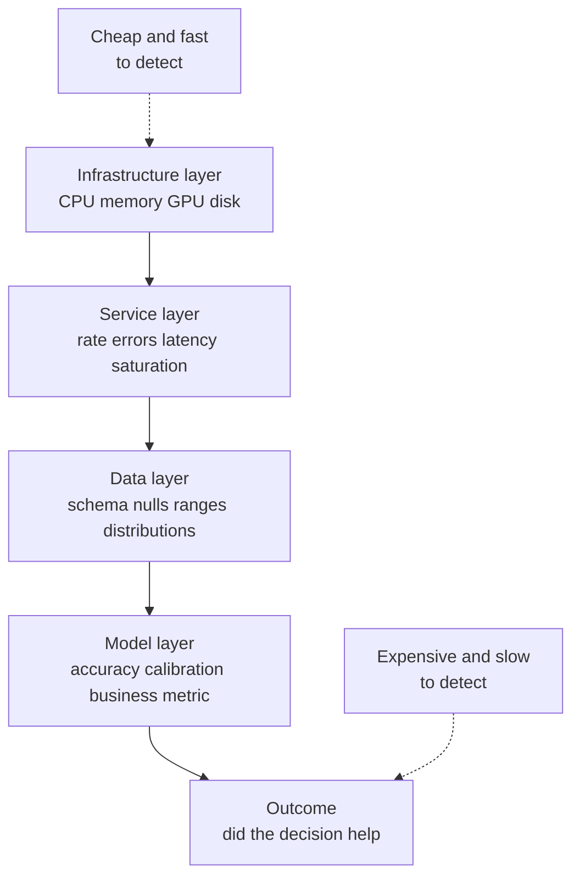
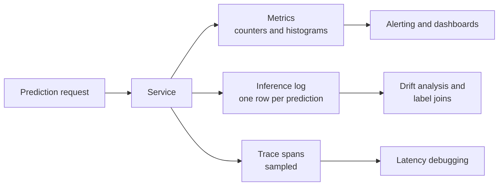
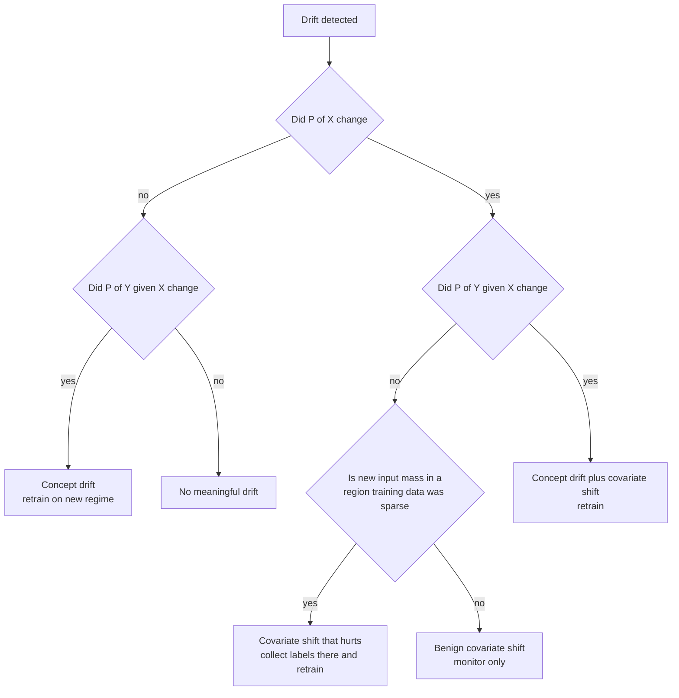
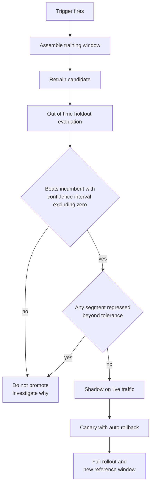
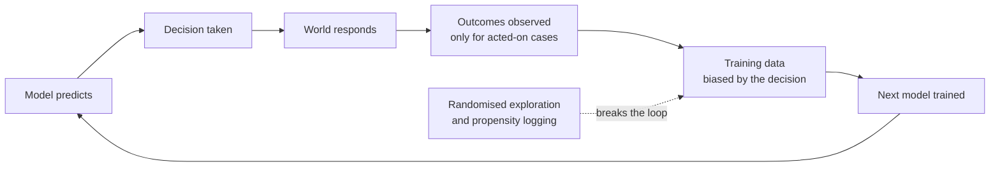

# Chapter 27: Monitoring, Drift, and Retraining

> **What this chapter covers** The four layers of machine learning monitoring, observability foundations and inference logging, data quality in production, the drift taxonomy with its mathematics, detection methods and their failure modes, multiple testing, the significance versus impact distinction, label delay and proxy metrics, performance estimation without labels, alerting design, retraining triggers and policy, incident response for models, and feedback loops.
>
> **Prerequisites** Chapter 2 (Probability and Statistics), Chapter 5 (Evaluation, Validation, and Experimental Design), Chapter 25 (Model Lifecycle, Versioning, and Registries), Chapter 26 (Continuous Integration and Delivery for Machine Learning).
>
> **Where it is used** Every model that stays in production longer than a demo. Fraud and credit scoring where adversaries move, demand forecasting where the world moves, clinical risk scores where populations move, recommenders where the model's own output changes the data, and language model applications where the input distribution is whatever a user types.

A model is a frozen claim about a distribution. The distribution does not stay still. Monitoring is the practice of noticing when the claim has stopped being true, and doing it before a customer, a regulator, or a revenue report notices first.

The hard part is not building dashboards. The hard part is knowing which of the thousand things you can measure actually predicts harm, and resisting the urge to alert on the rest.

---

## 27.1 Level 1: Foundations

### 27.1.1 What goes wrong after deployment

Start with a concrete failure. A demand forecasting model for a grocery chain was trained on two years of sales. It went live in March. In August its mean absolute error doubled. Nothing in the code changed. Nothing in the infrastructure changed. The pipeline did not error. Latency was flat. Every dashboard was green.

What happened: a supplier changed pack sizes, so the `units_per_case` field started arriving as 12 where it had always been 6. The feature `expected_units` doubled. The model had never seen those values. It extrapolated badly.

Three things about this failure matter.

1. It was invisible to infrastructure monitoring. CPU, memory, error rate, and latency were all normal.
2. It was visible in the input data weeks before it was visible in the business metric, because sales figures arrive with a lag.
3. Nobody was looking at the input data.

That is the shape of most machine learning production failures. The system is up. The system is wrong.

### 27.1.2 The four layers

Machine learning monitoring stacks into four layers. Each layer catches a different class of failure, and a layer cannot catch failures from the layer above it.

| Layer | What it watches | Example signals | Catches |
|---|---|---|---|
| Infrastructure | The machines | CPU, memory, GPU utilisation, disk, network, pod restarts | Resource exhaustion, node failure, memory leaks |
| Service | The request path | Request rate, error rate, latency percentiles, saturation, queue depth | Bad deploys, dependency outages, capacity problems |
| Data | What goes in and out | Schema conformance, null rate, range violations, feature distributions, volume | Upstream pipeline changes, broken joins, drift |
| Model | Whether predictions are right | Accuracy, AUC, calibration, business metric, prediction distribution | Model decay, concept drift, silent degradation |

The layers are ordered by how cheap they are to monitor and how directly they measure what you care about. Infrastructure is cheapest and least direct. Model quality is most direct and hardest, because it usually needs labels you do not have yet.



*Figure 27.1: The four monitoring layers, with detection cost rising and directness rising together as you move down.*

A common mistake is stopping at layer two because that is what the existing platform gives you for free. Web service monitoring was designed for systems that are either up or down. Machine learning systems have a third state: up and quietly wrong.

### 27.1.3 The mental model to carry

Hold three ideas.

**A model's contract is with a distribution, not with a schema.** Type checks and null checks are necessary but they do not express what the model assumes. The model assumes the joint distribution of inputs resembles what it was trained on, and that the relationship between inputs and outputs is unchanged.

**Detection is a chain, and the chain has a delay at every link.** The world changes, then the data changes, then the predictions change, then the decisions change, then the outcomes change, then you get labels, then you compute a metric. Each link adds hours to months. Monitoring earlier in the chain is faster but noisier. Monitoring later is slower but more meaningful.

**Statistical detectability and business impact are different things.** With a million requests per day, you can statistically detect a shift of no consequence. With a thousand requests per day, you can miss a shift that costs real money. Never alert on a p-value alone.

### 27.1.4 Vocabulary

| Term | Definition |
|---|---|
| Drift | Any change over time in the distributions the model interacts with |
| Covariate shift | The input distribution changed, the input-to-output relationship did not |
| Prior probability shift | The label distribution changed, the output-to-input relationship did not |
| Concept drift | The relationship between inputs and outputs changed |
| Training-serving skew | A difference between training and serving that exists at time zero, not from drift |
| Stale model | A deployed model whose training data no longer represents current conditions |
| Ground truth latency | The delay between making a prediction and learning whether it was right |
| Proxy metric | A measurable quantity correlated with the unmeasurable one you care about |
| Reference window | The baseline distribution you compare current data against |
| Detection window | The recent slice of production data under test |

Training-serving skew is worth separating from drift immediately. Skew is a bug present on day one, usually a feature computed one way in the training pipeline and another way at serving time. Drift is a change over time. They present identically on a distribution chart and have completely different fixes. Chapter 20 covers skew in the feature store context.

---

## 27.2 Level 2: Working knowledge

### 27.2.1 Observability foundations: metrics, logs, and traces

Three primitives underlie all of this. They are not interchangeable.

| Primitive | Shape | Cost per event | Good for | Bad for |
|---|---|---|---|---|
| Metric | Numeric time series with labels, aggregated | Very low, pre-aggregated | Dashboards, alerting, trends, SLOs | Asking about one specific request |
| Log | Structured record of one event | Moderate, grows with volume | Debugging a specific case, audit, later analysis | Aggregation at query time on high volume |
| Trace | Causally linked spans across services for one request | Moderate, usually sampled | Finding which hop is slow, understanding fan-out | Statistical aggregates |

Metrics answer "is the rate of something changing". Logs answer "what happened to this request". Traces answer "where did the time go".

A prediction service should emit all three. Metrics for alerting, because they are cheap enough to compute on every request. Logs for the inference record, because this is the raw material for every later analysis. Traces sampled at a small rate, because you need them the day latency triples and you need to know whether it is the feature store or the model.

Cardinality is the trap. A metric label with unbounded values, such as user identifier or raw feature value, multiplies the number of time series stored and will take down a metrics backend. Keep metric labels to bounded sets: model version, endpoint, status code, customer tier. Put the high-cardinality detail in logs.



*Figure 27.2: The three telemetry primitives and the distinct questions each one answers.*

### 27.2.2 What to log at inference time

This is the single decision that determines whether you can debug anything in six months. Everything downstream, drift detection, label joining, root cause analysis, fairness audit, regulatory response, depends on having logged the right fields at prediction time. You cannot go back and add them.

Log one row per prediction with the following.

| Field group | Fields | Why |
|---|---|---|
| Identity | prediction_id, request_id, timestamp in UTC, tenant or customer id | Joining, deduplication, per-segment analysis |
| Subject | entity_id such as user or account, hashed or tokenised if sensitive | Joining labels that arrive later keyed by entity |
| Model | model_name, model_version, artifact_hash, feature_pipeline_version | Attributing a change to a deploy |
| Inputs | the exact feature vector fed to the model, post transformation | Reproducing the prediction, drift on real inputs |
| Raw inputs | the request payload before transformation, if affordable | Distinguishing a transformation bug from a data change |
| Output | raw score, calibrated probability, predicted class, top-k with scores | Prediction drift, calibration, threshold changes |
| Decision | the action taken after business rules, the threshold used | Separating model behaviour from policy behaviour |
| Context | experiment arm, routing decision, fallback flag, cache hit flag | Not confusing a fallback with a model change |
| Timing | total latency, feature fetch latency, model latency | Attribution when latency regresses |

Two fields carry outsize value and are commonly forgotten.

The **fallback flag** tells you whether the returned value came from the model at all. Without it, a week of degraded circuit-breaker fallbacks looks like catastrophic model drift.

The **threshold used** separates two different stories. If precision drops and the threshold changed, that is a policy change. If precision drops and the threshold did not change, that is the model or the data.

Log the post-transformation feature vector, not just the raw payload, because that is what the model actually saw. Log the raw payload too where volume allows, because when features look wrong you need to know whether the upstream data changed or your transformation broke.

**Listing 27.1: A structured inference log record.**

```python
import json, time, uuid

def log_prediction(logger, *, features, raw_payload, score, threshold,
                   model_meta, entity_id, timings, context):
    record = {
        "prediction_id": str(uuid.uuid4()),
        "ts": time.time(),
        "entity_id": entity_id,
        "model_name": model_meta["name"],
        "model_version": model_meta["version"],
        "artifact_hash": model_meta["artifact_hash"],
        "feature_pipeline_version": model_meta["feature_pipeline_version"],
        "features": features,            # dict, post-transformation
        "raw_payload_ref": raw_payload,  # or a pointer to object storage
        "score": score,
        "threshold": threshold,
        "decision": int(score >= threshold),
        "used_fallback": context.get("used_fallback", False),
        "experiment_arm": context.get("arm"),
        "latency_ms": timings,
    }
    logger.info(json.dumps(record))
```

The non-obvious choices: `prediction_id` is generated here rather than reused from the request id because one request can produce several predictions, and later label joins key on the prediction. `raw_payload_ref` is a pointer rather than an inline copy when payloads are large, because inline copies make the log stream expensive enough that someone eventually turns it off. `decision` is stored explicitly even though it is derivable, because the derivation rule may change and you want the historical record of what was actually done.

Sampling: log all predictions if you can afford it. If you cannot, sample uniformly at a known rate and always log the tails, meaning errors, fallbacks, and extreme scores. Never sample in a way that depends on the prediction value without recording the sampling rule, because that biases every distribution you later compute.

Retention: inference logs are usually the largest data asset the system produces. A common pattern is full detail for 30 to 90 days in a queryable store, then aggregated summaries and a sampled subset retained longer for trend analysis and audit. The exact numbers are yours to set from regulation and cost, not universal.

### 27.2.3 Data quality monitoring in production

Data quality checks are the cheapest and highest-yield monitoring you will add, and they catch a large fraction of real incidents. They run on the serving data, before drift detection, because a null rate spike is not drift, it is a broken pipeline.

Run these per feature, per batch or per time window.

| Check | What it catches | Typical rule |
|---|---|---|
| Schema conformance | Column added, removed, renamed, retyped | Exact match against an expected schema |
| Null and missing rate | Broken join, failed upstream job | Rate exceeds a baseline band |
| Range and domain | Unit change, sign flip, sentinel values like -999 | Min and max within learned bounds |
| Categorical domain | New category the encoder has never seen | Set of observed values subset of expected plus a small unknown budget |
| Volume | Partial data, duplicated load | Row count within a band of the same weekday and hour |
| Freshness | Stale feature table | Max event timestamp within an expected lag |
| Uniqueness | Duplicate rows from a retried job | Primary key duplication rate near zero |
| Cross-field consistency | Logic broken upstream | `end_date >= start_date`, totals equal sums |

Two practices make these checks survive contact with reality.

**Learn the bands, do not hand-write them.** Compute each check's normal range from a historical window and refresh it periodically. Hand-written thresholds either fire constantly or never fire.

**Respect seasonality in volume checks.** Comparing Sunday to Saturday produces an alert every week. Compare to the same weekday and hour from recent weeks.

Missing value handling deserves care. If a feature's null rate goes from 1 percent to 40 percent and your pipeline imputes the median, the model receives a plausible-looking vector and the failure is invisible in the feature distribution. Monitor the null rate before imputation, and consider adding a missingness indicator feature so the model can express uncertainty about imputed values.

### 27.2.4 The standard monitoring workflow

A workable default, for a model serving online traffic.

1. Emit metrics, an inference log per prediction, and sampled traces.
2. Run data quality checks on the serving feature data every hour or every batch.
3. Compute feature drift statistics daily against a fixed reference window, usually the training data or a recent stable production period.
4. Compute prediction drift daily. Prediction drift is cheap, always available, and a good early signal.
5. Join labels as they arrive and compute performance metrics on the labelled subset.
6. Compute the business metric on whatever cadence the business reports it.
7. Alert on a small number of conditions, mostly from steps 2, 5, and 6.
8. Review the rest weekly as a dashboard, not as alerts.

Note what is not alerting: feature drift. Feature drift goes on a dashboard and into a weekly review. It becomes an alert only when it is tied to an observed or strongly predicted performance impact. Section 27.3.8 explains why.

### 27.2.5 Mistakes everyone makes first

| Mistake | Consequence | Fix |
|---|---|---|
| Alerting on every feature's drift statistic | Hundreds of alerts, all ignored within a month | Alert on performance; dashboard the features |
| Comparing to a drifting baseline | Slow drift is never detected because the baseline moves with it | Use a fixed reference for absolute drift, a rolling one for change detection, and understand which question each answers |
| Logging only the score, not the features | Six months later you cannot explain any prediction | Log the feature vector |
| No model version in the logs | Cannot attribute a change to a deploy | Version every field that can change |
| Treating skew as drift | Retraining does not fix it, because the bug is in the transformation | Check whether the gap existed on day one |
| Monitoring the mean only | Bimodal shifts and tail shifts are invisible | Monitor quantiles and full distributions |
| Retraining on a schedule with no evaluation gate | A worse model ships automatically | Gate every retrain on a held-out comparison |

---

## 27.3 Level 3: Depth

### 27.3.1 The drift taxonomy, stated mathematically

Let $X$ be the input random variable, $Y$ the target. The model was trained on a source joint distribution $P_s(X, Y)$ and serves a target distribution $P_t(X, Y)$ at time $t$.

Any joint distribution factors two ways.

$$P(X, Y) = P(Y \mid X) \, P(X) = P(X \mid Y) \, P(Y)$$

The taxonomy is which factor moved.

**Covariate shift.** The input marginal changes, the conditional does not.

$$P_t(X) \neq P_s(X) \quad \text{and} \quad P_t(Y \mid X) = P_s(Y \mid X)$$

The world is sending you different inputs, but the rule mapping inputs to outputs is unchanged. A lending model starts receiving applications from a younger population. Younger applicants have different features, but the relationship between features and default is the same function.

**Prior probability shift**, also called label shift or target shift. The label marginal changes, the class-conditional input distribution does not.

$$P_t(Y) \neq P_s(Y) \quad \text{and} \quad P_t(X \mid Y) = P_s(X \mid Y)$$

The base rate moved. Fraud prevalence rises from 0.5 percent to 2 percent, but fraudulent transactions still look the way they did. This is the natural model for many detection problems where the generating process per class is stable but the mixture is not.

**Concept drift.** The conditional itself changes.

$$P_t(Y \mid X) \neq P_s(Y \mid X)$$

The rule changed. The same input now implies a different output. A customer profile that meant low churn risk last year means high churn risk now because a competitor launched a cheaper product. No amount of reweighting the inputs fixes this, because the function you learned is wrong.

### 27.3.2 What each type implies for retraining

This is the part that most treatments skip and it is the part that decides what you do.

| Type | Does accuracy necessarily degrade | Fix |
|---|---|---|
| Covariate shift | No, not necessarily | Often nothing. If the model is well specified and the new inputs fall inside the region where it was fit, performance holds. Retrain or reweight only if the new mass is in a region the model fit poorly |
| Prior probability shift | Calibration degrades, ranking often does not | Recalibrate. Adjust the decision threshold or apply a prior correction. Full retraining is usually unnecessary |
| Concept drift | Yes, by definition | Retrain on data from the new regime. This is the only type that always requires new labels |

Take covariate shift seriously. If $P(Y \mid X)$ is unchanged and your model has learned $P(Y \mid X)$ well across the input space, then sending it different $x$ values changes which parts of the function get exercised but not whether the answers are right. Aggregate accuracy can change simply because the mixture of easy and hard cases changed, while the model is no worse.

The exception is the one that matters in practice: real models are not correct everywhere. They are accurate where training data was dense and unreliable where it was sparse. Covariate shift hurts exactly when the new input mass lands where the old data was thin. So the useful question is not "did the inputs move" but "did the inputs move into regions the model has not seen". That is a different measurement, and it is why out-of-distribution detection and nearest-neighbour density in training space are often better signals than a per-feature drift statistic.

For prior probability shift there is a clean correction. If the model outputs $\hat{p}_s(y \mid x)$ under source prior $\pi_s(y)$ and the target prior is $\pi_t(y)$, then under the label shift assumption the corrected posterior is

$$\hat{p}_t(y \mid x) \propto \hat{p}_s(y \mid x) \cdot \frac{\pi_t(y)}{\pi_s(y)}$$

normalised over classes. For binary classification with source prevalence $\pi_s$ and target prevalence $\pi_t$, the corrected odds are the old odds multiplied by $\frac{\pi_t(1-\pi_s)}{\pi_s(1-\pi_t)}$.

Worked example. A fraud model was trained where prevalence was $\pi_s = 0.005$. Current prevalence is $\pi_t = 0.02$. A transaction scores $\hat{p}_s = 0.10$. Source odds are $0.10 / 0.90 = 0.1111$. The ratio is

$$\frac{0.02 \times 0.995}{0.005 \times 0.98} = \frac{0.0199}{0.0049} = 4.061$$

Corrected odds are $0.1111 \times 4.061 = 0.4512$, so $\hat{p}_t = 0.4512 / 1.4512 = 0.311$. The score triples without touching the model weights. If your alerting threshold is a fixed probability, this alone changes your alert volume enormously, and the fix is recalibration, not retraining.

Estimating $\pi_t$ without labels is possible under the label shift assumption using confusion-matrix based estimators, the best known being black box shift estimation from Lipton, Wang, and Smola, "Detecting and Correcting for Label Shift with Black Box Predictors" (2018).



*Figure 27.3: The decision path from a detected change to an action, with the branch that most teams skip being the benign covariate shift leaf.*

There are two more categories worth naming. **Virtual drift** is a change in $P(X)$ that leaves the decision boundary's effect unchanged, which is the benign covariate shift leaf above. **Recurring or seasonal drift** is periodic, and its correct treatment is not continual retraining but including seasonal features or training on a full cycle of history. Treating December as drift and retraining on December data produces a model that is wrong in January.

### 27.3.3 Detection methods: two-sample tests on features

All feature drift detection is the same problem. You have a reference sample from $P_s$ and a detection sample from $P_t$ and you ask whether they came from the same distribution.

**Kolmogorov-Smirnov test.** For continuous univariate data, the statistic is the maximum absolute gap between the two empirical cumulative distribution functions.

$$D_{n,m} = \sup_x \left| F_n(x) - G_m(x) \right|$$

where $F_n$ is the empirical CDF of the reference sample of size $n$ and $G_m$ that of the detection sample of size $m$. Under the null hypothesis that both come from the same continuous distribution, the null is rejected at level $\alpha$ when

$$D_{n,m} > c(\alpha)\sqrt{\frac{n+m}{nm}}, \qquad c(0.05) \approx 1.358$$

Worked example. Reference $n = 10{,}000$, detection $m = 2{,}000$, observed $D = 0.031$. The critical value is

$$1.358 \times \sqrt{\frac{12{,}000}{20{,}000{,}000}} = 1.358 \times \sqrt{0.0006} = 1.358 \times 0.02449 = 0.0333$$

So $D = 0.031$ does not reject at the 5 percent level. Now suppose $m = 20{,}000$ instead. The critical value becomes $1.358 \times \sqrt{30{,}000/2 \times 10^8} = 1.358 \times 0.01225 = 0.0166$, and the same $D = 0.031$ rejects decisively. Identical distributional difference, opposite conclusion, purely from sample size. This is the central failure mode of significance testing for drift and it is discussed in 27.3.8.

Failure modes of KS: it is univariate only, so it cannot see a change in the correlation between two features while both marginals hold. It assumes continuity and behaves poorly with heavy ties or discrete data. It is most sensitive near the median of the distribution and least sensitive in the tails, which is often where the interesting drift is. And it is scale-free in the sense that it tells you nothing about the magnitude of the difference in units you care about.

**Chi-squared test for categoricals.** For a categorical feature with $k$ categories, with observed counts $O_i$ in the detection window and expected counts $E_i$ derived from the reference proportions scaled to the detection sample size,

$$\chi^2 = \sum_{i=1}^{k} \frac{(O_i - E_i)^2}{E_i}$$

compared against a chi-squared distribution with $k-1$ degrees of freedom.

Worked example. A three-category feature. Reference proportions 0.60, 0.30, 0.10. Detection window of 1,000 rows gives observed counts 640, 260, 100. Expected counts are 600, 300, 100.

$$\chi^2 = \frac{40^2}{600} + \frac{(-40)^2}{300} + \frac{0^2}{100} = 2.667 + 5.333 + 0 = 8.0$$

With 2 degrees of freedom the 5 percent critical value is 5.99, so this rejects. Note again that doubling the sample size while holding proportions constant doubles $\chi^2$.

Failure modes: the approximation degrades when expected counts fall below about 5 in a cell, so rare categories must be pooled. A brand new category has an expected count of zero and breaks the statistic entirely, which is why new-category detection must be a separate check. It is also insensitive to ordering when the categorical is really ordinal.

**Population stability index.** PSI is the most common drift metric in credit risk and it is a symmetrised discrete divergence, not a hypothesis test.

$$\text{PSI} = \sum_{i=1}^{B} (p_i - q_i) \ln\frac{p_i}{q_i}$$

where $p_i$ is the proportion of the detection sample in bin $i$, $q_i$ the proportion of the reference sample in bin $i$, and $B$ the number of bins. It equals the sum of the Kullback-Leibler divergence in both directions, which is the Jeffreys divergence over the binned distributions.

The binning choices determine the answer and are rarely reported.

| Choice | Options | Effect |
|---|---|---|
| Bin count | 10 is conventional | More bins makes PSI larger and noisier; fewer hides shape changes |
| Bin edges | Quantiles of the reference, or fixed-width | Quantile bins of the reference give equal $q_i$ and are the usual choice |
| Edge source | Reference or pooled | Edges must be frozen from the reference, otherwise you are comparing a distribution to itself |
| Zero handling | Add a small epsilon, or floor the proportion | Required, because $\ln(p_i/q_i)$ diverges if either is zero |

The widely quoted thresholds are **PSI below 0.1 is no significant change, 0.1 to 0.25 is moderate change warranting investigation, above 0.25 is major change**. State these as what they are: conventions from credit scoring practice with ten quantile bins, not results derived from a distributional theory. They have no general validity at other bin counts or sample sizes, and a PSI of 0.3 on a feature the model barely uses is less important than a PSI of 0.08 on the top feature.

Worked example with 5 bins for compactness. Reference proportions are all 0.20 by construction from quantile binning. Detection proportions are 0.10, 0.15, 0.20, 0.25, 0.30.

| Bin | $q_i$ | $p_i$ | $p_i - q_i$ | $\ln(p_i/q_i)$ | Contribution |
|---|---|---|---|---|---|
| 1 | 0.20 | 0.10 | -0.10 | -0.6931 | 0.06931 |
| 2 | 0.20 | 0.15 | -0.05 | -0.2877 | 0.01438 |
| 3 | 0.20 | 0.20 | 0.00 | 0.0000 | 0.00000 |
| 4 | 0.20 | 0.25 | 0.05 | 0.2231 | 0.01116 |
| 5 | 0.20 | 0.30 | 0.10 | 0.4055 | 0.04055 |

PSI = 0.1354. By the convention this is a moderate shift warranting investigation, not an emergency. Note the contributions tell you where the shift is, and reporting the per-bin contribution is more useful than reporting the scalar.

PSI failure modes: it is univariate. It is sensitive to bin count, so PSI values are not comparable across features binned differently. It has no null distribution, so it gives no notion of statistical uncertainty, which is simultaneously its weakness and the reason it does not suffer KS's sample size pathology in the same way. A small detection window makes PSI noisy and upward biased because empty and near-empty bins inflate the log terms.

### 27.3.4 Multivariate methods

Univariate tests miss changes in dependence structure. Two methods handle the joint distribution directly.

**Maximum mean discrepancy.** MMD embeds both distributions into a reproducing kernel Hilbert space and measures the distance between their mean embeddings. The population quantity is

$$\text{MMD}^2(P, Q) = \mathbb{E}_{x,x' \sim P}[k(x,x')] + \mathbb{E}_{y,y' \sim Q}[k(y,y')] - 2\,\mathbb{E}_{x \sim P, y \sim Q}[k(x,y)]$$

where $k$ is a positive definite kernel, usually the Gaussian radial basis function $k(x,y) = \exp(-\|x-y\|^2 / 2\sigma^2)$. The unbiased empirical estimator replaces each expectation with an average over sample pairs, excluding the diagonal terms in the first two.

MMD is zero if and only if $P = Q$ for a characteristic kernel, so it detects any difference, including higher-order and dependence changes, not just means. The reference treatment is Gretton, Borgwardt, Rasch, Schölkopf, and Smola, "A Kernel Two-Sample Test" (2012).

Practical points. The bandwidth $\sigma$ is usually set by the median heuristic, meaning the median pairwise distance in the pooled sample, and the result depends on it. The naive estimator is $O(n^2)$ in sample size, so you subsample or use a linear-time variant. Significance comes from a permutation test, which costs another factor. And critically, features must be scaled sensibly first, because a single large-magnitude feature dominates the Euclidean distance inside the kernel.

**Domain classifier.** Train a binary classifier to distinguish reference rows from detection rows. Label reference rows 0 and detection rows 1, shuffle, fit a gradient boosted tree with proper cross-validation, and look at held-out AUC.

If the two samples come from the same distribution, no classifier can do better than chance, so AUC is 0.5. AUC meaningfully above 0.5 means the distributions are distinguishable, and the magnitude is interpretable: AUC is the probability that a randomly chosen detection row is ranked above a randomly chosen reference row.

This method has three advantages that make it the workhorse in practice.

1. It is inherently multivariate and catches dependence changes for free.
2. It handles mixed types, missing values, and high dimension using the same machinery you already use for modelling.
3. Feature importance on the domain classifier tells you *which* features drove the difference, which is the question you actually ask next.

**Listing 27.2: A domain classifier drift check with a permutation baseline.**

```python
import numpy as np
from sklearn.ensemble import HistGradientBoostingClassifier
from sklearn.model_selection import cross_val_score

def domain_classifier_auc(reference, current, n_perm=20, seed=0):
    rng = np.random.default_rng(seed)
    X = np.vstack([reference, current])
    y = np.r_[np.zeros(len(reference)), np.ones(len(current))]
    clf = HistGradientBoostingClassifier(max_depth=4, max_iter=150)
    observed = cross_val_score(clf, X, y, cv=5, scoring="roc_auc").mean()
    # Null distribution by permuting the domain label.
    null = []
    for _ in range(n_perm):
        yp = rng.permutation(y)
        null.append(cross_val_score(clf, X, yp, cv=5, scoring="roc_auc").mean())
    null = np.array(null)
    p_value = (np.sum(null >= observed) + 1) / (n_perm + 1)
    return observed, float(null.mean()), p_value
```

The permutation loop is the part people omit and it is the part that makes the number trustworthy. Cross-validated AUC on shuffled labels should sit near 0.5, but with small samples and a flexible model it can sit noticeably above it, and comparing to that empirical null rather than to the theoretical 0.5 avoids declaring drift on noise. Class imbalance between the two windows matters, so either match window sizes or use a class-weighted model, since AUC is imbalance-robust but the fitted model is not.

Interpreting the AUC as an effect size is the main benefit. A rough working reading, offered as a convention rather than a theorem: below about 0.55 is indistinguishable in practice, 0.55 to 0.70 is a real but modest shift, above 0.80 the two windows are nearly separable and something structural changed, often a pipeline change rather than organic drift.

### 27.3.5 Drift on unstructured data and embeddings

Text, images, and audio have no natural per-feature marginals to test. The standard approach is to reduce to a representation and test there.

1. Encode each input with a fixed, versioned encoder. It must be frozen, because changing the encoder changes the measurement.
2. Optionally reduce dimension, for example with a PCA fitted on the reference set, again frozen.
3. Apply MMD or a domain classifier in the embedding space.
4. For interpretability, cluster the reference embeddings and monitor the proportion of current data falling in each cluster, plus the proportion falling far from any cluster centroid.

The last item is often the most useful monitor for a language model application. Assign each incoming request to its nearest reference cluster and record the distance. A rising fraction of requests with large nearest-cluster distance means users are asking things the system has never been evaluated on, which is actionable in a way that a scalar MMD is not.

Two cautions. Embedding drift can be caused entirely by the encoder, so pin the encoder version in the monitoring config and treat an encoder upgrade as a reference reset. And embedding distance is not semantic importance: a systematic formatting change in inputs will move embeddings a long way without changing meaning at all.

Alternative reductions worth knowing: for images, monitor simple interpretable statistics alongside embeddings, such as brightness, contrast, resolution, and the fraction of images failing a quality filter, because these localise a camera or pipeline change immediately. For text, monitor length distribution, language identification proportions, and out-of-vocabulary or unusual-token rate.

### 27.3.6 Multiple testing when monitoring many features

With 200 features tested daily at $\alpha = 0.05$, the expected number of false alarms per day under a completely stable system is $200 \times 0.05 = 10$. Over a month that is roughly 300 false alerts. The system will be muted within two weeks.

The family-wise error rate for $m$ independent tests at level $\alpha$ is

$$\text{FWER} = 1 - (1 - \alpha)^m$$

For $m = 200$ and $\alpha = 0.05$ this is $1 - 0.95^{200} \approx 1 - 3.5 \times 10^{-5}$, so essentially certain.

Two corrections.

**Bonferroni** controls FWER by testing each hypothesis at $\alpha / m$. For 200 features at overall 5 percent, each test uses $0.00025$. This is correct and very conservative, and with correlated features, which production features always are, it is more conservative still.

**Benjamini-Hochberg** controls the false discovery rate, the expected proportion of rejections that are false, which is the more sensible target here because you are screening, not confirming. Sort the $m$ p-values ascending as $p_{(1)} \le \dots \le p_{(m)}$, find the largest $k$ such that

$$p_{(k)} \le \frac{k}{m} q$$

for target FDR $q$, and reject hypotheses $1$ through $k$.

Worked example. Ten features, $q = 0.10$. Sorted p-values: 0.001, 0.008, 0.019, 0.032, 0.045, 0.210, 0.330, 0.480, 0.610, 0.900. The thresholds $\frac{k}{10} \times 0.10$ are 0.01, 0.02, 0.03, 0.04, 0.05, 0.06, 0.07, 0.08, 0.09, 0.10.

| $k$ | $p_{(k)}$ | Threshold | Pass |
|---|---|---|---|
| 1 | 0.001 | 0.010 | yes |
| 2 | 0.008 | 0.020 | yes |
| 3 | 0.019 | 0.030 | yes |
| 4 | 0.032 | 0.040 | yes |
| 5 | 0.045 | 0.050 | yes |
| 6 | 0.210 | 0.060 | no |

The largest passing $k$ is 5, so the first five features are flagged. Bonferroni at the same overall level would have used $0.10/10 = 0.01$ and flagged only the first.

A practical alternative that sidesteps the whole problem: run a single multivariate test, such as the domain classifier, as the gate, and use per-feature statistics only as a diagnostic after the gate fires. One test, one p-value, no correction needed, and you get attribution from feature importance.

### 27.3.7 Delayed, partial, and missing labels

The textbook assumes you learn whether each prediction was right. Production rarely provides that.

| Label regime | Example | Consequence |
|---|---|---|
| Immediate | Click or no click within seconds | Performance monitoring is nearly real time |
| Short delay | Delivery time known next day | Metrics lag by a day, fine |
| Long delay | 12-month loan default | Performance on today's model arrives next year |
| Partial | Only approved applicants have an outcome | Selection bias, the rejected are censored |
| Biased by the model | Only items the recommender surfaced get feedback | Feedback loop, see 27.3.12 |
| Absent | Free-text summarisation quality | No label at all, needs human or model judgment |

Two of these deserve a deeper treatment.

**Censoring from the decision.** A credit model approves some applicants and rejects others. You observe default only for approvals. Training a new model on approvals only learns $P(Y \mid X, \text{approved})$, not $P(Y \mid X)$. The classical mitigation is reject inference, and the honest version of it is a small randomised holdout: approve a tiny random sample of applicants who would have been rejected, accept the cost, and use that unbiased sample to correct. The same structure appears in any system where the model gates which outcomes you get to see, including fraud review queues and content moderation.

**Delay and the moving window.** With a 12-month label delay, performance measured today reflects a model and a world from a year ago. You cannot wait. The standard response is a layered metric set.

| Layer | Available at | Example for credit |
|---|---|---|
| Input and prediction distributions | Immediately | Feature PSI, score distribution, approval rate |
| Leading proxy | Days to weeks | First payment missed, early delinquency at 30 days |
| Partial outcome | Months | 3-month vintage default rate |
| Final outcome | 12 months plus | Full-term default rate |

Proxy metrics must be validated, not assumed. Before relying on early delinquency as a proxy for default, measure the historical correlation between them at the segment level and state it. A proxy that correlates at 0.3 will mislead you. Also check that the proxy is not itself gameable or affected by the same shift, which is the common failure: a proxy and a target both driven by an unmeasured third factor will move together in normal times and decouple exactly when you need the proxy.

### 27.3.8 Significance versus impact, which is the point of the chapter

Here is the most important idea in the chapter, stated plainly.

**Statistically significant drift that does not degrade the model is noise. The only monitor that ultimately matters is performance, when labels are available.**

Three reasons this is not pedantry.

First, sample size. As shown in 27.3.3, the same distributional difference is significant or not depending purely on how much traffic you have. A high-volume service can detect a 0.3 percent shift in a feature mean. That shift will not change any decision.

Second, most features barely matter. A model with 200 features typically has effective dependence on 15 of them. Drift in feature 174 is irrelevant by construction.

Third, models are often robust to input shifts within their fitted region, as covered in 27.3.2. Covariate shift does not imply degradation.

The practical remedy is to convert drift into an estimated impact before acting. Two approaches.

**Importance-weighted drift.** Weight each feature's drift score by that feature's contribution to the model, for example mean absolute SHAP value or permutation importance, and aggregate.

$$\text{Impact score} = \sum_{j=1}^{d} w_j \cdot \text{PSI}_j, \qquad w_j = \frac{I_j}{\sum_k I_k}$$

where $I_j$ is the importance of feature $j$.

Worked example. Four features.

| Feature | PSI | Importance $I_j$ | $w_j$ | $w_j \cdot \text{PSI}_j$ |
|---|---|---|---|---|
| A | 0.35 | 0.02 | 0.02 | 0.007 |
| B | 0.04 | 0.50 | 0.50 | 0.020 |
| C | 0.12 | 0.30 | 0.30 | 0.036 |
| D | 0.02 | 0.18 | 0.18 | 0.004 |

A naive per-feature alert fires on feature A with PSI 0.35, which is a "major shift" by convention. The impact score says feature C contributes most to the weighted total, and the whole weighted score is 0.067, which is small. The right action is to look at C, and to ignore A.

**Direct impact simulation.** Better when you can afford it. Take the current feature distribution, take a labelled historical set, reweight the historical set to match the current input distribution using importance weights $w(x) = P_t(x)/P_s(x)$ estimated from the domain classifier, and recompute the metric on the reweighted set. The domain classifier gives this for free: if $c(x)$ is the classifier's probability that a row is from the current window, then

$$\frac{P_t(x)}{P_s(x)} = \frac{c(x)}{1 - c(x)} \cdot \frac{n_s}{n_t}$$

This produces an estimate of how the model would perform under the new input distribution, using only old labels, and it is valid precisely under the covariate shift assumption. It is not valid under concept drift, which is the honest limitation: it answers "would this input shift hurt me if the rule is unchanged", which is exactly the question left open in 27.3.2.

### 27.3.9 Performance estimation without labels

Beyond importance weighting, several signals estimate quality with no labels at all.

| Signal | What it measures | Caveat |
|---|---|---|
| Prediction distribution shift | Change in the model output histogram | Can be caused by benign input shift |
| Confidence distribution | Drop in mean max-probability, rise in entropy | Only meaningful if the model is calibrated |
| Expected calibration on predicted scores | Compare predicted positive rate to observed, when partially available | Needs some labels |
| Out-of-distribution score | Distance to the training manifold, reconstruction error, nearest-neighbour distance | Thresholds are arbitrary |
| Disagreement with a reference ensemble | Train a small committee, monitor disagreement rate | Cost of a second model |
| Confidence-based accuracy estimate | Sum of predicted confidences as an estimate of accuracy | Valid only under calibration, breaks under concept drift |

The confidence-based estimator is worth stating precisely because it is cheap and commonly used. For a calibrated binary classifier, the expected accuracy on a sample at a 0.5 threshold is

$$\widehat{\text{acc}} = \frac{1}{n}\sum_{i=1}^{n} \max(\hat{p}_i, 1 - \hat{p}_i)$$

Worked example. Five predictions with $\hat{p}$ of 0.95, 0.80, 0.55, 0.30, 0.05. The terms are 0.95, 0.80, 0.55, 0.70, 0.95, summing to 3.95, giving an estimated accuracy of 0.79. If last month the same computation gave 0.88, the model has become less confident, which is a real signal.

The fatal caveat: under concept drift, a model becomes confidently wrong, so this estimator stays high while accuracy collapses. It detects the input-shift flavour of degradation and is blind to the concept-drift flavour. Never use it alone. The more principled treatments in this space go under the name confidence-based performance estimation and direct loss estimation, and all of them carry assumptions that concept drift violates.

### 27.3.10 Alerting design

Bad alerting is worse than no alerting, because it trains people to ignore the channel.

Four principles.

**Alert on symptoms, not causes.** Page on "conversion is down" and "model accuracy on labelled traffic dropped below the floor", not on "feature 47 has PSI above 0.25".

**Every page must be actionable and urgent.** If the responder's only action is to look at it tomorrow, it is a ticket, not a page. Split the channels: page, ticket, dashboard.

**Use burn rates rather than instantaneous thresholds.** An instantaneous threshold on a noisy metric fires constantly. A burn rate asks how fast you are consuming an error budget over a window, which naturally trades detection speed against false alarms. Chapter 28 derives the burn rate formula and the multi-window configuration; the short statement is that a fast window catches severe incidents quickly and a slow window catches slow bleeds, and requiring both a long and a short window to be burning suppresses single-spike noise.

**Give every alert a runbook link.** An alert with no documented first three steps will be handled badly at three in the morning.

A workable alert set for one model.

| Condition | Severity | Rationale |
|---|---|---|
| Serving error rate or latency SLO burning fast | Page | Classic service failure |
| Prediction volume drops more than a learned band | Page | Usually an upstream outage, and silent |
| Fallback rate above a small percentage | Page | The model is effectively offline |
| Data quality check fails on a feature the model depends on heavily | Page | Predictions are already wrong |
| Measured performance on labelled traffic below the floor | Page | Direct evidence of harm |
| Business metric degraded beyond a band | Page | The outcome that matters |
| Multivariate drift gate fires | Ticket | Investigate within a day |
| Per-feature drift statistics | Dashboard | Diagnostic only |
| Calibration error rising | Ticket | Usually fixed by recalibration |

Alert fatigue is measurable. Track the fraction of pages that led to an action. If it falls below roughly half, the alerting is broken and the fix is deleting alerts, not adding documentation. Also track alerts that fired repeatedly for the same cause and either fix the cause or aggregate them.

### 27.3.11 The retraining decision

Retraining is a deploy. It carries deploy risk. It is not free and it is not automatically good.

Four trigger policies.

| Policy | Trigger | Suits | Weakness |
|---|---|---|---|
| Scheduled | Fixed cadence, weekly or monthly | Stable domains, simple operations | Retrains when unnecessary, waits when urgent |
| Performance triggered | Metric crosses a floor | Where labels arrive fast | Useless with long label delay, and fires after harm |
| Drift triggered | Drift gate fires with estimated impact | Where labels are delayed | Can fire on benign drift |
| Data volume triggered | N new labelled examples accumulated | Cold start, growing datasets | Ignores whether the new data changes anything |

Most mature systems use a combination: a scheduled floor so the model never gets arbitrarily stale, plus performance and impact-weighted drift triggers that can pull a retrain forward.

Independent of the trigger, decide these four things and write them down.

**The training window.** Fixed window, expanding window, or weighted. A fixed recent window adapts fast and forgets rare events, which is dangerous for fraud and for anything with annual seasonality. An expanding window is stable and adapts slowly. Sample weighting by recency, with weight $\exp(-\lambda \Delta t)$ for age $\Delta t$, is the compromise, and $\lambda$ is a hyperparameter you validate rather than guess.

**Warm start or cold start.** Continuing from previous weights is cheap and can drift into a bad basin over many iterations. Retraining from scratch is expensive and reproducible. For tabular gradient boosting, from scratch is usually affordable and preferred. For large models, warm starting is often the only option, and then you need periodic cold restarts to avoid accumulated pathologies.

**The evaluation gate.** Never promote automatically on training loss. Require: an out-of-time holdout, meaning evaluation on data strictly newer than all training data, since random splits leak temporal information and overstate performance; a paired comparison against the incumbent on the same items with a bootstrap confidence interval on the difference; segment-level checks so an aggregate gain that hides a regression for a subgroup is caught; and a set of behavioural tests on curated cases that must not regress.

**The rollout.** Shadow the candidate first, comparing predictions on live traffic without acting on them. Then a canary on a small traffic share with automatic rollback conditions. Chapter 26 covers the mechanics.



*Figure 27.4: The retraining pipeline with the two gates that prevent a worse model from shipping automatically.*

One step in that diagram is easy to miss and causes real confusion later. After a full rollout, **reset the reference window** used for drift detection, or you will keep comparing against a distribution the current model was never trained on and every dashboard stays red forever.

A note on continual and online learning. Updating weights continuously from the live stream removes the retrain lag and removes every gate above. It is appropriate for a small set of problems with fast, unbiased, abundant labels, such as click prediction. Everywhere else, the inability to test before shipping makes it a poor trade. Keep the batch retrain and gate it.

### 27.3.12 Incident response for models

When a model incident is declared, the sequence is fixed.

1. **Stabilise before diagnosing.** Reduce harm first. Roll back to the previous model version, disable the model and use the fallback, tighten a threshold to be more conservative, or route affected segments to a rule-based path.
2. **Establish the timeline.** When did the metric start moving, and what changed near that moment. Deploys, feature pipeline changes, upstream schema changes, marketing campaigns, and external events.
3. **Localise the layer.** Infrastructure, service, data, or model, using Figure 27.1 top down. Most incidents that look like model failures are data failures.
4. **Decide rollback versus retrain.**
5. **Fix, verify, and write the postmortem.**

The rollback versus retrain decision is the one people get wrong under pressure.

| Situation | Action | Why |
|---|---|---|
| A new model version was deployed recently and metrics moved after it | Roll back | Fast, reversible, and the evidence points at the deploy |
| Data pipeline broke and fed bad features | Fix the pipeline, do not retrain | Retraining on corrupted data makes it permanent |
| Gradual decay over weeks, no deploy nearby | Retrain | This is genuine drift |
| Sudden external regime change, for example a policy or pricing change | Retrain, and consider a temporary rule overlay | The old relationship no longer holds, and retraining takes time you do not have |
| Prior shift only, ranking intact | Recalibrate or move the threshold | Cheapest correct fix |

Rollback is almost always the right first move because it is reversible and fast. Retraining under incident pressure produces models that were not properly evaluated, which is how one incident becomes two.

The postmortem should be blameless and should answer: what was the customer impact in numbers and duration, what was the detection time and could it have been shorter, what was the sequence of events, what was the root cause including the contributing conditions, and what specific actions with owners will prevent recurrence. The most valuable output of a model postmortem is usually a new monitor or a new gate, and the second most valuable is a new test case added to the behavioural suite.

### 27.3.13 Feedback loops

A model whose predictions influence the world generates its own future training data. This is the most subtle failure in production machine learning because everything looks healthy while the system degenerates.

Three concrete mechanisms.

**Selection feedback in recommenders.** The model ranks items. Users can only interact with what was shown. Training on interaction logs teaches the next model that the shown items are the good items. Items never shown accumulate no positive evidence and are ranked lower still. The catalogue collapses toward a popular core. The standard mitigations are explicit exploration with a small randomised traffic share, inverse propensity weighting where you log the probability with which each item was shown and weight the training examples by its inverse, and off-policy evaluation methods.

**Threshold feedback in detection.** A fraud model flags transactions above a threshold. Flagged transactions get reviewed, so you learn their labels. Unflagged transactions are assumed legitimate. The next model trains on a set where every observed fraud was one the previous model already caught, so it learns the previous model's blind spots as ground truth. The mitigation is a randomised review sample drawn from below the threshold.

**Action feedback in intervention models.** A churn model predicts high risk, the retention team offers a discount, the customer stays. The label is now "did not churn" for a customer the model correctly identified as high risk. The model appears wrong and, if retrained naively, learns to stop flagging exactly the customers the intervention saved. This is the treatment-effect problem, and the correct framing is causal rather than predictive: you want to predict the effect of the intervention, not the outcome under an intervention policy you failed to record. At minimum, log the intervention as a feature and exclude or explicitly model treated cases.



*Figure 27.5: The feedback loop, and the single intervention that breaks it, which is logging the decision policy and randomising a small share of it.*

The general prescription: log the policy, not just the prediction. Record the probability with which each action was chosen. That one field converts a biased log into a dataset you can reweight and evaluate off-policy.

---

## 27.4 Level 4: Mastery

### 27.4.1 Where the standard advice is wrong

**"Set up drift alerts on all features" is bad advice.** It is the most commonly repeated monitoring recommendation and it produces alert fatigue with almost no detection benefit. The defensible version is: multivariate gate for alerting, per-feature statistics as diagnostics, importance weighting before any action, and performance as the ground truth whenever labels exist.

**"PSI above 0.25 means retrain" is a convention presented as a law.** It came from credit scorecard practice with particular bin counts and particular sample sizes. It has no derivation. Report it as a convention and always pair it with an impact estimate.

**"Retrain regularly on recent data" is wrong for seasonal and rare-event domains.** A fixed recent window systematically forgets annual patterns and forgets rare fraud typologies. In fraud specifically, the rare positive class is the whole problem, and a short window may contain a handful of positives of a given type. Weighted or stratified windows are correct, and the weighting is a validated hyperparameter.

**"Accuracy dropped, so the model drifted" is often false.** Accuracy is a function of the class balance and the difficulty mixture. Prior shift alone moves accuracy without any change in model quality. Always check whether a ranking metric like AUC moved alongside a threshold metric like precision. AUC stable with precision falling is a prior shift or threshold story, not a model-decay story.

### 27.4.2 The theoretical limits of unsupervised drift detection

There is a result worth internalising. Without labels, concept drift is not detectable in general. If $P(X)$ is unchanged and only $P(Y \mid X)$ changed, no function of the unlabelled inputs can see it, because the inputs are identically distributed. Every unsupervised detector is detecting covariate shift and hoping it correlates with concept drift.

This is not a limitation of current methods. It is information-theoretic. The practical consequences are concrete.

1. Some labels are mandatory. Budget for a small, continuously drawn, randomly selected labelled sample, independent of the model's decisions. This is the single highest-value monitoring investment for most systems and it is usually the one that is cut.
2. Unsupervised detectors should be tuned for the cases where covariate and concept drift co-occur, which is most real change, rather than presented as general drift detection.
3. When labels are impossible, use human review of a random sample, or a model-based judge with a periodically validated agreement rate against human judgment. Chapter 16 covers judge calibration.

### 27.4.3 Sequential detection and changepoint methods

Fixed-window testing repeated daily is statistically awkward, because repeated testing on overlapping windows inflates error rates and the window size sets an arbitrary detection lag. Sequential methods are designed for streaming and are underused.

**CUSUM.** Accumulate deviations from an expected value and alarm when the cumulative sum exceeds a bound. For monitoring a mean $\mu_0$ with allowance $k$,

$$S_t^+ = \max(0,\; S_{t-1}^+ + (x_t - \mu_0 - k))$$

with an alarm when $S_t^+ > h$. The allowance $k$ is usually set to half the smallest shift you want to detect, and $h$ trades average run length under the null against detection delay.

Worked example. Monitoring a daily error rate with $\mu_0 = 0.05$ and target detection of a shift to 0.07, so $k = 0.01$. Set $h = 0.05$. Observations 0.052, 0.061, 0.068, 0.071, 0.066. The increments $x_t - \mu_0 - k$ are -0.008, 0.001, 0.008, 0.011, 0.006, giving $S^+$ of 0, 0.001, 0.009, 0.020, 0.026. No alarm yet, but the statistic is climbing monotonically, which a daily threshold test on individual values would not have shown, since no single value is extreme.

**ADWIN**, adaptive windowing, from Bifet and Gavaldà, "Learning from Time-Changing Data with Adaptive Windowing" (2007), maintains a window and cuts it whenever two sub-windows have significantly different means, giving an automatic window size with a statistical guarantee. **Page-Hinkley** is a closely related sequential test. **DDM** and **EDDM**, drift detection method and its early variant, monitor the online error rate and its standard deviation and signal warning and drift levels; see Gama, Medas, Castillo, and Rodrigues, "Learning with Drift Detection" (2004). The broad survey is Gama, Žliobaitė, Bifet, Pechenizkiy, and Bouchachia, "A Survey on Concept Drift Adaptation" (2014), which remains the reference map of the field.

The practical reason to use these: they have explicit average-run-length properties, so you can reason about false alarm rate per unit time rather than per test, which is the quantity you actually care about when a detector runs forever.

### 27.4.4 Distributionally robust and adaptation approaches

Rather than detecting drift and reacting, you can build models that degrade more gracefully.

**Distributionally robust optimisation** minimises the worst-case loss over a set of distributions near the training distribution.

$$\min_\theta \; \sup_{Q \in \mathcal{U}(P)} \; \mathbb{E}_{Q}[\ell(\theta; Z)]$$

where $\mathcal{U}(P)$ is an uncertainty set, commonly a divergence ball or a Wasserstein ball around the empirical distribution $P$. The cost is worse average-case performance in exchange for a better floor. Group DRO, which optimises worst-group loss over known subpopulations, is the version most often useful in practice; see Sagawa, Koh, Hashimoto, and Liang, "Distributionally Robust Neural Networks for Group Shifts" (2020).

**Invariant risk minimisation**, from Arjovsky, Bottou, Gulrajani, and Lopez-Paz, "Invariant Risk Minimization" (2019), seeks features whose relationship to the label is stable across training environments, on the theory that stable relationships are more likely to be causal and therefore to survive shift. It is elegant, it is contested empirically, and the honest summary is that it has not reliably beaten well-tuned empirical risk minimisation on realistic benchmarks. Know it as an idea, do not adopt it as a default.

**Test-time adaptation** updates the model using unlabelled test data, for example by adapting batch normalisation statistics or minimising prediction entropy. Sun, Wang, Liu, Miller, Efros, and Hardt, "Test-Time Training with Self-Supervision" (2020) is a good entry point. The production caution is severe: this makes the deployed model non-deterministic and non-reproducible, and a bad batch can corrupt it. If you use it, snapshot and gate.

**Continual learning** with replay buffers and regularisation against forgetting is the long-horizon version. Elastic weight consolidation, from Kirkpatrick and colleagues (2017), penalises movement in parameters that mattered for earlier tasks. Catastrophic forgetting is the failure mode and it is the reason naive fine-tuning on the newest month degrades performance on last year's still-relevant cases.

### 27.4.5 Monitoring generative and language model systems

Classification metrics do not apply when the output is free text. The monitoring stack changes shape.

| Signal | How it is obtained | What it catches |
|---|---|---|
| Input distribution on embeddings and length | Encoder plus statistics | New user behaviour, prompt injection campaigns |
| Refusal and error rate | String and classifier detection on outputs | Guardrail regressions, provider changes |
| Output length and format conformance | Parsers and schema validators | Silent model or prompt changes |
| Retrieval quality where retrieval is used | Recall at k on a maintained evaluation set, retrieved chunk scores | Index staleness, embedding drift |
| Judge-scored quality on a sample | A language model judge with a fixed rubric | General quality decay |
| Human review on a small sample | Periodic annotation | Judge calibration and the things judges miss |
| Cost and token usage per request | Provider metering | Prompt bloat, retry storms |
| Latency percentiles including time to first token | Service metrics | Provider degradation |

Three specific hazards.

**The underlying model can change under you.** A hosted model endpoint's behaviour can change without your deploying anything. Pin versions where the provider offers pinning, and maintain a small fixed regression suite you run on a schedule so you detect a provider-side change rather than hearing about it from users.

**Judges drift too.** A language model judge is a model, subject to everything in this chapter. Its rubric must be versioned, and its agreement with human labels must be re-measured periodically on a fresh sample. A judge whose agreement rate has decayed will report stable quality while quality falls.

**Retrieval staleness is invisible.** A retrieval-augmented system whose index has not been refreshed produces confident answers from outdated documents. Monitor index freshness as a first-class metric, and monitor the retrieval score distribution, since a drop in top-document similarity means the questions have moved away from the corpus.

### 27.4.6 Model monitoring as an organisational problem

Two arguments senior engineers have, both real.

**Who owns the monitor.** If the data platform team owns data quality monitoring and the machine learning team owns model monitoring, a null-rate spike that degrades a model falls in the gap. The defensible arrangement is that the team that owns the model owns the end-to-end signal, with the platform team providing the tooling and the upstream data contracts. Data contracts, meaning explicit, versioned, tested agreements about schema and semantics between a producer and a consumer, are the mechanism that makes this workable across teams.

**How much monitoring is enough.** Monitoring has real cost: storage for inference logs, compute for drift jobs, and the ongoing human cost of responding. A reasonable heuristic is to scale monitoring investment with the cost of an undetected failure and with how quickly labels arrive. A model making thousands of low-stakes decisions per second with immediate labels needs excellent performance monitoring and little else. A model making a few high-stakes decisions per day with twelve-month labels needs excellent input monitoring, human review, and a strong governance process, because the feedback loop is too slow to rely on.

The failure mode at the organisational level is monitoring built at launch and never revisited. Monitors should be reviewed after every incident and pruned when they stop earning their place. A monitoring configuration is code, it belongs in version control next to the model, and its changes belong in review.

---

## 27.5 Subtopic checklist

| Subtopic | You should be able to |
|---|---|
| Four layers | Name what each layer catches and give a failure invisible to the layer above |
| Metrics, logs, traces | Choose the right primitive for a question and explain the cardinality trap |
| Inference logging | List the fields to log and justify the fallback flag and the threshold field |
| Data quality checks | Specify eight checks and explain why bands are learned rather than written |
| Training-serving skew | Distinguish it from drift by a diagnostic test |
| Covariate shift | State it mathematically and explain when it does not require retraining |
| Prior probability shift | State it, apply the odds correction, and compute a corrected probability |
| Concept drift | State it and explain why it is undetectable without labels |
| KS test | Compute the critical value and explain the sample size pathology |
| PSI | Compute it, state the binning choices, and label the thresholds as conventions |
| Chi-squared | Compute it and explain the small-cell and new-category failures |
| MMD | State the population form and explain the bandwidth and cost issues |
| Domain classifier | Implement it with a permutation null and read the AUC as an effect size |
| Embedding drift | Design a monitor for unstructured input and name the encoder pinning hazard |
| Multiple testing | Apply Benjamini-Hochberg and explain why a single multivariate gate is preferable |
| Significance versus impact | Compute an importance-weighted drift score and argue from it |
| Label delay | Design a layered metric set with validated proxies |
| Unlabelled performance estimation | Apply importance weighting and state where it is invalid |
| Alerting | Design an alert set that pages on symptoms and dashboards the rest |
| Retraining triggers | Choose a policy, define the window, and specify the promotion gate |
| Incident response | Decide rollback versus retrain from evidence |
| Feedback loops | Identify one in a given system and specify the logging that fixes it |

---

## 27.6 Common misconceptions

| Misconception | Why it is believed | What is actually true |
|---|---|---|
| Detected drift means the model must be retrained | Drift and degradation are conflated in most writing | Only concept drift necessarily degrades the model. Covariate shift often does not, and prior shift usually needs recalibration rather than retraining |
| A statistically significant drift test means something important happened | p-values are treated as importance scores | Significance scales with sample size. At high volume, trivial shifts are significant. Impact must be estimated separately |
| PSI above 0.25 is a standard threshold with statistical backing | It is quoted everywhere without a source | It is a credit-scoring convention for ten quantile bins. It has no derivation and no general validity |
| Monitoring every feature for drift gives better coverage | More monitors feels safer | It produces false alarms proportional to feature count and trains people to ignore the channel. One multivariate gate plus diagnostics is better |
| You can detect model degradation without labels | Unsupervised drift detectors are widely marketed | Concept drift with unchanged inputs is information-theoretically invisible without labels. Some labelled sample is mandatory |
| Accuracy dropping means the model got worse | Accuracy is treated as a property of the model | Accuracy depends on class balance and case difficulty. Prior shift moves accuracy with no change in model quality. Check a ranking metric alongside it |
| Falling model metrics call for retraining | Retraining is the visible lever | Most production incidents that look like model failures are data pipeline failures. Retraining on broken data makes the damage permanent |
| Online learning removes the need for monitoring | Continuous adaptation sounds self-correcting | It removes the gates that catch bad updates and makes corrupted data propagate faster. It needs more monitoring, not less |
| A stable input distribution means the system is healthy | Input monitoring is the easy monitor | The relationship between inputs and outputs can change while inputs are identical, which is exactly concept drift |
| Logging the prediction is enough | Storage cost pressure | Without the feature vector, the model version, and the decision policy, no later analysis is possible and none can be retrofitted |

---

## 27.7 Practice

**Exercise 1, level 2. Build an inference logging and data quality layer.**
Take a public tabular dataset with a temporal column, for example the UCI Online Retail dataset or any public transactions dataset with timestamps. Train a classifier on the first 60 percent by time. Write a serving function that logs the full record specified in 27.2.2 for each prediction on the remaining 40 percent, streamed in daily batches. Add the eight data quality checks from 27.2.3 with bands learned from the training period.
*Acceptance criterion: injecting each of three synthetic faults, a unit change on one feature, a 30 percent null spike, and a new unseen category, causes the corresponding check to fail within one simulated day, with no false failures on the clean stream.*

**Exercise 2, level 3. Implement and compare four drift detectors.**
On the same stream, implement KS per feature, PSI per feature with ten quantile bins frozen from the reference, a chi-squared test for categoricals, and a domain classifier with a permutation null. Run them daily. Apply Benjamini-Hochberg across features for the univariate tests.
*Acceptance criterion: a table of detection day and false alarm count per method for each injected fault and for the clean stream, plus a written explanation of at least one case where the univariate methods and the domain classifier disagree and why.*

**Exercise 3, level 3. Separate significance from impact.**
Compute per-feature drift and per-feature model importance. Produce the importance-weighted drift score. Separately, estimate the performance impact by importance weighting the labelled reference set with weights derived from the domain classifier, and compare the estimate to the true performance computed from the held-out labels.
*Acceptance criterion: a plot of estimated versus true performance over time with the estimation error quantified, and an identified case where a high-PSI feature has negligible impact.*

**Exercise 4, level 3. Simulate label delay and build proxies.**
Impose an artificial 60-day label delay on the stream. Define one proxy metric available at 7 days. Measure the correlation between proxy and final metric on the training period. Build a monitoring dashboard that uses the proxy as the leading indicator and the true metric as confirmation.
*Acceptance criterion: a stated correlation with a confidence interval, and a demonstration of how many days earlier the proxy detects the injected concept drift, plus at least one documented case where the proxy misleads.*

**Exercise 5, level 4. Demonstrate and break a feedback loop.**
Build a simulated recommender over a synthetic catalogue where user click probability depends on an item quality parameter you control. Train, serve top-k, log only observed clicks, retrain on those logs, and repeat for twenty generations. Measure catalogue coverage and mean served quality over generations. Then add epsilon-greedy exploration with propensity logging and inverse propensity weighted retraining, and repeat.
*Acceptance criterion: a plot showing coverage collapse without exploration and recovery with it, with the exploration rate needed to stabilise coverage reported, and the cost in short-term reward quantified.*

---

## 27.8 How this is tested

**Question 1.** Name the four monitoring layers and give a failure that is invisible to every layer above the one that catches it.

<details><summary>Answer</summary>
Infrastructure, service, data, and model. A supplier changing a unit of measure so a feature doubles is invisible to infrastructure, since resource use is normal, and invisible to service, since the request succeeds within latency budget with no error. It is visible at the data layer as a range violation and at the model layer as degraded accuracy, but the model layer only sees it after labels arrive. The general point is that machine learning systems have a failure state of "up and wrong" that web service monitoring was never designed to detect.
</details>

**Question 2.** Write the mathematical definition of covariate shift, prior probability shift, and concept drift, and say which of them necessarily degrades the model.

<details><summary>Answer</summary>
Covariate shift is $P_t(X) \neq P_s(X)$ with $P_t(Y|X) = P_s(Y|X)$. Prior probability shift is $P_t(Y) \neq P_s(Y)$ with $P_t(X|Y) = P_s(X|Y)$. Concept drift is $P_t(Y|X) \neq P_s(Y|X)$.

Only concept drift necessarily degrades the model, because the function being approximated has changed. Covariate shift degrades performance only where the new input mass falls in regions the model fit poorly, which is a statement about model quality, not about the shift. Prior shift degrades calibration and threshold-dependent metrics while leaving ranking intact, so recalibration is usually the right fix.
</details>

**Question 3.** Your dashboard shows a feature with a Kolmogorov-Smirnov p-value of $10^{-12}$. What do you do?

<details><summary>Answer</summary>
Nothing yet, and certainly not retrain. First check the sample size, because at high traffic an inconsequential shift produces an extreme p-value. Then look at the effect size, meaning the KS statistic itself and the actual distribution overlay, not the p-value. Then check that feature's importance in the model: drift in a feature the model barely uses does not matter. Then estimate the impact by importance-weighting the labelled reference set to the current input distribution and recomputing the metric. Only if the estimated impact is material, or if measured performance on labelled traffic has moved, does this become an action. A p-value alone is never sufficient grounds.
</details>

**Question 4.** Compute PSI for a feature with reference proportions 0.25, 0.25, 0.25, 0.25 and current proportions 0.40, 0.30, 0.20, 0.10, and interpret it.

<details><summary>Answer</summary>
Contributions are $(p-q)\ln(p/q)$ per bin.

Bin 1: $(0.40-0.25)\ln(0.40/0.25) = 0.15 \times 0.4700 = 0.0705$.
Bin 2: $(0.30-0.25)\ln(1.2) = 0.05 \times 0.1823 = 0.0091$.
Bin 3: $(0.20-0.25)\ln(0.8) = -0.05 \times -0.2231 = 0.0112$.
Bin 4: $(0.10-0.25)\ln(0.4) = -0.15 \times -0.9163 = 0.1374$.

Total PSI is 0.2282. By the credit-scoring convention this is a moderate to large shift, sitting just below the 0.25 line. The interpretation to give is that the convention is a convention, not a law, that the shift is concentrated in the highest and lowest bins, and that the next step is weighting by the feature's model importance rather than acting on the scalar.
</details>

**Question 5.** You monitor 300 features daily with a test at the 5 percent level. How many false alarms do you expect per day, and what do you do about it?

<details><summary>Answer</summary>
Fifteen per day under a completely stable system, since $300 \times 0.05 = 15$. The family-wise error rate is effectively one.

Two corrections. Bonferroni tests each feature at $0.05/300 = 0.000167$ and controls the probability of any false alarm, which is very conservative and made more so by correlation between features. Benjamini-Hochberg controls the false discovery rate, which is the right target for a screening problem: sort p-values, find the largest $k$ with $p_{(k)} \le (k/m)q$, reject the first $k$.

The better structural answer is to not run 300 tests for alerting purposes. Use a single multivariate gate such as a domain classifier, which produces one p-value needing no correction, and use per-feature statistics only as a diagnostic after the gate fires.
</details>

**Question 6.** How would you detect drift for a model whose input is free text?

<details><summary>Answer</summary>
Encode inputs with a frozen, version-pinned encoder, then apply a multivariate two-sample method in embedding space: maximum mean discrepancy with a permutation test, or a domain classifier on the embeddings. Add interpretable surface statistics that localise causes, specifically length distribution, language identification proportions, and unusual-token rate. For actionability, cluster the reference embeddings and monitor both the proportion of current inputs per cluster and the proportion far from any centroid, since a rising far-from-everything fraction means users are asking things the system has never been evaluated on.

Two cautions. Pin the encoder, because upgrading it changes the measurement and looks like drift. And embedding distance is not semantic importance, since a formatting change moves embeddings without changing meaning.
</details>

**Question 7.** Labels for your model arrive twelve months after prediction. How do you monitor it?

<details><summary>Answer</summary>
Build a layered metric set ordered by availability. Immediately: input distributions, prediction score distribution, and the rate at which decisions are taken, since a moving approval rate with stable inputs is itself a signal. Within days to weeks: a validated leading proxy, with its historical correlation to the final outcome measured and stated rather than assumed. Within months: partial or vintage outcomes, meaning the outcome rate observed so far for each cohort. At twelve months: the true metric.

Separately, fund a small continuously drawn randomly selected sample for faster or manual labelling, because unsupervised detection cannot see concept drift in principle. Also handle censoring: if the model's decision determines whether you observe the outcome, you need a small randomised holdout that bypasses the decision, or your labels are biased by the model itself.
</details>

**Question 8.** Distinguish training-serving skew from drift, and say how you would tell them apart.

<details><summary>Answer</summary>
Skew is a discrepancy between training and serving that exists from the first day of deployment, typically because a feature is computed differently in the training pipeline than at serving time, or because the training data used information not available at prediction time. Drift is a change over time in the distributions.

They look identical on a distribution comparison chart. The diagnostic is temporal: plot the discrepancy from the moment of deployment. If the gap was present on day one and is flat, it is skew. If it started near zero and grew, it is drift. The stronger test is to take a set of production requests, recompute their features through the training pipeline, and compare feature by feature against what serving actually produced. Any difference there is skew and no amount of retraining fixes it.
</details>

**Question 9.** Measured accuracy is down but AUC is unchanged. What is your hypothesis?

<details><summary>Answer</summary>
Prior probability shift, or a threshold or policy change. AUC is a ranking metric and is invariant to the base rate and to any monotone transformation of scores, so stable AUC means the model still orders cases as well as it did. Accuracy, precision, and recall are threshold metrics and move with the class balance.

The checks: compare current label prevalence to the training prevalence; verify the decision threshold has not changed, which is why the threshold is a logged field; inspect the calibration curve, since a prior change tilts it systematically. The fix is recalibration or a threshold adjustment, using the prior correction on the odds, not retraining. Retraining here would be expensive and would not address the cause.
</details>

**Question 10.** Your model was retrained and deployed on Tuesday. On Wednesday the business metric dropped. Roll back or retrain?

<details><summary>Answer</summary>
Roll back, immediately, then diagnose. The reasoning is about reversibility and evidence. A recent deploy that coincides with a metric move is the strongest available hypothesis, rollback is fast and reversible, and stabilising before diagnosing is the standard incident sequence.

After rollback, confirm the metric recovers, which tests the hypothesis. Then investigate why the promotion gate passed: check whether the evaluation used an out-of-time holdout rather than a random split, whether a segment regressed while the aggregate improved, whether the feature pipeline version changed alongside the model, and whether the training data window included a corrupted period. Retraining under incident pressure is the wrong move because the candidate cannot be properly evaluated, which turns one incident into two.
</details>

**Question 11.** Explain why a recommender trained on its own interaction logs degrades, and what single logging change most helps.

<details><summary>Answer</summary>
Users can only interact with items the model surfaced, so interaction logs contain positive evidence only for previously ranked-up items. Training on those logs reinforces the previous ranking, items never shown accumulate no evidence and sink further, and catalogue coverage collapses toward a popular core. The system looks healthy on logged metrics throughout, because the metrics are computed on the same biased log.

The single most valuable logging change is recording the propensity, meaning the probability with which each item was shown under the serving policy. With propensities logged you can inverse-propensity weight training examples and run off-policy evaluation, both of which correct for the selection. Propensities are only well defined if the policy is stochastic, so this pairs with a small randomised exploration share, which is the other half of the fix.
</details>

**Question 12.** Design the alerting for a fraud model serving 10,000 requests per second with labels arriving after seven days.

<details><summary>Answer</summary>
Pages, meaning wake someone: service SLO burn on latency and error rate using multi-window burn rates; prediction volume outside a learned seasonal band, since a silent upstream outage is the most common severe failure; fallback rate above a small percentage, since that means the model is effectively offline; data quality failure on a high-importance feature; and business impact, meaning confirmed fraud loss rate or manual review queue volume outside band.

Tickets, meaning handle within a day: multivariate drift gate firing, calibration error rising, and the seven-day-delayed performance metric moving beyond a bound.

Dashboard only: per-feature drift statistics, score distribution, and segment breakdowns.

Volume-specific points. At 10,000 requests per second every statistical test is overpowered, so alerting must be on effect size and estimated impact, never on p-values. Burn rates rather than instantaneous thresholds, because a spike at this volume is common. And since the model gates which transactions get reviewed, a randomised review sample below the threshold is needed or the seven-day labels are biased by the model's own decisions.
</details>

**Question 13.** What are the limits of estimating model performance without labels?

<details><summary>Answer</summary>
The hard limit is information-theoretic. If $P(X)$ is unchanged and only $P(Y|X)$ changed, the unlabelled data is identically distributed under both regimes, so no function of it can distinguish them. Pure concept drift is invisible without labels.

Within that limit, the usable methods all assume covariate shift. Importance weighting reweights a labelled reference set by $P_t(x)/P_s(x)$, obtainable from a domain classifier as $\frac{c(x)}{1-c(x)} \cdot \frac{n_s}{n_t}$, and gives a valid estimate only if the conditional is unchanged. Confidence-based estimation sums $\max(\hat p, 1-\hat p)$ and assumes calibration, which concept drift breaks by making the model confidently wrong. Ensemble disagreement and out-of-distribution scores are heuristics with no guarantee.

The operational conclusion is that a small continuously drawn randomly selected labelled sample is not optional. It is usually the highest-value monitoring investment and usually the first one cut.
</details>

**Question 14.** When is retraining the wrong response to degraded metrics?

<details><summary>Answer</summary>
Five cases. When the cause is a broken data pipeline, because retraining on corrupted data bakes the corruption into the model. When the cause is training-serving skew, because the bug is in the transformation and a new model inherits it. When the cause is prior probability shift with intact ranking, because recalibration or a threshold change is cheaper and correct. When the change is seasonal and recurring, because retraining on the current season produces a model that is wrong in the next one, and the right fix is seasonal features or a full-cycle training window. And when a recent deploy is the likely cause, because rollback is faster, reversible, and testable.

The general principle is that retraining is a deploy and carries deploy risk, so it should follow a diagnosis rather than substitute for one.
</details>

---

## Summary

1. Machine learning monitoring has four layers: infrastructure, service, data, and model. Web service monitoring covers the first two and misses the state that matters most, which is up and quietly wrong.
2. What you log at inference time determines what you can ever debug. Log the feature vector as the model saw it, the model and pipeline versions, the score, the threshold, the decision, the fallback flag, and the experiment arm.
3. Data quality checks catch a large share of real incidents and are cheaper than drift detection. Learn the bands from history rather than hand-writing thresholds.
4. Covariate shift is $P(X)$ changing with $P(Y|X)$ fixed, prior shift is $P(Y)$ changing with $P(X|Y)$ fixed, concept drift is $P(Y|X)$ changing. Only concept drift necessarily degrades the model.
5. Prior shift is fixed by recalibration. Multiply the source odds by $\frac{\pi_t(1-\pi_s)}{\pi_s(1-\pi_t)}$.
6. Kolmogorov-Smirnov is univariate, is most sensitive near the median, and its significance scales with sample size, which makes it useless as an alerting trigger at high traffic.
7. Population stability index thresholds of 0.1 and 0.25 are credit-scoring conventions for ten quantile bins, not derived results. Bin edges must be frozen from the reference.
8. Maximum mean discrepancy and the domain classifier are multivariate and catch dependence changes that per-feature tests cannot. The domain classifier additionally tells you which features drove the difference.
9. Monitoring hundreds of features at the 5 percent level produces false alarms proportional to feature count. Use Benjamini-Hochberg, or better, use one multivariate gate.
10. Statistical significance is not impact. Weight drift by feature importance, or estimate impact directly by importance-weighting a labelled reference set using domain classifier odds.
11. Delayed, partial, and model-censored labels are the normal condition. Build a layered metric set with validated proxies, and fund a randomised labelled sample.
12. Concept drift is undetectable from unlabelled data in principle, which makes a small ongoing labelled sample mandatory rather than optional.
13. Alert on symptoms and outcomes, not on per-feature drift. Every page must be urgent and actionable, with a runbook.
14. Retraining is a deploy. Gate it on an out-of-time holdout, a paired comparison with a confidence interval, and segment-level checks, then shadow and canary. Reset the drift reference window after rollout.
15. In an incident, stabilise before diagnosing. Rollback beats retraining under pressure because it is fast and reversible.
16. A model that influences the world contaminates its own future training data. Log the decision policy and its propensities, and randomise a small share, or the loop cannot be corrected.

---

## Further reading

- Gama, Žliobaitė, Bifet, Pechenizkiy, and Bouchachia, "A Survey on Concept Drift Adaptation" (2014). The reference map of the drift field.
- Gama, Medas, Castillo, and Rodrigues, "Learning with Drift Detection" (2004). The DDM method.
- Bifet and Gavaldà, "Learning from Time-Changing Data with Adaptive Windowing" (2007). ADWIN.
- Gretton, Borgwardt, Rasch, Schölkopf, and Smola, "A Kernel Two-Sample Test" (2012). Maximum mean discrepancy.
- Lipton, Wang, and Smola, "Detecting and Correcting for Label Shift with Black Box Predictors" (2018).
- Quiñonero-Candela, Sugiyama, Schwaighofer, and Lawrence, editors, "Dataset Shift in Machine Learning" (2009). The canonical treatment of the taxonomy.
- Sculley, Holt, Golovin, Davydov, Phillips, Ebner, Chaudhary, Young, Crespo, and Dennison, "Hidden Technical Debt in Machine Learning Systems" (2015). Feedback loops and entanglement.
- Breck, Cai, Nielsen, Salib, and Sculley, "The ML Test Score" (2017). A rubric for production readiness including monitoring.
- Sagawa, Koh, Hashimoto, and Liang, "Distributionally Robust Neural Networks for Group Shifts" (2020).
- Arjovsky, Bottou, Gulrajani, and Lopez-Paz, "Invariant Risk Minimization" (2019).
- Sun, Wang, Liu, Miller, Efros, and Hardt, "Test-Time Training with Self-Supervision" (2020).
- Kirkpatrick et al., "Overcoming Catastrophic Forgetting in Neural Networks" (2017).
- Benjamini and Hochberg, "Controlling the False Discovery Rate" (1995).
- Page, "Continuous Inspection Schemes" (1954). The origin of CUSUM.
- Beyer, Jones, Petoff, and Murphy, editors, "Site Reliability Engineering" (2016). Alerting philosophy and burn rates.
- Primary documentation: Prometheus, OpenTelemetry, Evidently, Great Expectations, and Deequ, for the practical implementations of the monitors described here.
