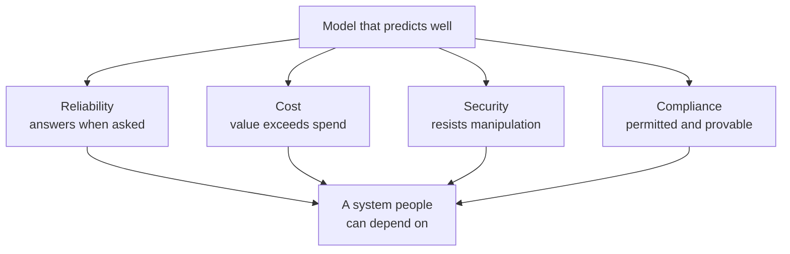
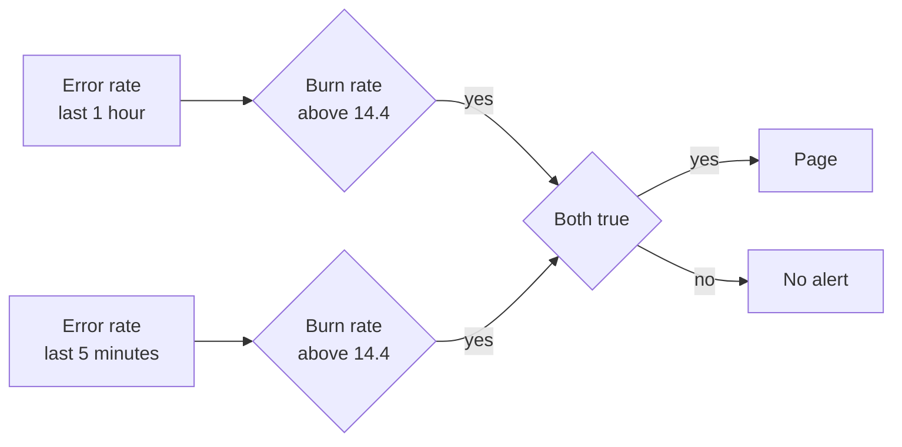
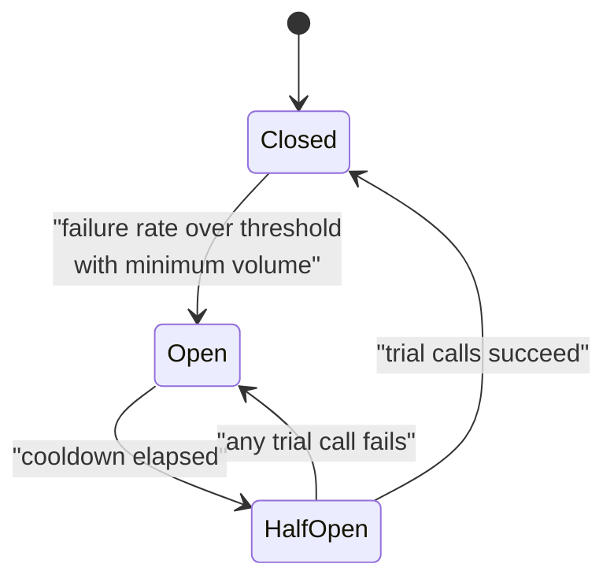
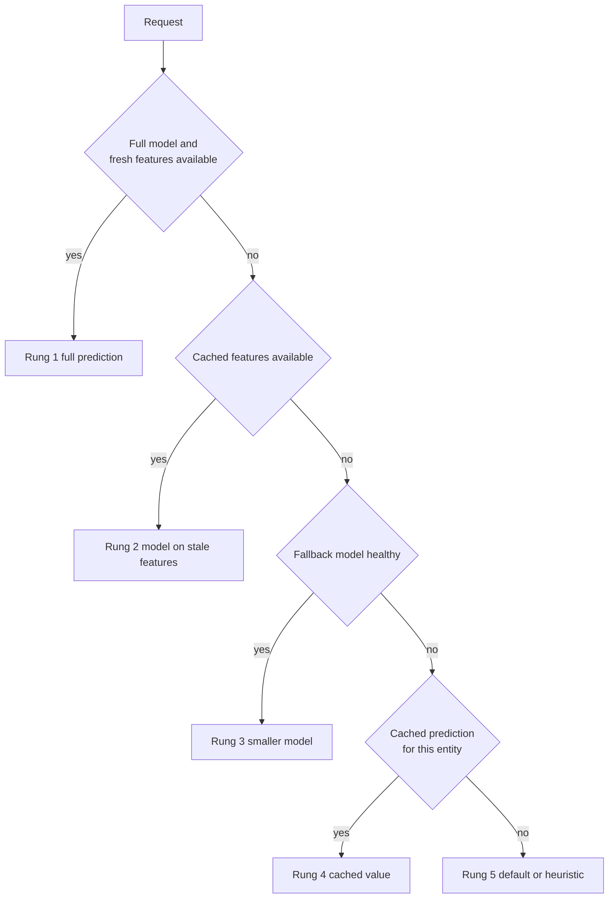
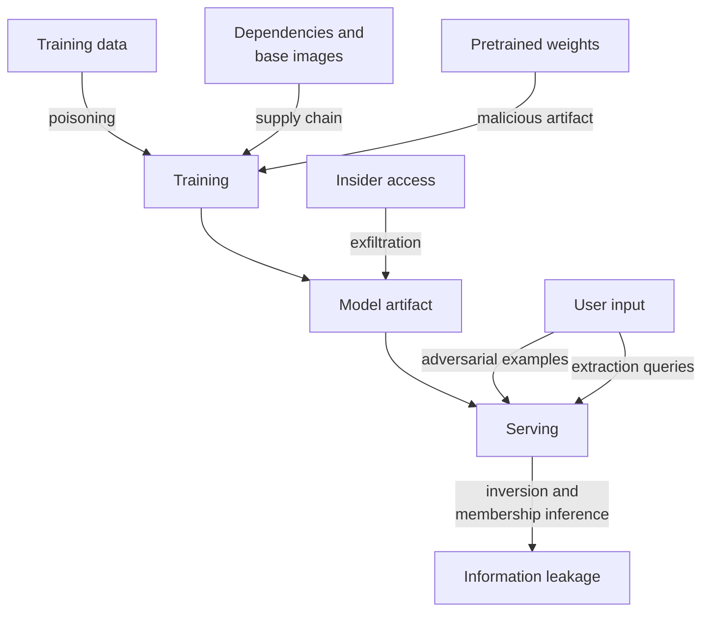
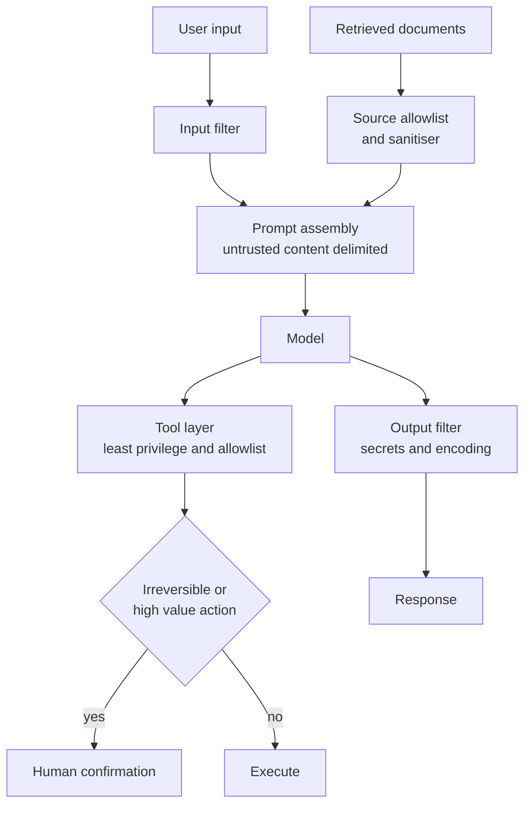

# Chapter 28: Reliability, Cost, Security, and Compliance

> **What this chapter covers** Service level indicators, objectives and agreements with a quality objective added for machine learning, error budgets and burn-rate alerting, resilience patterns for prediction services and the fallback ladder, capacity planning, chaos engineering and incident management, the cost model of a machine learning system with unit economics and budget enforcement, the threat model for machine learning including adversarial examples, poisoning, extraction, inversion, membership inference and supply chain, security for systems with a language model component, privacy techniques including differential privacy, compliance regimes and what each demands, and fairness definitions with their mathematical incompatibility.
>
> **Prerequisites** Chapter 21 (Machine Learning System Design), Chapter 24 (Model Serving and Inference), Chapter 26 (Continuous Integration and Delivery for Machine Learning), Chapter 27 (Monitoring, Drift, and Retraining).
>
> **Where it is used** Any model that carries an availability commitment, a budget, a regulator, or an adversary. Which, once a model matters, is all of them.

These four subjects are one chapter because they are one job. They are the constraints that a working system must satisfy in addition to being accurate, and they are the subjects that separate a model from a product. They also share a structure: each defines a budget, sets a target, measures consumption, and enforces a limit.

---

## 28.1 Level 1: Foundations

### 28.1.1 The four constraints

A model that predicts well can still be unusable.

| Constraint | The question it answers | The failure it prevents |
|---|---|---|
| Reliability | Does it answer, correctly enough, when asked | Outage, timeout storms, silent quality collapse |
| Cost | Does the value exceed the spend | A system that works and loses money |
| Security | Can someone make it do the wrong thing, or steal it | Manipulation, theft, poisoning, data leakage |
| Compliance | Is it allowed, and can you prove it | Fines, forced shutdown, legal exposure |

None of these is a phase at the end. Each is an architectural property, meaning it must be designed in, because it cannot be added to a finished system without rebuilding it. A system that logs nothing cannot become auditable. A system with no fallback path cannot become resilient. A system that trained on data it had no right to use cannot become compliant by adding a policy document.

### 28.1.2 Reliability vocabulary

Three terms are used interchangeably in conversation and mean different things.

| Term | Definition | Example |
|---|---|---|
| Service level indicator, SLI | A measured number describing service quality | Fraction of requests served under 300 milliseconds with a 2xx status |
| Service level objective, SLO | An internal target for an SLI over a window | 99.5 percent of requests over 30 days |
| Service level agreement, SLA | An external contract with a consequence if breached | 99.0 percent monthly, with a service credit if missed |

The relationship is deliberate. The SLI is what you measure. The SLO is stricter than the SLA, so you have room to miss the internal target without breaching the external contract. The SLA has money attached.

An SLI must be defined as a ratio of good events to valid events, both precisely specified. "Latency is good" is not an SLI. "The proportion of requests to `/predict`, excluding health checks, that return a 2xx status within 300 milliseconds, measured at the load balancer" is an SLI. The three things that must be pinned down are what counts as good, what counts as valid, and where it is measured. Measuring at the load balancer and measuring in the client give different numbers, and the one that matters is the one closest to the user.

### 28.1.3 The idea of an error budget

If the objective is 99.9 percent success over 30 days, then 0.1 percent of requests are allowed to fail. That allowance is the error budget. It is not a failure allowance to be ashamed of, it is a resource to spend.

Thirty days is 43,200 minutes. A 99.9 percent objective permits 43.2 minutes of total unavailability, or equivalently 0.1 percent of requests failing, in that window.

The budget makes an argument resolvable. A team wants to ship a risky change. Another team wants stability. If the budget is mostly unspent, ship it. If the budget is exhausted, the answer is no until it refills. This converts a values disagreement into an arithmetic one, which is the entire point.

### 28.1.4 Cost vocabulary

| Term | Definition |
|---|---|
| Fixed cost | Spend that does not vary with request volume, such as a reserved training cluster |
| Variable cost | Spend proportional to volume, such as per-token inference charges |
| Unit cost | Cost per one prediction |
| Cost per outcome | Cost per business event achieved, such as cost per fraud caught |
| Total cost of ownership | All costs including engineering time, not just the infrastructure bill |

Cost per outcome is the number that matters and it is almost never the number that gets reported. A prediction costing a tenth of a cent sounds cheap. If the system needs 5,000 predictions to produce one useful outcome, the cost per outcome is five dollars, and whether that is cheap depends entirely on what the outcome is worth.

### 28.1.5 Security and privacy vocabulary

| Term | Definition |
|---|---|
| Threat model | An explicit statement of who the attacker is, what they want, and what they can do |
| Attack surface | Every point where untrusted input or an untrusted party touches the system |
| Adversarial example | An input perturbed deliberately to cause a wrong prediction |
| Data poisoning | Corrupting training data so the resulting model behaves as the attacker wants |
| Model extraction | Reconstructing a model's function by querying it |
| Model inversion | Recovering properties of training data from a model |
| Membership inference | Determining whether a specific record was in the training set |
| Anonymisation | Removing identifying fields from data |
| Differential privacy | A formal guarantee that one record's presence barely changes any output |

Anonymisation and differential privacy are often used as synonyms and are not remotely the same thing. One is a procedure with no guarantee, the other is a mathematical property. Section 28.3.13 covers why the difference matters.

### 28.1.6 Compliance vocabulary

| Term | Definition |
|---|---|
| Personal data | Information relating to an identified or identifiable person |
| Data subject | The person the data is about |
| Controller | The party deciding why and how personal data is processed |
| Processor | A party processing data on the controller's instructions |
| Lawful basis | The legal justification for processing, such as consent or legitimate interest |
| Data residency | A requirement that data stay within a jurisdiction |
| Retention | How long data may be kept |
| Auditability | The ability to reconstruct and evidence what the system did and why |



*Figure 28.1: Accuracy is one input to a dependable system, not the system.*

---

## 28.2 Level 2: Working knowledge

### 28.2.1 Choosing SLIs for a prediction service

Start from the user's experience, not from what is easy to measure. For most prediction services four SLIs cover it.

| SLI | Definition | Typical measurement point |
|---|---|---|
| Availability | Proportion of valid requests returning a non-error response | Load balancer or gateway |
| Latency | Proportion of valid requests completing within a threshold | Same place, as a histogram |
| Correctness of pipeline | Proportion of batch jobs completing with expected row counts | Orchestrator |
| Freshness | Proportion of time the served model and features are within an age bound | Feature store and registry |

Measure latency as a distribution, never as a mean. The mean hides the tail and the tail is what users experience. Report the 50th, 95th, and 99th percentiles. Beware that percentiles do not average across time buckets or across shards, so aggregate from histograms rather than averaging precomputed percentiles.

Setting the threshold is a product decision, not an engineering one. The right process is to find the latency at which user behaviour changes, by measuring abandonment or downstream conversion against latency, and set the threshold there.

### 28.2.2 The quality objective, which is the machine learning addition

Standard site reliability practice has availability and latency. A machine learning system needs a third class of objective, because a service that returns a 200 status quickly with a wrong answer has satisfied both traditional SLOs and failed the user.

Define a quality SLI the same way: good events over valid events.

| Example quality SLI | Definition |
|---|---|
| Classification quality | Proportion of labelled predictions in the trailing 7 days that were correct, on a randomly sampled subset |
| Ranking quality | Normalised discounted cumulative gain at 10 on sampled sessions, above a floor |
| Generation quality | Proportion of sampled responses scoring above a rubric threshold from a calibrated judge |
| Calibration | Expected calibration error below a bound |

Three practical rules.

Set the quality objective as a floor, not a target. "AUC at least 0.82 on the trailing 7-day labelled sample" is enforceable. "AUC as high as possible" is not.

Account for the label delay from Chapter 27. If labels take a week, the quality SLO is evaluated on a trailing window that lags by a week, and everyone must understand that the objective is a lagging indicator.

State the sampling and the confidence interval. A quality SLO computed on 200 labelled examples has a wide interval and will breach randomly. Either sample enough that the interval is narrower than the margin between the objective and the expected value, or set the breach condition on the interval rather than the point estimate.

### 28.2.3 Error budgets in practice

For an SLO of $S$ over a window with $N$ valid events, the budget is

$$B = N \times (1 - S)$$

Worked example. A service handles 10 million requests in 30 days with an availability SLO of 99.9 percent. The budget is $10^7 \times 0.001 = 10{,}000$ failed requests. An incident that fails 3,000 requests consumes 30 percent of the monthly budget.

The policy attached to the budget is what makes it real. A common structure:

| Budget remaining | Policy |
|---|---|
| Above 50 percent | Normal velocity, risky changes allowed |
| 20 to 50 percent | Increase canary duration, require a second reviewer |
| Below 20 percent | Feature freeze, reliability work only |
| Exhausted | Freeze until the window rolls, and run a review |

The policy must be agreed before it is needed. Negotiating it during an outage never works.

### 28.2.4 The resilience toolkit, briefly

Each of these is developed in depth in 28.3.

| Pattern | What it does | Main hazard |
|---|---|---|
| Timeout | Bounds how long you wait | Set too high, it does nothing; too low, it fails healthy calls |
| Retry | Repeats a failed call | Amplifies load during an outage, unsafe if not idempotent |
| Jitter | Randomises retry delay | Without it, retries synchronise into waves |
| Circuit breaker | Stops calling a failing dependency | Wrong thresholds cause flapping |
| Bulkhead | Isolates resource pools | Under-provisioned pools cause self-inflicted starvation |
| Load shedding | Rejects excess work early | Shedding the wrong traffic loses the valuable requests |
| Backpressure | Signals upstream to slow down | Requires upstream cooperation |
| Graceful degradation | Returns a reduced-quality answer | Silent degradation nobody notices |

### 28.2.5 The cost levers, briefly

In rough order of return for a typical serving workload.

1. Do not call the model. Cache, filter with a cheap rule, or deduplicate.
2. Use a smaller model where it suffices, routed by difficulty.
3. Batch requests to raise hardware utilisation.
4. Quantise and compile, which reduces memory and raises throughput.
5. Right-size instances and use committed or spot capacity appropriately.
6. Reduce the request itself, meaning shorter prompts or fewer features.
7. Move work offline, precomputing where the input space is small enough.

The first lever dominates the rest and is the one teams skip, because it is a product conversation rather than an engineering one.

### 28.2.6 Security hygiene that comes before anything sophisticated

Before adversarial robustness, get these right.

| Practice | Why |
|---|---|
| Secrets in a manager, never in code, images, notebooks, or prompts | Credential leakage is the most common real breach |
| Least privilege for every service identity | Limits blast radius when something is compromised |
| Separate read and write paths to the model registry | Prevents a compromised serving node from publishing a model |
| Pin and hash-verify every model artifact and dataset | Prevents substitution |
| Scan dependencies and container images continuously | Supply chain is the most exploited path |
| Encrypt in transit and at rest | Baseline, and usually a compliance requirement |
| Rate limit and authenticate every prediction endpoint | Limits extraction and denial of service |
| Log access to data and models, immutably | Required for audit and for detection |

### 28.2.7 Mistakes everyone makes first

| Mistake | Consequence |
|---|---|
| Setting an SLO to 99.99 percent because it sounds good | Unachievable, so it is ignored, and every alert is noise |
| Retrying non-idempotent calls | Duplicate side effects, such as double-charging |
| Retrying without a budget or jitter | The retry storm takes down the recovering dependency |
| A fallback that is never exercised | It is broken when it is finally needed |
| Measuring cost only at the infrastructure bill | Misses engineering time, which usually dominates |
| Treating anonymisation as privacy | Re-identification is routine |
| Bolting on compliance after launch | Retrofit is usually a rewrite |
| Optimising one fairness metric | Other fairness metrics get worse, provably |

---

## 28.3 Level 3: Depth

### 28.3.1 Burn rate alerting, derived

An instantaneous alert on "error rate above 0.1 percent" fires constantly on noise and tells you nothing about whether you will actually miss the objective. Burn rate fixes both.

Define burn rate as the ratio of the observed error rate to the error rate that would exactly exhaust the budget over the full SLO window.

$$\text{burn rate} = \frac{\text{observed error rate}}{1 - S}$$

A burn rate of 1 consumes the budget exactly over the whole window. A burn rate of 10 consumes it in one tenth of the window.

The time to exhaustion from a full budget is

$$T_{\text{exhaust}} = \frac{W}{\text{burn rate}}$$

where $W$ is the SLO window.

Worked example. SLO is 99.9 percent over 30 days, so $1 - S = 0.001$ and $W = 720$ hours. Over the last hour, 1,200 of 200,000 requests failed, an error rate of 0.006. The burn rate is $0.006 / 0.001 = 6$. At that rate the budget is exhausted in $720 / 6 = 120$ hours, which is 5 days. Also, one hour at burn rate 6 consumes $6 \times (1/720) = 0.83$ percent of the budget.

To turn this into an alert, decide how much budget consumption should trigger a page, and over what detection window. If you want to page when 2 percent of the budget is consumed, and the detection window is 1 hour out of a 720-hour SLO window, the burn rate threshold is

$$\text{threshold} = \frac{0.02 \times 720}{1} = 14.4$$

The general formula, for budget fraction $f$ consumed within a detection window of length $w$ inside an SLO window $W$:

$$\text{burn rate threshold} = \frac{f \cdot W}{w}$$

Worked example, second configuration. Page when 5 percent of the budget is consumed over a 6-hour window: threshold $= (0.05 \times 720)/6 = 6$.

Single-window alerting has a dilemma. A short window with a high threshold catches severe incidents fast but misses slow bleeds and resets quickly. A long window catches slow bleeds but detects severe incidents hours late. The standard resolution is multiple windows with a short secondary window as a gate.

| Severity | Long window | Short gate window | Burn rate | Budget consumed before alert | Purpose |
|---|---|---|---|---|---|
| Page | 1 hour | 5 minutes | 14.4 | 2 percent | Catastrophic, respond now |
| Page | 6 hours | 30 minutes | 6 | 5 percent | Severe, respond soon |
| Ticket | 1 day | 2 hours | 3 | 10 percent | Notable |
| Ticket | 3 days | 6 hours | 1 | 10 percent | Slow bleed |

The short gate window must also be burning for the alert to fire. This is what stops an alert persisting for an hour after a one-minute spike has ended, and it is the piece most implementations omit.



*Figure 28.2: The two-window burn rate gate, where the short window prevents an alert from persisting after the spike has passed.*

Apply the same machinery to the quality SLO. If the quality floor is 0.82 AUC and the budget is expressed as allowed proportion of low-quality days, burn rate alerting works identically, with a longer window because quality is measured less often.

### 28.3.2 Timeouts

A timeout bounds how long a caller waits. Getting it right requires three facts: the downstream latency distribution, the caller's own deadline, and what happens on expiry.

Set the timeout from the downstream p99 plus headroom, not from the mean. If a feature store's p99 is 40 milliseconds, a timeout of 100 milliseconds is reasonable. A timeout of 5 seconds does nothing except occupy a worker for 5 seconds during an outage, which is how a slow dependency exhausts a thread pool and turns into a total outage.

Use deadline propagation rather than fixed per-hop timeouts. The entry point sets a total deadline, each hop passes the remaining time to the next, and each hop refuses work it cannot finish in the remaining time. Without propagation, a chain of four hops each with a 1-second timeout can take 4 seconds while the client gave up after 1.

Distinguish connect timeout from read timeout. A connect timeout should be short, because establishing a connection is fast or hopeless. A read timeout depends on the work.

### 28.3.3 Retries, idempotency, and jitter

Retry only what is safe and only when it can help.

**Idempotency is the gating condition.** An operation is idempotent if performing it twice has the same effect as performing it once. A read is idempotent. A prediction with no side effects is idempotent. "Record this transaction" is not. Retrying a non-idempotent call can double-charge a customer or duplicate a training record.

Where a write must be retryable, make it idempotent with an idempotency key: the client generates a unique key per logical operation, the server records it, and a repeat with the same key returns the original result instead of acting again.

**Retry only retryable errors.** A 503 or a connection reset is retryable. A 400 or a validation failure is not, and retrying it wastes capacity and delays the error the caller needs.

**Exponential backoff with jitter.** Backoff spaces attempts out. Jitter breaks synchronisation. Without jitter, every client that failed at the same moment retries at the same moment, producing a thundering herd that keeps the recovering service down.

Full jitter draws the delay uniformly from zero to the current backoff bound:

$$\text{delay}_n = \text{Uniform}\left(0,\; \min(\text{cap},\; \text{base} \times 2^{n})\right)$$

Worked example. Base 100 milliseconds, cap 10 seconds. Attempt 0 draws from $[0, 100)$ milliseconds, attempt 1 from $[0, 200)$, attempt 2 from $[0, 400)$, attempt 5 from $[0, 3200)$, attempt 7 from $[0, 10000)$ because the cap binds. The expected delay is half the bound, so the expected total wait over eight attempts is roughly 8.5 seconds.

**Retry budgets.** Cap retries as a fraction of total requests, for example 10 percent, across the whole client rather than per call. Per-call limits still allow every call to retry simultaneously, which triples load exactly when the dependency is struggling. A client-wide budget makes retries stop automatically during a broad outage.

**Listing 28.1: Retry with full jitter, a retry budget, and idempotency enforcement.**

```python
import random, time

class RetryBudget:
    def __init__(self, ratio=0.1, window_s=10.0):
        self.ratio, self.window_s = ratio, window_s
        self.calls, self.retries, self.t0 = 0, 0, time.monotonic()

    def _roll(self):
        if time.monotonic() - self.t0 > self.window_s:
            self.calls, self.retries, self.t0 = 0, 0, time.monotonic()

    def allow_retry(self):
        self._roll()
        if self.retries < self.ratio * max(self.calls, 1):
            self.retries += 1
            return True
        return False

def call_with_retry(fn, *, budget, idempotent, attempts=5,
                    base=0.1, cap=10.0, retryable=(503, 504, 429)):
    budget.calls += 1
    for n in range(attempts):
        status, result = fn()
        if status == 200:
            return result
        if status not in retryable or not idempotent:
            raise RuntimeError(f"non-retryable status {status}")
        if n == attempts - 1 or not budget.allow_retry():
            raise RuntimeError("retries exhausted or budget spent")
        time.sleep(random.uniform(0, min(cap, base * (2 ** n))))
```

The non-obvious parts: `idempotent` is a required argument with no default, so a caller must consciously assert safety rather than inherit it. The budget counts calls and retries in a rolling window and is shared across all call sites, which is what makes it protective during a broad outage. And the budget is checked before sleeping, so a client under an exhausted budget fails fast instead of waiting first.

### 28.3.4 Circuit breakers

A circuit breaker stops calling a dependency that is failing, so the caller fails fast instead of consuming resources waiting.

Three states.

| State | Behaviour | Transition |
|---|---|---|
| Closed | Calls pass through, failures counted | Opens when the failure rate over a rolling window exceeds a threshold with a minimum call volume |
| Open | Calls fail immediately without attempting | After a cooldown, moves to half-open |
| Half-open | A limited number of trial calls allowed | Closes on success, reopens on failure |



*Figure 28.3: The circuit breaker state machine, with the half-open state providing controlled probing instead of a full-volume retry.*

Four parameters decide behaviour, and the common failure is setting them by feel.

The **failure rate threshold**, typically in the range of half the calls failing. Too low and transient blips open the circuit. The **minimum call volume** in the window, which prevents opening on two failures out of three during quiet periods and is the parameter most often forgotten. The **cooldown**, long enough for a restart to complete but short enough that recovery is not delayed. The **half-open concurrency**, usually a small number, because sending full traffic to a recovering service reopens the circuit immediately.

Breakers should be per dependency and often per dependency instance, not global. A single breaker across a pool means one bad replica opens the circuit for all of them.

### 28.3.5 Bulkheads, load shedding, and backpressure

**Bulkheads** partition resources so one failure cannot consume everything. Named for ship compartments. Concretely: separate connection pools per dependency, separate thread pools per request class, separate deployments for batch and online traffic, and separate replicas per tenant tier.

The canonical failure that bulkheads prevent: one slow dependency occupies all worker threads, so requests that never touch that dependency also fail. This is the most common way a partial outage becomes a total outage.

**Load shedding** rejects work when the system is saturated, choosing what to drop rather than failing randomly. Shed by priority: health checks and internal control traffic never, paying customers last, bulk and retry traffic first. Shed at the edge, before expensive work has been done, since shedding after feature fetch has already spent the money.

A useful implementation is a queue with a deadline check: on dequeue, if the request has already exceeded its deadline, discard it without processing. During overload this converts a queue of doomed requests into capacity for fresh ones, and it is remarkably effective.

**Backpressure** is signalling upstream to slow down instead of silently queueing. Unbounded queues are the enemy. A queue that grows without limit converts an overload into unbounded latency and then an out-of-memory failure. Bound every queue, and when it is full, reject with a clear signal such as 429 with a retry-after header, so the caller can respond correctly.

Little's law makes the trade explicit. For a stable system,

$$L = \lambda W$$

where $L$ is the mean number of requests in the system, $\lambda$ the arrival rate, and $W$ the mean time in the system. Worked example: a service receiving 500 requests per second with a mean latency of 200 milliseconds has $L = 500 \times 0.2 = 100$ requests in flight on average. If concurrency is capped at 100, the system is at its limit, and any queueing beyond that raises $W$ rather than throughput. This is why queue depth is a leading indicator of latency and belongs on the dashboard.

### 28.3.6 Graceful degradation and the fallback ladder

A prediction service should never have only two states. Define a ladder, ordered by quality and by cost, and descend it under pressure.

| Rung | Response | When used | Quality |
|---|---|---|---|
| 1 | Full model with fresh features | Normal | Best |
| 2 | Full model with cached or stale features | Feature store slow or down | Slightly degraded |
| 3 | Smaller or older model | Primary model unavailable or overloaded | Degraded |
| 4 | Cached prediction for this entity | Model tier unavailable | Stale but often fine |
| 5 | Population default or simple heuristic | Everything model-related unavailable | Poor but safe |
| 6 | Explicit error, or the safe business default | Correctness matters more than an answer | No prediction |



*Figure 28.4: The fallback ladder, where each rung trades quality for availability and every rung must be exercised regularly.*

Three rules make a ladder work rather than become decoration.

**Every response carries its rung.** Return the degradation level in the response metadata and log it. Chapter 27 called this the fallback flag, and without it a week at rung 5 looks like catastrophic model drift.

**Exercise every rung continuously.** A fallback path used once a year is broken. Route a small constant share of traffic to each rung, or run synthetic checks that force each path.

**Decide where the ladder must stop.** In some domains a wrong answer is worse than no answer. A clinical decision support system should return "unavailable" rather than a population default. This is a product and safety decision and it must be written down before the incident.

### 28.3.7 Capacity planning and headroom

Capacity planning answers how much you need, with what margin, and how fast you can add more.

Start from a load model. Peak requests per second, the shape of the daily and weekly cycle, the ratio of peak to mean, and the growth rate. Then measure the capacity of one unit, one replica or one accelerator, under realistic load, which means with the real model, real request mix, and real batching, not a synthetic benchmark.

Headroom exists for four reasons: traffic variance above the forecast, capacity lost while a deploy rolls, capacity lost to a failed instance or zone, and the reserve that keeps latency low, because utilisation and latency are not linear.

That last one has a formula worth knowing. For an M/M/1 queue with utilisation $\rho$, the mean number in system is

$$L = \frac{\rho}{1 - \rho}$$

Worked example. At $\rho = 0.5$, $L = 1$. At $\rho = 0.8$, $L = 4$. At $\rho = 0.9$, $L = 9$. At $\rho = 0.95$, $L = 19$. Raising utilisation from 80 to 95 percent saves 16 percent of the machines and multiplies queueing by roughly five. Real services are not M/M/1, but the shape is right and it is the reason experienced teams target 60 to 70 percent utilisation at peak rather than 95.

The redundancy rule: to survive the loss of one zone out of $n$, provision each zone to handle $\frac{1}{n-1}$ of total peak. With three zones, each must handle half of peak, so total provisioned capacity is 150 percent of peak.

Worked example. Peak is 3,000 requests per second. One replica handles 50 requests per second at target utilisation, so 60 replicas serve peak. Across three zones surviving one zone failure, each zone needs 30 replicas, so 90 total. Add 15 percent for deploy surge and forecast error, giving 104 replicas. Note that the naive answer of 60 would have been wrong by 73 percent.

Autoscaling reduces but does not remove the need for headroom, because scaling has latency. A GPU-backed model server with a large artifact can take minutes to become ready, which means the headroom must cover the traffic increase during that window. Scale on a leading signal such as queue depth or concurrency rather than on CPU, which for accelerator-bound inference is nearly meaningless.

### 28.3.8 Chaos engineering and game days

A resilience mechanism you have never triggered is a hypothesis, not a mechanism.

Chaos engineering is the practice of injecting failures deliberately to verify that the system behaves as designed. The discipline is in the method, not the disruption.

1. Define steady state as a measurable metric, for example the quality SLI and the p99 latency.
2. Hypothesise what will happen, specifically. "If the feature store is unreachable, predictions fall to rung 2 with a p99 increase under 20 milliseconds and no error rate change."
3. Inject the smallest failure that tests the hypothesis, starting in a non-production environment and then in production with a blast radius limit and an abort condition.
4. Compare the outcome to the hypothesis. A surprise is the finding.
5. Fix and repeat.

Experiments specific to machine learning systems, which generic chaos tooling does not cover:

| Experiment | What it validates |
|---|---|
| Feature store returns stale data | Rung 2 of the ladder, and whether staleness is detected |
| Feature store times out | Timeout and fallback, and that the timeout is not too high |
| Model registry unreachable during a scale-up | Whether new replicas can start |
| A feature returns all nulls | Data quality gating and imputation behaviour |
| Model artifact is corrupted | Checksum verification on load |
| Latency of the model tier tripled | Load shedding and backpressure |
| A dependency returns plausible but wrong values | Whether anything notices, which is usually the most alarming result |

A game day is the human version: a scheduled exercise where the team responds to a simulated or injected incident using the real runbooks and the real tooling. The value is in finding that the runbook is out of date, the dashboard link is dead, and nobody has the permission to roll back at two in the morning. Run them before you need them.

### 28.3.9 Incident management and the blameless postmortem

Roles during an incident should be explicit: an incident commander who coordinates and decides, an operations lead who makes changes, a communications lead who updates stakeholders, and a scribe. On small teams one person may hold several, but the commander must not also be the one typing commands, because the person deep in a terminal cannot maintain situational awareness.

Severity levels should be defined by customer impact, not by which system broke, and each level should have a defined response time and notification list.

The postmortem is blameless because the alternative does not work. If naming a person is the outcome, people conceal information, and the organisation loses the ability to learn. The premise is that people act reasonably given the information and incentives they had, so the question is what made the wrong action look right.

A postmortem should contain: impact in measured terms and duration; a timeline including detection, escalation, mitigation, and resolution times; the contributing causes, plural, since single root causes are almost always a simplification; what went well, which is not filler because it identifies defences worth keeping; and action items each with an owner, a due date, and a tracked ticket.

Two metrics to track across incidents. **Time to detect** is the most improvable number and monitoring investment moves it directly. **Time to mitigate** is usually dominated by whether a rollback is one command or a manual procedure.

A useful discipline: for each incident, ask what monitor would have caught this earlier, and what gate would have prevented it. Those two answers are the durable output.

### 28.3.10 The cost model of a machine learning system

Decompose before optimising. Costs fall into five buckets, each with different dynamics.

| Bucket | Components | Scales with |
|---|---|---|
| Data | Storage, transfer including egress, ingestion compute, labelling | Data volume and label count |
| Training | Accelerator hours, storage of checkpoints, failed runs, hyperparameter search | Experiments and model size |
| Serving | Accelerator or CPU hours, memory, load balancing, autoscaling headroom | Request volume and model size |
| Platform | Orchestration, monitoring, logging storage, registry, feature store, CI | Number of models and teams |
| Human | Engineering time, on-call, annotation review, incident response | Complexity and number of systems |

Three places cost hides, meaning it is real and does not appear where you look for it.

**Idle accelerators.** A GPU reserved and averaging 15 percent utilisation costs the same as one at 90 percent. Idle time is usually the single largest line and it does not show up as a line item anywhere.

**Failed and abandoned training runs.** Runs that crashed at hour 9 of 10, runs whose results were never used, hyperparameter sweeps nobody read. Tagging every run with an owner and a purpose makes this visible and typically reveals a surprising fraction.

**Observability storage.** Inference logs at high volume with long retention can rival serving compute. This is worth paying for, but it must be a decision rather than a surprise.

Two more that are commonly missed: data egress between regions and clouds, which is charged per byte and can dominate a cross-region architecture, and the autoscaling floor, meaning the minimum replica count that runs all night serving nothing.

**Unit economics.** Two numbers.

$$\text{cost per prediction} = \frac{\text{total attributable cost in period}}{\text{predictions in period}}$$

$$\text{cost per outcome} = \frac{\text{cost per prediction}}{\text{predictions per successful outcome}}$$

Worked example, with all figures stated as assumptions for the example.

A fraud detection system. Assume monthly costs: serving compute 8,000 currency units, feature store 2,000, logging and monitoring 1,500, training and experimentation 3,000, and allocated engineering 12,000. Total 26,500.

Assume 50 million predictions per month. Cost per prediction is $26{,}500 / 5 \times 10^7 = 0.00053$ units, about a twentieth of a cent. That sounds negligible.

Now the outcome. Assume the model flags 0.2 percent of transactions, which is 100,000 alerts. Assume manual review confirms 8 percent of alerts as fraud, so 8,000 confirmed cases. Cost per confirmed fraud from the machine learning system alone is $26{,}500 / 8{,}000 = 3.31$ units.

But review is not free. Assume review costs 2 units per alert, so $100{,}000 \times 2 = 200{,}000$ units. Total cost per confirmed fraud is $(26{,}500 + 200{,}000)/8{,}000 = 28.31$ units.

This changes every conclusion. The dominant cost is human review, driven entirely by the alert volume, which is set by the decision threshold. Spending 8,000 on better serving hardware is irrelevant. Raising precision from 8 to 12 percent, which reduces alerts to about 66,700 for the same 8,000 catches, saves roughly 66,600 units per month, which is more than two and a half times the entire machine learning budget.

The lesson generalises. **Optimise the cost per outcome, and the biggest term is usually not the model.** Engineers optimise the term they control rather than the term that dominates.

Compare against value. If the average prevented fraud is worth 400 units, the system returns $400 \times 8{,}000 = 3.2$ million against 226,500 of cost. Also compute the marginal case: the last alerts reviewed have the lowest probability of being fraud, and at some threshold the marginal review cost exceeds the marginal prevented loss. That threshold, not the accuracy-maximising one, is the right operating point.

### 28.3.11 Budget enforcement as an architectural component

A budget that is only a spreadsheet gets exceeded. Enforcement must be in the request path.

| Control | Mechanism | Where |
|---|---|---|
| Per-tenant quota | Token bucket on requests or on units consumed | Gateway |
| Per-request cap | Maximum tokens, maximum features, maximum retries | Service |
| Model tier routing | Route to a cheaper model when a budget threshold is crossed | Router |
| Cache enforcement | Mandatory cache lookup before any model call | Service |
| Hard kill switch | Disable a non-essential workload when spend exceeds a bound | Control plane |
| Job-level limits | Maximum instance count and maximum wall clock per training job | Orchestrator |
| Alerting on rate | Alert on spend rate, not monthly total, since the total arrives too late | Billing integration |

The most important of these is alerting on rate. Monthly cost alerts tell you about an overspend after it happened. Compute the current spend rate per hour, project it to the month, and alert when the projection exceeds the budget. This is exactly the burn rate concept from 28.3.1 applied to money, and the formula is identical.

Worked example. Monthly budget 30,000 units over 720 hours, so the sustainable rate is 41.67 units per hour. The last 6 hours cost 520 units, which is 86.7 per hour, a burn rate of 2.08. Projected month is $86.7 \times 720 = 62{,}400$, which is 208 percent of budget. That deserves a ticket immediately, not a surprise on the invoice.

Attribution makes any of this possible. Tag every resource with team, model, and environment at creation time, enforced by policy so untagged resources cannot be created. Without attribution you have one number and no lever.

### 28.3.12 The threat model for machine learning systems

A threat model states who, what, and how. Write it down, because an unstated threat model means every security discussion restarts.

| Attacker | Goal | Capability | Primary threats |
|---|---|---|---|
| External user of the API | Evade detection, extract the model, cause cost | Query access, possibly at scale | Adversarial examples, extraction, denial of wallet |
| Data contributor | Bias the model | Can influence some training data | Poisoning, backdoors |
| Insider | Exfiltrate data or a model | Legitimate access | Data theft, unauthorised model publication |
| Supply chain | Broad compromise | Controls a dependency, model, or dataset you consume | Malicious artifact, dependency compromise |
| Curious party | Learn about training data | Query or weight access | Membership inference, inversion |

Now each threat with its mechanism and its practical mitigation.

**Adversarial examples.** An input perturbed to change the prediction. Formally, find $\delta$ minimising some norm subject to the prediction changing:

$$\min_{\delta} \|\delta\|_p \quad \text{subject to} \quad f(x + \delta) \neq f(x)$$

The fast gradient sign method from Goodfellow, Shlens, and Szegedy, "Explaining and Harnessing Adversarial Examples" (2015), constructs one in a single step:

$$x_{\text{adv}} = x + \epsilon \cdot \text{sign}(\nabla_x \mathcal{L}(\theta, x, y))$$

where $\epsilon$ bounds the perturbation size. Iterative versions such as projected gradient descent are stronger.

In practice the imperceptible-perturbation framing matters less than the unconstrained one. A fraud attacker does not need an imperceptible change, they need any transaction the model scores as legitimate, and they can probe freely. The realistic mitigations are: rate limiting and authentication so probing is expensive and detectable; ensemble or multi-signal decisions so one model is not the whole defence; human review for high-stakes decisions; monitoring for probing patterns, meaning many similar queries from one identity with scores clustering near the threshold; and adversarial training, which helps against the specific threat model it was trained for and costs accuracy elsewhere.

**Data poisoning.** The attacker influences training data. Availability attacks degrade the model generally. Targeted attacks cause specific misclassifications. Backdoor attacks insert a trigger pattern that causes a chosen output while leaving normal accuracy intact, which makes them nearly invisible to standard evaluation. Gu, Dolan-Gavitt, and Garg, "BadNets" (2017), is the reference demonstration.

Mitigations: provenance for every training record, so you know its source; anomaly detection and influence-based filtering on training data; restricting who can contribute training data and requiring review for high-influence sources; a held-out trusted evaluation set that the training pipeline cannot touch; and behavioural tests on curated cases that must pass before promotion. Feedback loops from Chapter 27 are a poisoning vector when user-supplied data flows back into training, which is the most common real exposure.

**Model extraction.** Repeated queries let an attacker fit a substitute model approximating yours. Tramèr, Zhang, Juels, Reiter, and Ristenpart, "Stealing Machine Learning Models via Prediction APIs" (2016), demonstrated this against commercial APIs. Returning full probability vectors or explanations makes it dramatically easier than returning a label.

Mitigations: return the minimum information the use case needs, often a label or a coarsened score rather than full probabilities; rate limit per authenticated identity; detect extraction patterns, meaning high-volume queries that systematically sweep the input space; and accept that a queryable model is fundamentally extractable given enough queries, so the control is economic rather than absolute.

**Model inversion and membership inference.** Inversion recovers representative training inputs from model access. Membership inference determines whether a particular record was in the training set, typically by exploiting that models are more confident on training data than on unseen data. Shokri, Stronati, Song, and Shmatikov, "Membership Inference Attacks Against Machine Learning Models" (2017), is the reference.

Membership inference is the sharper practical risk, because in some settings membership itself is the sensitive fact. Knowing a person was in a training set for a medical condition model discloses the condition. Mitigations: reduce overfitting, since the confidence gap between training and held-out data is the attack surface; do not expose raw confidence at full precision; and differentially private training, which bounds the attack's success rate formally at a cost in accuracy.

**Supply chain.** Three surfaces.

Model artifacts: a downloaded model file can execute code on load if the format supports arbitrary serialisation. Python pickle-based checkpoint formats do. Prefer formats designed not to execute code, verify checksums, pin exact revisions, and scan artifacts before loading. Never load an untrusted checkpoint in a privileged environment.

Datasets: a downloaded dataset can contain poisoned records or content with licence restrictions. Pin and hash datasets, record provenance, and scan.

Dependencies: the largest surface by exploitation count. Pin versions with a lockfile, verify hashes, scan continuously for known vulnerabilities, generate a software bill of materials, and minimise the dependency surface in serving images. A serving container should contain the runtime and nothing else.



*Figure 28.5: The attack surface of a machine learning system, spanning training inputs, the artifact, and the serving interface.*

### 28.3.13 Access control, secrets, and isolation

Identity, then authorisation, then audit.

Every service gets its own identity, not a shared one, so an action can be attributed. Prefer short-lived workload identities issued by the platform over long-lived static keys, because unrotated static keys are the thing that leaks.

Authorisation follows least privilege with separated paths. The training pipeline writes to the registry and reads from the data lake. The serving service reads from the registry and never writes. Nothing in production has permission to delete audit logs. A compromised serving node should not be able to publish a model, and that is an access control decision, not a hope.

Secrets live in a manager with rotation, are injected at runtime, and never appear in source, container images, notebooks, environment dumps, logs, or prompts. Add scanning in continuous integration that fails the build on a detected secret, because this is the failure mode that recurs.

Isolation for multi-tenant systems. Decide the boundary explicitly: separate model instances per tenant, shared instances with per-request tenant context, or shared instances with tenant-specific adapters. Whatever the choice, every query to feature stores, vector indexes, and caches must carry a tenant filter enforced at the data layer rather than only in application code, because the application layer is where the bug will be. Cache keys must include the tenant, since a cache without a tenant in the key is a cross-tenant data leak waiting to happen.

### 28.3.14 Security for systems with a language model component

A language model changes the security picture because natural language input is code the model may execute, and because the model consumes text from sources beyond the user.

**The instruction versus data boundary does not exist inside the model.** A language model receives one sequence of tokens. Your system prompt, the user's message, a retrieved document, and a tool's output all arrive as text in the same channel. The model has no reliable mechanism to treat one as authority and another as inert content. That is the root cause of prompt injection and it is why injection is not a bug to be patched.

Two forms. **Direct injection**, where the user types instructions attempting to override the system prompt. **Indirect injection**, where instructions are embedded in content the system retrieves, such as a web page, a document, an email, or a tool result. Indirect injection is the serious one, because the attacker does not need to be the user. They just need their text to reach the context window.

Because the boundary cannot be enforced inside the model, the defence must be architectural. Defence in depth, with each layer catching what the previous missed.

| Layer | Control | What it stops |
|---|---|---|
| Input | Classify and filter obvious injection and jailbreak patterns | Low-effort attacks, raises cost |
| Context | Structurally delimit untrusted content and mark it as data, and never place secrets in the prompt | Reduces success rate, does not eliminate it |
| Retrieval | Only retrieve from vetted sources, sanitise retrieved content, strip instruction-like text | Indirect injection at source |
| Model | Instruction hierarchy training and alignment where available | Raises resistance, not a guarantee |
| Tools | Least privilege per tool, allowlisted actions, no dynamic code execution, no raw shell, parameter validation | Limits what a successful injection can do |
| Action | Human confirmation for irreversible or high-value actions, spend and rate limits per session | Bounds the damage |
| Output | Filter for leaked secrets and personal data, validate structure, encode before rendering | Exfiltration and downstream injection such as cross-site scripting |
| Audit | Log every prompt, retrieval, tool call, and action with identity | Detection and forensics |



*Figure 28.6: Defence in depth for a language model system, where the tool and action layers matter most because they bound the damage of a successful injection.*

The governing principle: **assume the model can be made to say anything, and design so that this is survivable.** Give the model's tools the permissions you would give an anonymous internet user, not the permissions you would give an administrator. If a successful injection cannot cause harm because the tools cannot do harm, the injection is an annoyance rather than a breach.

Two further specifics. Excessive agency, meaning granting an agent broad write permissions because it was convenient during development, is the highest-impact misconfiguration in practice. And insecure output handling, meaning rendering model output as HTML or passing it into a shell or a database query, converts a text-generation system into a general exploitation vector.

### 28.3.15 Privacy techniques

**Anonymisation and its limits.** Removing names and identifiers is necessary and insufficient. Re-identification through combinations of quasi-identifiers is routine. Sweeney's work in the late 1990s established that a large share of the United States population is uniquely identified by the combination of birth date, sex, and postal code. Narayanan and Shmatikov, "Robust De-anonymization of Large Sparse Datasets" (2008), re-identified individuals in an anonymised film ratings dataset using sparse public auxiliary data.

The formal partial answer is $k$-anonymity, which requires every record to be indistinguishable from at least $k-1$ others on the quasi-identifiers. It has known weaknesses. If all $k$ records in a group share the same sensitive value, the value is disclosed regardless, which motivated $l$-diversity, and if the group distribution differs sharply from the population, that itself discloses, which motivated $t$-closeness. The practical conclusion is that syntactic anonymisation degrades utility and still offers no guarantee against an adversary with side information.

**Differential privacy.** The formal alternative. A randomised mechanism $\mathcal{M}$ is $(\varepsilon, \delta)$-differentially private if for all datasets $D$ and $D'$ differing in one record, and all measurable output sets $S$:

$$\Pr[\mathcal{M}(D) \in S] \le e^{\varepsilon} \Pr[\mathcal{M}(D') \in S] + \delta$$

In words: the output distribution is almost the same whether or not any one individual's record is included. Therefore observing the output tells an adversary almost nothing about whether you were in the data, regardless of what else they know. The guarantee holds against arbitrary side information, which is exactly what anonymisation fails to do.

The parameter $\varepsilon$ is the privacy budget. Smaller is more private. $\varepsilon = 0$ means the output is independent of the data, so it is useless. The multiplicative factor $e^\varepsilon$ is the intuition: at $\varepsilon = 1$, $e^1 \approx 2.72$, so any outcome is at most about 2.7 times more likely with your record than without it. At $\varepsilon = 5$, $e^5 \approx 148$, which is a weak guarantee. $\delta$ is a small probability of the guarantee failing entirely and should be set well below one over the number of records.

Worked example of the Laplace mechanism. To release a count with differential privacy, add noise from a Laplace distribution with scale $b = \Delta f / \varepsilon$, where $\Delta f$ is the sensitivity, meaning the maximum change in the output from adding or removing one record. For a count, $\Delta f = 1$. At $\varepsilon = 0.5$, $b = 2$. The Laplace distribution with scale 2 has standard deviation $b\sqrt{2} \approx 2.83$. So a true count of 1,000 might be released as 998 or 1,004. The relative error on a large count is tiny, which is why differential privacy is easy for aggregate statistics and hard for anything fine-grained. Releasing a count of 3 with the same noise is nearly meaningless, which is the real trade.

**Composition is the part people miss.** Privacy loss accumulates. Under basic composition, $k$ queries each $\varepsilon$-differentially private are jointly $k\varepsilon$-differentially private. Ten queries at $\varepsilon = 0.5$ give $\varepsilon = 5$ overall, which is weak. Advanced composition gives a better bound growing roughly as $\sqrt{k}$, and modern accountants such as Rényi differential privacy accounting are tighter still. The operational consequence: the budget must be tracked across all releases, and once it is spent, no further queries are permitted. A system that does not track composition does not have differential privacy, it has noise.

For training, DP-SGD from Abadi, Chu, Goodfellow, McMahan, Mironov, Talwar, and Zhang, "Deep Learning with Differential Privacy" (2016), clips per-example gradients to a norm bound and adds calibrated Gaussian noise before the update, accounting the privacy loss over steps. The costs are real: accuracy drops, the drop falls hardest on underrepresented groups because their signal is the one the noise drowns, and training slows because per-example gradient clipping is expensive.

**Federated learning.** Train across decentralised data holders without centralising the data. Each participant computes an update on local data, updates are aggregated centrally, and only the aggregate is applied. McMahan, Moore, Ramage, Hampson, and Arcas, "Communication-Efficient Learning of Deep Networks from Decentralized Data" (2017) introduced federated averaging.

Federated learning is not private by itself. Raw gradient updates can leak training data, sometimes reconstructing inputs directly. Making it private requires secure aggregation, so the server sees only the sum, plus differential privacy on the updates. The practical costs are communication, non-independent and non-identically distributed local data which harms convergence, participant dropout, and near-impossible debugging since you cannot look at the data.

**Synthetic data.** Generate artificial data resembling the real distribution. Useful for development environments, for sharing across boundaries, and for augmenting rare classes. The hazard: a generative model trained on real data can memorise and emit real records, so synthetic data is not automatically private. To claim privacy, the generator itself must be trained with differential privacy, and even then you should test for memorisation by searching for near-duplicates of training records in the output. Also measure utility honestly, because models trained on synthetic data commonly underperform on the real distribution and the gap is largest exactly in the tails you cared about.

### 28.3.16 Compliance at the level an engineer needs

You do not need to be a lawyer. You need to know what the common regimes demand of a system, because those demands are architectural.

| Regime | Scope | Key system demands |
|---|---|---|
| General Data Protection Regulation, European Union | Personal data of people in the EU | Lawful basis, purpose limitation, data minimisation, subject access, rectification, erasure, portability, rights around solely automated decisions with legal or similarly significant effects, breach notification, records of processing |
| California Consumer Privacy Act and its amendments | California residents | Disclosure of collection, deletion, opt-out of sale or sharing, non-discrimination for exercising rights |
| Health Insurance Portability and Accountability Act, United States | Protected health information | Access controls, audit logs, encryption, business associate agreements, minimum necessary use |
| Payment Card Industry Data Security Standard | Cardholder data | Network segmentation, no storage of sensitive authentication data, key management, logging |
| EU Artificial Intelligence Act | AI systems placed on the EU market, tiered by risk | Risk classification, documentation, data governance, human oversight, accuracy and robustness evidence, logging, conformity assessment for high-risk systems |
| Sector rules such as model risk guidance in banking | Regulated models | Independent validation, documented development, ongoing monitoring, governance |

Rather than memorise the regimes, internalise the six capabilities they collectively demand, because building these once satisfies most of them.

**Lineage and auditability.** For any decision the system made, reconstruct what model version produced it, what features it used, what data trained that model, and who approved its deployment. This is the reason Chapter 25 insists on immutable versioning of data, code, and artifacts, and the reason Chapter 27 insists on inference logging. If you did not log it, you cannot evidence it.

**Explanation.** Where individuals have rights around automated decisions, you must be able to state meaningfully what drove a specific decision. The realistic engineering answer is a per-decision reason capability: store the feature values, produce local attributions such as SHAP values, and map the top contributors to human-readable reasons through a maintained mapping. Be honest that a post-hoc attribution is an approximation of the model's behaviour, not the model's reasoning, and that where explanation is legally load-bearing, an inherently interpretable model is often the safer architecture.

**Data residency.** Requirements that data remain in a jurisdiction affect training, serving, logging, and backups. The failure is partial compliance: the serving path is regionalised and the observability pipeline ships everything to a central region. Trace every data path, including telemetry, before claiming residency.

**Retention.** Every data store needs a retention period tied to a purpose, with automated deletion. Manual deletion does not happen. Retention interacts with monitoring, because long inference log retention is useful for drift analysis and is also a liability. Resolve it by retaining aggregates long and raw records short.

**Deletion, including from models.** This is the hard one and deserves a direct answer.

A deletion request removes a subject's data from operational stores, backups on their rotation schedule, and derived datasets. But the trained model has absorbed information from that record. Does deletion require removing it from the weights?

The honest state of practice is that this is unsettled, jurisdiction-dependent, and technically hard. The available options, in ascending cost:

| Option | Mechanism | Cost | Weakness |
|---|---|---|---|
| Delete from data stores and exclude from future training | The record leaves the training pool at the next retrain | Low | The current model retains influence until it is replaced |
| Scheduled retrain cadence | Guarantee the record's influence expires within one cycle | Moderate | Bounded but non-zero delay |
| Retrain on demand | Full retrain excluding the record | Very high | Impractical at any real request volume |
| Machine unlearning | Algorithmic removal of a record's influence, for example SISA sharded training which localises a record to one shard so only that shard retrains | Moderate, with a design cost paid up front | Exact unlearning constrains the architecture; approximate unlearning gives no guarantee |
| Differentially private training | The record's influence is provably bounded from the start | Accuracy cost | Not literally deletion, but a defensible bound |

The practical position most organisations take: delete from all data stores, exclude from all future training, document a maximum retraining interval that bounds the influence period, and state this in the privacy documentation. If deletion from weights is a hard requirement in your domain, the decision belongs in the architecture at design time, via SISA-style sharding or differentially private training, not in an incident response afterwards. Bourtoule, Chandrasekaran, Choquette-Choo, Jia, Travers, Zhang, Lie, and Papernot, "Machine Unlearning" (2021) is the SISA reference.

**Governance and documentation.** Model cards from Mitchell et al. (2019) and datasheets for datasets from Gebru et al. (2018) are the standard formats. They are not bureaucracy, they are the artifact an auditor asks for, and writing one surfaces the questions nobody asked, most often about intended use, out-of-scope use, and evaluated subgroups.

### 28.3.17 Fairness and bias

**Where bias comes from.** Historical bias, where the world the data records was itself unequal. Representation bias, where a group is undersampled so the model fits it poorly. Measurement bias, where the recorded label is a flawed proxy for the concept, for example using arrest as a proxy for crime, or using diagnosis as a proxy for illness when access to diagnosis is unequal. Aggregation bias, where one model is fitted to groups with genuinely different relationships. Deployment bias, where the system is used differently from how it was designed and validated.

Measurement bias is the most consequential and the least discussed. If the label is unfair, no algorithmic correction on the model produces fairness, because the target itself encodes the disparity.

**The definitions.** Let $A$ be a protected attribute, $Y$ the true outcome, $\hat{Y}$ the prediction, and $R$ a continuous score.

| Definition | Statement | Plain meaning |
|---|---|---|
| Demographic parity | $P(\hat{Y}=1 \mid A=a) = P(\hat{Y}=1 \mid A=b)$ | Equal positive rates across groups |
| Equal opportunity | $P(\hat{Y}=1 \mid Y=1, A=a) = P(\hat{Y}=1 \mid Y=1, A=b)$ | Equal true positive rates |
| Equalised odds | Equal true positive and false positive rates across groups | Equal error rates of both kinds |
| Predictive parity | $P(Y=1 \mid \hat{Y}=1, A=a) = P(Y=1 \mid \hat{Y}=1, A=b)$ | Equal precision |
| Calibration within groups | $P(Y=1 \mid R=r, A=a) = r$ for all groups | A score of 0.7 means 0.7 everywhere |
| Individual fairness | Similar individuals receive similar predictions | Requires a similarity metric, which is the hard part |
| Counterfactual fairness | The prediction is unchanged if the protected attribute is counterfactually changed | Requires a causal model |

**The impossibility result.** This is the part that matters most, and it is a theorem, not an opinion.

If base rates differ between groups, meaning $P(Y=1 \mid A=a) \neq P(Y=1 \mid A=b)$, then calibration within groups, equal false positive rates, and equal false negative rates cannot all hold simultaneously, except in the degenerate case of a perfect classifier. Established independently by Kleinberg, Mullainathan, and Raghavan, "Inherent Trade-Offs in the Fair Determination of Risk Scores" (2016), and Chouldechova, "Fair Prediction with Disparate Impact" (2017).

The intuition is available from one identity. For a binary classifier with prevalence $p$, positive predictive value PPV, true positive rate TPR, and false positive rate FPR:

$$\text{FPR} = \frac{p}{1-p} \cdot \frac{1 - \text{PPV}}{\text{PPV}} \cdot \text{TPR}$$

Fix PPV equal across groups, which is predictive parity, and fix TPR equal across groups, which is equal opportunity. Then FPR is forced to differ whenever $p$ differs, since $\frac{p}{1-p}$ differs. The constraints are over-determined.

Worked example. Group A has prevalence 0.30, group B has 0.10. Suppose the classifier achieves PPV 0.60 and TPR 0.70 in both groups.

Group A: $\text{FPR} = \frac{0.30}{0.70} \times \frac{0.40}{0.60} \times 0.70 = 0.4286 \times 0.6667 \times 0.70 = 0.200$.

Group B: $\text{FPR} = \frac{0.10}{0.90} \times \frac{0.40}{0.60} \times 0.70 = 0.1111 \times 0.6667 \times 0.70 = 0.0519$.

Equal precision and equal recall force group A's false positive rate to be nearly four times group B's. Members of group B who are negative are flagged far less often. There is no algorithm that fixes this while preserving the other two properties. You must choose which property to sacrifice, and that choice is a normative decision about which harm matters more, informed by who bears the cost of a false positive versus a false negative.

**Measurement.** Report metrics disaggregated by group, always, with confidence intervals, because small groups produce wide intervals and an apparent disparity may be noise. Report at the operating threshold, not only at the aggregate level, since threshold choice often drives the disparity more than the model does. Check intersections, because a model fair on sex and fair on age can be unfair on their combination. And state which definition you are measuring, since an unqualified claim of fairness is not a claim.

**Mitigation by stage.**

| Stage | Techniques | Trade-off |
|---|---|---|
| Pre-processing | Reweighting, resampling, learning fair representations, fixing representation gaps by collecting more data | Addresses representation bias, cannot fix a biased label |
| In-processing | Fairness constraints in the objective, adversarial debiasing where an adversary tries to predict the protected attribute from the representation | Requires the protected attribute at training time, and directly costs accuracy |
| Post-processing | Group-specific thresholds, calibrated score adjustment | Simple and effective, but explicitly uses the protected attribute at decision time, which is legally restricted in several jurisdictions |

Two hard practical points. Removing the protected attribute from the features does not remove bias, because correlated features act as proxies, and it also removes your ability to measure the disparity. And in many jurisdictions you may not be permitted to collect the protected attribute at all, which makes measurement itself a legal problem before it is a technical one. The standard partial answer is statistical inference of group membership for aggregate measurement only, which is itself contested.

---

## 28.4 Level 4: Mastery

### 28.4.1 Where the standard advice is wrong

**"Aim for the highest availability you can" is wrong.** Each additional nine costs roughly an order of magnitude more and delivers less. Beyond a point, your availability is dominated by dependencies you do not control, including the client's network. The correct target is derived from what users need and what the dependency chain can support, and a defensible SLO is one you sometimes miss. An SLO never missed is set too loose to change any decision.

**"Retry on failure" is dangerous advice as stated.** Retries without idempotency duplicate side effects. Retries without jitter synchronise. Retries without a client-wide budget amplify load precisely during an outage, and retry amplification across a multi-hop chain is multiplicative: three hops each retrying three times produces 27 requests at the bottom from one at the top.

**"Use a GPU because it is faster" is often wrong economically.** For small models at moderate throughput, a well-optimised CPU deployment can be cheaper per prediction, particularly when accelerator utilisation would be low. Compute cost per prediction at realistic utilisation, not peak throughput on a benchmark.

**"Anonymise the data" is not a privacy control.** It is a hygiene step with no guarantee. Re-identification from quasi-identifiers and sparse behavioural data is a solved research problem. If a guarantee is needed, the guarantee is differential privacy, with an accounted budget, and the accuracy cost is the price.

**"Remove the protected attribute to be fair" is wrong twice over.** Proxies preserve the disparity, and removing the attribute removes your ability to detect it. Fairness through unawareness is the one approach the literature is unanimous about rejecting.

**"Fairness is a constraint you add at the end" is wrong.** The impossibility result means there is no fair model, only a model that satisfies a chosen definition. The choice must be made explicitly with the people who bear the consequences, before modelling, and documented.

### 28.4.2 Reliability arguments senior engineers have

**Error budgets as policy versus error budgets as theatre.** The mechanism only works if exhausting the budget actually stops feature work. If it never does, the budget is a dashboard. The version that survives contact with organisational reality includes a pre-agreed escalation path, a defined exception process requiring a named approver, and public reporting.

**Where to measure the SLI.** Server-side measurement is easy and flatters you. Client-side measurement is correct and noisy, including failures caused by the user's network which you cannot fix. The pragmatic resolution is server-side for the enforceable objective and client-side as a reported secondary indicator, with the gap between them tracked, because a widening gap is itself a signal.

**Whether a quality SLO should page.** Quality degrades slowly and is measured on delayed, sampled data with wide intervals, which argues for a ticket. But a quality collapse can cost more than an outage, which argues for a page. The defensible position is two thresholds: a catastrophic floor that pages, set far enough below normal that a breach cannot be noise, and a warning floor that tickets.

### 28.4.3 Cost arguments senior engineers have

**Committed capacity versus on-demand versus spot.** Committed discounts require forecasting a year ahead, and the discount is lost if the workload changes, which it will. Spot capacity is dramatically cheaper and can be reclaimed with short notice, which is acceptable for training that checkpoints and resumes and unacceptable for latency-sensitive serving. The common resolution is committed capacity for the stable serving baseline, on-demand for the autoscaled portion, and spot for training and batch. The prerequisite is that training jobs genuinely resume from checkpoints, which is worth testing rather than assuming.

**Whether to build or buy inference capacity.** Self-hosting a model on owned or rented accelerators has high fixed cost and low marginal cost. A per-token hosted endpoint has zero fixed cost and higher marginal cost. There is a break-even volume, and the honest version of the calculation includes engineering time to operate the self-hosted path, the cost of idle capacity during troughs, and the option value of switching models easily. Below the break-even, hosted is correct and teams self-host anyway for reasons of preference. Above it, self-hosting is correct and teams delay because the migration is work. Compute the break-even and revisit it quarterly, since both sides move.

**Cost attribution across shared infrastructure.** A shared training cluster and a shared feature store resist attribution, and unattributed cost is uncontrolled cost. Showback, meaning reporting attributed cost without charging, usually changes behaviour enough. Chargeback, meaning actually billing teams, changes behaviour more and creates perverse incentives such as teams avoiding shared platforms to dodge the charge.

### 28.4.4 Security frontier

**Certified robustness.** Rather than empirically resisting known attacks, prove a bound. Randomised smoothing from Cohen, Rosenfeld, and Kolter, "Certified Adversarial Robustness via Randomized Smoothing" (2019) constructs a classifier whose prediction is provably constant within an $\ell_2$ ball by taking a majority vote over Gaussian-noised copies of the input. It is one of the few approaches with a guarantee. The costs are inference expense from many forward passes, modest certified radii, and applicability limited to norm-bounded threats, which are not the threats most production systems face.

**The arms race problem.** Most published adversarial defences were later broken by adaptive attacks designed against them. Athalye, Carlini, and Wagner, "Obfuscated Gradients Give a False Sense of Security" (2018) showed that a large class of defences worked only by making gradients uninformative, not by making the model robust. The engineering conclusion is that empirical robustness claims should be treated sceptically unless evaluated against adaptive attacks, and that architectural controls, meaning rate limits, human review, and multi-signal decisions, are more durable than model-level defences.

**Watermarking and provenance.** Embedding a detectable signal in model outputs to attribute generated content, or in weights to prove ownership. Active research, with a structural weakness: watermarks tend to be removable by paraphrasing or fine-tuning, and robustness to removal trades against imperceptibility. Content provenance standards for signing media at capture time are the complementary approach and do not depend on the model.

**Agent security is the open frontier.** An agent with tool access, memory, and multi-step autonomy has an attack surface unlike a classifier. Injected instructions can persist in memory and fire later. Tool outputs feed back into the context, so one compromised tool compromises the loop. Multi-agent systems let injection propagate between agents. No adequate general defence exists. The current state of responsible practice is the containment posture from 28.3.14: bound the permissions so that a full compromise of the model's behaviour is survivable, and require human confirmation at every irreversible boundary.

### 28.4.5 Fairness and privacy frontier

The interaction between privacy and fairness is uncomfortable and under-appreciated. Differentially private training disproportionately harms underrepresented groups, because the gradient signal from a small group is closer in magnitude to the injected noise. So the privacy mechanism can worsen the disparity. Bagdasaryan, Poursaeed, and Shmatikov, "Differential Privacy Has Disparate Impact on Model Accuracy" (2019) documents this. There is no clean resolution, and the practical response is to measure disaggregated performance under the privacy mechanism rather than assuming the cost is uniform.

Causal fairness frames the question as whether the protected attribute affects the outcome through paths that are unacceptable, which handles cases where a statistical disparity is explained by a legitimate factor. Kusner, Loftus, Russell, and Silva, "Counterfactual Fairness" (2017) is the reference. The obstacle is that it requires a causal graph you must assert and generally cannot validate from data, which moves the contested assumption rather than removing it.

Long-term fairness is the least-studied and most important gap. A model deployed today shapes the data of tomorrow, as Chapter 27 established. A policy that is fair by a static metric at deployment can still widen disparity over time through its effect on who gets opportunities and therefore who generates favourable records. Liu, Dean, Rolf, Simchowitz, and Hardt, "Delayed Impact of Fair Machine Learning" (2018) shows that enforcing a static fairness constraint can leave the disadvantaged group worse off in the long run. Evaluating a fairness intervention requires modelling the dynamics, which almost nobody does.

### 28.4.6 The judgment that distinguishes a staff engineer

Four habits.

**Deriving requirements rather than inheriting them.** A junior engineer is told 99.99 percent and builds for it. A senior engineer asks what breaks at 99.9 percent, prices the difference, and often finds the requirement was never grounded.

**Sequencing by risk-weighted return.** All four topics in this chapter are unbounded in scope. The judgment is knowing that for a model handling payments the security and compliance work comes first, for a model at high volume and thin margins the cost work comes first, and that a system with no fallback path and no inference logging has an urgent problem regardless of its category.

**Making trade-offs explicit and documented.** Every decision here trades something. Accepting a lower privacy guarantee for accuracy, choosing equal opportunity over predictive parity, running at 85 percent utilisation to save money at the cost of tail latency. These decisions are legitimate and they must be written down with the reasoning, because in two years someone will need to know whether the trade was made deliberately or by accident.

**Building the capability once.** Lineage, disaggregated evaluation, budget enforcement, and the fallback ladder are each demanded by several of the four constraints for different reasons. Building them as shared platform capabilities rather than per-model afterthoughts is the difference between a team that can add a model in a week and one that cannot.

---

## 28.5 Subtopic checklist

| Subtopic | You should be able to |
|---|---|
| SLI, SLO, SLA | Define each, write a precise SLI, and explain why the SLO is stricter than the SLA |
| Quality objective | Write an enforceable quality SLO accounting for label delay and sampling error |
| Error budget | Compute it and state the policy attached to each consumption level |
| Burn rate | Derive the threshold from budget fraction and window, and configure a multi-window alert |
| Timeouts | Set one from a latency distribution and explain deadline propagation |
| Retries | State the idempotency condition, implement full jitter, and explain a retry budget |
| Circuit breaker | Draw the state machine and set the four parameters with reasons |
| Bulkheads and shedding | Explain the failure each prevents and where to shed |
| Backpressure | Explain why unbounded queues are a defect and apply Little's law |
| Fallback ladder | Design six rungs and state the two rules that keep it working |
| Capacity planning | Size a fleet with redundancy and justify a utilisation target |
| Chaos engineering | Design an experiment with a steady-state hypothesis and a blast radius |
| Incident management | Name the roles and explain why the commander does not type commands |
| Cost model | Decompose a system's cost into five buckets and name three places cost hides |
| Unit economics | Compute cost per prediction and cost per outcome and explain why they differ |
| Budget enforcement | Design in-path controls and compute a spend burn rate |
| Threat model | Write one for a given system with attacker, goal, and capability |
| Adversarial examples | State the optimisation, write FGSM, and give realistic mitigations |
| Poisoning | Distinguish availability, targeted, and backdoor attacks with mitigations |
| Extraction and inference | Explain each attack and why returning full probabilities makes it easier |
| Supply chain | Name the three surfaces and the control for each |
| Access control | Design least privilege paths and explain tenant isolation at the data layer |
| Language model security | Explain why the instruction and data boundary does not exist and design defence in depth |
| Anonymisation | Explain quasi-identifier re-identification and the weakness of k-anonymity |
| Differential privacy | State the definition, interpret epsilon, apply the Laplace mechanism, explain composition |
| Federated learning | Explain the mechanism and why it is not private without secure aggregation |
| Synthetic data | State the memorisation hazard and how to test for it |
| Compliance | Name the six capabilities the regimes collectively demand |
| Deletion from weights | State the options with costs and the defensible practical position |
| Fairness definitions | State six mathematically and prove the incompatibility with the FPR identity |
| Fairness mitigation | Place techniques at each stage and state the legal constraint on post-processing |

---

## 28.6 Common misconceptions

| Misconception | Why it is believed | What is actually true |
|---|---|---|
| Higher availability targets are always better | Nines sound like quality | Each nine costs roughly ten times more and returns less, and beyond a point your dependencies dominate. An SLO that is never missed is too loose to inform a decision |
| Retries make a system more reliable | Retries fix transient failures in isolation | Without idempotency they duplicate side effects, without jitter they synchronise into herds, and without a client-wide budget they amplify load during the outage. Retry amplification across hops is multiplicative |
| A fallback exists, therefore the system degrades gracefully | The code path is written | An unexercised fallback is broken. It must carry a rung indicator, be logged, and receive continuous traffic or synthetic exercise |
| Cost per prediction is the cost metric | It is the easy number to compute | Cost per outcome is the decision-relevant number, and the dominant term is frequently human review or a downstream process, not the model |
| GPUs are cheaper because they are faster | Throughput benchmarks | Cost depends on utilisation at realistic load. A low-utilisation accelerator can be more expensive per prediction than an optimised CPU deployment |
| Anonymised data is private | The identifiers are gone | Quasi-identifier combinations and sparse behavioural data re-identify routinely. Only differential privacy provides a guarantee against an adversary with side information |
| Differential privacy means the data cannot be recovered | The word private | It bounds how much any single record influences the output, by a factor $e^\varepsilon$. At large epsilon the bound is weak, and without composition accounting across all releases there is no guarantee at all |
| Prompt injection can be fixed with better prompts | It looks like a prompt problem | The model receives one undifferentiated token sequence with no enforceable instruction and data boundary. Defence must be architectural, bounding what a compromised model can cause |
| Federated learning keeps data private | The data never leaves the device | Raw gradient updates can leak and sometimes reconstruct inputs. Privacy requires secure aggregation plus differential privacy on top |
| Removing the protected attribute makes a model fair | It feels like removing the cause | Correlated features act as proxies, so the disparity persists, and you have destroyed your ability to measure it |
| A model can satisfy all fairness definitions at once | Fairness sounds like one property | When base rates differ, calibration, equal false positive rates, and equal false negative rates are mathematically incompatible. You must choose, and the choice is normative |
| Deleting a person's data satisfies the right to erasure | The records are gone | The trained model still carries their influence. The options are bounded retrain cadence, unlearning architectures such as sharded training, or differentially private training, and the choice must be made at design time |
| Compliance is paperwork done before launch | It arrives as a document request | The regimes demand lineage, per-decision explanation, residency, retention, and deletion, all of which are architectural properties that cannot be retrofitted |

---

## 28.7 Practice

**Exercise 1, level 2. Define and enforce an SLO set for a prediction service.**
Take any model service you can run locally. Define availability, latency, and quality SLIs precisely, including what counts as valid and where it is measured. Set objectives. Implement error budget computation and a two-window burn rate alert with the thresholds derived from the formula, not guessed.
*Acceptance criterion: a document with each SLI's exact definition, a derivation of each burn rate threshold from budget fraction and window, and a demonstration that injecting a 5 percent error rate for ten minutes triggers the fast alert and not the slow one, with the budget consumption computed and verified by hand.*

**Exercise 2, level 3. Build and break a resilience stack.**
Add to that service a timeout with deadline propagation, retries with full jitter and a client-wide retry budget, a circuit breaker with all four parameters justified, and a four-rung fallback ladder with the rung reported in every response. Then use a fault injection proxy to add latency, errors, and a full outage to the feature dependency.
*Acceptance criterion: a table of injected fault against observed rung, error rate, and p99 latency, showing the ladder descending as designed. Include one experiment where the hypothesis was wrong and explain why.*

**Exercise 3, level 3. Build a unit economics model.**
For a system of your choice, decompose cost into the five buckets, compute cost per prediction and cost per outcome with all assumptions labelled, and produce a sensitivity analysis over the three largest terms. Then implement one in-path budget control and a spend burn rate alert.
*Acceptance criterion: a model showing which lever moves cost per outcome most, a demonstration that the control actually limits spend under a synthetic load spike, and an identified case where the largest cost term is not the model.*

**Exercise 4, level 3. Run a membership inference attack and then defend against it.**
Train a model on a public dataset. Implement a confidence-threshold membership inference attack and measure its advantage over random guessing. Then reduce overfitting through regularisation and early stopping and re-measure. Then train with DP-SGD at two epsilon values and re-measure both the attack advantage and the accuracy, disaggregated by group.
*Acceptance criterion: a table of epsilon against attack advantage, overall accuracy, and per-group accuracy, with the disparate impact of the privacy mechanism identified and quantified if present.*

**Exercise 5, level 4. Demonstrate the fairness impossibility empirically.**
On a public dataset with a group attribute and differing base rates, train a classifier. Attempt to satisfy calibration within groups, equal false positive rates, and equal false negative rates simultaneously by post-processing. Measure how far each is from parity under each attempted configuration.
*Acceptance criterion: a table showing that improving any two worsens the third, a numerical check against the FPR identity relating prevalence, precision, and recall, and a written argument for which definition you would choose in a stated application and who bears the cost of that choice.*

---

## 28.8 How this is tested

**Question 1.** Distinguish an SLI, an SLO, and an SLA, and write a precise SLI for a prediction service.

<details><summary>Answer</summary>
An SLI is a measured quantity describing service quality, expressed as good events over valid events. An SLO is an internal target for that indicator over a window. An SLA is an external contract with a financial or contractual consequence for breach. The SLO is set stricter than the SLA so there is margin.

A precise SLI: the proportion of requests to the `/predict` endpoint, excluding health checks and requests rejected for malformed input, that return a 2xx status within 300 milliseconds, measured at the load balancer over a rolling 30-day window.

The three things that must be pinned down are what counts as good, what counts as valid, and where it is measured. Server-side measurement is easier and flatters you; client-side is correct and includes failures you cannot fix. Track both and watch the gap.
</details>

**Question 2.** Your SLO is 99.9 percent over 30 days. Over the last hour, 0.4 percent of requests failed. Compute the burn rate and the time to exhaustion, and say whether you would page.

<details><summary>Answer</summary>
Burn rate is the observed error rate divided by $1 - S$, so $0.004 / 0.001 = 4$.

Time to exhaustion from a full budget is the SLO window divided by the burn rate: $720 / 4 = 180$ hours, which is 7.5 days. This hour consumed $4 \times (1/720) = 0.56$ percent of the monthly budget.

Whether to page depends on the configured thresholds. A typical fast page threshold is 14.4, derived as $(0.02 \times 720)/1$ for 2 percent of budget over a one-hour window, and a burn rate of 4 does not reach it. A typical six-hour threshold is 6, also not reached. So this would trigger a ticket rather than a page, most likely via the one-day window at burn rate 3. That is the right outcome: it is real, it is consuming budget faster than sustainable, and it does not require waking anyone.
</details>

**Question 3.** When may you retry a failed call, and what must accompany the retry?

<details><summary>Answer</summary>
Only when the operation is idempotent, meaning performing it twice has the same effect as once, and only for error classes that could plausibly succeed on a repeat, such as 503, 504, 429, or a connection reset. Never for a 400 or a validation failure, and never for a non-idempotent write unless it is protected by an idempotency key that the server uses to deduplicate.

Three things must accompany it. Exponential backoff so attempts spread out. Jitter, ideally full jitter drawing uniformly from zero to the current bound, so that clients that failed together do not retry together and produce a thundering herd. And a client-wide retry budget capping retries as a fraction of total requests, typically around 10 percent, because per-call limits still allow every call to retry at once during a broad outage.

The amplification argument is the clincher: three hops each retrying three times turn one top-level request into 27 at the bottom, precisely when the bottom is already failing.
</details>

**Question 4.** Describe the fallback ladder for a prediction service and the two rules that make it real.

<details><summary>Answer</summary>
Ordered by descending quality: full model on fresh features; full model on cached or stale features; a smaller or older model; a cached prediction for that entity; a population default or simple heuristic; and finally an explicit error or the safe business default.

Rule one: every response carries and logs its rung. Without that, a week spent at rung 5 is indistinguishable from catastrophic model drift, and every downstream metric is misinterpreted.

Rule two: every rung is exercised continuously, either by routing a constant small traffic share to it or by synthetic checks that force each path. A fallback used once a year is broken when it is needed.

There is a third decision to make in advance: where the ladder must stop. In domains where a wrong answer is worse than no answer, such as clinical decision support, the correct bottom rung is "unavailable" rather than a default.
</details>

**Question 5.** A model costs 0.0004 currency units per prediction. Is that cheap?

<details><summary>Answer</summary>
Unanswerable as posed, which is the point of the question. Cost per prediction is not the decision-relevant metric. Cost per outcome is.

Compute how many predictions are needed per useful outcome and what downstream cost each prediction triggers. If the model flags 0.2 percent of 50 million transactions, producing 100,000 alerts of which 8 percent are confirmed, then 8,000 outcomes come from 50 million predictions. At 0.0004 per prediction that is 20,000 units of model cost, or 2.5 per outcome. But if each alert costs 2 units of human review, review adds 200,000 units, ten times the model cost, and the true cost per outcome is over 27.

Two conclusions follow. The dominant lever is alert volume, set by the decision threshold, not by serving efficiency. And the comparison that decides everything is cost per outcome against value per outcome, evaluated at the margin, since the last alerts reviewed have the lowest probability of being worth the review.
</details>

**Question 6.** Write a threat model for a publicly exposed fraud scoring API.

<details><summary>Answer</summary>
Attackers and goals. External fraudsters with query access want to find inputs that score as legitimate, which is adversarial evasion, and they can probe cheaply if unauthenticated. Competitors want to replicate the model, which is extraction, made far easier if the API returns full probabilities. Anyone can attempt denial of service or denial of wallet by driving expensive inference. Data contributors, meaning anyone whose transactions enter the training set, can attempt poisoning, which is a live risk because confirmed-fraud labels flow back into training. Insiders can exfiltrate the model or the data. The supply chain can compromise dependencies, base images, or pretrained weights.

Controls, mapped. Authentication and per-identity rate limiting against probing, extraction, and denial of service. Return a coarse band or a decision rather than a full probability vector, which sharply raises extraction cost. Monitor for probing signatures, meaning many near-identical queries from one identity with scores clustering near the threshold. Multi-signal decisions and human review for high-value cases, so no single model is the whole defence. Provenance on every training record plus a trusted held-out evaluation set the pipeline cannot touch, against poisoning. Least privilege with separated read and write paths to the registry, plus immutable access logging, against insiders. Pinned and hash-verified artifacts, lockfiles, and continuous scanning, against supply chain.

The residual risk to state explicitly: a queryable model is extractable given enough queries, so the control is economic, raising the cost of extraction above its value, not absolute.
</details>

**Question 7.** Explain differential privacy to an engineer who has not seen it, including what epsilon means and why composition matters.

<details><summary>Answer</summary>
A randomised mechanism is $(\varepsilon, \delta)$-differentially private if for any two datasets differing in one record, and any set of outputs, the probability of landing in that set changes by at most a factor $e^{\varepsilon}$, plus an additive $\delta$. Practically: the output is almost the same whether or not your record was included, so seeing the output tells an adversary almost nothing about you. The guarantee holds against an adversary with arbitrary side information, which is exactly what anonymisation fails to provide.

Epsilon is the privacy budget and $e^{\varepsilon}$ is the intuition. At $\varepsilon = 1$, any outcome is at most about 2.7 times more likely with your record than without. At $\varepsilon = 5$ it is about 148 times, which is a weak guarantee. Zero epsilon means the output ignores the data entirely and is useless. Delta is a small probability of the guarantee failing outright and should be far below one over the number of records.

Mechanically, for a count query the sensitivity is 1, so the Laplace mechanism adds noise with scale $1/\varepsilon$. At $\varepsilon = 0.5$ the scale is 2 and the standard deviation about 2.83, which is negligible against a count of 1,000 and destroys a count of 3. That asymmetry is the real trade: aggregates are easy, fine-grained releases are not.

Composition is what people miss. Privacy loss accumulates across queries. Basic composition gives $k\varepsilon$ for $k$ queries; advanced composition and Rényi accounting give tighter bounds growing roughly as $\sqrt{k}$. A system that does not track the cumulative budget across every release does not have differential privacy, it has noise. Once the budget is spent, no further queries may be answered.
</details>

**Question 8.** Why can prompt injection not be fixed by improving the system prompt?

<details><summary>Answer</summary>
Because the model receives a single undifferentiated token sequence. The system prompt, the user message, a retrieved document, and a tool result all arrive in the same channel with no cryptographic or structural signal the model can use to treat one as authoritative and another as inert. There is no enforceable instruction versus data boundary inside the model. Instruction hierarchy training raises resistance but cannot make it a guarantee.

Indirect injection makes it worse: the attacker need not be the user, only someone whose text reaches the context window through a retrieved page, a document, an email, or a tool output.

So the defence is architectural rather than textual. Delimit and label untrusted content, restrict retrieval to vetted sources, give tools least privilege with allowlisted actions and validated parameters, require human confirmation for irreversible or high-value actions, filter outputs for secrets and encode them before rendering, and log everything. The governing assumption is that the model can be made to say anything, so the system must be designed such that this is survivable. Give the model's tools the permissions you would give an anonymous internet user.
</details>

**Question 9.** Prove that a classifier cannot simultaneously achieve predictive parity, equal true positive rates, and equal false positive rates when base rates differ.

<details><summary>Answer</summary>
Use the identity relating prevalence $p$, positive predictive value PPV, true positive rate TPR, and false positive rate FPR:

$$\text{FPR} = \frac{p}{1-p} \cdot \frac{1-\text{PPV}}{\text{PPV}} \cdot \text{TPR}$$

Suppose PPV is equal across groups, which is predictive parity, and TPR is equal across groups, which is equal opportunity. Then the only group-varying term remaining is $\frac{p}{1-p}$. If prevalence differs between the groups, that factor differs, so FPR must differ. The three constraints are over-determined.

Numerically, with PPV 0.60 and TPR 0.70 in both groups: at prevalence 0.30 the FPR is $0.4286 \times 0.6667 \times 0.70 = 0.200$; at prevalence 0.10 it is $0.1111 \times 0.6667 \times 0.70 = 0.052$. Nearly a factor of four.

The only escapes are equal base rates or a perfect classifier. This is the Kleinberg, Mullainathan, and Raghavan (2016) and Chouldechova (2017) result. The engineering consequence is that there is no fair model, only a model satisfying a chosen definition, and the choice is normative: decide who bears the cost of a false positive versus a false negative, decide it with the affected parties, and write down the reasoning.
</details>

**Question 10.** A user exercises a right to erasure. Their data trained a model currently in production. What do you do?

<details><summary>Answer</summary>
Delete the records from all operational data stores, from derived and feature datasets, and from backups on their rotation schedule, and exclude the records from all future training. That part is unambiguous.

The trained weights are the hard part and the honest answer is that it is unsettled and jurisdiction-dependent. The options, ascending in cost: rely on the next scheduled retrain, which bounds the influence period but does not eliminate it immediately; retrain on demand excluding the record, which is correct and impractical at any real request volume; use a machine unlearning architecture such as SISA sharded training, where each record lives in one shard so only that shard is retrained, which gives exact removal at the price of an architecture decision made in advance; or train with differential privacy from the start, which provably bounds any single record's influence, though that is a bound rather than deletion.

The position most organisations defensibly take is the first, combined with a documented maximum retraining interval that bounds the influence window, stated in the privacy documentation. The key engineering point is that if removal from weights is a hard requirement in your domain, it is an architecture decision made at design time, not something you can arrange after the request arrives.
</details>

**Question 11.** How do you size a fleet for a service at 3,000 requests per second peak, and why not run at 95 percent utilisation?

<details><summary>Answer</summary>
Measure the capacity of one replica under realistic load, meaning the real model, real request mix, and real batching, not a synthetic benchmark. Suppose it is 50 requests per second at the target utilisation, so peak needs 60 replicas.

Add redundancy. To survive losing one zone of three, each zone must carry half of peak, so 30 replicas per zone and 90 total. Add roughly 15 percent for deploy surge and forecast error, giving about 104. The naive answer of 60 is wrong by more than 70 percent.

On utilisation: queueing is nonlinear. For an M/M/1 queue the mean number in system is $\rho/(1-\rho)$, which is 4 at 80 percent utilisation, 9 at 90 percent, and 19 at 95 percent. Going from 80 to 95 percent saves about 16 percent of the machines and multiplies queueing by roughly five, which lands entirely in the tail latency that the SLO is written against. Real services are not M/M/1 but the shape holds, which is why 60 to 70 percent at peak is a common target.

Autoscaling reduces the required headroom but does not remove it, because scale-up has latency, and a large model artifact can take minutes to become ready. Scale on queue depth or concurrency rather than CPU, which is nearly meaningless for accelerator-bound inference.
</details>

**Question 12.** What are the three supply chain surfaces in a machine learning system and the control for each?

<details><summary>Answer</summary>
Model artifacts: a downloaded checkpoint can execute arbitrary code at load time if the serialisation format supports it, which pickle-based formats do. Controls are preferring formats that do not execute code, verifying checksums, pinning exact revisions, scanning artifacts, and never loading an untrusted checkpoint in a privileged environment.

Datasets: a downloaded dataset can carry poisoned records, a backdoor trigger, or licence restrictions. Controls are pinning and hashing the exact version, recording provenance, scanning, and maintaining a trusted held-out evaluation set that the training pipeline cannot influence.

Dependencies: the largest surface by exploitation count, covering Python packages, base images, and system libraries. Controls are lockfiles with hash verification, continuous vulnerability scanning, a software bill of materials, and minimising the surface in serving images so the container carries the runtime and nothing else.

The unifying principle is that every input to the build must be identified, pinned, verified, and recorded, so that any artifact in production can be traced to its exact inputs.
</details>

**Question 13.** Design a chaos experiment for a prediction service and say what would make it a bad experiment.

<details><summary>Answer</summary>
Steady state: p99 latency under 250 milliseconds and the quality SLI above its floor. Hypothesis, stated precisely before injecting: if the feature store returns errors for 100 percent of calls, the service falls to rung 2 using cached features, error rate stays below 0.1 percent, and p99 rises by less than 20 milliseconds. Injection: fail feature store calls for 5 percent of traffic in production, with an automatic abort if the error rate exceeds 1 percent or p99 exceeds 500 milliseconds. Then compare the outcome to the hypothesis and treat any surprise as the finding.

It is a bad experiment if the hypothesis is vague, because then nothing can be falsified and you learn only that something happened. It is bad if there is no blast radius limit and no abort condition, because then it is an outage you caused. It is bad if it runs only in a staging environment that does not share production's data volumes, dependency topology, and configuration, because those are where the real behaviour lives. And it is bad if the result is not acted on, since an experiment that documents a broken fallback and changes nothing has spent risk for no return.

The machine learning specific experiments generic tooling misses are worth adding: stale features, all-null features, a corrupted model artifact, and a dependency returning plausible but wrong values. The last one is usually the most alarming, because nothing notices.
</details>

**Question 14.** Your cost has grown 40 percent month over month with flat traffic. How do you find out why?

<details><summary>Answer</summary>
Attribution first. If resources are not tagged by team, model, and environment, you have one number and no lever, so enforce tagging at creation before anything else.

Then decompose into the five buckets: data including egress, training, serving, platform, and human. Compare each bucket against the previous month rather than looking at the total.

Then check the places cost hides, in order of likelihood. Idle accelerator time, meaning a reserved fleet whose utilisation dropped, which costs the same as a busy one and appears nowhere as a line item. Failed and abandoned training runs and unread hyperparameter sweeps, which is why every run should carry an owner and a purpose tag. Observability storage, since inference logs with long retention can rival serving compute. Cross-region or cross-cloud data egress, charged per byte. The autoscaling floor, meaning minimum replicas running overnight serving nothing. And a change in the request mix, such as longer inputs or more retries, which raises unit cost with flat request counts.

Then fix the detection problem, not just the cost. Alert on spend rate projected to the month, using the same burn rate arithmetic as reliability: sustainable rate is budget divided by hours in the window, and the current rate divided by that is the burn rate. A monthly total alert arrives after the money is spent.
</details>

---

## Summary

1. Reliability, cost, security, and compliance are architectural properties. Each defines a budget, sets a target, measures consumption, and enforces a limit, and none can be retrofitted.
2. An SLI is a measurement, an SLO an internal target, an SLA an external contract. Define the SLI as good events over valid events, with the measurement point named.
3. Machine learning systems need a quality objective alongside availability and latency, because a fast successful response with a wrong answer passes both traditional objectives.
4. Burn rate is the observed error rate divided by $1 - S$. The alert threshold is $f \cdot W / w$ for budget fraction $f$, SLO window $W$, and detection window $w$. Use two windows so alerts stop when the spike does.
5. Retry only idempotent operations, only retryable errors, always with full jitter and a client-wide retry budget. Retry amplification across hops is multiplicative.
6. Circuit breakers need four parameters, and the minimum call volume is the one most often forgotten and the cause of flapping.
7. Bound every queue. An unbounded queue converts overload into unbounded latency and then an out-of-memory failure. Little's law, $L = \lambda W$, connects queue depth to latency.
8. Build a fallback ladder, report the rung in every response, and exercise every rung continuously. Decide in advance where the ladder must stop.
9. Queueing is nonlinear in utilisation. $\rho/(1-\rho)$ is 4 at 80 percent and 19 at 95 percent, which is why headroom is cheaper than the tail latency it prevents.
10. Cost per outcome is the decision-relevant metric, not cost per prediction, and the dominant term is frequently a downstream human process rather than the model.
11. Cost hides in idle accelerators, abandoned training runs, observability storage, cross-region egress, and the autoscaling floor. Enforce tagging or you have no lever.
12. Enforce budgets in the request path with quotas, caps, routing, and kill switches, and alert on projected spend rate rather than the monthly total.
13. Write the threat model down. The main threats are adversarial examples, poisoning including backdoors, extraction, inversion, membership inference, and supply chain, each with a distinct mitigation.
14. A language model has no enforceable boundary between instruction and data, so prompt injection is defended architecturally by bounding what a compromised model's tools can do.
15. Anonymisation offers no guarantee. Differential privacy does, bounding any one record's influence by $e^{\varepsilon}$, and it is meaningless without composition accounting across all releases.
16. Compliance regimes collectively demand six capabilities: lineage, explanation, residency, retention, deletion, and governance documentation. Build them once as platform capabilities.
17. Deleting a subject from trained weights has no cheap correct answer. Bound the influence window with a retraining cadence, or design for it at the start with sharded training or differentially private training.
18. When base rates differ, calibration, equal false positive rates, and equal false negative rates cannot all hold. There is no fair model, only one satisfying a chosen definition, and that choice is normative.

---

## Further reading

- Beyer, Jones, Petoff, and Murphy, editors, "Site Reliability Engineering" (2016), and Beyer, Murphy, Rensin, Kawahara, and Thorne, editors, "The Site Reliability Workbook" (2018). SLOs, error budgets, and multi-window burn rate alerting.
- Nygard, "Release It!" (second edition, 2018). Circuit breakers, bulkheads, and stability patterns.
- Brooker and colleagues, Amazon Builders' Library articles on timeouts, retries, backoff and jitter, and load shedding. Primary documentation.
- Rosenthal and Jones, "Chaos Engineering" (2020).
- Goodfellow, Shlens, and Szegedy, "Explaining and Harnessing Adversarial Examples" (2015).
- Athalye, Carlini, and Wagner, "Obfuscated Gradients Give a False Sense of Security" (2018).
- Cohen, Rosenfeld, and Kolter, "Certified Adversarial Robustness via Randomized Smoothing" (2019).
- Gu, Dolan-Gavitt, and Garg, "BadNets: Identifying Vulnerabilities in the Machine Learning Model Supply Chain" (2017).
- Tramèr, Zhang, Juels, Reiter, and Ristenpart, "Stealing Machine Learning Models via Prediction APIs" (2016).
- Shokri, Stronati, Song, and Shmatikov, "Membership Inference Attacks Against Machine Learning Models" (2017).
- Dwork and Roth, "The Algorithmic Foundations of Differential Privacy" (2014). The definitive treatment including composition.
- Abadi, Chu, Goodfellow, McMahan, Mironov, Talwar, and Zhang, "Deep Learning with Differential Privacy" (2016). DP-SGD.
- Narayanan and Shmatikov, "Robust De-anonymization of Large Sparse Datasets" (2008).
- McMahan, Moore, Ramage, Hampson, and Arcas, "Communication-Efficient Learning of Deep Networks from Decentralized Data" (2017).
- Bourtoule, Chandrasekaran, Choquette-Choo, Jia, Travers, Zhang, Lie, and Papernot, "Machine Unlearning" (2021). SISA.
- Kleinberg, Mullainathan, and Raghavan, "Inherent Trade-Offs in the Fair Determination of Risk Scores" (2016).
- Chouldechova, "Fair Prediction with Disparate Impact" (2017).
- Hardt, Price, and Srebro, "Equality of Opportunity in Supervised Learning" (2016).
- Barocas, Hardt, and Narayanan, "Fairness and Machine Learning" (ongoing). The standard text.
- Bagdasaryan, Poursaeed, and Shmatikov, "Differential Privacy Has Disparate Impact on Model Accuracy" (2019).
- Liu, Dean, Rolf, Simchowitz, and Hardt, "Delayed Impact of Fair Machine Learning" (2018).
- Kusner, Loftus, Russell, and Silva, "Counterfactual Fairness" (2017).
- Mitchell et al., "Model Cards for Model Reporting" (2019), and Gebru et al., "Datasheets for Datasets" (2018).
- Primary documentation: the OWASP Top 10 for Large Language Model Applications, and the NIST AI Risk Management Framework.
