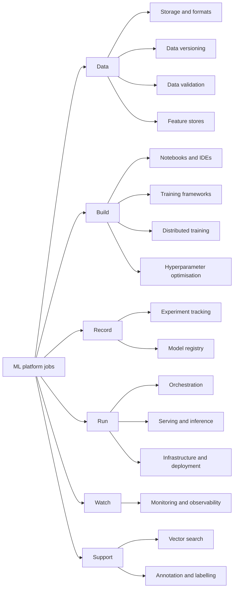
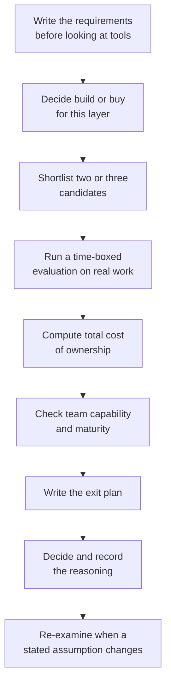
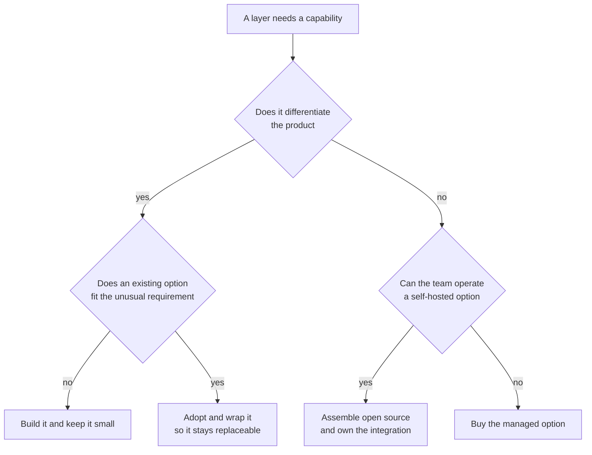
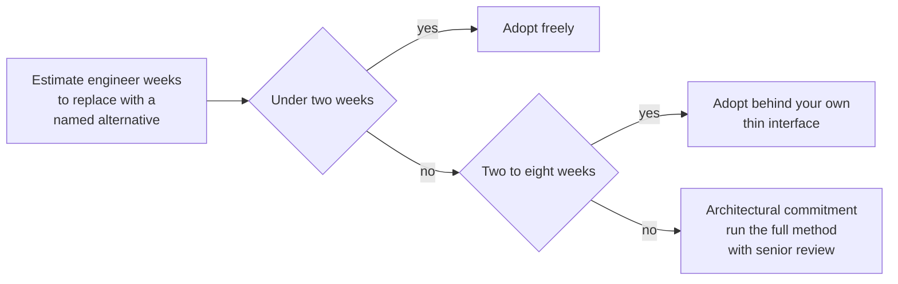
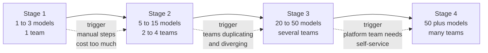

# Chapter 29: The Toolkit and How to Choose

> **What this chapter covers** The machine learning tooling landscape organised by the job each tool does, with the two or three criteria that actually decide each choice, the named open-source and managed options, integration and lock-in considerations, and the common mistake per category. Then the selection method: requirements first, build versus buy per layer, total cost of ownership, team capability, migration and exit, and maturity. Then the minimum viable platform and how it grows in stages. Then the anti-patterns.
>
> **Prerequisites** Chapter 21 (Machine Learning System Design), Chapter 25 (Model Lifecycle, Versioning, and Registries), Chapter 26 (Continuous Integration and Delivery for Machine Learning), Chapter 27 (Monitoring, Drift, and Retraining), Chapter 28 (Reliability, Cost, Security, and Compliance).
>
> **Where it is used** Every time a team adds a component to a platform, replaces one, or is asked in an interview why they chose what they chose. Which is more often than anyone expects.

Tools change. Criteria do not.

That sentence is the chapter. A survey of named tools is stale within two years, sometimes within one. The question "what must this layer do, and what two or three properties decide the choice" has been stable for a decade and will stay stable, because it comes from the shape of the problem rather than from the shape of the market.

So this chapter names tools, because refusing to name them would be unhelpfully abstract, and it does so without ranking them. No tool here is called best. Several of them are excellent at different things, several overlap heavily, and several will have merged, been abandoned, or changed character by the time you read this. Treat the names as examples of a category and the criteria as the durable content.

Nothing in this chapter quotes a price, a benchmark, or a version number. Those are exactly the facts that go stale, and an invented one is worse than an absent one. Where cost or performance decides a choice, the instruction is to measure it on your own workload.

---

## 29.1 Level 1: Foundations

### 29.1.1 What a machine learning platform is

A machine learning platform is not a product you buy. It is the set of capabilities that let a team go from an idea to a model running in production, repeatedly, without heroics.

Work backwards from what must happen for a model to be useful.

| Step | Capability needed |
|---|---|
| Find and understand the data | Catalogue, storage, query engine |
| Prepare features | Processing engine, feature definitions |
| Experiment | Development environment, experiment tracking |
| Train at scale | Compute orchestration, distributed training |
| Tune | Hyperparameter optimisation |
| Evaluate and record | Evaluation harness, model registry |
| Deploy | Packaging, serving, traffic management |
| Observe | Monitoring, logging, drift detection |
| Repeat reliably | Orchestration, continuous integration, versioning |

Every one of those capabilities exists in every production machine learning team. The only question is whether it exists as a chosen tool, as a shared platform, or as an undocumented script on one person's machine. The third option is the default and it is why the discipline of tool selection matters.

### 29.1.2 Organise by job, not by vendor

Vendors market platforms. Platforms bundle several jobs. If you evaluate bundles against bundles you will compare incomparable things and choose on brand.

Evaluate by job. Ask what the layer must do, evaluate candidates on that, and separately ask whether a bundle that covers several layers adequately beats separate tools that each cover one well. That is a real question with a real answer, and it is a different question from which platform is better.

The thirteen jobs used in this chapter:

*Figure 29.1: The platform jobs grouped by the phase they serve, which is how to evaluate them.*

### 29.1.3 The four questions that decide any tool choice

Before any category-specific criteria, four questions apply everywhere.

**What does it have to do?** Written down, before looking at any tool. If you cannot write three sentences of requirement, you are shopping, not choosing.

**What does it cost to own?** Not the licence. The licence is usually the small part. Owning a tool costs engineering time to run, to upgrade, to debug at three in the morning, and to teach every new person.

**Who is going to operate it?** A tool that needs a full-time specialist is a poor choice for a team of four. Team capability is a hard constraint, not a soft preference.

**How do you get out?** Every tool is eventually replaced. The cost of leaving is part of the cost of entering, and it is decided by where your data and your definitions live, not by the vendor's willingness to let you go.

### 29.1.4 Lock-in, stated honestly

Lock-in is not automatically bad. It is a cost you accept for a benefit. The mistake is accepting it without noticing.

| Degree | Description | Example shape |
|---|---|---|
| Low | Data and artifacts in open formats, tool is a thin layer | Parquet files in object storage, orchestration calling containers |
| Moderate | Proprietary metadata, portable artifacts | A tracking service holding run metadata while models are standard files |
| High | Proprietary artifact formats or embedded business logic | Feature transformations expressed only in a vendor's domain-specific language |
| Severe | The data itself in a proprietary store with no bulk export | Training data only extractable through a rate-limited API |

The general rule that survives: **keep your data and your definitions portable, and accept lock-in on execution.** A scheduler is replaceable in a week. Three years of feature definitions expressed in a proprietary language are not.

---

## 29.2 Level 2: Working knowledge

Each category below follows the same structure: what the tool must do, the criteria that decide, named options without ranking, integration and lock-in, and the common mistake.

### 29.2.1 Experiment tracking and model registry

**What it must do.** Record every training run with its parameters, code version, data version, environment, metrics, and output artifacts, so that any result can be found, compared, and reproduced. The registry adds a lifecycle on top: register a model version, attach evaluation evidence and approvals, move it through stages, and tell the serving layer which version is current.

**Criteria that decide.**
1. Does it capture enough to reproduce a run, meaning code commit, data version, environment, and hardware, rather than only metrics.
2. Does the registry integrate with your deployment path so that promotion is an action with consequences rather than a label in a user interface.
3. Is the query and comparison experience good enough that people actually use it, since an unused tracker is worse than none because it creates false confidence.

**Named options.** Open source: MLflow, Weights and Biases in its self-hosted form, Neptune, Aim, ClearML, DVC with its experiment features, and Sacred. Managed: Weights and Biases, Comet, Neptune, and the tracking components inside the major cloud machine learning platforms.

**Integration and lock-in.** Usually low to moderate. Metadata is the locked part. Ask before adopting: can you export the full run history in bulk, including artifacts, in a documented format. If the answer is a per-run API call with a rate limit, that is a migration cost measured in weeks.

**Common mistake.** Logging metrics only. Six months later you have a leaderboard and no ability to reproduce anything on it. Log the code commit, the data version identifier, the environment specification, and the full configuration, and make logging automatic in a shared wrapper rather than something each person remembers.

### 29.2.2 Orchestration and workflow

**What it must do.** Express a pipeline as a dependency graph, run it on a schedule or a trigger, retry failures, pass artifacts between steps, provide visibility into what ran and why it failed, and support backfills.

**Criteria that decide.**
1. How pipelines are authored and tested. Can you run a step locally without the scheduler, and unit test the logic independently.
2. Whether it handles dynamic graphs, meaning a step count determined at runtime, since fan-out over a variable number of partitions or models is extremely common and some tools handle it awkwardly.
3. Operational burden, since a self-hosted scheduler with a database and workers is a system you now own.

**Named options.** Open source: Apache Airflow, Prefect, Dagster, Kubeflow Pipelines, Argo Workflows, Flyte, Metaflow, Luigi, and Temporal for durable execution. Managed: hosted Airflow offerings from the major clouds, Prefect Cloud, Dagster Cloud, and the pipeline components of cloud machine learning platforms.

**Integration and lock-in.** Moderate, and it depends on how you write the tasks. A pipeline whose steps are containers with clear inputs and outputs ports in days. A pipeline whose business logic lives inside framework-specific operators is a rewrite. Keep logic in plain functions or containers and let the orchestrator only orchestrate.

**Common mistake.** Putting real computation inside the orchestrator's workers. The scheduler becomes a compute cluster, scaling becomes its problem, and a heavy job starves the scheduler. Orchestrators should submit work to a compute system and wait, not perform it.

### 29.2.3 Data versioning

**What it must do.** Let you refer to an exact dataset state by an identifier, retrieve it later, see what changed between two states, and tie a model to the data that trained it.

**Criteria that decide.**
1. Whether it versions by pointer or by copy, because copying terabytes per experiment is not viable and pointer-based approaches depend on immutable underlying storage.
2. Whether it integrates with your storage and query layer or requires a separate access path.
3. Granularity, meaning file-level versus row-level or table-level, since row-level time travel is a different capability from file snapshots.

**Named options.** File and pipeline oriented: DVC, Git LFS, and lakeFS. Table formats with built-in time travel: Delta Lake, Apache Iceberg, and Apache Hudi. Dataset-oriented: Pachyderm, and the dataset artifact features of several tracking tools.

**Integration and lock-in.** Low if you use an open table format, since the data remains readable by anything that understands the format. Higher with tools that wrap data behind their own access layer.

**Common mistake.** Versioning the data and not the transformation that produced it. Knowing which files trained the model does not reproduce the model if the feature code has changed since. Version the transformation code together with the data reference, and record both against the run.

### 29.2.4 Feature stores

**What it must do.** Provide one definition of a feature used by both training and serving, serve features at low latency online, produce point-in-time-correct training sets offline, and make features discoverable and reusable.

**Criteria that decide.**
1. Whether it genuinely does point-in-time correct joins, since this is the whole reason the category exists and preventing label leakage is the hard part.
2. Whether the online latency and throughput meet your serving budget on your data volume, which must be measured rather than assumed.
3. Whether the same definition truly drives both paths, since a store that requires you to write the transformation twice has not solved the problem it exists to solve.

**Named options.** Open source: Feast, and Feathr. Managed and integrated: Tecton, and the feature store components of the major cloud machine learning platforms and data platforms.

**Integration and lock-in.** Potentially high, because feature definitions accumulate and encode business logic. This is the category where portability of definitions matters most. Prefer definitions expressed in a language you already use over a proprietary domain-specific language.

**Common mistake.** Adopting one before having the problem. A feature store solves training-serving skew, cross-team feature reuse, and point-in-time correctness. A single team with one model and a batch pipeline has none of those problems and has just added a distributed system to operate. The honest trigger is a second or third team wanting the same features, or an online model whose features must be computed identically in two places.

### 29.2.5 Training frameworks and distributed training

**What it must do.** Express models, compute gradients, use accelerators efficiently, and scale beyond one device when the model or data requires it.

**Criteria that decide.**
1. Ecosystem fit, meaning what the pretrained models, the tutorials, and the people you will hire already use. This dominates almost every technical difference.
2. Deployment path, since a framework whose export path to your serving stack is awkward costs you at the end of every project.
3. For distributed training specifically, which parallelism strategies it supports, since data parallelism, tensor parallelism, pipeline parallelism, and sharded optimiser states solve different bottlenecks.

**Named options.** Frameworks: PyTorch, TensorFlow, JAX, and for tabular work scikit-learn, XGBoost, LightGBM, and CatBoost. Distributed and scaling libraries: PyTorch Distributed Data Parallel and Fully Sharded Data Parallel, DeepSpeed, Megatron-LM, Horovod, Ray Train, and Hugging Face Accelerate. Higher-level training loops: PyTorch Lightning and Hugging Face Transformers.

**Integration and lock-in.** Framework choice is a genuine long-term commitment because it shapes hiring, code, and available pretrained weights. Exchange formats such as ONNX reduce serving-side lock-in but do not make training code portable.

**Common mistake.** Reaching for distributed training before exhausting single-device options. Mixed precision, gradient accumulation, gradient checkpointing, a better data loader, and a smaller model often recover more than adding machines, and they add no coordination failure modes. Profile first, and confirm the bottleneck is compute rather than data loading, which it frequently is not.

### 29.2.6 Hyperparameter optimisation

**What it must do.** Search a parameter space efficiently, run trials in parallel, stop unpromising trials early, and record results so the search itself is reproducible.

**Criteria that decide.**
1. Whether it supports early stopping of bad trials, since this is usually a larger saving than a smarter search algorithm.
2. How it parallelises and whether it integrates with your existing compute, rather than demanding its own cluster.
3. Whether it handles conditional and mixed search spaces, meaning parameters that only exist when another parameter takes a certain value.

**Named options.** Optuna, Ray Tune, Hyperopt, Ax and BoTorch, SMAC, Katib, and the tuning services in the cloud machine learning platforms.

**Integration and lock-in.** Low. Search configurations are small and easy to re-express. This is one of the safest categories to change.

**Common mistake.** Running an expensive Bayesian search over a badly chosen space. Random search over a well-chosen space beats sophisticated search over a bad one, and the return on thinking about the space for an hour exceeds the return on the algorithm. Second mistake: tuning before fixing the data, which optimises noise.

### 29.2.7 Serving and inference engines

**What it must do.** Load a model, accept requests, run inference efficiently, scale with load, support multiple versions and traffic splitting, and expose metrics.

**Criteria that decide.**
1. Whether it supports the batching mode your workload needs, since dynamic batching for general models and continuous batching for autoregressive generation are different mechanisms with very different throughput consequences.
2. Hardware and format support, meaning whether it runs your model on your accelerators with the optimisations you need such as quantisation and compilation.
3. Operational model, meaning whether it is a library you embed, a server you run, or a managed endpoint, since that decides who is on call.

**Named options.** General model servers: NVIDIA Triton Inference Server, TorchServe, TensorFlow Serving, BentoML, KServe, Seldon Core, and Ray Serve. Optimised runtimes: ONNX Runtime, TensorRT, OpenVINO, and TVM. Language model serving: vLLM, Text Generation Inference, TensorRT-LLM, SGLang, llama.cpp, and Ollama for local use. Managed: the inference endpoints of the major clouds and model providers.

**Integration and lock-in.** Low to moderate. The model artifact is usually portable; the deployment configuration and the client contract are the sticky parts. Keep the request and response schema yours, defined in your own code, so that swapping the engine behind it does not change the contract your callers depend on.

**Common mistake.** Wrapping a model in a minimal web framework and calling it done. That works until concurrency arrives, at which point you discover you have no batching, one request per process, no queue management, and no way to load two versions. Purpose-built servers solve problems you have not met yet, and meeting them in production is expensive.

### 29.2.8 Monitoring and observability

**What it must do.** Collect metrics, logs, and traces, store them queryably, visualise them, alert on them, and for machine learning additionally compute data quality and drift statistics and track model performance against labels.

**Criteria that decide.**
1. Whether it covers both the service layer and the model layer, or whether you will need two systems, which most teams do.
2. Cost at your volume, because observability cost scales with traffic and cardinality and can become a top-three line item without anyone deciding.
3. Whether alerting supports the logic you need, specifically multi-window burn rates rather than only instantaneous thresholds.

**Named options.** Infrastructure and service: Prometheus, Grafana, OpenTelemetry, Loki, Jaeger, and the observability products of the major clouds and of the independent observability vendors. Machine learning specific: Evidently, NannyML, Alibi Detect, WhyLabs, Arize, Fiddler, and Deepchecks. For language model applications: Langfuse, Phoenix, and similar tracing tools.

**Integration and lock-in.** Moderate. Instrumentation is the expensive part to redo, which is the argument for OpenTelemetry as the instrumentation layer, since it decouples what you emit from where it is stored.

**Common mistake.** Buying a drift monitoring product before setting up inference logging. The product needs the logs. Without the feature vector, the model version, and the decision recorded per prediction, as Chapter 27 specifies, a drift tool has nothing to analyse. Build the logging first.

### 29.2.9 Data validation

**What it must do.** Express expectations about data, check them as data flows through, report failures with enough detail to act, and either block or flag depending on severity.

**Criteria that decide.**
1. Where the checks run, since a validation library that only runs in Python cannot check data inside a warehouse without pulling it out.
2. Whether expectations can be generated from data and then reviewed, because writing hundreds by hand does not happen.
3. Whether failures integrate with your orchestration so a failed check can stop a pipeline rather than write a report nobody reads.

**Named options.** Great Expectations, Pandera, Deequ and PyDeequ for Spark, TensorFlow Data Validation, Soda, dbt tests for warehouse-native checks, and Evidently for the distributional side.

**Integration and lock-in.** Low. Expectations are small declarative artifacts and porting them is mechanical.

**Common mistake.** Validating only at ingestion. Most corruption is introduced by transformations in the middle of the pipeline, not at the edge. Validate at every boundary where responsibility changes hands, and especially on the feature table the model actually reads.

### 29.2.10 Vector search

**What it must do.** Store embedding vectors with metadata, retrieve approximate nearest neighbours fast, filter by metadata, and support updates and deletes at your rate of change.

**Criteria that decide.**
1. Whether filtered search is a first-class operation, because a system that filters after retrieval returns too few results when the filter is selective, and this surprises people in production.
2. Scale and update pattern, since a static index of a million vectors and a continuously updated index of a billion are entirely different engineering problems.
3. Whether you need a separate system at all, given that several relational and search databases now offer competent vector indexes and one fewer system is a real benefit.

**Named options.** Libraries: FAISS, hnswlib, and ScaNN. Dedicated systems: Milvus, Qdrant, Weaviate, Vespa, Chroma, and Marqo. Extensions to existing stores: the vector capabilities in PostgreSQL through pgvector, in OpenSearch and Elasticsearch, in Redis, and in several cloud databases. Managed: Pinecone, and the vector services of the major clouds.

**Integration and lock-in.** Low to moderate. Embeddings are portable; the index is rebuildable. The lock-in is operational rather than structural, and the real cost of moving is the re-embedding bill if you also change the model.

**Common mistake.** Adopting a dedicated vector database for a corpus small enough to sit in memory. Below roughly the scale where an in-process index becomes unwieldy, a library or an extension to a database you already run is less to operate. The threshold is your corpus size, update rate, and filtering needs, and it must be worked out rather than assumed.

### 29.2.11 Annotation and labelling

**What it must do.** Present items to annotators in a suitable interface, capture labels with annotator identity, support multiple annotators per item and adjudication, measure agreement, and export in a usable format.

**Criteria that decide.**
1. Whether it supports your modality and task properly, since generic tools handle classification well and handle segmentation, relation extraction, or audio timing badly.
2. Quality management features, meaning agreement metrics, gold questions, and review workflows, since without them label quality is unknown and label quality caps model quality.
3. Whether it supports model-in-the-loop, meaning pre-labelling and active learning, which is the main lever on annotation cost.

**Named options.** Open source and self-hosted: Label Studio, CVAT, doccano, Argilla, and Prodigy. Managed platforms and services: Labelbox, Scale, SuperAnnotate, Snorkel, and the ground truth services of the major clouds.

**Integration and lock-in.** Low on data, since exports are standard. The lock-in is in workflows and in the annotator workforce, if you use a vendor's people.

**Common mistake.** Treating annotation as a one-time project. Guidelines need versioning, annotators need feedback, disagreements need adjudication, and the label set itself evolves. Budget for a continuous process, and measure inter-annotator agreement from the first batch, because a task humans cannot agree on is one no model will learn.

### 29.2.12 Notebook and development environments

**What it must do.** Give an interactive loop for exploration, access to data and to accelerators, and a path from exploration to code that runs in a pipeline.

**Criteria that decide.**
1. Whether notebooks can be version controlled and reviewed meaningfully, since raw notebook formats produce unreadable diffs.
2. Whether the environment matches production, because a notebook whose package versions differ from the training image produces results that do not reproduce.
3. Whether there is a clean path out of the notebook into a module, since the exploration-to-production gap is where most time is lost.

**Named options.** Jupyter and JupyterLab, VS Code with its notebook support, Google Colab, Deepnote, Hex, Marimo, and the notebook environments of the cloud machine learning platforms. Supporting tools: nbstripout and nbdime for version control, Jupytext for paired plain-text representations, and papermill for parameterised execution.

**Integration and lock-in.** Low, unless the notebook platform has proprietary cell types or a hosted-only runtime, in which case moderate.

**Common mistake.** Running production workloads from notebooks. It happens because it works at first. It has no version control that means anything, no tests, hidden state from out-of-order execution, and no reviewable diff. The fix is a rule: notebooks for exploration and reporting, modules for anything that runs more than once, with the notebook importing the module rather than containing the logic.

### 29.2.13 Infrastructure and deployment

**What it must do.** Provision infrastructure reproducibly, build and store images, deploy applications, manage configuration and secrets, and roll back.

**Criteria that decide.**
1. Whether infrastructure is declared as code with a plan-and-apply cycle and state you can inspect, since manual infrastructure is the root of every environment that cannot be rebuilt.
2. Whether the deployment mechanism supports the rollout strategies you need, meaning canary, blue-green, and shadow, which Chapter 26 requires for models.
3. Team capability again, since Kubernetes is powerful and is a full-time operational commitment unless it is managed.

**Named options.** Infrastructure as code: Terraform, OpenTofu, Pulumi, AWS CloudFormation, and the cloud-specific equivalents. Containers and orchestration: Docker, Kubernetes, and the managed Kubernetes services. Kubernetes-adjacent: Helm, Kustomize, Argo CD, and Flux for GitOps. Simpler compute: the serverless container services of the major clouds, and platform-as-a-service offerings. Machine learning oriented compute: Ray, SkyPilot, Modal, and Kubeflow.

**Integration and lock-in.** High at the cloud level and moderate at the tool level. Kubernetes is the most portable substrate in the sense that a workload moves between providers, and the least portable in the sense that the surrounding ecosystem of controllers and configuration is substantial work to recreate.

**Common mistake.** Adopting Kubernetes for three services. The complexity budget is spent on cluster operation instead of on the product, and a small team cannot staff it. Kubernetes earns its cost when you have many services, real multi-tenancy, heterogeneous hardware scheduling, or an existing platform team. Below that, managed container services do the job with a fraction of the surface.

---

## 29.3 Level 3: Depth

### 29.3.1 The selection method

A repeatable method, in order. The order matters more than any individual step.

*Figure 29.2: The selection method, where the first step is the one most often skipped and the last step is the one that prevents the decision from calcifying.*

**Step 1: Requirements first.** Write down what the layer must do, in terms of your workload, before you look at any tool. Include the numbers: request volume, data size, latency target, number of models, number of people, growth expectation over two years. Include the constraints: compliance, data residency, existing cloud, existing skills.

This single step eliminates most bad choices, because most bad choices come from evaluating a tool's feature list rather than your requirement list. A feature list always looks good. The only question is whether the features you need work well.

**Step 2: Shortlist narrowly.** Two or three candidates. Evaluating six wastes weeks and produces a comparison matrix nobody reads. Cut on hard constraints first: does it run where you run, does it meet the compliance requirement, does someone on the team have a chance of operating it.

**Step 3: Evaluate on real work, time-boxed.** A demo proves nothing. Take an actual model, an actual dataset at realistic scale, and an actual pipeline, and implement it with each candidate in a fixed time box of one to two weeks. The measurement is not only whether it worked but how much time it took, what was confusing, what documentation was missing, and how support responded when you got stuck. That last one is a real signal about what operating it will feel like.

**Step 4: Compute total cost of ownership.** Section 29.3.3.

**Step 5: Check capability and maturity.** Sections 29.3.5 and 29.3.6.

**Step 6: Write the exit plan before entering.** Section 29.3.4.

**Step 7: Record the decision.** An architecture decision record: the context, the options considered, the decision, the reasoning, and the assumptions that would invalidate it. This costs thirty minutes and saves an argument in eighteen months, because the alternative is that the decision becomes tradition and nobody remembers whether it was ever reasoned.

### 29.3.2 Build versus buy, per layer

Not a single decision. Ask it per layer, because the answer legitimately differs.

The test: **build what differentiates, buy what does not.** Your feature engineering logic differentiates. Your metrics database does not. Nobody has ever won a market by operating a better time series store.

Four signals for each direction.

| Build when | Buy when |
|---|---|
| The capability is core to your product's advantage | The capability is a commodity with mature options |
| Your requirement is genuinely unusual and no option fits | Your requirement is ordinary and several options fit |
| The integration cost of an external tool exceeds the build cost | Operating it yourself needs skills you do not have and will not hire |
| Data sensitivity or residency forbids an external service | Time to value matters more than fit |

Two arguments to distrust.

"We can build it in two weeks" is almost always wrong, because the two weeks is the prototype and the two years is the maintenance, the edge cases, the upgrades, and the on-call. Estimate the five-year cost, not the first version.

"Buying is always faster" is also often wrong, because a tool that fits badly costs more in integration and workarounds than a small purpose-built component. The tell is when you find yourself building an adapter layer that is itself substantial.

*Figure 29.3: The build versus buy decision applied per layer, where the most common correct answer is neither pure building nor a purchased suite.*

The most common correct answer in practice is a third option: **assemble open-source components rather than building from scratch or buying a suite.** You own the integration, which is real work, and you avoid both the maintenance burden of original code and the lock-in of a suite.

### 29.3.3 Total cost of ownership

The licence or usage fee is often a minority of the cost. Account for all of it.

| Component | What it includes | How to estimate |
|---|---|---|
| Direct cost | Licence, subscription, or usage fees | From the vendor, at your projected volume, including growth |
| Infrastructure | Compute, storage, and network the tool consumes | Measure during the evaluation, extrapolate |
| Implementation | Integration, migration of existing work, and initial configuration | Engineer-weeks, from the time-boxed evaluation, multiplied by a factor for reality |
| Operation | Upgrades, patching, capacity, and on-call | Engineer-days per month, ongoing |
| Training | Time for each person to become productive, including future hires | Person-days times headcount times turnover |
| Opportunity | What the team is not building while doing all of the above | The most real and least measured component |
| Exit | Migration away when the time comes | Estimated at entry, not at exit |

A worked comparison, with all figures labelled as assumptions for the example and not as any vendor's actual costs.

A team is choosing between a managed orchestration service and self-hosting the same open-source orchestrator. Assume the managed service costs 2,000 units per month. Assume self-hosting costs 600 units per month in infrastructure. The monthly infrastructure difference favours self-hosting by 1,400.

Now add the rest. Assume an engineer costs 800 units per day fully loaded. Self-hosting is assumed to take 15 engineer-days to set up properly, which is 12,000 units once, and 2 engineer-days per month for upgrades, incidents, and capacity, which is 1,600 units per month. The managed service is assumed to take 3 engineer-days to set up, 2,400 units, and 0.25 engineer-days per month, 200 units.

| Item | Self-hosted | Managed |
|---|---|---|
| Setup, one time | 12,000 | 2,400 |
| Infrastructure per month | 600 | 0 |
| Service fee per month | 0 | 2,000 |
| Operation per month | 1,600 | 200 |
| Total per month | 2,200 | 2,200 |
| First-year total | 12,000 + 26,400 = 38,400 | 2,400 + 26,400 = 28,800 |

The monthly costs are identical and the managed option is cheaper in year one by the setup difference. The apparent 1,400 per month saving from self-hosting was entirely consumed by operational labour, which is the component teams systematically omit.

Two things flip this. Scale, because the service fee usually grows with usage while operational labour grows much more slowly, so at ten times the volume self-hosting often wins. And existing capability, because a team that already operates this class of system well pays far less than 2 engineer-days per month for one more.

The lesson is not that managed wins. It is that the comparison is meaningless without the labour term, and the labour term is the one nobody puts in the spreadsheet.

### 29.3.4 Migration cost and exit strategy

Write the exit plan before you enter. Not because you expect to leave, but because writing it reveals the lock-in you were about to accept.

Four questions.

**Where does the data live, and can you get it out in bulk?** Not through an API at a hundred records per second. A bulk export, in a documented format, that you have actually tested. Test it during the evaluation, not during the migration.

**Where do the definitions live?** Feature definitions, pipeline logic, evaluation criteria, and alert rules. If they are expressed in a proprietary language or only exist inside a user interface, they must be rewritten by hand. This is the largest and least visible migration cost.

**How many places reference this tool?** A tool touched by three services is replaceable. A tool whose client library is imported in two hundred files is not, unless you wrapped it. Which is the mitigation: put your own thin interface in front of any tool you are unsure about, so that swapping it touches one module. The cost is a small indirection; the benefit is optionality.

**What happens if it disappears?** Companies get acquired and shut products down. Open-source projects lose maintainers. For each tool ask what you would do with six months of notice, and whether the answer is acceptable. If a tool is essential and has no viable replacement, that is a risk to record rather than ignore.

*Figure 29.4: The reversibility test, which converts a vague worry about lock-in into a band and a required process.*

A useful discipline is the reversibility test. Before adopting, estimate the engineer-weeks to replace the tool with a named alternative. Under two weeks, adopt freely. Two to eight weeks, adopt with the wrapper. Over eight weeks, this is an architectural commitment and deserves the full method with senior review.

### 29.3.5 Team capability as a hard constraint

The best tool for a team that cannot operate it is a worse tool than the second best one they can.

Assess honestly across three dimensions.

**Current skills.** Does anyone have production experience with this class of system. Not a tutorial, production. Kubernetes, Spark, and distributed training each have a steep and unforgiving curve, and the failure modes appear under load, at which point tutorials do not help.

**Capacity.** Even a capable team has finite attention. Every self-operated system consumes some fraction of it permanently. Count the systems you already operate before adding another.

**Continuity.** If one person operates a system and that person leaves, what happens. A tool that only one person understands is an outage waiting for a resignation. This argues for tools with a large user base and good documentation over technically superior tools with a small community, for reasons that have nothing to do with the technology.

The pattern to watch for: a team adopts a sophisticated tool because one enthusiastic engineer champions it, that engineer becomes the only operator, and when they move on the team is stuck with a system they cannot maintain and cannot easily leave. The mitigation is to require, before adoption, that at least two people will learn it and that the runbook is written.

### 29.3.6 Maturity

Maturity is not age. It is the probability that the tool will behave predictably and still exist in three years.

| Signal | What to look for | Why it matters |
|---|---|---|
| Release cadence and stability | Regular releases, clear versioning, documented breaking changes | Erratic releases mean upgrades are risky |
| Contributor breadth | Many contributors across several organisations | A single-company or single-person project is a single point of failure |
| Issue handling | Issues get triaged and answered, not accumulated | Predicts what happens when you hit a bug |
| Documentation depth | Concepts, operations, and troubleshooting, not only a quickstart | Quickstart-only documentation means you are the one who finds the edge cases |
| Production evidence | Public accounts of use at comparable scale | A tool with no production users at your scale has untested behaviour there |
| Governance | Foundation governance or a clear, stated model | Predicts behaviour after acquisition or a licence change |
| Licence trajectory | Has the licence changed, and in which direction | Several projects have relicensed in ways that changed the economics abruptly |

Weight these by how deeply you are committing. A hyperparameter library that turns out badly is a day to replace. A feature store that turns out badly is a year.

Note the specific risk of the very new and very popular tool. A tool six months old with rapid adoption has an unusual profile: strong momentum, active development, and no stability guarantees, unknown edge cases, and a real chance of abrupt direction changes. That is an acceptable profile for an experiment and a poor one for the layer everything depends on.

### 29.3.7 The minimum viable platform

Here is the honest answer for a small team, and it is a shorter list than the market implies.

A team of one to five engineers with one to three models in production needs exactly this.

| Job | Minimum viable choice | Why this is enough |
|---|---|---|
| Code versioning | Git, with everything in it including configuration and infrastructure | Non-negotiable, and it is also your deployment record |
| Data versioning | Immutable, dated paths in object storage, plus a manifest file recording what trained each model | A convention, not a tool, and it works |
| Experiment tracking | One tracking tool, either self-hosted or managed | The only place where a purpose-built tool is clearly worth it immediately |
| Environments | A lockfile and a Dockerfile that installs from it | Reproducibility comes from here, not from a platform |
| Orchestration | Scheduled container runs, via cron, a CI scheduler, or a managed job runner | A dependency graph tool is unnecessary below a handful of pipelines |
| Training | Whatever framework fits, on one machine, scaled up rather than out | Single-node with a large accelerator covers far more than expected |
| Serving | A container behind a managed container service, or a purpose-built model server if the workload needs batching | Kubernetes is not required to serve a model |
| Monitoring | Service metrics from the platform, plus inference logs to object storage or a warehouse, plus a scheduled job computing data quality and performance | The logs matter more than the dashboard tool |
| CI | The CI system attached to your repository, running tests and building images | You already have it |

That is roughly two purpose-built tools and a set of conventions. It is not impressive and it works, and a team running this well is ahead of most teams running something elaborate badly.

Three things this list deliberately excludes, and why.

**No feature store**, because with one team and few models there is no reuse problem and no cross-team consistency problem. The training-serving consistency problem is solved with a shared transformation module imported by both paths.

**No Kubernetes**, because managed container services handle a few services with a fraction of the operational surface.

**No dedicated drift monitoring product**, because a scheduled job computing a handful of statistics from the inference logs covers the need, and until the logs exist a product has nothing to read.

What must not be skipped even at this size, because retrofitting each is expensive: inference logging with the full record from Chapter 27, immutable versioning of data and artifacts, a rollback path that is one command, and an evaluation gate before promotion.

### 29.3.8 How the platform grows

Growth is driven by two variables: number of models and number of teams. Adding models increases the cost of manual steps. Adding teams increases the cost of inconsistency.

*Figure 29.5: The staged progression, with the trigger that justifies each move rather than a timeline.*

**Stage 1 to Stage 2. Trigger: manual steps cost more than automating them.** Typically at five or more models, or when deployment happens weekly.

Add: a real orchestrator, because scheduled scripts no longer express the dependencies. A model registry with a promotion gate, because remembering which version is live stops working. Automated evaluation in continuous integration. A shared transformation library so features are computed identically everywhere. Standardised monitoring so every model gets the same baseline for free.

**Stage 2 to Stage 3. Trigger: teams duplicate and diverge.** Typically at two or more teams building the same features differently, or when onboarding a new engineer takes more than a week.

Add: a feature store, now that reuse and consistency are genuine problems. Data validation as a gate in every pipeline. A dedicated drift and performance monitoring layer, because ad hoc jobs per model no longer scale. Cost attribution by model and team, because the bill is now large enough to need a lever. A defined serving platform so every model deploys the same way.

**Stage 3 to Stage 4. Trigger: the platform team becomes the bottleneck.** Every deployment needs a platform engineer, and the queue is the constraint.

Add: self-service, meaning templates and paved paths that a team uses without asking. Multi-tenancy with isolation and quotas. Policy as code for compliance gates. Sophisticated scheduling for heterogeneous hardware. Possibly a purpose-built internal platform layer over the tools, which is the point where building becomes reasonable because the requirement is genuinely yours.

Three rules for moving between stages.

**Add a tool when the pain is present, not anticipated.** The cost of adding later is real and the cost of adding early is also real, and only one of them is certain.

**Add one at a time and let it settle.** Adopting four tools in a quarter means none of them is properly operated and any failure is hard to attribute.

**Remove tools as well.** Platforms accumulate. Every quarter, ask which tool is no longer earning its place. Removing one is as valuable as adding one and is never on anyone's roadmap.

### 29.3.9 Anti-patterns in tool selection

**Adopting a platform before having a model in production.** The most expensive mistake in this chapter. A team spends two quarters building a platform for models that do not exist, designing for problems they have not met, and discovers on first contact that the real requirements are different. The correct sequence is to ship a model with the minimum viable platform, feel the actual pain, and then build for that pain. The platform should lag the models, not lead them.

**Building the differentiating layer and buying the boring one, backwards.** The failure is building a bespoke metrics store while using an off-the-shelf tool for the feature logic that is actually your product's advantage. It happens because the boring layers are technically interesting and the differentiating layers are messy and domain-specific. Build the boring layers only when nothing fits; build the differentiating layer always.

**Resume-driven selection.** Choosing a technology because it is good to know rather than because it fits. The signal is a justification that does not reference the requirements. The mitigation is the written requirements document, since it makes the mismatch visible.

**The comparison matrix with thirty rows.** Rows get equal visual weight and unequal actual weight, so the decision goes to whichever tool has more checkmarks rather than to whichever meets the three criteria that matter. Pick the three criteria first, weight them explicitly, and let everything else be a tiebreak.

**Adopting the single-vendor bundle without evaluating the layers.** A bundle covering nine layers is rarely strong at all nine. If three of them are weak for your case, you will work around them or run shadow tools, which is the worst of both. Evaluate the layers you depend on most, individually, and accept the bundle only if those are adequate.

**Never revisiting.** A choice made when you had two models is being lived with at fifty. Decisions should carry the assumptions that justified them, and should be revisited when an assumption changes, which is why the architecture decision record includes them.

**Optimising for the demo.** Tools are demonstrated on clean data at small scale with no concurrency. Your workload has none of those properties. This is why the evaluation must use real data at realistic scale, and why the most informative moment is when something goes wrong during the evaluation.

**Too many tools.** Each tool has an operational surface, an upgrade cadence, a failure mode, and a learning cost. A platform with fifteen tools serving five models is spending more on the platform than on the models. Count your tools; if the number is growing faster than your models, something is wrong.

---

## 29.4 Level 4: Mastery

### 29.4.1 What senior engineers actually argue about

**Whether a feature store is worth it.** The case for: one definition used by training and serving eliminates the most common source of production error, point-in-time correctness is genuinely hard to implement correctly, and reuse compounds across teams. The case against: it is a distributed system with an online store and an offline store to keep consistent, it adds latency to the serving path, and a shared transformation module plus a well-designed data layer solves most of the problem for most teams. The defensible position is that the value is proportional to the number of teams sharing features, and that a single team with a handful of models should solve it with a module rather than a system. Adopt when there are three or more consumers of the same features, not before.

**Kubernetes or not.** The case for: one substrate for everything, portability, a large ecosystem, and the right answer for heterogeneous scheduling and multi-tenancy. The case against: the operational surface is large, the failure modes require real expertise, and most teams use a small fraction of the capability. The defensible position is that Kubernetes is correct when you have many services, a platform team, or genuine multi-tenancy, and that below that it is a complexity budget spent on the wrong thing. The useful reframing is that the question is not whether Kubernetes is good, it is whether you have the problems Kubernetes solves.

**Single integrated platform or assembled components.** A cloud platform covering everything gives fast onboarding, one bill, one support contact, and coherent integration, at the cost of vendor lock-in and weakness in some layers. Assembled components give the right tool per layer and portability, at the cost of substantial integration work that never ends. The reality is that both approaches converge on the same total effort, distributed differently, and the deciding factor is usually team capability rather than technical merit. A team without platform engineers should take the platform.

**Whether to standardise across teams.** Standardisation gives shared tooling, transferable skills, and a shared support burden. Autonomy gives teams the right tool for their specific problem and avoids a lowest-common-denominator platform. The pattern that works is a paved path, meaning a supported default that is easy to use and comes with support, combined with permission to deviate provided the team takes on the operational burden themselves. That makes the standard attractive rather than mandatory, which is the only way standards survive.

**Where to draw the machine learning and data engineering boundary.** Whether feature pipelines belong to the data team or the machine learning team is a genuine organisational argument with no universal answer. The failure mode of either extreme is the same: the boundary becomes a queue. The workable arrangement is that the data team owns the raw and curated layers with contracts, and the machine learning team owns feature transformations, with data contracts making the interface explicit and testable.

### 29.4.2 Why tools change and criteria do not

Three forces drive churn in this landscape.

**Hardware.** New accelerators, new memory hierarchies, and new interconnects invalidate the assumptions built into serving and training tools. The serving stack for language models was rewritten around continuous batching and attention-aware memory management within a couple of years, because the hardware and the workload shape made previous designs uncompetitive.

**Workload shape.** The rise of large pretrained models moved the centre of gravity from training many small models to adapting and serving a few large ones, which invalidated a generation of tooling assumptions. Whatever comes next will do the same.

**Consolidation.** Categories start fragmented, converge on a few winners, and then get absorbed into larger platforms. Experiment tracking, data versioning, and vector search have each moved along this path at different speeds.

What does not change: the need for reproducibility, the need for a single definition of a feature, the need for a rollback path, the need to know what version is serving, and the need to detect that a model has stopped working. Those requirements are properties of the problem. A tool that fails on them is wrong regardless of what year it is, and a tool that satisfies them is adequate regardless of its name.

Practical consequence: invest your learning in the criteria and in the underlying mechanisms, and invest only as much in a specific tool as you need to use it well. The engineer who understands why point-in-time correctness is hard can evaluate any feature store in a day. The engineer who knows one feature store's API deeply cannot.

### 29.4.3 Buy versus build revisited, with the second-order effects

Two effects that the first-order analysis in 29.3.2 misses.

**Buying creates an integration surface that you own forever.** A purchased tool does not eliminate work, it converts building work into integration and adaptation work, and that work never ends because the vendor changes their product on their schedule. Count it.

**Building creates an option that compounds.** A capability you built can be changed when a requirement changes. A capability you bought can be changed only if the vendor agrees. For a layer where your requirements are unusual and evolving, that option has real value, and it is the strongest genuine argument for building.

The synthesis most experienced teams reach: buy or adopt open source for layers where your requirements are ordinary and stable, build thin adapters around them so they are replaceable, and build only the layer where your requirements are unusual and where being able to change quickly is worth something. Then keep the built layer small, because every line of it is a maintenance obligation.

### 29.4.4 Evaluating tools that are themselves models

An increasing share of tooling has a model inside: annotation tools that pre-label, code assistants, evaluation tools that use a judge model, and monitoring tools that use embeddings. These need criteria the traditional categories do not cover.

| Question | Why it matters |
|---|---|
| Can you see and control which model it uses | Behaviour changes when the model changes, without your deploying anything |
| Is its output measured against a ground truth you control | A judge model's agreement with human labels decays and must be re-measured |
| Does your data leave your boundary | Often the hard compliance constraint, and easy to miss in a tool that looks like infrastructure |
| What happens when it is wrong | A pre-labelling tool that is wrong in a consistent direction biases the entire dataset |
| Is the behaviour reproducible | Non-determinism in a tool used for evaluation makes results incomparable across time |

The general instruction: a tool with a model inside is subject to everything in Chapter 27. It drifts, it must be monitored, and its quality must be measured against something you trust. Treat it as a dependency with a quality SLO, not as a deterministic utility.

### 29.4.5 Platform engineering judgment

Four habits that distinguish someone who builds platforms that work.

**Solving the problem you have.** The hardest discipline in this chapter is not adopting the tool that would solve a problem you expect to have in two years. The expected problem often does not arrive, arrives differently, or arrives after better tools exist. Build for the problem in front of you and keep the design open.

**Measuring the platform.** A platform should have metrics: time from idea to first model in production, time from commit to deployment, number of manual steps in the path, and the fraction of models covered by monitoring. Without these, platform work is justified by taste, which is how platforms grow without improving anything.

**Deleting.** Every platform accumulates tools adopted for a reason that has since disappeared. The engineer who removes two tools and consolidates a third has usually done more good than the one who added a new capability, and gets less credit for it. Schedule the review.

**Keeping the escape hatch.** Every abstraction leaks eventually. A platform that makes the common case easy and the uncommon case impossible will be worked around, and the workarounds will be worse than the thing they avoid. Provide the paved path and leave the direct route open.

---

## 29.5 Subtopic checklist

| Subtopic | You should be able to |
|---|---|
| Platform jobs | List the thirteen jobs and say what each must do |
| Experiment tracking | State what must be logged to make a run reproducible |
| Model registry | Explain why promotion must be an action with consequences |
| Orchestration | Explain why computation should not run in the orchestrator's workers |
| Data versioning | Distinguish pointer-based from copy-based and explain why code must be versioned with it |
| Feature stores | State the three problems they solve and the trigger for adopting one |
| Training frameworks | Argue ecosystem fit over technical difference, and exhaust single-device options first |
| Distributed training | Name the parallelism strategies and which bottleneck each addresses |
| Hyperparameter optimisation | Explain why early stopping beats a smarter search algorithm |
| Serving | Distinguish dynamic from continuous batching and say when each applies |
| Monitoring | Explain why inference logging precedes any drift product |
| Data validation | Explain why ingestion-only validation misses most corruption |
| Vector search | State when a dedicated system is not warranted |
| Annotation | Explain why agreement must be measured from the first batch |
| Notebooks | State the rule separating exploration from production code |
| Infrastructure | Say when Kubernetes earns its operational cost |
| Selection method | Run the seven steps in order and say why requirements come first |
| Build versus buy | Apply the differentiation test per layer and rebut both common arguments |
| Total cost of ownership | Compute a comparison including the labour term |
| Exit strategy | Answer the four exit questions and apply the reversibility test |
| Team capability | Explain why the best tool can be the wrong choice |
| Maturity | Name six maturity signals and weight them by commitment depth |
| Minimum viable platform | List it, and justify the three deliberate exclusions |
| Staged growth | Name the trigger that justifies each stage transition |
| Anti-patterns | Identify each in a described situation and say what to do instead |

---

## 29.6 Common misconceptions

| Misconception | Why it is believed | What is actually true |
|---|---|---|
| There is a best tool in each category | Comparison articles rank things, and ranking is satisfying | Tools differ in what they optimise. The right choice depends on requirements, scale, team, and existing stack, and a tool that is right for one team is wrong for another |
| A machine learning platform must be built before shipping models | Platform work looks like the responsible foundation | A platform built before contact with production solves imagined problems. Ship with the minimum viable platform, feel the pain, then build for it |
| Managed services are more expensive than self-hosting | The fee is visible and the labour is not | Once setup, upgrades, incidents, and on-call are priced at a realistic day rate, the two are frequently comparable at small scale. Self-hosting usually wins at large scale, for the opposite reason |
| Every team needs a feature store | It appears in every reference architecture | It solves cross-team reuse, training-serving consistency, and point-in-time correctness. A single team with a few models has the middle problem only, which a shared transformation module solves |
| Kubernetes is the standard so you should use it | Ubiquity reads as necessity | It earns its operational cost with many services, multi-tenancy, heterogeneous hardware, or a platform team. Below that it spends the complexity budget on the wrong layer |
| Open source is free | No invoice arrives | The licence is free and the operation is not. Setup, upgrades, and incident response are the dominant cost, and they are paid in engineer time |
| Adopting more tools makes the platform better | Each tool solves a visible problem | Each adds an operational surface, an upgrade cadence, a failure mode, and a learning cost. A platform with more tools than models is spending in the wrong place |
| You can avoid lock-in | Portability sounds achievable | Every choice locks you in somewhere. The goal is to choose where: keep data and definitions portable, accept lock-in on execution, and know the exit cost before entering |
| A tool that works in the demo will work for you | Demos are convincing | Demos run on clean data at small scale with no concurrency. Evaluate on real data at realistic scale, and treat the moment something breaks as the most informative part |
| Wrapping a model in a web framework is sufficient serving | It works immediately | It works until concurrency. Then you have no batching, no queue management, no multi-version loading, and no traffic splitting, and you discover it in production |
| Tool knowledge is the valuable skill | Job postings list tools | Tools change every few years. The criteria, the mechanisms, and the reasons a layer exists are stable, and someone who understands why point-in-time correctness is hard can evaluate any feature store quickly |
| A decision, once made, is settled | Revisiting feels like churn | Decisions rest on assumptions about scale, team, and requirements, all of which change. Record the assumptions and revisit when one of them breaks |

---

## 29.7 Practice

**Exercise 1, level 2. Write a requirements document and shortlist.**
Choose one category from 29.2 relevant to a system you work on or invent a realistic scenario with stated numbers for volume, data size, latency, team size, and growth. Write the requirements before looking at any tool. Then shortlist three candidates and cut to two on hard constraints alone.
*Acceptance criterion: a requirements document with quantified requirements and explicit constraints, a shortlist, and a written statement of which hard constraint eliminated each rejected candidate. No candidate may be eliminated on preference.*

**Exercise 2, level 3. Run a time-boxed evaluation.**
Take the two shortlisted candidates and implement the same real task with each, using real data at realistic scale, in a fixed time box. Record the time taken, the points of confusion, the documentation gaps, and anything that broke.
*Acceptance criterion: a comparison written against the three decisive criteria from your requirements, not against a feature matrix, with the hours spent on each and a recommendation stating what would change it.*

**Exercise 3, level 3. Build a total cost of ownership model.**
For the same two candidates, build a five-year cost model including direct cost, infrastructure, implementation, operation, training, and exit. Label every assumption. Run a sensitivity analysis over the engineer day rate, the growth rate, and the operational time estimate.
*Acceptance criterion: a model showing at what scale or team size the answer flips, with the single assumption that most affects the conclusion identified and the honest statement of how confident you are in it.*

**Exercise 4, level 3. Build the minimum viable platform end to end.**
Using only the components in 29.3.7, take a public dataset from raw data to a served model with scheduled retraining, inference logging, a data quality job, and a one-command rollback. No Kubernetes, no feature store, no dedicated monitoring product.
*Acceptance criterion: a working system where a new model version can be trained, evaluated against the incumbent, promoted, and rolled back, with the rollback demonstrated, and a written list of exactly which pain points would justify adding each Stage 2 component.*

**Exercise 5, level 4. Write an architecture decision record and its exit plan.**
For a tool in current use in a system you know, write the decision record retrospectively: context, options, decision, reasoning, and the assumptions that would invalidate it. Then write the exit plan: where the data lives, where the definitions live, how many places reference it, and the engineer-weeks to replace it with a named alternative.
*Acceptance criterion: an honest reversibility estimate placing the tool in one of the three bands, at least one assumption identified that has already changed since the decision, and a recommendation on whether to revisit.*

---

## 29.8 How this is tested

**Question 1.** How would you choose an orchestration tool for a team of six with eight models?

Answer

Requirements first, with numbers: how many pipelines, how often they run, whether any graph is dynamic with a runtime-determined step count, whether backfills are needed, what compute the steps run on, and what the team already operates.

Then the three decisive criteria for this layer. How pipelines are authored and tested, specifically whether a step runs locally without the scheduler and whether the logic is unit testable. Whether dynamic fan-out is supported, since per-partition or per-model fan-out is common and some tools handle it awkwardly. Operational burden, since a self-hosted scheduler with a database and workers is a system a six-person team now owns.

Shortlist two, evaluate both on a real pipeline in a fixed time box, compute total cost of ownership including the labour term, and check that at least two people can operate the choice.

For a team this size the honest additional question is whether a dependency-graph orchestrator is needed at all. Eight models with simple pipelines can run as scheduled container jobs. The trigger to adopt one is genuine inter-pipeline dependencies, backfill needs, or failure handling that scheduled jobs handle badly.

Whatever is chosen, keep the logic in plain functions or containers and let the orchestrator only orchestrate, which makes it replaceable in days rather than months.

**Question 2.** When is a feature store worth adopting, and when is it not?

Answer

It solves three problems: one definition used by both training and serving, which prevents training-serving skew; point-in-time correct joins, which prevent label leakage and are genuinely hard to implement; and cross-team feature discovery and reuse.

It is worth adopting when you have the reuse problem, meaning three or more consumers of the same features, or when you have an online model whose features must be computed identically in two separate code paths under a latency budget, or when point-in-time correctness has already caused a leakage incident.

It is not worth adopting for a single team with one or two batch models. There is no reuse problem, and the consistency problem is solved by a shared transformation module imported by both the training and the serving path. Adopting one adds an online store and an offline store to keep consistent, adds latency to the serving path, and adds a distributed system to operate.

The decisive question at adoption time is whether the same definition genuinely drives both paths. A store requiring you to write the transformation twice has not solved the problem it exists for. The lock-in risk is also the highest in this category, because feature definitions accumulate and encode business logic, so prefer definitions in a language you already use.

**Question 3.** Managed service or self-hosted open source, and how do you decide?

Answer

Decide with a total cost of ownership model that includes the labour term, which is the term people omit.

The naive comparison is the service fee against the infrastructure cost, and it always favours self-hosting. The real comparison adds setup time, monthly operational time for upgrades, patching, capacity, and incident response, training time for every current and future team member, and the opportunity cost of what the team is not building. At a realistic fully loaded engineer day rate, a couple of engineer-days per month of operations frequently equals or exceeds the service fee at small scale.

Two things flip the conclusion. Scale, because service fees typically grow with usage while operational labour grows much more slowly, so self-hosting usually wins at large volume. And existing capability, because a team already operating this class of system well pays far less for one more instance of it.

Team capability is a hard constraint independent of the arithmetic. If nobody has production experience with the system and only one person will learn it, self-hosting creates a single point of failure that resolves itself badly when that person leaves.

**Question 4.** What is the minimum viable platform for a small team, and what does it deliberately leave out?

Answer

Git for everything including configuration and infrastructure. Immutable dated paths in object storage for data, with a manifest recording what trained each model. One experiment tracking tool. A lockfile and a Dockerfile that installs from it. Scheduled container runs for orchestration. Single-node training scaled up rather than out. A container behind a managed container service for serving, or a purpose-built model server if the workload needs batching. Inference logs written to object storage or a warehouse with a scheduled job computing data quality and performance. The CI system already attached to the repository.

Roughly two purpose-built tools and a set of conventions.

Deliberately excluded: a feature store, because with one team and few models there is no reuse problem and a shared transformation module handles consistency. Kubernetes, because managed container services run a few services with far less surface. A dedicated drift product, because a scheduled job over the inference logs covers it and the product has nothing to read until the logs exist.

Not excludable even at this size, because each is expensive to retrofit: full inference logging, immutable versioning of data and artifacts, a one-command rollback, and an evaluation gate before promotion.

**Question 5.** What is lock-in, and how do you manage it?

Answer

Lock-in is the cost of leaving a tool. It is not inherently bad; it is a cost accepted for a benefit, and the mistake is accepting it without noticing.

It comes in degrees. Low, where data and artifacts are in open formats and the tool is a thin layer. Moderate, where metadata is proprietary but artifacts are portable. High, where business logic is expressed in a proprietary language. Severe, where the data itself is in a store with no bulk export.

The governing rule is to keep data and definitions portable and accept lock-in on execution. A scheduler is replaceable in a week. Three years of feature definitions in a proprietary domain-specific language are not.

Manage it with four questions asked before adopting: can you bulk export the data in a documented format, tested during the evaluation rather than during the migration; where do the definitions live; how many places in the code reference the tool, since a thin wrapper of your own reduces a two-hundred-file change to a one-module change; and what you would do if the tool disappeared with six months of notice.

Then apply the reversibility test. Under two engineer-weeks to replace, adopt freely. Two to eight, adopt behind a wrapper. Over eight, it is an architectural commitment requiring the full method.

**Question 6.** Why is adopting a platform before having a model in production an anti-pattern?

Answer

Because the platform is then designed against imagined requirements. Teams spend a quarter or two building for problems they have not met, and on first contact with production the real requirements turn out to be different: the latency budget is different, the data shape is different, the deployment constraint nobody anticipated dominates, and the elaborate capability built first is unused.

It also inverts the feedback loop. A platform should be justified by pain that exists, and pain that exists is specific and measurable. Anticipated pain is generic and usually wrong about which part hurts.

There is a compounding cost: the tools adopted early become entrenched before anyone knows whether they fit, and unwinding them later is far more expensive than adopting them later would have been.

The correct sequence is to ship a model with the minimum viable platform, operate it, feel where the manual steps and failures actually are, and then build for those. The platform lags the models rather than leading them. The two things worth doing up front are the ones expensive to retrofit, which are inference logging and immutable versioning.

**Question 7.** How do you evaluate a tool's maturity?

Answer

Maturity is the probability that the tool behaves predictably and still exists in three years, and it is not the same as age.

The signals: release cadence and stability, meaning regular releases with clear versioning and documented breaking changes. Contributor breadth across several organisations, since a single-company or single-person project is a single point of failure. Issue handling, meaning issues get triaged and answered rather than accumulating, which predicts what happens when you hit a bug. Documentation depth covering concepts, operations, and troubleshooting rather than a quickstart only. Production evidence at comparable scale, since a tool with no users at your scale has untested behaviour there. Governance, meaning a foundation or a clearly stated model, which predicts behaviour after acquisition. Licence trajectory, since several projects have relicensed in ways that changed the economics abruptly.

Weight these by commitment depth. A hyperparameter library that disappoints costs a day. A feature store that disappoints costs a year.

The specific trap is the very new and very popular tool: strong momentum, active development, no stability guarantees, unknown edge cases, and a real chance of direction changes. That profile is fine for an experiment and poor for the layer everything depends on.

**Question 8.** Should you build or buy your monitoring layer?

Answer

Split it, because it is two layers with different answers.

The service and infrastructure layer, meaning metrics, logs, traces, dashboards, and alerting, is a commodity with mature options and is not differentiating. Buy or adopt open source. Nobody has ever won a market by operating a better time series store. Instrument with a vendor-neutral standard so the storage backend is replaceable, since the instrumentation is the expensive part to redo.

The model layer is different. Inference logging must be yours, because the schema of what to log is specific to your model and your later analysis, and no product can add fields retroactively. Build that. The drift and performance computation on top of those logs can go either way: a scheduled job computing a handful of statistics covers a small number of models, and a dedicated product earns its place once many models each need the same analysis without bespoke work.

The critical sequencing point is that the logging comes first regardless. A drift product bought before inference logging exists has nothing to read, which is a common and avoidable waste.

**Question 9.** A colleague proposes moving the team to Kubernetes. How do you evaluate it?

Answer

Reframe the question from whether Kubernetes is good to whether you have the problems Kubernetes solves. Those are many services to run, genuine multi-tenancy with isolation and quotas, heterogeneous hardware scheduling such as mixed accelerator types, portability across providers as a real requirement, and an existing platform team.

Then the honest costs: the operational surface is large, the failure modes need real expertise and appear under load, upgrades are ongoing work, and the surrounding ecosystem of controllers, ingress, policy, and GitOps configuration is substantial to build and maintain.

Then team capability as a hard constraint. Does anyone have production Kubernetes experience, not tutorial experience. Will at least two people own it. What happens if the champion leaves.

Then the alternative comparison, which is usually managed container services running a few services with a fraction of the surface, or a managed Kubernetes offering that removes the control plane work but not the rest.

Then total cost of ownership with the labour term, and the requirement document that should have preceded the proposal. If the justification does not reference specific requirements, this may be resume-driven selection, and the written requirements make that visible without it becoming personal.

**Question 10.** Your platform has grown to fifteen tools for six models. What do you do?

Answer

Treat it as the too-many-tools anti-pattern, since the platform is now consuming more attention than the models, and each tool carries an operational surface, an upgrade cadence, a failure mode, and a learning cost.

Inventory first: for each tool, what job it does, who operates it, when it was adopted, and why. Expect several to overlap and several to have been adopted for reasons that no longer apply.

Then consolidate. Where two tools do the same job, pick one. Where a tool's job is covered adequately by something you already run, remove it. Where a tool was adopted for an anticipated problem that never arrived, remove it.

Then measure, so the argument is not about taste. Time from idea to production, time from commit to deployment, number of manual steps, fraction of models covered by monitoring. If removing a tool does not worsen these, it was not earning its place.

Then make it recurring. Schedule a quarterly review asking which tool to remove, because platforms accumulate by default and removal is never on anyone's roadmap. Removing two tools is usually worth more than adding one and gets less credit.

**Question 11.** Why do tools change while criteria do not?

Answer

Tools change because three forces move underneath them. Hardware changes invalidate design assumptions, which is why serving stacks get rewritten when memory hierarchies and workload shapes shift. Workload shape changes, as when the centre of gravity moved from training many small models to adapting and serving a few large ones, invalidating a generation of tooling. And markets consolidate, so categories fragment, converge, and get absorbed into larger platforms.

Criteria do not change because they come from the structure of the problem rather than the market. Reproducibility is needed because experiments must be comparable. One definition of a feature is needed because two definitions diverge. A rollback path is needed because deployments fail. Knowing which version is serving is needed because attribution is impossible otherwise. Detecting that a model stopped working is needed because models stop working.

The practical consequence for a career: invest in the criteria and the mechanisms, and invest in a specific tool only as much as using it well requires. Someone who understands why point-in-time correctness is hard can evaluate any feature store in a day. Someone who knows one product's API deeply cannot evaluate the next one at all.

**Question 12.** Walk through how you would decide whether to build or buy a specific layer.

Answer

Start with the differentiation test: build what differentiates, buy what does not. Feature engineering logic that encodes domain knowledge differentiates. A metrics database does not.

Then the four signals each way. Build when the capability is core to the product advantage, when the requirement is genuinely unusual and nothing fits, when integration cost would exceed build cost, or when data sensitivity forbids an external service. Buy when the capability is a commodity with mature options, when the requirement is ordinary, when operating it needs skills you do not have and will not hire, or when time to value dominates.

Then rebut the two standard arguments. "We can build it in two weeks" prices the prototype and ignores the years of maintenance, edge cases, upgrades, and on-call, so estimate the five-year cost. "Buying is always faster" ignores that a badly fitting tool costs more in adapters and workarounds than a small purpose-built component, and the tell is when the adapter layer becomes substantial.

Then consider the usually correct third option: assemble open-source components, owning the integration but avoiding both original-code maintenance and suite lock-in.

Then the second-order effects. Buying converts building work into permanent integration work on the vendor's schedule. Building creates an option to change that has real value where requirements are unusual and evolving. Finally, whatever you build, keep it small, because every line is a maintenance obligation.

**Question 13.** How does a platform grow, and what triggers each stage?

Answer

Growth is driven by two variables. More models raise the cost of manual steps. More teams raise the cost of inconsistency.

Stage 1 is the minimum viable platform for one team and a few models. The trigger out of it is that manual steps cost more than automating them, typically around five models or weekly deployment. Add a real orchestrator, a registry with a promotion gate, automated evaluation in continuous integration, a shared transformation library, and standardised monitoring every model gets for free.

The trigger out of Stage 2 is teams duplicating and diverging, or onboarding taking more than a week. Add a feature store, now that reuse is a genuine problem, data validation as a pipeline gate, a dedicated drift and performance layer, cost attribution by model and team, and a defined serving platform.

The trigger out of Stage 3 is the platform team becoming the bottleneck, where every deployment needs a platform engineer. Add self-service templates and paved paths, multi-tenancy with isolation and quotas, policy as code, and sophisticated scheduling.

Three rules throughout. Add when the pain is present, not anticipated. Add one at a time and let it settle, or nothing is properly operated and failures cannot be attributed. And remove as well as add, because platforms accumulate and nobody schedules removal.

**Question 14.** What is different about evaluating a tool that has a model inside it?

Answer

Such a tool is subject to everything in the monitoring chapter. It drifts, its behaviour can change without your deploying anything, and its quality must be measured against something you trust.

The additional questions. Can you see and control which model it uses, and is it pinned, since a provider-side change alters your tool's behaviour silently. Is its output measured against a ground truth you control, which matters most for judge models whose agreement with human labels decays and must be re-measured on fresh samples. Does your data leave your boundary, which is often the hard compliance constraint and is easy to miss in something that looks like infrastructure. What happens when it is wrong, since a pre-labelling tool that errs in a consistent direction biases the entire dataset rather than adding noise. And is the behaviour reproducible, since non-determinism in an evaluation tool makes results incomparable over time.

The framing to carry: treat it as a dependency with a quality objective, not as a deterministic utility, and budget for periodic revalidation the same way you would for one of your own models.

---

## Summary

1. Tools change and criteria do not. Invest in the criteria and the mechanisms, and in a specific tool only as much as using it well requires.
2. Organise evaluation by the job a tool does, not by vendor bundles, because bundles cover several jobs unevenly and comparing bundles hides which layers are weak.
3. Four questions apply to every choice: what it must do, what it costs to own, who will operate it, and how you get out.
4. Lock-in is a cost accepted for a benefit. Keep data and definitions portable, accept lock-in on execution, and know the exit cost before entering.
5. Experiment tracking must capture code version, data version, environment, and configuration. Metrics alone give a leaderboard with nothing reproducible behind it.
6. Orchestrators should submit work, not perform it, and pipeline logic should live in containers or plain functions so the orchestrator is replaceable.
7. A feature store solves cross-team reuse, training-serving consistency, and point-in-time correctness. Adopt it when three or more consumers share features, not before.
8. Exhaust single-device training options before distributing. Mixed precision, gradient accumulation, checkpointing, and a faster data loader often recover more than more machines, with no coordination failures.
9. Wrapping a model in a minimal web framework is not serving. Purpose-built servers provide batching, queueing, multi-version loading, and traffic splitting, all of which you need under concurrency.
10. Inference logging comes before any drift monitoring product, because the product has nothing to read without it and fields cannot be added retroactively.
11. The selection method is: requirements first, narrow shortlist, time-boxed evaluation on real work, total cost of ownership, capability and maturity, exit plan, recorded decision with its assumptions.
12. Total cost of ownership is dominated by labour, not licence. Setup, operation, training, and opportunity cost usually exceed the fee at small scale.
13. Build what differentiates, buy what does not, and most often assemble open-source components instead of doing either purely.
14. Team capability is a hard constraint. The best tool for a team that cannot operate it is worse than the second best one they can, and a tool only one person understands is an outage awaiting a resignation.
15. The minimum viable platform is Git, dated immutable data paths, one tracking tool, a lockfile and Dockerfile, scheduled container runs, single-node training, a managed container service, inference logs with a scheduled analysis job, and existing CI.
16. Grow the platform on triggers, not timelines: manual steps costing too much, then teams diverging, then the platform team becoming the bottleneck. Add one tool at a time and remove tools as deliberately as you add them.
17. The most expensive anti-pattern is building a platform before a model is in production, because it designs against imagined requirements and entrenches tools before anyone knows whether they fit.

---

## Further reading

- Sculley, Holt, Golovin, Davydov, Phillips, Ebner, Chaudhary, Young, Crespo, and Dennison, "Hidden Technical Debt in Machine Learning Systems" (2015). Why platform decisions accumulate cost.
- Breck, Cai, Nielsen, Salib, and Sculley, "The ML Test Score" (2017). A rubric for what a production system needs, which doubles as a requirements checklist.
- Kleppmann, "Designing Data-Intensive Applications" (2017). The data layer reasoning underneath most of these choices.
- Huyen, "Designing Machine Learning Systems" (2022). Platform component discussion with the trade-offs stated.
- Forsgren, Humble, and Kim, "Accelerate" (2018). Delivery metrics, which are the right way to measure a platform.
- Skelton and Pais, "Team Topologies" (2019). Platform teams, paved paths, and cognitive load as a design constraint.
- Nygard, "Documenting Architecture Decisions" (2011). The architecture decision record format.
- Sato, Wider, and Windheuser, "Continuous Delivery for Machine Learning" (2019). The pipeline shape most of these tools plug into.
- Primary documentation for any tool under consideration, read in full for the operations and troubleshooting sections rather than the quickstart, since documentation depth is itself a maturity signal.
