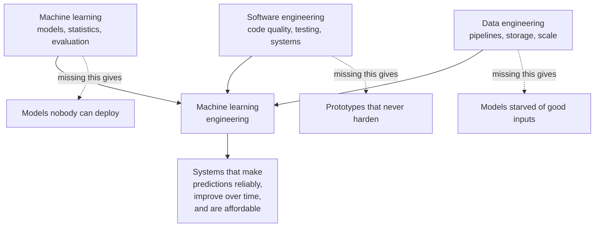
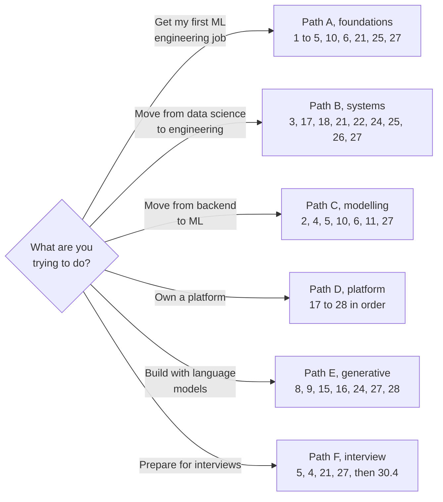
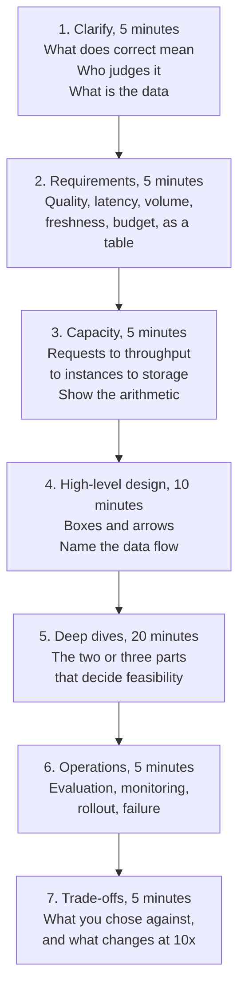

# Chapter 30: Learning Paths, Progression, and Interviews

> **What this chapter covers.** How to use the preceding twenty-nine chapters depending on where you are and what you want, what changes as a machine learning engineer becomes senior, how the field's interviews are structured and what each round is really testing, and how to keep current without drowning.
>
> **Prerequisites.** None. This chapter can be read first.
>
> **Where it is used.** Deciding what to learn next, preparing for a job change, and building a team's development plan.

---

## 30.1 Level 1: Foundations

### 30.1.1 What a machine learning engineer actually is

The title covers at least four different jobs, and confusing them is the most common source of wasted preparation.

| Variant | Centre of gravity | Typically owns | Chapters that matter most |
|---|---|---|---|
| Modelling engineer | Improving a model's quality | Features, architectures, training, evaluation | 4 to 14 |
| Platform engineer | The systems that run models | Training infrastructure, serving, registries, CI and CD | 17 to 28 |
| Product engineer | A feature that happens to use a model | Application, integration, latency, user experience | 15, 16, 21, 24 |
| Research engineer | Turning research into working code | Reproduction, experimentation, scaling | 1, 2, 6 to 9, 23 |

Most jobs are a mixture and the mixture drifts over time. A job description that emphasises Spark, Kubernetes, versioning and drift is a platform job wearing a modelling title. One that emphasises architectures, evaluation and experimentation is a modelling job. Read the responsibilities rather than the title, and count how many bullets are about systems versus how many are about models.

### 30.1.2 The shape of the discipline

Machine learning engineering sits at the intersection of three fields, and the practitioners who struggle are usually strong in one and absent in another.

*Figure 30.1: the three contributing fields and the characteristic failure of neglecting each.*

The single most common gap in people who came from data science is software and data engineering. The most common gap in people who came from backend engineering is statistics and evaluation. Diagnose which you are before choosing a path.

### 30.1.3 The one-sentence version of each part of this book

- **Part I, chapters 1 to 5.** The mathematics, statistics and Python that everything else assumes, plus classical modelling and the evaluation discipline that decides whether anything you build is real.
- **Part II, chapters 6 to 9.** How neural networks work and train, the architecture families, and how representations are learned and transferred.
- **Part III, chapters 10 to 14.** Working with actual data: features, sequences, signals, images and audio, and the ranking and causal problems that appear whenever a system recommends an action.
- **Part IV, chapters 15 and 16.** Language models as components, and the application patterns around them.
- **Part V, chapters 17 to 20.** Storage, distributed processing, streaming, and the feature and quality layer.
- **Part VI, chapters 21 to 24.** Designing the system, running it on containers and clusters, training at scale, and serving predictions.
- **Part VII, chapters 25 to 28.** Everything that happens after the first deployment, which is where most of the career is spent.
- **Part VIII, chapters 29 and 30.** Choosing tools, and choosing what to learn.

---

## 30.2 Level 2: Working knowledge

### 30.2.1 Reading paths by goal

The book is a reference, not a novel. These are the paths that make sense.

*Figure 30.2: six reading paths, each a subset chosen for a goal rather than for completeness.*

| Path | For | Chapters in order | Rough hours |
|---|---|---|---|
| A, foundations | First machine learning engineering job | 1, 2, 3, 4, 5, 10, 6, 21, 25, 27 | 120 to 160 |
| B, systems | Data scientist moving to engineering | 3, 17, 18, 21, 22, 24, 25, 26, 27 | 100 to 140 |
| C, modelling | Backend engineer moving to machine learning | 2, 4, 5, 10, 6, 11, 27 | 90 to 120 |
| D, platform | Owning training and serving infrastructure | 17 through 28 in order | 180 to 240 |
| E, generative | Building language model products | 8, 9, 15, 16, 24, 27, 28 | 90 to 120 |
| F, interview | A loop in three to six weeks | 5, 4, 21, 27, then section 30.4 | 40 to 60 |

Hours assume reading at level 3 depth and doing the level 2 exercises, not reading passively. Passive reading of this book is close to worthless, which is why every chapter has a practice section.

### 30.2.2 How to study a chapter

The method that works, in order. Read the chapter's levels 1 and 2 without stopping, to build the map. Read level 3 with a notebook, re-deriving every formula that carries a worked example. Do the practice exercises before reading level 4, because level 4 makes sense only once you have hit the problems it discusses. Then read the misconceptions table and check honestly which you held. Then answer the interview questions out loud, timed, before opening the answers.

The two habits that separate people who retain this material from people who do not: writing the derivation by hand rather than reading it, and saying the answer out loud rather than thinking it. Both feel unnecessary and both are the difference.

### 30.2.3 Building the portfolio that matters

Projects are the currency of a job search, and most portfolios are worthless because they demonstrate that you can follow a tutorial. A project is evidence when it has four properties.

| Property | What it means | Why it matters |
|---|---|---|
| A real dataset | Messy, public, with quirks you had to handle | Clean benchmark data proves nothing |
| A stated baseline | The simple thing you beat, with its number | Without it, your number is meaningless |
| A validated result | A metric with a confidence interval and an honest validation design | This is what separates engineers from tutorial followers |
| An operational component | It runs somewhere, on a schedule, with monitoring | Most portfolios stop at the notebook |

Three good projects beat ten shallow ones. The strongest single project shape is a small end-to-end system: ingestion, features, a model, an evaluation harness with intervals, a serving path, and a monitor, all deployed and documented with the results table first.

---

## 30.3 Level 3: Depth

### 30.3.1 What changes as you become senior

The technical material in this book is the entry price, not the differentiator. What changes with seniority is the kind of question you are trusted to answer.

| Level | The question you answer | What you are measured on |
|---|---|---|
| Junior | How do I implement this | Correctness and learning rate |
| Mid | What should I build | Judgment within a defined problem |
| Senior | Should we build this at all, and what will it cost | Framing problems and owning outcomes |
| Staff and beyond | What should the team be doing, and what are we all missing | Influence, direction, and preventing expensive mistakes |

Three shifts happen along that path, and each is uncomfortable.

**From solutions to problems.** A junior engineer is given a problem and produces a solution. A senior engineer is given a situation and produces the problem statement. The skill is the discovery, not the modelling, and it is learned by sitting with the people who have the problem rather than by reading.

**From building to deciding.** Most of the value a senior engineer adds is in choosing not to build something, choosing the simpler architecture, or stopping a project that cannot work. This is invisible in a performance review unless you write it down, so write it down.

**From correctness to consequences.** A junior engineer asks whether the model is accurate. A senior engineer asks what happens when it is wrong, who notices, what it costs, and how it is corrected. Chapters 5, 27 and 28 are the technical content of that shift.

### 30.3.2 The judgment that takes years

Some things in this book can be learned in a weekend and some cannot. The list below is the part that takes real time, and knowing that it takes time is itself useful, because it stops you from feeling stupid at month three.

- Knowing when a result is too good, which is almost always leakage, and knowing where to look for it.
- Estimating whether a problem is tractable before spending a quarter on it.
- Knowing which 80 percent of a system's complexity can be removed.
- Reading a metric movement and knowing whether it is real, seasonal, a measurement change, or a bug.
- Sizing a system in your head well enough to reject an architecture in a meeting.
- Knowing when the model is not the problem, which is most of the time.

### 30.3.3 The first 90 days in a new role

The pattern below applies whether you joined a team with a mature platform or one with none, and it is the answer to a common interview question as well as a working plan. The ordering principle is that you cannot safely improve what you cannot measure or revert.

| Phase | Days | What you do | What you must not do |
|---|---|---|---|
| Orient | 1 to 15 | Find what is in production, how anyone would know it broke, and where the evaluation set lives. Trace one request end to end. Read the last three incident write-ups | Propose an architecture |
| Establish measurement | 15 to 45 | Fix or build the evaluation harness. Make the numbers trustworthy and reproducible. Find out what the domain experts consider correct | Retrain anything |
| Make change safe | 45 to 70 | Make deployment and rollback reliable and boring. Add the monitoring that would have caught the last incident | Ship a new model |
| Improve | 70 to 90 | Now improve a model, with a measurable before and after and a safe rollback | Skip the baseline |

Two observations that make this credible when you describe it. The first is that the order is deliberate and you should say why: a team that improves models before it can measure or revert them accumulates changes nobody can evaluate. The second is that finding the last three incidents is the fastest way to learn a system's real failure modes, faster than reading its code, because incidents record what actually broke rather than what was designed.

### 30.3.4 Reading research efficiently

Most papers do not need to be read. The three-pass method works: read the title, abstract, figures and conclusion, which takes five minutes and answers whether the paper is relevant; if it is, read the method and results, which takes thirty minutes and answers whether the claim is supported; and only if you intend to implement it, read it in full with the appendices.

What to look for in pass two, in order: what baseline they compared against, since a weak baseline invalidates everything; whether the evaluation set is standard or constructed; whether the improvement is within the variance they report, and whether they report variance at all; what compute they used, since a result that requires a hundred times your budget is not actionable; and whether the ablations isolate the claimed contribution. A paper that omits the ablation is claiming credit for the whole system rather than the idea.

### 30.3.5 Working with the people around you

Machine learning engineering is unusually collaborative because the inputs and the consumers both belong to other people.

**With data scientists and researchers.** They optimise for insight and novelty, you optimise for reliability and maintenance. The productive contract is that they own the method and you own the system, with a clear handoff artifact, usually a specification plus an evaluation set rather than a notebook. Insisting on that artifact early prevents most of the friction.

**With data engineers.** You depend on their pipelines and they are usually not measured on your model's accuracy. Make your requirements explicit as contracts: schema, freshness, and the behaviour on late or missing data. Chapter 20 covers the mechanism.

**With backend and product engineers.** They will treat your service as a function that returns an answer. Explain the probabilistic contract early: it can be wrong, it has a latency distribution rather than a latency, and it needs a fallback. Chapter 21 covers the integration design.

**With domain experts.** Whatever the domain, they know what correct means and you do not. The highest-leverage habit in the whole discipline is turning their judgments into an evaluation set, because it converts tacit expertise into a measurable target.

---

## 30.4 Level 4: Mastery

### 30.4.1 The interview loop and what each round is testing

Loops vary by company, but the rounds below cover what is usually assessed. The important insight is that each round tests something different from what it appears to test.

| Round | Appears to test | Actually tests |
|---|---|---|
| Coding | Algorithms | Whether you write code someone else can maintain, and whether you communicate while thinking |
| Machine learning fundamentals | Knowledge | Whether your knowledge is connected, meaning whether you can say why rather than what |
| Machine learning system design | Architecture | Whether you ask about requirements before designing, and whether you can size things |
| Deep dive on your experience | Your resume | Whether you did the work, which is established by how you answer the third follow-up |
| Behavioural | Culture | Ownership, how you handle being wrong, and whether your stories have specifics |

### 30.4.2 The system design round, which is where most candidates lose

There is a repeatable structure, and using it visibly is itself part of the signal.

*Figure 30.3: the seven steps of a design round, with indicative timing for a 55 minute session.*

The four mistakes that sink this round, in order of frequency: designing before asking what correct means; skipping the arithmetic, which is the single clearest separator between candidates; presenting one architecture as though no alternative existed; and never mentioning evaluation, monitoring, or what happens when the model is wrong, which signals that you have not operated a system.

### 30.4.3 The fundamentals round

The questions are rarely obscure. They are usually the basics asked one level deeper than expected. "How does gradient boosting work" is followed by "why does it use second-order information", and that is where the round is decided.

The preparation that works is not breadth. It is choosing the fifteen concepts most likely to appear and being able to explain each three ways: in one sentence to a non-expert, with the mathematics, and with a story about when it mattered in practice. The fifteen, for most loops: the bias-variance trade-off and its limits, regularisation, how gradient boosting fits residuals, why trees beat networks on tabular data, the precision-recall trade-off, why the area under the receiver operating characteristic curve misleads under imbalance, calibration, cross-validation design under temporal and group structure, every way leakage enters, why a random split is wrong for grouped data, the difference between the three kinds of drift, what a p-value is and is not, power and sample size, the difference between prediction and intervention, and gradient descent with its adaptive variants.

### 30.4.4 The experience deep dive

An interviewer picks one claim and goes down. Level one is the claim, level two is the mechanism, level three is the decision and its alternatives, level four is the evidence, and level five is the failure. Most candidates are comfortable through level two and thin at four and five.

Prepare bottom up. If you can answer "what did this system get wrong in production and what did you do about it", the summary is easy. If you prepare only the summary, level three exposes you.

Two rules. Keep your registers distinct: I built, I owned, and I worked on are three different claims, and volunteering the boundary increases trust rather than reducing it. And when you do not remember a specific, say so, state the principle you were operating on, and offer what you do remember. That is a stronger answer than a number you invented, and an invented number is discoverable one question later.

### 30.4.5 Staying current without drowning

The field produces more than anyone can read, and most of it will not matter in two years. A sustainable approach has three tiers.

| Tier | Cadence | What |
|---|---|---|
| Foundations | Rarely | The mathematics, statistics and systems principles in Parts I and VI change on a decade timescale. Learn them once, properly |
| Practice | Quarterly | Tooling, library APIs and platform features. Learn on demand when a project needs them, not speculatively |
| Frontier | Weekly, lightly | New methods and results. Read abstracts, not papers, and read a paper in full only when you might use it |

The filter that works: read something in depth if it changes a decision you are currently making, and otherwise note that it exists and move on. The engineer who knows the foundations cold and looks up the rest outperforms the one who chases every release, because the foundations are what let you evaluate a new release in ten minutes.

### 30.4.6 Career mistakes that cost years

These are the expensive ones, in the sense that each costs one to three years before it is noticed. They are listed because they are invisible from inside.

| Mistake | Why it happens | The cost | The correction |
|---|---|---|---|
| Staying on a system nobody uses | The work is comfortable and the metrics look fine | You accumulate years of experience that does not transfer, because nothing was ever load-tested by reality | Ask what happens if your system is switched off. If the answer is nothing, move |
| Optimising a metric nobody chose | The metric was inherited and improving it feels like progress | Effort that does not change a decision anyone makes | Trace the metric to a decision. If you cannot, renegotiate the metric |
| Never operating what you build | Another team runs it, or it never reached production | Level four and five interview questions have no answers, and your judgment about failure modes stays theoretical | Volunteer for the on-call rotation for your own system |
| Breadth without depth | Every new framework is learned shallowly | You are replaceable by documentation, and you cannot debug anything unusual | Go to level 3 on five things rather than level 1 on fifty |
| Depth without breadth | One stack learned exhaustively | Your judgment is shaped by one set of constraints and you mistake local practice for principle | Deliberately work in an unfamiliar layer once a year |
| Avoiding the data work | Modelling is more interesting than pipelines | You depend on others for your inputs and cannot diagnose most quality problems | Own one pipeline end to end |
| Not writing things down | The work feels self-evident at the time | Your contributions are invisible at review time, and you cannot reconstruct why decisions were made | Keep a decision log with the reason and the revisit trigger |
| Confusing tenure with seniority | Time passes and the title does not | The three shifts in section 30.3.1 never happen | Ask which of the three you have actually made, honestly |

The pattern underneath most of them is distance from consequences. The fastest way to develop judgment is to be close enough to a system that you feel it when it is wrong, which is why operating what you build is the highest-leverage habit on the list.

### 30.4.6 What the field will probably ask of you next

Stated as a judgment rather than a forecast, and worth holding loosely. Three shifts look durable.

The line between machine learning engineering and software engineering is thinning, because models are increasingly consumed as components rather than trained in-house, which raises the value of systems skills relative to modelling skills. The evaluation problem is getting harder rather than easier, because systems are more open-ended and harder to score, which raises the value of anyone who can build a defensible measurement. And the cost of a wrong prediction is rising as systems are given more autonomy, which raises the value of the operational discipline in Part VII.

All three point the same way, which is that the durable skills are the least fashionable ones: measurement, systems, and operations.

---

## 30.5 Subtopic checklist

| Subtopic | You should be able to |
|---|---|
| Role variants | Read a job description and say which of the four jobs it is |
| The three contributing fields | Name your own weakest of the three and the chapters that address it |
| Reading paths | Choose a path and defend why the other five are wrong for you now |
| Studying a chapter | Describe the method and why passive reading fails |
| Portfolio quality | State the four properties that make a project evidence |
| Seniority | Describe the three shifts and give an example of each |
| Collaboration | State the handoff contract with a data scientist and with a data engineer |
| The design round | Run the seven steps from memory with timings |
| The fundamentals round | Explain any of the fifteen concepts three ways |
| The experience deep dive | Answer at level five on one project of your own |
| Staying current | Apply the three-tier filter to something you read this week |

---

## 30.6 Common misconceptions

| Misconception | Why it is believed | What is actually true |
|---|---|---|
| Machine learning engineering is mostly modelling | It is the visible and interesting part | Most of the work is data, systems and operations. Parts V to VII are larger than Parts II to IV for a reason |
| A strong portfolio needs novel models | Novelty feels impressive | A deployed, monitored, honestly evaluated simple system beats a novel notebook |
| You should learn the newest tools first | They are what job posts mention | Tools change and criteria do not. Chapter 29 teaches criteria deliberately |
| Interview preparation means grinding algorithm puzzles | It is the most legible form of preparation | For machine learning roles the design and fundamentals rounds carry more weight, and the deep dive is where offers are lost |
| Seniority means knowing more | Knowledge is what is tested early | Seniority means deciding better, including deciding not to build |
| You must read papers to stay current | Frontier anxiety | Read abstracts, read papers only when they might change a decision, and spend the saved time on foundations |
| A higher score is a better model | Scores are comparable numbers | A higher score on a flawed evaluation is worse than a lower score on an honest one |
| You need permission to own outcomes | Ownership is framed as a title | Ownership is a behaviour and it is available at any level |

---

## 30.7 Practice

1. **Level 2, diagnose yourself.** Score yourself one to five against the checklists in chapters 5, 18, 22 and 27. Identify the two lowest and choose the path in section 30.2.1 that addresses them. Acceptance: a written plan with chapters, hours, and a date.
2. **Level 2, the portfolio audit.** Take one project you have done and score it against the four properties in section 30.2.3. Acceptance: the missing property is identified and a plan to add it exists.
3. **Level 3, the design round.** Take any brief from chapter 21 and run the seven steps in 55 minutes, out loud, recorded. Acceptance: you show the arithmetic in step three and you mention evaluation and monitoring in step six without prompting.
4. **Level 3, the deep dive.** Pick one system you have worked on and write the level five answer, which is what it got wrong in production and what you did. Acceptance: it is under two minutes spoken and contains a specific number.
5. **Level 4, teach it.** Choose the concept from section 30.4.3 you understand least and prepare a 15 minute explanation for a colleague, with the mathematics and a practical story. Acceptance: you deliver it and they can restate it.

---

## 30.8 How this is tested

Answer each out loud and timed before opening the answer. Two minutes each.

**Q1. How do you decide what to learn next?**

Answer

A strong answer names a diagnosis method rather than a topic. Score against the requirements of the work you want, find the gaps, weight them by how heavily they are used and how expensive they are to close, and close the cheap high-weight ones first. Mention that you learn tooling on demand and foundations deliberately.

**Q2. What separates a senior machine learning engineer from a mid-level one?**

Answer

Not knowledge. The shift from producing solutions to framing problems, from building to deciding including deciding not to build, and from asking whether the model is accurate to asking what happens when it is wrong.

**Q3. Walk me through how you would approach a system design question.**

Answer

The seven steps in section 30.4.2, with the arithmetic in step three named explicitly as the part most candidates skip, and evaluation and monitoring named as part of the answer rather than an afterthought.

**Q4. What is the most common way machine learning projects fail?**

Answer

Good answers name a category and a mechanism. The strongest is that the problem was never framed in terms of a decision anyone would make differently, so success was undefined. Close seconds are leakage producing an offline result that does not survive, and a model that works but that nobody operates.

**Q5. How do you keep up with the field?**

Answer

The three-tier filter, with the honest admission that you deliberately do not keep up with most of it, and the reasoning that foundations let you evaluate a new method quickly.

**Q6. How would you onboard onto a system you did not build?**

Answer

Read the evaluation set first, because it tells you what the system is supposed to do. Then the monitoring, because it tells you what actually goes wrong. Then the data, then the code. Trace one request end to end. Find the last three incidents.

**Q7. You are given a model with excellent offline metrics and poor online performance. What do you check?**

Answer

Leakage first, then training-serving skew in features, then a distribution difference between the evaluation set and live traffic, then the metric itself not matching the business outcome, then feedback effects. Name the order and say why leakage is first, which is that it is both most common and most catastrophic.

**Q8. What do you do when the domain expert and the model disagree?**

Answer

Treat it as information about the evaluation set rather than about the model. Find whether the expert's judgment is representable as a labelled case, add it, and see whether the disagreement is systematic. Systematic disagreement usually means the objective is wrong rather than the model.

**Q9. How do you know an improvement is real?**

Answer

A paired comparison on the same items, a confidence interval that excludes zero, a check that the evaluation set did not change, a per-slice check that no important segment regressed, and where possible an online test. Say explicitly that a changed evaluation set invalidates a comparison.

**Q10. What would you do in your first 90 days owning a machine learning platform?**

Answer

Find out what is in production and how anyone would know it broke. Establish or fix the evaluation harness. Make deployment and rollback reliable. Only then improve models. The reasoning is that you cannot safely improve what you cannot measure or revert.

---
## Summary

- The title covers four different jobs. Read the responsibilities and count systems bullets against modelling bullets.
- The discipline is the intersection of machine learning, software engineering and data engineering, and most people have a characteristic hole in one of the three.
- Passive reading of this material is close to worthless. Derive by hand and answer out loud.
- Six reading paths exist; choose by goal rather than reading in order.
- A project is evidence when it has a real dataset, a stated baseline, a validated result with an interval, and something operational.
- Seniority is three shifts: solutions to problems, building to deciding, and correctness to consequences.
- The judgment that takes years is mostly about recognising when a result is too good and when the model is not the problem.
- The design round is won with requirements and arithmetic, and lost by designing first and never mentioning operations.
- The fundamentals round rewards fifteen concepts explained three ways, not breadth.
- In the experience deep dive, prepare bottom up, keep your ownership registers distinct, and never invent a number.
- Stay current in three tiers, and deliberately ignore most of the frontier.
- The durable skills are the least fashionable ones: measurement, systems, and operations.

---

## Further reading

- Chip Huyen, *Designing Machine Learning Systems*, 2022, and *AI Engineering*, 2025.
- Google, *Site Reliability Engineering*, 2016, and *The Site Reliability Workbook*, 2018, for the operational discipline.
- Andriy Burkov, *Machine Learning Engineering*, 2020.
- Sculley et al., "Hidden Technical Debt in Machine Learning Systems", 2015, which remains the clearest statement of why the model is the small part.
- Camille Fournier, *The Manager's Path*, 2017, for the progression material, useful even if you stay technical.
- Will Larson, *Staff Engineer*, 2021, for what the senior individual contributor track actually involves.
- Rob Fitzpatrick, *The Mom Test*, 2013, for the discovery skill in section 30.3.1.
