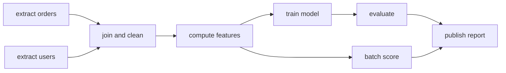
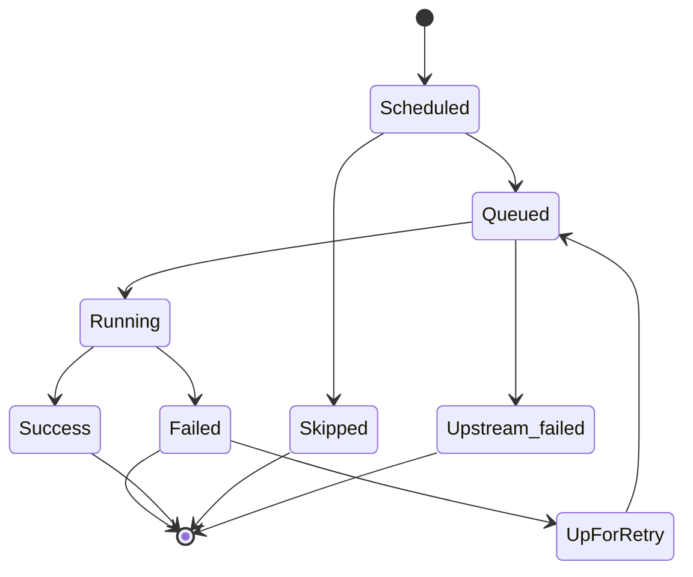
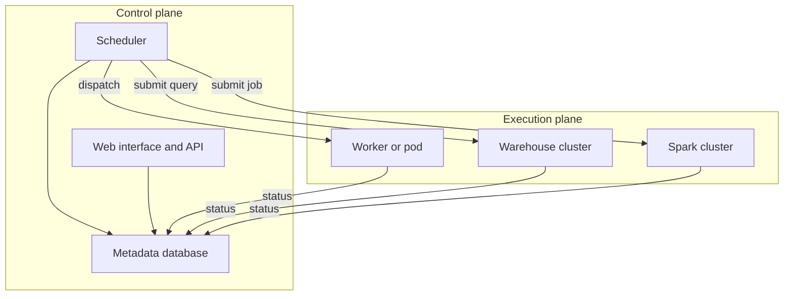
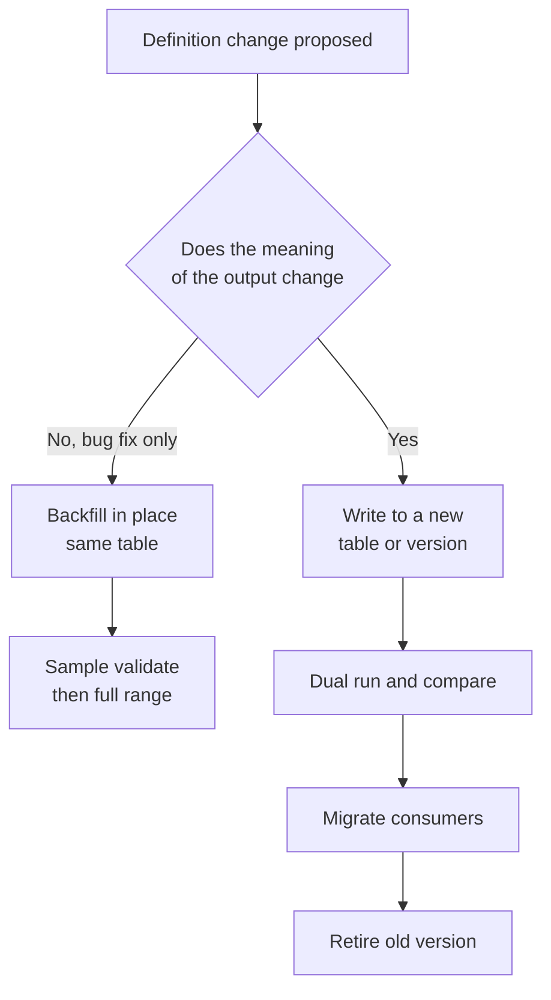
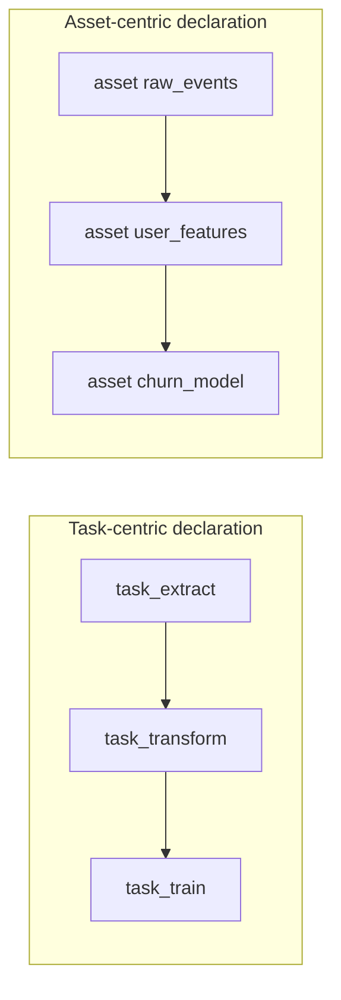
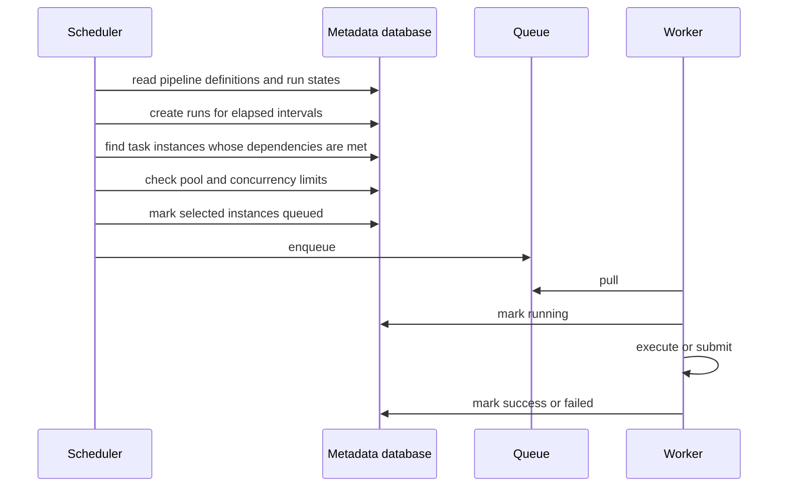

# Chapter 31: Workflow Orchestration and Pipeline Engineering

> **What this chapter covers** What an orchestrator is and why cron stops working, the directed acyclic graph as the model, the separation of orchestration from execution, scheduling semantics including the logical date and the wall-clock time, idempotency and partition-keyed tasks derived from first principles, backfills, dependency patterns including sensors and asset-based models, dynamic pipelines, retries and service level agreements, parameterisation, resource pools, testing pipelines, local development, observability, failure handling, scaling an orchestrator, the orchestration families compared by model, migration, and the anti-patterns.
> **Prerequisites** Chapter 17 (Data Storage, Formats, and Modelling), Chapter 26 (Continuous Integration and Delivery for Machine Learning). Helpful but not required: Chapter 18 (Distributed Computing with Spark), Chapter 20 (Feature Stores and Data Quality).
> **Where it is used** Every team that produces data or models on a schedule. Feature pipelines, training pipelines, batch scoring, evaluation jobs, index refreshes, and report generation all live in an orchestrator, and most production data incidents are orchestration incidents wearing a different hat.

---

## 31.1 Level 1: Foundations

### The problem before the tool

Start with a real situation and no orchestrator at all.

You have a nightly job. At 02:00 a shell script pulls yesterday's events from a database, writes them to object storage, computes features, trains a model, and writes predictions to a table. You put it in cron. It works for three weeks.

Then the following happens, in roughly this order, on every team that has ever done this.

1. The database is slow one night. The extract takes four hours instead of twenty minutes. The 06:00 job that reads the extract runs anyway, on yesterday's file, and produces predictions that are a day stale. Nobody notices for nine days.
2. The training step fails on a Tuesday. The script exits non-zero. Cron mails the output to a mailbox nobody reads. The scoring step, scheduled separately at 04:00, runs against the previous model. The dashboard looks fine.
3. Somebody asks you to reprocess the last sixty days because a bug in the feature code was fixed. The script only knows how to do "yesterday". You write a loop. The loop dies at day 34. You do not know which days completed.
4. Two of the fourteen steps could run in parallel. They do not, because a shell script is a sequence, so the pipeline takes six hours when it could take three.
5. A new engineer asks what depends on the `user_sessions` table. There is no answer except grep.

Each of those is a missing capability, not a bug in your script. Naming them gives you the definition of an orchestrator.

| Missing capability | What an orchestrator provides |
|---|---|
| Step B must wait for step A to succeed, not for a clock | Dependencies expressed between tasks, not between times |
| A failure must be visible and retried | Per-task state, retry policy, and alerting |
| A specific past day must be rerunnable | Runs keyed by the period they represent, so any period can be re-executed |
| Independent steps must run at once | A scheduler that walks the graph and dispatches whatever is ready |
| Someone must be able to see what depends on what | The graph itself is the documentation |

**Definition.** A *workflow orchestrator* is a system that stores a declared graph of tasks with dependencies, decides which tasks are eligible to run and when, dispatches them to some execution environment, records the outcome of each, and reacts to failure according to a declared policy.

Nothing in that definition says the orchestrator runs your code. That separation is the subject of the next section and it matters more than anything else in the chapter.

### The directed acyclic graph

The model is a *directed acyclic graph*, abbreviated DAG. Three words, each load-bearing.

- **Graph**: a set of nodes (tasks) and edges (dependencies).
- **Directed**: each edge has a direction. `extract --> transform` means transform waits for extract.
- **Acyclic**: no path leads from a node back to itself. Cycles are forbidden because a cycle has no valid execution order, and because "A waits for B, B waits for A" deadlocks.



*Figure 31.1: A small pipeline as a directed acyclic graph. The two extracts can run at the same time, as can training and scoring once features exist.*

Two structural facts follow immediately and you will use both constantly.

**Topological order.** Because the graph is acyclic, you can always list the tasks so that every task appears after all of its dependencies. That ordering is what the scheduler walks. There may be many valid orderings, which is exactly the freedom that lets independent tasks run in parallel.

**Critical path.** The shortest possible wall-clock duration of the whole graph, assuming unlimited parallelism, is the longest path from any start node to any end node, measured in task durations. In Figure 31.1, if the durations are extract 20 minutes, join 10, features 30, train 90, evaluate 5, score 25, publish 2, then the path through training is $20+10+30+90+5+2 = 157$ minutes, and the path through scoring is $20+10+30+25+2 = 87$. The critical path is 157 minutes. Making the scoring step faster does nothing at all for the end-to-end time. This is the single most useful arithmetic in pipeline engineering, and it is revisited with real subtleties in level 3.

### Task, run, and instance

Three words get confused constantly. Fix them now.

| Term | Meaning | Example |
|---|---|---|
| Task (or task definition) | A node in the graph. A declaration of work. Code, not data. | "train_model" |
| Run (or DAG run, execution, job run) | One execution of the whole graph, associated with a particular period or trigger | "the run for 2026-03-14" |
| Task instance | One execution of one task within one run. The unit that has a state and a log. | "train_model for 2026-03-14, attempt 2" |

State lives on the task instance. A task instance moves through states roughly like this, with names varying by system.



*Figure 31.2: The life of a task instance. State names differ between orchestrators but the shape is common.*

The distinction between `Queued` and `Running` is not pedantry. A task sitting in `Queued` for forty minutes is a capacity problem. A task sitting in `Running` for forty minutes is a code or data problem. Conflating them wastes hours during an incident.

### Orchestration is not execution

The most important architectural idea in this chapter, and the one that most newcomers get wrong.

The orchestrator's job is to decide **what should run, when, and what to do about the outcome**. It is not to run the work. In a healthy system the orchestrator process holds almost no memory, does almost no computation, and touches almost no data.



*Figure 31.3: Control plane and execution plane. Heavy work belongs on the right, always.*

Why it matters, concretely. If a task loads a 40 GB dataframe inside the orchestrator's worker process, then the orchestrator's capacity is now bounded by that dataframe, a memory error in your pandas code can take down the scheduler, and you cannot upgrade the orchestrator without a data-pipeline outage. Teams discover this the first time a single bad task instance makes every other pipeline in the company late.

The practical rule: **a task should be a thin submission and a wait**. Push the compute to a warehouse, a Spark cluster, a container, or a serverless job, and let the task poll for completion. The exception is genuinely small work, and "small" means it fits comfortably in a few hundred megabytes and a few minutes.

### Vocabulary

| Term | Definition |
|---|---|
| Operator or task type | A reusable template for a kind of work, for example "run a SQL query" or "launch a container" |
| Executor | The component that decides where a task instance physically runs: in-process, on a worker fleet, or as a pod |
| Sensor | A task whose job is to wait until a condition becomes true |
| Trigger | The event that starts a run: a schedule, an upstream asset, an external call, or a human |
| Backfill | Running a pipeline for periods in the past |
| Catchup | The orchestrator automatically creating runs for periods between the start date and now |
| Pool or concurrency slot | A named counter limiting how many task instances of some class run at once |
| Service level agreement on a task | A declared expectation that a task completes by a given time, with an alert when it does not |
| Idempotent | Running it twice produces the same end state as running it once |
| Partition | A named slice of a dataset, usually by date, that a task reads or writes exclusively |

### The smallest useful discipline

If you take four things from level 1 and nothing else:

1. Express dependencies between tasks, never between clock times.
2. Keep heavy work out of the orchestrator process.
3. Make every task write to a partition keyed by the period it represents.
4. Make every task safe to run twice.

Points 3 and 4 are the same point seen from two sides, and level 2 shows why.

---

## 31.2 Level 2: Working knowledge

### Scheduling semantics, part one: intervals

A schedule in most orchestrators is not "run at this time". It is "this pipeline produces one output per interval, and here is the interval boundary".

Consider a daily pipeline over event data. The world is divided into intervals:

```
[2026-03-13 00:00, 2026-03-14 00:00)   <- the interval for 2026-03-13
[2026-03-14 00:00, 2026-03-15 00:00)   <- the interval for 2026-03-14
```

The data for 2026-03-13 is complete at 2026-03-14 00:00 and not one second earlier. So the run that *represents* 2026-03-13 can only *execute* on or after 2026-03-14 00:00.

That gives the two distinct timestamps that this chapter insists on, because they are the source of more production bugs than any other concept in orchestration.

| Name | What it is | Values in the example |
|---|---|---|
| Logical date (also: data interval start, execution date, partition key, business date) | The period the run represents | 2026-03-13 |
| Wall-clock time (also: start date, run time, actual execution time) | When the machine actually executed it | 2026-03-14 00:05:12 |

Do not think of the logical date as "the date the run happened". It is a *label for the data*, and the run is a function from that label to an output. The orchestrator hands the task its label; the task must use the label and must not look at the clock.

*A naming warning.* The names above vary between systems and between versions of the same system. Older Airflow called the logical date `execution_date`, which was a catastrophic name because it looks like "the time of execution" and is not. Newer versions use `logical_date` and `data_interval_start` / `data_interval_end`. Dagster uses partition keys. Check your version rather than trusting a blog post.

### What goes wrong when you use the wall clock

This is the section to reread. Each example is a real class of bug.

**Bug 1: the off-by-one day.** A task writes yesterday's aggregate using `date.today() - timedelta(days=1)`. On a normal night, wall clock is 2026-03-14 00:05, today is the 14th, minus one is the 13th. Correct by accident. Now you rerun the failed run for 2026-03-13 on the 20th. `date.today()` is the 20th, minus one is the 19th, so the rerun overwrites the 19th's partition with the 13th's data. You have now corrupted a day that was fine and left the day you were fixing still broken.

**Bug 2: the midnight-crossing run.** The pipeline starts at 23:50 and the offending task runs at 00:03. `date.today()` flips mid-run. Half the tasks in the same run write to one partition and half to the next. Nothing fails. The data is wrong in a way that survives every schema test.

**Bug 3: the daylight-saving duplicate or gap.** A local-time daily schedule in a zone that observes daylight saving has, once a year, a day with 23 hours and a day with 25. A schedule expressed in local time yields either a missing interval or a repeated one. An hourly pipeline in local time yields two runs labelled 01:00 on the fall-back day. If the partition key is derived from local wall clock, one of them overwrites the other.

**Bug 4: the late-arriving run.** The cluster is down for six hours. The run for 2026-03-13 executes at 2026-03-14 06:30. Any task that filters `WHERE event_time >= now() - interval '1 day'` now reads from the 13th at 06:30 to the 14th at 06:30, which is neither the interval it was supposed to read nor a whole day.

**Bug 5: the backfill that queries "the latest".** A task reads a dimension table as it looks *right now* rather than as it looked at the logical date. Rerunning 2025-06-01 today joins June 2025 facts to 2026 dimensions. The output looks plausible and is wrong. This is point-in-time correctness, developed properly for features in Chapter 20; the orchestration-level rule is that the logical date must reach the query.

The single rule that prevents all five:

> **No task may call `now()`, `today()`, `current_date`, or read the system clock for any purpose that affects its output. Every time reference derives from the logical date passed in by the orchestrator.**

Treat a call to the wall clock inside pipeline logic the way you treat a bare `except:` in application code. Ban it in review, and grep for it.

**Listing 31.1: the wrong way and the right way.**

```python
# Wrong. Output depends on when this happens to run.
from datetime import date, timedelta

def build_daily_aggregate():
    day = date.today() - timedelta(days=1)
    rows = query(f"SELECT * FROM events WHERE event_date = '{day}'")
    write(f"s3://bucket/agg/dt={day}/part.parquet", aggregate(rows))

# Right. Output is a pure function of the partition key.
def build_daily_aggregate(logical_date: date) -> None:
    rows = query(
        "SELECT * FROM events WHERE event_date = :day",
        params={"day": logical_date},
    )
    write(f"s3://bucket/agg/dt={logical_date}/part.parquet", aggregate(rows))
```

The second version has three properties the first lacks. It is testable without freezing the clock. It produces the same bytes whenever it runs. And the partition it writes is determined entirely by its argument, which is what makes the next section work.

Note the parameterised query. String interpolation of a date is usually harmless, but the habit generalises badly to values that are not dates, and Chapter 28 covers injection. Bind parameters.

### Catchup, and the decision you must make deliberately

If a pipeline's start date is 2026-01-01 and you deploy it on 2026-03-14 with a daily schedule, how many runs should exist?

Two defensible answers.

- **Catchup on**: 73 runs, one per day since the start date. Correct for a pipeline whose output is a per-day artifact that ought to exist for every day.
- **Catchup off**: one run, for the most recent interval. Correct for a pipeline that refreshes a single current-state object, for example "rebuild the search index".

The failure mode is not choosing. A team deploys a pipeline with a start date of "two years ago" because they copied it from another file, catchup defaults to on, and 730 runs enter the queue at once, saturating the warehouse and paging the on-call engineer. The opposite failure is quieter: catchup is off, the scheduler is down for a day, and the missing day is simply never produced, leaving a hole nobody detects until a quarterly report has a dip.

Practical defaults:

| Pipeline kind | Catchup | Also set |
|---|---|---|
| Per-period data artifact (daily features, hourly aggregates) | On | A run concurrency limit, so catchup does not stampede |
| Current-state refresh (index rebuild, dashboard cache) | Off | Alert on staleness of the output, not on run count |
| Model retraining | Off, usually | Trigger on data or drift conditions, see Chapter 27 |

And regardless of the choice, set a maximum number of active runs per pipeline. It is the cheapest protection against the stampede.

### Idempotency, derived rather than asserted

Most writing on pipelines says "make your tasks idempotent" and moves on. That is not enough to act on. Derive it.

Let a task be a function $T$ that reads some input state and writes some output state. Write $S$ for the state of the world (the contents of every table and bucket the task touches) and $T(S)$ for the state after one execution.

**Definition.** $T$ is *idempotent* if

$$T(T(S)) = T(S)$$

for every reachable state $S$. In words: executing it a second time changes nothing that the first execution did not already establish.

Why this specific property, rather than something weaker or stronger? Because of what the orchestrator does. An orchestrator retries. It retries on a timeout, and a timeout cannot distinguish "the work did not happen" from "the work happened and the acknowledgement was lost". This is the fundamental limit: **in any system with an unreliable channel, delivery is at-least-once, not exactly-once.** You therefore cannot avoid double execution. You can only make double execution harmless. Idempotency is precisely the statement that double execution is harmless.

Now derive the implementation. Consider three candidate task bodies.

| Body | Idempotent | Why |
|---|---|---|
| `INSERT INTO agg SELECT ... FROM events WHERE dt = :d` | No | Second run doubles the rows. $T(T(S)) \neq T(S)$. |
| `DELETE FROM agg WHERE dt = :d; INSERT INTO agg SELECT ...` | Yes, if atomic | Second run deletes what the first wrote and rewrites it identically |
| `INSERT OVERWRITE agg PARTITION (dt = :d) SELECT ...` | Yes | Replacement is the primitive |

The pattern that survives is: **the task owns exactly one partition, and the operation is a full replacement of that partition, keyed by the logical date.** Call this a *partition-keyed idempotent task*. Three conditions, and all three are necessary.

1. **The write target is a pure function of the partition key.** The task computes its output location from the key, so a rerun targets the same place.
2. **The write is a replacement, not an accumulation.** Overwrite, or delete-then-insert inside a transaction, or write to a temporary location and atomically swap.
3. **No task writes into another task's partition.** Two tasks writing the same partition reintroduces ordering dependence, and the composition is no longer idempotent even if each task is.

Condition 3 is the one teams break. Here is the proof that it matters. Suppose task $A$ and task $B$ both write partition $p$, each replacing it. Then $A(B(S))$ leaves $A$'s content and $B(A(S))$ leaves $B$'s content, so the composite result depends on order, and a retry of either one after the other silently changes the answer. The fix is ownership: exactly one writer per partition.

**Atomicity.** Replacement must be atomic or you have merely shrunk the window. `DELETE` followed by a failing `INSERT` leaves an empty partition that looks like a legitimate zero. Achieve atomicity by one of: a transaction in a warehouse that supports it; a table format with snapshot isolation such as Iceberg, Delta Lake, or Hudi; or write-to-temporary-then-rename where the rename is atomic on that storage system. Note that object storage "directories" are a prefix convention, so renaming a prefix is not atomic on all object stores; check the guarantees of yours rather than assuming.

**Listing 31.2: an idempotent partition write with a temporary location and a swap.**

```python
def write_partition(df, table_root: str, partition_key: str, fs) -> None:
    final = f"{table_root}/dt={partition_key}"
    staging = f"{table_root}/_staging/dt={partition_key}/attempt={uuid4().hex}"
    df.write_parquet(staging)                      # slow, restartable, harmless
    fs.remove_tree(final, missing_ok=True)         # narrow window begins
    fs.rename(staging, final)                      # narrow window ends
    register_partition(table_root, partition_key)  # catalogue, after data lands
```

The unique attempt directory means two concurrent attempts of the same task never write to each other's staging area, which matters because retries can overlap if a worker is presumed dead but is not. The remove-then-rename still has a window in which the partition does not exist. If readers cannot tolerate that window, you need a table format with snapshot isolation rather than raw files. Register the partition in the catalogue last, so a reader that consults the catalogue never sees a half-written partition.

**A useful weaker property.** Some tasks cannot be idempotent, for example sending an email or calling a payment API. For these you want *effective exactly-once*, achieved by a deduplication key: the task derives a stable identifier from the partition key, records it transactionally with the side effect, and skips if it is already present. This is the same trick message queues use, and it is the only honest way to do side effects in a retrying system.

### Backfills

A *backfill* is running a pipeline for past periods. It is the routine consequence of three events: a bug fix in the logic, a correction upstream, and a new pipeline that needs history.

If your tasks are partition-keyed and idempotent, a backfill is conceptually trivial: for each key in a range, run the task. Every practical difficulty is about resources, ordering, and change of meaning.

**The cost arithmetic, done before you start.** Let $n$ be the number of partitions, $c$ the cost per partition, and $t$ the duration per partition with $k$ running concurrently. Then total cost is $n \cdot c$ and wall-clock duration is approximately $n t / k$.

Worked example. You must reprocess 18 months of hourly partitions. $n = 18 \times 30 \times 24 = 12{,}960$. Suppose each partition costs 0.9 USD of warehouse time (an assumed figure for illustration) and takes 4 minutes. Then total cost is about 11,664 USD and, at $k = 20$ concurrency, wall-clock duration is $12{,}960 \times 4 / 20 = 2{,}592$ minutes, about 43 hours. Both numbers change decisions. At that cost you ask whether you need all 18 months or only the 3 months anyone queries. At 43 hours you ask whether the backfill will collide with the nightly production load, which it will, twice.

**Concurrency limits are the whole game.** A backfill competes with production for the same warehouse, the same object store request budget, and the same orchestrator workers. Run the backfill in a separate pool with a hard slot count, and give production tasks higher priority. If the backfill and the daily run write the same partitions, you additionally need mutual exclusion on the key so they cannot interleave.

**Order matters more than people expect.** Three orderings, three uses.

| Order | When to use it |
|---|---|
| Oldest first | Downstream consumers need a contiguous history before anything is useful |
| Newest first | Users care about recent data; you want value early and can abandon the tail |
| Priority sample first | You are not sure the fix is right; do 20 spread-out partitions, validate, then run the rest |

Always do the third one before either of the others. A backfill you have to redo costs twice.

**Reprocessing after a definition change is not a backfill.** This is the trap. If you changed what a column *means*, then rerunning old partitions produces a table where rows before and after the backfill boundary are not comparable, and any consumer that cached or aggregated across the boundary is now wrong. Treat a semantic change as a new version of the dataset: write to a new table or a new version column, run both for a period, migrate consumers, then retire the old one. Chapter 25 makes the analogous argument for model versions and Chapter 20 for feature definitions.



*Figure 31.4: The first question about any reprocessing job is whether the meaning of the output changed.*

### Dependency patterns

**Fan-out and fan-in.** One task produces work for many; many tasks reduce to one. The common shape is: list the partitions, process each, then aggregate.

The rule for fan-in is that the aggregating task must declare what it requires when some branches fail. Three policies, and you must choose per case.

| Policy | Behaviour | Use when |
|---|---|---|
| All success | Aggregate runs only if every branch succeeded | The output is a total, and a missing branch makes it wrong |
| All done | Aggregate runs once every branch finished, success or not | The aggregate is tolerant and records coverage |
| At least $n$ | Aggregate runs when a quorum succeeded | Branches are redundant sources |

The default in most systems is all-success, and the common bug is leaving it there for a pipeline over 300 partitions where one flaky partition blocks the whole thing nightly. If you choose a tolerant policy, the aggregate must *record how many branches contributed*, and a downstream check must alert when coverage drops. Tolerance without a coverage metric is just silent data loss.

**Sensors.** A sensor waits for a condition: a file exists, a partition is registered, an external job finished, an API returns ready.

Sensors have a specific and expensive failure mode. A naive sensor occupies a worker slot for its entire wait. Twenty sensors each waiting six hours consume 120 worker-hours of pure sleeping, and if your worker pool has sixteen slots, your pipeline deadlocks: every slot is a sensor waiting for work that cannot start because there are no slots. This is a genuine deadlock and it happens regularly.

Three mitigations, in order of preference:

1. **Event-driven instead of polling.** Have the producer signal completion, through an event on the storage system, a message, or a direct call into the orchestrator API.
2. **Deferrable or asynchronous sensors.** Most modern orchestrators can suspend a waiting task so it releases its slot and is resumed by a lightweight polling service. Names and availability are version-dependent; check yours.
3. **A dedicated sensor pool with a hard cap and a timeout.** Always set a timeout. A sensor without one waits forever and never alerts.

**Cross-pipeline dependencies.** Pipeline B needs pipeline A's output. Four ways, with real trade-offs.

| Approach | How | Strength | Weakness |
|---|---|---|---|
| Time offset | B is scheduled two hours after A | Trivial | Silently wrong the day A is slow. The bug from level 1. |
| Sensor on A's run state | B waits for A's task instance for the same key | Correct dependency | Couples B to A's internal structure |
| Sensor on the data | B waits for the partition or the catalogue entry | Decoupled from A's implementation | Needs a reliable completion marker |
| Asset dependency | B declares it consumes the asset; the orchestrator triggers B | Cleanest; see below | Requires an asset-aware orchestrator |

Never use the time offset across a team boundary. It converts every latency change in someone else's pipeline into a correctness bug in yours.

**Data-aware or asset-based orchestration.** An alternative model worth understanding as a peer of the task-based one, not as a feature.

In the task model you declare *tasks* and edges between tasks. In the asset model you declare *assets* (tables, models, files, indexes), each with a function that computes it and a list of the assets it depends on. The orchestrator derives the task graph from the asset graph.



*Figure 31.5: The same pipeline declared as tasks and as assets. The asset graph names the things that exist; the task graph names the actions.*

What the asset model buys you, in practice:

- Lineage is not a separate feature that drifts out of date. It is the declaration.
- "What is stale?" becomes a computable question: an asset is stale if any upstream asset has a newer materialisation.
- Cross-pipeline dependencies are ordinary dependencies, because assets do not care which pipeline produced them.
- Partial rebuild is natural: rematerialise this asset and everything downstream.

What it costs: the model is a worse fit for work that is not the production of a durable artifact, such as sending notifications or calling an external system to trigger an action. Most asset-oriented systems provide a task-like escape hatch for exactly that reason. Teams commonly end up with both, which is fine as long as the boundary is deliberate.

### Retries, timeouts, and service level agreements

**Retries.** Set them per task based on the *reason a task can fail*, not as a global default.

| Failure reason | Retry helps | Policy |
|---|---|---|
| Transient network or throttling | Yes | 3 to 5 attempts, exponential backoff with jitter |
| A dependency was briefly unavailable | Yes | Retry with a delay longer than the dependency's usual recovery |
| Out of memory | Only if the retry uses more memory | Usually no; fix the sizing |
| Bad data | No | Fail fast and alert; retries hide the problem and delay the fix |
| A bug in the code | No | Retrying deterministic code is a waste of money and a false signal |

Exponential backoff with jitter means attempt $i$ waits a random duration in $[0, b \cdot 2^{i}]$ for a base $b$. The jitter matters when many tasks fail together, which is the usual case, because without it they all retry simultaneously and re-create the overload that caused the failure.

**Retries are only safe on idempotent tasks.** Turning on retries for a task that appends rows is how you get a table with 1.4 times the correct row count and no explanation.

**Timeouts.** Every task needs one. A task with no timeout that hangs holds its slot forever and blocks everything behind it. Set the timeout from the observed duration distribution, not from a guess: something like the 99th percentile times two, then revisit it as the data grows. Distinguish the *execution timeout* (this task instance ran too long) from the *queue timeout* (this task instance waited too long to start), because they mean different things and have different fixes.

**Service level agreements on tasks.** A declaration that a task should complete by a certain time, with an alert when it does not. The useful form is expressed against the logical date: "the features for day D must be complete by 06:00 on day D+1."

The trap is that an SLA miss on a *late* task is often reported only when the task eventually finishes, which is exactly when you no longer need to know. You want an alert keyed to the deadline passing, not to completion. Check how your orchestrator implements this, because the semantics differ by system and by version, and several implementations have historically surprised people.

Combine SLAs with the freshness monitoring in Chapter 27: an SLA tells you the pipeline is late, a freshness check on the output tells you the consumer is affected. They are different alerts with different audiences.

### Parameterisation and configuration

Pipelines need values that change: date ranges, environment names, model identifiers, thresholds, feature lists. There are four places to put them, and the choice is not arbitrary.

| Location | Right for | Wrong for |
|---|---|---|
| Code, versioned | Structure of the graph, task logic | Anything an operator must change at 03:00 |
| Configuration file in the same repository | Environment differences, table names, resource sizes | Secrets |
| Runtime parameters supplied at trigger time | Backfill ranges, one-off overrides, manual reruns | Anything the scheduled run depends on |
| Secret store | Credentials, tokens | Everything else |

Two rules that prevent the usual mess. First, a scheduled run must be fully determined by code plus configuration plus the logical date, with no required runtime parameter, otherwise the scheduled run cannot work unattended. Second, the effective parameters of every run must be recorded with the run, so that six months later you can tell what it actually did. A pipeline that reads a mutable configuration table at execution time and does not log what it read is unreproducible by construction. Chapter 32 makes this argument in full.

### Resource management, pools, and priority

Orchestrators are cheap. The systems they submit work to are not. Capacity management is therefore about protecting *the downstream systems*.

The main instrument is a **pool**: a named set of slots, where a task declares which pool it uses and how many slots it consumes. Pools model a scarce external resource.

Worked example. Your warehouse tolerates about 12 concurrent heavy queries before queueing degrades everyone. You create a pool `warehouse_heavy` with 12 slots. Light queries use a separate pool with 40. A backfill uses `backfill` with 4 slots that are *also* charged against the warehouse pool where your orchestrator supports nested accounting, or, where it does not, you simply set `warehouse_heavy` to 8 and `backfill` to 4 so that the sum respects the real limit. This kind of arithmetic is the whole discipline: know the real external limit, then partition it explicitly instead of hoping.

Three more levers.

- **Priority within a pool.** When more tasks are eligible than slots exist, the queue order should favour production over backfill, and shorter critical paths over longer ones. A common mistake is to give every task the same priority and then be surprised that a 900-partition backfill starves the nightly run.
- **Per-pipeline run concurrency.** Limits how many runs of the same pipeline are active. Set it to 1 for pipelines whose tasks are not safe to run concurrently against the same target, which is most pipelines that write a shared current-state table.
- **Per-task concurrency.** Limits how many instances of one task run at once across all runs. This is the specific control that stops a catchup from opening 300 connections to one database.

---

## 31.3 Level 3: Depth

### The scheduler loop, and why the metadata database is the bottleneck

To reason about an orchestrator under load you need a model of what the scheduler actually does. Nearly all task-based orchestrators run a loop of roughly this shape.



*Figure 31.6: One iteration of a scheduler loop. Every arrow to the metadata database is a transaction, which is why that database sets the ceiling.*

Three consequences follow, and all three appear in real operations.

**Consequence 1: scheduling latency is not zero.** Each loop takes some time $L$. A task becomes eligible at some point within a loop and is dispatched in the next one, so the expected scheduling delay for a task is about $L/2$ and the worst case is about $L$. If $L$ is 20 seconds and your pipeline has a chain of 30 tasks each lasting 2 seconds, the pipeline's wall-clock duration is dominated by scheduling, roughly $30 \times 10 = 300$ seconds of waiting against 60 seconds of work. The lesson: **do not build long chains of tiny tasks.** Either combine them into one task or accept the overhead knowingly. This is the most common cause of "the orchestrator is slow" complaints and it is not a bug.

**Consequence 2: the metadata database is the scaling limit.** Every state transition is a write. A system running 50,000 task instances a day with 6 state transitions each performs 300,000 writes a day, plus the read traffic from the web interface, plus the scheduler's polling queries. The database saturates long before the workers do. Symptoms, in the order you usually see them: the user interface gets slow, then scheduling latency climbs, then tasks sit in `Queued` while workers idle. Remedies: give the metadata database real resources and connection pooling, keep the retention window short by archiving old runs, avoid pipelines with tens of thousands of tasks, and put the web interface on a read replica if your system supports it.

**Consequence 3: the scheduler is a shared fate.** One team's 6,000-task pipeline degrades everyone's scheduling latency. This is the argument for multiple orchestrator deployments split by team or by criticality, which trades operational overhead for blast-radius containment. There is no universally right answer; the practical trigger is when one team's pipelines have caused two or more incidents for another team.

### Executor models

The *executor* decides where a task instance physically runs. The choice determines isolation, startup latency, cost, and how dependency conflicts are handled.

| Model | How | Startup | Isolation | Dependency handling | Fits |
|---|---|---|---|---|---|
| In-process (sequential or local) | Task runs inside the scheduler process or a subprocess on the same host | Milliseconds | None | One shared environment | Development and tiny deployments only |
| Worker fleet with a queue | Long-lived workers pull from a broker | Milliseconds to seconds | Process level, shared host | One environment per worker class | High task volume, short tasks |
| Container per task | Each task instance is a pod or container | Seconds to minutes | Strong | Per-task image | Heterogeneous dependencies, strong isolation needs |
| Submit-and-poll | Task submits to an external system and waits | Seconds | Whatever the external system gives | Lives in the external system | Warehouse, Spark, managed training |

The worker-fleet model has a specific hazard: **every worker must be able to run every task assigned to it**, so all task dependencies collapse into one environment. Two pipelines needing incompatible library versions cannot coexist. Solutions are worker queues with different images, or moving to container-per-task, or the submit-and-poll model, which sidesteps the issue because the dependency lives in the remote system.

The container-per-task model's hazard is startup cost. A 45-second image pull on a 20-second task means 70 percent of your spend is overhead. Mitigations: pre-pull images onto nodes, keep images small, and combine trivially small tasks.

The submit-and-poll model's hazard is orphaning. The orchestrator dies, or the task instance is killed, and the remote job keeps running and keeps costing money. Every submit-and-poll task needs a cleanup path: record the remote job identifier durably *before* the submission returns where possible, and implement cancellation on task failure. A reconciliation job that lists remote jobs and kills those with no live task instance is unglamorous and pays for itself.

### The critical path, properly

Level 1 gave the naive critical path. Three corrections make it useful.

**Correction 1: include queueing.** A task's effective duration is queue wait plus execution. Under a pool limit, the queue wait can exceed the execution time by an order of magnitude, and the critical path computed from execution durations alone is fiction.

**Correction 2: it moves.** Data volumes grow unevenly. The task that was third-longest becomes the longest, and the task you spent a sprint optimising is now irrelevant. You cannot find this by looking; you must plot per-task duration over time.

**Correction 3: the task that became the critical path is usually silent.** Nothing fails. The pipeline just finishes later each week, by two minutes, until the day it crosses the deadline and pages someone.

The detection method is a per-task duration trend with a change-point or simple threshold test.

**Listing 31.3: finding tasks whose duration is trending up.**

```python
import numpy as np, pandas as pd

def duration_trends(history: pd.DataFrame, min_runs: int = 30) -> pd.DataFrame:
    """history: columns task_id, logical_date, duration_seconds."""
    out = []
    for task_id, g in history.groupby("task_id"):
        g = g.sort_values("logical_date")
        if len(g) < min_runs:
            continue
        y = g["duration_seconds"].to_numpy(dtype=float)
        x = np.arange(len(y), dtype=float)
        slope, intercept = np.polyfit(x, y, 1)       # seconds gained per run
        recent, older = np.median(y[-14:]), np.median(y[:14])
        out.append({
            "task_id": task_id,
            "slope_s_per_run": slope,
            "median_recent_s": recent,
            "ratio_vs_early": recent / max(older, 1e-9),
            "projected_30d_s": recent + 30 * slope,
        })
    return pd.DataFrame(out).sort_values("slope_s_per_run", ascending=False)
```

Compare medians rather than means because a single six-hour outlier from an incident would otherwise dominate. The `projected_30d_s` column is what you actually act on: it answers "which task will breach the deadline next month", which is a question you can schedule work against, unlike "which task is slow today". A linear fit is deliberately crude; a step change from a code deploy shows up as a large slope and that is good enough to trigger a human look.

### Dynamic pipelines

Sometimes the shape of the graph depends on the data. You must process one task per country present in today's file, and the set of countries changes.

Three strategies, with a clear ordering of preference.

| Strategy | Mechanism | Trade-off |
|---|---|---|
| Fixed graph, dynamic data | One task loops internally over the discovered items | Simplest and most robust. Loses per-item retry, per-item visibility, and per-item parallelism |
| Runtime task expansion | The orchestrator creates $n$ task instances from a list computed at run time | Per-item state and retry. Requires orchestrator support; names and limits are version-dependent |
| Generated graph definitions | Code generates the pipeline definition from a data source before parsing | Full flexibility. The definition now depends on an external system at parse time, which is a reliability and reproducibility hazard |

Prefer the first unless you specifically need per-item retry or per-item parallelism, and then prefer the second. The third deserves an explicit warning: if the graph definition is produced by querying a database, then the orchestrator cannot parse your pipeline when that database is down, the graph can change between two scheduler loops, and a historical run cannot be reconstructed because the source has moved on. If you must generate definitions, generate them in the build pipeline and commit the output, so what runs is versioned. Chapter 26 covers the build discipline.

A second hazard of dynamic expansion is unbounded cardinality. A list that is normally 40 items becomes 4,000 after an upstream change, and the orchestrator creates 4,000 task instances, which floods the metadata database. Always cap the expansion and fail loudly when the cap is exceeded rather than proceeding.

### Testing pipelines

Almost nobody does this, and it is the largest quality gap in data engineering. Chapter 33 covers testing machine learning systems in general and Chapter 26 covers the pipeline's place in continuous integration. What follows is specific to orchestration.

Four layers, cheapest first.

**Layer 1: unit tests of the logic, with the orchestrator absent.** This is only possible if the logic is not inside the task definition. The structure that makes it possible:

**Listing 31.4: the separation that makes a pipeline testable.**

```python
# pipeline_lib/features.py  -- plain library code, no orchestrator import
def build_user_features(events, profiles, as_of):
    """Pure function. Takes and returns data frames. Testable in isolation."""
    ...

# pipelines/daily_features.py -- the only file that imports the orchestrator
from pipeline_lib.features import build_user_features

@task
def features_task(logical_date):
    events = read_partition("events", logical_date)
    profiles = read_snapshot("profiles", as_of=logical_date)
    out = build_user_features(events, profiles, as_of=logical_date)
    write_partition("user_features", logical_date, out)
```

The pure function is tested with small in-memory fixtures, including empty input, a single row, duplicate keys, nulls in every column, and a value outside the expected range. The task wrapper contains no logic worth testing beyond what layer 2 covers. If you find yourself needing the orchestrator's test harness to test a calculation, that is a signal the calculation is in the wrong file.

**Layer 2: structural tests of the graph.** Cheap, fast, and they catch a surprising amount. Assert that every pipeline file parses; that there are no cycles; that every task has an owner, a retry policy, and a timeout; that no task uses the default pool if your convention forbids it; that task identifiers match the naming convention; and that the total task count is under a threshold. These run in seconds in continuous integration and prevent the class of failure where a pipeline is broken in production because a module failed to import.

**Listing 31.5: structural tests over every pipeline definition.**

```python
import pytest
from my_platform.loader import load_all_pipelines

PIPELINES = load_all_pipelines("pipelines/")

@pytest.mark.parametrize("p", PIPELINES, ids=lambda p: p.name)
def test_pipeline_hygiene(p):
    assert p.owner, f"{p.name} has no owner"
    assert p.schedule is not None or p.trigger is not None
    assert len(p.tasks) <= 400, "split this pipeline"
    for t in p.tasks:
        assert t.timeout is not None, f"{t.id} has no timeout"
        assert t.retries <= 5, f"{t.id} retries too many times"
        assert t.pool != "default", f"{t.id} must declare a pool"

def test_no_cycles():
    for p in PIPELINES:
        p.topological_order()   # raises if the graph is cyclic
```

**Layer 3: integration test of a whole run against fixtures.** Execute the pipeline end to end for one logical date, against a local or ephemeral backend, with small fixture data that you control. Assert on the *output*, not on "it did not throw". This is the test that catches wiring errors: a task reading the wrong partition, a column renamed in one place and not another, a dependency edge omitted.

The critical discipline here is **fixtures rather than production data**. Production data in tests is slow, is a privacy exposure, cannot contain the edge cases you care about because they have not happened yet, and changes underneath you so the test becomes flaky. Build a small fixture set by hand or by sampling and then anonymising and freezing. Chapter 33 covers golden datasets and their governance.

**Layer 4: the idempotency and backfill test.** Specific to orchestration and almost never written, despite being the cheapest insurance in the chapter.

**Listing 31.6: asserting idempotency directly.**

```python
def test_task_is_idempotent(tmp_backend, fixture_day):
    run_task(logical_date=fixture_day, backend=tmp_backend)
    first = tmp_backend.read_partition("user_features", fixture_day)
    run_task(logical_date=fixture_day, backend=tmp_backend)   # run it again
    second = tmp_backend.read_partition("user_features", fixture_day)
    assert_frame_equal(first.sort_values("user_id").reset_index(drop=True),
                       second.sort_values("user_id").reset_index(drop=True))

def test_backfill_order_does_not_matter(tmp_backend, days):
    forward = run_days(days, backend=tmp_backend.clone())
    backward = run_days(list(reversed(days)), backend=tmp_backend.clone())
    assert forward.checksums() == backward.checksums()
```

The second test is the one that finds the accidental cross-partition dependency, for example a task that reads "the latest" state instead of the state at its logical date. If processing days in reverse gives a different answer, then your partitions are not independent, and every backfill you have ever run has produced results that depend on the order you happened to use.

### Local development and dev-production parity

The complaint is universal: "it works locally and fails in production". The gaps, and what closes each.

| Gap | Symptom | What closes it |
|---|---|---|
| Data volume | Works on 1,000 rows, out of memory on 900 million | A staging environment with a realistic slice, and memory assertions in tests |
| Data variety | Never saw a null in that column locally | Fixtures built from failure analysis, not from the happy path |
| Credentials and permissions | Broad developer access locally, narrow service account in production | Run local development under a role with production-like scope |
| Configuration | Different table names, silently pointing at the wrong environment | One configuration mechanism, environment as a parameter, never a separate code path |
| Concurrency | Runs alone locally, contends in production | Load a copy of the environment, or at minimum reason explicitly about pool limits |
| Version skew | Local orchestrator, library, and runtime versions differ | Pin and run the same container image locally as in production |
| Wall clock | Local runs are always "now"; production reruns are not | Never read the clock, as established. Test with several logical dates |

The most valuable single practice is that **the environment is a parameter, not a branch**. The moment you write `if env == "prod":` around logic rather than around configuration, the local behaviour and the production behaviour have diverged and your tests stop meaning anything.

The second most valuable is a *usable* staging environment with data that resembles production in shape. Teams underinvest here because staging produces nothing anyone consumes, and then pay for it in production incidents indefinitely.

### Observability

What to record and what question each answers.

| Signal | Question it answers |
|---|---|
| Task instance state and timestamps | What happened, when, and how long did it queue versus run |
| Task duration percentiles over time | Which task is becoming the critical path |
| Pipeline end-to-end duration versus deadline | How much margin remains before an SLA breach |
| Queue depth and pool utilisation | Is the constraint capacity or dependencies |
| Retry counts per task | Which tasks are flaky, which is a defect, not a fact of life |
| Rows or bytes written per partition | Did the data volume change, which precedes most silent failures |
| Cost per task and per pipeline | Where the money goes, which is never where people guess |
| Output freshness | Whether the consumer is actually affected |

Two of those deserve emphasis because they are the ones usually missing.

**Rows written per partition** is the cheapest silent-failure detector in existence. An upstream filter changes, the extract returns 40 percent of the usual rows, every task succeeds, and the model retrains on a fraction of the data. No orchestrator signal fires. A simple assertion that the row count is within a band of the trailing median catches it the same night. This connects to the data validation design in Chapter 20 and the monitoring layers in Chapter 27; the orchestration contribution is that the check belongs *in the pipeline, adjacent to the write*, so it blocks propagation rather than reporting after the fact.

**Cost per task** requires attributing warehouse and cluster spend back to the task that submitted it. Tag every submitted job with the pipeline identifier, task identifier, and logical date. Without those tags, cost analysis is guesswork; with them, the analysis usually reveals that two or three tasks account for most of the bill, which makes optimisation targeted rather than diffuse.

### Failure handling

**Partial failure.** The default is that a failed task blocks its descendants and leaves siblings alone. Consider what the partial state means for consumers. If the pipeline writes six tables and fails after three, a consumer reading table four gets yesterday's data joined to today's, which is usually worse than getting nothing. Two defences: publish through a single atomic commit at the end where the storage layer supports it, or publish a per-run completion marker that consumers check. The second is cruder but works everywhere.

**Poison records.** One record kills the task on every attempt: an unparseable timestamp, a string where a number belongs, a value that overflows. Retries are useless because the failure is deterministic. Two options.

- **Fail the batch.** Correct when completeness is required. The engineer fixes the data or the parser.
- **Quarantine and continue.** Route bad records to a dead-letter location with the reason, process the rest, and emit a count.

Quarantine is the right default for high-volume ingestion and the wrong default for anything financial or regulated. When you quarantine, the discipline that makes it safe is: the quarantine count is a monitored metric with a threshold, the dead-letter records retain enough context to be reprocessed, and somebody owns draining the queue. A dead-letter location nobody reads is a data loss mechanism with extra steps.

**Manual intervention.** Real pipelines need human decisions: approving a promotion, confirming a destructive backfill, acknowledging a known-bad day. Model these as explicit tasks that wait for an approval signal, with a timeout and a recorded approver, rather than as an engineer pausing the pipeline in the interface. The recorded approval is what makes the run auditable later, which Chapter 36 develops.

**Clearing and rerunning.** Every orchestrator lets you reset a task instance and rerun it. The safety of doing so is exactly the idempotency property derived earlier. A team that reruns freely without idempotent tasks is silently corrupting data every time, and the corruption is invisible because rerunning is the thing you do when something already went wrong.

---

## 31.4 Level 4: Mastery

### The orchestration families, compared by model

Compare by *model*, not by brand, because brands change and models persist. Real systems are named as examples of each family. No family is best; each optimises for something different, and most large organisations end up with two.

| Family | The unit you declare | Strengths | Characteristic weakness | Examples |
|---|---|---|---|---|
| Task-based | Tasks and edges, in code | Mature, flexible, huge operator ecosystems, fine-grained control | Lineage is a bolt-on; encourages business logic in task definitions | Apache Airflow |
| Asset-based | Assets and the functions that produce them | Lineage and staleness are intrinsic; partial rebuild is natural; strong typing of inputs and outputs | Awkward for non-materialising work; a newer body of practice | Dagster |
| Pipeline-as-container | Steps as container images, usually on Kubernetes | Strong isolation, per-step dependencies, cloud-native scaling | Container startup dominates short steps; local development is harder | Argo Workflows, Kubeflow Pipelines, Tekton |
| Workflow-as-code with durable execution | Ordinary functions whose execution state is durably checkpointed | Handles long-running, stateful, human-in-the-loop flows; exactly-once semantics for steps | Different mental model; less natural for batch data partitioning | Temporal, AWS Step Functions |
| Transformation-graph | SQL models with declared references | Excellent for warehouse transformations; lineage and tests built in | Not a general orchestrator; needs one above it for scheduling and non-SQL work | dbt |
| Managed or platform-native | Varies; often a hosted variant of the above | Less operational burden | Portability, cost model, and version lag | Various cloud services |

The selection questions that actually discriminate, in rough order of how much they matter:

1. What fraction of your work is producing durable datasets versus performing actions? High fraction of datasets favours asset-based or transformation-graph models.
2. Do tasks have conflicting dependencies? If yes, you need container-per-task or submit-and-poll regardless of family.
3. Do workflows run for hours or days with human steps? That is the durable-execution case, and forcing it into a batch scheduler is painful.
4. How many engineers will maintain the deployment? A self-hosted task-based orchestrator at scale is a real operational commitment.
5. What already exists? Integration cost with your warehouse, your identity system, and your monitoring often dominates the intrinsic differences.

Chapter 29 covers tool selection as a general discipline, including how to run an evaluation that does not collapse into preference.

### Migration between orchestrators

It is always harder than the estimate. Understand why, so the estimate is honest.

The naive model is "translate $n$ pipelines, $d$ days each, total $nd$". It is wrong for five reasons.

1. **Semantics differ in ways the documentation does not foreground.** The meaning of the logical date, whether the schedule labels the start or the end of an interval, whether catchup defaults on, what "success" means for a fan-in, how retries interact with timeouts. Each mismatch is a silent data bug rather than a loud failure.
2. **The long tail is where the knowledge is.** The last 15 percent of pipelines are the oddities: the one with a hand-written sensor, the one someone triggers manually every quarter, the one whose owner left. Each needs archaeology.
3. **You must run both systems at once.** Dual running doubles the cost and, worse, requires reconciliation: are the two outputs identical? Answering that honestly is a project of its own.
4. **Operational knowledge does not transfer.** Runbooks, alert routing, dashboards, and the on-call engineer's intuition about what "queued for 20 minutes" means all reset.
5. **Consumers depend on incidental properties.** Somebody's dashboard depends on the table being written by 06:10, which was never an SLA, just a fact. The new system writes it at 06:40 and someone's morning is broken.

The strategy that works is the strangler pattern, applied per pipeline rather than per system: new pipelines go to the new orchestrator from day one; migrate leaf pipelines first because they have no downstream dependents; migrate a pipeline only with its owner present; and reconcile outputs byte-for-byte or with a checksum comparison for at least one full business cycle before decommissioning the old one. Chapter 38 treats platform migration at the organisational level.

Two honest additions. Set a deadline for the old system's shutdown at the start and defend it, because a migration with no deadline becomes a permanent two-system tax. And accept that some pipelines should be deleted rather than migrated; a migration is the best opportunity you will ever have to find out that eleven percent of your pipelines produce outputs nobody reads.

### What senior engineers argue about

**How much logic belongs in the orchestrator?** One camp says the orchestrator should be a dumb scheduler, with all logic in libraries and containers, giving portability and testability. The other says a certain amount of coordination logic naturally belongs in the graph, and pushing everything into containers creates an opaque monolith that the orchestrator cannot help you debug. The defensible position is a line, not a side: *control flow* (what runs next, under what condition) belongs in the orchestrator; *business logic* (what the numbers mean) does not. The test is whether you can explain the rule without referring to any data values.

**One orchestrator or many?** A single deployment gives global lineage, one place to look, and one operational burden. Many deployments give blast-radius containment and let teams upgrade independently. The practical trigger for splitting, as noted, is repeated cross-team incidents; the practical trigger for consolidating is that nobody can answer "what produces this table".

**Scheduled or event-driven?** Scheduling is predictable, easy to reason about, and wastes work when nothing changed. Event-driven is responsive and efficient and much harder to debug, because "why did this not run?" becomes a question about a message nobody can find. Most mature systems are hybrid: event-driven where latency matters, scheduled with a guaranteed floor everywhere else. The underappreciated pattern is scheduled-with-early-trigger, where a run fires on the event if it arrives and on the schedule if it does not, which gives responsiveness plus a guarantee.

**Should the orchestrator own machine learning semantics?** Some platforms add model-aware concepts: experiment tracking, model registration, evaluation gates. Others keep the orchestrator generic and put those in dedicated systems. Generic tends to age better, because the machine learning-specific layer moves faster than the orchestration layer. Chapters 25 and 32 argue the same for registries and tracking.

### Where the standard advice is wrong

**"Make everything idempotent."** True as a default and impossible in general. Side effects on external systems cannot be made idempotent by you. The honest version is: make everything idempotent *that writes to storage you control*, and handle the rest with deduplication keys and an explicit acceptance that you have at-least-once semantics.

**"Use the orchestrator's operators for everything."** Rich operator ecosystems are a genuine strength, and they also couple you to the orchestrator's release cycle, hide retry and timeout behaviour inside someone else's code, and make local testing hard. For anything central to your business, a thin wrapper around your own library beats a third-party operator you cannot debug.

**"Small tasks give better observability."** True per task, false per pipeline. A 900-task pipeline has scheduling overhead that dominates, a metadata footprint that hurts everyone, and a user interface nobody can read. There is a sweet spot, and it is usually tasks of one to thirty minutes.

**"Catchup off is safer."** It is safer against stampedes and more dangerous against gaps. Off means missing periods are never produced and nothing tells you. If you turn catchup off, you owe the system a completeness check.

**"Backfilling is routine."** Backfilling *data* with unchanged logic is routine. Backfilling after a definition change is a data migration, and treating it as routine is how a table ends up with two incompatible meanings separated by an undocumented date.

### Judgment that distinguishes a staff engineer

- Asks "what is the partition key and who owns it" before looking at any code.
- Computes the cost and duration of a backfill before starting it, and validates on a sample first.
- Notices that a task's duration has doubled over two months and fixes it before it breaches.
- Refuses a time-offset dependency across a team boundary, every time.
- Puts the row-count check next to the write rather than in a downstream dashboard.
- Knows the difference between a pipeline that is late and a pipeline that is wrong, and alerts on them separately with different urgencies.
- Treats the orchestrator's metadata database as a production database with capacity planning, not as an implementation detail.
- Deletes pipelines.

### Anti-patterns

**Business logic in the orchestrator.** Rules encoded as branches in the graph, thresholds in task arguments, transformations in operator parameters. Symptoms: you cannot test a rule without the orchestrator; a business change requires a pipeline deployment; the same rule appears in three pipelines and differs in one. Fix: logic in a versioned library that the orchestrator calls.

**One giant DAG.** Everything in one graph because everything is related. Symptoms: one failure blocks unrelated work; nobody can read the graph; a deployment is a company-wide event; the run takes longer than its interval. Fix: split along ownership and data boundaries, and connect the pieces with asset or data dependencies rather than edges.

**Orchestrator as scheduler only.** Using it as cron with a web page: no dependencies, everything scheduled by time offset, no retries, no SLAs. Symptoms: every incident traced to a job that ran before its input was ready. Fix: express dependencies.

**The pipeline that cannot be rerun.** Appends without keys, reads the wall clock, writes to a shared current-state table. Symptom: reruns require a manual cleanup runbook. Fix: partition keys and replacement writes.

**Alert on every failure.** Every task failure pages someone, including the flaky sensor that fails nightly and succeeds on retry. Symptom: alert fatigue and a real failure missed in the noise. Fix: alert on *pipeline outcomes and SLA breaches*, not on task attempts; page on consumer impact. Chapter 27 covers alerting design and Chapter 37 covers what to do when the page fires.

**The invisible manual step.** One task is actually "Priya runs a notebook and uploads a file". Symptom: the pipeline is unavailable when Priya is on leave. Fix: automate it, or make it an explicit approval task with a named owner and a timeout, so at least the dependency is visible.

---

## 31.5 Subtopic checklist

| Subtopic | You should be able to |
|---|---|
| Why cron stops working | Name the five capabilities a scheduler lacks and give the failure each causes |
| The directed acyclic graph | Explain each of the three words and why cycles are forbidden |
| Topological order and critical path | Compute a critical path from task durations and say which optimisation is useless |
| Task, run, task instance | Use the three terms correctly and say which one carries state |
| Orchestration versus execution | Explain the control and execution plane split and what breaks when it is violated |
| Interval semantics | Say which interval a daily run covers and when it becomes eligible |
| Logical date versus wall clock | State the difference and describe at least four distinct bugs caused by confusing them |
| The no-clock rule | Rewrite a task that calls `today()` into one that takes a partition key |
| Catchup | Choose on or off with a reason, and name the failure each choice risks |
| Idempotency, derived | Give the definition, explain why at-least-once delivery forces it, and prove a given task is or is not idempotent |
| Partition-keyed tasks | State the three conditions and explain why single ownership of a partition is necessary |
| Atomic replacement | Describe three mechanisms and their guarantees on your storage system |
| Non-idempotent side effects | Design a deduplication key scheme |
| Backfill mechanics | Compute cost and duration, choose an order, and validate on a sample first |
| Reprocessing after a definition change | Explain why it is a migration and describe the dual-write path |
| Fan-out and fan-in | Choose a fan-in policy and say what must be monitored if it is tolerant |
| Sensors | Explain the slot-exhaustion deadlock and name three mitigations |
| Cross-pipeline dependencies | Compare four approaches and say why a time offset across teams is banned |
| Asset-based orchestration | Contrast it with the task model and say what staleness means in it |
| Dynamic pipelines | Choose among three strategies and name the hazard of generated definitions |
| Retries and backoff | Set a retry policy from the failure reason and explain jitter |
| Timeouts | Distinguish execution from queue timeouts and set one from a duration distribution |
| Task service level agreements | Express one against a logical date and explain why completion-time alerting is insufficient |
| Parameterisation | Place a value in one of four locations with a justification |
| Pools and priority | Size a pool from a real external limit and stop a backfill starving production |
| The scheduler loop | Explain scheduling latency and why long chains of tiny tasks are slow |
| The metadata database | Explain why it is the bottleneck and name three remedies |
| Executor models | Compare four and choose one for a given dependency and isolation requirement |
| Orphaned remote jobs | Describe a reconciliation design |
| Testing pipelines | Write tests at all four layers, including an idempotency and backfill-order test |
| Fixtures versus production data | Give four reasons production data in tests is wrong |
| Dev-production parity | Name seven gaps and what closes each |
| Observability | List the signals and say which detects a silent volume drop |
| Partial failure and dead letters | Choose between failing the batch and quarantining, with the monitoring that makes quarantine safe |
| Manual intervention | Model an approval as a task and say why that beats pausing in the interface |
| Orchestration families | Place a named system in a family and select one from requirements without ranking |
| Migration | Give five reasons the estimate is wrong and describe the strangler approach |
| Anti-patterns | Identify six from symptoms and state the fix for each |

---

## 31.6 Common misconceptions

| Misconception | Why it is believed | What is actually true |
|---|---|---|
| The execution date is when the task ran | The name says so, in older systems | It is a label for the data interval the run represents; the actual run time can be any time afterwards, including a year later during a backfill |
| Using `today()` inside a task is fine because it runs nightly | It is correct on a normal night | It is wrong on every rerun, every backfill, every midnight-crossing run, and twice a year on a daylight saving boundary |
| Idempotency is a nice-to-have | Retries usually work out | At-least-once delivery is unavoidable, so double execution will happen; idempotency is what makes it harmless rather than corrupting |
| A retry is always safe | The orchestrator offers it by default | Retrying an appending task multiplies rows; retrying a deterministic bug burns money and hides the defect |
| Two tasks writing the same partition is fine if each overwrites | Each one is individually idempotent | The composition is order-dependent, so the result depends on retry timing; exactly one task may own a partition |
| The orchestrator makes pipelines reliable | It surfaces and retries failures | It reports reliability; the reliability comes from idempotent tasks, capacity limits, and validation next to the write |
| Backfilling is just rerunning | The mechanics look identical | If the meaning of the output changed, it is a data migration and the table now has two incompatible eras |
| More, smaller tasks give better observability | Per-task visibility improves | Scheduling overhead and metadata load dominate; long chains of tiny tasks are slower than one task doing the same work |
| A sensor is cheap because it is idle | It does no computation | A polling sensor holds a worker slot for its whole wait, and enough of them deadlock the fleet |
| Scheduling pipeline B two hours after A is a dependency | It works most days | It is a bet on A's duration; it fails silently the first day A is slow, which is the day it matters |
| The orchestrator's database is an implementation detail | It is hidden behind the interface | It is the scaling ceiling of the whole system and needs capacity planning like any production database |
| A green pipeline means the data is right | Every task succeeded | Tasks succeed on empty inputs, halved row counts, and stale joins; only explicit data assertions catch those |
| Testing pipelines is impractical | They need real data and real infrastructure | Pure functions with fixtures, structural graph assertions, and an idempotency test cover most real failures without any production data |
| Dynamic graph generation from a database is elegant | It removes duplication | The pipeline cannot be parsed when that database is down, and historical runs cannot be reconstructed |
| Alerting on every task failure is thorough | You do not want to miss anything | It creates fatigue and buries the real failure; alert on pipeline outcome, SLA breach, and consumer impact |

---

## 31.7 Practice

**Exercise 1 (level 2): build a partition-keyed daily pipeline.** Using any public time-stamped dataset, for example the New York City taxi trip records or a public GitHub events archive, build a pipeline with an extract, a transform, and an aggregate, running daily over one month of history. Every task must take the logical date as a parameter, write exactly one partition, and replace rather than append.
*Acceptance criterion*: with the pipeline complete, run any single day a second time and show by checksum that the partition is byte-identical, and run the whole month in reverse order into a clean location and show that the final checksums match the forward run.

**Exercise 2 (level 2 to 3): break it deliberately, then detect it.** Introduce three defects into the pipeline from exercise 1: a task that uses `date.today()`, a task that appends instead of replacing, and a filter that silently drops 40 percent of rows.
*Acceptance criterion*: write one automated check per defect that fails, and state for each which of the four test layers it belongs to. At least one must be a row-count band check adjacent to the write.

**Exercise 3 (level 3): plan and execute a backfill under constraints.** Extend the history to twelve months. Before running anything, produce a written plan with the estimated cost, the estimated wall-clock duration at your chosen concurrency, the ordering and its justification, and the validation sample.
*Acceptance criterion*: the backfill runs with a concurrency limit that provably never starves a simultaneously scheduled daily run, evidenced by the queue-wait metric for the daily run staying within its usual range, and the actual duration is within a factor of two of the estimate, with the discrepancy explained.

**Exercise 4 (level 3 to 4): find the critical path and the task that is drifting.** Instrument the pipeline to record per-task queue time and run time for every task instance. Generate synthetic history by running against progressively larger inputs.
*Acceptance criterion*: produce the critical path including queue time, and a ranked table of tasks by duration trend with a 30-day projection, and identify which task will breach a stated deadline first.

**Exercise 5 (level 4): implement the same pipeline in two orchestration models.** Build it once in a task-based system and once in an asset-based one.
*Acceptance criterion*: a written comparison covering how each expresses the partition key, how each answers "what is stale", how each handles a cross-pipeline dependency, and what a partial rebuild costs in each. No conclusion about which is better in general; state which fits the specific workload and why.

---

## 31.8 How this is tested

**1. What is the difference between the logical date of a run and the time it executed, and why does it matter?**

<details><summary>Answer</summary>

The logical date is the label for the data interval the run represents. The execution time is when the machine actually ran it. They coincide only approximately on a healthy scheduled run and diverge arbitrarily on retries, backfills, and after an outage.

It matters because any task that derives its inputs or outputs from the wall clock produces different results depending on when it happens to run. Concretely: a rerun of the run for 13 March executed on 20 March, using `today() - 1 day`, overwrites the partition for the 19th with the 13th's data. A run that crosses midnight has tasks on both sides of a date flip writing to different partitions within one run. A local-time schedule at a daylight saving boundary yields a duplicated or missing interval.

The rule is that no task reads the system clock for anything affecting its output. The logical date is passed in and everything derives from it, which makes the task a pure function of its partition key.

</details>

**2. Define idempotency formally and explain why an orchestrator forces you to care about it.**

<details><summary>Answer</summary>

A task $T$ acting on world state $S$ is idempotent if $T(T(S)) = T(S)$ for every reachable $S$: a second execution establishes nothing the first did not.

The orchestrator forces the issue because it retries, and a retry is triggered by a timeout, and a timeout cannot distinguish "the work did not happen" from "the work happened and the acknowledgement was lost". Delivery over an unreliable channel is at-least-once, so double execution is not avoidable. Idempotency is the property that makes double execution harmless.

The implementation that achieves it is the partition-keyed task: the write target is a pure function of the partition key, the write is a replacement rather than an accumulation, and exactly one task owns each partition. The last condition matters because two idempotent tasks writing the same partition compose into an order-dependent result.

</details>

**3. A daily pipeline has run fine for a year. You fix a bug and rerun ninety days. Half the reprocessed days now have roughly twice the expected row count. What happened?**

<details><summary>Answer</summary>

Almost certainly the task appends rather than replaces, so the rerun added a second copy of each day's rows on top of the originals. The days that doubled are the ones that had previously succeeded; days that had failed before produce a single copy, which explains why only half are affected.

Diagnosis: check for duplicate keys within a partition, and check the write statement for `INSERT` without a preceding scoped `DELETE` or an `OVERWRITE`.

Remedy: stop the backfill, deduplicate or fully rebuild the affected partitions from source, change the write to a scoped atomic replacement, add an idempotency test that runs one day twice and asserts equality, then rerun.

The second possible cause is two writers to the same partition, for example a repair pipeline and the daily pipeline both writing it. Distinguish by whether duplicates are exact copies (append) or differ in some column (two producers).

</details>

**4. Your worker pool has sixteen slots. Every morning the pipeline hangs with no task making progress, and it clears at about 11:00. What is your first hypothesis?**

<details><summary>Answer</summary>

Sensor slot exhaustion. Polling sensors hold a worker slot while they wait. If sixteen or more sensors are waiting for upstream data, every slot is occupied by a task that is waiting for work that cannot start because there are no free slots. It is a genuine deadlock, and it clears at 11:00 because a sensor finally times out or its condition is met by something outside the pool.

Confirmation: look at the state of running task instances during the hang. If they are all sensors, that is the answer.

Fixes, in order: switch to event-driven triggering so the producer signals completion; use deferrable or asynchronous sensors that release the slot while waiting, if your version supports them; put sensors in a dedicated pool with a cap well below the total so they cannot consume the whole fleet; and set a timeout on every sensor, which should exist regardless.

</details>

**5. Why is the metadata database usually the scaling bottleneck, and what do you do about it?**

<details><summary>Answer</summary>

Every state transition of every task instance is a database write, and the scheduler polls the same database on every loop, and the web interface queries it for every page view. A deployment running 50,000 task instances a day with six transitions each generates 300,000 writes daily plus heavy read traffic. Workers, by contrast, are horizontally scalable and cheap.

Symptoms appear in a characteristic order: the user interface slows, then scheduling latency rises, then tasks sit queued while workers are idle. That last symptom is the giveaway, because idle workers plus queued tasks means the constraint is not capacity.

Remedies: resource the database properly and use connection pooling; archive old run history aggressively so tables stay small; reduce task counts by combining trivially small tasks; serve the interface from a read replica if supported; and split into multiple orchestrator deployments to contain one team's load.

</details>

**6. Compare the task-based and asset-based orchestration models. When would you choose each?**

<details><summary>Answer</summary>

In the task model you declare tasks and the edges between them, and the orchestrator executes the graph. In the asset model you declare the artifacts that should exist, each with a producing function and its upstream assets, and the orchestrator derives the execution graph.

The asset model gives lineage for free, since the declaration is the lineage; makes staleness computable, since an asset is stale when an upstream one has a newer materialisation; makes cross-pipeline dependencies ordinary, since assets do not belong to pipelines; and makes partial rebuilds natural.

The task model is more natural for work that does not produce a durable artifact, such as sending a notification or triggering an external process, and has a larger ecosystem of ready-made integrations.

Choose asset-based when most of the work produces datasets and models and you care about lineage and selective rebuild. Choose task-based when a large share of the work is actions rather than artifacts, or when integration breadth dominates. Many organisations run both, which is acceptable if the boundary between them is deliberate rather than accidental.

</details>

**7. How do you decide the retry policy for a task?**

<details><summary>Answer</summary>

From the reason the task can fail, never as a global default.

Transient causes such as network errors, throttling, or a briefly unavailable dependency justify three to five attempts with exponential backoff and jitter. Jitter is required because correlated failures cause correlated retries, which recreate the overload.

Deterministic causes do not justify retries. A bug fails identically every time. Bad data fails identically every time, and retrying delays the alert that would get it fixed. An out-of-memory failure retried with the same memory limit fails again.

Two preconditions. Retries are only safe if the task is idempotent, otherwise each attempt adds data. And every task with retries needs a timeout, otherwise a hung attempt never becomes a retry at all.

</details>

**8. What would you test in a data pipeline, and how would you test it without production data?**

<details><summary>Answer</summary>

Four layers.

Unit tests of the transformation logic, written against pure functions that take and return data structures and know nothing about the orchestrator. Fixtures cover empty input, one row, duplicate keys, nulls in each column, and out-of-range values.

Structural tests of the graph, asserting that every definition parses, that there are no cycles, and that every task has an owner, a timeout, a retry policy, and a declared pool. These run in seconds and catch broken deployments.

Integration tests that execute one full run for one logical date against fixtures in an ephemeral backend, asserting on output content rather than absence of exceptions. These catch wiring errors such as a missing edge or a mismatched column name.

Idempotency and backfill-order tests: run one day twice and assert the output is identical, and run a range forward and backward and assert the final state matches. The second finds accidental cross-partition dependencies.

Production data is the wrong fixture because it is slow, is a privacy exposure, changes underneath the test, and cannot contain edge cases that have not happened yet. Build small frozen fixtures, extended from every incident.

</details>

**9. A nightly pipeline has been finishing two minutes later each week for four months. Nothing has failed. How do you find the cause?**

<details><summary>Answer</summary>

Do not look at the last run. Look at the history of per-task duration.

Pull queue time and run time for every task instance over the period, group by task, and fit a trend to each. Rank tasks by slope. Use medians rather than means so a single incident does not dominate. The task with the steepest slope on the critical path is the cause. Project each task's duration thirty days forward to see which one breaches the deadline first.

The usual causes are a growing scan whose input is not partition-pruned, a join whose right side is growing, a task that reads the full history instead of one partition, and a queue-time increase caused by unrelated new pipelines sharing a pool. Separating queue time from run time distinguishes the last from the others immediately.

Then confirm by correlating the slope change with deploy history and with input row counts. If the slope stepped rather than drifted, it is a code or configuration change, not growth.

</details>

**10. What is wrong with scheduling pipeline B two hours after pipeline A, given B consumes A's output?**

<details><summary>Answer</summary>

It encodes a dependency as a bet on duration. It is correct only while A always finishes within two hours, which is a property of load, data volume, and infrastructure, none of which are stable.

The day A takes three hours, B runs on stale input and succeeds. Every task is green. The output is a day old and nothing detects it, because staleness is not an error state. That silence is what makes the pattern dangerous rather than merely fragile.

The fixes, in increasing quality: a sensor on the data, waiting for the partition or the catalogue entry, which decouples B from A's internals; a sensor on A's run state for the same logical date; or an asset dependency where B declares it consumes the asset and the orchestrator triggers it on materialisation.

Across a team boundary the time offset should be prohibited outright, because it makes every latency change in another team's system a silent correctness bug in yours.

</details>

**11. You must reprocess eighteen months of hourly partitions. Walk through your plan.**

<details><summary>Answer</summary>

First, ask whether the meaning of the output changes. If it does, this is not a backfill but a data migration: write to a new table or a new version, dual-run, migrate consumers, then retire the old. If only a bug is fixed, proceed in place.

Second, do the arithmetic. About 12,960 partitions. Multiply by the measured cost of one partition for the total, and compute duration as partitions times per-partition time divided by concurrency. Both numbers change decisions: a large total prompts the question of whether all eighteen months are needed, and a long duration forces planning around production load.

Third, validate on a sample: twenty partitions spread across the range, including known-anomalous periods, compared against expectations before committing to the rest.

Fourth, run it with isolation: a separate pool with a hard slot count, lower priority than production, and mutual exclusion on the partition key so the backfill and the scheduled run cannot write the same partition at once.

Fifth, choose an order deliberately, usually newest first if consumers care about recency, and track completion by partition so an interruption resumes rather than restarts.

Finally, monitor row counts per partition against the previous values and stop on a systematic deviation.

</details>

**12. Where is the line between what belongs in the orchestrator and what does not?**

<details><summary>Answer</summary>

Control flow belongs in the orchestrator: what runs, in what order, under what condition, with what retry and timeout, against what resource limits. Business logic does not: what the numbers mean, how a feature is computed, what threshold defines a qualifying event.

The operational test is whether you can state the rule without referring to any data value. "Run scoring after features succeed" is control flow. "Run scoring only for users with more than five sessions" is business logic wearing control-flow clothing, and it belongs inside the task.

The reason is testability and portability. Logic in a versioned library is unit-testable in milliseconds, reusable across pipelines, and survives an orchestrator migration. Logic encoded in graph structure requires the orchestrator to test, is duplicated when a second pipeline needs it, and has to be rewritten during any migration.

</details>

**13. What actually makes an orchestrator migration expensive?**

<details><summary>Answer</summary>

Not the translation of pipeline definitions, which is the part people estimate.

Semantic differences between systems: what the schedule timestamp labels, whether catchup defaults on, what a fan-in requires, how retries and timeouts interact. Each mismatch is a silent data bug rather than a loud failure, so finding them requires reconciliation rather than testing.

The long tail: the last fifteen percent of pipelines are oddities with hand-written sensors, manual quarterly triggers, and absent owners. Each needs archaeology.

Dual running: both systems operate simultaneously, which doubles cost and demands output reconciliation to prove equivalence.

Lost operational knowledge: runbooks, alert routing, dashboards, and on-call intuition all reset.

Incidental dependencies: consumers rely on a table being ready by a time that was never an SLA.

The approach that works is the strangler pattern per pipeline, leaves first, with the owner present, reconciled for a full business cycle, under a shutdown deadline set at the start. Some pipelines should be deleted rather than migrated.

</details>

**14. How do you detect a pipeline that succeeded but produced wrong data?**

<details><summary>Answer</summary>

Task states cannot tell you, because every task succeeded. You need assertions on the output, placed adjacent to the write so they block propagation instead of reporting after the fact.

The highest-value single check is row or byte count per partition against a band derived from the trailing median, because almost every silent failure changes volume: an upstream filter change, a partial extract, a join that lost rows, an empty source.

Beyond that: null rate per column against history; distinct-key count and duplicate-key count; the value distribution of key numeric columns compared against a recent window; referential checks against dimensions; and freshness of the output as observed by the consumer rather than by the pipeline.

Each check needs a placement decision and a severity: some block the write, some warn. Chapter 20 develops validation design and Chapter 27 covers what to monitor after the data lands. The orchestration-specific contribution is that the check runs inside the pipeline, owned by the same team, not in a dashboard somebody reads on Tuesdays.

</details>

---

## Summary

1. An orchestrator stores a declared graph, decides what is eligible, dispatches it, records outcomes, and reacts to failure. Cron does none of those except the dispatching.
2. The model is a directed acyclic graph. Acyclicity guarantees a topological order, which is what permits parallelism, and the critical path bounds the achievable duration.
3. Orchestration is not execution. Heavy work belongs in a warehouse, a cluster, or a container, and the orchestrator should submit and wait.
4. A schedule labels an interval. The logical date is a label for data; the wall-clock execution time is unrelated and can be a year later.
5. No task may read the system clock for anything that affects its output. That one rule prevents the off-by-one rerun, the midnight-crossing run, the daylight saving duplicate, the late run, and the backfill against current dimensions.
6. At-least-once delivery is unavoidable, so double execution will happen. Idempotency, $T(T(S)) = T(S)$, is what makes it harmless.
7. The implementation of idempotency is the partition-keyed task: the target is a function of the key, the write is an atomic replacement, and exactly one task owns each partition.
8. A backfill is cost times partitions and duration divided by concurrency. Compute both before starting, validate on a sample, and isolate it in its own pool.
9. Reprocessing after a definition change is a data migration, not a backfill, and needs a new version and a consumer migration.
10. Time-offset dependencies across a team boundary convert someone else's latency into your correctness bug, and should be prohibited.
11. Polling sensors hold worker slots and can deadlock the fleet. Prefer events, then deferrable sensors, then a capped pool, and always a timeout.
12. Retry policy follows from the failure reason. Transient failures justify backoff with jitter; deterministic failures do not justify retries at all.
13. The metadata database is the scaling ceiling, and idle workers alongside queued tasks is its signature symptom.
14. Pipelines are testable: pure functions with fixtures, structural assertions over the graph, one integration run, and an idempotency and backfill-order test. Production data is the wrong fixture.
15. Every task succeeding tells you nothing about the data. A row-count band check next to the write is the cheapest silent-failure detector that exists.

---

## Further reading

- Kleppmann, Martin (2017). *Designing Data-Intensive Applications*. The chapters on batch and stream processing cover fault tolerance, at-least-once delivery, and derived data, which underpin everything in this chapter.
- Reis, Joe and Housley, Matt (2022). *Fundamentals of Data Engineering*. Orchestration in the context of the full data lifecycle.
- Densmore, James (2021). *Data Pipelines Pocket Reference*. Practical treatment of extraction, loading, and scheduling patterns.
- Sculley, D. et al. (2015). "Hidden Technical Debt in Machine Learning Systems", NeurIPS. The pipeline jungle and configuration debt sections describe the anti-patterns above from a research perspective.
- Apache Airflow documentation, the sections on DAG runs, data intervals, and the timetable interface. Read the version you actually run, since the logical date semantics changed across major versions.
- Dagster documentation, the sections on software-defined assets, partitions, and freshness policies, for the asset model stated by its designers.
- Argo Workflows documentation, for the container-per-step model.
- Temporal documentation, the sections on workflow determinism and durable execution, for the workflow-as-code model.
- dbt documentation, the sections on model materialisations, incremental models, and tests, for the transformation-graph model.
- Lamport, Leslie (1978). "Time, Clocks, and the Ordering of Events in a Distributed System", Communications of the ACM. The origin of the discipline of not trusting wall clocks for ordering.
