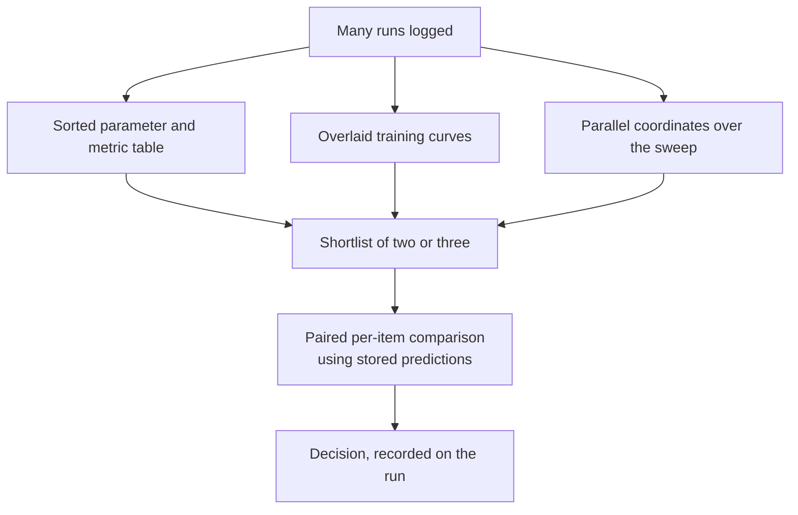
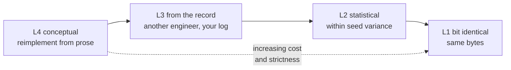
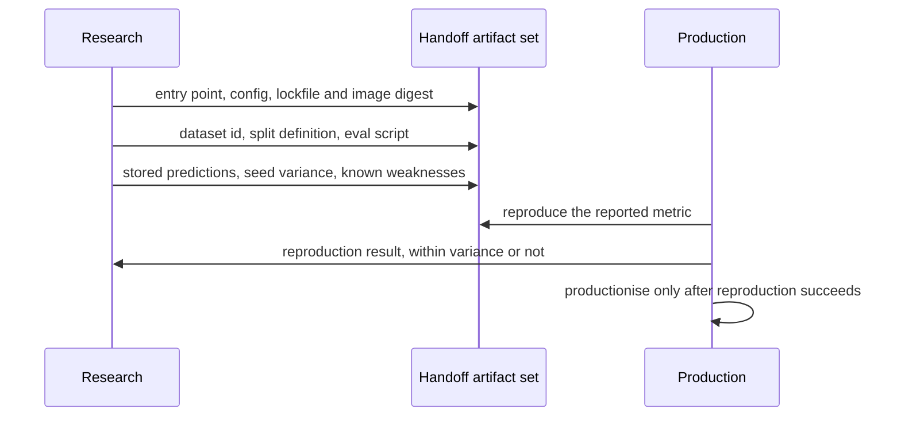

# Chapter 32: Experiment Tracking and Reproducibility

> **What this chapter covers** Why an unreproducible experiment is not a result, what must be logged and why it is more than teams expect, run organisation that survives a year, comparing runs usefully, artifact storage and its growth, reproducibility as a spectrum from bit-identical to conceptual, the enumerated sources of non-determinism and what each costs to remove, environment capture and the limits of each method, data versioning approaches compared, the research-to-production handoff, hyperparameter search infrastructure, collaboration and institutional memory, the honest treatment of notebooks, and the cost and retention of tracking data.
> **Prerequisites** Chapter 3 (Python for Machine Learning Engineering), Chapter 5 (Evaluation, Validation, and Experimental Design). Helpful: Chapter 25 (Model Lifecycle, Versioning, and Registries), Chapter 31 (Workflow Orchestration and Pipeline Engineering).
> **Where it is used** Every team that trains models. The cost of getting this wrong is invisible until the day someone asks why the number in the slide is not the number in production, and nobody can answer.

---

## 32.1 Level 1: Foundations

### An experiment nobody can reproduce is not a result

Start with the situation that motivates everything in this chapter.

A model reached 0.91 area under the receiver operating characteristic curve in March. It is now September. The model in production scores 0.86 on the same evaluation set. Someone asks the obvious question: what changed?

The candidate answers are: the data changed, the features changed, a library version changed, the hyperparameters in the production configuration differ from the ones in the notebook, the evaluation set is not actually the same set, the March number was computed on a split that leaked, or the March number was a lucky seed. All seven are common. Without recorded evidence you cannot eliminate any of them, and the investigation becomes archaeology.

This is worth stating as a principle because it changes behaviour.

> A measurement without the conditions that produced it is not a measurement. It is an anecdote with a decimal point.

The same holds inside a single project. If you cannot rerun last Tuesday's configuration, you cannot tell whether today's improvement came from your change or from something that moved underneath you. The comparison is the entire point of an experiment, and comparison requires that everything except the intervention is held fixed and known.

### What an experiment tracking system is

**Definition.** An *experiment tracking system* records, for each execution of a training or evaluation procedure, the inputs that determined the result, the results themselves, and the artifacts produced, in a queryable store keyed by a run identifier.

It is not a model registry. The two are adjacent and often shipped together, which causes confusion. The distinction is in the audience and the lifetime.

| | Experiment tracking | Model registry |
|---|---|---|
| Records | Every attempt, including failures | Only candidates and released versions |
| Volume | Thousands of runs | Tens of versions |
| Audience | The person doing the work, and their team | The organisation, operations, audit |
| Lifetime | Months, with aggressive pruning | Years, often mandated |
| Question it answers | Which configuration worked and why | What is deployed, what was it trained from, who approved it |

Chapter 25 covers the registry, promotion, and aliases in full. This chapter covers everything upstream of the moment a candidate becomes interesting.

### The minimum record

Before the exhaustive list, the minimum that makes a run rerunnable at all. Four items.

1. **The code version.** A commit identifier, plus an explicit flag saying whether the working tree was clean.
2. **The parameters.** Every value the code read that could have been different.
3. **The data version.** An identifier for the exact input, not a path.
4. **The environment.** The resolved versions of every installed package, not the declared ranges.

If any one of the four is absent, the run is not rerunnable, and the other three were wasted effort. This all-or-nothing property is why tracking tends to fail gradually: a team logs metrics and parameters, skips the data version because "it is in the standard location", and discovers a year later that the standard location has been overwritten twice.

### A concrete example before the abstraction

**Listing 32.1: the smallest tracking that is actually useful.**

```python
import json, os, platform, subprocess, uuid, hashlib, datetime as dt

def git_state() -> dict:
    sha = subprocess.check_output(["git", "rev-parse", "HEAD"], text=True).strip()
    dirty = bool(subprocess.check_output(["git", "status", "--porcelain"], text=True).strip())
    return {"commit": sha, "dirty": dirty}

def run_record(params: dict, data_id: str, metrics: dict, artifacts: dict) -> dict:
    return {
        "run_id": uuid.uuid4().hex,
        "started_at": dt.datetime.now(dt.timezone.utc).isoformat(),
        "code": git_state(),
        "params": params,
        "data": {"dataset_id": data_id},
        "env": {
            "python": platform.python_version(),
            "packages": subprocess.check_output(["pip", "freeze"], text=True).splitlines(),
            "cuda_visible": os.environ.get("CUDA_VISIBLE_DEVICES"),
        },
        "metrics": metrics,
        "artifacts": {k: hashlib.sha256(open(v, "rb").read()).hexdigest() for k, v in artifacts.items()},
    }
```

Three things in that listing carry most of the value. The `dirty` flag is the difference between "commit abc123" and "commit abc123 plus whatever was in my editor", and uncommitted changes are the single most common reason a rerun fails to reproduce. The resolved package list is not the same as the dependency declaration, because a range resolves differently on different days. And hashing the artifacts means you can later prove that the file you have is the file the run produced, rather than one with the same name.

Real tracking systems do more than this, and you should use one. The listing exists so you know what the tool is doing on your behalf and can tell when it is not doing it.

### Vocabulary

| Term | Definition |
|---|---|
| Run | One execution of a training or evaluation procedure, with an identifier |
| Experiment | A named grouping of runs that share a question |
| Parameter | An input value chosen before the run, logged once |
| Metric | A measured output, often logged repeatedly against a step or epoch |
| Artifact | A file produced by a run: weights, a plot, a prediction file, a configuration |
| Tag | A short key-value label on a run, used for filtering |
| Sweep | A set of runs that vary parameters systematically to search a space |
| Lineage | The recorded chain from inputs through runs to outputs |
| Determinism | The property that repeating an execution produces identical results |
| Seed | An integer initialising a pseudo-random number generator |

### The mental model to carry

Think of a run as a function.

$$\text{result} = f(\text{code}, \text{data}, \text{parameters}, \text{environment}, \text{hardware}, \text{randomness})$$

Reproducing a result means reconstructing every argument on the right. Tracking is the discipline of recording those arguments at the time you have them, because reconstructing them afterwards ranges from expensive to impossible.

Most reproducibility failures are not exotic. They are one argument that nobody wrote down.

---

## 32.2 Level 2: Working knowledge

### What to log, exhaustively

The honest answer is that it is more than teams first think. Here is the full list, grouped, with the failure that omitting each one causes.

**Parameters.** Everything the code read that could have been different.

| Item | Failure if omitted |
|---|---|
| Model hyperparameters: architecture, sizes, depths | The run cannot be rebuilt |
| Optimisation: learning rate, schedule, optimiser, weight decay, gradient clipping | The most common source of unexplained differences |
| Batch size, gradient accumulation steps, effective batch size | Effective batch size changes results and is easy to compute wrongly |
| Data parameters: split definition, sampling, class balancing, augmentation | Silent evaluation differences |
| Feature set: the exact list of feature names and their versions | A feature added upstream changes the model with no code change |
| Preprocessing: normalisation constants, vocabularies, encoders | Refitting these on new data changes everything downstream |
| Early stopping criteria and the number of steps actually taken | Reported metric may be from a different checkpoint than you think |
| Loss function and its weights | Frequently hard-coded and therefore unlogged |
| Random seeds, one per source | Covered in level 3 |

**Metrics.** Not just the headline number.

- The primary metric on the evaluation set, with an uncertainty interval. Chapter 5 covers the statistics; the tracking obligation is to log the interval, not just the point estimate, because a run logged as 0.912 and a run logged as 0.907 are indistinguishable if the interval is plus or minus 0.02.
- Training and validation curves against step, which are what let you diagnose later.
- Per-slice metrics for the slices you care about, logged at run time, because recomputing them later requires the predictions, which requires the artifacts, which may be gone.
- Throughput, step time, and peak memory, because a model that is one point better and three times slower is a different decision.
- The count of evaluation examples. A metric computed on a different-sized set is not comparable, and this catches silent filtering.

**Artifacts.**

- Model weights or the serialised model.
- The predictions on the evaluation set. This one is underrated: with stored predictions you can compute any new metric, any new slice, and any paired statistical comparison later without rerunning anything. It is usually the cheapest artifact and the most useful.
- The resolved configuration as a single file.
- Plots, confusion matrices, and error samples.
- The environment specification.

**Code version.** Commit, branch, whether the tree was dirty, and ideally a patch of the uncommitted diff when it is dirty. Teams resist logging the diff and then need it.

**Data version.** An identifier that pins the exact bytes. The approaches are compared in level 3. A filesystem path is not a data version.

**Environment.** Resolved package versions, the Python or runtime version, the operating system, and the container image digest if any.

**Hardware.** Device model, count, driver version, and the accelerator library versions. This matters because results differ across device types for reasons covered in level 3, and because a benchmark number without the hardware is meaningless.

**Provenance and context.** Who or what started the run, when, from where, and which parent run it continued from if any.

That list looks long. In practice a well-built training entry point logs all of it in under fifty lines, once, and every run inherits it. The cost is one afternoon. The cost of not having it is paid repeatedly and unpredictably.

### Run organisation that survives a year

A tracking system with 4,000 runs and no organisation is a write-only log. Three mechanisms, used together.

**Experiments as the top grouping.** An experiment is a *question*, not a project and not a month. "Does adding session features improve churn prediction" is an experiment. "Q3 churn work" is not, because it has no answer.

**Nested runs for structure.** A sweep is a parent run with children. A cross-validation procedure is a parent with one child per fold, and the parent carries the aggregate. Without nesting, a five-fold sweep over forty configurations produces two hundred flat runs and the aggregate is lost.

**Tags for the dimensions you filter on.** Tags should be a controlled vocabulary, enforced in code, not free text. A practical starter set:

| Tag | Values | Why |
|---|---|---|
| `stage` | `smoke`, `dev`, `full`, `candidate` | Separates the ten-step debugging runs from real ones, which is the single highest-value filter |
| `dataset` | Identifier of the dataset version | Prevents comparing across datasets by accident |
| `owner` | Team or individual identifier | Answers "who ran this" a year later |
| `intent` | `baseline`, `ablation`, `sweep`, `reproduction` | Makes the log readable as a narrative |
| `hardware` | Device class | Explains throughput differences |

**Listing 32.2: enforcing the tag vocabulary rather than hoping.**

```python
ALLOWED = {
    "stage": {"smoke", "dev", "full", "candidate"},
    "intent": {"baseline", "ablation", "sweep", "reproduction", "debug"},
}

def validate_tags(tags: dict) -> dict:
    missing = {"stage", "intent", "owner", "dataset"} - tags.keys()
    if missing:
        raise ValueError(f"missing required tags: {sorted(missing)}")
    for key, allowed in ALLOWED.items():
        if tags[key] not in allowed:
            raise ValueError(f"tag {key}={tags[key]!r} not in {sorted(allowed)}")
    return tags
```

Enforcement matters because tagging discipline decays within weeks under deadline pressure, and a vocabulary that is 70 percent applied is not queryable. Raising an error costs the engineer four seconds and saves the team an afternoon.

**Naming.** Auto-generate run names from the parameters that vary plus a short unique suffix, for example `lr0.003-bs64-augFalse-7f2a`. Human-chosen names degrade into `test2`, `test2_real`, and `final_final` within a day, and those names are actively misleading a year later.

### Comparing runs, and the visualisation that helps

Most tracking interfaces offer many plots. Four are worth the screen space.

**The parameter-versus-metric table, sorted.** Unglamorous and the most used view in practice. It answers "which configuration was best" directly. Make sure it shows the uncertainty interval next to the metric, otherwise it invites over-reading noise.

**Training curves overlaid, on the same axes.** Two runs that end at the same validation number but arrive by different paths are different models. One that plateaued early is a candidate for a shorter schedule; one still improving at the end is a candidate for a longer one. The endpoint alone hides both.

**The parallel coordinates plot for a sweep.** Each run is a line crossing one axis per parameter and ending at the metric axis. It reveals which parameter actually separates good runs from bad, which a table of 200 rows does not. Its weakness is that it suggests marginal effects when parameters interact, so use it to generate hypotheses, not conclusions.

**The paired difference plot for two candidates.** For two models evaluated on the same items, plot the per-item difference rather than the two aggregates. Chapter 5 covers why paired comparison has more power. The operational point here is that you can only do it if you logged the per-item predictions, which is the argument for that artifact.



*Figure 32.1: A workflow from many runs to one decision. The last step requires per-item predictions to have been stored.*

The step everyone skips is the last one. **Record the decision on the run.** A run tagged as the winner, with a one-paragraph note explaining what was concluded, is worth more in six months than all the plots, because the plots do not say what you decided or why you rejected the alternative.

### Artifact storage and its growth problem

Artifacts dominate tracking cost, and the growth is faster than teams model.

Worked example, with clearly stated assumptions. A team runs 40 training runs a week. Each saves 5 checkpoints of 1.2 GB. That is $40 \times 5 \times 1.2 = 240$ GB a week, about 12.5 TB a year. At an assumed object storage price of 0.023 USD per gigabyte-month, the storage accumulated by month $m$ costs roughly

$$C(m) = p \cdot g \cdot \frac{m(m+1)}{2}$$

where $p$ is the price per gigabyte-month and $g$ is the gigabytes added per month. With $g \approx 1040$ GB and $p = 0.023$, the twelfth month alone costs about 287 USD and the cumulative first-year bill is about 1,865 USD. Small. But the quadratic term is the point: at the same rate, year three costs roughly six times year one, and nobody revisits the decision.

The cost that actually bites is rarely the money. It is that a bucket with 80,000 checkpoints and no convention is unsearchable, so nobody uses it, so it is pure overhead.

The retention policy that works, applied automatically:

| Class | Keep | Rationale |
|---|---|---|
| Runs tagged `smoke` or `debug` | Metadata forever, artifacts 7 days | The metadata is tiny; the checkpoints are worthless |
| Ordinary runs | Metadata forever, best checkpoint only, 90 days | The best checkpoint is the only one anyone reopens |
| Runs marked as a decision point or baseline | All artifacts, indefinitely | These are the comparisons you will be asked about |
| Runs promoted to the registry | Governed by the registry's policy | Chapter 25; often multi-year and sometimes mandated |
| Per-item predictions | Indefinitely | Small relative to weights, and they preserve the ability to compute new metrics |

Two implementation notes. Deduplicate by content hash, since sweeps produce many identical configuration files and sometimes identical early checkpoints. And keep metadata forever regardless: it is kilobytes per run, and the ability to say "we tried that in March and it did not work" is the cheapest institutional memory available.

### The habits that make tracking stick

- Log from the training entry point, not from a notebook cell, so every run is logged including the ones you did not expect to matter.
- Make the tracked run the only supported way to train. If there is an untracked path, it will be used under deadline pressure, and that run will be the one that matters.
- Fail the run if the working tree is dirty and the stage is not `dev` or `smoke`. Harsh, effective.
- Log the resolved configuration as an artifact, so the run carries its own reproduction instructions.
- Write the decision down on the run when you make it.

---

## 32.3 Level 3: Depth

### Reproducibility is a spectrum, not a property

"Reproducible" is used to mean four different things, whose costs differ by orders of magnitude. Confusing them causes both wasted effort and false confidence. Name them.

| Level | What it means | What it requires | Typical cost | When you need it |
|---|---|---|---|---|
| L1 Bit-identical rerun | Rerunning gives byte-identical weights and metrics | Full determinism: pinned environment, fixed seeds, deterministic kernels, fixed hardware, fixed data order, single-threaded reductions or deterministic ones | 10 to 40 percent throughput loss, plus real engineering time | Regulated settings, debugging a specific defect, verifying a refactor changed nothing |
| L2 Statistical equivalence | Rerunning gives a metric within the expected variation across seeds | Pinned environment, pinned data, recorded parameters, and a measured seed-variance baseline | Small, mostly discipline | The normal target for research and product work |
| L3 Reproduction from the record | Another engineer, from the logged record, obtains statistically equivalent results | Everything in L2 plus a complete and accurate record, plus the data still existing | Moderate; mostly a completeness problem | Handoff to production, peer review, audit |
| L4 Conceptual reproduction | Someone reimplements from the description and finds the same qualitative conclusion | A clear, correct description of the method | Cheap to attempt, often fails | Publishing a claim, adopting an external method |

Three consequences that change how you work.

**First, most teams aim at L1 by accident and fail, when L2 was the actual requirement.** Chasing bit-identity costs throughput and engineering time. Decide the target explicitly.

**Second, L2 is meaningless without a measured seed variance.** If you do not know that your pipeline varies by plus or minus 0.006 across seeds, you cannot tell whether a rerun at 0.904 against an original 0.911 reproduced or not. The procedure is: run the same configuration with five to ten seeds, record the standard deviation of the metric, and publish that number as a property of the pipeline. It is a one-off cost that makes every subsequent comparison interpretable, and it stops the extremely common error of celebrating an improvement that is smaller than the noise.

**Third, L1 is worth having available even if you do not run in it.** A deterministic mode you can switch on is the fastest way to answer "did my refactor change the numerics", which is otherwise a multi-day investigation.



*Figure 32.2: The reproducibility spectrum. Choose the level deliberately; the cost rises steeply to the right.*

### The sources of non-determinism, enumerated

This is the part engineers consistently underestimate. There are far more sources than "set the seed", and several cannot be removed at any price.

**1. Random number generators, and there are several.** Setting one is the classic mistake. In a typical Python deep-learning stack there are at least four independent generators: Python's `random`, NumPy's legacy global generator and any explicit `Generator` objects, the framework's CPU generator, and the framework's accelerator generator, which is per-device. Data augmentation libraries frequently carry their own. Seeding three of five leaves the run non-reproducible in a way that looks like a mystery.

**Listing 32.3: seeding the sources that exist, with a note on the ones that do not respond.**

```python
import os, random
import numpy as np
import torch

def seed_everything(seed: int, deterministic: bool = False) -> None:
    os.environ["PYTHONHASHSEED"] = str(seed)   # only effective if set before interpreter start
    random.seed(seed)
    np.random.seed(seed)                       # legacy global; explicit Generators need their own
    torch.manual_seed(seed)
    torch.cuda.manual_seed_all(seed)           # every visible device
    if deterministic:
        torch.use_deterministic_algorithms(True, warn_only=False)
        torch.backends.cudnn.benchmark = False
        os.environ.setdefault("CUBLAS_WORKSPACE_CONFIG", ":4096:8")
```

Two caveats that are easy to miss. `PYTHONHASHSEED` affects the iteration order of sets and therefore, occasionally, of anything built from a set, and setting it inside the process is too late, so it must be in the environment before launch. And `torch.use_deterministic_algorithms(True)` raises an error when an operation has no deterministic implementation, which is the intended behaviour: it tells you exactly where determinism is impossible rather than letting it be silently absent. Names and coverage are version-dependent; check your version.

**2. Data loader ordering and worker count.** Multi-process loading introduces two effects. The shuffling order depends on the seed and on the number of workers, so changing workers from 4 to 8 changes the batch composition even with the same seed. And with multiple workers each has its own generator state, so per-sample random augmentation depends on the worker assignment. Frameworks provide a worker initialisation hook to seed each worker deterministically from the base seed and the worker index; use it. Also note that a partial final batch plus `drop_last` changes the number of optimisation steps, which changes the result independent of any randomness.

**3. Hardware and kernel selection.** The same operation has several implementations, and libraries pick one by autotuning against the current device, current input shapes, and available memory. Change any of those and a different kernel runs, producing a different but equally valid floating-point result. This is why the same code on a different accelerator model gives different numbers. Disabling autotuning restores determinism within a device at some throughput cost; it does not make two different device models agree.

**4. Reduction order in parallel operations.** The deepest source, and the one that cannot be argued away. Floating-point addition is not associative:

$$(a + b) + c \neq a + (b + c) \text{ in general}$$

A concrete demonstration. In double precision, $(10^{16} + 1) - 10^{16} = 0$ because $10^{16}+1$ is not representable and rounds back to $10^{16}$, while $10^{16} + (1 - 10^{16}) = 1$. The same three numbers, two orders, two answers.

A parallel sum over $n$ elements partitions the work across threads and combines partial results in whatever order they complete, which is not fixed between executions. Atomic accumulation has the same property. So an operation as simple as a gradient reduction is non-deterministic at the last bits, and those bits are amplified over thousands of steps of an iterative optimiser into visible differences in the final metric.

Deterministic reduction algorithms exist, using a fixed tree order or compensated summation, and they cost throughput. This is the main reason a deterministic mode is slower rather than free.

**5. Library and driver versions.** A patch release changes a kernel, changes a default, or fixes a bug you were depending on. Frameworks also change defaults across versions in ways that alter numerics, for example the handling of reduced-precision accumulation. Pinning the framework version is not sufficient; the accelerator libraries and driver belong in the pin too.

**6. Distributed training.** Additional sources on top of all the above. The gradient all-reduce combines in an order that depends on the communication topology and on timing. The number of devices changes the effective batch size and therefore the optimisation trajectory. Dynamic load balancing changes which device sees which sample. Elastic training that changes the device count mid-run changes it again. Fault tolerance that restarts from a checkpoint resumes the data order from a state that may or may not have been checkpointed. Chapter 23 covers distributed training; the reproducibility consequence is that **bit-identical distributed training generally requires a fixed device count, a fixed topology, deterministic collectives, and checkpointed data loader state**, and most stacks do not provide all four.

**7. The environment outside the process.** Non-deterministic file listing order from object storage, a timestamp entering a filename, a hostname in a path, a locale affecting string sorting, and the wall clock used as a fallback seed. Each of these has caused a real irreproducibility.

**8. Concurrency in preprocessing.** Any step that merges results from a thread pool as they arrive, including many tokenisation and feature extraction pipelines, produces an order-dependent output unless it explicitly sorts.

The summary that makes this actionable:

| Source | Removable | Cost to remove |
|---|---|---|
| Multiple generators unseeded | Yes | None, just completeness |
| Loader ordering and worker seeding | Yes | None |
| Kernel autotuning | Yes, within a device model | Throughput, often 5 to 20 percent |
| Parallel reduction order | Yes, with deterministic algorithms | Throughput, sometimes large; some operations have no deterministic version |
| Library and driver versions | Yes | Container discipline |
| Distributed collectives and device count | Partly | Fixed topology, checkpointed loader state, substantial engineering |
| Different accelerator model | No | Not achievable; record the hardware instead |
| Environment ordering effects | Yes | Sort explicitly, ban clock and hostname in logic |

The honest conclusion: **you can achieve bit-identity on fixed hardware with real effort and a throughput cost, and you cannot achieve it across hardware generations at all.** Design for L2 and record the hardware.

### Determinism settings and their cost

When you turn determinism on, measure what it costs rather than assuming. A reasonable protocol:

1. Run the standard configuration three times, recording throughput in samples per second and the final metric.
2. Enable deterministic algorithms, disable autotuning, fix the worker count, and run three more.
3. Report the throughput ratio and confirm the three deterministic runs are bit-identical.

Published figures vary widely by model and operation mix, so measure your own rather than quoting someone else's. What is consistent is the shape: the penalty is concentrated in a few operations, so a model dominated by dense matrix multiplication suffers less than one using scatter or atomic operations heavily.

The practical arrangement is a flag, defaulting to off, turned on for a nightly verification run and for any investigation of a numerical change. You get the debugging capability without paying for it continuously.

### Environment capture and the limits of each method

Four methods, in increasing strength, each with a real limit.

| Method | Captures | Does not capture |
|---|---|---|
| Declared dependencies (a requirements file with ranges) | Intent | Anything reproducible. A range resolves differently each day |
| Resolved lockfile with hashes | Exact package versions and their integrity | System libraries, compilers, drivers, the accelerator toolkit, the operating system |
| Container image, pinned by digest | Everything in user space, including system libraries | The kernel, the driver on the host, the accelerator hardware, anything mounted in |
| Container digest plus recorded hardware and driver | Everything you can practically record | Genuine hardware differences; it records rather than removes them |

Three specific traps.

**Pinning by tag is not pinning.** An image tag is mutable. `pytorch:2.3-cuda12` can point to different bytes next month. Pin by the content digest, which is immutable by construction. Chapter 26 develops artifact immutability.

**A lockfile is platform-specific.** A lock resolved on one operating system and architecture may not install identically on another, and a package with compiled extensions differs by platform even at the same version. Resolve the lock on the target platform, or use a container so there is only one platform.

**Mounted code defeats the image.** A container that mounts the working directory at run time contains a different program each time despite the identical digest. Convenient for development, fatal for reproducibility. The rule is that the image digest is meaningful only if the code is inside the image.

**The dependency of your dependency.** Installing a package that itself downloads a model, a tokenizer, or a dataset at first use means the effective behaviour depends on what that remote service served that day. Cache such assets into the image and pin them by hash.

### Data versioning approaches compared

Data is the input that changes most and is versioned least. Four approaches.

| Approach | Mechanism | Storage cost | Integrity | Works for |
|---|---|---|---|---|
| Copy | Duplicate the dataset to a versioned path per experiment | High, linear in versions | Good if immutable | Small datasets, strong isolation |
| Content-addressed | Store by hash of content; a version is a manifest of hashes | Low, deduplicated | Excellent; the hash is the identity | Files and directories of moderate count |
| Reference plus timestamp or snapshot identifier | Record the source and the point in time | Near zero | Only as good as the source's immutability | Warehouses and table formats that keep history |
| Table snapshot | The storage format keeps versioned snapshots natively | Moderate; metadata plus retained files | Excellent within the retention window | Iceberg, Delta Lake, Hudi and similar |

The decision rule is short. If the data lives in a table format that keeps snapshots, record the snapshot identifier and be done; it is the cheapest correct option. If the data is files, use content addressing, because it deduplicates across versions and gives you integrity for free. Use copying only for small data or when isolation from the source system matters more than cost. Use reference-plus-timestamp only when the source is genuinely append-only and its retention exceeds the lifetime of your claim, and verify that rather than assuming it, since retention policies are changed by other teams without notice.

The failure that all four are designed to prevent: a run recorded `s3://data/training/latest/` as its input. Eight months later `latest` is different data. The run is unreproducible and, worse, appears reproducible until you compare the numbers.

**Verification, not trust.** Whichever approach you use, record a hash of the input actually read, computed at run time. The manifest says what should have been read; the hash proves what was. They disagree more often than you would expect, usually because of a partial read, an in-place correction, or a path that silently resolved somewhere else.

Chapter 20 covers data quality and lineage in the pipeline, and Chapter 31 covers partition-keyed inputs, which are the orchestration-side mechanism that makes data versions stable in the first place.

### The research-to-production handoff

A recurring organisational failure, and the diagnosis is usually wrong. It is blamed on research engineers being sloppy or production engineers being obstructive. It is actually an undefined interface.

The symptom is familiar. A research engineer reports a promising result. A production engineer tries to build a pipeline from it. Six weeks later the production number is lower and nobody can say why. The gap is filled with meetings.

The fix is a stated contract. What the producing side delivers:

| Deliverable | Why it is required |
|---|---|
| A training entry point runnable from the command line with a configuration file, not a notebook | A notebook cannot be scheduled, tested, or diffed |
| The resolved configuration that produced the reported result | Removes the "which settings" question entirely |
| The environment as a lockfile and an image digest | Removes the "which versions" question |
| The dataset identifier and the exact split definition, as code or as a stored list of identifiers | The most common source of the production gap is a different split |
| The evaluation script, producing the reported metric from predictions | Ensures both sides compute the same number the same way |
| Stored per-item predictions from the reported run | Lets the receiving side verify the metric without rerunning training |
| The measured seed variance of the pipeline | Defines what "reproduced" means numerically |
| Known failure modes and the slices where the model is weak | Prevents rediscovery in production |

What the receiving side commits to in return: reproducing the reported number within the stated seed variance before changing anything, and reporting the reproduction result back. That second half is what makes it a contract rather than a checklist. Without it, the producing side learns nothing about how their work fails downstream.



*Figure 32.3: The handoff as a contract. The reproduction step comes before any productionisation work, because everything after it depends on it.*

The single most valuable item on that list is the stored predictions, because reproducing a metric from predictions takes seconds while reproducing it from training takes hours, so the verification actually happens.

The one-sentence rule: **the unit of handoff is a reproducible run, not a number and not a notebook.**

### Hyperparameter search infrastructure

A sweep produces a large number of runs, which creates its own tracking problem.

**Search strategies, briefly, since Chapter 5 covers experimental design.** Grid search evaluates every combination and wastes most of the budget on parameters that do not matter. Random search is strictly better in high dimensions for the reason Bergstra and Bengio (2012) gave in "Random Search for Hyper-Parameter Optimization": if only two of eight parameters matter, random sampling explores many distinct values of those two, while a grid explores few. Bayesian optimisation models the response surface and is more sample-efficient when each run is expensive and the budget is small relative to the space. Early-stopping schemes such as successive halving and Hyperband, from Li et al. (2017), allocate more budget to configurations that look good after a short run, and give large speedups when the early signal correlates with the final result, which is often but not always.

The infrastructure requirements, which are the point here:

- **Every trial is a run, nested under one parent.** The parent carries the search space, the strategy, the budget, and the objective definition.
- **The objective is defined once, in code, and logged on the parent.** A sweep where the objective changed halfway is not a sweep.
- **Trials must be resumable and the sweep must be restartable.** Sweeps are long and get interrupted.
- **Failed trials are recorded as failed, not discarded.** A configuration that runs out of memory is information about the space, and silently dropping it biases the search.
- **A stopping rule decided in advance.** Otherwise a sweep runs until someone gets bored, and the best-of-$n$ selection with unbounded $n$ overfits the validation set.

That last point deserves an explicit warning because it is the statistical trap of sweeping. Selecting the maximum over $n$ noisy evaluations gives an optimistically biased estimate of that configuration's true performance, and the bias grows with $n$. With 200 trials and a validation standard error of 0.01, the best observed score is expected to exceed the best true score by a couple of standard errors, roughly 0.02 to 0.03. The remedy is standard and non-negotiable: **select on validation, report on a held-out test set touched once.** Chapter 5 derives this properly.

**How to avoid drowning in sweep results.** Log a compact record per trial and the full detail only for the top few; keep artifacts only for the top few; and reduce the sweep to a single summary on the parent, namely the objective value with its interval, the selected configuration, the parameter importance ranking, and the decision.

### Collaboration and institutional memory

The experiment log is the only durable memory a team has about what does not work. People leave, documents rot, and the log remains.

Three practices that turn a log into memory.

**A searchable record of negative results.** A run tagged with its conclusion, including "tried X, no effect beyond noise", saves the next person weeks. This is the single highest-return habit in the chapter and the one most consistently skipped, because writing down a failure feels like admitting one.

**A weekly review of the log rather than of slides.** Ten minutes on what was run and what was concluded catches duplicated work and misinterpreted noise early. It also creates the social pressure that keeps tagging honest.

**A stable reference baseline.** One configuration, rerun regularly, whose number is known and whose seed variance is measured. When it moves without explanation, something in the environment or the data changed, and you have just detected it cheaply. Without a baseline, that same change shows up as a confusing result in someone's experiment weeks later.

---

## 32.4 Level 4: Mastery

### Notebooks, treated honestly

Notebooks are attacked reflexively and defended reflexively. Both positions are unhelpful. Be precise about what they are good at and what they structurally cannot do.

**What they are genuinely right for.** Exploration where the next step depends on the last output. Visual inspection of data and errors. Teaching and demonstration. Anything where the interleaving of code, output, and prose is the deliverable.

**Why they resist reproducibility, mechanically.** Not a matter of discipline; these are properties of the format.

1. **Hidden state.** The kernel holds variables from cells that have been edited or deleted. The visible code is not the code that produced the output. This is the fundamental problem, and it cannot be fixed by being careful.
2. **Execution order is not document order.** Cells can be run in any order, and the recorded execution counts are the only evidence, which people ignore.
3. **Outputs are stored in the file.** The same notebook has different bytes depending on what ran, so diffs are unreadable and merges conflict constantly. Version control becomes ineffective exactly where it matters.
4. **No natural test target.** There is no function to call, so unit testing requires extracting the code, at which point it is no longer a notebook.
5. **Import-time coupling.** Long cells mix data loading, transformation, and modelling, so nothing can be reused without copying, and copies diverge.

**The patterns that make them acceptable.** All of these are about shrinking what lives in the notebook.

| Pattern | Effect |
|---|---|
| Logic lives in an importable package; the notebook calls it | Restores testability and reuse; the notebook becomes a thin driver |
| Strip outputs on commit, automatically | Restores readable diffs and usable merges |
| Restart-and-run-all before any shared result | Kills hidden state. Any result not produced this way is provisional |
| Parameterise and execute notebooks programmatically for scheduled use | Makes the execution reproducible and recorded |
| Track runs from inside the notebook with the same entry point as scripts | The notebook run appears in the log like any other |
| Prohibit notebooks in the production path, without exception | The production path needs testing, review, and scheduling, none of which the format supports |

The defensible position: notebooks are an excellent interactive front end to a well-factored library and a poor substitute for one. The failure is not using notebooks; it is code that exists only in notebooks.

### The cost and retention of tracking data

Tracking data has three components with very different economics.

| Component | Size per run | Growth | Policy |
|---|---|---|---|
| Metadata: parameters, tags, provenance | Kilobytes | Linear, trivial | Keep indefinitely |
| Metrics time series | Kilobytes to megabytes | Linear, driven by logging frequency | Downsample after 90 days |
| Artifacts | Megabytes to gigabytes | Linear in runs, large constant | Tiered retention as in level 2 |

Two operational hazards.

**High-frequency metric logging becomes the bottleneck.** Logging every metric every step at high step rates generates enough write traffic to slow training and to strain the tracking backend. Log scalars at a reduced cadence, batch the writes, and log heavy objects such as images and histograms rarely. A training loop that spends 8 percent of its time on tracking is a real and common bug.

**A tracking server is a production dependency.** If training fails when the tracking backend is unavailable, you have coupled your ability to work to a service that was provisioned as a convenience. Make logging failures non-fatal, buffer to local disk, and reconcile afterwards. The inverse risk is that non-fatal logging fails silently forever and nobody notices the gap, so emit a warning that is actually visible and monitor the rate of unreconciled buffers.

### What senior engineers argue about

**How much reproducibility is worth paying for?** One position: bit-identity is engineering theatre for most teams, costing throughput to defend against a scenario that rarely arises, and L2 plus good records is the rational target. The other: without a deterministic mode you cannot verify that a refactor was neutral, and that verification is worth the cost of maintaining the capability. The synthesis most teams land on is a deterministic mode that exists, is tested nightly, and is off by default.

**Track everything or track deliberately?** Logging every parameter automatically is convenient and produces a store where the meaningful five parameters are buried among four hundred. Curating what is logged produces a readable store and guarantees that the one unlogged parameter is the one that mattered. The practical resolution is to auto-capture everything into a raw record and additionally promote a curated set into the comparison view.

**Is a research notebook an acceptable deliverable?** In some organisations the research function's output is a notebook and a number, and the engineering function rebuilds it. This is defensible when the rebuild is cheap and the research iteration speed is paramount. It stops being defensible when the rebuild routinely fails to reproduce the number, which is the common case, and at that point the handoff contract must be imposed regardless of the cost to iteration speed.

**Is per-item prediction storage worth it?** Sceptics point at storage volume for large evaluation sets. Advocates point out it is usually smaller than one checkpoint and it makes every subsequent metric, slice, and paired comparison free. The advocates are right for evaluation sets of ordinary size; for enormous ones, store predictions for a fixed stratified sample, chosen once so it stays comparable across runs.

### Where the standard advice is wrong

**"Set the seed and you are reproducible."** Seeds address one of at least eight sources of variation, and not the deepest one. Reduction order in parallel operations is non-deterministic regardless of seed, and no seed makes two accelerator models agree.

**"Use a container and you are reproducible."** A container fixes user space. It does not fix the driver, the hardware, mounted code, or anything the process downloads at run time. It is necessary, not sufficient.

**"Log everything."** Logging everything without organisation produces a store nobody queries. The value comes from the tags, the experiment grouping, and the recorded conclusion, and those require judgment rather than automation.

**"Reproducibility is a research concern."** It is an operations concern. The incident question "what changed between the model that worked and the model that does not" is a reproducibility question asked under time pressure, and Chapter 37 shows what it costs when it cannot be answered.

**"The tracking tool is the decision."** The tool matters far less than whether every training path logs to it and whether conclusions are written down. Teams spend weeks selecting a tool and then leave the important habits unenforced. Chapter 29 covers selection as a general discipline.

**"More sweep trials are better."** More trials means a more optimistically biased best-observed score, so a large sweep without a held-out test set produces confident overestimates. The size of the bias grows with the number of trials, which is exactly backwards from the intuition.

### Judgment that distinguishes a staff engineer

- Measures the pipeline's seed variance once and quotes it in every comparison thereafter.
- Refuses to compare two numbers produced on different data versions, and can prove from the log which version each used.
- Stores per-item predictions as a matter of course, and is therefore able to answer new questions without rerunning anything.
- Notices that a reported improvement is smaller than the seed variance and says so before the work is scaled up.
- Builds the handoff contract before the first handoff rather than after the third failure.
- Keeps a reference baseline rerunning on a schedule and investigates when it moves.
- Writes down negative results with enough detail that someone else does not repeat them.
- Knows which reproducibility level the situation requires and does not pay for a higher one.

---

## 32.5 Subtopic checklist

| Subtopic | You should be able to |
|---|---|
| Why reproducibility matters | Explain why a metric without its conditions is not a measurement |
| Tracking versus registry | State the difference in audience, volume, and lifetime |
| The minimum record | Name the four items and explain the all-or-nothing property |
| What to log | Produce the full list across parameters, metrics, artifacts, code, data, environment, hardware, and provenance |
| Effective batch size | Explain why it must be logged rather than inferred |
| Per-item predictions | Justify storing them and list three things they make possible later |
| Experiments and nested runs | Organise a sweep or cross-validation so the aggregate is not lost |
| Tag vocabularies | Define a controlled set and enforce it in code |
| Run naming | Explain why generated names beat chosen ones |
| Comparison views | Choose among table, overlaid curves, parallel coordinates, and paired differences |
| Recording the decision | Say why the conclusion is worth more than the plots |
| Artifact growth | Compute cumulative storage cost and design a tiered retention policy |
| The reproducibility spectrum | Name the four levels, what each requires, and when each is the right target |
| Seed variance | Design and run the measurement and use it to interpret a rerun |
| Sources of non-determinism | Enumerate at least eight and say which are removable and at what cost |
| Multiple generators | Seed every generator in a typical stack and name the ones a naive attempt misses |
| Loader ordering | Explain how worker count changes results even with a fixed seed |
| Floating-point associativity | Give a numerical counterexample and connect it to parallel reduction |
| Deterministic algorithms | Enable them, interpret the resulting errors, and measure the throughput cost |
| Distributed non-determinism | List the additional sources and state what bit-identity would require |
| Environment capture | Compare four methods and name the limit of each |
| Digest versus tag | Explain why a tag is not a pin |
| Data versioning | Compare four approaches and choose one with justification |
| Input verification | Explain why you hash what was read rather than trusting the manifest |
| The handoff contract | List the deliverables and the receiving side's obligation |
| Sweep infrastructure | Structure a sweep so it is resumable, auditable, and not drowning in runs |
| Selection bias in sweeps | Explain why best-of-$n$ is optimistically biased and how to correct for it |
| Institutional memory | Describe three practices that make a log useful a year later |
| Notebooks | State five structural reasons they resist reproducibility and six patterns that help |
| Tracking cost and retention | Set retention per component and avoid the logging-frequency bottleneck |

---

## 32.6 Common misconceptions

| Misconception | Why it is believed | What is actually true |
|---|---|---|
| Setting the random seed makes a run reproducible | It is the advice everywhere and it removes the most visible variation | Seeds address one of at least eight sources. Parallel reduction order, kernel selection, loader worker count, and library versions all vary independently of the seed |
| A container guarantees reproducibility | It pins the whole user-space environment | It does not pin the driver, the hardware, code mounted at run time, or assets downloaded on first use |
| Pinning the image tag pins the image | The tag names a specific version | Tags are mutable and can be repointed. Only a content digest is immutable |
| The path to the data is the data version | It has always pointed at the right thing | Paths like `latest` are mutable by design. A run recording a path is unreproducible the moment the path is rewritten |
| If the rerun gives a different number, the tracking is broken | Reproducible ought to mean identical | Without a measured seed variance you cannot tell reproduction from noise. Measure the variance first, then interpret |
| Bit-identical reproduction is the goal | It sounds like the strongest guarantee | It is one of four levels, it costs throughput and engineering time, and it is impossible across hardware generations. Most work needs statistical equivalence |
| Logging is free | It is a few function calls | High-frequency logging can consume a noticeable share of step time and can strain the backend. Batch and downsample |
| The tracking server being down should stop training | Losing the record is bad | Coupling training to a convenience service is worse. Buffer locally, log the failure visibly, reconcile afterwards |
| Only successful runs are worth keeping | Failures are noise | Negative results are the most reusable institutional memory a team has, and a dropped failed trial biases a sweep |
| More sweep trials give a better model | More search, better optimum | Best-of-$n$ on validation is optimistically biased and the bias grows with $n$. Select on validation, report on a test set touched once |
| Notebooks are fine if you are disciplined | Careful people avoid the problems | Hidden kernel state, execution order, and embedded outputs are properties of the format, not of the user |
| The model artifact is the important thing to keep | It is the deliverable | Per-item predictions are usually smaller and enable every future metric, slice, and paired comparison without rerunning anything |
| Research produces a number, engineering productionises it | It is the obvious division of labour | Without a reproducible run as the handoff unit, the production number differs and nobody can explain why |
| Auto-logging every parameter solves tracking | It removes human error | It produces a store where the five meaningful parameters are buried in four hundred. Auto-capture raw, curate the comparison view |
| Experiment tracking and the model registry are the same system | Tools often bundle them | They differ in volume, audience, lifetime, and retention obligation, and conflating them means either drowning the registry or losing the experiment history |

---

## 32.7 Practice

**Exercise 1 (level 2): build the minimum record and prove it is sufficient.** Take any public dataset, for example CIFAR-10 or a tabular set from the UCI repository, and write a training entry point that logs the full record described in level 2: parameters, metrics with intervals, artifacts including per-item predictions, code version with a dirty flag, data version, environment, and hardware.
*Acceptance criterion*: hand the logged record only, with no access to your machine, to another person or to a fresh container, and have them produce a metric within the pipeline's seed variance. Any information they had to ask you for is a gap in the record; add it and repeat.

**Exercise 2 (level 2 to 3): measure your pipeline's seed variance.** Run the same configuration with ten seeds.
*Acceptance criterion*: report the mean, standard deviation, and range of the primary metric, and state the smallest improvement your pipeline could detect as distinguishable from seed noise with a stated confidence. Then find a previously reported improvement from any source, including your own earlier work, that is smaller than this threshold.

**Exercise 3 (level 3): enumerate and remove non-determinism.** Starting from the pipeline above, make three runs bit-identical on fixed hardware.
*Acceptance criterion*: a written log of each source you found and what removed it, evidence of bit-identical weights by checksum across three runs, and a measured throughput cost of the deterministic mode. Then demonstrate one source you could not remove and explain why.

**Exercise 4 (level 3): compare data versioning approaches.** Implement content-addressed versioning and snapshot-identifier versioning for the same dataset. Make a corrupting change to the source and attempt to reproduce an old run under each.
*Acceptance criterion*: show that one approach detects the change and the other does not, or that both do, with an explanation of the mechanism. Report the storage overhead of each over five versions.

**Exercise 5 (level 4): run a sweep and quantify the selection bias.** Run 100 random-search trials on a small model. Record the best validation score. Evaluate the selected configuration on a held-out test set never used for selection.
*Acceptance criterion*: report the gap between best validation and test performance, and estimate how the gap would change with 10 trials and with 500, supported by a resampling argument or a simulation. Conclude with a stated policy for your own sweeps.

---

## 32.8 How this is tested

**1. What must be recorded for a training run to be rerunnable, and what happens if one item is missing?**

<details><summary>Answer</summary>

At minimum: the code version including whether the working tree was dirty, every parameter the code read, the data version as an identifier rather than a path, and the resolved environment rather than the declared dependencies.

Beyond the minimum, a complete record adds hardware, seeds for every generator, the metrics with uncertainty intervals, per-item predictions, the resolved configuration as an artifact, and the provenance of who started it and when.

The property that matters is that it is all-or-nothing. If any one of the four minimum items is absent, the run cannot be rerun, and the effort spent recording the other three produced nothing. This is why tracking tends to fail gradually rather than obviously: a team logs metrics and parameters carefully, treats the data path as stable, and discovers a year later that it was not.

</details>

**2. Explain the levels of reproducibility and which one you would target.**

<details><summary>Answer</summary>

Four levels.

Bit-identical rerun: the same bytes out. Requires pinned environment, fixed seeds across every generator, deterministic kernels, fixed hardware, fixed data ordering, and deterministic reductions. Costs throughput and engineering time.

Statistical equivalence: a rerun lands within the pipeline's measured seed variance. Requires a pinned environment, a pinned dataset, complete parameters, and a measured variance baseline.

Reproduction from the record: a different engineer, working only from the logged record, reaches statistical equivalence. Adds a completeness requirement on the record and a requirement that the data still exists.

Conceptual reproduction: someone reimplements from a description and finds the same qualitative conclusion.

I would target statistical equivalence as the operating mode and reproduction from the record as the standard for anything handed to another team, while keeping a deterministic mode available and exercised. Bit-identity is worth the cost when a regulator requires it or when verifying that a refactor changed nothing, and is impossible across hardware generations in any case.

</details>

**3. Why can two runs with the same seed on the same machine give different results?**

<details><summary>Answer</summary>

Because seeds are one source of variation among many.

Parallel reduction order is the deepest. Floating-point addition is not associative, and a parallel sum combines partial results in completion order, which is not fixed. This makes gradient reductions non-deterministic at the last bits, and an iterative optimiser amplifies those bits over thousands of steps.

Kernel selection: libraries autotune, choosing an implementation based on shapes, device state, and available memory, so a different kernel with different numerics can run on a second execution.

Data loader effects: worker count changes batch composition, and per-worker generator state affects augmentation, independently of the base seed.

Unseeded generators: a typical stack has Python's, NumPy's global and any explicit generator objects, the framework's CPU generator, the per-device accelerator generators, and often a separate one inside an augmentation library. Seeding three of six is the usual mistake.

Plus hash seeding affecting set iteration order, non-deterministic file listing order, and concurrency in preprocessing that merges results as they arrive.

</details>

**4. Show numerically why parallel reduction is non-deterministic.**

<details><summary>Answer</summary>

Floating-point addition is not associative because each operation rounds to the nearest representable value.

In double precision, $10^{16} + 1$ rounds back to $10^{16}$, since the gap between representable doubles near $10^{16}$ exceeds one. So $(10^{16} + 1) - 10^{16} = 0$. But $10^{16} + (1 - 10^{16}) = 1$ exactly. Same three values, two groupings, two answers.

A parallel reduction over $n$ values splits them across threads or blocks and combines the partial sums in whatever order they finish, which depends on scheduling and is not fixed between executions. Atomic accumulation has the same property. So the grouping changes run to run, and so does the last-bit result.

The consequence for training is that gradients differ in their final bits, the optimiser's trajectory diverges, and after enough steps the difference is visible in the metric.

The remedy is a deterministic reduction, using a fixed tree order or compensated summation, which costs throughput. That is the main reason deterministic mode is slower rather than free, and some operations have no deterministic implementation at all, which is why enabling strict determinism raises errors rather than silently proceeding.

</details>

**5. Your team reports 0.91 in March and measures 0.86 in September on the same evaluation set. How do you investigate?**

<details><summary>Answer</summary>

Work from the record, cheapest checks first.

Confirm the evaluation set is actually the same by comparing its content hash and example count, not its path. A changed evaluation set is the most common answer and the cheapest to check.

Compare the data version of the training input. If it moved, that alone can explain it.

Compare the resolved environment: package versions, image digest, driver, and hardware. A framework or kernel change alters numerics and occasionally defaults.

Compare the effective configuration, including the effective batch size and the number of steps actually taken, not the requested ones.

Check whether the March run's working tree was dirty. If it was and the diff was not stored, the March code does not exist.

Then ask whether 0.05 exceeds the pipeline's seed variance. If the variance was never measured, measure it now; the answer may be that the two numbers were never distinguishable.

If per-item predictions were stored for both, compare them directly and look at which slices moved, which usually points at the cause immediately.

If none of that is recorded, the honest conclusion is that the March number cannot be defended, and the corrective action is the tracking discipline rather than further archaeology.

</details>

**6. Compare four ways of versioning data.**

<details><summary>Answer</summary>

Copying to a versioned path: simple and strongly isolated, storage cost linear in versions, correct only if the copies are genuinely immutable. Suits small datasets.

Content addressing: store objects by the hash of their content, and represent a version as a manifest of hashes. Deduplicates across versions, and integrity comes free because the hash is the identity. Suits file-based datasets.

Reference plus timestamp or snapshot identifier: record the source and a point in time. Near-zero storage cost, but correctness depends entirely on the source being immutable and retained beyond the lifetime of your claim, which is a property owned by another team and changed without notice.

Table snapshots in a format that keeps history, such as Iceberg, Delta Lake, or Hudi: the format provides versioned reads natively, with good integrity within the retention window and moderate cost.

Decision rule: if the data is in a snapshot-capable table format, record the snapshot identifier. If it is files, use content addressing. Copy only for small data or strong isolation needs. Use reference-plus-timestamp only after verifying the source's retention.

In all four cases, hash the input actually read at run time and log it, because the manifest states intent while the hash states fact, and they disagree more often than expected.

</details>

**7. What is the research-to-production handoff contract?**

<details><summary>Answer</summary>

The unit of handoff is a reproducible run, not a number and not a notebook.

The producing side delivers: a training entry point runnable from the command line with a configuration file; the resolved configuration that produced the reported result; the environment as a lockfile and an image digest; the dataset identifier and the exact split definition as code or as stored identifiers; the evaluation script that turns predictions into the reported metric; the stored per-item predictions from that run; the measured seed variance of the pipeline; and the known weak slices.

The receiving side commits to reproducing the reported metric within the stated variance before changing anything, and to reporting the outcome back.

That second obligation is what makes it a contract rather than a checklist, because it is the only feedback the producing side gets about how their work fails downstream.

The highest-value single item is the stored predictions, because verifying a metric from predictions takes seconds while verifying it from training takes hours, which determines whether the verification actually happens.

</details>

**8. Why is the best score from a large hyperparameter sweep an overestimate?**

<details><summary>Answer</summary>

Each trial's validation score is the true performance plus noise from the finite validation set and from seed variation. Taking the maximum over $n$ trials selects partly for genuinely good configurations and partly for favourable noise, so the expected maximum exceeds the maximum true value, and the gap grows with $n$.

With 200 trials and a validation standard error of about 0.01, the best observed score can exceed the best true score by on the order of two standard errors, roughly 0.02 to 0.03. That is often the same magnitude as the improvement being claimed.

The counterintuitive consequence is that increasing the number of trials increases the optimism of the reported number even while it may genuinely improve the selected configuration.

The remedy is the standard one: select on validation, then report on a test set touched exactly once. Keep the test set out of every intermediate decision, including early stopping and feature selection. Report the test number with an interval, and state the number of trials so a reader can judge the selection pressure.

</details>

**9. How do you organise thousands of runs so they are still useful a year later?**

<details><summary>Answer</summary>

Group runs into experiments, where an experiment is a question with an answer, not a project or a time period.

Use nested runs so a sweep or a cross-validation has a parent carrying the aggregate, the search space, and the objective. Without nesting, a five-fold sweep over forty configurations becomes two hundred flat runs with no summary.

Apply a controlled tag vocabulary enforced in code, at minimum stage, dataset, owner, and intent. Enforcement matters because voluntary tagging decays within weeks and a partially applied vocabulary is not queryable.

Generate run names from the varying parameters plus a unique suffix, since chosen names become `final_final` within a day.

Record the conclusion on the run in prose when the decision is made. This is what has value a year later; the plots do not say what you decided or why you rejected the alternative.

Keep metadata for every run indefinitely, including failures, since it is kilobytes and it is what lets someone discover that an idea was already tried.

</details>

**10. What does a container guarantee and what does it not?**

<details><summary>Answer</summary>

It guarantees the user-space environment: the interpreter, the installed packages at their resolved versions, system libraries, and the layout of the filesystem inside the image, provided you reference it by content digest rather than by tag, since tags are mutable.

It does not guarantee the host kernel, the accelerator driver, or the hardware. It does not help if code is mounted in at run time, because then the program differs from execution to execution despite an identical digest. It does not cover anything the process downloads on first use, such as a model, a tokenizer, or a dataset fetched from a remote service, which makes the effective behaviour depend on what that service served that day.

So a container is necessary but not sufficient. Complete it by pinning the digest, keeping the code inside the image for production runs, vendoring downloaded assets into the image with a hash, and recording the driver version and device model alongside the run, since those cannot be pinned and must instead be reported.

</details>

**11. Someone reports a 0.4 percentage point improvement from a change. What do you ask?**

<details><summary>Answer</summary>

First: what is the seed variance of this pipeline? If reruns of the unchanged configuration span 0.6 points, the result is indistinguishable from noise and nothing has been shown.

Second: was it the same data version, same split, same evaluation set with the same example count? A silent change in any of those explains small differences routinely.

Third: was the comparison paired? Evaluated on the same items, a paired comparison has substantially more power than comparing two aggregates, and it can be computed from stored per-item predictions.

Fourth: how many configurations were tried before this one? If it is the best of forty, the selection bias is plausibly larger than the effect.

Fifth: is there an interval on the number, and does the improvement hold on the slices that matter, or is it an aggregate gain concealing a regression somewhere?

Sixth: what does it cost? A 0.4 point gain that doubles latency or triples training time is a different decision.

If the answer to the first question is that variance was never measured, that measurement is the next piece of work, before anything is built on the claim.

</details>

**12. When are notebooks acceptable, and what makes them unacceptable?**

<details><summary>Answer</summary>

They are right for exploration where the next step depends on the last output, for visual inspection of data and errors, and for teaching, where the interleaving of code, output, and prose is the deliverable.

They resist reproducibility for structural reasons rather than because of user carelessness. The kernel holds hidden state from cells that were edited or deleted, so the visible code is not the code that produced the output. Execution order need not match document order. Outputs are stored in the file, so diffs are unreadable and merges conflict. There is no function to test. And long mixed cells prevent reuse, so code gets copied and the copies diverge.

They become acceptable when the logic lives in an importable package and the notebook is a thin driver; when outputs are stripped on commit; when any shared result is produced by restart-and-run-all; when scheduled execution is parameterised and programmatic; and when runs log through the same entry point as scripts.

They remain unacceptable in the production path, because that path requires testing, review, and scheduling, none of which the format supports. The failure mode is not using notebooks. It is code that exists only in notebooks.

</details>

**13. How do you keep tracking from becoming a cost problem?**

<details><summary>Answer</summary>

Separate the three components, which have very different economics.

Metadata is kilobytes per run. Keep it indefinitely, including for failed runs, because it is the institutional memory and it is nearly free.

Metric time series are driven by logging frequency. Log scalars at a reduced cadence rather than every step, batch the writes, and log heavy objects such as images and histograms rarely. Downsample old series. A training loop spending a noticeable share of step time on logging is a real and common bug.

Artifacts dominate. Apply tiered retention: debug and smoke runs keep artifacts for days; ordinary runs keep only the best checkpoint for around ninety days; runs marked as decision points or baselines keep everything; promoted models follow the registry policy in Chapter 25. Deduplicate by content hash. Keep per-item predictions indefinitely, since they are small relative to weights and preserve the ability to compute new metrics.

Also treat the tracking backend as a convenience, not a dependency: make logging failures non-fatal, buffer locally, reconcile afterwards, and monitor the rate of unreconciled buffers so the failure is not silent.

</details>

**14. How would you verify that a refactor did not change model behaviour?**

<details><summary>Answer</summary>

Use the deterministic mode, which is the situation it exists for.

Fix the seed, the device, the worker count, the data version, and the environment digest. Enable deterministic algorithms and disable kernel autotuning. Run the pre-refactor code three times and confirm the three results are bit-identical, which validates that the deterministic mode is actually working before you rely on it.

Then run the refactored code under the same conditions. If the weights match by checksum, the refactor is numerically neutral and you are done.

If they do not match, narrow it down: compare the loss at step 1, which isolates initialisation and the first forward and backward pass from anything accumulated; compare the exact sequence of sample identifiers the loader produced, which isolates data ordering; and compare intermediate activations for a single fixed batch, which isolates the layer where the divergence begins.

Where bit-identity is genuinely unattainable, for example because the refactor changed the device count or replaced an operation with one that has no deterministic implementation, fall back to statistical equivalence: run several seeds on each side and check that the distributions of the metric overlap as expected given the measured seed variance, and additionally compare per-item predictions for agreement rate rather than only comparing aggregates.

</details>

---

## Summary

1. A measurement without the conditions that produced it is an anecdote. Tracking exists so that comparisons mean something.
2. Experiment tracking and the model registry are different systems with different volumes, audiences, and lifetimes. Chapter 25 covers the registry.
3. The minimum rerunnable record is code version with a dirty flag, all parameters, a data version that is not a path, and the resolved environment. Missing one wastes the other three.
4. Per-item predictions are usually the cheapest artifact and the most useful, because they make every future metric, slice, and paired comparison possible without rerunning anything.
5. Organisation is what makes a log useful later: experiments as questions, nested runs for sweeps, an enforced tag vocabulary, generated names, and the conclusion written on the run.
6. Artifact storage grows quadratically in cumulative cost. Tier retention by run class and deduplicate by content hash, but keep metadata forever.
7. Reproducibility is four levels: bit-identical, statistically equivalent, reproducible from the record, and conceptually reproducible. Choose deliberately; costs differ by orders of magnitude.
8. Statistical equivalence is meaningless without a measured seed variance. Measure it once and quote it in every comparison.
9. Non-determinism has at least eight sources: unseeded generators, loader ordering and worker count, kernel autotuning, parallel reduction order, library and driver versions, distributed collectives and device count, environment ordering effects, and concurrency in preprocessing.
10. Floating-point addition is not associative, so parallel reductions are non-deterministic at the last bits regardless of any seed, and an optimiser amplifies those bits over thousands of steps.
11. Bit-identity is achievable on fixed hardware at a throughput cost and is not achievable across hardware generations. Record the hardware rather than pretending otherwise.
12. Containers pin user space, not the driver, the hardware, mounted code, or assets downloaded at run time. Pin by digest, never by tag.
13. Version data by snapshot identifier in a snapshot-capable table format, or by content address for files. Hash what was actually read and log it.
14. The handoff unit between research and production is a reproducible run, with the receiving side obliged to reproduce the number before changing anything.
15. Best-of-$n$ selection in a sweep is optimistically biased and the bias grows with $n$. Select on validation, report on a test set touched once.

---

## Further reading

- Bergstra, James and Bengio, Yoshua (2012). "Random Search for Hyper-Parameter Optimization", Journal of Machine Learning Research. The argument for why random search beats grid search in high dimensions.
- Li, Lisha, Jamieson, Kevin, DeSalvo, Giulia, Rostamizadeh, Afshin and Talwalkar, Ameet (2017). "Hyperband: A Novel Bandit-Based Approach to Hyperparameter Optimization", Journal of Machine Learning Research. Early stopping as budget allocation.
- Pineau, Joelle et al. (2021). "Improving Reproducibility in Machine Learning Research: A Report from the NeurIPS 2019 Reproducibility Program", Journal of Machine Learning Research. The reproducibility checklist and what a community-scale attempt at enforcement found.
- Henderson, Peter et al. (2018). "Deep Reinforcement Learning That Matters", AAAI. The clearest empirical demonstration that seed variance can exceed reported improvements.
- Dodge, Jesse et al. (2019). "Show Your Work: Improved Reporting of Experimental Results", EMNLP. Why reporting the best of many runs without the budget is misleading, and what to report instead.
- Sculley, D. et al. (2015). "Hidden Technical Debt in Machine Learning Systems", NeurIPS. Configuration debt and entanglement, which are the structural reasons tracking is hard.
- Goldberg, David (1991). "What Every Computer Scientist Should Know About Floating-Point Arithmetic", ACM Computing Surveys. The reference for non-associativity and rounding.
- Higham, Nicholas J. (2002). *Accuracy and Stability of Numerical Algorithms*. Summation error and compensated summation in depth.
- Rule, Adam, Tabard, Aurélien and Hollan, James (2018). "Exploration and Explanation in Computational Notebooks", CHI. An empirical study of how notebooks are actually used.
- MLflow documentation, the sections on tracking, runs, and the model registry, for one concrete implementation of the concepts here.
- PyTorch documentation, the reproducibility note, for the current list of deterministic algorithm limitations. Check the version you run, since coverage changes between releases.
