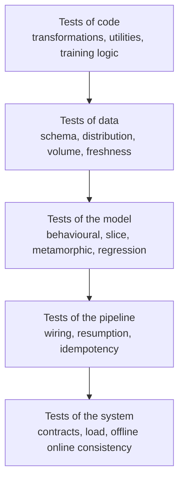
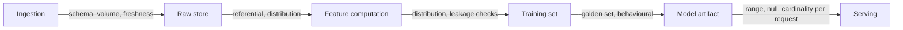
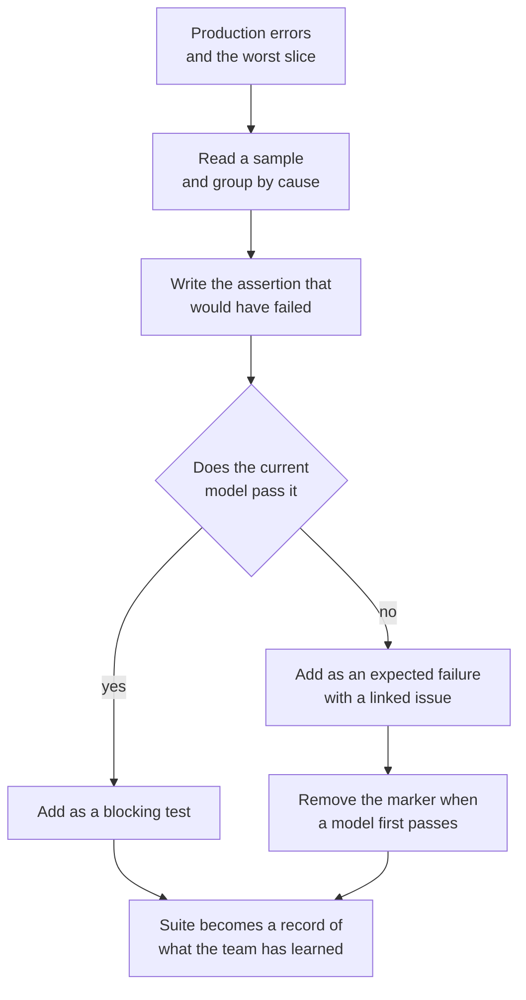
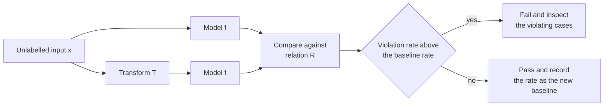
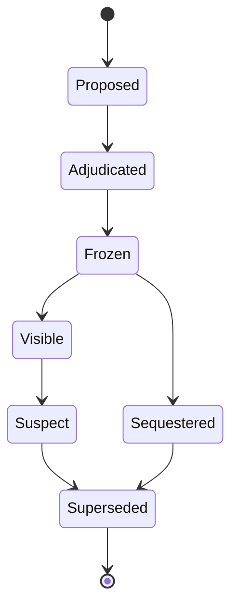

# Chapter 33: Testing Machine Learning Systems

> **What this chapter covers** Why a passing test suite says nothing about model quality, the five categories of test a machine learning system needs, property-based testing of transformation code, testing data in place, behavioural testing of models, slice testing, metamorphic testing where no ground truth exists, robustness and perturbation testing, regression tests built from incidents, golden datasets and their governance, testing the training pipeline and the serving path, flakiness, test data management, why coverage misleads here, and how to spend a fixed testing budget.
> **Prerequisites** Chapter 3 (Python for Machine Learning Engineering), Chapter 5 (Evaluation, Validation, and Experimental Design), Chapter 20 (Feature Stores and Data Quality), Chapter 26 (Continuous Integration and Delivery for Machine Learning).
> **Where it is used** Every team that ships a model more than once. The difference between a team whose incidents are new each time and a team that keeps having the same incident is almost entirely the contents of its test suite.

---

## 33.1 Level 1: Foundations

### The problem testing exists to solve here

In conventional software the specification is written down. A function that parses a date either returns the right date or it does not, and a test can say which. Tests are a proxy for correctness, and they are a good proxy, because the thing you want is expressible as an assertion.

A machine learning system has no such specification. Nobody can write down the correct output for every input of a fraud model, an image classifier, or a summariser. If they could, they would write that function and not train a model. The behaviour is induced from data, and the requirement is statistical: be right often enough, on the cases that matter, without being catastrophically wrong on any of them.

This produces the sentence that organises the rest of the chapter. **A green test suite tells you that the plumbing works. It tells you nothing about whether the model is good.** Both facts matter, and confusing them is the root of most bad testing practice in this field. Teams either conclude that testing is pointless because tests cannot check model quality, or they build metric thresholds and call them tests when they are really monitoring.

The resolution is to separate two questions and to answer them with different machinery.

| Question | Answered by | Property of the answer |
|---|---|---|
| Does the system do what the code says it does | Tests | Deterministic, pass or fail, blocking |
| Is the model good enough to ship | Evaluation and the gate | Statistical, comparative, needs an interval |

Chapter 26 owns the second question. It covers the evaluation gate, the baseline comparison, and the pipeline stage that runs it. This chapter owns the first question, plus the large grey zone in between where a deterministic assertion can be made about a statistical object. Behavioural tests, metamorphic tests and incident regression tests all live in that grey zone, and they are where most of the value is.

### The oracle problem

A **test oracle** is whatever tells you the expected output for a given input. In software the oracle is usually the specification in the developer's head, written into the assertion.

Machine learning testing is hard mainly because the oracle is missing. You have four substitutes, in descending order of availability.

1. **A labelled example.** You know the answer because a human or a process produced it. Expensive, limited, and the basis of held-out evaluation rather than of unit tests.
2. **A relation between outputs.** You do not know what the model should say about input $x$, but you know how its answer to $x$ should relate to its answer to a transformed $x'$. This is metamorphic testing, covered in level 3, and it is the single most useful idea in this chapter because it needs no labels at all.
3. **A bound.** You do not know the right answer but you know the answer must be a probability, must be monotone in one feature, must not exceed a latency, must not name a competitor. Bounds are cheap and catch the worst failures.
4. **A past answer.** The model used to get this case right, or used to get it catastrophically wrong and was fixed. Freezing that becomes a regression test.

Everything in level 2 and level 3 is an application of one of those four.

### The five categories



*Figure 33.1: The five categories, ordered by what they take as input. Each catches failures the layer below cannot see.*

| Category | Input under test | Typical runtime | What it catches that nothing else does |
|---|---|---|---|
| Code | A function | Milliseconds | Logic errors in transformations, wrong fitted-state handling |
| Data | A table or batch | Seconds to minutes | Upstream breakage that produces valid-looking nonsense |
| Model | A trained artifact | Seconds to minutes | Behaviour a metric average hides |
| Pipeline | An orchestrated run | Minutes | Wiring, ordering, partial failure, non-idempotent steps |
| System | A deployed service | Minutes | Contract drift, latency under load, training-serving skew |

Chapter 26 presents the same layering as a pyramid ordered by cost, for the purpose of ordering pipeline stages. This chapter orders it by input, for the purpose of deciding what to write. The two views are consistent and you should hold both.

### Vocabulary

- **Fixture**: a small, fixed input used by a test, checked into the repository.
- **Golden dataset**: a frozen set of inputs with expected outputs or expected aggregate behaviour, used as a stable reference across model versions.
- **Behavioural test**: an assertion about a model's input-output behaviour, treating it as a black box.
- **Metamorphic relation**: a rule connecting the output for one input to the output for a systematically transformed input.
- **Slice**: a subset of the evaluation data defined by a predicate, for example requests from a single locale.
- **Flaky test**: a test that passes and fails on the same code without a code change.
- **Property-based test**: a test that asserts a property over many generated inputs rather than over one example.
- **Smoke run**: a full pipeline execution on a tiny input, asserting that it completes and produces artifacts of the right shape.

### The mental model to carry

Think of the suite as a set of nets at different mesh sizes, placed at different points in the flow. A net catches only what is bigger than its mesh and only what passes through its position. Two nets at the same position with the same mesh are waste. A position with no net is where your incidents will come from.

The design question is therefore never "do we have enough tests". It is "what can reach production without passing through any net", which is a question about coverage of failure modes, not coverage of lines.

---

## 33.2 Level 2: Working knowledge

### Testing data transformation code

Every feature transformation should be a pure function of its inputs and its fitted state. Written that way it is testable like ordinary code, and most feature bugs disappear. Written as a script that mutates a dataframe in place while reading a global, it is untestable and it will be wrong.

The cases worth covering for every transformation:

| Case | Why it breaks things |
|---|---|
| Empty input | Aggregations return NaN or raise, and downstream code divides by zero |
| Single row | Standard deviation is zero or undefined, so z-scoring produces infinities |
| All nulls in a column | Imputation statistics are undefined |
| A value outside the training range | Clipping, extrapolation, or an encoder failure |
| An unseen categorical value | Silent mapping to an unknown bucket, or a raised exception |
| Duplicate keys | Joins fan out and row counts multiply |
| Out-of-order timestamps | Window features compute over the wrong window |
| Time zone or unit variation | Silent numeric error of a constant factor |
| The boundary of every threshold | Off-by-one on a bucketing edge |

Chapter 26 gives the canonical example of the fitted-state test, where a scaler must not recompute statistics from a serving batch. That test belongs in every repository and is not repeated here.

### Property-based testing, which suits feature engineering unusually well

A conventional test states one input and one expected output. A **property-based test** states a property that must hold for all inputs in a described domain, and a library generates hundreds of inputs trying to falsify it. In Python the standard tool is Hypothesis; dataframe strategies exist in `hypothesis.extra.pandas`, and names vary by version, so check your version.

Feature engineering is a good fit because feature code has many true algebraic properties that nobody writes down.

| Property | Statement | Bug it finds |
|---|---|---|
| Idempotence | $f(f(x)) = f(x)$ | Normalisers that rescale twice when a step is retried |
| Invariance to row order | $f(\text{shuffle}(x)) = f(x)$ up to ordering | Hidden dependence on input order, which breaks under parallel reads |
| Range | Output lies in a declared interval | Unclipped ratios producing infinities on a zero denominator |
| Shape preservation | One row in, one row out | Accidental fan-out in a join |
| Null propagation | A null in equals a declared null policy out | Silent imputation to zero |
| Monotonicity | Increasing an input does not decrease a derived feature | Sign errors in a difference |
| Round trip | Decode of encode is the identity on the declared domain | Encoder and decoder drifting apart |

**Listing 33.1: a property-based test of a feature transformation.**

```python
from hypothesis import given, settings, strategies as st
import pandas as pd

amounts = st.floats(min_value=0, max_value=1e7, allow_nan=False, allow_infinity=False)

@given(
    rows=st.lists(st.tuples(st.integers(1, 50), amounts), min_size=1, max_size=200),
    seed=st.integers(0, 2**16),
)
@settings(max_examples=200, deadline=None)
def test_spend_share_is_bounded_and_order_invariant(rows, seed):
    df = pd.DataFrame(rows, columns=["user_id", "amount"])

    out = compute_spend_share(df)                 # feature under test
    shuffled = compute_spend_share(df.sample(frac=1.0, random_state=seed))

    # Property 1: the share is a proportion, including when every amount is zero.
    assert out["spend_share"].between(0.0, 1.0).all()
    assert out["spend_share"].notna().all()

    # Property 2: row order must not change the result.
    left = out.sort_values("user_id").reset_index(drop=True)
    right = shuffled.sort_values("user_id").reset_index(drop=True)
    pd.testing.assert_frame_equal(left, right, atol=1e-9)
```

Two non-obvious choices. The generator allows zero amounts deliberately, because the all-zero group is the case that divides by zero and it is the case a hand-written fixture never contains. And `deadline=None` is set because dataframe operations have variable latency on shared runners, and a per-example deadline is a common source of flakiness rather than a useful signal.

When a property-based test fails, the library shrinks the counterexample to the smallest input that still fails. Record that shrunk input as a permanent fixture-based test alongside the property. The property prevents the class; the fixture documents the instance and runs in a millisecond.

The honest limitation: properties are hard to state for genuinely business-defined logic, where the only specification is the rule itself. Property-based testing is strongest on the mechanical layer, aggregations, joins, windows, encodings, and weakest on the "should a refund within 30 days count" layer. Use it where it fits and do not force it.

### Testing data itself

Testing data is asserting properties of a table or a batch rather than of a function. Chapter 20 covers validation as code, schema contracts and data observability in depth, and chapter 26 lists the eight failure modes that actually occur. Neither covers the placement decision, which is what this section adds.

The five assertion families:

| Family | Asserts | Example |
|---|---|---|
| Schema | Columns, types, nullability, allowed categorical values | `country` is a string in a 249-member set |
| Distribution | Statistics within a band derived from history | Null rate of `income` below 2 percent |
| Volume | Row count within a band, per partition | Daily partition between 0.8 and 1.2 times the trailing median |
| Freshness | The newest record is recent enough | Maximum event time within 90 minutes of now |
| Referential | Keys resolve, relationships hold | Every `order.user_id` exists in `users` |

**The placement decision.** The same assertion has a different cost and a different meaning depending on where it runs. Put each check at the earliest point where it can be evaluated and where a failure is still cheap to handle.



*Figure 33.2: Each check placed where failure is cheapest to handle, with the request-time subset being the smallest because it must run in microseconds.*

| Placement | Runs on | Latency budget | Action on failure |
|---|---|---|---|
| Ingestion | Every arriving batch | Seconds | Quarantine the batch, page the producer |
| After feature computation | The computed feature table | Minutes | Block the training run |
| Before training | The assembled training set | Minutes | Block, because training on bad data wastes hours |
| At request time | One request | Microseconds | Reject, impute with a logged flag, or fall back |

The request-time subset is necessarily small. You can check that a numeric feature is finite and within range, that a categorical value is known, and that no required field is missing. You cannot check a distribution on a single request. Distribution checks at serving are monitoring, not testing, and chapter 27 owns them.

Two rules that prevent most of the pain. First, derive expectation bands from trailing history with a tolerance rather than hand-writing constants, because hand-written constants become stale and get silenced. Second, separate hard failures that stop the pipeline from soft warnings that notify, and audit the soft warnings monthly, because a warning nobody reads is worse than no check at all.

### Testing models behaviourally

A behavioural test treats the trained artifact as a black box and asserts something about its input-output behaviour that must hold regardless of how it was trained. The taxonomy comes from Ribeiro, Wu, Guestrin, and Singh, "Beyond Accuracy: Behavioral Testing of NLP Models with CheckList" (2020), and it generalises well beyond text.

**Minimum functionality tests (MFTs).** Small sets of cases so easy that failure is unambiguous. A sentiment model must call "this is excellent" positive. A fraud model must score a textbook card-testing pattern above the median. A tabular model must handle the median row of its own training distribution. The purpose is not to measure quality. It is to catch the deployment where the wrong artifact was loaded, the label mapping was inverted, or the feature order was scrambled, which are the failures that produce a model that is confidently and uniformly wrong.

**Invariance tests.** A change that should not alter the label must not alter the prediction much. Substituting one person's name for another, changing an account identifier, adding trailing whitespace, reordering a set-valued field, or changing a locale that carries no signal. The assertion is a bound on the change, not equality, because floating-point and feature hashing make exact equality brittle.

**Directional expectation tests.** A change that should push the prediction one way does. More prior chargebacks should not reduce a fraud score. A larger tumour dimension should not reduce a malignancy score if the relationship is understood to be monotone. Assert the direction, not the magnitude.

**Listing 33.2: a behavioural suite with the three types and a bounded invariance assertion.**

```python
import pytest

NAMES = ["Alice", "Ravi", "Mei", "Kwame", "Sofia"]

def test_minimum_functionality_obvious_positives(model):
    for text in ["this is excellent", "absolutely wonderful", "I loved it"]:
        assert model.predict_proba(text)["positive"] > 0.80, text

@pytest.mark.parametrize("template", ["{} said the film was fine.", "A review by {}."])
def test_invariance_to_person_name(model, template):
    scores = [model.predict_proba(template.format(n))["positive"] for n in NAMES]
    spread = max(scores) - min(scores)
    assert spread < 0.05, f"prediction varies by {spread:.3f} across names"

def test_directional_more_negation_lowers_sentiment(model):
    base = model.predict_proba("The service was good.")["positive"]
    negated = model.predict_proba("The service was not good.")["positive"]
    assert negated < base - 0.10
```

The non-obvious parts. The invariance threshold 0.05 is a policy choice and must be written down with a reason, because a test whose threshold nobody can justify gets loosened the first time it fails. The directional test uses a margin of 0.10 rather than a strict inequality, so that floating-point noise near a tie does not fail the build. And the name list must be revisited, since an invariance suite built from five names tests five names, not the property.

**Building the suite from failure analysis rather than from imagination.** The suite that matters is not written in one sitting. It grows from the cases the model actually gets wrong. The loop:

1. Take the worst-performing slice or a sample of production errors.
2. Group the errors by apparent cause, by reading them.
3. For each group, write the behavioural test that would have failed.
4. Add it to the suite, whether or not the current model passes.



*Figure 33.3: Behavioural tests grow from observed errors. The branch on the right is what stops the suite from only testing what you already believe.*

Tests the current model fails are valuable. Mark them as known failures with an expected-failure marker and a linked issue, so the suite records the gap instead of hiding it. The day a new model passes one, the marker is removed and the improvement is permanent. This turns the test suite into a record of what the team has learned about its own problem, which is the most durable asset a machine learning team produces.

### Slice-based testing and choosing slices that matter

An aggregate metric is a weighted average, and a weighted average hides everything about its components. A model can improve overall accuracy by two points while losing five points on the 8 percent of traffic that generates most of the revenue.

Chapter 26 states the mechanics of slice assertions in the gate. What it does not cover is how to choose slices, which is the part that decides whether the practice is useful.

Choose slices on four grounds, and write down which ground each slice is on:

| Ground | Examples | Why |
|---|---|---|
| Harm | Protected attributes where policy applies, safety-critical subpopulations | A regression here is not tradeable against an aggregate gain |
| Value | Highest-revenue segment, largest customer, new-user cohort | A regression here costs more than the average |
| Fragility | Rare classes, short inputs, long inputs, low-data locales, new device types | These regress first and are invisible in the aggregate |
| Change | Anything the current change is expected to affect | The slice where the hypothesis lives |

Three discipline rules. Require a minimum sample size per slice and report slices too small to test rather than silently skipping them, because a silently skipped slice reads as a pass. Test slices as a group with a multiple-comparison correction in mind, since twenty slices at $\alpha = 0.05$ produce a false alarm most of the time; chapter 5 covers the correction. And keep the slice list under version control with an owner per slice, because an unowned slice is deleted the first time it is inconvenient.

Automated slice discovery, for example SliceFinder from Chung and colleagues (2019), proposes candidate slices by searching feature-space conjunctions for underperformance. It is a good source of hypotheses and a bad source of gates, because a slice discovered by searching for the worst subset is selected on noise. Use discovery to generate candidates, then promote a candidate to a gate only after it has been confirmed on fresh data and given an owner.

### The shape of the test suite on disk

```
tests/
  unit/            # transformations, utilities, pure functions. Milliseconds.
  data/            # assertions on fixtures and on sampled real partitions.
  behavioural/     # MFT, invariance, directional, metamorphic. Needs a model.
  regression/      # one file per past incident, plus its fixture.
  golden/          # frozen inputs and expected aggregate behaviour.
  pipeline/        # smoke run, resumption, idempotency.
  system/          # contract, load, offline online consistency. Needs a service.
```

### Where each category runs

A test that exists but never runs at the moment it would have helped is worth nothing. Decide, per category, the trigger and the consequence of failure.

| Category | Trigger | Blocking | Typical budget |
|---|---|---|---|
| Unit | Every commit, and locally before push | Yes | Under 60 seconds total |
| Data on fixtures | Every commit | Yes | Under 60 seconds |
| Data on real partitions | Every pipeline run, per batch | Yes, quarantine the batch | Minutes |
| Behavioural and metamorphic | Every candidate model | Split, see level 4 | Minutes |
| Slice | Every candidate model | Yes for declared harm slices | Minutes |
| Incident regression | Every commit if no model is needed, otherwise every candidate | Yes | Seconds to minutes |
| Pipeline smoke | Every commit to pipeline code, and nightly | Yes | Minutes |
| Contract | Every commit to the service, and on consumer changes | Yes | Seconds |
| Load | Before release, and nightly | Yes against the objective | Tens of minutes |
| Offline-online consistency | Every release, and hourly on a schedule | Yes at release, alert on schedule | Minutes |

The two rows with a schedule as well as a trigger are the ones that catch changes originating outside the repository, which is where a surprising share of machine learning incidents begin.

Mark the categories that need a model or a service so a developer can run the fast half locally in seconds. A suite whose fast path takes four minutes will not be run before pushing, and a suite that is not run before pushing is a slower version of monitoring.

---

## 33.3 Level 3: Depth

### Metamorphic testing

Metamorphic testing is the answer to the oracle problem, and it is the technique most teams have never deliberately used. The idea is due to Chen, Cheung, and Yiu (1998) in general software testing, and its application to machine learning is now a substantial literature.

The construction. You cannot say what the model should output for input $x$. But you can often name a transformation $T$ and a relation $R$ such that for every $x$ in a domain,

$$R\big(f(x),\ f(T(x))\big) \ \text{must hold}$$

where $f$ is the system under test. The pair $(T, R)$ is a **metamorphic relation**. No labels are required. You generate $x$ from unlabelled production traffic, apply $T$, run the model twice, and assert $R$.

**Worked example of the arithmetic.** Suppose $f$ is a house price regressor and the relation is that adding one bedroom must not decrease the predicted price. Take 5,000 unlabelled listings, predict each, add a bedroom, predict again. Let $v_i = f(T(x_i)) - f(x_i)$. The relation is $v_i \ge 0$. Suppose 137 of the 5,000 have $v_i < 0$, a violation rate of $137/5000 = 0.0274$. The 95 percent Wilson interval for a proportion $\hat p$ with $n = 5000$ is approximately

$$\hat p \pm 1.96\sqrt{\frac{\hat p (1-\hat p)}{n}} = 0.0274 \pm 1.96\sqrt{\frac{0.0274 \times 0.9726}{5000}} = 0.0274 \pm 0.0045$$

so the violation rate is between 2.3 and 3.2 percent. That is the number to gate on, and the gate is a comparison against the previous model's violation rate rather than against zero, because a flexible model fitted on finite data will violate a soft monotonicity somewhere. The exception is a relation that must hold exactly, such as invariance to a field the model does not read, where the gate is zero violations and any violation is a bug rather than a quality issue.

**A catalogue of relations by domain.** These are the ones that repay the effort.

| Domain | Transformation $T$ | Relation $R$ |
|---|---|---|
| Tabular | Duplicate a row in a batch | Per-row predictions unchanged, which catches batch-dependent code |
| Tabular | Permute feature columns and the model's schema together | Predictions identical, which catches positional feature bugs |
| Tabular | Scale a monetary feature and its units consistently | Prediction unchanged if the model is unit-aware, or changed by the known factor |
| Tabular | Increase a feature with an agreed monotone relationship | Prediction does not move the wrong way |
| Text | Replace a named entity with another of the same type | Prediction changes by less than a bound |
| Text | Paraphrase, or translate to another language and back | Label unchanged for a label-preserving paraphrase |
| Text | Append a neutral sentence | Classification unchanged |
| Vision | Small rotation, crop, brightness, or JPEG compression | Label unchanged, confidence drops by less than a bound |
| Vision | Horizontal flip, where the task is flip-invariant | Prediction approximately unchanged |
| Audio | Add low-level noise, shift gain, re-encode at a different bitrate | Transcript edit distance below a bound |
| Search and ranking | Add a document strictly worse than all others | The ranking of the existing documents is unchanged |
| Search and ranking | Duplicate the top document | It does not fall in rank |
| Recommenders | Add an interaction consistent with the user's history | The affected item's score does not fall |
| Generative | Reorder independent items in a list in the prompt | The substance of the answer is unchanged |
| Generative | Ask the same question in two phrasings | Answers agree on the extracted fact |
| Any | Run the same input twice | Byte-identical output at temperature zero, which catches non-determinism in serving |



*Figure 33.4: The metamorphic loop. The oracle is the relation between two runs, so no labels appear anywhere in the diagram.*

**Listing 33.3: a metamorphic test with a violation-rate gate and a sample of failures kept for inspection.**

```python
import numpy as np

def test_monotone_in_prior_chargebacks(model, unlabelled_sample, baseline_rate):
    """Raising prior chargebacks must not lower the fraud score."""
    x = unlabelled_sample                     # 5000 unlabelled production rows
    base = model.score(x)

    x_more = x.copy()
    x_more["prior_chargebacks"] = x_more["prior_chargebacks"] + 1
    bumped = model.score(x_more)

    delta = bumped - base
    violations = delta < -1e-6                # tolerance absorbs float noise
    rate = violations.mean()
    half_width = 1.96 * np.sqrt(rate * (1 - rate) / len(x))

    # Compare against the shipped model's rate, not against zero.
    assert rate - half_width <= baseline_rate + 0.005, (
        f"violation rate {rate:.4f} +/- {half_width:.4f} exceeds "
        f"baseline {baseline_rate:.4f}; sample: "
        f"{x[violations].head(3).to_dict('records')}"
    )
```

Three non-obvious choices. The tolerance `-1e-6` prevents float noise at a tie from counting as a violation. The comparison is against the shipped model plus a slack of 0.005 rather than against zero, which makes the test a regression detector rather than an unachievable purity check. And the assertion message carries three violating rows, because a metamorphic failure is useless without examples and nobody will rerun the job to get them.

**Where metamorphic testing goes wrong.** The relation can be false. "Translating to French and back preserves sentiment" is false for sarcasm and for idiom, so a violation may be a defect in the relation rather than in the model. Treat the first run of a new relation as calibration: inspect the violations by hand, and if most are relation defects, weaken the relation or narrow its domain. The relation can also be trivially satisfiable, which is worse, because a model that ignores the feature entirely passes every monotonicity relation about it. Pair a monotonicity relation with a sensitivity check that the feature does something.

**Why teams skip it.** It has no obvious home. It is not a unit test because it needs a model, not an evaluation because it needs no labels, and not monitoring because it runs pre-deployment. It ends up owned by nobody. The fix is structural: give it a directory, run it in the same pipeline stage as the evaluation gate, and put the violation rate in the model card next to the accuracy.

### Robustness and perturbation testing

Metamorphic relations assert that output does not change under a label-preserving transformation. Robustness testing accepts that it will change and bounds the degradation under realistic corruption. The distinction is the assertion, not the mechanism.

Build a **corruption ladder**: for each corruption type, several severity levels, applied to the same held-out set.

| Data type | Corruption | Realistic severity range |
|---|---|---|
| Text | Typos, casing, punctuation removal, truncation, emoji insertion | 1 to 10 percent of characters |
| Tabular | Missing optional fields, stale feature values, defaulted categoricals | 1 to 20 percent of rows |
| Vision | Gaussian noise, blur, brightness, JPEG quality, occlusion | Match the deployment camera |
| Audio | Background noise at a stated signal-to-noise ratio, clipping, packet loss | Match the deployment channel |
| Time series | Missing samples, clock skew, duplicated records, delayed arrival | Match the observed pipeline behaviour |

Report a degradation curve rather than a single number, and gate on the area under it or on the severity at which the metric crosses a floor. The corruption set from Hendrycks and Dietterich, "Benchmarking Neural Network Robustness to Common Corruptions and Perturbations" (2019), is the standard reference construction for vision and is worth copying in structure for other modalities.

Two cautions. Do not gate on adversarial robustness unless there is a genuine adversary, because worst-case robustness trades against average accuracy and paying that price without a threat model is a loss; chapter 28 owns the threat model. And make the corruption severities match measured production conditions rather than a paper's defaults, otherwise you are optimising for a distribution nobody sees.

### Regression tests built from incidents

This is the highest-value category in the chapter and the one most teams do not have. It is also the cheapest, because the expensive part, discovering the failure, has already been paid for by the incident.

**The rule.** Every incident, production bug report, embarrassing output, or escalation leaves behind a test before the incident is closed. No test, no closure. Chapter 37 covers incident response; this section covers the artifact it must produce.

**What a regression test contains.** Not just the input. A regression test that says "input X must produce output Y" is brittle and will be deleted when Y legitimately changes. What survives is the assertion of the property that was violated.

| Incident | Brittle test | Durable test |
|---|---|---|
| Model recommended an out-of-stock item | Item 4471 is not recommended for user 99 | No recommendation in a response has `in_stock = false` |
| Summariser emitted a phone number from context | This input does not produce this string | No output contains a pattern matching a phone number when the prompt forbids it |
| Fraud model scored all transactions from one country at zero | Country ZZ scores above 0.01 | No country in the top 20 by volume has a median score below one tenth of the global median |
| Null feature defaulted to zero and inverted the decision | This row scores above 0.5 | A row with a null in `income` is flagged for fallback rather than scored with an implicit zero |
| Latency spiked on long inputs | This 9,000-token input takes under 2 seconds | The 99th percentile over the long-input fixture set is under the service objective |

The durable version generalises to the class. The brittle version pins the instance. Write the durable assertion and attach the instance as a fixture so the report stays concrete.

**Listing 33.4: the structure of an incident regression test, one file per incident.**

```python
"""INC-2024-0143: out-of-stock items appeared in recommendations.

Cause: the inventory join used a 24 hour old snapshot while the candidate
generator used live inventory, so items that sold out inside the window
survived filtering.
Fix: filter against the live inventory service after ranking.
Property protected: no returned item is out of stock at response time.
"""
import json
import pathlib

FIXTURE = pathlib.Path(__file__).with_name("inc_2024_0143_requests.json")

def test_no_out_of_stock_items_are_recommended(recommender, inventory_stub):
    requests = json.loads(FIXTURE.read_text())
    inventory_stub.set_out_of_stock({"SKU-4471", "SKU-8890"})

    for req in requests:                        # the exact traffic from the incident
        items = recommender.recommend(req, k=10)
        returned = {i["sku"] for i in items}
        assert not (returned & inventory_stub.out_of_stock), (
            f"user {req['user_id']} received out-of-stock "
            f"{sorted(returned & inventory_stub.out_of_stock)}"
        )
```

The docstring is the important part and is not decoration. Six months later a developer whose change fails this test needs to know, in ten seconds, what property is protected and whether their change is a legitimate redefinition. A regression test without its incident narrative becomes an obstacle and gets deleted, which returns you to the incident.

**Governance of the incident suite.** Review it quarterly. For each test ask whether the property still reflects intent. Retire a test by deliberate decision with the reason recorded, never by deleting it when it turns red. Track the count of incident-derived tests as a team metric, because it is one of the few testing numbers that means something: it measures how much the team has learned.

**The repeat-incident rate is the real metric.** Count incidents whose cause matches a previous incident. A healthy team's repeat rate falls toward zero as the suite grows. A team whose repeat rate is flat is not converting incidents into tests, regardless of how many tests it has.

### Golden datasets

A **golden dataset** is a frozen, curated set of inputs used as a stable reference across model versions. It is not a held-out test set and confusing the two causes trouble.

| Property | Held-out test set | Golden dataset |
|---|---|---|
| Purpose | Estimate generalisation | Detect change in specific behaviour |
| Sampling | Representative of the population | Deliberately unrepresentative, enriched for hard and important cases |
| Size | Large enough for tight intervals | Small enough for a human to read all of it |
| Labels | From the normal labelling process | Adjudicated, often by multiple reviewers |
| Refresh | Resampled as the population moves | Frozen, with controlled additions |
| Used for | The headline metric | Gates, comparisons, and debugging |

**Construction.** Start from four sources: cases from incidents, cases from the hardest slices, cases that adjudicators disagreed on, and a stratified sample of ordinary traffic so the set is not entirely pathological. Aim for a set a reviewer can read in a day, typically a few hundred to a few thousand items. Adjudicate every label at least twice and record the disagreements, because an item two experts disagree on should not be a gate.

**Freezing and governance.** The set is an asset with an owner and a change process.

- It lives in version control or in a versioned store, addressed by content hash, and every evaluation result records which version it used.
- Additions require review. Removals require a recorded reason.
- Nobody trains on it, and nobody tunes a threshold on it more than a handful of times. A golden set optimised against for a year is a training set.
- Keep a **sequestered partition** that is evaluated rarely, for example once per quarter or before a major release, and that nobody may inspect. When the visible partition and the sequestered partition diverge, the visible one has been overfitted and needs refreshing.



*Figure 33.5: The life of a golden set. An item becomes suspect when the visible and sequestered partitions disagree, and the response is a new version rather than an edit.*

**Refresh.** Freezing and staleness are in tension. The resolution is versioning rather than editing. Publish v2 alongside v1, report both during a transition, and record in the decision log why v2 exists. Never silently edit v1, because every historical number in every report becomes uninterpretable the moment you do.

### Testing the training pipeline

**The overfit-one-batch test.** This is the single most informative test of training code. Take one small batch, disable regularisation, dropout, and augmentation, and train on that batch alone for a few hundred steps. A correctly wired model must drive the loss to approximately zero.

The reason it is so informative is that almost every wiring bug prevents it. A failure to reach near-zero loss means one of a short list: labels are shuffled relative to inputs, the loss is applied to the wrong tensor, a mask zeroes the gradient, the learning rate is orders of magnitude off, the optimiser is not stepping, a layer is frozen when it should not be, or the data loader returns a fresh random batch each step instead of the same one. Each of these is expensive to find by watching a full training run and cheap to find here.

**Worked expectation.** For a 5-class classifier, a random model has cross-entropy $\ln 5 = 1.609$. On a batch of 32 examples with enough capacity, after 300 steps the loss should be below about $10^{-2}$. If it plateaus near 1.609, nothing is learning. If it plateaus near a value like 0.7, some examples are unlearnable, which for a single batch usually means duplicated inputs with conflicting labels. Those two plateaus mean very different things and the test distinguishes them.

**Listing 33.5: the overfit-one-batch test as a pipeline gate.**

```python
import torch

def test_model_can_overfit_a_single_batch(model_factory, one_batch):
    model = model_factory(dropout=0.0, weight_decay=0.0)
    model.train()
    opt = torch.optim.AdamW(model.parameters(), lr=1e-3)
    x, y = one_batch                            # the SAME tensors every step

    losses = []
    for _ in range(300):
        opt.zero_grad(set_to_none=True)
        loss = torch.nn.functional.cross_entropy(model(x), y)
        loss.backward()
        opt.step()
        losses.append(loss.item())

    assert losses[-1] < 1e-2, (
        f"final loss {losses[-1]:.4f} from {losses[0]:.4f}; "
        "wiring bug, frozen parameter, or conflicting duplicate labels"
    )
    assert losses[-1] < losses[0] / 10, "loss barely moved; check the optimiser step"
```

The non-obvious parts. Regularisation is disabled deliberately, because weight decay alone can floor the loss above the threshold and produce a false failure. The batch is fixed outside the loop, which is the whole point and the thing most broken implementations get wrong. And the second assertion catches the case where the loss started low by luck.

**Other pipeline tests worth their cost:**

| Test | Assertion | Catches |
|---|---|---|
| Smoke run | The full pipeline completes on a tiny input and emits artifacts of the expected shape | Wiring, missing paths, permission errors |
| Determinism | Two runs with the same seed and the same deterministic settings produce identical metrics | Uncontrolled non-determinism, which makes every later comparison meaningless |
| Resumption | Kill at step $k$, resume, and reach the same state as an uninterrupted run | Checkpoints missing optimiser or scheduler state |
| Idempotency | Running the same partition twice leaves the output identical | Append-instead-of-overwrite, which silently duplicates training rows |
| Shape and dtype contract | Every stage boundary asserts shape and dtype | Silent broadcasting, which is the quietest bug in array code |
| Leakage guard | No entity appears in both the training and evaluation split, and no feature is computed after the label timestamp | The failure that makes offline metrics beautiful and production terrible |
| Config validation | The config parses into a typed schema before any compute starts | Two hours of training with a misspelled key silently ignored |

The leakage guard deserves emphasis. Chapter 20 covers point-in-time correctness as a design property of the feature store. The test is the enforcement: assert, mechanically, that every feature's computation timestamp precedes its label's timestamp, and that the train and evaluation entity sets are disjoint. Write it once and it protects every future dataset.

### Testing serving

**Contract tests.** The service's request and response schemas are a contract with its consumers. Test it from both sides. The provider asserts that it satisfies the published schema; each consumer asserts that its expectations are in the schema. The consumer-driven contract pattern, associated with Robinson circa 2006 and implemented by tools such as Pact, generalises well: consumers publish expectations, and the provider's pipeline fails if a change breaks any published expectation. For model services, extend the contract past the JSON shape to include the semantics: the score range, the meaning of the class order, the null policy, and whether a field is optional.

**Load tests.** Assert the latency objective at the traffic shape you expect, not at an average. Three things must be right or the test lies. Use a realistic input distribution, because for many models latency depends on input size and an average-length synthetic input understates the tail badly. Include a cold-start measurement, since the first request after a scale-up is often an order of magnitude slower. And measure at the concurrency where queueing starts, since the interesting number is the knee of the curve rather than a single point.

**The offline-online consistency test.** The highest-value single test in a machine learning repository, and chapter 26 names it as such. The construction: take a sample of entities, compute their features through the batch path and through the online path at the same logical time, and assert element-wise agreement within a tolerance. Then feed both vectors to the same model artifact and assert the predictions agree.

Run it on a schedule as well as in the pipeline, because the two paths drift apart through changes that touch neither the model code nor the serving code. Report the number of mismatched features and their names rather than a single boolean, because the useful output is which feature broke. A tolerance is required because floating-point accumulation order differs between a distributed batch engine and a single-process service; a relative tolerance around $10^{-6}$ is a common starting point and should be tightened until it is just loose enough not to flake.

### Designing thresholds that survive

Most assertions in this chapter compare a noisy quantity to a constant, and most of the pain comes from choosing that constant badly. There are only four defensible ways to choose one, and "it passed when I wrote it" is not among them.

| Source of the threshold | When to use it | Failure mode |
|---|---|---|
| A requirement | A latency objective, a regulatory limit, a contractual range | None, but few thresholds have this source |
| A property of the quantity | A probability must be in $[0,1]$, a share must sum to one | None, and these should be exact assertions |
| Historical variation | Set the band from the trailing distribution, for example the median plus or minus four times the median absolute deviation | Goes stale as the system changes, so recompute on a schedule |
| The currently shipped system | Assert no worse than the incumbent by more than a stated slack | Permits slow decay, so pair it with a fixed floor |

A workable rule for a band from history: take the last $k$ observations, compute the median $m$ and the median absolute deviation $d$, and set the band to $m \pm c\,d$ with $c$ chosen so that the historical false alarm rate is acceptable. With $k = 60$ daily observations and $c = 5$, a stable quantity alarms roughly a few times a year, which is usually the right order. Use the median and the median absolute deviation rather than the mean and the standard deviation, because one past incident in the history window inflates a standard deviation enough to hide the next one.

Three rules that keep thresholds honest. Record the reason for every constant in a comment next to it, because an unexplained constant is loosened rather than investigated the first time it fails. Log the observed value on both pass and fail, so you can see the margin narrowing before it crosses. And count how often each threshold has been changed, since a threshold changed more than twice is describing a real trend that someone has been suppressing.

### Testing infrastructure as code

Infrastructure definitions are code and fail in the same ways. Chapter 26 covers infrastructure as code in the pipeline; the testing layers are:

| Layer | What it does | Cost |
|---|---|---|
| Static validation | Parse and type-check the configuration | Seconds |
| Policy as code | Assert rules such as no public bucket, encryption required, resource tags present, GPU node pools have a taint | Seconds |
| Plan inspection | Run the planner and assert on the diff, for example that no database is scheduled for replacement | Seconds |
| Ephemeral apply | Create real infrastructure in a throwaway environment, assert, destroy | Minutes to hours, real money |
| Drift detection | Compare live state to declared state on a schedule | Continuous |

The plan-inspection layer is underused and is where the highest-value assertion lives: fail the pipeline if the plan destroys or replaces a stateful resource without an explicit approval label on the change. That single rule prevents a category of incident that is otherwise unrecoverable.

### Flakiness

A **flaky test** passes and fails on identical code. Flakiness is not an annoyance to be managed with retries. It is a bug, either in the test or in the system, and retrying hides which.

Causes specific to machine learning pipelines:

| Cause | Mechanism | Fix |
|---|---|---|
| Unseeded randomness | Data shuffles, augmentation, initialisation, negative sampling | Seed every library and pass the seed explicitly through the call chain |
| Non-deterministic kernels | GPU reductions with atomics accumulate in varying order | Enable deterministic algorithms in the test path and accept the slowdown |
| Thread and worker count | Different data loader worker counts change ordering | Pin worker counts in tests |
| Wall-clock dependence | A test using "today" crosses midnight or a month boundary | Inject a clock, never read the system clock in a test |
| Network and external services | A model or dataset downloaded at test time | Vendor small fixtures, stub external calls |
| Shared mutable state | Tests writing to the same path or table, order-dependent | Give every test a unique temporary namespace |
| Tolerance set too tight | An assertion at the edge of float noise | Widen with a documented reason, or assert a different quantity |
| Threshold at a genuine boundary | A metric assertion sitting exactly at the true value | Move the threshold, or reduce variance with more evaluation items |
| Resource contention | Timeouts on a loaded shared runner | Remove per-test deadlines, assert throughput separately |

The discipline. Quarantine a flaky test immediately so it stops eroding trust, file an issue with the failure rate, and fix or delete it within a stated window. Never add a blanket retry, because a retried test that fails one time in five is telling you something happens one time in five in production too. Measure the suite's flake rate; above roughly 1 percent of runs, engineers begin rerunning the pipeline by reflex and the suite has stopped functioning as a gate.

### Test data management and synthetic fixtures

Tests need data, and production data is the wrong data for three reasons: it cannot always be checked into a repository for privacy or licence reasons, it is too large for a fast suite, and it changes, which makes tests non-reproducible.

The hierarchy, cheapest and safest first:

1. **Hand-written fixtures.** Ten rows written by a person, covering the edge cases deliberately. Best for unit tests. The rows are readable, so a failure is diagnosable by reading the file.
2. **Generated fixtures.** A generator producing rows satisfying the schema, used by property-based tests. Best for finding cases nobody thought of.
3. **Sampled and anonymised production data.** A frozen sample, with identifiers hashed and sensitive fields removed or replaced. Best for data tests and behavioural tests where realism matters. Freeze it and version it; a sample refreshed automatically makes every test non-reproducible.
4. **Synthetic data with the statistical shape of production.** Generated to match marginals and key correlations. Necessary when the real data cannot leave its environment at all.
5. **Live production data in a read-only reference test.** Only for scheduled checks such as the offline-online consistency test, never for a blocking pipeline gate, because the pipeline then fails for reasons unrelated to the change.

Two rules. Keep fixtures small enough to read, because a 50,000-row fixture is not a test input, it is an opaque dependency. And record how each fixture was produced in a comment or a sibling file, because the question "can I regenerate this" comes up every time the schema changes.

### Coverage, and why it misleads here

Line coverage measures which lines executed. In a machine learning system the lines are a small part of the behaviour, and a suite that executes every line of a training script while asserting almost nothing reports high coverage.

Worse, the code with the lowest line count often carries the most risk. A one-line join key, a one-line default value, a one-line threshold. Coverage weights every line equally and so weights them all near zero.

Measure these instead:

| Measure | Definition | Why it means something |
|---|---|---|
| Failure-mode coverage | Fraction of an enumerated failure-mode list with at least one detecting test | Directly answers what can reach production undetected |
| Incident coverage | Fraction of past incidents with a regression test | Measures whether learning is retained |
| Slice coverage | Fraction of declared important slices with an owned assertion | Measures whether the aggregate is hiding damage |
| Data assertion coverage | Fraction of columns used by the model with at least one assertion | Measures exposure to upstream change |
| Contract coverage | Fraction of consumers with a published expectation | Measures how safely the interface can change |
| Mutation score on transformation code | Fraction of injected faults the suite detects | Measures whether the tests assert anything, which coverage cannot |

Mutation testing, where a tool systematically injects small faults such as flipping a comparison and checks whether a test fails, is the honest version of coverage. It is slow, so scope it to the transformation and feature modules where the faults are subtle and the code is pure. A suite with 90 percent line coverage and a 30 percent mutation score is executing code without checking it, which is a common and invisible state.

The practical construction is a **failure-mode register**: a table of every way the system is known to be able to fail, with the detecting control named for each, and the row left visibly empty where there is none. It is a better artifact than any coverage number because the empty rows are the work.

---

## 33.4 Level 4: Mastery

### The economics of testing

Testing budget is finite, in engineer time to write and in pipeline minutes to run. Allocation should follow expected loss avoided, which is frequency times cost times the probability the test catches it, divided by the cost of building and maintaining the test.

$$\text{value} = \frac{p_{\text{fail}} \times C_{\text{incident}} \times p_{\text{detect}}}{C_{\text{build}} + T \cdot C_{\text{maintain}}}$$

where $p_{\text{fail}}$ is the per-period probability the failure occurs, $C_{\text{incident}}$ its cost, $p_{\text{detect}}$ the probability this test catches it, $C_{\text{build}}$ the one-off cost, $C_{\text{maintain}}$ the per-period maintenance cost, and $T$ the number of periods.

**Worked comparison.** Assume, and mark these as assumptions, that a silent null-rate change occurs twice a year and costs 40 engineer-hours plus a week of degraded predictions valued at another 60, so $C_{\text{incident}} = 100$ hours. A data assertion costs 2 hours to build, 0.5 hours a year to maintain, and catches it with probability 0.9. Over 3 years the value is

$$\frac{(2 \times 3) \times 100 \times 0.9}{2 + 3 \times 0.5} = \frac{540}{3.5} \approx 154$$

Now a full end-to-end test of the same pipeline: 40 hours to build, 15 hours a year to maintain because it breaks whenever anything moves, and it catches the same failure with probability 0.5 while also catching wiring failures worth perhaps 30 hours a year:

$$\frac{(2 \times 3) \times 100 \times 0.5 + 3 \times 30}{40 + 3 \times 15} = \frac{390}{85} \approx 4.6$$

A factor of thirty. The arithmetic is crude and the inputs are estimates, but it reproduces the practitioner consensus: cheap assertions close to the data dominate expensive tests far from it. The numbers are worth writing down for your own system, because the ranking is usually stable even when the estimates are not.

**What each category actually prevents**, which is the table to reason from when the budget is fixed:

| Category | Prevents | Does not prevent |
|---|---|---|
| Unit tests on transformations | Silent numerical and logic errors, leakage through fitted state | Anything about data or model quality |
| Data tests | The large majority of real production incidents | Model degradation on valid data |
| Behavioural and metamorphic tests | Shipping a model with a known-bad behaviour, wrong artifact loaded | Aggregate quality regression |
| Slice tests | Regression concentrated in a segment | Regression spread evenly |
| Incident regression tests | Repeating a past failure | Novel failures |
| Pipeline tests | Wiring, resumption, duplication, leakage | Anything about output quality |
| System tests | Contract drift, latency, training-serving skew | Model quality |
| Evaluation gate, chapter 26 | Aggregate quality regression | Everything above |

Read the table row by row and the conclusion is forced: no single category is sufficient, and the cheapest two rows cover the most ground. If you can afford only two things, build the data assertions and the incident regression suite.

### The minimum viable suite

For a team shipping its first model, in build order:

1. Config schema validation, and a smoke run of the whole pipeline on a tiny input.
2. Schema, volume and freshness assertions on every input table.
3. The overfit-one-batch test.
4. The leakage guard on the split and on feature timestamps.
5. Unit tests on the three most complex transformations.
6. Three minimum functionality tests on the model.
7. The offline-online consistency test.
8. A contract test on the serving response.

That is roughly a week of work and it removes most of the failure modes that cause a first production incident. Everything else in this chapter is added in response to what actually goes wrong, which is the correct order.

### What senior engineers argue about

**Should model behavioural tests block a merge.** One side: a model that fails a minimum functionality test is broken and must not ship, so block. The other: behavioural tests on a retrained model fail for reasons that are sometimes legitimate drift in the world, and a blocking test that is overridden weekly is theatre. The practical position is to split the suite. Assertions that would indicate a bug, such as the wrong artifact or an inverted label map, block. Assertions that express a quality preference report into the gate as a countable signal and are reviewed by a person.

**How much production data may enter the test suite.** Realism versus privacy, reproducibility and repository size. The defensible position is that tests which must be reproducible use frozen anonymised samples, and tests which must be realistic run on a schedule against live data outside the blocking path.

**Whether to gate on a fixed threshold or on a comparison to the current model.** Fixed thresholds are interpretable and go stale. Comparative gates are correct and permit slow decay, since each release is only slightly worse than the last. The usual answer is both: a fixed floor that catches catastrophe and a comparative test that catches regression, plus a periodic review of the floor.

**Whether flaky tests may be retried.** Retries are pragmatic on a shared runner and they destroy the signal. The compromise that holds is a single retry with the flake recorded and a flake budget enforced at the suite level, so retries are visible and bounded rather than free.

### Where the standard advice is wrong

**"Aim for high coverage."** Wrong target, for the reasons in level 3. Aim at failure-mode coverage, and use mutation score where you need a number for a pure module.

**"Test the model."** Too vague to act on, and it pushes teams toward metric-threshold tests, which are the weakest thing in this chapter. Test the behaviour, test the data, test the pipeline, and evaluate the model.

**"The testing pyramid applies."** Partially. The pyramid's premise is that low-level tests are cheap and high-level tests are expensive. In machine learning the most valuable tests, the data assertions and the metamorphic checks, are cheap and sit at a high level, so the shape is less a pyramid than a wide band in the middle.

**"End-to-end tests give the most confidence."** They give the most confidence per test and the least per hour. They are slow, flaky, and they fail without localising the cause. Keep a few as wiring smoke tests and do not grow them.

**"Deterministic tests are impossible with neural networks."** Not true, and the belief is load-bearing for a lot of bad practice. Determinism is achievable at a performance cost by fixing seeds, pinning worker counts, and enabling deterministic kernels. Make the test path deterministic and let the training path be fast.

### Frontier and open problems

**Testing generative systems.** The output is free text or an image, so equality assertions are useless and even a metric is contested. The workable substitutes are structural assertions such as valid JSON against a schema, forbidden-content assertions, metamorphic relations on paraphrase and on item order, and a model-as-judge scoring against a rubric with human-calibrated agreement. The judge itself drifts when the judge model changes, so a judge needs its own golden set, which chapter 35 covers.

**Automated test generation.** Generating behavioural tests from failure clusters, and generating metamorphic relations from data, are active research areas. The CheckList line of work produced templated generation for text; the general problem of proposing valid relations automatically is open, because validity depends on domain semantics that the data does not contain.

**Formal verification.** Methods that prove properties of a network over an input region, such as Reluplex from Katz, Barrett, Dill, Julian, and Kochenderfer (2017) and the certification literature that followed, give real guarantees on small networks and bounded regions. They do not scale to production-sized models and do not address data-side failures, which are the majority. Track the field; do not plan around it.

**Testing for feedback loops.** A model that influences its own future training data can degrade in ways no static test detects, because the failure is in the closed loop rather than in any single artifact. Detecting it requires holdouts held over long horizons, which is a platform property rather than a test. Chapter 34 covers long-term holdouts.

### Judgment that distinguishes a staff engineer

- Asks what failure a proposed test prevents, and declines the test when the answer is vague.
- Insists on the regression test before the incident is closed, every time, and accepts the delay.
- Distinguishes a gate that blocks from a signal that informs, and does not let a team drift into overriding gates weekly.
- Notices when a test has become a ritual, for example a threshold that has been loosened four times, and either fixes the underlying issue or removes it.
- Builds the failure-mode register early and keeps the empty rows visible rather than tidying them away.
- Spends the marginal hour on a data assertion rather than on another end-to-end test.
- Treats a flaky test as an outage of the gate, because that is what it is.

---

## 33.5 Subtopic checklist

| Subtopic | You should be able to |
|---|---|
| The oracle problem | Explain why machine learning testing is hard in one sentence, and name the four substitute oracles |
| The five categories | Place any proposed test in a category and say what it uniquely catches |
| Transformation unit tests | Write the edge-case set for a transformation, including the fitted-state test |
| Property-based testing | State three true properties of a feature transformation and encode them |
| Data assertions | Write schema, distribution, volume, freshness and referential checks, and place each correctly |
| Placement | Decide where an assertion belongs and what happens on failure at that point |
| Minimum functionality tests | Write cases so easy that failure means the wrong artifact shipped |
| Invariance tests | Assert bounded prediction change under a label-preserving edit, and justify the bound |
| Directional tests | Assert a monotone expectation with a margin |
| Suite from failure analysis | Turn a set of production errors into behavioural tests, including expected failures |
| Slice testing | Choose slices on harm, value, fragility and change, and set minimum sample sizes |
| Metamorphic testing | Name a relation for a given system, estimate a violation rate with an interval, gate on it |
| Robustness testing | Build a corruption ladder and gate on degradation rather than on absolute performance |
| Incident regression tests | Convert an incident into a durable property assertion with its narrative |
| Golden datasets | Construct, freeze, govern, sequester a partition, and version rather than edit |
| Overfit one batch | Run it, and read the plateau value to distinguish wiring bugs from label conflicts |
| Pipeline tests | Test determinism, resumption, idempotency, and the leakage guard |
| Serving tests | Write a contract test, a realistic load test, and the offline-online consistency test |
| Infrastructure tests | Assert on a plan diff and block destructive replacement of stateful resources |
| Flakiness | Diagnose by cause, quarantine, and refuse blanket retries |
| Test data | Choose among hand-written, generated, sampled, synthetic and live fixtures |
| Coverage | Explain why line coverage misleads and name what to measure instead |
| Economics | Rank candidate tests by expected loss avoided per hour of maintenance |

---

## 33.6 Common misconceptions

| Misconception | Why it is believed | What is actually true |
|---|---|---|
| A passing test suite means the model is good | It is true in conventional software, where tests proxy for correctness | Tests verify the plumbing. Model quality is a statistical comparison decided at the evaluation gate, chapter 26 |
| You cannot test machine learning because outputs are non-deterministic | Training is stochastic and metrics move between runs | Non-determinism is controllable with seeds, pinned worker counts and deterministic kernels, and most valuable tests assert relations rather than exact values |
| Testing requires labels | Testing is equated with measuring accuracy | Metamorphic tests, invariance tests, data assertions and contract tests need no labels at all, and they catch most real failures |
| High line coverage means a well-tested system | Coverage is easy to measure and familiar from other domains | Coverage weights all lines equally and ignores data and model behaviour. Mutation score and failure-mode coverage carry the information |
| End-to-end tests give the most confidence | They exercise the most machinery | They give the most confidence per test and the least per engineer-hour, and they fail without localising the cause |
| A metric threshold is a test | It is written with the test framework and fails the build | A threshold on a noisy statistic is a monitor with an arbitrary constant. Without an interval it is either always green or randomly red |
| Flaky tests are a fact of life in machine learning | Shared runners and stochastic code make flakes common | Every flake has an identifiable cause on the level 3 list. Retries hide which, and a suite above roughly 1 percent flake rate stops being trusted |
| The golden set is the test set | Both are held-out data with labels | The test set is representative and estimates generalisation. The golden set is deliberately enriched, frozen, small enough to read, and used for gating and debugging |
| Slice tests are just extra metrics | Both produce numbers per subgroup | A slice test is a pre-declared, owned assertion with a minimum sample size and a multiple-comparison discipline. An unplanned slice metric is exploratory analysis |
| Behavioural tests can be written in one sitting | They look like ordinary unit tests | The suite that matters grows from observed errors. A suite written from imagination tests what you already believe, which is the part that is not failing |

---

## 33.7 Practice

**Exercise 1 (level 2): property-based tests for a feature pipeline.**
Take any public tabular dataset, for example the UCI Adult or Online Retail data, and write three feature transformations including one windowed aggregation. Write property-based tests asserting row-order invariance, output range, and null policy.
*Acceptance criterion:* the tests generate at least 200 examples each, at least one property fails on a deliberately introduced bug, and the shrunk counterexample is committed as a fixture-based test.

**Exercise 2 (level 2 to 3): a metamorphic suite without labels.**
Train any classifier on a public dataset. Hold out 2,000 unlabelled rows. Define three metamorphic relations, run them, and report the violation rate for each with a 95 percent interval. Then retrain with a different hyperparameter and compare the rates.
*Acceptance criterion:* a table of three relations, two models, violation rates with intervals, and a written statement of which differences are within noise.

**Exercise 3 (level 3): the incident regression discipline.**
Take three real defects from any open-source machine learning project's issue tracker. For each, write both the brittle instance test and the durable property test, and explain in two sentences why the durable one survives a legitimate model change.
*Acceptance criterion:* three test files, each with the incident narrative in the docstring, each passing against a current model and failing against a reintroduction of the defect.

**Exercise 4 (level 3): the overfit-one-batch harness.**
Build the test for a small model. Then deliberately introduce four bugs one at a time: shuffled labels, a frozen final layer, a learning rate of $10^{-8}$, and a data loader that returns a new batch each step. Record the loss curve for each.
*Acceptance criterion:* four annotated curves and a short table mapping the observed plateau to the bug, usable as a diagnostic reference.

**Exercise 5 (level 4): the failure-mode register and the budget.**
For a system you know, enumerate at least 25 ways it can fail. For each, record the detecting control, its build and maintenance cost, and an estimated incident cost. Rank by the value formula in level 4 and identify the five rows with no control.
*Acceptance criterion:* a register with at least 25 rows, a ranked list, and a one-paragraph argument for what to build first given 20 engineer-hours.

---

## 33.8 How this is tested

**Question 1.** Every test in a machine learning repository passes. Why does that tell you nothing about whether the new model should ship?

<details><summary>Answer</summary>
Because the tests verify the code paths, not the statistical quality of the model. Every transformation can be correct, every service can respond with a valid schema, and the newly trained model can still be worse than the one in production, because model quality depends on the data and on the training outcome rather than on the code being correct. Quality is decided by a comparative evaluation against the current model with a confidence interval, which is the evaluation gate of chapter 26. The right conclusion is not that testing is pointless but that the suite answers a different question, and both questions need answering.
</details>

**Question 2.** A candidate says their machine learning repository has 95 percent test coverage and no production incidents caused by code. What follow-up questions would you ask?

<details><summary>Answer</summary>
Ask what fraction of production incidents were caused by data rather than code, because that is usually the majority and coverage says nothing about it. Ask whether there are assertions on input tables for schema, volume, freshness and nulls. Ask what the mutation score is on the feature modules, since high line coverage with weak assertions is common. Ask whether there is a regression test for each past incident and what the repeat-incident rate is. Ask whether an offline-online consistency test exists. Coverage of 95 percent with no data assertions is a system with one large unguarded entrance.
</details>

**Question 3.** Explain metamorphic testing to someone who has not heard of it, and give two relations for a search ranking system.

<details><summary>Answer</summary>
Metamorphic testing asserts a relation between the outputs of two runs rather than asserting a correct output for one run. You do not need to know the right answer, only how the answer must change when you change the input in a controlled way. For ranking: adding a document that is strictly worse than every existing document must not change the relative order of the existing ones; and duplicating the current top document must not cause it to fall in rank. Both are checkable on unlabelled production queries. Gate on the violation rate compared to the currently shipped model rather than on zero, unless the relation is exact.
</details>

**Question 4.** Your metamorphic test on paraphrase invariance reports a 12 percent violation rate. What do you do before declaring the model broken?

<details><summary>Answer</summary>
Read a sample of the violations. The first hypothesis is that the relation is wrong: paraphrase generation may be changing meaning, particularly with negation, idiom, sarcasm or named entities, in which case the violations are relation defects rather than model defects. Second, check the tolerance, since a bound that is too tight counts float noise as a violation. Third, compare against the previously shipped model on the same inputs, because an absolute rate is uninterpretable without that baseline. Only after those three do you treat 12 percent as a model finding, and then you narrow it by slice to find where it concentrates.
</details>

**Question 5.** Write the assertion you would add after this incident: a summarisation feature emitted a customer's account number that appeared in its retrieved context.

<details><summary>Answer</summary>
Not "this input must not produce this string", which pins one instance. The durable assertion is that no output contains a pattern matching an account number, applied across a fixture set of prompts whose contexts deliberately contain such numbers, including the exact context from the incident. Add a second assertion at the system level that the redaction step runs before generation and that disabling it fails the test. Attach the incident narrative to the file, including the cause and the fix, so a future engineer whose change fails it knows which property is protected.
</details>

**Question 6.** What is the overfit-one-batch test, and what do you conclude from each way it can fail?

<details><summary>Answer</summary>
Train on a single fixed batch with regularisation disabled for a few hundred steps and assert the loss falls to approximately zero. If the loss stays near the random-guess value, for five classes near $\ln 5 = 1.609$, nothing is learning: check that the optimiser steps, that parameters are not frozen, that the loss is applied to the right tensor, and that a mask is not zeroing the gradient. If the loss falls but plateaus at a moderate value, the batch contains conflicting labels for identical inputs, or a fresh batch is being drawn each step instead of the same one. If it falls to zero only with a tiny learning rate, the scale of the inputs or the initialisation is off. It is the cheapest test that distinguishes those cases.
</details>

**Question 7.** A test fails once every twenty runs. Your team adds a retry. What is wrong with that?

<details><summary>Answer</summary>
The retry hides the cause without removing it. Every flake has an identifiable cause: unseeded randomness, non-deterministic kernels, a wall-clock dependence, an unstubbed network call, shared mutable state, a tolerance at the edge of float noise, or a threshold sitting at the true value. Two of those, the tolerance and the threshold, mean the assertion is telling you something real about variance in the system. A retried test that fails one time in twenty may correspond to a production behaviour that happens one time in twenty. The correct handling is to quarantine it, record the failure rate, diagnose the cause and fix or delete it within a stated window, while tracking the suite's overall flake rate.
</details>

**Question 8.** How do you test a model when you have no labels at all for the data it sees in production?

<details><summary>Answer</summary>
Four routes, none of which needs labels. Metamorphic relations, asserting how the output must change under a controlled input change. Invariance tests, asserting that an irrelevant edit does not move the prediction. Bound assertions, asserting the output is in range, is well formed, and never contains forbidden content. And consistency assertions, comparing the online path against the offline path for the same entity. Alongside those, build a small adjudicated golden set, a few hundred items, because a small number of real labels on hard cases carries more information than a large number on easy ones.
</details>

**Question 9.** Distinguish a held-out test set from a golden dataset, and say what breaks if you use one as the other.

<details><summary>Answer</summary>
The test set is a representative sample used to estimate generalisation, large enough for tight intervals, and resampled as the population moves. The golden set is a small, deliberately enriched, adjudicated, frozen set used to detect changes in specific behaviours, small enough that a human can read all of it. Using the test set as a golden set means your gate is dominated by easy cases and moves whenever the population moves, so you cannot tell a model change from a data change. Using the golden set as a test set gives a pessimistic and unrepresentative accuracy estimate, because it was enriched for hard cases, and repeated tuning against it turns it into a training set.
</details>

**Question 10.** Where should a null-rate check live, and what should happen when it fails?

<details><summary>Answer</summary>
As early as it can be evaluated. A null rate is a property of a batch, so it belongs at ingestion for raw tables and after feature computation for derived ones, and it blocks the training run rather than waiting to be noticed in evaluation. At request time you can only check that a required field is present in this request, which is a different assertion. On failure, a hard failure stops the pipeline and quarantines the batch for a required column, while a soft warning notifies for a drift within a plausible band. Set the band from trailing history with a tolerance rather than from a hand-written constant, and audit the soft warnings periodically, because an unread warning is worse than no check.
</details>

**Question 11.** Given 20 engineer-hours and a new system with no tests, what do you build?

<details><summary>Answer</summary>
Config schema validation and a smoke run of the whole pipeline on a tiny input, because a misspelled key that silently trains the wrong thing is common and cheap to prevent. Schema, volume and freshness assertions on every input table, which cover the largest share of real incidents. The overfit-one-batch test. The leakage guard on the split and on feature timestamps. Unit tests on the two or three most complex transformations. Three minimum functionality tests. The offline-online consistency test if a feature pipeline exists on both sides. What you do not build is an end-to-end suite, which costs the most to maintain and localises failures the least.
</details>

**Question 12.** Why is a test that asserts "accuracy above 0.85" weak, and what would you write instead?

<details><summary>Answer</summary>
It is a threshold on a noisy statistic with no interval, so it either sits far below the real value and never fires, or sits near it and fires randomly. It also goes stale: as the model improves it stops constraining anything, and when the data distribution moves it fires for reasons that are not a code defect. Replace it with three things. A comparative evaluation against the currently shipped model on the same items, paired, with a confidence interval, which is the gate of chapter 26. Per-slice assertions with declared minimum sample sizes. And deterministic behavioural assertions that do not move with noise, such as minimum functionality and invariance tests, which express intent a reviewer can read.
</details>

**Question 13.** What does an offline-online consistency test check, why does it drift, and how do you report its result?

<details><summary>Answer</summary>
It takes a sample of entities, computes their features through the batch path and through the online path at the same logical time, and asserts element-wise agreement within a tolerance, then checks that the same model artifact produces agreeing predictions from both vectors. It drifts because the two paths are separate code operating on separate stores and are changed by people who touch neither the model nor the serving code, for example an upstream schema change or a redefined default. Report the count and the names of mismatching features rather than a boolean, because the useful output is which feature broke. Run it both in the pipeline and on a schedule, since the schedule catches drift caused by changes that never touch the repository.
</details>

**Question 14.** Your team ships weekly and overrides the behavioural test gate about once a month. What do you do?

<details><summary>Answer</summary>
An overridden gate is not a gate, and monthly overrides train everyone to override. Split the suite by intent. Assertions that indicate a defect, such as the wrong artifact, an inverted label map or a violated hard invariance, stay blocking, and an override of one of those is an incident. Assertions that express a quality preference become a counted signal reported into the evaluation gate, reviewed by a person who decides with the rest of the evidence. Then look at the overrides from the last year: if one assertion accounts for most of them, it is either wrong or is describing a real ongoing regression, and both need a decision rather than a repeated override.
</details>

---

## Summary

1. A green test suite proves the plumbing works. Model quality is a separate, statistical question answered by the evaluation gate of chapter 26, and conflating the two produces both bad testing and bad gating.
2. Testing here is hard because the oracle is missing. The four substitutes are a labelled example, a relation between outputs, a bound, and a past answer, and everything in the chapter is one of those four.
3. The five categories are tests of code, data, model, pipeline and system, distinguished by what they take as input, and no category substitutes for another.
4. Property-based testing suits feature engineering because feature code has true algebraic properties: idempotence, row-order invariance, range, shape preservation, null policy, monotonicity and round trips.
5. Data assertions cover schema, distribution, volume, freshness and referential integrity, and the placement decision matters as much as the assertion. Put each check at the earliest point where failure is still cheap.
6. Behavioural tests come in three kinds: minimum functionality, invariance, and directional expectation. The suite that matters grows from observed errors, not from imagination, and known failures are marked rather than hidden.
7. Slices should be chosen on harm, value, fragility and change, with minimum sample sizes, declared owners, and a multiple-comparison discipline. Automated discovery generates candidates, not gates.
8. Metamorphic testing asserts a relation between two runs and needs no labels, which makes it the technique that works when nothing else does. Gate on the violation rate compared to the shipped model, with an interval, not on zero.
9. A new metamorphic relation must be calibrated by reading its first violations, because a false relation and a broken model look the same from the outside.
10. Regression tests built from incidents are the highest-value and most-skipped category. Write the durable property, not the brittle instance, and attach the incident narrative so the test survives review.
11. A golden dataset is small, enriched, adjudicated, frozen and readable, with a sequestered partition that reveals when the visible one has been overfitted. It is not the held-out test set.
12. The overfit-one-batch test catches nearly every training wiring bug, and the value at which the loss plateaus distinguishes the causes.
13. The offline-online consistency test is the single highest-value test in a machine learning repository, and it must run on a schedule as well as in the pipeline.
14. Flakiness is a bug with a short list of causes. Quarantine, diagnose and fix. Blanket retries destroy the signal, and a suite above roughly 1 percent flake rate has stopped functioning as a gate.
15. Line coverage misleads. Measure failure-mode coverage, incident coverage, slice coverage, contract coverage, and mutation score on the pure modules, and keep a failure-mode register whose empty rows are the work.

---

## Further reading

- Ribeiro, Wu, Guestrin, and Singh, "Beyond Accuracy: Behavioral Testing of NLP Models with CheckList", 2020. The source of the minimum functionality, invariance and directional taxonomy.
- Chen, Cheung, and Yiu, "Metamorphic Testing: A New Approach for Generating Next Test Cases", 1998. The original statement of metamorphic testing.
- Segura, Fraser, Sanchez, and Ruiz-Cortes, "A Survey on Metamorphic Testing", 2016. A broad catalogue of relations across domains.
- Zhang, Harman, Ma, and Liu, "Machine Learning Testing: Survey, Landscapes and Horizons", 2020. The most complete survey of the field.
- Breck, Cai, Nielsen, Salib, and Sculley, "The ML Test Score: A Rubric for ML Production Readiness and Technical Debt Reduction", 2017. A checklist worth running against any system.
- Sculley and colleagues, "Hidden Technical Debt in Machine Learning Systems", 2015. Why the untested surfaces are the ones that accumulate cost.
- Hendrycks and Dietterich, "Benchmarking Neural Network Robustness to Common Corruptions and Perturbations", 2019. The reference construction for a corruption ladder.
- Chung, Kraska, Polyzotis, Tae, and Whang, work on SliceFinder, circa 2019. Automated discovery of underperforming slices.
- Katz, Barrett, Dill, Julian, and Kochenderfer, "Reluplex: An Efficient SMT Solver for Verifying Deep Neural Networks", 2017. The state of formal verification and its scale limits.
- Kleinberg, Mullainathan, and Raghavan, "Inherent Trade-Offs in the Fair Determination of Risk Scores", 2016, and Chouldechova, "Fair Prediction with Disparate Impact", 2017. Why you must test the fairness definition you chose rather than all of them.
- Hypothesis documentation, primary source for property-based testing in Python, including the dataframe strategies whose names are version-dependent.
- Great Expectations and Deequ documentation, primary sources for declarative data assertions, referenced by name rather than ranked.
