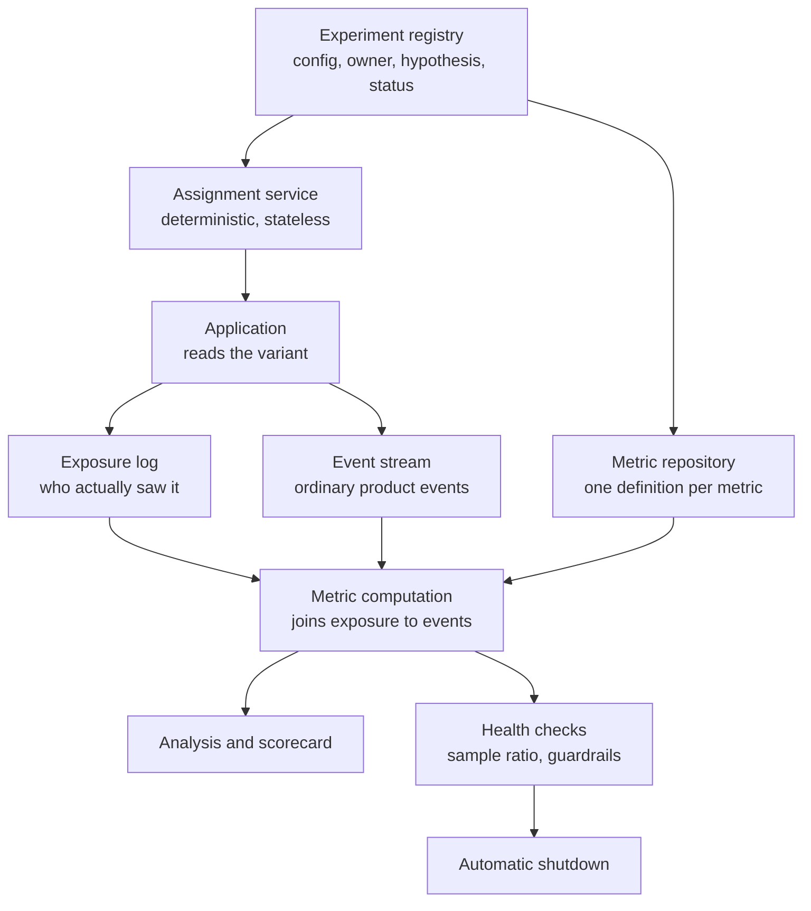
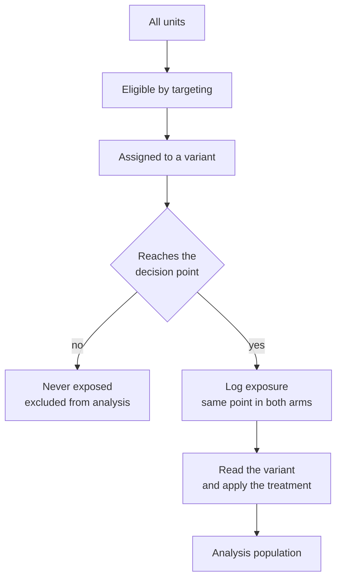
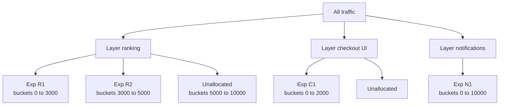
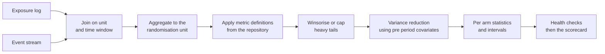
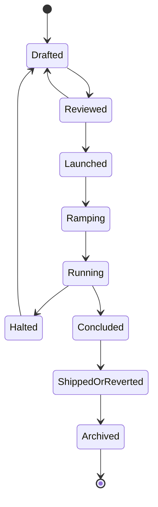

# Chapter 34: Online Experimentation Platforms

> **What this chapter covers** The infrastructure that runs controlled experiments at scale: deterministic assignment by hashing, why assignment is not exposure and what that costs you, randomisation units and interference, layered and mutually exclusive designs, the metric repository, the metric computation pipeline, practical variance reduction, sample ratio mismatch as the diagnostic that catches broken experiments, guardrails and automatic shutdown, sequential analysis at the platform level, segment analysis, the experiment lifecycle and its governance, feature flags against experiments, experimenting on machine learning models specifically, long-term holdouts, and the ways platforms fail.
> **Prerequisites** Chapter 5 (Evaluation, Validation, and Experimental Design), Chapter 19 (Streaming and Real-Time Pipelines), Chapter 25 (Model Lifecycle, Versioning, and Registries).
> **Where it is used** Anywhere a model change reaches users. Ranking, recommendation, pricing, risk decisioning, search, notifications, and every generative feature that has a user on the other end.

---

## 34.1 Level 1: Foundations

### What this chapter is and is not

Chapter 5 covers the statistics of experimentation: minimum detectable effect, sample size, the bootstrap, paired comparison, sequential testing, multiple comparisons, interference, switchback designs, and why offline and online metrics disagree. None of that is repeated here. Where a statistical result is needed it is stated in a sentence and you are pointed back.

This chapter covers the machine that runs experiments. The distinction matters because the statistics are mostly solved and mostly correct in textbooks, while the infrastructure is where real experiments actually go wrong. A correct t-test on data produced by a broken assignment system gives a confident wrong answer, and the platform is what stands between you and that.

### Why a platform, rather than an if-statement

The first experiment at any organisation is run by hand. Someone writes a condition on a user identifier, ships it, waits a week, and runs a query. It works. It stops working for reasons that arrive in roughly this order.

1. **A second experiment starts.** Now two conditions are in the code. If both split on the same modulo of the same identifier, the same users are in treatment for both, and the effects are confounded.
2. **Someone changes the split mid-flight.** Users move between arms. Every pre-change observation is now attributed to the wrong arm.
3. **The analysis query is written per experiment.** Two people compute "conversion rate" differently and get different answers for the same experiment.
4. **Nobody logged who was actually exposed.** The analysis includes users who never reached the changed code, which dilutes the effect toward zero and hides real wins.
5. **A result is disputed.** There is no record of what was configured when, so the dispute cannot be settled.
6. **The experiment shipped, and six months later nobody can say what it did.**

Each of those is a platform responsibility rather than a statistics problem. The platform exists to make the correct thing the default and the incorrect thing hard.

### What an experimentation platform must provide



*Figure 34.1: The seven components. The exposure log and the metric repository are the two that teams building their own platform most often omit, and they are the two that decide whether the results are trustworthy.*

| Component | Responsibility | Consequence of omitting it |
|---|---|---|
| Registry | The single record of what is running, its owner, hypothesis, arms, targeting, and dates | Nobody can say what was running when a metric moved |
| Assignment | Map a unit to a variant, deterministically and without storing state | Users flip arms, or arms correlate across experiments |
| Exposure logging | Record which units actually encountered the treatment | Diluted effects, and an entire class of bias |
| Metric repository | One definition per metric, versioned, reused across experiments | Two analyses of the same experiment disagree |
| Computation pipeline | Join exposures to events, aggregate per arm, compute the statistics | Ad hoc queries, unreproducible numbers |
| Health checks | Sample ratio mismatch, guardrail breach, instrumentation checks | Broken experiments are analysed as if they were fine |
| Scorecard and governance | Present the result, record the decision, archive the experiment | The organisation learns nothing across experiments |

### Vocabulary

- **Unit**: the entity being randomised. Usually a user, sometimes a session, request, device, or cluster.
- **Variant** or **arm**: one of the conditions, for example control and treatment.
- **Assignment**: the mapping from a unit to a variant.
- **Exposure** or **trigger**: the event recording that a unit actually encountered the code path the experiment changes.
- **Salt**: a per-experiment string mixed into the hash so different experiments assign independently.
- **Layer** or **domain**: a partition of traffic within which experiments are mutually exclusive.
- **Bucket**: one of a fixed number of slots, typically 1,000 or 10,000, that units hash into and that variants claim.
- **Sample ratio mismatch (SRM)**: an observed arm split that differs from the configured split by more than chance.
- **Driver metric**: the metric the experiment is meant to move.
- **Guardrail metric**: a metric that must not degrade, whatever happens to the driver.
- **Diagnostic metric**: a metric that explains a movement rather than justifying a decision.
- **Holdout**: a population deliberately kept out of a treatment, often for a long period, to measure cumulative effect.

### The mental model to carry

An experiment is a join. On one side, a table of units with their variant and the time they were exposed. On the other, a table of events. Everything the platform does is either producing one of those two tables correctly or joining them correctly.

Hold that model and the failures become predictable. A broken assignment corrupts the left table. Missing exposure logging deletes rows from the left table non-randomly. A redefined metric corrupts the right side. A join on the wrong time window mixes pre-exposure and post-exposure behaviour. Almost every incident in this chapter is one of those four.

---

## 34.2 Level 2: Working knowledge

### Assignment by hashing

The assignment function maps a unit identifier and an experiment to a variant. It must have five properties.

| Property | Statement | Why |
|---|---|---|
| Deterministic | The same unit and experiment always give the same variant | A user who flips arms contaminates both |
| Stateless | No lookup is required to compute it | It must run in the request path, in a batch job, and in a mobile client, all agreeing |
| Uniform | Units spread evenly over buckets | An uneven split biases the comparison from the start |
| Independent across experiments | Assignment in one experiment carries no information about another | Otherwise simultaneous experiments confound each other |
| Independent of the identifier's structure | Sequential, prefixed, or time-ordered identifiers must not cluster | Identifier structure otherwise leaks into the arms |

The standard construction: concatenate the unit identifier with a per-experiment salt, hash it, reduce the hash to a bucket index, and look up which variant owns that bucket.

**Listing 34.1: the assignment function, with bucket ranges rather than modulo of the variant count.**

```python
import hashlib

NUM_BUCKETS = 10_000

def bucket_of(unit_id: str, salt: str) -> int:
    """Stable across languages and processes: hex digest, not Python's hash()."""
    digest = hashlib.sha256(f"{salt}:{unit_id}".encode("utf-8")).digest()
    return int.from_bytes(digest[:8], "big") % NUM_BUCKETS

def assign(unit_id: str, experiment) -> str | None:
    if not experiment.is_eligible(unit_id):        # targeting, evaluated first
        return None
    b = bucket_of(unit_id, experiment.salt)
    if b >= experiment.traffic_buckets:            # not in the experiment at all
        return None
    for variant, (lo, hi) in experiment.bucket_ranges.items():
        if lo <= b < hi:                           # half-open, so no bucket is shared
            return variant
    return None
```

Four non-obvious choices. The hash is SHA-256 rather than the language's built-in hash, because built-in hashing is randomised per process in several languages and differs across languages, so a mobile client and a batch job would disagree. The salt is prefixed rather than appended, which avoids the collision where one experiment's salt plus identifier equals another's. Ten thousand buckets, rather than assigning the variant directly from the hash, lets you express a 3 percent ramp and later move specific bucket ranges between variants without rehashing anyone. And the ranges are half-open, because an off-by-one that shares a bucket between two variants produces a permanent tiny sample ratio mismatch that takes a week to find.

**Ramping.** To increase traffic from 5 percent to 20 percent, extend the treatment's bucket range upward. Units already in treatment stay in treatment, and only new buckets are added. Never reallocate buckets already assigned to a variant, because those units change arms and their pre-change behaviour is attributed to the wrong condition. If a ramp must shrink, the correct move is usually to stop the experiment and start a new one with a new salt, accepting the lost data, rather than to keep an analysis containing units that experienced both conditions.

**Testing the assignment function.** It is infrastructure that silently biases everything, so it gets the most thorough tests in the platform.

| Test | Assertion |
|---|---|
| Determinism | Same inputs give the same output across processes, languages and time |
| Uniformity | A chi-squared test over buckets on a million synthetic identifiers does not reject |
| Independence | The pairwise association between assignments under two different salts is not distinguishable from chance |
| Identifier structure | Sequential, UUID and hash-prefixed identifier sets all pass uniformity |
| Ramp stability | Extending a range reassigns no already-assigned unit |
| Boundary | Ranges are half-open, and the union of ranges equals the traffic allocation exactly |

### Exposure, and why it is not assignment

This is the most important idea in the chapter.

**Assignment** happens for every unit the experiment could apply to. **Exposure** happens only when a unit actually reaches the code the experiment changes. They are different populations and they differ by a lot.

Take an experiment on the checkout page. Every user of the site can be assigned. Perhaps 4 percent reach checkout. If you analyse all assigned users, 96 percent of your sample experienced nothing different, and they contribute pure noise to both arms. The measured effect is diluted by a factor of about 25, and the variance is not reduced correspondingly, so the experiment needs vastly more traffic to detect the same real effect. Many experiments that "showed no significant difference" were analysed on the assigned population and were never capable of showing one.

So analyse on the exposed population. But that introduces the trap that gives this section its name.

**The trap.** If you filter to exposed units, you must be certain that exposure itself is not affected by the treatment. If the treatment changes who reaches the code, then the exposed populations in the two arms are no longer comparable, and the randomisation that made the comparison valid has been thrown away.

A concrete case. Treatment adds a new recommendation module that appears only when the recommender returns at least three items. The module fires the exposure event. In control, the exposure event is fired at the same point by the same condition. Fine. Now someone changes the treatment so the recommender returns more items. More treatment users satisfy the condition, so more are exposed, and the extra ones are systematically different, typically users with sparse histories. The arms are no longer comparable and the comparison is biased.

**The rule that makes this safe: the exposure point must be identical in both arms and must be evaluated before the treatment can influence it.** In practice this means the counterfactual test: at the moment of logging exposure, would this unit have been exposed under either variant, given everything that happened before? If you cannot answer yes, the exposure point is in the wrong place.



*Figure 34.2: Exposure is logged before the variant is applied, at a point both arms reach identically. Reversing the last two boxes is the bug.*

**Listing 34.2: the correct ordering, and the two wrong ones.**

```python
# CORRECT: the decision point is variant-independent, exposure precedes the branch.
def render_checkout(user, ctx):
    if not ctx.cart.is_valid():            # same condition in both arms
        return render_error()
    variant = experiments.assign(user.id, "checkout_layout_v3")
    if variant is not None:
        experiments.log_exposure(user.id, "checkout_layout_v3", variant, ctx.now)
    return LAYOUTS[variant or "control"](user, ctx)

# WRONG 1: exposure logged at assignment, so 96 percent of the sample never
# saw anything. The effect is diluted and the experiment looks inconclusive.
def wrong_at_assignment(user):
    variant = experiments.assign(user.id, "checkout_layout_v3")
    experiments.log_exposure(user.id, "checkout_layout_v3", variant)   # too early
    return variant

# WRONG 2: exposure logged inside the treatment branch only, so the control
# arm has no exposed population at all and the comparison is impossible.
def wrong_inside_branch(user, ctx):
    variant = experiments.assign(user.id, "checkout_layout_v3")
    if variant == "treatment":
        experiments.log_exposure(user.id, "checkout_layout_v3", variant)  # only one arm
        return new_layout(user, ctx)
    return old_layout(user, ctx)
```

Wrong 2 is the more common of the two and is harder to spot in review, because the code reads naturally. It is caught by a platform-level check that both arms have exposures, which is one of the health checks in level 3.

**Exposure is a per-unit event with a time.** Record the unit, the experiment, the variant, the timestamp, and the context needed for later segmentation. The timestamp is what makes the join correct: only events after a unit's first exposure belong in the analysis, and pre-exposure behaviour belongs in the covariate used for variance reduction.

**Triggered analysis** is the name for restricting to the exposed population. Its benefit is real and large. Its correctness depends entirely on the placement rule above.

### Randomisation units

| Unit | Use when | Trade-off |
|---|---|---|
| User or account | The default. Any effect that persists across sessions | Requires a stable identifier, which logged-out traffic lacks |
| Device or cookie | Logged-out traffic, or the treatment is device-specific | One person on three devices counts three times and can see both arms |
| Session | The effect is entirely within a session and does not carry over | Carryover biases toward zero. Rarely correct, often chosen for convenience |
| Request | Infrastructure changes with no user-visible state, for example a latency optimisation | Inconsistent experience if the change is visible. Never for anything a user can notice |
| Cluster, for example workspace, household, or geography | Units interact | Far fewer effective units, so much less power |
| Time interval, switchback | Marketplace or shared-resource interference | Effective sample size is the number of intervals, see chapter 5 |

Three rules. Randomise at the coarsest level at which interference still occurs, since coarser units cost power and finer units cost validity. Keep the unit consistent for the lifetime of an experiment. And record the unit type in the registry, because the analysis must aggregate to the unit of randomisation, and an analysis at the event level when randomisation was at the user level understates the variance and produces false positives.

**The interference problem** is covered statistically in chapter 5. The platform's job is to make the right unit easy to choose and to refuse configurations that are known to be wrong, for example a session-level unit on an experiment whose metric is a 28-day retention rate.

### The metric repository

Metrics must be defined once, centrally, and reused. The alternative, each experiment defining its own, guarantees that two experiments are not comparable and that two analysts disagree about the same experiment.

A metric definition contains the source events, the aggregation, the unit level it is defined at, the window, the filters, an owner, and a version. Changing a definition creates a new version rather than editing the old one, because every historical result computed with the old definition must remain interpretable.

**The three roles**, which is the distinction that makes a scorecard readable:

| Role | Purpose | Count | Decision rule |
|---|---|---|---|
| Driver | The metric the hypothesis is about | One, occasionally two | Must move in the hypothesised direction with adequate evidence |
| Guardrail | Must not degrade, whatever the driver does | A fixed organisation-wide set, typically 5 to 15 | A breach blocks the ship regardless of the driver |
| Diagnostic | Explains why the driver moved | As many as useful | Never the basis of a decision, only of an explanation |

Guardrails are the same for every experiment and are chosen once: latency at the tail, error rate, crash rate, a core engagement metric, a revenue metric, an unsubscribe or complaint rate, and a support contact rate. Specifying them per experiment defeats the purpose, since the harms you must guard against are exactly the ones this experiment's author did not think of.

Diagnostics deserve their own category because it stops a common argument. A scorecard with forty metrics where any of them can be used to justify shipping is a multiple-comparison machine, and chapter 5 explains why. Declaring in advance that thirty-seven of them are diagnostic removes the temptation without removing the information.

### The experiment configuration

**Listing 34.3: an experiment configuration, which is the registry record.**

```yaml
# Illustrative shape; exact keys are platform-specific, check your version.
key: checkout_layout_v3
owner: payments-team
hypothesis: >
  Moving the payment selector above the fold reduces abandonment at the
  payment step by at least 1.5 percent relative.
unit: user
layer: checkout            # mutually exclusive with other checkout experiments
salt: checkout_layout_v3_2024_11   # never reused, never edited after launch
targeting:
  countries: ["US", "CA"]
  platforms: ["web"]
  new_users_only: false
traffic_buckets: 2000      # 20 percent of the 10000 buckets are in the experiment
variants:
  control:   {buckets: [0, 1000]}
  treatment: {buckets: [1000, 2000]}
metrics:
  driver: payment_step_completion_rate
  guardrails: [p99_latency_ms, error_rate, revenue_per_user, support_contacts]
  diagnostics: [selector_click_rate, scroll_depth, retry_rate]
analysis:
  population: exposed      # triggered analysis
  method: fixed_horizon    # or always_valid
  planned_days: 14
  minimum_detectable_effect: 0.015
```

Three points. The salt embeds a date so it is never accidentally reused, and reusing a salt means a later experiment inherits the previous one's arm membership, which is a silent and severe bug. The hypothesis is a required free-text field with a number in it, which forces the author to state the minimum detectable effect before seeing data. And the planned duration is recorded so the analysis has a pre-registered stopping point, which is what makes the fixed-horizon statistics valid.

---

## 34.3 Level 3: Depth

### Layers, namespaces, and running many experiments at once

An organisation running one experiment at a time learns slowly. An organisation running two hundred at once must answer a question: can experiment A and experiment B both apply to the same user?

Usually yes. Two experiments with independent salts assign independently, so each is a randomised comparison within the other's population, and the effects average out. This is **overlapping** experimentation and it is the default. It is what lets a platform run hundreds of concurrent experiments on the same traffic.

Sometimes no. Two experiments that change the same surface can interact: both move a button, and a user in both treatments sees something neither team designed. Or their effects are not additive, and each experiment's estimate is polluted by the other's treatment in a way that is not merely noise.

**Layers** are the mechanism. A layer is a partition of traffic with its own independent hash. Within a layer, experiments are mutually exclusive: a unit is in at most one. Across layers, experiments overlap freely.



*Figure 34.3: Layers partition traffic independently. A user can be in R1, C1 and N1 at once, but never in both R1 and R2.*

The design rules:

- Each layer has its own hashing seed, so membership in one layer is independent of membership in another.
- A layer's total allocation cannot exceed 100 percent, which makes layer capacity a real, contended resource that must be scheduled.
- Put experiments in the same layer when they change the same surface, contend for the same slot or screen area, or are believed to interact. Otherwise use separate layers.
- Number of layers is a design choice that trades capacity for safety. Too few layers and everything is mutually exclusive, so throughput collapses. Too many and interactions go undetected.

**Capacity arithmetic.** A layer running four experiments at 20 percent each is at 80 percent of capacity, leaving 20 percent for the next one. This is where experiment scheduling becomes an organisational function, and it is why the registry must show layer utilisation. Teams that cannot see it plan launches that cannot fit.

The layered design was described publicly by Tang, Agarwal, O'Brien, and Meyer in "Overlapping Experiment Infrastructure: More, Better, Faster Experimentation" (2010), and the general architecture has been reproduced widely since.

**Detecting interactions.** Even with layers, interactions happen. The practical detection is to compute, for pairs of concurrently running experiments, the treatment effect of A within B's treatment and within B's control, and flag large differences. Doing this for every pair is a large multiple-comparison problem, so treat the output as a screen that produces investigations rather than as a set of findings. Most flagged pairs are noise, and the screen earns its cost by catching the occasional real interaction on a shared surface.

### Sample ratio mismatch

SRM is the single most useful diagnostic in an experimentation platform. It is cheap, it is sensitive, and a mismatch nearly always indicates a bug that has also broken the comparison.

**The test.** With $k$ arms, observed counts $O_i$ and expected proportions $p_i$ summing to one, and $N = \sum_i O_i$, the expected count is $E_i = N p_i$ and the statistic is

$$\chi^2 = \sum_{i=1}^{k} \frac{(O_i - E_i)^2}{E_i}$$

compared to a chi-squared distribution with $k-1$ degrees of freedom.

**Worked example.** A 50/50 experiment with 1,000,000 exposed units observes 498,200 and 501,800. Then $E_i = 500{,}000$ and

$$\chi^2 = \frac{1800^2}{500000} + \frac{1800^2}{500000} = 6.48 + 6.48 = 12.96$$

With one degree of freedom this gives $p \approx 0.00032$. A split of 49.82 to 50.18 looks like nothing and is overwhelming evidence of a defect. This is the point people find hardest to accept: at large $N$ the test detects deviations far too small to notice by eye, and those deviations are still real.

Use a strict threshold, commonly $p < 0.001$, to keep false alarms manageable across many experiments. Run the check on the exposed population, on the assigned population, daily and cumulatively, and per major segment, because an SRM confined to one platform or one country immediately localises the bug.

**What each cause looks like**, which is the table to reach for when the alarm fires:

| Cause | Mechanism | Signature |
|---|---|---|
| Exposure logged in one arm only | The log call sits inside the treatment branch | Extreme ratio, often near 100 to 0, appears from the first hour |
| Treatment crashes or times out | Treated units fail before logging their events | Deficit in treatment, correlated with an error or crash metric rising |
| Slower treatment loses users | The new path is slower, so more users abandon before the exposure event fires | Small deficit in treatment, worsens on slow networks and low-end devices, correlates with latency |
| Bot and fraud filtering | A downstream filter removes traffic differentially, because bots respond differently to the change | Appears only after filtering, absent in raw logs |
| A redirect or client cache | Treatment is cached differently, so repeat visits are counted differently | Ratio drifts over days rather than starting wrong |
| Bucket boundary error | Overlapping or gapped ranges | Tiny, perfectly stable deviation matching the allocation error exactly |
| Salt reuse | A previous experiment's membership is inherited | Ratio is fine, but the arms differ on pre-period metrics, which is the companion check |
| Late-arriving data | One arm's events land in a later partition | SRM present in the daily cut, absent when recomputed later |
| Assignment on a rotating identifier | Cookie churn differs by arm | Deficit grows with experiment duration |
| Targeting evaluated after assignment | The eligibility filter depends on treatment-affected state | SRM plus a shift in the pre-period covariate distribution |

**The response protocol.** An SRM invalidates the experiment until explained. Do not analyse the results and do not report them, because the mechanism that unbalanced the arms has usually also unbalanced the outcome. Investigate in this order, since it finds the cause fastest.

1. Is the SRM in assignment, in exposure, or only after the analysis filters? Each isolates a different third of the system.
2. Does it appear in every segment, or in one platform, country, or app version?
3. Did it appear at launch or grow over time? Growth implies churn or caching, immediate presence implies a code or configuration bug.
4. Does the pre-period covariate distribution differ between arms? If so, the assignment itself is suspect.
5. Is the deficit correlated with errors, crashes, or latency? If so, the treatment is failing rather than the platform.

**The pre-period check** is SRM's underused companion. Compute the driver metric over a window before exposure, per arm. Randomisation guarantees it should not differ. If it does, either assignment is biased or your analysis window is wrong. This is called an A/A property check and it is far more sensitive to certain bugs than the count ratio is.

**A/A tests.** Run experiments with two identical arms, continuously, as a platform health check. Over many A/A tests the distribution of p-values on the driver metrics should be approximately uniform and the false positive rate should match the nominal level. It rarely does at first. The usual discoveries are variance underestimated because the analysis unit is finer than the randomisation unit, heavy-tailed metrics where the normal approximation is poor without capping, and a systematic SRM nobody had looked for. A platform that has never run a sustained A/A programme does not know its own error rate.

### The metric computation pipeline

The pipeline joins the exposure table to the event stream, aggregates to the randomisation unit, and computes per-arm statistics.



*Figure 34.4: The computation path. Aggregating to the randomisation unit before computing statistics is the step that, when skipped, produces confidently wrong intervals.*

**Why aggregation to the randomisation unit is not optional.** If you randomise users but compute a per-request metric by pooling requests, the requests from one user are correlated, the effective sample size is the number of users rather than requests, and the standard error is understated, often by a large factor. The correct treatment is to aggregate to the user and then compare user-level values. Where the metric is intrinsically a ratio of two event-level sums, the delta method gives the correct variance for a ratio of means; chapter 5 covers the statistics and Deng, Knoblich, and Lu (2018) is the standard reference for ratio metrics in this setting.

**Why most platforms compute daily.** Three reasons, and it is worth knowing them because the request for real-time results arrives constantly.

1. **Correctness.** Event data arrives late. Mobile clients batch and upload on reconnection, sometimes hours or days later. A result computed at the end of a day and recomputed a day afterwards will differ, and the later one is right.
2. **Cost.** The join is over the full event stream for every running experiment. Doing it once per day over a partition is efficient. Doing it continuously over a stream multiplies cost by orders of magnitude for information nobody should act on.
3. **Behaviour.** Real-time results invite peeking, and peeking at a fixed-horizon test inflates the false positive rate badly, as chapter 5 explains. Daily computation is a mild structural defence against a statistical error.

The practical compromise most platforms reach: near-real-time computation of guardrails and health checks only, at a coarse granularity, on the first few hours of an experiment, so a harmful launch can be stopped quickly. Full scorecards daily. If the organisation genuinely needs to look continuously, adopt always-valid inference rather than looking at fixed-horizon p-values more often.

**Late data and recomputation.** Recompute a rolling window of recent days on every run rather than computing each day once, and version the scorecard so a changed number has a visible history. A result that silently changes destroys trust faster than a result that was slow.

**Capping and winsorising.** Revenue-like metrics are heavy-tailed, and a single user can move an arm's mean. Cap at a high percentile, for example the 99.9th computed on pooled pre-period data, and state that the metric is capped in its definition. Compute the cap from pooled data across arms so it is not itself treatment-dependent. Report both capped and uncapped where the decision is close, because a result that only exists uncapped is a result driven by a handful of users.

### Variance reduction in practice

Chapter 5 derives CUPED and gives the variance formula. The platform questions are different: what covariate, computed when, and stored where.

| Approach | What it uses | Practical notes |
|---|---|---|
| Pre-period covariate, CUPED | The same metric measured for the same unit before exposure | The default. Needs a pre-period feature table keyed by unit, computed once and reused across experiments |
| Stratification | Post-stratify on a pre-exposure categorical, for example country or platform | Simple, and it also makes segment analysis cheap. Strata must be pre-exposure |
| Covariate adjustment with a model | Predict the outcome from pre-period features and use the residual | More reduction when many covariates are predictive. Fit the model on pre-period data only |
| Triggered analysis | Restrict to the exposed population | Often the largest single win, and free once exposure logging is correct |

Two platform requirements make this practical. First, a **pre-period feature table**: for every unit, the values of the main metrics over a trailing window, refreshed daily and snapshotted at experiment start. Without it, every experiment recomputes covariates and most skip the step. Second, the covariate must be measured strictly before the unit's exposure, which the platform can and should enforce mechanically, because a covariate contaminated by the treatment biases the estimate rather than merely failing to help.

The size of the win: with a pre-period correlation of $\rho = 0.6$, variance falls by $1 - \rho^2 = 0.64$, so 36 percent of the original variance remains and the required sample size falls by the same factor. For a long-running platform that is the difference between two-week and five-day experiments, which changes how the organisation works.

### Guardrails and automatic shutdown

A guardrail is not useful unless something happens when it breaks. The design has four parameters: what is monitored, how often, what threshold, and what action.

| Tier | Monitored | Cadence | Action |
|---|---|---|---|
| Availability | Error rate, crash rate, timeout rate | Minutes | Automatic shutdown, no human in the loop |
| Performance | Latency at the tail, payload size | Minutes to hourly | Automatic ramp-down, page the owner |
| Business | Revenue, core engagement, complaints | Daily | Alert the owner and the review group, manual decision |
| Long-term | Retention, unsubscribe | Weekly | Reviewed at the decision meeting, never automatic |

Automatic shutdown must be conservative in one direction and aggressive in the other. Aggressive on unambiguous harm: a treatment producing a tenfold error rate should be stopped in minutes by a rule, not by a person reading a dashboard. Conservative on ambiguous harm: a business metric down 2 percent on day one is usually noise, novelty, or a weekday effect, and an automatic shutdown on it will fire constantly and be disabled within a month.

Build the shutdown so it is reversible and logged. Record which rule fired, on what data, at what time, and require a written note before restarting. The most common failure is an automatic shutdown nobody can explain afterwards, which leads to the mechanism being switched off.

### Sequential analysis at the platform level

The statistics are in chapter 5: group sequential designs with spending boundaries, and always-valid inference through confidence sequences, as in Johari, Koomen, Pekelis, and Walsh (2017). The platform decisions are these.

**Choose one regime per experiment at registration and record it.** Fixed horizon with a pre-registered duration, group sequential with a fixed small number of looks, or always valid. Mixing them after the fact is the error the platform exists to prevent.

**Make the interface match the regime.** If an experiment is registered as fixed horizon, the platform should not display a p-value before the planned end date. Show the health checks, show the guardrails, and hide the driver metric. This is a user interface decision that improves statistical practice more than any amount of training does.

**Price the cost of always-valid inference honestly.** It requires more data at any fixed horizon, in the region of 25 to 60 percent more depending on the method and the effect size, in exchange for the right to stop whenever you like. For an organisation that genuinely stops early often, that is a good trade. For one that always runs two weeks regardless, it is a pure loss. Decide by looking at how the organisation actually behaves rather than how it says it will.

### Segment analysis and heterogeneous effects

The average effect can hide that the treatment helps one group and harms another. Finding that is valuable. Finding it by searching until something is significant is not, and chapter 5 covers the multiple-comparison correction.

The platform discipline in three rules:

1. **A fixed segment set, declared once.** Platform, country, device class, tenure bucket, activity level. Reported on every experiment with a correction applied across the set. Because the set is fixed and the same for every experiment, the correction is honest.
2. **Ad hoc segments are exploratory and labelled as such.** They generate hypotheses for the next experiment. They do not justify a decision about this one.
3. **Model-based heterogeneity is a discovery tool.** Causal forests from Wager and Athey (2018), and the meta-learner family described by Künzel, Sekhon, Bickel, and Yu (2019), estimate conditional treatment effects and can find structure a fixed segment list misses. Their output is a hypothesis about a subgroup, confirmed by a targeted experiment on that subgroup. Chapter 14 covers the estimators.

### Feature flags and experiments

They share machinery and are not the same thing. Conflating them causes a specific, common mess.

| | Feature flag | Experiment |
|---|---|---|
| Purpose | Control who gets a code path | Measure the effect of a code path |
| Assignment | Often rule-based, for example internal users, a tenant, a region | Randomised |
| Duration | Can be permanent | Bounded, with a decision at the end |
| Analysis | None required | Required |
| Change mid-flight | Normal and expected | Invalidates the experiment |

The mess: a flag is created for a gradual rollout, someone later analyses the flagged and unflagged populations as if they were arms, and reports an effect. But the rollout was not randomised. It went to one region first, or to volunteers, or to low-risk tenants. The comparison is confounded and the number is wrong. Guard against it by making the platform mark a population as randomised or not, and by refusing to produce a scorecard for a non-randomised flag.

The correct relationship is that the same assignment infrastructure serves both, the registry records which mode a key is in, and a key can be converted from an experiment to a permanent flag when the experiment concludes, with the conversion recorded.

### Experimenting on machine learning models

Model changes are the most common experiments in many organisations and they have three properties that ordinary feature experiments do not.

**The treatment is not static.** A model that continues to learn, or that is retrained during the experiment, means the treatment changes mid-flight. The measured effect is an average over a changing treatment, which is not what anyone thinks they are measuring. Freeze the candidate model for the duration, or if continuous learning is the point, state explicitly that the estimand is the effect of the learning system rather than of a model.

**The arms contaminate each other through shared state.** A recommender with a shared popularity feature, a shared cache, a shared bandit state, or a shared training set is updated by both arms. Treatment traffic then influences control's behaviour, which biases the comparison toward zero. Detect it by asking what state the model reads that either arm can write. Mitigate by partitioning the state per arm where feasible, by excluding experiment traffic from the training set during the experiment, or by accepting the bias and stating its direction.

**The training data is affected.** If the treatment model's outputs enter the next training set, the effect compounds over time in a way a two-week experiment cannot see. This is the feedback loop chapter 27 covers from a monitoring angle, and it is the main reason long-term holdouts exist.

**Model comparison as an experiment.** The candidate and the incumbent are the two arms. The metric is a product metric, not a model metric, since a model that improves area under the curve and lowers revenue is worse. Guardrails must include latency, because a better and slower model can be a net loss and no offline evaluation will ever say so.

**Interaction with the deployment machinery.** Chapter 25 covers canary and shadow deployment. The distinction matters here. A canary is a safety mechanism assigning a small traffic share to reduce blast radius, usually not randomised at the user level, and not an experiment. A shadow deployment sends copies of traffic to a candidate without returning its output, which measures system behaviour and offline-style agreement but cannot measure user response at all. Neither substitutes for a randomised experiment, and treating a canary's metrics as an experimental result is a recurring error.

**Long-term holdouts.** Keep a small population, typically 1 to 5 percent, out of a family of shipped changes for months. It measures the cumulative effect of everything shipped in that area, which is usually smaller than the sum of the individually measured effects. That gap is worth knowing, because it is the only empirical check on whether the experimentation programme is producing real value or accumulating noise and novelty. The costs are real: the holdout population receives a worse product, the platform must exclude those units from every experiment in the family, and the accounting of who is in which holdout becomes a system of its own. Set an end date and a review at registration.

---

## 34.4 Level 4: Mastery

### How platforms fail

| Failure | Symptom | Root cause | Fix |
|---|---|---|---|
| Exposure logged at assignment | Everything is inconclusive, effects look tiny | Convenience, or not knowing the distinction | Move the log to the decision point, enforce in review and with a lint |
| Exposure in one arm only | Extreme sample ratio mismatch | The log sits inside the treatment branch | Platform check that both arms have exposures, from the first hour |
| Salt reused | Arms differ before exposure | Copying a configuration | Make the salt immutable and unique, and check on registration |
| Analysis at the wrong unit | False positives, A/A tests fail | Pooling events when randomising users | Enforce aggregation to the randomisation unit in the pipeline |
| Metrics defined per experiment | Two analyses disagree | No repository | Central definitions with versions, referenced by key |
| Peeking | Shipped changes do not replicate | Real-time dashboards with p-values on them | Hide the driver metric before the planned date, or adopt always-valid inference |
| No A/A programme | Unknown false positive rate | Nobody owns platform correctness | Run A/A continuously and publish the p-value distribution |
| Interaction between experiments | A result does not reproduce when the other experiment ends | No layer discipline | Layers for shared surfaces, plus a pairwise interaction screen |
| Late data ignored | Numbers change after the decision | Computing each day once | Recompute a rolling window, version the scorecard |
| Heavy tails uncapped | A revenue result driven by six users | No capping policy | Cap at a high percentile from pooled pre-period data, report both |
| No decision record | The same idea is retried yearly | No archive | Require a written decision to close an experiment, and make the archive searchable |
| Flags analysed as experiments | Confident, confounded results | Shared machinery without a mode distinction | Mark randomised populations, refuse scorecards for the rest |

### The lifecycle and its governance



*Figure 34.5: The lifecycle. The two states worth enforcing are Reviewed, which is where the hypothesis and the minimum detectable effect are fixed, and Archived, which is where the organisation's memory lives or does not.*

The review before launch is short and asks six questions: what is the hypothesis and the expected effect size; is the sample adequate to detect it; is the randomisation unit right for the interference present; where exactly is exposure logged; are the guardrails the standard set; and what decision will be made under each outcome. That last question is the one that most improves quality, because it forces the author to say in advance what result would cause them to not ship.

The archive is the underrated half. An experiment that ran, produced a null result, and was archived with its scorecard and a written decision is worth almost as much as a win, because it stops the same idea being retried every eighteen months by a new team. Make the archive searchable by surface and by metric.

### What senior engineers argue about

**Triggered analysis against analysing everyone assigned.** Triggered analysis is far more powerful and is correct when the exposure point is variant-independent. Sceptics point out that establishing variant independence is harder than teams believe, and that a subtle violation produces a confident biased answer, which is worse than an underpowered honest one. The workable position is to default to triggered, require the exposure point to be reviewed, and check the pre-period balance of the exposed population in both arms as the verification.

**Always-valid inference by default.** It removes the peeking problem structurally and costs power. The opposing view is that the peeking problem is a governance problem and should be solved by hiding the numbers rather than by paying 25 to 60 percent more traffic on every experiment. Both work. Choosing requires knowing how often the organisation actually stops early.

**Bandits instead of experiments.** Multi-armed bandits allocate traffic toward the better arm as evidence accumulates, which reduces regret. They are a good fit for many short-lived arms where the goal is to exploit rather than to learn a precise number, for example headline or creative selection. They are a poor fit when you need an unbiased effect estimate, when the metric is delayed, or when the decision must be defensible later, because the adaptive allocation makes the inference substantially harder. The honest statement is that they solve a different problem than an experiment does.

**How much automation in shipping.** Some platforms ship automatically when the driver improves and no guardrail breaks. Others always require a human. Automatic shipping is faster and removes a bottleneck. It also ships every result that was significant by chance, and it cannot weigh anything that is not a metric. The common compromise is automatic shipping for low-risk surfaces with a fixed guardrail set, and human review elsewhere.

### Where the standard advice is wrong

**"Run the experiment for two weeks."** Duration should come from the sample size needed for the minimum detectable effect, plus enough calendar time to cover weekly seasonality and to let novelty decay. For a high-traffic surface that can be three days plus a full week for seasonality. For a low-traffic one it can be two months, and if the arithmetic says two months the honest response is often not to run it.

**"A statistically significant result means ship."** Significance is about the evidence, not the value. A 0.2 percent improvement that is significant on ten million users may not be worth the maintenance cost of the code, and the guardrails may show a cost not reflected in the driver. The decision is a judgment that the evidence informs.

**"Sample ratio mismatch of a fraction of a percent is fine."** The arithmetic in level 3 shows it is not. At large $N$, a deviation invisible to the eye is decisive evidence of a defect, and the defect usually affects the outcome too.

**"More metrics on the scorecard is better."** Every extra metric that can justify a decision is an extra chance to find a false positive. Categorise ruthlessly into driver, guardrail and diagnostic, and let only the first two carry decision weight.

**"The platform guarantees validity."** It guarantees the mechanics. It cannot detect that the randomisation unit was wrong for the interference present, that the metric does not measure the thing the hypothesis is about, or that the exposure point is variant-dependent in a subtle way. Those remain judgments.

### Frontier

**Interference-aware designs at platform scale.** Cluster randomisation and switchback designs, covered statistically in chapter 5, are hard to support generically because the analysis unit changes and every downstream piece of the pipeline assumes a user. Platforms that support them well are still uncommon, and the engineering is the barrier rather than the statistics.

**Machine-learning-based variance reduction.** Using a model over many pre-period features to predict the outcome, then analysing the residual, generalises CUPED. The estimand is unchanged and the reduction can be larger. The care required is that the predictor must use only pre-exposure information and should be fitted with cross-fitting to avoid overfitting bias; the double machine learning framework of Chernozhukov and colleagues (2018) is the relevant theory.

**Experimenting on generative systems.** Output is free text, so the driver metric is often an unreliable proxy such as a thumbs-up rate with a very low response rate, or a model-judged quality score whose judge drifts. Costs vary per request, so a treatment can win on quality and lose on unit economics. Latency distributions are wide and streaming changes what latency even means. And a change to the underlying model provider can occur mid-experiment without any deployment on your side. Chapter 35 covers the operational side; the experimentation implication is that the experiment configuration must pin the model version and the platform must treat a provider change as an experiment-invalidating event.

**Measuring the experimentation programme itself.** The meta-question of whether the programme creates value is answerable only with long-term holdouts and with an offline-to-online correlation record, and few organisations do either. The published discussions of these numbers, for example in Kohavi, Tang, and Xu (2020), consistently report that the fraction of ideas that win is low and that individually measured wins do not sum to the holdout-measured total.

### Judgment that distinguishes a staff engineer

- Asks where exposure is logged before looking at any result, every time.
- Treats an SRM as invalidating and refuses to discuss the effect estimate until it is explained.
- Knows the randomisation unit and can say what interference it is protecting against.
- Recognises the shared-state contamination in a model experiment before it runs, not after the result fails to replicate.
- Argues for the minimum detectable effect at design time and is willing to say the experiment should not run.
- Distinguishes a canary from an experiment and a flag rollout from a randomised comparison, in public, repeatedly.
- Invests in the boring infrastructure, the pre-period feature table, the A/A programme, the metric repository, because those are what make every future experiment cheaper and more trustworthy.

---

## 34.5 Subtopic checklist

| Subtopic | You should be able to |
|---|---|
| Platform components | Name the seven components and the consequence of omitting each |
| Assignment function | Write one, and state its five required properties |
| Hashing and bucketing | Explain why buckets rather than direct variant assignment, and how a ramp works safely |
| Salt and namespace | Explain what a reused salt does and how to prevent it |
| Assignment against exposure | State the difference, the dilution cost, and the placement rule |
| Exposure bugs | Identify logging at assignment and logging in one arm from a code sample |
| Randomisation units | Choose a unit for a given interference structure and justify the power cost |
| Layers | Design a layer scheme, compute capacity, and say which experiments must be mutually exclusive |
| Interaction detection | Describe the pairwise screen and why its output is investigations rather than findings |
| Metric repository | Define a metric record, and classify metrics as driver, guardrail or diagnostic |
| Computation pipeline | Explain aggregation to the randomisation unit and why late data forces recomputation |
| Daily cadence | Give the three reasons most platforms compute daily |
| Variance reduction | Specify the pre-period feature table and enforce pre-exposure covariates |
| Sample ratio mismatch | Compute the chi-squared statistic and run the five-step investigation |
| A/A testing | Explain what a sustained A/A programme reveals about a platform |
| Guardrails | Design tiers with cadence and action, and set automatic shutdown conservatively |
| Sequential regimes | Choose a regime at registration and make the interface enforce it |
| Segment analysis | Separate a fixed corrected segment set from exploratory findings |
| Lifecycle | Run the six-question pre-launch review and require a decision record |
| Flags against experiments | State the difference and the confounded-rollout failure |
| Model experiments | Handle a changing treatment, shared state, and latency as a guardrail |
| Canary and shadow | Explain why neither is an experiment |
| Long-term holdouts | Justify one, size it, and state its operational cost |

---

## 34.6 Common misconceptions

| Misconception | Why it is believed | What is actually true |
|---|---|---|
| Assignment and exposure are the same thing | Both are recorded near the same code and sound similar | Assignment covers everyone eligible, exposure only those who reached the changed path. Analysing assigned users dilutes real effects, sometimes by more than an order of magnitude, and logging exposure inside the treatment branch destroys the comparison entirely |
| A small sample ratio deviation is harmless | 49.8 to 50.2 looks like rounding | At a million units that is $\chi^2 = 12.96$, $p \approx 0.0003$. Nearly every such deviation is a defect that has also biased the outcome |
| Randomisation makes the result valid on its own | Randomisation is the source of causal validity | Only if assignment is stable, exposure is variant-independent, the analysis is at the randomisation unit, and no interference exists. Each is an engineering property that can fail |
| Real-time results are better | Faster feedback is generally good | Late-arriving data makes early numbers wrong, real-time computation is expensive, and continuous looking at a fixed-horizon test inflates the false positive rate severely |
| Experiments can be analysed at the event level | More rows means more power | Randomising users and pooling events understates variance because events from a user are correlated. Aggregate to the randomisation unit or use the delta method for ratios |
| A feature flag rollout can be analysed as an experiment | The mechanics look identical | A rollout is rarely randomised. Comparing flagged and unflagged populations from a staged rollout is confounded by whatever determined the order |
| Two experiments on the same traffic contaminate each other | Overlap sounds like interference | With independent salts they assign independently and each is valid within the other. Only experiments that change the same surface or interact need to be mutually exclusive, which is what layers are for |
| A canary rollout measures the effect of a change | It sends a slice of traffic to the new version | A canary limits blast radius and is usually not randomised at the user level. A shadow deployment returns no output to users at all. Neither measures user response |
| Variance reduction changes what you are measuring | Adjusting the metric sounds like changing it | Adjusting with a strictly pre-exposure covariate leaves the estimand unchanged and only reduces variance. The requirement is that the covariate cannot have been affected by the treatment |
| The platform guarantees a valid experiment | The platform is built by specialists and enforces a lot | It enforces mechanics. The randomisation unit, the exposure placement, the choice of metric and the presence of interference remain judgments it cannot check |

---

## 34.7 Practice

**Exercise 1 (level 2): build and test an assignment function.**
Implement bucketed assignment with salts. Test uniformity with a chi-squared test over 10,000 buckets on one million synthetic identifiers, independence across two salts, stability of assignment when the treatment range is extended from 10 to 30 percent, and behaviour on sequential, UUID and hash-prefixed identifier sets.
*Acceptance criterion:* all four tests pass, and a written explanation of why the language's built-in hash function is unsuitable.

**Exercise 2 (level 2 to 3): demonstrate the dilution from analysing assigned users.**
Simulate 200,000 users where 5 percent reach the changed surface and the true effect on those users is 4 percent relative. Analyse on the assigned population and on the exposed population.
*Acceptance criterion:* a table of the estimated effect and the confidence interval under both analyses, plus the sample size each would need for 80 percent power, with the ratio of the two stated.

**Exercise 3 (level 3): the SRM diagnostic notebook.**
Simulate five SRM causes from the level 3 table: exposure in one arm, a crashing treatment, a bucket boundary error, late data in one arm, and cookie churn growing over time. For each, produce the daily cumulative ratio, the chi-squared p-value by day, and the per-segment breakdown.
*Acceptance criterion:* a one-page diagnostic guide mapping each observed signature to its cause, derived from your own simulations rather than copied from the table.

**Exercise 4 (level 3): a layer scheduler.**
Given twenty experiment requests with surfaces, traffic requirements and durations, produce an allocation across layers that respects mutual exclusion on shared surfaces and never exceeds 100 percent in a layer.
*Acceptance criterion:* a schedule, the resulting layer utilisation over time, and a statement of which requests could not be accommodated and why.

**Exercise 5 (level 4): an A/A programme.**
Using any public event dataset with a unit identifier, run 500 simulated A/A tests on three metrics: a bounded rate, a count, and a heavy-tailed revenue-like metric. Plot the p-value distributions. Then repeat with event-level rather than unit-level aggregation and with the heavy-tailed metric capped.
*Acceptance criterion:* six p-value histograms, the observed false positive rate at $\alpha = 0.05$ for each, and a written explanation of which configurations deviate from uniform and why.

---

## 34.8 How this is tested

**Question 1.** Explain the difference between assignment and exposure, and why it is the most common source of biased experiment results.

<details><summary>Answer</summary>
Assignment maps every eligible unit to a variant. Exposure records that a unit actually reached the code path the experiment changes. They differ because most eligible units never reach the changed surface. Two failures follow. Analysing all assigned users includes a large population that experienced nothing different, which dilutes the estimated effect toward zero without a matching reduction in variance, so real wins are missed. Logging exposure only inside the treatment branch leaves the control arm with no exposed population, which makes the comparison impossible and shows up as an extreme sample ratio mismatch. The correct design logs exposure at a decision point that both arms reach identically, before the variant is applied, and that point must not be influenced by the treatment.
</details>

**Question 2.** When is it unsafe to restrict analysis to the exposed population?

<details><summary>Answer</summary>
When exposure itself is affected by the treatment. If the treatment changes who reaches the exposure point, the exposed populations in the two arms are no longer comparable, and the randomisation that justified the comparison has been discarded. The test to apply is counterfactual: at the moment exposure is logged, would this unit have been exposed under either variant given everything that happened before? If the answer is not clearly yes, move the exposure point earlier to a variant-independent condition. The empirical check is to compare pre-exposure metrics of the exposed populations in both arms; if they differ, the exposure point is contaminated.
</details>

**Question 3.** Why hash into 10,000 buckets rather than assigning a variant directly from the hash?

<details><summary>Answer</summary>
Buckets decouple the hash from the allocation. They let you express fine-grained allocations such as a 3 percent ramp, extend a variant's share by adding bucket ranges without changing anyone's existing assignment, hold traffic in reserve, and move specific ranges between variants deliberately. Assigning directly from a modulo of the variant count means any change to the allocation or to the number of variants reshuffles everyone, so units flip arms mid-experiment and their earlier behaviour is attributed to the wrong condition. Buckets also make the allocation auditable, since the configuration states exact ranges that a test can check for gaps and overlaps.
</details>

**Question 4.** Your 50/50 experiment shows 498,200 against 501,800 exposures. Is that a problem, and what do you do?

<details><summary>Answer</summary>
Yes. The chi-squared statistic is $2 \times 1800^2 / 500{,}000 = 12.96$ on one degree of freedom, giving $p \approx 0.0003$. That is decisive evidence of a defect even though the split looks like rounding. Treat the experiment as invalid until explained and do not report the effect. Investigate in order: is the mismatch present in assignment, in exposure, or only after the analysis filters; is it confined to one platform, country or app version; did it appear at launch or grow over time; do the arms differ on pre-period metrics; and is the deficit correlated with errors, crashes or latency. Immediate presence points at configuration or code, growth points at churn or caching, and correlation with errors points at the treatment failing rather than the platform.
</details>

**Question 5.** List five distinct causes of sample ratio mismatch and the signature of each.

<details><summary>Answer</summary>
Exposure logged inside the treatment branch, which shows an extreme ratio from the first hour. A treatment that crashes or times out, showing a deficit in treatment correlated with a rising error metric. A slower treatment losing users before the exposure event, showing a small deficit that worsens on slow networks and low-end devices. A bucket boundary error, showing a tiny, perfectly stable deviation matching the allocation error exactly. Late-arriving data in one arm, showing an SRM in the daily cut that disappears on recomputation. Others include bot filtering that removes traffic differentially, cookie churn that grows with duration, and salt reuse, which does not show as a count mismatch but shows as differing pre-period metrics.
</details>

**Question 6.** Why do most experimentation platforms compute results daily rather than in real time?

<details><summary>Answer</summary>
Correctness first: event data arrives late, particularly from mobile clients that batch and upload on reconnection, so an early number is often wrong and the later recomputation is right. Cost second: the join between exposures and the full event stream, repeated for every running experiment, is efficient once per daily partition and very expensive continuously. Behaviour third: continuous numbers invite peeking, and peeking at a fixed-horizon test inflates the false positive rate badly. The usual compromise is near-real-time computation of guardrails and health checks only, so a harmful launch can be stopped quickly, with full scorecards daily and a rolling recomputation window for late data.
</details>

**Question 7.** How do layers let hundreds of experiments run at once, and when must two experiments be in the same layer?

<details><summary>Answer</summary>
A layer is a partition of traffic with its own independent hash. Within a layer experiments are mutually exclusive, so a unit is in at most one. Across layers they overlap freely, and because independent salts make assignments independent, each experiment remains a valid randomised comparison within the noise created by the others. Put two experiments in the same layer when they change the same surface, contend for the same screen area or slot, or are believed to interact, because then a user in both sees something neither team designed and the effects are not separable. A layer's allocations must total at most 100 percent, so layer capacity is a contended resource that has to be scheduled and made visible in the registry.
</details>

**Question 8.** Distinguish driver, guardrail and diagnostic metrics, and explain why the distinction is a statistical safeguard.

<details><summary>Answer</summary>
The driver is the metric the hypothesis is about, declared before launch, usually one. Guardrails are a fixed organisation-wide set that must not degrade regardless of the driver, and a breach blocks shipping. Diagnostics explain why a movement happened and never justify a decision. The safeguard is about multiple comparisons: if any of forty metrics on a scorecard can justify shipping, some will be significant by chance in every experiment and the effective false positive rate is far above the nominal one. Declaring most of them diagnostic in advance keeps the information available while removing it from the decision. Guardrails are fixed organisation-wide precisely because the harms you need to catch are the ones this experiment's author did not think of.
</details>

**Question 9.** What breaks if you randomise by user but compute the metric by pooling all events?

<details><summary>Answer</summary>
The variance is understated, often severely, because events from the same user are correlated and the effective sample size is the number of users rather than the number of events. The point estimate can be acceptable while the confidence interval is far too narrow, so the experiment produces false positives at a rate well above the nominal one. The fix is to aggregate to the randomisation unit first and compare unit-level values. For a metric that is intrinsically a ratio of two event-level sums, use the delta method for the variance of a ratio of means. A sustained A/A programme detects this failure immediately, because the p-value distribution stops being uniform.
</details>

**Question 10.** What is an A/A test programme and what does it reveal?

<details><summary>Answer</summary>
Running experiments with two identical arms continuously as a platform health check. Across many such tests the p-value distribution for each metric should be approximately uniform and the false positive rate should match the nominal level. When it does not, the usual causes are variance understated because the analysis unit is finer than the randomisation unit, heavy-tailed metrics where the normal approximation is poor without capping, a systematic sample ratio mismatch nobody had checked, or a metric definition whose window overlaps the assignment time. It is the only direct measurement of a platform's own error rate, and a platform that has never run one does not know whether its results mean what they claim.
</details>

**Question 11.** A recommender experiment shows no effect. The candidate and incumbent share a popularity feature computed from all traffic. What happened?

<details><summary>Answer</summary>
The arms contaminated each other through shared state. The treatment model's behaviour changed what users interacted with, that fed the shared popularity feature, and the control model then read a feature influenced by the treatment. Control moves toward treatment, which biases the measured difference toward zero, so a real effect can appear as none. The check is to enumerate what state each arm reads that either arm can write: popularity and trending features, caches, bandit state, and the training set. Mitigations are to partition the state per arm, to exclude experiment traffic from the shared computation during the experiment, or to accept the bias and state its direction, which is always toward understating the effect.
</details>

**Question 12.** Why is a canary rollout not an experiment, and why is a shadow deployment not one either?

<details><summary>Answer</summary>
A canary sends a small share of traffic to a new version to limit blast radius. It is usually not randomised at the user level, often selected by region, instance, or availability zone, and it has no declared metric, duration or gate. Comparing its metrics to the rest of traffic is confounded by whatever determined the selection. A shadow deployment sends copies of traffic to a candidate and discards the output, so users never experience the candidate, which means it can measure system behaviour, latency, error rate and agreement with the incumbent, but cannot measure user response at all. Both are useful safety mechanisms, chapter 25 covers them, and neither substitutes for a randomised experiment with an exposure log.
</details>

**Question 13.** What is a long-term holdout, what does it measure, and what does it cost?

<details><summary>Answer</summary>
A small population, typically 1 to 5 percent, deliberately kept out of a whole family of shipped changes for months. It measures the cumulative effect of everything shipped in that area, which is usually smaller than the sum of the individually measured effects, because of novelty decay, overlapping mechanisms, and winner's curse in the individual estimates. That gap is the only empirical check on whether the experimentation programme is creating the value it claims. The costs are that the holdout population receives a worse product, every experiment in the family must exclude those units, the bookkeeping of holdout membership becomes a system of its own, and long-running holdouts drift as their population churns. Register one with an end date and a scheduled review.
</details>

**Question 14.** You are asked to build experimentation for an organisation that has none. What do you build first, and what do you deliberately leave until later?

<details><summary>Answer</summary>
First: a deterministic stateless assignment function with salts and buckets, with its uniformity and independence tests; an exposure log with the placement rule enforced in code review; a registry holding the hypothesis, owner, unit, allocation, dates and metrics; a small metric repository with one driver and a fixed guardrail set; a daily computation pipeline that aggregates to the randomisation unit; and sample ratio mismatch plus a both-arms-have-exposures check on every experiment. That is a correct platform. Leave until later: layers, which are unnecessary below roughly a dozen concurrent experiments; variance reduction, which needs a pre-period feature table and only matters once experiments are traffic-bound; sequential inference; automatic shutdown beyond a simple error-rate rule; and heterogeneous effect estimation. Building those first is the common mistake, because they are more interesting than exposure logging and worth far less.
</details>

---

## Summary

1. Chapter 5 owns the statistics of experimentation. This chapter owns the machine, because a correct test on data from a broken assignment system gives a confident wrong answer.
2. A platform is seven components: registry, assignment, exposure logging, metric repository, computation pipeline, health checks, and governance. The exposure log and the metric repository are the two most often omitted and the two that decide trustworthiness.
3. An experiment is a join between a table of exposed units and a table of events. Nearly every failure is a corruption of one of those tables or of the join.
4. Assignment must be deterministic, stateless, uniform, independent across experiments, and insensitive to identifier structure. Hash the salt and identifier with a stable cryptographic hash, reduce to one of many buckets, and let variants own bucket ranges.
5. Ramp by extending bucket ranges, never by reallocating buckets already assigned, because a unit that changes arms contaminates both.
6. Assignment is not exposure. Analysing all assigned units dilutes the effect, sometimes by more than an order of magnitude. Logging exposure inside the treatment branch destroys the comparison entirely.
7. Exposure must be logged at a point both arms reach identically, before the variant is applied, and that point must not be influenced by the treatment. Verify it by comparing pre-exposure metrics across arms.
8. Randomise at the coarsest unit where interference still occurs. Coarser costs power, finer costs validity, and the analysis must aggregate to whatever unit was randomised.
9. Layers partition traffic with independent hashes, making experiments mutually exclusive within a layer and freely overlapping across layers. Layer capacity is a contended resource that must be scheduled and visible.
10. Sample ratio mismatch is the cheapest and most sensitive diagnostic in the platform. At a million units a 49.8 to 50.2 split gives $p \approx 0.0003$, and an SRM invalidates the experiment until explained.
11. Each SRM cause has a signature in timing, segmentation and correlation with errors, which is what makes the five-step investigation fast.
12. Most platforms compute daily for three reasons: late-arriving data, the cost of the join, and the structural defence against peeking. Recompute a rolling window and version the scorecard.
13. Metrics are defined once, centrally and versioned, and classified as driver, guardrail or diagnostic. The classification is a multiple-comparison safeguard, not bookkeeping.
14. Variance reduction needs a pre-period feature table and strictly pre-exposure covariates. With a correlation of 0.6 the required sample size falls by about a third, which changes how fast an organisation can work.
15. Model experiments add three problems: a treatment that changes if the model retrains, arms contaminating each other through shared state such as popularity features and caches, and training data affected by the experiment, which is why long-term holdouts exist.

---

## Further reading

- Kohavi, Tang, and Xu, "Trustworthy Online Controlled Experiments: A Practical Guide to A/B Testing", 2020. The standard reference for both the practice and the platform.
- Tang, Agarwal, O'Brien, and Meyer, "Overlapping Experiment Infrastructure: More, Better, Faster Experimentation", 2010. The public description of layered overlapping experiments.
- Kohavi, Deng, Frasca, Walker, Xu, and Pohlmann, "Online Controlled Experiments at Large Scale", 2013. Platform architecture and operational practice.
- Fabijan, Dmitriev, McFarland, Vermeer, Holmström Olsson, and Bosch, work on diagnosing sample ratio mismatch, circa 2019. The taxonomy of causes and the investigation method.
- Deng, Xu, Kohavi, and Walker, "Improving the Sensitivity of Online Controlled Experiments by Utilizing Pre-Experiment Data", 2013. The CUPED method.
- Deng, Knoblich, and Lu, "Applying the Delta Method in Metric Analytics", 2018. Correct variance for ratio metrics under clustered randomisation.
- Johari, Koomen, Pekelis, and Walsh, "Peeking at A/B Tests: Why It Matters, and What to Do About It", 2017. Always-valid inference at platform scale.
- Wager and Athey, "Estimation and Inference of Heterogeneous Treatment Effects using Random Forests", 2018, and Künzel, Sekhon, Bickel, and Yu, "Metalearners for estimating heterogeneous treatment effects using machine learning", 2019. Segment discovery done properly.
- Chernozhukov and colleagues, "Double/Debiased Machine Learning for Treatment and Structural Parameters", 2018. The theory behind model-based covariate adjustment with cross-fitting.
- Bakshy, Eckles, and Bernstein, "Designing and Deploying Online Field Experiments", 2014. A public account of an experimentation platform's design decisions.
- Xu, Chen, Fernandez, Sinno, and Bhasin, "From Infrastructure to Culture: A/B Testing Challenges in Large Scale Social Networks", 2015. The organisational half of the problem.
