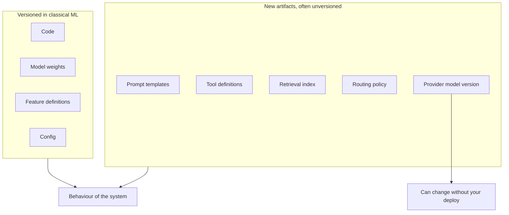
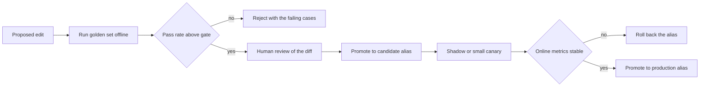
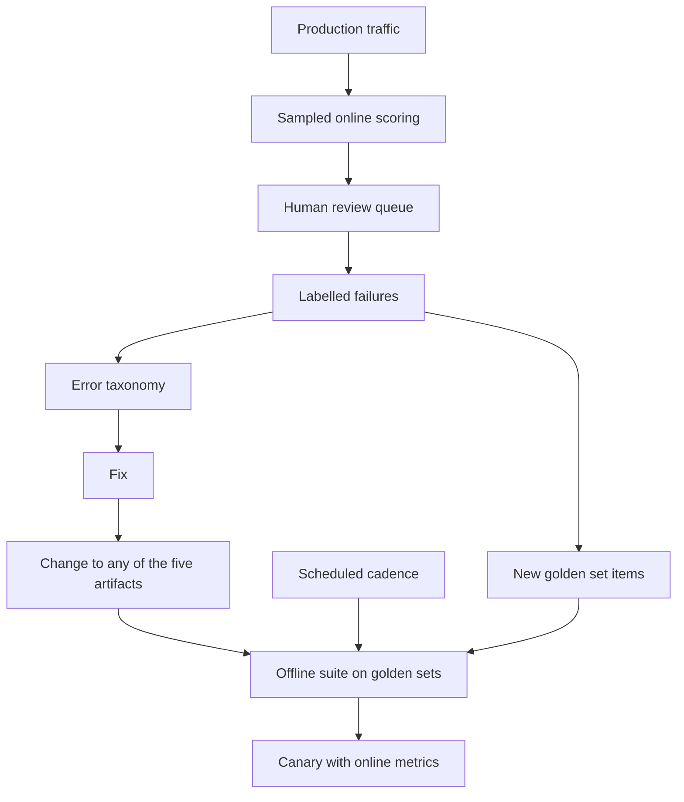
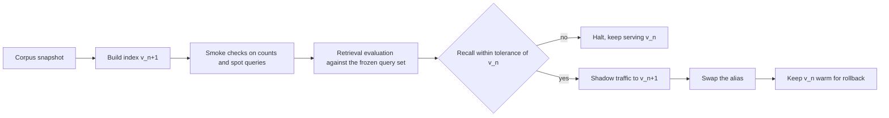

# Chapter 35: LLMOps, Operating Generative AI Systems

> **What this chapter covers** What changes and what stays the same when the model is a large language model you did not train, the five artifacts that must be versioned and have no classical analogue, prompt management as code, the provider dependency problem of silent updates and deprecation, evaluation run as a continuous operation rather than a release gate, the cost surface and its attribution, latency engineering under streaming, trace schemas that make failure analysis possible, the production feedback loop and how it breaks, guardrail operations, retrieval index operations, agent operations, incident types specific to these systems, and the maturity progression from prototype to operated service.
>
> **Prerequisites** Chapter 15 (Large Language Models in Practice) and Chapter 16 (Building Generative AI Applications) for how these systems are built, Chapter 27 (Monitoring, Drift, and Retraining) for monitoring in general, Chapter 25 (Model Lifecycle, Versioning, and Registries) for the registry model.
>
> **Where it is used** Any product with a language model in the request path: assistants, support automation, document processing, code generation, search and question answering, and internal agents. It bites hardest at the point where a demo that worked becomes a service with a pager.

Chapters 15 and 16 build these systems. This chapter operates them. The distinction matters because the skills barely overlap. Building is about retrieval quality, prompt design, tool contracts and agent control flow. Operating is about what happens on the two hundredth day, when the prompt has been edited by four people, the provider has retired the model you evaluated, the index was rebuilt on a Tuesday by someone who has since changed teams, and a customer reports that the assistant has been confidently wrong about refund policy for three weeks.

The central claim of this chapter is narrow and worth stating up front. Operating a generative system is mostly classical operations plus five new versioned artifacts and one new dependency. The five artifacts are prompts, tool definitions, retrieval indexes, routing policies, and provider model versions. The one dependency is a model you do not own, running on infrastructure you do not control, which can change underneath you without a deploy on your side. Almost every operational surprise traces back to one of those six things.

---

## 35.1 Level 1: Foundations

### 35.1.1 What is actually different

Start with what is not different, because the list is longer than people expect and the exceptions are what deserve attention.

Deployment is the same. You build an image, you promote it through environments, you canary it, you roll it back. Chapter 25 and Chapter 26 apply unchanged. Service level objectives are the same in form: availability, latency, error rate, with a quality objective added, exactly as Chapter 28 describes for any model. Infrastructure monitoring is the same. Incident management, on-call, and postmortems are the same in structure.

Here is what is different.

| Property | Classical supervised system | Generative system |
|---|---|---|
| The model | You trained it, you hold the weights, it is frozen until you replace it | Often someone else's, hosted, versioned by them, replaceable by them |
| The unit of change | Retrain the model, redeploy the service | Edit a text file, change a tool description, rebuild an index, flip a route |
| Cost per request | Roughly constant, dominated by fixed compute | Varies by an order of magnitude with input and output length |
| Output space | A label, a score, a ranked list | Open-ended text, possibly with side effects through tools |
| Correctness | Compare to a ground truth label | Often no single correct answer, graded against a rubric |
| Latency shape | One number, total time | Two numbers, time to first token and total time, with streaming in between |
| Failure mode | Wrong prediction, measurable against labels | Plausible wrong prose, unmeasurable without a grader |
| Attack surface | Feature manipulation, data poisoning | The above plus instruction injection through any text the model reads |

Three consequences follow, and they organise the rest of the chapter.

First, **the change surface is wide and cheap**, which sounds good and is dangerous. Anyone can edit a prompt. A prompt edit can degrade quality as much as a bad model, ships in seconds, and leaves no trace in a model registry. So the versioning discipline that classical machine learning applies to weights and data must be extended to text artifacts.

Second, **quality is not observable without machinery**. A supervised system that starts predicting badly eventually shows it in the label stream. A generative system that starts producing subtly wrong answers looks, in every metric you already have, completely healthy. Requests succeed, latency is flat, error rate is zero. Quality measurement has to be built deliberately, and it has to run continuously rather than at release time.

Third, **you have a supply chain dependency on a model provider**, which is a category of risk that has no classical analogue. The provider can change the model behind a stable name, deprecate it, change its rate limits, change its safety filtering, or have an outage. Your evaluation results have a shelf life.

### 35.1.2 The vocabulary

Define these once and use them consistently, because the terms are used loosely in practice and the looseness causes real confusion.

| Term | Definition |
|---|---|
| Prompt | The full text sent to the model, including system instructions, examples, retrieved context, and user input |
| Prompt template | The parameterised text with slots, which is the artifact you version |
| Prompt version | An immutable identifier for one exact template plus its parameters such as temperature |
| Model version | The provider's identifier for a specific set of weights, which may or may not be pinned by the name you call |
| Tool definition | The name, description, and parameter schema exposed to the model, which is part of the prompt in effect |
| Index version | An immutable identifier for one built state of a retrieval index, including the corpus snapshot, chunking, and embedding model |
| Routing policy | The rules that decide which model or path handles a request |
| Trace | The full record of one request, including every model call, retrieval, tool call, and guardrail decision |
| Judge | A model used to score outputs against a rubric |
| Golden set | A frozen, reviewed set of inputs with expected properties, used as a regression gate |
| Time to first token, TTFT | Latency from request to the first output token reaching the user |

### 35.1.3 The five artifacts with no classical analogue

This is the most important idea in the chapter, so it arrives early and is developed at level 2 and level 3.

In a classical system, the set of things whose change can alter behaviour is small and well guarded: code, model weights, features, and configuration. Every one of them already lives in a versioned store with a review process.

In a generative system, five more artifacts alter behaviour, and none of them naturally lands in a registry.


*Figure 35.1: The five artifacts on the right determine behaviour as strongly as weights do, and the last one can change without any action on your side.*

Take each in one sentence, with the failure it causes when unversioned.

| Artifact | Why it changes behaviour | Failure when unversioned |
|---|---|---|
| Prompt template | It is the program the model executes | A quality regression with no change record to bisect |
| Tool definition | The description is how the model decides when to call the tool | A one-word edit changes tool selection rates across all traffic |
| Retrieval index | It determines what facts are available | Answers change with no code change and no way to reproduce yesterday's answer |
| Routing policy | It decides which model sees the request | A cost saving that silently moves hard traffic to a weak model |
| Provider model version | It is the weights | Behaviour drifts with no local change at all |

An operated system can name the exact version of all five for any request it served last month. A prototype cannot name any of them. Most of the operational maturity of a generative system is the distance between those two states.

### 35.1.4 The minimum you need on day one

Before any of the sophistication in this chapter, four things must exist. If a system in production lacks them, build them before anything else.

1. **Tracing on every request**, capturing the prompt version, model version, index version, retrieved document identifiers, tool calls, token counts and cost. Chapter 16, level 4 gives the span schema. Without traces you are blind, and every later technique in this chapter reads from traces.
2. **A golden set**, meaning fifty to two hundred real inputs with reviewed expected properties, which runs on every change. Small and real beats large and synthetic.
3. **A cost and token meter**, per request, attributable to a feature and a tenant.
4. **A kill switch**, meaning the ability to disable a feature, pin to a previous prompt version, or fall back to a non-generative path, without a deploy.

These four are cheap and they are the difference between an incident that takes twenty minutes and one that takes a week.

---

## 35.2 Level 2: Working knowledge

### 35.2.1 Prompt management

The argument to settle first: is a prompt code or configuration? The practical answer is that it is code, and the reason is behavioural rather than philosophical. Configuration is data that selects between behaviours the code already implements and was tested against. A prompt defines the behaviour. Changing it can change every output. A change with that blast radius belongs in review.

That does not mean a prompt must live in a source file, and the distinction is worth drawing carefully because teams argue past each other here.

| Storage | How it ships | Suits | Cost |
|---|---|---|---|
| In source code, as a string or template file | Full deploy | Small teams, engineer-authored prompts, strong coupling to parsing code | Non-engineers cannot contribute, and every wording fix needs a release |
| In a repository, loaded at runtime from a build artifact | Deploy, but decoupled from code paths | Most teams | Still requires a release to change |
| In a prompt registry with versions and aliases | Alias flip, no deploy | Larger teams, rapid iteration, non-engineer authors | Requires discipline to keep review, and introduces a runtime dependency |

The registry option is the same pattern as the model registry in Chapter 25, applied to text. Immutable versions, named aliases such as `production` and `candidate`, promotion as an audited event, instant rollback by re-pointing the alias. If you adopt it, keep two rules or it becomes worse than files: every version is immutable and every promotion requires the same review as a code merge, and the application caches the prompt with a bounded refresh so a registry outage does not take down the product.

Whatever the storage, the following are non-negotiable.

**Version identity is immutable and logged.** Every response's trace carries the prompt version that produced it. This single field is what makes a quality regression bisectable.

**Templating is explicit and escaped.** Use a real template engine with named variables rather than string concatenation. Untrusted user content interpolated into a prompt is the mechanism of prompt injection, and clear delimiting of untrusted regions is the first, weak, defence. Chapter 16, level 3 covers injection defence properly.

**Parameters travel with the text.** Temperature, top-p, max tokens, stop sequences and the model name are part of the behaviour. A prompt version that does not pin them is not a version.

**Listing 35.1: a prompt artifact with everything that must be pinned.**

```yaml
# prompts/support_answer/v14.yaml
id: support_answer
version: 14
created: 2026-03-02
author: platform-team
model:
  provider: example-provider
  name: example-model-2
  pinned_version: example-model-2-2026-01-15   # never call an unpinned alias
params:
  temperature: 0.2
  top_p: 1.0
  max_output_tokens: 700
  stop: ["</answer>"]
template: |
  You answer questions about billing using only the context provided.
  If the context does not contain the answer, say you do not know.

  <context>
  {{ retrieved_passages }}
  </context>

  <user_question>
  {{ user_question }}
  </user_question>
evaluation:
  golden_set: billing_v3
  required_pass_rate: 0.92
  last_run: 2026-03-02
```

The `pinned_version` field is the one that earns its place. Many providers expose both a moving alias and a dated snapshot identifier. Calling the moving alias means the weights under your system can change without any deploy on your side. Pin the snapshot in production, and treat moving to a new snapshot as an explicit, evaluated change. The exact naming of snapshot identifiers differs by provider and changes over time, so check your provider's current model list rather than assuming a format.

**The prompt change workflow** that works in practice has five steps and takes minutes, not days.


*Figure 35.2: The prompt change workflow, which is the model promotion workflow from Chapter 25 applied to text.*

The common mistake is skipping the offline gate because prompt edits feel small. They are not small. A sentence removed from a system prompt because it "seemed redundant" is a behavioural change across every request.

### 35.2.2 Tool definitions as a versioned artifact

Tool definitions are underappreciated as a behavioural surface. The model sees the tool name, the description, and the parameter schema, and decides from that text whether and how to call it. That text is prompt content. Editing it changes tool selection rates.

Treat tool definitions with the same discipline as prompts.

| Practice | Reason |
|---|---|
| Version the definition, not just the implementation | Behaviour changes when the description changes even if the code does not |
| Log the tool definition version in the trace | Otherwise a shift in call rates has no attributable cause |
| Gate description edits on a tool-selection evaluation | Measure the rate of correct tool choice on a labelled set before and after |
| Separate the schema from the description in review | A schema change is a contract change and may break callers, a description change is a behaviour change |

The evaluation for a tool description change is specific and cheap to build: a set of inputs labelled with the tool that should be called, or with "no tool". Measure selection precision and recall per tool. A description edit that improves recall for one tool usually reduces it for a neighbouring one, and that trade is invisible without the labelled set.

### 35.2.3 Retrieval index versions

An index is built from a corpus snapshot, a chunking strategy, an embedding model, and index parameters. Change any of them and retrieval changes, which changes answers. Yet indexes are routinely rebuilt in place by a scheduled job with no version identity at all.

The minimum record for an index build:

| Field | Why |
|---|---|
| Index version identifier | The thing you log in the trace |
| Corpus snapshot identifier or cut-off timestamp | Determines what facts exist |
| Document count and total chunks | The cheapest regression signal there is |
| Chunking configuration | Size, overlap, splitter version |
| Embedding model and its pinned version | A changed embedding model invalidates the whole vector space |
| Index parameters | For example the graph construction parameters of an approximate nearest neighbour index |
| Build start and end time, and builder identity | For incident reconstruction |

The rule that follows: **an index build is a deployment**. It gets a version, an evaluation, and a promotion. Section 35.3.7 covers the swap mechanics.

### 35.2.4 Routing policies

A routing policy decides which model, which prompt variant, or which pipeline handles a request. Typical rules: cheap model first with escalation on low confidence, a large model for long inputs, a specific model for a specific tenant, a fallback provider when the primary is failing.

Routing is a behavioural artifact because it determines which weights answer the question. It is also the artifact most often changed for cost reasons by someone who is not thinking about quality. The operational requirements:

- The policy is versioned and the version is in the trace, along with the branch actually taken.
- Quality metrics are reported per route, never only in aggregate. An aggregate that looks stable can hide a route that has become much worse while carrying less traffic.
- Any change to a threshold in the policy is evaluated like a model change.
- The policy has a deterministic escape hatch: a request attribute that forces a specific model, for debugging and for reproducing a reported failure.

### 35.2.5 The provider dependency problem

This is the risk with no classical analogue, and it deserves direct treatment.

You depend on a model you do not control. Four things can happen to it, and all four have happened across the industry to multiple providers.

| Event | What you see | What it costs |
|---|---|---|
| Silent update behind a moving alias | Behaviour changes with no deploy on your side | A quality regression with no local change to bisect, which is the worst kind to debug |
| Deprecation of a pinned version | An announced end-of-life date, then errors | A forced migration on someone else's schedule |
| Change to safety filtering or refusal behaviour | Refusal rate moves, often on a narrow slice | A user-visible regression that your quality metrics may not cover |
| Capacity, rate limit, or pricing change | Throttling, errors, or a cost step change | Latency incidents and budget overruns |

The defences, in order of how much they pay relative to their cost.

**Pin every model version in production.** This converts a silent update into an announced deprecation, which is a scheduled problem rather than a mystery. It is the single highest-value practice in this chapter and it costs nothing.

**Run the evaluation suite on a schedule, not only on change.** If you pin, this catches provider-side changes to filtering, rate limits, and anything else that pinning does not freeze. If you cannot pin, this is your only detection mechanism. Weekly is a reasonable default for a stable system, daily if the feature is critical.

**Keep an abstraction at the provider boundary.** A thin internal interface for model calls, with per-provider adapters. Do not over-invest here. The goal is that switching providers is a week of work rather than a quarter, not that it is free. Complete provider independence is not achievable, because prompts are tuned to a model family and a prompt that performs well on one model rarely transfers without re-tuning.

**Maintain a tested fallback.** At minimum, a second provider or a smaller model that is evaluated and can be routed to. Untested fallbacks fail when used. Exercise the fallback path deliberately, for example by routing a small percentage of traffic to it continuously, so that you know its quality and its cost before you need it.

**Track deprecation notices as a work item.** Provider deprecation announcements arrive by email and console notice, and they land on whoever set up the account. Put them into the team's tracker with the date, the affected surfaces, and an owner. The re-evaluation that a version migration forces is not small: it is the full offline suite, a side-by-side comparison on a sample of production traffic, a prompt re-tuning pass, and a canary.

**The re-evaluation protocol for a provider version change.** This is the piece teams improvise and should not.

1. Run the full offline suite against both the old pinned version and the new one, on the same items, and compare paired. Paired comparison on the same inputs is far more sensitive than comparing two independent averages. Chapter 5 covers the statistics.
2. Replay a stratified sample of recent production traces through both versions, and diff the outputs. Stratify by feature, tenant, and input length, because regressions are usually concentrated in a slice.
3. Have a human review every case where the judge scores the new version materially worse, and a random sample of the rest. Judges have blind spots, and a version change is exactly when a blind spot bites.
4. Re-measure cost and latency. Token counts for the same text can differ between model versions when the tokenizer changes, so cost per request is not portable across a version change.
5. Canary by percentage of traffic with the guardrail and quality metrics watched, then promote.

### 35.2.6 Mistakes everyone makes first

| Mistake | What goes wrong | The fix |
|---|---|---|
| Calling a moving model alias in production | Silent behaviour change, unbisectable regression | Pin the snapshot version |
| Prompts edited directly in a console | No history, no review, no rollback | Registry or repository with immutable versions |
| Evaluating only at release | Quality drifts invisibly between releases | Scheduled evaluation and continuous online sampling |
| Judge scores taken as truth | A miscalibrated judge produces confident nonsense | Calibrate against human labels and re-check periodically |
| Cost measured only at the invoice | No attribution, no ability to act | Per-request token accounting with feature and tenant tags |
| Index rebuilt in place | Cannot reproduce an answer or roll back a regression | Versioned builds with a dual-index swap |
| Logging full prompts and outputs with no policy | A privacy and retention liability grows quietly | Redaction, retention windows, and access controls from day one |
| Golden set built from synthetic examples | Passes everything, catches nothing | Build it from real production failures |
| Guardrails added without measuring false positives | Legitimate traffic blocked, users leave quietly | Measure block rate and sample blocked requests |

---

## 35.3 Level 3: Depth

### 35.3.1 Evaluation as a continuous operation

In classical machine learning, evaluation is mostly a release activity. You hold out data, you score the candidate, you gate the promotion. That model is inadequate here for two reasons. The model can change without a release, and the input distribution moves continuously because users are typing free text and learning what the product can do.

So evaluation becomes four running processes rather than one gate.


*Figure 35.3: Four processes, which are the change gate, the scheduled re-run, online sampled scoring, and human review feeding back into the gate.*

**Offline suites.** A golden set is a frozen collection of inputs with expected properties. "Expected properties" rather than "expected outputs", because for open-ended generation an exact expected string is usually wrong. The property is what you actually care about: contains the correct policy number, refuses when the context lacks the answer, does not name a competitor, calls the refund tool, stays under 200 words.

Structure the suites by what they defend:

| Suite | Contents | Gate |
|---|---|---|
| Capability | Representative real tasks | Aggregate score above a threshold |
| Regression | One item per past incident | Every item must pass, no exceptions |
| Safety | Known injection and abuse attempts | Block rate above a threshold |
| Format | Schema-constrained outputs | Parse rate at or very near 100 percent |
| Cost and latency | Representative inputs | Tokens and TTFT within budget |

The regression suite is the highest-value one and the one most often missing. Every production incident ends with an item added to it. This is the same discipline as the incident-derived regression test in Chapter 33, and it is the mechanism by which a system stops repeating its failures.

**Online sampled scoring.** Offline suites measure the distribution you froze. Online scoring measures the distribution you have. Sample production traffic, score it with a judge, and track the score over time as a metric with an alert.

Do not sample uniformly only. A uniform sample at one percent gives you an unbiased rate estimate and will almost never contain the interesting failure. Sample in two strata: a small uniform baseline for unbiased rates, and a much heavier sample of signal-bearing requests. Signals worth oversampling: guardrail triggered, tool call errored, unusually long agent loop, retrieval returned low scores, user gave negative feedback, user rephrased immediately, response cost in the top percentile, model stopped for length.

The immediate rephrase is the cheapest and most underrated implicit failure signal in a conversational product. When a user asks the same thing again in different words within thirty seconds, the first answer was usually bad.

**Model as judge, and its operations.** A judge is a model prompted with a rubric that scores an output. It is the only way to measure quality at volume, and it is a model in production, which means it needs everything a model in production needs.

The judge's own operational requirements:

| Requirement | Practice |
|---|---|
| Calibration | Score a human-labelled set, report agreement, and know the agreement number before trusting any judge metric |
| Version pinning | The judge's model version is pinned, because a judge that changes makes your entire quality time series discontinuous |
| Prompt versioning | The rubric is a prompt artifact with all the discipline of section 35.2.1 |
| Drift monitoring | Re-run the human-labelled calibration set on a schedule and alert if agreement drops |
| Bias awareness | Judges favour longer answers, answers in their own style, and the first option presented in a pairwise comparison |

Calibration in concrete terms. Take a set of $n$ items with human labels on a binary criterion such as "factually supported by the context". Let the judge score them. Report agreement with a confidence interval, and report the two error rates separately, because a judge that is 90 percent accurate overall but misses 60 percent of hallucinations is useless for the thing you bought it for.

Worked example. Human labels on $n = 200$ sampled responses: 40 are unsupported, 160 supported. The judge flags 44 as unsupported, of which 34 are truly unsupported.

$$\text{precision} = \frac{34}{44} = 0.773, \qquad \text{recall} = \frac{34}{40} = 0.850$$

The judge misses 6 of 40 hallucinations and falsely flags 10 of 160 good answers. Now the important step, which is turning the judge's flag rate into an estimate of the true rate. If the judge flags a fraction $f$ of production traffic, and the judge has true positive rate $r$ and false positive rate $s$, the true prevalence $p$ satisfies

$$f = p r + (1 - p)s$$

so

$$p = \frac{f - s}{r - s}$$

With $r = 0.850$, $s = 10/160 = 0.0625$, and an observed production flag rate of $f = 0.12$:

$$p = \frac{0.12 - 0.0625}{0.850 - 0.0625} = \frac{0.0575}{0.7875} = 0.073$$

The judge flags 12 percent, the corrected estimate of the true hallucination rate is about 7.3 percent. Reporting the raw 12 percent as the hallucination rate overstates the problem by more than half. The correction requires knowing $r$ and $s$, which requires the human-labelled calibration set, which is why the calibration set is not optional. Both $r$ and $s$ are themselves estimates with their own uncertainty, and when $r - s$ is small the correction is unstable, so report the corrected rate with an interval and treat a judge with weak separation as unusable rather than correctable.

Pairwise judging, where the judge compares two outputs and picks the better, is more reliable than absolute scoring for comparing two system versions, because relative judgments are easier than calibrated absolute ones. It has a strong position bias, so always run both orders and average, and count ties honestly rather than forcing a winner.

**Human review queues.** Humans are the ground truth and the scarce resource, so the queue design is an engineering problem. Route to humans: everything the judge is uncertain about, everything with user-reported dissatisfaction, a stratified random sample for calibration, and everything in a high-risk category regardless of signal. Give reviewers the full trace, not just the output, because "was this answer right" is unanswerable without knowing what context the model was given. Capture a structured category rather than free text, or the labels will not aggregate.

### 35.3.2 The cost surface

Cost in a generative system is variable per request over a wide range and is therefore an engineering property, not a finance concern. Chapter 28 covers unit economics generally. What is specific here is the token-level accounting.

**The accounting identity.** For one request with $n_{\text{in}}$ input tokens and $n_{\text{out}}$ output tokens, at prices $c_{\text{in}}$ and $c_{\text{out}}$ per token, with a cached-prefix fraction $\alpha$ of input tokens charged at a discounted rate $c_{\text{cache}}$:

$$C = n_{\text{in}}\left[(1-\alpha)c_{\text{in}} + \alpha c_{\text{cache}}\right] + n_{\text{out}} c_{\text{out}}$$

Two facts about real price schedules drive most cost engineering. Output tokens usually cost several times input tokens. Cached input tokens usually cost a fraction of uncached ones. Exact multiples vary by provider and change, so read the current price list rather than trusting a number in a book.

Worked example, with assumed prices for illustration only: $c_{\text{in}} = 3$ and $c_{\text{out}} = 15$ per million tokens, cached input at $c_{\text{cache}} = 0.3$. A retrieval-augmented request sends 4000 input tokens, of which 3000 are a static system prompt and few-shot block, and produces 500 output tokens.

Without caching:

$$C = 4000 \times 3\times10^{-6} + 500 \times 15\times10^{-6} = 0.012 + 0.0075 = 0.0195$$

That is 1.95 cents. With the static 3000 tokens cached, $\alpha = 0.75$:

$$C = 4000\left[0.25 \times 3 + 0.75 \times 0.3\right]\times 10^{-6} + 0.0075 = 4000 \times 0.975 \times 10^{-6} + 0.0075 = 0.0039 + 0.0075 = 0.0114$$

A 42 percent reduction from ordering the prompt static-first, with no quality change. At ten million requests a month that is the difference between 195,000 and 114,000 currency units. This is why prompt ordering is an operational concern and not a style preference.

**Attribution.** A single number for monthly spend is useless for action. The trace must carry enough tags to slice cost by feature, tenant, route, prompt version, and user cohort. The questions that attribution must answer:

| Question | Requires |
|---|---|
| Which feature costs the most per active user | Feature tag plus user identity |
| Which tenant is unprofitable | Tenant tag plus revenue join |
| Did the prompt change increase cost | Prompt version tag |
| What fraction of spend is retries and failed agent loops | Outcome tag on every model call |
| What is the cost of the 99th percentile request | Per-request cost recorded, not averaged |

That last one matters more than it looks. Generative cost distributions have long right tails, driven by long documents, long agent loops, and retries. The mean hides them. Track the cost distribution, and alert on the tail.

**Caching layers and their measured return.** There are three distinct caches and they are frequently confused.

| Cache | What it stores | Hit condition | Typical return |
|---|---|---|---|
| Exact response cache | Full response keyed by a hash of the exact request | Byte-identical request | High value on narrow, repetitive traffic, near zero on conversational traffic |
| Semantic cache | Response keyed by an embedding of the query with a similarity threshold | Similar query above threshold | Real savings, with a correctness risk that grows as the threshold loosens |
| Prompt prefix cache | Provider-side reuse of computation for a shared prefix | Identical leading tokens | Broadly applicable, low risk, often the best return per unit of effort |

The prefix cache is nearly free to exploit and carries no correctness risk, so do it first: order every prompt static content first, dynamic content last, and never put a timestamp or a request identifier at the top of a system prompt. That last mistake, a generated identifier or the current time placed in the first line, defeats prefix caching entirely and is common.

The semantic cache needs measurement before trust. Its failure is serving a stale or wrong answer to a query that was similar but not equivalent, and the two queries that break it are negations and entity substitutions. "Can I cancel my plan" and "Can I not cancel my plan" are close in embedding space and have opposite answers. Before enabling one, measure on real traffic: at threshold $\tau$, what is the hit rate, and among hits, what fraction would a human call an acceptable answer. Sweep $\tau$ and pick from the curve. Never cache across tenants or across users where the response depends on user-specific context, which is both a correctness bug and a data leak.

**Budget enforcement.** The enforcement point belongs at the gateway, not in each application, for the same reason rate limiting does. Chapter 28, level 3 covers budget enforcement as an architectural component. What is specific here is granularity: enforce per tenant, per feature, and per request. The per-request cap is the one that prevents a runaway agent loop from spending unbounded money, and it must be a hard stop in the loop rather than an alert.

### 35.3.3 Latency engineering

Chapter 16, level 4 covers the latency levers in the design of the system. Operating them adds three things.

**Measure TTFT and total time as separate objectives.** They have different users and different causes. TTFT is dominated by everything before the first token: guardrails, query rewriting, retrieval, reranking, and prefill. Total time adds decode, which scales with output length. A change that shortens the output improves total time and does nothing for TTFT. A change that removes a serial pre-model step improves TTFT and barely moves total time.

**Attribute the tail.** The p99 of a generative request is usually not "the model was slow". Decompose the trace and report per-stage percentiles. The recurring causes of a tail, in rough order of frequency: a long input that prefills slowly, a retry after a provider error, an agent loop that took extra iterations, a slow tool, a cold cache, and provider-side queueing under load.

Note the arithmetic trap that appears in design documents. The p95 of a sum of stages is not the sum of the stage p95s, because the slow stages rarely co-occur. Summing percentiles gives a pessimistic number that then drives an unnecessary optimisation. Measure end-to-end percentiles directly, and use the per-stage percentiles only to find where to look.

**Streaming changes what an error means.** Once you have streamed 300 tokens, you cannot retry transparently. The failure modes that appear only with streaming:

| Failure | Behaviour | Handling |
|---|---|---|
| Provider error mid-stream | Partial response already delivered | Append a clear failure message, do not silently truncate, log the partial as a distinct outcome |
| Output guardrail on a streamed response | The offending text may already be visible | Either buffer a window before emitting, or accept detection-after-display and design the client to retract |
| Client disconnect mid-stream | Generation continues and is billed | Propagate cancellation to the provider call, which is frequently not wired up and quietly wastes money |
| Timeout on total time | Long but healthy generations killed | Set the timeout on time between tokens rather than total time |

That last row is a specific, common bug. A fixed total timeout kills legitimate long generations. A stall timeout, meaning no token for $k$ seconds, catches the actual failure mode without punishing length.

### 35.3.4 Observability and the trace schema

The trace is the primary data asset of an operated generative system. Its schema should be designed from the questions it must answer, not from what is convenient to log.

The questions that a trace schema must make answerable in one query:

| Question | Fields required |
|---|---|
| Why did it say that | Retrieved document identifiers and their scores, the final assembled prompt or its hash, prompt version, model version |
| What changed on the day quality dropped | Prompt version, tool definition version, index version, routing policy version, model version, all time-series |
| Which slice is failing | Feature, tenant, locale, input length bucket, route taken |
| Where does the latency go | Per-span durations with a consistent span taxonomy |
| Where does the money go | Token counts in and out per call, cache hit flag, cost, outcome |
| Did retrieval fail or did generation fail | Retrieval scores and whether the answer-bearing document was in context |
| How often do we block legitimate traffic | Guardrail name, decision, score, threshold |

That sixth row deserves emphasis because it is the single most useful diagnostic split in a retrieval-augmented system. When an answer is wrong, there are two very different causes: the right context was not retrieved, or the right context was retrieved and the model ignored or misread it. The fixes are entirely different, one being a retrieval problem and the other a prompting or model problem. You can only split them if the trace records what was retrieved and what was actually placed in the context window after truncation and reranking. Log both the retrieved set and the in-context set, because the difference between them is where a quiet truncation bug lives.

**Listing 35.2: deriving the retrieval and generation failure split from traces.**

```python
def split_failures(traces, judged_wrong_ids, answer_doc_by_query):
    """Classify wrong answers into retrieval failures and generation failures.

    answer_doc_by_query maps a query id to the set of document ids that
    actually contain the answer, established by human annotation.
    """
    retrieval_fail, generation_fail, unknown = [], [], []
    for t in traces:
        if t["trace_id"] not in judged_wrong_ids:
            continue
        gold = answer_doc_by_query.get(t["query_id"])
        if gold is None:
            unknown.append(t["trace_id"])
            continue
        in_context = set(t["retrieval"]["ids_in_context"])
        if gold & in_context:
            generation_fail.append(t["trace_id"])
        else:
            retrieval_fail.append(t["trace_id"])
    return retrieval_fail, generation_fail, unknown
```

The function is trivial. The point is what it depends on: `ids_in_context` distinct from the retrieved set, a stable `query_id` to join annotations against, and a human-annotated map of which documents actually answer which query. Building that annotation map for two hundred real failures is a week of work and it converts an unbounded debugging problem into a ratio you can track weekly.

**Sampling strategy.** Full traces on every request get expensive fast, because the payloads are large. A workable tiering:

| Tier | Contents | Rate | Retention |
|---|---|---|---|
| Metrics | Counters, durations, token counts, cost, outcome | 100 percent | Long, for example 13 months |
| Skeleton trace | Span structure, identifiers, versions, scores, no payloads | 100 percent | Medium, for example 30 to 90 days |
| Full payload | Prompts, outputs, retrieved text | Sampled, plus 100 percent of errors, guardrail hits, and negative feedback | Short, for example 7 to 30 days |

Always keep 100 percent of the skeleton. The skeleton is small, and it is what lets you find the incident window; the payload is what lets you understand it, and you only need payloads for the requests you actually look at. Retention on payloads is a privacy decision as much as a cost one, and it interacts with the obligations in Chapter 36.

### 35.3.5 The feedback loop and how it breaks

The loop from production to improvement is the mechanism by which these systems get better, and Chapter 16 draws it. What belongs here is its operational failure modes, because the loop is easy to draw and hard to sustain.

| Failure of the loop | Symptom | Cause | Fix |
|---|---|---|---|
| The golden set overfits to old failures | Offline scores rise, users complain more | Every item comes from an incident six months ago, the traffic has moved | Refresh with recent stratified samples, retire stale items, track the set's age distribution |
| Review queue backlog | Labelled data stops arriving | Reviewing is unowned or under-resourced | Cap the queue, prioritise by signal, make review someone's explicit allocation |
| Category drift in the taxonomy | Weekly counts are not comparable | Reviewers add ad hoc categories | Freeze the taxonomy, review changes to it as a schema change, keep an "other" bucket and read it monthly |
| Judge drift | Quality time series shifts with no product change | The judge model or rubric changed | Pin the judge, re-run the calibration set on a schedule, mark rubric changes on the time-series chart |
| Selection bias in the sample | Improvements do not show up in user metrics | Only signal-bearing requests are reviewed, so the measured rate is not the population rate | Keep the uniform stratum, weight the strata when estimating population rates |
| Fixes without regression items | The same failure recurs | The fix shipped without adding a test | Make an added regression item a required part of closing an incident |
| Feedback that is never joined back | Thumbs-down data sits unused | No join key from feedback to trace | Put the trace identifier in the client and return it with feedback |

The stratified estimation point is worth making concrete because it is a real statistical error, not a theoretical one. If you review 100 percent of guardrail-triggered requests and 1 percent of the rest, the failure rate in your reviewed pool is far higher than the true rate. To estimate the population rate, weight each stratum by its share of traffic divided by its sampling rate. Reporting the reviewed-pool rate as the product's quality is a mistake that makes a system look worse than it is, and it destroys the credibility of the quality metric.

### 35.3.6 Guardrail operations

Chapter 16 covers guardrail design. Operating them is mostly about the false positive rate, which is the number nobody measures.

A guardrail is a classifier with a threshold, so it has all the usual properties. The operational discipline:

**Measure block rate continuously, per guardrail, per surface.** A step change in block rate is a signal that something upstream changed. A slow rise usually means either an attack or a distribution shift in legitimate traffic.

**Sample and review blocks.** A guardrail that has never had its blocks reviewed is running at an unknown false positive rate. Review a sample weekly. The characteristic finding is a category of legitimate traffic being blocked, for example medical questions blocked by a self-harm classifier, or security research blocked by a malware classifier.

**Run new guardrails in shadow first.** Log the decision without enforcing it, for long enough to see a full traffic cycle including weekends. Then set the threshold from the observed distribution rather than from the vendor default.

**Choose the threshold from the cost asymmetry, explicitly.** Let $p$ be the prevalence of genuinely harmful requests, $c_{\text{FN}}$ the cost of letting one through, and $c_{\text{FP}}$ the cost of blocking a legitimate one. At a threshold with true positive rate $r(\tau)$ and false positive rate $s(\tau)$, expected cost per request is

$$\mathbb{E}[\text{cost}](\tau) = p\,(1-r(\tau))\,c_{\text{FN}} + (1-p)\,s(\tau)\,c_{\text{FP}}$$

Minimising over $\tau$ requires a numerical value for the cost ratio, which nobody wants to write down. Write it down anyway. The act of stating that a false negative is, say, 200 times worse than a false positive makes the threshold defensible and reviewable, and it makes visible the case where prevalence is so low that even a good classifier blocks mostly innocent traffic. With $p = 10^{-4}$, a guardrail with $s = 0.01$ blocks about 100 legitimate requests for every harmful one it catches at $r = 1$. That arithmetic is the reason a low-prevalence guardrail should usually route to review rather than hard-block.

**Have tiered responses, not only block.** Block, rewrite, ask the user to clarify, answer with a restricted path, or flag for review while allowing. A binary guardrail forces a bad threshold choice.

### 35.3.7 Retrieval index operations

An index is a stateful production dependency that gets rebuilt regularly. That combination makes it a frequent source of quiet regressions.

**Refresh models.** Three, with different operational profiles.

| Model | Mechanism | Suits | Risk |
|---|---|---|---|
| Full rebuild | Build a new index from the current corpus | Small corpora, frequent schema changes | Long build, expensive, freshness bounded by cadence |
| Incremental upsert | Add, update and delete documents in place | Large corpora, high freshness needs | Drift between the index and the corpus over time, deletions missed |
| Hybrid | Incremental for freshness, periodic full rebuild for correctness | Most production systems | Two code paths to maintain |

The characteristic incremental failure is deletion. A document removed from the source system remains in the index, and the system keeps citing a policy that was withdrawn. Deletion propagation must be tested explicitly, and a periodic reconciliation job should compare corpus identifiers against index identifiers and report the difference. That difference count is a good monitoring metric in its own right.

**The dual-index swap.** Never rebuild in place in production.


*Figure 35.4: The dual-index swap, which makes an index build a promotable, rollbackable deployment.*

Keep the previous index available for a defined window. The rollback path for an index regression is a pointer change, and if the old index has been deleted there is no rollback, only a rebuild that takes hours.

**Retrieval evaluation on a frozen query set.** You need a set of queries with annotated relevant documents, held constant across index versions. Measure recall at $k$ and a rank-sensitive metric such as normalised discounted cumulative gain. Chapter 14 covers ranking metrics. The operational point is that this set must be frozen and version-independent, because its purpose is to compare index builds, and a set that changes with each build compares nothing.

**Quality regression from an index change, and its diagnosis.** The signature is answers getting worse with no code or prompt change. The ordered checks:

1. Compare document and chunk counts between builds. A drop of more than a few percent is almost always a broken ingestion job, and this check catches a large share of index incidents for almost no cost.
2. Check the embedding model version. A changed embedding model with an unchanged index is catastrophic and silent, because query and document vectors are then in different spaces and the nearest neighbours are meaningless.
3. Run the frozen query set and compare recall at $k$ per build.
4. Check the chunking configuration diff. A chunk size change alters what a passage contains and can remove the answer from every retrievable unit.
5. Check for corpus changes, meaning source documents genuinely added, changed or withdrawn. Sometimes the index is right and the world changed.

**Embedding model migration** is the expensive case and deserves a plan. Changing the embedding model requires re-embedding the entire corpus, so it is a full rebuild with a cost proportional to corpus size. It cannot be done incrementally, because a partially migrated index has two incompatible vector spaces in it. Plan it as a project: build the new index in parallel, evaluate on the frozen query set, compare side by side on production queries in shadow, then swap. Budget for the compute, and note that retrieval thresholds tuned for the old model do not transfer, because similarity score distributions differ between embedding models.

### 35.3.8 Agent operations

Where the system runs multi-step agent loops, three operational concerns appear that simple request-response systems do not have. Chapter 16, level 3 covers the design of the loop and its controls. What follows is operating it.

**Run budgets.** Every run carries hard limits on iterations, wall-clock time, total tokens, and money, enforced in the loop, with the remaining budget in the trace. Soft limits that alert are insufficient because the failure is fast. A loop that calls a failing tool and retries can burn a month's budget in an hour.

**Stuck runs.** A run can be alive and making no progress. Detection signals, in increasing order of sophistication:

| Signal | Detects |
|---|---|
| Iteration count near the cap | Any non-terminating loop |
| Repeated identical tool calls with identical arguments | The classic retry loop |
| No change in a state or scratchpad hash across iterations | Semantic non-progress |
| Wall-clock time in a single step exceeding a threshold | A hung tool call |
| Token spend rate above a per-run threshold | An expanding context loop |

The repeated identical call is the highest-value detector and is three lines of code: hash the tool name plus arguments, and if the same hash appears $k$ times in a run, terminate with a clear error rather than at the iteration cap. Terminating with a clear error also gives you a labelled failure class to count, which is better than an opaque cap hit.

**Approval queues.** Where an agent takes consequential actions, a human approves them. That queue is a production system with its own operational properties: it needs a service level for time to decision, an escalation path when it is not serviced, a default action on expiry which should almost always be "do nothing", and a record of who approved what, which is an audit artifact under Chapter 36. The characteristic failures are a queue that grows until approvals become rubber-stamping, and an expiry default that silently proceeds.

### 35.3.9 Incident types and their diagnostics

Chapter 37 covers incident response method in general. This section is the catalogue specific to generative systems. Each row is a real pattern with a distinguishing signature.

| Incident | First signal | Distinguishing check | Usual cause |
|---|---|---|---|
| Silent quality regression | User reports, or a sampled judge score decline | Diff the five artifact versions across the window | A prompt edit, an index rebuild, or a provider change |
| Provider model changed underneath you | Behaviour change with no local deploy | Compare a fixed probe set's outputs across days, check whether the model name is pinned | A moving alias |
| Refusal spike | Rise in a specific response pattern or in negative feedback | Group refusals by feature and by input pattern | Provider safety filter change, or a prompt edit that made instructions stricter |
| Cost explosion | Spend alert, or the cost tail widening | Slice cost by feature, route, and outcome; check retry and loop counts | Runaway loop, retry storm, a prompt that grew, or cache defeated by a prefix change |
| Latency regression at TTFT | TTFT p95 breach with total time stable | Per-stage span percentiles | A serial step added before the model, a longer prompt, or provider queueing |
| Hallucination rate rise in a retrieval system | Judge metric on groundedness | The retrieval versus generation split from section 35.3.4 | Index regression, chunking change, or context truncation |
| Context truncation | Long inputs answer worse than short ones | Compare retrieved set to in-context set sizes | Context assembly silently dropping passages |
| Guardrail false positive surge | Block rate step change, support tickets | Sample and review blocks by category | Threshold change, model change in the classifier, or a new legitimate traffic pattern |
| Tool contract break | Tool error rate rise, agent loops lengthening | Tool error classes by tool and version | An upstream API change |
| Prompt injection in the wild | Anomalous tool calls, unusual outputs | Correlate with untrusted content in the retrieved or tool-returned text | Injected instructions in a document or a web result |
| Rate limiting from the provider | Error rate rise with a specific status class | Provider error codes over time, request concurrency | Traffic growth or a noisy neighbour on shared capacity |
| Judge broke, not the product | Quality metric moves, no other signal moves | Re-run the calibration set | Judge model or rubric changed |

That last row is the one that wastes the most time when it is not considered. When a quality metric moves and nothing else does, check the instrument before investigating the system.

The single most useful artifact during any of these is a dashboard showing the five artifact versions as step functions on the same time axis as the quality, cost and latency metrics. Most generative incidents are diagnosed by looking at that chart and seeing which step lines up with the regression.

---

## 35.4 Level 4: Mastery

### 35.4.1 Where the standard advice is wrong

**"Use a model-as-judge to measure quality."** Correct as far as it goes, and routinely applied without the calibration step, which makes the resulting numbers worse than nothing because they carry false authority. A judge with unknown error rates produces a time series whose movements cannot be attributed to the product or the judge. The honest position: a judge is an instrument, instruments require calibration, and an uncalibrated quality metric should not be reported to anyone who will make a decision with it.

**"Keep humans in the loop."** True and usually stated without the operational consequences. A human-in-the-loop system has a throughput ceiling set by human capacity, a queue that can grow without bound, a latency that includes human response time, and an automation bias problem where reviewers approve almost everything after the first few hundred items. Designing the review interface to counteract automation bias, for example by mixing in known-bad items and measuring catch rate, is rarely done and is what makes the control real rather than nominal.

**"Prompt engineering is not real engineering."** The dismissal is usually a reaction to a genuine problem, which is prompts edited without review or measurement. The substantive question is where the behaviour should live: in the prompt, in the retrieval layer, in the tool contracts, in a fine-tuned model, or in deterministic code. A common and correct senior instinct is that a growing pile of instructions in a system prompt is a symptom, and the fix is usually structural, meaning a better tool contract, a constrained output schema, or a routing split, rather than another paragraph.

**"Fine-tune to fix quality."** Sometimes right, often premature. Fine-tuning freezes a behaviour into an artifact that must then be re-created for every provider version change, which compounds the provider dependency problem. The operational cost of a fine-tuned model is materially higher than the operational cost of a prompt. The cases where it genuinely pays are narrow and consistent output format, a domain style that resists prompting, and latency or cost reduction by moving work to a smaller model. Chapter 15 covers the method; the operational point is that the decision has a maintenance tail.

**"Cache aggressively to cut cost."** Prefix caching, yes, without reservation. Semantic caching, only with a measured threshold and a tenant-scoped key, because its failure mode is serving a confidently wrong answer, which is exactly the failure the rest of your machinery exists to prevent. A cost saving that raises the error rate is not a cost saving.

### 35.4.2 What senior engineers argue about

**How much provider abstraction to build.** One camp builds a thin adapter and accepts that a provider switch is a project. The other builds a full gateway with unified schemas, routing, and fallback. The thin camp argues that abstraction layers leak, that prompts do not transfer between model families anyway, and that the abstraction becomes a maintenance burden that lags provider features. The gateway camp argues that centralised cost control, rate limiting, key management, and observability are worth the cost on their own, independent of portability. The synthesis most large systems reach: build the gateway for control, not for portability, and be honest that prompts remain model-specific.

**Prompt registry versus prompts in the repository.** The registry gives fast iteration and non-engineer authorship. The repository gives atomic deployment with the code that parses the output, which matters because prompts and parsers are coupled. A prompt version promoted independently of the code that parses its output is a real outage class. Teams that use a registry usually end up adding a compatibility constraint, meaning the code declares which prompt versions it can parse.

**Whether to evaluate continuously in production or only at change time.** Continuous evaluation costs real money, because scoring with a judge is model calls. The argument for it is the provider dependency: without it, a provider-side change is detected by users. The argument against is that for a pinned, stable system with strong offline gates, scheduled evaluation at a lower frequency gets most of the value for a fraction of the cost. The practical resolution is risk-based, with continuous sampling on high-risk surfaces and scheduled runs elsewhere.

**How much to log.** Full prompt and output logging is the most useful debugging asset and the largest privacy liability in the system. The positions range from log everything with short retention and strict access, through redact aggressively at ingestion, to log only hashes and metadata with payloads captured on explicit opt-in. There is no universal answer, because it depends on the data and the jurisdiction. What is not defensible is not having decided.

**Whether agents belong in production at all for a given task.** The conservative position is that a constrained workflow with explicit steps is easier to test, cheaper, faster, and fails more predictably than an agent, and that most tasks labelled agentic are workflows in disguise. The expansive position is that open-ended tasks genuinely need the loop. Both are right for different tasks, and the operational data usually settles it: if the run length distribution is tightly concentrated, the task was a workflow.

### 35.4.3 The maturity progression

A staged progression, with the capability that unlocks each stage. The pattern is the same as Chapter 38's maturity model applied to this domain, and the same warning applies: skipping a stage does not work, because each stage's machinery is what makes the next stage's decisions possible.

| Stage | Characteristics | The capability that unlocks the next stage |
|---|---|---|
| 0, Prototype | Prompts in notebooks, no tracing, quality judged by looking at outputs | Tracing on every request |
| 1, Shipped | In production, logs exist, quality is anecdotal, prompts edited directly | A golden set and an offline gate |
| 2, Gated | Changes run an offline suite, prompts are versioned, model versions pinned | Online sampled scoring with a calibrated judge |
| 3, Measured | Quality is a monitored time series, cost is attributed, incidents have artifact-version diagnosis | A working feedback loop with human review and an error taxonomy |
| 4, Improving | Production failures flow into golden sets, regression suite grows, experiments run online | Automated re-evaluation on provider change, and routing with per-route quality |
| 5, Operated | Provider changes are routine, quality regressions are caught before users report them, cost per successful outcome is a tracked number | Nothing, this is the target state |

The most common place to stall is stage 1, and the reason is almost always that nobody owns quality measurement. Measurement is an unglamorous, ongoing cost with no launch attached. The organisational fix is the same as for any such function: make it someone's explicit responsibility with a named metric, rather than an activity everyone agrees is important.

### 35.4.4 The judgment that distinguishes a staff engineer

Five habits, each of which is a specific behaviour rather than an attitude.

**They pin everything and diff versions first.** In an incident, the first question is not "what is the model doing" but "what changed", and they have built the system so that question has an answer in one chart.

**They know the difference between a retrieval failure and a generation failure, and they have the instrumentation to tell them apart.** This single split redirects more wasted effort than any other diagnostic in these systems.

**They treat the judge as an instrument with error bars.** They can state the judge's precision and recall against human labels, and they correct the reported rate for judge error rather than reporting the raw flag rate.

**They design for the provider changing.** Not by building a heavy abstraction, but by pinning versions, keeping an evaluated fallback, scheduling re-evaluation, and treating deprecation notices as planned work.

**They know what the system costs per successful outcome, not per request.** Cost per request is easy and misleading, because a cheap request that fails and is retried by the user costs more than an expensive one that works. The denominator should be resolved sessions, accepted suggestions, or completed tasks, which requires joining cost to an outcome signal and is the measurement most teams never build.

---

## 35.5 Subtopic checklist

| Subtopic | You should be able to |
|---|---|
| What is different | State what carries over from classical operations and what does not, with reasons |
| The five artifacts | Name them, and say what breaks when each is unversioned |
| Prompt storage options | Choose between source, repository and registry for a given team, with the trade-offs |
| Prompt versioning | Specify what a prompt version must pin beyond the text |
| The prompt change workflow | Run an edit from proposal to production with an offline gate and a canary |
| Tool definition versioning | Explain why a description edit is a behavioural change, and evaluate one |
| Index versioning | List the fields an index build record must contain |
| Routing policy operations | Report quality per route and explain why aggregates mislead |
| Provider pinning | Explain why a moving alias is a production risk |
| Version migration | Run the five-step re-evaluation protocol for a provider version change |
| Multi-provider strategy | Argue for a level of abstraction and justify the cost |
| Offline suites | Structure suites by what they defend and set the gate for each |
| Regression suites from incidents | Describe why this is the highest-value suite |
| Online sampled scoring | Design a stratified sampling scheme and weight strata correctly |
| Judge calibration | Compute precision and recall against human labels and correct an observed flag rate |
| Judge drift | Detect it and distinguish it from a product regression |
| Human review queues | Design the queue, the interface, and the label taxonomy |
| Token cost accounting | Compute cost with and without prefix caching and act on the result |
| Cost attribution | Specify the tags needed to answer cost questions by feature and tenant |
| Caching layers | Distinguish the three caches and state the risk of each |
| Budget enforcement | Place the enforcement point and set per-run hard caps |
| TTFT and total latency | Treat them as separate objectives with different levers |
| Streaming failure modes | Handle mid-stream errors, cancellation, and stall timeouts |
| Trace schema | Derive the schema from the questions it must answer |
| Retrieval versus generation failure | Instrument the split and compute it from traces |
| Trace sampling and retention | Tier the data and set retention per tier |
| Feedback loop failures | Name six ways the loop breaks and the fix for each |
| Guardrail operations | Measure block rate and false positives, and set a threshold from cost asymmetry |
| Index refresh models | Choose among full, incremental and hybrid, and handle deletion |
| Dual-index swap | Make an index build promotable and rollbackable |
| Embedding migration | Plan a full re-embed and know that thresholds do not transfer |
| Agent run budgets | Enforce hard caps and detect stuck runs |
| Approval queues | Operate one with a service level and a safe expiry default |
| Incident catalogue | Match a symptom to its distinguishing check |
| Maturity progression | Locate a system on the ladder and name the next capability |

---

## 35.6 Common misconceptions

| Misconception | Why it is believed | What is actually true |
|---|---|---|
| A prompt is configuration, not code | It is text, and text feels lightweight | It defines behaviour, so its blast radius is that of code, and it needs review, versioning and a test gate |
| The model is frozen once you choose it | That is true of weights you own | A hosted model behind a moving alias can change without any deploy on your side |
| Evaluation is a release activity | That is how classical machine learning works | The inputs and the model both move continuously, so evaluation must run on a schedule and on sampled live traffic |
| Judge scores are quality | They correlate, and they are cheap | A judge is an instrument with its own precision and recall, and the raw flag rate overstates or understates the true rate unless corrected |
| Cost is a finance problem | The invoice arrives monthly | Cost per request varies by an order of magnitude with prompt structure, caching and loop behaviour, all of which are engineering choices |
| Caching is free money | Cache hit rates look impressive | Prefix caching is nearly free, semantic caching trades correctness for cost and needs a measured threshold and tenant scoping |
| Latency means total response time | That is the classical metric | Perceived latency is dominated by time to first token, which has different causes and different fixes |
| Rebuilding the index is a data job | It runs on a schedule and nobody watches it | An index build changes what the system knows, so it is a deployment and needs a version, an evaluation and a rollback path |
| Guardrails only need to catch bad content | The harm from a miss is vivid | At low prevalence a guardrail blocks far more legitimate traffic than harmful traffic, so the false positive rate is the number that determines whether it is usable |
| More logging is always better | Debugging is easier with data | Full payload logging is the largest privacy liability in the system and needs redaction, retention limits and access control |
| An agent is a more capable workflow | The loop looks strictly more general | A loop is harder to test, costs more, fails less predictably, and for most tasks the run length distribution shows it was a workflow |

---

## 35.7 Practice

**Exercise 1, level 2. Build the artifact version dashboard.** Instrument a small retrieval-augmented application so that every response's trace carries prompt version, model version, index version, routing policy version, and tool definition versions. Build one chart with quality, cost and latency over time, overlaid with step markers for each artifact version change.

*Acceptance criterion.* Deliberately change one artifact, observe the metric move, and identify the responsible artifact from the chart alone without looking at the change history.

**Exercise 2, level 2 to 3. Calibrate a judge and correct a rate.** Take 200 real outputs from any generative application. Label them by hand on one binary criterion. Write a judge prompt, score the same 200, and compute the judge's precision and recall with bootstrap confidence intervals. Then apply the judge to a larger unlabelled sample, and report both the raw flag rate and the prevalence-corrected estimate with an interval.

*Acceptance criterion.* You report both numbers, the correction formula, and an honest statement of when the correction becomes unstable.

**Exercise 3, level 3. Measure the semantic cache trade-off.** On a corpus of real or realistic user queries, implement a semantic cache. Sweep the similarity threshold across at least eight values. At each, report hit rate and the fraction of hits a human judges acceptable. Include at least ten adversarial pairs involving negation and entity substitution.

*Acceptance criterion.* A curve of hit rate against acceptable-hit rate, a recommended threshold with a stated cost assumption, and a demonstration of at least one incorrect cache hit at a loose threshold.

**Exercise 4, level 3. Split retrieval failures from generation failures.** Assemble 100 questions over a public corpus with human-annotated answer-bearing documents. Run a retrieval-augmented pipeline, identify the wrong answers, and classify each as a retrieval failure or a generation failure using the in-context document identifiers.

*Acceptance criterion.* A ratio with a confidence interval, plus a specific proposed fix for whichever side dominates, justified by the split.

**Exercise 5, level 4. Run a provider version migration.** Take an application pinned to one model version. Migrate it to another version, or to a different provider, following the five-step protocol in section 35.2.5. Report paired offline results, a stratified production replay diff, human review of the regressions, cost and latency deltas, and the prompt changes required.

*Acceptance criterion.* A written migration record that another engineer could use to decide whether to promote, including at least one slice where the new version is worse and your reasoning about it.

---

## 35.8 How this is tested

**Question 1.** Name the artifacts in a generative system that must be versioned and have no classical analogue, and say what fails when each is not versioned.

<details><summary>Answer</summary>

Prompts, tool definitions, retrieval indexes, routing policies, and provider model versions. Each determines behaviour as strongly as model weights do in a classical system, and none of them naturally lands in a model registry. The provider model version is the distinctive one, because it can change without any deploy on your side if you call a moving alias. Unversioned, each produces a specific failure: a quality regression with nothing to bisect, a shift in tool selection rates with no attributable cause, answers that change with no code change, a cost optimisation that silently moved hard traffic to a weak model, and behaviour drift with no local change at all.

</details>

**Question 2.** Why pin a provider model version, and what does pinning fail to protect you from?

<details><summary>Answer</summary>

It converts a silent, unbisectable behaviour change into an announced deprecation, which is scheduled work rather than a mystery incident. With a moving alias, the provider can change the weights behind the name and your system's behaviour changes with no local deploy, no change record, and nothing to roll back to.

Pinning does not freeze everything. Provider-side safety filtering, rate limits, capacity behaviour, and pricing can still change. That residual risk is why a scheduled re-run of the evaluation suite is necessary even on a pinned system.

</details>

**Question 3.** A judge flags 12 percent of production responses as unsupported by the context. Why is 12 percent not the hallucination rate, and what do you need to estimate the real one?

<details><summary>Answer</summary>

Because a judge is a classifier with its own error rates, and the fraction it flags is not the true rate. If the judge has true positive rate $r$ and false positive rate $s$, and it flags a fraction $f$ of traffic, the prevalence is $p = (f - s)/(r - s)$.

With $r = 0.85$, $s = 0.0625$ and $f = 0.12$, the corrected estimate is about 0.073, so the raw 12 percent overstates the true rate by more than half. Getting $r$ and $s$ requires a human-labelled calibration set, which is why calibration is not optional. When $r - s$ is small, the correction is unstable and the judge should be treated as unusable rather than corrected.

</details>

**Question 4.** What is the cheapest large cost reduction available in most retrieval-augmented systems, and what defeats it?

<details><summary>Answer</summary>

Order the prompt so static content comes first and dynamic content last, so that the provider's prefix cache can hit. The common bug that defeats it is putting a timestamp, a request identifier, or a user name in the first line of the system prompt, which changes the prefix on every request.

The arithmetic: with input at 3 units per million tokens, cached input at 0.3, output at 15, an input of 4000 tokens of which 3000 are static, and 500 output tokens, the cost falls from 0.0195 to 0.0114 per request, roughly 42 percent, with no quality change. Exact price ratios differ by provider and change over time, so recompute with current prices.

</details>

**Question 5.** How do you tell a retrieval failure from a generation failure in production, and why does the distinction matter?

<details><summary>Answer</summary>

Log the retrieved document identifiers and, separately, the identifiers actually placed in the context window after reranking and truncation. With a human-annotated map of which documents answer which query, classify each wrong answer: if an answer-bearing document was in context, it is a generation failure; if not, it is a retrieval failure.

It matters because the fixes are disjoint. Retrieval failures are fixed with chunking, embeddings, hybrid search, reranking, or corpus coverage. Generation failures are fixed with prompting, context ordering, output constraints, or a different model. Without the split, teams tune prompts to fix retrieval problems and get nowhere.

The gap between the retrieved set and the in-context set is worth logging on its own, because silent truncation lives there.

</details>

**Question 6.** Why is the false positive rate the number that determines whether a guardrail is usable?

<details><summary>Answer</summary>

Because at low prevalence the guardrail blocks far more legitimate traffic than harmful traffic. With harmful prevalence of $10^{-4}$, a guardrail with a 1 percent false positive rate blocks roughly 100 legitimate requests per harmful one caught, even at perfect recall.

Operationally: run new guardrails in shadow, set the threshold from the observed score distribution rather than a default, state the cost ratio between a false negative and a false positive explicitly and choose the threshold that minimises expected cost, sample and review blocks weekly, and prefer tiered responses such as route-to-review over hard blocking when prevalence is low.

</details>

**Question 7.** Why should an index never be rebuilt in place, and what does the safe pattern look like?

<details><summary>Answer</summary>

Because an in-place rebuild has no rollback. An index build changes what the system knows, so a bad build is a quality incident, and the only recovery from an in-place rebuild is another rebuild taking hours.

The dual-index pattern: build the new version separately, run smoke checks on document and chunk counts, evaluate against a frozen query set with annotated relevance, shadow traffic to it, swap the alias, and keep the previous index warm for a defined rollback window.

The cheapest and most valuable check in that sequence is the document and chunk count comparison, which catches a large share of broken ingestion jobs before anything is served.

</details>

**Question 8.** Distinguish time to first token from total latency, and explain why they need separate objectives.

<details><summary>Answer</summary>

Time to first token is what users perceive. It is determined by everything before generation starts: input guardrails, query rewriting, retrieval, reranking, and prefill. Total time adds decode, which scales with output length.

They need separate objectives because the levers differ. Shortening the output improves total time and not TTFT. Removing a serial pre-model step improves TTFT and barely moves total time.

Two operational traps. Summing per-stage p95 values overstates the end-to-end p95, because slow stages rarely co-occur, so measure end-to-end directly. And a total-time timeout kills healthy long generations; use a stall timeout on time between tokens instead.

</details>

**Question 9.** A provider announces that the model version you pinned retires in 90 days. Describe the migration.

<details><summary>Answer</summary>

Run the full offline suite on both versions over the same items and compare paired rather than as two independent averages. Replay a stratified sample of production traces through both and diff the outputs, stratifying by feature, tenant and input length because regressions concentrate in slices. Have humans review every case the judge scores materially worse plus a random sample. Re-measure cost and latency, remembering that token counts for the same text can differ if the tokenizer changed. Then canary by traffic percentage with quality and guardrail metrics watched.

Expect prompt re-tuning to be required. Prompts are tuned to a model, and transfer across versions is imperfect.

</details>

**Question 10.** Your team reviews every guardrail-triggered request and 1 percent of everything else. The reviewed failure rate is 18 percent. What is wrong with reporting that as the product's quality, and what is the fix?

<details><summary>Answer</summary>

Selection bias. If you review 100 percent of signal-bearing requests and 1 percent of the rest, the failure rate in the reviewed pool is far above the population rate.

The fix is stratified estimation: keep a uniform random stratum, record each item's stratum and sampling rate, and weight by traffic share divided by sampling rate when estimating population quantities. Report the population estimate with an interval, and report the signal strata separately for diagnosis rather than mixing them into the headline number.

</details>

**Question 11.** The quality metric dropped 6 points overnight. No deploy happened, cost and latency are flat, and no artifact version changed. What do you check first?

<details><summary>Answer</summary>

Check the instrument first. A quality metric that moves while cost, latency, error rate, block rate and every artifact version stay flat is more likely to be a judge change than a product change.

Re-run the frozen human-labelled calibration set against the current judge and compare agreement to the recorded baseline. If agreement moved, the judge changed, either because its model version is not pinned or because the rubric was edited. Pin the judge model, version the rubric as a prompt artifact, and mark rubric changes on the quality chart so a step in the series has a visible cause.

</details>

**Question 12.** What budgets does an agent run need, and how do you detect a stuck run?

<details><summary>Answer</summary>

Hard caps enforced inside the loop on iterations, wall-clock time, total tokens and money, with the remaining budget recorded in the trace. Soft alerting limits are insufficient because a retry loop burns budget faster than a human responds.

Stuck run detection, in increasing sophistication: iteration count near the cap, repeated identical tool calls with identical arguments, no change in a scratchpad or state hash across iterations, a single step exceeding a wall-clock threshold, and token spend rate above a per-run threshold.

The repeated identical call is the best value. Hash tool name plus arguments, terminate after $k$ repeats with a specific error, which also yields a countable failure class rather than an opaque cap hit.

</details>

**Question 13.** Full prompt and output logging is too expensive and too sensitive to keep for everything. Design the tiering.

<details><summary>Answer</summary>

A trace tier: metrics on 100 percent of requests with long retention; a skeleton trace with span structure, identifiers, artifact versions and scores on 100 percent with medium retention; full payloads sampled, plus 100 percent of errors, guardrail hits and negative feedback, with short retention.

Keeping the skeleton at 100 percent is the key decision. The skeleton is small and is what lets you locate an incident window and diff artifact versions. Payloads are only needed for the requests you actually read.

Payload retention is a privacy decision as much as a cost one, and it needs redaction at ingestion, access controls, and a retention period tied to a stated purpose, which connects to the obligations in Chapter 36.

</details>

**Question 14.** Why is cost per request the wrong unit economics metric for a generative product, and what is the right denominator?

<details><summary>Answer</summary>

Cost per request is misleading because a cheap request that fails and gets retried by the user costs more in total than an expensive one that works. Optimising per-request cost can make the product worse and the total bill higher.

The right denominator is an outcome: a resolved session, an accepted suggestion, a completed task. Building it requires joining per-request cost to an outcome signal, which needs a session or task identifier carried through the trace and an explicit definition of success.

Most teams never build it, which is why cost optimisation in these systems frequently produces a lower unit price and no saving.

</details>

---

## Summary

1. Operating a generative system is classical operations plus five new versioned artifacts and one dependency you do not control.
2. The five artifacts are prompts, tool definitions, retrieval indexes, routing policies, and provider model versions. Every one of them changes behaviour and none of them lands in a model registry by default.
3. A prompt is code, because its blast radius is that of code. It needs immutable versions, review, an offline gate, and a rollback that does not require a deploy.
4. A prompt version must pin the model, the temperature and other sampling parameters, and the stop conditions, not only the text.
5. A tool description is prompt content. Editing it changes tool selection rates and needs a labelled selection evaluation.
6. An index build is a deployment. Version it, evaluate it against a frozen query set, swap by alias, and keep the previous build warm for rollback.
7. Pin provider model versions. This converts a silent behaviour change into a scheduled deprecation, and it is the highest-value practice in the chapter.
8. Pinning does not freeze safety filtering, rate limits or pricing, so run the evaluation suite on a schedule as well as on change.
9. Evaluation is four running processes: a change gate, a scheduled re-run, online sampled scoring, and human review that feeds back into the gate.
10. A judge is an instrument with precision and recall. Calibrate it against human labels, pin its model, version its rubric, and correct the observed flag rate for judge error before reporting a rate.
11. Sample production non-uniformly, with a uniform stratum for unbiased rates and heavy oversampling of signal-bearing requests, then weight the strata when estimating population quantities.
12. Cost per request varies by an order of magnitude with prompt structure. Prefix caching is nearly free and often cuts cost by a third or more; semantic caching trades correctness for cost and needs a measured threshold.
13. Time to first token and total time are separate objectives with separate levers, and streaming introduces failure modes including mid-stream errors, uncancelled generations, and total-time timeouts that kill healthy long responses.
14. The trace must record what was retrieved and what actually reached the context, because that difference splits retrieval failures from generation failures, which is the most valuable diagnostic in these systems.
15. The maturity ladder runs from prototype to operated, and the usual stall is at stage 1 because nobody owns quality measurement.

---

## Further reading

- Mitchell, Wu, Zaldivar, Barnes, Vasserman, Hutchinson, Spitzer, Raji, and Gebru, "Model Cards for Model Reporting" (2019). The documentation format, applicable to generative components with adaptation.
- Zheng, Chiang, Sheng, Zhuang, Wu, Zhuang, Lin, Li, Li, Xing, Zhang, Gonzalez, and Stoica, "Judging LLM-as-a-Judge with MT-Bench and Chatbot Arena" (2023). The reference treatment of model-as-judge, including position bias and agreement with human preference.
- Lewis, Perez, Piktus, Petroni, Karpukhin, Goyal, Kuttler, Lewis, Yih, Rocktaschel, Riedel, and Kiela, "Retrieval-Augmented Generation for Knowledge-Intensive NLP Tasks" (2020). The origin of the architecture whose operations this chapter covers.
- Es, James, Espinosa-Anke, and Schockaert, "RAGAS: Automated Evaluation of Retrieval Augmented Generation" (2023). Decomposed metrics for the retrieval and generation halves.
- Ribeiro, Wu, Guestrin, and Singh, "Beyond Accuracy: Behavioral Testing of NLP Models with CheckList" (2020). The behavioural test taxonomy that golden sets should follow.
- Sculley, Holt, Golovin, Davydov, Phillips, Ebner, Chaudhary, Young, Crespo, and Dennison, "Hidden Technical Debt in Machine Learning Systems" (2015). The configuration and entanglement debt arguments apply directly to the five artifacts.
- Greshake, Abdelnabi, Mishra, Endres, Holz, and Fritz, "Not What You've Signed Up For: Compromising Real-World LLM-Integrated Applications with Indirect Prompt Injection" (2023). The mechanism behind the injection incidents in the catalogue.
- OpenTelemetry project documentation, semantic conventions for generative AI. Conventions in this area are still evolving, so read the current version rather than a summary.
- Beyer, Jones, Petoff, and Murphy, editors, "Site Reliability Engineering" (2016). The operational discipline this chapter inherits and adapts.
- Chapter 15, Chapter 16, Chapter 25, Chapter 27, Chapter 28, Chapter 33, Chapter 36 and Chapter 37 of this curriculum, for building these systems, the registry model, monitoring, reliability and security, testing, governance, and incident response respectively.
