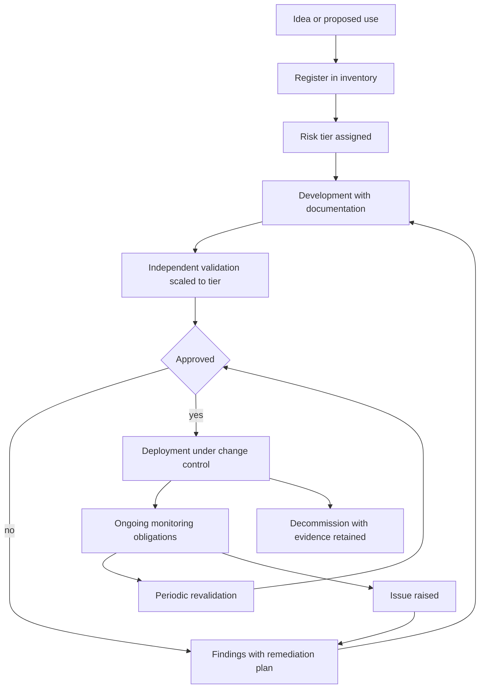
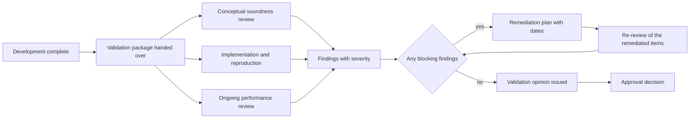
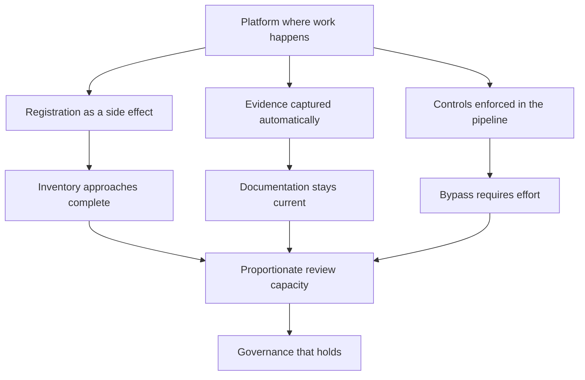

# Chapter 36: Model Governance, Risk, and Compliance Operations

> **What this chapter covers** Governance as an engineering discipline rather than a legal one, the model inventory and why an organisation that cannot list its models cannot govern them, risk tiering with a worked scheme and controls that scale by tier, documentation that serves both users and auditors, independent validation and how to prepare for it, approval workflows and change control including the emergency path, audit trails designed from the questions they must answer, lineage and reproducibility as compliance requirements, monitoring obligations and periodic revalidation, issue and finding management, three regulatory families described in terms of what they demand of a system, third-party and vendor model governance, governance for generative systems, and how to build controls engineers will actually follow.
>
> **Prerequisites** Chapter 25 (Model Lifecycle, Versioning, and Registries), Chapter 27 (Monitoring, Drift, and Retraining), Chapter 28 (Reliability, Cost, Security, and Compliance) for the compliance regimes at a high level, Chapter 32 (Experiment Tracking and Reproducibility).
>
> **Where it is used** Anywhere a wrong model output costs someone other than you: lending, insurance, hiring, healthcare, safety systems, content moderation at scale, and increasingly any consumer-facing generative feature. Also anywhere an organisation has enough models that nobody can name them all, which happens earlier than people expect.

**This chapter is not legal advice.** It is a description of how engineering systems are built to satisfy governance requirements. Legal obligations differ by jurisdiction, by sector, by the role an organisation plays, and by the specific facts of a deployment, and they change over time. Where a named regime appears in this chapter, treat the description as a general engineering characterisation, not as a statement of your current obligations. The primary text of any regime that applies to you, and the guidance issued under it, should be read directly and with counsel. This warning appears again at the start of section 36.3.10, because that is where it matters most.

Governance has a reputation problem among engineers. It arrives as forms, it slows releases, and it is often administered by people who cannot read the code. The reputation is partly earned, because a great deal of governance is performed rather than real. But the underlying idea is not bureaucratic, and the honest engineering framing is this: governance is the price of operating in a domain where being wrong has consequences that are not yours to absorb. If your recommendation engine is wrong, a user sees a poor film suggestion. If your credit model is wrong, someone does not get a loan. If your triage model is wrong, someone waits. The asymmetry is the whole justification, and it also tells you how much governance a given system deserves, which is the subject of risk tiering.

---

## 36.1 Level 1: Foundations

### 36.1.1 What governance actually is

Strip away the vocabulary and governance is four capabilities.

| Capability | The question it answers | Without it |
|---|---|---|
| Inventory | What models do we have, where do they run, who owns them | You cannot assess, monitor, or retire what you cannot list |
| Control | What may change, by whom, with whose approval | Changes happen that nobody evaluated |
| Evidence | Can you show, later, what happened and why | Every question becomes an archaeology project |
| Oversight | Is someone independent checking, and acting on findings | Errors persist because the people who made them are the only ones looking |

Everything else in this chapter is an implementation of one of those four. When a proposed control does not clearly serve one of them, it is probably ceremony.

### 36.1.2 The vocabulary

The terms below are used with reasonable consistency across sectors, though the exact definitions in any given regulatory text may differ. Learn them because they are the language in which governance conversations happen.

| Term | Definition |
|---|---|
| Model | For governance purposes, usually any quantitative method that transforms input data into an output used to inform a decision. Note how broad this is: it can include a deterministic scorecard or a set of rules, not only a learned model |
| Model risk | The risk of adverse consequences from decisions based on incorrect or misused model output |
| Model inventory | The authoritative register of models, their owners, their uses, and their status |
| Risk tier | A classification that determines how much control a model is subject to |
| Model owner | The accountable person for a model's correct use, usually on the business side |
| Model developer | The person or team that builds it |
| Model validator | An independent party who challenges it |
| Three lines of defence | A common organisational split: the first line owns and controls the risk, the second line sets policy and independently challenges, the third line audits both |
| Validation | An independent assessment of conceptual soundness, implementation correctness, and ongoing performance |
| Attestation | A periodic confirmation by a named person that a stated fact is still true |
| Finding | A documented gap identified by validation or audit, with a severity and a remediation deadline |
| Change control | The process governing what may change and under what approval |
| Audit trail | The immutable record from which past states and decisions can be reconstructed |
| Revalidation | A scheduled repeat of validation, typically on a cadence set by risk tier |

The term "three lines of defence" deserves a note. It is a common organisational model, particularly in financial services, and it is one arrangement rather than a universal requirement. Its engineering relevance is that it explains why a validator will not accept your own test results as sufficient: independence is the point, and independence means the person checking did not build it.

### 36.1.3 The model inventory, and why it comes first

Every governance programme that fails has the same first failure, and it is the inventory.

The reasoning is short. Every other control is applied per model. Risk tiering is applied per model. Monitoring obligations are applied per model. Revalidation cadence is applied per model. If the list of models is incomplete, then the coverage of every control is unknown, and a control with unknown coverage provides no assurance. An organisation that cannot list its models cannot govern them, and it also cannot honestly answer the first question any auditor or regulator asks, which is some version of "show me the list".

The difficulty is not conceptual. It is that models do not announce themselves. The inventory misses things in predictable ways.

| Where models hide | Why the inventory misses them |
|---|---|
| A spreadsheet with a regression in it | Nobody thinks of it as a model |
| A rules engine tuned from data | It has no weights, so it does not feel like a model |
| A vendor product with a model inside | It was procured, not built, and procurement did not ask |
| A generative feature calling a hosted model | It was shipped by a product team as a feature |
| A notebook a analyst runs monthly | It has no deployment, so no deployment process caught it |
| A model behind an internal tool | It informs decisions without being in a decision system |
| A retired model still called by one consumer | Decommissioning was announced, not enforced |

Notice the pattern. The inventory misses models that did not pass through the path where registration happens. That gives the design rule for a working inventory, developed at level 2: registration must be a side effect of a path that is easier to take than to avoid, not a form someone remembers to fill in.

### 36.1.4 Risk tiering in one paragraph

Not every model deserves the same scrutiny. A model that reorders a recommendation carousel and a model that declines a mortgage application should not face the same controls, because applying mortgage-grade controls to the carousel wastes the organisation's scarce review capacity and applying carousel-grade controls to the mortgage is negligent. Risk tiering is the mechanism that allocates control effort in proportion to consequence. It is the single decision that determines whether a governance programme is proportionate or performative, and it is developed fully in section 36.2.2.

### 36.1.5 The shape of the lifecycle under governance


*Figure 36.1: The governed lifecycle, where registration precedes development and evidence outlives the model.*

Two features of that diagram are the ones people get wrong. Registration comes before development, not after, because the tier determines how the model must be built and documented, and retrofitting documentation is far more expensive than producing it as you go. And the loop from monitoring back to validation never ends while the model is live, which is why decommissioning is a governance event with its own evidence, covered in Chapter 25.

---

## 36.2 Level 2: Working knowledge

### 36.2.1 Building a model inventory that stays current

A stale inventory is worse than none, because it creates the appearance of coverage. The engineering problem is keeping it current with minimal human effort.

**What a record contains.** The field list below is a workable default. Fields marked derived should be populated automatically from the platform, not typed by a human, because human-typed fields decay.

| Field | Source | Notes |
|---|---|---|
| Model identifier | Derived from the registry | Stable, immutable, never reused |
| Name and plain-language description | Human | What it does, in a sentence a non-specialist understands |
| Purpose and intended use | Human | The decisions it informs |
| Out-of-scope uses | Human | The uses explicitly not validated, which is the field that prevents the most damage |
| Risk tier and the criteria that set it | Human, reviewed | With the date and the assessor |
| Model owner, developer, validator | Human, from the directory | Roles, with named individuals |
| Current version in each environment | Derived | From the registry and deployment system |
| Upstream data sources | Derived where possible | From lineage, see section 36.3.7 |
| Downstream consumers | Derived | From service call graphs; this is the field that makes decommissioning safe |
| Training dataset identifiers | Derived | Content-addressed or snapshot identifiers |
| Performance metrics and thresholds | Derived | From the evaluation record |
| Monitoring status and last alert | Derived | From the monitoring platform |
| Approval record | Derived | Link to the approval event |
| Last validation date and next due date | Derived | Drives the revalidation queue |
| Open findings | Derived | From the issue tracker |
| Status | Derived | Proposed, in development, approved, live, restricted, retired |
| Third-party components | Human, reviewed | Vendor models, foundation models, pretrained weights |

**How it stays current.** Four mechanisms, in descending order of reliability.

1. **Make the registry the only deployment path.** If a serving platform will only load artifacts from the registry, and registry entries require inventory fields, then deployment cannot bypass registration. This is a technical control, and technical controls hold. This is the same registry described in Chapter 25; the inventory is a governance view over it rather than a second system.
2. **Derive everything derivable.** Every field a human must retype is a field that will be wrong within a quarter.
3. **Attest periodically.** Owners confirm, on a cadence, that the description, purpose, out-of-scope uses and tier are still accurate. Attestation is cheap and it catches the drift that automation cannot see, which is drift in how the model is used rather than in what it is.
4. **Reconcile actively.** Run a job that compares the inventory against reality and reports the differences: deployed artifacts with no inventory record, inventory records with no deployment for 90 days, models with an owner who has left, records whose next validation date has passed.

**Listing 36.1: the inventory reconciliation job, which is the control that catches everything else.**

```python
def reconcile(inventory, deployments, directory, findings, today):
    """Report the differences between the inventory and observed reality."""
    issues = []
    inv_by_id = {m["model_id"]: m for m in inventory}

    for d in deployments:                      # observed from the serving platform
        if d["model_id"] not in inv_by_id:
            issues.append(("unregistered_deployment", d["model_id"], d["env"]))

    for m in inventory:
        if m["status"] == "live" and m["model_id"] not in {d["model_id"] for d in deployments}:
            issues.append(("live_but_not_deployed", m["model_id"], None))
        if m["owner"] not in directory["active_people"]:
            issues.append(("orphaned_owner", m["model_id"], m["owner"]))
        if m["next_validation_due"] < today and m["status"] == "live":
            issues.append(("validation_overdue", m["model_id"], m["next_validation_due"]))
        if m["last_attestation"] < today.replace(year=today.year - 1):
            issues.append(("attestation_stale", m["model_id"], m["last_attestation"]))

    open_ids = {f["model_id"] for f in findings if f["status"] == "open" and f["severity"] == "high"}
    for mid in open_ids & {m["model_id"] for m in inventory if inv_by_id[m["model_id"]]["status"] == "live"}:
        issues.append(("live_with_high_finding", mid, None))
    return issues
```

The important line is the first loop. Comparing observed deployments against the inventory is the only check that finds models nobody registered, and it is the check most inventories lack because they are built as a database to be filled in rather than as a reconciliation against a source of truth. The `orphaned_owner` check matters more than it looks: a model whose accountable owner has left the organisation has, in practice, no owner, and this is one of the most common real findings in an audit.

### 36.2.2 Risk tiering

**The criteria.** Tiering asks how bad it is when the model is wrong, and how hard that is to catch and correct. Score along dimensions rather than guessing at a tier directly, because dimensions can be argued about specifically and a gut tier cannot.

| Dimension | Low | Medium | High |
|---|---|---|---|
| Consequence of a wrong output | Minor inconvenience, easily reversed | Financial loss, service denial, reputational harm | Safety, health, legal rights, livelihood, large financial exposure |
| Autonomy | Advisory, a human decides with other information | Human approves with limited alternative information | Fully automated, no human in the path |
| Reversibility | Trivially reversed | Reversible with effort | Irreversible or effectively so |
| Scale | Dozens of decisions | Thousands | Millions, or a whole population |
| Population affected | Internal users | Customers | The public, or a protected or vulnerable group |
| Regulatory exposure | None specific | Sector guidance applies | A specific regime names this use |
| Detectability of error | Errors are obvious and labelled quickly | Delayed labels | Errors are silent, labels never arrive |
| Contestability | Subject can challenge easily | Challenge is possible but slow | Subject may not know a model was involved |

The detectability dimension is the one most schemes omit and the one that changes tiers most often. A model with moderate consequence whose errors are never observed is more dangerous than a model with higher consequence whose errors are immediately visible and corrected, because the first accumulates unnoticed harm.

**A worked tiering scheme.** Assign each dimension 1, 2 or 3 and take the maximum rather than the average, then allow a documented override in either direction.

The maximum rather than the average is deliberate. Averaging lets seven benign dimensions dilute one catastrophic one, which is exactly the property you do not want in a risk classification. A model that is fully automated and irreversible and affects livelihood is high risk even if it is small scale and well understood.

Worked example. A model that ranks internal support tickets for a queue. Consequence 1, autonomy 2 since a human works the queue, reversibility 1, scale 2, population 1, regulatory 1, detectability 2 since a mis-ranked ticket may sit unnoticed, contestability 1. Maximum is 2, so tier 2. Now change one fact: the model automatically closes tickets it scores as spam, with no human review. Autonomy becomes 3 and detectability becomes 3, because a wrongly closed ticket generates no signal. Tier 3. The model did not change; its use did. This is why the inventory records use, and why attestation asks whether the use has changed.

**Controls that scale by tier.** This is the table that makes tiering worth doing.

| Control | Tier 1, low | Tier 2, medium | Tier 3, high |
|---|---|---|---|
| Inventory record | Required | Required | Required |
| Documentation | Short model card | Full model card with data and evaluation sections | Full development document, including alternatives considered and their rejection |
| Evaluation | Held-out performance | Plus slice analysis and a sensitivity check | Plus stress and edge case testing, stability analysis, and benchmarking against a simpler baseline |
| Independent validation | None, peer review only | Review by someone outside the team | Full independent validation with its own report and a formal opinion |
| Approval to deploy | Team lead | Owner plus a governance reviewer | Formal committee with recorded minutes |
| Change control | Standard code review | Review plus an evaluation gate | Plus re-approval for material changes and a defined materiality threshold |
| Monitoring | Availability and basic performance | Plus drift and slice performance with alert thresholds | Plus defined breach procedure with escalation and mandatory response times |
| Revalidation cadence | On material change only | Annual or on material change | Annual at minimum, and on any material change, with an interim review if monitoring breaches |
| Audit retention | Standard | Extended | Long, typically set by the applicable regime |
| Fallback requirement | None | Documented degraded path | Tested fallback with a periodic exercise |
| Explanation capability | None | Global feature importance | Per-decision reasons available on request |

Two failure modes in applying this table. Applying tier 3 controls everywhere, which exhausts the review function so that genuine tier 3 models get a rushed review; and letting teams self-assign a low tier with no challenge, which turns tiering into an opt-out. The fix for the second is that tier assignment is reviewed by someone who is not the developer, and that the tiering criteria are concrete enough that the review is a short conversation rather than a negotiation.

### 36.2.3 Documentation as a deliverable

Documentation is the artifact governance runs on, and the reason it is universally disliked is that teams write it for the wrong reader at the wrong time.

There are two readers with different needs.

| Reader | Wants | Consequence for the document |
|---|---|---|
| A user of the model | What it does, when to trust it, when not to, how to interpret the output, who to ask | Short, plain language, front-loaded with limitations |
| A validator or auditor | Why this approach, what alternatives were rejected, what data, what assumptions, what testing, what the known weaknesses are, what evidence supports each claim | Complete, specific, evidenced, with pointers to reproducible artifacts |

Write both. They are different documents that share a source. The user-facing document is roughly the model card of Mitchell et al. (2019). The validator-facing document is longer and its defining property is that every claim has evidence attached.

**The section list a validator expects.** Not a template to fill mechanically, but the questions that will be asked.

1. Purpose, the decision it informs, and the population it applies to.
2. Out-of-scope uses, stated explicitly.
3. Data: sources, lineage, time period, how it was collected, known biases and gaps, and the rationale for inclusions and exclusions.
4. The target variable, and specifically whether it is a proxy for the concept of interest and what that proxy relationship assumes.
5. Methodology, and why this method rather than the alternatives, with the alternatives named and the rejection reasoned.
6. A simpler benchmark and the comparison against it. Validators ask this almost always, and the inability to answer it is a common finding.
7. Assumptions and their limits, with a sensitivity analysis for the ones that matter.
8. Evaluation: metrics with uncertainty intervals, performance on slices, and behaviour on edge cases.
9. Known weaknesses and failure modes, written honestly. A document with no weaknesses section reads as incomplete rather than as evidence of a flawless model.
10. Monitoring plan: what is measured, what thresholds trigger what action, and who responds.
11. Fallback and degradation behaviour.
12. Reproducibility: the code version, data version, environment and seeds that reproduce the reported results.

**Keeping it current automatically.** The document decays the moment the model changes. The countermeasure is to generate the parts that can be generated. Performance tables, data statistics, slice results, version identifiers, lineage graphs and monitoring thresholds should all be rendered from the evaluation run and the registry into the document at build time, so that a stale number is impossible rather than merely discouraged. Prose about intent, assumptions and limitations is written by humans and reviewed on attestation. A practical implementation is a document template with generated blocks, produced as an artifact of the training pipeline, so the documentation for version 14 is produced by the run that produced version 14 and cannot describe version 11.

### 36.2.4 Approval and change control

Change control answers one question: what may change without a new approval?

Get this wrong in the strict direction and every retrain needs a committee, which means teams will avoid retraining and models will decay. Get it wrong in the loose direction and a material change slips through as a routine update. The resolution is a defined materiality threshold, agreed in advance and written down.

| Change | Typical treatment |
|---|---|
| Scheduled retrain on new data, same code, same features, same hyperparameters, performance within a pre-agreed band | Pre-approved, automatic, with the evaluation evidence recorded |
| Retrain where performance falls outside the band | Requires review before promotion |
| New or removed feature | Material, requires review |
| Change of algorithm or model family | Material, requires validation appropriate to tier |
| Change of threshold or decision cut-off | Material, and frequently underestimated, because it directly changes who is affected |
| Change of the population the model is applied to | Material, and arguably a new model rather than a change |
| New downstream consumer or new use | Material, because it may change the tier |
| Infrastructure change with no behavioural effect | Standard engineering change, with an equivalence test to prove no behavioural effect |

The threshold change row is the one that is most often mishandled. Moving a decision cut-off changes the outcome for a band of the population without changing a single weight, and because no model artifact changed, it frequently escapes model change control entirely. Any parameter that converts a model output into a decision is part of the model for governance purposes.

**The emergency path.** Governance that has no emergency path gets bypassed during emergencies, and the bypass then becomes the normal path. Design the emergency path deliberately:

- A named set of people who may invoke it.
- A restricted set of actions it permits, typically rollback, disabling a feature, switching to a fallback, or tightening a threshold in the conservative direction. Note that these are all actions that reduce the model's influence. An emergency path that permits deploying a new model is not an emergency path.
- Automatic, complete logging of who invoked it, when, what changed and why.
- A mandatory after-the-fact review within a fixed window, for example five business days, which either ratifies the change through the normal process or reverses it.
- A count of invocations as a monitored metric. Frequent emergency invocation means the normal path is too slow, which is a process defect and not an individual one.

### 36.2.5 Mistakes everyone makes first

| Mistake | Consequence | Fix |
|---|---|---|
| Building the inventory as a form | It is complete on the day it is built and wrong within a quarter | Derive fields, reconcile against deployments, attest periodically |
| Tiering by gut feel | Inconsistent tiers, contested by everyone | Score explicit dimensions, take the maximum, review the assignment |
| One control set for all models | Review capacity exhausted, high-risk models under-reviewed | Controls scaled by tier |
| Documentation written at the end | Expensive, inaccurate, resented | Generated from the pipeline, with prose written during development |
| Treating threshold changes as configuration | Material change escapes control | Anything converting output to decision is part of the model |
| Audit log as application logs | Cannot answer the question that is actually asked | Design the log from the questions, see section 36.3.6 |
| No emergency path | The process is bypassed and the bypass becomes normal | A designed path with narrow powers and mandatory review |
| Validation by the development team | No independence, so no assurance | Separate the validator from the developer, scaled by tier |
| Findings tracked in a document | Nothing gets remediated | Findings in the engineering tracker with owners and deadlines |
| Governance owned entirely by a non-engineering function | Controls that do not fit how software is built, so they are worked around | Co-design controls with engineers and implement them in the platform |

---

## 36.3 Level 3: Depth

### 36.3.1 Independent validation

Validation is the control that makes governance more than paperwork, and the word that carries the weight is independent. Independence means the validator is not in the developer's reporting line and has the standing to say no.

**What a validator actually checks.** Three areas, which is a structure used widely in model risk practice.

**Conceptual soundness.** Is the approach right for the problem? The questions: is the target variable a reasonable representation of what you care about, and if it is a proxy, what does the proxy assume? Is the training population representative of the deployment population? Are the assumptions stated and are they plausible? Would a simpler method do nearly as well, and if so, why is the complexity justified? Is the method appropriate for the data volume and quality?

**Implementation correctness.** Does the code do what the document says? The questions: can the reported results be reproduced from the stated code and data versions? Is there leakage between training and evaluation, including temporal leakage and leakage through features derived from the future? Do the serving path and the training path compute features identically, which is the training-serving skew of Chapter 20? Are the tests meaningful, which is Chapter 33?

**Ongoing performance.** Does it still work? The questions: what monitoring exists, are the thresholds justified, what happened at the last breach, how has performance moved since deployment, and is the drift within the range the model was validated for?

**The outcome analysis.** A strong validator also asks what happened to the people affected. Not just "was the prediction accurate" but "what decisions followed, and what were their outcomes, including for the people the model rejected". That last part is hard and important, because a model that declines applicants generates no outcome data for the declined, which is selection bias baked into the feedback loop. The standard partial remedies are a random or policy-relaxed acceptance sample, and reject inference methods, both of which have costs that should be stated rather than hidden.

**How to prepare for a validation.** The practical advice, which shortens a validation from months to weeks:

1. Give the validator a reproducible environment, not a folder of files. A container plus a command that regenerates the reported numbers answers a third of their questions before they are asked.
2. Provide the data lineage, not just the dataset.
3. Write the weaknesses section honestly and first. Validators find weaknesses. Finding one you did not disclose costs you credibility on everything else in the document.
4. Include the simpler benchmark comparison. It will be asked for.
5. Keep a question log during the validation, with answers and evidence, and reuse it at revalidation.
6. Do not argue with a finding you cannot evidence against. Disputing a correct finding is expensive and it lengthens the process.


*Figure 36.2: The validation flow, where the output is an opinion with findings rather than a pass or fail.*

### 36.3.2 Audit trails designed from the questions

An audit trail is not "log everything". Logging everything produces a store nobody can query, which fails the only test that matters, which is whether a specific question can be answered under time pressure a year later.

Design from the questions. Here are the ones that are actually asked.

| Question | What the log must contain |
|---|---|
| Why was this specific person declined on this date | The decision record: input values, model version, threshold, output, decision, and the reason codes, joined by a decision identifier |
| What model version was live at 14:00 on a given date | A deployment event stream with effective-from and effective-to timestamps per environment |
| Who approved this model and on what evidence | Approval events referencing immutable evaluation artifact identifiers |
| What data trained the model that made this decision | Dataset version identifier on the model record, resolvable to content |
| Has this model's threshold ever been changed, and by whom | Change events on every decision-affecting parameter, not only on code |
| Who accessed the training data containing personal information | Access logs on the data store, with purpose where required |
| What did we know about this weakness, and when | Findings with created dates, severity history, and status transitions |
| Did the monitoring alert fire, and what was done | Alert events joined to response records |

From that list, the design follows.

**Append-only and tamper-evident.** An audit trail that can be edited is not evidence. The practical implementations are an append-only store with restricted write access, write-once storage with an object lock, or hash chaining where each record includes the hash of the previous one so that a deletion or edit breaks the chain. Hash chaining is cheap to implement and gives a strong property for very little effort.

**Listing 36.2: hash-chained audit records.**

```python
import hashlib, json

def append(record, prev_hash):
    """Append a record to a hash chain and return its digest."""
    body = json.dumps(record, sort_keys=True, separators=(",", ":"))
    digest = hashlib.sha256((prev_hash + body).encode("utf-8")).hexdigest()
    return {"prev": prev_hash, "body": body, "hash": digest}

def verify(chain):
    """Return the index of the first tampered record, or None if intact."""
    prev = chain[0]["prev"]
    for i, entry in enumerate(chain):
        expect = hashlib.sha256((prev + entry["body"]).encode("utf-8")).hexdigest()
        if expect != entry["hash"] or entry["prev"] != prev:
            return i
        prev = entry["hash"]
    return None
```

The chain detects modification and deletion of any record, because every subsequent hash depends on it. It does not prevent an attacker with full write access from rewriting the entire chain, so for stronger guarantees the periodic publication of the head hash to a separate system, or write-once storage, is added. The serialisation must be canonical, which is why `sort_keys` and fixed separators appear; a non-canonical serialisation makes verification fail on records that were never altered.

**Reference, do not copy.** The audit trail should store identifiers of immutable artifacts rather than copies of them. "Approved on the basis of evaluation run `eval-8831`" is better than embedding a metrics table, provided that `eval-8831` is itself immutable and retained. This keeps the trail small and makes it queryable.

**Retention.** Retention periods come from the applicable regime and from the lifetime of the decisions involved, and they vary widely, so they must be set per system with input from whoever owns the obligation rather than chosen by engineering convenience. The engineering requirements are constant: retention is configured per data class, enforced automatically, and deletion is logged. A retention policy that relies on someone remembering to delete is not a policy. Note the tension with Chapter 28's privacy discussion: audit obligations push retention longer, privacy obligations push it shorter, and the two are resolved per data class rather than globally. The usual resolution is that decision records and approval evidence are retained long, while raw personal data inputs are retained for the shortest period that still supports the audit question, often by storing hashes or reason codes rather than raw values.

**Decision record design.** For a tier 3 model, the per-decision record is the highest-value audit artifact and the most expensive to add later. It should contain the decision identifier, timestamp, subject identifier or pseudonym, model identifier and version, the exact feature values used, the raw output, the threshold applied, the decision, the reason codes, any override and its author, and the policy version. Recording the feature values rather than recomputing them later is essential, because the feature pipeline will have changed by the time the question is asked.

### 36.3.3 Lineage for governance

Chapter 20 covers lineage for debugging, where the question is usually "which upstream change broke this". Governance lineage answers different questions and therefore needs different properties.

| Property | Debugging lineage | Governance lineage |
|---|---|---|
| Question | What broke this, what is affected by this change | What data produced this decision, what is affected by this data being withdrawn |
| Time frame | Current state | Historical state as of a past date |
| Granularity | Table and job level is usually enough | Sometimes record level, for consent and deletion |
| Completeness | Best effort is useful | Gaps are findings |
| Retention | Short | As long as the decisions |

The properties that governance adds are three.

**It must be historical.** A lineage graph that shows how the pipeline is wired today cannot answer what fed a model trained eighteen months ago. Governance lineage is versioned, meaning you can ask for the graph as of a date.

**It must reach personal data and its basis.** Where data protection obligations apply, the chain from a personal record to the models trained on it determines the scope of a deletion or objection request. This is the hardest part to build and the part most often missing.

**It must be complete enough that gaps are known.** Partial lineage presented as complete is worse than acknowledged partial lineage, because it produces confident wrong answers. Where lineage is inferred rather than declared, mark it as inferred.

The practical implementation is that lineage is emitted by the pipeline as a side effect of execution rather than maintained as a separate model of the pipeline. A hand-maintained lineage diagram is a description of intent; an emitted one is a description of what happened. Open standards exist for this kind of event emission and are worth preferring over a proprietary graph, but the important property is emission at runtime, not the format.

### 36.3.4 Reproducibility as a compliance requirement

Chapter 32 treats reproducibility as an engineering virtue. Under governance it becomes an obligation, and the obligation is more specific than the virtue.

What is usually required is the ability to demonstrate how a result was obtained. That decomposes into three distinct capabilities with very different costs.

| Capability | Demand | Cost |
|---|---|---|
| Reproduce the reported evaluation numbers | Rerun the evaluation on the recorded model version and the recorded dataset version and obtain the same numbers | Low, requires immutable artifacts and a captured environment |
| Reproduce the trained model | Rerun training and obtain a statistically equivalent model | Moderate to high, requires seeds, environment capture and tolerance of non-determinism |
| Reproduce a specific past decision | Given a decision identifier, show exactly what input produced what output through which version | Low if the decision record was written at the time, very high if not |

The third is the one auditors ask about most and the one teams prepare for least. It is cheap if you wrote the decision record at decision time and effectively impossible if you did not, because reconstructing a feature value from eighteen months ago requires the exact upstream data state, the exact transformation code, and the exact serving-time inputs, and any one of those being unavailable ends the attempt.

So the compliance-driven design rule is simple: **for tier 3 models, log the decision, not the ingredients for recomputing it.** Storage is cheaper than reconstruction, by a very large factor.

On training reproducibility, be honest about determinism. Exact bit-identical retraining is often infeasible on parallel hardware because of non-associative floating-point reduction order and non-deterministic kernel selection, as Chapter 32 details. The defensible position is statistical equivalence with a stated tolerance, documented as such, with the sources of non-determinism enumerated and the seeds recorded. Claiming bit-identical reproducibility you cannot deliver is worse than documenting the tolerance, because a validator will test the claim.

### 36.3.5 Monitoring obligations and revalidation

Chapter 27 covers monitoring design. Governance adds obligation, which changes three things.

**Thresholds are committed in advance.** In an engineering context an alert threshold is tuned until the alert is useful. Under governance the threshold is part of the approved model, agreed at validation, and moving it is a change that requires review. This is unfamiliar and occasionally frustrating, and its purpose is to prevent the failure mode where a threshold is quietly relaxed each time it fires until it never fires.

**A breach has a defined procedure.** Not "someone looks at it" but a written sequence: who is notified, within what time, what analysis is required, who decides, and what the options are, which typically include accept with rationale, restrict the model's use, retrain, or withdraw. The procedure is written at approval time, when nobody is under pressure.

**Revalidation is scheduled and is a queue you must staff.** Annual revalidation for tier 3 models is a common cadence in regulated settings, though the specific expectation depends on the regime and the organisation's own policy. The engineering consequence is a forward calendar: if you have sixty tier 3 models on annual revalidation, that is more than one validation per week, sustained, and it must be resourced or the queue silently slips. A validation queue with a growing backlog is itself a finding.

**Triggered revalidation.** Beyond the calendar, revalidation is triggered by a material change, a monitoring breach that is not resolved, a change in the population or the use, a significant change in an upstream data source, or an incident. Encode the triggers rather than relying on judgment.

### 36.3.6 Issue and finding management

Findings come from validation, audit, monitoring breaches, incidents and self-identification. Self-identification is worth encouraging explicitly, because an organisation whose teams raise their own findings is in far better shape than one where findings only arrive from outside, and the way to encourage it is to treat a self-raised finding as better news than an externally raised one rather than as a failure.

A finding record needs: a unique identifier, the source, a description of the gap and its risk, a severity, an affected model or system, a named owner, an agreed remediation plan, a due date, a status, and evidence of closure. The evidence of closure is the field most often missing, and a finding closed without evidence is not closed.

The operational discipline that makes this work:

| Practice | Reason |
|---|---|
| Findings live in the engineering tracker, linked to the governance record | A finding in a separate governance tool is invisible to the people who must fix it |
| Severity drives the due date by a fixed rule | Removes per-finding negotiation |
| Overdue findings escalate automatically | Without escalation, due dates are suggestions |
| A high-severity open finding blocks promotion of that model | Makes the finding consequential |
| Extensions are granted explicitly and recorded, not by silence | Silent slippage is how backlogs form |
| Trends are reported: opened, closed, overdue, aged | The trend is the health signal, not the count |

The single most useful metric is the age distribution of open findings. A stable count with a rising age distribution means findings are being opened and not closed, which a count alone hides.

### 36.3.7 The regimes, described as system requirements

**This section is not legal advice.** What follows describes, in general engineering terms, the kinds of demands that three families of regulation place on systems. It is a characterisation for engineering planning, not a statement of any organisation's obligations. Scope, applicability, thresholds, dates and specific duties differ by jurisdiction and by the role an organisation plays, and they change over time, sometimes substantially. Read the current primary text of any regime that applies to you, together with guidance issued under it, and take legal advice. Do not rely on this chapter, or any summary, for a compliance decision.

**Model risk management in financial services.** Supervisory guidance on model risk in banking is the oldest and most developed of these frameworks, and its influence on general practice is large. Its characteristic demands, stated as system requirements:

| Demand | What the system must provide |
|---|---|
| A complete model inventory | The register of section 36.2.1, covering models broadly defined, including spreadsheets and vendor models |
| Development documented to a standard that allows independent review | The validator-facing document of section 36.2.3, with rationale and alternatives |
| Independent validation | Organisational separation, plus reproducible artifacts so the validator can verify rather than accept |
| Ongoing monitoring with defined action | Committed thresholds, a breach procedure, and evidence of response |
| Governance with clear roles and accountability | Named owner, developer, validator, an approval record, and a policy that is applied consistently |
| Attention to model use, not only model construction | Evidence that the model is used as intended, which is a use-monitoring problem rather than a performance one |

The concept worth internalising from this family, whatever sector you work in, is **effective challenge**: review by someone with the competence, the independence, and the standing to influence the outcome. All three are required. A reviewer who is technically capable but has no authority produces documents nobody acts on.

**Medical device software concepts.** Where software influences clinical decisions, it may be regulated as a medical device, and the applicable framework depends heavily on the claimed intended use, the jurisdiction, and the risk classification. The engineering-relevant concepts, described generally:

| Concept | What it demands of a system |
|---|---|
| Intended use statement | A precise, narrow statement of what the software is for, which determines almost everything else, including whether it is regulated at all |
| Risk classification | A tier derived from the significance of the information and the state of the healthcare situation, driving the evidence burden |
| A software lifecycle process | Documented requirements, architecture, verification and validation, traced end to end |
| Requirements traceability | Every requirement traceable to a design element, a test, and a result, which is stronger than typical software practice and requires tooling |
| Risk management as a continuous process | Hazard analysis, mitigations, and residual risk evaluation maintained across the lifecycle |
| Clinical evaluation | Evidence that the software performs as claimed in the intended population, which is a clinical study question, not a held-out test set question |
| Change control with predetermined change plans | Because retraining an adaptive model is a change to a regulated device, frameworks exist for specifying in advance what changes are permitted and how they are validated, so that anticipated modifications do not each require a new submission. The details and the status of such mechanisms vary by regulator and are evolving |
| Post-market surveillance | Ongoing collection and reporting of real-world performance and adverse events |

The traceability requirement is the one that most surprises engineers arriving from general software. It is not enough that a test exists; the link from requirement to design to test to result must be explicit and maintained, which is a tooling problem as much as a discipline problem.

The lesson that transfers outside healthcare is the discipline of the intended use statement. Writing down precisely what the system is for, and what it is not for, constrains scope creep better than any other single document.

**Risk-tiered artificial intelligence regulation.** Recent regulation of artificial intelligence, of which the European Union's AI Act is the most developed example, is structured around risk tiers with obligations attached to each, and around a distinction between roles such as the provider who places a system on the market and the deployer who uses it. Obligations differ substantially by role, and misidentifying your role is a common planning error. Specific obligations, thresholds, timelines and the treatment of general-purpose models are detailed, are phased, and have been subject to change, so read the current text and any implementing guidance rather than a summary.

The general engineering shape, which is what is useful for planning:

| Structural element | Engineering consequence |
|---|---|
| Prohibited practices | A use-case screen before development, because the cheapest control is not building it |
| A high-risk category defined by use rather than by technique | Tiering must be driven by the use case and the affected population, which is why section 36.2.2 scores use-based dimensions |
| Risk management across the lifecycle | A continuous process with records, not a one-time assessment |
| Data governance requirements for training data | Documented provenance, representativeness consideration, and examination for bias, which requires dataset documentation as a build artifact |
| Technical documentation | The validator-facing document, maintained and available |
| Automatic record-keeping, sometimes described as logging | Machine-generated event logs retained for a defined period, which is an architectural requirement rather than an afterthought |
| Transparency to users | The system must make clear what it is and what it does, including disclosure in some interaction contexts |
| Human oversight | A design requirement for meaningful intervention, not a screen with an approve button |
| Accuracy, robustness and cybersecurity | Stated performance characteristics with evidence, plus the security posture of Chapter 28 |
| Conformity assessment and registration for some categories | A pre-market gate, which lengthens timelines and must be planned into the roadmap |
| Obligations attached to general-purpose models | Documentation and transparency duties that flow along the supply chain, which affects you as a downstream user of a foundation model |

The human oversight point deserves emphasis because it is where engineering effort is most often wasted. Oversight that is nominal, meaning a human who approves everything because they have no time, information or authority to do otherwise, satisfies the letter of an interface requirement and none of the intent. Making oversight meaningful is a design problem: the reviewer needs the information that supports a decision, the time to use it, a genuine ability to decline, and measurement showing that declines actually happen.

**What the three families share.** Rather than memorising regimes, build the capabilities they have in common, because building them once serves all three and serves good engineering anyway:

1. A complete, current inventory.
2. Risk classification driven by use and consequence.
3. Documentation with evidence, maintained.
4. Independent review scaled to risk.
5. Change control with a materiality threshold.
6. Immutable records sufficient to reconstruct past decisions.
7. Monitoring with committed thresholds and a defined response.
8. Lineage from data to decision, historical.
9. Human oversight that is real and measured.
10. Issue management with tracked remediation.

Again, and deliberately repeated: this is an engineering characterisation. It is not legal advice, requirements differ by jurisdiction and change, and the primary text of any applicable regime should be read directly.

### 36.3.8 Third-party and vendor models

Models you did not build are the largest and most common gap in a governance programme, because the procurement path and the development path are different and only one of them has model controls on it.

Three categories, with different problems.

| Category | Example | Core difficulty |
|---|---|---|
| A vendor product with an embedded model | A fraud scoring service, a resume screening tool | You cannot inspect it, and you may not be told when it changes |
| A hosted foundation model called by your system | A generative feature | It can change under a moving alias, as Chapter 35 describes |
| Pretrained weights you fine-tune or embed | An open-weights model, a pretrained encoder | Unknown training data, unknown licence constraints, potential supply chain risk |

What to require, given that inspection is usually impossible:

**Contractually or by policy.** Notification of material model changes with a lead time. The right to audit or to receive validation evidence. Performance representations you can test. Data handling terms covering what happens to inputs you send. Notice periods for deprecation. These are procurement levers, and engineers should be in the conversation because they are the ones who know which of them matter.

**Technically.** Independent evaluation on your own data and your own population, because a vendor's reported performance was measured on theirs. Continuous monitoring of the vendor's outputs as if it were your own model, which is the control that actually catches a silent change. A tested fallback. Version pinning where the vendor offers it. Logging of every call with the version identifier so that a behaviour change has an attributable date.

**In the inventory.** Third-party models are inventory records like any other, with the same tier, the same owner, the same monitoring and the same revalidation cadence. The record additionally names the vendor, the contract, the notification terms and the exit plan. The most common finding in this area is simply the absence of vendor models from the inventory at all.

For pretrained weights, add provenance: the source, the licence and its restrictions on use, the model's own documentation of training data where available, and an integrity check on the artifact. Weights obtained from a public repository and loaded into a production system are a software supply chain dependency and should be treated with the controls you apply to any other dependency, including pinning, scanning and a mirrored copy under your control. Model deserialisation formats have historically been able to execute code on load, so prefer formats designed to prevent that and verify checksums.

### 36.3.9 Governance for generative systems

Generative systems break several assumptions that classical model governance was built on. The mapping below is the practical translation, and Chapter 35 covers the operational machinery.

| Governance assumption | How generative systems break it | Adaptation |
|---|---|---|
| The model is the artifact under control | Behaviour is determined by prompt, tools, index, routing and provider version | All five are governed artifacts, versioned, with change control on each |
| The model changes only when you retrain it | A hosted model can change without any action on your side | Pin versions, schedule re-evaluation, treat provider change as a change event requiring review |
| Performance is a metric on a held-out set | Outputs are open-ended, quality is rubric-based and measured by an instrument that is itself a model | Document the evaluation method including the judge, its calibration, and its own version, and treat the judge as a model in the inventory |
| The output space is enumerable | It is not | Governance shifts weight toward input and output controls, refusal behaviour, and logging, and toward bounding the consequences of a wrong output |
| The inventory lists models | Teams ship features, not models | Register the generative application as the governed unit, with its component models listed |
| Risk comes from inaccuracy | It also comes from injection, data leakage through outputs, and harmful content | The threat model of Chapter 28 and the injection material of Chapter 16 become governance concerns |
| Explanation means feature attribution | Attribution does not transfer to generated text | Citation to retrieved sources is the practical explanation, with the honest caveat that a citation shows what was retrieved, not what the model reasoned from |

Two specific points that matter more than the rest.

**The judge is a model.** If a model-as-judge scores production quality and that score informs governance decisions, the judge is itself a model informing decisions and belongs in the inventory with a tier, documentation of its rubric and calibration, and change control on its version and prompt. Teams almost never do this, and it is a clean finding when an auditor notices.

**Retention and logging collide hardest here.** Full prompt and output logging is the most useful evidence for reconstructing what happened and the largest concentration of potentially sensitive data in the system, since users type anything into a text box. The resolution is the tiering in Chapter 35, level 3, with redaction at ingestion, short payload retention, long metadata retention, and access controls, all decided and documented rather than defaulted.

### 36.3.10 Building governance engineers will follow

This is the real problem. A control that is bypassed provides negative assurance, because it appears on the register as implemented.

The design principles that produce followed controls:

**Make the governed path the easy path.** If registering a model is a side effect of using the standard deployment pipeline, registration approaches completeness. If it is a form in a separate system, it will not. Every control should be evaluated against the question: is complying easier than not complying? Where the answer is no, the control will be worked around eventually, regardless of policy.

**Automate evidence collection.** Engineers object to producing evidence, not to being governed. Lineage, versions, evaluation results, approval records, monitoring configuration and test results should all be captured by the platform as artifacts of normal work. What remains for humans is judgment, which is what humans should be spending time on.

**Scale controls to risk, visibly.** When a team sees that their low-risk model needs a model card and an evaluation record while the credit model needs a full validation, the scheme reads as proportionate and gets cooperation. Uniform heavy controls read as bureaucracy and get resistance, and the resistance is correct.

**Give governance a fast path and hold it to a service level.** The most common cause of bypass is latency. If review takes six weeks, teams will find ways to ship without it. Publish a turnaround target by tier, measure it, and report misses. A governance function with a service level is a partner; one without is an obstacle.

**Embed rather than impose.** Controls designed with engineers fit how software is actually built. Controls designed elsewhere and handed over usually assume a waterfall lifecycle with a clean handoff that does not exist, and the mismatch is what makes them unworkable.

**Measure the programme.** Inventory completeness estimated against an independent count. Percentage of live models with current validation. Finding age distribution. Change control bypass rate. Time from request to approval by tier. Attestation completion rate. These are the numbers that tell you whether governance is real, and none of them is the count of policies written.


*Figure 36.3: Governance that works is implemented in the platform, not in policy documents.*

---

## 36.4 Level 4: Mastery

### 36.4.1 Where the standard advice is wrong

**"Document everything."** Wrong as stated, and it is the advice that produces documents nobody reads and nobody maintains. Documentation has a maintenance cost proportional to its length and a value proportional to how often it answers a real question. Write the document a validator needs and the document a user needs, generate everything generatable, and delete the rest. A shorter accurate document beats a longer stale one, and staleness is the default state of anything hand-maintained.

**"Governance is the second line's job."** This is the framing that produces controls engineers route around. Governance is a property of the system, and the people who can implement it in the platform are engineers. The second line sets policy and challenges; if it also has to implement, the controls will sit outside the engineering workflow, which is exactly where bypassed controls live.

**"More approval gates mean more control."** Beyond a point, additional gates reduce control, because each gate adds latency, latency creates pressure, and pressure creates the emergency path that becomes the normal path. The measure of control is not the number of gates but the fraction of material changes that were actually reviewed, which usually falls as gates multiply.

**"An audit trail means logging everything."** The trail is judged by whether it answers a specific question a year later. Volume is not the property that achieves this; queryability, immutability, joinability and retention are. Many organisations discover during an audit that they logged a great deal and can answer nothing, because the decision record and the model version were never joined.

**"Human in the loop resolves the risk."** Only if the human has information, time and authority, and only if you measure that their decisions differ from the model's. If the override rate is near zero, the human is a formality and the system is effectively automated, which changes its tier. Measuring override rate and override accuracy is the control that makes human oversight real, and it is rarely done.

**"Simpler models are always more governable."** Partly true and often overstated. A simpler model is easier to explain and validate, which is real. But a simple model that is wrong more often in a consequential way is not more governable in any meaningful sense, and interpretability is not the same as correctness. The honest position is that simplicity is a strong tiebreaker at similar performance and a legitimate requirement where explanation is legally load-bearing, not a universal dominance.

### 36.4.2 What senior practitioners argue about

**Whether tiering should be by use or by technique.** Use-based tiering is the dominant position and aligns with recent regulation, on the argument that harm comes from consequences rather than from architecture. The counter-argument is that technique affects how well you can validate, monitor and explain, so a deep model in a consequential use genuinely carries risk that a linear model in the same use does not. The synthesis in practice is that use sets the tier and technique sets the evidence burden within the tier.

**How much independence validation really needs.** Full organisational separation gives the strongest assurance and is expensive, slow, and often staffed by people further from the technology than the developers. A rotating internal reviewer from a different team is faster and better informed, and has weaker independence. The pragmatic position is that independence should scale with tier, and that the test of independence is whether the reviewer has ever blocked something.

**Whether to govern the model or the decision system.** Governing the model is tractable and misses where most harm occurs, which is in thresholds, overrides, routing, and how outputs are used. Governing the decision system is correct and has fuzzy boundaries. The clearest resolution is that the governed unit is the model plus every parameter that turns its output into a decision, which captures thresholds and policy without expanding to the entire product.

**The right response to non-reproducibility.** One camp demands bit-identical reproduction and forces deterministic training, paying a real throughput cost. The other accepts statistical equivalence with a documented tolerance. The second position is more common and more honest on modern hardware. The camp that matters most is the third: whichever you choose, write down which one you are claiming, because the failure mode is claiming determinism you do not have and having a validator discover it.

**Whether governance slows innovation.** The usual debate is unproductive because both sides are describing different organisations. Heavy uniform controls do slow delivery measurably. Proportionate controls implemented in the platform often speed it up, because the same artifacts that satisfy a validator, meaning reproducible runs, versioned data, documented evaluation and monitoring, are the artifacts that make a system maintainable. The useful question is not whether to govern but whether your controls are proportionate and automated, which is an empirical question you can answer with the metrics in section 36.3.10.

### 36.4.3 Open problems

**Reproducibility of systems built on hosted models.** If the model is a service that may change and whose weights you cannot retain, the reproducibility obligations described above cannot be met in the classical sense. The partial answers are pinned versions, full input and output logging, and self-hosting where the risk justifies the cost. None is complete, and this is an unresolved tension between governance expectations and the dominant deployment model for generative systems.

**Governing systems that compose many models.** An agent that calls five models, three of them third-party, is one product and many governed components with different owners, tiers and change cadences. Composing risk assessments across such a system is not a solved problem, and the naive approach of tiering the whole product at the maximum of its components is both defensible and frequently disproportionate.

**Evidence for emergent behaviour.** Validation methodology assumes a bounded task with measurable performance. For a general-purpose system, the space of behaviours is not enumerable, so "we tested it" has a different and weaker meaning. Evaluation science for these systems is immature, as Chapter 35 discusses, and governance frameworks are adapting faster than the measurement methods they depend on.

**Continuous learning under change control.** A model that updates continuously is in tension with a regime built around discrete approved versions. Predetermined change control plans, which specify in advance what the model may learn and within what bounds, are the emerging mechanism. Their design and their regulatory treatment are active areas, and anything written about their specifics dates quickly.

**Measuring whether governance worked.** The counterfactual is unobservable. You cannot see the harm that controls prevented, which makes governance perennially vulnerable to the argument that it is overhead. The best available proxies are leading indicators, meaning issues caught before production, override rates, finding age, and near misses, and building those measures is the strongest available defence of the function's value.

### 36.4.4 The judgment that distinguishes a senior engineer

**They put the inventory first.** Asked to improve governance, they establish what exists before designing controls, because coverage is the property that everything else depends on.

**They tier honestly, including their own systems.** They do not argue their model into a lower tier, and they raise the tier when the use changes. The autonomy and detectability dimensions are the ones they check when a use changes, because those are the ones that move quietly.

**They build controls into the platform.** They know that a policy document is a statement of intent and a pipeline check is a control, and they spend their effort on the second.

**They write the weaknesses section themselves, first.** They know that the fastest validation is one where the validator finds nothing the document did not already disclose.

**They design the audit trail from the questions.** They can state the six questions their logs must answer and demonstrate each with a query, rather than pointing at a volume of logs.

**They are precise about what is and is not a legal requirement.** They do not assert obligations they have not verified, they distinguish between a regulator's requirement, an internal policy, and a habit, and they say clearly when a question needs counsel rather than an engineer.

---

## 36.5 Subtopic checklist

| Subtopic | You should be able to |
|---|---|
| Why governance exists | State the asymmetry argument without appealing to compliance for its own sake |
| The four capabilities | Map any proposed control to inventory, control, evidence or oversight, or reject it |
| Governance vocabulary | Use owner, developer, validator, finding, attestation and revalidation correctly |
| The model inventory | Specify the record, name where models hide, and design for completeness |
| Inventory currency | Derive fields, reconcile against deployments, and run attestation |
| Reconciliation | Write the check that finds unregistered deployments and orphaned owners |
| Risk tiering criteria | Score the eight dimensions and justify taking the maximum |
| Tiering a use change | Re-tier a model whose use changed without its weights changing |
| Controls by tier | Produce the control matrix and defend its proportionality |
| Documentation for two readers | Write the user document and the validator document and say how they differ |
| Automatic documentation | Generate the generatable sections from the pipeline |
| Independent validation | State what a validator checks in three areas and prepare a package |
| Effective challenge | Explain why competence without standing produces nothing |
| Change control | Set a materiality threshold and classify a list of changes against it |
| Threshold changes | Explain why a cut-off change is a model change |
| The emergency path | Design one with narrow powers, logging and mandatory review |
| Audit trail design | Derive the log schema from the questions it must answer |
| Tamper evidence | Implement and verify a hash chain, and state what it does not protect against |
| Retention | Resolve the audit and privacy tension per data class |
| Decision records | Explain why logging the decision beats recomputing it |
| Governance lineage | State the three properties it adds over debugging lineage |
| Reproducibility obligations | Separate the three capabilities and their costs, and claim only what you can deliver |
| Monitoring obligations | Commit thresholds, define the breach procedure, and resource revalidation |
| Revalidation triggers | List the events that trigger revalidation outside the calendar |
| Finding management | Design the record, the escalation, and the metric that matters |
| Model risk management | Describe its demands as system requirements |
| Medical device concepts | Explain intended use, traceability and predetermined change plans at engineering depth |
| Risk-tiered AI regulation | Describe its structural elements and their engineering consequences |
| The common capabilities | Name the ten capabilities that serve all regimes |
| Vendor model governance | Specify contractual and technical controls where inspection is impossible |
| Pretrained weight provenance | Treat weights as a supply chain dependency |
| Generative governance | Map each broken assumption to its adaptation, including the judge as a model |
| Followed controls | Apply the design principles and measure the programme |
| The limits | State honestly what is unresolved, including hosted model reproducibility |

---

## 36.6 Common misconceptions

| Misconception | Why it is believed | What is actually true |
|---|---|---|
| Governance is paperwork that slows delivery | Much of it is performed rather than real, and heavy uniform controls genuinely do slow delivery | Proportionate controls implemented in the platform produce the same artifacts that make a system maintainable, and the measurable problem is uniformity, not governance |
| The inventory is a database you fill in | It looks like a data entry problem | It is a reconciliation problem: the only check that finds unregistered models is comparing observed deployments against the register |
| Only machine learning models need governing | The word "model" suggests learning | Governance definitions are typically broad and include deterministic scorecards, rules engines and spreadsheets, which is where a large share of uninventoried risk sits |
| Risk tier is a property of the model | The model is the thing you built | The tier is a property of the use. The same model in a different use is a different tier, which is why attestation asks about use |
| A high accuracy score satisfies a validator | Accuracy is what development optimises | Validators check conceptual soundness, implementation correctness and ongoing performance, and the most common gap is the absence of a simpler benchmark comparison |
| Changing a threshold is configuration, not a model change | No artifact changed | It changes who is affected, so anything converting an output into a decision is part of the governed unit |
| A human in the loop resolves the risk | It creates a point of control on the diagram | Oversight is real only with information, time and authority, and the evidence is a measured non-zero override rate with acceptable override accuracy |
| The audit trail means logging everything | Volume feels like safety | The trail is judged by whether it answers a specific question a year later, which requires joinability, immutability and retention, not volume |
| Documentation can be written at the end | It feels like a write-up of work already done | Retrofitted documentation is expensive and inaccurate, and the generatable parts must be produced by the run they describe or they will describe a different version |
| Vendor models are the vendor's responsibility | You did not build them | You are accountable for the decisions your system makes, so vendor models sit in the inventory with a tier, monitoring, a fallback and an exit plan |
| Reproducibility means bit-identical retraining | It is the strictest definition | On parallel hardware that is often infeasible, and the defensible claim is statistical equivalence within a stated tolerance, documented as such |
| Compliance requirements are fixed and knowable from a summary | Summaries are convenient | Requirements differ by jurisdiction, sector and role, and they change. A summary, including this chapter, is a planning aid and not a basis for a compliance decision |

---

## 36.7 Practice

**Exercise 1, level 2. Build a reconciling inventory.** For any environment with at least three deployed models, real or simulated, build an inventory with the fields in section 36.2.1, deriving everything derivable. Implement the reconciliation job of Listing 36.1 and run it.

*Acceptance criterion.* The job reports at least one genuine discrepancy, and you can explain for each field whether it is derived or human-maintained and why.

**Exercise 2, level 2 to 3. Tier a portfolio and defend it.** Take five models with genuinely different uses. Score each on the eight dimensions, assign a tier by the maximum rule, and produce the control matrix that follows. Then change one model's use so that its tier moves, and show which dimensions moved.

*Acceptance criterion.* A written tiering record per model, a defensible disagreement resolution for at least one contested dimension, and a demonstration that the scheme produces different control sets rather than the same one.

**Exercise 3, level 3. Design and test an audit trail.** Write down six questions your audit trail must answer, including at least one per-decision question. Design the schema, implement append-only storage with hash chaining, generate synthetic history, then answer all six with queries. Attempt to tamper with one record and show that verification detects it.

*Acceptance criterion.* All six questions answered by a query rather than by manual inspection, and a demonstrated tamper detection with a clear statement of what the chain does not protect against.

**Exercise 4, level 3 to 4. Run a validation as the validator.** Take a model built by someone else, ideally a public reproduction. Without contacting the author, attempt to reproduce the reported numbers, check for leakage, look for a simpler benchmark, and write a validation report with findings, each carrying a severity and a proposed remediation.

*Acceptance criterion.* At least three substantive findings with evidence, an explicit statement of what you could not verify and why, and a validation opinion with reasoning.

**Exercise 5, level 4. Governance for a generative feature.** Take a retrieval-augmented application. Produce the inventory record, the tiering, the change control matrix covering all five artifacts from Chapter 35, the audit trail design including the retention decision, and the treatment of the judge model as a governed component.

*Acceptance criterion.* A package another engineer could operate from, with an explicit section on what cannot be fully satisfied because the underlying model is hosted, and what compensating controls you propose instead.

---

## 36.8 How this is tested

**Question 1.** Why is the model inventory the first thing to build, and why do inventories fail?

<details><summary>Answer</summary>

Every other control is applied per model, so if the list is incomplete the coverage of every control is unknown, and a control with unknown coverage provides no assurance. It is also the first thing any auditor asks for.

Inventories fail because models do not announce themselves. The ones that get missed are those that never passed through the path where registration happens: spreadsheets with regressions in them, rules engines tuned from data, vendor products with embedded models, generative features shipped as product work, analyst notebooks run monthly, and retired models still called by one consumer.

The design rule that follows is that registration must be a side effect of the easiest path, typically by making the registry the only way to deploy, and that the inventory must be reconciled against observed deployments rather than maintained as a form.

</details>

**Question 2.** Score a tiering example and explain why you take the maximum across dimensions rather than the average.

<details><summary>Answer</summary>

Score consequence, autonomy, reversibility, scale, population, regulatory exposure, detectability of error and contestability, each on a small scale, then take the maximum.

Averaging lets several benign dimensions dilute one catastrophic one, which is precisely the wrong property for a risk classification. A model that is fully automated, irreversible and affects livelihood is high risk even if it is small in scale and well understood.

The dimension most schemes omit is detectability. A model whose errors generate no signal accumulates unnoticed harm, and that is frequently more dangerous than a higher-consequence model whose errors are visible and corrected immediately.

</details>

**Question 3.** A team changes a decision threshold on a live model. No model artifact changed. Is that a governed change?

<details><summary>Answer</summary>

Yes, and it is one of the most commonly mishandled changes. Moving a cut-off changes the outcome for a band of the population without altering any weight, and because no artifact changed it often escapes model change control entirely.

The rule to adopt: the governed unit is the model plus every parameter that converts its output into a decision. That captures thresholds, routing rules and override policies.

Practically it means threshold values are versioned, changes to them are logged as change events with an author and a rationale, and for higher tiers they require the same review as a feature change.

</details>

**Question 4.** What does a validator check, and what is the fastest way to shorten a validation?

<details><summary>Answer</summary>

Three areas. Conceptual soundness: is the target a reasonable proxy, is the training population representative of deployment, are assumptions stated and plausible, would a simpler method do nearly as well. Implementation correctness: can the results be reproduced, is there leakage including temporal leakage, do training and serving compute features identically, are the tests meaningful. Ongoing performance: what is monitored, are thresholds justified, what happened at the last breach.

To shorten it: hand over a reproducible environment with a command that regenerates the reported numbers, supply data lineage rather than a dataset, include the simpler benchmark comparison because it will be asked for, and write the weaknesses section honestly and first. A weakness the validator finds that you did not disclose costs credibility on every other claim in the document.

</details>

**Question 5.** Design an audit trail. What makes one usable a year later?

<details><summary>Answer</summary>

Design from the questions rather than by logging everything. The questions typically include why a specific subject received a specific decision, what version was live at a given time, who approved what on what evidence, which data trained the model behind a decision, whether a threshold was ever changed and by whom, and whether an alert fired and what was done.

That gives four properties. Append-only and tamper-evident, for example by hash chaining with canonical serialisation, so edits and deletions are detectable. Referencing immutable artifact identifiers rather than copying content, which keeps it queryable. Joinable, so a decision record connects to a model version, an approval and a dataset version. And retained per data class with automatic enforcement.

For high-tier models the per-decision record is the highest-value artifact: identifier, timestamp, subject, model version, exact feature values used, raw output, threshold, decision, reason codes, any override, and policy version.

</details>

**Question 6.** Why is logging the decision better than being able to recompute it?

<details><summary>Answer</summary>

Because recomputation requires the exact upstream data state, the exact transformation code and the exact serving-time inputs as they were at the time, and the unavailability of any one of them ends the attempt. Feature pipelines change, upstream sources are overwritten, and eighteen months later the reconstruction is usually impossible.

Logging the decision at decision time is cheap. Storage costs far less than reconstruction, and reconstruction frequently cannot be done at any price.

So for high-tier models the rule is to write the decision record, including the feature values actually used, at the moment of the decision.

</details>

**Question 7.** How does governance lineage differ from lineage for debugging?

<details><summary>Answer</summary>

Debugging lineage answers what broke this and what a change affects, in the current state, at table or job granularity, on a best-effort basis, with short retention.

Governance lineage must additionally be historical, so you can ask for the graph as of a past date, because a current graph cannot say what fed a model trained eighteen months ago. It must sometimes reach record level, to scope deletion or objection requests from a personal record to the models trained on it. Its gaps are findings rather than inconveniences. And it is retained as long as the decisions it explains.

It should be emitted by pipelines at runtime, because a hand-maintained diagram describes intent while an emitted graph describes what happened.

</details>

**Question 8.** How do you handle the tension between audit retention and privacy minimisation?

<details><summary>Answer</summary>

Resolve it per data class rather than globally. Audit obligations push retention longer, privacy obligations push it shorter, and a single organisation-wide period satisfies neither.

The usual resolution: retain decision records, approval evidence and model metadata long, because they are what the audit questions need. Retain raw personal data inputs for the shortest period that still supports those questions, often by storing reason codes, derived values or hashes instead of raw values. Enforce every period automatically, and log deletions.

Note that this is exactly the kind of decision whose specifics depend on jurisdiction and sector, so the periods should be set with whoever owns the obligation rather than chosen for engineering convenience.

</details>

**Question 9.** Describe model risk management in financial services in terms of what it requires of a system.

<details><summary>Answer</summary>

As a general engineering characterisation, and not as legal advice: a complete inventory covering models broadly defined including spreadsheets and vendor products; development documented well enough for an independent party to review, including rationale and rejected alternatives; independent validation, which requires both organisational separation and reproducible artifacts; ongoing monitoring with committed thresholds and evidence of response to breaches; clear roles and accountability with an approval record; and attention to how the model is actually used, not only how it was built.

The transferable concept is effective challenge: review by someone with competence, independence and standing. All three are needed, because a capable reviewer without authority produces reports nobody acts on.

Specific supervisory expectations differ by regulator and change, so the applicable guidance should be read directly.

</details>

**Question 10.** What does risk-tiered AI regulation, such as the EU AI Act, demand structurally of an engineering organisation?

<details><summary>Answer</summary>

Describing the general structure rather than any specific obligation, and noting that this is not legal advice, that details differ by role and jurisdiction, and that the text has been subject to change so it should be read directly:

It is organised around risk tiers keyed to the use rather than the technique, with obligations differing by role, notably between the provider who places a system on the market and the deployer who uses it. Misidentifying your role is a common planning error.

The engineering consequences are a use-case screen before development, tiering driven by use and affected population, lifecycle risk management with records, documented training data provenance and bias examination, maintained technical documentation, automatic machine-generated record-keeping retained for a defined period, transparency to users, meaningful human oversight, stated accuracy and robustness with evidence, a pre-market conformity gate for some categories that lengthens timelines, and documentation duties that flow down the supply chain from general-purpose model providers.

</details>

**Question 11.** How do you govern a model you cannot inspect?

<details><summary>Answer</summary>

Split the controls into contractual and technical.

Contractually, through procurement: notification of material model changes with lead time, the right to audit or to receive validation evidence, testable performance representations, data handling terms for inputs you send, and deprecation notice periods. Engineers should be in that conversation, because they know which terms matter.

Technically: evaluate independently on your own data and population, because the vendor measured on theirs; monitor its outputs continuously as if it were your own model, which is the control that actually detects a silent change; maintain a tested fallback; pin the version where offered; and log every call with the version identifier so a behaviour change has a date.

In the inventory it is a record like any other, with a tier, an owner, monitoring and revalidation, plus the vendor, contract, notification terms and exit plan. The most common finding here is that vendor models are absent from the inventory entirely.

</details>

**Question 12.** What breaks when you apply classical model governance to a generative system?

<details><summary>Answer</summary>

Several assumptions. The model is no longer the only artifact determining behaviour: prompts, tool definitions, retrieval indexes, routing policies and the provider version all are, so all five need versioning and change control. The model can change without you retraining it, so version pinning and scheduled re-evaluation become governance controls. Performance is rubric-based and measured by a judge, which is itself a model. The output space is not enumerable, so weight shifts toward input and output controls and toward bounding the consequence of a wrong output. Teams ship features rather than models, so the governed unit is the application with its components listed. Risk includes injection and leakage, not only inaccuracy. And feature attribution does not transfer, so citation to retrieved sources becomes the practical explanation, with the caveat that a citation shows what was retrieved rather than what the model reasoned from.

The point most often missed: if a judge model scores production quality and that score informs governance decisions, the judge belongs in the inventory with its own tier, rubric documentation, calibration evidence and change control.

</details>

**Question 13.** Why do governance controls get bypassed, and how do you design ones that are not?

<details><summary>Answer</summary>

The dominant cause is latency. If review takes six weeks, teams find ways to ship without it, and the exception path becomes the normal path. The second cause is a control that sits outside the engineering workflow, so complying is harder than not complying.

The design principles: make the governed path the easy path, typically by making registration a side effect of the standard deployment pipeline; automate evidence collection so humans spend their time on judgment rather than on transcription; scale controls to risk visibly so the scheme reads as proportionate; give the governance function a published turnaround target by tier and measure misses; and co-design controls with engineers so they fit how software is actually built.

Then measure the programme: inventory completeness against an independent count, percentage of live models with current validation, finding age distribution, change control bypass rate, time from request to approval by tier, and attestation completion. The number of policies written is not one of these.

</details>

**Question 14.** How do you know whether your governance programme is working?

<details><summary>Answer</summary>

You cannot observe the counterfactual, which is the harm prevented, and that makes governance perennially vulnerable to being called overhead.

So use leading indicators. Inventory completeness estimated against an independent count rather than self-reported. The fraction of live models with a current validation and a named active owner. The age distribution of open findings, which reveals whether findings are being closed rather than merely opened. The rate of emergency-path invocations, which indicates whether the normal path is too slow. Issues caught before production versus after. Override rates on human-oversight controls, which show whether oversight is real. Near misses reported, which only rises in an organisation where reporting is safe.

Watch trends rather than levels, and treat a rising finding age with a flat finding count as a warning, because a count alone hides it.

</details>

---

## Summary

1. Governance is four capabilities: inventory, control, evidence, and oversight. A proposed control that serves none of them is ceremony.
2. The honest justification is asymmetry. Governance is the price of operating where being wrong has consequences that are not yours to absorb, and the size of that asymmetry is what tiering measures.
3. The model inventory comes first, because every other control is applied per model and a control with unknown coverage provides no assurance.
4. Inventories fail on the models that never passed through the registration path. The fix is reconciliation against observed deployments, not a better form.
5. Risk tiering scores the use, not the technique, across consequence, autonomy, reversibility, scale, population, regulatory exposure, detectability and contestability, taking the maximum rather than the average.
6. Detectability is the dimension most schemes omit. A model whose errors produce no signal accumulates unnoticed harm.
7. Controls scale by tier. Uniform heavy controls exhaust review capacity so that genuinely high-risk models get a rushed review.
8. Documentation has two readers with different needs. Generate the generatable parts from the pipeline run that produced the model, so a stale number is impossible rather than merely discouraged.
9. Validation checks conceptual soundness, implementation correctness and ongoing performance, and its value comes from independence with standing, which is what effective challenge means.
10. Change control needs a materiality threshold agreed in advance, and any parameter converting an output into a decision, notably a threshold, is part of the governed unit.
11. An emergency path must exist, with narrow powers that only reduce the model's influence, complete logging, mandatory after-the-fact review, and an invocation count that is monitored.
12. Design the audit trail from the questions it must answer. For high-tier models, log the decision at decision time rather than planning to recompute it, because recomputation is usually impossible later.
13. Governance lineage differs from debugging lineage by being historical, sometimes record-level, and complete enough that gaps are findings.
14. Vendor and hosted models belong in the inventory with the same tier, monitoring and revalidation as your own, plus provenance, notification terms and an exit plan.
15. Generative systems break several assumptions, and the adaptation is to govern all five behaviour-determining artifacts and to treat the judge model as a governed component.
16. Controls are bypassed mainly because of latency and because they sit outside the engineering workflow. Implement them in the platform, publish a turnaround target, and measure the programme with leading indicators.
17. None of this chapter is legal advice. Requirements differ by jurisdiction, sector and role, and they change, so read the primary text of any applicable regime and take counsel.

---

## Further reading

- Board of Governors of the Federal Reserve System and Office of the Comptroller of the Currency, "Supervisory Guidance on Model Risk Management" (2011), commonly referenced as SR 11-7 and OCC 2011-12. The foundational text for model risk management practice. Read the primary document; its scope and applicability are narrower than its influence.
- Mitchell, Wu, Zaldivar, Barnes, Vasserman, Hutchinson, Spitzer, Raji, and Gebru, "Model Cards for Model Reporting" (2019). The user-facing documentation format.
- Gebru, Morgenstern, Vecchione, Vaughan, Wallach, Daume III, and Crawford, "Datasheets for Datasets" (2018). The dataset documentation counterpart, which the data governance expectations of recent regulation make more relevant.
- Raji, Smart, White, Mitchell, Gebru, Hutchinson, Smith-Loud, Theron, and Barnes, "Closing the AI Accountability Gap: Defining an End-to-End Framework for Internal Algorithmic Auditing" (2020). Internal audit methodology for machine learning systems.
- National Institute of Standards and Technology, "Artificial Intelligence Risk Management Framework", AI RMF 1.0 (2023). A voluntary framework organised around govern, map, measure and manage, useful as a structure even where it is not required.
- Regulation (EU) 2024/1689, the Artificial Intelligence Act. Read the current consolidated text and any implementing or guidance documents directly; obligations are phased, differ by role, and have been amended.
- International Medical Device Regulators Forum, "Software as a Medical Device: Possible Framework for Risk Categorization and Corresponding Considerations" (2014). The risk categorisation logic behind much medical device software practice.
- IEC 62304, "Medical device software, software life cycle processes". The lifecycle and traceability standard, cited here by name; obtain the current edition.
- Sculley, Holt, Golovin, Davydov, Phillips, Ebner, Chaudhary, Young, Crespo, and Dennison, "Hidden Technical Debt in Machine Learning Systems" (2015). The entanglement and undeclared consumer problems that make inventory and lineage hard.
- Bourtoule, Chandrasekaran, Choquette-Choo, Jia, Travers, Zhang, Lie, and Papernot, "Machine Unlearning" (2021). The SISA approach, relevant where deletion obligations reach trained models.
- Chapter 20, Chapter 25, Chapter 27, Chapter 28, Chapter 32, Chapter 33, Chapter 35 and Chapter 37 of this curriculum, for lineage and data quality, the registry, monitoring, compliance and security at a high level, reproducibility, testing, generative operations, and incident response respectively.
