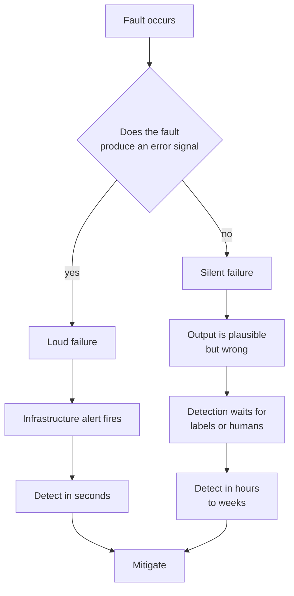
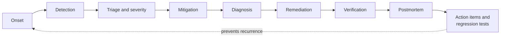
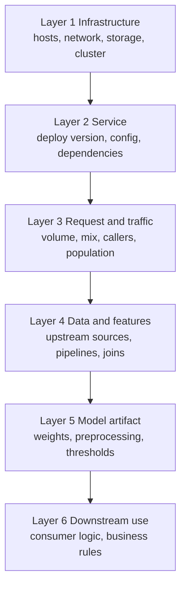
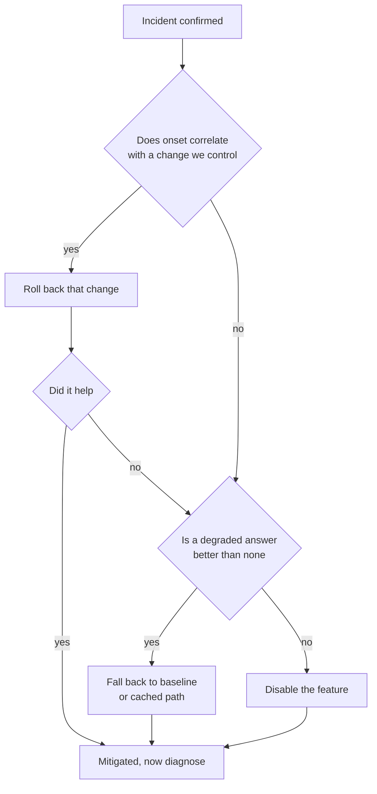

# Chapter 37: Incident Response and On-Call for Machine Learning

> **What this chapter covers** What counts as an incident in a system that is probabilistic by design, why the most damaging machine learning incidents are silent, how to detect and classify them, how to run an on-call rotation for a small team without burning it out, runbooks that survive contact with a tired engineer at three in the morning, a systematic diagnostic method that goes from symptom to cause in the order that finds things fastest, eight detailed playbooks for the incidents that actually happen, the mitigation levers and how to choose between them, the rollback versus retrain decision, communication during an incident, the postmortem and the discipline that makes it worth doing, turning past incidents into regression tests and monitors, game days for machine learning systems, and on-call health.
>
> **Prerequisites** Chapter 25 (Model Lifecycle, Versioning, and Registries), Chapter 27 (Monitoring, Drift, and Retraining), Chapter 28 (Reliability, Cost, Security, and Compliance), Chapter 33 (Testing Machine Learning Systems).
>
> **Where it is used** Any team that owns a model in production and carries a pager for it. The material bites hardest where a model's output feeds an automated decision, because there nobody is looking at the answers.

Software incident response is a mature discipline with a well-worn shape: something breaks loudly, an alert fires, an engineer mitigates, a postmortem follows. Machine learning systems inherit all of that and add a category the discipline was not designed for. The service is up, every dashboard is green, latency is nominal, the error rate is zero, and the predictions are wrong. Nothing pages. The damage accumulates for days.

This chapter is about both kinds. The loud kind is handled with standard practice and this chapter covers it briskly. The silent kind is the reason the chapter is long.

Chapter 27 covers the monitoring signals and drift detection that feed detection here. Chapter 28 covers service objectives, error budgets, and the resilience patterns that shape mitigation. This chapter assumes both and spends its pages on what happens between the alert and the closed postmortem.

---

## 37.1 Level 1: Foundations

### 37.1.1 What an incident is

An incident is an unplanned event that degrades a service below the level it is committed to, or that carries a risk of doing so, and that requires a coordinated human response.

Three parts of that definition do real work.

**Unplanned.** A deployment that takes the service down for ten seconds in a planned maintenance window is not an incident. The same ten seconds unannounced is.

**Below commitment.** The commitment is whatever you have written down as the service level objective. Chapter 28 defines these. Without a written objective, every argument about whether something is an incident becomes an argument about taste, and those arguments happen at the worst possible time.

**Coordinated human response.** If an automated system detects a condition, mitigates it, and logs it, that is an event, not an incident. The moment a human must decide something, it is an incident.

For machine learning systems the commitment includes a quality objective. Chapter 28, level 2 gives the form: a stated floor on a quality metric measured over a stated window on a stated population. Without one, a quality degradation has no threshold to breach and therefore never formally becomes an incident, which is precisely how these failures run for weeks.

### 37.1.2 The loud failure and the silent failure

Divide every machine learning incident into two families. They differ in almost every operational respect.

| Property | Loud failure | Silent failure |
|---|---|---|
| Symptom | Errors, timeouts, crashes, saturation | Correct-looking outputs that are wrong |
| Detected by | Infrastructure and service monitoring | Quality monitoring, labels, or humans |
| Time to detect | Seconds to minutes | Hours to weeks |
| Blast radius at detection | Bounded by detection time | Often the whole period since onset |
| Mitigation | Usually clear, often automatic | Usually requires diagnosis first |
| Reversibility | High, restart or roll back | Often low, decisions already acted on |
| Standard SRE practice applies | Fully | Partially |

A useful way to hold the difference: in a loud failure the system tells you it has failed. In a silent failure the system tells you it is fine, and it believes that, because nothing in the request path knows what a correct answer looks like.

A prediction service returning `{"score": 0.5}` for every request is, to every layer of infrastructure, a perfectly healthy service. It returns 200. It returns quickly. It never retries. The only thing wrong with it is the number, and the number is exactly the thing no infrastructure check can evaluate.



*Figure 37.1: The fork that determines everything about how an incident is handled is whether the fault produces an error signal at all.*

### 37.1.3 Why silence is the default for machine learning systems

This is not bad luck. It follows from how the systems are built.

**A model always produces an output.** A classifier given garbage features does not raise. It produces a class. A language model given a truncated prompt does not raise. It produces fluent text. The function is total: it has an answer for every input, including inputs it should refuse.

**Defaults hide missing data.** Feature pipelines fill nulls. A feature that becomes permanently null is imputed to the training mean, and the model then makes predictions as if every user were average. This is the single most common silent failure and it is caused by a line of code written to make the system more robust.

**Correctness is statistical, not per-request.** You cannot look at one prediction and say it is wrong. Only over a population, and only with labels, can you say the system is worse than it was. That requires aggregation, which requires time.

**Labels are delayed.** Chapter 27, level 3 covers delayed labels in detail. If a loan default is known ninety days after the decision, then a model that began making bad decisions today is provably bad in ninety days. Every unsupervised proxy you use before then is exactly that, a proxy.

**Plausibility is the failure mode of generative systems.** A language model's failure output is a confident, well-formed, wrong answer. It is designed to be plausible. Plausibility is what makes it useful and what makes its failures invisible.

### 37.1.4 Vocabulary

Define these once and use them consistently, because incident communication fails when two people mean different things by the same word.

| Term | Definition |
|---|---|
| Incident commander | The single person accountable for coordinating the response. Not necessarily the person fixing anything. |
| Responder | An engineer actively diagnosing or mitigating. |
| Scribe | Whoever maintains the running timeline. Often the commander in a small team. |
| Detection time | From onset to the first human or system knowing something is wrong. |
| Time to acknowledge | From alert to a human responding to it. |
| Time to mitigate | From detection to the user-visible impact stopping. |
| Time to resolve | From detection to the underlying cause being fixed. |
| Mitigation | Stopping the harm. Does not require understanding the cause. |
| Remediation | Fixing the cause so it cannot recur. |
| Blast radius | Which users, which requests, which downstream decisions were affected. |
| Onset | When the fault actually started, which is usually well before detection. |
| Contributing factor | A condition without which the incident would have been smaller or absent. |
| Trigger | The specific change or event that started this instance. |

Two of these deserve emphasis for machine learning work.

**Onset versus detection.** In loud failures these are close and the distinction rarely matters. In silent failures the gap between them is the incident. An accuracy regression detected on Thursday that began the previous Friday has a blast radius of six days of decisions, not of the two hours you spent fixing it. Establishing onset is a primary diagnostic task, not an afterthought, because it determines what must be remediated downstream.

**Mitigation versus remediation.** Under pressure, engineers try to fix the cause because that is the satisfying thing to do. The correct first move is almost always to stop the harm by any available means and diagnose afterwards, with the system in a safe state. Section 37.3.4 covers the levers.

### 37.1.5 The incident lifecycle



*Figure 37.2: The lifecycle, with mitigation deliberately placed before diagnosis.*

Note the ordering. Mitigation comes before diagnosis. That ordering is contested by engineers who want to understand before acting, and it is correct for the same reason a surgeon stops bleeding before establishing why the patient is bleeding. The exception is when mitigation itself destroys the evidence needed to diagnose, which is section 37.3.4.

### 37.1.6 What machine learning adds to standard incident response

If you already know software incident response, this table is the delta.

| Standard practice | The machine learning modification |
|---|---|
| Alert on error rate and latency | Add quality, prediction distribution, and feature health signals |
| Severity by user-visible breakage | Add a severity axis for wrong-but-served answers |
| Roll back to the previous version | Two artifacts can roll back independently, code and model, and they may have different bad versions |
| Reproduce the bug locally | Reproduction needs the exact input features as served, which the logs may not contain |
| The fix is a code change | The fix may be a data fix, a retrain, or a threshold change, with very different lead times |
| Verify by re-running the failing request | Verification needs a population and often needs labels |
| Postmortem produces a unit test | Postmortem produces a unit test, a behavioural test, a monitor, and often a golden-set example |

---

## 37.2 Level 2: Working knowledge

### 37.2.1 Detection: the signals that surface a silent failure

Chapter 27 covers the monitoring layers in full. Here is what matters specifically for detection of incidents, ordered by how early they fire.

| Signal | Latency to fire | What it catches | False positive rate |
|---|---|---|---|
| Infrastructure and service metrics | Seconds | Loud failures only | Low |
| Feature null and range violation rates | Minutes | Broken upstream pipelines | Low |
| Prediction distribution shift | Minutes to hours | Model or feature faults, some drift | Medium |
| Input distribution shift | Hours | Genuine drift, upstream changes | High |
| Business or proxy metrics | Hours to days | Real impact, whatever the cause | Medium |
| Delayed ground-truth quality metrics | Days to months | Everything, eventually | Low |
| User reports and support tickets | Hours to days | Everything, including what you never monitored | Low but noisy |

The practical consequence: the fast signals are indirect and the direct signal is slow. You detect silent failures with proxies and confirm with labels.

**The prediction distribution is the workhorse.** Of all the cheap signals, the distribution of the model's own outputs is the most informative per unit of effort. It requires no labels, no upstream instrumentation, and no statistical sophistication to be useful. Almost every serious silent failure moves it. A feature that goes null moves it. A model artifact that loads the wrong weights moves it. A preprocessing change moves it. Compare today's output distribution against a stable reference window, on the same population, segmented by the two or three dimensions that matter.

**User reports are a legitimate detection channel and should be instrumented as one.** Teams find this uncomfortable because being told by a user is embarrassing. It is also common and will remain common, because users evaluate correctness and your monitors evaluate proxies for correctness. The correct response is not to pretend it will not happen. It is to make the path from a support ticket to an engineer short and to treat a cluster of similar complaints as an alert with a real severity.

A concrete pattern that works: tag support tickets with the feature or surface they concern, alert when the rate of tickets for one surface exceeds its trailing baseline, and make that alert page the same rotation as the infrastructure alerts. The signal is noisy and slow. It is also the only signal that measures the thing you actually care about.

### 37.2.2 Degradation versus outage

These need different handling and conflating them is a common source of bad decisions.

| | Outage | Degradation |
|---|---|---|
| Definition | The service cannot answer | The service answers worse |
| Detection | Immediate | Statistical |
| Correct urgency | Maximum | Proportional to measured harm |
| Mitigation | Restore service | Often reduce reliance on the model |
| Fallback | Serve cached, default, or heuristic output | Route to a simpler model or human review |
| Can you wait until morning | No | Sometimes, and this must be decided in advance |

The last row is the one that matters for on-call design and it is discussed in 37.2.4.

A degradation has a severity that depends on the decision the prediction feeds. The same twenty percent relative drop in a ranking model's quality is a mild annoyance if it reorders a recommendation carousel and a serious incident if it reorders a triage queue.

### 37.2.3 Severity classification when the service is up

Standard severity scales are built around availability. They do not classify "the service is healthy and the answers are wrong". Extend them with a quality axis.

A workable scheme, which you should adapt rather than adopt verbatim:

| Severity | Availability criterion | Quality criterion | Response |
|---|---|---|---|
| SEV1 | Service down or erroring for a material share of traffic | Predictions materially wrong for a broad population, feeding an automated decision that is hard to reverse | Page immediately, incident commander, external communication |
| SEV2 | Partial outage, one region or one tenant | Measurable quality regression beyond the objective, or a suspected one on a high-stakes surface | Page immediately, single responder, internal communication |
| SEV3 | Elevated errors within budget | Quality degradation confined to a segment, or a proxy signal moved without confirmed harm | Ticket, next business day, investigate |
| SEV4 | Cosmetic or fully mitigated | Anomaly with no measured impact | Ticket, backlog |

Three classification rules make this usable under stress.

**Reversibility raises severity.** A wrong prediction that a user sees and ignores is not the same as a wrong prediction that sent an email, declined a transaction, or wrote a row to a system of record. Ask: has an irreversible action been taken on this output. If yes, escalate one level.

**Uncertainty raises severity, initially.** At the start of an incident you do not know the blast radius. Classify on the worst plausible reading and downgrade as facts arrive. Downgrading is cheap. Upgrading late is expensive because the response was too small for too long.

**Automation without a human in the loop raises severity.** If a human reviews every output before it has effect, the human is a control and the severity is lower. If the output is acted on automatically, the model is the control.

A practical addition: record in the severity definition the maximum acceptable detection time for each level. If your SEV1 quality criterion can only be evaluated with labels that arrive in thirty days, you have written a severity level you cannot detect, and that is a monitoring gap disguised as a severity scale.

### 37.2.4 The on-call model

On-call for machine learning is usually bolted onto an existing software rotation, and that produces predictable problems. Design it deliberately.

**What the on-call engineer is actually expected to do.** Write this down explicitly, because the implicit expectation is "fix it", which is not achievable for most machine learning incidents in a single shift.

A realistic charter:

1. Acknowledge and assess. Determine severity and blast radius.
2. Mitigate using the documented levers. Roll back, fall back, shed, or disable.
3. Communicate status on the documented cadence.
4. Escalate to the model owner when mitigation is insufficient or the cause is in model logic.
5. Preserve evidence. Capture the logs, the artifact versions, the feature snapshots.
6. Hand off or file the follow-up.

Notice what is not on that list: retrain the model, tune a threshold, or diagnose a subtle data quality issue at three in the morning. Those are daylight work with a second pair of eyes. An on-call engineer who is expected to retrain a model alone at night will either do it badly or not do it.

**Rotation design for small teams.** Most machine learning teams are small, which makes the standard advice about eight-person rotations unhelpful.

| Team size | Workable pattern | The main risk |
|---|---|---|
| 1 to 2 | Do not run a genuine 24-hour rotation. Business-hours response with automated mitigation for the night. | Burnout is certain if you try. Invest in automatic fallback instead. |
| 3 to 4 | Weekly primary with a named secondary, follow-the-sun if geography allows. | One person becomes the de facto expert and is always escalated to. |
| 5 to 8 | Weekly primary plus secondary, rotation of both. | Rotation members who never touch the systems in their shift lose competence. |
| Larger | Split rotations by system, with a clear routing rule. | Routing ambiguity, incidents that bounce between rotations. |

For a team below five, the highest-value investment is not a better rotation. It is making the system degrade safely without a human. A model service that automatically falls back to the previous model version on a quality-proxy breach, or to a deterministic heuristic on a feature-health breach, converts a page into a ticket. That is worth more than any amount of rota engineering.

**The honest limits of paging for quality.** Consider paging someone at three in the morning for a quality regression. Ask what they can do.

- If an automatic rollback exists, the system should have done it. Do not page for something automatable.
- If rollback requires a human decision, page, because the decision is the point.
- If the only available action is to start an investigation, do not page. The investigation will be worse at three and the harm accrued between three and nine is usually small relative to the harm already accrued since onset, which was days ago.

That last point is the machine learning specific argument and it is worth being explicit about. For a silent failure detected after four days, the marginal six hours of waiting until the morning shift is a four percent increase in blast radius, and a tired engineer diagnosing alone raises the probability of a wrong mitigation considerably. Page for decisions and for fast-moving harm. Do not page for archaeology.

The counterargument, which you should weigh: some degradations are compounding, for example a recommender whose bad outputs are logged and fed back into the next training set, or an automated decision system whose outputs create downstream records. In compounding cases the harm is not linear in time and waiting is not cheap. The rule then is: page if the harm compounds or if an irreversible action is being taken, otherwise wait.

Write this decision into the alert definition itself, not into a wiki page. Each alert should carry its own routing, and that routing should encode the reasoning above.

### 37.2.5 Runbooks

A runbook is a document that takes an engineer from an alert to a safe state. It is written for the worst reader you will have: woken up, unfamiliar with this service, and slightly panicked.

**Structure that works.**

1. **Alert name and what it means**, in one sentence, in plain language.
2. **Severity and routing.** What this alert is worth, and who to escalate to.
3. **Immediate mitigation.** The exact commands, in order, with the expected output of each. Placed first, before any diagnosis, so a responder who reads nothing else does the right thing.
4. **Verification.** How to confirm the mitigation worked, with the specific dashboard and the specific number.
5. **Diagnosis.** The ordered checks, each with the command and the interpretation of each outcome.
6. **Escalation.** Who, on what channel, with what information prepared.
7. **Known false positives.** The conditions under which this alert fires harmlessly, which prevents an unnecessary rollback.
8. **Last verified date and by whom.**

**What makes a runbook usable under stress.**

- Commands are copy-pasteable and complete, with placeholders clearly marked. A command that requires the reader to know the cluster name is a command they will get wrong.
- Every branch states the expected output so the reader knows which branch they are on. "If this returns more than zero rows, go to step 5" is usable. "Check whether the feature pipeline is healthy" is not.
- No prose paragraphs in the mitigation section. Numbered steps only.
- The dangerous steps are marked as dangerous, with what they destroy.
- It is short. A runbook longer than two screens will not be read. If the diagnosis genuinely needs more, split diagnosis into a linked document and keep mitigation on the first screen.

**Keeping them true.** Runbooks rot faster than code because nothing fails when they are wrong. Three mechanisms keep them honest, in increasing order of cost and effectiveness.

| Mechanism | Cost | Effectiveness |
|---|---|---|
| A last-verified date, with an alert when it is older than a quarter | Low | Low, it prompts but does not verify |
| Requiring the responder to note any inaccuracy during the incident | Low | Medium, it catches what was actually used |
| Runbook review as an item in the deployment checklist for the service | Medium | Medium |
| Game day exercises that execute the runbook against a real fault | High | High, it is the only mechanism that actually tests it |

The one strong recommendation: when an incident happens and the runbook was wrong, fixing the runbook is part of closing the incident, not a follow-up ticket. Follow-up tickets for documentation do not get done.

### 37.2.6 Mistakes everyone makes first

**Diagnosing before mitigating.** The most common and the most costly. Every minute spent understanding is a minute of accruing harm that a rollback would have stopped.

**Changing two things at once.** Under pressure, responders apply the rollback and the configuration change and the cache flush simultaneously, the symptom clears, and nobody knows which one worked. The next occurrence starts from zero knowledge.

**Assuming the model is the problem.** Model owners assume model faults. In practice the large majority of machine learning incidents originate in data and infrastructure, not in model logic, because model logic is frozen in an artifact and data is not. Check what changed before checking what is complicated.

**Not recording onset.** Responders record when they were paged. Six weeks later, when someone asks which decisions were affected, nobody can answer.

**Retraining as a reflex.** Retraining is slow, changes many things at once, and has its own failure modes. It is a remediation, occasionally, and almost never a mitigation. Section 37.3.5 covers when it is right.

**Silence during the incident.** Responders go heads-down and stop communicating, which causes stakeholders to interrupt them to ask for status, which slows them down further.

**Treating the postmortem as a report.** A postmortem whose output is a document is a waste. Its output is a set of changes to the system.

---

## 37.3 Level 3: Depth

### 37.3.1 The diagnostic method

Under pressure, engineers debug by intuition, which means they check the thing they last saw break. That works when the intuition is right and wastes the whole incident when it is wrong. A systematic method is slower on the lucky incidents and dramatically faster on the unlucky ones.

The method has three principles.

**Bisect, do not guess.** Each check should, as nearly as possible, halve the space of remaining causes. Prefer a check that splits the system over a check that confirms a hypothesis.

**Check the cheap and the likely first, weighted by both.** Order checks by expected information per unit of time. A check that takes five seconds and eliminates a third of the space beats a check that takes twenty minutes and eliminates half.

**Change first, complexity second.** A production system that was working and is now not working almost always changed. Enumerate changes before reasoning about mechanisms.

**The layer stack.** A machine learning prediction path has a definite set of layers, and a fault lives in exactly one of them. Walking them in order is the backbone of the method.



*Figure 37.3: The six layers of a prediction path. A fault lives in one of them, and the diagnostic order runs top to bottom because lower layers are more expensive to check.*

**The change-first triage.** Before entering the layer walk, spend ninety seconds on this, because it resolves a large share of incidents outright.

| Question | Where to look |
|---|---|
| Did the service deploy recently | Deployment log, with timestamps |
| Did the model version change | Registry, with promotion timestamps |
| Did a configuration or feature flag change | Configuration history |
| Did an upstream data producer deploy | Their deployment log, which you should have access to |
| Did a scheduled pipeline run late, fail, or partially succeed | Orchestrator run history, see Chapter 31 |
| Did traffic composition change | Caller breakdown, new client versions, a marketing event |
| Did anything expire | Certificates, credentials, partitions, retention windows |

Correlate onset against this list. If the onset time matches a change to within the resolution of your data, you have your candidate and you should test it directly rather than continuing the walk.

The prerequisite for this triage being fast is that all seven of those histories are visible in one place with consistent timestamps. Building that view is one of the highest-return things a platform team can do for incident response, and section 38.3 revisits it as a platform capability.

**The layer walk in practice.** When change-first triage does not resolve it, walk the layers. For each layer, one decisive check.

| Layer | The decisive check | What a failure here looks like |
|---|---|---|
| 1 Infrastructure | Are the pods healthy, is the node pool intact, is storage reachable | Errors, timeouts, restarts, saturation |
| 2 Service | Which version is actually running on each replica, does the config match intent | Version skew across replicas, a stale config, a dependency at the wrong version |
| 3 Traffic | Has request volume, caller mix, or the population changed | Same model, different inputs, different aggregate metrics |
| 4 Data and features | For a sample of live requests, are feature values within expected ranges, and are null rates normal | Nulls, constants, stale values, wrong units, misaligned joins |
| 5 Model | Does the artifact hash match the intended version, does a known input produce the known output | Wrong artifact, wrong preprocessing, changed threshold |
| 6 Downstream | Is the consumer interpreting the output as intended | Model is fine, the consumer inverted a sign or changed a cutoff |

**The single most useful diagnostic artifact** is a reference request with a known correct output, stored and runnable against production. Send it, compare the output to the recorded expectation. If it matches, the model and its preprocessing are fine and the problem is in layers 3, 4, or 6. If it does not, the problem is in layer 5 or in the service. One request bisects the entire stack.

This is worth building before you need it. A handful of frozen requests with frozen expected outputs, runnable by one command, is perhaps two hours of work and it repays that in the first incident.

**Listing 37.1: A production reference-request probe that bisects the stack.**

```python
import json, hashlib, sys
import requests

def probe(endpoint, cases_path, tol=1e-4):
    """Send frozen requests to a live endpoint and compare against frozen outputs."""
    cases = json.load(open(cases_path))
    failures = []
    for c in cases:
        r = requests.post(endpoint, json=c["input"], timeout=5)
        r.raise_for_status()
        got = r.json()
        # Compare the numeric prediction, and separately the model version echoed back.
        if abs(got["score"] - c["expected_score"]) > tol:
            failures.append((c["id"], "score", c["expected_score"], got["score"]))
        if got.get("model_version") != c["expected_model_version"]:
            failures.append((c["id"], "version",
                             c["expected_model_version"], got.get("model_version")))
    return failures

if __name__ == "__main__":
    f = probe(sys.argv[1], sys.argv[2])
    for case_id, field, want, have in f:
        print("MISMATCH %s %s want=%s have=%s" % (case_id, field, want, have))
    print("PASS" if not f else "FAIL (%d)" % len(f))
    sys.exit(0 if not f else 1)
```

The important design choices are in what the cases contain. Each case pins an input, an expected score, and an expected model version, so a single run distinguishes "the model changed" from "the model is the same but computes differently", which are different incidents with different causes. The tolerance is explicit rather than exact equality, because floating-point non-determinism across hardware is real and a probe that fails on the last bit is a probe that gets ignored. The expected outputs must be regenerated deliberately when a model is promoted, which makes the regeneration step an intentional record of the change.

### 37.3.2 Establishing onset and blast radius

For silent failures this is a primary task, not a formality, because it determines what must be corrected downstream.

**Finding onset.** Take the signal that eventually detected the problem, plot it back as far as the retention allows, and find the changepoint rather than the alert threshold crossing. The alert fires when the signal crosses a line. The fault began when the signal changed behaviour, which is earlier.

For a signal $x_t$ observed daily, a simple and adequate approach is a cumulative sum of deviations from a pre-incident reference mean $\mu_0$ with standard deviation $\sigma_0$:

$$
S_t = \max\left(0,\; S_{t-1} + \frac{x_t - \mu_0}{\sigma_0} - k\right)
$$

with $S_0 = 0$. Here $k$ is a slack parameter, conventionally $0.5$, that stops the statistic from accumulating on noise. The estimated onset is the last $t$ at which $S_t = 0$ before the run that carried it past your threshold.

Worked example. Suppose the daily null rate for a feature has $\mu_0 = 0.02$ and $\sigma_0 = 0.004$ over a stable reference period, and the observed values for seven days are 0.021, 0.019, 0.034, 0.041, 0.038, 0.045, 0.120. The standardised deviations are 0.25, -0.25, 3.0, 4.75, 4.0, 5.75, 25.0. With $k = 0.5$: $S_1 = 0$, $S_2 = 0$, $S_3 = 2.5$, $S_4 = 6.75$, $S_5 = 10.25$, $S_6 = 15.5$, $S_7 = 40.0$. The alert probably fired on day 7 when the rate hit twelve percent. The statistic last sat at zero on day 2, so the onset is day 3, and the blast radius is five days, not one. That difference is the whole content of the incident report.

Chapter 27, level 3 covers sequential changepoint detection properly, including CUSUM's relatives. The point here is operational: run it backwards during the incident to date the onset, not only forwards to detect.

**Establishing blast radius.** Answer four questions, and write the answers into the incident record as you get them.

| Question | How to answer |
|---|---|
| Which requests were affected | Filter inference logs by the fault condition, for example model version, feature null, or region, between onset and mitigation |
| Which users | Aggregate those requests to entities |
| Which downstream actions were taken | Join the affected predictions to the action log. This requires that predictions carry an identifier the downstream system records. |
| Which of those actions are reversible | A policy question that must be answered by the owner of the downstream system |

The third row is a system design requirement disguised as an incident task. If your prediction service does not return a prediction identifier that downstream systems persist alongside the action they took, you cannot answer the question that matters most during a serious incident. Chapter 27, level 2 covers what to log at inference. Add this to it: a stable prediction identifier, propagated and stored by every consumer.

### 37.3.3 The playbooks

This is the longest section of the chapter and it is the part that gets used. Each playbook follows the same shape: the symptom as it appears, the plausible causes in the order to check them, the decisive test that distinguishes them, the mitigation, and the prevention that stops it recurring.

Read them once now and again when you are writing your own runbooks. They are templates, not universals.

#### Playbook A: latency regression

**Symptom.** The latency distribution shifts. Usually the tail first: p99 moves while p50 is untouched. Error rate may follow if callers time out.

**Causes, in order of likelihood.**

1. A deploy changed the model, the batch size, the tokeniser, the preprocessing, or a library version.
2. Input size distribution changed. Longer sequences, larger images, more items per request, a caller that started sending batches.
3. A dependency slowed. A feature store lookup, a vector index, a downstream service.
4. Resource contention. A noisy neighbour, a node under memory pressure, a cache that stopped fitting, garbage collection.
5. Autoscaling failed to keep up, or scaled down into a traffic rise.
6. Hardware or placement changed. A different instance type, a mix of node generations after a rolling replacement.

**Decisive tests.**

| Test | Distinguishes |
|---|---|
| Is p50 also up, or only the tail | Broad slowdown (1, 3, 4) versus input-driven tail (2) |
| Plot latency against input size on the same axes | Confirms or eliminates cause 2 immediately |
| Break latency down by stage: feature fetch, preprocess, model forward, postprocess | Points at exactly one of 1, 3 |
| Compare per-replica latency | Contention or heterogeneous hardware shows as a subset of replicas being slow |
| Check queue depth and concurrency at the server | Distinguishes "the model got slower" from "we are waiting for a slot" |

That last distinction is the one most often got wrong. A server whose per-request compute is unchanged but whose queue is deep shows exactly the same client-side latency as a server whose model got slower. Only a server-side breakdown separates them, which is why stage-level timing instrumentation is worth its cost. Chapter 24 covers the serving-side mechanics of batching and queueing.

**Mitigation.** Roll back if a deploy correlates. Scale out if it is queueing. Reduce batch timeout or maximum batch size if batching is inflating the tail. Shed load or degrade to a cheaper model path if neither is fast enough. Chapter 28, level 3 covers the fallback ladder.

**Prevention.** A latency assertion in the deployment gate with a fixed input mix, so a model that is two times slower cannot be promoted silently. A separate alert on input size distribution, which is a cause rather than a symptom and therefore fires earlier.

#### Playbook B: accuracy degradation with no infrastructure signal

**Symptom.** A quality metric has fallen below its objective, or a proxy suggests it has. Everything else is green. This is the archetypal silent failure.

**Causes, in order.**

1. A feature is broken. Null, constant, stale, or wrong units. Check this first because it is the most common and the fastest to check.
2. Training-serving skew introduced by a change to shared or duplicated transformation logic.
3. The wrong model artifact is serving.
4. The population changed. You are being evaluated on a different mix of users, not on a worse model.
5. Label pipeline broken. The metric is wrong, not the model.
6. Genuine distribution drift.
7. Genuine concept drift, where the relationship between features and target has changed.

**The ordering matters and is not the intuitive one.** Engineers reach for drift first because drift is the interesting hypothesis. Drift is near the bottom of this list because it is slow, it is usually gradual, and it is by far the least likely explanation for a step change detected this week. A step change in quality is almost always a change somewhere, and changes are in layers 2 through 5.

**Decisive tests.**

| Test | Eliminates |
|---|---|
| Feature health report over the incident window: null rate, cardinality, mean, and range per feature versus reference | Cause 1, in about two minutes |
| Recompute features offline for a sample of live requests and diff against the values actually served | Cause 2, definitively |
| Compare the serving artifact hash against the registry's intended version | Cause 3 |
| Segment the metric by the main population dimensions and check whether within-segment quality is stable | Cause 4, via Simpson's paradox, see below |
| Recompute the metric from raw labels rather than the aggregate pipeline, on a sample | Cause 5 |
| Run the drift detectors from Chapter 27 on inputs, with onset dating | Distinguishes 6 from 7 |

The segment test deserves elaboration because it catches a genuinely counterintuitive case. Aggregate quality can fall while quality within every segment is unchanged, if the mix of segments shifted towards harder segments. This is Simpson's paradox and it is common when a product launches in a new market or a new client sends different traffic. The correct response is not to retrain. There is nothing wrong with the model. The correct response is to fix the metric so that it is computed on a stable population or reported per segment.

Worked example. Two segments, A and B, with accuracy 0.95 and 0.70 respectively, both stable. Last month the traffic was 80 percent A, giving aggregate $0.8 \times 0.95 + 0.2 \times 0.70 = 0.90$. This month it is 40 percent A, giving $0.4 \times 0.95 + 0.6 \times 0.70 = 0.80$. A ten point aggregate fall with no model change and no drift in either segment.

**Mitigation.** If a feature is broken, fix or pin the feature; if it cannot be fixed quickly, consider serving a model variant that does not depend on it, if one exists. If the artifact is wrong, correct it. If skew, roll back the transformation change. If none of these, decide between rollback and retrain using section 37.3.5. Where quality cannot be restored quickly and the stakes are high, reduce reliance on the model: route to a simpler baseline, widen the band routed to human review, or raise the confidence threshold at which the model acts autonomously.

**Prevention.** Feature health monitoring with per-feature alerting, which is cheaper and faster than quality monitoring and catches the most common cause. An offline-online consistency test in the deployment pipeline, see Chapter 33. Population-stable metric definitions, or per-segment reporting as standard.

#### Playbook C: a feature pipeline that silently produced nulls

**Symptom.** Often none at first. Then a gradual or step quality decline, or a shift in the prediction distribution towards the value the model assigns to an average input.

**Why this is the canonical silent failure.** An upstream column is renamed, dropped, or changes type. The join that produced the feature returns nothing. The pipeline's null handling imputes the training mean. Every layer behaved as designed. The model now receives a constant where it expected a signal, and it continues to produce confident predictions that ignore that signal entirely.

The severity depends on the feature's importance. If the null feature was the model's most important, the prediction distribution collapses towards a narrow band and the collapse is visible. If it was moderately important, the effect is a slow bleed that is invisible in aggregates and shows only in quality metrics weeks later.

**Decisive tests.**

1. Null rate per feature, per day, over a window that extends well before the suspected onset. This is one query and it resolves the case.
2. If null rates look normal, check for the subtler variants below. They defeat a null check.

| Variant | What the null check sees | What actually detects it |
|---|---|---|
| Imputed nulls | Nothing, nulls were filled | Variance per feature. An imputed feature has near-zero variance. |
| Stale values | Nothing, values are present | Maximum timestamp per feature source, or the fraction of rows whose value is identical to yesterday's |
| Silent unit change | Nothing, values are present and plausible | Range and quantile checks against reference, which catch a factor of 100 |
| Partial join loss | A raised null rate only in one key range | Row count per partition compared to expectation |
| Wrong default on a categorical | Nothing | Cardinality and top-value share per feature |

**Mitigation.** Fix the upstream if you can reach it and the fix is minutes. Otherwise, choose between backfilling the feature from an alternative source and rolling back to a model that does not use it. If neither, degrade. Do not leave a model serving on a feature you know is dead unless you have measured that it is harmless, because an unmeasured assumption about harmlessness is how the incident got long in the first place.

An important secondary task: decide immediately whether the broken feature is being written into the training data. If it is, and a scheduled retrain runs, the model will learn that the feature is uninformative and the damage becomes permanent in the next artifact. Pause automated retraining as part of mitigation. This is the most-missed step in this playbook.

**Prevention.** Validation at the pipeline boundary, not only at the pipeline output. Chapter 20 covers schema contracts and data validation as code, and Chapter 33 covers where in the pipeline each check belongs. Add variance and cardinality checks alongside null checks, since they catch the imputed case. Alert on the checks rather than only logging them.

#### Playbook D: a schema change upstream

**Symptom.** Anything from a hard pipeline failure through to playbook C. What makes this its own playbook is that the cause is outside your system and the fix requires someone else.

**Causes.** A producer renamed a column, changed a type, changed an enumeration's allowed values, changed a nullability constraint, changed a timezone or a unit, or changed the semantics of a field while keeping its name and type. The last is the worst because no automated check catches it.

**Decisive tests.**

| Test | Catches |
|---|---|
| Diff the current source schema against the contract you recorded | Renames, type changes, added and dropped columns |
| Compare value distributions of each categorical column against reference | New or removed enumeration values, semantic changes |
| Compare row counts and per-key cardinality | Changed grain, a duplicated or dropped join key |
| Check the producer's deployment log against your onset | Confirms attribution and gives you someone to talk to |

**Mitigation.** Pin to the last known-good snapshot of the source if your storage layer supports it, which buys time without a code change. Otherwise, adapt at the boundary with an explicit compatibility shim, and mark that shim with an expiry. Do not adapt silently deep in the pipeline, because a shim nobody can find becomes permanent.

**Prevention.** This is an organisational fix, not a technical one. The technical half is a schema contract test that runs against the live source on a schedule and fails loudly, which Chapter 20 covers. The organisational half is that the producer must know they have a consumer. A data contract that the producer has never seen is not a contract. The practical minimum is a registered list of consumers per dataset and a notification obligation on breaking changes, enforced by the producer's own CI.

#### Playbook E: a bad model promotion

**Symptom.** Quality falls, latency changes, or the prediction distribution shifts, starting exactly at a promotion timestamp.

**Causes.** The evaluation gate passed on a metric that did not capture the regression. The evaluation set was stale or leaked. The model was trained on corrupted data. The artifact serialisation lost something, for example a preprocessing step that lived outside the artifact. The threshold or calibration was tuned on a different population than serving. The right model was trained and the wrong one was promoted.

**Decisive tests.**

1. Confirm the timestamp correlation. If onset does not match the promotion to within the resolution of your monitoring, this is not the cause, regardless of how suspicious the promotion looks.
2. Run the reference-request probe from listing 37.1 against both the new and previous artifact. A difference in output on a frozen input confirms that the artifact changed behaviour.
3. Evaluate the new artifact offline on the evaluation set again. If it passes offline and fails online, the cause is skew or population, not the model. If it fails offline too, the gate was wrong.
4. Compare the serving preprocessing path against the training preprocessing path explicitly.

That third test is the branch point and it is worth pausing on. "Passes offline, fails online" is a completely different incident from "fails offline too". The first says your evaluation set does not represent production and the remediation is to fix evaluation. The second says your gate did not run, or ran on the wrong artifact, and the remediation is in the pipeline. Do not skip this test to save ten minutes.

**Mitigation.** Roll back the model. This is the case where rollback is unambiguously correct, fast, and low risk, provided you have kept the previous artifact and the registry supports reverting an alias. Chapter 25 covers the registry as a state machine and the alias mechanism that makes this a metadata change rather than a redeploy.

**Prevention.** Shadow the candidate against live traffic before promotion and compare distributions, which catches the skew case that offline evaluation cannot. Chapter 25 covers shadow and canary. Make the evaluation gate include the slices where the model is most likely to regress, not only the aggregate. Keep the previous artifact warm for a defined period so rollback is seconds.

#### Playbook F: training-serving skew appearing after a refactor

**Symptom.** Quality falls, offline evaluation still looks good, no model was promoted, no upstream schema changed. Onset matches a code deploy that touched transformation or serving code.

**Why refactors cause this specifically.** The most common architecture has transformation logic used in two places: a batch path for training and a request path for serving. A refactor changes one and not the other, or changes a shared function in a way that is correct for one path and wrong for the other. Nothing fails. Both paths still produce numbers.

The classic instances:

| Refactor | The skew it creates |
|---|---|
| Changing a categorical encoder's handling of unseen values | Training saw a category, serving maps it to unknown |
| Changing null handling | Training imputes the median, serving imputes zero |
| Reordering a feature vector | Every feature is read into the wrong slot. Often produces surprisingly plausible outputs. |
| Changing a rolling window's inclusivity | An off-by-one that shifts every time-based feature by one period |
| Changing a timezone or timestamp parse | Every time-of-day feature is wrong by a fixed offset |
| Switching a library version that changed a default | Tokenisation, scaling, or rounding changes underneath you |

**The decisive test, and it is a single test.** Take a sample of live requests. Recompute their features using the training path. Diff, feature by feature, against the values that were actually served. Any feature with a non-trivial disagreement rate is the answer.

This test is so decisive that it is worth building as a permanent scheduled job rather than an incident-time script. Chapter 33 covers it as the offline-online consistency test and Chapter 20 covers the underlying skew problem. Running it daily converts this playbook from a multi-hour investigation into an alert.

**Mitigation.** Roll back the code deploy. If the deploy carried other necessary changes, revert only the transformation change, which is why transformation logic should live in a separately versioned module.

**Prevention.** One implementation of transformation, shared between paths, is the strong form and it is worth real architectural effort. Where two implementations are unavoidable, the consistency test is mandatory, running on every deploy and on a schedule.

#### Playbook G: a drift alert storm

**Symptom.** Dozens of drift alerts fire at once across many features. Nobody knows which one matters, and the natural response is to stop reading drift alerts.

**Causes.**

1. A single upstream change that affects many features at once. This is the usual case.
2. A population change, for example a marketing campaign or a new market, which moves everything legitimately.
3. Seasonality that the reference window does not include, for example the first Black Friday since the reference was set.
4. Multiple testing with no correction. Running two-sample tests on two hundred features at five percent significance produces about ten alerts a day from pure noise. Chapter 27, level 3 covers this.
5. Reference window staleness. The reference is a year old and everything has moved slowly since.

**Decisive tests.**

| Test | Distinguishes |
|---|---|
| Are the drifting features correlated or independent | Correlated implies one common cause (1, 2); independent implies statistical noise (4) |
| Do the drifting features share an upstream source | Confirms cause 1 directly |
| Is the same date last year similar | Cause 3 |
| Has model quality moved at all | The question that decides whether this matters |

**That last test is the entire point of the playbook.** Drift is not an incident. Drift is a hypothesis about a possible future incident. If quality has not moved and there is no reason to expect it to, the correct action is to record the drift and continue. Chapter 27, level 3 is explicit about significance versus impact and this is the operational consequence: alert on impact, investigate on significance.

**Mitigation.** There is usually nothing to mitigate. The failure being mitigated in an alert storm is a monitoring failure, not a model failure.

**Prevention.** Alert on a small number of aggregate or high-importance signals rather than on every feature. Weight drift by feature importance so that a shift in an unimportant feature does not page anyone. Apply a multiple-testing correction. Refresh reference windows on a schedule and record when you did. Make the drift dashboard a place you go, and the quality alert the thing that pages.

#### Playbook H: cost explosion

**Symptom.** Spend for the day or hour is multiples of baseline. Often noticed by finance rather than engineering, which is its own problem.

**Causes.**

1. Traffic growth, legitimate or otherwise, including a retry storm from a client.
2. A change that increased per-request cost: a larger model, a longer context, more retrieval, an agent loop with more steps, a cache that stopped hitting.
3. A runaway loop. An agent that does not terminate, a retry with no backoff, a recursive call.
4. Training or batch jobs left running, or a failed job auto-retrying forever.
5. Idle expensive resources. Accelerators provisioned and not released, an endpoint kept warm and unused.
6. Abuse or a credential leak.

**Decisive tests.**

| Test | Distinguishes |
|---|---|
| Decompose spend into request count times cost per request | Immediately separates 1 from 2 |
| Plot the distribution of per-request cost, not the mean | A heavy tail means loops or long contexts, a shifted body means a per-request change |
| Group cost by caller, tenant, feature, and model | Localises to one source, usually decisively |
| Check for requests with anomalous step or token counts | Cause 3 |
| List running jobs and provisioned accelerators against expectation | Causes 4 and 5 |
| Check authentication logs for unfamiliar callers or origins | Cause 6 |

The decomposition in the first row is the one to internalise. Total cost is

$$
C = \sum_{i} n_i \cdot c_i
$$

where $n_i$ is the request count for component $i$ and $c_i$ is the mean cost per request for that component. A cost incident is a change in some $n_i$, some $c_i$, or the set of components. Knowing which within the first five minutes determines everything about the response, and it requires only that your cost data is tagged by component. Chapter 28, level 3 covers the cost model and the budget enforcement point.

**Mitigation.** Rate limit the offending caller. Cap the loop. Disable the expensive path and fall back to a cheaper one. Kill the runaway job. Revoke the credential. For generative systems specifically, a hard per-request token cap and a per-tenant budget enforced in the gateway are the levers, and Chapter 35 covers their operation.

**Prevention.** Budget alerts on a rate, not on a monthly total, because a monthly total alerts after the money is spent. A per-request cost ceiling enforced in the serving layer. Loop step limits with a hard maximum. Idle resource reaping on a timer. Cost attribution tagging as a deployment requirement, so that the "group by caller" test is always available.

#### The playbook index

Keep something like this at the front of the runbook collection so that a responder finds the right playbook in seconds.

| Observed symptom | Start with |
|---|---|
| Errors or timeouts | Standard service incident response, then playbook A |
| Latency up, errors normal | A |
| Quality down, everything else green | B, then C |
| Prediction distribution collapsed or narrowed | C |
| Pipeline failed or produced fewer rows | D |
| Symptom starts exactly at a promotion | E |
| Symptom starts exactly at a code deploy, no model change | F |
| Many drift alerts at once | G |
| Spend anomaly | H |
| Users report bad answers, no signal anywhere | B, with the segment test first |

### 37.3.4 Mitigation levers and how to choose

Four levers, in increasing order of cost and decreasing order of speed.

| Lever | What it does | Time to effect | When it is right | What it costs |
|---|---|---|---|---|
| Rollback | Revert to the previous known-good version of code or model | Seconds to minutes | The fault correlates with a change you control | Loses whatever the change delivered; may destroy evidence |
| Fallback | Serve from a simpler path: a baseline model, a cached result, a heuristic, a default | Seconds | The model path is untrustworthy but the service must answer | Degraded quality, accepted deliberately |
| Traffic shift | Move requests away from the affected region, replica set, or variant | Minutes | The fault is localised to part of the fleet | Capacity pressure on the remainder |
| Disable | Turn the feature off entirely | Seconds | Serving anything is worse than serving nothing | Full loss of the capability |

**The decision.** Ask two questions in this order.

1. Is there a recent change that correlates with onset? If yes, roll it back. This is the highest-value first move and it is correct far more often than engineers expect, because the base rate of "a change caused this" is high.
2. If there is no such change, or rollback did not help, is a degraded answer better than no answer? If yes, fall back. If no, disable.



*Figure 37.4: The mitigation decision, which should be made in under two minutes and does not require knowing the cause.*

**Preserving evidence before mitigating.** Rollback can destroy the state you need to diagnose. Before you roll back, capture, in this order and in under sixty seconds:

1. The current artifact versions: code, model, config, and their hashes.
2. A sample of live request and response payloads, including the feature values as served.
3. The current values of the key dashboards, as a snapshot or screenshot with timestamps.
4. Container logs from one affected replica.

Automate this. A single command that dumps all four to a dated directory turns "preserve evidence" from an instruction people skip into something they actually do.

**The fallback must be tested.** A fallback path that has not run in production in six months is not a fallback, it is a hypothesis. Exercise it deliberately, which is what section 37.4.3 on game days is for. The failure mode where the fallback is itself broken, discovered during the incident, converts a degradation into an outage and it is depressingly common.

### 37.3.5 The rollback versus retrain decision

When the fault is in the model rather than in code or data plumbing, there are two paths and they have very different properties.

| | Rollback | Retrain |
|---|---|---|
| Time to effect | Minutes | Hours to days |
| Risk | Low, the previous version's behaviour is known | Medium to high, a new artifact is a new unknown |
| Works when | The previous version was good on current data | The current data is genuinely different from what the old model saw |
| Fails when | The world changed and the old model is also wrong | Under time pressure, because it changes many things at once |
| Reversible | Yes, trivially | Yes, but only by rolling back again |

**The criteria, applied in order.**

1. **Was the previous version good on today's data?** This is the question, and it is answerable in minutes if you have a recent labelled sample or a reliable proxy. If the previous model still performs acceptably on current inputs, roll back. Do not retrain.
2. **Is the cause a change, or a shift?** A change in your system is a rollback. A shift in the world is a retrain. Section 37.3.3 playbook B distinguishes these.
3. **Is the data you would retrain on trustworthy?** If the incident involves a broken feature or corrupted labels, retraining on that window bakes the fault into the new model. This is the trap. Establish data integrity for the training window before retraining, which usually means excluding the incident window.
4. **Do you have time?** Retraining during an incident compresses a process that normally includes evaluation, review, and staged rollout. A retrained model promoted without those steps is a second incident waiting.

The default under time pressure is rollback, then retrain calmly afterwards. The case where this is wrong is a genuine, confirmed, persistent concept shift where the previous model is also bad, and that case is rare enough that it should be argued for explicitly rather than assumed.

There is a third path that is underused: **retrain nothing and change the decision policy instead.** Raise the confidence threshold at which the model acts autonomously, route more cases to human review, or narrow the population the model serves. These take minutes, are fully reversible, and reduce harm without touching the model. For high-stakes systems this is often the best mitigation available and it should be an explicit lever in the runbook.

### 37.3.6 Communication during an incident

Communication is not overhead. Poor communication causes stakeholders to interrupt responders, causes duplicated work, and causes a second incident when someone acts on stale information.

**Who needs what.**

| Audience | What they need | Cadence |
|---|---|---|
| Responders | Current hypothesis, what has been tried, what changed | Continuous, in the incident channel |
| Incident commander | Status of each workstream, blockers | Continuous |
| Engineering leadership | Severity, impact, expected time to mitigate, whether help is needed | On severity change and every 30 to 60 minutes |
| Support and customer-facing teams | What users experience, what to tell them, a workaround if any | As soon as severity is set, then on change |
| Downstream system owners | Whether to trust the outputs, and which time window to distrust | Immediately for anything above SEV3 |
| Legal, compliance, or risk | For regulated models, that an incident exists and its scope | Per your organisation's threshold, agreed in advance |

The fifth row is machine learning specific and is routinely forgotten. If a downstream system consumed bad predictions, its owner needs to know the time window so they can decide about reprocessing. Telling them after the postmortem is too late.

**The status update format.** Use the same five fields every time. Consistency lets a reader skim.

```
[SEV2] Recommendation quality regression
Status:   Mitigating
Impact:   Ranking quality down ~15% for logged-in users since 2024-03-12 approx 09:00 UTC.
          No availability impact. Estimated 400k sessions affected.
Actions:  Rolled back model v41 to v40 at 14:20 UTC. Monitoring recovery.
          Investigating why the evaluation gate passed.
Next:     Update at 15:00 UTC or on change.
```

Rules that make this work: impact is stated in user terms and includes the onset time, not just the detection time. Actions are what has been done with timestamps, not what is being considered. Next always names a time. Unknowns are stated as unknown rather than omitted, because an omitted field reads as "fine" to an anxious reader.

**Write in the channel, not to individuals.** A single incident channel where all updates land, with responders narrating what they are doing, produces the timeline for free and stops the same question being answered five times.

### 37.3.7 The postmortem

**Purpose.** To change the system so this class of incident is less likely, detected faster, or less harmful. A postmortem that produces understanding and no changes has failed.

**Structure.**

| Section | Content | Common failure |
|---|---|---|
| Summary | Three sentences a stakeholder can read | Written for engineers, unreadable by anyone else |
| Impact | Who, how many, for how long, which downstream actions, quantified | Vague. "Some users were affected." |
| Timeline | Onset, detection, each significant action, mitigation, resolution, with timestamps and sources | Starts at detection rather than onset, hiding the detection gap |
| What happened | The causal chain, mechanism by mechanism | Jumps to the last change rather than explaining the mechanism |
| Contributing factors | Every condition without which this would have been smaller | Collapsed into a single root cause |
| What went well | Genuinely, including luck | Omitted, which makes the document demoralising and less accurate |
| Where we got lucky | The things that could have made it much worse and did not | Almost always omitted, and it is the most predictive section |
| Action items | Owner, due date, tracked in the normal work system | Unowned, undated, and therefore never done |

**Root cause versus contributing factors.** The phrase "root cause" implies a single cause, and complex systems rarely have one. An incident is usually a conjunction: a change was made, a test did not cover it, a monitor did not exist, an alert went to a channel nobody watched, and the runbook was stale. Removing any one of those would have reduced the harm. Calling the change "the root cause" and the rest "contributing factors" hides the four cheapest fixes.

The practical discipline: for every incident, list at least three contributing factors and ask of each, "if this had been different, what would the incident have looked like". Then pick the action items that give the most reduction per unit of effort, which is often a monitor rather than a fix.

**Blamelessness, stated precisely.** Blameless does not mean nobody did anything wrong. It means the analysis asks why the action made sense to the person at the time, given what they could see. If an engineer promoted a bad model, the useful questions are: what did the gate show them, what would have told them it was bad, and why was that information not in front of them. "The engineer should have been more careful" is not an action item because it changes nothing about the system. The test for whether a postmortem is blameless is whether it produced changes to tooling, process, or information rather than to expectations of individual vigilance.

**The detection gap is the most important number in a machine learning postmortem.** Record onset, detection, and mitigation, and compute both gaps. For silent failures the onset-to-detection gap dominates the total harm and is usually the cheapest thing to improve. A team that reduces detection time from six days to six hours has reduced blast radius by a factor of twenty-four without preventing a single incident.

**Action items that actually get done.** Three rules, all of them boring and all of them the difference.

1. Each has a named individual owner, not a team.
2. Each has a due date and lives in the same tracker as normal work, with the same prioritisation.
3. The set is small. Three items that get done beat twelve that do not. Choose by expected harm reduction, not by completeness.

Add one process rule: review open action items from past postmortems at a fixed cadence, and if an item has slipped twice, either escalate it or close it explicitly as a decision not to do it. An item that quietly ages for a year is worse than one that was never written, because it creates a false sense that the risk is handled.

### 37.3.8 Building the incident library

Every incident should leave permanent artifacts behind. This is the mechanism by which a team gets better rather than merely more experienced.

| Artifact | What it is | Which incidents produce it |
|---|---|---|
| A regression test | A test that fails on the code or data condition that caused this | Any incident with a deterministic cause |
| A behavioural test case | An input with an expected model behaviour, added to the behavioural suite | Quality incidents with an identifiable input pattern |
| A golden-set example | The failing case added to the frozen evaluation set | Quality incidents where the model was genuinely wrong |
| A monitor | A signal that would have detected this earlier | Every silent failure, without exception |
| A runbook or playbook entry | The diagnostic path you actually used | Any incident that took more than an hour to diagnose |
| A game day scenario | A reproducible injection of this fault | High-severity incidents and anything involving a fallback |

Chapter 33 argues that regression tests built from incidents are the highest-value test category, and this is the process that produces them. The reason they are high value is selection: they are drawn from the distribution of faults that actually occur in your system, which no amount of a priori test design can match.

The discipline that makes this happen is to make the artifacts part of closing the incident rather than follow-up work. Concretely: an incident is not closed until either the artifacts exist or someone has written down why they are not worth building for this case.

A caution on golden sets. Adding every incident case to the evaluation set will, over time, produce a set that is dominated by pathological inputs and no longer represents production. Chapter 33 covers golden set governance. The operational rule: keep incident-derived cases in a separate, clearly labelled suite with its own pass criteria, rather than mixing them into the representative evaluation set whose aggregate number you report.

---

## 37.4 Level 4: Mastery

### 37.4.1 Where the standard advice is wrong

**"Alert on everything that could indicate a problem."** This produces alert fatigue, and alert fatigue is not a minor cost. It is the mechanism by which a team stops detecting real incidents. Every alert that fires without requiring action trains the team to ignore that alert, and the training generalises. The correct standard is that every paging alert must have an action a responder can take at the moment it fires. Everything else is a dashboard.

**"Find the root cause."** Discussed in 37.3.7. Complex systems fail through conjunctions. The search for a single root cause systematically hides the cheap fixes and tends to terminate at whichever human touched the system last.

**"Mean time to recovery is the metric."** For loud failures, yes. For silent failures the dominant term is time to detect, and a team optimising recovery while ignoring detection is optimising the small term. Report both, separately, and weight detection higher for quality incidents.

**"Retrain to fix the regression."** Discussed in 37.3.5. Retraining during an incident is slow, changes many variables, and can bake in the fault. It is the right answer less often than it is the chosen answer.

**"A postmortem is required for every incident."** Postmortem effort should scale with severity and with novelty. A third recurrence of a known incident does not need a new document; it needs the original action item to be done. Writing a full postmortem for every SEV3 produces documents nobody reads and trains people to write them badly.

**"On-call should be able to fix anything."** For machine learning systems this is not achievable and stating it as an expectation produces either heroics or paralysis. A clear, narrow charter with good mitigation levers produces better outcomes than a broad expectation with none.

### 37.4.2 The theory of silent failure detection

It is worth being precise about why silent failures are hard, because the precision suggests where to invest.

Detection requires a signal $s$ that is observable at time $t$ and correlated with the quantity you care about, quality $q$. For a loud failure, $s$ and $q$ are effectively the same thing and the correlation is one. For a silent failure, every available fast signal is a proxy with correlation less than one.

Two quantities determine detection performance for a proxy.

**Sensitivity.** How large a quality change must be before the proxy moves detectably. If the proxy has noise standard deviation $\sigma_s$ and the relationship to quality has slope $\beta$, then a quality change $\Delta q$ produces an expected proxy change $\beta \Delta q$, and the number of observations needed to detect it at conventional power is roughly

$$
n \approx \frac{2(z_{\alpha/2} + z_{\beta})^2 \sigma_s^2}{(\beta \Delta q)^2}
$$

where $z_{\alpha/2}$ and $z_{\beta}$ are the standard normal quantiles for the chosen significance and power. The practical reading: detection time scales with the square of the proxy's noise and inversely with the square of its sensitivity to quality. A proxy that is only weakly coupled to quality is not slightly worse than a good proxy, it is quadratically worse.

Worked example. Suppose the mean predicted score is your proxy, with daily noise $\sigma_s = 0.01$ and a coupling such that a five point accuracy drop moves the mean score by $\beta \Delta q = 0.02$. With $z_{\alpha/2} = 1.96$ and $z_{\beta} = 0.84$, $n \approx 2 \times 7.85 \times 0.0001 / 0.0004 \approx 3.9$ days of daily observations. Halve the coupling to 0.01 and it becomes about 16 days. That is the difference between catching a regression within a week and catching it after the quarter closed.

**Specificity.** How often the proxy moves for reasons unrelated to quality. A proxy that moves with every seasonal pattern and traffic mix change produces alerts that get ignored, which sets effective detection time to infinity.

The design implication is that investment should go into proxies with high coupling and low nuisance variation, rather than into more proxies. Three examples of high-coupling proxies, in rough order of how commonly they are available:

| Proxy | Coupling to quality | Nuisance variation |
|---|---|---|
| A small continuously labelled sample, human-labelled daily | Very high, it is a direct estimate | Low, but sampling noise is real |
| Agreement between the production model and a held-back challenger | High for detecting model faults | Medium, they can both be wrong together |
| Downstream action outcomes available quickly, for example click-through or override rate | Medium to high | High, confounded by everything in the product |
| Prediction distribution statistics | Medium, catches gross faults only | Medium |
| Input drift statistics | Low | High |

The first row is the one teams under-use. Paying for a small human-labelled daily sample, even a hundred items, converts the hardest detection problem in the discipline into a straightforward statistical one. It is expensive per item and cheap relative to a two-week silent failure. Chapter 27, level 3 covers performance estimation without labels for when this is not available.

### 37.4.3 Game days for machine learning systems

Chaos engineering, covered in Chapter 28, level 3, is about injecting infrastructure faults. For machine learning systems the interesting injections are different, because the infrastructure faults are the ones you already handle.

**The machine learning specific injection catalogue.**

| Injection | What it tests | How to inject safely |
|---|---|---|
| Null a feature at serving time | Feature health monitoring and the fallback path | A configuration flag that forces one feature to null in a shadow or canary slice |
| Freeze a feature source | Staleness detection | Stop a pipeline in a staging environment with production-shaped data |
| Serve the previous model artifact without announcing it | Whether anyone notices, and how fast | Promote a deliberately older version to a small traffic slice |
| Inject a distribution shift | Drift detection latency | Replay historical traffic from a period known to differ |
| Break the schema of an upstream source | Contract tests and the schema alert path | In staging, rename a column |
| Saturate the feature store | Timeouts, fallbacks, and the latency budget | Load generation against a staging feature store |
| Make the model server return a constant | The prediction distribution monitor | Canary slice with a stub model |
| Exhaust a token budget or rate limit | Budget enforcement and graceful degradation | A test tenant with a small budget |

**How to run one.** Announce it. Unannounced chaos exercises are for mature organisations with high confidence and they are not where to start. Pick one injection. State a hypothesis before you inject: "the feature health alert will fire within ten minutes and route to the on-call channel". Inject in the smallest blast radius that tests the hypothesis. Measure detection time and mitigation time. Stop when the hypothesis is confirmed or falsified. Write the result down.

The value is almost entirely in the falsifications. The three findings that recur across organisations running these for the first time:

1. The alert exists but routes to a channel nobody watches.
2. The fallback path is broken, because it has not executed in months.
3. The runbook references a command, dashboard, or system that no longer exists.

None of these are discoverable by reading. All of them convert a manageable incident into a severe one.

**Frequency and scope.** Quarterly, one or two injections, is enough to keep the paths warm for most teams. Tie the selection to the incident library: inject the fault classes that have actually happened, plus the fallback paths that have not fired recently.

### 37.4.4 The compounding failure and the feedback loop

A class of incident that deserves separate treatment because it breaks the assumption that harm is linear in time.

If a model's outputs influence the data it is later trained on, a quality regression is self-reinforcing. A recommender that stops surfacing a category collects no interaction data for that category, which makes the next model even less likely to surface it. Chapter 27, level 3 covers feedback loops as a monitoring problem. Operationally, they change incident handling in three ways.

**Severity is higher than the immediate impact suggests**, because the impact grows without further faults.

**Pausing automated retraining is a mitigation step**, and it should be in the runbook for every quality incident, not only the ones where a feature is broken. A scheduled retrain that fires during an incident window is a common way for a recoverable incident to become permanent.

**Remediation includes the training data**, not only the model. The incident window must be excluded, downweighted, or corrected, and someone must decide which. This decision is easy to defer and expensive to defer, because the corrupted window silently propagates into every future model.

A related and under-appreciated case is exploration collapse. Systems that rely on a small amount of randomised exploration to keep collecting data on unchosen options will, if the exploration mechanism breaks, look entirely healthy for weeks and then be unable to recover because the data to correct them no longer exists. Monitor the exploration rate directly as a first-class signal.

### 37.4.5 Incidents in generative systems

Chapter 35 covers operating generative systems in full. Three points belong here because they change incident response specifically.

**The failure is per-request and semantic, so aggregate monitoring catches less.** A classifier that breaks breaks for a population. A language model system can produce a harmful output for one input while being fine for everything else, and no aggregate moves. Detection relies more heavily on sampling, on user reports, and on automated judges, and correspondingly less on distribution statistics.

**The provider is a dependency you do not control.** A provider-side model update can change behaviour with no deploy on your side, which breaks the change-first triage in 37.3.1 because the change is not in any log you own. The mitigations are to pin model versions where the provider supports it, to record the provider's reported model identifier on every request so you can at least detect the change after the fact, and to run a small frozen evaluation suite continuously rather than only at release.

**Reproduction is harder.** Non-zero sampling temperature means the failing output may not reproduce. Capture the full request, including the resolved prompt, the retrieved context, the tool definitions, the sampling parameters, and any seed, or you will not be able to reproduce the incident at all. Chapter 35 specifies the trace schema.

### 37.4.6 On-call health

This is a technical problem with a technical solution, not a cultural one, and treating it as cultural is why it does not improve.

**Measure the load.** Track pages per shift, pages outside business hours, time spent on incident work, and the fraction of pages that were actionable. Review these monthly with the same seriousness as service metrics. A rotation with more than about two out-of-hours pages per week is not sustainable and will lose people, and the loss is usually attributed to something else.

**The actionability ratio is the key number.** If fewer than roughly two thirds of pages result in a human action that mattered, the alerting is the problem, not the resilience. Every non-actionable page should produce either a fix to the alert or a change to its routing. Treat this as a standing backlog with real priority.

**Reduce load structurally, in this order.**

1. Delete or downgrade alerts that never require action. This is usually the largest single reduction available and it costs nothing.
2. Automate the mitigation for anything with a deterministic response. If the runbook says "roll back when X", the system should roll back when X.
3. Fix the top recurring cause. A small number of causes generate most pages, and the distribution is usually more skewed than people expect.
4. Only then consider adding people to the rotation.

**Compensate and protect recovery.** Whatever the compensation model, the non-negotiable part is that an engineer who was up at night is not expected to deliver a normal day. Handoff at the end of a shift should be explicit and written, including open threads and anything deliberately left unresolved.

**Rotate the knowledge, not only the pager.** The characteristic failure of a small machine learning team is that one person understands the model and is escalated to on every incident regardless of the rotation. That person is on call permanently. The fix is structural: pair on incidents, require that runbooks are written by someone other than the system's author, and rotate ownership of services on a slow cycle. Chapter 38 treats this as a team topology question.

---

## 37.5 Subtopic checklist

| Subtopic | You should be able to |
|---|---|
| Incident definition | State what makes an event an incident for your service, referencing a written objective |
| Loud versus silent failure | Classify a given failure and explain why the detection path differs |
| Why silence is the default | Give four structural reasons machine learning systems fail silently |
| Detection signals | Rank the available signals by latency and coupling to quality for your system |
| User reports as a channel | Describe how a support ticket becomes an alert with a severity |
| Degradation versus outage | Explain why they need different urgency and different mitigation |
| Severity classification | Write a severity scale with a quality axis, including the reversibility rule |
| On-call charter | State the six things an on-call engineer is expected to do and what they are not |
| Rotation design | Choose a rotation pattern for a given team size and name its main risk |
| Paging for quality | Decide whether a given quality alert should page at night, with the reasoning |
| Runbook structure | Write a runbook whose mitigation section is usable by a tired stranger |
| Keeping runbooks true | Name the four mechanisms and which one actually works |
| Change-first triage | List the seven change sources and correlate them against onset |
| The layer walk | Walk the six layers with one decisive check per layer |
| The reference-request probe | Explain how one frozen request bisects the entire stack |
| Establishing onset | Apply a CUSUM statistic backwards to date the onset of a silent failure |
| Blast radius | Answer the four blast radius questions and name the logging requirement they imply |
| Latency playbook | Distinguish a slower model from a deeper queue |
| Accuracy playbook | Order the seven causes correctly and explain why drift is near the bottom |
| Simpson's paradox in metrics | Detect a population mix change and explain why retraining is the wrong response |
| Null feature playbook | Name the five variants that defeat a null check and the check that catches each |
| Pausing retraining | Explain why pausing automated retraining is a mitigation step |
| Schema change playbook | Describe the technical and organisational halves of the fix |
| Bad promotion playbook | Use the offline re-evaluation branch point to split two different incidents |
| Skew after refactor | Name six refactors that create skew and the single decisive test |
| Drift alert storm | Explain why drift is a hypothesis rather than an incident |
| Cost explosion | Decompose spend into count and per-request cost within five minutes |
| Mitigation levers | Choose among rollback, fallback, traffic shift, and disable with a stated rule |
| Evidence preservation | List the four things to capture before rolling back |
| Rollback versus retrain | Apply the four criteria and name the third path |
| Communication | Write a status update with the five fields, including onset |
| Downstream notification | Explain what a downstream owner needs and when |
| Postmortem structure | Produce a postmortem whose output is changes, not a document |
| Contributing factors | Produce three contributing factors and reject a single root cause |
| Blamelessness | Convert a blame statement into a system change |
| The detection gap | Compute it and argue why it is the number to improve |
| Incident library | Name the six artifacts an incident should leave behind |
| Golden set hygiene | Explain why incident cases belong in a separate suite |
| Silent failure theory | Explain why detection time scales with the square of proxy noise |
| Game days | Design one injection with a stated hypothesis and a bounded blast radius |
| Compounding failures | Explain why feedback loops change severity and remediation |
| Generative incidents | Name three ways they differ and the capture requirement for reproduction |
| On-call health | Measure actionability ratio and name the four structural reductions in order |

---

## 37.6 Common misconceptions

| Misconception | Why it is believed | What is actually true |
|---|---|---|
| If nothing is alerting, nothing is wrong | True for stateless services, where the system reports its own failures | Machine learning systems fail while reporting health, because no layer in the request path evaluates correctness |
| The first step is to find the cause | It is intellectually satisfying and it is how debugging works in development | The first step is to stop the harm. Diagnosis is easier with the system in a safe state and no clock running |
| A drift alert is an incident | Drift is heavily marketed as the machine learning monitoring problem | Drift is a hypothesis about possible future harm. Without measured impact there is nothing to respond to |
| Quality regressions should page at night | Quality matters, therefore it should page, by analogy with availability | Page when a human decision or a fast-moving harm exists. For an incident already four days old, an engineer at three in the morning is more likely to make it worse |
| Retraining fixes a quality incident | It is the model-shaped response to a model-shaped problem | It is slow, changes many variables at once, and if the incident corrupted the data it bakes the fault into the artifact. Rollback is usually correct |
| The postmortem should identify the root cause | The phrase is everywhere and singular causes are easier to write up | Incidents are conjunctions. Naming one cause hides the cheapest fixes, which are usually the missing monitor and the stale runbook |
| Mean time to recovery is the headline metric | Inherited from availability-focused practice where it is the right metric | For silent failures the onset-to-detection gap dominates total harm and is usually cheaper to improve |
| More monitoring means faster detection | Coverage feels like the safe investment | Detection time depends on proxy coupling and noise, not proxy count. Many weak signals produce alert fatigue and slower effective detection |
| The model is the most likely cause of a model incident | The model is the part that is complicated and unfamiliar | The model artifact is frozen. Data, configuration, and code around it are not, and that is where most incidents originate |
| Rollback is always safe | It restores a state that previously worked | It can destroy evidence, and if the world has genuinely changed the old model may be equally wrong. Capture state first, and check the old model against current data |
| A fallback path counts as resilience because it exists | It is written down and it was tested when built | A fallback that has not executed in production for months is a hypothesis. Only exercising it makes it real |
| Blameless means avoiding uncomfortable facts | The word suggests softness | It means asking why an action was reasonable given the information available, and producing system changes rather than exhortations to be careful |

---

## 37.7 Practice

**Exercise 1 (level 2). Write and test a runbook.** Take any model service you can run locally, for example a scikit-learn classifier behind a small web server. Write a runbook for the alert "prediction distribution shifted". Then hand it to someone unfamiliar with the service, inject a fault by forcing one feature to a constant, and have them follow it.

*Acceptance criterion:* the unfamiliar reader reaches a correct mitigation without asking you a question. Record every point at which they hesitated and revise the runbook. The revision, not the original, is the deliverable.

**Exercise 2 (level 2 to 3). Build the reference-request probe.** Using the structure of listing 37.1, build a probe with at least ten frozen cases against a model service. Include cases that exercise different code paths, for example a missing optional field and an out-of-range value.

*Acceptance criterion:* the probe passes against the current deployment, and fails with a clear message when you deliberately swap in a model trained with a different random seed. Time how long the probe takes to run; it should be under ten seconds.

**Exercise 3 (level 3). Date an onset.** Take any public time series with a known change point, for example a dataset with a documented collection methodology change, or generate one by splicing two distributions. Implement the CUSUM statistic from section 37.3.2 and compare the date it identifies against the date a simple threshold alert would have fired.

*Acceptance criterion:* a written statement of the detection gap in days under both methods, plus a sensitivity analysis over the slack parameter $k$ showing how the estimated onset moves.

**Exercise 4 (level 3). Run a game day.** Choose one injection from the catalogue in section 37.4.3 against a system you control, ideally in staging. Write the hypothesis before injecting, including the expected detection time and the expected alert.

*Acceptance criterion:* a one-page result stating the hypothesis, the measured detection and mitigation times, and at least one thing that did not work as expected. If everything worked exactly as predicted, the injection was too easy; pick a harder one.

**Exercise 5 (level 4). Convert a public postmortem.** Find a published incident report from any engineering organisation that involved a data or model component. Rewrite it in the structure of section 37.3.7, with explicit onset, detection, contributing factors, and a "where we got lucky" section.

*Acceptance criterion:* at least three contributing factors, each with a stated counterfactual, and at most three action items chosen by expected harm reduction with the reasoning for the choice stated.

---

## 37.8 How this is tested

<details><summary>Answer</summary>

An incident is an unplanned degradation below a written commitment that requires coordinated human response. For a machine learning system the commitment must include a quality objective, not only availability, because the characteristic failure is a healthy service producing wrong answers. Without a written quality objective there is no threshold to breach, so a quality degradation never formally becomes an incident and can run for weeks.

</details>

**Question 1 (level 1).** What is an incident, and what does a machine learning system add to the standard definition? See the answer above.

**Question 2 (level 1).** Why do machine learning systems fail silently more often than conventional services?

<details><summary>Answer</summary>

Four structural reasons. A model is a total function: it produces an output for every input including inputs it should refuse, so there is no error path. Feature pipelines impute missing data by design, which converts a broken upstream into a plausible constant. Correctness is a property of a population rather than of a request, so it cannot be evaluated in the request path. Labels are delayed, so the direct measure of quality arrives long after the fault. For generative systems, add that the failure output is designed to be plausible.

</details>

**Question 3 (level 2).** You get an alert that a quality metric has dropped. Walk me through your first ten minutes.

<details><summary>Answer</summary>

Confirm the alert is real by checking the metric is not itself broken, which takes a moment and prevents a wasted hour. Set a provisional severity on the worst plausible reading, considering whether the outputs feed an automated or irreversible action. Open an incident channel and post a first status with the impact as known. Then run change-first triage: deploys, model promotions, config changes, upstream producer deploys, pipeline run history, traffic composition, expiries, correlated against the onset time rather than the alert time. In parallel, run the feature health report, because a broken feature is the most common cause and is a two-minute check. If a change correlates, capture evidence and roll it back. If not, ask whether a degraded answer beats no answer and choose fallback or disable. Diagnosis comes after the system is in a safe state.

</details>

**Question 4 (level 2).** Should a quality regression page someone at three in the morning?

<details><summary>Answer</summary>

It depends on what the person can do. If the mitigation is automatable, the system should have done it and no page is warranted. If a human decision is required, for example whether to roll back or to degrade, page, because the decision is the point. If the only available action is to start investigating, generally do not page. A silent failure detected today usually started days ago, so the marginal harm of waiting until morning is small relative to the accrued harm, while a tired engineer diagnosing alone materially raises the chance of a wrong mitigation. The exceptions that override this: harm that compounds, for example through a feedback loop into training data, and harm that is irreversible because downstream actions are being taken. Encode the decision in the alert routing rather than in a wiki.

</details>

**Question 5 (level 2).** What makes a runbook usable under stress?

<details><summary>Answer</summary>

Mitigation first, before any diagnosis, so a responder who reads only the top of the page still does the right thing. Numbered steps with complete copy-pasteable commands, no prose in the mitigation section. Every branch states the expected output so the reader knows which branch they are on. Dangerous steps marked with what they destroy. Known false positives listed, to prevent an unnecessary rollback. Short enough to fit on two screens. A last-verified date. The only mechanism that actually keeps runbooks true is executing them, either during real incidents with a requirement to fix inaccuracies before closing, or in game days.

</details>

**Question 6 (level 3).** A model's accuracy has dropped ten points over a week. What do you check, in what order, and why is drift not first?

<details><summary>Answer</summary>

Order: broken feature, training-serving skew from a code change, wrong model artifact, population mix change, broken label pipeline, distribution drift, concept drift. Drift is near the bottom because a step change over a week is almost always caused by a change in the system, and the model artifact is frozen while everything around it is not. Drift is also the slowest and most gradual mechanism, so it is a poor explanation for a sharp move. The population mix check is important and counterintuitive: aggregate quality can fall while every segment is unchanged, if traffic shifted towards harder segments. That is Simpson's paradox and the fix is to the metric, not to the model. Retraining in that case would be actively wrong.

</details>

**Question 7 (level 3).** A feature pipeline started producing nulls that were silently imputed. Nothing alerted. Design the detection you wish you had had.

<details><summary>Answer</summary>

A null-rate check per feature per run would catch the plain case, but not the imputed one, because after imputation there are no nulls. Add per-feature variance, since an imputed feature has near-zero variance; a maximum source timestamp or an identical-to-yesterday fraction, to catch staleness; quantile and range checks against a reference, to catch unit changes; row counts per partition, to catch partial join loss; and cardinality plus top-value share for categoricals. Place these at the pipeline boundary where data enters, not only at the output, so the check names the responsible source. Alert on them rather than logging them, and weight the alerting by feature importance so that an unimportant feature does not page. Finally, add the mitigation step that is most often missed: pause automated retraining, because otherwise the next scheduled retrain learns that the feature is uninformative and makes the damage permanent.

</details>

**Question 8 (level 3).** Rollback or retrain?

<details><summary>Answer</summary>

Default to rollback. Apply four criteria in order. Was the previous version good on today's data, which is answerable in minutes from a recent labelled sample or a reliable proxy; if yes, roll back. Is the cause a change in your system or a shift in the world; a change is a rollback and a shift is a retrain. Is the data you would retrain on trustworthy, because if the incident corrupted features or labels then retraining bakes the fault in, and the incident window must be excluded. Do you have time, since retraining under pressure compresses evaluation and staged rollout and often produces a second incident. There is also a third path that is underused: leave the model alone and change the decision policy, by raising the autonomy threshold or routing more cases to human review. That takes minutes and is fully reversible.

</details>

**Question 9 (level 3).** Latency p99 doubled but p50 is unchanged. What is your hypothesis space and how do you narrow it?

<details><summary>Answer</summary>

A tail-only move points at input-dependent work or at queueing rather than a uniform slowdown. Plot latency against input size directly; if the relationship explains it, the cause is a change in the input size distribution, for example longer sequences or larger batches from one caller. If not, break the latency down by stage: feature fetch, preprocessing, model forward, postprocessing, which localises it to one dependency. Compare per-replica latency, because a slow subset indicates contention, heterogeneous hardware after a rolling node replacement, or a bad replica. Check server-side queue depth and concurrency, which distinguishes "the model got slower" from "we are waiting for a slot"; these look identical from the client and have completely different fixes. Then check whether a deploy or a model promotion correlates with onset.

</details>

**Question 10 (level 3).** Your drift dashboard shows forty features drifting. What do you do?

<details><summary>Answer</summary>

First ask whether model quality has moved at all, because drift without impact is not an incident. Then determine whether the drifting features are correlated, which implies a single upstream cause, or independent, which suggests multiple testing with no correction: two hundred features tested daily at five percent significance produce about ten false alerts per day from noise alone. Check whether they share an upstream source. Check the same period a year ago for seasonality the reference window does not cover. Check the age of the reference window. The remediation is usually to the monitoring: alert on a small number of importance-weighted or aggregate signals, apply a multiple-testing correction, refresh reference windows on a schedule, and make quality the thing that pages while drift is the thing you go and look at.

</details>

**Question 11 (level 3).** What must a postmortem contain, and what distinguishes a good one?

<details><summary>Answer</summary>

Summary, quantified impact, a timeline starting at onset rather than detection, the causal mechanism, contributing factors, what went well, where you got lucky, and a small set of owned and dated action items. What distinguishes a good one: it refuses to name a single root cause and instead lists at least three contributing factors with counterfactuals, because removing the missing monitor or the stale runbook is usually cheaper than preventing the triggering change. It records the onset-to-detection gap explicitly, which for silent failures dominates total harm. It has three action items that will be done rather than twelve that will not. It is blameless in the precise sense: it asks why the action was reasonable given the information available, and produces changes to tooling and information rather than expectations of individual vigilance.

</details>

**Question 12 (level 4).** Why does adding more monitoring not necessarily reduce detection time?

<details><summary>Answer</summary>

Detection time for a silent failure depends on the properties of the proxy signals, not their count. For a proxy with noise $\sigma_s$ and sensitivity $\beta$ to quality, the observations needed to detect a quality change $\Delta q$ scale as $\sigma_s^2 / (\beta \Delta q)^2$, so a weakly coupled proxy is quadratically worse rather than marginally worse. Adding weakly coupled, high-nuisance signals also raises the false alert rate, which produces alert fatigue and drives the effective detection time up, because a team that has learned to ignore an alert channel has no detection at all. The investment that actually reduces detection time is a signal with high coupling and low nuisance variation, and the cheapest such signal is usually a small continuously human-labelled sample, which converts the problem into straightforward estimation.

</details>

**Question 13 (level 4).** Design a game day for a recommendation system.

<details><summary>Answer</summary>

Pick one injection with a written hypothesis and a bounded blast radius. For example: force the most important feature to null for one percent of traffic in a canary slice, with the hypothesis that the feature health alert fires within ten minutes, routes to the on-call channel, and that the runbook leads to the fallback ranker within twenty minutes. Announce it. Measure detection and mitigation time against the hypothesis. Stop as soon as it is confirmed or falsified. The value is in the falsifications, and three recur across organisations: the alert exists but routes somewhere nobody watches, the fallback path is broken because it has not executed in months, and the runbook references a system that no longer exists. Select future injections from the incident library so you are exercising the faults that actually occur, plus the fallback paths that have not fired recently.

</details>

**Question 14 (level 4).** How does a feedback loop change how you handle a quality incident?

<details><summary>Answer</summary>

It breaks the assumption that harm is linear in time. If the model's outputs shape the data it is later trained on, a regression is self-reinforcing: a recommender that stops surfacing a category collects no data on that category and the next model surfaces it even less. Three consequences. Severity is higher than the immediate measured impact, because impact grows without further faults. Pausing automated retraining becomes a mitigation step in every quality incident runbook, since a scheduled retrain during the incident window makes the fault permanent. Remediation extends to the training data: the incident window must be excluded, downweighted, or corrected, and someone must own that decision rather than deferring it. A related case worth monitoring directly is exploration collapse, where a broken randomisation mechanism looks healthy but destroys the data needed to recover.

</details>

---

## Summary

1. An incident is an unplanned degradation below a written commitment requiring coordinated human response. For machine learning systems the commitment must include a quality objective, or quality failures never formally become incidents.
2. Machine learning failures split into loud and silent. Silent failures, where the service is healthy and the answers are wrong, are the ones standard incident practice does not handle.
3. Silence is structural, not accidental: models are total functions, pipelines impute by design, correctness is statistical, and labels are delayed.
4. Fast detection signals are proxies and the direct signal is slow. The prediction distribution is the highest-value cheap signal; a small human-labelled daily sample is the highest-value expensive one.
5. User reports are a legitimate detection channel and should be instrumented as an alert path rather than treated as an embarrassment.
6. Severity needs a quality axis. Escalate for irreversibility, for automation without a human in the loop, and for uncertainty at the start.
7. The on-call charter is assess, mitigate, communicate, escalate, preserve evidence, hand off. It is not retrain, tune, or diagnose subtle data problems alone at night.
8. Page for decisions and for fast-moving or compounding harm. Do not page for archaeology on a failure that started four days ago.
9. Runbooks put mitigation first, use complete copy-pasteable commands, state expected output at every branch, and are kept true by being executed.
10. Mitigate before diagnosing, after sixty seconds of evidence capture. Change-first triage resolves a large share of incidents before the layer walk starts.
11. The six layers are infrastructure, service, traffic, data and features, model artifact, and downstream use. One frozen reference request bisects the whole stack.
12. Onset is not detection. Date it with a changepoint statistic run backwards, because onset determines blast radius and what must be corrected downstream.
13. In a quality incident, check broken features and skew before drift. The model artifact is frozen; everything around it is not.
14. Aggregate quality can fall with no model change and no drift if the population mix shifted. Fix the metric, not the model.
15. Pausing automated retraining is a mitigation step, because a scheduled retrain during an incident window bakes the fault into the next artifact.
16. The mitigation levers are rollback, fallback, traffic shift, and disable, chosen by whether a change correlates with onset and whether a degraded answer beats none.
17. Default to rollback over retrain. Retrain only when the world genuinely shifted, the old model is also bad, and the training data is trustworthy. Changing the decision policy is the underused third path.
18. Downstream system owners need the affected time window immediately, which requires that predictions carry an identifier consumers persist.
19. Postmortems produce changes, not documents: three contributing factors with counterfactuals, three owned and dated action items, and an explicit onset-to-detection gap.
20. Every incident should leave a regression test, a behavioural case, a monitor, a runbook entry, and sometimes a game day scenario. Incident-derived tests are the highest-value category because they are drawn from the faults that actually occur.
21. Detection time scales with the square of proxy noise and inversely with the square of proxy coupling, so proxy quality beats proxy count.
22. Game days for machine learning inject nulls, staleness, schema breaks, old artifacts, and budget exhaustion. The recurring findings are misrouted alerts, broken fallbacks, and stale runbooks.
23. On-call health is a technical problem: measure the actionability ratio, delete non-actionable alerts, automate deterministic mitigations, fix the top recurring cause, and only then add people.

---

## Further reading

- Betsy Beyer, Chris Jones, Jennifer Petoff, and Niall Richard Murphy, editors, *Site Reliability Engineering: How Google Runs Production Systems*, 2016. The chapters on incident response, postmortem culture, and being on call are the baseline this chapter extends.
- Betsy Beyer, Niall Richard Murphy, David K. Rensin, Kent Kawahara, and Stephen Thorne, editors, *The Site Reliability Workbook*, 2018. More practical than the first volume, with worked alerting and on-call material.
- John Allspaw, "Blameless PostMortems and a Just Culture", Etsy engineering blog, 2012. The clearest short statement of what blamelessness actually requires.
- Sidney Dekker, *The Field Guide to Understanding 'Human Error'*, third edition, 2014. The source of the argument that "human error" is a starting point for investigation rather than a conclusion.
- Richard I. Cook, "How Complex Systems Fail", 1998. Eighteen short observations, several of which are the basis for the contributing-factors argument in section 37.3.7.
- Nancy G. Leveson, *Engineering a Safer World: Systems Thinking Applied to Safety*, 2011. Systems-theoretic accident analysis, relevant where a machine learning system is a control element in a larger process.
- D. Sculley, Gary Holt, Daniel Golovin, Eugene Davydov, Todd Phillips, Dietmar Ebner, Vinay Chaudhary, Michael Young, Jean-Francois Crespo, and Dan Dennison, "Hidden Technical Debt in Machine Learning Systems", NeurIPS 2015. The source of the feedback loop and entanglement framing used in section 37.4.4.
- Eric Breck, Shanqing Cai, Eric Nielsen, Michael Salib, and D. Sculley, "The ML Test Score: A Rubric for ML Production Readiness and Technical Test Reduction", IEEE Big Data 2017. A checklist form of much of the prevention material in the playbooks.
- Ali Basiri, Niosha Behnam, Ruud de Rooij, Lorin Hochstein, Luke Kosewski, Justin Reynolds, and Casey Rosenthal, "Chaos Engineering", IEEE Software, 2016. The hypothesis-driven framing used in section 37.4.3.
- Casey Rosenthal and Nora Jones, *Chaos Engineering: System Resiliency in Practice*, 2020.
- E. S. Page, "Continuous Inspection Schemes", Biometrika, 1954. The original CUSUM paper behind the onset-dating statistic.
- Michele Basseville and Igor V. Nikiforov, *Detection of Abrupt Changes: Theory and Application*, 1993. The reference treatment of changepoint detection.
- Chip Huyen, *Designing Machine Learning Systems*, 2022. Chapters on monitoring and continual learning give the production framing this chapter assumes.
- Primary documentation worth reading rather than summarising: your orchestrator's run-history and alerting documentation, your model registry's alias and rollback semantics, and your observability vendor's documentation on alert routing and escalation policies. All three are version-dependent, so check yours.
