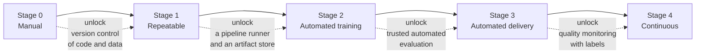
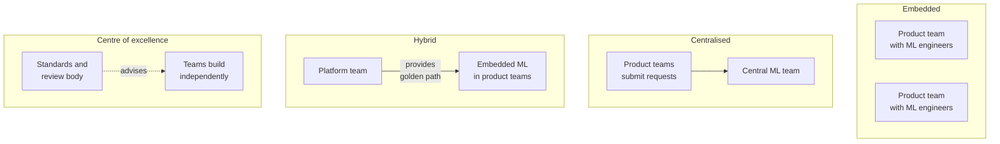
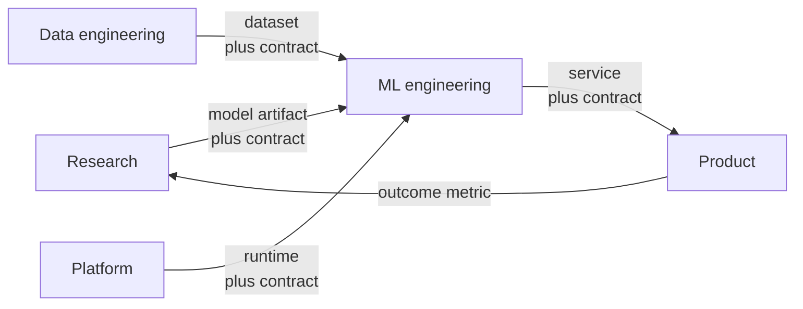
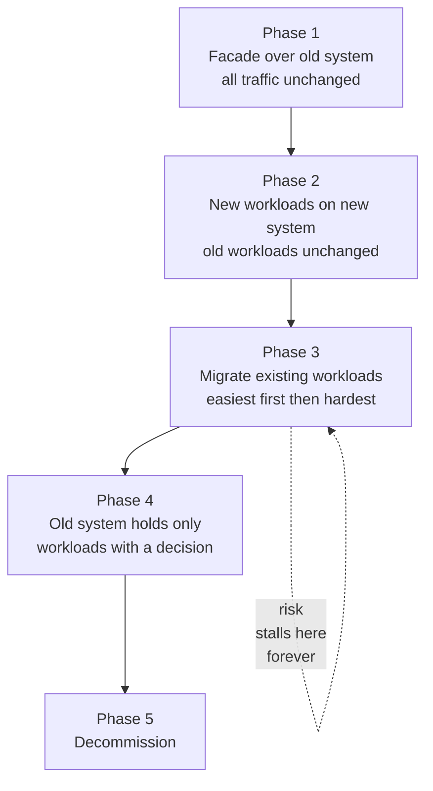
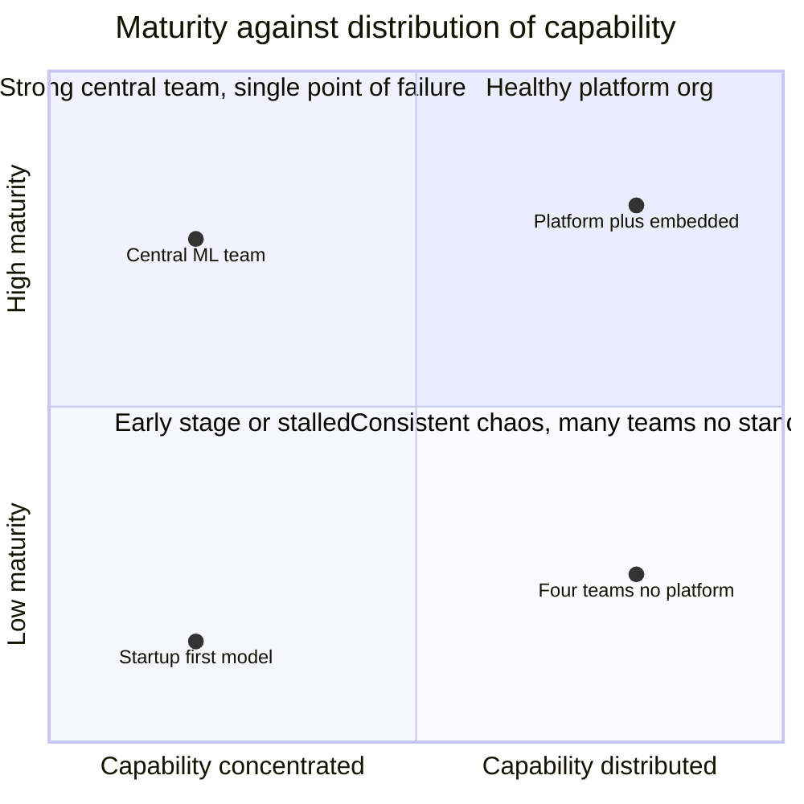

# Chapter 38: MLOps Maturity, Team Topologies, and Platform Strategy

> **What this chapter covers** A staged maturity progression from manual work to automated delivery with the single capability that unlocks each stage, how to diagnose the stage an organisation is actually at rather than the one it claims, the four team topologies for machine learning work with what each optimises for and how each characteristically fails, who owns what across research, machine learning engineering, data engineering, platform and product and the contracts that make those interfaces hold, the platform team's product mindset with adoption as the metric and the golden path as the mechanism, build versus buy at organisational scale including the operational burden that never appears in the comparison, the minimum viable platform and the trigger for each addition, standardisation versus autonomy, the four metrics that measure a platform and why model accuracy is not one of them, technical debt categories specific to machine learning with the interest rate of each, migration by strangler pattern and the cost of running two stacks, hiring and skill profiles, and the four organisational failures that recur everywhere.
>
> **Prerequisites** Chapter 21 (Machine Learning System Design), Chapter 26 (Continuous Integration and Delivery for Machine Learning), Chapter 29 (The Toolkit and How to Choose). Chapters 31 to 37 give the operational detail this chapter organises.
>
> **Where it is used** Anywhere more than one person works on models. The material bites hardest at the transition from a first model shipped by a single team to a portfolio of models owned by several, which is where most organisations stall.

Two organisations buy the same tools, hire from the same pool, and work on comparable problems. One ships a model change in three days. The other takes four months. The difference is almost never the tools. It is who is allowed to do what without asking, which interfaces have contracts, and whether the path from a trained model to a served model is a documented sequence or a negotiation.

This is the last chapter of the book because it is the layer that determines whether any of the preceding thirty-seven matter. A team with a perfect testing discipline and no path to production ships nothing. A team with an excellent orchestrator and no owner for the feature pipeline has an outage waiting.

The risk in a chapter like this is that it becomes management vocabulary. The defence is to keep every claim at the level where an engineer can act on it or recognise it. Where a principle appears, it is followed by the symptom that tells you the principle is being violated.

Chapter 29 owns tool categories, selection criteria, and the tooling view of maturity. Chapter 21 owns system design. This chapter cross-references both rather than restating them, and spends its pages on the organisation.

---

## 38.1 Level 1: Foundations

### 38.1.1 What maturity means, and what it does not

Maturity is the degree to which the steps between an idea and a model serving traffic are repeatable without a specific person being present.

That is the whole definition, and it is deliberately narrow. Note what it excludes.

**It is not sophistication of tooling.** An organisation can run a service mesh, a feature store, and three orchestrators and still require a named engineer to deploy a model by hand.

**It is not model quality.** A team with weak models and a clean automated path is more mature than a team with strong models nobody can reproduce.

**It is not scale.** Small organisations can be highly mature. Large ones frequently are not, because size adds coordination cost faster than it adds capability.

**It is not a score to maximise.** Maturity costs money and flexibility. The correct level for an organisation with two models that change twice a year is low, and pushing it higher is waste.

The single most useful test of maturity is a question that takes ninety seconds to answer.

> If the engineer who built the production model left today with no notice, how long until someone else can retrain it, evaluate it, and deploy the result?

If the answer is measured in hours, the organisation is mature. If it is measured in weeks, it is not, regardless of what is installed.

### 38.1.2 The staged progression

Five stages. The names vary across published maturity models and the substance does not. What matters is the ordering and the unlock, not the labels.

| Stage | Name | What a deployment looks like | Time from decision to serving |
|---|---|---|---|
| 0 | Manual | A person trains in a notebook and hands a file to an engineer who wraps it in a service | Weeks to months |
| 1 | Repeatable | Training is a script in version control, run manually, producing a versioned artifact | Days to weeks |
| 2 | Automated training | A pipeline runs the training end to end on demand or on a schedule, artifacts land in a registry | Days |
| 3 | Automated delivery | Promotion is gated by automated evaluation, deployment is a pipeline, rollback is one command | Hours |
| 4 | Continuous | Retraining is triggered by monitoring, the full loop runs with humans approving rather than performing | Hours, unattended for routine changes |

*Table: the five stages. Numbers are typical orders of magnitude, not measurements.*

*Figure 38.1: The five stages with the one capability that unlocks each transition. Each unlock is a prerequisite, not an accelerator.*

### 38.1.3 The capability that unlocks each stage

Each transition is blocked by exactly one capability. Adding anything else first does not move you.

| Transition | Unlocking capability | Why nothing else works first |
|---|---|---|
| 0 to 1 | Everything that produces the model is in version control, including data references and configuration | You cannot repeat what you cannot identify. Automation of an unidentifiable process automates the ambiguity |
| 1 to 2 | A pipeline runner and an immutable artifact store | A script that runs on a laptop cannot be scheduled, retried, or audited. Chapter 31 covers the runner, Chapter 25 the artifact store |
| 2 to 3 | An automated evaluation the team trusts enough to block a release on | Without it a human must look at every candidate, and that human is the bottleneck by definition. Chapter 26 covers the gate |
| 3 to 4 | Quality monitoring with a usable label signal | A trigger needs a measurement. Without labels or a validated proxy, automatic retraining fires on noise. Chapter 27 covers this |

The asymmetry is worth noticing. Stages 0 to 2 are unlocked by infrastructure you can buy or build in weeks. Stages 3 and 4 are unlocked by measurement capabilities that depend on the problem domain and sometimes cannot be obtained at all. A fraud model with ninety-day label delay cannot reach stage 4 on its primary metric no matter how good the platform is. That is a property of the problem, not a failure of the team, and pretending otherwise produces an automated retraining loop that fires on proxies nobody validated.

### 38.1.4 Why skipping a stage does not work

The recurring failure is an organisation at stage 0 or 1 buying stage 3 tooling. It fails predictably, and the mechanism is worth stating precisely rather than as a warning.

Automation multiplies the reliability of what it automates. If a manual process succeeds seven times in ten because a person notices problems and fixes them, automating it does not produce a process that succeeds seven times in ten. It produces one that succeeds far less often, because the person who was silently repairing it is no longer in the loop.

Three concrete versions of this.

**Automated retraining without data validation.** The pipeline retrains on whatever arrives. A malformed upstream partition produces a model trained on garbage, and the automation promotes it faster than anyone notices. The manual process caught this because the person training the model looked at the data first.

**An evaluation gate without a trusted evaluation.** Teams add a gate, it blocks a release for a reason nobody believes, and within two months there is a documented procedure for bypassing it. The gate is now overhead with no benefit. Chapter 33 covers what makes an evaluation trustworthy.

**A feature store before feature reuse exists.** With one team and four models there is no reuse and no cross-team divergence. The store adds a system to operate, a new failure mode, and a migration, in exchange for solving a problem the organisation does not have yet.

The general rule: automation converts a judgment step into a rule. If you cannot write the rule the judgment was applying, you are not ready to automate that step, and the tool will not supply the rule for you.

### 38.1.5 Vocabulary

| Term | Definition |
|---|---|
| Platform | The shared set of services, libraries, and conventions that product teams use to build and operate models. Not necessarily a product, not necessarily a team |
| Golden path | The one supported way to do a common task, made the easiest way to do it. Also called a paved road |
| Product team | A team that owns a user-facing outcome and the models serving it |
| Platform team | A team whose users are other engineers inside the organisation |
| Cycle time | Elapsed time from a decision to change a model to that change serving production traffic |
| Adoption | The fraction of eligible teams or workloads using a platform capability voluntarily |
| Topology | How people are grouped and what each group is accountable for |
| Interface contract | The written agreement about what one team hands another, in what shape, with what guarantees |
| Self-service | A capability a team can use to completion without another team's involvement |
| Toil | Manual, repetitive work that scales with load and produces no lasting value |

---

## 38.2 Level 2: Working knowledge

### 38.2.1 Diagnosing the actual stage

Self-reported maturity is unreliable in a consistent direction. Organisations report the stage of their best project, not their median one, and they credit installed tools rather than used ones.

Diagnose it by asking questions whose answers cannot be aspirational. Ask engineers, not managers, and ask about the last time rather than the usual case.

| Question | Stage 0 or 1 answer | Stage 3 or 4 answer |
|---|---|---|
| How did the model currently in production get there? | "I think Priya deployed it" followed by uncertainty about which version | A pipeline run identifier and a registry entry |
| What data was it trained on? | A path on a shared drive, current contents unknown | An immutable dataset version referenced by the run |
| When did it last get retrained? | Nobody is sure | A date, from the registry, visible to anyone |
| Can you retrain it right now? | "I would need to check with the person who wrote it" | One command, and it runs |
| How would you roll back? | Discussion about redeploying an older container, and whether that image still exists | One command, tested within the last quarter |
| How do you know it still works? | "Nobody has complained" | A named metric with a threshold and a dashboard |
| What happens if the input schema changes? | It reaches production and something eventually looks odd | A pipeline stage fails and pages an owner |
| How long from a model change to serving? | Uncertain, or an estimate rather than a measurement | A measured distribution with a median |
| Who is paged when it breaks? | The person who built it, personally | A rotation with a documented scope |
| How many models are in production? | An estimate, or two estimates from two people | A number from an inventory |

Two structural signals are worth more than any answer above.

**Variance across teams.** If one team is at stage 3 and three are at stage 0, the organisation is at stage 0 with an exemplar. The exemplar is usually the team that built the tooling, which means the tooling has exactly one user and has never been tested against anyone else's needs.

**The gap between the best and the median project.** Large gaps indicate that capability lives in people rather than in the platform. This is the diagnosis that matters, because it predicts what happens when those people move.

The last-model test is the fastest single diagnostic. Take the most recent model that reached production and reconstruct its path from artifacts alone, without asking anyone. What you cannot reconstruct is what is not actually in the platform.

### 38.2.2 The four topologies

There are four stable ways to organise machine learning work. Every real organisation is one of these or an unstable mixture drifting toward one.

*Figure 38.2: The four topologies. The arrows show the direction of the dependency, which is what determines the failure mode.*

**Embedded.** Machine learning engineers sit inside product teams and report into them. There is no central team.

| Property | Detail |
|---|---|
| Optimises for | Speed of a single team, domain understanding, alignment with product priorities |
| Fits when | Fewer than roughly four teams, models are core to each product, no strong consistency requirement |
| Characteristic failure | Divergence. Four teams build four feature pipelines, four deployment methods, four monitoring approaches, and none of them is anyone's job to maintain. The second failure is isolation: a single machine learning engineer on a product team has no peer review and no career path |
| Symptom that it has failed | You cannot answer "how many models do we run" without asking four people, and two teams have built the same feature with different definitions |

**Centralised.** All machine learning engineers sit in one team. Product teams request work.

| Property | Detail |
|---|---|
| Optimises for | Consistency, depth of expertise, efficient use of scarce specialists, a single standard |
| Fits when | Machine learning is a supporting capability rather than the product, expertise is scarce, compliance requires uniform process |
| Characteristic failure | The queue. The central team becomes the bottleneck for everyone and its backlog is the organisation's roadmap. Second failure: distance from the domain, producing technically sound models that solve a slightly wrong problem |
| Symptom that it has failed | Product teams route around the central team, or a request takes longer to be scheduled than to be done |

**Hybrid.** A platform team owns shared infrastructure. Machine learning engineers are embedded in product teams and build on that platform.

| Property | Detail |
|---|---|
| Optimises for | Team autonomy with shared leverage. Product teams move independently on a common substrate |
| Fits when | Roughly four or more product teams doing machine learning, enough common need to justify a platform team, and someone able to run a platform as a product |
| Characteristic failure | The platform nobody uses. The platform team builds what it finds interesting or what it guesses is needed, product teams find it does not fit, and both sets of work continue in parallel. This is the single most common expensive failure in this chapter and it gets its own treatment in 38.4.3 |
| Symptom that it has failed | Teams maintain private forks or wrappers around platform components, and the platform team's roadmap is not derived from product team requests |

**Centre of excellence.** A small group sets standards, reviews designs, and advises. It does not own delivery or infrastructure.

| Property | Detail |
|---|---|
| Optimises for | Consistency of practice without a delivery bottleneck. Cheap. Useful in regulated settings where independent review is required anyway |
| Fits when | Capability is widely distributed and already competent, and the problem is variance in practice rather than lack of capacity. Also when governance demands a validation function separate from development, per Chapter 36 |
| Characteristic failure | Authority without responsibility. The group writes standards it does not have to implement, and the standards accumulate requirements nobody costed. It becomes a review gate that delays work without improving it |
| Symptom that it has failed | The group's output is documents rather than working code, and teams treat its review as a tax to be minimised rather than as help |

Two practical points.

The topologies form a rough progression with organisation size. Embedded works to about four teams. Centralised works while machine learning is a side capability. Hybrid is where most organisations of scale end up. Centre of excellence usually overlays another topology rather than replacing it.

The choice is less important than the interfaces. A hybrid with undefined ownership is worse than a clean centralised model. Section 38.2.3 is therefore the operative part.

### 38.2.3 Who owns what, and the contracts that hold

Ownership disputes in machine learning organisations cluster at five interfaces. Each has a contract that makes it work, and the absence of that contract produces a characteristic argument.

*Figure 38.3: The five interfaces, each carrying an artifact and a contract. The return edge from product to research closes the loop that most organisations leave open.*

**Research to machine learning engineering.** The handoff that fails most often, discussed in Chapter 32 from the reproducibility side.

The contract is a list, and it is short enough to enforce.

| The research side delivers | Why it is on the list |
|---|---|
| Training code that runs end to end from a clean checkout | If it only runs on one laptop it has not been delivered |
| A pinned environment specification | Otherwise the receiving team debugs library versions for a week |
| The exact dataset version and the query or path that produced it | "The data from March" is not a dataset |
| An evaluation script and the numbers it produced, with intervals | The receiving team must be able to reproduce the claim before building on it |
| Known failure modes and the slices where the model is weak | This is the most valuable item and the one most often omitted |
| The inference contract: input schema, output schema, and preprocessing | Skew enters here. Chapter 20 covers the mechanism |

The argument that occurs without this contract: the engineering team says the model does not reproduce, the research team says it works on their machine, and both are correct.

A structural fix that works better than exhortation: the definition of done for a research project is a pipeline run in the shared system that produces the claimed metric, not a notebook and a number in a message.

**Data engineering to machine learning.** The contract is a schema plus guarantees, covered in depth in Chapter 20.

| Element | Content |
|---|---|
| Schema | Column names, types, nullability, allowed values, with a version |
| Freshness | Maximum lag, and what happens when it is breached |
| Completeness | Expected row count range, and the partition contract |
| Change policy | Notice period for breaking changes and the deprecation path |
| Ownership | Who is paged when the dataset is late or wrong |

The argument without it: a column changed meaning, the model degraded, data engineering says the change was announced in a channel, machine learning says nobody could have known which models depended on it. Both are correct, and the missing artifact is a consumer registry that makes dependencies visible to the producer.

**Platform to machine learning.** The contract is a service level for the platform itself.

| Element | Content |
|---|---|
| What the platform provides | The named capabilities and their interfaces |
| Availability and support | What is on call, and the response expectation |
| Upgrade and deprecation policy | Notice period, migration support, and whether upgrades are forced |
| Escape hatch | What a team does when the golden path does not fit, without becoming unsupported |
| Support model | How a team gets help, and the expected response |

The escape hatch deserves emphasis. A platform without one forces teams into an unsupported private build the first time a requirement does not fit, and that fork never rejoins. A stated escape hatch, with a route back, keeps divergence visible and temporary.

**Machine learning to product.** The contract is what the model promises and what it does not.

| Element | Content |
|---|---|
| Interface | Request and response schema, including how uncertainty is expressed |
| Latency and availability | The numbers, per Chapter 28 |
| Quality | The metric, its value with an interval, the population it was measured on, and the date |
| Behaviour outside that population | What happens on inputs unlike the training data, and whether the system says so |
| Change notification | What product learns before a model changes, and when |
| Fallback | What the product should do when the model is unavailable or low confidence |

The argument without it: product built an experience assuming the score means something it does not, and the miscommunication surfaces as an incident.

**Product back to research.** The return edge. Product owns the outcome metric that decides whether a model was worth building. Without this edge the organisation optimises offline metrics indefinitely. Chapter 34 covers the measurement machinery.

A summary rule that resolves most ownership arguments: **the team that is paged owns it.** If machine learning engineering is paged when a feature pipeline breaks, machine learning engineering owns that pipeline regardless of who wrote it. Aligning the pager with the stated ownership, in whichever direction, removes the ambiguity.

### 38.2.4 The platform team's product

A platform team whose users are internal engineers is running a product with an unusually demanding customer base: technically capable, opinionated, and fully able to build their own.

The mindset shift is a short list.

| Product discipline | What it means internally | What it replaces |
|---|---|---|
| Users, not stakeholders | You interview engineers about their work and watch them use the thing | Requirements arriving as tickets |
| Adoption, not delivery | Success is measured by voluntary use, not by features shipped | A roadmap of components |
| Documentation as a feature | Undocumented capability is unavailable capability | A wiki page written once |
| Onboarding as a metric | Time from a new engineer's start to their first deployed model | An assumption that people will figure it out |
| Deprecation as a service | You migrate users rather than announcing an end date | An email with a deadline |
| Support as a product signal | Every support request is a defect report about the interface | A support rota that absorbs the pain silently |

**Adoption is the metric.** Define it precisely enough to argue about:

$$A = \frac{W_{\text{platform}}}{W_{\text{eligible}}}$$

where $W_{\text{platform}}$ is the number of workloads using the capability and $W_{\text{eligible}}$ is the number that could. Count workloads, not teams, because a team that uses the platform for one model and bypasses it for five is not an adopter.

Worked example. An organisation has 40 production models. 22 deploy through the platform's serving path, 18 do not. Adoption is $22/40 = 0.55$. Of the 18, if 12 belong to one team with a latency requirement the platform cannot meet, the number to report is not 55 percent but two numbers: 55 percent overall, and one named unmet requirement accounting for two thirds of the gap. The second number is the roadmap.

**Mandated adoption hides the signal.** If use is compulsory, adoption measures compliance and tells you nothing about fit. Teams comply with the letter and build shadow tooling around it, and the platform team learns about the mismatch years late. Measure something voluntary alongside any mandate: support request volume, the number of private wrappers around platform components, and the fraction of teams that stay on the golden path when a faster route exists.

**The golden path.** The golden path is the one supported way to do a common task, made the easiest way to do it. Three properties define it and all three are required.

| Property | Meaning | What breaks without it |
|---|---|---|
| Opinionated | It makes the choices for you. One orchestrator, one serving pattern, one registry | A path with options is a decision, and decisions are what teams wanted removed |
| Complete | It covers the task end to end, from repository template to serving and monitoring | A path that stops halfway leaves the hard part undone and gets abandoned there |
| Genuinely easiest | Using it is faster than not using it, measured, not asserted | If the path is slower, adoption requires a mandate and the mandate hides the failure |

The concrete form of a golden path is not a document. It is a repository template that generates a working project with training code, a test suite, a pipeline definition, a serving container, a deployment configuration, and monitoring wired in, such that a new model gets all of it by starting from the template. Measure the path by timing a real engineer doing a real task on it.

The single best platform metric available early is time from a new engineer's first day to their first model serving traffic. It is end to end, it exercises documentation, access, tooling, and the deployment path, and it cannot be gamed by a team that knows the shortcuts.

### 38.2.5 The minimum viable platform, organisationally

Chapter 29, level 3 gives the tooling answer for a small team and the staged growth of the toolset. That material is not repeated. What follows is the organisational half: who does the work, and what event triggers each addition.

The rule for a team of one to five engineers is that **nobody is a platform engineer full time.** Platform work is a rotating fraction of everyone's time, capped, and the cap is what prevents the common failure of a small team building infrastructure instead of models.

| Team size | Platform staffing | What this looks like |
|---|---|---|
| 1 to 5 engineers | No dedicated platform work. Conventions over tools, one shared repository template | Someone spends a day a fortnight on shared plumbing |
| 5 to 15 | One engineer at roughly half time, rotating quarterly | Rotation is deliberate: it prevents the platform becoming one person's private system |
| 15 to 40 | A platform team of two to four, with an explicit charter and a support model | This is the point where it becomes a product with users |
| 40 plus | Platform team with its own sub-specialisation, plus embedded platform advocates | Advocates are platform engineers who spend time inside product teams |

The trigger for each addition is an organisational event, not a headcount.

| Addition | Trigger, stated as an observable event |
|---|---|
| A shared repository template | The second model is being built and someone is copying files from the first |
| A dedicated pipeline runner | A scheduled script has failed silently and nobody noticed for more than a day |
| A model registry with promotion | Two people disagree about which model version is live, and both are partly right |
| An automated evaluation gate | A model reached production that would have failed an evaluation someone ran afterwards |
| A shared transformation library | The same feature is computed in two places and the two results differ |
| A feature store | Three or more teams need the same features, or the transformation library has become a distributed monolith |
| A platform team | Platform work is being done by whoever is least busy, and it is neither finished nor owned |
| Self-service deployment | A platform engineer is in the critical path of every deployment and the queue is measurable |
| Cost attribution per model | Someone asked what a model costs and it took more than a day to answer |
| Multi-tenancy and quotas | One team's training job starved another team's |

The discipline is to add on the trigger, not on the anticipation. The cost of adding a capability early is certain. The cost of adding it late is probable. Only one of those is worth paying up front.

---

## 38.3 Level 3: Depth

### 38.3.1 Build versus buy at organisational scale

Chapter 29, level 3 covers build versus buy per layer and total cost of ownership from the tooling perspective. This section covers what that analysis systematically omits, which is the organisational burden.

The standard comparison is licence cost against engineering cost to build. Both numbers are wrong in the same direction, and the omissions are enumerable.

| Omitted cost | What it actually is | Typical magnitude |
|---|---|---|
| Operating the thing you built | On call, upgrades, capacity, security patching, incident response, forever | Frequently exceeds the build cost within two years |
| Support burden | Every user question is an interrupt to the team that built it | Scales with adoption, which is the thing you wanted |
| Documentation and onboarding | Written, then kept true as it changes | Underestimated by roughly an order of magnitude, consistently |
| Migration when you change your mind | Data, pipelines, retraining, and the period with both systems live | Covered in 38.3.6 |
| Key person concentration | One person understands the internals and becomes unable to take a holiday | Realised as a crisis, not as a line item |
| Opportunity cost | The models not built while building the platform | The largest number, never measured |
| For bought tools: integration | It never fits your identity, network, and data model without work | Weeks to quarters, and recurring at each upgrade |
| For bought tools: the ceiling | Your requirement grows past the product's assumptions | Realised as a partial rebuild alongside the product |

A usable approximation for the first three years of a built component:

$$C_{\text{build}} = C_{\text{dev}} + 3 \cdot (C_{\text{ops}} + C_{\text{support}}) + C_{\text{exit}}$$

where $C_{\text{dev}}$ is engineer-time to first usable version, $C_{\text{ops}}$ is annual operations including on call, $C_{\text{support}}$ is annual user support, and $C_{\text{exit}}$ is the expected cost of migrating off. In practice $C_{\text{ops}} + C_{\text{support}}$ lands between 30 and 60 percent of $C_{\text{dev}}$ per year for anything with real users. Treat that range as a planning assumption, not a measurement.

Worked example. A team estimates four engineer-months to build an internal experiment tracking service. Assume a fully loaded engineer-month is one unit. Then $C_{\text{dev}} = 4$. Operations and support at 40 percent is 1.6 per year, so three years is 4.8. Exit cost, being a migration of historical runs, is perhaps 2. Total is 10.8 engineer-months over three years, against an initial estimate of 4. The comparison against a purchased tool should use 10.8.

The organisational decision rule, which is different from the technical one:

| Condition | Decision |
|---|---|
| The requirement is common across the industry | Buy or adopt open source. Your version will be worse and you will maintain it |
| The requirement is genuinely yours and is a differentiator | Build, and staff it as a product |
| You cannot staff the operation of it for three years | Do not build it, regardless of how good the design is |
| The component is deep in the dependency graph | Prefer the option with the lower exit cost, because you will be wrong about something |
| Nobody will own it after the person who wants it moves on | Do not build it. This is the most reliable predictor of an abandoned internal tool |

The last row is worth stating plainly. The question "who operates this in two years" answers the build versus buy question more often than any cost model, and it is the question least often asked.

### 38.3.2 Standardisation versus autonomy

The tension is real and neither pole is correct. What makes it tractable is that the answer differs by layer rather than by organisation.

The decision rule: **standardise where divergence causes harm across team boundaries, and leave autonomy where it does not.**

| Layer | Default | Reasoning |
|---|---|---|
| Feature definitions | Standardise hard | Two definitions of an entity produce two incompatible answers and nobody can tell which is right |
| Deployment and rollback | Standardise hard | An incident responder must be able to roll back a system they did not build, at three in the morning |
| Monitoring and logging schema | Standardise hard | Cross-model analysis and shared alerting require a common shape. Chapter 27 specifies it |
| Artifact and model versioning | Standardise hard | Audit, lineage, and reproducibility all depend on a single identifier scheme. Chapter 36 |
| Access and secrets | Standardise hard | Security is only as strong as the least standard path |
| Orchestration | Standardise softly | One runner is strongly preferred, but a team with a genuinely different execution model should be allowed an exception with a stated reason |
| Serving runtime | Standardise softly | A common path for most, an exception path for workloads with genuinely different characteristics |
| Training framework | Autonomy | Framework choice rarely crosses a boundary, and forcing it costs more than it saves |
| Model architecture and features | Autonomy | This is the actual work. Standardising it is standardising the thing you hired people to decide |
| Experiment workflow | Autonomy within a logging requirement | How someone explores is theirs. What they log when they claim a result is not |

The practical mechanism is the exception process rather than the policy. A standard with no exception path produces silent divergence, because teams that cannot comply will not stop working. A standard with a documented exception path produces visible divergence, which is a list you can shorten.

A workable exception process has four parts: a written reason, a named owner, a stated review date, and the platform team's commitment to close the gap if the reason generalises. Exceptions that recur across three teams are not exceptions. They are a missing platform requirement.

### 38.3.3 Measuring a platform

Four metrics. They are adapted from the delivery metrics popularised by Forsgren, Humble, and Kim in *Accelerate* (2018), with the modifications machine learning requires.

| Metric | Definition for machine learning | Why it is the right thing |
|---|---|---|
| Cycle time | Elapsed hours from a decision to change a model to that change serving production traffic | Measures the whole path, including approvals and waiting, not just the automated part |
| Deployment frequency | Model deployments per team per month | A proxy for batch size. Infrequent deployment means large, risky changes |
| Time to detect | Hours from a production quality regression beginning to someone knowing | The number that dominates harm in silent failures. Chapter 37, level 4 |
| Time to recover | Hours from knowing to restored service | Measures whether rollback is real |

Two measurement disciplines make these honest.

**Measure end to end, including the waiting.** Cycle time measured from pipeline start to deployment complete excludes the two weeks the change sat waiting for review, which is usually most of it. Instrument from the decision.

**Report the distribution, not the mean.** The median cycle time and the ninetieth percentile tell different stories. A median of four hours with a ninetieth percentile of three weeks means there is a routine path and an exception path, and the exception path is where the organisation's pain lives. The gap between the two is a better improvement target than either.

Decompose cycle time to find the constraint:

$$T_{\text{cycle}} = T_{\text{dev}} + T_{\text{wait,review}} + T_{\text{train}} + T_{\text{eval}} + T_{\text{wait,approval}} + T_{\text{deploy}}$$

Measure each term for the last twenty changes. In most organisations the two waiting terms dominate and the automated terms are already small, which means buying faster hardware does nothing and removing an approval step does everything. This decomposition is the single most useful platform measurement exercise available, and it usually takes an afternoon.

Two supporting metrics worth tracking alongside:

| Metric | Definition | What it catches |
|---|---|---|
| Change failure rate | Fraction of model deployments requiring rollback or an urgent fix | Whether speed came at the cost of safety |
| Onboarding time | Days from a new engineer's start to their first production deployment | Everything the platform does badly, in one number |

**Why model accuracy is a bad platform metric.** It is the metric people reach for first and it is wrong for four separate reasons, any one of which would be disqualifying.

| Reason | Detail |
|---|---|
| Not controlled by the platform | Accuracy is determined by the problem, the data, and the modelling work. A platform team that improves nothing can watch accuracy rise because a product team found a better feature |
| Not comparable | A fraud model at 0.99 area under the curve and a recommender at 0.75 cannot be averaged into a platform score. The aggregate is meaningless |
| Perverse under pressure | If accuracy is the platform metric, the platform team is incentivised to prevent risky deployments, which is the opposite of its job |
| Bounded and saturating | A mature model improves slowly. A platform that halves cycle time shows no accuracy movement at all, having done its entire job |

What to use instead, stated as the substitution:

| Instead of | Measure | Because |
|---|---|---|
| Model accuracy | Cycle time and deployment frequency | The platform's contribution is how fast a team can try the next idea |
| Number of models deployed | Fraction of models meeting a monitoring baseline | Deploying more badly-operated models is not progress |
| Platform features shipped | Adoption of each feature, and features retired | A feature nobody uses is a liability with a maintenance cost |
| Uptime alone | Time to detect and time to recover | Uptime does not capture the failure mode these systems actually have |

The honest framing for a platform team's contribution: the platform does not make models better. It increases the number of attempts per unit time and reduces the cost of a bad one. That is the whole value proposition and it is measurable.

### 38.3.4 Technical debt specific to machine learning

The framing comes from Sculley and colleagues, "Hidden Technical Debt in Machine Learning Systems" (2015), which remains the reference. This section extends it operationally by attaching an interest rate to each category, where interest rate means how fast the cost of carrying the debt grows relative to the size of the system.

| Category | What it is | Interest rate | What makes it grow |
|---|---|---|---|
| Entanglement | Changing any input changes everything, because the model mixes all features. Sculley's CACE principle, changing anything changes everything | High | Grows with the number of features and the number of consumers, superlinearly |
| Undeclared consumers | Systems read your model's output without your knowledge, often by reading a table | Very high | Grows with time and organisational size. Each new consumer is invisible until you break it |
| Data dependency debt | Dependencies on upstream data with no versioning or contract | Very high | Grows with the number of sources. Unlike code dependencies there is no compiler to detect a break |
| Feedback loops | The model's output affects the data it later trains on, directly or through another model | Very high | Compounds. The longer it runs the harder it is to detect or undo, because the counterfactual data no longer exists |
| Configuration debt | Sprawling untested configuration where a wrong value is silently accepted | Medium | Grows with the number of models and deployment targets |
| Glue code and pipeline jungles | Most of the codebase is moving data between tools, accumulated by accretion | Medium | Grows with the number of tools and integrations |
| Dead experimental paths | Branches and flags for abandoned approaches, still executing | Low to medium | Grows steadily, cheap to clear, never prioritised |
| Reproducibility debt | Models in production that cannot be rebuilt from source | Medium, with a cliff | Flat until a regulator, an incident, or a needed change makes it suddenly total |
| Multiple-language boundaries | Training in one language, serving in another, with the transformation implemented twice | High | Every feature change must be made twice and the two can silently diverge |
| Prompt and provider debt for generative systems | Prompts as untracked configuration, provider versions unpinned | High | Grows with the number of prompts and with provider release cadence. Chapter 35 |

Why the interest rate framing matters: it changes what you pay down first. Entanglement is uncomfortable and slow-growing relative to undeclared consumers, which are cheap to fix today and expensive tomorrow. Pay down in interest rate order, not in discomfort order.

The three highest-return interventions, in order.

**Make consumers declared.** Serve predictions through an interface with authentication and logging rather than through a shared table. You then know who depends on you, which converts an unbounded risk into a list.

**Version data dependencies and register consumers.** A consumer registry lets a producer see what breaks before changing anything. This is the single most effective structural fix in the table.

**Delete the dead paths on a schedule.** Low interest, but the only category where a fixed quarterly hour allocation reliably clears it, because it never competes successfully for priority otherwise.

A measurement that makes debt visible enough to fund: count the number of production models that cannot be rebuilt today from a clean checkout. Run the rebuild for a random sample of three each quarter. The number that fail is the reproducibility debt, expressed in a form that is hard to argue with.

### 38.3.5 Hiring and skill profiles

Roles in this field have unstable titles. What follows describes the work rather than the label, because the label varies more than the work does.

| Profile | Centre of gravity | Distinguishing capability | Common hiring error |
|---|---|---|---|
| Research or applied scientist | Modelling and experimentation | Can frame a problem, design an experiment, and interpret a result correctly | Hiring for publication record when the work is applied, then being surprised by the shipping gap |
| Machine learning engineer | The path from model to production | Can own a model end to end, including its pipeline, serving, and monitoring | Hiring a software engineer with no statistical judgment, or a scientist with no engineering practice, and expecting the other half to appear |
| Data engineer | Pipelines, storage, and data quality | Can build a correct, testable, backfillable pipeline and reason about point-in-time correctness | Treating the role as junior to modelling work, which reliably produces the data problems that dominate later |
| Machine learning platform engineer | Infrastructure as a product for engineers | Infrastructure depth plus enough machine learning understanding to know what the workflows need | Hiring pure infrastructure background with no exposure to model workflows, producing a platform that solves service problems and not model problems |
| Analytics or decision scientist | Measurement and causal reasoning | Can define metrics correctly and tell you whether a result is real | Omitting the role entirely, then shipping on offline metrics indefinitely |

What to hire first, for a small team, ordered by the commonest failure rather than by desirability:

1. Someone who can ship. One engineer who can take a model to production is worth more than two who can only build models, because at this stage the bottleneck is delivery, not accuracy.
2. Data engineering capability, whether a person or a strong secondary skill. Data problems dominate model problems in production and hiring for this late is the standard regret.
3. Modelling depth, once there is a path for a model to travel.
4. Platform, only at the size where platform work is being done badly by whoever is least busy.

Two hiring observations that hold widely.

**Assess the engineering, not only the modelling.** A candidate who cannot write a test, read a stack trace, or reason about a schema change will not be productive regardless of modelling ability, and the deficit is far more visible in production than in an interview that only covers modelling.

**Assess for the stage.** The skills that make someone effective at stage 1 (breadth, comfort with ambiguity, willingness to build the missing piece) differ from those at stage 4 (depth, operational discipline, working within a platform). Hiring stage-4 specialists into a stage-1 organisation produces frustration on both sides, and it is a common and expensive mismatch.

Chapter 30 covers progression and interviews from the candidate's side.

### 38.3.6 Migration and platform evolution

Every platform is replaced. Planning for the replacement is cheaper than discovering it.

The failure mode to avoid is the big-bang rewrite: build the new platform, migrate everything at a stated date, retire the old. It fails for a specific reason. The new platform is designed against the requirements the team remembers, and production systems carry years of undocumented requirements that only surface when a workload fails to migrate. The migration then stalls indefinitely with half the workloads moved, which is the worst state available because both systems must be operated and neither can be improved.

**The strangler pattern**, named by Martin Fowler (circa 2004) for legacy application replacement, applies directly. Route new work to the new system, migrate existing workloads incrementally behind a stable interface, and shrink the old system until it can be removed.

*Figure 38.4: Strangler migration. The loop on phase 3 is the failure that actually happens, and it is prevented by a forcing function rather than by good intentions.*

The sequence that works.

| Phase | Action | The discipline that makes it work |
|---|---|---|
| 1 | Put an interface in front of the old system so callers do not know which system serves them | Without this, every migration step is a coordinated change across many teams |
| 2 | All new workloads go to the new system. No exceptions | This alone stops the problem growing, and it is the cheapest step |
| 3 | Migrate existing workloads, easiest first to build the tooling, then hardest to find the real requirements | Migrate one hard case early, deliberately, to surface requirements before the tooling ossifies |
| 4 | Identify the residue, which is workloads whose owners have no incentive to move | This is where migrations die. Treat it as a decision, not a queue |
| 5 | Decommission on a date, with the platform team doing the last migrations | The team that wants the migration does the remaining work |

**The cost of running two stacks**, which is systematically underestimated:

| Cost | Detail |
|---|---|
| Double operations | Both systems are on call, patched, and upgraded |
| Double integration | Every new capability must be built twice or withheld from one side |
| Cognitive load | Every engineer must know which system a workload is on before doing anything |
| Frozen improvement | The old system gets no investment and the new one is incomplete, so the organisation is worse off than before the migration started |
| Incident complexity | Responders must determine which stack is involved before diagnosing |

The consequence is a planning rule: the cost of a migration is dominated by its duration, not by its difficulty. A migration that takes eighteen months is more than three times as expensive as one that takes six, because the duplicate-operations cost accrues the whole time and the frozen-improvement cost compounds. Prefer an aggressive schedule with dedicated staffing over a background effort that never finishes.

The forcing function that actually works: a date after which the old system is not on call. Not a date after which it is deleted, which is easy to postpone, but a date after which nobody is paged for it. This converts migration from a preference into a risk decision that the workload's owner must make.

---

## 38.4 Level 4: Mastery

### 38.4.1 What senior engineers actually argue about

**Whether a platform team should exist before there is demonstrated demand.** One position: build it early, because retrofitting standards onto four divergent teams is far more expensive than setting them at the start. The other: platforms built ahead of demand solve imagined problems and are the most common form of wasted engineering quarter. The resolution most practitioners converge on is that you may standardise early on conventions that cost nothing, such as a repository template, a logging schema, and an artifact naming scheme, and you may not build systems early. Conventions are cheap to change. Systems are not.

**Whether the platform should be opinionated or flexible.** Flexible platforms have higher adoption and lower leverage, because every team configures a slightly different thing and the platform team supports all of them. Opinionated platforms have lower adoption and higher leverage. The practical resolution is opinionated with a documented escape hatch, and treating the exceptions as a prioritised backlog rather than as failures.

**Whether machine learning engineers should be embedded or centralised, in an organisation large enough for either.** This is Conway's law applied: the architecture will come to mirror the topology. Embedded teams produce per-product model stacks. Centralised teams produce shared infrastructure and a request queue. Choose the topology that matches the architecture you want, because the reverse does not work.

**Whether research should own production models.** Arguments for: the person who built it understands the failure modes and will design for operability if they carry the pager. Arguments against: research and operations reward different work at different rhythms, and the operational load displaces the research. The common middle is that research owns the model's quality and machine learning engineering owns its availability, with both named on the incident.

**Whether platform work should be measured at all.** The objection is that the metrics are gameable and the work is enabling rather than direct. The counter is that unmeasured platform teams have their budget decided by narrative, which is worse and less fair. The resolution is to measure outcomes for the users, meaning cycle time and onboarding time, rather than outputs for the platform.

### 38.4.2 Conway's law and the reorganisation trap

Conway's observation (1968) is that a system's structure mirrors the communication structure of the organisation that built it. In machine learning organisations it shows up with unusual clarity, because the interfaces are data interfaces and data interfaces follow team boundaries exactly.

| Topology | Architecture it reliably produces |
|---|---|
| Embedded, no platform | Per-team stacks, duplicated feature logic, inconsistent monitoring |
| Centralised | One shared stack, a request queue, and a strong bias toward a single serving pattern |
| Hybrid with a weak platform team | A platform, plus per-team wrappers around it that are where the real logic lives |
| Data engineering separate with no contract | Models coupled to warehouse tables, breaking whenever the warehouse changes |

The useful direction of the inference is backwards. If you want models to share features, you need a team that owns features across boundaries. If you want consistent monitoring, someone must own monitoring as a cross-cutting concern. Announcing the architecture without the corresponding ownership produces the architecture the topology implies, not the one on the diagram.

**The reorganisation that resets progress.** This is the fourth of the common failures and it is worth its own treatment because it is the least discussed.

The pattern: a reorganisation moves machine learning engineers between reporting lines. In-flight platform work loses its sponsor. Ownership of existing pipelines becomes ambiguous. Nobody is paged for several systems. Six months later the organisation has less capability than before, and the cause is invisible because no individual decision was wrong.

What is actually lost, in order of importance:

| Loss | Why it is expensive |
|---|---|
| Ownership continuity | Systems with ambiguous ownership degrade silently. The clock starts the day the reorganisation is announced |
| In-flight platform work | Half-finished platform components are worse than none. They have users and no maintainer |
| Institutional memory | Why a threshold is set at that value, which upstream tables lie, which model was tried and failed |
| Interface contracts | Renegotiated from scratch, usually informally, usually worse |
| Trust | The mechanism that made cross-team work possible without process |

Mitigations that work, and they are all mechanical rather than cultural.

1. **Transfer ownership explicitly, system by system, with a written list and a named person per entry.** Anything not on the list is unowned, and saying so out loud is the point of the exercise.
2. **Preserve the pager mapping through the transition.** Whoever was paged stays paged until a named person takes it, with an explicit handover.
3. **Finish or delete in-flight platform work.** Do not park it. A parked component with users is the worst outcome.
4. **Write the interface contracts down before the people who understood them move.** A contract written afterwards is a reconstruction.
5. **Do not reorganise the platform team and the product teams in the same quarter.** One of the two must be a stable reference point.

### 38.4.3 The platform nobody uses

The most expensive organisational failure in this chapter, because it consumes years of senior engineering time and produces something that is net negative: unused capability with a maintenance cost.

The pattern is consistent enough to be diagnostic.

| Stage | What happens |
|---|---|
| 1 | A platform team is formed with a mandate to improve machine learning velocity |
| 2 | It gathers requirements by asking managers rather than by watching engineers work |
| 3 | It builds a comprehensive system, which takes three quarters, during which product teams keep shipping using whatever they already had |
| 4 | It launches, and adoption is required |
| 5 | Teams comply minimally, wrapping the platform to make it behave like what they had |
| 6 | The platform team's backlog fills with support for the wrappers, and no further capability is built |

Root causes, ordered by frequency.

**Requirements gathered from the wrong people.** Managers describe the problem they see, which is that things are slow. Engineers know which specific step is slow. The platform built from the first description addresses an abstraction.

**No first user with a real deadline.** A platform built without a demanding internal customer optimises for generality, and generality is the enemy of a usable path. The correction is to build it with one team's real workload as the acceptance test, and to refuse to launch until that workload runs on it in production.

**Adoption mandated before the path was faster.** A mandate removes the feedback signal precisely when the team most needs it.

**The path is incomplete.** It handles training and deployment but not monitoring, or not the local development loop. Teams hit the gap, build around it, and the workaround becomes their standard.

**Migration cost never paid by the platform team.** Asking a product team to migrate is asking them to spend their quarter on your roadmap. Platform teams that do the migration themselves get adoption. Those that write migration guides do not.

The preventive test, applied before any platform component is built: name the specific team that will use it, the specific workload, and the date. If you cannot, you are building on speculation.

### 38.4.4 The research team that cannot ship

The second common failure. A capable research group produces models that repeatedly do not reach production, and the diagnosis is usually wrong.

The wrong diagnosis is that researchers lack engineering skill. Sometimes true, rarely the binding constraint.

The actual causes, in the order you should check them:

| Cause | Symptom | Fix |
|---|---|---|
| No path exists | Each project invents its own route to production | Build the golden path. Nothing else helps until this exists |
| No receiving team | A model is finished and there is nobody whose job is to take it | Name the receiving team before the project starts, not after |
| The handoff contract is undefined | Endless back and forth about what "done" means | Adopt the contract in 38.2.3 and make it the definition of done |
| Incentives reward novelty | Promotion follows new approaches, not shipped ones | Change what is rewarded. This is a leadership action and nothing else substitutes |
| Problems chosen without a consumer | The model is interesting and nothing downstream can use it | Require a named product owner before work starts |
| Production constraints discovered late | The model cannot meet the latency or cost budget and this is found at the end | State the serving constraints as requirements at the start. Chapter 21 |

The structural fix that addresses most of these at once is to change the definition of done. A research project is complete when the model runs in the shared pipeline, produces the claimed metric there, and has a named production owner. Not when the notebook produces the number.

The second structural fix is rotation. Researchers who spend a quarter on production work design differently afterwards, permanently. This is more effective than any document.

### 38.4.5 The model that stays in a notebook

The third failure, and the most common overall. A model demonstrably works, everyone agrees it is valuable, and it never ships.

The causes are rarely technical.

| Cause | What it looks like | What actually unblocks it |
|---|---|---|
| No owner for the production system it would change | "We would need the checkout team to integrate it" and the checkout team has a roadmap | Get the integration on a roadmap before building the model |
| The integration is harder than the model | Two weeks of modelling, three months of integration | Estimate the integration first. If it is not affordable, the project is not affordable |
| No decision-maker | Several people could approve and none must | Name one person who decides, at the start |
| Unclear value | Offline metric improves, nobody can state the business effect | Define the online metric and the measurement method before building. Chapter 34 |
| Risk with no owner | The model might be wrong and nobody will accept that exposure | Make the risk explicit and bounded with a rollback plan, then the exposure has a size |
| Waiting for the platform | The team is waiting for infrastructure that is one quarter away, indefinitely | Ship on the infrastructure that exists. The first model should be deployed the ugly way |

The strongest general prevention: require a deployment plan before modelling starts. Not a document, three answers. Which system consumes the prediction. Who owns that system. What the rollback is. A project that cannot answer these is not a modelling project, it is a study, and calling it a study up front is honest and cheap.

### 38.4.6 Reading maturity against topology

A diagnostic worth internalising, because the two dimensions interact and the right intervention depends on both.

*Figure 38.5: Maturity against how widely capability is distributed. The intervention differs by quadrant.*

| Quadrant | Situation | The correct next move |
|---|---|---|
| Low maturity, concentrated | Early stage. One team, few models | Ship a model the simple way. Do not build a platform |
| High maturity, concentrated | A strong central team. Everything works and one team is the bottleneck and the single point of failure | Extract the capability into a platform others can use. Resist growing the central team |
| Low maturity, distributed | Many teams, no standards. The most dangerous quadrant because it looks productive | Standardise the cross-boundary layers from 38.3.2 first, and only those |
| High maturity, distributed | The target state | Maintain it. Watch for the reorganisation and the unmaintained platform component |

The dangerous quadrant is low maturity with distributed capability, because output is visibly high while the liability accumulates invisibly. The organisation discovers its position during an incident, an audit, or a departure.

### 38.4.7 Where the standard advice is wrong

**"Aim for the highest maturity level."** Maturity costs money and reduces flexibility. Stage 4 for a model retrained twice a year is elaborate machinery to run a rare event. Choose the stage that matches the change rate of the models, and be willing to sit at stage 2 indefinitely.

**"Adopt a platform to move faster."** Adopting a platform slows the adopting team for a quarter or more. The speed comes later and only if adoption completes. Teams that adopt a platform mid-project reliably regret the timing rather than the decision.

**"Standardise everything."** Standardising the modelling work removes the judgment you hired for. The layers in 38.3.2 are the ones that pay.

**"Hire a head of machine learning to fix delivery."** If the constraint is that no path to production exists, a leadership hire adds a quarter of onboarding before anyone starts building the path. Diagnose the constraint before staffing it.

**"Measure the platform by the models it enabled."** Attribution is impossible and the metric is gameable in both directions. Measure the platform by the speed and safety of the path.

**"A maturity assessment tells you what to do."** It tells you where you are. What to do depends on the constraint, and the constraint is found by decomposing cycle time, not by scoring a rubric.

### 38.4.8 Open problems

**Measuring platform value credibly.** Cycle time improvements are real and the counterfactual is unavailable. No accepted method attributes business outcomes to platform investment, and this is why platform teams are vulnerable in a budget reduction despite being correct.

**Team topology for generative systems.** These systems shift work from training to prompt engineering, evaluation, and retrieval curation, and the resulting skill mix does not match existing role definitions. Whether the prompt and evaluation work belongs with product, with machine learning engineering, or in a new function is unsettled, and organisations are currently trying all three.

**The right size of a platform team.** There is no established ratio of platform engineers to product engineers for machine learning work, and the useful number clearly depends on how much is bought rather than built. Published guidance in this area is mostly anecdote.

**Whether maturity models help or harm.** They give a shared vocabulary and they encourage scoring, and scoring encourages optimising the score. The evidence either way is weak.

**Organisational memory across reorganisations.** No mechanism reliably preserves the knowledge of why a system is the way it is across a leadership change. Documentation decays, and the people who could correct it are the ones who left.

---

## 38.5 Subtopic checklist

| Subtopic | You should be able to |
|---|---|
| Definition of maturity | State it in terms of repeatability without a specific person, and explain what it excludes |
| The five stages | Name each stage by what a deployment looks like, not by its label |
| Unlocking capabilities | Give the one capability that unlocks each of the four transitions |
| Why skipping fails | Explain the reliability-multiplier argument and give a concrete instance |
| Diagnosing a stage | Ask five questions whose answers cannot be aspirational |
| The last-model test | Reconstruct a model's path from artifacts alone and state what is missing |
| Variance across teams | Explain why the median project, not the best, gives the organisation's stage |
| Embedded topology | State what it optimises for, when it fits, and its divergence failure |
| Centralised topology | State the queue failure and the symptom that it has occurred |
| Hybrid topology | State why it is the common end state and the platform-nobody-uses failure |
| Centre of excellence | Explain authority without responsibility and when the topology is still right |
| Research handoff contract | List the six items and say which is most often omitted |
| Data contract | List the five elements and name the missing artifact that causes the recurring argument |
| Platform contract | Explain why the escape hatch is required |
| Model to product contract | State what the quality clause must contain |
| The pager rule | Resolve an ownership dispute using it |
| Platform as product | Name six product disciplines and what each replaces |
| Adoption measurement | Compute adoption, and explain why a mandate destroys the signal |
| Golden path | Name its three required properties and describe its concrete form |
| Minimum viable platform staffing | Give the platform staffing for each of four team sizes |
| Addition triggers | Give the observable event that justifies each platform addition |
| Build versus buy omissions | Name six costs the standard comparison omits |
| Three-year build cost | Apply the cost formula to a stated estimate |
| The ownership question | Explain why "who operates this in two years" decides more than cost |
| Standardisation boundary | Classify ten layers as standardise or autonomy with the cross-boundary rule |
| Exception process | Describe its four parts and what a recurring exception means |
| The four platform metrics | Define each in machine learning terms |
| Cycle time decomposition | Decompose it and say which terms usually dominate |
| Distribution not mean | Explain what a large median-to-p90 gap indicates |
| Why accuracy is a bad metric | Give four independent reasons |
| Metric substitutions | State what to measure instead of each of four tempting metrics |
| ML technical debt categories | Name ten categories and rank them by interest rate |
| Undeclared consumers | Explain why the interest rate is very high and what fixes it |
| Reproducibility debt measurement | Design the quarterly sample rebuild and say what the number means |
| Skill profiles | Distinguish five profiles by centre of gravity and name each hiring error |
| Hiring order | Give the order for a small team and justify the first entry |
| Strangler migration | Give the five phases and the phase where migrations stall |
| Two-stack cost | Name five costs and explain why duration dominates difficulty |
| The forcing function | Explain why removing on-call beats announcing deletion |
| Conway's law | Predict the architecture each topology produces |
| Reorganisation losses | Name five losses and the five mechanical mitigations |
| The platform nobody uses | Trace the six-stage pattern and name the preventive test |
| The research team that cannot ship | Check six causes in order and give the structural fix |
| The model in a notebook | Name the three questions required before modelling starts |
| Maturity against distribution | Place an organisation in the quadrant and give the correct next move |

---

## 38.6 Common misconceptions

| Misconception | Why it is believed | What is actually true |
|---|---|---|
| Higher maturity is always better | Maturity models are presented as ladders and ladders are for climbing | Maturity costs money and flexibility. Stage 2 is correct for models that change twice a year, and staying there is a decision, not a failure |
| Buying the right tools raises maturity | Tools are purchasable and process change is not, so the tool is the available action | Tools automate an existing process. If the process depends on a person's judgment, automating it removes the judgment and the result is worse than manual |
| A platform team makes everyone faster immediately | The value proposition is speed | Adoption costs the adopting team a quarter. The speed arrives afterwards and only if adoption completes. A platform adopted mid-project is a net loss for that project |
| Adoption should be mandated so the platform gets used | Voluntary adoption is slow and the platform was expensive | A mandate removes the only honest signal of fit. Teams comply minimally and build wrappers, and the platform team learns about the mismatch years late |
| The best topology is the one the leading companies use | Their topologies are visible and their constraints are not | Topology should follow size, the number of teams, and how central models are. A structure built for fifty teams applied to four produces coordination cost with no benefit |
| Centralising machine learning improves consistency | It does, initially and visibly | It also creates a queue that becomes the organisation's roadmap, and distance from the domain that produces technically correct solutions to slightly wrong problems |
| Model accuracy measures the platform | It is the number everyone tracks and it feels like the outcome | The platform does not control accuracy, cannot compare it across models, and is incentivised perversely by it. Measure cycle time, deployment frequency, and time to detect and recover |
| Technical debt in machine learning is the same as in software | The word is the same | Data dependency debt and feedback loops have no software analogue, no compiler detects them, and feedback loops compound in a way code debt does not |
| A reorganisation is neutral for engineering | No code changes, so nothing technical happened | Ownership continuity, in-flight platform work, institutional memory, and interface contracts are all lost, and the degradation is invisible for months |
| The research team cannot ship because they lack engineering skill | It is the visible difference between the groups | The usual binding constraint is that no path to production exists and no team is designated to receive a model. Skill is rarely first on the list |
| Standardisation reduces engineer autonomy and therefore quality | Autonomy is genuinely valuable | Standardising the cross-boundary layers increases autonomy within teams, because a team on the golden path needs nobody's permission to deploy |
| A big rewrite of the platform is cleaner than an incremental migration | Incremental migration is visibly messy | Rewrites fail on undocumented requirements that only surface when a workload cannot migrate, and they stall with both systems live, which is the most expensive state available |
| You need a feature store to be serious | It appears in every reference architecture | With one team and few models there is no reuse and no cross-team divergence, so it adds an operated system and a failure mode in exchange for solving nothing |
| Hiring a senior leader will fix delivery | Leadership is the lever available to leadership | If the constraint is a missing path to production, the hire adds an onboarding quarter before anyone starts building it. Diagnose the constraint first |

---

## 38.7 Practice

**Exercise 1 (level 2): Diagnose a maturity stage.** Take any project you have access to, including a personal one. Answer the ten questions in 38.2.1 in writing, using only artifacts and no memory. Then perform the last-model test: reconstruct the path of the most recent deployed model from artifacts alone.

*Acceptance criterion:* A written stage assignment with evidence for each of the ten answers, an explicit list of what could not be reconstructed, and one named transition capability that is missing.

**Exercise 2 (level 2): Write the research handoff contract.** Using the six-item contract in 38.2.3, write the version for a model you have built or can inspect. Produce the actual artifacts: the pinned environment, the dataset reference, the evaluation script with its output, and the failure mode list.

*Acceptance criterion:* Another person, given only your artifacts, reproduces the claimed metric to within its confidence interval on a clean machine.

**Exercise 3 (level 3): Decompose cycle time.** Choose ten recent changes to any deployed system, a personal project included. For each, record the six terms in the cycle time decomposition from 38.3.3, including waiting.

*Acceptance criterion:* A table of ten rows with a median and a ninetieth percentile per term, a named dominant term, and a proposed intervention that targets that term and no other.

**Exercise 4 (level 3): Measure reproducibility debt.** Take three models or trained artifacts you consider production-like. Attempt to rebuild each from a clean checkout with no help from the original author, with a time limit of two hours each.

*Acceptance criterion:* A pass or fail per model, a stated cause per failure, and each cause mapped to one of the debt categories in 38.3.4 with its interest rate.

**Exercise 5 (level 4): Design a platform for a stated organisation.** Given an organisation of 25 engineers, 5 product teams, 12 production models, currently embedded with no platform team, retraining monthly, and one recent incident caused by two teams computing the same feature differently: propose a topology, the first three platform capabilities in order, the trigger justifying each, the standardisation boundary, and the four metrics you would instrument first.

*Acceptance criterion:* A one-page proposal in which every capability is justified by an observable trigger present in the scenario, the standardisation list is limited to cross-boundary layers, and at least one capability commonly recommended for this size is explicitly declined with a reason.

**Exercise 6 (level 4): Write a migration plan with a forcing function.** Choose two systems you know that do the same job, or invent a plausible pair. Write a strangler migration plan with the five phases from 38.3.6, an estimate of the duplicate-operations cost per month, and a forcing function.

*Acceptance criterion:* The plan names the residual workloads expected to stall in phase 3, states who does that migration work, and gives a dated point after which the old system has no on-call owner.

---

## 38.8 How this is tested

**Question 1 (level 1).** Define MLOps maturity without referring to tools.

Answer

Maturity is the degree to which the steps from an idea to a model serving traffic are repeatable without a specific person being present. The operational test is how long it takes someone else to retrain, evaluate, and deploy a production model if its author left today. Hours indicates maturity, weeks does not, regardless of what tooling is installed. Maturity is explicitly not tool sophistication, model quality, or scale, and it is not a score to maximise, since the correct level depends on how often the models change.

**Question 2 (level 1).** Name the five maturity stages and the single capability that unlocks each transition.

Answer

Manual, repeatable, automated training, automated delivery, continuous. Manual to repeatable is unlocked by everything that produces the model being in version control, including data references and configuration, because you cannot repeat what you cannot identify. Repeatable to automated training is unlocked by a pipeline runner and an immutable artifact store. Automated training to automated delivery is unlocked by an automated evaluation the team trusts enough to block a release on, since without it a human must inspect every candidate and is the bottleneck by definition. Automated delivery to continuous is unlocked by quality monitoring with a usable label signal, because a trigger needs a measurement. The first two are buyable infrastructure. The last two depend on the problem domain, and a long label delay can make stage 4 unreachable on the primary metric.

**Question 3 (level 1).** Why does skipping a maturity stage fail? Give the mechanism, not the warning.

Answer

Automation multiplies the reliability of what it automates. A manual process that succeeds most of the time often does so because a person notices and repairs problems in the loop. Automating it removes that person, so the automated version is less reliable than the manual one, not equally reliable. Concretely: automated retraining without data validation promotes a model trained on a malformed partition faster than anyone notices, because the human who used to look at the data first is gone. The general rule is that automation converts a judgment step into a rule, so if you cannot write down the rule the judgment was applying, you are not ready to automate that step and no tool supplies the rule for you.

**Question 4 (level 2).** An organisation says it is at stage 3. How do you check?

Answer

Ask engineers rather than managers, and ask about the last instance rather than the usual case. Ten questions: how the production model got there, what data trained it, when it was last retrained, whether it can be retrained right now, how to roll back, how you know it still works, what happens on a schema change, how long from change to serving, who is paged, and how many models are in production. Then run the last-model test, reconstructing the most recent deployment from artifacts alone without asking anyone. Two structural signals outweigh the answers: the variance across teams, since an organisation is at the stage of its median project rather than its best, and the size of the gap between the best and median project, which measures how much capability lives in people rather than in the platform.

**Question 5 (level 2).** Compare the four topologies and give the characteristic failure of each.

Answer

Embedded puts machine learning engineers in product teams, optimises for speed and domain understanding, fits below roughly four teams, and fails through divergence plus isolation of lone specialists. Centralised puts them in one team, optimises for consistency and efficient use of scarce expertise, fits when machine learning is a supporting capability, and fails through the request queue becoming the roadmap and distance from the domain. Hybrid has a platform team plus embedded engineers, optimises for autonomy with shared leverage, fits above roughly four teams, and fails as the platform nobody uses. Centre of excellence sets standards without owning delivery, optimises for consistency cheaply, fits when capability is distributed and competent or when governance requires independent review, and fails as authority without responsibility, producing standards whose cost nobody bore. The choice matters less than whether the interfaces have contracts.

**Question 6 (level 2).** What belongs in the research to engineering handoff contract, and which item is most often missing?

Answer

Training code that runs end to end from a clean checkout, a pinned environment specification, the exact dataset version with the query or path that produced it, an evaluation script and the numbers it produced with intervals, the known failure modes and weak slices, and the inference contract of input schema, output schema, and preprocessing. The most valuable and most often omitted item is the failure mode and weak slice list, because it is the only part that cannot be reconstructed from the artifacts. The structural fix that beats enforcement is changing the definition of done: a research project is complete when it runs in the shared pipeline and produces the claimed metric there, not when a notebook produces a number.

**Question 7 (level 2).** Two teams disagree about who owns a failing feature pipeline. How do you resolve it?

Answer

Whoever is paged owns it. If machine learning engineering is woken when the pipeline breaks, machine learning engineering owns it regardless of who wrote it, and if that is the wrong answer then the pager must move along with the ownership. The rule resolves the dispute because it aligns the incentive with the consequence and it has an unambiguous factual answer. The underlying gap in this case is usually the data contract: schema with a version, freshness bound, completeness expectation, change policy with a notice period, and a named owner who is paged when the dataset is late or wrong. The missing artifact that causes the recurring version of this argument is a consumer registry, which lets the producer see what breaks before changing anything.

**Question 8 (level 2).** What makes a golden path work, and what is its concrete form?

Answer

Three required properties. It is opinionated, making the choices for you, because a path with options is a decision and decisions are what teams wanted removed. It is complete end to end, from repository template through serving and monitoring, because a path that stops halfway gets abandoned at the gap. And it is genuinely the easiest route, measured rather than asserted, because if it is slower then adoption needs a mandate and the mandate hides the failure. Concretely it is not a document but a repository template that generates a working project with training code, tests, a pipeline definition, a serving container, deployment configuration, and monitoring already wired in. Measure it by timing a real engineer doing a real task, and the best early proxy is time from a new engineer's first day to their first model serving traffic.

**Question 9 (level 3).** Why is model accuracy a bad platform metric, and what do you use instead?

Answer

Four independent reasons. The platform does not control accuracy, which is determined by the problem, the data, and the modelling work. Accuracy is not comparable across models, so an aggregate is meaningless. It is perverse under pressure, because a platform team measured on accuracy is incentivised to prevent risky deployments, which is the opposite of its job. And it saturates, so a platform that halves cycle time shows no accuracy movement despite having done its entire job. Instead measure cycle time from decision to serving, deployment frequency, time to detect a quality regression, and time to recover, with change failure rate and onboarding time alongside. The honest framing is that a platform does not make models better. It increases attempts per unit time and lowers the cost of a bad attempt.

**Question 10 (level 3).** Your median cycle time is four hours and your ninetieth percentile is three weeks. What does that tell you and what do you do?

Answer

It tells you there are two paths, a routine one that works and an exception one that does not, and that all the organisational pain lives in the exception path. Reporting the mean would hide this entirely. The action is to decompose cycle time into development, waiting for review, training, evaluation, waiting for approval, and deployment, for the last twenty changes, and to look specifically at the slow tail. In most organisations the two waiting terms dominate, which means faster hardware changes nothing and removing an approval step changes everything. Then identify what the slow changes have in common: usually a class of change requiring a specific person, a review board, or a capability outside the golden path.

**Question 11 (level 3).** Rank machine learning technical debt by interest rate and justify the top of the list.

Answer

Highest: undeclared consumers, data dependency debt, and feedback loops. Undeclared consumers grow with time and organisational size and are invisible until you break something, and unlike code dependencies no compiler detects them. Data dependency debt has the same no-compiler property and grows with every source. Feedback loops compound, because the longer a model influences its own training data the harder the effect is to detect or reverse, and the counterfactual data no longer exists. Then entanglement and multiple-language boundaries at high rate, configuration and glue code at medium, reproducibility debt at medium with a cliff since it is flat until a regulator or an incident makes it total, and dead experimental paths lowest. Pay down in interest rate order rather than discomfort order: serving predictions through an authenticated logged interface instead of a shared table converts the unbounded undeclared-consumer risk into a list, and it is cheap today.

**Question 12 (level 3).** How do you migrate from one platform to another without stalling?

Answer

Strangler pattern rather than a big-bang rewrite, which fails on undocumented requirements that surface only when a workload cannot migrate. Five phases: put a facade in front of the old system so callers do not know which serves them, route all new workloads to the new system with no exceptions, migrate existing workloads easiest first to build the tooling and then deliberately take one hard case early to surface real requirements, identify the residue of workloads whose owners have no incentive to move, and decommission with the platform team doing the last migrations. Migrations stall in phase 3, and the cost is dominated by duration rather than difficulty because duplicate operations, doubled integration work, cognitive load, frozen improvement, and harder incident response all accrue for the whole period. The forcing function that works is a dated point after which nobody is paged for the old system, which converts migration from a preference into a risk decision its owner must make.

**Question 13 (level 4).** A platform team has built a comprehensive platform and adoption is near zero. Diagnose it.

Answer

Check five causes in order. Requirements gathered from managers rather than from watching engineers work, which produces a platform addressing an abstraction rather than the specific slow step. No first user with a real deadline, which lets the team optimise for generality at the expense of a usable path. Adoption mandated before the path was measurably faster, which destroys the feedback signal exactly when it is needed. An incomplete path that handles training and deployment but not monitoring or the local development loop, so teams build around the gap and the workaround becomes their standard. And migration cost pushed onto product teams, which is asking them to spend their quarter on the platform team's roadmap. The preventive test, applied before building anything, is to name the specific team, the specific workload, and the date. If you cannot, it is speculation.

**Question 14 (level 4).** A reorganisation is announced. What do you do to protect engineering capability?

Answer

Five mechanical actions, all of which beat any cultural intervention. Transfer ownership explicitly system by system with a written list and a named person per entry, treating anything not on the list as unowned and saying so. Preserve the pager mapping through the transition, so whoever was paged stays paged until a named person takes it with an explicit handover. Finish or delete in-flight platform work rather than parking it, since a parked component with users and no maintainer is the worst outcome. Write the interface contracts down before the people who understood them move, because a contract reconstructed afterwards is a guess. And do not reorganise the platform team and the product teams in the same quarter, since one must remain a stable reference point. What is lost otherwise, in order of cost, is ownership continuity, in-flight platform work, institutional memory, interface contracts, and trust.

---

## Summary

1. Maturity is the degree to which the path from idea to serving traffic is repeatable without a specific person. It is not tool sophistication, model quality, or scale, and it is not a score to maximise.
2. The five stages are manual, repeatable, automated training, automated delivery, continuous. Each transition is unlocked by exactly one capability: version control of everything, then a pipeline runner and artifact store, then a trusted automated evaluation, then quality monitoring with a label signal.
3. Skipping a stage fails because automation multiplies the reliability of what it automates, and a manual process often succeeds only because a person is silently repairing it.
4. Diagnose maturity by asking engineers about the last instance rather than the usual case, and by reconstructing the most recent deployment from artifacts alone. An organisation is at the stage of its median project, not its best.
5. Four topologies exist. Embedded fails through divergence, centralised through the request queue, hybrid through the platform nobody uses, and centre of excellence through authority without responsibility.
6. Interfaces matter more than topology. The five that need contracts are research to engineering, data engineering to machine learning, platform to machine learning, machine learning to product, and product back to research.
7. Whoever is paged owns it. This rule resolves most ownership disputes because it has a factual answer and it aligns incentive with consequence.
8. A platform team runs a product whose users are engineers. Adoption is the metric, it must be voluntary to mean anything, and the golden path must be opinionated, complete, and genuinely the fastest route.
9. Build versus buy comparisons omit operations, support, documentation, migration, key person concentration, and opportunity cost. Three years of operating a built component often exceeds the cost of building it. The deciding question is who operates it in two years.
10. Standardise where divergence crosses a team boundary: features, deployment and rollback, monitoring schema, versioning, and access. Leave modelling, framework choice, and exploration to autonomy. Make the exception process visible, because a standard without one produces silent divergence.
11. Measure a platform by cycle time, deployment frequency, time to detect, and time to recover, with change failure rate and onboarding time alongside. Report distributions, and decompose cycle time to find the constraint, which is usually a waiting term.
12. Model accuracy is a bad platform metric because the platform does not control it, it is not comparable, it creates a perverse incentive, and it saturates.
13. Machine learning technical debt has categories with different interest rates. Undeclared consumers, data dependency debt, and feedback loops are the highest, and the first is the cheapest to fix today.
14. Migrate by strangler pattern, never by big-bang rewrite. The cost is dominated by duration rather than difficulty, and the forcing function that works is removing on-call for the old system rather than announcing its deletion.
15. The four recurring organisational failures are the platform nobody uses, the research team that cannot ship, the model that stays in a notebook, and the reorganisation that resets progress. All four are structural, and all four have mechanical fixes rather than cultural ones.

---

## Further reading

- Sculley, D. and colleagues (2015), *Hidden Technical Debt in Machine Learning Systems*. The foundational treatment of machine learning specific debt, including the CACE principle, undeclared consumers, glue code, and pipeline jungles.
- Forsgren, N., Humble, J., and Kim, G. (2018), *Accelerate: The Science of Lean Software Development and DevOps*. The empirical basis for delivery metrics, including deployment frequency, lead time, change failure rate, and time to restore.
- Skelton, M. and Pais, M. (2019), *Team Topologies: Organizing Business and Technology Teams for Fast Flow*. The source of the platform-as-product framing, stream-aligned and enabling team types, and the idea of cognitive load as a design constraint.
- Conway, M. (1968), *How Do Committees Invent?*. The original statement that a system's structure mirrors the communication structure of the organisation that designs it.
- Fowler, M., *StranglerFigApplication* (circa 2004). The incremental replacement pattern for legacy systems, written up on his site and widely applied to platform migration.
- Kleppmann, M. (2017), *Designing Data-Intensive Applications*. Background for the data contract material, particularly schema evolution and compatibility.
- Google, *Site Reliability Engineering* (2016), edited by Beyer, Jones, Petoff, and Murphy. The chapters on toil, on-call, and eliminating operational load underpin the platform staffing argument here.
- Huyen, C. (2022), *Designing Machine Learning Systems*. Chapters on team structure and the production path give a compatible treatment from the system design direction.
- Treveil, M. and the Dataiku team (2020), *Introducing MLOps*. Useful mainly for its treatment of governance-driven maturity and role definitions in larger organisations.
- Amershi, S. and colleagues (2019), *Software Engineering for Machine Learning: A Case Study*. An empirical study of machine learning workflow and team practice, and the source of several widely cited observations about the research to engineering handoff.
- ThoughtWorks, *Technology Radar*, published twice yearly. Useful as a running record of which platform practices are being adopted and which are being retired.
