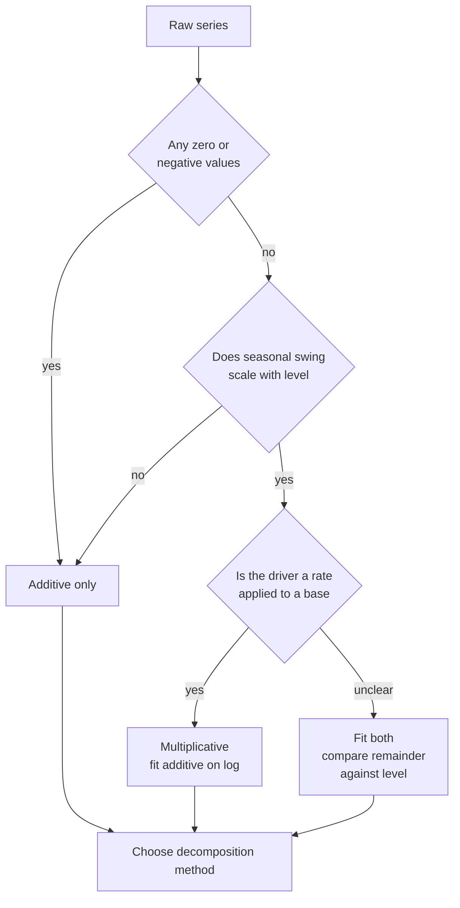
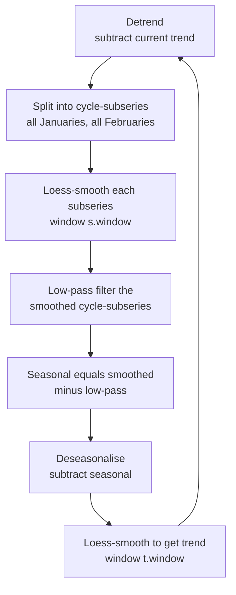
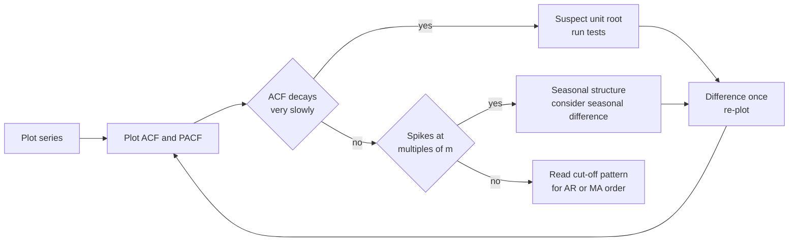
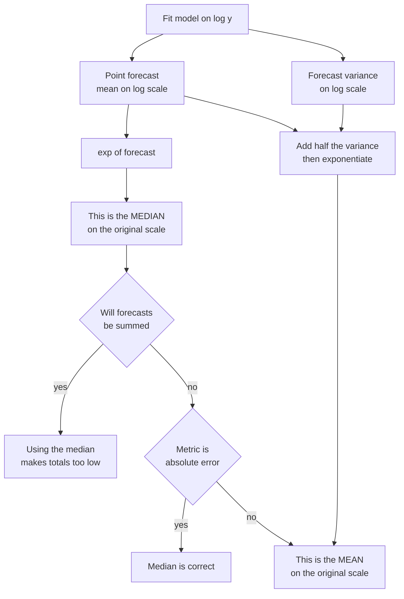

# Chapter 39: Time-Series Analysis, Decomposition, and Stationarity

> **What this chapter covers**: The analysis that precedes any forecasting model. Components and the additive versus multiplicative decision, classical and loess-based decomposition with every parameter explained, autocorrelation and partial autocorrelation derived and read together, stationarity and unit roots with the standard tests and their opposing null hypotheses, differencing and over-differencing, the Box-Cox family and the back-transform bias, the periodogram for finding seasonal periods, outliers and calendar effects, structural breaks, and the checklist to run before modelling.
> **Prerequisites**: Chapter 2 (probability and statistics), Chapter 11 (time-series overview, whose vocabulary is assumed). Chapter 12 for the Fourier transform itself, which this chapter uses but does not derive.
> **Where it is used**: Demand planning, energy load analysis, capacity forecasting, financial and macroeconomic series, sensor telemetry, operational metrics, and any point where a forecast will be defended to somebody who will ask why the number moved.

---

Chapter 11 introduced decomposition, autocorrelation and stationarity at the level needed to follow a conversation. This chapter is the mechanism. It exists because the step it describes is the one practitioners skip. Fitting a model takes minutes; the analysis takes a day, produces no artifact anybody asks for, and is the only thing that tells you whether the model you are about to fit can work at all.

## 39.1 Level 1: Foundations

### What pre-model analysis actually buys

Four concrete things, and it is worth being specific because "understand your data" is not actionable.

| What the analysis produces | What it decides downstream |
|---|---|
| The seasonal periods present, and whether there are several | The model family, the feature set, the minimum history you need |
| Whether variability scales with level | Whether to transform, and which transform |
| The order of integration, meaning how many differences reach stationarity | Differencing order in ARIMA, and whether a trend feature is safe |
| The outliers, breaks and calendar effects | Whether your backtest is measuring skill or measuring one holiday |

A fifth, less tangible: the analysis gives you the vocabulary to say why a forecast is wrong. A model that fails on a series with a level shift in month 40 is not a bad model. It is a model fitted across a break.

### The components of a series

The standard mental model splits an observed series $y_t$ at time $t$ into parts.

| Component | Symbol | What it is | Period |
|---|---|---|---|
| Trend-cycle | $T_t$ | Slow movement in the level, including long swings with no fixed period | None fixed |
| Seasonal | $S_t$ | Repetition at a known fixed period, such as 7 days or 12 months | Fixed, known |
| Remainder | $R_t$ | What is left, which should look like noise | None |

Some treatments split trend from cycle. In practice they are not separable from a short series, and most decomposition tools estimate a combined **trend-cycle** component. Calling it "trend" is an abbreviation, not a claim that the movement is monotone.

The two combination rules:

$$y_t = T_t + S_t + R_t \qquad \text{(additive)}$$

$$y_t = T_t \times S_t \times R_t \qquad \text{(multiplicative)}$$

### Additive versus multiplicative is a modelling decision

This is the first place the chapter departs from the overview. The choice is routinely presented as a description of the data: "if the seasonal swing grows with the level, use multiplicative". That is the symptom, not the decision.

The decision is about what you believe is stable in the process.

- **Additive** asserts that December adds a fixed quantity. A store that sells 400 extra units every December regardless of its base rate is additive. Fixed-capacity effects are additive: a road carries 2,000 more cars on a Friday because that is how many extra trips exist, not because Friday multiplies traffic.
- **Multiplicative** asserts that December multiplies by a fixed factor. A store whose December is always 40 percent above its running level is multiplicative. Anything driven by a rate applied to a growing base is multiplicative: churn, conversion, per-customer usage.

Two consequences follow, and both bite.

**It changes the forecast far more than it changes the fit.** Over the fitted history the two often look similar because the level did not move much. Over a horizon where the level moves, they diverge. If the level doubles, the additive model keeps the December bump at its historical absolute size and the multiplicative model doubles it.

**Multiplicative is just additive on a log scale.** Taking logarithms of the multiplicative equation:

$$\log y_t = \log T_t + \log S_t + \log R_t$$

So you can always fit an additive model to $\log y_t$. This is the usual implementation, and it is why the back-transform bias in level 2 matters so much: the multiplicative choice is almost always a log choice in disguise.

Multiplicative fails on two kinds of series. Zeros, because $\log 0$ is undefined and a multiplicative decomposition divides by a trend that may be near zero. Negative values, because the log is undefined and the sign of a product is ambiguous. Series that cross zero, such as net flows and profit, are additive by necessity.

*Figure 39.1: the decision path from a raw series to a decomposition choice.*



### Reading a series before touching a model

Plot the series. This advice is a cliche and it is still the single highest-yield action in the chapter, because the human eye finds level shifts, missing stretches, unit changes and stuck sensors faster than any test. What to look for, in order:

1. **Gaps and flat runs.** A flat run is usually a broken feed, not a stable process.
2. **A change of units.** A jump by a factor of exactly 1000, or exactly 2.20462, is a data problem.
3. **Level shifts.** A step that never reverts.
4. **Variance changes.** Does the band around the level widen with the level, or at a particular date?
5. **The seasonal shape.** Does it look the same each cycle, or does its shape change?
6. **The end of the series.** Most forecasting errors originate in the last 10 percent of the history, because that is what the model weights most and that is where data quality problems are freshest.

### Stationarity in one paragraph, restated for this chapter

Chapter 11 defined weak stationarity as constant mean, constant variance and autocovariance depending only on the lag. The operational point here is narrower: stationarity is a property a model *requires*, not a property data is supposed to have. Autoregressive models require it because their theory is built on a fixed autocovariance structure. Gradient-boosted trees on lag features do not require it in the same sense, but they require that the relationship between lags and target is stable, which is a different and often weaker condition. So the right question is never "is this series stationary" in the abstract. It is "is this series stationary enough for the model I intend to fit".

---

## 39.2 Level 2: Working knowledge

### Classical decomposition with a moving average

The oldest method, still worth knowing because it is transparent and because its failure mode is instructive.

For a series with seasonal period $m$, the procedure is:

1. Estimate the trend-cycle $\hat T_t$ with a centred moving average of order $m$. If $m$ is even, use a $2 \times m$ moving average, which is a moving average of order 2 applied to a moving average of order $m$, so that the result is centred on an observation rather than between two.
2. Detrend: compute $y_t - \hat T_t$ for additive, or $y_t / \hat T_t$ for multiplicative.
3. Estimate the seasonal component by averaging the detrended values for each position in the cycle, then centre those averages so they sum to zero (additive) or average to one (multiplicative).
4. The remainder is what is left.

**Worked example: the $2 \times 4$ moving average on quarterly data.** Assume quarterly sales 100, 130, 90, 120, 108, 140, 96, 128, with $m=4$.

The order-4 moving averages sit between quarters. The first is $(100+130+90+120)/4 = 110.0$, centred between Q2 and Q3. The second is $(130+90+120+108)/4 = 112.0$, centred between Q3 and Q4. The third is $(90+120+108+140)/4 = 114.5$. The fourth is $(120+108+140+96)/4 = 116.0$. The fifth is $(108+140+96+128)/4 = 118.0$.

Averaging adjacent pairs gives the $2\times4$ value centred on an actual quarter:

| Quarter index | $2\times4$ trend estimate |
|---|---|
| 3 | $(110.0+112.0)/2 = 111.00$ |
| 4 | $(112.0+114.5)/2 = 113.25$ |
| 5 | $(114.5+116.0)/2 = 115.25$ |
| 6 | $(116.0+118.0)/2 = 117.00$ |

Detrending quarter 3 additively: $90 - 111.00 = -21.00$. Quarter 4: $120 - 113.25 = 6.75$. Quarter 5: $108 - 115.25 = -7.25$. Quarter 6: $140 - 117.00 = 23.00$.

Notice the seasonal pattern the detrended values expose: a large negative in the third position of the cycle, a large positive in the second. That is the signal classical decomposition is designed to recover.

Note what is missing from the table. There is no trend estimate for quarters 1, 2, 7 or 8.

### The endpoint problem, which is why classical decomposition is rarely used now

A centred moving average of order $m$ loses $m/2$ observations at each end. Monthly data with $m=12$ loses six months at the start and, critically, **six months at the end**. The end of the series is exactly the part a forecaster needs.

Three consequences:

| Consequence | Why it matters |
|---|---|
| No trend estimate for the most recent $m/2$ points | You cannot see the current level, which is the forecast origin |
| Seasonal component assumed constant across the whole history | A seasonal pattern that evolves is forced to a single average shape |
| Not robust to outliers | A single extreme point contaminates $m$ moving-average windows and the seasonal average for its position |

The usual workaround is an asymmetric filter at the ends, which is what the X-11 family of methods does. That machinery is real and well tested, but for most engineering work the simpler answer is to use a method designed without the problem.

### Seasonal-trend decomposition using loess, in detail

STL, from Cleveland, Cleveland, McRae and Terpenning (1990), "STL: A Seasonal-Trend Decomposition Procedure Based on Loess". It is additive only, it handles any seasonal period, it allows the seasonal component to change over time, and it has a robustness option. It is the default choice for most engineering work.

Loess, locally estimated scatterplot smoothing, fits a low-order polynomial to points inside a moving window, weighting nearby points more, and takes the fitted value at the centre. The window width is the smoothing parameter.

STL runs an inner loop that alternates between estimating seasonal and trend, wrapped in an outer loop that computes robustness weights.

*Figure 39.2: the STL inner loop, which repeats until the seasonal and trend estimates stop changing.*



The parameters and what each one controls:

| Parameter | Common name | What it controls | Practical guidance |
|---|---|---|---|
| Seasonal window | `s.window` | How fast the seasonal shape may change from cycle to cycle | `"periodic"` forces a constant seasonal shape. A finite odd number lets it evolve; larger means more rigid. Start with `"periodic"` and relax only if the residuals show a systematic seasonal pattern |
| Trend window | `t.window` | How smooth the trend is | Defaults to roughly $\lceil 1.5m / (1 - 1.5/\texttt{s.window}) \rceil$ made odd. Increase it if the trend absorbs seasonal wiggle; decrease if it lags a genuine level change |
| Low-pass window | `l.window` | Removes residual cycle-length variation from the seasonal estimate | Smallest odd number at least $m$. Rarely changed |
| Robust | `robust` | Downweights outliers via bisquare weights in the outer loop | Turn it on whenever the series has spikes. It costs a few extra iterations and protects the trend |
| Inner iterations | `inner` | Inner loop passes | 2 when robust, 5 when not, in the original implementation |
| Outer iterations | `outer` | Robustness weight updates | 0 when not robust, up to 15 when robust |

The one parameter to reason about carefully is `s.window`. The failure mode in both directions:

- Too rigid (`"periodic"` on a series whose seasonality genuinely evolved): the seasonal component is an average shape, and the remainder contains a systematic pattern that repeats every $m$ steps. Diagnose by plotting the ACF of the remainder and looking for a spike at lag $m$.
- Too flexible (a small `s.window`): the seasonal component absorbs noise and one-off events, and the remainder looks too clean. Diagnose by plotting the seasonal component across cycles; if the shape lurches, it is fitting noise.

STL is additive. For a multiplicative structure, take logs, run STL, and work on the log scale. That is the standard recipe and it is why the back-transform section later is not optional.

**Listing 39.1: STL with the parameters made explicit rather than defaulted.**

```python
import numpy as np
import pandas as pd
from statsmodels.tsa.seasonal import STL

# monthly series, period 12; y is a pandas Series with a DatetimeIndex
log_y = np.log(y)                      # multiplicative structure, additive on logs

stl = STL(
    log_y,
    period=12,
    seasonal=13,        # s.window: odd, >= 7; 13 lets the shape drift slowly
    trend=23,           # t.window: odd, > period; larger means smoother trend
    low_pass=13,        # l.window: smallest odd number >= period
    robust=True,        # bisquare outer-loop weights; use when spikes exist
)
res = stl.fit()

parts = pd.DataFrame({
    "trend": res.trend,
    "seasonal": res.seasonal,
    "resid": res.resid,
})
# Sanity checks that catch most misconfigurations.
recon = parts.sum(axis=1)
assert np.allclose(recon, log_y, atol=1e-8), "components must sum to the input"
strength_seasonal = max(0.0, 1 - parts["resid"].var() /
                        (parts["seasonal"] + parts["resid"]).var())
strength_trend = max(0.0, 1 - parts["resid"].var() /
                     (parts["trend"] + parts["resid"]).var())
```

Two lines deserve comment. The `assert` is there because an additive decomposition must reconstruct the input exactly; if it does not, you have transformed the input somewhere and forgotten. The strength measures are from Wang, Smith and Hyndman (2006) and are bounded in $[0,1]$: a seasonal strength below about 0.3 means the seasonal component is weak enough that modelling it may cost more than it gains, and a strength above 0.6 means a model that ignores seasonality will be badly beaten. Those thresholds are conventions, not results.

### Multiple seasonality

Half-hourly electricity demand has a daily period of 48, a weekly period of 336, and an annual period of about 17,532. Daily retail data has a weekly period of 7 and an annual period of 365.25. A single seasonal component cannot represent this.

MSTL, from Bandara, Hyndman and Bergmeir (2021), "MSTL: A Seasonal-Trend Decomposition Algorithm for Time Series with Multiple Seasonal Patterns", applies STL iteratively, one seasonal period at a time from shortest to longest, cycling until convergence. The result is one trend, several seasonal components, and one remainder:

$$y_t = T_t + \sum_{i=1}^{k} S_t^{(i)} + R_t$$

Order matters: extract the short period first. Extracting the annual pattern first on half-hourly data forces a smoother with a window of 17,532 points to run before the daily structure is removed, and the daily structure leaks into it.

Two practical constraints. You need at least two full cycles of the longest period to estimate it at all, and realistically three or more. Half-hourly data with two years of history can support daily and weekly seasonality and cannot support annual seasonality with any confidence. Say so rather than fitting it.

The alternative to decomposing multiple seasonalities is representing them with Fourier terms as regressors, covered in Chapter 40.

### Autocorrelation and partial autocorrelation, read together

The autocorrelation function, ACF, was defined in Chapter 11. Restated with the sample estimator:

$$\hat\rho_k = \frac{\hat\gamma_k}{\hat\gamma_0}, \qquad \hat\gamma_k = \frac{1}{n}\sum_{t=k+1}^{n} (y_t - \bar y)(y_{t-k} - \bar y)$$

where $\hat\gamma_k$ is the sample autocovariance at lag $k$, $n$ is the series length and $\bar y$ the sample mean. The divisor is $n$ rather than $n-k$ by convention; it biases $\hat\gamma_k$ toward zero at long lags but guarantees the resulting autocovariance matrix is positive semi-definite, which matters for downstream estimation.

The partial autocorrelation function, PACF, at lag $k$ is the correlation between $y_t$ and $y_{t-k}$ with the effect of the intervening lags $y_{t-1}, \ldots, y_{t-k+1}$ removed. The cleanest definition is as the last coefficient $\phi_{kk}$ in the linear regression

$$y_t = \phi_{k1} y_{t-1} + \phi_{k2} y_{t-2} + \cdots + \phi_{kk} y_{t-k} + \varepsilon_t$$

fitted separately for each $k$, where $\varepsilon_t$ is the error term. In practice it is computed by the Durbin-Levinson recursion rather than by fitting $k$ regressions.

**The confidence bands.** Plots draw horizontal lines at $\pm 1.96 / \sqrt{n}$. These come from the result that for white noise, $\hat\rho_k$ is approximately normal with mean 0 and variance $1/n$, so 95 percent of sample autocorrelations of a white-noise series fall inside the band.

Three things practitioners get wrong about those bands.

1. **They are valid under the white-noise null only.** Once the series has real autocorrelation, the standard error of $\hat\rho_k$ at higher lags is larger. Bartlett's formula gives the correction: for a process whose autocorrelations vanish beyond lag $q$, $\mathrm{Var}(\hat\rho_k) \approx \frac{1}{n}\left(1 + 2\sum_{j=1}^{q}\rho_j^2\right)$ for $k > q$. Some plotting functions widen the bands accordingly; check which convention yours uses.
2. **Multiple comparisons.** Plot 40 lags and, under the null, expect about two to fall outside the band by chance. A single isolated spike at lag 17 with no interpretation is noise. Do not build a model around it.
3. **They are pointwise, not simultaneous.** The band answers "is this one lag significant", not "does this whole plot show autocorrelation". For the second question use a portmanteau test, covered in Chapter 40.

**Worked example: the band width.** With $n = 120$ monthly observations, $1.96/\sqrt{120} = 1.96/10.954 = 0.179$. So a sample autocorrelation of 0.15 at lag 9 is inside the band and means nothing. With $n = 2000$ half-hourly points the band is $1.96/44.72 = 0.044$, and an autocorrelation of 0.15 is strongly significant. The same number means opposite things at different sample sizes, which is the reason to read the band rather than the height.

### The signatures

Reading the two plots together is the classical identification step. The table is the thing to memorise.

| Process | ACF | PACF |
|---|---|---|
| White noise | All lags inside the band | All lags inside the band |
| AR($p$), autoregressive of order $p$ | Decays, geometrically or as a damped sine wave | Cuts off sharply after lag $p$ |
| MA($q$), moving average of order $q$ | Cuts off sharply after lag $q$ | Decays |
| ARMA($p,q$) | Decays after lag $q$ | Decays after lag $p$ |
| Non-stationary, unit root | Decays very slowly, near-linear, still large at lag 20 or 30 | Single large spike near 1 at lag 1, rest small |
| Deterministic trend, not differenced | Slow decay, similar to a unit root on a short series | Large lag-1 spike |
| Seasonal, period $m$ | Spikes at $m, 2m, 3m$, decaying | Spike at $m$, often at $2m$ |
| Over-differenced | Large negative spike at lag 1, often near $-0.5$ | Alternating decay |

Two entries in that table are the same visually and different in meaning: a unit root and a deterministic trend. Distinguishing them is what the tests in the next section are for, and they do it imperfectly.

*Figure 39.3: the identification loop from plots to a differencing decision.*



### Stationarity tests, and the null hypotheses that trip everyone

This is the section the chapter exists for. The two standard tests have **opposite null hypotheses**, and reading one as if it were the other is the most common error in applied time-series work. It produces confident, wrong differencing decisions that propagate into every downstream number.

**Augmented Dickey-Fuller, ADF.** From Dickey and Fuller (1979), extended to allow lagged differences. The regression, in its trend-and-drift form, is

$$\Delta y_t = \alpha + \beta t + \gamma y_{t-1} + \sum_{i=1}^{p} \delta_i \Delta y_{t-i} + \varepsilon_t$$

where $\Delta y_t = y_t - y_{t-1}$, $\alpha$ is a drift constant, $\beta t$ a deterministic trend, $\gamma$ the coefficient of interest, the $\delta_i$ are lagged-difference coefficients that soak up serial correlation, and $\varepsilon_t$ is white noise.

The test statistic is the $t$-ratio on $\hat\gamma$. If the series has a unit root then $\gamma = 0$, because $y_{t-1}$ carries no pull back toward a level. So:

> **ADF null hypothesis: the series HAS a unit root. The series is non-stationary.**
> A small p-value REJECTS non-stationarity and is evidence FOR stationarity.

The critical values are not standard $t$ values. Under the null, $\hat\gamma$ has a non-standard limiting distribution, the Dickey-Fuller distribution, and the critical values are more negative than the normal ones. Your software supplies them; do not compare the statistic to 1.96.

**Kwiatkowski-Phillips-Schmidt-Shin, KPSS.** From Kwiatkowski, Phillips, Schmidt and Shin (1992). It writes the series as a deterministic trend plus a random walk plus a stationary error:

$$y_t = \xi t + r_t + \varepsilon_t, \qquad r_t = r_{t-1} + u_t, \quad u_t \sim \text{iid}(0, \sigma_u^2)$$

where $r_t$ is the random-walk component and $\sigma_u^2$ its innovation variance. If $\sigma_u^2 = 0$ the random walk is a constant and the series is trend stationary. So the test is $H_0: \sigma_u^2 = 0$, and it is a one-sided Lagrange multiplier test built on the partial sums of the residuals.

> **KPSS null hypothesis: the series IS stationary, around a level or around a trend.**
> A small p-value REJECTS stationarity and is evidence FOR a unit root.

KPSS comes in two variants and you must pick one. **Level stationary** tests stationarity around a constant. **Trend stationary** tests stationarity around a linear trend. A series with a clear upward trend will reject the level-stationary null almost automatically, which tells you nothing you did not see on the plot.

**Phillips-Perron, PP.** From Phillips and Perron (1988). Same null as ADF, meaning a unit root. It differs in how it handles serial correlation: instead of adding lagged differences to the regression, it applies a non-parametric correction to the test statistic using a long-run variance estimate. Read it exactly like ADF. It is more robust to heteroskedasticity and has poorer small-sample behaviour under a negative moving-average component.

### The four-cell table

Because the nulls oppose, running both is informative, and the four combinations are not four shades of the same answer.

| ADF | KPSS | Meaning | What to do |
|---|---|---|---|
| Rejects (p small), so stationary | Fails to reject (p large), so stationary | Both agree: stationary | Do not difference. $d = 0$ |
| Fails to reject (p large), so unit root | Rejects (p small), so unit root | Both agree: non-stationary | Difference once, retest |
| Fails to reject, so unit root | Fails to reject, so stationary | Not enough information. Both tests are underpowered; the data does not distinguish the hypotheses | Prefer the conclusion your model tolerates better. Usually difference, since over-differencing is less damaging than under-differencing for forecasting. Say in the write-up that the data was uninformative |
| Rejects, so stationary | Rejects, so non-stationary | Contradiction. Something violates both models: a structural break, heteroskedasticity, or fractional integration | Do not resolve it by picking a favourite. Plot the series, look for a break, and consider splitting the sample or modelling the break explicitly |

The third and fourth rows are where judgment lives, and where a report that just prints two p-values is useless.

**Why the tests are weak.** Both have low power in the sense of statistical hypothesis testing: they often fail to detect what they are looking for. Three specific reasons.

1. **Sample size.** Unit-root tests need long series. With 50 observations, ADF cannot reliably separate $\gamma = 0$ from $\gamma = -0.05$, which corresponds to an autoregressive coefficient of 0.95. Those two processes look identical over 50 points and behave very differently over a 24-step horizon.
2. **Near-unit roots.** An AR(1) coefficient of 0.99 is stationary in theory and indistinguishable from a random walk in any finite sample.
3. **Structural breaks.** Perron (1989), "The Great Crash, the Oil Price Shock, and the Unit Root Hypothesis", showed that a trend-stationary series with a single break in the trend will cause ADF to fail to reject, that is to falsely indicate a unit root. This is the single most important caveat on the tests and it is why you plot before you test.

### The practical decision procedure

Do not let the tests decide alone. This is the procedure to follow, in order.

1. **Plot the series.** If there is a visible break, stop and deal with it. Test results across a break are not interpretable.
2. **Choose the transformation first.** If variance scales with level, take logs or a Box-Cox transform before any stationarity testing. A variance-non-stationary series confuses the tests.
3. **Handle seasonality before regular differencing.** Test for a seasonal unit root, or use the strength heuristic, and apply a seasonal difference $\Delta_m y_t = y_t - y_{t-m}$ if needed. Do this first because a seasonal difference often removes the trend too, making a regular difference unnecessary.
4. **Run ADF and KPSS on the seasonally differenced series.** Use the KPSS trend-stationary variant if a trend is visibly present.
5. **Apply the four-cell table.** Difference if indicated.
6. **Retest, at most twice.** $d = 2$ is rare in practice outside economics and price-index data. $d = 3$ almost always means the transformation step was skipped.
7. **Check for over-differencing.** Look at the ACF of the differenced series for a large negative lag-1 spike.
8. **Sanity-check the result against the forecast you want.** A differenced model implies a specific long-run behaviour. $d=1$ with drift implies the forecast continues on a straight line forever. $d=0$ implies it reverts to a mean. Ask whether either is plausible for this quantity over your horizon.

**Listing 39.2: both tests reported together with their nulls spelled out, so the output cannot be misread.**

```python
from statsmodels.tsa.stattools import adfuller, kpss

def stationarity_report(x, alpha=0.05, kpss_regression="c"):
    """Run ADF and KPSS and return a single plain-language conclusion.

    kpss_regression: 'c' for level-stationary null, 'ct' for trend-stationary.
    """
    adf_stat, adf_p, *_ = adfuller(x, autolag="AIC")
    # KPSS p-values are interpolated from a table and are clipped at the
    # table edges; statsmodels warns when that happens. Treat a clipped
    # p-value as 'at least this extreme', never as an exact number.
    kpss_stat, kpss_p, *_ = kpss(x, regression=kpss_regression, nlags="auto")

    adf_says_stationary = adf_p < alpha     # rejects the UNIT ROOT null
    kpss_says_stationary = kpss_p > alpha   # fails to reject the STATIONARY null

    verdict = {
        (True, True): "stationary; do not difference",
        (False, False): "unit root; difference once and retest",
        (False, True): "inconclusive, tests underpowered; usually difference",
        (True, False): "contradiction; suspect a break or changing variance",
    }[(adf_says_stationary, kpss_says_stationary)]
    return {
        "adf_stat": adf_stat, "adf_p": adf_p,
        "adf_null": "series HAS a unit root (non-stationary)",
        "kpss_stat": kpss_stat, "kpss_p": kpss_p,
        "kpss_null": "series IS stationary",
        "verdict": verdict,
    }
```

The dictionary keys carrying the null hypotheses as strings are not decoration. They travel into the log and into whatever report reads it, and they are the cheapest possible defence against the misreading.

**Worked example.** Assume a monthly series of 144 points returns ADF statistic $-1.42$ with p-value 0.573, and KPSS statistic 1.31 with p-value below 0.01 using the level-stationary variant. These numbers are illustrative, not from a named dataset.

Read it as: ADF fails to reject its unit-root null, so no evidence against a unit root. KPSS rejects its stationarity null, so evidence against stationarity. Both point the same way. Difference once. After differencing, assume ADF returns $-6.87$ with p-value below 0.01 and KPSS returns 0.11 with p-value above 0.10. Both now indicate stationarity, so $d = 1$.

### Differencing, regular and seasonal

Regular first difference: $\Delta y_t = y_t - y_{t-1}$. Removes a linear trend, and turns a random walk into white noise. Costs you one observation.

Second difference: $\Delta^2 y_t = \Delta y_t - \Delta y_{t-1} = y_t - 2y_{t-1} + y_{t-2}$. Removes a quadratic trend. Costs two observations.

Seasonal difference of period $m$: $\Delta_m y_t = y_t - y_{t-m}$. Removes a stable seasonal pattern and, incidentally, a linear trend, since the difference across a full cycle absorbs it. Costs $m$ observations, which on monthly data is a whole year of history and on half-hourly data with weekly seasonality is 336 points.

**Order matters for interpretation, not for the result.** $\Delta \Delta_m y_t = \Delta_m \Delta y_t$ algebraically. Apply the seasonal difference first as a matter of workflow, because it frequently makes the regular one unnecessary and every difference costs data.

**Worked example: seasonal differencing on monthly data.** Assume monthly values for two years: year 1 is 100, 105, 120, 130, 140, 160, 170, 165, 140, 125, 115, 150; year 2 is 112, 118, 133, 144, 155, 176, 187, 182, 155, 139, 128, 166.

Seasonal differences $\Delta_{12}$ for the second year: $12, 13, 13, 14, 15, 16, 17, 17, 15, 14, 13, 16$. The huge within-year swing from 100 to 170 has gone. What remains is a slowly rising series in the low teens, which is the year-over-year growth. That residual upward drift is why a further regular difference might be considered, and why it might not: a drift of that size is well handled by a constant term instead.

### Over-differencing and its signature

Differencing more than necessary is not harmless. It inflates the variance of the series and it introduces a non-invertible moving-average structure that the estimator cannot represent well.

The algebra: suppose $y_t$ is already white noise, $y_t = \varepsilon_t$ with variance $\sigma^2$. Difference it anyway:

$$\Delta y_t = \varepsilon_t - \varepsilon_{t-1}$$

That is an MA(1) process with coefficient $\theta = -1$. Its variance is $2\sigma^2$, so you have doubled the noise. Its lag-1 autocorrelation is

$$\rho_1 = \frac{\theta}{1 + \theta^2} = \frac{-1}{1 + 1} = -0.5$$

which is the diagnostic. **A large negative autocorrelation at lag 1, near $-0.5$, on a differenced series, combined with an increase in the residual standard deviation relative to the undifferenced fit, means you differenced too much.** The $\theta = -1$ case is exactly on the invertibility boundary, so estimation is badly behaved there: the optimiser pushes the estimate toward $-1$, the likelihood surface is flat, and standard errors are unreliable.

The asymmetry to remember: under-differencing produces forecasts that revert to a mean the series is not going back to, which is a systematic bias that grows with horizon. Over-differencing produces forecasts that are unbiased but noisier. When the tests are inconclusive, the less damaging error is usually to difference.

---

## 39.3 Level 3: Depth

### Unit roots, properly

Take the AR(1) process

$$y_t = \phi y_{t-1} + \varepsilon_t, \qquad \varepsilon_t \sim \text{iid}(0, \sigma^2)$$

where $\phi$ is the autoregressive coefficient. Substituting repeatedly back to the start:

$$y_t = \phi^t y_0 + \sum_{j=0}^{t-1} \phi^j \varepsilon_{t-j}$$

The behaviour hinges entirely on $|\phi|$.

**Case $|\phi| < 1$.** The term $\phi^t y_0$ vanishes: the starting value is forgotten. The variance converges:

$$\mathrm{Var}(y_t) = \sigma^2 \sum_{j=0}^{t-1} \phi^{2j} \to \frac{\sigma^2}{1 - \phi^2}$$

A shock at time $s$ has effect $\phi^{t-s}$ at time $t$, which decays to zero. The process is stationary and mean-reverting. Forecasts converge to the mean as the horizon grows, and the forecast interval converges to a fixed width.

**Case $\phi = 1$, the unit root.** Now $y_t = y_0 + \sum_{j=0}^{t-1}\varepsilon_{t-j}$, a random walk.

$$\mathrm{Var}(y_t) = t\sigma^2$$

The variance grows without bound and linearly in $t$. The starting value is never forgotten. A shock at time $s$ has effect exactly 1 at every future time: **shocks are permanent**. Forecasts are flat at the last value, and the forecast interval widens as $\sqrt{h}$ forever.

The name comes from writing the process with the backshift operator $B$, where $By_t = y_{t-1}$:

$$(1 - \phi B) y_t = \varepsilon_t$$

The characteristic polynomial is $1 - \phi z = 0$, whose root is $z = 1/\phi$. Stationarity requires all roots outside the unit circle, meaning $|z| > 1$, which is $|\phi| < 1$. When $\phi = 1$ the root is exactly 1, on the unit circle. Hence "unit root".

**Why it matters beyond the mechanics.** Two non-stationary series with independent random walks will show a high $R^2$ and a significant $t$-statistic when regressed on each other, essentially always. This is spurious regression, documented by Granger and Newbold (1974), "Spurious Regressions in Econometrics". It is why a dashboard correlating two trending metrics is close to meaningless, and it is the strongest practical argument for checking integration order before regressing one series on another.

### ADF in detail

Start from AR(1) and subtract $y_{t-1}$ from both sides:

$$y_t - y_{t-1} = (\phi - 1) y_{t-1} + \varepsilon_t \quad\Longrightarrow\quad \Delta y_t = \gamma y_{t-1} + \varepsilon_t, \quad \gamma = \phi - 1$$

So $\phi = 1$ is $\gamma = 0$, and testing the unit root is testing $\gamma = 0$ against $\gamma < 0$. The "augmented" part adds $p$ lagged differences so that $\varepsilon_t$ is white noise; without them, serial correlation in the errors invalidates the distribution of the statistic.

**Three deterministic specifications, and choosing wrong changes the answer.**

| Specification | Regression | Use when |
|---|---|---|
| None | $\Delta y_t = \gamma y_{t-1} + \sum \delta_i \Delta y_{t-i} + \varepsilon_t$ | The series has zero mean by construction, such as a return series or a pre-centred residual |
| Drift | Add $\alpha$ | The series has a non-zero level but no visible trend |
| Trend | Add $\alpha + \beta t$ | The series has a visible trend, and you want to test unit root against trend stationarity |

Getting this wrong is a real error. Running the no-constant version on a series with a level far from zero produces a near-automatic failure to reject. Running the trend version on a series with no trend loses power because you have spent a parameter on nothing. The safe default for an engineering series is drift; add the trend term when the plot shows one.

**Lag order $p$.** Too few and serial correlation remains, distorting the size of the test. Too many and power falls. The standard automatic choices are minimising AIC or BIC over $p$, or the Ng-Perron sequential-$t$ rule starting from an upper bound such as $p_{\max} = \lfloor 12 (n/100)^{1/4} \rfloor$, which is the Schwert rule. Report which you used; results move with it.

### KPSS in detail

Regress $y_t$ on a constant, or on a constant and a trend, and take the residuals $e_t$. Form the partial sums:

$$S_t = \sum_{i=1}^{t} e_i$$

The statistic is

$$\text{KPSS} = \frac{1}{n^2 \hat\sigma^2_{LR}} \sum_{t=1}^{n} S_t^2$$

where $\hat\sigma^2_{LR}$ is a consistent estimate of the long-run variance of $e_t$, usually a Newey-West estimator with a bandwidth that grows with $n$.

The intuition is clean. If the residuals are stationary with mean zero, the partial sums wander but stay near zero in a controlled way, and the sum of their squares grows like $n^2$, so the normalised statistic converges. If there is a random-walk component, the partial sums are integrated twice and the statistic diverges. Large statistic means reject stationarity.

**The bandwidth choice matters more than people expect.** A larger bandwidth makes $\hat\sigma^2_{LR}$ bigger, shrinking the statistic and making the test less likely to reject. The `nlags="auto"` or `"legacy"` options in common libraries use different rules, and the same series can produce different verdicts. Check your version and record the setting.

**The p-value is interpolated from a small table.** Most implementations tabulate critical values at 10, 5, 2.5 and 1 percent and interpolate. Outside that range they clip and warn. A reported KPSS p-value of exactly 0.01 usually means "at most 0.01", not 0.01. Never feed a clipped p-value into a downstream calculation as if it were exact.

### Seasonal unit roots

Regular unit-root tests say nothing about the seasonal frequency. A series can be stationary at the zero frequency and have a unit root at the seasonal frequency, meaning the seasonal pattern itself performs a random walk from cycle to cycle rather than being fixed.

| Test | Null hypothesis | Notes |
|---|---|---|
| OCSB, Osborn, Chui, Smith and Birchenhall (1988) | A seasonal unit root is present, so a seasonal difference is needed | The rule behind the seasonal differencing decision in several automatic ARIMA implementations |
| Canova-Hansen (1995) | Seasonality is deterministic and stable | Opposite direction, analogous to KPSS. Rejecting means the seasonal pattern is evolving |
| HEGY, Hylleberg, Engle, Granger and Yoo (1990) | Unit roots at specified seasonal frequencies, tested individually | The most complete treatment; heavier machinery, mostly used in econometrics |

For engineering work the common practical rule is different and simpler: compute the seasonal strength from an STL decomposition and seasonally difference when it exceeds a threshold around 0.64. That threshold is an empirical convention from Wang, Smith and Hyndman (2006) as operationalised in the `forecast` and `statsforecast` ecosystems, not a derived quantity. Say so when you report it.

### Transformations and the Box-Cox family

The Box-Cox transform, from Box and Cox (1964), "An Analysis of Transformations", is

$$w_t = \begin{cases} \dfrac{y_t^{\lambda} - 1}{\lambda} & \lambda \neq 0 \\[6pt] \log y_t & \lambda = 0 \end{cases}$$

where $\lambda$ is the transformation parameter. The $\lambda = 0$ case is the limit of the first as $\lambda \to 0$, which you can check with l'Hopital's rule. The $-1$ and the division by $\lambda$ make the family continuous in $\lambda$ and preserve the direction of the ordering; they do not change what the transform does to variance.

| $\lambda$ | Equivalent transform | Effect |
|---|---|---|
| 1 | None, up to a shift | Leaves the series alone |
| 0.5 | Square root | Mild variance stabilisation, classical for count data |
| 0.33 | Cube root | Between square root and log |
| 0 | Logarithm | Full multiplicative-to-additive conversion |
| $-1$ | Reciprocal | Aggressive; rarely appropriate for forecasting |

All of it requires $y_t > 0$. For series with zeros, the shifted variant $\log(y_t + c)$ is common and the choice of $c$ is arbitrary and affects the answer, which is a good reason to consider whether the series is intermittent and belongs in the intermittent-demand treatment of Chapter 40 instead.

**Estimating $\lambda$.** Two approaches.

*Profile likelihood.* Assume the transformed series is normal, write the log-likelihood including the Jacobian of the transformation, and maximise over $\lambda$. The Jacobian term $(\lambda - 1)\sum_t \log y_t$ is essential: without it the likelihood is trivially maximised by squashing everything to a point.

*Guerrero's method,* from Guerrero (1993). Split the series into subseries of length $m$, one per seasonal cycle. For each subseries compute the mean $\bar z_i$ and standard deviation $s_i$. Choose $\lambda$ to minimise the coefficient of variation of $s_i / \bar z_i^{\,1-\lambda}$ across subseries. The intuition is direct: pick the power that makes spread independent of level. This is the method most forecasting libraries use by default, and it targets variance stabilisation specifically rather than normality.

**Worked example: Guerrero on two groups.** Assume two yearly groups with means $\bar z_1 = 100$, $s_1 = 10$ and $\bar z_2 = 400$, $s_2 = 40$. Spread is exactly proportional to level.

- Try $\lambda = 1$, meaning no transform. Ratios are $10/100^0 = 10$ and $40/400^0 = 40$. Wildly unequal.
- Try $\lambda = 0$, meaning log. Ratios are $10/100^1 = 0.10$ and $40/400^1 = 0.10$. Identical.

So $\lambda = 0$ is chosen, and the log transform is correct here. That is the textbook case where spread is exactly proportional to level. Had $s_2$ been 20 rather than 40, spread would grow as the square root of the level and the minimising $\lambda$ would sit near 0.5.

**Round $\lambda$.** An estimate of 0.037 should be used as 0, and 0.48 as 0.5. Interpretability is worth far more than the third decimal, the likelihood surface in $\lambda$ is typically flat, and the forecast difference is negligible.

### The back-transform bias, which practitioners get wrong constantly

You fitted the model on $w_t = \log y_t$. The model gives you $\hat w_{T+h}$, the forecast of the transformed series, which is an estimate of the conditional **mean** on the log scale. You want a forecast on the original scale. The obvious move is $\exp(\hat w_{T+h})$. That is wrong, and the direction of the error is always the same.

**The mathematics.** For a random variable $W$, Jensen's inequality states that for a convex function $g$,

$$\mathbb{E}[g(W)] \geq g(\mathbb{E}[W])$$

The exponential is convex, so

$$\mathbb{E}[e^{W}] > e^{\mathbb{E}[W]}$$

Taking the exponential of the forecast mean **always underestimates** the mean of the original scale. The gap grows with the forecast variance, so it grows with the horizon.

**How much.** If $W \sim \mathcal{N}(\mu, \sigma^2)$, then $Y = e^W$ is lognormal, and

$$\mathbb{E}[Y] = e^{\mu + \sigma^2/2}, \qquad \text{Median}(Y) = e^{\mu}$$

So $\exp(\hat w)$ is the **median** forecast, not the mean. The mean requires the correction factor $e^{\sigma^2/2}$, where $\sigma^2$ is the variance of the forecast on the log scale, meaning the $h$-step-ahead forecast variance, not the in-sample residual variance.

**Worked example.** Assume a log-scale point forecast of $\hat w_{T+h} = 6.90$ with $h$-step forecast standard deviation $\sigma_h = 0.45$, and assume the forecast errors on the log scale are normal.

- Naive back-transform: $e^{6.90} = 992.3$. This is the median forecast.
- Bias-corrected mean: $e^{6.90 + 0.45^2/2} = e^{6.90 + 0.10125} = e^{7.00125} = 1098.0$.

The corrected mean is 10.7 percent higher. On a monthly series at $h = 12$ with a wider interval, say $\sigma_h = 0.70$, the factor is $e^{0.245} = 1.278$, a 27.8 percent gap. That is not a rounding difference. It is the difference between a plan that holds and a stockout.

**For general Box-Cox**, the second-order correction is

$$\mathbb{E}[Y_{T+h}] \approx \begin{cases} e^{\hat w}\left(1 + \dfrac{\sigma_h^2}{2}\right) & \lambda = 0 \\[8pt] (\lambda \hat w + 1)^{1/\lambda}\left(1 + \dfrac{\sigma_h^2 (1-\lambda)}{2(\lambda \hat w + 1)^2}\right) & \lambda \neq 0 \end{cases}$$

Note that the $\lambda = 0$ expression here is a Taylor approximation, $1 + \sigma_h^2/2$, while the exact lognormal factor is $e^{\sigma_h^2/2}$. They agree for small $\sigma_h$ and diverge as it grows. Use the exact lognormal form when you know the log-scale errors are normal.

**Which do you actually want?** This is the part usually skipped, and it is the part that matters.

| Situation | Want mean or median | Reason |
|---|---|---|
| Forecasts will be summed, across stores, SKUs or time | **Mean** | Expectation is additive, medians are not. Summing medians produces a total that is systematically low |
| Evaluation metric is squared error, RMSE or MSE | **Mean** | Squared error is minimised by the conditional mean |
| Evaluation metric is absolute error, MAE or MAPE | **Median** | Absolute error is minimised by the conditional median, so the naive back-transform is correct |
| Feeding an inventory or capacity decision | **Neither** | You want a quantile chosen from the cost of over versus under. See Chapter 43 |
| Reporting a single headline number to a business | State which | And be consistent across periods, or the series of published forecasts will not be comparable |

The trap that catches teams: they use the naive back-transform, evaluate on MAE, look fine, then a planner sums the forecasts to a national total and the total is 8 percent low every month with no obvious cause. The cause is that medians do not add.

**Prediction intervals are the exception, and are easy.** Because the back-transform is monotone, quantiles map directly. If the 95 percent interval on the log scale is $[a, b]$ then the 95 percent interval on the original scale is $[e^a, e^b]$. No correction, no Jensen. The interval is correct and asymmetric, which is what you want for a positive quantity. The point forecast inside it, though, needs the correction if it is meant to be a mean, and the corrected mean can sit off-centre in the interval, which will confuse a reviewer unless you explain it.

*Figure 39.4: what goes wrong between the log-scale model and the original-scale report.*



**Listing 39.3: back-transform with the correction made explicit and selectable.**

```python
import numpy as np

def back_transform(w_hat, sigma_h, lam=0.0, want="mean"):
    """Invert a Box-Cox transform on a point forecast.

    w_hat   : point forecast on the transformed scale
    sigma_h : standard deviation of the h-step error on the transformed scale
    lam     : Box-Cox lambda; 0 means a log transform
    want    : 'median' for the plain inverse, 'mean' for the bias-corrected mean
    """
    if lam == 0.0:
        median = np.exp(w_hat)
        if want == "median":
            return median
        return np.exp(w_hat + 0.5 * sigma_h ** 2)   # exact under lognormal
    base = lam * w_hat + 1.0
    if np.any(base <= 0):
        raise ValueError("inverse Box-Cox undefined; forecast left the support")
    median = base ** (1.0 / lam)
    if want == "median":
        return median
    corr = 1.0 + (sigma_h ** 2 * (1.0 - lam)) / (2.0 * base ** 2)
    return median * corr
```

Two notes. `sigma_h` must be the $h$-step forecast standard deviation, which grows with $h$; passing the one-step residual standard deviation for every horizon is the usual implementation bug and it under-corrects at long horizons exactly where the correction is largest. The `base <= 0` guard catches the case where a non-zero $\lambda$ inverse leaves the support of the transform, which happens on series forecast near zero and produces silent NaN values otherwise.

### When transforming harms the forecast

Transforming is not free.

1. **It optimises the wrong loss.** Fitting on the log scale minimises squared error in logs, which is roughly relative error on the original scale. If the business cares about absolute units, and large values dominate the cost, this systematically under-weights the expensive errors.
2. **It complicates every downstream step.** Reconciliation across a hierarchy (Chapter 44) does not commute with a non-linear transform. You cannot reconcile in log space and expect coherence in level space.
3. **Near-zero values dominate the fit.** A log transform turns a value of 0.01 into $-4.6$ and a value of 100 into 4.6. A handful of near-zero observations, possibly data errors, get enormous leverage.
4. **The correction needs a distributional assumption.** The lognormal correction assumes normal log-scale errors. If they are heavy-tailed, the correction is wrong, usually too small.

The pragmatic test: fit with and without the transform, back-transform properly, and compare on the original scale with the metric you actually care about, using the rolling-origin protocol from Chapter 5. Do not compare log-scale errors against original-scale errors; that comparison is meaningless and it is made often.

### Spectral analysis at the level a forecaster needs

Chapter 12 derives the discrete Fourier transform, sampling, aliasing and windowing. This section uses them for one purpose: finding seasonal periods you did not already know about.

The **periodogram** at frequency $f_j = j/n$ for $j = 1, \ldots, \lfloor n/2 \rfloor$ is

$$I(f_j) = \frac{1}{n}\left| \sum_{t=1}^{n} y_t e^{-2\pi i f_j t} \right|^2$$

It is the squared magnitude of the discrete Fourier transform, and it measures how much of the series variance sits at that frequency. A peak at $f_j$ means a period of $1/f_j$ observations.

Four practical facts.

1. **The periodogram is not a consistent estimator of the spectral density.** Its variance does not shrink as $n$ grows; you get more frequencies, each equally noisy. Smooth it, with a Daniell or modified Daniell kernel, before reading anything but the largest peaks.
2. **Resolution is $1/n$.** To distinguish a period of 365 from 360 you need enough data that $1/365$ and $1/360$ fall in different bins, which means many years. On three years of daily data you cannot resolve them, so do not claim to.
3. **Leakage.** A period that is not an exact divisor of $n$ spreads energy into neighbouring bins. An annual cycle of 365.25 days in daily data never lands on a bin exactly, so it appears as a broad hump rather than a spike. Taper with a window (Chapter 12) to reduce it.
4. **Trend dominates.** A strong trend puts enormous power at the lowest frequencies and drowns everything else. Detrend or difference before computing the periodogram, or the plot will show one spike at frequency zero and nothing useful.

**Worked example: reading a peak.** Assume hourly data with $n = 8760$, one year. A peak at bin $j = 365$ corresponds to $f = 365/8760 = 0.041\overline{6}$ cycles per hour, so a period of $1/0.0416\overline{6} = 24$ hours. A second peak at $j = 52$ gives $f = 52/8760 = 0.005936$, period $168.5$ hours, which is the weekly cycle at 168 hours, off by the rounding of 52 weeks into 8760 hours. Reporting "168 hours" rather than "168.5" is correct here, because you know the calendar and the calendar is exact while the bin is not.

The general workflow for period discovery:

1. Detrend or difference.
2. Compute and smooth the periodogram.
3. Take the top peaks, convert to periods.
4. **Reject periods without a mechanism.** A peak implying a period of 9.3 days on retail data is noise or an artifact unless you can name a 9.3-day driver. The periods that are real are the ones you can explain: 24, 168, 7, 12, 52, 365.25, the pay cycle, the shift roster, the billing cycle.
5. Confirm each surviving candidate with a seasonal subseries plot, which shows the effect directly rather than through a transform.

An alternative that is often more robust for this specific job is to read the ACF at the candidate lags. A genuine period of $m$ produces ACF spikes at $m$, $2m$, $3m$. The periodogram finds candidates; the ACF confirms them.

### Exploratory plots and what each one reveals

| Plot | Construction | What it reveals that others do not |
|---|---|---|
| Time plot | Value against time | Breaks, gaps, unit changes, variance growth. Always first |
| Seasonal plot | One line per cycle, all overlaid on the within-cycle position | Whether the seasonal shape is stable, and which cycle is the odd one |
| Seasonal subseries plot | One small panel per position in the cycle, each showing that position across years, with its mean | Whether a specific month or weekday is trending differently from the rest. Nothing else shows this |
| Lag plot | $y_t$ against $y_{t-k}$ for several $k$ | Non-linear dependence, which the ACF cannot see because it measures linear correlation only |
| ACF and PACF | Correlation against lag | Model order, unit-root suspicion, seasonal period confirmation |
| Residual time plot after decomposition | Remainder against time | Whether the decomposition left structure behind, and where |
| Spread-versus-level plot | Per-cycle standard deviation against per-cycle mean | Whether to transform, and how strongly. An upward slope means transform |

The seasonal subseries plot is the most underused. It answers the question "is December growing faster than the rest of the year", which is invisible on a time plot and invisible on a seasonal plot, and which changes the model you need.

### Outliers in a series

An outlier in cross-sectional data is one bad row. An outlier in a time series propagates, because the model's memory carries it forward. The standard taxonomy, from the intervention-analysis literature and formalised for detection by Chen and Liu (1993), "Joint Estimation of Model Parameters and Outlier Effects in Time Series":

| Type | Abbreviation | Effect on the series | Typical cause |
|---|---|---|---|
| Additive outlier | AO | One point is shifted; the next point is unaffected | A recording error, a one-off data glitch |
| Innovational outlier | IO | A shock enters the error term and propagates through the model's dynamics, decaying | A genuine one-off event with real downstream effects, such as a supply shock |
| Level shift | LS | The level moves permanently from that point forward | A price change, a new store, a definition change, a re-platforming |
| Transient change | TC | A jump that decays back to the old level at a geometric rate | A promotion, an outage recovering |
| Seasonal level shift | SLS | The level of one seasonal position shifts permanently | A change in a weekly delivery schedule |

Distinguishing them matters because the responses differ.

| Type | Response |
|---|---|
| AO | Correct it. Replace with an interpolated value or treat as missing. It carries no information about the future |
| IO | Leave it. It is real and the model's propagation of it is correct |
| LS | **Never smooth it away.** Either add a step regressor from that date, or truncate the history and fit only after the shift. Smoothing a level shift is the most damaging of these errors, because the model then forecasts from a level between the old and new ones |
| TC | Model it with a decaying intervention regressor, or accept the fit degradation if it is rare |
| SLS | Add a regressor interacting the step with the seasonal position |

**Detection.** The general procedure: fit a model, compute standardised residuals, flag the largest, classify it by which intervention pattern best explains the residual sequence, add the corresponding regressor, refit, repeat until nothing exceeds the threshold. The threshold is typically 3 to 4 standard deviations; lower thresholds find more and produce more false positives. This is iterative because a single large outlier inflates the residual variance and hides the others.

Simpler alternatives that work well enough in production: a rolling median absolute deviation filter for AO detection, and a changepoint method (below) for LS detection. Do not use a global z-score on a trending series; it flags the whole recent end of a growing series as outlying.

### Missing data in a series

Deleting a row is not an option, because deletion shifts everything after it and destroys the time index. Options, with their costs:

| Method | How | When appropriate | Risk |
|---|---|---|---|
| Leave as NaN | Use a model that handles gaps | State space models, which handle missing observations naturally by skipping the update step | Not all implementations support it |
| Forward fill | Carry the last value | Very short gaps in a slowly varying series | Creates flat runs that look like a stuck sensor, and biases variance down |
| Linear interpolation | Straight line between endpoints | Short gaps, smooth series | Removes variance, inflates apparent autocorrelation |
| Seasonal interpolation | Interpolate the deseasonalised series, then re-add the seasonal | Gaps in a strongly seasonal series | Requires a decomposition, which requires the data you are missing |
| Kalman smoother | Fit a state space model and take the smoothed estimate | The principled answer for a moderate gap | Costs a model fit, and the imputation inherits the model's assumptions |
| Model the gap | Add a regressor for the missing period | The gap is informative, for example a closed store | Only works if you know why |

The question that precedes all of them: **is the value missing, or is it zero?** A store with no sales recorded on a public holiday is closed, and the true value is zero, and imputing an interpolated 180 units teaches the model a pattern that does not exist. In most transactional data, absence of a row means zero, not unknown. Verify this against how the pipeline writes rows before imputing anything.

### Calendar effects

Naive seasonality assumes the same pattern repeats every $m$ steps. The calendar does not cooperate.

**Trading-day and weekday composition.** Monthly totals depend on how many of each weekday the month contains. March has 31 days; in some years it has five Saturdays, in others four. For a retailer whose Saturday runs at twice the weekday rate, that is a swing of several percent that has nothing to do with seasonality. The fix is a set of six regressors counting the excess of each weekday over Sunday in the month, with the seventh redundant, plus a length-of-month regressor. This is what the X-13 family calls trading-day adjustment.

**Moving holidays.** A holiday on a fixed calendar date is absorbed by the seasonal component. One that moves is not.

| Holiday | Movement | Effect |
|---|---|---|
| Easter | Late March to late April | Shifts spending between two months, so a naive monthly model sees a March spike some years and an April spike others |
| Chinese New Year | Late January to mid February | Very large effects on manufacturing and shipping volumes, split across two months |
| Ramadan and Eid | Moves about 11 days earlier each Gregorian year | Drifts through the entire year over a 33-year cycle, so it is never absorbed by a seasonal component |
| Thanksgiving | Fourth Thursday of November | Moves the Black Friday week between the November and December accounting weeks |

The standard treatment is a regressor that measures the proportion of each period falling inside a window around the holiday, with the window width estimated or set from domain knowledge. A binary indicator for the month containing the holiday is a poor approximation, because the effect straddles the boundary.

**Other calendar traps**: leap years, giving February 29 with no history; week-numbering systems where a year has 53 weeks roughly every five to six years, which breaks a period-52 seasonal assumption; daylight-saving transitions, which give one 23-hour day and one 25-hour day per year and produce a missing hour and a duplicated hour in hourly data; fiscal calendars such as 4-4-5 retail accounting, where the "month" is not a calendar month at all.

Every one of these is a known, deterministic, future-available regressor. That is what makes them valuable: unlike most covariates, you know their values for the whole forecast horizon with certainty.

### Structural breaks and regimes

A structural break is a change in the data-generating process, not an unusual observation. The distinction: after an outlier, the old model still applies; after a break, it does not.

| Method | What it does | Use |
|---|---|---|
| Chow test | Tests whether regression coefficients differ before and after a **specified** date | When you know the date, for example a launch or a policy change. The known-date requirement is the main limitation |
| CUSUM of recursive residuals | Plots the cumulative sum of standardised one-step residuals with confidence bands | Visual detection of an unknown break date, and a natural online monitor |
| Bai-Perron (1998, 2003) | Estimates multiple unknown break dates and their number by minimising the sum of squared residuals with a penalty | Offline analysis of a long series with several regime changes |
| Binary segmentation | Recursively split at the point that most reduces a cost, then recurse | Fast, approximate, widely implemented |
| PELT, Killick, Fearnhead and Eckley (2012) | Exact optimal segmentation under a penalty, linear time under conditions | The practical default for offline change-point detection |

Chapter 45 covers change-point detection as a task in its own right, including the online case. Here the point is narrower: **find the breaks before you fit anything**, because a break invalidates the stationarity tests, contaminates the seasonal estimate, and makes a backtest that straddles it meaningless.

Once you find one, you have three choices: truncate the history and fit only the recent regime, losing data; include a regressor for the break, keeping data but assuming the rest of the structure is unchanged; or fit a regime-switching model, which is more machinery than most problems justify. Truncation is underrated. If a business changed how it operates in March, data from February is not describing the same system.

---

## 39.4 Level 4: Mastery

### Decomposition is not identified

The additive decomposition $y_t = T_t + S_t + R_t$ has one equation and three unknowns at every time point. It is underdetermined. Every decomposition method resolves this by imposing constraints: the trend is smooth to a specified degree, the seasonal sums to zero over a cycle, the remainder has no structure. Change the constraints and you get a different, equally valid, decomposition of the same data.

This has a practical consequence that people discover the hard way. **An STL trend with `t.window=15` and an STL trend with `t.window=51` are different numbers, and neither is the true trend, because there is no true trend.** So a "seasonally adjusted" series published from a decomposition is a model output, not a measurement, and two teams adjusting the same series with different settings will disagree and both be right. When a decomposition feeds a decision, the settings are part of the decision and belong in the documentation.

The related trap is revision. Because the trend near the end of the series is estimated from an asymmetric window, adding one new observation changes the estimated trend for the preceding several points. A seasonally adjusted series therefore **revises history** every time it is updated. Statistical agencies manage this explicitly with published revision policies. Engineering teams usually discover it when someone asks why last month's number changed.

### The test-first workflow, criticised

The procedure in level 2 runs tests and reads a table. A defensible position, and one held by experienced forecasters, is that this is backwards.

The argument: unit-root tests answer a question about an infinite-sample property of a hypothetical data-generating process. What you need is a differencing order that produces good forecasts on your horizon. Those are not the same question, and the tests are weak instruments for the second one.

The alternative: choose the differencing order by out-of-sample performance in a rolling-origin backtest, treating $d$ as a hyperparameter. This has the obvious advantage of optimising what you care about and the obvious cost of spending evaluation budget and risking selection overfitting when the series is short.

The synthesis most practitioners land on: use the tests to narrow the candidates to two, usually $d \in \{0,1\}$ or $\{1,2\}$, then select between them by backtest. Never let a test be the only evidence, and never run an unconstrained search over $d$ on a short series.

There is a second criticism worth knowing. **For many modern forecasting approaches the question barely arises.** A gradient-boosted tree on lag features does not need a stationary target in the unit-root sense, though it does need the target range in the test period to be covered by the training range, which is the extrapolation problem of Chapter 41. A neural model with reversible instance normalisation (Chapter 42) normalises each window and sidesteps level non-stationarity structurally. Unit-root testing remains essential for ARIMA and for any inference about relationships between series, and it is close to irrelevant for a global gradient-boosted model where the target has been differenced as a feature-engineering choice.

### Unit root versus trend stationary is undecidable in finite samples

Two processes:

$$\text{A:}\quad y_t = y_{t-1} + \varepsilon_t \qquad \text{B:}\quad y_t = \beta t + u_t, \quad u_t = \rho u_{t-1} + \varepsilon_t,\ \rho < 1$$

A is a random walk, integrated, with permanent shocks. B is trend stationary, with shocks that decay. Their long-run forecast behaviour is completely different: A's interval grows without bound, B's converges to a band around the trend line. Deciding between them is the whole point of the tests.

And in finite samples they are frequently indistinguishable. With $\rho = 0.98$ and $n = 200$, no test separates them reliably. Worse, Perron (1989) showed that a trend-stationary process with one break in the trend function is systematically misread as a unit root by ADF, and this was not a small effect: it overturned a large body of applied macroeconomic conclusions.

The engineering response is not to find a better test. It is to notice that **the decision only matters for long horizons**, where the two behaviours diverge. At $h = 1$ they forecast almost identically. So ask how long your horizon is relative to the series length. If you forecast 4 weeks ahead from 5 years of weekly data, the choice is nearly immaterial and you should spend your effort elsewhere. If you forecast 3 years ahead, it dominates everything, and you should say in the write-up that the interval width is contingent on an assumption the data cannot settle.

### Long memory and fractional integration

The framework so far is binary: $d = 0$ or $d = 1$. Fractional integration allows $d \in (0, 0.5)$, giving processes whose autocorrelations decay hyperbolically, as $k^{2d-1}$, rather than geometrically. These are **long memory** processes. Their ACF is still large at lag 100, yet they are stationary and mean-reverting.

The model family is ARFIMA, autoregressive fractionally integrated moving average, developed by Granger and Joyeux (1980) and Hosking (1981). The fractional difference operator is defined by the binomial expansion of $(1-B)^d$, which is an infinite series.

Where it matters: realised volatility in finance, network traffic, hydrology, some climate series. Where it does not: most demand and operational forecasting, where the effect is swamped by seasonality and events.

Why it is worth knowing even if you never fit one: **a long-memory series will read as non-stationary to ADF and get differenced, and differencing it is over-differencing.** If you see a series where the ACF decays slowly but not linearly, where differencing produces a strong negative lag-1 autocorrelation, and where the domain is one of the above, fractional integration is the explanation.

### The decomposition method landscape

| Method | Origin | Strengths | Limitations |
|---|---|---|---|
| Classical moving average | Early twentieth century | Transparent, no parameters | Endpoint loss, fixed seasonal, not robust |
| X-11 and successors | US Census Bureau | Asymmetric end filters, trading-day and holiday adjustment, decades of production use | Complex, designed for monthly and quarterly economic data, poor fit for high-frequency series |
| X-13ARIMA-SEATS | Census Bureau with Bank of Spain | Combines X-11 filters with a model-based SEATS alternative and ARIMA extension of the ends | Same domain constraints. Monthly or quarterly, period at most 12 |
| STL | Cleveland et al 1990 | Any period, evolving seasonality, robust option, few parameters | Additive only, single seasonality, no calendar adjustment built in |
| MSTL | Bandara et al 2021 | Multiple seasonal periods | Inherits STL's constraints otherwise |
| Structural time series, basic structural model | Harvey (1989) | Decomposition as a state space model, so it gives likelihoods, intervals, missing-data handling and a natural forecast | Requires estimation, slower, more assumptions |
| Singular spectrum analysis | Broomhead and King, Golyandina | Non-parametric, finds oscillatory components without specifying periods | Component identification is manual, less standard tooling |
| Empirical mode decomposition | Huang et al 1998 | Adaptive, handles non-linear and non-stationary series | Mode mixing, no firm theory, endpoint effects, poor reproducibility |

The structural-time-series route deserves more attention than it gets from engineers, because it turns decomposition into a forecasting model rather than a preprocessing step, and therefore gives you intervals for free and handles missing data without imputation. Chapter 40 develops the state space machinery it relies on.

### The argument about whether to decompose at all

A defensible minority position: decomposition as a preprocessing step, where you decompose, forecast the components separately and recombine, is usually worse than fitting a model that handles the structure directly.

The reasons are real. Errors in the decomposition propagate into the component forecasts with no accounting. The seasonal component at the end of the series is estimated from an asymmetric window and is the least reliable part, and it is exactly the part the forecast starts from. Uncertainty does not combine correctly across independently forecast components. And the trend component is smooth by construction, so forecasting it with a method that assumes independent errors understates uncertainty badly.

The counter-position: decomposition is indispensable as **analysis**, whatever you do for modelling. It tells you the seasonal periods, the strength of each component, the location of breaks, and whether to transform. Using it to understand and then fitting a model that handles seasonality internally, such as a seasonal ARIMA or an ETS model or a global model with Fourier features, is the common practice and is well supported.

One respected exception to the "do not forecast components" rule: STL plus a non-seasonal forecast of the seasonally adjusted series, with the last estimated seasonal cycle added back, is a strong and very fast baseline on high-frequency data, and is implemented as `stlf` in common tooling. It is cheap and hard to beat by much. Know it as a baseline even if you distrust the general approach.

### The analysis checklist

Run this before fitting anything. It is the deliverable of this chapter.

| # | Step | Pass condition |
|---|---|---|
| 1 | Plot the raw series at full length and at the last two cycles | You can describe the shape in a sentence |
| 2 | Check the time index: duplicates, gaps, timezone, daylight saving, regular spacing | Index is unique, monotonic, and complete or explicitly gapped |
| 3 | Establish whether absent rows mean zero or unknown | Documented, from the pipeline, not assumed |
| 4 | Count usable history in cycles of the longest seasonal period | At least two, preferably three or more, or drop that seasonality |
| 5 | Spread-versus-level plot | Decide transform, estimate $\lambda$, round it |
| 6 | Periodogram and ACF for candidate periods | Every retained period has a named mechanism |
| 7 | Decompose, STL or MSTL, on the transformed scale | Components sum to the input; seasonal strength and trend strength recorded |
| 8 | Seasonal subseries plot | You know whether the seasonal shape is stable or drifting |
| 9 | Residual ACF from the decomposition | No systematic spike at the seasonal lag |
| 10 | Outlier scan with classification into AO, IO, LS, TC | Each flagged point has a decision and a reason |
| 11 | Structural break scan | No unexplained break, or history truncated, or a regressor added |
| 12 | ADF and KPSS on the transformed, seasonally differenced series, with nulls printed | A verdict from the four-cell table, not two bare p-values |
| 13 | Differencing order fixed, and the differenced ACF checked for a $-0.5$ lag-1 spike | Not over-differenced |
| 14 | Calendar regressors identified and confirmed available over the horizon | Each one has known future values |
| 15 | Baseline forecasts computed: naive, seasonal naive, drift, mean | Recorded with intervals and dates, as the number the model must beat |

Step 15 is not part of the analysis in a textbook sense and belongs here anyway, because the analysis is not finished until you know what a model has to beat.

---

## 39.5 Subtopic checklist

| Subtopic | You should be able to |
|---|---|
| Components of a series | Name trend-cycle, seasonal and remainder, and explain why trend and cycle are usually not separated |
| Additive versus multiplicative | Justify the choice from the process rather than the picture, and explain why it changes forecasts more than fits |
| Log as multiplicative | Show that a multiplicative decomposition is an additive one on logs |
| Classical decomposition | Compute a $2 \times m$ moving average by hand and state the endpoint loss |
| STL | Name every parameter, say what it controls, and diagnose too rigid versus too flexible seasonality |
| MSTL | Decompose a series with three seasonal periods and state the history needed for each |
| ACF and PACF | Compute both, state the band formula, and read the signature table |
| Bartlett correction | Explain why the flat band is wrong once the series is autocorrelated |
| Unit roots | Derive the variance of a random walk and explain why shocks are permanent |
| ADF | Write the regression, state the null, and pick the right deterministic specification |
| KPSS | State the null, explain the partial-sum statistic, and choose level versus trend variant |
| The four-cell table | Give the correct action for all four ADF and KPSS outcome combinations |
| Test weakness | Explain why a structural break causes a false unit-root conclusion |
| Seasonal unit roots | Name OCSB and Canova-Hansen with their opposing nulls |
| Differencing | Apply regular and seasonal differences and state the observation cost of each |
| Over-differencing | Derive the $-0.5$ lag-1 autocorrelation and use it as a diagnostic |
| Box-Cox | Write the family, explain Guerrero's estimator, and round the result |
| Back-transform bias | State why exponentiating a mean gives a median, compute the correction, and say when you want which |
| Periodogram | Compute, smooth, convert a bin index to a period, and reject unexplained peaks |
| Exploratory plots | Say what a seasonal subseries plot shows that a seasonal plot does not |
| Outlier taxonomy | Classify AO, IO, LS and TC and give the correct response to each |
| Missing data | Choose an imputation and, first, establish whether absent means zero |
| Calendar effects | Build trading-day and moving-holiday regressors and confirm future availability |
| Structural breaks | Choose between truncation, a regressor, and a regime model |
| Analysis checklist | Run all fifteen steps and produce the baseline numbers |

---

## 39.6 Common misconceptions

| Misconception | Why it is believed | What is actually true |
|---|---|---|
| A small ADF p-value means the series is non-stationary | The habit that "significant" means "the interesting thing is present", plus the word "unit root" in the test name | The ADF null **is** the unit root. A small p-value rejects it and is evidence **for** stationarity. KPSS is the reverse |
| ADF and KPSS agreeing that a series is non-stationary is two independent confirmations | Two tests, same answer, feels like corroboration | They use the same data and overlapping assumptions. Agreement is reassuring, not independent. Their real value is that disagreement is informative |
| Exponentiating a log-scale forecast gives the forecast on the original scale | The transform inverts, so surely the forecast inverts | It gives the conditional **median**, not the mean. The mean needs a factor of $e^{\sigma_h^2/2}$. The gap grows with horizon and medians do not sum |
| Differencing more is a safe hedge | Stationarity is required, so more stationarity must be safer | Each difference inflates variance and introduces a non-invertible MA component. The signature is a lag-1 ACF near $-0.5$ |
| Decomposition recovers the true trend and seasonality | The plots look definitive and the components sum to the data exactly | The problem is underdetermined. Components are defined by the smoother's constraints. Different settings give different, equally valid answers, and the recent trend revises when data arrives |
| Any ACF spike outside the band is real structure | The band is labelled "95 percent" | The band is pointwise. Across 40 lags, about two false positives are expected. An isolated unexplained spike is noise |
| Multiplicative decomposition is for data that grows | Growth and multiplicative seasonality often co-occur | The criterion is whether the **seasonal swing** scales with level, not whether the level rises. A linearly growing series with a fixed absolute seasonal bump is additive |
| Imputing missing values is always better than leaving them | Models dislike NaN | In transactional data an absent row usually means zero. Imputing a positive value there invents demand. State space models handle true gaps natively without imputation |
| A level shift should be smoothed out like any outlier | Both look like a big residual | Smoothing a level shift makes the model forecast from a level that never existed. Level shifts get a regressor or a truncated history, never a smoother |
| The periodogram tells you the seasonal periods | It literally shows power against frequency | It shows candidates. Resolution is $1/n$, leakage smears non-integer periods, and peaks without a named mechanism are artifacts. Confirm with the ACF and a subseries plot |

---

## 39.7 Practice

**Exercise 1, level 2. Decomposition and the transform decision.**
Take a public monthly series with clear seasonality, for example the airline passengers series distributed with `statsmodels`, or any monthly series from a national statistics portal. Produce a spread-versus-level plot from yearly groups. Estimate a Box-Cox $\lambda$ by Guerrero's method and round it. Run STL on both the raw and the transformed series with `robust=True`. Report seasonal strength and trend strength for both.
*Acceptance criterion*: a short write-up stating the chosen $\lambda$ with the evidence, and showing that the remainder of the transformed decomposition has variance that does not trend with the level while the raw one does.

**Exercise 2, level 2. The stationarity report.**
Implement the function in Listing 39.2 and run it on at least six public series chosen to span the four cells of the ADF and KPSS table. Series that reach the disagreement cells are the point of the exercise; candidates include a strongly trending macroeconomic series, a differenced version of it, an interest-rate series, and a series with a known break.
*Acceptance criterion*: a table with one row per series giving both statistics, both p-values, the verdict, and one sentence of interpretation. At least one series in each of the two disagreement cells, with the explanation for why it lands there.

**Exercise 3, level 3. Quantifying the back-transform bias.**
Simulate 2000 series from a known lognormal-errors process where you control the log-scale forecast variance. For horizons 1 through 24, compute the naive back-transform and the bias-corrected mean. Measure the empirical bias of each against the true conditional mean, and separately evaluate both under RMSE and under MAE.
*Acceptance criterion*: a plot of bias against horizon showing the naive forecast's bias growing and the corrected one's staying near zero, plus a table demonstrating that the naive forecast wins on MAE and loses on RMSE. Explain the crossover.

**Exercise 4, level 3. Over-differencing detection.**
Simulate an ARMA process you know to be stationary. Difference it zero, one and two times. For each, plot the ACF, record the lag-1 autocorrelation and the series standard deviation, and fit an MA(1) recording the estimated $\theta$ and its standard error.
*Acceptance criterion*: a table showing lag-1 ACF moving toward $-0.5$, standard deviation increasing, and the MA coefficient estimate approaching $-1$ with a standard error that becomes unreliable. State the three diagnostics you would use in production.

**Exercise 5, level 4. Breaks defeat the tests.**
Simulate a trend-stationary series with an AR(1) error of $\rho = 0.5$, then inject a single break in the trend slope at the midpoint. Run ADF, with and without a trend term, across 500 replications with and without the break. Record the rejection rate.
*Acceptance criterion*: a demonstration that the rejection rate collapses when the break is present, reproducing Perron's result qualitatively, plus a paragraph on what this implies for an automated pipeline that decides differencing from a p-value alone.

---

## 39.8 How this is tested

<details><summary>Answer</summary>

Not a question. This block exists so the level headings below are read in context: the questions below span levels 1 to 4 in order.

</details>

**Question 1.** State the null hypothesis of the augmented Dickey-Fuller test and of the KPSS test, and say what a p-value of 0.01 means for each.

<details><summary>Answer</summary>

ADF null: the series has a unit root, that is, it is non-stationary. A p-value of 0.01 rejects that null and is evidence that the series is stationary.

KPSS null: the series is stationary, around a level or around a trend depending on the variant chosen. A p-value of 0.01 rejects that null and is evidence that the series is non-stationary.

The nulls are opposite. That is the reason to run both, and misreading one as the other reverses every differencing decision that follows. Note also that KPSS p-values are interpolated from a short table and clipped at the ends, so a reported 0.01 usually means "at most 0.01".

</details>

**Question 2.** ADF fails to reject and KPSS also fails to reject. What do you conclude and what do you do?

<details><summary>Answer</summary>

ADF failing to reject means no evidence against a unit root. KPSS failing to reject means no evidence against stationarity. The two findings are not contradictory; both are statements of insufficient evidence. The conclusion is that the data does not distinguish the hypotheses, which usually means the series is short, or the autoregressive root is near one.

The action: do not pretend the tests settled it. Decide by the cost of each error. Under-differencing biases long-horizon forecasts systematically, because the model reverts to a mean the series is not returning to. Over-differencing inflates variance without introducing bias. For forecasting, the usual choice is therefore to difference. Then validate both options by rolling-origin backtest if the series is long enough, and record in the write-up that the tests were uninformative.

</details>

**Question 3.** Why does a multiplicative decomposition amount to a log transform, and when can you not use one?

<details><summary>Answer</summary>

Taking logs of $y_t = T_t S_t R_t$ gives $\log y_t = \log T_t + \log S_t + \log R_t$, an additive decomposition of the logged series. So fitting an additive method such as STL to logs is the standard implementation of a multiplicative model.

It fails on two cases. Zeros, because $\log 0$ is undefined and the multiplicative form also implies dividing by a trend that may approach zero. Negative values, because the log is undefined and a product's sign decomposition is ambiguous. Series that cross zero, such as net flows, net profit or temperature in Celsius, must be additive. The shifted variant $\log(y+c)$ works around zeros at the cost of an arbitrary $c$ that changes the answer.

</details>

**Question 4.** You fit a model on logs, exponentiate the forecast, and your national total is consistently about 8 percent below actuals while each individual series looks unbiased under MAE. Explain.

<details><summary>Answer</summary>

Exponentiating the log-scale mean produces the conditional **median** on the original scale, not the mean, because the exponential is convex and Jensen's inequality applies. Under MAE, the median is the loss-minimising forecast, so each series scores well and looks unbiased against that metric.

Medians do not add. The sum of the per-series medians is not the median of the sum, and it is not the mean of the sum either. The correct total is the sum of the per-series **means**, which requires the correction factor $e^{\sigma_h^2/2}$ applied per series with that series' $h$-step log-scale forecast variance.

The 8 percent gap implies an average $\sigma_h^2/2$ of about $\log(1.087) = 0.083$, so $\sigma_h \approx 0.41$ on the log scale. The fix is to apply the bias correction before aggregating, and to be explicit in the documentation about whether a published forecast is a mean or a median.

</details>

**Question 5.** Your differenced series shows an ACF with a single large spike of $-0.48$ at lag 1 and nothing elsewhere. What happened and what do you check?

<details><summary>Answer</summary>

That is the signature of over-differencing. Differencing a series that was already stationary produces $\Delta y_t = \varepsilon_t - \varepsilon_{t-1}$, an MA(1) with $\theta = -1$, whose lag-1 autocorrelation is $\theta/(1+\theta^2) = -0.5$.

Three confirmations. First, compare the residual standard deviation with and without the extra difference; over-differencing roughly doubles the variance when the input was white noise. Second, fit an MA(1) and look at the estimated coefficient; an estimate pinned near $-1$ with an unreliable standard error means the process is on the invertibility boundary, where the likelihood is flat. Third, re-run the stationarity tests on the undifferenced series and check whether they actually required the difference.

If confirmed, reduce the differencing order by one. Note that a genuine MA(1) with $\theta$ near $-1$ is possible but rare, so the over-differencing explanation should be preferred unless there is a mechanism.

</details>

**Question 6.** Explain what each of the three main STL parameters controls, and describe the failure mode at each extreme of the seasonal window.

<details><summary>Answer</summary>

`s.window` controls how quickly the seasonal shape may change from cycle to cycle. `"periodic"` fixes it; a smaller odd number lets it move more.

`t.window` controls the smoothness of the trend-cycle. Larger is smoother.

`l.window` is the low-pass filter applied to the smoothed cycle-subseries so that cycle-length variation does not leak into the seasonal estimate. It is normally left at the smallest odd number at least equal to the period.

Too rigid a seasonal window on a series whose seasonality genuinely evolved forces an average shape and leaves a repeating pattern in the remainder. Diagnose by an ACF spike at lag $m$ in the remainder. Too flexible a seasonal window makes the seasonal component absorb noise and one-off events, giving a suspiciously clean remainder; diagnose by overlaying the seasonal component across cycles and seeing it lurch. Start at `"periodic"` and relax only with evidence.

</details>

**Question 7.** Why does the trend estimate at the end of a decomposition change when new data arrives, and what does that mean for a published seasonally adjusted series?

<details><summary>Answer</summary>

The trend is a local smoother. At the interior of the series it uses a symmetric window. At the end there is no future data, so the estimate uses an asymmetric or extrapolated window and is much less determined. When a new observation arrives, the window at the previously-final points becomes more symmetric and their trend estimates change.

Therefore a seasonally adjusted series revises its own history at every update. This is not a bug and it cannot be eliminated, only bounded. Statistical agencies handle it with published revision policies and revision-size statistics. An engineering team should either publish the adjusted series with an explicit revision policy, or publish the raw series and the adjustment separately, and should never let a downstream system assume a past adjusted value is immutable.

</details>

**Question 8.** A macroeconomic series shows ADF failing to reject a unit root. A colleague concludes it is a random walk. What is the alternative explanation you should check first?

<details><summary>Answer</summary>

A structural break. Perron (1989) showed that a trend-stationary process with a single break in its trend function causes ADF to fail to reject the unit-root null at a very high rate. The break makes the series look like it never returns to a fixed trend, which is exactly what a unit root looks like.

The check is to plot the series and look for a break, and to run a break-detection method such as CUSUM or Bai-Perron. If a break is found, the options are to test for a unit root allowing for a break, using a Perron-type test with the break date, to truncate the series to one regime, or to include a break regressor. Concluding "random walk" without ruling out a break was the error that Perron's paper corrected in a large applied literature.

</details>

**Question 9.** Your periodogram on 18 months of daily data shows a strong peak implying a period of 9.4 days. Do you model it?

<details><summary>Answer</summary>

Almost certainly not, on this evidence.

Three reasons. First, there is no obvious mechanism for a 9.4-day cycle in most domains; the real periods are calendar-anchored at 7, 14, 30.4, 91.3 and 365.25 days, or process-anchored at a shift or billing cycle length. Second, the frequency resolution on $n \approx 548$ points is $1/548$, and a peak's implied period has substantial uncertainty, so 9.4 is not distinguishable from a range of nearby values. Third, leakage from a strong 7-day cycle plus a trend can produce spurious nearby peaks if the series was not detrended first.

The correct next steps: detrend or difference, then re-compute with a smoothed periodogram and a taper; check the ACF for spikes at 9, 19, 28, which a real period of 9.4 would produce; and look for a mechanism. Model it only if all three agree and someone can name the driver.

</details>

**Question 10.** Distinguish an additive outlier from a level shift, and explain why the wrong classification is expensive.

<details><summary>Answer</summary>

An additive outlier moves one observation; the next observation is back where it would have been. A level shift moves the level permanently; every subsequent observation sits at the new level.

Detection distinguishes them by the residual pattern. An AO produces a single large residual. An LS produces a large residual at the break and then a run of same-signed residuals, or, in a differenced model, a single spike in the differenced series with no reversion.

The cost of misclassification is asymmetric. Treating an AO as an LS adds a spurious step regressor and loses a little efficiency. Treating an LS as an AO and smoothing it is severe: the model's level estimate ends up between the old and the new level, so every forecast after the break is biased by roughly the shift size, forever, and the bias does not shrink with more data because the smoothing keeps being applied. The rule is that a level shift is never smoothed. Either add a step regressor or truncate the history.

</details>

**Question 11.** What is the difference between a seasonal plot and a seasonal subseries plot, and what question does only the second one answer?

<details><summary>Answer</summary>

A seasonal plot overlays each cycle on the same within-cycle axis, so all twelve months of each year are drawn as one line and the years are stacked. It shows whether the seasonal shape is consistent and which cycle is anomalous.

A seasonal subseries plot draws one small panel per position in the cycle. The January panel shows every January in time order, with its mean marked; the February panel shows every February, and so on.

Only the subseries plot answers "is a specific seasonal position trending differently from the others". If December is growing at 8 percent per year while the rest of the year grows at 2 percent, the seasonal plot shows twelve roughly parallel lines and hides it. The subseries plot shows a December panel with a steep slope next to flat panels, immediately. That pattern means the seasonal component is evolving and a fixed seasonal assumption will degrade.

</details>

**Question 12.** Why is the ACF confidence band at $\pm 1.96/\sqrt{n}$ misleading once a series has real autocorrelation, and what is the correction?

<details><summary>Answer</summary>

The band derives from the asymptotic result that under a **white noise** null, $\hat\rho_k$ has variance $1/n$. That null is exactly the hypothesis you are trying to reject, so the band is only valid for assessing the first departure from white noise.

Once the process has autocorrelation up to lag $q$, the variance of $\hat\rho_k$ for $k > q$ is larger. Bartlett's formula gives $\mathrm{Var}(\hat\rho_k) \approx \frac{1}{n}(1 + 2\sum_{j=1}^{q}\rho_j^2)$. With $\rho_1 = 0.8$ and $q=1$, the factor is $1 + 2(0.64) = 2.28$, so the standard error is about 1.5 times the flat band and the correct band is 50 percent wider at lags beyond 1.

Practically: some plotting functions widen the band cumulatively, others draw the flat white-noise band throughout, and the two look different on the same data. Check which convention your tool uses before reading significance off a plot, and use a portmanteau test rather than eyeballing individual lags when the question is whether any structure remains.

</details>

**Question 13.** When does the stationarity question matter much less than this chapter implies?

<details><summary>Answer</summary>

Three situations.

First, short horizons relative to series length. The unit-root and trend-stationary cases forecast almost identically one step ahead and diverge only as the horizon grows. If you forecast 4 weeks from 5 years of history, the differencing decision moves the numbers very little and the effort is better spent on features and calendar effects.

Second, model families that do not rest on the assumption. A global gradient-boosted model on lag features needs the lag-to-target relationship to be stable, and needs the target range in the test period to be inside the training range, which is the extrapolation problem rather than the unit-root problem. A neural model with reversible instance normalisation normalises each input window and removes level non-stationarity architecturally.

Third, when the series is short enough that no test has power. Below about 50 observations the tests are close to uninformative and the decision should be made from domain knowledge and from backtest.

Where it does still matter greatly: ARIMA specification, any inference about a relationship between two series, where spurious regression is a real risk, and any long-horizon interval, whose width is entirely determined by the integration assumption.

</details>

**Question 14.** A colleague reports that they differenced a series three times to make it stationary. What do you ask?

<details><summary>Answer</summary>

Whether they transformed first. A $d$ of 3 almost never reflects genuine third-order integration. The usual cause is that the variance grows with the level, the tests keep detecting non-stationarity because of the variance rather than the mean, and each additional difference fails to fix a problem it cannot address. The fix is a log or Box-Cox transform, after which $d$ is typically 0 or 1.

Then, whether there is a structural break. A break causes a false unit-root reading that differencing does not remove, so the analyst differences again.

Then, whether seasonality was handled. A strong seasonal pattern will keep the tests rejecting stationarity, and the right response is a seasonal difference, not a third regular one.

Finally, what the differenced series' ACF looks like. Over-differencing leaves a strong negative lag-1 autocorrelation and an inflated standard deviation, and three differences on anything real will show it clearly.

</details>

---

## Summary

1. The trend-cycle, seasonal and remainder decomposition is underdetermined; every method resolves it with smoothness constraints, so there is no true decomposition and the settings are part of the result.
2. Additive versus multiplicative is a claim about the process, that December adds a quantity or multiplies by a factor, and it changes long-horizon forecasts far more than it changes the in-sample fit.
3. A multiplicative decomposition is an additive decomposition of the logged series, which is why the back-transform question always follows the multiplicative choice.
4. Classical moving-average decomposition loses $m/2$ observations at each end, including the most recent ones, which is why STL replaced it for most engineering work.
5. STL's `s.window` controls how fast the seasonal shape may evolve; too rigid leaves a seasonal spike in the remainder ACF, too flexible makes the seasonal component absorb noise.
6. The ACF band $\pm 1.96/\sqrt{n}$ is valid under a white-noise null and is pointwise, so across 40 lags about two spikes are expected by chance.
7. A unit root means shocks are permanent and forecast variance grows without bound; a stationary root means shocks decay and the interval converges.
8. The ADF null is that a unit root is present. The KPSS null is that the series is stationary. The nulls are opposite and confusing them reverses the differencing decision.
9. The four combinations of ADF and KPSS outcomes give four different actions, and the two disagreement cells are where judgment is required rather than a rule.
10. A structural break makes ADF fail to reject, producing a false unit-root conclusion, which is why you plot and scan for breaks before testing.
11. Over-differencing inflates variance and produces a lag-1 autocorrelation near $-0.5$ with a moving-average coefficient pinned at the invertibility boundary.
12. Box-Cox $\lambda$ is estimated to stabilise variance, usually by Guerrero's method, and should be rounded to an interpretable value.
13. Exponentiating a log-scale forecast gives the median, not the mean. The mean needs $e^{\sigma_h^2/2}$ with the $h$-step variance, the gap grows with horizon, and medians do not sum.
14. Prediction intervals back-transform without correction because the transform is monotone, but the point forecast inside them does not.
15. Level shifts are never smoothed away; they get a step regressor or a truncated history, because smoothing one biases every subsequent forecast permanently.
16. Calendar effects, trading days and moving holidays are deterministic and known over the whole horizon, which makes them the most reliable covariates a forecaster has.

---

## Further reading

- Rob J. Hyndman and George Athanasopoulos, *Forecasting: Principles and Practice*, 3rd edition, 2021. Chapters on time-series decomposition, transformations and ARIMA. The standard free reference, and the source of the seasonal-strength conventions used here.
- Robert B. Cleveland, William S. Cleveland, Jean E. McRae and Irma Terpenning, "STL: A Seasonal-Trend Decomposition Procedure Based on Loess", *Journal of Official Statistics*, 1990.
- Kasun Bandara, Rob J. Hyndman and Christoph Bergmeir, "MSTL: A Seasonal-Trend Decomposition Algorithm for Time Series with Multiple Seasonal Patterns", 2021.
- David A. Dickey and Wayne A. Fuller, "Distribution of the Estimators for Autoregressive Time Series with a Unit Root", *Journal of the American Statistical Association*, 1979.
- Denis Kwiatkowski, Peter C. B. Phillips, Peter Schmidt and Yongcheol Shin, "Testing the Null Hypothesis of Stationarity against the Alternative of a Unit Root", *Journal of Econometrics*, 1992.
- Peter C. B. Phillips and Pierre Perron, "Testing for a Unit Root in Time Series Regression", *Biometrika*, 1988.
- Pierre Perron, "The Great Crash, the Oil Price Shock, and the Unit Root Hypothesis", *Econometrica*, 1989.
- Clive W. J. Granger and Paul Newbold, "Spurious Regressions in Econometrics", *Journal of Econometrics*, 1974.
- George E. P. Box and David R. Cox, "An Analysis of Transformations", *Journal of the Royal Statistical Society Series B*, 1964.
- Victor M. Guerrero, "Time-series analysis supported by power transformations", *Journal of Forecasting*, 1993.
- Chung Chen and Lon-Mu Liu, "Joint Estimation of Model Parameters and Outlier Effects in Time Series", *Journal of the American Statistical Association*, 1993.
- Jushan Bai and Pierre Perron, "Estimating and Testing Linear Models with Multiple Structural Changes", *Econometrica*, 1998.
- Svend Hylleberg, Robert F. Engle, Clive W. J. Granger and Byung Sam Yoo, "Seasonal Integration and Cointegration", *Journal of Econometrics*, 1990.
- Andrew C. Harvey, *Forecasting, Structural Time Series Models and the Kalman Filter*, Cambridge University Press, 1989.
- Peter J. Brockwell and Richard A. Davis, *Time Series: Theory and Methods*, 2nd edition, Springer, 1991. For Bartlett's formula and the asymptotic theory.
- Xiaozhe Wang, Kate Smith and Rob Hyndman, "Characteristic-Based Clustering for Time Series Data", *Data Mining and Knowledge Discovery*, 2006. The source of the trend and seasonal strength measures.
- Rebecca Killick, Paul Fearnhead and Idris A. Eckley, "Optimal Detection of Changepoints with a Linear Computational Cost", *Journal of the American Statistical Association*, 2012.
- United States Census Bureau, *X-13ARIMA-SEATS Reference Manual*. Primary documentation for trading-day and moving-holiday adjustment.
