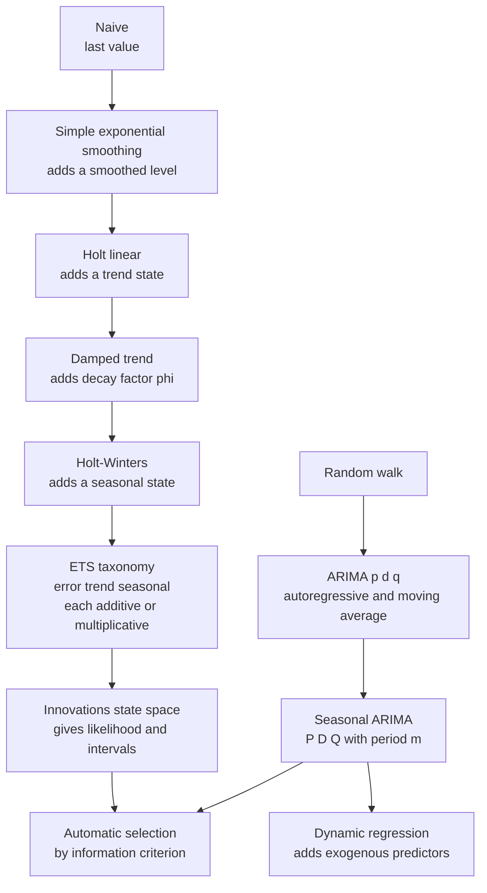
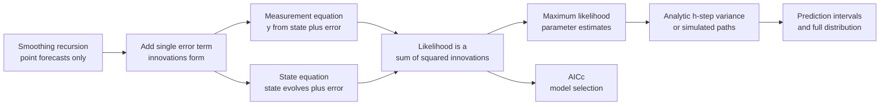
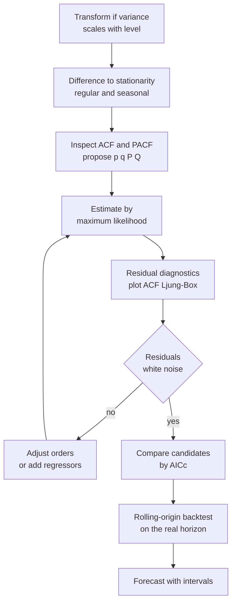
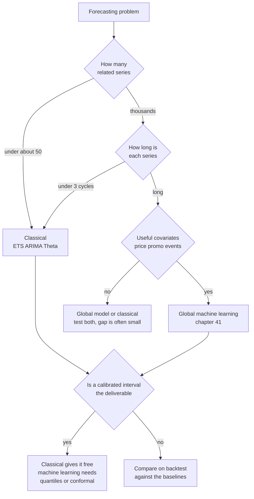

# Chapter 40: Classical Forecasting, Exponential Smoothing, State Space, and ARIMA

> **What this chapter covers**: The methods every other approach is measured against. Exponential smoothing from the weighted-average view through Holt, damped trend and Holt-Winters, the full error-trend-seasonal taxonomy and automatic selection, the innovations state space formulation that turns smoothing into a likelihood-based model with intervals, ARIMA in depth with the backshift operator, stationarity and invertibility conditions, seasonal notation, identification, diagnostics and automatic order selection with its failure modes, regression with autocorrelated errors, dynamic regression with exogenous predictors, intermittent demand and the metric problem it creates, multiple seasonality, the Theta method, and the honest account of when classical methods beat machine learning.
> **Prerequisites**: Chapter 2 (probability and statistics), Chapter 11 (time-series overview), Chapter 39 (decomposition, stationarity, differencing and transformations, all assumed).
> **Where it is used**: Demand and inventory planning, capacity and headcount forecasting, energy load, financial and macroeconomic series, operational metrics, and as the mandatory baseline in any forecasting system whatever its final model.

---

Chapter 11 introduced exponential smoothing and ARIMA in a page each. This chapter is the machinery, and it is placed after Chapter 39 because every method here presumes the differencing order, the transformation and the seasonal periods have already been settled by analysis.

One framing to carry through. These methods are not historical curiosities kept for teaching. In the M4 competition of 2018, which ran 100,000 series, a combination of exponential smoothing models placed among the top submissions, and simple statistical benchmarks beat the majority of the machine learning entries. That result is discussed properly in level 4. It is stated here so that the chapter is read as current practice rather than background.

## 40.1 Level 1: Foundations

### The baseline ladder

Before any method, four forecasts that cost nothing and that a real model must beat.

| Baseline | Forecast for horizon $h$ | Appropriate when |
|---|---|---|
| Mean | $\hat y_{T+h} = \bar y$ | The series is stationary with no trend or season |
| Naive | $\hat y_{T+h} = y_T$ | The series is a random walk. Optimal for many financial series |
| Seasonal naive | $\hat y_{T+h} = y_{T+h-m\lceil h/m \rceil}$, the value from the same position in the last observed cycle | Strong stable seasonality, weak trend |
| Drift | $\hat y_{T+h} = y_T + h \cdot \frac{y_T - y_1}{T-1}$ | A random walk with a persistent direction. Equivalent to drawing a line through the first and last points |

Two rules about them. **Always compute all four**, because which one is hardest to beat tells you what structure dominates. And **report your model's error as a ratio to the best baseline**, because an absolute error number is uninterpretable without it.

### Simple exponential smoothing from the weighted average

Start with a series with no trend and no seasonality, just a level that drifts. You want a forecast that uses all the history but weights recent observations more. The natural expression is a geometrically weighted average:

$$\hat y_{T+1|T} = \alpha y_T + \alpha(1-\alpha) y_{T-1} + \alpha(1-\alpha)^2 y_{T-2} + \cdots$$

where $\alpha \in [0,1]$ is the smoothing parameter, $y_t$ is the observation at time $t$, and $\hat y_{T+1|T}$ is the one-step forecast made at time $T$. The weights sum to 1 because $\alpha \sum_{j \ge 0}(1-\alpha)^j = 1$.

This is the **weighted average form**. It says everything about the method's behaviour. With $\alpha = 0.9$, the most recent observation gets 90 percent of the weight and the series is followed almost exactly. With $\alpha = 0.1$, the most recent gets 10 percent, weight is spread over roughly the last 20 observations, and the forecast is smooth and slow.

The same method has a **component form** that is easier to compute and generalises:

$$\hat y_{t+h|t} = \ell_t, \qquad \ell_t = \alpha y_t + (1-\alpha)\ell_{t-1}$$

where $\ell_t$ is the estimated level at time $t$. Expanding $\ell_{t-1}$ recursively recovers the weighted average.

And an **error correction form** that is the most informative of the three:

$$\ell_t = \ell_{t-1} + \alpha(y_t - \ell_{t-1}) = \ell_{t-1} + \alpha e_t$$

where $e_t = y_t - \ell_{t-1}$ is the one-step forecast error. The level moves by $\alpha$ times the error you just made. That is the whole method: a proportional controller on forecast error. Every extension in this chapter adds another such term.

**Worked example.** Assume $\alpha = 0.3$ and a series 50, 53, 48, 55, 60, with the level initialised at the first observation, $\ell_0 = 50$. All numbers below are rounded to two decimals.

| $t$ | $y_t$ | $\ell_{t-1}$ | Error $e_t = y_t - \ell_{t-1}$ | $\ell_t = \ell_{t-1} + 0.3 e_t$ |
|---|---|---|---|---|
| 1 | 50 | 50.00 | 0.00 | 50.00 |
| 2 | 53 | 50.00 | 3.00 | 50.90 |
| 3 | 48 | 50.90 | $-2.90$ | 50.03 |
| 4 | 55 | 50.03 | 4.97 | 51.52 |
| 5 | 60 | 51.52 | 8.48 | 54.06 |

The forecast for every future period is 54.06. **Simple exponential smoothing produces a flat forecast**, at any horizon. That is a feature when the series has no trend and a disqualifying flaw when it does. Note how far the level lags the recent rise: the last two observations were 55 and 60 and the forecast is 54.06. With $\alpha = 0.3$ that lag is intended.

*Figure 40.1: the family of classical methods and what each one adds.*



### Why classical methods are still the baseline

Three reasons, expanded in level 4.

1. **They encode the right prior for short series.** Most real series are short. A monthly series with four years of history is 48 points. A model with five parameters is appropriate there and a model with fifty thousand is not.
2. **They give calibrated intervals from a likelihood**, not from a heuristic. A decision-maker usually needs the interval more than the point.
3. **They are cheap enough to run per series at any scale**, and cheap to explain when a number is questioned.

---

## 40.2 Level 2: Working knowledge

### Holt's linear trend

Add a second state, the trend $b_t$, which is the estimated change in level per period.

$$\hat y_{t+h|t} = \ell_t + h b_t$$
$$\ell_t = \alpha y_t + (1-\alpha)(\ell_{t-1} + b_{t-1})$$
$$b_t = \beta^*(\ell_t - \ell_{t-1}) + (1-\beta^*) b_{t-1}$$

where $\beta^* \in [0,1]$ is the trend smoothing parameter. Read the second equation as: the prediction of the level was $\ell_{t-1} + b_{t-1}$, and we correct it toward $y_t$ by $\alpha$. Read the third as: the newly observed change in level is $\ell_t - \ell_{t-1}$, and we smooth it into the trend by $\beta^*$.

The forecast is a straight line with slope $b_T$, extended forever.

**Worked example.** Assume $\alpha = 0.4$, $\beta^* = 0.2$, $\ell_0 = 100$, $b_0 = 5$, and observations 106, 113, 117.

$t=1$: prediction $100 + 5 = 105$. Error $106 - 105 = 1$.
$\ell_1 = 0.4(106) + 0.6(105) = 42.4 + 63.0 = 105.40$.
$b_1 = 0.2(105.40 - 100) + 0.8(5) = 0.2(5.40) + 4.0 = 1.08 + 4.0 = 5.08$.

$t=2$: prediction $105.40 + 5.08 = 110.48$. Error $113 - 110.48 = 2.52$.
$\ell_2 = 0.4(113) + 0.6(110.48) = 45.2 + 66.288 = 111.49$.
$b_2 = 0.2(111.49 - 105.40) + 0.8(5.08) = 0.2(6.09) + 4.064 = 1.218 + 4.064 = 5.28$.

$t=3$: prediction $111.49 + 5.28 = 116.77$. Error $117 - 116.77 = 0.23$.
$\ell_3 = 0.4(117) + 0.6(116.77) = 46.8 + 70.062 = 116.86$.
$b_3 = 0.2(116.86 - 111.49) + 0.8(5.28) = 0.2(5.37) + 4.224 = 1.074 + 4.224 = 5.30$.

Forecasts: $h=1$ gives $122.16$, $h=6$ gives $116.86 + 6(5.30) = 148.66$, $h=24$ gives $116.86 + 24(5.30) = 244.06$.

That $h = 24$ number is the problem.

### Damped trend, and why damping almost always helps

Holt's forecast extends the current slope forever. Real series almost never do that. A product growing 5 units per month this quarter is not growing 5 units per month in five years; growth decelerates, markets saturate, and the estimated slope was noisy anyway.

Gardner and McKenzie (1985) added a damping parameter $\phi \in (0,1)$:

$$\hat y_{t+h|t} = \ell_t + (\phi + \phi^2 + \cdots + \phi^h) b_t$$
$$\ell_t = \alpha y_t + (1-\alpha)(\ell_{t-1} + \phi b_{t-1})$$
$$b_t = \beta^*(\ell_t - \ell_{t-1}) + (1-\beta^*)\phi b_{t-1}$$

The geometric sum converges, so as $h \to \infty$ the forecast approaches the finite asymptote

$$\ell_T + \frac{\phi}{1-\phi} b_T$$

**Worked example, continuing the previous one.** With $\ell_3 = 116.86$, $b_3 = 5.30$ and $\phi = 0.9$:

$h=1$: $116.86 + 0.9(5.30) = 121.63$. Close to the undamped 122.16.
$h=6$: sum $= 0.9 + 0.81 + 0.729 + 0.6561 + 0.59049 + 0.531441 = 4.2175$. Forecast $116.86 + 4.2175(5.30) = 139.21$. The undamped value was 148.66.
$h=24$: the sum is $\frac{0.9(1 - 0.9^{24})}{0.1} = 9(1 - 0.0798) = 8.282$. Forecast $116.86 + 8.282(5.30) = 160.75$, against the undamped 244.06.
Asymptote: $116.86 + \frac{0.9}{0.1}(5.30) = 116.86 + 47.7 = 164.56$.

At $h=1$ damping barely matters. At $h=24$ it changes the forecast by 34 percent. Damping is a long-horizon intervention, which is exactly where forecasts do damage.

**The empirical claim.** Damped trend is one of the strongest general-purpose forecasting methods known. Gardner and McKenzie's own follow-up work and multiple competition results, including the M3 competition analysed in Makridakis and Hibon (2000), found damped exponential smoothing at or near the top of the accuracy tables across a wide range of series. The reason is not subtle: the undamped alternative is an unbiased estimator of a slope multiplied by a horizon, and multiplying a noisy estimate by a large number is a variance disaster. Damping shrinks it. It is a regularisation argument, and it is the same argument that justifies ridge regression.

Typical estimated $\phi$ lands between 0.8 and 0.98. Values below about 0.8 damp so fast the trend is nearly absent, and most implementations bound $\phi$ from below for numerical reasons. Check your library's bounds; they differ.

### Holt-Winters seasonal

Add a third state, the seasonal component $s_t$, with period $m$.

**Additive seasonality:**

$$\hat y_{t+h|t} = \ell_t + h b_t + s_{t+h-m(k+1)}$$
$$\ell_t = \alpha(y_t - s_{t-m}) + (1-\alpha)(\ell_{t-1} + b_{t-1})$$
$$b_t = \beta^*(\ell_t - \ell_{t-1}) + (1-\beta^*)b_{t-1}$$
$$s_t = \gamma(y_t - \ell_{t-1} - b_{t-1}) + (1-\gamma)s_{t-m}$$

where $\gamma \in [0, 1-\alpha]$ is the seasonal smoothing parameter and $k = \lfloor (h-1)/m \rfloor$ selects the most recent estimate of the relevant seasonal index.

**Multiplicative seasonality** replaces the subtractions with divisions:

$$\hat y_{t+h|t} = (\ell_t + h b_t) \, s_{t+h-m(k+1)}$$
$$\ell_t = \alpha \frac{y_t}{s_{t-m}} + (1-\alpha)(\ell_{t-1}+b_{t-1}), \qquad s_t = \gamma \frac{y_t}{\ell_{t-1}+b_{t-1}} + (1-\gamma)s_{t-m}$$

The additive-versus-multiplicative decision is the one from Chapter 39, and here it is made inside the model rather than by transforming the data. That is the advantage of Holt-Winters multiplicative over "log the series and fit additive": no back-transform bias, because nothing was transformed.

**Worked example: one update of additive Holt-Winters on quarterly data.** Assume $m = 4$, $\alpha = 0.3$, $\beta^* = 0.1$, $\gamma = 0.2$. Assume the state going into period $t$ is $\ell_{t-1} = 200$, $b_{t-1} = 4$, and the seasonal index for this quarter, from a year ago, is $s_{t-4} = -30$. The observation is $y_t = 185$.

Forecast made last period: $200 + 4 + (-30) = 174$. Error: $185 - 174 = 11$.
$\ell_t = 0.3(185 - (-30)) + 0.7(200 + 4) = 0.3(215) + 0.7(204) = 64.5 + 142.8 = 207.30$.
$b_t = 0.1(207.30 - 200) + 0.9(4) = 0.1(7.30) + 3.6 = 0.73 + 3.6 = 4.33$.
$s_t = 0.2(185 - 200 - 4) + 0.8(-30) = 0.2(-19) + (-24) = -3.8 - 24 = -27.80$.

The seasonal index for this quarter moved from $-30$ to $-27.8$, meaning this quarter was less far below the level than the last time it came around. Note that all three states absorbed part of the same error, which is why the smoothing parameters are constrained: $\gamma \le 1-\alpha$ exists to prevent the level and seasonal states from fighting over the same signal.

**The constraint that matters in practice.** Holt-Winters needs at least $m+2$ observations to initialise, and realistically two or three full cycles to estimate a seasonal pattern at all. On monthly data with 18 months of history, do not fit it. Use seasonal naive plus a trend, or a Fourier-regression approach with few terms.

### The error, trend, seasonal taxonomy

Every method above is a combination of three choices. Write a model as **ETS($\cdot$,$\cdot$,$\cdot$)** for error, trend, seasonal.

| Position | Options | Meaning |
|---|---|---|
| Error | A, M | Additive or multiplicative error. Additive means the error is a fixed-size shock; multiplicative means the error scales with the level |
| Trend | N, A, Ad, M, Md | None, additive, additive damped, multiplicative, multiplicative damped |
| Seasonal | N, A, M | None, additive, multiplicative |

Naming the familiar methods:

| Method | ETS form |
|---|---|
| Simple exponential smoothing | ETS(A,N,N) |
| Holt's linear trend | ETS(A,A,N) |
| Damped trend | ETS(A,Ad,N) |
| Holt-Winters additive | ETS(A,A,A) |
| Holt-Winters multiplicative | ETS(M,A,M) |
| Damped Holt-Winters multiplicative | ETS(M,Ad,M) |

**How many combinations are admissible.** The full grid is $2 \times 5 \times 3 = 30$. Standard practice cuts it to 15.

- **Multiplicative trend is excluded**, removing M and Md and leaving 3 trend options. A multiplicative trend compounds a growth *rate* indefinitely, which produces explosive forecasts and numerically unstable estimation. Most implementations disable it by default, with a flag to re-enable it. This is a pragmatic exclusion, not a theorem. That leaves $2 \times 3 \times 3 = 18$.
- **Additive error with multiplicative seasonality is excluded**, removing ETS(A,N,M), ETS(A,A,M) and ETS(A,Ad,M). These have a division by the seasonal state, which can approach zero, giving infinite forecast variance and unstable likelihoods. That leaves 15.

The important structural fact: **point forecasts depend only on the trend and seasonal components. The error type changes nothing about the point forecast and everything about the prediction interval.** ETS(A,A,A) and ETS(M,A,A) give identical point forecasts and different intervals, the multiplicative-error version widening with the level. If you only ever look at point forecasts, the error choice is invisible and you are throwing away the reason to use the framework.

### Automatic selection

Fit all admissible models by maximum likelihood, and choose by a corrected Akaike information criterion:

$$\text{AIC} = -2\log L + 2k, \qquad \text{AICc} = \text{AIC} + \frac{2k(k+1)}{n-k-1}$$

where $L$ is the maximised likelihood, $k$ the number of estimated parameters including initial states and the error variance, and $n$ the number of observations.

Use **AICc, not AIC**, for time series. The correction term matters when $n/k$ is small, which for a seasonal model on four years of monthly data is routine: ETS(A,A,A) with $m=12$ estimates 3 smoothing parameters, a damping parameter if present, an initial level, an initial trend, $m-1$ free initial seasonal values, and the variance, so $k$ is around 17 with $n = 48$. Uncorrected AIC in that regime substantially over-selects complex models.

**Worked example of the correction.** With $n = 48$ and $k = 17$: the correction is $\frac{2(17)(18)}{48 - 17 - 1} = \frac{612}{30} = 20.4$. That is a penalty larger than the base AIC penalty of $2k = 34$ would suggest on its own; total penalty 54.4 rather than 34. A simpler model with $k=6$ gets correction $\frac{2(6)(7)}{41} = 2.05$ and total penalty $12 + 2.05 = 14.05$. The complex model needs to improve $-2\log L$ by more than 40 to win. AIC alone would have set the bar at 22.

Three cautions on automatic selection. It is in-sample model selection, so it can overfit when many models are compared on a short series. It assumes the models are fitted to the same data on the same scale, so you cannot compare an AICc from a logged fit against one from a raw fit. And it selects for one-step likelihood, which is not the same as multi-step forecast accuracy; if your horizon is 12, a rolling-origin backtest is the more direct criterion when you can afford it.

---

## 40.3 Level 3: Depth

### The innovations state space formulation

Exponential smoothing as presented is a recipe. It produces point forecasts and no intervals, and it has no likelihood, so there is nothing to select models by. The state space formulation of Ord, Koehler and Snyder (1997), developed fully in Hyndman, Koehler, Ord and Snyder (2008), fixes all of that by writing each method as a statistical model.

A **single source of error**, or innovations, state space model has two equations:

$$y_t = w(\mathbf{x}_{t-1}) + r(\mathbf{x}_{t-1})\varepsilon_t \qquad \text{(measurement equation)}$$
$$\mathbf{x}_t = f(\mathbf{x}_{t-1}) + g(\mathbf{x}_{t-1})\varepsilon_t \qquad \text{(state equation)}$$

where $\mathbf{x}_t$ is the state vector holding level, trend and seasonal components, $w$ produces the one-step prediction from the state, $f$ evolves the state, $r$ and $g$ scale the error into the observation and the state, and $\varepsilon_t \sim \text{NID}(0, \sigma^2)$ is a single normally and independently distributed innovation.

"Single source of error" is the key phrase. A general state space model, such as the basic structural model, has separate independent noise terms for the observation and for each state. The innovations form uses **one** error term everywhere. That makes the likelihood trivial to write, because the observed one-step error *is* the innovation, and it makes the model exactly equivalent to the corresponding exponential smoothing recursion.

**Worked out for ETS(A,N,N).** State is $\mathbf{x}_t = \ell_t$.

$$y_t = \ell_{t-1} + \varepsilon_t$$
$$\ell_t = \ell_{t-1} + \alpha\varepsilon_t$$

Substituting $\varepsilon_t = y_t - \ell_{t-1}$ into the state equation gives $\ell_t = \ell_{t-1} + \alpha(y_t - \ell_{t-1})$, which is exactly the error correction form of simple exponential smoothing. The recipe and the model are the same object.

**For ETS(M,N,N)**, multiplicative error:

$$y_t = \ell_{t-1}(1 + \varepsilon_t), \qquad \ell_t = \ell_{t-1}(1 + \alpha\varepsilon_t)$$

Here $\varepsilon_t$ is a relative error. The point forecast is still $\ell_t$, since $\mathbb{E}[\varepsilon_t] = 0$. The one-step forecast variance is $\ell_t^2\sigma^2$ rather than $\sigma^2$, so the interval scales with the level. That is the entire practical difference and it is the right behaviour for any positive quantity.

**Why the likelihood matters.** Given the model, the log-likelihood for the additive-error case is

$$\log L = -\frac{n}{2}\log(2\pi\sigma^2) - \frac{1}{2\sigma^2}\sum_{t=1}^{n}\varepsilon_t^2$$

and for the multiplicative-error case an extra $-\sum_t \log|\ell_{t-1}|$ Jacobian term appears. Maximising it gives parameter estimates. Having it gives you AICc for model selection. And differentiating the forecast function through the state recursion gives **analytic $h$-step forecast variances** for most of the 15 models, which is where prediction intervals come from.

For ETS(A,N,N) the $h$-step forecast variance is

$$\sigma_h^2 = \sigma^2\left[1 + (h-1)\alpha^2\right]$$

**Worked example.** With $\hat\sigma = 12$, $\alpha = 0.3$ and $h = 8$: $\sigma_8^2 = 144[1 + 7(0.09)] = 144(1.63) = 234.7$, so $\sigma_8 = 15.32$. The 95 percent interval half-width is $1.96(15.32) = 30.0$. Compare $h=1$, where the half-width is $1.96(12) = 23.5$. The interval widens by 28 percent over eight steps, and it widens toward an asymptotic linear growth in $h$, not the $\sqrt{h}$ growth of a pure random walk. That difference is a direct consequence of $\alpha < 1$.

For models where no closed form exists, notably several multiplicative-error and multiplicative-seasonal combinations, intervals come from simulating many future paths through the state recursion with resampled or generated innovations and taking empirical quantiles. That is the general method and it also gives you the whole predictive distribution, which Chapter 43 needs.

*Figure 40.2: how the state space form turns a smoothing recipe into a model with intervals.*



**Parameter estimation in practice.** The optimiser maximises the likelihood over the smoothing parameters and the initial state $\mathbf{x}_0$. Three practical points. Initial states are parameters, not fixed values, and treating them as free costs $1 + 1 + (m-1)$ degrees of freedom for a seasonal model, which is why AICc matters. The parameter space has both the traditional bounds, $0 \le \alpha, \beta^*, \gamma \le 1$ with $\gamma \le 1-\alpha$, and a wider **admissible** region defined by requiring the forecast weights to decay, and the two differ; libraries let you choose and the choice changes results. And the likelihood surface has local optima, particularly for seasonal models, so implementations use multiple starts or heuristic initialisation from a decomposition.

### ARIMA: the backshift operator and the model classes

Define the backshift operator $B$ by $B y_t = y_{t-1}$, so $B^k y_t = y_{t-k}$. The first difference is $(1-B)y_t$ and the $d$-th difference is $(1-B)^d y_t$.

**Autoregressive of order $p$,** AR($p$):

$$y_t = c + \phi_1 y_{t-1} + \cdots + \phi_p y_{t-p} + \varepsilon_t \quad\Longleftrightarrow\quad \phi(B) y_t = c + \varepsilon_t$$

where $\phi(B) = 1 - \phi_1 B - \cdots - \phi_p B^p$.

**Moving average of order $q$,** MA($q$):

$$y_t = c + \varepsilon_t + \theta_1\varepsilon_{t-1} + \cdots + \theta_q\varepsilon_{t-q} \quad\Longleftrightarrow\quad y_t = c + \theta(B)\varepsilon_t$$

where $\theta(B) = 1 + \theta_1 B + \cdots + \theta_q B^q$. Note the sign convention: $\phi$ coefficients are subtracted in the polynomial and $\theta$ coefficients added. Conventions differ between software packages, and a $\theta$ of $+0.4$ in one package is $-0.4$ in another. Check your version before comparing coefficients across tools.

**ARIMA($p,d,q$)** combines them on the differenced series:

$$\phi(B)(1-B)^d y_t = c + \theta(B)\varepsilon_t$$

### Why the ACF and PACF signatures are what they are

The signature table in Chapter 39 was given without justification. Here is the reason, because it determines how you read a correlogram.

**MA($q$) has an ACF that cuts off after lag $q$.** For MA(1), $y_t = \varepsilon_t + \theta\varepsilon_{t-1}$:

$\gamma_0 = \mathrm{Var}(y_t) = \sigma^2(1+\theta^2)$.
$\gamma_1 = \mathrm{Cov}(y_t, y_{t-1}) = \mathbb{E}[(\varepsilon_t + \theta\varepsilon_{t-1})(\varepsilon_{t-1}+\theta\varepsilon_{t-2})] = \theta\sigma^2$, since only the $\varepsilon_{t-1}$ terms share an index.
$\gamma_2 = 0$, because $y_t$ and $y_{t-2}$ share no innovation.

So $\rho_1 = \theta/(1+\theta^2)$ and $\rho_k = 0$ for $k \ge 2$. The cut-off is exact, not approximate: an MA($q$) process has literally zero autocorrelation beyond lag $q$ because the expressions share no common innovations.

A consequence worth noting: $|\rho_1| = |\theta|/(1+\theta^2) \le 0.5$ for any $\theta$, with the maximum at $|\theta|=1$. **An MA(1) process cannot have a lag-1 autocorrelation beyond $\pm 0.5$.** If you observe $\rho_1 = 0.8$, no MA(1) explains it.

**AR($p$) has a PACF that cuts off after lag $p$.** By construction, the PACF at lag $k$ is the coefficient on $y_{t-k}$ in a regression on $k$ lags. For an AR($p$), lags beyond $p$ have true coefficient zero once the first $p$ are included, so the PACF is zero there. The ACF, meanwhile, decays: for AR(1), $\rho_k = \phi^k$, geometric decay, and for AR(2) with complex roots it is a damped sine wave.

### Stationarity and invertibility conditions

**Stationarity** of an AR($p$) requires all roots of $\phi(z) = 0$ to lie outside the unit circle in the complex plane, $|z| > 1$. For AR(1) this is $|\phi_1| < 1$. For AR(2) the region is the triangle

$$\phi_1 + \phi_2 < 1, \qquad \phi_2 - \phi_1 < 1, \qquad |\phi_2| < 1$$

**Invertibility** of an MA($q$) requires all roots of $\theta(z)=0$ to lie outside the unit circle. For MA(1) this is $|\theta_1| < 1$.

Invertibility is the less intuitive condition and it matters for a concrete reason. An invertible MA can be rewritten as an infinite AR:

$$\varepsilon_t = \theta(B)^{-1} y_t = y_t - \theta_1 y_{t-1} + (\theta_1^2 - \theta_2)y_{t-2} - \cdots$$

Only if $|\theta_1| < 1$ do those coefficients decay, so only then does the model express the current innovation as a convergent function of observed past values. Without invertibility, you cannot recover the innovations from the data, so you cannot forecast recursively.

A second, sharper reason: **MA models are not identified without invertibility.** The processes with $\theta$ and with $1/\theta$ have identical autocorrelation functions. From $\rho_1 = \theta/(1+\theta^2)$, substituting $1/\theta$ gives $(1/\theta)/(1 + 1/\theta^2) = \theta/(\theta^2+1)$, the same value. Two different parameters, the same second-order structure. Restricting to $|\theta|<1$ picks one, which makes estimation well posed.

**Worked check.** Given estimates $\phi_1 = 0.6$, $\phi_2 = 0.3$: check $0.6+0.3 = 0.9 < 1$, $0.3-0.6 = -0.3 < 1$, $|0.3| < 1$. Stationary. Given $\phi_1 = 0.7, \phi_2 = 0.4$: $0.7+0.4 = 1.1 \not< 1$. Not stationary; the fit needs a difference, or the estimator hit a boundary.

### Seasonal ARIMA

Full notation: **ARIMA($p,d,q$)($P,D,Q$)$_m$**, where the uppercase orders apply at multiples of the seasonal period $m$.

$$\Phi(B^m)\phi(B)(1-B^m)^D(1-B)^d y_t = c + \Theta(B^m)\theta(B)\varepsilon_t$$

where $\Phi(B^m) = 1 - \Phi_1 B^m - \cdots - \Phi_P B^{Pm}$ and $\Theta(B^m) = 1 + \Theta_1 B^m + \cdots + \Theta_Q B^{Qm}$.

The polynomials multiply, which means the model contains cross terms you did not write. Expanding ARIMA(0,1,1)(0,1,1)$_{12}$, the "airline model" of Box and Jenkins:

$$(1-B)(1-B^{12})y_t = (1+\theta_1 B)(1+\Theta_1 B^{12})\varepsilon_t$$

The right side expands to $\varepsilon_t + \theta_1\varepsilon_{t-1} + \Theta_1\varepsilon_{t-12} + \theta_1\Theta_1\varepsilon_{t-13}$. The lag-13 term appears from the product, with a coefficient that is the product of the two parameters. That is what "multiplicative seasonal" means, and it is why the airline model fits so many monthly series with only two parameters: it captures adjacent-month and adjacent-year dependence plus their interaction.

The airline model is worth memorising as a default. On a monthly series with trend and seasonality, ARIMA(0,1,1)(0,1,1)$_{12}$ is a strong starting point and is frequently what an automatic search selects.

**Reading the correlograms for seasonal orders.** Look at lags $m, 2m, 3m$ specifically:

| Pattern at seasonal lags | Suggests |
|---|---|
| ACF spike at $m$ only, PACF decaying at $m, 2m, 3m$ | Seasonal MA, $Q=1$ |
| ACF decaying at $m, 2m, 3m$, PACF spike at $m$ only | Seasonal AR, $P=1$ |
| Both decaying slowly at seasonal lags | Seasonal difference needed, $D=1$ |

A working constraint: $d + D \le 2$, and $D \le 1$ almost always. Two seasonal differences is nearly always a mistake.

### Diagnostics and the portmanteau tests

After fitting, the residuals must look like white noise. Four checks, in order of what they catch.

1. **Residual time plot.** Changing variance, remaining outliers, a break.
2. **Residual ACF.** Any spike outside the band, and specifically a spike at lag $m$, which means the seasonal structure is unmodelled.
3. **Portmanteau test.** A single test on the first $h$ autocorrelations jointly.
4. **Histogram or quantile-quantile plot.** Normality, which is needed for the analytic intervals but not for the point forecasts.

The **Ljung-Box** statistic, from Ljung and Box (1978), is

$$Q^* = n(n+2)\sum_{k=1}^{h}\frac{\hat\rho_k^2}{n-k}$$

where $n$ is the number of observations used for fitting, after differencing, and $\hat\rho_k$ is the residual autocorrelation at lag $k$. Under the null of no autocorrelation, $Q^*$ follows a chi-squared distribution with $h - K$ degrees of freedom, where $K$ is the number of estimated ARMA parameters. Subtracting $K$ is essential and is the step people skip; without it the test is conservative in a way that hides misspecification.

The older **Box-Pierce** statistic is $Q = n\sum_k \hat\rho_k^2$. Ljung-Box's $(n+2)/(n-k)$ weighting improves the small-sample approximation and is the version to use.

**Choosing $h$.** The common rules are $h = 10$ for non-seasonal data and $h = 2m$ for seasonal data, capped at $n/5$. Too large an $h$ dilutes real structure at short lags into many null lags and loses power.

> **The null hypothesis is that the residuals are independently distributed, that is, no autocorrelation. A large p-value is the good outcome.** This is the opposite of most tests engineers meet, where a small p-value is the interesting result. Here a small p-value means your model is missing structure.

**Worked example.** Assume $n = 120$, $h = 24$ on monthly data, an ARIMA(1,1,1)(0,1,1)$_{12}$ so $K = 3$, and suppose $\sum_{k=1}^{24}\hat\rho_k^2/(120-k)$ evaluates to 0.00265. Then

$$Q^* = 120 \times 122 \times 0.00265 = 14640 \times 0.00265 = 38.80$$

Degrees of freedom $= 24 - 3 = 21$. The 95th percentile of $\chi^2_{21}$ is 32.67, so $Q^* = 38.80$ exceeds it and the p-value is roughly 0.011. **Reject** the null: residual autocorrelation remains and the model is misspecified. The next step is to look at the residual ACF to see *where* the structure is, since the portmanteau test says that something is wrong and never says what.

*Figure 40.3: the Box-Jenkins loop, which is still the correct workflow even when the search is automated.*



### Automatic order selection and how it fails

The Hyndman-Khandakar algorithm, from Hyndman and Khandakar (2008), is the standard automatic ARIMA. It fixes $d$ and $D$ by unit-root tests, then performs a stepwise search over $(p,q,P,Q)$ and the constant, starting from four seed models and moving to neighbours that improve AICc.

Its failure modes, which you should know before trusting the output:

| Failure mode | Cause | Mitigation |
|---|---|---|
| Wrong differencing order | It is fixed by tests *before* the search, so a test error is never corrected | Check $d$ and $D$ by hand against Chapter 39's procedure, and compare a couple of fixed choices by backtest |
| Stepwise misses the optimum | The search is greedy, not exhaustive | Use the exhaustive option on important series. It is much slower and often selects the same model |
| Overfit on short series | AICc is in-sample, and dozens of models are compared | Restrict the maximum orders. Prefer simpler models when AICc differences are under about 2 |
| Selects a model with near-boundary roots | The likelihood is flat near the invertibility boundary | Inspect the roots. A root within 0.02 of the unit circle means the model is effectively over-differenced or the order is too high |
| Silently drops the constant | Whether a constant is allowed depends on $d$, since with $d \ge 1$ a constant implies a polynomial trend | Decide deliberately whether you want drift. It dominates long-horizon forecasts |
| Fails entirely on short or constant series | Not enough data for the differencing and the orders | Fall back to a baseline explicitly rather than letting an error propagate |
| Approximation during the search | Many implementations use a conditional sum of squares approximation while searching, then full maximum likelihood for the final fit | Results can differ between an approximated search and an exact one. Check your version's defaults |

The overarching point: automatic selection produces a candidate, not an answer. Run the diagnostics on the selected model.

**Listing 40.1: fitting ETS and ARIMA candidates and selecting by rolling-origin backtest rather than by information criterion alone.**

```python
import numpy as np
from statsmodels.tsa.holtwinters import ExponentialSmoothing
from statsmodels.tsa.statespace.sarimax import SARIMAX

def rolling_origin_rmse(y, fit_fn, h, n_folds, min_train):
    """Expanding-window backtest. Returns RMSE over all folds at horizon h."""
    errs = []
    for k in range(n_folds):
        end = min_train + k
        if end + h > len(y):
            break
        train, actual = y[:end], y[end:end + h]
        try:
            fc = fit_fn(train, h)
        except Exception:
            continue                     # a failed fit is a fold, not a crash
        errs.append(np.asarray(actual) - np.asarray(fc))
    if not errs:
        return np.inf
    return float(np.sqrt(np.mean(np.concatenate(errs) ** 2)))

def ets_damped(train, h):
    m = ExponentialSmoothing(train, trend="add", damped_trend=True,
                             seasonal="add", seasonal_periods=12,
                             initialization_method="estimated").fit()
    return m.forecast(h)

def airline(train, h):
    m = SARIMAX(train, order=(0, 1, 1), seasonal_order=(0, 1, 1, 12),
                enforce_stationarity=True, enforce_invertibility=True).fit(disp=False)
    return m.forecast(h)

def snaive(train, h):
    return [train[-12 + ((i) % 12)] for i in range(h)]
```

Three notes. The `try`/`except` is not laziness: over hundreds of series some fits will fail to converge, and a pipeline that dies on one series is unusable, so a failed fold is recorded as skipped and a series with too many skips is routed to a baseline. `enforce_invertibility=True` keeps the optimiser inside the invertible region, which is what you want for forecasting even though it can slightly reduce the likelihood. And `snaive` is in the same comparison because the whole point of the backtest is the ratio to the baseline.

### Regression with autocorrelated errors

Fit $y_t = \beta_0 + \beta_1 x_t + \eta_t$ by ordinary least squares and the residuals $\eta_t$ are almost always autocorrelated, because both series have temporal structure. What breaks?

**The coefficient estimates remain unbiased.** Autocorrelation in the errors does not bias $\hat\beta$ under the usual exogeneity assumption. That is why the problem hides.

**The standard errors are wrong, usually far too small.** The ordinary least squares variance formula assumes independent errors. With positively autocorrelated errors, the effective sample size is much smaller than $n$ and the true variance of $\hat\beta$ is larger.

**A quantitative version.** For a slope coefficient where both the regressor and the error follow AR(1) processes with parameters $\rho_x$ and $\rho_\eta$, a standard approximation for the ratio of the true variance to the naive one is

$$\frac{\mathrm{Var}_{\text{true}}(\hat\beta)}{\mathrm{Var}_{\text{naive}}(\hat\beta)} \approx \frac{1 + \rho_x\rho_\eta}{1 - \rho_x\rho_\eta}$$

**Worked example.** With $\rho_x = 0.8$ and $\rho_\eta = 0.7$, the product is 0.56, and the ratio is $1.56/0.44 = 3.55$. The true variance is 3.55 times the reported one, so the true standard error is $\sqrt{3.55} = 1.88$ times the reported one. A reported $t$-statistic of 3.4, comfortably significant, becomes $3.4/1.88 = 1.81$, not significant at the 5 percent level. **The conclusion reverses.** This is the mechanism behind spurious regression from Chapter 39, in its milder and much more common form.

The remedies, in increasing order of correctness:

| Remedy | What it does | Limitation |
|---|---|---|
| Heteroskedasticity and autocorrelation consistent standard errors, Newey-West | Fixes the standard errors, leaves the point estimates | Does not improve the forecast, and needs a bandwidth choice |
| Cochrane-Orcutt or Prais-Winsten | Quasi-differences the data using an estimated AR(1) error parameter | Assumes AR(1) errors specifically |
| Generalised least squares with an estimated error structure | The general version of the above | Needs the error model specified |
| **Dynamic regression, ARIMA errors** | Models $\eta_t$ as an ARIMA process jointly with the regression, estimated together | The right answer for forecasting. It also improves the point forecast, which none of the above do |

The Durbin-Watson statistic tests for first-order autocorrelation in regression residuals and is still widely reported. It is limited: it tests lag 1 only, it is invalid when lagged dependent variables are regressors, and its critical values come in an inconclusive-region form. Prefer the Ljung-Box test on the residuals, or Breusch-Godfrey, which handles higher orders and lagged dependent variables.

### Dynamic regression with exogenous predictors

The model is

$$y_t = \beta_0 + \beta_1 x_{1,t} + \cdots + \beta_r x_{r,t} + \eta_t, \qquad \phi(B)(1-B)^d \eta_t = \theta(B)\varepsilon_t$$

so the regression captures the effect of the predictors and the ARIMA structure captures whatever temporal dependence remains.

**The differencing subtlety.** If the error needs differencing, **all variables must be differenced**, both $y$ and every $x$. Estimating a regression in levels and an ARIMA on the residuals separately is not equivalent, and the two-step procedure gives inconsistent estimates. Fit the whole thing jointly. Most implementations do this when you pass an `xreg` or `exog` argument; do not hand-roll it.

**The forecasting problem that has no clean solution.** To forecast $y_{T+h}$ you need $x_{T+h}$. Three cases, and only one is comfortable.

| Case | Example | Consequence |
|---|---|---|
| Known future values | Calendar effects, holidays, scheduled price changes, contracted volumes, planned promotions | The good case. Use freely. This is why calendar regressors from Chapter 39 are so valuable |
| Lagged predictors | $x_{t-k}$ with $k \ge h$ | Also safe, because the value is already observed. Costs you the contemporaneous effect |
| Must be forecast | Weather, competitor pricing, macroeconomic indicators | Your forecast of $y$ inherits the error in your forecast of $x$, and the reported prediction interval does not include that error unless you do extra work |

The third case is where dynamic regression disappoints in production. A model that improves backtest accuracy by 12 percent using actual weather often improves it by 2 percent using forecast weather, and sometimes makes it worse. **Backtest with forecast covariate values, not actuals**, or you are measuring a system you cannot deploy. If historical covariate forecasts are not available, simulate them by degrading the actuals with a realistic error model and say that is what you did.

The honest way to propagate the uncertainty is scenario forecasting: produce forecasts under several covariate paths and present the range, rather than a single interval that pretends the covariates are known.

### Intermittent demand

A series with many zeros. Typical of spare parts, slow-moving inventory, low-traffic endpoints, rare events. This case is common in practice and absent from most curricula, and both the standard methods and the standard metrics break on it.

**Why exponential smoothing fails.** Run simple exponential smoothing on the series 0, 0, 3, 0, 0, 0, 5, 0, 0, 2. The level is updated toward zero on every zero period and jumps on every demand period. The forecast is a small positive number that is never the actual value, because the actual is either 0 or several units. Worse, the level's value depends on **how long ago** the last demand was, so the forecast for period $t+1$ is systematically lower right after a long gap, which is precisely when the next demand is more likely. The method is biased in a direction that matters.

**Croston's method**, from Croston (1972), separates the two things that are happening.

Let $z_t$ be the size of demand when it occurs, and $p_t$ the number of periods between demands. Maintain two exponentially smoothed estimates, **updated only in periods with non-zero demand**:

$$\hat z_t = \alpha y_t + (1-\alpha)\hat z_{t-1}, \qquad \hat p_t = \alpha q_t + (1-\alpha)\hat p_{t-1}$$

where $q_t$ is the number of periods since the previous non-zero demand. The forecast of demand per period is the **rate**:

$$\hat y_{t+1} = \frac{\hat z_t}{\hat p_t}$$

In periods with zero demand, nothing is updated and the forecast is unchanged. That is the key structural difference from plain smoothing, and it removes the recency bias.

**Worked example.** Assume $\alpha = 0.2$, and a demand history where the last three non-zero demands were 4 units after a gap of 3 periods, 6 units after a gap of 5 periods, and 5 units after a gap of 2 periods. Initialise $\hat z = 4$, $\hat p = 3$ from the first.

After the second demand: $\hat z = 0.2(6) + 0.8(4) = 1.2 + 3.2 = 4.40$. $\hat p = 0.2(5) + 0.8(3) = 1.0 + 2.4 = 3.40$.
After the third: $\hat z = 0.2(5) + 0.8(4.40) = 1.0 + 3.52 = 4.52$. $\hat p = 0.2(2) + 0.8(3.40) = 0.4 + 2.72 = 3.12$.

Forecast rate: $4.52 / 3.12 = 1.449$ units per period. Over a 12-period lead time, expected demand is $12 \times 1.449 = 17.4$ units.

**Croston's estimator is biased**, which Syntetos and Boylan (2001, 2005) identified. The issue is that $\mathbb{E}[\hat z/\hat p] \neq \mathbb{E}[\hat z]/\mathbb{E}[\hat p]$, because the expectation of a ratio is not the ratio of expectations, and the bias is upward. The **Syntetos-Boylan Approximation**, SBA, applies a correction factor:

$$\hat y_{t+1} = \left(1 - \frac{\alpha}{2}\right)\frac{\hat z_t}{\hat p_t}$$

With $\alpha = 0.2$ the factor is 0.9, so the example's forecast becomes $0.9 \times 1.449 = 1.304$ per period, or 15.6 units over 12 periods. That is a 10 percent reduction in the inventory implication, on a method chosen specifically because inventory implications matter.

**The TSB method**, from Teunter, Syntetos and Babai (2011), replaces the inter-demand interval with a demand *probability* updated **every period**, including zeros:

$$\hat d_t = \begin{cases} \hat d_{t-1} + \beta(1 - \hat d_{t-1}) & \text{if } y_t > 0 \\ \hat d_{t-1} + \beta(0 - \hat d_{t-1}) & \text{if } y_t = 0\end{cases}$$

with the size $\hat z_t$ updated only on demand periods as before, and forecast $\hat y_{t+1} = \hat d_t \hat z_t$.

The practical advantage is **obsolescence handling**. Under Croston, a part that stops selling entirely keeps its last rate forever, because nothing ever updates. Under TSB, the demand probability decays toward zero on every zero period, and the forecast falls. For a spare-parts catalogue where items die, this is the difference between a working system and one that keeps recommending stock for discontinued products. This is the reason to prefer TSB in most inventory settings.

**Classifying which method to use.** Syntetos, Boylan and Croston (2005) proposed a classification on two statistics: the average inter-demand interval $p$, and the squared coefficient of variation of the non-zero demand sizes, $CV^2$. The cut-offs are $p = 1.32$ and $CV^2 = 0.49$.

| Region | Name | Suggested |
|---|---|---|
| $p < 1.32$, $CV^2 < 0.49$ | Smooth | Standard methods are fine |
| $p < 1.32$, $CV^2 \ge 0.49$ | Erratic | Standard methods, but expect poor accuracy |
| $p \ge 1.32$, $CV^2 < 0.49$ | Intermittent | Croston or SBA |
| $p \ge 1.32$, $CV^2 \ge 0.49$ | Lumpy | SBA or TSB; accept that point accuracy will be poor and forecast a distribution |

Treat those cut-offs as a useful convention derived under specific assumptions, not as universal constants.

### The metric problem intermittency creates

This is the part usually missing, and it matters more than the method choice.

**MAPE is undefined.** Mean absolute percentage error divides by the actual, and the actual is zero in most periods. Implementations that skip zero actuals compute the metric on the small non-zero subset, which is a different and much harder problem, and the resulting number is not comparable to anything.

**MAE is minimised by forecasting zero.** If demand is zero in 80 percent of periods, the conditional median is zero, and absolute error is minimised at the median. So **an all-zero forecast will beat every real method on MAE**, and a leaderboard ranked by MAE will select a model that forecasts nothing. This is not hypothetical; it is the default outcome of evaluating intermittent series with the default metric.

**RMSE is better but still awkward.** Squared error is minimised at the conditional mean, which is the rate, so RMSE at least rewards the right target. But on a series whose values are 0 and 6, an RMSE of 1.4 is hard to interpret and impossible to compare across series with different scales.

**MASE and RMSSE are the workable choices.** Mean absolute scaled error, from Hyndman and Koehler (2006), divides by the in-sample mean absolute error of the naive forecast:

$$\text{MASE} = \frac{\frac{1}{h}\sum_{j}|y_{T+j} - \hat y_{T+j}|}{\frac{1}{n-1}\sum_{t=2}^{n}|y_t - y_{t-1}|}$$

The denominator is non-zero as long as the series is not constant, so it survives zeros. It is scale-free, so it aggregates across series. Root mean squared scaled error, RMSSE, is the squared-error analogue and is the metric used in the M5 competition; it is preferable when the mean is the target, which for inventory it is.

**The better answer is to change what you evaluate.** Point accuracy per period is the wrong deliverable for an intermittent series, because the thing the business needs is not "how much will sell on Tuesday" but "how much stock covers the lead time at 95 percent service".

| Evaluate this instead | Why |
|---|---|
| Cumulative demand over the lead time | This is the quantity the inventory decision uses, and aggregation over several periods removes most of the intermittency |
| A quantile of the lead-time demand distribution, scored with pinball loss | Directly matches the decision. Chapter 43 develops this |
| Periods in stock, or a stockout and holding cost simulation | Scores the actual business outcome rather than a proxy |
| Bias over a long window | An intermittent forecast can be individually wrong every period and collectively correct, which is the realistic goal |

The general principle: **when a series is intermittent, aggregate before you evaluate, and evaluate a distribution rather than a point.**

### Multiple seasonality

Standard Holt-Winters and seasonal ARIMA handle one seasonal period. Half-hourly data has three. Four approaches.

| Approach | Mechanism | Strengths | Limitations |
|---|---|---|---|
| Dynamic harmonic regression | Fourier terms $\sin(2\pi k t/m_i)$ and $\cos(2\pi k t / m_i)$ as regressors for each period $m_i$, with ARIMA errors | Any number of periods, any period length including non-integer 365.25, few parameters, fast | Seasonal shape is fixed over time unless you add interactions |
| TBATS | Trigonometric seasonality, Box-Cox transform, ARMA errors, Trend, Seasonal, in a state space form. De Livera, Hyndman and Snyder (2011) | Handles multiple and non-integer periods, allows the seasonal shape to evolve, gives intervals | Slow to fit, many parameters, hard to interpret, poor with covariates |
| MSTL plus a non-seasonal method | Decompose (Chapter 39), forecast the seasonally adjusted series, add the last seasonal cycle back | Very fast, strong baseline, transparent | Ignores decomposition uncertainty; the seasonal component is not forecast, only carried forward |
| Fourier features in a machine learning model | Same encoding, different learner | Handles covariates and interactions naturally | Chapter 41's territory; loses the likelihood-based interval |

**The number of Fourier terms is the one hyperparameter that matters** in the harmonic approach. For seasonal period $m$ you may use up to $\lfloor m/2 \rfloor$ pairs, which reproduces the seasonal pattern exactly and uses as many parameters as a seasonal dummy encoding. Fewer pairs give a smoother, lower-dimensional seasonal shape.

**Worked example.** For daily data with weekly period 7 and annual period 365.25: weekly needs at most 3 pairs, giving 6 regressors, which represents any weekly shape exactly. Annual with 10 pairs gives 20 regressors, representing a smooth annual curve. Total 26 regressors, against 7 + 365 dummies for a full dummy encoding. Select the number of pairs by AICc or by backtest, and expect the annual count to land somewhere between 5 and 15 on most business series.

### The Theta method

From Assimakopoulos and Nikolopoulos (2000). It won the M3 competition, which is the reason to take it seriously: a method with almost no parameters beat everything else on 3,003 series.

The method decomposes the series into "theta lines", each a version of the series with its second differences multiplied by a coefficient $\theta$. A $\theta$ of 0 gives the linear regression line on time, since zero curvature. A $\theta$ of 2 doubles the curvature and exaggerates short-term movement. The standard version uses $\theta \in \{0, 2\}$, extrapolates the $\theta=0$ line by linear regression, extrapolates the $\theta=2$ line by simple exponential smoothing, and averages the two with equal weights. Seasonality is removed by classical decomposition first and added back after.

Hyndman and Billah (2003), "Unmasking the Theta method", showed that this standard Theta method is **equivalent to simple exponential smoothing with drift**, where the drift is half the slope of a linear regression of the series on time:

$$\hat y_{T+h|T} = \ell_T + \frac{h}{2}\, b_{\text{lr}}$$

with $\ell_T$ the simple exponential smoothing level and $b_{\text{lr}}$ the ordinary least squares slope on time.

That equivalence is the most useful thing to know about Theta, for two reasons. It makes the method implementable in ten lines. And it explains *why* it works: it is a shrunk trend, the same idea as damping, arrived at by a different route. Halving the regression slope is a fixed shrinkage factor rather than an estimated one, which is more robust on short series precisely because there is no parameter to get wrong.

**Worked example.** Assume the simple exponential smoothing level at the end of the series is $\ell_T = 240$, and a regression of the series on $t$ gives a slope of 3.6 units per period. Then $h=1$ gives $240 + 1.8 = 241.8$, $h=6$ gives $240 + 3(3.6) = 250.8$, and $h=12$ gives $240 + 6(3.6) = 261.6$. Holt's method with an estimated slope near 3.6 would have given $240 + 12(3.6) = 283.2$ at $h=12$. Theta forecasts a trend half as steep, which is the shrinkage doing its work.

Later variants, notably the optimised Theta of Fiorucci and colleagues, estimate the $\theta$ coefficient and the weights rather than fixing them.

---

## 40.4 Level 4: Mastery

### When classical methods beat machine learning, with the reasoning

This is the section the chapter is built around, because the assertion is often made and rarely argued, and because the answer is not "classical methods are quaint".

**The evidence.** In the M4 competition of 2018, run by Makridakis, Spiliotis and Assimakopoulos on 100,000 series across six frequencies, the pure machine learning submissions performed poorly. Several did not beat simple statistical benchmarks. The winner, Slawek Smyl's entry, was a hybrid combining exponential smoothing with a recurrent network, and the second place was a weighted ensemble of statistical methods. The organisers' own write-up, "The M4 Competition: 100,000 time series and 61 forecasting methods" (2020), made the point directly: combinations of methods dominated, and pure machine learning did not.

The M5 competition of 2020, on Walmart hierarchical retail data, reversed this: gradient-boosted trees dominated the leaderboard. That reversal is the most informative part of the story, because it tells you exactly what changed.

**The six reasons, each of which identifies a condition.**

**1. Series length versus parameter count.** A monthly series with five years of history has 60 points. ETS with damped trend and seasonality estimates around 17 parameters, which is already aggressive. A neural model estimates thousands. The bias-variance argument is decisive at that ratio, and no amount of regularisation recovers a signal that is not there. *Condition: classical wins when series are short.* M4's yearly series averaged about 31 observations. M5 had 42,840 series over 1,941 days.

**2. Cross-learning needs many related series.** The advantage of a machine learning model in forecasting is almost entirely that it can learn one function across thousands of series, borrowing strength (Chapter 41). Given one series, or a few unrelated ones, there is nothing to cross-learn and the machine learning model is just a high-variance estimator on 60 points. *Condition: classical wins when series are few or heterogeneous.*

**3. The structure is genuinely simple and the classical model encodes it exactly.** A series that is level plus noise is *exactly* the ETS(A,N,N) model. Not approximately. When the data-generating process is inside the model class, the maximum likelihood estimator is efficient and no flexible method can beat it in expectation; a flexible method can only match it, and will pay variance to do so. Many operational and financial series are close to a random walk, and for a random walk the naive forecast is provably optimal. *Condition: classical wins when the structure is simple.*

**4. Trees cannot extrapolate.** A gradient-boosted tree predicts by averaging training targets in a leaf, so its output is bounded by the training target range. A series with a persistent trend will move outside that range, and the tree will forecast a flat line at its historical maximum. The remedies, differencing the target or detrending first, work, and they amount to handing the trend to a classical method. *Condition: classical wins when there is a strong trend and the machine learning target was not differenced.*

**5. Intervals come free and calibrated.** ETS and ARIMA give prediction intervals from a likelihood with stated assumptions. Getting calibrated intervals from a gradient-boosted model requires quantile training or conformal prediction (Chapter 43), which is extra machinery, extra data and extra failure modes. If the deliverable is a distribution, and it usually should be, the classical model starts far ahead. *Condition: classical wins when uncertainty is the product.*

**6. Total cost of ownership.** An ETS model retrains in milliseconds, has no feature pipeline, cannot suffer training-serving skew because there are no features, degrades gracefully, and can be explained to a planner in one sentence. A global machine learning system has a feature store, a training cluster, a leakage surface, a monitoring burden and a team. That cost is worth paying when it buys a large accuracy gain across many series, and is not worth paying for 3 percent on forty series. *Condition: classical wins when the accuracy gain is small relative to the operational cost.*

**The converse, stated as plainly.** Machine learning wins when: there are many related series, thousands rather than dozens; there are rich covariates such as price, promotion, inventory and events; the series are long; cross-series effects such as cannibalisation and substitution matter; and the relationships are non-linear or involve interactions. That is exactly the M5 setting, and it is exactly why M5 went the other way.

*Figure 40.4: the conditions that decide the family, read as a sequence of questions.*



**The practical conclusion, which is neither side.** Always fit the classical baselines. They cost minutes. Then measure the gap. If a global machine learning model beats damped-trend ETS by 4 percent on your backtest, you have learned that the extra system is probably not worth building. If it beats it by 25 percent, you have a case. Teams that skip the baseline cannot tell these two situations apart, and they are the majority.

### Combination beats selection

The most robust single finding across the forecasting competition literature, from the original M competition through M4, is that **combining forecasts beats selecting one**. Bates and Granger (1969) established the theory: if two forecasts have errors that are not perfectly correlated, a weighted average has lower expected squared error than either.

For two unbiased forecasts with error variances $\sigma_1^2, \sigma_2^2$ and error correlation $\rho$, the variance-minimising weight on the first is

$$w^* = \frac{\sigma_2^2 - \rho\sigma_1\sigma_2}{\sigma_1^2 + \sigma_2^2 - 2\rho\sigma_1\sigma_2}$$

**Worked example.** With $\sigma_1 = 10$, $\sigma_2 = 12$ and $\rho = 0.6$: numerator $= 144 - 0.6(120) = 144 - 72 = 72$. Denominator $= 100 + 144 - 2(0.6)(120) = 244 - 144 = 100$. So $w^* = 0.72$. The combined variance is $w^2\sigma_1^2 + (1-w)^2\sigma_2^2 + 2w(1-w)\rho\sigma_1\sigma_2 = 0.5184(100) + 0.0784(144) + 2(0.72)(0.28)(72) = 51.84 + 11.29 + 29.03 = 92.16$, so the combined standard deviation is 9.60, better than the better of the two at 10.0.

The gain is modest here because $\rho = 0.6$ is high. At $\rho = 0$ the same inputs give $w^* = 144/244 = 0.59$ and combined variance $59.0$, standard deviation 7.68, a 23 percent improvement. **Diversity of method matters more than quality of each method**, which is the argument for combining an ETS, an ARIMA and a Theta rather than tuning one of them harder.

And in practice, **the simple average is hard to beat.** Estimating optimal weights requires estimating $\sigma_1, \sigma_2$ and $\rho$ from limited data, and the estimation error usually exceeds the theoretical gain. This is the "forecast combination puzzle", documented by Smith and Wallis (2009). The practical default is an equal-weighted mean, or a trimmed mean when one member may fail badly. Use estimated weights only with a long backtest and shrinkage toward equal weights.

### Where the standard advice is wrong

**"Make the series stationary, then fit ARIMA."** For a modern implementation this is largely handled by the $d$ and $D$ arguments, and for the ETS family it is irrelevant, since ETS models non-stationary series directly through their state equations. The advice survives from an era when estimation required stationarity explicitly.

**"ARIMA is more powerful than exponential smoothing because it is more general."** The two classes overlap but neither contains the other. Every ETS model with additive errors has an ARIMA equivalent: ETS(A,N,N) is ARIMA(0,1,1) with $\theta_1 = \alpha - 1$; ETS(A,A,N) is ARIMA(0,2,2); ETS(A,Ad,N) is ARIMA(1,1,2). But **no ARIMA model corresponds to any ETS model with multiplicative errors**, and there are 9 of those among the 15. Meanwhile ARIMA covers stationary processes with rich autocorrelation that no ETS model represents. Generality is not the axis on which to compare them; fit both and measure.

**"Check residual normality before trusting the model."** Normality is needed for the *analytic* prediction intervals, not for the point forecasts and not for the parameter estimates, which are quasi-maximum-likelihood consistent under weaker conditions. If residuals are non-normal, the fix is bootstrapped or simulated intervals, not abandoning the model.

**"Use AIC to select the model."** AICc, and only for comparing models fitted to the same data on the same scale with the same differencing. You cannot compare the AICc of an ARIMA(1,1,1) against an ARIMA(1,0,1), because differencing changes the data the likelihood is computed on. This error is common and silent. Compare across differencing orders by backtest only.

**"MAPE is the business metric so optimise it."** MAPE is undefined at zero, asymmetric in a way that systematically rewards under-forecasting, since an over-forecast can exceed 100 percent error and an under-forecast cannot, and it is dominated by small actuals. It persists because it is interpretable to non-specialists. If you must report it, report MASE or RMSSE alongside and select on those.

### Open arguments

**Is automatic model selection per series a good idea at scale?** Selecting among 15 ETS models and dozens of ARIMA orders for each of 200,000 series means hundreds of thousands of selection decisions on short, noisy data. The selection itself overfits. Fido Nunes and others have argued for selecting one model class across a pool of similar series, or for skipping selection and combining. The counter-argument is that series genuinely differ and a forced common model is badly wrong for some. The pragmatic middle, discussed in Chapter 46, is to cluster series and select per cluster.

**How much does the likelihood assumption cost?** Innovations state space models assume a single Gaussian error source. Real demand series have heavy tails and asymmetry. The point forecasts are robust to this; the intervals are not, and are typically too narrow. Whether to fix this with a heavier-tailed likelihood, with bootstrapped intervals, or with conformal calibration on top (Chapter 43) is unsettled, and conformal is gaining ground because it makes no distributional assumption at all.

**Should intermittent demand be forecast at all, at the period level?** A defensible position is no: forecast the lead-time demand distribution directly, by fitting a compound distribution to the demand-size and demand-occurrence processes, and never produce a per-period point forecast. This avoids the metric problem entirely by refusing to produce the quantity the metric scores. It requires the consuming system to accept a distribution, which is often the real obstacle.

---

## 40.5 Subtopic checklist

| Subtopic | You should be able to |
|---|---|
| Baseline ladder | Compute mean, naive, seasonal naive and drift and report your model as a ratio to the best |
| Simple exponential smoothing | Write all three forms and explain why the forecast is flat |
| Error correction form | Read a smoothing update as a proportional controller on forecast error |
| Holt's linear trend | Run the two-state recursion by hand and state the long-horizon failure |
| Damped trend | Compute the asymptote, and give the variance argument for why damping helps |
| Holt-Winters | Run an additive update, and state the minimum history required |
| Additive versus multiplicative seasonality in-model | Explain why this avoids the back-transform bias of logging |
| ETS taxonomy | List the three positions, explain why 30 becomes 15, and name the six common methods |
| Error type | Explain that it changes intervals and never point forecasts |
| AICc | Compute the correction and explain why AIC over-selects on short seasonal series |
| Innovations state space | Write the measurement and state equations for ETS(A,N,N) and derive the smoothing recursion from them |
| Forecast variance | Compute $\sigma_h^2$ for ETS(A,N,N) and build an interval |
| Backshift operator | Write AR, MA and seasonal ARIMA in operator form and expand an airline model |
| ACF and PACF signatures | Derive why MA cuts off in ACF and AR cuts off in PACF |
| Stationarity and invertibility | Check the AR(2) triangle and explain why MA requires invertibility for identification |
| Seasonal ARIMA | Read $P, D, Q$ from seasonal-lag correlogram patterns |
| Ljung-Box | Compute the statistic, subtract the parameter count from the degrees of freedom, and read the null correctly |
| Automatic ARIMA | Name at least four failure modes and the mitigation for each |
| Autocorrelated regression errors | Explain what breaks, quantify the standard error inflation, and choose a remedy |
| Dynamic regression | State the joint-differencing rule and the covariate forecasting problem |
| Croston, SBA, TSB | Run each update, explain the bias correction, and explain why TSB handles obsolescence |
| Intermittent metrics | Explain why MAE selects an all-zero forecast and what to use instead |
| Multiple seasonality | Choose between harmonic regression, TBATS and decomposition, and count Fourier terms |
| Theta | State the equivalence to simple exponential smoothing with half-drift and explain why it works |
| Combination | Compute optimal weights and explain the combination puzzle |
| Classical versus machine learning | Give the six conditions with their mechanisms, not the assertion |

---

## 40.6 Common misconceptions

| Misconception | Why it is believed | What is actually true |
|---|---|---|
| Classical methods are obsolete baselines kept for teaching | Deep learning succeeded elsewhere, so the assumption transfers | In M4, across 100,000 series, statistical methods and their combinations beat pure machine learning entries, and the winner was a hybrid. M5 went the other way because it had thousands of related series with rich covariates. The family that wins is determined by series count, length and covariates, not by recency |
| The error type in an ETS model changes the forecast | It appears first in the model name, so it looks primary | Point forecasts depend only on the trend and seasonal components. The error type changes the prediction interval, and nothing else. It is invisible if you only look at points |
| Undamped Holt is the natural choice when there is a trend | The series has a trend, so extrapolate the trend | Multiplying a noisy slope estimate by a large horizon is a variance disaster. Damping is shrinkage, it costs almost nothing at short horizons, and it is among the strongest general methods measured |
| ARIMA is strictly more general than exponential smoothing | ARIMA has more parameters and more notation | Neither class contains the other. Additive-error ETS models have ARIMA equivalents; the nine multiplicative-error ETS models have none. ARIMA covers stationary structures ETS cannot |
| You can compare AIC across differencing orders | AIC is a number and numbers compare | Differencing changes the data the likelihood is computed on, so the likelihoods are not comparable. Compare across $d$ by backtest only. This mistake is silent |
| A significant Ljung-Box p-value means the model is good | Small p-values are the interesting result in most tests engineers meet | The null is that residuals are uncorrelated. A **large** p-value is the good outcome. A small one means structure remains |
| Croston's method is unbiased | It is the standard intermittent method and appears in textbooks without caveat | It is biased upward, because the expectation of a ratio is not the ratio of expectations. The Syntetos-Boylan correction multiplies by $1 - \alpha/2$ |
| MAE is a safe default metric for intermittent series | It is robust and scale-interpretable | Absolute error is minimised at the conditional median, which is zero when most periods are zero. An all-zero forecast wins. Use MASE or RMSSE, and evaluate aggregated lead-time demand |
| Adding a useful covariate always improves the deployed forecast | Backtest accuracy improved | The backtest used actual covariate values. In production you have forecast covariates, whose error propagates. Backtest with forecast covariates or a realistic degradation of the actuals |
| Automatic ARIMA gives you the right model | It searches and reports a winner | It fixes $d$ and $D$ before searching, so a differencing error is never corrected; the stepwise search is greedy; AICc is in-sample; and near-boundary roots go unflagged. It produces a candidate to diagnose |
| Estimating combination weights beats a simple average | Optimal weights are optimal | Weight estimation error usually exceeds the theoretical gain on realistic sample sizes. The equal-weighted mean is the robust default, a result stable enough to have its own name, the forecast combination puzzle |

---

## 40.7 Practice

**Exercise 1, level 2. Implement the smoothing family from scratch.**
Write simple exponential smoothing, Holt, damped Holt and additive Holt-Winters as plain recursions, without a library. Fit each by minimising the sum of squared one-step errors over the smoothing parameters and initial states, using any general optimiser. Validate against a library implementation on a public monthly series.
*Acceptance criterion*: parameter estimates and fitted values matching the library to three decimal places on at least two series, plus a plot of the four forecast shapes at $h=36$ showing the flat, linear, damped and seasonal behaviours.

**Exercise 2, level 2. The damping experiment.**
On at least 40 public monthly series, fit Holt and damped Holt. Evaluate with rolling-origin backtest at horizons 1, 6, 12 and 24.
*Acceptance criterion*: a table of mean MASE by method and horizon showing the damped version's advantage growing with horizon, plus a count of how many series each method wins at each horizon, and a paragraph on the series where damping loses.

**Exercise 3, level 3. State space intervals against simulation.**
Implement ETS(A,N,N) in innovations form. Compute the analytic $h$-step variance $\sigma^2[1+(h-1)\alpha^2]$ and build intervals. Separately, simulate 10,000 future paths by drawing innovations from the fitted residuals with replacement and take empirical quantiles.
*Acceptance criterion*: agreement between analytic and simulated intervals when residuals are near-normal, a demonstrated divergence when you inject heavy-tailed residuals, and measured empirical coverage of both on held-out data across at least 20 series.

**Exercise 4, level 3. Intermittent demand end to end.**
Construct or obtain an intermittent demand dataset with at least 500 series. Classify them by the $p$ and $CV^2$ cut-offs. Implement Croston, SBA and TSB. Evaluate at the period level with MAE, RMSSE and MASE, and separately evaluate cumulative demand over a 12-period lead time.
*Acceptance criterion*: a demonstration that an all-zero forecast achieves the best period-level MAE, a ranking of the three methods that differs between period-level and lead-time evaluation, and a demonstration that TSB reduces forecasts on series whose demand stops while Croston does not.

**Exercise 5, level 4. Reproduce the competition finding at small scale.**
Assemble at least 300 series of varying length. Fit: seasonal naive, damped ETS by AICc, automatic ARIMA, Theta, an equal-weighted combination of the three statistical methods, and a single global gradient-boosted model on lag and calendar features across all series. Evaluate by rolling-origin MASE, stratified by series length into terciles.
*Acceptance criterion*: a results table with bootstrap confidence intervals, showing the global model's relative performance improving with series length and series count, the combination beating each of its members, and a written conclusion stating the conditions under which you would deploy each, with reference to the six mechanisms in level 4.

---

## 40.8 How this is tested

<details><summary>Answer</summary>

Not a question. The questions below run from level 1 to level 4 in order.

</details>

**Question 1.** Why does simple exponential smoothing produce a flat forecast, and when is that acceptable?

<details><summary>Answer</summary>

The model has a single state, the level $\ell_t$, and the forecast function is $\hat y_{t+h|t} = \ell_t$ with no dependence on $h$. There is no trend state, so nothing carries the forecast away from the current level.

It is acceptable when the series has no systematic trend over the forecast horizon, which is common for stable operational metrics, mature product demand and many financial quantities. It is also the correct behaviour for a random walk, where the last value is the optimal forecast at any horizon.

It is unacceptable when a trend exists, and the failure is a bias that grows linearly with the horizon: at $h=1$ the flat forecast is nearly right, and at $h=24$ it is short by 24 times the per-period drift.

</details>

**Question 2.** Explain damping and give the argument for why it is usually better than an undamped trend.

<details><summary>Answer</summary>

Damping multiplies the trend contribution at each future step by $\phi^j$ for $j=1..h$, so the forecast is $\ell_T + (\phi + \phi^2 + \cdots + \phi^h)b_T$ and converges to the finite asymptote $\ell_T + \frac{\phi}{1-\phi}b_T$.

The argument is variance, not bias. The estimated slope $b_T$ carries substantial estimation error, and the undamped forecast multiplies that error by $h$. At $h=24$ a slope error of 0.5 units per period becomes a 12-unit forecast error from that source alone. Damping shrinks the multiplier from $h$ to a bounded quantity, which trades a small bias for a large variance reduction. It is the same logic as ridge shrinkage.

Empirically, damped exponential smoothing sits at or near the top of accuracy tables across the M3 and later competitions, and the effect is concentrated at long horizons where it changes the forecast most. At $h=1$ it changes almost nothing.

</details>

**Question 3.** In ETS, what does the error type change and what does it not?

<details><summary>Answer</summary>

It changes nothing about the point forecast and everything about the prediction interval.

The point forecast is determined by the trend and seasonal state evolution. ETS(A,A,A) and ETS(M,A,A) produce identical point forecasts given the same parameter values. The multiplicative-error model states that the error scales with the level, $y_t = \mu_t(1+\varepsilon_t)$, so the one-step forecast variance is $\mu_t^2\sigma^2$ and the interval widens with the level. The additive-error model gives a constant-width interval at each horizon regardless of level.

The practical implication: choose multiplicative error for any strictly positive quantity whose variability grows with its size, which is most demand and traffic data, and you will get intervals that do not go negative and that widen appropriately as the forecast level rises. If you only ever consume point forecasts, the choice is invisible, and that is a sign you are not using the framework for what it is good at.

</details>

**Question 4.** Why are only 15 of the 30 ETS combinations normally fitted?

<details><summary>Answer</summary>

Two exclusions, both for numerical and behavioural reasons rather than theoretical ones.

Multiplicative trend, both M and Md, is excluded. It compounds a growth rate multiplicatively at every step, giving forecasts that explode over moderate horizons, and the likelihood is badly behaved. $2 \times 5 \times 3 = 30$ becomes $2 \times 3 \times 3 = 18$. Most libraries have a flag to re-enable it.

Additive error combined with multiplicative seasonality is excluded, removing ETS(A,N,M), ETS(A,A,M) and ETS(A,Ad,M). These involve dividing by the seasonal state, which can pass near zero, producing infinite forecast variance and unstable estimation. That leaves 15.

Note this is a pragmatic restriction, not a proof that those models are never right. A series with genuine multiplicative growth over a short horizon might be fitted by an M-trend model deliberately.

</details>

**Question 5.** Write the innovations state space form of ETS(A,N,N) and show it gives simple exponential smoothing.

<details><summary>Answer</summary>

Measurement equation: $y_t = \ell_{t-1} + \varepsilon_t$.
State equation: $\ell_t = \ell_{t-1} + \alpha\varepsilon_t$, with $\varepsilon_t \sim \text{NID}(0,\sigma^2)$.

From the measurement equation, $\varepsilon_t = y_t - \ell_{t-1}$. Substituting into the state equation gives $\ell_t = \ell_{t-1} + \alpha(y_t - \ell_{t-1})$, which rearranges to $\ell_t = \alpha y_t + (1-\alpha)\ell_{t-1}$. That is exactly the component form of simple exponential smoothing.

The value of the reformulation is what it adds. A single error source means the observed one-step error is the innovation, so the log-likelihood is $-\frac{n}{2}\log(2\pi\sigma^2) - \frac{1}{2\sigma^2}\sum\varepsilon_t^2$, which gives maximum likelihood parameter estimates, AICc for model selection, and analytic $h$-step forecast variances, here $\sigma^2[1+(h-1)\alpha^2]$, and therefore prediction intervals. The recipe had none of those.

</details>

**Question 6.** Why does an MA(1) process have zero autocorrelation beyond lag 1, and what does that bound on $\rho_1$?

<details><summary>Answer</summary>

For $y_t = \varepsilon_t + \theta\varepsilon_{t-1}$, the pair $(y_t, y_{t-2}) = (\varepsilon_t + \theta\varepsilon_{t-1}, \varepsilon_{t-2}+\theta\varepsilon_{t-3})$ shares no common innovation, and the innovations are independent with mean zero, so the covariance is exactly zero. The same holds for every lag beyond 1. The cut-off is exact, not asymptotic.

At lag 1 the shared term is $\varepsilon_{t-1}$, giving $\gamma_1 = \theta\sigma^2$, and $\gamma_0 = \sigma^2(1+\theta^2)$, so $\rho_1 = \theta/(1+\theta^2)$.

Maximising $|\theta|/(1+\theta^2)$ over $\theta$ gives the maximum at $|\theta|=1$ with value 0.5. So an MA(1) can never exhibit a lag-1 autocorrelation outside $[-0.5, 0.5]$. An observed $\rho_1$ of 0.8 rules out MA(1) entirely, and points at an autoregressive component. This is also why an over-differenced series shows $\rho_1$ near $-0.5$: differencing white noise produces MA(1) with $\theta = -1$, exactly at the bound.


</details>

**Question 7.** What does invertibility mean for a moving average model and why is it required?

<details><summary>Answer</summary>

Invertibility means all roots of $\theta(z)=0$ lie outside the unit circle, which for MA(1) is $|\theta_1|<1$.

Two reasons it is required.

Practical: an invertible MA can be inverted into an infinite autoregression, $\varepsilon_t = y_t - \theta_1 y_{t-1} + (\theta_1^2-\theta_2)y_{t-2} - \cdots$, whose coefficients decay only when the roots are outside the unit circle. Forecasting needs the current innovation expressed as a convergent function of observed past values. Without invertibility that series diverges and the recursion is unusable.

Identification: the MA(1) processes with parameter $\theta$ and with $1/\theta$ have identical autocorrelation functions, since $\rho_1 = \theta/(1+\theta^2)$ is unchanged by replacing $\theta$ with $1/\theta$. Two parameter values, one observable second-order structure. Restricting to $|\theta|<1$ selects one of the pair and makes the likelihood identified.

A fitted $\theta$ pinned at the boundary near $-1$ is a diagnostic, usually of over-differencing.

</details>

**Question 8.** Expand ARIMA(0,1,1)(0,1,1) with period 12 and explain why it fits so many monthly series with two parameters.

<details><summary>Answer</summary>

$(1-B)(1-B^{12})y_t = (1+\theta_1 B)(1+\Theta_1 B^{12})\varepsilon_t$.

The left side is a regular difference of a seasonal difference, which removes both a trend and a stable seasonal pattern. The right side expands to $\varepsilon_t + \theta_1\varepsilon_{t-1} + \Theta_1\varepsilon_{t-12} + \theta_1\Theta_1\varepsilon_{t-13}$.

The lag-13 term is not written in the specification; it appears from the polynomial product, and its coefficient is constrained to be the product of the other two. That is the efficiency. With two free parameters the model represents dependence on the previous month, the same month last year, and their interaction, and the interaction is the sensible one: the month-over-month effect applies similarly across years.

It is known as the airline model because Box and Jenkins fitted it to monthly airline passenger data. On a monthly business series with trend and seasonality it is a strong default, and automatic ARIMA selects it frequently.

</details>

**Question 9.** A colleague reports a Ljung-Box p-value of 0.003 and says the model passed. Correct them.

<details><summary>Answer</summary>

The null hypothesis of the Ljung-Box test is that the residual autocorrelations are jointly zero, that is, the residuals are white noise. A p-value of 0.003 rejects that null. The model has **failed** the diagnostic: structure remains in the residuals.

The direction trips people because in most tests they meet, a small p-value is the result they want. Here a large p-value is the good outcome.

Two follow-ups. Confirm the degrees of freedom were set to the number of lags minus the number of estimated ARMA parameters; omitting the subtraction makes the test conservative and would have made this result even more significant. Then look at the residual ACF to see where the structure is, because the portmanteau statistic tells you something is wrong and never what. A spike at lag 12 on monthly data means the seasonal order is wrong; a spike at lag 1 means the regular order is.

</details>

**Question 10.** A regression of one series on another gives a $t$-statistic of 3.4 and residuals with lag-1 autocorrelation of 0.7. What do you conclude?

<details><summary>Answer</summary>

That the $t$-statistic cannot be read at face value. Autocorrelated errors leave the coefficient estimate unbiased and make the ordinary least squares standard error too small, so the $t$-statistic is inflated.

If the regressor is also autocorrelated, say with $\rho_x = 0.8$, the approximate variance ratio is $(1+\rho_x\rho_\eta)/(1-\rho_x\rho_\eta) = 1.56/0.44 = 3.55$, so the true standard error is about $\sqrt{3.55}=1.88$ times the reported one and the corrected $t$-statistic is about 1.81. Not significant at 5 percent. The conclusion reverses.

The remedies, in order: Newey-West standard errors fix the inference but not the forecast; Cochrane-Orcutt quasi-differencing assumes AR(1) errors; dynamic regression with ARIMA errors estimated jointly is the right answer for forecasting because it fixes the inference and improves the point forecast.

In the extreme, where both series are integrated, this is spurious regression and the relationship may be entirely an artifact. Check the integration order of both series first.

</details>

**Question 11.** You add weather as a regressor and the backtest improves 12 percent. What do you check before shipping?

<details><summary>Answer</summary>

Whether the backtest used actual weather or forecast weather. Almost certainly it used actuals, because those are what the historical dataset contains, and in production you will only have a weather forecast for the horizon.

The deployed accuracy is bounded by how well the covariate itself is forecast at your horizon. A weather forecast at 24 hours is good and at 10 days is poor, so a 12 percent gain with actuals can become 2 percent at a one-day horizon and zero or negative at ten days. The prediction interval is also wrong, because it conditions on the covariate as if known.

The correct procedure: obtain historical covariate forecasts and backtest with those. If unavailable, degrade the actual covariate values with an error model matched to the real forecast skill at each horizon, and state that assumption. Alternatively produce scenario forecasts under several covariate paths and present the range.

Also confirm the covariate will actually be available in the serving path at prediction time, with the right latency, which is a separate and common failure.

</details>

**Question 12.** Why does plain exponential smoothing fail on intermittent demand, and what does Croston change?

<details><summary>Answer</summary>

Plain smoothing updates the level every period, including zero periods, so the level decays during gaps and jumps on demand. The forecast is therefore systematically lowest right after a long gap, which is exactly when the next demand is more likely, and the forecast is never a plausible value since actuals are either zero or several units.

Croston's method separates the two processes. It maintains an exponentially smoothed estimate of demand size and an exponentially smoothed estimate of the inter-demand interval, and it **updates both only in periods with non-zero demand**. The forecast is the rate, size divided by interval, which is constant between demands rather than decaying.

Two refinements matter. Croston is biased upward because the expectation of a ratio is not the ratio of expectations; the Syntetos-Boylan Approximation multiplies by $1 - \alpha/2$. And Croston never reduces a forecast for an item that stops selling, because nothing updates; TSB replaces the interval with a demand probability updated every period including zeros, so the forecast decays toward zero on a dead item. For an inventory catalogue with obsolescence, TSB is usually the right choice.

</details>

**Question 13.** Your intermittent-demand leaderboard is ranked by mean absolute error and the winner forecasts zero everywhere. Explain and fix.

<details><summary>Answer</summary>

Absolute error is minimised by the conditional median. On a series where 80 percent of periods are zero, the conditional median is zero, so an all-zero forecast is the optimal point forecast under that loss. The leaderboard is working correctly and the metric is wrong for the task.

Three fixes, best last.

Use a scaled squared-error metric, RMSSE, whose optimum is the conditional mean, which is the demand rate and is the quantity inventory needs. MASE is scale-free and survives zeros but inherits the median-optimality problem.

Aggregate before evaluating. Score cumulative demand over the replenishment lead time rather than per period. Aggregation removes most of the intermittency and matches the decision granularity.

Best: stop scoring points. Produce a distribution for lead-time demand, score the relevant quantile with pinball loss or the whole distribution with the continuous ranked probability score, and ideally simulate the resulting holding and stockout cost. The business question is what stock level meets a service target, which is a quantile question, not a point question. Chapter 43 develops this.

</details>

**Question 14.** Under what conditions do classical methods beat machine learning for forecasting, and why?

<details><summary>Answer</summary>

Six mechanisms, each defining a condition.

Series length against parameter count: a 60-point monthly series cannot support a high-capacity model, and the bias-variance trade-off is decisive. Classical wins when series are short.

Cross-learning requires many related series. The main advantage of a machine learning forecaster is borrowing strength across thousands of series; with a handful, there is nothing to borrow. Classical wins when series are few or heterogeneous.

Correct specification: a level-plus-noise series *is* ETS(A,N,N), and when the data-generating process lies inside the model class, maximum likelihood is efficient and a flexible method can at best match it. Many operational series are near random walks, where the naive forecast is provably optimal. Classical wins when the structure is simple.

Extrapolation: trees predict by averaging training targets in a leaf and cannot exceed the observed range, so a trending series is forecast as a flat line at its historical maximum. The remedy is differencing or detrending, which is handing the trend to a classical component. Classical wins on strong trends when the target was not differenced.

Uncertainty: ETS and ARIMA yield likelihood-based intervals directly. Getting calibrated intervals from a boosted model requires quantile training or conformal calibration, which is more machinery. Classical wins when the distribution is the deliverable.

Cost of ownership: no feature pipeline means no leakage surface, no training-serving skew and a one-sentence explanation. Classical wins when the accuracy gain does not justify the system.

The converse is the M5 setting: thousands of related series, long histories, rich covariates such as price and promotion, and cross-series effects. There, global machine learning dominates. The operational advice is to always fit the baselines, measure the gap, and let the size of the gap decide.

</details>

---

## Summary

1. Compute the mean, naive, seasonal naive and drift baselines every time, and report model error as a ratio to the best of them; an absolute error number carries no information on its own.
2. Simple exponential smoothing is a geometrically weighted average, equivalently a proportional controller that moves the level by $\alpha$ times the last forecast error, and its forecast is flat at every horizon.
3. Holt adds a trend state and extends the current slope forever, which multiplies a noisy slope estimate by the horizon and is the main source of long-horizon damage.
4. Damping shrinks that multiplier to a bounded quantity with a finite asymptote, costs almost nothing at one step ahead, and is among the strongest general methods measured in competition.
5. The ETS taxonomy has 30 combinations of error, trend and seasonal, reduced to 15 by excluding multiplicative trend and additive error with multiplicative seasonality, both for numerical stability.
6. The error type changes the prediction interval and never the point forecast, so choosing it only matters if you consume uncertainty.
7. The innovations state space form uses a single error source, which makes the observed one-step error the innovation, gives a tractable likelihood, and therefore gives AICc model selection and analytic forecast variances.
8. For ETS(A,N,N) the $h$-step forecast variance is $\sigma^2[1+(h-1)\alpha^2]$, growing linearly in $h$ rather than as the square root of $h$, which is a direct consequence of $\alpha<1$.
9. An MA($q$) has exactly zero autocorrelation beyond lag $q$ because the expressions share no innovations, and an MA(1) cannot have a lag-1 autocorrelation outside $[-0.5, 0.5]$.
10. Invertibility is required so that the innovations can be recovered from observed data and so that $\theta$ and $1/\theta$ do not give the same process; a coefficient pinned at the boundary signals over-differencing.
11. The airline model captures adjacent-period, adjacent-cycle and interaction dependence with two parameters, and is a strong default for monthly business series.
12. The Ljung-Box null is that residuals are white noise, so a large p-value is the good outcome, and the degrees of freedom must subtract the number of estimated ARMA parameters.
13. Autocorrelated regression errors leave coefficients unbiased and shrink the reported standard errors, often by a factor large enough to reverse a significance conclusion; dynamic regression with ARIMA errors fixes both inference and forecast.
14. A covariate you must forecast contributes its own error to your forecast, so backtest with forecast covariates rather than actuals or you are measuring a system you cannot deploy.
15. Croston separates demand size from inter-demand interval and updates only on demand periods; it is biased upward, the Syntetos-Boylan Approximation corrects it by a factor of $1-\alpha/2$, and TSB handles obsolescence by updating a demand probability every period.
16. On intermittent series, mean absolute percentage error is undefined and mean absolute error is minimised by forecasting zero everywhere, so evaluate RMSSE, aggregate to the lead time, and prefer a distribution over a point.
17. Theta, which won M3, is equivalent to simple exponential smoothing with drift equal to half the regression slope on time, which is shrinkage arrived at by a different route than damping.
18. Combining forecasts beats selecting one, diversity of method matters more than the quality of each member, and the equal-weighted average usually beats estimated optimal weights because weight estimation error exceeds the theoretical gain.
19. Classical methods win on short series, few series, simple structure, strong trends against tree learners, when intervals are the deliverable, and when the accuracy gain does not justify a machine learning system; global machine learning wins with thousands of long related series and rich covariates.

---

## Further reading

- Rob J. Hyndman and George Athanasopoulos, *Forecasting: Principles and Practice*, 3rd edition, 2021. The chapters on exponential smoothing, ARIMA, dynamic regression and advanced methods.
- Rob J. Hyndman, Anne B. Koehler, J. Keith Ord and Ralph D. Snyder, *Forecasting with Exponential Smoothing: The State Space Approach*, Springer, 2008. The definitive treatment of the ETS taxonomy and the innovations formulation.
- J. Keith Ord, Anne B. Koehler and Ralph D. Snyder, "Estimation and Prediction for a Class of Dynamic Nonlinear Statistical Models", *Journal of the American Statistical Association*, 1997.
- George E. P. Box and Gwilym M. Jenkins, *Time Series Analysis: Forecasting and Control*, 1970, and later editions with Reinsel and Ljung. The origin of the identification, estimation and diagnostic loop.
- Everette S. Gardner Jr and Ed McKenzie, "Forecasting Trends in Time Series", *Management Science*, 1985. The damped trend method.
- Rob J. Hyndman and Yeasmin Khandakar, "Automatic Time Series Forecasting: The forecast Package for R", *Journal of Statistical Software*, 2008. The automatic ETS and ARIMA algorithms.
- Greta M. Ljung and George E. P. Box, "On a Measure of Lack of Fit in Time Series Models", *Biometrika*, 1978.
- J. D. Croston, "Forecasting and Stock Control for Intermittent Demands", *Operational Research Quarterly*, 1972.
- Aris A. Syntetos and John E. Boylan, "On the Bias of Intermittent Demand Estimates", *International Journal of Production Economics*, 2001, and "The Accuracy of Intermittent Demand Estimates", *International Journal of Forecasting*, 2005.
- Ruud H. Teunter, Aris A. Syntetos and M. Zied Babai, "Intermittent Demand: Linking Forecasting to Inventory Obsolescence", *European Journal of Operational Research*, 2011. The TSB method.
- Aris A. Syntetos, John E. Boylan and J. D. Croston, "On the Categorization of Demand Patterns", *Journal of the Operational Research Society*, 2005.
- Vassilis Assimakopoulos and Konstantinos Nikolopoulos, "The Theta Model: A Decomposition Approach to Forecasting", *International Journal of Forecasting*, 2000.
- Rob J. Hyndman and Baki Billah, "Unmasking the Theta Method", *International Journal of Forecasting*, 2003.
- Alysha M. De Livera, Rob J. Hyndman and Ralph D. Snyder, "Forecasting Time Series with Complex Seasonal Patterns Using Exponential Smoothing", *Journal of the American Statistical Association*, 2011. The TBATS method.
- Spyros Makridakis and Michele Hibon, "The M3-Competition: Results, Conclusions and Implications", *International Journal of Forecasting*, 2000.
- Spyros Makridakis, Evangelos Spiliotis and Vassilios Assimakopoulos, "The M4 Competition: 100,000 Time Series and 61 Forecasting Methods", *International Journal of Forecasting*, 2020, and "The M5 Competition: Background, Organization, and Implementation", 2022.
- John M. Bates and Clive W. J. Granger, "The Combination of Forecasts", *Operational Research Quarterly*, 1969.
- Jeremy Smith and Kenneth F. Wallis, "A Simple Explanation of the Forecast Combination Puzzle", *Oxford Bulletin of Economics and Statistics*, 2009.
- Rob J. Hyndman and Anne B. Koehler, "Another Look at Measures of Forecast Accuracy", *International Journal of Forecasting*, 2006. The source of MASE.
