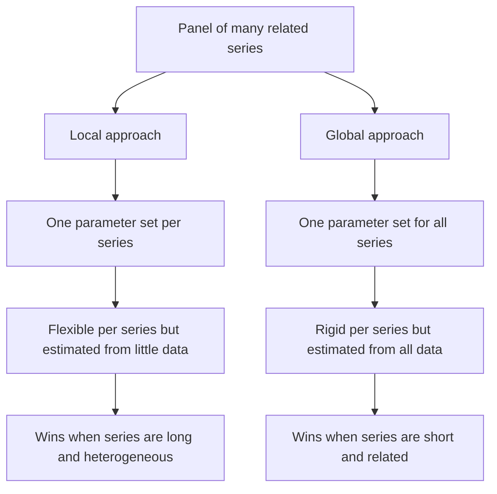
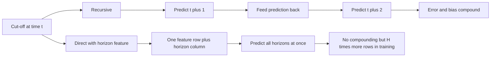
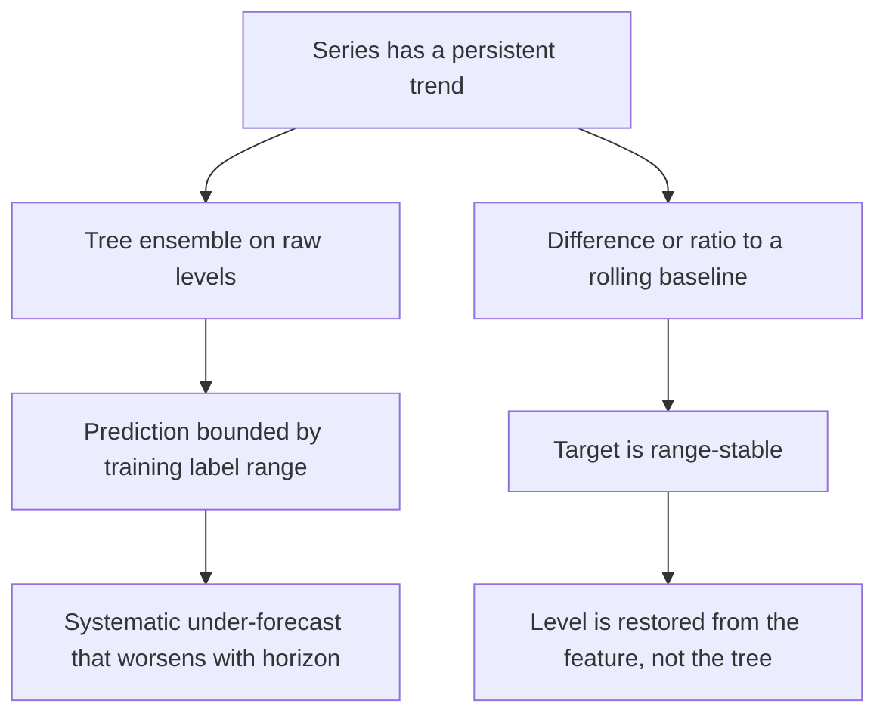
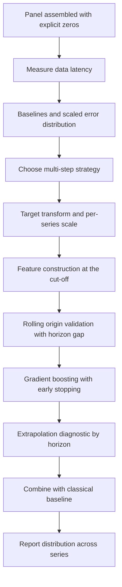
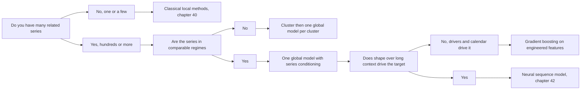

# Chapter 41: Feature-Based and Global Machine Learning Forecasting

> **What this chapter covers** How to turn forecasting into supervised learning, how to build the feature matrix without leaking the future into it, and why fitting a single model across thousands of series beats fitting one model per series in most production settings. It covers lag and window feature construction, target transformation and per-series scaling, the recursive versus direct versus multi-output choice for multi-step horizons, cold start, validation design for pooled models, why gradient-boosted trees dominate this space, and the one thing those trees cannot do.
>
> **Prerequisites** Chapter 4 (classical machine learning, in particular gradient boosting), Chapter 5 (validation and experimental design), Chapter 10 (feature engineering and leakage), Chapter 11 (the time-series overview), Chapter 39 (decomposition and stationarity) and Chapter 40 (the classical baselines you must beat).
>
> **Where it is used** Retail and e-commerce demand planning, supply chain and inventory, workforce and capacity planning, energy load forecasting, cloud capacity forecasting, marketplace supply and demand balancing, and any setting where the number of series is large enough that per-series modelling is an engineering problem rather than a statistics problem.

Chapter 10 owns general feature engineering, leakage taxonomy, encoding schemes and training-serving skew. This chapter does not repeat that material. It covers only what changes when the rows are ordered in time and the label lies in the future. Chapter 40 owns the classical methods this approach competes with. Chapter 42 owns the neural alternative.

---

## 41.1 Level 1: Foundations

### The reframing, and why it is not obvious

A classical forecaster treats a series as a stochastic process and estimates its parameters. A supervised learner treats forecasting as regression: build a table where each row is one prediction opportunity, the label is a future value, and the columns are things you knew at the time.

Concretely, suppose you have daily sales for one product:

| Date | Sales |
|---|---|
| 2024-03-01 | 12 |
| 2024-03-02 | 15 |
| 2024-03-03 | 9 |
| 2024-03-04 | 22 |
| 2024-03-05 | 18 |

To forecast one day ahead you build this:

| Row date $t$ | lag_1 | lag_2 | lag_3 | dow | target $y_{t+1}$ |
|---|---|---|---|---|---|
| 2024-03-03 | 9 | 15 | 12 | Sunday | 22 |
| 2024-03-04 | 22 | 9 | 15 | Monday | 18 |

That table is an ordinary regression problem. Any learner that fits tabular data fits it. Nothing about the algorithm knows time exists. All the temporal knowledge is in how the table was built and how it is split.

Three consequences follow immediately, and they are the whole chapter.

1. **The feature set is the model.** A classical model encodes the dynamics in its equations. A supervised forecaster encodes them in the columns. If you did not put a 364-day lag in the table, the model cannot see last year's same weekday.
2. **Rows from different series can share a table.** Nothing forces every row to come from the same product. If you stack rows from 30,000 products, a single fit learns patterns from all of them. This is the global model idea and it is the single largest change in forecasting practice in the last decade.
3. **Every ordinary supervised trap applies, plus one.** The extra trap is that the row ordering carries information, so a random split is invalid and any feature computed with knowledge of the future is a leak.

### The vocabulary

| Term | Meaning |
|---|---|
| Cut-off (or forecast creation date) | The timestamp $t$ up to which data is assumed known when a row is built |
| Horizon $h$ | How many steps beyond the cut-off the label lies |
| Lookback (or context) window | How far back the features reach from the cut-off |
| Local model | One model fitted to one series, with parameters belonging to that series |
| Global (or cross-learning) model | One parameter set fitted on rows pooled from many series |
| Panel | A collection of series observed over a common time axis, possibly ragged |
| Static feature | A property of a series that does not change over time, such as category |
| Known-future covariate | A driver whose future values are known at forecast time, such as a calendar |
| Observed-past covariate | A driver known only up to the cut-off, such as realised weather |
| Cold start | Forecasting a series with little or no history |

### Local versus global, at the level of intuition

Imagine 30,000 grocery products with two years of daily history each. Locally, you fit 30,000 models, each on 730 points. Each model estimates its own weekly shape, its own holiday response, its own trend. With 730 points and a weekly cycle you have about 104 observations per weekday, which is enough for a stable weekday effect but thin for a holiday that occurred twice.

Globally, you fit one model on roughly 22 million rows. The holiday effect is now estimated from 60,000 holiday observations across products rather than 2 per product. Any structure the products share is estimated far more precisely. What you give up is the freedom for each product to have its own coefficients.

That trade is the classic bias-variance trade in a new costume. Pooling adds bias, because the products are not identical. Pooling removes variance, because each estimate now rests on far more data. When the series are similar enough and each is short enough, the variance reduction wins by a wide margin. That is the empirical finding of the M4 and M5 competitions (Makridakis, Spiliotis and Assimakopoulos, 2020 and 2022) and of most production teams who have measured it.



*Figure 41.1: The local versus global trade, which is bias-variance restated across the series dimension.*

### What this approach buys and what it costs

| Gains | Costs |
|---|---|
| Exogenous drivers and metadata enter naturally as columns | You must construct every temporal relationship by hand as a feature |
| One trained artifact for a whole catalogue | The feature pipeline must be reproduced exactly at serving time |
| Mature, fast tooling and short iteration loops | Leakage is easy to introduce and nearly invisible in offline scores |
| Cross-series learning, so new and short series get sensible forecasts | Per-series idiosyncrasy is averaged away unless you encode it |
| Nonlinear interactions between drivers come free | Tree learners cannot extrapolate beyond the observed target range |

---

## 41.2 Level 2: Working knowledge

### The shape of the training table

Fix three quantities before writing any code: the cut-off spacing, the horizon set, and the lookback. A common demand-planning configuration is a weekly cut-off, horizons 1 through 13 weeks, and a 104-week lookback. A common operations configuration is a daily cut-off, horizons 1 through 28 days, and a 400-day lookback so that a full year of seasonal lags is available.

Each training row is identified by the triple (series id, cut-off, horizon). Two rows with the same series and cut-off but different horizons share all their features except the horizon column, and have different labels. This matters for validation, because those rows are not independent.

### Lag features and how to choose them

A lag feature is the target value at a fixed offset before the cut-off. Which lags to include is the first real decision.

| Lag family | Rule of thumb |
|---|---|
| Short lags | $y_{t}, y_{t-1}, y_{t-2}$ capture momentum and the most recent level |
| Seasonal lags | $y_{t-m}, y_{t-2m}, y_{t-3m}$ where $m$ is the dominant period, 7 for daily-weekly, 52 for weekly-annual, 24 for hourly-daily |
| Seasonal neighbours | $y_{t-m+1}, y_{t-m-1}$ so the model can smooth across a shifting seasonal peak |
| Annual lag on daily data | $y_{t-364}$ rather than $y_{t-365}$, because 364 preserves the weekday |
| Horizon-safe minimum | Every lag must be at least $h$ when using a direct strategy, or it is unavailable at inference |

That last row is the constraint people get wrong. If you forecast 7 days ahead from cut-off $t$, and you built a feature $y_{t-1}$, the model at inference has $y_{t-1}$ only if the pipeline really does run 7 days before the target date. That is fine. But if you instead build the table so the row is dated at the target and use "the value 1 day before the target", that value is unknown. Always define features relative to the cut-off, never relative to the target.

Use the partial autocorrelation plot (Chapter 39) to choose the short lags and the autocorrelation plot to find $m$. On a panel, compute both on a sample of series and take the union of what appears, rather than tuning lags per series.

### Rolling and expanding aggregates

A lag is a single noisy observation. A rolling aggregate over a window is a denoised summary and usually carries more signal per column.

| Statistic | What it encodes |
|---|---|
| Mean over $w$ | Local level |
| Standard deviation over $w$ | Local volatility, useful as a feature and essential for scaling |
| Minimum, maximum over $w$ | Range and recent extremes |
| Median and interquartile range | Robust level and spread for spiky series |
| Count of zeros over $w$ | Intermittency, which changes the whole modelling regime |
| Slope of a fitted line over $w$ | Local trend, which a tree cannot infer from levels alone |
| Exponentially weighted mean with span $s$ | Level with geometric decay, one column instead of several windows |

Choose window lengths on the scale of the dynamics, not arbitrarily. A useful default set for daily data is 7, 28 and 91, giving a weekly, a monthly and a quarterly view. Add 364 if you have more than two years. Short windows react fast and are noisy. Long windows are stable and stale. Including several lets the learner choose.

Expanding aggregates cover all history to date. They are useful as normalisers (the series mean so far) and as maturity indicators (number of observations so far), but they drift in meaning as the series lengthens, so prefer rolling windows for anything meant to describe current behaviour.

### The cut-off discipline, worked concretely

This is where feature-based forecasting goes wrong most often, so work it through on real numbers rather than in the abstract.

You have daily sales. You want a 7-day rolling mean as a feature, and the label is sales 7 days after the cut-off. The naive implementation calls a centred rolling window:

- Centred window of length 7 at row $t$ covers $t-3$ through $t+3$.
- So the feature at $t$ contains $y_{t+1}, y_{t+2}, y_{t+3}$.
- The label at $t$ is $y_{t+7}$.
- Those are different values, so no test ever fails, but the feature carries information from after the cut-off.

Offline the model looks excellent, because a window that peeks three days ahead is a much better predictor than one that does not. Online the feature cannot be computed, or is computed differently, and accuracy collapses. This is training-serving skew caused by leakage, and Chapter 10 covers the general form.

The correct implementation is trailing and shifted:

- Shift the series by 1 first, then roll. The window at row $t$ then covers $t-7$ through $t-1$.
- Or roll with a right-closed trailing window covering $t-6$ through $t$, which is also legal because $y_t$ is known at cut-off $t$.

Both are safe. Which you use depends on whether $y_t$ itself is available at cut-off, which depends on your data latency. If sales for day $t$ land in the warehouse on day $t+2$, then at cut-off $t$ you actually only have data through $t-2$, and every feature must be shifted by 2 as well. That shift is a property of the pipeline, not of the model, and it must be measured rather than assumed.

**Listing 41.1: a leak-free feature builder with an explicit data-latency shift.**

```python
import pandas as pd

def build_features(df, horizon, latency=0, lags=(1, 7, 14, 28, 364),
                   windows=(7, 28, 91)):
    """df has columns series_id, ds (datetime), y. One row per series per date."""
    df = df.sort_values(["series_id", "ds"]).copy()
    g = df.groupby("series_id", group_keys=False)["y"]

    # available[t] is the most recent value actually readable at cut-off t
    available = g.shift(latency)

    for lag in lags:
        df[f"lag_{lag}"] = g.shift(lag + latency)

    for w in windows:
        roll = available.groupby(df["series_id"]).rolling(w, min_periods=max(2, w // 4))
        df[f"rmean_{w}"] = roll.mean().reset_index(level=0, drop=True)
        df[f"rstd_{w}"] = roll.std().reset_index(level=0, drop=True)

    df["dow"] = df["ds"].dt.dayofweek
    df["horizon"] = horizon
    df["target"] = g.shift(-horizon)
    return df.dropna(subset=["target"])
```

Three lines carry the argument. `available = g.shift(latency)` encodes the fact that fresh data is not instantly readable, and every rolling statistic is built from it rather than from `y`, so no window can contain a value the pipeline would not have. `g.shift(lag + latency)` applies the same offset to point lags. `g.shift(-horizon)` is the only negative shift in the function, and it produces the label, which is the one place the future is allowed to appear. Grouping by `series_id` everywhere prevents one series borrowing the tail of the previous one, which is a silent corruption when a panel is stored as a single concatenated frame.

### Calendar, event and cyclical features

| Feature | Construction | Note |
|---|---|---|
| Day of week, month, quarter | Integer or one-hot | Trees handle the integer form; linear models need one-hot or cyclical |
| Week of year | ISO week | Has 52 or 53 weeks, which breaks naive year-on-year alignment |
| Cyclical encoding | $\sin(2\pi k / K)$ and $\cos(2\pi k / K)$ | Makes December adjacent to January for a distance-based or linear learner |
| Holiday flag | Binary per named holiday | One column per holiday, not a single "is holiday" column, because effects differ |
| Days to and from a holiday | Signed integer, clipped | Captures the pull-forward and the recovery, which a flag cannot |
| Moving holidays | Explicit date table per year | Easter, Lunar New Year and Ramadan drift against the solar calendar |
| Payday and month position | Day of month, days to month end | Strong in consumer demand |
| Trading day count | Working days in the period | Essential on monthly data where month lengths differ |

The cyclical encoding deserves one worked line, because it is frequently applied where it does nothing. For month $k \in \{1..12\}$ with $K = 12$:

$$x_{\sin} = \sin\!\left(\frac{2\pi k}{12}\right), \qquad x_{\cos} = \cos\!\left(\frac{2\pi k}{12}\right)$$

For $k = 12$, $x_{\sin} = \sin(2\pi) = 0$ and $x_{\cos} = 1$. For $k = 1$, $x_{\sin} = 0.5$ and $x_{\cos} \approx 0.866$. The Euclidean distance between December and January is $\sqrt{0.5^2 + 0.134^2} \approx 0.518$, while between December and June it is $\sqrt{0^2 + 2^2} = 2$. The encoding has made adjacent months close, which raw integers did not. For a tree this buys nothing, because a tree splits on order and can isolate month 12 with two splits regardless. Use cyclical encodings for linear models, neural networks and distance-based methods. Skip them for trees unless you have measured a gain.

### Exogenous drivers in the demand case

Price, promotion and inventory are the three that matter most in retail, and each has a trap.

| Driver | Trap |
|---|---|
| Price | Price is chosen partly in response to expected demand, so it is endogenous. The model will learn associations that do not survive intervention. See Chapter 14 |
| Promotion | Promotion calendars are usually known in the future, which makes them one of the few genuinely useful known-future covariates. But historical promotion records are often incomplete |
| Inventory and stockouts | A zero caused by a stockout is censored demand, not zero demand. Training on it teaches the model to forecast zero after a stockout, which then justifies not restocking |
| Weather | Realised weather is observed-past. Forecast weather is known-future but wrong, and you must train on forecast weather if you will serve on forecast weather |
| Competitor and market signals | Usually available with a delay that breaks the cut-off discipline |

The stockout case is the one that causes real business damage, so handle it explicitly. Either mask those rows out of the loss, or impute the censored demand, or add an availability feature and let the model separate the two causes of a zero.

### Series identity and static features

A global model needs to know which series a row came from, or it will forecast the panel average for everything.

| Encoding | When |
|---|---|
| Raw categorical identifier, handled natively | Gradient boosting libraries with categorical support, modest cardinality |
| Target encoding on the series mean | Simple and effective, but must be computed from training folds only or it leaks |
| Learned embedding | Neural models (Chapter 42), or trees fed a pretrained embedding |
| Static attributes: category, region, size band, price tier | Almost always better than the identifier itself, because they generalise to new series |
| Behavioural statistics: long-run mean, coefficient of variation, intermittency rate, seasonal strength | Computed from the training window only. These let the model condition its behaviour on series type |

Prefer attributes and behavioural statistics over raw identifiers. An identifier is useless for a series the model has never seen, and every catalogue gains new entries. Attributes transfer.

### Target transformations and per-series scaling

For a global model this is not a refinement. It is the difference between a working model and a broken one.

If one series sells 5 units a day and another sells 50,000, a squared-error loss pooled across both is dominated entirely by the large one. The model will fit the large series and ignore the small ones, while the metric you report per series will look terrible on most of the catalogue.

| Transformation | Effect | Caution |
|---|---|---|
| Divide by a per-series scale | Puts all series on comparable magnitude | Choose the scale from training data only, and store it for inference |
| Logarithm, $\log(1+y)$ | Stabilises multiplicative variance, turns proportional error into absolute error | Back-transforming the mean of a log is not the mean, see below |
| Box-Cox with fitted $\lambda$ | Generalises log and square root | Fitting $\lambda$ per series in a global model reintroduces per-series parameters |
| Differencing the target | Removes level and trend, lets a tree extrapolate | Discards level information the model could have used |
| Ratio to a rolling baseline | Target becomes $y_{t+h} / \text{mean}_{28}(t)$ | The most common practical choice in demand forecasting |

For the scale, a robust and common choice follows the mean absolute seasonal difference used in the scaled error metric:

$$s_i = \frac{1}{n_i - m} \sum_{t = m+1}^{n_i} \lvert y_{i,t} - y_{i,t-m} \rvert$$

where $i$ indexes the series, $n_i$ is its training length and $m$ its seasonal period. Train on $y_{i,t} / s_i$ and multiply back at prediction time. This has the property that a model trained under absolute error on the scaled target is directly optimising the scaled error metric.

**Worked example.** A series has 400 daily observations, $m = 7$, and a mean absolute weekly difference of 8.0 units. Its raw values average 120. A second series has a mean absolute weekly difference of 0.4 and raw values averaging 3. Unscaled, the first contributes 900 times more squared error than the second, since $(120/3)^2 \times$ the variance ratio. After dividing each by its own $s_i$, both series have scaled weekly differences averaging 1.0, and both contribute comparably. If the model then achieves a mean absolute error of 0.6 on the scaled target, that is a scaled error of 0.6, which means 40 percent better than seasonal naive, on both series, directly readable.

**The back-transform bias.** If you train on $z = \log(1+y)$ and the model predicts $\hat z$, then $\exp(\hat z) - 1$ estimates the median of $y$, not the mean. Under a normal error on the log scale with variance $\sigma^2$, the mean is

$$\mathbb{E}[y] = \exp\!\left(\hat z + \frac{\sigma^2}{2}\right) - 1$$

**Worked example.** $\hat z = 4.0$ and the residual standard deviation on the log scale is $\sigma = 0.5$. The naive back-transform gives $e^{4.0} - 1 = 53.6$. The bias-corrected mean is $e^{4.0 + 0.125} - 1 = e^{4.125} - 1 = 60.8$, which is 13 percent higher. If the decision needs an expected total, for example the sum of forecasts across a category, the uncorrected version under-states it by that amount and the error compounds across the sum. If the decision needs a median, or you are evaluating with mean absolute error, the uncorrected version is the right one. State which you want.

---

## 41.3 Level 3: Depth

### Local versus global, properly

The reason global models work is worth deriving rather than asserting, because it determines when they stop working.

Write the forecasting function for series $i$ as $f_i$. The local approach estimates each $f_i$ from $n_i$ observations. The global approach estimates one $f$ from $\sum_i n_i$ observations and applies it to all series, possibly conditioned on series features $z_i$ so that it is really $f(\cdot, z_i)$.

The expected error of an estimate decomposes into approximation error and estimation error. Approximation error is how well the chosen function class can represent the truth. Estimation error is how far the fitted function is from the best in that class, and it falls with sample size, roughly as the square root of the number of observations for a fixed complexity.

- Local: approximation error is small, because $f_i$ can be anything. Estimation error is large, because $n_i$ is small.
- Global: approximation error is larger, because one function must serve all series. Estimation error is far smaller, because the sample is the whole panel.

Global wins when the increase in approximation error is smaller than the decrease in estimation error. Three levers control that.

1. **Series similarity.** If the series genuinely share dynamics, the approximation penalty is near zero.
2. **Series length.** Short series make local estimation error huge, so global wins easily. Long series shrink it, so the balance can flip.
3. **Conditioning richness.** A global model given series features $z_i$ and a flexible learner can reproduce per-series behaviour without per-series parameters. This is why global models with identifiers, static attributes and behavioural statistics beat global models without them, sometimes dramatically. The conditioning is what recovers the flexibility pooling gave away.

Montero-Manso and Hyndman (2021) made the strongest theoretical statement here: a global model with sufficient complexity can match any set of local models, because the local family is a special case of a sufficiently flexible global function of the series and its identity. The practical content of that result is not "global always wins" but "global with enough capacity and enough conditioning is never fundamentally handicapped". What limits global models in practice is under-conditioning, not the pooling itself.

**When global cannot win.**

| Situation | Why |
|---|---|
| Series measured in genuinely different regimes, for example an electricity load series pooled with a stock price series | No shared structure to borrow. Cluster and fit separately |
| A handful of long, individually important series, such as national aggregates | Local estimation error is already low, and per-series care pays |
| Series with different sampling frequencies or calendars | The lag semantics differ, so the same column means different things |
| One series is the business and the rest are noise | Pooling dilutes the case that matters. Weight it or model it alone |

**The hybrid.** The practical middle ground has three common forms.

1. **Cluster then pool.** Group series by behavioural statistics or by shape distance (Chapter 45), and fit one global model per cluster. This limits the approximation penalty while retaining most of the pooling.
2. **Global plus local residual.** Fit the global model, then fit a cheap local correction, for example a per-series bias term or a per-series seasonal index, on its residuals. Regularise the local part hard.
3. **Combine forecasts.** Produce both a local classical forecast and a global machine-learned forecast and combine them, typically with weights fitted on a rolling validation. Combination is the most reliably profitable trick in forecasting and it costs almost nothing.

### Recursive, direct and multi-output strategies

Multi-step forecasting has three canonical strategies, and the choice is one of the two or three decisions that actually change accuracy.

**Recursive.** Train one model for one step ahead. To forecast $h$ steps, predict step 1, append the prediction to the history, recompute features, predict step 2, and so on.

$$\hat y_{t+1} = f(y_t, y_{t-1}, \ldots), \qquad \hat y_{t+2} = f(\hat y_{t+1}, y_t, \ldots)$$

**Direct.** Train $H$ separate models, model $h$ mapping information at $t$ to the value at $t+h$.

$$\hat y_{t+h} = f_h(y_t, y_{t-1}, \ldots), \qquad h = 1 \ldots H$$

**Direct with horizon as a feature.** One model, with $h$ as an input column, trained on rows for all horizons.

$$\hat y_{t+h} = f(y_t, y_{t-1}, \ldots, h)$$

**Multi-output.** One model that emits all $H$ values at once from one forward pass. Natural for neural networks and for multi-output regressors. Not natively supported by most gradient boosting libraries, which fit one target at a time.

**The error accumulation argument, made precise.** Suppose the one-step model is unbiased with error variance $\sigma^2$ and the true process is a random walk with the model predicting $\hat y_{t+1} = y_t$. Then the $h$-step recursive forecast error is the sum of $h$ independent one-step shocks, so its variance is $h\sigma^2$ and its standard deviation grows as $\sqrt{h}$. That growth is irreducible and correct: the future really is that uncertain.

The damage from recursion is a different, additional effect. The model was trained on rows whose inputs were observed values. At step 2 onward it receives its own predictions as inputs. Predictions have a different distribution from observations: they are smoother, less variable, and biased in whatever direction the model is biased. The model is therefore evaluated off its training distribution. This is the same exposure bias that appears in sequence generation (Chapter 42, level 2). The consequence is that recursive error grows faster than the theoretical $\sqrt{h}$, and it grows fastest for models with a systematic bias, because each step feeds the bias forward.

**The sample efficiency argument on the other side.** Direct with $H$ separate models splits the training data $H$ ways in terms of what each model learns from. Model $h = 13$ only ever sees the mapping from $t$ to $t+13$ and learns nothing from the much easier and better-determined one-step relationship. With a short series this matters a great deal. Recursive, by contrast, uses every consecutive pair in the data to estimate one function, so it has $H$ times more effective examples per parameter.

There is also a bias-variance framing. Recursive imposes a strong structural assumption, that a single one-step function generates the whole path. If that assumption holds, it is more efficient. If it does not, its bias compounds. Direct makes no such assumption and so has lower bias and higher variance. Chevillon (2007) surveys this literature; the summary is that direct tends to win when the one-step model is misspecified, which in practice it usually is, and recursive tends to win when data is scarce and the model is close to correct.

**Where the horizon feature sits.** Direct with a horizon feature is the practical default in feature-based forecasting because it captures most of the benefit of both. It has no compounding, since each prediction is made directly. It shares statistical strength across horizons, since all rows train one parameter set. It needs one artifact, not $H$. Its cost is that the training table grows by a factor of $H$, and that rows sharing a cut-off are correlated, which must be respected in validation.

**Listing 41.2: the three strategies, with the recursive loop written out.**

```python
import numpy as np

def forecast_recursive(model, history, featurise, H):
    """history is a 1-D array of past values; featurise maps an array to a row."""
    series = list(history)
    out = []
    for _ in range(H):
        x = featurise(np.asarray(series))          # features from the CURRENT series
        yhat = float(model.predict(x.reshape(1, -1))[0])
        out.append(yhat)
        series.append(yhat)                        # the prediction becomes an input
    return np.asarray(out)

def forecast_direct(models, history, featurise, H):
    x = featurise(np.asarray(history)).reshape(1, -1)
    return np.asarray([float(models[h].predict(x)[0]) for h in range(1, H + 1)])

def forecast_direct_h(model, history, featurise, H):
    x = featurise(np.asarray(history))
    rows = np.vstack([np.append(x, h) for h in range(1, H + 1)])  # h as last column
    return model.predict(rows)
```

The single line `series.append(yhat)` is the entire exposure bias problem. From the second iteration onward, `featurise` is computing lags and rolling means over a mixture of observed and predicted values, which is a distribution the model never saw in training. Note also that `forecast_direct_h` computes features once and reuses them across horizons, which is why it is cheap at inference: one feature computation and one batched prediction call, against $H$ feature computations for the recursive loop.

**Mitigations for recursive.** If you must use recursion, three things help. Train on rows whose inputs were themselves partly predicted, which is a scheduled-sampling style fix. Use a model that predicts a distribution and propagate samples rather than point values, which gives a correct predictive distribution instead of a collapsing point path. And avoid features that amplify the feedback, in particular very short lags, which pass the prediction straight back in.

**The decision table.**

| Situation | Strategy | Reason |
|---|---|---|
| Short horizon, $H \le 3$, and one-step accuracy is what matters | Recursive | Compounding has little room to act, and recursion is data-efficient |
| Long horizon, $H$ in the tens, plenty of data | Direct with horizon feature | No compounding, one artifact, shares strength across horizons |
| Long horizon, each horizon has genuinely different drivers | Separate direct models | Lets each horizon use a different feature set and different hyperparameters |
| Very short series, under a few hundred points | Recursive | Direct starves each horizon of examples |
| You need a coherent joint path, not marginal per-horizon numbers | Recursive with sampled propagation, or multi-output | Direct gives marginals only, and the sum of marginal quantiles is not a path quantile |
| Neural model already in use | Multi-output | One forward pass, and the architecture supports it naturally |
| Known-future covariates vary across the horizon, such as a promotion in week 6 | Direct with horizon feature, covariates aligned to the target date | Recursive cannot easily condition step 6 on a step 6 driver |
| Serving latency is tight and $H$ is large | Direct with horizon feature | One feature computation, one batched call |

The last row is often decisive in production and is rarely discussed. A recursive forecast for 30,000 series at horizon 28 requires 840,000 sequential feature computations that cannot be batched across horizon. The direct form requires 30,000 feature computations and one batched prediction of 840,000 rows.



*Figure 41.2: The two strategies that cover most production cases, and the cost each pays.*

### The extrapolation limitation of tree-based learners

This is the one structural thing a tree cannot do, and it is the most common cause of a feature-based forecaster failing quietly in production.

A regression tree partitions the feature space into boxes and predicts a constant in each box. That constant is an average of training labels that fell into the box. A gradient-boosted ensemble sums many such constants. Therefore the prediction of any tree ensemble is bounded by the range of training labels, up to the shrinkage and the sum of the trees, which cannot exceed the convex hull of what the leaves contain.

Formally, for a single tree $T$ with leaves $L$,

$$\min_{t \in \text{train}} y_t \le T(x) \le \max_{t \in \text{train}} y_t \quad \text{for every } x$$

The consequence for a trending series is immediate. Suppose sales grew from 100 to 500 over three years and you train on that history. Every training label lies in $[100, 500]$. The model asked to forecast next quarter, where the truth is 560, will output at most something near 500. It does not merely under-forecast by a little. It saturates. And it saturates more the further the forecast is from the training range, so the error grows with time since training, which looks exactly like drift and gets diagnosed as drift.

**Worked example of the saturation.** Linear trend, $y_t = 100 + 0.5t$, daily, trained on $t = 0 \ldots 729$, so labels run from 100 to 464.5. At $t = 800$ the truth is 500. A tree fed a `t` column can at best place $t = 800$ in its highest leaf, whose value is the mean of the highest training bucket, perhaps the mean over $t \in [700, 729]$, which is $100 + 0.5 \times 714.5 = 457.3$. The error is $500 - 457.3 = 42.7$ units, or 8.5 percent, and it grows by 0.5 units per additional day forever. A linear model with the same `t` column extrapolates exactly.

**The remedies, in order of how often they are the right answer.**

| Remedy | Mechanism | Cost |
|---|---|---|
| Model the differenced target, $y_{t+h} - y_t$, and add $y_t$ back | The target is now stationary in level, so the tree never needs to leave its training range. The level arrives from the feature, not from the tree | You lose the ability to model level-dependent effects directly. Add the level as a feature to recover some |
| Model the ratio to a rolling baseline, $y_{t+h} / \text{mean}_w(t)$ | Same idea multiplicatively. Standard in demand forecasting because seasonality is usually multiplicative | Undefined or unstable when the baseline is near zero. Clip or add a floor |
| Detrend explicitly, fit the tree to residuals, add the trend back | The trend model extrapolates, the tree handles the rest | Two models to maintain, and a mis-specified trend is now extrapolating wrongly and confidently |
| Hybrid linear plus tree: fit a linear model on trend and calendar, boost on its residuals | The linear part extrapolates, the boosting part captures nonlinearity | More machinery, and you must validate the linear part separately |
| Use a learner with linear leaves | Some gradient boosting implementations support linear models in leaves rather than constants, which restores local extrapolation. Check your version, since support and naming differ across libraries | Slower, more prone to wild extrapolation if unregularised |
| Use a model class that extrapolates: linear, generalised additive, or a neural network | Sidesteps the issue | Gives up the tabular strengths of trees |

Note what is not on the list: adding a time index feature. Adding `t` as a column does not help a tree at all. The tree will split on `t`, which lets it fit the trend within the training range, and then saturate at the highest split just the same. If anything it is worse, because the model now leans on a feature that is guaranteed to be out of range at inference. Some practitioners drop the raw time index from tree models for exactly this reason and represent time only through seasonal and calendar features plus a differenced target.

**Detecting the problem.** Plot predicted against actual on the last validation fold and look for a ceiling. Compute the ratio of forecast mean to actual mean by horizon; if it declines monotonically with horizon on a growing series, the model is saturating. Compare against a simple drift baseline, which is the naive forecast plus the average historical change; a tree that loses to drift on a trending series has this problem and no other.



*Figure 41.3: Why a tree saturates on a trending series and what the standard fix actually changes.*

### Why gradient-boosted trees dominate this space

Given that the reframing works with any learner, it is worth being precise about why one family keeps winning.

| Property | Why it matters here |
|---|---|
| Handles mixed feature types without preprocessing | Forecasting tables mix counts, prices, flags, categories and calendar integers |
| Native missing-value handling | Lags are missing at the start of every series, and a panel is ragged by construction |
| Invariant to monotone feature transforms | Saves an entire class of preprocessing decisions, since only the order of a feature matters |
| Captures interactions without being told | Holiday times category times price band effects appear without explicit interaction columns |
| Robust to irrelevant features | You can throw 300 candidate features at it, which is how feature iteration actually proceeds |
| Fast to train and retrain | Iteration speed is where the gains come from, and a global forecasting table is large |
| Well-understood regularisation | Depth, learning rate, subsampling and leaf-count controls are few and behave predictably |
| Supports quantile losses natively | Which is how you get probabilistic output, see Chapter 43 |

The counterweight is the extrapolation limit above, plus the fact that trees have no notion of order among their inputs and so cannot generalise "the shape of the last 30 days" as a shape. They see 30 independent columns. A convolutional or attention model sees a sequence. When shape matters more than level and drivers, that is when the neural alternative starts to earn its cost (Chapter 42).

### Hyperparameters that matter, and the row-count arithmetic

Gradient boosting on a forecasting table is not tuned the same way as on an ordinary tabular problem, because the rows are heavily correlated and the effective sample size is far below the row count.

**The row count.** For $N$ series, $T$ periods of usable history after the longest lag is accounted for, cut-offs at every period, and $H$ horizons under the direct-with-horizon strategy, the training table has

$$R = N \times (T - L_{\max} - H) \times H$$

rows, where $L_{\max}$ is the longest lag.

**Worked example.** $N = 30{,}000$ series, $T = 1095$ days of history, $L_{\max} = 364$, $H = 28$. Then $R = 30{,}000 \times (1095 - 364 - 28) \times 28 = 30{,}000 \times 703 \times 28 = 590{,}520{,}000$ rows. That is too large for a single machine at 40 float features, roughly 94 GB at four bytes per value. The standard reductions: subsample cut-offs, for example every seventh day, which divides by 7 and costs little because adjacent cut-offs are nearly identical; subsample series for hyperparameter search and train the final model on all of them; and reduce the horizon grid to a representative set, for example 1, 3, 7, 14, 21, 28, interpolating the rest. Applying the first and third gives $30{,}000 \times 100 \times 6 = 18$ million rows, which is comfortable.

**The effective sample size.** Adjacent cut-offs for the same series share almost all their features, so 590 million rows do not carry 590 million rows of information. A reasonable rule of thumb is that the effective count is closer to $N$ times the number of distinct seasonal cycles observed, since that is how many genuinely independent realisations of the seasonal pattern exist. With 3 years of history that is 3 per series, not 1095. This is why forecasting models overfit at parameter counts that would be conservative on a genuine tabular problem of the same row count.

| Hyperparameter | Guidance specific to forecasting tables |
|---|---|
| Number of trees and learning rate | Low learning rate with early stopping on the rolling-origin validation loss, not on a random split |
| Maximum depth or leaf count | Shallower than the row count suggests, because the effective sample size is much smaller. Depth 6 to 8 is a common working range |
| Row subsampling | Subsample by series or by cut-off block rather than by row, so correlated rows move together |
| Column subsampling | Helps more than usual here, because lag features are highly correlated and column sampling forces the ensemble to use different ones |
| Minimum samples per leaf | Raise it. A leaf holding twenty rows from the same series and adjacent cut-offs holds roughly one observation of information |
| Categorical handling | Use the library's native categorical support for series identifiers where cardinality allows, rather than target encoding, which needs in-fold computation |
| Objective | Match the metric. Absolute error on a scaled target, Tweedie or Poisson for count-like and sparse data, quantile for interval output |

### Sample weighting by recency

Older rows describe a process that may have changed. Three standard schemes, all of which are applied as per-row weights in the loss.

| Scheme | Weight | Notes |
|---|---|---|
| Exponential decay | $w_t = \gamma^{(T - t)}$ with $\gamma$ slightly below 1 | Choose $\gamma$ by half-life rather than directly |
| Window truncation | 1 inside the last $W$ periods, 0 outside | Blunt, and throws away seasonal history you may need |
| Regime weighting | Up-weight periods similar to the current regime by a learned or hand-set rule | Useful after a known structural break |

**Worked example of half-life.** You want observations from one year ago to carry half the weight of today's, on daily data. Solve $\gamma^{365} = 0.5$, so $\gamma = 0.5^{1/365} = \exp(\ln 0.5 / 365) = \exp(-0.001899) = 0.998102$. A row from two years ago then has weight $0.25$, and one from five years ago $0.5^5 = 0.031$. Verify by checking the effective sample size, $(\sum w)^2 / \sum w^2$. If your history is 5 years of daily data, that decay reduces an effective 1825 rows per series to roughly 520, which is a large reduction and may be more than you intended. Always compute the effective sample size before shipping a decay.

Recency weighting interacts badly with seasonal learning. If the annual seasonal pattern is only visible in the last two Decembers and you have down-weighted the earlier one to 0.25, you have halved your December evidence. On strongly seasonal data, weight by recency of the same season rather than by calendar recency, or do not weight at all and rely on a sliding training window.

### Validation design for global models

Chapter 5 covers validation generally and Chapter 11 covers rolling origin evaluation. What changes for a global feature-based model is the following.

1. **Split by time, globally, not per series.** Every fold has one cut-off date. All series are trained through it and evaluated after it. Splitting each series independently produces folds where series A's future trains a model evaluated on series B's past, which is a cross-series leak through anything the model shares, including target encodings and per-series scales.
2. **Refit per fold, including the preprocessing.** Per-series scales, target encodings, holiday effects fitted from data and any imputation statistic must be recomputed inside each fold from training data only.
3. **Respect the horizon gap.** Between the training cut-off and the first evaluated target there must be a gap of at least $h$, or a training row's label lies inside the test period. This is the purging idea from Chapter 5 applied to the horizon.
4. **Group the correlated rows.** Rows sharing a cut-off and series differ only in horizon. Do not place some of them in train and some in test.
5. **Report the distribution across series, not only the mean.** A pooled mean is dominated by large series. Report the median scaled error, the interquartile range, and the fraction of series that beat seasonal naive.
6. **Use enough origins.** A single origin gives an estimate whose variance is dominated by whatever happened in that one window. Ten to twenty origins spanning at least one full seasonal cycle is a reasonable target where compute allows.

**Listing 41.3: rolling-origin folds with a horizon gap, for a panel.**

```python
import numpy as np
import pandas as pd

def rolling_origin_folds(dates, n_folds, horizon, step, min_train):
    """Yield (train_mask, test_mask) over a sorted unique date index."""
    d = np.sort(pd.unique(dates))
    last = len(d) - 1
    for k in range(n_folds, 0, -1):
        cut_idx = last - (k - 1) * step - horizon
        if cut_idx < min_train:
            continue
        cut = d[cut_idx]
        test_lo, test_hi = d[cut_idx + 1], d[min(cut_idx + horizon, last)]
        yield (dates <= cut), (dates > test_lo - np.timedelta64(1, "D")) & (dates <= test_hi)
```

The subtraction of `horizon` when computing `cut_idx` is the gap that prevents a training row's label from landing in the test window: with a direct strategy the label at cut-off $c$ is dated $c + h$, so training must stop $h$ periods before the test window opens. `step` controls how far the origin advances between folds and is usually set to the horizon, so folds evaluate disjoint future windows. `min_train` prevents folds with too little history to compute the longest lag, which would otherwise produce a fold trained on almost nothing and drag the mean.

### Handling new series and cold start

A global model handles cold start better than any local method, because it can forecast a series with zero history from static attributes alone. But it must be trained to do so.

| Stage of life | Approach |
|---|---|
| No history at all | Predict from static attributes only. Train a variant with lag features masked out, or rely on the learner's missing-value handling and verify it behaves sensibly when all lags are missing |
| A few observations | Lag features partly available. Include rows with short history in training, do not filter them out, or the model never learns that regime |
| Mature | Full feature set |
| Dying or discontinued | Detect and exclude, or the model learns that decline is normal. See Chapter 46 |

Two techniques matter. **Feature dropout during training**, where lag columns are randomly masked on some fraction of training rows, teaches the model to fall back on static attributes gracefully rather than relying entirely on lags. **Analogue seeding**, where a new item inherits the history of a similar existing item for feature computation, is common in retail and works, but the similarity mapping is a business decision and should be auditable.

The failure mode to avoid: training only on rows with the full lag set available. That silently restricts training to mature series, and then the model meets a new product at serving time in a state it has never seen.

### Intermittent and sparse series inside a global model

A large panel almost always contains a long tail of series that are zero most of the time. They break the feature-based approach in three specific ways, and each has a specific answer.

**The loss collapses to zero.** A squared or absolute error loss on a series that is zero 85 percent of the time is minimised by predicting a small number close to the mean, and often by predicting zero outright when the non-zero values are small. The resulting forecast is useless for planning, because the decision needs the expected demand over a lead time, not the most likely value on a given day.

**The features are degenerate.** A rolling mean over a mostly-zero window is near zero and carries almost no information. Lags are usually zero. The informative features for these series are different in kind: the count of non-zero periods in the last 28, the number of periods since the last non-zero value, the mean size of the non-zero values, and the coefficient of variation of the intervals between them.

**Aggregate metrics hide them.** Pooled across a catalogue, the tail contributes little to a volume-weighted metric, so the model can be badly wrong on 40 percent of the catalogue while the headline number looks fine. This is the same reporting failure as elsewhere in the chapter and it bites hardest here.

| Approach | Mechanism | When |
|---|---|---|
| Classify the regime and route | Compute an intermittency statistic per series and send sparse series to a specialised method (Chapter 40) | The cleanest option, and the usual production answer |
| Two-part model | One model for the probability of a non-zero period, one for the size given non-zero. Multiply | Gives an expected value that is correct and a natural decomposition |
| Count-appropriate loss | Train with a Tweedie or Poisson objective rather than squared error, which most gradient boosting libraries support. Check your version for the exact parameter name | Keeps one model, and handles the zero mass and the right skew together |
| Temporal aggregation | Forecast at a coarser frequency where the series is no longer sparse, then disaggregate | Often the honest answer: daily forecasts for a product that sells twice a month are not a real quantity |
| Forecast the cumulative over the lead time | Predict total demand over the replenishment window instead of per period | Matches the decision, which is what makes the sparsity tolerable |

**Worked example of the aggregation argument.** An item sells 24 units a year, arriving in roughly 12 transactions. At daily frequency, 353 of 365 periods are zero and a per-period forecast of 0.066 units is both correct in expectation and operationally meaningless. At monthly frequency the series is 2 units per month with occasional zeros, which is a sparse but workable count series. At the level of the actual decision, total demand over a 30-day replenishment lead time, the quantity is around 2 with a spread that a count distribution describes well. Choose the frequency from the decision, not from the granularity the data happens to arrive in.

### Training and serving parity for the feature pipeline

Chapter 10 covers training-serving skew generally and Chapter 20 covers feature stores. What is specific here is that the temporal feature pipeline has two properties that make skew unusually likely.

1. **The features are stateful in time.** A lag or rolling window depends on a range of history, so serving must reconstruct that history exactly. A serving path that reads the last 30 rows from a cache and a training path that reads a full table will differ whenever the cache has a gap.
2. **The cut-off is implicit.** In training, the cut-off is a column. In serving, it is "now", and "now" interacts with data arrival. If the batch job runs at 02:00 and yesterday's data lands at 03:00, every serving feature is one period staler than the training features were, and no code change caused it.

The defences are concrete.

| Defence | What it catches |
|---|---|
| Compute serving features with the same function as training features, no reimplementation | Divergent logic, which is the single largest source of skew |
| Log the served feature vector alongside the forecast | Lets you replay the exact inputs later, which is the only way to diagnose a bad forecast after the fact |
| Reconstruct historical features at a past cut-off and compare to the logged ones | Detects a pipeline change that silently altered a feature definition |
| Assert on freshness: the maximum observation date per series at serving time | Catches the latency change described above, which is otherwise invisible |
| Backfill-safe storage keyed by both the observation date and the ingestion date | Lets you reproduce what was known at any past moment, which is what a fair backtest requires. Chapter 46 covers the forecast store |

The ingestion-date point is the one teams discover late. If your warehouse overwrites a value when a correction arrives, then a backtest run today sees corrected history that the model at the time did not have, and every backtest is optimistic by an unknown amount. Storing both dates, sometimes called a bitemporal table, is what makes an honest backtest possible.

### Feature importance in a temporal setting

Standard importance measures mislead here more than usual.

| Issue | Effect |
|---|---|
| Correlated lags | `lag_1` and `rmean_7` carry nearly the same information. Split-based importance divides credit arbitrarily between them, so dropping the "unimportant" one can cost nothing or cost everything |
| Cardinality bias | Split-count importance favours high-cardinality continuous features over binary flags regardless of value |
| Global aggregation hides horizon structure | A feature vital at horizon 1 and useless at horizon 28 shows as moderately important overall |
| Permutation importance breaks temporal structure | Permuting a lag column across rows destroys its relationship with the other lags, producing an impossible input and an inflated importance |

Practical guidance. Compute importance separately per horizon band. Prefer a leave-one-group-out ablation, where you remove a whole correlated family of features, retrain, and measure the change in the validation metric; that answers the question you actually have, which is whether the feature family earns its pipeline cost. Use SHAP values for local explanation of a single forecast, which is often what a planner asks for, but present them per feature family rather than per column. And for permutation importance on temporal data, permute in contiguous blocks rather than row-wise, which preserves local structure.

---

## 41.4 Level 4: Mastery

### The honest accounting of when this approach wins

The feature-based global approach won the M5 competition and dominates industrial demand forecasting. It is not universally best, and being precise about the boundary is what distinguishes judgment from fashion.

| Regime | Likely winner | Reason |
|---|---|---|
| Thousands of related short series with drivers | Global gradient boosting | Pooling plus exogenous handling, which is exactly its design point |
| One long clean seasonal series, no drivers | Exponential smoothing or ARIMA (Chapter 40) | Nothing to pool, and the classical model is already near optimal |
| Very long context matters, hundreds of steps of shape | Neural sequence model (Chapter 42) | Trees see lags as unordered columns |
| Mostly-zero intermittent demand | Specialised intermittent methods, or a two-part model | Standard regression loss collapses to forecasting zero |
| Strong persistent trend with no plateau | Anything but a raw-level tree | Extrapolation limit |
| A handful of series of very high individual value | Local, carefully, with human review | Per-series attention pays when the series is the business |
| Hierarchy must be coherent | Any of the above plus reconciliation (Chapter 44) | Coherence is a separate problem from accuracy |

### Automated feature generation and its limits

Automated tools that generate hundreds or thousands of temporal features exist and are useful as a discovery step. The general-purpose ones enumerate statistical descriptors of windows. The forecasting-specific ones enumerate lag and aggregate combinations.

What they do well: reveal that a statistic you did not think of, such as the count of zeros in the last 28 days or the position of the maximum within a window, carries signal. What they do badly:

1. **They do not know your cut-off.** Most generic feature tools compute over a whole series unless carefully configured, which is a leak. Any automated generator must be told the cut-off and verified against a deliberately planted future value.
2. **They generate correlated redundancy.** A thousand features of which 950 are near-duplicates costs training time, serving time and interpretability, and buys little.
3. **They cannot invent a driver.** The largest single gain in most demand forecasting projects comes from joining in the promotion calendar, not from a cleverer window statistic. No generator finds a table you did not give it.
4. **They inflate the multiple-comparison problem.** Selecting from 2000 generated features on one validation split overfits the split. Use a nested scheme, or select on early folds and confirm on later ones.

The defensible workflow is: generate broadly on a subsample, filter by a robust criterion computed across several origins, keep a small set, and then hand-engineer around what survived. Treat the generator as a hypothesis source, not as the model.

### Where standard advice is wrong

| Common advice | The problem |
|---|---|
| "Add a time index so the model can learn the trend" | A tree splits on it and still saturates at the last split. It fits the training range and extrapolates nothing |
| "Make the series stationary before modelling" | Necessary for ARIMA, not for a tree given lag features. But differencing the *target* is a different and often correct move, for the extrapolation reason. The two are confused constantly |
| "Use more lags, the model will pick" | Every lag shortens the usable history by its own length, since rows before it are unusable. A 730-day lag costs you two years of training rows |
| "Feature importance tells you what matters" | With correlated lags it tells you how credit was split, not what the model needs |
| "One global model for the whole catalogue" | Works until the catalogue spans regimes. Cluster first and measure |
| "Recursive is fine, everyone does it" | It is fine at short horizons. At horizon 28 with a biased model it is not, and the bias is invisible in one-step validation |
| "Scale the features" | For trees, feature scaling is irrelevant. It is the *target* scale per series that matters, and that is the one people skip |
| "Weight recent data more heavily" | Often right, but it silently destroys seasonal evidence. Compute the effective sample size first |
| "Validate with a single holdout at the end" | One origin, one estimate, variance dominated by that window's idiosyncrasy |
| "Train on complete rows only" | Removes short and new series from training, which are exactly the ones you will be asked to forecast |

### Live arguments

**How much conditioning does a global model need?** The theoretical result says a sufficiently flexible global model can match local models. The practical question is what "sufficiently" costs. Teams disagree about whether raw series identifiers help or overfit, whether learned embeddings beat hand-built behavioural statistics, and whether clustering before pooling is a crutch that disappears with enough capacity. The evidence is mixed and setting-specific. The defensible position is to measure: fit with and without identifiers, with and without clustering, on the same rolling origins.

**Is the horizon feature a hack?** Direct-with-horizon treats $h$ as just another column, which means the model must learn that the mapping changes smoothly with $h$. Some argue that separate models per horizon band, for example 1 to 7, 8 to 28, 29 to 91, is more honest and empirically better, because the drivers genuinely differ. Others point out that the smooth-in-$h$ assumption is a useful regulariser. Banding is a cheap experiment and worth running.

**Do the competition results transfer?** M5 was retail, hierarchical, with a rich driver set and a specific evaluation. Its finding that global gradient boosting wins is strong evidence for retail demand forecasting and weaker evidence for energy, finance or sensor settings with different structure. Be explicit about which domain a cited result came from. The most frequently over-generalised claim in this field is that a competition result is a universal ranking of methods.

**Does the tree extrapolation limit actually bind in practice?** One camp argues it is mostly a textbook concern because differencing or ratio targets solve it and everyone does that. The other points to real systems that forecast raw levels and under-forecast growing products for years without noticing, because the aggregate metric is dominated by mature products. Both are describing the same reality: the limit is easy to fix and easy to forget.

### A worked end-to-end recipe

This is a complete default that a competent team can execute and then improve, stated for daily retail-style demand with thousands of series. Adjust the frequency and the driver list for other domains.

1. **Assemble the panel.** One row per series per period, with explicit zeros rather than missing rows where a zero is a real observation, and genuine missingness marked distinctly from zero.
2. **Measure the data latency.** Find out how many periods pass before an observation is readable. Encode it as the `latency` parameter and never assume zero.
3. **Establish baselines first.** Seasonal naive, drift, and one classical method from Chapter 40. Record the scaled error distribution across series. Everything is compared to these.
4. **Choose the strategy.** Direct with a horizon feature unless something in the decision table says otherwise.
5. **Build the target.** Ratio to a trailing 28-period mean, with a floor to avoid division by near-zero, or a difference from the last observed value. Never raw levels with a tree on trending data.
6. **Build the features.** Lags 1, 7, 14, 28, 364. Rolling mean, standard deviation, zero-count over 7, 28, 91 on the shifted series. Day of week, day of month, week of year, per-holiday flags with days-to and days-from, promotion and price with their own lags. Static attributes. Behavioural statistics computed in-fold.
7. **Plant a canary.** Add one deliberately leaked feature to a test run, confirm the validation score jumps implausibly, then remove it. This verifies your validation can detect leakage at all.
8. **Validate on rolling origins.** Ten origins spaced by the horizon, spanning at least one seasonal cycle, with a horizon gap and in-fold preprocessing.
9. **Fit gradient boosting.** Start with a low learning rate, moderate depth, column and row subsampling, and early stopping on the pooled validation loss. Tune few hyperparameters; the feature set matters more.
10. **Diagnose the extrapolation.** Plot forecast-to-actual ratio by horizon and by series growth rate. Fix the target if it slopes.
11. **Report the distribution.** Median scaled error, interquartile range, fraction beating seasonal naive, and the same broken down by series volume band and by horizon.
12. **Combine.** Average the machine-learned forecast with the best classical baseline, weights fitted on the rolling origins. This almost always improves the result and costs one extra pipeline.
13. **Add the probabilistic layer** (Chapter 43) and **reconcile** (Chapter 44) if the hierarchy is consumed.
14. **Ship the feature pipeline as the artifact**, not just the model. The model without the exact pipeline is not reproducible and will skew.



*Figure 41.4: The default recipe, with the two steps most often skipped shown early, latency measurement and baseline establishment.*



*Figure 41.5: A selection path, ending at the two live options for a large panel.*

---

## 41.5 Subtopic checklist

| Subtopic | You should be able to |
|---|---|
| The supervised reframing | Convert a series into a (features, target) table with an explicit cut-off, horizon and lookback |
| Local versus global | State the bias-variance argument for pooling and name three situations where global loses |
| Conditioning a global model | Explain why static attributes and behavioural statistics recover the flexibility pooling gave away |
| Lag selection | Choose lags from the autocorrelation and partial autocorrelation structure and justify 364 over 365 on daily data |
| Rolling aggregates | Pick window lengths from the dynamics and name what each statistic encodes |
| Data latency | Determine how many periods of delay exist in your pipeline and shift every feature accordingly |
| The cut-off discipline | Spot a centred rolling window and explain exactly which future values it contains |
| Calendar and event features | Build days-to and days-from holiday features and say why a single is-holiday flag is insufficient |
| Cyclical encoding | Compute the sine and cosine pair and say why it helps a linear model and not a tree |
| Censored demand | Distinguish a stockout zero from a demand zero and state the consequence of training on the former |
| Per-series scaling | Compute a scale from the mean absolute seasonal difference and explain why a pooled loss needs it |
| Back-transform bias | Apply the log-normal mean correction and say when you should not |
| Recursive strategy | Write the loop and explain exposure bias in it |
| Direct strategy | Explain the sample-efficiency cost and when it is worth paying |
| Horizon as a feature | Justify it as the practical default and name its validation consequence |
| Strategy choice | Use the decision table to pick a strategy from horizon length, data volume and latency budget |
| Tree extrapolation | State the bound on a tree's output and compute the saturation error on a linear trend |
| Extrapolation remedies | Name four and say what each trades away |
| Recency weighting | Convert a half-life to a decay factor and compute the effective sample size |
| Validation for global models | Design folds with a horizon gap, in-fold preprocessing and grouped horizon rows |
| Cold start | Train a model that degrades gracefully to static attributes when lags are absent |
| Feature importance | Explain why correlated lags break split-based importance and use ablation instead |
| Automated generation | Use a generator as a hypothesis source and state its three failure modes |
| End-to-end recipe | Execute the fourteen steps and say which two are most often skipped |

---

## 41.6 Common misconceptions

| Misconception | Why it is believed | What is actually true |
|---|---|---|
| "A global model means the model ignores individual series" | Pooling sounds like averaging | A global model conditioned on series identity, static attributes and behavioural statistics can represent per-series behaviour. Under-conditioning, not pooling, is what causes homogenised forecasts |
| "Adding a time index lets a tree learn the trend" | It does fit the trend inside the training range | The prediction is still bounded by the training label range, so it saturates at the last split and the error grows with every period past training |
| "Random cross-validation is fine if you have lots of data" | More data usually fixes variance problems | It does not fix the leak. A random split lets the model see the future of the same series, which inflates the score regardless of sample size |
| "Scaling features is the important preprocessing step" | It is the first thing taught for most learners | For trees, feature scaling is irrelevant since only order matters. Scaling the *target per series* is what determines whether a pooled loss is dominated by the largest series |
| "Recursive and direct give similar accuracy" | At horizon 1 they are identical, and short-horizon tests show little difference | The gap opens with horizon and with model bias. A one-step validation cannot detect it, which is why teams ship recursive systems that degrade at long horizons |
| "MAPE-style percentage error is fine for choosing between these models" | It is scale-free and easy to explain | It is asymmetric and rewards under-forecasting, which systematically favours the saturating tree model over the one that extrapolates correctly. Use a scaled error |
| "Feature importance shows which lags the model uses" | The library prints a ranked list | Correlated lags split credit arbitrarily. Ablating a whole family and retraining is the only measure that answers the question you have |
| "You should drop rows with missing lags" | Incomplete rows look like bad data | Those rows are the new and short series. Dropping them means the model has never seen the state it will be asked to forecast at launch |
| "A zero in the sales column means no demand" | It is what the column says | It may be a stockout, which is censored demand. Training on it teaches the model to forecast zero after a stockout, which prevents restocking |
| "Automated feature generation replaces feature engineering" | It produces thousands of features quickly | It cannot invent a driver table you did not supply, it generates heavy redundancy, and it leaks by default unless explicitly given the cut-off |

---

## 41.7 Practice

**Exercise 1 (level 2): build a leak-free feature table and prove it.**
Take a public daily retail or energy panel with at least 50 series and two years of history. Build a feature table with lags, rolling aggregates and calendar features at a stated cut-off and horizon. Then plant a deliberate leak, a centred rolling mean, and train the same model with and without it.
*Acceptance criterion:* the leaked model's validation error is at least 30 percent lower than the clean model's on the same rolling origins, and you can point at the exact rows where the leaked feature contains a post-cut-off value.

**Exercise 2 (level 2 to 3): local versus global, measured.**
On the same panel, fit one classical model per series (Chapter 40) and one global gradient boosting model. Evaluate both on ten rolling origins with a scaled error metric.
*Acceptance criterion:* you report the median scaled error, the interquartile range and the fraction of series where each wins, and you identify at least one series characteristic (length, volume, intermittency or seasonal strength) that predicts which method wins on that series.

**Exercise 3 (level 3): the strategy comparison.**
Implement recursive, direct-per-horizon and direct-with-horizon-feature for horizons 1 to 28 on the same panel and features.
*Acceptance criterion:* a plot of scaled error against horizon for all three, a statement of where the curves cross, and a measurement of the wall-clock inference cost of each for the full panel.

**Exercise 4 (level 3): the extrapolation demonstration.**
Construct a synthetic panel with a known linear trend plus weekly seasonality plus noise. Fit a gradient boosting model on raw levels with a time index, and the same model on a differenced target.
*Acceptance criterion:* you show the raw-level model's forecast saturating, quantify the error growth per period, and demonstrate that the differenced version tracks the trend. Report both against a drift baseline.

**Exercise 5 (level 4): cold start under feature dropout.**
Train two global models, one on complete rows only and one with random masking of lag features on 20 percent of rows. Evaluate both on series held out entirely, with only static attributes available.
*Acceptance criterion:* a comparison of the two models' scaled error on the cold-start series, and an explanation of the mechanism behind any difference in terms of what each model learned to rely on.

---

## 41.8 How this is tested

**Q1. Explain, without using the words bias or variance, why fitting one model across 30,000 short series can beat fitting 30,000 separate models.**

<details>
<summary>Answer</summary>

Each individual series has too few observations to pin down its own holiday response, its own seasonal shape and its own driver sensitivities. Estimating those from one series produces noisy estimates that fit that series' accidents. Pooling means the shared part of the pattern is estimated from the whole panel, so it is far more precisely determined. What you give up is the freedom for each series to have its own coefficients, and you recover most of that by feeding the model series identity, static attributes and behavioural statistics so it can condition its behaviour on what kind of series it is looking at.
</details>

**Q2. A colleague adds a 7-day rolling mean with `center=True` and reports a large accuracy gain. What happened?**

<details>
<summary>Answer</summary>

A centred 7-day window at row $t$ spans $t-3$ to $t+3$, so the feature contains three days of data from after the cut-off. The model is being handed partial knowledge of the future, which is why it scores well offline. At serving time those three days do not exist, so the feature must be computed differently or not at all, and accuracy collapses. Fix by shifting before rolling, or by using a trailing window closed on the right at $t$, and then re-run validation.
</details>

**Q3. State precisely why a gradient-boosted tree cannot forecast a growing series, and give two fixes with their costs.**

<details>
<summary>Answer</summary>

A tree predicts the mean of the training labels in a leaf, so any tree's output lies within the range of training labels. A sum of trees cannot escape that range either. On a series whose future values exceed everything seen in training, the model saturates near its highest leaf value and the shortfall grows with every period. Fix one: train on the difference $y_{t+h} - y_t$ and add $y_t$ back, so the target is range-stable and the level comes from the feature. Cost: you lose direct modelling of level-dependent effects. Fix two: fit a linear or trend model first and boost on its residuals. Cost: two artifacts, and a mis-specified trend now extrapolates confidently in the wrong direction. Adding a time index is not a fix.
</details>

**Q4. You have horizon 1 to 28 and a modest amount of data. Argue both sides of recursive versus direct, then choose.**

<details>
<summary>Answer</summary>

For recursive: one function is estimated from every consecutive pair in the data, so it is the most data-efficient option, and if a single one-step process genuinely generates the series it is also the correct structural assumption. For direct: no prediction is ever fed back as an input, so there is no compounding and no distribution shift between training inputs and inference inputs, and each horizon can condition on known-future covariates aligned to its own target date. At horizon 28 the compounding and the exposure bias usually dominate the sample efficiency, so I would choose direct with the horizon as a feature. That keeps one artifact, shares statistical strength across horizons, and costs one batched prediction at inference rather than 28 sequential ones. I would still fit recursive as a comparison, because with genuinely short series the ordering can flip.
</details>

**Q5. Why does a pooled loss across series need per-series target scaling, and how would you choose the scale?**

<details>
<summary>Answer</summary>

A squared or absolute error loss summed over rows weights each row equally in the original units. A series selling 50,000 units contributes error terms thousands of times larger than one selling 5, so the fit is determined almost entirely by the large series while the reported per-series metric is dominated by the many small ones. Dividing each series' target by a per-series scale equalises the contributions. A good choice is the in-sample mean absolute seasonal difference, because training under absolute error on that scaled target is then directly optimising the scaled error metric you report. The scale must be computed from training data inside each validation fold and stored for inference.
</details>

**Q6. Design the validation for a global model with 5,000 series, daily data, horizon 14.**

<details>
<summary>Answer</summary>

One cut-off date per fold applied to all series simultaneously. Train on everything up to the cut-off, evaluate on the 14 days after it. Advance the cut-off by 14 days per fold, use at least 10 folds so the evaluation spans several months, and prefer a span covering a full seasonal cycle. Stop training labels 14 days before the test window opens, so no training row's label lies inside it. Recompute per-series scales, target encodings and any fitted holiday effects inside each fold. Keep all horizon rows for the same series and cut-off on the same side of the split. Report the median scaled error across series with its interquartile range and the fraction of series beating seasonal naive, broken down by horizon and by volume band, not only a pooled mean.
</details>

**Q7. Your model performs well on mature products and badly on new ones. Name the two most likely causes and how you would tell them apart.**

<details>
<summary>Answer</summary>

Cause one: training rows were filtered to those with a complete lag set, so the model has never been trained in the regime where lags are missing and it is extrapolating into an unseen input state. Cause two: the model is conditioning on raw series identifiers, which carry no information for an identifier it has never seen, rather than on static attributes that generalise. Distinguish them by checking the training row filter first, which is a one-line answer. If rows were not filtered, inspect the feature set: if identity is encoded as a raw or target-encoded identifier and static attributes are absent or weak, that is cause two. The fix for the first is to include short-history rows and to mask lag features on a fraction of training rows. The fix for the second is to add generalising attributes.
</details>

**Q8. Explain why permutation feature importance is particularly misleading on a lag feature set, and what you would use instead.**

<details>
<summary>Answer</summary>

Permuting one lag column across rows breaks its relationship with the other lags, producing feature vectors that are impossible under the data-generating process, for example a `lag_1` from one series and date combined with a `lag_7` from another. The model is evaluated far outside its training distribution, and the resulting degradation reflects that impossibility rather than the feature's value. Correlation among lags compounds it, because the information is still present in the neighbouring columns, so a genuinely important lag can show near-zero importance. I would instead ablate a whole correlated family, retrain, and measure the change in the rolling-origin validation metric. That measures the quantity of interest, whether the family earns its place. If permutation is required for speed, permute contiguous blocks rather than individual rows.
</details>

**Q9. You apply a log transform, train, and back-transform with the exponential. Sales totals across a category come out consistently low. Why?**

<details>
<summary>Answer</summary>

Exponentiating a prediction made on the log scale recovers the median of the distribution, not the mean. For a right-skewed distribution the median is below the mean, so every forecast is biased low as an expectation, and summing them across a category compounds the shortfall. Under an approximately normal error on the log scale with residual variance $\sigma^2$, the correction multiplies by $\exp(\sigma^2 / 2)$. With $\sigma = 0.5$ that is a factor of 1.133, so a 13 percent uplift. Apply the correction when the consumer needs an expected value, for example a total. Do not apply it when the consumer needs a median or when you are being evaluated on mean absolute error, where the median is the right target.
</details>

**Q10. When would you not use a global model at all?**

<details>
<summary>Answer</summary>

When there is nothing worth pooling. Three concrete cases. First, a small number of long, individually important series, such as a handful of national aggregates, where per-series estimation error is already low and per-series care pays. Second, a portfolio of series from genuinely different processes with different frequencies or units, where the same feature column means different things and pooling injects noise rather than information. Third, when one series carries the great majority of the business value and the rest are incidental, in which case pooling dilutes attention on the case that matters. In the second case the usual compromise is to cluster the series and fit one global model per cluster, which keeps most of the pooling benefit while bounding the mismatch.
</details>

**Q11. What is the inference cost difference between recursive and direct-with-horizon for 30,000 series at horizon 28, and why does it matter?**

<details>
<summary>Answer</summary>

Recursive requires, per series, 28 sequential rounds of feature recomputation and prediction, because step $k$ cannot start until step $k-1$ has produced its value. That is 840,000 feature computations, and the sequential dependency prevents batching across the horizon dimension. Direct-with-horizon requires 30,000 feature computations, one per series at the cut-off, and then a single batched prediction over 840,000 rows that differ only in the horizon column. Batched prediction on a tree ensemble is efficient, so the direct form is typically an order of magnitude cheaper in wall-clock time. It matters because forecast generation is usually a scheduled batch job with a window, and because the recursive loop is harder to parallelise and harder to make deterministic.
</details>

**Q12. A stakeholder asks why the model did not predict a product's launch spike. Walk through your diagnosis.**

<details>
<summary>Answer</summary>

First, check whether the launch event was in the feature set at all. If there is no launch-date, days-since-launch or marketing-campaign feature, the model had no way to know. Second, check what the lag features contained at that cut-off: for a brand new product they were all missing, so the forecast came from static attributes alone, and the question becomes whether those attributes distinguish a heavily promoted launch from an ordinary one. Third, check the training data for comparable events: if past launches are rare or were excluded as outliers during cleaning, the model never saw the pattern. Fourth, check whether the target transform suppressed it: a ratio to a trailing mean is undefined or extreme when the trailing mean is near zero, and a clip on that ratio would have capped exactly this case. Report which of the four it was, since the fix differs completely in each.
</details>

---

## Summary

1. Feature-based forecasting converts a series into a table where each row is a prediction opportunity, the label is a future value, and every column is something known at the cut-off. The feature set, not the algorithm, encodes the temporal knowledge.
2. A global model fits one parameter set on rows pooled from many series. It trades a small increase in approximation error for a large reduction in estimation error, which is why it wins when series are short and related.
3. Pooling does not force homogeneous forecasts. Conditioning on series identity, static attributes and behavioural statistics recovers per-series behaviour. Under-conditioned global models are the reason people believe otherwise.
4. Every feature must be computed relative to the cut-off, never relative to the target date, and must account for the pipeline's data latency. A centred rolling window is the most common leak in this style of work.
5. Per-series target scaling is the preprocessing step that matters most for a pooled loss. Feature scaling, which people do instead, is irrelevant to trees.
6. Back-transforming a log prediction with the exponential gives a median, not a mean. The correction factor is $\exp(\sigma^2/2)$ and it matters whenever a total is consumed.
7. Recursive multi-step feeds predictions back as inputs, which compounds error and puts the model off its training distribution. Direct avoids both but splits the data across horizons. Direct with the horizon as a feature is the practical default.
8. Inference cost is a real input to the strategy choice: recursive is sequential in the horizon and cannot be batched across it.
9. A tree ensemble's prediction is bounded by the range of its training labels, so it saturates on a trending series and the error grows with time since training. Differencing or a ratio to a rolling baseline is the standard fix; a time index is not.
10. Gradient-boosted trees dominate because they handle mixed types, missing values, interactions and irrelevant features with little tuning and retrain fast, which is what makes feature iteration possible.
11. Validation for a global model uses one cut-off date across all series, a gap of at least the horizon, in-fold preprocessing, grouped horizon rows, and many origins.
12. Report the distribution of a scaled error across series, not a pooled mean, which is dominated by the largest series.
13. Cold start is a strength of global models, but only if short-history rows stay in training and identity is encoded through attributes that generalise.
14. Split-based and permutation importance both mislead on correlated lag features. Ablate a family and retrain.
15. Combining a global machine-learned forecast with a classical baseline is the cheapest reliable improvement available.

---

## Further reading

- Hyndman, R. and Athanasopoulos, G. (2021). *Forecasting: Principles and Practice*, third edition.
- Makridakis, S., Spiliotis, E. and Assimakopoulos, V. (2020). *The M4 Competition: 100,000 Time Series and 61 Forecasting Methods*.
- Makridakis, S., Spiliotis, E. and Assimakopoulos, V. (2022). *M5 Accuracy Competition: Results, Findings and Conclusions*.
- Januschowski, T. and colleagues (2020). *Criteria for Classifying Forecasting Methods*.
- Januschowski, T. and colleagues (2022). *Forecasting with Trees*.
- Montero-Manso, P. and Hyndman, R. (2021). *Principles and Algorithms for Forecasting Groups of Time Series: Locality and Globality*.
- Chevillon, G. (2007). *Direct Multi-Step Estimation and Forecasting*.
- Ben Taieb, S. and colleagues (2012). *A Review and Comparison of Strategies for Multi-Step Ahead Time Series Forecasting Based on the NN5 Forecasting Competition*.
- Bergmeir, C., Hyndman, R. and Koo, B. (2018). *A Note on the Validity of Cross-Validation for Evaluating Autoregressive Time Series Prediction*.
- Hyndman, R. and Koehler, A. (2006). *Another Look at Measures of Forecast Accuracy*.
- Lopez de Prado, M. (2018). *Advances in Financial Machine Learning*.
- Chen, T. and Guestrin, C. (2016). *XGBoost: A Scalable Tree Boosting System*.
- Ke, G. and colleagues (2017). *LightGBM: A Highly Efficient Gradient Boosting Decision Tree*.
- Prokhorenkova, L. and colleagues (2018). *CatBoost: Unbiased Boosting with Categorical Features*.
- Lundberg, S. and Lee, S.-I. (2017). *A Unified Approach to Interpreting Model Predictions*.
- Christ, M. and colleagues (2018). *Time Series FeatuRe Extraction on basis of Scalable Hypothesis tests*.
- Nixtla mlforecast documentation.
- scikit-learn documentation, *Time-related feature engineering* and *TimeSeriesSplit*.
