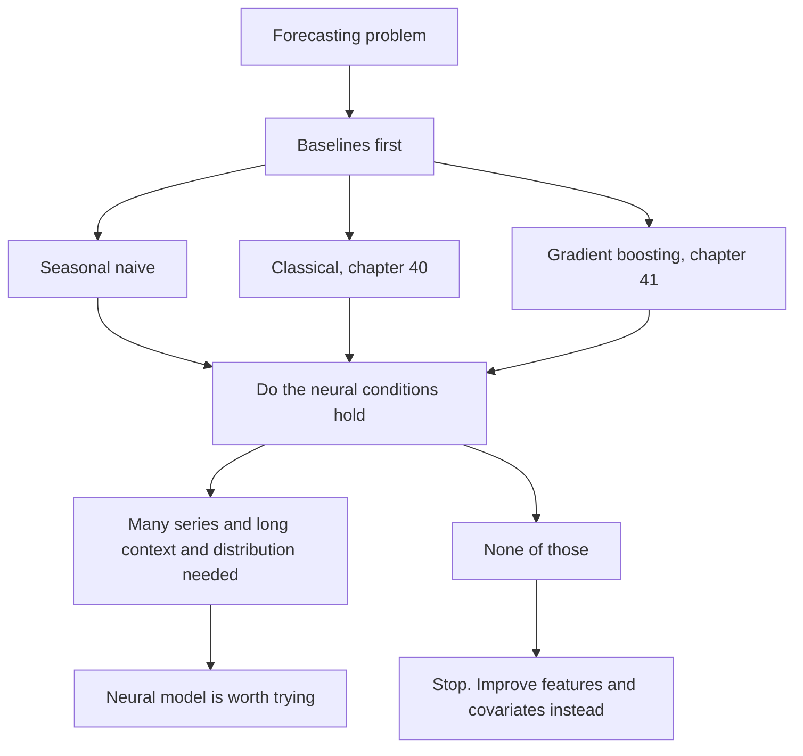
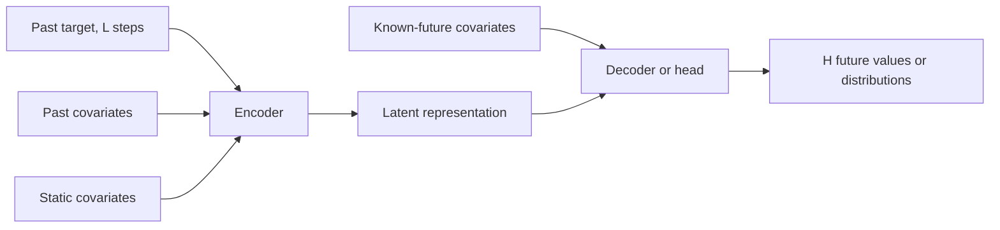
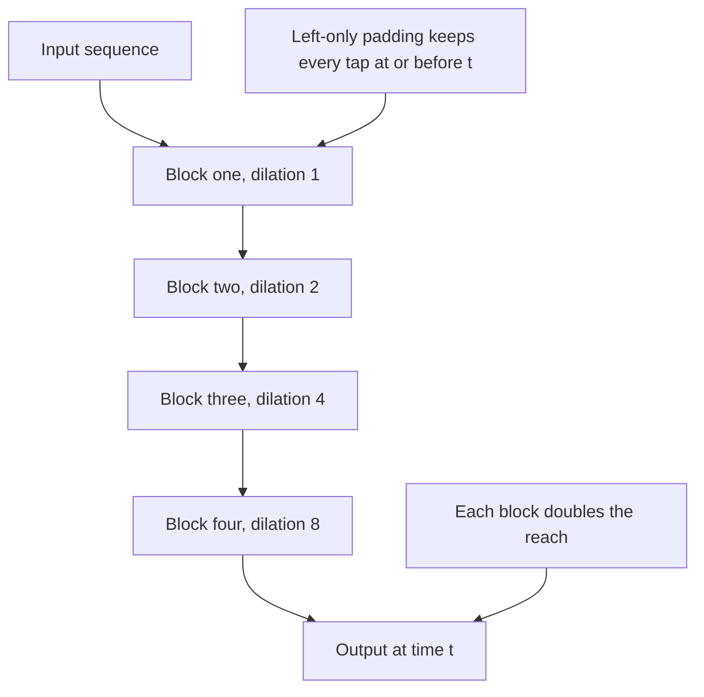
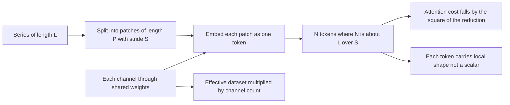
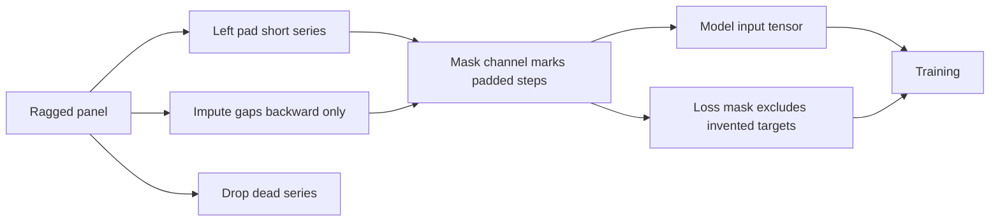
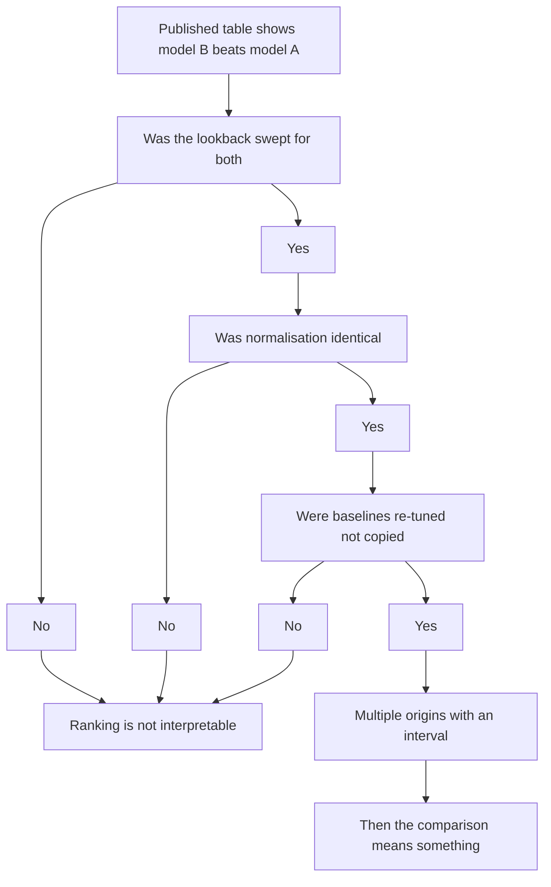
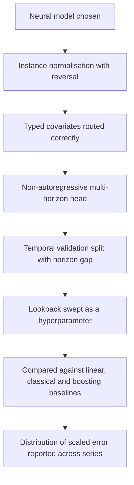

# Chapter 42: Deep Learning Architectures for Time Series

> **What this chapter covers** When a neural forecaster earns its cost and when it does not, stated before any architecture. Then the architecture families explained by mechanism rather than by name: recurrent and sequence-to-sequence forecasting with its exposure bias, temporal convolutions with the receptive field arithmetic worked out, basis expansion stacks, hierarchical interpolation, autoregressive probabilistic recurrent models, attention models with covariate and variable selection machinery, and the patching plus channel-independence idea that made transformers competitive on long sequences. It covers the linear-model result and what it exposed about evaluation in this subfield, normalisation for non-stationary series including reversible instance normalisation, covariate typing, multi-horizon output design, losses, training practicalities, and how to evaluate a time-series foundation model's zero-shot claim on your own data.
>
> **Prerequisites** Chapter 6 (how networks train), Chapter 7 (convolution, recurrence and attention as architectures), Chapter 8 (transformers), Chapter 11 (the time-series overview), Chapter 41 (the feature-based alternative you must beat).
>
> **Where it is used** Large forecasting platforms with tens of thousands of related series, energy and load forecasting, high-frequency sensor and telemetry forecasting, settings with rich covariates and long context, and anywhere a probabilistic output over a long horizon is the deliverable.

Chapter 7 owns the mechanics of convolution, recurrence and attention as general architectures. This chapter assumes them and covers only what is specific to series. Chapter 41 owns feature construction, leakage and validation for pooled models, and its rules apply here unchanged: a neural model that peeks past the cut-off is exactly as wrong as a tree that does.

---

## 42.1 Level 1: Foundations

### The honest cost accounting, first

Start with the conclusion, because burying it is how teams end up with a neural forecaster that loses to seasonal naive.

**Neural forecasters are not the default.** For most forecasting problems that a company actually has, a tuned gradient boosting model on engineered features (Chapter 41) or a well-chosen classical model (Chapter 40) is at least as accurate and far cheaper to build, run and debug. The published literature is not a fair guide to this, for reasons covered in level 3.

**They earn their cost under specific conditions.** The conditions are not subtle and you can check them before writing any code.

| Condition | Why it favours a neural model |
|---|---|
| Many series, typically thousands or more, sharing structure | Neural models have the capacity to absorb a large pooled dataset, and they are the natural home for learned per-series embeddings |
| Long context genuinely carries signal, hundreds of steps | A tree sees lags as unordered columns. A convolution or attention sees a sequence and can learn shape |
| The target's shape, not its level, is what must be predicted | Raw waveform, load curves, trajectories. Shape is what these architectures represent naturally |
| A full predictive distribution is required at every horizon | Distributional output heads are native here and awkward for trees |
| Rich typed covariates, some known into the future | Architectures exist that condition on future-known drivers correctly, which feature tables handle clumsily at long horizons |
| Multi-horizon paths must be coherent, not just marginals | One forward pass emitting a whole path is natural |
| The same model must serve new series at launch | Embedding plus static-attribute conditioning generalises, if trained for it |

**They do not earn their cost when** you have a few hundred series, short history, strong clean seasonality, a dominant driver set that is already tabular, an operations team that cannot support a GPU training pipeline, or a requirement that every forecast be explainable line by line. In those cases the neural model will cost ten times more and, in careful head-to-head comparison, usually not win.

**The rule that survives every disagreement in this chapter:** before reporting that a neural model won, show it beating seasonal naive, a tuned classical model, and a tuned gradient boosting model, on identical rolling origins, identical preprocessing and identical metrics. A large fraction of published deep forecasting gains do not survive that test.



*Figure 42.1: The gate every neural forecasting project should pass before it starts.*

### The vocabulary

| Term | Meaning |
|---|---|
| Lookback (context) window $L$ | How many past steps the network reads |
| Horizon $H$ | How many future steps it emits |
| Channel (variate) | One variable in a multivariate series |
| Static covariate | Series-level attribute, constant in time |
| Known-future covariate | Driver whose future values are available at forecast time |
| Observed-past covariate | Driver known only up to the cut-off |
| Receptive field | How many input steps can influence one output step |
| Causal | The output at step $t$ depends on no input after $t$ |
| Instance normalisation | Normalising each input window by its own statistics |
| Channel independence | Processing each variate through shared weights, without cross-variate mixing |
| Zero-shot forecasting | Forecasting a series the model was never fitted on |

### The shape of a neural forecasting problem

Every architecture in this chapter solves the same input-output problem. Given a window of $L$ past target values, plus whatever covariates are typed as available, produce $H$ future values or $H$ predictive distributions. The families differ in how they get from one to the other.



*Figure 42.2: The common shape. Every architecture family in this chapter is a different choice of encoder, head and how covariates enter.*

---

## 42.2 Level 2: Working knowledge

### Recurrent approaches and their practical limits

A recurrent network carries a hidden state $h_t$ updated at each step:

$$h_t = f(h_{t-1}, x_t), \qquad \hat y_t = g(h_t)$$

Chapter 7 derives the gating that makes this trainable. What matters for forecasting is the practical profile.

| Property | Consequence for forecasting |
|---|---|
| Sequential computation | Training time scales with sequence length and cannot be parallelised along it. A 1000-step window is slow |
| Constant-size state | Memory does not grow with context, and a single new observation updates the state cheaply. This is genuinely valuable for streaming forecasters |
| Long-range dependency is hard | Even gated units degrade well before a few hundred steps in practice |
| Variable-length input is native | No padding gymnastics for ragged panels |
| Naturally autoregressive | Fits the one-step-then-feed-back pattern, with all its problems |

The honest summary is that recurrent models are no longer the default for forecasting, but they remain a reasonable choice when the context is short, the series is updated one observation at a time, and inference must be cheap and incremental. Bai, Kolter and Koltun (2018) argued convolutional models should be the default sequence baseline instead, and for batch forecasting that argument has largely won.

### Sequence-to-sequence and teacher forcing

The encoder-decoder pattern reads the lookback with one network and emits the horizon with another. The decoder is autoregressive: it produces $\hat y_{t+1}$, then consumes it to produce $\hat y_{t+2}$.

**Teacher forcing** is the training trick that makes this tractable. During training, instead of feeding the decoder its own prediction, you feed the true value. Every step then trains from a correct input, gradients are stable, and the whole horizon can be computed in one pass because the inputs are all known.

**Exposure bias** is the cost. At inference there are no true values, so the decoder consumes its own predictions. Those have a different distribution from observations: smoother, lower variance, and carrying whatever bias the model has. The model is therefore run on inputs it never saw in training, and errors compound along the horizon. This is the same mechanism as the recursive strategy's problem in Chapter 41, level 3, arising here inside the architecture rather than in the outer loop.

| Mitigation | Mechanism | Caution |
|---|---|---|
| Scheduled sampling | Randomly substitute the model's own prediction for the true input during training, with the substitution probability annealed upward | Introduces a bias of its own, and the annealing schedule is a real hyperparameter |
| Non-autoregressive decoding | Emit all $H$ steps in one shot from the encoder state | No compounding at all, and this is why most modern forecasting architectures do it |
| Distributional propagation | Sample from the predicted distribution and propagate many paths | Gives a correct joint path distribution rather than a collapsing point path. Costs $S$ times the inference |
| Professor forcing and adversarial variants | Match the hidden state distributions under forced and free running | Research-grade complexity for modest gain in this domain |

The practical guidance is simple: prefer a non-autoregressive multi-horizon output unless you specifically need coherent sampled paths, in which case use an autoregressive probabilistic model and sample.

### Temporal convolutional networks, with the arithmetic

A temporal convolutional network is a stack of one-dimensional convolutions with two modifications.

**Causal padding.** Pad only on the left, by $(k-1)d$ for kernel size $k$ and dilation $d$, so the output at step $t$ reads inputs at $t, t-d, t-2d, \ldots$ and never $t+1$. Getting this wrong is a leak that no validation split detects, because it lives inside the model.

**Dilation.** Layer $i$ skips $d_i - 1$ inputs between taps. With $d_i$ doubling, the receptive field grows exponentially in depth rather than linearly.

The receptive field of a stack with one convolution per layer, kernel size $k$, dilations $d_1 \ldots d_L$, stride 1:

$$R = 1 + \sum_{i=1}^{L} (k - 1)\, d_i$$

With $d_i = 2^{i-1}$, the sum is a geometric series, so

$$R = 1 + (k-1)\left(2^{L} - 1\right)$$

**Worked example 1, basic.** $k = 3$, $L = 6$, dilations 1, 2, 4, 8, 16, 32. Then $R = 1 + 2 \times 63 = 127$ steps. Without dilation the same six layers reach $1 + 2 \times 6 = 13$ steps. Depth buys 127 against 13 for the same parameter count.

**Worked example 2, sizing for a target.** You need at least one full year of daily context, $R \ge 365$, with $k = 3$ and doubling dilations. Solve $1 + 2(2^L - 1) \ge 365$, so $2^L \ge 183$, so $L = 8$ and $R = 1 + 2 \times 255 = 511$. Eight dilated layers. At $L = 7$, $R = 255$, which is short of a year, so seven will not do.

**Worked example 3, residual blocks.** Most implementations use residual blocks containing two convolutions at the same dilation. The sum then has two terms per block:

$$R = 1 + 2\sum_{b=1}^{B} (k-1)\, d_b$$

With $k = 3$, doubling dilations and $B$ blocks, $R = 1 + 4(2^B - 1)$. To reach 365: $2^B \ge 92.5$, so $B = 7$ blocks, giving $R = 1 + 4 \times 127 = 509$. Seven blocks, fourteen convolutions. Count convolutions, not blocks, and check whether your implementation puts one or two in each.

**Worked example 4, when the lookback is shorter than the receptive field.** If $L = 200$ and $R = 511$, the extra receptive field is wasted: the model can only see 200 steps because that is all you fed it. Conversely if $L = 800$ and $R = 127$, the first 673 steps of every window are read by no output position, so you are paying memory for input the model cannot use. Match $R$ to $L$ within a factor of about two, and treat both as hyperparameters swept together.

**Worked example 5, parameter count.** A stack with $C$ channels, kernel $k$, $L$ layers, two convolutions per block has roughly $2 L C^2 k$ weights in the convolutions, ignoring biases and the residual projections. With $C = 64$, $k = 3$, $L = 7$ blocks: $2 \times 7 \times 64^2 \times 3 = 172{,}032$ parameters. That is small. Convolutional forecasters are usually parameter-cheap, and their cost is activations, which scale as batch times $L$ times $C$ times layers.

**Why they train faster than recurrent models.** Every output position computes independently given the input, so a window of length $L$ is one parallel operation rather than $L$ sequential ones. Gradients flow through a fixed number of layers rather than through $L$ time steps, so vanishing gradients across time do not arise. Memory is predictable and calculable in advance. The cost is that the context is bounded by $R$, whereas a recurrent state is nominally unbounded, though in practice recurrent models rarely exploit context beyond what a well-sized convolutional stack reaches anyway.

**Listing 42.1: a causal dilated block with the receptive field computed from its own configuration.**

```python
import torch
import torch.nn as nn

class CausalBlock(nn.Module):
    def __init__(self, ch, k, d):
        super().__init__()
        self.pad = (k - 1) * d                      # left-only padding keeps it causal
        self.c1 = nn.Conv1d(ch, ch, k, dilation=d)
        self.c2 = nn.Conv1d(ch, ch, k, dilation=d)
        self.act = nn.ReLU()

    def forward(self, x):                            # x: (batch, ch, time)
        h = self.act(self.c1(nn.functional.pad(x, (self.pad, 0))))
        h = self.act(self.c2(nn.functional.pad(h, (self.pad, 0))))
        return x + h                                 # residual keeps deep stacks trainable

def receptive_field(k, dilations, convs_per_block=2):
    return 1 + convs_per_block * sum((k - 1) * d for d in dilations)

# k=3, seven blocks of doubling dilation, two convolutions each
print(receptive_field(3, [1, 2, 4, 8, 16, 32, 64]))   # 509
```

`nn.functional.pad(x, (self.pad, 0))` pads `self.pad` zeros on the left and none on the right, which is the entire causality guarantee. A symmetric padding argument, or `padding=` on the convolution itself, pads both sides and lets the output at $t$ see inputs after $t$. That is a leak inside the model and it will not show up in any data split. The residual addition requires input and output channel counts to match; when they do not, implementations insert a one-by-one convolution on the skip path. The helper reproduces the arithmetic above so the configuration and the claimed context cannot drift apart.



*Figure 42.3: Dilated causal stacking. Depth buys exponential reach, and left-only padding is what makes it legal.*

### Covariate typing and how each kind enters

This is the part of neural forecasting design that most directly determines whether the model is correct, and it is frequently handled by accident.

| Kind | Example | Available at inference for | Where it enters |
|---|---|---|---|
| Static | Product category, store region, sensor model | All steps | Embedded once, then broadcast to every step, or used to condition normalisation and output heads |
| Known-future | Calendar, planned promotion, scheduled maintenance, price already set | Past and future | Both encoder and decoder. The decoder for step $t+h$ must receive the covariate dated $t+h$ |
| Observed-past | Realised weather, realised traffic, competitor action | Past only | Encoder only. Feeding it to the decoder is a leak |
| Target lags | The series itself | Past only | Encoder only |

The single most common architectural leak is routing an observed-past covariate into the decoder because the training tensor happened to contain its future values. Enforce it structurally: build separate tensors for known-future and observed-past covariates, and let the decoder accept only the first. A shape mismatch then prevents the leak, rather than a code review having to catch it.

The second most common error is using realised weather in training and forecast weather at inference. The model learns a relationship with a variable it will never see. If you will serve on forecasts, train on forecasts, including their errors, which means storing historical forecast vintages.

### Multi-horizon output design

| Design | Mechanism | Trade-off |
|---|---|---|
| Single-step head, applied recursively | One output, fed back | Compounding and exposure bias. Avoid unless sampling paths |
| Direct multi-output head | A dense layer emitting $H$ values from the final representation | Simple, no compounding, $H$ times more output parameters. The common default |
| Horizon-indexed head | Shared head that takes a horizon embedding | Fewer parameters, handles variable $H$, slight accuracy cost |
| Basis coefficient head | Emit coefficients of a basis, reconstruct the path | Smooth by construction, fewer outputs, interpretable if the basis is |
| Quantile heads | $Q$ outputs per horizon, one per quantile | Gives intervals directly. See Chapter 43 |
| Distribution parameter head | Emit the parameters of a chosen distribution per horizon | Full predictive distribution, but the distribution choice is a modelling commitment |

### How much data is enough

A common project failure is committing to a neural architecture on a panel that cannot support one. There is no exact threshold, but the arithmetic gives a useful sanity check.

The number of training windows available is

$$W = \sum_{i=1}^{N} \max\!\left(0, \left\lfloor \frac{T_i - L - H}{S_w} \right\rfloor + 1\right)$$

where $N$ is the series count, $T_i$ the length of series $i$, $L$ the lookback, $H$ the horizon and $S_w$ the stride between windows.

**Worked example.** $N = 2000$ series, $T_i = 1000$ steps each, $L = 336$, $H = 96$, stride 1. Then $W = 2000 \times (\lfloor 568/1 \rfloor + 1) = 1{,}138{,}000$ windows. That looks generous. But adjacent windows share 335 of 336 input steps, so the independent information is far smaller. A more honest count uses a stride equal to the horizon: $W = 2000 \times (\lfloor 568/96 \rfloor + 1) = 2000 \times 6 = 12{,}000$ effectively distinct windows. Twelve thousand examples is a small dataset for a model with millions of parameters, and it explains why heavy regularisation, weight sharing and ensembling are standard in this field.

Two consequences follow. First, prefer width over depth and share weights aggressively, because parameter count is the binding constraint far more often than capacity to represent the function. Second, when the honest window count is in the low thousands, a linear model, a tree model or a classical method is very likely to win, and the neural project should not start.

### Loss functions

| Loss | Optimal predictor | Use when |
|---|---|---|
| Mean squared error | Conditional mean | You need an expectation, for example a total to be summed |
| Mean absolute error | Conditional median | Skewed or spiky series, or when you report absolute error |
| Huber | Mean, robustified | Outlier-prone series where squared error is destabilising |
| Pinball at quantile $\tau$ | The $\tau$ quantile | Interval and service-level targets. See Chapter 43 |
| Negative log likelihood of a parametric head | Full distribution | Probabilistic forecasting with a defensible distributional assumption |
| Scaled absolute error on a per-series scale | Median, comparably across series | Pooled training over heterogeneous series |

Two rules. Match the training loss to the evaluation metric, or know exactly why you are not. And when pooling across series of different magnitude, apply the per-series scaling from Chapter 41 before the loss, or the largest series will dominate the gradient entirely.

### Training practicalities

**Windowing and sampling.** Training examples are sliding windows. The decisions are the stride between windows, whether to sample windows uniformly or weight them, and how to handle series shorter than $L + H$.

- Stride 1 gives the most examples and the most redundancy, since adjacent windows overlap in $L-1$ of $L$ steps. A stride of a few steps often trains just as well and much faster.
- Sample windows in proportion to series length and you train mostly on your longest series. Sample uniformly across series and you over-weight short ones. Neither is obviously right; state which you chose.
- Weight sampling toward recent windows if the process drifts, subject to the seasonal caution in Chapter 41.

**Batch construction across series.** A batch usually mixes windows from many series. This is what makes the model global. Two things to check: that per-series normalisation happens before batching so magnitudes are comparable, and that the batch is not accidentally sorted by series, which correlates the gradient within a batch.

**Early stopping on a temporal split.** The validation set must be later in time than the training set, for every series, and separated by at least $H$ so no training window's target lies in it. Early stopping on a random split of windows is the standard way to produce a model that looks excellent and forecasts badly, because overlapping windows put near-duplicates of training examples in validation.

**Hyperparameters that actually matter**, in rough order:

1. Lookback length $L$. Frequently the single largest lever, and frequently untuned.
2. The normalisation scheme (next section). This is not a detail.
3. Learning rate and its schedule.
4. Model width, far more than depth, in most forecasting architectures.
5. Dropout and weight decay, which matter more here than in vision because the effective sample size is small relative to the window count.
6. Batch size, mostly through its interaction with the learning rate.

Hyperparameters that usually matter less than people expect: the exact activation, the optimiser choice among modern adaptive ones, and small changes in depth.

---

## 42.3 Level 3: Depth

### Basis expansion stacks with interpretable blocks

The idea: instead of mapping the input window straight to $H$ outputs, have each block emit coefficients over a fixed basis, and reconstruct both a backward reconstruction of the input (the backcast) and a forward forecast.

The mechanism, stated as a recursion. Let $x^{(1)}$ be the input window. Block $b$ produces coefficients, from which it reconstructs a backcast $\hat x^{(b)}$ and a forecast $\hat y^{(b)}$. Then

$$x^{(b+1)} = x^{(b)} - \hat x^{(b)}, \qquad \hat y = \sum_{b} \hat y^{(b)}$$

Each block subtracts what it explained from the input, so the next block sees only the residual, and the final forecast is the sum of what all blocks contributed. This is gradient boosting's structure expressed as a differentiable stack, and it is why the architecture is stable to train despite being deep and fully connected.

**Where interpretability comes from.** In the generic configuration the basis is learned and the blocks mean nothing individually. In the interpretable configuration you constrain the basis:

- A trend block's basis is low-order polynomials in normalised time, so its forecast is $\sum_{p=0}^{P} \theta_p (h/H)^p$ with small $P$, typically 2 or 3. It can only emit a smooth trend.
- A seasonality block's basis is sines and cosines at harmonics of the seasonal period, so its forecast is a Fourier series and can only emit a periodic shape.

Because the blocks are constrained, their individual outputs are readable as a trend component and a seasonal component, and they sum to the forecast. This gives the decomposition of Chapter 39 as a by-product of the architecture rather than as a preprocessing step.

**Worked sizing example.** Horizon $H = 28$, trend block with $P = 3$, so 4 polynomial coefficients forward and 4 backward. Seasonality block with harmonics up to $\lfloor H/2 \rfloor$ capped at, say, 10, so 20 coefficients forward (sine and cosine per harmonic) and 20 backward. The block's fully connected trunk maps $L$ inputs to a width-$W$ hidden representation through 4 layers, then a linear map to the coefficient count. With $L = 112$, $W = 512$: trunk parameters are roughly $112 \times 512 + 3 \times 512^2 \approx 843{,}000$ per block, and the coefficient heads add only a few thousand. Stack 30 blocks and you are at about 25 million parameters. That is large for the data volume in most forecasting problems, which is why weight sharing across blocks within a stack is the usual configuration and why heavy ensembling is part of the published recipe.

The original architecture of this family is N-BEATS (Oreshkin and colleagues, 2020), which reported beating the M4 competition winner using no time-series-specific components in its generic form.

### Hierarchical interpolation for long horizons

The problem this solves: at horizon 500, a direct output layer must emit 500 numbers, which is 500 times the output parameters and 500 opportunities for high-frequency noise in a forecast that is mostly smooth.

The mechanism has two coupled parts.

**Multi-rate input sampling.** Before each stack, pool the input window with a different kernel size. A large pooling kernel produces a short, smoothed input, which makes the block see only low-frequency structure. A small kernel preserves detail. Different stacks therefore specialise in different frequency bands without being told to.

**Hierarchical interpolation on the output.** Each stack emits only $\lceil H \times r \rceil$ coefficients for an expressiveness ratio $r \le 1$, and those are interpolated up to the full horizon $H$, usually linearly or cubically. A stack with $r = 0.02$ and $H = 500$ emits 10 numbers that are interpolated to 500, so it can only express a smooth, slow component. A stack with $r = 1$ emits all 500 and can express anything.

**Worked example.** $H = 480$ half-hourly steps, which is 10 days. Three stacks with $r = 1/24$, $1/4$ and $1$. They emit 20, 120 and 480 coefficients. The first can represent structure no faster than about a daily cycle, since 20 points over 10 days is two per day. The second reaches roughly two-hourly detail. The third is unconstrained. Total output parameters across stacks are $20 + 120 + 480 = 620$ against $3 \times 480 = 1440$ for three unconstrained stacks, a 57 percent reduction, and the low-rate stacks are strongly regularised toward smoothness.

The combination is what gives the accuracy and the compute reduction on long horizons reported for N-HiTS (Challu and colleagues, 2023).

### Autoregressive probabilistic recurrent models

The mechanism: a recurrent encoder over the lookback produces a state; at each horizon step the network emits the parameters of a probability distribution rather than a point; training maximises the likelihood of the observed value under that distribution; forecasting samples a value, feeds it back, and repeats, producing many sampled paths.

$$\theta_{t} = g(h_t), \qquad y_t \sim p(\cdot \mid \theta_t), \qquad \mathcal{L} = -\sum_t \log p(y_t \mid \theta_t)$$

Three design points carry all the weight.

**The distribution choice is a modelling decision, not a default.** Gaussian for continuous roughly symmetric data. Student's t when tails are heavy. Negative binomial for overdispersed counts, which is the usual choice for retail demand because the variance exceeds the mean. A zero-inflated or two-part distribution for intermittent demand. Choosing Gaussian for count data produces negative forecasts and badly calibrated intervals, and it is the most common error in this family.

**Scaling must happen inside the model.** Because the network pools across series of wildly different magnitude, the standard design divides each series by a per-series scale before the network and multiplies the distribution parameters back afterwards. Without it, the largest series dominates the likelihood.

**Sampling gives a joint path, not marginals.** Because each step conditions on the sampled previous step, the $S$ sampled paths carry the temporal dependence. That is what lets you compute the distribution of a sum over the horizon, which is what an inventory decision actually needs. A model emitting independent marginal quantiles per horizon cannot do this. This is a real advantage of the autoregressive form and the main reason it persists.

The canonical design of this family is DeepAR (Salinas and colleagues, 2020), which established the global probabilistic recurrent pattern that most production forecasting platforms still implement.

### Attention-based models with covariate handling and variable selection

The naive application of a standard transformer to a series has three problems. Attention cost is quadratic in sequence length. A single timestamp is a scalar, which carries far less information than a word token, so point-wise attention has little to attend to. And there is no native place for typed covariates.

The attention family that addressed the covariate problem explicitly, exemplified by the Temporal Fusion Transformer (Lim and colleagues, 2021), adds four mechanisms on top of attention. Each is worth understanding as a mechanism because each recurs elsewhere.

**Variable selection networks.** At each time step, a small gated network computes softmax weights over the input variables and forms a weighted combination. This does two things: it lets the model ignore irrelevant covariates rather than having to learn zero weights deep in the network, and the weights are readable as a per-step variable importance. Separate selection networks run for static, known-future and observed-past inputs.

**Static covariate encoders.** Static features are embedded once and then injected as context in four places: to initialise the local processing state, to condition the variable selection, and to condition the enrichment of the temporal features. This is more effective than the usual approach of tiling a static value across every time step, because it influences the computation rather than merely appearing in it.

**Gated residual connections everywhere.** Each sublayer is wrapped as $\text{output} = \text{LayerNorm}(x + \text{GLU}(f(x)))$, where the gated linear unit can shut the sublayer off entirely. On small datasets the network can therefore reduce to a much simpler model, which is the practical form of capacity control in this architecture.

**Local processing before attention.** A sequence-to-sequence layer processes the sequence locally first, so that attention operates on representations that already carry local shape, rather than on raw scalars. This is the same motivation that leads to patching, solved differently.

Interpretability from attention weights in this family is real but limited. Attention weights show where the model looked, which is not the same as what changed the output. Treat them as a diagnostic, not as an explanation, and validate any claim with an ablation.

### Patching and channel independence

These are two separate ideas that arrived together and are often conflated. Both are transferable to architectures other than the one they appeared in.

**Patching.** Instead of one token per timestamp, group $P$ consecutive timestamps into a patch and embed the patch vector as one token. With stride $S$ between patch starts, the number of tokens for a lookback $L$ is

$$N = \left\lfloor \frac{L - P}{S} \right\rfloor + 1$$

Three consequences.

1. **Cost.** Attention is quadratic in token count, so cost falls by roughly $(L/N)^2$. With $L = 512$, $P = 16$, $S = 8$: $N = \lfloor 496/8 \rfloor + 1 = 63$. The attention matrix shrinks from $512^2 = 262{,}144$ entries to $63^2 = 3{,}969$, a factor of 66.
2. **Semantics.** A patch of 16 consecutive values carries local shape, a trend and a level. A single scalar carries none of those. The token now means something, which is what attention needs.
3. **Reach.** At a fixed attention budget you can afford a lookback $P/S$ times longer than before. That is the practical reason long-context forecasting became feasible with transformers.

The cost is resolution: the model cannot attend at finer granularity than a patch, so genuinely high-frequency structure within a patch must be captured by the patch embedding rather than by attention.

**Channel independence.** In a multivariate series with $C$ variates, the alternative to mixing channels at every step is to push each channel through the same network separately, sharing all weights, and to combine only at the output if at all.

Why this often wins, which is counterintuitive:

- It multiplies the effective training set by $C$, since each channel is now a training example for the shared weights.
- It removes an enormous number of cross-channel parameters that mostly fit noise, because genuine cross-channel structure is usually weaker than within-channel temporal structure.
- It makes the model robust to a channel being added, removed or reordered, which matters operationally.
- It prevents one high-variance channel from corrupting the representation of the others.

Why it sometimes loses: when there is real, stable, exploitable cross-variate structure, for example strongly coupled physical sensors, independence discards it by construction. The honest position is that channel independence is a strong default that must be measured against a mixing variant, not a universal truth. Both the patching and the channel-independence findings come from Nie and colleagues (2023). The inverted-axis alternative, where each variate becomes a token and attention runs across variates rather than across time, is iTransformer (Liu and colleagues, 2024), and it is the natural counter-proposal for cases where cross-variate structure matters.

**Worked example of the token budget.** You want a 2000-step lookback on a 7-variate series with a token budget of 128 per forward pass. Under channel independence the budget applies per channel, so you need $N \le 128$ for $L = 2000$. With non-overlapping patches, $P = S$, we need $\lfloor (2000 - P)/P \rfloor + 1 \le 128$, so $2000/P \le 128$, so $P \ge 15.6$, take $P = 16$ giving $N = 125$. With channel mixing at the token level the budget must cover all channels, $7 \times 125 = 875$ tokens, which is 49 times the attention cost. That arithmetic alone explains much of the popularity of channel independence.



*Figure 42.4: Patching and channel independence, the two changes that made transformers practical on long series.*

### Positional information, which series need differently from text

Attention is permutation invariant, so position must be supplied. Chapter 8 covers the standard schemes. Two things differ for series.

**Absolute position within the window is usually less useful than you expect.** In text, position 1 is the start of the sentence and means something. In a sliding forecast window, position 1 is an arbitrary point in history that changes with every cut-off. What matters is the position relative to the cut-off, and relative encodings, which encode the distance between two positions rather than their indices, tend to suit this better.

**Calendar position is a separate and often stronger signal.** A step's day of week, hour of day and position in the year are known exactly and carry real periodic structure. Supplying them as covariate channels is more informative than any learned positional encoding, and it generalises to positions the model never saw. The common mistake is to add a learned positional embedding and omit the calendar, which supplies an arbitrary index where a meaningful one was available.

For patched models, position is per patch rather than per step. A patch embedding can carry within-patch position implicitly, because the ordering of values inside the patch is fixed by the embedding's weights, so no extra encoding is needed inside a patch. Between patches, the usual schemes apply.

### Normalisation for non-stationary series

This is the part of neural forecasting that most reliably decides whether the model works, and it is usually described as a preprocessing detail.

**The problem.** A window from 2019 has a different level and scale from a window from 2024 in the same series. A window from a large series has a different magnitude from one from a small series. A network trained on the mixture must spend capacity on representing level and scale rather than on shape, and at inference it meets levels outside its training range. This is the neural analogue of the tree extrapolation problem in Chapter 41, level 3, and it bites for a different reason: not a hard bound, but a distribution shift in the network's inputs and outputs.

**Global normalisation** uses one mean and standard deviation for the whole dataset. It fixes nothing here, because the shift is within and across series, not global.

**Per-series normalisation** uses each series' own training statistics. It fixes the cross-series magnitude problem and none of the within-series drift problem.

**Instance normalisation** normalises each input window by that window's own statistics:

$$\tilde x_{t} = \frac{x_t - \mu_w}{\sqrt{\sigma_w^2 + \epsilon}}, \qquad \mu_w = \frac{1}{L}\sum_{i=1}^{L} x_i, \qquad \sigma_w^2 = \frac{1}{L}\sum_{i=1}^{L}(x_i - \mu_w)^2$$

Now every window the network sees has mean zero and unit variance regardless of when it came from or which series it belongs to. The network only has to model shape.

**The catch, and the reversible fix.** If you normalise the input by window statistics, the output is in normalised units and must be mapped back. Naively multiplying by $\sigma_w$ and adding $\mu_w$ is exactly right, and that round trip is the whole idea of **reversible instance normalisation** (Kim and colleagues, 2022). Stated as a procedure:

1. Compute $\mu_w, \sigma_w$ from the lookback window only. Never from the horizon, which would be a leak.
2. Normalise the input, optionally with a learned affine rescale $\gamma \tilde x + \beta$ so the network can adjust the normalised representation.
3. Run the network.
4. Undo the learned affine, then multiply by $\sigma_w$ and add $\mu_w$.

**Why it matters so much.** It converts the forecasting problem from "predict the level and the shape" to "predict the shape, given that the level is carried around the network". Level is the part that drifts. Shape is the part that is stationary and learnable. Splitting them is what lets a model trained on 2019 windows forecast 2024 windows. In published ablations this single change accounts for a large share of the gap between architectures, which is why comparing two architectures where one has it and the other does not tells you nothing about the architectures.

**Worked example.** A series has level 100 in the training period and level 400 in the test period, with the same relative weekly shape and a standard deviation of 10 percent of the level. Without instance normalisation the network's final layer must emit values near 400 when every training target was near 100, which either saturates or extrapolates poorly. With instance normalisation, the training window is normalised to mean 0 and standard deviation 1, and so is the test window. The network sees the same input distribution in both periods and predicts the same normalised shape. The de-normalisation step multiplies by the test window's own standard deviation of 40 and adds its own mean of 400, and the forecast lands in the right place. The network never had to learn the number 400.

**What it costs.** It removes the level from the model's view, so if the level genuinely predicts the shape, for example if high-volume periods have different seasonality, the model can no longer condition on it. The remedy is to feed the window statistics back in as explicit features, so the information is available as a covariate rather than as a magnitude. Several architectures do this and it is worth doing.

| Scheme | Fixes cross-series magnitude | Fixes within-series drift | Leak risk |
|---|---|---|---|
| None | No | No | None |
| Global | No | No | Low if fitted in-fold |
| Per-series, training statistics | Yes | No | Leaks if statistics use the test period |
| Instance, window statistics | Yes | Yes | Leaks if statistics use the horizon |
| Reversible instance with learned affine | Yes | Yes | Same, plus the output path must reverse exactly |
| Differencing the input | Partly | Yes | None, but discards level entirely |

### Missing values, ragged panels and variable-length windows

A neural forecaster reads a fixed-shape tensor. Real panels are ragged: series start at different times, end at different times, and contain gaps. How you resolve that shape mismatch is a modelling decision and it is usually made by whoever wrote the data loader.

| Situation | Handling | Consequence of getting it wrong |
|---|---|---|
| Series shorter than $L + H$ | Left-pad with zeros and supply a mask, or exclude the series | Padding without a mask teaches the model that new series begin with a long flat run at zero, which it then forecasts |
| Gaps inside the window | Impute with a backward-looking method and add a missingness indicator channel | Imputing with interpolation uses the future value. Chapter 41 makes the same point for tables |
| Series that end, for example a discontinued product | Exclude from training after the end date | Otherwise the model learns that decline to zero is a normal ending and applies it to live series |
| Irregular sampling | Resample to a regular grid with an elapsed-time channel, or use an architecture designed for irregular inputs | Treating irregular observations as regular silently distorts every lag relationship |
| Different series lengths in a batch | Pad to the batch maximum with a mask applied in the loss | A loss computed over padded positions trains the model on invented targets |

The missingness indicator channel is the cheap technique that is worth making standard. Add one binary channel per imputed variable, set to 1 where the value was imputed. The model can then learn to discount imputed regions rather than treating them as observations, and you get a free diagnostic: if the indicator channel carries large learned weight, your imputation is doing more work than you thought.

The mask in the loss is the corresponding rule on the output side. Every padded or imputed target position must be excluded from the loss, not merely set to zero, or the gradient contains fabricated signal. Verify this by training on a panel where one series is entirely padding and checking that its gradient contribution is exactly zero.



*Figure 42.5: Turning a ragged panel into a fixed-shape tensor, with the two masks that keep it honest.*

### Mixer and pure feed-forward families


Between the linear model and the transformer sits a family that is neither: stacks of fully connected layers applied alternately across the time axis and across the feature or channel axis, with normalisation and residual connections between them. They are usually called mixers, by analogy with the vision architecture that introduced the pattern.

The mechanism is worth stating because it explains why they compete with attention. Given a representation of shape (channels, time), a **time-mixing** layer applies a shared fully connected map along the time axis, so every output time position is a learned linear combination of all input time positions followed by a nonlinearity. A **channel-mixing** layer applies a shared map along the channel axis at each time position. Alternating the two lets information move in both directions, which is what attention also achieves, but with a fixed learned mixing pattern rather than an input-dependent one.

| Property | Consequence |
|---|---|
| Mixing weights are fixed after training, not computed per input | Much cheaper than attention, and no quadratic term |
| Time mixing is global by construction | One layer reaches the whole lookback, unlike a convolution which needs depth |
| No input-dependent routing | Cannot change what it attends to based on content. This is the real capacity difference from attention |
| Parameter count grows with the lookback | A time-mixing layer over $L$ positions has $L^2$ weights, so long lookbacks are expensive in parameters |

**Worked example of the parameter trade.** A time-mixing layer over $L = 512$ positions has $512^2 = 262{,}144$ weights, which must be learned. An attention layer over 512 positions has parameters independent of $L$, four projection matrices of size $d \times d$, but computes a $512 \times 512$ matrix at every forward pass. So the mixer pays in parameters and the transformer pays in computation. At long lookbacks with limited data, the mixer's parameter cost is often the binding constraint, which is why patching helps both families: reducing 512 positions to 63 patches cuts the mixer's time-mixing weights from 262,144 to 3,969 as well.

Empirically these architectures are competitive with transformers on the standard long-horizon benchmarks at a fraction of the cost, which is itself evidence for the level 3 argument that input-dependent routing is not where the gains on those benchmarks came from. TSMixer (Ekambaram and colleagues, 2023) is a representative design in this family. Note when searching that two distinct 2023 papers carry the name TSMixer, from different groups, with different architectures in the same mixer spirit. Check which one a benchmark table means before comparing numbers against it.

### Ensembling, which is not optional here

Neural forecasters have unusually high run-to-run variance. Two runs of the same architecture on the same data with different random seeds can differ by more than the gap between two published architectures. This is a direct consequence of the small effective sample size computed in level 2: the loss surface has many comparable minima and the seed decides which one you land in.

The practical consequences are three.

1. **A single run is not a result.** Report the mean and spread over at least five seeds. A comparison between two architectures where each was run once is measuring seed variance. Several published comparisons in this subfield did exactly that.
2. **Ensembling gives a large, cheap gain.** Averaging the forecasts of several seeds typically improves accuracy by more than most architectural changes, and the published recipes for the basis expansion family depend on it heavily, ensembling over seeds, over lookback lengths and over loss functions.
3. **Diversify along the axes that matter.** Seed is the cheapest axis. Lookback length is usually the most productive, because different lookbacks capture different structure. Loss function is next: an ensemble of a mean-optimal and a median-optimal model is better behaved than either. Architecture diversity helps least, which is itself informative.

**Worked example of the budget question.** A single model takes 40 minutes to train. A 10-member seed ensemble takes 400 minutes of training and 10 times the inference cost. If the accuracy gain is 4 percent of scaled error, compare it against what 400 minutes spent on feature and covariate work would buy, which in a driver-heavy domain is usually more. Ensembling is cheap relative to research time and expensive relative to serving budget, so the decision depends on which is binding.

### Computational sizing before you commit

Estimate the cost before building, because the answer often decides the architecture.

**Activation memory** dominates training memory for these models, not parameters. For a batch of $B$ windows, lookback $L$, model width $d$ and $M$ layers, the activations stored for backpropagation are on the order of

$$\text{bytes} \approx B \times L \times d \times M \times b \times c$$

where $b$ is bytes per value and $c$ is a small constant, typically 2 to 5, covering the intermediate tensors each layer retains.

**Worked example.** $B = 256$, $L = 512$, $d = 128$, $M = 6$, bfloat16 so $b = 2$, and $c = 4$. Then the estimate is $256 \times 512 \times 128 \times 6 \times 2 \times 4 = 805$ MB. That fits on a modest accelerator. Raise the lookback to 2048 and it becomes 3.2 GB, which does not leave room for much else on an 8 GB device, and you would reach for a smaller batch, gradient checkpointing, or patching to cut the effective sequence length. Patching with $P = S = 16$ reduces 2048 positions to 128 tokens, taking the estimate back to 201 MB.

**Attention memory** adds a term that is quadratic in tokens: $B \times \text{heads} \times N^2 \times b$ per attention layer, unless a memory-efficient attention implementation is used. With $B = 256$, 8 heads, $N = 512$ and $b = 2$, that is $256 \times 8 \times 512^2 \times 2 = 1.07$ GB per layer, which is why patching is not a refinement but a requirement at long lookbacks.

**Inference cost per forecast** is what production cares about. For a panel of $N$ series and a single batched forward pass per series, the cost is one forward pass times $N$, plus the feature or window assembly. Compare that honestly against a tree ensemble, where a batched prediction over the same $N$ series typically costs milliseconds on a single CPU. The neural model must justify a difference that is often two orders of magnitude in serving cost, and in many production settings it does not.

### The linear-model result and what it exposed

This is the most instructive episode in recent time-series deep learning, and it is about evaluation practice rather than about any architecture.

**What happened.** Between 2021 and 2022 several transformer architectures for long-horizon forecasting were published, each reporting improvements over the last on a standard set of benchmark datasets covering electricity, traffic, weather and exchange rates. Zeng and colleagues (2023), in a paper titled *Are Transformers Effective for Time Series Forecasting?*, showed that a model consisting essentially of a single linear layer mapping the lookback window directly to the horizon, applied to a decomposed series, matched or beat those published results on most of those benchmarks. The paper called its variants DLinear and NLinear.

**Why it mattered more than the model.** The linear model has a few thousand parameters and trains in seconds. If it matches a transformer with millions of parameters, one of three things is true: the benchmarks do not contain the structure transformers are good at, the transformer baselines were badly tuned, or the evaluation protocol favoured whatever the reported numbers came from. Investigation suggested elements of all three.

**The specific practices it exposed**, which generalise well beyond this subfield:

| Practice | Problem |
|---|---|
| Baselines carried forward from prior papers rather than re-tuned | The new model is tuned on the benchmark and the baselines are not, which manufactures a gap with no method behind it |
| The lookback length treated as fixed | Several of the transformers were evaluated at a short lookback where they performed best, while linear models improve monotonically with longer lookbacks. Sweeping the lookback per model changes the ranking |
| Benchmarks with strong deterministic seasonality | On a series that is nearly periodic, the optimal forecast is close to a linear function of the recent window. These datasets do not discriminate between architectures |
| A single train-validation-test split, no rolling origins | One split, one number, no interval. Differences within noise get reported as improvements |
| No seasonal naive or classical baseline at all | Many papers in the subfield did not report what the simplest possible forecast achieves |
| Normalisation differences between compared models | Reversible instance normalisation alone moves results substantially, so an architecture with it versus one without is not an architecture comparison |
| Metric computed on normalised data | Reporting mean squared error on standardised values makes numbers comparable across datasets but obscures practical significance |

**What it did not show.** It did not show transformers are useless for forecasting. Subsequent work, in particular the patching result, recovered clear transformer advantages on the same benchmarks once the tokenisation and normalisation issues were addressed, and the strongest current results on long-horizon benchmarks come from transformer and mixer architectures rather than from plain linear models. The correct conclusion is narrower and more useful: **published gains in this subfield were substantially an artifact of evaluation practice, and you cannot read a ranking of architectures off a table of published numbers.** You must re-run the comparison yourself, on your data, with the lookback swept per model and the normalisation held constant.

**What to take into your own work.** Always include a linear model mapping the lookback directly to the horizon as a baseline. It costs almost nothing, it is genuinely competitive on strongly seasonal data, and if your architecture cannot beat it you have learned that quickly rather than after a quarter of engineering.



*Figure 42.6: The four questions that decide whether a published architecture comparison carries information.*

---

## 42.4 Level 4: Mastery

### Foundation models for time series, assessed honestly

A time-series foundation model is pretrained on a large, heterogeneous collection of series and then asked to forecast a series it has never been fitted on. That is what "zero-shot" means here: no gradient step on your data. The published models in this line include Chronos (Ansari and colleagues, 2024), which tokenises scaled and quantised values and trains a language-model architecture on them; Lag-Llama (Rasul and colleagues, 2023); TimesFM (Das and colleagues, 2024), a decoder-only patched architecture; Moirai (Woo and colleagues, 2024), which handles multiple frequencies and variates; and the commercial TimeGPT.

**What appears to be established.**

1. Zero-shot forecasting on a genuinely unseen series is possible and is often much better than a random or naive forecast. That was not obvious beforehand and it is a real result.
2. On short series, on new series, and in the cold-start regime generally, a pretrained model is frequently competitive with or better than anything you can fit locally, because there is nothing to fit.
3. As an immediate baseline requiring no training, they are useful. Producing a reasonable forecast for 50,000 series in an afternoon with no pipeline has operational value even if a fitted model later beats it.

**What is genuinely uncertain.**

1. Whether zero-shot beats a properly fitted model when you do have adequate history. The evidence is mixed and depends heavily on the comparison's quality. Against an untuned baseline, zero-shot often wins. Against a tuned global gradient boosting model on a domain with rich covariates, usually not.
2. Contamination. The pretraining corpora are large and draw on public repositories that include the standard benchmark datasets. A zero-shot number on a public benchmark may not be zero-shot at all. Authors have varied in how carefully they address this, and it is difficult to verify from outside.
3. Covariate handling. The great majority of the value in commercial forecasting comes from drivers: promotions, prices, events, weather. Foundation models are primarily univariate or weakly covariate-aware, and where covariates dominate they are structurally handicapped.
4. Whether scaling continues. The language-model scaling story rests on a near-unlimited corpus of text. The supply of public, high-quality, diverse time series is far smaller, and synthetic augmentation has unclear returns.

**The defensible position** is that these models are a strong cold-start and quick-baseline tool, a genuine research advance, and not yet a replacement for a fitted model on a problem where you have history and drivers. Anyone stating either "they replace forecasting pipelines" or "they are hype" is ahead of the evidence in one direction or the other.

### How to evaluate a zero-shot claim on your own data

Do not argue about the literature. Run this protocol, which takes about a day and settles the question for your setting.

1. **Hold out properly.** Use the same rolling origins you use for every other method, with the same horizon and the same gap. Do not use the vendor's or the paper's split.
2. **Check for contamination.** If your series are public, or derived from a public source, assume they may be in the pretraining corpus. If they are private, you have a clean test, which is an advantage you should use. State which case you are in.
3. **Fix the input window.** Feed the model exactly the history available at each cut-off, no more. It is easy to accidentally pass a whole series including the evaluation period, and some interfaces make that the path of least resistance. Verify by feeding a truncated series and checking the forecast changes.
4. **Run the baseline ladder.** Seasonal naive, a classical method, a tuned global gradient boosting model, and if you have one, your incumbent production model. Identical origins, identical metric.
5. **Use a scaled metric and report the distribution.** Median scaled error across series, interquartile range, and the fraction of series where zero-shot beats each baseline. A mean is dominated by your largest series.
6. **Separate the regimes.** Report separately for series with abundant history, series with little history, and new series. The interesting result is almost always that zero-shot wins in the low-history regime and loses in the high-history regime, and a pooled number hides that.
7. **Test the covariate gap.** If drivers matter in your domain, measure how much your fitted model loses when you remove them. That number is the handicap a univariate foundation model carries and it is often decisive.
8. **Measure the cost.** Inference latency and cost per series per forecast, against the amortised training plus inference cost of the fitted alternative. A model that is 2 percent better and 50 times more expensive per forecast is a different decision from one that is 2 percent better and free.
9. **Try fine-tuning.** If zero-shot is close, a short fine-tune on your panel frequently closes the gap and is much cheaper than training from scratch. This is often the operationally correct answer and it is under-discussed.
10. **Re-run quarterly.** This field is moving fast enough that a result from a year ago is not evidence about today.

### Transfer and fine-tuning across panels

Between training from scratch and zero-shot use sits the option most teams should consider first, and it is under-discussed because it is less interesting than either extreme.

**Fine-tuning a pretrained model on your panel.** Take a foundation model or a model trained on a related panel and continue training on yours, usually at a low learning rate for a small number of epochs. This is cheap, it typically closes most of the gap to a from-scratch model, and it is far more robust on small panels because the representation was learned elsewhere.

**Transfer between your own domains.** A model trained on one product category, one region or one sensor fleet often transfers to another. The practical questions are the same as in any transfer setting (Chapter 9): which layers to freeze, how much target data is needed, and whether the input statistics are comparable.

| Regime | Recommended approach |
|---|---|
| No target history at all | Zero-shot, or a model trained on a related panel with static attributes only |
| A few series with short history | Fine-tune a pretrained model. Freeze most layers, train the output head and normalisation parameters |
| A moderate panel, hundreds of series, a year or more | Fine-tune the whole model at a low learning rate, or train from scratch and compare. Both are cheap enough to run |
| A large panel with abundant history | Train from scratch. Pretraining buys little and constrains the input format |

**What blocks transfer.** Different sampling frequency, because the learned temporal scales no longer correspond. Different covariate sets, because the input projection no longer matches. Different normalisation conventions, because a model trained with instance normalisation expects normalised inputs and produces normalised outputs, and a mismatch silently corrupts the scale. Check all three before concluding that transfer failed for a modelling reason.

**The evaluation trap.** When comparing fine-tuned against from-scratch, hold the compute budget roughly equal or state the difference. A fine-tuned model that ran for 10 minutes and a from-scratch model that ran for 10 hours are not a comparison of methods. And the fine-tuned model's pretraining corpus may contain your evaluation period if your data is public, which is the contamination issue again in a different place.

### The architecture comparison table

This is a judgment summary, not a measurement. Treat it as a prior to be overturned by your own rolling-origin comparison.

| Family | Series count | Series length | Horizon | Covariates | Data volume needed | Strongest when |
|---|---|---|---|---|---|---|
| Linear lookback-to-horizon | Any | Any | Any | Poorly | Very low | Strong deterministic seasonality. Always run as a baseline |
| Gradient boosting on features (Chapter 41) | Hundreds to millions | Short to long | Any | Excellent | Low | Tabular drivers dominate, level and calendar drive the target |
| Recurrent, point output | Tens to thousands | Short to moderate | Short | Moderate | Moderate | Streaming, incremental update, cheap per-step inference |
| Recurrent, probabilistic autoregressive | Thousands | Moderate | Moderate to long | Good | Moderate to high | A joint path distribution is needed, for example for a horizon sum |
| Temporal convolutional | Any | Long | Any | Moderate | Moderate | Long context, fast training, predictable memory, shape matters |
| Basis expansion stack | Hundreds to thousands | Moderate | Moderate | Weak natively | Moderate | Univariate panels, interpretable trend and seasonal decomposition wanted |
| Hierarchical interpolation | Thousands | Long | Very long | Weak natively | Moderate | Horizons in the hundreds, where output size is itself the problem |
| Attention with variable selection | Thousands | Moderate to long | Multi-horizon | Excellent, typed | High | Rich typed covariates, known-future drivers, interpretability requested |
| Patched transformer, channel independent | Thousands | Very long | Long | Moderate | High | Very long lookback, many variates, shape-driven |
| Inverted-axis transformer | Any | Moderate | Moderate | Moderate | High | Cross-variate structure is real and stable |
| Foundation model, zero-shot | Any | Any including none | Moderate | Weak | None at use time | Cold start, immediate baseline, no training pipeline available |

### Where standard advice is wrong

| Common advice | The problem |
|---|---|
| "Use a transformer, it is state of the art" | The ranking depends on lookback tuning, normalisation and baseline quality. On your data with your protocol the ordering may be completely different. Run the linear baseline first |
| "Deep models need no feature engineering" | They need less, but calendar features, holiday flags and typed covariates still carry most of the value in commercial forecasting, and they must be supplied |
| "Normalisation is preprocessing, not architecture" | Instance normalisation changes results by more than most architectural differences. It is part of the model and must be held constant in any comparison |
| "Attention weights explain the forecast" | They show where the model looked. Verify any causal claim by ablation |
| "More context is always better" | Only if the series has long-range structure. Sweep the lookback. Some architectures degrade with longer context because of attention dilution |
| "Multivariate models exploit cross-series information" | Channel independence, which explicitly refuses to mix variates, frequently beats mixing. Measure before assuming |
| "Teacher forcing is just an efficiency trick" | It changes what the model is trained to do. The inference-time input distribution differs, and the gap grows with horizon |
| "Early stopping on a validation set is standard practice" | Only if that set is later in time and separated by the horizon. Random window splits leak through overlap and are common in tutorial code |
| "Zero-shot foundation models make forecasting pipelines obsolete" | They are strong at cold start and weak where covariates dominate. And public-benchmark zero-shot numbers may be contaminated |
| "Scale the whole dataset once and you are done" | Global scaling does not address within-series drift, which is the shift that actually breaks a neural forecaster |

### Live arguments

**Is architecture progress in this subfield real?** One camp holds that after controlling for normalisation, lookback tuning and baseline quality, the differences between published long-horizon architectures are small and the field has been measuring its own evaluation noise. The other holds that the patching and tokenisation results represent genuine advances that survived exactly that scrutiny. Both are partly right, and the resolution is that a subset of the published progress is real and a larger subset is not, and only a controlled re-run distinguishes them.

**Should the model be univariate with covariates, or multivariate?** Channel independence says process each variate alone with shared weights. Cross-variate architectures say the interaction is the point. The empirical picture is that independence is a strong default on the standard benchmarks and that mixing wins where the coupling is physical and stable. The open question is how to detect which case you are in without running both.

**Does interpretability from architecture hold up?** Basis expansion blocks and variable selection weights both offer built-in explanations. Critics note that constraining a block to a trend basis does not make its output the trend, only a smooth function the optimiser found convenient, and that attention weights are not attributions. The pragmatic position is to use these as diagnostics that generate hypotheses and to validate them with ablations.

**How should probabilistic output be produced?** Parametric heads require a distributional commitment. Quantile heads avoid it but give marginals only and can cross. Sampled autoregressive paths give joint structure but cost $S$ forward passes. Conformal methods (Chapter 43) wrap any point forecaster with a coverage guarantee. There is no consensus, and the right answer follows from whether the decision needs a joint path or a marginal quantile.

**What is the realistic ceiling?** A substantial share of forecast error is irreducible noise. On many commercial series the gap between seasonal naive and the best known method is smaller than teams expect, and the gap between a good tree model and the best neural model is smaller still. Knowing roughly where the ceiling sits, by examining the residual structure of your best model, prevents a great deal of wasted effort. If your best model's residuals are already close to white noise with no remaining autocorrelation and no relationship to any available covariate, more architecture will not help.



*Figure 42.7: The checklist that separates a credible neural forecasting result from a plausible-looking one.*

---

## 42.5 Subtopic checklist

| Subtopic | You should be able to |
|---|---|
| The cost gate | State the conditions under which a neural forecaster is worth building, before writing code |
| Recurrent limits | Explain why sequential computation bounds training speed and where a recurrent state is still the right choice |
| Teacher forcing | Describe the training trick and the inference-time distribution shift it creates |
| Exposure bias remedies | Name four and say what each costs |
| Causal convolution | Implement left-only padding and explain why symmetric padding is a leak no data split detects |
| Receptive field arithmetic | Compute $R$ for a given kernel, dilation schedule and convolutions per block, and invert it to size a stack for a target context |
| Lookback and receptive field matching | Detect when $R$ exceeds $L$ or falls short of it, and say what is wasted in each case |
| Basis expansion | Write the backcast-forecast residual recursion and explain how constraining a basis gives interpretable blocks |
| Hierarchical interpolation | Compute the coefficient count at a given expressiveness ratio and explain the smoothness it enforces |
| Probabilistic autoregressive models | Choose a distribution head from the data type and explain why sampled paths give joint structure |
| Variable selection networks | Describe the gating mechanism and what its weights do and do not tell you |
| Static covariate conditioning | Explain why injecting static context beats tiling a static value across time |
| Patching | Compute the token count from $L$, $P$ and $S$ and the resulting attention cost reduction |
| Channel independence | Give three reasons it often wins and one case where it must lose |
| Covariate typing | Route static, known-future and observed-past covariates correctly and explain the decoder leak |
| Multi-horizon heads | Choose among direct, horizon-indexed, basis and distributional heads |
| Losses | Match a loss to the decision and apply per-series scaling before pooling |
| Instance normalisation | Write the normalise-run-denormalise procedure and explain why it fixes drift |
| Reversible instance normalisation | Explain the learned affine and why statistics must come from the lookback only |
| The linear-model result | Describe what was shown, what it did not show, and the seven evaluation practices it exposed |
| Training practicalities | Design window sampling, batch construction and a temporal early-stopping split |
| Hyperparameter priority | Rank lookback, normalisation, learning rate, width and regularisation by expected impact |
| Foundation models | State what is established, what is uncertain, and why contamination is hard to rule out |
| Zero-shot evaluation | Execute the ten-step protocol on your own data and interpret the regime breakdown |
| Architecture selection | Use the comparison table as a prior and say what would overturn it |

---

## 42.6 Common misconceptions

| Misconception | Why it is believed | What is actually true |
|---|---|---|
| "Deep learning is the state of the art for forecasting" | Published tables show it winning, and the field moves quickly | Those tables were substantially affected by untuned baselines, unswept lookbacks and inconsistent normalisation. A linear layer matched several published transformer results on standard benchmarks. On most real problems a tuned tree model or a classical method is competitive and much cheaper |
| "The linear-model result proved transformers do not work on time series" | It is the headline people remember | It proved the benchmarks and baselines were weak. Later work with patching recovered clear transformer advantages on the same data. The lesson is about evaluation, not about attention |
| "Normalisation is a preprocessing detail" | It is one line of code | Instance normalisation changes results by more than most architectural differences, because it converts a drifting-level problem into a stationary-shape problem. Comparing an architecture that has it to one that does not compares normalisation, not architecture |
| "A neural model learns the features so I do not need any" | It learns representations of the target series | It cannot learn a promotion calendar or a holiday table that you did not supply. In commercial forecasting the covariates carry much of the value and must be typed and routed correctly |
| "Multivariate models beat univariate ones because they use more information" | More information should help | Channel independence, which refuses to mix variates, frequently wins. Cross-variate parameters mostly fit noise, and independence multiplies the effective training set by the channel count |
| "Attention weights show what drove the forecast" | They are visualised as heatmaps that look explanatory | They show where the model attended, which is not an attribution. A high weight on a step that would not change the output if removed is common. Validate with ablation |
| "Padding the convolution is symmetric by default and that is fine" | Framework defaults pad both sides | Symmetric padding lets the output at step $t$ read inputs after $t$. That is a leak inside the model, invisible to every data split, and it produces impressive validation scores that never reproduce |
| "Early stopping on a held-out set of windows is fine" | It is the standard deep learning recipe | Overlapping sliding windows put near-duplicates of training examples in the validation set, and a random split lets later windows inform earlier ones. The split must be temporal and separated by the horizon |
| "Zero-shot foundation models will replace fitted forecasting models" | Zero-shot results on public benchmarks look strong | They are strong at cold start and where no history exists. Where you have history and drivers, a fitted model with covariates usually wins, and public-benchmark zero-shot numbers may be contaminated by the pretraining corpus |
| "Longer context always helps a deep model" | Capacity for long range is the selling point | Performance often saturates after a few seasonal cycles, and attention can dilute across many uninformative positions. Sweep the lookback per model; it is often the largest single lever and the least tuned |

---

## 42.7 Practice

**Exercise 1 (level 2): the receptive field, measured rather than computed.**
Build a causal dilated stack with a stated kernel, dilation schedule and convolutions per block. Compute $R$ from the formula. Then verify it empirically by feeding a window of zeros with a single one placed at varying positions and recording which positions change the final output.
*Acceptance criterion:* the empirically measured receptive field matches the formula exactly, and you can demonstrate that replacing left-only padding with symmetric padding makes the output at step $t$ respond to an impulse at $t+1$.

**Exercise 2 (level 2 to 3): the baseline ladder, honestly run.**
On a public multivariate forecasting dataset, implement a linear model mapping the lookback to the horizon, a seasonal naive forecast, and one neural architecture of your choice. Sweep the lookback over at least four values for every model.
*Acceptance criterion:* a table of scaled error by model and lookback, with rolling-origin intervals, and an explicit statement of whether the ranking changes with lookback. If your neural model does not beat the linear one, report that.

**Exercise 3 (level 3): the normalisation ablation.**
Take one architecture and train it four ways: no normalisation, global normalisation, per-series normalisation from training statistics, and reversible instance normalisation.
*Acceptance criterion:* a comparison on the same rolling origins, plus an analysis showing where the gain comes from, specifically by comparing performance on series whose test-period level differs most from their training-period level.

**Exercise 4 (level 3): channel independence versus mixing.**
On a multivariate dataset with at least seven variates, train the same backbone twice, once with all channels through shared weights and no cross-channel mixing, and once with mixing.
*Acceptance criterion:* results with intervals, the parameter counts and training times for both, and an attempt to predict from the data which variates, if any, carry exploitable cross-channel structure. Compare your prediction to the measured outcome.

**Exercise 5 (level 4): evaluate a zero-shot claim.**
Take a pretrained time-series foundation model with a public interface and run the ten-step protocol from level 4 on a dataset you are confident was not in its pretraining corpus, ideally one you generated or one that is private.
*Acceptance criterion:* results split by history-length regime, a cost comparison per forecast, a statement of your contamination assessment and its basis, and a recommendation with the condition under which you would revisit it.

---

## 42.8 How this is tested

**Q1. Before choosing a neural forecasting architecture, what do you check?**

<details>
<summary>Answer</summary>

Whether a neural model is warranted at all. The conditions that favour one are many series sharing structure, a long context that genuinely carries signal, shape rather than level being the thing to predict, a requirement for a full predictive distribution or a coherent multi-horizon path, and rich typed covariates including known-future drivers. If none of those hold, a tuned gradient boosting model on engineered features or a classical method will be at least as accurate and far cheaper. I would also establish the baseline ladder first: seasonal naive, a classical model, a tuned tree model, and a linear lookback-to-horizon model, all on identical rolling origins. If the neural model cannot beat those, there is nothing to choose between.
</details>

**Q2. Compute the number of dilated blocks needed for a 500-step receptive field with kernel size 3, doubling dilations and two convolutions per block.**

<details>
<summary>Answer</summary>

With two convolutions per block the receptive field is $R = 1 + 2\sum_b (k-1) d_b$. With $k = 3$ the per-block contribution is $4 d_b$, and with doubling dilations $\sum_{b=1}^{B} 2^{b-1} = 2^B - 1$, so $R = 1 + 4(2^B - 1)$. Setting $R \ge 500$ gives $2^B \ge 125.75$, so $B = 7$ and $R = 1 + 4 \times 127 = 509$. Seven blocks, fourteen convolutions, dilations 1 through 64. At $B = 6$ the reach is $R = 253$, which is short. I would also check that the lookback window is at least 509 steps, since a receptive field larger than the input is wasted capacity.
</details>

**Q3. Explain teacher forcing and the problem it creates.**

<details>
<summary>Answer</summary>

During training, an autoregressive decoder is fed the true previous value rather than its own prediction. This stabilises gradients and lets the whole horizon be computed in one pass, because all inputs are known. At inference there are no true values, so the decoder consumes its own predictions, which are smoother, less variable and carry whatever bias the model has. The model is therefore run on an input distribution it never trained on, and the mismatch compounds along the horizon. Remedies are scheduled sampling, which anneals in the model's own predictions during training; non-autoregressive decoding, which emits all horizons in one shot and removes the problem entirely; and sampling from a distributional head so that what propagates is a distribution rather than a collapsing point path. For most forecasting problems the non-autoregressive head is the right default.
</details>

**Q4. Why does instance normalisation matter so much for non-stationary series, and where must its statistics come from?**

<details>
<summary>Answer</summary>

A network pooled across series and across time sees windows with wildly different levels and scales. Without normalisation it must spend capacity representing level, and at inference it meets levels outside its training range. Normalising each window by its own mean and standard deviation makes every input look the same in magnitude, so the network only has to model shape, which is the part that is stationary and learnable. The forecast is then produced in normalised units and mapped back by multiplying by the window's standard deviation and adding its mean, which is the reversible part. The statistics must be computed from the lookback window only. Computing them over the lookback plus the horizon leaks the future magnitude into the input and produces excellent offline results that never reproduce. The cost of the scheme is that the model can no longer condition on level, which is recovered by feeding the window statistics back in as explicit covariates.
</details>

**Q5. Describe the linear-model episode and state what it did and did not establish.**

<details>
<summary>Answer</summary>

Several transformer architectures for long-horizon forecasting were published between 2021 and 2022, each reporting improvements on a standard benchmark suite. Zeng and colleagues, in 2023, showed that a model amounting to a linear layer from the lookback window to the horizon, applied to a decomposed series, matched or beat those published results on most of those benchmarks. It established that the reported gains were substantially artifacts of evaluation practice: baselines copied forward instead of re-tuned, lookback lengths not swept per model, benchmarks with strong deterministic seasonality that do not discriminate between architectures, single splits with no intervals, missing naive baselines, and inconsistent normalisation. It did not establish that transformers are useless for forecasting. Later work on patching and tokenisation recovered clear advantages on the same data. The transferable lesson is that you cannot read an architecture ranking off a table of published numbers, and that a linear baseline costs almost nothing and should always be run.
</details>

**Q6. You have static, known-future and observed-past covariates. How does each enter the architecture, and what is the leak to watch for?**

<details>
<summary>Answer</summary>

Static covariates are embedded once and used as conditioning context: to initialise the sequence processing state, to condition variable selection, and to condition the output head. That is more effective than tiling a constant across every time step. Known-future covariates enter both the encoder, at their historical values, and the decoder, at their future values aligned to the target date, which is what lets the model condition step $t+h$ on a promotion scheduled for $t+h$. Observed-past covariates enter the encoder only. The leak to watch for is routing an observed-past covariate into the decoder because the training tensor happened to contain its future values. Prevent it structurally by building separate tensors for the two kinds, so the decoder cannot accept the wrong one and a shape mismatch fails loudly. A related error is training on realised weather and serving on forecast weather; if you will serve on forecasts, train on historical forecast vintages.
</details>

**Q7. Explain patching and compute its cost saving for a 512-step lookback with patch length 16 and stride 8.**

<details>
<summary>Answer</summary>

Patching groups consecutive timestamps into a single token instead of treating each timestamp as a token. The token count is $N = \lfloor (L - P)/S \rfloor + 1$, which here is $\lfloor 496/8 \rfloor + 1 = 63$. Attention is quadratic in token count, so the attention matrix shrinks from $512^2 = 262{,}144$ entries to $63^2 = 3{,}969$, a factor of about 66. Beyond cost, each token now carries local shape, a level and a trend, rather than a single scalar, which is what gives attention something meaningful to compare. And at a fixed attention budget the affordable lookback grows by the ratio of $P$ to $S$. The cost is resolution: the model cannot attend at a granularity finer than a patch, so any genuinely high-frequency structure inside a patch must be captured by the patch embedding.
</details>

**Q8. Why does channel independence often beat channel mixing on multivariate series?**

<details>
<summary>Answer</summary>

Three reasons. It multiplies the effective training set by the number of channels, because each channel becomes a training example for the shared weights. It removes a large number of cross-channel parameters that mostly fit noise, since within-channel temporal structure is usually much stronger than cross-channel structure. And it prevents a single high-variance or badly behaved channel from corrupting the shared representation of the others. It also has operational benefits: adding, removing or reordering a channel does not change the model. It must lose when there is real, stable, exploitable cross-variate structure, for example tightly coupled physical sensors, because independence discards that by construction. The correct stance is to treat independence as a strong default and to measure it against a mixing variant rather than assuming either.
</details>

**Q9. Design the validation for a neural forecaster trained on sliding windows across a panel.**

<details>
<summary>Answer</summary>

The split must be temporal and applied at one cut-off date across all series simultaneously. Every training window's target must end at least $H$ steps before the validation period opens, or a training target lies inside validation. Windows overlap heavily, so a random split of windows puts near-duplicates of training examples into validation and produces an early-stopping signal that measures memorisation of overlapping context. Preprocessing that is fitted, including any per-series statistic, must be recomputed inside the training portion. Early stopping then runs on the temporally later set. Use several origins rather than one, since a single window's idiosyncrasy otherwise dominates the estimate. Report the distribution of a scaled error across series, not a pooled mean, which is dominated by the largest series.
</details>

**Q10. A stakeholder asks whether you should replace your fitted forecasting pipeline with a zero-shot foundation model. How do you answer?**

<details>
<summary>Answer</summary>

By running the comparison rather than arguing it. Use your existing rolling origins, feed the model exactly the history available at each cut-off and verify that truncating the input changes the forecast, and run the full baseline ladder on identical folds and metrics. Report scaled error distributions split by regime: series with abundant history, series with little history, and new series. Expect zero-shot to do well on the last two and less well on the first. Separately measure how much your fitted model loses when its covariates are removed, because that quantifies the handicap a largely univariate foundation model carries in a driver-heavy domain. Assess contamination: if your data is private you have a clean test, and if it is public you cannot rule out that the series appeared in pretraining. Compare cost per forecast, not only accuracy. And if zero-shot is close, test a short fine-tune, which often closes the gap cheaply and is frequently the right operational answer.
</details>

**Q11. Your neural model beats the tree baseline on the aggregate metric but stakeholders say the forecasts look wrong. What do you investigate?**

<details>
<summary>Answer</summary>

First, whether the aggregate metric is dominated by a few large series while most series got worse. Recompute as a median scaled error with an interquartile range and the fraction of series beating the tree model. Second, whether the error profile differs by horizon: a model that wins on average by being good at horizon 1 and bad at horizon 28 will feel wrong to a planner who acts on horizon 28. Third, whether the forecasts are unsmooth or implausible in shape, which a squared-error metric tolerates but a human notices, and which a basis-constrained or interpolated output head would fix. Fourth, whether the model is failing on a visible subset, typically promotional periods or holidays, which would point at covariate routing. Fifth, whether the metric matches the decision at all, since a mean-optimal forecast serves an inventory decision driven by a high quantile badly. "Looks wrong" is usually a correct observation about a mismatch between the metric and the use, not a vague complaint.
</details>

**Q12. How would you tell whether more architecture work is worth doing at all?**

<details>
<summary>Answer</summary>

Examine the residuals of the best current model. Compute their autocorrelation: if significant structure remains at short lags or at the seasonal lag, the model is leaving learnable signal on the table and more capacity or better features may help. Regress the residuals on every available covariate: if any explains a meaningful share, the gap is in covariate handling, not architecture. Compare the best model against seasonal naive and against the second-best model: if the spread among several very different methods is small, you are near the noise floor of the problem and further architecture work has little room. Finally, estimate the irreducible variance where possible, for example from repeated measurements or from a known noise process. If residuals are close to white and unexplained by covariates, the remaining error is mostly irreducible and effort is better spent on covariates, on the decision layer, or on the probabilistic output than on a new backbone.
</details>

---

## Summary

1. Neural forecasters are not the default. They earn their cost when you have many related series, long informative context, shape-driven targets, rich typed covariates, or a requirement for a full predictive distribution or a coherent path.
2. Any claimed neural win must be shown against seasonal naive, a classical model, a tuned tree model and a linear lookback-to-horizon model, on identical origins, preprocessing and metrics.
3. Teacher forcing trains an autoregressive decoder on true inputs and leaves it consuming its own predictions at inference. Non-autoregressive multi-horizon heads remove the problem entirely and are the sensible default.
4. Causal convolution means left-only padding. Symmetric padding is a leak inside the model that no data split can detect.
5. The receptive field of a dilated stack is $R = 1 + c\sum_i (k-1)d_i$ for $c$ convolutions per block, and with doubling dilations it grows exponentially in depth. Size it to match the lookback within a factor of about two.
6. Basis expansion stacks work by subtracting each block's backcast from the input, so later blocks see only the residual. Constraining a block's basis to polynomials or harmonics makes its output readable as a trend or a seasonal component.
7. Hierarchical interpolation emits a fraction of the horizon's points and interpolates up, which both reduces output parameters and enforces smoothness at a chosen frequency band.
8. Autoregressive probabilistic models emit distribution parameters and sample forward, which is the only common design that produces a joint path distribution rather than marginals. The distribution choice is a modelling commitment.
9. Variable selection networks gate inputs per step and give a readable importance. Static covariates should condition the computation, not be tiled across time.
10. Patching turns $P$ consecutive steps into one token, cutting attention cost by roughly the square of the reduction and giving each token real local shape. Channel independence shares weights across variates and often beats mixing.
11. Instance normalisation, reversed on the output, converts a drifting-level problem into a stationary-shape problem. Its statistics must come from the lookback only, and it changes results by more than most architectural differences.
12. A linear layer from lookback to horizon matched or beat several published transformer results on standard long-horizon benchmarks. The lesson is about evaluation practice, not about attention.
13. The practices that episode exposed generalise: re-tune baselines, sweep the lookback per model, hold normalisation constant, use multiple origins with intervals, and always report a naive baseline.
14. Time-series foundation models give genuine zero-shot capability and are strongest at cold start. Where you have history and covariates, a fitted model usually wins, and public-benchmark zero-shot numbers may be contaminated.
15. Evaluate a zero-shot claim yourself with the ten-step protocol, split the result by history-length regime, quantify the covariate handicap, and compare cost per forecast, not only accuracy.

---

## Further reading

- Hyndman, R. and Athanasopoulos, G. (2021). *Forecasting: Principles and Practice*, third edition.
- Benidis, K. and colleagues (2022). *Deep Learning for Time Series Forecasting: Tutorial and Literature Survey*.
- Bai, S., Kolter, J. Z. and Koltun, V. (2018). *An Empirical Evaluation of Generic Convolutional and Recurrent Networks for Sequence Modeling*.
- van den Oord, A. and colleagues (2016). *WaveNet: A Generative Model for Raw Audio*.
- Bengio, S. and colleagues (2015). *Scheduled Sampling for Sequence Prediction with Recurrent Neural Networks*.
- Salinas, D. and colleagues (2020). *DeepAR: Probabilistic Forecasting with Autoregressive Recurrent Networks*.
- Oreshkin, B. and colleagues (2020). *N-BEATS: Neural Basis Expansion Analysis for Interpretable Time Series Forecasting*.
- Challu, C. and colleagues (2023). *N-HiTS: Neural Hierarchical Interpolation for Time Series Forecasting*.
- Lim, B. and colleagues (2021). *Temporal Fusion Transformers for Interpretable Multi-horizon Time Series Forecasting*.
- Zhou, H. and colleagues (2021). *Informer: Beyond Efficient Transformer for Long Sequence Time-Series Forecasting*.
- Wu, H. and colleagues (2021). *Autoformer: Decomposition Transformers with Auto-Correlation for Long-Term Series Forecasting*.
- Zhou, T. and colleagues (2022). *FEDformer: Frequency Enhanced Decomposed Transformer for Long-term Series Forecasting*.
- Zeng, A. and colleagues (2023). *Are Transformers Effective for Time Series Forecasting?*
- Nie, Y. and colleagues (2023). *A Time Series is Worth 64 Words: Long-term Forecasting with Transformers*.
- Liu, Y. and colleagues (2024). *iTransformer: Inverted Transformers Are Effective for Time Series Forecasting*.
- Kim, T. and colleagues (2022). *Reversible Instance Normalization for Accurate Time-Series Forecasting Against Distribution Shift*.
- Ekambaram, V. and colleagues (2023). *TSMixer: Lightweight MLP-Mixer Model for Multivariate Time Series Forecasting*. A separate 2023 paper from another group also uses the name TSMixer for an all-MLP forecasting architecture; verify which is meant before citing.
- Ansari, A. and colleagues (2024). *Chronos: Learning the Language of Time Series*.
- Das, A. and colleagues (2024). *A Decoder-Only Foundation Model for Time-Series Forecasting*.
- Woo, G. and colleagues (2024). *Unified Training of Universal Time Series Forecasting Transformers*.
- Rasul, K. and colleagues (2023). *Lag-Llama: Towards Foundation Models for Time Series Forecasting*.
- Alexandrov, A. and colleagues (2020). *GluonTS: Probabilistic and Neural Time Series Modeling in Python*.
- PyTorch Forecasting documentation.
- Nixtla neuralforecast documentation.
