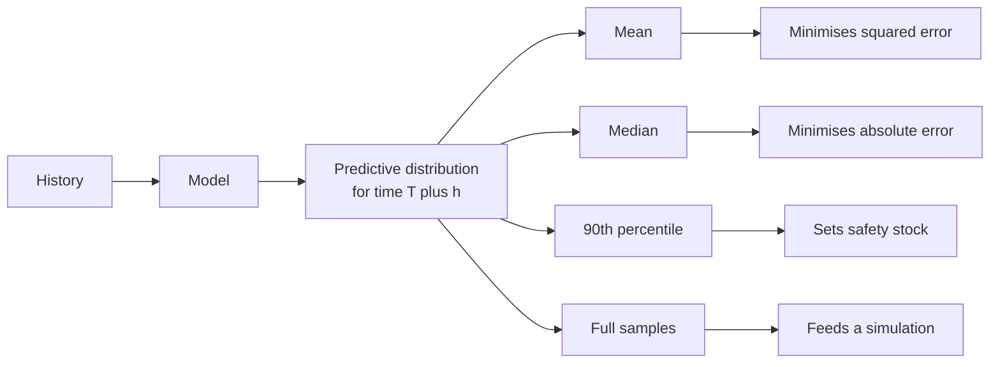
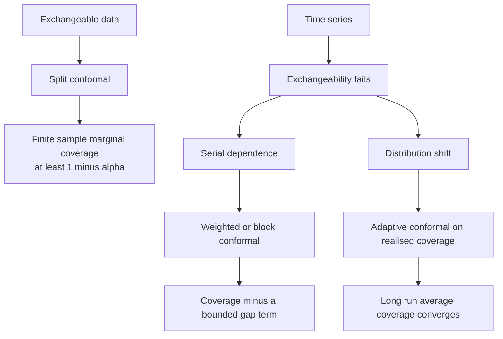
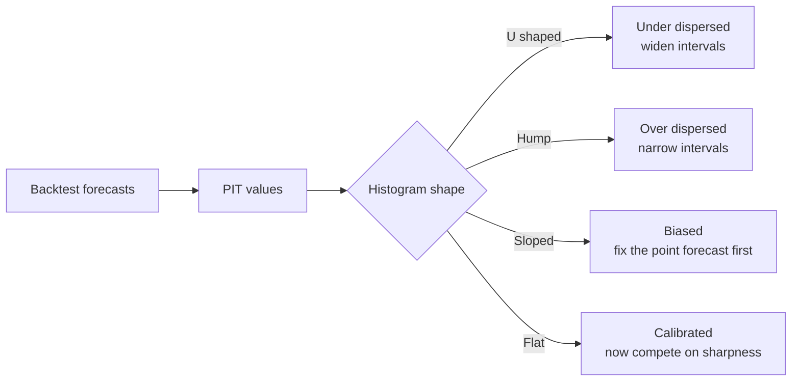
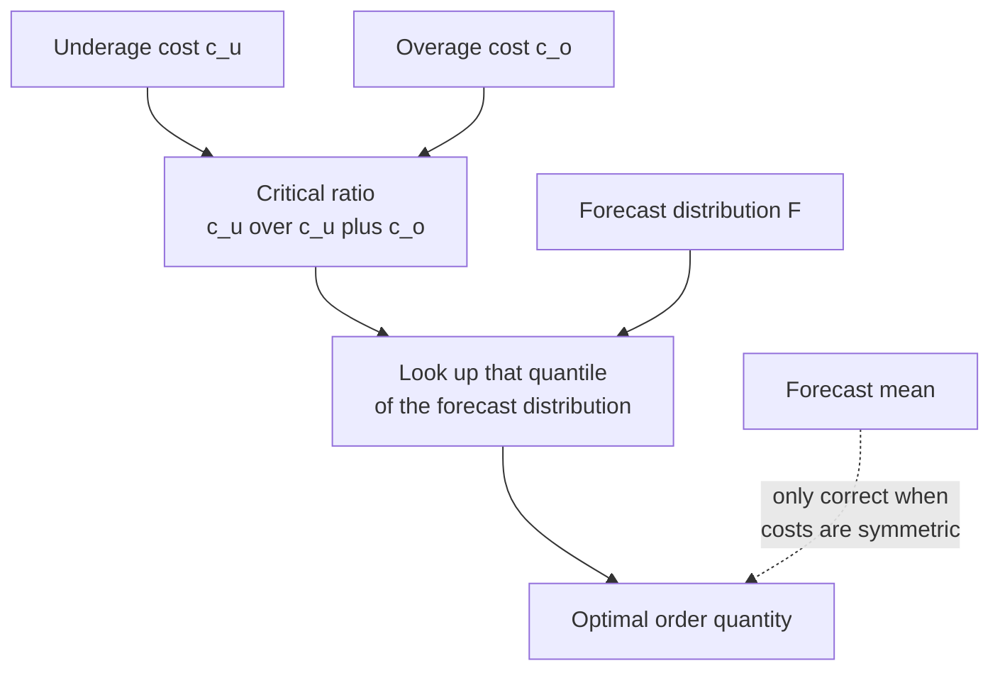

# Chapter 43: Probabilistic Forecasting and Uncertainty Quantification

> **What this chapter covers**: Why a point forecast is usually the wrong deliverable, the decomposition of forecast uncertainty into irreducible, parameter and model parts, prediction intervals against confidence intervals, analytic and simulation intervals, quantile regression and the pinball loss, distributional output heads, conformal prediction in depth including the time-series adaptations, proper scoring rules with the continuous ranked probability score computed by hand, calibration and sharpness, interval scoring, and decision-making under a forecast distribution ending with the newsvendor problem worked through.
> **Prerequisites**: Chapter 2 (probability and statistics) for estimators, intervals and the bootstrap, Chapter 5 (evaluation and validation) for metric choice and validation design, Chapter 11 (time-series overview) for vocabulary, Chapter 40 for the classical models whose intervals appear here, Chapter 41 for global feature-based models, Chapter 42 for network output heads.
> **Where it is used**: Inventory and supply planning, capacity and infrastructure provisioning, energy trading and grid balancing, financial risk, staffing and workforce scheduling, clinical monitoring, and any system where the cost of being wrong high differs from the cost of being wrong low.

---

Chapter 2 owns statistical inference in general: what an estimator is, what a confidence interval means, the bootstrap, and hypothesis testing. Chapter 5 owns metric selection and validation design. This chapter does not repeat either. It covers what is specific to forecasting a distribution over a future value, where the quantity being predicted has not happened yet, where the error structure is serially dependent, and where the consumer of the forecast is going to make an asymmetric decision with it.

## 43.1 Level 1: Foundations

### The point forecast is an answer to a question nobody asked

A demand planner asks how many units to stock. A forecasting system returns 500. The planner stocks 500. Half the time demand exceeds 500 and the shelf is empty. This is not a modelling failure. It is the correct consequence of using a conditional mean to make a decision whose costs are asymmetric.

The mean is the minimiser of expected squared error. That is the only decision problem it solves. If the cost of a stockout is four times the cost of a unit sitting in a warehouse, the optimal order is not the mean. It is a quantile of the demand distribution, and section 43.4 derives exactly which one.

A **point forecast** is a single number $\hat{y}_{T+h}$ predicting the value $h$ steps ahead. A **probabilistic forecast** is a distribution $\hat{F}_{T+h}$ over that value, presented as a set of quantiles, a parametric distribution, or a set of samples. The probabilistic forecast contains the point forecast as a summary. The reverse is not true.



*Figure 43.1: A predictive distribution supports many decisions; each point summary answers only one of them.*

### Three things people mean by uncertainty

Ask five engineers what a forecast interval represents and you get three different answers. Separating them is the first useful act.

| Source | What it is | Does more data remove it |
|---|---|---|
| Irreducible, also called aleatoric or noise | Randomness in the process itself. Tomorrow's sales are not a deterministic function of anything you can observe. | No |
| Parameter | You estimated coefficients from finite history and they are wrong by some amount. | Yes, at rate roughly $1/\sqrt{n}$ |
| Model | The functional form is wrong. The true process is not an AR(2), or the seasonality changed. | Not by more of the same data |

Most published forecast intervals capture only the first source. A standard ARIMA interval treats the fitted coefficients as if they were the truth. That is why nominal 95 percent intervals from classical models routinely achieve 80 to 90 percent empirical coverage on real data. The understatement is systematic and it is in the direction that hurts.

Model uncertainty is the hardest and the largest. No interval that conditions on a single model class can represent it honestly. The practical answers are ensembling across model families, and conformal methods that calibrate against realised errors rather than against the model's own assumptions.

### Prediction interval against confidence interval

These are different objects and the confusion is endemic.

A **confidence interval** is an interval for a fixed unknown parameter, for instance the mean level $\mu$ of a stationary series. Its width shrinks towards zero as the sample grows, because with enough data you learn $\mu$ exactly.

A **prediction interval** is an interval for a future random realisation $y_{T+h}$. Its width never shrinks below the irreducible noise, because even a forecaster who knows the true model and the true parameters cannot predict the noise.

Take an independent and identically distributed series with mean $\mu$ and standard deviation $\sigma$, estimated from $n$ observations. The 95 percent confidence interval for $\mu$ has half-width about $1.96 \sigma / \sqrt{n}$. The 95 percent prediction interval for the next value has half-width about $1.96 \sigma \sqrt{1 + 1/n}$.

**Worked example.** Take $\sigma = 10$ and $n = 400$. The confidence interval half-width is $1.96 \times 10 / 20 = 0.98$. The prediction interval half-width is $1.96 \times 10 \times \sqrt{1.0025} = 19.62$. A factor of twenty between them. If someone hands you an interval of plus or minus 1 unit for "next month's demand" when the series has a standard deviation of 10, they have computed the wrong object.

Chapter 2, level 3, covers the interpretation of confidence intervals in general. The point specific to forecasting is that the deliverable is almost always a prediction interval, and the noise floor never goes away.

### Uncertainty grows with horizon, and how it grows tells you about the series

This is the single most diagnostic property of a forecast interval. Consider an AR(1) process, meaning the value depends on the previous value with coefficient $\phi$:

$$y_t = \phi y_{t-1} + \varepsilon_t, \qquad \varepsilon_t \sim \mathcal{N}(0, \sigma^2)$$

Forecasting forward, the $h$-step-ahead forecast error is $\varepsilon_{T+h} + \phi \varepsilon_{T+h-1} + \dots + \phi^{h-1}\varepsilon_{T+1}$, so

$$\mathrm{Var}(e_{T+h}) = \sigma^2 \frac{1 - \phi^{2h}}{1 - \phi^2}$$

**Worked example.** Set $\phi = 0.7$ and $\sigma = 1$.

| $h$ | Variance | Standard deviation |
|---|---|---|
| 1 | $1.000$ | 1.000 |
| 2 | $1 + 0.49 = 1.490$ | 1.221 |
| 3 | $1.490 + 0.240 = 1.730$ | 1.315 |
| 5 | $1.877$ | 1.370 |
| $\infty$ | $1/(1-0.49) = 1.961$ | 1.400 |

The interval widens and then plateaus at the unconditional standard deviation of the series. That is the signature of a stationary process: beyond a few steps you know nothing except the marginal distribution.

Now take a random walk, $\phi = 1$. The variance is $h\sigma^2$ and the standard deviation is $\sigma\sqrt{h}$, growing without bound. At $h = 100$ the interval is ten times the one-step interval.

If your production forecast intervals are the same width at horizon 1 and horizon 30, the system is not propagating uncertainty. This is the most common bug in a hand-rolled interval implementation, and the long-horizon intervals will be badly under-covered.

### What a decision-maker actually needs

Different consumers need different functionals of the same distribution.

| Consumer | Needs | Why |
|---|---|---|
| Inventory planner | A high quantile, often 0.90 to 0.99 | Stockout costs exceed holding costs |
| Capacity planner | The upper tail, plus the joint distribution across services | Provision for the peak, and peaks correlate |
| Finance | The mean, summed across the portfolio | Expectations add; quantiles do not |
| Risk | A low quantile of profit, or expected shortfall | Regulatory and solvency framing |
| Scheduler | The full distribution fed into an optimiser | The downstream problem is a stochastic program |

Notice the finance row. Means are additive, so a sum of unbiased forecasts is unbiased for the total. Quantiles are not additive. The 90th percentile of a sum is strictly less than the sum of the 90th percentiles whenever the components are not perfectly correlated. Adding up per-store 95th percentiles to get a national safety stock number overstates the requirement, sometimes by a large factor. Chapter 44 handles the coherence machinery.

## 43.2 Level 2: Working knowledge

### Empirical intervals from backtest residuals

The most robust method, and the one to reach for first, requires no distributional assumption about the model.

1. Run a rolling-origin backtest, as in Chapter 5, level 3 and Chapter 46. For each origin and each horizon $h$, record the error $e_{i,h} = y_{i,h} - \hat{y}_{i,h}$.
2. For each horizon separately, take the empirical quantiles of $\{e_{i,h}\}$.
3. The interval at a new origin is $\hat{y}_{T+h} + q_{\alpha/2}(e_{\cdot,h})$ to $\hat{y}_{T+h} + q_{1-\alpha/2}(e_{\cdot,h})$.

**Listing 43.1: empirical prediction intervals from backtest residuals, per horizon.**

```python
import numpy as np

def empirical_intervals(errors_by_h, point_forecast, alpha=0.1):
    """errors_by_h: dict h -> 1d array of realised errors y - yhat at that horizon.
    point_forecast: dict h -> float. Returns dict h -> (lo, hi)."""
    out = {}
    for h, yhat in point_forecast.items():
        e = np.asarray(errors_by_h[h], dtype=float)
        if e.size < 20:
            raise ValueError(f"horizon {h}: only {e.size} residuals, interval unstable")
        lo_q, hi_q = np.quantile(e, [alpha / 2, 1 - alpha / 2])
        out[h] = (yhat + lo_q, yhat + hi_q)
    return out
```

Three non-obvious points. The errors are added to the forecast, not subtracted, because they are defined as actual minus predicted, so a positive bias in the residual distribution shifts the interval up and silently corrects a biased model. The per-horizon grouping is mandatory, since pooling horizons produces one width that is too wide at $h=1$ and too narrow at $h=24$. The sample-size guard exists because an empirical quantile at $\alpha/2 = 0.05$ from 20 points is the first order statistic, which has enormous variance; treat fewer than roughly $3/\alpha$ residuals as insufficient.

The weakness is that the residual distribution is assumed stable over time. If volatility changed, the interval is calibrated to a regime that has ended. Section 43.3 fixes this with adaptive conformal methods.

### Analytic intervals from the classical models

Models with a likelihood give intervals in closed form. Chapter 40 derives the models; here is what their intervals rest on.

For an ARIMA model written in moving-average form $y_{T+h} = \sum_{j\ge 0} \psi_j \varepsilon_{T+h-j}$, the $h$-step forecast variance is

$$\mathrm{Var}(e_{T+h}) = \sigma^2 \sum_{j=0}^{h-1} \psi_j^2$$

and the interval is $\hat{y}_{T+h} \pm z_{1-\alpha/2}\sqrt{\mathrm{Var}(e_{T+h})}$.

This rests on four assumptions, every one of which is checkable and frequently false.

| Assumption | How it fails | Symptom |
|---|---|---|
| Residuals are uncorrelated | Unmodelled seasonality or a missing lag | Ljung-Box test rejects; intervals too narrow |
| Residuals have constant variance | Demand volatility scales with level | Coverage fine at low levels, poor at high |
| Residuals are Gaussian | Counts, intermittent demand, fat tails | Tail quantiles badly wrong, central ones fine |
| Parameters are known exactly | They were estimated | Systematic under-coverage, worse on short series |

The fourth is the one nobody mentions. The formula treats $\hat\phi$ as $\phi$. For a 200-point series fitting five parameters the effect is small; for a 40-point series fitting five it is not.

Exponential smoothing in innovations state space form gives intervals the same way, and for the additive-error models there are closed forms. For several of the multiplicative-error combinations no closed form exists and the standard software simulates instead. Check your library's documentation for which case you are in rather than assuming.

### Simulation and bootstrap intervals

When the model can generate, simulate. Draw a path forward, feeding each simulated value back as input, and repeat.

**Listing 43.2: simulated predictive paths from a fitted AR(1), with bootstrapped innovations.**

```python
import numpy as np

def simulate_paths(y_last, phi, resid, horizon=12, n_paths=2000, rng=None):
    """Bootstrap future paths by resampling in-sample residuals.
    resid: 1d array of in-sample residuals, assumed mean zero and homoscedastic."""
    rng = rng or np.random.default_rng(0)
    resid = np.asarray(resid, dtype=float)
    resid = resid - resid.mean()               # enforce zero mean, else paths drift
    draws = rng.choice(resid, size=(n_paths, horizon), replace=True)
    paths = np.empty((n_paths, horizon))
    state = np.full(n_paths, y_last, dtype=float)
    for h in range(horizon):
        state = phi * state + draws[:, h]
        paths[:, h] = state
    return paths                                # shape (n_paths, horizon)

# quantiles per horizon
# lo, hi = np.quantile(paths, [0.05, 0.95], axis=0)
```

Resampling the residuals rather than drawing Gaussians is what makes this a bootstrap: the simulated innovations inherit the real skew and tail weight. Recentring is necessary because a non-zero residual mean compounds into a spurious trend over the horizon. Feeding `state` back in is what makes uncertainty accumulate correctly across $h$; a version that simulates each horizon independently from the point forecast produces flat intervals, which is the bug named in section 43.1.

Simulation also gives you the joint distribution across horizons for free. If the decision is about a total over the next four weeks, sum each path and take quantiles of the sums. That is the correct answer and it is not obtainable from marginal per-horizon intervals, because summing per-horizon 95th percentiles ignores the correlation structure and overstates the total.

To include parameter uncertainty, resample the parameters as well: fit on bootstrap replicates of the history, or draw from the asymptotic sampling distribution of $\hat\theta$, then simulate a path per parameter draw. This widens the interval by an amount that grows as the series shortens.

### Quantile regression and the pinball loss

Instead of modelling a distribution, directly predict the quantile you need.

For a target level $\tau \in (0,1)$, the **pinball loss**, also called the quantile loss, is

$$L_\tau(y, q) = \begin{cases} \tau\,(y - q) & y \ge q \\ (1-\tau)\,(q - y) & y < q \end{cases}$$

**Why it works.** Take expectations over $Y$ with distribution function $F$ and differentiate with respect to $q$:

$$\frac{\partial}{\partial q}\mathbb{E}[L_\tau(Y,q)] = -\tau\,\Pr(Y \ge q) + (1-\tau)\Pr(Y < q) = -\tau\,(1 - F(q)) + (1-\tau)F(q)$$

Setting this to zero gives $-\tau + \tau F(q) + F(q) - \tau F(q) = 0$, so $F(q) = \tau$. The minimiser is exactly the $\tau$-th quantile. The loss is convex in $q$, so this is the global minimum. At $\tau = 0.5$ the loss is half the absolute error and the minimiser is the median, which is the reason mean absolute error targets the median and not the mean.

**Worked example.** Actual $y = 100$, and $\tau = 0.9$.

| Prediction $q$ | Case | Loss |
|---|---|---|
| 90 | $y \ge q$ | $0.9 \times 10 = 9.0$ |
| 100 | either | 0 |
| 110 | $y < q$ | $0.1 \times 10 = 1.0$ |
| 130 | $y < q$ | $0.1 \times 30 = 3.0$ |

Predicting 110 costs 1.0 while predicting 90 costs 9.0, a nine-to-one penalty for being low. Over many observations that asymmetry pushes the fitted value up until exactly 90 percent of actuals fall below it. Predicting 130 still costs less than predicting 90, which is the property that makes the estimator robust for high $\tau$ but also means a model trained on the 0.99 loss gets very little gradient signal and needs a lot of data.

In practice, train one model per quantile with a gradient-boosting library's quantile objective, or a single network with multiple outputs and the summed pinball loss.

**Listing 43.3: multi-quantile training with a shared network, plus non-crossing output.**

```python
import torch, torch.nn as nn

QUANTILES = [0.05, 0.1, 0.25, 0.5, 0.75, 0.9, 0.95]

class MonotoneQuantileHead(nn.Module):
    """Outputs quantiles that are non-decreasing by construction."""
    def __init__(self, in_dim, n_q):
        super().__init__()
        self.base = nn.Linear(in_dim, 1)          # the lowest quantile
        self.gaps = nn.Linear(in_dim, n_q - 1)    # positive increments

    def forward(self, x):
        first = self.base(x)
        steps = nn.functional.softplus(self.gaps(x))   # strictly positive
        return torch.cat([first, first + steps.cumsum(dim=-1)], dim=-1)

def pinball(pred, target, quantiles=QUANTILES):
    """pred: (B, n_q); target: (B, 1). Mean pinball loss over batch and quantiles."""
    taus = torch.tensor(quantiles, device=pred.device).view(1, -1)
    err = target - pred
    return torch.maximum(taus * err, (taus - 1.0) * err).mean()
```

Two things earn their place. The `softplus` and `cumsum` construction makes quantile crossing structurally impossible rather than fixing it afterwards, at the cost of forcing the model to express every quantile as an increment from the lowest one. The `torch.maximum` form is the standard compact rewriting of the piecewise loss: when $y \ge q$ the error is positive and $\tau e > (\tau-1)e$; when $y < q$ the reverse holds, and $(\tau - 1)e = (1-\tau)(q-y)$.

**Quantile crossing** is the pathology where independently fitted models produce $\hat q_{0.8} > \hat q_{0.9}$. It happens because nothing in separate fits couples them, and it is most common where data is sparse and quantiles are close together. Three remedies:

| Remedy | Mechanism | Cost |
|---|---|---|
| Sort the predicted quantiles per row | Rearrangement is a valid monotone projection and never increases the pinball loss (Chernozhukov, Fernandez-Val and Galichon, 2010) | Free, but hides the symptom |
| Monotone parametrisation, as in Listing 43.3 | Crossing impossible by construction | Slight loss of flexibility |
| Model the quantile function directly, for instance as a monotone spline | Gives a full distribution, not a grid | More complex head, more tuning |

Sorting is the pragmatic default. If a model crosses badly after sorting is applied, that is a signal the model is under-fitted, not a cosmetic issue.

### Distributional output heads

The alternative to quantiles is to predict the parameters of a distribution and let the distribution supply every quantile. The choice of family is a modelling decision, not a detail.

| Family | Use when | Parameters predicted | Caution |
|---|---|---|---|
| Gaussian | Continuous, roughly symmetric, well away from zero | mean, log standard deviation | Puts mass below zero for low-volume series |
| Student-t | Continuous with fat tails, financial returns | location, log scale, degrees of freedom | Degrees of freedom is hard to fit; consider fixing it |
| Negative binomial | Counts with variance above the mean, which is nearly all retail demand | mean, dispersion | Reduces to Poisson at zero dispersion |
| Tweedie | Non-negative with an atom at zero, intermittent demand | mean, power, dispersion | Power parameter usually fixed between 1 and 2 |
| Log-normal | Positive, right-skewed, multiplicative errors | log-mean, log-scale | Back-transform bias if you report the mean carelessly |
| Mixture density | Multimodal outcomes, regime switching | weights plus per-component parameters | Mode collapse and unstable training |

The autoregressive recurrent model of Salinas, Flunkert, Gasthaus and Januschowski (2020), commonly called DeepAR, is the reference implementation of this idea: a recurrent network emits the parameters of a chosen likelihood at each step, the network trains by maximising that likelihood, and forecasts come from ancestral sampling forward.

Always predict the log of a scale parameter and exponentiate, never the scale directly, or the optimiser will step into negative variance. Add a small floor, for instance $\sigma = \text{softplus}(s) + 10^{-3}$, or the likelihood will diverge on any point the model fits exactly.

**Normalising flows** and copula heads extend this to a flexible, learned density. A flow transforms a simple base distribution through a sequence of invertible maps whose Jacobian determinant is cheap, so the exact likelihood is available for training. For multivariate forecasting, Salinas and colleagues (2019) used a Gaussian copula to model cross-series dependence with a low-rank correlation structure, and Rasul and colleagues (2021) applied conditional flows to multivariate series. These earn their cost when the joint distribution across series matters, for instance in energy portfolio problems. For a single univariate series a well-chosen parametric family is usually competitive and far easier to operate.

### A decision table for which method to use

| Situation | Method | Reason |
|---|---|---|
| Classical model already fitted, assumptions check out | Analytic intervals | Free, and correct when the checks pass |
| Gradient-boosted global model, need three or four quantiles | Quantile regression per quantile | Native objective, no distributional assumption |
| Need the full distribution or a simulation input | Distributional head, or simulated paths | Gives samples, supports aggregation |
| Model is a black box and you need a coverage guarantee | Split conformal, adapted for time series | Distribution-free, wraps anything |
| Volatility regime changes | Adaptive conformal | Width tracks realised coverage |
| Need a total over several horizons or several series | Simulated paths | Only method that gets dependence right |

## 43.3 Level 3: Depth

### Conformal prediction

Conformal prediction is the most important development in practical uncertainty quantification in the last decade, because it converts any point predictor into an interval producer with a coverage guarantee that does not depend on the model being right. It deserves to be stated precisely, including where the guarantee stops applying, which is exactly the time-series case.

#### The exchangeability assumption, stated plainly

A sequence of random variables $Z_1, \dots, Z_n$ is **exchangeable** if its joint distribution is unchanged by any permutation of the indices. Formally, for every permutation $\pi$ of $\{1,\dots,n\}$,

$$(Z_1, \dots, Z_n) \overset{d}{=} (Z_{\pi(1)}, \dots, Z_{\pi(n)})$$

Independent and identically distributed data is exchangeable. Exchangeability is weaker: it allows dependence, as long as the dependence is symmetric in the indices. What it forbids is any structure that distinguishes positions, which is precisely what a time series has. In a time series, position is meaning.

#### Split conformal prediction

Split conformal, also called inductive conformal prediction (Papadopoulos and colleagues, 2002; Vovk, Gammerman and Shafer, 2005; the regression treatment in Lei and colleagues, 2018), is the version used in practice.

1. Split the data into a training set and a **calibration set** of size $n$, disjoint.
2. Fit any model $\hat{f}$ on the training set only. Never touch the calibration set during fitting.
3. Compute a **non-conformity score** for each calibration point. The simplest is the absolute residual $s_i = |y_i - \hat{f}(x_i)|$.
4. Let $\hat{q}$ be the $\lceil (n+1)(1-\alpha)\rceil$-th smallest value of $\{s_1,\dots,s_n\}$.
5. For a new point, output $C(x_{n+1}) = [\hat{f}(x_{n+1}) - \hat{q},\; \hat{f}(x_{n+1}) + \hat{q}]$.

**The guarantee.** If $(x_1,y_1),\dots,(x_{n+1},y_{n+1})$ are exchangeable, then

$$\Pr\big(y_{n+1} \in C(x_{n+1})\big) \ge 1 - \alpha$$

and if in addition the scores are almost surely distinct, which holds when the score distribution is continuous,

$$\Pr\big(y_{n+1} \in C(x_{n+1})\big) \le 1 - \alpha + \frac{1}{n+1}$$

Four properties of this statement matter and are routinely misquoted.

- It is **finite-sample**. It holds for $n = 50$, not only asymptotically.
- It is **distribution-free**. No assumption about the shape of the errors.
- It is **model-free**. $\hat f$ can be anything, including a badly wrong model. A wrong model gives a valid but very wide interval.
- It is **marginal**, not conditional. The probability is over the joint draw of calibration data and test point. It does not promise 90 percent coverage for every value of $x$, and typically coverage is worse than nominal in the hard regions and better in the easy ones. Conditional coverage in the strong sense is impossible to obtain distribution-free (Vovk, 2012; Foygel Barber and colleagues, 2021, "The limits of distribution-free conditional predictive inference").

**Worked example of the quantile index.** Take $\alpha = 0.1$ and a calibration set of $n = 199$. Then $\lceil 200 \times 0.9 \rceil = \lceil 180 \rceil = 180$, so $\hat q$ is the 180th smallest of the 199 absolute residuals. Coverage is guaranteed between $0.9$ and $0.9 + 1/200 = 0.905$.

Take $n = 50$ instead. $\lceil 51 \times 0.9\rceil = \lceil 45.9 \rceil = 46$, the 46th of 50. Coverage between $0.9$ and $0.9 + 1/51 = 0.9196$. The interval is conservative and slightly wider than needed, which is the price of a small calibration set.

Take $n = 5$ and $\alpha = 0.1$. Then $\lceil 6 \times 0.9\rceil = 6 > 5$. There is no such order statistic, and the method returns an infinite interval. The requirement is $n \ge \lceil 1/\alpha\rceil - 1$; for 90 percent coverage you need at least 9 calibration points, and for 99 percent at least 99. This is a hard information limit, not an implementation detail.

**Listing 43.4: split conformal intervals, with the exact order statistic.**

```python
import numpy as np

def split_conformal_width(cal_residuals, alpha=0.1):
    """Returns qhat such that [yhat - qhat, yhat + qhat] has coverage >= 1 - alpha
    under exchangeability of the calibration set and the test point."""
    s = np.sort(np.abs(np.asarray(cal_residuals, dtype=float)))
    n = s.size
    k = int(np.ceil((n + 1) * (1.0 - alpha)))
    if k > n:
        return np.inf            # calibration set too small for this alpha
    return float(s[k - 1])       # k-th smallest, zero-indexed
```

The `k - 1` is where implementations go wrong: the definition is the $k$-th smallest in one-based counting. Using `np.quantile(s, 1 - alpha)` instead is subtly anti-conservative for small $n$, because it interpolates rather than taking the exact order statistic, and it is the difference between having the guarantee and merely being near it.

#### Normalised scores, so the width can vary

A constant $\hat q$ gives a constant-width interval, which is wrong whenever the difficulty varies. Fix it by dividing the residual by a predicted scale:

$$s_i = \frac{|y_i - \hat f(x_i)|}{\hat\sigma(x_i)}$$

where $\hat\sigma$ is a second model trained on the training split to predict the absolute residual. The interval becomes $\hat f(x) \pm \hat q\,\hat\sigma(x)$. The marginal guarantee is unchanged, because the argument only needs the scores to be exchangeable, and now the width adapts.

**Conformalised quantile regression** (Romano, Patterson and Candes, 2019) is the better version of the same idea. Fit quantile models for $\alpha/2$ and $1-\alpha/2$, then use the score

$$s_i = \max\{\hat q_{\alpha/2}(x_i) - y_i,\; y_i - \hat q_{1-\alpha/2}(x_i)\}$$

which is negative when the point lies inside the predicted interval and positive by the amount of the miss when outside. The conformal step then widens or narrows the quantile interval by a single constant. This inherits the adaptivity of quantile regression and adds the finite-sample guarantee.

#### Why plain conformal fails on time series

Exchangeability does not hold. Three concrete mechanisms, and each breaks the guarantee in a different way.

1. **Serial dependence.** Residuals are autocorrelated, so the calibration residuals are not a symmetric sample. Positions matter. The permutation argument that produces the guarantee is simply unavailable.
2. **Distribution shift.** The residual distribution at the end of the calibration window is not the residual distribution at test time. Volatility clusters. A calm calibration period produces intervals that under-cover in a turbulent test period, and the failure arrives exactly when you need the interval.
3. **Leakage through the split.** A random train-calibration split lets the model see the future, so calibration residuals are optimistically small. The split must be temporal.

The practical damage from item 1 alone is often modest, because moderate autocorrelation degrades marginal coverage slowly. The damage from item 2 is severe and is the reason the adaptations exist. Empirically, running split conformal with a temporal split on a stable series often lands within a few points of nominal; running it across a volatility regime change does not.



*Figure 43.2: what each conformal variant recovers once exchangeability is gone.*

#### The adaptations, and what each actually recovers

This is where careless summaries do damage, so each entry states the guarantee it provides rather than claiming the original one survives.

**Weighted conformal under covariate shift** (Tibshirani, Foygel Barber, Candes and Ramdas, 2019). If the test distribution differs from the training distribution only in the distribution of $x$, and the likelihood ratio between them is known, reweighting the calibration scores by that ratio restores exact marginal coverage. In forecasting the likelihood ratio is rarely known, so this is more often a conceptual foundation than a deployed method.

**Conformal prediction beyond exchangeability** (Foygel Barber, Candes, Ramdas and Tibshirani, Annals of Statistics, 2023). Assign fixed weights $w_i$ to calibration points, typically decaying into the past, and take the weighted quantile of the scores. The result is not $1-\alpha$ coverage. It is $1-\alpha$ minus a **coverage gap** that the paper bounds by a weighted sum of total variation distances between the data sequence and its versions with the test point swapped in. In words: you lose an amount that grows with how badly exchangeability is violated, and the bound is computable in principle but not usually in practice. The operational value is the recipe, which is that recency weighting is principled rather than a hack, and that the loss is bounded rather than arbitrary.

**Ensemble batch prediction intervals**, EnbPI (Xu and Xie, 2021). Build a bootstrap ensemble of models, use leave-one-out aggregation so every training point has an out-of-sample residual, and take the interval width from the empirical quantile of a sliding window of the most recent residuals. The guarantee is approximate marginal coverage under assumptions on the error process, specifically stationarity and a mixing condition that limits long-range dependence. It is not distribution-free finite-sample. In exchange it uses all the data for training, needs no held-out calibration split, and tracks slow drift through the sliding window.

**Adaptive conformal inference**, ACI (Gibbs and Candes, 2021). Do not fix $\alpha$. Update it online from realised coverage:

$$\alpha_{t+1} = \alpha_t + \gamma\,\big(\alpha - \mathrm{err}_t\big), \qquad \mathrm{err}_t = \mathbb{1}\{y_t \notin C_t\}$$

with step size $\gamma > 0$. When you miss, $\mathrm{err}_t = 1$, the update is negative, $\alpha_{t+1}$ falls and the next interval is wider. When you cover, $\alpha$ drifts up and the interval narrows.

**What ACI guarantees.** The long-run empirical miss rate converges to $\alpha$. Concretely, because $\alpha_t$ is confined to a bounded range by the update, the average of $\mathrm{err}_t$ over $T$ steps differs from $\alpha$ by a term of order $1/(\gamma T)$, which goes to zero. This holds with **no distributional assumption at all**, including under adversarial data. What it does not give is any guarantee about coverage at a particular step, and it does not give $1-\alpha$ coverage conditional on anything. It is a control-theoretic guarantee about a running average.

The cost is visible. If the model fails badly for a stretch, $\alpha_t$ can be driven towards zero and the interval becomes infinite for several steps; if it then succeeds, $\alpha_t$ can exceed one and the interval becomes empty. Both are legitimate outputs of the algorithm and both look like bugs in a dashboard. Choosing $\gamma$ trades responsiveness against stability: a large $\gamma$ tracks regime changes fast and oscillates, a small $\gamma$ is smooth and slow. Gibbs and Candes (2024) extend this by running several step sizes and aggregating them with an expert-selection rule, removing the need to pick one.

**Conformal PID control** (Angelopoulos, Candes and Tibshirani, 2024) frames the same problem as feedback control and adds integral and derivative terms plus a scorecaster that predicts the next score, which reduces the oscillation while keeping the long-run coverage property.

**Listing 43.5: adaptive conformal inference, online.**

```python
import numpy as np

class AdaptiveConformal:
    """Online interval width that tracks realised coverage (Gibbs and Candes, 2021)."""
    def __init__(self, target_alpha=0.1, gamma=0.02, window=500):
        self.target = target_alpha
        self.alpha_t = target_alpha
        self.gamma = gamma
        self.scores = []          # recent absolute residuals
        self.window = window

    def width(self):
        if not self.scores or self.alpha_t <= 0:
            return np.inf         # not enough history, or alpha driven to zero
        if self.alpha_t >= 1:
            return 0.0            # degenerate empty interval; a real signal, not a bug
        s = np.sort(self.scores)
        k = int(np.ceil((len(s) + 1) * (1 - self.alpha_t)))
        return np.inf if k > len(s) else float(s[k - 1])

    def update(self, residual, covered):
        self.alpha_t += self.gamma * (self.target - (0.0 if covered else 1.0))
        self.scores.append(abs(residual))
        self.scores = self.scores[-self.window:]
```

The clamping to infinity and zero is deliberate and must be surfaced, not silently clipped: an infinite interval is the algorithm saying it has lost calibration, and hiding that by capping the width destroys the only guarantee the method has. The sliding `window` is a second, independent adaptation mechanism, handling drift in the scale of errors while $\alpha_t$ handles drift in coverage.

A practical note for multi-horizon systems: run one ACI instance per horizon. Coverage at $h=1$ and $h=24$ drift independently.

### Proper scoring rules

A **scoring rule** $S(F, y)$ assigns a number to a predictive distribution $F$ and a realised value $y$, lower being better by the convention used here. It is **proper** if a forecaster's expected score is minimised by reporting their true belief $G$:

$$\mathbb{E}_{y\sim G}[S(G,y)] \le \mathbb{E}_{y \sim G}[S(F,y)] \quad \text{for all } F$$

and **strictly proper** if equality implies $F = G$. Propriety is what stops the metric from rewarding a dishonest forecast. The canonical reference is Gneiting and Raftery (2007), "Strictly Proper Scoring Rules, Prediction, and Estimation".

An improper rule is not a subtle problem. Scoring intervals by width alone rewards infinitely wide intervals. Scoring by coverage alone rewards infinitely wide intervals. Reporting only the mean absolute error of the median discards the distribution entirely and cannot distinguish a well-calibrated forecast from a point mass.

| Rule | Applies to | Definition | Notes |
|---|---|---|---|
| Pinball loss | One quantile | as in 43.2 | Proper for that quantile level |
| Continuous ranked probability score | Full distribution over the reals | below | Units of the data; reduces to absolute error for a point forecast |
| Logarithmic score | Density forecasts | $-\log f(y)$ | Strictly proper, but infinite for one observation outside the support |
| Brier score | Binary events | $(p - y)^2$ | The threshold-exceedance case |
| Energy score | Multivariate | below | Proper, but weak at detecting wrong correlation |
| Variogram score | Multivariate | Scheuerer and Hamill (2015) | Better at detecting wrong dependence structure |
| Interval score | A central interval | below | Proper for the interval as a whole |

#### The continuous ranked probability score, computed by hand

The **continuous ranked probability score**, CRPS, for a predictive distribution function $F$ and an observation $y$ is

$$\mathrm{CRPS}(F, y) = \int_{-\infty}^{\infty} \big(F(z) - \mathbb{1}\{z \ge y\}\big)^2\,dz$$

It compares the forecast's cumulative distribution function against the step function that the perfect hindsight forecast would have been. It is strictly proper, it is in the units of the data, and it degrades gracefully: unlike the logarithmic score it does not become infinite when the observation lands outside the forecast's effective support.

**Worked example one: a three-member ensemble.** Suppose your forecast is the empirical distribution of three simulated values $\{8, 10, 15\}$, each with probability $1/3$, and the observation is $y = 12$.

The forecast cumulative distribution function is a staircase: $F(z) = 0$ for $z < 8$, $1/3$ on $[8, 10)$, $2/3$ on $[10, 15)$, and $1$ for $z \ge 15$. The indicator $\mathbb{1}\{z \ge 12\}$ is $0$ below 12 and $1$ above. Break the real line into the intervals where both are constant.

| Interval | Width | $F(z)$ | $\mathbb{1}\{z\ge 12\}$ | Squared difference | Contribution |
|---|---|---|---|---|---|
| $(-\infty, 8)$ | - | 0 | 0 | 0 | 0 |
| $[8, 10)$ | 2 | $1/3$ | 0 | $1/9$ | $2/9 = 0.2222$ |
| $[10, 12)$ | 2 | $2/3$ | 0 | $4/9$ | $8/9 = 0.8889$ |
| $[12, 15)$ | 3 | $2/3$ | 1 | $1/9$ | $3/9 = 0.3333$ |
| $[15, \infty)$ | - | 1 | 1 | 0 | 0 |

$$\mathrm{CRPS} = 0.2222 + 0.8889 + 0.3333 = 1.4444$$

**Check it with the kernel form.** There is an equivalent expression that is far easier to compute from samples:

$$\mathrm{CRPS}(F, y) = \mathbb{E}|X - y| - \tfrac{1}{2}\,\mathbb{E}|X - X'|$$

where $X$ and $X'$ are independent draws from $F$. The first term rewards closeness to the observation. The second term subtracts a penalty for being too spread out, and it is what makes the rule proper rather than merely a distance.

For $\{8,10,15\}$ and $y = 12$: the first term is $(|8-12| + |10-12| + |15-12|)/3 = (4+2+3)/3 = 3.0$. For the second, all nine ordered pairs give absolute differences $0, 2, 7, 2, 0, 5, 7, 5, 0$, summing to 28, so $\mathbb{E}|X-X'| = 28/9 = 3.1111$. Then

$$\mathrm{CRPS} = 3.0 - 0.5 \times 3.1111 = 3.0 - 1.5556 = 1.4444$$

The two calculations agree, which is the check worth doing once by hand before trusting any implementation.

**Worked example two: comparing forecasts on the same observation.** Still $y = 12$.

| Forecast | CRPS | Working |
|---|---|---|
| Point mass at 10 | 2.000 | Point mass gives $\mathrm{CRPS} = \|y - \hat y\|$ |
| Point mass at 11 | 1.000 | same |
| Ensemble $\{8,10,15\}$ | 1.444 | above |
| $\mathcal{N}(10, 2^2)$ | 1.205 | closed form below |

The point forecast at 11 beats the ensemble on this single observation. That is not a contradiction of propriety. Propriety is a statement about the expected score under the true distribution, and on any one observation a lucky point forecast can win. This is exactly why probabilistic evaluation must be averaged over many observations, and why comparing two forecasters on a handful of dates proves nothing. Chapter 5, level 3, covers the paired comparison machinery; apply it to CRPS differences the same way.

**The Gaussian closed form** is worth knowing because it is the fast path when your head is Gaussian. For $F = \mathcal{N}(\mu, \sigma^2)$ and $\omega = (y - \mu)/\sigma$,

$$\mathrm{CRPS} = \sigma\left[\omega\big(2\Phi(\omega) - 1\big) + 2\varphi(\omega) - \frac{1}{\sqrt{\pi}}\right]$$

where $\Phi$ and $\varphi$ are the standard normal distribution and density functions.

**Worked example.** $\mu = 10$, $\sigma = 2$, $y = 12$, so $\omega = 1$. With $\Phi(1) = 0.8413$ and $\varphi(1) = 0.24197$:

$$\mathrm{CRPS} = 2\left[1 \times 0.6827 + 0.48394 - 0.56419\right] = 2 \times 0.60245 = 1.2049$$

**The pinball connection.** CRPS is exactly twice the integral of the pinball loss over quantile levels:

$$\mathrm{CRPS}(F, y) = 2\int_0^1 L_\tau\big(y, F^{-1}(\tau)\big)\,d\tau$$

So averaging the pinball loss over a dense grid of quantiles and doubling it approximates CRPS. Verify the constant on the degenerate case: for a point forecast $m < y$, the pinball loss at level $\tau$ is $\tau(y-m)$, and $2\int_0^1 \tau(y-m)\,d\tau = (y-m)$, which matches the absolute error. This identity is why a model trained on a multi-quantile pinball loss is, in effect, being trained on CRPS, and it is the standard way to report CRPS for a quantile-based forecaster.

**Listing 43.6: CRPS three ways, for cross-checking an implementation.**

```python
import numpy as np
from scipy.stats import norm

def crps_ensemble(samples, y):
    """Kernel form. O(n log n) via the sorted identity for E|X - X'|."""
    x = np.sort(np.asarray(samples, dtype=float))
    n = x.size
    term1 = np.abs(x - y).mean()
    # E|X - X'| for the empirical distribution, computed without the n^2 loop
    i = np.arange(1, n + 1)
    term2 = 2.0 * np.sum((2 * i - n - 1) * x) / (n * n)
    return term1 - 0.5 * term2

def crps_gaussian(mu, sigma, y):
    w = (y - mu) / sigma
    return sigma * (w * (2 * norm.cdf(w) - 1) + 2 * norm.pdf(w) - 1 / np.sqrt(np.pi))

def crps_from_quantiles(q_levels, q_values, y):
    """Twice the mean pinball loss over a quantile grid. Approximate."""
    t = np.asarray(q_levels, dtype=float)
    q = np.asarray(q_values, dtype=float)
    err = y - q
    return 2.0 * np.mean(np.maximum(t * err, (t - 1.0) * err))
```

The `term2` line is the non-obvious one. For sorted samples, $\mathbb{E}|X - X'| = \frac{2}{n^2}\sum_i (2i - n - 1)x_i$ with one-based $i$, which turns a quadratic double loop into a single pass. Check it on $\{8,10,15\}$: $n=3$, the multipliers are $-2, 0, 2$, giving $2(-16 + 0 + 30)/9 = 28/9 = 3.111$, matching the hand calculation. The quantile version is approximate and its error depends on the grid: a nine-point grid from 0.1 to 0.9 systematically under-states CRPS because it ignores the tails.

#### The logarithmic score and its sensitivity

The logarithmic score is $-\log f(y)$ where $f$ is the predictive density. It is strictly proper and it is the negative log-likelihood, so training a distributional head by maximum likelihood is training on this score.

Its weakness is severity. A single observation in a region where the model assigns density near zero contributes an enormous penalty, and with a compactly supported forecast it contributes infinity. One outlier can dominate a year of scores. Use it for training, where the gradient behaviour is good, and prefer CRPS for reporting, where robustness matters. If you do report it, report the median as well as the mean of the per-observation scores; a large gap between them means one observation is driving your conclusion.

#### The interval score

For a central $(1-\alpha)$ interval $[l, u]$, the **interval score**, also called the Winkler score, is

$$\mathrm{IS}_\alpha(l, u, y) = (u - l) + \frac{2}{\alpha}(l - y)\mathbb{1}\{y < l\} + \frac{2}{\alpha}(y - u)\mathbb{1}\{y > u\}$$

It is proper. The first term charges for width, so a wide interval cannot win. The second and third charge for misses, scaled by $2/\alpha$ so that a miss on a 90 percent interval costs twenty times the distance missed by.

**Worked example.** $\alpha = 0.1$, interval $[80, 120]$.

| $y$ | Width term | Penalty | Score |
|---|---|---|---|
| 100 | 40 | 0 | 40 |
| 125 | 40 | $20 \times 5 = 100$ | 140 |
| 130 | 40 | $20 \times 10 = 200$ | 240 |
| 60 | 40 | $20 \times 20 = 400$ | 440 |

Now compare a wider interval $[60, 140]$ at $y = 130$: score $= 80 + 0 = 80$, which beats 240. And at $y = 100$: score $= 80$, which loses to 40. That trade is the whole point. Over many observations the interval score is minimised by the correct interval, not the widest one.

#### Multivariate scores

For a joint forecast over $d$ series or $d$ horizons, the **energy score** generalises CRPS:

$$\mathrm{ES}(F, \mathbf{y}) = \mathbb{E}\|\mathbf{X} - \mathbf{y}\| - \tfrac{1}{2}\mathbb{E}\|\mathbf{X} - \mathbf{X}'\|$$

with $\|\cdot\|$ the Euclidean norm. It is proper. Its practical weakness, documented by Pinson and Tastu (2013) among others, is low sensitivity to misspecified correlation: a forecast with correct marginals and completely wrong dependence often scores close to the correct one. If the dependence structure is what you care about, for instance because you are summing across series, add the **variogram score** of Scheuerer and Hamill (2015), which compares expected powers of pairwise differences and is far more sensitive to correlation errors.

### Calibration, sharpness, and the principle that orders them

Gneiting, Balabdaoui and Raftery (2007) state the governing principle: **maximise sharpness subject to calibration**.

**Calibration** is a property of the forecast against reality. A 90 percent interval should contain the actual 90 percent of the time. Quantile level $\tau$ should be exceeded $1-\tau$ of the time.

**Sharpness** is a property of the forecast alone. A narrower distribution is sharper. Sharpness is desirable only among calibrated forecasts; the widest possible interval is perfectly calibrated and useless.

The ordering matters: fix calibration first, then compete on sharpness. A sharp uncalibrated forecast is actively dangerous because it invites confident decisions.

#### Testing coverage

Empirical coverage at level $1-\alpha$ is the fraction of test points inside the interval. The formal test is binomial.

**Worked example.** 200 backtest points, nominal 90 percent, 168 covered, so empirical coverage is 0.840. Under the null of correct calibration the standard error is $\sqrt{0.9 \times 0.1/200} = 0.0212$. The test statistic is $(0.840 - 0.900)/0.0212 = -2.83$, giving a two-sided p value near 0.005. The intervals are too narrow, and the conclusion is sound.

Now the same shortfall on 40 points: 33.6 covered, so take 34 of 40, coverage 0.85. Standard error $\sqrt{0.09/40} = 0.0474$, statistic $-1.05$, p value near 0.29. Not distinguishable from correct. Coverage estimated from a short backtest is nearly uninformative, which is why a coverage dashboard with a small denominator produces alerts that are noise. Chapter 2, level 3, covers the interval construction for a proportion; use Wilson rather than Wald here because coverage rates sit near the boundary.

One caution specific to time series: the coverage indicators are serially correlated. Misses cluster, because a volatility regime causes a run of them. The binomial standard error above therefore understates the true uncertainty. Use a block bootstrap over the indicator sequence for an honest interval, as in Chapter 2's treatment of dependent bootstrap.

#### Reliability diagrams and the probability integral transform

For quantile forecasts, plot nominal level on the horizontal axis against empirical exceedance frequency on the vertical. A calibrated forecaster lies on the diagonal. A curve below the diagonal at high quantiles means the upper tail is too low.

For full distributional forecasts, use the **probability integral transform**: compute $u_t = \hat F_t(y_t)$ for every test point. If the forecasts are calibrated, the $u_t$ are uniform on $[0,1]$ (Diebold, Gunther and Tay, 1998). The histogram of $u_t$ diagnoses the failure mode directly.

| PIT histogram shape | Meaning |
|---|---|
| Flat | Calibrated |
| U-shaped, mass at both ends | Forecast too narrow, under-dispersed |
| Hump in the middle | Forecast too wide, over-dispersed |
| Sloping up to the right | Forecast biased low |
| Sloping down to the right | Forecast biased high |

The under-dispersed U shape is by far the most common in production. Nearly every model is over-confident because it ignores parameter and model uncertainty.



*Figure 43.3: the probability integral transform histogram names the failure mode.*

### Coherence of probabilistic forecasts

If your series form a hierarchy, the probabilistic forecasts must be coherent too, and this is strictly harder than coherence of point forecasts. Quantiles do not add.

**Worked example.** Two independent stores each with demand $\mathcal{N}(100, 20^2)$. Each store's 95th percentile is $100 + 1.645 \times 20 = 132.9$. Their sum is 265.8. But the total is $\mathcal{N}(200, 2 \times 400)$, standard deviation $28.28$, so the true 95th percentile of the total is $200 + 1.645 \times 28.28 = 246.5$. Summing the store-level percentiles overstates the requirement by 19.3 units, roughly 8 percent.

Now suppose the two stores are perfectly correlated instead. The total has standard deviation 40, and its 95th percentile is $200 + 65.8 = 265.8$, exactly the sum. So the sum of quantiles is the upper bound, attained only under perfect correlation. Assuming independence when series are correlated understates the total risk, and summing quantiles overstates it. Neither shortcut is safe.

The correct approach is to work with samples. Generate coherent sample paths, sum them, and take quantiles of the sums. Panagiotelis and colleagues (2023) develop the theory of probabilistic forecast reconciliation for exactly this. Chapter 44 covers the mechanics.

## 43.4 Level 4: Mastery

### Decision-making under a forecast distribution: the newsvendor problem

This section is the justification for the whole chapter. It shows, with arithmetic anyone can check, that the optimal decision under an asymmetric cost is a quantile of the forecast distribution and is not the mean, and that the gap between them is large enough to matter.

#### Setting it up

A quantity $q$ must be chosen before a random demand $D$ is observed. The name comes from a newsvendor buying papers in the morning that are worthless in the evening, but the structure is everywhere: inventory, staffing, cloud capacity, generation scheduling, blood bank stocking.

- If $D > q$ you are short by $D - q$, at a cost of $c_u$ per unit. This is the **underage cost**: lost margin, an emergency shipment, a service-level penalty, a dropped request.
- If $D < q$ you are long by $q - D$, at a cost of $c_o$ per unit. This is the **overage cost**: holding, obsolescence, spoilage, idle instances.

Expected cost:

$$C(q) = c_o\,\mathbb{E}\big[(q - D)^+\big] + c_u\,\mathbb{E}\big[(D - q)^+\big]$$

where $(x)^+ = \max(x, 0)$.

#### The derivation

Write the expectations as integrals against the demand distribution function $F$:

$$C(q) = c_o \int_{0}^{q} (q - d)\,f(d)\,dd + c_u \int_{q}^{\infty}(d - q)\,f(d)\,dd$$

Differentiate with respect to $q$. The integrand vanishes at the moving boundary in both terms, so the boundary contributions cancel and only the derivative of the integrand survives:

$$\frac{dC}{dq} = c_o \int_0^q f(d)\,dd - c_u\int_q^\infty f(d)\,dd = c_o F(q) - c_u\big(1 - F(q)\big)$$

Set to zero:

$$c_o F(q) + c_u F(q) = c_u \quad\Longrightarrow\quad \boxed{F(q^\star) = \frac{c_u}{c_u + c_o}}$$

The second derivative is $(c_o + c_u)f(q) \ge 0$, so $C$ is convex and this is the global minimum.

The ratio $\rho = c_u/(c_u + c_o)$ is the **critical ratio**, and it is also the service level: $q^\star$ is exactly the quantity that satisfies demand with probability $\rho$. Note what has and has not appeared. The optimal decision depends on the **whole distribution** through $F^{-1}$, and on the **cost ratio only**, not the absolute costs. The mean appears nowhere.

The mean is optimal only in the single case $c_u = c_o$ combined with a symmetric distribution, where $\rho = 0.5$ and the median equals the mean. Any asymmetry in either the costs or the distribution moves the answer.



*Figure 43.4: the newsvendor decision reads a quantile determined by the cost ratio, not the mean.*

#### Worked example one: discrete demand, checkable by hand

A bakery sells a pastry. Underage cost $c_u = 8$ per unit, the lost margin on a sale it could not make. Overage cost $c_o = 2$ per unit, the cost of the unsold pastry. Demand has this distribution, estimated from history.

| $d$ | $\Pr(D = d)$ | $F(d)$ |
|---|---|---|
| 0 | 0.10 | 0.10 |
| 1 | 0.20 | 0.30 |
| 2 | 0.30 | 0.60 |
| 3 | 0.25 | 0.85 |
| 4 | 0.15 | 1.00 |

The critical ratio is $8/(8+2) = 0.8$. The optimal $q$ is the smallest value with $F(q) \ge 0.8$, which is $q^\star = 3$.

The mean demand is $0(0.1) + 1(0.2) + 2(0.3) + 3(0.25) + 4(0.15) = 2.15$, which rounds to 2. So the mean-based decision orders 2 and the correct decision orders 3. Check the costs directly.

| $q$ | $\mathbb{E}[(q-D)^+]$ | $\mathbb{E}[(D-q)^+]$ | Cost $= 2 \times$ over $+\ 8 \times$ under |
|---|---|---|---|
| 1 | $1(0.1) = 0.10$ | $1(0.3)+2(0.25)+3(0.15) = 1.25$ | $0.20 + 10.00 = 10.20$ |
| 2 | $2(0.1)+1(0.2) = 0.40$ | $1(0.25)+2(0.15) = 0.55$ | $0.80 + 4.40 = 5.20$ |
| 3 | $3(0.1)+2(0.2)+1(0.3) = 1.00$ | $1(0.15) = 0.15$ | $2.00 + 1.20 = 3.20$ |
| 4 | $4(0.1)+3(0.2)+2(0.3)+1(0.25) = 1.85$ | 0 | $3.70 + 0 = 3.70$ |

The minimum is at $q = 3$, cost 3.20, exactly as the critical ratio predicted. Ordering the rounded mean of 2 costs 5.20, which is 62 percent more. That gap is available to any team that switches from a point forecast to a distributional one, with no change to the forecasting model at all.

#### Worked example two: continuous demand, and the sensitivity

Now take $D \sim \mathcal{N}(500, 100^2)$ for a weekly stocking decision, with $c_u = 8$ and $c_o = 2$ as before. The critical ratio is 0.8, and $z_{0.8} = 0.8416$, so

$$q^\star = 500 + 0.8416 \times 100 = 584$$

For the normal distribution, with $z = (q-\mu)/\sigma$, the standard expressions are

$$\mathbb{E}[(D - q)^+] = \sigma\big[\varphi(z) - z(1 - \Phi(z))\big], \qquad \mathbb{E}[(q - D)^+] = \sigma\big[\varphi(z) + z\Phi(z)\big]$$

(Check: their difference is $\sigma z = q - \mu$, as it must be, since $(q-D)^+ - (D-q)^+ = q - D$.)

At $q = 500$, $z = 0$, $\varphi(0) = 0.3989$: both expectations equal $39.89$, and the cost is $2(39.89) + 8(39.89) = 398.9$.

At $q = 584$, $z = 0.84$, $\varphi(0.84) = 0.2803$, $\Phi(0.84) = 0.7995$:

- $\mathbb{E}[(D-q)^+] = 100[0.2803 - 0.84(0.2005)] = 100[0.2803 - 0.1684] = 11.20$
- $\mathbb{E}[(q-D)^+] = 100[0.2803 + 0.84(0.7995)] = 100[0.2803 + 0.6716] = 95.20$
- Cost $= 2(95.20) + 8(11.20) = 190.4 + 89.6 = 280.0$

Ordering the mean costs 398.9. Ordering the 80th percentile costs 280.0, a reduction of 30 percent. Again, same forecast, different functional, large money.

**Sensitivity to the cost ratio.** Hold the distribution fixed and vary the ratio.

| $c_u : c_o$ | $\rho$ | $z_\rho$ | $q^\star$ | Distance from the mean |
|---|---|---|---|---|
| 1 : 4 | 0.20 | $-0.842$ | 416 | $-84$ |
| 1 : 1 | 0.50 | 0.000 | 500 | 0 |
| 4 : 1 | 0.80 | 0.842 | 584 | $+84$ |
| 9 : 1 | 0.90 | 1.282 | 628 | $+128$ |
| 19 : 1 | 0.95 | 1.645 | 664 | $+164$ |
| 99 : 1 | 0.99 | 2.326 | 733 | $+233$ |

The decision moves by nearly half the mean across this range while the forecast never changes. This is the argument that settles the discussion with a stakeholder who wants "just the number". The number depends on their costs, which they have not told you, and the only way to serve all of them from one forecast is to deliver the distribution.

**Sensitivity to the distribution.** The answer also depends on the shape, not only the spread. Retail demand is usually right-skewed, often well fitted by a negative binomial or log-normal. Fitting a normal to right-skewed demand understates the upper quantiles, so at $\rho = 0.95$ the normal-based order is too low and the service level is missed. At $\rho = 0.5$ the same misspecification barely matters. The higher the critical ratio, the more the tail assumption drives the decision, which inverts the usual intuition that you should worry about the bulk of the distribution.

#### Safety stock, which is the same formula in the language of planning

Planning systems parametrise the decision as a base level plus a buffer:

$$\text{safety stock} = z_\rho\,\sigma_{L}, \qquad \sigma_L = \sigma_{\text{per period}}\sqrt{L}$$

where $L$ is the replenishment lead time in periods and $\sigma_L$ is the standard deviation of demand over that lead time.

**Worked example.** Weekly demand standard deviation 100 units, lead time 4 weeks, target service level 95 percent. Then $\sigma_L = 100\sqrt{4} = 200$ and the safety stock is $1.645 \times 200 = 329$ units. Raising the target to 99 percent gives $2.326 \times 200 = 465$ units, a 41 percent increase for four points of service level. The cost of the last few points of service is always disproportionate, because the normal tail is thin.

Two errors are endemic here. The first is the $\sqrt{L}$ scaling, which assumes demand is independent across periods; positively autocorrelated demand makes the true lead-time variance larger and the buffer too small. The second is using the standard deviation of demand where the correct quantity is the standard deviation of the **forecast error** over the lead time, which includes the model's own error and is strictly larger. Using demand variability instead of forecast error variability understates safety stock whenever the model is worse than a perfect forecast, which is always.

#### Beyond the newsvendor

The same logic generalises. Whenever a decision $a$ has a loss $\ell(a, y)$ and you hold a predictive distribution $\hat F$, the right action is

$$a^\star = \arg\min_a \mathbb{E}_{y\sim\hat F}\big[\ell(a, y)\big]$$

and the point summary that solves it depends on $\ell$.

| Loss | Optimal action | Point summary |
|---|---|---|
| Squared error | Conditional mean | Mean |
| Absolute error | Conditional median | Median |
| Pinball at $\tau$ | $\tau$-quantile | That quantile |
| Newsvendor with $c_u, c_o$ | Critical-ratio quantile | That quantile |
| Any non-standard loss | Numerical minimisation over samples | None; you need samples |

The last row is the reason to deliver samples and not just a quantile grid. If the downstream problem is a multi-echelon inventory optimisation or a unit commitment problem, no fixed set of quantiles is sufficient. The forecast must be a set of coherent sample paths that the optimiser can consume.

**Listing 43.7: choosing an action from samples under an arbitrary loss.**

```python
import numpy as np

def optimal_action(samples, loss, grid):
    """samples: draws from the predictive distribution.
    loss: vectorised loss(action, y) -> array over y.
    grid: candidate actions. Returns the minimiser and the cost curve."""
    samples = np.asarray(samples, dtype=float)
    costs = np.array([loss(a, samples).mean() for a in grid])
    return grid[int(np.argmin(costs))], costs

def newsvendor_loss(c_u, c_o):
    return lambda a, y: c_o * np.maximum(a - y, 0) + c_u * np.maximum(y - a, 0)
```

This is the escape hatch. It needs no closed form and no distributional assumption, and it costs one pass over the samples per candidate action. Always plot the cost curve rather than reporting only the minimiser: a flat curve means the decision is insensitive and the forecasting effort should go elsewhere, while a sharp curve means the quantile estimate has to be good.

### Where the standard advice is wrong or contested

**"Report a 95 percent interval."** The 95 percent convention is inherited from hypothesis testing and has nothing to do with any decision. The interval to report is the one the decision uses, which the critical ratio determines. Reporting 95 percent to a planner whose critical ratio is 0.8 gives them a number they must then mentally discount.

**"Wider intervals are more honest."** Wider intervals are more likely to be right and less likely to be useful. The interval score penalises both errors, which is why it is the metric and coverage alone is not.

**"Conformal prediction gives you guaranteed coverage on time series."** It does not, and the claim is the most common overstatement in current practice. The finite-sample distribution-free guarantee requires exchangeability, which time series violates by construction. The adaptations recover different and weaker properties: long-run average coverage for adaptive conformal, approximate coverage under mixing assumptions for ensemble methods, and coverage minus a bounded gap for weighted conformal. Each is worth having. None is the original guarantee. State which one you have.

**"Calibrate on the validation set."** If the model was selected using that set, the residuals are optimistic and the intervals are too narrow. Conformal calibration needs a split the model has never influenced, in any way, including through early stopping or hyperparameter choice.

**"The model is well calibrated because coverage is 90 percent."** Marginal coverage at 90 percent is consistent with an interval that covers 100 percent of easy points and 60 percent of hard ones. Break coverage down by segment, by level of the series, by horizon, and by time period before believing it. Conditional coverage is what decisions need and marginal coverage is what conformal gives.

**Contested: how much model uncertainty to include.** Some practitioners ensemble across model families and take the spread of predictions as a component of the interval. Others argue this conflates a set of models with a posterior over models and has no defensible interpretation. Both camps agree that intervals from a single fitted model are too narrow. The pragmatic default is to calibrate empirically against realised backtest errors, which captures model error implicitly because the backtest errors were produced by the same wrong model.

**Contested: whether to train on the decision loss directly.** Training a forecaster on the downstream decision cost, sometimes called decision-focused or end-to-end learning, can beat training on a statistical loss when the decision is known and fixed. Elmachtoub and Grigas (2022), "Smart Predict, then Optimize", develops this. The counter-argument is operational: one forecast usually serves many consumers with different losses, and a forecast tuned to one of them is worse for the others. Use decision-focused training when there is exactly one consumer, and a proper scoring rule otherwise.

### Communicating uncertainty, which is where this usually fails

A technically correct probabilistic forecast that a planner ignores has delivered nothing. The failure is rarely statistical.

| Failure | What happens | What to do instead |
|---|---|---|
| Presenting a fan chart to an operations meeting | People read the centre line and ignore the band | Present the specific quantity the decision needs, for instance "stock 584 to hit 80 percent service" |
| Describing an interval as "we are 90 percent confident" | Heard as confidence in the point forecast | "Nine times out of ten the actual will land inside this range" |
| Reporting percentiles | Percentile is not common vocabulary | Frequencies: "one week in ten, demand exceeds this" |
| Offering many quantiles | Decision paralysis, and people pick the one they like | Give the one their cost ratio implies, and derive it with them |
| Showing the interval widening with horizon without comment | Read as the model degrading | Say it explicitly: "we know less about month six, and this is what that looks like" |

The most effective single move is to ask the consumer for their two costs and compute the critical ratio with them in the room. It converts an argument about forecast accuracy into an arithmetic exercise about their own economics, and the resulting number carries their authority rather than yours. It also frequently reveals that nobody had quantified the costs, which is a more valuable finding than any model improvement.

The second most effective move is to show the cost curve from Listing 43.7. A stakeholder who sees that the cost is flat between 560 and 610 stops arguing about whether the forecast should have been 584 or 590.

## 43.5 Subtopic checklist

| Subtopic | You should be able to |
|---|---|
| Point against probabilistic forecast | Explain why the mean answers only the squared-error decision |
| Uncertainty decomposition | Name the three sources and say which a standard ARIMA interval captures |
| Prediction against confidence interval | Compute both for an IID sample and explain the factor between them |
| Horizon growth | State the AR(1) and random walk variance formulas and say what a flat interval means |
| Empirical intervals | Build per-horizon intervals from backtest residuals and state the sample-size floor |
| Analytic intervals | List the four assumptions behind an ARIMA interval and check each |
| Simulation intervals | Bootstrap forward paths and explain why they give correct multi-horizon totals |
| Pinball loss | Derive that its minimiser is the quantile, and compute it on a case |
| Quantile crossing | Name three remedies and the cost of each |
| Distributional heads | Choose a family from the data's support and variance behaviour |
| Exchangeability | State the definition and say why time series violates it |
| Split conformal | State the algorithm, the exact order statistic, and both bounds on coverage |
| Conformalised quantile regression | Write the non-conformity score and say what it buys |
| Time-series conformal | Name three adaptations and state what each actually guarantees |
| Proper scoring rules | Define propriety and give an improper rule people use anyway |
| CRPS | Compute it by hand from an ensemble two different ways |
| Logarithmic score | Say why it is used for training and not for reporting |
| Interval score | Compute it and show a wide interval losing to a narrow one |
| Multivariate scores | Say why the energy score is weak on dependence |
| Calibration and sharpness | State the ordering principle and diagnose a PIT histogram |
| Coverage testing | Test coverage with the right denominator and account for clustering |
| Quantile non-additivity | Show that summing quantiles overstates a total |
| Newsvendor | Derive the critical ratio and solve a discrete and a continuous case |
| Safety stock | Compute it and name the two standard errors in the formula |
| Communicating uncertainty | Convert a cost ratio into a target quantile with a stakeholder |

## 43.6 Common misconceptions

| Misconception | Why it is believed | What is true |
|---|---|---|
| A 95 percent prediction interval shrinks with more data | Confidence intervals do, and the two are conflated | The prediction interval has a floor at the irreducible noise, which no amount of data removes |
| Conformal prediction guarantees coverage on time series | The guarantee is quoted without its assumption | It requires exchangeability; time series adaptations recover long-run average or approximate coverage instead |
| The mean is the right forecast to act on | It is the default output of every squared-error model | The mean is optimal only under symmetric costs; asymmetric costs imply a quantile given by the critical ratio |
| Summing per-series 95th percentiles gives the total 95th percentile | Means add, so quantiles feel like they should | Quantiles are sub-additive under imperfect correlation; the sum is an upper bound reached only at perfect correlation |
| Coverage is the metric for an interval forecast | It is the property the interval claims | Coverage alone is maximised by an infinite interval; use the interval score, which also charges for width |
| A model with better mean absolute error is a better forecaster | Point accuracy is what most teams track | Point accuracy says nothing about calibration, and a tail-driven decision depends entirely on calibration |
| Wide intervals mean the model is bad | Narrow looks confident and competent | Wide and calibrated beats narrow and wrong; the sharpness comparison is only valid among calibrated forecasts |
| You can calibrate on the validation set | It is held out, so it feels clean | Any set used for model selection produces optimistic residuals and intervals that are too narrow |
| The logarithmic score is the best probabilistic metric | It is strictly proper and is the likelihood | It is unboundedly sensitive to single outliers; CRPS is the robust reporting choice |
| Intervals from a well-fitted model are correct | The formula is exact given the model | The formula conditions on estimated parameters and the chosen model class, so it omits two of the three uncertainty sources |

## 43.7 Practice

**Exercise 1, level 2: build and validate empirical intervals.** Take a public hourly series, for instance the UCI Individual Household Electric Power Consumption data or an open electricity load set. Fit any point forecaster. Build per-horizon empirical intervals from a rolling-origin backtest at horizons 1, 6 and 24. *Acceptance criterion*: a table of empirical coverage at nominal 80 and 95 percent for each horizon, each with a Wilson interval on the coverage estimate, and a plot showing interval width increasing with horizon.

**Exercise 2, level 2 to 3: pinball loss and quantile crossing.** Train separate gradient-boosted models for quantiles 0.05 through 0.95 in steps of 0.05 on the same data. Count how often the predicted quantiles cross. Apply sorting and measure the change in total pinball loss. *Acceptance criterion*: a crossing rate before and after, and a demonstration that sorting never increases the pinball loss on any row.

**Exercise 3, level 3: split conformal, done correctly and incorrectly.** Implement split conformal with (a) a random train-calibration split and (b) a temporal one. Evaluate coverage on a held-out future period. *Acceptance criterion*: a table showing the random split producing anti-conservative coverage, with an explanation of the mechanism, and a demonstration that your implementation uses the exact order statistic by checking it against a hand calculation on a 19-point calibration set.

**Exercise 4, level 3 to 4: adaptive conformal through a regime change.** Construct a series with a deliberate variance shift at a known point, or find one, for instance an equity volatility index around a crisis. Run split conformal and adaptive conformal through it. Plot rolling coverage over a 100-step window for both. *Acceptance criterion*: a plot showing split conformal's coverage collapsing after the break and adaptive conformal recovering, plus a sensitivity study over at least three values of $\gamma$ with a stated recommendation.

**Exercise 5, level 4: the newsvendor end to end.** Using a public retail demand dataset such as the M5 competition data, produce a distributional forecast per item. For three cost ratios of your choosing, compute the optimal order quantity and simulate the realised cost against the mean-based decision on a held-out period. *Acceptance criterion*: a table of realised cost under the mean decision against the quantile decision for each cost ratio, with a paired bootstrap interval on the difference following Chapter 5, level 3, and a one-paragraph statement of the dollar value of the change.

## 43.8 How this is tested

**Question 1.** Distinguish a prediction interval from a confidence interval, and quantify the difference on an example.

<details><summary>Answer</summary>

A confidence interval is for a fixed unknown parameter and its width shrinks towards zero as data accumulates. A prediction interval is for a future random realisation and its width converges to the irreducible noise, not to zero. For an IID sample with standard deviation $\sigma$ and $n$ observations, the confidence interval half-width for the mean is about $1.96\sigma/\sqrt{n}$ while the prediction interval half-width is about $1.96\sigma\sqrt{1 + 1/n}$. At $\sigma = 10$ and $n = 400$ that is 0.98 against 19.62. Forecasting deliverables are almost always prediction intervals.

</details>

**Question 2.** Your 95 percent intervals are the same width at horizon 1 and horizon 30. What is wrong?

<details><summary>Answer</summary>

Uncertainty is not being propagated forward. The correct behaviour depends on the process: for a stationary AR(1) with coefficient $\phi$ the forecast variance is $\sigma^2(1-\phi^{2h})/(1-\phi^2)$, which grows and then plateaus at the unconditional variance; for a random walk it is $h\sigma^2$, growing without bound. A flat interval usually means either that residual quantiles were pooled across horizons instead of computed per horizon, or that a simulation drew each horizon independently from the point forecast instead of feeding each simulated value back into the recursion. The long-horizon intervals will be badly under-covered.

</details>

**Question 3.** Derive the minimiser of the pinball loss.

<details><summary>Answer</summary>

With $L_\tau(y,q) = \tau(y-q)$ for $y \ge q$ and $(1-\tau)(q-y)$ otherwise, take the expectation over $Y \sim F$ and differentiate with respect to $q$. The derivative is $-\tau\Pr(Y \ge q) + (1-\tau)\Pr(Y < q) = -\tau(1-F(q)) + (1-\tau)F(q)$. Expanding gives $F(q) - \tau$. Setting it to zero gives $F(q) = \tau$, so the minimiser is the $\tau$-th quantile. The loss is convex in $q$, so this is global. At $\tau = 0.5$ the loss is half the absolute error and the minimiser is the median, which is why mean absolute error targets the median rather than the mean.

</details>

**Question 4.** State the split conformal algorithm and its guarantee precisely, including the assumption.

<details><summary>Answer</summary>

Split the data into training and calibration sets. Fit the model on training data only. Compute non-conformity scores $s_i = |y_i - \hat f(x_i)|$ on the $n$ calibration points. Set $\hat q$ to the $\lceil (n+1)(1-\alpha)\rceil$-th smallest score. Predict $[\hat f(x) \pm \hat q]$. If the calibration points and the test point are exchangeable, meaning their joint distribution is invariant to permutation, then $\Pr(y_{n+1} \in C(x_{n+1})) \ge 1-\alpha$, and if the scores are almost surely distinct, also $\le 1-\alpha + 1/(n+1)$. The guarantee is finite-sample, distribution-free, model-free and marginal, not conditional on $x$. It also requires $n \ge \lceil 1/\alpha\rceil - 1$, so 90 percent coverage needs at least 9 calibration points.

</details>

**Question 5.** Why does plain conformal prediction fail on time series, and what do the standard adaptations recover?

<details><summary>Answer</summary>

Exchangeability fails, because position carries meaning: residuals are serially dependent and their distribution shifts over time. A random train-calibration split additionally leaks future information. Adaptive conformal inference updates $\alpha_t$ by $\alpha_{t+1} = \alpha_t + \gamma(\alpha - \mathrm{err}_t)$ and recovers convergence of the long-run average miss rate to $\alpha$, with no distributional assumption, but nothing about any single step. EnbPI uses a bootstrap ensemble with a sliding residual window and gives approximate marginal coverage under stationarity and mixing assumptions. Weighted conformal beyond exchangeability gives coverage of at least $1-\alpha$ minus a coverage gap bounded by weighted total variation distances. None of these is the original finite-sample distribution-free guarantee, and saying so is part of reporting the result honestly.

</details>

**Question 6.** Compute the CRPS of the ensemble forecast $\{8, 10, 15\}$ against an observation of 12, two ways.

<details><summary>Answer</summary>

Integral form: the forecast cumulative distribution function is 0 below 8, $1/3$ on $[8,10)$, $2/3$ on $[10,15)$, 1 above 15, and the indicator steps at 12. The contributions are $2 \times (1/3)^2 = 0.2222$ on $[8,10)$, $2 \times (2/3)^2 = 0.8889$ on $[10,12)$, and $3 \times (1 - 2/3)^2 = 0.3333$ on $[12,15)$, totalling 1.4444.

Kernel form: $\mathbb{E}|X-y| = (4+2+3)/3 = 3.0$ and $\mathbb{E}|X-X'| = 28/9 = 3.1111$ over the nine ordered pairs, giving $3.0 - 0.5(3.1111) = 1.4444$. The two agree.

</details>

**Question 7.** What is a proper scoring rule, and name a rule teams use that is not proper.

<details><summary>Answer</summary>

A scoring rule is proper if the forecaster's expected score is optimised by reporting their true predictive distribution, and strictly proper if only by that distribution. It removes any incentive to shade the forecast. Coverage alone is not proper: an infinitely wide interval achieves perfect coverage. Interval width alone is not proper either, in the opposite direction. The interval score combines them and is proper. Reporting only the mean absolute error of the median is a proper rule for the median but tells you nothing about the rest of the distribution, so it is not a probabilistic evaluation at all.

</details>

**Question 8.** Two independent stores each have demand $\mathcal{N}(100, 20^2)$. Is the 95th percentile of the total the sum of the store 95th percentiles?

<details><summary>Answer</summary>

No. Each store's 95th percentile is $100 + 1.645(20) = 132.9$, summing to 265.8. The total is $\mathcal{N}(200, 800)$ with standard deviation 28.28, so its 95th percentile is $200 + 1.645(28.28) = 246.5$. Summing quantiles overstates by 19.3, about 8 percent. The sum of quantiles is an upper bound that is attained only under perfect positive correlation, where both give 265.8. The correct method is to generate coherent sample paths, sum them, and take quantiles of the sums.

</details>

**Question 9.** Derive the newsvendor solution.

<details><summary>Answer</summary>

Expected cost is $C(q) = c_o\mathbb{E}[(q-D)^+] + c_u\mathbb{E}[(D-q)^+]$. Writing these as integrals and differentiating with respect to $q$ gives $c_o F(q) - c_u(1 - F(q))$, since the boundary terms vanish. Setting this to zero gives $F(q^\star) = c_u/(c_u + c_o)$, the critical ratio. The second derivative $(c_o+c_u)f(q)$ is non-negative, so the cost is convex and the stationary point is the global minimum. The optimal quantity is a quantile of the demand distribution, determined only by the cost ratio, and the mean does not appear. The mean is optimal only when costs are equal and the distribution is symmetric.

</details>

**Question 10.** Work the discrete newsvendor with $c_u = 8$, $c_o = 2$ and demand probabilities 0.10, 0.20, 0.30, 0.25, 0.15 at 0 through 4.

<details><summary>Answer</summary>

The critical ratio is 0.8. The cumulative distribution is 0.10, 0.30, 0.60, 0.85, 1.00, so the smallest $q$ with $F(q) \ge 0.8$ is 3. Checking directly: at $q = 3$ expected overage is $3(0.1)+2(0.2)+1(0.3) = 1.00$ and expected shortage is $1(0.15) = 0.15$, giving cost $2(1.00) + 8(0.15) = 3.20$. At $q = 2$, the rounded mean since mean demand is 2.15, overage is 0.40 and shortage 0.55, giving $0.80 + 4.40 = 5.20$. At $q = 4$ the cost is 3.70. So 3 is optimal and using the mean costs 62 percent more.

</details>

**Question 11.** Your intervals show 90 percent marginal coverage. A stakeholder asks whether they can trust them for high-volume stores. What do you say?

<details><summary>Answer</summary>

Marginal coverage is an average and can hide severe conditional miscalibration. Ninety percent overall is consistent with 100 percent coverage on easy low-volume series and 60 percent on hard high-volume ones. Conformal prediction in particular guarantees marginal coverage only, and strong conditional coverage is provably unobtainable distribution-free. The answer is to break coverage down by store volume decile, by horizon, and by time period, each with an interval on the coverage estimate, and only then answer the question. If conditional coverage is poor, the fix is a normalised non-conformity score or conformalised quantile regression, which makes the width depend on the input.

</details>

**Question 12.** Compute safety stock for weekly demand with standard deviation 100, lead time 4 weeks, 95 percent service. Name two ways the standard formula is wrong.

<details><summary>Answer</summary>

$\sigma_L = 100\sqrt{4} = 200$, and safety stock is $1.645 \times 200 = 329$ units. Two errors. First, the $\sqrt{L}$ scaling assumes demand is uncorrelated across periods; positive autocorrelation makes the true lead-time variance larger and the buffer too small. Second, the correct input is the standard deviation of forecast error over the lead time, not the standard deviation of demand. Forecast error variance exceeds demand variance whenever the forecast is imperfect, which it always is, so using demand variability systematically understates the buffer.

</details>

**Question 13.** A team proposes training the forecaster directly on the downstream inventory cost. Argue both sides.

<details><summary>Answer</summary>

For: if the decision is known and fixed, aligning the training loss with the decision loss removes the mismatch between statistical accuracy and realised cost, and can beat a two-stage pipeline. Elmachtoub and Grigas (2022) formalise this. Against: a forecast in production typically serves several consumers with different cost structures, and a forecast tuned to one of them is worse for the others; the trained artefact is also no longer interpretable as a distribution, so it cannot be scored with a proper rule or reused. The practical rule is to use decision-focused training when there is exactly one consumer with a stable, well-quantified loss, and a proper scoring rule otherwise, then apply the decision rule on top.

</details>

**Question 14.** How do you decide what interval level to report?

<details><summary>Answer</summary>

Not by convention. Ask the consumer for the cost of being short and the cost of being long, form the critical ratio $c_u/(c_u+c_o)$, and report that quantile. A planner with a four-to-one stockout-to-holding ratio needs the 80th percentile; the 95 percent convention inherited from hypothesis testing has no connection to their problem. If several consumers exist, deliver the full distribution or sample paths and let each read off their own quantile. Doing this arithmetic with the stakeholder present is also the fastest way to discover that nobody has quantified the costs, which is usually more valuable than a model improvement.

</details>

## Summary

1. A point forecast answers exactly one decision problem, the squared-error one. Every other decision needs a different functional of the predictive distribution.
2. Forecast uncertainty has three sources, irreducible, parameter and model. Standard analytic intervals capture only the first, which is why they systematically under-cover.
3. A prediction interval has a floor at the irreducible noise. A confidence interval shrinks to zero. Conflating them produces intervals an order of magnitude too narrow.
4. Interval width must grow with horizon. For a stationary AR(1) it grows and plateaus at the unconditional standard deviation; for a random walk it grows as $\sqrt{h}$. A flat interval is a bug.
5. The pinball loss at level $\tau$ is minimised at the $\tau$-th quantile, which follows from setting $F(q) = \tau$ in its derivative. This is the basis of all quantile regression.
6. Quantile crossing is fixed by sorting, which never increases the pinball loss, or prevented by a monotone parametrisation.
7. Split conformal gives finite-sample, distribution-free, marginal coverage of at least $1-\alpha$ and at most $1-\alpha+1/(n+1)$, using the $\lceil (n+1)(1-\alpha)\rceil$-th smallest calibration score, under exchangeability.
8. Time series violates exchangeability. Adaptive conformal recovers long-run average coverage with no distributional assumption; ensemble methods recover approximate coverage under mixing; weighted conformal recovers coverage minus a bounded gap. None recovers the original guarantee.
9. A scoring rule is proper if honesty is optimal. Coverage alone and width alone are both improper; the interval score combines them and is proper.
10. CRPS equals $\mathbb{E}|X-y| - \frac{1}{2}\mathbb{E}|X-X'|$, is in the units of the data, reduces to absolute error for a point forecast, and equals twice the integrated pinball loss.
11. The logarithmic score is right for training and fragile for reporting, because one outlier can dominate.
12. Maximise sharpness subject to calibration, in that order. Fix calibration first; a sharp uncalibrated forecast invites confident wrong decisions.
13. The probability integral transform histogram names the failure mode: U-shaped means under-dispersed, which is the usual case.
14. Quantiles are not additive. Summing per-series high quantiles overstates the total unless the series are perfectly correlated. Work with samples.
15. The newsvendor solution is $F(q^\star) = c_u/(c_u+c_o)$. The optimal decision is a quantile determined by the cost ratio, the mean never appears, and in the worked case using the mean cost 62 percent more.

## Further reading

- Gneiting, T. and Raftery, A. (2007). "Strictly Proper Scoring Rules, Prediction, and Estimation". The reference for propriety, CRPS, the energy score and the interval score.
- Gneiting, T., Balabdaoui, F. and Raftery, A. (2007). "Probabilistic Forecasts, Calibration and Sharpness". The source of the sharpness-subject-to-calibration principle.
- Vovk, V., Gammerman, A. and Shafer, G. (2005). *Algorithmic Learning in a Random World*. The original conformal prediction monograph.
- Angelopoulos, A. and Bates, S. (2023). "Conformal Prediction: A Gentle Introduction". The accessible modern treatment of split conformal and its variants.
- Lei, J., G'Sell, M., Rinaldo, A., Tibshirani, R. and Wasserman, L. (2018). "Distribution-Free Predictive Inference for Regression". The regression treatment of split conformal.
- Romano, Y., Patterson, E. and Candes, E. (2019). "Conformalized Quantile Regression".
- Tibshirani, R., Foygel Barber, R., Candes, E. and Ramdas, A. (2019). "Conformal Prediction Under Covariate Shift".
- Foygel Barber, R., Candes, E., Ramdas, A. and Tibshirani, R. (2023). "Conformal Prediction Beyond Exchangeability", *Annals of Statistics*. The weighted method and the coverage gap bound.
- Gibbs, I. and Candes, E. (2021). "Adaptive Conformal Inference Under Distribution Shift", and the 2024 follow-up on aggregating step sizes.
- Xu, C. and Xie, Y. (2021). "Conformal Prediction Interval for Dynamic Time-Series". The EnbPI method.
- Angelopoulos, A., Candes, E. and Tibshirani, R. (2024). "Conformal PID Control for Time Series Prediction".
- Salinas, D., Flunkert, V., Gasthaus, J. and Januschowski, T. (2020). "DeepAR: Probabilistic Forecasting with Autoregressive Recurrent Networks", *International Journal of Forecasting*.
- Koenker, R. and Bassett, G. (1978). "Regression Quantiles". The origin of quantile regression.
- Chernozhukov, V., Fernandez-Val, I. and Galichon, A. (2010). "Quantile and Probability Curves Without Crossing".
- Scheuerer, M. and Hamill, T. (2015). "Variogram-Based Proper Scoring Rules for Probabilistic Forecasts of Multivariate Quantities".
- Diebold, F., Gunther, T. and Tay, A. (1998). "Evaluating Density Forecasts with Applications to Financial Risk Management". The probability integral transform diagnostic.
- Hyndman, R. and Athanasopoulos, G. *Forecasting: Principles and Practice*, third edition. Chapters on prediction intervals and on evaluation.
- Silver, E., Pyke, D. and Thomas, D. *Inventory and Production Management in Supply Chains*. The newsvendor and safety stock in their operational setting.
- Elmachtoub, A. and Grigas, P. (2022). "Smart Predict, then Optimize", *Management Science*. The decision-focused training argument.
