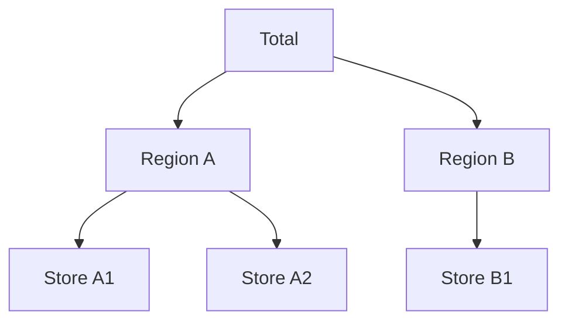
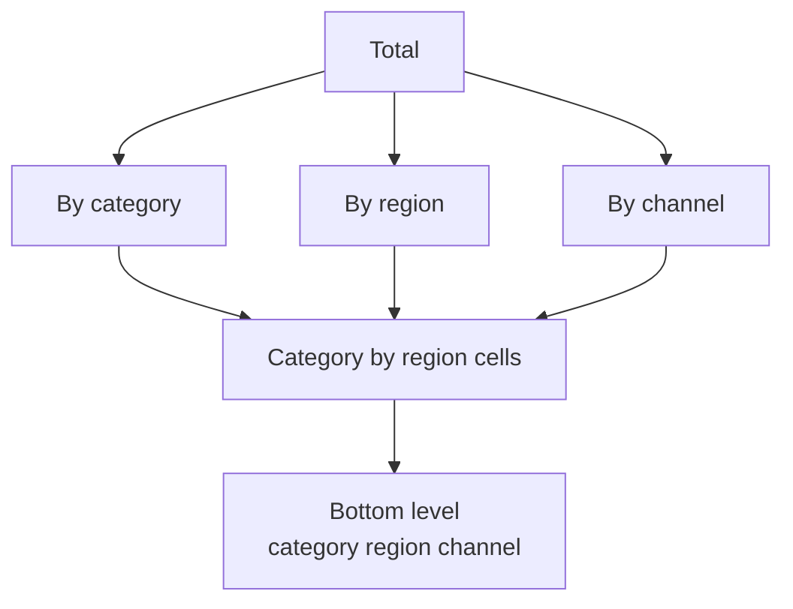
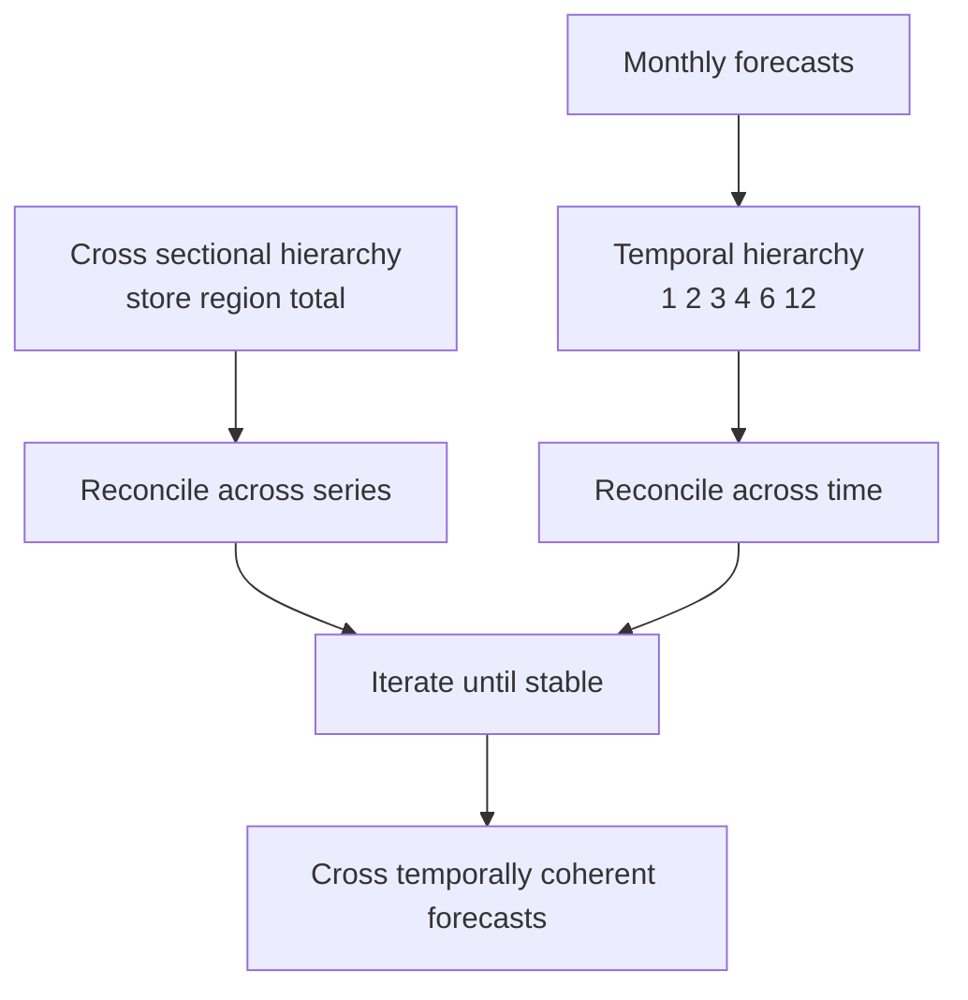

# Chapter 44: Hierarchical, Multivariate, and Panel Forecasting

> **What this chapter covers**: Forecasting many related series rather than one. Hierarchies and groupings with the summing matrix written out, why independent forecasts are incoherent and unusable, reconciliation derived from bottom-up through to the minimum trace projection with the covariance estimators people actually use, coherent probabilistic reconciliation, temporal and cross-temporal hierarchies, evaluating a reconciled forecast, vector autoregression with Granger causality, impulse responses and cointegration, dynamic factor models, panel data with fixed and random effects, cross-sectional dependence, series clustering, transfer and cold start, and the engineering shape of forecasting hundreds of thousands of series.
> **Prerequisites**: Chapter 11 (time-series overview), Chapter 40 (classical forecasting), Chapter 41 (feature-based and global models), Chapter 5 (validation design), Chapter 1 (linear algebra, projections and least squares). Chapter 14 for the causal-inference vocabulary used in the Granger causality section.
> **Where it is used**: Retail and supply-chain demand planning, financial planning and analysis, energy load at grid and substation level, cloud capacity by region and service, telecommunications traffic, public-health surveillance by geography, and any organisation whose forecast has to survive contact with a budget.

---

Chapter 41 established the global model: one learner fitted across many series, with the series identity as a feature. That chapter answers how to get accurate forecasts for many series. This chapter answers a different question, which is what to do when those series are related by arithmetic, by economics, or by both, and when the relationships themselves are part of the deliverable.

The distinguishing fact is that in most organisations a forecast is not consumed alone. It is consumed inside a plan, and a plan is a set of numbers that add up.

## 44.1 Level 1: Foundations

### The numbers have to add up

A retailer forecasts weekly units for 4,000 stock-keeping units in 300 stores, and also forecasts each store total, each region total, and the national total. The planning system pushes the national number to finance, the regional numbers to logistics, and the store-item numbers to replenishment.

Forecast each of these independently with the best available model and you get a set of numbers that are individually defensible and collectively impossible. The store totals do not sum to the region total. The region totals do not sum to the national total. Finance is planning against 270 million units while logistics is planning against 250 million.

This is not a rounding problem and it cannot be waved away. A plan with internal contradictions cannot be executed, and the organisational response is to pick one level as the truth and derive everything else from it, discarding whatever accuracy the other levels had. That response is a real method, and it has a name, but it should be a choice rather than a default arrived at by giving up.

A set of forecasts is **coherent** if it satisfies the same aggregation constraints as the data. Reconciliation is the operation that turns an incoherent set into a coherent one, and the central result of this chapter is that doing it well usually improves accuracy at every level rather than costing accuracy anywhere.

### Hierarchies and groupings

A **hierarchy** is a strict tree. Every series has exactly one parent. Geography is usually a hierarchy: store belongs to city belongs to region belongs to country.



*Figure 44.1: a small strict hierarchy with three bottom-level series and six nodes in total.*

A **grouped structure** is a cross-classification. Series are split by two or more attributes that do not nest, for instance product category by region by sales channel. There is no single tree, because you can aggregate category-first or region-first and both are valid.



*Figure 44.2: a grouped structure aggregates along several non-nesting attributes, so there is no unique tree.*

The important simplification is that both cases are handled by identical machinery. All that changes is one matrix.

### The bottom level and the summing matrix

Let $\mathbf{b}_t \in \mathbb{R}^{m}$ be the vector of the $m$ bottom-level series at time $t$, the finest granularity that everything else is built from. Let $\mathbf{y}_t \in \mathbb{R}^{n}$ be the vector of **all** series in the structure, bottom level included, so $n \ge m$.

Every aggregate is a sum of bottom-level series, so

$$\mathbf{y}_t = S\,\mathbf{b}_t$$

where $S$ is the $n \times m$ **summing matrix** of zeros and ones. Row $i$ of $S$ has a one in column $j$ when bottom series $j$ contributes to node $i$.

For the hierarchy in Figure 44.1, order the series as total, region A, region B, store A1, store A2, store B1, and the bottom series as A1, A2, B1. Then

$$S = \begin{pmatrix}
1 & 1 & 1 \\
1 & 1 & 0 \\
0 & 0 & 1 \\
1 & 0 & 0 \\
0 & 1 & 0 \\
0 & 0 & 1
\end{pmatrix}$$

Read the rows. The first row says the total is A1 plus A2 plus B1. The second says region A is A1 plus A2. The last three rows form an identity block, because the bottom-level series are themselves part of $\mathbf{y}$ and each equals itself.

That identity block is always present, so $S$ can always be written as an aggregation block stacked on top of $I_m$. It also means $S$ always has full column rank $m$, which is what makes the projections in level 3 well defined.

**The coherent subspace.** The set $\{S\mathbf{b} : \mathbf{b}\in\mathbb{R}^m\}$ is an $m$-dimensional subspace of $\mathbb{R}^n$, called the coherent subspace. Any vector of forecasts in that subspace adds up. Any vector outside it does not. Reconciliation is the act of mapping a point in $\mathbb{R}^n$ into this subspace, and level 3 shows that the good methods do it by orthogonal-style projection.

**Worked example of incoherence.** Suppose the base forecasts, produced independently by the best model for each series, are

| Node | Base forecast |
|---|---|
| Total | 270 |
| Region A | 105 |
| Region B | 150 |
| Store A1 | 50 |
| Store A2 | 52 |
| Store B1 | 148 |

Check the constraints. Stores sum to $50 + 52 + 148 = 250$, but the total says 270, a gap of 20. Region A's stores sum to 102 against A's own 105, a gap of 3. Region B's single store says 148 against B's 150, a gap of 2. Three separate contradictions in six numbers.

Nothing here is a mistake. The total was forecast from a smoother, longer, more predictable series and is probably the most accurate single number in the table. The store-level forecasts capture store-specific behaviour the aggregate cannot see. They disagree because they were fitted independently and no constraint tied them together.

### The three classical answers, and why a fourth is needed

| Method | What it does | Keeps | Loses |
|---|---|---|---|
| Bottom-up | Forecast the bottom, sum upwards | All bottom-level detail | Throws away the aggregate forecast, which is usually the most accurate |
| Top-down | Forecast the total, split by proportions | Aggregate accuracy and stability | Cannot represent divergent behaviour at the bottom |
| Middle-out | Forecast a middle level, sum up and split down | A compromise | Still discards information above and below the chosen level |

Each of these uses exactly one level and discards the forecasts made at every other. That is the observation that motivates optimal reconciliation: use all of them, weighted by how much each is worth.

Applying the first two to the worked example:

- **Bottom-up**: bottom stays at $(50, 52, 148)$, so region A becomes 102, region B becomes 148, and the total becomes 250. The 270 forecast is discarded entirely.
- **Top-down** with historical shares of 0.20, 0.20 and 0.60: the bottom becomes $(54, 54, 162)$, region A becomes 108, region B becomes 162, and the total stays at 270. Every store-specific signal is discarded, and store A2's higher forecast than A1 vanishes.

Neither is satisfactory, and the reason is the same in both cases: information was thrown away rather than combined.

## 44.2 Level 2: Working knowledge

### Building the summing matrix from data

In practice you never write $S$ by hand. You build it from the key columns of your data.

**Listing 44.1: constructing a summing matrix for a grouped structure.**

```python
import numpy as np
import pandas as pd

def build_summing_matrix(keys: pd.DataFrame, levels):
    """keys: one row per bottom-level series, columns are the grouping attributes.
    levels: list of tuples of column names; () means the grand total.
    Returns S (n x m) and a list of node labels in row order."""
    m = len(keys)
    rows, labels = [], []
    for cols in levels:
        if not cols:                                  # grand total
            rows.append(np.ones(m))
            labels.append("total")
            continue
        grp = keys.groupby(list(cols), sort=True, observed=True).indices
        for name, idx in grp.items():
            indicator = np.zeros(m)
            indicator[idx] = 1.0
            rows.append(indicator)
            labels.append("|".join(cols) + "=" + str(name))
    S = np.vstack(rows)
    assert np.linalg.matrix_rank(S) == m, "structure does not identify the bottom level"
    return S, labels

# levels = [(), ("region",), ("category",), ("region", "category"),
#           ("region", "category", "sku")]   # last tuple must be the bottom level
```

Two details carry weight. The bottom level must appear as the last entry in `levels` so that the identity block is present, which is what makes $S$ full column rank. The rank assertion is not decoration: if you forget the bottom level, or if a grouping column is constant, $S$ loses rank, every reconciliation matrix inversion becomes singular, and the failure appears hundreds of lines later as a numerical error nobody can trace.

`observed=True` matters when the grouping columns are pandas categoricals: without it, `groupby` generates rows for every unobserved combination, and on a three-way cross-classification that can be a matrix with millions of all-zero rows.

### The size of the problem

For a retailer with 300 stores, 4,000 stock-keeping units and 3 channels, the bottom level is potentially $300 \times 4000 \times 3 = 3.6$ million series. Most cells are empty, so the realised $m$ might be 2 million. The number of aggregate nodes is smaller but not small: store totals, item totals, category by region, and so on, easily 100,000.

This means $S$ is $10^5 \times 10^6$ and must be sparse. A dense representation would be $10^{11}$ floats. Every production implementation uses `scipy.sparse` or an equivalent, and the reconciliation solve is done with a sparse solver or iteratively, never by forming $(S'W^{-1}S)^{-1}$ explicitly. Level 4 covers the engineering.

### Which level to forecast, as a first decision

Before reaching for reconciliation, know what the levels look like. Aggregate series are easier to forecast. This is the most reliable empirical regularity in the whole field, and it has a simple explanation.

If $m$ bottom series each have noise variance $\sigma^2$ and are uncorrelated, their sum has noise variance $m\sigma^2$ and mean $m\mu$, so the coefficient of variation falls by $\sqrt{m}$.

**Worked example.** Ten stores, each selling a mean of 100 units per week with a standard deviation of 30, uncorrelated. Each store has a coefficient of variation of $30/100 = 0.30$. The total has mean 1,000 and standard deviation $30\sqrt{10} = 94.9$, so its coefficient of variation is $0.095$. The total is three times more predictable in relative terms.

Now make the stores perfectly correlated. The total's standard deviation becomes $10 \times 30 = 300$, mean 1,000, coefficient of variation $0.30$, identical to a single store. Aggregation buys nothing.

The lesson: aggregation helps in proportion to how independent the bottom-level noise is. In retail, item-level demand within a store is largely idiosyncratic and aggregation helps enormously. In energy, load across a region is driven by common weather and aggregation helps much less. Measure the average pairwise correlation of your bottom-level series before assuming the aggregate will be easy.

### Top-down disaggregation choices

If you do use top-down, the proportions matter, and there are three standard choices.

| Choice | Definition | Behaviour |
|---|---|---|
| Average of historical proportions | $p_j = \frac{1}{T}\sum_t \frac{y_{j,t}}{y_t}$ | Robust to a series being large in one period; the usual default |
| Proportion of historical averages | $p_j = \frac{\sum_t y_{j,t}/T}{\sum_t y_t/T}$ | Dominated by high-volume periods |
| Forecast proportions | Forecast each series, then use the ratio of forecasts | Captures divergent trends; the only top-down variant that can |

The first two are backward-looking and will be wrong for any series whose share is trending. Forecast proportions (Athanasopoulos, Ahmed and Hyndman, 2009) fix that by disaggregating with predicted rather than historical shares, and are the only top-down variant worth using when shares move.

**Worked example.** Two stores. Store 1 has had 60 percent share historically but is declining 2 points a year; store 2 is growing. Total forecast next year is 1,000. Historical-proportion top-down gives 600 and 400. If independent forecasts say store 1 will do 550 and store 2 will do 480, the forecast proportions are $550/1030 = 0.534$ and $0.466$, giving 534 and 466. The difference of 66 units on store 1 is the entire declining trend, and the historical-proportion method is structurally incapable of seeing it.

Top-down has one more property that is often decisive: the disaggregated forecasts are guaranteed non-negative if the proportions are, whereas optimal reconciliation can produce small negative values on sparse bottom-level series. Level 3 addresses that.

### A first reconciliation, without the theory

Before the derivation, here is the shape of the answer. Every reconciliation method, including bottom-up and top-down, can be written as

$$\tilde{\mathbf{y}} = S\,G\,\hat{\mathbf{y}}$$

where $\hat{\mathbf{y}}$ is the vector of $n$ base forecasts, $G$ is an $m \times n$ matrix that maps base forecasts to a bottom-level vector, and $S$ then maps that back up to all $n$ nodes. The output is coherent by construction, since it is $S$ times something.

The methods differ only in $G$.

| Method | $G$ |
|---|---|
| Bottom-up | $[\,\mathbf{0}_{m\times(n-m)} \mid I_m\,]$, selecting the bottom-level base forecasts and ignoring the rest |
| Top-down | $[\,\mathbf{p} \mid \mathbf{0}_{m\times(n-1)}\,]$, taking only the top forecast and splitting it by the proportion vector $\mathbf{p}$ |
| Optimal reconciliation | $(S'W^{-1}S)^{-1}S'W^{-1}$, derived in level 3 |

Seeing bottom-up and top-down as extreme choices of $G$ is the conceptual step that makes the general method obvious. Both are sparse $G$ matrices that zero out most of the information available.

## 44.3 Level 3: Depth

### Deriving optimal reconciliation

Set up the problem properly. Let $\hat{\mathbf{y}}$ be the $n$-vector of base forecasts for horizon $h$, made independently for every node. Define the base forecast error

$$\hat{\mathbf{e}} = \mathbf{y} - \hat{\mathbf{y}}, \qquad W = \mathbb{E}[\hat{\mathbf{e}}\hat{\mathbf{e}}']$$

so $W$ is the $n \times n$ covariance matrix of base forecast errors at that horizon. Assume the base forecasts are unbiased, $\mathbb{E}[\hat{\mathbf{e}}] = \mathbf{0}$.

Restrict attention to linear reconciliation, $\tilde{\mathbf{y}} = SG\hat{\mathbf{y}}$.

**Step one: the unbiasedness condition.** For the reconciled forecast to remain unbiased we need $\mathbb{E}[SG\hat{\mathbf{y}}] = \mathbb{E}[\mathbf{y}]$. Since $\mathbb{E}[\hat{\mathbf{y}}] = \mathbb{E}[\mathbf{y}] = S\mathbb{E}[\mathbf{b}]$ for any $\mathbb{E}[\mathbf{b}]$, this requires

$$SGS = S$$

Combined with $S$ having full column rank, this is equivalent to $GS = I_m$. In words: if the base forecasts happened to be coherent already, reconciliation must leave them alone. That single condition rules out most candidate matrices and is worth remembering as the sanity check on any hand-rolled implementation.

It also makes $P = SG$ **idempotent**: $P^2 = SGSG = SG = P$. An idempotent matrix is a projection. So every unbiasedness-preserving linear reconciliation is a projection of $\mathbb{R}^n$ onto the coherent subspace. The only freedom left is which projection, meaning along which directions the base forecasts are pushed onto the subspace.

**Step two: the reconciled error covariance.** The reconciled error is

$$\tilde{\mathbf{e}} = \mathbf{y} - SG\hat{\mathbf{y}} = SG(\mathbf{y} - \hat{\mathbf{y}}) = SG\hat{\mathbf{e}}$$

using $SG\mathbf{y} = SGS\mathbf{b} = S\mathbf{b} = \mathbf{y}$. Therefore

$$V = \mathbb{E}[\tilde{\mathbf{e}}\tilde{\mathbf{e}}'] = SG\,W\,G'S'$$

**Step three: minimise the trace.** The trace of $V$ is the sum of the forecast error variances across all $n$ nodes. Minimising it minimises total mean squared error over the whole structure. Wickramasuriya, Athanasopoulos and Hyndman (2019) solve

$$\min_G \operatorname{tr}\!\big(SGWG'S'\big) \quad \text{subject to } SGS = S$$

and obtain

$$\boxed{G = (S'W^{-1}S)^{-1}S'W^{-1}}$$

giving the **minimum trace** or MinT reconciled forecast

$$\tilde{\mathbf{y}} = S(S'W^{-1}S)^{-1}S'W^{-1}\hat{\mathbf{y}}$$

This is the generalised least squares projection onto the coherent subspace, with the inner product defined by $W^{-1}$. Recognise the form: it is exactly the normal-equations solution to the weighted least squares problem

$$\min_{\mathbf{b}}\ (\hat{\mathbf{y}} - S\mathbf{b})'W^{-1}(\hat{\mathbf{y}} - S\mathbf{b})$$

That is the most useful way to hold it. Reconciliation finds the bottom-level vector whose implied coherent forecasts are closest to the base forecasts, measured in a metric that trusts the more reliable base forecasts more. A node with tiny forecast error variance gets a small entry in $W$, a large entry in $W^{-1}$, and is therefore moved very little.

Verify the unbiasedness condition holds: $GS = (S'W^{-1}S)^{-1}S'W^{-1}S = I_m$. Good.


*Figure 44.3: optimal reconciliation is a weighted projection onto the coherent subspace, followed by aggregation.*

### Worked reconciliation, by hand

Take the Figure 44.1 hierarchy and the base forecasts from level 1: $\hat{\mathbf{y}} = (270, 105, 150, 50, 52, 148)'$ in the order total, A, B, A1, A2, B1.

#### Ordinary least squares reconciliation, $W = I$

Setting $W = I$ makes this ordinary least squares, the method of Hyndman, Ahmed, Athanasopoulos and Shang (2011). It assumes every node's forecast error has the same variance, which is false, but it is a useful baseline and needs no estimation.

$$S'S = \begin{pmatrix}3 & 2 & 1\\ 2 & 3 & 1\\ 1 & 1 & 3\end{pmatrix}, \qquad S'\hat{\mathbf{y}} = \begin{pmatrix}425 \\ 427 \\ 568\end{pmatrix}$$

Check the first entry of $S'\hat{\mathbf{y}}$: column one of $S$ has ones in rows total, A and A1, so the entry is $270 + 105 + 50 = 425$. The second is $270 + 105 + 52 = 427$. The third is $270 + 150 + 148 = 568$.

Solve $S'S\,\tilde{\mathbf{b}} = S'\hat{\mathbf{y}}$. Subtracting the second equation from the first gives $b_1 - b_2 = -2$. Substituting into the first and third equations gives $5b_2 + b_3 = 431$ and $2b_2 + 3b_3 = 570$. Eliminating $b_3$ gives $-13 b_2 = -723$, so

$$\tilde{\mathbf{b}} = (53.615,\ 55.615,\ 152.923)'$$

Aggregating back up:

| Node | Base | OLS reconciled | Change |
|---|---|---|---|
| Total | 270 | 262.15 | $-7.85$ |
| Region A | 105 | 109.23 | $+4.23$ |
| Region B | 150 | 152.92 | $+2.92$ |
| Store A1 | 50 | 53.62 | $+3.62$ |
| Store A2 | 52 | 55.62 | $+3.62$ |
| Store B1 | 148 | 152.92 | $+4.92$ |

Every number moved, and they now add up: $53.62 + 55.62 + 152.92 = 262.15$, and $53.62 + 55.62 = 109.23$. The 20-unit gap between the total and the sum of stores was split between them, with the total coming down and the stores coming up. Notice that the reconciled total of 262.15 sits between bottom-up's 250 and the base 270: the information in both was used.

#### Weighted least squares with structural scaling

Ordinary least squares is wrong about the variances in a predictable way. An aggregate of $k$ bottom series has roughly $k$ times the error variance of one bottom series, when bottom errors are uncorrelated. That gives the **structural** weighting of Athanasopoulos and colleagues: set

$$W = \operatorname{diag}(S\mathbf{1}_m)$$

meaning each node is weighted by the number of bottom-level series it aggregates. For our hierarchy the diagonal is $(3, 2, 1, 1, 1, 1)$.

This estimator needs no data at all, only the structure. That makes it the right default when history is short, when many series are new, or when residuals are unreliable.

Recomputing with $W^{-1} = \operatorname{diag}(1/3, 1/2, 1, 1, 1, 1)$:

$$S'W^{-1}S = \frac{1}{6}\begin{pmatrix}11 & 5 & 2\\ 5 & 11 & 2\\ 2 & 2 & 14\end{pmatrix}, \qquad S'W^{-1}\hat{\mathbf{y}} = \begin{pmatrix}192.5\\194.5\\388.0\end{pmatrix}$$

The first entry is $\tfrac13(270) + \tfrac12(105) + 1(50) = 90 + 52.5 + 50 = 192.5$.

Solving gives $\tilde{\mathbf{b}} = (52.694,\ 54.694,\ 150.944)'$, so the reconciled total is 258.33.

#### Comparing the methods on the same numbers

| Node | Base | Bottom-up | Top-down | OLS | WLS structural |
|---|---|---|---|---|---|
| Total | 270 | 250.00 | 270.00 | 262.15 | 258.33 |
| Region A | 105 | 102.00 | 108.00 | 109.23 | 107.39 |
| Region B | 150 | 148.00 | 162.00 | 152.92 | 150.94 |
| Store A1 | 50 | 50.00 | 54.00 | 53.62 | 52.69 |
| Store A2 | 52 | 52.00 | 54.00 | 55.62 | 54.69 |
| Store B1 | 148 | 148.00 | 162.00 | 152.92 | 150.94 |

Read the row for the total. Bottom-up throws away the aggregate forecast and lands at 250. Top-down keeps it exactly at 270. The two reconciliation methods land in between, and the structural weighting lands lower because it down-weights the aggregate node, having decided the total's error variance is three times a store's.

Read the row for store A2. Top-down erases the distinction between A1 and A2 entirely, giving both 54. Every other method preserves the two-unit gap that the base forecasts found.

This table is the argument for reconciliation in one screen. Show it to a planner who wants to know why the numbers changed.

### How the weighting drives the answer

The structure of the compromise is easiest to see on the smallest possible hierarchy: a total and two stores, with $S = \begin{pmatrix}1&1\\1&0\\0&1\end{pmatrix}$ and base forecasts $(270, 100, 150)'$, a discrepancy of 20.

Take $W$ diagonal with entries $\sigma_T^2, \sigma_1^2, \sigma_2^2$.

| $\sigma_T^2$ | $\sigma_1^2 = \sigma_2^2$ | $\tilde{b}_1$ | $\tilde{b}_2$ | Reconciled total | Behaviour |
|---|---|---|---|---|---|
| 10 | 100 | 109.52 | 159.52 | 269.05 | Total trusted, close to top-down |
| 100 | 100 | 106.67 | 156.67 | 263.33 | Equal trust, the 20 splits evenly across three nodes |
| 1000 | 100 | 101.67 | 151.67 | 253.33 | Total distrusted, close to bottom-up |

The middle row has an exact and memorable structure. With equal variances the discrepancy of 20 is shared out so that each of the three nodes moves by $20/3 = 6.667$: the total falls by 6.67 and each store rises by 6.67. The three-way split is the geometry of an orthogonal projection onto the coherent subspace.

This table answers the question every stakeholder asks, which is "why did my number change and by how much". The answer is: by an amount determined by how reliable your forecast was relative to the others.

### Estimating $W$, which is where the difficulty actually lives

MinT is optimal given $W$. You do not have $W$. It is an $n\times n$ matrix and $n$ can be $10^5$, so the sample covariance of the residuals has $5\times 10^9$ entries estimated from perhaps 200 observations. That is hopeless without structure. The practical estimators, in order of increasing ambition:

| Estimator | $W$ | Data required | When to use |
|---|---|---|---|
| OLS | $I_n$ | None | Baseline, or when residuals are untrustworthy |
| WLS structural | $\operatorname{diag}(S\mathbf{1}_m)$ | None | Short history, many new series; a strong default |
| WLS variance scaling | $\operatorname{diag}(\hat{w}_i)$ with $\hat w_i$ the mean squared one-step in-sample residual of node $i$ | Residuals only | The standard workhorse; cheap and robust |
| MinT sample | $\hat W = \frac{1}{T}\sum_t \hat{\mathbf{e}}_t\hat{\mathbf{e}}_t'$ | $T \gg n$ | Only for small hierarchies; singular when $T < n$ |
| MinT shrink | $\lambda \operatorname{diag}(\hat W) + (1-\lambda)\hat W$ | Residuals | The recommended full method; the shrinkage target is the diagonal |

The shrinkage intensity $\lambda$ is chosen by the Schafer and Strimmer (2005) formula, which sets it from the variance of the estimated off-diagonal correlations, and Wickramasuriya and colleagues adopt it for MinT. The intuition is that off-diagonal covariance estimates are the noisy ones, so shrink them towards zero by an amount that depends on how noisy they are.

Two hard practical facts. First, $\hat W$ from the sample covariance is **singular whenever $T < n$**, which is the normal case, so unshrunk MinT sample is not an option at scale. Second, the residuals must come from a proper out-of-sample procedure or at minimum from in-sample one-step errors; using errors from the same fit that produced the base forecasts at the forecast horizon is circular.

There is also a subtlety nearly always ignored: $W$ depends on the horizon. Error covariance at $h=1$ is not error covariance at $h=12$. The correct procedure estimates a separate $W$ per horizon. Most implementations use the one-step covariance for all horizons, which is a documented approximation, and Wickramasuriya and colleagues discuss the assumption directly.

**Listing 44.2: MinT reconciliation with shrinkage, solved without forming the inverse.**

```python
import numpy as np
from scipy import sparse
from scipy.sparse.linalg import spsolve

def shrink_cov(resid):
    """Schafer-Strimmer style shrinkage of a sample covariance to its diagonal.
    resid: (T, n) array of base forecast errors, one row per period."""
    T, n = resid.shape
    x = resid - resid.mean(axis=0, keepdims=True)
    W = (x.T @ x) / (T - 1)
    d = np.diag(np.diag(W))
    sd = np.sqrt(np.diag(W))
    r = W / np.outer(sd, sd)                       # correlation matrix
    xs = x / sd                                     # standardised residuals
    # variance of each off-diagonal correlation estimate
    w_k = np.einsum("ti,tj->tij", xs, xs)
    var_r = w_k.var(axis=0, ddof=1) * T / (T - 1) ** 2
    off = ~np.eye(n, dtype=bool)
    lam = var_r[off].sum() / (r[off] ** 2).sum()
    lam = float(np.clip(lam, 0.0, 1.0))
    return lam * d + (1 - lam) * W, lam

def mint_reconcile(S, yhat, W):
    """Return coherent forecasts S @ b, solving (S' Winv S) b = S' Winv yhat."""
    S = sparse.csr_matrix(S)
    Winv = np.linalg.inv(W) if W.ndim == 2 else sparse.diags(1.0 / W)
    A = (S.T @ Winv @ S)
    rhs = S.T @ (Winv @ yhat)
    b = spsolve(sparse.csr_matrix(A), rhs) if sparse.issparse(A) else np.linalg.solve(A, rhs)
    return S @ b, b
```

The `einsum` line is the expensive part and is $O(Tn^2)$ in memory, so for large $n$ replace it with a blocked computation or skip straight to a diagonal $W$. Never call `np.linalg.inv` on a large dense $W$; for diagonal weighting pass a one-dimensional array and let `sparse.diags` handle it, which turns the whole solve into a sparse least-squares problem. Solving the $m\times m$ system rather than inverting the $n\times n$ projection is the difference between a method that scales and one that does not, since $m$ is the bottom-level count and the matrix $S'W^{-1}S$ is sparse whenever the hierarchy is.

### Why reconciliation improves accuracy

It is not obvious that forcing coherence should help. It sounds like a constraint, and constraints usually cost something.

The resolution is that the base forecasts are $n$ noisy estimates of a quantity that lives in an $m$-dimensional subspace, with $n > m$. There are $n - m$ dimensions of pure disagreement, and every unit of disagreement is error, by definition, since the truth is coherent. Projecting onto the subspace removes exactly those components. Because the projection is chosen to minimise the trace of the reconciled error covariance, and because bottom-up and top-down are themselves feasible points of the same optimisation, MinT's total mean squared error is no worse than either by construction, given the true $W$.

It also pools information. A noisy store-level forecast is corrected towards what the stable regional forecast implies, and a regional forecast that missed a store-specific promotion is corrected by the stores. This is the same mechanism as shrinkage in hierarchical Bayesian models and the effect is often large at the bottom level, where signal is weakest.

The guarantee is conditional on three things that can each fail: the base forecasts must be unbiased, $W$ must be estimated well enough, and the structure must be correct. Biased base forecasts are the usual culprit when reconciliation makes things worse, and the bias propagates across the hierarchy rather than staying local. Check base forecast bias per node before blaming the reconciliation.

### Non-negativity and other constraints

Optimal reconciliation can produce negative bottom-level forecasts. On a sparse, intermittent series that mostly sells zero, a projection that needs to absorb a downward correction can push the forecast below zero. Shipping a negative demand forecast to a replenishment system is not acceptable.

Three options:

1. **Clip and re-reconcile.** Set negatives to zero and repeat. Simple, loses coherence guarantees unless iterated to convergence, and biases the forecast upward.
2. **Solve the constrained problem.** The reconciliation is a quadratic program; add $\mathbf{b} \ge 0$ and solve it as a non-negative least squares problem. Wickramasuriya, Turlach and Hyndman (2020) develop this with a block coordinate descent method that scales.
3. **Reconcile on a transformed scale.** Reconciling logs enforces positivity but breaks the additivity that motivated reconciliation in the first place, since the log of a sum is not the sum of logs. This is usually wrong. Do not do it without a clear argument.

Option 2 is correct. Option 1 is common. Know which one your library does, because both appear in production without documentation.

### Coherent probabilistic reconciliation

Chapter 43 showed that quantiles are not additive. That means reconciling quantiles independently is wrong: the reconciled 90th percentiles will not be coherent, and even if they were forced to add up, the result would not be the 90th percentile of anything.

The correct object is a set of **coherent sample paths**. Panagiotelis, Gamakumara, Athanasopoulos and Hyndman (2023) formalise probabilistic reconciliation as pushing a probability measure on $\mathbb{R}^n$ forward through the projection onto the coherent subspace, which induces a measure on that subspace.

The operational recipe:

1. Generate $K$ samples of the base forecast error vector across all $n$ nodes, preserving cross-node dependence. Either draw from a fitted joint distribution, or bootstrap whole rows of historical base forecast errors, which preserves the empirical correlation structure without assuming anything.
2. Add each error sample to the base point forecasts to get $K$ incoherent draws.
3. Apply the reconciliation matrix $SG$ to each draw.
4. The $K$ reconciled draws are coherent by construction. Read any quantile at any node off them, and read quantiles of any aggregate by summing within each draw first.

**Listing 44.3: coherent probabilistic reconciliation by bootstrapping error rows.**

```python
import numpy as np

def coherent_paths(S, G, yhat, resid_matrix, n_draws=1000, rng=None):
    """resid_matrix: (T, n) historical base forecast errors, rows kept intact
    so cross-series dependence survives the bootstrap."""
    rng = rng or np.random.default_rng(0)
    T = resid_matrix.shape[0]
    idx = rng.integers(0, T, size=n_draws)          # resample whole rows
    draws = yhat[None, :] + resid_matrix[idx, :]    # (n_draws, n), incoherent
    P = S @ G                                       # (n, n) projection
    return draws @ P.T                              # (n_draws, n), coherent
```

The single load-bearing decision is resampling entire rows rather than each column independently. Independent column resampling destroys the correlation between nodes, which makes the aggregate distribution far too narrow, which is the same error Chapter 43 identified in summing independent quantiles. For serially correlated errors, resample contiguous blocks of rows instead of single rows.

Verify coherence numerically on the output before trusting it: `np.max(np.abs(paths @ (I - P).T))` should be at machine precision.

### Temporal and cross-temporal hierarchies

Aggregation happens over time as well as across series. Monthly forecasts should sum to quarterly, which should sum to annual. The same machinery applies with time as the aggregation dimension, an idea developed by Athanasopoulos, Hyndman, Kourentzes and Petropoulos (2017) under the name temporal hierarchies.

For monthly data the temporal hierarchy has levels at 1, 2, 3, 4, 6 and 12 months, the divisors of 12. The summing matrix maps 12 monthly bottom values to the 1 annual, 2 semi-annual, 3 four-monthly, 4 quarterly, 6 bi-monthly and 12 monthly nodes, giving $n = 28$ nodes from $m = 12$.

The payoff is real and comes from a specific place: different aggregation levels reveal different signal. Short-term dynamics dominate the monthly series, trend dominates the annual series, and reconciling them forces the short-horizon forecast to respect the trend that only the annual view can see. Empirically this most helps the long horizons, and it is cheap because a single series produces the whole hierarchy.

**Cross-temporal reconciliation** does both at once, across series and across time. Kourentzes and Athanasopoulos (2019) give an iterative heuristic: reconcile across series at each temporal level, then reconcile across time for each series, and repeat until the changes are small. There is no closed form for the joint problem at realistic scale, and the sequential heuristic is what people run.



*Figure 44.4: cross-temporal reconciliation alternates between the two aggregation dimensions because no closed form exists at scale.*

### Evaluating a reconciled forecast

This is where reconciliation projects go wrong, and the failure is subtle.

**The trap.** MinT minimises the sum of mean squared errors across all nodes. A method can reduce that sum while making a particular level worse. If the bottom level has 100,000 nodes and the total has one, the objective is completely dominated by the bottom level, and a 40 percent regression at the top is invisible in the aggregate number.

The rules:

1. **Report accuracy by level, always.** One row per level of the hierarchy, never a single pooled figure.
2. **Scale before averaging within a level.** Nodes within a level differ in magnitude by orders of magnitude. Use a scaled error such as mean absolute scaled error, whose denominator is the in-sample naive error of that series, or a percentage error where the data allows. Chapter 11, level 4, covers the metric choice; the specific hazard here is that an unscaled mean absolute error at the bottom level is just a measure of which series are large.
3. **Weight deliberately.** Should a 5 percent error on a large store count more than a 5 percent error on a small one? If the decision is about money, yes, and you should report a value-weighted metric. If the decision is about stock-out rate per store, no. State the choice.
4. **Compare against the right baselines.** At minimum: base forecasts unreconciled, bottom-up, and the incumbent. Reporting only "MinT beat OLS" answers a question nobody asked.
5. **Use paired comparisons.** The same origins and horizons for every method, and a paired bootstrap or a Diebold-Mariano style test on the differences. Chapter 5, level 3, has the machinery.

**Worked example of the trap.** A three-level structure with 1 total, 20 regions and 5,000 stores. Suppose mean absolute scaled error under two methods:

| Level | Nodes | Method A | Method B |
|---|---|---|---|
| Total | 1 | 0.72 | 1.05 |
| Region | 20 | 0.84 | 0.86 |
| Store | 5,000 | 0.95 | 0.91 |
| Unweighted mean over all nodes | 5,021 | 0.950 | 0.910 |

Pooled across nodes, method B looks better by 4 percent. By level, method B is 46 percent worse at the total, which is the number the chief financial officer sees, and 2 percent worse at the region level, which drives distribution-centre planning. It is better only at the store level, which happens to have 5,000 of the 5,021 nodes. Method B should not ship. The pooled number would have shipped it.

## 44.4 Level 4: Mastery

### Multivariate time series: vector autoregression

Hierarchical methods assume the relationship between series is arithmetic. Sometimes it is dynamic instead: series A leads series B, and neither is a sum of the other.

The **vector autoregression**, VAR($p$), models a $K$-dimensional vector $\mathbf{y}_t$ as a linear function of its own $p$ lags:

$$\mathbf{y}_t = \mathbf{c} + A_1\mathbf{y}_{t-1} + \dots + A_p\mathbf{y}_{t-p} + \boldsymbol{\varepsilon}_t, \qquad \boldsymbol{\varepsilon}_t \sim (\mathbf{0}, \Sigma)$$

Each $A_i$ is $K \times K$, so the model has $K$ intercepts plus $pK^2$ coefficients, plus $K(K+1)/2$ in $\Sigma$.

**The parameter explosion, with arithmetic.**

| $K$ | $p$ | Coefficients $K + pK^2$ | Observations needed at 10 per coefficient |
|---|---|---|---|
| 3 | 2 | 21 | 210 |
| 5 | 4 | 105 | 1,050 |
| 10 | 4 | 410 | 4,100 |
| 20 | 4 | 1,620 | 16,200 |
| 50 | 4 | 10,050 | 100,500 |

With monthly data, 4,100 observations is 340 years. This is why unrestricted VAR is confined to small systems, typically fewer than about ten series, and why macroeconomics, where it originated, works with handfuls of aggregates. For the hundreds or millions of series in a demand forecasting problem, unrestricted VAR is not an option, and the global model of Chapter 41 is the modern answer.

The remedies when you genuinely need a VAR:

| Remedy | Mechanism |
|---|---|
| Bayesian VAR with a Minnesota prior | Shrinks each equation towards a random walk, with tighter shrinkage on distant lags and on other series' lags (Litterman, 1986) |
| Sparse or regularised VAR | Lasso on the coefficient matrices, selecting a few cross-series links |
| Reduced rank or factor structure | Assume $A_i$ has low rank, or replace the system with a small number of factors |

**Estimation** of an unrestricted VAR is simply equation-by-equation ordinary least squares, which is efficient here because every equation has the same right-hand side variables. This is the one genuinely convenient property of the model. Lag order $p$ is chosen by information criterion, and the Bayesian information criterion is usually preferred because the Akaike criterion over-selects badly when $K$ is moderate.

### Granger causality, and what it is not

Series $x$ **Granger-causes** $y$ if past values of $x$ improve the prediction of $y$ beyond what past values of $y$ alone achieve. Operationally, fit

$$y_t = \alpha + \sum_{i=1}^p \beta_i y_{t-i} + \sum_{i=1}^p \gamma_i x_{t-i} + \varepsilon_t$$

and test $H_0: \gamma_1 = \dots = \gamma_p = 0$ with an F test.

What it establishes: **predictive precedence**. Past $x$ carries information about future $y$ not already in past $y$.

What it does not establish, and these are the standard failure modes:

| Failure | Mechanism | Example |
|---|---|---|
| Confounding | A third series drives both, with a lead on one | Weather drives ice cream sales and drowning deaths |
| Anticipation | The "effect" is planned in advance, so it moves first | Orders fall before a price rise that was announced earlier |
| Sampling frequency | The true causal delay is shorter than the sampling interval, so the direction is unresolvable | Hourly causation sampled daily |
| Trending or non-stationary inputs | Spurious regression makes unrelated trending series appear related | Any two series with trends |

The last item is the one that bites in practice. Running a Granger test on two non-stationary series produces significance almost always. Difference or otherwise make the series stationary first, as Chapter 39 covers, or use the Toda-Yamamoto procedure which augments the lag order to give a valid test in levels.

The name is a historical misnomer that Granger himself was careful about. Reporting "x Granger-causes y" to a business audience will be heard as "x causes y", so say "past x improves the forecast of y" instead. Chapter 14 covers actual causal inference, which needs interventions or an identification strategy, not a lag test.

### Impulse response and forecast error variance decomposition

Having fitted a VAR, the usual question is what happens to the system after a shock to one component. The **impulse response function** traces the effect of a one-unit shock to $\varepsilon_{j,t}$ on $y_{i,t+h}$ for each $h$, obtained by inverting the VAR into its moving-average representation.

The problem is that the residuals $\boldsymbol{\varepsilon}_t$ are correlated across equations, so a shock to one never occurs alone. Identification requires an assumption. The common one is a Cholesky decomposition of $\Sigma$, which imposes a recursive ordering: the first variable is affected contemporaneously only by its own shock, the second by the first and its own, and so on.

That ordering is an assumption about the world, not a technical detail, and the conclusions can reverse when it changes. Always report the ordering and show at least one alternative. **Generalised impulse responses** (Pesaran and Shin, 1998) avoid choosing an order but produce responses that do not sum coherently, which is its own problem.

**Forecast error variance decomposition** attributes the $h$-step forecast error variance of each series to shocks from each series. It answers "how much of the variation in $y$ at horizon 12 comes from shocks to $x$", and it inherits the same ordering dependence.

### Cointegration and error correction

Two series can each be non-stationary while a linear combination of them is stationary. They wander, but not apart. That is **cointegration**, and it is the case where differencing everything, the standard stationarity fix, destroys the very relationship you wanted.

If $y_t$ and $x_t$ are both integrated of order one, meaning their first differences are stationary, and there exists $\beta$ such that $y_t - \beta x_t$ is stationary, then the **Granger representation theorem** (Engle and Granger, 1987) says the system has an error correction form:

$$\Delta y_t = \alpha\,(y_{t-1} - \beta x_{t-1}) + \text{lagged differences} + \varepsilon_t$$

The term in brackets is the disequilibrium, how far the system currently is from its long-run relationship, and $\alpha$ is the speed at which it closes. A significant negative $\alpha$ means the series is pulled back.

**Worked example.** Suppose $\alpha = -0.25$ per month and the current disequilibrium is $y - \beta x = +40$, meaning $y$ is 40 units above its long-run relationship to $x$. The model says $y$ falls by $0.25 \times 40 = 10$ next month from this term alone. The half-life of the disequilibrium is $\ln(0.5)/\ln(0.75) = 2.41$ months. Reporting the half-life is more useful to a non-specialist than reporting $\alpha$.

**Testing.** The Engle-Granger two-step procedure regresses one series on the other and tests the residual for a unit root, using critical values adjusted for the fact that the residual came from a regression. It handles only one cointegrating relationship and its answer can depend on which series is on the left. The Johansen procedure (Johansen, 1991) tests the rank of the matrix $\Pi$ in the vector error correction model

$$\Delta \mathbf{y}_t = \Pi \mathbf{y}_{t-1} + \sum_{i=1}^{p-1}\Gamma_i \Delta\mathbf{y}_{t-i} + \boldsymbol{\varepsilon}_t$$

The rank $r$ of $\Pi$ is the number of cointegrating relationships. Rank zero means no cointegration and you should model the differences. Full rank $K$ means the levels were stationary all along. Intermediate rank gives $\Pi = \alpha\beta'$ with $\beta$ the cointegrating vectors and $\alpha$ the adjustment speeds.

For an engineer, the practical summary: this is standard in energy (spot and futures prices), commodities, and finance (pairs trading), and rare in demand forecasting. Where it applies, differencing the series separately loses information and the error correction model forecasts better at medium horizons. Where it does not, imposing it invents a relationship that is not there.

### Dynamic factor models

When $K$ is large, assume the series are driven by a small number $r \ll K$ of common factors:

$$\mathbf{y}_t = \Lambda \mathbf{f}_t + \boldsymbol{\xi}_t, \qquad \mathbf{f}_t = \Phi \mathbf{f}_{t-1} + \boldsymbol{\eta}_t$$

with $\Lambda$ the $K \times r$ loading matrix, $\mathbf{f}_t$ the $r$-vector of factors following their own VAR, and $\boldsymbol{\xi}_t$ idiosyncratic noise.

Parameter count drops from $pK^2$ to roughly $Kr + pr^2$.

**Worked example.** $K = 200$ series, $p = 2$. An unrestricted VAR needs $2 \times 200^2 = 80{,}000$ coefficients. A factor model with $r = 5$ needs $200 \times 5 + 2 \times 25 = 1{,}050$. Two orders of magnitude, which is the difference between infeasible and routine.

Estimation is usually by principal components on the standardised series, which Stock and Watson showed is consistent as both $K$ and $T$ grow, followed by fitting a VAR to the extracted factors. Forecasting is then: forecast the factors forward, multiply by $\Lambda$, done.

Choosing $r$ is the awkward part. The scree plot of eigenvalues, the information criteria of Bai and Ng (2002), and out-of-sample forecast accuracy all disagree regularly. Prefer the last one, since forecasting is the objective.

The factors are frequently interpretable after rotation, and this is a genuine benefit: in retail, the first factor is usually overall volume, the second a seasonality or weather contrast, and the third a promotional intensity contrast. Do not over-claim, since the factors are only identified up to rotation.

### Panel and longitudinal data

A **panel** is many entities observed over time, which sounds identical to a set of time series but is not. The distinction is in what is long.

| Shape | $N$ entities | $T$ periods | Typical question | Typical method |
|---|---|---|---|---|
| Pure time series | 1 | Large | What happens next | ARIMA, exponential smoothing |
| Short panel | Large | Small, 3 to 20 | What is the effect of a covariate | Fixed or random effects |
| Long panel | Large | Large | Both | Global models, dynamic panels |
| Cross-section | Large | 1 | Association | Regression |

Panel econometrics was built for short panels where the object of interest is a coefficient, not a forecast. That is why importing its methods wholesale into a forecasting problem often disappoints, and why the global model of Chapter 41 is usually the better tool when $T$ is large.

**Fixed effects.** Give each entity its own intercept:

$$y_{it} = \alpha_i + \mathbf{x}_{it}'\boldsymbol{\beta} + \varepsilon_{it}$$

Estimation uses the within transformation: subtract each entity's own mean from every variable, which eliminates $\alpha_i$ entirely. The coefficient $\boldsymbol{\beta}$ is then identified only from variation **within** entities over time, which is the property that makes fixed effects robust to any time-invariant confounder, observed or not.

The price is that no time-invariant regressor can be estimated. If you want the effect of store format and store format never changes, fixed effects cannot give it to you. This surprises people every time.

**Random effects.** Treat $\alpha_i$ as a draw from a distribution, $\alpha_i \sim (\mu, \sigma_\alpha^2)$, independent of the regressors. Estimation is by generalised least squares, which partially pools each entity towards the grand mean, with the amount of pooling determined by how much within-entity data exists. This is more efficient when its assumption holds, and it recovers time-invariant coefficients.

The assumption is strong: $\alpha_i$ must be uncorrelated with $\mathbf{x}_{it}$. In a demand panel, a store's unobserved quality is certainly correlated with its observed characteristics, so random effects is biased. The Hausman test compares the two estimators and rejects when the assumption fails, though it has low power in small samples and rejecting does not tell you what to do next.

**The pooling decision, stated as a spectrum.**

| Approach | Assumption | When |
|---|---|---|
| Fully pooled | All entities share all coefficients | Very short history per entity, homogeneous entities |
| Random effects | Intercepts differ, drawn from a common distribution | Many entities, moderate history, intercepts plausibly exogenous |
| Fixed effects | Intercepts differ arbitrarily | Confounding by entity-level traits is the concern |
| Fully separate | Every entity has its own model | Long history each, genuinely heterogeneous dynamics |

The global model with entity embeddings, from Chapter 41, is a learned version of the middle of this spectrum: a shared function with entity-specific parameters whose dimensionality controls how much pooling happens. Seeing it that way makes the embedding dimension a pooling hyperparameter rather than an arbitrary choice.

**Dynamic panels.** Add a lagged dependent variable, $y_{it} = \rho y_{i,t-1} + \mathbf{x}_{it}'\boldsymbol{\beta} + \alpha_i + \varepsilon_{it}$, and fixed effects estimation becomes **biased**, because the within transformation makes the demeaned lagged dependent variable correlated with the demeaned error. This is the Nickell bias, of order $1/T$, so it is severe in short panels and fades in long ones.

**Worked illustration of the magnitude.** The Nickell bias on $\rho$ is approximately $-(1+\rho)/(T-1)$ in the simplest case. With $\rho = 0.8$ and $T = 5$, that is $-1.8/4 = -0.45$, so an estimate near 0.35 when the truth is 0.8. That is not a small correction; it is a different qualitative conclusion about persistence. With $T = 50$ the bias is $-0.037$ and tolerable. Treat any lagged dependent variable in a short panel as suspect, and use the Arellano-Bond instrumental variable estimator if the coefficient matters.

### Cross-sectional dependence

Panel methods usually assume errors are independent across entities. In forecasting they are not: stores in one region share weather, all stores share a macroeconomic shock, and all products share a supply disruption.

Consequences, in order of importance:

1. **Standard errors are too small.** The effective sample size is far below $N \times T$. A coefficient with an apparent t statistic of 5 may not be distinguishable from zero.
2. **Aggregate uncertainty is understated.** This is the quantile non-additivity point from Chapter 43 again, and it is the one with operational consequences, because safety stock computed assuming independence is too low.
3. **Backtest comparisons are over-confident.** If method A beats method B on 5,000 stores, that is not 5,000 independent pieces of evidence. It might be nearer to 20, one per region.

Diagnosis: the Pesaran cross-sectional dependence test, or simply compute the average pairwise correlation of residuals and look at it. If it is above about 0.2, independence-based inference is not usable.

Remedies: Driscoll-Kraay standard errors, which are robust to cross-sectional and serial correlation; clustering standard errors by the unit that shares the shock, usually region or time; or a common correlated effects estimator that adds cross-sectional averages of the variables as regressors to soak up the common factor. For forecast evaluation specifically, the simplest and most effective fix is to bootstrap at the level of the correlated unit, resampling whole regions or whole dates rather than individual observations.

### Series clustering before modelling

With hundreds of thousands of series, one global model may be too coarse and one model per series impossible. Clustering into groups, then fitting one model per cluster, is the middle path.

| Feature basis | What it groups by | Note |
|---|---|---|
| Statistical features: strength of trend and seasonality, entropy, autocorrelation at lag 1 and the seasonal lag, spectral entropy | Dynamic behaviour | The most defensible basis for forecasting; the `tsfeatures` approach of Hyndman and colleagues |
| Shape after normalisation, with dynamic time warping distance | Profile similarity | Expensive; Chapter 45 covers the distance |
| Business attributes: category, price band, lifecycle stage | Domain meaning | Cheap, interpretable, and often nearly as good |
| Volume and intermittency: mean demand and the average interval between non-zero periods | Method suitability | Directly actionable, since intermittent series need different methods entirely |

The last row is the highest-value clustering in practice, because it maps directly onto method choice. The Syntetos-Boylan-Croston classification splits series by average inter-demand interval and the squared coefficient of variation of non-zero demand, and it tells you which of Croston's method, its variants, or a standard method to use. Chapter 40 covers the methods.

A caution: clusters must be assigned using information available before the forecast origin, and the assignment must be recomputed on the same schedule as retraining. Clustering on the full history and then backtesting is leakage, and it is easy to do accidentally because clustering feels like preprocessing rather than modelling.

### Transfer and cold start across series

A new product has no history. Three approaches, in increasing order of sophistication.

1. **Analogue selection.** Find similar existing series by static attributes, average their normalised histories, and scale by an expected volume. Crude, universally used, and an acceptable baseline.
2. **Global model with static features.** A model trained across all series with product attributes as inputs can forecast a new series from its attributes alone, filling lag features with values from the analogue set or with a learned padding token. This is the main practical advantage of global models over per-series models and the reason Chapter 41 recommends them.
3. **Hierarchical borrowing.** Place the new series in the hierarchy and let reconciliation pull its forecast towards what the parent implies. With a structural or variance-scaled $W$ and a very high error variance assigned to the new node, reconciliation does nearly all the work, which is exactly the desired behaviour.

The third is elegant and under-used. Setting the new node's entry in $W$ to a large value is a principled statement that you do not trust its base forecast, and the projection handles the rest.

### Scale: the engineering shape of many series

Consider 500,000 bottom-level series, weekly data, a 52-week horizon, retrained weekly, with reconciliation over a structure of 520,000 nodes.

**Where the time goes.**

| Stage | Shape | Bound |
|---|---|---|
| Feature computation | 500,000 series times 200 weeks | Input and output bound; a columnar store and vectorised windows |
| Training | One global model on perhaps 100 million rows | Compute bound; gradient boosting on subsampled rows, or a network on a GPU |
| Prediction | 500,000 times 52 | Embarrassingly parallel over series |
| Reconciliation | Solve an $m \times m$ sparse system per horizon | Dominated by the sparse solve; 52 independent solves |
| Storage | 500,000 times 52 times a few quantiles | Tens of millions of rows per run; Chapter 46 covers the forecast store |

The reconciliation solve is the stage people fear and it is usually not the bottleneck, provided you never form a dense matrix. $S'W^{-1}S$ is $m\times m$ and sparse with a block structure inherited from the hierarchy, so a sparse Cholesky factorisation computed once per horizon and reused across draws is the right implementation. The factorisation can even be reused across horizons when $W$ is the same, which it is under the common one-step approximation.

**The per-series tuning trade-off.** The question is whether to select a model per series or run one global model.

| Strategy | Compute | Accuracy risk | Operational risk |
|---|---|---|---|
| One global model | Lowest | Underfits unusual series | Lowest; one artefact to validate and roll back |
| Per-cluster models | Moderate, tens of models | Good compromise | Moderate; cluster assignment must be versioned |
| Per-series selection from a pool | High; a backtest per series per candidate | **Selection overfitting**, which is the dominant risk | Highest; behaviour changes unpredictably between runs |

Per-series selection sounds obviously right and frequently is not. With 500,000 series and 8 candidate models, you are running 4 million model comparisons, each on a short backtest. A meaningful fraction of the winners won by noise, and they will not win next period. The empirical finding across forecasting competitions is that a simple, stable choice, or an average of a few models, beats aggressive per-series selection more often than intuition suggests. When per-series selection is used, gate it: only switch away from the default when the backtest advantage exceeds a threshold that accounts for the number of comparisons, and enforce a minimum backtest length.

The pragmatic middle, which is what most mature systems converge on: one global model as the default, a small number of specialist models for identified segments such as intermittent and new series, and a combination rather than a selection where two candidates are close. Chapter 46 covers the operational machinery.

### Where the standard advice is wrong or contested

**"Reconciliation always improves accuracy."** It improves total mean squared error given unbiased base forecasts and a well-estimated $W$. Biased base forecasts break it, and the bias spreads across the hierarchy rather than remaining local. Always check per-node bias first.

**"Use MinT with the full sample covariance."** The sample covariance is singular whenever $T < n$, which is the normal case. Shrinkage is not an optional refinement, it is what makes the method usable, and the structural or variance-scaled diagonal estimators are frequently competitive with the full shrunk version at a fraction of the cost.

**"Forecast at the level you report at."** Almost never right. Forecast at the level with the most signal, usually higher than the reporting level, then reconcile. That is the whole argument.

**"Bottom-up is safe because it is simple."** Bottom-up discards every aggregate forecast, which are usually the accurate ones, and it inherits the full noise of the sparsest series. It is a defensible default only when the bottom-level series are individually well behaved.

**Contested: whether hierarchical reconciliation still matters given global models.** One position is that a global model trained across all levels implicitly learns the relationships, making explicit reconciliation redundant. The counter-position, which has the stronger evidence, is that a global model produces forecasts that are not exactly coherent, and the business constraint is exact, not approximate. The practical resolution is to use a global model for the base forecasts and reconcile them, which combines cross-learning with exact coherence and is what most production systems do.

**Contested: whether to reconcile probabilistically at all.** Coherent probabilistic reconciliation is theoretically correct and computationally heavier by a factor equal to the number of draws. Many production systems reconcile point forecasts and attach intervals afterwards from backtest residuals of the reconciled forecasts, which is not coherent across the hierarchy but is empirically calibrated at each node. That is a defensible engineering compromise as long as nobody sums the intervals, and someone always sums the intervals.

**Contested: Granger causality's usefulness.** Some argue it should be dropped from applied work entirely because the name guarantees misinterpretation. Others note it is a well-defined predictive statement and the only cheap screening tool for lead-lag structure in a many-series system. Use it, call it predictive precedence, and never put it in a slide for a non-technical audience.

## 44.5 Subtopic checklist

| Subtopic | You should be able to |
|---|---|
| Coherence | Explain why incoherent forecasts cannot be used in a plan |
| Hierarchy against grouping | Say which structures are trees and why the machinery is identical |
| Summing matrix | Write $S$ for a small hierarchy and explain the identity block |
| Coherent subspace | State its dimension and why reconciliation is a projection onto it |
| Aggregation and predictability | Compute how the coefficient of variation falls with aggregation and when it does not |
| Bottom-up, top-down, middle-out | Write each as a choice of $G$ and say what each discards |
| Disaggregation proportions | Name three choices and say which handles a trending share |
| The $SG$ form | State the unbiasedness condition $SGS = S$ and its consequence |
| MinT derivation | Derive $G = (S'W^{-1}S)^{-1}S'W^{-1}$ and recognise it as weighted least squares |
| Covariance estimators | List five, say what data each needs, and pick one for a short-history problem |
| Non-negativity | Explain why the projection can go negative and name the correct fix |
| Probabilistic reconciliation | Describe the sample-path recipe and why rows must be resampled intact |
| Temporal hierarchies | Build the levels for monthly data and say where the gain comes from |
| Cross-temporal | Explain why an iterative heuristic is used |
| Evaluating reconciliation | Report by level, scale within level, and explain the pooling trap |
| Vector autoregression | Count parameters for given $K$ and $p$ and say when it is infeasible |
| Granger causality | State what it does and does not establish, and name three ways it misleads |
| Impulse response | Explain why an ordering assumption is required |
| Cointegration | Write the error correction form and compute a half-life from $\alpha$ |
| Dynamic factor models | Count parameters against a VAR and describe estimation by principal components |
| Panel shapes | Distinguish short from long panels and say why the methods differ |
| Fixed against random effects | State the assumption each makes and what each cannot estimate |
| Nickell bias | Say when a lagged dependent variable makes fixed effects unusable |
| Cross-sectional dependence | Name three consequences and the bootstrap fix for forecast comparison |
| Clustering | Choose a feature basis and avoid leakage in the assignment |
| Cold start | Give three approaches and explain the hierarchical borrowing trick |
| Scale | Identify the bottleneck stage and the per-series selection overfitting risk |

## 44.6 Common misconceptions

| Misconception | Why it is believed | What is true |
|---|---|---|
| Reconciliation is a cosmetic fix to make numbers add up | Coherence is the visible symptom that motivates it | It usually improves accuracy at every level, because it removes the $n-m$ dimensions of pure disagreement and pools information across nodes |
| Bottom-up is the safe default | It preserves detail and requires no theory | It discards every aggregate forecast, which are typically the most accurate, and inherits the noise of the sparsest series |
| Top-down preserves the good aggregate forecast | It does keep the total exactly | It erases all bottom-level differentiation, and historical-proportion variants cannot represent a trending share at all |
| You can reconcile quantiles the way you reconcile means | Reconciliation is linear and quantiles look like numbers | Quantiles are not additive; reconcile sample paths and read quantiles from the reconciled draws |
| MinT needs the full error covariance matrix | The derivation is written with $W$ | The sample covariance is singular when $T < n$; shrinkage or a structured diagonal is what is actually used, and often performs as well |
| Granger causality demonstrates causation | The name says so | It demonstrates predictive precedence only, and is confounded by third causes, anticipation, sampling frequency, and non-stationarity |
| A VAR is the natural model for many related series | It is the textbook multivariate model | Parameters grow as $pK^2$, so twenty series at four lags needs 1,620 coefficients; use factor models, shrinkage, or a global model instead |
| Fixed effects can estimate the effect of a store's format | It is a regressor in the data | The within transformation removes everything time-invariant, so no time-invariant coefficient is identified |
| Comparing methods on 5,000 series gives 5,000 pieces of evidence | Each series is a separate observation | Cross-sectional dependence means the effective sample is far smaller; bootstrap by the correlated unit, usually region or date |
| Per-series model selection beats one global model | Each series gets its best model | With millions of comparisons on short backtests, many winners won by noise; selection overfitting frequently makes it worse than a stable default |
| Reconciliation is the computational bottleneck at scale | The matrices are enormous | It is a sparse $m \times m$ solve per horizon; feature computation and training dominate, provided nothing dense is ever formed |

## 44.7 Practice

**Exercise 1, level 2: build the structure and prove incoherence.** Take the Australian tourism data distributed with the `fpp3` R package, or an equivalent public grouped dataset, and build the summing matrix for the state by purpose grouping using Listing 44.1. Forecast every node independently with any method. *Acceptance criterion*: a printed table of the aggregation discrepancies at every internal node, plus a rank check confirming $S$ has full column rank, plus the dimension of the coherent subspace stated and verified.

**Exercise 2, level 2 to 3: reconcile by hand and by library.** Implement MinT with a diagonal $W$ from scratch using Listing 44.2, then compare against an established implementation such as `hierarchicalforecast` in Python or `fable` in R. *Acceptance criterion*: agreement to within numerical tolerance on the same inputs, and a hand calculation on the six-node hierarchy of this chapter reproducing the OLS reconciled bottom vector $(53.615, 55.615, 152.923)$.

**Exercise 3, level 3: the evaluation trap, demonstrated.** Backtest bottom-up, top-down, OLS and MinT shrink on a hierarchy of at least three levels. Report mean absolute scaled error by level and pooled across all nodes. *Acceptance criterion*: a results table with one row per level and a written explanation of at least one case where the pooled ranking differs from the by-level ranking, or, if none occurs, an argument for why the structure of your hierarchy prevents it.

**Exercise 4, level 3 to 4: coherent probabilistic reconciliation.** Extend your reconciliation to sample paths using Listing 44.3. Compare two variants: resampling error rows intact, and resampling each node's errors independently. *Acceptance criterion*: coverage of the 90 percent interval at the top level under both variants, showing the independent version under-covering, plus a numerical verification that the reconciled draws are coherent to machine precision.

**Exercise 5, level 4: global model against explicit multivariate structure.** On a dataset with fewer than ten strongly related series, such as an open multi-region electricity load set, compare a VAR chosen by information criterion, a global gradient-boosted model with all series' lags as features, and independent univariate models. *Acceptance criterion*: a paired comparison on identical rolling origins with a bootstrap interval on the accuracy differences, plus a statement of the parameter count of each approach and a recommendation with its conditions.

## 44.8 How this is tested

**Question 1.** Write the summing matrix for a hierarchy with a total, two regions, and three stores where region A holds two stores and region B holds one. Explain the structure.

<details><summary>Answer</summary>

Ordering the nodes as total, A, B, A1, A2, B1 and the bottom series as A1, A2, B1:

$$S = \begin{pmatrix}1&1&1\\1&1&0\\0&0&1\\1&0&0\\0&1&0\\0&0&1\end{pmatrix}$$

It is $6 \times 3$, so $n = 6$ and $m = 3$. Row one says the total is the sum of all three stores. The bottom three rows form an identity block, which is always present because the bottom-level series are themselves members of $\mathbf{y}$. That block guarantees $S$ has full column rank $m$, which is what makes $(S'W^{-1}S)$ invertible. The column space of $S$ is the coherent subspace, of dimension 3 inside $\mathbb{R}^6$, so there are 3 dimensions of possible incoherence.

</details>

**Question 2.** Why does forecasting each level independently produce numbers a business cannot use?

<details><summary>Answer</summary>

Because the models were fitted independently and nothing constrained them to satisfy the aggregation identities that the data satisfies. With base forecasts of 270 for the total and 50, 52, 148 for the three stores, the stores sum to 250 and the total says 270, a 20-unit contradiction. A plan is a set of numbers that add up, so finance and logistics would be planning against different quantities. The organisation's usual response is to pick one level as truth and derive the rest, which discards the accuracy of every other level. Reconciliation is the alternative that uses all of them.

</details>

**Question 3.** Derive the minimum trace reconciliation solution.

<details><summary>Answer</summary>

Restrict to linear reconciliation $\tilde{\mathbf{y}} = SG\hat{\mathbf{y}}$. Preserving unbiasedness requires $SGS = S$, equivalently $GS = I_m$ since $S$ has full column rank, meaning already-coherent forecasts are left alone. This makes $P = SG$ idempotent, so every valid reconciliation is a projection onto the coherent subspace. The reconciled error is $\tilde{\mathbf{e}} = SG\hat{\mathbf{e}}$, so its covariance is $V = SGWG'S'$ with $W$ the base forecast error covariance. Minimising $\operatorname{tr}(V)$ subject to $SGS = S$ gives $G = (S'W^{-1}S)^{-1}S'W^{-1}$. This is the generalised least squares solution to $\min_\mathbf{b}(\hat{\mathbf{y}} - S\mathbf{b})'W^{-1}(\hat{\mathbf{y}}-S\mathbf{b})$: find the bottom-level vector whose implied coherent forecasts are closest to the base forecasts, in a metric that trusts more reliable nodes more.

</details>

**Question 4.** Base forecasts are 270 for a total and 100 and 150 for two stores. Reconcile under equal error variances and explain the result.

<details><summary>Answer</summary>

With $S = \begin{pmatrix}1&1\\1&0\\0&1\end{pmatrix}$ and $W = \sigma^2 I$, the solve gives $\tilde{\mathbf{b}} = (106.67, 156.67)$ and a reconciled total of 263.33. The discrepancy of 20 is shared out so that each of the three nodes moves by exactly $20/3 = 6.667$: the total falls by 6.67 and each store rises by 6.67. That even three-way split is the geometry of orthogonal projection onto the coherent subspace under equal weighting. If instead the total's error variance were ten times smaller, the reconciled total would be 269.05, barely moving; if ten times larger, 253.33, close to bottom-up. The weighting is what decides whose number changes.

</details>

**Question 5.** What covariance estimators are used for $W$ in practice, and why is the sample covariance usually unusable?

<details><summary>Answer</summary>

In increasing order of ambition: the identity, giving ordinary least squares reconciliation; the structural diagonal $\operatorname{diag}(S\mathbf{1}_m)$, weighting each node by how many bottom series it aggregates, which needs no data at all; a variance-scaled diagonal of in-sample one-step mean squared residuals; the full sample covariance; and the shrunk sample covariance, which is the recommended MinT variant. The raw sample covariance has $n(n+1)/2$ parameters estimated from $T$ observations and is singular whenever $T < n$, which is the normal case at any realistic hierarchy size, so it cannot be inverted. Shrinkage towards the diagonal with a Schafer-Strimmer intensity fixes that. A further subtlety usually ignored is that $W$ depends on the horizon; most implementations use the one-step covariance for all horizons as a documented approximation.

</details>

**Question 6.** Why can reconciliation improve accuracy rather than merely enforcing consistency?

<details><summary>Answer</summary>

The $n$ base forecasts estimate a quantity that lives in an $m$-dimensional subspace with $n > m$. The $n - m$ dimensions in which they disagree are pure error, since the truth is coherent by construction, and projecting removes exactly those components. Beyond that, the projection pools information: a noisy store-level forecast is corrected towards what a stable regional forecast implies, and a regional forecast that missed a store promotion is corrected by the stores. Because bottom-up and top-down are themselves feasible points of the same trace-minimisation problem, MinT is no worse than either given the true $W$. The guarantee needs unbiased base forecasts, an adequate $W$, and a correct structure; biased base forecasts are the usual reason it disappoints.

</details>

**Question 7.** How do you produce coherent probabilistic forecasts?

<details><summary>Answer</summary>

Not by reconciling quantiles, because quantiles are not additive and the reconciled 90th percentiles would neither add up nor be the 90th percentile of anything. Instead generate sample paths. Draw error vectors across all nodes, preserving cross-node dependence, typically by bootstrapping whole rows of historical base forecast errors. Add them to the base point forecasts to get incoherent draws. Apply $SG$ to each draw, which makes every draw coherent by construction. Read any quantile at any node from the reconciled draws, and compute quantiles of any aggregate by summing within each draw before taking the quantile. Resampling entire rows rather than each node independently is essential, since independent resampling destroys the correlation and makes aggregate intervals far too narrow.

</details>

**Question 8.** Method B has lower pooled mean absolute scaled error across all nodes than method A but is 46 percent worse at the total. Which ships?

<details><summary>Answer</summary>

Method A, most likely. A pooled metric across a hierarchy with 5,000 bottom nodes and 21 aggregate nodes is essentially a bottom-level metric, so it cannot see a regression at the top. The total is what the finance function plans against and the regional level drives distribution planning, so both matter more per node than a store does. The correct reporting is one row per level, with errors scaled within each level so that node magnitude does not dominate, plus an explicit statement of whether nodes are value-weighted. The decision then depends on which levels are actually consumed and by whom, which is a question to answer before running the backtest, not after.

</details>

**Question 9.** A colleague proposes a VAR over 50 product series with four lags. Respond.

<details><summary>Answer</summary>

Count the parameters. A VAR($p$) on $K$ series has $K + pK^2$ coefficients, here $50 + 4(2500) = 10{,}050$, plus 1,275 in the residual covariance. At a rule of thumb of ten observations per coefficient that is roughly 100,000 observations, which at weekly frequency is impossible. The estimates will be pure noise and out-of-sample forecasts will be worse than univariate models. Offer alternatives: a Bayesian VAR with a Minnesota prior shrinking each equation towards a random walk; a lasso-regularised VAR that selects a handful of cross-series links; a dynamic factor model, which for $r = 5$ factors needs about $Kr + pr^2 = 300$ parameters instead of 10,050; or, most likely best, a global gradient-boosted or neural model across all series as in Chapter 41, which handles cross-learning without estimating a dense transition matrix.

</details>

**Question 10.** What does Granger causality establish, and name three ways it misleads.

<details><summary>Answer</summary>

It establishes predictive precedence: past values of $x$ improve the forecast of $y$ beyond what past $y$ alone gives, tested as a joint zero restriction on the lagged $x$ coefficients. It does not establish causation. Three failure modes. Confounding: a third series drives both with a lead on one, as with weather driving both ice cream sales and drowning deaths. Anticipation: the apparent effect moves first because it was planned, as when orders fall ahead of an announced price rise. Non-stationarity: running the test on trending series produces spurious significance almost always, so difference the series first or use the Toda-Yamamoto augmentation. A fourth is sampling frequency, where the true causal delay is shorter than the sampling interval and direction is unresolvable. Report it as predictive precedence, never as causation, especially to a non-technical audience.

</details>

**Question 11.** Explain cointegration and why differencing everything can be the wrong fix.

<details><summary>Answer</summary>

Two series can each be non-stationary while a linear combination of them is stationary: they wander, but not apart. If $y_t$ and $x_t$ are integrated of order one and $y_t - \beta x_t$ is stationary, the Granger representation theorem gives an error correction form $\Delta y_t = \alpha(y_{t-1} - \beta x_{t-1}) + \text{lagged differences} + \varepsilon_t$, where the bracketed term is the current disequilibrium and $\alpha$ is the speed at which it closes. Differencing both series separately produces a valid stationary model but throws away the level relationship, which is exactly the information that pulls the system back and which drives medium-horizon accuracy. Testing is by Engle-Granger for a single relationship or Johansen for the rank of $\Pi$ in the vector error correction model. This matters in energy and finance and is rare in demand forecasting; imposing it where it does not hold invents a relationship.

</details>

**Question 12.** With $\alpha = -0.25$ per month in an error correction model and a current disequilibrium of 40 units, what happens next and how would you report it?

<details><summary>Answer</summary>

The error correction term contributes $-0.25 \times 40 = -10$ units to next month's change, pulling $y$ down by 10 towards its long-run relationship with $x$. The disequilibrium decays geometrically at rate $0.75$ per month, so the half-life is $\ln(0.5)/\ln(0.75) = 2.41$ months. Report the half-life rather than $\alpha$: "the gap closes halfway in about two and a half months" is immediately actionable, while "the adjustment coefficient is minus 0.25" is not. State also that this is one component of the forecast, with the lagged difference terms and any exogenous drivers adding to it.

</details>

**Question 13.** When do fixed effects fail on a panel, and what is the Nickell bias?

<details><summary>Answer</summary>

Fixed effects cannot estimate any time-invariant regressor, because the within transformation subtracts each entity's own mean and removes everything constant over time. They also fail when a lagged dependent variable is included: the demeaned lag is correlated with the demeaned error, producing the Nickell bias, of order $1/T$ and approximately $-(1+\rho)/(T-1)$ in the simplest case. With $\rho = 0.8$ and $T = 5$ that is a bias of about $-0.45$, so the estimate lands near 0.35 and the qualitative conclusion about persistence is wrong. With $T = 50$ the bias is about $-0.037$ and tolerable. In short dynamic panels use the Arellano-Bond instrumental variable estimator if the coefficient matters, or accept that a forecasting model with a long panel does not have this problem.

</details>

**Question 14.** You backtested on 5,000 stores and method A won on 3,100 of them. How confident are you?

<details><summary>Answer</summary>

Much less than the count suggests, because of cross-sectional dependence. Stores share weather, macroeconomic conditions and supply shocks, so their forecast errors are correlated and the effective sample size is far below 5,000. If the correlation is regional, the effective count may be closer to the number of regions. A sign test treating the 5,000 as independent would report an overwhelming result that is not supportable. Diagnose by computing the average pairwise residual correlation, or with a Pesaran cross-sectional dependence test; above roughly 0.2, independence-based inference is unusable. The fix for forecast comparison is to bootstrap at the level of the correlated unit, resampling whole regions or whole dates rather than individual store-week observations, and to report the interval that produces.

</details>

**Question 15.** Argue for and against selecting a model per series when you have 500,000 series.

<details><summary>Answer</summary>

For: series are genuinely heterogeneous, with intermittent, seasonal, trending and new series all present, and one model cannot suit all of them; a per-series choice could capture that. Against: with eight candidates and 500,000 series you are running four million comparisons on short backtests, so a large fraction of the winners won by noise and will not win next period. This is selection overfitting, and empirically a stable default or a combination of a few models often beats aggressive per-series selection. It is also the most operationally fragile option, since behaviour changes unpredictably between runs and rollback is hard. The pragmatic middle is one global model as the default, a small number of specialists for identified segments such as intermittent and cold-start series, gated switching that requires the backtest advantage to exceed a threshold accounting for the number of comparisons, and combination rather than selection when candidates are close.

</details>

## Summary

1. A forecast is consumed inside a plan, and a plan is a set of numbers that add up. Incoherent forecasts are not merely untidy; they cannot be executed.
2. All aggregation structures, strict hierarchies and cross-classified groupings alike, are handled by one $n \times m$ summing matrix $S$ with $\mathbf{y}_t = S\mathbf{b}_t$, and $S$ always contains an identity block, so it has full column rank.
3. The coherent subspace is the column space of $S$, of dimension $m$ inside $\mathbb{R}^n$. The $n - m$ remaining dimensions are pure disagreement, which is pure error.
4. Aggregate series are easier to forecast, by a factor of $\sqrt{m}$ in coefficient of variation when bottom-level noise is independent, and by nothing at all when it is perfectly correlated.
5. Bottom-up, top-down and middle-out are all special cases of $\tilde{\mathbf{y}} = SG\hat{\mathbf{y}}$ with sparse $G$ matrices that discard most of the available information.
6. Preserving unbiasedness requires $SGS = S$, which makes $SG$ idempotent, so every valid linear reconciliation is a projection onto the coherent subspace.
7. Minimum trace reconciliation is $G = (S'W^{-1}S)^{-1}S'W^{-1}$, the generalised least squares projection with $W$ the base forecast error covariance, and it is the normal-equations solution to a weighted least squares problem.
8. $W$ is never known. The estimators used are the identity, the structural diagonal, a variance-scaled diagonal, and the shrunk sample covariance; the raw sample covariance is singular whenever $T < n$.
9. Reconciliation usually improves accuracy at every level because it removes incoherent error components and pools information, but the guarantee needs unbiased base forecasts.
10. Quantiles are not additive. Coherent probabilistic forecasting means reconciling sample paths, with error rows resampled intact so that cross-node dependence survives.
11. Temporal hierarchies apply the same machinery across aggregation over time and mostly help long horizons; cross-temporal reconciliation has no closed form at scale and uses an iterative heuristic.
12. Evaluate reconciliation by level, with errors scaled within level. A pooled metric across a hierarchy is dominated by the bottom level and will hide a large regression at the top.
13. A VAR($p$) has $K + pK^2$ coefficients, so fifty series at four lags needs over ten thousand. Use shrinkage, factor models, or a global model instead.
14. Granger causality is predictive precedence, not causation, and is confounded by third causes, anticipation, sampling frequency and non-stationarity.
15. Cointegration means the levels carry information that differencing destroys; the error correction form makes the adjustment speed explicit, best reported as a half-life.
16. Fixed effects cannot identify any time-invariant coefficient, and with a lagged dependent variable in a short panel the Nickell bias of order $1/T$ makes them unusable.
17. Cross-sectional dependence means 5,000 series is not 5,000 independent comparisons. Bootstrap at the level of the correlated unit.
18. At scale, feature computation and training dominate, not reconciliation, provided the sparse structure is never densified. Per-series model selection is the dominant accuracy risk, not the dominant compute cost.

## Further reading

- Hyndman, R. and Athanasopoulos, G. *Forecasting: Principles and Practice*, third edition. The hierarchical and grouped forecasting chapter is the standard accessible treatment.
- Hyndman, R., Ahmed, R., Athanasopoulos, G. and Shang, H. (2011). "Optimal Combination Forecasts for Hierarchical Time Series", *Computational Statistics and Data Analysis*. The original least squares reconciliation.
- Wickramasuriya, S., Athanasopoulos, G. and Hyndman, R. (2019). "Optimal Forecast Reconciliation for Hierarchical and Grouped Time Series Through Trace Minimization", *Journal of the American Statistical Association*. The MinT derivation.
- Wickramasuriya, S., Turlach, B. and Hyndman, R. (2020). "Optimal Non-Negative Forecast Reconciliation".
- Panagiotelis, A., Gamakumara, P., Athanasopoulos, G. and Hyndman, R. (2023). "Probabilistic Forecast Reconciliation: Properties, Evaluation and Score Optimisation", *European Journal of Operational Research*.
- Athanasopoulos, G., Hyndman, R., Kourentzes, N. and Petropoulos, F. (2017). "Forecasting with Temporal Hierarchies", *European Journal of Operational Research*.
- Kourentzes, N. and Athanasopoulos, G. (2019). "Cross-Temporal Coherent Forecasts for Australian Tourism", *Annals of Tourism Research*.
- Athanasopoulos, G., Ahmed, R. and Hyndman, R. (2009). "Hierarchical Forecasts for Australian Domestic Tourism". The forecast-proportions top-down method.
- Schafer, J. and Strimmer, K. (2005). "A Shrinkage Approach to Large-Scale Covariance Matrix Estimation and Implications for Functional Genomics". The shrinkage intensity used by MinT.
- Lutkepohl, H. *New Introduction to Multiple Time Series Analysis*. The reference for VAR, impulse responses and variance decomposition.
- Engle, R. and Granger, C. (1987). "Co-integration and Error Correction: Representation, Estimation, and Testing", *Econometrica*.
- Johansen, S. (1991). "Estimation and Hypothesis Testing of Cointegration Vectors in Gaussian Vector Autoregressive Models", *Econometrica*.
- Litterman, R. (1986). "Forecasting with Bayesian Vector Autoregressions: Five Years of Experience". The Minnesota prior.
- Stock, J. and Watson, M. (2002). "Forecasting Using Principal Components from a Large Number of Predictors", *Journal of the American Statistical Association*.
- Bai, J. and Ng, S. (2002). "Determining the Number of Factors in Approximate Factor Models", *Econometrica*.
- Wooldridge, J. *Econometric Analysis of Cross Section and Panel Data*. Fixed and random effects, and dynamic panels.
- Nickell, S. (1981). "Biases in Dynamic Models with Fixed Effects", *Econometrica*.
- Arellano, M. and Bond, S. (1991). "Some Tests of Specification for Panel Data", *Review of Economic Studies*.
- Pesaran, M. H. (2015). "Testing Weak Cross-Sectional Dependence in Large Panels", *Econometric Reviews*.
- Driscoll, J. and Kraay, A. (1998). "Consistent Covariance Matrix Estimation with Spatially Dependent Panel Data".
- Hyndman, R., Wang, E. and Laptev, N. (2015). "Large-Scale Unusual Time Series Detection". The feature-based characterisation of series used for clustering.
- Syntetos, A., Boylan, J. and Croston, J. (2005). "On the Categorization of Demand Patterns", *Journal of the Operational Research Society*.
- `hierarchicalforecast` (Python, Nixtla) and `fable` with `reconcile()` (R) are the primary open implementations. Check your version for which covariance estimators and non-negativity handling are available.