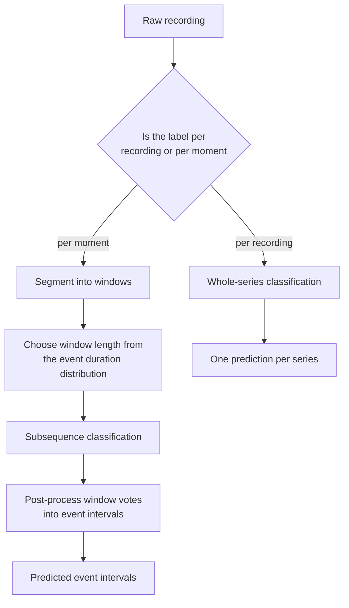
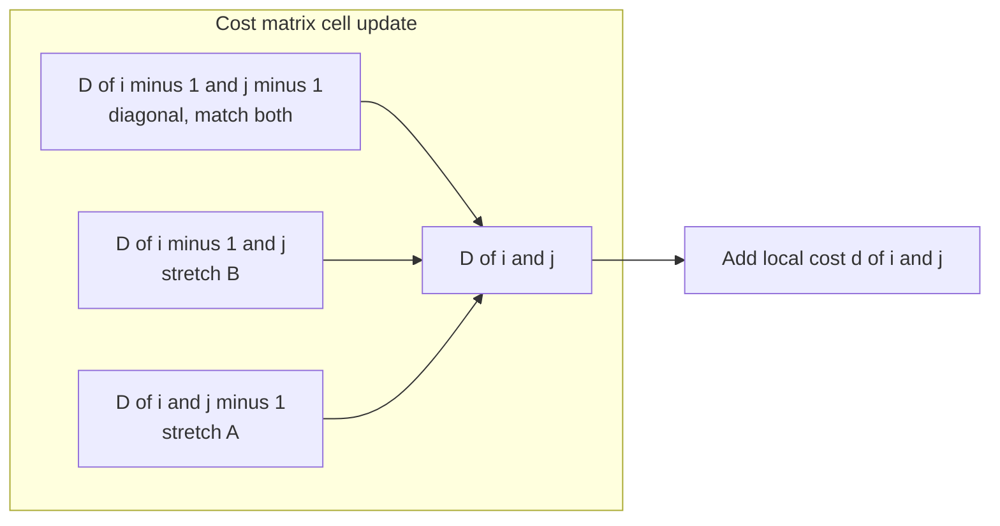
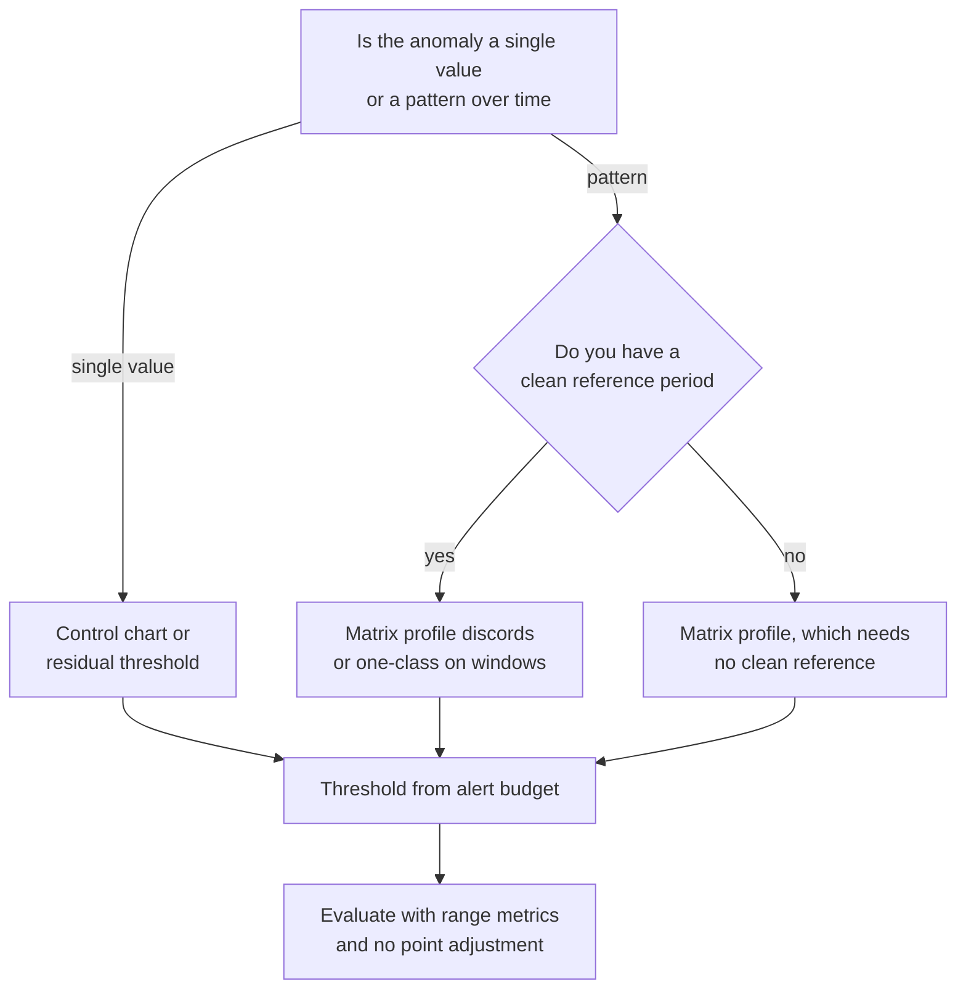
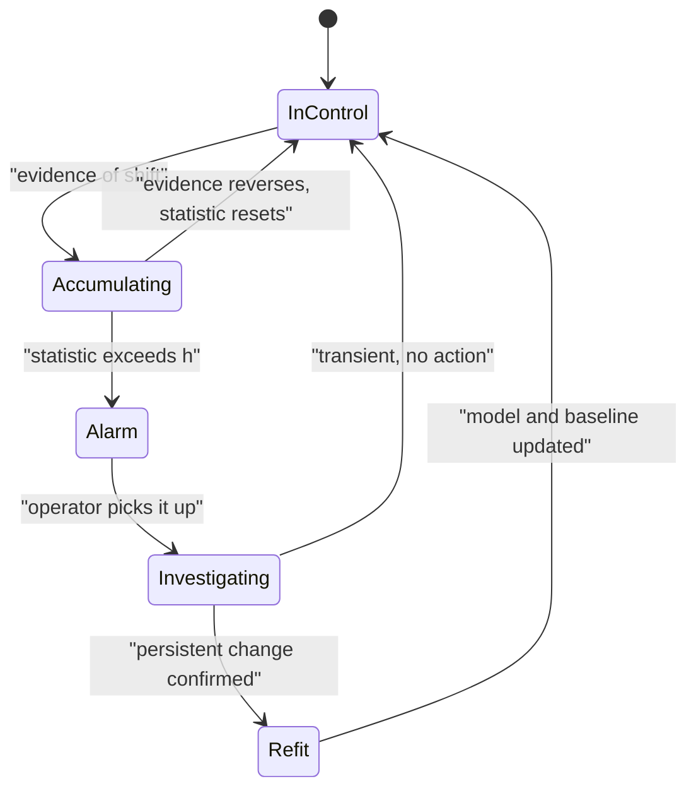

# Chapter 45: Time-Series Classification, Clustering, and Anomaly Detection

> **What this chapter covers**: The temporal tasks that are not forecasting. Whole-series and subsequence classification, dynamic time warping derived with its recurrence and its warping constraints, the lower bounds that make nearest-neighbour search tractable, interval and shapelet and dictionary and random-convolution methods, deep classifiers and ensembles, clustering under elastic distances with the barycentre problem, self-supervised representation learning for series, anomaly detection from statistical process control through matrix profile to reconstruction methods, the threshold problem, the evaluation of anomaly detection including the point-adjustment protocol and why it inflates published results, and change-point detection offline and online.
> **Prerequisites**: Chapter 4 (classical machine learning), Chapter 5 (evaluation and validation), Chapter 11 (time-series overview), Chapter 12 (signals and sensor data) for sampling and the frequency domain, Chapter 27 (monitoring and drift) for the production-monitoring view of the same mathematics.
> **Where it is used**: Wearable and clinical activity recognition, industrial condition monitoring and predictive maintenance, network and infrastructure alerting, fraud and abuse detection on event streams, quality control in manufacturing, gesture and speech segmentation, and any system that must decide what a stretch of signal *is* rather than what comes next.

---

## 45.1 Level 1: Foundations

### The three tasks and what distinguishes them

Chapter 11 framed the time-series world around forecasting. Most of the temporal work an engineer actually ships is not forecasting. It is deciding what a recorded stretch of signal means, grouping stretches that behave alike, or noticing that something has gone wrong. Those are classification, clustering, and anomaly detection.

| Task | Input | Output | Label availability | Canonical example |
|---|---|---|---|---|
| Classification | A series or a window of one | A discrete class | Labels exist, usually in modest quantity | Which activity is this 5-second accelerometer window |
| Clustering | A collection of series | A partition or a hierarchy | No labels at all | Group 40,000 store demand curves into shapes |
| Anomaly detection | A stream or a collection | A score, then a binary flag | Labels are rare, biased, and late | Flag an abnormal vibration signature on a pump |
| Change-point detection | A stream | A set of times | Labels rare | Detect the moment a sensor was recalibrated |

The line between the last two is not cosmetic. An anomaly is a transient excursion, and the correct response is to investigate the event. A change point is a persistent shift in the generating process, and the correct response is to refit the model or revisit the feature definitions. Chapter 11 made this distinction; the mechanisms for each are developed here.

### Whole-series versus subsequence

Two problem shapes recur throughout this chapter, and mixing them up is the most common structural error in a temporal classification project.

**Whole-series.** The dataset is a collection of already-segmented series. Each has one label. Each may be short, say 100 to 2,000 observations. This is the shape of the standard academic benchmarks and of many industrial inspection problems, where a machine cycle is naturally bounded.

**Subsequence.** The dataset is one or a few long recordings, and the label varies within a recording. You must both locate the interesting stretch and label it. This is the shape of activity recognition from a continuous wearable stream, of arrhythmia detection in a multi-hour electrocardiogram, and of most real monitoring problems.

The subsequence problem is harder in a specific way: you introduce a window length and a stride, and both become hyperparameters that interact with the phenomenon's duration. If the event lasts 3 seconds and your window is 10 seconds, every positive window is 70 percent background, and the classifier learns background statistics. If your window is 1 second, no window contains a whole event. Fix the window by measuring the event-duration distribution in labelled data before choosing, not by tuning the window against the test score.


*Figure 45.1: The first modelling decision is whether labels attach to whole recordings or to moments inside them, because everything downstream differs.*

### Univariate versus multivariate

A univariate series is one channel over time. A multivariate series is several channels sampled together, such as three accelerometer axes plus three gyroscope axes. Multivariate problems add two questions. Are the channels synchronised on the same clock, and are they on comparable scales? If the channels drift relative to each other, per-channel alignment can be meaningful; if they share a clock, treating them as a single vector-valued series is correct. Chapter 12 covers resampling several sensor streams onto a common time base, which you should do before anything in this chapter.

Many strong methods handle multivariate data by the simplest route: run the univariate method per channel and concatenate the results. That is a real baseline, not a placeholder, and it is frequently competitive with methods that model cross-channel structure explicitly.

### Why the obvious distance fails

Suppose two people perform the same gesture. One does it slightly faster. Sample both at 50 Hz and compare with Euclidean distance point by point. The distance is large, because peak in one series lines up with trough in the other. The two series have the same *shape* and a different *timing*, and Euclidean distance cannot separate those two facts.

This single observation drives most of the classical time-series classification literature. If shape matters and timing is a nuisance, you need a distance that permits one series to be stretched and compressed in time before comparison. That is dynamic time warping, derived in level 3. If shape matters and *location within the series* is the nuisance, you need methods that find a discriminative small pattern anywhere in the series. Those are shapelets and dictionary methods. If neither shape nor location is what separates the classes, and it is really a summary statistic such as spectral energy or autocorrelation structure, you need feature-based methods, which are often the best answer and are frequently skipped because they are unglamorous.

### The anomaly taxonomy, restated with consequences

| Kind | Definition | What detects it | What fails |
|---|---|---|---|
| Point anomaly | A single observation far from expectation given no context | A threshold on the value or on a residual | Nothing much; this case is easy |
| Contextual anomaly | A value that is ordinary in general but abnormal in its temporal context | A forecasting residual, because the forecast supplies the context | A global threshold on the raw value |
| Collective anomaly | A subsequence abnormal as a whole while each point looks ordinary | Matrix profile discords, subsequence reconstruction error, sequence models | Any per-point method |
| Change point | A persistent shift in the process | CUSUM, Bayesian online change-point detection, segmentation | Anomaly detectors, which emit a permanent alert flood |

The operational reality that dominates all of these: you almost never have labels. You have a handful of confirmed incidents, retrospectively identified, with imprecise start and end times, discovered through a biased channel such as a customer complaint. That biased, tiny, temporally imprecise label set is what you must build evaluation on, and it is why the evaluation section in level 3 is the longest in this chapter.

---

## 45.2 Level 2: Working knowledge

### Getting the data into shape

Before any method, three preparation steps decide most of the outcome.

**Resample to a fixed grid.** Elastic distances, convolutions, and neural networks all assume a regular sampling interval. Chapter 12 owns the mechanics of resampling and anti-alias filtering. Do not skip the anti-alias filter when downsampling.

**Decide on normalisation, and decide per problem.** The standard in the classification literature is z-normalisation per series: subtract the series mean and divide by the series standard deviation. This makes the distance compare *shape* and discard offset and amplitude. That is correct when a gesture is the same gesture performed loudly or quietly. It is wrong when amplitude is the signal, as in vibration severity or transaction value. Z-normalising a problem where amplitude carries the class is the single most common silent accuracy loss in this area. State the choice explicitly in the experiment record.

**Split by the right unit.** If several series come from the same subject, device, machine, or production run, a random split leaks. Chapter 12 develops subject-wise validation in full; apply it here. For subsequence problems, split by recording, and take care that overlapping windows from the same recording never straddle the split boundary.

### The baselines that must be beaten

Run these before anything else, in this order. They take an afternoon and they set the bar.

| Baseline | Cost | Why it matters |
|---|---|---|
| Majority class | Seconds | Tells you the imbalance |
| Summary features plus a gradient-boosted tree | Minutes | Mean, variance, min, max, slope, autocorrelation at a few lags, spectral band energies. Often within a few points of the best method |
| One-nearest-neighbour with Euclidean distance | Minutes | The zero-thought shape baseline |
| One-nearest-neighbour with constrained dynamic time warping | Minutes to hours | The classical reference point in this field for two decades |
| A random-convolution transform plus a linear classifier | Minutes | Very strong, very cheap, described in level 3 |

If a deep model does not beat all five, it is not earning its operational cost. The literature has repeatedly found that a tuned cheap method is close to the frontier on the standard benchmarks, and level 4 covers the honest state of that comparison.

**Listing 45.1: the feature baseline in scikit-learn terms.**

```python
import numpy as np
from scipy import stats

def summarise(window: np.ndarray, fs: float) -> dict:
    """Summary features for one univariate window sampled at fs hertz."""
    x = np.asarray(window, dtype=float)
    d = np.diff(x)
    spec = np.abs(np.fft.rfft(x * np.hanning(len(x)))) ** 2
    freqs = np.fft.rfftfreq(len(x), d=1.0 / fs)
    total = spec.sum() + 1e-12
    feats = {
        "mean": x.mean(), "std": x.std(), "min": x.min(), "max": x.max(),
        "skew": stats.skew(x), "kurtosis": stats.kurtosis(x),
        "iqr": np.subtract(*np.percentile(x, [75, 25])),
        "mean_abs_diff": np.abs(d).mean(),
        "zero_crossings": int(np.sum(np.diff(np.sign(x - x.mean())) != 0)),
        "slope": np.polyfit(np.arange(len(x)), x, 1)[0],
        "acf1": float(np.corrcoef(x[:-1], x[1:])[0, 1]) if len(x) > 2 else 0.0,
        "spectral_centroid": float((freqs * spec).sum() / total),
        "spectral_entropy": float(stats.entropy(spec / total)),
    }
    for lo, hi in [(0.5, 3), (3, 8), (8, 15)]:
        band = (freqs >= lo) & (freqs < hi)
        feats["band_%g_%g" % (lo, hi)] = float(spec[band].sum() / total)
    return feats
```

The non-obvious lines: the Hann window before the transform reduces spectral leakage from the abrupt window edges, which Chapter 12 explains; `total` carries a small constant so a flat window cannot divide by zero; the band ratios are normalised by total power so they survive amplitude normalisation; and `acf1` is computed directly rather than through a library so the function has no dependency beyond NumPy and SciPy. Extend the band list to match the physics of your sensor rather than copying these values.

### The standard workflow


*Figure 45.2: The workflow. The order of split-then-segment is deliberate, because segmenting first makes leakage across the split almost impossible to avoid.*

### Segmenting without leaking

The order of operations in Figure 45.2 is split, then segment. Doing it the other way round is the most common leak in this area, because overlapping windows from one recording are near-duplicates, and one of each pair landing in each split turns the test score into a memorisation score.

**Listing 45.2: windowing after a group-aware split.**

```python
import numpy as np
from sklearn.model_selection import GroupShuffleSplit

def window_recording(x, y, win, stride):
    """Slice one recording into windows; label a window by its modal label."""
    idx = np.arange(0, len(x) - win + 1, stride)
    xs = np.stack([x[i:i + win] for i in idx])
    ys = np.array([np.bincount(y[i:i + win]).argmax() for i in idx])
    return xs, ys, idx

def build(recordings, labels, groups, win, stride, test_frac=0.25, seed=0):
    keys = np.arange(len(recordings))
    tr, te = next(GroupShuffleSplit(
        n_splits=1, test_size=test_frac, random_state=seed
    ).split(keys, groups=groups))          # split whole recordings, by subject
    out = {}
    for name, sel in (("train", tr), ("test", te)):
        xs, ys, src = [], [], []
        for r in sel:
            a, b, _ = window_recording(recordings[r], labels[r], win, stride)
            xs.append(a); ys.append(b); src.append(np.full(len(b), groups[r]))
        out[name] = (np.concatenate(xs), np.concatenate(ys),
                     np.concatenate(src))
    return out
```

The non-obvious lines: `GroupShuffleSplit` is given the *subject* identifier, not the recording index, so two recordings from the same person cannot straddle the boundary; the split happens on whole recordings before any window is cut; the modal label per window is a choice that must be checked, since a window spanning a transition gets an arbitrary label and you may prefer to drop such windows entirely; and the source group is carried through so that error analysis can be broken down per subject, which is where the real variance in these problems lives.

### Tooling

| Library | What it is for | Caveat |
|---|---|---|
| `aeon` and `sktime` | Broad time-series classification, clustering, and transformation, with a scikit-learn-shaped interface | These two share ancestry and have diverged; check which one holds the estimator you want in your version |
| `tslearn` | Elastic distances, DTW barycentre averaging, k-shape clustering | Good for the clustering material in this chapter |
| `stumpy` | Matrix profile, exact and approximate | The reference implementation of the mechanism in level 3 |
| `tsfresh` and `catch22` | Automated feature extraction, the second being a compact curated set | `tsfresh` generates hundreds of features and needs its own selection step |
| `pyod` and `PyTorch` | General outlier detectors and custom deep detectors | `pyod` is mostly not temporal; use it on windowed features |
| `ruptures` | Offline change-point detection with several cost functions and search strategies | Offline only |

Library interfaces here move faster than in most of machine learning. Pin versions and check the signature of anything you call.

### Mistakes everyone makes first

- Z-normalising when amplitude is the class signal, or failing to z-normalise when offset is a nuisance.
- Segmenting into overlapping windows before splitting, so near-duplicate windows appear in train and test.
- Using accuracy on a 1-percent-positive anomaly problem. Chapter 5 covers why; use precision and recall at the operating point.
- Evaluating anomaly detection with the point-adjustment protocol without understanding what it does, which is covered at length in level 3.
- Tuning the anomaly threshold on the same labelled incidents used to report performance.
- Treating a change point as a stream of anomalies, producing a permanent alert and no corrective action.
- Reporting a clustering result without any statement of what the clusters are for.

---

## 45.3 Level 3: Depth

### 45.3.1 Dynamic time warping, derived

Let $A = (a_1, \ldots, a_n)$ and $B = (b_1, \ldots, b_m)$ be two series, possibly of different lengths. Let $d(i,j)$ be a local cost between $a_i$ and $b_j$, usually $(a_i - b_j)^2$ or $|a_i - b_j|$.

A **warping path** is a sequence of index pairs $P = (p_1, \ldots, p_K)$ with $p_k = (i_k, j_k)$, satisfying three conditions:

1. *Boundary*: $p_1 = (1,1)$ and $p_K = (n,m)$. Both series are matched from start to end.
2. *Monotonicity*: $i_{k+1} \ge i_k$ and $j_{k+1} \ge j_k$. Time never runs backwards.
3. *Continuity*: $i_{k+1} - i_k \le 1$ and $j_{k+1} - j_k \le 1$. No index is skipped.

The cost of a path is $\sum_{k=1}^{K} d(i_k, j_k)$, and dynamic time warping is the minimum over all admissible paths:

$$\mathrm{DTW}(A,B) = \min_{P} \sum_{k=1}^{K} d(i_k, j_k)$$

The number of admissible paths grows exponentially in $n$ and $m$, so the minimum is computed by dynamic programming. Define $D(i,j)$ as the cost of the cheapest path from $(1,1)$ to $(i,j)$. The three continuity-permitted predecessors of $(i,j)$ are $(i-1,j)$, $(i,j-1)$, and $(i-1,j-1)$, which gives the recurrence:

$$D(i,j) = d(i,j) + \min\big\{\, D(i-1,j),\; D(i,j-1),\; D(i-1,j-1) \,\big\}$$

with $D(1,1) = d(1,1)$ and $D(i,0) = D(0,j) = \infty$ for the boundary. Then $\mathrm{DTW}(A,B) = D(n,m)$.

Each move has a meaning. A step to $(i-1,j)$ means $B$ is held while $A$ advances, so $B$ is being stretched. A step to $(i,j-1)$ stretches $A$. The diagonal step advances both, which is the ordinary point-to-point match. So DTW is exactly "the cheapest way to align the two series if I am allowed to stretch either one locally".

**Worked example.** Let $A = (1,2,3)$ and $B = (1,1,2,3)$ with $d(i,j) = |a_i - b_j|$. Filling the table row by row:

| | $b_1 = 1$ | $b_2 = 1$ | $b_3 = 2$ | $b_4 = 3$ |
|---|---|---|---|---|
| $a_1 = 1$ | 0 | 0 | 1 | 3 |
| $a_2 = 2$ | 1 | 1 | 0 | 1 |
| $a_3 = 3$ | 3 | 3 | 1 | **0** |

Take the cell $(2,3)$ as an illustration. Its local cost is $|2-2| = 0$, and the cheapest predecessor is $D(1,2) = 0$, so $D(2,3) = 0$. The final answer is $D(3,4) = 0$: the two series are identical under warping, which they are, since $B$ is $A$ with its first value repeated. Euclidean distance cannot even be computed here, because the lengths differ.

The cost of filling the table is $O(nm)$ time and, if you need only the distance rather than the path, $O(\min(n,m))$ space by keeping two rows. Recovering the alignment itself requires the full table or a re-run.


*Figure 45.3: The three admissible predecessors in the dynamic time warping recurrence, and what each one means physically.*

### 45.3.2 The warping window, and why it changes both accuracy and cost

Unconstrained DTW allows a single point in $A$ to match an arbitrarily long stretch of $B$. That is rarely physical. It also lets the distance find spurious alignments between unrelated series, which *reduces* classification accuracy, and it costs the full $O(nm)$.

The **Sakoe-Chiba band** constrains the path to a diagonal corridor:

$$|i - j| \le w$$

where $w$ is the warping window, typically stated as a percentage of series length. The **Itakura parallelogram** is an alternative that constrains the local slope instead, allowing more warping in the middle of the series and less at the ends. The band is far more common in practice.

Two consequences, and both matter.

**Accuracy.** Warping window is a hyperparameter with an interior optimum. At $w = 0$ DTW degenerates to Euclidean distance and cannot absorb timing variation. At $w = n$ it over-warps and confuses classes. Ratanamahatana and Keogh (2004, "Making Time-Series Classification More Accurate Using Learned Constraints") established that the best window on most datasets is small, frequently under 10 percent of series length, and that the accuracy curve as a function of $w$ is typically one-humped. Learn $w$ by cross-validation on the training split. It is the single most important hyperparameter of a nearest-neighbour DTW classifier.

**Cost.** Each row of the cost matrix has only $2w+1$ reachable cells, so the complexity drops from $O(n^2)$ to $O(nw)$. At $n = 1000$ and $w = 50$ that is a twentyfold reduction before any other optimisation.

| Warping window $w$ as a fraction of $n$ | Behaviour | Relative cost at $n=1000$ |
|---|---|---|
| 0 | Euclidean distance | $1{,}000$ cells |
| 0.01 | Absorbs jitter only | $\approx 21{,}000$ cells |
| 0.05 to 0.10 | The usual accuracy optimum | $\approx 100{,}000$ to $200{,}000$ cells |
| 1.0 (unconstrained) | Over-warping, classes blur | $1{,}000{,}000$ cells |

The band also removes pathological alignments where one short segment of $A$ absorbs half of $B$. That pathology is what "over-warping" means concretely, and seeing it once in a plotted alignment path teaches the constraint better than any argument.

### 45.3.3 Lower bounds, which make nearest-neighbour search tractable

Nearest-neighbour classification with DTW requires, for a query $Q$, the distance to every candidate in the training set. Each distance is $O(nw)$. At 100,000 candidates of length 1,000 with $w = 50$ that is $10^{10}$ cell updates per query, which is far too slow for anything interactive.

The escape is that you do not need the distance to every candidate. You need the *smallest*. If a cheap function $LB(Q,C)$ satisfies

$$LB(Q,C) \le \mathrm{DTW}(Q,C) \quad \text{for all } Q, C$$

then whenever $LB(Q,C)$ exceeds the best distance found so far, $C$ cannot be the nearest neighbour and the expensive computation is skipped entirely. This is *admissible pruning*: it changes the running time and never changes the answer.

Three bounds in increasing tightness and cost:

**LB_Kim** (Kim and colleagues, 2001). Compare only the first values, the last values, the maxima, and the minima of the two series. The maximum of those four absolute differences lower-bounds DTW, because the boundary condition forces the first and last points to be matched, and the extreme values must be matched to something. Cost $O(1)$ after preprocessing. Loose, but nearly free. Under z-normalisation the maximum and minimum terms lose most of their power.

**LB_Yi** (Yi and colleagues, 1998). Sum, over points of $Q$ that exceed the maximum of $C$, the excess above that maximum, and symmetrically for points below the minimum. Cost $O(n)$.

**LB_Keogh** (Keogh, 2002, "Exact Indexing of Dynamic Time Warping) is the one that made this practical. Build an envelope around the query using the warping window:

$$U_i = \max_{\,|k-i| \le w} q_k, \qquad L_i = \min_{\,|k-i| \le w} q_k$$

The envelope is the set of values the query could take at position $i$ under any admissible warping. Then

$$LB_{\text{Keogh}}(Q,C) = \sqrt{\sum_{i=1}^{n} \begin{cases} (c_i - U_i)^2 & \text{if } c_i > U_i \\ (L_i - c_i)^2 & \text{if } c_i < L_i \\ 0 & \text{otherwise}\end{cases}}$$

The argument for admissibility is direct. In any warping, $c_i$ is matched to some $q_k$ with $|k-i| \le w$, so $q_k$ lies between $L_i$ and $U_i$. If $c_i$ is outside the envelope, the local cost of that match is at least the squared distance from $c_i$ to the nearer envelope boundary. Summing those per-point minima over $i$ can only understate the true path cost, since the path may also pay for points inside the envelope and may match several points to one. Hence the bound.

**Worked example.** Take $Q = (1,2,3,4)$ with $w = 1$. The envelopes are $U = (2,3,4,4)$ and $L = (1,1,2,3)$. For $C = (4,4,4,4)$: $c_1 = 4 > U_1 = 2$ contributes $(4-2)^2 = 4$; $c_2 = 4 > U_2 = 3$ contributes $1$; $c_3$ and $c_4$ are inside their envelopes and contribute $0$. So $LB_{\text{Keogh}} = \sqrt{5} \approx 2.236$. If the best distance found so far in this query is $2.0$, discard $C$ without touching the cost matrix. For $C = (1,1,2,3)$ every point lies inside the envelope, the bound is $0$, and the full computation must run. A bound that is zero costs you the $O(n)$ evaluation and prunes nothing, which is why bounds are cascaded.

**The cascade.** In practice you apply the bounds in order of increasing cost, stopping as soon as one prunes: LB_Kim, then LB_Yi or LB_Keogh on the query envelope, then LB_Keogh with the roles of query and candidate reversed (the bound is not symmetric, and taking the larger of the two directions is tighter), then early abandoning of the full DTW itself, in which you stop filling the cost matrix as soon as the minimum value in the current row exceeds the best-so-far. Rakthanmanon and colleagues (2012, "Searching and Mining Trillions of Time Series Subsequences under Dynamic Time Warping") assembled this cascade together with reordered early abandoning and cascading z-normalisation into what is usually called the UCR suite, and demonstrated subsequence search at a scale that was previously considered impossible.

**Order of magnitude, stated as an illustration.** With 10,000 candidates of length 1,000 and $w = 50$, the banded distances alone are about $10^9$ cell updates, which at an assumed $10^8$ cells per second in compiled code is roughly 10 seconds per query. A cascade that prunes 99 percent of candidates brings that to a fraction of a second. These numbers are illustrative, not measured; the pruning rate depends heavily on how separated the classes are.

**Listing 45.3: banded dynamic time warping with early abandoning, and LB_Keogh.**

```python
import numpy as np

def lb_keogh(q, c, w):
    """Lower bound on DTW(q, c) under a Sakoe-Chiba band of width w."""
    n = len(q)
    u = np.array([q[max(0, i - w):min(n, i + w + 1)].max() for i in range(n)])
    l = np.array([q[max(0, i - w):min(n, i + w + 1)].min() for i in range(n)])
    above = np.clip(c - u, 0, None)
    below = np.clip(l - c, 0, None)
    return float(np.sqrt((above ** 2 + below ** 2).sum()))

def dtw_banded(a, b, w, best_so_far=np.inf):
    """Banded DTW with early abandoning. Returns inf if it cannot beat best."""
    n, m = len(a), len(b)
    w = max(w, abs(n - m))                      # band must reach the corner
    prev = np.full(m + 1, np.inf); prev[0] = 0.0
    for i in range(1, n + 1):
        cur = np.full(m + 1, np.inf)
        lo, hi = max(1, i - w), min(m, i + w)
        for j in range(lo, hi + 1):
            cost = (a[i - 1] - b[j - 1]) ** 2
            cur[j] = cost + min(prev[j], cur[j - 1], prev[j - 1])
        if cur[lo:hi + 1].min() >= best_so_far ** 2:
            return np.inf                       # no path can still win
        prev = cur
    return float(np.sqrt(prev[m]))
```

The non-obvious lines: the band width is widened to at least the length difference, otherwise no admissible path reaches the final cell and the distance is spuriously infinite; the row is reused so memory is $O(m)$ rather than $O(nm)$, which is possible only because the alignment path is not needed; the early-abandon test compares the minimum of the current row against the squared best-so-far, because the loop accumulates squared costs and takes the square root once at the end; and `lb_keogh` is asymmetric, so a production cascade calls it in both directions and keeps the larger value. The nested Python loop is written for clarity, and a real implementation vectorises the inner loop or delegates to a compiled library.

### 45.3.4 Multivariate series

With $C$ channels, three strategies exist and they are not equally good on all problems.

| Strategy | Mechanism | When it wins |
|---|---|---|
| Channel concatenation of features | Run the univariate pipeline per channel and concatenate the feature vectors | Almost always a strong baseline; channels contribute independently |
| Dependent distance | Extend the local cost of an elastic distance to the vector norm across channels, so one warping path serves all channels | Channels are physically locked to one clock, such as three axes of one accelerometer |
| Independent distance | Compute the elastic distance per channel with its own warping path and sum | Channels can drift relative to each other, such as independently sampled sensors |
| Learned fusion | A convolutional or attention model over the channel dimension | Large data, genuine cross-channel interaction effects |

Shokoohi-Yekta and colleagues (2017) studied the dependent versus independent question for multivariate DTW directly and found neither dominates, with an adaptive choice per dataset outperforming either fixed rule. That result generalises: choose by cross-validation rather than by argument.

The practical trap in multivariate work is scale. If one channel is in millivolts and another in metres per second squared, an unnormalised vector norm is effectively univariate on the large-scale channel. Normalise per channel, using statistics computed on the training split only.

### 45.3.5 Elastic distance variants

DTW is not the only elastic distance, and on some datasets it is not the best.

| Distance | Idea | When it helps |
|---|---|---|
| Derivative DTW | Run DTW on the first difference rather than the raw values | Removes the singularity where one point absorbs a long flat stretch |
| Weighted DTW | Penalise the warping amount rather than forbidding it past a hard band | Smooth alternative to the Sakoe-Chiba band |
| Edit distance with real penalty (ERP) | A true metric, uses a gap constant | When you need the triangle inequality for indexing |
| Longest common subsequence (LCSS) | Counts matches within a tolerance, ignores the rest | Robust to outliers and to noise spikes |
| Move-split-merge (MSM) | Edit operations with a cost that satisfies metric axioms | Frequently the strongest single elastic distance in published comparisons |
| Time-warp edit (TWE) | Combines edit operations with an explicit time penalty | Similar niche to MSM |
| Soft-DTW (Cuturi and Blondel, 2017) | Replaces the hard minimum with a smoothed log-sum-exp, giving a differentiable loss | Needed for gradient-based learning and for barycentres |

Soft-DTW deserves a note because it unlocks the clustering material below. Replacing $\min$ with $-\gamma \log \sum \exp(-\cdot/\gamma)$ makes the whole recurrence differentiable in the input series. As $\gamma \to 0$ it recovers DTW. The price is that soft-DTW is not a metric and can be negative, so its "divergence" variant subtracts the self-terms.

### 45.3.6 Interval and feature-based approaches

Rather than comparing whole shapes, extract summary statistics from many randomly chosen intervals of the series and hand them to an ensemble.

**Time series forest** (Deng and colleagues, 2013). Each tree in a forest selects random intervals and uses the mean, standard deviation, and slope over each interval as candidate splits. It is fast, has almost no hyperparameters, and handles the case where the discriminative information is "the variance in the middle third is high".

**Canonical interval forest and its successors** extend this by drawing the interval features from a larger curated catalogue, including the 22 features of `catch22` (Lubba and colleagues, 2019), which were selected from thousands by requiring both individual discriminative power and low mutual redundancy across the standard benchmark archive.

**tsfresh-style extraction** computes several hundred features per series and then applies a hypothesis-test-based filter. It works, but the filter is a multiple-comparison procedure over hundreds of tests and you must understand what it controls. Chapter 27 covers the false discovery rate machinery it uses.

Feature-based methods have one large practical advantage that is rarely stated: the features are interpretable and can be monitored in production, whereas a warping distance to a stored exemplar cannot.

### 45.3.7 Shapelets

A **shapelet** is a short subsequence whose distance to a series is discriminative for the class. The distance from a shapelet $S$ of length $\ell$ to a series $T$ is the minimum over all placements:

$$\mathrm{sdist}(S, T) = \min_{\,1 \le p \le |T| - \ell + 1} \; \frac{1}{\ell}\,\lVert \hat{S} - \hat{T}_{p:p+\ell-1} \rVert_2^2$$

where the hats denote z-normalisation of each window. The feature "distance to this shapelet" is then a single number per series, and a decision threshold on it separates classes. The appeal is interpretability: you can plot the shapelet on top of an example and show a domain expert the exact motif that distinguishes a failing bearing from a healthy one.

**Discovery cost.** The original formulation (Ye and Keogh, 2009) enumerates every subsequence of every training series as a candidate, computes its distance to every training series, and scores the resulting split by information gain. With $N$ series of length $n$, the number of candidates is $O(Nn^2)$ across all lengths, and each candidate costs $O(Nn)$ to evaluate. That is $O(N^2 n^3)$, which is prohibitive beyond toy sizes. The standard accelerations are early abandoning of the sdist computation, admissible pruning of the information-gain bound, caching of normalised statistics, restricting candidate lengths to a small set, and random sampling of candidates. The **shapelet transform** decouples discovery from classification: find the top $k$ shapelets once, convert every series to a $k$-dimensional distance vector, and then use any ordinary classifier.

**Learned shapelets** (Grabocka and colleagues, 2014) abandon enumeration entirely. Treat the shapelets as free parameters, replace the hard minimum in sdist with a soft minimum so the objective is differentiable, and optimise shapelets and classifier weights jointly by gradient descent. This is far cheaper and often more accurate, at the cost of initialisation sensitivity and a loss of the guarantee that the shapelet is a real subsequence that occurred in the data, which weakens the interpretability claim.

### 45.3.8 Dictionary methods

Dictionary methods convert a series into a sequence of discrete symbols and then classify by the histogram of short symbol patterns. They target problems where the *frequency* of a motif matters rather than its presence.

**Symbolic aggregate approximation (SAX)** (Lin and colleagues, 2007) is the standard discretisation. Z-normalise the window, reduce it to $s$ segment means (piecewise aggregate approximation), then map each mean to a letter using breakpoints that split a standard normal into equiprobable regions. The equiprobable choice matters: it makes each letter equally likely under the null, so a skewed alphabet cannot dominate the histogram.

**BOSS** (Schäfer, 2015, "The BOSS is concerned with time series classification in the presence of noise") uses a Fourier-based discretisation rather than segment means, builds a histogram of words over sliding windows with numerosity reduction so a stationary stretch does not flood the histogram, and classifies by a bespoke non-symmetric histogram distance. **WEASEL** adds a supervised feature selection step using a chi-squared statistic over the word features, which cuts the enormous feature space produced by many window lengths.

### 45.3.9 Random convolution methods

**ROCKET** (Dempster and colleagues, 2020, "ROCKET: exceptionally fast and accurate time series classification using random convolutional kernels") applies a large number of random one-dimensional convolution kernels, typically 10,000, with randomly sampled lengths, weights, biases, dilations, and paddings. No kernel is trained. From each kernel's output map it takes two summaries: the maximum, and the *proportion of positive values*. Those $2k$ features go into a ridge regression classifier or a logistic regression.

Two things make this work. The random dilations sample a wide range of time scales without anyone choosing them. And the proportion-of-positive-values statistic, which is the genuinely novel part, captures how often a pattern occurs rather than how strongly it occurs once, which is exactly the dictionary-method intuition obtained for free.

**MiniRocket** replaces most of the random sampling with a small fixed set of kernel shapes and deterministic biases, making it roughly an order of magnitude faster with comparable accuracy. On the standard archives this family is competitive with the best ensembles at a small fraction of the compute, which is why it belongs in the baseline list in level 2 and not in an appendix.

### 45.3.10 Deep approaches for classification

The reliable deep baselines here are simpler than the forecasting literature would suggest.

| Architecture | Shape | Notes |
|---|---|---|
| Fully convolutional network | Three convolution blocks, global average pooling, softmax | Strong, small, and the global pooling gives a class activation map for free |
| ResNet for series | Three residual blocks of the above | Usually a point or two better than the plain convolutional network |
| InceptionTime (Ismail Fawaz and colleagues, 2020) | Ensemble of inception-style networks with multiple kernel sizes per block | The strongest widely used deep classifier on the standard archive |
| Recurrent encoders | LSTM or GRU over the raw series | Generally weaker than convolutions for classification and slower to train |
| Transformers | Patch the series, then attend | Competitive with enough data; see Chapter 42 for the patching mechanics |

Chapter 7 covers convolutional and recurrent mechanics and Chapter 8 covers attention; the temporal specialisation is mostly in the input pipeline, not in the layers.

### 45.3.11 Ensembles and the state of the benchmarks

**HIVE-COTE 2.0** (Middlehurst and colleagues, 2021) combines a shapelet-transform classifier, a dictionary classifier, an interval forest, and a ROCKET-based component, weighting them by estimated accuracy. It has been the top performer on the UCR and UEA archives in published comparisons. It is also expensive enough that it is rarely the right production choice, and this is an honest tension worth naming: the accuracy leader in the literature and the sensible deployment choice are different objects.

Read benchmark claims in this field carefully. Three specific cautions. The archives supply a fixed single train and test split, and many papers report on that single split, so differences of a fraction of a point are noise. Comparisons should use resampling and a critical difference diagram (Demšar, 2006) with an appropriate post-hoc test. And the archive series are mostly short, clean, equal-length, and pre-segmented, which describes almost no production problem.

### 45.3.12 Clustering time series

Clustering asks for structure with no labels at all, so every choice has to be justified by what the clusters are *for*.

**Distance choice.** Euclidean on z-normalised series clusters by shape and offset. DTW clusters by shape allowing timing variation. Feature-vector distance clusters by behaviour summary. Correlation distance clusters by co-movement, which is the right choice when you care that two series move together rather than that they look alike.

**The averaging problem.** k-means needs a centroid, defined as the point minimising the sum of squared distances to the cluster's members. Under Euclidean distance that is the arithmetic mean, in closed form. Under DTW it is not: the arithmetic mean of series that are misaligned smears out exactly the shape the distance was chosen to preserve. This is the central technical obstacle to elastic clustering.

Two solutions:

*DTW barycentre averaging* (Petitjean and colleagues, 2011). Iterate: align every member to the current centroid with DTW, then set each centroid coordinate to the mean of all the member values that aligned to it, then repeat. This is an expectation-maximisation style procedure and it decreases the objective monotonically, converging to a local optimum that depends on the initialisation.

*Soft-DTW barycentres* (Cuturi and Blondel, 2017). Because soft-DTW is differentiable in the centroid, the barycentre is obtained by gradient descent directly on the sum of soft-DTW distances. Smoother results, one extra hyperparameter $\gamma$.

**k-shape** (Paparrizos and Gravano, 2015) takes a different route, using a normalised cross-correlation distance that is shift-invariant but not stretch-invariant, with a centroid computed as the leading eigenvector of a scatter matrix. It is much faster than DTW-based clustering and is a good default when the variation is a phase shift rather than a speed change.

**Validating a clustering nobody labelled.** State the purpose first, then choose the check.

| Purpose | Validation |
|---|---|
| Reduce the number of forecasting models | Does per-cluster modelling beat one global model and beat per-series models, measured by forecast accuracy |
| Find segments for a human to act on | Stability under resampling, plus expert review of the medoids |
| Preprocessing for a downstream classifier | Downstream accuracy, which is the only honest criterion |
| Exploratory understanding | Silhouette or gap statistic, reported with the caveat that they favour the distance they were computed with |

The stability check is the most useful and the least used: cluster repeated bootstrap samples, match clusters between runs, and report the adjusted Rand index between runs. A clustering that does not survive resampling is a description of noise.

### 45.3.13 Representation learning for series

Self-supervised pretraining, developed generally in Chapter 9, adapts to series with temporal objectives.

**Contrastive approaches** build two views of the same window and train an encoder to map them close while pushing other windows apart. The whole method lives or dies on the augmentation design, because the augmentations declare what you consider irrelevant. Jitter declares that small additive noise is irrelevant. Scaling declares amplitude is irrelevant, which is wrong if amplitude carries the label. Time warping declares speed is irrelevant. Permutation of segments declares order within the window is irrelevant, which is a strong and often false claim. Choose augmentations from the physics of the sensor, not from a list.

Specific methods worth knowing: **TS2Vec** (Yue and colleagues, 2022) contrasts at multiple temporal resolutions and produces per-timestamp representations rather than one vector per window, which is what subsequence tasks need. **TNC** (Tonekaboni and colleagues, 2021) uses temporal neighbourhood as the positive-pair definition, on the assumption that nearby windows share a latent state, and handles the sampling bias that non-neighbours may still be similar. **TF-C** contrasts the time-domain and frequency-domain views of the same window, which is an elegant way to avoid hand-designed augmentations.

**Masked reconstruction** masks spans of the input and trains the model to reconstruct them. It is simpler, avoids the augmentation question entirely, and is the dominant approach at larger scale. Mask contiguous spans rather than individual points, because reconstructing a single masked point from its immediate neighbours is trivial interpolation and teaches nothing.

**Evaluating a representation.** Freeze the encoder and fit a linear probe for the downstream task. Report the probe's score against a supervised model trained from scratch on the same labelled subset, at several labelled-set sizes. A representation that helps at 100 labels and not at 10,000 is still valuable, and reporting only the full-data number hides that.

### 45.3.14 Anomaly detection methods

**Statistical process control.** The oldest family, and still the right answer for stable industrial processes. A Shewhart chart flags any point beyond $\mu \pm 3\sigma$ estimated from a stable reference period. It detects large shifts fast and small shifts never. EWMA and CUSUM charts accumulate evidence over time and detect small persistent shifts far sooner; CUSUM is derived in the change-point section below. The framework's discipline of an explicitly defined in-control reference period is worth importing into any detector.

**Forecasting residuals.** Fit a forecasting model, compute $r_t = y_t - \hat y_t$, and score $|r_t| / \hat\sigma_t$ where $\hat\sigma_t$ is the model's own predicted standard deviation at that horizon. This handles contextual anomalies by construction, because the forecast supplies the context. Two cautions. Use one-step-ahead residuals for detection; multi-step residuals confound forecast error with anomaly. And the forecast model itself must not be retrained on contaminated history, or it will learn the anomaly as normal.

**Distance and density.** k-nearest-neighbour distance and local outlier factor applied to windowed feature vectors. Local outlier factor compares a point's local density to the density of its neighbours, so it handles the case where normal behaviour has several modes of different tightness. These are strong baselines on windowed features and are frequently better than a deep model on modest data.

**Matrix profile.** For a fixed subsequence length $\ell$, the matrix profile stores, for every position $i$, the z-normalised Euclidean distance from the subsequence starting at $i$ to its nearest neighbour elsewhere in the series, excluding a trivial-match exclusion zone of about $\ell/2$ around $i$. Low values are **motifs**, repeated patterns. High values are **discords**, subsequences with no close match anywhere, which are collective anomalies by definition.

The mechanism that makes it tractable: the z-normalised Euclidean distance between two windows can be written in terms of their dot product and their running means and standard deviations. All the dot products of one query against every window are computed in $O(n \log n)$ by convolution through the fast Fourier transform, and the means and standard deviations come from prefix sums in $O(n)$. That gives the distance profile for one query in $O(n \log n)$; STOMP then observes that the dot products for query $i+1$ can be updated from those of query $i$ in constant time per entry, reducing the full profile to $O(n^2)$ time with $O(n)$ memory, and the same recurrence parallelises cleanly. The practical appeal is that the only parameter is $\ell$, and it is exact.

**Reconstruction approaches.** Train an autoencoder, a variational autoencoder, or a sequence-to-sequence model to reconstruct normal windows, and score by reconstruction error. The assumption is that a model with a narrow bottleneck trained on mostly normal data reconstructs normal patterns well and anomalies poorly. The assumption fails more often than the literature suggests. A sufficiently expressive autoencoder learns the identity function and reconstructs anomalies perfectly; a convolutional autoencoder with a large receptive field will happily copy a spike through. Constrain capacity deliberately and verify on held-out injected anomalies that reconstruction error actually separates.

**One-class methods.** One-class support vector machines and support vector data description fit a boundary around the normal data. Deep SVDD replaces the kernel with a learned encoder trained to map normal data into a small hypersphere, with the well-known caveat that the trivial solution of mapping everything to the centre must be blocked by removing bias terms and bounded activations. Isolation forest isolates points by random axis-aligned splits and scores by path length, which is cheap, handles high dimension, and is a reasonable default on windowed features.


*Figure 45.4: A method-selection path for anomaly detection, ending at the two steps practitioners most often skip.*

### 45.3.15 The threshold problem

A detector emits a score. An operations team needs a binary flag. The map between them is where most anomaly detection projects fail, because it cannot be learned from data you do not have.

Four ways to set it, in increasing order of defensibility:

1. **Fixed sigma multiple.** Three standard deviations from a reference period. Simple, and wrong whenever the score distribution is not Gaussian, which for maxima and reconstruction errors it never is.
2. **Empirical quantile of a clean period.** Take the 99.9th percentile of the score over a period believed to be free of incidents. Better, and fully dependent on the belief being correct.
3. **Extreme value tail fit.** Fit a generalised Pareto distribution to the exceedances above a high threshold using the peaks-over-threshold method, and read off the quantile corresponding to your target rate. This extrapolates into the tail properly instead of relying on having observed the tail, which is the whole point. Siffer and colleagues (2017, "Anomaly Detection in Streams with Extreme Value Theory") developed the streaming version.
4. **Alert budget.** Decide first how many alerts per day the team can actually investigate, then set the threshold to produce that rate on recent data, then recompute it on a rolling basis as the score distribution drifts.

The alert budget is unglamorous and usually correct. A detector producing 500 alerts a day for a team that can review 10 is worse than no detector, because it trains people to ignore the channel. Fix the budget first and let it determine the operating point, then report the recall you achieve at that budget as the headline number. Chapter 27 covers alert design and fatigue more generally.

**Worked example.** A stream with one observation per minute gives 1,440 observations per day per series, across 200 series, so 288,000 scores per day. A budget of 20 alerts per day, with alerts grouped so that consecutive flagged minutes within an hour count once, requires a per-observation flag rate of roughly $20 \times 5 / 288{,}000 \approx 3.5 \times 10^{-4}$ if a typical event produces about five flagged minutes. That is the 99.965th percentile of the score distribution. Knowing the required quantile before you start tells you immediately whether your evaluation set of six labelled incidents can possibly estimate performance there. It cannot, and that is useful to know on day one.

### 45.3.16 Evaluating anomaly detection, and the point-adjustment problem

This section is longer than its neighbours on purpose. More published time-series anomaly detection results are inflated by their evaluation protocol than by any modelling error, and an engineer who understands the mechanism reads the literature differently afterwards.

**Point-wise metrics.** Treat each timestamp as an independent classification. Compute precision, recall, and $F_1$ at the operating threshold. Report the precision-recall curve rather than the receiver operating characteristic curve, because at 0.1 percent positives the false positive rate axis is uninformative: a detector can flag ten times more false positives than true ones and still show a tiny false positive rate. Chapter 5 develops this.

The honest objection to point-wise scoring is that it punishes a detector that flags a 200-minute outage at minute 3 and stops, even though operationally that detector did everything anyone wanted.

**Range-based metrics.** Tatbul and colleagues (2018, "Precision and Recall for Time Series") generalise precision and recall to ranges. A predicted range and a ground-truth range get credit through four tunable components: an existence reward for touching a true range at all, an overlap size term, a positional bias that can favour detecting the front of an event, and a cardinality penalty for fragmenting one true event into many predictions. The parameters must be stated whenever the metric is reported, because the metric is a family, not a single number.

Later proposals attack the same problem differently. Affiliation-based metrics (Huet and colleagues, 2022) score by the average temporal distance between predictions and the nearest ground-truth events, which avoids the tuning parameters. Volume-under-the-surface metrics (Paparrizos and colleagues, 2022) integrate over both threshold and a tolerance buffer, removing the threshold choice from the comparison.

**Detection delay** must be reported alongside any of these. For a monitoring system the time from event onset to alert is often the only number the consumer cares about. Report the median and the 90th percentile delay, both conditioned on eventual detection, plus the fraction never detected.

**Point adjustment, and why it inflates results.** The protocol, introduced by Xu and colleagues (2018) in the context of a variational autoencoder detector and adopted very widely afterwards, is this: if *any* point inside a ground-truth anomaly segment is flagged, then *every* point in that segment is counted as a true positive. Points outside segments are scored normally.

The justification offered is the operational one above: detecting an event once is enough. The problem is what the protocol does to the arithmetic when segments are long.

**Worked example, and this is the whole argument.** Take a test series of 10,000 points containing 10 anomaly segments of 100 points each, so 1,000 anomalous points, a 10 percent contamination rate typical of the widely used server-machine and spacecraft benchmarks. Now take a detector with no skill at all: it flags each point independently at random with probability $p = 0.05$.

*Without adjustment.* Expected true positives $= 0.05 \times 1{,}000 = 50$. Expected false positives $= 0.05 \times 9{,}000 = 450$. Precision $= 50/500 = 0.10$, recall $= 0.05$, and

$$F_1 = \frac{2 \times 0.10 \times 0.05}{0.10 + 0.05} = 0.067$$

which correctly says the detector is worthless.

*With point adjustment.* A segment is fully credited if it contains at least one flag. The probability a given 100-point segment contains no flag is $0.95^{100} \approx 0.0059$, so each segment is credited with probability $0.9941$. Expected credited segments $\approx 9.94$, so adjusted true positives $\approx 994$. False positives are unchanged at 450. Precision $= 994 / 1444 = 0.688$, recall $= 994/1000 = 0.994$, and

$$F_1 = \frac{2 \times 0.688 \times 0.994}{0.688 + 0.994} = 0.813$$

A uniformly random detector scores $F_1 = 0.81$. That is at or above the headline figure reported by many published methods on these benchmarks. Kim and colleagues (2022, "Towards a Rigorous Evaluation of Time-series Anomaly Detection") made exactly this argument, showing that random scores under point adjustment beat a large set of published deep detectors, and the finding should change how you read a results table.

The mechanism is now visible. Point adjustment converts a *per-point* recall into something much closer to a *per-segment* hit rate, while leaving precision measured per point. The longer the segments and the higher the contamination rate, the larger the inflation, because $1 - (1-p)^{L}$ saturates quickly in segment length $L$. The protocol is not merely generous; it is generous in a way that scales with a property of the benchmark rather than of the detector.

| Segment length $L$ | $P(\text{segment credited})$ at $p = 0.05$ | Adjusted recall |
|---|---|---|
| 5 | 0.226 | 0.23 |
| 20 | 0.642 | 0.64 |
| 50 | 0.923 | 0.92 |
| 100 | 0.994 | 0.99 |
| 500 | 1.000 | 1.00 |

What to do instead:

- Report point-wise precision and recall, plus a range-based metric with its parameters stated, plus detection delay. Three numbers, no adjustment.
- If you want per-event credit, say so directly: report *event recall*, the fraction of ground-truth events detected within a stated tolerance, alongside the *point-wise or per-alert precision*. Do not mix the two granularities inside one $F_1$.
- Always include the random-score control. Generate scores from noise, run the full evaluation pipeline, and report what the pipeline gives a detector that knows nothing. If that number is high, your protocol is broken.

**Listing 45.4: the evaluation harness, including the random control.**

```python
import numpy as np

def point_adjust(pred: np.ndarray, truth: np.ndarray) -> np.ndarray:
    """Credit every point of a true segment if any point in it was flagged."""
    out = pred.copy()
    i, n = 0, len(truth)
    while i < n:
        if truth[i]:
            j = i
            while j < n and truth[j]:
                j += 1
            if pred[i:j].any():
                out[i:j] = True
            i = j
        else:
            i += 1
    return out

def prf(pred, truth):
    tp = int((pred & truth).sum()); fp = int((pred & ~truth).sum())
    fn = int((~pred & truth).sum())
    p = tp / (tp + fp) if tp + fp else 0.0
    r = tp / (tp + fn) if tp + fn else 0.0
    return p, r, (2 * p * r / (p + r) if p + r else 0.0)

def report(score, truth, thresh, rng=np.random.default_rng(0)):
    pred = score >= thresh
    rand = rng.random(len(truth)) < pred.mean()      # matched flag rate
    return {
        "pointwise": prf(pred, truth),
        "adjusted": prf(point_adjust(pred, truth), truth),
        "random_pointwise": prf(rand, truth),
        "random_adjusted": prf(point_adjust(rand, truth), truth),
    }
```

The non-obvious lines: `point_adjust` is written out so the protocol is visible rather than hidden in a library call, and running it is the fastest way to see the inflation on your own data; the random control is generated at the *same* flag rate as the detector, which is the only fair comparison, since a random detector flagging everything would trivially have perfect recall; and the report returns all four numbers together so that nobody can quote the adjusted figure without the control beside it. Add a range-based metric and a delay computation to this harness before using it for anything that will be published or reported to a stakeholder.

One more caution about the benchmarks themselves. Wu and Keogh (2021, "Current Time Series Anomaly Detection Benchmarks are Flawed") documented that several of the most-used datasets suffer from trivially detectable anomalies, mislabelled ground truth, and a run-to-failure bias in which the anomaly is the last segment of the series. Their recommendation, which is sound, is to include simple baselines and to inspect the flagged points by eye before believing any aggregate score.

### 45.3.17 Change-point detection

**Offline segmentation.** Given the whole series, find the times at which the process changed. Frame it as choosing a set of change points $\tau_1 < \cdots < \tau_k$ minimising

$$\sum_{i=0}^{k} C\big(y_{\tau_i+1 : \tau_{i+1}}\big) + \beta k$$

where $C$ is a segment cost, such as the negative log-likelihood of a Gaussian fitted to the segment, and $\beta$ penalises each additional change point. Without the penalty the optimum puts a change point everywhere.

Three search strategies. *Binary segmentation* finds the single best split, then recurses on each side, at $O(n \log n)$; it is greedy and can miss change points that are only visible jointly. *Dynamic programming* is exact at $O(n^2)$ for a fixed number of change points. *PELT* (Killick and colleagues, 2012) is exact for the penalised form and achieves expected linear time by pruning candidate change points that can never be optimal, under a mild condition on the cost function. Use PELT by default when the series fits in memory.

**Online detection with CUSUM.** For detecting a shift in mean from $\mu_0$ to $\mu_0 + \delta$ as soon as possible, accumulate the log-likelihood ratio. For Gaussian data with known $\sigma$, the one-sided upward statistic reduces to

$$S_t = \max\Big(0,\; S_{t-1} + \frac{y_t - \mu_0}{\sigma} - k\Big), \qquad S_0 = 0$$

with reference value $k = \delta / (2\sigma)$, alarming when $S_t > h$. The $\max$ with zero resets the accumulator whenever the evidence turns negative, which is what makes CUSUM detect a *persistent* shift rather than a spike. Run the mirrored statistic for downward shifts.

The two parameters trade directly against each other. Increasing $h$ lengthens the in-control average run length, meaning fewer false alarms, and lengthens the out-of-control average run length, meaning slower detection. The classical tabulated pairing $k = 0.5$ and $h = 5$ gives an in-control average run length of roughly 465 observations for a one-sided chart, a standard textbook value, meaning about one false alarm every 465 in-control observations while detecting a one-sigma shift within roughly 10 observations. Pick $h$ from your false-alarm budget expressed in observations, exactly as with the anomaly threshold.

**Bayesian online change-point detection** (Adams and MacKay, 2007) maintains a posterior distribution over the *run length*, the number of observations since the last change point. At each step the run length either grows by one, with probability governed by a hazard function, or resets to zero. The recursion updates the run-length posterior using the predictive probability of the new observation under the parameters implied by each candidate run length. You get a full distribution rather than a point alarm, which lets a consumer set a decision threshold on the probability that a change occurred rather than on an arbitrary statistic. The cost is $O(t)$ per step unless you prune low-probability run lengths, which in practice you do.


*Figure 45.5: The lifecycle a change-point alarm must support. Without the refit path the detector emits a permanent alarm.*

The delay-versus-false-alarm trade is the governing design constraint of every online detector in this chapter. State it as a pair of numbers before choosing a method: the acceptable false alarm rate per unit time, and the acceptable detection delay. Those two numbers plus the shift size you care about determine the parameters, and if no parameter setting satisfies both then the signal-to-noise ratio of your data is too low and no method will rescue it.

### 45.3.18 The cost of running a detector

An anomaly detector is a streaming system and its cost is dominated by the per-observation work multiplied by the fleet size, not by training.

Take an illustrative fleet of 5,000 machines, each emitting 20 channels at 1 Hz, so 100,000 observations per second. A per-observation exponentially weighted statistic costs a handful of floating-point operations and is free at this rate. A one-minute sliding window of 20 summary features per channel, recomputed every 10 seconds, is $5{,}000 \times 20 \times 6 = 600{,}000$ feature computations per minute, which one modest machine handles. A matrix profile over a 24-hour window per channel at 1 Hz is $n = 86{,}400$, so $O(n^2) \approx 7.5 \times 10^9$ operations per channel per full recomputation, which across 100,000 channels is not feasible daily and must either use the incremental streaming variant, a shorter window, or a downsampled series. These figures are arithmetic from the stated assumptions, not measurements.

The design rule that follows: push cheap per-observation statistics to the edge or to the stream processor, and reserve the expensive pattern-level methods for a small set of series selected by the cheap layer. Chapter 19 covers the stateful stream processing that makes the cheap layer work, and Chapter 24 covers the serving considerations if the scoring model is a neural network.


---

## 45.4 Level 4: Mastery

### 45.4.1 The benchmark literature, read critically

Three structural problems make published comparisons in this area less informative than their tables suggest.

**Single-split reporting.** The UCR and UEA archives ship one train and test split per dataset. Reporting on it alone conflates method differences with split luck. Bagnall and colleagues (2017, "The great time series classification bake off") and its successors resample repeatedly and use critical difference diagrams precisely because single-split differences of one or two points are not interpretable.

**Benchmark-to-production gap.** Archive series are short, equal-length, pre-segmented, clean, and balanced. Production series are long, ragged, unsegmented, missing data, and severely imbalanced. A method's rank on the archive predicts its rank on your problem weakly, and the properties that matter in production, such as tolerance to missing samples and inference latency per window, are not measured at all.

**Contaminated evaluation in anomaly detection.** Beyond the point-adjustment issue in level 3, many anomaly benchmarks tune the threshold on the test set, often via a "best $F_1$ over all thresholds" figure. That number is an upper bound achievable only with an oracle. If you report it, label it as such. The deployable number is the score at the threshold your procedure would have chosen without seeing the test labels.

### 45.4.2 Do deep anomaly detectors beat simple ones

The current honest answer is that on the standard benchmarks, once point adjustment and oracle thresholds are removed, the advantage of complex deep detectors over simple baselines is small or absent. Kim and colleagues (2022) showed random scores competitive under the flawed protocol. Audibert and colleagues, and later independent reproductions, have found simple methods such as a principal component reconstruction, a nearest-neighbour distance on windows, or a moving-average residual within noise of the published deep results on several datasets.

The reasonable position is not that deep detectors are useless. It is that the evidence base does not currently support choosing one over a strong simple baseline without running the comparison yourself on your own data with a defensible protocol. Where deep methods do earn their place is in high-dimensional multivariate settings with strong cross-channel structure, and where a learned representation is reused across several downstream tasks.

### 45.4.3 What senior engineers argue about

**Whether elastic distances still matter.** One camp holds that ROCKET and its relatives ended the argument and that DTW is now historical. The counter-position is that DTW remains the interpretable choice, that the nearest-neighbour classifier gives you the matched exemplar as an explanation, and that in regulated or safety contexts an explainable match beats a point of accuracy. Both are defensible; the deciding question is whether anyone has to justify a prediction.

**Whether to segment or to model continuously.** Window-and-classify is simple and throws away cross-window context. Sequence labelling with a model that emits a label per timestep keeps the context and is harder to train and to evaluate. The window approach dominates practice; the sequence approach usually wins when events have long and variable duration.

**How much to trust self-supervised pretraining here.** Pretraining transformed language and vision. In time series the evidence is thinner, because the "same domain" assumption is weaker: an accelerometer and an electricity meter share almost no structure, so a corpus assembled across domains may be closer to noise than to transferable signal. The honest test is whether the pretrained representation beats a from-scratch model *at your labelled data size*, which is the only comparison that decides the question.

**Whether anomaly detection should exist as a separate system.** A strong minority position is that most anomaly detection should be replaced by explicit supervised models of the specific failures you care about, once you have seen enough of them, because a supervised model of "pump cavitation" outperforms a generic novelty detector and produces an actionable label rather than a question. The counter is that you must detect the first instance of something to ever label it. The mature position is to run both: a generic detector as the discovery channel, and supervised models for the failures you have learned to name.

### 45.4.4 Open problems

- **Evaluation without labels.** Every metric in this chapter needs ground truth. Methods for estimating detector quality from unlabelled streams remain weak and are an active area.
- **Multivariate classification.** The univariate literature is mature; the multivariate archive is smaller and the channel-dependence question is unresolved. Chapter 42 notes the parallel channel-independence finding in forecasting.
- **Variable-length and irregularly sampled classification.** Most methods assume a fixed grid. Continuous-time models and neural controlled differential equations address this but are not yet routine.
- **Foundation models for temporal tasks.** Claims of general-purpose time-series encoders exist. The evaluation protocol for such claims, in particular guarding against overlap between the pretraining corpus and the evaluation benchmarks, is not settled.
- **Concept drift in detectors.** A detector calibrated on last quarter's behaviour drifts. Online recalibration that does not slowly absorb the anomalies into the notion of normal is an open engineering and statistical problem, and it connects directly to the feedback-loop material in Chapter 27.

---

## 45.5 Subtopic checklist

| Subtopic | You should be able to |
|---|---|
| Task shapes | Distinguish whole-series from subsequence problems and say what changes in the pipeline |
| Normalisation decision | Decide whether to z-normalise, and justify it from whether amplitude carries the class |
| Splitting | Split by subject, device, or recording, and explain what a random split leaks |
| Baseline ladder | Run the five baselines and state the bar a complex model must clear |
| DTW recurrence | Write the recurrence, fill a small cost matrix by hand, and name what each of the three moves does |
| Warping window | Explain why a smaller window can raise accuracy and lower cost, and how to choose it |
| Lower bounds | Define LB_Keogh's envelope, argue its admissibility, and compute it on a small example |
| Cascaded pruning | Order the bounds by cost and explain early abandoning |
| Multivariate strategies | Contrast dependent and independent elastic distances and say why neither dominates |
| Detector cost | Estimate per-observation cost across a fleet and place expensive methods behind a cheap filter |
| Elastic variants | Name three alternatives to DTW and say when each is preferred |
| Interval methods | Explain time series forest and why interval features are production-friendly |
| Shapelets | Define sdist, state the discovery complexity, and contrast enumerated with learned shapelets |
| Dictionary methods | Explain SAX discretisation and why equiprobable breakpoints matter |
| Random convolutions | Explain ROCKET's two summary statistics and why the positive-proportion feature is the novel part |
| Deep classifiers | Name the reliable architectures and where they sit against cheap baselines |
| Ensembles | Say why the accuracy leader is often the wrong deployment choice |
| Clustering distance | Choose between Euclidean, DTW, correlation, and feature distance from the purpose |
| Barycentre problem | Explain why the arithmetic mean fails under DTW and how DBA fixes it |
| Clustering validation | Design a stability check and state what the clusters are for |
| Self-supervision | Design augmentations from sensor physics and evaluate with a linear probe at several label budgets |
| Anomaly taxonomy | Classify an anomaly and pick a method family that can detect it |
| Matrix profile | Explain motifs, discords, the exclusion zone, and why it is computationally feasible |
| Reconstruction methods | State the assumption and the capacity failure mode |
| Threshold setting | Convert an alert budget into a required score quantile and check whether your labels can estimate it |
| Point-wise and range metrics | Compute both and report detection delay alongside |
| Point adjustment | Reproduce the random-detector arithmetic and explain why segment length drives the inflation |
| CUSUM | Write the statistic, explain the reset, and set $h$ from a false-alarm budget |
| Bayesian online detection | Explain the run-length posterior and what the hazard function controls |

---

## 45.6 Common misconceptions

| Misconception | Why it is believed | What is actually true |
|---|---|---|
| Z-normalisation is standard preprocessing for series | Every classification tutorial does it | It discards offset and amplitude. If severity or magnitude is the class signal, z-normalisation destroys it. It is a modelling decision, not cleaning |
| Unconstrained DTW is the most accurate DTW | Fewer constraints means a better minimum | Accuracy peaks at a small warping window, often under 10 percent of series length. Unconstrained warping finds spurious alignments between different classes |
| Lower bounds are an approximation that trades accuracy for speed | The word "bound" suggests approximation | Admissible lower bounds only prune candidates that provably cannot win. The nearest neighbour returned is identical to the brute-force answer |
| A high $F_1$ on a published anomaly benchmark means a good detector | It is the reported headline | Under point adjustment, a uniformly random detector reaches $F_1 \approx 0.81$ on a benchmark with 100-point segments at 10 percent contamination. The protocol must be stated before the number means anything |
| Deep autoencoders detect anomalies because they cannot reconstruct them | The bottleneck intuition | A sufficiently expressive autoencoder reconstructs anomalies well. Capacity must be constrained deliberately and separation verified, not assumed |
| Anomaly detection is mostly about the score function | The model is the interesting part | The threshold is the binding constraint, and it is set by investigation capacity rather than by the data |
| An anomaly detector will also catch process changes | Both are "something changed" | A change point produces a permanent alert flood from an anomaly detector and no corrective action. The two need different mechanisms and different responses |
| Clustering series is unsupervised so there is nothing to validate | No labels means no ground truth | Stability under resampling, downstream task performance, and expert review of medoids are all available. A clustering with no stated purpose cannot be evaluated or defended |
| More features from automated extraction is strictly better | Coverage feels safe | Hundreds of features with a hypothesis-test filter is a large multiple-comparison problem, and the curated compact sets are frequently as accurate and far cheaper |
| HIVE-COTE is the method to use because it tops the benchmark | It does top the benchmark | Its compute cost makes it unsuitable for most deployments, and the gap to a random-convolution method is small relative to the operational difference |
| Contrastive augmentations are a tuning detail | They look like data augmentation elsewhere | Each augmentation asserts an invariance. Amplitude scaling on a problem where amplitude is the label actively destroys the signal |
| Reporting the best $F_1$ over all thresholds is a fair summary | It removes an arbitrary choice | It is an oracle number requiring test labels. Report the score at the threshold your procedure chooses without them |

---

## 45.7 Practice

**Exercise 45.1 (level 2): the baseline ladder on a public archive.**
Take five datasets from the UCR archive spanning different lengths and class counts. Implement the five baselines from level 2, including one-nearest-neighbour DTW with the warping window chosen by cross-validation on the training split only.
*Acceptance criterion*: a table of accuracy per dataset per method over at least 10 resamples with confidence intervals, the selected warping window per dataset, and a written statement of which datasets the feature baseline was within one point of the best method on.

**Exercise 45.2 (level 3): implement DTW with a band and the lower-bound cascade.**
Write banded DTW with early abandoning, then LB_Kim and LB_Keogh in both directions, then assemble the cascade. Verify against a reference implementation that the returned nearest neighbours are identical.
*Acceptance criterion*: an exactness check showing identical results to brute force on at least 1,000 queries, a table of pruning rate and wall-clock time per stage of the cascade, and a plot of accuracy and runtime as the warping window varies from 0 to 100 percent on one dataset.

**Exercise 45.3 (level 3): reproduce the point-adjustment inflation.**
On a public multivariate anomaly benchmark, evaluate four detectors: a moving-average residual threshold, a principal component reconstruction, matrix profile discords, and a uniformly random score. Score each with point-wise $F_1$, point-adjusted $F_1$, a range-based metric with stated parameters, and median detection delay.
*Acceptance criterion*: a four-by-four table, an explicit statement of where the random detector ranks under each protocol, and a short analysis relating the inflation to the segment length distribution of the benchmark.

**Exercise 45.4 (level 3 to 4): clustering with a purpose.**
Take a public collection of at least 1,000 daily series. Cluster with k-means on features, k-means with DTW barycentre averaging, and k-shape. Then evaluate by a downstream criterion: fit one forecasting model per cluster and compare accuracy against one global model and against per-series models.
*Acceptance criterion*: forecast accuracy with bootstrap intervals for the three clustering approaches and the two reference designs, an adjusted Rand index stability analysis over 20 bootstrap resamples, and a recommendation with its cost justification.

**Exercise 45.5 (level 4): threshold from an alert budget, end to end.**
Choose a streaming anomaly detector and a public stream. Fix an alert budget of 5 alerts per day. Set the threshold three ways: empirical quantile of a clean period, peaks-over-threshold extreme value fit, and a rolling recalibration. Simulate a full quarter.
*Acceptance criterion*: realised alert rate per day over time for each method, event recall and median delay at the fixed budget, and an analysis of which method's alert rate was most stable as the score distribution drifted.

---

## 45.8 How this is tested

**Q1. Write the dynamic time warping recurrence and explain what each of the three terms means.**

<details><summary>Answer</summary>

$D(i,j) = d(i,j) + \min\{D(i-1,j),\, D(i,j-1),\, D(i-1,j-1)\}$, with $D(1,1) = d(1,1)$ and infinite boundaries. The diagonal term advances both series, an ordinary one-to-one match. The term from $(i-1,j)$ holds $B$ fixed while $A$ advances, which stretches $B$. The term from $(i,j-1)$ stretches $A$. The minimum over the three implements the choice of the cheapest local alignment. The full distance is $D(n,m)$, enforced by the boundary condition that both series must be matched end to end. Complexity is $O(nm)$ time and $O(\min(n,m))$ space if only the distance is needed.
</details>

**Q2. Why can constraining the warping window improve accuracy rather than only speed?**

<details><summary>Answer</summary>

Unconstrained warping lets one point of a series absorb an arbitrarily long stretch of the other. That finds alignments between series of genuinely different classes, so the distance between classes shrinks and the classifier confuses them. Real timing variation in physical processes is bounded, so a band that reflects the true variability keeps the useful flexibility and removes the pathological alignments. Empirically the accuracy curve against window width is one-humped with the optimum frequently below 10 percent of series length. The cost benefit is a bonus: complexity drops from $O(n^2)$ to $O(nw)$. Choose the window by cross-validation on the training split; it is the most important hyperparameter of the method.
</details>

**Q3. Explain LB_Keogh and argue why it is a valid lower bound.**

<details><summary>Answer</summary>

Build an envelope around the query, $U_i = \max_{|k-i| \le w} q_k$ and $L_i = \min_{|k-i| \le w} q_k$. For a candidate $C$, sum the squared distance from each $c_i$ to the envelope if $c_i$ falls outside it and zero otherwise, then take the square root. Validity: under the warping window constraint, $c_i$ can only be matched to a $q_k$ with $|k-i| \le w$, and every such $q_k$ lies within $[L_i, U_i]$. So the local cost of whatever match the optimal path makes for $c_i$ is at least the squared distance from $c_i$ to the nearer envelope boundary. The bound sums those per-point minima, and the true path cost is at least that sum. Since it never overstates DTW, pruning candidates whose bound exceeds the best distance so far cannot discard the true nearest neighbour.
</details>

**Q4. A colleague says their anomaly detector reaches $F_1$ of 0.92 on a public benchmark. What do you ask?**

<details><summary>Answer</summary>

First: was point adjustment applied? If any point in a ground-truth segment being flagged credits the whole segment, the number is not comparable to a point-wise $F_1$ and inflates with segment length. Second: how was the threshold chosen? A "best $F_1$ over all thresholds" figure requires test labels and is an oracle bound, not a deployable result. Third: what does a random-score detector achieve under the identical pipeline? On a benchmark with 100-point segments at 10 percent contamination, random scoring reaches roughly 0.81 under point adjustment, so 0.92 may represent very little skill. Fourth: what is the detection delay and the per-day alert rate at the operating point, since those are what an operations team consumes.
</details>

**Q5. Reproduce the arithmetic showing point adjustment inflates a random detector.**

<details><summary>Answer</summary>

Take 10,000 points, 10 segments of 100 anomalous points, and a detector flagging each point independently with $p = 0.05$. Without adjustment: TP $= 50$, FP $= 450$, precision $0.10$, recall $0.05$, $F_1 = 0.067$. With adjustment: a segment is credited if it contains at least one flag, with probability $1 - 0.95^{100} = 0.9941$, so about 9.94 segments are credited and adjusted TP $\approx 994$. FP stays at 450. Precision $= 994/1444 = 0.688$, recall $= 0.994$, $F_1 = 0.813$. The driver is that $1-(1-p)^L$ saturates fast in segment length, so recall approaches 1 for any non-trivial flag rate once segments are long. Precision stays point-wise, so the metric mixes two granularities. The fix is to report point-wise metrics, a range-based metric with parameters stated, and detection delay, and to always include a random-score control.
</details>

**Q6. Why does k-means with DTW need barycentre averaging?**

<details><summary>Answer</summary>

k-means alternates assignment and centroid update, where the centroid must minimise the sum of distances to cluster members under the chosen distance. Under Euclidean distance that is the arithmetic mean. Under DTW it is not: averaging misaligned series pointwise smears the peaks, producing a flat centroid that no longer represents the shape DTW was chosen to capture. DTW barycentre averaging fixes this by alternating an alignment step, in which every member is warped onto the current centroid, with an update step, in which each centroid coordinate becomes the mean of all member values aligned to it. It decreases the objective monotonically to a local optimum that depends on initialisation, so run several starts. Soft-DTW barycentres are the differentiable alternative, obtained by gradient descent on the smoothed objective.
</details>

**Q7. What is the matrix profile and why is it computationally feasible?**

<details><summary>Answer</summary>

For a fixed subsequence length, the matrix profile records for each position the z-normalised Euclidean distance to its nearest neighbour elsewhere in the series, excluding a trivial-match zone of about half the subsequence length. Low values are motifs, high values are discords, and discords are collective anomalies. Feasibility comes from two observations. The z-normalised Euclidean distance between two windows is a function of their dot product and their running means and standard deviations, so all distances from one query to every window come from one convolution, computable in $O(n \log n)$ by the fast Fourier transform, with the moments from prefix sums. Then the dot products for the next query update from the current ones in constant time per entry, giving $O(n^2)$ total with $O(n)$ memory and clean parallelism. The only parameter is the subsequence length, and the result is exact.
</details>

**Q8. How do you set an anomaly threshold when you have six labelled incidents?**

<details><summary>Answer</summary>

You cannot estimate performance at the required operating point from six incidents, so do not pretend to. Start from an alert budget: how many alerts per day the team can investigate. Convert that to a required flag rate per observation, accounting for how many consecutive observations a typical event flags, and hence to a score quantile. Estimate that quantile from a large unlabelled recent window, using a peaks-over-threshold extreme value fit if the quantile is deeper than the data supports empirically. Recompute on a rolling basis since the score distribution drifts. Use the six incidents only to check that the detector would have caught them and to measure delay, reported as counts rather than as a rate. State the uncertainty honestly: six events support a recall estimate with an interval roughly half the width of the scale.
</details>

**Q9. Contrast an anomaly and a change point operationally.**

<details><summary>Answer</summary>

An anomaly is a transient excursion after which the process returns to its previous behaviour. The response is to investigate the event; the model is left alone. A change point is a persistent shift in the generating process. The response is to refit the model, revisit the baseline, and possibly redefine features, because the model's assumptions no longer hold. Confusing them has an asymmetric cost: treating a change point as anomalies produces a permanent alert flood and no corrective action, which is how alerting channels die. Detecting a change point in the model's own forecast-error series is one of the better retraining triggers, since a shift in the error distribution is exactly the condition retraining addresses. Chapter 27 develops that link.
</details>

**Q10. Write the CUSUM statistic and explain why it has a reset.**

<details><summary>Answer</summary>

$S_t = \max(0,\, S_{t-1} + (y_t - \mu_0)/\sigma - k)$ with alarm when $S_t > h$, and a mirrored statistic for downward shifts. The term inside accumulates the standardised deviation minus a reference value $k$, usually half the shift size in sigma units, so under the in-control distribution the increment has negative expectation and the statistic drifts to zero. The $\max$ with zero prevents a long quiet period from banking credit that a later small excursion could spend, so the chart responds to *persistent* shifts rather than to isolated spikes. $h$ trades the in-control average run length against detection delay; the classical $k=0.5$, $h=5$ pairing gives an in-control average run length near 465 observations for a one-sided chart. Set $h$ from a false-alarm budget expressed in observations.
</details>

**Q11. When would you choose a feature-based classifier over a shape-based one?**

<details><summary>Answer</summary>

When the discriminative information is a summary property rather than a shape: spectral band energy, variance, autocorrelation structure, or the rate of a motif. Also when series lengths vary widely, when there is missing data, when inference latency per window must be small, and when the features must be monitored in production, because a feature vector has interpretable drift statistics whereas a warping distance to a stored exemplar does not. Shape-based methods win when the class is literally a waveform morphology, such as an electrocardiogram beat type, and when you need the matched exemplar as an explanation. The cheap test is to run both baselines: if summary features plus a gradient-boosted tree is within a point of nearest-neighbour DTW, take the features and move on.
</details>

**Q12. Your contrastive pretraining helps at 100 labels and not at 10,000. Is it a failure?**

<details><summary>Answer</summary>

No, that is the expected shape. Self-supervised pretraining substitutes for labels; as labelled data grows, a supervised model learns the task-specific structure directly and the advantage narrows and eventually vanishes. The finding is only a failure if you were planning to deploy at the large label budget. Report the probe result across several labelled-set sizes rather than at one, because the crossover point is the decision-relevant quantity: it tells you how many labels the pretraining is worth. Separately, check that the augmentations assert invariances that hold for your sensor. If amplitude scaling is in the augmentation set on a problem where amplitude carries the class, the representation is being trained to discard the signal, and that would show up as a ceiling regardless of label budget.
</details>

**Q13. Why is precision-recall preferred to the ROC curve for anomaly detection?**

<details><summary>Answer</summary>

Because the negative class dominates. With 0.1 percent anomalies, a detector emitting 1,000 false positives for every 100 true positives has a false positive rate of about 0.1 percent, which looks excellent on an ROC axis, while its precision is 9 percent, which is what determines whether an operations team can use it. The ROC curve's false positive rate normalises by the huge negative count and so is insensitive to exactly the quantity that matters. The precision-recall curve puts false positives against true positives directly. Report the area under the precision-recall curve alongside the operating point, and note that the baseline for a random detector on that curve is the positive rate itself, not 0.5, so a PR-AUC of 0.2 at 0.1 percent positives is a large improvement while a ROC-AUC of 0.9 may be nearly meaningless.
</details>

**Q14. Design an evaluation for a subsequence classifier where events last between 2 and 30 seconds.**

<details><summary>Answer</summary>

Split by recording or subject first, never by window. Choose the window length from the event duration distribution, not from the test score; with a 2-to-30-second range a single window length cannot fit both, so either use multiple scales or a sequence-labelling model that emits per-timestep predictions. Evaluate at the event level, not the window level: an event counts as detected if the predicted interval overlaps the true interval by a stated fraction, and that fraction is part of the metric definition and must be reported. Report event recall, per-alert precision, the fragmentation rate of one true event into several predictions, and the median and 90th percentile detection delay. Add per-duration breakdowns, since a metric averaged over a 15-fold duration range hides that short events are missed entirely. Include the random-prediction control at the matched prediction rate.
</details>

---

## Summary

1. Classification, clustering, anomaly detection, and change-point detection are four distinct tasks with different label economics, and confusing anomalies with change points has an asymmetric operational cost.
2. Whether labels attach to whole recordings or to moments inside them is the first structural decision, and it determines whether window length becomes a hyperparameter.
3. Z-normalisation is a modelling decision about whether amplitude carries the class, not a preprocessing default.
4. Dynamic time warping is the minimum-cost monotone alignment of two series, computed by the recurrence $D(i,j) = d(i,j) + \min\{D(i-1,j), D(i,j-1), D(i-1,j-1)\}$ in $O(nm)$ time.
5. A warping window improves accuracy as well as cost, because unconstrained warping aligns series of different classes; the optimum is usually under 10 percent of series length.
6. Admissible lower bounds such as LB_Keogh prune candidates that provably cannot be the nearest neighbour, changing the runtime and never the answer, and are cascaded from cheapest to tightest.
7. Interval, shapelet, dictionary, and random-convolution families each target a different notion of what distinguishes classes, and random convolutions give near-frontier accuracy at a small fraction of the cost.
8. The ensemble that tops the benchmark is frequently the wrong deployment choice, and benchmark rank predicts production rank weakly.
9. k-means under an elastic distance needs a barycentre, because the arithmetic mean of misaligned series destroys the shape the distance was chosen to preserve.
10. A clustering is validated against its purpose: downstream accuracy, stability under resampling, or expert review of medoids.
11. Contrastive augmentations assert invariances, so they must be chosen from sensor physics rather than from a default list.
12. The matrix profile finds motifs and discords exactly, with the subsequence length as its only parameter, in $O(n^2)$ time and $O(n)$ memory.
13. The anomaly threshold, not the score, is usually the binding constraint, and the alert budget converted to a required score quantile is the defensible way to set it.
14. Under point adjustment, a uniformly random detector reaches $F_1 \approx 0.81$ on a benchmark with 100-point segments at 10 percent contamination, so any published figure must state its protocol before it means anything.
15. Report point-wise metrics, a range-based metric with stated parameters, detection delay, and a random-score control, and choose the threshold without touching test labels.
16. CUSUM resets at zero so it responds to persistent shifts rather than spikes, and its threshold is set from a false-alarm budget expressed in observations.
17. Every online detector is governed by a delay-versus-false-alarm trade, and stating the two acceptable numbers before choosing a method tells you whether the problem is solvable at all.

---

## Further reading

- Sakoe, H. and Chiba, S. (1978). "Dynamic programming algorithm optimization for spoken word recognition". The original warping band.
- Keogh, E. (2002). "Exact Indexing of Dynamic Time Warping". LB_Keogh and the envelope argument.
- Ratanamahatana, C. A. and Keogh, E. (2004). "Making Time-Series Classification More Accurate Using Learned Constraints". The warping window as a learned hyperparameter.
- Rakthanmanon, T. et al. (2012). "Searching and Mining Trillions of Time Series Subsequences under Dynamic Time Warping". The UCR suite of optimisations.
- Ye, L. and Keogh, E. (2009). "Time Series Shapelets: A New Primitive for Data Mining".
- Grabocka, J. et al. (2014). "Learning Time-Series Shapelets".
- Lin, J. et al. (2007). "Experiencing SAX: a novel symbolic representation of time series".
- Schäfer, P. (2015). "The BOSS is concerned with time series classification in the presence of noise".
- Dempster, A., Petitjean, F., and Webb, G. I. (2020). "ROCKET: exceptionally fast and accurate time series classification using random convolutional kernels".
- Ismail Fawaz, H. et al. (2020). "InceptionTime: Finding AlexNet for time series classification".
- Bagnall, A. et al. (2017). "The great time series classification bake off: a review and experimental evaluation of recent algorithmic advances".
- Middlehurst, M. et al. (2021). "HIVE-COTE 2.0: a new meta ensemble for time series classification".
- Demšar, J. (2006). "Statistical Comparisons of Classifiers over Multiple Data Sets". Critical difference diagrams.
- Petitjean, F., Ketterlin, A., and Gançarski, P. (2011). "A global averaging method for dynamic time warping, with applications to clustering".
- Cuturi, M. and Blondel, M. (2017). "Soft-DTW: a Differentiable Loss Function for Time-Series".
- Paparrizos, J. and Gravano, L. (2015). "k-Shape: Efficient and Accurate Clustering of Time Series".
- Lubba, C. H. et al. (2019). "catch22: CAnonical Time-series CHaracteristics".
- Yeh, C.-C. M. et al. (2016). "Matrix Profile I: All Pairs Similarity Joins for Time Series".
- Yue, Z. et al. (2022). "TS2Vec: Towards Universal Representation of Time Series".
- Tonekaboni, S., Eytan, D., and Goldenberg, A. (2021). "Unsupervised Representation Learning for Time Series with Temporal Neighborhood Coding".
- Tatbul, N. et al. (2018). "Precision and Recall for Time Series".
- Kim, S. et al. (2022). "Towards a Rigorous Evaluation of Time-series Anomaly Detection". The point-adjustment critique.
- Wu, R. and Keogh, E. (2021). "Current Time Series Anomaly Detection Benchmarks are Flawed and Create the Illusion of Progress".
- Huet, A., Navarro, J. M., and Rossi, D. (2022). "Local Evaluation of Time Series Anomaly Detection Algorithms". Affiliation-based metrics.
- Siffer, A. et al. (2017). "Anomaly Detection in Streams with Extreme Value Theory".
- Killick, R., Fearnhead, P., and Eckley, I. A. (2012). "Optimal Detection of Changepoints With a Linear Computational Cost". PELT.
- Adams, R. P. and MacKay, D. J. C. (2007). "Bayesian Online Changepoint Detection".
- Montgomery, D. C. *Introduction to Statistical Quality Control*. The control-chart and average-run-length reference.
- Primary documentation: `aeon`, `sktime`, `tslearn`, `stumpy`, `ruptures`, `catch22`.
