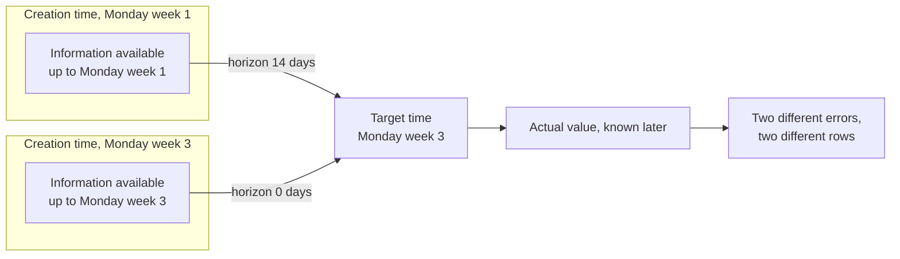
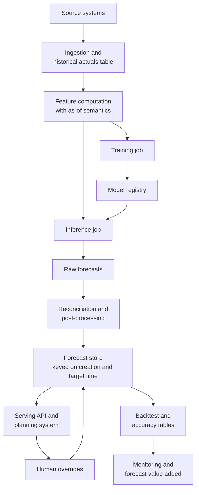
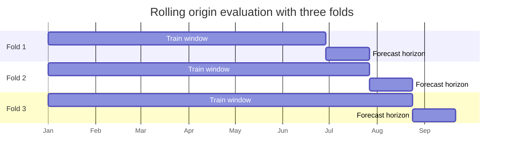
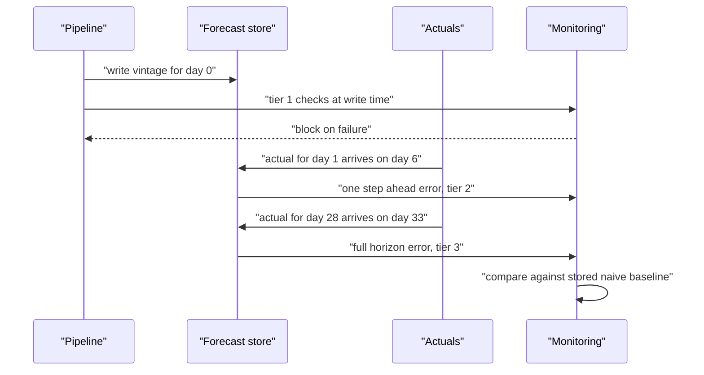
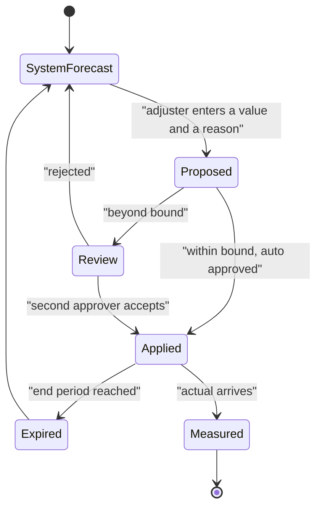

# Chapter 46: Forecasting Systems in Production

> **What this chapter covers**: The engineering around a forecasting model rather than the model itself. The system shape from data pipeline to serving. Backtesting infrastructure as the central asset, with the compute arithmetic worked out. The forecast store, and the fact that every forecast record has both a creation time and a target time so that storing only the target time makes honest backtesting impossible afterwards. Retraining policy where seasonality interacts with the schedule, model selection at scale and selection overfitting, the long tail of new and sparse and dead series, forecast monitoring under the delay problem, forecast value added analysis, human overrides and their audit trail, reconciling forecasts with business plans, cold start, cost and latency arithmetic, and a table of production failures with their diagnostics.
> **Prerequisites**: Chapter 11 (time-series overview), Chapter 21 (machine learning system design), Chapter 25 (model lifecycle and registries), Chapter 26 (continuous integration and delivery), Chapter 27 (monitoring, drift, and retraining), Chapter 31 (workflow orchestration). Chapters 41, 43, and 44 supply the modelling context this chapter assumes.
> **Where it is used**: Demand and supply planning, workforce and capacity scheduling, cloud and network capacity forecasting, energy load and generation, financial planning and revenue forecasting, inventory and replenishment, and any organisation where a number about the future enters a decision process.

---

## 46.1 Level 1: Foundations

### A forecasting system is not a forecasting model

A forecasting model maps history to a prediction. A forecasting system is the machinery that produces predictions for every entity, on a schedule, reproducibly, with a record of what was predicted when, and with enough evaluation infrastructure that anyone can find out afterwards whether it was any good.

The ratio of effort is not what newcomers expect. On a mature system, the model code is a small fraction of the repository. The rest is pipelines, the backtesting harness, the forecast store, the long-tail rules, the monitoring, and the override workflow. A team that spends its first quarter on the model and its second quarter discovering it has no way to evaluate the model has made the standard mistake.

### The two clocks

This is the single most important idea in the chapter and it deserves to come first.

Every forecast record has **two** timestamps.

- The **creation time** (also called the forecast origin, the vintage, or the as-of time) is the moment the forecast was made, which fixes what information was available.
- The **target time** is the period the forecast is about.

The **horizon** is the difference between them. A forecast for next Tuesday made on Monday and a forecast for next Tuesday made three weeks earlier are different forecasts with different accuracy, different uncertainty, and different uses. They share a target time and nothing else.

A store that keeps only the target time collapses the two into one and throws away the horizon. Once that has happened you cannot answer any of the questions that matter: how accuracy degrades with horizon, whether last month's regression was in the short-horizon or long-horizon regime, whether the forecast a planner acted on in April matched what the system says today it predicted for April, or whether a model change helped. You also cannot reconstruct the information set, so you cannot reproduce the forecast. This is not recoverable later. The history is gone.


*Figure 46.1: Two forecasts sharing a target time and differing in horizon. A store keyed only on target time cannot represent this picture.*

### The unit of account

Every claim about a forecasting system must be expressed relative to a baseline. Chapter 11 established why. In a production system the baseline is not a rhetorical device; it is a stored artifact.

Compute and store the naive forecast alongside every model forecast, with the same creation time and target time, in the same table. It costs almost nothing, it removes every argument about whether the model helps, and it is the input to the forecast value added analysis in level 3. A system that does not store its own baseline cannot answer the only question its funders will ask.

### Who consumes a forecast, and the political reality

Forecasts differ from most machine learning outputs in that a human frequently sits between the model and the decision, and that human has an opinion. A demand forecast constrains a sales target. A capacity forecast constrains a budget. A revenue forecast constrains what a business unit promises.

The consequence is that a forecast is often *not wanted*. Accuracy is not the only objective in the room; someone may prefer a number that is high for motivational reasons or low for target-setting reasons. An engineer who is surprised by this will build a technically excellent system that nobody uses. The engineering response is not to argue. It is to separate the two artifacts explicitly: the **forecast**, which is an unbiased statement of what is likely, and the **plan** or **target**, which is a decision. Store both, record the gap between them, and let the organisation see the gap. Level 3 covers the mechanics.

### Vocabulary

| Term | Meaning |
|---|---|
| Forecast origin | Synonym for creation time; the last period whose actual is known |
| Vintage | The set of all forecasts sharing a creation time |
| Horizon | Target time minus creation time, in periods |
| Rolling origin evaluation | Repeatedly advancing the origin and forecasting forward, the correct backtest |
| Fold | One origin in a rolling origin evaluation |
| Coherent forecast | A set of forecasts across a hierarchy that sums correctly; see Chapter 44 |
| Forecast value added | The change in accuracy contributed by one step of the process, relative to the naive baseline |
| Override | A human adjustment applied to a system forecast |
| Consensus or plan | The final agreed number, which may differ from both |

---

## 46.2 Level 2: Working knowledge

### The reference architecture


*Figure 46.2: The reference shape. Overrides write back into the store as a separate layer rather than replacing the system forecast.*

Seven components, and each has a failure mode.

**Ingestion and the actuals table.** The historical actuals are the ground truth for everything downstream. They are also revised. Sales get returned, meter readings get corrected, ledger entries get restated. The actuals table must therefore be *bitemporal*: every row records both the period it describes and the time you learned the value. Without that, a backtest run today uses restated actuals that were not available at the original creation time, and the backtest is optimistic by an amount nobody can quantify. Chapter 17 covers bitemporal modelling.

**Feature computation with as-of semantics.** Every feature must be computable from information available at the creation time. Chapter 41 covers the cut-off discipline and how a rolling window computed across the boundary leaks. Chapter 20 covers feature stores and point-in-time correctness, which is the same problem with a different name.

**Training.** One job, versioned, producing an artifact in the registry with the data snapshot identifier, the code commit, and the hyperparameters. Chapter 25 covers the registry.

**Inference.** Produces forecasts for every series at every horizon in the horizon set. This is usually a batch job, and usually cheap relative to training.

**Reconciliation and post-processing.** Enforce hierarchy coherence (Chapter 44), clip negatives where the quantity cannot be negative, apply integer rounding where units are discrete, and apply any known future constraint such as a planned store closure.

**The forecast store.** Covered in depth in level 3.

**Monitoring.** Covered in depth in level 3, because the delay problem makes it unlike any other model monitoring.

### The schedule

Most forecasting systems run on a fixed cadence. Write the cadence down as four separate schedules, because conflating them causes real incidents.

| Schedule | Typical cadence | What breaks if wrong |
|---|---|---|
| Ingestion of actuals | Daily or hourly | Forecasts generated on stale actuals, silently |
| Forecast generation | Daily or weekly | Consumers act on an old vintage |
| Retraining | Weekly to quarterly | Covered in level 3 |
| Backtest refresh | Weekly or on model change | Nobody notices a regression |

The dependency that must be enforced by the orchestrator, not by clock times, is that forecast generation runs *after* the actuals for the origin period have landed and passed data quality checks. A time-based trigger that assumes the upstream job finished is the most common cause of a forecasting system producing confident nonsense. Chapter 31 covers the orchestration patterns.

### A minimal forecast store schema

**Listing 46.1: the forecast table, with both clocks.**

```sql
CREATE TABLE forecast (
    series_id       TEXT        NOT NULL,
    created_at      TIMESTAMP   NOT NULL,   -- when the forecast was made
    target_period   DATE        NOT NULL,   -- what period it is about
    horizon         INT         NOT NULL,   -- target minus origin, in periods
    quantile        NUMERIC(5,4) NOT NULL,  -- 0.5 for the median, 0.9 etc
    value           DOUBLE PRECISION NOT NULL,
    model_name      TEXT        NOT NULL,
    model_version   TEXT        NOT NULL,
    run_id          TEXT        NOT NULL,   -- links to the orchestrator run
    layer           TEXT        NOT NULL,   -- 'naive' | 'statistical' | 'override' | 'plan'
    PRIMARY KEY (series_id, created_at, target_period, quantile, layer)
);
CREATE INDEX forecast_by_target ON forecast (target_period, series_id, layer);
CREATE INDEX forecast_by_horizon ON forecast (horizon, model_version);
```

The non-obvious lines: `horizon` is stored even though it is derivable, because every accuracy query groups by it and computing a date difference in the predicate defeats partitioning; `quantile` is a column rather than separate columns per level, so adding a quantile does not require a schema migration, at the cost of more rows; `layer` is what makes forecast value added analysis possible, since the naive baseline, the model output, the human-adjusted number, and the final plan are all stored as separate rows for the same series and period and can be differenced directly; and `run_id` is what makes an incident investigable, because it ties a row back to the exact pipeline execution. Partition by `created_at` in any real warehouse, since almost every write and most reads are vintage-scoped.

### Generating the folds

**Listing 46.2: a rolling origin fold generator.**

```python
from dataclasses import dataclass
import pandas as pd

@dataclass(frozen=True)
class Fold:
    origin: pd.Timestamp        # last period whose actual is known
    train_start: pd.Timestamp
    target_periods: pd.DatetimeIndex
    refit: bool                 # does this fold train, or reuse the last model

def folds(last_origin, n_folds, step, horizon, freq="D",
          window=None, refit_every=1):
    out = []
    for k in range(n_folds):
        origin = pd.Timestamp(last_origin) - k * step * pd.tseries.frequencies.to_offset(freq)
        start = origin - window * pd.tseries.frequencies.to_offset(freq) if window else pd.Timestamp.min
        targets = pd.date_range(origin + pd.tseries.frequencies.to_offset(freq),
                                periods=horizon, freq=freq)
        out.append(Fold(origin, start, targets, refit=(k % refit_every == 0)))
    return sorted(out, key=lambda f: f.origin)
```

The non-obvious lines: `refit_every` is what lets the backtest simulate a production cadence in which the model is trained monthly and used for four weekly forecast runs, and setting it to 1 is the expensive and usually unrealistic choice; `window=None` gives an expanding window while an integer gives a sliding one, so both designs are testable by changing one argument; `train_start` is carried on the fold rather than derived later so the fold object is a complete, loggable description of the experiment; and folds are returned in chronological order so that a refit fold always precedes the folds that reuse its model. Everything downstream consumes `Fold` objects, which makes the backtest configuration a single serialisable record that can be attached to a result.

### Data quality gates

A forecasting pipeline consumes upstream tables it does not own, so the contract with those tables has to be explicit. The gate runs before feature computation and blocks the run rather than warning.

| Gate | Assertion | Why it is not optional |
|---|---|---|
| Freshness | Max event date in the actuals table equals the expected origin | The commonest cause of a whole bad vintage |
| Completeness | Row count per day within a tolerance band of the trailing median | Catches a partially loaded partition |
| Schema | Column names, types, and units unchanged | A unit change produces a plausible-looking forecast that is wrong by a factor |
| Key integrity | No duplicate series and period pairs | Duplicates silently double aggregates after a join |
| Range | Values within a physically possible band | Catches sentinel values such as minus one used for missing |
| Referential | Every series in the actuals has a row in the dimension table | Missing attributes silently become a default category in a global model |

Chapter 20 develops data quality testing and the feature store's point-in-time guarantees. The forecasting-specific addition is the freshness gate, because unlike a classifier a forecasting job has a correct answer to the question "what is today", and running against yesterday's data produces output that passes every other check.

### Mistakes everyone makes first

- Storing only the latest forecast per series and period, overwriting the previous vintage.
- Backtesting with restated actuals instead of the values known at the time.
- Evaluating with a single train and test split instead of a rolling origin.
- Averaging error across series of wildly different scale with a scale-dependent metric, so the largest series is the only one measured.
- Letting new series with two weeks of history into the headline accuracy number.
- Applying human overrides in a spreadsheet outside the system, so nobody can measure them.
- Retraining on a cadence that never sees a full seasonal cycle.
- Tuning per-series model selection on the same data used to report accuracy.

---

## 46.3 Level 3: Depth

### 46.3.1 Backtesting infrastructure as the core asset

The backtest harness is the piece of a forecasting system with the longest useful life. Models get replaced. The harness that decides whether the replacement is better outlives all of them, and every argument about the system is settled by it. Build it first.

**Rolling origin evaluation.** Choose a set of origins $t_1 < t_2 < \cdots < t_F$. At each origin, train on data up to and including that origin (or reuse a model trained at or before it), forecast the horizons $1$ to $H$, and score against the actuals as they were known when they landed. The design has four parameters and each one is a real decision.

| Parameter | Choice | Guidance |
|---|---|---|
| Number of folds $F$ | How many origins | Enough to cover at least one full seasonal cycle of origins, and enough for a useful confidence interval. Below 10 the interval is too wide to decide anything |
| Origin spacing | Every period, or every $k$ periods | Space them by the retraining cadence you actually intend to use, so the backtest measures the system you will run |
| Window | Expanding or sliding | Expanding uses all history; sliding of fixed length is correct if the process changed. Test both, do not assume |
| Refit policy | Refit at every origin, or refit every $k$ origins and reuse | Refit at every origin is the honest simulation of daily retraining and is expensive. Refit-and-reuse simulates a weekly retrain and is cheaper |

The single most common error is to refit at every origin in the backtest while retraining monthly in production. The backtest then measures a system that does not exist, and it flatters the model, because a stale model performs worse.


*Figure 46.3: An expanding-window rolling origin design with the origin advancing by 28 days each fold.*

### 46.3.2 The arithmetic of backtest compute

Backtests are the dominant compute cost of a forecasting system, and the cost is easy to misjudge by an order of magnitude because it multiplies four things.

**Stated assumptions.** $N = 200{,}000$ series at daily granularity, three years of history so roughly 1,095 observations each and about 219 million rows, a horizon of $H = 28$ days, $F = 12$ folds with the origin advancing four weeks each time, 60 features, and a 32-core machine. All timings below are assumptions used to illustrate the arithmetic, not measurements.

**Design A: one global gradient-boosted model, refit at every fold.**

- Training rows per fold: about 219 million minus the held-out tail, so call it $2.1 \times 10^{8}$.
- Assume a fitted model takes 25 minutes of wall-clock on 32 cores, so 13.3 core-hours per fold.
- Twelve folds: $12 \times 13.3 = 160$ core-hours, or 5 wall-clock hours at full parallelism.
- Inference per fold: $200{,}000 \times 28 = 5.6$ million rows, negligible.
- Feature computation, if not cached: assume 8 core-hours per fold, so 96 core-hours.
- **Total: roughly 256 core-hours, or 8 wall-clock hours.** At an assumed 0.05 currency units per core-hour, about 13 units.

**Design B: one classical model per series, refit at every fold.**

- Assume 0.8 seconds to fit and forecast one series with an automatic order-selection procedure.
- Per fold: $200{,}000 \times 0.8 = 160{,}000$ seconds $= 44.4$ core-hours.
- Twelve folds: $533$ core-hours, or 16.7 wall-clock hours on 32 cores. About 27 units at the same rate.

**Design C: per-series selection over 6 candidate models, refit at every fold.**

- Six times Design B: $3{,}200$ core-hours, 100 wall-clock hours on 32 cores, about 160 units.

**Design D: the same as C but also sweeping 10 hyperparameter configurations.**

- $32{,}000$ core-hours. This is where teams discover that their model selection strategy is not affordable, usually after committing to it.

The general formula, worth writing on a wall:

$$\text{cost} \;=\; F \times M \times (\text{fit cost per unit}) \times (\text{number of units})$$

where $M$ is the number of candidate configurations and a *unit* is a series for local models or the whole dataset for a global model. Every one of the four factors is a design choice, and the two that people forget are $F$ and $M$.

**Bounding the cost.** Five levers, in the order to reach for them.

1. **Cache features across folds.** With an expanding window, features for a given series and date are identical in every fold that includes that date, provided they are computed with as-of semantics. Compute once, store, slice per fold. This alone often removes a third of the cost.
2. **Reduce $F$ honestly.** Fewer folds widens the confidence interval. Compute what interval you need first, then pick $F$, rather than picking $F$ and discovering the comparison is inconclusive.
3. **Backtest on a stratified sample of series.** Sample within strata of volume, intermittency, and age, then report both the sampled estimate and the stratum breakdown. Use the full set only for the final candidate. A 10 percent stratified sample cuts cost tenfold and widens the interval by roughly $\sqrt{10}$, which is often an acceptable trade during development.
4. **Refit less often in the backtest to match production.** This is a correctness improvement and a cost saving at the same time.
5. **Parallelise on the right axis.** Local models parallelise across series with no communication and are an ideal embarrassingly-parallel workload. Global models parallelise across folds, since folds are independent, which needs one copy of the data per worker and therefore memory rather than cores.

The mistake to avoid on the last point: parallelising a global model across series does not work, because the whole premise is cross-learning. Parallelise across folds and, within a fold, use the learner's own threading.

### 46.3.3 The forecast store in depth

**What a record contains.** At minimum: series identifier, creation time, target period, horizon, quantile, value, model name and version, run identifier, and layer. Add the feature snapshot identifier if you need full reproducibility, and any known-future covariates used, if they can themselves be revised.

**Why both clocks are mandatory, restated operationally.** With both stored you can answer, without recomputation:

- Accuracy as a function of horizon, which is the single most requested chart.
- Whether a stakeholder's complaint about last month refers to the vintage they saw or to a later one.
- Whether a model change improved things, by comparing vintages produced by different versions for the same targets.
- What the forecast looked like at the moment a purchase order was raised, which is an audit question in regulated settings.

With only the target time you can answer none of them, and no amount of later engineering recovers the information. Treat the two-clock key as a schema invariant enforced by a constraint, not as a convention.

**Vintages and immutability.** A vintage is immutable once written. A correction is a new vintage with a new creation time, never an update in place. This is the same discipline as an append-only ledger, and for the same reason: someone made a decision on the old number and you must be able to show them what they saw.

**Storage sizing, with arithmetic.** Assume 200,000 series, horizon 28, three quantiles, daily forecast generation, two years of retention, and four layers stored (naive, model, override, plan), although overrides and plans exist for only a small fraction of rows. Rows for the model and naive layers alone:

$$200{,}000 \times 28 \times 3 \times 730 \times 2 \;=\; 2.45 \times 10^{10} \text{ rows}$$

That is 24.5 billion rows, which at an assumed 40 bytes per row uncompressed is about 980 GB, and with columnar compression at an assumed factor of four is roughly 245 GB. Large, but ordinary. If that is too much, the levers are retention (keep daily vintages for 90 days and weekly vintages thereafter), quantile count, and dropping the naive layer for long horizons. Do not reach for the lever of dropping the creation time. Sizes here follow from the stated assumptions and are illustrative.

**Query patterns to design for.**

| Pattern | Query | Design implication |
|---|---|---|
| Latest forecast for a series | Newest `created_at` for each target period | Index or materialised view on latest vintage |
| Accuracy by horizon | Join forecast to actuals on series and target, group by horizon | Store horizon; partition by created_at |
| Vintage comparison | Two creation times, same targets | Partitioning by created_at makes this cheap |
| As-of reconstruction | All forecasts with `created_at <= T` | Requires immutability |
| Forecast value added | Pivot layers for the same key and difference | Layer as a column, not as separate tables |

The last pattern in that table is the one that justifies the `layer` column, and it is worth seeing written out. Forecast value added is developed in 46.3.10; the query below is the data access it depends on.

**Listing 46.3: the forecast value added query, which only works if layers are stored.**

```sql
WITH scored AS (
  SELECT f.series_id, f.target_period, f.layer,
         ABS(f.value - a.actual) AS abs_err,
         a.actual
  FROM   forecast f
  JOIN   actuals_asof a
    ON   a.series_id = f.series_id
   AND   a.target_period = f.target_period
  WHERE  f.quantile = 0.5
    AND  f.horizon  = 28                     -- one horizon, always
    AND  f.target_period BETWEEN :start AND :end
),
complete AS (                                -- keep only fully covered keys
  SELECT series_id, target_period
  FROM   scored
  GROUP BY series_id, target_period
  HAVING COUNT(DISTINCT layer) = 4
)
SELECT s.layer,
       SUM(s.abs_err) / NULLIF(SUM(ABS(s.actual)), 0) AS weighted_error,
       COUNT(*) AS n
FROM   scored s
JOIN   complete c USING (series_id, target_period)
GROUP BY s.layer
ORDER BY s.layer;
```

The non-obvious lines: `actuals_asof` is a view over the bitemporal actuals giving the value as known at a stated evaluation time, so the comparison uses what was knowable rather than what was later restated; fixing `horizon = 28` is essential because averaging across horizons makes layers incomparable when different layers are produced at different lead times; the `complete` common table expression drops any series and period where a layer is missing, since otherwise the override layer is scored only on the series someone chose to adjust, which is a selected sample and biases the comparison; and the weighted error divides summed absolute error by summed actual volume, giving a volume-weighted measure rather than an average of per-series ratios. Compute the per-step differences and their bootstrap intervals outside the query by resampling series.

### 46.3.4 Reproducibility and lineage

A forecast that cannot be reproduced cannot be defended, and a planner asking "why did the system say 400" is asking a reproducibility question. Four identifiers on every row make it answerable.

| Identifier | Points at | What it lets you do |
|---|---|---|
| `run_id` | The orchestrator execution | Find logs, timings, and which tasks ran |
| `model_version` | The registry artifact | Retrieve the exact weights and hyperparameters; Chapter 25 |
| `code_commit` | The repository state | Rebuild the environment and rerun |
| `data_snapshot` | The actuals and feature state as of the origin | Re-derive the exact inputs |

The fourth is the one that is usually missing, and it is the one that makes the other three insufficient without it. In a table format with snapshot isolation, such as Iceberg or Delta, this is a table version number and is cheap to record. Without such a format, record the maximum ingestion timestamp per source table at read time, which is weaker but recovers most cases.

Reproducibility is also a testing requirement. The useful continuous integration artifact for a forecasting system is a **golden backtest**: a small fixed set of series and origins, checked into the repository or pinned by snapshot, with expected metrics and a tolerance. Any code change that moves the golden metrics beyond tolerance fails the build and forces an explanation. Chapter 26 covers the pipeline mechanics and Chapter 33 the testing strategy; the forecasting-specific point is that the golden set must include at least one intermittent series, one new series, and one series with a structural break, because those are the cases a refactor breaks.

### 46.3.5 Where reconciliation sits in the pipeline

Order of operations here causes a recurring and confusing class of incident. The rule is that any transformation that changes a value must happen **before** reconciliation, or coherence is broken on exactly the series it touched.

The correct order:

1. Generate base forecasts at every level required.
2. Apply value-level post-processing: clipping at zero, applying known closures, enforcing known-future constraints.
3. Reconcile, so the post-processed numbers sum correctly (Chapter 44).
4. Round to integers only if the consumer requires it, and then re-check coherence, because rounding breaks sums and needs a controlled rounding rule that preserves the total.
5. Write to the store.

The failure to watch for: clipping negatives after reconciliation. It affects only the series whose forecasts went negative, which is a small and variable subset, so the coherence check fails intermittently and appears random. The diagnostic in the failure table names it, and the fix is a DAG reordering rather than a modelling change.

### 46.3.6 Retraining policy, where seasonality bites

Chapter 27 covers retraining triggers generally. Forecasting adds a specific interaction that other domains do not have.

**The seasonal alignment problem.** If your series has annual seasonality and you retrain on a sliding two-year window, the model sees two instances of each seasonal event. If you retrain on a sliding 12-month window, it sees one, and the seasonal estimate has no way to separate season from the trend or from a one-off event in that month. A sliding window shorter than two full seasonal cycles is usually a mistake, and it is a mistake that looks fine for eleven months and then fails at the peak.

**The retraining-cadence and horizon interaction.** If your horizon is 28 days and you retrain monthly, a forecast made on day 29 of the cycle uses a model trained 29 days ago on data ending 29 days earlier, so its effective information lag at the far end of the horizon is 57 days. Write the worst-case information lag down explicitly:

$$\text{worst-case lag} = (\text{retraining interval}) + (\text{data latency}) + H$$

and check it against how fast the process actually changes.

**A practical policy.**

| Situation | Policy |
|---|---|
| Stable process, strong annual seasonality | Retrain monthly or quarterly on an expanding or long sliding window. Always retrain before the seasonal peak, not during it |
| Fast-moving process, weak seasonality | Retrain weekly on a sliding window, chosen by backtesting window length |
| Global model over many series | Retrain on a fixed cadence, because a per-series trigger defeats cross-learning and creates version chaos |
| Any system | Add an event trigger on forecast error degradation, in addition to the schedule, never instead of it |

The last row matters. A schedule handles gradual change. An error-based trigger handles the discontinuity, such as a pricing change or a data source migration, that a schedule will not notice for weeks. Chapter 27 develops the trigger design and the change-point methods that make it work; Chapter 45 derives them.

Do not retrain *during* the seasonal peak if you can avoid it. A model refit on peak data extrapolates the peak into the following weeks, and the failure is both large and predictable.

### 46.3.7 Model selection at scale and selection overfitting

With 200,000 series and 6 candidate models, per-series selection means 1.2 million fits and 200,000 selection decisions. Two problems follow.

**Cost**, covered above: it is the largest single line in the compute budget.

**Selection overfitting**, which is subtler and more damaging. If you select the best of $M$ models per series on a backtest with limited folds, the selected model's backtest score is biased upward by the maximum-of-noise effect. With $M$ candidates whose true accuracies are equal and whose backtest scores have standard error $\sigma$, the expected maximum of $M$ independent draws exceeds the mean by roughly $\sigma \sqrt{2 \ln M}$. At $M = 6$ that is about $1.9\sigma$; at $M = 20$ about $2.4\sigma$. If your per-series backtest has a standard error of 8 percent of the metric, per-series selection over 6 models inflates the reported score by around 15 percent of the metric, entirely spuriously.

The consequence is visible in production as a systematic gap: the backtest says the system improved and the live accuracy does not move. That specific symptom is almost always selection overfitting.

Three remedies:

1. **Nested evaluation.** Select on inner folds, report on an outer fold never used for selection. This is correct and multiplies the cost.
2. **Shrink the candidate set.** Fewer candidates means less inflation, and the accuracy loss from dropping the weakest three candidates is usually smaller than the selection noise.
3. **Select at the group level, not the series level.** Cluster series by their characteristics (Chapter 45 covers the clustering, Chapter 44 the many-series context) and pick one model per cluster. Averaging the selection criterion over hundreds of series reduces $\sigma$ by roughly the square root of the cluster size, which shrinks the inflation term directly.

**The pragmatic middle**, which is what most mature systems settle on: one global model as the default for everything, a small number of specialist models for well-defined groups such as intermittent series and new series, and per-series selection only for a short list of high-value series where a human reviews the choice. This bounds the cost and the inflation at the same time, and it makes the system explainable, which per-series selection over 200,000 series never is.

### 46.3.8 The long tail of series

Aggregate accuracy on a large series population is dominated by whichever series the metric weights most. The long tail poisons it in specific, diagnosable ways.

Classify every series on every run and store the class alongside the forecast, so that every later metric can be broken down by it and so that a series changing class is itself a visible event.

| Series type | Definition | Risk to the system | Rule |
|---|---|---|---|
| New | Fewer than one seasonal cycle of history | No seasonal estimate; wild forecasts | Route to a cold-start model; exclude from headline metrics until they qualify; label them in the store |
| Sparse or intermittent | Many zero periods | MAPE undefined or infinite; standard methods forecast a smooth positive number that is never observed | Use a method designed for intermittency and a metric that tolerates zeros, such as MASE or a scaled absolute error |
| Dead | No non-zero observation for $k$ periods | The model keeps forecasting the historical level forever, and the error is counted forever | Automatic deactivation rule with a reactivation path |
| Tiny | Non-zero but negligible volume | Dominates a percentage-error metric while contributing nothing to the business | Weight metrics by volume, and report the unweighted number separately |
| Erratic | High variance with no structure | Consumes tuning effort for nothing | Detect, route to the naive baseline, and stop spending on it |
| Discontinued then revived | Dead series that returns | Cold start on a series that has history | Reactivation rule with a decay on the old history |

**The deactivation rule is the one people forget.** Without it, a retail system carries thousands of discontinued items forecasting steady demand, each contributing error every period, and the aggregate metric degrades slowly for reasons no one can find. Define the rule explicitly: for example, no non-zero observation in the last 90 days and no scheduled future event moves a series to inactive, with a weekly job that reactivates on the first non-zero observation. State the rule in the documentation, because it changes the metric denominator and therefore every historical comparison.

**Metric aggregation.** Report at least three numbers, always: the volume-weighted error, which is what the business feels; the unweighted median across series, which is what a typical series experiences; and the count and error of the excluded population, so the exclusions cannot hide anything. A single aggregate number over a heterogeneous population is not interpretable, and disputes about forecasting systems very often turn out on inspection to be two people quoting different aggregations of the same data.

### 46.3.9 Monitoring under the delay problem

Model monitoring generally is Chapter 27. Forecasting has a structural obstacle that other domains do not: **you cannot evaluate a forecast until its horizon has passed.** A 28-day-ahead forecast made today cannot be scored for 28 days, and if actuals arrive with a 5-day lag, not for 33 days. A regression introduced today is invisible in accuracy metrics for over a month.

That forces monitoring into three tiers.

**Tier 1: immediate checks, available at generation time.** These do not need actuals and should block the pipeline on failure.

| Check | What it catches |
|---|---|
| Row count against expected series times horizons times quantiles | Silent partial failure, the most common incident |
| Null, negative, or infinite values | Feature pipeline breakage |
| Quantile monotonicity, that $q_{0.1} \le q_{0.5} \le q_{0.9}$ | Quantile crossing, see Chapter 43 |
| Vintage-over-vintage change distribution | A forecast that jumped 40 percent overnight for 30 percent of series is a bug, not demand |
| Forecast versus recent actual level, per series | Scale or unit errors, join failures |
| Aggregate forecast total against last vintage's total | Currency, unit, or duplication errors |
| Input feature freshness and null rate | Stale upstream data, which Chapter 20 covers |

Tier 1 catches most real incidents, because most real incidents are pipeline failures rather than model degradation.

**Tier 2: short-horizon accuracy as a leading indicator.** One-step-ahead error is available after one period. It is not the same quantity as 28-day error, but it correlates, and it moves first. Track it daily with a control chart and treat a sustained shift as an early warning that triggers investigation rather than an automatic rollback.

**Tier 3: full-horizon accuracy.** The real number, available late. Track it by horizon, by segment, and against the stored naive baseline. Never track only the aggregate.


*Figure 46.4: The three monitoring tiers and when each becomes available. Tier 1 is the only one that can block a bad release.*

The practical consequence for release management: because tier 3 is a month late, forecasting systems need a shadow deployment period rather than a fast rollback. Run the candidate model in parallel, writing to the store under its own model version, for at least one full horizon plus the actuals lag, before switching the consumed layer. Chapter 26 covers shadow deployment mechanics.

### 46.3.10 Forecast value added analysis

Forecast value added, developed in the business forecasting literature and most associated with Michael Gilliland's work at SAS, asks a question that is obvious once stated and almost never measured: **does each step of the forecasting process make the forecast better than doing nothing?**

"Doing nothing" is the naive forecast. Every subsequent step (the statistical model, the analyst adjustment, the consensus meeting, the executive override) is a step in a chain, and each can be scored against the step before it and against the naive baseline.

**The construction.** For each series and target period, retrieve the stored layers at a fixed horizon, compute the error of each against the actual, and difference them.

**A worked example.** Assume 5,000 series at a 4-week horizon over 12 months, mean absolute percentage error as the metric, with the caveat from Chapter 11 that this metric is flawed and chosen here only because it is what planning organisations use.

| Process step | MAPE | FVA versus naive | FVA versus previous step |
|---|---|---|---|
| Naive (seasonal naive) | 28.0 | 0.0 | |
| Statistical model | 21.5 | +6.5 | +6.5 |
| Analyst adjustment | 23.2 | +4.8 | -1.7 |
| Consensus meeting | 22.6 | +5.4 | +0.6 |
| Executive override | 25.1 | +2.9 | -2.5 |

Read the last column. The statistical model adds 6.5 points over the baseline. The analyst adjustment *destroys* 1.7 points. The consensus meeting recovers 0.6. The executive override destroys 2.5. The final delivered forecast is 2.9 points better than a seasonal naive forecast, after an expensive process involving many people's time. This example is constructed to illustrate the presentation, but its shape is the shape that published analyses repeatedly find.

**The empirical finding on human adjustment.** Fildes, Goodwin, Lawrence, and Nikolopoulos (2009, "Effective forecasting and judgmental adjustments: an empirical evaluation and strategies for improvement in supply chain planning") analysed large volumes of adjustments across several companies and found a consistent asymmetry: *large* adjustments, and particularly large *downward* adjustments, tended to improve accuracy, while *small* adjustments, particularly small upward ones, tended to damage it. The interpretation offered is that a large adjustment usually encodes real information the model lacked, such as a known promotion or a lost customer, while a small adjustment usually encodes optimism or the feeling that one ought to be seen to contribute. Steve Morlidge's subsequent analyses of business forecast quality reported that a substantial fraction of the forecasts examined failed to beat a naive benchmark at all.

Treat these as the established pattern in demand and supply planning specifically, where the evidence is strongest. Do not assume the same asymmetry in finance or energy without measuring it on your own data, which is exactly what the FVA table is for.

**How to run it.** Store every layer, as in Listing 46.1. Pick a fixed horizon, because mixing horizons makes the comparison meaningless. Use the same series set for every layer, dropping series where any layer is missing. Compute bootstrap confidence intervals on the differences, resampling series, because the differences are usually small relative to the spread. Break the result down by adjustment size and direction, since the aggregate hides the asymmetry above. Then present the *per-step* column, not the *versus-naive* column, because the per-step column is the one that names the step to remove.


*Figure 46.5: Forecast value added scores each arrow separately, which is what makes it able to identify a step that subtracts value.*

**The political handling.** An FVA result that says a named team's work is negative will be contested. Three things make it survivable. Run it on a long enough period with intervals, so that it is not one bad quarter. Break it down, so the finding is "small upward adjustments on stable series subtract value" rather than "you are bad at your job", which is both more accurate and more actionable. And propose a mechanism rather than a removal: restrict adjustments to cases where the adjuster records a reason code, and measure by reason code. The version of this that works in practice is a rule that the system forecast passes through unchanged unless someone supplies a documented reason, which cuts exactly the small unjustified adjustments the evidence indicts.

### 46.3.11 Human overrides and the audit trail

Overrides are not a failure of the system. They are the channel through which information the model cannot see, such as a signed contract or an announced closure, enters the forecast. The engineering job is to make them measurable.

Requirements for an override mechanism:

- Applied **inside** the system, never in a spreadsheet, so the original and adjusted values both persist.
- Stored as a separate layer against the same series, creation time, and target period, so the difference is recoverable.
- Carrying an actor, a timestamp, and a structured reason code from a controlled list, with free text optional.
- Bounded, with adjustments beyond a threshold requiring a second approver.
- Expiring, with a stated end period, so a one-off adjustment does not persist into next year.
- Reported on, with an FVA breakdown by actor and by reason code circulated on a regular cadence.


*Figure 46.6: The override lifecycle. The Measured transition is what turns overrides from an opinion into data.*

The reason code list is worth designing carefully, because it is the join key for every later analysis. A workable starting set: promotion, new distribution, lost distribution, price change, competitor action, known one-off event, supply constraint, data quality issue, and other. If "other" exceeds about a fifth of adjustments, the list is wrong.

### 46.3.12 Forecasts, plans, and targets

Keep three numbers separate and store all three.

| Artifact | Definition | Property it should have |
|---|---|---|
| Forecast | What is most likely to happen | Unbiased; the median of the predictive distribution |
| Plan | What the organisation intends to resource for | Chosen from the distribution by a cost calculation, often a quantile, not the median |
| Target | What the organisation is committing to or motivating toward | A decision, deliberately not unbiased |

Conflating them causes a specific, recurring pathology. If the forecast is required to equal the target, and the target is aspirational, then the forecast becomes biased upward, inventory is over-purchased, and later the forecasting team is blamed for the bias it was instructed to introduce. Storing the three separately with the gap visible does not solve the organisational problem, but it does make it an explicit conversation rather than a hidden distortion of a model.

The plan is where probabilistic forecasting pays for itself. Chapter 43 works through the newsvendor problem, in which the cost-optimal stocking level is a quantile of the predictive distribution determined by the ratio of underage to overage cost, not the mean. A system that delivers a distribution lets the plan be derived by arithmetic from a stated cost ratio, which converts a negotiation into a calculation.

### 46.3.13 Cold start

A new entity has no history. Four approaches, usually combined.

1. **Attribute-based analogue.** Forecast from series with similar static attributes, either by averaging a matched cohort's normalised curve or, better, by including the static attributes as features in a global model, which handles it automatically. This is a strong argument for the global model approach of Chapter 41.
2. **Hierarchical borrowing.** Forecast the parent level, where history exists, and disaggregate using an assumed or fitted share. Chapter 44 covers the reconciliation machinery.
3. **Human input for the launch profile**, blended out over time as actuals accumulate.
4. **Explicit blending schedule.** Define the weight on the cold-start forecast as a decreasing function of observed history length, for example full weight below 4 weeks, linear decay to zero between 4 and 26 weeks. Write it as a policy so it is testable and so the transition is not a discontinuity in the delivered numbers.

Track cold-start series as their own segment in every accuracy report. Their error is much higher, and mixing them into the aggregate both inflates the headline error and hides the real problem.

### 46.3.14 Latency and serving

Most forecasting is batch, and that is the right default. Three cases justify something else.

| Pattern | When | Cost characteristic |
|---|---|---|
| Batch precompute, serve from a key-value store | The overwhelming default. Horizons are fixed and consumers read | Compute is scheduled and predictable; serving is a lookup at single-digit milliseconds |
| On-demand recomputation | Forecast depends on a user-supplied scenario, such as a proposed price | Latency budget drives the model choice; a global tree model scores in milliseconds, an autoregressive neural model over 28 steps may not |
| Streaming update | Very short horizons on fast-moving series, such as infrastructure load | Chapter 19 territory; keep the model simple enough to update incrementally |

For the on-demand case the arithmetic that matters is per-request, not per-batch. A recursive multi-step neural forecaster performs $H$ sequential forward passes, so a 28-step horizon costs 28 times a single pass and cannot be parallelised across steps. A direct multi-output model produces all horizons in one pass. That difference, developed in Chapter 41, is a latency decision as much as an accuracy one.

### 46.3.15 A cost model for the whole system

Put the pieces together for the population used throughout this chapter: 200,000 daily series, horizon 28, three quantiles, a global gradient-boosted model, monthly retraining, daily forecast generation, a 12-fold backtest refreshed monthly, and two years of vintage retention. All unit costs are assumptions stated so the arithmetic can be rechecked with your own numbers.

| Component | Arithmetic | Monthly core-hours | Monthly cost at 0.05 per core-hour |
|---|---|---|---|
| Feature computation, daily | 1.5 core-hours per run times 30 | 45 | 2.25 |
| Training, monthly | 13.3 core-hours times 1 | 13 | 0.67 |
| Inference, daily | 5.6 million rows, 0.2 core-hours per run times 30 | 6 | 0.30 |
| Reconciliation, daily | 0.5 core-hours times 30 | 15 | 0.75 |
| Backtest refresh, monthly | 256 core-hours with feature caching, 170 | 170 | 8.50 |
| Monitoring and accuracy jobs | 0.3 core-hours per day times 30 | 9 | 0.45 |
| **Compute total** | | **258** | **12.92** |
| Storage, forecast store | 245 GB at 0.02 per GB-month | | 4.90 |
| **Total** | | | **17.82** |

Two observations that generalise even though the numbers do not. First, the backtest is roughly two thirds of the compute, which is why the levers in 46.3.2 matter and why casually adding a candidate model or doubling the folds is a budget decision. Second, the whole system is inexpensive at this scale, which means the binding constraint is almost never money. It is wall-clock time inside the daily window, and engineering time. Size the batch window first: if actuals land at 02:00 and the planning system reads at 06:00, the entire daily path must complete in under four hours including retries, and that constraint, not cost, is what rules out per-series model selection at this population size.

### 46.3.16 Production failures and their diagnostics

| Failure | Symptom | First diagnostic | Usual cause |
|---|---|---|---|
| Silent partial run | Row count below expected; some series missing entirely | Compare row count to series times horizons times quantiles for the vintage | A task failed and the orchestrator did not fail the DAG, or a shard timed out |
| Stale actuals | Forecasts look plausible but are all shifted by one period | Check max target date in the actuals table against the origin | Forecast job ran before ingestion finished; time-based trigger instead of a dependency |
| Restated actuals inflating the backtest | Backtest accuracy much better than live accuracy | Re-run the backtest against the bitemporal actuals as known at each origin | Actuals table is not bitemporal |
| Leakage through a rolling feature | Backtest excellent, live poor, gap largest at short horizons | Recompute one feature by hand for one series at one origin and compare | Rolling aggregate computed without shifting before the window |
| Selection overfitting | Backtest improves, live accuracy flat | Compare per-series selected model's inner-fold to outer-fold score | Per-series selection over many candidates with too few folds |
| Dead series drag | Aggregate error drifts up slowly with no identifiable event | Break error down by series age and last non-zero observation | Missing deactivation rule |
| New series drag | Error spikes after a launch wave | Break error down by history length | Cold-start series included in the headline metric |
| Metric dominated by tiny series | Unweighted percentage error is terrible, business sees no problem | Recompute volume-weighted and unweighted side by side | Aggregation choice, not a model problem |
| Quantile crossing | The 10th percentile exceeds the 90th for some series | Monotonicity check at write time | Independently fitted quantile models; see Chapter 43 |
| Hierarchy incoherence | Sum of children does not equal the parent in the delivered numbers | Coherence assertion per node | Reconciliation step skipped or applied before a post-processing clip |
| Post-processing after reconciliation | Coherence broken only for series with clipped negatives | Check order of operations in the DAG | Clipping applied after reconciliation instead of before |
| Override persistence | A one-off adjustment repeats a year later | Query overrides with no end period | Missing expiry on the override record |
| Peak-trained model | Forecasts run high for weeks after the seasonal peak | Check the training data end date against the seasonal calendar | Retraining schedule landed inside the peak |
| Unit or currency change | A step change in one segment at one date | Group the vintage-over-vintage change by segment and by source system | Upstream schema or unit change with no contract test |
| Timezone or calendar drift | Errors concentrated on one weekday, or a one-day offset in one region | Group error by weekday and region | Naive local-time conversion, or a daylight-saving boundary |
| Feature-store training and serving skew | Live error worse than backtest with no other explanation | Log serving features and diff against the training features for the same key and time | Two implementations of the same feature; Chapter 20 |
| Forecast total drifts from plan | Planners quietly stop using the system | Track the delivered-versus-plan gap as a monitored metric | The forecast and target were conflated and nobody stored both |

The three at the top of that table account for the majority of real incidents in most systems, and none of them is a modelling problem. Build tier 1 monitoring before building a better model.

---

## 46.4 Level 4: Mastery

### 46.4.1 What senior engineers argue about

**One global model or a portfolio.** The global model camp points to competition results, operational simplicity, one artifact to version and monitor, and automatic cold-start handling through static features. The portfolio camp points to the fact that a single model cannot be simultaneously good at high-volume seasonal series and at intermittent slow movers, and that the specialist models are cheap. The empirically defensible position is the pragmatic middle from level 3: one global default, a small number of specialists routed by explicit rules, no per-series free-for-all. The argument is really about how many models an organisation can operate rather than about accuracy.

**Whether to reconcile at all.** Reconciliation (Chapter 44) guarantees coherence and usually improves accuracy. It also couples every series to every other, so one bad series can perturb its neighbours, and it makes an incident harder to localise. Some teams choose bottom-up aggregation for its debuggability and accept the accuracy it leaves behind. This is a defensible trade if the consumers value traceability, and it should be a stated decision rather than a default.

**Point forecasts or distributions everywhere.** Delivering distributions is strictly more informative and roughly doubles storage and triples the number of things that can be wrong. Teams that have made the switch generally report it was worth it because the downstream decisions are quantile decisions. Teams that deliver a median into a process that then adds a hand-tuned safety buffer are approximating a quantile badly, and the argument for the switch is that the buffer is already an implicit, unmeasured, and usually miscalibrated distribution.

**Whether accuracy is the objective at all.** A more sophisticated position holds that the system should be evaluated on decision quality: realised cost of the decisions taken using the forecast, versus the cost of the best decision in hindsight. This is harder to measure and much harder to attribute, but it occasionally reverses the ranking of models, because a model that is slightly worse on average but much better in the tail can produce better decisions. Where the decision is well specified, such as inventory with known holding and stockout costs, measuring it is feasible and worth doing.

**How much to invest in human overrides.** One camp says the FVA evidence indicts them and they should be restricted hard. The other says the model will never know about the contract signed yesterday, and the answer is better information capture rather than fewer adjustments. Both are right about different adjustments, which is exactly why the reason code matters: it lets you restrict the categories that subtract value and preserve the ones that add it.

**Whether to buy the planning system or build the forecasting engine.** Commercial planning suites ship a forecasting engine, a store, and an override workflow. The argument for buying is that the override workflow and the planning integration are most of the work and are not differentiating. The argument for building is that the bought engine is usually a black box whose backtest you cannot configure, so you lose the asset this chapter says matters most. The common resolution is to keep the planning suite for workflow and overrides and to write forecasts into it from an engine you control, which preserves the backtest harness and the store while not rebuilding a user interface nobody asked for. The integration point to insist on is that the suite stores your creation time rather than stamping its own.

### 46.4.2 Where the standard advice is wrong

- **"Retrain more often is safer."** Not in seasonal data. A short sliding window that never spans two full seasonal cycles produces a model that cannot separate season from trend, and frequent retraining on a short window makes it worse, not better.
- **"Use cross-validation."** The ordinary kind leaks. The rolling origin design is the cross-validation of this field, and its parameters must match the production refit cadence or the estimate is of a system you do not run.
- **"Pick the model with the best backtest."** Only after accounting for selection inflation of order $\sigma\sqrt{2\ln M}$, and only if the backtest simulated the production refit policy.
- **"MAPE is the business metric so use it."** It is undefined at zero, unbounded above, and asymmetric in a way that biases model selection toward under-forecasting. Report it if the organisation demands it, and select models on a scaled error such as MASE. Chapter 11 develops this.
- **"The forecast should match the plan."** That instruction converts an estimator into a negotiation and guarantees bias. Store both and show the gap.
- **"Deep learning is the frontier so start there."** The compute and operational cost is real and the accuracy gain on many production populations is small. Chapter 42 gives the honest assessment; the production argument is stronger still, because a global tree model retrains in minutes and is debuggable.

### 46.4.3 Open problems

- **Attributing a forecast change.** When this week's forecast differs from last week's by 15 percent, no established method decomposes the change into contributions from new actuals, retraining, feature changes, and reconciliation. Every planner asks. Most systems cannot answer, and the ones that can have built a bespoke decomposition.
- **Evaluating a system, not a model.** Accuracy metrics evaluate a model. A system includes overrides, reconciliation, the long-tail rules, and the schedule. There is no standard framework for evaluating the composition, and FVA is the closest thing to one.
- **Distribution shift in the covariates you must forecast.** Dynamic regression requires forecasts of the predictors, whose own errors compound. Propagating that uncertainty properly through to the final interval is understood in principle and rarely done in practice.
- **Foundation models in production forecasting.** Zero-shot forecasting claims are active. The operational questions are unresolved: the inference cost at a population of hundreds of thousands of series, whether the pretraining corpus overlaps the evaluation data, and how to fine-tune without losing the zero-shot behaviour on the tail. Evaluate any such claim with your own rolling-origin harness against your own tuned baseline, which is precisely why the harness is the asset.
- **Decision-aware training.** Training a forecaster directly on the downstream decision cost, rather than on a forecast error, is an appealing idea with a growing literature and little production adoption, largely because the decision cost is rarely differentiable or even well specified.

---

## 46.5 Subtopic checklist

| Subtopic | You should be able to |
|---|---|
| System shape | Draw the seven components and name a failure mode for each |
| The two clocks | Explain creation time and target time and why storing only the latter is unrecoverable |
| Baseline storage | Store a naive forecast as a first-class layer and justify the cost |
| Bitemporal actuals | Explain how restated actuals inflate a backtest and how to prevent it |
| Rolling origin design | Choose folds, spacing, window, and refit policy, and match them to production |
| Backtest compute | Compute the cost from series count, folds, candidates, and fit cost, and name five levers |
| Feature caching | Explain why an expanding-window backtest can cache features across folds |
| Forecast store schema | Write the primary key and say what each column enables |
| Storage sizing | Compute row counts and storage from a stated population and retention policy |
| Retraining and seasonality | State why a sliding window shorter than two seasonal cycles is usually wrong |
| Information lag | Compute worst-case lag from retraining interval, data latency, and horizon |
| Selection overfitting | Quantify the inflation with $\sigma\sqrt{2\ln M}$ and name three remedies |
| Long-tail rules | Define deactivation, cold-start, and intermittency rules and say how each protects the metric |
| Metric aggregation | Report weighted, unweighted, and excluded-population numbers together |
| Monitoring tiers | Place a check in tier 1, 2, or 3 and explain the delay problem |
| Tier 1 checks | List six checks that need no actuals and can block a release |
| Shadow deployment | Say why forecasting needs a shadow period of at least one horizon plus actuals lag |
| Forecast value added | Build the layer table, compute per-step FVA, and interpret a negative step |
| Judgmental adjustment evidence | State the size and direction asymmetry and the domain it was established in |
| Override design | Specify layer, reason code, bound, approval, and expiry |
| Forecast, plan, and target | Keep the three separate and explain the bias that conflating them creates |
| Cold start | Name four approaches and define a blending schedule |
| Serving patterns | Choose batch, on-demand, or streaming, and state the latency consequence of recursive multi-step |
| Fold generation | Write a fold generator whose refit policy matches the production cadence |
| Data quality gates | List six gates that run before feature computation and say what each catches |
| Lineage identifiers | Name the four identifiers a forecast row needs and say which is usually missing |
| Golden backtest | Design a continuous integration check for a forecasting repository and say which series it must include |
| Pipeline ordering | Place clipping, reconciliation, and rounding in the correct order and name the incident caused by getting it wrong |
| System cost model | Build a monthly cost table and identify which component dominates and what the real constraint is |
| Failure diagnostics | Given a symptom from the failure table, name the first diagnostic to run |

---

## 46.6 Common misconceptions

| Misconception | Why it is believed | What is actually true |
|---|---|---|
| A forecast is identified by the period it is about | That is what the consumer asks for | It is identified by creation time and target time together. Dropping the creation time destroys the horizon and makes honest backtesting impossible afterwards, permanently |
| Overwriting the previous forecast saves storage | Only the latest number is used | The old vintages are the entire record of what decisions were based on and the only way to measure whether a model change helped. Storage is cheap; the history is not recoverable |
| The backtest represents the production system | It uses production code | Only if it simulates the production refit cadence, uses actuals as they were known, and includes the long-tail rules. Refitting every fold while retraining monthly measures a system that does not exist |
| Human adjustment improves forecasts | Domain experts know things the model does not | Sometimes. The evidence in supply-chain planning is that large adjustments, especially downward, help while small ones, especially upward, harm. Measure per adjustment size and direction rather than assuming either way |
| Forecast value added is a reporting nicety | It looks like a dashboard | It is frequently the analysis that identifies a costly process step that subtracts accuracy, and it is impossible without storing every layer |
| More frequent retraining is safer | Fresher is better | With annual seasonality, a sliding window shorter than two cycles cannot separate season from trend, and retraining inside the seasonal peak extrapolates the peak forward |
| Aggregate accuracy tells you how the system is doing | It is one number | Volume-weighted, unweighted, and per-segment numbers differ substantially on a heterogeneous population, and disputes usually turn out to be two people quoting different aggregations |
| Per-series model selection is the sophisticated approach | It seems to tailor the method | It costs $M$ times more and inflates the reported score by roughly $\sigma\sqrt{2\ln M}$, which shows up later as a backtest gain that never appears live |
| Monitoring a forecasting system is like monitoring a classifier | Both are models in production | You cannot score a forecast until the horizon passes, so the primary signal is a month late. Most incidents are caught by row counts and value sanity checks, not by accuracy |
| The forecast should equal the plan | Consistency seems desirable | The forecast is an estimate and the plan is a decision, usually at a non-median quantile determined by a cost ratio. Forcing them equal introduces bias into the estimate |
| Discontinued items are harmless because nobody looks at them | They contribute nothing useful | Without a deactivation rule they forecast their historical level forever and drag the aggregate metric down slowly, producing a degradation with no identifiable cause |
| Compute cost is the constraint on a forecasting system | Large series counts sound expensive | At a few hundred thousand series the whole system costs little. The binding constraints are the wall-clock batch window between actuals landing and consumers reading, and engineering time |
| Reconciliation can happen at any point after the base forecasts | It is a post-processing step | Any value-changing transformation after reconciliation breaks coherence on exactly the series it touched, which makes the failure intermittent and hard to trace. Clip and constrain first, reconcile, then round with a rule that preserves totals |
| Recording the model version makes a forecast reproducible | The model is what produced it | You also need the code commit, the orchestrator run, and a snapshot identifier for the input data as of the origin. The data snapshot is the one usually missing, and without it the other three cannot rebuild the inputs |
| A good model makes the system good | The model is the interesting part | Silent partial runs, stale actuals, and non-bitemporal actuals cause more production damage than model quality, and all three are caught by checks that take a day to build |

---

## 46.7 Practice

**Exercise 46.1 (level 2): build the two-clock forecast store.**
Using a public dataset with at least 1,000 series, such as the M5 competition data or a public retail dataset, generate forecasts from at least 12 rolling origins and write them to a store with the schema in Listing 46.1, including a stored seasonal-naive layer.
*Acceptance criterion*: a working store, plus three queries answered from it without recomputation: accuracy by horizon, a comparison of two vintages for the same targets, and the full as-of view at a chosen past date. State the row count and storage size and compare them to your prediction from the arithmetic in level 3.

**Exercise 46.2 (level 3): measure the cost of your backtest and cut it in half.**
Instrument a rolling origin backtest to record wall-clock and core-hours per fold, split by feature computation, training, and inference. Then apply feature caching across folds and one other lever.
*Acceptance criterion*: a before-and-after cost table with the breakdown, a demonstration that the cached and uncached backtests produce identical scores to floating-point tolerance, and a statement of which lever gave the larger saving.

**Exercise 46.3 (level 3): demonstrate selection overfitting.**
On at least 500 series, run per-series selection over 6 candidate models using a backtest with $F$ folds. Report the selected models' in-selection score and their score on a later, untouched outer fold. Repeat for $F \in \{3, 6, 12, 24\}$.
*Acceptance criterion*: a plot of the in-selection minus outer-fold gap against $F$, a comparison of the observed gap against the $\sigma\sqrt{2\ln M}$ prediction, and a recommendation for the number of folds and candidates you would use.

**Exercise 46.4 (level 3 to 4): forecast value added with a simulated adjuster.**
Extend Exercise 46.1 by adding a simulated human adjustment layer: apply a random adjustment to a subset of series, with the size drawn from a plausible distribution and with a small fraction of adjustments carrying genuine information injected as a known future event. Compute the full FVA table.
*Acceptance criterion*: the per-step FVA table with bootstrap confidence intervals over series, a breakdown by adjustment size and direction reproducing or failing to reproduce the published asymmetry, and a proposed policy rule that would have improved the outcome.

**Exercise 46.5 (level 4): build tier 1 monitoring and break it deliberately.**
Implement the seven tier 1 checks. Then inject five of the failures from the diagnostics table, one at a time: a silent partial run, stale actuals, a unit change in one segment, quantile crossing, and a leaked rolling feature.
*Acceptance criterion*: for each injected failure, which checks fired, how long after the injection, and which failures no tier 1 check catches. For the ones that escape, propose a check and state its expected false-alarm rate.

**Exercise 46.6 (level 3): the golden backtest as a continuous integration check.**
Take the pipeline from Exercise 46.1 and pin a small golden set: 50 series chosen to include at least one intermittent series, one series with fewer than 8 weeks of history, one with a structural break, and one with extreme seasonality, plus 4 fixed origins. Record the expected metrics with a tolerance and wire the check into a build.
*Acceptance criterion*: a build that fails on a deliberately introduced change such as reordering clipping and reconciliation or removing the shift before a rolling window, a stated tolerance with its justification, and a measurement of how long the check takes, which must be short enough to run on every pull request.

---

## 46.8 How this is tested

**Q1. Why does a forecast record need both a creation time and a target time?**

<details><summary>Answer</summary>

The creation time fixes the information set and therefore the forecast's identity; the target time is the period being forecast. Their difference is the horizon, and accuracy, uncertainty, and use all depend on the horizon. With only the target time you cannot compute accuracy by horizon, cannot compare vintages produced by different model versions on the same targets, cannot reconstruct what a decision-maker saw when they acted, and cannot reproduce the forecast because you no longer know what information was available. The critical point is that this is not recoverable later: once vintages have been overwritten, the history is gone. Enforce the two-clock key as a schema constraint, treat vintages as immutable, and issue corrections as new vintages rather than in-place updates.
</details>

**Q2. Design a rolling origin backtest for 200,000 daily series at a 28-day horizon and estimate its cost.**

<details><summary>Answer</summary>

Choose 12 folds with the origin advancing four weeks, so the design covers roughly a year of origins and matches a monthly retraining cadence. Use an expanding window unless a sliding window wins on a test. Refit at the cadence you will run in production, not at every origin. For a single global gradient-boosted model over about 219 million rows, assuming 25 minutes on 32 cores per fit, that is 13.3 core-hours per fold and about 160 core-hours across 12 folds, plus feature computation of perhaps 8 core-hours per fold, so roughly 256 core-hours or 8 wall-clock hours. Per-series classical models at an assumed 0.8 seconds each cost 44.4 core-hours per fold and 533 across the backtest; adding selection over 6 candidates multiplies that to about 3,200. The controllable factors are folds, candidate count, fit cost, and unit count. These figures follow from stated assumptions and should be re-measured.
</details>

**Q3. What is forecast value added and what does it typically show?**

<details><summary>Answer</summary>

FVA scores each step of a forecasting process against the step before it and against the naive baseline, using stored layers for the same series, creation time, target period, and horizon. Typical findings are that the statistical model adds several points over the baseline, and that one or more human steps subtract value. The established empirical pattern in supply-chain planning, from Fildes, Goodwin, Lawrence, and Nikolopoulos (2009), is that large adjustments and particularly large downward ones improve accuracy, while small adjustments, particularly small upward ones, damage it; the interpretation is that large adjustments encode real information and small ones encode optimism. To run it you need every layer stored, a fixed horizon, a common series set, and bootstrap intervals over series. Present the per-step column rather than the versus-naive column, because the per-step column identifies the step to change.
</details>

**Q4. Your backtest improved by 4 percent and live accuracy did not move. What do you check?**

<details><summary>Answer</summary>

Four candidates in order. First, selection overfitting: if the improvement came from per-series selection over several candidates, the reported gain is inflated by roughly $\sigma\sqrt{2\ln M}$; check by comparing the selected model's inner-fold score against a held-out outer fold. Second, restated actuals: if the actuals table is not bitemporal, the backtest scored against values unavailable at the origin, which flatters it; re-run against as-of actuals. Third, refit mismatch: if the backtest refits every fold while production retrains monthly, it measured a fresher model than the one deployed. Fourth, leakage through a feature: recompute one rolling feature by hand for one series at one origin and compare. Distinguish them by the pattern: leakage usually shows the biggest gap at short horizons, refit mismatch at long ones, and selection overfitting shows a gap that grows with candidate count.
</details>

**Q5. Why is monitoring a forecasting system structurally different?**

<details><summary>Answer</summary>

Because a forecast cannot be scored until its horizon has passed, plus the actuals lag. A 28-day forecast with a 5-day actuals lag is invisible in accuracy metrics for 33 days, so accuracy monitoring cannot catch a regression at release time. Monitoring therefore splits into three tiers. Tier 1 needs no actuals and runs at write time: row counts against expected, nulls and negatives, quantile monotonicity, vintage-over-vintage change distributions, forecast level against recent actuals, and input freshness. These catch most real incidents, since most are pipeline failures. Tier 2 uses one-step-ahead error as a leading indicator, available after one period, tracked on a control chart. Tier 3 is full-horizon accuracy by horizon and segment against the stored naive baseline. The release consequence is that forecasting needs shadow deployment for at least one horizon plus the actuals lag rather than fast rollback.
</details>

**Q6. How do you keep the long tail from poisoning your metrics?**

<details><summary>Answer</summary>

Classify every series and apply explicit rules. New series with less than a seasonal cycle of history route to a cold-start model and are excluded from the headline metric until they qualify, tracked as their own segment. Intermittent series route to a method designed for zeros and are scored with a metric that tolerates them, since MAPE is undefined at zero. Dead series, defined by a rule such as no non-zero observation in 90 days with no scheduled future event, are deactivated with a defined reactivation path, otherwise they forecast their historical level forever and drag the aggregate down for reasons nobody can trace. Tiny series are handled by reporting volume-weighted alongside unweighted error. Always report three numbers together: volume-weighted, unweighted median across series, and the count and error of the excluded population, so exclusions cannot hide anything.
</details>

**Q7. Quantify selection overfitting and give three remedies.**

<details><summary>Answer</summary>

If $M$ candidates have equal true accuracy and backtest scores with standard error $\sigma$, the expected best-of-$M$ score exceeds the truth by roughly $\sigma\sqrt{2\ln M}$: about $1.9\sigma$ at $M=6$ and $2.4\sigma$ at $M=20$. Per-series selection across a large population applies this bias to every series, so the aggregate backtest gain is largely illusory and the symptom is a backtest improvement that never appears live. Remedies: nested evaluation, selecting on inner folds and reporting on an untouched outer fold, which is correct and costs more; shrinking the candidate set, since dropping the weakest candidates loses less than the selection noise; and selecting at the group level after clustering series, which averages the criterion over many series and cuts $\sigma$ by about the square root of the group size. The pragmatic production answer is one global default plus a few rule-routed specialists.
</details>

**Q8. Design an override mechanism.**

<details><summary>Answer</summary>

Overrides are the channel for information the model cannot see, so the goal is to make them measurable rather than to prevent them. Apply them inside the system, never in a spreadsheet. Store each as a separate layer against the same series, creation time, and target period, so the system forecast and the adjusted value both persist and can be differenced. Require an actor, a timestamp, and a structured reason code from a controlled list such as promotion, distribution change, price change, competitor action, one-off event, supply constraint, and data quality issue; if "other" exceeds about a fifth of adjustments the list is wrong. Bound the adjustment size, requiring a second approver beyond the bound. Require an expiry period so a one-off does not persist into next year. Then report FVA by actor and reason code on a regular cadence and use it to restrict the categories that subtract value.
</details>

**Q9. A planner says the forecast changed 15 percent since last week and wants to know why. How do you answer?**

<details><summary>Answer</summary>

Start from the store, which holds both vintages for the same targets. Decompose the change into candidate contributions: new actuals entering the information set, a retraining that changed the model, a change in the model version or configuration, changed known-future covariates such as a promotion calendar, a reconciliation effect propagating from a sibling series, and an override applied or expired. Run the current model against the previous vintage's information set to separate the data effect from the model effect, and check the run identifiers and model versions on the two rows. Be honest that a full attribution is an open problem: no standard method decomposes a forecast change cleanly, and systems that answer this well have built a bespoke decomposition. Add the diagnostic capability once, since this is the most frequently asked question a forecasting team receives.
</details>

**Q10. Why must the forecast, the plan, and the target be stored separately?**

<details><summary>Answer</summary>

They are three different objects. The forecast is an estimate of what is likely and should be unbiased, ideally the median of a predictive distribution. The plan is a decision about what to resource, correctly derived from a quantile of that distribution using the ratio of underage to overage cost, as the newsvendor problem in Chapter 43 shows. The target is a commitment or a motivational device and is deliberately not unbiased. Conflating them produces a specific pathology: if the forecast must equal an aspirational target, the estimate becomes biased upward, inventory is over-purchased, and the forecasting team is later blamed for a bias it was instructed to introduce. Storing all three with the gap visible does not remove the organisational tension but converts it into an explicit conversation instead of a hidden distortion of the model.
</details>

**Q11. Your system produced forecasts but half the series are missing. What is your diagnostic sequence?**

<details><summary>Answer</summary>

This is the silent partial run, the most common forecasting incident. Compare the written row count to the expected count of active series times horizons times quantiles for that vintage; the tier 1 check should have caught this and blocked the release, so if it did not, that is the first repair. Then use the run identifier on the written rows to find which orchestrator tasks completed and which did not, since the usual cause is a task or shard that failed or timed out while the DAG still reported success. Check whether the missing series share a shard, a partition key, or an upstream source. Verify that the active-series list used by the job matches the one used by the check, because a deactivation rule applied in one place and not the other produces exactly this symptom without any failure. Then fix the orchestrator so the task failure fails the DAG.
</details>

**Q12. When does a forecasting system need anything other than batch precomputation?**

<details><summary>Answer</summary>

Rarely, and batch precomputation with serving from a key-value store should be the default: compute is scheduled and predictable, and reads are millisecond lookups. Two exceptions. When the forecast depends on a user-supplied scenario, such as a proposed price or a hypothetical promotion, the space of inputs cannot be precomputed and the model must run on demand; that makes the latency budget a model constraint, and a recursive multi-step neural forecaster performing $H$ sequential passes may not fit where a direct multi-output tree model will. When horizons are very short on fast-moving series, such as infrastructure load, a streaming update is justified, and the model should then be simple enough to update incrementally; Chapter 19 covers the stream processing. In both cases keep the batch path as the fallback so a serving failure degrades to a slightly stale forecast rather than to none.
</details>

**Q13. How does seasonality constrain your retraining schedule?**

<details><summary>Answer</summary>

Two ways. First, the training window must span at least two full seasonal cycles, because with one instance of each seasonal event the model cannot separate the seasonal effect from the trend or from a one-off event in that period. A sliding 12-month window on annually seasonal data looks fine for eleven months and then fails at the peak. Second, avoid retraining inside the seasonal peak: a model refit on peak data extrapolates the peak into the following weeks, and the failure is large and predictable. Also compute the worst-case information lag as the retraining interval plus the data latency plus the horizon, and check it against how fast the process changes. Combine a schedule with an error-based trigger: the schedule handles gradual change, and the trigger handles discontinuities such as a pricing change that a schedule would not notice for weeks.
</details>

**Q14. What would you build first on a new forecasting system, before any modelling?**

<details><summary>Answer</summary>

The evaluation and storage substrate, in this order. A bitemporal actuals table, so you can always reconstruct what was known when. A forecast store keyed on series, creation time, target period, quantile, and layer, with immutable vintages. A stored naive baseline layer written alongside every forecast. A rolling origin backtest harness whose parameters match the intended production refit cadence. Tier 1 monitoring checks that run at write time. Those five outlive every model, settle every argument about whether a change helped, and catch the majority of real incidents, which are pipeline failures rather than model degradation. Building the model first and the evaluation second is the standard mistake, and it typically costs a quarter, because the team cannot tell whether anything it did worked.
</details>

---

## Summary

1. A forecasting system is mostly not a model: the pipeline, the backtest harness, the forecast store, the long-tail rules, the monitoring, and the override workflow are the bulk of it.
2. Every forecast record has a creation time and a target time, and their difference is the horizon; storing only the target time destroys the horizon and is not recoverable afterwards.
3. Vintages are immutable, and corrections are new vintages, because someone made a decision on the old number.
4. Store the naive baseline as a first-class layer alongside every forecast; it costs almost nothing and it is the input to forecast value added.
5. The actuals table must be bitemporal, or a backtest scores against restated values that were not available at the origin and is optimistic by an unquantifiable amount.
6. A backtest measures the system you will actually run only if its refit cadence, its long-tail rules, and its as-of semantics match production.
7. Backtest cost is folds times candidates times fit cost times units, and the levers are feature caching across folds, fewer folds chosen from the interval you need, stratified series sampling, matching the production refit policy, and parallelising local models across series and global models across folds.
8. Per-series selection over $M$ candidates inflates the reported score by roughly $\sigma\sqrt{2\ln M}$, which appears later as a backtest gain that never materialises live.
9. The pragmatic production answer is one global default model, a few rule-routed specialists, and per-series selection only for a reviewed short list.
10. A sliding training window shorter than two full seasonal cycles cannot separate season from trend, and retraining inside the seasonal peak extrapolates the peak forward.
11. Long-tail series need explicit rules, and the deactivation rule for dead series is the one most often missing and the cause of slow unexplained metric drift.
12. Report volume-weighted error, unweighted median error, and the excluded population together, because a single aggregate over a heterogeneous population is not interpretable.
13. Forecasts cannot be scored until the horizon passes, so monitoring runs in three tiers and tier 1 checks, which need no actuals, catch most real incidents.
14. Forecasting releases need shadow deployment for at least one horizon plus the actuals lag, because rollback based on accuracy is a month too late.
15. Forecast value added scores each process step against the one before it, and frequently identifies a human step that subtracts accuracy.
16. In supply-chain planning the established pattern is that large adjustments, especially downward, help while small ones, especially upward, harm; verify the pattern on your own data before assuming it in another domain.
17. Overrides must live inside the system with a layer, a reason code, a bound, an approver above the bound, and an expiry, or they cannot be measured.
18. Value-changing transformations belong before reconciliation, because clipping or rounding afterwards breaks coherence on a small variable subset and produces an intermittent failure that is hard to trace.
19. A forecast row needs four identifiers to be reproducible: the orchestrator run, the model version, the code commit, and a snapshot identifier for the input data as of the origin, the last of which is the one usually missing.
20. A golden backtest pinned in the repository, including an intermittent series, a new series, and a series with a structural break, is the continuous integration artifact that catches refactoring damage.
21. At a few hundred thousand series the system is cheap, the backtest dominates the compute, and the binding constraint is the wall-clock batch window rather than money.
22. Forecast, plan, and target are three different objects, and forcing the forecast to equal the target guarantees a bias the forecasting team will later be blamed for.

---

## Further reading

- Hyndman, R. J. and Athanasopoulos, G. *Forecasting: Principles and Practice*. The standard reference; its chapters on evaluation and on judgmental forecasting bear directly on this material.
- Tashman, L. J. (2000). "Out-of-sample tests of forecasting accuracy: an analysis and review". The rolling origin design and its variants.
- Gilliland, M. (2010). *The Business Forecasting Deal*. The origin of forecast value added as a practice, and the case against process steps that subtract accuracy.
- Fildes, R., Goodwin, P., Lawrence, M., and Nikolopoulos, K. (2009). "Effective forecasting and judgmental adjustments: an empirical evaluation and strategies for improvement in supply chain planning". The size and direction asymmetry in adjustments.
- Goodwin, P. (2002). "Integrating management judgment and statistical methods to improve short-term forecasts". On restraining and structuring adjustment.
- Morlidge, S. (2014). Articles in *Foresight* on forecast quality and the avoidability of error, reporting how often business forecasts fail to beat a naive benchmark.
- Makridakis, S., Spiliotis, E., and Assimakopoulos, V. (2020, 2022). The M4 and M5 competition papers, for what wins at scale and how the evaluation was constructed.
- Januschowski, T. et al. (2020). "Criteria for classifying forecasting methods". A useful taxonomy when deciding what your system should contain.
- Böse, J.-H. et al. (2017). "Probabilistic Demand Forecasting at Scale". One of the few published descriptions of a large production forecasting system's engineering.
- Kleppmann, M. *Designing Data-Intensive Applications*. For the immutability, event-log, and bitemporal storage patterns the forecast store depends on.
- Huyen, C. *Designing Machine Learning Systems*. For the surrounding production machine learning context.
- Primary documentation: `statsforecast`, `mlforecast`, and `neuralforecast` from Nixtla; `sktime`; `GluonTS`; Apache Airflow, Dagster, or Prefect for the orchestration layer; Apache Iceberg or Delta Lake for the bitemporal storage patterns.
